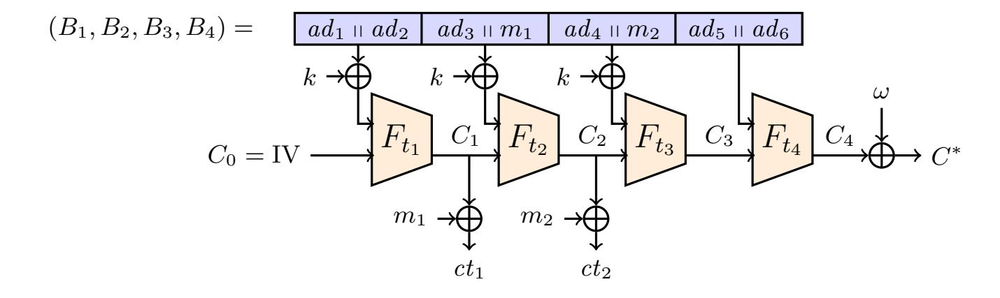

{0}------------------------------------------------

An extended abstract of this article appears in the proceedings of [ESORICS 2020](https://www.surrey.ac.uk/esorics-2020) [\[13\]](#page-14-0). This is the full version and available as entry [2020/847](https://eprint.iacr.org/2020/847) in the IACR [eprint](https://eprint.iacr.org) archive [\[14\]](#page-14-1). Note that an improved version of our protocol is described in [\[11,](#page-14-2) [12\]](#page-14-3).

# **Encrypt-to-self: Securely Outsourcing Storage**

Jeroen Pijnenburg<sup>1</sup> and Bertram Poettering<sup>2</sup>

<sup>1</sup> Royal Holloway, University of London, Egham, United Kingdom jeroen.pijnenburg.2017@ @rhul.ac.uk 2 IBM Research – Zurich, Rüschlikon, Switzerland

poe@ @zurich.ibm.com

**Abstract.** We put forward a symmetric encryption primitive tailored towards a specific application: outsourced storage. The setting assumes a memory-bounded computing device that inflates the amount of volatile or permanent memory available to it by letting other (untrusted) devices hold encryptions of information that they return on request. For instance, web servers typically hold for each of the client connections they manage a multitude of data, ranging from user preferences to technical information like database credentials. If the amount of data per session is considerable, busy servers sooner or later run out of memory. One admissible solution to this is to let the server *encrypt* the session data *to itself* and to let the client store the ciphertext, with the agreement that the client reproduce the ciphertext in each subsequent request (e.g., via a cookie) so that the session data can be recovered when required.

In this article we develop the cryptographic mechanism that should be used to achieve confidential and authentic data storage in the encrypt-to-self setting, i.e., where encryptor and decryptor coincide and constitute the only entity holding keys. We argue that standard authenticated encryption represents only a suboptimal solution for preserving confidentiality, as much as message authentication codes are suboptimal for preserving authenticity. The crucial observation is that such schemes instantaneously give up on *all* security promises in the moment the key is compromised. In contrast, data protected with our new primitive remains fully integrity protected and unmalleable. In the course of this paper we develop a formal model for encrypt-to-self systems, show that it solves the outsourced storage problem, propose surprisingly efficient provably secure constructions, and report on our implementations.

# <span id="page-0-0"></span>**1 Introduction**

We explore techniques that enable a computing device to securely outsource the storage of data. We start with motivating this area of research by describing three application scenarios where outsourcing storage might prove crucial.

Web Server. We come back to the example considered in the abstract, giving more details. While it is difficult to make general statements about the setup of a web server back-end, it is fair to say that the processing of HTTP requests routinely also includes extracting a session identifier from the HTTP header and fetching basic session-related information (e.g., the user's password, the date and time of the last login, the number of failed login attempts, but also other kinds of data not related to security) from a possibly remote SQL database. To avoid the inherent bottleneck induced by the transmission and processing of the database query, such data can be cached on the web server, the limits of this depending only on the amount of available working memory (RAM). For some types of web applications and a large number of web sessions served simultaneously, these memory-imposed limits might represent a serious restriction to efficiency. This article scouts techniques that allow the web server to securely outsource the storage of session information to the (untrusted) web clients.

{1}------------------------------------------------

Hardware Security Module. An HSM is a computing device that performs cryptographic and other security-related operations on behalf of the owning user. While such devices are internally built from off-the-shelf CPUs and memory chips, a key concept of HSMs is that they are specially encapsulated to protect them against physical attacks, including various kinds of side channel analysis. One consequence of this tamper-proof shielding is that the memory capacity of an HSM can never be physically extended unlike it would be the case for desktop computers—so that the amount of available working memory might constitute a relevant obstacle when the HSM is deployed in applications with requirements that increase over time (e.g., due to a growing user base). This article scouts techniques that allow the HSM to securely outsource the storage of any kind of valuable information to the (untrusted) embedding host system.

Smartcard. A smartcard, most prominently recognized in the form of a payment card or a mobile phone security token, is effectively a tiny computing device. While fairly potent configurations exist (with 32-bit CPUs and a couple of 100KBs of memory), as the costs associated with producing a smartcard scales roughly linearly with the amount of implemented physical memory, in order to be cost effective, massproduced cards tend to come with only a small amount of memory. This article scouts techniques that allow smartcards to securely outsource the storage of valuable information to the infrastructure they connect to, e.g., a banking or mobile phone backbone, or a smartphone.

Trusted Platform Module. A TPM is a discrete security chip that is embedded into virtually all laptops and desktop PCs produced in the past decade. A TPM supports its host system by offering trusted cryptographic services and is typically relied upon by boot loaders and operating systems. TPMs are located conceptually between HSMs and smartcards, and as much as these they benefit from a secure option to outsource storage.

**Outsourced Storage based on Symmetric Cryptography.** If a computing device has access to some kind of external storage facility (a memory chip wired to it, a connected hard drive, cloud storage, etc.), then, intuitively, it can virtually extend the amount of memory available to it by outsourcing storage, i.e., by serializing data objects and communicating them to the storage facility which will reproduce them on request. In this article we focus on the case where neither the external storage facility nor the connection to it is considered trustworthy. More concretely, we assume that all infrastructure outside of the computing device itself is under control of an adversary that aims at reading or changing the data that is to be externally stored.[3](#page-1-0) As a first approximation one might conclude that standard tools from the domain of symmetric encryption are sufficient to achieve security in this setting. Consider for instance the following approach based on authenticated encryption (AE, [\[16\]](#page-14-4)): The computing device samples a fresh symmetric key; whenever it wants to store internal data on the outsourced storage, it encrypts and authenticates the data by invoking the AE encryption algorithm with its key and hands the resulting ciphertext over to the storage facility; to retrieve the data, it requests a copy of the ciphertext, and decrypts and verifies it. While this simple solution requires further tweaking to thwart replay attacks,[4](#page-1-1) as long as the AE key remains private it can be used to protect confidentiality and integrity as expected.

**Our Contribution: Secure Outsourced Storage w/ Key Leakage.** While we confirm that standard cryptographic methods will securely solve the storage outsourcing problem if the used key material remains private, we argue that satisfactory solutions should go a step further by providing as much security as possible even if the latter assumption (that keys remain private) is not met. Indeed, different attacks against practical systems that lead to partial or full memory leakage continue to regularly emerge (including different types of side channel analysis against embedded systems,[5](#page-1-2) cold-boot attacks

<span id="page-1-0"></span><sup>3</sup> Certainly, the storage device can always decide to "fail" by not returning any data previously stored into it, leading to an attack on the *availability* of the computing device. We hence consider environments where this is either not a problem or where such an attack cannot be prevented anyway (independently of the storage technique). Note that this assumption holds for our three motivating scenarios.

<span id="page-1-1"></span><sup>4</sup> One option to strengthen the scheme against replay is to implement the AE primitive nonce-based [\[17\]](#page-14-5), and using a strictly increasing nonce for encrypting and decrypting.

<span id="page-1-2"></span><sup>5</sup> [https://en.wikipedia.org/wiki/Side-channel\\_attack](https://en.wikipedia.org/wiki/Side-channel_attack)

{2}------------------------------------------------

against memory chips,<sup>6</sup> Meltdown/Spectre-like attacks against modern CPUs,<sup>78</sup> etc.), and it is commonly understood that the corruption model considered for cryptographic primitives should always be as strong as possible and affordable. For two-party symmetric encryption (e.g., AE) this strongest model necessarily excludes any type of user corruption<sup>9</sup> as the keys of both parties are identical: Once any party is corrupted, any past or future ciphertext can be decrypted and ciphertexts can be forged for any message, i.e., no form of confidentiality or authenticity remains. We point out, however, that for outsourced storage a stronger corruption model is both feasible and preferable. Clearly, like in the AE case, if the adversary obtains a copy of the used key material then all confidentiality guarantees are lost (the adversary can decrypt what the device can decrypt, that is, everything), but a similar reasoning with respect to integrity protection cannot be made. To see this, consider the encrypt-then-hash (EtH) solution where the computing device encrypts the outsourced data as described above, but in addition to having the ciphertext stored externally it internally registers a hash of it (computed with, say, SHA256). When the device decides to recover externally stored data, it requests a copy of the ciphertext, recomputes its hash value, and decrypts only if the hash value is consistent with the internally registered value. Note that even if the device is corrupted and its keys became public, all successfully decrypted ciphertexts are necessarily authentic.

The example just given shows that while no solution for secure storage outsourcing can do much about protecting data confidentiality against key leakage attacks, solutions can fully protect the integrity of the stored data in any case. Naive AE-based schemes do not provide this type of security, and the contribution of our work is to fill this gap and to explore corresponding constructions. Precisely, this article provides the following: (1) We identify the new encrypt-to-self (ETS) primitive as the right cryptographic tool to solve the outsourced storage problem and formalize its syntax and security properties. (2) We formalize notions more directly related to the outsourced storage problem and provably confirm that secure solutions based on ETS are indeed immediate. (3) We design provably secure constructions of ETS from established cryptographic primitives.<sup>10</sup> (4) We develop open-source implementations of our constructions that are optimized with respect to security and efficiency.

**Related Work.** While we are not aware of any former systematic treatment of the encrypt-to-self (ETS) primitive, a number of similar primitives or ad hoc constructions partially overlap with our results. We discuss these in the following, but emphasize that none of them provides general solutions to the ETS problem.

MEMORY ENCRYPTION IN MODERN CPUs. Recent desktop and server CPUs offer dedicated infrastructure for memory encryption, <sup>11</sup> with the main applications in cloud computing and Trusted Execution Environments (TEEs). Prominent TEE examples include Intel SGX<sup>12</sup> and ARM TrustZone<sup>13</sup> in which every memory access of the processes that are executed within a TEE (aka 'enclave') is conducted through a memory encryption engine (MEE). This effectively implements outsourced data storage, but with quite different access rules and patterns than in the ETS case. While we consider the (stateless) encryption of a message to a ciphertext and then a decryption of a ciphertext back to a message, MEEs are stateful systems that consider the protected physical memory area a single ciphertext that is constantly locally modified with each write operation [8].

Password Managers. A password manager can be seen as a database that stores security credentials in an encrypted form and requires e.g., a master password to be unlocked. Also this can be seen as an ETS instance, but the cryptographic design of password managers has a different focus than general outsourced storage. More concretely, the central challenge solved by good password managers is the password-based key derivation, <sup>14</sup> which typically involves invoking a time-expensive derivation function

<span id="page-2-0"></span><sup>6</sup> https://en.wikipedia.org/wiki/Cold\_boot\_attack

<span id="page-2-1"></span><sup>7</sup> https://en.wikipedia.org/wiki/Meltdown\_(security\_vulnerability)

<span id="page-2-2"></span><sup>8</sup> https://en.wikipedia.org/wiki/Spectre\_(security\_vulnerability)

<span id="page-2-4"></span><span id="page-2-3"></span><sup>&</sup>lt;sup>9</sup> We use the terms 'key leakage', 'user corruption', and 'state corruption' synonymously.

<sup>&</sup>lt;sup>10</sup> The above encrypt-then-hash (EtH) solution is secure in our models but requires two passes over the data. Our solutions are more efficient, getting along with just one pass.

<span id="page-2-5"></span><sup>11</sup> https://software.intel.com/en-us/blogs/2017/12/22/intel-releases-new-technology-specification-for-memory-encryption

<span id="page-2-6"></span><sup>12</sup> https://software.intel.com/en-us/sgx/details

<span id="page-2-7"></span><sup>13</sup> https://genode.org/documentation/articles/trustzone

<span id="page-2-8"></span>https://1password.com/files/1Password-White-Paper.pdf

{3}------------------------------------------------

like PBKDF2 [\[9\]](#page-14-7) or a memory-hard derivation function like ARGON2 [\[5\]](#page-14-8). Password-based key derivation is not considered in our treatment of the ETS primitive (we instead assume uniform keys).

Encryptment. A symmetric encryption option that recently emerged as a proposal to protect messages in instant messaging is Encryptment [\[7\]](#page-14-9). Its features go beyond regular authenticated encryption in that the tags contained in ciphertexts act as (cryptographically strongly binding) commitments to the encoded messages. This committing feature was deemed helpful for the public resolution of cyber harassment cases by allowing affected parties to appeal to a judging authority by opening their ciphertexts by releasing their keys. On first sight this has nothing to do with our ETS setting (in which only one party holds a key, this key would never be deliberately shared, and a necessity of provably releasing message contents to anybody else is not considered). Interestingly, however, our constructions of ETS are very similar to those of [\[7\]](#page-14-9). The intuitive reason for this is that the ETS setting requires that ciphertexts remain unforgeable under key leakage, which somewhat aligns with the committing property of encryptment that is required to survive disclosing keys to a judge. Ultimately, however, the applications and thus security models of ETS and encryptment differ, and our constructions are actually more efficient than those in [\[7\]](#page-14-9).[15](#page-3-0)

**Technical Approach.** In addition to formalizing the security of the encrypt-to-self (ETS) primitive, in the course of this article we also propose efficient provably-secure constructions from standardized building blocks. As discussed above, the authenticity promises of ETS shall withstand adversaries that have knowledge of the key material. In this setting one cannot hope that standard secret-key authentication building blocks like MACs or universal hash functions will be of help, as generically they lose all security when the key is leaked. We instead employ, as they manifest *unkeyed* authentication primitives, cryptographic hash functions like SHA256. A first candidate construction, already hinted at above, would be the encrypt-then-hash (EtH) approach where the message is first encrypted (using any secret key scheme, e.g., AES-CTR) and the ciphertext is then hashed. Our constructions are more efficient than this by exploiting the structure of Merkle–Damgård (MD) hash functions and dual-use leveraging on the properties of their inner building block: the compression function (CF). Intuitively, for authentication we build on the collision resistance of the CF, and for confidentiality we build on a PRF-like property of the CF. More precisely, our message schedule for the CF is such that each invocation provides both confidentiality *and* integrity for the processed block. This effectively halves the computational costs in comparison to the EtH approach.

We believe that a cryptographic analysis is not complete without also implementing the construction under consideration. This is because only implementing a scheme will enforce making conscious decisions about all its details and building blocks, and these decisions may crucially affect the obtained security and efficiency. We thus realized three ready-to-use instances of the ETS primitive, based on the CFs of the top performing hash functions SHA256, SHA512, and BLAKE2. In fact, observations from implementing the schemes led to considerable feedback to the theoretical design which was updated correspondingly. One example for this is connected to memory alignment: Computations on modern CPUs experience noticeable efficiency penalties if memory accesses are not aligned to specific boundaries. Our constructions reflect this at two different levels: at the register level and at the cache level (64 bit alignment for registeroriented operations, and 256 bit alignment for bulk memory transfers[16](#page-3-1)).

# **2 Preliminaries**

### **2.1 Notation**

All algorithms considered in this article may be randomized. We let N = {0*,* 1*, . . .*} and N <sup>+</sup> = {1*,* 2*, . . .*}. For the Boolean constants True and False we either write T and F, respectively, or 1 and 0, respectively, depending on the context. An alphabet *Σ* is any finite set of symbols or characters. We denote with *Σ<sup>n</sup>* the set of strings of length *n* and with *Σ*<sup>≤</sup>*<sup>n</sup>* the strings of length up to (and including) *n*. In the practical

<span id="page-3-0"></span><sup>15</sup> This is the case for at least two reasons: (1) The ETS primitive does not need to be committing to the key, which is the case for encryptment. (2) Our message padding is more sophisticated than that of [\[7\]](#page-14-9) and does not require the processing of a length field.

<span id="page-3-1"></span><sup>16</sup> The value 256 stems from the size of the cache lines of 1st level cache.

{4}------------------------------------------------

parts of this article we assume that  $|\Sigma| = 256$ , i.e., that all strings are byte strings. We denote string concatenation with  $\square$ . If var is a string variable and exp evaluates to a string, we write  $var \vdash exp$  shorthand for  $var \leftarrow var \sqcap exp$ . Further, if exp evaluates to a string, we write  $var \sqcap var' \leftarrow_n exp$  to denote splitting exp such that we assign the first n characters from exp to var and assign the remainder to var'. When we do not need the remainder, we write  $var \leftarrow_n exp$  shorthand for  $var \sqcap dummy \leftarrow_n exp$  and discard dummy. In pseudocode, if S is a finite set, expression S(S) stands for picking an element of S uniformly at random. Associative arrays implement the 'dictionary' data structure: Once the instruction  $A[\cdot] \leftarrow exp$  initialized all items of array A to the default value exp, with  $A[idx] \leftarrow exp$  and  $var \leftarrow A[idx]$  individual items indexed by expression idx can be updated or extracted.

### <span id="page-4-1"></span>2.2 Security Games

Security games are parameterized by an adversary, and consist of a main game body plus zero or more oracle specifications. The execution of a game starts with the main game body and terminates when a 'Stop with exp' instruction is reached, where the value of expression exp is taken as the outcome of the game. The adversary can query all oracles specified by the game, in any order and any number of times. If the outcome of a game G is Boolean, we write  $\Pr[G(\mathcal{A})]$  for the probability that an execution of G with adversary  $\mathcal{A}$  results in True, where the probability is over the random coins drawn by the game and the adversary. We define macros for specific combinations of game-ending instructions: We write 'Win' for 'Stop with T' and 'Lose' for 'Stop with F', and further 'Reward cond' for 'If cond: Win', 'Promise cond' for 'If cond: Win', 'Require cond' for 'If cond: Lose'. These macros emphasize the specific semantics of game termination conditions. For instance, a game may terminate with 'Reward cond' in cases where the adversary arranged for a situation—indicated by cond resolving to True—that should be awarded a win (e.g., the crafting of a forgery in an authenticity game).

#### <span id="page-4-2"></span>2.3 Handling of Algorithm Failures

Regarding the algorithms of cryptographic schemes, we assume that any such algorithm can fail. Here, by failure we mean that an algorithm doesn't generate output according to its syntax specification, but instead outputs some kind of error indicator (e.g., an AE decryption algorithm that rejects an unauthentic ciphertext or a randomized signature algorithm that doesn't have sufficiently many random bits to its disposal). Instead of encoding this explicitly in syntactical constraints which would clutter the notation, we assume that if an algorithm invokes another algorithm as a subroutine, and the latter fails, then also the former immediately fails.<sup>17</sup> We assume the same for game oracles: If an invoked scheme algorithm fails, then the oracle immediately aborts as well. Further, we assume that the adversary learns about this failure, i.e., the oracle will return the error indicator when it aborts. Note that this implies that if a scheme's algorithms leak vital information through error messages, then the scheme will not be secure in our models. (That is, our models are particularly robust.) We believe that our way to handle errors implicitly rather than explicitly contributes to obtaining definitions with clean and clear semantics.

### <span id="page-4-3"></span>2.4 Memory Alignment

For n a power of 2, we say an address of computer memory is n-byte aligned if it is a multiple of n bytes. We further say that a piece of data is n-byte aligned if the address of its first byte is n-byte aligned. A modern CPU accesses a single (aligned) word in memory at a time. Therefore, the CPU performs reads and writes to memory most efficiently when the data is aligned. For example, on a 64-bit machine, 8 bytes of data can be read or written with a single memory access if the first byte lies on an 8-byte boundary. However, if the data does not lie within one word in memory, the processor would need to access two memory words, which is considerably less efficient. Our scheme algorithms are designed such that when they need to move around data, they exclusively do this for aligned addresses. In practice, the preferred alignment value depends on the hardware used, so for generality in this article we refer to it abstractly as the memory alignment value may. (A typical value would be may = 8.)

<span id="page-4-0"></span>This approach to handling algorithm failures is taken from [15] and borrows from how modern programming languages handle 'exceptions', where any algorithm can raise (or 'throw') an exception, and if the caller does not explicitly 'catch' it, the caller is terminated as well and the exception is passed on to the next level. See Wikipedia: Exception\_handling\_syntax for exception handling syntaxes of many different programming languages.

{5}------------------------------------------------

### <span id="page-5-3"></span>**2.5 Tweaking the Compression Functions of Hash Functions**

The main NIST hash functions of the SHA2 family (FIPS 180-4, [\[10\]](#page-14-11)) accomplish their task of hashing a message into a short string by strictly following the Merkle–Damgård framework: All inputs to their core building block —the compression function— are either directly taken from the message or from the chaining state. It has been recognized, however, that options to further contextualize or domain-separate the inputs of compression functions can be of advantage. Indeed, compression functions that are designed according to the alternative, more recent HAIFA framework [\[4\]](#page-14-12) have a number of additional inputs, for instance an explicit salt input, that allow for weaving some extra bits of context information into the bulk hash operations. A concrete example for this is the compression function of the popular BLAKE2 hash function ([\[2,](#page-14-13) [18\]](#page-14-14), a HAIFA design), which takes as an additional input a Boolean finalization flag that is to be set specifically when processing the very last (padded) block of a hash computation. The idea behind making the last invocation "special" is that this effectively thwarts length extension attacks: While conducting extension attacks against the SHA2 hash functions, where the compression functions do not natively support any such marking mechanism, is quite immediate,[18](#page-5-0) similar attacks against BLAKE2 are impossible [\[6\]](#page-14-15). We note that, generally speaking, an ad hoc way of augmenting the input of a compression function by an additional small number of bits is to XOR predefined constants into the hashing state (e.g., before or while the compression function is executed), with the choice of constants depending on the added bits. For instance, if the finalization flag is set, the BLAKE2 compression function will flip all bits of one of its inputs, but beyond that operate as normal.

While textbook SHA2 does not support contextualizing compression function invocations via additional inputs, we observe that NIST, in order to solve an emerging domain-separation problem in the definition of their FIPS 180-4 standard, employed ad hoc modifications of some SHA2 functions that can be seen as (implicitly) retrofitting a one-bit additional input into the compression function. Concretely, the SHA512/*t* functions [\[10\]](#page-14-11), that intuitively represent plain SHA512 truncated to 0 *< t <* 512 bits, are carefully designed such that for any *t*<sup>1</sup> 6= *t*<sup>2</sup> the functions SHA512/*t*<sup>1</sup> and SHA512/*t*<sup>2</sup> are independent of each other.[19](#page-5-1) The separation of the individual SHA512/*t* versions works as follows [\[10,](#page-14-11) Sec. 5.3.6]: First compute the SHA512 hash value of the string "SHA512/xxx" (where placeholder xxx is replaced by the decimal encoding of *t*), then XOR the byte value 0xa5 (binary: 0b10100101) into every byte of the resulting chain state, then continue with regular SHA512 steps from that state on, truncating the final hash value to *t* bits. While the XORing step is ad hoc, it arguably represents a fairly robust domain separation method for SHA2.

Our constructions of the encrypt-to-self primitive rely on compression functions that are *tweaked* with a single bit, that is, that support one bit as an additional input. When we implement this based on SHA2 compression functions, we employ precisely the mechanism scouted by NIST: When the additional tweak bit is set, we XOR constant 0xa5 into all state bytes and continue operation as normal. Our BLAKE2 based construction, on the other hand, uses the already existing finalization bit.

# **3 Foundations of Encrypt-to-Self**

The overall goal of this article is to provide a secure solution for outsourced storage. We identified the novel encrypt-to-self (ETS) primitive, which provides one-time secure encryption with authenticity guarantees that hold beyond key compromise, as the right tool to construct outsourced storage.[20](#page-5-2) In this section we first formalize and study ETS, then formalize outsourced storage, and finally show how the former immediately implies the latter. This allows us to leave the outsourced storage topic aside in the remaining part of the paper and lets us instead fully focus on constructing and implementing ETS.

### **3.1 Syntax and Security of ETS**

ETS consists of an encryption and a decryption algorithm, where the former translates a message to a binding tag and a ciphertext, and the latter recovers the message from the tag-ciphertext pair. For

<span id="page-5-0"></span><sup>18</sup> For instance, an adversary who doesn't know a value *x* but instead the values *H*(*x*) and *y*, can compute *H*(*x* q *y*) by just continuing the iterative MD computation from chain value *H*(*x*) on. Note this does not require inverting the compression function.

<span id="page-5-1"></span><sup>19</sup> In particular, for instance, SHA512/128("a") is not a prefix of SHA512/192("a").

<span id="page-5-2"></span><sup>20</sup> While ETS is novel, note that prior work explored the quite similar Encryptment primitive [\[7\]](#page-14-9). Encryptment is stronger than ETS, and less efficient to construct.

{6}------------------------------------------------

<span id="page-6-10"></span><span id="page-6-9"></span><span id="page-6-8"></span><span id="page-6-7"></span><span id="page-6-2"></span>

| Game $SAFE(ad, m, A)$                                 | Game $INT(ad, m, A)$                                  | Game $\mathrm{IND}^b(ad,m^0,m^1,\mathcal{A})$         |
|-------------------------------------------------------|-------------------------------------------------------|-------------------------------------------------------|
| 00 $k \leftarrow \$(\mathcal{K})$                     | 09 $k \leftarrow \$(\mathcal{K})$                     | 17 $k \leftarrow \$(\mathcal{K})$                     |
| 01 $(bt,c) \leftarrow \operatorname{enc}(k,ad,m)$     | 10 $(bt,c) \leftarrow \operatorname{enc}(k,ad,m)$     | 18 Require $m^0 \equiv m^1$                           |
| 02 Invoke $\mathcal{A}(k, ad, m, bt, c)$              | 11 Invoke $\mathcal{A}(k, ad, m, bt, c)$              | 19 $(bt,c) \leftarrow \operatorname{enc}(k,ad,m^b)$   |
| 03 Lose                                               | 12 Lose                                               | 20 $b' \leftarrow \mathcal{A}(ad, m^0, m^1, bt, c)$   |
| Oracle $Dec(ad', c')$                                 | Oracle $Dec(ad', c')$                                 | 21 Stop with $b'$                                     |
| 04 $m' \leftarrow \operatorname{dec}(k, bt, ad', c')$ | 13 $m' \leftarrow \operatorname{dec}(k, bt, ad', c')$ | Oracle $Dec(ad', c')$                                 |
| 05 If $(ad', c') = (ad, c)$ :                         | 14 Reward $(ad', c') \neq (ad, c)$                    | 22 $m' \leftarrow \operatorname{dec}(k, bt, ad', c')$ |
| 06 Promise $m' = m$                                   | 15 $m' \leftarrow \bot$                               | 23 If $(ad', c') = (ad, c)$ :                         |
| 07 $m' \leftarrow \bot$                               | 16 Return $m'$                                        | $24  m' \leftarrow \bot$                              |
| 08 Return $m'$                                        |                                                       | 25 Return $m'$                                        |

<span id="page-6-6"></span><span id="page-6-4"></span><span id="page-6-3"></span><span id="page-6-0"></span>**Fig. 1.** Games for ETS. For the values ad', c' provided by the adversary we require that  $ad' \in \mathcal{AD}, c' \in \mathcal{C}$ . Assuming  $\bot \notin \mathcal{M}$ , we encode suppressed messages with  $\bot$ . For the meaning of instructions Stop with, Lose, Promise, Reward, and Require see Sec. 2.2.

versatility the two operations further support the processing of an associated-data input [16] which has to be identical for a successful decryption.

The task of the binding tag is to prevent forgery attacks: A user that holds an authentic copy of the binding tag will never accept any ciphertext they did not generate themselves, even if all their secrets become public. Note that while standard authenticated encryption (AE) does not provide this type of authentication, the encrypt-then-hash construction suggested in Sec. 1 does. In Sec. 4 we provide a considerably more efficient construction that uses a hash function's compression function as its core building block. Here, we define the generic syntax of ETS and formalize its security requirements.

**Definition 1.** Let  $\mathcal{AD}$  be an associated data space and let  $\mathcal{M}$  be a message space. An encrypt-to-self (ETS) scheme for  $\mathcal{AD}$  and  $\mathcal{M}$  consists of algorithms enc, dec, a key space  $\mathcal{K}$ , a binding-tag space  $\mathcal{B}t$ , and a ciphertext space  $\mathcal{C}$ . The encryption algorithm enc takes a key  $k \in \mathcal{K}$ , associated data  $ad \in \mathcal{AD}$  and a message  $m \in \mathcal{M}$ , and returns a binding tag  $bt \in \mathcal{B}t$  and a ciphertext  $c \in \mathcal{C}$ . The decryption algorithm dec takes a key  $k \in \mathcal{K}$ , a binding tag  $bt \in \mathcal{B}t$ , associated data  $ad \in \mathcal{AD}$  and a ciphertext  $c \in \mathcal{C}$ , and returns a message  $m \in \mathcal{M}$ . A shortcut notation for this API is

$$\mathcal{K} \times \mathcal{A}\mathcal{D} \times \mathcal{M} \to \text{enc} \to \mathcal{B}t \times \mathcal{C}$$
  $\mathcal{K} \times \mathcal{B}t \times \mathcal{A}\mathcal{D} \times \mathcal{C} \to \text{dec} \to \mathcal{M}$ .

CORRECTNESS AND SECURITY. We require of an ETS scheme that if a message m is processed to a tag-ciphertext pair with associated data ad, and a message m' is recovered from this pair using the same associated data ad, then the messages m, m' shall be identical. This is formalized via the SAFE game in Fig. 1.<sup>21</sup> In particular, observe that if the adversary queries Dec(ad, c) (for the authentic ad and c that it receives in line 02) and the dec procedure produces output m', the game promises that m' = m (lines 05,06). Recall from Sec. 2.2 that this means the game stops with output T if  $m' \neq m$ . Intuitively, the scheme is safe if we can rely on m' = m, that is, if the maximum advantage  $Adv^{safe}(A) := \max_{ad \in \mathcal{AD}, m \in \mathcal{M}} Pr[SAFE(ad, m, A)]$  that can be attained by realistic adversaries  $\mathcal{A}$  is negligible. The scheme is perfectly safe if  $Adv^{safe}(A) = 0$  for all  $\mathcal{A}$ . We remark that the universal quantification over all pairs (ad, m) makes our advantage definition particularly robust.

Our security notions demand that the integrity of ciphertexts be protected (INT-CTXT), and that encryptions be indistinguishable in the presence of chosen-ciphertext attacks (IND-CCA). The notions are formalized via the INT and IND<sup>0</sup>, IND<sup>1</sup> games in Fig. 1, where the latter two depend on some equivalence relation  $\equiv \subseteq \mathcal{M} \times \mathcal{M}$  on the message space.<sup>22</sup> For consistency, in lines 07,15,24 we suppress the message

<span id="page-6-1"></span>The SAFETY term borrows from the Distributed Computing community. SAFETY should not be confused with a notion of security. Informally, safety properties require that "bad things" will not happen. (In the case of encryption, it would be a bad thing if the decryption of an encryption yielded the wrong message.) For an initial overview we refer to Wikipedia: Safety\_property and for the details to [1].

<span id="page-6-5"></span>We use relation  $\equiv$  (in line 18 of IND<sup>b</sup>) to deal with certain restrictions that practical ETS schemes may feature. Concretely, our construction does not take effort to hide the length of encrypted messages, implying that indistinguishability is necessarily limited to same-length messages. In our formalization such a technical restriction can be expressed by defining  $\equiv$  such that  $m^0 \equiv m^1 \Leftrightarrow |m^0| = |m^1|$ .

{7}------------------------------------------------

in all games if the adversary queries  $\operatorname{Dec}(ad,c)$ . This is crucial in the  $\operatorname{IND}^b$  games, as otherwise the adversary would trivially learn which message was encrypted, but does not harm in the other games as the adversary already knows m. Recall from Sec. 2.3 that all algorithms can fail, and if they do, then the oracles immediately abort. This property is crucial in the INT game where the dec algorithm must fail for unauthentic input such that the oracle immediately aborts. Otherwise, the game will reward the adversary, that is the game stops with T (line 14). We say that a scheme provides  $\operatorname{integrity}$  if the maximum advantage  $\operatorname{Adv}^{\operatorname{int}}(\mathcal{A}) := \max_{ad \in \mathcal{AD}, m \in \mathcal{M}} \Pr[\operatorname{INT}(ad, m, \mathcal{A})]$  that can be attained by realistic adversaries  $\mathcal{A}$  is negligible, and that it provides  $\operatorname{indistinguishability}$  if the same holds for the advantage  $\operatorname{Adv}^{\operatorname{ind}}(\mathcal{A}) := \max_{ad \in \mathcal{AD}, m^0, m^1 \in \mathcal{M}} |\Pr[\operatorname{IND}^1(ad, m^0, m^1, \mathcal{A})] - \Pr[\operatorname{IND}^0(ad, m^0, m^1, \mathcal{A})]|$ .

#### 3.2 Sufficiency of ETS for Outsourced Storage

We define the syntax of an outsourced storage scheme. We model such a scheme as a set of stateful algorithms, where algorithm write is invoked to store data and algorithm read is invoked to retrieve it. We indicate the statefulness of the algorithms by appending the term  $\langle st \rangle$  to their names, where st is the state variable.

**Definition 2.** Let  $\mathcal{M}$  be a message space. A storage outsourcing scheme for  $\mathcal{M}$  consists of algorithms gen, write, read, a state space  $\mathcal{ST}$ , and a ciphertext space  $\mathcal{C}$ . The state generation algorithm gen takes no input and outputs an (initial) state  $st \in \mathcal{ST}$ . The storage algorithm write takes a state  $st \in \mathcal{ST}$  and a message  $m \in \mathcal{M}$ , and outputs an (updated) state  $st \in \mathcal{ST}$  and a ciphertext  $c \in \mathcal{C}$ . The retrieval algorithm read takes a state  $st \in \mathcal{ST}$  and a ciphertext  $c \in \mathcal{C}$ , and outputs an updated state  $st \in \mathcal{ST}$  and a message  $m \in \mathcal{M}$ . A shortcut notation for this API is

$$\operatorname{gen} \to \mathcal{ST}$$
  $\mathcal{M} \to \operatorname{write}\langle \mathcal{ST} \rangle \to \mathcal{C}$   $\mathcal{C} \to \operatorname{read}\langle \mathcal{ST} \rangle \to \mathcal{M}$ .

Correctness and Security. We require of a storage outsourcing scheme that if a message m is processed to a ciphertext, and subsequently a message m' is recovered from this ciphertext, then the messages m, m' shall be identical. This is formalized via the SAFE game in Fig. 2. Observe boolean flag is ('in-sync') tracks whether the attack is active or passive. Initially is = T, i.e., the attack is passive; however, once the adversary requests the reading of a ciphertext that is not the last created one, the game sets  $is \leftarrow F$  to flag the attack as active (line 11). For passive attacks the game promises that any m returned by the read procedure is the last one that was processed by the write procedure (line 13). Intuitively, the scheme is safe if the maximum advantage  $Adv^{safe}(A) := Pr[SAFE(A)]$  that can be attained by realistic adversaries A is negligible. The scheme is perfectly safe if  $Adv^{safe}(A) = 0$  for all A.

Our security notions demand that the integrity of ciphertexts be protected (INT-CTXT), and that encryptions be indistinguishable in the presence of chosen-ciphertext attacks (IND-CCA). The notions are formalized via the INT and IND<sup>0</sup>, IND<sup>1</sup> games in Fig. 2, where the latter two depend on some equivalence relation  $\equiv \subseteq \mathcal{M} \times \mathcal{M}$  on the message space (see also Footnote 22). Recall from Sec. 2.3 that all algorithms can fail, and if they do, the oracles immediately abort. This property is crucial in the INT game where the read algorithm must fail for unauthentic input such that the adversary is not rewarded in the subsequent line in the Read oracle. For consistency we suppress the message in the Read oracle for passive attacks in all games if the adversary queries Dec(ad, c). This is crucial in the IND<sup>b</sup> games, as otherwise the adversary would trivially learn which message was encrypted, but does not harm in the other games as the adversary already knows m for passive attacks. Furthermore, we remark the adversary is only allowed to query the Corrupt oracle if M contains at most 1 message, i.e., the ChWrite oracle was queried for  $m^0 = m^1$ . Otherwise, the adversary would be able to run the read procedure and trivially learn m. We say that a scheme provides integrity if the maximum advantage  $Adv^{int}(A) := Pr[INT(A)]$  that can be attained by realistic adversaries A is negligible, and that it provides indistinguishability if the same holds for the advantage  $Adv^{ind}(A) := |Pr[IND^1(A)] - Pr[IND^0(A)]|$ .

Construction from ETS. Constructing secure outsourced storage from ETS is immediate: The write procedure samples a uniformly random key and runs the enc procedure of ETS to obtain a binding tag and ciphertext. It stores the binding tag (and key) in the state and returns the ciphertext. The read procedure gets the key and binding tag from the state, runs the dec procedure of ETS and returns the message. The details of this construction are in Fig. 3. The security argument is obvious.

{8}------------------------------------------------

| Game SAFE(A)<br>00 C, M ← ∅<br>01 is ← T<br>02 st ← gen<br>03 Invoke A<br>04 Lose                                                                                                                                                      | Game INT(A)<br>16 C ← ∅<br>17 is ← T<br>18 st ← gen<br>19 Invoke A<br>20 Lose                                                                                                                                                   | Game INDb<br>(A)<br>30 C, M ← ∅<br>31 is ← T<br>32 st ← gen<br>0 ← A<br>33 b<br>0<br>34 Stop with b                                                                                                                                                                                                                      |
|----------------------------------------------------------------------------------------------------------------------------------------------------------------------------------------------------------------------------------------|---------------------------------------------------------------------------------------------------------------------------------------------------------------------------------------------------------------------------------|--------------------------------------------------------------------------------------------------------------------------------------------------------------------------------------------------------------------------------------------------------------------------------------------------------------------------|
| Oracle Write(m)<br>05 c ← writehsti(m)<br>06 If is:<br>C ← {c}<br>07<br>M ← {m}<br>08<br>09 Return c<br>Oracle Read(c)<br>10 m ← readhsti(c)<br>11 If c /∈ C: is ← F<br>12 If is:<br>Promise m ∈ M<br>13<br>m ← ⊥<br>14<br>15 Return m | Oracle Write(m)<br>21 c ← writehsti(m)<br>22 If is: C ← {c}<br>23 Return c<br>Oracle Read(c)<br>24 m ← readhsti(c)<br>25 If c /∈ C: is ← F<br>26 Promise is<br>27 If is: m ← ⊥<br>28 Return m<br>Oracle Corrupt<br>29 Return st | Oracle ChWrite(m0<br>, m1<br>)<br>35 Require m0 ≡<br>m1<br>36 c ← writehsti(mb<br>)<br>37 If is:<br>C ← {c}<br>38<br>M ← {m0<br>, m1<br>}<br>39<br>40 Return c<br>Oracle Read(c)<br>41 m ← readhsti(c)<br>42 If c /∈ C: is ← F<br>43 If is: m ← ⊥<br>44 Return m<br>Oracle Corrupt<br>45 Require  M  ≤ 1<br>46 Return st |

<span id="page-8-3"></span><span id="page-8-2"></span><span id="page-8-1"></span>**Fig. 2.** Games for outsourced storage. For all values *m, m*<sup>0</sup> *, m*<sup>1</sup> *, c* provided by the adversary we require that *m, m*<sup>0</sup> *, m*<sup>1</sup> ∈ M and *c* ∈ C. Assuming ⊥ ∈ M*/* , we encode suppressed messages with ⊥. Boolean flag *is* ('in-sync') tracks whether the attack is active or passive. For the meaning of instructions Stop with, Lose, Promise, and Require see Sec. [2.2.](#page-4-1)

<span id="page-8-6"></span><span id="page-8-5"></span>

| Proc gen     | Proc writehsti(m)        | Proc readhsti(c)       |
|--------------|--------------------------|------------------------|
| 00 S ← ∅     | 03 k ← \$(K)             | 07 Require S 6= ∅      |
| 01 st := S   | 04 (bt, c) ← enc(k, , m) | 08 {(k, bt)} ← S       |
| 02 Return st | 05 S ← {(k, bt)}         | 09 m ← dec(k, bt, , c) |
|              | 06 Return c              | 10 Return m            |

<span id="page-8-4"></span>**Fig. 3.** Construction for outsourced storage from ETS. If in line [07](#page-8-5) the condition is not met, the read algorithm aborts with some error indicator. Recall from Sec. [2.3](#page-4-2) that the read algorithm also aborts if the dec invocation in line [09](#page-8-6) fails.

# <span id="page-8-0"></span>**4 Construction of Encrypt-to-Self**

We mentioned in Sec. [1](#page-0-0) that a generic construction of ETS can be realized by combining standard symmetric encryption with a cryptographic hash function: one encrypts the message and computes the binding tag as the hash of the ciphertext. Here we provide a more efficient construction that builds on the compression function of a Merkle–Damgård hash function. To be more precise, our construction uses a tweakable compression function with tweak space *T* = {0*,* 1}, i.e., the domain of the compression function is extended by one bit (see Sec. [2.5\)](#page-5-3). We provide a general definition below.

**Definition 3.** *For Σ an alphabet, c, d* ∈ N <sup>+</sup> *with c* ≤ *d, and a tweak space T, we define a* tweakable compression function *to be a function F* : *Σ<sup>d</sup>* × *T* × *Σ<sup>c</sup>* → *Σ<sup>c</sup> that takes as input a block B* ∈ *Σ<sup>d</sup> from the data domain, a tweak t* ∈ *T from the tweak space, and a string C* ∈ *Σ<sup>c</sup> from the chain domain, and outputs a string C* <sup>0</sup> ∈ *Σ<sup>c</sup> in the chain domain.*

We will write *Ft*(*B, C*) as shorthand notation for *F*(*B, t, C*). For practical tweakable compression functions the memory alignment value mav (see Sec. [2.4\)](#page-4-3) will divide both *c* and *d*. When constructing an ETS scheme from *F*, because the compression function only takes fixed-size input, we need to map the (*ad, m*) input to a series of block–tweak pairs (*B, t*). We will refer to this mapping as the input encoding. We take a modular approach by fixing the encoding independently of the encryption engine, and detail the former in Sec. [4.1](#page-9-0) and the latter in Sec. [4.2.](#page-11-0) Together they form an efficient construction of ETS.

{9}------------------------------------------------



<span id="page-9-1"></span>**Fig. 4.** Example for  $\operatorname{enc}(k, ad, m)$  where d = 2c and  $ad = ad_1 \parallel \ldots \parallel ad_6$  and  $m = m_1 \parallel m_2$  with |ad| = 6c and |m| = 2c. For clarity we have made the blocks  $B_i$ , as they are output by the encoding function, explicit. Inspiration for this figure is drawn from https://www.iacr.org/authors/tikz/.

We first convey a rough overview of our ETS construction. In Fig. 4 we consider an example with block size d double the chaining value size c. We assume that key k is padded to size d. The first block  $B_1$  only contains associated data and we XOR  $B_1$  with the key k before we feed it into the compression function. From the second block, we start processing message data. We fill the first half of the block with associated data  $ad_3$  and the second half with message data  $m_1$ , and XOR with the key. We also XOR  $m_1$  with the current chaining value  $C_1$ , to generate a partial ciphertext  $ct_1$ . The same happens in the third block and we append  $ct_2$  to the ciphertext. If there is associated data left after processing all message data we can load the entire block with associated data, which occurs in the fourth block. Note, we no longer need to XOR the key into the block after we have processed all message data, because at this point the input to the compression function will already be independent of the message m. After processing all blocks, we XOR an offset  $\omega \in \{\omega_0, \omega_1\}$  with the chaining value, where  $\omega_0, \omega_1$  are two distinct constants. The binding tag will be (a truncation of) the last chaining value  $C^*$ . Note that the task of the encoding is not only to partition ad and m into blocks  $B_1, B_2, \ldots$  as described, but also to derive tweak values  $t_1, t_2, \ldots$  and the choice of the final offset  $\omega$  in such a way that the overall encoding is injective.

### <span id="page-9-0"></span>4.1 Message Block Encoding

We turn to the technical component of our ETS construction that encodes the (ad, m) input into a series of output pairs (B, t) and the final offset value  $\omega$ . For authenticity we require that the encoding is injective. For efficiency we require that the encoding is online (i.e., the input is read only once, left-to-right, and with small state), that the number of output pairs is as small as possible, and that the encoding preserves memory alignment (see Sec. 2.4). Syntactically, for the outputs we require that all  $B \in \Sigma^d$ , all  $t \in T$ , and  $\omega \in \Omega$ , where quantities c, d are those of the employed compression function,  $T = \{0, 1\}$ , and  $\Omega \subseteq \Sigma^c$  is any two-element set. (Note that |T| = 2 allows us to use the tweaking approach from Sec. 2.5; further, in our implementations we use  $\Omega = \{\omega_0, \omega_1\}$  where  $\omega_0 = 0 \times 00^c$  and  $\omega_1 = 0 \times a5^c$ .) Overall, the task we are facing is the following:

**Task.** Assume  $|\Sigma| = 256$  and  $\mathcal{AD} = \mathcal{M} = \Sigma^*$  and  $T = \{0,1\}$  and  $|\Omega| = 2$ . For  $c,d \in \mathbb{N}^+$ , c < d, find an injective encoding function encode:  $\mathcal{AD} \times \mathcal{M} \to (\Sigma^d \times T)^* \times \Omega$  that takes as input two finite strings and outputs a finite sequence of pairs  $(B,t) \in \Sigma^d \times T$  and an offset  $\omega \in \Omega$ .

A detailed specification of our encoding (and decoding) function can be found in Fig. 6, but we present it here in text. Our construction does not use the decoding function, but we provide it anyway to show that the encoding function is indeed injective. Roughly, we encode as follows. We fill the first block with associated data and for any subsequent block we load the associated data in the first part of the block and the message in the second part of the block. When we have processed all the message data, we load the full block with ad again. Clearly, we need to pad ad if it runs out before we have processed all message data. We do this by appending a special termination symbol  $\diamond \in \Sigma$  to ad and then appending null bytes as needed. Similarly, we need to pad the message if the message length is not a multiple of c. Naturally, one might want to pad the message to a multiple of c. However, this is suboptimal: Consider

<span id="page-9-2"></span>It will be crucial to fix  $\omega_0, \omega_1$  such that they are distinct also after truncation.

{10}------------------------------------------------

| q<br>0x00 q<br>0x00 q<br>0x00 q<br>(B1, B2, B3, B4) =<br>m1<br>m2<br>0x00<br>ad1 q<br>ad3 q<br>ad4 q<br>ad5 q<br>(B1, B2, B3, B4) =<br>ad2<br>m1<br>m2<br>ad6 | (B1, B2, B3, B4) = | ad1 q<br>ad2 | ad3 q<br>ad4 | ad5 q<br>ad6 | ad7 q<br>ad8 |
|---------------------------------------------------------------------------------------------------------------------------------------------------------------|--------------------|--------------|--------------|--------------|--------------|
|                                                                                                                                                               |                    |              |              |              | m3           |
|                                                                                                                                                               |                    |              |              |              |              |
| q<br>0x00 q<br>ad1 q<br>ad3 q<br>(B1, B2, B3, B4) =<br>m2<br>ad2<br>m1                                                                                        |                    |              |              |              | m3           |

<span id="page-10-0"></span>**Fig. 5.** Example encodings for the case *c* = 1 and *d* = 2.

the scenario where there are *d* − *c* + 1 bytes remaining to be processed of associated data and 1 byte of message data. In principle, message and associated data would fit into a single block, but this would not be the case any longer if the message is padded to size *c*. On the other hand, for efficiency reasons we do not want to misalign all our remaining associated data. If we do not pad at all, when we process the next *d* bytes of associated data, we can only fit *d* − 1 bytes in the block and have to put 1 byte into the next block. Therefore, we pad *m* up to a multiple of the memory alignment value mav. To be precise, we pad message with null bytes until reaching a multiple of mav. We replace the final (null) byte with the message length |*m*|; this will uniquely determine where *m* stops and the padding begins. This restricts us to *c* ≤ 256 bytes such that |*m*| always can be encoded into a single byte. As far as we are aware, any current practical compression function satisfies this requirement.

In Fig. [5,](#page-10-0) for the artificially small case with *c* = 1 and *d* = 2 we provide four examples of what the blocks would look like for different inputs. The top row shows the encoding of 8 bytes of associated data and an empty message. The second row shows the encoding of empty associated data and 3 bytes of message data. The third row shows the encoding of 6 bytes of associated data and 2 bytes of message data. The final row shows the encoding of 3 bytes of associated data and 3 bytes of message data.

We have two ambiguities remaining. (1) How to tell whether *ad* was padded or not? Consider the first row in Fig. [5.](#page-10-0) What distinguishes the case *ad* = *ad*<sup>1</sup> q *. . .* q *ad*<sup>7</sup> from *ad* = *ad*<sup>1</sup> q *. . .* q *ad*<sup>7</sup> q *ad*<sup>8</sup> with *ad*<sup>8</sup> = ? A similar question applies to the message. (2) How to tell whether a block contains message data or not? Compare e.g., the first row with the third row. This is where the tweaks come into play.

First of all, we tweak the first block if and only if the message is empty. This fully separates the authentication-only case from the case where we have message input.

Next, if the message is non-empty, we use the tweaks to indicate when we switch from processing message data to *ad*-only: we tweak when we have consumed all of *m*, but still have *ad* left. Note the first block never processes message data, so the earliest block this may tweak is the second block and hence this rule does not interfere with the first rule. Furthermore, observe this rule never tweaks the final block, as by definition of being the final block, we do not have any associated data left to process.

Next, we need to distinguish between the cases whether *m* is padded or not. In fact, as the empty message was already taken care of, we need to do this only if *m* is at least one byte in size. As in this case the final block does not coincide with the first block, we can exploit that its tweak is still unused; we correspondingly tweak the final block if and only if *m* is padded. Obviously, this does not interfere with the previous rules.

Finally, we need to decide whether *ad* was padded or not. We do not want to enforce a policy of 'always pad', as this could result in an extra block and hence an extra compression function invocation. Instead, we use our offset output. We set the offset *ω* to *ω*<sup>1</sup> if *ad* was padded; otherwise we set it to *ω*0.

This completes our description of the encoding function. The decoding function is a technical exercise carefully unwinding the steps taken in the encoding function, which we perform in Fig. [6.](#page-11-1) We obtain that for all *m* ∈ M*, ad* ∈ AD we have decode(encode(*ad, m*)) = (*ad, m*). It immediately follows that our encoding function is injective. For readability we have implemented the core functionality of the encoding in a coroutine called nxt, rather than a subroutine. Instead of generating the entire sequence of (*B, t*) pairs and returning the result, it will 'Yield' one pair and suspend its execution. The next time it is called (e.g., the next step in a for loop), it will resume execution from where it called 'Yield', instead of at the beginning of the function, with all of its state intact. The encode procedure is a simple wrapper that runs the nxt procedure and collects its output, but our authenticated encryption engine described in Sec. [4.2](#page-11-0) will call the nxt procedure directly.

{11}------------------------------------------------

```
Proc encode(ad, m)
                                                           Proc nxt(ad, m)
                                                                                                                           Proc enc(k, ad, m)
                                                           31 ad_padded \leftarrow F
00 S[·] \leftarrow ·; i \leftarrow 0
                                                                                                                           67 ct \leftarrow \epsilon; C \leftarrow IV; i \leftarrow 0
01 For (B, t) \in \operatorname{nxt}(ad, m):
                                                           32 m_padded \leftarrow [m = \epsilon]
                                                                                                                           68 For (B, t) \in \text{nxt}(ad, m):
                                                           33 m_final \leftarrow [m = \epsilon]
          If B \neq \epsilon:
                                                                                                                                      If B \neq \epsilon:
02
                                                                                                                           69
03
              i \leftarrow i + 1
                                                           34 \omega \leftarrow \omega_0; n \leftarrow 0
                                                                                                                                          i \leftarrow i + 1
                                                                                                                           70
04
              S[i] \leftarrow (B,t)
                                                           35 While ad \neq \epsilon \lor m \neq \epsilon:
                                                                                                                                          If i = 1 \lor m \neq \epsilon:
                                                                                                                           71
05
          Else: \omega \leftarrow t
                                                                      n \leftarrow n + 1
                                                                                                                           72
                                                                                                                                              B \leftarrow B \oplus k
                                                           36
06 Return (S, \omega)
                                                                                                                                          If i > 1 \land m \neq \epsilon:
                                                           37
                                                                      (B_n, t_n) \leftarrow (\epsilon, 0)
                                                                                                                           73
                                                                      If n = 1:
                                                                                                                                              j \leftarrow \min(c, |m|)
                                                                                                                           74
                                                           38
Proc decode(S, \omega)
                                                                          d' \leftarrow d
                                                           39
                                                                                                                           75
                                                                                                                                              m' \sqcup m \leftarrow_i m
07 ad \leftarrow \epsilon; m \leftarrow \epsilon
                                                                                                                                              C' \leftarrow_i C
                                                           40
                                                                      else:
                                                                                                                           76
08 n \leftarrow |\mathbf{S}|; j \leftarrow |\mathbf{S}|
                                                           41
                                                                          j \leftarrow -|m| \mod \max
                                                                                                                                               ct \stackrel{\shortparallel}{\leftarrow} m' \oplus C'
                                                                                                                           77
09 If n = 0:
                                                                          d' \leftarrow d - |m| - j
                                                           42
                                                                                                                                          C \leftarrow F_t(B,C)
                                                                                                                           78
          Return (ad, m)
10
                                                                      If |ad| < d':
                                                           43
                                                                                                                           79 bt \leftarrow_{\text{taglen}} C \oplus t
11 For i \leftarrow 1 to n:
                                                                          If not ad_padded:
                                                           44
                                                                                                                           80 Return (bt, ct)
12
          (B_i, t_i) \leftarrow S[i]
                                                           45
                                                                              \omega \leftarrow \omega_1
13 For i \leftarrow 1 to n-1:
                                                                                                                           Proc dec(k, bt, ad, ct)
                                                                              ad \stackrel{\shortparallel}{\leftarrow} \diamond
                                                           46
          If t_i = 1: j \leftarrow i
                                                                                                                           81 m \leftarrow \epsilon; C \leftarrow \text{IV}; i \leftarrow 0
14
                                                                              \mathrm{ad\_padded} \leftarrow \mathtt{T}
                                                           47
15 ad \stackrel{"}{\leftarrow} B_1
                                                                                                                           82 For (B, t) \in \text{nxt}(ad, ct):
                                                                          j \leftarrow d' - |ad|
                                                           48
16 For i \leftarrow 2 to j - t_n:
                                                                                                                                      If B \neq \epsilon:
                                                                                                                           83
                                                                          ad \stackrel{\shortparallel}{\leftarrow} 0^j
                                                           49
          B_i \sqcup B_i' \leftarrow_c B_i
17
                                                                                                                                          i \leftarrow i + 1
                                                                                                                           84
                                                                      B_n \sqcap ad \leftarrow_{d'} ad
                                                           50
          ad \stackrel{\shortparallel}{\leftarrow} B_i
                                                                                                                                          If i = 1 \lor ct \neq \epsilon:
18
                                                                                                                           85
                                                                      If n > 1 \land m \neq \epsilon:
                                                           51
          m \stackrel{\shortparallel}{\leftarrow} B'_i
                                                                                                                                              B \leftarrow B \oplus k
19
                                                                                                                           86
                                                                          If |m| < c:
                                                           52
20 If n > 1 \wedge t_n = 1:
                                                                                                                                          If i > 1 \land ct \neq \epsilon:
                                                                                                                           87
                                                           53
                                                                              m_padded \leftarrow 1
                                                                                                                                              If |ct| \ge c:
                                                                                                                           88
21
          B_j \sqcup l \leftarrow_{d-1} B_j
                                                                              j \leftarrow -|m| \mod \max
                                                           54
          p \leftarrow -l \mod \max
                                                                                                                                                  ct' \sqcap ct \leftarrow_c ct
22
                                                                                                                           89
                                                                              m \leftarrow m \parallel 0^{j-1} \parallel |m|
                                                           55
                                                                                                                                                  m \stackrel{\shortparallel}{\leftarrow} ct' \oplus C
23
          a \leftarrow d - l - p
                                                                                                                           90
                                                                          l \leftarrow \min(c, |m|)
                                                           56
                                                                                                                                                  B \xleftarrow{\oplus} 0^{d-c} \sqcup C
          ad \sqcap B_i \leftarrow_a B_i
                                                                                                                           91
24
                                                                          m' \sqcup m \leftarrow_l m
                                                           57
                                                                                                                                              Else:
                                                                                                                           92
          m \leftarrow_i B_i
25
                                                                          B_n \stackrel{\shortparallel}{\leftarrow} m'
                                                           58
                                                                                                                                                  C' \leftarrow_{|ct|} C
26 For i \leftarrow j + 1 to n:
                                                                                                                           93
                                                                      If m = \epsilon:
                                                           59
          ad \stackrel{\shortparallel}{\leftarrow} B_i
27
                                                                                                                                                  m \stackrel{\shortparallel}{\leftarrow} ct \oplus C'
                                                                                                                           94
                                                                          If ad = \epsilon:
                                                           60
28 If \omega = \omega_1:
                                                                                                                                                  j \leftarrow -|m| \mod \max
                                                                                                                           95
                                                                              t_n \leftarrow \text{m\_padded}
                                                           61
29
          Split ad \sqcup \diamond \sqcup 0^* \leftarrow ad
                                                                                                                                                  a \leftarrow d - |m| - j
                                                                                                                           96
                                                           62
                                                                          Else:
30 Return (ad, m)
                                                                                                                                                  B \stackrel{\oplus}{\leftarrow} 0^a \sqcap C' \sqcap 0^j
                                                                                                                           97
                                                           63
                                                                              t_n \leftarrow \text{m\_final}
                                                                                                                                          C \leftarrow F_t(B,C)
                                                                              m_{\text{final}} \leftarrow 0
                                                                                                                           98
                                                           64
                                                                                                                           99 bt' \leftarrow_{\text{taglen}} C \oplus t
                                                                      Yield (B_n, t_n)
                                                           65
                                                                                                                          100 If bt' \neq bt: Fail
                                                           66 Yield (\epsilon, \omega)
                                                                                                                          101 Return m
```

<span id="page-11-14"></span><span id="page-11-13"></span><span id="page-11-12"></span><span id="page-11-1"></span>**Fig. 6.** ETS construction: encoder, decoder, encryptor, and decryptor. (Procedure nxt is a coroutine for encode, enc, and dec, see text.) Using global constants may, c, d, taglen, and IV.

### <span id="page-11-0"></span>4.2 Encryption Engine

We now turn our focus to the encryption engine. We assume that the associated data and message are present in encoded format, i.e., as a sequence of pairs (B, t), where  $B \in \Sigma^d$  is a block and  $t \in \{0, 1\}$  is a tweak, and additionally an offset  $\omega \in \{\omega_0, \omega_1\}$ . To be precise, we will use the nxt procedure that generates the next (B, t) pair on the fly.

We specify the encryption and decryption algorithms in Fig. 6 and assume they are provided with a key of length d. As illustrated in Fig. 4, the main idea is to XOR the key with all blocks that are involved with message processing. For the skeleton of the construction, we initialize the chaining value C to IV and loop through the sequence of pairs (B,t) output by the encoding function, each iteration updating the chaining value  $C \leftarrow F_t(B,C)$ . We now describe each iteration of the enc procedure in more detail, where numbers in brackets refer to line numbers in Fig. 6. If the block is empty [69], we are in the final iteration and do not do anything. Otherwise, we check if we are in the first iteration or if we have message data left [71]. In this case we XOR the key into the block [72]. This ensures we start with an unknown input block and that subsequent inputs are statistically independent of the message block. If we only have ad remaining we can use the block directly as input to the compression function. If we have message data left we will encrypt it starting from the second block [73]. To encrypt, we take a chunk

{12}------------------------------------------------

of the message, XOR it with the chaining value of equal size and append the result to the ciphertext [74–77]. We only start encrypting from the second iteration as the first chaining value is public. Finally, we call the compression function  $F_t$  to update our chaining value [78]. Once we have finished the loop, the last pair (B,t) equals  $(\epsilon,\omega)$  by definition. So we XOR the offset  $\omega$  with the chaining value C and truncate the result to obtain the binding tag [79]. We return the binding tag along with the ciphertext.

The dec procedure is similar to the enc procedure but needs to be slightly adapted. Informally, the nxt procedure now outputs a block  $B = (ad \shortparallel ct)$  [82] instead of  $B = (ad \shortparallel m)$  [68]. Hence, we XOR with the chaining variable [91,97] such that the block becomes  $B = (ad \shortparallel m)$  and the compression function call takes equal input compared to the enc procedure. The case distinction handles the slightly different positioning of ciphertext in the blocks. Finally, there obviously is a check if the computed binding tag is equal to the stored binding tag [100].

#### 4.3 Security Analysis

In order to prove security, we need further assumptions on our compression function than the standard assumption of preimage resistance and collision resistance. For example, we need F to be difference unpredictable. Roughly, this notion says it is hard to find a pair (x,y) such that  $F(x) = F(y) \oplus z$  for a given difference z. Moreover, we truncate the binding tag, so actually it should be hard to find a tuple such that this equation holds for the first |bt| bits. We note collision resistance of F does not imply collision resistance of a truncated version of F [3]. However, such assumptions could be justified when one considers the compression function as a random function. Hence, instead of several ad hoc assumptions, we prove our construction secure directly in the random oracle model.

As described in Sec. 2.5 we tweak the SHA2 compression function by modifying the chaining value depending on the tweak. Let F be the tweakable compression function in Fig. 6, We write F' for the SHA2 compression function that will take as input the block and the (modified) chaining value. Let  $H: \Sigma^d \times \Sigma^c \to \Sigma^c$  be a random oracle. In the security analysis of the SHA2 construction, we will substitute H for F' in our construction.

We remark the BLAKE2b compression function is a tweakable compression function and it can be substituted directly for a random oracle with an extended input space. That is, a random oracle  $\bar{H}: \Sigma^d \times \{0,1\} \times \Sigma^c \to \Sigma^c$ . Hence, in the security analysis of the BLAKE2b construction, we will substitute  $\bar{H}$  for F in our construction.

We remark that we cannot treat our tweaked SHA2 compression function F in this way as it would be distinguishable from random oracle  $\bar{H}$ . To see this, observe that querying F on the unmodified chaining variable with tweak t=1 yields the same result as querying F on the modified chaining variable with t=0. In the random oracle  $\bar{H}$  these two queries are completely independent.

In the random oracle model, our ETS construction from Fig. 6 with a non-tweakable / tweakable compression function provides integrity (Thm 1 / Thm 3) and indistinguishability (Thm 2 / Thm 4), assuming sufficiently large tag and key lengths. Here, we briefly state the theorems for instantiations with a non-tweakable compression function with the adaptions for instantiations with a tweakable compression function in brackets. We provide the full theorem statements and security proofs in Appendix A.

**Theorem 1 (3).** Let  $\pi$  be the construction given in Fig. 6, H ( $\bar{H}$ ) a random oracle replacing the (tweakable) compression function,  $\mathcal{A}$  an adversary,  $\mathbf{Adv}_{\pi}^{\mathrm{int}}(\mathcal{A})$  the advantage that  $\mathcal{A}$  has against  $\pi$  in the integrity game of Fig. 1 and q the number of random oracle queries, either directly or indirectly via Dec. We have,

$$\mathbf{Adv}_{\pi}^{\mathrm{int}}(\mathcal{A}) \le q^2 \cdot 2^{-c} + q \cdot 2^{-|bt|}.$$

**Theorem 2 (4).** Let  $\pi$  be the construction given in Fig. 6,  $H(\bar{H})$  a random oracle replacing the (tweakable) compression function,  $\mathcal{A}$  an adversary,  $\mathbf{Adv}^{\mathrm{ind}}_{\pi}(\mathcal{A})$  the advantage that  $\mathcal{A}$  has against  $\pi$  in the indistinguishability games of Fig. 1 and q the number of random oracle queries, either directly or indirectly via Dec. We have,

$$\mathbf{Adv}_{\pi}^{\mathrm{ind}}(\mathcal{A}) \leq q^2 \cdot 2^{-c} + q \cdot 2^{-|k|} + \mathbf{Adv}_{\pi}^{\mathrm{int}}(\mathcal{A}).$$

{13}------------------------------------------------

# **5 Implementation of Encrypt-to-Self**

We implemented three versions of the EtS primitive. We developed optimized C code for the padding scheme and encryption engine from Fig. [6,](#page-11-1) based on the compression functions of common hash functions. Specifically, our EtS implementations are based on the compression functions of SHA256, SHA512, and BLAKE2 [\[10,](#page-14-11) [18\]](#page-14-14). We chose these functions as all three of them are ARX designs (Add–Rotate–Xor) which makes them particularly efficient in software implementations. While SHA256 and SHA512 are more widely standardized and used than BLAKE2, only the latter is a HAIFA construction and tweakable without ad-hoc modifications. Note that due to the used internal register size of 32 bits, SHA256 is most competitive on 32-bit CPUs; in contrast, SHA512 and BLAKE2 use 64-bit registers and thus perform best on 64-bit CPUs.

We implemented all components of EtS in plain C, including the compression functions, the encoding schemes, and the EtS framework. In addition we implemented a range of self-tests and provide test vectors. We note that while in particular the compression functions would be good candidates for being re-implemented in assembly for further efficiency improvements, we believe that, as all three compression functions are ARX designs, the penalty of not hand-optimizing is not too drastic.

We released the source code of our implementation as open source software. The terms of use are those granted by the Apache license[24](#page-13-0). The code is available at [https://github.com/cryptobertram/](https://github.com/cryptobertram/encrypt-to-self) [encrypt-to-self](https://github.com/cryptobertram/encrypt-to-self).

We conducted timing measurements for our implementations. We measured on two devices: on a roughly 9-year old CPU that identifies itself as Intel Core i3-2350M CPU @ 2.30GHz, and on a more recent CPU of the type Intel Core i5-7300U CPU @ 2.60GHz. The results are shown in Table [1.](#page-13-1) The timings were taken for various message lengths, with a 16 byte associated data input in call cases. Note that the BLAKE2 based version clearly outperforms the others for all tested message lengths. Further, SHA512 is generally faster than SHA256 (except for messages that are so short that one SHA256 compression function invocation is sufficient to fully encrypt the message).

<span id="page-13-1"></span>

| compression message time on<br>function | length | i3-2350M i5-7300U | time on |
|-----------------------------------------|--------|-------------------|---------|
| SHA256                                  | 16     | 1.578             | 0.684   |
| SHA512                                  | 16     | 2.101             | 0.881   |
| BLAKE2                                  | 16     | 0.766             | 0.366   |
| SHA256                                  | 48     | 2.354             | 1.014   |
| SHA512                                  | 48     | 2.186             | 0.882   |
| BLAKE2                                  | 48     | 0.767             | 0.372   |
| SHA256                                  | 256    | 6.894             | 2.987   |
| SHA512                                  | 256    | 5.054             | 2.139   |
| BLAKE2                                  | 256    | 1.805             | 0.858   |
| SHA256                                  | 1024   | 25.590            | 10.860  |
| SHA512                                  | 1024   | 17.380            | 7.213   |
| BLAKE2                                  | 1024   | 6.040             | 2.846   |

**Table 1.** Timings (in microseconds) of EtS implementation

# **Acknowledgments**

We thank the reviewers of ESORICS'20 for their helpful comments and appreciate the feedback provided by Cristina Onete. The research of Pijnenburg was supported by the EPSRC and the UK government as part of the Centre for Doctoral Training in Cyber Security at Royal Holloway, University of London (EP/P009301/1). The research of Poettering was supported by the European Union's Horizon 2020 project FutureTPM (779391).

<span id="page-13-0"></span><sup>24</sup> <https://www.apache.org/licenses/LICENSE-2.0>

{14}------------------------------------------------

### References

- <span id="page-14-16"></span>1. Alpern, B., Schneider, F.B.: Recognizing safety and liveness. Distributed Computing 2(3), 117–126 (1987), https://doi.org/10.1007/BF01782772
- <span id="page-14-13"></span>2. Aumasson, J.P., Neves, S., Wilcox-O'Hearn, Z., Winnerlein, C.: BLAKE2: Simpler, smaller, fast as MD5. In: Jacobson Jr., M.J., Locasto, M.E., Mohassel, P., Safavi-Naini, R. (eds.) ACNS 13. LNCS, vol. 7954, pp. 119–135. Springer, Heidelberg (Jun 2013)
- <span id="page-14-17"></span>3. Biham, E., Chen, R.: Near-collisions of SHA-0. In: Franklin, M. (ed.) CRYPTO 2004. LNCS, vol. 3152, pp. 290–305. Springer, Heidelberg (Aug 2004)
- <span id="page-14-12"></span>4. Biham, E., Dunkelman, O.: A framework for iterative hash functions - HAIFA. Cryptology ePrint Archive, Report 2007/278 (2007), http://eprint.iacr.org/2007/278
- <span id="page-14-8"></span>5. Biryukov, A., Dinu, D., Khovratovich, D.: Argon2: New generation of memory-hard functions for password hashing and other applications. In: EuroS&P. pp. 292–302. IEEE (2016)
- <span id="page-14-15"></span>6. Chang, D., Nandi, M., Yung, M.: Indifferentiability of the hash algorithm BLAKE. Cryptology ePrint Archive, Report 2011/623 (2011), http://eprint.iacr.org/2011/623
- <span id="page-14-9"></span>7. Dodis, Y., Grubbs, P., Ristenpart, T., Woodage, J.: Fast message franking: From invisible salamanders to encryptment. In: Shacham, H., Boldyreva, A. (eds.) CRYPTO 2018, Part I. LNCS, vol. 10991, pp. 155–186. Springer, Heidelberg (Aug 2018)
- <span id="page-14-6"></span>8. Gueron, S.: Memory encryption for general-purpose processors. IEEE Secur. Priv. 14(6), 54–62 (2016)
- <span id="page-14-7"></span>9. Kaliski, B.: PKCS #5: Password-Based Cryptography Specification Version 2.0. RFC 2898 (Sep 2000), https://rfc-editor.org/rfc/rfc2898.txt
- <span id="page-14-11"></span>10. NIST: FIPS 180-4: Secure Hash Standard (SHS). Tech. rep., NIST (2015), http://dx.doi.org/10.6028/NIST.FIPS.180-4
- <span id="page-14-2"></span>11. Pijnenburg, J., Poettering, B.: Efficiency improvements for encrypt-to-self. In: CYSARM@CCS. pp. 13–23. ACM (2020), https://doi.org/10.1145/3411505.3418438
- <span id="page-14-3"></span>12. Pijnenburg, J., Poettering, B.: Efficiency improvements for encrypt-to-self (2020), https://arxiv.org/abs/2009.02667
- <span id="page-14-0"></span>13. Pijnenburg, J., Poettering, B.: Encrypt-to-self: Securely outsourcing storage. In: ESORICS (1). LNCS, vol. 12308, pp. 635–654. Springer (2020), https://doi.org/10.1007/978-3-030-58951-6\_31
- <span id="page-14-1"></span>14. Pijnenburg, J., Poettering, B.: Encrypt-to-self: Securely outsourcing storage. Cryptology ePrint Archive, Report 2020/847 (2020), https://eprint.iacr.org/2020/847
- <span id="page-14-10"></span>15. Pijnenburg, J., Poettering, B.: Key assignment schemes with authenticated encryption, revisited. IACR Trans. Symm. Cryptol. 2020(2), 40–67 (2020)
- <span id="page-14-4"></span>16. Rogaway, P.: Authenticated-encryption with associated-data. In: Atluri, V. (ed.) ACM CCS 2002. pp. 98–107. ACM Press (Nov 2002)
- <span id="page-14-5"></span>17. Rogaway, P.: Nonce-based symmetric encryption. In: Roy, B.K., Meier, W. (eds.) FSE 2004. LNCS, vol. 3017, pp. 348–359. Springer, Heidelberg (Feb 2004)
- <span id="page-14-14"></span>18. Saarinen, M.O., Aumasson, J.: The BLAKE2 cryptographic hash and message authentication code (MAC). RFC 7693 (2015), https://rfc-editor.org/rfc/rfc7693.txt

### <span id="page-14-19"></span>A Security Proofs

We will first discuss the non-tweakable compression function instantiation and subsequently the tweakable compression function instantiation.

Let  $H: \Sigma^d \times \Sigma^c \to \Sigma^c$  be a random oracle. Recall we consider an instantiation with a standard (non-tweakable) compression function F' transformed as described in Sec. 2.5 into a tweakable compression function F. We replace F', used internally by F, with random oracle H.

**Theorem 1.** Let  $\pi$  be the construction given in Fig. 6, H a random oracle replacing the compression function, A an adversary,  $\mathbf{Adv}^{int}_{\pi}(A)$  the advantage that A has against  $\pi$  in the integrity game of Fig. 1 and q the number of random oracle queries (either directly or indirectly via Dec). We have,

<span id="page-14-18"></span>
$$\mathbf{Adv}_{\pi}^{\mathrm{int}}(\mathcal{A}) \le q^2 \cdot 2^{-c} + q \cdot 2^{-|bt|}.$$

*Proof.* For all  $ad \in \mathcal{AD}, m \in \mathcal{M}$  we will show that

$$\Pr[\operatorname{INT}(ad, m, \mathcal{A})] \le q^2 \cdot 2^{-c} + q \cdot 2^{-|bt|}.$$

Let  $ad \in \mathcal{AD}$  be associated data and let  $m \in \mathcal{M}$  be a message. The game  $INT(ad, m, \mathcal{A})$  samples a uniformly random key  $k \in \mathcal{K}$  and computes (bt, c) = enc(k, ad, m).  $\mathcal{A}$  wins the INT game if it provides

{15}------------------------------------------------

a pair  $(ad',c') \neq (ad,c)$  such that dec(k,bt,ad',c') succeeds, which only happens if bt' = bt. Recall the encoding function outputs a sequence S of (B,t) pairs and an offset  $\omega$ . Because the encoding function is injective we must have  $S' \neq S$  or  $\omega' \neq \omega$ . Let us first assume S' = S. Let  $C_n$  denote the final chaining variable. Because the sequences are equal, we will arrive at  $C'_n = C_n$ . We must have  $\omega' \neq \omega$ , but clearly  $C_n \oplus \omega_0$  is not equal to  $C_n \oplus \omega_1$  (even after truncation), that is,  $bt' \neq bt$ . We have a contradiction and conclude  $S' \neq S$ .

For the case  $S' \neq S$ , let us now assume the subcase  $\omega' \neq \omega$ . The first |bt| bits of  $C'_{n'}$  must equal the first |bt| bits of  $C_n \oplus \omega \oplus \omega'$ , i.e.,  $\mathcal{A}$  must find a partial preimage. Because H is a random oracle,  $\mathcal{A}$  would succeed with probability at most  $q \cdot 2^{-|bt|}$ , where q is the number of queries. In the other subcase we have  $\omega' = \omega$ . Then the first |bt| bits of  $C'_{n'}$  must equal the first |bt| bits of  $C_n$ , i.e., the first |bt| bits of  $H(B'_{n'}, \hat{C}'_{n'-1})$  must equal the first |bt| bits of  $H(B_n, \hat{C}_{n-1})$ , where  $\hat{C}'_{n'-1}, \hat{C}_{n-1}$  are the chaining values  $C'_{n'-1}, C_{n-1}$  after applying tweaks  $t'_{n'}, t_n$ , respectively. If the inputs are not equal,  $\mathcal{A}$  has found a partial second preimage. Since H is a random oracle,  $\mathcal{A}$  would succeed with probability at most  $q \cdot 2^{-|bt|}$ , where q is the number of oracle queries. However, if the inputs are equal we know  $\hat{C}'_{n'-1} = \hat{C}_{n-1}$ . Let us write  $\hat{C}'_{n'-1} = C'_{n'-1} \oplus \tau'$  and  $\hat{C}_{n-1} = C_{n-1} \oplus \tau$ . We obtain  $C'_{n'-1} = C_{n-1} \oplus \tau \oplus \tau'$ . Thus, either  $\mathcal{A}$  has found a collision or  $C'_{n'-1} = C_{n-1}$ . We can repeat the argument to reason about  $C'_{n-2}, C_{n-2}$ , etc. By a standard birthday argument we can bound the probability of a collision by  $q^2 \cdot 2^{-c}$ .

If we eventually conclude  $C'_{n'-\delta} = C_{n-\delta} = \text{IV}$ , we know one of the sequences is longer, i.e.,  $n' - \delta > 0$  or  $n - \delta > 0$ . Otherwise the sequences would be equal, which is excluded by the injectivity of the encoding function. In the case  $n - \delta > 0$ , there has been a collision in the hash function, we have already bounded this probability above. Thus, let us assume  $n' - \delta > 0$ . We have  $H(B_{n'-\delta}, \hat{C}_{n'-\delta-1}) = \text{IV}$ . Thus  $\mathcal{A}$  has found a preimage of IV. Because H is a random oracle,  $\mathcal{A}$  would succeed with probability at most  $q \cdot 2^{-c}$ .

<span id="page-15-1"></span>**Theorem 2.** Let  $\pi$  be the construction given in Fig. 6, H a random oracle replacing the compression function,  $\mathcal{A}$  an adversary,  $\mathbf{Adv}^{\mathrm{ind}}_{\pi}(\mathcal{A})$  the advantage that  $\mathcal{A}$  has against  $\pi$  in the indistinguishability games of Fig. 1 and q the number of random oracle queries (either directly or indirectly via Dec). We have,

$$\mathbf{Adv}_{\pi}^{\mathrm{ind}}(\mathcal{A}) \leq q^2 \cdot 2^{-c} + q \cdot 2^{-|k|} + \mathbf{Adv}_{\pi}^{\mathrm{int}}(\mathcal{A}).$$

Proof. Other than the challenge pair (ad,c), we can assume the decryption oracle rejects all queries by  $\mathcal{A}$ . Otherwise  $\mathcal{A}$  would immediately win the integrity game and the theorem holds. Encryption is done by XORing the message with the chaining variable. As long as the chaining variable never repeats, each input to H is a fresh query that has not been seen before. Then H will provide fresh, uniformly random output, as it is a random oracle. By a standard birthday argument we can bound the probability of a collision by  $q^2 \cdot 2^{-c}$ . Now let us assume there is no collision. Each chaining variable that is used to encrypt is output of a query to H that XORed the key k with the input. Additionally each block that has message data as input is also XORed with the key k. Thus if  $\mathcal{A}$  does not know k it cannot query H to obtain the chaining variable. The key is only used with input to the compression function, and since H is a random oracle,  $\mathcal{A}$  can only learn by guessing the input and checking the random oracle output. However, this has a success probability of at most  $q \cdot 2^{-|k|}$ .

Let  $\bar{H}: \Sigma^d \times \{0,1\} \times \Sigma^c \to \Sigma^c$  be a random oracle. We now consider an instantiation with a tweakable compression function F. We replace F with random oracle  $\bar{H}$ .

**Theorem 3.** Let  $\pi$  be the construction given in Fig. 6,  $\bar{H}$  a random oracle replacing the tweakable compression function, A an adversary,  $\mathbf{Adv}^{\mathrm{int}}_{\pi}(A)$  the advantage that A has against  $\pi$  in the integrity game of Fig. 1 and q the number of random oracle queries (either directly or indirectly via Dec). We have,

<span id="page-15-0"></span>
$$\mathbf{Adv}_{\pi}^{\mathrm{int}}(\mathcal{A}) \le q^2 \cdot 2^{-c} + q \cdot 2^{-|bt|}.$$

*Proof.* For all  $ad \in \mathcal{AD}, m \in \mathcal{M}$  we will show that

$$\Pr[\operatorname{INT}(ad, m, \mathcal{A})] \le q^2 \cdot 2^{-c} + q \cdot 2^{-|bt|}.$$

Let  $ad \in \mathcal{AD}$  be associated data and let  $m \in \mathcal{M}$  be a message. The game  $INT(ad, m, \mathcal{A})$  samples a uniformly random key  $k \in \mathcal{K}$  and computes (bt, c) = enc(k, ad, m).  $\mathcal{A}$  wins the INT game if it provides

{16}------------------------------------------------

a pair  $(ad',c') \neq (ad,c)$  such that dec(k,bt,ad',c') succeeds, which only happens if bt' = bt. Recall the encoding function outputs a sequence S of (B,t) pairs and an offset  $\omega$ . Because the encoding function is injective we must have  $S' \neq S$  or  $\omega' \neq \omega$ . Let us first assume S' = S. Let  $C_n$  denote the final chaining variable. Because the sequences are equal, we will arrive at  $C'_n = C_n$ . We must have  $\omega' \neq \omega$ , but clearly  $C_n \oplus \omega_0$  is not equal to  $C_n \oplus \omega_1$  (even after truncation), that is,  $bt' \neq bt$ . We have a contradiction and conclude  $S' \neq S$ .

For the case  $S' \neq S$ , let us now assume the subcase  $\omega' \neq \omega$ . The first |bt| bits of  $C'_{n'}$  must equal the first |bt| bits of  $C_n \oplus \omega \oplus \omega'$ , i.e.,  $\mathcal{A}$  must find a partial preimage. Because  $\bar{H}$  is a random oracle,  $\mathcal{A}$  would succeed with probability at most  $q \cdot 2^{-|bt|}$ , where q is the number of queries. In the other subcase we have  $\omega' = \omega$ . Then the first |bt| bits of  $C'_{n'}$  must equal the first |bt| bits of  $C_n$ , i.e., the first |bt| bits of  $\bar{H}(B'_{n'}, t_{n'}, C'_{n'-1})$  must equal the first |bt| bits of  $\bar{H}(B_n, t_n, C_{n-1})$ . If the inputs are not equal,  $\mathcal{A}$  has found a partial second preimage. Since  $\bar{H}$  is a random oracle,  $\mathcal{A}$  would succeed with probability at most  $q \cdot 2^{-|bt|}$ , where q is the number of oracle queries. However, if the inputs are equal we know  $C'_{n'-1} = C_{n-1}$ . Thus, either  $\mathcal{A}$  has found a collision or  $C'_{n'-1} = C_{n-1}$ . We can repeat the argument to reason about  $C'_{n-2}, C_{n-2}$ , etc. By a standard birthday argument we can bound the probability of a collision by  $q^2 \cdot 2^{-c}$ .

If we eventually conclude  $C'_{n'-\delta} = C_{n-\delta} = \text{IV}$ , we know one of the sequences is longer, i.e.,  $n' - \delta > 0$  or  $n - \delta > 0$ . Otherwise the sequences would be equal, which is excluded by the injectivity of the encoding function. In the case  $n - \delta > 0$ , there has been a collision in the hash function, we have already bounded this probability above. Thus, let us assume  $n' - \delta > 0$ . We have  $\bar{H}(B_{n'-\delta}, t_{n'-\delta}, C_{n'-\delta-1}) = \text{IV}$ . Thus  $\mathcal{A}$  has found a preimage of IV. Because  $\bar{H}$  is a random oracle,  $\mathcal{A}$  would succeed with probability at most  $q \cdot 2^{-c}$ .

<span id="page-16-0"></span>**Theorem 4.** Let  $\pi$  be the construction given in Fig. 6,  $\bar{H}$  a random oracle replacing the tweakable compression function, A an adversary,  $\mathbf{Adv}^{\mathrm{ind}}_{\pi}(A)$  the advantage that A has against  $\pi$  in the indistinguishability games of Fig. 1 and q the number of random oracle queries (either directly or indirectly via Dec). We have,

$$\mathbf{Adv}_{\pi}^{\mathrm{ind}}(\mathcal{A}) \leq q^2 \cdot 2^{-c} + q \cdot 2^{-|k|} + \mathbf{Adv}_{\pi}^{\mathrm{int}}(\mathcal{A}).$$

Proof. Other than the challenge pair (ad,c), we can assume the decryption oracle rejects all queries by  $\mathcal{A}$ . Otherwise  $\mathcal{A}$  would immediately win the integrity game and the proposition holds. Encryption is done by XORing the message with the chaining variable. As long as the chaining variable never repeats, each input to  $\bar{H}$  is a fresh query that has not been seen before. Then  $\bar{H}$  will provide fresh, uniformly random output, as it is a random oracle. By a standard birthday argument we can bound the probability of a collision by  $q^2 \cdot 2^{-c}$ . Now let us assume there is no collision. Each chaining variable that is used to encrypt is output of a query to  $\bar{H}$  that XORed the key k with the input. Additionally each block that has message data as input is also XORed with the key k. Thus if  $\mathcal{A}$  does not know k it cannot query  $\bar{H}$  to obtain the chaining variable. The key is only used with input to the compression function, and since  $\bar{H}$  is a random oracle,  $\mathcal{A}$  can only learn by guessing the input and checking the random oracle output. However, this has a success probability of at most  $q \cdot 2^{-|k|}$ .