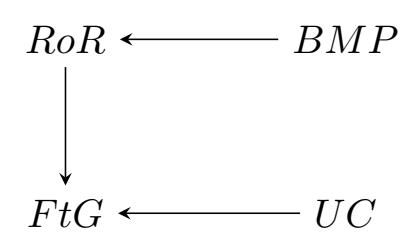
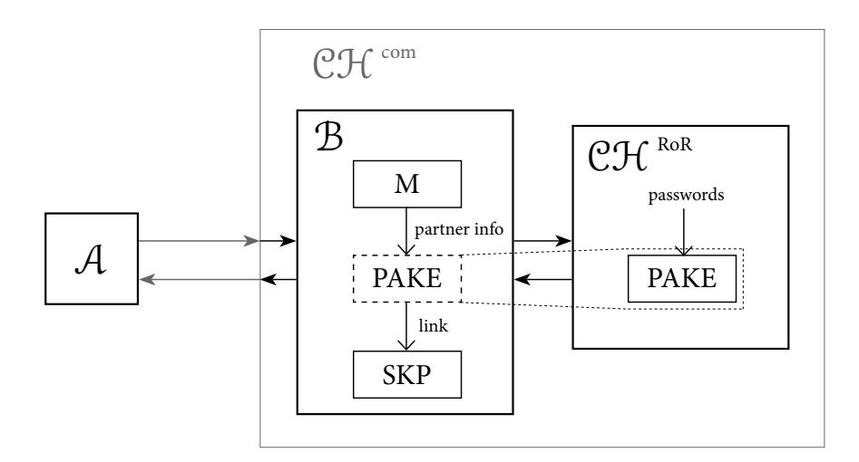

{0}------------------------------------------------

# On Composability of Game-based Password Authenticated Key Exchange

Marjan Skrobot and Jean Lancrenon ˇ *SnT, University of Luxembourg Email: marjan.skrobot@uni.lu, jean.lancrenon@gmail.com*

*Abstract*—It is standard practice that the secret key derived from an execution of a *Password Authenticated Key Exchange* (PAKE) protocol is used to authenticate and encrypt some data payload using a *Symmetric Key Protocol* (SKP). Unfortunately, most PAKEs of practical interest are studied using so-called *game-based* models, which – unlike simulation models – do not guarantee secure composition *per se*. However, Brzuska et al. (CCS 2011) have shown that a middle ground is possible in the case of authenticated key exchange that relies on *Public-Key Infrastructure* (PKI): the game-based models do provide secure composition guarantees when the class of higher-level applications is restricted to SKPs. The question that we pose in this paper is whether or not a similar result can be exhibited for PAKE. Our work answers this question positively. More specifically, we show that PAKE protocols secure according to the game-based Real-or-Random (RoR) definition with the weak forward secrecy of Abdalla et al. (S&P 2015) allow for safe composition with arbitrary, higher-level SKPs. Since there is evidence that most PAKEs secure in the Find-then-Guess (FtG) model are in fact secure according to RoR definition, we can conclude that nearly all provably secure PAKEs enjoy a certain degree of composition, one that at least covers the case of implementing secure channels.

*Index Terms*—Cryptographic Protocols, Password Authenticated Key Exchange, Composability, Composition Theorem.

# 1. Introduction

## 1.1. The problem

The objective of *Password-Authenticated Key Exchange* (PAKE) is to allow secure authenticated session key establishment over insecure networks between two or more parties who only share a low-entropy password. Even though there may be other applications of PAKE, it is common practice that the secret key derived from a PAKE execution is used to authenticate and encrypt some data payload using a *Symmetric Key Protocol* (SKP). For example, two certificate-less TLS proposals that integrate PAKE as a key exchange mechanism have recently appeared on the IETF [\[1\]](#page-14-0), [\[2\]](#page-14-1)[1](#page-0-0) . When looking at these two drafts through the lens of composition, one sees that both of them suggest the PAKE be followed by Authenticated Encryption (AE) algorithms (namely AES-CCM and AES-GCM). Another project that makes use of PAKE is Magic Wormhole [\[3\]](#page-14-2), the file transfer protocol in which PAKE is composed with NaCl's *crypto secretbox* containing the stream cipher XSalsa20 and MAC algorithm Poly1305. Consequently, being able to guarantee the overall security of a *composed* protocol, consisting of first running a PAKE and then a symmetric key application, is imperative.

Unfortunately, the provably secure composition is difficult to automatically obtain without using complex, usually simulation-based models. Furthermore, most PAKEs that are considered for use in real-world applications [\[4\]](#page-14-3), [\[5\]](#page-14-4), [\[6\]](#page-14-5) and appear in relevant standards (i.e. ISO [\[7\]](#page-14-6), IETF [\[8\]](#page-14-7), IEEE [\[9\]](#page-14-8)) are studied using so-called *gamebased* models, which – while being workable to obtain acceptable proofs – do not guarantee secure composition. Two most commonly used such models are the Findthen-Guess (FtG) model of Bellare, Pointcheval, and Rogaway [\[10\]](#page-14-9) and Real-or-Random (RoR) definition of Abdalla, Fouque, and Pointcheval [\[11\]](#page-14-10). In essence, while the FtG security model makes sure that session keys are individually indistinguishable from random, RoR offers stronger guarantees: the session keys are globally indistinguishable from random, and also independent from each other.

In [\[12\]](#page-14-11), Brzuska et al. show that a middle ground is possible in the case of *Public-Key Infrastructure*-based key exchange (PKI-KE): Among other things, they define a framework for PKI-KE that (1) is game-based and (2) allows to prove that, under a certain technical condition, secure composition holds when the class of higher-level applications is restricted to SKPs. The question is whether or not a similar result can be exhibited for PAKE.

# 1.2. Our contribution

In this paper, we answer this question positively by essentially adapting the framework in [\[12\]](#page-14-11) to the passwordbased case. More specifically, our findings are as follows:

• First of all, we demonstrate in Sect. [1.3](#page-1-0) that the composition theorem of Brzuska et al. [\[12\]](#page-14-11) can *not* be directly applied in PAKE setting. Namely, the FtG definition that was used in [\[12\]](#page-14-11) to show that PKI-KE securely composes with an arbitrary Symmetric

<span id="page-0-0"></span><sup>1.</sup> The reason behind this integration - and not using PAKE with some symmetric cipher over TCP - is to circumvent the need to establish a network protocol for data transfer (i.e. TCP or UDP) and to negotiate symmetric key algorithms (or protocols) on their own.

{1}------------------------------------------------

Key Protocol (SKP), does not seem to be sufficient in the case of PAKE. Fortunately, we show that PAKE enjoys similar composition properties when satisfying a stronger security notion, i.e. RoR.

- We provide a specific syntax and introduce three standalone security models: game-based RoR PAKE with weak forward secrecy following [6] and [13]; SKP (closely following [12]); and a composition model which was built by carefully merging the previous two. More specifically, we define a security game for the two-party composed protocol that consists of a PAKE protocol and an arbitrary SKP and determine the optimal lower bound of security for such composition. In addition, we provide an intuition why Reveal query might be, in fact, necessary when (1) modeling forward secrecy in RoR and (2) trying to achieve composability (see Sect. 2.2.7).
- Most importantly, we present a composition theorem showing that PAKE protocols secure in the sense of RoR definition from [6] and [13] allow for automatic, secure composition with arbitrary, higherlevel symmetric key protocols, thus yielding secure composition.

Since in [11] the authors provide evidence that most PAKEs secure in the FtG model of [10] are in fact secure according to RoR (see also [14]), we can conclude that nearly all provably secure PAKEs enjoy a certain degree of composition, one that at least covers the case of implementing secure channels. It should be noted that for our result to hold, we also need the technical condition mentioned earlier to be fulfilled. However, we emphasize that to the best of our knowledge, for nearly all published PAKEs this is always the case. Prominent examples include EKE [15], PAK [4], [16], SPAKE2 [5], [17], Dragonfly [8], [18], SPOKE [14] and J-PAKE [6]. The next section explains our work in more detail.

#### <span id="page-1-0"></span>1.3. Password-induced subtleties

It is well-known that already when dealing with "basic" PAKE definitions, the usual low-entropy nature of the long-term authentication material causes definitional headaches. It is, therefore, no surprise that similar issues should be encountered here. We begin with a simple recap of how PAKE security is defined in [10]. Then, we briefly explain the theorem of Brzuska et al. [12] and show where passwords cause trouble. Finally, we show how to circumvent this problem, and in particular why RoR is more suitable than FtG.

1.3.1. The Find-then-Guess model for PAKE. As in all reasonable key exchange security models, in [10] the adversary  $\mathcal{A}$  is modeled as a network adversary: It can bring to life protocol participants with access to the secret long-term keying material and deliver to these instances messages of its choice. In the event that an instance accepts and computes a session key,  $\mathcal{A}$  may ask that this key is

revealed, modeling higher-level protocol leakage. In some models, it may even corrupt protocol participants in an effort to account for e.g. forward secrecy.

Crucially, to capture the fundamental notion of session key semantic security,  $\mathcal{A}$  is allowed to make a single Test query, from which it receives either the real session key computed by the target instance or a random key.  $\mathcal{A}$ 's goal is to determine which it is. Its advantage  $\mathbf{Adv}_{\mathrm{P}}^{FtG}(\mathcal{A})$  against protocol P is essentially defined as the distance of its success probability from 1/2.

In PKI-KE, i.e. when users' long-term keys are public key/secret key pairs, it is natural to ask that  $\mathbf{Adv}_{\mathrm{P}}^{FtG}(\mathcal{A})$  be a negligible function in the security parameter. When the long-term keys are passwords however – say, uniformly selected from a dictionary **Pass** of size N – the best we can expect is:

<span id="page-1-3"></span>
$$Adv_{P}^{FtG}(\mathcal{A}) \le \frac{B \cdot n_{se}}{N} + \varepsilon, \tag{1}$$

where B is some constant,  $\varepsilon$  is negligible, and  $n_{se}$  measures the number of instances  $\mathcal{A}$  has tried online attacks on using guessed passwords<sup>2</sup>. Note that the first right-hand term is not negligible in general.

**1.3.2. The composition result for PKI-KE in [12].** Let S be some arbitrary, two-party, symmetric key protocol and P; S denote its "natural" composition with P. The main theorem established in [12] for the PKI-KE case states that for every probabilistic polynomial-time (PPT) adversary  $\mathcal{A}$  playing a suitably defined security game against P; S there exist PPT adversaries  $\mathcal{B}$  against P and  $\mathcal{C}$  against S such that following formula holds:

<span id="page-1-2"></span>
$$Adv_{P:S}(A) \le q \cdot Adv_{P}^{FtG}(B) + Adv_{S}(C),$$
 (2)

where q is the maximum number of instances in play in the key exchange game. Of course, in [12]'s framework, security of the composition holds when the left-hand term is negligible. Therefore, the upper bound implies this under the condition that P and S are secure. Indeed, observe that q is at most polynomial in the security parameter and that  $\mathbf{Adv}_{\mathrm{P}}^{FtG}(\mathcal{B})$  is supposed to be *negligible* when using PKI-KE. (And, of course, S is secure if  $\mathbf{Adv}_{\mathrm{S}}(\mathcal{C})$  is negligible for all  $\mathcal{C}$ .) This effectively shows that the security of the composition P; S is guaranteed by the stand-alone security of P and S.

**1.3.3. Two immediate password problems.** There are two main obstacles to overcome when trying to get a password analog of Eq. 2 to work, and both stem from the non-negligible term in Eq. 1.

First, it is clear that the term  $q \cdot \mathbf{Adv}_{\mathbf{P}}^{FtG}(\mathcal{B})$  cannot be negligible anymore. Thus, it makes no sense to try and deduce from Eq. 2 that the left-hand side is ultimately negligible. The only way out of this is to "boost" the left-hand side. Fortunately, there is a natural way to do this. Indeed, intuitively it should be clear that the composed

<span id="page-1-1"></span>2. B is usually interpreted as the number of passwords that can be tested simultaneously during one log-on attempt.

{2}------------------------------------------------

protocol will also suffer from a breach in the event A guesses a password and mounts an online attack. Thus, it is the definition of security for the composed protocol that has to change, in that it needs to incorporate the same nonnegligible bound as in Eq. [1.](#page-1-3) In other words, at best we can only require by definition that:

<span id="page-2-0"></span>
$$\mathbf{Adv}_{\mathrm{P;S}}(\mathcal{A}) \le \frac{B \cdot n_{se}}{N} + \varepsilon, \tag{3}$$

where B is some constant, ε is negligible, and nse counts A's online attacks. In short, our first problem is handled at the definition level. But, Eq. [3](#page-2-0) leads to our second problem.

If we simply plug our optimal FtG PAKE bound into the right-hand side of Eq. [2,](#page-1-2) we obtain

$$\mathbf{Adv}_{\mathrm{P;S}}(\mathcal{A}) \le \frac{B \cdot q \cdot n_{se}}{N} + \mathbf{Adv}_{\mathrm{S}}(\mathcal{C}).$$
 (4)

This is not what we want: The q factor is still making the desired upper bound too large for our purpose! This is where using the RoR model comes in handy.

In the proof of the main theorem in [\[12\]](#page-14-11), the authors need to make use of a hybrid argument indexed by the instances in play: The idea is to have the simulator plant the only available Test query at the randomly chosen index. This is what makes the q come out. Our observation is that by using the RoR model – in which *multiple* Test queries are allowed – we can avoid having this parasite factor appear.

In short, our main theorem says that for every PPT adversary A playing against P; S there exist PPT adversaries B and C such that:

$$Adv_{P;S}(A) \le Adv_{P}^{RoR}(B) + Adv_{S}(C),$$
 (5)

and from this theorem we get that if P and S are actually secure, the optimal bound stated in Eq. [3](#page-2-0) holds[3](#page-2-1) .

1.3.4. The technical condition. Let us briefly return to the "technical condition" mentioned above. Roughly, it states that when observing many PAKE interactions over a network, it is publicly possible to determine pairs of communicants holding the same session key. This property is related to *partnering* [2.2.4](#page-5-1) and is formally described further down (see Sect. [2.3\)](#page-6-0). Often in PAKE research [\[10\]](#page-14-9), partnering is defined using session identifiers that are locally computed. In practice, most published PAKEs define these identifiers simply by concatenating the PAKE message flows with their identities. Clearly, this is a publicly checkable criterion. Hence, the condition causes no real limitation to our result.

## 1.4. Related work

1.4.1. Password-authenticated key exchange. PAKE protocols have been very heavily studied in the past twentyfive years. Bellovin and Meritt pioneered the idea of PAKE in [\[15\]](#page-14-14). The first reasonable security models for PAKE, FtG and BMP, appeared in [\[10\]](#page-14-9) and [\[19\]](#page-14-18), respectively. Later, Katz et al. [\[20\]](#page-14-19) showed how to *practically* realize provably secure PAKE without random oracles (but using a common reference string). In parallel to this, in more theoretical work Goldreich et al. [\[21\]](#page-14-20) showed that PAKE is possible just using general complexity assumptions, and no trusted setup whatsoever. Finally, Canetti et al. introduced Universally Composable (UC) PAKE in [\[22\]](#page-14-21). This list is massively incomplete; more works can be found in [\[23\]](#page-14-22). From a strict PAKE standpoint, the work most relevant to ours is [\[11\]](#page-14-10), where it was shown among other things that allowing multiple Test queries in the model (RoR) as opposed to only one (as in FtG model of [\[10\]](#page-14-9)) yields a strictly stronger security notion in the password case. The known relations between PAKE security definitions [\[24\]](#page-14-23) are summarized in Fig. [1.](#page-2-2) In the rest of this section, we focus on works that have contributed to secure composition of key exchange with other protocols.

<span id="page-2-2"></span>

Figure 1: Known relations between PAKE definitions.

1.4.2. Composition of key exchange. The first to successfully provide a framework in the game-based setting that grants stronger composition guarantees were Canetti and Krawczyk [\[25\]](#page-14-24). Indeed, they identified a security notion (SK-security) that is sufficient to yield a secure channel when appropriately composed with a secure symmetric encryption algorithm and MAC. As far as we know, this result was never adapted to the password-based case. The simulation-based models of Shoup [\[26\]](#page-14-25) (for ordinary key exchange) and Boyko et al. [\[19\]](#page-14-18) (for PAKE) claim to have a "built in" composition guarantee, but this only been informally argued. Later, applying the methodology of Universal Composability (UC) for key exchange [\[27\]](#page-14-26), a second, stronger simulation-based notion – UC PAKE – was proposed by [\[22\]](#page-14-21). These models' robust composition guarantees are profoundly appealing. Also, when working with UC PAKE framework of [\[22\]](#page-14-21), one makes no assumption regarding the password distribution used by the protocol participants. This property, together with direct composability are the two main advantages of UC approach. On the other hand, the models themselves are harder to work with than the simpler, game-based models. Another shortcoming of UC approach is its restrictive nature which yields not overly efficient protocols. However, this efficiency gap between UC and game-based PAKE is slowly diminishing [\[28\]](#page-14-27), [\[29\]](#page-14-28), [\[30\]](#page-14-29). Unfortunately, the adoption of UC PAKE in practice seems to be low, especially when looking at the activity around the various standards for PAKEs [\[7\]](#page-14-6), [\[8\]](#page-14-7), [\[9\]](#page-14-8).

<span id="page-2-1"></span><sup>3.</sup> Note that the presence of passwords has no effect on the security of S as a stand-alone primitive. This is why AdvS(C) should remain negligible.

{3}------------------------------------------------

Although key exchange protocols proven in the gamebased model of [31] remained mostly used in practice, it took almost a decade before someone started addressing the problem of studying the composability properties of this setting. Namely, this was done by Brzuska et al. in [12], [32], [33]. They presented a more general framework which allowed showing that FtG secure PKI key exchange protocols are composable with a wide class of symmetric key protocols under the condition that a public session matching algorithm for the key exchange protocol exists. In subsequent work [34], the authors have shown that even a weaker notion for key exchange protocols would still be enough for composition, and apply this to the TLS handshake. As far as we are aware, no similar study has been conducted in the password-based setting. With this work, we aim to begin filling this gap, by adapting the results of [12].

## <span id="page-3-5"></span>2. Password Authenticated Key Exchange

Password Authenticated Key Exchange (PAKE) offers a cryptographic service that allows two users that share a lowentropy key to agree upon a short-term, cryptographically strong session key. Informally, from the security perspective, we expect a PAKE protocol to be secure in the presence of offline dictionary attacks against the user's password while limiting online password guessing attempts to a constant number per impersonation attempt. In other words, eavesdropping on PAKE communications leaks *no* password information to the adversary, and online interaction leaks the validity or invalidity of only a constant number (ideally, one) of password guesses<sup>4</sup>.

Below, we first formally define PAKE protocols. Then, using some notational elements from [12], we present in detail a variant of Real-or-Random (RoR) model that was originally described in [11]. This variant has been recently used in [6], [13], and in contrast to the original RoR model from [11], it considers (weak) forward secrecy by allowing weak adaptive corruptions<sup>5</sup>.

#### <span id="page-3-2"></span>2.1. PAKE protocols

A PAKE protocol can be represented as a pair of algorithms (PWGen, P): a password generation algorithm PWGen and an algorithm P that defines the execution of the PAKE protocol. PWGen takes as input a set of possible passwords **Pass**, equipped with a probability distribution  $\mathcal{P}$ . For simplicity of exposition, we make the assumption that  $\mathcal{P}$  is the uniform distribution on **Pass**, and that user passwords are selected independently. It is possible to drop the uniformity requirement by adjusting the security of each password to be the min-entropy of the password distribution (see [35]). We denote N the cardinality of **Pass**. We can

assume that algorithm P specifies several sub-algorithms, one of which generates the system's public parameters, common to all principals.

### <span id="page-3-6"></span>2.2. The Real-Or-Random model

Let us denote a game that represents the RoR security model  $G^{RoR}$ . For such a game, there exists a challenger  $\mathcal{CH}^{RoR}$  that will keep the appropriate secret information away from an adversary  $\mathcal{A}$  while administrating the security experiment.

**2.2.1. Participants and passwords.** In the two-party PAKE setting, each principal or user U, named by a string, is either from a Clients set or a Servers set, which are finite, disjoint, nonempty sets. The set  $ID_{pake}$  represents the union of Clients and Servers. Furthermore, we assume that each client  $C \in Clients$  possesses a password  $pw_C$ , while each server  $S \in Servers$  holds a vector of the passwords of all clients  $pw_S := \langle pw_C \rangle_{C \in Clients}$ . Following the convention in Sect. 2.1, these passwords are sampled independently and uniformly from **Pass** at the beginning of  $G^{RoR}$ .

**2.2.2. Protocol execution.** The protocol P is a PPT algorithm that specifies the reaction of principals to network messages. In reality, each principal may run multiple executions of P with different users, thus in the model, each principal is allowed an unlimited number of *instances* executing P in parallel. We denote  $U^i$  the i-th instance of principal U. In some places, where distinction matters, we will denote client instances  $C^i$  and server instances  $S^j$ .

When assessing the security of P, we assume that the adversary  $\mathcal{A}$  has complete control of the network. In practice, this means that principals communicate solely through the attacker, who may consider delaying, reordering, modifying, and dropping messages sent by honest principals, or injecting messages of its choice to attack the protocol<sup>6</sup>. Moreover,  $\mathcal{A}$  has access to principals' instances through the game's interface, which is offered by  $\mathcal{CH}^{RoR}$ . Thus, while playing the security game,  $\mathcal{A}$  provides the inputs to  $\mathcal{CH}^{RoR}$  – who parses the received messages and forwards them to corresponding instances – via the following *queries*:

• Send( $U^i, M$ ):  $\mathcal{A}$  sends message M to instance  $U^i$ . As a response,  $U^i$  processes M according to P, the corresponding internal state<sup>7</sup> is updated, and the instance outputs a reply that is given to  $\mathcal{A}$ . Also, the adversary  $\mathcal{A}$  will be informed in case a Send query causes an instance to accept or terminate. To keep our result as general as possible, we do not assume that the session and partner identifiers (sid and pid), once computed, are given to  $\mathcal{A}$  (contrary to [10]). A Send( $U^i, V$ ) query has instance  $U^i$  output P's first message, destined to principal V. The purpose of the

<span id="page-3-0"></span><sup>4.</sup> Note that this is a purely *algorithmic* guarantee, independent of the implementation of a feature that locks an account after too many failed login attempts.

<span id="page-3-1"></span><sup>5.</sup> The corruption of a principal reveals only its password *without* revealing associated internal state.

<span id="page-3-4"></span><span id="page-3-3"></span><sup>6.</sup> This model assumes that the passwords setup procedure is private.

<sup>7.</sup> The description of the internal state and the definitions of partnering and freshness can be found below.

{4}------------------------------------------------

**Send** query is to model communication and active attacks.

- Execute( $C^i, S^j$ ): This query triggers an honest run of P between client  $C^i$  and server  $S^j$ , and the transcript of the protocol execution is given to A. It covers passive eavesdropping on protocol flows.
- Reveal $(U^i)$ : As a response to this query,  $\mathcal{A}$  receives the current value of the session key  $skP_U^i$ .  $\mathcal{A}$  may do this only if  $U^i$  has accepted (holding a session key) and a Test query has not been made to  $U^i$  or its partner instance. This query captures potential session key leakage as a result of its use in higher level protocols. It ensures that if some session key gets exposed, other session keys remain protected.
- Test( $U^i$ ): At the beginning of  $G^{RoR}$ , a hidden bit b is randomly selected by  $\mathcal{CH}^{RoR}$  and used for all Test queries. If b=1,  $\mathcal{A}$  receives  $skP_U^i$  as an answer to the Test( $U^i$ ) query. Otherwise,  $\mathcal{A}$  receives a random string from the session key space<sup>8</sup>. In contrast to the FtG model, some additional care must be taken in case the Test keys are random (b=0):  $\mathcal{CH}^{RoR}$  needs to make sure that two partnered instances will respond with the same random value. Note that only a fresh instance can be a target of a Test query. This query measures the semantic security of session keys.
- Corrupt(U): The password  $pw_U$  is given to  $\mathcal{A}$  if U is a client, and the list of passwords  $pw_U$  in case U is a server. This query models compromise of the long-term key and captures weak forward secrecy.

As can be seen above, the adversary is allowed to send multiple **Send**, **Execute**, **Reveal**, **Corrupt**, and **Test** queries to the challenger. Note that the validity and format of each query are checked upon receipt.

**2.2.3.** Internal state and initialization. In the interest of running a sound simulation, the challenger  $\mathcal{CH}^{RoR}$ maintains two types of *internal state* in the form of certain random variables, and updates it as (1) the actual network interactions between A with the instances running P on the lower level and (2) the security game  $G^{RoR}$  on the higher level, progress. The first type of internal state contains the necessary data for the actual execution of P by the instances. It is called the execution state  $EST_{pake}$ . The other kind of state is referred to as the game state  $GST_{pake}$ ; it stores information used by  $\mathcal{CH}^{R\check{o}R}$  to keep track of and administer the game, as well as define security (e.g. a hidden bit, flags that indicate corruptions, etc.). Figure 2 lists all of these variables, which we also detail below. Notice that variables may be user-specific (e.g. passwords), others are defined per instance (e.g.  $statusP_{IJ}^{i}$ ,  $sid_{II}^{i}$ ,  $skP_{II}^{i}$ ), and yet others are global to the game (e.g. the *test bit b*).

Execution state. Let U be a user and  $U^i$  an instance. U holds – and instance  $U^i$  uses – the long-term keying information  $pw_U$ , set at the beginning of the game. The variable  $skP_U^i$  stores the session key which  $U^i$  may establish during a protocol run. The session identifier  $sid_U^i$  uniquely labels the protocol session  $U^i$  wishes to establish with some other instance.  $U^i$  also holds a partner identifier  $pidP_{IJ}^i$ , representing the identity of the principal with which  $U^i$ believes it shares a session key. All three variables  $(skP_{IJ}^{i})$ ,  $sid_U^i$ , and  $pidP_U^i$ ) start out set to  $\perp$ . The value  $statusP_U^i$ tracks the status of an instance  $U^i$  and it is initially set to running. When  $statusP_U^i = running$ , the instance is simply waiting for the next protocol message.  $U^i$  changes its  $statusP_{U}^{i}$  from running to accepted once it computes  $skP_U^i$ ,  $sid_U^i$ , and  $pidP_U^i$ . An instance  $U^i$  that has acceptedsets its status to terminated once it no longer accepts or sends any messages. When  $statusP_U^i = rejected$ ,  $U^i$  stops sending and receiving messages and refuses to establish a session key. Finally, a variable  $infoP_{IJ}^{i}$  stores any additional information  $U^i$  needs in order to perform its computations (e.g. exponents for Diffie-Hellman-type terms).

```
Internal State: For U \in ID_{pake}, C \in Clients, S \in Servers, and i \in \mathbb{N}, the internal state is maintained as follows:

Execution State EST_{pake}

* pw_C \in Pass; pw_S := \langle pw_C \rangle_C

* statusP_U^i \in \{running, accepted, terminated, rejected\}

* sid_U^i, skP_U^i, infoP_U^i \in \{0, 1\}^* \cup \{\bot\}

* pidP_U^i \in ID_{pake} \cup \{\bot\}

Game State GST_{pake}

* b \in \{0, 1\}; r_U^i \in \{\bot, hidden, revealed\}

* t_U^i \in \{\bot, untested, tested\}

* pnrP_U^i \in ID_{pake} \times \mathbb{N} \cup \{\bot\}

* f_U^i \in \{\bot, unfresh, fresh\}

* \delta \in \{0, 1\}; \delta_U^i \in \{honest, corrupted\}.
```

Figure 2: The internal state of PAKE in the RoR model.

Game state. Concerning the game state, we first have the test bit b which is flipped by  $\mathcal{CH}^{RoR}$  at the beginning of the game. The flag  $r_U^i$  indicates the status of a session key held by  $U^i$ , thus showing if the instance has been a target of a **Reveal** query or not. It is set to  $\perp$  until  $skP_{II}^{i}$ is non- $\perp$ ; then it is by default set to hidden. Similarly,  $t_{II}^{i}$ shows if an instance has been the target of a Test query. It is set to  $\perp$  until  $skP_U^i$  is non- $\perp$ ; then it is by default set to untested. The variable  $pnrP_{IJ}^{i}$ , which starts out as  $\perp$ , stores the identity of the partner instance. Freshness of an instance (defined below) is tracked with  $f_U^i$ ; this is set to  $\perp$  until  $skP_{II}^{i}$  is non- $\perp$ . Then, it is set by default to fresh. Lastly, the corruption flags are maintained: (1) the value  $\delta$  indicates if a **Corrupt** query has been made so far; (2) the flag  $\delta_{II}^i$ , which starts out set to *honest*, shows whether the instance  $U^i$  received a message after some password

<span id="page-4-0"></span><sup>8.</sup> Thus, the session keys that are forwarded to A in response to **Test** queries are either all real or all random.

{5}------------------------------------------------

disclosure has occurred: the value of the flag switches from honest to corrupted only if a  $\mathbf{Send}(U^i, M)$  query was made while  $\delta=1$  and  $status\mathrm{P}^i_U=running^9$ . In contrast, if  $U^i$  is the target of an **Execute** query while  $\delta=1$ , then  $\delta^i_U$  remains set to honest.

Initialization. In an initialization phase (see Fig. 3), which occurs before the execution of a protocol, public parameters and the internal state are fixed. The appropriate subalgorithm of P, called ParamGen, is run to generate the system's public parameters ParamsP. From the adversary's perspective, an instance  $U^i$  comes into being after  $Send(U^i, V)$  query is asked. For each client a secret  $pw_C$  is drawn uniformly and independently at random from a finite set Pass of size N and is given to all servers.

<span id="page-5-3"></span>**InitialPAKE** $(1^k)$ : The Clients and Servers sets are fixed in advance. For  $i \in \mathbb{N}$ ,  $U \in ID_{pake}$ ,  $C \in Clients$ , and  $S \in Servers$ , the initialization procedure is performed as follows:

```
Generate Public parameters \star ParamsP \leftarrow ParamsGen(1^k)
```

Initialize  $EST_{pake}$ 

- $\star pw_C \leftarrow PWGen; pw_S[C] := pw_C$
- $\star statusP_U^i := running$
- $\star \ sid_U^i, \ skP_U^i, \ infoP_U^i, \ pidP_U^i := \bot$

Initialize  $GST_{pake}$ 

- $\star$   $b \leftarrow \{0,1\}; \quad r_U^i, \ t_U^i := \bot$
- $\star pnrP_U^i, f_U^i := \bot$
- $\star \ \delta := 0; \quad \delta_U^i := honest$

Figure 3: The initialization procedure for PAKE.

- <span id="page-5-1"></span>**2.2.4. Partnering.** We say that instance  $U^i$  is a partner instance to  $V^j$  and vice versa if: (1) U is a client and V is a server or vice versa, (2)  $sid := sid_U^i = sid_V^j \neq \bot$ , (3)  $pidP_U^i = V$  and  $pidP_V^j = U$ , (4) both instances  $U^i$  and  $V^j$  have accepted, (5)  $skP_U^i = skP_V^j$ , and (6) no other instance has a non- $\bot$  session identity equal to sid.
- **2.2.5. Freshness.** This property captures the idea that the adversary should not trivially know sessions keys being tested. An instance is said to be *fresh* if it has accepted (with or without a partner) and  $f_U^i = fresh$ . (Before acceptance,  $f_U^i = \bot$ .) The value  $f_U^i$  switches to unfresh if any of the following conditions holds: (1)  $r_U^i = revealed$ , or (2) if  $U^i$  has a partner instance  $V^j$  and  $r_V^j = revealed$ , or (3)  $\delta_U^i = corrupted$ .
- <span id="page-5-2"></span>9. Note that here we mean that any **Corrupt** query may have been asked and not necessary one that targets the principal U. This is arguably a very weak notion of forward secrecy, but one that is typically used in PAKEs [4], [6], [13], [36]. A slightly stronger forward secrecy notion can be found in [10], [14], [37].

**2.2.6. PAKE** security. Now that we have defined partnering, freshness and all the queries available to the adversary  $\mathcal{A}$ , we can formally define the password authenticated key exchange (RoR) advantage of  $\mathcal{A}$  against P.

Eventually,  $\mathcal{A}$  ends the game and outputs a bit b'. We say that  $\mathcal{A}$  wins and breaks the RoR security of P if b'=b, where b is the hidden bit selected at the beginning of the protocol execution. We denote the probability of this event by  $\mathbb{P}[b'=b]$ . The *RoR*-advantage of  $\mathcal{A}$  in breaking P is usually defined as

<span id="page-5-4"></span>
$$\mathbf{Adv}_{\mathbf{P}}^{RoR}(\mathcal{A}) := |2 \cdot \mathbb{P}[b' = b] - 1|. \tag{6}$$

It turns out to be more convenient for us later to reformulate the RoR-advantage function. Let b be a bit. We denote  $G^{RoR-b}$  the game played exactly as  $G^{RoR}$ , except that (1) the bit b has been fixed in advance and (2) at the end of the game  $G^{RoR-b}$  outputs a final bit denoted b'' computed as follows: b'' := 1 if and only if b = b'. (Recall that b' is the bit output by A.) Using  $\mathbb{P}^b$  to denote probabilities in the space defined by game  $G^{RoR-b}$ , it is then easy to see that  $\mathbf{Adv}_{\mathrm{P}}^{RoR}(A)$  as defined in Eq. 6 can be re-written as

<span id="page-5-6"></span>
$$\mathbf{Adv}_{\mathbf{P}}^{RoR}(\mathcal{A}) := \left| \mathbb{P}^{1}[b'' = 1] - \mathbb{P}^{0}[b'' = 0] \right|. \tag{7}$$

Finally, we say that P is *ake*-secure if there exists a positive constant B such that for every PPT adversary  $\mathcal A$  it holds that

$$Adv_{P}^{RoR}(A) \le \frac{B \cdot n_{se}}{N} + \varepsilon \tag{8}$$

where  $n_{se}$  is an upper bound on the number of **Send** queries  $\mathcal{A}$  makes, and  $\varepsilon$  is negligible in the security parameter. Recall that N is the cardinality of **Pass** and that passwords are assigned uniformly at random to users. This formula adequately captures the idea that an adversary's advantage in breaking a PAKE should only significantly grow if the adversary actively tests candidate passwords against user instances. In particular, a protocol secure in this model guarantees that an offline dictionary attack succeeds with at most negligible probability.

<span id="page-5-0"></span>**2.2.7. Forward secrecy.** While being considered an advanced security feature, forward secrecy is a valuable property in the context of key exchange protocols. It provides the guarantee that past session keys will not be automatically divulged by the compromise of long-term keys (obviously assuming that past session keys are deleted from memory before the compromise).

As in other game-based models for key exchange protocols, the notion of Forward Secrecy (FS) in our RoR model is captured by allowing the adversary to make the **Corrupt** query, which may come in different flavors. The FS property is then fine-tuned through the freshness definition or the power given to the adversary<sup>10</sup>.

<span id="page-5-5"></span>10. In the literature, several types of **Corrupt** queries have appeared [37], based on the amount of secret information the adversary learned or had the opportunity to modify.

{6}------------------------------------------------

This additional adversarial power (Corrupt query), imposes certain changes in the model. For instance, recall that the Reveal query was disallowed in the original RoR model [11]. There, misuse of the keys (session key leakage) was modeled solely using **Test** queries. Nevertheless, as in the recent works [6] and [13], in our model we again allow the adversary to make the **Reveal** query. This change is essential to accommodate corruption queries in the RoR model. Specifically, the reason for re-inclusion of the **Reveal** query is the following. After the corruption of any principal  $(\delta \text{ set to } 1)$ , the adversary is no longer allowed to use Test queries to target instances that hold newly-established session keys (except those originating from **Execute** query). Therefore, the **Reveal** query is needed to model misuse of those keys as well. Moreover, without the **Reveal** query we would not be able to achieve our secure composition result that includes FS under above-specified freshness condition (see Fig. 10 on page 13).

# <span id="page-6-0"></span>2.3. Public partner matching

As in [12], for our composition result to hold, we need the underlying PAKE protocol to satisfy an additional property that we will call *partner matching*. Informally, we say that a PAKE protocol meets the partner matching property if an observer of network communications can deduce partnering information.

The reason we need this property is the following. In our reductionist proof, we will specify an algorithm, the RoR adversary  $\mathcal{B}$ , which will simulate the appropriate security game for the adversary  $\mathcal{A}$  it is using as a subroutine, in the RoR security game. While only observing and forwarding the communication between  $\mathcal{A}$  and the RoR challenger  $\mathcal{CH}^{RoR}$ ,  $\mathcal{B}$  has to be able to assign the same key to two partner instances for the rest of  $\mathcal{A}$ 's simulation to be sound. To accomplish this,  $\mathcal{B}$  would need to be capable, at any time, to output a list of all partnered instances. However, even if the PAKE protocol is RoR secure, this ability is not always guaranteed: It depends how protocol handles session and partner identifiers. In other words, RoR security does not necessarily imply the partner matching property.

Note that in the FtG model of [10], the session identifier sid and partner identifier pid are given to the adversary after instance accepts and therefore is public information. In [12], this is claimed to be enough to assume that a partner matching algorithm is available. This happens to be often true in the PAKE case. Indeed, most PAKEs in the literature rely on session identifiers built as concatenations of sent and received messages and identities to determine partners. This makes partner matching immediate.

**2.3.1. Partner matching algorithm.** We define an efficient partner matching algorithm M that enables an observer of the RoR security game to identify partner instances by outputting a partnering list  $\mathcal{L}_{pnrP}$ . This list consists of pairs of user instances  $(U^i, V^j)$ , one of which is marked as  $\bot$  if an instance does not have a partner yet. The input to the algorithm M includes all the queries the RoR challenger

 $\mathcal{CH}^{RoR}$  receives from the adversary  $\mathcal{A}$  and all the replies  $\mathcal{CH}^{RoR}$  returns to  $\mathcal{A}$  together with all the public values.

## <span id="page-6-2"></span>3. Symmetric Key Protocols

In [12], the authors introduced the notion of Symmetric Key Protocols (SKP) as an umbrella term that encompasses two-party protocols whose execution relies solely on a shared symmetric secret key (e.g. authenticated encryption protocols). In our work, we focus on the same class of protocols, or, more precisely, on the security of their composition with PAKEs. This study is of practical value since in real world applications session keys that originate from PAKEs are typically used in SKP protocols. In this section, closely following [12] (except for minor notational differences), we first formally define what an SKP entails, and then present the model that captures generic security requirements of SKP.

#### 3.1. Symmetric key protocols

We formally define an SKP protocol as a pair of algorithms (KGen, S), where KGen is a PPT key generation algorithm, and S is a PPT algorithm that defines the execution of the SKP protocol. The KGen algorithm outputs the session keys from the key space K according to some probability distribution K when given as input a security parameter k.

### <span id="page-6-4"></span>3.2. Security model

We denote  $G^{sym}$  a game that captures the security of the symmetric key protocol. Informally, the security game should allow the adversary to initialize a new honest instance that is equipped with a fresh session key unknown to the attacker. Then, being in the two-party symmetric setting, the adversary should also be able to initialize a new instance and partner it with another already existing one - this models the prior result of two partner instances having established the same session key<sup>11</sup>. Additionally, the attacker may create as many dishonest instances as it desires equipped with a secret key of its choice.

- **3.2.1. Participants.** In two-party symmetric key protocols, each principal W comes from a finite, nonempty set  $ID_{skp}$ . Note that we do not make any assumption on the principals' possession of a long-term secret.
- <span id="page-6-3"></span>**3.2.2. Protocol execution.** An algorithm S specifies the reaction of parties involved in SKP to messages that appear on the network. The security game mechanism and the assumption on the power of the adversary are analogous to those for PAKE. Thus, we assume that an adversary  $\mathcal{A}$  has complete control of the network. Naturally, each principal may run multiple executions of S with different partners,
- <span id="page-6-1"></span>11. The number of instances sharing the same key should be at most two.

{7}------------------------------------------------

and thus we allow an unlimited supply of instances to be initialized for each principal. In this model, the adversary A may make *at least* the following queries:

- InitH( $U^i$ ): Upon receiving this query, the challenger  $\mathcal{CH}^{sym}$  initiates an instance  $U^i$  with a new session key from the KGen algorithm.
- InitP $(U^i, V^j)$ : This query initiates an honest instance  $U^i$  and assigns to it the key held by  $V^j$ , making them partners. A restriction in this model is that at any time during a protocol execution  $\mathcal{A}$  may only use once each instance as an input to an InitP query. Note that this query faithfully models the asymmetry at the time of key acceptance, since in key exchange there is always one instance waiting for the last protocol message.
- InitC  $(U^i, skS)$ : As a result of this query, a dishonest instance  $U^i$  is initialized with the session key of the adversary's choice skS.
- Send $(U^i, M)$ : The message M is sent to instance  $U^i$  by the adversary  $\mathcal{A}$ . As a response,  $U^i$  processes M according to S, updates its corresponding internal state, and outputs a reply. In this model a Send $(U^i, \cdot)$  query is valid only if the instance  $U^i$  has been already initialized and is holding the session key. A Send $(U^i, Start)$  query causes the instance  $U^i$  to output S's first message. As in PAKE, the purpose of the Send query is to model communication and active attacks $^{12}$ .

In addition, the validity and format of each query are checked upon receipt.

Discussion. We emphasize that this is the minimal set of queries  $\mathcal{A}$  has access to. Additional queries may be needed depending on the specification of the service S provides. For instance, in case SKP protocol should provide Chosen-Plaintext Attack (CPA) security in a multi-user setting, the adversary would be given access to a Left-or-Right  $LoR(U^i, M_0, M_1)$  query.

**3.2.3. Internal state and initialization.** The internal state for  $G^{sym}$ , presented in Fig. 4, is maintained by the challenger  $\mathcal{CH}^{sym}$ .

Execution state. The execution state, necessary for the execution of the protocol S for every user instance, includes at the very least a session key  $skS_U^i$ , a partner identifier  $pidS_U^i$ , and the variable  $statusS_U^i$  that shows the status of an instance. Depending on the particular scheme, the execution state may also include additional values, stored in  $infoS_U^i$ .

Game state. As in [12], the game state, which stores information relevant to the security game's administration, is left under-specified, due to the generic nature of the model. Therefore, in  $GST_{skp}$ , we only include a flag  $s_U^i$  that tracks the status of the session key held by  $U^i$ , and a variable  $pnrS_U^i$  that stores the identity of the partner instance. Both values are set to  $\bot$ . The status of the session key is upon initialization set to private, except in two

<span id="page-7-0"></span>12. One could add Execute query, but it does not seem useful for SKP.

<span id="page-7-1"></span>**Internal State:** For  $U \in ID_{skp}$  and  $i \in \mathbb{N}$ , the internal state is maintained as follows:

```
Execution State EST_{skp}
```

- $\star statusS_U^i \in \{pending, running, aborted\}$
- $\star skS_U^i \in \{0,1\}^* \cup \{\bot\}; \quad pidS_U^i \in ID_{skp} \cup \{\bot\}$
- $\star infoS_U^i \in \{0,1\}^* \cup \{\bot\}$

### Game State $GST_{skp}$

- $\star \ s_U^i \in \{\bot, private, known\}$
- $\star pnrS_U^i \in ID_{skp} \times \mathbb{N} \cup \{\bot\}$
- $\star \ addS_U^i \in \{0,1\}^* \cup \{\bot\}.$

**Figure 4:** The internal state of symmetric key protocol.

cases: (1) the instance came into being through an **InitC** query, and (2) the instance was partnered with a dishonest instance through the **InitP** query. In these two cases, the status of the instance is set to  $known^{13}$ . Finally, we include  $addS_U^i$ , for any additional values the game state may require.

*Initialization*. The initialization procedure of SKP is slightly different than one from PAKE, since here the adversary uses dedicated queries to fully initialize an instance. As shown in Fig. 5, the internal state is updated based on the type of initialization query.

```
InitialSKP(1^k): For U \in ID_{skp} and i \in \mathbb{N}, the initialization procedure is performed as follows:
```

```
Initialize EST_{skp} Initialize GST_{skp}

* statusS_U^i := pending * s_U^i, pnrS_U^i := \bot

* skS_U^i, pidS_U^i := \bot * addS_U^i := \bot

* infoS_U^i := \bot
```

If the adversary asks one of **Init** queries,  $statusS_U^i$  is set to running and rest of the internal state is updated as follows:

```
\begin{split} \text{if } \mathbf{InitH}(U^i) \colon & sk\mathbf{S}_U^i \leftarrow KGen; \quad s_U^i := private; \\ \text{if } \mathbf{InitC}(U^i, sk\mathbf{S}) \colon & sk\mathbf{S}_U^i := sk\mathbf{S}; \quad s_U^i := known; \\ \text{if } \mathbf{InitP}(U^i, V^j) \colon & sk\mathbf{S}_U^i := sk\mathbf{S}_V^j; \quad s_U^i := s_V^j; \\ & pid\mathbf{S}_V^j := U; \quad pid\mathbf{S}_U^i := V; \\ & pnr\mathbf{S}_U^i := V^j; \quad pnr\mathbf{S}_V^j := U^i. \end{split}
```

**Figure 5:** The initialization procedure for SKP.

<span id="page-7-2"></span>13. As usual, we cannot guarantee the security of such instances.

{8}------------------------------------------------

**3.2.4. Partnering.** We say that instance  $U^i$  is a partner instance to  $V^j$  and vice-versa if: (1)  $statusS_U^i = running$  and  $statusS_V^j = running$ ; (2)  $pidS_U^i = V$  and  $pidS_V^j = U$ ; and (3)  $skS_U^i = skS_V^j$ .

**3.2.5. SYM security.** The definition of *sym*-security depends on the protocol in use. In general, we say that  $\mathcal{A}$  wins and breaks the *sym*-security of S if he triggers some event that a particular security definition deems bad (e.g. correctly guessing the challenge bit in the CPA security experiment, successfully forging a MAC tag in the message authentication experiment, etc.). We denote this bad event **sym**. The *sym*-advantage of  $\mathcal{A}$  in breaking S is

$$\mathbf{Adv}_{\mathbf{S}}^{sym}(\mathcal{A}) := |\mathbb{P}[\mathbf{sym}] - \triangle|, \qquad (9)$$

for some constant  $\triangle^{14}$  that depends on S. Note that in contrast to the PAKE case, here it is natural to define security as requiring that the adversary's advantage be *negligible*.

## 4. Composition of PAKE with SKP

In the previous two sections, we defined Password Authenticated Key Exchange (PAKE) and Symmetric Key Protocols (SKP), and presented their stand-alone security models. In this section, we first show how the composition of the two is realized on the algorithmic level and then we present a way to model its security. In this composition, PAKE is responsible for the authenticated key establishment between two users. Afterwards, the composition runs an SKP that may serve different purposes, such as providing authenticated or confidential channels (or both), etc. In a similar fashion as in [12], the composition works as follows.

#### <span id="page-8-3"></span>4.1. Composed protocol

Recall that in Sects. 2 and 3 we defined a password authenticated key exchange protocol and symmetric key protocol as pairs of algorithms (PWGen, P) and (KGen, S), respectively. Given these, we now define a *composed protocol* as a pair (CGen, C).

We instantiate the CGen algorithm as PWGen, i.e. the long-term keys of the composition are those from the key exchange, which in the PAKE case are passwords. Note that the same limitation of game-based models applies here; as in PAKE, we shall assume that passwords are independent and uniformly distributed. In contrast to CGen, algorithm C is instantiated as the "natural" composition of both P and S. More precisely, C first runs the PAKE protocol P and whenever an instance successfully terminates after running P, a freshly generated session key is passed as input to the protocol S, which is thereupon performed. The algorithm C will choose appropriate algorithms to run based on the status of an instance, which can be checked through the  $statusP_U^i$  and  $statusP_U^i$  variables. Namely, if the  $statusP_U^i$  of an

instance is set to running or accepted, the P algorithm will be executed. By contrast, in case  $statusP_U^i = terminated$ , S will be performed.

#### <span id="page-8-2"></span>4.2. Security model for the composition

Now, given a composed protocol (CGen, C), the next step is to define a security model for it. We denote by  $G^{com}$  a security game for the composed protocol. As one may expect, the composed game will borrow elements from both  $G^{RoR}$  and  $G^{sym}$ .

Following [12], we assert that the adversary's ultimate goal against the composition is to break the security of the symmetric key protocol that follows the PAKE. However, since the authentication means in this composed protocol are passwords, it is natural to expect that the best we can hope for in case of an active attacker is that the security definition of the composition is "broken" as soon as a password is guessed.

**4.2.1. Participants.** The two-party composition of PAKE and SKP inherits PAKE's participant format of disjoint clients and servers. Thus, we will assume that the sets  $ID_{pake}$  and  $ID_{skp}$  are equal and we denote this single set  $ID_{com}$ .

**4.2.2. Protocol execution.** The protocol C is a PPT algorithm that specifies the reaction of principals to network messages. The adversary  $\mathcal{A}$  is allowed to interact with multiple distinct executions of both the key exchange and symmetric key protocols. Therefore, we keep the notion of instance intact: An instance of the principal that holds the password - denoted as before  $U^i$  - will participate in the execution of the composed protocol. Of course, we also give  $\mathcal{A}$  access to certain queries. These are a combination of those in  $G^{RoR}$  and  $G^{sym}$ .

From  $G^{RoR}$ ,  $\mathcal{A}$  gets access to the **Corrupt** and **Execute** queries, but is no longer allowed to make **Reveal** or **Test** queries. The reason is that in  $G^{RoR}$  these latter two queries model session key leakage in higher-level protocols. Since in the composed game the higher-level protocol in question is specified (SKP), inheriting these from  $G^{RoR}$  is not necessary. By allowing the adversary to ask the **Corrupt** query, we model "forward secrecy" for composed protocol<sup>15</sup>.

From  $G^{sym}$ ,  $\mathcal{A}$  no longer has access to **InitH**, **InitP**, and **InitC**. This is because intuitively, in the composition, symmetric key-protocol instance initialization coincides with session-key acceptance. However,  $\mathcal{A}$  does have access to any supplementary query available in  $G^{sym}$  relevant to S's exact definition. (See the last paragraph of "protocol execution" in Sect. 3.2.2.)

Finally, A still has access to the **Send** query, in order to deliver arbitrary messages to instances. Whether these messages are treated as PAKE messages or symmetric

<span id="page-8-0"></span><sup>14.</sup> Typical values include 1/2 and 0 for e.g. encryption and MACs respectively.

<span id="page-8-1"></span><sup>15.</sup> Notice that the forward secrecy of the composed protocol directly stems from the forward secrecy of PAKE protocol.

{9}------------------------------------------------

protocol messages depends on the status of the targeted instance: before the instance successfully terminates (thus holding a session key), it is in "PAKE mode", and after it terminates, it is in "symmetric mode". Upon receipt, a  $\mathbf{Send}(U^i, M)$  query - having the same structure in both phases of composition - is first parsed and checked for validity, and then the message M is processed according to C. Once this is finished and the corresponding internal state of  $U^i$  and its partner (if it has one) is updated, the instance outputs a reply that is given to  $\mathcal{A}$ .

**4.2.3.** Internal state and initialization. As before, the challenger  $\mathcal{CH}^{com}$  will maintain the execution and game state; for  $G^{com}$ , these are detailed in Fig. 6.

Execution state. The execution state  $EST_{com}$  for the composition includes all previously defined variables from that of PAKE and SKP.

```
Internal State: For U \in ID_{com}, C \in Clients, S \in
Servers and i \in \mathbb{N}, the internal state is maintained as
follows:
Execution State EST_{com}
\star pw_C \in \mathbf{Pass}; \quad pw_S := \langle pw_C \rangle_C
* statusP_U^i \in \{running, accepted, terminated, rejected\}
\star sid_U^i, skP_U^i, infoP_U^i \in \{0,1\}^* \cup \{\bot\}
\star pidP_{IJ}^{i} \in ID_{com} \cup \{\bot\}
\star statusS_U^i \in \{pending, running, aborted\}
\star skS_U^i \in \{0,1\}^* \cup \{\bot\}; \quad pidS_U^i \in ID_{com} \cup \{\bot\}
\star infoS_U^i \in \{0,1\}^* \cup \{\bot\}
Game State GST_{com}
\star pnrP_U^i \in ID_{com} \times \mathbb{N} \cup \{\bot\}
\star f_U^i \in \{\bot, unfresh, fresh\}
\star \ \delta \in \{0,1\}; \ \delta_U^i \in \{honest, corrupted\}
\star \ s_U^i \in \{\bot, private, known\}; \ pnrS_U^i \in ID_{com} \times \mathbb{N} \cup \{\bot\}
```

Figure 6: The internal state of composed protocol.

 $\star \ addS_U^i \in \{0,1\}^* \cup \{\bot\}.$ 

Game state. As we mentioned before, we consider the security of the composition to fail if the security of the underlying symmetric key protocol is breached, either directly as in  $G^{sym}$ , or via a correct password guess. Therefore, the game state of the composition  $GST_{com}$  includes all  $G^{sym}$ -specific variables used to measure  $G^{sym}$ -security. Of course, some of the flags from  $GST_{pake}$  – such as the partner instance variable, the freshness flag and corruption flags – are also included in  $GST_{com}$ .

Initialization. To initiate the PAKE portion of the internal state we put in use the procedure from Fig. 3. As for the SKP portion of the internal state, except  $statusS_U^i$  variable that is set as pending, most other variables are set to  $\bot$  at the start

of the game. Only those variables used to measure SKP's security which are initialized at the beginning of  $G^{sym}$  are also initialized at the beginning of  $G^{com}$ .

**4.2.4. Bridge between two models.** Above, we have shown how the internal state of the composed protocol is defined. Now we need to fuse the two models and protocols together by connecting the queries and the internal states from different phases (PAKE and SKP) with each other.

First, we start by modifying a **Send** query's influence on the internal state. As can be seen in Fig. 7, in case the instance  $U^i$  terminates as a result of a **Send** and **Execute** query, the corresponding SKP portion of the internal state is initialized by linking it with the internal state from the PAKE phase.

Also, in case of **Send** query, it may happen that an instance  $U^i$  that has just accepted with  $f_U^i = unfresh$  (due to corruption) has a partner instance  $V^j$  with  $f_V^j = fresh$ . In this case, even though  $U^i$  is unfresh, we will keep the key  $s_U^i$  as  $private^{16}$  (this is incorporated in the partnered case in Fig. 7). This is so, since the adversary in this case is not able to influence or learn the session key without breaking the partnering definition from Sect. 2.2.4.

**4.2.5. COM security.** As mentioned above, the composition game's security is measured by examining if the protocol S is broken or not. This means that the adversary against the composed game wins if he satisfies the winning condition for the security game of the underlying symmetric key protocol. Formally,  $\mathcal{A}$ 's advantage in breaking the composition is defined as

$$\mathbf{Adv}_{\mathbf{C}}^{com}(\mathcal{A}) := |\mathbb{P}[\mathbf{sym}] - \triangle|, \qquad (10)$$

where **sym** denotes the same bad event the adversary tries to cause in game  $G^{sym}$ . This definition is perfectly valid since the game state as defined for the composed game incorporates the necessary variables from  $G^{sym}$ .

Yet, it is clear that the composed protocol will inherit the limitations built into the use of passwords as key exchange authenticators. Therefore, the best that we can expect is to declare C secure if there exists some positive constant B such that the com-advantage of  $\mathcal A$  in breaking C satisfies

$$Adv_{C}^{com}(A) \leq \frac{B \cdot n_{se}}{N} + \varepsilon,$$
 (11)

where  $\varepsilon$  is negligible, and  $n_{se}$  is an upper bound on the number of **Send** queries  $\mathcal{A}$  makes to instances where  $statusP_U^i = running$ . This last point is crucial: Indeed, only those **Send** queries that involved the key exchange phase of the composed protocol should be counted here, since the password's authentication role only plays a part in this phase. Notice that, just like in the case of plain PAKE, this bound implies that **Execute** queries do not significantly contribute to the adversary's advantage.

<span id="page-9-1"></span>16. Notice that in case an instance has accepted following a **Send** query (see Figs. 7, 8 and 10), the flag  $f_U^i$  that tracks freshness is solely determined by the corruption flag  $\delta_U^i$ . This means that if  $\delta_U^i = corrupted$ , then  $f_U^i := unfresh$ , and if  $\delta_U^i = honest$ , then  $f_U^i := fresh$ . This is so, because the **Reveal** query is not available in the composed model.

{10}------------------------------------------------

<span id="page-10-0"></span>In addition to the rules from PAKE and SKP for **Send** queries, if an instance  $U^i$  changes its  $statusP_U^i$  to terminated – upon processing its last PAKE message –  $\mathcal{CH}^{com}$  updates the internal state as follows:

 $\begin{array}{lll} \textbf{Link} \ EST_{com} & \textbf{Link} \ GST_{com} \\ \star \ status \mathbf{S}_{U}^{i} := running & \star \ pnr \mathbf{S}_{U}^{i} := pnr \mathbf{P}_{U}^{i} \\ \star \ sk \mathbf{S}_{U}^{i} := sk \mathbf{P}_{U}^{i}; & \star \ s_{U}^{i} \ \text{is initialized as} \\ \star \ pid \mathbf{S}_{U}^{i} := pid \mathbf{P}_{U}^{i} & \text{presented below} \end{array}$ 

The status of  $U^i$ 's session key  $s_U^i$  will be initialized (linked) differently depending on which of the following cases occur:

- $\bullet$  if there exists a partner instance  $V^j$  (according definition from 2.2.4) then:
  - $\star \ s_U^i := s_V^j$
- else if  $f_U^i = unfresh$  (implies  $\delta_U^i = corrupted$ ) then:
  - $\star \ s_U^i := known$
- otherwise,
  - $\star \ s_U^i := private.$

An  $\mathbf{Execute}(C^i, S^j)$  query is simulated as if the challenger would successively run the honest simulations of **Send** queries *up until the termination for both instances*. The PAKE internal state is linked as it is for **Send** queries, and  $s_C^i$  and  $s_S^j$  are both set to private.

As a result of the **Corrupt**(U) query, if  $U \in Client$  the simulator returns the password  $pw_C$ , and otherwise the vector of passwords  $pw_S := \langle pw_C \rangle_C$ . The corruption flags are affected according to the rules specified in Sect. 2.2.

**Figure 7:** Linking of the internal state between two phases for the **Send** and **Execute** query, and the simulation of **Corrupt** query.

# <span id="page-10-1"></span>5. Composition Result

As already explained in the introduction, for our composition result to hold we need to work with a PAKE model that is stronger than the FtG one from [10], namely the RoR model of [11]. This model guarantees that the adversary who does not know the correct password cannot distinguish *any* honestly generated session key from a random key drawn from the key space. In contrast, in the FtG model, only the session key that is targeted by the single available **Test** query is indistinguishable from random. It will become evident later in Sect. 5 why this difference matters,

i.e. why a stronger model is necessary.

The rest of this section is devoted to a proof of the following theorem:

<span id="page-10-2"></span>**Theorem 1.** Let (PWGen, P) be a password authenticated key exchange protocol outputting keys according to a distribution  $\mathcal{K}$ , that is secure according to the RoR game  $G^{RoR}$ , and for which an efficient public partner matching algorithm exists. Let (KGen, S) be a symmetric key protocol secure according to the game  $G^{sym}$ . If the keys used in the symmetric key protocol algorithm S are distributed according to  $\mathcal{K}$ , then the composed protocol (CGen, C) is secure according to  $G^{com}$  and the advantage of any probabilistic polynomial-time (PPT) adversary  $\mathcal{A}$  against composed protocol satisfies

$$Adv_{C}^{com}(A) \leq Adv_{P}^{RoR}(B) + Adv_{S}^{sym}(C)$$
 (12)

for some PPT adversaries  $\mathcal{B}$  and  $\mathcal{C}$ .

Proof of Theorem 1: Let us fix a PPT adversary  $\mathcal{A}$  attacking the protocol  $C_i$  in the security game  $G_i^{com}$ . Our proof is given as a sequence of three games to bound the advantage of  $\mathcal{A}$ . Recall that the KGen algorithm outputs the session keys from the key space K according to some probability distribution K when given as input a security parameter k.

To prove Theorem 1, we first argue that all the session keys computed by the PAKE can be randomized, since the protocol is assumed to be RoR secure (with weak forward secrecy). With this step, we will practically decouple the PAKE and SKP phases of the composed protocol, because the session keys that are used in the SKP phase of the composition will, from that point on, be completely independent of those computed in the PAKE phase. Then, in the next step, we will show that the advantage of an adversary against the resulting composed game (with random keys) is upper bounded by the advantage of an adversary against the security game of the underlying symmetric key protocol. Let us now proceed with a detailed proof.

**Game G**<sub>0</sub><sup>com</sup>: (**The original game.**) Let this be the game defined in Sect. 4.2 for the composed protocol  $(CGen, C_0)$  described in Sect. 4.1.

Recall that in this game the adversary  $\mathcal{A}$  may make multiple **Send**, **Execute**, and **Corrupt** queries to the challenger. These queries are simulated as described in Sects. 2.2 and 3.2 and Fig. 7.

Game  $G_1^{com}$ : (Key randomization game.) In  $G_1^{com}$ , all the session keys skP derived from the PAKE protocol and later used in the SKP portion of the composed protocol are replaced by random keys drawn according to the output distribution of the symmetric key protocol's key generation algorithm, with partnered instances getting the same random key.

We first explain how the game  $G_1^{com}$  differs from  $G_0^{com}$ . First, from now on, we assume that the underlying PAKE 

{11}------------------------------------------------

of the composed protocol  $C_1$  is forward secure in the RoR model from 2.2. As the **Reveal** and **Test** queries are not available to  $\mathcal{A}$  and the **Corrupt** query does not have influence on the security of session keys (due to forward secrecy), the modification brought to  $G_1^{com}$  is only related to the **Send** and **Execute** queries and is shown in Fig. 8.

#### <span id="page-11-0"></span>**Send** query modifications:

While all the other rules for internal states remain the same, an instance  $U^i$  whose  $statusP_U^i$  changed to accepted sets the session key as follows:

- if there exist the partner instance  $V^j$  (according definition from 2.2.4) then:
  - $\star skP_U^i := skP_V^j$
- else if  $f_U^i = unfresh$  then:
  - \* as before: the session key is computed according to the protocol P (real key)
- otherwise,
  - $\star skP_U^i \leftarrow \mathcal{K}.$

# **Execute** $(C^i, S^j)$ query modifications:

The client instance  $C^i$  and the server instance  $S^j$  are assigned the same random key drawn according to the output distribution  $\mathcal{K}$  of the symmetric key protocol's key generation algorithm KGen.

**Figure 8:** Modification of the **Send** and **Execute** in  $G_1^{com}$ 

<span id="page-11-1"></span>The following lemma shows that by invoking RoR security, the two games are indistinguishable to the adversary.

**Lemma 1.** Let (PWGen, P) be a password authenticated key exchange protocol outputting keys according to a distribution  $\mathcal{K}$ , that is secure according to the RoR game  $G^{RoR}$ , and for which an efficient public partner matching algorithm exists. Let (KGen, S) be a symmetric key protocol, where the keys used in algorithm S are distributed according to  $\mathcal{K}$ . The advantage of any PPT adversary  $\mathcal{A}$  in distinguishing games  $G_0^{com}$  and  $G_1^{com}$  satisfies

$$Adv_{C_0}^{com}(A) \leq Adv_{C_1}^{com}(A) + Adv_{P}^{RoR}(B)$$
 (13)

for some PPT adversary  $\mathcal{B}$ .

Discussion. Before we prove this result, it is worth explaining its contents a bit more. Fundamentally, it is in the statement and proof of this lemma that using the RoR model is important, and where we differ from what is done in [12]. Namely, the games  $G_0^{com}$  and  $G_1^{com}$  are distinct in that the "honest keys" are all real in  $G_0^{com}$  and all random in  $G_1^{com}$ . If we were to use the FtG model to get from the first game to the second, the fact that FtG only makes one **Test** query available to the adversary implies that we would have to

use a *hybrid argument* to *gradually* replace the real keys by random ones. This yields an additional security degradation. However, the RoR model lets us move *directly* from  $G_0^{com}$  to  $G_1^{com}$  by replacing all of the real keys in one swoop. Thus, the degradation vanishes.

Proof of Lemma 1: Given an adversary  $\mathcal{A}$  against the original game  $G_0^{com}$ , we construct an algorithm  $\mathcal{B}$  that attempts to break the RoR security of PAKE (i.e. guess the hidden bit selected by challenger  $\mathcal{CH}^{RoR}$ ) by running the adversary  $\mathcal{A}$  as a subroutine (see Fig. 9). We know that  $\mathcal{A}$  asks at most  $n_{se}$  Send,  $n_{ex}$  Execute, and  $n_{co}$  Corrupt queries to its challenger ( $\mathcal{B}$  in this case) (resp.) from the composed game interface.

<span id="page-11-2"></span>

**Figure 9:** Security reduction in  $G_1^{com}$  to prove Lemma 1. The dashed box indicates that  $\mathcal{B}$  is not actually running PAKE, only tracking the internal state associated with the PAKE phase of the composition.

Now we need to show that  $\mathcal{B}$  can faithfully simulate  $\mathcal{A}$ 's security game. The main idea is the following:  $\mathcal{B}$  directly forwards to the challenger  $\mathcal{CH}^{RoR}$  all of  $\mathcal{A}$ 's queries that are related to the PAKE phase of the composition, while queries from the SKP phase are directly processed by  $\mathcal{B}$  using session keys obtained from  $G^{RoR}$ . Please note that to this end, we adopt the convention that  $\mathcal{B}$  makes an appropriate query to recover a session key as soon as the instance accepts. (Whether this query is a **Test** or Reveal query depends on the situation, see further below and Figs. 10 and 11.) When looking in more detail at the simulation, notice that  $\mathcal{B}$ , in order to safely simulate the SKP phase of the composition, has to initiate and track the internal state of this game (not only session keys) while not having an access to the internal state of  $G^{RoR}$ , which will be denoted as  $(EST_{pake}, GST_{pake})_{\mathcal{CH}^{RoR}}$ . On the bright side,  $\mathcal{B}$  has at her disposal all the RoR queries together with the partner matching algorithm. This allows  $\mathcal{B}$  to keep track of the variables from the internal state of PAKE and store them in  $(EST_{pake}, GST_{pake})_{\mathcal{B}}$ . These variables are necessary for the initialization of the internal state of the SKP phase  $(EST_{skp}, GST_{skp})_{\mathcal{B}}$ , which is done through linking of the variables from two phases as defined in Fig. 7.

Internal state tracking. Now we describe how  $\mathcal{B}$  can obtain information on the internal state of the PAKE protocol that is run by  $\mathcal{CH}^{RoR}$ . Namely,  $\mathcal{B}$  does this in three ways:

{12}------------------------------------------------

 $status {\rm P}^i_U,~\delta,~\delta^i_U,~{\rm and}~f^i_U$  are tracked by observing  ${\mathcal A}$ 's queries and  ${\mathcal C}{\mathcal H}^{RoR}$ 's answers;  $sk{\rm P}^i_U,~t^i_U,~r^i_U,~{\rm and}~pw$  are tracked by making queries such as **Test**, **Reveal** or **Corrupt**; and  $sid^i_U,~pid{\rm P}^i_U,~{\rm and}~pnr{\rm P}^i_U$  are tracked using the partner matching algorithm.

Simulation. Now,  $\mathcal{B}$  runs the simulation for  $\mathcal{A}$  as follows. First,  $\mathcal{B}$  initiates her copy of the internal state for both phases of the composition as described in Sect. 4.2. Then, the challenger  $\mathcal{CH}^{RoR}$  randomly selects a hidden bit b. After this,  $\mathcal{A}$  is allowed to start making queries.  $\mathcal{B}$  answers to  $\mathcal{A}$ 's **Send** queries as described in Fig. 10. There is a small subtlety here worth mentioning: the fact that an instance is unfresh does not necessarily mean that  $\mathcal{B}$  knows or can compute its session key. Hence, **Reveal** query seems necessary for our composition result to hold.

<span id="page-12-0"></span>Upon receipt of a  $\mathbf{Send}(U^i, M)$  query,  $\mathcal{B}$  first checks the value of  $statusP_U^i$  in his copy of the internal state. Then, if  $statusP_U^i$  is equal to running or accepted, the  $\mathbf{Send}(U^i, M)$  query is forwarded to  $\mathcal{CH}^{RoR}$ , whose response  $(statusP_U^{i}', M')$  is given back to  $\mathcal{A}$ . After that,  $\mathcal{B}$  updates the state value to  $statusP_U^{i}$  and stores the output message M' in his list of made queries and responses. Furthermore, in case in the received value  $statusP_U^{i}$  = terminated,  $\mathcal{B}$  first calls the partner matching algorithm to obtain a partnering list  $\mathcal{L}_{pnrP}$  and then does the following:

- if there exist the partner instance  $V^j$  ( $\mathcal{B}$  looks at  $\mathcal{L}_{pnrP}$ ) then:
  - \* set  $skP_U^i := skP_V^j$ , where  $skP_V^j$  was already previously set as a response to a **Reveal** or **Test** query from the cases below.
- else if  $f_{IJ}^i = unfresh$ 
  - \* a **Reveal** $(U^i)$  query is sent to  $\mathcal{CH}^{RoR}$  to recover  $sk\mathrm{P}^i_U$ .
- otherwise,
  - $\star$  a  $\mathbf{Test}(U^i)$  query is sent to  $\mathcal{CH}^{RoR}$  that answers with  $sk\mathrm{P}^i_U$ . Note that the value of the received  $sk\mathrm{P}^i_U$  depends on the hidden bit b.

After acquiring the session key,  $\mathcal{B}$  initiates (links) the internal state of SKP for instance  $U^i$  (including  $s_U^i$ ) according to Fig. 7 and continues with the simulation.

**Figure 10:** A **Send** query simulation by  $\mathcal{B}$ .

Notice that our assumption that the PAKE protocol is secure in the RoR model implies that at least the PAKE partnering definition is satisfied and therefore we can be sure that only two partners from a partnering list  $\mathcal{L}_{pnrP}$  will share the same key.

 $\mathcal{B}$ 's simulation of rest of the queries  $\mathcal{A}$  may ask is covered in Fig. 11. It is interesting to see that in the case of eavesdropping adversary (no **Send** query), the partner matching algorithm is not needed. Notice also that there may

exist other possible queries that A may make – which are added depending on a particular symmetric key protocol. Nevertheless,  $\mathcal{B}$  can perfectly simulate these queries by using  $(EST_{skp}, GST_{skp})_{\mathcal{B}}$ .

<span id="page-12-1"></span>Upon receipt of an  $\mathbf{Execute}(C^i, S^j)$  query,  $\mathcal{B}$  forwards it to  $\mathcal{CH}^{RoR}$ , whose response  $(statusP_C^{i})' := terminated$ ,  $statusP_S^{j} := terminated$ , M') is given back to  $\mathcal{A}$ . After that,  $\mathcal{B}$  issues a  $\mathbf{Test}$  query to  $\mathcal{CH}^{RoR}$  targeting either  $C^i$  or  $S^j$ . Upon receipt of skP, whose value depends on the hidden bit b,  $\mathcal{B}$  may initiate (link) the internal state of SKP for the instances  $C^i$  and  $S^j$  according to Fig. 7 (i.e. set  $s_C^i$  and  $s_S^j$  to private) and continue with the simulation.

In case  $\mathcal{A}$  makes a  $\mathbf{Corrupt}(U)$  query,  $\mathcal{B}$  forwards this query to  $\mathcal{CH}^{RoR}$ . As an output, the challenger  $\mathcal{CH}^{RoR}$  returns the long term secret of the user U, which can be either a password or a vector of passwords. If this is the first  $\mathbf{Corrupt}$  query  $\mathcal{A}$  has asked,  $\mathcal{B}$  sets  $\delta := 1$  in his copy of the internal state. Recall that other corruption flags are changed after corresponding  $\mathbf{Send}$  query is made.

Figure 11: Simulation of the Execute and Corrupt queries.

Reduction argument. Now, we argue that if the **Test** query that  $\mathcal{B}$  issues to  $\mathcal{CH}^{RoR}$  returns a real key, then this simulation coincide with the game  $G_0^{com}$ . At the same time, if  $\mathcal{CH}^{RoR}$  after receiving the **Test** query returns a random key drawn according to  $\mathcal{K}$ , then  $\mathcal{B}$  simulates the  $G_1^{com}$  game. W.l.o.g. we will assume that at some point  $\mathcal{A}$  will terminate. If  $\mathcal{A}$  wins against the composed game,  $\mathcal{B}$  will submit b'':=1 to  $\mathcal{CH}^{RoR}$ , and b'':=0 otherwise. Therefore we have

$$\mathbb{P}^{0}[b''=0] = \mathbf{Adv}_{C_{1}}^{com}(\mathcal{A}) \text{ and } \mathbb{P}^{1}[b''=1] = \mathbf{Adv}_{C_{0}}^{com}(\mathcal{A}).$$
(14)

By applying Eq. 7 we have

$$\mathbf{Adv}_{\mathbf{P}}^{RoR}(\mathcal{B}) := \left| \mathbb{P}^{1}[b'' = 1] - \mathbb{P}^{0}[b'' = 0] \right|$$

$$= \left| \mathbf{Adv}_{\mathbf{C}_{0}}^{com}(\mathcal{A}) - \mathbf{Adv}_{\mathbf{C}_{1}}^{com}(\mathcal{A}) \right|.$$
(15)

Thus we can bound the increase in the advantage of the adversary  $\mathcal{A}$  from  $G_0^{com}$  to  $G_1^{com}$  by using a reduction from RoR security of PAKE (with weak forward secrecy). With this, we conclude our proof of Lemma 1.

Game  $G_2^{com}$ : (Reduce  $G_1^{com}$  to  $G^{sym}$ .) Following lemma will show that the  $G_1^{com}$  game in which all session keys coming from PAKE are randomized can be reduced to the security of the symmetric key protocol game  $G^{sym}$ .

<span id="page-12-2"></span>**Lemma 2.** Let  $G_1^{com}$  be the composed game in which all session keys held by instances running the RoR secure PAKE are computed as per the rules of Fig. 8 using a distribution  $\mathcal{K}$ . Let (KGen, S) be a symmetric key protocol, where the keys that are used in algorithm S are

{13}------------------------------------------------

distributed according to K. The advantage of any PPT adversary A' in winning the  $G_1^{com}$  game is bounded by

$$Adv_{C_1}^{com}(\mathcal{A}') \leq Adv_{S}^{sym}(\mathcal{B}'),$$
 (16)

for some PPT adversary  $\mathcal{B}'$ .

Proof of Lemma 2: Given an adversary  $\mathcal{A}'$  against the game  $G_1^{com}$ , we construct an algorithm  $\mathcal{B}'$  that attempts to break the security of the game  $G^{sym}$  by running the adversary  $\mathcal{A}'$  as a subroutine. The main idea behind the proof is the following: Since the session keys used in the SKP phase of composed protocol are independent from those coming from the PAKE phase,  $\mathcal{B}'$  can internally simulate the PAKE execution for  $\mathcal{A}'$  and then play his game  $G^{sym}$  with  $\mathcal{A}'$ 's SKP phase queries. It is then easy to see that if  $\mathcal{A}'$  wins  $G_1^{com}$  game,  $\mathcal{B}'$  will win his.

Simulation. To prove Lemma 2, we need to formally show that  $\mathcal{B}'$  can faithfully simulate the security game  $\mathcal{A}'$  is attempting to break. To accomplish this,  $\mathcal{B}'$  maintains the internal state of the complete composed game  $G_1^{com}$ . The simulation of  $\mathcal{A}'$ 's game goes as follows: First,  $\mathcal{B}'$  initiates the PAKE portion of the internal state. Then  $\mathcal{B}'$  allows  $\mathcal{A}'$ to make query calls. For all queries that A' makes for the PAKE phase,  $\mathcal{B}'$  executes the PAKE algorithm. Once an instance, during the PAKE execution, changes its status to terminated,  $\mathcal{B}'$  proceeds according to the rules from Fig. 12. As can be seen in the same figure,  $\mathcal{B}'$  just forwards  $\mathcal{A}'$ 's SKP phase queries towards  $\mathcal{CH}^{sym}$  and returns the response. Reduction argument. Now let us compare two games  $G_1^{com}$ and  $G_2^{com}$  in relation to the distribution of the session keys used in the SKP phase of the composition. This can be done by looking at Figs. 8 and 12. There exist three cases to cover: In case of honestly generated keys, in both games, keys that are used in the SKP phase are drawn according to the probability distribution  $\mathcal{K}$  (either selecting them directly or through **InitH** query). In case of an unfresh (corrupted) instance, the protocol in both games is using real keys, computed according to the specifications of the protocol 17. Finally, in case of an instance that has terminated and already has a partner instance, the key from the instance in question gets assigned that partner's session key value, which happens in both games. Therefore, we can conclude that session keys are identically distributed in both games and that the simulation is sound.

W.l.o.g. we will assume that at some point  $\mathcal{A}$  will terminate. It is then easy to see that if  $\mathcal{A}'$  wins  $G_1^{com}$  game,  $\mathcal{B}'$  will win  $G^{sym}$ . Therefore, we have

$$Adv_{C_1}^{com}(\mathcal{A}') \leq Adv_{S}^{sym}(\mathcal{B}').$$
 (17)

With this we conclude our proof of Lemma 2. 
Finally, by combining the Lemmas 1 and 2 we obtain Theorem 1.

An immediate consequence of our theorem is that preceding a secure symmetric key algorithm with an optimally <span id="page-13-0"></span>Upon receipt of a  $\mathbf{Send}(U^i, M)$  query,  $\mathcal{B}'$  first checks the value of  $status P_U^i$  in his copy of the internal state and does the following:

- If  $statusP_U^i = terminated$ , then  $\mathcal{B}'$  forwards the  $\mathbf{Send}(U^i, M)$  query directly to  $\mathcal{CH}^{sym}$  and returns the response back to  $\mathcal{A}'$ .
- Otherwise,  $\mathcal{B}'$  executes the P protocol, updates the internal state, and returns the response  $(statusP_U^{i}', M')$  to  $\mathcal{A}$ . Furthermore, in case the new status of the instance  $U^i$  is set to  $statusP_U^{i}' := terminated$ ,  $\mathcal{B}'$  does the following:
  - if there exists the partner instance  $V^j$ , then  $\mathcal{B}'$  sends  $\mathbf{InitP}(U^i, V^j)$  query to  $\mathcal{CH}^{sym}$ .
  - else if  $f_U^i = unfresh$ , then  $\mathcal{B}'$  issues **InitC**  $(U^i, skP)$  query to  $\mathcal{CH}^{sym}$ , where skP is the key from the internal state of  $\mathcal{B}'$ .
  - otherwise,  $\mathcal{B}'$  makes an  $\mathbf{InitH}(U^i)$  query to  $\mathcal{CH}^{sym}$ .

Note that after acquiring the session key by executing the PAKE,  $\mathcal{B}'$  initiates (links) the internal state of SKP for the instance  $U^i$  (including  $s_U^i$ ) in a similar way as in Fig. 7.

Upon receipt of a  $\mathbf{Execute}(C^i, S^j)$  query,  $\mathcal{B}'$  issues first an  $\mathbf{InitH}(C^i)$  query to  $\mathcal{CH}^{sym}$ , which is then followed with  $\mathbf{InitP}(C^i, S^j)$  call. Thus, the client instance  $C^i$  and the server instance  $S^j$  are assigned random keys drawn according to the output distribution  $\mathcal{K}$  of KGen.

**Figure 12:** Modification of the **Send** and **Execute** in  $G_2^{com}$ .

RoR-secure PAKE (with weak forward secrecy) yields an optimally secure composed protocol according to our definition of composition security. Also, note that to obtain this result, it is absolutely critical to avoid any kind of security degradation in Lemma 1. This seems to only be possible by working with RoR rather than FtG.

#### 6. Conclusion and Future Work

Considered well-studied cryptographic objects in academia, PAKE protocols are just starting to appear more widely as building blocks in commercial real-world applications. They are typically used to generate keys that will grant two (or more) parties means to establish subsequently some type of secure channel between them. However, one cannot directly claim that the security of such a composed protocol holds since PAKEs that are typically deployed – due to their efficiency and easier setup – are proven secure in game-based models that do not necessarily provide composition guarantees. Therefore, to substantiate the expected security claims, a new security proof would need to be exhibited for the entire protocol

<span id="page-13-1"></span><sup>17.</sup> As an input to **InitC**,  $\mathcal{B}'$  provides a key that comes from true simulation of the PAKE protocol execution.

{14}------------------------------------------------

from scratch. As a result of Theorem [1,](#page-10-2) a modular design of more complex protocols is possible: One can obtain the secure protocol that would consist of forward secure RoR PAKE protocol followed by a secure symmetric key protocol, without any additional analysis.

As future work in the password-based realm, it would be interesting to adapt the study in [\[34\]](#page-15-2) that aims to take into account the incorporation of certain specific sessionkey-dependent messages (e.g. the "Finished" message from TLS). Such result could be useful for detailed analysis of the protocols recently specified on the IETF [\[1\]](#page-14-0), [\[2\]](#page-14-1).

# References

- <span id="page-14-0"></span>[1] R. Cragie and F. Hao, "Elliptic Curve J-PAKE Cipher Suites for Transport Layer Security (TLS)," [https://datatracker.ietf.org/doc/](https://datatracker.ietf.org/doc/draft-cragie-tls-ecjpake/) [draft-cragie-tls-ecjpake/,](https://datatracker.ietf.org/doc/draft-cragie-tls-ecjpake/) 2016.
- <span id="page-14-1"></span>[2] D. Harkins, "Secure Password Ciphersuites for Transport Layer Security (TLS)," [https://datatracker.ietf.org/doc/](https://datatracker.ietf.org/doc/draft-harkins-tls-dragonfly/) [draft-harkins-tls-dragonfly/,](https://datatracker.ietf.org/doc/draft-harkins-tls-dragonfly/) 2016.
- <span id="page-14-2"></span>[3] B. Warner, "Magic Wormhole," [https://github.com/warner/](https://github.com/warner/magic-wormhole) [magic-wormhole,](https://github.com/warner/magic-wormhole) 06-04-2017.
- <span id="page-14-3"></span>[4] P. MacKenzie, "The PAK Suite: Protocols for Password Authenticated Key Exchange," DIMACS Technical Report 2002-46, 2002.
- <span id="page-14-4"></span>[5] M. Abdalla and D. Pointcheval, "Simple Password-Based Encrypted Key Exchange Protocols," in *Topics in Cryptology - CT-RSA 2005*, ser. LNCS, A. Menezes, Ed., vol. 3376. Springer, 2005, pp. 191–208.
- <span id="page-14-5"></span>[6] M. Abdalla, F. Benhamouda, and P. MacKenzie, "Security of the J-PAKE Password-Authenticated Key Exchange Protocol," in *2015 IEEE Symposium on Security and Privacy, SP 2015*. IEEE Computer Society, 2015, pp. 571–587.
- <span id="page-14-6"></span>[7] "ISO/IEC 11770-4:2006/cor 1:2009, Information technology – Security techniques – Key management – Part 4: Mechanisms based on weak secrets," International Organization for Standardization, Geneve, Switzerland, Standard, 2009. `
- <span id="page-14-7"></span>[8] D. Harkins, "Dragonfly Key Exchange," Internet Requests for Comments, RFC Editor, RFC 7664, November 2015.
- <span id="page-14-8"></span>[9] "Standard Specifications for Password-based Public Key Cryptographic Techniques," [http://grouper.ieee.org/groups/1363,](http://grouper.ieee.org/groups/1363) IEEE Standards Association, Piscataway, NJ, USA, Standard, 2002.
- <span id="page-14-9"></span>[10] M. Bellare, D. Pointcheval, and P. Rogaway, "Authenticated Key Exchange Secure Against Dictionary Attacks," in *Advances in Cryptology – EUROCRYPT 2000*, ser. LNCS, vol. 1807. Springer, 2000, pp. 139–155.
- <span id="page-14-10"></span>[11] M. Abdalla, P. Fouque, and D. Pointcheval, "Password-Based Authenticated Key Exchange in the Three-Party Setting," in *Public-Key Cryptography – PKC 2005*, ser. LNCS, S. Vaudenay, Ed., vol. 3386. Springer, 2005, pp. 65–84.
- <span id="page-14-11"></span>[12] C. Brzuska, M. Fischlin, B. Warinschi, and S. C. Williams, "Composability of Bellare-Rogaway Key Exchange Protocols," in *Proceedings of the 18th ACM Conference on Computer and Communications Security, CCS 2011*, Y. Chen, G. Danezis, and V. Shmatikov, Eds. ACM, 2011, pp. 51–62.
- <span id="page-14-12"></span>[13] J. Lancrenon, M. Skrobot, and Q. Tang, "Two More Efficient Variants ˇ of the J-PAKE Protocol," in *Applied Cryptography and Network Security – ACNS 2016*, ser. LNCS, M. Manulis, A. Sadeghi, and S. Schneider, Eds., vol. 9696. Springer, 2016, pp. 58–76.
- <span id="page-14-13"></span>[14] M. Abdalla, F. Benhamouda, and D. Pointcheval, "SPOKE: Simple Password-Only Key Exchange in the Standard Model," *IACR Cryptology ePrint Archive*, vol. 2014, p. 609, 2014. [Online]. Available:<http://eprint.iacr.org/2014/609>

- <span id="page-14-14"></span>[15] S. M. Bellovin and M. Merritt, "Encrypted Key Exchange: Password-Based Protocols Secure Against Dictionary Attacks," in *IEEE Symposium on Research in Security and Privacy*, 1992, pp. 72–84.
- <span id="page-14-15"></span>[16] J. Becerra, V. Iovino, D. Ostrev, P. Sala, and M. Skrobot, "Tightly- ˇ secure PAK(E)," in *Cryptology and Network Security - 16th International Conference, CANS 2017, Hong Kong, China, November 30 - December 2, 2017, Revised Selected Papers*, ser. LNCS, S. Capkun and S. S. M. Chow, Eds., vol. 11261. Springer, 2017, pp. 27–48.
- <span id="page-14-16"></span>[17] J. Becerra, D. Ostrev, and M. Skrobot, "Forward secrecy of SPAKE2," ˇ in *Provable Security - 12th International Conference, ProvSec 2018, Jeju, South Korea, October 25-28, 2018, Proceedings*, ser. Lecture Notes in Computer Science, J. Baek, W. Susilo, and J. Kim, Eds., vol. 11192. Springer, 2018, pp. 366–384.
- <span id="page-14-17"></span>[18] J. Lancrenon and M. Skrobot, "On the Provable Security of the ˇ Dragonfly Protocol," in *Information Security – ISC 2015*, ser. LNCS, J. Lopez and C. J. Mitchell, Eds., vol. 9290. Springer, 2015, pp. 244–261.
- <span id="page-14-18"></span>[19] V. Boyko, P. D. MacKenzie, and S. Patel, "Provably Secure Password-Authenticated Key Exchange Using Diffie-Hellman." in *Advances in Cryptology – EUROCRYPT 2000*, ser. LNCS, B. Preneel, Ed., vol. 1807. Springer, 2000, pp. 156–171.
- <span id="page-14-19"></span>[20] J. Katz, R. Ostrovsky, and M. Yung, "Efficient Password-Authenticated Key Exchange Using Human-Memorable Passwords," in *Advances in Cryptology – EUROCRYPT 2001*, ser. LNCS, B. Pfitzmann, Ed., vol. 2045. Springer, 2001, pp. 475–494.
- <span id="page-14-20"></span>[21] O. Goldreich and Y. Lindell, "Session-Key Generation Using Human Passwords Only," in *Advances in Cryptology — CRYPTO 2001*, ser. LNCS, J. Kilian, Ed. Springer, 2001, vol. 2139, pp. 408–432.
- <span id="page-14-21"></span>[22] R. Canetti, S. Halevi, J. Katz, Y. Lindell, and P. D. MacKenzie, "Universally Composable Password-Based Key Exchange." in *Advances in Cryptology – EUROCRYPT 2005*, ser. LNCS, R. Cramer, Ed., vol. 3494. Springer, 2005, pp. 404–421.
- <span id="page-14-22"></span>[23] M. Abdalla, "Password-Based Authenticated Key Exchange: An Overview," in *ProvSec 2014*, ser. LNCS, S. S. M. Chow, J. K. Liu, L. C. K. Hui, and S. Yiu, Eds., vol. 8782. Springer, 2014, pp. 1–9.
- <span id="page-14-23"></span>[24] J. Becerra, V. Iovino, D. Ostrev, and M. Skrobot, "On the Relation ˇ Between SIM and IND-RoR Security Models for PAKEs," in *ICETE 2017 - Volume 4: SECRYPT 2017*, P. Samarati, M. S. Obaidat, and E. Cabello, Eds. SciTePress, 2017, pp. 151–162.
- <span id="page-14-24"></span>[25] R. Canetti and H. Krawczyk, "Analysis of Key-Exchange Protocols and Their Use for Building Secure Channels," in *Advances in Cryptology - EUROCRYPT 2001*, ser. LNCS, B. Pfitzmann, Ed., vol. 2045. Springer, 2001, pp. 453–474.
- <span id="page-14-25"></span>[26] V. Shoup, "On Formal Models for Secure Key Exchange," Cryptology ePrint Archive, Report 1999/012, [http://eprint.iacr.org/1999/012.](http://eprint.iacr.org/1999/012)
- <span id="page-14-26"></span>[27] R. Canetti and H. Krawczyk, "Universally Composable Notions of Key Exchange and Secure Channels," in *Advances in Cryptology - EUROCRYPT 2002*, ser. LNCS, L. R. Knudsen, Ed., vol. 2332. Springer, 2002, pp. 337–351.
- <span id="page-14-27"></span>[28] M. Abdalla, D. Catalano, C. Chevalier, and D. Pointcheval, "Efficient Two-Party Password-Based Key Exchange Protocols in the UC Framework," in *Topics in Cryptology - CT-RSA 2008*, ser. LNCS, T. Malkin, Ed., vol. 4964. Springer, 2008, pp. 335–351.
- <span id="page-14-28"></span>[29] F. Benhamouda, O. Blazy, C. Chevalier, D. Pointcheval, and D. Vergnaud, "New Techniques for SPHFs and Efficient One-Round PAKE Protocols," *IACR Cryptology ePrint Archive*, vol. 2015, p. 188, 2015. [Online]. Available:<http://eprint.iacr.org/2015/188>
- <span id="page-14-29"></span>[30] S. Jarecki, H. Krawczyk, and J. Xu, "OPAQUE: An Asymmetric PAKE Protocol Secure Against Pre-Computation Attacks," in *Advances in Cryptology – EUROCRYPT 2018*, ser. LNCS, O. Dunkelman, Ed. Springer, 2018.
- <span id="page-14-30"></span>[31] M. Bellare and P. Rogaway, "Entity Authentication and Key Distribution," in *Advances in Cryptology - CRYPTO 1993*, ser. LNCS, D. R. Stinson, Ed., vol. 773. Springer, 1993, pp. 232–249.

{15}------------------------------------------------

- <span id="page-15-0"></span>[32] S. C. Williams, "On the Security of Key Exchange Protocols," Ph.D. dissertation, University of Bristol, UK, 2011.
- <span id="page-15-1"></span>[33] C. Brzuska, "On the Foundations of Key Exchange," Ph.D. dissertation, Darmstadt University of Technology, Germany, 2013.
- <span id="page-15-2"></span>[34] C. Brzuska, M. Fischlin, N. P. Smart, B. Warinschi, and S. C. Williams, "Less is more: Relaxed yet Composable Security Notions for Key Exchange," *International Journal of Information Security*, vol. 12, no. 4, pp. 267–297, 2013.
- <span id="page-15-3"></span>[35] E. Bresson, O. Chevassut, and D. Pointcheval, "New Security Results on Encrypted Key Exchange," in *Public Key Cryptography - PKC 2004*, ser. LNCS, F. Bao, R. H. Deng, and J. Zhou, Eds., vol. 2947. Springer, 2004, pp. 145–158.
- <span id="page-15-4"></span>[36] ——, "Security Proofs for an Efficient Password-based Key Exchange." in *ACM Conference on Computer and Communications Security*, S. Jajodia, V. Atluri, and T. Jaeger, Eds. ACM, 2003, pp. 241–250.
- <span id="page-15-5"></span>[37] J. Katz, R. Ostrovsky, and M. Yung, "Forward Secrecy in Password-Only Key Exchange Protocols," in *Security in Communication Networks – SCN 2002*, ser. LNCS, S. Cimato, C. Galdi, and G. Persiano, Eds., vol. 2576. Springer, 2002, pp. 29–44.