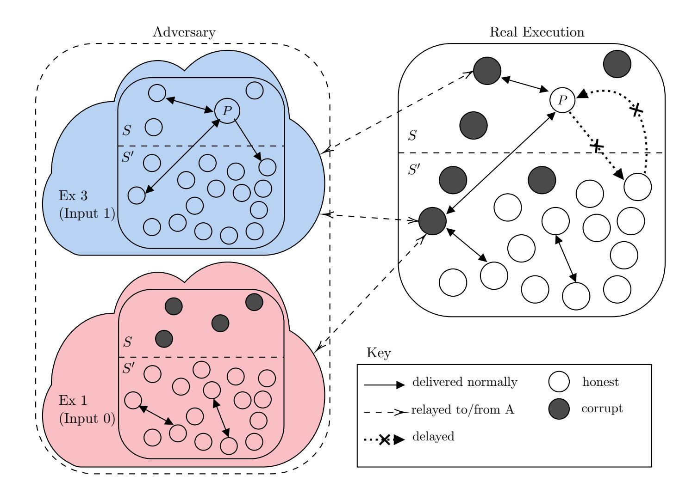

{0}------------------------------------------------

## Asynchronous Byzantine Agreement with Subquadratic Communication

Erica Blum University of Maryland erblum@cs.umd.edu

Jonathan Katz University of Maryland∗ jkatz2@gmail.com

Julian Loss University of Maryland lossjulian@gmail.com Chen-Da Liu-Zhang ETH Zurich lichen@inf.ethz.ch

#### Abstract

Understanding the communication complexity of Byzantine agreement (BA) is a fundamental problem in distributed computing. In particular, for protocols involving a large number of parties (as in, e.g., the context of blockchain protocols), it is important to understand the dependence of the communication on the number of parties n. Although adaptively secure BA protocols with o(n 2 ) communication are known in the synchronous and partially synchronous settings, no such protocols are known in the fully asynchronous case.

We show asynchronous BA protocols with (expected) subquadratic communication complexity tolerating an adaptive adversary who can corrupt f < (1 − ϵ)n/3 of the parties (for any ϵ > 0). One protocol assumes initial setup done by a trusted dealer, after which an unbounded number of BA executions can be run; alternately, we can achieve subquadratic amortized communication with no prior setup. We also show that some form of setup is needed for (non-amortized) subquadratic BA tolerating Θ(n) corrupted parties.

As a contribution of independent interest, we show a secure-computation protocol in the same threat model that has o(n 2 ) communication when computing no-input functionalities with short output (e.g., coin tossing).

## 1 Introduction

Byzantine agreement (BA) [31] is a fundamental problem in distributed computing. In this context, n parties wish to agree on a common output even when f of those parties might be adaptively corrupted. Although BA is a well-studied problem, it has recently received increased attention due to its application to blockchain (aka state machine replication) protocols. Such applications typically involve a large number of parties, and it is therefore critical to understand how the communication complexity of BA scales with n. While protocols with adaptive security and o(n 2 ) communication complexity have been obtained

∗Portions of this work were done while at George Mason University.

{1}------------------------------------------------

in both the synchronous [29] and partially synchronous [1] settings, there are currently no such solutions for the asynchronous model.1 This leads us to ask:

Is it possible to design an asynchronous BA protocol with subquadratic communication complexity that tolerates Θ(n) adaptive corruptions?

We give both positive and negative answers to this question.

Positive results. We show asynchronous BA protocols with (expected) subquadratic communication complexity that can tolerate adaptive corruption of any f < (1 − ϵ)n/3 of the parties, for arbitrary ϵ > 0. (This corruption threshold is almost optimal, as it is known [7] that asynchronous BA is impossible altogether for f ≥ n/3, even assuming prior setup and static corruptions.) Our solutions rely on two building blocks, each of independent interest:

- 1. We show a BA protocol ΠBA tolerating f adaptive corruptions and having subquadratic communication complexity. This protocol assumes prior setup by a trusted dealer for each BA execution, but the size of the setup is independent of n.
- 2. We construct a secure-computation protocol ΠMPC tolerating f adaptive corruptions, and relying on a subquadratic BA protocol as a subroutine. For the special case of no-input functionalities, the number of BA executions depends only on the security parameter, and the communication complexity is subquadratic when the output length is independent of n.

We can combine these results to give an affirmative answer to the original question. Specifically, using a trusted dealer, we can achieve an unbounded number of BA executions with o(n 2 ) communication per execution. The idea is as follows. Let L be the number of BA executions required by ΠMPC for computing a no-input functionality. The dealer provides the parties with the setup needed for L + 1 executions of ΠBA; the total size of this setup is linear in L but independent of n. Then, each time the parties wish to carry out Byzantine agreement, they will use one instance of their setup to run ΠBA, and use the remaining L instances to refresh their initial setup by running ΠMPC to simulate the dealer. Since the size of the setup for ΠBA is independent of n, the total communication complexity is subquadratic in n.

Alternately, we can avoid a trusted dealer (though we do still need to assume a PKI) by having the parties run an arbitrary adaptively secure protocol to generate the initial setup. This protocol may not have subquadratic communication complexity; however, once it is finished the parties can revert to the solution above which has subquadratic communication per BA execution. Overall, this gives BA with amortized subquadratic communication.

Impossibility result. We justify our reliance on a trusted dealer by showing that some form of setup is necessary for (non-amortized) subquadratic BA tolerating Θ(n) corrupted parties. Moreover, this holds even when secret channels and erasures are available.

1Tolerating f < n/3 static corruptions is easy; see Section 1.1.

{2}------------------------------------------------

#### 1.1 Related Work

The problem of BA was introduced by Lamport, Shostak and Pease [31]. Without some form of setup, BA is impossible (even in a synchronous network) when f ≥ n/3. Fischer, Lynch, and Patterson [23] ruled out deterministic protocols for asynchronous BA even when f = 1. Starting with the work of Rabin [38], randomized protocols for asynchronous BA have been studied in both the setup-free setting [14, 34] as well as the setting with a PKI and a trusted dealer [11].

Dolev and Reischuk [21] show that any BA protocol achieving subquadratic communication complexity (even in the synchronous setting) must be randomized. BA with subquadratic communication complexity was first studied in the synchronous model by King et al., who gave setup-free almost-everywhere BA protocols with polylogarithmic communication complexity for the case of f < (1 − ϵ)n/3 static corruptions [30] and BA with O(n 1.5 ) communication complexity for the same number of adaptive corruptions [29]. Subsequently, several works [32, 33, 35, 1, 26] gave improved protocols with subquadratic communication complexity (in the synchronous model with an adaptive adversary) using the "player replaceability paradigm," which requires setup in the form of verifiable random functions.

Abraham et al. [1] show a BA protocol with adaptive security and subquadratic communication complexity in the partially synchronous model. They also give a version of the Dolev-Reischuk bound that rules out subquadratic BA (even with setup, and even in the synchronous communication model) against a strong adversary who is allowed to remove messages sent by honest parties from the network after those parties have been adaptively corrupted. Our lower bound adapts their ideas to the standard asynchronous model where honest parties' messages can be arbitrarily delayed, but cannot deleted once they are sent. (We refer to the work of Garay et al. [24] for further discussion of these two models.) In concurrent work, Rambaud [39] proves an impossibility result similar to our own; we refer to Section 7 for further discussion.

Cohen et al. [19] show an adaptively secure asynchronous BA protocol with o(n 2 ) communication. However, they consider a non-standard asynchronous model in which the adversary cannot arbitrarily schedule delivery of messages. In particular, the adversary in their model cannot reorder messages sent by honest parties in the same protocol step. We work in the standard asynchronous model. On the other hand, our work requires stronger computational assumptions and a trusted dealer (unless we settle for amortized subquadratic communication complexity).

We remark for completeness that asynchronous BA with subquadratic communication complexity for a static adversary corrupting f < n/3 of the parties is trivial using a committee-based approach, assuming a trusted dealer. Roughly, the dealer chooses a random committee of Θ(κ) parties (where κ is a security parameter) who then run BA on behalf of everyone. Achieving subquadratic BA without any setup in the static-corruption model is an interesting open question.

Asynchronous secure multi-party computation (MPC) was first studied by Ben-Or, Canetti and Goldreich [4]. Since then, improved protocols have been proposed with both unconditional [40, 37, 36] and computational [27, 28, 16, 17] security. These protocols achieve optimal output quality, and incur a total communication complexity of at least Θ(n 3κ) assuming the output has length κ. Our MPC protocol gives a trade-off between the 

{3}------------------------------------------------

communication complexity and the output quality. In particular, we achieve subquadratic communication complexity when the desired output quality is sublinear (as in the case of no-input, randomized functions).

#### 1.2 Overview of the Paper

In Section 2 we discuss our model and recall some standard definitions. We show how to achieve asynchronous reliable consensus and reliable broadcast with subquadratic communication in Section 3. In Section 4 we present an asynchronous BA protocol with subquadratic communication complexity, assuming prior setup by a trusted dealer for each execution. In Section 5 we show a communication-efficient asynchronous protocol for secure multi-party computation (MPC). We describe how these components can be combined to give our main results in Section 6. We conclude with our lower bound in Section 7.

## 2 Preliminaries and Definitions

We denote the security parameter by κ, and assume κ < n = poly(κ). In all our protocols, we implicitly assume parties take 1κ as input; in our definitions, we implicitly allow properties to fail with probability negligible in κ. We let ppt stand for probabilistic polynomial time. We use standard digital signatures, where a signature on a message m using secret key sk is computed as σ ← Signsk(m); a signature is verified relative to public key pk by calling Vrfypk(m, σ). For simplicity, we assume in our proofs that the adversary cannot forge valid signatures on behalf of honest parties. When replacing the signatures with real-world instantiations, our theorems follow except with an additive negligible failure probability.

Model. We consider a setting where n parties P1, . . . , Pn run a distributed protocol over a network in which all parties are connected via pairwise authenticated channels. We work in the asynchronous model, meaning the adversary can arbitrarily schedule the delivery of all messages, so long as all messages are eventually delivered. We consider an adaptive adversary that can corrupt some bounded number f of the parties at any point during the execution of some protocol, and cause them to deviate arbitrarily from the protocol specification. However, we assume the "atomic send" model, which means that (1) if at some point in the protocol an honest party is instructed to send several messages (possibly to different parties) simultaneously, then the adversary can corrupt that party either before or after it sends all those messages, but not in the midst of sending those messages; and (2) once an honest party sends a message, that message is guaranteed to be delivered eventually even if that party is later corrupted. In addition, we assume secure erasure.

In many cases we assume an incorruptible dealer who can initialize the parties with setup information in advance of any protocol execution. Such setup may include both public information given to all parties, as well as private information given to specific parties; when we refer to the size of a setup, we include the total private information given to all parties but count the public information only once. A public key infrastructure (PKI) is one particular setup, in which all parties hold the same vector of public keys (pk1 , . . . , pkn ) and each honest party Pi holds the honestly generated secret key ski corresponding to pki . 

{4}------------------------------------------------

Byzantine agreement. We include here the standard definition of Byzantine agreement. Definitions of other primitives are given in the relevant sections.

Definition 1 (Byzantine agreement) Let Π be a protocol executed by parties P1, . . . , Pn, where each party Pi holds an input vi and parties terminate upon generating output. Π is an f-secure Byzantine agreement protocol if the following hold when at most f parties are corrupted:

- Validity: if every honest party has the same input value v, then every honest party outputs v.
- Consistency: all honest parties output the same value.

## 3 Building Blocks

In this section we show asynchronous protocols with subquadratic communication for reliable consensus, reliable broadcast, graded consensus, and coin flipping.

#### 3.1 Reliable Consensus

Reliable consensus is a weaker version of Byzantine agreement where termination is not required. The definition follows.

Definition 2 (Reliable consensus) Let Π be a protocol executed by parties P1, . . . , Pn, where each party Pi holds an input vi and parties terminate upon generating output. Π is an f-secure reliable consensus protocol if the following hold when at most f parties are corrupted:

- Validity: if every honest party has the same input value v, then every honest party outputs v.
- Consistency: either no honest party terminates, or all honest parties output the same value.

We show a reliable consensus protocol ΠRC with subquadratic communication. The protocol can be viewed as a variant of Bracha's reliable broadcast protocol [7, 8] for the case where every party has input. The protocol assumes prior setup initialized by a trusted dealer. The trusted setup has expected size O(κ 2 ) and takes the following form. First, the dealer selects two secret committees C1, C2 by independently placing each party in C1 (resp., C2) with probability κ/n. Then, for each party Pi in C1 (resp., C2), the dealer generates a public/private key pair (pk1,i,sk1,i) (resp., (pk2,i,sk2,i)) for a digital signature scheme and gives the associated private key to Pi ; the public keys (but not the identities of the members of the committees) are given to all parties.

The protocol itself is described in Figure 1. It begins by having each party in C1 send its signed input to all the parties. The parties in C2 then send a signed ready message on a value v the first time they either (1) receive v from κ − t parties in C1 or (2) receive ready messages on v from t + 1 parties in C2. All parties terminate upon receiving ready 

{5}------------------------------------------------

messages on the same value from κ − t parties in C2. Each committee has expected size O(κ), and each member of a committee sends a single message to all parties; thus, O(κn) messages are sent (in expectation) during the protocol.

Security relies on the fact that an adversary cannot corrupt too many members of C1 (resp., C2) "until it is too late," except with negligible probability. For a static adversary this is immediate. For an adaptive adversary this follows from the fact that each member of a committee sends only a single message and erases its signing key after sending that message; thus, once the attacker learns that some party is in a committee, adaptively corrupting that party is useless.

#### Protocol ΠRC

We describe the protocol from the point of view of a party Pi with input vi , assuming the setup described in the text. Set t = (1 − ϵ) · κ/3.

- 1. If Pi ∈ C1: Compute σi ← Signsk1,i (vi), erase sk1,i, and send (echo,(i, vi , σi)) to all parties.
- 2. If Pi ∈ C2: As long as no ready message has yet been sent, do: upon receiving (echo,(j, v, σj )) with Vrfypk1,j (v, σj ) = 1 on the same value v from at least κ − t distinct parties, or receiving (ready,(j, v, σj )) with Vrfypk2,j (v, σj ) = 1 on the same value v from strictly more than t distinct parties, compute σi ← Signsk2,i (v), erase sk2,i, and send (ready,(i, v, σi)) to all parties.
- 3. Upon receiving (ready,(j, v, σj )) with Vrfypk2,j (v, σj ) = 1 on the same value v from at least κ − t distinct parties and, output v and terminate.

Figure 1: A reliable consensus protocol, parameterized by ϵ.

Theorem 3 Let 0 < ϵ < 1/3 and f ≤ (1 − 2ϵ) · n/3. Then ΠRC is an f-secure reliable consensus protocol with expected setup size O(κ 2 ) and expected communication complexity O((κ + I) · κn), where I is the size of each party's input.

Proof Recall that t = (1−ϵ)·κ/3. Say a party is 1-honest if it is in C1 and is not corrupted when executing step 1 of the protocol, and 1-corrupted if it is in C1 but corrupted when executing step 1 of the protocol. Define 2-honest and 2-corrupted analogously. Lemma 24 shows that with overwhelming probability C1 (resp., C2) contains fewer than (1 + ϵ) · κ parties; there are more than κ − t parties who are 1-honest (resp., 2-honest); and there are fewer than t < κ − t parties who are 1-corrupted (resp., 2-corrupted). For the rest of the proof we assume these hold. We also use the fact that once a 1-honest (resp., 2-honest) party P sends a message, that message is the only such message that will be accepted by honest parties on behalf of P (even if P is adaptively corrupted after sending that message).

We first prove that ΠRC is f-valid. Assume all honest parties start with the same input v. Each of the parties that is 1-honest sends an echo message on v to all other parties, and so every honest party eventually receives valid echo messages on v from more than κ − t distinct parties. Since there are fewer than κ − t parties that are 1-corrupted, no honest party receives valid echo messages on v ′ ̸= v from κ − t or more distinct parties. It follows that every 2-honest party sends a ready message on v to all other parties. A similar argument then shows that all honest parties output v and terminate.

{6}------------------------------------------------

Toward showing consistency, we first argue that if honest  $P_i, P_j$  send ready messages on  $v_i, v_j$ , respectively, then  $v_i = v_j$ . Assume this is not the case, and let  $P_i, P_j$  be the first honest parties to send ready messages on distinct values  $v_i, v_j$ . Then  $P_i$  (resp.,  $P_j$ ) must have received at least  $\kappa - t$  valid ready messages on  $v_i$  (resp.,  $v_j$ ). But then at least

$$(\kappa - t) + (\kappa - t) = (1 + \epsilon) \cdot \kappa + t$$

valid ready messages were received by  $P_i, P_j$  overall. But this is impossible, since the maximum number of such messages is at most  $|C_2|$  plus the number of 2-corrupted parties (because 2-honest parties send at most one ready message), which is strictly less than  $(1 + \epsilon) \cdot \kappa + t$ .

Now, assume an honest party  $P_i$  outputs v. Then  $P_i$  must have received valid ready messages on v from at least  $\kappa - t$  distinct parties in  $C_2$ , more than  $\kappa - 2t > t$  of whom are 2-honest. As a consequence, all 2-honest parties eventually receive valid ready messages on v from more than t parties, and so all 2-honest parties eventually send a ready message on v. Thus, all honest parties eventually receive valid ready messages on v from at least  $\kappa - t$  parties, and so output v also.

#### 3.2 Reliable Broadcast

Reliable broadcast allows a sender to consistently distribute a message to a set of parties. In contrast to full-fledged broadcast (and by analogy to reliable consensus), reliable broadcast does not require termination.

**Definition 4 (Reliable broadcast)** Let  $\Pi$  be a protocol executed by parties  $P_1, \ldots, P_n$ , where a designated sender  $P^*$  initially holds input  $v^*$ , and parties terminate upon generating output.  $\Pi$  is an f-secure reliable broadcast protocol if the following hold when at most f parties are corrupted:

- Validity: if  $P^*$  is honest at the start of the protocol, then every honest party outputs  $v^*$ .
- Consistency: either no honest party terminates, or all honest parties output the same value.

It is easy to obtain a reliable broadcast protocol  $\Pi_{\mathsf{RBC}}$  (cf. Figure 2) from reliable consensus: the sender  $P^*$  simply signs its message and sends it to all parties, who then run reliable consensus on what they received. In addition to the setup for the underlying reliable consensus protocol,  $\Pi_{\mathsf{RBC}}$  assumes  $P^*$  has a public/private key pair ( $\mathsf{pk}^*$ ,  $\mathsf{sk}^*$ ) with  $\mathsf{pk}^*$  known to all other parties.

**Theorem 5** Let  $0 < \epsilon < 1/3$  and  $f \le (1 - 2\epsilon) \cdot n/3$ . Then  $\Pi_{\mathsf{RBC}}$  is an f-secure reliable broadcast protocol with expected setup size  $O(\kappa^2)$  and expected communication complexity  $O((\kappa + \mathcal{I}) \cdot \kappa n)$ , where  $\mathcal{I}$  is the size of the sender's input.

{7}------------------------------------------------

#### Protocol $\Pi_{\mathsf{RBC}}$

- 1.  $P^*$  does: compute  $\sigma^* \leftarrow \mathsf{Sign}_{\mathsf{sk}^*}(v^*)$ , erase  $\mathsf{sk}^*$ , and send  $(v^*, \sigma^*)$  to all parties.
- 2. Upon receiving  $(v^*, \sigma^*)$  with  $\mathsf{Vrfy}_{\mathsf{pk}^*}(v, \sigma) = 1$ , input v to  $\Pi_{\mathsf{RC}}$  (with parameter  $\epsilon$ ).
- 3. Upon receiving output v from  $\Pi_{RC}$ , output v and terminate.

Figure 2: A reliable broadcast protocol, implicitly parameterized by  $\epsilon$ .

**Proof** Consistency follows from consistency of  $\Pi_{\mathsf{RC}}$ . As for validity, if  $P^*$  is honest at the outset of the protocol then  $P^*$  sends  $(v^*, \sigma^*)$  to all parties in step 1; even if  $P^*$  is subsequently corrupted, that is the only valid message from  $P^*$  that other parties will receive. As a result, every honest party runs  $\Pi_{\mathsf{RC}}$  using input v, and validity of  $\Pi_{\mathsf{RC}}$  implies validity of  $\Pi_{\mathsf{RBC}}$ .

#### 3.3 Graded Consensus

Graded consensus [22] can be viewed as a weaker form of consensus where parties output a grade along with a value, and agreement is required to hold only if some honest party outputs a grade of 1. Our definition does not require termination upon generating output.

**Definition 6 (Graded consensus)** Let  $\Pi$  be a protocol executed by parties  $P_1, \ldots, P_n$ , where each party  $P_i$  holds an input  $v_i$  and is supposed to output a value  $w_i$  along with a grade  $g_i \in \{0,1\}$ .  $\Pi$  is an f-secure graded-consensus protocol if the following hold when at most f parties are corrupted:

- Graded validity: if every honest party has the same input value v, then every honest party outputs (v, 1).
- Graded consistency: if some honest party outputs (w, 1), then every honest party  $P_i$  outputs  $(w, g_i)$ .

We formally describe a graded-consensus protocol  $\Pi_{GC}$  inspired by the graded consensus protocol of Canetti and Rabin [14], and prove the following theorem in Appendix B.

**Theorem 7** Let  $0 < \epsilon < 1/3$  and  $f \le (1 - 2\epsilon) \cdot n/3$ . Then  $\Pi_{\mathsf{GC}}$  is an f-secure graded-consensus protocol with expected setup size  $O(\kappa^3)$  and expected communication complexity  $O((\kappa + \mathcal{I}) \cdot \kappa^2 n)$ , where  $\mathcal{I}$  is the size of each party's input.

#### 3.4 A Coin-Flip Protocol

We describe here a protocol that allows parties to generate a sequence of random bits (coins)  $\mathsf{Coin}_1, \ldots, \mathsf{Coin}_T$  for a pre-determined parameter T. We denote the sub-protocol to generate the ith coin by  $\mathsf{CoinFlip}(i)$ . Roughly speaking, the protocol guarantees that (1) when all honest parties invoke  $\mathsf{CoinFlip}(i)$ , all honest parties output the same value  $\mathsf{Coin}_i$  and (2) until the first honest party invokes  $\mathsf{CoinFlip}(i)$ , the value of  $\mathsf{Coin}_i$  is uniform.

Our coin-flip protocol assumes setup provided by a trusted dealer that takes the following form: For each iteration  $1, \ldots, T$ , the dealer chooses uniform  $\mathsf{Coin}_i \in \{0, 1\}$ ; chooses a

{8}------------------------------------------------

random subset Ei of the parties by including each party in Ei with probability κ/n; and then gives authenticated secret shares of Coini (using a perfectly secret ⌈κ/3⌉-out-of-|Ei | secret-sharing scheme) to the members of Ei . (Authentication is done by having the dealer sign the shares.) Since each share (including the signature) has size O(κ), the size of the setup is O(κ 2T).

The coin-flip protocol itself simply involves having the parties in the relevant subset send their shares to everyone else. The communication complexity is thus O(κ 2n) per iteration.

Lemma 8 Let 0 < ϵ < 1/3 and f ≤ (1 − 2ϵ) · n/3. Then as long as at most f parties are corrupted, CoinFlip(i) satisfies the following:

- 1. all honest parties obtain the same value Coini,
- 2. until the first honest party invokes CoinFlip(i), the value of Coini is uniform from the adversary's perspective.

Proof Lemma 24 implies that, except with negligible probability, Ei contains more than ⌈κ/3⌉ honest parties and fewer than (1 − ϵ) · κ/3 corrupted parties. The stated properties follow.

## 4 (Single-Shot) BA with Subquadratic Communication

In this section we describe a BA protocol ΠBA with subquadratic communication complexity. (See Figure 3.) ΠBA assumes setup that is then used for a single execution of the protocol. The setup for ΠBA corresponds to the setup required for O(κ) executions of graded consensus, O(κ) iterations of the coin-flip sub-protocol, and a single execution of reliable consensus. Using the protocols from the previous section, ΠBA thus requires setup of size O(κ 4 ) overall.

Following ideas by Most´efaoui et al. [34], our protocol consists of a sequence of Θ(κ) iterations, where each iteration invokes a graded-consensus subprotocol and a coin-flip subprotocol. In each iteration there is a constant probability that honest parties reach agreement; once agreement is reached, it cannot be undone in later iterations. The coin-flip protocol allows parties to adopt the value of a common coin if agreement has not yet been reached (or, at least, if parties are unaware that agreement has been reached). Reliable consensus is used so parties know when to terminate.

We prove security via a sequence of lemmas. Throughout the following, we fix some value 0 < ϵ < 1/3 and let f ≤ (1 − 2ϵ)n/3 be a bound on the number of corrupted parties.

Lemma 9 If at most f parties are corrupted during an execution of ΠBA, then with all but negligible probability some honest party sets ready = true within the first κ iterations.

Proof Consider an iteration k of ΠBA such that no honest party set ready = true in any previous iteration. (This is trivially true in the first iteration). We begin by showing that some honest party sets ready = true in that iteration with probability at least 1/2. Consider two cases:

{9}------------------------------------------------

#### Protocol $\Pi_{\mathsf{BA}}$

We describe the protocol from the point of view of a party with input  $v \in \{0, 1\}$ .

Set b := v and ready := false. Then for k = 1 to  $\kappa + 1$  do:

- 1. Run  $\Pi_{\mathsf{GC}}$  on input b, and let (b,g) denote the output.
- 2. Invoke CoinFlip(k) to obtain  $Coin_k$ .
- 3. If g = 0 then set  $b := \mathsf{Coin}_k$ .
- 4. Run  $\Pi_{\mathsf{GC}}$  on input b, and let (b,g) denote the output.
- 5. If g = 1 and ready = false, then set ready := true and run  $\Pi_{RC}$  on input b.
- 6. Set k := k + 1 and goto step 1.

Termination: If  $\Pi_{RC}$  ever terminates with output b', output b' and terminate.

Figure 3: A Byzantine agreement protocol, implicitly parameterized by  $\epsilon$ .

- If some honest party outputs (b,1) in the first execution of  $\Pi_{\mathsf{GC}}$  during iteration k, then graded consistency of  $\Pi_{\mathsf{GC}}$  guarantees that every other honest party outputs (b,1) or (b,0) in that execution. The value b is independent of  $\mathsf{Coin}_k$ , because b is determined prior to the point when the first honest party invokes  $\mathsf{CoinFlip}(i)$ ; thus,  $\mathsf{Coin}_k = b$  with probability 1/2. If that occurs, then all honest parties input b to the second execution of  $\Pi_{\mathsf{GC}}$  and, by graded validity, every honest party outputs (g,1) in the second execution of  $\Pi_{\mathsf{GC}}$  and sets  $\mathsf{ready} = \mathsf{true}$ .
- Say no honest party outputs grade 1 in the first execution of  $\Pi_{\mathsf{GC}}$  during iteration k. Then all honest parties input  $\mathsf{Coin}_k$  to the second execution of  $\Pi_{\mathsf{GC}}$  and, by graded validity, every honest party outputs (g,1) in the second execution of  $\Pi_{\mathsf{GC}}$  and sets ready = true.

Thus, in each iteration where no honest party has yet set ready = true, some honest party sets ready = true in that iteration with probability at least 1/2. We conclude that the probability that no honest party has set ready = true after  $\kappa$  iterations is negligible.

**Lemma 10** Assume at most f parties are corrupted during execution of  $\Pi_{\mathsf{BA}}$ . If some honest party executes  $\Pi_{\mathsf{RC}}$  using input b in iteration k, then (1) honest parties who execute  $\Pi_{\mathsf{GC}}$  in any iteration k' > k use input b, and (2) honest parties who execute  $\Pi_{\mathsf{RC}}$  in any iteration  $k' \geq k$  use input b.

**Proof** Consider the first iteration k in which some honest party P sets ready = true, and let b denote P's input to  $\Pi_{\mathsf{RC}}$ . P must have received (b,1) from the second execution of  $\Pi_{\mathsf{GC}}$  in iteration k. By graded consistency, all other honest parties must receive (b,0) or (b,1) from that execution of  $\Pi_{\mathsf{GC}}$  as well. Thus, any honest parties who execute  $\Pi_{\mathsf{RC}}$  in iteration k use input b, and any honest parties who run2 the first execution of  $\Pi_{\mathsf{GC}}$  in iteration k+1 will use input b as well. Graded validity ensures that any honest party who

&lt;sup>2Note that some honest parties may terminate before others, and in particular it may be the case that not all honest parties run some execution of  $\Pi_{GC}$ .

{10}------------------------------------------------

receives output from that execution of  $\Pi_{\mathsf{GC}}$  will receive (b,1), causing them to use input b to the next execution of  $\Pi_{\mathsf{GC}}$  as well as  $\Pi_{\mathsf{RC}}$  (if they execute those protocols), and so on.

**Lemma 11** Assume at most f parties are corrupted during an execution of  $\Pi_{\mathsf{BA}}$ . If some honest party sets ready = true within the first  $\kappa$  iterations and executes  $\Pi_{\mathsf{RC}}$  using input b, then all honest parties terminate with output b.

**Proof** Let  $k \leq \kappa$  be the first iteration in which some honest party sets ready = true and executes  $\Pi_{\mathsf{RC}}$  using input b. By Lemma 10, any other honest party who executes  $\Pi_{\mathsf{RC}}$  must also use input b, and furthermore all honest parties who execute  $\Pi_{\mathsf{GC}}$  in any subsequent iteration use input b there as well. We now consider two cases:

- If no honest party terminates before all honest parties receive output from the second execution of  $\Pi_{GC}$  in iteration k+1, then graded validity of  $\Pi_{GC}$  ensures that all honest parties receive (b,1) as output from that execution, and thus all parties execute  $\Pi_{RC}$  using input b at this point if they have not done so already. Validity of  $\Pi_{RC}$  then ensures that all honest parties output b and terminate.
- If some honest party P has terminated before all honest parties receive output from the second execution of  $\Pi_{\mathsf{GC}}$  in iteration k+1, validity of  $\Pi_{\mathsf{RC}}$  implies that P must have output b. In that case, consistency of  $\Pi_{\mathsf{RC}}$  guarantees that all parties will eventually output b and terminate.

This completes the proof.

**Theorem 12** Let  $0 < \epsilon < 1/3$  and  $f \le (1-2\epsilon) \cdot n/3$ . Then  $\Pi_{\mathsf{BA}}$  is an f-secure BA protocol with expected setup size  $O(\kappa^4)$  and expected communication complexity  $O(\kappa^4 n)$ .

**Proof** By Lemma 9, with overwhelming probability some honest party sets ready = true within the first  $\kappa$  iterations and thus executes  $\Pi_{RC}$  using some input b. It follows from Lemma 11 that all honest parties eventually output b and terminate. This proves consistency.

Assume all honest parties have the same input v. Unless some honest party terminates before all honest parties have concluded the first iteration, one can verify (using graded validity of  $\Pi_{GC}$ ) that in the first iteration all honest parties output (v,1) from the first execution of  $\Pi_{GC}$ ; use input v to the second execution of  $\Pi_{GC}$ ; output (v,1) from the second execution of  $\Pi_{GC}$ ; and execute  $\Pi_{RC}$  using input v. But the only way some honest party could terminate before all honest parties have concluded the first iteration is if that party executes  $\Pi_{RC}$  using input v. Either way, Lemma 11 shows that all honest parties will terminate with output v, proving validity.

## 5 MPC with Subquadratic Communication

In this section we give a protocol for asynchronous secure multiparty computation (MPC). Our protocol uses a Byzantine agreement protocol as a subroutine; importantly, the number

{11}------------------------------------------------

of executions of Byzantine agreement is independent of the number of parties as well as the output length, as long as the desired input quality is low enough. Our MPC protocol also relies on a sub-protocol for (a variant of the) asynchronous common subset problem; we give a definition, and a protocol with subquadratic communication complexity, in the next section.

#### 5.1 Validated ACS with Subquadratic Communication

A protocol for the asynchronous common subset (ACS) problem [5, 12] allows n parties to agree on a subset of their initial inputs of some minimum size. We consider a *validated* version of ACS (VACS), where it is additionally ensured that all values in the output multiset satisfy a given predicate Q [15, 10].

**Definition 13** Let Q be a predicate, and let  $\Pi$  be a protocol executed by parties  $P_1, \ldots, P_n$ , where each party outputs a multiset of size at most n, and terminates upon generating output.  $\Pi$  is an f-secure Q-validated ACS protocol with  $\ell$ -output quality if the following hold when at most f parties are corrupted and every honest party's input satisfies Q:

- Q-Validity: if an honest party outputs S, then each  $v \in S$  satisfies Q(v) = 1.
- Consistency: every honest party outputs the same multiset.
- $\ell$ -Output quality: all honest parties output a multiset of size at least  $\ell$  that contains inputs from at least  $\ell$  f parties who were honest at the start of the protocol.

Our VACS protocol  $\Pi_{\mathsf{VACS}}^{\ell,Q}$  (see Figure 4) is inspired by the protocol of Ben-Or et al. [5]. During the setup phase, a secret committee C is chosen by independently placing each party in C with probability s/n, where  $s = \frac{3}{2+\epsilon}\ell$  and  $\ell$  is the desired output quality. Each party in the committee acts as a sender in a reliable-broadcast protocol, and then the parties run |C| instances of Byzantine agreement to agree on the set of reliable-broadcast executions that terminated. The expected communication complexity and setup size for  $\Pi_{\mathsf{VACS}}^{\ell,Q}$  are thus (in expectation) a factor of  $O(\ell)$  larger than those for reliable broadcast and Byzantine agreement.

Using the protocols from the previous sections, we thus obtain:

**Theorem 14** Let  $0 < \epsilon < 1/3$ ,  $f \le (1 - 2\epsilon) \cdot n/3$ , and  $\ell \le (1 + \epsilon/2) \cdot 2n/3$ . Then  $\Pi_{\mathsf{VACS}}^{\ell,Q}$  is an f-secure Q-validated ACS protocol with  $\ell$ -output quality. It has expected setup size  $O(\ell \kappa^4)$  and expected communication complexity  $O(\ell \cdot (\mathcal{I} + \kappa^3) \cdot \kappa n)$ , where  $\mathcal{I}$  is the size of each party's input, and uses  $O(\ell)$  invocations of Byzantine agreement in expectation.

**Proof** Say v is in the multiset output by some honest party, where v was output by  $\mathsf{RBC}_i$ .  $\mathsf{BA}_i$  must have resulted in output 1, which (by validity of  $\mathsf{BA}$ ) can only occur if some honest party used input 1 when executing  $\mathsf{BA}_i$ . But then Q(v) = 1. This proves Q-validity of  $\Pi_{\mathsf{VACS}}^{\ell,Q}$ .

By consistency of BA, all honest parties agree on CoreSet. If  $i \in \mathsf{CoreSet}$ , then  $\mathsf{BA}_i$  must have resulted in output 1 which means that some honest party P must have used input 1 to  $\mathsf{BA}_i$ . (Validity or  $\mathsf{BA}_i$  ensures that if all honest parties used input 0, the output of  $\mathsf{BA}$ 

{12}------------------------------------------------

## Protocol $\Pi_{\mathsf{VACS}}^{\ell,Q}$

We describe the protocol from the point of view of a party P with input v. We assume prior setup in which a committee C is chosen (see text).

- 1. Execute |C| instances of reliable broadcast, denoted  $\mathsf{RBC}_1, \ldots, \mathsf{RBC}_{|C|}$ . If P is the ith member of C, then P executes the ith instance of  $\Pi_{\mathsf{RBC}}$  as the sender using input v.
- 2. On output  $v_i$  from  $RBC_i$  with  $Q(v_i) = 1$ , if P has not yet begun executing the ith instance  $BA_i$  of Byzantine agreement, then begin that execution using input 1.
- 3. When P has output 1 in  $\ell$  instances of Byzantine agreement, then begin executing any other instances of Byzantine agreement that have not yet begun using input 0.
- 4. Once P has terminated in all instances of Byzantine agreement, let CoreSet be the indices of those instances that resulted in output 1. After receiving output  $v_i$  from  $\mathsf{RBC}_i$  for all  $i \in \mathsf{CoreSet}$ , output the multiset  $\{v_i\}_{i \in \mathsf{CoreSet}}$ .

Figure 4: A VACS protocol (implicitly parameterized by  $\epsilon$ ) with  $\ell$ -output quality and predicate Q.

must be 0). But then P must have terminated in  $\mathsf{RBC}_i$ ; consistency of  $\mathsf{RBC}_i$  then implies that all honest parties eventually terminate  $\mathsf{RBC}_i$  with the same output  $v_i$ . Consistency of  $\Pi_{\mathsf{VACS}}^{\ell,Q}$  follows.

Lemma 24 shows that with overwhelming probability there are more than  $\frac{2+\epsilon}{3} \cdot \frac{3}{2+\epsilon} \ell = \ell$  honest parties in C at step 1 of the protocol. Validity of RBC implies that in the corresponding instances of RBC, all honest parties terminate with an output satisfying Q. If every honest party begins executing all the corresponding instances of BA, those  $\ell$  instances will all yield output 1. The only way all honest parties might not begin executing all those instances of BA is if some honest party outputs 1 in some (other)  $\ell$  instances of BA, but then consistency of BA implies that all honest parties output 1 in those same  $\ell$  instances. We conclude that every honest party outputs 1 in at least  $\ell$  instances of BA, and so outputs a multiset S of size at least  $\ell$ . Since each instance of RBC (and so each corrupted party) contributes at most one value to S, this proves  $\ell$ -output quality.

#### 5.2 Secure Multiparty Computation

We begin by reviewing the definition of asynchronous MPC by Canetti [13]. Let g be an n-input function, possibly randomized, where if the inputs of the parties are  $\mathbf{x} = (x_1, \dots, x_n)$  then all parties should learn  $y \leftarrow g(x_1, \dots, x_n)$ . In the real-world execution of a protocol  $\Pi$  computing g, each party  $P_i$  initially holds  $1^{\kappa}$  and an input  $x_i$ , and an adversary  $\mathcal{A}$  has input  $1^{\kappa}$  and auxiliary input z. The parties execute  $\Pi$ , and may be adaptively corrupted by  $\mathcal{A}$  during execution of the protocol. At the end of the execution, each honest party outputs its local output (as dictated by the protocol), and  $\mathcal{A}$  outputs its view. We let  $\text{REAL}_{\Pi,\mathcal{A}}(\kappa,\mathbf{x},z)$  denote the distribution over the resulting vector of outputs as well as the set of corrupted parties.

Security of  $\Pi$  is defined relative to an ideal-world evaluation of g by a trusted party. The parties hold inputs as above, and we now denote the adversary by S. The ideal execution

{13}------------------------------------------------

proceeds as follows:

- $\bullet$  Initial corruption. S may adaptively corrupt parties and learn their inputs.
- Computation with  $\ell$ -output quality. S sends a set CoreSet  $\subseteq \{P_1, \ldots, P_n\}$  of size at least  $\ell$  to the trusted party. In addition, S sends to the trusted party an input  $x_i'$  for each corrupted  $P_i \in \mathsf{CoreSet}$ .

For  $P_i \notin \mathsf{CoreSet}$ , let  $x_i' = \bot$ ; if  $P_i \in \mathsf{CoreSet}$  is honest, then let  $x_i' = x_i$ . The trusted party computes  $y \leftarrow g(x_1', \ldots, x_n')$  and sends  $(y, \mathsf{CoreSet})$  to each party.

- Additional corruption. S may corrupt additional parties.3
- Output stage. Each honest party outputs (y, CoreSet).
- $\bullet$  Post-execution corruption.  $\mathcal{S}$  may corrupt additional parties, and then outputs an arbitrary function of its view.

We let  $IDEAL_{g,\mathcal{S}}^{\ell}(\kappa, \mathbf{x}, z)$  be the distribution over the vector of outputs and the set of corrupted parties following an ideal-world execution as above.

**Definition 15**  $\Pi$  f-securely computes g with  $\ell$ -output quality if for any PPT adversary  $\mathcal{A}$  corrupting up to f parties, there is a PPT adversary  $\mathcal{S}$  such that:

$$\{\operatorname{IDEAL}_{g,\mathcal{S}}^{\ell}(\kappa,\mathbf{x},z)\}_{\kappa\in\mathbb{N};\mathbf{x},z\in\{0,1\}^*} \approx_{c} \{\operatorname{REAL}_{\Pi,\mathcal{A}}(\kappa,\mathbf{x},z)\}_{\kappa\in\mathbb{N};\mathbf{x},z\in\{0,1\}^*}.$$

We construct an MPC protocol  $\Pi_{\mathsf{MPC}}^{\ell}$  that offers a tradeoff between communication complexity and output quality; in particular, it has subquadratic communication complexity when the output quality and the output length of the functionality being computed are sublinear in the number of parties. We provide a high-level overview of our protocol next, with a full description in Figure 5.

Let  $t = (1 - \epsilon) \cdot \kappa/3$ . Our protocol assumes trusted setup as follows:

- 1. A random committee C is selected by including each party in C independently with probability  $\kappa/n$ . This is done in the usual way by giving each member of the committee a secret key for a signature scheme, and giving the corresponding public keys to all parties. In addition:
  - (a) We assume a threshold fully homomorphic encryption (TFHE) scheme [2, 6] TFHE = (KGen, Enc, Dec, Eval) with non-interactive decryption whose secret key is shared in a t-out-of-|C| manner among the parties in C. (We refer to Appendix C.1 for appropriate definitions of TFHE.) Specifically, we assume a TFHE public key ek is given to all parties, while a share  $dk_i$  of the corresponding secret key is given to the ith party in C.
  - (b) The setup for  $\Pi_{\mathsf{MPC}}^{\ell}$  includes setup for |C| instances of  $\Pi_{\mathsf{RBC}}$  (with the *i*th party in C the sender for the *i*th instance of  $\Pi_{\mathsf{RBC}}$ ), as well as one instance of  $\Pi_{\mathsf{RC}}$ .

 ${}^{3}\mathcal{S}$  learns nothing additional, because we assume secure erasure (in both the ideal- and real-world executions).

{14}------------------------------------------------

- 2. All parties are given a list of |C| commitments to each of the TFHE shares  $dk_i$ ; the randomness  $\omega_i$  for the *i*th commitment is given to the *i*th member of C.
- 3. All parties are given the TFHE encryption of a random  $\kappa$ -bit value r. We denote the resulting ciphertext by  $c_{\mathsf{rand}} \leftarrow \mathsf{Enc}_{ek}(r)$ .
- 4. Parties are given the setup for one instance of VACS protocol  $\Pi_{VACS}^{\ell,Q}$ . We further assume that each party in the committee that is chosen as part of the setup for that protocol is given a secret key for a signature scheme, and all parties are given the corresponding public keys.
- 5. All parties are given a common reference string (CRS) for a universally composable non-interactive zero-knowledge (UC-NIZK) proof [20] (see below).

The overall expected size of the setup is  $O((\ell + \kappa) \cdot \mathsf{poly}(\kappa))$ .

Fix a (possibly randomized) functionality g the parties wish to compute. We assume without loss of generality that g uses exactly  $\kappa$  random bits (one can always use a PRG to ensure this). To compute g, each party  $P_i$  begins by encrypting its input  $x_i$  using the TFHE scheme, and signing the result; it also computes an NIZK proof of correctness for the resulting ciphertext. The parties then use VACS (with  $\ell$ -output quality) to agree on a set S containing at least  $\ell$  of those ciphertexts. Following this, parties carry out a local computation in which they evaluate g homomorphically using the set of ciphertexts in S as the inputs and the ciphertext  $c_{\rm rand}$  (included in the setup) as the randomness. This results in a ciphertext  $c^*$  containing the encrypted result, held by all parties. Parties in C enable decryption of  $c^*$  by using reliable broadcast to distribute shares of the decrypted value (along with a proof of correctness). Finally, the parties use reliable consensus to agree on when to terminate.

In the description above, we have omitted some details. In particular, the protocol ensures adaptive security by having parties erase certain information once it is no longer needed. This means, in particular, that we do not need to rely on equivocal TFHE [18].

In our protocol, parties generate UC-NIZK proofs for different statements. (Note that UC-NIZK proofs are proofs of knowledge; they are also non-malleable.) In particular, we define the following languages, parameterized by values (given to all parties) contained in the setup:

- 1.  $(i, c_i) \in L_1$  if there exist  $x_i, r_i$  such that  $c_i = \mathsf{Enc}_{ek}(x_i; r_i)$ .
- 2.  $(i, c^*, d_i) \in L_2$  if  $d_i = \mathsf{Dec}_{dk_i}(c^*)$  and  $\mathsf{com}_i = \mathsf{Com}(dk_i; \omega_i)$ . (Here,  $\mathsf{com}_i$  is the commitment to  $dk_i$  included in the setup.)

We prove the following theorem in Appendix D.

**Theorem 16** Let  $0 < \epsilon < 1/3$ ,  $f \le (1 - 2\epsilon) \cdot n/3$ , and  $\ell \le (1 + \epsilon/2) \cdot 2n/3$ . Assuming appropriate security of the NIZK proofs and TFHE, protocol  $\Pi^{\ell}_{\mathsf{MPC}}$  f-securely computes g with  $\ell$ -output quality.  $\Pi^{\ell}_{\mathsf{MPC}}$  requires setup of expected size  $O((\ell + \kappa) \cdot \mathsf{poly}(\kappa))$ , has expected communication complexity  $O((\ell + \kappa) \cdot (\mathcal{I} + \mathcal{O}) \cdot \mathsf{poly}(\kappa) \cdot n)$ , where  $\mathcal{I}$  is the size of each party's input and  $\mathcal{O}$  is the size of the output, and invokes Byzantine agreement  $O(\ell)$  times in expectation.

{15}------------------------------------------------

#### Protocol $\Pi_{\mathsf{MPC}}^\ell$

Let  $t = (1 - \epsilon) \cdot \kappa/3$ . We describe the protocol from the point of view of a party  $P_i$  with input  $x_i$ , assuming the setup described in the text.

- 1. Compute  $c_i \leftarrow \mathsf{Enc}_{ek}(x_i)$  along with a UC-NIZK proof  $\pi_i$  that  $(i, c_i) \in L_1$ . Erase  $x_i$  and the randomness used to generate  $c_1$  and  $\pi_i$ .
  - Execute  $\Pi_{\mathsf{VACS}}^{\ell,Q}$  using input  $(i,\mathsf{Sign}_{\mathsf{sk}_i}(c_i),c_i,\pi_i)$ , where  $Q(i,\sigma,c,\pi)=1$  iff  $\mathsf{Vrfy}_{\mathsf{pk}_i}(c,\sigma)=1$  and  $\pi$  is a correct proof for (i,c). Let S' denote the multiset output by  $\Pi_{\mathsf{VACS}}^{\ell,Q}$ . Let  $S\subseteq S'$  be the set obtained by including, for all i, only the lexicographically first tuple  $(i,\star,\star,\star)$  in S'. Let  $I=\{i\mid\exists\,(i,\star,\star,\star)\in S\}$ .
- 2. Define the circuit  $C_g$  taking |I| + 1 inputs, where  $C_g(\{x_i\}_{i \in I}, r) = g(\{x_i\}_{i \in I}, \{\bot\}_{i \notin I}; r)$ . Compute  $c^* := \mathsf{Eval}_{ek}(C_g, \{c_i\}_{i \in I}, c_{\mathsf{rand}})$ .
  - If  $P_i \in C$ , compute  $d_i := \mathsf{Dec}_{dk_i}(c^*)$  and a UC-NIZK proof  $\pi'_i$  that  $(i, c^*, d_i) \in L_2$ . Erase  $dk_i, \omega_i$ , and the randomness used to generate  $\pi'_i$ .
  - Execute |C| instances of  $\Pi_{\mathsf{RBC}}$ . If  $P_i$  is the *i*th member of C, it executes the *i*th instance of  $\Pi_{\mathsf{RBC}}$  as the sender using input  $(i, d_i, \pi'_i)$ .
- 3. Upon receiving t outputs  $\{(j, d_j, \pi'_j)\}$  from the  $\Pi_{\mathsf{RBC}}$  instances, with valid proofs and distinct j, compute  $y_i := \mathsf{Rec}(\{d_j\})$  and execute  $\Pi_{\mathsf{RC}}$  with input  $y_i$ . When  $\Pi_{\mathsf{RC}}$  terminates with output y, output (y, I) and terminate.

Figure 5: An MPC protocol with  $\ell$ -output quality, parameterized by  $\epsilon$ .

## 6 Putting it All Together

The BA protocol  $\Pi_{BA}$  from Section 4 requires prior setup by a trusted dealer that can be used only for a *single* BA execution. Using multiple, independent instances of the setup it is, of course, possible to support any *bounded* number of BA executions. But a new idea is needed to support an *unbounded* number of executions.

In this section we discuss how to use the MPC protocol from Section 5 to achieve this goal. The key idea is to use that protocol to *refresh the setup* each time a BA execution is done. We first describe how to modify our MPC protocol to make it suitable for our setting, and then discuss how to put everything together to obtain the desired result.

#### 6.1 Securely Simulating a Trusted Dealer

As just noted, the key idea is for the parties to use the MPC protocol from Section 5 to simulate a trusted dealer. In that case the parties are evaluating a no-input (randomized) functionality, and so do not need any output quality; let  $\Pi_{MPC} = \Pi_{MPC}^0$ . Importantly,  $\Pi_{MPC}$  has communication complexity subquadratic in n.

Using  $\Pi_{\mathsf{MPC}}$  to simulate a dealer, however, requires us to address several technicalities. As described,  $\Pi_{\mathsf{MPC}}$  evaluates a functionality for which all parties receive the *same* output. But simulating a dealer requires the parties to compute a functionality where parties receive different outputs. The standard approach for adapting MPC protocols to provide parties with different outputs does not work in our context: specifically, using symmetric-key encryption to encrypt the output of each party  $P_i$  using a key that  $P_i$  provides as part of its

{16}------------------------------------------------

input does not work since  $\Pi_{\mathsf{MPC}}$  has no output quality (and even  $\Pi^{\ell}_{\mathsf{MPC}}$  only guarantees  $\ell$ -output quality for  $\ell < n$ ). Assuming a PKI, we can fix this by using public-key encryption instead (in the same way); this works since the public keys of the parties can be incorporated into the functionality being computed—since they are common knowledge—rather than being provided as inputs to the computation.

Even when using public-key encryption as just described, however, additional issues remain.  $\Pi_{\mathsf{MPC}}$  has (expected) subquadratic communication complexity only when the output length  $\mathcal{O}$  of the functionality being computed is sublinear in the number of parties. Even if the dealer algorithm generates output whose length is independent of n, naively encrypting output for every party (encrypting a "null" value of the appropriate length for parties whose output is empty) would result in output of total length linear in n. Encrypting the output only for parties with non-empty output does not work either since, in general, this might reveal which parties get output, which in our case would defeat the purpose of the setup!

We can address this difficulty by using anonymous public-key encryption [3]. Roughly, an anonymous public-key encryption (APKE) scheme has the property that a ciphertext leaks no information about the public key pk used for encryption, except to the party holding the corresponding secret key sk (who is able to decrypt the ciphertext using that key). Using APKE to encrypt the output for each party who obtains non-empty output, and then randomly permuting the resulting ciphertexts, allows us to compute a functionality with sublinear output length while hiding which parties receive output. This incurs—at worst—an additional multiplicative factor of  $\kappa$  in the output length.

Summarizing, we can simulate an arbitrary dealer algorithm in the following way. View the output of the dealer algorithm as  $\mathsf{pub}$ ,  $\{(i,s_i)\}$ , where  $\mathsf{pub}$  represents the public output that all parties should learn, and each  $s_i$  is a private output that only  $P_i$  should learn. Assume the existence of a PKI, and let  $\mathsf{pk}_i$  denote a public key for an APKE scheme, where the corresponding secret key is held by  $P_i$ . Then use  $\Pi_{\mathsf{MPC}}$  to compute  $\mathsf{pub}$ ,  $\{\mathsf{Enc}_{\mathsf{pk}_i}(s_i)\}$ , where the ciphertexts are randomly permuted. As long as the length of the dealer's output is independent of n, the output of this functionality is also independent of n.

# 6.2 Unbounded Byzantine Agreement with Subquadratic Communication

We now show how to use the ideas from the previous section to achieve an *unbounded* number of BA executions with subquadratic communication. We describe two solutions: one involving a trusted dealer who initializes the parties with a one-time setup, and another that does not require a dealer (but does assume a PKI) and achieves expected subquadratic communication in an amortized sense.

For the first solution, we assume a trusted dealer who initializes the parties with the setup for one instance of  $\Pi_{\mathsf{BA}}$  and one instance of  $\Pi_{\mathsf{MPC}}$ . (We also assume a PKI, which could be provided by the dealer as well; however, when we refer to the setup for  $\Pi_{\mathsf{MPC}}$  we do not include the PKI since it does not need to be refreshed.) Importantly, the setup for  $\Pi_{\mathsf{MPC}}$  allows the parties to compute any no-input functionality; the size of the setup is fixed, independent of the size of the circuit for the functionality being computed or its output length. For an execution of Byzantine agreement, the parties run  $\Pi_{\mathsf{BA}}$  using their inputs and then use  $\Pi_{\mathsf{MPC}}$  to refresh their setup by simulating the dealer algorithm. (We stress that the

{17}------------------------------------------------

parties refresh the setup for both ΠBA and ΠMPC.) The expected communication complexity per execution of Byzantine agreement is the sum of the communication complexities of ΠBA and ΠMPC. The former is subquadratic; the latter is subquadratic if we follow the approach described in the previous section. Thus, the parties can run an unbounded number of subquadratic BA executions while only involving a trusted dealer once.

Alternately, we can avoid a trusted dealer by having the parties simulate the dealer using an arbitrary adaptively secure MPC protocol. (We still assume a PKI.) The communication complexity of the initial MPC protocol may be arbitrarily high, but all subsequent BA executions will have subquadratic (expected) communication complexity as above. In this way we achieve an unbounded number of BA executions with amortized (expected) subquadratic communication complexity.

## 7 A Lower Bound for Asynchronous Byzantine Agreement

We show that some form of setup is necessary for adaptively secure asynchronous BA with (non-amortized) subquadratic communication complexity. Our bound holds even if we allow secure erasure, and even if we allow secret channels between all the parties. (However, we assume an attacker can tell when a message is sent from one party to another.)

A related impossibility result was shown by Abraham et al. [1, Theorem 4]; their result holds even with prior setup and in the synchronous model of communication. However, their result relies strongly on an adversary who can delete messages sent by honest parties after those parties have been adaptively corrupted. In contrast, our bound applies to the standard communication model where honest parties' messages cannot be deleted once they are sent.

In concurrent work [39], Rambaud shows a bound that is slightly stronger than ours: His result holds even in the partially synchronous model, and rules out subquadratic communication complexity even with a PKI. We note, however, that his analysis treats signatures in an idealized manner, and thus it does not apply, e.g., to protocols using unique signatures for coin flipping.

We provide an outline of our proof that omits several technical details, but conveys the main ideas. Let Π be a setup-free protocol for asynchronous BA with subquadratic communication complexity. We show an efficient attacker A who succeeds in violating the security of Π. The attacker exploits the fact that with high probability, a uniform (honest) party P will communicate with only o(n) other parties during an execution of Π. The adversary A can use this to "isolate" P from the remaining honest parties in the network and cause an inconsistency. In more detail, consider an execution in which P holds input 1, and the remaining honest parties S ′ all hold input 0. A tricks P into thinking that it is running in an alternate (simulated) execution of Π in which all parties are honest and hold input 1, while fooling the parties in S ′ into believing they are running an execution in which all honest parties hold 0 and at most f (corrupted) parties abort. By validity, P will output 1 and the honest parties in S ′ will output 0, but this contradicts consistency.

To "isolate" P as described, A runs two simulated executions of Π alongside the real execution of the protocol. (Here, it is crucial that Π is setup-free, so A can run the simulated executions on behalf of all parties.) A delays messages sent by honest parties to P in the real execution indefinitely; this is easy to do in the asynchronous setting. When a party 

{18}------------------------------------------------

 $Q \in S'$  sends a message to P in the simulated execution,  $\mathcal{A}$  corrupts Q in the real execution and then sends that message on Q's behalf. Analogously, when P sends a message to some honest party  $Q \in S'$  in the real execution,  $\mathcal{A}$  "intercepts" that message and forwards it to the corresponding party in the simulation. (A subtlety here is that messages sent between two honest parties cannot be observed via eavesdropping, because we allow secret channels, and can not necessarily be observed by adaptively corrupting the recipient Q after it receives the message, since we allow erasure. Instead,  $\mathcal{A}$  must corrupt Q before it receives the message sent by P.) It only remains to argue that, in carrying out this strategy,  $\mathcal{A}$  does not exceed the corruption bound.

A BA protocol is  $(f, \delta)$ -secure if the properties of Definition 1 simultaneously hold with probability at least  $\delta$  when f parties are corrupted.

**Theorem 17** Let  $\frac{2}{3} < \delta < 1$  and  $f \ge 2$ . Let  $\Pi$  be a setup-free BA protocol that is  $(f, \delta)$ -secure in an asynchronous network. Then the expected number of messages that honest parties send in  $\Pi$  is at least  $(\frac{3\delta-2}{8\delta})^2 \cdot (f-1)^2$ .

**Proof** If  $f \ge n/3$  the theorem is trivially true (as asynchronous BA is impossible); thus, we assume f < n/3 in what follows. We present the proof assuming f is even and show that in this case, the expected number of messages is at least  $c^2f^2$ . The case of odd f can be reduced to the case of even f since any  $(f, \delta)$ -secure protocol is also an  $(f - 1, \delta)$ -secure protocol.

Let  $c=\frac{3\delta-2}{8\delta}$ . Fix an  $(f,\delta)$ -secure protocol  $\Pi$  whose expected number of messages is less than  $c^2f^2$ . Fix a subset  $S\subset [n]$  with  $|S|=\frac{f}{2}$ . Let S' denote the remaining parties. Consider an execution (Ex1) of  $\Pi$  that proceeds as follows: At the start of the execution, an adversary corrupts all parties in S and they immediately abort. The parties in S' remain honest and run  $\Pi$  using input 0. By  $\delta$ -security of  $\Pi$  we have:

#### **Lemma 18** In Ex1 all parties in S' output 0 with probability at least $\delta$ .

Now consider an execution (Ex2) of  $\Pi$  involving an adversary  $\mathcal{A}$ . (As explained in the proof intuition,  $\mathcal{A}$ 's goal is to make P believe it is running in an execution in which all parties are honest and have input 1, and to make the honest parties in S' believe they are running in Ex1.) At the start of the execution,  $\mathcal{A}$  chooses a uniform  $P \in S$  and corrupts all parties in S except for P. All parties in S' are initially honest and hold input 0, while P holds input 1.  $\mathcal{A}$  maintains two simulated executions that we label red and blue. (See Figure 6.) In the blue execution,  $\mathcal{A}$  plays the role of all parties other than P; all these virtual parties run  $\Pi$  honestly with input 1. In the red execution,  $\mathcal{A}$  simulates an execution in which all parties in S immediately abort, and all parties in S' run  $\Pi$  honestly with input 0.  $\mathcal{A}$  uses these two simulations to determine how to interact with the honest parties in the real execution. Specifically, it schedules delivery of messages as follows:

- S' to P, real execution. Messages sent by honest parties in S' to P in the real execution are delayed, and delivered only after all honest parties have generated output.
- P to S', real execution. When P sends a message to an honest party  $Q \in S'$  in the real execution, A delays the message and then corrupts Q. Once Q is corrupted,

{19}------------------------------------------------

A delivers the message to Q in the real execution (and can then read the message). A also delivers that same message to Q in the blue simulation.

- S ′ to P, blue execution. When a party Q ∈ S ′ sends a message m to P in the blue execution, A corrupts Q in the real execution (if Q was not already corrupted), and then sends m to P (on behalf of Q) in the real execution. (Messages that Q may have sent previously to P in the real execution continue to be delayed.)
- S to P, blue execution. When a party Q ∈ S sends a message m to P in the blue execution, Q sends m to P in the real execution (recall that parties in S \ {P} are corrupted in Ex2).
- S ′ to S ′ , real execution. Messages sent by honest parties in S ′ to other parties in S ′ in the real execution are delivered normally. If the receiver is corrupted, the message is relayed to A, who simulates this same message in the red execution.
- S ′ to S \ {P}, real execution. Messages sent by honest parties in S ′ to the (corrupted) parties in S \ {P} in the real execution are ignored.
- S ′ to S ′ , red execution. If a party Q ∈ S ′ is corrupted in the real execution, then whenever a message m is sent by a party Q to another party in S ′ in the red execution, Q sends m in the real execution.

If A would ever need to corrupt more than f parties in total, then it simply aborts. (However, the real execution continues without any further interference from A.)

Lemma 19 In Ex2, the distribution of the joint view of all parties in S ′ who remain uncorrupted is identical to the distribution of their joint view in Ex1. In particular, with probability at least δ in Ex2 all parties in S ′ who remain uncorrupted output 0.

Proof The only messages received by the parties in S ′ in either Ex1 or Ex2 are those that arise from an honest execution of Π among the parties in S ′ , all of whom hold input 0. Moreover, in Ex2 the decision as to whether or not a party in S ′ is corrupted is independent of the joint view of all uncorrupted parties in S ′ . The final statement follows from Lemma 18.

We also show that with positive probability, A does not abort.

Lemma 20 In Ex2, A does not abort with probability at least 1 − 4c.

Proof A aborts if it would exceed the corruption bound. Initially, only the f /2 parties in S are corrupted. Let M denote the total number of messages sent either by the parties in S ′ to the parties in S or by parties in S to parties in S ′ in the blue execution. By assumption, Exp[M] < c2f 2 . Let X be the event that M ≤ c 2 f 2 . Lemma 22 implies that

$$\Pr[X] \ge \Pr\left[M \le \frac{\mathbf{Exp}[M]}{2c}\right] \ge 1 - 2c.$$

Let Y be the event that, among the first cf 2/2 messages sent by parties in S ′ to parties in S or vice versa, a uniformly chosen P ∈ S sends and/or receives at most f /2 of those

{20}------------------------------------------------

Figure 6: Adversarial strategy in Ex2. In the real execution (shown at right) corrupted parties in S interact with P as if they are honest with input 1, and ignore honest parties in S ′ . Corrupted parties in S ′ interact with P as if they are honest with input 1, and interact with S ′ as if they are honest with input 0. All messages between P and honest parties in S ′ are delayed indefinitely. The adversary maintains two simulated executions (shown at left) to determine which messages corrupted parties will send in the real execution.

messages. By the pigeonhole principle, at most cf parties in S can receive and/or send f /2 or more of those messages, and so Pr[Y ] ≥ 1 − cf /|S| = 1 − 2c. 4 Thus, Pr[X ∧ Y ] = Pr[X]+Pr[Y ]−Pr[X ∪Y ] ≥ (1−2c)+ (1−2c)−1 = 1−4c. The lemma follows by observing that when X and Y occur, at most f /2 parties in S ′ are corrupted.

Finally, consider an execution (Ex3) in which a uniform P ∈ S is chosen and then Π is run honestly with all parties holding input 1.

Lemma 21 In Ex2, conditioned on the event that A does not abort, the view of P is distributed identically to the view of P in Ex3. In particular, with probability at least δ in Ex2, P outputs 1.

Proof In Ex2, the view of P is determined by the virtual execution in which all parties run Π honestly using input 1. The final statement follows because in Ex3, (f, δ)-security of Π implies that P outputs 1 with probability at least δ.

4 It is convenient to view the communication between S and S ′ as an undirected, bipartite multi-graph in which each node represents a party and an edge (U, V ) represents a message sent between parties U ∈ S and V ∈ S ′ . As the number of edges in this graph is at most cf 2 /2, there can not be more than cf nodes in S whose total degree is at least f /2.

{21}------------------------------------------------

We now complete the proof of the theorem. In execution Ex2, let Z1 be the event that A does not abort; by Lemma 20, Pr[Z1] ≥ 1 − 4c. Let Z2 be the event that P does not output 0 in Ex2; using Lemma 21 we have

$$\Pr[Z_2] \ge \Pr[Z_2 \mid Z_1] \cdot \Pr[Z_1] \ge \delta \cdot (1 - 4c).$$

Let Z3 be the event that all uncorrupted parties in S ′ output 0 in Ex2. By Lemma 19, Pr[Z3] ≥ δ. Recalling that 2/3 < δ < 1, we see that

$$\Pr[Z_2 \wedge Z_3] = \Pr[Z_2] + \Pr[Z_3] - \Pr[Z_2 \cup Z_3] \ge 2\delta - 4c\delta - 1 = \frac{\delta}{2} > \frac{1}{3} > 1 - \delta,$$

contradicting (f, δ)-security of Π.

## References

- [1] Ittai Abraham, T.-H. Hubert Chan, Danny Dolev, Kartik Nayak, Rafael Pass, Ling Ren, and Elaine Shi. Communication complexity of byzantine agreement, revisited. In Peter Robinson and Faith Ellen, editors, 38th ACM PODC, pages 317–326. ACM, July / August 2019.
- [2] Gilad Asharov, Abhishek Jain, Adriana L´opez-Alt, Eran Tromer, Vinod Vaikuntanathan, and Daniel Wichs. Multiparty computation with low communication, computation and interaction via threshold FHE. In David Pointcheval and Thomas Johansson, editors, EUROCRYPT 2012, volume 7237 of LNCS, pages 483–501. Springer, Heidelberg, April 2012.
- [3] Mihir Bellare, Alexandra Boldyreva, Anand Desai, and David Pointcheval. Key-privacy in public-key encryption. In Colin Boyd, editor, ASIACRYPT 2001, volume 2248 of LNCS, pages 566–582. Springer, Heidelberg, December 2001.
- [4] Michael Ben-Or, Ran Canetti, and Oded Goldreich. Asynchronous secure computation. In 25th ACM STOC, pages 52–61. ACM Press, May 1993.
- [5] Michael Ben-Or, Boaz Kelmer, and Tal Rabin. Asynchronous secure computations with optimal resilience (extended abstract). In Jim Anderson and Sam Toueg, editors, 13th ACM PODC, pages 183–192. ACM, August 1994.
- [6] Dan Boneh, Rosario Gennaro, Steven Goldfeder, Aayush Jain, Sam Kim, Peter M. R. Rasmussen, and Amit Sahai. Threshold cryptosystems from threshold fully homomorphic encryption. In Hovav Shacham and Alexandra Boldyreva, editors, CRYPTO 2018, Part I, volume 10991 of LNCS, pages 565–596. Springer, Heidelberg, August 2018.
- [7] Gabriel Bracha. Asynchronous Byzantine agreement protocols. Information and Computation, 75:130–143, 1987.
- [8] Gabriel Bracha and Sam Toueg. Asynchronous consensus and broadcast protocols. Journal of the ACM, 32(4):824–840, 1985.

{22}------------------------------------------------

- [9] Zvika Brakerski and Vinod Vaikuntanathan. Efficient fully homomorphic encryption from (standard) LWE. In Rafail Ostrovsky, editor, 52nd FOCS, pages 97–106. IEEE Computer Society Press, October 2011.
- [10] Christian Cachin, Klaus Kursawe, Frank Petzold, and Victor Shoup. Secure and efficient asynchronous broadcast protocols. In Joe Kilian, editor, CRYPTO 2001, volume 2139 of LNCS, pages 524–541. Springer, Heidelberg, August 2001.
- [11] Christian Cachin, Klaus Kursawe, and Victor Shoup. Random oracles in constantipole: practical asynchronous byzantine agreement using cryptography (extended abstract). In Gil Neiger, editor, 19th ACM PODC, pages 123–132. ACM, July 2000.
- [12] Ran Canetti. Studies in secure multiparty computation and applications. PhD thesis, Weizmann Institute of Science, 1996.
- [13] Ran Canetti. Security and composition of multiparty cryptographic protocols. Journal of Cryptology, 13(1):143–202, January 2000.
- [14] Ran Canetti and Tal Rabin. Fast asynchronous byzantine agreement with optimal resilience. In 25th ACM STOC, pages 42–51. ACM Press, May 1993.
- [15] Ashish Choudhury, Martin Hirt, and Arpita Patra. Unconditionally secure asynchronous multiparty computation with linear communication complexity. Cryptology ePrint Archive, Report 2012/517, 2012. http://eprint.iacr.org/2012/517.
- [16] Ashish Choudhury and Arpita Patra. Optimally resilient asynchronous MPC with linear communication complexity. In Proc. Intl. Conference on Distributed Computing and Networking (ICDCN), pages 1–10, 2015.
- [17] Ran Cohen. Asynchronous secure multiparty computation in constant time. In Chen-Mou Cheng, Kai-Min Chung, Giuseppe Persiano, and Bo-Yin Yang, editors, PKC 2016, Part II, volume 9615 of LNCS, pages 183–207. Springer, Heidelberg, March 2016.
- [18] Ran Cohen, Abhi Shelat, and Daniel Wichs. Adaptively secure MPC with sublinear communication complexity. In Alexandra Boldyreva and Daniele Micciancio, editors, CRYPTO 2019, Part II, volume 11693 of LNCS, pages 30–60. Springer, Heidelberg, August 2019.
- [19] Shir Cohen, Idit Keidar, and Alexander Spiegelman. Not a COINcidence: Sub-quadratic asynchronous Byzantine agreement WHP, 2020. Available at https://arxiv.org/abs/2002.06545.
- [20] Alfredo De Santis, Giovanni Di Crescenzo, Rafail Ostrovsky, Giuseppe Persiano, and Amit Sahai. Robust non-interactive zero knowledge. In Joe Kilian, editor, CRYPTO 2001, volume 2139 of LNCS, pages 566–598. Springer, Heidelberg, August 2001.
- [21] Danny Dolev and R¨udiger Reischuk. Bounds on information exchange for Byzantine agreement. Journal of the ACM, 32(1):191–204, 1985.

{23}------------------------------------------------

- [22] Paul Feldman and Silvio Micali. Optimal algorithms for byzantine agreement. In 20th ACM STOC, pages 148–161. ACM Press, May 1988.
- [23] Michael J. Fischer, Nancy A. Lynch, and Mike Paterson. Impossibility of distributed consensus with one faulty process. Journal of the ACM, 32(2):374–382, 1985.
- [24] Juan A. Garay, Jonathan Katz, Ranjit Kumaresan, and Hong-Sheng Zhou. Adaptively secure broadcast, revisited. In Cyril Gavoille and Pierre Fraigniaud, editors, 30th ACM PODC, pages 179–186. ACM, June 2011.
- [25] Craig Gentry. A fully homomorphic encryption scheme. PhD thesis, Stanford University, 2009.
- [26] Yue Guo, Rafael Pass, and Elaine Shi. Synchronous, with a chance of partition tolerance. In Alexandra Boldyreva and Daniele Micciancio, editors, CRYPTO 2019, Part I, volume 11692 of LNCS, pages 499–529. Springer, Heidelberg, August 2019.
- [27] Martin Hirt, Jesper Buus Nielsen, and Bartosz Przydatek. Cryptographic asynchronous multi-party computation with optimal resilience (extended abstract). In Ronald Cramer, editor, EUROCRYPT 2005, volume 3494 of LNCS, pages 322–340. Springer, Heidelberg, May 2005.
- [28] Martin Hirt, Jesper Buus Nielsen, and Bartosz Przydatek. Asynchronous multi-party computation with quadratic communication. In Luca Aceto, Ivan Damg˚ard, Leslie Ann Goldberg, Magn´us M. Halld´orsson, Anna Ing´olfsd´ottir, and Igor Walukiewicz, editors, ICALP 2008, Part II, volume 5126 of LNCS, pages 473–485. Springer, Heidelberg, July 2008.
- [29] Valerie King and Jared Saia. Breaking the O(n 2 ) bit barrier: scalable byzantine agreement with an adaptive adversary. In Andr´ea W. Richa and Rachid Guerraoui, editors, 29th ACM PODC, pages 420–429. ACM, July 2010.
- [30] Valerie King, Jared Saia, Vishal Sanwalani, and Erik Vee. Scalable leader election. In 17th SODA, pages 990–999. ACM-SIAM, January 2006.
- [31] Leslie Lamport, Robert Shostak, and Marshall Pease. The Byzantine generals problem. ACM Trans. Programming Languages and Systems, 4(3):382–401, 1982.
- [32] Silvio Micali. Very simple and efficient byzantine agreement. In Christos H. Papadimitriou, editor, ITCS 2017, volume 4266, pages 6:1–6:1, 67, January 2017. LIPIcs.
- [33] Silvio Micali and Vinod Vaikuntanathan. Optimal and player-replaceable consensus with an honest majority. Technical report, MIT, 2017.
- [34] Achour Most´efaoui, Moumen Hamouma, and Michel Raynal. Signature-free asynchronous byzantine consensus with t < n/3 and O(n 2 ) messages. In Magn´us M. Halld´orsson and Shlomi Dolev, editors, 33rd ACM PODC, pages 2–9. ACM, July 2014.
- [35] Rafael Pass and Elaine Shi. The sleepy model of consensus. In Tsuyoshi Takagi and Thomas Peyrin, editors, ASIACRYPT 2017, Part II, volume 10625 of LNCS, pages 380–409. Springer, Heidelberg, December 2017.

{24}------------------------------------------------

- [36] Arpita Patra, Ashish Choudhury, and C. Pandu Rangan. Efficient asynchronous multiparty computation with optimal resilience. Cryptology ePrint Archive, Report 2008/425, 2008. http://eprint.iacr.org/2008/425.
- [37] B. Prabhu, K. Srinathan, and C. Pandu Rangan. Asynchronous unconditionally secure computation: An efficiency improvement. In Alfred Menezes and Palash Sarkar, editors, *INDOCRYPT 2002*, volume 2551 of *LNCS*, pages 93–107. Springer, Heidelberg, December 2002.
- [38] Michael O. Rabin. Randomized byzantine generals. In 24th FOCS, pages 403–409. IEEE Computer Society Press, November 1983.
- [39] Matthieu Rambaud. Lower bounds for authenticated randomized Byzantine consensus under (partial) synchrony: The limits of standalone digital signatures. Available at https://perso.telecom-paristech.fr/rambaud/articles/lower.pdf.
- [40] K. Srinathan and C. Pandu Rangan. Efficient asynchronous secure multiparty distributed computation. In Bimal K. Roy and Eiji Okamoto, editors, *INDOCRYPT 2000*, volume 1977 of *LNCS*, pages 117–129. Springer, Heidelberg, December 2000.
- [41] Marten van Dijk, Craig Gentry, Shai Halevi, and Vinod Vaikuntanathan. Fully homomorphic encryption over the integers. In Henri Gilbert, editor, *EUROCRYPT 2010*, volume 6110 of *LNCS*, pages 24–43. Springer, Heidelberg, May / June 2010.

## A Concentration Inequalities

We briefly recall the following standard concentration bounds.

**Lemma 22** (Markov bound) Let X be a non-negative random variable. Then for a > 0,

$$\Pr[X \ge a] \le \frac{E[X]}{a}.$$

**Lemma 23 (Chernoff bound)** Let  $X_1, ..., X_n$  be independent Bernoulli random variables with parameter p. Let  $X := \sum_i X_i$ , so  $\mu := E[X] = p \cdot n$ . Then, for  $\delta \in [0, 1]$ 

- $\Pr[X \le (1 \delta) \cdot \mu] \le e^{-\delta^2 \mu/2}$ .
- $\Pr[X \ge (1+\delta) \cdot \mu] \le e^{-\delta^2 \mu/(2+\delta)}$ .

Let  $\chi_{s,n}$  denote the distribution that samples a subset of the n parties, where each party is included independently with probability s/n. The following lemma will be useful in our analysis.

**Lemma 24** Fix  $s \le n$  and  $0 < \epsilon < 1/3$ , and let  $f \le (1-2\epsilon) \cdot n/3$  be a bound on the number of corrupted parties. If  $C \leftarrow \chi_{s,n}$ , then:

1. C contains fewer than  $(1+\epsilon) \cdot s$  parties except with probability  $e^{-\frac{\epsilon^2 s}{2+\epsilon}}$ .

{25}------------------------------------------------

- 2. C contains more than  $(1 + \epsilon/2) \cdot 2s/3$  honest parties except with probability at most  $e^{-\epsilon^2 s/12 \cdot (1+\epsilon)}$ .
- 3. For  $f = (1 2\epsilon) \cdot n/3$ , C has fewer than  $\frac{s(2+4\epsilon)}{3}$  honest parties except with probability at most  $e^{-\frac{2\epsilon^2 s}{6+9\epsilon}}$ .
- 4. C contains fewer than  $(1 \epsilon) \cdot s/3$  corrupted parties except with probability at most  $e^{-\epsilon^2 s/(6-9\epsilon)}$ .

**Proof** Let  $H \subseteq [n]$  be the indices of the honest parties. Let  $X_j$  be the Bernoulli random variable indicating if  $P_j \in C$ , so  $\Pr[X_j = 1] = s/n$ . Define  $Z_1 = \sum_j P_j$ ,  $Z_2 := \sum_{j \in H} X_j$ , and  $Z_3 := \sum_{j \notin H} X_j$ . Then:

1. Since  $E[Z_1] = s$ , setting  $\delta = \epsilon$  in Lemma 23 yields

$$\Pr\left[Z_1 \ge (1+\epsilon) \cdot s\right] \le e^{-\epsilon^2 s/(2+\epsilon)}$$
.

2. Since  $E[Z_2] \ge (n-f) \cdot s/n \ge (1+\epsilon) \cdot 2s/3$ , setting  $\delta = \frac{\epsilon}{2+2\epsilon}$  in Lemma 23 yields

$$\Pr\left[Z_2 \le \frac{(1+\epsilon/2)\cdot 2s}{3}\right] \le e^{-\epsilon^2 s/12\cdot (1+\epsilon)}.$$

Moreover, setting  $\delta = \frac{\epsilon}{\epsilon+1}$  in Lemma 23 yields

$$\Pr\left[Z_2 \ge \frac{s(2+4\epsilon)}{3}\right] \le e^{-\frac{2\epsilon^2 s}{6+9\epsilon}}.$$

3. Since  $E[Z_3] \leq f \cdot s/n \leq (1-2\epsilon) \cdot s/3$ , setting  $\delta = \frac{\epsilon}{1-2\epsilon}$  in Lemma 23 yields

$$\Pr\left[Z_3 \ge \frac{(1-\epsilon)\cdot s}{3}\right] \le e^{-\epsilon^2 s/(6-9\epsilon)}.$$

## B Graded Consensus

We describe a graded-consensus protocol  $\Pi_{GC}$  in Figure 7. The protocol is inspired by the graded consensus protocol of Canetti and Rabin [14].  $\Pi_{GC}$  assumes setup that defines three secret committees  $C_1, C_2, C_3$  by including each party independently in each committee with probability  $\kappa/n$ . Each party in a committee will act as a sender in a reliable-broadcast protocol RBC; independent setup is used for each of these. The graded-consensus protocol itself consists of three phases, where in phase i, each party in committee  $C_i$  uses RBC to send a phase-specific message to all parties. In the first phase, parties in  $C_1$  reliably broadcast their input values. All parties wait until  $\kappa - t$  of these executions of reliable broadcast output a value (and terminate), and then set their prepare2 value to be the majority value among those outputs. In the second phase, parties in  $C_2$  reliably broadcast their prepare2

{26}------------------------------------------------

values. All parties wait for  $\kappa - t$  of these executions of reliable broadcast to output values consistent with the values from the first phase, and then set their prepare3 value to be the majority among such outputs. In the third phase, parties in  $C_3$  reliably broadcast their prepare3 values. Parties wait for  $\kappa - t$  of these executions of reliable broadcast to output values consistent with the received prepare2 values, and then decide on their output.

Since each set  $C_i$  has expected size  $O(\kappa)$ , the expected communication complexity and setup size for  $\Pi_{\mathsf{GC}}$  are only a factor of  $\kappa$  larger than their corresponding values for RBC. Instantiating RBC using  $\Pi_{\mathsf{RBC}}$  gives the complexity bounds stated in Theorem 7.

#### Protocol $\Pi_{GC}$

We describe the protocol from the point of view of a party  $P_i$  with input  $v_i \in \{0, 1\}$ . We let RBC denote a reliable broadcast protocol.

- 1. Initialize  $\hat{S}_1 = \hat{S}_2 = S_1 = S_2 = S_3 := \emptyset, b_1 := v, b_2 = b_3 := \bot$
- 2. If  $P_i \in C_1$ : participate in  $\mathsf{RBC}_i$  as the sender with input ( $\mathsf{prepare}_1, b_1$ ). Participate in the remaining protocols  $\mathsf{RBC}_j$ ,  $j \neq i, j \in C_1$ , as the receiver.
- 3. Upon receiving output (prepare1, j,  $b_j$ ) in RBCj, add ( $b_j$ , j) to  $S_1$ .
- 4. When  $|S_1| = \kappa t$ , do: Set  $\hat{S}_1 = S_1$  and set  $b_2$  to the majority bit among values in  $\hat{S}_1$ . Participate in  $\mathsf{RBC}_i$  as the sender with input ( $\mathsf{prepare}_2, i, \hat{S}_1, b_2$ ) if  $P_i \in C_2$ . Participate in the other protocols  $\mathsf{RBC}_1, \ldots, \mathsf{RBC}_{|C_2|}$  as the receiver.
- 5. Upon receiving output (prepare2, j,  $\hat{S}_{1,j}$ ,  $b_j$ ) in RBCj do: if  $\hat{S}_{1,j} \subseteq S_1$  and  $b_j$  is the majority bit among  $\hat{S}_{1,j}$ , add  $(b_j, j)$  to  $S_2$ .
- 6. When  $|S_2| = \kappa t$ , do: Set  $\hat{S}_2 = S_2$  and set  $b_3$  to the majority bit among values in  $\hat{S}_2$ . Participate in  $\mathsf{RBC}_i$  as the sender with input ( $\mathsf{prepare}_3, i, \hat{S}_2, b_3$ ) if  $P_i \in C_3$ . Participate in each protocol  $\mathsf{RBC}_j$ ,  $j \neq i, j \in C_3$ , as the receiver.
- 7. Upon receiving output (prepare3, j,  $\hat{S}_{2,j}$ ,  $b_j$ ) in RBCj do: if  $j \in C_3$ ,  $\hat{S}_{2,j} \subseteq S_2$ , and  $b_j$  is the majority bit among  $\hat{S}_{2,j}$ , add  $(b_j, j)$  to  $S_3$ .
- 8. When  $|S_3| = \kappa t$ , do:
  - If there exists  $b \in \{0,1\}$  s.t. for all  $(b_j,j) \in \hat{S}_2$  it holds that  $b_j = b$ , then output (b,1).
  - Else if there exists  $b \in \{0,1\}$  s.t. for all  $(b_j,j) \in S_3$  it holds that  $b_j = b$ , then output (b,0).
  - Else output (0,0).

Figure 7: A protocol for graded consensus.

**Lemma 25** Let  $P_i$  and  $P_j$  be honest parties, and denote as  $S_{1,j}, S_{1,i}$  the respective sets  $S_1$  of those parties in an execution of  $\Pi_{\mathsf{GC}}$ . Then with overwhelming probability, eventually  $S_{1,j} \subseteq S_{1,i}$ .

**Proof** Suppose that  $(b_{\ell}, \ell) \in S_{1,j}$ . With overwhelming probability, this implies that  $P_j$  output  $(\mathsf{prepare}_1, \ell, b_{\ell})$  in  $\mathsf{RBC}_{\ell}$  where  $P_{\ell}$  in  $C_1$ . By the consistency property of  $\mathsf{RBC}$ ,  $P_i$  either eventually outputs  $(\mathsf{prepare}_1, \ell, b_{\ell})$  in  $\mathsf{RBC}_{\ell}$  and hence adds  $(b_{\ell}, \ell)$  to  $S_{1,i}$  or terminates

{27}------------------------------------------------

 $\Pi_{\mathsf{GC}}$  (with overwhelming probability). Thus, every value in  $S_{1,j}$  is eventually added to  $S_{1,i}$  (and hence  $S_{1,j} \subseteq S_{1,i}$ ), with overwhelming probability.

**Lemma 26** Let  $P_i$  and  $P_j$  be honest parties, and denote as sets  $S_{2,j}, S_{2,i}$  the respective sets  $S_2$  of those parties in an execution of  $\Pi_{\mathsf{GC}}$ . Then with overwhelming probability, eventually  $S_{2,j} \subseteq S_{2,i}$ .

**Proof** Denote as  $S_{1,j}, S_{1,i}$  the respective sets  $S_1$  of parties  $P_i$  and  $P_j$  and suppose that  $(b_\ell, \ell) \in S_{2,j}$ . With overwhelming probability, this implies that  $P_j$  output (prepare2,  $\ell$ ,  $\hat{S}_{1,\ell}, b_\ell$ ) in RBC $\ell$  where  $P_\ell$  in  $C_2$ ,  $\hat{S}_{1,\ell} \subseteq S_{1,j}$ , and  $b_\ell$  is the majority bit among values in  $\hat{S}_{1,\ell}$ . By the consistency property of RBC and the previous lemma,  $P_i$  either eventually outputs (prepare2,  $\ell$ ,  $b_\ell$ ) in RBC $\ell$  and  $\hat{S}_{1,\ell} \subseteq S_{1,j} \subseteq S_{1,i}$  or or terminates  $\Pi_{GC}$  (with overwhelming probability). Once the former happens,  $P_i$  adds  $(b_\ell, \ell)$  to  $S_{2,i}$ . Thus, every value in  $S_{2,j}$  is eventually added to  $S_{2,i}$  (and hence  $S_{2,j} \subseteq S_{2,i}$ ), with overwhelming probability.

**Lemma 27** With overwhelming probability, for every honest party  $P_i$  the sets  $S_1, S_2$ , and  $S_3$  are each eventually of size  $\kappa - t$ .

**Proof** Let  $P_i$  be an honest party. We analyze the size of the sets in sequence.

 $S_1$ : By validity,  $P_i$  outputs in all RBC instances corresponding to honest parties in  $C_1$  with overwhelming probability and adds a corresponding tuple to  $S_1$  as a result. Since by Lemma 24, at least  $\kappa - t$  parties in  $C_1$  are honest, the claim for  $S_1$  follows.

 $S_2$ : Since all honest parties  $S_1$  sets eventually become of size  $\kappa - t$ , all honest parties  $P_j$  in  $C_2$  eventually send a message (prepare2,  $\ell$ ,  $\hat{S}_{1,j}$ ,  $b_j$ ) in RBCj. By Lemma 25,  $\hat{S}_{1,j} \subseteq S_i$ , with overwhelming probability, eventually. This implies that all checks for the instance RBCj are satisfied in Step 5 with overwhelming probability at some point. By validity of RBC and Lemma 24,  $P_i$  eventually adds at least  $\kappa - t$  tuples of the form  $(b_j, j)$  to  $S_2$  in this manner, with overwhelming probability.

 $S_3$ : The argument for  $S_3$  is analogous to the previous one.

**Lemma 28** If all honest parties  $P_i$  in  $C_1$  send (prepare1, i, b) in RBCi, then no honest party adds a tuple (1 - b, j) to  $S_2$ , with overwhelming probability.

**Proof** Assume toward a contradiction that all honest parties  $P_i$  in  $C_1$  send ( $\mathsf{prepare}_1, i, b$ ) in  $\mathsf{RBC}_i$  and there is an honest party P that adds a tuple (1-b,j) to  $S_2$ . This implies that it received ( $\mathsf{prepare}_2, j, \hat{S}_{1,j}, 1-b$ ) in  $\mathsf{RBC}_j$ , where  $j \in C_2$  and 1-b is the majority value among values in  $\hat{S}_{1,j}$ , and  $|\hat{S}_{1,j}| \geq \kappa - t$ . By assumption,  $\hat{S}_{1,j} \subseteq S_1$ , and so P outputs in all instances of  $\mathsf{RBC}$  that correspond to  $\hat{S}_{1,j}$ . By validity and since all honest parties in  $C_1$  send ( $\mathsf{prepare}_1, i, b$ ) in  $\mathsf{RBC}_i$ , at least  $\kappa - 2t > t$  of the tuples in  $\hat{S}_{1,j}$  are of the form (b, j) and at most most t tuples in  $\hat{S}_{1,j}$  are of the form (1-b,j), with overwhelming probability. This contradicts that b is the majority value among values in  $\hat{S}_{1,j}$ .

{28}------------------------------------------------

**Lemma 29** If an honest party  $P_i$  has  $\hat{S}_2$  such that all  $(b_j, j) \in \hat{S}_2$ ,  $b_j = b$  for some  $b \in \{0, 1\}$ , then each honest party  $P_j$  has for all  $(b_j, j) \in S_3$ ,  $b_j = b$ , with overwhelming probability.

**Proof** Let  $\hat{S}_2$  be the set of  $P_i$  at Step 6 that contains consistently the same value, i.e., such that all  $(b_j, j) \in \hat{S}_2$ ,  $b_j = b$ .

We argue that the set  $\hat{S}_3$  of  $P_j$  consistently contains b as well, since any set  $\hat{S}_{2,k}$  that  $P_j$  accepts in Step 7 has the majority bit b.

Assume that there exists a set  $\hat{S}_{2,k}$  that has a different majority bit than b. Then, the sets  $\hat{S}_2$  of  $P_i$  and  $\hat{S}_{2,k}$  both have size at least  $\kappa - t$ . Since there are at most t dishonest parties by Lemma 24, and by validity of the reliable broadcast, at least  $\kappa - 2t$  values came from prepare2 messages from honest parties.

Since honest parties only send one prepare value, this implies that there are  $2\kappa - 4t = 2\kappa/3 \cdot (1+2\epsilon)$  distinct honest parties, which is in contradiction with Lemma 24.5 Hence, the majority bits in all accepted sets  $\hat{S}_2^{2,k}$  is the same and the statement follows.

**Lemma 30**  $\Pi_{GC}$  satisfies graded validity.

**Proof** By Lemma 27, every honest party accumulates a set  $S_3$  of size  $\kappa - t$  and hence outputs a value and a grade.

Assume all honest parties have input v. This implies that all honest parties  $P_i$  in  $C_1$  send (prepare1, i, v). By Lemma 28, no honest parties add (1 - v, j) to  $S_2$ . Hence, every honest party outputs (v, 1).

**Lemma 31** All honest parties generate output in  $\Pi_{GC}$ .

**Proof** This follows from the fact that every honest party eventually accumulates  $S_3$  with size  $\kappa - t$  by Lemma 27.

**Lemma 32**  $\Pi_{GC}$  satisfies graded consistency.

**Proof** Termination is argued in Lemma 31. Let  $P_i$  and  $P_j$  be two honest parties. Assume that  $P_i$  outputs (v, 1). Let  $\hat{S}_2^i$  denote the set  $\hat{S}_2$  that  $P_i$  accumulates in Step 6. Then  $\hat{S}_2^i$  contains consistently the same bit. By Lemma 26,  $P_j$  cannot output (1 - v, 1). Moreover, by Lemma 29, the set  $\hat{S}_3^j$  consistently contains v, and hence  $P_j$  outputs (v, 1) or (v, 0).

#### C Additional Definitions

#### C.1 Threshold Fully Homomorphic Encryption

For our protocol we require a threshold (compact) fully homomorphic encryption (TFHE) scheme. Our definitions follow prior work [25, 41, 9, 2, 6].

&lt;sup>5For simplicity, we assume that  $f = (1 - 2\epsilon) \cdot n/3$ . The argument for  $f < (1 - 2\epsilon) \cdot n/3$  is analogous, but yields somewhat more unwieldy probability bounds.

{29}------------------------------------------------

Definition 33 A threshold fully homomorphic encryption (TFHE) scheme consists of the following algorithms:

- The key-generation algorithm KGen takes as input the security parameter along with integers t, N. It outputs an encryption key ek and decryption keys dk1, . . . , dkN .
- The encryption algorithm Enc takes as input the encryption key ek and a message m. It outputs a ciphertext c.
- The (deterministic) homomorphic evaluation algorithm Eval takes as input the encryption key ek, an n-input circuit C, and n ciphertexts c1, . . . , cn; it outputs a ciphertext c.
- The (deterministic) partial decryption algorithm Dec takes as input a decryption key dki and a ciphertext c. It outputs a decryption share di.
- The reconstruction algorithm Rec takes as input decryption shares {di} and outputs a message m.

We require:

Correctness: For any integers n, t, N, messages {mi}i∈[n] , n-input circuit C, and set I ⊆ [N] with |I| = t, if we run (ek, {dki}i∈[N] ) ← KGen(1κ , 1 t , 1 N ) followed by

$$c := \mathsf{Eval}_{ek}(C, \mathsf{Enc}_{ek}(m_1), \dots, \mathsf{Enc}_{ek}(m_n)),$$

then 
$$\operatorname{Rec}(\{\operatorname{Dec}_{dk_i}(c)\}_{i\in I}) = C(m_1,\ldots,m_n).$$

Compactness: There is a polynomial p such that for all (ek, dk) output by KGen(1κ , 1 t , 1 N ) and all {mi}, the length of

$$\mathsf{Eval}_{ek}(C,\mathsf{Enc}_{ek}(m_1),\ldots,\mathsf{Enc}_{ek}(m_n))$$

is at most 
$$p(|C(m_1,\ldots,m_n)|,\kappa)$$
.

For our application, it is easiest to define security in terms of simulation.

Definition 34 We say a TFHE scheme is simulation secure if there is a probabilistic polynomial-time simulator Sim such that for any probabilistic polynomial-time adversary A, the following experiments are computationally indistinguishable:

$$\text{REAL}_{\mathcal{A},C}(1^{\kappa},1^{t},1^{N}):$$

- 1. Compute (ek, {dki} N i=1) ← KGen(1κ , 1 t , 1 N ) and give ek to A.
- 2. A adaptively chooses a subset S ⊂ [N] with |S| < t as well as messages m1, . . . , mn and a circuit C. In return, A is given {dki}i∈S and {ci ← Encek(mi)} n i=1.
- 3. A outputs {(m′ i , r′ i )}i∈S. Define c ′ i := Encek(m′ i ; r ′ i ) for i ∈ S.
- 4. Let c ∗ := Evalek({ci} n i=1, {c ′ i }i∈S) and give {Decdki (c ∗ )}i̸∈S to A.

IDEAL
$$_{\mathcal{A},C}(1^{\kappa},1^{t},1^{N}):$$

{30}------------------------------------------------

- 1. Compute  $ek \leftarrow Sim(1^{\kappa}, 1^t, 1^N)$  and give ek to A.
- 2. A adaptively chooses a subset S of parties with |S| < t as well as messages  $m_1, \ldots, m_n$  and a circuit C. In return,  $\mathsf{Sim}(1^n)$  is run to compute  $\{dk_i\}_{i \in S}$  and  $\{c_i\}_{i=1}^n$  that are given to A.
- 3. A outputs  $\{(m'_i, r'_i)\}_{i \in S}$ .
- 4. Let  $y = C(\{m_i\}_{i=1}^n, \{m_i'\}_{i \in S})$ . Compute  $\{d_i\}_{i \notin S} \leftarrow \mathsf{Sim}(y)$  and give the result to  $\mathcal{A}$ .

We remark that our definition of simulation security differs from prior work [6] in that the adversary can choose the parties in the set S of corrupted parties as well as their messages  $m_i$  adaptively, that is, one by one. The definition in Boneh et al.'s work [6] requires the adversary to select the set of corrupted parties and their messages statically, i.e., in one choice. This does not affect the security proofs of any of the schemes of Boneh et al. [6], as the corruptions in our version still all take place before any decryption query is made.

#### C.2 Anonymous Public-Key Encryption

We recall the definition of anonymous public-key encryption from [3].

**Definition 35** A CPA-secure public-key encryption scheme  $\mathcal{PE} = (\mathsf{KGen}, \mathsf{Enc}, \mathsf{Dec})$  is anonymous if the following is negligible for any PPT adversary  $\mathcal{A}$ :

$$\left| \Pr \left[ \begin{array}{c} (\mathsf{pk}_0, \mathsf{sk}_0) \leftarrow \mathsf{KGen}(1^\kappa); (\mathsf{pk}_1, \mathsf{sk}_1) \leftarrow \mathsf{KGen}(1^\kappa); \\ m \leftarrow \mathcal{A}(\mathsf{pk}_0, \mathsf{pk}_1); b \leftarrow \{0, 1\}; c \leftarrow \mathsf{Enc}_{\mathsf{pk}_b}(m) \end{array} \right. : A(c) = b \right] - \frac{1}{2} \right|.$$

## D Proof of Theorem 16

The claims regarding the communication complexity, size of the setup, and the number of invocations of Byzantine agreement follow because  $\Pi^{\ell}_{\mathsf{MPC}}$  runs a VACS protocol with  $\ell$ -output quality and inputs of length  $O(\mathcal{I} \cdot \mathsf{poly}(\kappa))$  in step 2;  $|C| = O(\kappa)$  (in expectation) reliable broadcast protocols on inputs of length  $O(\mathcal{O} \cdot \mathsf{poly}(\kappa))$  in step 4; and a reliable consensus protocol on inputs of length  $\mathcal{O}$  in step 5. To prove security of the protocol, we define a simulator  $\mathcal{S}$  that works as follows:

**Setup:**  $\mathcal{S}$  generates the setup honestly, with two exceptions:

- S uses the TFHE simulator to generate the TFHE public key, t-1 decryption keys  $\{dk_i\}$ , and n+1 ciphertexts  $c_1, \ldots, c_n, c_{\mathsf{rand}}$ .
- $\bullet$  generates the CRS for the UC-NIZK proof system using the corresponding simulator.

In particular, this defines a set C of the parties.

**Corruptions:** Whenever  $\mathcal{A}$  corrupts a party,  $\mathcal{S}$  gives  $\mathcal{A}$  the state held by that party at that point in time. Let S denote the set of parties that  $\mathcal{A}$  corrupts that are (1) in C and (2) corrupted before executing step 2 of the protocol. If  $|S| \geq t$  the simulator

{31}------------------------------------------------

aborts (call this event abort1). Otherwise, when  $\mathcal{A}$  corrupts the *i*th party in S, it is given  $dk_i$  as part of that party's state.

If  $\mathcal{A}$  corrupts a party  $P_i$  before  $P_i$  has begun executing step 1 of the protocol, then  $\mathcal{S}$  corrupts  $P_i$  in the ideal world to obtain  $P_i$ 's input (which it then gives to  $\mathcal{A}$  along with  $P_i$ 's state). When  $\mathcal{A}$  corrupts a party at any other point in the protocol,  $\mathcal{S}$  delays its corruption of that party until after  $\mathcal{S}$  sends CoreSet to the trusted party (as described below).

Steps 1–2: If  $P_i$  is uncorrupted when it is supposed to begin executing step 1 of the protocol, S begins executing  $\Pi_{\mathsf{VACS}}^{\ell,Q}$  on behalf of  $P_i$ , using  $c_i$  and a simulated proof  $\pi_i$ . Let S be the set output by any honest party following the execution of  $\Pi_{\mathsf{VACS}}^{\ell,Q}$ , and define I as in step 1 of the protocol. S sets  $\mathsf{CoreSet} := I$ .

Let  $\{c'_i\}_{i\in I}$  be the ciphertexts contained in the tuples in S. If  $c'_i \neq c_i$  for some party  $P_i$  who was not corrupted by  $\mathcal{A}$  when  $P_i$  began executing  $\Pi_{\mathsf{VACS}}^{\ell,Q}$ , the simulator aborts (call this event  $\mathsf{abort}_2$ ). For each  $i \in I$  corresponding to a party  $P_i$  who was corrupted by  $\mathcal{A}$  when  $P_i$  began executing  $\Pi_{\mathsf{VACS}}^{\ell,Q}$ , use the NIZK simulator and  $\pi_i$  to extract the plaintext  $x'_i$  corresponding to  $c'_i$ . Send CoreSet and  $\{x'_i\}$  to the trusted party. Receive in return an output y.

Step 3–4: Run the TFHE simulator on input y to obtain  $\{d_i\}_{i\in C\setminus S}$ . For any party  $P_i\in C$  that is not corrupted by step 3 of the protocol, S runs step 3 of the protocol on  $P_i$ 's behalf using a simulated proof  $\pi'_i$ . Finally, for any party that is not corrupted by step 4 of the protocol, S runs step 5 on the protocol on that party's behalf using input y.

Note that abort1 occurs with negligible probability by Lemma 24, and abort2 occurs with negligible probability by security of the VACS protocol and the signature scheme. Computational indistinguishability of the entire simulation follows straightforwardly.