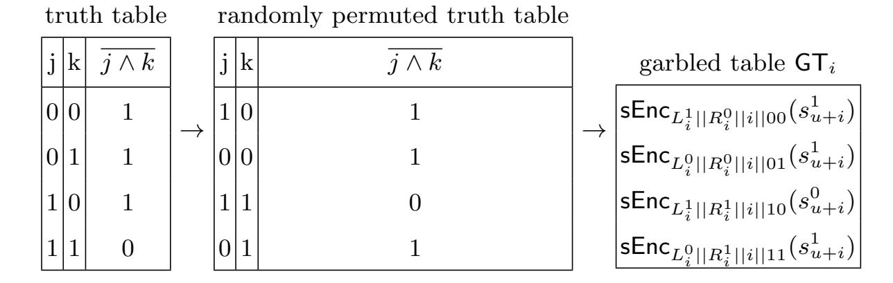
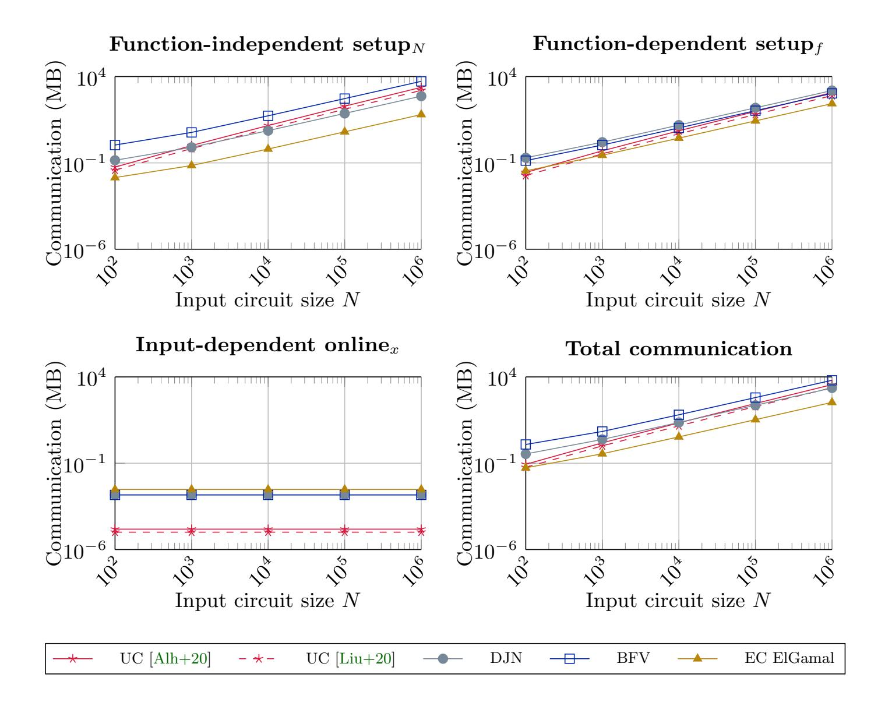
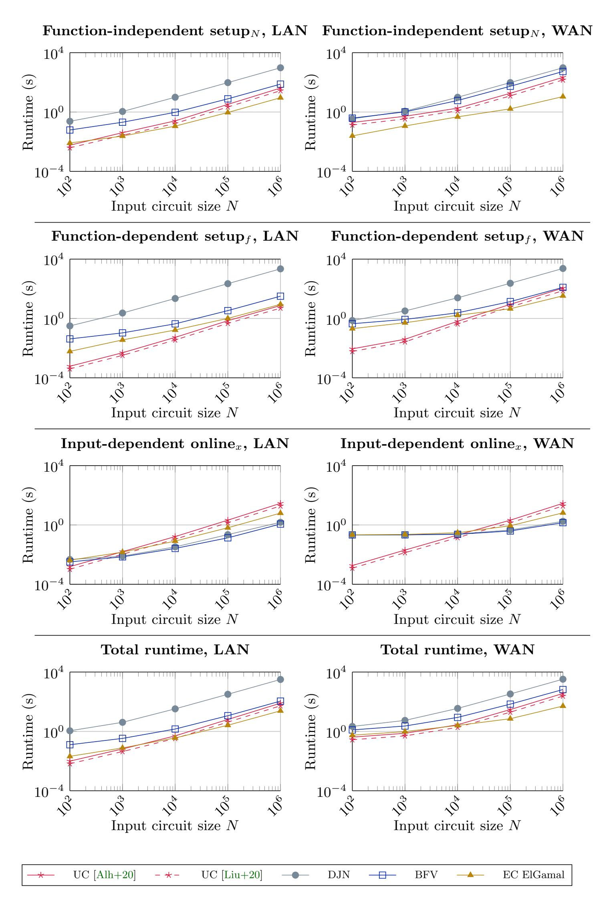
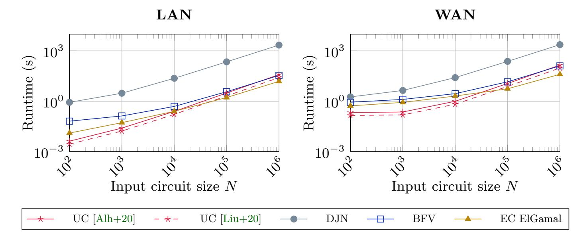

{0}------------------------------------------------

# Linear-Complexity Private Function Evaluation is Practical (Full Version)?

Marco Holz1 , Agnes Kiss ´ 1 , Deevashwer Rathee2 , Thomas Schneider1

1 ENCRYPTO, Technische Universit¨at Darmstadt, Germany {[holz,](mailto:holz@encrypto.cs.tu-darmstadt.de) [kiss,](mailto:kiss@encrypto.cs.tu-darmstadt.de) [schneider](mailto:schneider@encrypto.cs.tu-darmstadt.de)}@encrypto.cs.tu-darmstadt.de 2 Department of Computer Science, IIT (BHU) Varanasi, India [deevashwer.student.cse15@iitbhu.ac.in](mailto:deevashwer.student.cse15@iitbhu.ac.in)

Abstract. Private function evaluation (PFE) allows to obliviously evaluate a private function on private inputs. PFE has several applications such as privacy-preserving credit checking and user-specific insurance tariffs. Recently, PFE protocols based on universal circuits (UCs), that have an inevitable superlinear overhead, have been investigated thoroughly. Specialized public key-based protocols with linear complexity were believed to be less efficient than UC-based approaches.

In this paper, we take another look at the linear-complexity PFE protocol by Katz and Malka (ASIACRYPT'11): We propose several optimizations and split the protocol in different phases that depend on the function and inputs respectively. We show that HE-based PFE is practical when instantiated with state-of-the-art ECC and RLWE-based homomorphic encryption. Our most efficient implementation outperforms the most recent UC-based PFE implementation of Alhassan et al. (JoC'20) in communication for all circuit sizes and in computation starting from circuits of a few thousand gates already.

Keywords: Private function evaluation · Homomorphic encryption · Secure computation.

## 1 Introduction

While computations on a local machine can be secured against malicious eavesdropping, computations that are performed collaboratively on two or more devices typically rely on the trustworthiness of remote systems. This poses a risk to the sensitive data supplied by the participants. Privacy-preserving protocols aim to mitigate these risks by protecting the data using cryptographic approaches such that there is no need for a trusted remote party anymore.

Secure two-party computation (STPC) or secure function evaluation (SFE) protocols allow two parties to jointly compute a function on private data without learning the other party's inputs. Private function evaluation (PFE) extends this setting by also hiding the evaluated function from one of the parties: P1 inputs

? Please cite the conference version of this work published at ESORICS'20 [\[Hol+20\]](#page-18-0).

{1}------------------------------------------------

a private function f, typically represented by a circuit Cf , and P2 inputs private data x and learns only f(x) but no additional information on f (except its size).

PFE has diverse applications that require to keep the participants' inputs private and hide the operations applied to these inputs from one of the participants. We describe a few example applications. In a privacy-preserving intrusion detection system (IDS) [\[Nik+14\]](#page-19-0), a server holds a set of zero-day signatures (including regular expressions matching the payload) and is able to check whether sensitive data uploaded to the IDS matches those signatures such that the server learns nothing about the data and the client learns nothing about the signatures. Using PFE, attribute-based access control can be enhanced to protect both sensitive credentials and sensitive policies [\[FAL06\]](#page-17-0). PFE can be used for privacypreserving credit worthiness checking [\[FAZ05\]](#page-17-1), disclosing neither the customer's private financial data nor the private criteria of the loaner. In privacy-preserving car insurance rate calculation [\[G¨un+19\]](#page-18-1) the privacy-critical customer data, as well as the tariff calculation details remain private.

The most common approach for PFE is to reduce it to classical SFE by securely evaluating a public universal circuit (UC) [\[Val76;](#page-20-0) [KS08a;](#page-18-2) [KS16;](#page-18-3) [LMS16;](#page-19-1) [GKS17;](#page-18-4) [Alh+20;](#page-17-2) [Zha+19;](#page-20-1) [Liu+20\]](#page-19-2). This series of works on optimizations and implementations of UCs has shown that UC-based PFE can be practical, but UCs introduce an inevitable logarithmic overhead [\[Val76\]](#page-20-0). Katz and Malka [\[KM11\]](#page-18-5) propose a linear-complexity PFE scheme based on homomorphic encryption (HE) and Yao's garbled circuit protocol. They expect their scheme to be "easier to implement and more efficient (for larger circuits) than approaches relying on universal circuits". However, their scheme has not been implemented yet.

Our Contributions. Our paper takes another look at the linear-complexity PFE protocol by Katz and Malka [\[KM11\]](#page-18-5). We split the protocol into several phases so that parts of the protocol can be precomputed knowing, e.g., only the size of the private function or the private function itself. For instance, for a privacy-preserving IDS it is reasonable to precompute any function-dependent part so that the online phase where the client provides its input is fast. We optimize, instantiate, and implement their scheme using three state-of-the-art homomorphic encryption (HE) schemes: Elliptic curve (EC) ElGamal [\[Elg85\]](#page-17-3), the Brakerski/Fan-Vercauteren (BFV) scheme [\[FV12\]](#page-18-6), and the cryptosystem by Damg˚ard/Jurik/Nielsen (DJN) [\[DJN10\]](#page-17-4). We implement our protocols using the ABY framework [\[DSZ15\]](#page-17-5) and thereby provide the first implementation of a linear-complexity PFE scheme. Our experiments show that HE-based PFE outperforms today's most efficient UC-based PFE implementation [\[Alh+20\]](#page-17-2) on the same platform already starting from circuits with only a few thousand gates.

## 2 Related Work

In this paper, we focus on PFE protocols that provide security against semihonest adversaries. These can be categorized as follows:

UC-based PFE. A universal circuit (UC) is a circuit that can be programmed to evaluate any Boolean circuit up to size n by specifying a set of 

{2}------------------------------------------------

program bits as its input. In recent years, a lot of research was put into optimizing and implementing UC-based PFE, which reduces the task of PFE to standard SFE that relies mostly on symmetric cryptography where the function is the publicly known UC. Valiant [\[Val76\]](#page-20-0) proposed two recursive UCs with sizes ∼5n log2 n and ∼4.75n log2 n in the size of the simulated circuit n, which are optimal up to a constant factor because any UC must have size at least Ω(n log n). Zhao et al. [\[Zha+19\]](#page-20-1) present a UC with size ∼4.5n log2 n. A hybrid UC with size ∼4.5n log2 n, combining optimizations from [\[KS16;](#page-18-3) [GKS17;](#page-18-4) [Zha+19\]](#page-20-1) was implemented in [\[Alh+20\]](#page-17-2). The most recent UC from [\[Liu+20\]](#page-19-2) has size ∼3n log2 n. These constructions have reached lower bounds for the most common ways UCs are constructed [\[Zha+19;](#page-20-1) [Liu+20\]](#page-19-2), so no significant improvements are expected.

OT-based PFE. Mohassel and Sadeghian introduce an oblivious transfer (OT)-based approach based on the oblivious evaluation of a switching network of size Θ(n log n) that hides the topology of the Boolean circuit [\[MS13\]](#page-19-3). Bing¨ol at al. [\[Bin+18\]](#page-17-6) adapt the half gates optimization [\[ZRE15\]](#page-20-2) to the OTbased approach of [\[MS13\]](#page-19-3) and reduce the number of OTs by half. As shown in [\[Alh+20\]](#page-17-2), the communication of both [\[MS13\]](#page-19-3) and [\[Bin+18\]](#page-17-6) is worse than that of UC-based PFE. PFE schemes based on both UCs and switching networks have an inevitable logarithmic overhead.

TEE-based PFE. Felsen et al. [\[Fel+19\]](#page-17-7) propose private function evaluation with a different trust assumption and implement PFE using Intel SGX as trusted execution environment (TEE), by evaluating a UC within the SGX enclave.

HE-based PFE. The protocol by Katz and Malka [\[KM11\]](#page-18-5) has linear complexity O(n), but its concrete practicality has not yet been explored. The authors use homomorphic encryption to hide the topology of the circuit Cf from the party that obliviously garbles the circuit (cf. §[4.1\)](#page-5-0). Mohassel and Sadeghian [\[MS13\]](#page-19-3) include a linear-complexity protocol in their generic framework for PFE. They optimize the baseline protocol of [\[KM11\]](#page-18-5), but their protocol is not more efficient than the improved protocol of [\[KM11\]](#page-18-5) which we use. Mohassel et al. [\[MSS14\]](#page-19-4) extend the protocol from [\[KM11;](#page-18-5) [MS13\]](#page-19-3) to security against malicious adversaries using zero-knowledge proofs while maintaining linear complexity. Bi¸cer at al. present a reusable linear-complexity PFE scheme [\[Bi¸c+18\]](#page-17-8) based on the protocol of [\[KM11\]](#page-18-5) which is efficient if the same private function f is evaluated multiple times. Their protocol in the first execution has slightly lower total communication, but around a factor four higher online computation than [\[KM11\]](#page-18-5) (cf. [\[Bi¸c+18,](#page-17-8) Table 1]). Later runs of the protocol with the same function are more efficient both in communication and computation than [\[KM11\]](#page-18-5). We leave investigating the concrete efficiency of the protocol of [\[Bi¸c+18\]](#page-17-8) for applications where the same function can be reused as future work.

In our paper, we resurrect the neglected line of research on linear-complexity HE-based PFE protocols and show that the protocol of [\[KM11\]](#page-18-5) is practical.

{3}------------------------------------------------

## 3 Preliminaries

In this section, we describe preliminaries to our work from the fields of secure function evaluation (SFE) in §[3.1](#page-3-0) and private function evaluation (PFE) in §[3.2,](#page-3-1) and recapitulate the homomorphic encryption (HE) schemes we use in §[3.3.](#page-4-0)

#### 3.1 Circuit-based Secure Function Evaluation

We focus on security against semi-honest (passive) adversaries where all parties are assumed to follow the protocol. This allows for highly efficient protocols and is a starting point for constructing protocols with stronger security guarantees.

In the past, several SFE protocols have been proposed that rely on a circuit representation of the function f which is known to both parties, e.g., Yao's garbled circuit (GC) protocol [\[Yao82;](#page-20-3) [Yao86;](#page-20-4) [LP09\]](#page-19-5) and the GMW protocol [\[GMW87\]](#page-18-7). In Yao's protocol, party P1, the garbler, prepares an encrypted version of the circuit in the form of garbled tables, which are then sent to P2. The other party P2, the evaluator, evaluates the garbled circuit after receiving the keys corresponding to his input wires using oblivious transfers.[3](#page-3-2) Oblivious transfer (OT) allows the receiver P2 to retrieve one of two messages obliviously from the sender P1 without the receiver learning the other message or the sender learning which message was retrieved. Though OTs require expensive public-key cryptography [\[IR89\]](#page-18-8), OT extension [\[Ish+03;](#page-18-9) [Ash+13\]](#page-17-9) allows to perform a large number of OTs more efficiently by extending a few base OTs and obtain many oblivious transfers using only symmetric cryptographic operations. Recent optimizations to Yao's GC protocol include point-and-permute [\[BMR90\]](#page-17-10), free-XOR [\[KS08b\]](#page-18-10), fixed-key AES garbling [\[Bel+13\]](#page-17-11), and half gates [\[ZRE15\]](#page-20-2).

## 3.2 Private Function Evaluation

Private function evaluation (PFE) extends SFE to the case where only one party P1 inputs a private function f represented by circuit Cf . The protocol must guarantee that P2 on private input x learns the output f(x) but no other information about the function f whereas P1 learns nothing.[4](#page-3-3) Generally, PFE protocols reveal the size of the circuit Cf to the participants. If needed, the actual number of gates and wires can be hidden by adding dummy gates and dummy input/output wires to the circuit. One notable characteristic of PFE protocols is that P1 typically must not be able to learn the output of the function f. The reason for this is that an adversarial party P1 could reveal the inputs of party P2 by defining f to leak information about x, e.g., f(x) = x.

3 Even though the gates are encrypted and thus the gates' types can easily be hidden from P2, P2 must know the topology of the circuit for evaluating the garbled circuit.

4 This can be extended to the case were P1 also holds an input value in addition to the circuit Cf . Our 2-party PFE implementation supports input values for both parties.

{4}------------------------------------------------

#### 3.3 Homomorphic Encryption

Homomorphic encryption (HE) schemes allow for computations on encrypted data, i.e., operations performed on the ciphertexts are reflected in the output of decryption as if they were applied directly on the plaintexts.

The protocol of Katz and Malka [KM11] is based on additively homomorphic encryption, i.e., a HE scheme that supports only homomorphic addition. The authors of [KM11] suggest to instantiate their protocol with Paillier [Pai99] or ElGamal [Elg85] HE and mention that their protocol can be improved by using elliptic-curve cryptography (ECC). Since then, several significant improvements on additively HE were published that we consider in our implementation:

**DJN.** The DJN cryptosystem [DJN10], a generalization of Paillier's scheme [Pai99], has since then been optimized using CRT-based decryption [HMS12]. Our implementation is based on *libpailler*5 and uses this optimization.

**EC ElGamal.** EC ElGamal encryption offers exceptionally small ciphertexts, practical computation and an additive homomorphism over the underlying elliptic curve group. The use of elliptic curves over finite fields as a basis for a cryptosystem was suggested independently from each other by both Koblitz [Kob87] and Miller [Mil86]. In our implementation, we use the *RELIC Toolkit* [AG09] for ECC.

BFV. Significant improvements have been made in the area of RLWE-based HE [Reg05; LPR10; Bra12; FV12]. The RLWE-based BFV scheme [FV12; Lai17] is implemented in the Microsoft SEAL library [Sea19], which is among the fastest HE libraries available today. We present a high level overview of the BFV scheme restricted to only the part of its functionality which is relevant for our application. For additional details, see [Lai17]. We note that our discussion also applies to other popular Ring-LWE-based HE schemes such as BGV [BGV12].

The BFV scheme operates on polynomial rings of the form  $R = \mathbb{Z}[x]/(x^n+1)$ , where the polynomial modulus degree n is a power of 2. For a plaintext modulus t, the plaintext space is defined as  $R_t = R/tR = \mathbb{Z}_t[x]/(x^n+1)$ , which consists of polynomials of degree n-1 with coefficients in  $\mathbb{Z}_t$ . Similarly, the ciphertext space is defined as  $(R_q)^2$ , where q is called the coefficient modulus and  $R_q = R/qR$ . The encryption function Enc is probabilistic, takes a public key pk and a message  $m \in R_t$  as inputs, and outputs a ciphertext  $c \in (R_q)^2$ . The ciphertext output by Enc has a noise component associated with it which is necessary for maintaining security. The decryption function Dec takes the secret key sk and a ciphertext  $c \in (R_q)^2$  as inputs, and outputs a message  $m \in R_t$ . Decryption m = Dec(sk, Enc(pk, m)) works if the ciphertext noise is below a certain threshold defined by the scheme parameters. For ease of exposition, we omit the keys from the invocation of the encryption and decryption functions, and assume a single key-pair throughout the paper, which makes the functions compatible.

Enc is a homomorphic map from  $(R_t, +)$  to  $((R_q)^2, +)$ , which provides the scheme with its additive homomorphic properties. Given ciphertexts  $c_1 = \text{Enc}(m_1)$  and  $c_2 = \text{Enc}(m_2)$ , we have  $\text{Dec}(c_1 + c_2) = \text{Dec}(c_1) + \text{Dec}(c_2)$ . The noise component grows as we perform homomorphic operations on the ciphertext until it

5 http://hms.isi.jhu.edu/acsc/libpaillier/

{5}------------------------------------------------

reaches a threshold, beyond which decryption is not possible and the ciphertext is rendered useless. This is not a problem since addition does not grow the noise by much. The scheme described so far only provides IND-CPA security against parties other than the key owner. To hide the operations applied to the ciphertext from the key owner, which may include some private inputs from other parties, and only reveal the result of decryption, the ciphertext needs to be flooded with extra noise (cf. [\[Lai17\]](#page-19-10), § 9.4). This requires larger parameters to accommodate the extra noise, and has been taken into account in our parameter selection.

## 4 Linear-Complexity Private Function Evaluation

In this section, we recapitulate the private function evaluation (PFE) protocol of Katz and Malka [\[KM11\]](#page-18-5) in §[4.1,](#page-5-0) introduce further improvements in §[4.2,](#page-9-0) and propose efficient instantiations using EC ElGamal in §[4.3](#page-10-0) and the BFV homomorphic encryption scheme in §[4.4.](#page-10-1)

#### 4.1 The [\[KM11\]](#page-18-5) Protocol

The PFE protocol proposed by Katz and Malka [\[KM11\]](#page-18-5) combines homomorphic encryption (HE) with Yao's garbled circuit (GC) protocol to hide the topology of the circuit Cf in addition to the parties' inputs. They give a baseline protocol and a roughly twice as efficient improved protocol. We describe the improved protocol shown in Figure [1](#page-7-0) and refer to the original paper for the baseline version.

The Boolean circuit to be evaluated privately has g gates, u inputs and o outputs and has size N = u + g. The circuit is assumed to be built of only two-input NAND gates so that their functionality does not need to be hidden. There exist established highly optimized hardware synthesis tools that optimize for a small number of NAND gates when translating the function to a circuit. Moreover, it is assumed that "the output wires of the circuit do not connect to any other gates" [\[KM11\]](#page-18-5) which is achieved by adding at most o gates to the circuit. [\[KM11\]](#page-18-5) define the wiring among the gates as follows: Incoming wires are the inputs of the g gates. Outgoing wires are the output wires of the g gates and the u input wires of the circuit. Each incoming wire must be connected to exactly one outgoing wire, but an outgoing wire may be connected to more incoming wires, enabling gates with arbitrary fan-out. In contrast, UC-based PFE requires the fan-out to be at most two which requires additional copy-gates [\[Val76\]](#page-20-0) that increase the circuit size.

Party P2 inputs private data x of length |x| = u and acts as the circuit garbler from Yao's protocol. P1 inputs the private circuit Cf of g gates and acts as the circuit evaluator. Since P2 must remain unaware of the circuit wiring, P2 cannot directly garble the gates. Instead, P1 creates a so-called encrypted garbled gate encGGi for each gate i of the circuit and P2 decrypts these to learn the keys required to create the garbled tables as in Yao's protocol (cf. §[3.1](#page-3-0) and [\[LP09\]](#page-19-5)). By creating the encrypted garbled gates under HE, P1 obliviously connects two outgoing wires to each gate of the circuit (the wire keys for the 

{6}------------------------------------------------

outgoing wires are provided by  $P_2$  beforehand). Thereby, the circuit topology remains hidden from  $P_2$ .

Four Phases of PFE Protocols. We split the protocol of [KM11] and UC-based PFE into four phases: 1) a precomputation phase which is run only once, 2) a  $setup_N$  phase dependent on the size N of the function, 3) a  $setup_f$  phase dependent on the function f, and 4) an  $online_x$  phase dependent on the input x.

In most applications, e.g., when a server provides a service with a pre-defined function (such as privacy-preserving IDS, cf. §1), the *precomputation* and both setup phases can be precomputed before the client provides its input, allowing for a very fast  $online_x$  phase. In other applications, the function may not be known beforehand, in which case the precomputation and  $setup_N$  phases can be precomputed, and the  $setup_f$  and  $online_x$  phases are run online.

- 1) precomputation phase. We first determine all operations that have to be done once, independently of the protocol run: For [KM11], this includes generating and sending the public key of the HE scheme, and for UC-based PFE, the construction of the UC itself. We do not include this phase in our performance evaluation in §5.
- 2) setupN phase. This phase precomputes all operations that depend only on the size N of the circuit. In [KM11],  $P_2$  creates two wire keys representing the bit values 0 and 1 for each of the N=g+u outgoing wires. The wire keys of all g+u outgoing wires except the o output wires of the circuit are essential to define the mapping representing the topology of the circuit. We denote the wire key corresponding to the bit value  $b \in \{0,1\}$  on outgoing wire  $i \in \{1,\ldots,N\}$  by  $s_i^b$ . The security of the protocol depends on the indistinguishability of the two keys.  $P_2$  chooses the wire key  $s_i^0$  at random and, similar to the free-XOR technique [KS08b], defines a global random shift r of the same size as the wire keys.  $P_2$  then sets  $s_i^1 = s_i^0 + r$  for  $i \in \{1,\ldots,N\}$  and sends the homomorphically encrypted wire keys  $\operatorname{Enc}(s_1^0), \ldots, \operatorname{Enc}(s_{N-o}^0)$  to  $P_1$ . As a preparation for the setupf phase,  $P_1$  already creates and encrypts two random blinding values,  $b_i$  and  $b_i'$ , for each gate  $G_i$ . This phase has complexity O(N).

In the UC-based PFE protocols, the UC is garbled and sent to the evaluator, which has complexity  $\Theta(N \log N)$ .

3) setupf phase. This depends on the specific function f. In [KM11], party  $P_1$  creates the encrypted garbled gates. In order to hide the wiring of the circuit from  $P_2$ , each wire key is blinded. If outgoing wires j and k are connected to the incoming wires of gate  $G_i$ ,  $P_1$  constructs the encrypted garbled gate enc $\mathsf{GG}_i$  by making use of the additively homomorphic property of  $\mathsf{Enc}$  as

$$\operatorname{encGG}_{i} = \left(\operatorname{Enc}(s_{j}^{0} + b_{i}), \operatorname{Enc}(s_{k}^{0} + b_{i}')\right). \tag{1}$$

 $P_1$  then sends  $\mathsf{encGG}_1, \ldots, \mathsf{encGG}_g$  to  $P_2$ .  $P_2$  is now able to create the garbled tables and thereby acts as the *circuit garbler* from Yao's protocol. For each gate  $G_i$ ,  $P_2$  decrypts the corresponding encrypted garbled gate and retrieves the blinded wire keys for the left and the right incoming wire of the gate:

$$L_i^0 = \text{Dec}(\text{Enc}(s_i^0 + b_i)), \quad R_i^0 = \text{Dec}(\text{Enc}(s_k^0 + b_i')).$$
 (2)

{7}------------------------------------------------

| $P_1$ (inputs private circuit $\mathfrak{C}_f$ )                                                                                                                                         |                                                                                                                                                   | $P_2$ (inputs private data $x \in \{0,1\}^u$ )                                                                                                                                                                                         |
|------------------------------------------------------------------------------------------------------------------------------------------------------------------------------------------|---------------------------------------------------------------------------------------------------------------------------------------------------|----------------------------------------------------------------------------------------------------------------------------------------------------------------------------------------------------------------------------------------|
| 1)                                                                                                                                                                                       | precomputation phase                                                                                                                              |                                                                                                                                                                                                                                        |
|                                                                                                                                                                                          | pk ←                                                                                                                                              | $(pk,sk) \leftarrow_{\$} KGen(1^n)$                                                                                                                                                                                                    |
|                                                                                                                                                                                          |                                                                                                                                                   | $r \leftarrow_{\$} \{0,1\}^{\kappa}$                                                                                                                                                                                                   |
|                                                                                                                                                                                          | $\mathbf{2)}  \mathbf{setup}_{N}  \mathbf{phase}$                                                                                                 |                                                                                                                                                                                                                                        |
| $\forall i \in \{1, \dots, g\}$ :                                                                                                                                                        |                                                                                                                                                   | $\forall i \in \{1, \dots, N\}$ :                                                                                                                                                                                                      |
| $b_i, b_i' \leftarrow \$ \{0, 1\}^{\kappa}, \text{compute}$                                                                                                                              |                                                                                                                                                   | $(s_i^0) \leftarrow_{\$} \{0,1\}^{\kappa}$                                                                                                                                                                                             |
| $Enc_{pk}(b_i), Enc_{pk}(b_i')$                                                                                                                                                          | $Enc_{pk}(s_1^0), \dots, Enc_{pk}(s_{N-o}^0)$                                                                                                     | $\forall i \in \{1, \dots, N - o\}:$                                                                                                                                                                                                   |
|                                                                                                                                                                                          | $\leftarrow \qquad \qquad \qquad \qquad \qquad \qquad \qquad \qquad \qquad \qquad \qquad \qquad \qquad \qquad \qquad \qquad \qquad \qquad \qquad$ | compute $Enc_{pk}(s_i^0)$                                                                                                                                                                                                              |
|                                                                                                                                                                                          | 3) setup f phase                                                                                                                       |                                                                                                                                                                                                                                        |
| $\forall i \in \{1, \dots, g\} : gate \ i \ has$ $left \ input \ j, \ right \ input \ k$ $v_{iL} = Enc_{pk}(s_j^0 + b_i)$ $v_{iR} = Enc_{pk}(s_k^0 + b_i')$ $encGG_i = (v_{iL}, v_{iR})$ | $\xrightarrow{encGG_1,\ldots,encGG_g}$                                                                                                            | $\begin{aligned} \forall i \in \{1,\dots,g\}: \ gate \ i \ has \ output \ wire \ u+i \ L_i^0 &= Dec(v_{iL}), L_i^1 &= L_i^0 + r \ R_i^0 &= Dec(v_{iR}), R_i^1 &= R_i^0 + r \ GT_i &= encYao(L_i^0, L_i^1, R_i^0, R_i^1) \end{aligned}$ |
|                                                                                                                                                                                          | $GT_1, \ldots, GT_g$                                                                                                                              | $GI_i = \operatorname{enc Yao}(L_i, L_i, R_i, R_i)$ $i, s_{u+i}^0, s_{u+i}^1)$                                                                                                                                                         |
|                                                                                                                                                                                          | $4)$ online $_x$ phase                                                                                                                            |                                                                                                                                                                                                                                        |
| $\forall i \in \{1, \dots, g\}$ :                                                                                                                                                        | $\leftarrow s_1^{x_1}, \dots, s_u^{x_u}$                                                                                                          |                                                                                                                                                                                                                                        |
| $L_i = s_j + b_i, R_i = s_k + b_i'$ $s_{u+i} = decYao(L_i, R_i, i, GT_i)$                                                                                                             | $\xrightarrow{s_{N-o+1},\dots,s_{N}}$                                                                                                             | compare $s_{N-o+1}, \ldots, s_N$ to $(s_{N-o+1}^0, s_{N-o+1}^1), \ldots, (s_N^0, s_N^1)$ to determine output $f(x)$                                                                                                                    |

Fig. 1: The [KM11] protocol. The circuit  $\mathcal{C}_f$  has u input wires, o output wires, g gates, and size N=u+g. The symmetric security parameter is  $\kappa=128$ .

{8}------------------------------------------------

Fig. 2: encYao: Creation of a garbled table [LP09]

 $P_2$  is now able to obtain the blinded wire keys  $s_j^1 + b_i$  and  $s_k^1 + b_i'$  by defining  $L_i^1 = L_i^0 + r$  and  $R_i^1 = R_i^0 + r$ . Note that the blinded wire keys  $L_i^0, L_i^1$  and  $R_i^0, R_i^1$ are independent of the keys assigned to the outgoing wires of gates j and k. This hides the circuit topology from  $P_2$  while still enabling  $P_2$  to create the garbled tables. The garbled table  $\mathsf{GT}_i$  is generated using function encYao, instantiated as shown in Figure 2 |LP09|: The truth table of the NAND gate is randomly permuted and then for each combination of the left  $(L_i^0, L_i^1)$  and right  $(R_i^0, R_i^1)$  input key these keys are used to symmetrically encrypt the output key  $s_{u+i}^0$  or  $s_{u+i}^1$ using function sEnc which is instantiated using AES-128 (cf. §5.1 for details). We emphasize that the gates' output keys are pre-determined and the protocol of KM11 applies additively homomorphic operations on input keys. Therefore, we cannot use GC optimizations like point-and-permute [BMR90], garbled row reduction NPS99; Pin+09, or half-gates ZRE15. Instead, we have to use the classical GC from LP09 with four entries per garbled table (GT), so each GT has size  $4 \cdot (|s_{u+i}| + \sigma)$  bits, where  $\sigma = 40$  is the statistical security parameter. Finally,  $P_2$  sends  $\mathsf{GT}_1, \ldots, \mathsf{GT}_g$  to  $P_1$ . This phase has complexity  $\mathcal{O}(N)$ .

In the UC-based PFE protocols, the wire keys specifying the values of the UC's programming bits are sent which yields  $\Theta(N \log N)$  communication.

4) onlinex phase. In this final phase, the private data x is input by  $P_2$ . In [KM11], the wire keys  $s_1^{x_1}, \ldots, s_u^{x_u}$  of the circuit input wires corresponding to  $P_2$ 's input bits  $x_1, \ldots, x_u$  are sent to  $P_1$ .  $P_1$  can now evaluate the garbled tables and determine the wire keys of the output wires as follows: To evaluate gate i,  $P_1$  has to reconstruct the keys used to encrypt one entry of the garbled table. Starting with the first gate in topological order,  $P_1$  uses for gate  $P_1$  with left input  $P_2$  and right input  $P_2$  the keys  $P_2$  and  $P_3$  and  $P_4$  and  $P_4$  and  $P_4$  and  $P_4$  and  $P_4$  and  $P_4$  and  $P_4$  and  $P_4$  and  $P_4$  and  $P_4$  and  $P_4$  and  $P_4$  are decYao( $P_4$  and  $P_4$  and  $P_4$  are decYao( $P_4$  and  $P_4$  and  $P_4$  are decYao( $P_4$  and  $P_4$  and  $P_4$  are decYao( $P_4$  and  $P_4$  and  $P_4$  are decYao( $P_4$  and  $P_4$  are decYao( $P_4$  and  $P_4$  are decYao( $P_4$  and  $P_4$  are decYao( $P_4$  and  $P_4$  are decYao( $P_4$  and  $P_4$  are decYao( $P_4$  and  $P_4$  are decYao( $P_4$  and  $P_4$  are decYao( $P_4$  and  $P_4$  are decYao( $P_4$  and  $P_4$  are decYao( $P_4$  and  $P_4$  are decYao( $P_4$  and  $P_4$  are decYao( $P_4$  and  $P_4$  are decYao( $P_4$  are decYao( $P_4$  and  $P_4$  are decYao( $P_4$  are decYao( $P_4$  and  $P_4$  are decYao( $P_4$  are decYao( $P_4$  are decYao( $P_4$  are decYao( $P_4$  are decYao( $P_4$  are decYao( $P_4$  are decYao( $P_4$  are decYao( $P_4$  are decYao( $P_4$  are decYao( $P_4$  are decYao( $P_4$  are decYao( $P_4$  are decYao( $P_4$  are decYao( $P_4$  are decYao( $P_4$  are decYao( $P_4$  are decYao( $P_4$  are decYao( $P_4$  are decYao( $P_4$  are decYao( $P_4$  are decYao( $P_4$  are decYao( $P_4$  are decYao( $P_4$  are decYao( $P_4$  are decYao( $P_4$  are decYao( $P_4$  are decYao( $P_4$  are decYao( $P_4$  are decYao( $P_4$  are decYao( $P_4$  are decYao( $P_4$  are decYao( $P_4$  are decYao( $P_4$  are decYao( $P_4$  are decYao( $P_4$  are decYao( $P_4$  are decYao( $P_4$  are decYao( $P_4$  are decYao( $P_4$  are decYao( $P_4$  are decYao( $P_4$  are decYao( $P_4$  are decYao( $P_4$  are decYao( $P_4$  are decYao( $P_4$  are decYao( $P_4$  are

&lt;sup>6 The protocol can naturally be extended to the setting where also  $P_1$  has private input data y. Either y is encoded in the private function f [PSS09], or the keys corresponding to the bits of y are obliviously sent to  $P_1$  using oblivious transfer [Ish+03; LP09; Ash+13] as describe in [KM11].

{9}------------------------------------------------

 $P_1$  has obtained the wire keys  $s_{N-o+1}, \ldots, s_N$  of the output wires. These can be mapped to plaintext outputs as in Yao's protocol. However, as mentioned in §3.2, the function holder  $P_1$  should not learn the output of f, so the output is determined by party  $P_2$ . This phase has complexity O(N).

In the UC-based PFE protocols, the wire keys corresponding to the private input x are sent, the garbled UC is evaluated, which requires  $\Theta(N \log N)$  computation, and the output bits of the UC are decoded.

## 4.2 Optimizations of the [KM11] Protocol

In this section, we describe our optimizations to the protocol of [KM11].

**Precomputation of all Homomorphic Encryptions.** As described in §4.1, all homomorphic encryptions can be precomputed in the  $setup_N$  phase where only the size N is known but neither  $\mathcal{C}_f$  nor x. Since encryption is a relatively expensive operation, this drastically reduces the protocol runtime (see §5.2).

The wire keys are sampled randomly so depend neither on the inputs nor on the circuit  $\mathcal{C}_f$ , and are encrypted using the HE public key generated by  $P_2$ .

 $P_2$  can sample and homomorphically encrypt the encrypted wire keys  $\operatorname{Enc}(s_i^0)$ , where  $1 \leq i \leq N$ . Similarly,  $P_1$  can sample and encrypt the blinding values  $b_i, b'_i$ , where  $1 \leq i \leq g$ , using  $P_1$ 's public key. Here, it is necessary to exchange the public key of the HE scheme first. We argue that this is feasible in practice by  $P_2$  publishing the public key beforehand.

**Pipelining.** The creation and evaluation of the garbled circuit (GC) is done in topological order which makes this process eligible for pipelining. When transmitting the garbled gates directly after creation, they can be ungarbled by the evaluator while subsequent gates are still being garbled by the garbler. This GC pipelining was proposed and implemented in [Hen+10; Hua+11].

In addition to the GC pipelining, we also implemented pipelining of the creation and evaluation of the encrypted garbled gates. The process of retrieving the wire keys from the encrypted garbled gates can then seamlessly be combined with the pipelined creation and evaluation of the GC. Since decryption of the encrypted garbled gates is the most expensive operations in the  $setup_f$  phase, this significantly speeds up the protocol and reduces the time spent solely on network communication. In our experiments, we saw that pipelining improves the runtime in the  $setup_f$  phase by about 25%.

**Parallelization.** The [KM11] protocol is very suitable for parallelization. We provide a fully parallelized implementation of 1) the creation of the encrypted wire keys by  $P_2$  and the encrypted blinding values by  $P_1$  in the  $setup_N$  phase, 2) the creation of the encrypted garbled gates by  $P_1$  in the  $setup_f$  phase, 3) the decryption of the encrypted garbled gates and the creation of the garbled tables by  $P_2$  in the  $setup_f$  phase. Only the evaluation of the garbled tables by  $P_1$  depends on the wire keys obtained from previous garbled tables and therefore cannot be fully parallelized.

{10}------------------------------------------------

#### 4.3 Instantiating [\[KM11\]](#page-18-5) with EC ElGamal

Katz and Malka suggest to use ElGamal encryption to instantiate their protocol [\[KM11\]](#page-18-5), and briefly mention the possibility of using elliptic curve cryptography (ECC) in their protocol. In the following, we denote integers by lowercase letters and points on the elliptic curve by capital letters. The equivalent of choosing a random element of the residue field as the private key in standard ElGamal encryption is choosing a random integer a from the Galois field GF(p) as the private key in the elliptic curve version. The public key A is then computed as A = a ∗ P where P is the base point of the elliptic curve.

In standard additively homomorphic lifted EC ElGamal, a message m ∈ GF(p) is mapped to a curve point M as M = m ∗ P. The reverse mapping used during decryption then requires solving the discrete logarithm of M which requires that m is from a small domain whereas we need to operate on κ = 128 bit keys. Instead, we observe that the only requirement for the choice of the wire keys and the blinding values in the [\[KM11\]](#page-18-5) protocol is indistinguishability, so we can simply define curve points M as our plaintext values for wire keys and blinding values. Then, we perform plaintext additions using the ECC arithmetic on the elliptic curve when P1 needs to apply the blinding value to a plaintext wire key in order to determine the values Li and Ri . These points are then mapped to keys for AES using a KDF (cf. §[5.1\)](#page-13-0).

Analogous to standard ElGamal, we define encryption of a message M with a public key A = a ∗ P as follows:

$$\mathsf{Enc}(M) = (K, C) = (k * P, k * A + M). \tag{3}$$

Decryption of the ciphertext (K, C) can now be done as follows:

$$Dec(K,C) = C - a*K = k*A + M - a*k*P = k*a*P + M - a*k*P = M. (4)$$

EC ElGamal is additively homomorphic in the underlying elliptic curve group. We define the homomorphic addition of two ciphertexts as

$$\mathsf{Enc}(M_1) \oplus \mathsf{Enc}(M_2) = (K_1, C_1) \oplus (K_2, C_2) = (K_1 + K_2, C_1 + C_2). \tag{5}$$

This satisfies the additively homomorphic property over the EC group:

$$\begin{aligned} \operatorname{Dec}(\operatorname{Enc}(M_1) \oplus \operatorname{Enc}(M_2)) &= \operatorname{Dec}((k_1 * P, k_1 * A + M_1) \oplus (k_2 * P, k_2 * A + M_2)) \\ &= \operatorname{Dec}((k_1 * P + k_2 * P, k_1 * A + M_1 + k_2 * A + M_2)) \\ &= \operatorname{Dec}((k_1 + k_2) * P, (k_1 + k_2) * A + M_1 + M_2)) \\ &= (k_1 + k_2) * A + M_1 + M_2 - a * (k_1 + k_2) * P = M_1 + M_2. \end{aligned} \tag{6}$$

Semantic security naturally follows from that of ElGamal based in the DDH assumption in the EC group.

## 4.4 Instantiating [\[KM11\]](#page-18-5) with BFV Homomorphic Encryption

Since the linear-complexity protocol of [\[KM11\]](#page-18-5) was proposed in 2011, significant progress has been made in the area of Ring-LWE (RLWE) based homomorphic encryption. Thus, we revise the protocol of [\[KM11\]](#page-18-5) with an HE instantiation based on these efficient Ring-LWE HE schemes. We specifically use the BFV 

{11}------------------------------------------------

scheme (cf. §3.3) as implemented in Microsoft's SEAL library [Sea19]. We take the plaintext modulus as t=2, which results in the smallest possible polynomial modulus degree and thus ciphertext size in our scenario. The coefficient modulus q is chosen as a product of primes  $q_1=12,289$  and  $q_2=1,099,510,054,913$ .  $q_1$  is the smallest prime that is large enough to allow homomorphic blinding of the key values and satisfies  $q_1 \equiv 1 \mod 2n$ , where n is polynomial modulus degree (cf. [Sea19] for details). For function privacy, which is necessary to prevent  $P_2$  from learning the permutation of the keys employed by  $P_1$ , we flood the ciphertext with noise (cf. [Lai17, §9.4]) that is 40-bits larger than the noise of the output ciphertext, ensuring a statistical security of 40-bits against  $P_2$ . Thus, we require an additional 40-bits (in the form of  $q_2$ ) in the coefficient modulus to contain the extra noise. Consequently, we choose p=2048 as the polynomial modulus degree, which is the smallest n that maintains computational security of 128-bits for a q of 54-bits (cf. [Lai17], Table 3).

**Encoding of the Wire Keys.** When choosing a plaintext modulus of t = 2, each bit of the plaintext value is encoded as one coefficient of the polynomial. Assume we have a wire key v with a binary representation of  $v = v_{127}||v_{126}|| \dots ||v_0$ , we define our plaintext polynomial as  $v_{127}x^{127} + \dots + v_1x + v_0$ . Since homomorphic addition is done coefficient-wise in the BFV scheme and we use t = 2, addition becomes equivalent to a homomorphic XOR operation.

Due to the requirement that each wire key has to be utilized separately when creating the encrypted garbled gates, Chinese Remainder Theorem (CRT) batching, as provided by SEAL, becomes inefficient for our use case. Using batching, one can pack n integers modulo t into one plaintext polynomial and apply SIMD (Single Instruction, Multiple Data) operations on those values. However, this would require a much larger value for t. A multiplication operation (by a one-hot encoded vector), that is needed to extract one wire key from the ciphertext containing n wire keys, is less efficient than encrypting and decrypting a smaller ciphertext on its own. We therefore decided against CRT batching.

Efficient Packing of the Ciphertexts. The encoding of the wire keys uses exactly 128 coefficients of the BFV ciphertext. Since the degree of the polynomial modulus (poly\_modulus\_degree) is set to 2048, we only use  $\frac{1}{16}$  of the coefficients of each ciphertext. Even though we decided not to use CRT batching, utilizing the unused coefficients for packing additional 15 wire keys in a ciphertext seems desirable in order to reduce the communication of the protocol by a factor of 16.

Unfortunately, without access to the secret key, it is not possible for  $P_1$  to homomorphically extract a subset of coefficients of the underlying plaintext, and thus a wire key. Therefore, multiple wire keys can only be packed in a response to  $P_2$  holding the secret key.

Traditionally, each of the encrypted garbled gates consists of two ciphertexts, holding the blinded wire keys for the two incoming wires of that gate. First, we describe a way to combine the encrypted wire keys,  $\mathsf{Enc}(s_j)$  and  $\mathsf{Enc}(s_k)$ , into one ciphertext  $\mathsf{Enc}(s_j||s_k)$ . Since in the plaintexts the wire keys of length 128-bits are followed by 15×128 coefficients set to zero, we can use these coefficients to encode further wire keys. We achieve this by applying a "homomorphic (right) bit shift"

{12}------------------------------------------------

of 128-bits (respectively coefficients) to one of the wire keys (by multiplying a ciphertext by the plaintext constant  $2^{128}$ ) and adding both wire keys afterwards.

These wire keys still have to be blinded to form the encrypted garbled gate  $\mathsf{enc}\mathsf{GG}_i$ , which can now be achieved by only one homomorphic addition. Therefore, we concatenate the blinding values  $b_i$  and  $b_i'$  and homomorphically add them to  $\mathsf{Enc}(s_j||s_k)$  to receive the encrypted garbled gate  $\mathsf{enc}\mathsf{GG}_i = \mathsf{Enc}(s_j||s_k) + \mathsf{Enc}(b_i||b_i') = \mathsf{Enc}((s_j+b_i)||(s_k+b_i'))$ . Since  $P_2$  is in charge of telling the wire keys apart, "unpacking" is simply done by decrypting the ciphertext and assigning 128-bits to both wire keys.

Analogously, we can pack additional encrypted garbled gates into the same ciphertext and thereby use all 2048 coefficients to pack 8 encrypted garbled gates. This can be done efficiently using Horner's method as described in [KSS13]. Blinding of the wire keys can now be applied by concatenating 16 blinding values and add them to the ciphertext in a single homomorphic addition.

Compared to not using this packing technique, we require the same number of homomorphic additions (15 additions to pack the 16 wire keys + 1 addition for the combined blinding value instead of one addition of a blinding value per wire key) and 15 multiplications by  $2^{256}$ , but we also eliminated 15 decryptions since  $P_2$  only receives one ciphertext instead of 16. Since for our instantiation of the BFV protocol decryption is more expensive than homomorphic scalar multiplication, this also improves computation.

Wire Key Generation using Seed Expansion. The wire keys are encrypted by the private key owner  $P_2$  and can be homomorphically encrypted using the *secret* key to have smaller noise and smaller ciphertext size. When encrypting with the secret key, half of the ciphertext coefficients are chosen uniformly at random from  $R_q$ . Using a pseudo-random function, one can sample these coefficients by expanding a seed sent to  $P_1$  instead. This nearly halves the ciphertext size of the encrypted wire keys and significantly improves communication in this step of the protocol which is the major bottleneck of the scheme.7

#### 5 Evaluation

In this section, we describe our implementation of the different instantiations of the [KM11] protocol and point out bottlenecks and advantages. We experimentally compare our implementations with the best existing UC-based PFE implementation of [Alh+20]. We also give estimates on the efficiency of the recent UC improvements of [Liu+20] that results in 33% smaller UCs and hence would improve UC-based PFE of [Alh+20] by around 33% in both runtime and communication (cf. dashed lines in Figure 4 and 3). The results of our performance tests show that HE-based linear-complexity PFE supersedes UC-based PFE in runtime starting from a few thousand gates already and in communica-

&lt;sup>7 Since January 2020 (version 3.4.0) the SEAL library [Sea19] supports seed expansion and encryption with the secret key. Our implementation uses this optimization.

{13}------------------------------------------------

tion for all circuit sizes. Hence, linear-complexity PFE is a viable alternative for improving the performance of private function evaluation.

#### 5.1 Implementation

We implemented our optimized and fully parallelized version of the [\[KM11\]](#page-18-5) protocol described in §[4](#page-5-1) using the ABY SFE framework [\[DSZ15\]](#page-17-5). Our implementation is available as open-source at <https://encrypto.de/code/linearPFE>. This is the first implementation of a linear-complexity PFE protocol. We provide a fair comparison with today's most efficient UC-based PFE implementation of [\[Alh+20\]](#page-17-2) with complexity Θ(N log N) which is based on the same STPC framework ABY.

We instantiate sEnc as sEnck0 (m) = (AESk0 (0)||AESk0 (1)|| . . . || AESk0 (d(|m| + σ)/128e − 1)) ⊕ (m||0 σ ), where AES is AES-128 and σ = 40 is the statistical security parameter. The arbitrary-length key k is mapped to a 128-bit key k 0 = KDF(k) where the KDF is instantiated with PBKDF2.

We instantiate the DJN cryptosystem with modulus size of 3,072 bits.

In our EC ElGamal-based implementation we use the eBATS B-251 binary elliptic curve. RELIC encodes each point on the elliptic curve in 33 bytes.

SEAL serializes ciphertexts as 64-bit values using a compression function. For our specific choice of parameters, this compression did not achieve ideal results. For all ciphertexts except the encrypted wire keys where a seed is used to reduce their size, we implemented our own serialization where we eliminate unnecessary zeroes and thereby reduce the ciphertext size compared to the SEAL encoding.

#### 5.2 Experimental Evaluation

We use two identical machines with a physical connection of 10 Gbit/s bandwidth and a round-trip time of 1 ms. We refer to this as the LAN setting and also simulated a WAN setting with 100 Mbit/s bandwidth and a round-trip time of 100 ms. Each machine is equipped with an Intel Core i9-7960X CPU (32 Cores, 2.8 GHz) and 128 GB RAM. All measurements are averaged over 10 executions. Because in all PFE protocols the costs for the input x is substantially lower than for the gates, we fix the number of input bits to u = |x| = 64. The exact performance measures used to plot the figures are given in Appendix [B.](#page-21-0) We provide raw performance measurement data as open data at [https://doi.org/](https://doi.org/10.25534/tudatalib-321) [10.25534/tudatalib-321](https://doi.org/10.25534/tudatalib-321).

Communication. In Figure [3,](#page-14-0) we depict the communication of the PFE protocols. The EC ElGamal instantiation clearly outperforms all other implementations, including UC-based PFE [\[Alh+20\]](#page-17-2) and thereby offers the best PFE scheme in terms of communication known so far. Its communication is lower than UC-based PFE of [\[Alh+20\]](#page-17-2) by a factor of ∼11× for circuit size N = 106 .

We observe that the communication complexity of DJN-based PFE is on par with UC-based approaches. Due to its large ciphertext size, BFV-based encryption has the worst communication of our instantiations but it is only a

{14}------------------------------------------------

Fig. 3: Communication of PFE protocols (in MB).

factor of about  $1.8 \times$  higher for  $N = 10^6$  than that of UC-based PFE [Alh+20]. Its communication is significantly reduced by the seed expansion technique to reduce the size of the encrypted wire keys in the BFV scheme (cf. §3.3). In the  $online_x$  phase, the communication of all protocols only depends on the size of the input x and is nearly negligible (only a few KB).

Runtime. In Figure 4, we depict the runtime of our implementation compared to the most recent UC-based PFE implementation of [Alh+20].

ECC-based PFE is our fastest implementation: Compared to the state-of-theart UC-based PFE implementation of [Alh+20], the total runtime for  $N=10^6$ gates is faster by a factor  $\sim 3.3 \times$  in LAN and  $\sim 7.0 \times$  in WAN.

BFV-based PFE offers promising total runtimes even though it is less efficient than ECC-based PFE of [Alh+20] by a factor of  $\sim 1.4 \times$  in LAN and  $\sim 1.8 \times$  in WAN for  $N=10^6$ . The larger factor in the WAN setting results from its larger communication overhead compared to ECC-based PFE. These findings underline that though computational complexity is still relevant, communication complexity becomes the bottleneck for these PFE protocols. Therefore, the computational advances of BFV cannot compensate its larger ciphertext sizes any more. Still, our implementation instantiated with the BFV scheme beats [Alh+20] for

{15}------------------------------------------------

Fig. 4: Runtime of PFE protocols (in seconds).

{16}------------------------------------------------

circuits of about N ≥ 250,000 gates when function- and input-independent precomputations from the setupN phase are excluded (cf. Appendix [A\)](#page-20-6).

DJN-based PFE has impractical computational overhead, i.e., about 53 minutes of runtime for N = 106 gates in LAN (compared to 24 seconds of the ECC-based instantiation), even with the optimizations described in §[3.3.](#page-4-0) Its runtime in WAN is similar to WAN as it is dominated by computation.

Per-phase comparison. In the setupN phase, computation and communication are independent of the function f and input x and only depend on the (maximum) size of f. This yields significant large precomputation capabilities of HE-based PFE, especially for our BFV-based instantiation.

In the setupf phase, the logarithmic overhead of UC-based PFE of [\[Alh+20\]](#page-17-2) has a large performance impact. In contrast, HE-based protocols scale linearly and outperform UC-based PFE for N ≥ 106 in LAN and N ≥ 250,000 in WAN.

In the onlinex phase, HE-based PFE outperforms UC-based PFE of [\[Alh+20\]](#page-17-2) for about N ≥ 1,000 gates in LAN and N ≥ 10,000 gates in WAN. Here, the computation is dominated by GC evaluation. The logarithmic overhead of the UC size compared to the actual circuit leads to a noticeable performance drawback. Since our ECC-based implementation uses points on the elliptic curve as wire keys (encoded as 264 bit values), the GC is larger by a factor of about two compared to the BFV- and DJN-based instantiations where wire keys have size 128 bits. This impacts GC evaluation runtime and BFV-based PFE becomes the fastest instantiation in the onlinex phase.

When excluding precomputation of the setupN phase from the total runtime, BFV-based PFE outperforms UC-based PFE of [\[Alh+20\]](#page-17-2) for about N ≥ 250,000 in LAN and WAN, and ECC-based PFE outperforms [\[Alh+20\]](#page-17-2) for about N ≥ 10,000 in LAN and about N ≥ 25,000 in WAN (cf. Figure [5](#page-20-7) in Appendix [A\)](#page-20-6).

Summary. In this paper, we optimize and implement the linear-complexity PFE protocol of [\[KM11\]](#page-18-5). Our elliptic curve ElGamal-based implementation outperforms the state-of-the-art UC-based PFE implementation of [\[Alh+20\]](#page-17-2) not only in communication, but also in total runtime: For private circuits of size N = 106 , our implementation is ∼3.3× faster in a LAN and ∼7.0× faster in a WAN setting and scales with O(N) instead of Θ(N log N).

#### Acknowledgements

This project received funding from the European Research Council (ERC) under the European Union's Horizon 2020 research and innovation program (grant agreement No. 850990 PSOTI). It was co-funded by the Deutsche Forschungsgemeinschaft (DFG) — SFB 1119 CROSSING/236615297 and GRK 2050 Privacy & Trust/251805230, and by the German Federal Ministry of Education and Research and the Hessen State Ministry for Higher Education, Research and the Arts within ATHENE.

{17}------------------------------------------------

## References

- [AG09] D. F. Aranha and C. Gouvˆea. RELIC Cryptographic Toolkit. [https:](https://github.com/relic-toolkit) [//github.com/relic-toolkit](https://github.com/relic-toolkit). 2009.
- [Alh+20] M. Y. Alhassan, D. G¨unther, A. Kiss, and T. Schneider. "Efficient ´ and Scalable Universal Circuits." In: Journal of Cryptology 33.3 (2020), pp. 1216–1271.
- [Ash+13] G. Asharov, Y. Lindell, T. Schneider, and M. Zohner. "More Efficient Oblivious Transfer and Extensions for Faster Secure Computation". In: CCS'13. ACM, 2013, pp. 535–548.
- [Bel+13] M. Bellare, V. T. Hoang, S. Keelveedhi, and P. Rogaway. "Efficient Garbling from a Fixed-Key Blockcipher". In: S&P'13. IEEE, 2013, pp. 478–492.
- [BGV12] Z. Brakerski, C. Gentry, and V. Vaikuntanathan. "(Leveled) Fully Homomorphic Encryption without Bootstrapping". In: Innovations in Theoretical Computer Science (ITCS'12). ACM, 2012, 309–325.
- [Bi¸c+18] O. Bi¸cer, M. A. Bing¨ol, M. S. Kiraz, and A. Levi. Highly Efficient and Reusable Private Function Evaluation with Linear Complexity. Cryptology ePrint Archive, Report 2018/515. 2018. url: [https :](https://ia.cr/2018/515) [//ia.cr/2018/515](https://ia.cr/2018/515).
- [Bin+18] M. A. Bing¨ol, O. Bi¸cer, M. S. Kiraz, and A. Levi. "An Efficient 2- Party Private Function Evaluation Protocol Based on Half Gates". In: The Computer Journal 62.4 (2018), pp. 598–613.
- [BMR90] D. Beaver, S. Micali, and P. Rogaway. "The Round Complexity of Secure Protocols". In: STOC'90. ACM, 1990, pp. 503–513.
- [Bra12] Z. Brakerski. "Fully Homomorphic Encryption without Modulus Switching from Classical GapSVP". In: CRYPTO'12. Vol. 7417. LNCS. Springer, 2012, pp. 868–886.
- [DJN10] I. Damg˚ard, M. Jurik, and J. B. Nielsen. "A Generalization of Paillier's Public-Key System with Applications to Electronic Voting". In: International Journal of Information Security 9.6 (2010), 371–385.
- [DSZ15] D. Demmler, T. Schneider, and M. Zohner. "ABY – A Framework for Efficient Mixed-Protocol Secure Two-Party Computation". In: NDSS'15. The Internet Society, 2015.
- [Elg85] T. Elgamal. "A Public Key Cryptosystem and a Signature Scheme based on Discrete Logarithms". In: Transactions on Information Theory 31.4 (1985), pp. 469–472.
- [FAL06] K. B. Frikken, M. J. Atallah, and J. Li. "Attribute-Based Access Control with Hidden Policies and Hidden Credentials". In: IEEE Transactions on Computers 55.10 (2006), pp. 1259–1270.
- [FAZ05] K. B. Frikken, M. J. Atallah, and C. Zhang. "Privacy-Preserving Credit Checking". In: ACM Conference on Electronic Commerce (EC'05). ACM, 2005, pp. 147–154.
- [Fel+19] S. Felsen, A. Kiss, T. Schneider, and C. Weinert. "Secure and Private ´ Function Evaluation with Intel SGX". In: CCSW'19. ACM, 2019, pp. 165–181.

{18}------------------------------------------------

- [FV12] J. Fan and F. Vercauteren. Somewhat Practical Fully Homomorphic Encryption. Cryptology ePrint Archive, Report 2012/144. 2012. URL: https://ia.cr.org/2012/144.
- [GKS17] D. Günther, Á. Kiss, and T. Schneider. "More Efficient Universal Circuit Constructions". In: *ASIACRYPT'17*. Vol. 10625. LNCS. Springer, 2017, pp. 443–470.
- [GMW87] O. Goldreich, S. Micali, and A. Wigderson. "How to Play ANY Mental Game". In: STOC'87. ACM, 1987, pp. 218–229.
- [Gün+19] D. Günther, A. Kiss, L. Scheidel, and T. Schneider. Framework for Semi-Private Function Evaluation with Application to Secure Insurance Rate Calculation. CCS'19 Posters/Demos. 2019.
- [Hen+10] W. Henecka, S. Kögl, A.-R. Sadeghi, T. Schneider, and I. Wehrenberg. "TASTY: Tool for Automating Secure Two-Party Computations". In: *CCS'10*. ACM, 2010, pp. 451–462.
- [HMS12] Y. Hu, W. J. Martin, and B. Sunar. Enhanced Flexibility for Homomorphic Encryption Schemes via CRT. ACNS'12 (Industrial Track). 2012.
- [Hol+20] M. Holz, Á. Kiss, D. Rathee, and T. Schneider. "Linear-Complexity Private Function Evaluation is Practical". In: *ESORICS'20*. LNCS. Springer, 2020.
- [Hua+11] Y. Huang, D. Evans, J. Katz, and L. Malka. "Faster Secure Two-Party Computation Using Garbled Circuits". In: *USENIX Secu*rity'11. USENIX, 2011.
- [IR89] R. Impagliazzo and S. Rudich. "Limits on the Provable Consequences of One-Way Permutations". In: *STOC'89*. ACM, 1989, pp. 44–61.
- [Ish+03] Y. Ishai, J. Kilian, K. Nissim, and E. Petrank. "Extending Oblivious Transfers Efficiently". In: *CRYPTO'03*. Vol. 2729. LNCS. Springer, 2003, pp. 145–161.
- [KM11] J. Katz and L. Malka. "Constant-Round Private Function Evaluation with Linear Complexity". In: *ASIACRYPT'11*. Vol. 7073. LNCS. Springer, 2011, pp. 556–571.
- [Kob87] N. Koblitz. "Elliptic Curve Cryptosystems". In: *Mathematics of computation* 48.177 (1987), pp. 203–209.
- [KS08a] V. Kolesnikov and T. Schneider. "A Practical Universal Circuit Construction and Secure Evaluation of Private Functions". In: FC'08. Vol. 5143. LNCS. Springer, 2008, pp. 83–97.
- [KS08b] V. Kolesnikov and T. Schneider. "Improved Garbled Circuit: Free XOR Gates and Applications". In: *ICALP'08*. Vol. 5126. LNCS. Springer, 2008, pp. 486–498.
- [KS16] A. Kiss and T. Schneider. "Valiant's Universal Circuit is Practical". In: *EUROCRYPT'16*. Vol. 9665. LNCS. Springer, 2016, pp. 699–728.
- [KSS13] V. Kolesnikov, A.-R. Sadeghi, and T. Schneider. "A Systematic Approach to Practically Efficient General Two-Party Secure Function Evaluation Protocols and their Modular Design". In: *Journal of Computer Security* 21.2 (2013), pp. 283–315.

{19}------------------------------------------------

- [Lai17] K. Laine. Simple Encrypted Arithmetic Library 2.3.1. Microsoft Research. 2017. url: [https://www.microsoft.com/en-us/research/](https://www.microsoft.com/en-us/research/uploads/prod/2017/11/sealmanual-2-3-1.pdf) [uploads/prod/2017/11/sealmanual-2-3-1.pdf](https://www.microsoft.com/en-us/research/uploads/prod/2017/11/sealmanual-2-3-1.pdf).
- [Liu+20] H. Liu, Y. Yu, S. Zhao, J. Zhang, and W. Liu. Pushing the Limits of Valiant's Universal Circuits: Simpler, Tighter and More Compact. Cryptology ePrint Archive, Report 2020/161. 2020. url: [https :](https://ia.cr/2020/161) [//ia.cr/2020/161](https://ia.cr/2020/161).
- [LMS16] H. Lipmaa, P. Mohassel, and S. S. Sadeghian. Valiant's Universal Circuit: Improvements, Implementation, and Applications. Cryptology ePrint Archive, Report 2016/17. 2016. url: [https://ia.cr/](https://ia.cr/2016/017) [2016/017](https://ia.cr/2016/017).
- [LP09] Y. Lindell and B. Pinkas. "A Proof of Security of Yao's Protocol for Two-Party Computation". In: Journal of Cryptology 22.2 (2009), pp. 161–188.
- [LPR10] V. Lyubashevsky, C. Peikert, and O. Regev. "On Ideal Lattices and Learning with Errors over Rings". In: EUROCRYPT'10. Vol. 6110. LNCS. Springer, 2010, pp. 1–23.
- [Mil86] V. S. Miller. "Use of Elliptic Curves in Cryptography". In: CRYPTO'85. Vol. 218. LNCS. Springer, 1986, pp. 417–426.
- [MS13] P. Mohassel and S. Sadeghian. "How to Hide Circuits in MPC an Efficient Framework for Private Function Evaluation". In: EURO-CRYPT'13. Vol. 7881. LNCS. Springer, 2013, pp. 557–574.
- [MSS14] P. Mohassel, S. Sadeghian, and N. P. Smart. "Actively Secure Private Function Evaluation". In: ASIACRYPT'14. Vol. 8874. LNCS. Springer, 2014, pp. 486–505.
- [Nik+14] S. Niksefat, B. Sadeghiyan, P. Mohassel, and S. Sadeghian. "ZIDS: A Privacy-Preserving Intrusion Detection System Using Secure Two-Party Computation Protocols". In: The Computer Journal 57.4 (2014), pp. 494–509.
- [NPS99] M. Naor, B. Pinkas, and R. Sumner. "Privacy Preserving Auctions and Mechanism Design". In: ACM Conference on Electronic Commerce (EC'99). ACM. 1999, pp. 129–139.
- [Pai99] P. Paillier. "Public-Key Cryptosystems Based on Composite Degree Residuosity Classes". In: EUROCRYPT'99. Vol. 1592. LNCS. Springer, 1999, pp. 223–238.
- [Pin+09] B. Pinkas, T. Schneider, N. P. Smart, and S. C. Williams. "Secure two-party computation is practical". In: ASIACRYPT'09. Vol. 5912. LNCS. Springer, 2009, pp. 250–267.
- [PSS09] A. Paus, A.-R. Sadeghi, and T. Schneider. "Practical Secure Evaluation of Semi-Private Functions". In: ACNS'09. Vol. 5536. LNCS. Springer, 2009, pp. 89–106.
- [Reg05] O. Regev. "On Lattices, Learning with Errors, Random Linear Codes, and Cryptography". In: STOC'05. ACM, 2005, pp. 84–93.
- [Sea19] Microsoft SEAL (release 3.3). [https://github.com/Microsoft/](https://github.com/Microsoft/SEAL) [SEAL](https://github.com/Microsoft/SEAL). 2019.

{20}------------------------------------------------

- [Val76] L. G. Valiant. "Universal Circuits (Preliminary Report)". In: STOC'76. ACM, 1976, pp. 196–203.
- [Yao82] A. C. Yao. "Protocols for Secure Computations (Extended Abstract)". In: FOCS'82. IEEE, 1982, pp. 160–164.
- [Yao86] A. C.-C. Yao. "How to Generate and Exchange Secrets". In: FOCS'86. IEEE, 1986, pp. 162–167.
- [Zha+19] S. Zhao, Y. Yu, J. Zhang, and H. Liu. "Valiant's Universal Circuits Revisited: an Overall Improvement and a Lower Bound". In: *ASI-ACRYPT'19*. Vol. 11921. LNCS. Springer, 2019, pp. 401–425.
- [ZRE15] S. Zahur, M. Rosulek, and D. Evans. "Two Halves Make a Whole - Reducing Data Transfer in Garbled Circuits Using Half Gates". In: *EUROCRYPT'15*. Vol. 9057. LNCS. Springer, 2015, pp. 220–250.

## A Runtime Excluding Precomputable $setup_N$ Phase

In some application scenarios,  $P_1$ 's private function f is not predefined (it may depend on inputs of  $P_1$ , or may change periodically). In this case, the  $online_x$  and the  $setup_f$  phases need to be computed when the parties provide their inputs to the protocol. Even in these scenarios, often the size N of the function (or an upper bound for it) is publicly known. Thus, the  $setup_N$  phase can be precomputed before knowing the function f or the input x and the online phase consists of the  $setup_f$  and  $online_x$  phases. We depict in Figure 5 the total runtime excluding  $setup_N$  to visualize the online runtime of the different PFE protocols in these scenarios. We observe that in this case both our EC ElGamaland our BFV-based PFE implementations outperform UC-based PFE [Alh+20] for  $N=10^6$ .

Fig. 5: Total runtime of PFE protocols excluding the size-dependent  $setup_N$  phase (in seconds).

{21}------------------------------------------------

## **B** Performance Measurement Tables

To falcilitate comparison for future works, we give the communication measurements used to plot Figure 3 in Table 1, and the runtime measurements used to plot Figure 4 in Tables 2 and 3.

| Phase                    | Protocol    | Input circuit size $N$ |                     |                     |                     |                     |
|--------------------------|-------------|------------------------|---------------------|---------------------|---------------------|---------------------|
|                          |             | $10^2$                 | $10^{3}$            | $10^{4}$            | $10^{5}$            | $10^{6}$            |
| $\operatorname{setup}_N$ | UC [Alh+20] | 0.06                   | 1.01                | 14.58               | 192.18              | 2,379.89            |
|                          | UC [Liu+20] | 0.04                   | 0.67                | 9.72                | 128.12              | $1,\!586.59$        |
|                          | DJN         | 0.14                   | 0.80                | 7.39                | 73.39               | 733.42              |
|                          | BFV         | 1.08                   | 5.82                | 53.44               | 529.88              | $5,\!295.20$        |
|                          | EC ElGamal  | 0.01                   | 0.07                | 0.64                | 6.30                | 62.95               |
| $\operatorname{setup}_f$ | UC [Alh+20] | 0.03                   | 0.50                | 7.21                | 95.33               | 1,182.32            |
|                          | UC [Liu+20] | 0.02                   | 0.33                | 4.81                | 63.55               | 788.21              |
|                          | DJN         | 0.20                   | 1.58                | 15.49               | 154.69              | $1,\!546.86$        |
|                          | BFV         | 0.14                   | 1.08                | 10.58               | 105.67              | $1,\!056.67$        |
|                          | EC ElGamal  | 0.03                   | 0.28                | 2.71                | 27.08               | 270.84              |
|                          | UC [Alh+20] | $1.5 \cdot 10^{-5}$    | $1.5 \cdot 10^{-5}$ | $1.5 \cdot 10^{-5}$ | $1.5 \cdot 10^{-5}$ | $1.5 \cdot 10^{-5}$ |
| $online_x$               | UC [Liu+20] | $1.0 \cdot 10^{-5}$    | $1.0 \cdot 10^{-5}$ | $1.0\cdot 10^{-5}$  | $1.0 \cdot 10^{-5}$ | $1.0\cdot10^{-5}$   |
|                          | DJN         | $1.5 \cdot 10^{-3}$    | $1.5 \cdot 10^{-3}$ | $1.5 \cdot 10^{-3}$ | $1.5 \cdot 10^{-3}$ | $1.5 \cdot 10^{-3}$ |
|                          | BFV         | $1.5 \cdot 10^{-3}$    | $1.5 \cdot 10^{-3}$ | $1.5 \cdot 10^{-3}$ | $1.5 \cdot 10^{-3}$ | $1.5 \cdot 10^{-3}$ |
|                          | EC ElGamal  | $3.0 \cdot 10^{-3}$    | $3.0 \cdot 10^{-3}$ | $3.0\cdot10^{-3}$   | $3.0 \cdot 10^{-3}$ | $3.0\cdot10^{-3}$   |
| total                    | UC [Alh+20] | 0.09                   | 1.51                | 21.79               | 287.51              | 3,562.21            |
|                          | UC [Liu+20] | 0.06                   | 1.01                | 14.53               | 191.67              | $2,\!374.81$        |
|                          | DJN         | 0.34                   | 2.39                | 22.89               | 228.08              | $2,\!280.29$        |
|                          | BFV         | 1.22                   | 6.91                | 64.02               | 635.55              | $6,\!351.88$        |
|                          | EC ElGamal  | 0.05                   | 0.35                | 3.35                | 33.39               | 333.80              |

Table 1: Communication of PFE protocols (in MB).

{22}------------------------------------------------

| Phase                    | Protocol    | Input circuit size $N$ |          |          |          |           |
|--------------------------|-------------|------------------------|----------|----------|----------|-----------|
|                          |             | $10^{2}$               | $10^{3}$ | $10^{4}$ | $10^{5}$ | $10^{6}$  |
| $\operatorname{setup}_N$ | UC [Alh+20] | 0.006                  | 0.041    | 0.253    | 3.267    | 41.084    |
|                          | UC [Liu+20] | 0.004                  | 0.027    | 0.169    | 2.178    | 27.389    |
|                          | DJN         | 0.237                  | 1.086    | 9.868    | 95.587   | 958.076   |
|                          | BFV         | 0.061                  | 0.205    | 0.953    | 7.711    | 75.603    |
|                          | EC ElGamal  | 0.008                  | 0.024    | 0.112    | 0.928    | 9.185     |
|                          | UC [Alh+20] | 0.001                  | 0.005    | 0.053    | 0.705    | 7.462     |
|                          | UC [Liu+20] | 0.000                  | 0.003    | 0.036    | 0.470    | 4.975     |
| $\operatorname{setup}_f$ | DJN         | 0.315                  | 2.330    | 22.240   | 221.104  | 2,209.473 |
|                          | BFV         | 0.042                  | 0.107    | 0.436    | 3.383    | 31.773    |
|                          | EC ElGamal  | 0.006                  | 0.036    | 0.167    | 1.012    | 8.942     |
|                          | UC [Alh+20] | 0.002                  | 0.016    | 0.164    | 2.098    | 28.578    |
|                          | UC [Liu+20] | 0.001                  | 0.011    | 0.109    | 1.399    | 19.052    |
| $online_x$               | DJN         | 0.005                  | 0.008    | 0.033    | 0.223    | 1.510     |
|                          | BFV         | 0.003                  | 0.007    | 0.026    | 0.135    | 1.148     |
|                          | EC ElGamal  | 0.004                  | 0.015    | 0.082    | 0.645    | 6.266     |
| total                    | UC [Alh+20] | 0.010                  | 0.066    | 0.501    | 6.358    | 79.681    |
|                          | UC [Liu+20] | 0.007                  | 0.044    | 0.334    | 4.239    | 53.121    |
|                          | DJN         | 1.101                  | 4.092    | 33.100   | 317.506  | 3,169.486 |
|                          | BFV         | 0.126                  | 0.338    | 1.445    | 11.404   | 110.139   |
|                          | EC ElGamal  | 0.021                  | 0.077    | 0.363    | 2.592    | 24.412    |

Table 2: Runtime of PFE protocols in the LAN setting (in seconds).

| Phase                                          | Protocol    | Input circuit size $N$ |          |          |          |           |
|------------------------------------------------|-------------|------------------------|----------|----------|----------|-----------|
|                                                |             | $10^{2}$               | $10^{3}$ | $10^{4}$ | $10^{5}$ | $10^{6}$  |
| $\phantom{aaaaaaaaaaaaaaaaaaaaaaaaaaaaaaaaaaa$ | UC [Alh+20] | 0.198                  | 0.517    | 1.809    | 18.292   | 217.333   |
|                                                | UC [Liu+20] | 0.132                  | 0.345    | 1.206    | 12.195   | 144.888   |
|                                                | DJN         | 0.350                  | 1.124    | 9.832    | 96.024   | 955.987   |
|                                                | BFV         | 0.388                  | 1.024    | 5.945    | 54.397   | 536.059   |
|                                                | EC ElGamal  | 0.025                  | 0.114    | 0.471    | 1.634    | 10.929    |
|                                                | UC [Alh+20] | 0.009                  | 0.040    | 0.644    | 8.940    | 111.698   |
| $\operatorname{setup}_f$                       | UC [Liu+20] | 0.006                  | 0.026    | 0.430    | 5.960    | 74.465    |
|                                                | DJN         | 0.730                  | 3.221    | 24.693   | 235.682  | 2,344.182 |
|                                                | BFV         | 0.442                  | 0.863    | 2.410    | 13.702   | 124.933   |
|                                                | EC ElGamal  | 0.207                  | 0.514    | 1.641    | 4.522    | 33.642    |
|                                                | UC [Alh+20] | 0.002                  | 0.020    | 0.210    | 2.100    | 28.580    |
| $online_x$                                     | UC [Liu+20] | 0.001                  | 0.014    | 0.140    | 1.400    | 19.054    |
|                                                | DJN         | 0.212                  | 0.216    | 0.246    | 0.454    | 1.745     |
|                                                | BFV         | 0.213                  | 0.214    | 0.233    | 0.392    | 1.426     |
|                                                | EC ElGamal  | 0.215                  | 0.228    | 0.297    | 0.881    | 6.546     |
|                                                | UC [Alh+20] | 0.412                  | 0.746    | 2.803    | 29.683   | 360.276   |
| total                                          | UC [Liu+20] | 0.275                  | 0.498    | 1.869    | 19.789   | 240.184   |
|                                                | DJN         | 2.165                  | 5.511    | 35.404   | 332.895  | 3,302.949 |
|                                                | BFV         | 1.259                  | 2.309    | 8.774    | 68.758   | 664.105   |
|                                                | EC ElGamal  | 0.554                  | 0.967    | 2.518    | 7.149    | 51.241    |

Table 3: Runtime of PFE protocols in the WAN setting (in seconds).