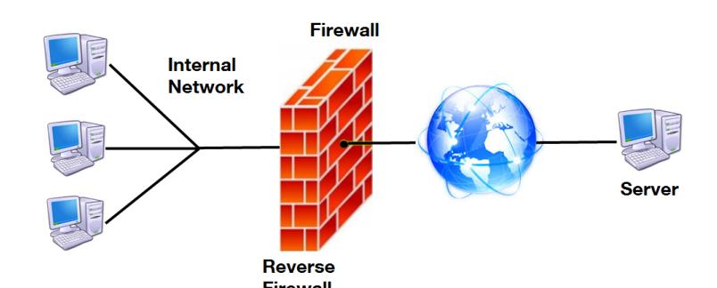
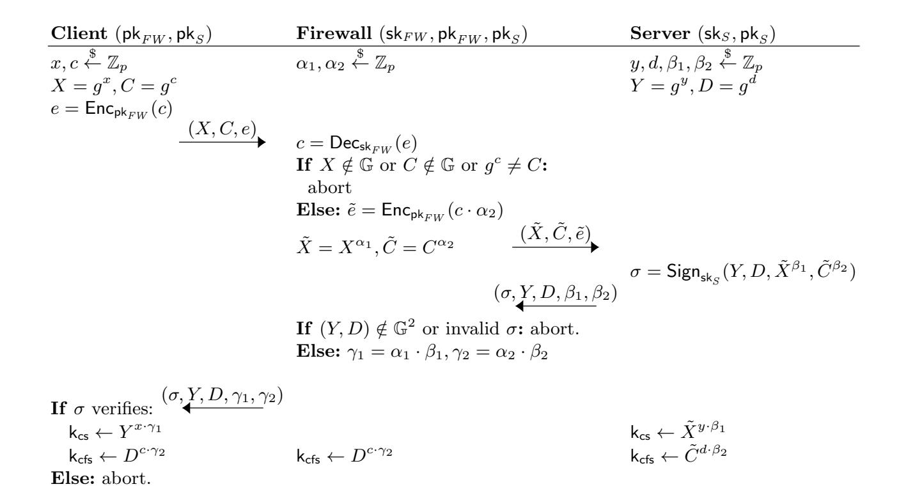
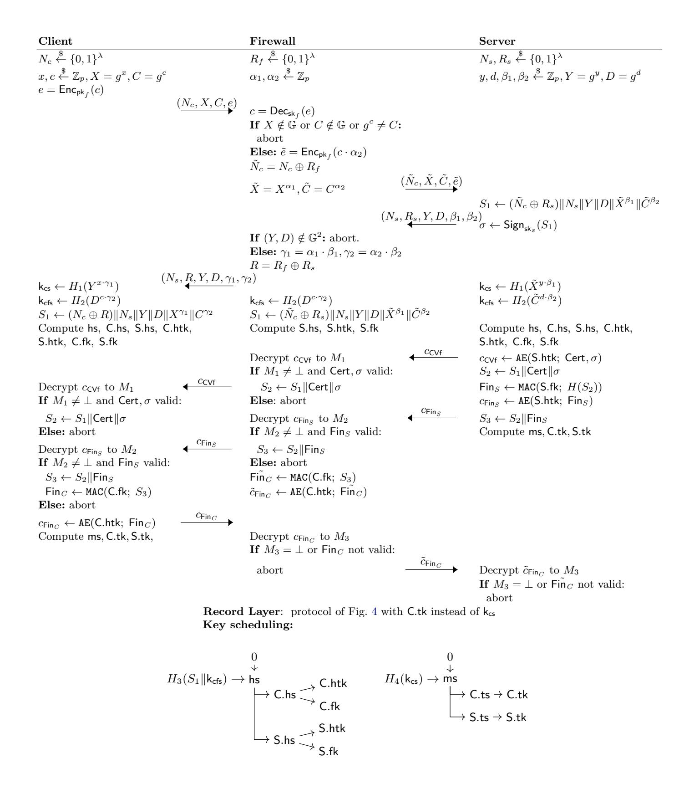

{0}------------------------------------------------

# Designing Reverse Firewalls for the Real World

Ang`ele Bossuat<sup>1</sup> , Xavier Bultel<sup>4</sup> , Pierre-Alain Fouque<sup>1</sup> , Cristina Onete<sup>2</sup> , and Thyla van der Merwe<sup>3</sup>

> Univ Rennes, CNRS, IRISA University of Limoges/XLIM/CNRS Mozilla, London LIFO, INSA Centre Val de Loire, Universit´e d'Orl´eans

Abstract. Reverse firewalls (RFs) were introduced by Mironov and Stephens-Davidowitz to address algorithm-substitution attacks (ASAs) in which an adversary subverts the implementation of a provably-secure cryptographic primitive to make it insecure. This concept was applied by Dodis et al. in the context of secure key exchange (handshake phase), where the adversary wants to exfiltrate sensitive information by using a subverted client implementation. RFs are used as a means of "sanitizing" the client-side protocol in order to prevent this exfiltration. In this paper, we propose a new security model for both the handshake and record layers, a.k.a. secure channel. We present a signed, Diffie-Hellman based secure channel protocol, and show how to design a provably-secure reverse firewall for it. Our model is stronger since the adversary has a larger surface of attacks, which makes the construction challenging. Our construction uses classical and off-the-shelf cryptography.

# 1 Introduction

In 2013, Snowden revealed thousands of classified NSA documents indicating evidence of widespread mass-surveillance. In his essay on the moral character of cryptographic work [\[21\]](#page-17-0), Rogaway suggests that the most important effect of the Snowden revelations was the realization of the existence of a new kind of adversary with much greater powers than ever imagined. Its goal is to enable masssurveillance, by eavesdropping on unsecured communications, and by negating the protection afforded by cryptography. It has massive computational resources at its disposal to mount conventional attacks against cryptography, and also tries to subvert the use of cryptographic primitives by introducing backdoors into cryptographic standards [\[6,](#page-16-0) [7\]](#page-17-1) or, equally insidiously, by using Algorithm Substitution Attacks (ASA). The latter class of attacks was formalised by Bellare et al. [\[1\]](#page-16-1) in the context of symmetric encryption, but actually goes back to much earlier work on Kleptography [\[22\]](#page-17-2). Bellare et al. [\[1\]](#page-16-1) envisage a scenario where the adversary substitutes a legitimate and secure implementation of a

This is the full version of an article accepted for publication at ESORICS 2020.

{1}------------------------------------------------

protocol with one that leaks cryptographic keys to an adversary in an undetectable way. Sadly, they showed that all major secure communication protocols are vulnerable to ASAs because of their intrinsic reliance on randomness.

Reverse Firewalls (RF). Reverse Firewalls were introduced to ensure security when a machine is malfunctioning or compromised. Mironov and Stephens-Davidowitz [\[18\]](#page-17-3) define 3 properties RF should satisfy: (1) security preserving: regardless of the client's behaviour, the RF will guarantee the same protocol security; (2) functionality-maintaining: if the user implementation is working correctly, the RF will not break the functionality of the underlying protocol; and (3) exfiltration resistance: regardless of the client's behaviour, the RF prevents the client from leaking information. In the key-exchange security game of RF, the adversary first corrupts the client by changing its code. Then, during the communication step, there is no more "direct" exchange between them, and the adversary has to exfiltrate information from the messages circulating between the RF and the server.

Dodis et al. [\[9\]](#page-17-4) described an ASA allowing an adversary to break the security of many authenticated key exchanges (AKE). The attack is in the spirit of [\[1\]](#page-16-1): substitute an implementation of a (provably-secure) AKE protocol with a weaker one, in an undetected



way for the servers, then exfiltrate information to a passively observing adversary, who breaks the security of the channel by using weak randomness, for instance. Next, they introduce a RF, used by either of the two endpoints, to prevent any exfiltration during the AKE protocol. The RF can be seen as a special entity in charge of enforcing the protocol's requirements (e.g., checking signatures, adding randomness) to ensure the robustness of the exchanged keys even for a misbehaving client implementation. Delegating all the sensitive steps to the RF would be simpler, but goes against the strong advocated model. RF should preserve security, not provide it, as security must hold even with a malicious RF. Moreover, for practical reasons, both endpoints should still be able to communicate even if the RF is not responding, e.g., due to too many connections.

Dodis et al.'s protocol is a simple signed Diffie-Hellman key exchange modified to accommodate an RF. They prove that their new scheme is still a secure 2-party AKE protocol in the absence of an RF, and that it additionally provides exfiltration resistance when an RF is added even if the endpoints are corrupted. Furthermore, the RF learns no information about the session keys established by the endpoints. Finally, they show that the resulting AKE protocol can be composed with a secure messaging protocol and still provide a certain degree of exfiltration resistance for specific weak client implementations. To this end, they rerandomize the Diffie-Hellman inputs and perform verification tasks. Since the two parties no longer see the same tuple of DH elements due to randomization, 

{2}------------------------------------------------

the signatures cannot be made on the transcripts directly. Instead, a bilinear pairing is cleverly used to sign a deterministic function of the transcripts.

There are many possibilities for a client implementation to become weak: (1) server authentication can be avoided and the adversary can play the role of a malicious server, (2) by using weak randomness or pre-determined "randoms", the adversary can predict the client's ephemeral DH secret and recover the common key exchange and (3) the client can skip the authenticated encryption (AEAD) security during the record phase. We point out that for channel security, because of weakness (3), we cannot just compose a key exchange protocol secure in this model with a secure channel without looking at the security of the channel. There is a subtle theoretic problem in the exfiltration resistance game: since the client knows the key, he can choose messages that depend on the key, which is not the case in traditional encryption security games.

Other approaches. Reverse firewalls have been extended to other contexts such as malleable smooth projective hash functions [\[8\]](#page-17-5), and attribute-based encryption [\[17\]](#page-17-6). While these results have no real link to our work, they show that reverse firewalls are relatively versatile and a promising solution to ASAs. They also superficially resemble middleboxes, which have been studied in the context of TLS [\[12,](#page-17-7)[19,](#page-17-8)[20\]](#page-17-9). However, RF fundamentally differ from middleboxes: the former are meant to preserve the confidentiality, integrity, and authenticity of the secure channel, while the latter break it in controlled ways.

Comparison between previous attacker model and our guarantees. Dodis et al. [\[9\]](#page-17-4) consider three attack scenarios. The first is the security of the primitive in the absence of a firewall (but where the client and server honestly follow the protocol). The second entails that the primitive should still be secure even in the presence of a malicious firewall. The third, and most important security notion is exfiltration resistance, where a malicious implementation of the client tries to exfiltrate information to a network adversary able to monitor the channel between the (honest) reverse firewall and the server.

For this last definition, the adversary also controls the server. This has three consequences: (1) exfiltration resistance may at most be guaranteed for the handshake: if the RF is not present in the basic 2-party protocol, there is no security check at the record layer and the firewall cannot prevent a client from exfiltrating information to a malicious server at the record layer; (2) [\[9\]](#page-17-4) have to restrict their malicious implementations to behave in a very particular way, called functionality preserving: in this model, the malicious client must generally follow protocol, although it may use weak parameters or bypass verification steps; (3) if, within a protocol, the client sends the first key-exchange element, then a commitment phase from the server must precede that message, essentially preventing the server from adaptively choosing a weak DH element for the key-exchange. A more in-depth comparison is given in Appendix [A.](#page-17-10)

In contrast to [\[9\]](#page-17-4) we consider security for both the key-agreement and the record-layer protocols. As mentioned above, this is a non-trivial extension with respect to exfiltration resistance, since the channel keys do not imply exfiltration 

{3}------------------------------------------------

resistance at the record layer. Recall that exfiltration consists in a malicious implementation forwarding information beyond the reverse firewall – either to the network attacker, or to the server. Our results are proven in the presence of a semi-honest server who follows the protocol specification. We argue that this restriction is necessary since nothing can prevent a malicious server – not monitored by a firewall – from forwarding all the data it receives to the adversary. We focus on guaranteeing exfiltration resistance (in the handshake and in the record layer) with respect to a Man-in-the-Middle situated between the firewall and the server.

Adding RF with Exfiltration resistance at the record layer. Protecting the record layer is more challenging than the key exchange, and means considering these two stages as a whole. Our key observation is that an RF cannot prevent exfiltration at this layer if it does not know the key used for the encryption: nothing prevents the adversary from choosing messages which, for the computed key, leak information to the adversary. Another difficulty is that, contrary to the key exchange which essentially involves public-key primitives (usually quite malleable), the record layer relies on symmetric key primitives, much less tolerant to modifications. Our approach differs from [\[9\]](#page-17-4) by introducing a new functionality preserving definition: while Dodis et al. mainly limit the adversary to using weak randomness and avoiding server checks, we do not restrict the client's behaviour beyond requiring that a semi-honest server accepts the communication.

Our solution is to allow the reverse firewall to contribute to securing messages exchanged during the record layer, without compromising the end-to-end security that the channel should provide. As in [\[9\]](#page-17-4), the main task of our reverse firewall is to rerandomize some elements and verify the validity of the signatures. The main difference we introduce is that this key exchange will now generate two keys: kcs and kcfs. The former is very similar to the one generated in [\[9\]](#page-17-4) and will be only known to both endpoints. It will be used to encrypt messages at the record layer, ensuring security even against a malicious reverse firewall. The key kcfs will be known to the endpoints, but also to the RF, allowing it to preserve security by adding a second layer of encryption. To accomplish this, our RF will have a public key, which was not the case in [\[9\]](#page-17-4). This is non-trivial in practice: for transparency the RF must not modify the messages' format, and the endpoints must be oblivious to the RF's action. Indeed, if the RF was offline or not capable of protecting all of its clients, this must not be detectable by a corrupt implementation. Finally, we cannot rely on standard security properties for encryption to prove our exfiltration-resistance. This is related to the adversarial strategy of choosing messages whose ciphertexts have a distinctive pattern. We provide more details in Section [3.3](#page-11-0) but, intuitively, the ciphertexts meant to be distinguished by the adversary are encryptions of messages chosen by a corrupt implementation that knows the channel key. Using key-dependent messages schemes [\[3\]](#page-16-2), we design a very efficient solution based on hash functions and MAC schemes to prevent exfiltration at the record layer.

{4}------------------------------------------------

## 2 Security model and definitions

### 2.1 The adversary model

The adversary  $\mathscr{A}$  is a Man-in-the-Middle, interacting with honest parties (one client C, one server S, and sometimes a reverse firewall FW) via instances associated with unique labels. We assume that the client is always the initiator of each execution, and the server is the responder. The server and the firewall have an identity associated with a pair of private-public keys. Additionally, we require a setup phase for the firewall, run either by the challenger if the firewall is honest, or by the adversary if it is malicious. The  $\mathsf{Setup}(1^\lambda)$  algorithms takes as input a security parameter  $1^\lambda$  and generates secret parameters  $\mathsf{sparam}$  (including the firewall's private credentials) and public parameters  $\mathsf{sparam}$  (including FW).

To each instance label, there is an associated set of values: a *type* type in  $\{C, S, FW\}$ , the entity of which label is an instance, a *session identifier* sid, and two types of *session keys*, denoted  $k_{cfs}$  and  $k_{cs}$ , respectively. Both keys are initially set to  $\bot$ . An *authentication-acceptance bit* accept, set to  $\bot$  at the beginning of the instance, which may turn to either 1 (if the authentication of the partner succeeds) or to 0 otherwise. Only client and firewall instances have a non- $\bot$  accept bit (since only the server authenticates itself). A pair of *revealed bits* revealed<sub>cfs</sub> and revealed<sub>cs</sub>, both initially set to 0. A *corrupt bit* corrupted initially set to 0, and a *test bit* b drawn at random at the initialization of each new instance label. We use the notation "label attribute" to refer to a value attribute associated with the instance label.

**Partnering.** We define partnering in terms of type and session identifiers. Two instances, associated with labels label and label', are *partnered* if and only if label.sid = label'.sid and label.type  $\neq$  label'.type. As such, a client may be partnered with a server, or a server and a firewall.

The scenarios we consider are formally defined through security experiments, in which the adversary  $\mathscr{A}$  has access to some (or all) of the following oracles.

- NewInstance(U): on input  $U \in \{C, S, FW\}$ , this oracle outputs an instance of party U labeled label. The adversary is given label.
- Send(label, m): on input an existing client/firewall/server instance label and a message m, this oracle simulates sending m to label, adds label to a list  $\mathcal{L}_s$  (initialized as an empty list at the first call to this oracle) and outputs its corresponding reply m'.
- Reveal(label, kt): on input an existing label label and a string  $kt \in \{cs, cfs\}$  denoting the key type to reveal, this oracle adds label to a list  $\mathcal{L}_{kt}$  (initialized as an empty list at the first call to this oracle), and outputs the values stored in label. $k_{kt}$ . The corresponding bit label.revealed<sub>kt</sub> is also set to 1.
- CorruptS(): this oracle yields the server's private long-term key. Upon corruption, all client and firewall instances with label.accept ≠ 1 change their corrupted values to 1. Moreover, any client or firewall instance generated after this CorruptS query will have corrupted initialized to 1.

{5}------------------------------------------------

- Test<sub>kt</sub>(label): with index a string kt  $\in$  {cs, cfs}, on input an instance label, this oracle first verifies that label.k<sub>kt</sub>  $\neq \bot$  (otherwise, it outputs  $\bot$ ). Then, depending on the test instance it responds as follows.
  - if label is a client instance, it outputs either the key stored in label. $k_{kt}$  (if label.b = 1), or a randomly-chosen key of the same length (if label.b = 0);
  - if label is a server or firewall instance, it returns  $\bot$  if it has no partnered instance label' of type C. Otherwise, it returns  $\mathsf{Test}_{\mathsf{kt}}(\mathsf{label}')$ .
- TestSend(label, m): on input an instance label and a message m, if  $F[label] = \bot$  (F is used to keep track of the firewalls), the oracle creates an RF instance labeled F[label]:
  - if label.b = 1, this oracle acts as Send(label, m) except that it does not update  $\mathcal{L}_s$ ;
  - else, this oracle acts as Send(F[label], Send(label, Send(F[label], m))) except that it does not update  $\mathcal{L}_s$  (without loss of generality, we assume that the firewall just forward the session initialization message);

This oracle adds label to a list  $\mathcal{L}_*$  (initialized as an empty list at the first call to this oracle).

As we only consider unilateral authentication,  $\mathsf{Test}_{\mathsf{kt}}$  is defined asymmetrically, depending on which party the tested instance belongs to. Our last oracle  $\mathsf{TestSend}$  either sends the unmodified message m, as in a  $\mathsf{Send}$  query, or forces the RF to be active on this transmission. It will be used to show that the actions of our RF go unnoticed and so will only be used in the obliviousness and transparency experiments.

**Forward secrecy.** Whenever CorruptS is queried, any ongoing instance label (i.e., any instance such that label.accept  $\neq 1$ ) has their corrupt bit set to 1. However, completed, accepting instances are excluded from this and can still be tested. This models forward secrecy. We will include the CorruptS query in all our security definitions, thus capturing forward secrecy by default.

Reveal and State Reveal. Krawczyk and Wee [16] also consider an oracle that reveals parts of the ephemeral state of a given party. In multi-stage AKE protocols, revealing state is particularly interesting since it distinguishes inputs that the keys depend on from inputs whose knowledge does not affect the security of the channel. For simplicity we omit state reveal queries in this paper, since we focus on exfiltration resistance and security in the presence of malicious firewalls, for which state reveals are less interesting.

**Freshness.** To rule out trivial attacks, we introduce the notion of *freshness*, which determines the instances that  $\mathscr{A}$  is allowed to attack.

**Definition 1** (Freshness). Let  $kt \in \{cs, cfs\}$ . An instance label is  $k_{kt}$ -fresh if:

- label.accept = 1 (for a client or firewall instance); and label.corrupted = 0
- label.revealed<sub>kt</sub> = 0, and label'.revealed<sub>kt</sub> = 0 for any partner label' of label;

Channel Security. Whenever the session keys are indistinguishable from random for the attacker, one can implicitly rely on existing work on constructing

{6}------------------------------------------------

secure channels by composition, e.g. [4, 14] to prove the security of the established channel. However, in the case of exfiltration resistance the hypothesis does not hold: the corrupt implementation of the client does have access to the keys.

### 2.2 The security of $k_{cs}$

We look at the AKE security of the key  $k_{cs}$  when the firewall is malicious as it clearly implies security with an absent or an honest firewall. Our definition of AKE does not demand *explicit* server-authentication (see [2]). Since the adversary knows  $k_{cfs}$ , the default testing mode is  $\mathsf{Test}_{cs}(\cdot)$ . The adversary first runs the  $\mathsf{Setup}$  algorithm, outputting the public parameters to the challenger (since the server credentials are not included, the adversary does not learn them).

<span id="page-6-2"></span>**Definition 2 (CS-AKE security**  $- k_{cs}$ ). A cs-AKE protocol  $\Pi$  is secure if for all PPT adversaries  $\mathscr{A}$ ,  $\mathsf{Adv}_{\Pi,\mathscr{A}}^{\mathsf{CS-AKE}}(\lambda) = |2 \cdot \Pr[1 \leftarrow \mathsf{Exp}_{\Pi,\mathscr{A}}^{\mathsf{CS-AKE}}(\lambda)] - 1|$  is negligible in the security parameter  $\lambda$ , where  $\mathsf{Exp}_{\Pi,\mathscr{A}}^{\mathsf{CS-AKE}}(\lambda)$  is given in Fig. 1.

```
\mathsf{Exp}^{\mathsf{CS-AKE}}_{\Pi,\mathscr{A}}(\lambda):
                                                                             \mathsf{Exp}_{\Pi,\mathscr{A}}^{\mathsf{CFS-AKE}}(\lambda):
\overline{1. (\text{sparam}, \text{pparam})} \leftarrow \mathscr{A}^{\text{Setup}(\cdot)}(1^{\lambda})
                                                                              1. (sparam, pparam) \leftarrow Setup(·)(1<sup>\lambda</sup>)
2. Q \leftarrow \{NewInstance, Send, Reveal, \}
                                                                              |2. \mathbf{Q} \leftarrow \{ \mathsf{NewInstance}, \mathsf{Send}, \mathsf{Reveal}, \}
                                                                                  CorruptS, Test<sub>cfs</sub>(\cdot)}
    CorruptS, Test<sub>cs</sub>(\cdot)}
3. (label, b_*) \leftarrow \mathscr{A}^{\mathsf{Q}}(\mathsf{sparam}, \mathsf{pparam})
                                                                              3. (label, b_*) \leftarrow \mathscr{A}^{\mathsf{Q}}(\mathsf{pparam})
4. if (label is k_{cs}-fresh) \wedge (label.b = b_*): 4. if (label is k_{cfs}-fresh) \wedge (label.b = b_*):
    return 1
                                                                                  return 1
5. else: return a random bit
                                                                              5. else: return a random bit
\overline{\mathsf{Exp}^{\mathsf{Exf}}_{\Pi,\mathscr{A}}(\lambda)}:
                                                                              \mathsf{Exp}^{\mathsf{OBL}}_{\Pi,\mathscr{A}}(\lambda):
                                                                              \overline{1}. (sparam, pparam) \leftarrow \mathscr{A}^{\mathsf{Setup}(\cdot)}(1^{\lambda})
1. (sparam, pparam) \leftarrow Setup(1^{\lambda})
2. (\mathcal{P}^0, \mathcal{P}^1) \leftarrow \mathscr{A}(\mathsf{pparam})
                                                                              2. Q \leftarrow \{NewInstance, Send, Reveal, \}
3. Q \leftarrow \{\text{NewInstance}, \text{Send}, \text{Reveal}\}
                                                                              CorruptS, TestSend}
4. (\mathsf{label}_{FW}, b_*) \leftarrow \mathscr{A}^{\mathsf{Q}}(\mathsf{pparam}, \mathcal{P}^0, \mathcal{P}^1)
                                                                              3. (label, b_*) \leftarrow \mathscr{A}^{\mathsf{Q}}(\mathsf{sparam}, \mathsf{pparam})
                                                                              4. if (label is Send-fresh) \land (label.b = b_*):
5. if (label<sub>FW</sub> is exfiltration-fresh) \wedge
    (\mathsf{label}_{FW}.\mathsf{b} = b_*): return 1
                                                                                    return 1
6. else: return a random bit
                                                                              5. else: return a random bit
```

<span id="page-6-0"></span>Fig. 1. Experiments for the CS-AKE, CFS-AKE, exfiltration and obliviousness games.

### 2.3 The security of $k_{cfs}$

The adversary can no longer control the RF (which is able to compute  $k_{cfs}$ ) and simply acts as a Man-in-the-Middle between the client and the firewall and/or the firewall and the server. The adversary first runs the Setup algorithm, outputting the parameters to the challenger. We focus on the first "layer" of keys, *i.e.*, on  $k_{cfs}$ , thus, the default mode for the test oracle is  $Test_{cfs}(\cdot)$ .

<span id="page-6-1"></span>**Definition 3 (AKE security**  $- \mathsf{k}_{\mathsf{cfs}}$ ). A cfs-AKE protocol  $\Pi$  is  $\mathsf{k}_{\mathsf{cfs}}$ -secure if for all PPT adversaries  $\mathscr{A}$ ,  $\mathsf{Adv}_{\Pi,\mathscr{A}}^{\mathsf{CFS-AKE}}(\lambda) = |2 \cdot \Pr[1 \leftarrow \mathsf{Exp}_{\Pi,\mathscr{A}}^{\mathsf{CFS-AKE}}(\lambda)] - 1|$  is negligible in  $\lambda$ , where  $\mathsf{Exp}_{\Pi,\mathscr{A}}^{\mathsf{CFS-AKE}}(\lambda)$  is given in Fig. 1.

{7}------------------------------------------------

### <span id="page-7-1"></span>2.4 The malicious client scenario

The malicious client scenario is the core motivation behind this work. The firewall and server are both honest, but the adversary can tamper with the client-side implementation. The RF must guarantee the security of the session keys and ensure exfiltrate resistance. Moreover, in our model, we require this guarantee to hold also for record-layer transmissions.

Client-adversary interaction. We consider a Man-in-the-Middle adversary A situated between the firewall and the server[1](#page-7-0) . The attacker is assumed to have substituted the honest client implementation for a malicious one but has no direct or covert communication channel with the adversary.

The game starts with an honest Setup phase, then after being given the public parameters, the adversary A creates two client programs P 0 ,P <sup>1</sup> using some suitable (unspecified) encoding, and outputs them to the challenger. The adversary will query NewInstance(FW ) to create new firewall instance(s), which will (unbeknownst to A ) interact with one of the two client programs P <sup>0</sup> or P 1 , provided by A . In this case the firewall instance's test bit b ∈ {0, 1} indicates which of the two adversarial programs it interacts with.

In the malicious client scenario, the adversary interacts directly with the server and the firewall instances through the Send queries, but only indirectly (through the firewall) with the client programs. We note that A 's interaction with the server and the firewall is still arbitrary, i.e., A still actively controls the messages sent between them. The goal of the adversary is to guess which of the supplied client programs P 0 , P 1 the firewall has been interacting with. Formally, A outputs a tuple consisting of a firewall instance labelFW and a bit d, representing its guess of labelFW .b.

Trivial attacks. It is impossible to prove this "left-or-right" exfiltration resistance for arbitrary programs P 0 ,P 1 : A could output a program P <sup>0</sup> which produces obviously illegal messages, whereas P 1 emulates the protocol perfectly. The firewall will then abort for labelFW .b = 0, but not for labelFW .b = 1, allowing A to distinguish the two cases. Similarly, A can also trivially win if P <sup>0</sup> and P <sup>1</sup> output messages of different lengths.

Informally, we require that the externally observable behavior of the two programs P 0 , P 1 , i.e., whatever the reverse firewall and server do in response to the programs' messages, should be similarly structured: the number of messages generated should be the same and these messages should pairwise have the same length. However, we do not restrict the semantics of these messages. Moreover, this restriction applies only to the programs selected for the target instance; all other instances can behave in any way.

Formally, we consider a program P, a firewall FW , and a server S. We denote by τ[labelFW (P)↔label<sup>S</sup> ] the ordered transcript of messages sent between the firewall (interacting with P) and the server. Let L = <sup>τ</sup>[labelFW (P)↔label<sup>S</sup> ]  denote

<span id="page-7-0"></span><sup>1</sup> Exfiltration resistance would obviously be unachievable elsewhere.

{8}------------------------------------------------

the length of the transcript. For  $i \in \{1, ..., L\}$ , let  $\tau_{[\mathsf{label}_S \leftrightarrow \mathsf{label}_{FW}(\mathcal{P})]}[i]$  denote the *i*-th message in the transcript, and let  $|\tau_{[\mathsf{label}_S \leftrightarrow \mathsf{label}_{FW}(\mathcal{P})]}[i]|$  denote its length.

**Definition 4 (Transcript equivalence).** Two programs  $\mathcal{P}^0$  and  $\mathcal{P}^1$  have equivalent transcripts in an execution with the firewall FW and the server S if the following conditions hold:

```
 \begin{array}{ll} 1. & \left| \tau_{[\mathsf{label}_{FW}(\mathcal{P}^0) \leftrightarrow \mathsf{label}_S]} \right| = \left| \tau_{[\mathsf{label}_{FW}(\mathcal{P}^1) \leftrightarrow \mathsf{label}_S]} \right|. \\ 2. & \left| \tau_{[\mathsf{label}_{FW}(\mathcal{P}^0) \leftrightarrow \mathsf{label}_S]}[i] \right| = \left| \tau_{[\mathsf{label}_{FW}(\mathcal{P}^1) \leftrightarrow \mathsf{label}_S]}[i] \right| \ for \ each \ i \in \{1, \dots, L\}. \end{array}
```

Only allowing client programs that generate equivalent transcripts rules out the trivial attacks mentioned above. Interestingly, it is arguably much easier to decide whether two programs have equivalent transcripts (as it is only based on measurable quantities) than to determine if a corrupt program is "functionality-maintaining" in the sense of [9]. It allows realistic attacks, e.g., selection of messages whose ciphertexts have very specific features, contrarily to [9].

Some of our requirements are fullfilled by using specific cryptographic tools, such as *length-hiding authenticated encryption* [13, 15] which would, for example, make the second condition easily satisfied. Regarding the first condition, differences in the number of exchanged messages are likely to imply an unusual behaviour of the client (*e.g.*, a large number of aborted connections) and so can potentially be detected by an external security event management system.

**Definition 5 (Exfiltration freshness).** A firewall label  $_{FW}$  is exfiltration-fresh with respect to programs  $\mathcal{P}^0, \mathcal{P}^1$  if:

- label $_{FW}$ .accept =1; for any label, label.revealed $_{\mathsf{cfs}}=0;$
- the programs  $\mathcal{P}^0$  and  $\mathcal{P}^1$  generate equivalent transcripts in their execution with the firewall instance  $|abe|_{FW}$  and its partnering server instance  $|abe|_{S}$ .

<span id="page-8-1"></span>**Definition 6 (Exfiltration).** An AKE protocol  $\Pi$  is exfiltration secure if for all PPT adversaries  $\mathscr{A}$ ,  $\mathsf{Adv}^{\mathsf{Exf}}_{\Pi,\mathscr{A}}(\lambda) = 2 \cdot |\Pr[1 \leftarrow \mathsf{Exp}^{\mathsf{Exf}}_{\Pi,\mathscr{A}}(\lambda)] - 1|$  is negligible in  $\lambda$ , where  $\mathsf{Exp}^{\mathsf{Exf}}_{\Pi,\mathscr{A}}(\lambda)$  is given in Fig. 1.

### 2.5 Obliviousness

Dodis et al. take the obliviousness into account for their protocols: the client (resp. the server) cannot distinguish  $^2$  whether it interacts with the firewall or the server (resp. the client). To discard trivial attacks, we define the sending freshness. A label is sending-fresh when it is never queried in Send and its related firewall F[label] is never an input of the Send and Reveal oracles.

**Definition 7 (Sending freshness).** A firewall instance label is send-fresh if  $F[\mathsf{label}] \notin \mathcal{L}_s \cup \mathcal{L}_{\mathsf{cfs}}$  and  $\mathsf{label} \notin \mathcal{L}_s$ .

<span id="page-8-2"></span>**Definition 8 (Obliviousness).** An AKE protocol  $\Pi$  is oblivious if for all PPT adversaries  $\mathscr{A}$ ,  $\mathsf{Adv}_{\Pi}^{\mathsf{OBL}}(\mathscr{A}) = |2\Pr[\mathsf{Exp}_{\Pi,\mathscr{A}}^{\mathsf{OBL}}(\lambda) \Rightarrow 1] - 1|$  is negligible in  $\lambda$ , where  $\mathsf{Exp}_{\Pi,\mathscr{A}}^{\mathsf{OBL}}(\lambda)$  is given in Fig. 1.

<span id="page-8-0"></span>The related definition of transparency is given in Appendix B.

{9}------------------------------------------------

$$\begin{array}{c|ccccccccccccccccccccccccccccccccccc$$

<span id="page-9-1"></span>Fig. 2. A key agreement protocol between the client, a passive firewall, and the server.

### 3 Our reverse firewall

We now describe a message-transmission protocol compatible with a reverse firewall. We consider a setting of unilateral authentication, *i.e.*, only the server authenticates itself, using digital signatures. As in [9], we start with a simple DH key exchange protocol between a client and a server, modified to accommodate a reverse firewall. In particular, the goal of this new key exchange is for the client and the server to compute two keys:  $k_{cs}$  known only to them, and  $k_{cfs}$  which will also be known to the firewall. We manage to avoid the use of pairings and only use standard cryptographic tools (such as CPA-secure public key encryption) along with some tricks to ensure the obliviousness of our protocol.

However, we must keep in mind that a shared key is just a tool to protect further communication, and we thus need to explain how the RF can proceed to preserve security of future messages sent by a corrupt client, while only having access to  $k_{\mathsf{cfs}}$ . This is particularly difficult as the record-later only involves symmetric key primitives, and moreover, other subtleties prevent us from using more "natural" solutions.

For the sake of clarity, we use this section to describe our protocol step by step, first presenting a key agreement with a passive firewall in Section 3.1 and then explaining in Section 3.2 how the latter can act to preserve security even with a corrupt client. Finally, we will consider in Section 3.3 the record-layer, describing how the keys generated during the key agreement should be used to prevent exfiltration at this stage.

#### <span id="page-9-0"></span>3.1 Signed Diffie-Hellman with passive/no firewall

**Setup.** Before the protocol runs there is a one-time setup phase where the reverse firewall chooses a public/private key pair  $(pk_{FW}, sk_{FW})$  for some public encryption scheme Enc, such as the one proposed by El Gamal [11], and sends  $pk_{FW}$  to the client. In case the client does not have a reverse firewall installed (and hence no  $pk_{FW}$  value), the client draws a new random element from the key space in every protocol run and uses this as a substitute for  $pk_{FW}$ .

{10}------------------------------------------------



<span id="page-10-2"></span>Fig. 3. An active reverse firewall for the protocol in Fig. 2, using the same notations.

The protocol. Fig. 2 depicts how the protocol runs in the presence of a passive<sup>3</sup> firewall. The client begins by choosing two ephemeral DH shares  $(X, C) \leftarrow (g^x, g^c)$  in some cyclic group  $\mathbb{G}$  generated by g, encrypting c with the firewall public key  $\mathsf{pk}_{FW}$  to get  $e = \mathsf{Enc}_{\mathsf{pk}_{FW}}(c)$ , and sending (X, C, e) to the server forwarded unmodified by the firewall. The latter decrypts e with  $\mathsf{sk}_{FW}$  to get c.

The server in turn chooses two ephemeral DH shares  $(Y,D) \leftarrow (g^y,g^d)$  and two random elements  $(\beta_1,\beta_2)$  from  $\mathbb{Z}_p$ , and sends these, together with a signature of  $(Y,D,X^{\beta_1},C^{\beta_2})$  to the client (the firewall just forwards this message). The server also computes the keys  $\mathsf{k_{cs}} \leftarrow X^{y\cdot\beta_1}$  and  $\mathsf{k_{cfs}} \leftarrow C^{d\cdot\beta_2}$ . Provided the signature is valid, the client computes the keys  $\mathsf{k_{cs}} \leftarrow Y^{x\cdot\beta_1}$  and  $\mathsf{k_{cfs}} \leftarrow D^{c\cdot\beta_2}$ . Finally, the reverse firewall computes  $\mathsf{k_{cfs}} \leftarrow D^{c\cdot\beta_2}$ . The scheme is correct since  $X^y = Y^x = g^{x\cdot y}$  and  $C^d = D^c = g^{c\cdot d}$ .

**Security.** Intuitively, only the parties knowing x or y can recover  $k_{cs}$ , and only the parties knowing d or c can recover  $k_{cfs}$ . However, the latter has no actual use in case the RF is passive or absent. The cs-AKE security of this protocol is implied by that of the following protocol, where we consider an active, potentially malicious, adversary.

#### <span id="page-10-0"></span>3.2 Signed Diffie-Hellman with an active firewall

Our next step is to construct an active RF for the signed DH protocol described in Section 3.1. Note that the protocol in Fig. 2 is compatible with the rerandomization proposed by Dodis et al. [9]: the RF can rerandomize the key shares without impacting the correctness of the resulting protocol.

<span id="page-10-1"></span><sup>&</sup>lt;sup>3</sup> Passive here means that the RF does not modify the elements sent by the client or the server and so does not try to prevent exfiltration.

{11}------------------------------------------------

In Fig. 3 we describe the active RF for the protocol of Fig. 2. The RF rerandomizes the two DH elements X and C with exponents  $\alpha_1$  and  $\alpha_2$ , respectively, to obtain  $\tilde{X}$  and  $\tilde{C}$ . It also decrypts e to obtain c, and encrypts  $c \cdot \alpha_2$  (with its own public key<sup>4</sup>  $\mathsf{pk}_{FW}$ ) to get  $\tilde{e}$ , before forwarding  $(\tilde{X}, \tilde{C}, \tilde{e})$  to the receiving endpoint. Upon reception, the server proceeds as before. The rerandomization made by the RF impacts the input to the server's signature; the firewall must therefore include its random values to the subsequent response to the client: the server sends  $(\sigma, Y, D, \beta_1, \beta_2)$ , and the firewall will forward  $(\sigma, Y, D, \gamma_1 = \alpha_1 \cdot \beta_1, \gamma_2 = \alpha_2 \cdot \beta_2)$ .

Apart from rerandomizing the transcript, the RF verifies that the received elements are from the correct groups and that they are not the neutral element of those groups. In addition, it checks the validity of the server's signature for the rerandomized transcript, *i.e.*, it checks that the server signed  $(Y, D, \tilde{X}^{\beta_1}, \tilde{C}^{\beta_2})$ .

This protocol ensures obliviousness, as stated in Theorem 4. This comes from the fact that the transcripts of the honestly-run protocol (in Fig. 2) and the ones from the protocol in Fig. 3 are identically distributed from the point of view of the endpoints, and a tampered client implementation cannot distinguish whether it is being monitored or not.

The security of this protocol (more specifically cs- and cfs-AKE security) is formally stated in Theorem 1 and Theorem 2, for which we give proof sketches in Section 4.

<span id="page-11-2"></span>**Theorem 1.** The protocol given in Fig. 3 is cfs-AKE secure (Definition 3) under the DDH assumption, and assuming Sig is EUF-CMA and Enc is IND-CPA.

$$\mathsf{Adv}^{\mathsf{CFS-AKE}}_{\varPi}(\lambda) \leq n_C \cdot n_S \cdot \left(\mathsf{Adv}^{\mathsf{EUF-CMA}}_{Sig}(\lambda) + \mathsf{Adv}^{\mathsf{IND-CPA}}_{\mathsf{Enc}}(\lambda) + \mathsf{Adv}^{\mathsf{DDH}}_{\mathbb{G}}(\lambda)\right)$$

<span id="page-11-3"></span>**Theorem 2.** The protocol given in Fig. 3 is cs-AKE secure (Definition 2) under the DDH assumption, and assuming Sig is EUF-CMA.

$$\mathsf{Adv}^{\mathsf{CS-AKE}}_{\varPi}(\lambda) \leq n_C \cdot n_S \cdot \left(\mathsf{Adv}^{\mathsf{EUF-CMA}}_{Sig}(\lambda) + \mathsf{Adv}^{\mathsf{DDH}}_{\mathbb{G}}(\lambda)\right)$$

We discuss solutions to "stack" several RFs, and to adapt our RF to a real-world TLS-like protocol in Appendix E and Appendix F, respectively.

#### <span id="page-11-0"></span>3.3 Record-layer firewall

Theorem 2 and Theorem 1 prove that our protocol is a secure AKE protocol, with or without an RF. What is still missing is a proof of exfiltration resistance, as per Definition 6. While we could prove this property directly for the protocol when viewed as an AKE, we recall that our goal is to also cover exfiltration resistance when the AKE is combined with a subsequent encryption scheme, and we thus prove exfiltration resistance for the whole channel establishment protocol (AKE + encryption scheme). We explain how our reverse firewall can prevent exfiltration at the record-layer.

<span id="page-11-1"></span>For transparency, the message sent by the RF must have the same format as (X, C, e).

{12}------------------------------------------------

```
\begin{array}{lll} & \textbf{Client} \; (\mathsf{k}_{\mathsf{cfs}}, \mathsf{k}_{\mathsf{cs}}) & \textbf{Firewall} \; (\mathsf{k}_{\mathsf{cfs}}) \\ \hline C \leftarrow \mathsf{AE.Enc}(\mathsf{k}_{\mathsf{cs}}, \ell, \mathsf{he}, M, \mathsf{st}_{\mathsf{E}}) \\ \hline r \overset{\$}{\leftarrow} \{0, 1\}^{\lambda}, \; k_{1} \leftarrow H_{1}(r || \mathsf{k}_{\mathsf{cfs}}) \\ k_{2} \leftarrow H_{2}(r || \mathsf{k}_{\mathsf{cfs}}), \\ \hline s \leftarrow k_{1} \oplus C, \; t = \mathsf{MAC}_{k_{2}}(r || s) & \underbrace{r \overset{\$}{\leftarrow} \{0, 1\}^{\lambda}, \; \tilde{k}_{1} \leftarrow H_{1}(\tilde{r} || \mathsf{k}_{\mathsf{cfs}}),}_{\tilde{k}_{2} \leftarrow H_{2}(\tilde{r} || \mathsf{k}_{\mathsf{cfs}}),} \\ \hline & & \mathbf{If} \; |s| \neq \ell \text{: abort} \\ k_{1} \leftarrow H_{1}(r || \mathsf{k}_{\mathsf{cfs}}), k_{2} \leftarrow H_{2}(r || \mathsf{k}_{\mathsf{cfs}}), \\ \tilde{C} \leftarrow k_{1} \oplus s \\ & \tilde{s} \leftarrow \tilde{k}_{1} \oplus \tilde{C}, \; \tilde{t} = \mathsf{MAC}_{\tilde{k}_{2}}(\tilde{r} || \tilde{s}) & \underbrace{\tilde{r}, \tilde{s}, \tilde{t}}_{\tilde{k}_{1}} \leftarrow H_{1}(\tilde{r} || \mathsf{k}_{\mathsf{cfs}}) \\ \tilde{k}_{2} \leftarrow H_{2}(\tilde{r} || \mathsf{k}_{\mathsf{cfs}}) \\ \tilde{k}_{2} \leftarrow H_{2}(\tilde{r} || \mathsf{k}_{\mathsf{cfs}}) \\ \tilde{k}_{2} \leftarrow H_{2}(\tilde{r} || \mathsf{k}_{\mathsf{cfs}}) \\ \tilde{k}_{2} \leftarrow H_{2}(\tilde{r} || \mathsf{k}_{\mathsf{cfs}}) \\ \tilde{k}_{3} \leftarrow \mathsf{AE.Dec}(\mathsf{k}_{\mathsf{cs}}, \mathsf{he}, \tilde{\tilde{C}}, \mathsf{st}_{\mathsf{D}}) \\ \mathbf{If} \; \tilde{M} = \bot \; \text{or} \; \tilde{t} \; \text{invalid:} \\ \text{abort} \\ \end{array}
```

<span id="page-12-0"></span>**Fig. 4.** An active reverse firewall for the secure transmission of a message M, using an stLHAE scheme, where  $H_2: \{0,1\}^* \to \{0,1\}^\ell$  and  $H_2\{0,1\}^* \to \mathcal{K}$  (where  $\mathcal{K}$  is the key set of the MAC) are hash functions modelled as random oracles in the security analysis. The encryption/decryption states used for the inner layer is  $(\mathsf{st}_\mathsf{E}, \mathsf{st}_\mathsf{D})$ . A passive firewall simply forwards (r, s, t).

**Double CPA encryption fails.** When the client's implementation cannot be trusted, the security of the encryption algorithm used at the record layer becomes irrelevant. Even the RF cannot ensure the security of ciphertexts formed with  $k_{cs}$  because it does not have this key.

We cannot simply add an independent, external encryption layer, taking  $k_{cfs}$  as the key, known to the RF, hoping it could preserve security by first decrypting this external layer and then re-encrypting it; even if it seems that no matter how the client implementation behaves, the adversary would only see a valid ciphertext generated using  $k_{cfs}$ , which it does not know. It might therefore be tempting to conclude that this protocol is exfiltration resistant, assuming IND-CPA security of the encryption scheme.

However, the IND-CPA security of an encryption scheme ensures that no adversary can decide if a given ciphertext encrypts a message m of its choice. Our adversary is much more powerful here: the client, controlled by the adversary, selects the messages to send while knowing the secret keys, which is not allowed in the IND-CPA security game. We cannot hope to rely on such a property. Moreover, the corrupt implementation could simply select messages whose ciphertexts contain some specific patterns that could be used as a distinguisher.

**KDM encryption fails.** Allowing the adversary to select messages while knowing the key is reminiscent of the key-dependent message model from [3]. Such an encryption scheme remains secure even if the adversary receives the encryption of some messages m = f(sk), where f is chosen by the adversary and sk is the secret key. Unfortunately, this does not exactly match our scenario: here, we have two adversaries, one (the corrupt client) who selects the messages to be encrypted and knows the key, and one (the adversary between the RF and the server) who does not know the key and must distinguish the encryption of these messages. Our model is stronger than KDM, and we therefore cannot fully rely on this property.

{13}------------------------------------------------

Our solution. Nonetheless, the construction proposed in [3] does provide an answer to our problem. In our protocol, the client first encrypts the plaintext message into a ciphertext C using a length-hiding authenticated encryption and the secret key  $k_{cs}$ . The client then picks r and computes  $C' = H(r||k_{cfs}) \oplus C$ , which is similar to the technique in [3]. It sends (r, C') to the firewall which decrypts C' and re-encrypts it by computing  $\tilde{C}' = H(\tilde{r}||k_{cfs}) \oplus C$  using a fresh random  $\tilde{r}$ . We already showed that the key  $k_{cfs}$  is indistinguishable from random. Thus, as long as the adversary does not guess  $k_{cfs}$ , the value  $H(\tilde{r}||k_{cfs})$  is indistinguishable from a random one (in the random oracle model) and acts as a one-time-pad on C. This means that  $\tilde{C}'$  leaks no information to the adversary. Finally, since a one-time-pad does not prevent malleability, we need to additionally compute a MAC on  $(\tilde{r}, \tilde{C}')$  by using a key derived from  $k_{cfs}$ .

The resulting protocol is exfiltration resistant (which we consider to be the most important property) as stated in Theorem 3, and is also oblivious in both phases, as stated in Theorem 4. Proof sketches are given in Section 4 and Appendix C, respectively, with the complete proof of Theorem 3 being given in Appendix D.3.

<span id="page-13-2"></span>**Theorem 3.** Protocol  $\Pi$  is exfiltration resistant (Definition 6) in the ROM under the CDH, and assuming that Sig is EUF-CMA and Enc is IND-CPA.

$$\begin{split} \mathsf{Adv}^{\mathsf{Exf}}_{II}(\lambda) \leq & q_m^2/2^\lambda + \mathsf{Adv}^{\mathsf{IND-CPA}}_{\mathsf{Enc}}(\lambda) + n_s \cdot n_f \cdot (q_1 + q_2) \cdot \mathsf{Adv}^{\mathsf{CDG}}_{\mathscr{G}}(\lambda) \\ & + n_m \cdot q_s \cdot \mathsf{Adv}^{\mathsf{EUF-CMA}}_{\mathsf{MAC}}(\lambda) \end{split}$$

<span id="page-13-0"></span>**Theorem 4.** Protocol  $\Pi$  is unconditionally oblivious (Definition 8).

### <span id="page-13-1"></span>4 Security Proofs

We give a sketch of the proofs of Theorems 1 to 3, while the sketch of Theorem 4 is in Appendix C. Complete proofs are in Appendix D. For each security proof, we define the sid of an instance label (either at the firewall FW or the server S) to be its input to the signature scheme, i.e., referring to Fig. 3, we have  $sid = (Y, D, \tilde{X}^{\beta_1}, \tilde{C}^{\beta_2})$ .

**Proof of Theorem 1.** Let  $\mathscr{A}$  be an adversary against the CFS-AKE security of protocol  $\Pi$ . In the following sequence of games, let  $S_i$  denote the event that  $\mathscr{A}$  is successful in Game i, and let  $\epsilon_i = \Pr[S_i] - \frac{1}{2}$ . Thus,  $S_i$  denotes the event that  $\mathscr{A}$  correctly guesses the bit  $\mathsf{label}_C$ .b of a  $\mathsf{k}_{\mathsf{cfs}}$ -fresh client instance  $\mathsf{label}_C$ . We denote by  $\mathsf{label}_T^i$  the  $i^{\mathsf{th}}$  label of type T created during the experiment.

Game 0. This game is the original experiment, thus:  $\epsilon_0 = \mathsf{Adv}_{\Pi,\mathscr{A}}^{\mathsf{CFS-AKE}}(\lambda)$ . Game 1. Let  $n_C$  be the number of client labels created during the experiment. This game is the same as Game 0, except that the challenger picks  $i \overset{\$}{\leftarrow} \{0, \ldots, n_C\}$  at the beginning of the game. If  $\mathscr{A}$  does not return ( $\mathsf{label}_C^i, d$ ) for some bit d, the challenger returns a random bit. We have  $\epsilon_0 \leq \epsilon_1 \cdot n_C$ .

Game 2. Let  $n_S$  be the number of server labels created during the experiment. This game is the same as Game 1, except that the challenger picks

{14}------------------------------------------------

 $j \stackrel{\$}{\leftarrow} \{0,\ldots,n_S\}$  at the beginning of the game. If  $\mathsf{label}_C^i$  and  $\mathsf{label}_S^j$  are not partners, the challenger returns a random bit. We have  $\epsilon_1 \leq \epsilon_2 \cdot n_S$ .

Game 3. This is the same as Game 2 except that the challenger aborts, sets  $abort_3 = 1$  and returns a random bit if:

- $\mathscr{A}$  makes a Send(label,  $(\sigma, Y, D, \gamma_1, \gamma_2)$ ) query before  $\mathscr{A}$  makes any query to the oracle CorruptS,
- Send(label, init) previously output a triplet (X, C, e) such that  $\sigma$  is a valid signature on  $(Y, D, X^{\gamma_1}, C^{\gamma_1})$ , and
- the server did not previously output  $(\sigma, Y, D, \beta_1, \beta_2)$  for some  $\beta_1$  and  $\beta_2$ .

We claim that  $|\Pr[S_2] - \Pr[S_3]| \leq \Pr[\mathsf{abort}_3] \leq \mathsf{Adv}^{\mathsf{EUF-CMA}}_{\mathsf{Sign}}(\lambda)$ . To prove this claim, we show that, using a PPT algorithm  $\mathscr{A}$  that, with non-negligible probability, makes a  $\mathsf{Send}(\mathsf{label}, (\sigma, Y, D, \gamma_1, \gamma_2))$  query, an adversary  $\mathscr{B}$  can efficiently break the  $\mathsf{EUF-CMA}$  experiment by outputting  $\sigma$ .

Game 4. This is the same as Game 3 except that each time the challenger should encrypt a message c using the public key of the firewall  $\mathsf{pk}_{FW}$ , the challenger picks a random value and encrypts it. Enc denotes the public key encryption scheme used in our protocol.

We claim that  $|\Pr[S_3] - \Pr[S_4]| \leq \mathsf{Adv}_{\mathsf{Enc}}^{\mathsf{IND-CPA}}(\lambda)$ . To prove this claim, we show by reduction that distinguishing Game 3 and Game 4 is equivalent to distinguishing whether the ciphertexts c contain the valid messages or some random values, which breaks the IND-CPA security of Enc.

Game 5. This is the same as Game 4 except the challenger replaces  $k_{cfs}$  with random for the client label label<sup>i</sup><sub>C</sub>.

We claim that  $|\Pr[S_4] - \Pr[S_5]| \leq \mathsf{Adv}_{\mathbb{G}}^{\mathsf{DDH}}(\lambda)$ . We prove this claim by reduction using an adversary  $\mathscr{B}$  receiving a DDH challenge that it embeds into the game it simulates for  $\mathscr{A}$ , an adversary on Game 4.  $\mathscr{B}$  can distinguish Game 4 from Game 5 depending on the behavior of  $\mathscr{A}$ .

By the changes in the games, we have that the adversary's  $\mathsf{Test}_{\mathsf{cfs}}$  query will always be answered with a random key, thus  $\epsilon_5 = 0$ , which concludes the proof.

**Proof of Theorem 2.** Let  $\mathscr{A}$  be an adversary against the CS-AKE security of protocol  $\Pi$ . We use the same notation as for Theorem 1.

Game 0, 1, 2 and 3 Game 0 is the original  $\mathsf{Exp}_{\Pi,\mathscr{A}}^{\mathsf{CS-AKE}}(\lambda)$  experiment. Games 1, 2 and 3 are defined as in the proof of Theorem 1, and the reductions between them are done in a similar way.

Game 4. This is the same as Game 3 except that the challenger replaces  $k_{cs}$  with random for the client label label<sup>i</sup><sub>C</sub>.

We claim that  $|\Pr[S_3] - \Pr[S_4]| \leq \mathsf{Adv}^{\mathsf{DDH}}_{\mathbb{G}}(\lambda)$ . We prove this claim in a similar way as for Game 4 of Theorem 1, except that  $\mathscr{B}$  sets X = A for  $\mathsf{label}^i_C$ , Y = B for  $\mathsf{label}^j_S$ , and Z for building the shared key  $\mathsf{k_{cs}}$ .

By the changes in the games, we have that the adversary's  $\mathsf{Test}_{\mathsf{cs}}$  query will always be answered with a random key, thus  $\epsilon_4 = 0$ , which concludes the proof.

{15}------------------------------------------------

<span id="page-15-0"></span>**Proof of Theorem 3.** Recall that  $\Pi$  is the protocol that first runs the server-authenticated AKE protocol given in Fig. 3 to obtain the keys  $k_{cs}$  and  $k_{cfs}$ , which are then used in the stLHAE protocol given in Fig. 4.

Let  $\mathscr{A}$  be an adversary against the exfiltration resistance of protocol  $\Pi$ . Let  $\mathcal{P}^0$  and  $\mathcal{P}^1$  be the two programs output by  $\mathscr{A}$  after the setup phase in experiment  $\mathsf{Exp}^{\mathsf{Exf}}_{\Pi,\mathscr{A}}(\lambda)$ . We use the same notations as in the proof of Theorem 2.

Game 0. This is the original experiment, hence  $\epsilon_0 = \mathsf{Adv}_{\Pi,\mathscr{A}}^{\mathsf{Exf}}(\lambda)$ .

Game 1. At the  $i^{\text{th}}$  message sent by  $\mathcal{P}^b$  to the firewall, the challenger simulates the firewall by picking a random element denoted  $\tilde{r}_i \stackrel{\$}{\leftarrow} \{0,1\}^{\lambda}$ . This game proceeds as in Game 0, except that if the challenger picks  $\tilde{r}_i$  such that there exists j < i with  $\tilde{r}_i = \tilde{r}_j$ , then the challenger aborts, sets  $abort_1 = 1$ , and returns a random bit. Let  $q_m$  be the number of messages sent by  $\mathcal{P}^b$ , we have  $|\Pr[S_0] - \Pr[S_1]| \leq \Pr[abort_1] \leq q_m^2/2^{\lambda}$ .

Game 2. This is the same as Game 1 except that the challenger aborts, sets  $\mathtt{abort}_2 = 1$ , and returns a random bit if  $\mathscr{A}$  makes a  $\mathsf{Send}(\mathsf{label}_{FW}, (\sigma, Y, \beta_1, \beta_2))$  query such that  $\sigma$  is a valid signature on  $(Y, X^{\beta_1}, C^{\beta_2})$ , and a  $(X, C, \cdot)$  was output by  $\mathsf{Send}(\mathsf{label}_{FW}, \mathsf{init})$ , and the server did not previously output  $(\sigma, Y, \beta_1, \beta_2)$ . We claim that  $|\Pr[S_1] - \Pr[S_2]| \leq \Pr[\mathsf{abort}_2] \leq \mathsf{Adv}_{\mathsf{Sign}}^{\mathsf{EUF}-\mathsf{CMA}}(\lambda)$ . We prove this claim as in Game 3 in the proof of Theorem 1. Game 3. This is the same game as Game 2 except that each time the challenger should encrypt a message c using the public key of the firewall  $\mathsf{pk}_{FW}$ , the challenger picks a random value and encrypts it.  $\mathsf{Enc}$  denotes the public key encryption scheme used in our protocol. We claim that:  $|\Pr[S_2] - \Pr[S_3]| \leq \mathsf{Adv}_{\mathsf{Enc}}^{\mathsf{IND}-\mathsf{CPA}}(\lambda)$  We prove this claim as in the Game 3 in the proof of Theorem 1.

Game 4. We recall that in Game 3, each time  $\mathcal{P}^b$  sends a message  $(r_i, s_i, t_i)$  to the RF, the RF picks  $\tilde{r}_i$  and computes  $\tilde{k}_{j,i} \leftarrow H_j(\tilde{r}_i || \mathsf{k}_{\mathsf{cfs}})$  for  $j \in \{0, 1\}$ . We set  $h_i = \tilde{r}_i || \mathsf{k}_{\mathsf{cfs}}$ . Game 4 proceeds as in Game 3, but now the challenger sets  $\mathsf{abort}_4 = 1$ , aborts, and returns a random bit if the adversary sends one of the  $h_i$  to the random oracle that simulates  $H_1$  or  $H_2$ .

We claim that  $|\Pr[S_3] - \Pr[S_4]| \leq \Pr[\mathsf{abort}_4] \leq n_s \cdot n_f \cdot (q_1 + q_2) \cdot \mathsf{Adv}_{\mathbb{G}}^{\mathsf{CDH}}(\lambda)$ . where  $q_j$  is the number of queries sent to the random oracle  $H_j$ , and  $n_f$  (resp.  $n_s$ ) is the number of firewall (resp. server) labels. To prove this, we show how to build an algorithm  $\mathscr{B}$  that solves the CDH problem from an efficient algorithm  $\mathscr{A}$  that triggers  $\mathsf{abort}_4$  with non-negligible probability.

We note that, at this step,  $k_2$  can be viewed as a MAC key generated at random, independently from any other element of the protocol.

Game 5. This is the same as Game 4 except that the challenger aborts, sets  $\mathtt{abort}_5 = 1$  and returns a random bit if  $\mathscr{A}$  makes a  $\mathsf{Send}(\mathsf{label}_S, (r, s, t))$  query such that the server does not abort, and no  $\mathsf{Send}(\mathsf{label}, \cdot)$  query received (r, s, t) as an answer. Let  $n_m$  be the number of messages sent by the firewall during the experiment, and  $q_s$  the number of queries sent to the sending oracle.

We claim that  $|\Pr[S_4] - \Pr[S_5]| \leq \Pr[\mathsf{abort}_5] \leq n_m \cdot q_s \cdot \mathsf{Adv}_{\mathsf{MAC}}^{\mathsf{EUF-CMA}}(\mathscr{B})$ . To prove this claim, we show that, using an efficient algorithm  $\mathscr{A}$  that makes such a  $\mathsf{Send}(\mathsf{label}_S, (r, s, t))$  query with non-negligible probability, an adversary  $\mathscr{B}$  can efficiently break the  $\mathsf{EUF-CMA}$  experiment by outputting t.

{16}------------------------------------------------

No value output by the firewall or by the server depends on label.b, which means that <sup>5</sup> = 0, and concludes the proof.

# 5 Conclusion and Extension

Reverse firewalls aim to limit the damage done by subverted implementations. We revisited the original goals for this primitive in the AKE setting, as stated by Dodis et al. [\[9\]](#page-17-4). To thwart much larger classes of malicious implementations, we defined a new security model that is both less restrictive and significantly clearer than the one of [\[9\]](#page-17-4), based on the notion of functionality-preserving adversaries.

Based on our model, we constructed a reverse firewall for communication protocols, taking into account both their key exchange and their record layer. Our construction resists very complex strategies by only using simple cryptographic tools, such as hash functions or standard public key encryption. This explains the efficiency of our solution, only adding a reasonable overhead. Moreover, our reverse firewall is remarkably versatile, being able to handle the elements of most recent secure communication protocols. It is therefore a truly practical solution, illustrating the benefits of reverse firewalls in the real world. To show this, we implement our reverse firewall in TLS1.3-like protocol, proving its security and we compare with the Mint TLS1.3 implementation. The results are in Appendices [F](#page-27-0) and [G.](#page-30-0)

# Acknowledgements

We would like to thank H˚akon Jacobsen and Olivier Sanders for their contributions to the preliminary versions of this paper, as well as Kenny Paterson for the fruitful discussions on the subject. This work was supported in part by the French ANR, grants 16-CE39-0012 (SafeTLS) and 18-CE39-0019 (MobiS5).

# References

- <span id="page-16-1"></span>1. M. Bellare, K. G. Paterson, and P. Rogaway. Security of symmetric encryption against mass surveillance. In CRYPTO 2014, pages 1–19, 2014.
- <span id="page-16-4"></span>2. M. Bellare and P. Rogaway. Entity authentication and key distribution. In CRYPTO 1993, pages 232–249. Springer, 1993.
- <span id="page-16-2"></span>3. J. Black, P. Rogaway, and T. Shrimpton. Encryption-scheme security in the presence of key-dependent messages. In SAC '02, volume 2595 of LNCS, pages 62–75. Springer, 2002.
- <span id="page-16-3"></span>4. C. Brzuska, H. Jacobsen, and D. Stebila. Safely exporting keys from secure channels: on the security of EAP-TLS and TLS key exporters. In EUROCRYPT 2016, pages 670–698, 2016.
- <span id="page-16-5"></span>5. R. Canetti and H. Krawczyk. Universally composable notions of key exchange and secure channels. In EUROCRYPT 2002, pages 337–351, 2002.
- <span id="page-16-0"></span>6. S. Checkoway, J. Maskiewicz, C. Garman, J. Fried, S. Cohney, M. Green, N. Heninger, R. Weinmann, E. Rescorla, and H. Shacham. A systematic analysis of the juniper dual EC incident. In ACM SIGSAC 2016, pages 468–479, 2016.

{17}------------------------------------------------

- <span id="page-17-1"></span>7. S. Checkoway, R. Niederhagen, A. Everspaugh, M. Green, T. Lange, T. Ristenpart, D. J. Bernstein, J. Maskiewicz, H. Shacham, and M. Fredrikson. On the practical exploitability of dual EC in TLS implementations. In USENIX 2014, pages 319– 335, 2014.
- <span id="page-17-5"></span>8. R. Chen, Y. Mu, G. Yang, W. Susilo, F. Guo, and M. Zhang. Cryptographic reverse firewall via malleable smooth projective hash functions. In ASIACRYPT 2016, pages 844–876, 2016.
- <span id="page-17-4"></span>9. Y. Dodis, I. Mironov, and N. Stephens-Davidowitz. Message transmission with reverse firewalls – secure communication on corrupted machines. In CRYPTO 2016, pages 341–372, 2016.
- <span id="page-17-16"></span>10. B. Dowling, M. Fischlin, F. G¨unther, and D. Stebila. A cryptographic analysis of the TLS 1.3 handshake protocol candidates. In ACM CCS 2015, pages 1197–1210, 2015.
- <span id="page-17-15"></span>11. T. E. Gamal. A public key cryptosystem and a signature scheme based on discrete logarithms. In CRYPTO 1984, pages 10–18, 1984.
- <span id="page-17-7"></span>12. R. Grahm. Extracting the SuperFish certificate. http://blog.erratasec.com/2015/02/extracting-superfish-certificate.html, 2015.
- <span id="page-17-13"></span>13. T. Jager, F. Kohlar, S. Sch¨age, and J. Schwenk. On the security of TLS-DHE in the standard model. In CRYPTO 2012, volume 7417 of LNCS, pages 273–293, 2012.
- <span id="page-17-12"></span>14. M. Kohlweiss, U. Maurer, C. Onete, B. Tackmann, and D. Venturi. (De- )constructing TLS 1.3. In INDOCRYPT 2015, pages 85–102, 2015.
- <span id="page-17-14"></span>15. H. Krawczyk, K. Paterson, and H. Wee. On the security of the TLS protocol: A systematic analysis. In CRYPTO 2013, pages 429–448, 2013.
- <span id="page-17-11"></span>16. H. Krawczyk and H. Wee. The OPTLS protocol and tls 1.3. In Proceedings of Euro S&P, pages 81–96, 2016.
- <span id="page-17-6"></span>17. H. Ma, R. Zhang, G. Yang, Z. Song, S. Sun, and Y. Xiao. Concessive online/offline attribute based encryption with cryptographic reverse firewalls - secure and efficient fine-grained access control on corrupted machines. In ESORICS 2018, pages 507–526, 2018.
- <span id="page-17-3"></span>18. I. Mironov and N. Stephens-Davidowitz. Cryptographic reverse firewalls. In EU-ROCRYPT 2015, pages 657–686, 2015.
- <span id="page-17-8"></span>19. D. Naylor, K. Schomp, M. Varvello, I. Leontiadis, J. Blackburn, Diego R. L´opez, K. Papagiannaki, Pablo Rodriguez Rodriguez, and P. Steenkiste. Multi-Context TLS (mcTLS): Enabling Secure In-Network Functionality in TLS. In SIGCOMM 2015, pages 199–212, 2015.
- <span id="page-17-9"></span>20. M. O'Neill, S. Ruoti, K. Seamons, and D. Zappala. TLS proxies: Friend or foe. In IMC 2016, pages 551–557, 2016.
- <span id="page-17-0"></span>21. P. Rogaway. The moral character of cryptographic work. http://web.cs.ucdavis.edu/ rogaway/papers/moral-fn.pdf, 2015.
- <span id="page-17-2"></span>22. A. L. Young and M. Yung. Kleptography: Using cryptography against cryptography. In EUROCRYPT 1997, pages 62–74, 1997.

# <span id="page-17-10"></span>A Our Security Model Compared to Dodis et al.'s

Reverse firewalls must preserve, not create security. If a secure-channel establishment protocol is run honestly, it should guarantee end-to-end security, no matter what is or isn't between the endpoints. This requirement is taken into account, both by Dodis et al.'s work [\[9\]](#page-17-4) and by ours.

{18}------------------------------------------------

The use case for reverse firewalls (RFs) is one in which the adversary has tampered with the client implementation to exfiltrate information to a MitM adversary. It is expected that an honest[5](#page-18-0) RF will preserve security, so the adversary should not be able to distinguish a transcript involving its corrupt implementation (protected by an RF) from one only involving honest parties. This property obviously cannot hold for all tampered implementation and it is thus necessary to place some restrictions on the adversarial behaviour. In [\[9\]](#page-17-4), this is done by requiring functionality-maintaining implementations, whose definition we adapt and re-orient to fit our criteria.

Our model. Our first goal is to define a model that places fewer restrictions on the adversarial behaviour, while making these restrictions easy to understand and quantify, via the notion of transcript equivalence, defined in Section [2.4.](#page-7-1)

As mentioned before, our second goal is to design an RF that preserves security for the key agreement and the record-layer protocols in this new model, which is a non-trivial extension compared to [\[9\]](#page-17-4), as our model is much more permissive, allowing more realistic attacks, such as key-replacement in the record layer or choosing key-dependent messages. To achieve this, we consider a more general definition of the RF, allowing it to have a public key pkFW . The existence of this public[6](#page-18-1) key is an important difference compared to [\[9\]](#page-17-4): the client is aware of the existence of the RF, which does not seem to be a significant restriction for most use-cases, such as the one of a company network. We stress that we can retain obliviousness and transparency for our protocol, meaning that the client cannot detect the status of the RF.

The firewall can, via its secret key, passively derive a shared secret kcfs (also known to both endpoints) from any key agreement involving one of the clients it protects. This key will be used to preserve the security of the record layer even if the client is corrupt. However, since we also want to ensure privacy for the client and the server against the RF (in case the latter is malicious), we allow the endpoints to derive another shared key kcs (unknown to the RF), which is meant to provide end-to-end security (even with respect to the RF). In our protocol, one needs both keys to learn any information about the transmitted messages; yet the strength of only one key suffices to prevent exfiltration of information and provide security with respect to Man-in-the-Middle adversaries.

The RF is unable to break the security of the channel, yet tampered implementations cannot manage to exfiltrate information through the firewall – our RF performs its task without being trusted. In particular, our model considers malicious RFs and we prove that security still holds in this case, despite its additional knowledge of kcfs. This additional key may be useful when considering more intricate key agreement protocols such as TLS 1.3, where parts of the handshake are encrypted.

<span id="page-18-0"></span><sup>5</sup> This requirement is necessary: we cannot ensure any relevant security property when both the client and the RF are corrupt.

<span id="page-18-1"></span><sup>6</sup> Actually, only the client protected by the RF needs to know this public key, so we do not need a complex PKI infrastructure.

{19}------------------------------------------------

Three attack scenarios. We first prove security in a context where everyone is honest, but we also need to separately study the case of  $k_{cs}$ , only known to the endpoints, and of  $k_{cfs}$ , known to the client, the firewall and the server. We also consider the possibility of a malicious client, which again is the main motivation of RFs. This leads to the three following scenarios:

- 1. Security of k<sub>cs</sub>. The adversary controls a legitimate RF, situated between two honest endpoints, and its goal is to break the security of the channel, *i.e.*, get some information on k<sub>cs</sub>. This scenario implies security without an RF, since the adversary can simply force the latter to be passive. It shows that the client server are still able to preserve their privacy even in the presence of a malicious RF.
- 2. Security of k<sub>cfs</sub>. The protocol must ensure the security of the k<sub>cfs</sub> key established between three honest parties following the protocol. Our adversaries are stronger than those of Dodis et al., since they can reveal all but the test-session keys<sup>7</sup> and since they may choose the target instance adaptively. In this scenario the adversary tries to get some information on k<sub>cfs</sub>.
- 3. Malicious client. For exfiltration resistance, the adversary provides a malicious client implementation, which will then interact with the firewall and the server. The goal of the adversary is to obtain information about the data sent by the tampered implementation during the executions of the key agreement and secure messaging protocol. The server is honest.

For clarity, we choose to treat each case separately. Our modelling approach follows the models of Bellare and Rogaway [2] and Canetti and Krawczyk [5], although we also use ideas from the multi-stage model of Dowling *et al.* [10].

### <span id="page-19-0"></span>B Transparency

While obliviousness allows the adversary to obtain auxiliary information, such as revealed keys, transparency is solely based on the indistinguishability of messages coming from the endpoints, and those modified by the firewall. Therefore, it is entirely linked to the content of those messages. By definition, transparency is a sub-goal of obliviousness: it is necessary, but not sufficient. Being able to tell whether a message has been modified implies being able to tell whether a firewall is involved or not. If a protocol with a reverse firewall does not achieve transparency, *i.e.*, if there exists an PPT adversary who can distinguish the message originally issued by the client from a modified one with non-negligible probability, this protocol does not achieve obliviousness.

**Definition 9 (Transparency).** An AKE protocol  $\Pi$  is transparent if for all PPT adversaries  $\mathscr{A}$ ,  $\mathsf{Adv}_{\Pi}^{\mathsf{TRS}}(\mathscr{A}) = \Pr[\mathsf{Exp}_{\Pi,\mathscr{A}}^{\mathsf{TRS}}(\lambda) \Rightarrow 1] - \frac{1}{2}$  is negligible in  $\lambda$ :

<span id="page-19-1"></span><sup>&</sup>lt;sup>7</sup> This is not the case for Dodis *et al.*, in particular with respect to their security against active adversaries.

{20}------------------------------------------------

```
\frac{\mathsf{Exp}^{\mathsf{TRS}}_{\Pi,\mathscr{A}}(\lambda):}{1.\ (\mathsf{sparam},\mathsf{pparam})} \leftarrow \mathscr{A}^{\mathsf{Setup}(\cdot)}(1^{\lambda})
2.\ \mathsf{Q} \leftarrow \{\mathsf{NewInstance},\mathsf{Send},\mathsf{TestSend}\}
3.\ (\mathsf{label},d) \leftarrow \mathscr{A}^{\mathsf{Q}}(\mathsf{sparam},\mathsf{pparam})
4.\ if\ (\mathsf{label}\ is\ Send-fresh) \wedge (\mathsf{label}.\mathsf{b}=d):\ return\ 1
5.\ else:\ return\ a\ random\ bit
```

### <span id="page-20-0"></span>C Proof of Theorem 4.

We will show that no adversary can distinguish a message sending by an entity (client or server) and a message randomized by the firewall:

Client key exchange initialization: the client sends a message  $(g^x, g^c, e = \mathsf{Enc}_{\mathsf{pk}_f}(c))$  where x and c was picked at random. The firewall sends a message  $(g^{x'}, g^{c'}, e = \mathsf{Enc}_{\mathsf{pk}_f}(c'))$  where where  $x' = x \cdot \alpha_1$  and  $c' = c \cdot \alpha_2$ , such that  $\alpha_1$  and  $\alpha_2$  was picked at random. Since  $\alpha_1$  and  $\alpha_2$  perfectly randomizes x and y,  $(g^x, g^c, e = \mathsf{Enc}_{\mathsf{pk}_f}(c))$  and  $(g^{x'}, g^{c'}, e = \mathsf{Enc}_{\mathsf{pk}_f}(c'))$  follow the same distribution.

Server response: if the server receives  $(g^x, g^c, e = \mathsf{Enc}_{\mathsf{pk}_f}(c))$  from the client, it sends a message  $(\sigma, Y, D, \beta_1, \beta_2)$  where  $\beta_1$  and  $\beta_2$  are randomly chosen in  $\mathbb{Z}_p$ , and such that  $\sigma$  is a valid signature on  $(Y, D, g^{x \cdot \beta_1}, g^{c \cdot \beta_2})$ . if the server receives  $(g^{x'}, g^{c'}, e = \mathsf{Enc}_{\mathsf{pk}_f}(c'))$  from the firewall, it sends a message  $(\sigma, Y, D, \beta_1, \beta_2)$  where  $\beta_1$  and  $\beta_2$  are randomly chosen in  $\mathbb{Z}_p$ , and such that sigma is a valid signature on  $(Y, D, g^{x' \cdot \beta_1}, g^{c' \cdot \beta_2})$ . The firewall then returns  $(\sigma, Y, D, \gamma_1, \gamma_2)$  where  $\gamma_i = \alpha_i \cdot \beta_i$ , so  $\sigma$  is a valid signature on  $(Y, D, g^{x \cdot \gamma_1}, g^{c \cdot \gamma_2})$ , and  $(\sigma, Y, D, \beta_1, \beta_2)$  and  $(\sigma, Y, D, \gamma_1, \gamma_2)$  follow the same distribution.

Transmission of a message: the client picks r at random an sends (r, s, t) where  $s \leftarrow H_1(r \| \mathsf{k}_{\mathsf{cfs}}) \oplus C$ , and  $t \leftarrow \mathsf{MAC}_{H_1(r \| \mathsf{k}_{\mathsf{cfs}})}(r \| s)$ . The firewall picks  $\tilde{r}$  at random an sends the message  $(\tilde{r}, \tilde{s}, \tilde{t})$  where  $\tilde{s} \leftarrow H_1(\tilde{r} \| \mathsf{k}_{\mathsf{cfs}}) \oplus C$ , and  $\tilde{t} \leftarrow \mathsf{MAC}_{H_1(\tilde{r} \| \mathsf{k}_{\mathsf{cfs}})}(\tilde{r} \| \tilde{s})$ , so (r, s, t) and  $(\tilde{r}, \tilde{s}, \tilde{t})$  follow the same distribution.

## <span id="page-20-1"></span>D Complete security proofs

For each security proof, we define the sid of an instance label (either at the firewall FW or the server S) to be its input to the signature scheme, i.e., referring to Fig. 3, we have  $sid = (Y, D, \tilde{X}^{\beta_1}, \tilde{C}^{\beta_2})$ .

### D.1 Proof of Theorem 1

Let  $\mathscr{A}$  be an adversary against the CFS-AKE security of protocol  $\Pi$ . In the following sequence of games, let  $S_i$  denote the event that  $\mathscr{A}$  is successful in Game i, and let  $\epsilon_i = \Pr[S_i] - \frac{1}{2}$ . Thus,  $S_i$  denotes the event that  $\mathscr{A}$  correctly guesses the bit  $\mathsf{label}_C$ .b of a  $\mathsf{k_{cfs}}$ -fresh client instance  $\mathsf{label}_C$ . We denote by  $\mathsf{label}_T^i$  the  $i^{th}$  label of type T created during the experiment.

Game 0. This is the original  $\mathsf{Exp}_{\Pi,\mathscr{A}}^{\mathsf{CFS-AKE}}(\lambda)$  experiment, thus:  $\epsilon_0 = \mathsf{Adv}_{\Pi,\mathscr{A}}^{\mathsf{CFS-AKE}}(\lambda)$ .

{21}------------------------------------------------

Game 1. Let  $n_C$  be the number of client labels created during the experiment. This game is the same as Game 0, except the challenger picks  $i \stackrel{\$}{\leftarrow} \{0, \ldots, n_C\}$  at the beginning of the game. If  $\mathscr{A}$  does not returns ( $\mathsf{label}_C^i, d$ ) for some bit d, the challenger returns a random bit. We have:  $\epsilon_0 \leq \epsilon_1 \cdot n_C$ .

Game 2. Let  $n_S$  be the number of server labels created during the experiment. This game is the same as Game 1, except the challenger picks  $j \stackrel{\$}{\leftarrow} \{0, \ldots, n_S\}$  at the beginning of the game. If  $\mathsf{label}_C^i$  and  $\mathsf{label}_S^j$  are not partner, the challenger returns a random bit. We have:  $\epsilon_1 \leq \epsilon_2 \cdot n_S$ .

Game 3. This is the same game as Game 2 except that the challenger aborts, sets  $abort_3 = 1$  and returns a random bit if:

- $\mathscr{A}$  makes a Send(label,  $(\sigma, Y, D, \gamma_1, \gamma_2)$ ) query before  $\mathscr{A}$  makes any query to the oracle CorruptS,
- Send(label, init) previously output a triplet (X, C, e) such that  $\sigma$  is a valid signature on  $(Y, D, X^{\gamma_1}, C^{\gamma_1})$ , and
- the server did not previously output  $(\sigma, Y, D, \beta_1, \beta_2)$  for some  $\beta_1$  and  $\beta_2$ .

Since  $|\Pr[S_2] - \Pr[S_3]| \leq \Pr[\mathsf{abort}_3]$ , we claim that:  $\Pr[\mathsf{abort}_3] \leq \mathsf{Adv}^{\mathsf{EUF-CMA}}_{\mathsf{Sign}}(\lambda)$ .

Proof. We show how to build a PPT adversary  $\mathscr{B}$  such that  $\Pr[\mathtt{abort}_3] = \mathsf{Adv}^{\mathsf{EUF-CMA}}_{\mathsf{Sign},\mathscr{B}}(\lambda)$ .  $\mathscr{B}$  receives the verification key  $\mathsf{pk}_S$ . It perfectly simulates Game 2 for  $\mathscr{A}$ , except it sets the public key of the server to  $\mathsf{pk}_S$ , and it calls its own signing oracle to simulate the server's signature. If  $\mathtt{abort}_3 = 1$ ,  $\mathscr{B}$  can then forward  $\mathscr{A}$ 's forgery to its challenger, which concludes the proof of the claim.

Game 4. This is the same game as Game 3 except that each time the challenger should encrypt a message c using the public key of the firewall  $\mathsf{pk}_{FW}$ , the challenger picks a random value and encrypts it. Enc denotes the public key encryption scheme used in our protocol. We claim that:  $|\Pr[S_3] - \Pr[S_4]| \leq \mathsf{Adv}_{\mathsf{Enc}}^{\mathsf{IND-CPA}}(\lambda)$ .

*Proof.* We show how to build a polynomial time algorithm  $\mathscr{B}$  such that  $|\Pr[S_3] - \Pr[S_4]| = \mathsf{Adv}^{\mathsf{IND-CPA}}_{\mathsf{Enc},\mathscr{B}}(\lambda)$ .  $\mathscr{B}$  receives the encryption public key  $\mathsf{pk}_{FW}$ , then it simulates the experiment to  $\mathscr{A}$  as in Game 3 except that:

- $\mathscr{B}$  sets the firewall public key as  $\mathsf{pk}_{FW}$ , and
- whenever  $\mathscr{B}$  should encrypt a message c using  $\mathsf{pk}_{FW}$ ,  $\mathscr{B}$  picks  $m_1 \stackrel{\$}{\leftarrow} \mathbb{Z}_p$ , sets  $m_0 = c$  and sends  $(m_0, m_1)$  to its challenger, which returns the ciphertext e.

At the end of the experiment,  $\mathscr{A}$  returns (label, d). If label<sub>FW</sub> is exfiltration-fresh and label<sub>FW</sub>.b = d,  $\mathscr{B}$  returns 1, else it returns 0. Analysis: If b = 0, then  $\mathscr{B}$  perfectly simulates Game 3 to the adversary  $\mathscr{A}$ , so  $\Pr[0 \leftarrow \mathsf{Exp}^{\mathsf{IND-CPA}}_{\mathsf{Enc},\mathscr{B}}(\lambda)|b = 0] = \Pr[S_3]$ . If b = 1, then  $\mathscr{B}$  perfectly simulates Game 4, so  $\Pr[1 \leftarrow \mathsf{Exp}^{\mathsf{IND-CPA}}_{\mathsf{Enc},\mathscr{B}}(\lambda)|b = 1] = \Pr[S_4]$ . These two equations conclude the proof.

{22}------------------------------------------------

Game 5. This is the same as Game 4 except that the challenger replaces  $\mathsf{k}_{\mathsf{cfs}}$  with random for the client label  $\mathsf{label}^i_C$ . We claim that:  $|\Pr[S_4] - \Pr[S_5]| \leq \mathsf{Adv}^\mathsf{DDH}_{\mathbb{G}}(\lambda)$ .

Proof. We show how to build a polynomial time algorithm  $\mathscr{B}$  from  $\mathscr{A}$  solving the DDH problem with advantage  $\operatorname{Adv}_{\mathbb{G},\mathscr{B}}^{\operatorname{DDH}}(\lambda)|\operatorname{Pr}[S_4]-\operatorname{Pr}[S_5]|$ .  $\mathscr{B}$  is given (A,B,Z) by its challenger where  $A=g^a$ ,  $B=g^b$  and Z is either  $g^{a\cdot b}$  or a random element of  $\mathbb{G}$ .  $\mathscr{B}$  perfectly simulates Game 4 except for the following oracle queries.

- 1. Send(label<sup>i</sup><sub>C</sub>, init):  $\mathscr{B}$  picks  $(x,c) \stackrel{\$}{\leftarrow} (\mathbb{Z}_p)^2$ , then sets  $X \leftarrow g^x$  and  $C \leftarrow A$ , generates  $e \leftarrow \mathsf{Enc}_{\mathsf{pk}_{FW}}(c)$ , and answers (X,C,e).
- 2. Send(label $_{FW}^k$ , (X, C, e)) for some index k:  $\mathscr{B}$  picks  $(\alpha_1, \alpha_2, \tilde{c}) \stackrel{\$}{\leftarrow} (\mathbb{Z}_p)^3$ , sets  $\tilde{X} \leftarrow X^{\alpha_1}$  and  $\tilde{C} \leftarrow C^{\alpha_2}$ , generates  $\tilde{e} \leftarrow \mathsf{Enc}_{\mathsf{pk}_{FW}}(\tilde{c})$  and answers with  $(\tilde{X}, \tilde{C}, \tilde{e})$ .
- 3. Send(label<sub>S</sub><sup>j</sup>,  $(\hat{X}, \hat{C}, \hat{e})$ ) such that  $(\hat{X}, \hat{C}, \hat{e}) = (X, C, e)$  or  $(\hat{X}, \hat{C}, \hat{e}) = (\tilde{X}, \tilde{C}, \tilde{e})$ :  $\mathscr{B}$  picks  $y \leftarrow \mathbb{Z}_p$  and sets  $Y = g^y$  and D = B, picks  $(\beta_1, \beta_2) \leftarrow (\mathbb{Z}_p)^2$ , signs  $\sigma \leftarrow \operatorname{Sign}_{\mathsf{sk}_S}(Y, D, \hat{X}^{\beta_1}, \hat{C}^{\beta_2})$ , and answers  $(\sigma, Y, D, \beta_1, \beta_2)$ . If  $(\hat{X}, \hat{C}, \hat{e}) = (X, C, e)$ , then  $\mathscr{B}$  computes  $\mathsf{k}_{\mathsf{cfs}} = Z^{\beta_2}$  and  $\mathsf{k}_{\mathsf{cs}} = X^{y \cdot \beta_1}$ , else  $\mathscr{B}$  computes  $\mathsf{label}_S^j.\mathsf{k}_{\mathsf{cfs}} = Z^{\alpha_2 \cdot \beta_2}$  and  $\mathsf{label}_S^j.\mathsf{k}_{\mathsf{cs}} = X^{y \cdot \alpha_1 \cdot \beta_1}$
- 4. Send(label $_{FW}^k$ ,  $(\sigma, Y, D, \beta_1, \beta_2)$ ):  $\mathscr{B}$  acts as in Game 3, except that it sets the key label $_{FW}^k$ . $k_{cfs}$  as  $Z^{\gamma_2}$ . It returns  $(\sigma, Y, D, \gamma_1, \gamma_2)$ .
- 5. Send(label<sup>i</sup><sub>C</sub>,  $(\sigma, Y, D, \rho_1, \rho_2)$ ) where  $(\rho_1, \rho_2) = (\beta_1, \beta_2)$  or  $(\rho_1, \rho_2) = (\gamma_1, \gamma_2)$ :  $\mathscr{B}$  acts as in Game 4 except the it sets label<sup>i</sup><sub>C</sub>.k<sub>cfs</sub> =  $Z^{\rho_2}$ .

At the end of the experiment,  $\mathscr{A}$  returns label. If label = label<sup>i</sup><sub>C</sub> and label<sup>i</sup><sub>C</sub> is  $\mathsf{k}_{\mathsf{cfs}}$ -fresh and label<sup>i</sup><sub>C</sub>.b =  $b_*$  then  $\mathscr{B}$  returns 1, else 0.

Analysis: We set  $Z = g^z$ . We remark that if  $z = a \cdot b$ , then  $\mathscr{B}$  perfectly simulates Game 4, so  $\Pr[1 \leftarrow \mathscr{B}(A, B, Z) | z = a \cdot b] = \Pr[S_4]$ . Else Z is a random group element and  $\mathscr{B}$  perfectly simulates Game 5, so  $\Pr[1 \leftarrow \mathscr{B}(A, B, Z) | z \neq a \cdot b] = \Pr[S_5]$ . This concludes the proof of the claim.

By the changes in the games, we have that the adversary's  $\mathsf{Test}_{\mathsf{cfs}}$  query will always be answered with a random key, thus:  $\epsilon_5 = 0$  which concludes the proof.

## D.2 Proof of Theorem 2

Let  $\mathscr{A}$  be an adversary against the CS-AKE security of protocol  $\Pi$ . In the following sequence of games, we use the same notation as for Theorem 1.

Game 0, 1, 2 and 3. Game 0 is the original  $\mathsf{Exp}_{\Pi,\mathscr{A}}^{\mathsf{CS-AKE}}(\lambda)$  experiment. Games 1, 2 and 3 are defined as in the proof of Theorem 1, and the reductions between them are done in a similar way.

Game 4. This is the same as Game 3 except that the challenger replaces  $\mathsf{k_{cs}}$  with random for the client label  $\mathsf{label}^i_C$ . We claim that:  $|\Pr[S_3] - \Pr[S_4]| \leq \mathsf{Adv}^\mathsf{DDH}_{\mathbb{G}}(\lambda)$ .

{23}------------------------------------------------

*Proof.* We show how to build a polynomial time algorithm  $\mathscr{B}$  from  $\mathscr{A}$  solving the DDH problem with advantage  $\mathsf{Adv}^{\mathsf{DDH}}_{\mathbb{G},\mathscr{B}}(\lambda) = |\Pr[S_3] - \Pr[S_4]|$ .  $\mathscr{B}$  is given (A, B, Z) by its challenger.

 $\mathcal{B}$  perfectly simulates Game 4 except for the following oracle queries.

- 1. Send(label<sup>i</sup><sub>C</sub>, init):  $\mathscr{B}$  randomly picks  $c \stackrel{\$}{\leftarrow} \mathbb{Z}_p$ , sets  $X \leftarrow A$ ,  $C \leftarrow g^c$ , generates  $e \leftarrow \mathsf{Enc}_{\mathsf{pk}_{FW}}(c)$ ), and answers (X, C, e).
- 2. Send(label<sub>S</sub><sup>j</sup>,  $(\hat{X}, \hat{C}, \hat{e})$ ):  $\mathscr{B}$  randomly picks  $(\beta_1, \beta_2) \stackrel{\$}{\leftarrow} \mathbb{Z}_p^2$  and  $d \leftarrow \mathbb{Z}_p$ , sets Y = B and  $D = g^d$ , and computes  $\sigma = \mathsf{Sign}_{\mathsf{sk}_S}(Y, D, \hat{X}^{\beta_1}, \hat{C}^{\beta_2})$  and label<sub>S</sub><sup>j</sup>. $\mathsf{k}_{\mathsf{cfs}} = \hat{C}^{d \cdot \beta_2}$ , answering the query with  $(\sigma, Y, D, \beta_1, \beta_2)$ .
- 3. Send(label<sup>i</sup><sub>C</sub>,  $(\sigma, Y, D, \rho_1, \rho_2)$ ):  $\mathscr{B}$  acts as in Game 3, except that it sets label<sup>i</sup><sub>C</sub>. $k_{cs} = Z^{\rho_1}$  and label<sup>j</sup><sub>S</sub>. $k_{cs} = Z^{\rho_1}$ .

At the end of the experiment,  $\mathscr{A}$  returns label. If label = label<sup>i</sup><sub>C</sub> and label<sup>i</sup><sub>C</sub> is  $\mathsf{k_{cs}}$ -fresh and label<sup>i</sup><sub>C</sub>. $\mathsf{b} = b_*$  then  $\mathscr{B}$  returns 1, else 0.

Analysis: We set  $A = g^a$ ,  $B = g^b$  and  $Z = g^z$ . We remark that if  $z = a \cdot b$ , then  $\mathscr{B}$  perfectly simulates Game 3, so  $\Pr[1 \leftarrow \mathscr{B}(A, B, Z) | z = a \cdot b] = \Pr[S_3]$ . Else Z is a random group element and  $\mathscr{B}$  perfectly simulates Game 4, so  $\Pr[1 \leftarrow \mathscr{B}(A, B, Z) | z \neq a \cdot b] = \Pr[S_4]$ . This concludes the proof of the claim.

By the changes in the games, the adversary's  $\mathsf{Test}_{\mathsf{cs}}$  query will always be answered with a random key, thus:  $\epsilon_4 = 0$  which concludes the proof.

## <span id="page-23-0"></span>D.3 Proof of Theorem 3

Recall that  $\Pi$  is the protocol that first runs the server-authenticated AKE protocol given in Fig. 3 to obtain the keys  $k_{cs}$  and  $k_{cfs}$ , which is then used in the stLHAE protocol given in Fig. 4.

Let  $\mathscr{A}$  be an adversary against the exfiltration resistance of protocol  $\Pi$ . Let  $\mathcal{P}^0$  and  $\mathcal{P}^1$  be the two programs output by  $\mathscr{A}$  after the setup phase in experiment  $\mathsf{Exp}^{\mathsf{Exf}}_{\Pi,\mathscr{A}}(\lambda)$ . We use the same notations as in the proof of Theorem 2.

Game 0. This is the original  $\mathsf{Exp}^{\mathsf{Exf}}_{\Pi,\mathscr{A}}(\lambda)$  experiment, hence  $\epsilon_0 = \mathsf{Adv}^{\mathsf{Exf}}_{\Pi,\mathscr{A}}(\lambda)$ .

Game 1. At the  $i^{\text{th}}$  message sent by  $\mathcal{P}^b$  to the firewall, the challenger simulates the firewall by picking a random element denoted  $\tilde{r}_i \stackrel{\$}{\leftarrow} \{0,1\}^{\lambda}$ . This game proceeds as in Game 0, except that if the challenger picks  $\tilde{r}_i$  such that there exists j < i with  $\tilde{r}_i = \tilde{r}_j$ , then the challenger aborts the experiment, sets  $abort_1 = 1$  and returns a random bit. We have:  $|\Pr[S_0] - \Pr[S_1]| \leq \Pr[abort_1]$ .

Let  $q_m$  be the number of messages sent by  $\mathcal{P}^b$ , we have:  $\Pr[\mathtt{abort}_1] \leq q_m^2/2^{\lambda}$ .

Game 2. This is the same game as Game 1 except that the challenger aborts, sets  $abort_2 = 1$  and returns a random bit if:

-  $\mathscr{A}$  makes a  $\mathsf{Send}(\mathsf{label}_{FW}, (\sigma, Y, \beta_1, \beta_2))$  query such that  $\sigma$  is a valid signature on  $(Y, X^{\beta_1}, C^{\beta_2})$ , and a  $(X, C, \cdot)$  was output by  $\mathsf{Send}(\mathsf{label}_{FW}, \mathsf{init})$ , and

{24}------------------------------------------------

- the server did not previously output  $(\sigma, Y, \beta_1, \beta_2)$ .

Since  $|\Pr[S_1] - \Pr[S_2]| \leq \Pr[\mathsf{abort}_2]$ , we claim that:  $\Pr[\mathsf{abort}_2] \leq \mathsf{Adv}^{\mathsf{EUF}-\mathsf{CMA}}_{\mathsf{Sign}}(\lambda)$ .

*Proof.* We prove this claim as in the Game 3 in the proof of Theorem 1.

Game 3. This is the same as Game 2 except that each time the challenger should encrypt a message c using the public key of the firewall  $\mathsf{pk}_{FW}$ , the challenger picks a random value and encrypts it. Enc is the public key encryption scheme used in our protocol. We claim that:  $|\Pr[S_2] - \Pr[S_3]| \leq \mathsf{Adv}_{\mathsf{Enc}}^{\mathsf{IND}-\mathsf{CPA}}(\lambda)$ .

*Proof.* We prove this claim as in the Game 3 in the proof of Theorem 1.

Game 4. We recall that in Game 3, each time  $\mathcal{P}^b$  sends a message  $(r_i, s_i, t_i)$  to the firewall, the firewall picks  $\tilde{r}_i$  and computes  $\tilde{k}_{j,i} \leftarrow H_j(\tilde{r}_i || \mathsf{k}_{\mathsf{cfs}})$  for  $j \in \{0, 1\}$ . We set  $h_i = \tilde{r}_i || \mathsf{k}_{\mathsf{cfs}}$ . Game 4 proceeds as in Game 3, but now the challenger sets  $\mathsf{abort}_4 = 1$ , aborts and returns a random bit if the adversary sends one of the  $h_i$  to the random oracle that simulates  $H_1$  or  $H_2$ . Since  $|\Pr[S_3] - \Pr[S_4]| \leq \Pr[\mathsf{abort}_4]$ , we claim that:  $\Pr[\mathsf{abort}] \leq n_s \cdot n_f \cdot (q_1 + q_2) \cdot \mathsf{Adv}_{\mathbb{G}}^{\mathsf{CDH}}(\lambda)$  where  $q_j$  is the number of queries sent to the random oracle  $H_j$ , and  $n_f$  (resp.  $n_s$ ) is the number of firewall (resp. server) labels.

Proof. We will show how to build a polynomial time algorithm  $\mathscr{B}$  such that  $\Pr[\mathsf{abort}_4] \leq n_s \cdot n_f \cdot (q_1 + q_2) \cdot \mathsf{Adv}_{\mathbb{G},\mathscr{B}}^{\mathsf{CDH}}(\lambda)$ .  $\mathscr{B}$  receives the CDH pair  $(A, B) \in \mathbb{G}^2$ , then  $\mathscr{B}$  generates the firewall encryption key pair  $(\mathsf{pk}_{FW}, \mathsf{sk}_{FW})$  and the server signing key pair  $(\mathsf{sk}_S, \mathsf{pk}_S)$ , then it runs  $(\mathscr{P}^0, \mathscr{P}^1) \leftarrow \mathscr{A}(\mathsf{pk}_{FW}, \mathsf{pk}_S)$ .  $\mathscr{B}$  picks  $i_f \stackrel{\$}{\leftarrow} \{0, \ldots, n_f\}$  and  $j_s \stackrel{\$}{\leftarrow} \{0, \ldots, n_s\}$  (at this step,  $\mathscr{B}$  tries to guess the firewall and the server labels that will share the key  $\mathsf{k_{cfs}}$  sent by  $\mathscr{A}$  to the random oracle in the query that triggers  $\mathsf{abort}_4 = 1$ ).  $\mathscr{B}$  initializes a counter  $l \leftarrow 0$  and an empty list list  $\mathscr{L}$ .  $\mathscr{B}$  perfectly simulates Game 3 expect for the following oracle queries (where  $\mathsf{label}_t^i$  denotes the  $i^{\mathsf{th}}$  label of type t):

- 1. Send(label<sup>i</sup><sub>FW</sub>, init): When  $\mathscr{A}$  queries a firewall label to initiate its first key exchange message,  $\mathscr{B}$  runs  $\mathcal{P}^{\mathsf{label}^i_{FW},\mathsf{b}}$  to produce a message (X,C,e).  $\mathscr{B}$  picks  $(c_i,x_i,\theta_i) \overset{\$}{\leftarrow} (\mathbb{Z}_p)^3$  and computes  $\tilde{X}_i \leftarrow g^{x_i}$  and  $\tilde{e}_i \leftarrow \mathsf{Enc}_{\mathsf{pk}_{FW}}(\theta_i)$ . If  $i=i_f$ , it then embeds the values A from its CDH challenge by computing  $\tilde{C}_i \leftarrow A$ , else it computes  $C_i = g^{c_i}$ . Finally,  $\mathscr{B}$  returns  $(\tilde{X}_i, \tilde{C}_i, \tilde{e}_i)$ . Note that  $(\tilde{X}_i, \tilde{C}_i, \tilde{e}_i)$  do not depend on (X, C, e).
- 2. Send(label<sub>S</sub><sup>j</sup>, ( $\tilde{X}$ ,  $\tilde{C}$ ,  $\tilde{e}$ )): When  $\mathscr{A}$  queries a server label to initiate the key exchange response message,  $\mathscr{B}$  picks  $(y_j, d_j, \beta_{j,1}, \beta_{j,2}) \stackrel{\$}{\leftarrow} (\mathbb{Z}_p)^4$ , then: if  $j = j_s$ ,  $\mathscr{B}$  embeds the value B from its CDH challenge into label<sub>S</sub><sup>j</sup>'s message by computing  $D_{j_s} \leftarrow B$ .else  $\mathscr{B}$  computes  $D_j = g^{d_j}$ . Finally,  $\mathscr{B}$  computes  $Y_j \leftarrow g^{y_j}$ , generates  $\sigma_j \leftarrow \mathsf{Sign}_{\mathsf{sk}_S}(Y_j, D_j, \tilde{X}^{\beta_{j,1}}, \tilde{C}^{\beta_{j,2}})$  and sets label<sub>S</sub><sup>j</sup>.k<sub>cs</sub> =  $\tilde{X}^{y_j \cdot \beta_{j,1}}$ , and returns  $(\sigma_j, Y_j, D_j, \beta_{j,1}, \beta_{j,2})$ .
- 3. Send(label<sup>1</sup><sub>FW</sub>,  $(\sigma, Y, D, \beta_1, \beta_2)$ ): When  $\mathscr{A}$  queries a firewall label to finalize the key exchange, if for all j we have  $(\sigma, D) \neq (\sigma_j, D_j)$  then  $\mathscr{B}$  aborts

{25}------------------------------------------------

- according to the Game 2 aborting condition. Else, if  $i = i_f$  and  $(\sigma, D) \neq (\sigma_{j_s}, D_{j_s})$ ,  $\mathscr{B}$  aborts with a failure. if  $i = i_f$ ,  $(\sigma, D) = (\sigma_{j_s}, D_{j_s})$  and  $\sigma$  is valid,  $\mathscr{B}$  sets  $\mathsf{label}_{FW}^{i_f}.\mathsf{k_{cs}} = Y^{c_{i_f}.\beta_2}$  and sets  $\beta_* = \beta_2$ . Otherwise,  $\mathscr{B}$  acts as in Game 3.
- 4. Send(label $_{FW}^i, m$ ): When  $\mathscr{A}$  queries a firewall label to send a message to the server,  $\mathscr{B}$  runs  $\mathscr{P}^{\mathsf{label}_{FW}^i, \mathsf{b}}$  to produce the message (r, s, t).  $\mathscr{B}$  increments  $l \leftarrow l+1$  and picks  $\tilde{r}_l \stackrel{\$}{\leftarrow} \{0,1\}^{\lambda}$ , then it picks  $\tilde{k}_{2,l} \stackrel{\$}{\leftarrow} \mathscr{K}$  (we recall that  $\mathscr{K}$  denotes the set of MAC keys).  $\mathscr{B}$  picks  $\tilde{s}_l \leftarrow \{0,1\}^{\ell}$  and computes  $\tilde{t}_l = \mathsf{MAC}_{\tilde{k}_{2,l}}(\tilde{r}_l||\tilde{s}_l)$ . If  $i=i_f$  then  $\mathscr{B}$  adds  $\tilde{r}_l$  to the list  $\mathscr{L}$ .  $\mathscr{B}$  returns  $(\tilde{r}_l,\tilde{s}_l,\tilde{t}_l)$ . We remark that  $(\tilde{r}_l,\tilde{s}_l,\tilde{t}_l)$  do not depend on (r,s,t), and that since while abort 10 abort 11, 12 acts as a one time pad on the message sent by the client, 13 is indistinguishable from a random bit-string, so the behavior of the firewall is perfectly simulated for 12. Moreover, each 13 is unique (Game 1).

At the end of the experiment, if  $q_1 + q_2 = 0$  then  $\mathscr{B}$  aborts, else  $\mathscr{B}$  picks  $q_* \stackrel{\$}{\leftarrow} \{1, \ldots, q_1 + q_2\}$ . if  $q_* \leq q_1$ , then  $\mathscr{B}$  parses the  $q_*^{\text{th}}$  query sent to the random oracle  $H_1$  by  $\mathscr{A}$  as r||K, else,  $\mathscr{B}$  parses the  $(q_* - q_1)^{\text{th}}$  query sent to the random oracle  $H_2$  by  $\mathscr{A}$  as r||K. If  $r \notin \mathscr{L}$  then  $\mathscr{B}$  aborts, else  $\mathscr{B}$  computes  $Z = K^{1/\beta_*}$ . Finally,  $\mathscr{B}$  returns Z.

Analysis. First, we note that while  $\mathscr{A}$  does not send a query  $h_l = \tilde{r}_l \| \mathsf{label}_{FW}^i.\mathsf{k}_{\mathsf{cfs}}$  to the random oracle, then Game 3 is perfectly simulated. Assume that  $\mathscr{A}$  sends a query  $h_l = \tilde{r}_l \| \mathsf{label}_{FW}^{i_f}.\mathsf{k}_{\mathsf{cfs}}$  such that  $\tilde{r}_l \in \mathscr{L}$  to the random oracle. In this case, setting  $A = g^a$  and  $B = g^b$ ,  $\mathsf{label}_{FW}^{i_f}.\mathsf{k}_{\mathsf{cfs}}$  should be equal to  $(B)^{a \cdot \beta_*}$ , so  $\mathsf{label}_{FW}^{i_f}.\mathsf{k}_{\mathsf{cfs}}^{1/\beta_*} = g^{a \cdot b}$ , which is the correct answer of the Diffie-Hellman statement (A, B). When  $\mathscr{A}$  picks  $q_*$ , the probability that it chooses the query  $h_l$  is  $1/(q_1 + q_2)$ . When  $\mathscr{B}$  picks  $i_f$  (resp.  $j_s$ ), the probability that  $\mathscr{B}$  guesses the firewall (resp. server) label that will use the key  $\mathsf{k}_{\mathsf{cfs}}$  sent by  $\mathscr{A}$  to the random oracle is  $1/n_f$  (resp.  $1/n_s$ ). We deduce that  $\mathsf{Pr}[\mathsf{abort}_4] \leq n_f \cdot n_s \cdot (q_1 + q_2) \cdot \mathsf{Adv}_{\mathbb{G}}^{\mathsf{CDH}}(\lambda)$ , which concludes the proof of the claim.

We note that, at this step,  $k_2$  can be viewed as a MAC key generated at random, independently from any other element of the protocol.

Game 5. This is the same game as Game 4 except that the challenger aborts, sets abort<sub>5</sub> = 1 and returns a random bit if  $\mathscr{A}$  makes a Send(label<sub>S</sub>, (r, s, t)) query such that the server does not abort, and no Send(label, ·) query did receive (r, s, t) as an answer. We have  $|\Pr[S_4] - \Pr[S_5]| \leq \Pr[\mathsf{abort}_5]$ . Let  $n_m$  be the number of messages sent by the firewall during the experiment, and  $q_s$  the number of queries sent to the sending oracle. We show how to build a polynomial time adversary  $\mathscr{B}$  such that:  $\Pr[\mathsf{abort}_5] \leq n_m \cdot q_s \cdot \mathsf{Adv}_{\mathsf{MAC}}^{\mathsf{EUF-CMA}}(\mathscr{B})$ .  $\mathscr{B}$  picks  $n \stackrel{\$}{\leftarrow} \{1, \ldots, n_m + 1\}$  and  $q \stackrel{\$}{\leftarrow} \{1, \ldots, q_s\}$ , then it perfectly simulates Game 4 for  $\mathscr{A}$ , except that when  $\mathscr{B}$  simulates the firewall on the  $n^{\mathsf{th}}$  message,  $\mathscr{B}$  calls its MAC oracle on  $(\tilde{r}||\tilde{s})$  to compute  $\tilde{t}$ . At the  $q^{\mathsf{th}}$  query sent to the sending oracle,  $\mathscr{B}$  parses the input of the oracle as (r, s, t) and returns the message r||s and the MAC t to its challenger. Note that a fresh MAC key is generated at each message. Assume

{26}------------------------------------------------

that  $\mathtt{abort}_5 = 1$ , if  $\mathscr{B}$  guesses the query (r, s, t) that triggers  $\mathtt{abort}_5 = 1$ , and  $\mathscr{B}$  guesses what message corresponds to the MAC key used by the server to verify t, then  $\mathscr{B}$  returns a valid forgery to its challenger. We remark that the event that the MAC key used to verify t was not previously used by the firewall is captured by the fact that  $\mathscr{B}$  can pick n such that  $n = n_m + 1$ . We deduce that if  $\mathtt{abort}_5 = 1$ , then  $\mathscr{B}$  wins its experiment with probability  $1/(n_m \cdot q_s)$ , which concludes the proof of the claim.

Finally, we remark that: (1) if Game 5 does not aborts then the experiment is exfiltration-fresh and each time the adversary sends a message (r, s, t) to the server, this message was produced by the firewall; so the behavior of the server does not depend on label.b, (2) none of the key exchange's first messages (X, C, e) outputted by the firewall depend on label.b, because X, C and e are perfectly randomized by construction, and (3) none of the messages (r, s, t) sent by the firewall depend on label.b, because s is masked by a one time pad.

These facts imply that no value outputted by the firewall or by the server depends on label.b, which means that:  $\epsilon_5 = 0$ . This concludes the proof.

## <span id="page-26-0"></span>E Multiple Reverse Firewalls

Even though we have chosen to focus on scenarios involving a single firewall, it is interesting to note that our protocol can be adapted for multiple reverse firewalls.

Suppose there are n firewalls  $FW_1, \ldots, FW_n$  between the client and the server, with  $FW_1$  being directly after the client and  $FW_n$  directly before the server. Each firewall  $FW_i$  will add its randoms  $(\alpha_1^i, \alpha_2^i)$  to the randomization of X and C as they transit from the client to the server, in the same way the single firewall does in Fig. 2 and Fig. 3, before forwarding them to  $FW_{i+1}$  (or the server, if i=n). Each firewall must also forward c multiplied by all the randoms that came before: the first firewall will encrypt  $\tilde{c}=c\cdot\alpha_2^1$  using the public key of  $FW_2$  (see below for a discussion on the firewalls' public keys), then  $FW_2$  will encrypt  $\tilde{\tilde{c}}=\tilde{c}\cdot\alpha_2^2$  with the public key of  $FW_3$ , and so on, until  $FW_n$  receives the encryption of  $c\cdot\alpha_2^1\cdot\ldots\cdot\alpha_2^{n-1}$ .

When the server answers, each  $FW_i$  will multiply the server's (potentially rerandomized) randoms  $\beta_1$  and  $\beta_2$  with  $\alpha_1^i$  and  $\alpha_2^i$  before forwarding everything to  $FW_{i-1}$  (or the client, if i=0), again following the actions of the firewall in Fig. 2 and Fig. 3.

Once the exchange is over, the client receives  $\gamma_j = \alpha_j^1 \cdot \ldots \cdot \alpha_j^n \cdot \beta_j$  for  $j \in \{1, 2\}$ . The transcript signed by the server is thus  $(Y, D, X^{\gamma_1}, C^{\gamma_2})$ , with  $\mathsf{k}_{\mathsf{cfs}} = D^{c \cdot \gamma_2}$  and  $\mathsf{k}_{\mathsf{cs}} = Y^{x \cdot \gamma_1}$ .

Firewalls' public keys. Several design choices can be made regarding the public keys of the firewalls.

Instinctively, one would require each firewall to have its own key pair, with  $FW_i$  always using  $FW_{i+1}$ 's keys to encrypt its (re)randomized c. This solution, however, implies that if one firewall, say  $FW_i$ , is absent, then  $FW_{i+1}$  would

{27}------------------------------------------------

receive from FW <sup>i</sup>−<sup>1</sup> a message containing an encryption that it cannot decrypt. Therefore, if one firewall is absent, this forces all subsequent firewalls "out" of the session. Indeed, while the server can receive the aforementioned message from FW <sup>i</sup>−<sup>1</sup> and complete the exchange, no firewall FW <sup>j</sup> with j ≥ i will have taken part in it, as they could not receive a (re)randomized c. Note that this solution somewhat breaks the obliviousness for the firewalls[8](#page-27-1) if one is absent, but not for the endpoints. As long as encryptions under two different keys are indistinguishable (e.g., if we use ElGamal), we do however keep the transparency no matter how many firewalls are missing, and the obliviousness if they are all present.

Nevertheless, in order to mitigate the problems caused by an absent firewall in this setting, one could imagine some sort of way to "ping" the next firewall to know who is next: this causes us to lose obliviousness, and either requires the client and the firewalls to know every public key, or to have a new setup every time.

The most practical choice would be to have one common key for every firewall: the firewalls can be in any order, absent or not; no need to redo a setup every time; and both obliviousness and transparency are maintained.

# <span id="page-27-0"></span>F Real World, More Complex Protocols

In this paper, we focused on the cryptographic core of a secure-channel establishment, describing how to preserve the security of a Diffie-Hellman key-exchange protocol, and of the record layer. However, regarding the former part, one may argue that real-world key establishment protocols are much more complex and involve some elements that were not considered in Fig. [3.](#page-10-2) This is particularly true for TLS 1.3, which includes several important features, such as : (1) the session nonces; (2) signature on the session hash; (3) encryption of some keyexchange messages (including the signature); (4) finished messages, encrypted with the respective handshake keys.

We thus discuss how we can expand our RF to handle all of these elements, using TLS 1.3 as a running example as well as for benchmarking our solution. We note that our solution can also be useful for other protocols, such as TLS 1.2, which only includes a subset of the previous features. Nevertheless, to avoid any confusion, we stress that our goal is not to design a RF for the genuine TLS 1.3, which seems elusive. Indeed, when we consider all the changes that we or [\[9\]](#page-17-4) had to make to the simple Diffie-Hellman key-exchange so that it can support a reverse firewall, we do not see how we could do the same for TLS 1.3 without adapting it. This is all the more true given that the TLS 1.3 handshake itself contains a Diffie-Hellman key-exchange.

Therefore, our goal here is just to present a variant of TLS 1.3, conserving its main features, that would nicely interact with a reverse firewall. In particular,

<span id="page-27-1"></span><sup>8</sup> If FW <sup>i</sup> cannot decrypt the message, it knows that at least one of the previous firewalls is absent.

{28}------------------------------------------------

we first need to make the following modifications to take points (1) and (2) into account.



<span id="page-28-0"></span>Fig. 5. A reverse firewall for a TLS 1.3-like protocol.

- The session nonces. TLS 1.3 uses session nonces  $N_c$  and  $N_s$ , which can be used to exfiltrate arbitrary information; hence, they require randomization by the firewall. We use the same method as for Diffie-Helman key parts randomization: the firewall picks  $R_f$  and rerandomizes the client nonce as

{29}------------------------------------------------

- $\tilde{N}_c = N_c \oplus R_f$ , then the firewall picks  $R_s$  and rerandomizes the client nonce as  $\tilde{N}_c \oplus R_s$ . The server signs  $\tilde{N}_c \oplus R_s$  and its own nonce  $N_s$  in  $\sigma$ . The client receives  $R_f \oplus R_s$ , which allows it to verify the signature.
- A different session hash. We adapt the session hash as in our previous construction, to account for the controlled malleability induced by the firewall in the transcript.
- Hash-based KDM encryption. We also maintain the hash-based KDM encryption used at the record layer, which helps us prevent exfiltration over the secure channel.

Addressing problems (3) and (4) is more difficult, because of the use of symmetric-key primitives. Without the corresponding key, it indeed seems impossible to preserve security of the encrypted parts of the handshake. We leverage the fact that the key exchange of Fig. 3 actually generates two keys  $k_{cs}$  and  $k_{cfs}$ , the latter being known to all three parties. Using the alternative key-schedule process described in Fig. 5, we ensure that the keys used at the encrypted steps of the handshake will be derived from  $k_{cfs}$ , and so will be known to the RF, allowing it to preserve security of this part. Obviously, this provides additional information to the RF and thus slightly modifies our trust model. We stress that this will not provide additional information on the other parts of the protocol due the use of another key-scheduling tree, only depending on  $k_{cs}$ . In particular, data exchanged at the record layer will still be protected, even against a corrupt RF.

**Efficiency.** To estimate the additional performance overheads incurred our proto col, we compared ourselves to the Mint TLS 1.3 implementation  $^9.$  Our choice of the Mint implementation (written in Go) rests on the fact that it is a minimal TLS 1.3 implementation and is therefore well-suited to expeditious comparison. We ran the Mint client and server test executables (included in the Mint package) to measure the timing of an initial TLS 1.3 handshake using the P256 curve, then estimated the additional performance costs that may be added by our construction. We focused on the public key operations, which are computationally expensive, and the most likely source of significant overhead. We added a firewall agent to the handshake, and all client, server and firewall test instances were executed on a MacBook Pro (64-bit architecture) running OS X 10.9.2 (13C64), kernel version Darwin 13.1.0. We observed an execution time of a straightforward TLS 1.3 initial handshake between a client and a server to be in the region of 70ms. In Mint, generating additional DH key shares  $(g^x)$  takes about 6ms, and the computation of DH exponentiation  $(g^{xy})$  takes roughly 4ms. Assuming the use of ElGamal [11] for the encryption of c as defined in our protocol, the additional overhead on the client agent stems from two additional creations of new key shares, and four additional DH exponentiations (to account for ElGamal encryption, key derivation, and the mutation of the session hash), adding an additional 28ms to the client agent's performance costs. On the firewall, to account for similar additional operations, we see an incurred overhead of 34ms, due to

<span id="page-29-0"></span><sup>&</sup>lt;sup>9</sup> https://github.com/bifurcation/mint

{30}------------------------------------------------

the creation of one additional key share and seven extra DH exponentiations. On the server agent, one new key share and three additional DH exponentiations result in 18ms of added performance cost.

In total, focusing only on the expensive public key operations, this means an additional 80ms for the running of our protocol.

We note that Mint was not necessarily designed with performance in mind and that modification of a performant TLS 1.3 implementation will arguably not add significant overhead to connections, particularly in a real network where the server may be many hops away from the client. Basic network testing puts typical TLS 1.3 connection times between 30 ms and 130 ms and we doubt that an optimized reverse firewall protocol would deviate significantly from this range.

From one to many groups. Our construction is easily extendable to consider multiple groups and cipher suites. We would have to account for this in the setup phase, generating one public key pk<sup>f</sup> for each group supported by the firewall[10](#page-30-1) . The Client Hello would contain cipher suites and extensions, and the firewall would have to filter these according to the standard, ensuring for instance that no downgrade attacks are possible. This must be done for the return trip as well, when the firewall must verify that the cipher suites and extensions chosen by the server were picked among the legitimate alternatives forwarded by the client through the firewall.

Our TLS-like protocol described in Fig. [5](#page-28-0) is AKE-secure even if the firewall is corrupted. If the firewall is honest, our protocol achieves exfiltration resistance. Finally, it is oblivious and transparent. The security proofs follow the same sketch as our basic protocol, and are given in Appendix [G.](#page-30-0)

<span id="page-30-2"></span>Theorem 5. The protocol given in Fig. [5](#page-28-0) is cs-AKE secure (Definition [2\)](#page-6-2), exfiltration resistant (Definition [6\)](#page-8-1) and oblivious (Definition [8\)](#page-8-2) in the random oracle model under the CDH assumption, and assuming Sig is EUF-CMA secure and Enc is IND-CPA secure.

# <span id="page-30-0"></span>G Security of the TLS-like protocol.

We separate the proof of Theorem [5](#page-30-2) in the three following lemmas.

Lemma 1. The protocol given in Fig. [5](#page-28-0) is cs-AKE secure (Definition [2\)](#page-6-2) under the DDH assumption, and assuming Sig is EUF-CMA secure.

The proof of this lemma follows the same sketch as for Theorem [2.](#page-11-3) There are two mains differences:

– Transmission of (cCVf, cFin<sup>S</sup> ) and cFin<sup>C</sup> : these messages do not exist in our basic protocol. However, they are ciphertexts and MACs on the transcript

<span id="page-30-1"></span><sup>10</sup> If the malicious client tries to bypass the firewall by suggesting groups that the latter does not support, the firewall could just end the session.

{31}------------------------------------------------

using keys that are derived from  $k_{cfs}$ . At each game hop, the adversary  $\mathscr{B}$  is able to generate this key as in the real game, so it can generates  $c_{CVf}$ ,  $c_{Fin_S}$  and  $c_{Fin_C}$  as in the real game to simulate the interactions between the client, the firewall and the server.

-  $\sigma$  is encrypted in  $c_{\text{CVf}}$ . This does not impact our game hops, except for Game 3. We detail this game hop in the following.

Game 3. This is the same as Game 2 except that the challenger aborts, sets  $abort_3 = 1$  and returns a random bit if:

- $\mathscr{A}$  makes a Send(label,  $(N_s, R, Y, D, \gamma_1, \gamma_2, c_{\mathsf{CVf}}, c_{\mathsf{Fin}_S}))$  query before than  $\mathscr{A}$  makes any query to the oracle CorruptS,
- Send(label, init) previously outputs a triplet  $(N_c, X, C, e)$  such that  $\sigma$  is a valid signature on  $(N_c \oplus R)||N_s||Y||D||X^{\gamma_1}||C^{\gamma_2}$  (where  $(\mathsf{Cert}, \sigma)$  is the decryption of  $c_{\mathsf{CVf}}$ ), and
- the server did not previously output a  $c'_{CVf}$  that encrypts (Cert,  $\sigma$ ).

Since  $|\Pr[S_2] - \Pr[S_3]| \leq \Pr[\mathsf{abort}_3]$ , we claim that:  $\Pr[\mathsf{abort}_3] \leq \mathsf{Adv}^{\mathsf{EUF-CMA}}_{\mathsf{Sign}}(\lambda)$ . *Proof.* We use the same argument as for Theorem 1.

**Lemma 2.** The protocol given in Fig. 5 is exfiltration resistant (Definition 6) under the CDH assumption, and assuming Sig is EUF-CMA and Enc is IND-CPA secure.

The proof of this lemma follows the same sketch as for Theorem 2. There are two mains differences:

- $-\sigma$  is encrypted in  $c_{\text{CVf}}$ . This only has an impact on Game 2.
- Transmission of  $(c_{\mathsf{CVf}}, c_{\mathsf{Fin}_S})$  and  $c_{\mathsf{Fin}_C}$ . No impact until Game 4.

We detail these changes in the following.

Game 2. This is the same game as Game 1 except that the challenger aborts, sets  $abort_2 = 1$  and returns a random bit if:

- $\mathscr{A}$  makes a Send(label<sub>FW</sub>,  $(N_s, R, Y, D, \gamma_1, \gamma_2, c_{\text{CVf}}, c_{\text{Fin}_S})$ ) query such that  $\sigma$  is a valid signature on  $(N_c \oplus R)||N_s||Y||D||X^{\gamma_1}||C^{\gamma_2}$  (where (Cert,  $\sigma$ ) is the decryption of  $c_{\text{CVf}}$ ), and
- the server did not previously output a  $c'_{CVf}$  that encrypts (Cert,  $\sigma$ ).

Since  $|\Pr[S_1] - \Pr[S_2]| \leq \Pr[\mathsf{abort}_2]$ , we claim that:  $\Pr[\mathsf{abort}_2] \leq \mathsf{Adv}^{\mathsf{EUF}-\mathsf{CMA}}_{\mathsf{Sign}}(\lambda)$ . *Proof.* We use the same argument as for Theorem 3.

Game 4. At the  $i^{\text{th}}$  key exchange response, the challenger simulates the server by choosing  $D_i$ . This game proceeds as in Game 3, except that if the challenger chooses  $D_i$  such that there exists j < i with  $D_i = D_j$ , then the challenger aborts the experiment, sets  $abort_4 = 1$  and returns a random bit. We have  $|\Pr[S_0] - \Pr[S_1]| \leq \Pr[abort_4]$ , let  $q_s$  be the number of server labels, we get:  $\Pr[abort_1] \leq q_s^2/2^{\lambda}$ .

{32}------------------------------------------------

Game 5. We recall that in Game 3, each time that  $\mathcal{P}^b$  sends a message  $(r_i, s_i, t_i)$  to the firewall, the firewall picks  $\tilde{r}_i$  and computes  $\tilde{k}_{1,i} \leftarrow H_1(\tilde{r}_i \| \mathsf{k}_{\mathsf{cfs}})$ . We set  $h_i = \tilde{r}_i \| \mathsf{k}_{\mathsf{cfs}}$ . Moreover, at the end of each key exchange, each instance computes  $H_3(S_1 \| \mathsf{k}_{\mathsf{cfs}})$ . Game 5 proceeds as in Game 4, but now the challenger sets  $\mathsf{abort}_5 = 1$ , aborts and returns a random bit if the adversary sends one of the  $h_i$  to the random oracle that simulates  $H_1$  or  $H_2$ , or one of the  $S_1 \| \mathsf{k}_{\mathsf{cfs}}$  to the oracle  $H_3$ . Since  $|\Pr[S_4] - \Pr[S_5]| \leq \Pr[\mathsf{abort}_5]$ , we claim that:  $\Pr[\mathsf{abort}] \leq n_f \cdot n_s \cdot (q_1 + q_2 + q_3) \cdot \mathsf{Adv}^{\mathsf{CDH}}(\lambda)$  where  $q_i$  is the number of queries sent to the random oracle  $H_i$ , and  $n_f$  (resp.  $n_s$ ) is the number of firewall (resp. server) labels.

Proof. This proof follows the same sketch as for the game 4 of Theorem 3, excepts for the simulations of the values  $(c_{\text{CVf}}, c_{\text{Fin}_S})$  and  $c_{\text{Fin}_C}$ . To simulate this,  $\mathscr{B}$  picks a random key hs instead of hashing  $S_1 \| \mathsf{k}_{\mathsf{cfs}}$ , then it derives it as in the real protocol. At the end of the experiment, if  $q_1 + q_2 + q_3 = 0$  then  $\mathscr{B}$  aborts, else  $\mathscr{B}$  picks  $q_* \stackrel{\$}{\leftarrow} \{1, \ldots, q_1 + q_2 + q_3\}$ . if  $q_* \leq q_1 + q_2$ , then  $\mathscr{B}$  proceeds as in Theorem 3. Else, it parses the  $(q_* - q_1 - q_2)^{\text{th}}$  query sent to the random oracle  $H_3$  by  $\mathscr{A}$  as  $S_1 \| K$  and computes  $Z = K^{1/\beta_*}$ . Finally,  $\mathscr{B}$  returns Z.

Analysis Assume that  $\mathscr{A}$  sends the query  $S_1||\mathsf{label}_{FW}^{i_f}.\mathsf{k}_{\mathsf{cfs}}$  to the random oracle. In this case, setting  $A = g^a$  and  $B = g^b$ , the key  $\mathsf{label}_{FW}^{i_f}.\mathsf{k}_{\mathsf{cfs}}$  should be equal to  $(A^{b \cdot \beta_*}) = (g^{a \cdot b})^{\beta_*}$ , so  $\mathsf{label}_{FW}^{i_f}.\mathsf{k}_{\mathsf{cfs}}^{1/\beta_*} = g^{a \cdot b}$ , which is the correct answer of the Diffie-Hellman statement (A, B). When  $\mathscr{A}$  picks  $q_*$ , the probability that it chooses the query that triggers  $\mathsf{abort}_5$  is  $1/(q_1 + q_2 + q_3)$ . Moreover, when  $\mathscr{B}$  picks  $i_f$  (resp.  $j_s$ ), the probability that  $\mathscr{B}$  guesses the firewall (resp. server) label that will use the key  $\mathsf{k}_{\mathsf{cfs}}$  sent by  $\mathscr{A}$  to the random oracle is  $1/n_f$  (resp.  $1/n_s$ ). We deduce that  $\mathsf{Pr}[\mathsf{abort}_5] \leq n_f \cdot n_s \cdot (q_1 + q_2 + q_3) \cdot \mathsf{Adv}^{\mathsf{CDH}}(\lambda)$ , which concludes the proof of the claim.

Game 6. This step is the same as Game 5 in the proof of Theorem 3, the conclusion follows.

**Lemma 3.** The protocol given in Fig. 5 is unconditionally oblivious (Definition 8).

The proof is similar to the one of our basic protocol, except for the transmission of  $(c_{\text{CVf}}, c_{\text{Fin}_S})$  and  $c_{\text{Fin}_C}$ . First, note that the firewall just forwards  $(c_{\text{CVf}}, c_{\text{Fin}_S})$  from the server to the client, so no adversary is able to distinguish the firewall output from the server one. Secondly, the firewall re-computes  $c_{\text{Fin}_C}$  in  $\tilde{c}_{\text{Fin}_C}$  from the same input as the client denoted  $S_3$ .