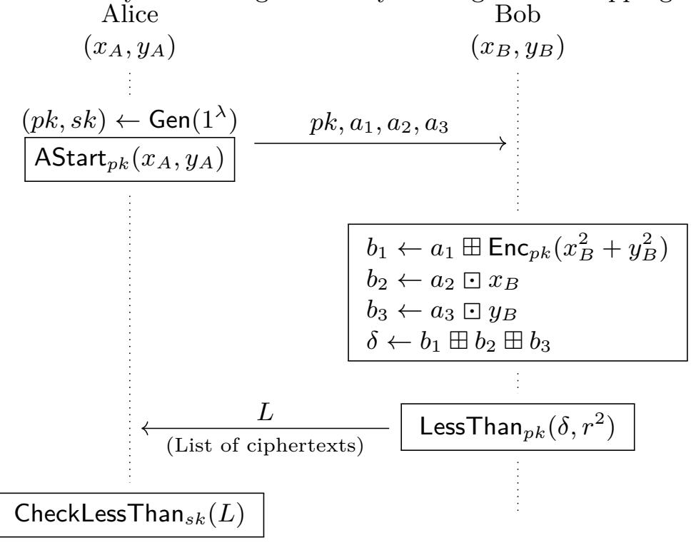
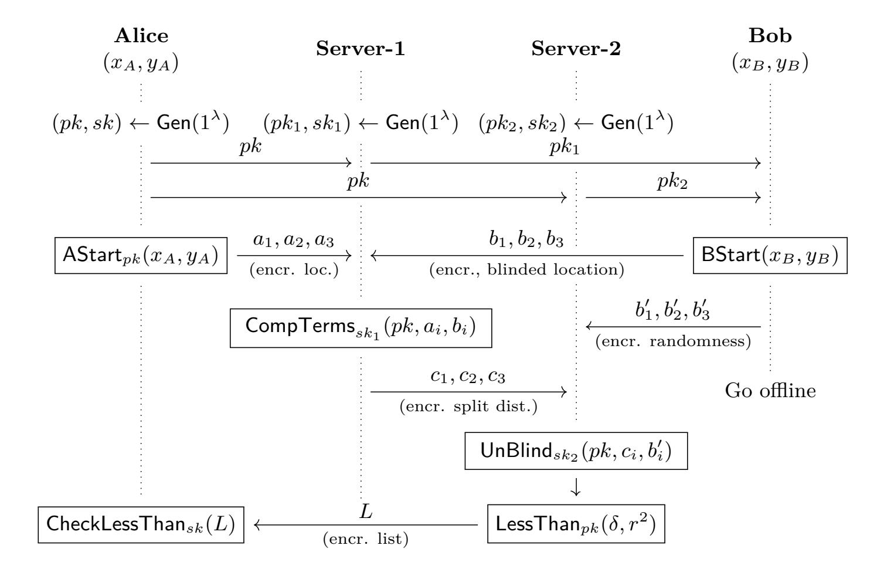
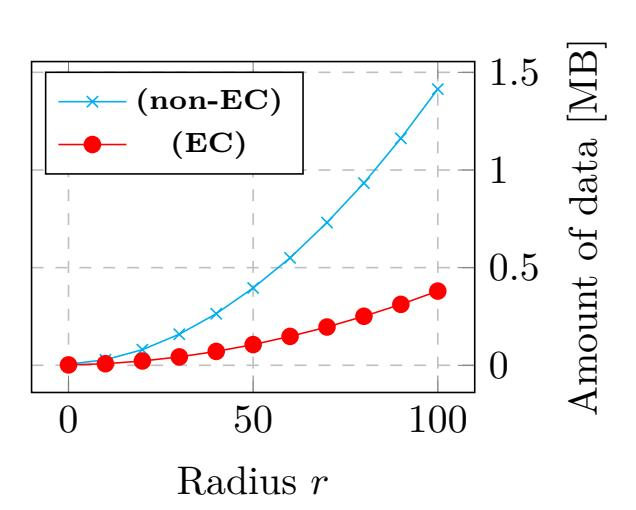
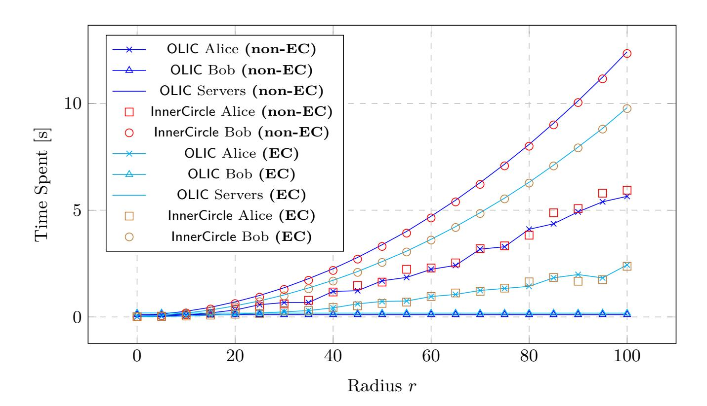

{0}------------------------------------------------

# **Where are you Bob? Privacy-Preserving Proximity Testing with a Napping Party**

Ivan Oleynikov<sup>1</sup> , Elena Pagnin<sup>2</sup> , and Andrei Sabelfeld<sup>1</sup>

<sup>1</sup> Chalmers University, Gothenburg, Sweden <sup>2</sup> Lund University, Lund, Sweden {ivanol,andrei}@chalmers.se, elena.pagnin@eit.lth.se

**Abstract** Location based services (LBS) extensively utilize proximity testing to help people discover nearby friends, devices, and services. Current practices rely on full trust to the service providers: users share their locations with the providers who perform proximity testing on behalf of the users. Unfortunately, location data has been often breached by LBS providers, raising privacy concerns over the current practices. To address these concerns previous research has suggested cryptographic protocols for privacy-preserving location proximity testing. Yet general and precise location proximity testing has been out of reach for the current research. A major roadblock has been the requirement by much of the previous work that for proximity testing between Alice and Bob both must be present online. This requirement is not problematic for one-toone proximity testing but it does not generalize to one-to-many testing. Indeed, in settings like ridesharing, it is desirable to match against ride preferences of all users, not necessarily ones that are currently online. This paper proposes a novel privacy-preserving proximity testing protocol where, after providing some data about its location, one party can go offline (nap) during the proximity testing execution, without undermining user privacy. We thus break away from the limitation of much of the previous work where the parties must be online and interact directly to each other to retain user privacy. Our basic protocol achieves privacy against semi-honest parties and can be upgraded to full security (against malicious parties) in a straight forward way using advanced cryptographic tools. Finally, we reduce the responding client overhead from quadratic (in the proximity radius parameter) to constant, compared to the previous research. Analysis and performance experiments with an implementation confirm our findings.

**Keywords:** Secure proximity testing · privacy-preserving location based services · MPC.

## **1 Introduction**

We use more and more sophisticated smart phones, wear smart watches, watch programs on smart TVs, equip our homes with smart tools to regulate the temperature, light switches and so on.

{1}------------------------------------------------

*Location Based Services.* As we digitalize our lives and increasingly rely on smart devices and services, *location based services (LBS)* are among the most widely employed ones. These range from simple automations like "switch my phone to silent mode if my location is office", to more advanced services that involve interaction with other parties, as in "find nearby coffee shops", "find nearby friends", or "find a ride".

*Preserving Privacy for Location Based Services.* Current practices rely on full trust to the LBS providers: users share their locations with the providers who manipulate location data on behalf of the users. For example, social apps Facebook and Tinder require access to user location in order to check if other users are nearby. Unfortunately, location and user data has been often breached by the LBS providers [\[28](#page-22-0)]. The ridesharing app Uber has been reported to violate location privacy of users by stalking journalists, VIPs, and ex-partners [\[23](#page-22-1)], as well as ex-filtrating user location information from its competitors [\[41](#page-22-2)]. This raises privacy concerns over the current practices.

*Privacy-Preserving Proximity Testing.* To address these concerns previous research has suggested cryptographic protocols for privacy-preserving location services. The focus of this paper is on the problem of *proximity testing*, the problem of determining if two parties are nearby without revealing any other information about their location. Proximity testing is a useful ingredient for many LBS. For example, ridesharing services are often based on determining the proximity of ride endpoints [[19\]](#page-21-0). There is extensive literature (discussed in Section [6\)](#page-19-0) on the problem of proximity testing [[45,](#page-23-0)[43](#page-22-3)[,42](#page-22-4),[11,](#page-21-1)[30](#page-22-5)[,31](#page-22-6)[,37](#page-22-7),[39,](#page-22-8)[21,](#page-21-2)[22](#page-21-3)[,36](#page-22-9),[25\]](#page-22-10).

*Generality and Precision of Proximity Testing.* Yet general and precise location proximity testing has been out of reach for the current research. A major roadblock has been the requirement that proximity testing between Alice and Bob is only possible in a pairwise fashion and both must be present online. As a consequence, Alice cannot have a single query answered with respect to multiple Bobs, and nor can she is able to check proximity with respect to Bob's preferences unless Bob is online.

The popular ridesharing service BlaBlaCar [\[4](#page-21-4)] (currently implemented as a full-trust service) is an excellent fit to illustrate our goals. This service targets intercity rides which users plan in advance. It is an important requirement that users might go off-line after submitting their preferences. The goal is to find rides that start and end at about the same location. Bob (there can be many Bobs) submits the endpoints of a desired ride to the service and goes offline (napping). At a later point Alice queries the service for proximity testing of her endpoints with Bob's. A key requirement is that Alice should be able to perform a one-to-many proximity query, against all Bobs, and compute answer even if Bob is offline. Unfortunately, the vast majority of the previous work [[45](#page-23-0)[,43](#page-22-3)[,42](#page-22-4),[11,](#page-21-1)[31,](#page-22-6)[37](#page-22-7)[,39](#page-22-8),[21,](#page-21-2)[22,](#page-21-3)[36](#page-22-9)[,25\]](#page-22-10) fall short of addressing this requirement.

Another key requirement for our work is precision. A large body of prior approaches [\[45](#page-23-0),[43,](#page-22-3)[42,](#page-22-4)[11](#page-21-1)[,30](#page-22-5),[31,](#page-22-6)[32](#page-22-11)[,27](#page-22-12)] resort to grid-based approximations where 

{2}------------------------------------------------

the proximity problem is reduced to the problem of checking whether the parties are located in the same cell on the grid. Unfortunately, grid-based proximity suffers from both false positives and negatives and can be exploited when crossing cell boundaries [[9\]](#page-21-5). In contrast, our work targets precise proximity testing.

This paper addresses privacy-preserving proximity testing with respect to napping parties. Beyond the described offline functionality and precision we summarize the requirements for our solution as follows: (1) security, in the sense that Alice may not learn anything else about Bob's location other than the proximity; Bob should not learn anything about Alice's location; and the service provider should not learn anything about Alice's or Bob's locations; (2) generality, in the sense that the protocol should allow for one-to-many matching without demanding all users to be online; (3) precision, in the sense of a reliable matching method, not an approximate one; (2) lightweight client computation, in the sense of offloading the bulk of work to intermediate servers. We further articulate on these goals in Section [2](#page-3-0).

*Contributions.* This paper proposes OLIC (OffLine Inner-Circle), a novel protocol for proximity testing (Section [4\)](#page-8-0). We break away from the limitation of much of the previous work where the parties must be online. Drawing on Hallgren et al.'s two-party protocol InnerCircle [\[21](#page-21-2)] we propose a novel protocol for proximity testing that utilizes two non-colluding servers. One server is used to blind Bob's location in such a way that the other server can unblind it for any Alice. Once they have uploaded their locations users in our protocol can go offline and retrieve the match outcome the next time they are online.

In line with our goals, we guarantee security with respect to semi-honest parties, proving that the only location information leaked by the protocol is the result of the proximity test revealed to Alice (Section [4.2\)](#page-10-0). We then show how to generically mitigate malicious (yet non-colluding) servers by means of zero knowledge proofs and multi-key homomorphic signatures (Section [4.3](#page-13-0)). Generality in the number of users follows from the fact that users do not need to be online in a pairwise fashion, as a single user can query proximity against the encrypted preferences of the other users. We leverage InnerCircle to preserve the precision, avoiding to approximate proximity information by grids or introducing noise. Finally, OLIC offloads the bulk of work from Bob to the servers, thus reducing Bob's computation and communication costs from quadratic (in the proximity radius parameter) to constant. We note, that while InnerCircle can also be trivially augmented with an extra server to offload Bob's computations to, this will add extra security assumptions and make InnerCircle less applicable in practice. OLIC, on the other hand, already requires the servers for Bob to submit his data to, and we get offloading for free. On Alice's side, the computation and communication costs stay unchanged. We develop a proof of concept implementation of OLIC and compare it with InnerCircle. Our performance experiments confirm the aforementioned gains (Section [5\)](#page-15-0).

*On the 2 Non-Colluding Servers Assumption.* We consider this assumption to be realistic, in the sense that it significantly improves on the current practices 

{3}------------------------------------------------

of a single full-trust server as in BlaBlaCar, while at the same time being compatible with common assumptions in practical cryptographic privacy-preserving systems. For example, Sharemind [[40\]](#page-22-13) requires three non-colluding servers for its multi-party computation system based on 3-party additive secret sharing. To the best of our knowledge, OLIC represents the first 2-server solution to perform proximity testing against napping users in ridesharing scenarios, where privacy, precision and efficiency are all mandatory goals. Notably, achieving privacy using a single server is known to be impossible [\[18](#page-21-6)]. Indeed, if Bob was to submit his data to only one server (instead of sharing it between two, as done in OLIC), then the server could query itself on this data and learn Bob's location via trilateration attack.

## <span id="page-3-0"></span>**2 Modeling Private Proximity Testing Using Two Servers**

The goal of private proximity testing is to enable one entity, that we will call Alice, to find out whether another entity, Bob, is within a certain distance of her. Note that the functionality is asymmetric: only Alice learns whether Bob lies in her proximity. The proximity test should be performed without revealing any additional information regarding the precise locations to one another, or to any third party.

We are interested in designing a protocol to perform privacy preserving proximity testing exploiting the existence of two servers. For convenience, we name the four parties involved in the protocol: Alice, Bob, Server1, and Server2.

*Our Setting.* We consider a multi party computation protocol for four parties (Alice, Bob, Server1, and Server2) that computes the proximity of Alice's and Bob's inputs in a private way and satisfies the following three constraints:

- <span id="page-3-1"></span>**(C-1)** Alice does not need to know Bob's identity before starting the test, nor the parties need to share any common secret;
- <span id="page-3-2"></span>**(C-2)** Bob needs to be online only to update his location data. In particular, Bob can 'nap' during the actual protocol execution.
- <span id="page-3-3"></span>**(C-3)** The protocol is executed with the help of two servers.

In detail, constraint **[\(C-1\)](#page-3-1)** ensures that Alice can look for a match in the database without necessarily targeting a specific user. This may be relevant in situations where one wants to check the availability of a ride 'near by', instead of searching if a specific cab is at reach and aligns with our generality goal towards one-to-many matching. Constraint **[\(C-2\)](#page-3-2)** is rarely considered in the literature. The two most common settings in the literature are either to have Alice and Bob communicate directly to one another (which implies that either the two parties need to be online at the same time) [[21\]](#page-21-2), or to rely on a single server, which may lead either to 'hiccup' executions (lagging until the other party rejoins online) [[31\]](#page-22-6) or to the need for a trusted server. In order to ensure a smooth executions even with a napping Bob and to reduce the trust in one single server, we make use of two servers to store Bob's contribution to the 

{4}------------------------------------------------

proximity test, that is constraint **[\(C-3\)](#page-3-3)**. This aligns with our goal of lightweight client computation. We remark that, for a napping Bob, privacy is lost if we use a single server [\[18](#page-21-6)].

Finally, unlike [[31\]](#page-22-6) we do not require the existence of a social network among system users, to determine who trusts whom, nor do we rely on shared secret keys among users.

*Formalizing 'Napping'.* We formalize the requirement that 'Bob may be napping' during the protocol execution in the following way. It is possible to split the protocol in two sequential phases. In the first phase, Bob is required to be online and to upload data to the two servers. In the second phase Alice comes online and perform her proximity test query to one server, that we call Server1. The servers communicate with one another to run the protocol execution, and finally Server<sup>2</sup> returns the result to Alice.

*Ideal Functionality.* We adopt an ideal functionality that is very close to the one in [[21\]](#page-21-2): if Alice and Bob are within a distance *r* <sup>2</sup> of each other, the protocol outputs 1 (to Alice), otherwise it outputs 0 (to Alice). Figure [1](#page-4-0) depicts this behavior. Alice and Bob are the only parties giving inputs to the protocol. Server<sup>1</sup> and Server<sup>2</sup> do not give any input nor receive any output. This approach aligns with our goal towards precision and a reliable matching method, and brakes away from approximate approaches. For simplicity, we assume the threshold value *r* 2 to be set a priori, but our protocol accommodates for Alice (or Bob) to choose this value.

<span id="page-4-0"></span>Alice Bob<sup>1</sup> Bob<sup>2</sup> *r* Bob<sup>3</sup>

Figure 1: Figurative representation of the functionality implemented by privacy-preserving location proximity.

*Practical efficiency.* Finally, we are interested in solutions that are efficient and run in reasonable

time on commodity devices (e.g., laptop computers, smartphones). Concretely, we aim at reducing the computational burden of the clients—Alice and Bob—so that their algorithms can run in just a few seconds, and can in the worst case match the performance of InnerCircle.

*Attacker Model.* We make the following assumptions on the four parties involved in the protocol:

- **(A-1)** Server1, Server<sup>2</sup> are not colluding;
- <span id="page-4-1"></span>**(A-2)** All parties (Alice, Bob, Server1, and Server2) are honest but curious, i.e., they meticulously follow the protocol but may log all messages and attempt to infer some further knowledge on the data they see.

In our model any party could be an attacker that tries to extract un-authorized information from the protocol execution. However, we mainly consider attackers 

{5}------------------------------------------------

that do so without deviating from their expected execution. In Section [4.3,](#page-13-0) we show that it is possible to relax assumption **[\(A-2\)](#page-4-1)** for the servers and deal with malicious Server1, Server<sup>2</sup> (still not colluding). In this case, the servers may misbehave and output a different result than what expected from the protocol execution. However, we do not let the two server collude and intentionally share information. While we can handle malicious servers, we cannot tolerate a malicious Alice or Bob. Detecting attacks such as Alice or Bob providing fake coordinates, or Alice trilaterating Bob to learn his location,is outside our scope and should be addressed by different means. We regard such attacks as orthogonal to our contribution and suggest to mitigate them by employing tamper-resistant location devices or location tags techniques [\[31](#page-22-6)].

*Privacy.* Our definition of privacy goes along the lines of [[31\]](#page-22-6). Briefly, a protocol is private if it reveals no information other than the output of the computation, i.e., it has the same behavior as the ideal functionality. To show the privacy of a protocol we adopt the standard definition of simulation based security for deterministic functionalities [\[29](#page-22-14)]. Concretely, we will argue the indistinguishably between a real world and an ideal world execution of our protocol, assuming that the building blocks are secure, there is no collusion among any set of parties and all parties are honest but curious. This means that none of the parties involved in the OLIC protocol can deduce anything they are not supposed to know by observing the messages they receive during protocol execution.

*General limitations.* Proximity testing can be done in a private way only for a limited amount of requests [[31,](#page-22-6)[21\]](#page-21-2) in order to avoid trilateration attacks [\[44](#page-23-1)]. Practical techniques to limit the number of requests to proximity services are available [[35\]](#page-22-15). Asymmetric proximity testing is suitable for checking for nearby people, devices and services. It is known [[45\]](#page-23-0) that the asymmetric setting not directly generalize to mutual location proximity testing unless an honest party runs the protocol twice, with swapped roles but using the same location as input).

## **3 Recap of the InnerCircle Protocol**

We begin by giving a high-level overview of the InnerCircle protocol by Hallgren et al. [\[21](#page-21-2)] and then describe its relation to our work.

The InnerCircle protocol in [[21\]](#page-21-2) allows two parties, Alice and Bob, to check whether the Euclidean distance between them is no greater than a chosen value *r*. The protocol is privacy preserving, i.e., Alice only learns a bit stating whether the Bob lies closer that *r* or not, while it does not reveal anything to Bob or to any external party. More specifically, Alice and Bob execute an interactive protocol, exchange messages and at the end only Alice receives the answer bit. To let Bob learn the answer as well, one can simply rerun the protocol swapping the roles of Alice and Bob.

More formally, let (*xA, yA*) and (*xB, yB*) respectively denote Alice's and Bob's locations. Throughout the paper, we will use the shorthand *D* = (*x<sup>A</sup> − xB*) <sup>2</sup> +

{6}------------------------------------------------

<span id="page-6-0"></span>

Figure 2: Diagram of the InnerCircle protocol.

 $(y_A-y_B)^2$  to denote the squared Euclidean distance between Alice and Bob and  $\delta$  is an encryption of D. For for any fixed non-negative integer r, the functionality implemented by the InnerCircle protocol is defined by:

$$F_{\mathsf{InnerCircle}}((x_A, y_A), (x_B, y_B)) = (z, \varepsilon), \text{ where}$$

$$z = \begin{cases} 1, & \text{if } D \leq r^2 \ (D = (x_A - x_B)^2 + (y_A - y_B)^2) \\ 0, & \text{otherwise.} \end{cases}$$

InnerCircle is a single round protocol where the first message is from Alice to Bob and the second one is from Bob to Alice (see Figure 2).

InnerCircle has three major steps (detailed in Figure 3):

**Step-1:** Alice runs the key generation algorithm to obtain her public key pk and the corresponding sk. She encodes her location  $(x_A, y_A)$  into three values and encrypts each of the latter using her pk. The encoding is necessary to enable meaningful multiplication between Alice's coordinates and Bob's as we will see in a moment. Finally, Alice sends her pk and the three ciphertexts to Bob. This step is depicted in Figure 3a (the AStart algorithm).

Step-2: Bob uses his location and Alice's pk to homomorphically compute a ciphertext  $\delta$  that encrypts the value  $D = (x_A - x_B)^2 + (y_A - y_B)^2 = (x_A^2 + y_A^2) + (x_B^2 + y_B^2) - 2x_Ax_B - 2y_Ay_B$ . Note that at this point Bob can not learn the value of D, since he never obtains the sk corresponding to Alice's pk. Similarly, if Alice would receive the ciphertext  $\delta$ , she could decrypt is with sk and learn the exact value of her distance to Bob, which clearly is more information than just a single bit stating whether Bob is within distance r from her. To reduce the disclosed information to what is specified in the functionality Bob runs the hiding procedure depicted in Figure 3b (the LessThan algorithm). Using this procedure, Bob produces a list L of ciphertexts to return to Alice.

{7}------------------------------------------------

The list *L* depends on *δ* in such a way that it contains an encryption of 0 if and only if *D ≤ r* 2 .

**Step-3:** After receiving *L*, Alice decrypts each ciphertext in *L* using her *sk*. If among the obtained plaintexts there is a 0 she deduces that *D ≤ r* 2 . This step is formalized in Figure [3c](#page-7-0) (the CheckLessThan algorithm).

Figure [3](#page-7-0) contains the definitions of the three procedures used in InnerCircle that will carry on to our OLIC protocol. Below we describe the major ones (LessThan and CheckLessThan) in more detail.

The procedure LessThan (Figure [3b\)](#page-7-0) produces a set of ciphertexts from which Alice can deduce whether *D ≤ r* <sup>2</sup> without disclosing the actual value *D*. The main idea behind this algorithm is that given *δ* = Enc*pk*(*D*) Bob can "encode" whether *D* = *i* in the value *x ← δ ⊕* Enc*pk*(*−i*), and then "mask" it by multiplying it by a random element *<sup>l</sup> <sup>←</sup> <sup>x</sup>r*. Observe that if *D − i* = 0 then Dec*sk*(*l*) = 0; otherwise if *D−i* is some invertible element of *M* then Dec*sk*(*l*) is uniformly distributed on *M \ {*0*}*. (When we instantiate our OLIC protocol for specific cryptosystem, we will ensure that *D −i* is either 0 or an invertible element, hence we do not consider here the third case when neither of these holds.) The LessThan procedure terminates with a shuffling of the list, i.e., the elements in *L* are reorganized in a random order so that the entry index no longer correspond to the value *i*.

The procedure CheckLessThan (called in-Prox in [\[21](#page-21-2)] depicted in Figure [3c.](#page-7-0) This procedure takes as input the list *L* output by LessThan and decrypts one by one all of its components. The algorithm returns 1 if and only if there is a list element that decrypts to 0. This tells Alice whether *D* = *i* for some *i < r*<sup>2</sup> . We remark that Alice cannot infer any additional information, in particular she cannot extract the exact value *i* for which the

```
AStartpk(xA, yA)
1 : a1 ← Encpk(x
                   2
                   A + y
                        2
                        A)
2 : a2 ← Encpk(2xA)
3 : a3 ← Encpk(2yA)
4 : return (a1, a2, a3)
```

(a) The AStart algorithm.

```
LessThanpk(δ, r2
                 )
1 : for i ∈ {0 . . . r
                   2 − 1}
2 : xi ← δ ⊞ Encpk(−i)
3 : ti ← M \ {0}
4 : li ← xi  ti
5 : L ← [l0, . . . lr2−1
                      ]
6 : return Shuffle(L)
```

(b) The LessThan algorithm.

```
CheckLessThansk(L)
1 : [l0, l2 . . . lr2−1
                  ] ← L
2 : for i ∈ {0 . . . r
                   2 − 1}
3 : v ← Decsk(li)
4 : if v = 0
5 : return 1
6 : return 0
```

(c) The CheckLessThan algorithm.

Figure 3: The core algorithms in the InnerCircle protocol.

equality holds. In the LessThan procedure Bob computes such "encodings" *l* for all *i ∈ {*0 *. . . r*<sup>2</sup>*}* and accumulates them in a list. So if *D ∈ {*0 *. . . r*<sup>2</sup> *−* 1*}* is the case, then one of the list elements will decrypt to zero and others will decrypt to uniformly random *M \ {*0*}* elements, otherwise all of the list elements will decrypt to random nonzero elements. If the cryptosystem allowed multiplying 

{8}------------------------------------------------

encrypted values, Bob could compute the product of the "encodings" instead of collecting them into a list and send only a single plaintext, but the cryptosystem used here is only additively homomorphic and does not allow multiplications.

### <span id="page-8-0"></span>4 Private Location Proximity Testing with Napping Bob

Notation. We denote an empty string by  $\varepsilon$ , and a list of values by  $[\cdot]$  and the set of plaintexts (of an encryption scheme) by  $\mathcal{M}$ . We order parties alphabetically, protocols' inputs and outputs follow the order of the parties. Finally, we denote the computationally indistinguishablity of two distributions  $D_1, D_2$  by  $D_1 \stackrel{c}{\equiv} D_2$ .

#### <span id="page-8-2"></span>4.1 **OLIC**: Description of the Protocol

In what follows, we describe our protocol for privacy-preserving location proximity testing with a napping Bob. We name this protocol OLIC (for OffLine InnerCircle) to stress its connection with the InnerCircle protocol and the fact that it can run while Bob is offline. More specifically, instead of exchanging messages directly with one another (as in InnerCircle), in OLIC Alice and Bob communicate with (and through) two servers.

The Ideal Functionality of OLIC. At a high level, OLIC takes as input two locations  $(x_A, y_A)$  and  $(x_B, y_B)$ , and a radius value r; and returns 1 if the Euclidean distance between the locations is less than or equal to r, and 0 otherwise. We perform this test with inputs provided by two parties, Alice and Bob, and the help of two servers, Server<sub>1</sub> and Server<sub>2</sub>. Formally, our ideal functionality has the same input and output behavior as InnerCircle for Alice and Bob, but it additionally has two servers whose inputs and outputs are empty strings  $\varepsilon$ .

<span id="page-8-1"></span>
$$F_{\mathsf{OLIC}}((x_A, y_A), (x_B, y_B), \varepsilon, \varepsilon) = (\mathsf{res}, \varepsilon, \varepsilon, \varepsilon),$$
where  $\mathsf{res} = \begin{cases} 1, & \text{if } (x_A - x_B)^2 + (y_A - y_B)^2 \le r^2 \\ 0, & \text{otherwise.} \end{cases}$  (1)

In our protocol we restrict the input/output spaces of the ideal functionality of Equation 4.1 to values that are meaningful to our primitives. In other words, we require that the values  $x_A, y_A, x_B, y_B$  are admissible plaintext (for the encryption scheme employed in OLIC), and that the following values are invertible (in the ring of plaintext)  $x_B, y_B, D - i$  for  $i \in \{0, ..., r^2 - 1\}$  and  $D = (x_A - x_B)^2 + (y_A - y_B)^2$ . We will denote the set of all suitable inputs as  $\mathcal{S}_{\lambda} \subseteq \mathcal{M}$ .

Figure 4 depicts the flow of the OLIC protocol. Figure 5 contains the detailed description of the procedures called in Figure 4.

**Step-0:** Alice, Server<sub>1</sub>, and Server<sub>2</sub> independently generate their keys. Alice sends her pk to Server<sub>1</sub> and Server<sub>2</sub>; Server<sub>1</sub> and Server<sub>2</sub> send their respective public keys  $pk_1, pk_2$  to Bob.

{9}------------------------------------------------

<span id="page-9-0"></span>

Figure 4: Overview of the message flow of our OLIC protocol. The message exchanges are grouped to reduce vertical space; in a real execution of the protocol Bob may submit at any time before CompTerms is run.

**Step-1:** At any point in time, Bob encodes his location using the BStart algorithm (Figure 5a), and sends its blinded coordinates to Server<sub>1</sub>, and the corresponding blinding factors to Server<sub>2</sub>.

**Step-2:** At any point in time Alice runs AStart (Figure 3a) and sends her ciphertexts to Server<sub>1</sub>.

**Step-3:** once Server<sub>1</sub> collects Alice's and Bob's data it can proceed with computing 3 addends useful to obtain the (squared) Euclidean distance between their locations. To do so, Server<sub>1</sub> runs CompTerms (Figure 5b), and obtains:

$$\begin{split} c_1 &= \mathsf{Enc}_{pk}(x_A^2 + y_A^2 + (x_B^2 + y_B^2 + r_1)) \\ c_2 &= \mathsf{Enc}_{pk}(2x_A + (x_B + r_2)) \\ c_3 &= \mathsf{Enc}_{pk}(2y_A + (y_B + r_3)) \end{split}$$

Server<sub>1</sub> sends the above three ciphertexts to Server<sub>2</sub>.

**Step-4:** Server<sub>2</sub> runs UnBlind (Figure 5c) to remove Bob's blinding factors from  $c_1, c_2, c_3$  and obtains the encrypted (squared) Euclidean distance between Alice and Bob:

$$\delta = c_1 \boxplus \operatorname{Enc}_{pk}(-r_1) \boxplus c_2 \boxdot \operatorname{Enc}_{pk}(r_2^{-1}) \boxplus c_3 \boxdot \operatorname{Enc}_{pk}(r_3^{-1})$$
$$= \operatorname{Enc}_{pk}((x_A - x_B)^2 + (y_A - y_B)^2)$$

Then Server<sub>2</sub> uses  $\delta$  and the radius value r to run LessThan (as in InnerCircle, Figure 3b), obtains the list of ciphertexts L and returns L to Alice.

{10}------------------------------------------------

```
\mathsf{BStart}(pk_1, pk_2, x_B, y_B)
\begin{array}{cccccccccccccccccccccccccccccccccccc
```

```
\mathsf{CompTerms}_{sk_1}(pk,a_1,a_2,a_3,b_1,b_2,b_3)
```

(b) The CompTerms algorithm.

(a) The BStart algorithm.

```
UnBlind<sub>sk_2</sub> (pk, c_1, c_2, c_3, b'_1, b'_2, b'_3)
 1: \quad tmp_1 \leftarrow \mathsf{Dec}_{sk_2}(b_1')
 2: \quad tmp_2 \leftarrow \mathsf{Dec}_{sk_2}(b_2')
3: tmp_3 \leftarrow \mathsf{Dec}_{sk_2}(b_3')
4: d_1 \leftarrow c_1 \boxplus \mathsf{Enc}_{pk}(tmp)_1
5: d_2 \leftarrow c_2 \boxdot tmp_2
 6: d_3 \leftarrow c_3 \odot tmp_3
  7: return \delta \leftarrow d_1 \boxplus d_2 \boxplus d_3
```

(c) The UnBlind algorithm.

Figure 5: The new subroutines in OLIC.

**Step-5:** Alice runs CheckLessThan (Figure 3c) to learn whether  $D \leq r^2$  in the same way as done in InnerCircle.

The correctness of OLIC follows from the correctness of InnerCircle and a straightforward computation of the input-output of BStart, CompTerms, and UnBlind.

#### <span id="page-10-0"></span>**OLIC:** Privacy of the Protocol **4.2**

We prove that our OLIC provides privacy against semi-honest adversaries. We do so by showing an efficient simulator for each party involved in the protocol and then arguing that each simulator's output is indistinguishable from the view of respective party. More details on the cryptographic primitives and their security model can be found in Appendix A, or in [14,29].

<span id="page-10-2"></span>**Theorem 1.** If the homomorphic encryption scheme HE = (Gen, Enc, Dec, Eval)used in OLIC is IND-CPA secure and function private then OLIC securely realizes 

{11}------------------------------------------------

the privacy-preserving location proximity testing functionality (in Equation 4.1) against semi-honest adversaries.

We prove Theorem 1 by showing four simulators whose outputs are computationally indistinguishable by nonuniform algorithms from the views of the parties. Concretely, we will prove four lemmas, each dealing with a different party. Our simulators have the following structure:

$$simParty(Party's input, Party's output) = (Party's view).$$

Moreover, will append a 'symbol to denote the algorithms which return their random bits in addition to their usual result, e.g., if the key-generation algorithm  $(pk, sk) \leftarrow \mathsf{Gen}(1^{\lambda})$  returns a pair of keys, then its counterpart  $(pk, sk, r) \leftarrow \mathsf{Gen}'(1^{\lambda})$  returns the same output together with the string of random bits r used to generate keys. Without loss of generality we will assume that all four parties use exactly  $p(\lambda)$  random bits in one run of the OLIC protocol, for some polynomial  $p(\cdot)$ .

<span id="page-11-0"></span>**Lemma 1.** For all suitable inputs  $(x_A, y_A, x_B, y_B) \in \mathcal{S}_{\lambda}$  for the OLIC protocol, there exists a simulator simAlice such that:

$$\begin{aligned} \text{simAlice}((x_A, y_A), \text{res}) &\stackrel{c}{\equiv} \textit{view}_{Alice}^{\text{OLIC}}((x_A, y_A), (x_B, y_B), \varepsilon, \varepsilon), \\ where & \text{res} = \begin{cases} 1, & \textit{if } (x_A - x_B)^2 + (y_A - y_B)^2 \leq r^2 \\ 0, & \textit{otherwise}. \end{cases} \end{aligned}$$

*Proof.* Alice receives only one message: the list L. The distribution of L is defined by the bit res: when res = 0 the L is a list of encryptions of random nonzero elements of  $\mathcal{M}$ , otherwise one of its elements (the position of which is chosen uniformly at random) contains an encryption of zero.

This is exactly how simAlice (defined in Figure 6a) creates the list L according to res. It is immediate to see that the distributions in Lemma 1 are not only computationally indistinguishable, but actually equal (perfectly indistinguishable).

**Lemma 2.** For all suitable inputs  $(x_A, y_A, x_B, y_B) \in \mathcal{S}_{\lambda}$  there exists a simulator simBob such that:  $simBob((x_A, y_A), \varepsilon) \stackrel{c}{\equiv} view_{Bob}^{OLIC}((x_A, y_A), (x_B, y_B), \varepsilon, \varepsilon)$ .

*Proof.* Apart from a sequence of random bits, Bob's view consists of two public keys which the servers freshly generate before sending them to him. This is exactly how simBob (in Figure 6b) obtains the keys it returns, so the two distributions are not only computationally indistinguishable, but also are equal.

**Lemma 3.** For all suitable inputs  $(x_A, y_A, x_B, y_B) \in \mathcal{S}_{\lambda}$  here exists a simulator simS1 is such that:  $simS1(\varepsilon, \varepsilon) \stackrel{c}{=} view_{Server_1}^{OLIC}((x_A, y_A), (x_B, y_B), \varepsilon, \varepsilon)$ .

{12}------------------------------------------------

```
\frac{\mathsf{simBob}((x_B, y_B), \varepsilon)}{1: \quad (pk_1, sk_1) \leftarrow \mathsf{Gen}(1^{\lambda})}2: \quad (pk_2, sk_2) \leftarrow \mathsf{Gen}(1^{\lambda})3: \quad r^* \xleftarrow{\$} \{0, 1\}^{p(\lambda)}4: \quad \mathbf{return} \ (r, pk_1, pk_2)
```

(b) The simulator for Bob.

(a) The simulator for Alice.

Figure 6: Simulators for Alice and Bob.

Proof. We show that the outputs produced by the two algorithms from Figure 7a and 7b are computationally indistinguishable by non uniform algorithms (assuming HE is IND-CPA and circuit private). First, we observe that the outputs of both algorithms consist of three parts which are generated independently:  $(pk, a_1, a_2, a_3)$ ,  $(r, b_1, b_2, b_3)$ ,  $r^*$ . It is easy to see that the last two parts are generated in the same way by both algorithms, so the distributions are actually equal on these parts. The first part  $(pk, a_1, a_2, a_3)$  of both distributions are indistinguishable because of the IND-CPA property of used encryption scheme.

**Lemma 4.** For all suitable inputs  $(x_A, y_A, x_B, y_B) \in \mathcal{S}_{\lambda}$  there exists a simulator simS2 such that:  $simS2(\varepsilon, \varepsilon) \stackrel{c}{=} view_{Server_2}^{OLIC}((x_A, y_A), (x_B, y_B), \varepsilon, \varepsilon)$ .

*Proof.* Like in the previous proof, we need to prove here that the outputs of the functions from Figures 8a and 8b are indistinguishable. Observe that the  $(rr^*, b'_1, b'_2, b'_3)$  is generated independently from the rest of the output in both algorithms, and this part is generated in the same way in both places, so the both distributions are equal on this part. The rest of the outputs of the two algorithms, namely  $(pk, c_1, c_2, c_3)$ , are indistinguishable from one another because of the IND-CPA property of the used cryptosystem.

Privacy Remark on Bob. In case the two servers collude, Bob looses privacy, in the sense that  $Server_1$  and  $Server_2$  together can recover Bob's location (by unblinding the  $tmp_i$  in CompTerms, Figure 5b). However Alice retains her privacy even in case of colluding servers (thanks to the security of the encryption scheme).

{13}------------------------------------------------

```
simS1(ε, ε)
1 : (pk, sk) ← Gen(1λ
                        )
2 : a1 ← Encpk(0)
3 : a2 ← Encpk(0)
4 : a3 ← Encpk(0)
5 : (pk1, sk1, r) ← Gen′
                          (1λ
                             )
6 : β1 ←$ M
7 : β2 ←$ M∗
8 : β3 ←$ M∗
9 : b1 ← Encpk1
                  (β1)
10 : b2 ← Encpk1
                  (β2)
11 : b3 ← Encpk1
                  (β3)
12 : r
       ∗ ←$
           {0, 1}
                 p(λ)−|r|
13 : return (rr
                ∗
                 , pk, a1, a2, a3,
                  b1, b2, b3)
```

```
viewOLIC
    Server1
           ((xA, yA),(xB, yB), ε, ε)
 1 : (pk, sk) ← Gen(1λ
                         )
 2 : (pk1, sk1, r) ← Gen′
                           (1λ
                               )
 3 : (a1, a2, a3) ← AStartpk(xA, yA)
 4 : r1, ←$ M
 5 : r2, r3 ←$ M∗
 6 : b1 ← Encpk1
                   (x
                     2
                     B + y
                           2
                           B + r1)
 7 : b2 ← Encpk1
                   (xBr2)
 8 : b3 ← Encpk1
                   (yBr3)
 9 : r
       ∗ ←$
            {0, 1}
                  p(λ)−|r|
10 : return (rr
                 ∗
                  , pk, a1, a2, a3,
                  b1, b2, b3)
```

(b) The view of Server1.

(a) The simulator for Server1.

Figure 7: The simulator and view of Server<sup>1</sup> in OLIC.

## <span id="page-13-0"></span>**4.3 Security Against Malicious Servers**

In Section [4.2](#page-10-0) we proved that OLIC is secure against semi-honest adversaries. In what follows, we show how to achieve security against malicious servers as well. We do it in a generic way, assuming two *not*-colluding servers, a suitable non-interactive zero knowledge proof system (NIZK) and employing a fairly novel cryptographic primitive called multi-key homomorphic signatures (MKHS) [[10](#page-21-8)[,1](#page-21-9)]. The proposed maliciously secure version of OLIC is currently more of a feasibility result rather than a concrete instantiation: to the best of our knowledge there is no combination of MKHS and NIZK that would fit our needs.

Homomorphic signatures [[5,](#page-21-10)[15\]](#page-21-11) enable a signer to authenticate their data in such a way that any third party can homomorphically compute on it and obtain (1) the result of the computation, and (2) a signature vouching for the correctness of the latter result. In addition to what we just described, MKHS make it possible to authenticate computation on data signed by multiple sources. Notably, homomorphic signatures and MKHS can be used to efficiently verify that a computation has been carried out in the correct way on the desired data without need to access the original data [[10\]](#page-21-8). This property is what we leverage to make OLIC secure against malicious servers.

At a high level, our proposed solution to mitigate malicious servers works as follows. Alice and Bob hold distinct secret signing keys, sk*<sup>A</sup>* and sk*<sup>B</sup>* respectively, and sign their ciphertexts before uploading them to the servers. In detail, using

{14}------------------------------------------------

```
\frac{\mathsf{simS2}(\varepsilon,\varepsilon)}{1: \quad (pk_1,sk_1,r) \leftarrow \mathsf{Gen}'(1^{\lambda})}
2: \quad \beta_1 \stackrel{\$}{\leftarrow} \mathcal{M}
3: \quad \beta_2 \stackrel{\$}{\leftarrow} \mathcal{M}^*
4: \quad \beta_3 \stackrel{\$}{\leftarrow} \mathcal{M}^*
5: \quad b_1' \leftarrow \mathsf{Enc}_{pk_s}(\beta_1)
6: \quad b_2' \leftarrow \mathsf{Enc}_{pk_s}(\beta_2)
7: \quad b_3' \leftarrow \mathsf{Enc}_{pk_s}(\beta_3)
8: \quad (pk,sk) \leftarrow \mathsf{Gen}(1^{\lambda})
9: \quad c_1 \leftarrow \mathsf{Enc}_{pk}(0)
10: \quad c_2 \leftarrow \mathsf{Enc}_{pk}(0)
11: \quad c_3 \leftarrow \mathsf{Enc}_{pk}(0)
12: \quad r^* \stackrel{\$}{\leftarrow} \{0,1\}^{p(\lambda)-|r|}
13: \quad \mathbf{return} \quad (rr^*,pk,b_1',b_2',b_3',c_1,c_2,c_3)
```

```
view_{\operatorname{Server}_2}^{\operatorname{OLIC}}((x_A,y_A),(\underline{x_B},y_B),\varepsilon,\varepsilon)
 1: (pk, sk) \leftarrow \mathsf{Gen}(1^{\lambda})
  2: (pk_2, sk_2, r) \leftarrow \mathsf{Gen}'(1^{\lambda})
 3: r_1, \stackrel{\$}{\leftarrow} M
 4: \quad r_2, r_3 \stackrel{\$}{\leftarrow} M^*
 5: b_1' \leftarrow \mathsf{Enc}_{pk_2}(-r_1)
 6: b_2' \leftarrow \mathsf{Enc}_{pk_2}(r_2^{-1})
 7: b_3' \leftarrow \mathsf{Enc}_{pk_2}(r_3^{-1})
 s: c_1 \leftarrow \mathsf{Enc}_{pk}(x_A^2 + y_A^2 +
              x_B^2 + y_B^2 + r_1
 9: c_2 \leftarrow \mathsf{Enc}_{pk}(2x_Ax_Br_2)
10: \quad c_3 \leftarrow \mathsf{Enc}_{pk}(2y_A y_B r_3)
           r^* \stackrel{\$}{\leftarrow} \{0,1\}^{p(\lambda)-|r|}
11:
            return (rr^*, pk, b'_1, b'_2, b'_3)
12:
                           (c_1, c_2, c_3)
```

- (a) The simulator for Server<sub>2</sub>.
- (b) The view of Server<sub>2</sub>.

Figure 8: The simulator and view of Server<sub>2</sub> in OLIC.

the notation in Figure 4, Alice sends to Server<sub>1</sub> the three messages (ciphertexts)  $a_1, a_2, a_3$  along with their respective signatures  $\sigma_i^A \leftarrow \mathsf{MKHS}.\mathsf{Sign}(\mathsf{sk}_A, a_i, \ell_i)$ , where  $\ell_i$  is an opportune label.<sup>3</sup> Bob acts similarly. Server<sub>1</sub> computes  $f_i$  (the circuit corresponding to the computation in CompTerms on the *i*-th input) on each ciphertext and each signature, i.e.,  $c_i \leftarrow f(a_i, b_i)$  and  $\sigma'_i \leftarrow \mathsf{MKHS.Eval}(f, \{\mathsf{pk}_A,$  $\mathsf{pk}_B$ ,  $\sigma_i^A$ ,  $\sigma_i^B$ ). The unforgeability of MKHS ensures that each multi-key signature  $\sigma'_i$  acts as a proof that the respective ciphertext  $c'_i$  has been computed correctly (i.e., using f on the desired inputs<sup>4</sup>). Server<sub>2</sub> can be convinced of this fact by checking whether MKHS. Verif $(f, \{\ell_j\}, \{\mathsf{pk_A}, \mathsf{pk}_B\}, c_i', \sigma_i')$  returns 1. If so, Server<sub>2</sub> proceeds and computes the value  $\delta$  (and its multi-key signature  $\sigma$ ) by evaluating the circuit g corresponding to the function UnBlind. As remarked in Section 4.2, privacy demands that the random coefficients,  $x_i$ :s, involved in the Less Than procedure are not leaked to Alice. However, without the  $x_i$ :s Alice cannot run the MKHS verification (as this randomness should be hardwired in the circuit h corresponding to the function LessThan). To overcome this obstacle we propose to employ a zero knowledge proof system. In this way Server<sub>2</sub> can state that it knows undisclosed values  $x_i$ :s such that the output data (the list  $L \leftarrow [l_1, \ldots, l_{r^2-1}]$ ) passes the MKHS verification on the computations de-

<span id="page-14-1"></span><sup>&</sup>lt;sup>3</sup> More details on labels at the end of the section.

<span id="page-14-2"></span><sup>&</sup>lt;sup>4</sup> The 'desired' inputs are indicated by the labels, as we discuss momentarily.

{15}------------------------------------------------

pendent on  $x_i$ :s. This can be achieved by interpreting the MKHS verification algorithm as a circuit v with inputs  $x_i$  (and  $l_i$ ).

Security Considerations. To guarantee security we need the MKHS to be context hiding (e.g., [38], to prevent leakage of information between Server<sub>1</sub> and Server<sub>2</sub>); unforgeable (in the homomorphic sense [10]); and the final proof to be zero knowledge. Implementing this solution would equip OLIC with a quite advanced and heavy machinery that enables Alice to detect malicious behaviors from the servers.

A Caveat on Labels. There is final caveat on data labels [10] needed for the MKHS schemes. We propose to set labels as a string containing the public information: day, time, identity of the user producing the location data, and data type identifier (e.g., (1,3) to identify the ciphertext  $b_3$ , sent by Bob to Server<sub>1</sub>, (2,1) to identify the ciphertext  $b_1'$ , sent by Bob to Server<sub>2</sub>, and (0,2) to identify Alice's ciphertext  $a_2$ —Alice only sends data to Server<sub>1</sub>). We remark that such label information would be retrievable by InnerCircle as well, as in that case Alice knows the identity of her interlocutor (Bob), and the moment (day and time) in which the protocol is run.

#### <span id="page-15-0"></span>5 Evaluation

In this section we evaluate the performance of our proposal in three different ways: first we provide asymptotic bounds on time complexity of the algorithms in OLIC; second, we provide bounds on the total communication cost of the protocol; finally we develop a proof-of-concept implementation of OLIC to test its performance (running time and communication cost) and compare it against the InnerCircle protocol. Recall that InnerCircle and OLIC implement the same functionality (privacy-preserving proximity testing), however the former requires Bob to be online during the whole protocol execution while the latter does not.

Parameters. As described in Section 4.1, OLIC requires Alice to use an additive homomorphic encryption scheme. However, no special property is needed by the ciphertexts from Bob to the servers and between servers. Our implementation employs the ElGamal cryptosystem over a safe-prime order group for ciphertexts to and from Alice, while for the other messages it uses the Paillier cryptosystem. We refer to this implementation as (non-EC), as it does not rely on any elliptic curive cryptograpy (ECC). In order to provide a fair comparison with its predecessor (InnerCircle), we additionally instantiate OLIC using only ECC cryptosystems (EC), namely Elliptic Curve ElGamal.

We note that additive homomorphic ElGamal relies on the face that a plaintext value m is encoded into a group element as  $g^m$  (where g denotes the group generator). In this way, the multiplication of  $g^{m_1} \cdot g^{m_2}$  returns an encoding of the addition of the corresponding plaintext values  $m_1 + m_2$ . In order to 'fully' decrypt a ciphertext, one would have to solve the discrete logarithm problem 

{16}------------------------------------------------

and recover m from  $g^m$ , which should be unfeasible, as this corresponds to the security assumption of the ecryption scheme. Fortunately, this limitation is not crucial for our protocol. In OLIC, indeed, Alice only needs to check whether a ciphertext is an encryption of zero or not (in the CheckLessThan procedure), and this can be done efficiently without fully decrypting the ciphertext. However, we need to keep it into account when implementing OLIC with ECC. Indeed, in OLIC the servers need to actually fully decrypt Bob's ciphertexts in order to work with the corresponding (blinded) plaintexts. We do so by employing a non-homomorphic version of ElGamal based on the curve M383 in (EC) and Paillier cryptosystem in (non-EC).

In our evaluation, we ignore the computational cost of initial key-generation as, in real-life scenarios, this process is a one-time set up and is not needed at every run of the protocol.

#### 5.1 Asymptotic complexity

Table 1 shows both the concrete numbers of cryptographic operations and our asymptotic bounds on the time complexity of the algorithms executed by each party involved in OLIC. We assume that ElGamal and Paillier encryption, decryption and arithmetic operations, are performed in time  $\mathcal{O}(\lambda m)$  (assuming binary exponentiation), where  $\lambda$  here is the security parameter and m is the cost of  $\lambda$ -bit interger multiplication — depends on the specific multiplication algorithm used, e.g.,  $m = O(n \log n \log \log n)$  for Schönhage–Strassen algorithm. This applies to both (EC) and (non-EC), although (EC) in practice is used with a lot smaller values of  $\lambda$ .

<span id="page-16-0"></span>Table 1: Concrete number of operations and asymptotic time complexity for each party in OLIC (m is the cost of modular multiplication,  $\lambda$  the security parameter and r the radius). In our implementation Alice decryption is actually an (efficient) zero testing.

| Party               | Cryptosystem operations                                                  | Time bound                  |  |  |
|---------------------|--------------------------------------------------------------------------|-----------------------------|--|--|
| Alice               | $3 \text{ encryptions}$ $r^2 \text{ decryptions}$                        | $\mathcal{O}(r^2\lambda m)$ |  |  |
| Bob                 | 6 encryptions                                                            | $\mathcal{O}(\lambda m)$    |  |  |
| $Server_1$          | 3 decryptions, 3 homomorphic operations,                                 | $\mathcal{O}(\lambda m)$    |  |  |
| Server <sub>2</sub> | 3 decryptions,<br>$2r^2 + 5$ arithmetic operations,<br>$r^2$ encryptions | $\mathcal{O}(r^2\lambda m)$ |  |  |

Communication cost. The data transmitted among parties during a whole protocol execution amounts to  $r^2 + 6$  ciphertexts between Alice and the servers and 6 ciphertexts between Bob and servers. Each ciphertext consists of  $4\lambda$  bits in case of (EC), and  $2\lambda$  bits in case of (non-EC) (for both ElGamal and Paillier). Asymptotically, both cases require  $\mathcal{O}(\lambda r^2)$  bit of communication—although (EC) is used with a lot smaller  $\lambda$  value in implementation.

{17}------------------------------------------------

#### **5.2 Implementation**

We developed a prototype implementation of OLIC in Python (available at [\[33](#page-22-17)]). The implementation contains all of the procedures shown in pseudocode in Figures [3](#page-7-0) and [5](#page-10-1). To ensure a fair compare between OLIC and InnerCircle, we implemented latter in the same environment (following the nomenclature in Figure [2\)](#page-6-0).

Our benchmarks for the total communication cost of the OLIC protocol are reported in Figure [9.](#page-17-0) We measured the total execution time of each procedure of both InnerCircle and OLIC. Figure [10](#page-18-0) shows the outcome of our measurements for values of the proximity radius parameter *r* ranging from 0 to 100. Detailed values can be found in Appendix [B](#page-24-1) (Table [2](#page-25-0)).

*Setup.* We used cryptosystems from the cryptographic library bettertimes [[20](#page-21-12)], which was used for benchmarking of the original InnerCircle protocol. The benchmarks were run on Intel Core i7-8700 CPU running at a frequency of 4.4 GHz. For **(non-EC)** we used 2048-bit keys for El-Gamal (the same as in InnerCircle [[21\]](#page-21-2)), and 2148-bit keys for Paillier to accomodate a modulus larger than the ElGamal modulus (so that any possible message of Bob fits into the Paillier message space). For **(EC)** we used curves Curve25519 for additive homomorphic en-

<span id="page-17-0"></span>

Figure 9: Total communication cost of OLIC.

cryption and M383 for the ciphertexts exchanged among Bob and the servers from the ecc-pycrypto library [[7\]](#page-21-13). We picked these curves because they were available in the library and also because M383 uses a larger modulus and allows us to encrypt the big values from the plaintexts field of Curve25519.

The plaintext ring for **(non-EC)** ElGamal-2048 has at least *|M| ≥* 2 2047 elements, which allows Alice and Bob's points to lie on the grid *{*1*,* 2 *. . .* 2 <sup>1023</sup>*}* 2 ensuring that the seqared distance between them never exceeds 2 <sup>2047</sup>. The corresponding plaintext ring size for **(EC)** is *|M| ≥* 2 <sup>251</sup> (the group size of Curve25519), and the grid is *{*1*,* 2 *. . .* 2 <sup>125</sup>*}* 2 . Since Earth equator is *≈* 2 <sup>26</sup> meters long, either of the two grids is more than enough to cover any location on Earth with 1 meter precision.

*Optimizations.* In InnerCircle [\[21](#page-21-2)], the authors perform three types of optimizations on the LessThan procedure:

- <span id="page-17-1"></span>**(O-1)** Iterating only through those values of *i ∈ {*0*, . . . , r*<sup>2</sup> *−* 1*}* which can be represented as a sum of two squares, i.e., such *i* that *∃ a, b* : *i* = *a* <sup>2</sup> + *b* 2 .
- <span id="page-17-2"></span>**(O-2)** Precomputing the ElGamal ciphertexts Enc*pk*(*−i*), and only for those *i* described in **[\(O-1\)](#page-17-1)**.
- <span id="page-17-3"></span>**(O-3)** Running the procedure in parallel, using 8 threads.

{18}------------------------------------------------

We adopt the optimizations **[\(O-1\)](#page-17-1)** and **[\(O-2\)](#page-17-2)** in our implementation as well. Note that **[\(O-1\)](#page-17-1)** reduces the length of list *L* (Figure [4\)](#page-9-0), as well as the total communication cost. We disregard optimization **[\(O-3\)](#page-17-3)** since we are interested in the total amount of computations a party needs to do (thus this optimization is not present in our implementations of OLIC and InnerCircle).

<span id="page-18-0"></span>

Figure 10: Running times of each party in InnerCircle and OLIC for both **(non-EC)** and **(EC)** instantiations. (Reported times are obtained as average of 40 executions.)

## **5.3 Performance Evaluation**

Figure [10](#page-18-0) shows a comparison of the total running time of each party in OLIC versus InnerCircle. One significant advantage of OLIC is that it offloads the execution of the LessThan procedure from Bob to the servers. This is reflected in Figure [10](#page-18-0), where the running time of Bob is flat in OLIC, in contrast to quadratic as in InnerCircle. Indeed, the combined running time of the two servers in OLIC almost matches the running time of Bob in InnerCircle. Note that the servers have to spend total 10-12 seconds on computations when *r* = 100, which is quite a reasonable amount of time, given that servers are usually not as resourceconstrained as clients, and that the most time-consuming procedure LessThan consists of a single loop which can easily be executed in parallel to achieve even better speed. Finally, we remark that the amount of data being sent (Figure [9\)](#page-17-0) between the parties in OLIC is quite moderate.

In case Alice wants to be matched with multiple Bobs, say, with *k* of them, the amount of computations that she and the servers perform will grow linearly with *k*. The same applies to the communication cost. Therefore, one can obtain 

{19}------------------------------------------------

the counterparts of Figures [10](#page-18-0) and [9](#page-17-0) for multiple Bobs by simply multiplying all the plots (except Bob's computations) by *k*.

## <span id="page-19-0"></span>**6 Related Work**

Zhong et al. [[45](#page-23-0)] present the Louis, Lester and Pierre protocols for location proximity. The Louis protocol uses additively homomorphic encryption to compute the distance between Alice and Bob while it relies on a third party to perform the proximity test. Bob needs to be present online to perform the protocol. The Lester protocol does not use a third party but rather than performing proximity testing computes the actual distance between Alice and Bob. The Pierre protocol resorts to grids and leaks Bob's grid cell distance to Alice.

Hide&Crypt by Freni et al. [[11\]](#page-21-1) splits proximity in two steps. Filtering is done between a third party and the initiating principal. The two principals then execute computation to achieve finer granularity. In both steps, the granule which a principal is located is sent to the other party. C-Hide&Hash by Mascetti et al. [\[30](#page-22-5)] is a centralized protocol, where the principals do not need to communicate pairwise but otherwise share many aspects with Hide&Crypt. FriendLocator by Šikšnys et al. [[43\]](#page-22-3) presents a centralized protocol where clients map their position to different granularities, similarly to Hide&Crypt, but instead of refining via the second principal each iteration is done via the third party. VicinityLocator also by Šikšnys et al. [\[42](#page-22-4)] is an extension of FriendLocator, which allows the proximity of a principal to be represented not only in terms of any shape.

Narayanan et al. [[31\]](#page-22-6) present protocols for proximity testing. They cast the proximity testing problem as equality testing on a grid system of hexagons. One of the protocol utilizes an oblivious server. Parties in this protocol use symmetric encryption, which leads to better performance. However, this requires to have preshared keys among parties, which is less amenable to one-to-many proximity testing. Saldamli et al. [\[37](#page-22-7)] build on the protocol with the oblivious server and suggest optimizations based on properties from geometry and linear algebra. Nielsen et al. [[32](#page-22-11)] and Kotzanikolaou et al. [\[27](#page-22-12)] also propose grid-based solutions.

Šeděnka and Gasti [\[39](#page-22-8)] homomorphically compute distances using the UTM projection, ECEF (Earth-Centered Earth-Fixed) coordinates, and the Haversine formula that make it possible to consider the curvature of the Earth. Hallgren et al. [[21\]](#page-21-2) introduce InnerCircle for parallizable decentralized proximity testing, using additively homomorphic encryption between two parties that must be online. The MaxPace [[22\]](#page-21-3) protocol builds on speed constraints of an InnerCirclestyle protocol as to limit the effects of trilateration attacks. Polakis [\[35](#page-22-15)] study different distance and proximity disclosure strategies employed in the wild and experiment with practical effects of trilateration.

Sakib and Huang [\[36](#page-22-9)] explore proximity testing using elliptic curves. They require Alice and Bob to be online to be able to run the protocol. Järvinen et al. [\[25](#page-22-10)] design efficient schemes for Euclidean distance-based privacy-preserving location proximity. They demonstrate performance improvements over InnerCir

{20}------------------------------------------------

cle. Yet the requirement of the two parties being online applies to their setting as well. Hallgren et al. [\[19](#page-21-0)] how to leverage proximity testing for endpoint-based ridesharing, building on the InnerCircle protocol, and compare this method with a method of matching trajectories.

The computational bottle neck of privacy-preserving proximity testing is the input comparison process. Similarly to [\[21,](#page-21-2)[34\]](#page-22-18), we rely on homomorphic encryption to compare a private input (the distance between the submitted locations) with a public value (the threshold). Other possible approaches require the use of the arithmetic black box model [[6\]](#page-21-14), garbled circuits [\[26](#page-22-19)], generic two party computations [[12\]](#page-21-15), or oblivious transfer extensions [\[8](#page-21-16)].

To summarize, the vast majority [\[45](#page-23-0),[43,](#page-22-3)[42](#page-22-4)[,11](#page-21-1)[,31](#page-22-6),[37,](#page-22-7)[39,](#page-22-8)[21](#page-21-2)[,22](#page-21-3),[36,](#page-22-9)[25\]](#page-22-10) of the existing approaches to proximity testings require both parties to be online, thus not being suitable for one-to-many matching. A notable exception to the work above is the C-Hide&Hash protocol by Mascetti et al. [[30\]](#page-22-5), which allows one-to-many testing, yet at the price of not computing the precise proximity result but its grid-based approximation. Generally, a large number of approaches [[45,](#page-23-0)[43](#page-22-3)[,42](#page-22-4),[11,](#page-21-1)[30](#page-22-5)[,31](#page-22-6)[,32](#page-22-11),[27\]](#page-22-12) resort to grid-based approximations, thus loosing precision of proximity tests.

There is a number of existing works, which consider the problem of computing generic functions in the setting, where clients are not online during the whole execution. Hallevi et al. [[18\]](#page-21-6) consider a one-server scenario and show that the notion of security agains semi-honest adversary (which we prove for our protocol) is impossible to achive with one server. Additionally, the model from [[18](#page-21-6)] lets all the parties know each other's public keys, i.e., the clients know all the other clients who supply inputs for the protocol—this does not allow one-tomany matching, which we achive in our work. Further works [[24,](#page-22-20)[16,](#page-21-17)[17](#page-21-18)[,2](#page-21-19),[3\]](#page-21-20) also consider one-server scenarios.

## **7 Conclusions**

We have presented OLIC, a protocol for privacy-preserving proximity testing with a napping party. In line with our goals, (1) we achieve privacy with respect to semi-honest parties; (2) we enable matching against offline users which is needed in scenarios like ridesharing; (3) we retain precision, not resorting to grid-based approximations, and (4) we reduce the responding client overhead from quadratic (in the proximity radius parameter) to constant.

Future work avenues include developing a fully-fledged ridesharing system based on our approach, experimenting with scalability, and examining the security and performance in the light of practical security risks for LBS services.

*Acknowledgments.* This work was partially supported by the Swedish Foundation for Strategic Research (SSF), the Swedish Research Council (VR) and the European Research Council (ERC) under the European Unions's Horizon 2020 research and innovation program under grant agreement No 669255 (MPCPRO). The authors would also like to thank Carlo Brunetta for insightful discussion during the initial development of the work.

{21}------------------------------------------------

## **References**

- <span id="page-21-9"></span>1. Aranha, D.F., Pagnin, E.: The simplest multi-key linearly homomorphic signature scheme. In: LATINCRYPT. pp. 280–300. Springer (2019)
- <span id="page-21-19"></span>2. Beimel, A., Gabizon, A., Ishai, Y., Kushilevitz, E., Meldgaard, S., Paskin-Cherniavsky, A.: Non-interactive secure multiparty computation. In: Garay, J.A., Gennaro, R. (eds.) CRYPTO. LNCS, vol. 8617, pp. 387–404. Springer (2014)
- <span id="page-21-20"></span>3. Benhamouda, F., Krawczyk, H., Rabin, T.: Robust non-interactive multiparty computation against constant-size collusion. In: Katz, J., Shacham, H. (eds.) CRYPTO. LNCS, vol. 10401, pp. 391–419. Springer (2017)
- <span id="page-21-4"></span>4. BlaBlaCar - Trusted carpooling. <https://www.blablacar.com/>
- <span id="page-21-10"></span>5. Boneh, D., Freeman, D.M.: Homomorphic signatures for polynomial functions. In: EUROCRYPT. pp. 149–168. Springer (2011)
- <span id="page-21-14"></span>6. Catrina, O., De Hoogh, S.: Improved primitives for secure multiparty integer computation. In: SCN. pp. 182–199. Springer (2010)
- <span id="page-21-13"></span>7. ChangLiu: Ecc-pycrypto Library (2019 (accessed April 14, 2020)), [https://github.](https://github.com/lc6chang/ecc-pycrypto) [com/lc6chang/ecc-pycrypto](https://github.com/lc6chang/ecc-pycrypto)
- <span id="page-21-16"></span>8. Couteau, G.: New protocols for secure equality test and comparison. In: ACNS. pp. 303–320. Springer (2018)
- <span id="page-21-5"></span>9. Cuéllar, J., Ochoa, M., Rios, R.: Indistinguishable regions in geographic privacy. In: SAC. pp. 1463–1469 (2012)
- <span id="page-21-8"></span>10. Fiore, D., Mitrokotsa, A., Nizzardo, L., Pagnin, E.: Multi-key homomorphic authenticators. In: ASIACRYPT. pp. 499–530. Springer (2016)
- <span id="page-21-1"></span>11. Freni, D., Vicente, C.R., Mascetti, S., Bettini, C., Jensen, C.S.: Preserving location and absence privacy in geo-social networks. In: CIKM. pp. 309–318 (2010)
- <span id="page-21-15"></span>12. Garay, J., Schoenmakers, B., Villegas, J.: Practical and secure solutions for integer comparison. In: PKC. pp. 330–342. Springer (2007)
- <span id="page-21-21"></span>13. Gentry, C.: Fully homomorphic encryption using ideal lattices. In: STOC. pp. 169–178 (2009)
- <span id="page-21-7"></span>14. Gentry, C., Halevi, S., Vaikuntanathan, V.: i-hop homomorphic encryption and rerandomizable yao circuits. In: Annual Cryptology Conference. pp. 155–172. Springer (2010)
- <span id="page-21-11"></span>15. Gorbunov, S., Vaikuntanathan, V., Wichs, D.: Leveled fully homomorphic signatures from standard lattices. In: STOC. pp. 469–477. ACM (2015)
- <span id="page-21-17"></span>16. Gordon, S.D., Malkin, T., Rosulek, M., Wee, H.: Multi-party computation of polynomials and branching programs without simultaneous interaction. In: Johansson, T., Nguyen, P.Q. (eds.) EUROCRYPT. LNCS, Springer (2013)
- <span id="page-21-18"></span>17. Halevi, S., Ishai, Y., Jain, A., Komargodski, I., Sahai, A., Yogev, E.: Noninteractive multiparty computation without correlated randomness. In: Takagi, T., Peyrin, T. (eds.) ASIACRYPT. LNCS, vol. 10626, pp. 181–211. Springer (2017)
- <span id="page-21-6"></span>18. Halevi, S., Lindell, Y., Pinkas, B.: Secure computation on the web: Computing without simultaneous interaction. In: CRYPTO. pp. 132–150 (2011)
- <span id="page-21-0"></span>19. Hallgren, P., Orlandi, C., Sabelfeld, A.: PrivatePool: Privacy-Preserving Ridesharing. In: CSF. pp. 276–291 (Aug 2017)
- <span id="page-21-12"></span>20. Hallgren, P.: BetterTimes Python Library (2017 (accessed January 22, 2020)), <https://bitbucket.org/hallgrep/bettertimes/>
- <span id="page-21-2"></span>21. Hallgren, P.A., Ochoa, M., Sabelfeld, A.: InnerCircle: A parallelizable decentralized privacy-preserving location proximity protocol. In: PST. pp. 1–6 (2015)
- <span id="page-21-3"></span>22. Hallgren, P.A., Ochoa, M., Sabelfeld, A.: MaxPace: Speed-Constrained Location Queries. In: CNS (2016)

{22}------------------------------------------------

- <span id="page-22-1"></span>23. Hern, A.: Uber employees 'spied on ex-partners, politicians and Beyoncé' (2016), [https://www.theguardian.com/technology/2016/dec/13/](https://www.theguardian.com/technology/2016/dec/13/uber-employees-spying-ex-partners-politicians-beyonce) [uber-employees-spying-ex-partners-politicians-beyonce](https://www.theguardian.com/technology/2016/dec/13/uber-employees-spying-ex-partners-politicians-beyonce)
- <span id="page-22-20"></span>24. Jarrous, A., Pinkas, B.: Canon-mpc, a system for casual non-interactive secure multi-party computation using native client. In: Sadeghi, A., Foresti, S. (eds.) WPES. pp. 155–166. ACM (2013)
- <span id="page-22-10"></span>25. Järvinen, K., Kiss, Á., Schneider, T., Tkachenko, O., Yang, Z.: Faster privacypreserving location proximity schemes. In: CANS. LNCS, vol. 11124, pp. 3–22. Springer (2018)
- <span id="page-22-19"></span>26. Kolesnikov, V., Sadeghi, A.R., Schneider, T.: Improved garbled circuit building blocks and applications to auctions and computing minima. In: CANS. pp. 1–20. Springer (2009)
- <span id="page-22-12"></span>27. Kotzanikolaou, P., Patsakis, C., Magkos, E., Korakakis, M.: Lightweight private proximity testing for geospatial social networks. Computer Communications **73**, 263–270 (2016)
- <span id="page-22-0"></span>28. Lee, D.: Uber concealed huge data breach (2017), [http://www.bbc.com/news/](http://www.bbc.com/news/technology-42075306) [technology-42075306](http://www.bbc.com/news/technology-42075306), <http://www.bbc.com/news/technology-42075306>
- <span id="page-22-14"></span>29. Lindell, Y.: How to simulate it–a tutorial on the simulation proof technique. In: Tutorials on the Foundations of Cryptography, pp. 277–346. Springer (2017)
- <span id="page-22-5"></span>30. Mascetti, S., Freni, D., Bettini, C., Wang, X.S., Jajodia, S.: Privacy in geo-social networks: proximity notification with untrusted service providers and curious buddies. VLDB J. **20**(4), 541–566 (2011)
- <span id="page-22-6"></span>31. Narayanan, A., Thiagarajan, N., Lakhani, M., Hamburg, M., Boneh, D.: Location privacy via private proximity testing. In: NDSS (2011)
- <span id="page-22-11"></span>32. Nielsen, J.D., Pagter, J.I., Stausholm, M.B.: Location privacy via actively secure private proximity testing. In: PerCom Workshops. pp. 381–386. IEEE CS (2012)
- <span id="page-22-17"></span>33. Oleynikov, I., Pagnin, E., Sabelfeld, A.: Where are you Bob? Privacy-preserving proximity testing with a napping party (2020), [https://www.cse.chalmers.se/](https://www.cse.chalmers.se/research/group/security/olic/) [research/group/security/olic/](https://www.cse.chalmers.se/research/group/security/olic/)
- <span id="page-22-18"></span>34. Pagnin, E., Gunnarsson, G., Talebi, P., Orlandi, C., Sabelfeld, A.: TOPPool: Time-aware Optimized Privacy-Preserving Ridesharing. PoPETs **2019**(4), 93–111 (2019)
- <span id="page-22-15"></span>35. Polakis, I., Argyros, G., Petsios, T., Sivakorn, S., Keromytis, A.D.: Where's wally?: Precise user discovery attacks in location proximity services. In: CCS (2015)
- <span id="page-22-9"></span>36. Sakib, M.N., Huang, C.: Privacy preserving proximity testing using elliptic curves. In: ITNAC. pp. 121–126. IEEE Computer Society (2016)
- <span id="page-22-7"></span>37. Saldamli, G., Chow, R., Jin, H., Knijnenburg, B.P.: Private proximity testing with an untrusted server. In: WISEC. pp. 113–118. ACM (2013)
- <span id="page-22-16"></span>38. Schabhüser, L., Butin, D., Buchmann, J.: Context hiding multi-key linearly homomorphic authenticators. In: CT-RSA. pp. 493–513. Springer (2019)
- <span id="page-22-8"></span>39. Sedenka, J., Gasti, P.: Privacy-preserving distance computation and proximity testing on earth, done right. In: AsiaCCS. pp. 99–110 (2014)
- <span id="page-22-13"></span>40. Sharemind MPC Platform. [https://sharemind.cyber.ee/sharemind-mpc/](https://sharemind.cyber.ee/sharemind-mpc/multi-party-computation/) [multi-party-computation/](https://sharemind.cyber.ee/sharemind-mpc/multi-party-computation/)
- <span id="page-22-2"></span>41. Shu, C.: Uber reportedly tracked Lyft drivers using a secret software program named 'Hell'. <https://techcrunch.com/2017/04/12/hell-o-uber/> (2017)
- <span id="page-22-4"></span>42. Siksnys, L., Thomsen, J.R., Saltenis, S., Yiu, M.L.: Private and flexible proximity detection in mobile social networks. In: MDM. pp. 75–84 (2010)
- <span id="page-22-3"></span>43. Siksnys, L., Thomsen, J.R., Saltenis, S., Yiu, M.L., Andersen, O.: A location privacy aware friend locator. In: SSTD. pp. 405–410 (2009)

{23}------------------------------------------------

- <span id="page-23-1"></span>44. Veytsman, M.: How I was able to track the location of any tinder user (February 2014), <http://blog.includesecurity.com/>
- <span id="page-23-0"></span>45. Zhong, G., Goldberg, I., Hengartner, U.: Louis, lester and pierre: Three protocols for location privacy. In: PET. pp. 62–76 (2007)

{24}------------------------------------------------

#### <span id="page-24-0"></span>A Tools Used in **OLIC**

Homomorphic Encryption [13]. A Homomorphic Encryption scheme is a tuple of four PPT algorithms HE = (KeyGen, Enc, Eval, Dec) that satisfy the properties of correctness, compactness, (semantic) security and circuit privacy. Intuitively these properties states that: given an n-input function f and n ciphertexts  $ct_i = Enc(pk, m_i)$ , the Eval algorithm outputs a new ciphertext ct' that decrypts to  $f(m_1, \ldots, m_n)$ . The ciphertext ct' is short, and given a ciphertext ct no PPT algorithm can guess what message is encrypted in ct unless given access to the secret key sk for decryption.

Formally, the algorithms are as follows:

KeyGen(1 $^{\lambda}$ ): the key generation algorithm takes as input the security parameter  $\lambda$  and outputs a key pair (sk, pk). Implicitly this algorithm also defines the set of plaintext  $\mathcal{M}$  and of ciphertexts  $\mathcal{C}$ .

Enc(pk, m): the encryption algorithm takes as input pk and a message m, and it outputs a ciphertext ct.

Eval $(pk, f, \mathsf{ct}_1, \ldots, \mathsf{ct}_n)$ : the evaluation algorithm takes as input pk, a function  $f: \mathcal{M}^n \to \mathcal{M}$  in a set of admissible functions func and n ciphertexts. It returns a ciphertext ct.

Dec(sk, ct): the decryption algorithm takes sk and a ciphertext ct, and outputs a message m.

An additive homomorphic encryption scheme is a HE where the set of functions f that Eval can handle is made of linear functions. Concretely this means that given  $\text{Enc}(m_1)$  and  $\text{Enc}(m_2)$ , and two coefficients  $a_1, a_2 \in M$ , one can efficiently compute  $\text{Enc}(a_1m_1 + a_2m_2)$ .

Function privacy. We adopt the definition of function for honest-but-curious parties given in [14]. In a nutshell, this definition states that the scheme is function-private if there exists an efficient simulator Sim such that for every compatible sequence of admissible functions  $f = f_1 \circ \cdots \circ f_t$  the following two distributions are indistinguishable  $\operatorname{Eval}_{pk}(f_j, c_{j-1}) \stackrel{c}{=} \operatorname{Sim}(pk, c_{j-1}, 1^{|f_j|}, (f_1 \circ \cdots \circ f_j)(x))$ . For further details we refer the readers to [14], Def. 2.

#### <span id="page-24-1"></span>B Detailed Measurements

Table 2 reports the concrete running times we obtained in our experiments. These values are used as source to plot the overall running time of each party, in Figure 10.

{25}------------------------------------------------

Table 2: Running time of parties in InnerCircle and OLIC.

<span id="page-25-0"></span>

|          |                   | Time [s] |                 |      |            |                                                                       |          |      |              |      |  |
|----------|-------------------|----------|-----------------|------|------------|-----------------------------------------------------------------------|----------|------|--------------|------|--|
| Radius r | InnerCircle Alice |          | InnerCircle Bob |      | OLIC Alice |                                                                       | OLIC Bob |      | OLIC servers |      |  |
|          |                   |          |                 |      |            | (EC) (non-EC) (EC) (non-EC) (EC) (non-EC) (EC) (non-EC) (EC) (non-EC) |          |      |              |      |  |
| 0        | 0.01              | 0.00     | 0.00            | 0.00 | 0.01       | 0.00                                                                  | 0.10     | 0.18 | 0.08         | 0.04 |  |
| 5        | 0.03              | 0.02     | 0.06            | 0.04 | 0.03       | 0.02                                                                  | 0.10     | 0.18 | 0.13         | 0.08 |  |
| 10       | 0.10              | 0.04     | 0.18            | 0.14 | 0.09       | 0.04                                                                  | 0.10     | 0.18 | 0.26         | 0.18 |  |
| 15       | 0.17              | 0.08     | 0.37            | 0.28 | 0.19       | 0.08                                                                  | 0.10     | 0.17 | 0.45         | 0.32 |  |
| 20       | 0.36              | 0.13     | 0.62            | 0.48 | 0.32       | 0.12                                                                  | 0.10     | 0.17 | 0.70         | 0.51 |  |
| 25       | 0.47              | 0.16     | 0.92            | 0.71 | 0.57       | 0.18                                                                  | 0.10     | 0.17 | 1.00         | 0.75 |  |
| 30       | 0.61              | 0.30     | 1.28            | 0.99 | 0.67       | 0.23                                                                  | 0.10     | 0.17 | 1.36         | 1.03 |  |
| 35       | 0.77              | 0.30     | 1.71            | 1.31 | 0.67       | 0.29                                                                  | 0.10     | 0.17 | 1.79         | 1.35 |  |
| 40       | 1.16              | 0.44     | 2.17            | 1.67 | 1.19       | 0.42                                                                  | 0.10     | 0.17 | 2.25         | 1.71 |  |
| 45       | 1.47              | 0.52     | 2.70            | 2.08 | 1.22       | 0.61                                                                  | 0.10     | 0.17 | 2.78         | 2.12 |  |
| 50       | 1.63              | 0.63     | 3.30            | 2.55 | 1.69       | 0.72                                                                  | 0.10     | 0.17 | 3.38         | 2.59 |  |
| 55       | 2.23              | 0.69     | 3.92            | 3.04 | 1.85       | 0.74                                                                  | 0.10     | 0.17 | 4.00         | 3.08 |  |
| 60       | 2.29              | 0.95     | 4.63            | 3.59 | 2.22       | 0.95                                                                  | 0.10     | 0.17 | 4.71         | 3.63 |  |
| 65       | 2.53              | 1.12     | 5.38            | 4.19 | 2.41       | 1.05                                                                  | 0.10     | 0.17 | 5.46         | 4.22 |  |
| 70       | 3.19              | 1.20     | 6.20            | 4.84 | 3.17       | 1.24                                                                  | 0.10     | 0.17 | 6.28         | 4.88 |  |
| 75       | 3.33              | 1.34     | 7.07            | 5.52 | 3.28       | 1.33                                                                  | 0.10     | 0.17 | 7.15         | 5.56 |  |
| 80       | 3.82              | 1.64     | 7.99            | 6.26 | 4.10       | 1.43                                                                  | 0.10     | 0.17 | 8.07         | 6.30 |  |
| 85       | 4.87              | 1.84     | 8.99            | 7.07 | 4.36       | 1.83                                                                  | 0.10     | 0.17 | 9.07         | 7.10 |  |
| 90       | 5.07              | 1.67     | 10.03           | 7.91 | 4.92       | 1.98                                                                  | 0.10     | 0.17 | 10.11        | 7.95 |  |
| 95       | 5.79              | 1.74     | 11.15           | 8.79 | 5.39       | 1.82                                                                  | 0.10     | 0.17 | 11.22        | 8.83 |  |
| 100      | 5.93              | 2.37     | 12.33           | 9.75 | 5.64       | 2.43                                                                  | 0.10     | 0.17 | 12.41        | 9.79 |  |