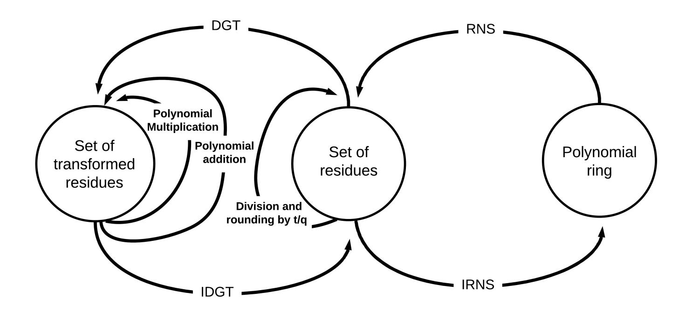

{0}------------------------------------------------

# Faster Homomorphic Encryption over GPGPUs via hierarchical DGT ?

Pedro Geraldo M. R. Alves<sup>1</sup> , Jheyne N. Ortiz<sup>1</sup> , and Diego F. Aranha<sup>2</sup>

<sup>1</sup> University of Campinas, Campinas, Brazil, {pedro.alves, jheyne.ortiz}@ic.unicamp.br <sup>2</sup> Aarhus University, Aarhus, Denmark, dfaranha@eng.au.dk

Keywords: Fully Homomorphic Encryption · Discrete Galois Transform · CUDA · Polynomial multiplication

Abstract. Privacy guarantees are still insufficient for outsourced data processing in the cloud. While employing encryption is feasible for data at rest or in transit, it is not for computation without remarkable performance slowdown. Thus, handling data in plaintext during processing is still required, which creates vulnerabilities that can be exploited by malicious entities. Homomorphic encryption (HE) schemes are natural candidates for computation in the cloud since they enable processing of ciphertexts without any knowledge about the related plaintexts or the decryption key. This work focuses on the challenge of developing an efficient implementation of the BFV HE scheme on CUDA. This is done by combining and adapting different approaches from the literature, namely the double-CRT representation and the Discrete Galois Transform. Moreover, we propose and implement an improved formulation of the DGT inspired by classical algorithms, which computes the transform up to 2.6 times faster than the state-of-the-art. By using these approaches, we obtain up to 3.6 times faster homomorphic multiplication.

# 1 Introduction

With growing data collection by governments and companies, protecting its secrecy becomes as important as being capable of processing and extracting useful information. However, how to efficiently collect and compute user data without undermining their privacy is an open problem. System breaches may happen even when data holders choose the most conservative practices and never share data intentionally.

The Breach Level Index provides distressful statistics about data leakage. According to their last report, 944 data breaches were reported in 2019, leading to 4.5 billion data records compromised worldwide. Among these records, less

<sup>?</sup> This work was supported in part by LG Electronics Inc.; CNPq, 144265/2019-2 and 164489/2018-5; and CAPES, 88887.475571/2020-00 and 88887.474754/2020-00; during the development of this research.

{1}------------------------------------------------

than 30% were encrypted. That is, most of it, including emails, vehicle registration information, financial data, and medical records, were stored completely unprotected [27].

Most of these breaches occurred by accidental loss or by leaving data exposed inadvertently. Attacks from malicious parties are also far from being negligible. In recent years, many data breaches were brought to light, such as: the US government surveillance program PRISM, that forced cloud companies to provide user private data [21]; the Yahoo data breach, possibly the largest known, affecting about 3 billion accounts, which revealed unencrypted email addresses, telephone numbers, and security questions and answers [8]; and the Equifax event, which exposed data of more than 140 million customers [24]. The last incident resulted in nearly \$1.4 billion dollars spent on legal costs.

Data can be protected by means of encryption and its mathematical guarantees, even in the case of leakage. However, the existence of encryption-decryption cycles during its lifespan can incur on vulnerabilities. Homomorphic Encryption (HE) schemes enable data processing while protecting its confidentiality. They allow the evaluation of arithmetic circuits over ciphertexts by a third party without any knowledge of the corresponding plaintexts or the decryption key, preventing the inputs and outcome of the computation to be learned. Hence, HE is a natural candidate for solving privacy issues caused by malicious or careless third parties, or other security flaws during the processing that could leak sensitive information, such as side-channel vulnerabilities.

Most of the HE schemes available in the literature rely on the hardness of the Ring-Learning with Errors (RLWE) problem. The RLWE assumption offers a strategy for protecting a message, encoded as a polynomial in R<sup>q</sup> = Zq[x]/hf(x)i, by adding noise in a way that it can only be removed when given a trapdoor. There are several recent proposals following this approach in cryptosystems such as BGV [9], BFV [18], and CKKS [11]. All of them depend on polynomial arithmetic as building block, so its efficient and reliable implementation is critical for the adoption of HE schemes in real-world scenarios.

CUDA is an important tool for the efficient implementation of polynomial arithmetic. It's a SIMD architecture developed and maintained by NVIDIA for employing the data parallelism potential of a GPU in tasks beyond graphical processing. However, the particularities of CUDA impose challenges for its cryptographic use. Its processing flow demands careful planning to align possible conditional branches with certain thread groups, and its memory paradigm considers several structures with different dimensions and latency characteristics, physically separated from the machine's main memory. Moreover, no generalpurpose cryptographic library or polynomial arithmetic framework supports CUDA. Hence, these constraints motivate the development of a complete toolkit to work as a arithmetic engine aimed at RLWE-based cryptosystems.

Our contributions. This work presents mathematical tools and implementation techniques for the efficient implementation of the BFV scheme in CUDA. We follow the literature by employing the Residue Number System (RNS) as the best approach for handling the multi-precision arithmetic required by the 

{2}------------------------------------------------

cryptosystem, and the Halevi, Polyakov, and Shoup modification of BFV to solve the division and rounding problem in the RNS domain [7, 22]. The main contributions of this study are:

- A novel hierarchical formulation of the Discrete Galois Transform (DGT) that offers about two times lower latency on GPUs than the best version previously available in literature. Moreover, we present evidence that it is also faster than the commonly used Number Theoretic Transform (NTT) due to its lower memory bandwidth requirement. Such formulation is inspired on Bailey's version of the Fast Fourier Transform [5].
- Compatible choice of parameters between the DGT and the RNS representation. We show that the double-CRT representation proposed by Gentry et al. is a better implementation design than the usual approach of working with Mersenne or Solinas primes in different rings [9].
- A more efficient and polynomial-oriented state machine which reduces the need for moving data in and out of the DGT domain and between the main memory and the GPU global memory.

These contributions are not limited to the BFV cryptosystem and can be easily applied to other RLWE-based schemes. Moreover, we provide latency benchmarks from a proof-of-concept implementation named spog, which was built based on the aforementioned methods. By implementing a library we could evaluate our techniques and point out their advantages and weaknesses when compared to other solutions presented in the literature. Two important works also employing the DGT were considered for comparison with our results: Badawi, Polyakov, Aung, Veeravalli, and Rohloff [2]; and Badawi, Veeravalli, Mun, and Aung [4]. When considering homomorphic multiplication as the main performance-critical operation, spog offers higher performance against these works, surpassing a 3.6-factor performance improvement against the latter.

# 2 Mathematical background

The efficient implementation of an RLWE-based cryptosystem on CUDA requires carefully designed building blocks for adjusting the operations to the limitations of the architecture. The BFV cryptosystem and other HE proposals rely on quite large parameters for achieving proper security levels, which impose a challenge to the hardware limitations of GPGPUs for both the size of the coefficients, much larger than the native integer instruction set; and the polynomial arithmetic, that requires highly-optimized algorithms to reduce the computational complexity and improve the scalability of expensive operations, such as polynomial multiplication.

This section defines the Fan and Vercauteren cryptosystem; presents the Residue Number System (RNS) representation, used to avoid the multi-precision arithmetic; presents state-of-the-art proposals for handling the limitations of the RNS; and introduces the Discrete Galois Transform (DGT), a variant of the Fast Fourier transform (FFT) more suitable to GPU implementation.

{3}------------------------------------------------

#### 2.1 The BFV cryptosystem

In 2012, Fan and Vercauteren proposed a variant of Brakerski's homomorphic cryptosystem, nowadays referred as BFV [18]. While the original scheme was built using Learning With Errors (LWE) as the underlying problem, BFV embraced the Ring-Learning With Errors (RLWE). Classified as a leveled homomorphic encryption scheme (LHE), it's currently one of the most efficient cryptosystem of its class with respect to speed and memory consumption, and remains untouched by recent advances in cryptanalysis [1, 13].

Let p > 1 be an integer. BFV's basic arithmetic is built upon polynomial rings of the form  $R_p = \mathbb{Z}_p[X]/\langle X^n + 1 \rangle$ , where  $\mathbb{Z}_p[X]$  is the set of integers [0, p), and na power-of-2 integer. The scheme defines the following parameters set: a security parameter  $\lambda$ ; a decomposition base  $\omega > 1$ ; the modulus  $t \geq 2$  that determines the plaintext domain  $R_t$ ; and the modulus q >> t that determines the ciphertext domain  $R_q$ . Moreover, it makes use of an error distribution  $\chi_{err}$ , usually a zeromean discrete Gaussian distribution parameterized by the standard deviation  $\sigma$ .

The main procedures of BFV are the following:

KeyGen( $\lambda$ ): Sample  $s \leftarrow R_2$ ,  $a \leftarrow R_q$  uniformly at random, and  $e \leftarrow \chi_{err}$ , and compute  $b = [-(a \cdot s + e)]_q$ . Sample  $\mathbf{a}_i \leftarrow R_q$  uniformly at random,  $\mathbf{e}_i \leftarrow \chi_{err}$ , and compute  $\gamma_i = ([-(\mathbf{a}_i \cdot s + \mathbf{e}_i) + \omega^i \cdot s^2]_q, \mathbf{a}_i)$ , for  $i \in \mathbb{Z}_{\log_\omega q}$ . Output the key set  $(\mathbf{pk}, \mathbf{sk}, \mathbf{evk}) = ((b, a), s, \gamma)$ , for  $\gamma = \bigcup \gamma_i$ .

Encrypt(m, pk): for a plaintext message  $m \in R_t$  and a public key pk = (b, a), sample  $u \leftarrow R_2$  uniformly at random and  $e_1, e_2 \leftarrow \chi_{err}$ , and compute the ciphertext  $\mathbf{c} = \left( \left[ \Delta m + b \cdot u + e_1 \right]_q, \left[ a \cdot u + e_2 \right]_q \right)$ , where  $\Delta = \lfloor q/t \rfloor$ .

Decrypt(c, sk): for a ciphertext  $\mathbf{c} = (c_0, c_1)$  and the secret key  $\mathbf{sk} = s$ , recover the plaintext  $m = \left[ \left| \frac{t}{q} \left[ c_0 + c_1 \cdot s \right]_q \right| \right]_{\star}$ .

Add( $\mathbf{c}_0, \mathbf{c}_1$ ): for ciphertexts  $\mathbf{c}_0 = (c_{0,0}, c_{0,1})$  and  $\mathbf{c}_1 = (c_{1,0}, c_{1,1})$ , compute  $\mathbf{c}_{\text{add}} = ([c_{0,0} + c_{1,0}]_q, [c_{0,1} + c_{1,1}]_q)$ .

 $\begin{aligned} & \operatorname{Relin}((c_0, c_1, c_2), \operatorname{evk}) : \operatorname{for} \ c_0, c_1, c_2 \in R_q \ \operatorname{and} \ \operatorname{the \ key \ evk} = (\mathbf{b}, \mathbf{a}), \ \operatorname{output} \\ & \left( \left[ c_0 + \sum_{i=0}^{\log_\omega q} \mathbf{b}_i \cdot \left[ \frac{c_2}{\omega^i} \right]_\omega \right]_q, \left[ c_1 + \sum_{i=0}^{\log_\omega q} \mathbf{a}_i \cdot \left[ \frac{c_2}{\omega^i} \right]_\omega \right]_q \right), \ \operatorname{for} \ i \in \mathbb{Z}_{\log_\omega q}. \end{aligned} \\ & \operatorname{Mul}(\mathbf{c}_0, \ \mathbf{c}_1, \ \operatorname{evk}) : \operatorname{for \ ciphertexts} \ \mathbf{c}_0 = (c_{0,0}, c_{0,1}) \ \operatorname{and} \ \mathbf{c}_1 = (c_{1,0}, c_{1,1}), \ \operatorname{compute} \\ & c = \left( \left[ \left\lfloor \frac{t}{q} \cdot c_{0,0} \cdot c_{1,0} \right\rceil \right]_q, \left[ \left\lfloor \frac{t}{q} \cdot (c_{0,0} \cdot c_{1,1} + c_{0,1} \cdot c_{1,0}) \right\rceil \right]_q, \left[ \left\lfloor \frac{t}{q} \cdot c_{0,1} \cdot c_{1,1} \right\rceil \right]_q \right) \end{aligned}$ 

#### 2.2 Residue Number System

and return  $\mathbf{c}_{\text{mul}} = \text{Relin}(c, \text{evk})$ .

As can be observed in Section 2.1, BFV depends upon computationally expensive operations. Moreover, the literature reveals that big integer arithmetic is required to offer proper security levels [26]. A common strategy in implementations of BFV is to use the Chinese Remainder Theorem (CRT) on the Residue Number System (RNS) to map large integers to a set of smaller residues capable of being evaluated by processor native instructions [16, 7].

{4}------------------------------------------------

Definition 1 provides the formulation for the forward and inverse CRT.

**Definition 1 (CRT).** Let x be a polynomial in  $R_q$ , and  $\{p_0, p_1, \ldots, p_{\ell-1}\}$  a set of pairwise co-primes. The CRT decomposition is defined as  $CRT(x) = \{[x]_{p_0}, [x]_{p_1}, \ldots, [x]_{p_{\ell-1}}\} = X$ , and results in a set X with  $\ell$  residues. Let  $M = \prod_{i=0}^{\ell-1} p_i$ . The inverse CRT is defined as:

$$ICRT(X) = \left[\sum_{i=0}^{\ell-1} \left(\frac{M}{p_i}\right) \cdot \left[\left(\frac{M}{p_i}\right)^{-1} X_i\right]_{p_i}\right]_M = x.$$

Addition and multiplication in the RNS domain work by applying the operation residue-wise. Division and modular reduction, however, are more complicated and require a more advanced technique involving representation on different bases, as described in Section 2.5.

To guarantee the correctness of these functions, the product of all primes M must be bigger than the biggest possible coefficient of a polynomial to be represented.

#### 2.3 Discrete Galois Transform

The Fast Fourier Transform (FFT) is a long-time known method that offers linear computational cost for polynomial multiplication when the operands lie in its domain, and quasi-linear when we consider the computation of the transform itself. However, the FFT is defined in  $\mathbb{C}$ , which makes it harder for its direct applicability in the context of RLWE-based cryptosystems, that are defined in integer domains. Thus, variations offering the same functionality but built upon integer arithmetic were proposed in the literature, such as the Number Theoretic Transform (NTT) over GF(p), for some convenient choice of a prime number p.

In the same way, the Discrete Galois Transform (DGT) is another variant built over  $GF(p^2)$  [14]. The main advantage of DGT over NTT is caused by the different working domain, which results in memory bandwidth savings, as deeply discussed in Sections 3 and 4. However, despite this, they are sufficiently similar so that they share computation data-paths, as Cooley-Tukey or Gentleman-Sande, and their efficient implementation strategies. Furthermore, as  $GF(p^2)$  can be represented in the set of Gaussian integers  $\mathbb{Z}_p[i] = \{a+ib \mid a,b \in \mathbb{Z}_p\}$ , it uses finite field arithmetic with  $\mathbb{Z}_p$  elements as building blocks, which cooperates with the representation used by RNS and BFV. In Definition 2 we introduce the base formulation, as done by Badawi et al. [3].

**Definition 2 (Discrete Galois Transform).** Let  $p \geq 3$  be a prime number,  $x = \{x_0, \ldots, x_{n-1}\}$  be a vector of length n such that  $x_i \in GF(p^2)$  for  $0 \leq k < n$ , and g be an n-th primitive root of unity in GF(p). Then, the DGT and its inverse are defined as in Equations 1 and 2, respectively.

$$X_k = \sum_{j=0}^{n-1} x_j g^{-jk} \in GF(p^2), \tag{1}$$

{5}------------------------------------------------

and

$$x_k = n^{-1} \sum_{j=0}^{n-1} X_j g^{jk} \in GF(p^2).$$
 (2)

Badawi et al. have shown that all primes greater than 2 can be used along with the DGT, but in Section 2.4 we show that this selection must be done carefully so that one can generate the precomputed roots the transform requires.

The value of  $n^{-1}$  in Equation 2 is taken as the multiplicative inverse of n modulo p. The operations in  $GF(p^2)$  are performed using arithmetic in the set of Gaussian integers, similarly to  $\mathbb{C}$ , but taking the real and imaginary parts as integers modulo p.

**Gaussian integers** The set of Gaussian integers can be used to represent elements of  $GF(p^2)$ , that is  $\mathbb{Z}_p[i] = \{a + ib \mid a, b \in \mathbb{Z}_p\}$ , for  $i = \sqrt{-1}$ . Arithmetic in  $\mathbb{Z}_p[i]$  is similar to complex number arithmetic with a reduction modulo p for the real and imaginary parts.

Arithmetic Let  $a, b \in GF(p^2)$ . The main operations can be defined as follows:

$$add(a,b) = (a_{re} + b_{re}) + i(a_{im} + b_{im}) \mod p$$

$$sub(a,b) = (a_{re} - b_{re}) + i(a_{im} - b_{im}) \mod p$$

$$mul(a,b) = (a_{re}b_{re} - a_{im}b_{im}) + i(a_{re}b_{im} + a_{im}b_{re}) \mod p$$

$$div(a,b) = (a \cdot \overline{b}) \cdot (b_{re}^2 + b_{im}^2)^{-1} \mod p$$

$$rem(a,b) = a - (a/b) \cdot b \mod p$$

We suggest Wuthrich's lecture notes on Gaussian integers as a valuable reading material to understand the connection of this ring to the DGT [28], of which some results are summarized in the Appendix A.

#### 2.4 Generating k-th primitive roots of i modulo p

The use of the DGT for polynomial multiplication in a polynomial ring modulo  $x^n+1$  requires the computation of a k-th root of i modulo a prime p, discussed in Section 3.1. This element is used for achieving a cyclotomic polynomial reduction for free when n is a power of two. When p is a Mersenne prime, the literature presents efficient analytic methods; for other choices of p, the best option still is a trial-and-error approach.

Badawi et al. state that a naive implementation of such approach takes 156 hours to find a  $2^{14}$ -th primitive root of i for  $p = 2^{64} - 2^{32} + 1$  in a highly optimized Mathematica script [3]. Because of that, they propose a more efficient strategy, when  $p \equiv 1 \mod 4$ , by factoring p in two Gaussian primes, namely  $f_0$  and  $f_1$ . This decomposition of p is quite simple and relies on Lemma 3 and Proposition 1.

Algorithm 1 starts from the Fermat's little theorem, which states that if p is a prime then  $n^{p-1} \equiv 1 \mod p$  for all  $n \in \mathbb{Z}_p$ . Hence, the square root of that

{6}------------------------------------------------

Algorithm 1: decompose in gaussian primes: Returns elements f<sup>0</sup> and f<sup>1</sup> such that f<sup>0</sup> · f<sup>1</sup> = p.

```
Input: A prime p
  Output: Gaussian integers f0 and f1 such that f0 · f1 = p
1 do
2 n = sample(Zp)
3 while n
          (p−1)/2
                 6≡ −1 mod p
4 k = n
       (p−1)/4 mod p
5 u = gcd(p, k + i)
6 return (f0, f1) = (u, u)
```

must be equivalent to either 1 or −1. In the latter case, we can find a number k 2 such that k ≡ n (p−1)/<sup>4</sup> ≡ i mod p. In other words, if k <sup>2</sup> ≡ −1 mod p then k <sup>2</sup> + 1 ≡ 0 mod p and p divides k <sup>2</sup> + 1. Since k <sup>2</sup> + 1 factors in (k + i) · (k − i), we found a factorization of p.

At this point, there is no guarantee that k + i is a Gaussian prime. By Lemma 2, we find that the greatest common divisor of p and k + i is either k + i or that there exist some u such that u | p and u | k + i. Thus, since u = gcd(p, k + i) results in a Gaussian prime, we take it as the first factor of p. From Lemma 3, u is the second factor.

Lemma 1 (Wuthrich's Lemma 5.4). If π ∈ Z[i] is such that N(π) is a prime number, then π is a Gaussian prime.

Lemma 2. Let p be an odd prime such that p ≡ 1 mod 4 and k ∈ Zp. The greatest common divisor of p and k + i is k + i or a Gaussian prime u such that u | p and u | k + i.

Proof. By the Fermat's theorem on sums of two squares, we have that an odd prime p can be expressed as p = x <sup>2</sup> + y 2 , with x, y ∈ Z, if, and only if, p ≡ 1 mod 4. Since x <sup>2</sup> + y <sup>2</sup> = (x + iy)(x − iy) and N(x + iy) = N(x − iy) = p, then x + iy and x − iy are Gaussian primes and p = (x + iy)(x − iy) is the unique factorization of p in Z[i], not considering the order of the factors<sup>3</sup> .

On the other hand, we have that (k + i)(k − i) ≡ p mod p, by construction. Combining the two facts, we obtain that p = (x + iy)(x − iy) ≡ (k + i)(k − i), which is equivalent to (k + i)(k − i) = `(x + iy)(x − iy), for some ` ∈ Z.

When ` = 1, we have an equality and we find that (k + i) and (k − i) are indeed the factors of p. When ` 6= 1, (k+i) is not a Gaussian prime and still can be factored in Z[i]; otherwise, it would be a factor of p. We know that p divides (k + i)(k − i) but not k + i, or its conjugate, since k < p and (k + i)/p is not a Gaussian integer. Then, k + i and p must share a common factor u that can be found as the greatest common divisor. Since the two factors of p are x + iy and x + iy, u must be one of them.

<sup>3</sup> Wuthrich proves in Theorem 5.8 that every 0 6= α ∈ Z[i] has a unique factorization [28].

{7}------------------------------------------------

Finally, the factors of p can be found by computing the greatest common divisor of p and k + i and then computing its conjugate. Since  $p = x^2 + y^2$  and  $N(x+iy) = N(x-iy) = x^2 + y^2$ , by Lemma 1, the factors are Gaussian primes.

Given a method for factoring a prime number  $p \equiv 1 \mod 4$  in  $\mathbb{Z}[i]$ , Badawi et al. propose Algorithm 3, which makes much faster the step of precomputing a k-th root of i for a prime  $p \equiv 1 \mod 4$  [3]. The method starts by finding the factorization  $p = f_0 \cdot f_1 \in \mathbb{Z}_p[i]$  using the Algorithm 1.

**Algorithm 2:** sample\_generator: Return a generator for the cyclic group  $\mathbb{Z}[i] \mod f$ .

```
Input: A prime number p that defines GF(p^2) and a factor of p denoted by
             f \in \mathbb{Z}_p[i]
   Output: A generator \zeta for the cyclic group \mathbb{Z}[i] \mod f.
1 do
        a = \mathtt{sample}(\mathbb{Z}_p)
\mathbf{2}
       b = \mathtt{sample}(\mathbb{Z}_p)
3
       \zeta = (a+bi) \mod f
4
       for j = 1; j < p; j = j + 1 do
\mathbf{5}
            d = \zeta^{\jmath} \mod f
6
            if d = 1 and j = p - 1 then
7
                 return \zeta \mod p
8
9 while True
```

At this point, we have that each Gaussian prime  $f_j$ , with  $j = \{0, 1\}$ , defines a cyclic group corresponding to the set of Gaussian integers modulo  $f_j$ . The next step is to find a generator for each of these two cyclic groups by using the Algorithm 2. In Algorithm 2, the procedure  $\operatorname{sample}(\mathbb{Z}_p)$  returns an element sampled from  $\mathbb{Z}_p$  following a uniform distribution, which is used to compute  $\zeta_j \in \mathbb{Z}[i] \mod f_j$ . The algorithm samples at random an element until a generator is found, i.e. an element with order equals to p-1. Then, a k-th root of i modulo p, denoted as h, is constructed via CRT using that  $h_j = \zeta_j^{\frac{(p-1)}{4n}} \mod f_j$ , with  $j = \{0,1\}$ .

Euclid's GCD algorithm for Gaussian integers is almost identical to the integer version. Each iteration consists of a trial division with remainder. If we're looking for gcd(a,b), then q = floor(a/b), and if  $r = a - q \cdot b \neq 0$  we return gcd(b,r).

#### 2.5 Division and rounding inside the RNS domain

Some parts of BFV are hardly compatible with RNS, such as coefficient-wise division and rounding used in decryption and homomorphic multiplication. Because of that, two variants of BFV are current present in the literature, BEHZ-BFV and HPS-BFV, which propose slight modifications to the cryptosystem to support those operations in the RNS domain [6, 22].

{8}------------------------------------------------

**Algorithm 3:** Compute the k-th primitive root of  $i \mod p$ , for a prime number  $p \equiv 1 \mod 4$ .

```
Input: An integer k and a prime p \equiv 1 \mod 4.
   Output: The k-th primitive root of i \mod p.
1 f_0, f_1 = \texttt{decompose\_in\_gaussian\_primes}(p)
2 do
       for j = 0; j < 2; j = j + 1 do
3
            \zeta_j = \mathtt{sample\_generator}(f_j)
4
            h_j = \zeta_j^{\lfloor (p-1)/(4k) \rfloor} \mod f_j
\mathbf{5}
       h = f_1 \cdot (f_1^{-1} \cdot h_0 \mod f_0) + f_0 \cdot (f_0^{-1} \cdot h_1 \mod f_1) \mod p
6
       if h^k \equiv i \mod p then
7
            return h
8
9 while True
```

The strategy in BEHZ-BFV is to implement base extension tools and deal with the division and rounding steps in larger bases, correcting computing errors in intermediary steps. Their idea also requires choosing new parameters for the scheme and dealing with a new level of noise added to the ciphertext by their technique.

Halevi, Polyakov, and Shoup (HPS-BFV) followed the idea of handling this issue by working on a bigger base but took a simpler approach. Rather than executing inexact methods and correcting errors later, their work shows how to more precisely execute such operations. Thus, their proposal adds negligible noise to the ciphertexts, does not require new parameters, and is much simpler to implement.

Both variants of BFV take the fact that q is not defined as a prime integer. Thus, they represent and work with  $R_q$  polynomials in an RNS base composed by a factorization of q. One of the advantages of doing this is the automatic merge of the RNS bounds, defined in Section 2.2, with the ciphertext coefficient domain. Moreover, they use a marginally different procedure for generating the evk from what is defined in Section 2.1. First proposed in BEHZ-BFV, they use the decomposition of q in an RNS base instead of the standard digit decomposition w proposed by Fan and Vercauteren. They argue that both decompositions have the same size and, because of that, can similarly control the noise growth without any security implications.

The HPS-BFV methods were proposed as follow:

**CRT Basis Extension**(A, B): Extend the operand from base A to base B. **Simple scaling**(A, t, q): For an operand in base A, compute the equivalent polynomial "scaled-down" by t/q and rounding to the nearest integer in

base  $\{t\}$ .

**Complex scaling**(A, B, t, q): For an operand in base A, compute the equivalent polynomial "scaled-down" by t/q and rounding to the nearest integer in base B. This more general method does not guarantee accuracy of the

{9}------------------------------------------------

result. However, the difference is negligible in the context of homomorphic multiplication and can be interpreted as part of the intrinsic operation noise.

The division and rounding on BFV's decryption are computed by just applying the simple scaling procedure. The homomorphic multiplication, however, requires a few more steps and depends on a larger base, as it can be seen in Algorithm 4.

**Algorithm 4:** Overview of the RNS homomorphic multiplication for Halevi, Polyakov, and Shoup (HPS-BFV) technique

```
Input: ct_1, ct_2 \in R_q.

Output: ct_{\text{mult}} \in R_q.

1 ct_1' \leftarrow \text{base\_extension}(ct_1) // Extend ct_1 and ct_2 from q to q \cup p

2 ct_2' \leftarrow \text{base\_extension}(ct_2)

3 ct_{\star}' \leftarrow (ct_1 \star ct_2) \cup (ct_1' \star ct_2') // Multiply ciphertexts in both bases

4 \widetilde{ct}_{mult} \leftarrow \text{complex\_scaling}(ct_{\star}') // Multiply by t/q and round to base q

5 ct_{mult} \leftarrow \text{Relin}_{RNS}(\widetilde{ct}_{mult}) // Apply relinearization

6 \mathbf{return} \ ct_{mult}
```

Lastly, the authors of HPS-BFV present a performance analysis that demonstrates that their procedures are not only simpler but also have lower complexity and noise growth than those proposed by Bajard et al. .

## 3 Efficient CUDA operation on cyclotomic rings

An efficient implementation of the arithmetic of cyclotomic polynomial rings requires a convenient approach for the polynomial multiplication and a proper data representation, not only with low computational complexity but also that fits well in the processing hardware. This Section provides optimization strategies for implementing polynomial arithmetic on CUDA.

#### 3.1 Fast polynomial multiplication

Let a and b be n-degree polynomials such that  $a(x) = \sum_{j=0}^{n-1} a_j x^j$  and  $b(x) = \sum_{j=0}^{n-1} b_j x^j$ . Their product is defined as  $c(x) = a(x) \cdot b(x) = \sum_{i=0}^{n-1} \sum_{j=0}^{n-1} a_i b_j x^{i+j}$ . The complexity to compute c(x) using this formulation is  $\Theta(n^2)$ , which means that performance will be seriously affected with the increase of the degree.

In the context of cryptosystems based on RLWE, as observed by Lindner and Peikert, security is strongly related to the degree of the polynomial ring [23]. Specifically on BFV, Player concludes that a parameter set nowadays considered secure, with an estimated security upper bound close to  $\lambda = 128$ , requires n between  $2^{11}$  and  $2^{15}$  [26]. Hence, an efficient implementation of polynomial

{10}------------------------------------------------

multiplication for operands with large degree is vital for the performance of the cryptosystem.

FFT-based transforms provide a domain in which the polynomial multiplication complexity is reduced to  $\Theta(n)$ , and among those, the DGT is a promising variant defined over  $GF(p^2)$ . As introduced in Section 2.3, this field can be represented as the set of Gaussian integers  $\mathbb{Z}_p[i] = \{a+ib \mid a,b \in \mathbb{Z}_p\}$ , which enables the polynomial folding of inputs and consequently halves their degree. This folding works in a way that, for a polynomial  $P(x) = \sum_{j=0}^{n-1} a_j \cdot x^j$ , we have  $fold(P(x)) = \sum_{j=0}^{n/2-1} (a_j + i \cdot a_{j+n/2}) \cdot x^j$ , for  $i = \sqrt{-1}$ .

Considering the use of Gaussian integer arithmetic, described in more depth at Section 2.3, a first impression may be that the reduction of the polynomial degree is nullified by the increased cost of the arithmetic due to the quadratic extension. However, it is important to notice that, by working with half the coefficients, only half the roots, like those in Definition 2, are required when compared to the FFT or the NTT. In this way, in a memory-constrained scenario, this property implies a speedup caused by fewer memory accesses and enables a more coalesced pattern. In the case of CUDA, such operations may target the GPU's global memory, which is big in size but has high access latency, or even shared or constant memories, which are fast but very small. The resulting increased arithmetic density favors GPU implementations.

Badawi et al. propose Algorithm 5 for polynomial multiplication through the DGT. It first folds both input signals and then applies a twisting by powers of k—th primitive roots of i, which provides a negacyclic convolution. The latter equips the algorithm with a free polynomial reduction by a cyclotomic polynomial [14]. Finding such a root is a complex computational task usually performed by brute force when p is sufficiently small. Otherwise, numerical methods may be used. We offer in Section 2.4 a suggestion for construction of these roots.

There are no constraints regard the output order of the forward and the input order of the inverse DGT algorithms for polynomial multiplication, as long as both match. So, the bit-reversal procedure, a usual operation in FFT implementations, is not required here. An efficient implementation avoids such procedure by selecting a decimation-in-frequency (DIF) algorithm for the forward transform and a decimation-in-time (DIT) algorithm for the inverse, as defined by Chu and George [12]. At this work, we follow the proposal of Badawi et al. and choose the Gentleman-Sande, a DIF, and the Cooley-Tukey, a DIT, algorithms for the forward and inverse versions of the DGT, respectively [3].

The canonical formulation of these contain a combination of three nested loops which increases the complexity of its implementation, especially on the CUDA architecture. This structure creates dependencies between the loops and disturb parallel execution. So, for better compatibility to the CUDA programming model, they had to be rewritten by wiping out one layer of nesting and leaving only two loops, an outer loop related to the stride, and an inner loop that asserts the access patterns. For each outer loop iteration, the inner one can be completely parallelized. Our proposals for these have a much weaker dependency between iterations and can be seen in Algorithms 6 and 7. The bit-reversal

{11}------------------------------------------------

**Algorithm 5:** Polynomial multiplication in  $\mathbb{Z}_p[x]/\langle x^n+1\rangle$  via DGT

```
Input: Polynomials a, b \in \mathbb{Z}_p[x]/\langle x^n + 1 \rangle, p a prime number, n a power-of-two
            integer, and h a primitive \frac{n}{2}-th root of i modulo p.
   Output: c = a \cdot b \in \mathbb{Z}_p[x]/\langle x^n + 1 \rangle.
 1 for j = 0; j < n/2; j = j + 1 do
       a_j' = a_j + ia_{j+n/2}
 \mathbf{2}
                                                  // Folding the input polynomials
       b_j' = b_j + ib_{j+n/2}
 3
 4 for j = 0; j < n/2; j = j + 1 do
       a_j' = h^j \cdot a_j' \pmod{p}
                                         // Applying the right-angle convolution
 5
       b_j' = h^j \cdot b_j' \pmod{p}
 6
 7 a' = DGT(a')
                                           // Computing the DGT of both operands
 8 b' = DGT(b')
 9 for j = 0; j < n/2; j = j + 1 do
       c_j' = a_j' \cdot b_j' \pmod{p}
                                           // Component-wise multiplying in \mathbb{Z}_p[i]
10
11 c' = IDGT(c') // Computing the IDGT of the multiplication result
12 for j = 0; j < n/2; j = j + 1 do
       u = h^{-j} \cdot c_i' \pmod{p}
                                                  // Removing the twisting factors
13
        c_i = u_{re}
                                               // Unfolding the output polynomial
14
        c_{j+\frac{n}{2}} = u_{im}
15
16 return c
```

operation is present in both for completeness, but as aforementioned, it can be omitted.

### Algorithm 6: Rewritten forward DGT via Gentleman-Sande

```
Input: A folded vector x \in \mathbb{Z}[i]^k, p a prime number, k a power-of-two integer,
             and g a primitive k-th root of unity modulo p.
  Output: x \leftarrow \mathrm{DGT}(x) in bit-reversed ordering.
1 for s = 0; s < \lfloor \log(k) \rfloor; s = s + 1 do
       m = \frac{k}{2^{(s+1)}}
\mathbf{2}
       for l = 0; l < k/2; l = l + 1 do
3
           j = \frac{2ml}{k}
4
           i = j + (l \mod \frac{k}{2m}) \cdot 2m
5
            a = g^{j \cdot \frac{k}{2(\log(k) - s)}} \pmod{p}
6
            (u,v) = (x[i], x[i+m])
7
            (x[i], x[i+m]) = (u+v, a \cdot (u-v)) \pmod{p}
8
9 return bit-reversal(x)
```

#### 3.2 An improved and hierarchical DGT

The procedures described in Algorithms 6 and 7 require synchronization at the end of each iteration of the outer loop; otherwise, there is no guarantee of data

{12}------------------------------------------------

### Algorithm 7: Rewritten inverse DGT via Cooley-Tukey

```
Input: A vector x \in \mathbb{Z}[i]^k in bit-reversed order, p a prime number, k a
             power-of-two integer, and q a primitive k-th root of unity modulo p.
    Output: x \leftarrow \text{IDGT}(x) in standard ordering.
 1 m = 1
 x = bit-reversal(x)
 3 for s = 0; s < |\log(k)|; s = s + 1 do
        for l = 0; l < k/2; l = l + 1 do
 4
             j = \frac{2ml}{k}
 \mathbf{5}
            i = j + (l \mod \frac{k}{2m}) \cdot 2m
 6
             a = g^{-j \cdot \frac{k}{2^{s+1}}} \pmod{p}
 7
             (u,v) = (x[i], x[i+m])
 8
             (x[i], x[i+m]) = (u + a \cdot v, u - a \cdot v) \pmod{p}
 9
        m = 2 \cdot m
10
11 return x \cdot k^{-1} \pmod{p}
```

consistency. On CUDA, this enforces a limitation on the polynomial degree at the cost of latency, since the biggest data structure that provides such level of synchronization is Thread Blocks, and its dimension is limited to 1024 threads in modern hardware. An alternative implementation involves calling a different CUDA kernel for each iteration, imposing a forced synchronization at CPU-side. This incurs in a considerable overhead caused by several kernel calls.

In this scenario, we propose a technique for splitting the DGT transform into smaller blocks that better fits the processing hardware and does not require the synchronization of large sets of threads, called hierarchical DGT. It is an adaptation of the four-step FFT algorithm, originally proposed by David H. Bailey [5] and later on revisited by Govindaraju et al. called hierarchical FFT [20].

The general idea of the hierarchical DGT, referred to as HDGT and HIDGT for the forward and inverse transformations, respectively, is to split the DGT computation over  $\mathbb{Z}_p[x]/\langle x^n+1\rangle$  into computations in smaller rings with optimal size near  $\sqrt{n}$ . In practice, the vector of coefficients is treated as a matrix and the DGT is performed over the columns and rows of this matrix. The objective of this is to avoid the scenario in which one is unable to compute the DGT of an entire polynomial in a single CUDA kernel call. We move to a higher granularity approach in which we apply the transform multiple times over arbitrary small polynomials that can perfectly fit in our processing architecture.

The HDGT is described in Algorithm 8. Firstly, the polynomial a(x) is represented by taking its coefficient embedding as  $a=(a_0,a_1,\ldots,a_{n-1})$ . To be represented in the DGT domain  $GF(p^2)$ ,  $a \in \mathbb{Z}_p^n$  is folded as a (n/2)-size vector of Gaussian integers  $\tilde{a} \in \mathbb{Z}_p[i]^{n/2}$ , as described in Section 3.1. As discussed by Crandall, this folding combined with the "right-angle" convolution allows the resulting polynomial being reduced modulo  $x^n + 1$  for free via the negacyclic convolution [14]. In Algorithm 8, the "right-angle" convolution is given by mul-

{13}------------------------------------------------

tiplying the j-th coefficient of ˜a by h j , for j ∈ Zn/2, where h is the (n/2)-th primitive root of i in Zp[i].

After the folding and twisting procedures, the (n/2)-length vector of Gaussian integers ˜a is treated as a matrix with dimensions (Nr, Nc). These dimensions shall be chosen so that each coefficient's subset fit in the processing hardware. In our case, the objective is to find a subset that fits in the GPU's shared memory, so that the DGT can be performed in a single Thread Block. More details of this is discussed in Section 4. Moreover, Bailey recommends that both dimensions should be as close as possible to <sup>√</sup> n, for efficiency purposes. For example, when n = 8192, the vector resulting from the folding has length n/2 = 2<sup>6</sup> · 2 6 . Then, the recommended selection of values for N<sup>r</sup> and N<sup>c</sup> is 2<sup>6</sup> .

The calls to the DGT algorithm in lines 5 and 10 are taken as in the Algorithm 6 but without the bit-reversal in the last step. For that, the called "step-2" of Bailey's method had to be rewritten to tolerate the lack of such operation. In line 8, the twiddle factors are the powers of g, the (n/2)-th root of unity modulo p. Since the output of the DGT is not corrected from the bit-reversed order, the twiddle factors become g bit-reversal(j)·k instead of g j·k , which matches the position of the corresponding element in ˜a when it is seen as a matrix.

### Algorithm 8: Hierarchical forward DGT

```
Input: A polynomial a ∈ Zp[x]/hx
                                 n + 1i, p a prime number, n = 2 · Nr · Nc a
          power-of-two integer, h a primitive root of i modulo p, and g a
          primitive root of unity modulo p.
   Output: a˜ = HDGT(a).
1 for j = 0; j < n/2; j = j + 1 do
2 a˜j = aj + iaj+n/2 // Fold the input polynomial
3 a˜j = ˜aj · h
               j
                 (mod p) // Twist the folded polynomial
4 for k = 0; k < Nc; k = k + 1 do
5 a˜ ,k = DGT(˜a ,k) // Step 1: Apply the DGT through Nc columns
6 for j = 0; j < Nr; j = j + 1 do
7 for k = 0; k < Nc; k = k + 1 do
8 a˜j,k = ˜aj,k · g
                     bit-reversal(j)·k
                                  (mod p) // Step 2: Multiplication by
          the twiddle factors in bit-reversal order
9 for j = 0; j < Nr; j = j + 1 do
10 a˜j, = DGT(˜aj, ) // Steps 3 and 4: Apply the DGT through the Nr
       rows
11 return a˜
```

The inverse counterpart of the hierarchical DGT is described in Algorithm 9 and adopts the IDGT transform via Cooley-Tukey, described in Algorithm 7, without bit-reversing the input vector. The algorithm executes the inverse steps of the forward transform by first applying the IDGT over the rows of ˜a. The twiddle factors are removed by multiplying ˆaj,k by g −bit-reversal(j)·k , since the column indexes of the output of the previous step still are in bit-reversed order. 

{14}------------------------------------------------

Considering that the powers of g can be precomputed, they can be multiplied by N <sup>−</sup><sup>1</sup> c , avoiding the additional multiplication. Finally, the IDGT is applied over the columns of ˆa and the matrix indexes are back to standard ordering. Following the same approach, the powers of h −1 can be precomputed already multiplied by the scalar N <sup>−</sup><sup>1</sup> r . This avoids the multiplication by the scaling factor when applying the IDGT over the columns of ˆa.

#### Algorithm 9: Hierarchical inverse DGT

```
Input: a˜ = HDGT(a), p a prime number, n = 2 · Nr · Nc a power-of-two
         integer, h a primitive root of i modulo p, and g a primitive root of
         unity modulo p.
   Output: A polynomial a ∈ Zp[x]/hx
                                   n + 1i.
1 for j = 0; j < Nr; j = j + 1 do
2 aˆj, = IDGT(˜aj, ) // Steps 3/4: Apply IDGT to each of Nr rows
3 for j = 0; j < Nr; j = j + 1 do
4 for k = 0; k < Nc; k = k + 1 do
5 aˆj,k = ˆaj,k · g
                     −bit-reversal(j)·k
                                  · N
                                     −1
                                     c (mod p) // Step 2: Remove
          twiddle factors
6 for k = 0; k < Nc; k = k + 1 do
7 aˆ ,k = IDGT(ˆa ,k) // Step 1: Apply IDGT to each of Nc columns
8 for j = 0; j < n/2; j = j + 1 do
9 aˆj = ˆaj · h
               −j
                 · N
                    −1
                    r (mod p) // Remove the twisting
10 aj = ˆajre // Unfold the output polynomial
11 aj+ n
         2
           = ˆajim
12 return a
```

As in FFT and NTT-based algorithms for polynomial multiplication, the two operands are evaluated using the HDGT for further point-wise multiplication. The polynomial corresponding to a·b in Zp[x]/hx <sup>n</sup>+1i is obtained by computing the HIDGT. These steps are described in Algorithm 10. As can be seen, it is similar to Algorithm 5, but the folding and twisting procedures are merged inside the transforms.

#### 3.3 Polynomial representation and memory locality

The usability of an RLWE-based cryptosystem requires the careful selection of a parameter set that satisfies all the security constraints of the application. For instance, with BFV one must select q, t, n, and σ such that a security level λ is achieved. However, more than that, these parameters together determine the multiplicative depth supported by the scheme. Thus, as discussed by Fan and Vercauteren, the selection of such parameters is too complex to be affected by the particularities of the implementation [18].

A constraint for choosing those is the hardware instruction set. By selecting a big q one may be confronted by the lack of hardware support for native processing

{15}------------------------------------------------

Algorithm 10: Polynomial multiplication in Zp[x]/hx <sup>n</sup> + 1i via hierarchical DGT

```
Input: Polynomials a, b ∈ Zp[x]/hx
                                   n + 1i, p a prime number, and n a
         power-of-two integer.
  Output: c = a · b ∈ Zp[x]/hx
                             n + 1i.
1 a˜ = HDGT(a)
2
  ˜b = HDGT(b)
3 for j = 0; j < n/2; j = j + 1 do
4 c˜j = ˜aj ·
              ˜bj (mod p) // Point-wise multiplication over Zp[i]
5 c = HIDGT(˜c)
6 return c
```

of the coefficients. Through RNS, as described in Section 2.2, we handle this by splitting big integers in small residues following the limits of the underlying machine.

The link between the cryptosystem and RNS must be carefully designed so that data secrecy is provided with suitable performance. For that, Gentry et al. suggested the double-CRT representation, which encapsulates data into two layers [19]. The first layer is the RNS representation, as described in Definition 1. After that, a set of polynomial residues with full support for native hardware evaluation of addition and multiplication is obtained. However, we still need a second layer for the latter, since the multiplication of polynomials can achieve a quite high computational complexity without some well-designed algorithm, as mentioned in Section 3.1. Because of that, the second layer consists of moving each residue, individually, to a different domain with a convenient property for efficient polynomial multiplication. The original proposal of double-CRT is the use of the NTT as this transform, but a similar approach using the FFT would also be expected. This work, however, proposes that the second layer of the double-CRT should use the DGT instead of the NTT, since the former appears to suit much better the cyclotomic ring arithmetic and uses memory in a more efficient way [3].

Another design decision, very common to HE implementations, is the selection of a special prime p for the transform, the same for all RNS residues [15, 17, 3]. For instance, let x be a polynomial, and {p0, . . . , p`−1} a set of ` pairwise co-primes. The usual design works with the set of transformed residues DGTp([x]<sup>p</sup><sup>0</sup> ), . . . , DGTp([x]<sup>p</sup>`−<sup>1</sup> ) . By using such a prime p, one is capable of taking advantage of their intrinsic mathematical properties, as in the selection of a Mersenne or Solinas prime, which enables the use of a very efficient modular reduction. Nonetheless, this approach does not interplay well with the RNS layer and requires algorithmic efforts to correct these modular reductions and keep consistency for each residue. In this way, the double-CRT provides a simpler solution by computing the transform layer using the co-prime related to each residue, but at the cost of a more expensive modular reduction since, in most cases, there are not enough special primes for the required number of residues. Thus, in 

{16}------------------------------------------------

this representation, the set of residues is  $\{DGT_{p_0}([x]_{p_0}), \ldots, DGT_{p_{\ell-1}}([x]_{p_{\ell-1}})\}$ . Moreover, without the need for those corrections, we become capable of increasing RNS' residues to the biggest supported word size of the target architecture, reducing the number of residues needed. Lastly, by choosing  $q = \prod_{i=0}^{\ell-1}$  we establish a bond between BFV, RNS, and the DGT.

Our state machine proposal targets the insistent maintenance of data in our version of the double-CRT representation in GPU's memory, as can be seen at Figure 1. Data copy between the main memory and the GPU's memory has high latency and must be avoided. Also, polynomial multiplication and addition in  $R_q$  are homomorphically supported by this representation, and because of that consecutive operations can benefit from reducing transit back and forth into the transformation domain. HPS-BFV methods, on the other hand, require floating-point divisions and roundings that are not supported inside the DGT domain, requiring data to be moved back to the intermediary state, represented only as RNS' residues, but not taken away the GPU's memory. By supporting these two states, one is capable of keeping data on the GPU's global memory all the time, saving memory bandwidth, and not requiring the support of expensive multi-precision arithmetic.



**Fig. 1.** An optimized state machine for the cyclotomic polynomial arithmetic. Data is kept in RNS' domain and encapsulated by DGT for polynomial multiplications and additions, similar to *double-CRT*, but solely on RNS for division and rounding by t/q.

{17}------------------------------------------------

### 4 Experimental results

In this section we present SPOG<sup>4</sup>, a proof-of-concept implementation that consolidates the aforementioned techniques by exploring parallel processing on GP-GPUs through CUDA.

Designed from scratch, SPOG is a modular implementation in which the arithmetic operations are separate from the cryptosystem. More precisely, the polynomial operations were implemented on a sister library named CUPOLY, while BFV was implemented separated on SPOG. Both are implemented on top of CUDA and closely follow the sketch provided in Section 3, pursuing low-latency methods with a simple API and stretching the size of the residues to the highest supported by modern CUDA-supported GPUs, which is 63-bit residues with 1 bit for storing the sign. By doing this, we guarantee that BFV can be easily replaced by any other scheme based on the RLWE problem; thus, our work is not restricted to a single scheme. The entire arithmetic implementation can also be replaced without affecting the cryptosystem code. Hence, SPOG is flexible enough to encourage future work to develop and test different setups using the presented libraries.

#### 4.1 Related work

We consider Badawi, Polyakov, Aung, Veeravalli, and Rohloff, work, referred as BPAVR, the state-of-the-art implementation in GPUs for BFV [2]. It complements Halevi, Polyakov, and Shoup proposal and provides the first implementation of the HPS-BFV method on a high-end NVIDIA Tesla V100 GPU, demonstrated by the authors to be the fastest and most scalable variant of the scheme when compared to BEHZ-BFV [22, 6].

BPAVR do not describe all details regarding their performance results, only presenting latency measurements for decryption and homomorphic multiplication. Because of that, and the fact of their source code is not publicly available, we also consider a similar work of Badawi, Veeravalli, Mun, and Aung, which offers timings for encryption, decryption, homomorphic addition, and homomorphic multiplication for a CUDA-based BFV implementation, denoted by BVMA[4]. The authors compare BVMA with Microsoft SEAL, a reference on the field with support for HPS-BFV [10]; and NFLlib-FV, an equally important work implementing the BEHZ-BFV variant; with impressive speedups on all scenarios [25]. Despite of their efforts for parallel computation, the other libraries presented in that work are CPU-based implementations and thus show a significant slowdown, up to 27 times, when compared to BVMA. Hence, we do not believe that the direct comparison with SPOG is relevant to this paper.

Lastly, both works apply the DGT as the underlying solution to handle polynomial multiplication. So, by comparing SPOG with them, we can collect evidence about the suitability of the HDGT over the DGT for such task.

<sup>&</sup>lt;sup>4</sup> SPOG is an acronym for "Secure Processing on GPGPUs".

{18}------------------------------------------------

### 4.2 Execution environment, methodology, and BFV parameters

The experimental results presented in the next Sections for BPAVR or BVMA are those reported by the authors in their corresponding publications. We do not re-execute the benchmarks provided in the related work. This decision is based on the fact that the implementations and benchmarking tools were not made available to the community. Because of that, we decided to collect our measurements in a similar processing hardware adopted in the related works using the same parameters.

We used Google Cloud's virtual machines (VMs) for emulating the computational environment described in those works. Two instances were considered: gc.k80 and gc.v100 , which provide a NVIDIA Tesla K80 GPU, used on BVMA measurements; and a NVIDIA Tesla V100 GPU, used on BPAVR. We precisely followed the execution environment described in each work, running GCC 7.2.1 and CUDA 8.0 at gc.k80 ; and GCC 7.3.1 and CUDA 9.0 at gc.v100 . CUDA events were used to measure execution time, following the common methodology from the literature.

Our benchmark targets the most relevant primitives for HE. Regarding BFV, implemented in spog, we consider encryption, decryption, homomorphic addition, and homomorphic multiplication (including the relinearization cost). On the polynomial arithmetic side, implemented in cuPoly, we focus on the performance gains caused by the replacement of the canonical DGT by the HDGT.

In our measurements, we do not include initialization steps, which are performed only once and have negligible effect on long term runs. Because of that, the latency for generating cryptographic keys is not described in this work. Similarly, sampling is not explicitly considered in the benchmarks, despite of being included in the timings for encryption.

Two different setups are considered for compatibility with each work, both choosing t = 256 for the plaintext domain.

BPAVR parameters: Five different polynomial ring settings are used, identified by the pairs (log(q), log(n)) ∈ {(60, 11),(60, 12), (120, 13), (360, 14), (600, 15)} for the ciphertext coefficient domain and the ring degree, respectively. These offer a security level of at least 128 bits [2].

BVMA parameters: Five different polynomial ring settings are used, identified by the pairs (log(q), log(n)) ∈ {(62, 11), (186, 12), (372, 13), (744, 14), (744, 15)} for the ciphertext coefficient domain and the ring degree, respectively. These offer a security level of 80 bits [4].

#### 4.3 Probabilistic sampling on the GPU

The BFV cryptosystem requires sampling from three probabilistic distributions for key generation and encryption: uniform in Rq; narrow, also called uniform in R2; and discrete Gaussian distribution. In this work, we target homomorphic encryption schemes and, specially, the homomorphic operations. Hence, we have not investigated optimal strategies for implementing such distributions.

{19}------------------------------------------------

cuRAND, a NVIDIA probabilistic library, was used for that. It offers sampling directly to the GPU memory, avoiding the cost of data copy. Sampling uniformly at random from R<sup>q</sup> and R<sup>2</sup> is implemented through its uniform sampler, and the result is reduced by q or 2, respectively. On the other hand,the discrete Gaussian distribution is not supported by this library. Because of that, an alternative implementation of such sampler works by truncating a continuous Gaussian distribution, natively supported by cuRAND. The statistical validity of this design still needs to be asserted at the cost of compromising the security; however, this is a common implementation decision in the literature and is also done by the related works cited in Section 4.1.

### 4.4 SPOG operations

In Table 1 we compare spog with BVMA on gc.k80 , and with BPAVR on gc.v100 . As mentioned in Section 4.1, BPAVR's authors offers measurements for decryption and homomorphic multiplication only, what inhibits the comparison with spog for encryption and homomorphic addition.

One of the major motivations for using a FHE scheme is the applicability of its homomorphic primitives, and because of that, we focus on improving the performance of these. As can be seen, homomorphic multiplication, a critical and known expensive operation, reports speedup between 1.9 and 3.6 times when compared to the BVMA. When compared to the BPAVR these speedups lies between 2 and 2.4. The different characteristics between both setups, considering the processing hardware and the cryptosystem parameters, makes the direct comparison between both data sets impossible, however the performance gains are consistent.

Homomorphic addition, a much simpler operation, presented gains between 2 and 5.2 times when compared to the BVMA. The latter is probably not related to the HDGT, since this procedure is essentially a coefficient-wise addition, but to the better state machine our version of the double-CRT offers, as described at Section 3.3.

Lastly, despite our focus in this work does not being on encryption and decryption, the faster polynomial multiplication strategy and the improved state machine offered up to 4.6 times faster encryption and about 2 times faster decryption.

#### 4.5 Efficiency of the HDGT

A major contribution of this work is the HDGT, a novel formulation of the DGT which better explores the parallel capability of GPUs and compensate its memory limitations. However, a carefully evaluation of its quality must be done to understand the performance gains on realistic scenarios. Thus, at this Section, we provide a comparison between the HDGT and the best implementation designs for the canonical DGT.

As discussed before, the HDGT works by splitting a high-degree polynomial, which does not fit in the processing hardware, and applying the DGT

{20}------------------------------------------------

**Table 1.** Comparison between SPOG and two state-of-the-art implementations, BVMA and BPAVR. Average running time of 100 independent executions, in milliseconds, for the most relevant BFV operations on gc.k80 and gc.v100 virtual machines for the setups described in Section 4.2.

|           |          | gc.k80 |       |       |        | gc.v100  |       |       |       |       |  |
|-----------|----------|--------|-------|-------|--------|----------|-------|-------|-------|-------|--|
|           | $\log n$ | 11     | 12    | 13    | 14     | $\log n$ | 12    | 13    | 14    | 15    |  |
| Encrypt   | SPOG     | 0.303  | 0.309 | 0.575 | 1.630  | _        | -     | -     | -     | -     |  |
|           | BVMA     | 0.541  | 1.440 | 2.645 | 6.657  | _        | _     | -     | -     | -     |  |
|           | Ratio    | 1.783  | 4.663 | 4.604 | 4.084  | -        | -     | -     | -     | -     |  |
| Decrypt   | SPOG     | 0.089  | 0.098 | 0.191 | 0.557  | SPOG     | 0.029 | 0.031 | 0.049 | 0.099 |  |
|           | BVMA     | 0.151  | 0.194 | 0.252 | 0.610  | BPAVR    | 0.054 | 0.059 | 0.087 | 0.111 |  |
|           | Ratio    | 1.693  | 1.988 | 1.321 | 1.095  | Ratio    | 1.862 | 1.903 | 1.776 | 1.121 |  |
| Hom. Add. | SPOG     | 0.009  | 0.010 | 0.021 | 0.066  | -        | -     | -     | -     | -     |  |
|           | BVMA     | 0.037  | 0.052 | 0.068 | 0.127  | _        | _     | -     | -     | -     |  |
|           | Ratio    | 4.110  | 5.200 | 3.238 | 1.924  | -        | -     | -     | -     |       |  |
| Hom. Mul. | SPOG     | 0.926  | 1.214 | 3.232 | 15.359 | SPOG     | 0.423 | 0.472 | 0.823 | 2.325 |  |
|           | BVMA     | 3.343  | 3.873 | 7.700 | 28.953 | BPAVR    | 0.859 | 1.012 | 2.010 | 4.826 |  |
|           | Ratio    | 3.609  | 3.190 | 2.383 | 1.885  | Ratio    | 2.031 | 2.144 | 2.442 | 2.076 |  |

in a divide-and-conquer approach through blocks of arbitrarily small size. To evaluate this design, we implemented the canonical DGT adopting two different strategies, namely DGT-I and DGT-II. The former uses a multi-kernel design which executes the loop synchronization employing a different CUDA kernel for each iteration. This way, the transformation requires  $\log \frac{n}{2}$  kernels to process an n-degree polynomial. The latter uses a single-kernel design, which is only compatible with polynomial rings with degree smaller or equal than 4096 since these are the only that fit GPU's shared memory. These strategies are better described in Section 3.2. Lastly, we verified the impact of this change in two important procedures direct affected by the DGT, encryption and homomorphic multiplication.

Table 2 presents the latency measurements. The HDGT is about 2 times faster than the DGT-I, which results in speedups ranging from 1.4 to 2.2 times on BFV's primitives. The DGT-II, though, presents a slowdown on most of the cases on 2048-degree rings, which suggests that the single-kernel design better accommodates smaller instances. Such effect doesn't sustain in 4096-degree rings, when a more consistent speedup is achieved, particularly on gc.v100 that better handles the high-granularity of the HDGT. No other comparison is feasible with the DGT-II since this model is not scalable to bigger rings.

{21}------------------------------------------------

Table 2. Comparison between spog running the canonical DGT using a multi-kernel and a single-kernel strategy, called DGT-I and DGT-II, respectively; and the HDGT. The first row group compares the transform alone, while the other groups compare the performance impact on BFV primitives. Average running time of 100 independent executions, in milliseconds, on gc.k80 and gc.v100 virtual machines for the setups described in Section 4.2.

|               |                    | gc.k80 |             |       |       |                                           | gc.v100           |             |    |                   |    |
|---------------|--------------------|--------|-------------|-------|-------|-------------------------------------------|-------------------|-------------|----|-------------------|----|
|               | log n              | 11     | 12          | 13    | 14    | 15                                        | 11                | 12          | 13 | 14                | 15 |
| DGT           | HDGT               |        | 0.059 0.071 | 0.146 | 0.432 |                                           | 0.651 0.018 0.019 |             |    | 0.020 0.031 0.073 |    |
|               | DGT-I              |        | 0.114 0.131 | 0.281 | 0.711 |                                           | 1.637 0.035 0.034 |             |    | 0.040 0.078 0.188 |    |
|               | Ratio              |        |             |       |       | 1.934 1.864 1.925 1.644 2.517 1.934 1.815 |                   |             |    | 2.040 2.487 2.593 |    |
|               | DGT-II 0.052 0.091 |        |             | -     | -     | -                                         |                   | 0.026 0.047 | -  | -                 | -  |
|               | Ratio              |        | 0.881 1.292 | -     | -     | -                                         |                   | 1.423 2.492 | -  | -                 | -  |
| Encrypt       | HDGT               |        | 0.303 0.309 | 0.575 | 1.630 |                                           | 3.127 0.103 0.098 |             |    | 0.099 0.153 0.315 |    |
|               | DGT-I              |        | 0.571 0.499 | 0.861 | 2.597 |                                           | 5.835 0.144 0.146 |             |    | 0.159 0.287 0.704 |    |
|               | Ratio              |        |             |       |       | 1.882 1.614 1.499 1.593 1.866 1.395 1.498 |                   |             |    | 1.615 1.883 2.238 |    |
|               | DGT-II 0.276 0.377 |        |             | -     | -     | -                                         |                   | 0.120 0.188 | -  | -                 | -  |
|               | Ratio              |        | 0.910 1.220 | -     | -     | -                                         |                   | 1.163 1.921 | -  | -                 | -  |
| Hom.<br>Mult. | HDGT               |        | 0.926 1.214 |       |       | 3.232 15.359 30.990 0.436 0.423           |                   |             |    | 0.472 0.823 2.325 |    |
|               | DGT-I              |        | 1.795 2.031 |       |       | 4.231 19.952 42.800 0.795 0.783           |                   |             |    | 0.913 1.609 4.078 |    |
|               | Ratio              |        |             |       |       | 1.938 1.673 1.309 1.299 1.381 1.825 1.850 |                   |             |    | 1.934 1.956 1.754 |    |
|               | DGT-II 0.642 0.983 |        |             | -     | -     | -                                         |                   | 0.362 0.466 | -  | -                 | -  |
|               | Ratio              |        | 0.693 0.810 | -     | -     | -                                         |                   | 0.830 1.102 | -  | -                 | -  |

# 5 Conclusion

This work investigates strategies to achieve an efficient implementation of the leveled homomorphic encryption scheme BFV on the CUDA architecture. To fulfill this objective, we explored different approaches for the utilization of the DGT in the reduction of the computational complexity of polynomial multiplications. The outcome is an optimized version of the hierarchical DGT, a high granularity implementation of DGT that better fits the GPU processing. Furthermore, the double-CRT concept is revisited and an efficient state machine is proposed so we can avoid the costs to alternate between DGT and RNS domains, and between the machine's main memory and GPU's memory.

Our implementation of BFV, named spog, is compared with two other works in the literature, BVMA and BPAVR, that represent the state-of-the-art implementations on CUDA. Homomorphic addition, in spite of being a simple and usually fast operation, presented speedups between 2 and 5.2 times over the BVMA. Furthermore, spog's homomorphic multiplication showed itself between 1.9 and 3.6 times faster over the BVMA.

As future work, a direct comparison between HDGT and NTT is desired to proper verification of the benefits in GPUs. Moreover, we intend to verify the gains of applying our methods on other relevant RLWE-based cryptosystems 

{22}------------------------------------------------

such as the CKKS [11], and spog as a tool for the acceleration of privacyfocused deep learning algorithms.

# References

- 1. Albrecht, M., Bai, S., Ducas, L.: A Subfield Lattice Attack on Overstretched NTRU Assumptions. In: Robshaw, M., Katz, J. (eds.) Advances in Cryptology – CRYPTO 2016. pp. 153–178. Springer Berlin Heidelberg, Berlin, Heidelberg (2016)
- 2. Badawi, A.A., Polyakov, Y., Aung, K.M.M., Veeravalli, B., Rohloff, K.: Implementation and performance evaluation of RNS variants of the BFV homomorphic encryption scheme. IACR Cryptol. ePrint Arch. 2018, 589 (2018)
- 3. Badawi, A.Q.A., Veeravalli, B., Aung, K.M.M.: Efficient Polynomial Multiplication via Modified Discrete Galois Transform and Negacyclic Convolution. In: AISC. vol. 886, pp. 666–682. Springer, Cham (2019)
- 4. Badawi, A.Q.A., Veeravalli, B., Mun, C.F., Aung, K.M.M.: High-Performance FV Somewhat Homomorphic Encryption on GPUs: An Implementation using GPUs. TCHES 1(2), 70–95 (2018)
- 5. Bailey, D.H.: FFTs in external or hierarchical memory. J. Supercomput. 4(1), 23– 35 (1990)
- 6. Bajard, J., Eynard, J., Hasan, M.A., Zucca, V.: A full RNS variant of FV like somewhat homomorphic encryption schemes. In: SAC. Lecture Notes in Computer Science, vol. 10532, pp. 423–442. Springer (2016)
- 7. Bajard, J.C.J., Meloni, N., Plantard, T.: Efficient RNS bases for Cryptography. IMACS World Congress: Scientific Computation, Applied Mathematics and Simulation (2005)
- 8. BBC News: Yahoo 'state' hackers stole data from 500 million users (2016), last accessed: 2019/01/14
- 9. Brakerski, Z., Gentry, C., Vaikuntanathan, V.: (Leveled) Fully Homomorphic Encryption without Bootstrapping. ACM Trans. Comput. Theory 6(3), 13:1–13:36 (2014)
- 10. Chen, H., Laine, K., Player, R.: Simple encrypted arithmetic library SEAL v2.1. IACR Cryptol. ePrint Arch. 2017, 224 (2017)
- 11. Cheon, J.H., Kim, A., Kim, M., Song, Y.S.: Homomorphic encryption for arithmetic of approximate numbers. In: ASIACRYPT (1). Lecture Notes in Computer Science, vol. 10624, pp. 409–437. Springer (2017)
- 12. Chu, E., George, A.: Inside the FFT black box: serial and parallel fast Fourier transform algorithms. CRC press (1999)
- 13. Costache, A., Smart, N.P.: Which ring based somewhat homomorphic encryption scheme is best? In: CT-RSA. Lecture Notes in Computer Science, vol. 9610, pp. 325–340. Springer (2016)
- 14. Crandall, R.E.: Integer convolution via split-radix fast Galois transform. Center for Advanced Computation Reed College (1999)
- 15. Dai, W., Sunar, B.: cuHE: A Homomorphic Encryption Accelerator Library. In: BalkanCryptSec. Lecture Notes in Computer Science, vol. 9540, pp. 169–186. Springer (2015)
- 16. Ding, C., Pei, D., Salomaa, A.: Chinese remainder theorem: applications in computing, coding, cryptography. World Scientific (1996)
- 17. Emmart, N., Weems, C.C.: High precision integer multiplication with a GPU using strassen's algorithm with multiple FFT sizes. Parallel Process. Lett. 21(3), 359–375 (2011)

{23}------------------------------------------------

- 18. Fan, J., Vercauteren, F.: Somewhat practical fully homomorphic encryption. IACR Cryptol. ePrint Arch. 2012, 144 (2012)
- 19. Gentry, C., Halevi, S., Smart, N.P.: Homomorphic evaluation of the AES circuit. In: CRYPTO. Lecture Notes in Computer Science, vol. 7417, pp. 850–867. Springer (2012)
- 20. Govindaraju, N.K., Lloyd, B., Dotsenko, Y., Smith, B., Manferdelli, J.: High performance discrete fourier transforms on graphics processors. In: SC. p. 2. IEEE/ACM (2008)
- 21. Greenwald, G., MacAskill, E.: NSA Prism program taps in to user data of Apple, Google and others. The Guardian (2013)
- 22. Halevi, S., Polyakov, Y., Shoup, V.: An Improved RNS Variant of the BFV Homomorphic Encryption Scheme. In: CT-RSA. Lecture Notes in Computer Science, vol. 11405, pp. 83–105. Springer (2019)
- 23. Lindner, R., Peikert, C.: Better key sizes (and attacks) for lwe-based encryption. In: CT-RSA. Lecture Notes in Computer Science, vol. 6558, pp. 319–339. Springer (2011)
- 24. Mathew J. Schwartz: Equifax's Data Breach Costs Hit \$1.4 Billion. Bank Info Security (2019)
- 25. Melchor, C.A., Barrier, J., Guelton, S., Guinet, A., Killijian, M., Lepoint, T.: NFLlib: NTT-Based Fast Lattice Library. In: CT-RSA. Lecture Notes in Computer Science, vol. 9610, pp. 341–356. Springer (2016)
- 26. Player, R.: Parameter selection in lattice-based cryptography. Ph.D. thesis, PhD thesis, Royal Holloway, University of London (2018)
- 27. Thales: 2019 Thales Data Threat Report. https://go.thalesesecurity.com/rs/480- LWA-970/images/2019-DTR-Global-USL-Web.pdf, USA (2019)
- 28. Wuthrich, C.: Further Number Theory. https://www.maths.nottingham.ac.uk/ plp/pmzcw/download/fnt\_chap5.pdf (2011), last accessed: 2020/06/18

{24}------------------------------------------------

# A Properties of Gaussian integers

This Appendix presents important properties of Gaussian integers and useful results that can be applied on their implementation. In the following, we recall some important properties stated by Wuthrich that are useful to this work [28].

Definition 3 (Norm). The norm of a Gaussian integer is defined as its product with its conjugate<sup>5</sup> . That is, N(a+ib) = (a+ib)·(a−ib) = a <sup>2</sup>+b 2 , so N(α) = α·α.

Proposition 1 (Wuthrich's Proposition 5.7). For each prime number p ≡ 1 mod 4 there are exactly two Gaussian primes π and π of norm p.

Lemma 3 (Wuthrich's Lemma 5.6). Let p be a prime number with p ≡ 1 mod 4. Then there exists a Gaussian prime π such that p = π.π.

Lemma 4 (Wuthrich's Lemma 5.10). Any prime p ≡ 1 mod 4 can be written as a sum of two squares. This is a manifestation of Fermat's theorem on sums of two squares.

From Lemma 3 and Proposition 1, if p is prime such that p ≡ 1 mod 4, then we know that it can be factored as a product of exactly two Gaussian primes that are the conjugate of each other. Lemma 4 is a direct consequence since we know that a prime p ≡ 1 mod 4 can be factored as p = π · π and, assuming that π = a + bi, we obtain that π · π = a <sup>2</sup> + b 2 .

<sup>5</sup> Let x = a + ib be a Gaussian integer. If y is x's conjugate then y = a − ib.