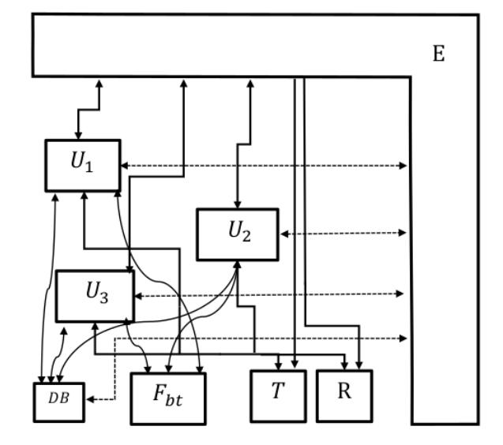
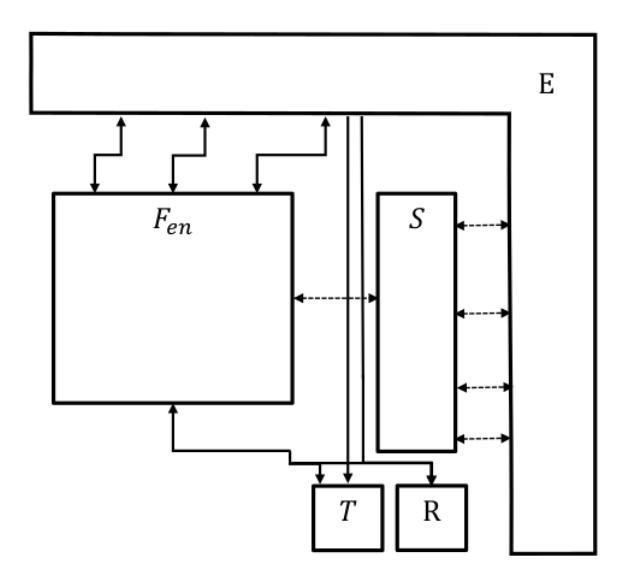

{0}------------------------------------------------

# Privacy-Preserving Automated Exposure Notification

Ran Canetti<sup>∗</sup> Yael Tauman Kalai† Anna Lysyanskaya‡ Ronald L. Rivest§ Adi Shamir¶ Emily Shen<sup>k</sup> Ari Trachtenberg∗∗ Mayank Varia†† Daniel J. Weitzner‡‡ July 9, 2020

#### Abstract

Contact tracing is an essential component of public health efforts to slow the spread of COVID-19 and other infectious diseases. Automating parts of the contact tracing process has the potential to significantly increase its scalability and efficacy, but also raises an array of privacy concerns, including the risk of unwanted identification of infected individuals and clandestine collection of privacy-invasive data about the population at large.

In this paper, we focus on automating the exposure notification part of contact tracing, which notifies people who have been in close proximity to infected people of their potential exposure to the virus. This work is among the first to focus on the privacy aspects of automated exposure notification. We introduce two privacy-preserving exposure notification schemes based on proximity detection. Both systems are decentralized – no central entity has access to sensitive data. The first scheme is simple and highly efficient, and provides strong privacy for non-diagnosed individuals and some privacy for diagnosed individuals. The second scheme provides enhanced privacy guarantees for diagnosed individuals, at some cost to efficiency. We provide formal definitions for automated exposure notification and its security, and we prove the security of our constructions with respect to these definitions.

The order of authors is alphabetical and does not reflect relative contributions.

<sup>∗</sup>Boston University. Email: canetti@bu.edu. Supported by NSF Grants 1414119 and 1801564, the IARPA HECTOR program, the DARPA SIEVE program, and a DARPA/SRI seedling award.

<sup>†</sup>MSR and MIT. Email: yaelism@gmail.com.

<sup>‡</sup>Brown University. Email: anna lysyanskaya@brown.edu.

<sup>§</sup>MIT. Email: rivest@mit.edu. Received support from the Center for Science of Information (CSoI), an NSF Science and Technology Center, under grant agreement CCF-0939370.

<sup>¶</sup>Weizmann Institute of Science. Email: adi.shamir@weizmann.ac.il.

<sup>k</sup>MIT Lincoln Laboratory. Email: emily.shen@ll.mit.edu. This material is based upon work supported by the United States Air Force and Defense Advanced Research Projects Agency under Air Force Contract No. FA8702-15-D-0001. Any opinions, findings, conclusions or recommendations expressed in this material are those of the author(s) and do not necessarily reflect the views of the United States Air Force and Defense Advanced Research Projects Agency.

<sup>∗∗</sup>Boston University. Email: trachten@bu.edu. Supported, in part, by NSF Grant 1563753 and a DARPA/SRI seedling award. ††Boston University. Email: varia@bu.edu. Supported by NSF Grants 1414119, 1718135, 1739000, 1801564, 1915763, and 1931714, the DARPA SIEVE program, and a DARPA/SRI seedling award.

<sup>‡‡</sup>MIT. Email: weitzner@mit.edu.

{1}------------------------------------------------

## Contents

| 1 | Introduction                                                | 3        |  |  |  |
|---|-------------------------------------------------------------|----------|--|--|--|
|   | 1.1<br>Our Contributions<br>                                | 3        |  |  |  |
|   | 1.2<br>Overview of Our Constructions<br>                    | 4        |  |  |  |
|   | 1.3<br>On Our Modeling and Analysis<br>1.4<br>Related Work  | 5<br>6   |  |  |  |
|   | 1.5<br>Organization<br>                                     | 7        |  |  |  |
|   |                                                             |          |  |  |  |
| 2 | Preliminaries                                               | 7        |  |  |  |
| 3 | Automated Exposure Notification                             | 8        |  |  |  |
| 4 | Constructions                                               | 9        |  |  |  |
|   | 4.1<br>Our First Construction: ReBabbler                    | 9        |  |  |  |
|   | 4.2<br>Our Second Construction: CleverParrot<br>            | 9        |  |  |  |
| 5 | Efficiency                                                  | 10       |  |  |  |
|   | 5.1<br>ReBabbler                                            | 10       |  |  |  |
|   | 5.2<br>CleverParrot<br>                                     | 10       |  |  |  |
| 6 | Threat Model and Security Properties                        | 11       |  |  |  |
|   | 6.1<br>Threat Model                                         | 11       |  |  |  |
|   | 6.2<br>Privacy and Integrity Properties<br>                 | 12       |  |  |  |
|   | 6.3<br>Comparison of ReBabbler and CleverParrot Schemes     | 14       |  |  |  |
| 7 | Property-based Modeling and Analysis                        | 15       |  |  |  |
|   | 7.1<br>Notation and Modeling Assumptions                    | 15       |  |  |  |
|   | 7.2<br>Security Definitions                                 | 17       |  |  |  |
|   | 7.3<br>Analysis of ReBabbler<br>                            | 19       |  |  |  |
|   | 7.4<br>Analysis of CleverParrot                             | 19       |  |  |  |
| 8 | UC Modeling and Analysis                                    | 22       |  |  |  |
|   | 8.1<br>Overview of the Formalism<br>                        | 22       |  |  |  |
|   | 8.2<br>The UC Framework: A Quick Reminder                   | 23       |  |  |  |
|   | 8.3<br>The Model of Computation<br>                         | 24       |  |  |  |
|   | 8.4<br>Ideal Exposure Notification<br>                      | 26       |  |  |  |
|   | 8.5<br>Secure Exposure Notification Systems<br>             | 27       |  |  |  |
| 9 | Conclusion<br>34                                            |          |  |  |  |
| A | Contact Tracing and the Unique Challenges of COVID-19<br>40 |          |  |  |  |
| B | Privacy Values and Principles<br>41                         |          |  |  |  |
| C | Taxonomy of ReBabbler-like Schemes<br>42                    |          |  |  |  |
| D | Extensions                                                  | 44       |  |  |  |
|   | D.1<br>Syntax<br>D.2<br>CertifiedCleverParrot Construction  | 44<br>45 |  |  |  |
|   | D.3<br>Analysis                                             | 46       |  |  |  |

{2}------------------------------------------------

## 1 Introduction

At a high level, pandemics spread while each infected person infects an average of R > 1 other people; when R < 1, the pandemic starts dying out. For some spreading modalities, the average value R may be functionally reduced by limiting the duration and number of times when infectious people are in close physical proximity to uninfected people. Unfortunately, for COVID-19, such a simple isolation strategy seems difficult to implement, since people may be infectious two or more days before they start having symptoms. It is thus crucial not only to identify who is infected (by testing) but also to notify their recent close contacts in order to isolate and/or test them too. This is the main goal of contact tracing, an important tool in our fight to stop COVID-19.

Contact tracing consists of four steps: (1) identifying an index case – the infected individual whose contacts will be traced, (2) determining their contacts – those with whom they have recently been in medically significant contact (e.g., within six feet for at least 10–30 minutes [21]), (3) notifying the contacts of their exposure, and (4) following up regularly thereafter with contacts. Manual contact tracing, though essential to a public health response, is time- and labor-intensive, and therefore may not be able to operate at the speed and scale necessary to successfully control a pandemic. It is also prone to challenges of memory failure and deliberate omissions when attempting to reconstruct contacts. Automating exposure notification (steps (2) and (3) above) using personal devices (e.g., smartphones) has the potential to improve the efficiency and completeness of contact tracing (see Appendix A for details).

On the other hand, smartphone-based exposure notification systems may pose a broad range of privacy and security risks, coming from a broad range of potential perpetrators. An immediate and obvious risk is non-voluntary exposure of infected individuals and potential infection events, or otherwise violating their privacy. Indeed, one of the core principles of contact tracing is to protect patient privacy, and hence contacts are notified only that they have been exposed to an infected individual; they are not told the identity of the infected individual [31].

Other, more latent (but no less alarming) risks include the inadvertent creation of a calendestine surveillance system that tracks and learns patterns of interaction and movement of individual in various communities and allows the potential use of the gathered information in ways that are outside what is publicly accepted or desired. This risk exacerbates general smartphone privacy issues (e.g. [29, 38, 70]) and location history in particular [56, 71, 76, 85]. Location history can be mined for a variety of privacy-sensitive features (e.g., medical, political, religious [55, 76]) or used for stalking [67], even when location is only available for contacts of the surveillance target [79].

Indeed, exposure notification systems using smartphone location data have resulted in significant backlash [49], in part due to re-identification and stigmatization of infected individuals [58] and concerns about bulk collection of privacy-invasive data [51]. Privacy experts across the world from academia, industry, and advocacy groups have asserted the need for a privacy-preserving system that avoids location-sensing technology like GPS in favor of proximity-sensing technology based upon unidirectional short-range radio or sound transmissions via Bluetooth, ultrasound, or ultra-wideband (see [5, 26, 35, 41, 47]).

## 1.1 Our Contributions

In this work, we present and analyze exposure notification schemes based on proximity sensing that provide strong privacy and integrity protections. In particular, a salient property of our schemes is that they are decentralized: They do not provide any entity (administrative or otherwise) with sensitive information on individuals. This provides a simple and transparent privacy guarantee against administrative entities going rogue, now or in the future.

Our proximity detection relies on devices transmitting to and receiving from nearby devices using the Bluetooth Low Energy (BLE) protocol in advertising mode, which unidirectionally transmits a link-layer packet consisting of a 6 byte randomized Bluetooth MAC address followed by a payload of up to 31 bytes [84].

Building on top of the basic privacy-first design, we also include flexibility that allows consenting users to identify themselves and assist public health contact tracing functions beyond plain exposure notification. 

{3}------------------------------------------------

It is stressed however that any such identification is subject to explicit consent of the user at the time of identification.

More specifically, we make the following contributions:

- We formalize the notion of an automated exposure notification scheme and provide formal game-based definitions for several security properties. We also provide a universal composability (UC) model that holistically captures a generalization of these properties.
- We present ReBabbler, an exposure notification scheme that is simple, efficient, and provides strong privacy for non-diagnosed users, some privacy for diagnosed users, and strong integrity guarantees for all. We formally prove security of ReBabbler with respect to our game-based definitions as well as our UC framework. (We remark that early versions of this scheme appear in [20, 65].)
- We introduce CleverParrot, an exposure notification scheme that achieves stronger privacy for diagnosed users, at some cost to efficiency. We formally prove security of CleverParrot with respect to our gamebased definitions.<sup>1</sup> Additionally, we provide a candidate extension called CertifiedCleverParrot that detects if malicious users deviate from the protocol in an attempt to re-identify diagnosed users.

## 1.2 Overview of Our Constructions

Both of our constructions take the following high-level approach, whose key elements have also made their way into a number of exposure approaches currently in the literature [1, 5, 22, 24, 75, 78]:

- Each user has a secret seed that rotates with some period (e.g., daily) and continually broadcasts (over BLE) some random values called chirps.
- These chirps are computed as a function of the seed and the current time, and are changed synchronously with BLE MAC address rerandomization.
- Each user locally stores the chirps she hears and the corresponding times.
- Diagnosed users can choose to upload some function of their state to a public database; no other data should ever leave the device.
- All users regularly download the database and locally check whether they were in recent contact with any diagnosed users.

ReBabbler. Our first construction takes an "upload-what-you-sent" approach and is similar to schemes proposed concurrently by DP-3T [78], TCN [75], and UW-PACT [22], and subsequently by Apple and Google [5]. The name ReBabbler refers to the idea that all users "babble" nonsense, and diagnosed users "re-babble" their previous nonsense to the database. In ReBabbler, a user's chirps are computed as a pseudorandom function F of the current time, with the current seed s: chirp = F(s,time). A diagnosed user uploads her seeds from the relevant period (e.g., the past 14 days). To check for contacts with diagnosed individuals, a user checks for matches between the chirps she heard and the chirps broadcast by diagnosed users; that is, the user checks whether chirp == F(s,time) for any of her stored (chirp,time) pairs and any seeds s in the database.

The use of a pseudorandom function for chirp generation ensures that chirps are privacy-preserving for users who do not upload to the database; in particular, a user's chirps across different time periods are not linked. However, for diagnosed users who upload to the database, even honest-but-curious contacts can learn the exact times (and thus perhaps also the location) during which they were in close proximity, potentially allowing contacts to identify diagnosed users. We note that all of the protocols proposed in the literature suffer from this loss of privacy for diagnosed individuals due to the "upload-what-you-sent" design.

<sup>1</sup>We defer its UC analysis to future work.

{4}------------------------------------------------

The use of time in the chirp generation and checking algorithms prevents (delayed) replay attacks. In addition to time, other measurements (e.g., coarse location, background noise level) could be used to prevent some (instantaneous) relay attacks and to reduce false alarms.

**CleverParrot.** Our second construction is designed to provide stronger privacy guarantees for diagnosed users who upload to the database, at a modest computational cost. CleverParrot is a novel variant of an "upload-what-you-heard" approach. The name CleverParrot refers to the idea that a diagnosed user "parrots" or repeats what he previously heard to the database, but in a cleverly disguised form.

CleverParrot works over a multiplicative group G of prime order p in which the Decisional Diffie-Hellman (DDH) problem is assumed to be hard. Each user's secret seed s is a random element in  $\mathbb{Z}_p$ . Each user generates chirps using a specific pseudorandom function  $F(s,\mathsf{time}) = H(\mathsf{time})^s$ , where H is a cryptographic hash function (modeled as a random oracle). Each user stores the pair (chirp, time) for each chirp she heard and the time she heard it. When a user is diagnosed, she chooses a random  $r \leftarrow \mathbb{Z}_p$  for each of her stored (chirp, time) pairs, and uploads  $(H(\mathsf{time})^r, \mathsf{chirp}^r)$  to the infection database. To check for contacts with diagnosed individuals, a user with seed s checks the pairs (u, v) in the database for whether  $v == u^s$ .

The main novelty of CleverParrot is that it ensures privacy for diagnosed individuals: the rerandomization of received chirps before they are uploaded to the database ensures that contacts learn only the number of matching chirps with diagnosed individuals, not the specific chirps and times. At the same time, CleverParrot retains the chirp privacy and integrity properties of ReBabbler, due to the pseudorandom chirp generation and the use of time (and potentially additional measurements).

CleverParrot's chirp contains a single group element in a DDH group, like Apple's Find My protocol [6]. Hence, a CleverParrot chirp can fit into a single BLE advertisement by emulating Apple's design: using the elliptic curve P-224, and encoding the 28 bytes required to represent one group element across the 6-byte randomized MAC address and 22 bytes of the payload.

A subtlety in the CleverParrot scheme is that, even though a user with secret seed s learns only the number of contacts an infected individual had with the chirps corresponding to seed s, a malicious adversary can rotate her seed very frequently (say every minute). By observing which seed receives a notification of contact with a diagnosed person, the adversary can then learn the time of contact (within a minute range). To mitigate this sybil attack, in Appendix D we propose a related protocol called CertifiedCleverParrot that provides stronger privacy for diagnosed users by requiring that all secret seeds be pre-certified by a registration authority. The registration authority is only trusted not to collude with the adversary for the purposes of launching this sybil attack; it is not trusted from any other point of view. Only certified seeds can be used to produce chirps that other people are willing to store and then subsequently upload if they become diagnosed. Our CertifiedCleverParrot construction is not yet practical for use today, since its chirps are too large to fit within a single BLE packet; nevertheless, we believe that it is a promising indicator that a sybil attack can be contained.

Broader privacy context. We believe that any claim to protect privacy should be evaluated not only in terms of provable confidentiality, but also from a broader privacy law and policy perspective. A wide range of privacy issues and principles are raised or influenced by exposure notification, including confidentiality, data minimization, autonomy, freely given consent, purpose specification and usage limitation, data retention limits, and technology sunset (see Appendix B for details). Our decentralized automated exposure notification schemes provide privacy in the sense of confidentiality and data minimization. However, the remaining privacy values cannot be achieved by any technology alone; they also require protections in law and the practice of robust professional standards by public health institutions.

### 1.3 On Our Modeling and Analysis

Providing meaningful and comprehensive analysis of our schemes is a challenging task. First, the schemes are inherently cyber-physical: they combine special properties for BLE wireless communication, anonymous internet communication, cryptographic mechanisms, smartphone OS security. Second, while the functionality

{5}------------------------------------------------

and efficacy lie within the domains of public health and epidemiology and depend on a confluence of physical and biological parameters, the security and privacy threats come from a number of potential constituents using attacks that combine different layers and components within the schemes.

We thus provide two different and complementary analyses of our schemes. The first concentrates on analyzing the "cryptographic core" of the schemes, and abstracts out the rest (e.g., BLE details, the medical components, backend implementation). In the vein of simplicity, this analysis is property-based: we define a number of key properties for decentralized exposure notification schemes, and then we prove that the schemes have these properties. Our property-based definitions and analysis are in Section 7.

The second analysis attempts a broader approach: we first formulate a general framework for capturing the "privacy-preserving automated exposure notification via proximity testing" class of primitives. The framework can be used to analyze and compare the properties of practically any exposure notification and contact tracing schemes, including centralized schemes, schemes based on GPS, and even manual contact tracing.

We formulate this template within the broader universal composability (UC) framework, by way of formulating an "ideal exposure notification functionality." This functionality is parameterized so as to allow expressing privacy and correctness properties in a fine-tuned, yet rigorous and clear way. Furthermore, working within the UC framework guarantees that the asserted properties are composable – i.e., they are preserved even in conjunction with other systems that may be tapping the same sensitive data.

This guarantee is of particular importance in the case of exposure notification and contact tracing, where scheme inherently provide only partial protection, and so providing a meaningful bound on the overall "privacy leakage" is extremely complex. Indeed, having composable and quantitative guarantees on the leakage from individual schemes is an essential first step towards having a meaningful overall bound on the leakage in the case of multiple schemes.

Within this framework, we then express our ReBabbler scheme, together with all of its system components, including the BLE communication, the public database, the infection testing facility, and its methods of interaction with the human user. We then demonstrate that our protocol realizes the ideal exposure notification functionality with appropriate privacy and correctness parameters. Our UC model and analysis are in Section 8.

## 1.4 Related Work

The coronavirus pandemic has led to a rapid emergence of literature pertaining to private exposure notification. ReBabbler has similarities with several concurrent proposals [3, 5, 20, 22, 65, 75, 78] that also measure relative proximity and place limited trust in any central service; we provide a detailed comparison of many of these works in Appendix C. We note that all these works, as well as ReBabbler, offer limited privacy for a diagnosed user who uploads his data to the database, since all his contacts can easily learn the exact time of contact.The Apple/Google API [5] restricts applications from learning the precise time of contact with a diagnosed individual by having the operating system return only the day of the contact. Similarly, the DP-3T scheme [78] hides this information by recording only the day when each chirp was heard originally. However, this information is known to the operating system and hence may be retrievable; our CleverParrot scheme's use of rerandomization cryptographically hides the precise time of contact even from the operating system.

Some works use specialized multi-party computation protocols, including private set intersection and zeroknowledge proofs, in the domain of contact tracing in order to achieve privacy for diagnosed individuals [50,77], or to provide proof of contact with a diagnosed individual [62]. Our CleverParrot scheme achieves these privacy and integrity guarantees using only standardized public key cryptography, by using the simple approach of rerandomization to (cryptographically) hide the precise time of contact.

A few papers discuss inverse sybil attacks [25, 81], which applies to any "upload what you sent" scheme. In this attack, many different devices pretend to be a single user, so that if this user is later authorized to upload to the database, all users who were in proximity to any of the many devices will be notified. We note that our CleverParrot scheme is not susceptible to such attacks since it is an "upload what you heard" (with rerandomization) scheme, and it bounds the number of values that can be included in an upload.

{6}------------------------------------------------

Mestel [54] proposes an enhancement to CleverParrot that requires users to register their secret key with an authority in order to prevent them from changing the key, in an attempt to discover the time of contact with a diagnosed person. In a nutshell, this is done by requiring the server (or the authority) to post-process each uploaded chirp, and rerandomize it separately for each registered user in the system. In Appendix D, our CertifiedCleverParrot scheme provides a different enhancement of CleverParrot that gives a similar benefit without involving the server during the check process, but at the expense of needing a longer chirp message.

A few works focus on preventing relay and replay attacks. In particular, Pietrzak [60] achieves replay resistance using an approach based on message authentication codes, and Parthasarathy et al. [59] prevent relay attacks by adding signatures to the database that can be checked later by receiving devices. Our ReBabbler and CleverParrot schemes follow different techniques to achieve the same goal.

Several works explore the implementation challenges and inherent limitations of automated exposure notification schemes, whether privacy-respecting or not [4,28,39,80]. Other works describe desirable security properties of automated exposure notification and compare existing schemes across them [8,27,48,64,73,74]. Finally, many designs leverage absolute location data like GPS sensors [13,57,61,63] and/or centralize data in a single trusted entity [1,7,10,43]. These efforts have spawned a variety of works that assess the relative benefits and risks of systems with centralized, federated, or decentralized trust [2,11,14,15,23,30,33,44,66,81].

### 1.5 Organization

The rest of this paper is organized as follows. Section 2 introduces notation and cryptographic concepts that we use in this work. Section 3 provides a formal definition for automated exposure notification schemes. Section 4 introduces our two constructions of privacy-preserving automated exposure notification. Section 5 describes the efficiency of our schemes. Section 6 presents the threat model and several desired privacy and integrity guarantees, and compares our two constructions and related work with respect to these properties. Section 7 presents formal game-based security definitions for key privacy and integrity properties and analyzes the security of our two constructions with respect to these definitions. Section 8 contains our universal composability (UC) framework for automated exposure notification schemes and an analysis of our first scheme within this framework. We conclude in Section 9. We defer to the appendix additional descriptions of broader context, other automated exposure notification schemes, and a prototype extension of our second scheme.

## 2 Preliminaries

We begin by defining notation, cryptographic primitives, and assumptions that we will use throughout the paper.

**Notation.** We use  $x \leftarrow X$  to denote that x is sampled uniformly at random from the set X or that x is output by the randomized algorithm X. We use [n] to denote the set  $\{1, \ldots, n\}$  for a positive integer n.

For two distribution ensembles  $\mathcal{X}$  and  $\mathcal{Y}$ , we use  $\mathcal{X} \approx \mathcal{Y}$  to denote that  $\mathcal{X}$  and  $\mathcal{Y}$  are computationally indistinguishable, and  $\mathcal{X} \equiv \mathcal{Y}$  to denote that  $\mathcal{X}$  and  $\mathcal{Y}$  are statistically indistinguishable.

**Definition 2.1** (PRF). F is a pseudorandom function (PRF) if for any probabilistic polynomial time (PPT) adversary A there exists a negligible function  $\mu$  such that for every  $\kappa \in \mathbb{N}$ ,

$$\left| \Pr[\mathcal{A}^{F(s,\cdot)}(1^{\kappa}) = 1] - \Pr[\mathcal{A}^{\mathsf{RO}}(1^{\kappa}) = 1] \right| \le \mu(\kappa)$$

where  $s \leftarrow \{0,1\}^{\kappa}$  and RO is a truly random function.

**Definition 2.2** (DDH Assumption). For every security parameter  $\kappa$ , fix a group G of order p, where p is a  $\kappa$ -bit prime, and fix any generator g of G. The Decisional Diffie-Hellman (DDH) assumption holds if

$$(g, h, g^{\alpha}, h^{\alpha}) \approx (g, h, u, v)$$

where  $h, u, v \leftarrow G$  and  $\alpha \leftarrow \mathbb{Z}_n$ .

{7}------------------------------------------------

## 3 Automated Exposure Notification

In this section, we provide a formal definition of (decentralized) automated exposure notification schemes. Here and in the rest of the paper, we will use the terms "secret key" and "seed" interchangeably.

Definition 3.1. An automated exposure notification scheme consists of a tuple of probabilistic polynomial time (PPT) algorithms (ParamGen,KeyGen, Chirp, Listen,Upload, Merge, Check). Each user maintains a state = (statesent,staterec), initially empty, and the system maintains a database DB, initially empty.

- ParamGen(1<sup>κ</sup> ) takes as input a security parameter 1 <sup>κ</sup> and outputs public parameters pp. (All other algorithms implicitly take pp as input.)
- KeyGen(pp) takes as input public parameters pp and outputs a secret key s.
- Chirp(s, meas) takes as input a secret key s and measurements meas, outputs a string chirp. It also adds to statesent a function of s and meas.
- Listen(chirp, meas) takes as input a chirp and measurements meas, and adds to staterec a function of chirp and meas.
- Upload(state, msg) takes as input state = (statesent,staterec), and optionally a set of (encrypted) messages, and outputs data D.
- Merge(DB, D) takes as input a database DB and data D, and outputs an updated database DB<sup>0</sup> .
- Check(state, DB) takes as input state and a database DB, and outputs an integer k and optionally k messages.

Next we describe the typical operation of these algorithms.

- ParamGen is run once to generate the public parameters used by all participants in the system.
- KeyGen is run by each user to generate an initial secret seed and may be re-run regularly to refresh the seed. Each seed is used for a duration that we call the seed period (e.g., 1 day). Note that in our syntax and our constructions, each seed is generated fresh, but in some constructions seeds are generated in a linked manner, where each seed is a function of the previous seed.
- Chirp is run by each user to generate chirps to broadcast, as a function of the seed and the user's current measurements. The measurements should include the current time (up to some granularity) in order to defeat replay attacks, and can be thought of as including only the current time. However, the measurements could potentially contain additional characteristics that any two users in contact share (e.g., coarse location, background noise) to help thwart relay attacks and/or reduce false alarms. Each chirp is used for a short chirp period equal to the Bluetooth MAC address rotation rate (about 15 minutes).
- Listen is run by every user on the chirps they hear, and stores information about those events, for the maximum report period (e.g., 14 days) for which a diagnosed person might upload information.
- Upload is run by a diagnosed user to generate the data to upload to the public database. This data pertains to the report period (e.g., from 2 days before the onset of symptoms to the current day, up to a maximum of 14 days). The uploaded data may optionally include associated encrypted or plaintext messages to convey to contacts (e.g., whether the diagnosed user was symptomatic). We note that the ability to upload should be authorized by a health authority so that only diagnosed users can upload information to the database; we consider these authorization procedures out of scope for this work.

{8}------------------------------------------------

- Merge is run by the server to merge the data uploaded by a diagnosed user with the existing database. This algorithm may simply append the new data, shuffle the data into the existing database, or use more sophisticated data structures like Bloom filters to provide improved efficiency and/or privacy guarantees.
- Check is run by every user regularly to check for exposures. It returns the number of contacts (measured in chirps) that the user had with diagnosed users who have uploaded to the database, for each seed period (e.g., day) in the past maximum report period (e.g., 14 days), along with any associated messages provided by the diagnosed users.

Many protocols also reveal the precise times and durations of continuous contacts. However, epidemiologists have suggested that it is sufficient to learn the time of contact at the day granularity (according to DP-3T [78], for example). Furthermore, we take the view that it is sufficient to learn the total duration of exposure to an infected person (which can be estimated from the number of contact chirps), without distinguishing between continuous vs. discontinuous durations (e.g., a single 30-minute interval vs. 3 different 10-minute intervals). This is supported by the *independent action hypothesis*, which states that each virion has an equal chance of causing an infection and appears likely to hold for COVID-19 [72]. Therefore, from a privacy perspective, we consider the number of contacts, measured in chirps, to be the desired output of the exposure checking algorithm.

## 4 Constructions

In this section, we present two constructions of automated exposure notification schemes: ReBabbler and CleverParrot. We defer to Appendix D a third construction called CertifiedCleverParrot that provides stronger security guarantees but has larger chirps.

#### 4.1 Our First Construction: ReBabbler

Our first construction is designed for simplicity, so that it can be easily implemented, deployed, and explained to the general public. ReBabbler is defined as follows.

- ParamGen(1<sup>\kappa</sup>) outputs a pseudorandom function  $F: \{0,1\}^{\kappa} \times \{0,1\}^{\kappa} \to \{0,1\}^{\kappa}$ .
- KeyGen(pp) outputs a random seed  $s \leftarrow \{0,1\}^{\kappa}$ . The seed s is added to state<sub>sent</sub>.
- Chirp(s, meas) outputs chirp = F(s, meas).
- Listen(chirp, meas) stores (chirp, meas) in state<sub>rec</sub> for the maximum report period.
- Upload(state) outputs state<sub>sent</sub>. A fresh seed  $s' \leftarrow \mathsf{KeyGen}(1^{\kappa})$  is generated to use going forward.
- Merge(DB, D) takes as input a database DB and data D to be uploaded, appends the data to the database, and outputs an updated database DB' = (DB, D).
- Check(state, DB) outputs the number of pairs  $(\mathsf{chirp}_i, \mathsf{meas}_i) \in \mathsf{state}_{\mathsf{rec}}$  such that there exists a seed  $s' \in \mathsf{DB}$  with  $F(s', \mathsf{meas}_i) = \mathsf{chirp}_i$ .

### 4.2 Our Second Construction: CleverParrot

Our second construction provides enhanced privacy guarantees for diagnosed users, at the expense of being slightly more complex. CleverParrot is defined as follows.

• ParamGen(1<sup> $\kappa$ </sup>) chooses a group G of order p where p is a  $\kappa$ -bit prime, a hash function H that outputs elements in  $G \setminus \{1\}$ , and a positive integer N (to bound the number of chirps each diagnosed user can upload to the public database), and outputs (G, p, H, N).

{9}------------------------------------------------

- KeyGen(pp) outputs a random seed  $s \leftarrow \mathbb{Z}_p$ . The seed s is added to state<sub>sent</sub>.
- Chirp(s, meas) computes h = H(meas) and outputs  $c = h^s$ .
- Listen(c, meas) stores the pair (c, meas) in state<sub>rec</sub> for the maximum report period.
- Upload(state): For each  $(c_i, \mathsf{meas}_i) \in \mathsf{state}_{\mathsf{rec}}$ , compute  $h_i = H(\mathsf{meas}_i)$ , choose a random  $\alpha_i \leftarrow \mathbb{Z}_p$  and compute  $(u_i = h_i^{\alpha_i}, v_i = c_i^{\alpha_i})$ . Output the set of all of these rerandomized pairs, in a random order. The user may optionally include with each pair  $(u_i, v_i)$  a ciphertext  $\mathsf{CT}_i$  encrypting a message  $\mathsf{msg}_i$  using El Gamal encryption with the public key  $(u_i, v_i)$ .
- Merge(DB, D) takes as input a database DB and a set of tuples D, and outputs an updated database DB' = (DB, D), unless |D| > N, in which case it outputs DB.
- Check(state, DB) outputs the number of tuples  $(u_i, v_i, \mathsf{CT}_i) \in \mathsf{DB}$  such that  $u_i^s = v_i$  for each  $s \in \mathsf{state}_{\mathsf{sent}}$ . For each such tuple, the user can use his secret key s to decrypt any non-empty ciphertext  $\mathsf{CT}_i$  to obtain a corresponding message  $\mathsf{msg}_i$ .

We propose refreshing the secret seed once per day, so that users can determine the day of their contacts with diagnosed individuals but not the precise time. We use the system parameter N to bound the amount of damage that a malicious user can cause by uploading fabricated data, as each uploaded tuple can cause at most one user to be notified. N should be chosen to be greater than the number of chirps reasonably expected to be heard by an honest user.

## 5 Efficiency

In this section, we analyze the efficiency of our constructions. We assume that on average there are 1000 new cases per day in a given area, the average report period for which a diagnosed user uploads information is 10 days, and each user has contact with 50 different users per 15-minute chirp period for 16 waking hours per day. We note that if the number of new cases per day in a given area becomes large (e.g., more than 1000), stricter social distancing and quarantine measures will likely be put in place, reducing the average number of chirps heard per day.

### 5.1 ReBabbler

ReBabbler is extremely efficient. We can instantiate the pseudorandom function H using AES-128. Chirps contain 16 bytes and fit comfortably within a BLE advertisement. AES-128 encryption is very fast; it can be run on an iPhone X at a rate of 6 GB/sec [83].

Chirp generation consists of a single AES call. Listening to chirps requires a user to store the 16-byte chirp and the time (which can be represented with 4 bytes) for each heard chirp, requiring about 900 KB of storage.

A diagnosed user must upload one seed per day of the report period, along with the day each seed was used (which can be represented with 2 bytes), or 180 bytes of data. To check for exposures, each user downloads the database containing 180 KB each day. The app should be implemented to prefer downloading when the phone is connected to WiFi.

The checking algorithm consists of checking 640K chirps per day. Checking a chirp consists of an AES-128 call (and an equality check). Given the efficiency of AES-128, the checking algorithm should take well under a second per day.

## 5.2 CleverParrot

We propose instantiating CleverParrot using the elliptic curve group P-224. Chirps contain a single 28-byte group element. Each chirp fits in a single BLE advertisement, using the approach taken by Apple's Find My

{10}------------------------------------------------

protocol [6], where the group element is encoded across the 6-byte randomized MAC address and 22 bytes of the payload. (While BLE payloads can contain up to 31 bytes, several bytes are used for header information, leaving less than 28 bytes for actual data.)

To estimate the performance of P-224 operations, we use performance numbers for P-256, as optimized implementations are more readily available for P-256. We would expect optimized P-224 to perform at least as well, as it is a similar prime curve with a smaller key size. On an iPhone X using a single thread, P-256 key generation takes 0.022 ms [34].

Chirp generation consists of a single public key generation (and a hash call). Listening to chirps requires a user to store a single 28-byte group element and the time for each heard chirp, requiring 1.4 MB of storage.

A diagnosed user uploads two group elements per received chirp, for a total of 1.8 MB. To check for exposures, each user downloads the database containing 1.8 GB each day. The app should ensure that these downloads are performed when the phone is connected to WiFi. Note that the entire daily database does not need to be downloaded and stored at once; it can be downloaded, stored, checked (and then deleted) in smaller batches.

The checking algorithm consists of checking 32M pairs each day. Checking a pair (u, v) consists of computing u s , which corresponds to a public key generation (and checking equality with v). At 0.022 ms per key generation, the checking algorithm would take about 12 minutes per day, or an average of about 30 seconds per hour.

## 6 Threat Model and Security Properties

In this section, we outline the threat model, describe several desired privacy and integrity properties for exposure notification schemes, and compare ReBabbler (and ReBabbler-like schemes) and CleverParrot on these properties.

## 6.1 Threat Model

We first outline the threats we address in this work, as well as threats that are out of scope as they can be resolved through other means or are inherent to any approach in this space. We seek to protect the privacy and integrity of the system against adversaries that are curious and potentially malicious.

Adversary goals. We first consider privacy. For users who chirp but have not uploaded to the database (because they have not been diagnosed positive or they choose not to upload), the adversary may wish to learn information at users' locations, activities, or interactions, or any information beyond what is available without the use of the exposure notification system. Note that BLE chirps are inevitably linkable during each 15-minute MAC address period; we wish to prevent chirps from being linkable across these periods.

For users who have been diagnosed and have uploaded to the database, the adversary may wish to learn the identities of the diagnosed users, or any other information beyond what is inherently revealed by the desired functionality of the exposure notification service. Note that merely notifying a contact that she has been in proximity to an infected person on a given day inherently reveals information to her; for example, if she was only in proximity to one other person that day, she can identify the diagnosed person.

In terms of integrity, an adversary may wish to cause users who were not in contact with a diagnosed person to receive false notifications, or cause users who were in contact not to receive a notification.

Threats addressed. The adversary may set up listening devices in arbitrary locations. For example, an adversary might set up a Bluetooth listener in a public place along with surveillance cameras in an attempt to identify diagnosed individuals. We seek to ensure that such an adversary learns only what is revealed by the desired functionality of the exposure notification service (i.e., the number of contacts (measured in chirps) each day with a diagnosed individual), and what can inherently be inferred from it (potentially by combining with auxiliary information from outside the exposure notification system).

{11}------------------------------------------------

The adversary may attempt replay attacks, where it rebroadcasts chirps that were sent or received at an earlier time. The adversary may also attempt relay attacks, where it relays or rebroadcasts chirps in real time to a different location (we address this threat partially but not completely, by allowing measurements other than time to be incorporated in the chirping, listening, and checking algorithms). The adversary may also broadcast maliciously generated chirps, e.g., chirps generated using time or other measurements that are not the current measurements of the device.

The adversary may corrupt many users or devices; such an adversary should not be able to learn more than the combination of what each corrupted device can inherently learn from the desired functionality of the system.

We also consider an adversary that may temporarily learn the private state of a user's exposure notification application. We do not address an adversary accessing data stored by other applications on the phone; this type of threat is a problem regardless of our approach, as modern smartphones maintain access to copious amounts of private information about their owners that could allow identification of diagnosed users or location tracking of general users. We also consider out of scope an adversary that modifies the exposure notification application on a target user's phone, for example to display false notifications to the user.

Threats not addressed. The database is public and the database administrator is assumed to be honest but curious. In particular, the database administrator is assumed not to modify or deny access to entries in the database. We note that there are natural mechanisms for distributing databases, including redundancy, dispersal, and storage in a public ledger, that can help mitigate the risks of a malicious database administrator.

User uploads are assumed to be authenticated so that users can only upload information to the database for their infectious period if and only if they have been diagnosed positive. A natural approach is to trust medical professionals to certify diagnoses and provide authorization tokens to allow diagnosed users to upload, or to upload to the database themselves. The details of the authorization procedures are out of scope for this work.

In our analysis we assume anonymity of short-range transmissions. We do not consider side-channel attacks such as using received signal strength indicator (RSSI) and transmit power levels to correlate different chirps from the same user, triangulate the location of the chirper using multiple receiver antennae, etc. We note that in fact it may be important to the functionality of the system to use RSSI and transmit power to estimate distance, and our schemes allow this capability. However, we do not consider such physical characteristics in our analysis, due to the complexity of modeling everything that could be revealed by them.

In our main constructions, we do not consider an adversary that maliciously refreshes its seed more frequently than prescribed by the protocol; this can be thought of as a type of sybil attack. In CleverParrot, an adversary who continually runs this attack can learn the time of any contact with a diagnosed person to a finer granularity than the prescribed seed period (e.g., 1 day). For example, if the adversary changes her seed every hour, then she will learn the hour during which a contact occurs. In Appendix D, we show a prototype construction called CertifiedCleverParrot that mitigates this attack but whose chirps are too large to fit within a single BLE packet.

Physical attacks like stalking or following an individual are out of scope; an adversary that can follow a person around all day or install a hidden listening device on the person will be able to violate privacy regardless of our approach.

## 6.2 Privacy and Integrity Properties

We now describe (informally) several desirable privacy and integrity properties for private exposure notification schemes. We will provide formal definitions for selected properties in Section 7.2; the UC model in Appendix 8 holistically captures all of the desired properties. We consider two notional types of people: an uploader Bob who is diagnosed with the disease and uploads data to the database, and a generic user Alice who may or may not be an uploader herself, and may or may not have come into close proximity with Bob. We call Alice a contact if she has come into close proximity with any uploader.

{12}------------------------------------------------

|                  |                            | DP-3T [78],<br>UW-PACT [22] | ReBabbler,<br>A/G [5], TCN [75] | CleverParrot |
|------------------|----------------------------|-----------------------------|---------------------------------|--------------|
|                  | Contact time privacy       | 0                           | 0                               | •            |
|                  | Diagnosis listener privacy | 0                           | 0                               | •            |
| Uploader privacy | Upload unlinkability       | 0                           | •                               | •            |
|                  | Redactability              | 0                           | •                               | •            |
|                  | Contact volume privacy     | •                           | •                               | •            |
|                  | Chirp privacy              | •                           | •                               | •            |
|                  | Diagnosis forward secrecy  | •                           | •                               | •            |
| General privacy  | Diagnosis backward secrecy | 0                           | •                               | •            |
|                  | Chirp forward secrecy      | •                           | •                               | •            |
|                  | Chirp backward secrecy     | 0                           | •                               | •            |
|                  | Replay prevention          | •                           | •                               | •            |
| Intogrity        | Upload integrity           | •                           | •                               | •            |
| Integrity        | Mass notification limits   | 0                           | 0                               | •            |
|                  | Contact provability        | 0                           | 0                               | •            |
| Efficiency       | Upload compactness         | •                           | •                               | 0            |
| Emclency         | Checking efficiency        | •                           | •                               | 0            |

Table 1: Comparison of ReBabbler-like schemes with linked seeds (DP-3T [78], UW-PACT [22]), ReBabbler and similar schemes with fresh seeds (Apple/Google [5], TCN [75]), and CleverParrot.

**Uploader privacy.** For uploaders, we consider the following privacy properties. Contact time privacy says that a contact Alice does not learn the precise time of her contacts with Bob. Diagnosis listener privacy guarantees that an adversary who passively listens (but does not transmit) cannot learn whether a passerby becomes diagnosed. Looking ahead, we will formalize a notion called *upload privacy*, which is a stronger definition that encompasses contact time privacy and diagnosis listener privacy as special cases, in Definition 7.2.

Upload unlinkability says that Bob's uploaded chirps cannot be inherently linked as being associated with the same diagnosed person. (This can thwart linking Bob's locations or contacts if the components of his upload are batched and shuffled with those of many other diagnosed individuals.) Redactability allows Bob to omit portions of the report period if he chooses. Contact volume privacy says that the exposure database hides the number of interactions Bob had during the report period.

**General privacy.** We consider the following privacy properties for a general user Alice. *Chirp privacy* says that a non-uploader Alice's chirps do not reveal that they came from the same person. We will formalize this property in Definition 7.1.

We also consider the ramifications of the adversary learning the private state of the exposure notification service on any user Alice's device at a particular time. Diagnosis forward secrecy and backward secrecy state that an adversary cannot learn whether Alice was an uploader at any past or future time, respectively. Chirp forward secrecy and backward secrecy state that an adversary cannot learn the values Alice chirped sufficiently far in the past or future, respectively.

Integrity. Upload integrity guarantees that Bob's uploaded data cannot erroneously cause notifications for anyone who was not in proximity to Bob. We will formalize a version of this notion in Definition 7.4. A requirement for upload integrity is replay prevention, which says that a malicious Alice who performs a delayed replay of Bob's chirps cannot cause anyone who was not in proximity to Bob to be erroneously notified. Mass notification limits says that there is a known bound on the number of people who can be notified as a result of Bob's uploaded data. Contact provability says that a contact Alice, if she wishes, can prove (cryptographically) that she received an exposure notification, for example in order to get priority to be tested.

{13}------------------------------------------------

Efficiency. We also consider the following efficiency properties. Upload compactness refers to whether the data uploaded by diagnosed users (and downloaded by all users) is a compact representation of the chirps being reported. Checking efficiency refers to the efficiency of the exposure checking algorithm, which depends on the number of chirp re-generations required and whether they are symmetric-key or public-key operations.

## 6.3 Comparison of ReBabbler and CleverParrot Schemes

We now compare ReBabbler, CleverParrot, and related works on the properties described above. Specifically, we consider the private exposure notification schemes proposed by Apple and Google [5], DP-3T [78], TCN [75], and UW-PACT [22]. We call these "upload-what-you-sent" schemes "ReBabbler-like". The most significant difference between these protocols is whether they sample fresh random seeds each seed period for stronger privacy (as ReBabbler, Apple/Google, and TCN do) or pseudorandomly link seeds across periods for improved efficiency (as DP-3T and UW-PACT do). Note that DP-3T has three protocol variants, all of which are ReBabbler-like; we consider the variant that uses linked seeds. For Apple/Google, we focus on the cryptographic protocol rather than the API built on top of the protocol. We describe all of these ReBabbler-like constructions in more detail in Appendix C.

Table 1 summarizes the differences between ReBabbler-like schemes and CleverParrot on the privacy, integrity, and efficiency properties described above. We now describe these differences.

Uploader privacy. ReBabbler-like schemes generally do not protect contact time privacy or diagnosis listener privacy because, by construction, users learn which chirps they heard match the database and thus learn the time of the contact. We note that DP-3T provides some contact time privacy up to the granularity of a seed period (1 day), by having the sender Bob broadcast the chirps generated from his daily seed in a random order throughout the day, and having the receiver Alice store only the day she received each chirp, not the precise time. However, this technique relies on Alice being fully honest, not just semi-honest, to store only the day of the contact. It also weakens the replay attack protection, as the shuffling means that replay attacks are detected only when they occur across different days, not within the same day. In the Apple/Google system, the API hides from the application the precise time of contact, but the operating system learns the contact time in the process of checking for exposures.

Our CleverParrot scheme provides both contact time privacy and diagnosis listener privacy because it reveals to an Alice (who has a single seed per day) only the number of chirps that matched within a given day, not which chirps matched. We note that a malicious Alice could change her secret seed more frequently than once per day and thus learn the time of her contact at a finer granularity; the upload privacy guarantee of CleverParrot only says that Alice will learn only the number of contacts within the period of each of her seeds. In Appendix D, we propose an extension of CleverParrot that addresses this threat.

We note that the way CleverParrot achieves contact time privacy is compatible with allowing the health authority to learn a more precise time of contact, if necessary. This can be done if the contact Alice chooses to share with the health authority which rerandomized pairs correspond to her sent chirps, and if the uploader Bob chooses to share with the health authority the times he heard the chirps corresponding to those pairs.

ReBabbler-like schemes with linked seeds are fully linkable and provide no redactability within the report period, while ReBabbler-like schemes with fresh seeds are linkable and redactable at the seed period granularity. Our CleverParrot scheme provides full unlinkability and redactability at the individual chirp granularity.

ReBabbler-like schemes provide contact volume privacy because the size of an upload is the number of independent seeds used to generate chirps during the report period, while our CleverParrot scheme uses padding to hide the actual number of chirps Bob received during the report period; however, the size to pad to will need to be determined heuristically and will not necessarily work for people with a very large number of interactions.

General privacy. ReBabbler-like schemes provide diagnosis forward secrecy against non-contacts, if Bob replaces his seed history with fresh random seeds after uploading. They do not provide diagnosis forward 

{14}------------------------------------------------

secrecy against contacts, because if Bob deletes and replaces his seed history after uploading, an adversary who was a contact of Bob will be able to detect that none of her received chirps match Bob's seeds. Our CleverParrot scheme provides diagnosis forward secrecy because Bob's uploaded pairs are rerandomized versions of his stored received chirps.

ReBabbler-like schemes with linked seeds do not achieve diagnosis backward secrecy because the seed at a given time determines all future seeds, while ReBabbler-like schemes with fresh seeds achieve diagnosis backward secrecy for times t <sup>0</sup> > t + r, where t is the time of compromise and r is the maximum report period, since seeds are stored locally for the maximum report period. Our CleverParrot scheme achieves diagnosis backward secrecy immediately, i.e., for any time t <sup>0</sup> > t, because Bob's uploaded pairs are rerandomized versions of his stored received chirps.

ReBabbler-like schemes provide chirp forward secrecy for t <sup>0</sup> < t − r, where r is the maximum report period, since past seeds that are no longer stored cannot be derived from future seeds (because seeds are either chained forward with a one-way function or generated fresh). ReBabbler-like schemes with fresh seeds provide chirp backward secrecy for t <sup>0</sup> > t + s, where s is the seed period, while ReBabbler-like schemes with linked seeds do not provide chirp backward secrecy for the same reason they do not provide diagnosis backward secrecy: the seed at time t determines all future seeds. Our CleverParrot scheme provides chirp forward secrecy and backward secrecy given that secret keys are refreshed periodically (e.g., daily); at the same time, refreshing the secret keys more frequently reduces the level of contact time privacy.

Integrity. All of the schemes we consider provide replay prevention by incorporating the time into the chirp generation, with the exception of DP-3T, which only provides replay prevention across seed periods (days), not within a seed period, because of its technique of randomly permuting the chirps generated for a given seed period to hide the exact time of contact.

For ReBabbler-like schemes, Alice cannot prove that she was a contact of a diagnosed person, because anyone can inspect the public database and claim that they heard one of the uploaded chirps. For our CleverParrot scheme, Alice can prove that she was a contact, since (only) she can provide (or prove knowledge of) the discrete log of her sent chirps included in the database.

Efficiency The enhanced privacy and integrity guarantees of CleverParrot come at some efficiency cost, as discussed in Section 5. While uploads in ReBabbler-like schemes are compact, containing only 1 seed (for schemes with linked seeds) or 1 seed per seed period (for ReBabbler and other schemes with fresh seeds), uploads in CleverParrot contain 1 pair of group elements per received chirp. To check for exposure to a given diagnosed user, ReBabbler-like schemes re-generate a chirp for each chirp period (e.g., 15 minutes) within the report period, using symmetric-key operations, while CleverParrot essentially re-generates a chirp for each chirp received by the diagnosed user during the report period, using public-key operations.

# 7 Property-based Modeling and Analysis

In this section, we provide formal definitions for several privacy and integrity properties and then prove security of ReBabbler and CleverParrot with respect to these definitions.

## 7.1 Notation and Modeling Assumptions

Throughout this section, we use the following notation. We denote the set of users by [n] = {1, . . . , n}. For simplicity, we assume that all users chirp at the same times that they listen, and that all users chirp/listen at T distinct (discretized) times during the period under consideration in the security games. We make this assumption only for the sake of simplifying notation; in reality, users may chirp more often than they listen or at different rates from each other. We do not assume that users chirp/listen at all of the same times as each other.

Given n and T, we define the following notation.

{15}------------------------------------------------

- For any i ∈ [n], we use s<sup>i</sup> , {measi,j}j∈[T] , and {ci,j = Chirp(s<sup>i</sup> , measi,j )}j∈[T] to denote user i's secret key, measurements, and chirps, respectively.
- We define a predicate Heard(c, i, meas) that outputs a bit indicating whether user i heard chirp c while having measurements meas. If Heard(c, i, meas) = 1, user i runs Listen(c, meas).
- We define NumHeard(i, i<sup>0</sup> ) to be the number of chirps user i heard from user i 0 :

NumHeard
$$(i, i') = |\{(j, j') \in [T]^2 : \text{Heard}(c_{i', j'}, i, \text{meas}_{i, j}) = 1\}|$$

• We define NumContact(i, i<sup>0</sup> ) to be the number of chirps for which user i was in contact with user i 0 , meaning one user heard the other user's chirp while the two users had the same measurements. This definition is construction-specific. For ReBabbler:

$$\mathsf{NumContact}(i,i') = \left| \{ (j,j') \in [T]^2 : \mathsf{Heard}(c_{i',j'},i,\mathsf{meas}_{i,j}) = 1 \quad \land \quad (\mathsf{meas}_{i,j} = \mathsf{meas}_{i',j'}) \} \right|$$

For CleverParrot:

$$\mathsf{NumContact}(i,i') = \left| \{ (j,j') \in [T]^2 : \mathsf{Heard}(c_{i,j},i',\mathsf{meas}_{i',j'}) = 1 \quad \land \quad (\mathsf{meas}_{i,j} = \mathsf{meas}_{i',j'}) \} \right|$$

The Heard predicate described above is used to model the BLE technology and other unpredictable physical phenomenology that determine which users hear (i.e., runs Listen on) which chirps. Heard is not necessarily symmetric; for example, user i can hear chirps of user i 0 even if user i <sup>0</sup> does not hear any of the chirps of user i. This may indeed happen when using BLE technology, as one device may have a larger, more sensitive antenna than the other.

The definition of contact given above differs for ReBabbler and CleverParrot, because ReBabbler notifies a contact Alice of the number of times (and the times themselves) when she heard a diagnosed user Bob's chirps, while CleverParrot notifies Alice of the number of times Bob heard her chirps. We assume there is no functional advantage to defining contact in terms of one direction or the other, as there is no correlation between the stronger receiver antennae and likelihood of becoming diagnosed positive.

The concept of contact described above requires that the two users' measurements are the same, since we assume that users who are in physical proximity have the same measurements. In particular, if measurements include only time, this means that we assume that for users in physical proximity, a receiver hears the chirp at the same time as when the sender broadcast it. If instead the receiver hears the chirp at a different time from when the sender transmitted it, then the chirp is the result of a replay attack and does not correspond to an actual contact between the original sender and receiver. If measurements include any additional characteristics that can be assumed to be equal or close for any two users in physical proximity (e.g., coarse location), then the definition of contact additionally accounts for some relay attacks (those that in real-time relay chirps that were generated with one set of measurements to another location with a different set of measurements).

We note that it is more realistic to assume that users who are in contact have measurements that are close, as opposed to identical (up to some granularity). In particular, edge cases may occur, where for example the receiver heard the chirp at approximately (but not exactly) the same time it was sent, and the discretization puts the sent and receive times into different bins.

One way to address this is by enumerating the possible close measurements. For example, in the ReBabbler scheme, each user Alice can keep a list of all the measurements that are close to her own measurements (e.g., the time interval before or after the one she recorded), and when a user Bob is diagnosed and uploads his seed s, Alice can check for contacts by checking if any of the chirps she heard matches this seed, with any measurements from the set of close measurements for that chirp. In CleverParrot, this can be achieved by having each user (Bob) record each chirp he hears with respect to all measurements that are close to his own. If Bob is diagnosed he rerandomizes and uploads all of these chirps. If Bob heard Chirp(sA, measA) sent by Alice when his measurements were measB, and if meas<sup>A</sup> is close to measB, then since he recorded the chirp with respect to all measurements that are close to his own, he will also record it with respect to measurement measA, which Alice will recognize when uploaded.

{16}------------------------------------------------

In our definitions, users do not refresh their secret seeds; each user has a single seed for the duration of the game. This is for ease of presentation only; the guarantees we prove indeed apply when the schemes are instantiated with regular seed refreshes.

## 7.2 Security Definitions

We next define notions of privacy and integrity, starting with chirp privacy. Intuitively, we say an automated exposure notification scheme has chirp privacy if a user's chirps do not reveal any private information. In particular, a user's chirps from different times cannot be linked. (Recall that our threat model excludes side-channel attacks, such as correlating RSSI values of chirps.)

Definition 7.1 (Chirp Privacy). An automated exposure notification scheme satisfies chirp privacy if, for any PPT adversary A, it holds that

```
{pp, measj , meas0
                   j
                    , Chirp(s, measj )}j∈[T] ≈ {pp, measj , meas0
                                                                     j
                                                                       , Chirp(sj , meas0
                                                                                         j
                                                                                          )}j∈[T]
                                                                                                  ,
```

where pp ← ParamGen(1<sup>κ</sup> ), s, s1, . . . , s<sup>T</sup> ← KeyGen(pp), {measj}j∈[T] and {meas<sup>0</sup> j }j∈[T] are output by A(pp), and all elements of {measj}j∈[T] are distinct.

We also consider the notion of privacy for an infected user Bob, who uploads his state to the database. To this end, we let the adversary chooses the function Heard and all the measurements {measi,j}i∈[n],j∈[T] for all users. In addition, the adversary chooses a subset S ⊆ [n] of the parties to corrupt, and for each corrupted party i ∈ S he chooses a secret key s<sup>i</sup> . Then the privacy guarantee is that for any user Bob that is not corrupted, the only information the adversary learns from Bob's upload is the number of contacts each corrupted user i ∈ S had with Bob.

We note that this definition encompasses the earlier informal descriptions of contact time privacy and diagnosis listener privacy from Section 6.2, but is a broader and stronger notion.

Definition 7.2 (Upload Privacy). An automated exposure notification scheme satisfies upload privacy if all PPT adversaries A have only negligible advantage in winning the following game between A and a challenger:

- 1. A takes as input pp ← ParamGen(1<sup>κ</sup> ) and outputs a set S ⊆ [n] of corrupted users, along with measurements {measi,j}i∈[n]\S,j∈[T] for the honest users.
- 2. The challenger generates secret keys s<sup>i</sup> ← KeyGen(pp) for all honest users i ∈ [n] \ S. It then generates and gives A all chirps {ci,j}i∈[n]\S,j∈[T] of the honest users, where ci,j = Chirp(s<sup>i</sup> , measi,j ).
- 3. A outputs secret keys {si}i∈<sup>S</sup> and measurements {measi,j}i∈S,j∈[T] for the corrupted users. Let ci,j = Chirp(s<sup>i</sup> , measi,j ) for all i ∈ S, j ∈ [T]. A also outputs a polynomial-size circuit Heard and two honest users i0, i<sup>1</sup> ∈ [n].
- 4. The challenger checks that the following conditions hold:
  - (a) Σi∈[n]NumHeard(i0, i) = Σi∈[n]NumHeard(i1, i)
  - (b) NumContact(i, i0) = NumContact(i, i1) for all corrupted users i ∈ S

If either of the above conditions does not hold, the challenger outputs nothing to A. Else, the challenger chooses a random bit b ← {0, 1} and computes state<sup>i</sup><sup>b</sup> by running, for all j ∈ [T]:

- Chirp(s<sup>i</sup><sup>b</sup> , meas<sup>i</sup>b,j )
- Listen(c, meas<sup>i</sup>b,j ) for all c ∈ {ci,j<sup>0</sup>}i∈[n],j0∈[T] such that Heard(c, i, meas<sup>i</sup>b,j ) = 1

The challenger gives Upload(state<sup>i</sup><sup>b</sup> ) to A.

5. A outputs a guess b 0 . 

{17}------------------------------------------------

A wins if b <sup>0</sup> = b, and its winning advantage is |Pr[b <sup>0</sup> = b] − 1 2 |.

Remark 7.3. Note that the upload privacy definition does not hide the number of chirps an infected user heard; this is captured in condition 4a in the security game. One can use standard padding techniques to hide the exact number of contacts.

Note also that upload privacy does not prevent a malicious adversary from refreshing the secret seed more frequently than prescribed by the protocol. The upload privacy guarantee holds on a per-seed basis, so the adversary will learn no more than the number of contacts with diagnosed users per seed period.

We next define the notion of integrity. In our definition we assume that the user who uploads his state is honest. Intuitively, we say that an automated exposure notification scheme has integrity if for any (honest) infected user i<sup>0</sup> with arbitrary measurements, when user i<sup>0</sup> uploads his data to the database, it holds that for any (honest) user i<sup>1</sup> with arbitrary measurements, the number of new contacts that i<sup>1</sup> is notified about by checking the updated database is exactly the number of contacts the users i<sup>0</sup> and i<sup>1</sup> had. This holds even if all the other users in the scheme are malicious, and are trying to replay and relay the chirps between users i<sup>0</sup> and i1.

Definition 7.4 (Integrity). An automated exposure notification scheme has integrity if all PPT adversaries A have only negligible advantage in winning the following game between A and a challenger:

- 1. A takes as input pp ← ParamGen(1<sup>κ</sup> ) and outputs two honest users i0, i<sup>1</sup> ∈ [n] and their measurements {measib,j}b∈{0,1},j∈[T] .
- 2. The challenger generates secret keys si<sup>0</sup> , si<sup>1</sup> ← KeyGen(pp) for the honest users. It then generates and gives A the chirps {cib,j}b∈{0,1},j∈[T] , where cib,j = Chirp(si<sup>b</sup> , measib,j ).
- 3. A outputs a set of additional arbitrary chirps {ck}k∈[M] that is disjoint from the set of honest chirps {cib,j}b∈{0,1},j∈[T] . A also outputs a database DB and a polynomial-size circuit Heard.
- 4. The challenger computes statei<sup>b</sup> for each b ∈ {0, 1} by running, for all j ∈ [T]:
  - Chirp(si<sup>b</sup> , measib,j )
  - Listen(c, measib,j ) for all c ∈ {ci1−<sup>b</sup> , j<sup>0</sup>}<sup>j</sup> <sup>0</sup>∈[T] ∪ {ck}k∈[M] such that Heard(c, ib, measib,j ) = 1.

A wins the game if

Check(statei<sup>1</sup> , Merge(DB,Upload(statei<sup>0</sup> ))) − Check(statei<sup>1</sup> , DB) 6= NumContact(i1, i0).

Remark 7.5. In the integrity definition, we assume that the user who uploads their state to the database is honest. One can also consider a stronger threat model, where the uploader is malicious. In our ReBabbler and CleverParrot constructions, a malicious user that uploads information to the database may compromise the integrity of the system, but only in limited ways.

In ReBabbler, for a given seed period a malicious user can upload whichever seed he wishes, but he is limited to choosing a single seed (which corresponds to a single user). Moreover, if F is pre-image resistant when viewed as a one-input function F(·, t), a malicious user cannot upload a seed corresponding to a chirp he heard (rather than sent) that will cause false notifications to the contacts of the original chirper. Note that this property can be achieved simply by having the chirp function F(s, t) be defined as F 0 (H(s), t), where F 0 is a pseudorandom function and H is a pre-image resistant hash function. Thus, an honest user is guaranteed that his chirps are not falsely associated with an infected user. However, we do not prevent a malicious infected user, whose goal is to create many false alarms, from placing repeaters throughout a large area, and chirping honest chirps corresponding to his secret seed. Such a malicious infected user can create an unbounded number of false alarms.

In CleverParrot, a malicious adversary can upload data that creates a larger number of alarms for his contacts than the true number of chirp interactions, since he can rerandomize chirps an arbitrary number of times. However, he can cause notifications for those users from whom he has heard at least one chirp, and the number of false alarms he can create is bounded by the system limit N on the number of chirps that can be uploaded; each uploaded tuple can alarm at most one user.

{18}------------------------------------------------

## 7.3 Analysis of ReBabbler

In this section we analyze the security of ReBabbler. Specifically, we prove that it satisfies chirp privacy and integrity. It does not satisfy upload privacy, since a user can learn from the database her measurements during the contact with the infected user.

Theorem 7.6. ReBabbler satisfies chirp privacy (Definition 7.1), assuming F is a PRF.

Proof of Theorem 7.6 (Chirp Privacy of ReBabbler). Fix any adversary that on input pp ← ParamGen(1<sup>κ</sup> ) outputs two sets of measurements {measj}j∈[T] and {meas<sup>0</sup> j }j∈[T] , where all elements of {measj}j∈[T] are distinct. We need to prove that

$$\{\mathsf{pp},\mathsf{meas}_j,\mathsf{Chirp}(s,\mathsf{meas}_j)\}_{j\in[T]}\approx\{\mathsf{pp},\mathsf{meas}_j,\mathsf{meas}_j',\mathsf{Chirp}(s_j,\mathsf{meas}_j')\}_{j\in[T]},$$

where s, s1, . . . , s<sup>T</sup> ← KeyGen(pp).

By the definition of the ReBabbler Chirp algorithm and because the public parameters are fixed, it suffices to prove that

$$\{\mathsf{meas}_j, \mathsf{meas}_j', F(s, \mathsf{meas}_j)\}_{j \in [T]} \approx \{\mathsf{meas}_j, \mathsf{meas}_j', F(s_j, \mathsf{meas}_j')\}_{j \in [T]}$$

for randomly and independently chosen s, s1, . . . , s<sup>T</sup> ← {0, 1} <sup>κ</sup> unknown to the adversary. This follows immediately from the assumption that F is a PRF, together with the assumption that all the measurements in {measj}j∈[T] are distinct.

Theorem 7.7. ReBabbler satisfies integrity (Definition 7.4), assuming F is a PRF.

Proof of Theorem 7.7 (Integrity of ReBabbler). Fix any adversary that plays the integrity game from Definition 7.4. We need to prove that with overwhelming probability

$$\mathsf{Check}(\mathsf{state}_{i_1},\mathsf{Merge}(\mathsf{DB},\mathsf{Upload}(\mathsf{state}_{i_0}))) - \mathsf{Check}(\mathsf{state}_{i_1},\mathsf{DB}) = \mathsf{NumContact}(i_1,i_0).$$

By the definition of ReBabbler and the integrity game, the left-hand side of this equation equals

```
Check(statei1
               , si0
                   )
= |{(chirp, meas) ∈ statei1,rec : F(si0
                                          , meas) = chirp}|
= |{(j0, j1) ∈ [T]
                    2
                     : Heard(ci0,j0
                                    , i1, measi1,j1
                                                   ) = 1 ∧ (F(si0
                                                                    , measi0,j0
                                                                               ) = F(si0
                                                                                          , measi1,j1
                                                                                                     ))}|
   + |{(j, k) ∈ [T] × [M] : Heard(ck, i1, measi1,j ) = 1 ∧ F(si0
                                                                     , measi1,j ) = ck}|
```

It suffices to argue that with overwhelming probability:

- For all (j0, j1) ∈ [T] 2 , if measi0,j<sup>0</sup> 6= measi1,j<sup>1</sup> , then F(si<sup>0</sup> , measi0,j<sup>0</sup> ) 6= F(si<sup>0</sup> , measi1,j<sup>1</sup> )
- For all (j, k) ∈ [T] × [M], F(si<sup>0</sup> , measi1,j ) 6= c<sup>k</sup>

These properties follow from the facts that F is pseudorandom function with exponential output space {0, 1} κ , si0 is generated uniformly at random and unknown to the adversary, and T, M ≤ poly(κ).

Thus, we have that with overwhelming probability

$$\mathsf{Check}(\mathsf{state}_{i_1}, s_{i_0}) = \left| \{ (j_0, j_1) \in [T]^2 : \mathsf{Heard}(c_{i_0, j_0}, i_1, \mathsf{meas}_{1, j_1}) = 1 \ \land \ \mathsf{meas}_{i_0, j_0} = \mathsf{meas}_{i_1, j_1} \} \right|$$
 which by definition equals  $\mathsf{NumContact}(i_1, i_0)$ , as desired.

## 7.4 Analysis of CleverParrot

In this section we formally analyze the CleverParrot scheme. Specifically, we prove that it satisfies chirp privacy, upload privacy, and integrity. Our proofs are in the random oracle model [12] and rely on the DDH assumption.

Theorem 7.8. CleverParrot satisfies chirp privacy (Definition 7.1), assuming the DDH assumption holds in the group G and H is a random oracle.

{19}------------------------------------------------

**Proof of Theorem 7.8 (Chirp Privacy of CleverParrot).** Fix any PPT adversary that takes as input  $pp \leftarrow \mathsf{ParamGen}(1^\kappa)$  and outputs two sets of measurements  $\{\mathsf{meas}_j\}_{j\in[T]}$  and  $\{\mathsf{meas}_j'\}_{j\in[T]}$ , where all elements of  $\{\mathsf{meas}_j\}_{j\in[T]}$  are distinct. We need to prove that

$$\{\mathsf{pp}, \mathsf{meas}_j, \mathsf{meas}_j', \mathsf{Chirp}(s, \mathsf{meas}_j)\}_{j \in [T]} \approx \{\mathsf{pp}, \mathsf{meas}_j, \mathsf{meas}_j', \mathsf{Chirp}(s_j, \mathsf{meas}_j')\}_{j \in [T]},$$

where  $s, s_1, \ldots, s_T \leftarrow \mathsf{KeyGen}(\mathsf{pp})$ .

By the definition of the CleverParrot Chirp algorithm and because the public parameters are fixed, it suffices to prove that

$$\{\mathsf{meas}_j, \mathsf{meas}_j', H(\mathsf{meas}_j)^s\}_{j \in [T]} \approx \{\mathsf{meas}_j, \mathsf{meas}_j', H(\mathsf{meas}_j')^{s_j}\}_{j \in [T]}$$

for randomly and independently chosen  $s, s_1, \ldots, s_T \leftarrow \mathbb{Z}_p$  that are unknown to the adversary. It suffices to prove that the following two relations hold:

$$\{\mathsf{meas}_j, \mathsf{meas}_i', H(\mathsf{meas}_j)^s\}_{j \in [T]} \approx \{\mathsf{meas}_j, \mathsf{meas}_i', r_j\}_{j \in [T]}$$

$$\{\mathsf{meas}_j, \mathsf{meas}_i', H(\mathsf{meas}_i')^{s_j}\}_{j \in [T]} \approx \{\mathsf{meas}_j, \mathsf{meas}_i', r_j\}_{j \in [T]}$$

for randomly and independently chosen  $r_1, \ldots, r_T \leftarrow G$ .

These follow from the fact that  $F(k,x) = H(x)^k$  is a pseudorandom function under the DDH assumption if H is modeled as a random oracle [42, 53, 68], and the fact that the seeds  $s, s_1, \ldots, s_T$  are random and unknown to the adversary.

**Theorem 7.9.** CleverParrot satisfies upload privacy (Definition 7.2), assuming the DDH assumption holds in the group G and H is a random oracle.

**Proof of Theorem 7.9 (Upload Privacy of CleverParrot).** Assume the DDH assumption holds and that H is a random oracle. Fix any PPT adversary  $\mathcal{A}$  that plays the upload privacy game from Definition 7.2. Let view denote the view of  $\mathcal{A}$  in the game up until  $\mathcal{A}$  receives  $\mathsf{Upload}(\mathsf{state}_{i_b})$ :

$$\mathsf{view} = \left(\mathsf{pp}, S, \{s_i\}_{i \in S}, \{\mathsf{meas}_{i,j}\}_{i \in [n], j \in [T]}, \{c_{i,j}\}_{i \in [n], j \in [T]}, \{c_j\}_{j \in [M]}, i_0, i_1, \mathsf{Heard}\right)$$

It suffices to prove that if these elements satisfy the conditions of Definition 7.2, then

$$(\mathsf{view}, \mathsf{Upload}(\mathsf{state}_{i_0})) \approx (\mathsf{view}, \mathsf{Upload}(\mathsf{state}_{i_1})).$$

By the definition of CleverParrot, for each  $b \in \{0, 1\}$ ,

$$\mathsf{Upload}(\mathsf{state}_{i_b}) = \left\{ \left( h_{i_b,j}^{\alpha_{i,j,j',b}}, h_{i,j'}^{s_i \cdot \alpha_{i,j,j',b}} \right) : \mathsf{Heard}(h_{i,j'}^{s_i}, i_b, \mathsf{meas}_{i_b,j}) = 1 \right\}_{i \in [n], j, j' \in [T]},$$

where  $h_{i,j} = H(\mathsf{meas}_{i,j})$  and  $\alpha_{i,j,j',b} \leftarrow [p]$  for all  $i \in [n], j, j' \in [T]$ . Thus, we need to prove that

$$\left( \text{view}, \left\{ \left( h_{i_0,j}^{\alpha_{i,j,j',0}}, h_{i,j'}^{s_i \cdot \alpha_{i,j,j',0}} \right) : \text{Heard}(h_{i,j'}^{s_i}, i_0, \text{meas}_{i_0,j}) = 1 \right\}_{i \in [n], j, j' \in [T]} \right) \approx \\ \left( \text{view}, \left\{ \left( h_{i_1,j}^{\alpha_{i,j,j',1}}, h_{i,j'}^{s_i \cdot \alpha_{i,j,j',1}} \right) : \text{Heard}(h_{i,j'}^{s_i}, i_1, \text{meas}_{i_1,j}) = 1 \right\}_{i \in [n], j, j' \in [T]} \right)$$
 (1)

Note that the variables  $\alpha_{i,j,j',b} \leftarrow \mathbb{Z}_p$  for  $i \in [n], j, j' \in [T], b \in \{0,1\}$  are independent and uniformly random, even conditioned on view. Thus, for each pair  $\left(h_{i_b,j}^{\alpha_{i,j,j',b}}, h_{i,j'}^{s_i \cdot \alpha_{i,j,j',b}}\right)$  in Equation 1, if  $\mathsf{meas}_{i,j'} = \mathsf{meas}_{i_b,j}$ , then  $\left(\mathsf{view}, h_{i_b,j}^{\alpha_{i,j,j',b}}, h_{i,j'}^{s_i \cdot \alpha_{i,j,j',b}}\right) \equiv \left(\mathsf{view}, u, u^{s_i}\right)$  for a random  $u \leftarrow G$ . For  $i \in S$ , the adversary

{20}------------------------------------------------

knows  $s_i$  and can thus recognize  $(u, u^{s_i})$  as corresponding to user i. For  $i \in [n] \setminus S$ ,  $s_i \leftarrow [p]$  is generated randomly and is unknown to the adversary, so by the DDH asumption, (view,  $u, u^{s_i}$ )  $\approx$  (view, u, v) for random  $u, v \leftarrow G$ .

If  $\mathsf{meas}_{i,j'} \neq \mathsf{meas}_{i_b,j}$ , then  $\left(\mathsf{view}, h_{i_b,j}^{\alpha_{i,j,j',b}}, h_{i,j'}^{s_i \cdot \alpha_{i,j,j',b}}\right) \approx \left(\mathsf{view}, u, v\right)$  for random  $u, v \leftarrow G$ . This follows from the fact that  $F(k, x) = H(x)^k$  is a pseudorandom function under the DDH assumption if H is modeled as a random oracle [42, 53, 68].

Thus, each of the two sets in Equation (1) is computationally indistinguishable from the same set where each pair with  $i \in S$  and  $\mathsf{meas}_{i,j'} = \mathsf{meas}_{i_b,j}$  is replaced with  $(u,u^{s_i})$  for an independent random  $u \leftarrow G$ , and every other pair is replaced with (u,v) for independent random  $u,v \leftarrow G$ .

To conclude the proof, we make two observations. First, the total number of pairs is equal for both sets. This follows from condition 4a from Definition 7.2:  $\sum_{i \in [n]} \mathsf{NumHeard}(i_0, i) = \sum_{i \in [n]} \mathsf{NumHeard}(i_1, i)$ . Second, for each  $i \in S$ , the number of pairs of the form  $(u, u^{s_i})$  for independent random  $u \leftarrow G$  is equal for both sets. This follows from condition 4b: for each  $i \in S$ ,  $\mathsf{NumContact}(i, i_0) = \mathsf{NumContact}(i, i_1)$ .

**Theorem 7.10.** CleverParrot scheme satisfies integrity (Definition 7.4), assuming H is collision-resistant.

**Proof of Theorem 7.10 (Integrity of CleverParrot).** Fix any adversary that plays the integrity game from Definition 7.4. We need to prove that with overwhelming probability

$$|\mathsf{Check}(\mathsf{state}_{i_1},\mathsf{Merge}(\mathsf{DB},\mathsf{Upload}(\mathsf{state}_{i_0}))) - \mathsf{Check}(\mathsf{state}_{i_1},\mathsf{DB})| = \mathsf{NumContact}(i_1,i_0).$$

By the definition of CleverParrot and the integrity game, the left-hand side of this equation equals  $\mathsf{Check}(s_{i_1},\mathsf{state}_{i_1},\mathsf{D}_{i_0})$ , where user  $i_0$ 's upload  $\mathsf{D}_{i_0}$  is equal to

$$\mathsf{D}_{i_0} = \{ H(\mathsf{meas}_{i_0,j_0})^{\alpha_{j_0,j_1}}, (H(\mathsf{meas}_{i_1,j_1})^{s_{i_1}})^{\alpha_{j_0,j_1}} : \mathsf{Heard}(c_{i_1,j},i_0,\mathsf{meas}_{i_0,j_0}) \}_{j_0,j_1 \in [T]} \quad \cup \\ \{ H(\mathsf{meas}_{i_0,j})^{\alpha_{j,k}}, c_k^{\alpha_{j,k}}) : \mathsf{Heard}(c_k,i_0,\mathsf{meas}_{i_0,j}) \}_{j \in [T],k \in [M]}$$

for independent and uniformly random  $\alpha_{j_0,j_1}, \alpha_{j,k} \leftarrow \mathbb{Z}_p$ .

Furthermore, by definition,

Check(state<sub>i1</sub>, 
$$D_{i_0}$$
) =  $|\{(u, v) \in D_{i_0} : u^{s_{i_1}} = v\}|$ .

Thus, it suffices to prove that with overwhelming probability

$$|\{(u,v)\in \mathsf{D}_{i_0}: u^{s_{i_1}}=v\}| = \left|\{(j_0,j_1)\in [T]^2: \mathsf{Heard}(c_{i_1,j_1},i_0,\mathsf{meas}_{i_0,j_0})=1 \right. \\ \wedge \left. \left(\mathsf{meas}_{i_0,j_0}=\mathsf{meas}_{i_1,j_1}\right)\}\right|,$$

as the right-hand side is by definition equal to  $NumContact(i_1, i_0)$ .

To this end, we first note that with overwhelming probability,

$$|\{(u,v) \in \mathsf{D}_{i_0} : u^{s_{i_1}} = v\}| \ge \mathsf{NumContact}(i_1,i_0).$$

This is the case because, by definition of CleverParrot, for every  $(j_0, j_1) \in [T]^2$  such that  $\mathsf{Heard}(c_{1,j_1}, i_0, \mathsf{meas}_{i_0,j_0}) = 1$ ,  $\mathsf{D}_{i_0}$  contains a pair  $(u,v) = \left(H\left(\mathsf{meas}_{i_0,j_0}\right)^{\alpha}, H\left(\mathsf{meas}_{i_1,j_1}\right)^{s_1 \cdot \alpha}\right)$  for a random  $\alpha \leftarrow \mathbb{Z}_p$ , and if  $\mathsf{meas}_{i_0,j_0} = \mathsf{meas}_{i_1,j_1}$  then  $u^{s_{i_1}} = v$ . Moreover, these pairs are distinct with overwhelming probability.

To argue that with overwhelming probability

$$|\{(u,v) \in \mathsf{D}_{i_0} : u^{s_{i_1}} = v\}| = \mathsf{NumContact}(i_1,i_0),$$

it remains to argue the following two properties:

- For each  $(j,k) \in [T] \times [M]$ ,  $\Pr[H(\mathsf{meas}_{i_0,j})^{s_{i_1}} = c_k] < \operatorname{negl}(\kappa)$ .
- For each  $(j_0, j_1) \in [T]^2$  for which  $\mathsf{meas}_{i_0, j_0} \neq \mathsf{meas}_{i_1, j_1}, \Pr[H(\mathsf{meas}_{i_0, j_0})^{s_{i_1}} = H(\mathsf{meas}_{i_1, j_1})^{s_{i_1}}] < \mathsf{negl}(\kappa)$ .

The first property follows from the fact that for every meas, H(meas) is a generator, together with the fact that  $s_{i_1}$  is generated uniformly at random and unknown to the adversary. The second property follows from the fact that H is collision-resistant.

{21}------------------------------------------------

## 8 UC Modeling and Analysis

In this section, we provide a formalism for representing and analyzing automated exposure notification (AEN) systems within the universally composable (UC) security framework [17]. The formalism aims to capture the special cyber-physical aspect of the AEN task and allows expressing and comparing solutions of very different character. This includes various technologies for determining the risk of exposure (such as GPS, Bluetooth, Wi-Fi, ultrasound), various algorithmic components (such as the communication patterns and which information is stored where), as well as the types of attacks considered (physical, social, electronic, algorithmic) and the precision, timeliness, robustness, security, and privacy properties obtained.

This holistic approach can be viewed as a generalization of the formalism and analysis in Section 7, which is tailored for the solutions discussed in this work (namely, decentralized solutions based on short-range peer-to-peer communication assisted by a publicly available database), and is thus simpler and more direct. Still, the two formalisms are very much related. In fact, we use the theorems proved in Section 7 as key components in the analysis here.

#### 8.1 Overview of the Formalism

Modeling physical measurements. To capture the physical aspects of the system, the physical capabilities and limitations of potential attack vectors, and more generally the physical environment within which the system operates, we augment the standard UC model of computation with two global functionalities.

First, the functionality  $\mathbb{T}$  represents a global clock that holds the current time. Following existing modeling of time within the UC framework, time is represented via a non-decreasing counter that is incremented by the (formal) environment machine, and is readable by all [19,45]. (For simplicity we do not model network delays.)

Second, the functionality  $\mathbb{R}$  represents the physical reality and holds the history of all the physical facts that pertain to each participant in the system. Facts include location, motion, visible surroundings, health status of the human owner, etc. This functionality keeps an append-only list of received values and timestamps, stored as key-value pairs. The list is updated by the formal environment, and is readable by individual parties and ideal functionalitie, subject to some access-control, parameterizable logic. Functionality  $\mathbb{R}$  can be viewed as providing the "ground truth" that is used for the common basis for the specification (correctness and privacy), the operation of the scheme, and for adversarial activity.

Ideal exposure notification. We provide a template for specifying functionality and privacy requirements from AEN schemes. As per the UC formalism, this template takes the form of an ideal exposure notification functionality  $\mathcal{F}_{EN}$ , that operates in a system that includes functionalities  $\mathbb{T}$  and  $\mathbb{R}$ .  $\mathcal{F}_{EN}$  is parameterized by a number of constructs, where the three prominent ones are: (a) the "exposure notification formula", representing the desired exposure information provided to users, given their history of proximity to infected individuals that have agreed to share their infection status, as per the physical reality represented in  $\mathbb{R}$ ; (b) the allowable leakage of private information, captured as a function of the entire private state of  $\mathcal{F}_{EN}$ ; and (c) the allowable faking of reality, captured as a set of allowed ways by which an adversary can modify  $\mathcal{F}_{EN}$ 's own account of the ground-truth reality  $\mathbb{R}$  provided by functionality  $\mathbb{R}$ .

Specifically, the statement that a scheme "UC-realizes functionality  $\mathcal{F}_{EN}$ " means that the scheme is guaranteed to provide exposure notification values which are the result of applying the specified formula to some ground-truth R' that is identical to the ground truth R provided by  $\mathbb{R}$ , except for allowable modifications. Furthermore, it is guaranteed that no set A of entities learn anything on R, other than what  $\mathbb{R}$ 's access control logic allows the entities in A to learn irrespective of the scheme, plus the legitimate exposure notifications provided to the entities in A, plus the result of applying an allowed leakage function to the state of  $\mathcal{F}_{EN}$ .

**Modeling our schemes.** As a first step to modeling our schemes we model the two main components that we treat "as a given": advertisement over BLE wireless communication, and public health administration. Both components are modeled as ideal functionalities, to be used as "idealized" components in the schemes.

{22}------------------------------------------------

The Bluetooth Low Energy advertisement functionality, Fbt, is straightforward: It allows parties to "broadcast" messages, and lets recipients obtain these messages along with appropriate attenuation information. The set of recipients is determined by the relative locations of the sender and recipient (obtained from R, along with the transmission power set by the sender and the antenna sensitivity set by the potential recipient. While the current formulation of Fbt over-simplifies the physical aspects of BLE advertisement, additional detail can be incorporated in a natural way.

The trusted bulletin board functionality, Ftbb, maintains a database that is updated whenever new information is uploaded. While uploads are initiated by other parties, Ftbb only allows infected parties (as represented in R) to upload information. Ftbb embodies the trust our schemes put in the healthcare administration: It is trusted to convey only information provided by infected parties, to convey all this information to everyone, and to not disclose the identities of the infected parties or the association between data objects and parties.

We also exemplify the working of this framework by analyzing the security of the first scheme, ReBabbler. Specifically, we formally specify the scheme, as well as an appropriate exposure notification formula, leakage function, and allowable reality faking functions. We then prove that ReBabbler UC-realizes Fen with the specified parameters. We leave detailed UC analysis of CleverParrot to future versions of this work.

## 8.2 The UC Framework: A Quick Reminder

We provide a very brief overview of the UC framework. See [17] for more details (Section 2 there presents a simplified, self-contained model). Recall that, at a high level, the process of devising a definition of security within this framework consists of two main steps:

- 1. Formulating the model of computation. First, one needs to specify the model of computation that represents the physical environment, the capabilities of the agents executing the scheme, and the capabilities of the attackers under consideration.
- 2. Formulating the ideal functionality. Specifying the security and functionality properties required from a system is done by way of specifying the ideal functionality, namely the expected response of the system to the various inputs (both legitimate and adversarial ones) provided to it. Crucially, the term "expected response" relates both to correctness properties regarding desired outputs, and to secrecy properties regarding internal values that should remain hidden from an attacker.

Once a security definition is in place (embodied by way of an ideal functionality within the specified model of computation), asserting that a given system meets the definition consists of the following two steps:

- 1. Specifying the protocol. The protocol specification describes the operation of each one of the system components. This requires care, especially in the present case where some components are algorithmic and others are physical. In addition, some of the components may in and of themselves be expressed as ideal functionalities. Importantly, the UC framework requires the system description to include the (potentially adversarial) behavior of each component when under attack; this is how the framework captures the types of attacks under consideration.
- 2. Analyzing security. Within the UC framework, the way to show that a system "meets the specification" is to show that the system UC-realizes the corresponding ideal functionality. Essentially, a system π UC-realizes an ideal functionality F if no external entity (that represents any arbitrary context that the analyzed system is running within) can tell whether it is interacting with π or with F. See more details below.

We proceed to specify the model of computation and the ideal AEN functionality. (The functionality will be parameterized so as to allow expressing different levels of security and correctness.) Next, we present the ReBabbler protocol and demonstrate that it UC-realizes the AEN functionality (with a specific setting of the parameters). For better readability, we remain informal throughout this section. Still, we stress that all the 

{23}------------------------------------------------

components and constructs described herein are defined within the basic UC framework, without modifying it. This means that all the general structural theorems regarding the UC framework – such as the universal composition theorem – apply here as well.

### 8.3 The Model of Computation

Recall that the standard model of executing a protocol (or system)  $\pi$  consists of several computational elements, called machines. A computation consists of a sequence of activations of machines, where in each activation a machine performs some computation and then sends information to another machine. At this point the sender machine suspends execution and the recipient machine starts (or resumes) execution. An execution starts off with a single machine, an environment  $\mathcal{E}$ . The environment can create (unboundedly many) machines running protocol  $\pi$ , and provide each machine with an identity U. (We usually refer to machines running  $\pi$  as parties of  $\pi$ .) Next,  $\mathcal{E}$  can provide inputs to parties (or users) of  $\pi$  and receive outputs from them. In addition,  $\mathcal{E}$  can provide directives to parties and receive leakage from them. The inputs represent legitimate inputs provided to the legitimate users of the protocol. Outputs represent outputs provided by the protocol to the legitimate users. The directives represent adversarial control over parties, and leakage represents information leakage from the parties. Protocol parties can invoke and call as subroutines other parties, running either  $\pi$  or another protocol.<sup>2</sup>

Modeling time, location, and physical measurements. We augment the standard model of computation with two constructs: functionality  $\mathbb{T}$ , which represents a global clock that holds the current time, and functionality  $\mathbb{R}$  that represents the physical reality and holds the history of all the physical facts that are observable by each participant in the system. (Using the terminology of the UC framwework,  $\mathbb{T}$  and  $\mathbb{R}$  are global functionalities.) We first present the functionalities and then briefly discuss some of our modeling choices.

#### Functionality $\mathbb{T}$

Initialize a counter t = 0. Then:

- 1. Upon receiving input "increment" from  $\mathcal{E}$ , increment t.
- 2. Upon receiving query time, it returns the current value of t to the querying party.

Figure 1: The time functionality,  $\mathbb{T}$ .

Functionality  $\mathbb{T}$  is described in Figure 1. Essentially,  $\mathbb{T}$  holds a counter that can only be incremented, and lets  $\mathcal{E}$  increment the counter at will and lets all other participants read the current value of the counter. This models an ideal version of time where all parties obtain the exact time without any delay or skew. See e.g. [19, 45] for more fine-tuned and realistic formulations of time within the UC framework.<sup>3</sup>

Towards defining  $\mathbb{R}$ , we let MeasurableRealityRecord denote a data structure that contains fields for user identity and time, as well as a field for each additional type of measurement of the physical reality under consideration. A record (i.e., an instance of type MeasurableRealityRecord) will contain all the measurements pertaining to the specified party at the specified time. Measurements under consideration include all the measurements made by the analyzed protocol, and in addition all the measurements that potential attackers

<sup>&</sup>lt;sup>2</sup>For simplicity, and essentially without loss of generality, we omit the adversary from the model. Indeed we can think of the environment  $\mathcal{E}$  as providing the instructions for the adversary, and thus can assume without loss of generality that the adversary is a "dummy" one. This intuition is formulated in the "dummy adversary theorem" [17].

<sup>&</sup>lt;sup>3</sup>One might wonder whether allowing the adversarial environment to update  $\mathbb{T}$  whenever it chooses really captures the concept of real time that advances at a steady pace for all. To be convinced that this modeling actually captures the standard notion of real time, recall that the definition of security will ask that a protocol is secure with respect to any environment. This in particular means that the protocol will be secure also against environments that make sure to increment time in a way that corresponds to real physical time.

{24}------------------------------------------------

might make. This include values such as location, altitude, sound, visible nearby objects, temperature, light, distance of the user from each other user and infection status of the (human) user.

#### Functionality $\mathbb{R}$

The functionality is parameterized by a validation predicate V that is aimed to make sure that the records provided by  $\mathcal{E}$  are "physically sensible", and a set  $\mathcal{F}$  of "privileged entities" (representing ideal functionalities) that can obtain full access to the records kept by  $\mathbb{R}$ .

Initialize a list  $\mathbb{R} \leftarrow \emptyset$ . Then:

- 1. Upon receiving input (U, v) from  $\mathcal{E}$ , where U is a user's identity and v is a record of type MeasurableRealityRecord, append the entry (U, v) to the list R. Next, obtain the current time t from  $\mathbb{T}$ , and verify that  $t = v_{\text{TIME}}$ , and that  $V(\mathbb{R})$  holds. If any verification fails then halt.
- 2. Upon receiving query MyCurrentMeas(U, A, e), where U is a user, A is a list of fields in MeasurableRealityRecord, and e is a (possibly probabilistic) error function, do: If the request comes from either U or a privileged entity in  $\mathcal{F}$ , find the latest entry v in  $R_U$  (i.e., in the sub-list of R of entries whose first element is U), and return  $e(v_A)$  to the requestor, where  $e(v_A)$  is the result of applying the error function e to the record v, restricted to the fields in A. Else return an error.
- 3. Upon receiving query AllMeas(e) from a privileged entity  $F \in \mathcal{F}$ , return to F the vector  $\tilde{\mathbf{R}}$ , obtained by applying e to each record in  $\mathbf{R}$ .

Figure 2: The physical reality functionality,  $\mathbb{R}$ .

Functionality  $\mathbb{R}$  is described in Figure 2.  $\mathbb{R}$  keeps a list  $\mathbb{R}$  of records, where each record consists of a name of an entity in the system, and a record v of type MeasurableRealityRecord. Here v represents the values of all the measurable fields relative to party U and time  $v_{\text{TIME}}$ . Only  $\mathcal{E}$  can update the list, and the only allowable update is appending a new element to the list. In addition,  $\mathbb{R}$  performs two types of verification of the information provided by  $\mathcal{E}$ : first,  $\mathbb{R}$  verifies that the time listed in the new record agrees with the current time obtained from  $\mathbb{T}$ . Next,  $\mathbb{R}$  performs a global verification that the information provided by  $\mathcal{E}$  so far is "physically feasible". (For instance, a list  $\mathbb{R}$  that contains entries of parties U, U' being at the same location at the same time, and where one specifies a loud noise and the other specifies silence is physically infeasible. We will not make explicit use of this additional verification in this work; still, we include it for completeness.)

We consider two ways to retrieve information from  $\mathbb{R}$ :

**Local queries:** Local queries model measurements of the physical reality, as done by actual protocol parties. This includes measurements prescribed by the protocol, as well as adversarial measurements. These measurements capture information that can be physically measured locally by the actual party. That is, when a query  $\mathsf{MyCurrentMeas}(A, e)$  is made on behalf of player U, where A is a subset of the fields in MeasurableRealityRecord and e is an error function,  $\mathbb R$  first finds the latest entry v in  $\mathsf{R}_U$ , namely the sub-list of  $\mathsf R$  of entries whose first element is U. Next  $\mathbb R$  returns  $e(v_A)$  to U, where  $v_A$  is the record v restricted to the fields in A.

Global view: To allow formulating correctness requirements based on the physical "ground truth", we allow special parties (specifically, the ideal exposure notification functionality) to obtain (a potentially noisy version of) the entire list R of records.

**Discussion.** We note that presenting  $\mathbb{T}$  and  $\mathbb{R}$  as separate functionalities is not essential; it is done only for convenience and clarity of exposition and to facilitate comparison with existing formulations of real time in the literature. An alternative formulation would have had the general validation predicate V check also the global consistency of the local measurements of time by the various entities in the system.

Finally we note that the main goal of the validation predicate V is to prevent security specifications from being overly restrictive. That is, it allows the proof of security to ignore situations where  $\mathcal{E}$  creates a list R of records that is not physically feasible.

{25}------------------------------------------------

## 8.4 Ideal Exposure Notification

The ideal exposure notification functionality  $\mathcal{F}_{EN}$ , presented in Figure 3, captures the desired correctness and security properties of an automated exposure notification scheme by way of an idealized service that interacts with the external environment  $\mathcal{E}$  and the global functionalities  $\mathbb{T}$  and  $\mathbb{R}$ . In addition,  $\mathcal{F}_{EN}$  interacts with an adversary (simulator)  $\mathcal{S}$  in a way described below. As usual,  $\mathcal{S}$  captures the "fudge factor" allowable by the functionality. In particular, the communication from  $\mathcal{F}_{EN}$  to  $\mathcal{S}$  captures the "allowable leakage" of information from the system to an adversarial environment, whereas the communication from  $\mathcal{S}$  to  $\mathcal{F}_{EN}$  and  $\mathcal{F}_{EN}$ 's reactions – captures the "allowable influence" on the system by an adversarial environment.

 $\mathcal{F}_{\text{EN}}$  is parameterized by two functions and two sets of functions. The first parameter is an exposure risk function,  $\rho$ , that computes a risk factor based on the exposure data of an individual. We consider risk functions  $\rho$  that take as input a user name U and a list  $\mu$  of records, and outputs a risk score for U based on encounters between U and all the users U' that appear in  $\mu$ .

The next two parameters are a set E of "allowable measurement error functions" and a set  $\Phi$  of "allowable faking functions." A function  $f \in E \cup \Phi$  takes as input a database R and returns a perturbed version of this database. The sets E and  $\Phi$  represent two types of relaxations of the validity requirements: The set E represents the "allowable error" in measuring the ground-truth observables, whereas the set  $\Phi$  represents the allowable error in representing reality due to adversarial attacks on the system as a whole.

The fourth parameter is the allowable leakage function  $\mathcal{L}$ . The adversary  $\mathcal{S}$  will be allowed to repeatedly obtain from  $\mathcal{F}_{EN}$  the value  $\mathcal{L}(S)$  where S is the current state of  $\mathcal{F}_{EN}$ . The leakage function allows capturing specific weaknesses in schemes. (In particular, we will use this construct to capture the fact that ReBabbler allows linking exposure notifications to specific past encounters, under certain conditions.)

Secure exposure notification protocols can now be defined by way of realizing  $\mathcal{F}_{EN}$  with respect to a certain setting of the parameters: the sets  $E, \Phi$  of allowable measurement error and faking of reality, the exposure risk function  $\rho$ , and the leakage function  $\mathcal{L}$ .

More specifically, recall that a protocol (system)  $\pi$  UC-realizes an ideal functionality  $\mathcal{F}$  in the presence of global functionality  $\mathcal{G}$  if there exists a simulator  $\mathcal{S}$  such that for any polytime environment  $\mathcal{E}$  we have  $\text{EXEC}_{\mathcal{E},\pi,\mathcal{G}} \approx \text{EXEC}_{\mathcal{E},\mathcal{F},\mathcal{S},\mathcal{G}}$ . Here  $\approx$  denotes computational indistinguishability,  $\text{EXEC}_{\mathcal{E},\pi,\mathcal{G}}$  denotes the output of  $\mathcal{E}$  after interacting with  $\mathcal{G}$  and parties running  $\pi$ , and  $\text{EXEC}_{\mathcal{E},\mathcal{F},\mathcal{S},\mathcal{G}}$  denotes the output of  $\mathcal{E}$  after interacting with  $\mathcal{G}$ , "dummy parties" that call the ideal functionality  $\mathcal{F}$ , and simulator  $\mathcal{S}$  (whose goal is to simulate the information obtained by  $\mathcal{E}$  via the adversarial links). See Figure 4.4 We have:

**Definition 8.1.** A system  $\pi$  is a secure AEN system with respect to physical reality verification predicate V, exposure risk function  $\rho$ , set E of allowable measurement error functions, set  $\Phi$  of allowable reality faking functions, and leakage function  $\mathcal{L}$ , if  $\pi$  UC-realizes  $\mathcal{F}_{EN}(\rho, E, \Phi, \mathcal{L})$  in the presence of global functionalities  $\mathbb{T}$  and  $\mathbb{R}(V)$ .

**Discussion.** Functionality  $\mathcal{F}_{EN}$  is simple in structure: It allows parties to obtain risk information regarding exposure to infection due to proximity with infected users. The proximity and risk factor are computed relative to some "ground truth" regarding the movements of users in the physical world. The functionality is agnostic to the implementation approach (be it via proximity detection, location detection, or perhaps even human tracers). It is also agnostic to the form by which data is stored and disseminated. Still,  $\mathcal{F}_{EN}$  mandates four stages (or, methods) of interaction with the system: initial registration, exposure sharing, exposure checking, and de-registration. All methods are initiated by the user. Only one of these methods, exposure checking, provides an output, and this output is provided to the user. The other three provide no output. Note the lack of constructs such as a centralized controller, medical personnel, communication mechanisms, or public databases — these are all treated as part of potential realizations rather than part of the overall functionality.

<sup>&</sup>lt;sup>4</sup>For simplicity of exposition we somewhat deviated from the formal model. In particular, the formal model involves a (dummy) adversary in the model of executing  $\pi$ . Also, the definition of UC emulation in the presence of global functionalities requires some care. See more details in [9,17,18].

{26}------------------------------------------------

#### Functionality $\mathcal{F}_{\mathrm{EN}}$

 $\mathcal{F}_{EN}$  is parameterized by an exposure risk function  $\rho$ , a set E of "allowable error functions" in measuring the physical reality, a set  $\Phi$  of "allowable faking functions" for misrepresenting the physical reality, and a leakage function  $\mathcal{L}$ .

- 1. Obtain a measurement error function  $\epsilon^*$  from  $\mathcal{S}$ , and verify that  $\epsilon^* \in E$ . Initialize a local "noisy record of physical reality"  $\tilde{R}_F \leftarrow \emptyset$ .
- 2. On input ActivateMobileUser(U), add U to the (initially empty) list of active users and notify S that U is active.
- 3. On input ShareExposure(U): First, update  $\tilde{R}_F$  (i.e., query  $\mathbb{R}$  with input AllMeas( $e^*$ ), obtain  $\tilde{R}^*$ , and add to  $\tilde{R}_F$  all the records in  $\tilde{R}^*$  that do not yet exist in  $\tilde{R}_F$ ). Next, if  $\tilde{R}_F$  indicates that U is not infectious then end the activation. Else, obtain the current time t from  $\mathbb{T}$ , add (U, t) to the (initially empty) list SE of users that shared exposure, remove U from the set of active users, and notify  $\mathcal{S}$  that some user has invoked ShareExposure.
- 4. On input ExposureCheck(U): If U is not a currently active user then return an error value. Else, update  $\tilde{\mathbf{R}}_F$  as in Step 3 and let  $\mu$  be the restriction of  $\tilde{\mathbf{R}}_F$  to the entries that describe the measurements of U and of all the users in SE. Then output to U the risk value  $\rho(U, \mu)$ .
- 5. On input RemoveMobileUser(U), remove U from the list of active users.
- 6. Party corruption and leakage to S:
  - (a) Given directive Corrupt(U) from S, record U as corrupted.
  - (b) Given directive MyCurrentMeas(U, A, e) from S, call  $\mathbb{R}$  with input MyCurrentMeas(U, A, e) and forward the answer to S.
  - (c) Given directive  $\mathsf{ShareExposure}(U)$  for a corrupted U: Update  $\tilde{\mathtt{R}}_F$ , and add U to  $\mathsf{SE}$  if it is infectious.
  - (d) Given directive FakeReality( $\phi$ ), verify that  $\phi \in \Phi$ . If so then update  $\tilde{R}_F \leftarrow \phi(\tilde{R}_F)$ .
  - (e) Given a directive Leak, send  $\mathcal{L}(S)$  to  $\mathcal{S}$ , where S is the local state (i.e., S includes the list  $\tilde{R}_F$ , the list of users, and the list of users that shared exposure.)
  - (f) On input  $\mathsf{IsCorrupt}(U)$  (coming from  $\mathcal{E}$ ), report whether U is corrupted. (This instruction guarantees that  $\mathcal{E}$  only corrupts users that  $\mathcal{E}$  instructs to corrupt.)

Figure 3: The ideal exposure notification functionality,  $\mathcal{F}_{\text{EN}}$ .

Still, in spite of its relative simplicity, the above formulation can be used to express all of the privacy and integrity properties from Section 6.2. In particular, this formulation allows arguing about uploader privacy properties (contact time privacy, diagnosis listener privacy, upload unlinkability and redactability, contact volume privacy), general privacy properties (chirp privacy, diagnosis and chirp forward and backward secrecy), and integrity properties (replay prevention, upload integrity, mass notification limits, and contact provability).

For simplicity, the present formulation of  $\mathcal{F}_{EN}$  (see Figure 3) does not support performing  $\mathsf{ExposureCheck}(U)$  after performing  $\mathsf{ShareExposure}(U)$ . Furthermore, the current formulation does not guarantee forward-secrecy for  $\mathsf{ShareExposure}$ . That is, the adversary may learn whether a newly corrupted party has performed  $\mathsf{ShareExposure}$  in the past.

### 8.5 Secure Exposure Notification Systems

Before analyzing actual AEN systems within the present formalism, we formulate the expected behavior of two main components of our schemes: Bluetooth Low Energy communication and a special bulletin board (or database). Both are formulated by way of ideal functionalities that capture the expected functionality and

{27}------------------------------------------------





Figure 4: The models of computation. The ideal model is depicted on the right hand side: Here the environment  $\mathcal{E}$  interacts with the time and physical reality functionalities  $\mathbb{T}$  and  $\mathbb{R}$ , the ideal exposure notification functionality  $\mathcal{F}_{EN}$ , and the simulator  $\mathcal{S}$ . The model of executing ReBabbler is depicted on the left hand side: Here  $\mathcal{E}$  interacts with  $\mathbb{T}$  and  $\mathbb{R}$ , as well as with users  $U_1, U_2, U_3$  running ReBabbler. The Bluetooth functionality  $\mathcal{F}_{BT}$  and the bulletin board are constructs used in ReBabbler. Inputs and outputs are depicted as solid vertical lines, and adversarial directives and leakage are depicted as horizontal, dashed lines. The security requirement is that there exists a simulator  $\mathcal{S}$  such that no environment can distinguish between the right and left interactions.

security properties of each component.

Bluetooth Low Energy communication on cellular phones is represented via functionality  $\mathcal{F}_{BT}$ . The present formulation is somewhat oversimplified, and is aimed only at capturing the limited-range-broadcast and distance estimation characteristics of BLE communication. The formalism can be expanded in a natural way to capture additional properties of BLE communication between cell phones. Functionality  $\mathcal{F}_{BT}$  is presented in Figure 5. It is parameterized by a factor  $\delta$  that determines the range of transmission given the transmission power and the sensitivity of the receiver's antenna, as well as a distribution  $\mu$  that determines the attenuation measured at a given distance. For each user,  $\mathcal{F}_{BT}$  maintains the user's antenna sensitivity, as well as the list of received transmissions along with the receipt time and attenuation value for each received transmission. When a user broadcasts a message m,  $\mathcal{F}_{BT}$  finds the list of users within range, and adds to their received messages.

The trusted bulletin board maintains a state ("database") that is updated whenever new information is uploaded. It is expected to only allow infectious users to upload information, and to allow all users to retrieve the entire current state. Furthermore, the bulletin board does not disclose to anyone anything else other than the current state – in particular it does not disclose anything regarding the identities of the users that uploaded information (other than what is leaked by the current state). These requirements are embodied in ideal functionality  $\mathcal{F}_{TBB}$ , presented in Figure 6.

From AEN schemes to AEN systems. We first recast the syntax of AEN schemes from Section 3 (specifically, Definition 3.1) within the present formalism. Given an AEN scheme  $\pi = (\mathsf{ParamGen}, \mathsf{KeyGen}, \mathsf{Chirp}, \mathsf{Listen}, \mathsf{Upload}, \mathsf{Merge}, \mathsf{Check})$ , construct the following AEN system  $\hat{\pi}$  within the present model of computation.  $\hat{\pi}$  consists of parties (users) and a central (public) bulletin board, represented by  $\mathcal{F}_{\mathsf{TBB}}$ . (We avoid explicit modeling of a "medical facility," by allowing users to directly query  $\mathbb{R}$  if they are infectious, and in addition allowing  $\mathcal{F}_{\mathsf{TBB}}$  to learn whether a user is infectious directly from  $\mathbb{R}$ . Alternatively, we could add to the model a medical facility that tests for infectiousness and reports the result to both the user and to a central health authority that controls the bulletin board, and then add some concrete mechanism for the user to interact with the medical facility.)

We proceed to present the operation of  $\hat{\pi}$ . The system will have the following parameters: the set  $A^*$  of measurable fields that will be included in the calculation of the chirps, the transmission power tp and

{28}------------------------------------------------

#### Functionality Fbt

The functionality is parameterized by a factor δ that determines the reception range given the transmission power and receiver's antenna sensitivity, and a distribution µ that determines the attenuation measured at any given distance.

- 1. On input BTListen(as, A<sup>∗</sup> , e) from user U, where as is the antenna sensitivity factor, A ∗ is a set of fields in the physical reality vector, and e is a measurement error function, register (U, as, A<sup>∗</sup> , e). (If U is already registered with a different parameters, then update to the current value.)
- 2. On input BTSend(m, tp) from user U, where m is a message to be broadcast and tp is a transmission power setting, Fbt queries R with input AllMeas to obtain the full record r with no error, and finds the set T of recipients, namely the set of users U 0 that are registered with antenna sensitivity asU<sup>0</sup> , and that are currently within distance δ · tp · asU<sup>0</sup> from U. For each user U <sup>0</sup> ∈ T, Fbt proceeds as follows:
  - (a) Fbt uses r to determine the current distance dU,U<sup>0</sup> , and samples an attenuation factor a = e(d). (We conflate the measurement error and the attenuation error into a single error function e. A more fine-tuned analysis would treat the two separately.)
  - (b) Fbt calls R with input MyCurrentMeas(U, A<sup>∗</sup> , e), obtains the measurement value meas, and records (U 0 , m, meas, a) – namely that U 0 received message m with attenuation a, and with local measurements meas.
- 3. On input BTReceive from player U, Fbt returns to U the list of records (U, m, v, a) for the messages received by U.

Figure 5: The Bluetooth communication functionality, Fbt.

#### Functionality Ftbb

The functionality is parameterized by algorithm Merge, used to merge an uploaded list and the existing list. (In this work we assume that Merge simply appends the new information to the existing one.) Initialize a list C ← ∅ of records.

- 1. On input Add(c) from some user U, first check with R that U is currently infectious. If so then update C ← Merge(C, c); else do nothing.
- 2. On input Retrieve from user U, return the current list C to U.

Figure 6: The Trusted Bulletin Board functionality, Ftbb.

antenna sensitivity as for activating Fbt, the time interval between chirps, and the number τ of time units after which stored seeds and received chirps are deleted.

As per our formalism, a system that is aimed to UC-realize Fen should include procedures associated with the various activation types that Fen responds to. In addition, it should include responses to adversarial directives. These responses represent the adversarial attacks considered in the security analysis. This includes adversarial access to the local state of the app on the user's phone, adversarial chirping, surreptitious recording of the physical reality around corrupted users, and malicious upload of data to the bulletin board. The system ˆπ is presented in Figure 7.

UC security of ReBabbler. Recall protocol ReBabbler, presented in Section 4.1. Let ReBabbler \ be the system derived from ReBabbler as described in Figure 7, with the following modification: In ReBabbler \ we use a separate, randomly chosen seed s for each chirp. This stands in contrast to ReBabbler, where the same

{29}------------------------------------------------

#### System $\hat{\pi}$

The system is parameterized by the set  $A^*$  of measurements of the physical reality performed by the system, a measurement error function e, Bluetooth transmission power tp and antenna sensitivity as, and the maximum duration  $\tau$  of storing chirp information. In addition, the public parameters pp are fixed.

- 1. On input ActivateMobileUser(U) user U proceeds as follows:
  - (a) Start chirping: Initialize  $\mathsf{state}_{\mathsf{sent}} \leftarrow \emptyset$ . When activated, check the current time. If I time units have passed since the last chirp (where I is the chirp interval parameter), then call  $\mathbb R$  with query  $\mathsf{MyCurrentMeas}(U, A^*, e)$ , obtain meas from  $\mathbb R$ , sample  $s \leftarrow \mathsf{KeyGen}(\mathsf{pp})$  and then  $\mathsf{chirp} \leftarrow \mathsf{Chirp}(s, \mathsf{meas})$ , update  $\mathsf{state}_{\mathsf{sent}}$ , broadcast  $\mathsf{chirp}$  by calling  $\mathcal{F}_{\mathsf{BT}}$  with input  $\mathsf{BTSend}(\mathsf{chirp}, tp)$ , and erase all state related to the current chirp other than  $\mathsf{state}_{\mathsf{sent}}$ .
  - (b) Start listening: Call  $\mathcal{F}_{BT}$  with input BTListen( $U, as, A^*, e$ ). Next, whenever activated and not sending, query  $\mathcal{F}_{BT}$  with input BTReceive. Append each received tuple (chirp, a, meas) (where chirp is a chirp, a is an attenuation factor and meas is a set of measurements) to the (initially empty) list state<sub>rec</sub> of received chirps.
  - (c) Erase from  $\mathsf{state}_\mathsf{sent}$  and  $\mathsf{state}_\mathsf{rec}$  all entries that are more than  $\tau$  time units old.
- 2. On input ShareExposure(U): Check own infectiousness status with  $\mathbb{R}$ . If infectious, then let  $D = Upload(state_{sent}, state_{rec})$ , call  $\mathcal{F}_{TBB}$  with input Add(D), and erase all state.
- 3. On input ExposureCheck(U), obtain the list C from  $\mathcal{F}_{TBB}$ , compute  $k \leftarrow \mathsf{Check}(s, \mathsf{state}_{\mathsf{rec}}, C)$ , and output the risk score k.
- 4. On input RemoveMobileUser(U) erase all local state and stop sending and collecting chirps.
- 5. Adversarial directives:
  - (a) When receiving directive Corrupt(U), mark status as corrupted.
  - (b) When receiving directive  $\mathsf{RecordMeas}(U,A)$ : If U is corrupted then call  $\mathbb{R}$  with query  $\mathsf{MyCurrentMeas}(A)$  and report the response to  $\mathcal{E}$ .
  - (c) When receiving directive ReportState(U): If corrupted, then call  $\mathcal{F}_{BT}$  with input Receive(U), update state<sub>rec</sub>, and report the local state to  $\mathcal{E}$ .
  - (d) When receiving directive SetAntennaSensitivity(U, as, A, e): If corrupted, then call  $\mathcal{F}_{BT}$  with input BTListen(as, A, e).
  - (e) When receiving directive  $\mathsf{AdvChirp}(U, a, p)$ : If corrupted, then call  $\mathcal{F}_{\mathsf{BT}}$  with input  $\mathsf{Send}(a, p)$ .
  - (f) When receiving directive AdvUpload(a): If corrupted, then call  $\mathcal{F}_{TBB}$  with input Add(a).
- 6. On input lsCorrupt(U) (coming from  $\mathcal{E}$ ): reply with 1 if corrupted, 0 otherwise.

Figure 7: The system  $\hat{\pi}$  obtained from an AEN protocol  $\pi$ .

{30}------------------------------------------------

seed is used to derive several chirps.<sup>5</sup>

Recall that system  $\pi$  is a secure AEN system with respect to physical reality verification predicate V, exposure risk function  $\rho$ , set E of allowable measurement error functions, and set  $\mathcal{L}$  of allowable leakage functions, if  $\pi$  UC-realizes  $\mathcal{F}_{EN}(\rho, E, \mathcal{L})$  in the presence of global functionalities  $\mathbb{T}$  and  $\mathbb{R}(V)$ . We now present the specific functions and function families we use in our analysis of ReBabbler.

Our analysis is agnostic to the functions V and E. We describe in more detail the leakage function  $\mathcal{L}$ , the exposure risk function  $\rho$ , and the faking function  $\phi$ , that are aimed to capture specific weaknesses of ReBabbler.

The leakage function  $\mathcal{L}$  captures the fact that the scheme provides a way to link between an uploaded seed s and a chirp recorded by an adversarial user. When coupled with auxiliary measurements of the surroundings, this potentially allows linking between an uploaded seed and physical users. Still,  $\mathcal{L}$  preserves the unlinkability between different chirps of the same user, as long as the user did not upload its seeds to  $\mathcal{F}_{\text{TBB}}$ .

The function  $\phi$  captures the ability of the adversary to (a) upload keys that correspond to chirps sent by corrupted (but not infected) users, (b) to relay chirps sent by honest users to far-away honest users, and (c) to refrain from reporting some of the seeds it used.

The leakage function  $\mathcal{L}$ . Function  $\mathcal{L}$ , applied to a state S of  $\mathcal{F}_{EN}$ , provides the adversary with the following two lists,  $L_{cor}$  and  $L_{up}$ .

- 1. Measurements of corrupted parties: Recall that  $A^*$  is the set of measurements performed in ReBabbler. Assume that  $A^*$  includes the time. For each time unit t, and for each user U that has not yet performed ShareExposure at that time, the list  $L_{\text{cor}}$  contains an entry (meas,  $\hat{U}, N_{U,t}$ ), where meas holds the measurements made by U at the time (i.e., meas is the result of querying  $\mathbb{R}$  with MyCurrentMeas( $U, A^*, e$ ) at time t),  $\hat{U} = U$  if U is currently corrupted and  $\hat{U} = \bot$  otherwise, and  $N_{U,t}$  is the set of all users that are now corrupt and in addition were within "hearing distance" from U at time t. That is,  $N_{U,t} = \{U' : d_{U,U',t} \le r_{U,U'} \land U'$  is corrupted}, where  $d_{U,U',t}$  denotes the distance between U and U' at time t, and  $r_{U,U'}$  denote the range of reception of transmissions from U to U'. (If U' was uncorrupted at time t then  $r_{U,U'} = r^*$ , where  $r^*$  is a parameter of  $\mathcal{L}$  that represents the range set in the scheme. If U' was corrupted at time t then  $r_{U,U'} = r^* \cdot \beta_{U'}$ , where  $\beta_{U'}$  is a "boosting parameter" set by  $\mathcal{S}$ .) We say that U is the chirper of this entry in  $L_{cor}$ .
- 2. Linking measurements to uploaders: Let  $(U_{k_i}, t_i)$  denote the *i*th entry in SE. Then the list  $L_{up}$  contains the pair (i, j) if  $U_{k_i}$  is the chirper of  $\ell_j$ , the *j*th entry in  $L_{cor}$ .

The exposure risk function  $\rho$ . Recall that the input to  $\rho$  is a set of measurements of a set  $\mathcal{U}$  of users, along with the name of a user  $U \in \mathcal{U}$ . For each  $U' \in \mathcal{U}$ , let  $T_{U'}$  be the set of times that are not earlier than  $\tau$  time units before the present time, and where U and U' were within distance  $d_I$ . Here  $d_I$  is a parameter of  $\rho$  that represents the maximum distance that allows for potential infection. We assume that, for each  $U' \in \mathcal{U}$ ,  $\rho$  takes into consideration only the measurements relevant to the times in  $T_{U'}$ .

The set  $\Phi$  of reality faking functions. The set  $\Phi$  captures the allowed ways in which corrupted users can alter exposure risk values reported to honest users:

<sup>&</sup>lt;sup>5</sup>The difference turns out to be crucial for proving security of the system in the presence of environments that can choose who to infect (or who to corrupt) during the course of the execution. Indeed, if the same seed were to be used across some time period (say, a day), then we would be unable to argue that the scheme does not allow linking between the chirps of uninfected, uncorrupted parties. See more discussion below.

<sup>&</sup>lt;sup>6</sup>We stress again that we would not have been able to prove unlinkability (even for non-infected users), were it the case that the same seed is used for multiple chirps.

<sup>&</sup>lt;sup>7</sup>Together,  $L_{cor}$  and  $L_{up}$  guarantee that chirps remain unlinkable to other chrps made by either the same or another party — but only as long as the chirping party has not performed ShareExposure. Once the party performed ShareExposure, all the chirps of that party can be linked to each other.

{31}------------------------------------------------

- 1.  $\Phi$  allows functions  $\phi$  that modify the records of users U and U' in the input database R to indicate that U and U' are within distance  $d_I$ , in cases where U, U' measure the same values for the fields specified in  $A^*$  (i.e., the value meas that was obtained by querying  $\mathbb{R}$  for MyCurrentMeas $(U, A^*, e)$ ), and in addition there exist corrupted users within transmission range of both U and U'. (The set  $A^*$  of types of measurements is a parameter of  $\Phi$ .) This holds even if, according to R, users U, U' were actually far away at the time. (This provision is aimed at capturing "relay attacks" where a corrupted user re-transmits chirps recorded by another corrupted user.)
- 2.  $\Phi$  allows functions  $\phi$  that modify the record of user U in the input R to infectious starting from time t, in case U is corrupted and another corrupted user U' is recorded as infectious starting from time t. (This provision is aimed at capturing the ability of infectious corrupted users to upload seeds used by other corrupted users.)
- 3.  $\Phi$  allows functions  $\phi$  that modify the records of all users in the input R so as to remove indications of proximity to user U at a given time t, in case U is corrupted at that time. (This provision is aimed at capturing the ability of corrupted users to stop chirping and to refrain from uploading some of their seeds.)

We say that a keyed function f is one-way with respect to the seed if for all polytime adversaries  $\mathcal{A}$  and for all input values v it holds that  $\Pr[s \leftarrow \{0,1\}^{\kappa}, \ \mathcal{A}(f(s,v)) = s' \land f(s',v) = f(s,v)] < \operatorname{negl}(\kappa)$ .

**Theorem 8.2.** If the chirping function family Chirp is one-way with respect to the seed, then the system ReBabbler is a secure AEN system with respect to any consistency predicate V, any set E of measurement error functions, any exposure risk function  $\rho$  as described above, the family  $\Phi$  described above, and the leakage function  $\mathcal{L}$  described above.

*Proof.* We construct an ideal model adversary (simulator)  $\mathcal{S}$ , and show that no environment  $\mathcal{E}$  can tell whether it is interacting with ReBabbler or with  $\mathcal{F}_{EN}$  and  $\mathcal{S}$ .

**Simulator** S. Initially, S provides  $\mathcal{F}_{EN}$  with error function  $\epsilon$  that corresponds to the error in estimating the distance, specified in  $\mathcal{F}_{BT}$ . Next, S proceeds as follows:

- 1. S initializes a list  $\tilde{C} \leftarrow \emptyset$  of simulated seeds uploaded to  $\mathcal{F}_{TBB}$ . It also initializes a list  $D \leftarrow \emptyset$ . An entry in D will be a tuple  $(j, s, \mathsf{meas}, \mathsf{chirp})$  where j is an index of an entry in the list  $L_{\mathsf{cor}}$ ,  $\mathsf{meas}$  is the value of the measurements in this entry, and s,  $\mathsf{chirp}$  are the simulated values of the seed and chirp related to that entry.
- 2. When receiving a directive from  $\mathcal{E}$  to corrupt user U,  $\mathcal{S}$  directs  $\mathcal{F}_{EN}$  to corrupt U.
- 3. When receiving directive RecordMeas(U, A) from  $\mathcal{E}$ : If U is corrupted then call  $\mathcal{F}_{EN}$  with query MyCurrentMeas(U, A) and report the response to  $\mathcal{E}$ .
- 4. When receiving directive ReportState(U) from  $\mathcal{E}$ ,  $\mathcal{S}$  first gives directive Leak to  $\mathcal{F}_{EN}$  and obtains  $L_{cor}$ ,  $L_{up}$ . Next,  $\mathcal{S}$  constructs a simulated state for U as follows:

Stored seeds: If U has executed ShareExposure before being corrupted, then provide  $\mathcal{E}$  with an empty state. (Indeed, the protocol instructs a user to erase the local state once the user uploads its seeds.) Else, for each entry  $\ell_j = (\mathsf{meas}, U, N_{U_t})$  where U is the chirper do: If there exists an entry  $(j, s, \mathsf{meas}, \mathsf{chirp}) \in D$ , then add s to the list of simulated seeds stored by U. If there is no such entry then choose a random  $s \leftarrow \{0, 1\}^{\kappa}$ , add s to the list of simulated seeds stored by U, and add to D an entry  $(j, s, \mathsf{meas}, \mathsf{chirp})$  where  $\mathsf{chirp} = \mathsf{Chirp}(s, \mathsf{meas})$ .

{32}------------------------------------------------

**Recorded chirps:** Construct the simulated list  $\mathsf{state}_{\mathsf{rec}}$  of recorded chirps as follows. Recall that each element in  $\mathsf{state}_{\mathsf{rec}}$  is a pair (chirp, meas) where chirp is a chirp and meas are the measurements made by U when c was received.

For each entry  $\ell_j = (\mathsf{meas}, U', N)$  where  $U \in N$  do: If there exists an entry  $(j, s, \mathsf{meas}, \mathsf{chirp}) \in D$ , then add (chirp, meas) to the simulated list state<sub>rec</sub>. If there is no such entry then choose a random  $s \leftarrow \{0, 1\}^{\kappa}$ , add to D an entry  $(j, s, \mathsf{meas}, \mathsf{chirp})$  where  $\mathsf{chirp} = \mathsf{Chirp}(s, \mathsf{meas})$ , and add the pair (chirp, meas) to  $\mathsf{state}_{\mathsf{rec}}$ .

- 5. When receiving directive Retrieve(U): If U is corrupted then return the simulated list  $\tilde{C}$  to  $\mathcal{E}$ .
- 6. When receiving from  $\mathcal{E}$  directive  $\mathsf{AdvChirp}(U, a, p)$  for a corrupted U, where  $a \in \{0, 1\}^{\kappa}$ ,  $\mathcal{E}$  first gives directive Leak to  $\mathcal{F}_{EN}$  and obtains  $L_{\mathsf{cor}}, L_{\mathsf{up}}$ , finds the latest entry  $\ell_j = (\mathsf{meas}, U, N_{U,t}) \in L_{\mathsf{cor}}$  where U is the chirper, and adds to D the entry  $(j, \bot, \mathsf{meas}, a)$ .
  - Next, for each additional entry  $(j', s', \mathsf{meas'}, \mathsf{chirp}) \in D$  such that  $\mathsf{meas'} = \mathsf{meas}$  and  $a = \mathsf{chirp}$ ,  $\mathcal{S}$  finds the j'th entry in  $L_{\mathsf{cor}}$ , namely  $\ell_{j'} = (\mathsf{meas'}, \hat{U}', N')$  and gives directive FakeReality( $\phi$ ) to  $\mathcal{F}_{\mathsf{EN}}$ , where  $\phi$  is the following function: On input R,  $\phi$  first computes the set  $\tilde{N}$  of users that are within range of receiving a transmission from U, given the transmission power p and the antenna sensitivity of each potential recipient. (Uncorrupted recipients use the 'default' antenna sensitivity and corrupted recipients use an antenna sensitivity value that is specified individually. All of these values are parameters of  $\phi$ .) Next,  $\phi$  outputs a database R' that is identical to R except that for each user  $U'' \in \tilde{N}$ , R' indicates that U'' is at distance d' from U', where U' is the chirper of entry  $\ell_{j'}$  of  $L_{\mathsf{cor}}$ ,  $d' = d'' \cdot p'/p$ , d'' is the distance between U and U'', and p' is determined as follows: If U' was corrupted at the time of transmission, then p' is the transmission power set for U' as the time. Else,  $tp_0$  is set to be the default transmission power of  $\mathcal{F}_{\mathsf{BT}}$  in the scheme. (That is,  $\phi$  adds indications that all the users that have heard the chirp replayed by U are in fact within the appropriate distance from all previous users U' that transmitted the same chirp in the past.)
- 7. When receiving from  $\mathcal{E}$  directive AdvUpload(U, C) for a corrupted U,  $\mathcal{S}$  first gives directive Leak to  $\mathcal{F}_{EN}$ , obtains  $L_{cor}$ ,  $L_{up}$ , and verifies that U is infected. (If not then ignore this directive.) Next:
  - Remove U from unreported encounters: For any record  $\ell_j = (\text{meas}, U', N_{U',t}) \in L_{\text{cor}}$  such that U' = U, find the entry  $(j, s, \text{meas}, \text{chirp}) \in D$ . If  $s \notin C$  then give directive FakeReality $(\phi)$  to  $\mathcal{F}_{\text{EN}}$ , where  $\phi(R)$  changes the records of all the users in  $N_{U,t}$  so as to set their distance from U at time t to be beyond the infection distance  $d_I$ .
  - Add U to encounters of other corrupted users: For each key  $s \in C$ , and each record  $(j, s', \mathsf{meas}, \mathsf{chirp}) \in D$  such that either s' = s, or  $s' = \bot$  and  $\mathsf{chirp} = \mathsf{Chirp}(s, \mathsf{meas})$ , find the record  $\ell_j = (\mathsf{meas}, \hat{U}', N_{U',t}) \in L_{\mathsf{cor}}$ . Next give directive FakeReality $(\phi)$  to  $\mathcal{F}_{\mathsf{EN}}$ , where  $\phi(\mathsf{R})$  changes the records of each user  $U'' \in N_{U,t}$  so that the distance between U'' and U at time t is the same as the recorded distance between U'' and U' at time t.

Finally, give directive ShareExposure(U) to  $\mathcal{F}_{EN}$ .

- 8. When receiving from  $\mathcal{E}$  directive SetAntennaSensitivity(U, as, A, e) for a corrupted U, record (U, as, A, e). (These values are used in setting the parameters for the reality faking functions in  $\Phi$ .)
- 9. When  $\mathcal{F}_{EN}$  notifies  $\mathcal{S}$  that some user has been added to SE,  $\mathcal{S}$  proceeds as follows:
  - Let m be the number of seeds that a user uploads to  $\mathcal{F}_{TBB}$  in response to a ShareExposure input. (Recall that m is fixed: Let I be the time interval between chirps. Then  $m = \tau/I$ , where  $\tau$  is the incubation time of the disease.) S adds m seeds  $s_1, ..., s_m \leftarrow (\{0,1\}^{\kappa})^m$  to  $\tilde{C}$ , where the seeds are determined as follows:
  - (a) S gives directive Leak to  $\mathcal{F}_{EN}$  and obtains  $L_{cor}$ ,  $L_{up}$ .

{33}------------------------------------------------

- (b) For each entry  $(i^*, j) \in L_{up}$ , where  $i^*$  is the index of the last addition to SE, find the entry  $(j, s, \mathsf{meas}, \mathsf{chirp}) \in D$  and include the seed s in the list of seeds added to  $\tilde{C}$ .
- (c) The rest of the m seeds added to  $\tilde{C}$  are chosen at random from  $\{0,1\}^{\kappa}$ , and the m seeds are added to  $\tilde{C}$  in random order.

Analysis of the simulator. Let B denote the event where one of the seeds s' generated by  $\mathcal{E}$  in any directive of type AdvChirp or AdvUpload satisfies  $\mathsf{chirp} = \mathsf{Chirp}(s',\mathsf{meas})$ , where  $\mathsf{chirp}$  is a chirp that was either generated by an uncorrupted user (in the real execution) or a chirp that was generated by the simulator (in the ideal execution),  $\mathsf{meas}$  is the measurement value associated with  $\mathsf{chirp}$ , and no value s such that  $\mathsf{chirp} = \mathsf{Chirp}(s,\mathsf{meas})$  was disclosed to  $\mathcal{E}$  earlier in the execution. We argue that, conditioned on event B not occurring, the view of  $\mathcal{E}$  in the real execution with  $\mathsf{ReBabbler}$ ,  $\mathbb{R}$ ,  $\mathbb{T}$  is distributed identically to the view of  $\mathcal{E}$  in the ideal execution with  $\mathcal{F}_{\mathsf{EN}}$ ,  $\mathbb{R}$ ,  $\mathbb{T}$  and  $\mathcal{S}$ . Indeed, fix any possible prefix of a view of an execution of  $\mathcal{E}$ . Then it can be verified by case analysis that:

- 1. If the next event is a message from S in the ideal model, or alternatively a message from user U in the real model, then this message will be distributed identically in the two executions.
- 2. If the next event in this prefix is obtaining a risk score for some user U (either from  $\mathcal{F}_{EN}$  in the ideal model or from U in the real model), then the score will have the same distribution, since the input to  $\rho$  has the same distribution in both cases.

To conclude the proof we observe that the one-wayness of Chirp implies that event B occurs only with negligible probability.

We remark that if the same seed were used for multiple chirps by each user over some period of time (say, a day), and Chirp were a pseudorandom function, then the scheme would still UC-realize the same  $\mathcal{F}_{EN}$ , as long as the environment decides who to infect and who to corrupt ahead of time (say, at the beginning of each day). However, the proof would break down if the environment could adaptively choose who to infect or who to corrupt throughout the computation.

## 9 Conclusion

With the recent outbreak of the COVID-19 pandemic, privacy-preserving automated exposure notification schemes have become of significant interest, and many such schemes have been proposed.

In this work, we formalized the notion of a (decentralized) automated exposure notification scheme in a syntax amenable to analysis, and provided formal game-based security definitions, as well as a universal composability framework. We presented two privacy-preserving automated exposure notification schemes: ReBabbler, a simple, highly efficient "upload-what-you-sent" protocol that provides strong privacy for non-diagnosed individuals and some privacy for diagnosed individuals, and CleverParrot, a type of "upload-what-you-heard" protocol with rerandomization that provides strong privacy guarantees for diagnosed individuals, at some cost to efficiency. We provided a detailed comparison of security properties achieved by our schemes and related work, and we proved security of our schemes with respect to our formal definitions.

Ultimately, automated exposure notification shows promise as one component of the broader task of tracing the contacts of those infected by COVID-19, complementing the labor-intensive manual tracing efforts that are traditionally used. Key to the success of this new technology is widespread adoption among an appropriately skeptical public, and we believe that proven privacy and transparency can help alleviate some of the skepticism up front and throughout the useful lifetime of the system. We hope that this work will provide a common formalized backdrop against which new automated exposure notification proposals can provide convincing arguments about their privacy protections.

{34}------------------------------------------------

## Acknowledgments

This work was carried out in the context of the MIT-PACT project [65] and included extremely valuable input from many members, including Hal Abelson, Jon Callas, Kevin Esvelt, Daniel Kahn Gillmor, Adam Norige, Bobby Pelletier, Ramesh Raskar, Israel Soibelman, Michael Specter, Vanessa Teague, Marc Viera, John Wilkinson, and Marc Zissman. An early version of the ReBabbler protocol was based on the work in [20], which also included helpful comments from Gerald Denis, Anand Devaiah, Amir Herzberg, David Starobinski, and Charles Wright. We also thank David Garske and Larry Stefonic from wolfSSL for assistance benchmarking cryptographic operations on iPhones.

## References

- [1] Singapore Government Technology Agency. TraceTogether app. https://www.tracetogether.gov.sg/. Released March 21, 2020.
- [2] Fraunhofer AISEC. Pandemic contact tracing apps: Dp-3t, pepp-pt ntk, and robert from a privacy perspective. Cryptology ePrint Archive, Report 2020/489, 2020. https://eprint.iacr.org/2020/489.
- [3] Thamer Altuwaiyan, Mohammad Hadian, and Xiaohui Liang. EPIC: efficient privacy-preserving contact tracing for infection detection. In ICC, pages 1–6. IEEE, 2018.
- [4] Ross Anderson. Contact tracing in the real world. https://www.lightbluetouchpaper.org/2020/04/ 12/contact-tracing-in-the-real-world/, 2020.
- [5] Apple and Google. Privacy-preserving contact tracing. https://www.apple.com/covid19/ contacttracing/, 2020.
- [6] Apple Platform Security. Find my overview. https://support.apple.com/guide/security/ find-my-overview-sec6cbc80fd0/web, 2020.
- [7] Australian Government Department of Health. COVIDSafe app. https://www.health.gov.au/ resources/apps-and-tools/covidsafe-app, 2020.
- [8] Gennaro Avitabile, Vincenzo Botta, Vincenzo Iovino, and Ivan Visconti. Towards defeating mass surveillance and sars-cov-2: The pronto-c2 fully decentralized automatic contact tracing system. IACR Cryptol. ePrint Arch., 2020:493, 2020.
- [9] Christian Baderster, Ran Canetti, Julia Hesse, Bjoern Tackmann, and Vassilis Zikas. Universal composition with global subroutines: Capturing global setup within plain uc). IACR Cryptol. ePrint Arch., 2020, 2020.
- [10] Jason Bay, Joel Kek, Alvin Tan, Chai Sheng Hau, Lai Yongquan, Janice Tan, and Tang Anh Quy. Bluetrace: A privacy-preserving protocol forcommunity-driven contact tracing across borders. https: //bluetrace.io/static/bluetrace\_whitepaper-938063656596c104632def383eb33b3c.pdf, 2020.
- [11] James Bell, David Butler, Chris Hicks, and Jon Crowcroft. Tracesecure: Towards privacy preserving contact tracing. CoRR, abs/2004.04059, 2020.
- [12] Mihir Bellare and Phillip Rogaway. Random oracles are practical: A paradigm for designing efficient protocols. In Dorothy E. Denning, Raymond Pyle, Ravi Ganesan, Ravi S. Sandhu, and Victoria Ashby, editors, CCS '93, Proceedings of the 1st ACM Conference on Computer and Communications Security, Fairfax, Virginia, USA, November 3-5, 1993, pages 62–73. ACM, 1993.
- [13] Alex Berke, Michiel A. Bakker, Praneeth Vepakomma, Ramesh Raskar, Kent Larson, and Alex 'Sandy' Pentland. Assessing disease exposure risk with location histories and protecting privacy: A cryptographic approach in response to A global pandemic. CoRR, abs/2003.14412, 2020.

{35}------------------------------------------------

- [14] Wasilij Beskorovajnov, Felix D¨orre, Gunnar Hartung, Alexander Koch, J¨orn M¨uller-Quade, and Thorsten Strufe. ConTra corona: Contact tracing against the coronavirus by bridging the centralized–decentralized divide for stronger privacy. Cryptology ePrint Archive, Report 2020/505, 2020. https://eprint.iacr. org/2020/505.
- [15] Antoine Boutet, Nataliia Bielova, Claude Castelluccia, Mathieu Cunche, Cedric Lauradoux, Daniel Le M´etayer, and Vincent Roca. Proximity tracing approaches comparative impact analysis. https: //hal.inria.fr/hal-02570676v2, 2020.
- [16] Zvika Brakerski, Yael Tauman Kalai, Jonathan Katz, and Vinod Vaikuntanathan. Overcoming the hole in the bucket: Public-key cryptography resilient to continual memory leakage. In 51th Annual IEEE Symposium on Foundations of Computer Science, FOCS 2010, October 23-26, 2010, Las Vegas, Nevada, USA, pages 501–510. IEEE Computer Society, 2010.
- [17] Ran Canetti. Universally composable security: A new paradigm for cryptographic protocols (revised version). IACR Cryptol. ePrint Arch., 2000:67, 2020.
- [18] Ran Canetti, Yevgeniy Dodis, Rafael Pass, and Shabsi Walfish. Universally composable security with global setup. In Theory of Cryptography, 4th Theory of Cryptography Conference, TCC 2007, Amsterdam, The Netherlands, February 21-24, 2007, Proceedings, pages 61–85, 2007.
- [19] Ran Canetti, Kyle Hogan, Aanchal Malhotra, and Mayank Varia. A universally composable treatment of network time. In 30th IEEE Computer Security Foundations Symposium, CSF 2017, Santa Barbara, CA, USA, August 21-25, 2017, pages 360–375, 2017.
- [20] Ran Canetti, Ari Trachtenberg, and Mayank Varia. Anonymous collocation discovery: Taming the coronavirus while preserving privacy. CoRR, abs/2003.13670, 2020.
- [21] Centers for Disease Control and Prevention. Public Health Recommendations for Community-Related Exposure. https://www.cdc.gov/coronavirus/2019-ncov/php/public-health-recommendations. html, 2020.
- [22] Justin Chan, Dean P. Foster, Shyam Gollakota, Eric Horvitz, Joseph Jaeger, Sham M. Kakade, Tadayoshi Kohno, John Langford, Jonathan Larson, Sudheesh Singanamalla, Jacob E. Sunshine, and Stefano Tessaro. PACT: privacy sensitive protocols and mechanisms for mobile contact tracing. CoRR, abs/2004.03544, 2020.
- [23] Hyunghoon Cho, Daphne Ippolito, and Yun William Yu. Contact tracing mobile apps for covid-19: Privacy considerations and related trade-offs. arXiv.org, https: // arxiv. org/ abs/ 2003. 11511v1 , March 25, 2020.
- [24] Covid Watch. https://covid-watch.org, 2020.
- [25] Crypto Group at I. S. T. Austria. Inverse-sybil attacks in automated contact tracing. IACR Cryptol. ePrint Arch., 2020:670, 2020.
- [26] D64, LOAD, FIFV, GI, CCC, and Stiftung datenschutz. Offener brief: Geplante corona-app ist h¨ochst problematisch. https://www.ccc.de/system/uploads/299/original/Offener\_Brief\_Corona\_App\_ Bundeskanzleramt.pdf.
- [27] Aaqib Bashir Dar, Auqib Hamid Lone, Saniya Zahoor, Afshan Amin Khan, and Roohie Naaz. Applicability of mobile contact tracing in fighting pandemic (covid-19): Issues, challenges and solutions. Cryptology ePrint Archive, Report 2020/484, 2020. https://eprint.iacr.org/2020/484.
- [28] DP-3T Project. Response to 'analysis of DP-3T: Between scylla and charybdis'. https://github.com/ DP-3T/documents/tree/master/Security%20analysis, 2020.

{36}------------------------------------------------

- [29] Adrienne Porter Felt, Elizabeth Ha, Serge Egelman, Ariel Haney, Erika Chin, and David Wagner. Android permissions: User attention, comprehension, and behavior. In Proceedings of the eighth symposium on usable privacy and security, page 3. ACM, 2012.
- [30] Jack K. Fitzsimons, Atul Mantri, Robert Pisarczyk, Tom Rainforth, and Zhikuan Zhao. A note on blind contact tracing at scale with applications to the COVID-19 pandemic. CoRR, abs/2004.05116, 2020.
- [31] Centers for Disease Control and Prevention. Case investigation and contact tracing : Part of a multipronged approach to fight the covid-19 pandemic. https://www.cdc.gov/coronavirus/2019-ncov/ php/principles-contact-tracing.html, 2020.
- [32] Tom Frieden. Box It In: Rapid Public Health Action Can Box In COVID-19 and Reopen Society. Technical report, Resolve to Save Lives/Vital Strategies, 2020.
- [33] Giuseppe Garofalo, Tim Van hamme, Davy Preuveneers, Wouter Joosen, Aysajan Abidin, and Mustafa A. Mustafa. Striking the balance: Effective yet privacy friendly contact tracing. IACR Cryptol. ePrint Arch., 2020:559, 2020.
- [34] David Garske. Updates to xcode projects to add new files / features. https://github.com/wolfSSL/ wolfssl/pull/3042.
- [35] Daniel Kahn Gillmor. Aclu white paper principles for technology-assisted contact-tracing. https://www. aclu.org/report/aclu-white-paper-principles-technology-assisted-contact-tracing, 2020.
- [36] Oded Goldreich. The Foundations of Cryptography Volume 2: Basic Applications. Cambridge University Press, 2004.
- [37] Lawrence O Gostin and Lindsay F Wiley. Public health law: power, duty, restraint. Univ of California Press, 2016.
- [38] Michael C Grace, Wu Zhou, Xuxian Jiang, and Ahmad-Reza Sadeghi. Unsafe exposure analysis of mobile in-app advertisements. In Proceedings of the fifth conference on Security and Privacy in Wireless and Mobile Networks, pages 101–112. ACM, 2012.
- [39] Yaron Gvili. Security analysis of the COVID-19 contact tracing specifications by apple inc. and google inc. IACR Cryptology ePrint Archive, 2020:428, 2020.
- [40] Joel Hellewell, Sam Abbott, Amy Gimma, Nikos I. Bosse, Christopher I. Jarvis, Timothy W. Russell, James D. Munday, Adam J. Kucharski, W. John Edmunds, Fiona Sun, Stefan Flasche, Billy J. Quilty, Nicholas Davies, Yang Liu, Samuel Clifford, Petra Klepac, Mark Jit, Charlie Diamond, Hamish Gibbs, Kevin van Zandvoort, Sebastian Funk, and Rosalind M. Eggo. Feasibility of controlling COVID-19 outbreaks by isolation of cases and contacts. The Lancet Global Health, 8(4):e488–e496, apr 2020.
- [41] Alex Hern. https://www.theguardian.com/technology/2020/apr/16/ nhs-in-standoff-with-apple-and-google-over-coronavirus-tracing. April 16, 2020.
- [42] Bernardo A. Huberman, Matthew K. Franklin, and Tad Hogg. Enhancing privacy and trust in electronic communities. In EC, pages 78–86. ACM, 1999.
- [43] Inria PRIVATICS team and Fraunhofer AISEC. Robust and privacy-preserving proximity tracing protocol. https://github.com/ROBERT-proximity-tracing/documents, 2020.
- [44] Mahabir Prasad Jhanwar and Sumanta Sarkar. Phyct : Privacy preserving hybrid contact tracing. Cryptology ePrint Archive, Report 2020/793, 2020. https://eprint.iacr.org/2020/793.
- [45] Yael Tauman Kalai, Yehuda Lindell, and Manoj Prabhakaran. Concurrent composition of secure protocols in the timing model. J. Cryptology, 20(4):431–492, 2007.

{37}------------------------------------------------

- [46] Don Klinkenberg, Christophe Fraser, and Hans Heesterbeek. The effectiveness of contact tracing in emerging epidemics. PLoS ONE, 1(1), dec 2006.
- [47] KU Leuven. Contact tracing joint statement. https://www.esat.kuleuven.be/cosic/sites/ contact-tracing-joint-statement/. April 19, 2020.
- [48] Christiane Kuhn, Martin Beck, and Thorsten Strufe. Covid notions: Towards formal definitions and documented understanding - of privacy goals and claimed protection in proximity-tracing services. CoRR, abs/2004.07723, 2020.
- [49] Yimou Lee. Taiwan's new 'electronic fence' for quarantines leads wave of virus monitoring. Reuters Technology News, March 20, 2020, https: //www.reuters.com/article/us-health-coronavirus-taiwan-surveillanc/ taiwans-new-electronic-fence-for-quarantines-leads-wave-of-virus-monitoring-idUSKBN2170SK.
- [50] Joseph K. Liu, Man Ho Au, Tsz Hon Yuen, Cong Zuo, Jiawei Wang, Amin Sakzad, Xiapu Luo, and Li Li. Privacy-preserving COVID-19 contact tracing app: A zero-knowledge proof approach. IACR Cryptol. ePrint Arch., 2020:528, 2020.
- [51] Edward J. Markey. Letter to the US Chief Technology Officer. https://www.markey.senate.gov/imo/ media/doc/Markey%20Letter%20-%20OSTP%20Location%20Data%203.18.20.pdf, March 19, 2020.
- [52] Ueli M. Maurer. Abstract models of computation in cryptography. In Nigel P. Smart, editor, Cryptography and Coding, 10th IMA International Conference, Cirencester, UK, December 19-21, 2005, Proceedings, volume 3796 of Lecture Notes in Computer Science, pages 1–12. Springer, 2005.
- [53] Catherine A. Meadows. A more efficient cryptographic matchmaking protocol for use in the absence of a continuously available third party. In IEEE Symposium on Security and Privacy, pages 134–137. IEEE Computer Society, 1986.
- [54] David Mestel. Robust ambiguity for contact tracing. CoRR, abs/2007.01288, 2020.
- [55] Kazuhiro Minami and Nikita Borisov. Protecting location privacy against inference attacks. In WPES, 2010.
- [56] Sashank Narain, Triet D Vo-Huu, Kenneth Block, and Guevara Noubir. Inferring user routes and locations using zero-permission mobile sensors. In Security and Privacy (SP), 2016 IEEE Symposium on, pages 397–413. IEEE, 2016.
- [57] Israel Ministry of Health. Hamagen. https://github.com/MohGovIL/hamagen-react-native, March 2020.
- [58] Sangchul Park, Gina Jeehyun Choi, and Haksoo Ko. Information Technology–Based Tracing Strategy in Response to COVID-19 in South Korea—Privacy Controversies. JAMA, 04 2020.
- [59] Madhusudan Parthasarathy, Ling Ren, and Venkat N. Venkatakrishnan. Privacy-preserving secure contact tracing. https://github.com/ConTraILProtocols/documents/blob/master/ContrailWhitePaper. pdf, 2020.
- [60] Krzysztof Pietrzak. Delayed authentication: Preventing replay and relay attacks in private contact tracing. IACR Cryptology ePrint Archive, 2020:418, 2020.
- [61] Ramesh Raskar, Isabel Schunemann, Rachel Barbar, Kristen Vilcans, Jim Gray, Praneeth Vepakomma, Suraj Kapa, Andrea Nuzzo, Rajiv Gupta, Alex Berke, Dazza Greenwood, Christian Keegan, Shriank Kanaparti, Robson Beaudry, David Stansbury, Beatriz Botero Arcila, Rishank Kanaparti, Vitor F. Pamplona, Francesco M. Benedetti, Alina Clough, Riddhiman Das, Kaushal Jain, Khahlil Louisy, Greg Nadeau, Vitor Pamplona, Steve Penrod, Yasaman Rajaee, Abhishek Singh, Greg Storm, and John Werner. Apps gone rogue: Maintaining personal privacy in an epidemic. CoRR, abs/2003.08567, 2020.

{38}------------------------------------------------

- [62] Zachary B. Ratliff and Joud Khoury. Snarks to the rescue: proof-of-contact in zero knowledge. CoRR, abs/2005.12676, 2020.
- [63] Leonie Reichert, Samuel Brack, and Bj¨orn Scheuermann. Privacy-preserving contact tracing of COVID-19 patients. IACR Cryptol. ePrint Arch., 2020:375, 2020.
- [64] Leonie Reichert, Samuel Brack, and Bj¨orn Scheuermann. A survey of automatic contact tracing approaches. IACR Cryptol. ePrint Arch., 2020:672, 2020.
- [65] Ronald L. Rivest, Jon Callas, Ran Canetti, Kevin Esvelt, Daniel Kahn Gillmor, Yael Tauman Kalai, Anna Lysyanskaya, Adam Norige, Ramesh Raskar, Adi Shamir, Emily Shen, Israel Soibelman, Michael Specter, Vanessa Teague, Ari Trachtenberg, Mayank Varia, Marc Viera, Daniel Weitzner, John Wilkinson, and Marc Zissman. The PACT protocol specification. https://pact.mit.edu/wp-content/uploads/ 2020/04/The-PACT-protocol-specification-ver-0.1.pdf, 2020.
- [66] Teresa Scantamburlo, Atia Cort´es, Pierre Dewitte, Daphn´e Van Der Eycken, Valentina Billa, Pieter Duysburgh, and Willemien Laenens. Covid-19 and contact tracing apps: A review under the european legal framework. CoRR, abs/2004.14665, 2020.
- [67] Justin Scheck. Stalkers exploit cellphone gps. In Wall Street Journal, 2010.
- [68] Adi Shamir. On the power of commutativity in cryptography. In ICALP, volume 85 of Lecture Notes in Computer Science, pages 582–595. Springer, 1980.
- [69] Victor Shoup. Lower bounds for discrete logarithms and related problems. In Walter Fumy, editor, Advances in Cryptology - EUROCRYPT '97, International Conference on the Theory and Application of Cryptographic Techniques, Konstanz, Germany, May 11-15, 1997, Proceeding, volume 1233 of Lecture Notes in Computer Science, pages 256–266. Springer, 1997.
- [70] Chad Spensky, Jeffrey Stewart, Arkady Yerukhimovich, Richard Shay, Ari Trachtenberg, Rick Housley, and Robert K. Cunningham. Sok: Privacy on mobile devices - it's complicated. PoPETs, 2016(3):96–116, 2016.
- [71] Raphael Spreitzer, Veelasha Moonsamy, Thomas Korak, and Stefan Mangard. Sok: Systematic classification of side-channel attacks on mobile devices. CoRR, abs/1611.03748, 2016.
- [72] Valentyn Stadnytskyi, Christina E. Bax, Adriaan Bax, and Philip Anfinrud. The airborne lifetime of small speech droplets and their potential importance in sars-cov-2 transmission. Proceedings of the National Academy of Sciences, 117(22):11875–11877, 2020.
- [73] Ruoxi Sun, Wei Wang, Minhui Xue, Gareth Tyson, Seyit Camtepe, and Damith Ranasinghe. Vetting security and privacy of global COVID-19 contact tracing applications. CoRR, abs/2006.10933, 2020.
- [74] Qiang Tang. Privacy-preserving contact tracing: current solutions and open questions. IACR Cryptology ePrint Archive, 2020:426, 2020.
- [75] Temporary Contact Numbers (TCN) Coalition. Specification and reference implementation of the TCN protocol for decentralized, privacy-preserving contact tracing. https://github.com/TCNCoalition/TCN, 2020.
- [76] T. Tiwari, A. Klausner, M. Andreev, A. Trachtenberg, and A. Yerukhimovich. Location leakage from network access patterns. In 2019 IEEE Conference on Communications and Network Security (CNS), pages 214–222, 2019.
- [77] Ni Trieu, Kareem Shehata, Prateek Saxena, Reza Shokri, and Dawn Song. Epione: Lightweight contact tracing with strong privacy. CoRR, abs/2004.13293, 2020.

{39}------------------------------------------------

- [78] Carmela Troncoso, Mathias Payer, Jean-Pierre Hubaux, Marcel Salath´e, James Larus, Edouard Bugnion, Wouter Lueks, Theresa Stadler, Apostolos Pyrgelis, Daniele Antonioli, et al. Decentralized privacypreserving proximity tracing. https://github.com/DP-3T/, 2020.
- [79] Jennifer Valentino-DeVries, Natasha Singer, Michael H. Keller, and Aaron Krolik. Your apps know where you were last night, and they're not keeping it secret. https://www.nytimes.com/interactive/ 2018/12/10/business/location-data-privacy-apps.html. Accessed 1/2/2019.
- [80] Serge Vaudenay. Analysis of DP3T. IACR Cryptology ePrint Archive, 2020:399, 2020.
- [81] Serge Vaudenay. Centralized or decentralized? the contact tracing dilemma. IACR Cryptol. ePrint Arch., 2020:531, 2020.
- [82] Crystal Watson, Anita Cicero, James Blumenstock, and Michael Fraser. A National Plan to Enable Comprehensive COVID-19 Case Finding and Contact Tracing in the US. Technical report, Johns Hopkins Center for Health Security, 2020.
- [83] wolfSSL. Benchmarking wolfssl and wolfcrypt. https://www.wolfssl.com/docs/benchmarks/.
- [84] Martin Woolley and Sarah Schmidt. Bluetooth 5: Go faster, go further. https://www.bluetooth.com/ bluetooth-resources/bluetooth-5-go-faster-go-further, 2019.
- [85] Xiaoyong Zhou, Soteris Demetriou, Dongjing He, Muhammad Naveed, Xiaorui Pan, XiaoFeng Wang, Carl A Gunter, and Klara Nahrstedt. Identity, location, disease and more: Inferring your secrets from android public resources. In Proceedings of the 2013 ACM SIGSAC conference on Computer & communications security, pages 1017–1028. ACM, 2013.

## A Contact Tracing and the Unique Challenges of COVID-19

The coronavirus poses a unique set of challenges to traditional contact tracing approaches. First, there are a large number of cases of COVID-19 that must be identified, investigated, and tracked, in order to successfully control the spread of the disease. Second, current epidemiological evidence suggests that effective disease control will require reaching those who have come in contact with infected individuals quite rapidly, potentially faster than even a large number of contact tracers could operate through phone calls and in-person visits. Hence, researchers have launched a variety of efforts to augment the manual contact tracing efforts with systems that automatically notify individuals who were potentially exposed to the virus through contact with an infected person.

In times of declared health emergencies, government public health authorities are entrusted with vast powers over individual liberty. In order to protect the public welfare, most democratic nations entrust public health agencies with the ability to compel testing and vaccination for communicable diseases, to require individuals to enter quarantine, and to disclose information about their health status [37]. From this perspective, intrusions on information privacy are but one of the concerns public health law and practices raise about civil liberties.

Contact tracing is a public health information collection strategy that has been important in combating a number of infectious disease pandemics in the past [46], and a number of public health experts now cite contact tracing as a key part of a broad strategy to manage infection spread as societies seek to leave large-scale shut down [32, 82]. We review the main elements of traditional contact tracing strategy in order to delineate those privacy risks that can be addressed with our schemes as opposed to those that cannot be addressed by technical protections alone. There are four key steps of contact tracing. Automated exposure notification schemes focus on Steps 2 and 3.

1. Case Identification: Identify when a person Bob is infected, preferably through testing, though in some situations diagnosis by a medical professional can be substituted.

{40}------------------------------------------------

- 2. Contact Elicitation and Identification: Once the index case Bob is identified, trained contact tracers interview Bob and determine where Bob has been and with whom Bob may be been in medically significant contact.
- 3. Contact Notification: Any person Alice determined to have been in close contact with Bob while Bob was possibly infectious must be informed that she may have been exposed to the virus and given instructions on what to do. Those instructions may include being tested, self-quarantining, and/or monitoring symptoms. In manual contact tracing, health authorities consider it the standard of care to assess the circumstances of Alice's contact, including what cluster of infection Alice may be part of as determined by the index case Bob to which Alice is connected, and then assess risk of infection, and provide necessary social and material support to isolate as dictated by the professional assessment of Alice's risk.
- 4. Contact Followup: On a regular basis, contact tracers will follow up with Alice to check symptoms such as temperature, and advise Alice accordingly.

Manual contact tracing is a time-consuming process. Given that some plausible recent epidemiological models suggest that 80 percent of symptomatic contacts must be traced and isolated in order to achieve 80 percent control over future outbreaks [40], many public health agencies around the world have increased their contact tracing staff. Still, it is not clear whether even a large cohort of human contact tracers can reach potential contacts quickly enough to control the spread of infection, hence the interest in using automated infection detection systems to augment the manual procedures.

Specifically, an automated exposure discovery system could reduce the workload of the manual contact tracers by easing the contact elicitation and identification, notification, and follow-up steps through detecting medically significant contact, informing contacts, and providing initial instructions and a way to contact the manual tracers. See Table 2 for more details. Separately, an exposure notification app could also be useful for collecting information needed in the contact follow-up step, without requiring extra phone calls from the contact tracers. In order to tailor appropriate instructions to contacts and to track the spread of the disease in a given area, it may be necessary for the protocol to allow the public health authority (and that entity alone) to link a contact Alice to the infected Bob who triggered her exposure notification.

# B Privacy Values and Principles

As described in Section 1.2, there are several broad privacy values to consider for contact tracing:

- Confidentiality: Participants in contact tracing systems, whether manual or automated, should be guaranteed that their personal health information is protected against access by others. Our scheme offers provable confidentiality guarantees.
- Data minimization: Our schemes are limited to detection of proximity as opposed to location, precisely because absolute location information is not needed to detect exposures when relative proximity is available.
- Autonomy: There are many reasons why an individual might avoid using exposure notification systems, including a fear that employers, family members, or government agencies might penalize the individual for a positive indication of proximity to an infected person. Therefore, individuals should have the choice of whether to participate in an exposure notification system. However, technology alone cannot guarantee this property, as the conditions under which a person would be required to use such a service are determined by legal, institutional, and social pressures.
- Freely given consent: Participation in the system should give an individual the benefit of notification without being required to disclose personal information to anyone else. When Alice is notified that she is a potential contact of an infected Bob, she can volunteer information about herself and the

{41}------------------------------------------------

|                                        | Contact tracing function                | Automated assistance               |
|----------------------------------------|-----------------------------------------|------------------------------------|
| Case identification                    | Testing or diagnosis identifies in      |                                    |
|                                        | dex case Bob                            |                                    |
| Contact elicitation and identifi       | PH<br>worker<br>interviews<br>Bob<br>to | Alices who receive exposure no     |
| cation                                 | identify<br>contacts<br>Alice.<br>PH    | tification can voluntarily provide |
|                                        | worker<br>builds<br>infection<br>graph  | information. With consent from     |
|                                        | from Bob to others.                     | Alice and Bob, an infection graph  |
|                                        |                                         | can be augmented.                  |
| Contact notification:<br>exposure      | PH worker calls or makes other          | All Alices who were in proximity   |
| notification                           | personal contact with all Alices        | to Bob received automated expo     |
|                                        | named by Bob.                           | sure notifications based on Bob's  |
|                                        |                                         | uploaded chirp information         |
| Contact<br>notification:<br>care<br>in | PH workers assess nature of each        | Proximity data can be used to      |
| structions                             | Alice's exposure and her risk fac       | deliver targeted care instructions |
|                                        | tors to tailor care instructions        | automatically                      |
| Contact follow-up                      | PH workers check on symptoms            | An app may provide a channel       |
|                                        | and provide updated care advice         | for symptom reports, but this is   |
|                                        |                                         | outside the scope of the protocols |
|                                        |                                         | described here.                    |

Table 2: Summary of manual contact tracing and automated exposure notification functions.

circumstances of the contact to the public health authority, enabling the authority to match her case to the index case Bob, but only if both Alice and Bob consent. Without Alice's consent, no personal information about her is disclosed to anyone (see the definition of chirp privacy in Definition 7.1).

- Purpose specification and usage limitation: In many legal systems, data collected for public health purposes can only be used in service of public health goals and may not be re-purposed for other government criminal or civil law enforcement, or commercial purposes. Our schemes protect confidentiality of certain data, but if it is voluntarily provided to public health authorities, we have no technical means of preventing violation of usage limits.
- Data retention limits: Contact tracing data has high near-term utility, but should be deleted after it is no longer necessary to investigate specific cases. Where there are reasons to conduct statistical analysis or other research, data should be de-identified as much as possible.
- Technology sunset: Exposure notification exposes individuals to potential surveillance risks that are only warranted when there is a threat to society's collective well-being. Exposure notification should be disabled when the emergency has subsided. Our schemes have no self-enforcing termination capability; this is a question for law and policy, not technology.

Our schemes meet the defined technical guarantees pertaining to confidentiality and data minimization for all participants, and at the same time allow participants to offer additional information regarding the nature of their contacts in a manner that will help public health officials to trace contacts more efficiently. In this work, when we refer to privacy, we typically refer to the specific technical guarantees that can be rigorously specified within formal game-based security definitions or the universally composable (UC) security formalism.

# C Taxonomy of ReBabbler-like Schemes

In this section, we provide a taxonomy that compares ReBabbler with related proposals for private exposure notification from Apple and Google [5], DP-3T [78], TCN coalition [75], and UW-PACT [22]. We compare these 

{42}------------------------------------------------

upload-what-you-sent protocols during each phase of the private exposure notification process: generating seeds, transmitting chirps to devices in close proximity, listening to chirps and potentially storing associated metadata, uploading data to a public database if diagnosed with the disease, and finally checking for matches between local state on a device and a public database. These phases align with our formal syntax presented in Definition 3.1. Additionally, we highlight important distinctions between ReBabbler-like schemes and CleverParrot.

Seed generation. This is the most substantive difference between protocols of this family. Our ReBabbler protocol as well as the Apple/Google and TCN protocols sample fresh seeds for each seed period in order to provide forward and backward secrecy. The DP-3T and UW-PACT protocols compute each seed pseudorandomly as a function of the previous seed, which allows for smaller storage space at the expense of leaking all future seeds by virtue of publishing a current one. Additionally, schemes differ in their choice of the seed period: UW-PACT rotates seeds with every chirp, TCN recommends changing seeds every six hours or less, and DP-3T and the Apple/Google protocol change seeds every day. ReBabbler provides a tunable seed period, and we recommend changing seeds every hour.

Our CleverParrot construction samples a fresh seed in each seed period that is never meant to leave the device. Whereas ReBabbler benefits from short seed periods to mitigate linking attacks, CleverParrot isn't vulnerable to linking attacks and it instead benefits from long seed periods to provide stronger privacy for uploaders.

Chirp generation. In all schemes, each chirp is computed pseudorandomly from the seed and (some of) the current measurements that the two endpoints of the BLE transmission share, such as a discretized time measurement (to thwart replay attacks) and optionally some coarse location-specific measurements (to thwart replay attacks). Our ReBabbler scheme admits an arbitrary pseudorandom function. This generalizes the specific functions used by related constructions: UW-PACT applies a pseudorandom generator to the seed, TCN uses a ratchet-and-hash mechanism for increased flexibility in the upload stage, and the Apple/Google and DP-3T protocols apply a key derivation function followed by AES-CTR for fast pseudorandom expansion. Our CleverParrot construction uses a specific, number-theoretic pseudorandom function F(s, meas) = H(meas) s (for a hash function H modelled as a random oracle) that is also used in many private set intersection protocols (e.g., [77]).

Listening. When listening to a chirp, each device in both ReBabbler-like schemes and CleverParrot records the contents of the chirp along with some measurements such as the received time in order to thwart replay attacks. All of the related works follow this principle, although DP-3T includes a variant that instead trusts the database server to honestly perform certain computations to thwart replay attacks without storing measurements. Devices only store their history of received chirps and their own seeds for the report period, after which they are deleted.

Upload. In all ReBabbler-like schemes, a diagnosed person Bob uploads his seeds together with the start time of each seed period. Providing the preimages of the chirps authenticates Bob as their sender. If the seeds are linked (i.e., tomorrow's seed is deterministically derived from today's), then Bob need only upload the first seed of the report period. If the seeds are freshly generated, then Bob has the autonomy to redact any individual seed before upload, and he may substitute a random seed in its place so his choice is undetectable. TCN's ratchet gives Bob the additional choice to upload data only for the suffix of a seed period. For forward secrecy against non-contacts (see Section 6.3), Bob then replaces all local state with fresh, innocuous seeds sent and random chirps received throughout the reporting period.

Optionally, Bob may send a private message to his contacts if he is diagnosed. The Apple/Google protocol provides this feature by transmitting encrypted data in each chirp using a key that is revealed upon upload. For increased flexibility, ReBabbler supports the option of transmitting an ephemeral key during the chirp phase so that Bob may defer his decision about the message contents to the upload phase.

{43}------------------------------------------------

In CleverParrot, Bob instead uploads a rerandomized version of the chirps he receives; note that this upload is independent of his own seeds. Because the stored tuples naturally have the structure of an El Gamal public key, Bob can easily append a private message to each contact. The rerandomization provides both uploader privacy and also backward and forward secrecy.

Merge and Check. Finally, both ReBabbler-like schemes and CleverParrot effectively use a private set membership test to permit a person Alice to check whether she has come into contact with the diagnosed Bob. The server might aid in this test by converting the uploaded reports into a data structure that simplifies Alice's subsequent check.

Many ReBabbler-like schemes use the trivial set membership test protocol whereby Alice downloads the entire database, recomputes Bob's chirps, and compares to her own received chirps. A few schemes have incorporated Bloom filters [20], cuckoo filters [78], and private set intersection cardinality protocols [77] to perform this check at lower communication cost, with care to make these data structure compatible with techniques for replay prevention.

The design of CleverParrot is similar to that of private set intersection cardinality systems like [77], but it does not permit the use of Bloom filters or cuckoo filters to reduce communication cost. In CleverParrot, Alice downloads the entire database and checks whether her own secret seed equals the discrete log of any tuple. This check guarantees replay prevention and yet does not notify Alice of the exact time or location of her contact with Bob, thereby providing additional privacy to Bob.

## D Extensions

In Section 4 we constructed two automated exposure notification schemes, and in Section 7 we analyzed their security guarantees. We note that according to the syntax of these schemes (defined in Section 3), any user can easily generate as many secret keys as it wishes, by running KeyGen many times. This poses the following threat to an honest diagnosed user who uploads information to the database. A malicious user can use a fresh secret key for each of her measurements. Once one of these secret keys were in contact, the user knows her measurements when the contact occurred, and thus can use this information to de-identify the diagnosed user.

Indeed, our definition of upload privacy (Definition 7.2) only ensures an infected user Bob that uploads his set of contacts to the database, that each other user only learns the number of times they were in contact with Bob (in addition to whatever information Bob wishes to send in msg). However, if a user changes her identity (i.e., her secret key) every minute, then since she learns which of her identities was in contact, she also learns in which minute this contact occurred, which may reveal Bob's identity. Such attacks are known as sybil attacks. Such sybil attacks can be easily implemented with any scheme that respects the syntax in Definition 3.1.

In this section, we propose a new syntax for automated exposure notification that mitigates these sybil attacks by requiring that each user is certified via a secure registration protocol. We believe that if a user needs to be certified (i.e., register) in order to obtain a secret key, then this may hinder sybil attacks.

## D.1 Syntax

The syntax of a certified automated exposure notification scheme is the same as in Definition 3.1, except that ParamGen now generates a master secret key for a new entity called the registration party, and KeyGen is a 2-party computation between a user and this new party.

Definition D.1. A certified automated exposure notification scheme consists of a tuple

(ParamGen,KeyGen, Chirp, Listen,Upload, Merge, Check)

where Chirp, Listen,Upload, Merge, Check are defined as in Definition 3.1, and ParamGen and KeyGen have the following syntax.

{44}------------------------------------------------

- 1. ParamGen is a PPT algorithm that takes as input a security parameter  $1^{\kappa}$  and outputs a pair (pp, msk), where pp are public parameters and msk is the master secret key. (All other algorithms implicitly take pp as input.)
- 2. KeyGen is a 2-party protocol between a registration party with input (pp, msk) and a user with input pp. The user obtains as output a secret key sk and the registration party obtains no output.

#### D.2 CertifiedCleverParrot Construction

Before presenting our construction, we introduce the following notation.

**Notation.** Let G be a group of prime order p and let g be a generator of G. For any tuple  $\mathbf{a} = (a_1, \dots, a_\ell) \in [p]^\ell$  we denote by  $g^{\mathbf{a}} = (g^{a_1}, \dots, g^{a_\ell})$ . For any groups  $G_1$  and  $G_2$  with bilinear map  $e: G_1 \times G_2 \to G_T$  and for any vectors  $\mathbf{u} = (u_1, \dots, u_\ell) \in G_1^\ell$  and  $\mathbf{v} = (v_1, \dots, v_\ell) \in G_2^\ell$  we denote by  $e(\mathbf{u}, \mathbf{v}) \triangleq e(u_1, v_1) \cdot \dots \cdot e(u_\ell, v_\ell)$ . Let  $\mathbb{Z}_p$  denote the field of p elements  $\{0, 1, \dots, p-1\}$ , with addition and multiplication modulo p. For any  $\mathbf{a}, \mathbf{b} \in \mathbb{Z}_p^\ell$  we denote the inner product of these vectors by  $\mathbf{a} \cdot \mathbf{b} \triangleq a_1b_1 + \dots + a_\ell b_\ell$  mod p. Finally, we define the kernel of a vector  $\mathbf{a} \in \mathbb{Z}_p^\ell$ , written  $\mathsf{Ker}(\mathbf{a})$ , as the set of all vectors  $\mathbf{b} \in \mathbb{Z}_p^\ell$  such that  $\mathbf{a} \cdot \mathbf{b} = 0$ .

**Construction.** We now construct a certified exposure notification scheme called CertifiedCleverParrot.

- ParamGen( $1^{\kappa}$ ) does the following:
  - Choose two groups  $G_1$  and  $G_2$  of prime order  $p \in \{0,1\}^{\kappa}$ , with a bilinear map  $e: G_1 \times G_2 \to G_T$ .
  - Choose two generators  $g_1$  and  $g_2$  for the groups  $G_1$  and  $G_2$ , respectively.
  - Choose a hash function H that outputs elements in  $G_1$  (we think of H as a random oracle).
  - Generate a random tuple  $\mathbf{a} = (a_1, a_2, a_3) \leftarrow \mathbb{Z}_p^3$ .
  - Choose a parameter N (to bound the number of chirps a diagnosed user can upload to the public database).
  - Let  $pp = (G_1, G_2, g_1, g_2, p, H, g_1^{\mathbf{a}}, N)$  and  $msk = \mathbf{a}$ , and output (pp, msk).

Note that the tuple  $(G_1, G_2, g_1, g_2, H)$  is fixed a priori (not randomly chosen); the only place where randomness is used is to generate **a**.

- KeyGen is a secure 2-party computation protocol<sup>8</sup> between a user with input pp and the registration party with input (pp, msk) where msk = a. This protocol securely implements the following randomized function: If pp is not valid, i.e.,  $(G_1, G_2, g_1, g_2, p, H)$  are not the fixed values defined by the scheme or if  $g_1^{\text{msk}} \neq g_1^{\mathbf{a}}$  (where  $g_1^{\mathbf{a}}$  is the seventh element in pp) then output  $\bot$ . Otherwise, output a tuple  $\mathsf{sk} = (g_2^{\mathbf{s}}, g_1^{\mathbf{k}}, \sigma)$  such that  $\mathsf{s} \leftarrow \mathsf{Ker}(\mathsf{a}), \, \mathsf{k} \leftarrow \mathsf{Ker}(\mathsf{s}), \, \mathsf{and} \, \sigma = \mathsf{s} \cdot (1, 1, 1)$ . The user gets the output tuple  $\mathsf{sk} = (g_2^{\mathbf{s}}, g_1^{\mathbf{k}}, \sigma)$  of this randomized function and adds the tuple to  $\mathsf{state}_{\mathsf{sent}}$ , and the registration party outputs  $\bot$ .
- Chirp(sk, meas) chooses a random  $\alpha \leftarrow \mathbb{Z}_p$  and outputs  $(g_2^{\alpha s}, H(\text{meas})^{\alpha \sigma}) \in G_2^3 \times G_1$ .
- Listen( $(\mathbf{v}, u)$ , meas) first checks that  $e(g_1^{\mathbf{a}}, \mathbf{v}) = 1$  and  $e(H(\mathsf{meas})^{(1,1,1)}, \mathbf{v}) = e(u, g_2)$ . If this is not the case then it outputs  $\bot$ . Otherwise, it chooses a random  $\beta \leftarrow \mathbb{Z}_p$ , and stores  $\mathbf{v}^\beta \in G_2^3$  in  $\mathsf{state}_{\mathsf{rec}}$  for the maximum report period. (The user may choose to store  $\mathsf{meas}$  as well.)
- Upload(state) outputs all the rerandomized tuples stored in  $\mathsf{state}_{\mathsf{rec}}$ . The user may optionally include with each rerandomized tuple a ciphertext CT encrypting a message  $\mathsf{msg}$  of his choice, encrypted using the rerandomized chirp  $\mathbf{v}^{\beta}$  as the public key (where the corresponding  $g_1^{\mathbf{k}}$  is the corresponding secret key).

<sup>&</sup>lt;sup>8</sup>We refer the reader to [36] for the definition of a secure 2-party protocol.

<sup>&</sup>lt;sup>9</sup>An encryption scheme with a similar flavor can be found in [16].

{45}------------------------------------------------

- Merge(DB, D) takes as input a database DB and a set of tuples D, and outputs an updated database DB' = (DB, D), unless |D| > N, in which case it outputs DB.
- Check(state, DB) outputs the number of tuples  $\mathbf{v}_i \in \mathsf{DB}$  such that  $e(g_1^\mathbf{k}, \mathbf{v}_i) = 1$ , for each tuple  $(g_2^\mathbf{s}, g_1^\mathbf{k}, \sigma) \in \mathsf{state}_{\mathsf{sent}}$ .

**Remark D.2.** In this scheme, a chirp consists of four group elements  $(g_2^{\alpha s}, H(\text{meas})^{\alpha \cdot \sigma}) \in G_2^3 \times G_1$ . The last group element is only used to prevent relay and replay attacks; thus, in the honest-but-curious setting it is not needed, and three group elements in  $G_2$  would suffice.

### D.3 Analysis

In this section we use a similar model and similar notation to the ones used in Section 7. Namely, we denote the set of users by  $[n] = \{1, ..., n\}$ . Each user  $i \in [n]$  generates a secret key  $\mathsf{sk}_i$  by running the  $\mathsf{KeyGen}(\mathsf{pp})$  protocol with the registration party. For simplicity, we assume that all users chirp/listen exactly T times during the period under consideration in the security games. We make this assumption only for the sake of simplifying notation; in reality, users may chirp more often than they listen or at different rates from each other.

For any  $i \in [n]$ , we use  $\mathsf{sk}_i$ ,  $\{\mathsf{meas}_{i,j}\}_{j \in [T]}$ , and  $\{c_{i,j} = \mathsf{Chirp}(\mathsf{sk}_i, \mathsf{meas}_{i,j})\}_{j \in [T]}$  to denote user i's secret key, measurements, and chirps, respectively. The set of chirps heard by each user w.r.t. a certain set of measurements is determined by a predicate Heard, which takes as input chirp, a user  $i \in [n]$  together measurements meas, and outputs a bit indicating whether or not user i heard this chirp when his measurements are meas. We use the definition of NumContact, as defined for CleverParrot in Section 7.1:

$$\mathsf{NumContact}(i,i') = \left| \{ (j,j') \in [T]^2 : \mathsf{Heard}(c_{i,j},i',\mathsf{meas}_{i',j'}) = 1 \land (\mathsf{meas}_{i,j} = \mathsf{meas}_{i',j'}) \} \right|$$

We prove that CertifiedCleverParrot satisfies chirp privacy, upload privacy, and integrity, where these notions are adapted to the certified setting, as follows:

- 1. The definition of *chirp privacy* in the certified setting is similar to Definition 7.1, except that  $\mathsf{sk}, \mathsf{sk}_1, \ldots, \mathsf{sk}_T \leftarrow \mathsf{KeyGen}(\mathsf{pp})$  is interpreted as obtaining each  $\mathsf{sk}_i$  by running the protocol  $\mathsf{KeyGen}$  between an honest user and a *possibly malicious* registration party. We require that even a malicious registration party cannot link the chirps of an honest user.
  - As opposed to the chirp privacy definition given in Section 7.2, we do not hide whether the measurements of the chirper and the listener are the same. Indeed, in CertifiedCleverParrot this is checked by the listener, and if the measurements do not match, then the chirp is rejected.
- 2. The definition of upload privacy in the certified setting is quite different from Definition 7.2, and achieves a stronger security guarantee. We require that if the adversary corrupts S users, and runs the registration process |S| times to obtain secret keys  $\{sk_i\}_{i\in S}$ , he can learn the number of contacts each user  $i \in S$  had with an infected user who uploaded his state to the database, but cannot learn anything else. In particular, he cannot generate from  $\{sk_i\}_{i\in S}$  any new certified keys that will allow him to obtain additional information.
- 3. The definition of *integrity* in the certified setting is similar to Definition 7.4 except, as for chirp privacy, we require the property to hold even if the registration party is malicious.

In what follows we define these security notations formally.

### D.3.1 Definitions

**Definition D.3** (Certified Chirp Privacy). A certified automated exposure notification scheme satisfies certified chirp privacy if, for any PPT adversary  $\mathcal{A}$  and any  $(pp, msk) \in \mathsf{ParamGen}(1^\kappa)$ , the following holds:  $\mathcal{A}(pp, msk)$  runs the KeyGen protocol T+1 times, where  $\mathcal{A}$  participates as the (malicious) registration party. At

{46}------------------------------------------------

the end, T + 1 secret keys are generated sk,sk1, . . . ,sk<sup>T</sup> , and A generates arbitrary auxiliary information aux. In addition, the adversary A(pp, msk) outputs a set of distinct measurements {measj}j∈[T] . Assuming none of the secret keys sk,sk1, . . . ,sk<sup>T</sup> are ⊥,

```
{(pp, msk, aux), Chirp(sk, measj ), measj}j∈[T] ≈ {(pp, msk, aux), Chirp(skj , measj ), measj}j∈[T]
                                                                                                     .
```

Definition D.4 (Certified Upload Privacy). A certified automated exposure notification scheme satisfies certified upload privacy if any PPT adversary A has only negligible advantage in winning in the following game between A and a challenger:

- 1. The challenger generates (pp, msk) ← ParamGen(1<sup>κ</sup> ) and sends pp to A.
- 2. A outputs a set S ⊆ [n] of users to corrupt. Then A(pp) interacts with the registration party with input (pp, msk), |S| times on behalf of all the corrupted users in S, and obtains a set of certified secret keys {ski}i∈S.
- 3. A outputs a set of measurements {measi,j}i∈[n]\S,j∈[T] for all the honest users.
- 4. The challenger generates for every honest user i ∈ [n] \ S a secret key sk<sup>i</sup> by emulating an honest execution with the registration party who uses input (pp, msk). It then generates and gives A the chirps {ci,j}i∈[n]\S,j∈[T] , where ci,j ← Chirp(sk<sup>i</sup> , measi,j ).
- 5. A outputs a set of measurements for the corrupted users {measi,j}i∈S,j∈[T] . For every corrupted user i ∈ S, we denote by ci,j ← Chirp(sk<sup>i</sup> , measi,j ). The adversary also outputs additional (malicious) chirps {cj}j∈[M] , a polynomial-size circuit Heard, and two honest users i0, i<sup>1</sup> ∈ [n] \ S.
- 6. The challenger checks that the following three conditions are satisfied:
  - (a) The number of "valid" chirps that users i<sup>0</sup> and i<sup>1</sup> heard is the same; i.e.,

```
|{(i, j, j0
         ) ∈ [n] × [T]
                       2
                         : Heard(ci,j , i0, measi0,j0 ) = 1 ∧ Listen(pp, ci,j , measi0,j0 ) 6= ⊥}| +
|{(j, j0
       ) ∈ [M] × [T] : Heard(cj , i0, measi0,j0 ) = 1 ∧ Listen(pp, ci,j , measi0,j0 ) 6= ⊥}|=
|{(i, j, j0
         ) ∈ [n] × [T]
                       2
                         : Heard(ci,j , i1, measi1,j0 ) = 1 ∧ Listen(pp, ci,j , measi1,j0 ) 6= ⊥}| +
|{(j, j0
       ) ∈ [M] × [T] : Heard(cj , i1, measi1,j0 ) = 1 ∧ Listen(pp, ci,j , measi1,j0 ) 6= ⊥}|,
```

where ci,j = Chirp(sk<sup>i</sup> , measi,j ) for every (i, j) ∈ [n] × [T].

- (b) For every corrupted user i ∈ S, the number of contacts that it had with users i<sup>0</sup> and i<sup>1</sup> is the same; i.e., NumContact(i, i0) = NumContact(i, i1).
- (c) For every i ∈ S, the number of malicious chirps corresponding to user i that users i<sup>0</sup> and i<sup>1</sup> heard is the same; i.e.,

```
|{(j, j0
       ) ∈ [M] × [T] : (Heard(cj , i0, measi0,j0 ) = 1) ∧ (cj ∈ Chirp(ski
                                                                             , measi0,j0 )}|=
|{(j, j0
       ) ∈ [M] × [T] : (Heard(cj , i1, measi1,j0 ) = 1) ∧ (cj ∈ Chirp(ski
                                                                             , measi1,j0 )}|
```

If any of these conditions is not satisfied, the challenger outputs nothing to A. Else, the challenger chooses a random bit b ← {0, 1} and computes state<sup>i</sup><sup>b</sup> by running, for all j ∈ [T]:

- Chirp(sk<sup>i</sup><sup>b</sup> , meas<sup>i</sup>b,j )
- Listen(c, meas<sup>i</sup>b,j ) for all c ∈ {ci,j<sup>0</sup>}i∈[n],j0∈[T] ∪ {ck}k∈[M] such that Heard(c, ib, meas<sup>i</sup>b,j ) = 1

The challenger gives Upload(state<sup>i</sup><sup>b</sup> ) to A.

7. A outputs a guess b 0 . 

{47}------------------------------------------------

 $\mathcal{A}$  wins if b' = b, and its winning advantage is  $|\Pr[b' = b] - \frac{1}{2}|$ .

**Definition D.5** (Certified Integrity). A certified automated exposure notification scheme has certified integrity if all PPT adversaries  $\mathcal{A}$  have only negligible advantage in winning the following game between  $\mathcal{A}$  and a challenger:

- 1.  $\mathcal{A}$  chooses  $(pp, msk) \in ParamGen(1^{\kappa})$  and outputs two honest users  $i_0, i_1 \in [n]$  and their measurements  $\{meas_{i_b,j}\}_{b\in\{0,1\},j\in[T]}$ .
- 2. The challenger generates secret keys  $\mathsf{sk}_{i_0}, \mathsf{sk}_{i_1}$  by running KeyGen with input  $\mathsf{pp}$ , where  $\mathcal{A}$  plays the role of the registration party. If either of these secret keys is  $\bot$  then the challenger aborts and  $\mathcal{A}$  loses the game.

The challenger then generates and gives  $\mathcal{A}$  the chirps  $\{c_{i_b,j}\}_{b\in\{0,1\},j\in[T]}$ , where  $c_{i_b,j}\leftarrow\mathsf{Chirp}(\mathsf{sk}_{i_b},\mathsf{meas}_{i_b,j})$ .

- 3. A outputs a set of additional arbitrary chirps  $\{c_j\}_{j\in[M]}$  that is disjoint from the set of honest chirps  $\{c_{i_b,j}\}_{b\in\{0,1\},j\in[T]}$ . A also outputs a database DB and a polynomial-size circuit Heard.
- 4. The challenger computes  $\mathsf{state}_{i_b}$  for each  $b \in \{0,1\}$  by running, for all  $j \in [T]$ :
  - Chirp( $\mathsf{sk}_{i_b}$ ,  $\mathsf{meas}_{i_b,j}$ )
  - $\bullet \ \operatorname{Listen}(c, \operatorname{meas}_{i_b, j}) \ for \ all \ c \in \{c_{i_{1-b}}, j'\}_{j' \in [T]} \cup \{c_k\}_{k \in [M]} \ such \ that \ \operatorname{Heard}(c, i_b, \operatorname{meas}_{i_b, j}) = 1$

A wins the game if

 $\mathsf{Check}(\mathsf{state}_{i_1}, \mathsf{Merge}(\mathsf{DB}, \mathsf{Upload}(\mathsf{state}_{i_0}))) - \mathsf{Check}(\mathsf{state}_{i_1}, \mathsf{DB}) \neq \mathsf{NumContact}(i_1, i_0).$ 

#### D.3.2 Our Guarantees

We prove that CertifiedCleverParrot satisfies all three definitions above: certified chirp privacy (Definition D.3), certified upload privacy (Definition D.4) and certified integrity (Definition D.5). In particular, to argue that the scheme satisfies certified chirp privacy we rely on a new assumption which is a strong version of the SXDH assumption, that we call *leaky*-SXDH, defined below.

We start with recalling the definition of the SXDH assumption.

**Definition D.6** (SXDH Assumption). For every security parameter  $\kappa$ , fix groups  $G_1, G_2, G_T$  of prime order  $p \in \{0,1\}^{\kappa}$  with a bilinear map  $e: G_1 \times G_2 \to G_T$ , and fix two generators  $g_1$  and  $g_2$  in  $G_1$  and  $G_2$ , respectively. The SXDH assumption w.r.t. group  $G_i$ , for  $i \in \{1,2\}$ , asserts that

$$(g_i^x, g_i^y, g^{\alpha x}, g_i^{\alpha y}) \approx (g_i^x, g_i^y, g_i^{x'}, g_i^{y'})$$
 (2)

where  $\alpha, x, y, x', y' \leftarrow [p]$ .

**Definition D.7** (Leaky-SXDH Assumption). For every security parameter  $\kappa$ , fix groups  $G_1, G_2, G_T$  of prime order  $p \in \{0,1\}^{\kappa}$  with a bilinear map  $e: G_1 \times G_2 \to G_T$ , and fix two generators  $g_1$  and  $g_2$  in  $G_1$  and  $G_2$ , respectively. The leaky-SXDH assumption w.r.t. group  $G_i$ , for  $i \in \{1,2\}$ , asserts that

$$(g_i^x, g_i^y, g^{\alpha x}, g_i^{\alpha y}, h, h^{ax+by}, h^{\alpha(ax+by)}, a, b) \approx (g_i^x, g_i^y, g^{x'}, g_i^{y'}, h, h^{ax+by}, h^{ax'+by'}, a, b)$$
(3)

where  $x, y, x', y', \alpha, a, b \leftarrow [p]$  and  $h \leftarrow G_{3-i}$ .

We are now ready to state our three theorems.

**Theorem D.8.** Certified Clever Parrot satisfies certified chirp privacy (Definition D.3), assuming the leaky-SXDH assumption holds in the group  $G_2$  (see Definition D.7), and assuming H is a random oracle.

**Theorem D.9.** Certified Clever Parrot satisfies certified upload privacy (Definition D.4) in the generic group model, assuming H is a random oracle.

**Theorem D.10.** Certified Clever Parrot satisfies certified integrity (Definition D.5), assuming that H is a collision-resistant hash function.

{48}------------------------------------------------

#### D.3.3 Our Proofs

**Proof of Theorem D.8.** Fix any poly-size adversary  $\mathcal{A}$ , and any (adversarially chosen) (pp, msk)  $\in$  ParamGen(1<sup> $\kappa$ </sup>). Let sk, sk<sub>1</sub>,..., sk<sub>T</sub> denote the output of the users in the T+1 runs of the KeyGen protocol with input pp, where  $\mathcal{A}$  acts as the malicious registration party. Let aux be the auxiliary information produced by  $\mathcal{A}$ . Let {meas<sub>i</sub>}<sub> $i \in [T]$ </sub> be the set of measurements generated by  $\mathcal{A}$ (pp, msk, aux). We need to prove that

$$\left(\mathsf{pp}, \mathsf{msk}, \mathsf{aux}, \{\mathsf{Chirp}(\mathsf{sk}, \mathsf{meas}_j), \mathsf{meas}_j\}_{j \in [T]}\right) \approx \left(\mathsf{pp}, \mathsf{msk}, \mathsf{aux}, \{\mathsf{Chirp}(\mathsf{sk}_j, \mathsf{meas}_j), \mathsf{meas}_j\}_{j \in [T]}\right) \tag{4}$$

(assuming none of the secret keys are  $\bot$ ). For simplicity, we think of (pp, msk) = a. This is without loss of generality since the rest of the elements (pp, msk) are fixed or efficiently computed from a. Note that by definition, letting  $sk = (g_2^s, g_1^k, \sigma)$  and letting  $sk_j = (g_2^{s_j}, g_1^{k_j}, \sigma_j)$ ,

$$\left(\mathsf{pp},\mathsf{msk},\mathsf{aux},\left\{\mathsf{Chirp}(\mathsf{sk},\mathsf{meas}_j),\mathsf{meas}_j\right\}_{j\in[T]}\right) = \left(\mathbf{a},\mathsf{aux},\left\{g_2^{\alpha_j\mathbf{s}},H(\mathsf{meas}_j)^{\alpha_j\sigma},\mathsf{meas}_j\right\}_{j\in[T]}\right)$$

and

$$\left(\mathsf{pp},\mathsf{msk},\mathsf{aux},\left\{\mathsf{Chirp}(\mathsf{sk}_j,\mathsf{meas}_j),\mathsf{meas}_j\right\}_{j\in[T]}\right) = \left(\mathbf{a},\mathsf{aux},\left\{g_2^{\alpha_j\mathbf{s}_j},H(\mathsf{meas}_j)^{\alpha_j\sigma_j},\mathsf{meas}_j\right\}_{j\in[T]}\right)$$

where  $\alpha_1, \ldots, \alpha_T \leftarrow [p]$ , and where  $\mathsf{sk} = (g_2^\mathbf{s}, g_1^\mathbf{k}, \sigma)$  and  $\mathsf{sk}_j = (g_2^{\mathbf{s}_j}, g_1^{\mathbf{k}_j}, \sigma_j)$  for every  $j \in [T]$ . The fact that KeyGen is a secure 2-party protocol, implies that  $\mathsf{sk}, \mathsf{sk}_1 \ldots \mathsf{sk}_T$  are honestly distributed; in particular,  $\mathsf{s}, \mathsf{s}_1, \ldots, \mathsf{s}_T \leftarrow \mathsf{Ker}(\mathbf{a})$ , and  $\sigma = \mathsf{s} \cdot (1, 1, 1)$  and  $\sigma_j = \mathsf{s}_j \cdot (1, 1, 1)$  for every  $j \in [T]$ . In addition, the security of a 2-party computation implies that aux is efficiently simulatable from  $\mathsf{a}$ . Thus, to prove Equation (4) it suffices to prove that

$$\left(\mathbf{a}, \left\{g_2^{\alpha_j \mathbf{s}}, H(\mathsf{meas}_j)^{\alpha_j \sigma}, \mathsf{meas}_j\right\}_{j \in [T]}\right) \approx \left(\mathbf{a}, \left\{g_2^{\alpha_j \mathbf{s}_j}, H(\mathsf{meas}_j)^{\alpha_j \sigma_j}, \mathsf{meas}_j\right\}_{j \in [T]}\right),$$

or equivalently that

$$\left(\mathbf{a}, \left\{g_2^{\alpha_j \mathbf{s}}, H(\mathsf{meas}_j)^{\alpha_j \sigma}, \mathsf{meas}_j\right\}_{j \in [T]}\right) \approx \left(\mathbf{a}, \left\{g_2^{\mathbf{s}_j}, H(\mathsf{meas}_j)^{\sigma_j}, \mathsf{meas}_j\right\}_{j \in [T]}\right).$$

The fact that H is modeled as a random oracle implies that to prove the above equation it suffices to prove that

$$\left(\mathbf{a}, \left\{g_2^{\alpha_j \mathbf{s}}, h_j, h_j^{\alpha_j \sigma}\right\}_{j \in [T]}\right) \approx \left(\mathbf{a}, \left\{g_2^{\mathbf{s}_j}, h_j, h_j^{\sigma_j}\right\}_{j \in [T]}\right),$$

for randomly chosen  $\mathbf{s}, \mathbf{s}_1, \dots, \mathbf{s}_T \leftarrow \mathsf{Ker}(\mathbf{a}), \, \alpha_1, \dots, \alpha_T \leftarrow [p], \, h_1, \dots, h_T \leftarrow G_1, \, \text{and for } \sigma = \mathbf{s} \cdot (1, 1, 1) \, \text{and} \, \sigma_j = \mathbf{s}_j \cdot (1, 1, 1) \, \text{for every } j \in [T]. \, \text{The latter follows from the leaky-SXDH assumption, as follows.}$ We prove the slightly stronger statement that

$$\left(\mathbf{a}, h, \left\{g_2^{\alpha_j \mathbf{s}}, h^{\alpha_j \sigma}\right\}_{j \in [T]}\right) \approx \left(\mathbf{a}, h, \left\{g_2^{\mathbf{s}_j}, h^{\sigma_j}\right\}_{j \in [T]}\right)$$

for randomly chosen  $\mathbf{s}, \mathbf{s}_1, \dots, \mathbf{s}_T \leftarrow \mathsf{Ker}(\mathbf{a}), \ \alpha_1, \dots, \alpha_T \leftarrow [p], \ h \leftarrow G_1$ , and for  $\sigma = \mathbf{s} \cdot (1, 1, 1)$  and  $\sigma_j = \mathbf{s}_j \cdot (1, 1, 1)$  for every  $j \in [T]$ . Suppose for contradiction that there exists a poly-size distinguisher  $\mathcal{D}$  and a non-negligible function  $\epsilon = \epsilon(\kappa)$ , such that

$$\left| \Pr \left[ \mathcal{D} \left( \mathbf{a}, h, \{ g_2^{\alpha_j \mathbf{s}}, h^{\alpha_j \sigma} \}_{j \in [T]} \right) = 1 \right] - \Pr \left[ \mathcal{D} \left( \mathbf{a}, h, \{ g_2^{\mathbf{s}_j}, h^{\sigma_j} \}_{j \in [T]} \right) = 1 \right] \right| \ge \epsilon. \tag{5}$$

We construct an adversary  $\mathcal{A}$  that breaks the leaky-SXDH assumption in group  $G_2$ , as follows.  $\mathcal{A}$  is given  $\left(g_2^x,g_2^y,g_2^{x'},g_2^{y'},h,h^{ax+by},h^{ax'+by'},a,b\right)$ , where  $x,y,a,b\leftarrow[p]$ , and it distinguishes between the case that  $(x',y')\leftarrow[p]^2$ , and the case that (x',y') is a random linear combination of (x,y), as follows.

- 1. Denote by  $(g_2^{u_1}, g_2^{u_2}) = (g_2^x, g_2^y)$  and  $(g_2^{v_1}, g_2^{v_2}) = (g_2^{x'}, g_2^{y'})$ .
- 2. Choose at random  $\mathbf{a} = (a_1, a_2, a_3) \leftarrow [p]^3$  such that  $1 \frac{a_1}{a_3} = a$  and  $1 \frac{a_2}{a_3} = b$ .
- 3. Let  $g_2^{u_3} = g_2^{-(a_1x + a_2y)/a_3}$  and  $g_2^{v_3} = g_2^{-(a_1x' + a_2y')/a_3}$ .

{49}------------------------------------------------

- 4. Denote by  $g_2^{\mathbf{u}} = (g_2^{u_1}, g_2^{u_2}, g_2^{u_3})$  and  $g_2^{\mathbf{v}} = (g_2^{v_1}, g_2^{v_2}, g_2^{v_3})$ . Note that  $g_2^{\mathbf{u} \cdot \mathbf{a}} = 1$  and similarly  $g_2^{\mathbf{v} \cdot \mathbf{a}} = 1$ .
- 5. Let  $h^{\sigma} = h^{ax+by}$  and  $h^{\sigma'} = h^{ax'+by'}$ . Note that  $h^{u_1+u_2+u_3} = h^{x+y-\frac{a_1}{a_3}x-\frac{a_2}{a_3}y} = h^{(1-\frac{a_1}{a_3})x+(1-\frac{a_2}{a_3})y} = h^{ax+by}$ . Similarly,  $h^{v_1+v_2+v_3} = h^{ax'+by'}$ .
- 6. For every  $j \in [T]$ , choose at random  $c_j, d_j \leftarrow [p]$  and set  $g_2^{\mathbf{s}_j} = (g_2^{\mathbf{u}})^{c_j} (g_2^{\mathbf{v}})^{d_j}$  and  $h^{\sigma_j} = h^{c_j \sigma + d_j \sigma'}$ .
- 7. Output  $\mathcal{D}\left(\mathbf{a}, h, \left\{g_2^{\mathbf{s}_j}, h^{\sigma_j}\right\}_{j \in [T]}\right)$ .

Note that  $\mathcal{A}$  runs  $\mathcal{D}$  on input  $(\mathbf{a}, h, \{g_2^{\mathbf{s}_j}, h^{\sigma_j}\}_{j \in [T]})$ , where  $\mathbf{a} \leftarrow [p]^3$ , and  $\sigma_j = \mathbf{s}_j \cdot (1, 1, 1)$  for every  $j \in [T]$ . Moreover, if  $x, y, x', y' \leftarrow [p]$  then  $\mathbf{s}_1, \ldots, \mathbf{s}_T \leftarrow \mathsf{Ker}(\mathbf{a})$ , and if (x', y') is a random linear combination of (x, y) then  $\mathbf{s}_1, \ldots, \mathbf{s}_T$  are distributed by choosing a random  $\mathbf{s} \leftarrow \mathsf{Ker}(\mathbf{a})$  and random  $\alpha_1, \ldots, \alpha_T \leftarrow [p]$  and setting  $\mathbf{s}_j = \alpha_j \mathbf{s}$  for every  $j \in [T]$ . This follows from the fact that in this case  $\mathbf{u}, \mathbf{v} \in \mathsf{Ker}(\mathbf{a})$  are linearly dependent.

**Proof of Theorem D.9.** Fix any poly-size adversary  $\mathcal{A}$  that engages with the challenger in the game defined in Definition D.4. Denote by

$$\mathsf{view} = \left(\mathsf{pp}, \{\mathsf{sk}_i\}_{i \in S}, \mathsf{aux}, \{\mathsf{meas}_{i,j}\}_{i \in [n], j \in [T]}, \{c_{i,j}\}_{i \in [n], j \in [T]}, \{c_j\}_{j \in [M]}, i_0, i_1, \mathsf{Heard}\right)$$

all the information that  $\mathcal{A}$  learned in this game up until it receives  $\mathsf{Upload}(\mathsf{state}_{i_b})$ . Here,  $\mathsf{aux}$  denotes all the information that  $\mathcal{A}$  received during its executions of  $\mathsf{KeyGen}$  with the registration party.

We need to prove that if these elements satisfy the conditions of Definition D.4, then

$$(\text{view}, \text{Upload}(\text{state}_{i_0})) \approx (\text{view}, \text{Upload}(\text{state}_{i_1})).$$
 (6)

In what follows, for every  $(i, j) \in [n] \times [T]$  we denote by  $c_{i,j} = (\mathbf{v}_{i,j}, u_{i,j})$ , and for every  $j \in [M]$  we denote by  $c_j = (\mathbf{v}_j, u_j)$ . In addition, for every  $i \in [n]$ , we denote by  $\mathsf{sk}_i = \left(g_2^{\mathbf{s}_i}, g_1^{\mathbf{k}_i}, \sigma_i\right)$ .

By the definition of our construction, for every  $b \in \{0,1\}$  it holds that  $\mathsf{Upload}(\mathsf{state}_{i_b}) = \mathsf{state}_{i_b,\mathsf{rec}}$ , where:

 $\mathsf{state}_{i_h,\mathsf{rec}} =$ 

$$\left\{ \mathbf{v}_{i,j'}^{\alpha_{i,j,j'}}: \ \forall (i,j,j') \in [n] \times [T]^2 \ \text{ s.t. } \mathsf{Heard}(c_{i,j'},i_b,\mathsf{meas}_{i_b,j}) = 1 \ \land \ (\mathsf{Listen}(\mathsf{pp},c_{i,j'},\mathsf{meas}_{i_b,j}) \neq \bot) \right\} \ \cup \left\{ (\mathbf{v}_{j'})^{\beta_{j,j'}}: \ \forall (j,j') \in [T] \times [M] \ \text{ s.t. } \mathsf{Heard}(c_{j'},i_b,\mathsf{meas}_{i_b,j}) = 1 \ \land \ (\mathsf{Listen}(\mathsf{pp},c_{j'},\mathsf{meas}_{i_b,j}) \neq \bot) \right\}$$

where  $\alpha_{i,j,j'}, \beta_{j,j'} \leftarrow [p]$ .

By condition 6a in the certified upload privacy game, the number of elements in  $\mathsf{state}_{i_0,\mathsf{rec}}$  and  $\mathsf{state}_{i_1,\mathsf{rec}}$  is the same. The fact that the random variables  $\alpha_{i,j,j'},\beta_{j,j'}$  are all independently and randomly distributed in  $\mathbb{Z}_p$ , even conditioned on view, implies that for every  $(i,j,j') \in [n] \times [T]^2$ ,

$$\left(\mathsf{view}, \mathbf{v}_{i,j'}^{\alpha_{i,j,j'}}\right) \equiv \left(\mathsf{view}, g^{r\mathbf{s}_i}\right)$$

for a random  $r \leftarrow \mathbb{Z}_p$ . Similarly, for every  $(j, j') \in [T] \times [M]$ , if  $c_{j'} \in \mathsf{Chirp}(\mathsf{sk}_i, \mathsf{meas}_{i_b, j})$  then

$$\left(\mathsf{view}, \mathbf{v}_{j'}^{\beta_{j,j'}}\right) \equiv \left(\mathsf{view}, g^{r\mathbf{s}_i}\right)$$

for a random  $r \leftarrow \mathbb{Z}_p$ . Note that for every  $i \in S$  the adversary knows  $\mathsf{sk}_i = (g_2^{\mathbf{s}_i}, g_1^{\mathbf{k}_i}, \sigma_i)$  and hence can recognize  $g^{r\mathbf{s}_i}$  as corresponding to user i. Moreover, by conditions 6b and 6c, for each  $i \in S$ , the number

{50}------------------------------------------------

of elements corresponding to user i is the same in statei0,rec and statei1,rec. This follows from the fact that Listen(pp, Chirp(sk<sup>i</sup> , meas<sup>i</sup> 0 ,j<sup>0</sup> ), measi,j ) 6= ⊥ if and only if measi,j = meas<sup>i</sup> 0 ,j<sup>0</sup> .

It remains to show that all other elements in stateib,rec are indistinguishable from g s for s ← Ker(a), even given view. To this end, note that the fact that the protocol for generating secret keys is a secure 2-party protocol has two implications:

- 1. For every i ∈ S the secret key sk<sup>i</sup> is of the form sk<sup>i</sup> = g si 2 , g ki 1 , σ<sup>i</sup> , where s<sup>i</sup> ← Ker(a), k<sup>i</sup> ← Ker(si), and σ<sup>i</sup> = s<sup>i</sup> · (1, 1, 1) (assuming it is not ⊥).
- 2. aux can be efficiently simulated given pp, n g si 2 , g ki 1 , σ<sup>i</sup> o i∈S .

Note that for each b ∈ {0, 1} and each c = (v, u) ∈ {ci,j}i∈[n],j∈[T] ∪ {cj}j∈[M] , it holds that v <sup>α</sup> ∈ stateib,rec for some α ∈ [p] if and only if there exists j ∈ [T] such that

$$(\mathsf{Heard}(c,i_b,\mathsf{meas}_{i_b,j})=1) \quad \wedge \quad (e(g_1^\mathbf{a},\mathbf{v})=1) \quad \wedge \quad e(H(\mathsf{meas}_{i_b,j})^{(1,1,1)},\mathbf{v})=e(u,g_2).$$

We argue that for each such c, that in addition satisfies that for every (i, j) ∈ S × [T], c /∈ Chirp(sk<sup>i</sup> , measib,j ) it holds that

$$\left(\mathsf{pp}, \left\{g_2^{\mathbf{s}_i}, g_1^{\mathbf{k}_i}, \sigma_i\right\}_{i \in S}, \mathbf{v}^r\right) \approx \left(\mathsf{pp}, \left\{g_2^{\mathbf{s}_i}, g_1^{\mathbf{k}_i}, \sigma_i\right\}_{i \in S}, g_2^{\mathbf{s}}\right)$$

for s ← Ker(a) and r ← [p].

Note that each such <sup>v</sup> is generated in polynomial time given g a 1 , n g si 2 , g ki 1 , σ<sup>i</sup> o i∈S , and it satisfies

$$e(g_1^{\mathbf{a}}, \mathbf{v}) = 1 \text{ and } \mathbf{v} \notin \{\mathbf{v}_i^{\alpha} : (i \in S) \land (\alpha \in [p])\}.$$
 (7)

.

Note that since the public parameters pp are fixed, except for the element g a 1 , it suffices to prove that

$$\left(g_1^{\mathbf{a}}, \left\{g_2^{\mathbf{s}_i}, g_1^{\mathbf{k}_i}, \sigma_i\right\}_{i \in S}, \mathbf{v}^r\right) \approx \left(g_1^{\mathbf{a}}, \left\{g_2^{\mathbf{s}_i}, g_1^{\mathbf{k}_i}, \sigma_i\right\}_{i \in S}, g_2^{\mathbf{s}}\right)$$

for s ← Ker(a) and r ← [p].

We prove this in the generic group model. Recall that in the generic group model [52,69], group elements are represented by abstract handles, and the group operation is always performed via a call to an oracle. The oracle (internally) keeps track of the meaning of each handle, i.e., its discrete logarithm base some initial element from which the rest of the group is generated. If the group operation produces an element whose handle already exists, the oracle returns this existing handle. Otherwise, it returns a fresh handle (it is best to think of this value as a fresh random string of sufficient length). To model the bilinear setting, in which we have two generic groups,

We use the following notation.

- 1. Denote by W<sup>i</sup> = (Wi,1, Wi,2, Wi,3) the handles corresponding to g ki 1 .
- 2. Denote by W<sup>0</sup> = (W0,1, W0,2, W0,3) the handles corresponding to g a 1 .
- 3. Denote by V<sup>i</sup> = (Vi,1, Vi,2, Vi,3) the handles corresponding to g si 2 Note that the handle corresponding to g σi 2 is Vi,<sup>1</sup> + Vi,<sup>2</sup> + Vi,3.
- 4. Denote the handle corresponding to g σi <sup>1</sup> by T<sup>i</sup> .
- 5. Denote the handles corresponding to g<sup>1</sup> and g2, by H<sup>1</sup> and H<sup>2</sup> respectively.
- 6. Denote the handle corresponding to v r (or g s 2 ) by H<sup>∗</sup> = (H<sup>∗</sup> 1 , H<sup>∗</sup> 2 , H<sup>∗</sup> 3 ).

{51}------------------------------------------------

The adversary sends the zero-test oracle queries of the form

$$\sum_{i \in S, j \in S \cup \{0\}, \alpha, \beta \in [3]} \operatorname{const} \cdot W_{j,\beta} \cdot V_{i,\alpha} + \sum_{i \in S} T_i \cdot \left( \sum_{j \in S, \alpha \in [3]} \operatorname{const} \cdot V_{j,\alpha} + \operatorname{const} \cdot H_2 + \operatorname{const} \sum_{\alpha \in [3]} \cdot H_{\alpha}^* \right) + \\ H_1 \cdot \left( \sum_{i \in S, \alpha \in [3]} \operatorname{const} \cdot V_{i,\alpha} + \sum_{\alpha \in [3]} \operatorname{const} \cdot H_{\alpha}^* + \operatorname{const} \cdot H_2 \right) + \\ \sum_{i \in S \cup \{0\}, \alpha \in [3]} \operatorname{const} \cdot W_{i,\alpha} \cdot H_2 + \sum_{i \in S \cup \{0\}, \alpha, \beta \in [3]} \operatorname{const} \cdot W_{i,\alpha} \cdot H_{\beta}^*$$

where all the coefficients, denoted by const, may be different. We denote them all by const only for the sake of simplicity of notation. Also, note that these constants may depend on  $\sigma_i$ , since these are given in the clear. We show that one can efficiently simulate this oracle given only the above handles (with overwhelming probability), and the simulation is the same whether  $(H_1^*, H_2^*, H_3^*)$  are a handle to  $\mathbf{v}^r$  or handles to  $g^s$ .

We first note that if there exists  $i \in S$  and  $j \in S \cup \{0\}$  and  $\alpha, \beta \in [3]$  such that  $(i, \alpha) \neq (j, \beta)$  and the coefficient of  $W_{j,\beta} \cdot V_{i,\alpha}$  is non-zero then the oracle rejects (i.e., classifies as non-zero) with overwhelming probability. This is the case since (with overwhelming probability) this element will not be canceled out by any of the other elements. A similar argument shows that if the coefficient of  $T_i \cdot V_{j,\alpha}$  is non-zero for any  $i, j \in S$  and any  $\alpha \in [3]$ , then the oracle rejects (with overwhelming probability).

Thus, it remains to consider only queries of the form:

$$\begin{split} &\sum_{i \in S, \alpha \in [3]} \operatorname{const} \cdot W_{i,\alpha} \cdot V_{i,\alpha} + \sum_{i \in S} \operatorname{const} \cdot T_i \cdot H_2 + \sum_{i \in S, \alpha \in [3]} \operatorname{const} \cdot T_i \cdot H_\alpha^* + \\ &H_1 \cdot \left( \sum_{i \in S, \alpha \in [3]} \operatorname{const} \cdot V_{i,\alpha} + \sum_{\alpha \in [3]} \operatorname{const} \cdot H_\alpha^* + \operatorname{const} \cdot H_2 \right) + \\ &\sum_{i \in S \cup \{0\}, \alpha \in [3]} \operatorname{const} \cdot W_{i,\alpha} \cdot H_2 + \sum_{i \in S \cup \{0\}, \alpha, \beta \in [3]} \operatorname{const} \cdot W_{i,\alpha} \cdot H_\beta^* \end{split}$$

Note that if there exists  $i \in S \cup \{0\}$  and  $\alpha \in [3]$  such that the coefficient of  $W_{i,\alpha} \cdot H_2$  is non-zero then the oracle rejects (with overwhelming probability), since this element will not be cancelled out (with overwhelming probability). Similarly, if there exists  $i \in S$  and  $\alpha \in [3]$  such that the coefficient of  $T_i \cdot H_{\alpha}^*$  is non-zero or the coefficient of  $H_1 \cdot H_2$  is non-zero then the oracle rejects (with overwhelming probability), since these elements will not be cancelled out (with overwhelming probability). Similarly, if the three constants corresponding to  $W_{i,1} \cdot V_{i,1}, \ldots, W_{i,3} \cdot V_{i,3}$  are not identical then the oracle rejects (with overwhelming probability). Thus, it remains to consider only queries of the form:

$$\begin{split} &\sum_{i \in S} \mathsf{const} \cdot \left( \sum_{\alpha \in [3]} W_{i,\alpha} \cdot V_{i,\alpha} \right) + \sum_{i \in S} \mathsf{const} \cdot T_i \cdot H_2 + \\ &H_1 \cdot \left( \sum_{i \in S, \alpha \in [3]} \mathsf{const} \cdot V_{i,\alpha} + \sum_{\alpha \in [3]} \mathsf{const} \cdot H_\alpha^* \right) + \sum_{i \in S \cup \{0\}, \alpha, \beta \in [3]} \mathsf{const} \cdot W_{i,\alpha} \cdot H_\beta^* \end{split}$$

Note that if there exists  $\alpha \in [3]$  such that the coefficient of  $H_1 \cdot H_{\alpha}^*$  is non-zero then the oracle rejects (with overwhelming probability) since this element will not be cancelled out (with overwhelming probability). Moreover, if there exist  $i \in S$  and  $\alpha, \beta \in [3]$  such that the coefficient of  $W_{i,\alpha} \cdot H_{\beta}^*$  is non-zero then the oracle rejects (with overwhelming probability). This follows from the fact that  $H^*$  corresponds to a handle of an element of the form  $\mathbf{v}^r$  for random  $r \leftarrow [p]$  and

$$\mathbf{v} \notin {\{\mathbf{v}_i^{\alpha} : (i \in S) \land (\alpha \in [p])\}}.$$

{52}------------------------------------------------

(This is true with overwhelming probability also in the case where  $H^*$  is a handle of a random element in  $\ker(\mathbf{a})$ .) Thus, it remains to consider only queries of the form:

$$\sum_{i \in S} \mathsf{const} \cdot \left( \sum_{\alpha \in [3]} W_{i,\alpha} \cdot V_{i,\alpha} \right) + \sum_{i \in S} \mathsf{const} \cdot T_i \cdot H_2 + \sum_{i \in S, \alpha \in [3]} \mathsf{const} \cdot H_1 \cdot V_{i,\alpha} + \sum_{\alpha,\beta \in [3]} \mathsf{const} \cdot W_{0,\alpha} \cdot H_\beta^*$$

Such a query will be accepted (i.e., the zero-test passes) if it is of the form

$$\sum_{i \in S} \mathsf{const}_i \cdot \left( \sum_{\alpha \in [3]} V_{i,\alpha} W_{i,\alpha} \right) + \sum_{i \in S} \mathsf{const}_i' \cdot T_i H_2 + H_1 \left( \sum_{i \in S} (-\mathsf{const}_i') \sum_{\alpha \in [3]} V_{i,\alpha} \right) + \mathsf{const} \cdot \left( \sum_{\alpha,\beta \in [3]} W_{0,\alpha} \cdot H_\alpha^* \right)$$

and otherwise will be rejected with overwhelming probability. Importantly, this holds independently of whether  $H^*$  is a handle to  $\mathbf{v}^r$  or a handle to  $g_2^{\mathbf{s}}$ .

**Proof of Theorem D.10.** Fix any adversary  $\mathcal{A}$  that plays the certified integrity game from Definition D.5. We assume without loss of generality that  $\mathsf{sk}_0, \mathsf{sk}_1 \neq \bot$ , since otherwise the adversary loses the game. We need to argue that with overwhelming probability over the distribution of  $\mathsf{sk}_0, \mathsf{sk}_1$ ,

$$\mathsf{Check}(\mathsf{state}_{i_1},\mathsf{Merge}(\mathsf{DB},\mathsf{Upload}(\mathsf{state}_{i_0}))) - \mathsf{Check}(\mathsf{state}_{i_1},\mathsf{DB}) = \mathsf{NumContact}(i_1,i_0).$$

Note that by the definition of our scheme

$$\mathsf{Check}(\mathsf{state}_{i_1},\mathsf{Merge}(\mathsf{DB},\mathsf{Upload}(\mathsf{state}_{i_0}))) - \mathsf{Check}(\mathsf{state}_{i_1},\mathsf{DB}) = \mathsf{Check}(\mathsf{state}_{i_1},\mathsf{state}_{i_0,\mathsf{rec}}),$$

where  $\mathsf{state}_{i_0,\mathsf{rec}}$  consists of elements of the form  $\mathbf{v}^{\alpha}$ , where  $\alpha \leftarrow [p]$  is a rerandomization factor, for each

$$(\mathbf{v}, u) \in \{c_j\}_{j \in [M]} \cup \{c_{i_1, j}\}_{j \in [T]}$$

for which there exists  $j \in [T]$  such that

$$(\mathsf{Heard}((\mathbf{v},u),i_0,\mathsf{meas}_{i_0,j})=1) \wedge (e(g_1^{\mathbf{a}},\mathbf{v})=1) \wedge (e(H(\mathsf{meas}_{i_0,j})^{(1,1,1)},\mathbf{v})=e(u,g_2)).$$

Moreover, by definition,

$$\mathsf{Check}(\mathsf{state}_{i_1}, \mathsf{state}_{i_0,\mathsf{rec}}) = |\{\tilde{\mathbf{v}} \in \mathsf{state}_{i_0,\mathsf{rec}} : e(g_1^{\mathbf{k}_1}, \tilde{\mathbf{v}}) = 1\}|$$

where  $\mathsf{sk}_1 = (g_2^{\mathbf{a}_1}, g_1^{\mathbf{k}_1}, \sigma_1).$ 

Thus, to prove integrity, it suffices to prove that with overwhelming probability

$$\begin{split} \left| \left\{ \tilde{\mathbf{v}} \in \mathsf{state}_{i_0, \mathsf{rec}} : e(g_1^{\mathbf{k}_1}, \tilde{\mathbf{v}}) = 1 \right\} \right| &= \mathsf{NumContact}(i_1, i_0) = \\ | \{ (j_0, j_1) \in [T]^2 : \mathsf{Heard}(c_{i_1, j_1}, i_0, \mathsf{meas}_{i_0, j_0}) = 1 \ \land \ (\mathsf{meas}_{i_0, j_0} = \mathsf{meas}_{i_1, j_1}) \} |. \end{split}$$

where the latter equality simply follows from the definition of NumContact. To this end, we first note that

$$\begin{split} \left| \left\{ \tilde{\mathbf{v}} \in \mathsf{state}_{i_0,\mathsf{rec}} : e(g_1^{\mathbf{k}_1}, \tilde{\mathbf{v}}) = 1 \right\} \right| \geq \\ \left| \left\{ (j_0, j_1) \in [T]^2 : \mathsf{Heard}(c_{i_1, j_1}, i_0, \mathsf{meas}_{i_0, j_0}) = 1 \ \land \ (\mathsf{meas}_{i_0, j_0} = \mathsf{meas}_{i_1, j_1}) \right\} \right|. \end{split}$$

This is the case since, by definition of our construction,  $\mathsf{state}_{i_0,\mathsf{rec}}$  contains for every  $(j_0,j_1) \in [T]^2$  such that  $\mathsf{Heard}(c_{i_1,j_1},i_0,\mathsf{meas}_{i_0,j_0}) = 1$  and  $\mathsf{meas}_{i_0,j_0} = \mathsf{meas}_{i_1,j_1}$ , an element  $g^{\mathbf{s}_1 \cdot \alpha_j}$  for randomly chosen  $\alpha_j \leftarrow [p]$ . It remains to argue that with overwhelming probability

$$\begin{split} \left| \left\{ \tilde{\mathbf{v}} \in \mathsf{state}_{i_0, \mathsf{rec}} : e(g_1^{\mathbf{k}_1}, \tilde{\mathbf{v}}) = 1 \right\} \right| \leq \\ \left| \left\{ (j_0, j_1) \in [T]^2 : \mathsf{Heard}(c_{i_1, j_1}, i_0, \mathsf{meas}_{i_0, j_0}) = 1 \ \land \ (\mathsf{meas}_{i_0, j_0} = \mathsf{meas}_{i_1, j_1}) \right\} \right|. \end{split}$$

{53}------------------------------------------------

To this end, it suffices to argue that for each (j0, j1) ∈ [T] 2 such that measi0,j<sup>0</sup> 6= measi1,j<sup>1</sup> ,

$$\Pr\left[\left(H\left(\mathsf{meas}_{i_0,j_0}\right)^{\sigma_1 \cdot \alpha_j} = H\left(\mathsf{meas}_{i_1,j_1}\right)^{\sigma_1 \cdot \alpha_j}\right)\right] < \operatorname{negl}(\kappa)$$

where the probability is over σ1, α<sup>j</sup> ← [p], and for each (j, j<sup>0</sup> ) ∈ [M] × [T], malicious chirp c<sup>j</sup> = (v<sup>j</sup> , u<sup>j</sup> ), and r ∈ [p],

Pr[e(g k<sup>1</sup> 1 , v r j ) = 1] = negl(κ).

The first equation follows from the fact that H is collision resistant, and the latter follows from the fact that {measi0,j , measi1,j}j∈[T] and {cj}j∈[M] were chosen adversarially before sk<sup>0</sup> and sk<sup>1</sup> were sampled.