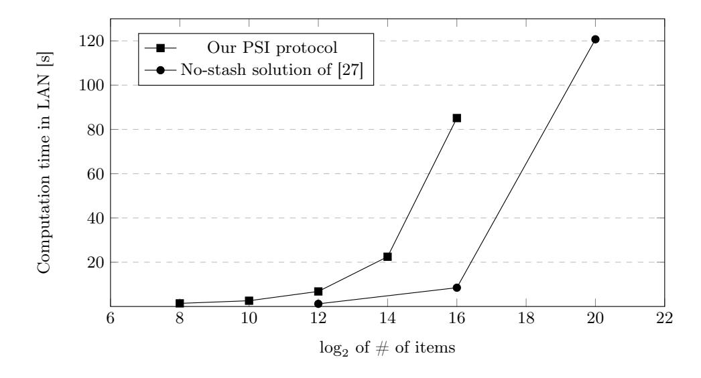

{0}------------------------------------------------

# Linear Complexity Private Set Intersection for Secure Two-Party Protocols\*

Ferhat Karakoç $^1$  and Alptekin Küpçü $^2$ 

Ericsson Research, İstanbul, Turkey ferhat.karakoc@ericsson.com
Koç University, İstanbul, Turkey akupcu@ku.edu.tr

**Abstract.** In this paper, we propose a new private set intersection (PSI) protocol with bi-oblivious data transfer that computes the following functionality. One of the parties  $P_1$  inputs a set of items X and a set of data pairs  $D_1 = \{(d_0^j, d_1^j)\}$  and the other party  $P_2$  inputs a set of items Y. While  $P_1$  outputs nothing,  $P_2$  outputs a set of data  $D_2 = \{d_{b_i}^j \mid b_j \in \{0,1\}\}$  dependent on the intersection of X and Y. This functionality is generally required when the PSI protocol is used as a part of a larger secure two-party secure computation such as threshold PSI or any function of the whole intersecting set in general. Pinkas et al. presented a PSI protocol at Eurocrypt 2019 for this type of functionality, which has linear complexity only in communication. While there are PSI protocols with linear computation and communication complexities in the classical PSI setting where the intersection itself is revealed to one party, to the best of our knowledge, there is no PSI protocol, which outputs a function of the membership results and satisfies linear complexity in both communication and computation. We present the first PSI protocol that outputs only a function of the membership results with linear communication and computation complexities. While creating the protocol, as a side contribution, we provide a one-time batch oblivious programmable pseudo-random function based on garbled Bloom filters. We also implemented our protocol and provide performance results.

**Keywords:** Private set intersection, two-party computation, Bloom filters, oblivious transfer, cuckoo hashing, circuit-PSI, OPPRF

## 1 Introduction

Private set intersection (PSI) protocols are one of the commonly used two party secure communication primitives where two parties,  $P_1$  and  $P_2$ , have their own respective private sets, X and Y, and at least one of the parties learn the intersection  $X \cap Y$  but nothing more. In the last decade, considerable amount

\* This is the full extended version. The original version was presented at CANS 2020 and the authenticated publication is available via https://doi.org/10.1007/978-3-030-65411-5\_20

{1}------------------------------------------------

of custom PSI protocols have been proposed in the literature. However, most of the proposed solutions reveal the intersection to at least one of the parties, which makes the protocols not usable as a building block in a larger secure computation protocol, because in that larger protocol, intermediate information would leak due to the nature of the employed PSI protocol. In this work, we focus on designing a PSI protocol in the semi-honest security model, which allows  $P_1$  obliviously to send data to  $P_2$  where neither  $P_1$  nor  $P_2$  know the choice bits, which depend on the intersection. The name PSI with bi-oblivious data transfer comes from this functionality. More precisely,  $P_2$  inputs a set of items  $Y = \{y_i \mid 1 \leq i \leq n_y\}$  as usual and  $P_1$  inputs a set of data pairs  $D_1 = \{(d_0^j, d_1^j) \mid 1 \leq j \leq \beta = O(\max(n_x, n_y))\}$  in addition to the set of items  $X = \{x_i \mid 1 \leq i \leq n_x\}$ . While  $P_1$  outputs nothing,  $P_2$  outputs a set of data  $D_2 = \{d_{b_j}^j \mid 1 \le j \le \beta, b_j \in \{0,1\}\}\$  where  $b_j = 1$  for j = f(i) if  $y_i \in X$ ,  $b_j = 0$  otherwise, and f is a mapping known or computed by  $P_2$  such that  $f: \{1, 2, ..., n\} \to \{1, 2, ..., \beta\}$ . When each  $(d_0^j, d_1^j) = (0, 1)$ , we obtain regular PSI. When  $(d_0^j, d_1^j)$  is a pair of two strings, we obtain PSI with data transfer [7, 35]. While  $(d_0^j, d_1^j)$  appears to be general, it fails to cover general computation over  $(X \cap Y)$ , e.g., cardinality [6] or threshold PSI [35, 36], because each  $d_0^j$  or  $d_1^j$  is leaked individually to  $P_2$  but not the computation over  $(X \cap Y)$ . Luckily, we can compose PSI with bi-oblivious data transfer with another layer of secure two-party computation protocol. For example, consider  $d_0^j$  and  $d_1^j$  respectively as additively-homomorphic encryption of '0' and '1'  $(E_k(0))$  and  $E_k(1)$  for key k picked by  $P_1$ ), and that our protocol is followed by additively-homomorphic evaluation of the obtained values by  $P_2$ , and then  $P_1$  decrypts the result. This corresponds to PSI cardinality. Alternatively,  $d_0^j$  and  $d_1^j$  output values can be secret shares of the result for each item in the result set or labels for the corresponding input wires for circuit-based secure computation protocols. For example, the value  $d_0^j$  can be a wire label for wire zero and  $d_1^j$  can be wire label for wire one. This means that all wire labels are input for the larger protocol that employs our set intersection. This larger protocol can be, for example, computing a threshold over the intersection cardinality, or any other secure two-party computation protocol whose input should be the intersection. More applications and details are given in Section 7.

Related Work: To the best of our knowledge, protocols that output a function of the membership results were proposed by Ciampi and Orlandi [5], Pinkas et al. [27], and Falk et al. [11] in addition to the circuit based solutions of [14, 30]. In [5], a custom private set membership protocol (PSM) (where one of the parties has only one item instead of a set) based on oblivious navigation of a graph was introduced and this PSM protocol was converted to a PSI protocol with  $O(n \log n/\log \log n)$  communication and computation complexities using the hashing techniques proposed in [29, 26, 30], where n is the number of items in the sets. [11] has a communication complexity of  $O(n \log \log n)$  when the output can be secret shared. In [27], Pinkas et al. proposed a PSI protocol with O(n) communication and  $\omega(n(\log \log n)^2)$  computation complexities using the oblivious programmable pseudo-random function (OPPRF) in [20]. That protocol uses

{2}------------------------------------------------

OPPRF to check the private set membership relation in the hashed bins, where the result is not output in clear text, and then deploys a comparison circuit for the output of the membership result that can be given to a function as the input. Also in literature, there have been special purpose PSI protocols such as [33, 22, 6, 19, 9, 8, 36, 15, 16], which output a specific function of the intersection such as cardinality of the set, intersection-sum, or a threshold function.

In our solution, we follow the idea of Pinkas et al. [27] in that we first run a PSM protocol for each bin in the cuckoo hash table and then execute a comparison protocol. We diverge from their idea in the following ways. The first one is that we construct a Bloom-filter (BF) based PSM protocol by modifying Dong et al. PSI solution [10] to reduce the computation complexity. The second point is that, instead of using a comparison circuit, we execute Ciampi-Orlandi PSM protocol as a secure equality testing protocol such as the one used in [18], which makes the equality testing free by using the base oblivious transfer already executed in the BF-based PSM protocol. Following these two methods along the idea of Pinkas et al., we are able construct the first custom PSI protocol having linear computation and communication complexities in the number of items for the functionality we consider (outputting not the result set, but a function of the membership results), to the best of our knowledge. Note that there have been PSI solutions with linear complexities such as the protocols in [7, 10] and malicious secure solutions such as the recent proposals [13, 25] having linear communication complexity, but in these protocols the intersection is revealed to at least one party while in our protocol no party learns the intersection in cleartext. We implemented our PSM and PSI protocols and the Ciampi-Orlandi PSM protocol to make a fair comparison. Experimental performance results, which validate our performance analysis, are given in Section 8.

## 2 Preliminaries and Similar Protocols

Notation: P1 and P2 are the parties who run the protocol, X and Y are the corresponding item sets of the parties, D1 is the set of message pairs inputted by P1, and D2 is the set of corresponding received messages by P2 depending on the intersection X ∩ Y .

The remaining notation we use throughout the paper is as follows:

- ` : The length of the items in the sets
- κ : Security parameter
- η : Statistical correctness parameter
- nx : The number of items in X
- ny : The number of items in Y
- n : max(nx, ny)
- m : Bloom filter size
- k : Number of hash functions used in Bloom filter
- Hi : Set of k hash functions used in the construction of Bloom filters for i-th bin in the cuckoo table where Hi = {hi,1, ..., hi,k}
- β : The number of bins in cuckoo table

{3}------------------------------------------------

## 2.1 Sub-Protocols

Oblivious Transfer: A 1-out-of-2 oblivious transfer (OT) [31] is a secure twoparty protocol that realizes Functionality 1. While OT is one of the commonly used primitives in secure protocols, the main drawback of this primitive is the need of asymmetric key operation executions. With the help of OT extension (OTE) method proposed in [1] and practically realized with some studies such as [17], to execute 1-out-of-2 OT for m pairs of length  $\ell$  (OTm) it is enough to run OT $\kappa$ , called as base OTs, where  $\kappa$  is the security parameter, which keeps the number of heavy public key operations as a constant independent from the number of pairs m and item lengths  $\ell$ .

In recent works, it was shown that the number of rounds can be 2 instead of 3 for an OT extension protocol by executing some of the computations in the offline phase of the protocol [3, 4]. In our solution, we don't consider the preprocessing operations and so we don't use these constructions in our protocols.

Cuckoo hashing [23] is a hashing primitive that allows to map items of a set to the bins, where there is at most one item in each bin. This primitive employs two hash functions  $h_0$  and  $h_1$  and maps n items to a table T of  $(1+\epsilon)n$  bins. An item  $x_i$  is inserted into bin  $T[h_b(x_i)]$ . If this bin already accommodates a previous item  $x_j$ , then  $x_j$  is relocated to bin  $T[h_{1-b}(x_j)]$ . If in that bin there is another item, then this procedure is repeated until there is no need or a replacement threshold is reached. If a threshold is employed, then a stash is used to store the items that are not located into the bins.

Bloom Filter Based PSI: A Bloom filter (BF) [2] is a representation of a set  $X = x_1, ..., x_n$  of n elements using an m-bit string BF. BF is constructed with the help of a set of k independent and uniform hash functions  $(H = h_1, ..., h_k)$  where  $h_i : \{0,1\}^{\ell} \to \{1,2,...,m\}$  as follows: BF is first set to  $0^m$ . Then, for each item in X,  $BF[h_i(x_j)]$  is set to 1 where  $1 \le i \le k$  and  $1 \le j \le n$ . To check whether an item x is in the set X, one checks  $BF[h_i(x)]$  is equal to 1 or not for each i  $(1 \le i \le k)$ . If for all i  $(1 \le i \le k)$  the corresponding bit in BF is equal to 1, then it means that the item is probably in the set. Otherwise (for some i the corresponding bit is 0), the item is not in the set.

A Bloom filter based PSI was proposed by Dong et al. [10]. In that solution, a variant of BF called as Garbled Bloom Filter (GBF) was used. A GBF of a set X, GBF, is similar to BF except that while for each hash function  $h_i$  in H we have  $BF[h_i(x)] = 1$ ,  $GBF[h_i(x)]$  is a secret share of x: that is,  $\bigoplus_{i=1}^k GBF[h_i(x)] = x$  and other cells are random values instead of simple zeros. In the first step of the protocol,  $P_1$  and  $P_2$  construct a GBF ( $GBF_X$ ) using the GBF building algorithm provided in [10] and a BF ( $BF_Y$ ), respectively. Then,  $P_1$  and  $P_2$  run m-pair

## Functionality 1 Oblivious Transfer

*Inputs*. The sender inputs a pair  $(x^0, x^1)$ , the receiver inputs a choice bit  $b \in \{0, 1\}$ .

Outputs. The functionality returns the message  $x^b$  to the receiver and returns nothing to the sender.

{4}------------------------------------------------

oblivious transfer of  $\ell$ -bit strings  $(OT_{\ell}^m)$  where  $P_1$ 's input is  $(0^{\ell}, GBF_X[i])$  and  $P_2$ 's input is  $BF_Y[i]$  for the i-th OT, and the output of  $P_2$  is  $GBF_Y[i]$ . In this way,  $P_2$  learns  $GBF_X[i]$  if  $BF_Y[i] = 1$ .  $P_2$  checks, for each item  $y_j \in Y$ , whether it is in X or not, by comparing  $\bigoplus_{i=1}^k GBF_Y[h_i(y_j)] \stackrel{?}{=} y_j$ .

Oblivious Pseudo-Random Function Based PSM: An oblivious pseudo-random function (OPRF), introduced in [12], is a two-party protocol where party  $P_1$  holds a key K, party  $P_2$  holds a string x, and at the end of the protocol  $P_1$  learns nothing, while  $P_2$  learns  $F_K(x)$  where F is a pseudo-random function family that gets a  $\kappa$ -bit key K and an  $\ell$ -bit input string x and outputs an  $\ell$ -bit random-looking result. An oblivious programmable pseudo-random function (OPPRF) [20] is similar to an OPRF except that in OPPRF, the protocol outputs predefined values for some of the programmed inputs. In that protocol  $P_2$  should not be able to distinguish which inputs are programmed. Note that OPPRF is very similar to PSI with data transfer [7,35] by just setting the data of the latter to random values. Indeed, the GBF-based construction of OPPRF in [20] is essentially the GBF-based construction in [35]. In this paper, we extend this GBF-based construction to batch OPPRF.

The basic idea in OPRF based PSM protocols are as follows.  $P_1$  holds a key K to compute a pseudo-random function  $F_K$ ,  $P_2$  learns  $F_K(y)$  for his item y obliviously, and  $P_1$  sends  $F_K(x_i)$  for her items  $x_i \in X$  to  $P_2$ .  $P_2$  checks if  $F_K(y)$  is in the set  $\{F_K(x_i)\}$ . An example PSI protocol can be found in [30]. In the OPRF solution,  $P_2$  learns whether or not his item is in the set of  $P_1$ . This solution cannot be used in our setting where nobody learns the result in cleartext and the parties only learn a function result of the intersection. Pinkas et al. [27] converted the OPRF solution to the setting we consider using an oblivious programmable pseudo-random function. In that solution,  $P_1$  sends the same (random) output r for the items in her set. Otherwise, she sends some random output to  $P_2$ . Then  $P_1$  and  $P_2$  run a circuit to check the equality of r and the outputs  $P_1$  sent to  $P_2$ . At the end of this equality check circuit, one party obtains a function based on the result of the equality, i.e, of the membership.

Usage of Ciampi-Orlandi PSM Protocol to Test Equality of Two Strings: The private set membership (PSM) protocol proposed by Ciampi and Orlandi [5] works on the setting that  $P_1$  and  $P_2$ 's inputs are a set of items X and an item y, respectively, and at the end of the protocol,  $P_2$  learns a function of the membership relation and  $P_1$  learns nothing. The protocol is based on oblivious graph tracing and uses oblivious transfer. In our construction, we use that protocol for the case that  $P_1$ 's input is just one item instead of a set, as considered in [18]. In this case, the PSM protocol becomes a secure equality testing outputting a function (we call functional equality testing - FEQT) protocol that realizes Functionality 2. This simplification also greatly increases efficiency, helping us achieve linear costs. Protocol 1 presents the steps of Ciampi-Orlandi PSM protocol for the case of testing two strings as used in [18].

{5}------------------------------------------------

#### Functionality 2 Functional Secure Equality Testing

Inputs.  $P_1$  inputs x and a pair of strings  $(d_0, d_1)$ ,  $P_2$  inputs y.

Outputs. The functionality checks the equality of x and y and returns  $d_0$  or  $d_1$  according to the truth value of  $x \stackrel{?}{=} y$  to  $P_2$ .

### **Protocol 1** (Ciampi-Orlandi PSM Protocol to test equality of two strings.)

Parameters.  $E_k(.)$  is a symmetric encryption under the key k with a polynomial-time verification algorithm outputting whether a given ciphertext is in the range of  $E_k(.)$  with false positive probability being  $2^{-\eta}$ .

Inputs.  $P_1$  inputs x and a string pair  $(d_0, d_1)$ ,  $P_2$  inputs y.

Outputs.  $P_2$  outputs  $d_0$  or  $d_1$  according to the truth value of  $x \stackrel{?}{=} y$ .  $P_1$  outputs nothing. The protocol steps:

- 1.  $P_1$  prepares the message pairs  $(S_0^i, S_1^i)$  for x[i]  $(1 < i < \ell)$  as follows: (x[i] denotes the *i*-th bit of x and x[1] is the right-most bit)
  - chooses random symmetric keys  $k_{\ell}$  and  $k_{\ell}^*$  and sets  $S_{x[\ell]}^{\ell} = k_{\ell}$  and  $S_{1-x[\ell]}^{\ell} = k_{\ell}^*$
  - For  $i = (\ell 1)$  to 1
    - chooses random symmetric keys  $k_i$  and  $k_i^*$  and sets  $S_{x[i]}^i = \{E_{k_{i+1}}(k_i), E_{k_{i+1}^*}(k_i^*)\}$  and  $S_{1-x[i]}^i = \{E_{k_{i+1}}(k_i^*), E_{k_{i+1}^*}(k_i^*)\}.$
    - permutes the ciphertexts in  $S_{x[i]}^i$  and  $S_{1-x[i]}^i$  randomly.
- 2.  $P_1$  sends  $E_{k_1}(d_1)$  and  $E_{k_1^*}(d_0)$  to  $P_2$  in random order.
- 3.  $P_2$  learns corresponding  $S_{y[i]}^i$ 's by running OT from  $P_1$  for  $1 < i < \ell$ .
- 4.  $P_2$  recovers only one of the keys  $k_1$  or  $k_1^*$  by decrypting the ciphertexts in the following way:
  - decrypts the ciphertexts in  $S_{y[\ell-1]}^{\ell-1}$  using  $S_{y[\ell]}^{\ell}$  as the key where the plaintext in the encryption domain is the key that will be used to decrypt the ciphertexts in  $S_{y[\ell-2]}^{\ell-2}$ .
  - decrypts the ciphertexts in  $S_{y[i]}^i$  using the plaintext recovered from  $S_{y[i+1]}^{i+1}$  as the key to recover the key used in the next received message  $S_{y[i-1]}^{i-1}$ .
- 5.  $P_2$  decrypts the ciphertexts  $E_{k_1}(d_1)$  and  $E_{k_1^*}(d_0)$  using the key recovered in Step 4 where only one of the plaintexts will be in the domain and this plantext will be equal to  $d_1$  or  $d_0$ .  $P_2$  outputs the result.

## 2.2 Security Definitions

Since there are two parties who run the protocol, it is enough to prove that the protocol is secure when one of the parties is corrupted. There are two possible cases: either  $P_1$  or  $P_2$  is corrupted.

We follow the simulation-based security proof paradigm. Since we only consider honest-but-curious adversaries, the existence of a simulation in the "ideal world" whose protocol transcript is computationally indistinguishable from the adversary's view in the protocol execution in the "real world" (together with the parties' outputs in both worlds) proves that the protocol is secure. The basic

{6}------------------------------------------------

idea in this proof paradigm is that if it is possible for the simulator to create a protocol transcript indistinguishable from the real execution transcript, then the transcript doesn't reveal any piece of information about the private input of the honest party. This security proof paradigm was formalized in [21] as follows. Protocol  $\pi$  implements the functionality  $\mathcal{F} = (\mathcal{F}_1, \mathcal{F}_2)$  where the output of  $P_1$  and  $P_2$  are  $\mathcal{F}_1(x,y)$  and  $\mathcal{F}_2(x,y)$ , respectively, and x and y are the inputs of the parties. The view of  $P_i$  for  $i \in \{1,2\}$  (denoted as  $view_i^{\pi}(x,y)$ ) in the execution of the protocol  $\pi$  is the input of  $P_i$ , the internal random number coin tosses, the messages received from the other party in the execution of the protocol, and the outputs. The existence of probabilistic polynomial-time (PPT) algorithms  $S_i$  (the simulators) that takes the input of  $P_i$  and the output of  $P_i$  such that

$${S_i(w_i, \mathcal{F}_i(x, y))}_{x,y} \approx {view_i^{\pi}(x, y)}_{x,y}$$

for  $i \in \{1, 2\}$  where  $w_1 = x$  and  $w_2 = y$  proves that the protocol  $\pi$  realizes the functionality  $\mathcal{F}$  securely.

As for the underlying primitives, namely OT and FEQT, whose functionalities were presented as Functionalities 1 and 2, respectively, there exists simulators who can simulate the view for both parties. These simulators take the input and output of the corresponding party as input, and produce indistinguishable views as output. In our proofs, we make use of these simulators for the underlying primitives.

Lastly, in our proofs, we provide the simulators for semi-honest adversaries. Note that the simulated view (including the outputs) must be indistinguishable from the real view. In all our proofs, this is either obvious (directly comes from the security of the underlying primitive, or comes from the fact that the simulated values are picked from the same distribution as the original ones), or were proven by others (in which case we also cite those papers). Thus, we do not delve deep into the indistinguishability discussions, considering also the page limits.

## 3 Bloom Filter Based OPPRF Construction

We present a one-time OPPRF construction based on PSI protocols proposed in [10] and [35]. For our usage, we put secret shares of random values chosen by the sender as the data to be transferred by the PSI protocol [35].

The OPPRF functionality we use in our PSM protocol is given in Functionality 3 and our construction that implements the functionality is presented in Protocol 2. The probability of false negative is zero because when  $y \in X$ ,  $P_2$  learns all shares required to recover the related programmed value. There may be false positives only with probability that is negligible in k and  $\eta$ , where k is the number of hash functions used in GBF construction and  $\eta$  is the minimum bit length of each cell in GBF, as shown in [10]. Note that we allow the programmed values  $(t_i)$  to be correlated. Because of that, the functionality is secure only if the receiver makes only one query. For the purposes of PSM, we notice that one query is enough. In our PSM solution the programmed values will be the same; that is, all the  $t_i$  values will be equal.

{7}------------------------------------------------

Functionality 3 (One-Time) Oblivious Programmable Pseudo Random Function

Inputs.  $P_1$  inputs predefined items  $X = \{x_1, ..., x_n\}$  and corresponding programmed values  $T = \{t_1, ..., t_n\}$ ,  $P_2$  inputs y

Outputs. The functionality checks the membership  $y \in X$  and returns  $t_i$  to  $P_2$  if  $\exists x_i \text{ s.t. } y = x_i \ (1 \leq i \leq n)$ ; returns a random value otherwise to  $P_2$ , and returns nothing to  $P_1$ .

#### Protocol 2 Our One-Time OPPRF Protocol

Parameters. A set of hash functions  $H = \{h_1, ..., h_k\}$ 

Inputs.  $P_1$  inputs a set of items  $X = \{x_1, ..., x_n\}$  and corresponding programmed values  $T = \{t_1, ..., t_n\}$ ,  $P_2$  inputs an item y.

Outputs.  $P_1$  outputs nothing and  $P_2$  outputs  $t_i$  if  $\exists x_i$  s.t.  $y = x_i$   $(1 \le i \le n)$ , otherwise outputs a random value.

The protocol steps:

1.  $P_1$  constructs a garbled Bloom filter  $GBF_X$  having  $\max(\eta, \ell)$ -bit strings in each cell such that

$$\bigoplus_{i=1}^{k} GBF_X[h_i(x_j)] = t_j$$

for  $1 \le j \le n$ .

- 2.  $P_2$  constructs a (standard) Bloom filter  $BF_y$  for the item y.
- 3.  $P_1$  and  $P_2$  run m oblivious transfers where  $P_1$ 's input is  $(0, GBF_X[i])$  and  $P_2$ 's input is  $BF_y[i]$  for the i-th oblivious transfer, and the output of  $P_2$  is 0 if  $BF_y[i] = 0$  or  $GBF_X[i]$  if  $BF_y[i] = 1$ . Call the output of  $P_2$  as  $GBF_y[i]$ .
- 4.  $P_1$  outputs nothing and  $P_2$  outputs  $\bigoplus_{i=1}^k GBF_y[h_i(y)]$ .

Asymptotic Complexity. Since the number of hash functions used in the construction of Bloom filters is a constant related to the statistical correctness parameter that is independent of the number of items, Protocol 2 requires O(n) hash function computations for the construction of garbled Bloom filter in Step 1. Also, the size of the Bloom filters is m = O(n), which makes the total asymptotic complexity of running oblivious transfers in Step 3 O(n). Step 2 requires O(n) non-cryptographic computation and space. Considering the complexity of Step 4 as O(1), we conclude that the OPPRF protocol has a communication, computation, and space complexity of O(n).

**Theorem 1.** Protocol 2 securely realizes Functionality 3 when  $P_1$  is corrupted by a semi-honest adversary A, assuming that the OT protocol is semi-honest secure.

*Proof.* The input set X and the programmed values T are given to the simulator S. The simulator computes a garbled Bloom filter  $GBF_X$  using its random tape such that  $\bigoplus_{i=1}^k GBF_X[h_i(x_j)] = t_j$  for  $1 \le j \le n$ . S runs the simulator of OT as the sender m times, where for the i-th run, the input of the simulator

{8}------------------------------------------------

is  $((0, GBF_X[i]), \perp)$ . Here,  $(0, GBF_X[i])$  is the input of the sender in the OT protocol and there in no output of the sender. Thus, the simulated view and output of the parties, and the view of the adversary in the real execution of the protocol and the output of the parties are indistinguishable.

**Theorem 2.** Protocol 2 securely realizes Functionality 3 when  $P_2$  is corrupted by a semi-honest adversary A, assuming that the OT protocol is semi-honest secure.

*Proof.* The input item y and the output  $\bigoplus_{i=1}^k GBF_y[h_i(y)]$  are given to the simulator S. The simulator constructs the Bloom filter using y regularly, and creates  $GBF'_{y}$  by running the following steps:

- 1. Set random values to  $GBF'_{y}[h_{i}(y)]$  for  $1 \leq i < k$ .
- 2. Set  $GBF'_y[h_k(y)] = \bigoplus_{i=1}^k GBF_y[h_i(y)] \oplus \bigoplus_{i=1}^{k-1} GBF'_y[h_i(y)]$ . 3. Set  $GBF'_y[i] = 0$  if  $BF_y[i] = 0$ .

Finally, S runs the OT simulator as the receiver m times, where in the i-th, run the receiver's input is  $BF_y[i]$  and the receiver's output is  $GBF_u'[i]$ . The proof concludes when we show that  $GBF'_y$  is indistinguishable from  $GBF_y$ . The cells in both  $GBF'_y$  and  $GBF_y$  are equal to '0' for the indices i where  $BF_y[i] = 0$ . Now we need to show that for the remaining k cells these GBFs are indistinguishable. Any combination of (k-1) cells are random due to the property of secret sharing and the xor of k cells equals to  $\bigoplus_{i=1}^k GBF_y[h_i(y)]$  in both GBFs, which concludes the proof.

#### Our Private Set Membership Protocol 4

In this section, we propose a new PSM protocol that realizes Functionality 4. As discussed in the introduction, our protocol does not output the membership result, but instead outputs some function of it, so that it can be directly integrated into a larger secure computation protocol. After this section, we show how to extend our protocol to set intersection as well.

In the construction of the protocol, we use the following idea of [27]: If  $y \in X$ , then both parties learn the same random value. Otherwise, they learn different random values. Then, the parties run a comparison protocol that outputs a function of the equality instead of the equality itself (Functionality 2). Our solution diverges from the solution of [27] in two folds. To realize the first part, [27] makes use of an OPPRF construction based on polynomials. We propose a new OPPRF construction based on Bloom filters. The selection of Bloom filters enables us to reduce the computation complexity of the protocol to a linear complexity. The other difference is that we utilize Ciampi-Orlandi PSM protocol [5] for secure equality testing as done in [18] for Functionality 2, instead of running a comparison circuit. Thus, our overall construction is not a circuit-based construction.

The overall view of our PSM protocol is as follow. To achieve private set membership, the parties first run the one-time OPPRF protocol based on garbled

{9}------------------------------------------------

## Functionality 4 Private Set Membership

Inputs. P1 inputs X = {x1, ..., xn} and a pair of strings (d0, d1), P2 inputs y.

Outputs. The functionality checks the membership of y in X and returns d1 to P2 if y ∈ X. Otherwise, returns d0 to P2.

Bloom filters, where P1 outputs r (a random value chosen by P1), whereas P2 learns some random value that may be r or something different. The value P2 learns is always random and indistinguishable; but, this random value is equal to r if and only if y ∈ X. Following this part, the parties run a secure functional equality testing protocol, where at the end of the protocol P2 learns the function result of the equality relation, which is also the function result of the membership relation. We make use of the PSM protocol of Ciampi-Orlandi [5] for secure functional equality testing by reducing the number of items of the sender set to one. We present our semi-honest secure PSM solution in Protocol 3.

## Protocol 3 Our Private Set Membership Protocol

Parameters. A set of hash functions H = {h1, ..., hk}.

Inputs. P1 inputs a set of items X = {x1, ..., xn} and a pair of strings (d0, d1), P2 inputs an item y.

Outputs. P2 outputs d1 if y ∈ X. Otherwise, P2 outputs d0. P1 outputs nothing.

The protocol steps:

- 1. P1 picks an η-bit random value r and sets T = {t1 = r, ..., tn = r}.
- 2. P1 and P2 run Protocol 2 for one-time OPPRF with the respective inputs (X,T) and y. Denote the output of P2 as r 0 .
- 3. P1 and P2 run Protocol 1 for functional equality testing with the respective inputs (r,(d0, d1)) and r 0 . The output of the PSM protocol is the output of Protocol 1.

Asymptotic Complexity of our PSM protocol. Protocol 2 requires O(n) hash function computations as stated in the previous section. FEQT employs O(η) operations for η oblivious transfers in the Ciampi-Orlandi PSM protocol. Thus, the asymptotic computation complexity of our PSM protocol becomes O(n). The communication complexity comes from the oblivious transfers. Considering the oblivious transfer extension communication complexity as linear in the number of OTs, the communication complexity of Protocol 3 is also O(n).

Theorem 3. Protocol 3 securely realizes Functionality 4 when P1 is corrupted by a semi-honest adversary A, assuming that the OPPRF and FEQT protocols are semi-honest secure.

{10}------------------------------------------------

Proof. The simulator S is given the input set X. S picks a random value r using its random tape and sets T = {t1 = r, ..., tn = r}. The simulator S runs the simulator of OPPRF protocol with the input ((X, T), ⊥). Then, S runs the simulator of FEQT protocol with the input (r, ⊥). This completes the whole simulation, and indistinguishability is a direct result of the underlying simulators.

Theorem 4. Protocol 3 securely realizes Functionality 4 when P2 is corrupted by a semi-honest adversary A, assuming that the OPPRF and FEQT protocols are semi-honest secure.

Proof. The simulator S is given the input item y and the output db for b = y ? ∈ X. The simulator picks a η-bit random value r 00 . S runs the simulator of OPPRF with the input (y, r00) and the simulator of FEQT with the input (r 00, db). S does not know the uniform random value r 0 used in the real execution, but it follows the same distribution as r 00, and therefore they are perfectly indistinguishable. The computational indistinguishability comes from the FEQT and OPPRF simulations, which are based on OT simulations.

## 5 Batch One-Time OPPRF

We propose a new batch one-time OPPRF construction in Protocol 4 that implements Functionality 5, to be used in our PSI protocol. For the construction of a batch OPPRF from Protocol 2, instead of using different garbled Bloom filters for each programmed value set, we construct only one garbled Bloom filter, and store the shares of programmed values in the same garbled Bloom filter. Note that for each set Xi , a different set of hash functions (hash function set Hi for the programmed value set Xi) is used, since there might be some items which belong to more than one set. In our PSI protocol the programmed values in each Ti will be the same; that is, all the ti,l values will be equal within each Ti .

Functionality 5 Batch One-Time Oblivious Programmable Pseudo Random Function

Inputs. P1 inputs a predefined set of item sets X = {X1, ..., Xβ}, where Xi = {xi,1, ..., xi,n}, and corresponding programmed value sets T = {T1, ..., Tβ}, where Ti = {ti,1, ..., ti,n}, and P2 inputs a set of items Y = {y1, ..., yβ} Outputs. The functionality checks the membership relations yi ∈ Xi and returns r 0 i = ti,j if ∃xi,j s.t. yi = xi,j (1 ≤ j ≤ n); returns a random r 0 i otherwise, for each i where 1 ≤ i ≤ β.

Asymptotic Complexity. Since the size of the garbled Bloom filter is linear in the number of items to be stored in it and OT extension is also linear in the number of OT executions, the computation and communication complexities of our batch one-time OPPRF protocol becomes linear in the total number of programmed values in the programmed value sets.

{11}------------------------------------------------

### Protocol 4 Bloom Filter Based Batch One-Time OPPRF Protocol

Parameters. A set of hash function sets  $H = \{H_1, ..., H_\beta\}$  where  $H_i = \{h_{i,0}, ...h_{i,k}\}$ 

Inputs.  $P_1$  inputs a set of item sets  $X = \{X_1, ..., X_\beta\}$ , where  $X_i = \{x_{i,1}, ..., x_{i,n}\}$ , and corresponding programmed value sets  $T = \{T_1, ..., T_\beta\}$ , where  $T_i = \{t_{i,1}, ..., t_{i,n}\}$ , and  $P_2$  inputs a set of items  $Y = \{y_1, ..., y_\beta\}$ .

Outputs.  $P_2$  outputs a set of random values  $R' = \{r'_1, ..., r'_{\beta}\}$ , where  $r'_i = t_{i,j}$  if  $\exists x_{i,j} \text{ s.t. } y_i = x_{i,j} \ (1 \leq j \leq n)$ ; otherwise  $r'_i$  is a random value; for  $1 \leq i \leq \beta$ .

The protocol steps:

1.  $P_1$  constructs a garbled Bloom filter  $GBF_X$  having  $\max(\eta, \ell)$ -bit strings in each cell such that

$$\bigoplus_{j=1}^{k} GBF_X[h_{i,j}(x_{i,l})] = t_{i,l}$$

for  $1 \le i \le \beta$  and  $1 \le j \le k$ .

- 2.  $P_2$  constructs a Bloom filter  $BF_Y$  for the items in Y.
- 3.  $P_1$  and  $P_2$  run m oblivious transfers where  $P_1$ 's input is  $(0, GBF_X[i])$  and  $P_2$ 's input is  $BF_Y[i]$  for the i-th oblivious transfer, and the output of  $P_2$  is 0 if  $BF_y[i] = 0$  or  $GBF_X[i]$  if  $BF_Y[i] = 1$ . Call the OT output  $P_2$  obtains as  $GBF_Y[i]$ .
- 4.  $P_2$  outputs  $R' = \{r'_1, ..., r'_{\beta}\}$  where  $r'_i = \bigoplus_{j=1}^k GBF_Y[h_{i,j}(y_i)]$ .

**Theorem 5.** Protocol 4 securely realizes Functionality 5 when  $P_1$  is corrupted by a semi-honest adversary A, assuming that the OT protocol is semi-honest secure.

*Proof.* The simulator S is given the input set of sets X and the programmed values set T. The simulator computes a garbled Bloom filter using its random tape such that  $\bigoplus_{j=1}^k GBF_X[h_{i,j(x_{i,l})}] = t_{i,l}$ . S runs the simulator of the OT protocol as the sender with the input  $(GBF_X, \bot)$ . This concludes the simulation. Indistinguishability directly comes from the garbled Bloom filter construction following the protocol, and the OT simulator.

**Theorem 6.** Protocol 4 securely realizes Functionality 5 when  $P_2$  is corrupted by a semi-honest adversary A, assuming that the OT protocol is semi-honest secure.

*Proof.* The input set Y and the output R' are given to the simulator S. The simulator constructs a Bloom filter for Y and a garbled Bloom filter  $GBF'_Y$  following the steps:

- 1. Constructs a BF  $BF_Y$  for Y.
- 2. Constructs a GBF  $GBF'_Y$  such that  $\bigoplus_{j=1}^k GBF'_Y[h_{i,j}(y_i)] = r'_i$  for  $1 \le i \le \beta$ .
- 3. Sets  $GBF'_{Y}[i] = 0$  if  $B\hat{F_{Y}}[i] = 0$ .

Then, S runs the simulator of the OT protocol as the receiver with the input  $(BF_Y, GBF'_Y)$ . Note that the garbled bloom filters  $GBF'_Y$  and  $GBF_Y$  are indistinguishable as discussed in the proof of Theorem 2.

{12}------------------------------------------------

## 6 Our Private Set Intersection Protocol

Our PSM protocol can be used to build an efficient PSI protocol using the hashing techniques introduced in [29, 26]. In this technique, one party constructs a cuckoo table as mentioned in Section 2.1 using two hash functions and the other party maps her items into bins in a hash table using the two hash functions that are applied on each item. Then, a private set membership protocol is applied on each bin where the party who constructs the cuckoo table inputs the (single) item in the i-th bin, and the other party inputs the set of items in the i-th bin of its hash table, for the i-th execution of the PSM protocol. If one were to directly employ our PSM construction to obtain a PSI protocol using this hashing technique, the computation and communication complexities of the full PSI protocol would be O(n log n/ log log n), since the number of items in each hash table bin is O(log n/ log log n) and the number of bins is O(n). Note that with this usage, for each bin, P2 and P1 run O(n) parallel OPPRF protocols and then apply O(n) parallel FEQT protocols. Instead of following this straightforward way, we show that it is possible to make the communication and computation complexities linear while extending our PSM solution to a PSI solution using our batch one-time OPPRF protocol.

Our full PSI protocol that realizes Functionality 6 is introduced in Protocol 5. Note that in Step 4 of the protocol, the bins of the hash table are given as the item sets to the batch one-time OPPRF protocol. While there are many items in the bins of the hash table, most of them are random values and the total number of non-random items in the hash table will be the product of the number of items (n) and the number of cuckoo hash functions (chosen as 3 in our protocol). Thus, the size of the garbled Bloom filter constructed in the batch one-time OPPRF protocol will be O(n), which allows our PSI protocol to have linear complexity.

Note that when we use two hash functions for cuckoo hashing, then there will be some items in Y which cannot be placed into the table and have to be moved to a stash. For each of these items in the stash, a PSM protocol also has to be executed. When we consider the number of these items as ω(1), then the complexity of our PSI protocol becomes bigger than O(n). To make the complexity linear, Pinkas et al. proposed to use dual execution or a stash-less cuckoo hashing [27]. In dual execution, after the first run of the PSI protocol, P2 learns the membership result for its items except the ones in the stash. Then the parties run the PSI protocol swapping their roles, that is, P1 constructs a

#### Functionality 6 Private Set Intersection

Inputs. P1 inputs X = {x1, ..., xnx } and D1 = {(d j 0 , dj 1 ) | 1 ≤ j ≤ β}. P2 inputs Y = {y1, ..., yny }.

Outputs. P1 outputs nothing. P2 outputs D2 = {d j bj | 1 ≤ j ≤ β, bj ∈ {0, 1}} where bj = 1 for j = f(i) if yi ∈ X, bj = 0 otherwise , and f is a mapping such that f : {1, 2, ..., n} −→ {1, 2, ..., O(n)}.

{13}------------------------------------------------

#### Protocol 5 Bloom Filter Based Private Set Intersection Protocol

Parameters. A set of hash function sets  $H = \{H_1, ..., h_\beta\}$  where  $H_i = \{h_{i,1}, ..., h_{i,k}\}$  for  $1 \le i \le \beta$ .

Inputs.  $P_1$  inputs a set of items  $X = \{x_1, ..., x_{n_x}\}$  and  $D_1 = \{(d_0^j, d_1^j) \mid 1 \leq j \leq \beta\}$ .  $P_2$  inputs a set of items  $Y = \{y_1, ..., y_{n_y}\}$ .

Outputs.  $P_1$  outputs nothing.  $P_2$  outputs  $D_2 = \{d_{b_j}^j \mid 1 \leq j \leq \beta, b_j \in \{0, 1\}\}$  where  $b_j = 1$  for j = f(i) if  $y_i \in X$ ,  $b_j = 0$  otherwise, and f is a mapping such that  $f: \{1, 2, ..., n\} \rightarrow \{1, 2, ..., \beta\}$ .

The protocol steps:

- 1.  $P_1$  constructs a hash table for the set X.
- 2.  $P_2$  constructs a cuckoo table for the set Y and the mapping f such that f(i) = j if  $y_i$  is mapped to the j-th bin of the cuckoo table.
- 3.  $P_1$  picks a set of  $\beta$   $\eta$ -bit random values  $R = \{r_1, ..., r_{\beta}\}.$
- 4.  $P_1$  and  $P_2$  run Protocol 4 with their respective inputs: (hash table, R) and cuckoo table. Let the output of  $P_2$  be  $R' = \{r'_1, ..., r'_{\beta}\}$ .
- 5.  $P_1$  and  $P_2$  run  $\beta$  parallel executions of Protocol 1 for functional equality testing, where for the *i*-th run, the inputs of  $P_1$  and  $P_2$  are  $(r_i, (d_0^i, d_1^i))$  and  $r'_i$ .

cuckoo table for X and  $P_2$  constructs a hash table for the items in the stash. Since there may be some items of  $P_1$  which have not been placed in the cuckoo table and moved to a stash,  $P_1$  and  $P_2$  should run the PSM protocol for their items in the stashes. However, this usage does not realize the Functionality 6 that we consider, since in the second run,  $P_2$  learns the function of the membership result between its items in the stash and the set X, and in the final PSM protocols run for the items in the stashes,  $P_2$  again learns the function of the membership result between its items in the stash and  $P_1$ 's items in the stash. That is,  $P_2$  learns two different results for its items in the stash that makes the protocol diverge from Functionality 6. Because of these two reasons, we make use of the second method of Pinkas et al., which is the usage of stash-less cuckoo hashing with three hash functions.

Asymptotic Complexity. For simplicity we take  $n = n_x = n_y$ . While it seems that there are  $O(n \log n / \log \log n)$  items in the hash table of  $P_1$ , which makes the length of the Bloom filters  $O(n \log n / \log \log n)$ , the actual number of items is O(3n) = O(n) since the other items are random values padded to the bins to make the number of items in the bins  $O(\log n / \log \log n)$ . Thus, the complexity of Step 4 of Protocol 5 becomes O(n). Since the number of bins is O(n) and for each bin only one equality testing is executed in Step 5, the complexity of Step 5 will be O(n). Thus the communication and computation complexities of our PSI protocol becomes O(n).

**Theorem 7.** Protocol 5 securely realizes Functionality 6 when  $P_1$  is corrupted by a semi-honest adversary A, assuming that the batch OPPRF and FEQT protocols are semi-honest secure.

{14}------------------------------------------------

Proof. The input set X is given to the simulator S. The simulator computes the hash table for X and picks  $\beta$   $\eta$ -bit random values  $R'' = \{r''_1, ..., r''_{\beta}\}$  using its random tape. Then S runs the simulator of batch OPPRF protocol with the input ((hash table, R),  $\bot$ ). Finally, S runs the simulator of FEQT protocol  $\beta$  times, where the input in the i-th run is  $(r_i, \bot)$ . Since  $r''_i$  and  $r_i$  are random numbers from a uniform distribution, they are indistinguishable. Hence, indistinguishability of S follows the indistinguishability of the underlying batch OPPRF and FEQT simulators.

**Theorem 8.** Protocol 5 securely realizes Functionality 6 when  $P_2$  is corrupted by a semi-honest adversary A, assuming that the batch OPPRF and FEQT protocols are semi-honest secure.

Proof. The simulator S is given the input set Y and the output  $d_b^i$  for  $1 \le i \le \beta$ . S computes a cuckoo table for the set Y and the mapping f executing Step 2 of the protocol, and picks  $\beta$   $\eta$ -bit random values  $R'' = \{r_1'', ..., r_\beta''\}$ . S runs the simulator of batch OPPRF protocol with the input (cuckoo table, R'') and the simulator of FEQT protocol  $\beta$  times, where the input in the i-th run is  $(r_i'', d_b^i)$ . Since R' in the real execution and R'' in the ideal world are uniformly selected sets of random numbers, they are indistinguishable. Hence, indistinguishability of S follows the indistinguishability of the underlying batch OPPRF and FEQT simulators.

## 7 Some Applications of our PSI Protocol

In this section, we present some applications of our protocol to exemplify how it can be integrated into a larger two-party protocol.

#### 7.1 Having a Classical PSI Protocol

 $P_1$  prepares the set  $D_1$  by setting  $(d_0^j, d_1^j) = (0, 1)$  for  $1 \leq j \leq \beta$  and inputs its set X and  $D_1$  to the our PSI protocol.  $P_2$  inputs its set Y. After running our PSI protocol,  $P_1$  learns nothing and  $P_2$  learns the set  $D_2 = \{d_{b_j}^j \mid 1 \leq j \leq \beta, d_{b_j}^j \in \{0, 1\}\}$  and the function f that maps the items of Y into the bins of the cuckoo table such that f(i) = j means i-th item of Y is mapped into the j-th bin of the cuckoo table, where  $\beta$  is the number of bins in the cuckoo table. For each item  $y_i$  in Y,  $P_2$  checks whether  $d^{f(i)}$  equals to '1' or not. If the  $d^{f(i)} = 1$ ,  $P_2$  learns that  $y_i$  is in the intersection. In this way  $P_2$  learns the intersection itself.

## 7.2 Having a PSI Cardinality Protocol

To allow just to learn the cardinality of the intersection and no additional information about the intersection,  $P_1$  chooses a key pair for an additively homomorphic encryption scheme and prepares the data set  $D_1$  by setting  $(d_0^j, d_1^j) = (E_{pk}(0), E_{pk}(1))$  for  $1 \leq j \leq \beta$ .  $P_1$  inputs X and  $D_1$  and  $P_2$  inputs Y to our

{15}------------------------------------------------

protocol and  $P_2$  learns the mapping f and the data set  $D_2$  where  $d^{f(i)} = E_{pk}(1)$  if  $y_i \in X$  and the other  $d^j$  values are encryption of '0' under the public key of  $P_1$ .  $P_2$  homomorphically sums up the  $d^j$  values using the additive homomorphism property of the encryption scheme and obtains the result  $\sum E_{pk}(d^j)$ , where the number of  $d^j$  values that are equal to  $E_{pk}(1)$  is the number of items in the intersection and the other  $d^j$  values equal to  $E_{pk}(0)$ . Thus  $\sum E_{pk}(d^j) = E_{pk}(|X \cap Y|)$ .  $P_2$  sends  $E_{pk}(|X \cap Y|)$  to  $P_1$  and  $P_1$  learns the cardinality by decrypting the received ciphertext.

### 7.3 Having a Threshold PSI Protocol

Assume that the parties want to learn the PSI if the cardinality of the PSI is equal to or bigger than a threshold t. Our PSI protocol can be utilized as follows.  $P_1$  generates a key (K) for a probabilistic encryption scheme and divides the decryption key into  $\beta$  secret shares such that t of the shares are enough to construct the key (using a t out of  $\beta$  threshold secret sharing scheme).  $P_1$ also sets  $(d_0^j, d_1^j) = ((E_K(0), r^j), (E_K(1), k^j))$  where  $E_K(.)$  is the probabilistic encryption operation under the key chosen by  $P_1$ ,  $r^j$  is a random value having the same length with the key, and  $k^j$  is the j-th secret share of the corresponding decryption key. After running our PSI protocol  $P_2$  learns the mapping f and the data set  $D_2$  such that  $d^{f(i)} = (E_K(1), k^{f(i)})$  for the *i*-th items that are in the intersection. If the number of items are equal to or bigger than the threshold t then  $P_2$  will be able to construct the decryption key and able to decrypt the left parts of the  $d^j$  values that are the encryption result of '0' or '1', which allows  $P_2$  to learn the intersection in a similar way as explained in subsection 7.1. Otherwise, if the number of items in the intersection is less than  $t, P_2$  will not be able to construct the decryption key and will not be able to decrypt the ciphertexts of '0' and '1' correctly, which means that  $P_2$  will not be able to learn the intersection. When a threshold secret scheme such as [32] is used,  $P_2$  needs to compute all possible (potentially exponentially-many, depending on t and n) combinations of secret shares to construct the decryption key. When a verifiable secret sharing scheme such as [24] is used, then  $P_2$  will be able to learn which secret shares are valid ones, which allows  $P_2$  to learn which items in the cuckoo table is in the hash table of  $P_1$  and so leak more information than what is desired. To avoid considering all possible combinations of secret shares for construction of the decryption key and to not leak more information, usage of other tools such as the Reed-Solomon decoding algorithm, as done in [34], can be investigated as future work.

#### 7.4 General Secure Computation over Set Intersection

Consider that parties would like to compute some general function over the intersection, without revealing the intersection as an intermediate output. For this case,  $P_2$  prepares the cuckoo table in advance and constructs a circuit considering the places of its items in the cuckoo table and then sends the circuit to  $P_1$ . This circuit is usually a Boolean or arithmetic gate circuit that computes the

{16}------------------------------------------------

desired functionality over the set intersection. Since we are in the honest-butcurious setting, this is the correct circuit for the desired task. Next,  $P_1$  chooses the wire labels of the circuit and garbles it before sending the garbled circuit to  $P_2$ .  $P_1$  sets  $d_0^j$  and  $d_1^j$  values as the labels for the corresponding input wires, such that the value  $d_0^j$  is a wire label for wire j corresponding to the bit zero and  $d_1^j$  is wire label for wire j corresponding to the bit one. This larger protocol can be any secure two-party computation protocol whose input should be the intersection.

To handle the associated data, the following additional steps, similar to the steps proposed in [27], need to be implemented.  $P_1$  chooses a random number  $s_i$  for the *i*-th bin and encodes the pairs  $(r_i, (s_i \oplus x_{i,l}))$  into the garbled Bloom filter instead of encoding only  $r_i$  in the OPPRF protocol, in step 1 of Protocol 4.  $P_2$ 's output for the *i*-th bin becomes  $(r'_i, s'_i) = \bigoplus GBF_Y[h_{i,j}(y_i)]$  where  $r'_i = r_i$  and  $s'_i = s_i \oplus x_{i,l}$  if the item of Y in the *i*-th bin equals to  $x_{i,l}$ . Then  $P_1$  and  $P_2$  also respectively input  $s_i$  and  $s'_i$  in addition to the d values to the circuit. For each bin, the circuit constructs the associated data from the shares if the equality holds for that bin and computes the required function of the associated data for the items in the intersection.

## 8 Performance Evaluation

### 8.1 Concrete Complexity

Parameter Choices. We take the number of hash functions used in the construction of Bloom filters as  $k = \eta$  and follow the choice of [10] to set the size of the Bloom filter as taking m = 1.44kn. Note that taking  $k = \eta$  doesn't reduce the security level to statistical correctness parameter because the result of BF-based OPPRF protocol are random numbers which then be inputs of the equality testing protocol. Following the parameters in [27], we choose the number of bins as 1.27n and the number of cuckoo hashes as 3, which makes the probability of having at least one item in the stash  $2^{-40}$ , consistent with our preferred statistical correctness parameter  $\eta$ .

Concrete Complexity of our PSM protocol. For the Bloom filters,  $P_1$  and  $P_2$  compute nk and k hash functions, respectively. For the OT-extension in the OP-PRF part, they run m oblivious transfer whose total computation complexity is approximately equal to 3m symmetric key operations thanks to the oblivious transfer extension [17]. Finally, the parties execute Ciampi-Orlandi PSM protocol where the number of items in the set of  $P_1$  is one, which makes the computation complexity  $6\eta$  symmetric key operations at  $P_1$  and  $5\eta$  symmetric key operations at  $P_2$  (the reader can refer to [18] for the complexity calculation for the FEQT protocol)  $^1$ . Thus the computation complexity of the protocol at

The item lengths in the GBF and so the lengths of the items to be tested for equality are  $\max(\eta, \ell)$  bits as stated in Protocol 2. In concrete complexity analysis, we take it as  $\eta$  for simplicity considering that in practice generally  $\eta > \ell$ .

{17}------------------------------------------------

the party where majority of workload is done is nk + 3m + 6η. Since we choose m = 1.44kn and k = η then the complexity becomes 5.32nη+6η. For the parameter η = 40 the complexity will be 212.8n + 240 symmetric key operations. The communication complexity comes from the oblivious transfers. In the OPPRF step, the message lengths in the oblivious transfer is η bits, while for the FEQT part, it is 2(κ + η) bits. Considering that the total number of bits transferred in the OT extension equals to 2 times the items' length times number of pairs, the communication complexity of the protocol becomes 2×m×η+2×η×2×(κ+η) = 2 × (1.44 × n × η) × η + 2η × 2 × (κ + η) = 2.88nη2 + 4κη + 4η 2 .

Concrete Complexity of our PSI protocol. To construct the cuckoo hash table, P2 and P1 perform at most 3n hash operations. Then, they construct BF performing kn and 3kn hash computations, respectively. They execute 4.32nη OTs using OT extension, which costs 3 × 4.32nη hash computations. In the last step, P1 and P2 perform 1.27n × (5η) and 1.27n × (6η) hash computations, respectively. Thus the total computation cost on the party who has the maximum overhead is 3n + 3nk + 3 × 4.32nη + 1.27n × (6η) = 26.58nη + 3n. The communication cost comes from the OT executions for Bloom filter and equality test. Since for the Bloom filter, 4.32nη η-bit message pairs are obliviously sent, the dominant cost is 2 × 4.32nη × η = 8.64nη2 . For the equality test, the length of the pairs is 2 × (κ + η) and the number of pairs is 1.27n; hence, the dominant part is 2 × 1.27n × 2(κ + η). Thus, the total communication cost is approximately is 8.64nη2 + 5.08n(κ + η).

## 8.2 Experimental Verification

Setup. We implemented Ciampi-Orlandi and our PSM protocol using C programming language and GMP library. In our experiment setup, P1 and P2 run on the same machine as different processes and communicate with each other over a TCP channel. We run the protocols for different size of sets and item lengths on a single CPU core of a computer that has 2.1 Ghz 16-core Intel Xeon CPU with 64 GB RAM. In the experiments, we chose RSA 2048 as asymmetric encryption algorithm in base OT, the statistical correctness parameter η as 40 bits, AES as the encryption algorithm, SHA-256 with different initialization vectors as the hash functions. We take the f function such that it outputs 128-bit wire labels. We take the number of hash functions in the construction of Bloom filters in our protocols as k = 40. The results are the averages over 10 executions of the protocols.

PSM. Table 1 shows the total amount of data transmitted between P1 and P2 during the execution of the protocols and the run-times in LAN and WAN setting. As can be seen from the table, our BF-based semi-honest PSM protocol has linear complexity both on computation and communication, and we provide comparable performance. Our asymptotic advantage becomes visible with larger ` values.

{18}------------------------------------------------

Table 1. Performance results of Ciampi-Orlandi and our PSM protocols. Run-time estimates are done for LAN and WAN under the assumption that the bandwidth in LAN (respectively in WAN) is 1 Gbps (100 Mbps) and RTT is 1 ms (100 ms).

| Protocol          |        |       | Ciampi-Orlandi PSM |        | Our PSM                                         |       |        |  |
|-------------------|--------|-------|--------------------|--------|-------------------------------------------------|-------|--------|--|
| Set size n        |        |       |                    |        | n = 212 n = 214 n = 216 n = 212 n = 214 n = 216 |       |        |  |
| Comm. [MB] ` = 32 |        | 5.4   | 21.3               | 84.5   | 6.0                                             | 23.6  | 93.8   |  |
|                   | ` = 48 | 8.1   | 31.8               | 126.5  | 6.5                                             | 25.4  | 101.0  |  |
|                   | ` = 64 | 10.7  | 42.3               | 168.5  | 7.4                                             | 29.0  | 115.4  |  |
| LAN [ms]          | ` = 32 | 2045  | 4195               | 11717  | 2583                                            | 6508  | 22031  |  |
|                   | ` = 48 | 2444  | 5759               | 18115  | 2655                                            | 6564  | 22337  |  |
|                   | ` = 64 | 2793  | 7361               | 24396  | 2656                                            | 6599  | 22542  |  |
| WAN [ms]          | ` = 32 | 10207 | 36389              | 139436 | 11651                                           | 42118 | 163745 |  |
|                   | ` = 48 | 14686 | 53824              | 209315 | 12419                                           | 44895 | 174973 |  |
|                   | ` = 64 | 18966 | 71296              | 279050 | 13781                                           | 50371 | 196904 |  |

PSI. We also implemented our PSI protocol to validate our performance analysis and compare the efficiency of our protocol with the existing solutions. We choose the number of hash functions in cuckoo hashing as 3, the number of bins as 1.27n, and the size of the BF as n×1.44×3×k where k is the number of hash functions used in BF and 3 comes from the number of hash functions in cuckoo hashing. We evaluated the effect of k on the performance of our PSI protocol running the protocol for different k values which is related to the correctness of our protocol. The results are given in Table 2.

Table 2. Effect of number of hash functions in Bloom filter on the performance of our PSI protocol.

|        | Comm [MB] |      |       | LAN [ms] |       |       | WAN [ms]                                                                |       |        |
|--------|-----------|------|-------|----------|-------|-------|-------------------------------------------------------------------------|-------|--------|
|        |           |      |       |          |       |       | n = 210 n = 212 n = 214 n = 210 n = 212 n = 214 n = 210 n = 212 n = 214 |       |        |
| k = 40 | 9.4       | 36.9 | 147.4 | 2604     | 6804  | 22488 | 16812                                                                   | 62577 | 245277 |
| k = 60 | 11.5      | 45.7 | 182.5 | 3018     | 8586  | 28725 | 20400                                                                   | 77660 | 304566 |
| k = 80 | 13.8      | 54.5 | 217.6 | 3545     | 10278 | 35086 | 24403                                                                   | 92652 | 363980 |

We run our PSI protocol for different item bit lengths and set sizes choosing k = 40, which satisfies enough correctness in practical applications, and obtained the results in Table 3. The table verifies our complexity claims and shows that our PSI protocol has linear communication and computation complexities. We also present the linear trend in computation complexity of our protocol in Figure 1 where the numbers are taken from Table 3 for ` = 32 and LAN setting.

Table 3 shows that for n = 212 and ` = 32 our protocol's communication and computation complexity is (36.9 MB, 6804 ms in LAN) while the numbers for other circuit based PSI protocols of [27], [28] and [26] respectively are (9 MB, 1199 ms), (51 MB, 5031 ms) and (130 MB, 7825 ms) as given in [27].

With Figure 2, we compare concrete computation complexity of our PSI protocol with the complexity of no-stash PSI solution of [27] for the case that ` = 32 and the setting is LAN. In practice, circuit-based solutions like [27] enjoy the benefits of recent advances in the two-party computation techniques.

{19}------------------------------------------------

Table 3. Performance results of our PSI protocol.

|   |           | Comm [MB]   |             |             | LAN [ms]    |             |             | WAN [ms]    |             |             |
|---|-----------|-------------|-------------|-------------|-------------|-------------|-------------|-------------|-------------|-------------|
|   |           | $\ell = 32$ | $\ell = 48$ | $\ell = 64$ | $\ell = 32$ | $\ell = 48$ | $\ell = 64$ | $\ell = 32$ | $\ell = 48$ | $\ell = 64$ |
|   | $= 2^{8}$ | 2.4         | 2.8         | 3.5         | 1407        | 1498        | 1556        | 5034        | 5730        | 6847        |
|   | $=2^{10}$ |             | 10.6        | 13.2        | 2604        | 2710        | 3024        | 16812       | 18731       | 22976       |
|   | $=2^{12}$ |             | 42.1        | 52.4        | 6804        | 7323        | 7891        | 62577       | 70956       | 87091       |
|   | $=2^{14}$ |             | 168.0       | 209.3       | 22488       | 24486       | 27757       | 245277      | 278412      | 344105      |
| n | $=2^{16}$ | 589.0       | 671.5       | 836.6       | 85134       | 92271       | 106268      | 975384      | 1107216     | 1370755     |

100  $\leftarrow \ell = 64$  $-\ell = 48$ Computation time [s]  $-\ell = 32$ 80 60 40 20 2 3 1 4 5 6  $\cdot 10^4$ # of items

Fig. 1. Computation complexity of our PSI protocol for different set sizes and item bit lengths in the LAN setting.

Therefore, we conclude that Bloom filter based solutions and oblivious transfer extension techniques should be investigated further in practice.

Fig. 2. Comparison of our protocol with no-stash PSI solution of [27].

{20}------------------------------------------------

## 9 Conclusion

We proposed the first private set intersection (PSI) protocol achieving linear communication and computation complexities while outputting a function of the membership results to be used in larger secure two-party protocols to compute other functionalities over the intersection set. To construct such a protocol, we first used one-time oblivious programmable pseduo-random function (OPPRF) based on existing Bloom filter based PSI solutions and then proposed a private set membership (PSM) protocol. To reduce the complexity while converting the PSM solution to a PSI protocol using hashing techniques, we constructed another primitive that is called a batch one-time OPPRF. Finally, using these new constructions, we introduced our PSI protocol with linear communication and computation complexities. We also implemented our protocols to validate our performance analysis and show concrete efficiency of our protocols. We leave security against malicious adversaries, and multi-party PSI with bi-oblivious data transfer as future work.

## Acknowledgements

We acknowledge support from TÜBİTAK, the Scientific and Technological Research Council of Turkey, under project number 119E088. The authors thank Sherman Chow for his valuable comments.

## References

- 1. D. Beaver. Correlated pseudorandomness and the complexity of private computations. In ACM STOC, 1996.
- 2. B. H. Bloom. Space/time trade-offs in hash coding with allowable errors. Commun. ACM, 13(7):422–426, 1970.
- 3. E. Boyle, G. Couteau, N. Gilboa, Y. Ishai, L. Kohl, P. Rindal, and P. Scholl. Efficient two-round OT extension and silent non-interactive secure computation. In ACM CCS, 2019.
- 4. E. Boyle, G. Couteau, N. Gilboa, Y. Ishai, L. Kohl, and P. Scholl. Efficient pseudorandom correlation generators: Silent OT extension and more. In CRYPTO, 2019.
- 5. M. Ciampi and C. Orlandi. Combining private set-intersection with secure twoparty computation. In SCN, pages 464–482, 2018.
- 6. E. D. Cristofaro, P. Gasti, and G. Tsudik. Fast and private computation of cardinality of set intersection and union. In CANS, 2012.
- 7. E. D. Cristofaro and G. Tsudik. Practical private set intersection protocols with linear complexity. In R. Sion, editor, FC, 2010.
- 8. A. Davidson and C. Cid. An efficient toolkit for computing private set operations. In ACISP, 2017.
- 9. S. K. Debnath and R. Dutta. Secure and efficient private set intersection cardinality using bloom filter. In ISC, 2015.
- 10. C. Dong, L. Chen, and Z. Wen. When private set intersection meets big data: an efficient and scalable protocol. In ACM CCS, 2013.

{21}------------------------------------------------

- 11. B. H. Falk, D. Noble, and R. Ostrovsky. Private set intersection with linear communication from general assumptions. In ACM WPES, 2019.
- 12. M. J. Freedman, Y. Ishai, B. Pinkas, and O. Reingold. Keyword search and oblivious pseudorandom functions. In TCC, 2005.
- 13. S. Ghosh and T. Nilges. An algebraic approach to maliciously secure private set intersection. In EUROCRYPT, 2019.
- 14. Y. Huang, D. Evans, and J. Katz. Private set intersection: Are garbled circuits better than custom protocols? In NDSS, 2012.
- 15. M. Ion, B. Kreuter, A. E. Nergiz, S. Patel, M. Raykova, S. Saxena, K. Seth, D. Shanahan, and M. Yung. On deploying secure computing commercially: Private intersection-sum protocols and their business applications. In IEEE EuroS&P, 2020.
- 16. M. Ion, B. Kreuter, E. Nergiz, S. Patel, S. Saxena, K. Seth, D. Shanahan, and M. Yung. Private intersection-sum protocol with applications to attributing aggregate ad conversions. IACR Cryptol. ePrint Arch., 2017:738, 2017.
- 17. Y. Ishai, J. Kilian, K. Nissim, and E. Petrank. Extending oblivious transfers efficiently. In CRYPTO, 2003.
- 18. F. Karakoç, M. Nateghizad, and Z. Erkin. SET-OT: A secure equality testing protocol based on oblivious transfer. In ARES, 2019.
- 19. V. Kolesnikov, R. Kumaresan, M. Rosulek, and N. Trieu. Efficient batched oblivious PRF with applications to private set intersection. In ACM CCS, 2016.
- 20. V. Kolesnikov, N. Matania, B. Pinkas, M. Rosulek, and N. Trieu. Practical multiparty private set intersection from symmetric-key techniques. In ACM CCS, 2017.
- 21. Y. Lindell. How to simulate it A tutorial on the simulation proof technique. In Y. Lindell, editor, Tutorials on the Foundations of Cryptography., pages 277–346. Springer International Publishing, 2017.
- 22. C. A. Meadows. A more efficient cryptographic matchmaking protocol for use in the absence of a continuously available third party. In IEEE S&P, 1986.
- 23. R. Pagh and F. F. Rodler. Cuckoo hashing. J. Algorithms, 51(2):122–144, 2004.
- 24. T. P. Pedersen. Non-interactive and information-theoretic secure verifiable secret sharing. In J. Feigenbaum, editor, Advances in Cryptology - CRYPTO '91, 11th Annual International Cryptology Conference, Santa Barbara, California, USA, August 11-15, 1991, Proceedings, volume 576 of Lecture Notes in Computer Science, pages 129–140. Springer, 1991.
- 25. B. Pinkas, M. Rosulek, N. Trieu, and A. Yanai. PSI from paxos: Fast, malicious private set intersection. In EUROCRYPT, 2020.
- 26. B. Pinkas, T. Schneider, G. Segev, and M. Zohner. Phasing: Private set intersection using permutation-based hashing. In USENIX Security, 2015.
- 27. B. Pinkas, T. Schneider, O. Tkachenko, and A. Yanai. Efficient circuit-based PSI with linear communication. In EUROCRYPT, pages 122–153, 2019.
- 28. B. Pinkas, T. Schneider, C. Weinert, and U. Wieder. Efficient circuit-based PSI via cuckoo hashing. In EUROCRYPT, 2018.
- 29. B. Pinkas, T. Schneider, and M. Zohner. Faster private set intersection based on OT extension. In USENIX Security, 2014.
- 30. B. Pinkas, T. Schneider, and M. Zohner. Scalable private set intersection based on OT extension. ACM Trans. Priv. Secur., 21(2):7:1–7:35, 2018.
- 31. M. O. Rabin. How to exchange secrets by oblivious transfer. Technical report, Harvard Aiken Computation Laboratory Technical Report TR-81, 1981.
- 32. A. Shamir. How to share a secret. Commun. ACM, 22(11):612–613, 1979.
- 33. A. Shamir. On the power of commutativity in cryptography. In ICALP, 1980.

{22}------------------------------------------------

- 34. E. Zhang, J. Chang, and Y. Li. Efficient threshold private set intersection. IEEE Access, 9:6560–6570, 2021.
- 35. Y. Zhao and S. S. M. Chow. Are you the one to share? secret transfer with access structure. Proc. Priv. Enhancing Technol., 2017(1):149–169, 2017.
- 36. Y. Zhao and S. S. M. Chow. Can you find the one for me? ACM WPES, 2018.