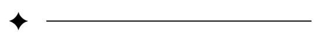
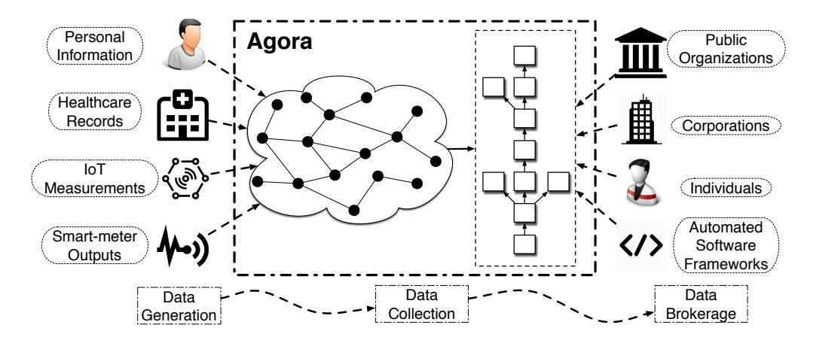
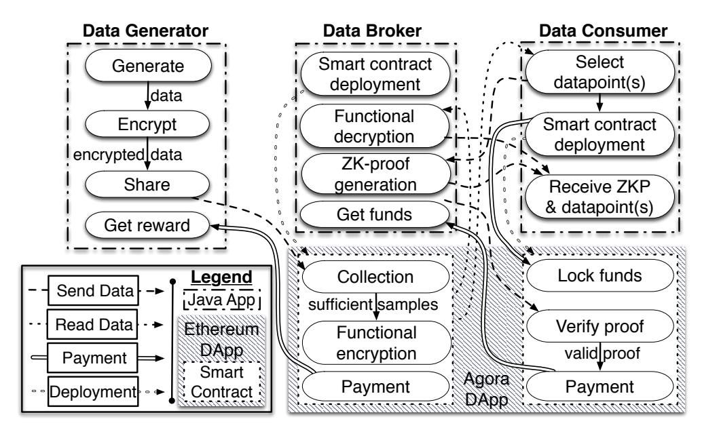
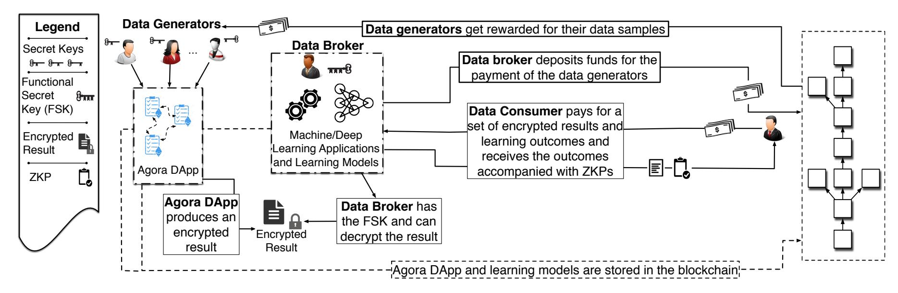
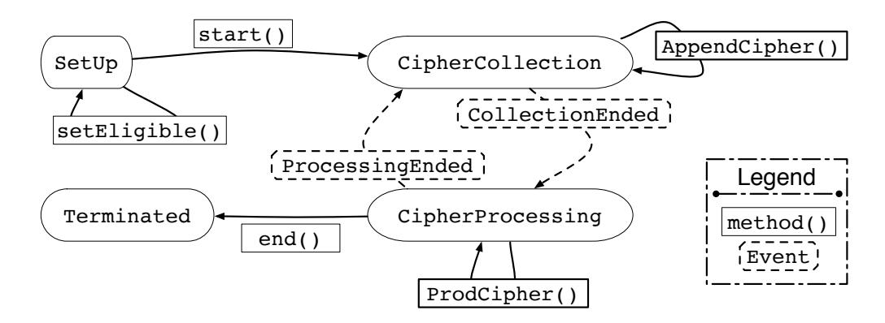
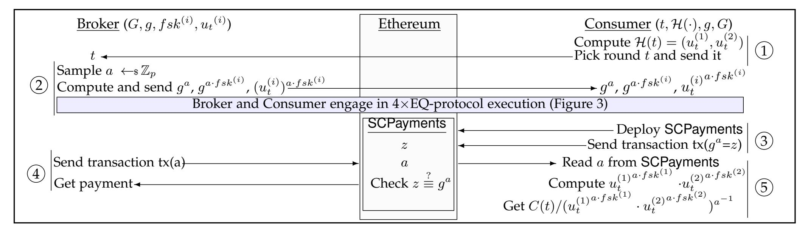
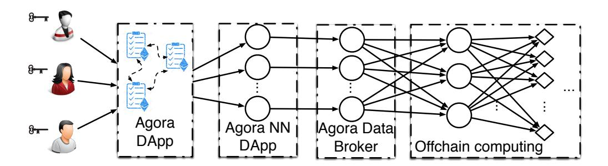
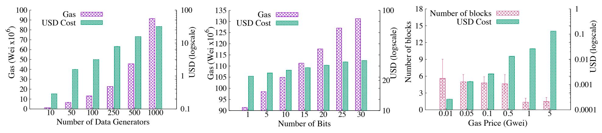
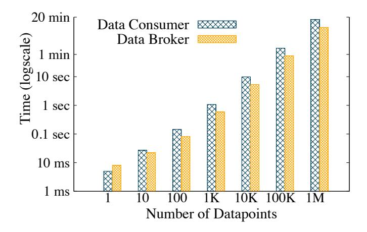
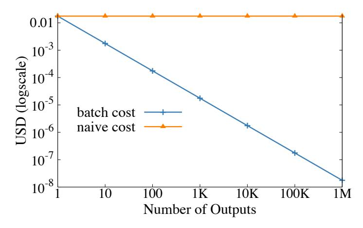

{0}------------------------------------------------

1

# Agora: A Privacy-Aware Data Marketplace

Vlasis Koutsos, Dimitrios Papadopoulos, Dimitris Chatzopoulos, Sasu Tarkoma, and Pan Hui, *Fellow, IEEE*

**Abstract**—We propose Agora, the first blockchain-based data marketplace that enables multiple privacy-concerned parties to get compensated for contributing and exchanging data, without relying on a trusted third party during the exchange. Agora achieves *data privacy*, *output verifiability*, and *atomicity of payments* by leveraging cryptographic techniques, and is designed as a decentralized application via smart contracts. Particularly, data generators provide encrypted data to data brokers who use a *functional secret key* to learn nothing but the output of a specific, agreed upon, function over the raw data. Data consumers can purchase decrypted outputs from the brokers, accompanied by corresponding *proofs of correctness*. We implement a working prototype of Agora on Ethereum and experimentally evaluate its performance and deployment costs. As a core building block of Agora, we propose a new *functional encryption* scheme with additional public parameters that operate as a trust anchor for verifying decrypted results.

**Index Terms**—Data Marketplace, Functional Encryption, Blockchain.



# **1 INTRODUCTION**

T HE proliferation of Internet-connected devices with multiple functionalities and sensing abilities, in addition to the development of services with access to large volumes of user-generated data, has resulted in the emergence of a data-exchange market. Using data marketplaces data owners can broker their data to interested buyers, receiving corresponding payments. This has found a plethora of applications, e.g., combined medical data records from multiple hospital authorities can be employed to speed up the development of a cure [1]–[3]. Data from Internet of Things (IoT) devices can accelerate the development of personalized models that improve users' quality of experience [4], [5]. Electricity smart meter measurements can be used to provide feedback to households and assist in reducing their electricity bills or even detect malfunctioning appliances [6]. Therefore, data owners can be incentivized to participate in such a marketplace as long as they get sufficiently compensated for their data [7].

In many applications there exists a third, intermediary, party between the data owners and the buyers, e.g., a statistical analysis company [8]. Such an intermediary receives the owners' raw data, processes them, and sells the processed results to the buyers, reimbursing the owners. In this work, we consider this extended data marketplace with the three following types of entities: *(a) data generators* who provide their data; *(b) data brokers* who reimburse generators for their data, compute functions over it, and sell the outputs to interested parties; and *(c) data consumers* who purchase these outputs from the brokers.

**Modeling a Secure Data Marketplace.** According to studies [9], [10], in the seller-buyer only setting, privacy and security concerns may deter generators from participating

• *V. Koutsos, D. Papadopoulos, and D.Chatzopoulos are with the Department of Computer Science and Engeneering, The Hong Kong University of Science and Technology, Hong Kong.*

in data marketplaces. Disclosure of sensitive data could lead to major privacy breaches e.g., the energy consumption of a household is directly related to the living patterns of the inhabitants (i.e., whether someone is at home or not), thus no such information should be publicly revealed.

In the extended setting things can be even worse. Existing data marketplaces [11]–[14] require entities to place too much trust on the intermediate broker. First, generators are expected to fully trust brokers to manage and process their data. This means that generators effectively *relinquish control* over their data, do not know which functions are computed over them, or whether they are altered. Consumers are also expected to trust brokers to provide them with the correct requested result. Importantly, a consumer cannot check whether the broker has altered the result, without having access to the data of the generators. Last, payments are usually handled via a third party (e.g., banks or credit institutions). Ideally, in a secure marketplace owners should maintain some control over the types of computations that can be performed on their data [10], consumers should be able to verify that a received result is honestly computed, and payments should be guaranteed. Thus, we propose the following properties for a *secure data marketplace*:

*Data privacy***:** no party can learn any information about the raw data of the generators, apart from the function output that is learnt by the broker and paying consumers.

*Output verifiability***:** no broker can successfully sell an incorrect or falsified result to a consumer.

*Atomicity of payments***:** no entity can avoid paying for services, i.e., generators are reimbursed for their data and brokers are paid for providing function outputs.

The problem we are concerned with in this paper is designing such a secure data marketplace. A number of previous works model the broker as a trusted party or assume secure hardware and by doing this they manage to satisfy independently some of the above properties [15]– [18]. Utilizing such trusted components in our design is not ideal, as trusted parties relax significantly the threat model of any system, and secure hardware has been proven sus-

*E-mail:* {*vkoutsos, dipapado, dcab*}*@cse.ust.hk* • *P. Hui is with the Department of Computer Science and Engeneering, The Hong Kong University of Science and Technology, Hong Kong and the University of Helsinki.E-mail: panhui@cse.ust.hk*

<sup>•</sup> *S.Tarkoma is with University of Helsinki.E-mail: sasu.tarkoma@helsinki.fi*

{1}------------------------------------------------



Figure 1: Agora allows multiple types of data owners to share encrypted data and offers selective disclosure of functions of the data without compromising users' privacy.

ceptible to side-channel attacks [19], [20]. Section 2 describes previous works in detail and explains why they do not provide a satisfactory solution to our problem.

Our Solution. In this work we propose Agora, the first data marketplace that satisfies data privacy, output verifiability, and atomicity of payments, without relying on secure hardware or requiring a trusted party to be involved in the data purchase process. Instead Agora relies solely on the use of cryptographic components. Specifically, we propose a novel functional encryption (FE) scheme with additional public parameters that guarantees data privacy. Additionally, we integrate into our system a tailored zero-knowledge proof (ZKP) protocol that is compatible with our FE scheme and ensures output verifiability. To satisfy atomicity of payments we build Agora atop a blockchain supporting smart contracts. Finally, we optimize Agora to support efficient batch purchase of function outputs, while keeping the maintenance cost constant regardless of the number of purchased outputs.

The operation of Agora (see Section 5 for details) consists of the following three phases, as shown in Figure 1: (i) data generation, (ii) data collection, and (iii) data brokerage. Generators gather and encrypt their data during data generation. Following, during data collection brokers receive the individual ciphertexts, and later on combine and decrypt them to get a function output. This data generation-collection cycle may be performed repeatedly. Finally, during data brokerage consumers pay brokers for selected function outputs and receive proofs of their correctness.

Agora supports brokerage of weighted sum function outputs. Beyond the obvious use cases in statistical analysis, Section 6 shows that even this restricted class of functionalities is expressive enough to allow using Agora for privacy-preserving campaigns, linear regression [21] and computation of the first hidden layer of neural networks [22]. Agora's limitation to this class of functions is due to our choice of FE scheme; other alternatives do exist but they come with limitations of their own (see discussion in Section 8).

Implementation and experimental evaluation. We developed a working prototype of Agora on top of Ethereum. Figure 2 depicts the software components of Agora, i.e., three off-chain applications (generator, broker, consumer) and one DApp, and their interactions. The DApp consists of two types of smart contracts, one deployed by brokers to initiate data collection and one deployed by consumers for data brokerage. Off-chain applications are implemented in Java and interact with the DApp using a Web3J-based protocol [23]. Our experimental evaluation shows that Agora



Figure 2: Components and basic interactions between the data generators, the data broker and the data consumers.

scales well with the number of generators and purchased results. For example, when computing a weighted sum for data from 1K generators, the gas cost for the data collection smart contract is 31.62 USD, and decrypting the result takes < 0.5 seconds. Similarly, the purchase of 10K different results requires < 10 seconds of computing time. Using our batch-purchase optimization, the total gas cost for result verification is  $\approx 0.02$ USD (without this optimization, the corresponding cost is 175.5 USD).

**Overview of techniques.** At first glance, it seems that our three target properties can be achieved independently using FE, ZKPs, and blockchain smart contracts. First, in standard encryption anyone with a secret key can retrieve the original data. In contrast, FE [24] allows the creation of a functional secret key fsk that given a collection of ciphertexts can be used to retrieve only a predetermined function of the original data. E.g., in our aforementioned electricity smart meter example, a special fsk could be used to decrypt only the average of the readings and none of them separately. Hence, FE can be used to guarantee the individual generators' data privacy. Second, ZKPs [25] allow a prover to convince a verifier about the validity of a statement, without disclosing any additional information about how it learned it. E.g., during data brokerage brokers could use a ZKP to guarantee the correctness of a traded function output, without revealing the corresponding *fsk*. Finally, blockchains with smart contracts support automated payments and rely solely on the security properties of their decentralized architecture; a marketplace built on such a decentralized architecture has no need of a trusted third party to conduct payments. However, it is not trivial to combine these techniques to get a secure and efficient data marketplace. Indeed, we need to address the following three issues.

1) Combining FE with ZKP. Unfortunately, existing FE schemes cannot be readily combined with a ZKP to allow consumers to verify the correctness of traded function outputs, unless they also know the secret fsk. To avoid this, we propose a new FE scheme with additional public parameters. We build on the existing multi-client functional encryption (MCFE) scheme of [26] by introducing a functional public key fpk, that can be viewed as a public analog of the fsk. This fpk that is known by the consumer will then be used during brokerage as a "trust anchor." I.e., the broker

{2}------------------------------------------------

proves the validity of an output with respect to the fsk that corresponds to this f pk.

We prove that even with the addition of f pk our scheme remains secure under the standard MCFE security definition [26]. Additionally, we propose a new *passive* security definition for MCFE against adversaries without fsk, i.e., without decrypting capabilities, and we prove our scheme secure also against this definition. These two definitions differ in the following sense. The first protects against brokers and guarantees that fsk reveals only function outputs of the generators' raw data, whereas the second protects against other parties that should learn *nothing* about the data (except purchased outputs). We stress that these definitions are complementary and both are necessary for our system. *2) Achieving atomicity of payments.* A different issue has to do with atomicity of payments. Consider the data brokerage phase. If the broker discloses the requested function output alongside its corresponding proof of correctness to the consumer, the latter may never pay. Similarly, if the consumer pays ahead of time, the broker may never disclose the requested output. Note that this problem is orthogonal to output verifiability. To solve this, we can execute the ZKP protocol *on-chain* using smart contracts. Particularly, the consumer will time-lock funds, which will be transferred to the broker if and only if the latter uploads a convincing proof. However, if done naively, this can blow up the gas cost or disclose the result to all blockchain participants. Instead, we split the ZKP execution into off-chain and onchain. The bulk of the ZKP execution takes place off-chain via direct communication of the parties and only a final, lightweight, step is performed by the data-brokerage smart contract in order to release the funds. Atomicity of payments between data generators and broker is also achieved in

*3) Handling batch purchases.* Executing ZKP verification onchain introduces the following efficiency issue: Each output purchase requires a separate smart contract transaction. Hence, purchasing multiple outputs (as is typically the case) may incur a prohibitive cost. E.g., the gas cost for the purchase of one output with Agora is roughly 0.2USD, meaning that a consumer that wants to buy 10K outputs must pay 1, 755USD. To avoid this, we observe our chosen ZKP can be modified so as to run the on-chain verification step *only once*, even for multiple purchases. This optimization makes the gas cost constant, independently of the number of purchased outputs (see experimental evaluation in Section 7.3).

a similar way. The broker time-locks funds on the datacollection smart contract. This reimburses each generator

automatically when the latter provides its data.

## **2 RELATED WORK**

**Decentralized architectures.** A line of previous works which are built on decentralized architectures achieve the desired functionality of marketplaces. The authors of [27] propose a solution where participants exchange data via a blockchain that records their interactions. Similarly, the authors of [28] propose a marketplace to assist the collaboration between IoT device vendors and data consumers. Also, the authors of [29] propose a model for trading data generated by IoT devices using the scripting capabilities of Bitcoin. Similarly, [30] implemented a protocol for sensors to

exchange data for Bitcoins. However, none of these works considers data privacy.

Regarding decentralized architectures for data sharing, [18] presents a blockchain-based design for distributed access control and data management for IoT. The authors of [31] develop an edge-IoT framework using Ethereum smart contracts to control the resources IoT devices can obtain from edge servers. Storj [32] and FileCoin [33] introduce distributed file storage systems, monetized by operating over a blockchain. Enigma [34] uses blockchain for access control and enables sharing of off-chain stored data. Data privacy is not ensured in any of the above proposals.

**Private data marketplaces.** Considering works that aim for data privacy, the authors of [16] propose a centralized marketplace where the privacy of the data generators is preserved via homomorphic encryption. A crucial difference between FE and homomorphic encryption is that the latter does not guarantee the privacy of each individual generator's data. To bypass this issue, the authors of [16] rely on a trusted third party for decryption, significantly relaxing the threat model. Our MCFE scheme assumes a trusted authority that generates keys initially. This is a strictly weaker assumption, as the key-generating algorithm is run only once and the trusted authority is never involved in the protocol afterwards. In comparison, the trusted decryptor of [16] is actively involved in all protocol phases, making it a constant liability. Finally, it is worth noting that with Agora there are ways to eliminate the trusted authority entirely, by running instead a decentralized key-generation procedure among the data generators (at an additional onetime overhead) [35], [36].

A different approach is followed in [17], based on differential-privacy (DP)–however, that work does not consider output verifiability. DP relies on perturbing the data with noise, hence the results have an inherent error margin. We note that DP and encryption can potentially be used jointly, as they guarantee orthogonal notions of privacy.

The authors of [37] list necessary privacy requirements for the exchange of healthcare data and discuss how a blockchain can be used for that purpose, however, they do not provide any concrete solution. Finally, the authors of [15] design a decentralized privacy-preserving crowdsourcing architecture where they aggregate private values without compromising the privacy of the data contributors. Their solution relies on secure hardware to guarantee the validity of the computed outputs, however, recent works have clearly demonstrated that secure hardware can be compromised [19], [20]. Similarly, requiring the existence of a trusted entity for the data exchange is not ideal (e.g., in case it is compromised or misbehaves).

**Verifiability in FE.** The notion of verifiability in the context of functional encryption has been examined before in [38]– [40]. However, we point out that the security property proposed in these works is different than ours and they do not guarantee our desired output verifiability. In particular, their adversarial model includes the key-generating and encrypting parties in FE, whereas they consider the party holding the fsk to be honest. Therefore, their security property is orthogonal to ours.

{3}------------------------------------------------

#### 3 PRELIMINARIES

**Negligible function.** By  $negl: \mathbb{N} \to \mathbb{R}^+$  we denote a negligible function, i.e., for every positive polynomial  $p(\lambda)$  there exists a  $\lambda_0 \in \mathbb{N}$ , such that for all  $\lambda > \lambda_0 : negl(\lambda) < 1/p(\lambda)$ .

**Functional encryption.** FE and multi-input FE enable the control of the amount of information that a specified receiver can decrypt from ciphertexts [24], [35]. With multi-input FE a designated party using a *functional secret key* fsk can decrypt only a specific function of the encrypted data, contrary to standard encryption. Concretely, given N ciphertexts  $c_1, c_2, \ldots, c_N$  with corresponding plaintext values  $\mathbf{x} = \{x_1, x_2, \ldots, x_N\}$  and an fsk for a pre-agreed function  $\phi$ , the decrypting party can only access the value  $\phi(x_1, x_2, \ldots, x_N)$ , and nothing else. In particular:

$$c_i \xrightarrow{fsk} x_i$$
, but  $\{c_1, c_2, \dots, c_N\} \xrightarrow{fsk} \phi(x_1, x_2, \dots, x_N)$ 

FE was first defined in [24] and subsequent works proposed general-purpose schemes that can work for any polynomialtime computable  $\phi$  [41], [42]. However, such generalpurpose FE schemes are based on strong assumptions and rather inefficient primitives (such as indistinguishabiliy obfuscation of multi-linear maps), limiting their applicability for adoption in practice. On the other hand, if we limit the supported functions to linear arithmetic computations, a number of works proposed schemes with support for innerproducts [43], [44], the most efficient of which are based on different versions of the ElGamal cryptosystem [45]. In Agora we use the *multi-client functional encryption (MCFE)* of [26], the most efficient adaptively secure actively-secure, inner-product, recent FE scheme, as a baseline, on which we expand to satisfy our model. MCFE supports multiple clients, who produce their ciphertext individually and independently, without the need for interaction among them; a crucial property in our model.

**Zero-knowledge proofs.** ZKPs [25] are protocols between *provers* and *verifiers*. Given a statement x, a prover wishes to prove to a verifier that there exists witness w such that  $(x,w) \in R_L$  where  $R_L$  is the corresponding relation of the NP language L. A ZKP achieves two security guarantees: (i) soundness, i.e., no cheating prover can convince the verifier for  $x \notin L$ , and (ii) zero-knowledge, i.e., the verifier learns nothing about the witness w (besides its existence).

A special case is referred to as  $\Sigma$ -protocols [46], [47], which are very efficient schemes that can be used (among other things) for proving certain algebraic relations among "ElGamal-style" ciphertexts. The prover initially makes an announcement, the verifier responds with a challenge and the prover answers with a response. Non-interactive zeroknowledge (NIZK) proof schemes eliminate the need for message exchange between the prover and the verifier. Instead, the prover generates a proof for a statement and an algorithm by which a verifier can use to verify the proof. In particular, we consider the EQ protocol [48, Ch. 5.2], that is used to prove that a given tuple  $g, h, g^y, h^y$ , is indeed a Diffie-Hellman (DH) tuple, i.e., the third and the fourth terms are computed by raising the first and the second to the same exponent (assuming a cyclic group G with prime order p and generators g, h). Figure 3 shows its NIZK version (assuming a hash function  $\mathcal{H}$  modelled as a random oracle).

```
Common Inputs: G, g, p, H(g, h, g^y, h^y)

Witness: y

Prover:

1: Choose v \in Z_p uniformly at random. Set b_1 \leftarrow g^v and b_2 \leftarrow h^v

2: Compute c \leftarrow H(g, h, g^y, h^y, b_1, b_2) and set z \leftarrow v + cy

3: Send to verifier (b_1, b_2, z)

Verifier:

4: Compute c \leftarrow H(g, h, g^y, h^y, b_1, b_2)

5: Check that g^z = b_1(g^y)^c and h^z = b_2(h^y)^c.
```

Figure 3: EQ-( $\Sigma$ -)protocol for the DH tuple ( $g, h, g^y, h^y$ ).

**Blockchain and smart contracts.** In the seminal paper from 2009 [49], Satoshi Nakamoto proposed Bitcoin. Its underlying technology is known as a blockchain and has since been widely used as a tool for building secure distributed ledgers. Blockchains are maintained by distributed systems of Internet-connected nodes. Each block in the chain contains data generated by users and information necessary for its operation. The most popular blockchain application is currency exchange. However, blockchains have also been used to store other types of data and support executable scripts. Such scripts are known as smart contracts and the most prominent blockchain that supports them is Ethereum. Smart contracts contain methods and variables that define their state. After its deployment, a smart contract acquires its own Ethereum address. Reading data from a smart contract is free, while transacting with a contract, i.e., by creating it, or interacting with it via a method and changing its state (by submitting or altering data) requires gas and time. The number and type of instructions the method executes defines the amount of gas needed for the transaction, and is called gas cost. Whenever a transaction is created, it is processed by the network before altering the state of a contract. Transaction owners specify the gas price they are willing to pay, affecting accordingly the blockchain transaction processing time.

#### 4 MCFE SCHEME OF AGORA

Here, we present the underlying MCFE scheme of Agora, which extends the state-of-the-art scheme of [26]. Our construction is a modified version of [26] by adding as a public parameter the public-key equivalent of fsk. This will then allow us to accommodate zero-knowledge proofs of correctness for the function outputs, (in Agora, this will be necessary during data brokerage, see Section 5.2). We denote by  $\mathcal{M}$  the MCFE scheme of [26] and by  $\mathcal{M}'$  our new MCFE scheme. Following  $\mathcal{M}$ ,  $\mathcal{M}'$  supports weighted sums between a known vector of weights  $\mathbf{w} = (w_1, w_2, \dots, w_n)$  and a plaintext vector  $\mathbf{x}$ :  $\mathbf{w}^{\mathsf{T}}\mathbf{x}$ .

 $\mathcal{M}'$  consists of the following four algorithms:

- SetUp(1 $^{\lambda}$ ): Takes as input the security parameter  $\lambda$  and generates a prime-order group  $\mathcal{G} := (\mathbb{G}, p, g)$  of an additive cyclic group  $\mathbb{G}$  of order p for a  $2\lambda$ -bit prime p, whose generator is g, and  $\mathcal{H}$  a full-domain hash function onto  $\mathbb{G}^2$ . It also generates the encryption key of each generator  $s_i = (s_i^{(1)}, s_i^{(2)}) \leftarrow_{\$} \mathbb{Z}_p^2$  for  $i = 1, \ldots, n$ . The public parameters mpk consist of  $(\mathbb{G}, p, g, \mathcal{H})$ , while the master secret key is  $msk = \{\{s_1^{(1)}, s_1^{(2)}\}, \{s_2^{(1)}, s_2^{(2)}\}, \ldots, \{s_n^{(1)}, s_n^{(2)}\}\}$ .
- DKeyGen $(msk, \mathbf{w})$ : Takes as input msk and a vector of weights  $\mathbf{w}$  and outputs a functional decryption key fsk =

{4}------------------------------------------------

 $\begin{array}{l} (\sum_{i=1}^{n} w_{i} s_{i}^{(1)}, \sum_{i=1}^{n} w_{i} s_{i}^{(1)}) \in \mathbb{Z}_{p}^{2}, \text{ and a functional public} \\ \text{key } fpk = (\mathbf{w}, g^{\sum_{i=1}^{n} w_{i} \cdot s_{i}^{(1)}}, g^{\sum_{i=1}^{n} w_{i} \cdot s_{i}^{(2)}}) \in \mathbb{Z}_{p}^{n} \times \mathbb{G}^{2}. \end{array}$ 

- Encrypt $(s_i, x_i, t)$ : Takes as input  $x_i$ , the value to be encrypted, under the encryption key  $s_i$  and label t. It computes  $u_t := \mathcal{H}(t) = (u_t^{(1)}, u_t^{(2)}) \in \mathbb{G}^2$ , and outputs the ciphertext  $c_i(t) = u_t^{(1)s_i^{(1)}} \cdot u_t^{(2)s_i^{(2)}} \cdot g^{x_i} \in \mathbb{G}$ .
- Decrypt $(fsk,t,\mathbf{c}(t))$ : Takes as input the functional decryption key fsk, a label t, and a vector with the n ciphertexts  $\mathbf{c}(t)$  from all the generators. It computes  $u_t := \mathcal{H}(t)$ ,  $\prod_{i=1}^n c_i(t)^{w_i}/(u_t^{(1)\sum_{i=1}^n w_i s_i^{(1)}} \cdot u_t^{(2)\sum_{i=1}^n w_i s_i^{(2)}}) = g^{\mathbf{w}^\intercal \mathbf{x}(t)},$  and solves the discrete logarithm to extract  $\mathbf{w}^\intercal \mathbf{x}(t)$ .

We now prove that  $\mathcal{M}'$  is *actively secure* as per [26, Definition 2], by a reduction to the security of  $\mathcal{M}$ . For completeness we provide the active security definition in the Appendix.

#### **Theorem 1.** Assuming $\mathcal{M}$ is actively secure, so is $\mathcal{M}'$ .

*Proof.* We prove this by contraposition. We consider a PPT adversary  $\mathcal{A}'$  that has non-negligible probability  $\epsilon$  of winning the IND-Security game for  $\mathcal{M}'$ . We will show that an adversary  $\mathcal{A}$  can use  $\mathcal{A}'$  to win in the IND-security game for  $\mathcal{M}$  with non-negligible probability.

- Initialization:  $\mathcal{A}$  receives mpk from  $\mathcal{C}$  and runs  $\mathcal{A}'$  on input  $(1^{\lambda}, mpk)$ .
- *Encryption queries* QEncrypt( $i,x^0,x^1,\ell$ ): When  $\mathcal{A}'$  issues an encryption query,  $\mathcal{A}$  forwards it to  $\mathcal{C}$ , receives the ciphertext  $\mathcal{C}_{\ell,i}$  and gives it to  $\mathcal{A}'$ .
- Functional encryption key queries QDKeyGen(f): When  $\mathcal{A}'$  issues a query,  $\mathcal{A}$  forwards it to  $\mathcal{C}$  who gives back  $fsk = (\mathbf{w}, \sum_{i=1}^n w_i s_i^{(1)}, \sum_{i=1}^n w_i s_i^{(2)})$ ,  $\mathcal{A}$  computes the values  $g^{\sum_{i=1}^n w_i s_i^{(1)}}, g^{\sum_{i=1}^n w_i s_i^{(2)}}$  and returns to  $\mathcal{A}'$  both fsk and  $fpk = (\mathbf{w}, g^{\sum_{i=1}^n w_i s_i^{(1)}}, g^{\sum_{i=1}^n w_i s_i^{(2)}})$ .
- Corruption queries QCorrupt(i): When A' issues a query, A forwards it to C to receive key  $s_i$  of the corresponding party and returns it to A'.
- *Finalization*: A' sends b' to A who forwards it to C.

 $\mathcal{A}$  runs in polynomial-time as it runs the probabilistic polynomial-time (PPT) adversary  $\mathcal{A}'$  and additionally performs polynomial-time operations (i.e. exponentiations). Moreover,  $\mathcal{A}$  perfectly emulates the challenger that  $\mathcal{A}'$  is expecting to communicate with while playing the IND-Security game of  $\mathcal{M}'$ , which means that the view of  $\mathcal{A}'$  is identical in both cases. This happens because g is already known to  $\mathcal{A}$  from the mpk, and given (g,fsk)  $\mathcal{A}$  can compute the unique fpk. Therefore, considering that  $\mathcal{A}'$  has a non-negligible probability  $\epsilon$  of winning the IND-security game of  $\mathcal{M}'$ ,  $\mathcal{A}$  has also the same non-negligible probability  $\epsilon$  of winning the IND-security game of  $\mathcal{M}$ .

**Passive security definition.** As stated before, we use our MCFE scheme in the context of an Ethereum Dapp where parties have access to the fpk and the individual ciphertexts of the generators. These parties should not be able to infer any information about the generators' raw data. This is in contrast with active security that considers only an adversary that knows fsk and can decrypt functional ciphertexts (see Appendix for the definition of active security [26]). Thus, we need to capture this class of attacks in a new security definition. Below we provide a game-based definition of *passive security* for MCFE schemes with fpk.

**Definition 1** (Passive-IND-security game for MCFE schemes). Let us consider an MCFE scheme over a set of n senders. No PPT adversary  $\mathcal{A}$  should be able to win the following security game against a challenger  $\mathcal{C}$ :

- Initialization: the challenger C runs the setup algorithm  $(mpk, msk, (s_i)_i) \leftarrow SetUp(1^{\lambda})$  and chooses a random bit  $b \leftarrow \{0, 1\}$ . It provides mpk to the adversary A.
- Encryption queries QEncrypt $(i,x^0,x^1,\ell)$ : A has unlimited and adaptive access to a Left-or-Right encryption oracle, and receives the ciphertext  $C_{\ell,i}$ , generated by Encrypt $(s_i,x_i^b,\ell)$ . We note that any further query for the same pair  $(\ell,i)$  is ignored.
- Functional public key queries QPKeyGen(f):  $\mathcal{A}$  has unlimited and adaptive access to the DKeyGen(msk, f) algorithm for any function f of its choice. It gets the functional public key fpk.
- Finalize: A provides its guess b' on the bit b.

A wins in the game if b' = b and we remark that a naive adversary, by sampling randomly b' has probability of winning equal to  $\frac{1}{2}$ . We denote the advantage that  $\mathcal{A}$  has of winning as  $Adv^{Passive-IND}(\mathcal{A})$  and we say this MCFE is Passive-IND-secure if for any PPT adversary  $\mathcal{A}$ ,  $Adv^{Passive-IND}(\mathcal{A}) = |Pr[b' = 1|b = 1] - Pr[b' = 1|b = 0]|$  is negligible.

We now prove  $\mathcal{M}'$  satisfies our passive security definition. The proof includes Lemmas 3, 4, which we prove separately in the Appendix in order to improve readability.

**Theorem 2.**  $\mathcal{M}'$  is passively secure under the DDH assumption.

*Proof.* We consider the following encryption scheme  $\mathcal{E} = (\text{KeyGen,Encrypt,Decrypt})$  which resembles both a labelled encryption scheme [50] and  $\mathcal{M}'$ , for n=1.

- KeyGen(1 $^{\lambda}$ ): Takes as input the security parameter  $\lambda$  and generates a prime-order group  $\mathcal{G}:=(\mathbb{G},p,g)$  of an additive cyclic group  $\mathbb{G}$  of order p for a  $2\lambda$ -bit prime p, whose generator is g, and  $\mathcal{H}$  a full-domain hash function onto  $\mathbb{G}^2$ . It also generates the keys  $s=(s^{(1)},s^{(2)})\leftarrow_{\$}\mathbb{Z}_p^2$  and  $pk=(g^{s^{(1)}},g^{s^{(2)}})$ . The public parameters pp consist of  $(\mathbb{G},p,g,\mathcal{H})$ .
- Encrypt(s,x,l): Takes as input  $x_i$ , the value to be encrypted, under the key  $[s] = [s^{(1)},s^{(2)}]$  and the label  $\ell$ . It computes  $[u_\ell] := \mathcal{H}(\ell) = [u_\ell^{(1)},u_\ell^{(2)}]$ , and outputs the ciphertext  $c_\ell = u_\ell^{(1)} \cdot u_\ell^{(2)} \cdot g^x$ .
- Decrypt $(s,\ell,c_\ell)$ : Takes as input the key  $[s] = [s^{(1)},s^{(2)}]$ , a label  $\ell$ , and the ciphertext  $c_\ell$ . It computes  $[u_\ell] := \mathcal{H}(\ell)$ ,  $c_\ell / \left(u_\ell^{(1)^{s^{(1)}}} \cdot u_\ell^{(2)^{s^{(2)}}}\right) = g^x$ , and solves the discrete logarithm to extract and return x.

We consider the following indistinguishability game:

- Initialization: C runs Keygen and chooses  $b \leftarrow_{\$} \{0,1\}$ . It returns pp and pk to A.
- *Oracle queries* QOracle( $\ell$ ):  $\mathcal{A}$  has access to a random oracle to which it provides a label  $\ell$  and returns a tuple  $(v_1, v_2)$ .
- Encryption queries QEncrpyt $(x^0, x^1, \ell)$ :  $\mathcal{A}$  chooses  $x^0, x^1$  and issues an encrpytion query to  $\mathcal{C}$  who returns  $c_\ell = u_\ell^{(1)^{s^{(1)}}} \cdot u_\ell^{(2)^{s^{(2)}}} \cdot g^{x^b}$ .
- Finalization:  $\mathcal{A}$  sends its guess b' on the bit b to  $\mathcal{C}$ , and this procedure outputs the result  $\beta$  of the security game, according to the analysis given below.  $\mathcal{A}$  wins if  $\beta = b$ .

The output  $\beta$  of the game depends on the following condition. We set the output to  $\beta \leftarrow b'$ , unless QEncrypt( $\ell$ ) has

{5}------------------------------------------------



Figure 4: Agora allows data consumers to pay for functions of privacy-sensitive information using smart contracts and cryptographic primitives that guarantee the integrity of the produced function outputs.

been issued for the same label  $\ell$  more than once, in which case we set  $\beta \leftarrow_{\$} \{0,1\}$ .  $\mathcal{A}$  wins in the previously described game if  $\beta = b$  and we remark that a naive adversary, by sampling randomly  $\beta$ , has probability of winning equal to  $\frac{1}{2}$ . We denote the advantage that  $\mathcal{A}$  has of winning as  $Adv^{\mathcal{E}}(\mathcal{A})$ , where  $Adv^{\mathcal{E}}(\mathcal{A}) = |Pr[\beta = 1|b = 1] - Pr[\beta = 1|b = 0]|$ .

**Lemma 3.** For all PPT adversaries A,  $Adv^{\mathcal{E}}(A) \leq negl(\lambda)$ , under the DDH assumption.

**Lemma 4.** Assuming  $Adv^{\mathcal{E}}(\mathcal{A}) \leq negl(\lambda)$ , then  $\mathcal{M}'$  is passively secure.

### 5 AGORA DATA MARKETPLACE

Agora is a round-based system running atop a blockchain, with three phases: data generation, data collection, and data brokerage. It requires a one-time setup during which all keys are generated. This is performed by a trusted authority who does not participate in the system again (or, alternatively, by a decentralized protocol among the generators [35], [36]). Data generation and data collection happen sequentially and periodically while data brokerage may happen independently and at any time. We denote by  $\mathcal{N}$  the set of data generators, and let  $|\mathcal{N}| = n$ . During the data generation phase of round t, the i-th generator produces data  $x_i(t)$  and encrypts it into a ciphertext  $c_i(t)$ using our MCFE scheme. Agora supports inner product functionalities, i.e., weighted sums between the plaintext vector  $\mathbf{x}(t) = (x_1(t), x_2(t), \dots, x_n(t))$  and a known vector of weights  $\mathbf{w} = (w_1, w_2, \dots, w_n)$ :  $\mathbf{w}^{\mathsf{T}} \mathbf{x}(t)$ . We define  $X(t) := g^{\mathbf{w}^{\mathsf{T}}\mathbf{x}(t)}$  and  $C(t) := \prod_{i=1}^{n} c_i(t)^{w_i}$ . Figure 4 depicts the participating entities and their interactions.

# 5.1 Data Collection

Brokers initiate a data collection campaign by deploying a smart contract on the Ethereum blockchain to attract generators. A broker forks and deploys SCInnerProducts, a smart contract on Ethereum, and deposits funds onto it. The Ethereum address of SCInnerProducts is broadcast to generators who can use it to share their encrypted data. SCInnerProducts is in charge of collecting the ciphertexts, reimbursing the generators, and calculating the encrypted weighted sums of the plaintexts using our MCFE scheme.



Figure 5: States and methods of SCInnerProducts.

In more detail, SCInnerProducts transitions between four states: SetUp, CipherCollection, CipherProcessing, and Terminated (see Figure 5). This happens either via a received transaction, or via automatically triggered events. During the SetUp state the owner of the contract (i.e., the broker that sponsors the campaign) whitelists the addresses of the participating generators using the SetEligible method. Then, the broker specifies the duration of the ciphertext submission period and the total number of rounds, changing the state of the contract to CipherCollection and the data collection phase begins. During round *t*, generators submit their ciphertexts  $c_i(t)$  using AppendCipher method. After receiving all *n* ciphertexts, SCInnerProducts goes to the CipherProcessing state, i.e., the broker triggers the ProdCipher method to calculate C(t). The contract then switches again to CipherCollection, starting the collection for round t + 1. This process is repeated until the funds on the smart contract are depleted or the termination phase is manually triggered.

At any time, the broker can retrieve the weighted sum for a round t by retrieving C(t) from the blockchain, and use the fsk to decrypt it.

#### 5.2 Data Brokerage

Interested consumers can purchase weighted sum outputs from brokers. However, remember that this raises the question "how can a consumer be certain that the purchased value for round t is the correct decryption of C(t)?" Note that the broker who has access to the fsk can easily manipulate the decrypted output. Agora addresses this by requiring the broker to provide a ZKP proof for the fact that the provided result is the decryption of C(t) under the fsk that corresponds to the fpk held by the consumer. Recall that every fpk is uniquely tied to its respective fsk and both are

{6}------------------------------------------------



Figure 6: ZKP-protocol of Agora between a broker and a consumer for the trading of one weighted sum.

generated securely during the setup phase of the system. Hence the consumer regards fpk as an anchor trust. Below we present our ZKP in detail.

Assume a consumer that wishes to purchase the decryption of C(t). Recall that, by construction, this is of the form  $C(t) = r_1 \cdot r_2 \cdot g^{\mathbf{w}^{\mathsf{T}}\mathbf{x}(t)}$ , where  $r_1 = u_t^{(1)fsk^{(1)}}$  and  $r_2 = u_t^{(\grave{2}) f_{sk}^{(2)}}$  are known to the broker (see Section 4). In practice, it suffices for the broker to send  $r_1$  and  $r_2$  to the consumer who can retrieve  $g^{\mathbf{w}^{\mathsf{T}}\mathbf{x}(t)}$  as  $C(t)/(r_1 \cdot r_2)$ . (To avoid having to solve the discrete logarithm, the broker may also send  $\mathbf{w}^{\mathsf{T}}\mathbf{x}(t)$  to the consumer, who checks the purchased result with one exponentiation.) The problem is to prove that  $r_1$  and  $r_2$  are the *correct* terms for C(t). This can be done by using the EQ  $\Sigma$ -protocol that we described in Section 3, for the Diffie-Hellman tuples  $(g, g^{fsk^{(1)}}, u_t^{(1)}, r_1)$ and  $(g, g^{f s k^{(2)}}, u_t^{(2)}, r_2)$ . The first two terms of each tuple are part of the public parameters and the fpk respectively, and the consumer can calculate directly the third term via the pubic hash function  $\mathcal{H}$ . By running two EQ protocols, the broker proves that the third and fourth term in each tuple were produced by raising the first and second ones to the same exponent, which suffices for convincing the consumer about the correctness of  $r_1$  and  $r_2$ .

The above guarantees output verifiability. However, there still remains the challenge of atomicity of payments. E.g., if the broker sends  $r_1$ ,  $r_2$ , and the proofs before getting paid, the consumer has no motivation to pay, having already acquired the requested information. We can avoid this by running the ZKP on a smart contract that will automatically transfer the money to the broker upon successful verification. A naive way to do this would be to ask the broker to upload  $r_1$  and  $r_2$  together with their EQ proofs, in order to get paid. In this way, the broker is guaranteed payment but *every* blockchain participant can now compute the result!

We deal with this by running the two EQ protocols for "blinded" values  $r_1^a, r_2^a$ , where a is a value randomly chosen by the broker. To convince the consumer that it used the same a for these, the broker provides two additional EQ proofs for tuples  $(g, g^{fsk^{(1)}}, g^a, g^{a \cdot fsk^{(1)}})$ ,  $(g, g^{fsk^{(2)}}, g^a, g^{a \cdot fsk^{(2)}})$ . The consumer then verifies all four proofs. Up to this point, all interactions between broker and consumer take place off-chain. Only after verifying the proofs the consumer deploys a smart contract SCPayments that transfers funds to the broker if and only if the latter uploads the discrete logarithm of  $g^a$  with respect to g. Af-

terwards, the consumer computes  $r_i = (r_i^a)^{a^{-1}}$ , for i = 1, 2, and uses them to calculate the result, as explained above.

The methods of SCPayments are as follows. The consumer uses SetPayment to set the amount of the payment, upload  $g^a$ , and specify the deadline until which the funds will be time-locked in the contract. The broker uploads a using the ValidityCheck method, upon whose successful execution the broker receives the locked funds. The consumer may use the WithdrawPayment method to reclaim the deposit if the deadline expires.

In this way, a consumer that aborts without deploying SCPayments learns nothing; at the same time, a consumer that follows the protocol is convinced about the correctness of the result. Moreover, an honest broker always gets paid, while no third party can infer information about the result (as the first part is executed off-chain via direct communication between the parties).

The detailed protocol, as depicted in Figure 6, is described in the following five steps:

- (1) The consumer selects the round t and sends it to the broker, while also computing  $\mathcal{H}(t) = (u_t^{(1)}, u_t^{(2)})$ .
- ② The broker chooses  $a \leftarrow \mathbb{Z}_p$  uniformly at random and computes  $u_t^{(i)^{a \cdot f s k^{(i)}}}$  for i=1,2 and sends  $g^a, g^{a \cdot f s k^{(i)}}$ ,  $u_t^{(i)^{a \cdot f s k^{(i)}}}$  to the consumer. The two entities run four instances of the EQ protocol for the tuples  $(g, g^{f s k^{(1)}}, g^a, g^{a \cdot f s k^{(1)}})$ ,  $(g, g^{a \cdot f s k^{(1)}}, u_t^{(1)}, u_t^{(1)^{a \cdot f s k^{(1)}}})$ ,  $(g, g^{f s k^{(2)}}, g^a, g^{a \cdot f s k^{(2)}})$ ,  $(g, g^{a \cdot f s k^{(2)}}, u_t^{(2)}, u_t^{(2)^{a \cdot f s k^{(2)}}})$ . If any verification fails, the consumer aborts.
- 3 The consumer deploys SCPayments storing  $g, z = g^a$  and programs it to release a payment to the broker upon submitting the discrete logarithm of  $g^a$ , on time.
- 4 The broker submits a to SCPayments. The contract checks whether  $g^a = z$  and proceeds accordingly.
- (5) If the contract was successful, the consumer computes

$$C(t) / \left(u_t^{(1)^{a \cdot fsk^{(1)}}} \cdot u_t^{(2)^{a \cdot fsk^{(2)}}}\right)^{a^{-1}} = X(t)$$

**Batch purchases.** In practice, it is realistic to assume that most consumers would be interested in purchasing multiple results. According to the protocol described above, this would increase the gas cost associated with verification linearly with the number of purchased results. Ideally, we

{7}------------------------------------------------



Figure 7: Architecture of a neural network based on Agora.

would like to accommodate *batch purchases*, where the onchain cost remains constant regardless of the number of purchased results. We optimize Agora to achieve this as follows. For purchasing D results, the two parties run the off-chain verification phase for all of  $C(t_1), C(t_2), \ldots, C(t_D)$  using the same a. Then, the on-chain phase is executed via a single SCPAyments smart contract for a with one ValidityCheck execution. In this way, while the off-chain computation and communication increases with D (it requires 4D EQ protocol executions, or 2D+2 for the same function), the on-chain cost remains constant.

#### 6 MACHINE LEARNING APPLICATIONS OF AGORA

Machine learning (ML) services assist data owners to interpret their data, but require copying them to centralized machines. In distributed settings, however, data are split among multiple computers. The most popular distributed and privacy-preserving ML algorithms are based on secure multi-party computation [51], while recent proposals also employ DP techniques [52]. Training traditional ML models require a few iterations to converge [53]–[55], while the training of deep learning models requires multiple iterations [56]. Agora can support regression [57] and a component neural networks [58], two popular ML algorithms.

Regression algorithms estimate the relationship between two or more variables. For example, given the reading of an electricity smart meter at a given time, a regression algorithm can predict the number of people in the apartment. Agora supports regression via smart contracts similar to SCInnerProducts that store weights that have been derived by training. For example, let us consider n owners of fitness trackers paired with mobile applications that summarise all the data  $x_k(t)$  of the day t and use Agora to encrypt  $x_k(t)$  and share it. A promotion company has composed a privacy-preserving regression model that predicts the probability of finding consumers for targeted advertisement among the n users. The promotion company can clone SCInnerProducts and deploy it with the weights  $\mathbf{w}^{pm}$  to be the ones found by the training of the model and receive the corresponding fsk = $\{fsk^{(1)}, fsk^{(2)}\} = \{\sum_{i=1}^{n} w_i^{pm} s_i^{(1)}, \sum_{i=1}^{n} w_i^{pm} s_i^{(2)}\}$  in order to integrate the trained model. Given the decrypted result, the last step (i.e., the sigmoid calculation) is performed by the promotion company.

Neural networks are graph-based layered computing systems composed of three types of layers. The first is called input layer, the last is called output layer and all the layers in between are hidden layers. The input layer receives data and uses a number of predetermined weights to copy weighted inputs from every node of the input layer to every node of the first hidden layer (FHL). This means

| Name                                  | Gas Needs | Cost   |
|---------------------------------------|-----------|--------|
| Deployed Smart Contracts              |           |        |
| SCPayments                            | 2461646   | 0.59   |
| SCInnerProducts                       | 2934214   | 0.71   |
| SCPredictionModel                     | 3514457   | 0.85   |
| ${\sf SCNNPrivateInputLayer}\ (m=10)$ | 8736644   | 2.10   |
| Smart Contracts Methods               |           |        |
| SetEligible                           | 1335488   | 0.32   |
| SetWeights                            | 573843    | 0.14   |
| GoToCipherCollection                  | 41921     | 0.01   |
| GoToInnerProduct                      | 26712     | < 0.01 |
| AppendCipher                          | 99930     | 0.02   |
| SetPayment                            | 31906     | 0.01   |
| ValidityCheck                         | 72864     | 0.02   |
| WithdrawPayment                       | 27825     | < 0.01 |

Table 1: Deployment and transactional cost per method of smart contracts in Agora. The cost (USD) is calculated based on the ETH price on 10-7-2020.

that each node of the FHL stores a weighted sum of the original datapoints. One can clone SCInnerProducts and deploy a SCNNPrivateInputLayer smart contract and store as many vectors of weights as the nodes of the FHL. Let m be the nodes of the FHL and  $\mathbf{c}(t)$  the encrypted data generated by n generators. Then SCNNPrivateInputLayer needs to store an  $m \times n$  array  $\boldsymbol{W}$  and calculate m weighted sums via  $W \cdot \mathbf{c}(t) = \mathbf{h}_1 \in Z_q^{P \times 1}$ . For each node in the FHL, an fsk needs to be calculated.  $\mathbf{h}_1$  can be then decrypted by the broker. Splitting a neural network in two parts partially preserves data privacy since raw data are not transmitted [22]. Figure 7 depicts the architecture of a neural network that is based on Agora. SCNNPrivateInputLayer can calculate the encrypted values of every node of the FHL. These can be then decrypted by the broker and forwarded to the consumer for the computation of the remaining layers.

#### 7 PERFORMANCE EVALUATION

We implement a working prototype of Agora over Ethereum, using Solidity [59] for the development of the contracts and Java for the off-chain applications. We initially measure the cost for deploying the contracts and executing transactions in gas and USD. Next, we examine the impact of the selected gas price on the time needed for processing one transaction through the Ethereum network. After that, we analyze the computation time and communication size of the off-chain parts of Agora. Finally, we measure the transaction cost per weighted sum, for batch purchases.

Setup. We develop SCInnerProducts and SCPayments with bytecode size 16KB and 10KB respectively, and deploy them via the Remix IDE [60] on the Rinkeby Ethereum testnet [61]. Additionally, we deploy two cloned versions of SCInnerProducts, named SCPredictionModel and SCN-NPrivateInputLayer corresponding to the two use cases presented in Section 6. We connect the developed applications to the deployed smart contracts using the Web3J library [23] and monitor the created transactions using Etherscan [62]. Each generator is connected to the Rinkeby network with a unique Ethereum address. We implement our MCFE scheme over the Secp256k1 elliptic curve group [63] using

{8}------------------------------------------------



(a) Gas needs and cost of ProdCipher for (b) Gas needs and cost of ProdCipher for (c) Transaction verification time and cost different number of generators.

different weights, for 1000 generators.

of AppendCipher for different gas prices.

Figure 8: Miscellaneous gas and time measurements of different components of Agora.

the Solidity library of [64] for the smart contracts and the Bouncy Castle library [65] for the off-chain applications. For the hash function  $\mathcal{H}$ , we use the index-based solution with SHA256 (see, e.g., [66, App. A]). For the performance evaluation of the off-chain components, we conduct experiments on a machine with Intel i7-8750H CPU @2.20 GHz, 32 GB of memory and 1 TB hard drive.

#### 7.1 Gas Measurements

**Deployment costs.** We measure the (one-off) deployment cost of each smart contract, which depends on the size of its bytecode. Table 1 lists the deployed contracts together with their gas needs, in wei, and a mapping to US dollars using the ETH price of 10 July 2020 (1 ETH = 240.86 USD). SCPayments requires the least gas among the four since it does not store multiple variables and does not have complex methods. SCInnerProducts costs more to deploy, as its methods require more memory and perform elliptic curve operations. SCPredictionModel and SCNNPrivateInputLayer cost even more to be deployed, since they need an a-priori initialization of the weights acquired from the training of learning models. For SCNNPrivateInputLayer we report the gas needs for m=10 nodes in the FHL. For every extra node it increases by 580243, as shown below:

$$NN\_deployment\_gas = 580243 \cdot m + 2934214$$

**Transaction gas needs.** In contrast to deployment costs, triggering a method requires gas if it changes the state of the contract. Table 1 contains all the methods of SCInner-Products and SCPayments that have fixed gas needs. SetEligible, GoToCipherCollection and GoToInnerProduct are the same for SCInnerProducts, SCPredictionModel and SCN-NPrivateInputLayer since they only change local variables in the contracts. SetWeights has a variable cost, depending on both the bit-length L of the weights and the number of generators n. We report the cost for 20-bit weights and 100 generators and note that its cost grows linearly with n, while variable L affects the cost marginally.

Whenever CipherCollection ends, the broker triggers the ProdCipher method to calculate the weighted sums of the stored vector of weights with the encrypted values. Similarly to the previous method, the gas needs of ProdCipher depend also on n and L. As ProdCipher is likely to be called multiple times and is of immediate financial interest to the broker we examine its behavior separately. Figures 8a and 8b depict the gas cost of the ProdCipher method for n

10, 50, 100, 250, 500, 1000 and L=1,5,10,15,20,25,30, respectively. As expected, the gas needs, and thus the cost in USD, increase linearly with n, while we see again that increasing L rises marginally the gas needs of the method. Triggering ProdCipher in the SCPredictionModel smart contract requires the same gas since the methods are identical. In the case of SCNNPrivateInputLayer, the gas needs of ProdCipher are multiplied by the nodes m of the FHL.

Gas price vs. transaction processing time. Until now we use the gas price of 1 GWei =  $10^{-9}$  ETH, the Rinkeby testnet default, to map the gas needs to USD. After generating 25 AppendCipher transactions, we measure the average number of blocks needed until the transaction is processed, which is 1.36 blocks (20s), with a standard deviation of 0.7blocks. Generators may choose a different gas price, e.g., higher (to speed up the transaction processing), depending on the duration of each round. Motivated by this, we examine the verification time of transactions for AppendCipher for gas prices of [0.01, 0.05, 0.1, 0.5, 1, 5] GWei. Figure 8c shows that, for 0.01 GWei, transactions are processed on average after 6 blocks (90s) with a standard deviation of 3.4blocks. Hence, in applications with high round duration, consumers may select a gas price of 0.01 GWei and be able to submit more than 1000 samples with a total cost of less than 1 USD and with high confidence all of them will be processed in time. Notably, even with the default gas price (i.e., 1 GWei) the cost of AppendCipher is close to 0.024 USD. We also observe that gas prices higher than 1 GWei do not guarantee significantly faster transaction processing.

#### 7.2 Off-chain Computation and Communication

We measure the performance of the generator producing a ciphertext, the broker decrypting the ciphertexts and generating the ZKPs required during data brokerage, and the consumer performing the ZKP verification.

**Encryption and decryption.** The average time for a generator i to produce ciphertext  $c_i(t)$  is less than 0.14ms with standard deviation < 1%, and a ciphertext size of 64 bytes. After the termination of ProdCipher, the broker uses fsk to calculate  $g^{\mathbf{w}^\mathsf{T}\mathbf{x}(t)}$ . Retrieving  $\mathbf{w}^\mathsf{T}\mathbf{x}(t)$  requires solving the discrete logarithm of  $g^{\mathbf{w}^\mathsf{T}\mathbf{x}(t)}$  which is only possible for small data sizes. In our experiments, we set  $\mathbf{w}^\mathsf{T}\mathbf{x}(t) \in [0, 2^{32} - 1]$ .

Our Java implementation of the broker precomputes the discrete logarithm of all possible 32-bit messages ahead of time. In fact, it creates a conceptual table of the form  $< g^{\mathbf{w}^\intercal \mathbf{x}(t)}, \mathbf{w}^\intercal \mathbf{x}(t) > \text{with } 2^{32} \text{ entries. Each entry is of length}$ 

{9}------------------------------------------------



Figure 9: Computation time for broker and consumer during data brokerage.

257+32 bits since it stores an elliptic curve point in compressed form (the y-coordinate is represented by a single bit) and 32 bits for the weighted sum output, and total size of this table is 380GB. Since we cannot load it to memory, we split it into  $2^{19}$  sets of  $2^{13}$  tuples indexed by the last 19 bits of the x-coordinate of the curve point. For each set, we build a hashmap with the elliptic curve point as the key and the weighted sum as the value. Each hashmap is stored in a file with size 721KB.

For our choice of parameters, the average decryption time is approximately 422ms with a standard deviation of < 3%. This is *strongly* dominated (> 99%) by the file loading time. For smaller message spaces, a single hashmap for all the values can plausibly be stored in main memory, eliminating the file loading time per decryption. E.g., for  $\mathbf{w}^\intercal \mathbf{x}(t) \in [0, 2^{25} - 1]$ , the hashmap file has size 2.95GB. In this case, the average decryption time is 0.17ms with standard deviation < 1%.

The reason we chose to follow this approach of precomputing and storing results is that it makes decryption very efficient. Indeed, decrypting a ciphertext C(t) requires a constant number of group operations, identifying the file that stores the resulting elliptic curve point, and performing a hashmap lookup to retrieve  $\mathbf{w}^{\mathsf{T}}\mathbf{x}(t)$ . We remark that there are other ways of solving the discrete log for small domains e.g., using an online algorithm [67] that would require no additional space but significantly worse decryption time.

**Data brokerage.** The computation and verification of the ZKP proofs requires time both from brokers and consumers. Figure 9 shows the computation time for the two entities, as a function of the number of purchased weighted sums, which clearly increases linearly. The communication size, similarly, for D weighted sums is  $1028 \cdot D + 512$  bits (e.g., for 10K datapoints it is 1.23MB).

#### 7.3 Transaction cost for multiple purchases

As shown in Table 1, the standard cost for a transaction to purchase a single weighted sum is roughly 0.02 USD. Depending on the application, this might be a significant overhead over the price of the data as set by the broker. One attractive feature of Agora is that it allows the batch purchase of multiple weighted sums with a single transaction. Figure 10 depicts the transaction cost per weighted sum in USD with and without batch purchase. In the second case a separate ValidityCheck transaction is required per resukt, and we refer to it as the "naive" approach. Clearly, the one-



Figure 10: Naive versus batch purchase transaction costs.

off transaction cost is constant and the "per weighted sum" cost decreases linearly with the number of weighted sum.

#### 8 CONCLUSION & DISCUSSION

In this work we proposed Agora, a blockchain-based data marketplace where multiple generators share their encrypted data with brokers in a way that allows for the efficient evaluation of inner product computation on the underlying values with chosen weights, without revealing the raw data. Consumers may opt to buy produced results from brokers at any time and in batches. At a technical level, Agora is built atop a blockchain supporting smart contracts and uses two cryptographic techniques: a novel MCFE scheme for protecting users' privacy (proven secure against active and passive attacks), and a ZKP protocol for ensuring the correctness of purchased values. Our experiments demonstrated the feasibility of deploying Agora in real-world settings, as it scales well with the number of generators and through the batch purchases option the gas cost for consumers remains constant, regardless of the number of traded results.

On the use of blockchain. Deploying Agora on top of a public blockchain guarantees atomicity of payments, i.e., no party can avoid payments. Alternatively, this could be achieved by relying on a trusted third party for handling payments (e.g., a bank or credit network). This would eliminate the transaction processing cost and delays that are induced by the blockchain. We stress that Agora is compatible with this, assuming the existence of a "bulletin board" of sorts, so that the consumers can verifiably purchase results from brokers for respective generator-produced ciphertexts. This bulletin board could be implemented with an online platform deployed by the broker, assuming generators sign and authenticate their ciphertexts.

Limitations and future work. Agora supports a relatively small message domain, due to the discrete log computation required for decryption, and it only supports weighted sums. Moreover, it does not allow dynamic changes in the group of generators. All three limitations are inherited by the employed multi-client FE scheme. Other candidate schemes exist, but they all come with limitations of their own. State-of-the-art general-functionality FE schemes [41], [42] are far from practical while the system of [68] supports dropouts but has higher overhead compared to [26]. We remark that by design, the Agora framework can work with other FE and ZKP schemes. Future developments in these cryptographic tools can result in improved performance or

{10}------------------------------------------------

enhanced functionality. Notably, we leave enriching Agora with more functionalities, e.g., realizing quadratic functions, as future work. We stress, though, that state-of-the-art FE schemes for quadratic functions are not good candidates as they rely on stronger assumptions and they do not consider passive attacks as well. Hence, we need to develop a scheme for quadratic functions that supports output verifiability in order to be deployed over a blockchain.

# **ACKNOWLEDGEMENTS**

This work was supported in part by Hong Kong RGC grant ECS-26208318.

## **REFERENCES**

- [1] P. T. S. Liu, "Medical record system using blockchain, big data and tokenization," in *Information and Communications Security - 18th International Conference, ICICS 2016, Singapore, November 29 - December 2, 2016, Proceedings*, 2016, pp. 254–261.
- [2] T. B. Murdoch and A. S. Detsky, "The inevitable application of big data to health care." *JAMA*, vol. 309 13, pp. 1351–2, 2013.
- [3] W. Raghupathi and V. Raghupathi, "Big data analytics in healthcare: promise and potential," *HISS*, vol. 2, no. 1, p. 3, 2014.
- [4] Y. Sun, H. Song, A. J. Jara, and R. Bie, "Internet of things and big data analytics for smart and connected communities," *IEEE Access*, vol. 4, pp. 766–773, 2016.
- [5] A. B. Zaslavsky, C. Perera, and D. Georgakopoulos, "Sensing as a service and big data," *CoRR*, vol. abs/1301.0159, 2013.
- [6] K. Zhou, C. Fu, and S. Yang, "Big data driven smart energy management: From big data to big insights," *Renewable and Sustainable Energy Reviews*, vol. 56, pp. 215 – 225, 2016.
- [7] N. C. Luong, D. T. Hoang, P. Wang, D. Niyato, D. I. Kim, and Z. Han, "Data collection and wireless communication in internet of things (iot) using economic analysis and pricing models: A survey," *IEEE Communications Surveys & Tutorials*, vol. 18, no. 4, pp. 2546–2590, 2016.
- [8] "Cambridge Analytica," https://cambridgeanalytica.org/.
- [9] G. Omale, "Gartner predicts for the future of privacy," https://www.gartner.com/smarterwithgartner/gartner-predicts-2019-for-the-future-of-privacy/, 2019.
- [10] "Public opinion on privacy," https://epic.org/privacy/survey/.
- [11] "Microsoft Azure Marketplace," https://azuremarketplace. microsoft.com.
- [12] "Twitter Enterprice Data," https://developer.twitter.com/en/ enterprise.
- [13] "Datacoup," https://datacoup.com/.
- [14] "Datasift," https://datasift.com/.
- [15] H. Duan, Y. Zheng, Y. Du, A. Zhou, C. Wang, and M. H. Au, "Aggregating crowd wisdom via blockchain: A private, correct, and robust realization," in *2019 IEEE International Conference on Pervasive Computing and Communications, PerCom, March 11-15*, 2019, pp. 1–10.
- [16] C. Niu, Z. Zheng, F. Wu, X. Gao, and G. Chen, "Achieving data truthfulness and privacy preservation in data markets," *IEEE Trans. Knowl. Data Eng.*, vol. 31, no. 1, pp. 105–119, 2019.
- [17] C. Niu, Z. Zheng, F. Wu, S. Tang, X. Gao, and G. Chen, "Unlocking the value of privacy: Trading aggregate statistics over private correlated data," in *Proceedings of the 24th ACM SIGKDD International Conference on Knowledge Discovery & Data Mining, KDD 2018, August 19-23*, 2018, pp. 2031–2040.
- [18] H. Shafagh, L. Burkhalter, A. Hithnawi, and S. Duquennoy, "Towards blockchain-based auditable storage and sharing of iot data," in *Proceedings of the 9th Cloud Computing Security Workshop, CCSW@CCS 2017, November 3*, 2017, pp. 45–50.
- [19] F. Brasser, U. Muller, A. Dmitrienko, K. Kostiainen, S. Capkun, ¨ and A. Sadeghi, "Software grand exposure: SGX cache attacks are practical," in *11th USENIX Workshop on Offensive Technologies, WOOT 2017, Vancouver, BC, Canada, August 14-15, 2017*, 2017.
- [20] A. Biondo, M. Conti, L. Davi, T. Frassetto, and A. Sadeghi, "The guard's dilemma: Efficient code-reuse attacks against intel SGX," in *27th USENIX Security Symposium, USENIX Security 2018, Baltimore, MD, USA, August 15-17, 2018*, 2018, pp. 1213–1227.

- [21] K. Chaudhuri and C. Monteleoni, "Privacy-preserving logistic regression," in *Advances in Neural Information Processing Systems 21, Proceedings of the Twenty-Second Annual Conference on Neural Information Processing Systems, Dec 8-11*, 2008, pp. 289–296.
- [22] P. Vepakomma, O. Gupta, T. Swedish, and R. Raskar, "Split learning for health: Distributed deep learning without sharing raw patient data," *CoRR*, vol. abs/1812.00564, 2018.
- [23] Web3 Labs, "Where Java meets the blockchain," http://web3j.io.
- [24] D. Boneh, A. Sahai, and B. Waters, "Functional encryption: Definitions and challenges," in *Theory of Cryptography - 8th Theory of Cryptography Conference, TCC 2011, March 28-30. Proceedings*, 2011, pp. 253–273.
- [25] S. Goldwasser, S. Micali, and C. Rackoff, "The knowledge complexity of interactive proof systems," *SIAM J. Comput.*, vol. 18, no. 1, pp. 186–208, 1989.
- [26] J. Chotard, E. D. Sans, R. Gay, D. H. Phan, and D. Pointcheval, "Decentralized multi-client functional encryption for inner product," in *Advances in Cryptology - ASIACRYPT 2018 - 24th International Conference on the Theory and Application of Cryptology and Information Security, Dec 2-6, Proceedings, Part II*, 2018, pp. 703–732.
- [27] J. Chen and Y. Xue, "Bootstrapping a blockchain based ecosystem for big data exchange," in *2017 IEEE International Congress on Big Data, BigData Congress, June 25-30, 2017*, 2017, pp. 460–463.
- [28] K. R. Ozyilmaz, M. Dogan, and A. Yurdakul, "Idmob: Iot data marketplace on blockchain," in *Crypto Valley Conference on Blockchain Technology, CVCBT, June 20-22, 2018*, 2018, pp. 11–19.
- [29] Y. Zhang and J. Wen, "An iot electric business model based on the protocol of bitcoin," in *18th International Conference on Intelligence in Next Generation Networks, ICIN, Feb 17-19*, 2015, pp. 184–191.
- [30] D. Worner and T. von Bomhard, "When your sensor earns money: ¨ exchanging data for cash with bitcoin," in *The 2014 ACM Conference on Ubiquitous Computing, UbiComp '14 Adjunct, - Sept 13 - 17, 2014*, 2014, pp. 295–298.
- [31] J. Pan, J. Wang, A. Hester, I. AlQerm, Y. Liu, and Y. Zhao, "Edgechain: An edge-iot framework and prototype based on blockchain and smart contracts," *IEEE Internet Things J.*, vol. 6, no. 3, pp. 4719–4732, 2019.
- [32] "Storj: A peer-to-peer cloud storage network," Tech. Rep., 2016.
- [33] "Filecoin: A cryptocurrency operated file network," Tech. Rep., 2014.
- [34] G. Zyskind, O. Nathan, and A. Pentland, "Decentralizing privacy: Using blockchain to protect personal data," in *2015 IEEE Symposium on Security and Privacy Workshops, SPW 2015, San Jose, CA, USA, May 21-22, 2015*, 2015, pp. 180–184.
- [35] S. Goldwasser, S. D. Gordon, V. Goyal, A. Jain, J. Katz, F. Liu, A. Sahai, E. Shi, and H. Zhou, "Multi-input functional encryption," in *EUROCRYPT 2014. Proceedings*, 2014, pp. 578–602.
- [36] M. Abdalla, F. Benhamouda, M. Kohlweiss, and H. Waldner, "Decentralizing inner-product functional encryption," in *Public-Key Cryptography - PKC 2019 - 22nd IACR International Conference on Practice and Theory of Public-Key Cryptography, Beijing, China, April 14-17, 2019, Proceedings, Part II*, 2019, pp. 128–157. [Online]. Available: https://doi.org/10.1007/978-3-030-17259-6\ 5
- [37] W. J. Gordon and C. Catalini, "Blockchain technology for healthcare: facilitating the transition to patient-driven interoperability," *Computational and structural biotechnology journal*, vol. 16, pp. 224– 230, 2018.
- [38] S. Badrinarayanan, V. Goyal, A. Jain, and A. Sahai, "Verifiable functional encryption," in *Advances in Cryptology - ASIACRYPT 2016 - 22nd International Conference on the Theory and Application of Cryptology and Information Security, Hanoi, Vietnam, December 4-8, 2016, Proceedings, Part II*, 2016, pp. 557–587.
- [39] N. Soroush, V. Iovino, A. Rial, P. B. Rønne, and P. Y. A. Ryan, "Verifiable inner product encryption scheme," in *Public-Key Cryptography - PKC 2020 - 23rd IACR International Conference on Practice and Theory of Public-Key Cryptography, Edinburgh, UK, May 4-7, 2020, Proceedings, Part I*, 2020, pp. 65–94.
- [40] C. Badertscher, A. Kiayias, M. Kohlweiss, and H. Waldner, "Consistency for functional encryption," *IACR Cryptol. ePrint Arch.*, vol. 2020, p. 137, 2020.
- [41] S. Garg, C. Gentry, S. Halevi, M. Raykova, A. Sahai, and B. Waters, "Candidate indistinguishability obfuscation and functional encryption for all circuits," in *54th Annual IEEE Symposium on Foundations of Computer Science, FOCS 2013, 26-29 October, 2013*, 2013, pp. 40–49.
- [42] P. Ananth and A. Sahai, "Projective arithmetic functional encryption and indistinguishability obfuscation from degree-5 multilin-

{11}------------------------------------------------

ear maps," in Advances in Cryptology - EUROCRYPT 2017 - 36th Annual International Conference on the Theory and Applications of Cryptographic Techniques, April 30 - May 4, Proceedings, Part I, 2017, pp. 152–181.

[43] M. Abdalla, F. Bourse, A. D. Caro, and D. Pointcheval, "Simple functional encryption schemes for inner products," in *Public-Key Cryptography - PKC 2015 - 18th IACR International Conference on Practice and Theory in Public-Key Cryptography, March 30 - April 1, Proceedings*, 2015, pp. 733–751.

[44] S. Agrawal, B. Libert, and D. Stehlé, "Fully secure functional encryption for inner products, from standard assumptions," in *Advances in Cryptology - CRYPTO 2016 - 36th Annual International Cryptology Conference, August 14-18, Proceedings, Part III*, 2016, pp. 333–362.

[45] T. E. Gamal, "A public key cryptosystem and a signature scheme based on discrete logarithms," *IEEE Trans. Inf. Theory*, vol. 31, no. 4, pp. 469–472, 1985.

[46] R. Cramer, "Modular design of secure yet practical cryptographic protocols," 1997.

[47] I. Damgård, "On  $\sigma$ -protocols," Lecture Notes, University of Aarhus, Department for Computer Science, p. 84, 2002.

[48] B. Schoenmakers, "Lecture notes cryptographic protocols," 2020.

[49] S. Nakamoto, "Bitcoin: A peer-to-peer electronic cash system," Manubot, Tech. Rep., 2019.

[50] M. Abdalla, F. Benhamouda, and D. Pointcheval, "Public-key encryption indistinguishable under plaintext-checkable attacks," in *Public-Key Cryptography - PKC 2015 - 18th IACR International Conference on Practice and Theory in Public-Key Cryptography, March 30 - April 1, Proceedings*, 2015, pp. 332–352.

[51] I. Damgård and Y. Ishai, "Scalable secure multiparty computation," in Advances in Cryptology - CRYPTO 2006, 26th Annual International Cryptology Conference, August 20-24, Proceedings, 2006, pp. 501–520

pp. 501–520.

[52] M. A. Heikkilä, E. Lagerspetz, S. Kaski, K. Shimizu, S. Tarkoma, and A. Honkela, "Differentially private bayesian learning on distributed data," in *Advances in Neural Information Processing Systems* 30: Annual Conference on Neural Information Processing Systems, 4-9 December, 2017, pp. 3226–3235.

[53] W. Du, A. Li, and Q. Li, "Privacy-preserving multiparty learning for logistic regression," in *Security and Privacy in Communication Networks - 14th International Conference, SecureComm 2018, Singapore, August 8-10, 2018, Proceedings, Part I, 2018*, pp. 549–568.

[54] J. Ge, Z. Wang, M. Wang, and H. Liu, "Minimax-optimal privacy-preserving sparse PCA in distributed systems," in *International Conference on Artificial Intelligence and Statistics, AISTATS*, 9-11 April, 2018, pp. 1589–1598.

[55] M. T. Smith, M. A. Álvarez, M. Zwiessele, and N. D. Lawrence, "Differentially private regression with gaussian processes," in *International Conference on Artificial Intelligence and Statistics, AIS-TATS*, 9-11 April, 2018, pp. 1195–1203.

[56] M. Mohammadi, A. I. Al-Fuqaha, S. Sorour, and M. Guizani, "Deep learning for iot big data and streaming analytics: A survey," *IEEE Commun. Surv. Tutorials*, vol. 20, no. 4, pp. 2923–2960, 2018.

[57] N. R. Draper and H. Smith, *Applied regression analysis*. John Wiley & Sons, 1998, vol. 326.

[58] S. Haykin, Neural networks: a comprehensive foundation. Prentice Hall PTR, 1994.

[59] "Solidity," https://solidity.readthedocs.io.

[60] "Remix IDE," https://remix.ethereum.org.

[61] "Rinkeby Ethereum Testnet," https://www.rinkeby.io.

[62] "Etherscan: The Ethereum Block Explorer," https://etherscan.io/.

[63] "Secp256k1 Elliptic Curve," https://en.bitcoin.it/wiki/ Secp256k1.

[64] "Open Vote Network," https://github.com/stonecoldpat/anonymousvoting.

[65] "Bouncy Castle Java Library," https://www.bouncycastle.org/.

[66] D. Papadopoulos, D. Wessels, S. Huque, M. Naor, J. Vcelák, L. Reyzin, and S. Goldberg, "Can NSEC5 be practical for DNSSEC deployments?" *IACR Cryptol. ePrint Arch.*, vol. 2017, p. 99, 2017.

[67] D. Shanks, "Class number, a theory of factorization and genera," *Proc. Symp. Pure Math*, vol. 20, pp. 415–440, 1969.

[68] K. Bonawitz, V. Ivanov, B. Kreuter, A. Marcedone, H. B. McMahan, S. Patel, D. Ramage, A. Segal, and K. Seth, "Practical secure aggregation for privacy-preserving machine learning," in *Proceedings of the 2017 ACM SIGSAC Conference on Computer and Communications Security, CCS 2017, Oct 30 - Nov 03, 2017, 2017*, pp. 1175–1191.

#### **A**PPENDIX

Here we provide the definition for active security as in [26] and proofs for the lemmas presented earlier in Section 4.

**Definition 2 (IND-Security Game for MCFE** [26]). Let us consider an MCFE scheme over a set of n senders. No PPT adversary  $\mathcal{A}$  should be able to win the following security game against a challenger  $\mathcal{C}$ :

- Initialization: the challenger C runs the setup algorithm  $(mpk, msk, (s_i)_i) \leftarrow SetUp(1^{\lambda})$  and chooses a random bit  $b \leftarrow \{0, 1\}$ . It provides mpk to the adversary A.
- Encryption queries QEncrypt( $i,x^0,x^1,\ell$ ): A has unlimited and adaptive access to a Left-or-Right encryption oracle, and receives the ciphertext  $C_{\ell,i}$ , generated by Encrypt( $s_i,x_i^b,\ell$ ). We note that any further query for the same pair  $(\ell,i)$  will later be ignored.
- Functional decryption key queries QDKeyGen(f): A has unlimited and adaptive access to the DKeyGen(msk,f) algorithm for any input function f of its choice. It is given back the functional decryption key fsk.
- Corruption queries QCorrupt(i): A can make an unlimited number of adaptive corruption queries on input index i, to get the encryption key  $s_i$  of any sender i of its choice.
- Finalize: A provides its guess b' on the bit b, and this procedure outputs the result  $\beta$  of the security game, according to the analysis given below.

The output  $\beta$  of the game depends on some conditions, where CS is the set of corrupted senders (the set of indexes i input to QCorrupt during the whole game), and HS is the set of honest (non-corrupted) senders. We set the output to  $\beta \leftarrow b'$ , unless any out of the three cases below is true, in which case we set  $\beta \leftarrow \$\{0,1\}$ :

- i) some QEncrypt $(i,x^0,x^1,\ell)$ -query has been asked for an index  $i \in CS$  with  $x_i^0 \neq x_i^1$ .
- ii) for some label  $\ell$ , encryption-queries  $QEncrypt(i,x^0,x^1,\ell)$  have not been asked  $\forall i \in HS$ .
- iii) for some label  $\ell$  and for some function f asked to QDKeyGen, there exists a pair of vectors  $(x^0 = (x_i^0)_i, x^1 = (x_i^1)_i)$ , such that  $f(x^0) \neq f(x^1)$ . when
  - $x_i^0 = x_i^1$ , for all  $i \in CS$ .
  - $QEncrypt(i, x_i^0, x_i^1, \ell)$ -queries have been asked for all  $i \in HS$ .

 $\mathcal{A}$  wins in the previously described game if  $\beta=b$  and we remark that a naive adversary, by sampling randomly  $\beta$  has probability of winning equal to  $\frac{1}{2}$ . We denote the advantage that  $\mathcal{A}$  has of winning as  $Adv^{IND}(\mathcal{A})$  and we say this MCFE is IND-secure if for any adversary  $\mathcal{A}$ ,  $Adv^{IND}(\mathcal{A})=|Pr[\beta=1|b=1]-Pr[\beta=1|b=0]|$  is negligible.

**Proof of Lemma 3.** A PPT adversary  $\mathcal{A}_1$  can use an adversary  $\mathcal{A}$ , who has a non-negligible advantage  $\epsilon$  of winning in the game for  $\mathcal{E}$ , to solve the DDH problem for the tuple  $(g,g^x,g^y,Z)$ , thus identifying whether  $Z\stackrel{?}{=}g^{xy}$ . We denote the event that  $\mathcal{A}_1$  wins as W, the advantage that  $\mathcal{A}_1$  has of winning as  $Adv^{\mathcal{DDH}}(\mathcal{A}_1)$ , and we say the DDH problem is hard, if for any PPT adversary  $\mathcal{A}_1$ :  $Adv^{DDH}(\mathcal{A}_1) = |Pr[W|Z = g^{xy}] - Pr[W|Z \neq g^{xy}]| < negl(\lambda)$ .

• *Initialization*:  $\mathcal{A}_1$  runs Keygen, chooses  $\xi \leftarrow_{\$} \mathbb{Z}_p$ ,  $b \leftarrow_{\$} \{0,1\}$ , and runs  $\mathcal{A}$  on input  $(1^{\lambda}, pp, g^{\xi}, g^x, g^y, Z)$ .  $\mathcal{A}_1$ , also, uses a bookkeeping table, for storing tuples of

{12}------------------------------------------------

the form  $T(index) = (index, \psi_{index}^{(1)}, \psi_{index}^{(2)}, \rho_{index})$ . The bookkeeping table is initially empty.

- Oracle queries: Whenever a query QOracle( $\ell$ ), for label  $\ell$ , is issued from  $\mathcal{A}$ ,  $\mathcal{A}_1$  checks if  $T(\ell)$  is empty. If  $T(\ell)$  is not empty,  $\mathcal{A}_1$  returns  $(\psi_{\ell}^{(1)}, \psi_{\ell}^{(2)})$  from  $T(\ell)$  to  $\mathcal{A}$ . Otherwise, if  $T(\ell)$  is empty,  $\mathcal{A}_1$  chooses  $\alpha_{\ell}^{(1)}, \alpha_{\ell}^{(2)} \leftarrow_{\$} \mathbb{Z}_p$ , computes  $(g^y)^{\alpha_{\ell}^{(1)}}$  and  $(g^\xi)^{\alpha_{\ell}^{(2)}}$ , stores  $T(\ell) = (\ell, (g^y)^{\alpha_{\ell}^{(1)}}, g^{\alpha_{\ell}^{(2)}}, \alpha_{\ell}^{(1)})$ , and returns to  $\mathcal{A}((g^y)^{\alpha_{\ell}^{(1)}}, g^{\alpha_{\ell}^{(2)}})$ .
- Encrypt queries: When a QEncrypt $(x^0, x^1, \ell)$  is issued from  $\mathcal{A}$ ,  $\mathcal{A}_1$  proceeds as follows: If  $T(\ell)$  is empty then it fills the entry of  $T(\ell)$  as if a QOracle $(\ell)$  has been called. Then, it calculates  $Z^{\rho_\ell}$ ,  $(\psi^{(2)}_\ell)^\xi$ , and returns to  $\mathcal{A}$   $c_\ell = Z^{\rho_\ell} \cdot (\psi^{(2)}_\ell)^\xi \cdot g^{x^b}$ .
- *Finalization*:  $\tilde{A}$  outputs  $\beta$  to  $A_1$ .  $A_1$  wins if it distinguishes whether  $Z \stackrel{?}{=} g^{xy}$ .

 $\mathcal{A}_1$  runs in polynomial time as it runs the PPT adversary  $\mathcal{A}$  while additionally performing polynomial-time operations in  $\lambda$ , i.e., multiplications and exponentiations. If  $Z \neq g^{xy}$ ,  $Pr[A = b|Z \neq g^{xy}] \leq \frac{1}{2}$ , while if  $Z = g^{xy}$ ,  $Pr[A = b|Z = g^{xy}] = \frac{1}{2} + \epsilon$ . Thus,  $Adv^{DDH}(\mathcal{A}_1) = |Pr[W|Z = g^{xy}] - |Pr[W|Z \neq g^{xy}]| = Adv^{\mathcal{E}}(\mathcal{A}) = |Pr[A = b|Z \neq g^{xy}] - Pr[A = b|Z = g^{xy}]| \geq \epsilon$  meaning  $Adv^{DDH}(\mathcal{A}) \geq negl(\lambda)$ . This violates the original assumption, so  $Adv^{\mathcal{E}}(\mathcal{A}) \leq negl(\lambda)$ .

**Proof of Lemma 4.** We prove this by contraposition. That is, if  $\exists$  PPT adversary  $\mathcal{A}'$  that can break the security of  $\mathcal{M}'$   $\epsilon > negl(\lambda)$ , then a PPT adversary  $\mathcal{A}$  can use  $\mathcal{A}'$  to win in the game of  $\mathcal{E}$  with non-negligible probability.

- Initialization:  $\mathcal{A}$  receives pp, pk from  $\mathcal{C}$ , chooses an index  $0 \leq j \leq n$  and runs  $\mathcal{A}'$  on input  $(1^{\lambda}, pp)$ .
- Functional public key queries QPKeyGen(f): When  $\mathcal{A}'$  issues a query,  $\mathcal{A}$  assigns  $pubkey = pk = (pk^{(1)}, pk^{(2)})$  to the index j, that is  $pk_j = pubkey$ , chooses and stores n-1 values  $s_i \leftarrow_{\$} \mathbb{Z}_p^2$ , and computes and stores  $pk_i = (g^{s_i^{(1)}}, g^{s_i^{(2)}}), \forall i \neq j$ . Note that g is already known as part of the public parameters (pp) of the scheme.  $\mathcal{A}$  now uses  $(pk_i)_i$  and the known, from the description of f, weights  $(w_i)_i$  to compute the functional public key of the inner-product functionality f, and returns to  $\mathcal{A}'$   $fpk = (\prod_{i=1}^n (pk_i^{(1)^{w_i}}), \prod_{i=1}^n (pk_i^{(2)^{w_i}}))$ .
- Encryption queries QEncrypt( $i,x^0,x^1,\ell$ ): In the case of i=j,  $\mathcal{A}$  forwards the query to  $\mathcal{C}$ , receives the ciphertext  $\mathcal{C}_{\ell,j}$  and gives it to  $\mathcal{A}'$ . Contrary,  $\forall i < j \ \mathcal{A}$  chooses always to encrypt  $x^0$ , while  $\forall i > j$  chooses always to encrypt  $x^1$ , and computes, using the already sampled  $s_i$ , the coresponding ciphertext  $\mathcal{C}_{\ell,i}$  which gives to  $\mathcal{A}'$ .
- *Finalization*:  $\mathcal{A}'$  provides its guess b' on the bit b to  $\mathcal{A}$  who forwards it to  $\mathcal{C}$ , and this procedure outputs the result  $\beta$  of the security game, according to the analysis given below.  $\mathcal{A}_1$  wins if  $\beta = b$ .

The output  $\beta$  of the game depends on the following condition. We set the output to  $\beta \leftarrow b'$ , unless QEncrypt( $\ell$ ) has been issued for the same label  $\ell$  more than once, in which case we set  $\beta \leftarrow_{\$} \{0,1\}$ .  $\mathcal A$  runs in polynomial-time as it runs the PPT adversary  $\mathcal A'$  and additionally performs polynomial-time operations in  $\lambda$  (i.e. multiplications and exponentiations).

The view of the adversary  $\mathcal{A}'$  is indistinguishable regardless of playing against  $\mathcal{C}$  or  $\mathcal{A}$ .  $\mathcal{C}$  encrypts the following message distribution  $X^b = (x_1^b, \dots, x_n^b)$ , resulting in the ciphertext distribution  $C^b = (c_{\ell,1}^b, \cdots, c_{\ell,n}^b)$ , for  $b \in \{0,1\}$ , whereas  $\mathcal{A}$  encrypts  $X_j = (x_1^0, \dots, x_{j-1}^0, x_j^b, x_{j+1}^1, \dots, x_n^1)$ , resulting in  $C_j = (c_{\ell,1}^0, \dots, c_{\ell,j-1}^0, c_{\ell,j}^b, c_{\ell,j+1}^1, \dots, c_{\ell,n}^1)$ . Claim: Let  $H^b = (x_1^b, \dots, x_n^b)$  be the message distribution resulting in the ciphertext distribution  $C^b = (c_{\ell,1}^b, \cdots, c_{\ell,n}^b)$ , for  $b \in \{0,1\}$ , using  $\mathcal{E}$ . We denote by  $\approx$  the indistinguishability between two distributions and we claim that  $C^0 \approx C^1$ .

Proof: We prove this, via a hybrid argument. First, let  $H_j = (x_1^0, \dots, x_j^0, x_{j+1}^1, \dots, x_n^1)$  be the message distribution resulting in the ciphertext distribution  $C_j = (c_{\ell,1}^0, \dots, c_{\ell,j}^0, c_{\ell,j+1}^1, \dots, c_{\ell,n}^1)$ , for  $b \in \{0,1\}$ . Suppose  $\exists j^* \in \{0,n-1\}$  s.t.  $C_{j^*} \not\approx C_{j^*+1}$ , then  $\exists$  PPT distinguisher  $\mathcal{D}$  s.t.  $Adv(\mathcal{D}) = |Pr[\mathcal{D}(\lambda,\vec{x}) = 0|\vec{x} \leftarrow C_{j^*}] - Pr[\mathcal{D}(\lambda,\vec{x}) = 0|\vec{x} \leftarrow C_{j^*+1}]| > negl(\lambda)$ .  $\mathcal{A}_1$  can use  $\mathcal{D}(\lambda,\vec{x})$  to decide whether  $x = c_{\ell}^0$  or  $x = c_{\ell}^1$ .  $\mathcal{A}_1$  samples at random  $i \leftarrow_{\$} \{1,n\}$ , sets  $\vec{x}_i = (c_{\ell,1}^0, \dots, c_{\ell,i-1}^0, x, c_{\ell,i+1}^1, \dots, c_{\ell,n}^1)$  and runs  $\mathcal{D}(\lambda, \vec{x_i})$ . The advantage of  $\mathcal{A}_1$  is  $\frac{1}{n} \cdot Adv(\mathcal{D}) > \frac{negl(\lambda)}{n}$ , still nonnegligible, which contradicts Lemma 3, so  $\forall j^*, C_{j^*} \approx C_{j^*+1}$ . Thus,  $C^0 \approx C_1, C_1 \approx C_2, \cdots, C_{n-1} \approx C_n, C_n \approx C^1$ , and since n is polynomially bound  $C^0 \approx C^1$ .

Following the previous claim we conclude that the view of  $\mathcal{A}'$  is indeed indistinguishable. Therefore, considering that  $\mathcal{A}'$  has a non-negligible probability  $\epsilon$  of winning the passive-IND security game of  $\mathcal{M}'$ ,  $\mathcal{A}$  has non-negligible probability  $\epsilon$  as well of winning in the game of  $\mathcal{E}$ , which contradicts our initial assumption.