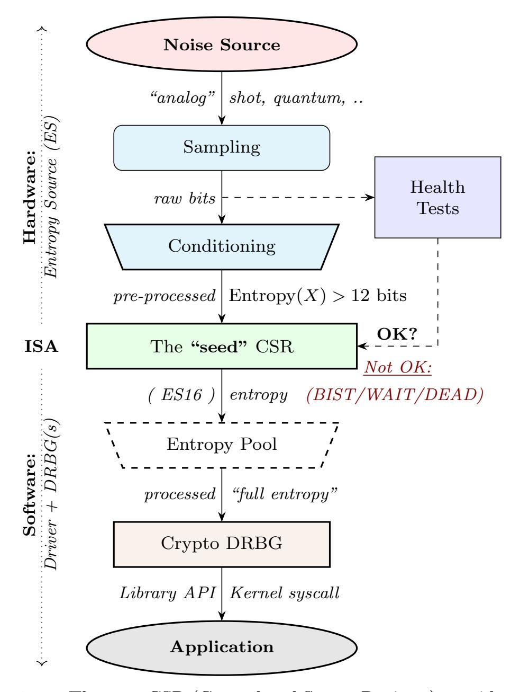
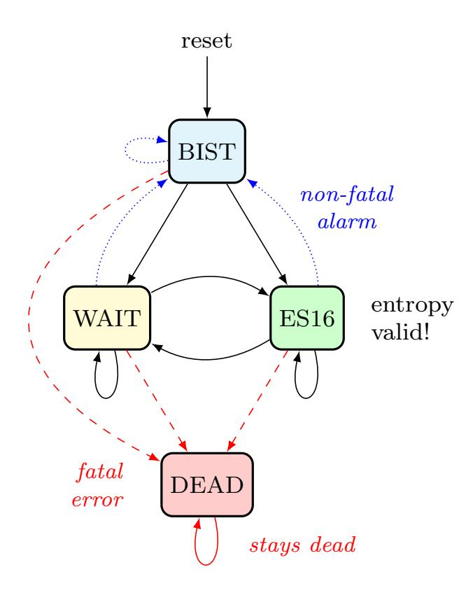

{0}------------------------------------------------

# Development of The RISC-V Entropy Source Interface

Markku-Juhani O. Saarinen · G. Richard Newell · Ben Marshall

Thursday 11th November, 2021

Abstract The RISC-V True Random Number Generator (TRNG) architecture breaks with previous ISA TRNG practice by splitting the Entropy Source (ES) component away from cryptographic DRBGs into a separate privileged interface, and in its use of polling. The modular approach is suitable for the RISC-V hardware IP ecosystem, allows a significantly smaller implementation footprint on platforms that need it, while directly supporting current standards compliance testing methods. We describe the interface, its use in cryptography, and offer additional discussion, background, and rationale for various aspects of it. The design was informed by lessons learned from earlier mainstream ISAs, recently introduced SP 800-90B and FIPS 140-3 entropy audit requirements, AIS 31 and Common Criteria, current and emerging cryptographic needs such as post-quantum cryptography, and the goal of supporting a wide variety of RISC-V implementations and applications. Many of the architectural choices result from quantitative observations about random number generators in secure microcontrollers, the Linux kernel, and cryptographic libraries.

Keywords Entropy Source · RISC-V · TRNG · FIPS 140-3 · SP 800-90B · AIS-31

Markku-Juhani O. Saarinen PQShield Ltd., UK E-mail: mjos@pqshield.com

G. Richard Newell Microchip Technology Inc., USA E-mail: richard.newell@microchip.com

Ben Marshall

PQShield Ltd. and University of Bristol, UK

E-mail: ben.marshall@pqshield.com

## 1 Introduction

The security of cryptographic systems is based on secret bits and keys. To prevent guessing, these bits need to be random, so they come from True Random Number Generators (TRNGs).

As a fundamental security function, the generation of random numbers is governed by numerous standards and technical requirements. This work describes an architecture and approach that can be taken by CPU designers to address these challenges.

RISC-V (https://riscv.org/) is a popular opensource Instruction Set Architecture (ISA) that anyone can freely use. The minimalistic base instruction sets RV32I and RV64I (for 32- and 64-bit architectures) are often amended with extensions that provide features such as floating-point arithmetic or bit manipulation.

# 1.1 The RISC-V Process

Anyone can build experimental and proprietary systems around RISC-V, but the official, shared ISA specifications are created by committees and task groups within the RISC-V International. The specifications are contributed to the ISA under a permissive open source license. The architecture and interfaces discussed here are in the official RISC-V ratification track [31].

This work grew out of the efforts by individual members of the Cryptographic Extensions Task Group and represents their personal opinions only; not their respective employers or RISC-V International. An ISA specification has limited space to present the considerations and research that led to particular engineering choices. This paper hopes to offer additional rationale to support the RISC-V standardization process.

{1}------------------------------------------------

# 1.2 TRNG Standards and Terminology

A driving design goal for our architecture was for it to be easy to implement, yet compatible with current versions of FIPS 140-3 [42] and NIST SP 800-90B [52], significantly updated standards that are only coming into use in the 2020s. Naturally, the architecture should also support other RNG frameworks such as German AIS 20 / 31[26, 27], which is widely used in Common Criteria evaluations. These standards set many of the technical requirements for the design, and we use their terminology if possible.

## 1.2.1 Physical Entropy Source (ES)

We will only consider physical sources of true randomness in this work. When they meet certain design criteria, they may be used as Entropy Sources (ES) for cryptographic purposes [52]. Entropy sources are built by sampling and processing data from a noise source (Section 6.1). Since these are directly based on natural phenomena and are subject to environmental conditions (which may be adversarial), they require features that continuously monitor the "health" and quality of those sources. See Section 5.3 for a discussion about such security controls.

For the purposes of FIPS 140-3 certification, entropy sources will soon have a separate ENT [43] scope.1 Hence it makes sense to separate the entropy source in the RISC-V architecture too, and simply define an interface for it. System designers who do not have the time or resources to create and certify entropy sources can simply license a compliant IP core and use it.

## 1.2.2 Conditioning

Raw physical randomness (noise) sources are rarely statistically perfect, and some generate very large amounts of bits, which need to be "debiased" and reduced to a smaller number of bits. This process is called conditioning. A secure hash function is an example of a cryptographic conditioner. It is important to note that even though hashing will make the output look statistically more random, it does not increase its entropy content.

Non-cryptographic conditioners and extractors such as von Neumann's "debiased coin tossing" [37] are easier to implement efficiently but may reduce entropy as well as redundancy (cryptographic hashes mix the input entropy very efficiently to output bits). However, they do not require cryptanalytic or computational hardness assumptions and are therefore inherently more futureproof. See Section 6.3 for a more detailed discussion.

# 1.2.3 Pseudorandom Number Generator (PRNG)

Pseudorandom Number Generators (PRNGs) use deterministic mathematical formulas to create abundant random numbers from a smaller amount of "seed" randomness. PRNGs are divided into cryptographic and non-cryptographic ones.

Non-cryptographic PRNGs, such as LFSRs and the linear-congruential generators found in many programming libraries, may generate statistically satisfactory random numbers but must never be used for cryptographic keying. This is because they are not designed to resist cryptanalysis; it is usually possible to take some output and mathematically derive the "seed" or the internal state of the PRNG from it. This is a security problem since knowledge of the state allows the attacker to compute future or past outputs.

## 1.2.4 Deterministic Random Bit Generator (DRBG)

Cryptographic PRNGs are also known as Deterministic Random Bit Generators (DRBGs), a term used by SP 800-90A [7]. A strong cryptographic algorithm such as AES [38] or SHA-2/3 [40, 39] is used to produce random bits from a seed. The secret seed material is much like a cryptographic key; determining the seed from the DRBG output is as hard as breaking AES or a strong hash function. This also illustrates that the seed/key needs to be long enough and come from a trusted Entropy Source. The DRBG should still be frequently refreshed (reseeded) for forward and backward security.

## 1.3 RISC-V Target Considerations

One of the key features of RISC-V is that essentially the same instruction set can be used on a wide range of application platforms. We identify two broad targets for the TRNG ISA: Secure Microcontrollers and Linux Profile systems.

## 1.3.1 Secure Microcontrollers

Some RISC-V cores are being designed specifically for smart cards and other secure elements, where a hardwarebased random number generator is the only viable source of keying material. These "security chip" targets have stringent engineering requirements in relation to RNG quality and certification, physical security, energy efficiency, and unit cost.

1 Separate entropy source validation scope was discussed at the NIST "SP 800-90B Entropy Source Validation Workshop" held in April 2021. There is an automated Entropy Source Validation Test System (ESVTS) being developed by NIST.

{2}------------------------------------------------

Fig. 1 The seed CSR (Control and Status Register) provides an Entropy Source (ES) only, not a stateful random number generator. As a result, it can support arbitrary security levels. Cryptographic (AES, SHA-2/3) ISA Extension instructions can be used to construct high-speed DRBGs that are seeded from the entropy source.

Configuration: Embedded-style CPUs may be permanently in machine mode [55], and therefore run only trusted firmware. They are likely to have an RV32 single-hart configuration.

API Interfaces: These targets are expected to interface and implement the TRNG subsystem via a cryptographic library or security-oriented runtime firmware.

#### 1.3.2 General-purpose Linux

We expect Linux and BSD-style operating system kernels to be important in the mobile, desktop, and server application areas. Some of these targets also need to be hardened against invasive physical attacks. Energy efficiency is a concern for mobile devices. Additional entropy sources may be available.

Configuration: These higher-performance CPUs support privilege separation and memory management. They are more likely to be in RV64 multi-hart or even multiprocessor configuration.

API Interfaces: Generally, the TRNG interface will be via the operating system kernel and hypervisor [56]. The Linux kernel conditions input entropy via a multisource random pool and makes it available to users through /dev/[u]random and getrandom(2).

#### 2 The Entropy Source Interface

The proposed RISC-V TRNG ISA is primarily an Entropy Source (ES) interface. An implementation with a physical noise source can be used to *seed* standard and nonstandard cryptographic DRBGs of virtually any state size and security level.

The purpose of this baseline specification is to guarantee that a simple, device-independent driver component (e.g., in Linux kernel, embedded firmware, or a cryptographic library) can use the ISA instruction to generate truly random bits.

The delineation of various components is illustrated in Figure 1. This ISA interface does not have to be the only entropy sourcing mechanism. IO interfaces and custom (vendor-provided) drivers can be used for external hardware sources, for example.

#### 2.1 The "seed" Register

The main ISA-level interface consists of a single CSR (Control and Status Register), seed (address 0x015), that returns a 32/64-bit value. Polling can be done with:

It is available in Machine Mode and optionally in other modes (Table 4). See access control Section 5.1. M-mode may be the only mode of a microcontroller.

This is an atomic write instruction to guarantee a refresh. Attempts to read ("peek") without causing a write will trap with an illegal instruction exception.

| Bits  | Name     | Description                          |  |  |
|-------|----------|--------------------------------------|--|--|
| 63:32 | Set to 0 | Upper bits are set to zero in RV64.  |  |  |
| 31:30 | OPST     | Operational status: BIST (00), WAIT  |  |  |
|       |          | (01), ES16 $(10)$ , DEAD $(11)$ .    |  |  |
| 29:24 | reserved | Reserved for future use by the RISC- |  |  |
|       |          | V specification.                     |  |  |
| 23:16 | custom   | Reserved for vendor-specific and ex- |  |  |
|       |          | perimental use.                      |  |  |
| 15: 0 | entropy  | 16 bits of randomness, but only      |  |  |
|       |          | when OPST=ES16.                      |  |  |

Table 1 The seed CSR (CSR address 0x015).

{3}------------------------------------------------

The instruction is non-blocking and returns immediately, either with two status bits seed[31:30] = OPST set to ES16 (10), indicating successful polling, or with no entropy and one of three polling failure statuses BIST (00), WAIT (01, or DEAD (11). See Table 2.

#### Status Bits at seed[31:30]=OPST:

- 00 BIST indicates that Built-In Self-Test "on-demand" (BIST) statistical testing is being performed.
- 01 WAIT means that a sufficient amount of entropy is not currently available (but is expected to be available later).
- 10 ES16 indicates success; the low bits seed[15:0] will have 16 bits of randomness, which is be guaranteed to meet the entropy requirements regardless of implementation.
- 11 DEAD indicates an unrecoverable self-test error.

Table 2 Status bits in the atomic seed CSR output word.

The sixteen bits of randomness in entropy (located in seed[15:0]) polled with ES16 status must be cryptographically conditioned before they can be used as SSPs (Sensitive Security Parameters) or keying material. We suggest entropy output to be post-processed in blocks of at least 256 bits, with a 128-bit resulting output block. See Section 4 for seed requirements.

When OPST is not ES16, seed should be set to 0. An implementation may safely set reserved and custom bits to zeros. A polling software interface should ignore their contents.

# 2.2 Operational State

As an encoding example for Tables 1 and 2, the value 0x8000ABCD is a valid ES16 status output on RV32, with 0xABCD being the seed value.

In typical implementations, BIST will last only a few milliseconds, up to a few hundred. If the system returns temporarily to BIST from any other state, this signals a non-fatal (usually non-actionable) self-test alarm. BIST is also used to signal test mode (mnoise, Sect. 3).

WAIT is not an error condition and may (in fact) be more frequent than ES16 since physical entropy sources may not have very high bandwidth. The polling can be opportunistic (e.g., a system watchdog interrupt).

The DEAD state indicates a hardware fault, a security issue, or (extremely rarely) a type-1 statistical false positive in the continuous testing procedures. In case of a fatal failure, an immediate lockdown may also be an appropriate response in dedicated security devices.

Fig. 2 Normally the operational state alternates between WAIT (no data) and ES16, which means that a 16-bit random seed has been polled. BIST (Built-in Self-Test) only occurs after reset or to signal a non-fatal self-test alarm (if reached after WAIT or ES16). DEAD is an unrecoverable error state. In test mode (when GetNoise / mnoise is active), WAIT and ES16 states are unavailable in the seed CSR.

Figure 2 illustrates operational state (OPST) transitions. The state is usually either WAIT or ES16. To guarantee that no sensitive data is read twice and that different callers do not get correlated output, we suggest that hardware implements "wipe-on-read" on the randomness pathway during each read (successful poll). For the same reasons, only complete and fully processed random words shall be made available via seed.

## 2.3 Interface Rationale and Discussion

An entropy source does not require a high-bandwidth interface; a single DRBG source initialization only requires 512 bits (256 bits of entropy), and DRBG output can be shared by any number of callers. Once initiated, a DRBG requires new entropy only to mitigate the risk of state compromise.

A blocking instruction may be easier to use, but most users should be querying a (D)RBG instead of an entropy source. Without a polling-style mechanism, the entropy source could hang for thousands of cycles under some circumstances. Mechanisms based on the pause and wfi instructions allow energy-saving sleep on MCUs and context switching on higher-end CPUs.

The reason for the particular OPST two-bit mechanism is to provide redundancy. The "fault" bit combinations 11 (and 00) are more likely for electrical reasons if feature discovery fails and the entropy source is actually not available (this has happened to AMD [50]).

{4}------------------------------------------------

The 16-bit bandwidth was a compromise motivated by the desire to provide redundancy in the return value, some protection against potential Power/EM leakage (further alleviated by the 2:1 cryptographic conditioning discussed in Section 4), and the desire to have all of the bits "in the same place" on both RV32 and RV64 architectures for programming convenience.

# 3 GetNoise Test Interface

For testing purposes, it is necessary to verify that the noise source and sampler output matches their stochastic models. This is often done in a laboratory setting since NIST SP 800-90B [52] requires that the noise source is protected in production devices. They also present a conceptual interface called GetNoise. This is not a name of an instruction or pseudoinstruction.

The custom, but recommended mnoise CSR interface allows access to "raw noise" and is mainly intended for manufacturer tests. It is must not be used as a source of randomness or for other production use. Its contents and behavior are interpreted in the context of mvendorid, marchid, and mimpid CSR identifiers.

The interface consists of a custom, mnoise machinemode CSR. It is defined mainly so that noise sampling scripts can be written.

The Crypto ISE defines the semantics of only a single bit, mnoise[31], which is named NOISE\_TEST. Hence the only universal function of the CSR is for enabling/disabling this interface. This is because the test interface effectively disables seed; this way, a soft reset can also reset this feature. See Figure 2 for a state transition diagram.

When NOISE\_TEST = 1 in mnoise, seed must not return anything via ES16; we recommend that it is in BIST state. When NOISE\_TEST is again disabled, the entropy source shall return from BIST via a zeroization and self-test mechanism (effectively a reset).

When not implemented (e.g., in virtual machines), mnoise can permanently read zero (0x00000000). IF available, but with NOISE\_TEST = 0, mnoise can return a nonzero constant but no noise samples.

The behavior of other input and output bits is left to the vendor. Although not used in production, we recommend that the mnoise read operation is always non-blocking.

# 4 Entropy Source Requirements

The ES16 entropy output from the seed CSR is not necessarily fully conditioned randomness due to hardware limitations of smaller, low-powered implementations. However, minimum requirements are defined. A caller should not use the output directly but poll twice the amount of required entropy, cryptographically condition (hash) it, and use that to seed a cryptographic DRBG.

RISC-V requires drivers to implement at least 2-to-1 cryptographic post-processing in software with the expectation that the final output from this post-processing would have "computationally bounded full entropy."

The expectation is that seed output passes typical randomness tests (e.g. [47]), but weak, pseudorandom, and non-robust sources can pass such tests as well. The results of standard statistical tests should not be confused with amount of entropy available, or the consistency of output. Modern cryptologic evaluation of entropy sources involves an investigation of the stochastic model of the noise source, an analysis of the conditioning component, its health tests, etc.

Three Options. The specification of RISC-V entropy source requirements is complicated by the existence of two major, slightly conflicting standards: NIST SP 800- 90B [52] (Sect. 4.1) for FIPS 140-3 evaluations and AIS 31 [27] (Sect. 4.2) for many Common Criteria evaluations. RISC-V implementors may design their entropy sources to meet either one of these standards (as a different type of evidence is required for each certification). We hope that it is also possible for implementations to meet both criteria.

Alternatively, for virtual entropy sources (DRBGs), the feeding generator must meet the "256-bit security" requirements of Category 5 post-quantum cryptography (Sect. 4.3). The virtual sources are intended to be primarily provided to environments that require sharing of a physical entropy source.

# 4.1 FIPS 140-3 Requirements (NIST SP 800-90)

The interface requirement is satisfied if 128 bits of full entropy can be obtained from each 256-bit (16×16 -bit) successful (ES16), but possibly non-consecutive seed output sequence using a vetted conditioning algorithm (See [52, Section 3.1.5.1.2].)

Rather than attempting to define the properties that the entropy source output must satisfy, we define that it should pass SP 800-90B evaluation and certification when conditioned cryptographically ("perfectly") in ratio 2:1. The implication is that no specific 256-bit sequence should have a probability of larger than 2−192 of occurring. The stochastic model or heuristic analysis must not assume that the input blocks to the conditioner are consecutive words.

{5}------------------------------------------------

Driver developers may make this conservative assumption but are not prohibited from using more than twice the number of seed bits relative to the desired resulting entropy. Even though entropy is defined in terms of 128-bit full entropy blocks, we recommend at least 256-bit security (two blocks, ≥ 512 bits, ≥ 32 words).

Rationale: SP 800-90C [8, Appendix A] states that each conditioned block of n bits is required to have n+64 bits of input entropy to attain full entropy. Hence NIST SP 800-90B [52] min-entropy assessment must guarantee at least 128 + 64 = 192 bits input entropy per 256-bit block [8, Sections 4.1. and 4.3.2]). Only then a hashing of 16 × 16 = 256 bits from the entropy source will produce the desired 128 bits of full entropy. This follows from the specific requirements, threat model, and distinguishability proof contained in SP 800-90C. The implied min-entropy rate is 192/256 = 12/16 = 0.75. The implied Shannon entropy is much larger.

NIST SP 800-90C [8] further defines a set of Random Bit Generator (RBG) constructions that use an entropy source together with cryptographic components. RBG2(P) is a cryptographically secure RBG with continuous access to a physical entropy source (seed) and output generated from conditioned seeds with a DRBG. The entropy source can also be used to build RBG3 full entropy sources. Hence this type of entropy source interface is appropriate for implementing many different types of RBGs suitable for FIPS 140-3 modules.

# 4.2 Common Criteria Requirements (BSI AIS-31)

For an alternative Common Criteria certification (or self-certification), implementors should target BSI AIS 31 PTG.2 (P2) [27, Section 4.3.] requirements. In this evaluation, seed bits are viewed as "internal random numbers." The PTG.2 requirements may be mapped to security controls §T 1-3 (Sect. 5.3) and the seed interface, as shown in Table 3.

The overall security requirement is the same as with NIST sources (Section 4.1); that full entropy can be obtained after 2:1 cryptographic conditioning.

Rationale: PTG.2 modules built and certified to the AIS-31 standard can also meet the "full entropy" condition of Section 4.1 after 2:1 cryptographic conditioning. However, the technical validation process is significantly different. The PTG.2 source requirements work as a building block for other types of BSI generators (e.g., PTG.3 with appropriate software post-processing.)

Note how §P7 concerns Shannon entropy, not minentropy as with NIST sources. See Section 4.4 for an

- §P1 [PTG.2.1] Start-up tests map to §T1 and resettriggered (on-demand) BIST tests.
- §P2 [PTG.2.2] Continuous testing total failure maps to §T2 and the DEAD state.
- §P3 [PTG.2.3] Online tests are continuous tests of §T2 – entropy output is prevented in the BIST state.
- §P4 [PTG.2.4] Is related to the design of effective entropy source health tests, which we encourage.
- §P5 [PTG.2.5] Raw random sequence may be checked via the mnoise interface (Section 3).
- §P6 [PTG.2.6] Test Procedure A [27, Sect 2.4.4.1] is part of the evaluation process, and we suggest selfevaluation using these tests even if Common Criteria certification is not sought.
- §P7 [PTG.2.7] Average per-bit Shannon entropy of "internal random bits" exceeds 0.997.

Table 3 Summary of AIS-31 PTG.2 requirements.

argument why a PTG.2 source is likely to satisfy the full-entropy requirement of Section 4.1.

# 4.3 Virtual Sources: Security Requirement

A virtual source is intended especially for guest operating systems, sandboxes, emulators, and similar use cases. A virtual source should not be considered to be a physical entropy source. However, we woud like to guarantee that even such virtual environments have sufficient entropy available.

Virtualized environments should minimize security risks by using a DRBG or other secure random on the host rather than sharing the host's hardware-backed Entropy Source to a guest environment. See Section 5.1 for a discussion about access control.

A random-distinguishing attack should require computational resources comparable or greater than those required for an exhaustive key searching on a block cipher with a 256-bit key (e.g., AES 256).

Any implementation of seed that limits the security strength shall not reduce it to less than 256 bits. If the security level is under 256 bits, then the interface must not be available.

Rationale: DRBGs can be used to feed other (virtual) DRBGs, but deterministic cryptographic processing never increases the total amount of entropy in the system. The entropy source must be able to support current and future security standards and applications. The 256-bit requirement maps to "Top Secret" classified schemes in Suite B and the newer U.S. Government CNSA Suite [44]. This security level is equivalent to a Category 5 classical or quantum adversary[41, Section 4.A.4 Security Strength Categories].

{6}------------------------------------------------

#### 4.4 Further Notes on the Three Approaches

The usage of a vetted conditioner (such as SHA-2/3) in Section 4.1 was specified for technical reasons related to SP 800-90B itself; non-vetted conditioners may offer similar security levels.

The 128-bit output block size was selected because that is the output size of the CBC-MAC conditioner specified in [52] and also the smallest key size we expect to see in applications.

The min-entropy assessment methodology in SP 800-90B [52] has an additional safety margin in its confidence intervals, and therefore there must be consistently more than 12 bits of min-entropy per 16-bit word. In practice, we recommend the distribution to be significantly closer to uniform (16 bits).

Comparing the Entropies. We emphasize that the SP 800-90B validation process is concerned with "guessing entropy" or min-entropy  $H_{\infty}$ , while AIS-31 is concerned with more traditional Shannon entropy  $H_1$ . These two Rényi entropies are algebraically different. Min-entropy does not satisfy some of the familiar, intuitive properties of Shannon entropy – such as subadditivity.

The SP 800 90B requirement can be expressed as entropy rate bound  $H_{\infty} > 0.75$ , and the AIS-31 requirement as  $H_1 > 0.997$ . The two conditions are clearly not mutually exclusive, but the following theorem illustrates that an entropy source may have one without the other, at least when 16-bit blocks are considered in isolation. Hence one should not assume that high Shannon entropy from AIS-31 tests guarantees that the lower min-entropy bound is reached.

**Theorem 1** For a 16-bit discrete random variable X,  $\frac{1}{16}H_1(X) > 0.997$  for does not imply  $\frac{1}{16}H_\infty(X) > 0.75$  and  $\frac{1}{16}H_\infty(X) > 0.75$  does not imply  $\frac{1}{16}H_1(X) > 0.997$ .

*Proof* We consider two independent sample distributions  $D_1$  and  $D_2$  of a 16-bit variable  $X \in \mathbb{Z}$ ,  $0 \le X < 2^{16}$ , taking on values with probability  $p_x = \Pr(X = x)$ .

Claim 1.  $D_1$  has  $p_0 = 0.00650$  and  $p_i = \frac{1-p_0}{2^{16}-1}$  for  $0 < i < 2^{16}$ . We have  $\frac{1}{16}H_1(D_1) = 0.99703$  and  $\frac{1}{16}H_{\infty}(D_1) = 0.45408$ .

Claim 2.  $D_2$  has  $p_i = 1/4097$  for  $0 \le i < 4097$  and  $p_i = 0$  for  $4097 \le i < 2^{16}$ . We have equivalent  $\frac{1}{16}H_1(D_2) = \frac{1}{16}H_\infty(D_2) = 0.75002$ .

However, if the Shannon entropy is analyzed per bit, with information about other bits, then  $H_1 > 0.997$  implies a maximum individual guessing probability of 0.53223 per bit, or  $2^{-233}$  for a 256-bit block. Since this min-entropy is above the 128 + 64 threshold set in SP 800-90C, one can expect that a PTG.2 source satisfies

the full-entropy requirements of Section 4.1 after cryptographic conditioning.

Still, if some specific 256-bit entropy source output sequence has an expected probability larger than  $2^{-192}$  (for any reason), then it is not a valid entropy source for this interface. The min-entropy requirement overrides much looser Shannon entropy estimates.

# 5 Information Flows and Security Controls

"The noise source state shall be protected from adversarial knowledge or influence to the greatest extent possible. The methods used for this shall be documented, including a description of the (conceptual) security boundary's role in protecting the noise source from adversarial observation or influence."

-Noise Source Requirements, SP 800-90B [52].

An entropy source is a singular resource, subject to depletion and also covert channels [15]. Observation of the entropy can be the same as the observation of the noise source output, as cryptographic conditioning is mandatory only as a post-processing step. SP 800-90B and other security standards mandate protection of noise bits from observation and also influence.

# 5.1 Access Control

Typically the seed CSR is not available to general user processes, and the raw source interface has been delegated to a vendor-specific test interface mnoise. The test interface and the main interface must not be operational at the same time.

Other than M-mode access to the entropy source is controlled via the mseccnf CSR: sseed (bit 9) for S mode and useed (bit 8) for U mode.

Table 4 summarizes the access patterns in relation to the basic RISC-V privilege levels.

The interface guarantees that access to this CSR will make seed entropy values available only once. All successful accesses will have the side effect of clearing (polling) the register. A nondestructive read attempt (such as CSRRS / CSRRC with rs1=x0 or CSRRSI / CSRRCI with zero immediate) on seed will raise an Illegal Instruction Exception.

Some systems only have an M-mode. If both S mode and mseccfg are not implemented in a system, then access to the entropy source is M-mode only. The HS, VS and VU modes are present in systems with the Hypervisor (H) extension implemented [56].

{7}------------------------------------------------

| Mode  | sseed | useed | Description                     |
|-------|-------|-------|---------------------------------|
| M     | *     | *     | Accessible as normal.           |
| U     | *     | 0     | Illegal Instruction Exception.  |
| U     | *     | 1     | Accessible as normal.           |
| S/HS  | 0     | *     | Illegal Instruction Exception.  |
| S/HS  | 1     | *     | Accessible as normal.           |
| VS/VU | 0     | *     | Illegal Instruction Exception.  |
| VS/VU | 1     | *     | Virtual Instruction Excep |
|       |       |       | tion (for normal access).       |

Table 4 Entropy Source seed CSR access policy. Attempted read without a write raises an Illegal Instruction Exception regardless of mode and access control bits. Note that useed does not affect virtual VS/VU modes, but sseed affects the exception type.

Virtualization. It is possible for a hypervisor or Mmode code to trap and feed less privileged guest virtual entropy source words (Sect. 4.3). Virtualization requires both conditioning and DRBG processing of physical entropy output. This is recommended if a single entropy source is shared between multiple different S-mode instances (multiple Kernels, not harts) or if the S-mode instance is untrusted. A virtual entropy source is significantly more resistant to depletion attacks and also lessens the risk from covert channels.

Direct U-mode an S-mode Access. The useed and sseed flags allow one to draw a security boundary around a lower-level component in relation to SSP flows, which is helpful when implementing trusted enclaves or some non-Linux security policies.

It can also be useful for systems that consider an S-level kernel to be a trusted component and reserve M-mode just for system abstraction purposes. Opportunistic polling in interrupts is a natural way to gather entropy (given that the instruction is non-blocking), and its performance impact benefits from direct access in general Linux-type operating systems.

The requirement for a conditioner and DRBG implementation at a higher level introduces some latency, grows the stateful memory footprint of such a manager, and may also prove to be relatively inflexible if new types of RBGs and new security levels are required.

## 5.2 Security Considerations

The ISA implementation and system design must try to ensure that the hardware-software interface minimizes avenues for adversarial information flow even if not explicitly forbidden in the specification.

Depletion. Active polling may deny the entropy source to another simultaneously running instance. This can (for example) delay the instantiation of that instance if it requires entropy to initialize fully.

Covert Channels. Direct access to a component such as the entropy source can be used to establish communication channels across security boundaries. Active polling from one instance makes the resource unavailable to another (which is polling infrequently). Such interactions can be used to establish low-bandwidth channels.

Hardware Fingerprinting. An entropy source (and its noise source circuits) may have a uniquely identifiable hardware "signature." This can be harmless or even useful in some applications (as random sources may exhibit PUF-like features) but highly undesirable in others (anonymized virtualized environments and enclaves). A DRBG masks such statistical features.

Side Channels. Some of the most devastating practical attacks against real-life cryptosystems have used inconsequential-looking additional information, such as padding error messages [6] or timing information [34].

We urge implementers against creating unnecessary information flows via status or custom bits or to allow any other mechanism to disable or affect the entropy source output. All information flows and interaction mechanisms must be considered from an adversarial viewpoint; less the better.

As an example of side-channel analysis, we note that the entropy polling interface is typically not "constant time." One needs to analyze what kind of information is revealed via the timing oracle; one way of doing it is to model seed as a rejection sampler. Such a timing oracle can reveal information about the noise source type and entropy source usage, but usually not about the random output entropy words themselves. If it does, additional countermeasures are necessary.

## 5.3 Security Controls

The primary purpose of a cryptographic entropy source is to produce secret keying material. In almost all cases, a hardware entropy source must implement appropriate security controls to guarantee unpredictability, prevent leakage, detect attacks, and deny adversarial control over the entropy output or its generation mechanism. Security controls are not mandatory for RISC-V per se (in case of virtual entropy sources) but are needed for security certification.

Many of the security controls built into the device are called "health checks." Health checks can take the form of integrity checks, start-up tests, and on-demand 

{8}------------------------------------------------

tests. These tests can be implemented in hardware or firmware, typically both. Several are mandated by standards such as NIST SP 800-90B [42]. The choice of appropriate health tests depends on the certification target, system architecture, threat model, entropy source type, and other factors.

Health checks are not intended for hardware diagnostics but for detecting security issues – hence the default action should be aimed at damage control (prevent weak crypto keys from being generated). Additional "debug" mechanisms may be implemented if necessary, but then the device must be outside production use.

- §T1: On-demand testing. A sequence of simple tests is invoked via resetting, rebooting, or powering up the hardware (not an ISA signal). The implementation will simply return BIST during the initial start-up self-test period; in any case, the driver must wait for them to finish before starting cryptographic operations. Upon failure, the entropy source will enter a no-output DEAD state.
- §T2: Continuous tests. If an error is detected in continuous tests or environmental sensors, the entropy source will enter a no-output state. We define that a non-critical alarm is signaled if the entropy source returns to BIST state from live (WAIT or ES16) states. Such a BIST alarm should be latched until polled at least once. Critical failures will result in DEAD state immediately. A hardware-based continuous testing mechanism must not make statistical information externally available, and it must be zeroized periodically or upon demand via reset, power-up, or similar signal.
- §T3: Fatal error states, Since the security of most cryptographic operations depends on the entropy source, a system-wide "default deny" security policy approach is appropriate for most entropy source failures. A hardware test failure should at least result in the DEAD state and possibly reset/halt. It's a show stopper: The entropy source (or its cryptographic client application) must not be allowed to run if its secure operation cannot be guaranteed.

Rationale: The testing requirement follows from the definition of an Entropy Source; without it, the module is simply a noise source and cannot be trusted to safely generate keying material.

These tests can complement other integrity and tamper resistance mechanisms (See Chapter 18 of [2] for examples). Some hardware random generator tests report seemingly non-adversarial environmental and manufacturing issues. However, even such "innocent" failure modes may indicate a fault attack [25] and therefore should be addressed as a system integrity failure rather

than as a diagnostic issue. Security architects will understand to use permanent or hard-to-recover "securityfuse" lockdowns only if the threshold of a test is such that the probability of false-positive is negligible over the entire device lifetime.

# 6 Implementation Strategies

As a general rule, RISC-V specifies the ISA only. We provide some additional requirements so that portable, vendor-independent middleware and kernel components can be created. The actual hardware implementation and certification are left to vendors and circuit designers; the discussion in this section is purely informational.

When considering implementation options and tradeoffs, one must look at the entire information flow.

- 1. A Noise Source generates private, unpredictable signals from well-understood physical random events.
- 2. Sampling digitizes the noise signal into a raw stream of bits. This raw data is considered very sensitive.
- 3. Health tests ensure that the noise source and its environment meet its operational parameters.
- 4. Non-cryptographic conditioners remove much of the bias and correlation in input noise.
- 5. Cryptographic conditioners produce full entropy output, indistinguishable from ideal random.
- 6. DRBG takes in ≥ 256 bits of seed entropy as keying material and uses a cryptographic process to rapidly generate random bits on demand.

Steps 1-4 (possibly 5) are considered to be part of the Entropy Source (ES) and provided by the seed CSR. Adding the software-side cryptographic steps 5-6 and control logic complements it into a True Random Number Generator (TRNG). This information flow is illustrated in Figure 1.

Testing and Certification. While we do not require entropy source implementations to be certified designs, we do expect that they behave in a compatible manner and do not create unnecessary security risks to users. Self-evaluation and testing following appropriate security standards are usually needed to achieve this. NIST has made its SP 800-90B[52] min-entropy estimation package freely available2 and similar free tools are also available3 for AIS 31 [27].

2 EntropyAssessment: https://github.com/usnistgov/ SP800-90B\_EntropyAssessment

3 (In German) AIS 31-Implementierung in Java: https://www.bsi.bund.de/SharedDocs/Downloads/DE/BSI/ Zertifizierung/Interpretationen/AIS\_31\_testsuit\_zip

{9}------------------------------------------------

## 6.1 Noise Sources

The theory of random signals and electrical noise became well established in the post-World War II period [13, 24]. We will give some examples of common noise sources that can be implemented in the processor itself (using standard cells).

Ring Oscillators. The most common entropy source type in production use today is based on "free-running" ring oscillators and their timing jitter. Here, an odd number of inverters is connected into a loop from which noise source bits are sampled in relation to a reference clock [9]. The sampled bit sequence may be expected to be relatively uncorrelated (close to IID) if the sample rate is suitably low [27]. However, further processing is usually required. AMD [1], ARM [3], and IBM [29] are examples of ring oscillator TRNGs intended for highsecurity applications.

There are related metastability-based generator designs such as Transition Effect Ring Oscillator (TERO) [54]. The differential/feedback Intel construction [19] is slightly different but also falls into the same general metastable oscillator-based category.

The main benefits of ring oscillators are: (1) They can be implemented with standard cell libraries without external components – and even on FPGAs [53], (2) there is an established theory for their behavior [17, 18, 9] and min-entropy estimation[48], and (3) ample precedent exists for testing and certifying them at the highest security levels.

Ring oscillators also have well-known implementation pitfalls. Their output is sometimes highly dependent on temperature, which must be taken into account in testing and modeling. If the ring oscillator construction is parallelized, it is important that the number of stages and/or inverters in each chain is suitable to avoid entropy reduction due to harmonic "Huyghens synchronization." [5] Such harmonics can also be inserted maliciously in a frequency injection attack, which can have devastating results [30]. Countermeasures are related to circuit design; environmental sensors, electrical filters, and usage of a differential oscillator may help.

Shot Noise. A category of random sources consisting of discrete events and modeled as a Poisson process is called "shot noise." There's a long-established precedent of certifying them; the AIS 31 document [27] itself offers reference designs based on noisy diodes. Shot noise sources are often more resistant to temperature changes than ring oscillators. Some of these generators can also be fully implemented with standard cells (The Rambus / Inside Secure generic TRNG IP [46] is described as a Shot Noise generator).

Other types of noise. It may be possible to certify more exotic noise sources and designs, although their stochastic model needs to be equally well understood, and their CPU interfaces must be secure. See Section 7.2 for a discussion of Quantum entropy sources.

# 6.2 Continuous Health Tests

If NIST SP 800-90B certification is required, the entropy source should implement at least the health tests defined in [52, Section 4.4]: repetition count test and adaptive proportion test, or show that the same flaws will be detected by vendor-defined tests.

Health monitoring requires some state information related to the noise source to be maintained. The tests should be designed in a way that polling some specific number of samples guarantees a state flush (no fully persistent state). We suggest flush size W ≤ 1024 to match with the NIST SP 800-90B required tests. The state is also fully zeroized in a system reset.

Rationale: The two mandatory tests can be built with minimal circuitry. Full histograms are not required, only simple counter registers: repetition count, window count, and sample count. The repetition count is reset every time the output sample value changes; if the count reaches a certain cutoff limit, a noise alarm (BIST) or failure (DEAD) is signaled. The window counter is used to save every W'th output (typically W ∈ 512, 1024.) The frequency of this reference sample in the following window is counted; cutoff values are defined in the standard. We see that the structure of the mandatory tests is such that, if well implemented, no information is carried beyond a limit of W samples.

Section 4.5 of [52] suggests additional developerdefined tests, and several more were defined in earlier versions of FIPS 140 before being "crossed out." The choice of additional tests depends on the nature and implementation of the physical source.

The AIS 31 [27] online tests can be implemented in hardware or by driver software. For some security profiles, AIS 31 mandates that the tolerances of the tests are set in a way that the probability of an alarm is at least 10−6 yearly under "normal usage." There rarely is anything that can or should be done about a nonfatal alarm condition in an operator-free, autonomous system. However, AIS 31 allows the DRBG component to keep running despite a failure in its Entropy Source, so we suggest re-entering temporary BIST state (Section 5.3) to signal a non-fatal statistical error if such (non-actionable) signaling is necessary. Drivers and applications can react to this appropriately (or simply log 

{10}------------------------------------------------

it), but it will not directly affect the availability of the TRNG. A permanent error condition should result in DEAD state.

# 6.3 Non-cryptographic Conditioners

As noted in Section 1.2.2, physical randomness sources generally require a post-processing step called conditioning to meet the desired quality requirements, which are outlined in Section 4. For some entropy sources, it is sufficient to reduce the output (sampling) rate; for others, it is additionally necessary to apply debiasing and other non-cryptographic conditioning methods.

The approach taken in this interface is to allow a combination of non-cryptographic and cryptographic filtering to take place. The first stage (hardware) merely needs to be able to distill the entropy comfortably above the necessary level.

- One may take a set of bits from a noise source and XOR them together to produce a less biased (and more independent) bit. However, such an XOR may introduce "pseudorandomness" and make the output difficult to analyze.
- The von Neumann debiaser [37] looks at consecutive pairs of bits, rejects 00 and 11, and outputs 0 or 1 for 01 and 10, respectively. It will reduce the number of bits to less than 25% of the original, but the output is provably unbiased (assuming independence).
- Blum's extractor [12] can be used on sources whose behavior resembles n-state Markov chains. If its assumptions hold, it also removes dependencies, creating an IID source.
- Other linear and non-linear correctors such as those discussed by Dichtl and Lacharme [28].

Note that the hardware may also implement a full cryptographic conditioner in the entropy source, even though the software driver still needs a cryptographic conditioner, too (Sect. 4).

Rationale: The main advantage of non-cryptographic filters is in their energy efficiency, relative simplicity, and amenability to mathematical analysis. If well designed, they can be evaluated in conjunction with a stochastic model of the noise source itself. They do not generally require computational hardness assumptions.

# 6.4 Cryptographic Conditioners

Cryptographic conditioners are always required on the software side of the seed CSR ISA boundary. They may also be implemented on the hardware side if necessary. In any case, the seed CSR output must always be compressed 2:1 (or more) before being used as keying material or considered "full entropy."

Examples of cryptographic conditioners include the random pool of the Linux operating system, secure hash functions (SHA-2/3, SHAKE [40, 39]), and the AESbased CBC-MAC conditioner [52, Appendix F].

In some constructions, such as the Linux RNG and SHA-3/SHAKE [40] based generators, the cryptographic conditioning and output (DRBG) generation is provided by the same component.

Rationale: For many low-power targets constructions such as Intel's [33] and AMD's [1] hardware AES CBC-MAC conditioner would be too complex and expensive to implement solely to serve seed. On the other hand, simpler non-cryptographic conditioners may be too wasteful on input entropy if a very high-quality random output is required – ARM TrustZone TRBG [3] outputs only 10Kbit/sec at 200 MHz. Hence a resourcesaving compromise is made between hardware and software generation that allows an implementation to use the RISC-V cryptographic ISA.

# 6.5 The Final Random: DRBGs

All random bits reaching end users and applications must come from a cryptographic DRBG. These are generally implemented by the driver component. The RISC-V AES and SHA instruction set extensions [31] should be used if available as they offer additional security features such as timing attack resistance.

Currently recommended DRBGs are defined in NIST SP 800-90A (Rev 1) [7]: CTR\_DRBG, Hash\_DRBG, and HMAC\_DRBG. Certification often requires known answer tests (KATs) for the symmetric components and the DRBG as a whole. In addition to the directly certifiable SP 800-90A DRBGs, a Linux-style random pool construction based on ChaCha20 [35] can be used or an appropriate construction based on SHAKE256 [40].

These are just recommendations; programmers can adjust the usage of the CPU Entropy Source to meet future requirements.

# 7 Considerations and Case Studies

TRNGs are available in many mainstream CPUs and mobile devices. This is by no means an exhaustive list.

Intel Secure Key. Intel's random number interface is known as "Intel Secure Key" [33] and has been available via the RDRAND instruction since Ivy Bridge (2012). 

{11}------------------------------------------------

A reseeding instruction RDSEED was added for Broadwell (2014). Internally the Intel solution is based on a self-oscillating feedback circuit [19], CBC-MAC conditioning, and the CTR DRBG [7] – both built from AES-128 (newer versions may have AES-256).

AMD. AMD's interface is compatible with Intel's but internally uses 16 ring oscillator chains as a noise source, CBC-MAC conditioning but a higher-security AES-256 version of CTR DRBG. AMD additionally offers raw noise output via the TRNG RAW register in its cryptographic coprocessor (CCP) [1].

ARM-based devices. The ARMv8.5-RNG ISA extension has instructions RNDR (Random Number) and RN-DRRS (Reseed Random Number) that seem to work much like RDRAND and RDSEED [4]. These instructions are new and not very widely available.

More often, ARM devices interface TRNGs via a bus (e.g., APB) instead of ISA. The TrustZone TRNG [3] is actually a non-ISA Entropy Source, built from ring oscillators [9] and a von Neumann debiaser [37] – without a DRBG or other cryptographic components. This makes the TRNG low-bandwidth but energy efficient.

# 7.1 Conditioning and DRBG in Hardware

"I am so glad I resisted pressure from Intel engineers to let /dev/random rely only on the RDRAND instruction. Relying solely on an implementation sealed inside a chip and which is impossible to audit is a BAD idea."

–Theodore Ts'o, author of the Linux RNG.4

Our proposal does not prevent RISC-V implementers from creating full DRBG implementations as (custom) instructions, just like Intel and ARM does. However, we can offer some reasons why that may not be as useful as one might think.

No Black Boxes. Cryptographers generally do not want to use hardware DRBGs directly as it would force them to blindly rely on hardware. This much more of an issue for a Linux-profile system than to a security microcontroller where the hardware and firmware are likely to come from the same vendor.

If the DRBG is hardwired to the entropy source and hardware is sourced from a third party, there is usually no easy way to verify that it is doing what it is supposed to be doing. As a source of secret keying material, an RNG is an obvious location for a potential cryptographic backdoor. It has a large potential for supply chain attacks such as hardware trojans [10] and other un-auditable backdoors in the style of NSA's Dual\_EC\_DRBG [14].

However, most operating system kernels and welldesigned cryptographic libraries use (and welcome) a CPU entropy source as one of the many ingredients to their "entropy soup." Hence the DRBGs are usually ultimately implemented in software anyway – possibly using cryptographic ISA instructions for speed. This approach eliminates a single point of vulnerability in entropy sourcing and allows a higher level of audit transparency.

Flexibility. Deterministic hardware DRBGs can become technically obsolete quickly, and ISA updates are hard. This can happen due to a standards update or hardcoded design problems and limitations. Intel's RDRAND is designed around AES-128 with forced reseeding only every 512 invocations.

There is a simple attack that demonstrates the entropy bottleneck and forward/backward secrecy problem; if two 128-bit output blocks are known, the secret key and counter can be recovered with 2128 classical effort. This, in turn, can be expanded to the entire segment of secret blocks, revealing up to 512×128 = 65536 bits of keying material with no additional effort. Intel's RDRAND generator will, therefore, create a security bottleneck in applications that are specified to support "256-bit" security.

For additional entropy (in case of unavailability of RDSEED), Intel recommends polling 1024 × 64 bits out of the RDRAND to force a reseed flush and then reducing the DRBG output back to 128 bits (a process with 99.8% redundancy) [33]. Hence users were recommended to effectively "bypass" the large, expensive DRBG component at the cost of many thousands of cycles only a few years after its introduction.

Resource sharing. High-throughput DRBG sharing can be tricky to implement, as the CrossTalk / SRBDS vulnerability shows [45]. This vulnerability causes the same random output bytes to be available simultaneously to multiple cores. The SRBDS mitigation serializes the entire DRBG operation by locking the (memory) bus for RDRAND calls and can have a serious performance impact [21]. Of course, such problems may also occur if an Entropy Source is shared rather than a DRBG. However, Entropy Source interfaces are not designed for throughput, so more conservative design choices for the sharing mechanism can be made.

4 September 5, 2013 (after Snowden): https://news. ycombinator.com/item?id=6336505

{12}------------------------------------------------

Area. In a small microcontroller-type RISC-V implementation, it is difficult to justify the hardware area requirement of a full-sized AES or some other cryptographic algorithm just to provide cryptographic conditioning or a DRBG output. One would prefer to use that area for cryptographic instructions that actually increase the throughput of secure communications (TLS, IPSec), or storage encryption, in addition to the DRBG component. Random number entropy is rarely a performance bottleneck in cryptographic implementations, so using a lot of transistors for RNG speed is not compatible with the quantitative approach usually associated with RISC CPU design.

Security. Implementing conditioning and DRBG components in software has the same security risks as any cryptographic software. Arguably software allows more flexibility in terms of mitigations, and in some ways, the more redundant output of the entropy source with cryptographic mixing in the post-processing stage is more secure against information leakage at the interface point. Information leakage (e.g., Hamming weight via a side-channel) has more direct bit-security implications if used for cryptographic keying without software hashing or other post-processing.

## 7.2 Quantum vs. Classical Random

"The NCSC believes that classical RNGs will continue to meet our needs for government and military applications for the foreseeable future."

– U.K. QRNG Guidance, March 2020 [36].

A Quantum Random Number Generator (QRNG) is a TRNG whose source of randomness can be unambiguously identified to be a specific quantum phenomenon such as quantum state superposition, quantum state entanglement, Heisenberg uncertainty, quantum tunneling, spontaneous emission, or radioactive decay [22].

Direct quantum entropy is theoretically the best possible kind of entropy. A typical TRNG based on electronic noise is also largely based on quantum phenomena and is equally unpredictable - the difference is that the relative amount of quantum and classical physics involved is difficult to quantify for a classical TRNG.

QRNGs are designed in a way that allows the amount of quantum-origin entropy to be modeled and estimated. This distinction is important in the security model used by QKD (Quantum Key Distribution) security mechanisms which can be used to protect the physical layer (such as fiber optic cables) against interception by using quantum mechanical effects directly.

This security model means that many of the available QRNG devices do not use cryptographic conditioning and may fail cryptographic statistical requirements [20]. Many implementers may consider them to be entropy sources instead.

Relatively little research has gone into QRNG implementation security, but many QRNG designs are arguably more susceptible to leakage than classical generators (such as ring oscillators) as they tend to employ external components and mixed materials. As an example, amplification of a photon detector signal may be observable in power analysis, which classical noisebased sources are designed to resist.

Post-Quantum Cryptography (PQC). The NIST PQC public-key cryptography standards [41] do not require quantum-origin randomness, just sufficiently secure keying material. Recall that cryptography aims to protect the confidentiality and integrity of data itself and does not place any requirements on the physical communication channel (like QKD).

Classical good-quality TRNGs are perfectly suitable for generating the secret keys for PQC protocols that are hard for quantum computers to break but implementable on classical computers. What matters in cryptography is that the secret keys have enough true randomness (entropy) and that they are generated and stored securely.

Of course, one must avoid DRBGs that are based on problems that are easily solvable with quantum computers, such as factoring [51] in the case of the Blum-Blum-Shub generator [11]. Most symmetric algorithms are not affected as the best quantum attacks are still exponential to key size [16].

As an example, the original Intel RNG [33], whose output generation is based on AES-128, can be attacked using Grover's algorithm with approximately squareroot effort [23]. While even "64-bit" quantum security is extremely difficult to break, many applications specify a higher security requirement. NIST [41] defines AES-128 to be "Category 1" equivalent post-quantum security, while AES-256 is "Category 5" (highest). We avoid this possible future issue by exposing a direct access to the entropy source, which can derive its security from information-theoretic assumptions only.

# 8 Evolution of the Design

Some of the early RISC-V CETG designs (predating "scalar cryptography" work [31][32]) had many more states and possibly complex interaction mechanisms, which were simplified to the bare minimum that could still meet the stated requirements.

{13}------------------------------------------------

Even though the basic seed CSR interface remains the same as in an early publication [49], there have been some important changes.

Addition of AIS-31 and Virtual Sources. Early versions only referenced SP 800-90B requirements (Sect. 4.1), but AIS-31 requirements (Sect. 4.2) were added after it became clear that there is still some divergence between the two sets of rules. Virtual sources were added so that emulators and virtualization platforms could be facilitated.

Full Entropy after Conditioning. There has been significant changes to the language of the entropy requirements, which previously loosely discussed "8 bits per 16-bit word." The full-entropy requirements in the SP 800-90C draft [8] forced the largest change in this (Sect. 4.1), even though 2:1 conditioning is still used.

No formal IID requirement. Earlier versions of the entropy source interface mandated an IID (independent and identically distributed) source, but this was dropped as an unhelpful restriction. If the seed words have sufficient entropy so that 2:1 conditioning yields full entropy by SP 800-90C definitions, then that alone makes it independent enough. In other words, one may determine some partial information about the input entropy (e.g., distinguish it from perfect random) but never obtain most of the entropy of an undisclosed word from other words. In any case, that leaked information is not helpful in guessing anything about the conditioned output, which is "full entropy".

ENT Scope. An earlier version of this work [49] discussed a reference implementation that has since gone through a significant revision. The ESVTS and separate entropy scope (Sect. 1.2.1) is a new and welcome development, which more readily allows vendors to license approved "readymade" entropy source modules and connect them to CPU cores within their SoCs.

Optional U and S-Mode Access. Another late (RISC-V architectural review) change was to reassign mentropy as seed so that it can be accessed from U and S modes (and hypervisor HS mode [56]) too – if additional access conditions in the machine security configuration register are satisfied. The RISC-V architectural review process change also made seed polling "destructive", removed the previous pseudoinstruction pollentropy, and reordered the OPST states.

# 9 Conclusions

The RISC-V Cryptographic Extensions Task Group is working to introduce True Random Number Generator (TRNG) support. The proposed CSRs, instructions, and the wider TRNG architecture are designed to allow compliance with FIPS 140-3 and related international standards such as AIS 31 at high assurance levels while being extremely lightweight to implement.

The proposal differs from other contemporary TRNG ISAs in that it is based on a polling paradigm and focuses on providing Entropy Source (ES) functionality only. The interface can be used to instantiate a random number generator of virtually any strength if a physical entropy source is available.

We have described the seed CSR and its basic implementation and entropy requirements. These definitions are needed so that interoperable drivers can be implemented – they set the minimum standards that can be expected from polled randomness.

We further discussed information flows, testing interfaces, monitoring, and implementation aspects in detail, diving into the rationale of various engineering decisions that are required.

We concluded with case studies that contain a brief overview of generators in current mainline ISAs, commentary on the impact of quantum threat on TRNG generation. We share the opinion of national security authorities that on-chip generators are well suited for the post-quantum cryptography era. A direct ISA interface provides a good level of implementation security, especially when compared to externally interfaced components with a more complex security boundary.

Acknowledgements In addition to anonymous reviewers, we thank the RISC-V Cryptographic Extensions Task Group for its input and support, especially Andy Glew, Barry Spinney, Derek Atkins, Ken Dockser, and Nathan Menhorn. Many other RISC-V community members have helped and provided feedback and suggestions (but are blameless for our errors); including Greg Favor, Allen Baum, Andrew Waterman, and Krste Asanovi´c. We further thank BSI, CMVP/NIST, and CMUF members for their input on various drafts. This work was supported in part by Innovate UK (R&D Project Ref.: 105747), and by EPSRC (Grant No.: EP/R012288/1, under the RISE programme.)

## References

- 1. AMD: AMD random number generator. AMD Tech-Docs (2017). URL https://www.amd.com/system/files/ TechDocs/amd-random-number-generator.pdf
- 2. Anderson, R.J.: Security engineering a guide to building dependable distributed systems (3. ed.). Wiley (2020). URL https://www.cl.cam.ac.uk/~rja14/book.html

{14}------------------------------------------------

- 3. ARM: ARM TrustZone true random number generator (TRNG): Software integrator's manual. ARM 101049 0000 00 en (2017). URL https://github.com/ ARM-software/TZ-TRNG/raw/master/trustzone\_trng\_ software\_integrators\_manual\_101049\_0000\_00\_en.pdf
- 4. ARM: ARM TrustZone true random number generator (TRNG): Technical reference manual. ARM 100976 0000 00 en (Second release r0p0 0000-01) (2020). URL http://infocenter.arm.com/help/index.jsp?topic= /com.arm.doc.100976\_0000\_00\_en
- 5. Bak, P.: The devil's staircase. Phys. Today 39(12), 38–45 (1986). DOI 10.1063/1.881047
- 6. Bardou, R., Focardi, R., Kawamoto, Y., Simionato, L., Steel, G., Tsay, J.: Efficient padding oracle attacks on cryptographic hardware. In: R. Safavi-Naini, R. Canetti (eds.) Advances in Cryptology - CRYPTO 2012 - 32nd Annual Cryptology Conference, Santa Barbara, CA, USA, August 19-23, 2012. Proceedings, Lecture Notes in Computer Science, vol. 7417, pp. 608–625. Springer (2012). DOI 10.1007/978-3-642-32009-5\ 36
- 7. Barker, E., Kelsey, J.: Recommendation for random number generation using deterministic random bit generators. NIST Special Publication SP 800-90A Revision 1 (2015). DOI 10.6028/NIST.SP.800-90Ar1
- 8. Barker, E., Kelsey, J., Roginsky, A., Turan, M.S., Buller, D., Kaufer, A.: Recommendation for random bit generator (RBG) constructions. Draft NIST Special Publication SP 800-90C (2021)
- 9. Baudet, M., Lubicz, D., Micolod, J., Tassiaux, A.: On the security of oscillator-based random number generators. J. Cryptology 24(2), 398–425 (2011). DOI 10.1007/s00145-010-9089-3
- 10. Becker, G.T., Regazzoni, F., Paar, C., Burleson, W.P.: Stealthy dopant-level hardware trojans: extended version. J. Cryptographic Engineering 4(1), 19–31 (2014). DOI 10.1007/s13389-013-0068-0
- 11. Blum, L., Blum, M., Shub, M.: A simple unpredictable pseudo-random number generator. SIAM J. Comput. 15(2), 364–383 (1986). DOI 10.1137/0215025
- 12. Blum, M.: Independent unbiased coin flips from a correlated biased source – a finite state Markov chain. Combinatorica 6(2), 97–108 (1986). DOI 10.1007/BF02579167
- 13. Brown, G.W.: History of RAND's random digits summary. Research Paper P-113, RAND Corporation (1949). URL https://www.rand.org/pubs/papers/P113.html. Also appeared in: Monte Carlo Method, Nat. Bur. Stand., Appl. Math. Series 12 (1951), pp. 31-32
- 14. Checkoway, S., Maskiewicz, J., Garman, C., Fried, J., Cohney, S., Green, M., Heninger, N., Weinmann, R., Rescorla, E., Shacham, H.: Where did I leave my keys?: lessons from the juniper dual EC incident. Commun. ACM 61(11), 148–155 (2018). DOI 10.1145/3266291
- 15. Evtyushkin, D., Ponomarev, D.V.: Covert channels through random number generator: Mechanisms, capacity estimation and mitigations. In: E.R. Weippl, S. Katzenbeisser, C. Kruegel, A.C. Myers, S. Halevi (eds.) Proceedings of the 2016 ACM SIGSAC Conference on Computer and Communications Security, Vienna, Austria, October 24-28, 2016, pp. 843–857. ACM (2016). DOI 10.1145/2976749.2978374. URL http://dl.acm.org/ citation.cfm?id=2976749
- 16. Grover, L.K.: A fast quantum mechanical algorithm for database search. In: Proceedings of the Twenty-eighth Annual ACM Symposium on Theory of Computing, STOC '96, pp. 212–219. ACM (1996). DOI 10.1145/ 237814.237866. URL http://arxiv.org/pdf/quant-ph/ 9605043

- 17. Hajimiri, A., Lee, T.H.: A general theory of phase noise in electrical oscillators. IEEE Journal of Solid-State Circuits 33(2), 179–194 (1998). DOI 10.1109/4.658619
- 18. Hajimiri, A., Limotyrakis, S., Lee, T.H.: Jitter and phase noise in ring oscillators. IEEE Journal of Solid-State Circuits 34(6), 790–804 (1999). DOI 10.1109/ 4.766813. URL https://authors.library.caltech.edu/ 4916/1/HAJieeejssc99a.pdf
- 19. Hamburg, M., Kocher, P., Marson, M.E.: Analysis of intel's ivy bridge digital random number generator. Technical Report, Cryptography Research (Prepared for Intel) (2012)
- 20. Hurley-Smith, D., Hern´andez-Castro, J.C.: Quantum leap and crash: Searching and finding bias in quantum random number generators. ACM Transactions on Privacy and Security 23(3), 1–25 (2020). DOI 10.1145/3403643
- 21. Intel: SRBDS mitigation impact on intel® secure key. Intel Developer Zone (2020). URL https: //software.intel.com/security-software-guidance/ insights/srbds-mitigation-impact-intel-secure-key
- 22. ITU: Quantum noise random number generator architecture. Recommendation ITU-T X.1702 (2019). URL https://www.itu.int/rec/T-REC-X.1702-201911-I/en
- 23. Jaques, S., Naehrig, M., Roetteler, M., Virdia, F.: Implementing grover oracles for quantum key search on AES and LowMC. In: A. Canteaut, Y. Ishai (eds.) Advances in Cryptology - EUROCRYPT 2020 - 39th Annual International Conference on the Theory and Applications of Cryptographic Techniques, Zagreb, Croatia, May 10- 14, 2020, Proceedings, Part II, Lecture Notes in Computer Science, vol. 12106, pp. 280–310. Springer (2020). DOI 10.1007/978-3-030-45724-2\ 10. URL https://arxiv. org/pdf/1910.01700.pdf
- 24. Jr., W.B.D., Root, W.L.: An Introduction to the Theory of Random Signals and Noise. McGraw-Hill (1958). URL https://ieeexplore.ieee.org/servlet/ opac?bknumber=5265617
- 25. Karaklajic, D., Schmidt, J., Verbauwhede, I.: Hardware designer's guide to fault attacks. IEEE Trans. Very Large Scale Integr. Syst. 21(12), 2295–2306 (2013). DOI 10. 1109/TVLSI.2012.2231707
- 26. Killmann, W., Schindler, W.: A proposal for: Functionality classes and evaluation methodology for true (physical) random number generators. AIS 31, Version 3.1, English Translation, BSI (2001). URL https://www.bsi. bund.de/SharedDocs/Downloads/DE/BSI/Zertifizierung/ Interpretationen/AIS\_31\_Functionality\_classes\_ evaluation\_methodology\_for\_true\_RNG\_e.html
- 27. Killmann, W., Schindler, W.: A proposal for: Functionality classes for random number generators. AIS 20 / AIS 31, Version 2.0, English Translation, BSI (2011). URL https://www.bsi.bund.de/SharedDocs/ Downloads/DE/BSI/Zertifizierung/Interpretationen/ AIS\_31\_Functionality\_classes\_for\_random\_number\_ generators\_e.html
- 28. Lacharme, P.: Post-processing functions for a biased physical random number generator. In: K. Nyberg (ed.) Fast Software Encryption, 15th International Workshop, FSE 2008, Lausanne, Switzerland, February 10-13, 2008, Revised Selected Papers, Lecture Notes in Computer Science, vol. 5086, pp. 334–342. Springer (2008). DOI 10.1007/978-3-540-71039-4\ 21
- 29. Liberty, J.S., Barrera, A., Boerstler, D.W., Chadwick, T.B., Cottier, S.R., Hofstee, H.P., Rosser, J.A., Tsai, M.L.: True hardware random number generation imple-

{15}------------------------------------------------

- mented in the 32-nm SOI POWER7+ processor. IBM J. Res. Dev. 57(6) (2013). DOI 10.1147/JRD.2013.2279599
- 30. Markettos, A.T., Moore, S.W.: The frequency injection attack on ring-oscillator-based true random number generators. In: C. Clavier, K. Gaj (eds.) Cryptographic Hardware and Embedded Systems - CHES 2009, 11th International Workshop, Lausanne, Switzerland, September 6-9, 2009, Proceedings, Lecture Notes in Computer Science, vol. 5747, pp. 317–331. Springer (2009). DOI 10.1007/978-3-642-04138-9\ 23
- 31. Marshall, B. (ed.): RISC-V Cryptographic Extension Proposals. Volume I: Scalar & Entropy Source Instructions. RISC-V International (2021). URL https:// github.com/riscv/riscv-crypto
- 32. Marshall, B., Newell, G.R., Page, D., Saarinen, M.J.O., Wolf, C.: The design of scalar AES instruction set extensions for RISC-V. IACR Trans. Cryptogr. Hardw. Embed. Syst. 2021(1), 109–136 (2020). DOI 10.46586/tches. v2021.i1.109-136
- 33. Mechalas, J.P.: Intel® digital random number generator (drng) software implementation guide. Intel Technical Report, Version 2.1 (2018)
- 34. Moghimi, D., Sunar, B., Eisenbarth, T., Heninger, N.: TPM-FAIL: TPM meets timing and lattice attacks. In: 29th USENIX Security Symposium (USENIX Security 2020), pp. 2057–2073. USENIX Association (2020). URL https://www.usenix.org/conference/ usenixsecurity20/presentation/moghimi-tpm
- 35. M¨uller, S.: Documentation and analysis of the linux random number generator, version 3.6. Prepared for BSI by atsec information security GmbH (2020). URL https://www.bsi.bund.de/SharedDocs/Downloads/EN/BSI/ Publications/Studies/LinuxRNG/LinuxRNG\_EN.pdf
- 36. NCSC: Quantum security technologies. White paper, Version 1.0. National Cyber Security Centre (UK) (2020). URL https://www.ncsc.gov.uk/whitepaper/ quantum-security-technologies
- 37. von Neumann, J.: Various techniques used in connection with random digits. In: A.S. Householder, G.E. Forsythe, H.H. Germond (eds.) Monte Carlo Method, National Bureau of Standards Applied Mathematics Series, vol. 12, chap. 13, pp. 36–38. US Government Printing Office, Washington, DC (1951). URL https://mcnp.lanl. gov/pdf\_files/nbs\_vonneumann.pdf
- 38. NIST: Advanced Encryption Standard (AES). Federal Information Processing Standards Publication FIPS 197 (2001). DOI 10.6028/NIST.FIPS.197
- 39. NIST: Secure hash standard (SHS). Federal Information Processing Standards Publication FIPS 180-4 (2015). DOI 10.6028/NIST.FIPS.180-4
- 40. NIST: SHA-3 standard: Permutation-based hash and extendable-output functions. Federal Information Processing Standards Publication FIPS 202 (2015). DOI 10.6028/NIST.FIPS.202
- 41. NIST: Submission requirements and evaluation criteria for the post-quantum cryptography standardization process. Official Call for Proposals, National Institute for Standards and Technology (2016). URL http://csrc.nist.gov/groups/ST/post-quantum-crypto/ documents/call-for-proposals-final-dec-2016.pdf
- 42. NIST: Security requirements for cryptographic modules. Federal Information Processing Standards Publication FIPS 140-3 (2019). DOI 10.6028/NIST.FIPS.140-3
- 43. NIST, CCCS: Implementation guidance for FIPS 140- 3 and the cryptographic module validation program. CMVP (2021). URL https://csrc.nist.gov/CSRC/media/

- Projects/cryptographic-module-validation-program/ documents/fips%20140-3/FIPS%20140-3%20IG.pdf
- 44. NSA/CSS: Commercial national security algorithm suite (2015). URL https://apps.nsa.gov/iaarchive/programs/ iad-initiatives/cnsa-suite.cfm
- 45. Ragab, H., Milburn, A., Razavi, K., Bos, H., Giuffrida, C.: Crosstalk : Speculative data leaks across cores are real. In: IEEE Symposium on Security & Privacy 2021, p. To appear. IEEE (2021). URL https://download.vusec. net/papers/crosstalk\_sp21.pdf
- 46. Rambus: TRNG-ip-76 / EIP-76 family of FIPS approved true random generators. Commercial Cryptographic IP data sheet (2020). URL https://www.rambus. com/security/crypto-accelerator-hardware-cores/ basic-crypto-blocks/trng-ip-76/
- 47. Rukhin, A., Soto, J., Nechvatal, J., Smid, M., Barker, E., Leigh, S., Levenson, M., Vangel, M., Banks, D., Heckert, A., JamesDray, Vo, S.: A statistical test suite for random and pseudorandom number generators for cryptographic applications (2010). DOI 10.6028/NIST.SP.800-22r1a
- 48. Saarinen, M.J.O.: On entropy and bit patterns of ring oscillator jitter. Preprint (2021). URL https://arxiv. org/abs/2102.02196
- 49. Saarinen, M.J.O., Newell, G.R., Marshall, B.: Building a modern TRNG: An entropy source interface for RISC-V. In: 4th Workshop on Attacks and Solutions in Hardware Security (ASHES'20), November 13, 2020, Virtual Event, USA., pp. 93–102. ACM (2020). DOI 10.1145/3411504. 3421212
- 50. Salter, J.: How a months-old AMD microcode bug destroyed my weekend. Ars Technica (2019). URL https: //bit.ly/3yCAczz
- 51. Shor, P.W.: Algorithms for quantum computation: Discrete logarithms and factoring. In: 35th Annual Symposium on Foundations of Computer Science, Santa Fe, New Mexico, USA, 20-22 November 1994, pp. 124–134. IEEE (1994). DOI 10.1109/SFCS.1994.365700. URL https://arxiv.org/abs/quant-ph/9508027
- 52. Turan, M.S., Barker, E., Kelsey, J., McKay, K.A., Baish, M.L., Boyle, M.: Recommendation for the entropy sources used for random bit generation. NIST Special Publication SP 800-90B (2018). DOI 10.6028/NIST.SP. 800-90B
- 53. Valtchanov, B., Fischer, V., Aubert, A., Bernard, F.: Characterization of randomness sources in ring oscillatorbased true random number generators in fpgas. In: E. Gramatov´a, Z. Kot´asek, A. Steininger, H.T. Vierhaus, H. Zimmermann (eds.) 13th IEEE International Symposium on Design and Diagnostics of Electronic Circuits and Systems, DDECS 2010, Vienna, Austria, April 14-16, 2010, pp. 48–53. IEEE Computer Society (2010). DOI 10.1109/DDECS.2010.5491819. URL https: //ieeexplore.ieee.org/xpl/conhome/5484099/proceeding
- 54. Varchola, M., Drutarovsk´y, M.: New high entropy element for FPGA based true random number generators. In: S. Mangard, F. Standaert (eds.) Cryptographic Hardware and Embedded Systems, CHES 2010, 12th International Workshop, Santa Barbara, CA, USA, August 17-20, 2010. Proceedings, Lecture Notes in Computer Science, vol. 6225, pp. 351–365. Springer (2010). DOI 10.1007/978-3-642-15031-9\ 24
- 55. Waterman, A., Asanovi´c, K. (eds.): The RISC-V Instruction Set Manual, Volume II: Privileged Architecture. RISC-V Foundation (2019). URL https://riscv. org/specifications/. Document Version 20190608-Priv-MSU-Ratified

{16}------------------------------------------------

56. Waterman, A., Asanovi´c, K., Hauser, J. (eds.): The RISC-V Instruction Set Manual, Volume II: Privileged Architecture. RISC-V Foundation (2021). URL https: //github.com/riscv/riscv-isa-manual. Document Version 1.12-draft