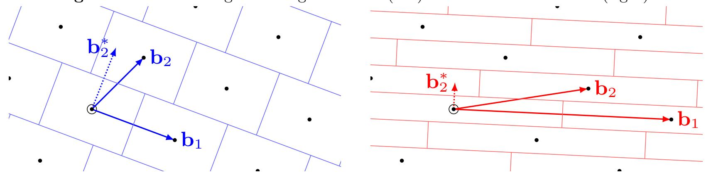
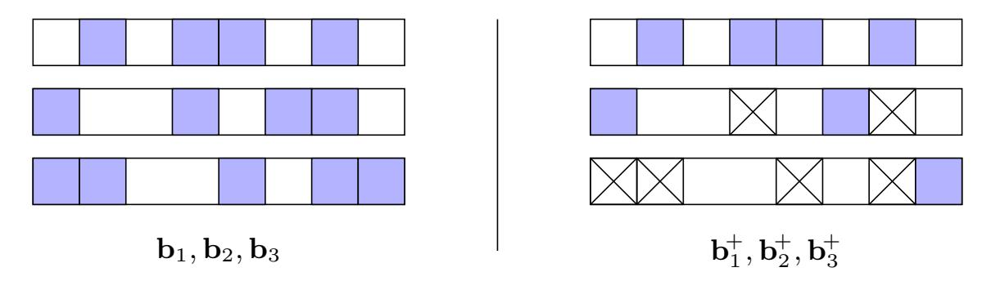
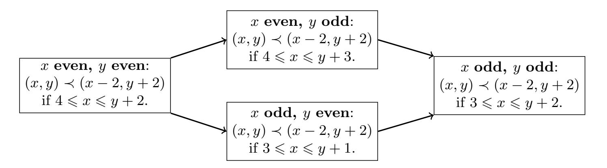
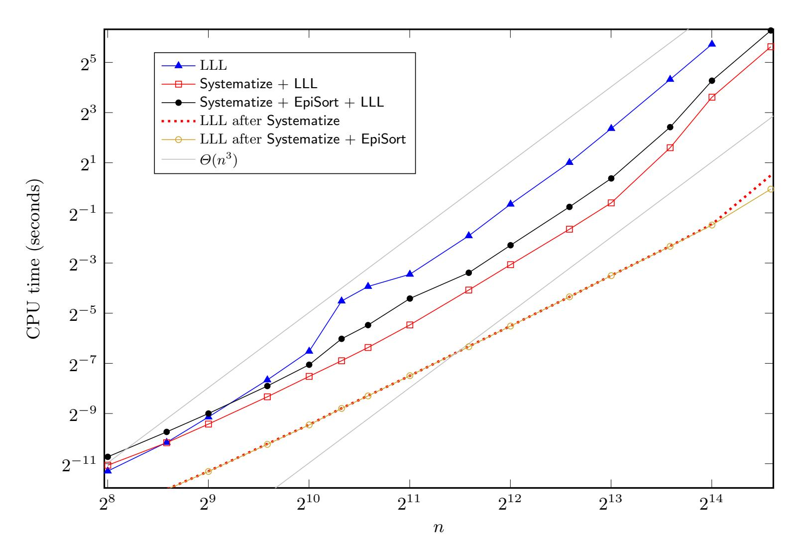
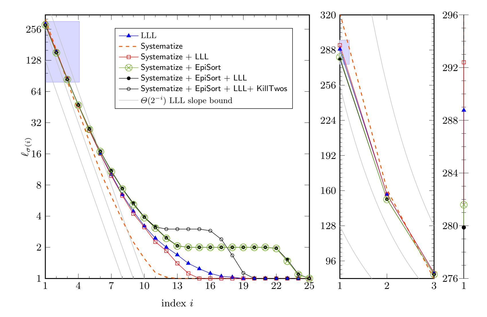
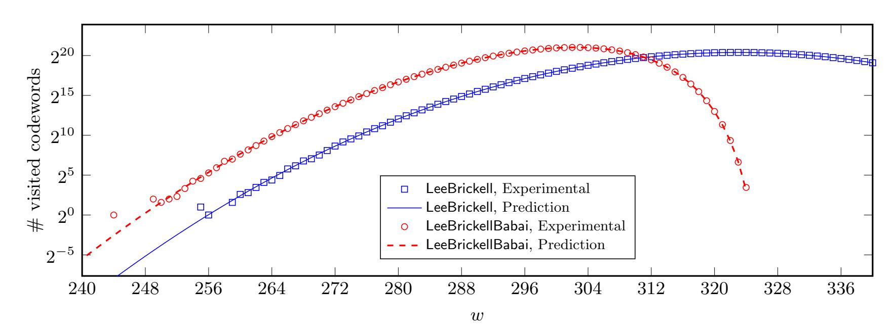
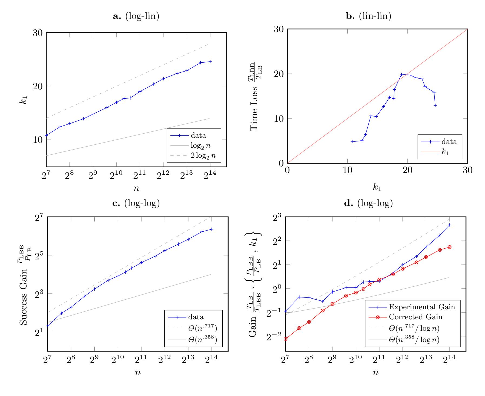

{0}------------------------------------------------

# An Algorithmic Reduction Theory for Binary Codes: LLL and more

Thomas Debris–Alazard1,<sup>2</sup> and L´eo Ducas<sup>3</sup> and Wessel P.J. van Woerden<sup>3</sup>

1 Inria, 1 rue Honor´e d'Estienne d'Orves, Campus de l'Ecole Polytechnique, 91120 Palaiseau Cedex, ´ France

<sup>2</sup> LIX, CNRS UMR 7161, Ecole Polytechnique, 91128 Palaiseau Cedex, France ´ <sup>3</sup> CWI, Amsterdam, The Netherlands

Abstract. In this article, we propose an adaptation of the algorithmic reduction theory of lattices to binary codes. This includes the celebrated LLL algorithm (Lenstra, Lenstra, Lovasz, 1982), as well as adaptations of associated algorithms such as the Nearest Plane Algorithm of Babai (1986). Interestingly, the adaptation of LLL to binary codes can be interpreted as an algorithmic version of the bound of Griesmer (1960) on the minimal distance of a code.

Using these algorithms, we demonstrate —both with a heuristic analysis and in practice— a small polynomial speed-up over the Information-Set Decoding algorithm of Lee and Brickell (1988) for random binary codes. This appears to be the first such speed-up that is not based on a time-memory trade-off.

The above speed-up should be read as a very preliminary example of the potential of a reduction theory for codes, for example in cryptanalysis. In constructive cryptography, this algorithmic reduction theory could for example also be helpful for designing trapdoor functions from codes.

## 1 Introduction

Codes and lattices share many mathematical similarities; a code C ⊂ F n q is defined as a subspace of a vector space over a finite field, and typically endowed with the Hamming metric, while a lattice L ⊂ R <sup>n</sup> is a discrete subgroup of a Euclidean vector space. They both found similar applications in information theory and computer sciences. For example, both can be used to perform error corrections, on digital channels for codes, and on analogue channels for lattices.

Both objects also found applications in cryptography. Cryptosystems can be built relying either on the hardness of finding a close codeword or a close lattice point from a given target, a task called decoding. In random lattices and random codes, these problems appear to be exponentially hard; and a lot of effort has been put into improving both the asymptotic and the concrete efficiency of algorithms solving them [\[LB88,](#page-32-0) [Ste88,](#page-33-0) [MO15,](#page-32-1) [Sch87,](#page-32-2) [GNR10,](#page-32-3) [CN11\]](#page-31-0). The question of concrete hardness (i.e. quantifying costs beyond asymptotics) is becoming increasingly important, as cryptosystems based on codes and lattices are on the verge of being standardised and deployed [\[Nat17\]](#page-32-4). Unlike currently deployed public-key cryptography based on factoring and discrete-logarithm [\[DH76,](#page-31-1) [RSA78\]](#page-32-5), cryptography based on codes and lattices appears to be resistant to quantum computing.

The set of techniques for attacking those problems also have similarities, and some algorithms have been transferred in each direction: for example the Blum-Kalai-Wasserman [\[BKW03\]](#page-31-2) algorithm has been adapted from codes to lattices [\[ACF](#page-31-3)<sup>+</sup>15], while the introduction of locallysensitive hashing in code cryptanalysis [\[MO15\]](#page-32-1) shortly followed its introduction in lattice cryptanalysis [\[Laa15\]](#page-32-6).

It is therefore very natural to question whether all techniques used for codes have also been considered for lattices, and reciprocally. Beyond scientific curiosity, this approach can hint us at how complete each state of the art is, and therefore, how much trust we should put into cryptography based on codes and cryptography based on lattices.

{1}------------------------------------------------

Comparing both state of the art, it appears that there is a major lattice algorithmic technique that has no clear counterpart for codes, namely, basis reduction. Roughly, lattice reduction attempts to find a basis with good geometric properties; in particular its vectors should be rather short and orthogonal to each others. More specifically, the basis defines, via Gram-Schmidt Orthogonalization, a fundamental domain (or tiling) of the space, as shown in figure 1. Decoding with this algorithm is the most favourable when these tiles are close to being square, i.e. when the Gram-Schmidt lengths are balanced. Basis reduction algorithms such as LLL aim at making the Gram-Schmidt lengths more balanced.

<span id="page-1-0"></span>Fig. 1. Lattice decoding with a "good" basis (left) and with a "bad" basis (right).



Certainly, the problem of finding short codewords has also been intensively studied in crypt-analysis with the Information Set Decoding (ISD) literature [Pra62, LB88, Ste88, Dum91, MMT11, BJMM12, MO15, BM18], but notions of basis reduction for lattices are more subtle than containing short vectors; as discussed above, a more relevant objective is to balance the Gram-Schmidt norms. There seem to be no analogue notions of reduction for codes, or at least they are not explicit nor associated with reduction algorithms. We are also unaware of any study of how such reduced bases would help with decoding tasks.

This observation leads to two questions. Is there an algorithmic reduction theory for codes, analogue to the one of lattices? If so, can it be useful for decoding tasks?

### 1.1 Contributions

We answer both questions positively, and set the foundation of an algorithmic reduction theory for codes. More specifically, we propose as our main contributions:

- 1. the notion of an epipodal matrix  $\mathbf{B}^+$  of the basis  $\mathbf{B}$  of a binary code  $\mathcal{C} \subset \mathbb{F}_2^n$  (depicted in Figure 2), playing a role analogue to the Gram-Schmidt Orthogonalisation  $\mathbf{B}^*$  of a lattice basis,
- 2. a fundamental domain (or tiling) of C over  $\mathbb{F}_2^n$  associated to this epipodal matrix, as an analogue to the rectangle parallelepipedic tiling for lattices (as in Figure 1),
- 3. a polynomial time decoding algorithm (SizeRed) effectively reducing points to this fundamental region, analogue to the algorithm popularised by Babai [Bab86],
- 4. a relation between the geometric quality of the fundamental domain and the success probability for decoding a random error to the balance of the lengths of the epipodal vectors,
- 5. an adaptation of the seminal LLL reduction algorithm [LLL82] from lattices to codes, providing in polynomial time a basis with some epipodal length balance guarantees. Interestingly, this LLL algorithm for codes appears to be an algorithmic realisation of the classic bound of Griesmer [Gri60], in the same way that LLL for lattices realizes Hermite's bound.

These contributions establish an initial dictionary between reduction for codes and for lattices, summarised in Table 1.

Furthermore, we initiate the study of the cryptanalytic application of this algorithmic reduction theory. We propose to hybridize the ISD decoding algorithm of Lee and Brickell [LB88] with our techniques (LeeBrickellBabai), and show heuristically that it leads to a polynomial speed-up for full distance decoding in random linear codes. This heuristic claim is confirmed in practice.

{2}------------------------------------------------

<span id="page-2-0"></span>
 Table 1. A Lattice-Code Dictionary.

|                                                                                   | Lattice $\mathcal{L} \subset \mathbb{R}^m$                                                                                                                              | Code $\mathcal{C} \subset \mathbb{F}_2^n$                                                                                |  |
|-----------------------------------------------------------------------------------|-------------------------------------------------------------------------------------------------------------------------------------------------------------------------|--------------------------------------------------------------------------------------------------------------------------|--|
| Ambient Space                                                                     | $\mathbb{R}^m$                                                                                                                                                          | $\mathbb{F}_2^n$                                                                                                         |  |
| Metric                                                                            | Euclidean                                                                                                                                                               | Hamming                                                                                                                  |  |
|                                                                                   | $\ \mathbf{x}\ ^2 = \sum x_i^2$                                                                                                                                         | $ \mathbf{x}  = \#\{i \mid x_i \neq 0\}$                                                                                 |  |
| Support (element)                                                                 | $\mathbb{R}\cdot\mathbf{x}$                                                                                                                                             | $\{i \mid x_i \neq 0\}$                                                                                                  |  |
| Support (lattice/code)                                                            | $\operatorname{Span}_{\mathbb{R}}\left(\mathcal{L}\right)$                                                                                                              | $\{i \mid \exists \mathbf{c} \in \mathcal{C} \text{ s.t. } c_i \neq 0\}$                                                 |  |
| Sparsity                                                                          | $\det(\mathcal{L})$                                                                                                                                                     | $2^{n-k}$                                                                                                                |  |
| Effective Sparsity                                                                | $\det(\mathcal{L})$                                                                                                                                                     | $2^{\#\operatorname{Supp}(\mathcal{C})-k}$                                                                               |  |
| $\mathbf{x} \perp \mathbf{y}$                                                     | Orthogonality                                                                                                                                                           | ality Orthopodality                                                                                                      |  |
|                                                                                   | $\langle \mathbf{x}, \mathbf{y} \rangle = 0$                                                                                                                            | $\operatorname{Supp}(\mathbf{x})\cap\operatorname{Supp}(\mathbf{y})=\emptyset$                                           |  |
| Projection $\pi_{\mathbf{x}}$                                                     | Orth. Projection onto ${\bf x}$                                                                                                                                         | Puncturing pattern $\mathbf{x}$                                                                                          |  |
|                                                                                   | $\mathbf{y} \mapsto \frac{\langle \mathbf{x}, \mathbf{y} \rangle}{\langle \mathbf{x}, \mathbf{x} \rangle} \cdot \mathbf{x}$                                             | $\mathbf{y} \mapsto \mathbf{y} \wedge \mathbf{x}$                                                                        |  |
| Auxiliary matrix                                                                  | Gram-Schmidt Orth.                                                                                                                                                      | Epipodal matrix                                                                                                          |  |
|                                                                                   | $\mathbf{b}_i^* = \mathbf{b}_i - \sum_{i < i} \frac{\langle \mathbf{b}_i, \mathbf{b}_j^* \rangle}{\langle \mathbf{b}_j^*, \mathbf{b}_j^* \rangle} \cdot \mathbf{b}_j^*$ | $\mathbf{b}_i^+ = \mathbf{b}_i \wedge \overline{(\mathbf{b}_1^+ \vee \cdots \vee \mathbf{b}_{i-1}^+)}$                   |  |
| Basis profile $\ell$                                                              | $\ell_i = \ \mathbf{b}_i^*\ $                                                                                                                                           | $\ell_i =  \mathbf{b}_i^+ $                                                                                              |  |
| Fundamental domain                                                                | Parallelepiped $\mathcal{P}(\mathbf{B}^*)$                                                                                                                              | Prod. of Hamming balls <sup>1</sup>                                                                                      |  |
| $\mathcal{F}(\mathbf{B})$                                                         | $\left\{\mathbf{x} \left  \forall i, \ \left  \left\langle \mathbf{x}, \mathbf{b}_i^* \right\rangle \right  \leqslant \frac{\ell_i^2}{2} \right. \right\}$              | $\left\{\mathbf{x} \left  \forall i, \   \mathbf{x} \wedge \mathbf{b}_i^+   \leqslant \frac{\ell_i}{2} \right. \right\}$ |  |
| Error correction radius                                                           | $\min_i \ell_i^2/2$                                                                                                                                                     | $\min_i \lfloor (\ell_i - 1)/2 \rfloor$                                                                                  |  |
| Average decoding dist.                                                            | $\sqrt{\frac{1}{12}\sum_i\ell_i^2}$                                                                                                                                     | $\approx \frac{n}{2} - \frac{1}{\sqrt{\pi}} \sum_i \sqrt{\lceil \ell_i/2 \rceil}$                                        |  |
| Worst decoding dist.                                                              | $\sqrt{\frac{1}{2}\sum_i\ell_i^2}$                                                                                                                                      | $\sum_i \lfloor \ell_i/2 \rfloor$                                                                                        |  |
| Favourable decoding                                                               | balanced $\ell_i$ 's                                                                                                                                                    | balanced and odd $\ell_i$ 's                                                                                             |  |
| Basis inequality                                                                  | $\prod \ \mathbf{b}_i\  \geqslant \det(\mathcal{L})$                                                                                                                    | $\sum  \mathbf{b}_i  \geqslant \# \operatorname{Supp}(\mathcal{C})$                                                      |  |
| Invariant $\prod \ \mathbf{b}_i^*\  = \det(\mathcal{L})$                          |                                                                                                                                                                         | $\sum  \mathbf{b}_i^+  = \# \operatorname{Supp}(\mathcal{C})$                                                            |  |
| LLL balance                                                                       | $\ell_i \leqslant \sqrt{4/3} \cdot \ell_{i+1}$                                                                                                                          | $1 \leqslant \ell_i \leqslant 2 \cdot \ell_{i+1}$                                                                        |  |
| LLL first length $\ell_1 \leqslant (4/3)^{\frac{n-1}{2}} \cdot \det(\mathcal{L})$ |                                                                                                                                                                         | $\ell_1 - \frac{\lceil \log_2 \ell_1 \rceil}{2} \leqslant \frac{n-k}{2} + 1$                                             |  |
| Corresponding bound Hermite's                                                     |                                                                                                                                                                         | Griesmer's [Gri60]                                                                                                       |  |

This is not exactly correct when some epipodal length  $|\mathbf{b}_{i}^{+}|$  are even. See tie-breaking in Section 4.

{3}------------------------------------------------

Open Artefacts. Source code (c++ kernel, with a python interface) available at https://github.com/lducas/CodeRed/. Data in machine readable format (csv) embedded in the PDF.

#### 1.2 Technical Overview

For simplicity, we focus this work on the case of linear binary codes, *i.e.* vectorial subspaces of  $\mathbb{F}_2^n$ . We aim for the analogue of the simplest but seminal lattice algorithms, namely the reduction algorithm of Lenstra, Lenstra and Lovàsz [LLL82], and the decoding Size-Reduction algorithm, studied and popularised by Babai [LLL82, Bab86].

Epipodal Matrix. These algorithms, and the associated notions of reduction, revolve around the Gram-Schmidt Orthogonalisation (GSO)  $\mathbf{B}^*$  of a lattice basis  $\mathbf{B}$ , and therefore implicitly on the notions of orthogonality  $\mathbf{x} \perp \mathbf{y}$  and of orthogonal projections  $\pi_{\mathbf{x}}^{\perp} : \mathbf{y} \mapsto \mathbf{y} - \frac{\langle \mathbf{x}, \mathbf{y} \rangle}{\langle \mathbf{x}, \mathbf{x} \rangle} \cdot \mathbf{x}$ . We start by developing analogue notions of orthogonality in Section 3. The naive idea of simply

We start by developing analogue notions of orthogonality in Section 3. The naive idea of simply using the same definition with the inner product of  $\mathbb{F}_2$  in place of  $\mathbb{R}$  quickly fails; inner products of  $\mathbb{F}_2$  simply do not carry any geometric information. Instead, we propose to base our reduction theory on the notion of *orthopodality*: codewords  $\mathbf{x} \perp \mathbf{y}$  are orthopodal if their supports (*i.e.* the set of their non-zero coordinates) are disjoint. Once this is set, the road to LLL unfolds before us in almost perfect analogy with lattices. We define orthopodal projections as  $\pi_{\mathbf{x}}^{\perp}: \mathbf{y} \mapsto \mathbf{y} \wedge \overline{\mathbf{x}}$  (using coordinate-wise boolean notations), and this leads to a notion of an *epipodal*<sup>4</sup> matrix  $\mathbf{B}^+$  of a basis  $\mathbf{B}$  analogue to the GSO for a lattice basis.

**Definition** The epipodal matrix 
$$\mathbf{B}^+ = (\mathbf{b}_1^+; \dots; \mathbf{b}_k^+)$$
 of a basis  $\mathbf{B} = (\mathbf{b}_1; \dots; \mathbf{b}_k)$  is given by  $\mathbf{b}_i^+ = \mathbf{b}_i \wedge \overline{(\mathbf{b}_1 \vee \dots \vee \mathbf{b}_{i-1})}$ .

This auxiliary matrix is associated to an invariant (analogue to the volume invariant for lattice bases  $\prod \|\mathbf{b}_i^*\| = \det(\mathcal{L})$ ) namely that the sum of epipodal lengths equates to the effective length of the code:

$$\sum |\mathbf{b}_i^+| = \# \operatorname{Supp}(\mathcal{C}).$$



<span id="page-3-0"></span>**Fig. 2.** The basis **B** of a [8,3]-code, and its associated epipodal matrix  $\mathbf{B}^+$ .

Size Reduction. Then, in Section 4 we proceed to use the above epipodal matrix to design an analogue to the Size-Reduction decoding algorithm popularised by Babai [Bab86]. For lattices, this algorithm is associated with a fundamental domain, namely, a rectangle parallelepiped  $\mathcal{F}(\mathbf{B}) = \mathcal{P}(\mathbf{B}^*)$  that tiles the space following the lattice, as depicted in Figure 1. A similar algorithm is developed for codes (Algorithm 1) and is also associated to a fundamental domain  $\mathcal{F}(\mathbf{B}^+)$ . The fundamental domain  $\mathcal{F}(\mathbf{B}^+)$  can essentially be written as a direct product of Hamming balls of support size  $\ell_i \triangleq |\mathbf{b}_i^+|$  and radius  $\lfloor \ell_i/2 \rfloor$ . In fact we encounter a small hiccup here: arbitrary tie-breaking choices must sometimes be made during Size-Reduction, using a function  $\mathrm{TB}_{\mathbf{p}}(\mathbf{y}) \in \{0, 1/2\}$ .

<span id="page-3-1"></span><sup>&</sup>lt;sup>4</sup> Literately: growth of feet. Here: support increment.

{4}------------------------------------------------

**Definition (Size-Reduction)** Let  $\mathbf{B} = (\mathbf{b}_1; \dots; \mathbf{b}_k)$  be a basis of an [n, k]-code. The Size-Reduced region relative to  $\mathbf{B}$  is defined as:

$$\mathcal{F}(\mathbf{B}^+) \triangleq \left\{ \mathbf{y} \in \mathbb{F}_2^n : \forall i \in [1, k], |\mathbf{y} \wedge \mathbf{b}_i^+| + \mathrm{TB}_{\mathbf{b}_i^+}(\mathbf{y}) \leqslant \frac{|\mathbf{b}_i^+|}{2} \right\}.$$

Vectors in this region are said to be size-reduced with respect to the basis **B**.

As for lattices, the geometric properties of this fundamental domain depend solely on the epipodal profile of the basis, *i.e.* the set of epipodal lengths  $(\ell_i)_i$ . And, as for lattices, the probability of successfully decoding by the Size-Reduction algorithm is better for more *balanced* profiles. Because of the above tie-breaking hiccup, the rule of thumb "balanced is better" only holds under some parity constraints over the  $\ell_i$  (see Lemma 4.7).

LLL for Binary Codes. The above motivates the problem of basis reduction for codes, namely, trying to find bases with a balanced profile  $\ell$ . In section 5, we proceed to adapt the LLL reduction algorithm (Algorithm 3). Following the blueprint of [LLL82], we proceed to improve the profile locally, by finding shortest codewords in projected sub-codes of dimension 2. This can be shown to terminate using the same descent argument as the original LLL algorithm [LLL82]. This guarantees that epipodal lengths do not decrease too fast, namely  $\ell_i \leq 2\ell_{i+1}$ .

**Theorem (LLL for Binary Codes)** There exists a deterministic polynomial time algorithm, that given a basis of a binary [n,k]-code C, produces another basis  $\mathbf{B} = (\mathbf{b}_1; \ldots; \mathbf{b}_k) \in \mathbb{F}_2^{k \times n}$  such that the epipodal length  $\ell_i \triangleq |\mathbf{b}_i^+|$  satisfy

$$1 \leqslant \ell_i \leqslant 2\ell_{i+1}$$
 for all  $i \leqslant k-1$ .

In particular, the first codeword of the basis satisfies when  $k-1 \geqslant \log_2(d)$ :  $|\mathbf{b}_1| - \frac{\lceil \log_2(|\mathbf{b}_1|) \rceil}{2} \leqslant \frac{n-k}{2} + 1$ .

And again a striking analogy occurs: in the same way that original LLL is an algorithmic version of Hermite's bound for the minimal distance of a lattice, our code analogue is an algorithmic version of Griesmer's bound [Gri60] for the minimal distance of a code. That is, while Griesmer's [Gri60] bound guarantees the existence of a codeword of length at most d for some d such that  $d - \frac{\lceil \log_2(d) \rceil}{2} \leqslant \frac{n-k}{2} + 1$ , the LLL algorithm for codes will find such a codeword.

A Hybrid Lee-Brickell-Babai Decoder. From a cryptanalytic perspective, one may question the usefulness of the LLL algorithm above: at least for random codes, one can trivially find codewords of average length  $\frac{n-k}{2}+1$  using the systematic form. First, one should note that the above theorem states a worst case bound, and in practice it does find vectors shorter than  $\frac{n-k}{2}+1$ , and this can be pushed a bit further down with some tweaks (see Section 5.3). But more importantly, the guarantees of LLL concern all epipodal lengths, and not just the shortest vector: LLL should be used as pre-processing to speed-up further search for short or close codewords.

An important remark in this direction is the following: putting a basis in systematic form can also be viewed as an algorithmic version of Singleton's bound [Sin64] for linear codes, namely  $d \leq n-k+1$  for the minimal distance d of a dimension k code  $\mathcal{C} \subset \mathbb{F}_2^n$ . It guarantees that  $\ell_i \geq 1$  for all i, and therefore that  $\ell_1 \leq n-k+1$ . In some sense, all the Information Set Decoding (ISD) literature [Pra62, LB88, Ste88, Dum91, ...], which rely critically on the systematic form, are already implicitly based on a (weak) notion of basis reduction for codes. Interpreting LLL as a strengthening of the systematic form, one may hope that ISD techniques can be compatible with the proposed algorithmic reduction theory.

Both heuristically and in practice, LLL guarantees  $\ell_i > 1$  for about  $k_1 \approx \log_2 n$  many indices, but with further tweaks we seem to reach  $k_1 \approx 2\log_2 n$ . This naturally leads to the idea of making hybrid algorithms, that would roughly perform as ISD over indices for which  $\ell_i = 1$ , and as Size-Reduction for  $\ell_i > 1$ . In Section 6 we propose and study more specifically a LeeBrickellBabai hybrid algorithm with LLL preprocessing [LB88, LLL82, Bab86].

{5}------------------------------------------------

Intuitively, this algorithm will make  $k-k_1$  "uninformed guesses" followed by  $k_1$  "informed guesses" using Size-Reduction. Because each guess is made about a binary unknown, informed guesses have the potential to improve the success probability by a factor between 1 and 2. Assuming each informed guess improves the success probability by a constant factor  $c \in [1, 2]$ , one can expect a polynomial time speed-up of  $S = c^{k_1} = n^{\Theta(1)}$ . This intuition is confirmed by a more refined heuristic analysis giving a lower-bound  $S \ge \Omega(n^{.358}/\log n)$ , while experiments suggest  $S \approx \Theta(n^{.717}/\log_2 n)$ , for the case of full distance decoding of random codes of rate  $R \triangleq k/n = 1/2$ , that is the problem of finding a codeword of the expected minimal distance  $d \approx 0.11n$ .

#### 1.3 Perspectives

This work brings codes and lattices closer to each other by enriching the existing dictionary (table 1); we hope that it can enable more transfer of techniques between those two research areas. Let us list some research directions.

Generalisations. In principle, the definitions, theorems and algorithms of this article should be generalizable to codes over  $\mathbb{F}_q$  endowed with the Hamming metric, with the minor inconvenience that one may no longer conflate words over  $\mathbb{F}_q$  with their binary support vector. Some algorithms may see their complexity grow by a factor  $\Theta(q)$ , meaning that the algorithms remains polynomial-time only for  $q = n^{O(1)}$ . It is natural to hope that such a generalised LLL would still match Griesmer [Gri60] bound for q > 2. However, we expect that the analysis of the fundamental domain of Section 4 would become significantly harder to carry out. We have no intuition of whether the speed-up obtained in Section 6 should improve or not as q increases.

Another natural generalisation to aim for would be codes constructed with a different metric, in particular codes endowed with the rank metric [Gab85, Gab93]. In this case codes are subspaces of  $\mathbb{F}_{q^m}$  endowed with the rank metric; the weight of a codeword  $\mathbf{x} \in \mathbb{F}_{q^m}^n$  is the rank of its matrix representation over  $\mathbb{F}_q$  (which is a matrix of size  $m \times n$ ). While the support of a codeword with the Hamming metric is the set of its non-zero coordinates, the support of  $\mathbf{x} = (x_1, \dots, x_n) \in \mathbb{F}_{q^m}^n$  is the  $\mathbb{F}_q$ -subspace of  $\mathbb{F}_{q^m}$  that the  $x_i$ 's generate, namely  $\{\sum_i \lambda_i x_i : \lambda_i \in \mathbb{F}_q\}$ . We believe that this work can be generalised in this case, in particular the notion of epipodal matrices. However there are some difficulties to overcome. In particular, projecting one support orthopodally to another one is not canonical.

Cryptanalysis. Our last contribution (LeeBrickellBabai algorithm) is only meant to show this algorithmic reduction theory for code is compatible with existing techniques, and can, in principle bring improvements. By itself, this hybrid LeeBrickellBabai algorithm with LLL preprocessing is only tenuously faster than the original algorithm (say, 2<sup>2</sup> times faster for a problem that requires 2<sup>1000</sup> operations). Time-memory trade-offs such as [Ste88, Dum91, MMT11, BJMM12, MO15, BM18] admittedly provide much more substantial speed-ups in theory, and currently hold the records in practice [ALL19].

However, the lattice literature has much stronger reduction algorithms to offer than LLL [Sch87, GHGKN06, GN08, LN14, DM13, ...]; our work opens their adaptation to codes as a new research area, together with the study of their cryptanalytic implications. Furthermore, it is not implausible that reduction techniques may be compatible with memory intensive techniques [Ste88, Dum91, MO15]; this is the case in the lattice cryptanalysis literature [Duc18].

Further Algorithmic Translations. Still based around the same fundamental domain, a central algorithm for lattices is the Branch-and-Bound enumeration algorithm of Finkle and Pohst [FP85], which has been the object of numerous variations for heuristic speed-ups [GNR10]. While our hybrid algorithm LeeBrickellBabai may be read as an analogue of the random sampling algorithm of Schnorr [Sch03, AN17], a more general study of enumeration techniques for codes would be interesting.

Both for codes and lattices, there are other natural fundamental domains than the Size-Reduction studied in this paper. For lattices we have the (non-rectangle) parallelepiped  $\mathcal{P}(\mathbf{B})$ 

{6}------------------------------------------------

provided called "simple rounding" algorithm  $\mathbf{x} \mapsto \mathbf{x} - \lfloor \mathbf{x} \cdot \mathbf{B}^{-1} \rfloor \cdot \mathbf{B}$  for lattices [Bab86]. For codes we have a domain of the form  $\mathbb{F}_2^{n-k} \times \{0\}^k$  for each information set  $\mathcal{I} \subset [\![1,n]\!]$  of size k given by Prange's algorithm [Pra62]. It is tempting to think they could be in correspondence in a unified theory for codes and lattices.

Another fundamental domain of interest is the Voronoi domain, which is naturally defined for both codes and lattices. In the case of lattices there are algorithms associated with it known as iterative slicers. Rather than operating with a basis, the provable versions of this algorithm operates with the (exponentially large) set of *Voronoi-relevant* vectors [MV13], while heuristic variants can work with a (smaller, but still exponential) set of short vectors [DLdW19]. We are not aware of similar approaches in the code literature.

Cryptographic design. Some of the developed notions could have application in cryptographic constructions as well, in particular for trapdoor sampling [GPV08, DST19]. Indeed, the Gaussian sampling algorithm of [GPV08] is merely a careful randomisation of the Size-Reduction algorithm, and the variant of Peikert [Pei10] is a randomisation of the "simple rounding" algorithm discussed above. It requires knowing a basis with a good profile as a trapdoor. While the construction of a sampleable trapdoor function has finally been realised [DST19], the method and underlying problem used are rather ad-hoc. We note in particular that the underlying generalized (U, U+V)-codes admit bases with a peculiar profile  $\ell$ , which may explain their fitness for trapdoor sampling. The algorithmic reduction theory proposed in this work appears as the natural point of view to approach and improve trapdoor sampling for codes.

Bounds. Beyond cryptography, this reduction theory may be of interest to establish new bounds for codes. In particular we emphasize the notion of higher weight [Wei91, TV95] as an analogue of the notion of the density of sub-lattices [Bog01]; the latter are subject to the so-called Rankin-bound, generalizing Hermite's bound on the minimal distance of a lattice.

Duality. Also on a theoretical level, one intriguing question is how this reduction theory interacts with the notion of duality for codes. In particular, for lattices, the dual of an LLL-reduced basis of the primal lattice is (essentially) an LLL-reduced basis of the dual lattice. One could wonder whether this also holds for codes; however, while there is a notion of a dual code, their doesn't seem to be a 1-to-1 correspondence between primal and dual bases.

Another remark is that it may also be natural to consider Branch-and-Bound enumeration algorithms working with a reduced basis of the dual code rather than a basis of the primal code, at least if self-duality can not be established. This may be advantageous in certain regimes.

### 1.4 Table of Content and Navigation

The technical development of this article are organised as follows:

Section 2: Preliminaries

Section 3: Orthopodality and the Epipodal Matrix

Section 4: Size-Reduction and its Fundamental Domain

Section 5: LLL for Binary Codes

Section 6: A Hybrid Lee-Brickell-Babai Decoder

Artefacts: Code available at https://github.com/lducas/CodeRed/.

Data in machine readable format (CSV) embedded in the PDF.

A reader only interested reaching LLL for binary codes can proceed with Sections 2, 3, and 5 and safely skip section 4; while this section motivates basis reduction for codes, both sections are essentially independent from a technical perspective. Sections 3, 4, and 5 all start with a reminder of the analogue notion at hands from lattices. Section 6 depends on all previous sections, and may require some familiarity with Information Set Decoding techniques.

{7}------------------------------------------------

#### Acknowledgments

We express our gratitute to Alain Couvreur, Daniel Dadush, Thomas Espitau and Pierre Karpman for precious comments and references. Author T. D.-A. was supported by the grant EPSRC EP/S02087X/1. Author L.D. is supported by the European Union Horizon 2020 Research and Innovation Program Grant 780701 (PROMETHEUS). Author W. v. W. is supported by the ERC Advanced Grant 740972 (ALGSTRONGCRYPTO).

### <span id="page-7-0"></span>2 Preliminaries

**Notations** For a and b integers with  $a \leq b$ , we denote by [a, b] the set of integers  $\{a, a+1, \ldots, b\}$ . The notation  $x \triangleq y$  means that x is defined to be equal to y. For a finite set  $\mathcal{E}$ , we will denote by  $\#\mathcal{E}$  its cardinality.

Vectors are denoted by bold lowercase letters  $(\mathbf{x}, \mathbf{y}, \dots)$  and they are *row* vectors. We will mostly consider binary vectors, *i.e.* elements of the vector space  $\mathbb{F}_2^n$ . We will use the standard boolean notations  $\overline{\mathbf{x}}$ ,  $\mathbf{x} \oplus \mathbf{y}$ ,  $\mathbf{x} \wedge \mathbf{y}$ ,  $\mathbf{x} \vee \mathbf{y}$ , for the bitwise negation, the bitwise XOR (vector addition over  $\mathbb{F}_2^n$ ), the bitwise AND, and the bitwise OR.<sup>5</sup>

Matrices are denoted by bold uppercase letters  $(\mathbf{B}, \mathbf{C}, \dots)$ , and we use the notation  $(\mathbf{B}; \mathbf{C})$  for the vertical concatenation of matrices. In particular,  $\mathbf{B} = (\mathbf{b}_1; \dots; \mathbf{b}_k)$  denotes the  $k \times n$  matrix whose row vectors are the vectors  $\mathbf{b}_i \in \mathbb{F}_2^n$ .

#### 2.1 Binary Codes, the Hamming Metric

The support Supp( $\mathbf{x}$ ) of a vector  $\mathbf{x} \in \mathbb{F}_2^n$  is the set of indices of its non-zero coordinates, and its Hamming weight  $|\mathbf{x}| \in [0, n]$  is the cardinality of its support:

$$\operatorname{Supp}(\mathbf{x}) \triangleq \{i \in [1, n] \mid x_i \neq 0\}, \qquad |\mathbf{x}| \triangleq \#\operatorname{Supp}(\mathbf{x}).$$

We will denote by  $\mathcal{S}_w^n$  the Hamming sphere and by  $\mathcal{B}_w^n$  the Hamming ball of radius w over  $\mathbb{F}_2^n$ , namely:

$$\mathcal{S}_w^n \triangleq \{\mathbf{x} \in \mathbb{F}_2^n : |\mathbf{x}| = w\}, \quad \mathcal{B}_w^n \triangleq \{\mathbf{x} \in \mathbb{F}_2^n : |\mathbf{x}| \leqslant w\}.$$

A binary linear code  $\mathcal{C}$  of length n and dimension k — for short, an [n,k]-code — is a subspace of  $\mathbb{F}_2^n$  of dimension k. Every linear code can be described either by a set of linearly independent generators (basis representation) or by a system of modular equations (parity-check representation). We will mostly consider the first representation for our purpose.

To build an [n, k]-code we may take any set of vectors  $\mathbf{b}_1, \dots, \mathbf{b}_k \in \mathbb{F}_2^n$  which are linearly independent and define:

$$C(\mathbf{b}_1; \dots; \mathbf{b}_k) \triangleq \left\{ \sum_{i=1}^k z_i \mathbf{b}_i : z_i \in \mathbb{F}_2 \right\}$$
 (Basis rep.)

We say that  $\mathbf{b}_1, \dots, \mathbf{b}_k$  is a basis for the code  $\mathcal{C} = \mathcal{C}(\mathbf{b}_1; \dots; \mathbf{b}_k)$ . Alternatively we will call the matrix  $\mathbf{B} = (\mathbf{b}_1; \dots; \mathbf{b}_k)$  a basis or a generating matrix of the code  $\mathcal{C} = \mathcal{C}(\mathbf{B})$ .

An usual way in code-based cryptography to decode random codes is to use bases in *systematic* form. A basis **B** of an [n,k]-code is said to be in *systematic form* if up to a permutation of its columns  $\mathbf{B} = (\mathbf{I}_k, \mathbf{B}')$  where  $\mathbf{I}_k$  denotes the identity of size  $k \times k$  and  $\mathbf{B}' \in \mathbb{F}_2^{k \times (n-k)}$ . Such bases can be produced from any basis by making a Gaussian elimination. Choosing the set of pivots

<span id="page-7-1"></span><sup>&</sup>lt;sup>5</sup> In the code-based cryptography literature, for instance [COT14], the bitwise AND is often interpreted algebraically as a *star-product* or *Schur-product*, denoted ⊙ or \*. We found the boolean notations more adapted to our geometric purposes, especially given that the bitwise OR also plays an important role.

{8}------------------------------------------------

iteratively (possibly at random among available ones), this can be done in time  $O(nk^2)$ . In the following we denote by Systematize such a randomised algorithm.

An element  $\mathbf{c} \in \mathcal{C}$  of a code  $\mathcal{C}$  is called a *codeword*. The support of the code is defined as the union of the supports of all its codewords, which also implies the definition of an *effective length*  $|\mathcal{C}| \leq n$  of a [n, k]-code  $\mathcal{C}$ :

$$\operatorname{Supp}(\mathcal{C}) \triangleq \bigcup_{\mathbf{c} \in \mathcal{C}} \operatorname{Supp}(\mathbf{c}), \qquad |\mathcal{C}| \triangleq \# \operatorname{Supp}(\mathcal{C}).$$

Indeed, the code length n defined by the ambient space is a rather extrinsic datum, in particular extending a code  $\mathcal{C}$  by padding a 0 to all codewords does not affect the geometry of the code, but it does affect the apparent length n.

One note that if  $\mathbf{B} = (\mathbf{b}_1; \dots; \mathbf{b}_k)$  is a basis of  $\mathcal{C}$ , we have the identity  $\operatorname{Supp}(\mathcal{C}) = \bigcup \operatorname{Supp}(\mathbf{b}_i)$ , and therefore that  $|\mathcal{C}| \leq \sum |\mathbf{b}_i|$ .

Another quantity which characterizes a code is its minimal distance. For a code C, it is defined as the shortest Hamming weight of non-zero codewords, namely:

$$d_{\min}(\mathcal{C}) \triangleq \min \{ |\mathbf{c}| : \mathbf{c} \in \mathcal{C} \text{ and } \mathbf{c} \neq \mathbf{0} \}.$$

### <span id="page-8-0"></span>3 Orthopodality and the Epipodal Matrix

Let us start by recalling the standard definition of Gram-Schmidt Orthogonalisation (GSO) over Euclidean vector spaces. Given a basis  $(\mathbf{b}_1; \dots; \mathbf{b}_n)$  of the Euclidean space  $(\mathbb{R}^n, \|\cdot\|)$  its Gram-Schmidt orthogonalisation  $(\mathbf{b}_1^*; \dots; \mathbf{b}_n^*)$  is defined inductively by:

$$\mathbf{b}_i^* \triangleq \pi_i^{\perp}(\mathbf{b}_i), \quad \text{ where } \pi_i^{\perp} : \mathbf{x} \mapsto \mathbf{x} - \sum_{j < i} \frac{\langle \mathbf{x}, \mathbf{b}_j^* \rangle}{\langle \mathbf{b}_j^*, \mathbf{b}_j^* \rangle} \cdot \mathbf{b}_j^*.$$

The map  $\pi_i^{\perp}$  denotes the orthogonal projection onto the orthogonal of the space generated by vectors  $\mathbf{b}_1, \ldots, \mathbf{b}_{i-1}$  in  $\mathbb{R}^n$ . While the GSO of the basis of a lattice *is not* itself a basis of that lattice, it is a central object in the reduction theory of lattices, and in lattice reduction algorithms. This section is dedicated to the construction of an analogue object for bases of binary linear codes.

### 3.1 An Orthogonality notion for Binary Vectors

In the case of Euclidean vector spaces  $\mathbb{R}^n$ , orthogonality can be defined via the standard inner-product, namely  $\mathbf{x} \perp \mathbf{y} : \langle \mathbf{x}, \mathbf{y} \rangle = 0$  and so orthogonal projections onto the line spanned by  $\mathbf{x}$  as  $\pi_{\mathbf{x}}(\mathbf{y}) \triangleq \frac{\langle \mathbf{x}, \mathbf{y} \rangle}{\langle \mathbf{x}, \mathbf{x} \rangle} \mathbf{x}$ .

While  $\mathbb{F}_2^n$  is also endowed with an inner-product, it does not lead to a geometrically meaningful notion of orthogonality. For instance for  $\mathbf{x}, \mathbf{y} \in \mathbb{F}_2^n$ ,  $\langle \mathbf{x}, \mathbf{y} \rangle = 0$  doesn't imply that  $|\mathbf{x} \oplus \mathbf{y}| = |\mathbf{x}| + |\mathbf{y}|$ . However we note that, by definition of the Hamming weight we do have:

$$|\mathbf{x} \oplus \mathbf{y}| = |\mathbf{x}| + |\mathbf{y}| \iff \operatorname{Supp}(\mathbf{x}) \cap \operatorname{Supp}(\mathbf{y}) = \emptyset.$$

In fact, we even have the identity

$$|\mathbf{x} \oplus \mathbf{y}| = |\mathbf{x}| + |\mathbf{y}| - 2|\mathbf{x} \wedge \mathbf{y}| \tag{1}$$

for  $\mathbf{x}, \mathbf{y} \in \mathbb{F}_2^n$  which should be read as an analogue of the Euclidean identity

$$\|\mathbf{x} + \mathbf{y}\|^2 = \|\mathbf{x}\|^2 + \|\mathbf{y}\|^2 - 2\langle \mathbf{x}, \mathbf{y} \rangle.$$

This suggests to define  $\mathbf{x}, \mathbf{y} \in \mathbb{F}_2^n$  to be *orthopodal* if their supports are disjoint, that is, defining the orthogonality relation as:

$$\mathbf{x} \perp \mathbf{y} \iff \mathbf{x} \wedge \mathbf{y} = \mathbf{0}. \tag{2}$$

{9}------------------------------------------------

We can then associate convenient notions of projections *onto* (the support of)  $\mathbf{x}$  and *orthopodally* to (the support of)  $\mathbf{x}$  as follows:

$$\pi_{\mathbf{x}} : \mathbf{y} \mapsto \mathbf{y} \wedge \mathbf{x}, \qquad \pi_{\mathbf{x}}^{\perp} : \mathbf{y} \mapsto \mathbf{y} \wedge \overline{\mathbf{x}} = \pi_{\overline{\mathbf{x}}}(\mathbf{y}).$$
 (3)

Such transformations are certainly not new to codes, and known in the literature as puncturing [MS86, Ch.1 §9]. However, we are here especially interested in their geometric virtues. They do satisfy similar properties as their Euclidean analogues:  $\pi_{\mathbf{x}}$  is linear, idempotent, it fixes  $\mathbf{x}$ , it does not increase length (Hamming weight), and together with  $\pi_{\mathbf{x}}^{\perp}$  yields an orthogonal decomposition. More formally:

**Fact 3.1** For any  $\mathbf{x}, \mathbf{y}, \mathbf{z} \in \mathbb{F}_2^n$  it holds that:

$$\pi_{\mathbf{x}}(\mathbf{y} \oplus \mathbf{z}) = \pi_{\mathbf{x}}(\mathbf{y}) \oplus \pi_{\mathbf{x}}(\mathbf{z}), \quad \pi_{\mathbf{x}}^{2}(\mathbf{y}) = \pi_{\mathbf{x}}(\mathbf{y}),$$
 (4)

$$\pi_{\mathbf{x}}^{\perp}(\mathbf{x}) = \mathbf{0}, \quad \pi_{\mathbf{x}}(\mathbf{x}) = \mathbf{x},$$
 (5)

$$\pi_{\mathbf{x}}^{\perp}(\mathbf{y}) \perp \mathbf{x}, \quad |\pi_{\mathbf{x}}(\mathbf{y})| \leqslant |\mathbf{y}|,$$
 (6)

$$\pi_{\mathbf{x}}(\mathbf{y}) \perp \pi_{\mathbf{x}}^{\perp}(\mathbf{y}), \quad \pi_{\mathbf{x}}(\mathbf{y}) \oplus \pi_{\mathbf{x}}^{\perp}(\mathbf{y}) = \mathbf{y}.$$
 (7)

Furthermore, and unlike their Euclidean analogues: they always commute and their compositions can be compactly represented.

**Fact 3.2** For any  $\mathbf{x}, \mathbf{y} \in \mathbb{F}_2^n$  it holds that:

$$\pi_{\mathbf{x}} \circ \pi_{\mathbf{y}} = \pi_{\mathbf{y}} \circ \pi_{\mathbf{x}} = \pi_{\mathbf{x} \wedge \mathbf{y}}, \qquad \pi_{\mathbf{x}}^{\perp} \circ \pi_{\mathbf{y}}^{\perp} = \pi_{\mathbf{y}}^{\perp} \circ \pi_{\mathbf{x}}^{\perp} = \pi_{\mathbf{x} \vee \mathbf{y}}^{\perp}.$$
 (8)

We therefore extend the notation  $\pi_S^{\perp}$  to sets  $S \subseteq \mathbb{F}_2^n$  to denote the projection orthopodally to the support of S, namely  $\pi_{\mathbf{x}}^{\perp}$  where  $\mathbf{x} = \bigvee_{\mathbf{s} \in S} \mathbf{s}$ . This compact representation will allow for various algorithmic speed-ups.

#### 3.2 Epipodal Matrix

We are now fully equipped to define an analogue of the Gram-Schmidt Orthogonalisation process over real matrices to the case of binary matrices. An important remark is that this analogue notion given below does not preserve the  $\mathbb{F}_2$ -span of partial bases, which may appear as breaking the analogy with the GSO over the reals which precisely preserves  $\mathbb{R}$ -span of those partial bases. This is in fact not the right analogy for our purpose, noting that the GSO does not preserve the  $\mathbb{Z}$ -spans of those partial bases. The proper lattice to code translation (Table 1) associates  $\mathbb{Z}$ -spans (*i.e.* lattices) to  $\mathbb{F}_2$ -spans (*i.e.* codes), and  $\mathbb{R}$ -spans to supports.

**Definition 3.3 (Epipodal matrix).** Let  $\mathbf{B} = (\mathbf{b}_1; \dots; \mathbf{b}_k) \in \mathbb{F}_2^{k \times n}$  be a binary matrix. The *i*-th projection associated to this matrix is defined as  $\pi_i \triangleq \pi_{\{\mathbf{b}_1, \dots, \mathbf{b}_{i-1}\}}^{\perp}$  where  $\pi_1$  denotes the identity. Equivalently,

$$\pi_i: \mathbb{F}_2^n \longrightarrow \mathbb{F}_2^n \\ \mathbf{c} \longmapsto \mathbf{c} \wedge \overline{(\mathbf{b}_1 \vee \dots \vee \mathbf{b}_{i-1})}.$$

$$(9)$$

The i-th epipodal vector is then defined as:

$$\mathbf{b}_{i}^{+} \triangleq \pi_{i}(\mathbf{b}_{i}). \tag{10}$$

The matrix  $\mathbf{B}^+ \triangleq (\mathbf{b}_1^+; \dots; \mathbf{b}_k^+) \in \mathbb{F}_2^{k \times n}$  is called the epipodal matrix of  $\mathbf{B}$ .

The *i*-th epipodal vector should be interpreted as the support increment from the code  $C(\mathbf{b}_1, \dots, \mathbf{b}_{i-1})$  to  $C(\mathbf{b}_1, \dots, \mathbf{b}_i)$ . The epipodal matrix enjoys the following properties, analogue to the GSO.

Fact 3.4 (Properties of Epipodal Matrices) For any binary matrix  $\mathbf{B} = (\mathbf{b}_1; \dots; \mathbf{b}_k) \in \mathbb{F}_2^{k \times n}$ , its epipodal matrix  $\mathbf{B}^+ = (\mathbf{b}_1^+; \dots; \mathbf{b}_k^+)$  satisfies:

{10}------------------------------------------------

1. The epipodal vectors are pairwise orthopodal:

$$\forall i \neq j, \quad \mathbf{b}_i^+ \perp \mathbf{b}_j^+. \tag{11}$$

2. For all  $i \leq k$ ,  $(\mathbf{b}_1, \dots, \mathbf{b}_i)$  and  $(\mathbf{b}_1^+, \dots, \mathbf{b}_i^+)$  have the same supports, that is:

$$\bigvee_{j \leqslant i} \mathbf{b}_{j}^{+} = \bigvee_{j \leqslant i} \mathbf{b}_{j}, or \ equivalently \quad \bigcup_{j \leqslant i} \operatorname{Supp}(\mathbf{b}_{j}^{+}) = \bigcup_{j \leqslant i} \operatorname{Supp}(\mathbf{b}_{j}). \tag{12}$$

Furthermore, one may note that epipodal vectors satisfy a similar induction to the one of the GSO over the reals:

Epipodal Matrix: 
$$\mathbf{b}_{i}^{+} = \mathbf{b}_{i} \oplus \sum_{j=0}^{i-1} \mathbf{b}_{i} \wedge \mathbf{b}_{j}^{+}, \quad \text{GSO: } \mathbf{b}_{i}^{*} = \mathbf{b}_{i} - \sum_{j=0}^{i-1} \frac{\langle \mathbf{b}_{i}, \mathbf{b}_{j}^{*} \rangle}{\langle \mathbf{b}_{j}^{*}, \mathbf{b}_{j}^{*} \rangle} \cdot \mathbf{b}_{j}^{*}.$$
 (13)

However following this induction leads to perform  $O(k^2)$  vector operations. In the case of the epipodal matrix, the computation can be sped-up to O(k) vector operations using cumulative support vectors  $\mathbf{s}_i$ :

$$\mathbf{s}_0 = \mathbf{0}, \quad \mathbf{s}_i = \mathbf{s}_{i-1} \vee \mathbf{b}_i, \quad \mathbf{b}_i^+ = \mathbf{b}_i \wedge \overline{\mathbf{s}_{i-1}}.$$

The epipodal matrix of the basis of a code also enjoys an analogue invariant to the GSO for lattices. The GSO  $(\mathbf{b}_1^*; \dots; \mathbf{b}_k^*)$  of a lattice  $\mathcal{L}$  is not generally a basis of  $\mathcal{L}$  but it verifies the following invariant  $\prod_{i=1}^k \|\mathbf{b}_i^*\| = \det(\mathcal{L})$ .

Fact 3.5 (Length Invariant) For any basis  $(\mathbf{b}_1; \dots; \mathbf{b}_k)$  of an [n, k]-code  $\mathcal{C}$ :

$$|\mathcal{C}| = \sum_{i=1}^{k} |\mathbf{b}_i^+|. \tag{14}$$

### <span id="page-10-0"></span>4 Size-Reduction and its Fundamental Domain

While the GSO of a lattice basis is not itself a basis of that lattice, it is a central notion to define what a "good" basis is. For example, because of the invariant  $\prod \|\mathbf{b}_i^*\| = \det(\mathcal{L})$ , and because  $\mathbf{b}_1^* = \mathbf{b}_1$ , making the first vector of a basis short means that other Gram-Schmidt lengths must grow.

The notion of quality of a basis should more specifically be linked to what we can do algorithmically with it. In the cases of lattices, the GSO of a basis allows to *tile* the space. More formally, if **B** is the basis of a full rank lattice  $\mathcal{L} \subset \mathbb{R}^k$ , one can define a fundamental domain of the action of  $\mathcal{L}$  over  $\mathbb{R}$ —*i.e.* a set of representative of the quotient  $\mathbb{R}^k/\mathcal{L}$ — by the following rectangle parallelepiped:

$$\mathcal{P}(\mathbf{B}^*) \triangleq \left\{ \sum x_i \mathbf{b}_i^* \mid |x_i| \leqslant \frac{1}{2} \right\} = \left[ -\frac{1}{2}, \frac{1}{2} \right]^k \cdot \mathbf{B}^*.$$

Furthermore, there is a polynomial time algorithm that effectively reduces points  $\mathbf{x} \in \mathbb{R}^k$  modulo  $\mathcal{L}$  to this parallelepiped, namely Size-Reduction [LLL82], also known as the Nearest-Plane Algorithm [Bab86]. This parallelepiped has inner radius  $r_{\text{in}} = \min \|\mathbf{b}_i^*\|/2$  and outer square radius  $r_{\text{out}}^2 = \frac{1}{4} \sum \|\mathbf{b}_i^*\|^2$ . This means that Size-Reduction can, in the worst case, find a close lattice vector at distance  $r_{\text{out}}$ , and correctly decode all errors of length up to  $r_{\text{in}}$ . One can also establish that the average squared norm of the decoding of a random coset is  $\frac{1}{12} \sum \|\mathbf{b}_i^*\|^2$ .

This Section is dedicated to an equivalent Size-Reduction algorithm for binary codes, and to the study of its associated fundamental domain.

{11}------------------------------------------------

### 4.1 Size-Reduction, Definition and Algorithm

Let us start by defining the Size-Reduction and its associated fundamental domain. A first technical detail is that in the case of codes, it is not given that the epipodal vectors are non-zero, a minor difference with the Gram-Schmidt Orthogonalisation for bases in real vector space. We restrict our attention to *proper bases*.

**Definition 4.1 (Proper bases).** A basis **B** is called proper if all its epipodal vectors  $\mathbf{b}_{i}^{+}$  are non-zero.

Note for example that bases in systematic form are proper bases: proper bases do exist for all codes, and can be produced from any basis in polynomial time.

A more annoying hiccup is that we may need to handle ties to prevent the size-reduction tiles from overlapping; in the case of lattices this can be ignored as the overlaps have zero measure. This issue arises when an epipodal vector  $\mathbf{p}$  has even weight, and when  $|\mathbf{y} \wedge \mathbf{p}| = |\mathbf{p}|/2 = |(\mathbf{y} \oplus \mathbf{p}) \wedge \mathbf{p}|$ . We (arbitrarily) use the first epipodal coordinate to break such ties:

$$TB_{\mathbf{p}}(\mathbf{y}) = \begin{cases} 0 & \text{if } |\mathbf{p}| \text{ is odd,} \\ 0 & \text{if } y_j = 0 \text{ where } j = \min(\text{Supp}(\mathbf{p})), \\ 1/2 & \text{otherwise.} \end{cases}$$
 (15)

**Definition 4.2 (Size-Reduction).** Let  $\mathbf{B} = (\mathbf{b}_1; \dots; \mathbf{b}_k)$  be a basis of an [n, k]-code. The Size-Reduced region relative to  $\mathbf{B}$  is defined as:

$$\mathcal{F}(\mathbf{B}^+) \triangleq \left\{ \mathbf{y} \in \mathbb{F}_2^n : \forall i \in [1, k], |\mathbf{y} \wedge \mathbf{b}_i^+| + \mathrm{TB}_{\mathbf{b}_i^+}(\mathbf{y}) \leqslant \frac{|\mathbf{b}_i^+|}{2} \right\}.$$

Vectors in this region are said to be size-reduced with respect to the basis **B**.

**Proposition 4.3 (Fundamental Domain).** Let  $\mathbf{B} \triangleq (\mathbf{b}_1; \dots; \mathbf{b}_k)$  be a proper basis of an [n, k]code  $\mathcal{C}$ . Then  $\mathcal{F}(\mathbf{B}^+)$  if a fundamental domain for  $\mathcal{C}$ , that is:

1.  $\mathcal{F}(\mathbf{B}^+)$  is  $\mathcal{C}$ -packing:

$$\forall \mathbf{c} \in \mathcal{C} \setminus \{\mathbf{0}\}, \quad (\mathbf{c} + \mathcal{F}(\mathbf{B}^+)) \cap \mathcal{F}(\mathbf{B}^+) = \emptyset,$$

2.  $\mathcal{F}(\mathbf{B}^+)$  is  $\mathcal{C}$ -covering:

$$C(\mathbf{B}) + \mathcal{F}(\mathbf{B}^+) = \mathbb{F}_2^n$$
.

*Proof.* Let us start by proving that  $\mathcal{F}(\mathbf{B}^+)$  is  $\mathcal{C}(\mathbf{B})$ -packing. Let  $\mathbf{c} = \sum_i x_i \mathbf{b}_i \in \mathcal{C}(\mathbf{B})$  and  $\mathbf{y}_1, \mathbf{y}_2 \in \mathcal{F}(\mathbf{B}^+)$  such that  $\mathbf{c} = \mathbf{y}_1 \oplus \mathbf{y}_2$ . By definition of the orthopodalization  $\mathbf{c} = \sum_i x_i \mathbf{b}_i^+ \oplus \sum_{j < i} x_i \mathbf{b}_i \wedge \mathbf{b}_j^+$  which gives:

$$\forall \ell \in [1, k], \quad \mathbf{c} \wedge \mathbf{b}_{\ell}^{+} = x_{\ell} \mathbf{b}_{\ell}^{+} \oplus \sum_{i > \ell} x_{i} \mathbf{b}_{i} \wedge \mathbf{b}_{\ell}^{+}.$$

Suppose by contradiction that  $\mathbf{c} \neq \mathbf{0}$ . Let j be the largest index such that  $x_j \neq 0$ . Then  $\mathbf{c} \wedge \mathbf{b}_j^+ = \mathbf{b}_j^+$ . As  $\mathbf{c} = \mathbf{y}_1 \oplus \mathbf{y}_2$  where  $\mathbf{y}_1, \mathbf{y}_2 \in \mathcal{F}(\mathbf{B}^+)$ ,

$$|\mathbf{c} \wedge \mathbf{b}_{j}^{+}| \leqslant |\mathbf{y}_{1} \wedge \mathbf{b}_{j}^{+}| + |\mathbf{b}_{j}^{+} \wedge \mathbf{y}_{2}| < |\mathbf{b}_{j}^{+}|$$

which is a contradiction. Therefore  $\mathbf{c} = \mathbf{0}$  which shows that  $\mathcal{F}(\mathbf{B}^+)$  is  $\mathcal{C}(\mathbf{B})$ -packing. The  $\mathcal{C}(\mathbf{B})$ -covering property will follow from the fact that Algorithm 1 is correct as proven in Proposition 4.4.

<span id="page-11-0"></span>**Proposition 4.4.** Algorithm 1 is correct and runs in polynomial time.

*Proof.* First note that  $\mathbf{e} \oplus \mathbf{y} \in \mathcal{C}(\mathbf{B})$  is a loop invariant, as we only add basis vectors  $\mathbf{b}_i$  to  $\mathbf{e}$ . Therefore all we need to show is that  $\mathbf{e} \in \mathcal{F}(\mathbf{B}^+)$ . Note that the loop at step i enforces  $|\mathbf{e} \wedge \mathbf{b}_i^+| + \mathrm{TB}_{\mathbf{b}_i^+}(\mathbf{e}) \leqslant |\mathbf{b}_i^+|/2$ . Furthermore, this constraint is maintained by subsequent loop iterations of index j < i since  $\mathbf{b}_j \wedge \mathbf{b}_i^+ = \mathbf{0}$ .

{12}------------------------------------------------

### **Algorithm 1:** $SizeRed(\mathbf{B}, \mathbf{y})$

Size-reduce  $\mathbf{y}$  with respect to  $\mathbf{B}$ 

```
Input: A basis \mathbf{B} = (\mathbf{b}_1; \dots; \mathbf{b}_k) \in \mathbb{F}_2^{k \times n} and a target \mathbf{y} \in \mathbb{F}_2^n

Output: \mathbf{e} \in \mathcal{F}(\mathbf{B}^+) such that \mathbf{e} \oplus \mathbf{y} \in \mathcal{C}(\mathbf{B})

\mathbf{e} \leftarrow \mathbf{y}

for i = k down to 1 do
```

<span id="page-12-0"></span>Decoding Performance. Given any fundamental domain  $\mathcal{F}$  of an [n,k]-code  $\mathcal{C}(\mathbf{B})$  and a reduction algorithm one can look at the decoding performance. A random target is uniformly distributed over the fundamental domain after reduction and thus the quality of decoding is fully dependent on the geometric properties of the fundamental domain. For example random decoding up to a length of w succeeds with probability

$$\frac{\#(\mathcal{F} \cap \mathcal{B}_w^n)}{\#\mathcal{F}} = \frac{\#(\mathcal{F} \cap \mathcal{B}_w^n)}{2^{n-k}}.$$

The minimal distance  $d \triangleq d_{\min}(\mathcal{C})$  of a random code  $\mathcal{C}$  is expected to be very close to the Gilbert-Varshamov bound [OS09, §3.2, Definition 1], and a random target lies almost always at distance  $\approx d$ . Therefore in this setting random decoding is mostly interesting for  $w \geqslant d$ , as otherwise no solution is expected to exist.

The other regime is unique decoding. For general codes this means half distance decoding up to weight w < d/2. Because all errors up to weight w are minimal we obtain a success probability of

$$\frac{\#\mathcal{F}\cap\mathcal{B}_w^n}{\#\mathcal{B}_w^n}$$
.

For random codes a target at distance at most w < d (instead of d/2) is almost always uniquely decodable and as a result the success probability is also close to the above success probability. For cryptanalytic purposes it is assumed to be identical [OS09, 3.3].

Maximum Likelihood Decoding. For maximum likelihood decoding one should have a fundamental domain where each coset representative has minimal weight. However for most codes it is hard to reduce a target to this fundamental domain. For lattices this fundamental domain is unique up to the boundary and is well known as the "Voronoi Domain" of a lattice. In the case of lattices, reduction to this fundamental domain can be performed in exponential time [MV13, DLdW19].

Prange's Fundamental Domains. Given a basis **B** in systematic form a more common decoding algorithm, namely the Prange algorithm [Pra62], is to assume an error of 0 on the k pivot positions of the systematic form. Just as Algorithm 1 this induces a fundamental domain, but of geometric shape  $\mathbb{F}_2^{n-k} \times \{0\}^k$  instead of  $\mathcal{F}(\mathbf{B}^+)$ . This leads respectively to random and unique decoding probabilities of

$$\frac{\#\mathcal{B}_w^{n-k}}{2^{n-k}}$$
, and  $\frac{\#\mathcal{B}_w^{n-k}}{\#\mathcal{B}_w^n}$ .

### <span id="page-12-1"></span>4.2 Decomposition and Analysis of $\mathcal{F}(B^+)$

We define the fundamental ball of length p > 0 as:

$$\mathcal{E}^p \triangleq \left\{ \mathbf{y} \in \mathbb{F}_2^p : |\mathbf{y}| + TB_{(1,\dots,1)}(\mathbf{y}) \leqslant p/2 \right\}.$$

It should be thought as the canonical fundamental domain of the [p, 1]-code  $\mathcal{C} = \mathbb{F}_2 \cdot (1, 1, \dots, 1)$  inside  $\mathbb{F}_2^p$  (the repetition code of length p). To each proper epipodal vector  $\mathbf{b}_i^+$  we assign an *epipodal* 

{13}------------------------------------------------

ball  $\mathcal{E}^{|\mathbf{b}_i^+|}$ , and this allows to rewrite the fundamental domain  $\mathcal{F}(\mathbf{B}^+)$  as a product of balls via the isometry:

$$\mathcal{F}(\mathbf{B}^+) \xrightarrow{\sim} \prod_{i=1}^k \mathcal{E}^{|\mathbf{b}_i^+|}: \qquad \mathbf{y} \mapsto \left(\mathbf{y}|_{\operatorname{Supp}(\mathbf{b}_1^+)}, \dots, \mathbf{y}|_{\operatorname{Supp}(\mathbf{b}_k^+)}\right).$$

Note that the latter object only depends on the epipodal lengths  $|\mathbf{b}_1^+|, \dots, |\mathbf{b}_k^+|$  which we call the *profile*  $(\ell_i \triangleq |\mathbf{b}_i^+|)_i$  of the basis **B**. In the case of lattices, size-reduction gives a fundamental domain that can be written as a direct sum of segments  $\mathcal{P}(\mathbf{B}^*) = \prod_i [-1/2, 1/2) \cdot \mathbf{b}_i^*$  where the  $\mathbf{b}_i^*$ 's are the GSO of the lattice basis. Here, the fundamental ball  $\mathcal{E}^{|\mathbf{b}_i^+|}$ , plays the role of the segment  $[-1/2, 1/2) \cdot \mathbf{b}_i^*$ , that can be thought of as the canonical fundamental domain of the lattice of dimension one  $\mathbb{Z} \cdot \mathbf{b}_i^*$  inside  $\mathbb{R} \cdot \mathbf{b}_i^*$ .

To analyse the uniform distribution over the whole fundamental domain  $\mathcal{F}(\mathbf{B}^+)$  we first consider the uniform distribution of the fundamental balls. Note that  $\#\mathcal{E}^p = 2^{p-1}$ . Let  $W_p \triangleq |\mathcal{U}(\mathcal{E}^p)|$  be the weight distribution of vectors uniformly drawn in the fundamental ball  $\mathcal{E}^p$ . Then

$$\mathbb{P}[W_p = w] = \begin{cases} 0 & \text{if } w > p/2 \text{ or } w < 0, \\ \binom{p}{p/2} \cdot 2^{-p} & \text{if } w = p/2, \\ \binom{p}{w} \cdot 2^{-p+1} & \text{otherwise.} \end{cases}$$

One can estimate the statistical property of this folded binomial distribution, for example its expectation is given by:

$$\mathbb{E}\left[W_p\right] = \frac{p}{2} - \left\lceil \frac{p}{2} \right\rceil \cdot \binom{p}{\left\lfloor \frac{p}{2} \right\rfloor} \cdot 2^{-p} = \frac{p}{2} - \sqrt{\frac{p}{2\pi}} + \Theta(1/\sqrt{p}).$$

This expectation is bounded by  $\frac{p-1}{2}$ , which for the odd case is clear as all elements have weight at most  $\frac{p-1}{2}$  and which for the even case follows from the inequality  $\binom{p}{p/2} \geqslant 2^p/\sqrt{2p}$ . This bound is strict for  $p \geqslant 3$ , which will give us a gain over the Prange decoder [Pra62].

By the earlier bijection the uniform distribution over  $\mathcal{F}(\mathbf{B}^+)$  is equivalent to the k-product distribution of the fundamental balls  $\mathcal{U}(\mathcal{E}^{\ell_1}), \ldots, \mathcal{U}(\mathcal{E}^{\ell_k})$ . The weight distribution  $W(\mathbf{B}) \triangleq |\mathcal{U}(\mathcal{F}(\mathbf{B}^+))|$  of a uniform vector over  $\mathcal{F}(\mathbf{B}^+)$  then follows from the convolution of the weight distributions  $W_{\ell_1}, \ldots, W_{\ell_k}$ :

$$\mathbb{P}[W(\mathbf{B}) = w] = \sum_{\sum_{i} w_{i} = w} \left( \prod_{i=1}^{k} \mathbb{P}[W_{\ell_{i}} = w_{i}] \right).$$

Given that the weight distribution solely depends on the profile we will also denote it by  $W(\ell)$ . The whole distribution can efficiently (in time polynomial in n) be computed by iterated convolution, as its support [0, n] is discrete and small (see weights.py). The expectation, which is given by  $\sum_{i=1}^k \mathbb{E}[W_{\ell_i}]$ , can even be tightly controlled.

<span id="page-13-0"></span>**Lemma 4.5.** Given a proper basis **B** of an [n,k]-code with profile  $\ell = (\ell_1, \ldots, \ell_k)$  we have

$$\frac{1}{\sqrt{\pi}} \sum_{i=1}^{k} \sqrt{\left\lceil \frac{\ell_i}{2} \right\rceil \cdot \left( 1 - \frac{1}{\left\lceil \frac{\ell_i}{2} \right\rceil + 1} \right)} \leqslant \frac{|\mathcal{C}(\mathbf{B})|}{2} - \mathbb{E}\left[ W(\mathbf{B}) \right] \leqslant \frac{1}{\sqrt{\pi}} \sum_{i=1}^{k} \sqrt{\left\lceil \frac{\ell_i}{2} \right\rceil}.$$

Note that the expectation is at least as good as the Prange decoder [Pra62], as

$$\mathbb{E}[W(\ell)] = \sum_{i=1}^{k} \mathbb{E}[W_{\ell_i}] \leqslant \sum_{i=1}^{k} \frac{\ell_i - 1}{2} = (|\mathcal{C}| - k)/2,$$

and strictly better if  $\ell_i \geqslant 3$  for any  $i \in [1, k]$ .

{14}------------------------------------------------

### <span id="page-14-2"></span>4.3 Comparing Profiles for Size-Reduction Decoding

We have shown that the geometric shape of the fundamental domain  $\mathcal{F}(\mathbf{B}^+)$  depends fully on the profile  $\ell_1, \ldots, \ell_k$ . But what is actually a good profile?

One could for example consider the expected length  $\mathbb{E}[W(\mathbf{B})]$  of size-reducing a random word in space; in that case, because  $x \mapsto \sqrt{x}$  is concave, the upper bounds of Lemma 4.5 suggest that it is minimised when the  $\ell_i$  are the most balanced. Again a similar phenomenon is well known in the case of lattices: on random inputs, size-reduction produces vectors with an average squared length of  $\frac{1}{12} \sum \|\mathbf{b}_i^*\|^2$ ; under the invariant  $\prod \|\mathbf{b}_i^*\| = \det(\mathcal{L})$  the quantity E is minimised for a basis with a balanced profile  $\|\mathbf{b}_1^*\| = \|\mathbf{b}_2^*\| = \cdots = \|\mathbf{b}_k^*\|$ .

However, the quantity  $\mathbb{E}[W(\mathbf{B})]$  discussed above does not necessarily reflect the quality of the basis for all relevant algorithmic tasks. For example, if one wishes to decode errors of weight at most w with a 100% success probability, it is necessary and sufficient that  $w < \min_i \ell_i/2$ .

We therefore propose the following partial ordering on profiles that is meant to account that a profile is better than another for all relevant decoding tasks (we could think of); as a counterpart, this is only a partial ordering and two profiles may simply be incomparable. In the following a profile  $(\ell_i)_i$  is said to be proper if the  $\ell_i$ 's are non zero.

<span id="page-14-1"></span>**Definition 4.6 (Comparing Profiles).** We define a partial ordering  $(\mathcal{L}_{n,k}, \preceq)$  on the set of proper profiles  $\mathcal{L}_{n,k}$  of [n,k]-codes by:

$$\ell \leq \ell' \iff \mathbb{P}[W(\ell) \leqslant w] \geqslant \mathbb{P}[W(\ell') \leqslant w] \text{ for all } w \in [0, n].$$

This also defines an equivalence relation  $\cong$  on  $\mathcal{L}_{n,k}$ . We call a profile  $\ell$  better than  $\ell'$  if  $\ell \leq \ell'$ . We call  $\ell$  strictly better than  $\ell'$  and write  $\ell \prec \ell'$  if  $\ell \leq \ell'$  and  $\ell \not \prec \ell'$ . We call  $\ell, \ell'$  incomparable and write  $\ell \not \downarrow \ell'$  if  $\ell \not \preceq \ell'$  and  $\ell \not \succeq \ell'$ .

Let us first justify the relevance of this partial ordering for random decoding and unique decoding.

Random Decoding. A uniformly random target  $\mathbf{t} \in \mathbb{F}_2^n$  is reduced by SizeRed (Algorithm 1) to some error  $\mathbf{e}$  in the fundamental domain  $\mathcal{F}(\mathbf{B}^+)$ , such that  $\mathbf{c} \triangleq \mathbf{t} \oplus \mathbf{e} \in \mathcal{C}(\mathbf{B})$ . Because  $\mathcal{F}(\mathbf{B}^+)$  is a fundamental domain the error  $\mathbf{e}$  is uniformly distributed over it (over the randomness of  $\mathbf{t}$ ). The distance of  $\mathbf{t}$  to the codeword  $\mathbf{c}$  equals the weight of  $\mathbf{e}$ , and thus the codeword  $\mathbf{c}$  lies at distance at most w from  $\mathbf{t}$  with probability  $\mathbb{P}[W(\mathbf{B}) \leq w]$ . For a better profile we see that this probability will also be higher. The expected distance is equal to  $\mathbb{E}[W(\mathbf{B})]$ . By noting that  $\mathbb{E}[W(\mathbf{B})] = n - \sum_{w=0}^{n} \mathbb{P}[W(\mathbf{B}) \leq w]$  we see that a better profile also implies a lower expected distance.

Unique decoding. Assume that  $w < d_{\min}(\mathcal{C}(\mathbf{B}))/2$  such that each error vector of weight w is minimal. Decoding a random error  $\mathbf{e}$  with weight at most w using SizeRed succeeds if  $\mathbf{e} \in \mathcal{F}(\mathbf{B}^+)$ . Because the error vector  $\mathbf{e}$  is random and minimal the success probability equals the ratio between vectors in  $\mathcal{F}(\mathbf{B}^+)$  with weight at most w and the total number of vectors with weight at most w. Expressing this in the above weight distribution we obtain a success probability of

$$\frac{\#\mathcal{F}(\mathbf{B}^+) \cap \mathcal{B}_w^n}{\#\mathcal{B}_w^n} = \frac{2^{n-k} \cdot \mathbb{P}[W(\mathbf{B}) \leqslant w]}{\sum_{i=0}^w \binom{n}{i}}.$$

Again we see that a better profile gives a higher success probability.

The more balanced, the better. Now that we have argued that the ordering of Definition 4.6 is relevant, let us show that, indeed, balanced profiles are preferable. As we will see, this rule of thumb is in fact imperfect, and only apply strictly to profiles that share the same parities  $(\wp_i \triangleq \ell_i \mod 2)_i$ .

<span id="page-14-0"></span>**Lemma 4.7** (Profile Relations). The partial ordering  $\leq$  has the following properties:

{15}------------------------------------------------

- (1) If  $\ell$  is a permutation of  $\ell'$  then  $\ell \simeq \ell'$ .
- (2) if  $\ell_1 \leq \ell'_1$  and  $\ell_2 \leq \ell'_2$ , then  $(\ell_1|\ell_2) \leq (\ell'_1|\ell'_2)$ .
- <span id="page-15-0"></span>(3) If  $3 \le x \le y+1$ , then  $(x,y) \prec (x-2,y+2)$ .

*Proof.* (1) follows from the fact that the geometric properties of the size-reduced region fully depend on the values of the profile (and not their ordering). For (2) note that  $\ell_i \leq \ell'_i$  implies the existence of a one-to-one map  $f_i$  from the size-reduction domain  $\mathcal{F}(\ell_i)$  to  $\mathcal{F}(\ell'_i)$  that is non-decreasing in weight for i = 1, 2. The product map  $f_1 \times f_2$  is then a one-to-one map from  $\mathcal{F}(\ell_1|\ell_2)$  to  $\mathcal{F}(\ell'_1|\ell'_2)$  that is non-decreasing in weight, which implies that  $(\ell_1|\ell_2) \leq (\ell'_1|\ell'_2)$ . For (3) let  $\mathcal{C}_{x,y} \triangleq \mathcal{C}(\mathbf{b}_1^x; \mathbf{b}_2^y)$  be the [x + y, 2] code with

$$\mathbf{b}_{1}^{x} = (1, \dots, 1, 0, \dots, 0),$$
  
 $\mathbf{b}_{2}^{y} = (\underbrace{0, \dots, 0}_{x}, \underbrace{1, \dots, 1}_{y}).$ 

We first consider the case that x, y are both odd and we compare  $\mathcal{F}(\mathcal{C}_{x,y})$  and  $\mathcal{F}(\mathcal{C}_{x-2,y+2})$  for  $x \leq y+2$ . We have to show that

$$\#(\mathcal{F}(\mathcal{C}_{x,y}) \cap \mathcal{B}_w^{x+y}) \geqslant \#(\mathcal{F}(\mathcal{C}_{x-2,y+2}) \cap \mathcal{B}_w^{x+y}) \text{ for all } w \geqslant 0.$$

Note that for  $w \leqslant \lfloor \frac{x-2}{2} \rfloor$  and  $w \geqslant \lfloor \frac{x}{2} \rfloor + \lfloor \frac{y}{2} \rfloor$  both fundamental domains contain the same amount of words of length at most w, namely all of them and  $2^{x+y-2}$  respectively. So we can consider the case that  $\lfloor \frac{x}{2} \rfloor \leqslant w < \lfloor \frac{x}{2} \rfloor + \lfloor \frac{y}{2} \rfloor$ . We denote  $\mathcal{E}^p \cap \mathcal{B}_q^p$  by  $\mathcal{E}_q^p$ . Now a closer inspection of the fundamental domains shows that

$$\mathcal{B}_{w}^{x+y} \cap \mathcal{F}(\mathcal{C}_{x,y}) \setminus \mathcal{F}(\mathcal{C}_{x-2,y+2}) = (\mathcal{S}_{\lfloor \frac{x}{2} \rfloor}^{x-2} |00| \mathcal{E}_{w-\lfloor \frac{x}{2} \rfloor}^{y}) \qquad \cup \qquad (\mathcal{E}_{w-\lfloor \frac{y}{2} \rfloor-2}^{x-2} |11| \mathcal{S}_{\lfloor \frac{y}{2} \rfloor}^{y}),$$

$$\mathcal{B}_{w}^{x+y} \cap \mathcal{F}(\mathcal{C}_{x-2,y+2}) \setminus \mathcal{F}(\mathcal{C}_{x,y}) = (\mathcal{S}_{\lfloor \frac{x-2}{2} \rfloor}^{x-2} |11| \mathcal{E}_{w-\lfloor \frac{x}{2} \rfloor-1}^{y}) \qquad \cup \qquad (\mathcal{E}_{w-\lfloor \frac{y}{2} \rfloor-1}^{x-2} |00| \mathcal{S}_{\lfloor \frac{y}{2} \rfloor+1}^{y}).$$

By noting that  $\binom{x-2}{\lfloor \frac{x}{2} \rfloor} = \binom{x-2}{\lfloor \frac{x-2}{2} \rfloor}$  and  $\binom{y}{\lfloor \frac{y}{2} \rfloor} = \binom{y}{\lfloor \frac{y}{2} \rfloor + 1}$  the (non-absolute) difference in words of length at most w is equal to

$$\begin{pmatrix} x-2 \\ \lfloor \frac{x-2}{2} \rfloor \end{pmatrix} \begin{pmatrix} y \\ w-\lfloor \frac{x}{2} \rfloor \end{pmatrix} - \begin{pmatrix} y \\ \lfloor \frac{y}{2} \rfloor \end{pmatrix} \begin{pmatrix} x-2 \\ w-\lfloor \frac{y}{2} \rfloor -1 \end{pmatrix},$$

and we have to show that this is non-negative. By rewriting  $w' \triangleq \lfloor \frac{x}{2} \rfloor + \lfloor \frac{y}{2} \rfloor - w > 0$  this is equal to showing that

$$\binom{y}{\left|\frac{y}{2}\right| - w'} / \binom{y}{\left|\frac{y}{2}\right|} \geqslant \binom{x - 2}{\left|\frac{x - 2}{2}\right| - w'} / \binom{x - 2}{\left|\frac{x - 2}{2}\right|}.$$

This inequality follows from the fact that for a constant  $c \ge 1$  the function  $f(z) = {2z+1 \choose z-c}/{2z+1 \choose z}$  is strictly increasing for  $z \ge c$ . One can show this by taking the derivative of f (made continuous by the gamma function) in terms of the digamma function  $\psi(x) = \Gamma'(x)/\Gamma(x)$ , and by using that  $\psi(n) = \sum_{i=1}^{n-1} \frac{1}{i} - \gamma$  for a positive integer n with  $\gamma$  the Euler-Mascheroni constant. We leave this as an exercise to the reader. We conclude that for odd x, y with  $3 \le x \le y + 2$  we have  $(x, y) \prec (x - 2, y + 2)$ .

For the even case there is an easy reduction to the odd case by using that

$$\#\mathcal{E}_w^{2x'} = \#\mathcal{E}_w^{2x'-1} + \#\mathcal{E}_{w-1}^{2x'-1}$$

for any integer  $x' \ge 1$  and weight w. Note that this reduction does not work for odd to even. As a result we can write for even x and any  $y \ge 1$ :

$$\#(\mathcal{F}(\mathcal{C}_{x,y}) \cap \mathcal{B}_w^{x+y}) = \#(\mathcal{F}(\mathcal{C}_{x-1,y}) \cap \mathcal{B}_w^{(x-1)+y}) + \#(\mathcal{F}(\mathcal{C}_{x-1,y}) \cap \mathcal{B}_{w-1}^{(x-1)+y}),$$

and thus  $(x-1,y) \prec (x-3,y+2)$  implies that  $(x,y) \prec (x-2,y+2)$ . This reduces the case (x,y) with **even** x to the case (x-1,y) with **odd** x-1. If y is even we can apply a similar reduction. The lemma now follows from the odd case by the reductions shown in Figure 4.3.

{16}------------------------------------------------



Fig. 3. Reduction of even epipodal lengths to the odd case.

A direct result of property (3) of Lemma 4.7 is that under a fixed parity the best profile will be the most balanced profile.

Corollary 4.8 (Best Profile). Given a parity vector  $\wp = (\wp_1, \dots, \wp_k) \in \{0,1\}^k$  let  $\mathscr{L}_{n,k}(\wp)$  be the set of profiles  $\ell \in \mathscr{L}_{n,k}$  such that  $\ell \equiv \wp \mod 2$ . Then  $\mathscr{L}_{n,k}(\wp)/\cong$  has a minimum element  $\ell_{\wp}$  that can be represented by

$$(\ell_{\wp})_{i} = \begin{cases} 2 \cdot \left\lceil \frac{n + |\wp|}{2k} \right\rceil - \wp_{i} & \text{if } i \leqslant \frac{n + |\wp|}{2} - k \cdot \left\lfloor \frac{n + |\wp|}{2k} \right\rfloor, \\ 2 \cdot \left\lfloor \frac{n + |\wp|}{2k} \right\rfloor - \wp_{i} & \text{otherwise.} \end{cases}$$

An odd game of parity. Although for fixed parity a balanced profile is always better than an unbalanced one there are some exceptions to this rule when dropping the parity constraint. For example, looking at Lemma 4.5 one can notice that, at least for average decoding distances, odd values in a profile are preferable to even values. One can show that a slight unbalance with odd coefficients is preferable for all purpose to a perfect even balance:

<span id="page-16-1"></span>
$$(x-1,x+1) \leq (x,x)$$
 for all even  $x \geqslant 2$ . (16)

This is an artefact of the need to tie-break certain size-reductions with respect to epipodal vectors of even length. More generally, outside of the parity constraint of Lemma 4.5, we see in Table 2 that other comparison can occur.

| n  |                              |                            |                            |                           |                        |
|----|------------------------------|----------------------------|----------------------------|---------------------------|------------------------|
| 4  | $2,2\succ 1,3$ $\circ$       |                            |                            |                           |                        |
| 5  | $2,3 \approx 1,4$            |                            |                            |                           |                        |
| 6  | $3, 3 \prec 1, 5 \bullet$    | 3, 3 < 2, 4                |                            |                           |                        |
| 7  | $3, 4 \prec 1, 6 \bullet$    | $3, 4 \prec 2, 5  \bullet$ |                            |                           |                        |
| 8  | $4, 4 \not \downarrow 1, 7$  | $4, 4 \prec 2, 6  \bullet$ | $4,4 \succ 3,5$ $\circ$    |                           |                        |
| 9  | $4,5 \prec 1,8  \bullet$     | $4,5 \prec 2,7  \bullet$   | $4,5 \approx 3,6$ •        |                           |                        |
| 10 | $5, 5 \prec 1, 9 \bullet$    | $5, 5 \prec 2, 8$          | $5, 5 \prec 3, 7 \bullet$  | $5, 5 \prec 4, 6$         |                        |
| 11 | $5, 6 \prec 1, 10 \bullet$   | $5, 6 \prec 2, 9  \bullet$ | $5, 6 \prec 3, 8  \bullet$ | $5, 6 \prec 4, 7 \bullet$ |                        |
| 12 | $6, 6 \not \downarrow 1, 11$ | $6, 6 \prec 2, 10 \bullet$ | $6,6 \not \downarrow 3,9$  | $6, 6 \prec 4, 8 \bullet$ | $ 6,6 \succ 5,7 \circ$ |

<span id="page-16-0"></span>**Table 2.** Comparing all profiles to the most balanced profile  $(\lfloor n/2 \rfloor, \lceil n/2 \rceil)$  for  $n \leq 12$ . Cases covered by (repeatedly applying) Lemma 4.7 are marked with a  $\bullet$ , and those covered by Eq. (16) are marked with  $\circ$ .

To complete the analogy with the lattice literature, let us now adapt the notion of size-reduction for a basis. We call a basis size-reduced if each basis vector is size-reduced with respect to all previous basis vectors.

{17}------------------------------------------------

**Definition 4.9.** We call a proper basis  $\mathbf{B} = (\mathbf{b}_1; \dots; \mathbf{b}_k)$  size-reduced if  $\mathbf{b}_i \in \mathcal{F}((\mathbf{b}_1; \dots; \mathbf{b}_{i-1})^+)$  for all  $1 < i \leq k$ .

Size reduction for a basis allows to control the basis vector lengths with the epipodal lengths as follows.

**Proposition 4.10.** Let  $\mathbf{B} = (\mathbf{b}_1; \dots; \mathbf{b}_k)$  be a size-reduced basis. Then, for all  $i \leq n$  it holds that  $|\mathbf{b}_i| \leq \ell_i + \sum_{j < i} \lfloor \ell_j / 2 \rfloor$  for all  $i \leq k$ .

Perhaps surprisingly, this global notion of size-reduction will not be required in the LLL algorithm for codes discussed in the next Section 5.2, which is a first deviation from the original LLL algorithm for lattices [LLL82]. However it can still be useful to adapt more powerful reduction algorithms such as deepLLL [SE94, FSW12]. Furthermore, it will be a useful preprocessing tool to put a basis in semi-systematic form without affecting its profile, as done in Section 6.1.

```
Algorithm 2: SizeRedBasis(\mathbf{B}, \mathbf{y}) Size-reduce the basis \mathbf{B}

Input: A proper basis \mathbf{B} = (\mathbf{b}_1; \dots; \mathbf{b}_k) \in \mathbb{F}_2^{k \times n} of a code \mathcal{C}

Output: A size-reduced basis of \mathcal{C}(\mathbf{B}) with the same epipodal matrix as \mathbf{B}.

for i = 2 to k do
```

<span id="page-17-1"></span>**Proposition 4.11.** Algorithm 2 is correct and runs in polynomial time.

*Proof.* The polynomial claim immediately follows from Proposition 4.4. Secondly note that vectors  $\mathbf{b}_i$ 's form a basis of the code  $\mathcal{C}$  given as input, and this is a loop invariant. Indeed, in any step i of the algorithm only codewords from the sub-code  $\mathcal{C}(\mathbf{b}_1; \ldots; \mathbf{b}_{i-1})$  are added to  $\mathbf{b}_i$ . Furthermore, this does not affect  $\mathbf{b}_i^+ \triangleq \pi_i(\mathbf{b}_i)$ . The loop at step i enforces that  $\mathbf{b}_i \in \mathcal{F}((\mathbf{b}_1; \ldots; \mathbf{b}_{i-1})^+)$  and this constraint is maintained as  $\mathbf{b}_1, \ldots, \mathbf{b}_i$  are unchanged by all later steps.

### <span id="page-17-0"></span>5 LLL for Binary Codes

In the previous section, we have seen that the geometric quality of the fundamental domain  $\mathcal{F}(\mathbf{B}^+)$  solely depends upon the epipodal lengths  $\ell_i \triangleq |\mathbf{b}_i^+|$ : the more balanced, the better, both for finding close codewords of random words, and for decoding random errors. This situation is in perfect analogy with the situation in lattices. We therefore turn to the celebrated LLL [LLL82] algorithm for lattice reduction, which aims precisely at balancing the profile  $(\ell_i)_i$ .

In hindsight, the LLL algorithm can be interpreted as an algorithmic version of the so-called Hermite's bound on the minimal length of an *n*-dimensional vector [GHGKN06]. Again, the analogy between code an lattice stands: the LLL reduction for codes turns out to be an algorithmic version of Griesmer's bound [Gri60].

Certainly, Griesmer's bound [Gri60] is far from tight in all regimes for the parameters of the code, as it is already the case with Hermite's bound for lattices which is exponentially weaker than Minkowski's bound. Griesmer's bound and Hermite's bound virtues reside in the algorithm underlying their proofs.

### 5.1 Griesmer's bound and LLL-reduction

In this section, we revisit the classical Griesmer's bound and its proof from the perspective of reduction theory, that is we will re-interpret its proof in terms of the epipodal matrix and in particular its profile. The proof we propose is admittedly a bit less direct than the original; our purpose is to dissect this classic proof, and extract an analogue to LLL-reduction for codes.

{18}------------------------------------------------

**Theorem 5.1 (Griesmer Bound [Gri60]).** For any [n, k]-code of minimal distance  $d \triangleq d_{\min}(\mathcal{C})$ , it holds that

$$n \geqslant \sum_{i=0}^{k-1} \left\lceil \frac{d}{2^i} \right\rceil. \tag{17}$$

In particular, if  $k-1 \ge \log_2(d)$ , it holds that  $d - \frac{\lceil \log_2(d) \rceil}{2} \le \frac{n-k}{2} + 1$ .

The latter inequality follows from the first by setting  $r = \lceil \log_2(d) \rceil$  as follows:

$$n \ge d \sum_{i=0}^{r-1} \frac{1}{2^i} + \sum_{i=r}^{k-1} 1 = 2d(1 - \frac{1}{2^r}) + (k - r) \ge 2d - 2 + k - r.$$

**Definition 5.2 (Griesmer-reduced basis).** A basis  $\mathbf{B} = (\mathbf{b}_1; \dots; \mathbf{b}_k)$  of an [n, k]-code is said to be Griesmer-reduced if  $\mathbf{b}_i^+$  is a shortest non-zero codeword of the projected subcode  $\pi_i(\mathcal{C}(\mathbf{b}_i; \dots; \mathbf{b}_k))$  for all  $i \in [1, k]$ .

This definition is a direct analogue of the so-called Hermite-Korkine-Zolotarev (HKZ) reduction for lattice bases. Note that the existence of such a basis is rather trivial by construction: choose  $\mathbf{b}_1$  as a shortest non-zero vector and so forth. The only minor difficulty is showing that the projected codes  $\pi_i(\mathcal{C}(\mathbf{b}_i; \ldots; \mathbf{b}_k))$  are non-trivial, which can be done by resorting to Singleton's bound. In particular, Griesmer-reduced bases are proper bases.

<span id="page-18-0"></span>**Lemma 5.3 ([HP03, Corollary 2.7.2]).** Let C be an [n, k]-code and  $\mathbf{c}$  be a codeword of weight  $d_{\min}(C)$ . Then  $C' \triangleq \pi_{\mathbf{c}}^{\perp}(C) = C \wedge \overline{\mathbf{c}}$  satisfies:

- 1.  $|\mathcal{C}'| = n d_{\min}(\mathcal{C})$  and its dimension is k 1,
- 2.  $d_{\min}(\mathcal{C}') \geqslant \lceil d_{\min}(\mathcal{C})/2 \rceil$

Therefore with the first point of this lemma we can prove by induction on k that there exists for any [n, k]-code  $\mathcal{C}$  a Griesmer-reduced basis. Let  $(\mathbf{b}_1; \ldots; \mathbf{b}_k)$  be such a basis and let  $\ell_i \triangleq |\mathbf{b}_i^+|$ . From definition of Griesmer-reduced bases and the previous lemma we deduce that  $\ell_{i+1} \geqslant \lceil \ell_i/2 \rceil$ . In other words, the profile  $(\ell_i)_i$  is somewhat controlled: it does not decrease too fast. To prove Griesmer's bound it remains to chain those inequality and to sum up them to obtain:

$$n \geqslant |\mathcal{C}| = \sum_{i=1}^{k} \ell_i \geqslant \sum_{i=0}^{k-1} \left\lceil \frac{\ell_1}{2^i} \right\rceil = \sum_{i=0}^{k-1} \left\lceil \frac{d_{\min}(\mathcal{C})}{2^i} \right\rceil. \tag{18}$$

The proof of Lemma 5.3 proceeds by a *local* minimality argument, namely it looks at the first two vectors  $\mathbf{b}_1$ ,  $\mathbf{b}_2$ . It shows that the support of  $\mathbf{b}_1$  is at most 2/3 of the support of  $C(\mathbf{b}_1, \mathbf{b}_2)$ :

<span id="page-18-1"></span>
$$|\mathbf{b}_1| \leqslant 2/3 \cdot |\mathcal{C}(\mathbf{b}_1, \mathbf{b}_2)|.$$
 (19)

The proof is rather elementary as the code  $C(\mathbf{b}_1, \mathbf{b}_2)$  has only 3 non-zero codewords to consider:  $\mathbf{b}_1, \mathbf{b}_2$  and  $\mathbf{b}_1 \oplus \mathbf{b}_2$ . What we should note here is that the notion of Griesmer-reduction is stronger than what is actually used by the proof: indeed, we only need the much weaker property that  $\mathbf{b}_1$  is a shortest codeword of the 2-dimensional subcode  $C(\mathbf{b}_1, \mathbf{b}_2)$ , and so forth inductively. This relaxation gives us an analogue of the LLL reduction for linear codes.

**Definition 5.4 (LLL-reduced basis).** A basis  $\mathbf{B} = (\mathbf{b}_1; \dots; \mathbf{b}_k)$  of an [n, k]-code is said to be LLL-reduced if it is a proper basis, and if  $\mathbf{b}_i^+$  is a shortest non-zero codeword of the projected subcode  $\pi_i(\mathcal{C}(\mathbf{b}_i, \mathbf{b}_{i+1}))$  for all  $i \in [1, k-1]$ .

Note that a Griesmer-reduced basis is an LLL-reduced basis, and the same holds for lattices: an HKZ-reduced lattice basis is also LLL-reduced. Indeed, if  $\mathbf{b}_i^+$  is a shortest codeword of  $\pi_i(\mathcal{C}(\mathbf{b}_i; \ldots; \mathbf{b}_n))$  it is also a shortest vector of the subcode  $\pi_i(\mathcal{C}(\mathbf{b}_i; \mathbf{b}_{i+1}))$ .

<span id="page-18-2"></span>Having identified this weaker yet sufficient notion of reduction, we can finalize the proof of Griesmer's bound, in a reduction-theoretic fashion.

{19}------------------------------------------------

**Lemma 5.5.** Let  $(\mathbf{b}_1; \ldots; \mathbf{b}_k)$  be an LLL-reduced basis, and let  $\ell_i = |\mathbf{b}_i^+|$  for  $i \leq k$ . Then we have,

$$\forall i \in [1, k], \quad \ell_{i+1} \geqslant \left\lceil \frac{\ell_i}{2} \right\rceil.$$

*Proof.* We start by noting that LLL-reduced bases are proper bases by definition, hence every projected subcode  $C_i \triangleq \pi_i(C(\mathbf{b}_i, \mathbf{b}_{i+1})) = C(\mathbf{b}_i^+, \pi_i(\mathbf{b}_{i+1}))$  has dimension 2 and support size  $\ell_i + \ell_{i+1}$ .

Let us denote by  $\mathbf{x} = \mathbf{b}_i^+$ ,  $\mathbf{y} = \pi_i(\mathbf{b}_{i+1})$  and  $\mathbf{z} = \mathbf{y} \oplus \mathbf{x}$  the three non-zero codewords of  $C_i$ , and remark that  $|\mathbf{x}| = \ell_i$ ,  $|\mathbf{z}| = |\mathbf{x}| + |\mathbf{y}| - 2|\mathbf{x} \wedge \mathbf{y}|$  and  $|\mathbf{x} \wedge \mathbf{y}| = |\mathbf{y}| - \ell_{i+1}$ . This gives  $|\mathbf{x}| + |\mathbf{y}| + |\mathbf{z}| = 2(\ell_i + \ell_{i+1})$ , and because  $\mathbf{x}$  is the shortest codeword among  $\mathbf{x}, \mathbf{y}, \mathbf{z}$ , we conclude with

$$\ell_i = |\mathbf{x}| \leqslant \frac{1}{3} (|\mathbf{x}| + |\mathbf{y}| + |\mathbf{z}|) \leqslant \frac{2}{3} (\ell_i + \ell_{i+1}).$$

We can now reformulate Griesmer bound, while making the underlying reduction notion explicit.

Theorem 5.6 (Griesmer bound, revisited). Let  $(\mathbf{b}_1; \ldots; \mathbf{b}_k)$  be a basis of a (linear, binary) [n, k]-code  $\mathcal{C}$  that is LLL-reduced. Then,

<span id="page-19-2"></span>
$$n \geqslant \sum_{i=0}^{k-1} \left\lceil \frac{\ell_1}{2^i} \right\rceil, \tag{20}$$

where  $\ell_1 \triangleq |\mathbf{b}_1| \geqslant d_{\min}(\mathcal{C})$ . In particular, if  $k-1 \geqslant \log_2(d)$ , it holds that  $\ell_1 - \frac{\lceil \log_2(\ell_1) \rceil}{2} \leqslant \frac{n-k}{2} + 1$ . Moreover, every linear code admits an LLL-reduced basis.

*Proof.* The inequalities follows from (18), while the existence of an LLL-reduced basis follows from the fact that Griesmer-reduced bases are LLL-reduced.  $\Box$ 

Tightness. A first remark is that the local bound  $\ell_{i+1} \ge \lceil \frac{\ell_i}{2} \rceil$  is tight; it is reached by the [3,2]-code  $\mathcal{C} = \{(000), (101), (110), (011)\}$ , and more generally by [n, 2]-codes for any  $n \ge 3$  following a similar pattern. Griesmer's bound is also reached globally and thus we know inputs that give the worst case of our LLL algorithm (which computes efficiently LLL-reduced bases of a code), *i.e.* the largest  $\ell_1$ . For instance there are the simplex codes<sup>7</sup> [MS86, Ch.1, §9] and the Reed-Muller codes of order one [Ree54, Mul54] which are respectively  $[2^m - 1, m]$ -codes and  $[2^m, m+1]$ -codes.

Let us return for a short instant to simplex codes as they reach a nice property: all their bases are Griesmer-reduced and thus LLL-reduced. A basis  $\mathbf{B} \in \mathbb{F}_2^{m \times (2^m-1)}$  of the  $[2^m-1,m]$ -simplex code is defined as follows: its  $2^m-1$  columns are the non zero vectors of  $\mathbb{F}_2^m$ . To prove that  $\mathbf{B}$  is Griesmer-reduced it is enough to make an induction on m and using the decomposition (up to a permutation) of  $\mathbf{B}$  as  $\begin{pmatrix} \mathbf{1} & \mathbf{0} \\ \star & \mathbf{B}' \end{pmatrix}$  where  $\mathbf{1}$  is the vector consisting of  $2^{m-1}$  one and  $\mathbf{B}' \in \mathbb{F}_2^{(m-1)\times(2^{m-1}-1)}$  denotes the matrix whose columns are the non zero vectors of  $\mathbb{F}_2^{m-1}$ . Now, any other basis of this simplex code is equal to  $\mathbf{SB}$  for some invertible matrix  $\mathbf{S} \in \mathbb{F}_2^{m \times m}$ . Here, multiplication by  $\mathbf{S}$  only permutes columns of  $\mathbf{B}$ . Thus, with the above reasoning it still gives a Griesmer-reduced basis.

Generalisations. The discussion above shows that one can think of Griesmer's bound as an inequality relating codes of dimension k to codes of dimension 2, in the same way that Hermite related lattices of dimensions n to lattices of dimension 2 via Hermite's inequality on the eponymous constants  $\gamma_n \leq \gamma_2^{n-1}$ .

This type of reasoning can be generalised to relate other quantities. In the literature on lattices, those are known as Mordell's inequalities [GHGKN06, GN08]. These bounds also have underlying algorithms, namely block-reduction algorithm such as BKZ [Sch87] and Slide [GHGKN06].

<span id="page-19-0"></span>Alternatively, one could have invoked the more general fact that the average weights  $2^{-k} \sum |\mathbf{c}|$  over a linear code of dimension k is half of its support size  $|\mathcal{C}|/2$ .

<span id="page-19-1"></span><sup>&</sup>lt;sup>7</sup> The simplex code is defined as the dual of the Hamming code.

{20}------------------------------------------------

Translating those bounds and their associated algorithms from lattices to codes appears as a very interesting research direction.

Beyond algorithms based on finding shortest vectors of projected sublattices, we also note that some algorithms consider the dense sublattice problem [DM13, LN14]. According to [Bog01], the analogy should be made with the notion of *higher weight* [Wei91, TV95].

Comparison with other code-based bounds. Before presenting our LLL algorithm let us quickly compare in Table 3 Griesmer's bound (and thus the bound reached by the LLL algorithm) to classic bounds from coding theory: Singleton's and Hamming's. One can consult [HP03] for their proofs.

BoundConcrete formAsymptotic formAlgorithmicSingleton's $d \leqslant n-k+1$  $\delta \leqslant 1-R$ YESHamming's $2^k \sum_{i=0}^{\left \lfloor \frac{d-1}{2} \right \rfloor} \binom{n}{i} \leqslant 2^n$  $R \leqslant 1-h\left(\frac{\delta}{2}\right)$ NOGriesmer's $d - \frac{\log_2 d}{2} \leqslant \frac{n-k}{2} + 1$  $\delta \leqslant \frac{1-R}{2}$ Now, YES

<span id="page-20-0"></span>**Table 3.** Bound on  $d = d_{\min}(\mathcal{C})$ .

Asymptotic form is given for a fixed rate  $R = k/n \in [0,1]$ ,  $\delta \triangleq d/n$  and  $n \to \infty$ . In Hamming's constant,  $h(x) \triangleq -x \log_2(x) - (1-x) \log_2(1-x)$  denotes the so-called binary entropy of x.

An important remark is that until now, only the Singleton bound was algorithmic while Griesmer's bound was seen as an extension of it but not algorithmic. For an [n, k]-code, Singleton's bound states that  $d_{\min}(\mathcal{C}) \leq n - k + 1$ . The underlying algorithm of this bound simply consists in putting the basis in systematic form to get a short codeword. It may be argued that for random codes this bound is far from tight. Indeed, the systematic form in fact produces codewords of average length  $\frac{n-k}{2} + 1$  (this is exactly what does the Prange algorithm [Pra62]). While this seems better than Griesmer's bound, the LLL algorithm gives a codeword of length at most  $\frac{n-k}{2} + \log_2 n$  but in the worst-case.

Approximation factor and Unique Shortest codeword. The above Theorem 5.6 relates the weight of the first basis vectors to the parameters n, k of the code, and should be thought as the analogue of the so-called Hermite-factor bound for lattices. Another useful bound for LLL over lattices is the approximation factor bound, which relates the length of the first vector to the minimal distance of the lattice. A similar bound can also be established for binary codes, using similar arguments, such as the following lemma. As in the case of lattices, the approximation factor bound leads to the guarantee of the first basis vector being the shortest codeword if it is sufficiently unique. However these results are only non-vacuous in the case of codes with extreme parameters  $k = O(\log n)$ .

<span id="page-20-1"></span>**Lemma 5.7.** Let  $(\mathbf{b}_1; \ldots; \mathbf{b}_k)$  be a basis of an [n, k]-code C. Then,

$$d_{\min}(\mathcal{C}) \geqslant \min_{i} |\mathbf{b}_{i}^{+}|. \tag{21}$$

*Proof.* Let  $\mathbf{c} = \sum_{i=1}^k x_i \mathbf{b}_i \in \mathcal{C}$  and let  $\ell$  be the largest index such that  $x_\ell \neq 0$ . By orthopodal decomposition we rewrite  $\mathbf{c} = \sum_{i \leq \ell} x_i \mathbf{b}_i^+ \oplus \sum_{j < i} x_i \mathbf{b}_i \wedge \mathbf{b}_j^+$ . Therefore, as  $\mathbf{b}_j^+ \wedge \mathbf{b}_\ell^+ = \mathbf{0}$  for any  $\ell \neq j$ , we get

$$|\mathbf{c}| = |\mathbf{b}_{\ell}^{+}| + \left| \sum_{i < \ell} x_i \mathbf{b}_i^{+} \oplus \sum_{j < i} x_i \mathbf{b}_i \wedge \mathbf{b}_j^{+} \oplus \sum_{j < \ell} x_{\ell} \mathbf{b}_{\ell} \wedge \mathbf{b}_j^{+} \right| \geqslant |\mathbf{b}_{\ell}^{+}|,$$

which concludes the proof.

{21}------------------------------------------------

Theorem 5.8 (Approximation factor Bound). Let  $\mathbf{B} \triangleq (\mathbf{b}_1; \dots; \mathbf{b}_k)$  be an LLL-reduced basis. Then we have,

$$|\mathbf{b}_1| \leqslant 2^{k-1} \cdot d_{\min}(\mathcal{C}(\mathbf{B})).$$

*Proof.* As **B** is LLL-reduced, by Lemma 5.5 we have for  $1 \le i \le k$  that  $|\mathbf{b}_1| \le 2^{i-1}|\mathbf{b}_i^+|$ , therefore,  $|\mathbf{b}_1| \le 2^{k-1} \min_i |\mathbf{b}_i^+| \le 2^{k-1} d_{\min}(\mathcal{C}(\mathbf{B}))$  where the last inequality follows from Lemma 5.7.  $\square$ 

Corollary 5.9 (Unique Shortest Codeword) Let C be an [n,k]-code such that

$$\forall \mathbf{c} \in \mathcal{C} : |\mathbf{c}| > d_{\min}(\mathcal{C}) \Rightarrow |\mathbf{c}| > 2^{k-1} \cdot d_{\min}(\mathcal{C})$$

Then, the first vector of any LLL-reduced basis of C is the unique shortest non-zero codeword.

#### <span id="page-21-1"></span>5.2An LLL Reduction Algorithm for Codes

In the above subsection, we have defined LLL-reduced bases and have shown that they exist by constructing a basis with an even stronger reduction property. However, such a construction requires to solve the shortest codeword problem, a problem known to be NP-hard |Var97|, and the best known algorithm have exponential running time in n or in k, at least for constant rates R = k/n.

In other word, we have shown existence of LLL-reduced basis (local minimality) by a global minimality argument, which would translate into an algorithm with exponential running time. Instead, we can show their existence by a descent argument, and this proof translates to a polynomial time algorithm, the *LLL algorithm for binary codes*.

The strategy to produce LLL-reduced basis is very simple, and essentially the same as in the case of lattices [LLL82]: if  $\pi_i(\mathbf{b}_i)$  is not a shortest non-zero codeword of  $\pi_i(\mathcal{C}(\mathbf{b}_i, \mathbf{b}_{i+1}))$  for some i, then apply a change of basis on  $\mathbf{b}_i$ ,  $\mathbf{b}_{i+1}$  so that it is. Such a transformation may break the same property for nearby indices i-1 and i+1, however, we will show that, overall, the algorithm still makes progress.

There are two technical complications of the original LLL |LLL82| that can be removed in the case of codes. The first is that we do not need a global size-reduction on the basis; this step of LLL does not affect the Gram-Schmidt vectors themselves, but is needed for numerical stability issues, which do not arise over the finite field  $\mathbb{F}_2$ . Secondly, we do not need to introduce a small approximation term  $\epsilon > 0$  to prove that the algorithm terminates in polynomial time, thanks to the discreteness of epipodal length.

### Algorithm 3: LLL(B)

LLL-reduce the base **B** 

⊳ Swap

**Input**: A proper basis  $\mathbf{B} = (\mathbf{b}_1; \dots; \mathbf{b}_k) \in \mathbb{F}_2^{k \times n}$  of a code  $\mathcal{C}$ Output: An LLL-reduced basis for C

<span id="page-21-0"></span>while 
$$\exists i \in [0, k-1]$$
 s.t.  $\min(|\pi_{i}(\mathbf{b}_{i+1})|, |\mathbf{b}_{i}^{+} \oplus \pi_{i}(\mathbf{b}_{i+1})|) < |\mathbf{b}_{i}^{+}|$  do
$$\begin{vmatrix} \mathbf{if} |\pi_{i}(\mathbf{b}_{i+1}) \wedge \mathbf{b}_{i}^{+}| + \mathrm{TB}_{\mathbf{b}_{i}^{+}} (\pi_{i}(\mathbf{b}_{i+1})) > |\mathbf{b}_{i}^{+}|/2 \text{ then} \\ |\mathbf{b}_{i+1} \leftarrow \mathbf{b}_{i+1} \oplus \mathbf{b}_{i} \end{vmatrix} > \mathrm{Local Size-Reduction}$$

$$\triangleright \mathrm{Swap}$$
return B

**Theorem 5.10.** Algorithm 3 is correct and its running time is polynomial; more precisely for the input  $(\mathbf{b}_1; \dots; \mathbf{b}_k)$  it performs at most:

$$k\left(n - \frac{k-1}{2}\right) \max_{i} |\mathbf{b}_{i}^{+}|$$

vector operations over  $\mathbb{F}_2^n$ .

{22}------------------------------------------------

It will be a consequence of the two following lemmata. Let us start with correctness.

Lemma 5.11 (Correctness). If the LLL algorithm terminates then it outputs an LLL-reduced basis for the code spanned by the basis given as input.

*Proof.* Note that vectors  $\mathbf{b}_i$ 's form a basis of the code  $\mathcal{C}$  given as input and this is a loop invariant. The exit condition ensures that the basis is indeed LLL reduced, at least if it is proper. So it suffices to show that properness is also a loop invariant.

Assume that the basis is proper  $(\ell_j \ge 1 \text{ for all } j)$  as we enter the loop at index i. The local size-reduction step does not affect epipodal lengths. The swap only affects  $\ell_i$  and  $\ell_{i+1}$ , and leaves  $\ell_i + \ell_{i+1}$  unchanged. The epipodal length  $\ell_i$  decreases, but remains non-zero since  $\mathbf{b}_i^+$  is a shortest-codeword of a 2-dimensional code by construction. The epipodal length  $\ell_{i+1}$  can only increase.  $\square$ 

The key-ingredient to prove that LLL terminates lies in the construction of a potential: a quantity that only decreases during the algorithm, and is lower bounded.

**Definition 5.12.** Let  $\mathbf{B} = (\mathbf{b}_1; \dots; \mathbf{b}_k)$  be a basis of an [n, k]-code. The potential of  $\mathbf{B}$ , denoted  $\mathcal{D}_{\mathbf{B}}$ , is defined as (where  $\mathcal{D}_{\mathbf{B},i} \triangleq |\mathcal{C}(\mathbf{b}_1; \dots; \mathbf{b}_i)|$  and  $\ell_i \triangleq |\mathbf{b}_i^+|$ ):

$$\mathcal{D}_{\mathbf{B}} \triangleq \sum_{i=1}^{k} (n-i+1)\ell_i = \sum_{i=1}^{k} \left(\sum_{j=1}^{i} \ell_j\right) = \sum_{i=1}^{k} \mathcal{D}_{\mathbf{B},i}.$$

Each time LLL makes a swap the potential decreases at least by one as shown in the proof of the following lemma. Furthermore, this quantity is always positive. Therefore the number of iterations is upper-bounded by the initial value of  $\mathcal{D}_{\mathbf{B}}$ .

**Lemma 5.13 (Termination).** The number of iterations in Algorithm 3 on input  $\mathbf{B} = (\mathbf{b}_1; \dots; \mathbf{b}_k)$  is upper bounded by

$$k\left(n - \frac{k-1}{2}\right) \max_{i} |\mathbf{b}_{i}^{+}| \leqslant k \cdot n^{2}.$$

*Proof.* Potential  $\mathcal{D}_{\mathbf{B}}$  only changes during the swap step. Let us show that it decreases by at least one at each swap step. Suppose there is a swap at the index *i*. Let  $\mathbf{b}_i$  and  $\mathbf{b}_{i+1}$  be the values of the basis vectors after the **if** loop and just before the swap step. Here, the **if** loop ensures:

<span id="page-22-1"></span><span id="page-22-0"></span>
$$|\mathbf{b}_i^+ \wedge \pi_i(\mathbf{b}_{i+1})| \leqslant \frac{|\mathbf{b}_i^+|}{2}. \tag{22}$$

Now, whether or not the **if** loop was executed we have that:

<span id="page-22-2"></span>
$$\min\left(\left|\pi_i(\mathbf{b}_{i+1})\right|, \left|\mathbf{b}_i^+ \oplus \pi_i(\mathbf{b}_{i+1})\right|\right) < \left|\mathbf{b}_i^+\right|. \tag{23}$$

Therefore, combining Equations (22) and (23) with  $|\mathbf{b}_i^+ \oplus \pi_i(\mathbf{b}_{i+1})| = |\mathbf{b}_i^+| + |\pi_i(\mathbf{b}_{i+1})| - 2|\mathbf{b}_i^+ \wedge \pi_i(\mathbf{b}_{i+1})|$  leads to

$$|\pi_i(\mathbf{b}_{i+1})| < |\mathbf{b}_i^+|. \tag{24}$$

Now during the **while** execution only  $\mathcal{D}_{\mathbf{B},i}$  is modified. Let  $\mathcal{C}'_i$  be the new partial code  $\mathcal{C}(\mathbf{b}_1; \ldots; \mathbf{b}_i)$  after the swap, and  $\mathcal{D}'_{\mathbf{B},i}$  be the new values of  $\mathcal{D}_{\mathbf{B},i}$ . We have,

$$\mathcal{D}'_{\mathbf{B},i} - \mathcal{D}_{\mathbf{B},i} = |\mathcal{C}'_{i}| - |\mathcal{C}_{i}| = \sum_{j=1}^{i-1} |\mathbf{b}_{j}^{+}| + |\pi_{i}(\mathbf{b}_{i+1})| - \sum_{j=1}^{i-1} |\mathbf{b}_{j}^{+}| - |\mathbf{b}_{i}^{+}|$$

$$< \sum_{j=1}^{i-1} |\mathbf{b}_{j}^{+}| + |\mathbf{b}_{i}^{+}| - \sum_{j=1}^{i-1} |\mathbf{b}_{j}^{+}| - |\mathbf{b}_{i}^{+}| = 0$$

where for the inequality we used Equation (24). Potentials  $\mathcal{D}_{\mathbf{B},i}$  are integers. Therefore at each iteration  $\mathcal{D}_{\mathbf{B}}$  decreases by at least one. Let  $\mathcal{D}_{\mathbf{B},0}$  be the initial value of the potential  $\mathcal{D}_{\mathbf{B}}$ . We conclude with:

$$\mathcal{D}_{\mathbf{B},0} = \sum_{i=1}^{k} (n-i+1)|\mathbf{b}_{i}^{+}| \leqslant k \left(n - \frac{k-1}{2}\right) \max_{i} |\mathbf{b}_{i}^{+}|.$$

{23}------------------------------------------------

### <span id="page-23-0"></span>5.3 Tricks for Practical Performances

Pre-processing One may remark, that, at least for random codes, obtaining vectors achieving the worse-case bound of LLL is rather trivial: setting the basis in systematic form will produce k vectors of average length  $1 + \frac{n-k}{2}$ , and in fact, one may think of the systematic form as a notion of reduction as well. This doesn't mean however that a random systematic basis is LLL-reduced, and LLL may still be able to improve its profile further. However this suggest to use the systematic form as a preprocessing: if the potential of the input basis is lower, then LLL may terminate faster.

Such a speed-up can be confirmed in practice, as shown in Figure 4, however, perhaps surprisingly it does not come entirely for free. While still better than the worse-case, it appears that in the random case the basis produced with the pre-processing is slightly worse than without, as shown on Figure 5.

We now propose the EpiSort algorithm as a natural step between Systematize and LLL. One may note that size-reduction only looks at the length of the basis vectors themselves, and not at the epipodal vectors, and further, that it oblivious to the ordering of basis elements. We therefore proceed to sort the basis elements  $\mathbf{b}_i$  to greedily optimize  $\ell_i$ . That is, we choose  $\mathbf{b}_1$  as being the shortest basis element, and  $\mathbf{b}_2$  as the element minimizing  $|\pi_1(\mathbf{b}_i)|$  for i > 1, etc...<sup>8</sup> This can easily done in time  $O(nk^2)$ .

As we see in Figure 4 and Figure 5, such a preprocessing is beneficial to both time and quality of LLL. In fact, the cost of the LLL steps appears to be negligible in comparison to those of pre-processing: in the random case, Systematize together with EpiSort seems to do more reduction work than LLL itself, and at a lesser cost. Not only the first length  $\ell_1$  is noticeably shorter, it also produces more epipodal length strictly greater than 1; the profile is overall more balanced. Yet, finalizing the reduction effort with LLL after EpiSort still brings minor improvement of the profile at a negligible cost.

Playing the Odd Game of Parity We note that LLL essentially aims for epipodal balance, but for in the light of the "odd game of parity" of Section 4.3, we may also want to care for the parity of epipodal lengths. In particular, we note on Figure 5 that EpiSort + LLL output a basis with many epipodal length  $\ell_i = 2$ . One can try to change the basis further, for example attempting to converts pairs of epipodal length (2, 2) to pairs of the form (3, 1).

To do so, for each index i such that  $\ell_i = 2$  (in increasing order), we search for an index j > i such that  $|\pi_i(\mathbf{b}_j)| = 3$ , and apply the swap  $\mathbf{b}_i$  and  $\mathbf{b}_j$ . We call this procedure KillTwos. Its cost is negligible compared to the other tasks, as the number of epipodal length  $\ell_i = 2$  is much smaller than the dimension k.

### <span id="page-23-1"></span>6 A Hybrid Lee-Brickell-Babai Decoder

In this section, we propose a decoding algorithm combining the Information-Set Decoding (ISD) approach [Pra62, LB88], basis reduction (Section 5), and size reduction (Section 4). Let us first recall the Lee-Brickell algorithm, in its primal version. The algorithm can be used either for decoding a target word  $\mathbf{t} \in \mathbb{F}_2^n$  or to find a short codeword in the code (in which case, one simply takes  $\mathbf{t} = \mathbf{0}$  in the description below).

**Definition 6.1.** Let C be an [n, k]-code with basis  $\mathbf{B}$  and  $\mathcal{I} \subseteq [1, n]$  of size k. We say that  $\mathcal{I}$  is an information set of C if  $\mathbf{B}_{\mathcal{I}}$ , the matrix whose columns are those of  $\mathbf{B}$  which are indexed by  $\mathcal{I}$ , is invertible.

<span id="page-23-2"></span><sup>&</sup>lt;sup>8</sup> This may remind the reader of the so called deepLLL reduction algorithm [SE94], except that we are here not enforcing any size-reduction constraints. In particular, this algorithm trivially has a complexity of  $O(nk^2)$ , while proving that deepLLL is poly-time is far from trivial, and seems to require relaxations [FSW12].

<span id="page-23-3"></span><sup>&</sup>lt;sup>9</sup> The literature typically describes Lee-Brickell algorithm [LB88] in its dual version, using parity-check representation of the code, and syndrome representation of the word to be decoded. The primal description is equivalent, however our hybrid algorithm seems to require a primal representation.

{24}------------------------------------------------



<span id="page-24-0"></span>**Fig. 4.** Experimental running time of LLL with various preprocessing, for codes of increasing length and fixed rate R = k/n = 1/2. Averaged over 10 samples. Raw data <u>embedded</u>. Reproducible with script experiment\_LLL\_time.py.)



<span id="page-24-1"></span>Fig. 5. Experimental sorted profile  $\ell_{\sigma(i)}$  (clipped at i=25,  $\ell_{\sigma(i)}=1$ , for all  $i\geqslant 25$ ) after various reduction algorithm, for a random code of length n=1280 and dimension k=640. Leftmost plot uses a logarithmic vertical scale. Zoomed-in plots (center, right) use a linear vertical scales. Data averaged over 100 samples. Raw data embedded. Reproducible with script experiment\_LLL\_profile.py.

{25}------------------------------------------------

In brief, Lee-Brickell decoder proceeds by choosing an information set  $\mathcal{I} \subseteq [\![1,n]\!]$  of k coordinates at random, and permutes the coordinates of the input basis  $\mathbf{B} \in \mathbb{F}_2^{k \times n}$  and the target  $\mathbf{t} \in \mathbb{F}_2^n$  to put these k coordinates at the rightmost positions. This transformation is an isometry, so it does not affect the problem, and must simply be reverted once a solution is found.

Writing  $\mathbf{B} = (\mathbf{B}_1, \mathbf{B}_2)$  and  $\mathbf{t} = (\mathbf{t}_1, \mathbf{t}_2)$  (where  $\mathbf{B}_2 \in \mathbb{F}_2^{k \times k}$  is square) we have that  $\mathbf{B}_2$  is invertible over  $\mathbb{F}_2$  as  $\mathcal{I}$  is an information set. Then, one puts the system in systematic form:

$$\mathbf{B}' \triangleq \mathbf{B}_2^{-1} \cdot \mathbf{B} = (\mathbf{B}_1', \mathbf{I}_k), \quad \mathbf{t}' \triangleq \mathbf{t} \oplus \mathbf{t}_2 \cdot \mathbf{B}' = (\mathbf{t}_1', \mathbf{0})$$
 (25)

Finally, for a goal weight of w and a chosen parameter  $w_2 \leq w$  the algorithm explores all the potential solutions  $\mathbf{s} = \mathbf{t}' \oplus \sum_{j \in \mathcal{J}} \mathbf{b}'_j$  for all subsets  $\mathcal{J} \subset [\![1,k]\!]$  of size at most  $w_2$ , with the hope to find a solution of weight at most w. Geometrically, this corresponds to exploring the intersection of a code coset  $\mathbf{t}' \oplus \mathcal{C}$  with the region  $\mathcal{R} = (\mathbb{F}_2^{n-k} \times \mathcal{B}_{w_2}^k) \cap \mathcal{B}_w^n$  where  $\mathcal{B}_{w_2}^k$  is a Hamming ball of dimension k and radius  $w_2$ . In the case  $w_2 = 0$  (as in the original algorithm of Prange [Pra62]), this ball is the singleton  $\{\mathbf{0}\}$ .

The standard analysis (e.g. [OS09, §3.3]) shows that, both for unique decoding and finding short codewords, smaller  $w_2$  give higher success probability per explored solution s. However, because the preparation of the basis  $\mathbf{B}'$  into systematic form has a non-negligible cost, Lee and Brickell [LB88] instead chose  $w_2 = 3$ , which gives the best cost/success ratio overall.

This situation should remind the reader familiar with lattice algorithms of the pruning technique [SE94, GNR10] for finding short vectors: it is sometime worth not insisting to find the shortest vector using a single-preprocessed basis, with each trial having only a small success probability. The algorithm of Lee-Brickell appears to be very *extreme* in terms of pruning, spending only polynomial-time on each basis reduced in systematic form.

This set the stage for our hybrid algorithm, which exploits a stronger reduction property of the basis. The hybrid algorithm we propose is an analogue of the Random Sampling algorithm of Schnorr [Sch03] for lattices, which has recently been revisited [AN17]: it explores short vectors in a projected subcode, and lifts them to the full-code via Babai's size-reduction. But first, we need one more "massaging" step for the basis.

#### <span id="page-25-0"></span>6.1 Semi-Systematic Form

For our hybrid algorithm, we need a relaxed notion of systematic form, and a way to produce bases in this desired form without affecting their epipodal profile.

**Definition 6.2 (Semi-systematic Form).** A basis **B** will be said to be in systematic form below row  $k_1$  if it has the following form up to permutation of its columns

$$\mathbf{B} = \begin{pmatrix} \mathbf{U} & \mathbf{0} \\ \mathbf{L} & \mathbf{I}_{k-k_1} \end{pmatrix} \quad \text{where } \mathbf{U} \in \mathbb{F}_2^{k_1 \times (n-k+k_1)} \text{ and } \mathbf{L} \in \mathbb{F}_2^{(k-k_1) \times (n-k+k_1)}. \tag{26}$$

This matches the usual definition of systematic form for  $k_1 = 0$ .

We note that, up to a permutation of the rows, an LLL-reduced basis is not so far from being in semi-systematic form, for  $k_1 \triangleq \log_2 \ell_1$ . Let's briefly assume that we have the worst-case profile from the LLL analysis, that is,  $\ell_i = \ell_1/2^{i-1}$  for  $i \leqslant k_1$ , and  $\ell_i = 1$  for  $i > k_1$ . Then, up to permutation of the columns, the basis has the form  $\mathbf{B} = \begin{pmatrix} \mathbf{U} & \mathbf{0} \\ \mathbf{L} & \mathbf{T} \end{pmatrix}$  for some lower-triangular matrix  $\mathbf{T} \in \mathbb{F}_2^{(k-k_1)\times(k-k_1)}$ . A simple Gaussian elimination on the last rows brings  $\mathbf{B}$  to a semi-systematic form without affecting the epipodal matrix  $\mathbf{B}^+$  nor the epipodal lengths  $(\ell_i)_i$ . In fact, if  $\mathbf{U}$  is of full support (i.e. all its columns are non-zero), applying the SizeRedBasis( $\mathbf{B}$ ) algorithm also guarantees semi-systematic form, without affecting the epipodal matrix  $\mathbf{B}^+$ . Indeed, in that case, the epipodal matrix has the form  $\mathbf{B}^+ = \begin{pmatrix} \mathbf{U}^+ & \mathbf{0} \\ \mathbf{0} & \mathbf{I} \end{pmatrix}$ , and therefore, size-reduction will clear out all the sub-diagonal coefficients of  $\mathbf{T}$ .

More generally, if the basis **B** is size-reduced, it is not hard to see that it is in semi-systematic form for  $k_1 = \max\{i | \ell_i \neq 1\}$ . However, this may leave epipodal vectors of length 1 in the first part  $\mathbf{U}^+$  of the epipodal matrix  $\mathbf{B}^+$ , which will not be desirable in our hybrid algorithm. Fortunately,

{26}------------------------------------------------

if **B** is size-reduced and if  $\ell_i = 1$ , one can swap  $\mathbf{b}_i$  and  $\mathbf{b}_{i+1}$ , and this does not affect the set of epipodal vectors, but merely swaps  $\mathbf{b}_i^+$  and  $\mathbf{b}_{i+1}^+$ . Indeed, if **w** is size-reduced with respect to a vector **v** of length 1, it holds that  $\mathbf{w} \perp \mathbf{v}$ , hence  $\pi_{\mathbf{v}}^{\perp}(\mathbf{w}) = \mathbf{w}$  and  $\pi_{\mathbf{w}}^{\perp}(\mathbf{v}) = \mathbf{v}$ .

These remarks lead to the following basis preparation algorithm, that can be thought as a "bubble-sort", pushing the epipodal vector of length 1 toward the bottom of the basis. It produces another basis, which is in semi-systematic form below  $k_1$  where  $k_1 = \#\{i | \ell_i \neq 1\}$  is the number epipodal vectors of weight more than 1, and this without affecting the set of epipodal vectors  $\{\mathbf{b}_i^+, i \leq k\}$ , but only their order in the epipodal matrix  $\mathbf{B}^+$ .

```
Algorithm 4: SemiSystematize(B)Bubble-down the \ell_i = 1Input: A proper basis B of a code \mathcal{C}.Output: A proper basis B of \mathcal{C}, in systematic form below row k_1 = \#\{i | \ell_i \neq 1\}, s.t. \mathbf{B}^+ is only affected by a row-permutation.B \leftarrow SizeRedBasis(B);<br/>while \exists i s.t. |\mathbf{b}_i^+| = 1 and |\mathbf{b}_{i+1}^+| > 1 do\triangleright Epipodal matrix \mathbf{B}^+ unchanged.\mathbf{b}_i \leftrightarrow \mathbf{b}_{i+1}<br/>\vdash because \pi_i(\mathbf{b}_i) \perp \pi_i(\mathbf{b}_{i+1}).return B
```

Fact 6.3 The algorithm SemiSystematize is correct and, on an input basis  $\mathbf{B} \in \mathbb{F}_2^{k \times n}$  with epipodal lengths  $(\ell_i)_i$ , terminates after at most  $k_1(k-k_1)$  swaps where  $k_1 = \#\{i | \ell_i \neq 1\}$ .

The above algorithm can be optimised following smarter sorting strategies, which we omitted for simplicity.

### 6.2 The Hybrid Lee-Brickell-Babai Algorithm

Abstractly, our hybrid algorithm can be thought of as applying Lee-Brickell in the projected code  $\pi_{k_1}(\mathcal{C})$ , and then lifting the candidate vectors to the full code  $\mathcal{C}$  using the unique size-reduced lift. Geometrically, the algorithm explores the coset  $\mathbf{t} \oplus \mathcal{C}$  for words in the region  $\mathcal{R} = (\mathcal{F}(\mathbf{b}_1; \ldots; \mathbf{b}_{k_1})^+ \times \mathcal{B}_{w_2}^{k-k_1}) \cap \mathcal{B}_w^n$ . To increase the size of this region our hybrid algorithm will preprocess the basis with LLL and use SemiSystematize to give the basis a correct input shape.

```
Algorithm 5: LeeBrickellBabai(\mathbf{B}, \mathbf{t}, w, w_2)

Input: A proper basis \mathbf{B} in systematic form below row k_1 = \#\{i | \ell_i \neq 1\}, a target \mathbf{t} and distance bounds w, w_2.

Output: A codeword \mathbf{c} \in \mathcal{C}(\mathbf{B}) such that |\mathbf{c} \oplus \mathbf{t}| \leq w or Fail.

foreach \mathcal{J} \subset \llbracket k_1 + 1, k \rrbracket of size at most w_2 do
```

<span id="page-26-0"></span>The analysis of the success probability of our hybrid algorithm is similar to that of the standard Lee-Brickell algorithm. A target is successfully decoded if the coset intersects with the region  $\mathcal{R}$  mentioned earlier. For unique decoding and a random target at distance at most w the success probability is thus equal to  $\#\mathcal{R}/\mathcal{B}_w^n$ .

**Lemma 6.4 (Unique decoding).** Let **B** be a proper basis in systematic form below row  $k_1 = \#\{i | \ell_i \neq 1\}$  of a [n, k] code. Given a random target  $\mathbf{t} \in \mathbb{F}_2^n$  at distance at most  $w < d_{\min}(\mathcal{C}(\mathbf{B}))/2$ ,

{27}------------------------------------------------

LeeBrickellBabai( $\mathbf{B}, \mathbf{t}, w, w_2$ ) succeeds with probability

$$\sum_{w_{2}'=0}^{w_{2}} \underbrace{\frac{\binom{k-k_{1}}{w_{2}'} \cdot \sum_{w_{1}=0}^{w-w_{2}'} \binom{n-k+k_{1}}{w_{1}}}{\sum_{w'=0}^{w} \binom{n}{w'}}}_{Error\ Probability} \cdot \underbrace{\frac{2^{n-k} \cdot \mathbb{P}\left[W((\mathbf{b}_{1}; \dots; \mathbf{b}_{k_{1}})) \leqslant w-w_{2}'\right]}{\sum_{w_{1}=0}^{w-w_{2}'} \binom{n-k+k_{1}}{w_{1}}}}_{Size\ Reduction}.$$

Proof. For clarity we split the analysis of  $\#\mathcal{R} = \#(\mathcal{F}(\mathbf{b}_1; \dots; \mathbf{b}_{k_1})^+ \times \mathcal{B}_{w_2}^{k-k_1}) \cap \mathcal{B}_w^n$  in two steps. First we compute the error probability that the random error  $\mathbf{e}$  of weight at most w has weight  $w_2$  on the systematic part of our basis, i.e. on the last  $k - k_1$  coordinates. The resulting error probability follows from a simple counting argument that is exactly the same as in the standard analysis of Lee-Brickell (e.g. [OS09, §3.3]). What remains is the size reduction probability that a random error of weight at most  $w - w_2$  on the support of  $\mathcal{C}((\mathbf{b}_1; \dots; \mathbf{b}_{k_1}))$  is correctly decoded by the size reduction algorithm. We refer back to Section 4.3 how to express this in terms of the weight distribution  $W((\mathbf{b}_1; \dots; \mathbf{b}_{k_1}))$ .

For random codes Lemma 6.4 can be applied for weights up to the Gilbert-Varshamov bound with a negligible error in the success probability.

**Lemma 6.5 (Random decoding).** Let **B** be a proper basis in systematic form below row  $k_1 = \#\{i|\ell_i \neq 1\}$  of a [n,k] code. Given a random target  $\mathbf{t} \in \mathbb{F}_2^n$ , LeeBrickellBabai( $\mathbf{B}, \mathbf{t}, w, w_2$ ) returns a codeword at distance at most w with probability

$$\sum_{w_2'=0}^{w_2} \underbrace{\begin{pmatrix} k-k_1 \\ w_2' \end{pmatrix}}_{\text{\#Trials}} \cdot \underbrace{\mathbb{P}\left[W((\mathbf{b}_1; \dots; \mathbf{b}_{k_1})) \leqslant w-w_2'\right]}_{Size\ Reduction}.$$

### 6.3 A Heuristic Polynomial Speed-Up

In this section we give an heuristic reasoning why the expected speed-up of our hybrid algorithm over the regular Lee-Brickell algorithm is polynomially large. For this we restrict ourself to unique distance decoding over random codes of rate  $R = \frac{k}{n} = 1/2$ . Furthermore for simplicity we look at the probability that an error of exact (instead of at most) weight w is decoded correctly, and we assume a fixed error ratio  $a \triangleq \frac{w}{n}$ . The analysis is split into three parts: the preprocessing and assumptions on the resulting basis, the error probability and the size reduction probability.

Preprocessing Where Lee-Brickell only applies Systematize to obtain a systematic form our hybrid algorithm does some more preprocessing by LLL, EpiSort and SemiSystematize. In the worst-case LLL is slower than Systematize. However we have seen in Figure 4 that LLL and EpiSort applied to a random basis that is already in systematic form costs negligible extra time compared to the Gaussian Elimination. Therefore we assume for this analysis that the preprocessing phase is at most a constant times slower. A trick to make this formal would be to apply LLL only on the subcode generated by the first  $O(\log n)$  basis vectors after the Gaussian Reduction and EpiSort.

After the preprocessing we obtain an LLL-reduced basis **B** with profile  $\ell_1, \ldots, \ell_k$  in systematic form below some row  $k_1 \triangleq \#\{\ell_i \neq 1\}$ . By the LLL property (Lemma 5.5) we have  $\ell_{i+1} \geqslant \lceil \ell_i/2 \rceil$  which for a rate R = 1/2 code implies that  $k_1 \geqslant (\log_2 n) - 2$ . For random codes we see that  $k_1 = \Theta(\log n)$  in practice after LLL reduction. For our analysis we will assume that  $k_1 \approx c \log_2 n$  for some constant  $c \geqslant 1$ .

Error Probability The error probability is where the actual speed-up is obtained. For Lee-Brickell we hope that the error has weights  $w_1 \triangleq w - w_2$  and small  $w_2$  on the first n - k and last k coordinates respectively. In our hybrid algorithm these weights are the same, but now on the first  $n - k + k_1$  and last  $k - k_1$  coordinates respectively. Due to  $w - w_2 \gg w_2$  increasing the number of

{28}------------------------------------------------

coordinates on the first part greatly increases the number of possible error vectors of this shape. More concretely for a single random error of weight w the improved success probability is

$$\frac{\binom{k-k_1}{w_2}}{\binom{k}{w_2}} \cdot \frac{\binom{n-k+k_1}{w_1}}{\binom{n-k}{w_1}}$$

The left fraction indicates exactly the decrease in the number of tried solutions, which (ignoring preprocessing) is directly cancelled by a lower computational cost. In any case  $w_2$  is a small constant and thus the left fraction is of size  $1 - \Theta(\log n/n)$ , which we can ignore for our purpose of showing a polynomial speed-up. For the right fraction we have with k = n/2 and  $w_1 \approx an$  that

$$\binom{n-k+k_1}{w_1} / \binom{n-k}{w_1} = \prod_{i=1}^{c \log_2 n} \frac{n/2+i}{(1/2-a)n+i} \approx \left(\frac{1/2}{1/2-a}\right)^{c \log_2 n},$$

which is a polynomial improvement. For full distance decoding of random codes at the Gilbert-Varshamov bound we have a=0.11 and the above then gives an improved error probability of  $n^{0.358}$  and  $n^{0.717}$  for c=1 and c=2 respectively.

Size Reduction Note that SizeRed on the  $[n, k_1]$  subcode requires  $\Theta(k_1 n) = \Theta(n \log n)$  bit operations per target; compared to the cost of  $\Theta(n)$  per target for Lee-Brickell algorithm, this is a multiplicative overhead  $\Theta(\log n)$ .

We also need to account for the error probability of size-reduction, which is trickier. Our heuristic assumption is that this probability can be bounded by a constant. To substantiate this we show that the failure probability is bounded by a constant for the "worst LLL profile"  $\ell = (2^{k_1}, 2^{k_1-1}, 2^{k_1-2}, \ldots 2, 1, \ldots, 1)$  (for which  $k_1 = \log_2 n - 2, c = 1$ ) in the unique decoding regime.

To lower bound the error probability let us look at the probability that a random error of weight  $w_1 = w - w_2 \leqslant 0.11n$  is not correctly decoded by the size reduction algorithm. For simplicity we consider the worst-case of full distance decoding where  $w_1 \approx 0.11n$ . Let E be such an event. By definition of the size reduction algorithm,  $E \subseteq \bigcup_{1 \leqslant i \leqslant k_1} E_i$  where  $E_i$  denotes the event, a number of errors  $\geqslant \ell_i/2$  occurs in the support of  $\mathbf{b}_i^+$ . Then by union-bound,

<span id="page-28-1"></span>
$$\mathbb{P}(E) \leqslant \sum_{i} \mathbb{P}(E_i) = \sum_{1 \leqslant i \leqslant k_1} \sum_{i \geqslant \ell \cdot / 2} \binom{\ell_i}{j} \cdot \binom{n_1 - \ell_i}{w_1 - j} / \binom{n_1}{w_1} \tag{27}$$

where  $n_1 \triangleq \sum_{i=1}^{k_1} \ell_i = n - k + k_1$ . Here  $k_1 \approx \log_2 n$  and thus  $n_1 \approx n - k$ . Furthermore, we are interested in the case where k = n/2 and thus  $n_1 \approx n/2$ .

Our aim is to show that  $\mathbb{P}(E) < \varepsilon$  for some constant  $\varepsilon \in (0,1)$  which will be enough for our purpose. Let us start with the following computation,

$$\binom{n_1 - \ell_i}{w_1 - j} / \binom{n_1}{w_1} = \prod_{u=0}^{j-1} \left(\frac{w_1 - u}{n_1 - u}\right) \prod_{u=0}^{\ell_i - 1} \left(\frac{n_1 - w_1 - u}{n_1 - u}\right)$$

$$\leqslant \left(1 - \frac{n_1 - w_1}{n_1}\right)^j \left(1 - \frac{w_1}{n_1}\right)^{\ell_i}$$

$$\leqslant \left(1 - \frac{n_1 - w_1}{n_1}\right)^{\ell_i / 2} \left(1 - \frac{w_1}{n_1}\right)^{\ell_i}$$

$$\leqslant \left(1 - \frac{n_1 - w_1}{n_1}\right)^{\ell_i / 2} \left(1 - \frac{w_1}{n_1}\right)^{\ell_i}$$

$$(as  $j \geqslant \ell_i / 2).$$$

<span id="page-28-0"></span>This is not formally a worst-case analysis. For example, LLL reduction does not forbid a profile of the form (1, 1, 1, ..., 1, n - k + 1), but this is unlikely to occur for random codes (for example, it requires  $d_{\min}(\mathcal{C}) = 1$ ).

{29}------------------------------------------------

Therefore,

$$\sum_{j \geqslant \ell_i/2} {\ell_i \choose j} \cdot {n_1 - \ell_i \choose w_1 - j} / {n_1 \choose w_1} \leqslant 2^{\ell_i} \cdot \left(1 - \frac{n_1 - w_1}{n_1}\right)^{\ell_i/2} \left(1 - \frac{w_1}{n_1}\right)^{\ell_i} \\
\approx 2^{\ell_i} \cdot \left(1 - \frac{0.39}{0.5}\right)^{\ell_i/2} \left(1 - \frac{0.11}{0.5}\right)^{\ell_i} < 2^{-.45 \cdot \ell_i}.$$

Combining this with Equation [\(27\)](#page-28-1) and `<sup>i</sup> = 2k1−i+1 we get:

$$\mathbb{P}(E) \leqslant \sum_{1 \leqslant i \leqslant k_1} \mathbb{P}(E_i) < \sum_{1 \leqslant i \leqslant k_1} 2^{-.45 \cdot 2^{k_1 - i + 1}} \leqslant \sum_{i \geqslant 1} 2^{-.45 \cdot 2^i} \approx .912 < 1.$$

Summary In total the speed-up over classical Lee-Brickell with a preprocessing such that k<sup>1</sup> = c log<sup>2</sup> n is at most proportional to

$$\left(\frac{1/2}{1/2-a}\right)^{c\log_2 n} / c\log_2 n,$$

For the "worst LLL profile" (c = 1), the above quantity is also a lower bound up to a constant factor. Given that in practice (see next Section [6.4\)](#page-29-0) our preprocessing using EpiSort seems to reach k<sup>1</sup> ≈ 2 log<sup>2</sup> n, we therefore conclude with an asymptotic speed-up between Θ(n <sup>0</sup>.358/ log n) and Θ(n <sup>0</sup>.717/ log n) over Lee-Brickell.

### <span id="page-29-0"></span>6.4 Experimental Performances

We start by reporting on the distribution of the weight of candidate vectors visited by LeeBrickell and LeeBrickellBabai in Figure [6](#page-30-0) for a fixed parameter n and k. As discussed in Section [4.2,](#page-12-1) this distribution can be efficiently predicted, and these prediction are confirmed by experiments.

Then, in Figure [7,](#page-30-1) we propose a breakdown of the performance comparison between LeeBrickell and LeeBrickellBabai for codes of increasing dimension, and rate R = 1/2. The preprocessing was always ran in full, however, for large instances, the timings were obtained from exploring only a fraction of the subsets J of size w<sup>2</sup> = 3.

First, in part a. of that figure, we see that k<sup>1</sup> is indeed significantly larger than the log<sup>2</sup> n worst-case prediction in practice, and seems closer to 2 log<sup>2</sup> n.

Secondly, in part b. we report on the effective time overhead of LeeBrickellBabai over LeeBrickell; this overhead was expected to be proportional to k1, but in practice, we notice a much more erratic behaviour. Our tentative explanation lies in cache limits: LeeBrickellBabai and LeeBrickell have different memory access patterns, and LeeBrickellBabai in particular focus many accesses to the k<sup>1</sup> first vectors. Hence, both algorithms hit cache limits (L1, L2, L3) at different dimensions, which can explains the early steps. In large dimension, LeeBrickell spends most of its time grabbing data from RAM, hence the loss of performances. To avoid letting those implementation issues affect our conclusion, we will propose a corrected gain, where this overhead is just replaced by k1.

Thirdly, in part c., we look at the success probability gain, predicted from the profile obtained after preprocessing. This plot account both from the gain of error probability and loss in the sizereduction. This gain appears to be significantly larger than our heuristic lower bound of Θ(n .<sup>358</sup>), and just slightly small than the upper bound Θ(n .<sup>717</sup>) for c = 2.

At last, in part d., we compile probability gain and time loss to conclude the cost gain of LeeBrickellBabai over LeeBrickell. Our LeeBrickellBabai algorithm seems to take over LeeBrickell around dimension 1024, and this, very slowly.

In conclusion, these experiments corroborate the above heuristic analysis.

{30}------------------------------------------------



- LeeBrickell with  $w_2 = 3$  visited 43,691,200 codewords in 0.23s.
- LeeBrickellBabai with  $w_2 = 3$  and  $k_1 = 17$  visited 40,301,247 codewords in 3.2s using a basis with profile  $\ell = (283,153,81,49,26,17,11,7,5,4,3,3,3,3,3,1,1,\dots)$ .

<span id="page-30-0"></span>**Fig. 6.** Distribution of candidates short codewords, LeeBrickell vs. LeeBrickellBabai on a random [1280, 640]-code. Raw data embedded. Reproducible with script experiment\_LBB\_distrib.py.



<span id="page-30-1"></span>**Fig. 7.** LeeBrickell vs. LeeBrickellBabai for full-distance decoding over a random [n, n/2]-codes with  $w_2 = 3$ . Averaged over 10 samples (ran in parallel on 10 physical cores). Raw data <u>embedded</u>. Reproducible with script <u>experiment\_LBB\_perf.py</u>.

{31}------------------------------------------------

### References

- <span id="page-31-3"></span>ACF<sup>+</sup>15. Martin R Albrecht, Carlos Cid, Jean-Charles Faugere, Robert Fitzpatrick, and Ludovic Perret. On the complexity of the bkw algorithm on lwe. Designs, Codes and Cryptography, 74(2):325–354, 2015.
- <span id="page-31-10"></span>ALL19. Nicolas Aragon, Julien Lavauzelle, and Matthieu Lequesne. decodingchallenge.org, 2019. <http://decodingchallenge.org>.
- <span id="page-31-15"></span>AN17. Yoshinori Aono and Phong Q Nguyen. Random sampling revisited: lattice enumeration with discrete pruning. In Annual International Conference on the Theory and Applications of Cryptographic Techniques, pages 65–102. Springer, 2017.
- <span id="page-31-7"></span>Bab86. L´aszl´o Babai. On lov´asz' lattice reduction and the nearest lattice point problem. Combinatorica, 6(1):1–13, 1986.
- <span id="page-31-5"></span>BJMM12. Anja Becker, Antoine Joux, Alexander May, and Alexander Meurer. Decoding random binary linear codes in 2n/<sup>20</sup>: How 1 + 1 = 0 improves information set decoding. In Advances in Cryptology - EUROCRYPT 2012, LNCS. Springer, 2012.
- <span id="page-31-2"></span>BKW03. Avrim Blum, Adam Kalai, and Hal Wasserman. Noise-tolerant learning, the parity problem, and the statistical query model. Journal of the ACM (JACM), 50(4):506–519, 2003.
- <span id="page-31-6"></span>BM18. Leif Both and Alexander May. Decoding linear codes with high error rate and its impact for LPN security. In Tanja Lange and Rainer Steinwandt, editors, Post-Quantum Cryptography 2018, volume 10786 of LNCS, pages 25–46, Fort Lauderdale, FL, USA, April 2018. Springer.
- <span id="page-31-18"></span>Bog01. Michael I Boguslavsky. Radon transforms and packings. Discrete applied mathematics, 111(1- 2):3–22, 2001.
- <span id="page-31-0"></span>CN11. Yuanmi Chen and Phong Q Nguyen. Bkz 2.0: Better lattice security estimates. In International Conference on the Theory and Application of Cryptology and Information Security, pages 1–20. Springer, 2011.
- <span id="page-31-19"></span>COT14. Alain Couvreur, Ayoub Otmani, and Jean-Pierre Tillich. Polynomial time attack on wild McEliece over quadratic extensions. In Phong Q. Nguyen and Elisabeth Oswald, editors, Advances in Cryptology - EUROCRYPT 2014, volume 8441 of LNCS, pages 17–39. Springer Berlin Heidelberg, 2014.
- <span id="page-31-1"></span>DH76. Whitfield Diffie and Martin Hellman. New directions in cryptography. IEEE transactions on Information Theory, 22(6):644–654, 1976.
- <span id="page-31-16"></span>DLdW19. Emmanouil Doulgerakis, Thijs Laarhoven, and Benne de Weger. Finding closest lattice vectors using approximate voronoi cells. In International Conference on Post-Quantum Cryptography, pages 3–22. Springer, 2019.
- <span id="page-31-12"></span>DM13. Daniel Dadush and Daniele Micciancio. Algorithms for the densest sub-lattice problem. In Proceedings of the twenty-fourth annual ACM-SIAM symposium on Discrete algorithms, pages 1103–1122. SIAM, 2013.
- <span id="page-31-17"></span>DST19. Thomas Debris-Alazard, Nicolas Sendrier, and Jean-Pierre Tillich. Wave: A new family of trapdoor one-way preimage sampleable functions based on codes. In Advances in Cryptology - ASIACRYPT 2019, LNCS, Kobe, Japan, December 2019.
- <span id="page-31-13"></span>Duc18. L´eo Ducas. Shortest vector from lattice sieving: a few dimensions for free. In Annual International Conference on the Theory and Applications of Cryptographic Techniques, pages 125–145. Springer, 2018.
- <span id="page-31-4"></span>Dum91. Ilya Dumer. On minimum distance decoding of linear codes. In Proc. 5th Joint Soviet-Swedish Int. Workshop Inform. Theory, pages 50–52, Moscow, 1991.
- <span id="page-31-14"></span>FP85. Ulrich Fincke and Michael Pohst. Improved methods for calculating vectors of short length in a lattice, including a complexity analysis. Mathematics of computation, 44(170):463–471, 1985.
- <span id="page-31-20"></span>FSW12. Felix Fontein, Michael Schneider, and Urs Wagner. A polynomial time version of LLL with deep insertions. CoRR, abs/1212.5100, 2012.
- <span id="page-31-8"></span>Gab85. Ernest Mukhamedovich Gabidulin. Theory of codes with maximum rank distance. Problemy Peredachi Informatsii, 21(1):3–16, 1985.
- <span id="page-31-9"></span>Gab93. Ernst M. Gabidulin. Public-key cryptosystems based on linear codes over large alphabets : efficiency and weakness. In P. G. Farrell, editor, 4 th IMA conference on cryptography and coding, the Institute of Mathematics and its Applications, pages 17–31, 1993.
- <span id="page-31-11"></span>GHGKN06. Nicolas Gama, Nick Howgrave-Graham, Henrik Koy, and Phong Q Nguyen. Rankin's constant and blockwise lattice reduction. In Annual International Cryptology Conference, pages 112– 130. Springer, 2006.

{32}------------------------------------------------

- <span id="page-32-12"></span>GN08. Nicolas Gama and Phong Q Nguyen. Finding short lattice vectors within mordell's inequality. In Proceedings of the fortieth annual ACM symposium on Theory of computing, pages 207– 216, 2008.
- <span id="page-32-3"></span>GNR10. Nicolas Gama, Phong Q Nguyen, and Oded Regev. Lattice enumeration using extreme pruning. In Annual International Conference on the Theory and Applications of Cryptographic Techniques, pages 257–278. Springer, 2010.
- <span id="page-32-16"></span>GPV08. Craig Gentry, Chris Peikert, and Vinod Vaikuntanathan. Trapdoors for hard lattices and new cryptographic constructions. In Proceedings of the fortieth annual ACM symposium on Theory of computing, pages 197–206. ACM, 2008.
- <span id="page-32-10"></span>Gri60. James H. Griesmer. A bound for error-correcting codes. IBM J. Res. Dev., 4(5):532–542, 1960.
- <span id="page-32-21"></span>HP03. W. Cary Huffman and Vera Pless. Fundamentals of error-correcting codes. Cambridge University Press, Cambridge, 2003.
- <span id="page-32-6"></span>Laa15. Thijs Laarhoven. Sieving for shortest vectors in lattices using angular locality-sensitive hashing. In Advances in Cryptology - CRYPTO 2015, volume 9215 of LNCS, pages 3–22, Santa Barbara, CA, USA, August 2015. Springer.
- <span id="page-32-0"></span>LB88. Pil J. Lee and Ernest F. Brickell. An observation on the security of McEliece's public-key cryptosystem. In Advances in Cryptology - EUROCRYPT'88, volume 330 of LNCS, pages 275–280. Springer, 1988.
- <span id="page-32-9"></span>LLL82. A.K. Lenstra, H.W. Lenstra Jr, and L. Lov´a'sz. Factoring polynomials with rational coefficients. Math. Ann, 261:515–534, 1982.
- <span id="page-32-13"></span>LN14. Jianwei Li and Phong Q Nguyen. Approximating the densest sublattice from rankin's inequality. LMS Journal of Computation and Mathematics, 17(A):92–111, 2014.
- <span id="page-32-8"></span>MMT11. Alexander May, Alexander Meurer, and Enrico Thomae. Decoding random linear codes in O(2<sup>0</sup>.054<sup>n</sup> ). In Dong Hoon Lee and Xiaoyun Wang, editors, Advances in Cryptology - ASIACRYPT 2011, volume 7073 of LNCS, pages 107–124. Springer, 2011.
- <span id="page-32-1"></span>MO15. Alexander May and Ilya Ozerov. On computing nearest neighbors with applications to decoding of binary linear codes. In E. Oswald and M. Fischlin, editors, Advances in Cryptology - EUROCRYPT 2015, volume 9056 of LNCS, pages 203–228. Springer, 2015.
- <span id="page-32-18"></span>MS86. Florence J. MacWilliams and Neil J. A. Sloane. The Theory of Error-Correcting Codes. North–Holland, Amsterdam, fifth edition, 1986.
- <span id="page-32-23"></span>Mul54. David E. Muller. Application of boolean algebra to switching circuit design and to error detection. Trans. I R E Prof. Group Electron. Comput., 3(3):6–12, 1954.
- <span id="page-32-15"></span>MV13. Daniele Micciancio and Panagiotis Voulgaris. A deterministic single exponential time algorithm for most lattice problems based on voronoi cell computations. SIAM Journal on Computing, 42(3):1364–1391, 2013.
- <span id="page-32-4"></span>Nat17. National Institute of Standards and Technology. Post-quantum cryptography standardization, 2017. [https://csrc.nist.gov/Projects/Post-Quantum-Cryptography/](https://csrc.nist.gov/Projects/Post-Quantum-Cryptography/Post-Quantum-Cryptography-Standardization) [Post-Quantum-Cryptography-Standardization](https://csrc.nist.gov/Projects/Post-Quantum-Cryptography/Post-Quantum-Cryptography-Standardization).
- <span id="page-32-19"></span>OS09. Raphael Overbeck and Nicolas Sendrier. Code-based cryptography. In Daniel J. Bernstein, Johannes Buchmann, and Erik Dahmen, editors, Post-quantum cryptography, pages 95–145. Springer, 2009.
- <span id="page-32-17"></span>Pei10. Chris Peikert. An efficient and parallel gaussian sampler for lattices. In Annual Cryptology Conference, pages 80–97. Springer, 2010.
- <span id="page-32-7"></span>Pra62. Eugene Prange. The use of information sets in decoding cyclic codes. IRE Transactions on Information Theory, 8(5):5–9, 1962.
- <span id="page-32-22"></span>Ree54. Irving S. Reed. A class of multiple-error-correcting codes and the decoding scheme. Trans. of the IRE Professional Group on Information Theory (TIT), 4:38–49, 1954.
- <span id="page-32-5"></span>RSA78. Ronald L Rivest, Adi Shamir, and Leonard Adleman. A method for obtaining digital signatures and public-key cryptosystems. Communications of the ACM, 21(2):120–126, 1978.
- <span id="page-32-2"></span>Sch87. Claus-Peter Schnorr. A hierarchy of polynomial time lattice basis reduction algorithms. Theoretical computer science, 53(2-3):201–224, 1987.
- <span id="page-32-14"></span>Sch03. Claus Peter Schnorr. Lattice reduction by random sampling and birthday methods. In Annual Symposium on Theoretical Aspects of Computer Science, pages 145–156. Springer, 2003.
- <span id="page-32-20"></span>SE94. Claus-Peter Schnorr and Martin Euchner. Lattice basis reduction: Improved practical algorithms and solving subset sum problems. Mathematical programming, 66(1-3):181–199, 1994.
- <span id="page-32-11"></span>Sin64. R. Singleton. Maximum distanceq-nary codes. IEEE Transactions on Information Theory, 10(2):116–118, 1964.

{33}------------------------------------------------

- <span id="page-33-0"></span>Ste88. Jacques Stern. A method for finding codewords of small weight. In G. D. Cohen and J. Wolfmann, editors, Coding Theory and Applications, volume 388 of LNCS, pages 106–113. Springer, 1988.
- <span id="page-33-2"></span>TV95. Michael A Tsfasman and Serge G Vladut. Geometric approach to higher weights. IEEE Transactions on Information Theory, 41(6):1564–1588, 1995.
- <span id="page-33-3"></span>Var97. Alexander Vardy. The intractability of computing the minimum distance of a code. IEEE Trans. Inform. Theory, 43(6):1757–1766, November 1997.
- <span id="page-33-1"></span>Wei91. Victor K Wei. Generalized hamming weights for linear codes. IEEE Transactions on information theory, 37(5):1412–1418, 1991.