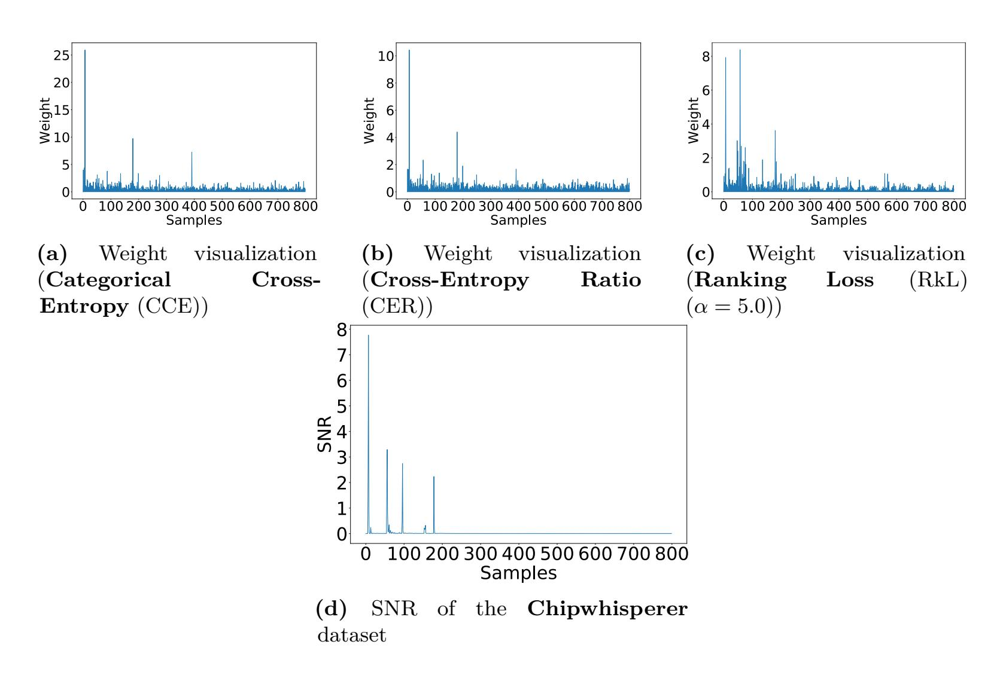
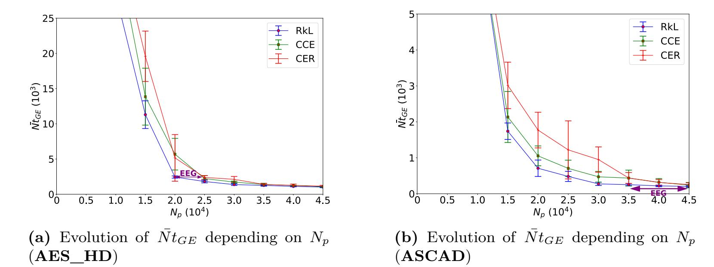
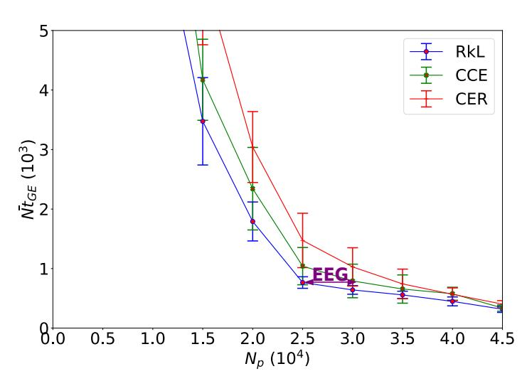
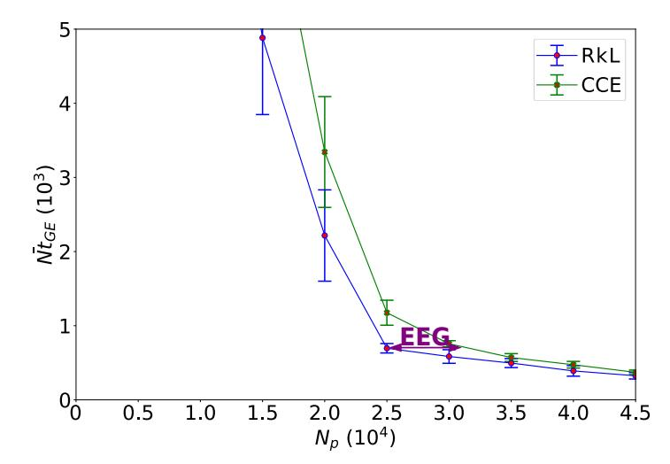
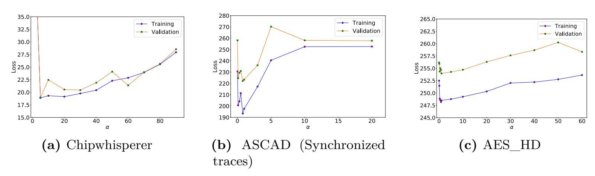
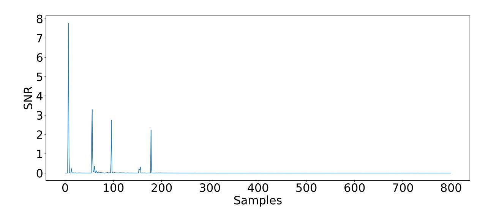
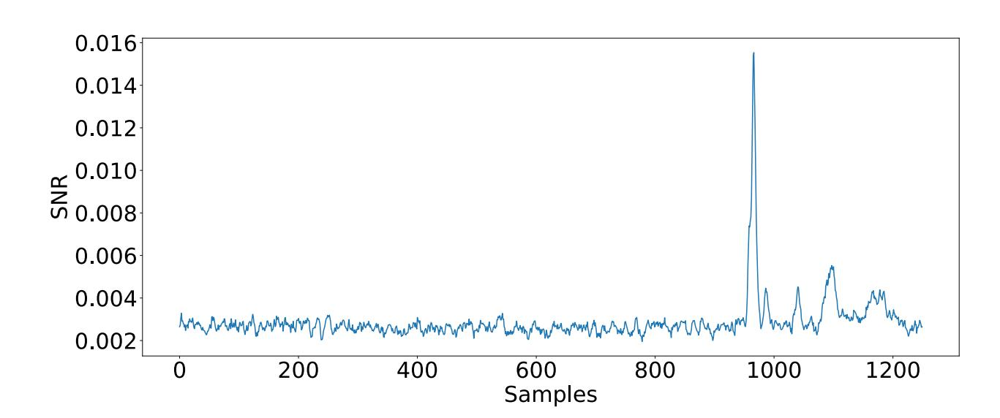
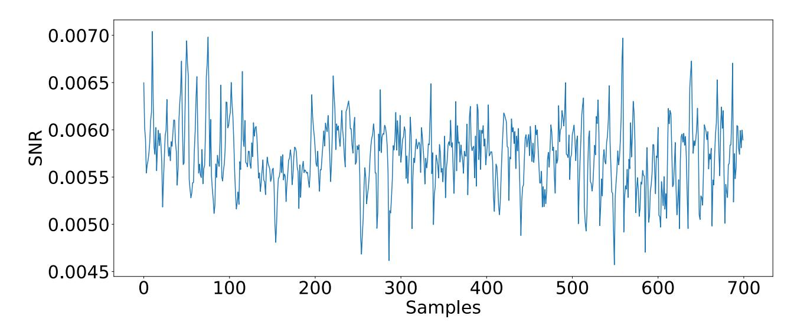

{0}------------------------------------------------

# **Ranking Loss: Maximizing the Success Rate in Deep Learning Side-Channel Analysis**

Gabriel Zaid1*,*2 , Lilian Bossuet1 , François Dassance2 , Amaury Habrard1 and Alexandre Venelli2

1 Univ Lyon, UJM-Saint-Etienne, CNRS Laboratoire Hubert Curien UMR 5516 F-42023, Saint-Etienne, France, [firstname.lastname@univ-st-etienne.fr](mailto:firstname.lastname@univ-st-etienne.fr) 2 Thales ITSEF, Toulouse, France, [firstname.lastname@thalesgroup.com](mailto:firstname.lastname@thalesgroup.com)

**Abstract.** The side-channel community recently investigated a new approach, based on deep learning, to significantly improve profiled attacks against embedded systems. Compared to template attacks, deep learning techniques can deal with protected implementations, such as masking or desynchronization, without substantial preprocessing. However, important issues are still open. One challenging problem is to adapt the methods classically used in the machine learning field (e.g. loss function, performance metrics) to the specific side-channel context in order to obtain optimal results. We propose a new loss function derived from the *learning to rank* approach that helps preventing approximation and estimation errors, induced by the classical cross-entropy loss. We theoretically demonstrate that this new function, called *Ranking Loss* (RkL), maximizes the success rate by minimizing the ranking error of the secret key in comparison with all other hypotheses. The resulting model converges towards the optimal distinguisher when considering the *mutual information* between the secret and the leakage. Consequently, the approximation error is prevented. Furthermore, the estimation error, induced by the cross-entropy, is reduced by up to 23%. When the ranking loss is used, the convergence towards the best solution is up to 23% faster than a model using the cross-entropy loss function. We validate our theoretical propositions on public datasets.

**Keywords:** Side-Channel Attacks · Deep Learning · Learning to Rank · Loss function · Success Rate · Mutual Information

### **1 Introduction**

Side-channel analysis (SCA) is a class of cryptographic attack in which an evaluator tries to exploit the vulnerabilities of a system by analyzing its physical properties, including power consumption [\[KJJ99\]](#page-25-0) or electromagnetic emissions [\[AARR03\]](#page-22-0), to reveal secret information. During its execution, a cryptographic implementation manipulates sensitive variables that depend directly on the secret. Through the attack, evaluators try to recover this information by finding some leakage related to the secret. One of the most powerful types of SCA attacks are *profiled attacks*. In this scenario, the evaluators have access to a test device whose target intermediate values are known. Then, they can estimate the conditional distribution associated with each sensitive variable. They can predict the right sensitive value on a target device containing a secret they wish to retrieve by using multiple traces. In 2002, the first profiled attack was introduced by [\[CRR03\]](#page-23-0), but their proposal was limited by the computational complexity. Very similar to profiled attacks, the application of machine learning algorithms was inevitably explored in the side-channel context [\[HGM](#page-24-0)+11, [BL12,](#page-22-1) [LBM14\]](#page-25-1).

{1}------------------------------------------------

Some recent papers have demonstrated the robustness of convolutional neural networks (CNNs) for defeating asymmetric cryptographic implementation [\[CCC](#page-23-1)+19] and symmetric implementation even when the most common countermeasures, namely *masking* [\[MPP16,](#page-25-2) [MDP19b\]](#page-25-3) and *desynchronization* [\[CDP17,](#page-23-2) [ZBHV19\]](#page-27-0) are implemented. One of the main advantages is that CNNs do not require substantial pre-processing. These architectures are based on a training process that consists in learning relevant features from traces. In side-channel attacks, these relevant features are defined by the *Points of Interest* (PoIs) which are revealed by leakage detection tools such as the *Signal-to-Noise Ratio* (SNR) [\[MOP07\]](#page-25-4). To generate a model that efficiently locates the PoIs, the evaluator has to configure a function, called *loss*, and appropriate performance metrics (e.g. accuracy) in order to evaluate properly the performance of a model. In machine learning, a loss function computes the error generated by the model. During the training process, the evaluator aims to minimize the loss function in order to get the best model possible. The most used loss function in the literature is the cross-entropy [\[GBC16\]](#page-24-1). In [\[MDP19b\]](#page-25-3), Masure *et al.* demonstrate that minimizing the cross-entropy is asymptotically equivalent to maximizing the perceived information [\[RSVC](#page-26-0)+11]. Through this proposition, the authors attempt to reduce the gap between the deep learning and side-channel metrics questioned in [\[CDP17,](#page-23-2) [PHJ](#page-26-1)+19]. However, the link between cross-entropy and perceived information implies that errors can be generated during the training process namely the *optimization* error, the *estimation* error and the *approximation* error. From an optimal attack perspective, an evaluator wants to maximize the success rate given a number of traces [\[BGH](#page-22-2)+17]. Finding a loss function, derived from the success rate, can reduce the errors, induced by the cross-entropy loss function, in order to converge towards the optimal deep-learning model for side-channel analysis.

**Contributions.** In deep learning side-channel analysis (DLSCA), one of the main challenges is to connect the classical machine learning metrics with those introduced in side-channel [\[CDP17,](#page-23-2) [PHJ](#page-26-1)+19]. From an evaluator point of view, using suitable deep learning tools is crucial to perform efficient and meaningful attacks. As the efficiency of deep learning models can greatly vary based on a variety of hyperparameters (e.g. model architecture, optimizers, loss, . . . ), it is essential to find the most suitable ones for the side-channel context. Finding the most optimal hyperparameters will strengthen the security bounds on the targeted implementations.

This paper addresses the choice of the loss function in DLSCA. We propose a new loss, called *Ranking Loss* (RkL), that tends towards the optimal distinguisher for side-channel analysis. Our proposition adapts the "Learning to Rank" approach to the side-channel context by redefining the concept of pointwise, pairwise and listwise approaches.

Assume that a distinguisher is defined as a function which takes the known plaintexts and the measured leakages as input, and returns a key guess. We show theoretically that our loss generates a model that is derived from the optimal distinguisher introduced in [\[HRG14\]](#page-24-2), which maximizes the success rate. The ranking loss penalizes the network when the score related to the secret information is not the highest value. Hence, we are more concerned with the relative order of the relevance of the key hypotheses than their absolute value. We demonstrate that minimizing the ranking loss is equivalent to minimizing the ranking error of the secret key with respect to all other hypotheses.

In [\[MDP19b\]](#page-25-3), the authors show that the cross-entropy induces some errors during the training process (*i.e.* approximation error, estimation error and optimization error). In this paper, we demonstrate that optimizing the ranking loss generates a model that converges towards the mutual information between the sensitive information and the leakage. Consequently, we theoretically demonstrate that the approximation error is prevented and the estimation error, induced by the classical cross-entropy loss, is reduced by up to 23%. To the best of our knowledge, this is the first time that a metric, derived

{2}------------------------------------------------

from the "Learning to Rank" approach, is linked with the mutual information between a label and an input.

Finally, we confirm the relevance of our loss by applying it to the main public datasets and we compare the results with the classical cross-entropy and the recently introduced cross-entropy ratio [\[ZZN](#page-27-1)+20]. All these experiments can be reproduced through the following GitHub repository: <https://github.com/gabzai/Ranking-Loss-SCA>.

**Paper Organization.** The paper is organized as follows. [Section 2](#page-2-0) explains the link between the profiled side-channel attacks and the machine learning approach. It also introduces the learning to rank approach applied to SCA. [Section 3](#page-6-0) proposes a new loss, called *Ranking Loss* (RkL), that generates a model converging towards the optimal distinguisher. In [Section 4,](#page-10-0) we theoretically link the ranking loss with the mutual information. Finally, [Section 5](#page-14-0) presents an experimental validation of ranking loss on public datasets showing its efficiency.

### **2 Preliminaries**

### **2.1 Notation and terminology**

Let calligraphic letters X denote sets, the corresponding capital letters *X* (resp. bold capital letters **T**) denote random variables (resp. vectors of random variables) and the lowercase *x* (resp. **t**) denote their realizations. The *i*-th entry of a vector **t** is defined as **t**[*i*]. Side-channel traces will be constructed as a random vector **T** ∈ R 1×*D* where *D* defines the dimension of each trace. The targeted sensitive variable is *Z* = *f*(*P, K*) where *f* denotes a cryptographic primitive, *P* (∈ P) denotes a public variable (e.g. plaintext or ciphertext) and *K* (∈ K) denotes a part of the key (e.g. byte) that an adversary tries to retrieve. *Z* takes values in Z = {*s*1*, ..., s*|Z|} such that *sj* denotes a score associated with the *j th* sensitive variable. Let us denotes *k* ∗ the secret key used by the cryptographic algorithm. We define the following information theory quantities needed in the rest of the paper [\[CT91\]](#page-23-3) . The entropy of a random vector **X**, denoted *H*(**X**), measures the unpredictability of a realization **x** of **X**. It is defined by:

$$H(\mathbf{X}) = -\sum_{\mathbf{x} \in \mathcal{X}} \Pr\left[\mathbf{X} = \mathbf{x}\right] \cdot \log_2 \left(\Pr\left[\mathbf{X} = \mathbf{x}\right]\right).$$

The conditional entropy of a random variable **X** knowing **Y** is defined by:

$$\begin{split} H(\mathbf{X}|\mathbf{Y}) &= -\sum_{\mathbf{y} \in \mathcal{Y}} \mathsf{Pr}\left[\mathbf{Y} = \mathbf{y}\right] \cdot H\left(\mathbf{X}|\mathbf{Y} = \mathbf{y}\right) \\ &= -\sum_{\mathbf{y} \in \mathcal{Y}} \mathsf{Pr}\left[\mathbf{Y} = \mathbf{y}\right] \cdot \sum_{\mathbf{x} \in \mathcal{X}} \mathsf{Pr}\left[\mathbf{X} = \mathbf{x}|\mathbf{Y} = \mathbf{y}\right] \cdot \log_2\left(\mathsf{Pr}\left[\mathbf{X} = \mathbf{x}|\mathbf{Y} = \mathbf{y}\right]\right). \end{split}$$

The *Mutual Information* (MI) between two random variables **X** and **Y** is defined as:

$$MI(\mathbf{X}; \mathbf{Y}) = H(\mathbf{X}) - H(\mathbf{X}|\mathbf{Y})$$

$$= H(\mathbf{X}) + \sum_{\mathbf{x} \in \mathcal{X}} \Pr[\mathbf{X} = \mathbf{x}] \cdot \sum_{\mathbf{y} \in \mathcal{Y}} \Pr[\mathbf{Y} = \mathbf{y} | \mathbf{X} = \mathbf{x}] \cdot \log_2 (\Pr[\mathbf{X} = \mathbf{x} | \mathbf{Y} = \mathbf{y}]).$$
(1)

This quantifies how much information can be extracted about **Y** by observing **X**.

{3}------------------------------------------------

#### 2.2 Profiled Side-Channel Attacks

When attacking a device using a profiled attack, two stages must be considered: a building phase and a matching phase. During the first phase, evaluators have access to a test device where they control the input and the secret key of the cryptographic algorithm. They use this knowledge to locate the relevant leakages depending on Z. To characterize the points of interest, evaluators generate a model  $F: \mathbb{R}^D \to \mathbb{R}^{|\mathcal{Z}|}$  that estimates the probability  $\Pr[\mathbf{T}|Z=z]$  from a profiled set  $\mathcal{T} = \{(\mathbf{t}_0, z_0), \dots, (\mathbf{t}_{N_p-1}, z_{N_p-1})\}$  of size  $N_p$ . Once the leakage model is generated, evaluators estimate which intermediate value is processed using a prediction function  $F(\cdot)$ .

By predicting this sensitive variable and knowing the input used during the encryption, an evaluator can use a set of attack traces of size  $N_a$  and compute a score vector, based on  $F(\mathbf{t}_i)$ ,  $i \in \{0, 1, ..., N_a - 1\}$ , for each key hypothesis. Indeed, for each  $k \in \mathcal{K}$ , this score is defined as:

$$s_{N_a}(k) = \sum_{i=1}^{N_a} \log \left( \Pr\left[ F(\mathbf{t}_i) = z_i \right] \right) = \log \left( \prod_{i=1}^{N_a} \Pr\left[ F(\mathbf{t}_i) = z_i \right] \right), \tag{2}$$

where  $z_i = f(p_i, k)$  and f denotes a cryptographic primitive.

Based on the scores introduced in Equation 2, we can classify all the key candidates into a vector of size  $|\mathcal{K}|$ , denoted  $\mathbf{g}_{N_a} = \left(g_{N_a}^1, g_{N_a}^2, ..., g_{N_a}^{|\mathcal{K}|}\right)$ , such that:

$$g_{N_a}(k^*) = \sum_{k \in \mathcal{K}} \mathbb{1}_{s_{N_a}(k) > s_{N_a}(k^*)}, \tag{3}$$

defines the position of the secret key  $k^*$ , in  $\mathbf{g}_{N_a}$ , amongst all hypotheses.

We consider  $g_{N_a}^1$  as the most likely candidate and  $g_{N_a}^{|\mathcal{K}|}$  as the least likely one. Commonly, this position is called rank. The rank of the correct key gives us an insight into how well our model performs. Given a number of traces  $N_a$ , the  $Success\ Rate\ (SR)$  is a metric that defines the probability that an attack succeeds in recovering the secret key  $k^*$  amongst all hypotheses. A success rate of  $\beta$  means that  $\beta$  attacks succeed in retrieving  $k^*$  over 100 realizations. In [SMY09], Standaert  $et\ al.$  propose to extend the notion of success rate to an arbitrary order d such that:

$$\mathsf{SR}^d(N_a) = \mathsf{Pr}\left[g_{N_a}(k^*) = d\right]. \tag{4}$$

In other words, the  $d^{th}$  order success rate is defined as the probability that the target secret  $k^*$  is ranked amongst the d first key guesses in the score vector g. In profiling attacks, an evaluator wants to find a model F such that the condition  $\mathsf{SR}^d(N_a) > \beta$  is verified with the minimum number of attack traces  $N_a$ .

#### 2.3 Neural Networks in Side-Channel Analysis

Profiled SCA can be formulated as a classification problem. Given an input, a neural network constructs a function  $F_{\theta}: R^D \to R^{|\mathcal{Z}|}$  that computes an output called a prediction. During the training process, a set of parameters  $\theta$ , called trainable parameters, are updated in order to generate the model. To solve a classification problem, the function  $F_{\theta}$  must find the right prediction  $y \in \mathcal{Z}$  associated with the input  $\mathbf{t}$  with high confidence. To find the optimized solution, a neural network has to be trained using a profiled set of  $N_p$  pairs  $(\mathbf{t}_i^p, y_i^p)$  where  $\mathbf{t}_i^p$  is the *i*-th profiled input and  $y_i^p$  is the associated label. In SCA, the input of a neural network is a side-channel measurement and the related label is defined by the corresponding sensitive value z. The input goes through the network to estimate the corresponding probability vector  $\hat{y}_i^p$  such that  $\hat{y}_i^p(k) = \Pr[F_{\theta}(\mathbf{t}_i^p) = z_i]$ . This probability is computed with the softmax function [GBC16]. This function maps the outputs of each

{4}------------------------------------------------

class to [0;1]. Due to the exponential terms, the softmax helps to easily discriminate the classes with high confidence. As a classical profiling attack, we can use the resulted values  $\hat{y}_i^p$  to compute the score for each key hypothesis and then estimate the  $d^{th}$  order success rate. To quantify the classification error of  $F_{\theta}$  over the profiled set, a loss function has to be configured. Indeed, this function reduces the error of the model in order to optimize the prediction. For that purpose, the backward propagation [GBC16] is applied to update the trainable parameters (e.g. weights) and minimize the loss function. The classical loss function used in side-channel analysis is based on cross-entropy.

**Definition 1** (Cross-Entropy). Given a joint probability distribution of a sensitive cryptographic primitive Z and corresponding leakage  $\mathbf{T}$  denoted as  $\Pr[\mathbf{T}, Z]$ , we define the Cross-Entropy of a deep leaning model  $F_{\theta}$  as:

$$\mathcal{L}(\mathsf{Pr}[\mathbf{T}, Z], F_{\theta}) \triangleq \underset{\mathsf{Pr}[\mathbf{T}, Z]}{\mathbb{E}} \left[ -\log_2 F_{\theta}\left(\mathbf{T}\right)[Z] \right].$$

Given a profiling set  $\mathcal{T}$  of  $N_p$  pairs  $(\mathbf{t}_i^p, y_i^p)_{0 \leq i \leq N_p}$  and a classifier  $F_\theta$  with parameter  $\theta$ , the Categorical Cross-Entropy (CCE) loss function is an estimation of the cross-entropy such that:

$$\mathcal{L}_{CCE}(F_{\theta}, \mathcal{T}) = -\frac{1}{N_p} \sum_{i=1}^{N_p} \sum_{j=1}^{|Z|} \left( \mathbf{1}_{y_i^p = z_j} \cdot \log_2 \left( \Pr\left[ F_{\theta}\left(\mathbf{t}_i^p\right) = z_j \right] \right) \right).$$

In other words, minimizing the categorical cross-entropy reduces the dissimilarity between the right distributions and the predicted distributions for a set of inputs. According to the Law of Large Numbers, the categorical cross-entropy loss function converges in probabilities towards the cross-entropy for any  $\theta$  [SSBD14]. However, no information about the gap between the empirically estimated error and its true unknown value is given for any finite profiling set  $\mathcal{T}$ . In [MDP19b], Masure et al. study the theoretical soundness of the categorical cross-entropy, denoted as Negative Log Likelihood (NLL), in side-channel to quantify its relevance in the leakage exploitation. They demonstrate that minimizing the categorical cross-entropy loss function is equivalent to maximizing an estimation of the Perceived Information (PI) |RSVC+11| that is defined as a lower bound of the Mutual Information (MI) between the leakage and the target secret. Consequently, when the categorical cross-entropy is used as a loss function, the number of traces needed to reach a  $1^{st}$  order success rate is defined as an upper bound of the optimal solution [dCGRP19]. Because the PI is substitute to the MI, some source of imprecision could affect the quality of the model  $F_{\theta}$ . As mentioned in [DSVC14, MDP19b], the gap between the estimation of the PI, defined by the categorical cross-entropy, and the MI can be decomposed into three errors:

- Approximation error it defines the deviation between the empirical estimation of the PI and the MI. In theory, the Kullback-Leibler divergence [KL51] can be computed in order to evaluate this deviation. However, evaluators face the problem that the leakage *Probability Density Function* (PDF) is unknown.
- Estimation error the minimization of the categorical cross-entropy maximizes the empirical estimation of the PI rather than the real value of the PI. Therefore, the finite set of profiling traces may be too low to estimate the perceived information properly. Consequently, this error can be quantified for a given number of profiling traces.
- Optimization error it characterizes the error made by the optimization algorithm (e.g. Stochastic Gradient Descent [RM51, KW52, BCN18], RMSprop, Momentum [Qia99], Adam [KB15], . . . ) to converge towards the best solution of the categorical cross-entropy.

{5}------------------------------------------------

These errors caused by the categorical cross-entropy could impact the training process. Section 5 emphasizes the impact of these error terms on different datasets. In addition, the more secure the system, the larger the inequality between the empirical PI and the MI. As mentioned in [DFS15, BHM $^+$ 19], a higher MI implies a more powerful maximum likelihood attack where the secret key  $k^*$  can be extracted more efficiently. In other words, the probability of the success rate is linked with the MI. Therefore, finding a new loss derived from the success rate can minimize the approximation and estimation errors unlike the categorical cross-entropy. In addition, this loss could be helpful to converge towards the optimal distinguisher for a given number of traces.

### 2.4 Learning To Rank Approach in Side-Channel Analysis

The "Learning to Rank" refers to machine learning techniques for training a model in a ranking task. This approach is useful for many applications in Natural Language Processing, Data Mining and Information Retrieval [Liu09, Bur10, Li11a, Li11b]. Learning to rank is a supervised learning task composed by a set of documents D and a query q. In document retrieval, the ranking task is performed by using a ranking model  $F_{\theta}(q,d)$  to sort a document  $d \in D$  depending on its relevance with respect to the query q. The relevance of the documents with respect to the query is represented by several grades defined as labels. The higher the grade, the more relevant is the document. In the side-channel context, the application of the learning to rank can be useful to efficiently evaluate the rank of  $k^*$ . Contrary to the classical learning to rank approach that consists in the comparison between inputs relevance, we propose to adapt the "Learning to Rank" approach for the side-channel context through the comparison of the score, related to the sensitive information, with the other classes. Consequently, for a given input, this approach tries to penalize the training process when the score related to  $k^*$  is not considered as the most relevant. Classically, three approaches can be considered in the learning to rank field. We adapt these approaches in the side-channel context as follows:

- Pointwise approach can be seen as a regression or a classification problem. In a classification task, given a trace  $\mathbf{t}$ , the ranking function  $F_{\theta}$  is trained such that  $F_{\theta}(\mathbf{t}) = s_c$  defines the relevance of a specific class c given a trace  $\mathbf{t}$ . Then, the final phase consists in sorting the classes depending on their score. This entire process is exactly what the evaluator does in the classical deep learning side-channel approach.
- Pairwise approach predicts the order between a pair of scores, such that  $F_{\theta}(\mathbf{t}, (c_i, c_j))$  defines the probability that the  $i^{th}$  class  $c_i$  has a better rank than  $c_j$  given a trace  $\mathbf{t}$  [BSR+05, BRL07, WBSG10]. The comparison between each pair of scores builds the ranking of the whole model.
- Listwise approach directly sorts the entire list of sensitive information and tries to come up with the optimal ordering list [XL07, XLW+08, PGH18, CHX+19]. During the training process, it assumes that the evaluator can predetermine the relevance of each class depending on a given input. Consequently, given a trace t, the evaluator should be able to define the rank of each irrelevant classes.

The first approach is classically used when the evaluator wants to perform a classical deep learning side-channel attack. The listwise approach seems difficult to apply in our context because an evaluator cannot precisely define the rank of the irrelevant classes given a trace **t**. Finally, the pairwise approach can be useful in order to optimize the rank of a specific output in comparison with the others. In the following sections, we demonstrate how the pairwise approach can be useful to discriminate the score of the relevant output. The other learning to rank approaches are beyond the scope of this paper.

{6}------------------------------------------------

### 3 Ranking Loss: A Learning Metric Adapted For SCA

This section presents our main contribution: the *Ranking Loss* (RkL). Section 3.1 explains to what extent the pairwise approach and the success rate are linked in order to propose the ranking loss. Then, Section 3.2 demonstrates the theoretical bounds of the ranking loss regarding the success rate. Finally, Section 3.3 presents the impact of the ranking loss on the scores during the training process.

### 3.1 Ranking Loss Maximizes the Success Rate

**Pairwise approach and success rate.** For a given query q, each pair of documents  $(d_i, d_j)$  is presented to the ranking model which computes the order of relevance between  $d_i$  and  $d_j$ . We denote  $d_i \triangleright d_j$  the event that  $d_i$  should be ranked higher than  $d_j$ . The corresponding loss function maps the scores associated with  $d_i$  and  $d_j$  and penalizes the training process once the relation  $d_i \triangleright d_j$  is not respected. This penalization is exactly what we want to optimize when the  $1^{st}$  order success rate is considered.

Let  $N_a$  be the number of traces needed to perform an attack. From Equation 3 and Equation 4, the following relation can be deduced:

$$\mathsf{SR}^{1}(N_{a}) = \mathsf{Pr}\left[g_{N_{a}}(k^{*}) = 1\right] = \mathsf{Pr}\left[\sum_{k \in \mathcal{K}} \mathbb{1}_{s_{N_{a}}(k) > s_{N_{a}}(k^{*})} = 1\right]. \tag{5}$$

In other words, measuring the  $1^{st}$  order success rate is equivalent to computing the probability that the score related to the secret key  $k^*$  is higher than all key hypotheses. This means defining the probability that the class  $c_{k^*}$  is ranked higher than  $c_k$  for all  $k \in \mathcal{K} \setminus \{k^*\}$ . This approach is equivalent to the pairwise approach defined earlier. Let a key hypothesis k and a secret key  $k^*$ , the probability that  $c_{k^*} \triangleright c_k$  can be estimated via a sigmoid function [QLL10, BZBN19] such that:

$$\Pr\left[c_{k^*} \triangleright c_k\right] \equiv \frac{1}{1 + e^{-\alpha(s_{N_a}(k^*) - s_{N_a}(k))}},\tag{6}$$

where  $\alpha$  denotes the parameter of the sigmoid function. The value of  $\alpha$  greatly impacts the training process. We evaluate its impact in Appendix A. In the following, we assume that  $\alpha$  is well configured.

**Definition of the Ranking Loss.** We apply the cross-entropy loss function in order to penalize the deviation of the model probabilities from the desired prediction. In other words, we want to penalize the loss function when the expected relation  $c_{k^*} \triangleright c_k$  is not observed. Thus, we define a partial loss function  $l_{N_a}(c_{k^*}, c_k)$ , for a given hypothesis k, as:

$$l_{N_a}(c_{k^*}, c_k) = -\bar{P}_{k^*,k} \cdot \log_2(P_{k^*,k}) - (1 - \bar{P}_{k^*,k}) \cdot \log_2(1 - P_{k^*,k}), \tag{7}$$

where  $P_{k^*,k} = \Pr[c_{k^*} \triangleright c_k]$  and  $\bar{P}_{k^*,k}$  defines the true unknown probability that  $k^*$  is ranked higher than k.

In the remainder of the paper, we assume that the ranking value is deterministically known such that,  $\bar{P}_{k^*,k} = \frac{1}{2} \left( 1 + \operatorname{rel}_{k^*,k} \right)$  [BSR+05] where  $\operatorname{rel}_{k^*,k} \in \{-1,0,1\}$  defines the relation between the secret key  $k^*$  and k such that  $\operatorname{rel}_{k^*,k} = -1$  if  $k^*$  is less relevant than k;  $\operatorname{rel}_{k^*,k} = 0$  if  $k^*$  is as relevant as k;  $\operatorname{rel}_{k^*,k} = 1$  if  $k^*$  is more relevant than k. We assume that  $\operatorname{rel}_{k^*,k}$  is always equal to 1. In the side-channel context, this approximation is reliable

&lt;sup>aFor convenience,  $c_{k^*}$  is used to denote the class related to the correct label. Hence,  $c_{k^*}$  is also used to define the class associated to  $f(p, k^*)$  such that f is a cryptographic primitive and p characterizes a plaintext value.

{7}------------------------------------------------

because we want to maximize the score related to  $k^*$  compared with the other hypotheses. From Equation 6 and Equation 7, we can deduce the following partial loss function:

$$l_{N_a}(c_{k^*}, c_k) = \log_2\left(1 + e^{-\alpha(s_{N_a}(k^*) - s_{N_a}(k))}\right). \tag{8}$$

Equation 8 gives us an insight into how the cost function penalizes the training process when the relation  $c_{k^*} \triangleright c_k$  is not the expected result. Therefore, maximizing the success rate tends to minimize the ranking error between the secret key  $k^*$  and a hypothesis k. As a remainder, this cost function, presented in Equation 8, is only applied on a single key hypothesis. In order to efficiently train a side-channel model, we have to apply this cost function on each key hypothesis in order to maximize the rank of the secret key.

**Definition 2** (Ranking loss - Our contribution). Given a profiling set  $\mathcal{T}$  of  $N_p$  pairs  $(\mathbf{t}_i^p, y_i^p)_{0 \leq i \leq N_p}$ , a classifier  $F_{\theta}$  with parameter  $\theta$  and a number of attack traces  $N_a$ , we define the *Ranking Loss* (RkL) function as:

$$\mathcal{L}_{RkL}(F_{\theta}, \mathcal{T}, N_a) = \sum_{\substack{k \in \mathcal{K} \\ k \neq k^*}} \left( \log_2 \left( 1 + e^{-\alpha(s_{N_a}(k^*) - s_{N_a}(k))} \right) \right), \tag{9}$$

where  $s_{N_a}(k) = \sum_{i=1}^{N_a} F_{\theta}(\mathbf{t}_i^p) [f(P,k)]$  defines the output score b of the hypothesis  $k \in |\mathcal{K}|$ .

Remark 1. To discriminate the right output and normalize this value into a probability distribution, we compute the softmax function of each score during the attack phase. The softmax function converts the negative score to very low probability. This is essential to perform a side-channel attack (see Equation 2).

With the ranking loss, we are more concerned with the relative order of the relevance of the key hypothesis than its absolute value (i.e. categorical cross-entropy). Consequently, maximizing the success rate is equivalent to minimizing the ranking error for each pair  $(k^*, k)_{k \in \mathcal{K}}$ . Futhermore, Definition 2 takes into account the number of attack traces needed to perform a successful side-channel attack. The ranking loss penalizes the network depending on the number  $N_a$  of training scores that an adversary aggregates before iterating the training process. The ranking loss tends to maximize the success rate for a given  $N_a$  traces and converges towards the optimal distinguisher introduced in [BGH+17].

Remark 2. In classic information retrieval tasks,  $(d_i, d_j)$  and  $(d'_i, d'_j)$  characterize two different pairs of documents such that the following relation is defined  $d_i \triangleright d_j \triangleright d'_i \triangleright d'_j$ . For each pair of documents, if the difference of their scores is equal, thus, the final loss will be the same regardless of the rank of the documents. In this specific case, swapping the rank of  $d_i$  (resp.  $d_j$ ) and  $d'_i$  (resp.  $d'_j$ ) does not impact the loss function. The loss only cares about the total number of pairwise-rankings it gets wrong. This can be particularly problematic if we are interested in the top ranking items. To solve this issue, the pairwise approach applies some information retrieval (IR) measures (e.g. Discounted Cumulative Gain [JK02], Normalized Discounted Cumulative Gain [JK00], Expected Reciprocal Rank [CMZG09], Mean Average Precision, etc...) to compute the loss. However, in our context,  $d_i = d'_i$ , therefore the difference between the scores of each pair  $(d_i, d_j)$  and  $(d_i, d'_j)$  gives us enough information on the position of  $d_i$  related to  $d_j$  and  $d'_j$ . Consequently, the addition of IR metrics is not relevant. Moreover, IR metrics can be either discontinuous or flat, so gradient descent appears to be problematic (i.e. gradient equals to 0 or not defined) unless some appropriate approximation is used.

&lt;sup>bHere, the output score denotes the value before the softmax function. This choice is made to impact the training process accordingly to the relative order of the key hypotheses' relevance instead of the normalized probability distribution. However, the classical side-channel score (see Equation 2) can also be applied.

{8}------------------------------------------------

### 3.2 Theoretical Bounds of the Ranking Loss

In this section, we show that the ranking loss is an upper bound of the measure-based ranking error. In the learning to rank research area, the information retrieval measures are used to evaluate the network performance. In most cases, two categories of metrics can be used: those designed for binary relevance levels (e.g. Mean Average Precision (MAP), Mean Reciprocal Rank (MRR) [Cra09]) and those designed for multiple levels of relevance (e.g. discounted cumulative gain, normalized discounted cumulative gain [JK00]). In the side-channel context, there are only two levels of relevance such that 1 is associated with the correct output class and 0 otherwise. Thus, the metrics for binary relevance levels have to be considered. The Mean Average Precision (MAP) defines the average precision of the secret key  $k^*$  over the  $|\mathcal{K}|$  hypotheses. Let d be a threshold and MAP@d the average precision of the secret key  $k^*$  in the top d relevant positions. In particular, MAP@1 can be seen as a  $1^{st}$  order success rate (see Appendix B). As mentioned in [CLL+09a], the standard pairwise loss is considered as the upper bound of the measure-based ranking error that is defined by  $1 - MAP@|\mathcal{K}|$  (justifications are provided in Appendix C).

**Theorem 1** ([CLL+09a]). Given 2-level rating data with  $n_1$  objects having label 1 and  $n_1 > 0$ , then, the following inequality holds,

$$1 - MAP@|\mathcal{K}| \le \frac{1}{n_1} \sum_{i=0}^{|\mathcal{K}|-1} \sum_{\substack{j=0 \ gr(j) < gr(i)}}^{|\mathcal{K}|-1} \log_2\left(1 + e^{-\alpha(s_{N_a}(i) - s_{N_a}(j))}\right), \tag{10}$$

where gr(i) defines the label (or grade) associated to the  $i^{th}$  key hypothesis (i.e. 0 or 1).

In our context, a 2-level rating data means that a class  $c_k \in \{0, 1\}$  such that  $c_k = 1$  iff  $k = k^*$ . In side-channel analysis, there is only one key candidate with a label equal to 1 in the one-hot encoding representation (*i.e.* the label corresponding to the sensitive output). Thus, Theorem 1 can be easily written following the ranking loss.

**Proposition 1** (Our contribution). Given 2-level rating data with  $n_1$  objects having label 1 and  $n_1 > 0$ , a profiling set  $\mathcal{T}$  of  $N_p$  pairs  $(\mathbf{t}_i^p, y_i^p)_{0 \le i \le N_p}$ , a classifier  $F_\theta$  with parameter  $\theta$  and a number of attack traces  $N_a$ , the following inequality holds:

$$1 - SR^{1}(N_{a}) \leq \frac{1}{n_{1}} \sum_{\substack{k \in \mathcal{K} \\ k \neq k^{*}}} \log_{2} \left( 1 + e^{-\alpha(s_{N_{a}}(c_{k^{*}}) - s_{N_{a}}(c_{k}))} \right) = \mathcal{L}_{RkL}(F_{\theta}, \mathcal{T}, N_{a}).$$
 (11)

*Proof.* Following [CLL+09a, Theorem 2] and [CLL+09b, Lemma 1], given a 2-level rating data, it can be proved that:

$$n_1 - i_0 + 1 \le \frac{1}{n_1} \sum_{i=0}^{|\mathcal{K}|-1} \sum_{\substack{j=0 \ gr(j) < gr(i)}}^{|\mathcal{K}|-1} \log_2 \left(1 + e^{-\alpha(s_{N_a}(i) - s_{N_a}(j))}\right),$$

where  $n_1$  denotes the number of elements having label 1,  $i_0$  defines the position of the first object with label 0 in a ranking list.

If  $i_0 > n_1$ , the first element with label 0 is ranked after position  $n_1$ . In SCA, there is only one candidate with a label 1 (i.e.  $c_{k^*}$ ). Hence, the correct candidate is ranked at the first position and  $1 - SR^1(N_a) = 0$ . Similarly, the first element with a label 0 is ranked at the second position and  $n_1 - i_0 + 1 = 0$ . If  $i_0 \le n_1$ , the first element with label 0 is ranked before the correct class  $c_{k^*}$ . Consequently, the correct candidate is ranked at the second

{9}------------------------------------------------

position and  $1 - SR^1(N_a) = 1$ . Similarly, the first element with a label 0 is ranked at the first position and  $n_1 - i_0 + 1 = 1$ . Thus,

$$n_1 - i_0 + 1 = 1 - SR^1(N_a) \le \frac{1}{n_1} \sum_{i=0}^{|\mathcal{K}|-1} \sum_{\substack{j=0 \ gr(j) < gr(i)}}^{|\mathcal{K}|-1} \log_2 \left(1 + e^{-\alpha(s_{N_a}(i) - s_{N_a}(j))}\right).$$

Finally, from Equation 10, we can easily rewrite the right part of the inequality as:

$$\sum_{i=0}^{|\mathcal{K}|-1} \sum_{\substack{j=0\\gr(j) < gr(i)}}^{|\mathcal{K}|-1} \log_2 \left( 1 + e^{-\alpha(s_{N_a}(i) - s_{N_a}(j))} \right) = \sum_{\substack{k \in \mathcal{K}\\k \neq k^*}} \log_2 \left( 1 + e^{-\alpha(s_{N_a}(c_{k^*}) - s_{N_a}(c_k))} \right).$$

Indeed, the condition gr(j) < gr(i) holds for all  $j \in \mathcal{K} \setminus \{k^*\}$  iff i corresponds to  $c_{k^*}$ . This result implies:

$$1 - SR^{1}(N_{a}) \le \frac{1}{n_{1}} \sum_{\substack{k \in \mathcal{K} \\ k \ne k^{*}}} \log_{2} \left( 1 + e^{-\alpha(s_{N_{a}}(c_{k^{*}}) - s_{N_{a}}(c_{k}))} \right).$$

From Proposition 1, we can deduce that minimizing the ranking loss is equivalent to maximizing the  $1^{st}$  order success rate. This inequality implies a maximization of the success rate through the minimization of the ranking loss. Therefore, the value of the loss function gives us an insight into how well our network performs related to the success rate.

### 3.3 Impact of the Ranking Loss during the Training Process

This subsection theoretically explains how the training process can be useful in order to precisely order the secret key  $k^*$  amongst all the hypotheses.

The training process aims at optimizing the loss function in order to minimize the error made by the network. This process can be decomposed into two phases: the forward propagation and the backward propagation [GBC16]. Given an input, the goal of the forward propagation is to feed training examples to the network in the forward direction by processing successive linear and non-linear transformations in order to predict a value related to the input. Once this process is done, the backward propagation measures the error between the predictions and the correct output and tries to reduce it by updating the parameters  $\theta$  that compose the network. Let  $l_{N_a}(c_{k^*}, c_k)$  the partial loss function defined in Equation 8 where  $k^*$  is the secret key and  $k \in \mathcal{K}$  is a key hypothesis. Let  $w_i \in \theta$  be a i-th trainable parameter. The backpropagation updates the weights as below:

$$w_{i} \leftarrow w_{i} - \eta \sum_{k \in \mathcal{K}} \left( \frac{\partial l_{N_{a}}(c_{k^{*}}, c_{k})}{\partial w_{i}} \right) = w_{i} - \eta \sum_{\substack{k \in \mathcal{K} \\ k \neq k^{*}}} \left( \frac{\partial l_{N_{a}}}{\partial s_{k^{*}}} \frac{\partial s_{k^{*}}}{\partial w_{i}} + \frac{\partial l_{N_{a}}}{\partial s_{k}} \frac{\partial s_{k}}{\partial w_{i}} \right), \quad (12)$$

where  $\eta$  denotes the learning rate and  $(s_k)_{k \in \mathcal{K}}$  defines the output score related to the class  $(c_k)_{k \in \mathcal{K}}$ .

From Equation 8 and Equation 12, we can deduce the following equation,

$$\frac{\partial l_{N_a}(c_{k^*}, c_k)}{\partial w_i} = -\alpha \left( \frac{1}{1 + e^{\alpha(s_{N_a}(k^*) - s_{N_a}(k))}} \right) \left( \frac{\partial s_{k^*}}{\partial w_i} - \frac{\partial s_k}{\partial w_i} \right). \tag{13}$$

{10}------------------------------------------------

This derivative can be decomposed in two parts. First, computing the gradient of the ranking loss is equivalent to computing an ascent gradient of the score  $s_{k^*}$  and a gradient descent of  $s_k$ . As mentioned in Section 3.1, the score value is defined by the prediction before the softmax function. The training process updates the weights to increase the score related to the secret key and reduces the score related to the hypothesis k. Secondly, the norm of the gradient vectors is scaled by  $\gamma_{\alpha}(s_{k^*}, s_k) = \frac{\alpha}{1+e^{\alpha\left(s_{N_a}(k^*)-s_{N_a}(k)\right)}}$ . Depending on the difference between  $s_{N_a}(k^*)$  and  $s_{N_a}(k)$ , the resulted norm varies as below:

- If  $s_{N_a}(k) \gg s_{N_a}(k^*)$ ,  $\gamma_{\alpha}(s_{k^*}, s_k)$  tends to converge towards  $\alpha$  thus, the norm of the gradient vector related to each score is maximized.
- If  $s_{N_a}(k) = s_{N_a}(k^*)$ ,  $\gamma_{\alpha}(s_{k^*}, s_k)$  tends to converge towards  $\frac{\alpha}{2}$  thus, the norm of the gradient vector related to each score is divided by 2.
- If  $s_{N_a}(k) \ll s_{N_a}(k^*)$ ,  $\gamma_{\alpha}(s_{k^*}, s_k)$  tends to converge towards 0 thus, the norm of the gradient vector related to each score is minimized.

The gradient of the ranking loss defined in Equation 9 can be derived as:

$$\frac{\partial \mathcal{L}_{RkL}(s, N_a)}{\partial w_i} = \sum_{\substack{k \in \mathcal{K} \\ k \neq k^*}} \left( \frac{\partial l_{N_a}(c_{k^*}, c_k)}{\partial w_i} \right). \tag{14}$$

Therefore, the ranking loss proposed in Equation 9 pushes the score of the secret key up and pushes the score of the key hypotheses down via gradient ascent/descent on a pair of items. This is equivalent to maximizing the success rate. For each pair  $(k^*, k)_{k \in \mathcal{K}}$ , there are two "forces" at play. The force that each pair exerts is proportionate to the difference of their scores multiplied with  $\alpha$ . Consequently,  $\alpha$  should be carefully configured during the training process. The force applied on the secret key  $k^*$  is equal to the sum of the forces exerted on each pair. Consequently, using the ranking loss tends to order the secret key as the highest position which is equivalent to maximizing the success rate.

# 4 Mutual Information Analysis of the Ranking Loss

This section studies the ranking loss from a mutual information point-of-view. Section 4.1 demonstrates that ranking loss is an approximation of the optimal distinguisher. Then, Section 4.2 shows that the categorical cross-entropy is only a lower bound of the ranking loss. Finally, Section 4.3 analyzes the reduction of the different errors of the ranking loss.

### 4.1 An Approximation of the Optimal Distinguisher

Let  $\mathcal{D}$  be a distinguisher that maps a set of traces  $\mathcal{T}$  and a sensitive variable  $\mathcal{Z}$  to an estimation of the secret key  $k^*$ .

**Definition 3** (Optimal Distinguisher [HRG14]). Given a conditional probability distribution of a sensitive cryptographic primitive Z following a leakage  $\mathbf{T}$  denoted as  $\Pr[Z|\mathbf{T}]$ , we define the optimal distinguisher as maximizing the success rate of an attack:

$$\mathcal{D}(\mathbf{t}, z) = \arg\max_{k} \left( \Pr\left[ Z = f(p, k) | \mathbf{t} \right] \right), \tag{15}$$

where f(p, k) = z is the sensitive information computed from a cryptographic primitive f, a plaintext  $p \in \mathcal{P}$ , a key  $k \in \mathcal{K}$ .

{11}------------------------------------------------

The main issue of [Definition 3](#page-10-2) is that the optimal distinguisher can only be computed if the leakage model is perfectly known [\[HRG14,](#page-24-2) [BGH](#page-22-7)+15]. Therefore, one solution is to find the adequate estimation of Pr [*Z* = *z*|**t**]. Through the maximization of the success rate, we want to find an estimation Db (**t***, z*) of the optimal distinguisher that converges towards D (**t***, z*) [\[BCG](#page-22-8)+17, [BGH](#page-22-2)+17].

**Definition 4** (Estimation of the Optimal Distinguisher)**.** Given a conditional probability distribution of a sensitive cryptographic primitive *Z* following a leakage **T** and a parameter *θ* denoted as Pr[*Z*|**T***, θ*], we define the estimation of the optimal distinguisher as:

$$\widehat{\mathcal{D}}(\mathbf{t}, z) = \arg\max_{k} \left( \max_{\theta} \left( \Pr\left[ Z = z | \mathbf{t}, \theta \right] \right) \right) = \arg\min_{k} \left( \min_{\theta} \left( 1 - \Pr[Z = z | \mathbf{t}, \theta] \right) \right), \quad (16)$$

where *f* (*p, k*) = *z* is the sensitive information computed from a cryptographic primitive *f*, a plaintext *p* ∈ P, a key *k* ∈ K.

Through [Equation 16,](#page-11-1) we can observe that minimizing the error on the success rate is helpful in estimating the optimal distinguisher. To converge towards the true distinguisher D, some optimization algorithm shall be run in order to minimize the error on Pr [*Z* = *z*|**t***, θ*] and find a local minimum. However, the computation needed to reach the global minimum is computationally expensive due to a matrix inversion [\[SKS09,](#page-26-7) [BCG](#page-22-8)+17]. Using the deep learning approach can be helpful in order to automatically reach the global minimum. When *θ* is optimal, finding a model *Fθ* that minimizes the error on the success rate is equivalent to generating a distinguisher Db (**t***, z*) that converges towards the true D. Through [Equation 1,](#page-2-1) we can assume that minimizing the error on the success rate is equivalent to optimizing the estimation of a mutual information between the sensitive information and the leakage:

$$\widehat{MI}(\mathbf{Z}; \mathbf{T}; \theta) = H(\mathbf{Z}) + \sum_{z \in \mathcal{Z}} \Pr[z] \frac{1}{N_p} \sum_{i=0}^{N_p} \log_2 \left( \max_{\theta} \left( \Pr[Z = z | \mathbf{t}(i), \theta] \right) \right)$$

$$\leq H(\mathbf{Z}) + \sum_{z \in \mathcal{Z}} \Pr[z] \sum_{\mathbf{t} \in \mathcal{T}} \Pr[\mathbf{T} = \mathbf{t} | z] \log_2 \left( \Pr[Z = z | \mathbf{t}] \right) = MI(\mathbf{Z}; \mathbf{T}).$$
(17)

Hence, finding a model *Fθ* that maximizes the success rate is equivalent to maximizing an estimation of the mutual information. When the hyperparameter configuration *θ* is optimal and *Np* → ∞, this estimation converges towards the real mutual information. Therefore, the ranking loss can be considered as an upper bound of the actual categorical cross-entropy.

### **4.2 The Cross Entropy as a Lower Bound of the Ranking Loss**

Classically, given a set of traces T , the deep learning side-channel analysis tries to minimize the categorical cross-entropy loss function in order to maximize the score related to the true sensitive information. When the categorical cross-entropy loss function is used, the training process increases the score related to the true sensitive information in order to boost its rank. However, this loss function is not optimized for the IR measures (*e.g.* NDCG, MAP@d, SR*d* ) and no comparison is made with the irrelevant classes. Consequently, the loss function may emphasize irrelevant sensitive information [\[Liu09\]](#page-25-7). This is exactly what the pointwise approach does in learning to rank [\[Li11b\]](#page-25-9).

In [\[MDP19b\]](#page-25-3), Masure *et al.* provide a complete interpretation of the categorical crossentropy, denoted *Negative Log Likelihood* (NLL), in the side-channel context. The authors theoretically show that minimizing the NLL is asymptotically equivalent to minimizing the categorical cross-entropy that maximizes the *perceived information* (PI) introduced by

{12}------------------------------------------------

Renauld *et al.* [\[RSVC](#page-26-0)+11]. The PI is the amount of information that can be extracted from data with the help of an estimated model. It can be seen as a lower bound of the MI [\[dCGRP19,](#page-23-4) [BHM](#page-22-4)+19].

As a consequence, a model *Fθ,CCE* using the categorical cross-entropy as a loss function can be considered as a lower bound estimator of the MI introduced in [Equation 17:](#page-11-2)

$$\widehat{PI}\left(\mathbf{Z}; \mathbf{T}; \theta\right) = H\left(\mathbf{Z}\right) + \sum_{z \in \mathcal{Z}} \Pr\left[z\right] \frac{1}{N_p} \sum_{i=0}^{N_p} \log_2\left(F_{\theta, CCE}\left(\mathbf{t}_i\right)\right)$$

$$\leq H\left(\mathbf{Z}\right) + \sum_{z \in \mathcal{Z}} \Pr\left[z\right] \frac{1}{N_p} \sum_{i=0}^{N_p} \log_2\left(\max_{\theta}\left(\Pr\left[Z = z | \mathbf{t}_i, \theta\right]\right)\right)$$

$$\leq H\left(\mathbf{Z}\right) + \sum_{z \in \mathcal{Z}} \Pr\left[z\right] \sum_{\mathbf{t} \in \mathcal{T}} \Pr\left[\mathbf{T} = \mathbf{t} | z\right] \log_2\left(\Pr\left[Z = z | \mathbf{t}\right]\right) = MI\left(\mathbf{Z}; \mathbf{T}\right). \tag{18}$$

Thus,

$$\widehat{PI}(\mathbf{Z}; \mathbf{T}; \theta) \le \widehat{MI}(\mathbf{Z}; \mathbf{T}; \theta) \le MI(\mathbf{Z}; \mathbf{T}).$$
 (19)

Therefore, the number of traces needed to perform a successful attack on *Fθ,CCE* is defined as an upper bound of the number of traces needed to perform a successful attack on a model *Fθ,RkL* that maximizes the estimation of the MI [\[BHM](#page-22-4)+19, [dCGRP19,](#page-23-4) [MDP19b\]](#page-25-3). This implies that:

$$N_{\theta_{CCE}} \ge N_{\widehat{MI}} \ge N_{MI}.$$
 (20)

As mentioned in [Section 4.1,](#page-10-1) the maximization of the 1 *st* order success rate is equivalent to maximizing an estimation of the MI. [Equation 20](#page-12-1) illustrates that the ranking loss is more efficient than the current usual loss used in the side-channel context. Indeed, when the ranking loss is used, the number of traces that are needed to reach a constant guessing entropy of 1 is defined as a lower bound of *NθCCE* . Following [\[MDP19b\]](#page-25-3), this inequality is due to three forms of errors that can be decomposed into approximation, estimation and optimization errors. In the next section, we analyze the errors made by the categorical cross-entropy and we compare them with the ranking loss.

### **4.3 Error Analysis**

First, this section recalls the gap between the categorical cross-entropy and the MI introduced in [\[MDP19b\]](#page-25-3). Then, we explain the theoretical benefits of the ranking loss through an error analysis between the ranking loss, the categorical cross-entropy and the MI. To assess the quality of the ranking loss, we have to evaluate the tightness of the inequalities defined in [Equation 18.](#page-12-2)

**Error Analysis of the Categorical Cross-Entropy.** Proposed in [\[MDP19b\]](#page-25-3), this error decomposition establishes the gap between the MI and the PI that we are maximizing with the categorical cross-entropy. To facilitate the comparison of our results with [\[MDP19b\]](#page-25-3), we use the same notations. Let ˆ*θ* denote an estimation of the parameters when a classical optimizer is used (*i.e.* SGD, Adam, RMSprop, Nadam, ...) and *θ* the optimal hyperparameter vector obtained when a global minima of the loss function is reached. In their paper, Masure *et al.* decompose the gap into three errors (*i.e. approximation error*, 

{13}------------------------------------------------

*estimation error*, *optimization error*) as:

$$\widehat{PI}\left(\mathbf{Z};\mathbf{T};\widehat{\theta}\right) - MI\left(\mathbf{Z};\mathbf{T}\right) = \left(\widehat{PI}\left(\mathbf{Z};\mathbf{T};\widehat{\theta}\right) - \widehat{PI}\left(\mathbf{Z};\mathbf{T};\theta\right)\right)$$
(21)

$$+\left(\widehat{PI}\left(\mathbf{Z};\mathbf{T};\theta\right) - \sup_{\theta \in \Theta} PI\left(\mathbf{Z};\mathbf{T};\theta\right)\right)$$
(22)

$$+ \left( \sup_{\theta \in \Theta} PI(\mathbf{Z}; \mathbf{T}; \theta) - MI(\mathbf{Z}; \mathbf{T}) \right). \tag{23}$$

such that [Equation 21](#page-13-0) defines the optimization error, [Equation 22](#page-13-1) defines the estimation error and [Equation 23](#page-13-2) denotes the approximation error.

Masure *et al.* provide some simulations to define the impact of the maximization of the PI on the errors. Through their simulations, they argue that the approximation errors are negligible, no matter the countermeasures considered. However, [Section 5](#page-14-0) will show that, even in the simplest case, the approximation error can have a huge impact on the training process such that some irrelevant features could be defined as points of interest. Consequently, these errors could highly impact the performance of the network.

**Error Analysis of the Ranking Loss.** In order to complete the work made by Masure *et al.* [\[MDP19b\]](#page-25-3), we estimate the errors generated when *MI* d and *MI* are taken into consideration. The gap between the estimated *MI* and the true mutual information can be decomposed into an estimation and an optimization errors as below:

$$\widehat{MI}\left(\mathbf{Z};\mathbf{T};\widehat{\theta}\right) - MI\left(\mathbf{Z};\mathbf{T}\right) = \left(\widehat{MI}\left(\mathbf{Z};\mathbf{T};\widehat{\theta}\right) - \widehat{MI}\left(\mathbf{Z};\mathbf{T};\theta\right)\right)$$
(24)

$$+\left(\widehat{MI}\left(\mathbf{Z};\mathbf{T};\theta\right)-MI\left(\mathbf{Z};\mathbf{T}\right)\right).$$
 (25)

Indeed, [Equation 24](#page-13-3) defines the error related to the optimization of the model trained with the loss proposed in [Equation 9.](#page-7-3) Finally, [Equation 25](#page-13-4) characterizes the estimation error that can be reduced when the number of profiling traces converges towards infinity [\[BHM](#page-22-4)+19]. In [Section 5,](#page-14-0) we show that this error is reduced by up to 23% when the ranking loss is used compared to the classical categorical cross-entropy.

**Error Gap between the Categorical Cross-Entropy and the Ranking Loss.** Finally, the gap between the categorical cross-entropy and the ranking loss can be divided into different error terms. Let a model *Fθ,CCE* ˆ (resp. *Fθ,RkL* ˆ ) trained with the categorical cross-entropy loss (resp. the ranking loss). Here, we assume that the optimization error generated by both models is approximately the same. This strong assumption is useful to simplify our analysis and focus on the benefits of using the ranking loss compared to the categorical cross-entropy. Consequently,

$$\widehat{PI}\left(\mathbf{Z};\mathbf{T};\widehat{\theta}\right) - \widehat{MI}\left(\mathbf{Z};\mathbf{T};\widehat{\theta}\right) = \left(\widehat{PI}\left(\mathbf{Z};\mathbf{T};\widehat{\theta}\right) - \widehat{PI}\left(\mathbf{Z};\mathbf{T};\theta\right)\right)$$

$$-\left(\widehat{MI}\left(\mathbf{Z};\mathbf{T};\widehat{\theta}\right) - \widehat{MI}\left(\mathbf{Z};\mathbf{T};\theta\right)\right)$$

$$+\left(\widehat{PI}\left(\mathbf{Z};\mathbf{T};\theta\right) - \widehat{MI}\left(\mathbf{Z};\mathbf{T};\theta\right)\right)$$

$$=\left(\widehat{PI}\left(\mathbf{Z};\mathbf{T};\theta\right) - \widehat{MI}\left(\mathbf{Z};\mathbf{T};\theta\right)\right). \tag{26}$$

[Equation 26](#page-13-5) defines that the difference of the models lies in the approximation error generated between *P I* c (**Z**; **T**; *θ*) and *MI* d (**Z**; **T**; *θ*). Indeed, the approximation error that defines the distance between the PI and the MI is removed when the success rate is maximized. One of the most challenging issues, induced by this approximation error, is then prevented when the ranking loss is considered. In the next section, we validate all the theoretical observations on unprotected and protected implementations.

{14}------------------------------------------------

### 5 Experimental Results

To confirm our theoretical propositions, we complete the analysis of the ranking loss with experimental results on various public datasets.

### 5.1 Settings

The experiments are implemented in Python using the Keras library [C+15] and are run on a workstation equipped with 16GB RAM and a NVIDIA GTX1080Ti with 11GB memory. All of the following architectures and hyperparameters c are based on the best state-of-the-art results [ZBHV19]. Table 1 summarizes the choices made by Zaid et al. No more investigations are performed on these hyperparameters. We define  $Nt_{GE}$  as the number of traces that are needed to reach a constant guessing entropy of 1. For a good estimation of  $Nt_{GE}$ , the attack traces are randomly shuffled and 100  $Nt_{GE}$  are computed to give the average value denoted  $\bar{N}t_{GE}$ . In the next sections, the  $N_a$  value needed to compute the ranking loss, is set to 1. Hence, the ranking loss tends to maximize the success rate when only 1 attack trace is considered (see Definition 2). Finally, the ranking loss is averaged over the batch-size value before each iteration.

Remark 3. In this paper, we only consider Convolutional Neural Networks (CNN) because the benefits of these networks were demonstrated in the side-channel context [MPP16, CDP17, KPH+19, CCC+19, ZBHV19, Mag20]. While the theoretical observations (see Section 4) are independent of the architecture used, the benefits of the ranking loss should also be confirmed on all the other networks introduced in the literature (Multi-Layer Perceptrons, Recurrent Neural Networks [SP97, HS97], Residual Neural Networks [HZRS16], U-Nets [RFB15], ...).

Table 1: Choice of hyperparameters [ZBHV19]

|                       | Values                                     |
|-----------------------|--------------------------------------------|
| Optimizer             | Adam [KB15]                                |
| Weight initialization | He uniform [HZRS15]                        |
| Activation function   | SeLU [KUMH17]                              |
| Learning Rate         | One-Cycle policy [Smi17, ST17]             |
| Number of epochs      | Chipwhisperer: 20 / AES_HD: 20 / ASCAD: 50 |

#### 5.2 Comparison with the Cross-Entropy Ratio

In the following, we compare the categorical cross-entropy and the cross-entropy ratio (CER) loss functions with the ranking loss on different publicly available datasets. Introduced in  $[ZZN^+20]$ , the cross-entropy ratio is defined as:

$$\mathcal{L}_{CER}(F_{\theta}, \mathcal{T}^r) = \frac{\mathcal{L}_{CCE}(F_{\theta}, \mathcal{T})}{\mathcal{L}_{CCE}(F_{\theta}, \mathcal{T}^r)},$$

where  $\mathcal{T}^r$  identifies the profiling set  $\mathcal{T}$  with shuffled labels while keeping the traces unchanged.

Remark 4. In [ZZN+20], Zhang et al. construct the cross-entropy ratio loss as specialized for imbalanced labels (e.g. when a particular leakage model is considered). The ranking loss proposed in this paper is generic, no leakage model is chosen (i.e. the identity function is used). A future work could study the suitability of the ranking loss on imbalanced labels.

chttps://github.com/gabzai/Ranking-Loss-SCA

{15}------------------------------------------------

#### 5.3 Presentation of the Datasets

We use three different datasets for our experiments. All the datasets correspond to implementations of Advanced Encryption Standard (AES) [DR02]. The datasets offer a wide range of use cases: high-SNR unprotected implementation on a smart card, low-SNR unprotected implementation on a FPGA, low-SNR protected implementation with first-order masking [SPQ05] and random-delay effect.

- Chipwhispererd is an unprotected implementation of AES-128 (8-bit XMEGA Target). Due to the lack of countermeasures, we can recover the secret directly. In this experiment, we attack the first round S-box operation. We identify each trace with the sensitive variable  $Y^{(i)}(k^*) = Sbox[P_0^{(i)} \oplus k^*]$  where  $P_0^{(i)}$  is the first byte of the *i*-th plaintext. The measured SNR equals 7.87 (see Appendix D Figure 5). Our experience is conducted with 45,000 power traces of 800 points for the training phase and 5,000 power traces for the validation. Finally, 50,000 power traces are used for the attack phase.
- **AES\_HD**e is an unprotected AES-128 implemented on FPGA. Introduced in [PHJ+19], the authors attack the register writing in the last round such that the label of the *i*-th trace is  $Y^{(i)}(k^*) = Sbox^{-1}[C_j^{(i)} \oplus k^*] \oplus C_{j'}^{(i)}$  where  $C_j^{(i)}$  and  $C_{j'}^{(i)}$  are two ciphertext bytes associated with the *i*-th trace, and the relation between j and j' is given by the ShiftRows operation of AES. The authors use j = 12 and j' = 8. The measured SNR equals 0.01554 (see Appendix D Figure 6). We use 75,000 measurements such that 50,000 are randomly selected for the training process (45,000 for the training and 5,000 for the validation) and we use 25,000 traces for the attack phase.
- **ASCAD**f is introduced in [BPS+19] and is the first open database that has been specified to serve as a common basis for further works on the application of deep learning techniques in the side-channel context. The target platform is an 8-bit AVR microcontroller (ATmega8515) where a masked AES-128 with different levels of random delay (i.e. 0, 50, 100) is implemented. The leakage model is the first round S-box operation such that  $Y^{(i)}(k^*) = Sbox[P_3^{(i)} \oplus k^*]$ . As explained in [BPS+19], the third byte is exploited. The measured SNR equals 0.007 (see Appendix D Figure 7). This SNR computation was performed on the unmasked sbox output which is targeted by the network. To generate our network, we divide the dataset of ASCAD into three subsets: 45,000 traces for the training set, 5,000 for the validation set and 10,000 for the attack phase.

Remark 5. To efficiently evaluate the performance of our networks, we apply some visualization tools provided in [MDP19a, ZBHV19]. Indeed, through the weight and the gradient visualizations, we are able to identify the relevant features retained by the network to classify the traces.

#### 5.4 Evaluation of the Ranking Loss on Public Datasets

From a practical perspective, the generation of suitable architectures is known as a difficult task. Hence, two kinds of models are considered. In Section 5.4.1, models that exploit a partial set of PoI in the leakage traces are evaluated. In Section 5.4.2, models that exploit all the relevant information in the leakage traces are considered. This subsection evaluates the efficiency of the ranking loss compared to the categorical cross-entropy and

dhttps://newae.com/tools/chipwhisperer/

ehttps://github.com/AESHD/AES\_HD\_Dataset

thttps://github.com/ANSSI-FR/ASCAD

{16}------------------------------------------------

Figure 1: Visualization of the approximation error (**Chipwhisperer**)

the cross-entropy ratio in both cases through various scenario, notably in presence of high noise, masking and desynchronization.

#### **5.4.1 A Partial Exploitation of the Leakages**

For simplicity, we evaluate this case study with the ChipWhisperer dataset. The model implemented is a CNN architecture with one convolutional block of 2 filters of size 1 and one fully-connected layer with 2 nodes. When considering unprotected implementation with low noise, all the models trained with different losses provide the same *N t* ¯ *GE* value (see [Table 2](#page-17-1) for small *σ* values). In [\[ZBHV19\]](#page-27-0), Zaid *et al.* propose to visualize the weights corresponding to the flatten layer in order to evaluate the capacity of the network to extract the relevant features. Through this visualization, an evaluator is able to retrieve the points of interest selected by a network. However, due to the effect of the convolutional block, the number of weighted samples is divided by the value of the pooling stride [\[ZBHV19\]](#page-27-0). Thus, the comparison of these visualizations with the SNR computation can be difficult. For ease of visualization, we add a padding on the weight representation in order to get the same *x*-axis on each figures. In [Figure 1,](#page-16-1) we compare the features retained by the categorical cross-entropy (see [Figure 1a\)](#page-16-2), the cross-entropy ratio (see [Figure 1b\)](#page-16-3) and the ranking loss (see [Figure 1c\)](#page-16-4) with the classical SNR (see [Figure 1d\)](#page-16-5).

Interestingly, depending on the loss, the model does not select the same relevant features. The [Figure 1a,](#page-16-2) [Figure 1b](#page-16-3) and [Figure 1c](#page-16-4) do not show the same points of interest. While the SNR computation reveals 4 high peaks between 0 and 200 samples, the models trained with the categorical cross-entropy and the cross-entropy ratio losses detect only 2 high peaks in the same area. Hence, only a partial set of leakages is exploited by these cross-entropy losses. In comparison, the ranking loss extracts most of the sensitive information. Moreover, the categorical cross-entropy loss identifies a false-positive leakage while no irrelevant peak occurs when the ranking loss is applied. This error underlines an important issue when the categorical cross-entropy loss is used in side-channel: the

{17}------------------------------------------------

approximation error is non-negligible and some false-positive leakages can occur. If the evaluator cannot find a more suitable neural network architecture, these noisy points (i.e. irrelevant features) could dramatically impact the performance of the network. As mentioned in [DSVC14], the approximation (or assumption) error can be dramatic if the model, characterizing the perceived information, does not converge towards the right distribution  $\Pr[Z=z|\mathbf{t}]$  defined by the mutual information  $MI(\mathbf{Z},\mathbf{T})$ . In Section 4.3, we have shown that the ranking loss prevents the approximation error compared to the categorical cross-entropy. Hence, when the ranking loss is used, the related performance should be, at least, as good as a model trained with the categorical cross-entropy.

If the PoIs amplitude is low compared to the noise, the performance gap between a model trained with the categorical cross-entropy, the cross-entropy ratio and the ranking loss could increase. To illustrate this phenomenon, we add Gaussian noise  $\mathcal{N} \sim \mathcal{B}\left(0, \sigma^2\right)$  such that  $\sigma$  defines the standard deviation of the noise. Table 2 shows the evolution of the  $\bar{N}t_{GE}$  value depending on the added noise on the Chipwhisperer dataset. When the additional noise level is low (i.e.  $\sigma \leq 10^{-2}$ ), the feature detection is effective regardless of the loss function and the performance gap is low (i.e. less than 9). However, for high noise level (i.e.  $\sigma \geq 10^{-1}$ ), the performance gap increases dramatically and reaches 1,031 when we compare the categorical cross-entropy and the ranking loss and 885 when we compare the cross-entropy ratio and the ranking loss. The ranking loss is clearly the most efficient loss function, even in the presence of high noise levels.

Table 2: Evolution of  $\bar{N}t_{GE}$  depending on  $\sigma$  (average over 10 converging models)

| $\bar{N}t_{GE}$           | 0 | $10^{-6}$ | $10^{-5}$ | $10^{-4}$ | $10^{-3}$ | $10^{-2}$ | $10^{-1}$ | Training Time |
|---------------------------|---|-----------|-----------|-----------|-----------|-----------|-----------|---------------|
| Categorical Cross-Entropy | 4 | 4         | 6         | 6         | 7         | 21        | 3,958     | 81 s          |
| Cross-Entropy Ratio       | 4 | 5         | 6         | 8         | 17        | 20        | 3,812     | 143 s         |
| Ranking Loss              | 3 | 3         | 3         | 3         | 3         | 13        | 2,927     | <b>294</b> s  |

As a conclusion, if an evaluator generates a model that does not exploit the entire set of leakages, he shall use the ranking loss in order to obtain a model mitigating the approximation error. Indeed, depending on the level of the SNR peaks, this error can dramatically impact the performance of a network. However, from practical perspective, a model trained with the ranking loss can also extract false-positive leakages due to the optimization error. But its overall error rate stays a lower bound of the error rate generated by a model trained with a cross-entropy loss function (see Section 4.3) with the assumption that the optimization errors are similar. The evaluation of the approximation error was also made on the AES\_HD and the ASCAD datasets but the architectures proposed in [ZBHV19] already give the same best solution for all the losses. For these datasets, we can assume that the approximation error is negligible. Hence, we assume that all losses exploit the entire set of relevant information. The next section evaluates the benefits of the ranking loss against the categorical cross-entropy and the cross-entropy ratio when all leakages are detected.

Remark 6. In this experiment, we noticed that when the noise level is high, the best value of  $\alpha$  used by the ranking loss decreases. Consequently,  $\alpha$  is configured to obtain the most powerful model when the noise level is high. Even if the resulted performance is similar for many values of  $\alpha$ , this observation illustrates that  $\alpha$  should be correctly configured depending on the characteristic of the traces (*i.e.* level of noise, number of profiling traces ...).

#### 5.4.2 A Total Exploitation of the Leakages

As previously mentioned, given the architecture provided in [ZBHV19], the entire set of leakages is detected on the AES\_HD and the ASCAD datasets. Hence, we can assume that the approximation error does not impact the overall performance of the model regardless

{18}------------------------------------------------

of the loss function. When all the losses converge towards the same best solution, a comparison method consists in the evaluation of the number of profiling traces that are needed to reach this performance. From an evaluator point of view, it is more interesting to converge faster towards the best solution because it is difficult to estimate a priori the number of profiling traces needed to reach the best performance. To highlight the benefits of each loss, we decompose this experimental study into an Estimation Error Gap (EEG) and a performance gap evaluations. We introduce the EEG that characterizes the difference between the number of profiling traces  $N_p$ , when different losses are used, for a given  $Nt_{GE}$ . We note  $\mathsf{EEG}(\mathcal{L}_i, \mathcal{L}_j)$  the EEG value between models trained with the loss functions  $\mathcal{L}_i$  and  $\mathcal{L}_j$ . For each dataset, we report the performance results given by 10 models converging towards a constant guessing entropy of 1 and display the evolution of the average  $Nt_{GE}$  values for different level of  $N_p$ . When the number of profiling traces is low (i.e.  $\leq 30,000$ ), some models do not retrieve the sensitive information and the resulted  $Nt_{GE}$  value cannot be estimated. For allowing an equal comparison between the losses, we only consider the models for which the  $\bar{N}t_{GE}$  value can be computed for all the learning metrics.

**AES\_HD.** In Figure 2a, we compare the convergence capacity of each model depending on the loss used. When the model is trained with the ranking loss, only 20,000 profiling traces are needed to perform a successful attack such that  $\bar{N}t_{GE}=2,000$ . To reach the same performance, a model trained with the categorical cross-entropy needs 24,870 profiling traces. Thus, when  $\bar{N}t_{GE}=2,000$ ,  $\mathsf{EEG}(\mathcal{L}_{RkL},\mathcal{L}_{CCE})=4,870$ . Similarly, if the evaluator chooses the cross-entropy ratio as loss function, he needs to increase its training set by 4,950 traces to perform similar attacks. When the ranking loss is used, the number of profiling traces needed to reach a constant  $\bar{N}t_{GE}$  solution is, in the worse case, similar to the cross-entropy propositions (*i.e.* categorical cross-entropy, cross-entropy ratio). Through Table 3, we compare the performance of each loss for a given number of profiling traces. When  $N_p$  is low (*i.e.*  $\leq 30,000$ ), the performance gap is relatively high (up to 8, 293 traces) between the ranking loss and the cross-entropy losses.

Figure 2: Evaluation of the **EEG** value on synchronized datasets (average over 10 converging models)

Hence, when the number of profiling traces is limited (as often in practice), the ranking loss is the most efficient loss function. However, as defined in [MDP19b], if the number of profiling traces is large enough and no approximation error occurs, the performance gap is reduced and the categorical cross-entropy loss function generates a model that converges towards the same best solution (see Table 3). The same observation can be made if we consider the cross-entropy ratio loss function. These experimental results confirm the

{19}------------------------------------------------

theoretical propositions of Section 4.2 such that the ranking loss is, at least, as efficient as a model trained with a cross-entropy loss function.

Table 3: Evolution of  $Nt_{GE}$  depending on the number of profiling traces  $N_p$  (AES\_HD - average over 10 converging models)

| $\bar{N}t_{GE}$           | 10,000  | 15,000 | 20,000 | 25,000 | 30,000 | 35,000 | 40,000 | 45,000 |
|---------------------------|---------|--------|--------|--------|--------|--------|--------|--------|
| Categorical Cross-Entropy | >25,000 | 13,855 | 5,685  | 2,220  | 1,725  | 1,385  | 1,235  | 1,165  |
| Cross-Entropy Ratio       | >25,000 | 19,591 | 5,158  | 2,390  | 2,115  | 1,397  | 1,259  | 1,206  |
| Ranking Loss              | >25,000 | 11,298 | 2,443  | 1,805  | 1,370  | 1,280  | 1,210  | 1,115  |

Remark 7. In comparison with the cross-entropy loss function, the training time can be impacted when the ranking loss is considered. Following Equation 9, the partial ranking loss function has to be summed for each key candidate. Hence, the training time needed to reach a given number of epochs could be increased depending on the leakage model (i.e. identity, hamming weight, ...). The lesser the number of classes (or key hypotheses), the lesser the training time is impacted. For the AES\_HD dataset, the worst case scenario is considered (i.e. 255 partial ranking loss functions are summed). In comparison with the cross-entropy loss function, the training time increased by 10s, when  $N_p = 15,000$ , and by up to 145s for 45,000 profiling traces. In the worst-case scenario (i.e.  $N_p = 45,000$ ), the training time is multiplied by 4. While this work was focused on the introduction of the ranking loss and the theoretical/performance comparison with the cross-entropy, a further investigation should be made on datasets that needed more profiling datas for extracting the relevant information from the physical traces.

Remark 8. The value  $\alpha$  of the ranking loss needs to be adapted depending on the number of profiling traces. For example, when  $N_p$  is low, the risk of overfitting is a major issue. One solution, to limit the overfitting effect, is to fix a higher learning rate [HHS17, ST17]. Hence, following Equation 12 and Equation 13,  $\alpha$  can be monitored as the learning rate, in order to optimize the training process. For the AES\_HD dataset, increasing  $\alpha$  to 10 generates a more powerful model than  $\alpha$  equal to 1 (see Appendix A Figure 4c) when the number of profiling traces equals 20,000.

**ASCAD.** In contrast with the previous datasets, ASCAD is a protected implementation with  $1^{st}$ -order masking and random-delay countermeasures. Figure 2b, Figure 3a and Figure 3b provide a comparison between models trained with the different losses for synchronized and desynchronized traces. In Figure 2b, when the model is trained with the ranking loss, only 15,000 profiling traces are needed to perform a successful attack while 18,500 (resp. 20,000) are needed to reach the same performance when the categorical cross-entropy (resp. cross-entropy ratio) loss is used for the training process. Consequently, if the evaluator chooses the categorical cross-entropy (resp. cross-entropy ratio) as loss function, he needs to increase its training set by 3,500 (resp. 5,000) profiling traces on average. Thus, when  $\bar{N}t_{GE} = 1,700$ ,  $\mathsf{EEG}(\mathcal{L}_{RkL}, \mathcal{L}_{CCE}) = 3,500$ . Furthermore, when no desynchronization occurs, the model converges faster towards the average best solution (i.e.  $N_{tGE} \approx 260$ ) when the ranking loss is used (i.e. 35,000) compared to the categorical crossentropy or the cross-entropy ratio losses (i.e. about 45,000). The resulting EEG value equals 10,000. This estimation error gap is up to 6,000 profiling traces when desynchronization occur (see Figure 3a and Figure 3b)g. Hence for the ASCAD dataset, EEG is not increased with the desynchronization effect. Indeed, in comparison with synchronized traces, this countermeasure only impacts the exploitation of the relevant information. Finding suitable CNN architectures reduce the desynchronization effect [CDP17, ZBHV19] while preserving the same performance as a model trained with synchronized traces.

 $^{\rm g}$ Note that models trained with the cross-entropy ratio did not converge when desynchronization 100 is considered.

{20}------------------------------------------------

- **(a)** Evolution of *N t* ¯ *GE* depending on *Np* (**ASCAD** (desynchronization 50))
- **(b)** Evolution of *N t* ¯ *GE* depending on *Np* (**ASCAD** (desynchronization 100))

Figure 3: Evaluation of the **EEG** value on desynchronized datasets (average over 10 converging models)

Through [Table 4,](#page-20-2) we confirm the observations on the AES\_HD dataset. In our experiment, for a small number of profiling traces *Np* (*i.e.* ≤ 25*,* 000), a model trained with the ranking loss is, on average, more efficient than one trained with the categorical cross-entropy or the cross-entropy ratio. For synchronized and desynchronized traces, an evaluator with a limited number of profiling traces shall use the ranking loss.

Table 4: Evolution of *N t* ¯ *GE* depending on the number of profiling traces *Np* (ASCAD average over 10 converging models)

| N t ¯ GE      | Np                        | 10, 000 | 15, 000 | 20, 000 | 25, 000 | 30, 000 | 35, 000 | 40, 000 | 45, 000 |
|---------------|---------------------------|---------|---------|---------|---------|---------|---------|---------|---------|
| 0             | Categorical Cross-Entropy | >8,000  | 2,135   | 1,054   | 705     | 471     | 435     | 318     | 270     |
| Desync        | Cross-Entropy Ratio       | >8,000  | 3,015   | 1,771   | 1,220   | 950     | 437     | 313     | 295     |
|               | Ranking Loss              | >8,000  | 1,740   | 709     | 481     | 334     | 272     | 258     | 244     |
| 50 Desync  | Categorical Cross-Entropy | >8,000  | 4,172   | 2,342   | 1,041   | 792     | 656     | 577     | 337     |
|               | Cross-Entropy Ratio       | >8,000  | 6,640   | 3,042   | 1,473   | 1,028   | 742     | 567     | 403     |
|               | Ranking Loss              | >8,000  | 3,475   | 1,792   | 765     | 641     | 558     | 449     | 345     |
| 100 Desync | Categorical Cross-Entropy | >8,000  | 7,593   | 3,343   | 1,175   | 756     | 570     | 473     | 371     |
|               | Cross-Entropy Ratio       | >8,000  | >8,000  | >8,000  | >8,000  | >8,000  | >8,000  | >8,000  | >8,000  |
|               | Ranking Loss              | >8,000  | 4,883   | 2,216   | 696     | 584     | 496     | 390     | 325     |

When the entire set of leakages is detected by the network, a model trained with the ranking loss converges faster towards the best solution compared to the categorical crossentropy and the cross-entropy ratio losses. From a theoretical perspective, we can assume that the estimation error is reduced when the ranking loss is considered. As discussed in [Section 2.3,](#page-3-3) the estimation error defines the gap between the empirical estimation of the PI (resp. the empirical estimation of the MI), computed with the categorical cross-entropy (resp. ranking loss), and the real value of the PI (resp. MI). When the number of profiling traces *Np* is large enough, we validate that the impact of the estimation error can be negligible. However, in practice, the number of profiling traces is limited. For that purpose, the ranking loss function seems to be more appropriate with the assumption that an attacker has not an infinite number of traces in the profiling phase [\[PHG19\]](#page-26-11). Hence, the ranking loss is a solid alternative to the cross-entropy losses for side-channel attacks.

*Remark* 9*.* As previously mentioned, depending on the number of classes, the training time can be impacted when the ranking loss is considered. In comparison with the cross-entropy loss function, the training time is increased by 60*s*, when *Np* = 15*,* 000, and by up to 253*s* when 45*,* 000 profiling traces are used for generating a network on the ASCAD dataset 

{21}------------------------------------------------

when no desynchronization occurs. In the worst-case scenario (*i.e. Np* = 45*,* 000), the training time is multiplied by 1*.*9. In addition, when a random delay effect with a maximum amplitude of 100 samples is implemented (*i.e.* "Desync 100"), the network proposed in [\[ZBHV19\]](#page-27-0) is more complex than the network trained on the synchronized traces (16*,* 960 against 142*,* 044 trainable parameters). In comparison with the cross-entropy loss function, the network trained on desynchronized traces increases the resulted training time by 97*s*, when *Np* = 15*,* 000, and by up to 290*s* when 45*,* 000 profiling traces are considered. Hence, the training time is multiplied by 2 in the worst-case scenario (*i.e. Np* = 45*,* 000). These results are similar with the network trained on synchronized traces. Hence, in this example, a more complex network does not impact a lot the training time induced by the ranking loss. However, a further study should be made to validate this observation on deeper networks.

*Remark* 10*.* As mentioned earlier, the value *α* of the ranking loss needs to be adapted depending on the number of profiling traces. For example, when *Np* = 15*,* 000 traces, increasing *α* to 5 generates a more powerful model than *α* = 0*.*5 (see [Appendix A](#page-28-0) [Figure 4b\)](#page-28-3) if the desynchronization effect equals 100. Finally, as we can see in [Figure 3b](#page-20-1) and [Table 4,](#page-20-2) a model trained with the cross-entropy ratio loss function does not converge towards a constant GE of 1 when the random-delay effect equals 100. However, the cross-entropy ratio aims at reducing the imbalanced effect [\[ZZN](#page-27-1)+20] which is not consider in this paper.

### **6 Conclusion**

We extend the work done by Masure *et al.* [\[MDP19b\]](#page-25-3) that consists in the interpretation and the explainability of the loss in the side-channel context. We use the learning to rank approach in order to propose a new loss, called *Ranking Loss*. We theoretically show that this new loss is derived from the success rate. Indeed, we demonstrate that maximizing the success rate is equivalent to minimizing the ranking error of the secret key compared to all other hypotheses. Hence, the ranking loss tends to maximize the success rate for a given *Na* traces and converges towards the optimal model introduced in [\[BGH](#page-22-2)+17]. Through this new proposition, we are more concerned with the relative order of the relevance of the key hypothesis than their absolute value. In the side-channel perspective, the ranking loss generates a distinguisher that converges towards the mutual information between the sensitive information and the leakage. Hence, the errors namely approximation, estimation errors [\[MDP19b\]](#page-25-3) are reduced when our approach is applied.

All these observations are experimentally validated through two scenarios. Firstly, if an evaluator does not generate a model exploiting all the sensitive information from a leakage trace. Using the ranking loss prevents the approximation error and provides the most efficient model. Otherwise, if an evaluator generates a model that exploits the entire set of leakages, the model trained with the ranking loss converges faster towards the best solution compared to the cross-entropy losses. Hence, if an evaluator deals with a limited number of traces, using the ranking loss should provide the most efficient model. Consequently, in all situations, the evaluator shall consider the ranking loss as a clear alternative to the cross-entropy.

The cross-entropy ratio loss function was introduced to reduce the imbalanced data effect [\[ZZN](#page-27-1)+20], a setting which is not explored in this work. A further investigation should be made to evaluate the suitability of the ranking loss in this context. Then, we only investigate the ranking loss function when *Na* = 1. A further study could explore the suitability of considering *Na >* 1 during the training process. Finally, this paper only looks at the pairwise approach for ranking loss. A future work could theoretically evaluate the benefits and the limitations of using the listwise approach in the side-channel context.

{22}------------------------------------------------

# **Acknowledgement**

The authors would like to thank Christine van Vredendaal and the anonymous reviewers for their valuable comments which helped to improve this work.

# **References**

- [AARR03] Dakshi Agrawal, Bruce Archambeault, Josyula R. Rao, and Pankaj Rohatgi. The em side—channel(s). In Burton S. Kaliski, çetin K. Koç, and Christof Paar, editors, *Cryptographic Hardware and Embedded Systems - CHES 2002*, pages 29–45, Berlin, Heidelberg, 2003. Springer Berlin Heidelberg.
- [BCG+17] Nicolas Bruneau, Claude Carlet, Sylvain Guilley, Annelie Heuser, Emmanuel Prouff, and Olivier Rioul. Stochastic collision attack. *IEEE Transactions on Information Forensics and Security*, 12(9):2090–2104, Sep. 2017.
- [BCN18] Léon Bottou, Frank E. Curtis, and Jorge Nocedal. Optimization methods for large-scale machine learning. *SIAM Review*, 60(2):223–311, 2018.
- [BGH+15] Nicolas Bruneau, Sylvain Guilley, Annelie Heuser, Damien Marion, and Olivier Rioul. Less is more. In Tim Güneysu and Helena Handschuh, editors, *Cryptographic Hardware and Embedded Systems – CHES 2015*, pages 22–41, Berlin, Heidelberg, 2015. Springer Berlin Heidelberg.
- [BGH+17] Nicolas Bruneau, Sylvain Guilley, Annelie Heuser, Damien Marion, and Olivier Rioul. Optimal side-channel attacks for multivariate leakages and multiple models. *Journal of Cryptographic Engineering*, 7:331–341, 2017.
- [BHM+19] Olivier Bronchain, Julien M. Hendrickx, Clément Massart, Alex Olshevsky, and François-Xavier Standaert. Leakage certification revisited: Bounding model errors in side-channel security evaluations. In Alexandra Boldyreva and Daniele Micciancio, editors, *Advances in Cryptology – CRYPTO 2019*, pages 713–737, Cham, 2019. Springer International Publishing.
- [BL12] Timo Bartkewitz and Kerstin Lemke-Rust. Efficient template attacks based on probabilistic multi-class support vector machines. In Stefan Mangard, editor, *Smart Card Research and Advanced Applications - 11th International Conference, CARDIS 2012, Graz, Austria, November 28-30, 2012, Revised Selected Papers*, volume 7771 of *Lecture Notes in Computer Science*, pages 263–276. Springer, 2012.
- [BPS+19] Ryad Benadjila, Emmanuel Prouff, Rémi Strullu, Eleonora Cagli, and Cécile Dumas. Deep learning for side-channel analysis and introduction to ascad database. *Journal of Cryptographic Engineering*, Nov 2019.
- [BRL07] Christopher J.C. Burges, Robert Ragno, and Quoc V. Le. Learning to rank with nonsmooth cost functions. In B. Schölkopf, J. C. Platt, and T. Hoffman, editors, *Advances in Neural Information Processing Systems 19*, pages 193–200. MIT Press, 2007.
- [BSR+05] Christopher J.C. Burges, Tal Shaked, Erin Renshaw, Ari Lazier, Matt Deeds, Nicole Hamilton, and Greg Hullender. Learning to rank using gradient descent. In *Proceedings of the 22Nd International Conference on Machine Learning*, ICML '05, pages 89–96, New York, NY, USA, 2005. ACM.

{23}------------------------------------------------

- [Bur10] Christopher J.C. Burges. From ranknet to lambdarank to lambdamart: An overview. Technical Report MSR-TR-2010-82, June 2010.
- [BZBN19] Sebastian Bruch, Masrour Zoghi, Michael Bendersky, and Marc Najork. Revisiting approximate metric optimization in the age of deep neural networks. In *Proceedings of the 42Nd International ACM SIGIR Conference on Research and Development in Information Retrieval*, SIGIR'19, pages 1241–1244, New York, NY, USA, 2019. ACM.
- [C+15] François Chollet et al. Keras. <https://keras.io>, 2015.
- [CCC+19] Mathieu Carbone, Vincent Conin, Marie-Angela Cornélie, François Dassance, Guillaume Dufresne, Cécile Dumas, Emmanuel Prouff, and Alexandre Venelli. Deep learning to evaluate secure rsa implementations. *IACR Transactions on Cryptographic Hardware and Embedded Systems*, 2019(2):132–161, Feb. 2019.
- [CDP17] Eleonora Cagli, Cécile Dumas, and Emmanuel Prouff. Convolutional neural networks with data augmentation against jitter-based countermeasures profiling attacks without pre-processing. In Wieland Fischer and Naofumi Homma, editors, *Cryptographic Hardware and Embedded Systems - CHES 2017 - 19th International Conference, Taipei, Taiwan, September 25-28, 2017, Proceedings*, volume 10529 of *Lecture Notes in Computer Science*, pages 45–68. Springer, 2017.
- [CHX+19] Fatih Cakir, Kun He, Xide Xia, Brian Kulis, and Stan Sclaroff. Deep metric learning to rank. In *Proceedings of the IEEE/CVF Conference on Computer Vision and Pattern Recognition (CVPR)*, June 2019.
- [CLL+09a] Wei Chen, Tie-Yan Liu, Yanyan Lan, Zhi-Ming Ma, and Hang Li. Ranking measures and loss functions in learning to rank. In Y. Bengio, D. Schuurmans, J. D. Lafferty, C. K. I. Williams, and A. Culotta, editors, *Advances in Neural Information Processing Systems 22*, pages 315–323. Curran Associates, Inc., 2009.
- [CLL+09b] Wei Chen, Tie-Yan Liu, Yanyan Lan, Zhiming Ma, and Hang Li. Essential loss: Bridge the gap between ranking measures and loss functions in learning to rank. Technical Report MSR-TR-2009-141, October 2009.
- [CMZG09] Olivier Chapelle, Donald Metlzer, Ya Zhang, and Pierre Grinspan. Expected reciprocal rank for graded relevance. In *Proceedings of the 18th ACM Conference on Information and Knowledge Management*, CIKM '09, pages 621–630, New York, NY, USA, 2009. ACM.
- [Cra09] Nick Craswell. *Mean Reciprocal Rank*, pages 1703–1703. Springer US, Boston, MA, 2009.
- [CRR03] Suresh Chari, Josyula R. Rao, and Pankaj Rohatgi. Template attacks. In *Revised Papers from the 4th International Workshop on Cryptographic Hardware and Embedded Systems*, CHES '02, pages 13–28, London, UK, UK, 2003. Springer-Verlag.
- [CT91] Thomas M. Cover and Joy A. Thomas. *Elements of Information Theory*. Wiley-Interscience, New York, NY, USA, 1991.
- [dCGRP19] Eloi de Chérisey, Sylvain Guilley, Olivier Rioul, and Pablo Piantanida. Best information is most successful. *IACR Transactions on Cryptographic Hardware and Embedded Systems*, 2019(2):49–79, Feb. 2019.

{24}------------------------------------------------

- [DFS15] Alexandre Duc, Sebastian Faust, and François-Xavier Standaert. Making masking security proofs concrete. In Elisabeth Oswald and Marc Fischlin, editors, *Advances in Cryptology – EUROCRYPT 2015*, pages 401–429, Berlin, Heidelberg, 2015. Springer Berlin Heidelberg.
- [DR02] Joan Daemen and Vincent Rijmen. *The Design of Rijndael: AES - The Advanced Encryption Standard*. Information Security and Cryptography. Springer, 2002.
- [DSVC14] François Durvaux, François-Xavier Standaert, and Nicolas Veyrat-Charvillon. How to certify the leakage of a chip? In Phong Q. Nguyen and Elisabeth Oswald, editors, *Advances in Cryptology – EUROCRYPT 2014*, pages 459–476, Berlin, Heidelberg, 2014. Springer Berlin Heidelberg.
- [GBC16] Ian J. Goodfellow, Yoshua Bengio, and Aaron C. Courville. *Deep Learning*. Adaptive computation and machine learning. MIT Press, 2016.
- [HGM+11] Gabriel Hospodar, Benedikt Gierlichs, Elke De Mulder, Ingrid Verbauwhede, and Joos Vandewalle. Machine learning in side-channel analysis: a first study. *J. Cryptographic Engineering*, 1(4):293–302, 2011.
- [HHS17] Elad Hoffer, Itay Hubara, and Daniel Soudry. Train longer, generalize better: Closing the generalization gap in large batch training of neural networks. In *Proceedings of the 31st International Conference on Neural Information Processing Systems*, NIPS'17, page 1729–1739, Red Hook, NY, USA, 2017. Curran Associates Inc.
- [HRG14] Annelie Heuser, Olivier Rioul, and Sylvain Guilley. Good is not good enough. In Lejla Batina and Matthew Robshaw, editors, *Cryptographic Hardware and Embedded Systems – CHES 2014*, pages 55–74, Berlin, Heidelberg, 2014. Springer Berlin Heidelberg.
- [HS97] Sepp Hochreiter and Jürgen Schmidhuber. Long short-term memory. *Neural Computation*, 9(8):1735–1780, 1997.
- [HZRS15] Kaiming He, Xiangyu Zhang, Shaoqing Ren, and Jian Sun. Delving deep into rectifiers: Surpassing human-level performance on imagenet classification. In *Proceedings of the 2015 IEEE International Conference on Computer Vision (ICCV)*, ICCV '15, pages 1026–1034, Washington, DC, USA, 2015. IEEE Computer Society.
- [HZRS16] K. He, X. Zhang, S. Ren, and J. Sun. Deep residual learning for image recognition. In *2016 IEEE Conference on Computer Vision and Pattern Recognition (CVPR)*, pages 770–778, 2016.
- [JK00] Kalervo Järvelin and Jaana Kekäläinen. Ir evaluation methods for retrieving highly relevant documents. In *Proceedings of the 23rd Annual International ACM SIGIR Conference on Research and Development in Information Retrieval*, SIGIR '00, pages 41–48, New York, NY, USA, 2000. ACM.
- [JK02] Kalervo Järvelin and Jaana Kekäläinen. Cumulated gain-based evaluation of ir techniques. *ACM Trans. Inf. Syst.*, 20(4):422–446, October 2002.
- [KB15] Diederik P. Kingma and Jimmy Ba. Adam: A method for stochastic optimization. In Yoshua Bengio and Yann LeCun, editors, *3rd International Conference on Learning Representations, ICLR 2015, San Diego, CA, USA, May 7-9, 2015, Conference Track Proceedings*, 2015.

{25}------------------------------------------------

- [KJJ99] Paul C. Kocher, Joshua Jaffe, and Benjamin Jun. Differential power analysis. In Michael J. Wiener, editor, *Advances in Cryptology - CRYPTO '99, 19th Annual International Cryptology Conference, Santa Barbara, California, USA, August 15-19, 1999, Proceedings*, volume 1666 of *Lecture Notes in Computer Science*, pages 388–397. Springer, 1999.
- [KL51] Salomo Kullback and Richard A. Leibler. On information and sufficiency. *Ann. Math. Statist.*, 22(1):79–86, 03 1951.
- [KPH+19] Jaehun Kim, Stjepan Picek, Annelie Heuser, Shivam Bhasin, and Alan Hanjalic. Make some noise. unleashing the power of convolutional neural networks for profiled side-channel analysis. *IACR Trans. Cryptogr. Hardw. Embed. Syst.*, 2019(3):148–179, 2019.
- [KUMH17] Günter Klambauer, Thomas Unterthiner, Andreas Mayr, and Sepp Hochreiter. Self-normalizing neural networks. In I. Guyon, U. V. Luxburg, S. Bengio, H. Wallach, R. Fergus, S. Vishwanathan, and R. Garnett, editors, *Advances in Neural Information Processing Systems 30*, pages 971–980. Curran Associates, Inc., 2017.
- [KW52] Jurgen Kiefer and Jacob Wolfowitz. Stochastic estimation of the maximum of a regression function. *Ann. Math. Statist.*, 23(3):462–466, 09 1952.
- [LBM14] Liran Lerman, Gianluca Bontempi, and Olivier Markowitch. Power analysis attack: an approach based on machine learning. *IJACT*, 3(2):97–115, 2014.
- [Li11a] Hang Li. *Learning to Rank for Information Retrieval and Natural Language Processing*. Morgan & Claypool Publishers, 2011.
- [Li11b] Hang Li. A short introduction to learning to rank. *IEICE Transactions on Information and Systems*, E94.D(10):1854–1862, 2011.
- [Liu09] Tie-Yan Liu. Learning to rank for information retrieval. *Found. Trends Inf. Retr.*, 3(3):225–331, March 2009.
- [Mag20] Houssem Maghrebi. Deep learning based side-channel attack: a new profiling methodology based on multi-label classification. Cryptology ePrint Archive, Report 2020/436, 2020. <https://eprint.iacr.org/2020/436>.
- [MDP19a] Loïc Masure, Cécile Dumas, and Emmanuel Prouff. Gradient visualization for general characterization in profiling attacks. In Ilia Polian and Marc Stöttinger, editors, *Constructive Side-Channel Analysis and Secure Design*, pages 145–167, Cham, 2019. Springer International Publishing.
- [MDP19b] Loïc Masure, Cécile Dumas, and Emmanuel Prouff. A comprehensive study of deep learning for side-channel analysis. *IACR Transactions on Cryptographic Hardware and Embedded Systems*, 2020(1):348–375, Nov. 2019.
- [MOP07] Stefan Mangard, Elisabeth Oswald, and Thomas Popp. *Power analysis attacks - revealing the secrets of smart cards*. Springer, 2007.
- [MPP16] Houssem Maghrebi, Thibault Portigliatti, and Emmanuel Prouff. Breaking cryptographic implementations using deep learning techniques. In Claude Carlet, M. Anwar Hasan, and Vishal Saraswat, editors, *Security, Privacy, and Applied Cryptography Engineering - 6th International Conference, SPACE 2016, Hyderabad, India, December 14-18, 2016, Proceedings*, volume 10076 of *Lecture Notes in Computer Science*, pages 3–26. Springer, 2016.

{26}------------------------------------------------

- [PGH18] Karlson Pfannschmidt, Pritha Gupta, and Eyke Hüllermeier. Deep architectures for learning context-dependent ranking functions. *CoRR*, abs/1803.05796, 2018.
- [PHG19] Stjepan Picek, Annelie Heuser, and Sylvain Guilley. Profiling side-channel analysis in the restricted attacker framework. Cryptology ePrint Archive, Report 2019/168, 2019. <https://eprint.iacr.org/2019/168>.
- [PHJ+19] Stjepan Picek, Annelie Heuser, Alan Jovic, Shivam Bhasin, and Francesco Regazzoni. The curse of class imbalance and conflicting metrics with machine learning for side-channel evaluations. *IACR Trans. Cryptogr. Hardw. Embed. Syst.*, 2019(1):209–237, 2019.
- [Qia99] Ning Qian. On the momentum term in gradient descent learning algorithms. *Neural Networks*, 12(1):145–151, 1999.
- [QLL10] Tao Qin, Tie-Yan Liu, and Hang Li. A general approximation framework for direct optimization of information retrieval measures. *Inf. Retr.*, 13(4):375–397, 2010.
- [RFB15] Olaf Ronneberger, Philipp Fischer, and Thomas Brox. U-net: Convolutional networks for biomedical image segmentation. In Nassir Navab, Joachim Hornegger, William M. Wells, and Alejandro F. Frangi, editors, *Medical Image Computing and Computer-Assisted Intervention – MICCAI 2015*, pages 234–241, Cham, 2015. Springer International Publishing.
- [RM51] Herbert Robbins and Sutton Monro. A stochastic approximation method. *Ann. Math. Statist.*, 22(3):400–407, 09 1951.
- [RSVC+11] Mathieu Renauld, François-Xavier Standaert, Nicolas Veyrat-Charvillon, Dina Kamel, and Denis Flandre. A formal study of power variability issues and side-channel attacks for nanoscale devices. In Kenneth G. Paterson, editor, *Advances in Cryptology – EUROCRYPT 2011*, pages 109–128, Berlin, Heidelberg, 2011. Springer Berlin Heidelberg.
- [SKS09] François-Xavier Standaert, François Koeune, and Werner Schindler. How to compare profiled side-channel attacks? In Michel Abdalla, David Pointcheval, Pierre-Alain Fouque, and Damien Vergnaud, editors, *Applied Cryptography and Network Security*, pages 485–498, Berlin, Heidelberg, 2009. Springer Berlin Heidelberg.
- [Smi17] Leslie N. Smith. Cyclical learning rates for training neural networks. In *2017 IEEE Winter Conference on Applications of Computer Vision, WACV 2017, Santa Rosa, CA, USA, March 24-31, 2017*, pages 464–472. IEEE Computer Society, 2017.
- [SMY09] François-Xavier Standaert, Tal Malkin, and Moti Yung. A unified framework for the analysis of side-channel key recovery attacks. In Antoine Joux, editor, *Advances in Cryptology - EUROCRYPT 2009, 28th Annual International Conference on the Theory and Applications of Cryptographic Techniques, Cologne, Germany, April 26-30, 2009. Proceedings*, volume 5479 of *Lecture Notes in Computer Science*, pages 443–461. Springer, 2009.
- [SP97] M. Schuster and K. K. Paliwal. Bidirectional recurrent neural networks. *IEEE Transactions on Signal Processing*, 45(11):2673–2681, 1997.

{27}------------------------------------------------

- [SPQ05] François-Xavier Standaert, Eric Peeters, and Jean-Jacques Quisquater. On the masking countermeasure and higher-order power analysis attacks. In *International Symposium on Information Technology: Coding and Computing (ITCC 2005), Volume 1, 4-6 April 2005, Las Vegas, Nevada, USA*, pages 562–567. IEEE Computer Society, 2005.
- [SSBD14] Shai Shalev-Shwartz and Shai Ben-David. *Understanding Machine Learning: From Theory to Algorithms*. Cambridge University Press, 2014.
- [ST17] Leslie N. Smith and Nicholay Topin. Super-convergence: Very fast training of residual networks using large learning rates. *CoRR*, abs/1708.07120, 2017.
- [WBSG10] Qiang Wu, Christopher J.C. Burges, Krysta M. Svore, and Jianfeng Gao. Adapting boosting for information retrieval measures. *Information Retrieval*, 13:254–270, June 2010.
- [XL07] Jun Xu and Hang Li. Adarank: A boosting algorithm for information retrieval. In *Proceedings of the 30th Annual International ACM SIGIR Conference on Research and Development in Information Retrieval*, SIGIR '07, page 391–398, New York, NY, USA, 2007. Association for Computing Machinery.
- [XLW+08] Fen Xia, Tie-Yan Liu, Jue Wang, Wensheng Zhang, and Hang Li. Listwise approach to learning to rank: Theory and algorithm. In *Proceedings of the 25th International Conference on Machine Learning*, ICML '08, page 1192–1199, New York, NY, USA, 2008. Association for Computing Machinery.
- [ZBHV19] Gabriel Zaid, Lilian Bossuet, Amaury Habrard, and Alexandre Venelli. Methodology for efficient cnn architectures in profiling attacks. *IACR Transactions on Cryptographic Hardware and Embedded Systems*, 2020(1):1–36, Nov. 2019.
- [ZZN+20] Jiajia Zhang, Mengce Zheng, Jiehui Nan, Honggang Hu, and Nenghai Yu. A novel evaluation metric for deep learning-based side channel analysis and its extended application to imbalanced data. *IACR Transactions on Cryptographic Hardware and Embedded Systems*, 2020(3):73–96, Jun. 2020.

{28}------------------------------------------------

# **A Impact of** *α*

We select a wide range of *α* values in order to efficiently evaluate the impact of this parameter on the training process. [Figure 4](#page-28-4) illustrates the impact of *α* on the loss function depending on the dataset used for training the model. The architectures are the same as in [Section 5.4.](#page-15-3) For the Chipwhisperer dataset, if *α* is small (*e.g.* less than 10), the sigmoid approximates the indicator function less accurately [\[BZBN19\]](#page-23-7). Consequently, the loss function optimizes the model that is far from the original ranking loss. However, this property is not necessarily verified in practice. Indeed, depending on the score value, the impact of *α* could be scaled. When *α* is too large, the gradient tends to vanish (see [Equation 13\)](#page-9-2) and the resulted training process provides poor performance. It appears that a relatively small value of *α* could provide a good trade-off between the optimization, through the gradient computation, and the approximation of the indicator function. The same observation can be made when the ASCAD with synchronized traces (see [Figure 4b\)](#page-28-3) and AES\_HD (see [Figure 4c\)](#page-28-2) are considered. However, we have to note that *α* should be carefully configured depenfing on the dataset.

Figure 4: Impact of *α* on the loss function during the training phase (45*,* 000 profiling traces)

### **B Link between MAP and SR**

The *Mean Average Precision* (MAP) defines the average precision of the secret key *k* ∗ over the |K| hypotheses. Let **g** = *g* 1 *, g*2 *, ..., g*|K| be a vector that defines the rank for each key hypothesis in K as introduced in [Equation 3.](#page-3-1) We consider *g* 1 as the most likely candidate and *g* |K| as the least likely one. Let *d* be a threshold and *MAP*@*d* be the average precision of the secret key *k* ∗ in the top *d* relevant position (*i.e. g d* ) such that:

$$MAP@d = \frac{1}{N} \sum_{i=1}^{N} AP_i@d,$$

where *N* denotes the number of queries (*e.g.* batch-size) and *APi*@*d* is the average precision of the query *i* over the top *d* relevant position as:

$$AP@d = \frac{1}{\text{Number of True Positives at d}} \sum_{i=1}^{d} \frac{\text{Number of True Positive seen} \times \mathsf{rel}(i)}{i},$$

where rel(*i*) is an indicator that equals 1 if the element at rank *i* is a relevant item and 0 otherwise. In SCA context, it means that rel(*i*) = 1 when *i* defines the rank related to *k* ∗ .

In side channel analysis, we want to recover the secret key *k* ∗ , consequently, the total number of True Positives is equal to 1 and the previous equation can be simplified as below:

{29}------------------------------------------------

$$MAP@d = \frac{1}{N} \sum_{i=1}^{N} AP_i@d = \frac{1}{N} \sum_{i=1}^{N} \sum_{j=1}^{d} \frac{\mathbf{1}_{g_i(k^*=j)}}{j}.$$

Therefore,

$$MAP@1 = \frac{1}{N} \sum_{i=1}^{N} AP_i@1 = \frac{1}{N} \sum_{i=1}^{N} \mathbf{1}_{g_i(k^*=1)} = \mathsf{SR}^1(N).$$

# **C Bounds in Learning to Rank Metrics**

In [\[CLL](#page-23-10)+09a], Chen *et al.* reveal the relationship between classical information retrieval measures (*i.e.* MAP, DCG, NDCG) and the loss functions used in "Learning to Rank" approach (*i.e.* Pairwise and Listwise losses). In this appendix, we exploit their results in order to argue the inequalities introduced in [Equation 10](#page-8-2) and [Equation 11.](#page-8-4) Let *sg*(*i*) be the score associated with the key hypothesis ranked at the *i th* position in the ranking vector **g**, introduced in [Section 2.2.](#page-3-4) In [\[CLL](#page-23-10)+09a], the authors define a loss function, called *essential loss*, that characterizes the sum of the classification error involved during the training process,

$$l_{ess}\left(s_{g}\right) \triangleq \sum_{i=0}^{|\mathcal{K}|-2} \left(1 - \prod_{j=i+1}^{|\mathcal{K}|-1} \mathbf{1}_{s_{g}(i) > s_{g}(j)}\right).$$

First, the essential loss can be defined as an upper bound of (1 − *MAP*@|K|) where |K| denotes the number of key hypotheses and *MAP*@|K| is the mean average precision over the top |K| relevant position in **g**.

*Theorem* 2 (From item (2) of Theorem 1 [\[CLL](#page-23-10)+09a])*. Given a 2-level rating data with n*0 *(resp. n*1*) elements with the label* 0 *(resp.* 1*), then, the following inequality holds,*

$$1 - MAP@|\mathcal{K}| \le \frac{1}{n_1} \sum_{i=0}^{|\mathcal{K}|-2} \left( 1 - \prod_{j=i+1}^{|\mathcal{K}|-1} \mathbf{1}_{s_g(i) > s_g(j)} \right).$$

*Proof.* See the proof of *Theorem 1* in [\[CLL](#page-23-10)+09a]

Following Chen *et al.*, the essential loss can also be defined as a lower bound of many ranking loss functions (*i.e.* Pairwise and Listwise losses).

*Theorem* 3 (From item (1) of Theorem 2 [\[CLL](#page-23-10)+09a])*. The pairwise loss function is an upper bound of the essential loss such as,*

$$\sum_{i=0}^{|\mathcal{K}|-2} \left( 1 - \prod_{j=i+1}^{|\mathcal{K}|-1} \mathbf{1}_{s_g(i) > s_g(j)} \right) \le \sum_{i=0}^{|\mathcal{K}|-2} \sum_{j=i+1}^{|\mathcal{K}|-1} \log_2 \left( 1 + e^{-\alpha(s_g(i) - s_g(j))} \right).$$

*Proof.* See the proof of *Theorem 2* in [\[CLL](#page-23-10)+09a]

Interestingly, combining the results obtained in [Theorem 2](#page-29-1) and [Theorem 3](#page-29-2) is helpful to distinguish a relation between the classical learning to rank loss functions and the information retrieval measures used to evaluate the training process. Indeed, this combination gives us the following result,

$$(1 - MAP@|\mathcal{K}|) \le \frac{1}{n_1} \sum_{i=0}^{|\mathcal{K}|-2} \sum_{j=i+1}^{|\mathcal{K}|-1} \log_2 \left(1 + e^{-\alpha(s_g(i) - s_g(j))}\right) = \frac{1}{n_1} \sum_{i=0}^{|\mathcal{K}|-1} \sum_{j=0}^{|\mathcal{K}|-1} l_{N_a}(i,j),$$

where *gr*(*i*) defines the label (or grade) associated to the *i th* key hypothesis (*i.e.* 0 or 1) and *lNa* characterizes the function introduced in [Equation 8.](#page-7-0)

{30}------------------------------------------------

### **D Signal-to-Noise Ratio of the Experimental Datasets**

Figure 5: SNR of the **Chipwhisperer** dataset

Figure 6: SNR of the **AES\_HD** dataset

Figure 7: SNR of the **ASCAD** dataset