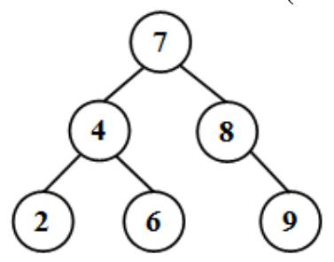
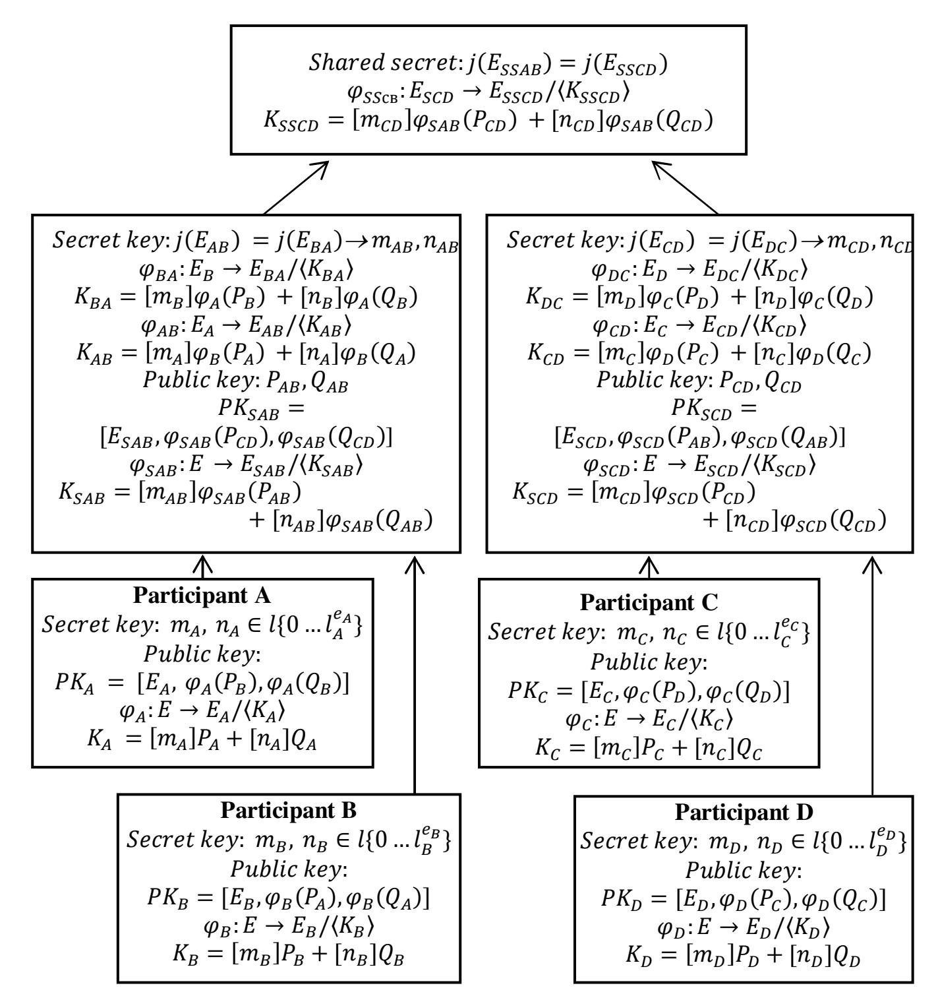

{0}------------------------------------------------

# **Post-Quantum Group Key Agreement Scheme**

Julia Bobryshevaa, 1 and Sergey Zapechnikova, b, 2

a Institute of Cyber Intelligence Systems, National Research Nuclear University
 (Moscow Engineering Physics Institute)
 b Research Center for Cryptocurrencies and Digital Assets
 Moscow, Russia
 1 julia@epage.ru, 2 svzapechnikov@mephi.ru

**Abstract.** Progress in quantum technologies forces the development of new cryptographic primitives that are resistant to attacks of an adversary with a quantum computer. A large number of key establishment schemes have been proposed for two participants, but the area of group post-quantum key establishment schemes has not been studied a lot. Not so long ago, an isogeny-based key agreement scheme was proposed for three participants, based on a gradual increase in the degree of the key. We propose another principle for establishing a key for a group of participants using a tree-structure. The proposed key establishment scheme for four participants uses isogeny of elliptic curves as a mathematical tool.

**Keywords:** Group Key Agreement, Isogenies, Post-Quantum Scheme.

### 1 Introduction

Key agreement schemes are one of the clue primitives of modern cryptography since they play an important role in ensuring the information security of all kinds of objects and systems. Progress in the development of quantum computers has led to the fact that most of the key agreement schemes currently used algorithms that are resistant to attacks with a classical computer can be unstable to attacks with a quantum computer.

It is necessary to create, implement and certify new cryptographic primitives. Recently, a large number of post-quantum key agreement schemes have been created, based on infeasible mathematical problems that are considered resistant to attacks using a quantum computer. One of these mathematical problems is finding isogeny between two isogenic elliptic curves. Protocols, using isogenies of elliptic curves, usually have small key sizes and compatible with elliptic curve cryptography. In recent years, several isogeny-based schemes have been proposed for sharing a common key between two participants. The most famous of them are SIDH [1], SIKE [2], CSIDH [3]. However, another task, namely sharing a common key for a group, is much less studied and illuminated.

{1}------------------------------------------------

### 2 Related works

#### 2.1 Group Diffie-Hellman schemes

The classic Diffie-Hellman [4] algorithm allows getting a common key for two or more participants without transmitting secret data over an open channel.

The sequence of actions of participants A, B, C for receiving a shared key:

- 1. Participants choose the general parameters of the algorithm: numbers p and g;
- 2. Participants A, B, C generate their secret keys a, b and c, respectively;
- 3. Participant A computes  $g^a \pmod{p}$  and sends the result to Participant B;
- 4. Participant *B* computes  $(g^a)b \pmod{p} = g^{ab} \pmod{p}$  and sends the result to participant *C*;
- 5. Participant C calculates  $(g^{ab})^c \pmod{p} = g^{abc} \pmod{p}$  and receives a shared secret key;
- 6. Participant B computes  $g^b \pmod{p}$  and sends the result to Participant C;
- 7. Participant C computes  $(g^b)^c \pmod{p} = g^{bc} \pmod{p}$  and sends the result to participant A;
- 8. Participant A calculates  $(g^{bc})^a \pmod{p} = g^{bca} \pmod{p} = g^{abc} \pmod{p}$ , which is a shared secret key;
- 9. Participant C computes  $g^{c} \pmod{p}$  and sends the result to Participant A;
- 10. Participant A calculates  $(g^c)^a = g^{ca}$  and sends the result to Participant B;
- 11. Participant B calculates  $(g^{ca})$   $b = g^{cab} = g^{abc}$  and also obtains a shared secret key.

Thus, if an attacker intercepts the transmitted messages at any stage, he will be able to get only the values g,  $g^a$ ,  $g^b$ ,  $g^c$ ,  $g^{ab}$ ,  $g^{ac}$ ,  $g^{bc}$ , from which it will not be possible to calculate the secret keys a, b, c for attacks from classical computers.

The scheme for obtaining a key for three participants was developed based on the isogeny of elliptic curves [4]. The initial parameter is  $p = l_A^{e_A} * l_B^{e_B} * l_C^{e_C} * f \pm 1$ , where  $l_A$ ,  $l_B$ ,  $l_C$  are primes and f is a cofactor. E is a supersingular elliptic curve defined over  $F_{p^2}$  (a finite field of size  $p^2$ ). Torsion groups and corresponding generators are determined:

$$E[l_A^{e_A}] = \langle P_A, Q_A \rangle$$

$$E[l_B^{e_B}] = \langle P_B, Q_B \rangle$$

$$E[l_C^{e_C}] = \langle P_C, Q_C \rangle$$

Each party of the protocol generates two numbers as its private key and computes the corresponding isogenic core. The resulting curve and the mapping of the base points of other sides on this curve is a public key.

The sequence of actions of participants A, B, C for receiving a shared key:

- 1. Participant A sends to participant B his public key, which contains  $E_A$  and mapping points  $P_B$ ,  $Q_B$ ,  $P_C$  and  $Q_C$  to  $E_A$ . When participant B receives data from participant A, he calculates the public key  $Pub_{AB}$ , calculating the curve  $E_{AB}$  and mapping points  $P_C$  and  $Q_C$  to  $E_{AB}$ .
- 2. Member B sends his public key and the calculated  $Pub_{AB}$  to the member C. Member C can calculate the shared secret and  $Pub_{BC}$  using public key B.

{2}------------------------------------------------

- 3. After calculating *PubBC,* participant *C* sends its public key and the generated *PubBC* to the member *A*. Member *C* calculates the shared secret and *PubAC* for transferring to member *B*.
- 4. Member *A* sends the generated *PubAC* to the member *B*. Member *B* can calculate the shared secret key.

The common key is the invariant *j(EABC).* All obtained curves *EABC, EBCA,* and *ECAB* are isomorphic to *E/KA, KB, KC* and, therefore, have the same *j*-invariant.

It can be seen that the minimum number of message forwarding between participants is 4. In general, the number of transfers is calculated using the formula (*2n-2)*, where n is the number of protocol participants.

### **2.2 Tree-based schemes**

The tree data structures are used in some post-quantum group schemes for shared key generation. A tree structure is usually represented as a set of related nodes (see a simple tree in Figure 1). The root node is the topmost node of the tree (node 7 in Figure 1). A leaf is a node without any child elements (nodes 2, 6, 9 in Figure 5). An internal node is a tree node with descendants and ancestors (nodes 4, 8 in Figure 6).

**Fig. 1.** A simple tree

There were proposed several group key agreement schemes using tree data structures, for example at [6]. The main idea of such schemes is the generation a common key for pairs of participants. Each node of the tree is one of the participants. Participants follow these steps to receive a shared key:

- 1. Each participant generates a pair of keys: a secret key and a public key.
- 2. Participants perform the Diffie-Hellman algorithm in pairs to obtain the common key for the pair. For example, participants exchange the public keys, raise them to the power of their secret key and receive the common key of the pair. Then they translate the common key into a number and get a new key for the pair, which they can work with.
- 3. The sequential execution of the second step leads to the receipt of the key, common to all participants.

The total number of Diffie-Hellman operations can be determined by the formula *(n-1)*, where *n* is the number of group members.

Another scheme based on the Diffie-Hellman tree was proposed for using in messengers like Signal and WhatsApp [7]. It also takes into account the possibility of asynchronous key updates. But there are still no such schemes on isogenies of elliptic curves.

{3}------------------------------------------------

### 3 Post-quantum group scheme for shared key generation

#### 3.1 Proposed post-quantum scheme

We proposed a post-quantum scheme for key derivation for n participants, where  $n \ge 3$ , based on the tree structure (Figure 2).

The proposed scheme for four participants is shown in Figure 2 The steps for obtaining a shared key:

**Initial data selection.** Participants select the elliptic curve E and the points  $P_i$ ,  $Q_i$  located on it.

**First stage.** Each of the participants generates secret keys  $m_i$ ,  $n_i \in l\{0 \dots l_i^{l_i}\}$  and obtains his public key

$$PK_i = [E_i, \varphi_i(P_k), \varphi_i(Q_k)]$$

The public key consists of:

1. Isogeny

$$\varphi_i: E \to E_i/\langle K_i \rangle$$

where  $K_i$  is the generating point obtained by multiplying the initial points  $P_i$ ,  $Q_i$  on the secret key and adding them

$$K_i = [m_i]P_i + [n_i]Q_i$$

2. the starting points  $P_k$ ,  $Q_k$ , mapping to the points  $\varphi_i(P_k)$ ,  $\varphi_i(Q_k)$  on the obtained isogeny  $\varphi_i$ .

**Second stage.** The participant receives a common for the pair key j, which is an invariant of a new elliptic curve with generation point, obtained by multiplying the secret key  $m_k$ ,  $n_k$  on the points  $\varphi_i(P_k)$ ,  $\varphi_i(Q_k)$ :

$$K_{pair} = [m_k] \varphi_i(P_k) + [n_k] \varphi_i(Q_k)$$
  
$$\varphi_{pair} : E_i \to E_{pair} / \langle K_{pair} \rangle$$

The points  $\varphi_i(P_k)$ ,  $\varphi_i(Q_k)$  are a part of the public key of the second member of the pair. At this stage, it is necessary to go from the common for the pair key j to a secret key  $m_{ik}$ ,  $n_{ik}$ , select the initial elliptic curve E' and the points  $P_i'$ ,  $Q_i'$  on it. In this case, in the next step, it is possible to obtain a common key for a pair of two pairs of participants. After selecting new initial data, the participants calculate a new point

$$K_{i}' = [m_{ik}]P_{i}' + [n_{ik}]Q_{i}'$$

This point is a generating point for the isogeny

$$\varphi_i': E' \to E_{ik}/\langle {K_i}' \rangle$$

After that, the starting points of another pair of participants  $P_k'$ ,  $Q_k'$  are transferred to points on this isogeny.

**Third stage.** Participants receive a common key j' for a pair of pairs. They multiply the obtained secret key  $m_{ik}$   $n_{ik}$  on points  $P_i'$ ,  $Q_i'$  and obtain a generation point for new isogeny.

$$K_{common} = [m_{ik}] \varphi_{pair}(P_i') + [n_{ik}] \varphi_{pair}(Q_i')$$
  
$$\varphi_{common} : E_{ik} \to E_{common} / \langle K_{common} \rangle$$

Then they transfer the points of another pair of participants to new isogenic elliptic curve. Repeating the described actions as many times as necessary, they can get a common key for any number of participants.

{4}------------------------------------------------

Fig. 2. Post-quantum group scheme for shared key generation

#### 3.2 Important scheme goals

- 1. It is necessary to formalize the choice of secret keys, form of which is  $m_A$ ,  $n_A \in l\{0 \dots l_A^{l_A}\}$ , since this choice is directly related to the original elliptic curve defined over a finite field of size  $p^2$ ,  $E/F_{p^2}$ ,  $p = l_A^{e_A} * l_B^{e_B} * l_C^{e_C} * l_D^{e_D} * f \pm 1$ .  $l_A$ ,  $l_B$ ,  $l_C$ ,  $l_D$  are primes, f is a cofactor.
- 2. It is necessary to define a mapping that translates a shared key of the form j into a shared secret key of the form  $m_i$ ,  $n_i$ . It is necessary to select the initial elliptic curve and points on it for a pair of pairs of participants.

{5}------------------------------------------------

## **4 Conclusions**

To sum up, success in the development and creation of a quantum computer have made significant changes in all areas of our lives related to technology. Currently, it is necessary to create quantum-resistant cryptographic tools and systems, including key distribution protocols. Post-quantum group key agreement schemes require special attention since this area is still poorly covered in studies and articles. We offer a group key agreement scheme based on isogenies of elliptic curves, the basic principle of which is the effective tree structure.

Future work will consist in choosing the parameters of this scheme, such as the characteristic of the field p, and parameters % *.* The next step will be the application of this scheme in practical protocols and systems, such as messengers.

## **References**

- 1. C. Costello, P. Longa and M. Naehrig, "Efficient algorithms for supersingular isogeny Diffie–Hellman", Advances in Cryptology-CRYPTO 2016 - 36th Annual International Cryptology Conference Santa Barbara CA USA August 14-18 2016 Proceedings Part I volume 9814 of Lecture Notes in Computer Science, pp. 572-601, 2016.
- 2. H. Seo, A. Jalali and R. Azarderakhsh, "SIKE Round 2 Speed Record on ARM Cortex-M4", pp. 39-60, 2019.
- 3. Castryck W., Lange T., Martindale C., Panny L., Renes J. (2018) CSIDH: An Efficient Post-Quantum Commutative Group Action. In: Peyrin T., Galbraith S. (eds) Advances in Cryptology – ASIACRYPT 2018. ASIACRYPT 2018. Lecture Notes in Computer Science, vol 11274. Springer, Cham
- 4. Keller, S. (2000) "Agreement of Symmetric Keys Using Discrete Logarithm Cryptography Major Steps of Key Agreement," Integers, pp. 1–24.
- 5. Azarderakhsh, Reza, Amir Jalali, David Jao and Vladimir Soukharev. "Practical Supersingular Isogeny Group Key Agreement." IACR Cryptol. ePrint Arch. 2019 (2019): 330
- 6. Kim, Y., Perrig, A. and Tsudik, G. (2004) "Tree-based group key agreement," ACM Transactions on Information and System Security, 7(1), pp. 60–96.
- 7. Cohn-Gordon, K. et al. (2018) "On ends-to-ends encryption asynchronous group messaging with strong security guarantees," Proceedings of the ACM Conference on Computer and Communications Security, pp. 1802–1819.