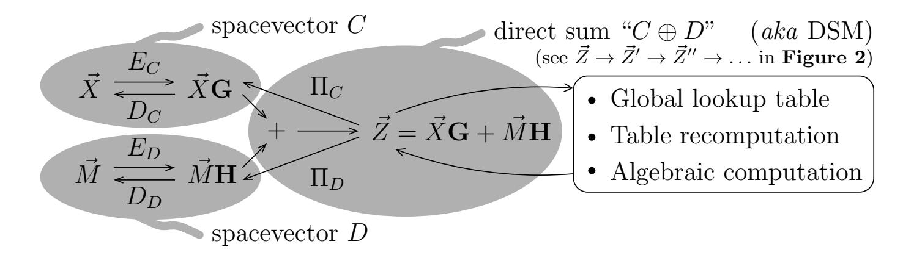
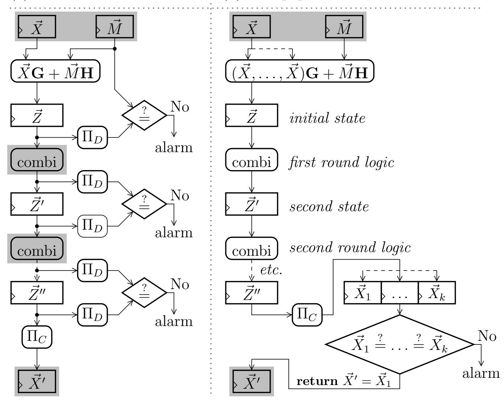
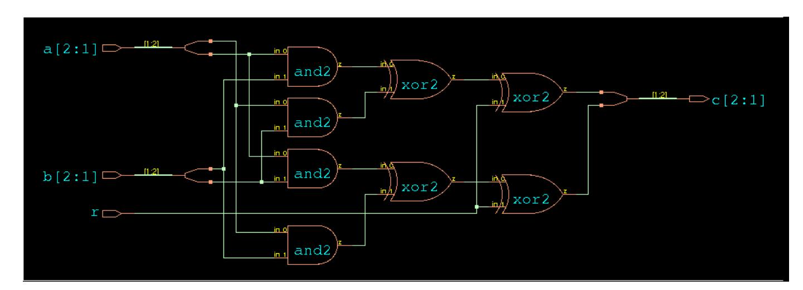
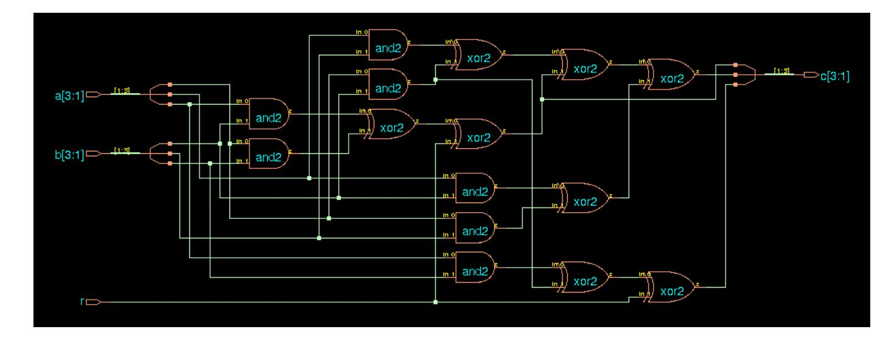

{0}------------------------------------------------

# Direct Sum Masking as a Countermeasure to Side-Channel and Fault Injection Attacks <sup>∗</sup>

Claude Carlet1,<sup>2</sup> , Sylvain Guilley3,<sup>4</sup> and Sihem Mesnager2,<sup>4</sup>

<sup>1</sup> University of Bergen, PB 7803, 5020 Bergen, Norway.

<sup>2</sup> Department of Mathematics, University of Paris VIII, 93526 Saint-Denis, France and University of Paris XIII, CNRS, LAGA UMR 7539,

Sorbonne Paris Cite, 93430 Villetaneuse, France.

<sup>3</sup> Secure-IC S.A.S., 15 rue Claude Chappe, Bât. B,

ZAC des Champs Blancs, 35510 Cesson-Sévigné, France.

#### Abstract

Internet of Things is developing at a very fast rate. In order to ensure security and privacy, end-devices (*e.g.* smartphones, smart sensors, or any connected smartcards) shall be protected both against cyber attacks (coming down from the network) and against physical attacks (arising from attacker low-level interaction with the device). In this context, proactive protections shall be put in place to mitigate information theft from either side-channel monitoring or active computation/data corruption. Although both countermeasures have been developing fast and have become mature, there has surprisingly been little research to combine both.

In this article, we tackle this difficult topic and highlight a viable solution. It is shown to be more efficient than mere fault detection by repetition (which is anyway prone to repeated correlated faults). The presented solution leverages the fact that both side-channel protection and fault attack detection are coding techniques. We explain how to both prevent (higher-order) side-channel analyses and detect (higher-order) fault injection attacks. The specificity of this method is that it works "end-to-end", meaning that the detection can be delayed until the computation is finished. This simplifies considerably the error management logic as there is a single verification throughout the computation.

Keyword: Security, privacy, Internet of Things, side-channel analysis, fault injection attacks, countermeasure, high-order, coding theory, direct sum masking (DSM).

<sup>4</sup> LTCI, Télécom Paris, Institut Polytechnique de Paris (IPP), 75013 Paris, France.

<sup>∗</sup>This work was supported by the ANR CHIST-ERA project [SECODE](https://secode.enst.fr/) (*Secure Codes to thwart Cyberphysical Attacks*) and by National Natural Science Foundation of China (No. 61632020).

{1}------------------------------------------------

### 1 Introduction

Along with the advent of Internet of Things (IoT), sensitive data is basically flowing through network locations which cannot be determined in advance. This means that information can be recovered at any point of the network. Now, the weakest point is the end-device (*e.g.* the user's smartphone, smart sensor, or connected smartcard). Indeed, it can easily be procured by an attacker and then be thoroughly studied by him. This may allow for instance template attacks, which are a type of side-channel attacks which need to make experiments on the device priorly to the attack. Side-channel and fault injection analyses are two independent albeit equally dangerous attacks on embedded devices. Such attacks compromise the IoT *data privacy* and *code security*. They are, for instance, well documented in some application notes [8] from the Common Criteria ISO/IEC 15408 standard.

In this article, we leverage on provable masking schemes that can detect errors. We also relax some constraints on previously discussed schemes; namely, we subsume the original article "Orthogonal Direct Sum Masking" (short for ODSM [5]), in that:

- The computation is not bound to be in  $\mathbb{F}_2$ , but can take place in any finite field  $\mathbb{K}$ . This allows to use  $\mathbb{K} = \mathbb{F}_{2^l}$ , where the computation can be carried out on words (of *l*-bit width) rather than on individual bits. Therefore, algorithmic computation schemes can be leveraged (see Section 2.5).
- The information and the masking data must live in codes C and D such that the mapping  $(x,y) \in C \times D \mapsto x+y$  is injective, so that it is possible to retrieve the sensitive data coded by x from the masked data x+y, but there is no need that C and D be orthogonal linear codes, which is the case in ODSM; it is even possible to search for them among unrestricted (*i.e.* linear or nonlinear) codes like  $\mathbb{Z}_4$ -linear codes [14]. This leaves the possibility for more efficient codes, since linear complementary dual (LCD [18, 6]) codes constitute only a subset of all possible complementary codes.
- The information is considered to embed a certain level of redundancy, allowing for end-to-end fault detection capability. Historically, in ODSM paper, only the masks could be checked for errors, not the information. Now, the check is made at the very end of the algorithm. This redundancy can be at bit or at word level, depending on the expected implementation.

**Contributions.** In this article, we review masking schemes which also enable, as an additional feature, to detect faults. They are not so many, and most of the time, fault detection is *ad hoc*. Our main novel contribution is to disclose a masking scheme with provably end-to-end fault detection, using optimized parameters. Moreover, this masking scheme generalizes most classical masking schemes (in particular, Boolean masking BM and inner product masking IPM). For the sake of illustration, we provide instantiation examples in Verilog Hardware Description Language (HDL).

**Outline.** Existing high-order masking schemes are reviewed in Section 2. The original Direct Sum Masking (DSM) is presented in Section 3, where we waive some con-

{2}------------------------------------------------

straints of the original ODSM paper. Our original contributions start in Section 4, where we expose our new *modus operandi* for end-to-end fault detection. Finally, Section 5 presents conclusions and perspectives.

# <span id="page-2-0"></span>2 State-of-the-art about high-order masking schemes

#### 2.1 Notation

Cryptographic algorithms can be seen either at *bit* or at *word* level. At bit level, all computations are carried out in the finite field  $\mathbb{F}_2$ . Such representation is useful for implementation at hardware-level (with parallelism) and at software-level, in the case of bit-slice implementations [2]. At the word level, the computations leverage acceleration in software; indeed, processor registers and memories are word-oriented, i.e., they typically manipulate several bits in parallel. The choice of word length (i.e., the bitwidth l) depends on the target processor but also on the target algorithm. Usually, the computation takes place in  $\mathbb{F}_2^l$  for l=4 or 8. One further advantage of working with words is that some operations can be better implemented in the finite field  $\mathbb{K} = \mathbb{F}_{2^l}$ . The mapping between vector spaces  $\mathbb{F}_2^l$  and  $\mathbb{F}_{2^l}$ , based on the fact that these sets are two vector spaces of the same dimension l over  $\mathbb{F}_2$ , is usually irrelevant, but we will precise it whenever necessary.

Let n be a strictly positive integer. Then the Cartesian product  $\mathbb{K}^n$  is endowed by a structure of a vector space. The subsets of  $\mathbb{K}^n$  are called *unrestricted codes*. Linear subsets, in that, for all pairs of elements  $c, c' \in \mathbb{K}$ , any linear combination  $\alpha c + \beta c'$  (for arbitrary  $\alpha, \beta \in \mathbb{K}$ ) also belongs to the subset, are simply called *linear codes*. They are generated by a basis of k non-zero vectors, whose representation as a  $k \times n$  matrix of elements from  $\mathbb{K}$  is called the generator matrix of the code. For both unrestricted and linear codes, the minimum number of nonzero positions in c + c' for all  $c \neq c'$ , is referred to as the minimum distance, and is customarily denoted by d. For linear codes, it coincides with the minimum Hamming weight of the nonzero codewords. An unrestricted binary code is characterized by its base field  $\mathbb{K}$  of cardinality  $2^l$ , its length n, its number of codewords m, and its minimum distance d. Its parameters are denoted as  $(n, m, d)_{2^l}$ . A linear code C is characterized by its basefield  $\mathbb{K}$  of cardinality  $2^l$ , its length n, its dimension  $k = \dim(C)$ , and its minimum distance d (also denoted  $d_C$  in case of ambiguity). Its parameters are denoted as  $[n,k,d]_{2^l}$ . When the base field is obvious, the index (i.e.,  $2^l$ ) can be omitted. The dual  $C^{\perp}$  of a linear code C is the code whose all codewords are orthogonal to those of C, according to the usual scalar product  $\langle c, c' \rangle = \sum_{i=1}^n c_i c'_i \in \mathbb{K}$ , where  $c, c' \in \mathbb{K}^n$ , and where n is the length of codes C and  $C^{\perp}$ . We have  $\dim(C^{\perp}) + \dim(C) = n$  and the so-called dual distance  $d_C^{\perp}$  is defined as  $d_{C^{\perp}}$ . Note that the notion of dual distance extends to unrestricted codes, see [16].

We are interested in a dth-order masking scheme. Traditionally (see for instance [3, 24]), this means that each variable is splitted in (d+1) shares, or, equivalently, that d random numbers are drawn to mask a sensitive variable. In this article, we consider d as a security parameter, as we will be using redundant shares: the number of shares is not directly linked to the security order. Therefore, assuming that there is no flaw in the scheme, we stick to the understanding that any attack combining d shares (or fewer)

{3}------------------------------------------------

is doomed to fail. This expresses the definition of the d-th order probing model. The successful attack of lowest order is thus a (d+1)th-order attack, as illustrated in [23].

Usually, masking schemes are chosen according to their affinity with the algorithm to protect. For instance, in the case of a block cipher, many operations revolve around the XOR operation; therefore Boolean masking is chosen. In this respect, the linear functions with respect to XOR are simple, since they apply verbatim to each share. The difficulty lays in the masked evaluation of non-linear functions. In a view to be general, we denote them by (n,m)-functions, that is applications  $\mathbb{F}_2^n \to \mathbb{F}_2^m$ . Such functions are used in block ciphers, under a different name: substitution boxes (or S-box in short). All those are synonymous.

#### 2.2 Problem statement

When cryptographic algorithms are run over smart cards and other mobile cryptographic devices, or on light hardware devices (e.g. FPGA, ASIC), side-channel information (through running-time, power consumption, electromagnetic emanation, etc.) is leaked by the algorithm. side-channel attacks (SCA) can take advantage of this additional information and use it for extracting the secret parameters of the algorithm. The classical counter-measure is to mask the sensitive data (which leaks a part of the secret), say x, assumed to be a binary vector (to simplify our presentation): vectors  $m_1, \ldots, m_{n-1}$  of the same length as x are drawn at random and the algorithm, instead of handling x, handles the n-tuple  $(x + \sum_{i=2}^{n} m_i, m_2, \dots, m_n)$ . Fault injection attacks (FIA) can also be performed, extracting the secret key when the algorithm is running over some device, by injecting some fault in the computation, so as to obtain exploitable differences at the output. Featuring both side-channel mitigation and fault detection is mandatory from a "threat model" point of view, but at the same time, it is fairly difficult to combine those protections. Indeed, fault detection consists of replicating (giving redundancy to) information for consistency checking. Now, the way information is copied might induce uncontrolled leakages, which can reduce the security order of the countermeasure. Reciprocally, fault detection assumes some predictable formatting of variables (in terms of minimum distance). Their representation is important for the detection to operate as intended. Now, masking replaces variables by random sharing, thereby jeopardizing the encoding of codewords.

For these reasons, the composability of independent side-channel and fault detection countermeasure can be termed non-obvious. Provable countermeasures against passive and active attacks are thus the topic of active research.

Still, some research papers have proposed masking schemes amenable to fault injection detection. For instance:

- Attempts have been done by sporadic checks on states (leaving computations unprotected) in [5],
- Private circuits III [11] also went in this direction, but on a special masking scheme.

Advantageously, the detected faults might as well be injected either *adversarially* (posing then a security problem) or *naturally* (posing a safety problem—as addressed

{4}------------------------------------------------

in ISO 26262 for the automotive field). Therefore, the effort to detect faults kills two birds with one stone. This is for instance required in mission-critical applications, such as automotive.

In the rest of this Section 2, we review existing high-order side-channel protection schemes. A *scheme* is a method to compute a complete algorithm (say AES [20], which is our running example) using the proposed protection. Namely, in Section 2.3, the global look-up table approach is presented. An equivalent concept, where such time tables are recomputed *just-in-time*, therefore with a smaller footprint, is the topic of Section 2.4. Last but not least, rewriting of the algorithm under the form of computations in (one or several) field(s), is illustrated in Section 2.5.

We intentionally focus on the protection of substitution boxes, as they are non-linear functions with respect to addition in  $\mathbb{K} = \mathbb{F}_{2^l}$ , which is hard to protect.

#### <span id="page-4-0"></span>2.3 Computation with global look-up table

It is always possible to tabulate the complete masking scheme computational parts. Regarding AES, a didactic explanation is provided in [10]. Of course, the described implementation regards field-programmable gate arrays (FPGAs), but is transposable without difficulties to software code. In this respect, replace:

- block random access memories (BRAM) by look-up tables,
- logic by Boolean instructions, and
- Digital signal processing (DSP) blocks by arithmetic operations.

But tables may be really too large. Then, one shall consider evaluating tables of smaller sizes. One such possibility is explained in the following

<span id="page-4-1"></span>**Lemma 1** (Sub-evaluation of substitution boxes). A table  $S : \mathbb{F}_2^n \to \mathbb{F}_2^m$  can be evaluated as two evaluations of smaller tables  $S_0, S_1 : \mathbb{F}_2^{n-1} \to \mathbb{F}_2^m$ . The definition of tables  $S_0$  and  $S_1$  is as follows:

$$\forall x = (x_1, \dots, x_{n-1}) \in \mathbb{F}_2^{n-1}, \quad \begin{cases} S_0(x) = S(x|0) = S(x_1, \dots, x_{n-1}, 0), \\ S_1(x) = S(x|1) = S(x_1, \dots, x_{n-1}, 1). \end{cases}$$

The reconstruction of the original S-box *S* is as follows:

$$S(x) = (x_n + 1) \cdot S_0(x_1, \dots, x_{n-1}) + x_n \cdot S_1(x_1, \dots, x_{n-1}), \tag{1}$$

where ":" is scalar multiplication.

The decomposition presented in Lemma 1 can be applied to masked representations, namely x can be the concatenation of several shares (if the shares are made of several bits, we shall have to apply it iteratively). Ultimately, this strategy allows to decompose all the table look-ups.

Other divide-and-conquer strategies are possible, for instance, when n is even, by directly replacing n by n/2 in Lemma 1. This strategy has been applied in the past to optimize generalizations of private circuits (Ishai, Sahai, Wagner [13]) from  $\mathbb{F}_{256}$  (Rivain, Prouff [24]) to  $\mathbb{F}_{16}$  (Kim, Hong, Lim [15]).

{5}------------------------------------------------

#### <span id="page-5-1"></span>2.4 Computation with recomputed look-up tables

The size of precomputed tables can be prohibitive, despite memory-time possible tradeoffs, allowed for instance by Lemma 1. For this reason, Coron prepared a new scheme which consumes only about  $l2^ln$  bits of memory (with n tables containing the  $2^l$  values at the l-bit vectors). But actually, recomputation can be leveraged to maintain a target security order d whilst limiting this memory size. Recomputation requires about  $n^2$  clock cycles. As underlined by Coron [9], this scheme is only efficient on random S-boxes, otherwise, algebraic computations (see next subsection 2.5) perform better.

#### <span id="page-5-0"></span>2.5 Algebraic computation

In some situations (more in the framework of smart cards), the whole algorithm must be rewritten (in a polynomial form) so that all the sensitive data is in the masked version. This needs to change each transformation F(x) in the original algorithm into a transformation F'(z) in the masked algorithm, taking as input the masked version z of x and giving as output a masked version of F(x). We shall say that F' is a masked version of F and speak of masked computation when dealing with the transformed algorithm. For cryptographic algorithms which are efficiently described as operations in an extension  $\mathbb{K} = \mathbb{F}_{2^l}$  of  $\mathbb{F}$ , it has been proven beneficial to perform computations in  $\mathbb{F}_{2^l}$  rather than in  $\mathbb{F}_2^{l}$  (which has less structure). Any computation in a finite field can be represented as the evaluation of a polynomial (which can be obtained by Lagrange interpolation). In usual cases, the algorithm control flow is independent of the inputs. Therefore, this Lagrange interpolation polynomial is static (same whatever the inputs) and can be evaluated using basic field *addition* and *multiplication* operations. Horner's method can be leveraged for efficient polynomial evaluation. In practice in symmetric cryptography, most operations are explicitly carried out in some field of characteristic two, such as:

- $\mathbb{K} = \mathbb{F}_{2^4}$  for PRESENT [4] (l = 4) lightweight block cipher,
- $\mathbb{K} = \mathbb{F}_{28}$  for AES [20] (l = 8) standard block cipher, etc.

Therefore, a cryptographic algorithm can be decomposed into computations in some field  $\mathbb{F}_{2^l}$ . For example,

• in  $\mathbb{F}_{16}$  represented as  $\mathbb{F}_2[x]/\langle x^4+x+1\rangle$ , we denote by [0x0, 0x1, 0x2, 0x3, 0x4, ..., 0xf] the 16 elements [0, 1, x, x+1,  $x^2$ , ...,  $x^3+x^2+x+1$ ]. Using magma [27], we get for the S-box of PRESENT the expression:

S-box(a) = 
$$0xc + 0x7 \cdot a^2 + 0x7 \cdot a^3 + 0xe \cdot a^4 + 0xa \cdot a^5$$
  
+  $0xc \cdot a^6 + 0x4 \cdot a^7 + 0x7 \cdot a^8 + 0x9 \cdot a^9 + 0x9 \cdot a^{10}$   
+  $0xe \cdot a^{11} + 0xc \cdot a^{12} + 0xd \cdot a^{13} + 0xd \cdot a^{14}$ .

• in  $\mathbb{F}_{256}$  represented as  $\mathbb{F}_2[x]/\langle x^8+x^4+x^3+x+1\rangle$ , we denote by [0x00, 0x01, 0x02, 0x03, 0x04, ..., 0xff] the 16 elements [0, 1, x, x+1,  $x^2$ , ...,  $x^7+x^6+x^6+x^6+x^6+x^6+x^6+x^6+x^6+x^6+x^6$ 

<span id="page-5-2"></span><sup>&</sup>lt;sup>1</sup>In hexadecimal notation; the prefix 0x is used in C and related languages.

{6}------------------------------------------------

<span id="page-6-1"></span>Table 1: Summary about use of three computation paradigms, in conjunction with masking

| K                  | Global Look-up Table (GLUT) | Table recomputation (htable) | Algebraic computation (Lagrange) |
|--------------------|-----------------------------|------------------------------|----------------------------------|
|                    | (Sec. 2.3)                  | (Sec. 2.4)                   | (Sec. 2.5)                       |
| $\mathbb{F}_2$     | Source: [22]                | ?                            | Source: ISW [13]                 |
| $\mathbb{F}_{2^l}$ | *                           | Source: Coron [9]            | Source: RP [24]                  |

 $x^5 + x^4 + x^3 + x^2 + x + 1$ ]. From the documentation on AES [19, Sec. 8.5, page 38/45], we get for SubBytes, the AES S-box, the following expression:

<span id="page-6-0"></span>
$$S-box(a) = 0x63 + 0x8f \cdot a^{127} + 0xb5 \cdot a^{191} + 0x01 \cdot a^{223} + 0xf4 \cdot a^{239} + 0x25 \cdot a^{247} + 0xf9 \cdot a^{251} + 0x09 \cdot a^{253} + 0x05 \cdot a^{254}.$$
 (2)

Taking into account that, by Fermat's little theorem,  $\forall a \in \mathbb{F}_{256} \setminus \{0\}, \ a^{-1} = a^{254},$  Eqn. (2) rewrites:

S-box(a) = 
$$0x63 + 0x05 \cdot a^{-1} + 0x09 \cdot a^{-2} + 0xf9 \cdot a^{-4} + 0x25 \cdot a^{-8} + 0xf4 \cdot a^{-16} + 0x01 \cdot a^{-32} + 0xb5 \cdot a^{-64} + 0x8f \cdot a^{-128}$$
.

In this respect, many works have been optimizing masked computation. However, the algebraic manipulation (that is addition and/or multiplication) of masked data is today only known in the case each sensitive data is masked by one or more shares. This means that the masked variables have a bit-width n which is a multiple of l, in which cases we can exploit:

- in  $\mathbb{F}_2$  the Ishai-Sahai-Wagner [13] (ISW);
- in  $\mathbb{F}_{2^l}$  the Rivain-Prouff generalization [24] of ISW.

#### 2.6 Summary about the three computation paradigms

The usage of computation paradigms in the context of masking is recalled in Tab. 1. As we shall further detail, the masking schemes can come in several options. For instance, each sensitive variable might be masked independently (as in classical masking). This means that the information is a single scalar X (of dimensionality k=1) whereas the masked variable consists of a vector  $\vec{Z}$  (of length n>1). The masking schemes which adhere to this masking principle are underlined in gray cell. Some masking schemes are more generic, in that the information can be a vector of symbols  $\vec{X} \in \mathbb{K}^k$  (for some  $k, 1 \le k \le n$ ), while the masked representation is another vector  $\vec{Z} \in \mathbb{K}^n$ , for  $n \ge k$ . Such schemes which do not feature limitation are represented in white cells.

Let us comment on the contents of Tab. 1, on a per-column basis:

{7}------------------------------------------------

- Global look-up table (GLUT): the operation to be conducted on masked material  $\vec{Z}$  is performed through a statically precomputed table (computed once for all, and stored in read-only memory upon software delivery first-time load). Such table takes as input the whole word  $\vec{Z}$ . In terms of security analysis, this has led some to confusion, since in the probing model, it could be (erroneously) assumed that the "item to be probed" is  $\vec{Z}$  in its entirety, whereas the words to consider are actually individual bits (= elements of the base field  $\mathbb{K} = \mathbb{F}_2$ ). Words are vectors of l bit strings, and a word of n bit long is a word array (which cannot be probed at once: in the word-level leakage probing model, n probes are needed). Regarding applicability of GLUT to  $\mathbb{K} = \mathbb{F}_{2^l}$ , there is a direct translation (hence the \* symbol in Tab. 1), by *subfield representation* of  $\mathbb{F}_{2^l}$  elements into  $\mathbb{F}_2^l$  (linear transformations allow to go from one representation to the other). Therefore, new information size on  $\mathbb{F}_2$  is k' = kl and new masking length on  $\mathbb{F}_2$  is n' = nl.
- **Table recomputation**: in this paradigm, one element  $X \in \mathbb{K}$  is applied a table (such as a cryptographic S-box) under its shared form  $\vec{Z} \in \mathbb{K}^n$ . The algorithm consists in on-the-fly computation of tables adapted to  $\vec{Z}$ , for a specific masking scheme (only  $X = \sum_{i=1}^n Z_i$  paradigm is supported). It would not seem unreasonable to extend this computation paradigm to  $\mathbb{K} = \mathbb{F}_2$ , using information  $\vec{X} \in \mathbb{K}^k$ , but this has never been studied yet (hence the ? symbol in Tab. 1).
- Algebraic computation: all transformations in the algorithm being expressed under a polynomial form, which reduces then the problem of masking them to addressing addition and multiplication, secure addition and multiplication have been studied, in [13] at bit-level and in [24] at word-level. Nonetheless, these schemes only work for scalar information  $X \in \mathbb{K}$ , which we extend to vectorial information  $\vec{X} \in \mathbb{K}^k$  in this article (refer to Section 4.2).

Therefore, all three computation paradigms have merits and drawbacks, in terms of implementation size, evaluation time, etc.

But all three strategies described in Section 2.3, 2.4 and 2.5 lack fault detection capability.

# <span id="page-7-0"></span>3 Direct Sum Masking

#### <span id="page-7-1"></span>3.1 Introduction on Direct Sum Masking

This section presents a masking scheme called Direct Sum Masking (DSM), which is based on two complementary codes. We generalize in this section the original concept, presented in [5]. It consists of encoding some information  $\vec{X} \in \mathbb{K}^k$  such that it is randomized by a mask  $\vec{M} \in \mathbb{K}^{n-k}$ . The mixture occurs thanks to a *direct sum* in  $\mathbb{K}^n$ , between the two codes generated by **G** (matrix of size  $k \times n$ ) and **H** (matrix of size  $(n-k) \times n$ ). The protected information writes  $\vec{Z} = \vec{X}\mathbf{G} + \vec{M}\mathbf{H}$ . The transformations from  $(\vec{X}, \vec{M})$  to  $\vec{Z}$  are described in Fig. 1.

**Remark 1** (On notations **G** and **H**). In this section, we explore different "calibrations" of DSM. Therefore, for each one, a new definition of matrices **G** and **H** is provided. The

{8}------------------------------------------------

only requirement is that the codes they spawn are complementary, i.e., that  $\binom{G}{H}$  is an invertible  $n \times n$  matrix in  $\mathbb{K}$ .

The basic result on DSM is that the side-channel protection is at order d in the probing model, where d is the dual distance of the code generated by  $\mathbf{H}$ , minus the number one [5, 21]. That is,  $d = d_{\mathrm{span}(\mathbf{H})}^{\perp} - 1 = d_{\mathrm{span}(\mathbf{H}^{\perp})} - 1$ . A security order of d means that all attacks of order d or less than d do fail. When the base field is  $\mathbb{K} = \mathbb{F}_{2^l}$ , with l > 1, the dual distance  $d_{\mathrm{span}(\mathbf{H})}^{\perp}$  can be considered on  $\mathbb{K}$  or on  $\mathbb{F}_2$ , in which case the security order is considered respectively at word- or an bit-level. As the dual distance increases after sub-field representation, the security level is not smaller at bit-level compared to word-level. A successful attack must combine at least (d+1) words (or bits), depending on whether d is the security order at a word or at a bit level.

Two examples of DSM codes are given hereafter.

<span id="page-8-0"></span>**Example 1** (DSM generalizes classical masking [3]). *In classical masking, we have that:* 

$$\mathbf{G} = \begin{pmatrix} 1 & 0 & 0 & \dots & 0 \end{pmatrix} \in \mathbb{K}^{1 \times n}$$

$$\mathbf{H} = \begin{pmatrix} 1 & 1 & 0 & \dots & 0 \\ 1 & 0 & 1 & \dots & 0 \\ \vdots & \vdots & \vdots & \ddots & 0 \\ 1 & 0 & 0 & \dots & 1 \end{pmatrix} \in \mathbb{K}^{(n-1) \times n}.$$

<span id="page-8-1"></span>**Example 2** (DSM generalizes Inner Product Masking [1]). *In inner product masking, we have that:* 

$$\mathbf{G} = \begin{pmatrix} L_1 & 0 & 0 & \dots & 0 \end{pmatrix} \in \mathbb{K}^{1 \times n}$$

$$\mathbf{H} = \begin{pmatrix} L_2 & 1 & 0 & \dots & 0 \\ L_3 & 0 & 1 & \dots & 0 \\ \vdots & \vdots & \vdots & \ddots & 0 \\ L_n & 0 & 0 & \dots & 1 \end{pmatrix} \in \mathbb{K}^{(n-1) \times n}.$$

This scheme is distinct from classical masking scheme, in that binary elements are replaced by elements  $L_i \in \mathbb{F}_{2^l}$   $(1 \le i \le n)$ . Let us underline that in IPM masking, coefficient  $L_1 \ne 0$  can also, without loss of generality, be chosen equal to 1. Indeed both  $\vec{Z} \in \mathbb{K}^n$  and  $\vec{Z}/L_1 \in \mathbb{K}^n$  do carry the same information.

Note that neither classical masking (example 1) nor IPM (example 2) are orthogonal direct sum masking schemes.

## **3.2** Generalization from k = 1 to $1 \le k \le n$ , and from $\mathbb{F}_2$ to $\mathbb{F}_{2^l}$

When the code generated by matrix **G** has dimension k > 1 on  $\mathbb{K}$  and k does not divide n, then only *computation* algorithms are actually those based on table look-ups, namely "global look-up tables" (Section 2.3) or "table recomputation" (Section 2.4). Indeed, today's algebraic evaluation (Sec. 2.5) requires k = 1, i.e., one data is masked by (n - 1)

{9}------------------------------------------------

1) masks. Such computation is meaningful only on bits (classical ISW). On words, multiplication algorithm such as the algebraic evaluation (Section 2.5) applies, but only provided k = 1.

#### 3.3 DSM vs ODSM

In the original ODSM paper, not only the codes were provided on  $\mathbb{F}_2$  (and not on  $\mathbb{K} = \mathbb{F}_2^l$ ), but also they required the complementary codes  $C = \operatorname{span}(\mathbf{G})$  and  $D = \operatorname{span}(\mathbf{H})$  (with  $C \oplus D = \mathbb{K}^n$ ) to be orthogonal. Such configuration is convenient and holds the name of C and D being two linear complementary codes (LCD). This allows simplifying the write-up of some equations, such as  $\Pi_C(\vec{Z}) = \vec{Z}\mathbf{G}^{\mathsf{T}}(\mathbf{G}\mathbf{G}^{\mathsf{T}})^{-1}\mathbf{G}$  or  $\Pi_D(\vec{Z}) = \vec{Z}\mathbf{H}^{\mathsf{T}}(\mathbf{H}\mathbf{H}^{\mathsf{T}})^{-1}\mathbf{H}$ .

Security-wise, it is not requested that  $C = D^{\perp}$  (i.e., we do not require  $\mathbf{G}\mathbf{H}^{\mathsf{T}} = \mathbf{0}$ ). Relaxing such constraint allows for more efficient parameters selection. Let us give a couple of examples.

<span id="page-9-0"></span>**Example 3** (Best linear code). Let a linear code over  $\mathbb{F}_2$  of length n = 8 and dimension k = 4. Such code being linear, its generating matrix  $\mathbf{G}$  can be written in systematic form, i.e., as

$$\begin{pmatrix}
1 & 0 & 0 & 0 & \cdot & \cdot & \cdot & \cdot \\
0 & 1 & 0 & 0 & \cdot & \cdot & \cdot & \cdot & \cdot \\
0 & 0 & 1 & 0 & \cdot & \cdot & \cdot & \cdot & \cdot \\
0 & 0 & 0 & 1 & \cdot & \cdot & \cdot & \cdot & \cdot
\end{pmatrix} = \begin{pmatrix}
1 & 0 & 0 & 0 & 0 & 0 & 0 & 0 & 0 & 0 &$$

where  $\mathbf{P} \in \mathbb{F}_2^{4 \times 4}$ . If one line of  $\mathbf{P}$  has four 1's, then:

- if a second line also has four 1, the Hamming distance between the two codewords will be 2;
- if a second line has strictly less than four 1, then the codeword on that line has Hamming distance at most 4.

Therefore a minimum distance of 5 is not possible

We show that the minimum weight of all lines can actually reach 4. This implies that all lines of  $\mathbf{P}$  have Hamming weight 3. It can be checked that the only 0 on the lines of  $\mathbf{P}$  cannot be at the same position. Thus, up to equivalence of codes by coordinates swapping, we have that

$$\mathbf{P} = \left(\begin{array}{cccc} 0 & 1 & 1 & 1 \\ 1 & 0 & 1 & 1 \\ 1 & 1 & 0 & 1 \\ 1 & 1 & 1 & 0 \end{array}\right).$$

However, this (unique) binary code of parameters  $[8,4,4]_2$  is self-dual. Therefore, it is not LCD. It can be deduced that all suitable codes for ODSM with length n=8 and k=4 have at most minimum distance d=3.

At the opposite, it is possible to use relax the constraint of the two codes to be dual. In this case, the previous basis of the extended Hamming code of parameters [8,4,4]

{10}------------------------------------------------

*can be completed by vectors of unitary weight. Consequently, one can consider for instance the two complementary codes generated by* G *and* H*, equal to:*

$$\mathbf{G} = \begin{pmatrix} 1 & 0 & 0 & 0 & 0 & 0 & 0 & 0 \\ 0 & 1 & 0 & 0 & 0 & 0 & 0 & 0 \\ 0 & 0 & 1 & 0 & 0 & 0 & 0 & 0 \\ 0 & 0 & 0 & 1 & 0 & 0 & 0 & 0 \end{pmatrix} \text{ and } \mathbf{H} = \begin{pmatrix} 1 & 0 & 0 & 0 & 0 & 1 & 1 & 1 \\ 0 & 1 & 0 & 0 & 1 & 0 & 1 & 1 \\ 0 & 0 & 1 & 0 & 1 & 1 & 0 & 1 \\ 0 & 0 & 0 & 1 & 1 & 1 & 1 & 0 \end{pmatrix}.$$

*If one encodes information* ~*X with masks* ~*Y as protected word* ~*Z* = ~*X*G +~*Y*H*, then decoding is still possible despite codes C* = span(G) *and D* = span(H) *are not dual one of each other. The reverse operation is* ~*X* = Π*C*(~*Z*) = ~*Z*J *and* ~*Y* = Π*D*(~*Z*) = ~*Z*K*, where:*

$$\mathbf{J} \in \mathbb{F}_2^{n \times k}$$
 and  $\mathbf{K} \in \mathbb{F}_2^{n \times (n-k)}$  are defined as:  $(\mathbf{J} \quad \mathbf{K}) = \begin{pmatrix} \mathbf{G} \\ \mathbf{H} \end{pmatrix}^{-1}$ ,

*such that:*

$$\mathbf{J} = \begin{pmatrix} 1 & 0 & 0 & 0 \\ 0 & 1 & 0 & 0 \\ 0 & 0 & 1 & 0 \\ 0 & 0 & 0 & 1 \\ 0 & 1 & 1 & 1 \\ 1 & 0 & 1 & 1 \\ 1 & 1 & 0 & 1 \\ 1 & 1 & 1 & 0 \end{pmatrix} \text{ and } \mathbf{K} = \begin{pmatrix} 0 & 0 & 0 & 0 \\ 0 & 0 & 0 & 0 \\ 0 & 0 &$$

Example 4 (Best unrestricted code). *It is known that the best binary code of length n* = 16 *and with m* = 256 *codewords is the Nordstrom-Robinson code, unique code of parameters* (16,256,6)<sup>2</sup> *[\[25\]](#page-21-3). This code is unique and self-dual. Therefore, it is not LCD. But as in the previous example, a non-orthogonal complementary code can be found, for instance* span(I8,08)*, where* I<sup>8</sup> *(resp.* 08*) is the identity (resp. null) matrix of size* 8×8*.*

# <span id="page-10-0"></span>4 Fault detection with DSM

### 4.1 Venues for fault detection in DSM representation

The concept of fault detection during the execution of a cryptographic algorithm is illustrated in Fig. [2.](#page-12-1) We describe hereafter this figure. Without loss of generality, we consider the example of a block cipher (such as AES-128). All input variables, collectively referred to as "~*X*" (which gathers plaintext, key, etc.), is masked by some random variables *M*~ . Classical block cipher design is based on *product ciphers* (or iterative ciphers) pattern. The state is updated several times in *round logic*, which is most of the time, the same (or almost the same) operation iterated several times. Notice that both message and key are updated concomitantly in usual encryption schemes. Sometimes, the first and the last rounds are specialized versions of the inner rounds.

{11}------------------------------------------------



<span id="page-11-0"></span>Figure 1: Commutative diagram of DSM masking scheme (valid for both  $\mathbb{K} = \mathbb{F}_2$  and  $\mathbb{K} = \mathbb{F}_{2^l}$ )

The convention used in the figure 2 we describe is that we denote by  $\vec{X}$  the inputs and by  $\vec{X}'$  the outputs. The outputs can thus be the ciphertext along with the last round key (in case of encryption) or the master key (in case of decryption). The round logic is referred to as *combinational* logic (denoted as "*combi*"), because, when implemented in hardware, this part would consist in stateless functions. The intermediate states are denoted as  $\vec{Z}$ ,  $\vec{Z}'$ ,  $\vec{Z}''$ , etc. The number of primes (i.e., the depth of quoting "' symbols) indicates the depth of round logic inside of the algorithm. In both schemes (a) & (b) presented in Fig. 2, the protected representation is referred to as a combination of type  $\vec{Z} = \vec{X} \mathbf{G} + \vec{M} \mathbf{H}$ . Precisely, the conversions are recalled in the diagram represented in Fig. 1.

We highlight two computation schemes enabling fault detection:

- state-of-the-art direct sum masking, in Fig. 2(a), and
- our new end-to-end masking scheme with end-to-end fault detection capability, as illustrated in Fig. 2(b).

Both schemes feature *exceptional alarms*, which are checkpoints raising computation *abort* in case of verified *invariant violation*. In a view to highlight the difference between the two schemes, the background of unprotected data/operation is shown in gray, as follows unprotected. Therefore our new method is definitely useful for *legacy* reasons.

In the direct sum masking, the idea is to check whether the refreshed values of the masks have been changed or not once stored in the state register  $\vec{Z}$  (or  $\vec{Z}'$ ,  $\vec{Z}''$ , etc.) This requires to project (securely) the masked state  $\vec{Z}$  onto corresponding mask  $\vec{M}$ . This is always possible since information and masks are encoded in direct sum. But combinational logic is not protected. Indeed, predicting its parity is hard in practice. Hence several unprotected spots (actually all combinational logic inside of the algorithm). Clearly, inputs and outputs are not checked, but this is of little practical importance, as attacks aiming at extracting the key shall target *sensitive values*, that is values which depend on the key and of either the plaintext and/or the ciphertext.

**Remark 2** (On the security of recovery  $\vec{M}$  from  $\vec{Z}$ ). When recovering the mask  $\vec{M}$  from a sensitive variable  $\vec{Z} = \vec{X}\mathbf{G} + \vec{M}\mathbf{H}$ , one shall not leak information on  $\vec{X}$ . A priori, this

{12}------------------------------------------------

(a) Fault detection in ODSM: (b) This paper, end-to-end detection



<span id="page-12-1"></span>Figure 2: Comparison between "check the masks" ((a), [5]) and "encode-information" ((b), this paper) fault detection side-channel protected schemes

is not trivial. But let us explain that there is, in general, no risk, provided the LCD codes spawn by  $\mathbf{G}$  and  $\mathbf{H}$  are built properly. The masking code, i.e. that generated from  $\mathbf{H}$ , can be chosen systematic, and written as  $\mathbf{H} = (\mathbf{L} \ \mathbf{I}_{n-k})$ , where  $\mathbf{L}$  is an  $(n-k) \times k$  matrix. In original DSM, only the property of  $\mathbf{H}$  was relevant for the side-channel security. Thus,  $\mathbf{G}$  can be constructed arbitrarily provided it complements the codewords of  $\mathbf{H}$  to build the universe code  $\mathbb{K}^n$ . Therefore, the simple choice  $\mathbf{G} = (\mathbf{I}_k \ \mathbf{0}_{k \times (n-k)})$  fills this need. Indeed, whatever  $\mathbf{L}$ ,  $(\mathbf{G}) = (\mathbf{I}_k \ \mathbf{0}_{k \times (n-k)})$  is an invertible matrix.

# <span id="page-12-0"></span>4.2 Computation with end-to-end DSM fault detection

For the scheme depicted in Fig. 2(b) to work, the information  $X \in \mathbb{K}$  shall be represented as  $\vec{Z} = (X, ..., X)\mathbf{G} + \vec{M}\mathbf{H}$ , where  $\vec{M} \in \mathbb{K}^{n-k}$  is the masking material for k-times replicated information  $\vec{X} = (X, ..., X) \in \mathbb{K}^k$ . It can be noticed that all unfolds as of

{13}------------------------------------------------

each coordinate of  $(X, ..., X)^2$  is masked with the same mask  $\vec{M}$ . Therefore, evaluation is conducted as follows:

- Computation is carried out independently on each copy X of  $\vec{X} = (X, ..., X) \in \mathbb{K}^k$ ,
- Mask homogenization between the k computations is carried out: this step consists in making sure that each k shared values (in (n-k+1) shares) are using the same (n-k) masks. It is, therefore, possible to rebuild a consistent word of format  $(X, ..., X)\mathbf{G} + \vec{M}\mathbf{H}$ , as underlined in Alg. 1. This algorithm takes two vectors  $\vec{T}, \vec{T}'$ , and assumes an IPM representation (recall Example 2). We call  $\vec{L} = (L_1 = 1, L_2, ..., L_n)$  where n is the length of vectors  $\vec{T}$  and  $\vec{T}'$ . The security proof of Alg. 1 is provided in [7].

### Algorithm 1: Homogenization of two sharings (in the case of IPM)

<span id="page-13-1"></span>**input**:  $\vec{T} = (T_1, ..., T_n)$  and  $\vec{T}' = (T'_1, ..., T'_n)$  **output:**  $\tilde{\vec{T}}'$ , a new sharing with those properties:

- it is equivalent to  $\vec{T}'$ , meaning that  $\langle \vec{L}, \vec{T}' \rangle = \langle \vec{L}, \tilde{\vec{T}}' \rangle$ , and
- it has the same masks as  $\vec{T}$ , meaning that  $\tilde{T}'_i = T_i$  for  $2 \le i \le n$ .

```
1 \tilde{T}' \leftarrow \tilde{T}'

2 for i \in \{2, ..., n\} do

3 \qquad \qquad \varepsilon \leftarrow T_i + T_i'

4 \qquad \qquad \tilde{T}' \leftarrow \tilde{T}' + (L_i \varepsilon, 0, ..., 0, \varepsilon, 0, ..., 0) where the value \varepsilon lays at position i

5 return \tilde{T}'
```

End-to-end computation is better achieved as per Fig. 2(b). Fault detection in the whole algorithm is deferred until the very end of the computation, which considerably simplifies the management of the alarm signal, whilst leaving no unprotected hole in the algorithm to protect.

#### 4.3 Examples in $\mathbb{F}_2$

#### <span id="page-13-2"></span>4.3.1 Bitwise multiplication without error detection

Let us recall the original ISW scheme at hardware level, i.e., where we have l=1 and n=2 (whilst k=1, necessarily). The masked data representation is that of DSM with:

$$\mathbf{G} = \begin{pmatrix} 1 & 0 \end{pmatrix}$$
 and  $\mathbf{H} = \begin{pmatrix} 1 & 1 \end{pmatrix}$ .

<span id="page-13-0"></span><sup>&</sup>lt;sup>2</sup>If the initial clear material is already vectorial, such as 16 bytes of plaintext + 16 bytes of key, such as in AES-128, then the input information is already denoted as a vector  $\vec{X} \in \mathbb{K}^{32}$ , where  $\mathbb{K} = \mathbb{F}_{256}$ . Hence the redundant information is  $(\vec{X}, \dots, \vec{X}) \in \mathbb{K}^k$ , where 32|k. This quantity can be noted as  $(\vec{X}, \dots, \vec{X}) \in \mathbb{K}^{32k}$ , but for the sake of formula readability, we prefer to stick to one single stage of arrows when denoting vectors.

{14}------------------------------------------------

Though it is trivial in this case, one can verify that  $\mathbf{H}^{\perp} = \mathbf{H} = \begin{pmatrix} 1 & 1 \end{pmatrix}$ , which generates the binary repetition code of parameters  $[2,1,2]_2$ . Therefore, the scheme is protected at 1st-order (recall characterization enunciated in Section 3.1). The product of two shares  $(a_1,a_2)$  of  $a \in \mathbb{F}_2$  and of  $b \in \mathbb{F}_2$ , also represented shared, as  $(b_1,b_2)$ , can be computed, according to [3].

In order to simplify the notations, we denote the multiplicand as  $\vec{Z} = (a_1, a_2, a_3)$ , the multiplier as  $(b_1, b_2, b_3)$ , and the multiplication result as  $(c_1, c_2, c_3)$ . Without fault protection, we have, for instance:

- $c_1 = a_1b_1 + a_2b_2 + r_1$ , and
- $\bullet$   $c_2 = a_1b_2 + a_2b_1 + r_1$ ,

where  $r_1$  an additional random mask which is needed while computing the masked product c. It is straightforward to check that the shared computation of  $c = c_1 + c_2$  is correct, since indeed:

$$c_1 + c_2 = ab$$
, where  $a = a_1 + a_2$  and  $b = b_1 + b_2$ .

The number of gates is eight (four AND and four XOR).

#### <span id="page-14-1"></span>4.3.2 Bitwise multiplication with detection of a single error

Let us now consider one single data redundancy, meaning that n = 3 and k = 2. The first step is to expand the data representation, whilst keeping a first-order side-channel security. The masked representation now becomes:

$$\mathbf{G} = \begin{pmatrix} 1 & 0 & 0 \\ 0 & 1 & 0 \end{pmatrix} \quad \text{and} \quad \mathbf{H} = \begin{pmatrix} 1 & 1 & 1 \end{pmatrix}. \tag{3}$$

One can see that

$$\mathbf{H}^{\perp} = \begin{pmatrix} 1 & 0 & 1 \\ 0 & 1 & 1 \end{pmatrix},$$

which indeed spawns a linear code of minimum distance two. Therefore, the representation

<span id="page-14-0"></span>
$$\vec{Z} = (X_1, X_2)\mathbf{G} + M\mathbf{H} = (X_1 + M, X_2 + M, M)$$
 (4)

is still protected at first order against side-channel attacks.

According to the mode of operation for computation presented in Section 4.2, the multiplication shall be carried out on each coordinate of  $\vec{X} = (X_1, X_2)$ , as sketched in Fig. 3.

Now, in order to get to know how to proceed with multiplication, the recipe is to compute using  $(X_1, M)$  on the one hand, and  $(X_2, M)$  on the other. The representation, in either case, is the same, hence this yields on the one hand:

- $\bullet$   $c_{11} = a_1b_1 + a_3b_3 + r_1$ ,
- $\bullet$   $c_{12} = a_1b_3 + a_3b_1 + r_1$ ,

and on the other hand:

{15}------------------------------------------------

$$\begin{array}{c}
(k = 2, n = 3) \\
(k = 2, n = 3)
\end{array}$$

$$\begin{array}{c}
X_1 X_2 M \\
G = \begin{pmatrix} 1 & 0 & 0 \\ 0 & 1 & 0 \end{pmatrix} \xrightarrow{\text{collapses}} G = \begin{pmatrix} 1 & 0 \\ 0 & 1 & 1 \end{pmatrix} \xrightarrow{\text{H}} G = \begin{pmatrix} 1 & 0 & 0 \\ 0 & 1 & 1 \end{pmatrix} \xrightarrow{\text{H}} G = \begin{pmatrix} 1 & 0 & 0 \\ 0 & 1 & 1 \end{pmatrix} \xrightarrow{\text{H}} G = \begin{pmatrix} 1 & 0 & 0 \\ 0 & 1 & 0 \end{pmatrix} \xrightarrow{\text{H}} G = \begin{pmatrix} 1 & 0 & 0 \\ 0 & 1 & 0 \end{pmatrix} \xrightarrow{\text{H}} G = \begin{pmatrix} 1 & 0 & 0 \\ 0 & 1 & 0 \end{pmatrix} \xrightarrow{\text{H}} G = \begin{pmatrix} 1 & 0 & 0 \\ 0 & 1 & 0 \end{pmatrix} \xrightarrow{\text{H}} G = \begin{pmatrix} 1 & 0 & 0 \\ 0 & 1 & 0 \end{pmatrix} \xrightarrow{\text{H}} G = \begin{pmatrix} 1 & 0 & 0 \\ 0 & 1 & 0 \end{pmatrix} \xrightarrow{\text{H}} G = \begin{pmatrix} 1 & 0 & 0 \\ 0 & 1 & 0 \end{pmatrix} \xrightarrow{\text{H}} G = \begin{pmatrix} 1 & 0 & 0 \\ 0 & 1 & 0 \end{pmatrix} \xrightarrow{\text{H}} G = \begin{pmatrix} 1 & 0 & 0 \\ 0 & 1 & 0 \end{pmatrix} \xrightarrow{\text{H}} G = \begin{pmatrix} 1 & 0 & 0 \\ 0 & 1 & 0 \end{pmatrix} \xrightarrow{\text{H}} G = \begin{pmatrix} 1 & 0 & 0 \\ 0 & 1 & 0 \end{pmatrix} \xrightarrow{\text{H}} G = \begin{pmatrix} 1 & 0 & 0 \\ 0 & 1 & 0 \end{pmatrix} \xrightarrow{\text{H}} G = \begin{pmatrix} 1 & 0 & 0 \\ 0 & 1 & 0 \end{pmatrix} \xrightarrow{\text{H}} G = \begin{pmatrix} 1 & 0 & 0 \\ 0 & 1 & 0 \end{pmatrix} \xrightarrow{\text{H}} G = \begin{pmatrix} 1 & 0 & 0 \\ 0 & 1 & 0 \end{pmatrix} \xrightarrow{\text{H}} G = \begin{pmatrix} 1 & 0 & 0 \\ 0 & 1 & 0 \end{pmatrix} \xrightarrow{\text{H}} G = \begin{pmatrix} 1 & 0 & 0 \\ 0 & 1 & 0 \end{pmatrix} \xrightarrow{\text{H}} G = \begin{pmatrix} 1 & 0 & 0 \\ 0 & 1 & 0 \end{pmatrix} \xrightarrow{\text{H}} G = \begin{pmatrix} 1 & 0 & 0 \\ 0 & 1 & 0 \end{pmatrix} \xrightarrow{\text{H}} G = \begin{pmatrix} 1 & 0 & 0 \\ 0 & 1 & 0 \end{pmatrix} \xrightarrow{\text{H}} G = \begin{pmatrix} 1 & 0 & 0 \\ 0 & 1 & 0 \end{pmatrix} \xrightarrow{\text{H}} G = \begin{pmatrix} 1 & 0 & 0 \\ 0 & 1 & 0 \end{pmatrix} \xrightarrow{\text{H}} G = \begin{pmatrix} 1 & 0 & 0 \\ 0 & 1 & 0 \end{pmatrix} \xrightarrow{\text{H}} G = \begin{pmatrix} 1 & 0 & 0 \\ 0 & 1 & 0 \end{pmatrix} \xrightarrow{\text{H}} G = \begin{pmatrix} 1 & 0 & 0 \\ 0 & 1 & 0 \end{pmatrix} \xrightarrow{\text{H}} G = \begin{pmatrix} 1 & 0 & 0 \\ 0 & 1 & 0 \end{pmatrix} \xrightarrow{\text{H}} G = \begin{pmatrix} 1 & 0 & 0 \\ 0 & 1 & 0 \end{pmatrix} \xrightarrow{\text{H}} G = \begin{pmatrix} 1 & 0 & 0 \\ 0 & 1 & 0 \end{pmatrix} \xrightarrow{\text{H}} G = \begin{pmatrix} 1 & 0 & 0 \\ 0 & 1 & 0 \end{pmatrix} \xrightarrow{\text{H}} G = \begin{pmatrix} 1 & 0 & 0 \\ 0 & 1 & 0 \end{pmatrix} \xrightarrow{\text{H}} G = \begin{pmatrix} 1 & 0 & 0 \\ 0 & 1 & 0 \end{pmatrix} \xrightarrow{\text{H}} G = \begin{pmatrix} 1 & 0 & 0 \\ 0 & 1 & 0 \end{pmatrix} \xrightarrow{\text{H}} G = \begin{pmatrix} 1 & 0 & 0 \\ 0 & 1 & 0 \end{pmatrix} \xrightarrow{\text{H}} G = \begin{pmatrix} 1 & 0 & 0 \\ 0 & 1 & 0 \end{pmatrix} \xrightarrow{\text{H}} G = \begin{pmatrix} 1 & 0 & 0 \\ 0 & 1 & 0 \end{pmatrix} \xrightarrow{\text{H}} G = \begin{pmatrix} 1 & 0 & 0 \\ 0 & 1 & 0 \end{pmatrix} \xrightarrow{\text{H}} G = \begin{pmatrix} 1 & 0 & 0 \\ 0 & 1 & 0 \end{pmatrix} \xrightarrow{\text{H}} G = \begin{pmatrix} 1 & 0 & 0 \\ 0 & 1 & 0 \end{pmatrix} \xrightarrow{\text{H}} G = \begin{pmatrix} 1 & 0 & 0 \\ 0 & 1 & 0 \end{pmatrix} \xrightarrow{\text{H}} G = \begin{pmatrix} 1 & 0 & 0 \\ 0 & 1 & 0 \end{pmatrix} \xrightarrow{\text{H}} G = \begin{pmatrix} 1 & 0 & 0 \\ 0 & 1 & 0 \end{pmatrix} \xrightarrow{\text{H}} G = \begin{pmatrix} 1 & 0 & 0 \\ 0 & 1 & 0 \end{pmatrix} \xrightarrow{\text{H}} G = \begin{pmatrix} 1 & 0 & 0 \\ 0 & 1 & 0 \end{pmatrix} \xrightarrow{\text{H}} G = \begin{pmatrix} 1 & 0 & 0 \\ 0 & 1 & 0 \end{pmatrix} \xrightarrow{\text{H}} G = \begin{pmatrix} 1 & 0 & 0 \\ 0 & 1 & 0 \end{pmatrix} \xrightarrow{\text{H}} G = \begin{pmatrix} 1 & 0 & 0 \\ 0 & 1 & 0 \end{pmatrix} \xrightarrow{\text{H}} G = \begin{pmatrix} 1 & 0 & 0 \\ 0 & 1 & 0 \end{pmatrix} \xrightarrow{\text{H}} G = \begin{pmatrix} 1 & 0 & 0 \\ 0 & 1 & 0 \end{pmatrix} \xrightarrow{\text{H}} G =$$

<span id="page-15-0"></span>Figure 3: Decomposition of the computation with *k* = 2 information bits *X*<sup>1</sup> and *X*<sup>2</sup> in two computations

- *c*<sup>21</sup> = *a*2*b*<sup>2</sup> +*a*3*b*<sup>3</sup> +*r*2,
- *c*<sup>22</sup> = *a*2*b*<sup>3</sup> +*a*3*b*<sup>2</sup> +*r*2,

where *r*<sup>1</sup> and *r*<sup>2</sup> are two independent random bits required for the multiplication to be secure.

The homogenization consists now in merging the pair (*c*11, *c*12) and (*c*21, *c*22) into the single representation of Eqn. [\(4\)](#page-14-0). In our case, we apply Alg. [1](#page-13-1) on masks *c*<sup>12</sup> and *c*22:

- *c*<sup>12</sup> is the pivot, and *c*<sup>22</sup> is turned into *c* 0 <sup>22</sup> = *c*<sup>12</sup> = *c*<sup>22</sup> +ε, where ε = *c*<sup>12</sup> +*c*22;
- therefore information *c*<sup>21</sup> becomes in turn

$$c'_{21} = c_{21} + \varepsilon = c_{21} + c_{12} + c_{22}$$
  
=  $(a_2b_2 + a_3b_3 + r_2) + (a_1b_3 + a_3b_1 + r_1) + (a_2b_3 + a_3b_2 + r_2).$ 

Finally, we get for the multiplication in representation [\(4\)](#page-14-0) the following formula:

- *c*<sup>1</sup> = *a*1*b*<sup>1</sup> +*a*3*b*<sup>3</sup> +*r*1,
- *c*<sup>2</sup> = (*a*2*b*<sup>2</sup> +*a*3*b*<sup>3</sup> +*r*2) + (*a*1*b*<sup>3</sup> +*a*3*b*<sup>1</sup> +*r*1) + (*a*2*b*<sup>3</sup> +*a*3*b*<sup>2</sup> +*r*2),
- *c*<sup>3</sup> = *a*1*b*<sup>3</sup> +*a*3*b*<sup>1</sup> +*r*1.

Now, these equations can be optimized, as the term (*a*1*b*3+*a*3*b*1+*r*1) is used both in *c*<sup>2</sup> and in *c*3, and since it can play the role of the refresh bit *r*<sup>2</sup> involved in ISW algorithm for the multiplication of the second coordinate:

$$\bullet \ c_1 = a_1b_1 + a_3b_3 + r_1,$$

{16}------------------------------------------------

```
// Original ISW multiplication
module mult_n2_k1 ( c , a , b , r );
   parameter n = 2;
   input [1: n ] a , b ; // Data to multiply
   input [1:1] r ; // Random for internal refresh
   output [1: n ] c ; // Multiplication result
   assign c [1] = a [1] & b [1] ^ a [2] & b [2] ^ r [1];
   assign c [2] = a [1] & b [2] ^ a [2] & b [1] ^ r [1];
endmodule
```

Listing 1: Verilog code for the multiplication in F2, protected against masking at first order with no fault detection capability (refer to Section [4.3.1\)](#page-13-2)



Figure 4: Structure of ISW multiplication without error detection capability (*k* = 1, *n* = 2), obtained from logical synthesis with Cadence genus EDA tool of Listing [1](#page-16-0) with optimizations disabled

- <span id="page-16-1"></span>• *c*<sup>2</sup> = (*a*2*b*<sup>2</sup> +*a*3*b*<sup>3</sup> +*c*3) + (*a*2*b*<sup>3</sup> +*a*3*b*2),
- *c*<sup>3</sup> = *a*1*b*<sup>3</sup> +*a*3*b*<sup>1</sup> +*r*1.

Eventually, the product *a*3*b*<sup>3</sup> is needed both in *c*<sup>1</sup> and *c*<sup>2</sup> thus can be shared. This results in 7 AND and 8 XOR, which is strictly less than the double size of the example of Section [4.3.1.](#page-13-2) This shows the gain of leveraging codes to detect faults.

In terms of circuits, the version of bit multiplication without redundancy is represented in Fig. [4,](#page-16-1) along with its Verilog [\[12\]](#page-20-9) netlist. The version with one bit of error detection is represented in Fig. [5,](#page-17-0) also along with its netlist.

Please be careful that those netlists can feature *glitches* [\[17\]](#page-20-10), which potentially reduce the security order of the countermeasure. Those netlists must be carefully analyzed by a tool such as Virtualyzr <sup>R</sup> [\[26\]](#page-21-4).

{17}------------------------------------------------

```
// ISW multiplication with redundancy
// (two interwoven ISW multiplications )
module mult_n3_k2 ( c , a , b , r );
   parameter n = 3;
   input [1: n ] a , b ; // Data to multiply
   input [1:1] r ; // Random for internal refresh
   output [1: n ] c ; // Multiplication result
   assign a1b1 = a [1] & b [1];
   assign a2b2 = a [2] & b [2];
   assign a3b3 = a [3] & b [3];
   assign a1b3 = a [1] & b [3];
   assign a3b1 = a [3] & b [1];
   assign a2b3 = a [2] & b [3];
   assign a3b2 = a [3] & b [2];
   assign c [1] = a1b1 ^ a3b3 ^ r [1];
   assign c [2] = ( a2b2 ^ a3b3 ^ c [3]) ^ ( a2b3 ^ a3b2 );
   assign c [3] = a1b3 ^ a3b1 ^ r [1];
endmodule
```

<span id="page-17-0"></span>Listing 2: Verilog code for the multiplication in F2, protected against masking at first order and with single fault detection capability (refer to Section [4.3.2\)](#page-14-1)



Figure 5: Structure of ISW multiplication without error detection capability (*k* = 2, *n* = 3), obtained from logical synthesis with Cadence genus EDA tool of Listing [2](#page-17-1) with optimizations disabled

{18}------------------------------------------------

# <span id="page-18-0"></span>5 Conclusions and perspectives

In addition to their functionality, Internet of Things devices are expected to enforce security and privacy functions. However, some attacks aim at breaking those assets on data/code. Therefore, masking schemes able to detect faults are of great practical importance. We have revised the state-of-the-art, which focuses particularly on ODSM. We underlined that original ODSM presents some shortcoming owing to non-optimal parameter selection (rigid base field =  $\mathbb{F}_2$ ) and pair of codes which have to be orthogonal (which is an unnecessary convenience). But most importantly, we recall that ODSM leaves holes regarding fault detection, as only states are verified but not the computations occurring between each state snapshot. Indeed, ODSM is designed to verify that masks remain unaltered; unfortunately, masks are often refreshed, thereby cutting the computational integrity verification chain.

In this article, we contribute a method based on DSM to detect faults end-to-end, that is from plaintext to ciphertext, including both *sequential* and *combinational* logic. This method works by injecting in the computation not only the information *plain*, but actually some *redundant* information. Therefore, verification can be carried out on the state (only when it is used as public information, e.g., as ciphertext in the case of block ciphers). We show that all currently known computation paradigms (i.e., global look-up table, table recomputation and algebraic computation) still apply and we detail them.

As a perspective, it should be made more clear what is the quantitative gain of having redundancy within the masking scheme for several parameters k and n. Besides, it is desirable to provide a better error detection scheme than simply the k-fold repetition code  $X \mapsto \vec{X} = (X, \dots, X) \in \mathbb{K}^k = \mathbb{F}_{2^l}^k$ . Indeed, proper encoding of X with a parity matrix could allow to detect more faults at a given code rate k/n.

# Acknowledgments

The methods presented in this paper are implemented in Secure-IC Securyzr<sup>®</sup> solutions, and can be verified by Secure-IC Virtualyzr<sup>®</sup> EDA (Electronic Design Automation) tool.

The authors are also grateful to Prof. Thierry Berger for providing oral evidence (while in a stay at Dakar, Senegal, on January 2019) for the proof associated with Example 3.

### References

<span id="page-18-1"></span>[1] Josep Balasch, Sebastian Faust, and Benedikt Gierlichs. Inner product masking revisited. In Elisabeth Oswald and Marc Fischlin, editors, *Advances in Cryptology - EUROCRYPT 2015 - 34th Annual International Conference on the Theory and Applications of Cryptographic Techniques, Sofia, Bulgaria, April 26-30, 2015, Proceedings, Part I*, volume 9056 of *Lecture Notes in Computer Science*, pages 486–510. Springer, 2015.

{19}------------------------------------------------

- <span id="page-19-3"></span>[2] Eli Biham. A Fast New DES Implementation in Software. In Eli Biham, editor, *FSE*, volume 1267 of *Lecture Notes in Computer Science*, pages 260–272. Springer, 1997.
- <span id="page-19-4"></span>[3] Johannes Blömer, Jorge Guajardo, and Volker Krummel. Provably Secure Masking of AES. In Helena Handschuh and M. Anwar Hasan, editors, *Selected Areas in Cryptography*, volume 3357 of *Lecture Notes in Computer Science*, pages 69– 83. Springer, 2004.
- <span id="page-19-8"></span>[4] Andrey Bogdanov, Lars R. Knudsen, Gregor Leander, Christof Paar, Axel Poschmann, Matthew J. B. Robshaw, Yannick Seurin, and Charlotte Vikkelsoe. PRESENT: An Ultra-Lightweight Block Cipher. In *CHES*, volume 4727 of *LNCS*, pages 450–466. Springer, September 10-13 2007. Vienna, Austria.
- <span id="page-19-1"></span>[5] Julien Bringer, Claude Carlet, Hervé Chabanne, Sylvain Guilley, and Houssem Maghrebi. Orthogonal Direct Sum Masking - A Smartcard Friendly Computation Paradigm in a Code, with Builtin Protection against Side-Channel and Fault Attacks. In David Naccache and Damien Sauveron, editors, *Information Security Theory and Practice. Securing the Internet of Things - 8th IFIP WG 11.2 International Workshop, WISTP 2014, Heraklion, Crete, Greece, June 30 - July 2, 2014. Proceedings*, volume 8501 of *Lecture Notes in Computer Science*, pages 40–56. Springer, 2014.
- <span id="page-19-2"></span>[6] Claude Carlet and Sylvain Guilley. Complementary dual codes for countermeasures to side-channel attacks. *Adv. in Math. of Comm.*, 10(1):131–150, February 2016.
- <span id="page-19-9"></span>[7] Wei Cheng, Claude Carlet, Kouassi Goli, Jean-Luc Danger, and Sylvain Guilley. Detecting Faults in Inner Product Masking Scheme — IPM-FD: IPM with Fault Detection, August 24 2019. 8th International Workshop on Security Proofs for Embedded Systems (PROOFS). Atlanta, GA, USA.
- <span id="page-19-0"></span>[8] Common Criteria Management Board. Common Methodology for Information Technology Security Evaluation Evaluation methodology, Version 3.1, Revision 4, CCMB-2012-09-004, September 2012. [https://www.](https://www.commoncriteriaportal.org/files/ccfiles/CEMV3.1R4.pdf) [commoncriteriaportal.org/files/ccfiles/CEMV3.1R4.pdf](https://www.commoncriteriaportal.org/files/ccfiles/CEMV3.1R4.pdf).
- <span id="page-19-7"></span>[9] Jean-Sébastien Coron. Higher Order Masking of Look-Up Tables. In Phong Q. Nguyen and Elisabeth Oswald, editors, *EUROCRYPT*, volume 8441 of *Lecture Notes in Computer Science*, pages 441–458. Springer, 2014.
- <span id="page-19-6"></span>[10] Saar Drimer, Tim Güneysu, and Christof Paar. DSPs, BRAMs, and a Pinch of Logic: Extended Recipes for AES on FPGAs. *TRETS*, 3(1), 2010.
- <span id="page-19-5"></span>[11] Stefan Dziembowski, Sebastian Faust, and François-Xavier Standaert. Private circuits III: hardware trojan-resilience via testing amplification. In Edgar R. Weippl, Stefan Katzenbeisser, Christopher Kruegel, Andrew C. Myers, and Shai Halevi, editors, *Proceedings of the 2016 ACM SIGSAC Conference on Computer and Communications Security, Vienna, Austria, October 24-28, 2016*, pages 142–153. ACM, 2016.

{20}------------------------------------------------

- <span id="page-20-9"></span>[12] Institute of Electrical and Electronics Engineers (<http://www.ieee.org/>). IEEE Standard Verilog Description Language, Std 1364-2001, September 28 2001. ISBN: 0-7381-2826-0.
- <span id="page-20-4"></span>[13] Yuval Ishai, Amit Sahai, and David Wagner. Private Circuits: Securing Hardware against Probing Attacks. In *CRYPTO*, volume 2729 of *Lecture Notes in Computer Science*, pages 463–481. Springer, August 17–21 2003. Santa Barbara, California, USA.
- <span id="page-20-0"></span>[14] A. R. Hammons Jr., P. V. Kumar, A. R. Calderbank, N. J. A. Sloane, and P. Solé. The *Z*4-linearity of Kerdock, Preparata, Goethals and related codes, 1994. *IEEE Transactions on Information Theory* 40.
- <span id="page-20-5"></span>[15] HeeSeok Kim, Seokhie Hong, and Jongin Lim. A Fast and Provably Secure Higher-Order Masking of AES S-Box. In Bart Preneel and Tsuyoshi Takagi, editors, *CHES*, volume 6917 of *LNCS*, pages 95–107. Springer, 2011.
- <span id="page-20-2"></span>[16] Florence Jessie MacWilliams and N. J. A. Neil James Alexander Sloane. *The theory of error correcting codes*. North-Holland mathematical library. North-Holland Pub. Co. New York, Amsterdam, New York, 1977. Includes index.
- <span id="page-20-10"></span>[17] Stefan Mangard and Kai Schramm. Pinpointing the side-channel leakage of masked AES hardware implementations. In Louis Goubin and Mitsuru Matsui, editors, *Cryptographic Hardware and Embedded Systems - CHES 2006, 8th International Workshop, Yokohama, Japan, October 10-13, 2006, Proceedings*, volume 4249 of *Lecture Notes in Computer Science*, pages 76–90. Springer, 2006.
- <span id="page-20-1"></span>[18] James L. Massey. Linear codes with complementary duals. *Discrete Mathematics*, 106-107:337–342, 1992.
- <span id="page-20-7"></span>[19] NIST. AES Proposal: Rijndael (now FIPS PUB 197), 9 April 2003. [http://csrc.nist.gov/archive/aes/rijndael/Rijndael-ammended.](http://csrc.nist.gov/archive/aes/rijndael/Rijndael-ammended.pdf) [pdf](http://csrc.nist.gov/archive/aes/rijndael/Rijndael-ammended.pdf).
- <span id="page-20-3"></span>[20] NIST/ITL/CSD. Advanced Encryption Standard (AES). FIPS PUB 197, Nov 2001. <http://nvlpubs.nist.gov/nistpubs/FIPS/NIST.FIPS.197.pdf> (also ISO/IEC 18033-3:2010).
- <span id="page-20-8"></span>[21] Romain Poussier, Qian Guo, François-Xavier Standaert, Claude Carlet, and Sylvain Guilley. Connecting and Improving Direct Sum Masking and Inner Product Masking. In Thomas Eisenbarth and Yannick Teglia, editors, *Smart Card Research and Advanced Applications - 16th International Conference, CARDIS 2017, Lugano, Switzerland, November 13-15, 2017, Revised Selected Papers*, volume 10728 of *Lecture Notes in Computer Science*, pages 123–141. Springer, 2017.
- <span id="page-20-6"></span>[22] Emmanuel Prouff and Matthieu Rivain. A Generic Method for Secure SBox Implementation. In Sehun Kim, Moti Yung, and Hyung-Woo Lee, editors, *WISA*, volume 4867 of *Lecture Notes in Computer Science*, pages 227–244. Springer, 2007.

{21}------------------------------------------------

- <span id="page-21-1"></span>[23] Emmanuel Prouff, Matthieu Rivain, and Régis Bevan. Statistical Analysis of Second Order Differential Power Analysis. *IEEE Trans. Computers*, 58(6):799– 811, 2009.
- <span id="page-21-0"></span>[24] Matthieu Rivain and Emmanuel Prouff. Provably Secure Higher-Order Masking of AES. In Stefan Mangard and François-Xavier Standaert, editors, *CHES*, volume 6225 of *LNCS*, pages 413–427. Springer, 2010.
- <span id="page-21-3"></span>[25] Stephen L. Snover. *The uniqueness of the Nordstrom-Robinson and the Golay binary codes*. PhD thesis, Department of Mathematics, Michigan State University, MI, USA, 1973.
- <span id="page-21-4"></span>[26] Youssef Souissi, Adrien Facon, and Sylvain Guilley. Virtual Security Evaluation - An Operational Methodology for Side-Channel Leakage Detection at Source-Code Level. In Claude Carlet, Sylvain Guilley, Abderrahmane Nitaj, and El Mamoun Souidi, editors, *Codes, Cryptology and Information Security - Third International Conference, C2SI 2019, Rabat, Morocco, April 22-24, 2019, Proceedings - In Honor of Said El Hajji*, volume 11445 of *Lecture Notes in Computer Science*, pages 3–12. Springer, 2019.
- <span id="page-21-2"></span>[27] University of Sydney (Australia). Magma Computational Algebra System. [http:](http://magma.maths.usyd.edu.au/magma/) [//magma.maths.usyd.edu.au/magma/](http://magma.maths.usyd.edu.au/magma/), Accessed on 2014-08-22.