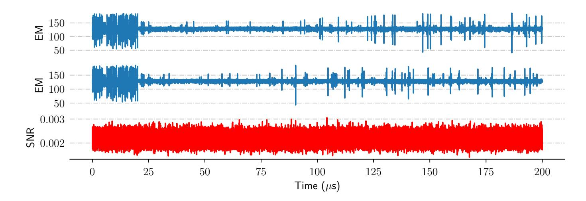
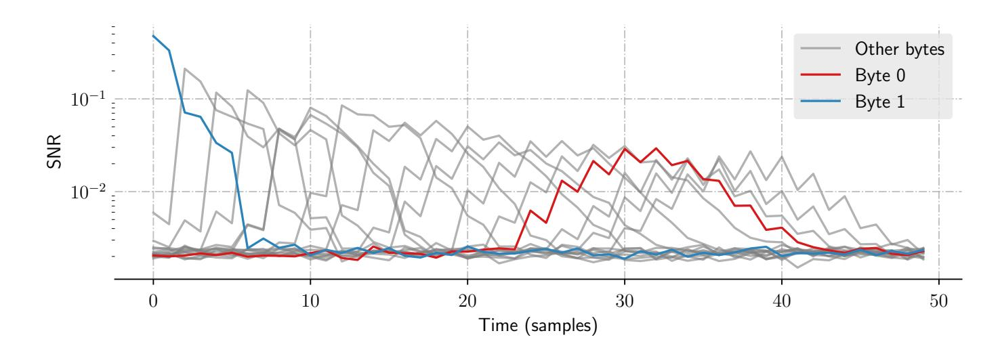
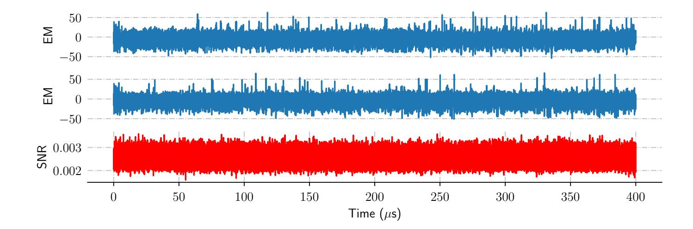
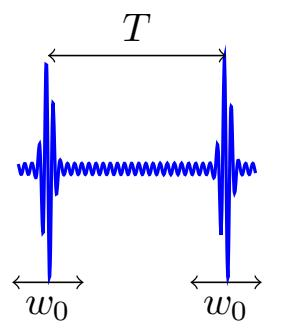
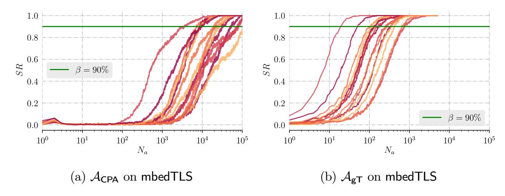
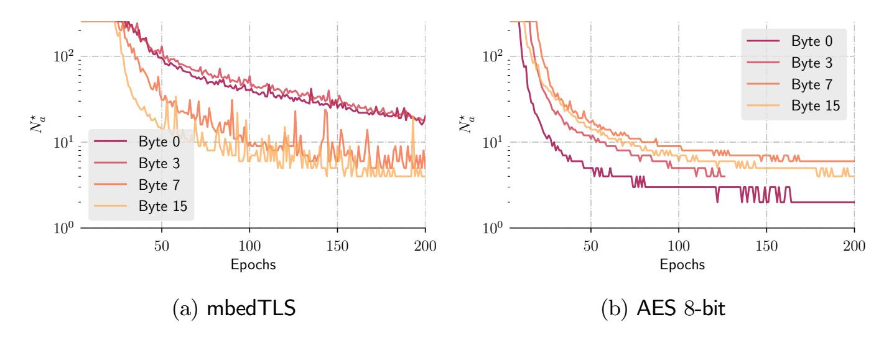

{0}------------------------------------------------

# Deep Learning Side-Channel Analysis on Large-Scale Traces A Case Study on a Polymorphic AES

Loïc Masure1,3 , Nicolas Belleville2 , Eleonora Cagli2 , Marie-Angela Cornélie1 , Damien Couroussé2 , Cécile Dumas1 , and Laurent Maingault1

1 Univ. Grenoble Alpes, CEA, LETI, DSYS, CESTI, F-38000 Grenoble 2 Univ. Grenoble Alpes, CEA, List, F-38000 Grenoble 3 Sorbonne

Université, UPMC Univ Paris 06, POLSYS, UMR 7606, LIP6, F-75005, Paris, France

Abstract. Code polymorphism is a way to efficiently address the challenge of automatically applying the hiding of sensitive information leakage, as a way to protect cryptographic primitives against side-channel attacks (SCA) involving layman adversaries. Yet, recent improvements in SCA, involving more powerful threat models, e.g., using deep learning, emphasized the weaknesses of some hiding counter-measures. This raises two questions. On the one hand, the security of code polymorphism against more powerful attackers, which has never been addressed so far, might be affected. On the other hand, using deep learning SCA on code polymorphism would require to scale the state-ofthe-art models to much larger traces than considered so far in the literature. Such a case typically occurs with code polymorphism due to the unknown precise location of the leakage from one execution to another. We tackle those questions through the evaluation of two polymorphic implementations of AES, similar to the ones used in a recent paper published in TACO 2019 [\[6\]](#page-15-0). We show on our analysis how to efficiently adapt deep learning models used in SCA to scale on traces 32 folds larger than what has been done so far in the literature. Our results show that the targeted polymorphic implementations are broken within 20 queries with the most powerful threat models involving deep learning, whereas 100,000 queries would not be sufficient to succeed the attacks previously investigated against code polymorphism. As a consequence, this paper pushes towards the search of new polymorphic implementations secured against state-of-the-art attacks, which currently remains to be found.

# 1 Introduction

### 1.1 Context

Side-channel analysis (SCA) is a class of attacks against cryptographic primitives that exploit weaknesses of their physical implementation. During the execution of the latter implementation, some sensitive variables are indeed processed that depend on both a piece of public data (e.g. a plain-text) and on some chunk of a secret value (e.g. a key). Hence, combining information about a sensitive variable with the knowledge of the

{1}------------------------------------------------

public data enables an attacker to reduce the secret chunk search space. By repeating this attack several times, implementations of secure cryptographic algorithms such as the Advanced Encryption Standard (AES) [\[31\]](#page-17-0) can then be defeated by recovering each byte of the secret key separately thanks to a divide-and-conquer strategy, thereby breaking the high complexity usually required to defeat such an algorithm. The information on sensitive variables is usually gathered by acquiring time series (a.k.a. traces) of physical measurements such as the power consumption or the electromagnetic emanations measured on the target device (e.g. a smart card). Nowadays, SCA are considered as one of the most effective threats against cryptographic implementations.

To protect against SCA, many counter-measures have been developed and have been shown to be practically effective so that their use in industrial implementations is today common. Their effects may be twofold. On the one hand it may force an attacker to require more traces to recover the secret data. In other words it may require more queries to the cryptographic primitive, possibly beyond the duration of a session key. On the other hand, it may increase the computational complexity of side-channel analysis, making the use of simple statistical tools and attacks harder. Countermeasures against SCA can be divided into two main families: masking and hiding. Masking, a.k.a. secret-sharing, consists in replacing any sensitive secret-dependent variable in the implementation by a (d+1)−sharing, so that each share subset is statistically independent of the sensitive variable. This counter-measure is known to be theoretically sound since it amplifies the noise exponentially with the number of shares d, though at the cost of a quadratic growth in the performance overheads [\[35,](#page-17-1)[33\]](#page-17-2). This drawback, combined with the difficulty of properly implementing the counter-measure, makes masking still challenging for a non-expert developer. Hiding covers many techniques that aim at reducing the signal-to-noise ratio in the traces. Asynchronous logic [\[34\]](#page-17-3) or dual rail logic [\[41\]](#page-17-4) in hardware, shuffling independent computations [\[43\]](#page-17-5), or injecting temporal de-synchronization in the traces [\[13\]](#page-16-0) in software, are typical examples of hiding countermeasures that have been practically effective against SCA. Hence, in practice, masking and hiding are combined to ensure that a secured product meets security standards.

However, due to the skyrocketing production of IoT, there is a need for the automated application of protections to improve products' resistance against SCA while keeping the performance overhead sufficiently low. In this context, a recent work proposed a compiler toolchain to automatically apply a software hiding countermeasure called code polymorphism [\[6\]](#page-15-0). The working principle of the counter-measure relies on the execution of many variants of the machine code of the protected software component, produced by a runtime code generator. The successive execution of many variants aims at producing variable side-channel traces in order to increase the difficulty to realize SCA. We emphasize on the fact that, if code polymorphism is the only counter-measure applied to the target component, information leakage is still present in the side-channel traces. Yet, several works have shown the ability of code polymorphism and similar software mechanisms to be effective in practice against vertical SCA [\[2](#page-15-1)[,14\]](#page-16-1), i.e. up to the point that the Test Vector Leakage Assessment (TVLA) methodology [\[5\]](#page-15-2), highly discriminating in the detection of side-channel leakage, would not be able to detect information leakage in the traces [\[3,](#page-15-3)[6\]](#page-15-0).

{2}------------------------------------------------

### 1.2 Problem Addressed in this Paper

Yet, though very promising, these results cannot draw an exhaustive guarantee concerning the security level against SCA, since other realistic scenarios have not been investigated.

Indeed, on the one hand the SCA literature proposes other ways to outperform vertical attacks when facing hiding counter-measures. Re-synchronization techniques might annihilate the misalignment effect occurred by code polymorphism, since it is successfully applied on hardware devices prone to jitter [\[29,](#page-17-6)[44,](#page-17-7)[16\]](#page-16-2). Likewise, Convolutional Neural Networks (CNN) can circumvent some software and hardware de-synchronization counter-measures, in a sense similar to code polymorphism [\[10,](#page-16-3)[23\]](#page-16-4). It is therefore of great interest to use those techniques to assess the security provided by some code polymorphism configurations against more elaborated attackers.

On the other hand, until now the literature has only demonstrated the relevance of CNN attacks on restricted traces whose size does not exceed 5,000 samples [\[10](#page-16-3)[,7,](#page-15-4)[23,](#page-16-4)[42,](#page-17-8)[45\]](#page-17-9), which is small, e.g., regarding the size of the raw traces in the public datasets of software AES implementations used in those papers [\[30,](#page-17-10)[7](#page-15-4)[,12\]](#page-16-5). This requires to restrict the acquired traces to a tight window where the attacker is confident that the relevant leakage occurs. Unfortunately, this is not possible since code polymorphism applies hiding in a systematic and pervasive way in the implementation. Likewise, other dimensionality reduction techniques like dedicated variants of Principal Component Analysis (PCA) [\[38\]](#page-17-11) might be considered prior to the use of CNNs. Unfortunately, they do not theoretically provide any guarantee that relevant features will be extracted, especially for data prone to misalignment. As a consequence, attacking a polymorphic implementation necessarily requires to deal with large-scale traces. This generally spans serious issues for machine learning problems known under the name of curse of dimensionality [\[36\]](#page-17-12). That is why it currently remains an open question whether CNN attacks can scale on larger traces, or whether it represents a technical issue that some configurations of code polymorphism might benefit against these attacks. Hence, both problems, namely evaluating code polymorphism and addressing large-scale traces SCA, are closely connected.

### 1.3 Contribution

In this paper, we tackle the two problems presented so far by extending the security evaluation provided by Belleville et al. [\[6\]](#page-15-0). The evaluation aims to assess the security of the highest code polymorphism configuration they used, on same implementations, against stronger attackers.

Our evaluation considers a wide spectrum of threat models, ranging from automated attacks affordable by a layman attacker, to state-of-the-art techniques. The whole evaluation setup is detailed in [Section 2.](#page-3-0) In particular, we propose to adapt the architectures used in the literature of CNN attacks, in order to handle the technical challenge of large scale traces. This is presented in [Subsection 2.6.](#page-8-0)

Our results show that vertical attacks fail due to the code polymorphism countermeasure, but that more elaborated scenarios lead to successful attacks. Compared to the ones conducted in [\[6\]](#page-15-0), and depending on the different attack powers considered

{3}------------------------------------------------

hereafter, the number of required queries is lowered by up to several orders of magnitude. In a worst case scenario, our trained CNNs are able to recover every secret key byte in less than 20 traces of dimensionality 160,000, which is 32 times higher than the traces used so far in CNN attacks. This therefore illustrates that large scale traces are not necessarily a technical challenge for deep-learning based SCA. Those results are presented in [Section 3.](#page-11-0)

Thus, this study claims that though code polymorphism is a promising tool to increase the hardness of SCA against embedded devices, a sound polymorphic configuration, eventually coupled with other counter-measures, is yet to be found, in order to protect against state-of-the-art SCA. This is discussed in [Section 4.](#page-13-0) However, the toolchain used by Belleville et al. [\[6\]](#page-15-0) allows to explore many configurations beside the one considered here, the exploration of the securing capabilities of the toolchain is then beyond the scope of this paper, and left as an open question for further works.

# 2 Evaluation Methodology

This section presents all the settings necessary to proceed with the evaluation. [Subsec](#page-3-1)[tion 2.1](#page-3-1) briefly presents the principle of the code polymorphism counter-measure, and precises the aim of the different code transformations included in the evaluated configuration. [Subsection 2.2](#page-4-0) presents the target device and the two AES implementations that have been used for this evaluation. [Subsection 2.3](#page-5-0) details the acquisition settings, while [Subsection 2.4](#page-5-1) describes the shape of the acquired traces. Finally, [Subsection 2.5](#page-8-1) presents the different threat models considered hereafter, and [Subsection 2.6](#page-8-0) precises how the CNN attacks have been conducted.

### 2.1 Description of the Target Counter-Measure

We briefly describe the code polymorphism counter-measure applied by the toolchain used by Belleville et al. [\[6\]](#page-15-0). The compiler applies the counter-measure to selected critical parts of an unprotected source code: it inserts, in the target program, machine code generators, called SGPCs (Specialized Generators of Polymorphic Code), that can produce so-called polymorphic instances, i.e., many different but functionallyequivalent implementations of the protected components. At run-time, SGPCs are regularly executed to produce new machine code instances of the polymorphic components. Thus, the device will behave differently after each code generation but the results of the computations are not altered. The toolchain supports several polymorphic code transformations, which can be selected separately in the toolchain, and most of them offer a set of configuration parameters. A developer can then set the level and the nature of polymorphic transformations, hence the amount of behavioral variability.

Hereafter, we detail the specific code transformations that have been activated for the evaluation:

- Register shuffling: the index of the general purpose callee saved registers are randomly permuted.
- Instruction shuffling: the independent instructions are randomly permuted.

{4}------------------------------------------------

- Semantic variants: some instructions are randomly replaced by another semantically equivalent (sequence of) instruction(s). For example, variants of arithmetic instructions (e.g. eor, sub), remains arithmetically equivalent to the original instruction.
- Noise instructions: a random number of dummy instructions is added between the useful instructions in order to break the alignment of the leakage in the traces. Noise instructions are interleaved with useful instructions by the instruction shuffling transformation.

We emphasize on the fact that the sensitive variables (e.g., the AES key) are only manipulated by the polymorphic instances (i.e., the generated machine code), and not by the SGPCs themselves. SGPCs are specialized code generators, and their only input is a source of random data (a PRNG internal to the code generation runtime) that drives code generation. Hence, SGPCs only manipulate instruction and register encodings,and never manipulate secret data. Thus, performing a SCA on side-channel traces of executions of SGPCs cannot reveal a secret nor an information leakage. However, SGPCs manipulate data that are related to the contents of the buffer instances, e.g., the structure of the generated code, the nature of the generated machine instructions (useful and noise instructions), etc. SCA performed on SGPC traces could possibly be helpful to reveal sensitive information about the code used by the polymorphic instances, but to the best of our knowledge, there is no such work in the literature. As such, this research question is out of the scope of this paper.

### 2.2 Target of Evaluation

In order to make a fair comparison with the results presented by Belleville et al. [\[6\]](#page-15-0), we consider two out of the 15 implementations used in their benchmarks, namely the AES 8-bit and the mbedTLS that we briefly describe hereafter.

mbedTLS. This 32-bit implementation of AES from the ARM mbedTLS library [\[4\]](#page-15-5) follows the so-called T-table technique [\[15\]](#page-16-6): the 16-byte state of AES is encoded into four uint32\_t variables, each representing a column of the state. Each round of the AES is done by applying four different constant look-up tables, that are stored in flash memory.

AES 8-bit. This is a simple software unprotected implementation of AES written in C, and manipulating only variables of type uint8\_t, similar to [\[1\]](#page-15-6). The SubBytes operation is computed byte-wise thanks to a look-up table, stored in RAM. This reduces information leakage on memory accesses, as compared to the use of the same look-up table stored in flash memory.

Target Device. We ran the different AES implementations on an evaluation board embedding an Arm Cortex-M4 32-bit core [\[40\]](#page-17-13). This device does not provide any hardware security mechanisms against side-channel attacks. This core originally operates at 72 MHz, but the core frequency was reduced to 8 MHz for the purpose of side-channel

{5}------------------------------------------------

measurements. The target is similar to the one used by Belleville et al. [\[6\]](#page-15-0), who considered a Cortex-M3 core running at 24 MHz. These two micro-controllers have an in-order pipeline architecture, but with a different pipeline organization. Thus, we cannot expect those two platforms to exhibit the same side-channel characteristics. However, our experience indicates that these two experimental setups would lead to similar conclusions with regards to the attacker models considered in our study. Similar findings on similar targets have also been reported by Heuser et al. [\[20\]](#page-16-7). Therefore, we assume in this study that the differences of side-channel characteristics between the two targets should not induce important differences in the results of such side-channel analysis.

Configuration of the Code Polymorphism Counter-Measure. For each evaluated implementation, the code polymorphism counter-measure is applied with a level corresponding to the configuration high described by Belleville et al. [\[6\]](#page-15-0): all the polymorphic code transformations are activated, the number of inserted noise instructions follows a probability distribution based on a truncated geometric law. The dynamic noise is activated and SGPCs produce a new polymorphic instance of the protected code for each execution (the regeneration period is set to 1).

## 2.3 Acquisition Setup

We measured side-channel traces corresponding to EM emanations with an EM probe RF-B 0.3-3 from Langer, equipped with a pre-amplifier, and a Rohde & Schwarz RTO 2044 oscilloscope with a 4 GHz bandwidth and a vertical resolution of 8 bits. We set the sampling rate to 200 MS/sec., with the acquisition mode peak-detect that collects the minimum and the maximum voltage values over each sampling period. We first verify that our acquisition setup is properly set. This is done by acquiring several traces where the code polymorphism was de-activated. Thus, we can verify that those traces are synchronized. Then, computing the Welch's T-test [\[28\]](#page-16-8) enables to assess whether the probe is correctly positioned and the sampling rate is high enough. Then, 100,000 profiling traces are acquired for each target implementation. Each acquisition campaign lasts about 12 hours.

### 2.4 Preliminary Analysis of the Traces

Once the traces are acquired, and before we investigate the attacks that will be presented in [Subsection 2.5,](#page-8-1) we detail here a preliminary analysis of the component. The aim is to restrict as much as possible the target region acquired to a window covering the entire first AES round. Therefore there would not be any loss of informative leakage about the sensitive intermediate variable targeted in those experiments. In addition to that, a univariate leakage assessment, by computing the Signal-to-Noise Ratio (SNR) [\[27\]](#page-16-9),[4](#page-5-2) is provided hereafter in order to verify that there is no trivial leakage that could be exploited by a weak, automatized attacker (see [Subsection 2.5\)](#page-8-1).

4 A short description of this test is provided in Appendix [B](#page-18-0) for the non-expert reader.

{6}------------------------------------------------

Fig. 1: Acquisitions on the mbedTLS implementation. Top: two traces containing the first AES round. Bottom: SNR computed on the 100,000 profiling traces.

**mbedTLS.** We ran some preliminary acquisitions on  $10^7$  samples, in order to visualize all the execution. We could clearly distinguish the AES execution with sparse EM peaks, from the call to the SGPC with more frequent EM peaks. This enabled to focus on the first  $10^6$  samples of the traces corresponding to the AES execution.

Actually, the traces restricted to the AES execution seem to remain globally the same between each other, up to local elastic deformations along the time axis. This is in line with the effect of code polymorphism, since it involves transformations at the assembly level. Likewise, 10 patterns could be distinguished on each traces, which were clues to expect that it would correspond to the 10 rounds of AES. That is how we could restrict again our target window to the first round, up to comfortable margins because of the misalignment effect of code polymorphism. This represents 80,000 samples. An illustration of two traces restricted to the first round is given in Figure 1 (top).

The SNR denoting here the potential univariate leakage of the first output byte of the SubBytes operation is computed based on the 100,000 acquired profiling traces, and is plotted in Figure 1 (bottom). No distinguishing peak can be observed, which confirms the soundness of code polymorphism against vertical attacks on raw traces.

However, we observe in each trace approximately 16 EM peaks, which corresponds to the number of memory accesses to the look-up tables per encryption round. These memory accesses are known to carry sensitive information. This suggests that a trace re-alignment on EM peaks might be relevant to achieve successful vertical attacks. We proceed with such a re-alignment that we describe hereafter. For each 80,000-dimensional trace, the clock cycles corresponding to the region between two EM peaks are identified according to a thresholding on falling edges. Since the EM peak pattern delimiting two identified clock cycles may be spread over a different number of samples, from one pattern to another, we only keep the minimum and maximum points. Likewise, since the number of identified clock cycles can also differ from one trace to another, the extracted samples are eventually zero-padded to be of dimension D=50.

Based on this re-alignment, a new SNR is computed on Figure 2. Contrary to the SNR computed on raw traces in Figure 1, some leakages are clearly distinguishable

{7}------------------------------------------------

Fig. 2: The 16 SNR of the acquired traces from the mbedTLS implementation, one for each targeted byte, after re-aligned pattern extraction.

Fig. 3: Acquisitions on the AES 8-bit implementation. Top: two traces containing the first AES round. Bottom: SNR computed on the 100,000 profiling traces.

though the amplitude of the SNR peaks vary from  $5.10^{-2}$  to  $5.10^{-1}$ , according to the targeted byte.

**AES 8-bit.** We proceed in the same way for the evaluation of AES 8-bit implementation. As with the mbedTLS traces, we could identify 10 successive patterns likely to correspond to the 10 AES rounds. Therefore we reduce the target window at the oscilloscope to the first AES round, which represents 160,000-dimensional traces plotted in Figure 3 (top). This growth in the size of the traces is expected, since the naive AES 8-bit implementation is not optimized to be fast, contrary to the mbedTLS one.

Yet, here the peaks are hardly distinguishable from the level of noise. This is expected, due to the look-up tables being moved from the flash memory to the RAM, as mentioned in Subsection 2.2. As a consequence, the memory accesses being less remarkable. That is why the re-alignment technique described for the mbedTLS implementation is not relevant here.

Finally, Figure 3 (bottom) shows the SNR on the raw traces, ensuring once again that no trivial leakage can be exploited to recover the secret key.

{8}------------------------------------------------

#### 2.5 Threat Models

We propose several threat models that we distinguish according to two powers that we precise hereafter.

First, the attacker may have the possibility to get a so-called *open sample*, which is a clone device behaving similarly to the actual target, in which he has a full access and control to the secret variables, *e.g.* the secret key. Having an open sample enables to run a *profiled* attack by building the exact leakage model of the target device. This is a necessary condition in order to evaluate the worst-case scenario from developer's point of view [21]. Though often seen as strong, this assumption can be considered realistic in our context: Here both the chip and the source codes used for the evaluation are publicly available.

Second, the attacker may eventually incorporate human expertise to improve attacks initially fully automatized. Here, this will concern either the preliminary task of trace re-alignment (see the procedure described in Subsection 2.4), or the capacity to properly design a CNN architecture for the deep learning based SCA (see Subsection 2.6).

Hence, we consider the following attack scenarios:

- $\mathcal{A}_{\text{auto}}$ : considers a fully automatized attack (*i.e.* without any human expertise), without access to an open sample.
- ACPA: considers an attack without access to an open sample, but with human expertise to re-align the traces (see Subsection 2.4). It results in doing a CPA targeting the output of the SubBytes operation, assuming the *Hamming weight* leakage model [8].
- $-\mathcal{A}_{gT}$ : considers the same attack as  $\mathcal{A}_{CPA}$ , *i.e.* targeting re-aligned traces, along with access to an open sample in addition. The profiling is done thanks to Gaussian templates with *pooled* covariance matrices [11]. No dimensionality reduction technique is used here, beside the implicit reduction done through the re-alignment detailed in Subsection 2.4.
- $\mathcal{A}_{\text{CNN}}$ : considers an attack with access to an open sample and human expertise to build a CNN for the profiled attack. This attack scenario is considered the most effective against de-synchronized traces with first-order leakage [10,23,7]. Therefore, we do not assume  $\mathcal{A}_{\text{CNN}}$  to need to get access to re-aligned traces. In addition, no preliminary dimensionality reduction is done here.

We observed in the preliminary analysis conducted in Subsection 2.4 that the SNR of the raw traces, computed on 100,000 traces, did not emphasize any peak. Instead, the same SNR based on the re-aligned traces emphasized some peaks. Thanks to the works of Mangard *et al.* [26,27] and Oswald *et al.* [28], we can already draw the following conclusions:  $\mathcal{A}_{\text{auto}}$  will not succeed with less than  $N_a^{\star} = 100,000$  queries, whereas  $\mathcal{A}_{\text{CPA}}$ ,  $\mathcal{A}_{\text{gT}}$  and  $\mathcal{A}_{\text{CNN}}$  are likely to succeed within the same amount of queries.

#### 2.6 CNN-Based Profiling Attacks

As mentioned in Subsection 2.5, CNN attacks may require some human expertise to properly set the model architecture. This section is devoted at describing the

{9}------------------------------------------------

whole settings used to train the CNNs used in the attack scenario  $\mathcal{A}_{\text{CNN}}$ , in order to tackle the challenge of large-scale traces. We quickly review the guidelines in the SCA literature, and argue why they are not suited to our traces. We then present the used architecture, and we detail the training parameters.

The Literature Guidelines. Though numerous papers have proposed CNN architectures [25,10,7], the state-of-the-art CNNs are currently given by Kim *et al.* [23] and Zaid *et al.* [45]. Their common point is to rely on the so-called VGG-like architecture [37]:

$$s \circ \lambda \circ [\sigma \circ \lambda]^{n_1} \circ [\delta_p \circ \sigma \circ \mu \circ \gamma_{w,k}]^{n_2} \circ \mu \quad , \tag{1}$$

where  $\gamma_{w,k}$  denotes a convolutional layer made of k filters of size w,  $\mu$  denotes a batch-normalization layer [22],  $\sigma$  denotes an activation function i.e. a non-linear function, called ReLU, applied element-wise [18],  $\delta_p$  denotes an average pooling layer of size p,  $\lambda$  denotes a dense layer, and s denotes the softmax layer. Furthermore, the composition  $[\delta_p \circ \sigma \circ \mu \circ \gamma_{w,k}]$  is denoted as a convolutional block. Likewise,  $[\sigma \circ \lambda]$  denotes a dense block. We note  $n_1$  (resp.  $n_2$ ) the number of dense blocks (resp. convolutional blocks).

An intuitive approach would be to directly set the parameters or our architecture to the ones used by Kim *et al.* or by Zaid *et al.* Unfortunately, we argue in both case that such a transposition is not possible.

Kim et al. propose particular guidelines to set the architecture [23]. They recommend to fix w=3, p=2, i.e., the minimal possible values, and to set  $n_2$  so that the time dimensionality at the output of the last block is reduced to one. Since each pooling divides the time dimensionality by p,  $n_2 \leq \log_p(D)$ . Meanwhile they double the number of filters for each new block compared to the previous one, without exceeding 256. Unfortunately, using these guidelines is likely to increase  $n_2$  from 10 in Kim et al.'s work to at least 17 in our context. As explained by He et al. [19], stacking such a number of layers is likely to make the training harder to tweak the learning parameters to optimal values. That is why an alternative architecture called Resnet has been introduced [19], and starts to be used in SCA as well [47,17]. This possibility will be discussed in Section 4. Second, due to the doubling number of filters at each new block, the number of learning parameters would be around 1.8 M, i.e. 10 folds more than the number of traces. In such a configuration, over-fitting is likely to happen [36], which degrades the performance of CNNs.

In order to improve the Kim et al.'s architecture, Zaid et al. [45] proposed thumb rules to set the filter size in the convolutional and the pooling layers depending on the maximum temporal amplitude of the de-synchronization. Unfortunately, it assumes to know the maximum amplitude of the de-synchronization, which is not possible here since it is hard to guess how many times those transformations are applied in the polymorphic instance.

&lt;sup>5 The softmax outputs a normalized vector of positive scalars. Hence, it is similar to a discrete probability distribution that we want to fit with the actual leakage model.

&lt;sup>6 We recall that D denotes the dimensionality of the traces, *i.e.* D=80,000 for the mbedTLS implementation and D=160,000 for the AES 8-bit.

{10}------------------------------------------------

Our Architecture. The drawbacks of Kim et al.'s and Zaid et al.'s guidelines in our particular context justify why we do not directly use them. Instead, we propose to take the Kim et al.'s architecture as a baseline, on which we modify some of the parameters as follows. First, we set the number of filters in this first block to k0=10, we decrease the maximal number of filters from 256 to kmax=100, and we slightly change the way the number of filters is computed in the intermediate convolutional layers, according to [Table 2](#page-18-1) in [Section A.](#page-18-2) Likewise, we remove the dense block (i.e. n1=0). This limits the number of learning parameters, and thus avoids over-fitting. Second, we increase the pooling size to p=5. This mechanically allows to decrease the minimal number of convolutional blocks n2 from 17 to 6 for the mbedTLS traces and to 7 for the AES 8-bit ones. To be sure that this growth in p does not imply any loss of information in the pooling layers, we set the filter size to w=2p+1=11. Eventually, since with such numbers of convolutional blocks the output dimensionality is not equal to one yet, we add a global average pooling δG at the top of the convolutional blocks, which will force the reduction without adding any extra learning parameter [\[46\]](#page-17-16). Such an architecture would represent 177,500 learning parameters, when targeting the mbedTLS implementation and 287,500 for the AES 8-bit. As a comparison, we would expect at least 1.8M parameters if we apply the Kim et al.'s guidelines to our context.

First Convolutional Block. To decrease further the number of learning parameters, an attacker may even tweak the first convolutional block, by exploiting the properties of the input signal. [Figure 4](#page-10-0) sketches an EM trace chunk of about one clock cycle. We make the underlying assumption that the relevant information to extract from the traces is contained in the patterns that occur around each clock, mostly due to the change of states in the memory registers storing the sensitive variables [\[27\]](#page-16-9).[7](#page-10-1) Moreover, no additional relevant pattern is assumed to be contained in the trace until the next clock cycle, appearing T = 50 samples later.[8](#page-10-2)

By carefully setting w0 to the size of the EM patterns, and p0 such that w0 ≤p0 ≤T, we optimally extract the relevant information from the patterns while avoiding the entanglement between two of them. In our experiments, we arbitrarily set p0=25. This tweaked first convolutional block has then the same receptive field than one would have with two normal blocks of parameters (w=11,p=5). Therefore, we spare one block (i.e. the last one), which decreases the number of learning parameters: our architecture now represents 84,380 (resp. 177,500) learning parameters for the model attacking the mbedTLS implementation (resp. AES 8-bit). [Table 2](#page-18-1) in [Sec](#page-18-2)[tion A](#page-18-2) provides a synthesis of the description of our architecture, along with a comparison with the Kim et al. and Zaid et al.'s works.

Fig. 4: Two EM patterns separated by one clock cycle.

Training Settings The source code is implemented in Python thanks to the Pytorch [\[32\]](#page-17-17) library and is run on a workstation

7 This assumption has somewhat already been used for the pattern extraction re-alignment in [Subsection 2.4.](#page-5-1)

8 We recall that despite the effect of code polymorphism, and in absence of hardware jitter, the duration of the clock period, in terms of samples, is roughly constant.

{11}------------------------------------------------

with a Nvidia Quadro M4000 GP-GPU with 8 GB memory and 1664 cores. For each experiment, the whole data-set is split into

a training and a test subsets, containing respectively 95,000 and 5,000 traces. The latter ones are used to simulate a key recovery based on the scores attributed to each hypothetical value of the sensitive target variable by the trained model. Moreover, the SH100 data augmentation method is applied to the training traces, following the description given in [10]: each trace is randomly shifted of maximum 100 points, which represents 2 clock cycles.9

The training is done by minimizing the Negative Log Likelihood (NLL) loss quantifying a dissimilarity between the output discrete probability distribution given by the softmax layer and the labels generated by the output of the SubBytes operation, with the Adam optimizer [24] during 200 epochs10 which approximately represents a 16-hour long training for each targeted byte. The learning rate of the optimizer is always set to  $10^{-5}$ .

#### 2.7 Performance Metrics

This section explains how the performance metrics are computed in order to give a fair comparison between the different attack scenarios considered in this evaluation.

Based on an (eventually partially) trained model, we proceed a key recovery, by aggregating the output scores given by the softmax layer, computed from a given set of attack traces coming from the 5,000 test traces into a maximum likelihood distinguisher [21]. This outputs a scalar score for each key hypothesis. We evaluate the performance of a model during and after the training by computing its Success Rate (SR), namely the probability that the key recovery outputs the highest score to the right key hypothesis. In the following, if the success rate is at least  $\beta = 90\%$ , we will say that the attack was successful. Eventually,  $N_a^*$  will denote the required number of queries to the cryptographic primitive (i.e., the number of traces) in order to obtain a successful attack.11

### 3 Results

Once the different threat models and their corresponding parameterization have been introduced in Section 2, we can now present the results of each attack, also summarized in Table 1.

As argued in Subsection 2.4, we can directly conclude from the SNRs given by Figure 1 (bottom) and Figure 3 (bottom) that the fully automatized attack  $\mathcal{A}_{\text{auto}}$  cannot succeed within the maximum amount of collected traces, *i.e.*,  $N_a^{\star} > 10^5$ , for both implementations.

Figure 5a depicts the performances of  $\mathcal{A}_{CPA}$  against the mbedTLS implementation, on each state byte at the output of the SubBytes operation. It can be seen that the

&lt;sup>9 This data augmentation is not applied on the attack traces.

&lt;sup>10 One epoch corresponds to the number of steps necessary to pass the whole training data-set through the optimization algorithm once.

&lt;sup>11 More details are given in Appendix C.

{12}------------------------------------------------

Fig. 5: Success Rate with respect to the number of attack traces. Vertical attacks on mbedTLS. The different colors denote the different targeted bytes.

re-alignment enables a first-order CPA to succeed within  $N_a^{\star} \approx 10^3$  for the byte 1, and  $N_a^{\star} \in [10^4, 10^5]$  for the others. Those results are in line with the rule of thumb stating that the higher the SNR on Figure 2, the faster the success rate convergence towards 1 on Figure 5a [27]. Since we argued in Subsection 2.4 that the proposed re-alignment technique was not relevant on the AES 8-bit traces, we conclude that  $\mathcal{A}_{\text{CPA}}$  would require more that  $10^5$  queries on those traces. The success of the success of the success of the success of the success of the success of the success of the success of the success of the success of the success of the success of the success of the success of the success of the success of the success of the success of the success of the success of the success of the success of the success of the success of the success of the success of the success of the success of the success of the success of the success of the success of the success of the success of the success of the success of the success of the success of the success of the success of the success of the success of the success of the success of the success of the success of the success of the success of the success of the success of the success of the success of the success of the success of the success of the success of the success of the success of the success of the success of the success of the success of the success of the success of the success of the success of the success of the success of the success of the success of the success of the success of the success of the success of the success of the success of the success of the success of the success of the success of the success of the success of the success of the success of the success of the success of the success of the success of the success of the success of the success of the success of the success of the success of the success of the success of the success of the success of the success of the success of the success of the success of the success

Figure 5b summarizes the outcomes of the attack  $\mathcal{A}_{gT}$ . One can remark that the attack is successful for all the target bytes within 2,000 queries, which represents an improvement by one order of magnitude as compared to the scenario  $\mathcal{A}_{CPA}$ . In other words, the access to an open sample provides a substantial advantage to  $\mathcal{A}_{gT}$  compared to  $\mathcal{A}_{CPA}$ . As for the latter one, and for the same reasons, we conclude that the attack  $\mathcal{A}_{gT}$  would fail with  $10^5$  traces of the AES 8-bit implementation.

Figure 6 presents the results of the CNN attack  $\mathcal{A}_{\text{CNN}}$ . In particular, Figure 6a shows that training the CNN for 200 epochs allows to recover a secret byte in less than 20 traces in the case of the mbedTLS implementation. Likewise, Figure 6b shows that a successful attack can be done in less than 10 traces on the AES 8-bit implementation. Moreover, both curves in Figure 6 show that the latter observations can be generalized for each byte targeted in the attack  $\mathcal{A}_{\text{CNN}}$ . Finally, one can remark that training the CNNs during a lower number of epochs (e.g., 100 for mbedTLS, 50 for AES 8-bit), still leads to the same order of magnitude for  $N_a^*$ .

Based on these observations, one can make the following interpretations. First, the attack  $\mathcal{A}_{\text{CNN}}$  leads to the best attack among the tested ones, by one or several orders of magnitude. Second, such attacks are reliable, since the results do not differ from one implementation to another, and from one targeted byte to another. Third,

Targeting the output of the AddRoundKey operation instead of the output of the SubBytes operation has also been considered without giving better results.

&lt;sup>13 Section 4 discusses the possibility of relevant re-alignment techniques for the AES 8-bit implementation.

Additional experiments realized on a setup close to  $\mathcal{A}_{\mathsf{CNN}}$  confirm that the results can be generalized to any of the 16 state bytes.

{13}------------------------------------------------

Fig. 6: Evolution of N? a with respect to the number of training epochs during the open sample profiling by the CNN (attack ACNN).

Table 1: Minimal number N? a of required queries to recover the target key bytes.

| Scenario | mbedTLS AES 8-bit |      |
|----------|-------------------|------|
| Aauto    | >105              | >105 |
| ACPA     | 3.103−105         | >105 |
| AgT      | 20−103            | >105 |
| ACNN     | <20               | <10  |

the training time for CNNs, currently set to roughly 16 hours for each byte (see [Subsection 2.6\)](#page-8-0), can be halved or even quartered without requiring too much more queries to succeed the attack. Since in this scenario the profiling phase is here the critical (i.e. the longest) task, it might be interesting to find a trade-off between the training time and the resulting N? a , depending on the attacker's abilities.

# 4 Discussion

So far [Section 3](#page-11-0) has presented and summarized the results of the attacks, depending on the threat models defined in [Subsection 2.5,](#page-8-1) against two implementations of a cryptographic primitive, protected by a given configuration of code polymorphism. This section proposes to discuss these results, the underlying assumptions behind the attacks, and eventually the consequences of them.

Choice of our CNN Architecture. The small amount of queries to succeed the attack ACNN, conducted on both implementations, shows the relevance of our choice of CNN architecture. This illustrates that an end-to-end attack with CNNs is possible when targeting large scale traces, without necessarily requiring very deep architectures. We emphasize that there may be other choices of parameters for the convolutional giving relevant results as well, if not better. Yet, we do not find necessary to further investigate this way here. The obtained minimal number of queries N? a was low

{14}------------------------------------------------

enough so that any improvement in the CNN performances is not likely to change our interpretations of the vulnerability of the targets against  $\mathcal{A}_{\text{CNN}}$ .

In particular, the advantage of Resnets [19] broadly used in image recognition typically relies on the necessity to use deep convolutional architectures in this field [37] and promising results have been obtained over the past few months with Resnets in SCA [47,17]. However, we demonstrate that we can take advantage of the distinctive features of side-channel traces to constrain the depth of our model and avoid typical issues related to deep architectures (*i.e.* vanishing gradient).

On the Re-alignment Technique. The re-alignment technique used in this work is based on the detection of PoIs by thresholding. Other re-alignment techniques [29,44,16] may be used. Therefore, the results of  $\mathcal{A}_{CPA}$  and  $\mathcal{A}_{gT}$  might be improved. However, none of the re-alignment techniques in the literature provides strong theoretical guarantees of optimality, especially regarding the use of code polymorphism.

On the Security of Code Polymorphism Our study exhibits the attacks  $\mathcal{A}_{\text{auto}}$  and  $\mathcal{A}_{\text{CPA}}$  with high  $N_a^{\star}$  enough to enable a key refreshing period reasonably high, without compromising the confidentiality of the key. Unfortunately, this is not possible in presence of a stronger attacker that may have access to an open sample, as emphasized by attacks  $\mathcal{A}_{\text{gT}}$  and  $\mathcal{A}_{\text{CNN}}$ , where a secret key can be recovered within the typical duration of a session key. This may be critical at first sight since massive IoT applications often rely on *Commercially available Of The Shelf* (COTS) devices, which implies that open samples may be easily accessible to any adversary.

More generally, this issue can be viewed from the perspective of the problem discussed by Bronchain *et al.* about the difficulty to prevent side-channel attacks in COTS devices, even with sophisticated counter-measures [9]. First, our experimental target is intrinsically highly vulnerable to SCA. Second, the use of software implementations of cryptographic primitives offers a large attack surface, which remains highly difficult to protect especially with a hiding countermeasure alone. This underlines the fact that a component may need to use hiding in combination with other counter-measures, *e.g.*, masking, to be secured against a strong side-channel attacker model.

### 5 Conclusion

So far, this paper answers two questions that may help both developers of secure implementations, and evaluators.

From a developer's point of view, this paper has studied the effect of two implementations of a code polymorphism counter-measure against several side channel attack scenarios, covering a wide range of potential attackers. In a nutshell, code polymorphism as an automated tool, is able to provide a strong protection against threat models considering automated and layman attackers, as the evaluated implementations were secure enough against our first attacker models. Yet, the implementations

{15}------------------------------------------------

evaluated are not sound against stronger attacker models. The soundness of software hiding countermeasures, if used alone, remains to be demonstrated against state-ofthe-art attacks, for example by using other configurations of the code polymorphism toolchain, or by proposing new code transformations. All in all, our results underline again, if need be, the necessity to combine the hiding and masking protection principles in a secured implementation.

From an evaluator's point of view, this paper illustrates how to leverage CNN architectures to tackle the problem of large-scale side-channel traces, thereby narrowing the gap between SCA literature and concrete evaluations of secure devices. The idea lies in slight adaptations of the CNN architectures already used in SCA, eventually by exploiting the signal properties of the SCA traces. Surprisingly, our results emphasize that, though the use of more complex CNN architectures have been shown to be sound to succeed SCAs, their use might not be a necessary condition in a SCA context.

# Acknowledgements

This work was partially funded thanks to the French national program "Programme d'Investissement d'Avenir IRT Nanoelec" ANR-10-AIRT-05. The authors would like to thank Emmanuel Prouff and Pierre-Alain Moëllic for their fruitful feedbacks and discussions on this work.

# References

- 1. Small portable AES128 in C. <https://github.com/kokke/tiny-AES-c> (2020)
- 2. Agosta, G., Barenghi, A., Pelosi, G.: A code morphing methodology to automate power analysis countermeasures. In: DAC (2012).<https://doi.org/10.1145/2228360.2228376>
- 3. Agosta, G., Barenghi, A., Pelosi, G., Scandale, M.: The MEET Approach: Securing Cryptographic Embedded Software Against Side Channel Attacks. TCAD (2015). <https://doi.org/10.1109/TCAD.2015.2430320>
- 4. ARMmbed: 32-bit t-table implementation of aes for mbed tls. [https://github.com/](https://github.com/ARMmbed/mbedtls/blob/master/library/aes.c) [ARMmbed/mbedtls/blob/master/library/aes.c](https://github.com/ARMmbed/mbedtls/blob/master/library/aes.c) (2019)
- 5. Becker, G., Cooper, J., De Mulder, E., Goodwill, G., Jaffe, J., Kenworthy, G., et al.: Test Vector Leakage Assessment (TVLA) Derived Test Requirements (DTR) with AES. In: International Cryptographic Module Conference (2013)
- 6. Belleville, N., Couroussé, D., Heydemann, K., Charles, H.: Automated software protection for the masses against side-channel attacks. TACO (2019). <https://doi.org/10.1145/3281662>
- 7. Benadjila, R., Prouff, E., Strullu, R., Cagli, E., Dumas, C.: Deep learning for side-channel analysis and introduction to ASCAD database. Journal of Cryptographic Engineering (2019).<https://doi.org/10.1007/s13389-019-00220-8>
- 8. Brier, E., Clavier, C., Olivier, F.: Correlation power analysis with a leakage model. In: CHES (2004). [https://doi.org/10.1007/978-3-540-28632-5\\_2](https://doi.org/10.1007/978-3-540-28632-5_2)
- 9. Bronchain, O., Standaert, F.X.: Side-channel countermeasures' dissection and the limits of closed source security evaluations. IACR TCHES 2020(2) (2020). <https://doi.org/10.13154/tches.v2020.i2.1-25>

{16}------------------------------------------------

- 10. Cagli, E., Dumas, C., Prouff, E.: Convolutional neural networks with data augmentation against jitter-based countermeasures - profiling attacks without pre-processing. In: CHES (2017). [https://doi.org/10.1007/978-3-319-66787-4\\_3](https://doi.org/10.1007/978-3-319-66787-4_3)
- 11. Choudary, O., Kuhn, M.G.: Efficient template attacks. In: CARDIS (2013). [https://doi.org/10.1007/978-3-319-08302-5\\_17](https://doi.org/10.1007/978-3-319-08302-5_17)
- 12. Coron, J., Kizhvatov, I.: An efficient method for random delay generation in embedded software. In: CHES (2009). [https://doi.org/10.1007/978-3-642-04138-9\\_12](https://doi.org/10.1007/978-3-642-04138-9_12)
- 13. Coron, J.S., Kizhvatov, I.: Analysis and Improvement of the Random Delay Countermeasure of CHES 2009. In: CHES (2010), [http://dx.doi.org/10.1007/](http://dx.doi.org/10.1007/978-3-642-15031-9_7) [978-3-642-15031-9\\_7](http://dx.doi.org/10.1007/978-3-642-15031-9_7)
- 14. Couroussé, D., Barry, T., Robisson, B., Jaillon, P., Potin, O., Lanet, J.L.: Runtime Code Polymorphism as a Protection Against Side Channel Attacks. In: WISTP (2016). <https://doi.org/10.1007/978-3-319-45931-8>
- 15. Daemen, J., Rijmen, V.: AES and the wide trail design strategy. In: EUROCRYPT (2002). [https://doi.org/10.1007/3-540-46035-7\\_7](https://doi.org/10.1007/3-540-46035-7_7)
- 16. Durvaux, F., Renauld, M., Standaert, F., van Oldeneel tot Oldenzeel, L., Veyrat-Charvillon, N.: Efficient removal of random delays from embedded software implementations using hidden markov models. In: CARDIS (2012). [https://doi.org/10.1007/978-](https://doi.org/10.1007/978-3-642-37288-9_9) [3-642-37288-9\\_9](https://doi.org/10.1007/978-3-642-37288-9_9)
- 17. Gohr, A., Jacob, S., Schindler, W.: Efficient solutions of the CHES 2018 AES challenge using deep residual neural networks and knowledge distillation on adversarial examples. IACR Cryptology ePrint Archive 2020, 165 (2020), [https://eprint.iacr.org/2020/](https://eprint.iacr.org/2020/165) [165](https://eprint.iacr.org/2020/165)
- 18. Goodfellow, I.J., Bengio, Y., Courville, A.C.: Deep Learning. MIT Press (2016), [http:](http://www.deeplearningbook.org/) [//www.deeplearningbook.org/](http://www.deeplearningbook.org/)
- 19. He, K., Zhang, X., Ren, S., Sun, J.: Deep residual learning for image recognition. In: CVPR (2016).<https://doi.org/10.1109/CVPR.2016.90>
- 20. Heuser, A., Genevey-Metat, C., Gerard, B.: Physical side-channel analysis on stm32f{0,1,2,3,4}. <https://silm.inria.fr/silm-seminar> (2020)
- 21. Heuser, A., Rioul, O., Guilley, S.: Good is not good enough - deriving optimal distinguishers from communication theory. In: CHES (2014). [https://doi.org/10.1007/978-3-](https://doi.org/10.1007/978-3-662-44709-3_4) [662-44709-3\\_4](https://doi.org/10.1007/978-3-662-44709-3_4)
- 22. Ioffe, S., Szegedy, C.: Batch normalization: Accelerating deep network training by reducing internal covariate shift. In: ICML (2015), [http://jmlr.org/proceedings/](http://jmlr.org/proceedings/papers/v37/ioffe15.html) [papers/v37/ioffe15.html](http://jmlr.org/proceedings/papers/v37/ioffe15.html)
- 23. Kim, J., Picek, S., Heuser, A., Bhasin, S., Hanjalic, A.: Make some noise. unleashing the power of convolutional neural networks for profiled side-channel analysis. IACR TCHES 2019(3) (2019).<https://doi.org/10.13154/tches.v2019.i3.148-179>
- 24. Kingma, D.P., Ba, J.: Adam: A method for stochastic optimization. In: ICLR (2015), <http://arxiv.org/abs/1412.6980>
- 25. Maghrebi, H., Portigliatti, T., Prouff, E.: Breaking cryptographic implementations using deep learning techniques. In: SPACE (2016). [https://doi.org/10.1007/978-3-319-49445-](https://doi.org/10.1007/978-3-319-49445-6_1) [6\\_1](https://doi.org/10.1007/978-3-319-49445-6_1)
- 26. Mangard, S.: Hardware countermeasures against DPA ? A statistical analysis of their effectiveness. In: CT-RSA (2004). [https://doi.org/10.1007/978-3-540-24660-2\\_18](https://doi.org/10.1007/978-3-540-24660-2_18)
- 27. Mangard, S., Oswald, E., Popp, T.: Power analysis attacks - revealing the secrets of smart cards. Springer (2007)
- 28. Mather, L., Oswald, E., Bandenburg, J., Wójcik, M.: Does my device leak information? an a priori statistical power analysis of leakage detection tests. In: ASIACRYPT (2013). [https://doi.org/10.1007/978-3-642-42033-7\\_25](https://doi.org/10.1007/978-3-642-42033-7_25)

{17}------------------------------------------------

- 29. Nagashima, S., Homma, N., Imai, Y., Aoki, T., Satoh, A.: DPA using phasebased waveform matching against random-delay countermeasure. In: ISCAS (2007). <https://doi.org/10.1109/ISCAS.2007.378024>
- 30. Nassar, M., Souissi, Y., Guilley, S., Danger, J.: RSM: A small and fast countermeasure for AES, secure against 1st and 2nd-order zero-offset SCAs. In: DATE (2012). <https://doi.org/10.1109/DATE.2012.6176671>
- 31. National Institute of Standards and Technology: Advanced encryption standard (AES). <https://doi.org/10.6028/NIST.FIPS.197>
- 32. Paszke, A., Gross, S., Massa, F., Lerer, A., Bradbury, J., et al., G.C.: Pytorch: An imperative style, high-performance deep learning library. In: NeurIPS (2019)
- 33. Prouff, E., Rivain, M.: Masking against side-channel attacks: A formal security proof. In: EUROCRYPT (2013). [https://doi.org/10.1007/978-3-642-38348-9\\_9](https://doi.org/10.1007/978-3-642-38348-9_9)
- 34. Renaudin, M.: Asynchronous circuits and systems : a promising design alternative. Microelectronic Engineering 54(1) (2000)
- 35. Rivain, M., Prouff, E.: Provably secure higher-order masking of AES. In: CHES (2010). [https://doi.org/10.1007/978-3-642-15031-9\\_28](https://doi.org/10.1007/978-3-642-15031-9_28)
- 36. Shalev-Shwartz, S., Ben-David, S.: Understanding Machine Learning: From Theory to Algorithms. Cambridge University Press (2014). <https://doi.org/10.1017/CBO9781107298019>
- 37. Simonyan, K., Zisserman, A.: Very deep convolutional networks for large-scale image recognition. In: ICLR (2015), <http://arxiv.org/abs/1409.1556>
- 38. Standaert, F., Archambeau, C.: Using subspace-based template attacks to compare and combine power and electromagnetic information leakages. In: CHES (2008). [https://doi.org/10.1007/978-3-540-85053-3\\_26](https://doi.org/10.1007/978-3-540-85053-3_26)
- 39. Standaert, F., Malkin, T., Yung, M.: A unified framework for the analysis of side-channel key recovery attacks. In: EUROCRYPT (2009). [https://doi.org/10.1007/978-3-642-](https://doi.org/10.1007/978-3-642-01001-9_26) [01001-9\\_26](https://doi.org/10.1007/978-3-642-01001-9_26)
- 40. STMicroelectronics: NUCLEO-F303RE. [https://www.st.com/content/st\\_com/en/](https://www.st.com/content/st_com/en/products/evaluation-tools/product-evaluation-tools/mcu-mpu-eval-tools/stm32-mcu-mpu-eval-tools/stm32-nucleo-boards/nucleo-f303re.html) [products/evaluation-tools/product-evaluation-tools/mcu-mpu-eval-tools/](https://www.st.com/content/st_com/en/products/evaluation-tools/product-evaluation-tools/mcu-mpu-eval-tools/stm32-mcu-mpu-eval-tools/stm32-nucleo-boards/nucleo-f303re.html) [stm32-mcu-mpu-eval-tools/stm32-nucleo-boards/nucleo-f303re.html](https://www.st.com/content/st_com/en/products/evaluation-tools/product-evaluation-tools/mcu-mpu-eval-tools/stm32-mcu-mpu-eval-tools/stm32-nucleo-boards/nucleo-f303re.html)
- 41. Suzuki, D., Saeki, M.: Security evaluation of DPA countermeasures using dual-rail pre-charge logic style. In: CHES (2006). [https://doi.org/10.1007/11894063\\_21](https://doi.org/10.1007/11894063_21)
- 42. Timon, B.: Non-profiled deep learning-based side-channel attacks with sensitivity analysis. IACR TCHES 2019(2) (2019).<https://doi.org/10.13154/tches.v2019.i2.107-131>
- 43. Veyrat-Charvillon, N., Medwed, M., Kerckhof, S., Standaert, F.X.: Shuffling against Side-Channel Attacks: A Comprehensive Study with Cautionary Note. In: ASIACRYPT (2012), [http://dx.doi.org/10.1007/978-3-642-34961-4\\_44](http://dx.doi.org/10.1007/978-3-642-34961-4_44)
- 44. van Woudenberg, J.G.J., Witteman, M.F., Bakker, B.: Improving differential power analysis by elastic alignment. In: Kiayias, A. (ed.) CT-RSA (2011). [https://doi.org/10.1007/978-3-642-19074-2\\_8](https://doi.org/10.1007/978-3-642-19074-2_8)
- 45. Zaid, G., Bossuet, L., Habrard, A., Venelli, A.: Methodology for efficient cnn architectures in profiling attacks. IACR TCHES 2020(1) (2019). <https://doi.org/10.13154/tches.v2020.i1.1-36>
- 46. Zhou, B., Khosla, A., Lapedriza, À., Oliva, A., Torralba, A.: Learning deep features for discriminative localization. In: CVPR (2016).<https://doi.org/10.1109/CVPR.2016.319>
- 47. Zhou, Y., Standaert, F.X.: Deep learning mitigates but does not annihilate the need of aligned traces and a generalized ResNet model for side-channel attacks. J. Cryptographic Engineering (2019).<https://doi.org/10.1007/s13389-019-00209-3>

{18}------------------------------------------------

# A Summary of the CNN Architecture Parameters

In the Zaid *et al.*'s methodology, T denotes the maximum assumed amount of random shift in the traces, and I denotes the assumed number of PoIs in the traces.

|               | Kim <i>et al.</i> [23]           | This paper              | Zaid <i>et al.</i> [45]                                     |
|---------------|----------------------------------|-------------------------|-------------------------------------------------------------|
| $n_1$         | 1                                | 0                       | 2                                                           |
| $n_2$         | $\log_p(D)$                      | $\log_p(D)$             | 3                                                           |
| p             | $\sim$ 2                         | $5(p_0=25)$             | $2, \frac{T}{2}, \frac{D}{I}$                               |
| u             | 3                                | $11(w_0=10)$            | $2, \frac{T}{2}, \frac{D}{I}$ $1, \frac{T}{2}, \frac{D}{I}$ |
| $k_n$         | $\min(k_0 \times 2^n, k_{\max})$ | 10,20,40,40,80,100(100) | $k_0 \times 2^n$                                            |
| $k_0$         | 8                                | 10                      | 8,32                                                        |
| $k_{\rm max}$ | 256                              | 100                     | -                                                           |

Table 2: Our architecture and the recommendations from the literature.

# B Signal-to-Noise Ratio (SNR)

To assess whether there is trivial leakage in the traces, one may compute a  $Signal-to-Noise\ Ratio\ (SNR)\ [27].$  For each time sample t, it is estimated by the following statistics:

$$SNR[t] \triangleq \frac{\mathbb{V}\left(\mathbb{E}[\mathbf{X}[t]|Z=z]\right)}{\mathbb{V}(\mathbf{X}[t])} , \qquad (2)$$

where  $\mathbf{X}[t]$  is the random continuous variable denoting the EM emanation measured at date t, Z is the random discrete variable denoting the sensitive target variable,  $\mathbb{E}$  denotes the expected value and  $\mathbb{V}$  denotes the variance. When the sample t does not carry any informative leakage,  $\mathbf{X}[t]$  does not depend on Z so the numerator is zero, and inversely.

# C Performance Metric Computation

Let  $(p_i)_{i \leq N_a}$  the plaintexts of the  $N_a$  traces of an attack set, encrypted with varying keys  $(k_i)_{i \leq N_a}$ , and let  $(\mathbf{y}_i)_{i \leq N_v}$  be the corresponding outputs of the CNN softmax. Let  $\hat{k}$  be in the key chunk space. A score for the value  $\hat{k}$  is defined by the maximum likelihood distinguisher [21] as:  $\mathbf{d}_{N_a}[\hat{k}] = \sum_{i=1}^{N_a} \log(\mathbf{y}_i[z_i])$  where  $z_i = \mathsf{SubBytes}[p_i \oplus k_i \oplus \hat{k}]$ . The key is considered as recovered within  $N_a$  queries if the distinguisher  $\mathbf{d}_{N_a}$  outputs the highest score for  $\hat{k} = 0$ .

To assess the difficulty of attacking a target device with profiling attacks (which is assumed to be the worst-case scenario for the attacked device), it has initially been

{19}------------------------------------------------

suggested to measure or estimate the minimum number of traces required to get a successful key recovery [27]. Observing that many random factors may be involved during the attack, the latter measure has been refined to study the probability that the right key is ranked first according to the scores. This metric is called the Success  $Rate [39]: SR(N_a) = Pr \left[ argmax_{\hat{k} \in \mathcal{K}} \mathbf{d}_{N_a}[\hat{k}] = 0 \right].$ 

In practice, to estimate  $\mathrm{SR}(N_a)$ , sampling many attack sets may be very prohibitive in an evaluation context, especially if we need to reproduce the estimations for many values of  $N_a$  until we find the smallest value  $N_a^\star$  such that for  $N_a \geq N_a^\star$  the success rate is higher than a given threshold  $\beta$ . One solution to circumvent this problem is, given a validation set of  $N_v$  traces, to sample some attack sets by permuting the order of the traces into the validation set (e.g. 500 times in our experiments).  $\mathbf{d}_{N_a}$  can then be computed with a cumulative sum to get a score for each  $N_a \in [1, N_v]$ . For each value of  $N_a$ , the success rate is estimated by the occurrence frequency of the event "argmax $_{\hat{k} \in \mathcal{K}} \mathbf{d}_{N_a} [\hat{k}] = 0$ ". While this trick gives good estimations for  $N_a \ll N_v$ , one has to keep in mind that the estimates become biased when  $N_a \to N_v$ . Hopefully, in our experiments, the validation set size remains much higher than  $N_a$  afterwards:  $N_v = 100,000$  for  $\mathcal{A}_{\text{auto}}$ ,  $\mathcal{A}_{\text{CPA}}$ ,  $N_v = 20,000$  for  $\mathcal{A}_{\text{gT}}$ , and  $N_v = 5,000$  for  $\mathcal{A}_{\text{CNN}}$ .