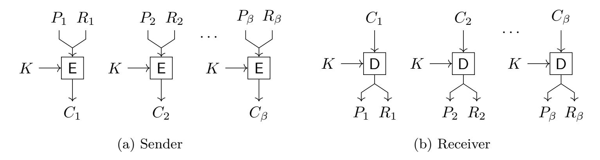
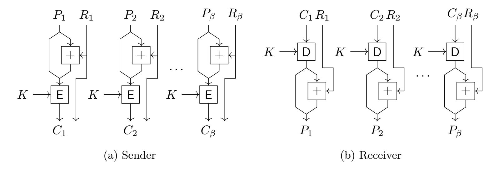
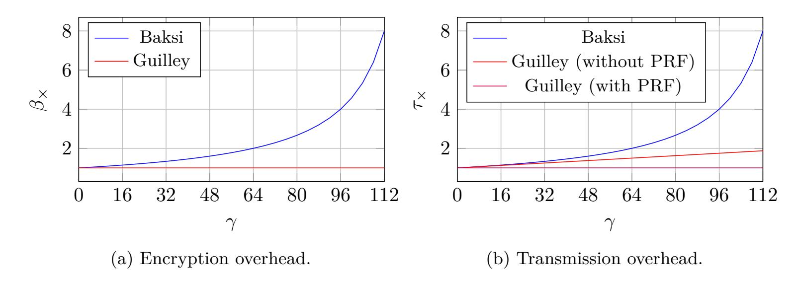
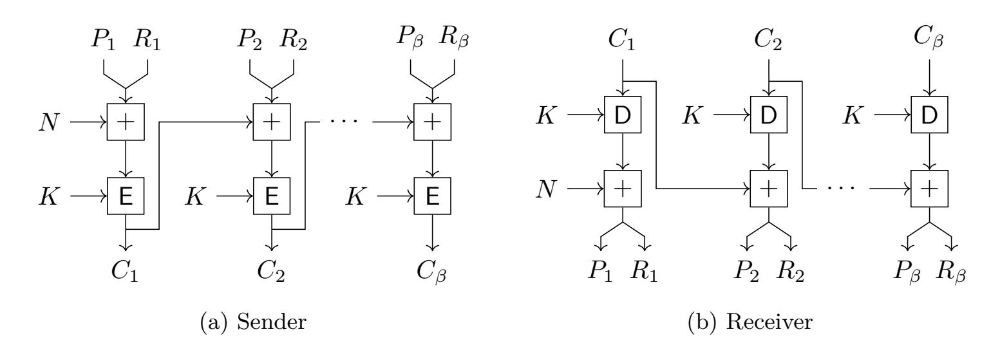
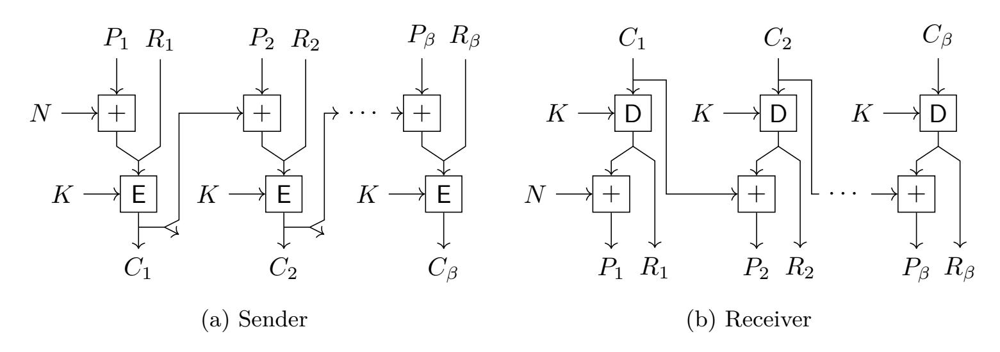
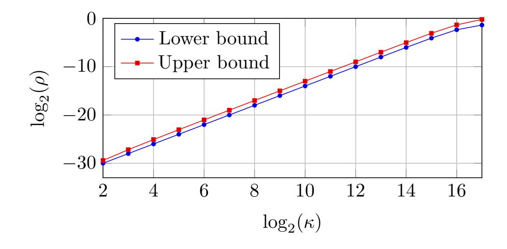

{0}------------------------------------------------

# **On The Deployment of Tweak-in-Plaintext Protection Against Differential Fault Analysis**

Jeroen Delvaux

Open Security Research (OSR), Room 29–31, Floor 8, Building 12B, Shenzhen Bay Tech-Eco Park, 518000 Shenzhen, China [jeroen.delvaux@osr-tech.com](mailto:jeroen.delvaux@osr-tech.com) ORCID 0000-0003-0684-8427

**Abstract.** In an article from HOST 2018, which appears in extended form in the Cryptology ePrint Archive, Baksi, Bhasin, Breier, Khairallah, and Peyrin proposed the *tweak-in-plaintext* method to protect *block ciphers* against a *differential fault analysis* (DFA). We argue that this method lacks existential motivation as neither of its two envisioned use cases, *i.e.*, the *electronic codebook* (ECB) and the *cipher block chaining* (CBC) modes of operation, is competitive. Furthermore, in a variant of the method where nonces are generated using a *linear-feedback shift register* (LFSR), several security problems have not been anticipated for. Finally, we analyze the security level against a brute-force DFA more rigorously than in the original work.

**Keywords:** differential fault analysis, cipher block chaining, provable security

# **1 Introduction**

*Differential fault analysis* (DFA) of block ciphers is highly efficient: for the *Advanced Encryption Standard* (AES) [\[6\]](#page-9-0) with a 128-bit key, Tunstall *et al.* [\[14\]](#page-10-0) showed that one random, single-byte fault at the input of the antepenultimate round reduces the attack complexity from 2 <sup>128</sup> to 2 8 . Fortunately, DFA is only applicable in scenarios where the attacker can encrypt a given plaintext twice such that both the correct and a faulty ciphertext are obtained. Hence, randomization of either the plaintext [\[10,](#page-9-1) [13,](#page-10-1) [2,](#page-9-2) [12\]](#page-10-2) or the key [\[8\]](#page-9-3) at protocol level is an effective countermeasure. We focus on the tweak-in-plaintext randomization method as proposed by Baksi *et al.* [\[2,](#page-9-2) [3\]](#page-9-4). Despite its name, the method applies to conventional, untweakable block ciphers; the term "tweak" could be replaced by "nonce", *i.e.*, an ideally non-repeating and usually random number is inserted into the plaintext.

### **1.1 Contribution**

According to Baksi *et al.* [\[2,](#page-9-2) [3\]](#page-9-4), tweak-in-plaintext protection is particularly useful for the *electronic codebook* (ECB) and the *cipher block chaining* (CBC) [\[9\]](#page-9-5) modes of operations, but we argue that neither use case is convincing. For ECB mode, tweak-in-plaintext protection is less Pareto optimal than an earlier proposal by Guilley *et al.* [\[10\]](#page-9-1) in generalized form, *i.e.*, the latter method is simultaneously more efficient and more secure. Likewise, by imposing a timing constraint on the release of ciphertext, CBC mode inherently resists DFA in a more efficient and more secure way. Equally unconvincing is a variant of tweak-in-plaintext protection that uses a *linear-feedback shift register* (LFSR) in order to avoid the *birthday problem* and detect faults: the birthday problem still applies, the security-critical reset and initialization behavior of the LFSR is unspecified, and *denial-of-service* (DoS) attacks

{1}------------------------------------------------

emerge. Finally, we analyze the security level against a brute-force DFA through a proven derivation rather than through a rough approximation.

### **1.2 Structure**

The remainder of this article is structured as follows. Section [2](#page-1-0) provides preliminaries on tweak-in-plaintext protection. Section [3](#page-2-0) analyzes the prospective use cases. Section [4](#page-6-0) analyzes the security level against a brute-force DFA.

# <span id="page-1-0"></span>**2 Preliminaries on Tweak-in-Plaintext Protection**

### **2.1 Notation**

Constants and variables are denoted by characters from the Greek and Latin alphabets respectively.

### **2.2 Attacker Model**

Consider the transfer of encrypted data between two parties: the sender, to which an attacker can gain physical access, and the receiver, which resides in a physically secure location. An example of this setting is a *wireless sensor network*. The attacker tries to recover the key by performing a DFA of the sender's encryption module, *i.e.*, the plaintext *P* is fixed and both the correct ciphertext *C* and a faulty ciphertext *C* <sup>0</sup> are collected. Attacks that do not require an unchanged plaintext *P* [\[7\]](#page-9-6) are out of scope. Building blocks besides the block cipher are untouchable. Most notably, an attacker is unable to control the generation of (pseudo)random numbers *R*, even by resetting the device. However, an unknown nonce *R* that is fed into a cipher can be XORed with a chosen error vector in the first round.

### <span id="page-1-1"></span>**2.3 Basic Scheme**

Baksi *et al.* [\[2,](#page-9-2) [3\]](#page-9-4) slow down DFA through plaintext randomization, *i.e.*, ciphertext pairs (C,C') that correspond to the same plaintext *P* become hard to collect. Instead of *C* ← E(*K, P*), where *P, C* ∈ {0*,* 1} *λ* , the sender computes and transfers *C* ← E(*K, P*||*R*), where *R* is selected uniformly at random from {0*,* 1} *<sup>γ</sup>* and where *P* ∈ {0*,* 1} *λ*−*γ* . The receiver computes *P*||*R* ← D(*K, C*), retains *P*, and discards *R*. The obtained security level against a brute-force DFA is expressed in terms of the *birthday problem*, *i.e.*, the attacker tries to find collisions of *R* for a fixed *P*. For AES, which has a block size *λ* = 128, the authors suggest choosing *γ* ∈ {4*,* 8*,* 12*,* 16*,* 20*,* 24*,* 28*,* 32}. The scheme is deemed suitable for the ECB and CBC modes of operation, in which the sender and receiver encrypt and decrypt respectively. Due to the high intake of random bits, nonces *R* may be generated through a *pseudorandom function* (PRF) or a *stream cipher* that expands a random seed. A mentioned advantage of the scheme is that *related-key attacks* are precluded.

### **2.4 Scheme Variations**

- To circumvent the birthday problem, the nonces *R* ∈ {0*,* 1} *γ* can be deterministically generated by a *γ*-bit, maximum-length *linear-feedback shift register* (LFSR), which cycles through 2 *<sup>γ</sup>* − 1 states. Hence, to obtain *δ* ciphertext pairs (*C, C*<sup>0</sup> ), the attacker has to perform 2 *<sup>γ</sup>* + *δ* − 1 queries.
- When an LFSR is used, the receiver has a means of fault detection. Values *R* ∈ {0*,* 1} *γ* that are recovered from consecutive ciphertext blocks should correspond to consecutive

{2}------------------------------------------------

states of the LFSR. This supposedly increases the difficulty of an attack: the communication channel between the sender and the receiver should be blocked in order to avoid counteractions such as a key update or device revocation.

• The scheme is mentioned to be applicable to the *parallelizible message authentication code* (PMAC) [\[5\]](#page-9-7) mode of operation, even though the sender and the receiver both use the encryption function E.

# <span id="page-2-0"></span>**3 Use Case Analysis**

### **3.1 Ill-Defined Fault Model**

The fault model of Baksi *et al.* [\[2,](#page-9-2) [3\]](#page-9-4) is ill-defined. The authors discuss known/chosenplaintext attacks in the context of traditional cryptanalysis, but it is unclear whether or not *P* is, besides repeatable, known/chosen during a DFA as well. Also, it is unclear whether or not the XOR capabilities of the first round of the data path extend to the *key schedule* and the last few rounds of the data path. For the key schedule in particular, the ability to XOR the key with a known constant would partially contradict the claim that the scheme precludes related-key attacks: assuming *P* is pubic, which is conventional for this type of attack, when an LFSR is used, there are only 2 *<sup>γ</sup>* possibilities to recover all nonces *R* regardless of the number of encryptions. The authors also do not comment on set-to-0 and set-to-1 faults, even though a collision is instantly generated by overwriting the state vector with a constant in identical rounds of two encryptions. Furthermore, the authors do not distinguish between *transient*, *persistent*, and *permanent faults*. To be conservative, we further only consider XORing of the nonce and an abstract transient fault injection method for the first round and the last few rounds of the data path respectively. Moreover, it is unclear whether multiple fault injections per encryption are allowed, *e.g.*, an injection both in the first round and in the last few rounds.

### **3.2 The LFSR**

#### <span id="page-2-1"></span>**3.2.1 Birthday Problem Still Applies**

In the first round, the attacker can XOR the LFSR-generated nonce *R* with an error vector that is selected uniformly at random from {0*,* 1} *γ* . Hence, after XORing, *R* is uniformly distributed on {0*,* 1} *γ* , and the scheme becomes equivalent to the original version in Section [2.3,](#page-1-1) *i.e.*, the birthday problem reemerges. The same holds even under a weaker, random-fault model. In one version of the attack, all cipher evaluations are faulted in the first round to randomize the nonce, and 50% of these evaluations is additionally faulted in the last few rounds. In another version of the attack, which avoids double fault injections, 50% of the evaluations is faulted in the last few rounds exclusively, whereas the remaining 50% is faulted in the first round exclusively.

#### **3.2.2 Reset Method**

Baksi *et al.* [\[3\]](#page-9-4) specified that an attacker is unable to control the values of the nonces *R* ∈ {0*,* 1} *<sup>γ</sup>* by resetting the device, but a method that fulfills this condition for LFSRgenerated nonces *R* is unspecified. Evidently, collisions can instantly be generated if the *γ*-bit state of the LFSR is reset to a predefined constant. Equally problematic, resetting the state to a random value would reintroduce the birthday problem, similar to Section [3.2.1.](#page-2-1) Furthermore, if resets are also performed legitimately, both of the above reset strategies are partially incompatible with receiver-side fault detection. The only conceivable solution is to store the state in reprogrammable, non-volatile memory such as Flash. Unless Flash is already used in other subsystems of the device, its inclusion results in a more expensive

{3}------------------------------------------------

manufacturing process: floating-gate transistors require additional masks and processing steps. In their proof-of-concept implementation on a *field-programmable gate array* (FPGA), the authors unconcernedly use and report the overhead for standard flip-flops, *i.e.*, volatile memory.

#### 3.2.3 Initialization Method

A related problem is that an initialization method for the  $\gamma$ -bit state of the LFSR is unspecified. If a predefined constant would be used as the initial value for all manufactured devices, then newly issued devices that have as yet performed zero of few encryptions are at risk. Given knowledge of the next two nonce values,  $R_i$ ,  $R_{i+1} \in \{0,1\}^{\gamma}$ , an attacker can XOR  $R_i$  with  $R_i \oplus R_{i+1}$  in the first round of the first encryption and fault the second encryption in the last few rounds to obtain a ciphertext pair (C, C'). To solve this problem, the initial value of the state should be selected uniformly at random from  $\{0,1\}^{\gamma} \setminus \{00\cdots 0\}$ . An alternative solution is the use of a pseudorandom permutation, which Baksi et al. [3] considered but deemed costly.

#### 3.2.4 Receiver-Side Fault Detection

An unacknowledged problem with receiver-side fault detection is that DoS attacks become easier to perform. If a device revocation or a key deletion policy is implemented, an attacker can disable a device without gaining physical access to that device: it suffices to alter a few bits in an otherwise legit wireless communication stream. Furthermore, it seems more elegant to realize receiver-side fault detection by using a block-cipher mode of operation that allows for *authenticated encryption* [1]. Although more expensive than unauthenticated encryption, if the nonce inherently counters DFA [7, 12], compensation is received by eliminating tweak-in-plaintext protection and its associated overhead. Finally, little protection against DFA is gained in exchange for a DoS exploit: blocking communication channels is not usually regarded as difficult. Even if the sender cannot be moved out-of-range, a metal mesh can be adopted as a Faraday cage, or communications can locally and directionally be jammed by transmitting noise on the given *carrier frequency*.

#### 3.3 ECB Mode

ECB mode with tweak-in-plaintext protection is depicted in Fig. 1. We assume that the nonces  $R_i$  are selected randomly, uniformly, and independently from  $\{0,1\}^{\gamma}$  for each evaluation, given that the birthday problem still applies to LFSR-generated nonces anyway as argued in Section 3.2.1. Under an identical assumption, we compare tweak-in-plaintext protection to an earlier proposal by Guilley et al. [10], which is presented here in a generalized form. As shown in Fig. 2, the sender computes  $C \leftarrow \mathsf{E}(K, P \oplus (0||R))$ , where  $P, C \in \{0,1\}^{\lambda}$  and  $R \in \{0,1\}^{\gamma}$ , and transmits both C and R. The receiver computes  $P \leftarrow \mathsf{D}(K, P) \oplus (0||R)$ . Originally [10],  $\gamma \triangleq \lambda$ , but we allow  $\gamma \in [0,\lambda]$ . A second difference with the original is the following timing constraint: R should not be released before C is computed. Otherwise, an attacker with XOR capabilities in the first round can instantly generate collisions. A third difference is that the nonces R may be generated through a PRF, where the random seed is transmitted together with the ciphertext C.

For any given nonce length  $\gamma \in [0, \lambda]$ , the methods of Baksi et al. [2, 3] and Guilley et al. [10] provide an identical security level against DFA. Hence, it suffices to compare the following two parameters for a given  $\gamma$  and a given message length  $\mu$ . First, the computational cost in terms of the required number of encryption blocks,  $\beta$ . The method of Guilley et al. [10] requires an additional XORing step, but we presume that the associated cost is small or negligible compared to the encryption. The second parameter is the communication overhead in terms of the number of transferred bits,  $\tau$ . The

{4}------------------------------------------------

<span id="page-4-0"></span>

Figure 1: ECB mode with tweak-in-plaintext protection [3].

<span id="page-4-1"></span>

Figure 2: ECB mode protected by the method of Guilley et al. [10], in generalized form.

latter parameter also reflects the cost of an encrypt-then-MAC [4] strategy, in case data authenticity is required in addition to data confidentiality. When unprotected,  $\beta = \lceil \mu/\lambda \rceil$  and  $\tau = \lambda \lceil \mu/\lambda \rceil$ . For the method of Baksi et al. [2, 3],  $\beta = \lceil \mu/(\lambda - \gamma) \rceil$  and  $\tau = \lambda \lceil \mu/(\lambda - \gamma) \rceil$ . For the method of Guilley et al. [10],  $\beta = \lceil \mu/\lambda \rceil$  and  $\tau = (\lambda + \gamma) \lceil \mu/\lambda \rceil$ . For long messages such as the 7 Gbit file encrypted by Baksi et al. [3], padding effects can be neglected. The multiplicative overhead is then given in Eq. (1) and Eq. (2) for the methods of Baksi et al. [2, 3] and Guilley et al. [10] respectively. If a PRF with a  $\sigma$ -bit seed is used for the latter method, then  $\tau = \sigma + \lambda \lceil \mu/\lambda \rceil$  and  $\tau_{\times} = 1$ .

<span id="page-4-2"></span>
$$\beta_{\times, \text{Baksi}} \triangleq \lim_{\mu \to \infty} \frac{\beta_{\text{Baksi}}}{\beta_{\text{default}}} = \frac{\lambda}{\lambda - \gamma}, \quad \tau_{\times, \text{Baksi}} \triangleq \lim_{\mu \to \infty} \frac{\tau_{\text{Baksi}}}{\tau_{\text{default}}} = \frac{\lambda}{\lambda - \gamma}.$$
 (1)

<span id="page-4-3"></span>
$$\beta_{\times,\text{Guilley}} \triangleq \lim_{\mu \to \infty} \frac{\beta_{\text{Guilley}}}{\beta_{\text{default}}} = 1, \quad \tau_{\times,\text{Guilley}} \triangleq \lim_{\mu \to \infty} \frac{\tau_{\text{Guilley}}}{\tau_{\text{default}}} = \frac{\lambda + \gamma}{\lambda}.$$
 (2)

Figure 3 shows that the method of Baksi et al. [2, 3] is inferior for medium-to-high security levels in particular. For the suggested maximum security level  $\gamma = 32$ , the method bears an overhead of  $\approx 33\%$  and is advertised to be "suitable for lightweight applications", but little resistance is offered in return for this cost: around  $2^{18}$  single-block encryptions may suffice for a DFA to succeed. As it is not unusual for an AES implementation to exceed 100M encryptions per second [11], the collection of those  $2^{18}$  ciphertexts might take less than 3 ms. Although the method of Guilley et al. [10] is more scalable, modes of operation that inherently resist DFA have the most favorable cost-to-benefit ratio, as discussed next.

### 3.4 CBC Mode

Specifics on how to apply tweak-in-plaintext protection to CBC mode [9] are missing, but arguably the most intuitive interpretation is shown in Fig. 4. If each nonce  $R_i$  is

{5}------------------------------------------------

<span id="page-5-0"></span>

Figure 3: Overhead to protect a cipher with block size *λ* = 128 in ECB mode.

selected randomly, uniformly, and independently from {0*,* 1} *γ* , then several XOR operations are superfluous and can be removed, as shown in Fig. [5.](#page-6-1) Under the assumption that the sender selects the *initialization vector* (IV) *N* uniformly at random from {0*,* 1} *λ* for each encryption and transmits it together with the ciphertext blocks *C<sup>i</sup>* , tweak-inplaintext protection becomes unnecessary. CBC mode inherently resists DFA given the following timing constraint: *N* should not be released before *C*<sup>1</sup> is computed, and for each *i* ∈ [1*, β* − 1], *C<sup>i</sup>* should not be released before *Ci*+1 is computed. Then, the attacker has no information about the block cipher input at the time of a fault injection, *i.e.*, collisions cannot be generated by XORing an unknown block cipher input with a known error vector. Lac *et al.* [\[13,](#page-10-1) Section 7.1] also pointed out the inherent resistance of CBC mode, although under the assumption of a weaker attacker who injects random faults and, therefore, without imposing timing constraints on the release of the IV and the ciphertext blocks *C<sup>i</sup>* . Another remark is that the first block in CBC mode is identically processed as in the method of Guilley *et al.* [\[10\]](#page-9-1), whereas the second and all subsequent blocks have the advantage of requiring neither additional randomness nor additional transmission costs.

<span id="page-5-1"></span>

Figure 4: CBC mode with tweak-in-plaintext protection.

Baksi *et al.* [\[3,](#page-9-4) Section IV.F] acknowledge the inherent DFA-resistance of stand-alone encryption modes but motivate tweak-in-plaintext encryption by the following perceived weakness: an attacker might be able to trick the sender into reusing the initialization vector *N*, depending on the chosen synchronization method between the sender and the receiver. This motivation is questionable. Any ability to induce a reuse of *N* is a security bug. It seems more favorable to patch any such bug than to keep the bug but add a fairly expensive protection scheme. Even worse, if the bug is not patched, an attacker might not even need DFA to succeed. An attacker who has a chosen-challenge advantage, who is given a pair (*C*1*, N*1) corresponding to an unknown *P*1, and who can force the occurrence

{6}------------------------------------------------

<span id="page-6-1"></span>

Figure 5: CBC mode with simplified tweak-in-plaintext protection.

of any given  $N_2$ , can check the correctness of a guess  $P_{1,g}$  by encrypting  $P_{1,g} \oplus N_1 \oplus N_2$  and comparing the result to  $C_1$ . Several modes other than CBC fail more catastrophically.

### 3.5 PMAC Mode

Specifics regarding the PMAC adaptation are missing, but we presume that in contrast to the ECB and CBC modes, nonces  $R \in \{0,1\}^{\gamma}$  should be transmitted together with the message blocks  $M \in \{0,1\}^{\lambda-\gamma}$  in order to make this work. Furthermore, and similarly to CBC mode, a blockwise randomization is inefficient for messages that span  $\gg \lambda$  blocks. The randomization can be limited to a single block in order to resist DFA, e.g., by prepending a single random number  $R \in \{0,1\}^{\gamma}$  to the message stream  $M \in \{0,1\}^{\mu}$  prior to computing the PMAC.

## <span id="page-6-0"></span>4 Rigorous Security Analysis

Baksi et al. [2, 3] analyze the average-case security level against a brute-force DFA through a rough approximation. With "rough", we mean that mathematical shortcuts such as the following one are taken: given a function  $Z = \mathbf{g}(Y)$  and given  $\mathbb{E}_Z[Z] \approx Y^2/\psi$ , it is implied that  $\mathbb{E}_Y[Y] \approx \sqrt{\psi Z}$ . This differs from a more rigorous approximation in which, for example, a small summand is neglected with respect to a much larger summand. We opt for provable security and derive an optimal query strategy and a lower and an upper bound on the attacker's success probability. These derivations are limited to a single-fault DFA, which is reasonable [14].

#### 4.1 Assumptions and Problem Formalization

Consider  $\kappa$  single-block encryptions where the plaintext P remains unchanged. We assume that faults in the last few rounds are injected with a success rate of 100%. We also assume that collisions of the nonce R are detectable with 100% certainty. For the method of Baksi  $et\ al.\ [2,\ 3]$ , the latter assumption is approximately correct if faults leave part of the ciphertext C unaffected. For the method of Guilley  $et\ al.\ [10]$ , the latter assumption is completely correct: R is transferred together with C.

The original birthday problem is formalized in Problem 1; an exact solution is given in Eq. (3). We, however, face a more difficult variant of the birthday problem, as formalized in Problem 2. The boolean variable  $F_i$  indicates whether or not a fault is injected.

<span id="page-6-2"></span>**Problem 1** (Birthday Original). For each index  $i \in [1, \kappa]$ , draw a sample  $R_i$  uniformly at random from  $\{0,1\}^{\gamma}$ . What is the probability  $\rho$  that at least one collision occurs, i.e., there exists a pair of indices (i,j) such that  $i \neq j$  and  $R_i = R_j$ ?

{7}------------------------------------------------

<span id="page-7-0"></span>
$$\rho = \begin{cases}
1 - \prod_{i=0}^{\kappa - 1} \frac{2^{\gamma} - i}{2^{\gamma}} = 1 - \frac{\kappa!}{2^{\gamma \kappa}} {2^{\gamma} \choose \kappa} & \text{, if } \kappa \leq 2^{\gamma} \\
1 & \text{, otherwise.} 
\end{cases}$$
(3)

<span id="page-7-1"></span>**Problem 2** (Birthday Variation). For each index  $i \in [1, \kappa]$ , choose a bin  $F_i \in \{0, 1\}$  and, subsequently, draw a sample  $R_i$  uniformly at random from  $\{0, 1\}^{\gamma}$ . Using an optimal, adaptive strategy for choosing each  $F_i$ , what is the probability  $\rho$  that at least one inter-bin collision occurs, i.e., there exists a pair of indices (i, j) such that  $F_i \neq F_j$  and  $R_i = R_j$ ?

### 4.2 Optimal Query Strategy

An optimal strategy for choosing each  $F_i$  in Problem 2 is given in Algorithm 1.

#### <span id="page-7-2"></span>Algorithm 1 Optimal query strategy.

```
1: \mathcal{R}_0 \leftarrow \emptyset
 2: \mathcal{R}_1 \leftarrow \emptyset
 3: b \leftarrow 0
 4: i \leftarrow 0
 5: while i < \kappa do
              i \leftarrow i + 1
 6:
              F_i \leftarrow b
 7:
              R_i \leftarrow \mathsf{Rand}()
 8:
             if R_i \notin \mathcal{R}_b then
 9:
                     \mathcal{R}_b \leftarrow \mathcal{R}_b \cup \{R_i\}
10:
                     b \leftarrow b \oplus 1
11:
              end if
12:
13: end while
```

Proof of Optimality. For any given  $i \in [1, \kappa]$ , let set  $\mathcal{R}_{0,i} \triangleq \{R_j \mid 1 \leq j < i, F_j = 0\}$  and let set  $\mathcal{R}_{1,i} \triangleq \{R_j \mid 1 \leq j < i, F_j = 1\}$ . If  $|\mathcal{R}_{0,i}| < |\mathcal{R}_{1,i}|$ , then it is optimal to choose  $F_i = 0$ . This follows from the fact that the probability of generating a collision is  $|\mathcal{R}_{1,i}|/2^{\gamma}$  and  $|\mathcal{R}_{0,i}|/2^{\gamma}$  for  $F_i = 0$  and  $F_i = 1$  respectively. Similarly, if  $|\mathcal{R}_{0,i}| > |\mathcal{R}_{1,i}|$ , then it is optimal to choose  $F_i = 1$ . If  $|\mathcal{R}_{0,i}| = |\mathcal{R}_{1,i}|$ , then there is no preference for choosing the value of  $F_i$ . Algorithm 1 consistently applies the above decision rules for every  $i \in [1, \kappa]$ .

Evidently,  $\rho = 0$  if  $\kappa = 1$ ,  $\rho = 1/2^{\gamma}$  if  $\kappa = 2$ , and  $\rho = 1 - (1 - 1/2^{\gamma})^2$  if  $\kappa = 3$ . Unfortunately, for larger values of  $\kappa$ , branches conditioned on the occurrence if intra-bin collisions emerge. Even though it might be feasible to derive an exact formula for  $\rho$  as a function of  $\kappa$  and  $\gamma$ , nested summation and/or product operators would likely prohibit evaluating such an expression for large numbers. Therefore, we derive a lower bound and an upper bound on  $\rho$  instead.

#### 4.3 Upper Bound

The original birthday problem as solved in Eq. (3) provides an upper bound on  $\rho$ . In terms of Problem 2, this could be understood as a 'lucky' attack in which the first collision among  $\kappa$  samples always happens to be an inter-bin collision and, therefore, not an intra-bin collision.

{8}------------------------------------------------

### **4.4 Lower Bound**

To derive a lower bound on *ρ* for 4 ≤ *κ* ≤ 2 *<sup>γ</sup>*+1, we consider the suboptimal query strategy in Algorithm [2.](#page-8-0) If we let *U* ∈ [1*,* d*κ/*2e] denote the number of unique values *R* in the bin *F* = 0, a lower bound is given in Eq. [\(4a\)](#page-8-1). The second factor inside the summation operator conveys that zero out of b*κ/*2c samples in the bin *F* = 1 collide with one of the *U* unique samples in the bin *F* = 0. An exact formula for the *probability mass function* of *U* could be derived using the generalized *inclusion–exclusion principle*, but is unnecessary as we only evaluate the probability P *U* = d*κ/*2e . This reduction in complexity is possible because the second factor inside the summation operator of Eq. [\(4a\)](#page-8-1) decreases monotonically with *U*, *i.e.*, we can aggregate all summands where *U* ∈ [1*,* d*κ/*2e − 1] as shown in Eq. [\(4b\)](#page-8-2). As shown in Eq. [\(4c\)](#page-8-3), P *U* = d*κ/*2e requires an identical computation as for the original birthday problem in Eq. [\(3\)](#page-7-0).

#### <span id="page-8-0"></span>**Algorithm 2** Suboptimal query strategy.

```
1: for i ← 1 to dκ/2e do
2: Fi ← 0
3: Ri ← Rand()
4: end for
5: for i ← dκ/2e + 1 to κ do
6: Fi ← 1
7: Ri ← Rand()
8: end for
```

$$\rho \ge 1 - \sum_{u=1}^{\lceil \kappa/2 \rceil} \mathbb{P}(U=u) \left(\frac{2^{\gamma} - u}{2^{\gamma}}\right)^{\lfloor \kappa/2 \rfloor}$$
(4a)

$$\geq 1 - \left(1 - \mathbb{P}\left(U = \lceil \kappa/2 \rceil\right)\right) \left(\frac{2^{\gamma} - 1}{2^{\gamma}}\right)^{\lfloor \kappa/2 \rfloor} - \mathbb{P}\left(U = \lceil \kappa/2 \rceil\right) \left(\frac{2^{\gamma} - \lceil \kappa/2 \rceil}{2^{\gamma}}\right)^{\lfloor \kappa/2 \rfloor} \tag{4b}$$

where 
$$\mathbb{P}(U = \lceil \kappa/2 \rceil) = \prod_{i=1}^{\lceil \kappa/2 \rceil - 1} \frac{2^{\gamma} - i}{2^{\gamma}}.$$
 (4c)

<span id="page-8-4"></span>In Fig. [6,](#page-8-4) we plot both bounds for *γ* = 32 using Maple. Although several approximations and bounds to facilitate the evaluation of the original birthday problem in Eq. [\(3\)](#page-7-0) and Eq. [\(4c\)](#page-8-3) exist, *e.g.*, based on a Taylor series for the exponential function exp(·) or natural logarithm log(·), Maple did not need them. Observe that both bounds are close to one another and thus tight.

<span id="page-8-3"></span><span id="page-8-2"></span><span id="page-8-1"></span>

Figure 6: Bounds for *γ* = 32.

{9}------------------------------------------------

# **References**

- <span id="page-9-8"></span>[1] CAESAR: Competition for authenticated encryption: Security, applicability, and robustness. <https://competitions.cr.yp.to/caesar.html>. Accessed: 2020-06-19.
- <span id="page-9-2"></span>[2] Anubhab Baksi, Shivam Bhasin, Jakub Breier, Mustafa Khairallah, and Thomas Peyrin. Protecting block ciphers against differential fault attacks without re-keying. In *Symposium on Hardware Oriented Security and Trust (HOST 2018)*, pages 191–194. IEEE, April 2018.
- <span id="page-9-4"></span>[3] Anubhab Baksi, Shivam Bhasin, Jakub Breier, Mustafa Khairallah, and Thomas Peyrin. Protecting block ciphers against differential fault attacks without rekeying (extended version). Cryptology ePrint Archive, Report 2018/085, Version 20180730:082757, July 2018. <https://eprint.iacr.org/2018/085>.
- <span id="page-9-9"></span>[4] Mihir Bellare and Chanathip Namprempre. Authenticated encryption: Relations among notions and analysis of the generic composition paradigm. In Tatsuaki Okamoto, editor, *Advances in Cryptology - ASIACRYPT 2000, 6th Conference on the Theory and Application of Cryptology and Information Security*, volume 1976 of *Lecture Notes in Computer Science*, pages 531–545. Springer, December 2000.
- <span id="page-9-7"></span>[5] John Black and Phillip Rogaway. A block-cipher mode of operation for parallelizable message authentication. In Lars R. Knudsen, editor, *Advances in Cryptology – EUROCRYPT 2002, International Conference on the Theory and Applications of Cryptographic Techniques*, volume 2332 of *Lecture Notes in Computer Science*, pages 384–397. Springer, April 2002.
- <span id="page-9-0"></span>[6] Joan Daemen and Vincent Rijmen. *The Design of Rijndael – The Advanced Encryption Standard (AES)*. Information Security and Cryptography. Springer, second edition, 2020.
- <span id="page-9-6"></span>[7] Christoph Dobraunig, Maria Eichlseder, Thomas Korak, Victor Lomné, and Florian Mendel. Statistical fault attacks on nonce-based authenticated encryption schemes. In Jung Hee Cheon and Tsuyoshi Takagi, editors, *Advances in Cryptology - ASIACRYPT 2016 - 22nd International Conference on the Theory and Application of Cryptology and Information Security*, volume 10031 of *Lecture Notes in Computer Science*, pages 369–395, December 2016.
- <span id="page-9-3"></span>[8] Christoph Dobraunig, François Koeune, Stefan Mangard, Florian Mendel, and François-Xavier Standaert. Towards fresh and hybrid re-keying schemes with beyond birthday security. In Naofumi Homma and Marcel Medwed, editors, *14th Conference on Smart Card Research and Advanced Applications (CARDIS 2015)*, volume 9514 of *Lecture Notes in Computer Science*, pages 225–241. Springer, November 2015.
- <span id="page-9-5"></span>[9] William F Ehrsam, Carl HW Meyer, John L Smith, and Walter L Tuchman. Message verification and transmission error detection by block chaining, February 1978. US Patent 4,074,066.
- <span id="page-9-1"></span>[10] Sylvain Guilley, Laurent Sauvage, Jean-Luc Danger, and Nidhal Selmane. Fault injection resilience. In Luca Breveglieri, Marc Joye, Israel Koren, David Naccache, and Ingrid Verbauwhede, editors, *Workshop on Fault Diagnosis and Tolerance in Cryptography (FDTC 2010)*, pages 51–65. IEEE, August 2010.
- <span id="page-9-10"></span>[11] Alireza Hodjat and Ingrid Verbauwhede. Area-throughput trade-offs for fully pipelined 30 to 70 Gbits/s AES processors. *IEEE Transactions on Computers*, 55(4):366–372, April 2006.

{10}------------------------------------------------

<span id="page-10-2"></span>[12] Mustafa Khairallah, Shivam Bhasin, and Anupam Chattopadhyay. On misuse of noncemisuse resistance : Adapting differential fault attacks on (few) CAESAR winners. In *8th International Workshop on Advances in Sensors and Interfaces (IWASI 2019)*, pages 189–193. IEEE, June 2019.

- <span id="page-10-1"></span>[13] Benjamin Lac, Anne Canteaut, Jacques Fournier, and Renaud Sirdey. DFA on LSdesigns with a practical implementation on SCREAM. In Sylvain Guilley, editor, *8th Workshop on Constructive Side-Channel Analysis and Secure Design (COSADE 2017)*, volume 10348 of *Lecture Notes in Computer Science*, pages 223–247. Springer, April 2017.
- <span id="page-10-0"></span>[14] Michael Tunstall, Debdeep Mukhopadhyay, and Subidh Ali. Differential fault analysis of the advanced encryption standard using a single fault. In Claudio Agostino Ardagna and Jianying Zhou, editors, *5th Workshop on Information Security Theory and Practice (WISTP 2011)*, volume 6633 of *Lecture Notes in Computer Science*, pages 224–233. Springer, June 2011.