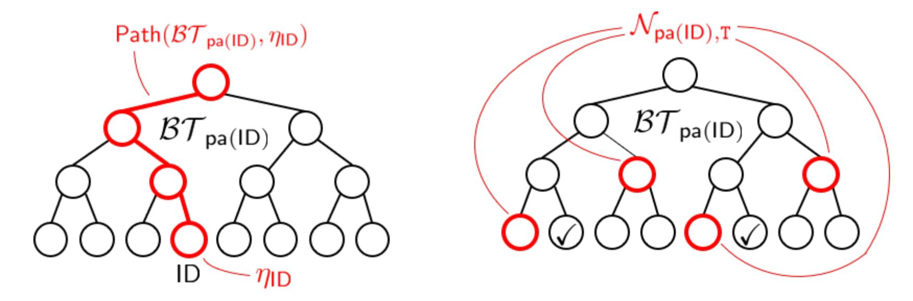
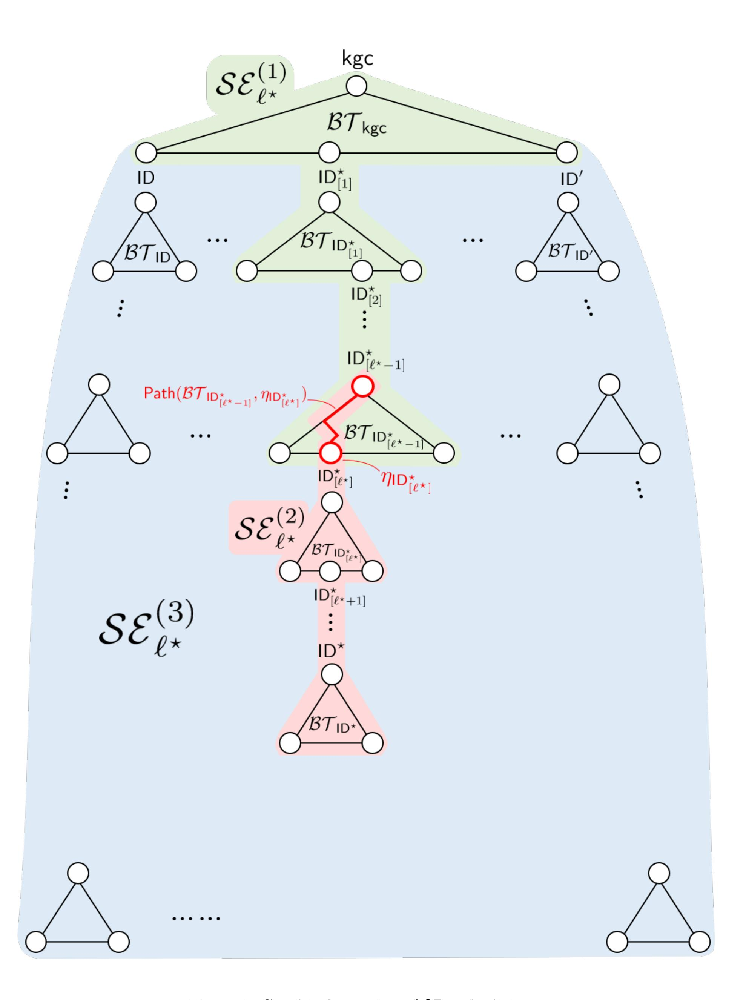
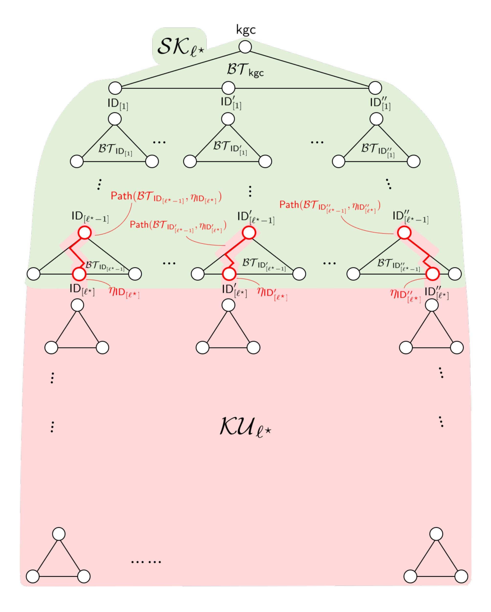

{0}------------------------------------------------

# Adaptively Secure Revocable Hierarchical IBE from *k*-linear Assumption*∗*

Keita Emura*†* Atsushi Takayasu*†* Yohei Watanabe*‡ §* June 1, 2021

#### **Abstract**

*Revocable identity-based encryption (RIBE)* is an extension of identity-based encryption (IBE) equipped with an efficient key revocation mechanism. *Revocable hierarchical IBE (RHIBE)* is its further extension with a key delegation functionality. Although there are various adaptively secure pairing-based RIBE schemes, all known hierarchical analogues satisfy only the *selective security*. Besides, the currently known most efficient adaptively secure RIBE and selectively secure RHIBE schemes rely on *non-standard assumptions* called the augmented DDH assumption and *q*-type assumptions, respectively. In this paper, we first triumph over the barrier by proposing a simple but effective design methodology of RHIBE schemes. More precisely, we provide a generic design framework of RHIBE based on an HIBE scheme with a few properties. Fortunately, several state-of-the-art pairing-based HIBE schemes have the properties. Furthermore, our construction preserves the sizes of master public keys, ciphertexts, and decryption keys, and complexity assumptions of the underlying HIBE scheme. Thus, we obtain the first RHIBE schemes with the *adaptive security* under the standard *k-linear assumption*. We prove the adaptive security by developing a new proof technique of RHIBE. Thanks to our compactness-preserving construction, our R(H)IBE schemes have similar efficiencies to existing most efficient ones.

*∗*This work is supported by JST CREST Grant Number JPMJCR14D6, JSPS KAKENHI Grant Number JP17K12697, JP18H05289, and MEXT Leading Initiative for Excellent Young Researchers.

*†*National Institute of Information and Communications Technology (NICT), Japan. *{*k-emura, takayasu*}*@nict.go.jp

*‡*The University of Electro-Communications, Japan. watanabe@uec.ac.jp

*§*National Institute of Advanced Industrial Science and Technology (AIST), Japan.

{1}------------------------------------------------

# **Contents**

| 1 |     | Introduction 1                                         |    |  |  |  |  |
|---|-----|-----------------------------------------------------------|----|--|--|--|--|
|   | 1.1 | Background                                             | 1  |  |  |  |  |
|   | 1.2 | Our Contributions                                      | 2  |  |  |  |  |
|   | 1.3 | Related Work                                           | 4  |  |  |  |  |
|   | 1.4 | Organization                                           | 5  |  |  |  |  |
| 2 |     | Technical Overview                                        | 5  |  |  |  |  |
|   | 2.1 | Preliminaries                                          | 5  |  |  |  |  |
|   | 2.2 | Selectively Secure RHIBE Scheme                        | 8  |  |  |  |  |
|   | 2.3 | Adaptively Secure RIBE Scheme                          | 12 |  |  |  |  |
|   | 2.4 | Proposed Approach for Adaptively Secure RHIBE Scheme   | 12 |  |  |  |  |
| 3 |     | RHIBE                                                     | 16 |  |  |  |  |
| 4 |     | Pairing-based HIBE                                        | 19 |  |  |  |  |
|   | 4.1 | Plain HIBE                                             | 19 |  |  |  |  |
|   | 4.2 | Properties Extracted from Existing HIBE Constructions  | 20 |  |  |  |  |
|   | 4.3 | Concrete Examples                                      | 23 |  |  |  |  |
| 5 |     | Construction                                              | 26 |  |  |  |  |
| 6 |     | Security                                                  | 29 |  |  |  |  |
| 7 |     | Conclusion                                                | 34 |  |  |  |  |
| A |     | Graphical Overview of the Node Division                   | 40 |  |  |  |  |
|   | A.1 | The Seo-Emura Node Division                            | 40 |  |  |  |  |
|   | A.2 | Our Node Division                                      | 40 |  |  |  |  |

{2}------------------------------------------------

# **1 Introduction**

## **1.1 Background**

*Identity-based encryption* (IBE), which was proposed by Boneh and Franklin [[BF01\]](#page-36-0), is an advanced form of public-key encryption (PKE), where an arbitrary string (e.g., usernames or e-mail addresses) can be used as users' public keys. Thus, unlike traditional PKE, IBE systems do not require a public key infrastructure (PKI) to create certificates for each public key. A well-known extension of IBE is *hierarchical IBE* (HIBE), which has key delegation functionality that allows the decentralization of the power of key creations from the key generation center (KGC) to users. Specifically, users in HIBE form a tree structure, and each user can produce their children's secret keys. As a result, this functionality realizes efficient management of a large number of users. Departing from other constructions [\[ABB10a](#page-35-1), [ABB10b](#page-35-2), [CHKP12](#page-37-0), [DG17](#page-37-1), [Zha12\]](#page-41-3), pairing-based schemes are only known constructions for achieving *adaptive security* in the standard model, e.g., [[BKP14](#page-36-1), [CG17,](#page-36-2) [CW14](#page-37-2), [GCTC16](#page-37-3), [LP19,](#page-38-0) [LP20,](#page-38-1) [Lew12,](#page-38-2) [LW10,](#page-39-0) [LW11](#page-39-1), [Wat09\]](#page-40-0). Furthermore, several adaptively secure pairing-based schemes have compact ciphertexts [\[CG17,](#page-36-2) [CW14](#page-37-2), [LW10](#page-39-0), [OT15,](#page-39-2) [RS14\]](#page-39-3) or compact master public keys [[GCTC16,](#page-37-3) [Lew12,](#page-38-2) [LW11](#page-39-1)]. Thus, in this paper, we primarily focus on adaptively secure pairing-based schemes in the standard model.

The other IBE variant is *revocable IBE (RIBE)* [[BGK08\]](#page-36-3), which enables efficient revocation of identities as required (e.g., if laptops are corrupted or leak their secret keys). There are long-term secret and short-term decryption keys per identity in RIBE, and the long-term key is responsible for updating the decryption keys. Specifically, the decryption key can be updated using the secret key and key update information, which is broadcast by the KGC; however, updating the decryption key fails if the KGC revokes the user when generating the key update. Therefore, RIBE realizes the revocation mechanism. Here, the secret key is only used to generate the decryption key; thus, it can be stored on a more powerful and secure device. However, since decryption keys are used frequently, they tend to be stored on more vulnerable devices. Therefore, it is desirable to ensure security when decryption keys are leaked. Based on this situation, Seo and Emura [[SE13b\]](#page-39-4) introduced a new security notion called the decryption key exposure resistance (DKER) which has become the standard security notion for RIBE. In fact, RIBE with the DKER ensures that non-exposed decryption keys can still be used without compromising security even if a number of decryption keys (except that of the target user and the target time period) are exposed. The revocation mechanism can also be considered in the hierarchical setting [[SE13a](#page-39-5)], which is referred to as *revocable HIBE (RHIBE)*. Each RHIBE user is responsible for the key delegation functionality and revocation of their children users. Thus, each RHIBE user also manages a binary tree. An RHIBE secret key has an additional component for key delegation (hereafter, delegation key). As with RIBE, in addition to updating keys, delegation keys can be stored on a more powerful and secure device because key delegations are not performed frequently. In the RHIBE context, there are two types of DKER notions from a historical perspective. The primary (or weaker) DKER notion was proposed by Seo and Emura [[SE15b](#page-40-1)], and then Katsumata et al. [[KMT19](#page-38-3)] introduced a stronger notion. Generally, both notions give the same security guarantee as the DKER in the RIBE setting, i.e., non-exposed decryption keys can still be used without compromising security even if a number of decryption keys are exposed except that of the target user and the target time period. The difference between the weaker and the stronger DKER is which decryption keys are exposed. In the stronger notion, a number of decryption keys are exposed except that of the target user and the target time period, while those of the target-user's ancestor and the target time period are not exposed in the weaker notion. The lattice-based RHIBE [[WZH](#page-41-4)+19] considered the stronger DKER as the standard security notion.

{3}------------------------------------------------

To date, a number of adaptively secure pairing-based RIBE schemes with the DKER have been proposed [\[GW19,](#page-37-4) [ISW17](#page-38-4), [LLP17](#page-38-5), [SE13b,](#page-39-4) [SZSM17,](#page-40-2) [WLXZ14,](#page-41-5) [WES17\]](#page-40-3). Recently, several generic constructions of RIBE from two-level HIBE [[Lee20](#page-38-6), [ML19a,](#page-39-6) [ML19b](#page-39-7)] have also been proposed, although they require large ciphertexts whose sizes depend on a length of identities. Among these schemes, the scheme proposed by Watanabe et al. [[WES17\]](#page-40-3) and its variant [\[GW19\]](#page-37-4) are the most efficient because they satisfy prime-order bilinear groups, compact master public keys, and compact ciphertexts simultaneously. However, the security of these schemes relies on the *augmented* DDH assumption, which is a non-standard variant of the traditional DDH assumption. For RHIBE, the situation is even worse. Although several pairing-based schemes with the weaker (or primary) DKER [\[ESY16,](#page-37-5) [LP18](#page-38-7), [RLPL15](#page-39-8), [SE15b\]](#page-40-1) [1](#page-3-1) have been proposed, they only satisfy selective security. In addition, the security of all schemes (except [\[ESY16\]](#page-37-5)) is based on *q*-type assumptions, while the scheme [[ESY16\]](#page-37-5) is less efficient than other schemes [[LP18,](#page-38-7) [RLPL15](#page-39-8), [SE15b](#page-40-1)]. Unfortunately unlike the RIBE case, there is no generic construction for RHIBE schemes. Therefore, there are no adaptively secure RHIBE schemes, even if we ignore the stronger DKER and permit non-standard assumptions.

#### **1.2 Our Contributions**

In this paper, we demonstrate significant progress relative to constructing adaptively secure pairingbased RHIBE schemes with the stronger DKER. We extract the core essence of existing schemes and propose a generic construction for an RHIBE scheme from an HIBE scheme with mild requirements that are satisfied by several pairing-based HIBE schemes [[BKP14,](#page-36-1) [CG17,](#page-36-2) [CW14](#page-37-2), [GCTC16](#page-37-3), [LP19,](#page-38-0) [LP20](#page-38-1), [LW10](#page-39-0), [RS14](#page-39-3)] including state-of-the-art schemes [[CG17,](#page-36-2) [CW14,](#page-37-2) [GCTC16\]](#page-37-3). The primary contributions of the proposed generic construction are summarized as follows.

- *•* We develop a new proof technique such that the construction is *adaptiveness-preserving*, i.e., the proposed scheme achieves adaptive security if the underlying HIBE scheme satisfies the same security level.
- *•* Our construction is *compactness-preserving*, i.e., the proposed RHIBE scheme have the same size master public keys, ciphertexts, and decryption keys as the underlying HIBE scheme. Note that instantiations of the proposed scheme suffer from larger delegation keys than those of existing constructions. Informally, each delegation key comprises several sub-delegation keys, which, in previous RHIBE schemes, comprise only *O*(1) group elements. In contrast, that of our instantiations is a secret key of the underlying HIBE scheme; thus, the size of the latter depends on the level of the given user. However, we can store delegation (and updating) keys on a powerful device; thus, we believe that the larger secret key-size is not a significant issue.

Therefore, we obtain the first adaptively secure RHIBE schemes with the stronger DKER from the standard *k*-linear assumption in the standard model based on [[CG17](#page-36-2), [CW14](#page-37-2), [GCTC16](#page-37-3)]. The definition of RHIBE is complicated; thus, we provide an overview of our results in Section [2](#page-6-1).

Table [1](#page-4-0) compares the proposed RHIBE schemes with previous ones.[2](#page-3-2) Here, we use [\[CG17](#page-36-2), [CW14\]](#page-37-2) and [\[GCTC16](#page-37-3)] as the underlying HIBE schemes, and we instantiate the proposed RHIBE schemes with compact ciphertexts and compact master public keys. Although we omit the details, the secret key of the proposed schemes based on [\[CG17,](#page-36-2) [CW14\]](#page-37-2) (resp. [\[GCTC16](#page-37-3)]) are larger than those of

1To be precise, these works are prior to Katsumata et al. [[KMT19](#page-38-3)]; thus, they do not consider the stronger DKER.

2Note that we consider insider security as the minimum requirement. The definition and necessity of insider security is discussed in Section [1.3.](#page-5-0)

{4}------------------------------------------------

other schemes by factors *O*(*L − ℓ*) (resp. *O*(*ℓ*)). The proposed schemes based on [\[CG17,](#page-36-2) [CW14\]](#page-37-2) with compact ciphertexts have the same asymptotic efficiency as Seo and Emura's scheme [[SE15b\]](#page-40-1) in terms of MPK, ctID*,*T, and dkID*,*T-size. Similarly, the proposed scheme based on [[GCTC16\]](#page-37-3) with compact master public keys has the same asymptotic efficiency as the scheme proposed by Ryu et al. [[RLPL15\]](#page-39-8) and that proposed by Lee-Park [\[LP18](#page-38-7)]. Note that all of these schemes have better asymptotic efficiencies than the scheme proposed by Emura et al. [[ESY16](#page-37-5)]. As we have claimed, only the proposed schemes achieve adaptive security. To compare DKER, we evaluate whether the existing schemes achieve the stronger DKER because they only have security proofs for the weaker DKER. Note that Seo and Emura's scheme [\[SE15b\]](#page-40-1) can be modified to achieve the stronger DKER under the stronger assumption.[3](#page-4-1) However, we cannot find analogous modifications for the schemes proposed by Ryu et al. [[RLPL15\]](#page-39-8), Lee-Park [[LP18](#page-38-7)], and Emura et al. [[ESY16\]](#page-37-5). We also note that there are concrete attacks against these schemes under the stronger DKER model, and that this fact does not imply that the security proofs of these works [[ESY16](#page-37-5), [LP18](#page-38-7), [RLPL15\]](#page-39-8) contain bugs. While all existing schemes (except that proposed by Emura et al. [[ESY16](#page-37-5)]) are based on *q*-type assumptions, the proposed schemes are based on the standard *k*-linear assumption.

| Scheme                 | MPK  | ctID,T | dkID,T | adaptive? | DKER   | Assumption |
|------------------------|------|--------|--------|-----------|--------|------------|
| SE15[SE15b]            | O(L) | O(1)   | O(1)   | selective | strong | q-type     |
| RLPL15 [RLPL15]        | O(1) | O(ℓ)   | O(ℓ)   | selective | weak   | q-type     |
| LP18 [LP18]            | O(1) | O(ℓ)   | O(ℓ)   | selective | weak   | q-type     |
| ESY16 [ESY16]          | O(L) | O(ℓ)   | O(ℓ)   | selective | weak   | DBDH       |
| Ours + [CG17, CW14] | O(L) | O(1)   | O(1)   | adaptive  | strong | k-Lin      |
| Ours + [GCTC16]        | O(1) | O(ℓ)   | O(ℓ)   | adaptive  | strong | k-Lin      |

Table 1: Comparison of pairing-based RHIBE schemes

Note that the benefit of our results is not limited to RHIBE. Table [2](#page-5-1) compares the proposed RIBE scheme to the scheme proposed by Watanabe et al. [\[WES17\]](#page-40-3) and its variant [[GW19](#page-37-4)]. These existing schemes are modifications of Jutla and Roy's IBE scheme [[JR17\]](#page-38-8), we compare them to the proposed scheme based on Chen-Gong's HIBE scheme [[CG17](#page-36-2)], which is an extension of the scheme proposed by Jutla-Roy. Specifically, our instantiation is based on the SXDH assumption, which is a specific case of the *k*-linear assumption for *k* = 1, while the existing schemes rely on a non-standard augmented DDH assumption. In addition, the reduction loss of the proposed scheme is better than that of the other schemes. Although our instantiation has slightly larger secret keys and key updates, the gap is not significant. In contrast, the proposed scheme has shorter master public keys, ciphertexts, and decryption keys.

– *|*MPK*|, |*ctID*,*T*|*, and *|*dkID*,*T*|* denote the sizes of the master public key, ciphertext, and decryption key of user ID at time T, respectively, in terms of the number of group elements.

– *L* and *ℓ* denote the maximum hierarchical size and level of ID, respectively.

– *q*-type, DBDH, *k*-Lin stand for a *q*-type assumption, the decisional bilinear Diffie-Hellman assumption, and the *k*-linear assumption, respectively.

3Although the security of Seo and Emura's original scheme is based on the *q*-weak bilinear Diffie-Hellman inversion assumption, that of the modified scheme is based on the *q*-bilinear Diffie-Hellman exponent assumption [\[Sha07](#page-40-4)].

{5}------------------------------------------------

Table 2: Efficiency comparison of adaptive-identity secure RIBE schemes with the DKER in prime-order bilinear groups, compact master public keys, and compact ciphertexts

| Scheme        | MPK  ( G1 ,  G2 ,  GT  ) | ctID,T  ( G1 ,  GT  ,  Zp ) | skID,θ  ( G2 ,  Zp ) |  |
|---------------|--------------------------------|-----------------------------------|-------------------------|--|
| WES17 [WES17] | (6, 10, 1)                     | (4, 1, 1)                         | (5, 0)                  |  |
| GW19 [GW19]   | (6, 10, 1)                     | (4, 1, 1)                         | (5, 1)                  |  |
| Ours + [CG17] | (5, 7, 1)                      | (3, 1, 1)                         | (7, 0)                  |  |

| Scheme        | kuT,θ   G2 | dkID,T  ( G2 ,  Zp ) | reduction loss | assumption  |
|---------------|---------------|-------------------------|-------------------|-------------|
| WES17 [WES17] | 3             | (6, 0)                  | O(Q2  T  )     | ADDH1, DDH2 |
| GW19 [GW19]   | 3             | (6, 1)                  | O(Q2  T  )     | ADDH1, DDH2 |
| Ours + [CG17] | 7             | (5, 0)                  | O(Q(Q +  T  ))    | SXDH        |

– All schemes use asymmetric bilinear maps *e* : G1 *×* G2 *→* G*T* . Groups G1*,* G2, and G*T* have prime order *p*.

#### **1.3 Related Work**

The revocation problem of IBE was first considered by Boneh and Franklin [[BF01\]](#page-36-0) with naive and non-scalable solutions, where the size of the key update generated by the KGC is linear in the number of users. Boldyreva et al. [[BGK08](#page-36-3)] utilized a subset cover framework called the complete subtree method [[NNL01\]](#page-39-9) and proposed the first RIBE scheme with scalable revocation by reducing the size of the key update logarithmic in the number of users. Libert and Vergnaud [\[LV09\]](#page-38-9) constructed the first adaptively secure RIBE scheme. In addition, Seo and Emura [[SE13b](#page-39-4)] defined the notion of the DKER, and then proposed the first adaptively secure scheme with the DKER. Note that the above schemes are pairing-based, and various pairing-based improvements [[GW19](#page-37-4), [ISW17,](#page-38-4) [LLP17](#page-38-5), [SZSM17](#page-40-2), [WLXZ14](#page-41-5), [WES17](#page-40-3)] have been proposed. The RIBE scheme is also constructed under the LWE assumption [\[CLL](#page-37-6)+12, [Tak21a,](#page-40-5) [TW17](#page-40-6), [TW21\]](#page-40-7), code-based assumption [[CCKS18\]](#page-36-4), and CDH assumption without pairing or the factoring assumption [\[HLCL18\]](#page-37-7) although these schemes do not satisfy the DKER. However, Katsumata et al. [\[KMT19\]](#page-38-3) proposed a generic construction of RIBE with the DKER from RIBE without the DKER and 2-level HIBE. Since IBE implies selectively secure HIBE [[DG17\]](#page-37-1), RIBE without the DKER implies selectively secure RIBE with the DKER. In addition, by extending the concept

– *|*MPK*|, |*ctID*,*T*|*, and *|*dkID*,*T*|* denote the sizes of the master public key, ciphertext, and decryption key of user ID at time T, respectively, in terms of the number of group elements and Z*p* elements.

– *|*skID*,θ|* and *|*kuT*,θ|* denote the sizes of the secret key of user ID and key update of time period T associated with a single node *θ*, respectively, in terms of the number of G2 elements and Z*p* elements.

– *Q* and *|T |* denote the number of secret key generation queries and the size of the time period space, respectively.

– ADDH1, DDH2, and SXDH represent the augmented decisional Diffie-Hellman assumption in G1, decisional Diffie-Hellman assumption in G2, and symmetric external Diffie-Hellman assumption, respectively.

{6}------------------------------------------------

presented by Katsumata et al., several generic constructions of RIBE with the DKER have been proposed. For example, Ma and Lin [[ML19a,](#page-39-6) [ML19b](#page-39-7)] proposed a generic construction of RIBE with the DKER from 2-level HIBE, and Lee [[Lee20](#page-38-6)] proposed a generic construction of RIBE with the DKER from 2-level HIBE and identity-based revocation. However, these schemes suffer from large ciphertexts.

The concept of RHIBE was first discussed by Seo and Emura [\[SE13a](#page-39-5)]; however, their definition was too weak for practical application since it does not satisfy collusion resistance that is the minimum security requirement of HIBE. Thus, Seo and Emura [\[SE15b\]](#page-40-1) redefined the notion with the DKER and insider security that ensures collusion resistance. Then, several selectively secure pairing-based RHIBE schemes were proposed [[ESY16,](#page-37-5) [LP18,](#page-38-7) [RLPL15](#page-39-8)]. Note that several papers have claimed to construct adaptively secure RHIBE schemes [[Lee16](#page-38-10), [SE15a,](#page-40-8) [WLJW16,](#page-40-9) [XWW](#page-41-6)+16, [XWWT18](#page-41-7)]; however, their security proofs are incorrect or ignore insider security. Katsumata et al. [[KMT19\]](#page-38-3) defined the most strict and rigorous definition of RHIBE and introduced a stronger definition for the DKER. In addition, Katsumata et al. proposed a selectively secure RHIBE scheme from the LWE assumption, and Wang et al. [\[WZH](#page-41-4)+19] proposed a more efficient selectively secure scheme in the standard model and adaptively secure scheme in the random oracle model under the same assumption.

#### **1.4 Organization**

The remainder of this paper is organized as follows. Section [2](#page-6-1) gives an overview of the proposed construction. In Section [3](#page-17-0), we provide a definition of RHIBE, and in Section [4](#page-20-0), we introduce the additional properties of RHIBE, which are used to construct RHIBE. Section [5](#page-27-0) describes the construction of RHIBE, and, in Section [6,](#page-30-0) we prove the adaptive security of the scheme.

# **2 Technical Overview**

In this section, we provide a technical overview of our result. We first present an overview of the definition of RHIBE and the complete subtree (CS) method [[NNL01\]](#page-39-9) Section [2.1,](#page-6-2) which is a popular technique to efficiently achieve revocation functionality. We then present the selectively secure RHIBE scheme with the weaker DKER of Seo-Emura (SE) [[SE15b](#page-40-1)] and an overview of its security proof in Section [2.2.](#page-9-0) Then, we provide a proof of the adaptive security of Watanabe et al.'s (WES) RIBE with the DKER and discuss the difficulties related to combining them to construct adaptively secure RHIBE in Section [2.3](#page-13-0). [4](#page-6-3) In Section [2.4](#page-13-1), we present the proposed approach to construct adaptively secure RHIBE with the weaker DKER. We then discuss how the scheme is modified to achieve the stronger DKER.

#### **2.1 Preliminaries**

**Notations.** Let N be the set of all natural numbers. For non-negative integers *a, b ∈* N with *a ≤ b*, we define [*a, b*] := *{a, a* + 1*, . . . , b}* and [*a*] := [1*, a*]. In addition, as a special case, [*a, b*] = *∅* for *a > b*. Let lowercase and uppercase bold letters **a** and **A** denote a column vector and a matrix, respectively, where **a** *⊤* and **A***⊤* denote their transposes. For a finite set *S*, let *x ←R S* denote sampling *x* from *S* uniformly at random. For two algorithms A(*·*) and B(*·*), let A(*·*) *≈* B(*·*) denote that their outputs follow the same distribution.

4Recall that the difference between the weaker and the stronger DKER only appears in the hierarchical setting. Thus, the approach proposed by Watanabe et al. does not provide a pathway to achieve the stronger DKER.

{7}------------------------------------------------

Let  $\mathcal{T}$  denote a time period space. According to convention, the size of  $\mathcal{T}$  is polynomially bounded by the security parameter  $\lambda$ . Let  $\ell$ -dimensional vector  $\mathrm{ID} \coloneqq (\mathrm{id}_1,\ldots,\mathrm{id}_\ell)$  denote an identity at level- $\ell$ , and let  $\mathcal{I}$  be an identity space of level-1, which is determined by only the security parameter  $\lambda$ ; therefore, an identity space at level- $\ell$  is  $\mathcal{I}^\ell$ . Here, we use  $|\mathrm{ID}| \coloneqq \ell$  to denote the hierarchical level of the identity. For convenience, we consider kgc as a "root" user and let  $\mathcal{I}^0 \coloneqq \{\mathsf{kgc}\}$ . In addition,  $\mathcal{I}_{\mathrm{ID}} \subset \mathcal{I}^{|\mathrm{ID}|+1}$  denotes a set of level- $(|\mathrm{ID}|+1)$  identities whose direct ancestor is  $\mathrm{ID}$ . In other words,  $\mathcal{I}_{\mathrm{ID}} \coloneqq \{\mathrm{ID}' \in \mathcal{I}^{|\mathrm{ID}|+1} \mid \forall \mathrm{id}_{|\mathrm{ID}|+1} \in \mathcal{I}, \mathrm{ID}' = (\mathrm{ID}, \mathrm{id}_{|\mathrm{ID}|+1})\}$ . We also define several notations for the prefix of an identity  $\mathrm{ID} = (\mathrm{id}_1, \cdots, \mathrm{id}_{|\mathrm{ID}|})$  in the following. For a non-negative integer  $\ell \leq |\mathrm{ID}|$ , an  $\ell$ -dimensional prefix of  $\mathrm{ID}$  is denoted  $\mathrm{ID}_{[\ell]} \coloneqq (\mathrm{id}_1, \ldots, \mathrm{id}_\ell)$ . Here, a direct ancestor of  $\mathrm{ID}$  is denoted  $\mathrm{pa}(\mathrm{ID}) \coloneqq \mathrm{ID}_{[|\mathrm{ID}|-1]}$ , and  $\mathrm{ID}_{[0]} \coloneqq \mathrm{kgc}$ . In addition,  $\mathrm{prefix}^+(\mathrm{ID}) \coloneqq \{\mathrm{ID}_{[1]}, \mathrm{ID}_{[2]}, \ldots, \mathrm{ID}_{[\mathrm{ID}|-1}(=\mathrm{pa}(\mathrm{ID})), \mathrm{ID}\}$  denotes a set of all prefixes of  $\mathrm{ID}$  and itself. We summarize the notations of time periods and hierarchical identities in Table 3.

Table 3: Notation of time periods and hierarchical identities

| Т                           | time period                                                                                 |
|-----------------------------|---------------------------------------------------------------------------------------------|
| ${\mathcal T}$              | time period space                                                                           |
| kgc                         | special symbol for key generation center                                                    |
| ID                          | identity                                                                                    |
| $\mathtt{id}_i$             | $i\text{-th element of an identity } \mathtt{ID} = (\mathtt{id}_1,\ldots,\mathtt{id}_\ell)$ |
| ${\cal I}$                  | identity space of id                                                                        |
| $\mathcal{I}^\ell$          | identity space at level- $\ell$                                                             |
| $\mathcal{I}^0$             | special identity space at level-0, i.e., {kgc}                                              |
| $ \mathtt{ID} $             | hierarchical level of an identity $\mathtt{ID} = (\mathtt{id}_1, \ldots, \mathtt{id}_\ell)$ |
| $\mathcal{I}_{\texttt{ID}}$ | set of level-( $ ID  + 1$ ) identities whose direct ancestor is ID                          |
| $\mathtt{ID}_{[\ell]}$      |                                                                                             |
| $pa(\mathtt{ID})$           | direct ancestor of ID, i.e., $ID_{[ ID -1]}$                                                |
| $prefix^+(\mathtt{ID})$     | set of all prefixes of ID and itself, i.e., $\{ID_{[1]}, \ldots, ID_{[ ID -1}, ID\}$        |

Overview of RHIBE. Here, we provide an overview of RHIBE, which appears to be complicated for beginners. Note that this complexity stems from the existence of three types of keys, i.e., secret keys  $\mathsf{sk}_{\mathtt{ID}}$ , key updates  $\mathsf{ku}_{\mathtt{ID},\mathtt{T}}$ , and decryption keys  $\mathsf{dk}_{\mathtt{ID},\mathtt{T}}$ . In addition, a secret key contains a delegation key  $\mathsf{delk}_{\mathtt{ID}} \in \mathsf{sk}_{\mathtt{ID}}$  that is responsible for key delegation in our description, although a delegation key  $\mathsf{delk}_{\mathtt{ID}}$  does not explicitly appear in the syntax. Furthermore, a delegation key  $\mathsf{delk}_{\mathtt{ID}}$  is updated during system execution.

At the time of RHIBE system launch, the KGC creates a master public key MPK and KGC's secret key  $\mathsf{sk_{kgc}}$ . The ciphertext  $\mathsf{ct_{ID,T}}$  depends on the receiver's identity  $\mathsf{ID} \in \mathcal{I}^{\leq L}$  and time period  $\mathsf{T} \in \mathcal{T}$ , where L denotes the maximum level of the hierarchy. Here, the configuration of level-1 users  $\mathsf{ID} \in \mathcal{I}$  is the same as that of RIBE. All level-1 users  $\mathsf{ID}$  are given their secret key  $\mathsf{sk_{ID}}$  by the KGC, and the secret keys  $\mathsf{sk_{ID}}$  are insufficient to decrypt ciphertexts  $\mathsf{ct_{ID,T}}$ . The KGC manages a revocation list  $\mathsf{RL_{kgc,T}} \subset \mathcal{I}$  of level-1 users who will be revoked at time period  $\mathsf{T}$ . Then, at each time period  $\mathsf{T}$ , the KGC broadcasts key update  $\mathsf{ku_{kgc,T}}$  for level-1 users. Here, by combining secret keys  $\mathsf{sk_{ID}}$  and key update  $\mathsf{ku_{kgc,T}}$ , only non-revoked users are able to derive decryption keys  $\mathsf{dk_{ID,T}}$  that can decrypt ciphertexts  $\mathsf{ct_{ID,T}}$ .

{8}------------------------------------------------

The basic configuration of level- $\ell$  users  $\mathtt{ID} \in \mathcal{I}^\ell$  for  $\ell \geq 2$  is essentially the same. Here, all level- $\ell$  users  $\mathtt{ID}$  are given their secret key  $\mathsf{sk}_\mathtt{ID}$  by their level- $(\ell-1)$  parent users  $\mathsf{pa}(\mathtt{ID})$ . For this purpose, parent users  $\mathsf{pa}(\mathtt{ID})$  may update their delegation keys  $\mathsf{delk}_{\mathsf{pa}(\mathtt{ID})}$ , which are parts of the secret keys, by themselves. Note that the secret keys  $\mathsf{sk}_\mathtt{ID}$  themselves are insufficient to decrypt ciphertexts  $\mathsf{ct}_{\mathtt{ID},\mathtt{T}}$ . The parent users  $\mathsf{pa}(\mathtt{ID})$  manage the revocation lists  $\mathsf{RL}_{\mathsf{pa}(\mathtt{ID}),\mathtt{T}} \subset \mathcal{I}_{\mathsf{pa}(\mathtt{ID})}$  of their children users who will be revoked at time period  $\mathtt{T}$ . Then, at each time period  $\mathtt{T}$ , parent users  $\mathsf{pa}(\mathtt{ID})$  attempt to broadcast key update  $\mathsf{ku}_{\mathsf{pa}(\mathtt{ID}),\mathtt{T}}$  for their children users. In this case, parent users  $\mathsf{pa}(\mathtt{ID})$  can derive key updates  $\mathsf{ku}_{\mathsf{pa}(\mathtt{ID}),\mathtt{T}}$  only when they are not revoked by their parent users  $\mathsf{pa}(\mathsf{pa}(\mathtt{ID}))$  in the same time period. Note that parent users  $\mathsf{pa}(\mathtt{ID})$  may update their delegation keys  $\mathsf{delk}_{\mathsf{pa}(\mathtt{ID})}$  by themselves to create key updates  $\mathsf{ku}_{\mathsf{pa}(\mathtt{ID}),\mathtt{T}}$ . Given the parent user  $\mathsf{pa}(\mathtt{ID})$ 's key update  $\mathsf{ku}_{\mathsf{pa}(\mathtt{ID}),\mathtt{T}}$ , only non-revoked users  $\mathtt{ID}$  can derive decryption keys  $\mathsf{dk}_{\mathtt{ID},\mathtt{T}}$  by combining their secret keys  $\mathsf{sk}_{\mathtt{ID}}$  and key updates  $\mathsf{ku}_{\mathsf{pa}(\mathtt{ID}),\mathtt{T}}$  broadcast by parent users  $\mathsf{pa}(\mathtt{ID})$ . We summarize the notations of RHIBE in Table 4.

Table 4: Notation of RHIBE

| MPK                           | master public key                                                                           |
|-------------------------------|---------------------------------------------------------------------------------------------|
| $ct_{\mathtt{ID},\mathtt{T}}$ | ciphertext of an identity ID and a time period T                                            |
| $sk_{\mathtt{ID}}$            | secret key of an identity ID created by pa(ID)                                              |
| $delk_{\mathtt{ID}}$          | delegation key of an identity ${\tt ID}$ (a part of ${\sf sk_{ID}}$ ) created by ${\tt ID}$ |
| $ku_{\mathtt{ID},\mathtt{T}}$ | key update of an identity ID and a time period T created by ID                              |
| $dk_{\mathtt{ID},\mathtt{T}}$ | decryption key of an identity ID and a time period T created by ID                          |
| $RL_{ID,T}$                   | revocation list managed by an identity ID at a time period T                                |

In the following, we briefly describe the security model. Here, let  $ID^{\star}$  and  $T^{\star}$  denote the challenge identity and challenge time period, respectively. An RHIBE adversary can receive all  $sk_{ID}$  (which contains  $delk_{ID}$ ) and  $ku_{pa(ID),T}$  under the condition that they cannot derive  $dk_{ID^{\star},T^{\star}}$ . Here, all such secret keys include  $sk_{ID}$  for  $ID \in prefix^{+}(ID^{\star})$  as opposed to non-revocable HIBE. Similarly, all such key updates include  $ku_{pa(ID),T}$  for  $pa(ID) \in prefix^{+}(ID^{\star}) \wedge T = T^{\star}$ . To prevent the adversary from deriving  $dk_{ID^{\star},T^{\star}}$ , if an adversary receives  $sk_{ID^{\star}_{[\ell]}}$  for some  $\ell \in [|ID^{\star}|]$ , then the identity  $ID^{\star}_{[\ell]}$  or one of its ancestors must be revoked by  $T^{\star}$ . In addition to  $sk_{ID}$  and  $ku_{pa(ID),T}$ , the adversary in the weaker/stronger DKER model can also receive  $dk_{ID,T}$ . In the weaker DKER model, the adversary can receive all  $dk_{ID,T}$  except for  $ID \in (ID^{\star}_{[\ell]})_{\ell \in [|ID^{\star}|]} \wedge T = T^{\star}$ . In addition, the adversary in the stronger DKER model can receive all  $dk_{ID,T}$ , with the exception of  $(ID,T) = (ID^{\star},T^{\star})$ . Thus, compared to the weaker DKER model, the adversary in the stronger DKER model can receive additional decryption keys  $(dk_{ID^{\star}_{[\ell]},T^{\star}})_{\ell \in [|ID^{\star}|-1]}$ .

Complete Subtree Method. In our scheme, all parent users  $pa(ID) \in \mathcal{I}^{\leq L-1}$ , including the KGC, manage their own binary trees  $\mathcal{BT}_{pa(ID)}$  and assign their child  $ID \in \mathcal{I}_{pa(ID)}$  to a distinct leaf node denoted  $\eta_{ID}$ . Here, let  $Path(\mathcal{BT}_{pa(ID)}, \eta_{ID})$  denote a path from the root node to a leaf node  $\eta_{ID}$ . The CS method ensures that there is an efficient algorithm that can output a set of nodes  $\mathcal{N}_{pa(ID),T} \subseteq \mathcal{BT}_{pa(ID)}$  by taking assigned leaves  $(\eta_{ID})_{ID \in \mathcal{I}_{pa(ID)}}$  of pa(ID)'s child users and a set of child users  $RL_{pa(ID),T} \subseteq \mathcal{I}_{pa(ID)}$  from which a member will be revoked as input. The set  $\mathcal{N}_{pa(ID),T}$  satisfies the following properties.

• If  $ID \in \mathsf{RL}_{\mathsf{pa}(ID),T}$ ,  $\mathsf{Path}(\mathcal{BT}_{\mathsf{pa}(ID)},\eta_{ID}) \cap \mathcal{N}_{\mathsf{pa}(ID),T} = \emptyset$ .

{9}------------------------------------------------

Figure 1: Diagrams of  $\mathsf{Path}(\mathcal{BT}_{\mathsf{pa}(\mathtt{ID})}, \eta_{\mathtt{ID}})$  and  $\mathcal{N}_{\mathsf{pa}(\mathtt{ID}),\mathtt{T}}$  for the  $\mathcal{BT}_{\mathsf{pa}(\mathtt{ID})}$  with 8 leaves. " $\checkmark$ " in leaf nodes means that an identity  $\mathtt{ID}'$  assigned to the leaf node is revoked, i.e.,  $\mathtt{ID}' \in \mathsf{RL}_{\mathsf{pa}(\mathtt{ID}),\mathtt{T}}$ .

• If  $ID \notin \mathsf{RL}_{\mathsf{pa}(ID),\mathsf{T}}$ ,  $\mathsf{Path}(\mathcal{BT}_{\mathsf{pa}(ID)},\eta_{ID}) \cap \mathcal{N}_{\mathsf{pa}(ID),\mathsf{T}} \neq \emptyset$ . Figure 1 shows diagrams of  $\mathsf{Path}(\mathcal{BT}_{\mathsf{pa}(ID)},\eta_{ID})$  and  $\mathcal{N}_{\mathsf{pa}(ID),\mathsf{T}}$ . We summarize the notations of binary trees in Table 5. We note that some of the contents will be defined later.

Table 5: Notation of a binary tree

| $\mathcal{BT}_{\texttt{ID}}$                              | binary tree managed by a user ID                                                                                      |
|-----------------------------------------------------------|-----------------------------------------------------------------------------------------------------------------------|
| $\theta$                                                  | node in a binary tree                                                                                                 |
| $\eta$                                                    | leaf node in a binary tree                                                                                            |
| $Path(\mathcal{BT}_{pa(\mathtt{ID})},\eta_{\mathtt{ID}})$ | path from a root node to a leaf node $\eta_{\mathtt{ID}}$ in a binary tree $\mathcal{BT}_{pa(\mathtt{ID})}$           |
| $\mathcal{N}_{pa(\mathtt{ID}),\mathtt{T}}$                | a set of nodes in a binary tree $\mathcal{BT}_{pa(\mathtt{ID})}$ output by the CS method                              |
| $sk_{\mathtt{ID},\theta}$                                 | sub-secret key of $sk_{\mathtt{ID}}$ associated with a node $\theta \in \mathcal{BT}_{pa(\mathtt{ID})}$               |
| $delk_{\mathtt{ID},\theta}$                               | sub-delegation key of $delk_{\mathtt{ID}}$ associated with a node $\theta \in \mathcal{BT}_{\mathtt{ID}}$             |
| $ku_{\mathtt{ID},\mathtt{T},\theta}$                      | sub-key update of $ku_{\mathtt{ID},\mathtt{T},\theta}$ associated with a node $\theta \in \mathcal{BT}_{\mathtt{ID}}$ |
| $\mathcal{AN}_{\texttt{ID}}$                              | a set of nodes in $\mathcal{BT}_{\mathtt{ID}}$ , where $delk_{\mathtt{ID},\theta}$ has been created                   |
| $\mathcal{AN}$                                            | a set of nodes in $\mathcal{BT}_{pa(ID)}$ for all parent users $pa(ID)$                                               |

#### 2.2 Selectively Secure RHIBE Scheme

Here, we present an overview of SE RHIBE and its security proof for selective security.

**Construction.** The SE RHIBE uses a symmetric bilinear map  $e : \mathbb{G} \times \mathbb{G} \to \mathbb{G}_T$  of prime order p. Here, g denotes the generator of  $\mathbb{G}$ . First, we present master public key MPK, ciphertext  $\mathsf{ct}_{\mathtt{ID},\mathtt{T}}$ , and decryption key  $\mathsf{dk}_{\mathtt{ID},\mathtt{T}}$ .

$$\begin{split} \mathsf{MPK} &= (g, g_1 \coloneqq g^\alpha, g_2, (h_i)_{i \in [L+1]}, (h_i')_{i \in [2]}), \qquad \mathsf{sk}_{\mathsf{kgc}} = (g_2^\alpha, \mathsf{delk}_{\mathsf{kgc}}), \\ & / / \ (g_2, (h_i)_{i \in [L+1]}, (h_i')_{i \in [2]}) \leftarrow_R \mathbb{G}^{L+4}, \quad \alpha \leftarrow_R \mathbb{Z}_p \\ \mathsf{ct}_{\mathsf{ID},\mathsf{T}} &= \left(g^s, (h_1^{\mathsf{id}_1} \cdots h_{|\mathsf{ID}|}^{\mathsf{id}_{|\mathsf{ID}|}} h_{L+1})^s, ((h_1')^\mathsf{T} h_2')^s, \mathsf{M} \cdot e(g_1, g_2)^s\right), \\ & / / \ s \leftarrow_R \mathbb{Z}_p \end{split}$$

{10}------------------------------------------------

$$\begin{split} \mathsf{dk}_{\mathtt{ID},\mathtt{T}} &= \left(g_2^\alpha \cdot (h_1^{\mathtt{id}_1} \cdots h_{|\mathtt{ID}|}^{\mathtt{id}_{|\mathtt{ID}|}} h_{L+1})^r \cdot ((h_1')^{\mathtt{T}} h_2')^t, g^r, g^t, (h_i^r)_{i \in [|\mathtt{ID}|+1, L]}\right). \\ & / / \ (r,t) \leftarrow_R \mathbb{Z}_p^2 \end{split}$$

The description of the KGC's delegation key  $\operatorname{delk_{kgc}}$  will be given later. Here, we refer to  $\operatorname{MSK} = g_2^{\alpha}$  a master secret key. When we write  $\operatorname{ct_{ID,T}} = (c_1, c_2, c_3, c_{\mathsf{M}})$  and  $\operatorname{dk_{ID,T}} = (dk_1, dk_2, dk_3, (dk_i')_{i \in [|\operatorname{ID}|+1, L]})$ , we can recover a plaintext M by computing  $c_{\mathsf{M}} \cdot e(c_2, dk_2) \cdot e(c_3, dk_3)/e(c_1, dk_1)$ . Generally, the scheme is a concatenation of the Boneh-Boyen-Goh (BBG) HIBE [BBG05] and Boneh-Boyen (BB) IBE [BB04] with the same generator g, where the former and latter are used to encode an identity ID and time period T, respectively.

Next, we present secret key  $sk_{ID}$  and key update  $ku_{T}$ :

$$\begin{split} \mathsf{sk}_{\mathsf{ID}} &= \left( \left( \begin{array}{c} g_2^{\alpha_{\mathsf{pa}(\mathsf{ID}),\theta}} \cdot (h_1^{\mathsf{id}_1} \cdots h_{|\mathsf{ID}|}^{\mathsf{id}|\mathsf{ID}|} h_{L+1})^{r_{\mathsf{ID},\theta}}, \\ g^{r_{\mathsf{ID},\theta}}, (h_i^{r_{\mathsf{ID},\theta}})_{i \in [|\mathsf{ID}|+1,L]} \end{array} \right)_{\theta \in \mathsf{Path}(\mathcal{BT}_{\mathsf{pa}(\mathsf{ID})},\eta_{\mathsf{ID}})}, \mathsf{delk}_{\mathsf{ID}} \right), \\ & / / r_{\mathsf{ID},\theta} \leftarrow_R \mathbb{Z}_p \\ \mathsf{delk}_{\mathsf{pa}(\mathsf{ID})} &= \left( g_2^{\alpha_{\mathsf{pa}(\mathsf{ID}),\theta}} \right)_{\theta \in \mathcal{AN}_{\mathsf{pa}(\mathsf{ID})}}, \\ & / / \alpha_{\mathsf{pa}(\mathsf{ID}),\theta} \leftarrow_R \mathbb{Z}_p \\ \mathsf{ku}_{\mathsf{pa}(\mathsf{ID}),\mathsf{T}} &= \left( \begin{array}{c} g_2^{\alpha-\alpha_{\mathsf{pa}(\mathsf{ID}),\theta}} \cdot (h_1^{\mathsf{id}_1} \cdots h_{|\mathsf{pa}(\mathsf{ID})|}^{\mathsf{id}_{\mathsf{pa}(\mathsf{ID})|}} h_{L+1})^{r_{\mathsf{pa}(\mathsf{ID}),\mathsf{T},\theta}} \\ & \cdot ((h_1')^\mathsf{T} h_2')^{t_{\mathsf{pa}(\mathsf{ID}),\mathsf{T},\theta}}, \\ g^{r_{\mathsf{pa}(\mathsf{ID}),\mathsf{T},\theta}}, g^{t_{\mathsf{pa}(\mathsf{ID}),\mathsf{T},\theta}}, (h_i^{r_{\mathsf{pa}(\mathsf{ID}),\mathsf{T},\theta}})_{i \in [|\mathsf{pa}(\mathsf{ID})|+1,L]} \end{array} \right)_{\theta \in \mathcal{N}_{\mathsf{pa}(\mathsf{ID}),\mathsf{T}}}, \\ / / \left( r_{\mathsf{pa}(\mathsf{ID}),\mathsf{T},\theta}, t_{\mathsf{pa}(\mathsf{ID}),\mathsf{T},\theta} \right) \leftarrow_R \mathbb{Z}_p^2 \end{split}$$

where  $\mathcal{AN}_{pa(ID)} \subset \mathcal{BT}_{pa(ID)}$  is a set of all activated nodes  $\theta$ . Here, the activated nodes denote nodes  $\theta$  associated with  $\mathsf{delk}_{pa(ID),\theta}$  used to create all  $\mathsf{sk}_{ID,\theta}$  and/or  $\mathsf{ku}_{pa(ID),T,\theta}$  at least once.5 Each  $\mathsf{sk}_{ID}$  comprises sub-secret keys  $\mathsf{sk}_{ID,\theta}$  associated with nodes  $\theta$  in their parent's binary tree  $\mathcal{BT}_{pa(ID)}$  and sub-delegation keys  $\mathsf{delk}_{ID,\theta}$  associated with nodes  $\theta$  in their own binary tree  $\mathcal{BT}_{ID}$ . Similarly, each  $\mathsf{ku}_{pa(ID),T}$  comprises sub-key updates  $\mathsf{ku}_{pa(ID),T,\theta}$  associated with nodes  $\theta$  in  $\mathcal{BT}_{pa(ID)}$ .

**Correctness.** We confirm that the above scheme satisfies correctness as follows.

- All parent users pa(ID) can compute  $delk_{pa(ID)}$  by themselves and can compute  $sk_{ID}$  using  $delk_{pa(ID)}$ .
- When non-revoked users ID are given  $\mathsf{sk}_{\mathsf{ID}}$  and  $\mathsf{ku}_{\mathsf{pa}(\mathsf{ID}),\mathsf{T}}$ , they can compute  $\mathsf{dk}_{\mathsf{ID},\mathsf{T}}$ . Recall that the CS method ensures that there is a node  $\theta \in \mathsf{Path}(\mathcal{BT}_{\mathsf{pa}(\mathsf{ID})}, \eta_{\mathsf{ID}}) \cap \mathcal{N}_{\mathsf{pa}(\mathsf{ID}),\mathsf{T}}$  for non-revoked users  $\mathsf{ID} \notin \mathsf{RL}_{\mathsf{pa}(\mathsf{ID}),\mathsf{T}}$ . Specifically, when we have  $\mathsf{sk}_{\mathsf{ID},\theta} = (sk_1, sk_2, sk'_{|\mathsf{ID}|+1}, \ldots, sk'_L)$  and  $\mathsf{ku}_{\mathsf{pa}(\mathsf{ID}),\mathsf{T},\theta} = (ku_1, ku_2, ku_3, ku'_{|\mathsf{pa}(\mathsf{ID})|+1} = ku'_{|\mathsf{ID}|}, \ldots, ku'_L)$ , users  $\mathsf{ID}$  sample  $(r', t') \leftarrow_R \mathbb{Z}_p^2$  and can compute  $\mathsf{dk}_{\mathsf{ID},\mathsf{T}}$  as follows:

$$\begin{split} dk_1 &= sk_1 \cdot ku_1 \cdot (ku'_{|\mathrm{ID}|})^{\mathrm{id}_{|\mathrm{ID}|}} \cdot (h_1^{\mathrm{id}_1} \cdots h_{|\mathrm{ID}|}^{\mathrm{id}_{|\mathrm{ID}|}} h_{L+1})^{r'} \cdot ((h'_1)^{\mathrm{T}} h'_2)^{t'} \\ &= g_2^{\alpha + \alpha_{\mathsf{pa}(\mathrm{ID}),\theta} - \alpha_{\mathsf{pa}(\mathrm{ID}),\theta}} \cdot (h_1^{\mathrm{id}_1} \cdots h_{|\mathrm{ID}|}^{\mathrm{id}_{|\mathrm{ID}|}} h_{L+1})^{r_{\mathrm{ID},\theta} + r_{\mathsf{pa}(\mathrm{ID}),\mathrm{T},\theta} + r'} \cdot ((h'_1)^{\mathrm{T}} h'_2)^{t_{\mathsf{pa}(\mathrm{ID}),\mathrm{T},\theta} + t'} \\ &= g_2^{\alpha} \cdot (h_1^{\mathrm{id}_1} \cdots h_{|\mathrm{ID}|}^{\mathrm{id}_{|\mathrm{ID}|}} h_{L+1})^r \cdot ((h'_1)^{\mathrm{T}} h'_2)^t \end{split}$$

&lt;sup>5In other words, each parent user pa(ID) updates  $delk_{pa(ID)} = (delk_{pa(ID),\theta})_{\theta \in \mathcal{AN}_{pa(ID)}}$  by adding  $delk_{pa(ID),\theta'}$  when they create  $sk_{ID,\theta'}$  and/or  $ku_{pa(ID),T,\theta'}$  for  $\theta' \notin \mathcal{AN}_{pa(ID)}$ . This procedure also updates  $\mathcal{AN}_{pa(ID)} \leftarrow \mathcal{AN}_{pa(ID)} \cup \{\theta'\}$ .

{11}------------------------------------------------

and

$$dk_{2} = sk_{2} \cdot ku_{2} \cdot g^{r'} = g^{r_{\text{ID},\theta} + r_{\text{pa}(\text{ID}),\text{T},\theta} + r'} = g^{r},$$

$$dk_{3} = ku_{3} \cdot g^{t'} = g^{t_{\text{pa}(\text{ID}),\text{T},\theta} + t'} = g^{t}$$

$$dk'_{i} = sk'_{i} \cdot ku'_{i} \cdot h^{r'}_{i} = h^{r_{\text{ID},\theta} + r_{\text{pa}(\text{ID}),\text{T},\theta} + r'}_{i} = h^{r}_{i} \quad \text{for } i \in [|\text{ID}| + 1, L].$$

• When non-revoked users ID are given  $\mathsf{sk}_{\mathsf{ID}}$  and  $\mathsf{ku}_{\mathsf{pa}(\mathsf{ID}),\mathsf{T}}$ , they can compute  $\mathsf{ku}_{\mathsf{ID},\mathsf{T}}$ . Specifically, users ID derive  $\mathsf{dk}_{\mathsf{ID},\mathsf{T}}$ , sample  $(r'_{\theta'},t'_{\theta'}) \leftarrow_R \mathbb{Z}_p^2$ , and then compute for each  $\theta' \in \mathcal{N}_{\mathsf{ID},\mathsf{T}}$ ,

$$\begin{split} ku_1 &= \mathsf{delk}_{\mathtt{ID},\theta'}^{-1} \cdot dk_1 \cdot (h_1^{\mathtt{id}_1} \cdots h_{|\mathtt{ID}|}^{\mathtt{id}_{|\mathtt{ID}|}} h_{L+1})^{r'_{\theta'}} \cdot ((h'_1)^{\mathtt{T}} h'_2)^{t'_{\theta'}} \\ &= g_2^{\alpha - \alpha_{\mathsf{pa}(\mathtt{ID}),\theta}} \cdot (h_1^{\mathtt{id}_1} \cdots h_{|\mathtt{ID}|}^{\mathtt{id}_{|\mathtt{ID}|}} h_{L+1})^{r + r'_{\theta'}} \cdot ((h'_1)^{\mathtt{T}} h'_2)^{t + t'_{\theta'}} \\ &= g_2^{\alpha - \alpha_{\mathsf{pa}(\mathtt{ID}),\theta}} \cdot (h_1^{\mathtt{id}_1} \cdots h_{|\mathtt{ID}|}^{\mathtt{id}_{|\mathtt{ID}|}} h_{L+1})^{r_{\mathtt{ID},\mathtt{T},\theta'}} \cdot ((h'_1)^{\mathtt{T}} h'_2)^{t_{\mathtt{ID},\mathtt{T},\theta'}} \end{split}$$

and

$$ku_{2} = dk_{2} \cdot g^{r'_{\theta'}} = g^{r+r'_{\theta'}} = g^{r_{\text{ID},T,\theta'}}, \qquad ku_{3} = dk_{3} \cdot g^{t'_{\theta'}} = g^{t+t'_{\theta'}} = g^{t_{\text{ID},T,\theta'}},$$
 $ku'_{i} = dk'_{i} \cdot h^{r'_{\theta'}}_{i} = h^{r+r'_{\theta'}}_{i} = h^{r_{\text{ID},T,\theta'}}_{i} \quad \text{for } i \in [|\text{ID}| + 1, L].$ 

Security. Intuitively, the scheme is secure because revoked users ID do not appear to be able to compute  $dk_1$  correctly because the randomness  $\alpha_{\mathsf{pa}(\mathsf{ID}),\theta}$  in the exponents between  $\mathsf{sk}_{\mathsf{ID}}$  and  $\mathsf{ku}_{\mathsf{pa}(\mathsf{ID}),\mathsf{T}}$  do not vanish. Seo and Emura formally proved selective security by reducing the security of the BBG HIBE [BBG05] to that of SE RHIBE. Given the BBG master public key  $(g,g_1,g_2,(h_i)_{i\in[L+1]})$ , the reduction algorithm creates the BB master public key  $(h_i')_{i\in[2]}$  with the BB trapdoor, which allows the reduction algorithm to create BB secret key for  $\mathsf{T} \neq \mathsf{T}^\star$  in the same manner as the security proof [BB04]. Note that the reduction algorithm does not know the master secret key  $g_2^\alpha$ , i.e., the BBG maser secret key.

SE Node Division. The most crucial point of the proof is node division. Specifically, the reduction algorithm creates  $\mathsf{sk}_{\mathrm{ID},\theta}$ ,  $\mathsf{delk}_{\mathsf{pa}(\mathrm{ID}),\theta}$ , and  $\mathsf{ku}_{\mathsf{pa}(\mathrm{ID}),\mathrm{T},\theta}$  in distinct ways depending on the division. Here, let  $\mathcal{AN}$  denote a set of all activated nodes that appear during the security game, i.e.,  $\mathcal{AN}$  is the union of  $\mathcal{AN}_{\mathsf{pa}(\mathrm{ID})}$  for all parent users  $\mathsf{pa}(\mathrm{ID})$ , including  $\mathsf{kgc}$ , that appear during the game. Let  $(\mathrm{ID}^\star, \mathrm{T}^\star)$  be the target identity and target time period that the reduction algorithm knows at the beginning of the security game. Let  $\ell^\star$  be the minimum hierarchical level of the target user's ancestor whose secret  $\mathsf{key}\;\mathsf{sk}_{\mathrm{ID}^\star_{[\ell^\star]}}$  is received by the RHIBE adversary. To prevent trivial attacks, the adversary must not be able to receive  $\mathsf{ku}_{\mathsf{pa}(\mathrm{ID}^\star_{[\ell]}),\mathrm{T}^\star,\theta}$  if it shares the same  $\theta$  with  $\mathsf{sk}_{\mathrm{ID}^\star_{[\ell]},\theta}$  for  $\ell \in [\ell^\star, |\mathrm{ID}^\star|]$ . Here, the user  $\mathrm{ID}^\star_{[\ell^\star]}$  (or one of its ancestors) must be revoked by time period  $\mathrm{T}^\star$ . At the beginning of the game, the reduction algorithm guesses the  $\ell^\star$  value and determines leaf nodes  $\eta_{\mathrm{ID}^\star_{[\ell]}} \in \mathcal{BT}_{\mathsf{pa}(\mathrm{ID}^\star_{[\ell]})}$  for  $\ell \in [\ell^\star]$  to which  $\ell^\star$  users  $\mathrm{ID}^\star_{[1]}, \mathrm{ID}^\star_{[2]}, \ldots, \mathrm{ID}^\star_{[\ell^\star]}$  will be assigned. Then, the reduction algorithm divides  $\mathcal{AN}$  into three mutually exclusive subsets  $\mathcal{SE}^{(1)}_{\ell^\star}, \mathcal{SE}^{(2)}_{\ell^\star}$ , and  $\mathcal{SE}^{(3)}_{\ell^\star}$  as

&lt;sup>6Note that there may be an adversary that does not receive  $\mathsf{sk}_{\mathtt{ID}}$  for any  $\mathtt{ID} \in \mathsf{prefix}^+(\mathtt{ID}^*)$ . Here, we ignore such adversaries and assume that an adversary always receives  $\mathsf{sk}_{\mathtt{ID}}$  for some  $\mathtt{ID} \in \mathsf{prefix}^+(\mathtt{ID}^*)$ .

&lt;sup>7Otherwise, the adversary can create  $\mathsf{dk}_{\mathtt{ID}^\star,\mathtt{T}^\star}$  from  $\mathsf{ku}_{\mathsf{pa}(\mathtt{ID}^\star_{[\ell]}),\mathtt{T}^\star,\theta}$  and  $\mathsf{sk}_{\mathtt{ID}^\star_{[\ell]},\theta}$ . Note that, according to the definition of  $\ell^\star$ , the adversary can receive  $\mathsf{ku}_{\mathsf{pa}(\mathtt{ID}^\star_{[\ell]}),\mathtt{T}^\star,\theta}$  even if it shares the same  $\theta$  with  $\mathsf{sk}_{\mathtt{ID}^\star_{[\ell]},\theta}$  for  $\ell \in [\ell^\star - 1]$  because the adversary does not know the secret keys.

{12}------------------------------------------------

follows:

$$\begin{split} \mathcal{SE}_{\ell^{\star}}^{(1)} &\coloneqq \left\{ \theta : \begin{array}{l} \left( \theta \in \mathcal{BT}_{\mathsf{pa}(\mathsf{ID}_{[\ell]}^{\star})} \quad \text{for } \ell \in [\ell^{\star} - 1] \right) \vee \\ \left( \theta \in \mathcal{BT}_{\mathsf{pa}(\mathsf{ID}_{[\ell^{\star}]}^{\star})} \setminus \mathsf{Path}(\mathcal{BT}_{\mathsf{pa}(\mathsf{ID}_{[\ell^{\star}]}^{\star})}, \eta_{\mathsf{ID}_{[\ell^{\star}]}^{\star}}) \right) \end{array} \right\}, \\ \mathcal{SE}_{\ell^{\star}}^{(2)} &\coloneqq \left\{ \theta : \begin{array}{l} \left( \theta \in \mathcal{BT}_{\mathsf{ID}_{[\ell]}^{\star}} \quad \text{for } \ell \in [\ell^{\star}, |\mathsf{ID}^{\star}|] \right) \vee \\ \left( \theta \in \mathsf{Path}(\mathcal{BT}_{\mathsf{pa}(\mathsf{ID}_{[\ell^{\star}]}^{\star})}, \eta_{\mathsf{ID}_{[\ell^{\star}]}^{\star}}) \right) \end{array} \right\}, \\ \mathcal{SE}_{\ell^{\star}}^{(3)} &\coloneqq \mathcal{AN} \setminus (\mathcal{SE}_{\ell^{\star}}^{(1)} \cup \mathcal{SE}_{\ell^{\star}}^{(2)}) = \mathcal{AN} \setminus \left( \bigcup_{\ell=0}^{|\mathsf{ID}^{\star}|} \mathcal{BT}_{\mathsf{ID}_{[\ell]}^{\star}} \right). \end{split}$$

Note that  $\mathcal{BT}_{\mathsf{pa}(\mathsf{ID}^\star_{[\ell^\star]})} = \mathcal{BT}_{\mathsf{ID}^\star_{[\ell^\star-1]}}$ . A graphical overview of SE node division will be presented in Figure 2 (Section A). Note that the reduction algorithm can perform this division only when it knows  $\mathsf{ID}^\star$ . In addition, all  $\mathsf{sk}_{\mathsf{ID}^\star_{[\ell]},\theta}$  for  $\ell \in [\ell^\star-1]$  and  $\ell \in [\ell^\star, |\mathsf{ID}^\star|]$  are associated with nodes  $\theta \in \mathcal{SE}^{(1)}_{\ell^\star}$  and  $\theta \in \mathcal{SE}^{(2)}_{\ell^\star}$ , respectively. We summarize the properties of the node division as follows.

- All  $(\mathsf{sk}_{\mathtt{ID},\theta})_{\theta \in \mathcal{SE}^{(1)}_{\ell^{\star}}}$  received by the RHIBE adversary satisfy  $\mathtt{ID} \notin \mathsf{prefix}^+(\mathtt{ID}^{\star})$ . The adversary receives no  $(\mathsf{delk}_{\mathsf{pa}(\mathtt{ID}),\theta})_{\theta \in \mathcal{SE}^{(1)}_{\ell^{\star}}}$ . The adversary may receive  $(\mathsf{ku}_{\mathsf{pa}(\mathtt{ID}),\mathtt{T},\theta})_{\theta \in \mathcal{SE}^{(1)}_{\ell^{\star}}}$  for  $\mathtt{ID} \in \mathsf{prefix}^+(\mathtt{ID}^{\star}) \wedge \mathtt{T} = \mathtt{T}^{\star}$ .
- All  $(\mathsf{ku}_{\mathtt{ID},\mathtt{T},\theta})_{\theta \in \mathcal{SE}^{(2)}_{\ell^{\star}}}$  received by the RHIBE adversary satisfy  $\mathtt{T} \neq \mathtt{T}^{\star}$ . The adversary may receive  $(\mathsf{sk}_{\mathtt{ID},\theta},\mathsf{delk}_{\mathsf{pa}(\mathtt{ID}),\theta})_{\theta \in \mathcal{SE}^{(2)}_{\ell^{\star}}}$  for  $\mathtt{ID} \in \mathsf{prefix}^+(\mathtt{ID}^{\star})$ .
- All  $(\mathsf{sk}_{\mathtt{ID},\theta},\mathsf{delk}_{\mathsf{pa}(\mathtt{ID}),\theta},\mathsf{ku}_{\mathsf{pa}(\mathtt{ID}),\mathtt{T},\theta})_{\theta\in\mathcal{SE}_{\ell^{\star}}^{(3)}}$  received by the RHIBE adversary satisfy ID  $\notin$  prefix+(ID\*).

Here, we do not analyze why the properties hold for the node division. Refer to [SE15b] for the corresponding analysis.

Key Creations. Then, the reduction algorithm changes the distribution of  $(\text{delk}_{pa(ID),\theta})_{\theta \in \mathcal{SE}_{\ell^*}^{(1)}}$  as  $g_2^{\alpha-\alpha_{pa(ID),\theta}}$ , which cannot be computed by the reduction algorithm. Although the reduction algorithm cannot compute  $\text{delk}_{pa(ID),\theta} = g_2^{\alpha-\alpha_{pa(ID),\theta}}$ , this is not a problem because the adversary cannot obtain  $(\text{delk}_{pa(ID),\theta})_{\theta \in \mathcal{SE}_{\ell^*}^{(1)}}$ . Note that an adversary cannot detect the change because the distributions of  $g_2^{\alpha_{pa(ID),\theta}}$  and  $g_2^{\alpha-\alpha_{pa(ID),\theta}}$  are the same, where  $\alpha_{pa(ID),\theta} \leftarrow_R \mathbb{Z}_p$ . As a result, the  $g_2^{\alpha_{pa(ID),\theta}}$  of  $(\text{sk}_{\text{ID},\theta})_{\theta \in \mathcal{SE}_{\ell^*}^{(1)}}$  and  $g_2^{\alpha-\alpha_{pa(ID),\theta}}$  terms of  $(\text{ku}_{pa(ID),T,\theta})_{\theta \in \mathcal{SE}_{\ell^*}^{(1)}}$  are replaced by  $g_2^{\alpha-\alpha_{pa(ID),\theta}}$  and  $g_2^{\alpha_{pa(ID),\theta}}$ , respectively. Therefore, the reduction algorithm can create  $(\text{ku}_{pa(ID),T,\theta})_{\theta \in \mathcal{SE}_{\ell^*}^{(1)}}$  using  $g_2^{\alpha_{pa(ID),\theta}}$  sampled by itself. To compute  $(\text{sk}_{\text{ID},\theta})_{\theta \in \mathcal{SE}_{\ell^*}^{(1)}}$ , the reduction algorithm receives BBG secret keys  $\left(g_2^{\alpha} \cdot (h_1^{\text{id}_1} \cdots h_{|\text{ID}|}^{\text{id}_{|\text{ID}|}} h_{L+1})^r, g^r, (h_i^r)_{i \in [|\text{ID}|+1,L]}\right)$  and modifies them using  $g_2^{\alpha_{pa(ID),\theta}}$  as follows: sample  $r' \leftarrow_R \mathbb{Z}_p$  and compute

$$\begin{split} & \left(g_2^{\alpha} \cdot (h_1^{\mathrm{id}_1} \cdots h_{|\mathrm{ID}|}^{\mathrm{id}_{|\mathrm{ID}|}} h_{L+1})^r\right)^{-1} \cdot g_2^{\alpha_{\mathrm{pa}(\mathrm{ID}),\theta}} \cdot (h_1^{\mathrm{id}_1} \cdots h_{|\mathrm{ID}|}^{\mathrm{id}_{|\mathrm{ID}|}} h_{L+1})^{r'} \\ &= g_2^{\alpha_{\mathrm{pa}(\mathrm{ID}),\theta} - \alpha} \cdot (h_1^{\mathrm{id}_1} \cdots h_{|\mathrm{ID}|}^{\mathrm{id}_{|\mathrm{ID}|}} h_{L+1})^{r'-r} \end{split}$$

{13}------------------------------------------------

and  $\left(g^{r'-r},(h_i^{r'-r})_{i\in[|\mathrm{ID}|+1,L]}\right)$ . The reduction algorithm can receive the BBG secret key because all  $(\mathsf{sk}_{\mathrm{ID},\theta})_{\theta\in\mathcal{S}\mathcal{E}^{(1)}_{\ell^*}}$  received by the RHIBE adversary satisfy ID  $\notin$  prefix+(ID\*). Here,  $(\mathsf{delk}_{\mathsf{pa}(\mathrm{ID}),\theta})_{\theta\in\mathcal{S}\mathcal{E}^{(2)}_{\ell^*}\cup\mathcal{S}\mathcal{E}^{(3)}_{\ell^*}}$  is not changed; thus, the reduction algorithm can create  $(\mathsf{sk}_{\mathrm{ID},\theta},\mathsf{delk}_{\mathsf{pa}(\mathrm{ID}),\theta})_{\theta\in\mathcal{S}\mathcal{E}^{(2)}_{\ell^*}\cup\mathcal{S}\mathcal{E}^{(3)}_{\ell^*}}$  in the same manner as the real scheme. The rest of information that the reduction algorithm should be able to create is  $(\mathsf{ku}_{\mathsf{pa}(\mathrm{ID}),\mathrm{T},\theta})_{\theta\in\mathcal{S}\mathcal{E}^{(2)}_{\ell^*}}$  and  $(\mathsf{ku}_{\mathsf{pa}(\mathrm{ID}),\mathrm{T},\theta})_{\theta\in\mathcal{S}\mathcal{E}^{(3)}_{\ell^*}}$ . To broadcast  $(\mathsf{ku}_{\mathsf{pa}(\mathrm{ID}),\mathrm{T},\theta})_{\theta\in\mathcal{S}\mathcal{E}^{(3)}_{\ell^*}}$ , the reduction algorithm proceeds in the same manner as  $(\mathsf{sk}_{\mathrm{ID},\theta})_{\theta\in\mathcal{S}\mathcal{E}^{(1)}_{\ell^*}}$ , i.e., it receives BBG secret keys and modifies them using  $g_2^{\alpha_{\mathsf{pa}(\mathrm{ID}),\theta}}$ . As in the case of  $(\mathsf{sk}_{\mathrm{ID},\theta})_{\theta\in\mathcal{S}\mathcal{E}^{(1)}_{\ell^*}}$ , this operation is effective because all  $(\mathsf{ku}_{\mathsf{pa}(\mathrm{ID}),\mathrm{T},\theta})_{\theta\in\mathcal{S}\mathcal{E}^{(3)}_{\ell^*}}$  received by the RHIBE adversary satisfy ID  $\notin$  prefix+(ID\*). To broadcast  $(\mathsf{ku}_{\mathrm{ID},\mathrm{T},\theta})_{\theta\in\mathcal{S}\mathcal{E}^{(2)}_{\ell^*}}$ , the reduction algorithm first creates BB secret keys  $(g_2^{\alpha} \cdot ((h_1')^{\mathrm{T}}h_2')^t, g^t)$  with the BB trapdoor and modifies them using  $g_2^{\alpha_{\mathrm{ID},\theta}}$ . The operation is effective because all  $(\mathsf{ku}_{\mathrm{ID},\mathrm{T},\theta})_{\theta\in\mathcal{S}\mathcal{E}^{(2)}_{\ell^*}}$  received by the RHIBE adversary satisfy T  $\neq$  T\*.

#### 2.3 Adaptively Secure RIBE Scheme

Adaptively secure non-hierarchical RIBE schemes have been constructed in the same manner. For example, Watanabe et al. [WES17] constructed the WES RIBE by concatenating the modified Jutla-Roy (JR) IBE [JR17] and BB IBE [BB04] with the same generators  $(g_1, g_2)$  of asymmetric bilinear groups, where the former and latter are used to encode ID and time period T, respectively. They proved adaptive security by reducing the security of the JR IBE to that of the WES RIBE.8 Although the BB IBE only achieves selective security, they exploited the fact that the time period space  $\mathcal{T}$  is polynomially bounded, and their reduction algorithm guessed the target time period T\* with reduction loss  $|\mathcal{T}|$  at the beginning of the game. To perform node division without the knowledge of ID\*, the reduction algorithm guesses the number  $Q^*$  on which the RIBE adversary makes a secret key query on ID\* with reduction loss Q, which is the number of the RIBE adversary's key queries, and assigns the  $Q^*$ -th queried user to uniformly selected predetermined node  $\eta^*$ . Here, the operation can divide all nodes in the same way as the SE node division for L=1 and prove adaptive security in the same manner as the above selectively secure RHIBE.

Unfortunately, this approach is not scalable for hierarchical settings. Specifically, to prove the adaptive security of RIBE, the reduction loss Q is sufficient to divide all nodes because the reduction algorithm must select only a single predetermined leaf node  $\eta_{\text{ID}^*}$  to which the target ID\* will be assigned. In the hierarchical case, the reduction algorithm must select  $\ell^*$  predetermined leaf nodes  $\eta_{\text{ID}^*_{[\ell]}} \in \mathcal{BT}_{\text{pa}(\text{ID}^*_{[\ell]})}$  for  $\ell \in [\ell^*]$ . In other words, the reduction algorithm must guess  $\ell^*$  numbers  $Q_1^*, \ldots, Q_{\ell^*}^*$  on which the RHIBE adversary makes secret key queries on  $\text{ID}^*_{[1]}, \ldots, \text{ID}^*_{[\ell^*]},$  respectively. Therefore, the approach results in reduction loss  $Q^{\ell^*}$ . In other words, even if we replace the BBG HIBE of the SE RHIBE with an adaptively secure HIBE scheme, it appears to be difficult to achieve adaptive security with the proof techniques of SE RHIBE and WES RIBE in a straightforward manner. Thus, a new approach is required to prove the adaptive security of RHIBE.

## 2.4 Proposed Approach for Adaptively Secure RHIBE Scheme

Here, we provide an overview of the proposed RHIBE scheme. Note that the WES node division is not scalable in the hierarchical setting. First, we employ a new node division to prove the adaptive

&lt;sup>8Note that the original JR IBE, which is secure under the SXDH assumption, is not compatible with the reduction. Here, Watanabe et al. had to modify the scheme and rely on the non-standard variant of the DDH assumption.

{14}------------------------------------------------

security of RHIBE. Then, we modify the SE RHIBE to obtain an adaptively secure RHIBE scheme with the weaker DKER because the scheme is not compatible with the new node division. Finally, we discuss how we achieve the stronger DKER.

Adaptive Node Division. As discussed in Section 2.2, SE node division does not work in the adaptive security setting because it requires ID\*. In addition, it appears that WES node division cannot be extended to the hierarchical setting. Here, we employ a new node division to prove the adaptive security of RHIBE. Specifically, as the SE RHIBE case, our reduction algorithm guesses  $\ell^*$ , i.e., the minimum hierarchical level of the target user's ancestor whose secret key  $\mathsf{sk}_{\mathsf{ID}^*_{\ell\ell^*}}$  is received by the RHIBE adversary. In addition, as the WES RIBE case, our reduction algorithm guesses only a single number  $Q^*$  on which the RHIBE adversary makes a secret key query on  $\mathbb{ID}_{[\ell^*]}^*$ with reduction loss Q. In other words, the guess is scalable because the reduction algorithm does not guess the numbers  $Q_1^{\star}, \dots, Q_{\ell^{\star}-1}^{\star}$  on which the RHIBE adversary makes a secret key query on  $ID_{[1]}^{\star}, \ldots, ID_{[\ell^{\star}-1]}^{\star}$ . Then, the reduction algorithm divides a set of all activated nodes  $\mathcal{AN}$  into two mutually exclusive subsets  $\mathcal{SK}_{\ell^*}$  and  $\mathcal{KU}_{\ell^*}$ , which are defined later. Unlike the SE RHIBE case, the reduction algorithm does not set leaf nodes  $\eta_{\mathrm{ID}_{[\ell]}^{\star}} \in \mathcal{BT}_{\mathsf{pa}(\mathrm{ID}_{[\ell]}^{\star})}$  for  $\ell \in [\ell^{\star}]$  in advance. In turn, whenever the reduction algorithm creates binary trees  $\mathcal{BT}_{pa(ID)}$  of all level- $(\ell^* - 1)$  users pa(ID)such that  $|ID| = \ell^*$ , it sets leaves  $\eta_{pa(ID)}^* \in \mathcal{BT}_{pa(ID)}$  to which the  $Q^*$ -th queried user will be assigned in advance. Note that, although there are numerous (but polynomially many) leaves  $\eta_{pa(ID)}^{\star}$ , only one of them will be used for the  $Q^*$ -th query. Then, our node division is defined as follows:

$$\begin{split} \mathcal{SK}_{\ell^{\star}} &\coloneqq \left\{ \theta : \begin{array}{c} \left(\theta \in \mathcal{BT}_{\mathsf{pa}(\mathtt{ID})} \ \text{for} \ |\mathtt{ID}| \leq \ell^{\star} - 1 \right) \vee \\ \left(\theta \in \mathcal{BT}_{\mathsf{pa}(\mathtt{ID})} \setminus \mathsf{Path}(\mathcal{BT}_{\mathsf{pa}(\mathtt{ID})}, \eta^{\star}_{\mathsf{pa}(\mathtt{ID})}) \ \text{for} \ |\mathtt{ID}| = \ell^{\star} \right) \end{array} \right\}, \\ \mathcal{KU}_{\ell^{\star}} &\coloneqq \mathcal{AN} \setminus \mathcal{SK}_{\ell^{\star}} = \left\{ \theta : \begin{array}{c} \left(\theta \in \mathcal{BT}_{\mathsf{pa}(\mathtt{ID})} \ \text{for} \ |\mathtt{ID}| \geq \ell^{\star} + 1 \right) \vee \\ \left(\theta \in \mathsf{Path}(\mathcal{BT}_{\mathsf{pa}(\mathtt{ID})}, \eta^{\star}_{\mathsf{pa}(\mathtt{ID})}) \ \text{for} \ |\mathtt{ID}| = \ell^{\star} \right) \end{array} \right\}. \end{split}$$

A graphical overview of our node division will be presented in Figure 3 (Section sec:NodeDivision). Note that the reduction algorithm can perform node division without knowledge of  $ID^*$ ; thus, the division is compatible with the adaptive security setting. In particular, all  $\mathsf{sk}_{ID_{[\ell]}^*,\theta}$  for  $\ell \in [\ell^*-1]$  and  $\ell \in [\ell^*, |ID^*|]$  are associated with nodes  $\theta \in \mathcal{SK}_{\ell^*}$  and  $\theta \in \mathcal{KU}_{\ell^*}$ , respectively. We summarize the property of the node division in the following.

- All  $(\mathsf{sk}_{\mathtt{ID},\theta}, \mathsf{delk}_{\mathsf{pa}(\mathtt{ID}),\theta})_{\theta \in \mathcal{SK}_{\ell^{\star}}}$  received by the RHIBE adversary satisfy  $\mathtt{ID} \notin \mathsf{prefix}^+(\mathtt{ID}^{\star})$ . The adversary may receive  $(\mathsf{ku}_{\mathsf{pa}(\mathtt{ID}),\mathtt{T},\theta})_{\theta \in \mathcal{SK}_{\ell^{\star}}}$  for  $\mathtt{ID} \in \mathsf{prefix}^+(\mathtt{ID}^{\star}) \wedge \mathtt{T} = \mathtt{T}^{\star}$ .
- All  $(\mathsf{ku}_{\mathsf{pa}(\mathtt{ID}),\mathtt{T},\theta})_{\theta\in\mathcal{KU}_{\ell^{\star}}}$  received by the RHIBE adversary satisfy  $\mathtt{ID}\notin\mathsf{prefix}^{+}(\mathtt{ID}^{\star})\vee\mathtt{T}\neq\mathtt{T}^{\star}$ . The adversary may receive  $(\mathsf{sk}_{\mathtt{ID},\theta},\mathsf{delk}_{\mathsf{pa}(\mathtt{ID}),\theta})_{\theta\in\mathcal{SK}_{\ell^{\star}}}$  for  $\mathtt{ID}\in\mathsf{prefix}^{+}(\mathtt{ID}^{\star})$ .

Here, we omit the analysis of why the properties hold (refer to Section 6 for the corresponding analysis). Intuitively,  $\mathcal{SK}_{\ell^*}$  and  $\mathcal{KU}_{\ell^*}$  take similar roles as  $\mathcal{SE}_{\ell^*}^{(1)}$  and  $\mathcal{SE}_{\ell^*}^{(2)} \cup \mathcal{SE}_{\ell^*}^{(3)}$ , respectively. In particular, all  $(\mathsf{sk}_{\mathsf{ID},\theta})_{\theta \in \mathcal{SK}_{\ell^*}}$  received by the RHIBE adversary satisfy  $\mathsf{ID} \notin \mathsf{prefix}^+(\mathsf{ID}^*)$  as in the case of  $(\mathsf{sk}_{\mathsf{ID},\theta})_{\theta \in \mathcal{SE}_{\ell^*}^{(1)}}$ . Similarly, all  $(\mathsf{ku}_{\mathsf{pa}(\mathsf{ID}),\mathsf{T},\theta})_{\theta \in \mathcal{KU}_{\ell^*}}$  received by the RHIBE adversary satisfy  $\mathsf{ID} \notin \mathsf{prefix}^+(\mathsf{ID}^*) \vee \mathsf{T} \neq \mathsf{T}^*$ , while all  $(\mathsf{ku}_{\mathsf{pa}(\mathsf{ID}),\mathsf{T},\theta})_{\theta \in \mathcal{SE}_{\ell^*}^{(2)}}$  and  $(\mathsf{ku}_{\mathsf{pa}(\mathsf{ID}),\mathsf{T},\theta})_{\theta \in \mathcal{SE}_{\ell^*}^{(3)}}$  received by the RHIBE adversary satisfy  $\mathsf{T} \neq \mathsf{T}^*$  and  $\mathsf{ID} \notin \mathsf{prefix}^+(\mathsf{ID}^*)$ , respectively. Although we omit the details, the reduction algorithm can create all  $(\mathsf{sk}_{\mathsf{ID},\theta},\mathsf{ku}_{\mathsf{pa}(\mathsf{ID}),\mathsf{T},\theta})_{\theta \in \mathcal{SK}_{\ell^*}}$  and all  $(\mathsf{sk}_{\mathsf{ID},\theta},\mathsf{delk}_{\mathsf{pa}(\mathsf{ID}),\theta})_{\theta \in \mathcal{KU}_{\ell^*}}$  in the same manner as  $\mathsf{SE}$  node division. However, a problem arises in  $(\mathsf{delk}_{\mathsf{pa}(\mathsf{ID}),\theta})_{\theta \in \mathcal{SK}_{\ell^*}}$  and  $(\mathsf{ku}_{\mathsf{pa}(\mathsf{ID}),\mathsf{T},\theta})_{\theta \in \mathcal{KU}_{\ell^*}}$  due to the slight difference between node divisions; therefore, the modification of the node division is insufficient to prove the security of the  $\mathsf{SE}$  RHIBE for two reasons. First, the

{15}------------------------------------------------

RHIBE adversary receives no  $(\text{delk}_{pa(ID),\theta})_{\theta \in \mathcal{SE}_{\ell^*}^{(1)}}$ ; thus, the reduction algorithm for SE node division sets  $(\text{delk}_{pa(ID),\theta} = g_2^{\alpha-\alpha_{pa(ID),\theta}})_{\theta \in \mathcal{SE}_{\ell^*}^{(1)}}$ , which are elements that cannot be computed by the reduction algorithm itself. In addition, our node division allows the adversary to receive  $(\text{delk}_{pa(ID),\theta})_{\theta \in \mathcal{SK}_{\ell^*}}$ ; therefore, the reduction algorithm cannot set  $\text{delk}_{pa(ID),\theta}$  in the same manner as the SE node division. Thus, the reduction algorithm cannot answer  $(\text{delk}_{pa(ID),\theta})_{\theta \in \mathcal{SK}_{\ell^*}}$  even in the selective security model. Second, the reduction algorithm for SE node division employs distinct methods to create  $\text{ku}_{pa(ID),T,\theta}$  depending on whether  $T \neq T^*$  or  $ID \notin \text{prefix}^+(ID^*)$  holds (i.e., whether  $\theta \in \mathcal{SE}_{\ell^*}^{(2)}$  or  $\theta \in \mathcal{SE}_{\ell^*}^{(3)}$ ). However, here, the reduction algorithm must know  $(ID^*, T^*)$ . In addition,  $(\text{ku}_{pa(ID),T,\theta})_{\theta \in \mathcal{KU}_{\ell^*}}$  satisfies  $T \neq T^* \vee ID \notin \text{prefix}^+(ID^*)$ ; therefore, the reduction algorithm without knowing  $(ID^*, T^*)$  does not have a way to distinguish which of condition  $T \neq T^*$  or  $ID \notin \text{prefix}^+(ID^*)$  holds. Thus, the reduction algorithm can only answer  $(\text{ku}_{pa(ID),T,\theta})_{\theta \in \mathcal{KU}_{\ell^*}}$  in the selective security model. Therefore, the SE RHIBE is incompatible with our node division.

Modified RHIBE Scheme. To avoid the issue, we modify the SE RHIBE scheme. Here, we use BBG HIBE to explain the proposed approach because we believe it facilitates understanding of the proposed approach compared to SE RHIBE. Note that we extract the required properties of HIBE to construct adaptively secure RHIBE and replace the BBG HIBE with adaptively secure HIBE schemes later in this section. Although SE RHIBE is a concatenation of level-L BBG HIBE and BB IBE, the proposed RHIBE scheme is based on level-(L+1) BBG HIBE and utilizes its algebraic property. First, we set MPK,  $\mathsf{sk}_{\mathsf{kgc}}$ ,  $\mathsf{ct}_{\mathsf{ID},\mathsf{T}}$ , and  $\mathsf{dk}_{\mathsf{ID},\mathsf{T}}$ , which are very similar to those of BBG HIBE, as follows:

$$\begin{split} \mathsf{MPK} &= (g, g_1 \coloneqq g^\alpha, g_2, \underline{(h_i)_{i \in [L+2]}}), \qquad \mathsf{sk}_{\mathsf{kgc}} = (g_2^\alpha, \mathsf{delk}_{\mathsf{kgc}}), \\ & / / \ (g_2, (h_i)_{i \in [L+2]}) \xleftarrow{} \leftarrow_R \mathbb{G}^{L+3}, \quad \alpha \leftarrow_R \mathbb{Z}_p \\ \mathsf{ct}_{\mathsf{ID},\mathsf{T}} &= \left(g^s, \underline{(h_1^\mathsf{T} h_2^{\mathsf{id}_1} \cdots h_{|\mathsf{ID}|+1}^{\mathsf{id}_{|\mathsf{ID}|}} h_{L+2})^s, \mathsf{M} \cdot e(g_1, g_2)^s\right), \\ & / / \ s \leftarrow_R \mathbb{Z}_p \\ \mathsf{dk}_{\mathsf{ID},\mathsf{T}} &= \left(g_2^\alpha \cdot \underline{(h_1^\mathsf{T} h_2^{\mathsf{id}_1} \cdots h_{|\mathsf{ID}|+1}^{\mathsf{id}_{|\mathsf{ID}|}} h_{L+2})^r, g^r, (h_i^r)_{i \in [|\mathsf{ID}|+2,L+1]}\right). \\ & / / \ r \leftarrow_R \mathbb{Z}_p \end{split}$$

We use underlines to denote the changes from SE RHIBE. In MPK,  $(h_i)_{i \in [L+1]}$  and  $(h_i')_{i \in [2]}$  of SE RHIBE are replaced by  $(h_i)_{i \in [L+2]}$ . In  $\mathsf{ct}_{\mathtt{ID},\mathtt{T}}$ , a part of BBG HIBE ciphertext of ID,  $(h_1^{\mathtt{id}_1} \cdots h_{|\mathtt{ID}|}^{\mathtt{id}|\mathtt{ID}|} h_{L+1})^s$ , and a part of BB IBE cipertext of T,  $((h_1')^{\mathtt{T}} h_2')^s$ , of SE RHIBE are replaced by a part of BBG HIBE ciphertext  $(h_1^{\mathtt{T}} h_2^{\mathtt{id}_1} \cdots h_{|\mathtt{ID}|+1}^{\mathtt{id}_{|\mathtt{ID}|}} h_{L+2})^s$ . In  $\mathsf{dk}_{\mathtt{ID},\mathtt{T}}$ , we omit  $g^t$  and a part of the first element  $(h_1^{\mathtt{id}_1} \cdots h_{|\mathtt{ID}|}^{\mathtt{id}_{|\mathtt{ID}|}} h_{L+1})^r \cdot ((h_1')^{\mathtt{T}} h_2')^t$  of SE RHIBE is replaced by  $(h_1^{\mathtt{T}} h_2^{\mathtt{id}_1} \cdots h_{|\mathtt{ID}|+1}^{\mathtt{id}_{|\mathtt{ID}|}} h_{L+2})^r$ . Here, it is easy to verify that  $\mathsf{dk}_{\mathtt{ID},\mathtt{T}}$  enables users ID to decrypt  $\mathsf{ct}_{\mathtt{ID},\mathtt{T}}$ . Then, we describe  $\mathsf{delk}_{\mathtt{kgc}}$ ,  $\mathsf{sk}_{\mathtt{ID}}$ ,  $\mathsf{delk}_{\mathtt{pa}(\mathtt{ID})}$ , and  $\mathsf{ku}_{\mathtt{pa}(\mathtt{ID}),\mathtt{T}}$  as follows:

$$\begin{split} \mathsf{delk}_{\mathsf{kgc}} &= \left(g_2^{\alpha_{\mathsf{kgc},\theta}}\right)_{\theta \in \mathcal{AN}_{\mathsf{kgc}}}, \\ & / / \ \alpha_{\mathsf{kgc},\theta} \leftarrow_R \mathbb{Z}_p \end{split}$$

&lt;sup>9Note that we can avoid this issue by guessing  $T^*$  with reduction loss  $|\mathcal{T}|$  as the proofs of the above adaptively secure RIBE. However, our construction does not require the guess; thus, it avoids this issue. That is why the proposed RIBE scheme achieves tighter reduction than the WES RIBE [WES17] and its variant [GW19], as shown in Table 2.

{16}------------------------------------------------

$$\begin{split} \mathsf{sk}_{\mathsf{ID}} &= \left( \left( \begin{array}{c} g_2^{\alpha_{\mathsf{pa}(\mathsf{ID}),\theta}} \cdot (h_2^{\mathsf{id}_1} \cdots h_{|\mathsf{ID}|+1}^{\mathsf{id}_{|\mathsf{ID}|}} h_{L+2})^{r_{\mathsf{ID},\theta}}, \\ g^{r_{\mathsf{ID},\theta}}, (h_i^{r_{\mathsf{ID},\theta}})_{i \in \underbrace{\{1\} \cup [|\mathsf{ID}|+2,L+1]}} \end{array} \right)_{\theta \in \mathsf{Path}(\mathcal{BT}_{\mathsf{pa}(\mathsf{ID})},\eta_{\mathsf{ID}})}, \mathsf{delk}_{\mathsf{ID}} \right), \\ & // \ r_{\mathsf{ID},\theta} \leftarrow_R \ \mathbb{Z}_p \\ \mathsf{delk}_{\mathsf{pa}(\mathsf{ID})} &= \left( \begin{array}{c} \frac{g_2^{\alpha_{\mathsf{pa}(\mathsf{ID}),\theta}} \cdot (h_2^{\mathsf{id}_1} \cdots h_{|\mathsf{ID}|+1}^{\mathsf{id}_{|\mathsf{ID}|}} h_{L+2})^{u_{\mathsf{pa}(\mathsf{ID}),\theta}}, \\ \frac{g^{u_{\mathsf{pa}(\mathsf{ID}),\theta}}, (h_i^{u_{\mathsf{pa}(\mathsf{ID}),\theta}})_{i \in \{1\} \cup [|\mathsf{ID}|+2,L+1]}} \right)_{\theta \in \mathcal{AN}_{\mathsf{pa}(\mathsf{ID})}}, \\ // \ (\alpha_{\mathsf{pa}(\mathsf{ID}),\theta}, u_{\mathsf{pa}(\mathsf{ID}),\theta}) \leftarrow_R \ \mathbb{Z}_p^2 \\ \mathsf{ku}_{\mathsf{pa}(\mathsf{ID}),\mathsf{T}} &= \left( \begin{array}{c} g_2^{\alpha-\alpha_{\mathsf{pa}(\mathsf{ID}),\theta}} \cdot (h_1^{\mathsf{T}} h_2^{\mathsf{id}_1} \cdots h_{|\mathsf{pa}(\mathsf{ID})|+1}^{\mathsf{id}_{|\mathsf{pa}(\mathsf{ID})|}} h_{L+2})^{r_{\mathsf{pa}(\mathsf{ID}),\mathsf{T},\theta}}, \\ g^{r_{\mathsf{pa}(\mathsf{ID}),\mathsf{T},\theta}}, (h_i^{r_{\mathsf{pa}(\mathsf{ID}),\mathsf{T},\theta}})_{i \in [|\mathsf{pa}(\mathsf{ID})|+2,L]} \end{array} \right)_{\theta \in \mathcal{N}_{\mathsf{pa}(\mathsf{ID}),\mathsf{T}}}. \\ // \ r_{\mathsf{pa}(\mathsf{ID}),\mathsf{T},\theta} \leftarrow_R \ \mathbb{Z}_p \end{split}$$

Here,  $\mathsf{delk_{pa(ID),\theta}}$  of the proposed scheme follows a similar distribution to  $\mathsf{sk_{ID,\theta}}$ , and that of  $\mathsf{SE}$  RHIBE follows a similar distribution to  $\mathsf{MSK}$ . This is why the  $\mathsf{sk_{ID}}$  of the proposed scheme is larger than that of the existing RHIBE schemes. It is easy to check that the scheme satisfies the correctness:  $\mathsf{delk_{pa(ID)}}$  can be created without any secret information,  $\mathsf{delk_{pa(ID)}}$  enables users  $\mathsf{pa}(\mathsf{ID})$  to create  $\mathsf{sk_{ID}}$ ,  $\mathsf{sk_{ID}}$  and  $\mathsf{ku_{pa(ID),T}}$  enable non-revoked users  $\mathsf{ID}$  to create  $\mathsf{dk_{ID,T}}$  and  $\mathsf{ku_{ID,T}}$ .

Key Creations. Next, we observe how our construction avoids the previous issue to prove adaptive security. As with Seo-Emura's proof, the reduction algorithm changes the distribution of factor  $g_2^{\alpha_{\mathsf{pa}(\mathtt{ID}),\theta}}$  of  $(\mathsf{delk}_{\mathsf{pa}(\mathtt{ID}),\theta})_{\theta \in \mathcal{SK}_{\ell^{\star}}}$  to  $g_2^{\alpha-\alpha_{\mathsf{pa}(\mathtt{ID}),\theta}}$ , which cannot be computed by the reduction algorithm by itself. As with the SE proof, here, the adversary cannot detect the change. Thus, the  $g_2^{\alpha_{\mathsf{pa}(\mathtt{ID}),\theta}}$  terms of  $(\mathsf{sk}_{\mathtt{ID},\theta})_{\theta \in \mathcal{SK}_{\ell^{\star}}}$  and  $g_2^{\alpha-\alpha_{\mathsf{pa}(\mathtt{ID}),\theta}}$  of  $(\mathsf{ku}_{\mathsf{pa}(\mathtt{ID}),\mathtt{T},\theta})_{\theta \in \mathcal{SK}_{\ell^{\star}}}$  are replaced by  $g_2^{\alpha-\alpha_{\mathsf{pa}(\mathtt{ID}),\theta}}$  and  $g_2^{\alpha_{\mathsf{pa}(\mathtt{ID}),\theta}}$ , respectively. Although we omit the specifics, the reductional representation of the specific of the reduction of the specific of the reduction of the specific of the specific of the reduction of the specific of the specific of the specific of the specific of the specific of the specific of the specific of the specific of the specific of the specific of the specific of the specific of the specific of the specific of the specific of the specific of the specific of the specific of the specific of the specific of the specific of the specific of the specific of the specific of the specific of the specific of the specific of the specific of the specific of the specific of the specific of the specific of the specific of the specific of the specific of the specific of the specific of the specific of the specific of the specific of the specific of the specific of the specific of the specific of the specific of the specific of the specific of the specific of the specific of the specific of the specific of the specific of the specific of the specific of the specific of the specific of the specific of the specific of the specific of the specific of the specific of the specific of the specific of the specific of the specific of the specific of the specific of the specific of the specific of the specific of the specific of the specific of the specific of the specific of the specific of the specific of the specific of the specific of the specific of the specific of the specific of the specific of the specific of the specific of the specific of the specific of the specific of the specific of the specific of the specific of the specific of the specific of the specific of the specific tion algorithm can create all  $(\mathsf{sk}_{\mathtt{ID},\theta}, \mathsf{ku}_{\mathsf{pa}(\mathtt{ID}),\mathtt{T},\theta})_{\theta \in \mathcal{SK}_{\ell^{\star}}}$  and all  $(\mathsf{sk}_{\mathtt{ID},\theta}, \mathsf{delk}_{\mathsf{pa}(\mathtt{ID}),\theta})_{\theta \in \mathcal{KU}_{\ell^{\star}}}$  in the same manner as SE RHIBE. In addition, the reduction algorithm of the proposed scheme can also compute  $(\mathsf{delk}_{\mathsf{pa}(\mathtt{ID}),\theta})_{\theta \in \mathcal{SK}_{\ell^{\star}}}$  and  $(\mathsf{ku}_{\mathsf{pa}(\mathtt{ID}),\mathtt{T},\theta})_{\theta \in \mathcal{KU}_{\ell^{\star}}}$ . First, the modification of  $\mathsf{delk}_{\mathsf{pa}(\mathtt{ID}),\theta}$ , which follows a distribution that is similar to  $\mathsf{sk}_{\mathsf{ID},\theta}$ , allows the reduction algorithm to create  $(\mathsf{delk}_{\mathsf{pa}(\mathtt{ID}),\theta})_{\theta \in \mathcal{SK}_{\ell^{\star}}}.$  Here, the reduction algorithm receives a special form of BBG secret keys  $\left(g_2^{\alpha} \cdot (h_2^{\mathtt{id}_1} \cdots h_{|\mathtt{pa}(\mathtt{ID})|+1}^{\mathtt{id}_{|\mathtt{pa}(\mathtt{ID})|}} h_{L+2})^r, g^r, (h_i^r)_{i \in \{1\} \cup [|\mathtt{pa}(\mathtt{ID})|+2, L+1]}\right) \text{ of } \mathtt{pa}(\mathtt{ID}), \text{ where } \mathtt{pa}(\mathtt{ID}) \text{ is encoded in } \mathbf{pa}(\mathtt{ID})$ levels from 2 to |pa(ID)| + 1, and modifies them using  $g_2^{\alpha_{pa(ID),\theta}}$ . In this case, we exploit the fact that all  $(\mathsf{delk}_{\mathsf{pa}(\mathtt{ID}),\theta})_{\theta \in \mathcal{SK}_{\ell^{\star}}}$  received by the RHIBE adversary satisfy  $\mathtt{ID} \notin \mathsf{prefix}^+(\mathtt{ID}^{\star})$ . Next, the modification of the proposed scheme, which is not a concatenation of BBG HIBE and BB IBE, i.e., it is based on only BBG HIBE, enables the reduction algorithm to create  $(ku_{pa(ID),T,\theta})_{\theta \in \mathcal{KU}_{\ell^*}}$ . For this purpose, the reduction algorithm receives BBG secret keys  $\left(g_2^{\alpha} \cdot (h_1^{\mathsf{T}} h_2^{\mathsf{id}_1} \cdots h_{|\mathsf{pa}(\mathtt{ID})|+1}^{\mathsf{id}_{|\mathsf{pa}(\mathtt{ID})|+1}} h_{L+2})^r, g^r, (h_i^r)_{i \in [|\mathsf{pa}(\mathtt{ID})|+2, L+1]}\right) \text{ of } (\mathtt{T}, \mathsf{pa}(\mathtt{ID})), \text{ where } \mathtt{T} \text{ and } \mathsf{pa}(\mathtt{ID}) \text{ are } t \in [\mathsf{pa}(\mathtt{ID})] \text{ and } t \in [\mathsf{pa}(\mathtt{ID})] \text{ of } t \in [\mathsf{pa}(\mathtt{ID})] \text{ of } t \in [\mathsf{pa}(\mathtt{ID})] \text{ of } t \in [\mathsf{pa}(\mathtt{ID})] \text{ of } t \in [\mathsf{pa}(\mathtt{ID})] \text{ of } t \in [\mathsf{pa}(\mathtt{ID})] \text{ of } t \in [\mathsf{pa}(\mathtt{ID})] \text{ of } t \in [\mathsf{pa}(\mathtt{ID})] \text{ of } t \in [\mathsf{pa}(\mathtt{ID})] \text{ of } t \in [\mathsf{pa}(\mathtt{ID})] \text{ of } t \in [\mathsf{pa}(\mathtt{ID})] \text{ of } t \in [\mathsf{pa}(\mathtt{ID})] \text{ of } t \in [\mathsf{pa}(\mathtt{ID})] \text{ of } t \in [\mathsf{pa}(\mathtt{ID})] \text{ of } t \in [\mathsf{pa}(\mathtt{ID})] \text{ of } t \in [\mathsf{pa}(\mathtt{ID})] \text{ of } t \in [\mathsf{pa}(\mathtt{ID})] \text{ of } t \in [\mathsf{pa}(\mathtt{ID})] \text{ of } t \in [\mathsf{pa}(\mathtt{ID})] \text{ of } t \in [\mathsf{pa}(\mathtt{ID})] \text{ of } t \in [\mathsf{pa}(\mathtt{ID})] \text{ of } t \in [\mathsf{pa}(\mathtt{ID})] \text{ of } t \in [\mathsf{pa}(\mathtt{ID})] \text{ of } t \in [\mathsf{pa}(\mathtt{ID})] \text{ of } t \in [\mathsf{pa}(\mathtt{ID})] \text{ of } t \in [\mathsf{pa}(\mathtt{ID})] \text{ of } t \in [\mathsf{pa}(\mathtt{ID})] \text{ of } t \in [\mathsf{pa}(\mathtt{ID})] \text{ of } t \in [\mathsf{pa}(\mathtt{ID})] \text{ of } t \in [\mathsf{pa}(\mathtt{ID})] \text{ of } t \in [\mathsf{pa}(\mathtt{ID})] \text{ of } t \in [\mathsf{pa}(\mathtt{ID})] \text{ of } t \in [\mathsf{pa}(\mathtt{ID})] \text{ of } t \in [\mathsf{pa}(\mathtt{ID})] \text{ of } t \in [\mathsf{pa}(\mathtt{ID})] \text{ of } t \in [\mathsf{pa}(\mathtt{ID})] \text{ of } t \in [\mathsf{pa}(\mathtt{ID})] \text{ of } t \in [\mathsf{pa}(\mathtt{ID})] \text{ of } t \in [\mathsf{pa}(\mathtt{ID})] \text{ of } t \in [\mathsf{pa}(\mathtt{ID})] \text{ of } t \in [\mathsf{pa}(\mathtt{ID})] \text{ of } t \in [\mathsf{pa}(\mathtt{ID})] \text{ of } t \in [\mathsf{pa}(\mathtt{ID})] \text{ of } t \in [\mathsf{pa}(\mathtt{ID})] \text{ of } t \in [\mathsf{pa}(\mathtt{ID})] \text{ of } t \in [\mathsf{pa}(\mathtt{ID})] \text{ of } t \in [\mathsf{pa}(\mathtt{ID})] \text{ of } t \in [\mathsf{pa}(\mathtt{ID})] \text{ of } t \in [\mathsf{pa}(\mathtt{ID})] \text{ of } t \in [\mathsf{pa}(\mathtt{ID})] \text{ of } t \in [\mathsf{pa}(\mathtt{ID})] \text{ of } t \in [\mathsf{pa}(\mathtt{ID})] \text{ of } t \in [\mathsf{pa}(\mathtt{ID})] \text{ of } t \in [\mathsf{pa}(\mathtt{ID})] \text{ of } t \in [\mathsf{pa}(\mathtt{ID})] \text{ of } t \in [\mathsf{pa}(\mathtt{ID})] \text{ of } t \in [\mathsf{pa}(\mathtt{ID})] \text{ of } t \in [\mathsf{pa}(\mathtt{ID})] \text{ of } t \in [\mathsf{pa}(\mathtt{ID})] \text{ of } t \in [\mathsf{pa}(\mathtt{ID})] \text{ of } t \in [\mathsf{pa}(\mathtt{ID})] \text{ of } t \in [\mathsf{pa}(\mathtt{ID})] \text{ of } t \in [\mathsf{pa}(\mathtt{ID})] \text{ of } t \in [\mathsf{pa}(\mathtt{ID})] \text{ of } t \in [\mathsf{pa}(\mathtt{ID})] \text{ of } t \in [\mathsf{pa}(\mathtt{ID})] \text{ of } t \in [\mathsf{pa}(\mathtt$ encoded in levels 1 and from 2 to |pa(ID)| + 1, respectively, and modifies them using  $g_2^{\alpha_{pa(ID),\theta}}$ . Here, we exploit the fact that all  $(ku_{pa(ID),T,\theta})_{\theta \in \mathcal{KU}_{\ell^{\star}}}$  received by the RHIBE adversary satisfy  $ID \notin prefix^+(ID^*) \vee T \neq T^*$ . Therefore, the reduction algorithm can create all  $delk_{pa(ID)}$ ,  $sk_{ID}$ , and  $ku_{pa(ID),T}$  received by the adversary in a security proof.

Achieving the Stronger DKER. The above scheme is sufficient to achieve the weaker DKER; however, it is insufficient to achieve the stronger DKER. Here, we describe how the reduction algorithm creates  $\mathsf{dk}_{\mathtt{ID},\mathtt{T}}$ . First, the reduction algorithm creates  $\mathsf{sk}_{\mathtt{ID},\theta}$  and  $\mathsf{ku}_{\mathsf{pa}(\mathtt{ID}),\mathtt{T},\theta}$  with the same  $\theta$  as described above and can derive most decryption keys  $\mathsf{dk}_{\mathtt{ID},\mathtt{T}}$ . Here, the only exception is

{17}------------------------------------------------

 $(\mathsf{dk}_{\mathsf{ID}^{\star}_{[\ell]},\mathsf{T}^{\star}})_{\ell\in[\ell^{\star}-1]}$ . Recall that all  $(\mathsf{sk}_{\mathsf{ID}^{\star}_{[\ell]},\theta})_{\ell\in[\ell^{\star}-1]}$  are associated with nodes  $\theta\in\mathcal{SK}_{\ell^{\star}}$ . As observed above, the reduction algorithm can create all  $(\mathsf{ku}_{\mathsf{pa}(\mathsf{ID}),\mathsf{T},\theta})_{\theta\in\mathcal{SK}_{\ell^{\star}}}$  by itself. However, the method to create  $(\mathsf{sk}_{\mathsf{ID},\theta})_{\theta\in\mathcal{SK}_{\ell^{\star}}}$  relies on the condition  $\mathsf{ID}\in\mathsf{prefix}^+(\mathsf{ID}^{\star})$ . In other words, the reduction algorithm cannot create  $(\mathsf{sk}_{\mathsf{ID}^{\star}_{[\ell]},\theta})_{\ell\in[\ell^{\star}-1]}$ . Thus, the reduction algorithm receives the decryption key as a BBG secret key  $(g_2^{\alpha}\cdot(h_1^Th_2^{\mathsf{id}_1}\cdots h_{|\mathsf{ID}|+1}^{\mathsf{id}_{|\mathsf{ID}|}}h_{L+2})^r,g^r,(h_i^r)_{i\in[|\mathsf{ID}|+2,L+1]})$  of  $(\mathsf{T},\mathsf{ID})$ , where  $\mathsf{T}$  and  $\mathsf{ID}$  are encoded in levels 1 and from 2 to  $|\mathsf{ID}|+1$ , respectively. The reduction algorithm requires that  $\mathsf{ID}\notin\mathsf{prefix}^+(\mathsf{ID}^{\star})\vee\mathsf{T}\not=\mathsf{T}^{\star}$  to receive the BBG secret keys; thus, it can only answer  $(\mathsf{dk}_{\mathsf{ID}^{\star}_{[\ell]},\mathsf{T}})_{\ell\in[\ell^{\star}-1]}$  when  $\mathsf{T}\not=\mathsf{T}^{\star}$ . Thus, the above scheme only achieves the weaker DKER because the reduction algorithm for the stronger DKER has to be able to create  $(\mathsf{dk}_{\mathsf{ID}^{\star}_{[\ell]},\mathsf{T}^{\star}})_{\ell\in[\ell^{\star}-1]}$ . Moreover, the above scheme has a trivial attack in the stronger DKER model since one of  $(\mathsf{dk}_{\mathsf{ID}^{\star}_{[\ell]},\mathsf{T}^{\star}})_{\ell\in[\ell^{\star}-1]}$  enables an adversary to decrypt challenge ciphertext  $\mathsf{ct}_{\mathsf{ID}^{\star},\mathsf{T}^{\star}}$ .

To prevent this trivial attack, we modify the decryption key as follows:

$$\mathsf{dk}_{\mathtt{ID},\mathtt{T}} = \left(g_2^\alpha \cdot (h_1^{\mathtt{T}} h_2^{\mathtt{id}_1} \cdots h_{|\mathtt{ID}|+1}^{\mathtt{id}_{|\mathtt{ID}|}} h_{L+2})^r, g^r\right) \qquad // \ r \leftarrow_R \mathbb{Z}_p^2.$$

Here, it is easy to check that the decryption key correctly decrypts a ciphertext. Although this is a simple modification by removing  $(h_i)_{i \in [|\mathrm{ID}|+2,L+1]}$ , it prevents an adversary with  $(\mathsf{dk}_{\mathrm{ID}_{[\ell]}^{\star},\mathsf{T}^{\star}})_{\ell \in [\ell^{\star}-1]}$  from decrypting challenge ciphertext  $\mathsf{ct}_{\mathrm{ID}^{\star},\mathsf{T}^{\star}}$ . Thus, the reduction algorithm receives the special BBG secret keys and can answer  $(\mathsf{dk}_{\mathrm{ID}_{[\ell]}^{\star},\mathsf{T}^{\star}})_{\ell \in [\ell^{\star}-1]}$  in the stronger DKER model.

Extracting Essential Properties of HIBE Required for Proposed Approach. The above modification describes the proposed approach based on BBG HIBE. However, some readers may wonder whether the approach truly provides adaptively secure RHIBE schemes because we employed the special algebraic/security properties of BBG HIBE. Thus, we exploit essential properties, i.e., MSK evaluatability, first-level wildcarded SK, and prefix decryption restriction, which enable HIBE schemes to be compatible with the proposed approach. Then, we verify that not only the BBG HIBE but also several adaptively secure HIBE schemes [CG17, CW14, GCTC16] satisfy the properties. As a result, we can construct adaptively secure RHIBE schemes based on the HIBE schemes.

## 3 RHIBE

In this section, we provide a definition for RHIBE. Note that the content of this section is primarily based on [KMT19].

**Syntax.** An RHIBE scheme  $\Pi$  consists of six algorithms (Setup, Encrypt, GenSK, KeyUp, GenDK, Decrypt) defined as follows.

- Setup $(1^{\lambda}, L) \to (\mathsf{MPK}, \mathsf{sk_{kgc}})$ : This is the *setup* algorithm that takes security parameter  $1^{\lambda}$  and the maximum depth of the hierarchy  $L \in \mathbb{N}$  as input, and outputs a master public key MPK and the KGC's secret key  $\mathsf{sk_{kgc}}$ .
- Encrypt(MPK, ID, T, M)  $\rightarrow$  ctID,T: This is the *encryption* algorithm, which takes MPK, an identity ID  $\in \mathcal{I}^{|ID|}$ , time period  $T \in \mathcal{T}$ , and a plaintext  $M \in \mathcal{M}$  as input, and outputs a ciphertext ctID,T.
- GenSK(MPK,  $sk_{pa(ID)}$ , ID)  $\rightarrow$  ( $sk_{ID}$ ,  $sk'_{pa(ID)}$ ): This is the *secret key generation* algorithm, which takes MPK, a parent's secret key  $sk_{pa(ID)}$ , and an identity ID  $\in \mathcal{I}_{pa(ID)}$  as input, and outputs  $sk_{ID}$  for ID and the "updated"  $sk'_{pa(ID)}$ .

{18}------------------------------------------------

- KeyUp(MPK, T,  $sk_{ID}$ ,  $RL_{ID,T}$ ,  $ku_{pa(ID),T}$ )  $\rightarrow$  ( $ku_{ID,T}$ ,  $sk'_{ID}$ ): The key update information generation algorithm takes MPK,  $T \in \mathcal{T}$ ,  $sk_{ID}$  for  $ID \in \mathcal{I}^{|ID|}$ , revocation list  $RL_{ID,T} \subseteq \mathcal{I}_{ID}$ , and a parent's key update  $ku_{pa(ID),T}$  as input, and outputs  $ku_{ID,T}$  and the "updated"  $sk'_{ID}$ . As a special case, we define  $ku_{pa(kgc),T} \coloneqq \bot$  for all  $T \in \mathcal{T}$ .
- GenDK(MPK,  $sk_{ID}$ ,  $ku_{pa(ID),T}$ )  $\rightarrow dk_{ID,T}$  or  $\bot$ : This is the decryption key generation algorithm, which takes MPK,  $sk_{ID}$  for  $ID \in \mathcal{I}^{|ID|}$ , and  $ku_{pa(ID),T}$  as input, and outputs a decryption key  $dk_{ID,T}$  for  $T \in \mathcal{T}$  or the special symbol  $\bot$ , indicating that ID or some of its ancestors have been revoked.
- Decrypt(MPK,  $dk_{ID,T}$ ,  $ct_{ID,T}$ )  $\rightarrow$  M: This is the *decryption* algorithm, which takes MPK,  $dk_{ID,T}$ , and  $ct_{ID,T}$  as input, and outputs the decryption result M.

**Correctness.** We require ciphertext  $\mathsf{ct}_{\mathtt{ID},\mathtt{T}}$  to be decrypted properly by a correctly-generated decryption key  $\mathsf{dk}_{\mathtt{ID},\mathtt{T}}$  for the same ID and T when ID is not revoked at T. In other words, for all  $\lambda \in \mathbb{N}, \ L \in \mathbb{N}, \ (\mathsf{MPK},\mathsf{sk}_{\mathsf{kgc}}) \leftarrow \mathsf{Setup}(1^{\lambda},L), \ \ell \in [L], \ \mathsf{ID} \in (\mathcal{I})^{\ell}, \ \mathsf{T} \in \mathcal{T}, \ \mathsf{M} \in \mathcal{M}, \ \mathsf{RL}_{\mathsf{kgc},\mathtt{T}} \subseteq \mathcal{I}, \ \mathsf{RL}_{\mathsf{ID}_{[1]},\mathtt{T}} \subseteq \mathcal{I}_{\mathsf{ID}_{[1]},\mathtt{T}} \subseteq \mathcal{I}_{\mathsf{ID}_{[\ell-1]},\mathtt{T}}$  if  $\mathsf{ID}' \not\in \mathsf{RL}_{\mathsf{pa}(\mathtt{ID}'),\mathtt{T}}$  holds for all  $\mathsf{ID}' \in \mathsf{prefix}^+(\mathtt{ID})$ . Then, we require  $\mathsf{M}' = \mathsf{M}$  to hold after executing the following procedures.

- $(1) (ku_{kgc,T}, sk_{kgc}) \leftarrow KeyUp(MPK, T, sk_{kgc}, RL_{kgc,T}, \bot).$
- (2) For all  $ID' \in \mathsf{prefix}^+(ID)$  (in short-to-long order), execute the following (2.1) and (2.2):
  - $(2.1) (\mathsf{sk}_{\mathtt{ID'}}, \mathsf{sk}'_{\mathsf{pa}(\mathtt{ID'})}) \leftarrow \mathsf{GenSK}(\mathsf{MPK}, \mathsf{sk}_{\mathsf{pa}(\mathtt{ID'})}, \mathtt{ID'}).$
  - $(2.2) \ (\mathsf{ku_{ID',T}}, \mathsf{sk'_{ID'}}) \leftarrow \mathsf{KeyUp}(\mathsf{MPK}, \mathsf{T}, \mathsf{sk_{ID'}}, \mathsf{RL_{ID',T}}, \mathsf{ku_{pa(ID'),T}}).^{10}$
- (3)  $dk_{ID,T} \leftarrow GenDK(MPK, sk_{ID}, ku_{pa(ID),T}).^{11}$
- (4)  $\mathsf{ct} \leftarrow \mathsf{Encrypt}(\mathsf{MPK}, \mathsf{ID}, \mathsf{T}, \mathsf{M}).$
- (5)  $M' \leftarrow Decrypt(MPK, dk_{ID,T}, ct)$ .

Security Definition. Let  $\Pi$  be an RHIBE scheme. Adaptive security with the stronger DKER is defined using a game between adversary  $\mathcal{A}$  and challenger  $\mathcal{C}$ . The game is parameterized by security parameter  $\lambda$  and polynomial  $L = L(\lambda)$  representing the maximum hierarchical depth. In this game, global counter  $T_{cu}$  is initialized as 1 to denote the "current time period. In addition,  $\mathcal{C}$ 's responses to  $\mathcal{A}$ 's queries are controlled by  $T_{cu}$ . Intuitively,  $\mathcal{A}$  can receive all secret keys, key updates, and decryption keys if they are insufficient to derive  $dk_{ID^*,t^*}$  for target tuple  $(ID^*,t^*)$ . The game proceeds as follows.

First,  $\mathcal{C}$  runs (MPK,  $\mathsf{sk}_{\mathsf{kgc}}$ )  $\leftarrow$  Setup( $1^{\lambda}, L$ ) and prepares SKList, which initially contains (kgc,  $\mathsf{sk}_{\mathsf{kgc}}$ ), and into which pairs of (ID,  $\mathsf{sk}_{\mathsf{ID}}$ ) generated during the game are stored. When a new  $\mathsf{sk}_{\mathsf{ID}}$  is generated or existing ones are updated by executing GenSK or KeyUp,  $\mathcal{C}$  stores (ID,  $\mathsf{sk}_{\mathsf{ID}}$ ) or updates them in SKList. Note that we omit discussion of this addition/update. Then,  $\mathcal{C}$  executes (kukgc,1,  $\mathsf{sk}'_{\mathsf{kgc}}$ )  $\leftarrow$  KeyUp(MPK, Tcu = 1,  $\mathsf{sk}_{\mathsf{kgc}}$ , RLkgc,1 =  $\emptyset$ ,  $\bot$ ) to generate a key update for the initial time period Tcu = 1 and gives (MPK,  $\mathsf{ku}_{\mathsf{kgc},1}$ ) to  $\mathcal{A}$ .

Then,  $\mathcal{A}$  may adaptively make the following five types of a query to  $\mathcal{C}$ .

Secret Key Generation Query: Upon a query  $\mathtt{ID} \in \mathcal{I}^{|\mathtt{ID}|}$  from  $\mathcal{A}, \mathcal{C}$  checks if  $(\mathtt{ID}, *) \notin \mathtt{SKList}$  and  $(\mathtt{pa}(\mathtt{ID}), \mathsf{sk}_{\mathtt{pa}(\mathtt{ID})}) \in \mathtt{SKList}$  for some  $\mathtt{sk}_{\mathtt{pa}(\mathtt{ID})}$ , and then returns  $\bot$  to  $\mathcal{A}$  if this is not the case. Otherwise,  $\mathcal{C}$  executes  $(\mathtt{sk}_{\mathtt{ID}}, \mathtt{sk}'_{\mathtt{pa}(\mathtt{ID})}) \leftarrow \mathsf{GenSK}(\mathsf{MPK}, \mathtt{sk}_{\mathtt{pa}(\mathtt{ID})}, \mathtt{ID})$ . If  $|\mathtt{ID}| = 1$ , or  $2 \le |\mathtt{ID}| \le L - 1$  and  $\mathtt{pa}(\mathtt{ID}) \notin \mathsf{RL}_{\mathtt{pa}(\mathtt{pa}(\mathtt{ID})),\mathtt{T}_{\mathtt{cu}}}$ , then  $\mathcal{C}$  executes  $(\mathtt{ku}_{\mathtt{ID},\mathtt{T}_{\mathtt{cu}}}, \mathtt{sk}'_{\mathtt{ID}}) \leftarrow \mathsf{KeyUp}(\mathsf{MPK},\mathtt{T}_{\mathtt{cu}},\mathtt{sk}_{\mathtt{ID}},\mathsf{RL}_{\mathtt{ID},\mathtt{T}_{\mathtt{cu}}} := \emptyset, \mathtt{ku}_{\mathtt{pa}(\mathtt{ID}),\mathtt{T}_{\mathtt{cu}}})$  and returns  $\mathtt{ku}_{\mathtt{ID},\mathtt{T}_{\mathtt{cu}}}$  to  $\mathcal{A}$ . If  $2 \le |\mathtt{ID}| \le L$  and  $\mathtt{pa}(\mathtt{ID}) \in \mathsf{RL}_{\mathtt{pa}(\mathtt{pa}(\mathtt{ID})),\mathtt{T}_{\mathtt{cu}}}$ , then  $\mathcal{C}$  executes  $\mathsf{RL}_{\mathtt{pa}(\mathtt{ID}),\mathtt{T}_{\mathtt{cu}}} \leftarrow \mathsf{RL}_{\mathtt{pa}(\mathtt{ID}),\mathtt{T}_{\mathtt{cu}}} \cup \{\mathtt{ID}\}$  and returns nothing to  $\mathcal{A}$ .

&lt;sup>10If |ID'| = L, this step is skipped.

&lt;sup>11Here,  $\mathsf{sk}_{\mathtt{ID}}$  is the latest secret key, i.e., the result of Step (2).

{19}------------------------------------------------

Note that all ID in the following queries (except the challenge query) must be "activated", in the sense that skID has already been generated via this query; thus, (ID*,*skID) *∈* SKList.

- **Secret Key Reveal Query:** Until the challenge query, upon a query ID *∈ I|*ID*|* from *A*, *C* finds skID from SKList and returns it to *A*. After the challenge query, *C* checks
  - **–** If Tcu *≥* T *⋆* and ID *∈* prefix+(ID*⋆* ), then ID*′ ∈* RLpa(ID*′*)*,*T *⋆* for some ID*′ ∈* prefix+(ID).

If this condition is *not* satisfied, then *C* returns *⊥* to *A*; otherwise, *C* finds skID from SKList and returns it to *A*.

- **Revoke & Key Update Query:** Until the challenge query, upon a query RL *⊆ I≤L* (denoting the set of identities to be revoked in the next time period) from *A*, *C* determines if the following conditions are satisfied simultaneously.
  - **–** RLID*,*Tcu *⊆* RL for all ID *∈ I≤L−*1 that appear in SKList. [12](#page-19-0)
  - **–** For all identities ID such that (ID*, ∗*) *∈* SKList and ID*′ ∈* prefix+(ID), if ID*′ ∈* RL, then ID *∈* RL.

After the challenge query, *C* also checks

**–** ID*′ ∈* RL if Tcu = T *⋆−*1 and skID*′* for some ID*′ ∈* prefix+(ID*⋆* ) has been revealed previously by the secret key reveal query.

If these conditions are *not* satisfied, then *C* returns *⊥* to *A*. Otherwise, *C* increments the current time period by Tcu *←* Tcu + 1 and executes the following operations (1) and (2) for all "activated" and non-revoked identities ID, i.e., ID *∈ I≤L−*1 *∪ {*kgc*}*, (ID*, ∗*) *∈* SKList and ID *∈/* RL, in breadth-first order in the identity hierarchy.

- (1) Set RLID*,*Tcu *←* RL *∩ I*ID, where we define *I*kgc := *I*.
- (2) Run (kuID*,*Tcu *,*sk*′* ID) *←* KeyUp(MPK*,* Tcu*,*skID*,* RLID*,*Tcu *,* kupa(ID)*,*Tcu ), where kupa(kgc)*,*Tcu := *⊥*.

Finally, *C* returns all of the generated *{*kuID*,*Tcu *}*(ID*,∗*)*∈*SKList*\*RL to *A*.

**Decryption Key Reveal Query:** Until the challenge query, upon a query (ID*,* T) *∈ I|*ID*| × T* from *A*, *C* checks

**–** If T *≤* Tcu holds.

After the challenge query, *C* also checks

*b*

**–** If (ID*,* T) *̸*= (ID*⋆ ,* T *⋆* ) holds.[13](#page-19-1)

If these conditions are *not* satisfied, then *C* returns *⊥* to *A*. Otherwise, *C* finds skID from SKList, runs dkID*,*T *←* GenDK(MPK*,*skID*,* kupa(ID)*,*T ), and returns dkID*,*T to *A*.

- **Challenge Query:** Note that *A* is permitted to make this query exactly once. Upon a query (ID*⋆ ,* T *⋆ ,* M*⋆* 0 *,* M*⋆* 1 ) such that *|*M*⋆* 0 *|* = *|*M*⋆* 1 *|* from *A*, *C* determines if the following conditions are satisfied simultaneously.
  - **–** If T *⋆ ≤* Tcu, *A* has not submitted (ID*⋆ ,* T *⋆* ) as a decryption key reveal query.
  - **–** If T *⋆ ≤* Tcu and skID for ID *∈* prefix+(ID*⋆* ) has been revealed to *A*, then ID *∈* RLpa(ID)*,*T *⋆−*1 . If these conditions are *not* satisfied, then *C* returns *⊥* to *A*. Otherwise, *C* selects a bit *b ∈ {*0*,* 1*}* uniformly at random, runs ct*⋆ ←* Encrypt(MPK*,* ID*⋆ ,* T *⋆ ,* M*⋆* ), and returns the challenge ciphertext ct*⋆* to *A*.

12This check ensures that previously revoked identities remain revoked in the next time period.

13This is the condition of the stronger DKER. The condition of the weaker DKER is replaced by (ID*,* T) *̸*= (ID*′ ,* T *⋆* ) for all ID*′ ∈* prefix+(ID*⋆* ).

{20}------------------------------------------------

At some point,  $\mathcal{A}$  outputs  $b' \in \{0,1\}$  as its guess for b and terminates.

This completes the description of the game. In this game,  $\mathcal{A}$ 's adaptive security advantage is defined by  $\mathsf{Adv}_{\Pi,L,\mathcal{A}}^{\mathsf{RHIBE}}(\lambda) \coloneqq 2 \cdot |\Pr[b'=b] - 1/2|$ .

**Definition 1.** We say that an RHIBE scheme  $\Pi$  of depth L satisfies adaptive security if the advantage  $\mathsf{Adv}_{\Pi,L,\mathcal{A}}^{\mathsf{RHIBE}}(\lambda)$  is negligible for all PPT adversaries  $\mathcal{A}$ .

# 4 Pairing-based HIBE

In this section, we describe HIBE and its additional properties that are used in our construction. The additional properties can be achieved in most existing pairing-based HIBE constructions; therefore, HIBE with those properties can be considered an abstraction of existing pairing-based HIBE constructions. We briefly review the definition of *plain* HIBE in Section 4.1, and in Section 4.2, we discuss additional properties of HIBE. Finally, in Section 4.3, we describe how state-of-the-art HIBE schemes satisfy these properties.

#### 4.1 Plain HIBE

A plain HIBE scheme  $\mathsf{H}.\Pi$  with depth L consists of four algorithms ( $\mathsf{H}.\mathsf{Setup}, \mathsf{H}.\mathsf{Encrypt}, \mathsf{H}.\mathsf{GenSK}, \mathsf{H}.\mathsf{Decrypt}$ ) defined as follows.

- H.Setup $(1^{\lambda}, L) \to (H.MPK, H.MSK)$ : The *setup* algorithm takes security parameter  $\lambda$  and maximum hierarchical depth L as input, and it outputs a master public key H.MPK and a smaster secret key H.MSK.
- H.Encrypt(H.MPK, ID, M)  $\rightarrow$  H.ctID: The *encryption* algorithm takes H.MPK, an identity ID  $\in$  H. $\mathcal{I}^{|\text{ID}|}$ , and a plaintext M as input, and outputs a ciphertext H.ctID.
- H.GenSK(H.MPK, H.skID', ID := (ID', id))  $\rightarrow$  H.skID: The secret key generation algorithm takes H.MPK, a secret key H.skID', and an identity ID  $\in$  H. $\mathcal{I}_{ID'}$  as input, and outputs a secret key H.skID. Here, the second input H.skID' can be replaced by H.MSK.
- H.Decrypt(H.MPK, H.skID, H.ctID)  $\rightarrow$  M: The *decryption* algorithm takes H.MPK, H.skID, and H.ctID as input, and outputs the decryption result M.

The correctness of HIBE ensures that the H.Decrypt algorithm outputs a correct decryption result. In addition, most pairing-based HIBE schemes further satisfy the condition that  $H.GenSK(H.MPK, H.MSK, ID) \approx H.GenSK(H.MPK, H.sk_{ID'}, ID)$  even when given  $H.sk_{ID'}$ . The security of HIBE ensures that it is difficult for an adversary who obtains polynomially many secret keys  $H.sk_{ID}$  such that  $ID \notin prefix^+(ID^*)$  to extract secret information from  $H.ct_{ID^*}$ .

By definition, an HIBE system has three natural restrictions. First, only the KGC that knows H.MSK can create a secret key  $H.sk_{ID}$  for any  $ID \in H.\mathcal{I}^{|ID|}$ . Next, a user with  $H.sk_{ID}$  can create  $H.sk_{ID'}$  iff  $ID \in prefix^+(ID')$ . Thus, finally, an adversary cannot obtain  $H.sk_{ID}$  for  $ID \in prefix^+(ID^*)$  in the security game, where  $ID^*$  is a target identity. We summarize the notations of HIBE in Table 6. We note that some of the contents will be defined in Section 4.2.

{21}------------------------------------------------

Table 6: Notation of HIBE

| H.MPK                        | master public key                                                              |
|------------------------------|--------------------------------------------------------------------------------|
| H.MSK                        | master secret key                                                              |
| $H.ct_{\mathtt{ID}}$         | ciphertext of an identity ID                                                   |
| $H.sk_{\mathtt{ID}}$         | secret key of an identity ID                                                   |
| H.MSK                        | pseudo-MSK                                                                     |
| $H.sk_{ID}[\widehat{H.MSK}]$ | secret key of an identity $\mathtt{ID}$ under the pseudo-MSK $\widehat{H.MSK}$ |
| *                            | wildcard identity                                                              |
| $H.dk_{\mathtt{ID}}$         | decryption key of an identity ID                                               |

#### 4.2 Properties Extracted from Existing HIBE Constructions

We presented the proposed approach to construct RHIBE schemes in Section 2.4. That explanation was specific to BBG HIBE because we rely on several special algebraic/security properties of the scheme, which the definition of plain HIBE does not capture. To construct adaptively secure RHIBE schemes, here, we introduce three additional properties of HIBE, i.e., MSK evaluatability, first-level wildcarded SK, and prefix decryption restriction, to abstract the properties to realize the proposed approach. Note that the extracted properties can be achieved by most pairing-based constructions, as discussed in Section 4.3.

MSK Evaluatability. In Section 2.4, users or the reduction algorithm performed the following operations.

- All parent users  $\mathsf{pa}(\mathsf{ID})$  compute  $g_2^{\alpha_{\mathsf{pa}(\mathsf{ID}),\theta}}$  to create  $\mathsf{delk}_{\mathsf{pa}(\mathsf{ID}),\theta}$ , where  $\alpha_{\mathsf{pa}(\mathsf{ID}),\theta} \leftarrow_R \mathbb{Z}_p$ . Here, although the reduction algorithm may change the computation to  $g_2^{\alpha-\alpha_{\mathsf{pa}(\mathsf{ID}),\theta}}$ , it does not change the distribution.
- Each user ID employs  $\mathsf{sk}_{\mathsf{ID},\theta}$  and  $\mathsf{ku}_{\mathsf{pa}(\mathsf{ID}),\mathsf{T},\theta}$ , which are the BBG secret keys whose first factors of  $sk_1$  and  $ku_1$  are  $g_2^{\alpha_{\mathsf{pa}(\mathsf{ID}),\theta}}$  and  $g_2^{\alpha-\alpha_{\mathsf{pa}(\mathsf{ID}),\theta}}$ , respectively, and derives  $\mathsf{dk}_{\mathsf{ID},\mathsf{T}}$ , which is a BBG secret key whose first factor of  $dk_1$  is  $g_2^{\alpha}$ . In addition, the distribution of  $\mathsf{dk}_{\mathsf{ID},\mathsf{T}}$  is independent of  $\mathsf{sk}_{\mathsf{ID},\theta}$  and  $\mathsf{ku}_{\mathsf{pa}(\mathsf{ID}),\mathsf{T},\theta}$ .

Note that these operations are not supported by plain HIBE; therefore, we introduce MSK evaluatability. In the following, we use notation  $\mathsf{H.sk_{ID}}[\mathsf{H.MSK}]$  rather than  $\mathsf{H.sk_{ID}}$ , to explicitly describe the MSK-component of  $\mathsf{H.sk_{ID}}$ . Here, let  $\mathsf{H.MSK}$  denote an MSK space of HIBE, which is a finite multiplicative abelian group. Intuitively, MSK evaluatability allows anyone to perform the following operations.

- 1. H.MPK can be used to sample  $\widehat{\mathsf{H.MSK}}$ , which we refer to as a pseudo-MSK, randomly from  $\widehat{\mathsf{H.MSK}}$ . Note that  $\widehat{\mathsf{H.MSK}} \neq \mathsf{H.MSK}$  holds with overwhelming probability.
- 2.  $\mathsf{H.sk_{ID}}[\widehat{\mathsf{H.MSK}_1}]$  and  $\mathsf{H.sk_{ID}}[\widehat{\mathsf{H.MSK}_2}]$  for the same  $\mathsf{ID} \in \mathcal{I}$  under arbitrary  $(\mathsf{H.MSK}_1,\mathsf{H.MSK}_2) \in \mathsf{H.}\mathcal{MSK}^2$  can be merged into  $\mathsf{H.sk_{ID}}[f(\widehat{\mathsf{H.MSK}_1},\mathsf{H.MSK}_2)]$  by evaluating their MSK-parts with function  $f:\mathsf{H.}\mathcal{MSK} \times \mathsf{H.}\mathcal{MSK} \to \mathsf{H.}\mathcal{MSK}$ . Here,  $\mathsf{H.MSK}_1$  and  $\mathsf{H.MSK}_2$  are arbitrary elements in  $\mathsf{H.}\mathcal{MSK}$  including  $\mathsf{H.MSK}$ .

We formally define MSK evaluatability in Definition 2.

{22}------------------------------------------------

**Definition 2** (MSK Evaluatability). Let  $H.\Pi$  be an HIBE scheme. We say that  $H.\Pi$  supports MSK evaluatability w.r.t. a function class  $\mathcal F$  if there exist two probabilistic algorithms H.SampMSK and H.EvalMSK.

- H.SampMSK(H.MPK)  $\rightarrow$  H.MSK: The pseudo-MSK sampling algorithm takes H.MPK as input and outputs  $\widehat{\mathsf{H.MSK}} \in \mathsf{H.\mathcal{MSK}}$ .
- H.EvalMSK(H.MPK, H.skID[H.MSK1], H.skID[H.MSK2], f)  $\rightarrow$  H.skID[f(H.MSK1, H.MSK2)]: The MSK evaluation algorithm takes H.skID[H.MSK1] and H.skID[H.MSK2] for the same ID, under (H.MSK1, H.MSK2)  $\in$  H. $\mathcal{MSK}^2$ , and a function  $f \in \mathcal{F}$  as input, and then outputs H.skID[f(H.MSK1, H.MSK2)].

In addition, these algorithms satisfy the following requirements.

 $\rightharpoonup$  Pseudo-MSK Indistinguishability: For any  $f \in \mathcal{F}$  and any  $\widehat{\mathsf{H.MSK}}$ ,  $\widehat{\mathsf{given}}$   $\widehat{\mathsf{H.MSK}}$ ,  $it\ holds\ that$ 

$$H.SampMSK(H.MPK) \approx f(\widehat{H.MSK}, H.SampMSK(H.MPK)).$$

 $\rightharpoonup$  Evaluation Invariance: For any  $f \in \mathcal{F}$ , any  $(\widehat{\mathsf{H.MSK}}_1, \widehat{\mathsf{H.MSK}}_2) \in \mathsf{H.}\mathcal{MSK}^2$ , and any  $\mathsf{ID} \in \mathcal{I}$ , given  $\mathsf{H.sk}_{\mathsf{ID}}[\widehat{\mathsf{H.MSK}}_1]$  and  $\mathsf{H.sk}_{\mathsf{ID}}[\widehat{\mathsf{H.MSK}}_2]$ , it holds that

$$\begin{aligned} &\mathsf{H}.\mathsf{GenSK}(\mathsf{H}.\mathsf{MPK}, f(\widehat{\mathsf{H}.\mathsf{MSK}}_1, \widehat{\mathsf{H}.\mathsf{MSK}}_2), \mathsf{ID}) \\ &\approx \mathsf{H}.\mathsf{EvalMSK}(\mathsf{H}.\mathsf{MPK}, \mathsf{H}.\mathsf{sk}_{\mathtt{ID}}[\widehat{\mathsf{H}.\mathsf{MSK}}_1], \mathsf{H}.\mathsf{sk}_{\mathtt{ID}}[\widehat{\mathsf{H}.\mathsf{MSK}}_2], f). \end{aligned}$$

Remark 1. Although we have defined MSK evaluatability for general  $\mathcal{F}$ , we consider a simple class  $\mathcal{F} := \{\text{mul}, \text{div}\}$  throughout the paper, where mul and div indicate multiplication and division, respectively. In other words,  $\text{mul}(\widehat{\mathsf{H.MSK}}_1, \widehat{\mathsf{H.MSK}}_2) = \widehat{\mathsf{H.MSK}}_1 \cdot \widehat{\mathsf{H.MSK}}_2$  and  $\text{div}(\widehat{\mathsf{H.MSK}}_1, \widehat{\mathsf{H.MSK}}_2) = \widehat{\mathsf{H.MSK}}_1/\widehat{\mathsf{H.MSK}}_2$ . Therefore, we omit "w.r.t.  $\mathcal{F}$ " and simply state MSK evaluatability for simplicity.

**Remark 2.** Although we have defined pseudo-MSK indistinguishability for a general distribution H.SampMSK(H.MPK), we consider only the case where H.SampMSK(H.MPK) is a uniform distribution on H. $\mathcal{MSK}$  throughout the paper. When  $\mathcal{F} = \{\text{mul}, \text{div}\}$ , the uniformity of H.SampMSK(H.MPK) implies pseudo-MSK indistinguishability. In addition, H.SampMSK(H.MPK)  $\neq$  H.MSK holds with high probability.

**First-level wildcarded SK.** In Section 2.4, we assumed the following special encoding/security requirement of BBG HIBE:

- $delk_{pa(ID),\theta}$  is a BBG secret key, where pa(ID) is encoded in levels from 2 to |pa(ID)| + 1.  $delk_{pa(ID),\theta}$  is used to create  $sk_{ID,\theta}$  which is a BBG secret key, where ID is encoded in levels from 2 to |ID| + 1. In addition,  $sk_{ID,\theta}$  is used to create  $ku_{ID,T,\theta'}$ , which is a BBG secret key, where T and ID are encoded in levels 1 and from 2 to |ID| + 1, respectively.
- Note that the BBG HIBE does not degrade security even if  $delk_{pa(ID),\theta}$  for  $pa(ID) \notin prefix^+(ID^*)$  and  $sk_{ID,\theta}$  for  $ID \notin prefix^+(ID^*)$  are revealed.

These encodings/security requirements are not supported by plain HIBE; thus, we introduce the first-level wildcarded SK. This concept is similar to that of wildcarded IBE [ABC+11] and wicked IBE [AKN07]. Roughly speaking, if an HIBE scheme supports first-level wildcarded SK, a wildcard "\*" can be used for the first level of identity vectors when generating secret keys, whereas wicked

{23}------------------------------------------------

IBE allows wildcards at each level of identity vectors for secret keys. Thus, first-level wildcarded SK enables all parent users to allow more flexible delegation procedures than plain HIBE. This "wildcard" can be replaced with any element identity  $id \in H.\mathcal{I}$ ; therefore,  $H.sk_{(*,id_1,...,id_{|ID|})}$  can be used to derive  $H.sk_{(T,id_1,...,id_{|ID|})}$  for any  $T \in H.\mathcal{I}$  and  $H.sk_{(*,id_1,...,id_{|ID|+1})}$  for any  $id_{|ID|+1} \in H.\mathcal{I}$ . In other words, an identity space  $H.\mathcal{I}^{\leq L}$  for secret keys becomes  $W.\mathcal{I}^{\leq L} := (H.\mathcal{I} \cup \{*\}) \times H.\mathcal{I}^{\leq L-1}$ . Note that identity space  $H.\mathcal{I}^{\leq L}$  for ciphertexts is the same as that of the original HIBE, i.e., wildcards are *not* permitted for ciphertexts at all levels. Here, for simplicity, we define the following notations regarding to this notion.

(I) For any  $\mathtt{ID} \coloneqq (\mathtt{id}_1, \mathtt{id}_2, \dots, \mathtt{id}_{|\mathtt{ID}|}) \in \mathsf{W}.\mathcal{I}^{|\mathtt{ID}|}$ , let

$$\mathsf{W}.\mathcal{I}_{\mathtt{ID}} \coloneqq \left\{ \begin{array}{l} \mathsf{H}.\mathcal{I}_{\mathtt{ID}} \cup \left\{ \mathtt{ID}' \in \mathsf{H}.\mathcal{I}^{|\mathtt{ID}|} \middle| & \forall \mathtt{id}_1' \in \mathsf{H}.\mathcal{I}, \\ \mathsf{ID}' = (\mathtt{id}_1', \mathtt{id}_2 \dots, \mathtt{id}_{|\mathtt{ID}|}) \end{array} \right\} & \text{if } \mathtt{id}_1 = *, \\ \mathsf{H}.\mathcal{I}_{\mathtt{ID}} & \text{otherwise}. \end{array} \right.$$

(II) Let  $\mathsf{W.prefix}^+((\mathsf{id}_1,\ldots,\mathsf{id}_\ell)) \coloneqq \mathsf{prefix}^+((\mathsf{id}_1,\ldots,\mathsf{id}_\ell)) \cup \{(*,\mathsf{id}_2,\ldots,\mathsf{id}_\ell)\}$  be a wildcarded prefix for an identity  $(\mathsf{id}_1,\ldots,\mathsf{id}_\ell) \in \mathsf{H}.\mathcal{I}^\ell$ .

Here, we examined a toy example. Assume  $\mathsf{H}.\mathcal{I} = \{0,1\}$ . For  $\mathtt{ID} = (*,1)$ , we have  $\mathsf{W}.\mathcal{I}_{\mathtt{ID}} = \mathsf{H}.\mathcal{I}_{\mathtt{ID}} \cup \{(0,1),(1,1)\}$ , where  $\mathsf{H}.\mathcal{I}_{\mathtt{ID}} = \{(*,1,0),(*,1,1)\}$ , and, for  $\mathtt{ID} = (0,1)$ , we have  $\mathsf{W.prefix}^+(\mathtt{ID}) = \mathsf{prefix}^+(\mathtt{ID}) \cup \{(*,1)\} = \{0,(0,1),(*,1)\}$ .

Formally, first-level wildcarded SK is defined as follows.

**Definition 3** (First-level Wildcarded SK). Let  $H.\Pi$  be an HIBE scheme. We say that  $H.\Pi$  supports first-level wildcarded SK if H.GenSK can be modified as follows.

• H.GenSK(H.MPK, H.skID', ID  $\in$  W. $\mathcal{I}_{ID}$ )  $\rightarrow$  H.skID: This is the same as H.GenSK in plain HIBE, with the exception that it takes ID  $\in$  W. $\mathcal{I}^{\leq L}$  as input rather than ID  $\in$  H. $\mathcal{I}^{\leq L}$ .

The following correctness and wildcarded secret key query are satisfied.

 $\rightharpoonup \mathbf{Correctness}: \ For \ any \ \mathtt{ID}' \in \mathsf{W}.\mathcal{I}^{\leq L-1} \ \ and \ \mathtt{ID} \in \mathsf{W}.\mathcal{I}_{\mathtt{ID}'}, \ given \ \mathsf{H.sk}_{\mathtt{ID}'}, \ it \ holds \ that$ 

$$\mathsf{H}.\mathsf{GenSK}(\mathsf{H}.\mathsf{MPK},\mathsf{H}.\mathsf{MSK},\mathsf{ID}') \approx \mathsf{H}.\mathsf{GenSK}(\mathsf{H}.\mathsf{MPK},\mathsf{H}.\mathsf{sk}_{\mathtt{ID}},\mathsf{ID}').$$

 $\rightharpoonup$ Wildcarded Secret Key Query: In the security game, an adversary is allowed to receive secret keys  $\mathsf{H.sk_{ID}}$  for any  $\mathsf{ID} \in \mathsf{W}.\mathcal{I}^{\leq L} \setminus \mathsf{W.prefix}^+(\mathsf{ID}^\star)$ .

**Prefix Decryption Restriction.** In Section 2.4, we utilized the following special form of a BBG secret key.

- $dk_{ID,T}$  is a special form of an BBG secret key that does not contain  $(h_i^r)_{i \in [|ID|+2,L+1]}$ .
- $\bullet \ \, \text{Note that BBG HIBE does not degrade security even if } (\mathsf{dk_{ID^{\star}_{[\ell]},T^{\star}}})_{\ell \in [|ID^{\star}|-1]} \text{ are revealed.}$

The special form of the secret keys is not supported by plain HIBE; thus, we introduce the prefix decryption restriction. This property degrades the decryption capability of an HIBE secret key. Note that a similar concept called limited delegation was introduced by Shacham [Sha07]. If an HIBE scheme supports the prefix decryption restriction, there is an HIBE decryption key H.dkID, which can be considered an HIBE secret key for ID without delegation functionality. In contrast to

&lt;sup>14In this sense, our notion is more closely related to wicked IBE rather than wildcarded IBE because wildcards are associated with a ciphertext/secret key in wildcarded/wicked IBE. Nonetheless, we use "wildcarded" to express this intuitive property.

&lt;sup>15Shacham define an HIBE secret key  $\mathsf{H.sk}_{\mathtt{ID}}$  with limited delegation such that it can derive a secret key  $\mathsf{H.sk}_{\mathtt{ID}'}$  of a suffix identity  $\mathtt{ID}'$  only when  $|\mathtt{ID}'|$  is less than or equal to limited bound  $|\mathtt{ID}'| = L' < L$ .

{24}------------------------------------------------

an HIBE secret key  $\mathsf{H.sk_{ID}}$ , a decryption key  $\mathsf{H.dk_{ID}}$  for  $\mathsf{ID} \in \mathsf{H.}\mathcal{I}^{\leq L}$  can decrypt ciphertext  $\mathsf{H.ct_{ID'}}$  iff  $\mathsf{ID} = \mathsf{ID'}$ . In other words,  $\mathsf{H.dk_{ID}}$  cannot decrypt ciphertext  $\mathsf{H.ct_{ID'}}$  for  $\mathsf{ID'} \in \mathsf{H.}\mathcal{I}_{\mathsf{ID}}$ , whereas  $\mathsf{H.sk_{ID}}$  can perform this decryption.

Formally, the prefix decryption restriction is defined as follows.

**Definition 4** (Prefix Decryption Restriction). An HIBE scheme supports the prefix decryption restriction if there exists H.GenDK as follows.

• H.GenDK(H.MPK, H.skID)  $\rightarrow$  H.dkID: The decryption key generation algorithm takes H.MPK and H.skID as input and outputs a decryption key H.dkID.

The following correctness and decryption key query are satisfied.

▷ Correctness: For any ID ∈ H. $\mathcal{I}^{\leq L}$ , a correctly-generated ciphertext H.ctID can be decrypted correctly with H.dkID. In addition, for any ID ∈ H. $\mathcal{I}^{\leq L}$  given H.skID, it holds that

$$\mathsf{H}.\mathsf{GenDK}(\mathsf{H}.\mathsf{MPK},\mathsf{H}.\mathsf{GenSK}(\mathsf{H}.\mathsf{MPK},\mathsf{H}.\mathsf{MSK},\mathsf{ID})) \approx \mathsf{H}.\mathsf{GenDK}(\mathsf{H}.\mathsf{MPK},\mathsf{H}.\mathsf{sk}_{\mathsf{ID}}).$$

▷ **Decryption Key Query:** In the security game, an adversary is permitted to receive decryption keys  $\mathsf{H.dk_{ID}}$  for any  $\mathsf{ID} \in \mathsf{H.}\mathcal{I}^{\leq L} \setminus \{\mathsf{ID}^{\star}\}.$ 

#### 4.3 Concrete Examples

Here, we demonstrate that the Chen-Wee (CW) HIBE [CW14]16 satisfies the above properties because we consider it to be conceptually simpler to understand than other state-of-the-art HIBE schemes [CG17, GCTC16]. The CW HIBE is designed on an asymmetric bilinear group of prime-order p equipped with a non-degenerate bilinear map  $e: \mathbb{G}_1 \times \mathbb{G}_2 \to \mathbb{G}_T$ . Here, we use the implicit notation  $[a]_1 := g_1^a \in \mathbb{G}_1$ ,  $[a]_2 := g_2^a \in \mathbb{G}_2$ , and  $[a]_T := e(g_1, g_2)^a \in \mathbb{G}_T$  [EHK+17]. In addition, for a vector  $\mathbf{a} := (a_1, \ldots, a_d) \in \mathbb{Z}_p^k$ , we use the notation  $[\mathbf{a}]_1 := ([a_1]_1, \ldots, [a_d]_1) \in \mathbb{G}_1^k$ . The analogous notation is used for  $[\mathbf{a}]_2, [\mathbf{a}]_T$  and a matrix  $[\mathbf{A}]_1, [\mathbf{A}]_2, [\mathbf{A}]_T$ . If  $\mathbf{A}$  and  $\mathbf{B}$  are matrices with compatible dimensions, let  $e([\mathbf{A}]_1, [\mathbf{B}]_2) = [\mathbf{A}^{\top}\mathbf{B}]_T$ . First, the CW HIBE samples two matrices  $\mathbf{A}$  and  $\mathbf{B}$  in  $\mathbb{Z}_p^{(k+1)\times k}$  from a matrix distribution  $\mathcal{D}_k$  [EHK+17],  $\mathbf{W}_1, \ldots, \mathbf{W}_{L+1} \leftarrow_R \mathbb{Z}_p^{(k+1)\times (k+1)}$ , and  $\mathbf{k} \leftarrow_R \mathbb{Z}_p^{(k+1)}$ . Then, H.Setup $(1^{\lambda}, L)$  outputs H.MPK and H.MSK:

$$\mathsf{H.MPK} \coloneqq \left( \begin{array}{c} [\mathbf{A}]_1, [\mathbf{W}_1^\top \mathbf{A}]_1, \dots, [\mathbf{W}_{L+1}^\top \mathbf{A}]_1 \\ [\mathbf{B}]_2, [\mathbf{W}_1 \mathbf{B}]_2, \dots, [\mathbf{W}_{L+1} \mathbf{B}]_2 \end{array}; [\mathbf{A}^\top \mathbf{k}]_T \right), \quad \mathsf{H.MSK} \coloneqq [\mathbf{k}]_2.$$

Thus, the master secret key space  $\mathsf{H}.\mathcal{MSK}$  of the scheme is  $\mathbb{G}_2^{k+1}$ . This scheme has  $\mathsf{H.ct_{ID^*}}$  and  $\mathsf{H.sk_{ID}}$ :

$$\begin{aligned} \mathsf{H.ct_{ID^{\star}}} &\coloneqq \left(\begin{array}{c} c_0 \coloneqq [\mathbf{A}\mathbf{s}]_1, \\ c_1 \coloneqq [(\mathrm{id}_1^{\star} \mathbf{W}_1^{\top} + \cdots + \mathrm{id}_{|\mathrm{ID^{\star}}|}^{\star} \mathbf{W}_{|\mathrm{ID^{\star}}|}^{\top} + \mathbf{W}_{L+1}^{\top}) \mathbf{A}\mathbf{s}]_1, \\ c_2 \coloneqq \mathsf{M} \cdot [\mathbf{s}^{\top} \mathbf{A}^{\top} \mathbf{k}]_T \end{array}\right), \\ \mathsf{H.sk_{ID}} &\coloneqq \left(\begin{array}{c} \mathsf{sk_{ID,0}} \coloneqq [\mathbf{B}\mathbf{r}]_2, \\ \mathsf{sk_{ID,1}} \coloneqq [\mathbf{k}]_2 \cdot [(\mathrm{id}_1 \mathbf{W}_1 + \cdots + \mathrm{id}_{|\mathrm{ID}|} \mathbf{W}_{|\mathrm{ID}|} + \mathbf{W}_{L+1}) \mathbf{B}\mathbf{r}]_2 \\ \mathsf{sk_{ID,|\mathrm{ID}|+1}} \coloneqq [\mathbf{W}_{|\mathrm{ID}|+1} \mathbf{B}\mathbf{r}]_2, \dots, \mathsf{sk_{ID,L}} \coloneqq [\mathbf{W}_L \mathbf{B}\mathbf{r}]_2 \end{array}\right), \end{aligned}$$

&lt;sup>16To be precise, we use Chen-Gay-Wee's instantiation of a dual system group [CGW15] as Chen-Wee's HIBE scheme. In addition, the scheme proposed by Gong et al. satisfies prefix decryption restriction only if  $n \geq 2$ , where n is a predetermined parameter to manage the efficiency trade-off in their scheme, and we note that this flexible parameter n is crucial. It is difficult to prove that other unbounded HIBE schemes [Lew12, LW11] have the prefix decryption restriction because they do not have such a parameter.

{25}------------------------------------------------

where  $\mathbf{s}, \mathbf{r} \leftarrow_R \mathbb{Z}_p^k$ . It is easy to verify the correctness of the scheme. Specifically, the decryption works as  $\mathsf{M} = c_2 \cdot e(c_1, \mathsf{sk}_{\mathtt{ID}^\star, 0}) / e(c_0, \mathsf{sk}_{\mathtt{ID}^\star, 1})$ , where  $\mathsf{sk}_{\mathtt{ID}^\star, |\mathtt{ID}^\star| + 1}, \ldots, \mathsf{sk}_{\mathtt{ID}^\star, L}$  are not used. They are responsible only for key delegation.

Prior to examining whether CW HIBE satisfies the properties discussed in Section 4.2, we first describe the crucial part in its security proof. Chen and Wee proved adaptive security using Waters' dual system encryption methodology [Wat09]. To overcome the main step (i.e., changing secret keys  $\mathsf{H.sk}_{\mathsf{ID}}$  queried by the adversary to be semi-functional), they observed that the following distributions are uniformly random in  $\mathbb{Z}_p^{L-|\mathsf{ID}|+2}$ :

$$\left\{\zeta_1\mathtt{id}_1^\star + \dots + \zeta_{|\mathtt{ID}^\star|}\mathtt{id}_{|\mathtt{ID}^\star|}^\star + \zeta_{L+1}, \ \zeta_1\mathtt{id}_1 + \dots + \zeta_{|\mathtt{ID}|}\mathtt{id}_{|\mathtt{ID}|} + \zeta_{L+1}, \ (\zeta_i)_{i \in [|\mathtt{ID}|+1,L]}\right\},$$

where  $\zeta_i \leftarrow_R \mathbb{Z}_p$  for all  $i \in [L+1]$ . Intuitively,  $\zeta_1 \mathrm{id}_1^\star + \cdots + \zeta_{|\mathrm{ID}^\star|} \mathrm{id}_{|\mathrm{ID}^\star|}^\star + \zeta_{L+1}$  is a random semi-functional component of ciphertext element  $c_1$ , and the other  $\zeta_1 \mathrm{id}_1 + \cdots + \zeta_{|\mathrm{ID}|} \mathrm{id}_{|\mathrm{ID}|} + \zeta_{L+1}$  and  $(\zeta_i)_{i \in [|\mathrm{ID}|+1,L]}$  are random semi-functional components of secret key elements  $\mathrm{sk}_{\mathrm{ID},1}$  and  $(\mathrm{sk}_{\mathrm{ID},i})_{i \in [|\mathrm{ID}|+1,L]}$ , respectively. Here, the uniformity claim holds when  $\mathrm{ID} \notin \mathrm{prefix}^+(\mathrm{ID}^\star)$ . In particular, when  $|\mathrm{ID}^\star| < |\mathrm{ID}|$ , the claim holds because the second element  $\zeta_1 \mathrm{id}_1 + \cdots + \zeta_{|\mathrm{ID}|} \mathrm{id}_{|\mathrm{ID}|} + \zeta_{L+1}$  distributes uniformly random in  $\mathbb{Z}_p$  even when  $\mathrm{id}_i = \mathrm{id}_i^\star$  for  $i \in [|\mathrm{ID}^\star|]$  because the random  $(\zeta_{|\mathrm{ID}^\star|+1}, \ldots, \zeta_{|\mathrm{ID}|})$  are independent of the other elements. The claim also holds for  $|\mathrm{ID}^\star| \geq |\mathrm{ID}|$  because  $\mathrm{ID} \notin \mathrm{prefix}^+(\mathrm{ID}^\star)$ , which implies that  $\mathrm{id}_{i^\star}^\star \neq \mathrm{id}_{i^\star}$  holds for some  $i^\star \in [|\mathrm{ID}|]$ . Therefore,  $\{\zeta_0 + \zeta_{i^\star}\mathrm{id}_{i^\star}^\star, \zeta_0 + \zeta_{i^\star}\mathrm{id}_{i^\star}\}$  distributes uniformly in  $\mathbb{Z}_p^2$ .

MSK Evaluatability. Since the master secret key space of the CW HIBE is  $\mathbb{G}_2^{k+1}$ , we define the H.SampMSK and H.SampMSK algorithms as follows.

- H.SampMSK(H.MPK)  $\to$   $\widehat{\mathbf{H}.\mathsf{MSK}}$ : It samples  $\widehat{\mathbf{k}} \leftarrow_R \mathbb{Z}_p^{k+1}$  and outputs  $\widehat{\mathbf{H}.\mathsf{MSK}} \coloneqq [\widehat{\mathbf{k}}]_2$ .
- $\bullet \ \mathsf{H.EvalMSK}(\mathsf{H.MPK},\mathsf{H.sk}_{\mathtt{ID}}[[\widehat{\mathbf{k}}_1]_2],\mathsf{H.sk}_{\mathtt{ID}}[[\widehat{\mathbf{k}}_2]_2],f) \to \mathsf{H.sk}_{\mathtt{ID}}[f([\widehat{\mathbf{k}}_1]_2,[\widehat{\mathbf{k}}_2]_2)] \colon \text{On input}$ 
  - $\ \mathsf{H.sk_{ID}}[[\widehat{\mathbf{k}}_1]_2] = (\mathsf{H.sk_{ID,0}^{(1)}}, \mathsf{H.sk_{ID,1}^{(1)}}, (\mathsf{H.sk_{ID,i}^{(1)}})_{i \in [|\mathrm{ID}|+1,L]}),$
  - $\ \mathsf{H.sk_{ID}}[[\widehat{\mathbf{k}}_2]_2] = (\mathsf{H.sk_{ID,0}^{(2)}}, \mathsf{H.sk_{ID,1}^{(2)}}, (\mathsf{H.sk_{ID,i}^{(2)}})_{i \in [|\mathrm{ID}|+1,L]}),$

it samples  $\mathbf{r}' \leftarrow_R \mathbb{Z}_p^k$  and outputs  $\mathsf{H.sk_{ID}}[f([\widehat{\mathbf{k}}_1]_2, [\widehat{\mathbf{k}}_2]_2)] = (\mathsf{H.sk_{ID}}, \mathsf{H.sk_{ID}}, \mathsf{H.sk_{ID}}, \mathsf{H.sk_{ID}})$ , where

- $\text{ if } f = \text{mul: } \mathsf{sk}_{\mathtt{ID},0} = \mathsf{sk}_{\mathtt{ID},0}^{(1)} \cdot \mathsf{sk}_{\mathtt{ID},0}^{(2)} \cdot [\mathbf{Br'}]_2, \, \mathsf{sk}_{\mathtt{ID},1} = \mathsf{sk}_{\mathtt{ID},1}^{(1)} \cdot \mathsf{sk}_{\mathtt{ID},1}^{(2)} \cdot [(\mathrm{id}_1 \mathbf{W}_1 + \dots + \mathrm{id}_{|\mathtt{ID}|} \mathbf{W}_{|\mathtt{ID}|} + \mathbf{W}_{L+1}) \mathbf{Br'}]_2, \, \text{and } \mathsf{sk}_{\mathtt{ID},i} = \mathsf{sk}_{\mathtt{ID},i}^{(1)} \cdot \mathsf{sk}_{\mathtt{ID},i}^{(2)} \cdot [\mathbf{W}_i \mathbf{Br'}]_2;$
- $\text{ if } f = \text{div: } \mathsf{sk}_{\mathtt{ID},0} = (\mathsf{sk}_{\mathtt{ID},0}^{(1)}/\mathsf{sk}_{\mathtt{ID},0}^{(2)}) \cdot [\mathbf{Br'}]_2, \ \mathsf{sk}_{\mathtt{ID},1} = (\mathsf{sk}_{\mathtt{ID},1}^{(1)}/\mathsf{sk}_{\mathtt{ID},1}^{(2)}) \cdot [(\mathrm{id}_1\mathbf{W}_1 + \cdots + \mathrm{id}_{|\mathtt{ID}|}\mathbf{W}_{|\mathtt{ID}|} + \mathbf{W}_{L+1})\mathbf{Br'}]_2, \ \text{and } \mathsf{sk}_{\mathtt{ID},i} = (\mathsf{sk}_{\mathtt{ID},i}^{(1)}/\mathsf{sk}_{\mathtt{ID},i}^{(2)}) \cdot [\mathbf{W}_i\mathbf{Br'}]_2.$

These algorithms satisfy the requirements in Definition 2 as follows:

- ▶ **Pseudo-MSK Indistinguishability**: For any  $[\widehat{\mathbf{k}}]_2 \in \mathbb{G}_2^{k+1}$ , given  $[\widehat{\mathbf{k}}]_2$ ,  $\operatorname{mul}([\widehat{\mathbf{k}}]_2, [\widehat{\mathbf{k}}]_2) = [\widehat{\mathbf{k}}]_2 \cdot [\widehat{\mathbf{k}}]_2 = [\widehat{\mathbf{k}} + \widehat{\mathbf{k}}]_2$  and  $\operatorname{div}([\widehat{\mathbf{k}}]_2, [\widehat{\mathbf{k}}]_2) = [\widehat{\mathbf{k}}]_2/[\widehat{\mathbf{k}}]_2 = [\widehat{\mathbf{k}} \widehat{\mathbf{k}}]_2$ , where  $\widehat{\mathbf{k}} \leftarrow_R \mathbb{Z}_p^{k+1}$ , are uniformly distributed in  $\mathbb{G}_2^{k+1}$ .
- ▶ Evaluation Invariance: For any  $[\widehat{\mathbf{k}}_1]_2, [\widehat{\mathbf{k}}_2]_2 \in \mathsf{H.}\mathcal{MSK}$ , and any ID ∈  $\mathcal{I}$ , given  $\mathsf{H.sk}_{\mathsf{ID}}[[\widehat{\mathbf{k}}_1]_2], \mathsf{H.sk}_{\mathsf{ID}}[[\widehat{\mathbf{k}}_2]_2]$ , the master secret key part of  $\mathsf{H.sk}_{\mathsf{ID}}[f([\widehat{\mathbf{k}}_1]_2, [\widehat{\mathbf{k}}_2]_2)] \leftarrow \mathsf{H.EvalMSK}(\mathsf{H.MPK}, \mathsf{H.sk}_{\mathsf{ID}}[[\widehat{\mathbf{k}}_1]_2], \mathsf{H.sk}_{\mathsf{ID}}[[\widehat{\mathbf{k}}_2]_2], f)$  is  $f([\widehat{\mathbf{k}}_1]_2, [\widehat{\mathbf{k}}_2]_2)$  for both  $f \in \{\mathsf{mul}, \mathsf{div}\}$ . Then, the distribution is the same as  $\mathsf{H.GenSK}(\mathsf{H.MPK}, f([\widehat{\mathbf{k}}_1]_2, [\widehat{\mathbf{k}}_2]_2), \mathsf{ID})$  due to the uniformly random  $\mathbf{r}' \in \mathbb{Z}_p^k$ .

{26}------------------------------------------------

**Remark 3** (Difficulty achieving MSK evaluatability from lattices and traditional groups). Obviously, it appears to be difficult for lattice-based HIBE schemes [ABB10a, ABB10b, CHKP12, Zha12] and the pairing-free HIBE scheme [DG17] to satisfy MSK evaluatability, which is the primary reason we exclusively focus on pairing-based instantiations.

**First-level Wildcarded SK.** The CW HIBE can be modified easily such that it equips first-level wildcarded SK. Here, we define a secret key  $\mathsf{H.sk}_{(*,\mathsf{ID})}[[\widehat{\mathbf{k}}]_2] := (\mathsf{sk}_{(*,\mathsf{ID}),0},\mathsf{sk}_{(*,\mathsf{ID}),1},(\mathsf{sk}_{(*,\mathsf{ID}),i})_{i\in[\ell+1,L]},\mathsf{sk}_{(*,\mathsf{ID}),*}) \leftarrow \mathsf{H.GenSK}(\mathsf{H.MPK},[\widehat{\mathbf{k}}]_2,(*,\mathsf{ID})) \text{ for } \mathsf{ID} = (\mathsf{id}_2,\ldots,\mathsf{id}_\ell) \text{ under a (pseudo-)master secret key } [\widehat{\mathbf{k}}]_2 \in \mathbb{G}_2^{k+1} \text{ as}$ 

$$\begin{split} \bullet & \ \mathsf{sk}_{(*,\mathtt{ID}),0} = [\mathbf{Br}]_2, \\ \boxed{ \mathsf{sk}_{(*,\mathtt{ID}),1} = [\widehat{\mathbf{k}}]_2 \cdot [(\mathtt{id}_2 \mathbf{W}_2 + \dots + \mathtt{id}_\ell \mathbf{W}_\ell + \mathbf{W}_{L+1}) \mathbf{Br}]_2,} \\ \\ & \ \mathsf{sk}_{(*,\mathtt{ID}),\ell+1} = [\mathbf{W}_{\ell+1} \mathbf{Br}]_2, \dots, \\ & \ \mathsf{sk}_{(*,\mathtt{ID}),L} = [\mathbf{W}_L \mathbf{Br}]_2, \\ \boxed{ \mathsf{sk}_{(*,\mathtt{ID}),*} = [\mathbf{W}_1 \mathbf{Br}]_2 }. \end{split}$$

Note that  $\mathsf{sk}_{(*,\mathtt{ID}),0}$  and  $(\mathsf{sk}_{(*,\mathtt{ID}),i})_{i\in[\ell+1,L]}$  are the same as the original secret key. In addition, we can execute  $\mathsf{H.GenSK}(\mathsf{H.MPK},\mathsf{H.sk}_{(*,\mathtt{ID})},\mathtt{ID}')$  by sampling  $\mathbf{r}'\leftarrow_R \mathbb{Z}_p^k$  and computing

- $$\begin{split} \bullet \ \ \mathsf{H.sk_{ID'}} &:= (\mathsf{sk_{ID',0}}, \mathsf{sk_{ID',1}}, (\mathsf{sk_{ID',i}})_{i \in [\ell+2,L]}, \mathsf{sk_{ID',*}}) \ \text{if} \ \mathsf{ID'} = (*, \mathsf{ID}, \mathsf{id}_{\ell+1}) \text{:} \\ \mathsf{sk_{ID',1}} &= \mathsf{sk_{(*,ID),1}} \cdot [(\mathbf{W}_{L+1} + \mathsf{id}_2\mathbf{W}_2 + \dots + \mathsf{id}_\ell\mathbf{W}_\ell) \mathbf{Br'}]_2 \cdot (\mathsf{sk_{(*,ID),\ell+1}} \cdot [\mathbf{W}_{\ell+1}\mathbf{Br'}]_2)^{\mathsf{id}_{\ell+1}}, \\ \mathsf{sk_{ID',*}} &= \mathsf{sk_{(*,ID),*}} \cdot [\mathbf{W}_1\mathbf{Br'}]_2; \end{split}$$
- $$\begin{split} \bullet & \ \mathsf{H.sk}_{\mathtt{ID'}} \coloneqq (\mathsf{sk}_{\mathtt{ID'},0},\mathsf{sk}_{\mathtt{ID'},1},(\mathsf{sk}_{\mathtt{ID'},i})_{i \in [\ell+1,L]}) \ \text{if} \ \mathtt{ID'} = (\mathtt{id}_1,\mathtt{ID}) : \\ & \ \mathsf{sk}_{\mathtt{ID'},1} = \mathsf{sk}_{(*,\mathtt{ID}),1} \cdot [(\mathbf{W}_{L+1} + \mathtt{id}_2\mathbf{W}_2 + \cdots + \mathtt{id}_\ell\mathbf{W}_\ell) \mathbf{Br'}]_2 \cdot (\mathsf{sk}_{(*,\mathtt{ID}),*} \cdot [\mathbf{W}_1\mathbf{Br'}]_2)^{\mathtt{id}_1}, \end{split}$$

where  $\mathsf{sk}_{\mathsf{ID}',0}$  and  $(\mathsf{sk}_{\mathsf{ID}',i})_{i\in[\ell+1,L]}$  are computed in the same manner as the original delegation procedure.

The above  $\mathsf{sk}_{\mathtt{ID}}$  satisfies the correctness in Definition 3 due to the uniformly random  $\mathbf{r}' \leftarrow_R \mathbb{Z}_p^k$ . We demonstrate that CW HIBE permits a wildcarded secret key query in Definition 3, i.e., the reduction algorithm can change a wildcarded secret key  $\mathsf{H.sk}_{(*,\mathtt{ID})}$  to semi-functional. Note that it is sufficient to demonstrate that the following distribution is a uniform distribution in  $\mathbb{Z}_p^{L-|\mathtt{ID}|+3}$ :

$$\left\{\zeta_1\mathtt{id}_1^\star+\cdots+\zeta_{|\mathtt{ID}^\star|}\mathtt{id}_{|\mathtt{ID}^\star|}^\star+\zeta_{L+1},\ \zeta_1,\ \zeta_2\mathtt{id}_2+\cdots+\zeta_{|\mathtt{ID}|}\mathtt{id}_{|\mathtt{ID}|}+\zeta_{L+1},\ (\zeta_i)_{i\in[|\mathtt{ID}|+1,L]}\right\},$$

where  $\zeta_i \leftarrow_R \mathbb{Z}_p$  for all  $i \in [L+1]$ . Here,  $\zeta_1$  is a random semi-functional component of a new secret key element  $\mathsf{sk}_{(*,\mathsf{ID}),*}$ , and  $\zeta_2 \mathsf{id}_2 + \cdots + \zeta_{|\mathsf{ID}|} \mathsf{id}_{|\mathsf{ID}|} + \zeta_{L+1}$  is a random semi-functional component of a secret key element  $\mathsf{sk}_{\mathsf{ID},1}$ . Since  $[\mathsf{id}_1 \mathbf{W}_1 \mathbf{Br}]_1$  is omitted, a random semi-functional component of  $\mathsf{sk}_{\mathsf{ID},1}$  differs from that of an HIBE secret key  $\mathsf{H.sk}_{(\mathsf{id}_1,\ldots,\mathsf{id}_{|\mathsf{ID}|})}$  by  $\zeta_1 \mathsf{id}_1$ . The claim of uniformity holds thanks to the fact that  $(*,\mathsf{id}_2,\ldots,\mathsf{id}_{|\mathsf{ID}|}) \notin \mathsf{W.prefix}^+(\mathsf{ID}^*) \Leftrightarrow (\mathsf{id}_2,\ldots,\mathsf{id}_{|\mathsf{ID}|}) \notin \mathsf{H.prefix}^+((\mathsf{id}_2^*,\ldots,\mathsf{id}_{|\mathsf{ID}^*|}^*))$ .

**Prefix Decryption Restriction.** Recall that  $\mathsf{sk}_{\mathtt{ID},|\mathtt{ID}|+1},\ldots,\mathsf{sk}_{\mathtt{ID},L}$  are not used during decryption and only are responsible for key delegation; thus, we define the  $\mathsf{GenDK}$  algorithm as follows:

• H.GenDK(H.MPK, H.skID =  $(\mathsf{sk}_{\mathsf{ID},0}, \mathsf{sk}_{\mathsf{ID},1}, (\mathsf{sk}_{\mathsf{ID},i})_{i \in [\ell+1,L]})) \to \mathsf{H.dk}_{\mathsf{ID}}$ : It samples  $\mathbf{r}' \leftarrow_R \mathbb{Z}_p^k$  and outputs  $\mathsf{H.dk}_{\mathsf{ID}} = (\mathsf{H.dk}_{\mathsf{ID},0}, \mathsf{H.dk}_{\mathsf{ID},1})$  by computing  $\mathsf{dk}_{\mathsf{ID},0} = \mathsf{sk}_{\mathsf{ID},0} \cdot [\mathbf{Br}']_2$ ,  $\mathsf{dk}_{\mathsf{ID},1} = \mathsf{sk}_{\mathsf{ID},1} \cdot [(\mathbf{W}_{L+1} + \mathsf{id}_1\mathbf{W}_1 + \cdots + \mathsf{id}_{|\mathsf{ID}|}\mathbf{W}_{|\mathsf{ID}|})\mathbf{Br}']_2$ .

Obviously,  $\mathsf{H.dk_{ID}}$  is able to decrypt  $\mathsf{H.ct_{ID}}$  correctly. In addition, the above  $\mathsf{dk_{ID,T}}$  satisfies the correctness in Definition 4 thanks to the uniformly random  $\mathbf{r}' \leftarrow_R \mathbb{Z}_p^k$ . Finally, we demonstrate that CW HIBE allows the decryption key query in Definition 4, i.e., the reduction algorithm can

{27}------------------------------------------------

change a decryption key  $\mathsf{H.dk_{ID}}$  to be semi-functional. Here, it is sufficient to demonstrate that the following distribution is a uniform distribution in  $\mathbb{Z}_p^2$ :

$$\{\zeta_0+\zeta_1\mathtt{id}_1^\star+\cdots+\zeta_{|\mathtt{ID}^\star|}\mathtt{id}_{|\mathtt{ID}^\star|}^\star,\ \zeta_0+\zeta_1\mathtt{id}_1+\cdots+\zeta_{|\mathtt{ID}|}\mathtt{id}_{|\mathtt{ID}|}\},$$

where  $\zeta_i \leftarrow_R \mathbb{Z}_p$  for all  $i \in [\max\{|\mathtt{ID}^{\star}|, |\mathtt{ID}|\}]$ . Note that there are no  $(\zeta_i)_{i \in [|\mathtt{ID}|+1,L]}$  that are random semi-functional components of  $(\mathsf{sk}_{\mathtt{ID},i})_{i \in [|\mathtt{ID}|+1,L]}$ . Thus, the claim of uniformity holds because  $\mathtt{ID} \neq \mathtt{ID}^{\star}$ .

#### 5 Construction

In this section, we present the proposed RHIBE scheme with depth L from an HIBE scheme with depth L+1 supporting MSK evaluatability, first-level wildcarded SK, and prefix decryption restriction using the CS method. Here, we assume  $\mathcal{I} \subseteq \mathsf{H}.\mathcal{I}$  and  $\mathcal{T} \subseteq \mathsf{H}.\mathcal{I}$ . The master public key, ciphertexts, and decryption keys of the proposed RHIBE scheme are the same as those of the underlying HIBE scheme.

Complete Subtree Method. As claimed in Section 2.1 and Section 2.2,  $\mathsf{Path}(\mathcal{BT}_{\mathsf{pa}(\mathsf{ID})}, \eta_{\mathsf{ID}}) \subset \mathcal{BT}_{\mathsf{pa}(\mathsf{ID})}$  and  $\mathcal{AN}_{\mathsf{pa}(\mathsf{ID})} \subset \mathcal{BT}_{\mathsf{pa}(\mathsf{ID})}$  denote a path from the root node to a leaf node  $\eta_{\mathsf{ID}}$  and a set of activated nodes  $\theta$  associated with  $\mathsf{delk}_{\mathsf{pa}(\mathsf{ID}),\theta}$  that have been used to create all  $\mathsf{sk}_{\mathsf{ID},\theta}$  and/or  $\mathsf{ku}_{\mathsf{pa}(\mathsf{ID}),\mathsf{T},\theta}$  at least once. For all parent users  $\mathsf{pa}(\mathsf{ID}) \in \mathcal{I}^{\leq L-1}$  and  $\mathsf{kgc}$ , we introduce the following notations to indicate the subsets of  $\mathcal{BT}_{\mathsf{pa}(\mathsf{ID})}$ :  $\mathcal{L}_{\mathsf{pa}(\mathsf{ID})}$  is a set of all leaf nodes;  $\mathcal{AL}_{\mathsf{pa}(\mathsf{ID})} \subset \mathcal{L}_{\mathsf{pa}(\mathsf{ID})}$  is a set of leaf nodes to which some identities have already been assigned;  $\mathcal{RL}_{\mathsf{pa}(\mathsf{ID}),\mathsf{T}} \subset \mathcal{AL}_{\mathsf{pa}(\mathsf{ID})}$  is a set of leaf nodes for users revoked by a time period T.

In this paper, we use four algorithms ( $\mathsf{CS}.\mathsf{SetUp}, \mathsf{CS}.\mathsf{Assign}, \mathsf{CS}.\mathsf{Cover}, \mathsf{CS}.\mathsf{Match}$ ) to describe the CS method.

- CS.SetUp( $1^{\lambda}$ , pa(ID))  $\to \mathcal{BT}_{pa(ID)}$ : The setup algorithm takes the security parameter  $1^{\lambda}$  and a parent identity pa(ID)  $\in \mathcal{I}^{\leq L-1}$  as input, and outputs the description of a binary tree  $\mathcal{BT}_{pa(ID)}$  for pa(ID).
- CS.Assign( $\mathcal{BT}_{\mathsf{pa}(\mathtt{ID})}$ ,  $\mathcal{AL}_{\mathsf{pa}(\mathtt{ID})}$ ,  $\mathtt{ID}$ )  $\rightarrow$  ( $\eta_{\mathtt{ID}}$ ,  $\mathcal{AL}'_{\mathsf{pa}(\mathtt{ID})}$ ): The assign algorithm takes binary tree  $\mathcal{BT}_{\mathsf{pa}(\mathtt{ID})}$ , a set of leaf nodes  $\mathcal{AL}_{\mathsf{pa}(\mathtt{ID})}$ , and an identity  $\mathtt{ID} \in \mathcal{I}^{|\mathtt{ID}|}$ , and samples a leaf node  $\eta_{\mathtt{ID}} \leftarrow_R \mathcal{L}_{\mathsf{pa}(\mathtt{ID})} \setminus \mathcal{AL}_{\mathsf{pa}(\mathtt{ID})}$  uniformly at random. It assigns  $\mathtt{ID}$  to  $\eta_{\mathtt{ID}}$  and updates  $\mathcal{AL}'_{\mathsf{pa}(\mathtt{ID})} \leftarrow \mathcal{AL}_{\mathsf{pa}(\mathtt{ID})} \cup \{\eta_{\mathtt{ID}}\}$ . Finally, it outputs  $\eta_{\mathtt{ID}}$  and  $\mathcal{AL}'_{\mathsf{pa}(\mathtt{ID})}$ .
- CS.Cover $(\mathcal{BT}_{pa(ID)}, \mathcal{RL}_{pa(ID),T}) \to \mathcal{N}_{pa(ID),T}$ : The cover algorithm takes a binary tree  $\mathcal{BT}_{pa(ID)}$  and a set of leaf nodes  $\mathcal{RL}_{pa(ID),T}$ , and outputs a set of nodes  $\mathcal{N}_{pa(ID),T}$ .
- CS.Match $(\mathcal{N}_{pa(ID),T}, \eta_{ID}) \to \theta$  or  $\bot$ : The matching algorithm takes a set of nodes  $\mathcal{N}_{pa(ID),T}$  output by CS.Cover and a leaf node  $\eta_{ID}$  as input, and outputs  $\theta \in \mathcal{N}_{pa(ID),T} \cap Path(\mathcal{BT}_{pa(ID)}, \eta_{ID})$  if such a node exists; otherwise, it outputs an invalid symbol  $\bot$ .

The CS method ensures that the CS.Match algorithm outputs  $\theta$  and  $\bot$  for all leaf nodes  $\eta_{\text{ID}} \in \mathcal{L}_{\text{pa}(\text{ID})} \setminus \mathcal{RL}_{\text{pa}(\text{ID}),\text{T}}$  and  $\eta_{\text{ID}} \in \mathcal{RL}_{\text{pa}(\text{ID}),\text{T}}$ , respectively. In addition, the CS method allows us to realize scalable revocation because  $|\mathcal{N}_{\text{ID}}| = O(|\mathcal{RL}_{\text{ID}}|\log(|\mathcal{L}_{\text{ID}}|/|\mathcal{RL}_{\text{ID}}|))$  holds.

**Construction.** Note that  $\mathsf{sk}_{\mathtt{ID},\theta}$ ,  $\mathsf{delk}_{\mathsf{pa}(\mathtt{ID}),\theta}$ ,  $\mathsf{ku}_{\mathsf{pa}(\mathtt{ID}),\mathtt{T},\theta}$ , and  $\mathsf{dk}_{\mathtt{ID},\mathtt{T}}$  of the proposed RHIBE scheme are HIBE secret keys or an HIBE decryption key:

$$\mathsf{sk}_{\mathtt{ID},\theta} = \mathsf{H}.\mathsf{sk}_{(*,\mathtt{ID})}[\widehat{\mathsf{H.MSK}}_{\mathsf{pa}(\mathtt{ID}),\theta}], \quad \mathsf{delk}_{\mathsf{pa}(\mathtt{ID}),\theta} = \mathsf{H.sk}_{(*,\mathsf{pa}(\mathtt{ID}))}\Big[\widehat{\mathsf{H.MSK}}_{\mathsf{pa}(\mathtt{ID}),\theta}\Big]\,,$$

{28}------------------------------------------------

$$\mathsf{ku}_{\mathtt{ID},\mathtt{T},\theta} = \mathsf{H.sk}_{(\mathtt{T},\mathtt{ID})}[\mathsf{H.MSK}/\widehat{\mathsf{H.MSK}}_{\mathtt{ID},\theta}], \quad \mathsf{dk}_{\mathtt{ID},\mathtt{T}} = \mathsf{H.dk}_{(\mathtt{T},\mathtt{ID})}$$

It is easy to verify that  $\mathsf{delk}_{\mathsf{pa}(\mathtt{ID}),\theta}$  can derive  $\mathsf{sk}_{\mathtt{ID},\theta}$ ,  $\mathsf{sk}_{\mathtt{ID},\theta}$ ,  $\mathsf{delk}_{\mathtt{ID},\theta}$ , and  $\mathsf{ku}_{\mathsf{pa}(\mathtt{ID}),\mathtt{T},\theta}$  can derive  $\mathsf{ku}_{\mathtt{ID},\mathtt{T},\theta}$ , and  $\mathsf{sk}_{\mathtt{ID},\theta}$  and  $\mathsf{ku}_{\mathsf{pa}(\mathtt{ID}),\mathtt{T},\theta}$  can derive  $\mathsf{dk}_{\mathtt{ID},\mathtt{T}}$  due to MSK evaluatability, first-level wildcarded SK, and prefix decryption restriction. The proposed scheme is presented in the following.

- Setup( $1^{\lambda}, L$ )  $\rightarrow$  (MPK,  $\mathsf{sk}_{\mathsf{kgc}}$ ): Run (H.MPK, H.MSK)  $\leftarrow$  H.Setup( $1^{\lambda}, L + 1$ ) and  $\mathcal{BT}_{\mathsf{kgc}} \leftarrow$  CS.SetUp( $1^{\lambda}$ , kgc), then output MPK := H.MPK and  $\mathsf{sk}_{\mathsf{kgc}} \coloneqq (\mathsf{H.MSK}, \mathcal{BT}_{\mathsf{kgc}})$ .
- $\mathsf{Encrypt}(\mathsf{MPK}, \mathsf{ID}, \mathsf{T}, \mathsf{M}) \to \mathsf{ct}_{\mathsf{ID}, \mathsf{T}} : \mathsf{Parse} \; \mathsf{MPK} = \mathsf{H.MPK}. \; \mathsf{Run}$ 
  - $\cdot$  H.ct(T,ID)  $\leftarrow$  H.Encrypt(H.MPK, (T, ID), M),

then output  $ct_{ID,T} := H.ct_{(T,ID)}$ .

 $\bullet \ \mathsf{GenSK}(\mathsf{MPK},\mathsf{sk}_{\mathsf{pa}(\mathtt{ID})},\mathtt{ID}) \to (\mathsf{sk}_{\mathtt{ID}},\mathsf{sk}'_{\mathsf{pa}(\mathtt{ID})}) \colon \operatorname{Parse} \ \mathsf{MPK} = \mathsf{H.MPK} \ \operatorname{and}$ 

$$\triangleright \ \mathsf{sk}_{\mathsf{pa}(\mathtt{ID})} = \left\{ \begin{array}{l} (\mathsf{H}.\mathsf{MSK}, \mathcal{BT}_{\mathsf{kgc}}, (\theta, \mathsf{delk}_{\mathsf{kgc}, \theta})_{\theta \in \mathcal{AN}_{\mathsf{kgc}}}) & \text{if } \mathsf{pa}(\mathtt{ID}) = \mathsf{kgc} \\ \left( (\theta, \mathsf{sk}_{\mathsf{pa}(\mathtt{ID}), \theta})_{\theta \in \mathsf{Path}(\mathcal{BT}_{\mathsf{pa}(\mathtt{ID})}, \eta_{\mathsf{pa}(\mathtt{ID})})}, \mathcal{BT}_{\mathsf{pa}(\mathtt{ID})}, \\ (\theta, \mathsf{delk}_{\mathsf{pa}(\mathtt{ID}), \theta})_{\theta \in \mathcal{AN}_{\mathsf{pa}(\mathtt{ID})}} \right) & \text{otherwise.} \end{array} \right.$$

Proceed as follows.

- 1 (User Assignment). Run  $(\eta_{ID}, \mathcal{BT}'_{pa(ID)}) \leftarrow \mathsf{CS}.\mathsf{Assign}(\mathcal{BT}_{pa(ID)}, \mathsf{ID}).$
- 2 (**Delegation Key Generation**). For each node  $\theta \in \mathsf{Path}(\eta_{\mathtt{ID}}) \setminus \mathcal{AN}_{\mathsf{pa}(\mathtt{ID})}$ , proceeds as follows.
  - 2-1 (**Pseudo-MSK Sampling**). Run
    - $\cdot \widehat{\mathsf{H.MSK}}_{\mathsf{pa(ID)},\theta} \leftarrow \mathsf{H.SampMSK}(\mathsf{H.MPK}).$
  - 2-2 (**Sub-delegation Key Generation**). If pa(ID) = kgc, skip this step. Otherwise, run
    - $\cdot \ \mathsf{H.sk}_{(*,\mathsf{pa}(\mathtt{ID}))} \Big[ \widehat{\mathsf{H.MSK}}_{\mathsf{pa}(\mathtt{ID}),\theta} \Big] \leftarrow \mathsf{H.GenSK}(\mathsf{H.MPK}, \widehat{\mathsf{H.MSK}}_{\mathsf{pa}(\mathtt{ID}),\theta}, (*, \mathsf{pa}(\mathtt{ID}))).$
  - 2-3 (**Update**). Proceed as follows.

$$\cdot \ \operatorname{Set} \ \mathsf{delk}_{\mathsf{pa}(\mathtt{ID}),\theta} \coloneqq \left\{ \begin{array}{ll} \widehat{\mathsf{H.MSK}}_{\mathsf{kgc},\theta} & \text{if } \mathsf{pa}(\mathtt{ID}) = \mathsf{kgc}, \\ \mathsf{H.sk}_{(*,\mathsf{pa}(\mathtt{ID}))} \Big[ \widehat{\mathsf{H.MSK}}_{\mathsf{pa}(\mathtt{ID}),\theta} \Big] & \text{otherwise}. \end{array} \right.$$

· Update  $\mathcal{BT}_{\mathsf{pa}(\mathtt{ID})}$  by  $\mathcal{AN}'_{\mathsf{pa}(\mathtt{ID})} \leftarrow \mathcal{AN}_{\mathsf{pa}(\mathtt{ID})} \cup \{\theta\}$ .

3 (Sub-secret Key Generation). For each  $\theta \in \mathsf{Path}(\mathcal{BT}_{\mathsf{pa}(\mathtt{ID})}, \eta_{\mathtt{ID}})$ , parse

$$> delk_{pa(ID),\theta} = H.sk_{(*,pa(ID))} \Big[ \widehat{H.MSK}_{pa(ID),\theta} \Big],$$
 and run

$$\cdot \ \mathsf{H.sk}_{(*,\mathtt{ID})} \Big[ \widehat{\mathsf{H.MSK}}_{\mathsf{pa}(\mathtt{ID}),\theta} \Big] \leftarrow \mathsf{H.GenSK}(\mathsf{H.MPK},\mathsf{H.sk}_{(*,\mathtt{pa}(\mathtt{ID}))} \Big[ \widehat{\mathsf{H.MSK}}_{\mathsf{pa}(\mathtt{ID}),\theta} \Big] \ , (*,\mathtt{ID})),$$

then set  $\mathsf{sk}_{\mathtt{ID},\theta} \coloneqq \mathsf{H}.\mathsf{sk}_{(*,\mathtt{ID})}[\widehat{\mathsf{H}.\mathsf{MSK}}_{\mathsf{pa}(\mathtt{ID}),\theta}].$ 

Finally, run  $\mathcal{BT}_{\text{ID}} \leftarrow \mathsf{CS.SetUp}(1^{\lambda}, \mathtt{ID})$ , and output  $\mathsf{sk}_{\mathtt{ID}}$  and an updated  $\mathsf{sk}'_{\mathsf{pa}(\mathtt{ID})}$ , where  $-\mathsf{sk}_{\mathtt{ID}} \coloneqq ((\theta, \mathsf{sk}_{\mathtt{ID}, \theta})_{\theta \in \mathsf{Path}(\mathcal{BT}_{\mathsf{pa}(\mathtt{ID})}, \eta_{\mathtt{ID}})}, \mathcal{BT}_{\mathtt{ID}})$ ,

$$- \ \mathsf{sk'_{pa(ID)}} = \left\{ \begin{array}{l} (\mathsf{H}.\mathsf{MSK}, \mathcal{BT'_{kgc}}, (\theta, \mathsf{delk_{kgc}}, \theta)_{\theta \in \mathcal{AN'_{kgc}}}) & \text{if } \mathsf{pa}(\mathsf{ID}) = \mathsf{kgc}, \\ \left( (\theta, \mathsf{sk_{pa(ID)}}, \theta)_{\theta \in \mathsf{Path}(\mathcal{BT_{pa(pa(ID))}}, \eta_{pa(ID)})}, \, \mathcal{BT'_{pa(ID)}}, \\ (\theta, \mathsf{delk_{pa(ID)}}, \theta)_{\theta \in \mathcal{AN'_{pa(ID)}}} \end{array} \right) & \text{otherwise.} \end{array}$$

{29}------------------------------------------------

•  $\mathsf{KeyUp}(\mathsf{MPK},\mathsf{T},\mathsf{sk_{ID}},\mathsf{RL_{ID,T}},\mathsf{ku_{pa(ID),T}}) \to (\mathsf{ku_{ID,T}},\mathsf{sk'_{ID}}) \colon \mathsf{Parse} \; \mathsf{MPK} = \mathsf{H.MPK} \; \mathsf{and} \;$ 

$$\triangleright \ \mathsf{sk}_{\mathtt{ID}} = \left\{ \begin{array}{ll} (\mathsf{H.MSK}, \mathcal{BT}_{\mathsf{kgc}}, (\theta, \mathsf{delk}_{\mathsf{kgc}, \theta})_{\theta \in \mathcal{AN}_{\mathsf{kgc}}}) & \text{if } \mathtt{ID} = \mathsf{kgc}, \\ ((\theta, \mathsf{sk}_{\mathtt{ID}, \theta})_{\theta \in \mathsf{Path}(\mathcal{BT}_{\mathsf{pa}(\mathtt{ID})}, \eta_{\mathtt{ID}})}, \mathcal{BT}_{\mathtt{ID}}, (\theta, \mathsf{delk}_{\mathtt{ID}, \theta})_{\theta \in \mathcal{AN}_{\mathtt{ID}}}) & \text{otherwise}, \end{array} \right.$$

$$\triangleright \ \mathsf{ku}_{\mathsf{pa}(\mathtt{ID}),\mathtt{T}} = \left\{ \begin{array}{ll} \bot & \text{if } \mathtt{ID} = \mathsf{kgc}, \\ (\theta, \mathsf{ku}_{\mathsf{pa}(\mathtt{ID}),\mathtt{T},\theta})_{\theta \in \mathcal{N}_{\mathsf{pa}(\mathtt{ID}),\mathtt{T}}} & \text{otherwise.} \end{array} \right.$$

Proceeds as follows.

- 1 (**Finding**  $\mathcal{N}_{ID,T}$ ). Run
  - $\cdot \ \mathcal{N}_{\mathtt{ID},\mathtt{T}} \leftarrow \mathsf{CS}.\mathsf{Cover}(\mathcal{BT}_{\mathtt{ID}},\mathcal{RL}_{\mathtt{ID},\mathtt{T}}).$
- 2 (**Delegation Key Generation**). For each node  $\theta \in \mathcal{N}_{\mathtt{ID},\mathtt{T}} \setminus \mathcal{AN}_{\mathtt{ID}}$ , perform Steps 2-1, 2-2, and 2-3 of GenSK.
- 3 (Sub-key Update Generation). Run GenDK(MPK,  $\mathsf{sk}_{\mathtt{ID}}, \mathsf{ku}_{\mathsf{pa}(\mathtt{ID}),\mathtt{T}})$  until Step 2 to obtain  $\mathsf{H.sk}_{(\mathtt{T},\mathtt{ID})}[\mathsf{H.MSK}]$ . Then, for each  $\theta \in \mathcal{N}_{\mathtt{ID},\mathtt{T}},$  parse

$$\label{eq:delk_ID,theta} \ \ \, \, \, \, \, \, \, \, \, \, \, \, \, \, \, \,$$

If ID = kgc, run

$$\cdot \ \mathsf{H.sk_T} \boxed{\frac{\mathsf{H.MSK}}{\widehat{\mathsf{H.MSK}}_{\mathsf{kgc},\theta}}} \leftarrow \mathsf{H.GenSK}(\mathsf{H.MPK}, \frac{\mathsf{H.MSK}}{\widehat{\mathsf{H.MSK}}_{\mathsf{kgc},\theta}}, \mathsf{T}),$$

and set  $ku_{kgc,T,\theta} := H.sk_T[H.MSK/H.MSK_{kgc,\theta}]$ . Otherwise, run

$$\cdot \; \mathsf{H.sk}_{(\mathtt{T},\mathtt{ID})}[\widehat{\mathsf{H.MSK}}_{\mathtt{ID},\theta}] \leftarrow \mathsf{H.GenSK}(\mathsf{H.MPK},\mathsf{H.sk}_{(*,\mathtt{ID})}[\widehat{\mathsf{H.MSK}}_{\mathtt{ID},\theta}],(\mathtt{T},\mathtt{ID})),$$

$$\cdot \mathsf{H.sk}_{(\mathtt{T},\mathtt{ID})} \left[ \frac{\mathsf{H.MSK}}{\widehat{\mathsf{H.MSK}}_{\mathtt{ID},\theta}} \right]$$

$$\leftarrow \mathsf{H.EvalMSK}(\mathsf{H.MPK}, \mathsf{H.sk}_{(\mathtt{T},\mathtt{ID})}[\mathsf{H.MSK}]\,, \mathsf{H.sk}_{(\mathtt{T},\mathtt{ID})}[\widehat{\mathsf{H.MSK}}_{\mathtt{ID},\theta}], \mathtt{div}),$$

and set  $ku_{ID,T,\theta} := H.sk_{(T,ID)}[H.MSK/\widehat{H.MSK}_{ID,\theta}].$ 

Finally, output  $ku_{ID,T}$  and an updated secret key  $sk'_{ID}$ , where

$$- ku_{ID,T} = (\theta, ku_{ID,T,\theta})_{\theta \in \mathcal{N}_{ID,T}},$$

$$- \ \mathsf{sk'_{ID}} = \left\{ \begin{array}{ll} (\mathsf{H.MSK}, \mathcal{BT'}_{\mathsf{kgc}}, (\theta, \mathsf{delk}_{\mathsf{kgc}, \theta})_{\theta \in \mathcal{AN'}_{\mathsf{kgc}}}) & \text{if } \mathsf{ID} = \mathsf{kgc}, \\ ((\theta, \mathsf{sk}_{\mathsf{ID}, \theta})_{\theta \in \mathsf{Path}(\mathcal{BT}_{\mathsf{pa}(\mathsf{ID})}, \eta_{\mathsf{ID}})}, \mathcal{BT'}_{\mathsf{ID}}, (\theta, \mathsf{delk}_{\mathsf{ID}, \theta})_{\theta \in \mathcal{AN'}_{\mathsf{ID}}}) & \text{otherwise.} \end{array} \right.$$

•  $\mathsf{GenDK}(\mathsf{MPK},\mathsf{sk_{ID}},\mathsf{ku_{pa(ID),T}}) \to \mathsf{dk_{ID,T}} \ \mathrm{or} \ \bot \colon \mathrm{Parse} \ \mathsf{MPK} = \mathsf{H.MPK} \ \mathrm{and}$ 

$$\rhd \ \mathsf{sk}_{\mathtt{ID}} = ((\theta, \mathsf{sk}_{\mathtt{ID}, \theta})_{\theta \in \mathsf{Path}(\mathcal{BT}_{\mathtt{pa}(\mathtt{ID})}, \eta_{\mathtt{ID}})}, \mathcal{BT}_{\mathtt{ID}}, (\theta, \mathsf{delk}_{\mathtt{ID}, \theta})_{\theta \in \mathcal{AN}_{\mathtt{ID}}}),$$

$$\triangleright \mathsf{ku}_{\mathsf{pa}(\mathtt{ID}),\mathtt{T}} = (\theta,\mathsf{ku}_{\mathsf{pa}(\mathtt{ID}),\mathtt{T},\theta})_{\theta \in \mathcal{N}_{\mathsf{pa}(\mathtt{ID}),\mathtt{T}}}.$$

Proceeds as follows.

- 1 (**Finding the Common Node**  $\theta$ ). Run CS.Match( $\mathcal{N}_{pa(ID),T}, \eta_{ID}$ ) to find  $\theta \in \mathcal{BT}_{pa(ID)}$ . If it outputs  $\bot$ , then output  $\bot$ .
- 2 (Secret Key Generation under MSK). Parse

$$\rhd k_{ID,\theta} = \mathsf{H.sk}_{(*,ID)}[\widehat{\mathsf{H.MSK}}_{\mathsf{pa}(ID),\theta}],$$

$$\triangleright \ \mathsf{ku}_{\mathsf{pa}(\mathtt{ID}),\mathtt{T},\theta} = \mathsf{H.sk}_{(\mathtt{T},\mathsf{pa}(\mathtt{ID}))} \left[ \frac{\mathsf{H.MSK}}{\widehat{\mathsf{H.MSK}}_{\mathsf{pa}(\mathtt{ID}),\theta}} \right].$$

Compute  $\mathsf{H.sk}_{(\mathtt{T},\mathtt{ID})}[\mathsf{H.MSK}]$  as follows:

$$\cdot \ \mathsf{H.sk}_{(\mathtt{T},\mathtt{ID})}[\widehat{\mathsf{H.MSK}}_{\mathsf{pa}(\mathtt{ID}),\theta}] \leftarrow \mathsf{H.GenSK}(\mathsf{H.MPK},\mathsf{H.sk}_{(*,\mathtt{ID})}[\widehat{\mathsf{H.MSK}}_{\mathsf{pa}(\mathtt{ID}),\theta}],(\mathtt{T},\mathtt{ID})),$$

{30}------------------------------------------------

$$\cdot \ \mathsf{H.sk}_{(T,\mathsf{ID})}\!\!\left[\frac{\mathsf{H.MSK}}{\widehat{\mathsf{H.MSK}}_{\mathsf{pa}(\mathsf{ID}),\theta}}\right] \leftarrow \mathsf{H.GenSK}(\mathsf{H.MPK},\mathsf{H.sk}_{(T,\mathsf{pa}(\mathsf{ID}))}\!\!\left[\frac{\mathsf{H.MSK}}{\widehat{\mathsf{H.MSK}}_{\mathsf{pa}(\mathsf{ID}),\theta}}\right], (T,\mathsf{ID})), \\ \cdot \ \mathsf{H.sk}_{(T,\mathsf{ID})}\!\!\left[\mathsf{H.MSK}\right] \leftarrow \mathsf{H.EvalMSK}\left(\begin{array}{c} \mathsf{H.MPK}, \mathsf{H.sk}_{(T,\mathsf{ID})}\!\!\left[\widehat{\mathsf{H.MSK}}_{\mathsf{pa}(\mathsf{ID}),\theta}\right], \\ \mathsf{H.sk}_{(T,\mathsf{ID})}\!\!\left[\frac{\mathsf{H.MSK}}{\widehat{\mathsf{H.MSK}}_{\mathsf{pa}(\mathsf{ID}),\theta}}\right], \mathsf{mul} \end{array}\right),$$

3 (Decryption Key Generation). Run

$$\cdot \mathsf{H.dk}_{(\mathtt{T},\mathtt{ID})} \leftarrow \mathsf{H.GenDK}(\mathsf{H.MPK},\mathsf{H.sk}_{(\mathtt{T},\mathtt{ID})}[\mathsf{H.MSK}]).$$

Finally, output  $dk_{ID,T} := H.dk_{(T,ID)}$ .

 $\mathsf{Decrypt}(\mathsf{MPK},\mathsf{dk_{ID,T}},\mathsf{ct_{ID,T}}) \to \mathsf{M} \colon \mathsf{Parse}\; \mathsf{dk_{ID,T}} = \mathsf{H.dk_{(T,ID)}} \; \mathsf{and} \; \mathsf{ct_{ID,T}} = \mathsf{H.ct_{(T,ID)}}. \; \mathsf{Run} \; \mathsf{and} \; \mathsf{output}$ 

 $\cdot M \leftarrow H.Decrypt(H.MPK, H.dk_{(T,ID)}, H.ct_{(T,ID)}).$ 

**Correctness.** The correctness of the CS method ensures that a non-revoked user can find node  $\theta \in \mathsf{Path}(\mathcal{BT}_{\mathsf{pa}(\mathtt{ID}),\eta_{\mathtt{ID}}}) \cap \mathcal{N}_{\mathsf{pa}(\mathtt{ID}),\mathtt{T}}$ . Then, the correctness of HIBE and first-level wildcarded SK, the prefix decryption restriction, and evaluation invariance ensure that  $\mathsf{dk}_{\mathtt{ID},\mathtt{T}}$  is an HIBE decryption key  $\mathsf{H.dk}_{(\mathtt{T},\mathtt{ID})}$  under  $\mathsf{H.MSK}$ . Again, the correctness of prefix decryption restriction ensures that the  $\mathsf{H.Decrypt}$  algorithm outputs  $\mathsf{M}$  correctly.

## 6 Security

In this section, we prove the following theorem.

Theorem 1. If the underlying HIBE scheme with hierarchical depth L+1 supporting MSK evaluatability, first-level wildcarded SK, and prefix decryption restriction satisfies adaptive (resp. selective) security, then the RHIBE scheme with hierarchical depth L also satisfies adaptive (resp. selective) security. Specifically, if there exists an adversary  $\mathcal{A}$  to break adaptive (resp. selective) security of the RHIBE scheme with advantage  $\mathsf{Adv}^{\mathsf{RHIBE}}_{\Pi,L,\mathcal{A}}(\lambda)$ , then there exists a reduction algorithm  $\mathcal{B}$  to break adaptive (resp. selective) security of the underlying HIBE scheme with advantage  $\mathsf{Adv}^{\mathsf{HIBE}}_{\mathsf{H.\Pi,L+1},\mathcal{B}}(\lambda)$  such that  $\mathsf{Adv}^{\mathsf{RHIBE}}_{\Pi,L,\mathcal{A}}(\lambda) \leq O(LQ) \cdot \mathsf{Adv}^{\mathsf{HIBE}}_{\mathsf{H.\Pi,L+1},\mathcal{B}}(\lambda)$  (resp.  $\mathsf{Adv}^{\mathsf{RHIBE}}_{\Pi,L,\mathcal{A}}(\lambda) \leq O(L) \cdot \mathsf{Adv}^{\mathsf{HIBE}}_{\mathsf{H.\Pi,L+1},\mathcal{B}}(\lambda)$ ), where Q denotes the number of  $\mathcal{A}$ 's secret key generation queries.

Proof of Theorem 1. In the following, we prove the theorem for adaptive security. From this point forward, we divide  $\mathcal{A}$ 's attack strategy into L+1 types and consider the following  $Type-\ell^*$  strategy for each  $\ell^* \in [L+1]$ .

**Type-** $\ell^*$  **strategy**: For  $\ell^* \in [L]$ ,  $\mathcal{A}$  makes a secret key reveal query on  $\mathrm{ID}_{[\ell^*]}^*$  but not on any  $\mathrm{ID} \in \mathsf{prefix}^+(\mathrm{ID}_{[\ell^*]}^*) \setminus \{\mathrm{ID}_{[\ell^*]}^*\}$  (=  $\mathsf{prefix}^+(\mathrm{ID}_{[\ell^*-1]}^*)$ ). In addition, as a special case for  $\ell^* = L+1$ ,  $\mathcal{A}$  does not make secret key reveal queries on any  $\mathrm{ID} \in \mathsf{prefix}^+(\mathrm{ID}^*)$ .

To reduce the security of HIBE to that of RHIBE, the reduction algorithm  $\mathcal{B}$  picks  $\ell^* \leftarrow_R [L+1]$  and assumes that  $\mathcal{A}$  follows the attack strategy of Type- $\ell^*$ . If this condition does not hold,  $\mathcal{B}$  aborts the game and outputs a random bit. Here, the reduction suffers from O(L) reduction loss. In the following, we provide a proof against  $\mathcal{A}$  of the Type- $\ell^*$  strategy (denoted  $\mathcal{A}_{\ell^*}$ ) for a fixed  $\ell^*$ .

Now, we employ  $\mathcal{A}_{\ell^*}$  as a building block and construct a reduction algorithm  $\mathcal{B}_{\ell^*}$  against an (L+1)-level HIBE scheme. Note that  $\mathcal{B}_{\ell^*}$  will set

$$(T^*, ID^*)$$

{31}------------------------------------------------

as the challenge identity in the HIBE security game; thus,  $\mathcal{B}_{\ell^*}$  does not make secret key reveal queries on  $ID \in W.prefix^+(ID^*)$  during the HIBE security game. First,  $\mathcal{B}_{\ell^*}$  is given an HIBE's master public key H.MPK from an HIBE challenger  $\mathcal{C}$ . Whenever new pseudo-MSKs  $\widehat{\mathsf{H.MSK}}_{\mathsf{pa}(ID),\theta}$  are generated,  $\mathcal{B}_{\ell^*}$  stores  $(\theta, \widehat{\mathsf{H.MSK}}_{\mathsf{pa}(ID),\theta})$  in MSKList. Then,  $\mathcal{B}_{\ell^*}$  executes  $\mathcal{BT}_{\mathsf{kgc}} \leftarrow \mathsf{CS.SetUp}(1^\lambda, \mathsf{kgc})$ , produces  $\mathsf{ku}_{\mathsf{kgc},1}$ , and sends  $(\mathsf{MPK} = \mathsf{H.MPK}, \mathsf{ku}_{\mathsf{kgc},1})$  to  $\mathcal{A}_{\ell^*}$ . Here,  $\mathcal{B}_{\ell^*}$  produces  $\mathsf{ku}_{\mathsf{kgc},1}$  in the same way as in revoke & key update queries which we will explain later.

Let  $Q_{\ell^*}$  be the maximum number of secret key generation queries on level- $\ell^*$  identities, and let  $\mathrm{ID}_q \in \mathcal{I}^{\ell^*}$  be an identity on which  $\mathcal{A}_{\ell^*}$  makes a q-th secret key generation query on level- $\ell^*$  identities. Then,  $\mathcal{B}_{\ell^*}$  guesses17 the number  $Q^* \in [Q_{\ell^*}]$  such that  $\mathrm{ID}_{Q^*} = \mathrm{ID}_{[\ell^*]}^* \in \mathsf{prefix}^+(\mathrm{ID}^*)$ . If the guess is incorrect,  $\mathcal{B}_{\ell^*}$  outputs a random bit and aborts the game. The guess is correct with probability  $1/Q_{\ell^*} > 1/Q$ . Note that we assume the guess is correct in the following.

 $\mathcal{B}_{\ell^*}$  answers  $\mathcal{A}_{\ell^*}$ 's queries (including  $\mathsf{ku}_{\mathsf{kgc},1}$ ) by interacting with  $\mathcal{C}$  as follows:

**Secret Key Generation Query:** Upon the query, the challenger must perform three steps in the real security game, i.e., user assignments, delegation key generations, and sub-secret key generations. In the reduction,  $\mathcal{B}_{\ell^*}$ , in turn, performs modified user assignments, node division, and pseudo-MSK samplings as follows:

- 1 (Modified User Assignment). Upon  $\mathcal{A}_{\ell^{\star}}$ 's query on a level- $\ell$  identity ID' for  $\ell \neq \ell^{\star}$ ,  $\mathcal{B}_{\ell^{\star}}$  runs  $\eta_{\text{ID'}} \leftarrow \text{CS.Assign}(\mathcal{BT}_{\mathsf{pa}(\text{ID'})}, \text{ID'})$  and assigns the user to leaf  $\eta_{\text{ID'}} \in \mathcal{L}_{\mathsf{pa}(\text{ID'})}$  (as in the real scheme). In addition, if  $\ell = \ell^{\star} 1$ ,  $\mathcal{B}_{\ell^{\star}}$  further samples a uniformly random leaf  $\eta_{\text{ID'}}^{\star} \leftarrow_{R} \mathcal{L}_{\text{ID'}}$  in the level- $(\ell^{\star} 1)$  user's binary tree  $\mathcal{BT}_{\text{ID'}}$  and updates  $\mathcal{AL}_{\text{ID'}} \leftarrow \{\eta_{\text{ID'}}^{\star}\}$ , even though there is there is no user assigned to the leaf. Then,  $\mathcal{B}_{\ell^{\star}}$  modifies the way to assign level- $\ell^{\star}$  users IDq to a leaf node in  $\mathcal{L}_{\mathsf{pa}(\text{ID}_q)}$  as follows:
  - $\operatorname{ID}_q$  for  $q \in [Q^* 1]$ :  $\mathcal{B}_{\ell^*}$  executes  $\eta_{\operatorname{ID}_q} \leftarrow \operatorname{CS.Assign}(\mathcal{BT}_{\operatorname{pa}(\operatorname{ID}_q)}, \operatorname{ID}_q)$  and assigns  $\operatorname{ID}_q$  to a leaf  $\eta_{\operatorname{ID}_q}$  and updates  $\mathcal{AL}'_{\operatorname{pa}(\operatorname{ID}_q)} \leftarrow \mathcal{AL}_{\operatorname{pa}(\operatorname{ID}_q)} \cup \{\eta_{\operatorname{ID}_q}\}$ . Although the procedure appears to be the same as that in the real scheme,  $\operatorname{ID}_q$  is never assigned to leaf  $\eta^*_{\operatorname{pa}(\operatorname{ID}_q)}$  to which still has no assigned users.
  - $ID_{Q^{\star}}$ :  $\mathcal{B}_{\ell^{\star}}$  assigns  $ID_{Q^{\star}}$  to the pre-sampled leaf  $\eta_{ID_{Q^{\star}}} = \eta^{\star}_{\mathsf{pa}(ID_{Q^{\star}})} \in \mathcal{AL}_{\mathsf{pa}(ID_{Q^{\star}})} \subset \mathcal{BT}_{\mathsf{pa}(ID_{Q^{\star}})}$  and does not update  $\mathcal{AL}_{\mathsf{pa}(ID_{Q^{\star}})}$ . Then,  $\mathcal{B}_{\ell^{\star}}$  updates  $\mathcal{AL}_{ID'} \leftarrow \mathcal{AL}_{ID'} \setminus \{\eta^{\star}_{ID'}\}$  for all level- $(\ell^{\star}-1)$  activated users ID' except  $\mathsf{pa}(ID_{Q^{\star}})$ .
  - $\operatorname{ID}_q$  for  $q \in [Q^* + 1, Q_{\ell^*}]$ :  $\mathcal{B}_{\ell^*}$  executes  $\eta_{\operatorname{ID}_q} \leftarrow \operatorname{CS.Assign}(\mathcal{BT}_{\operatorname{pa}(\operatorname{ID}_q)}, \operatorname{ID}_q)$ , assigns  $\operatorname{ID}_q$  to a leaf  $\eta_{\operatorname{ID}_q}$ , and updates  $\mathcal{AL}_{\operatorname{pa}(\operatorname{ID}_q)} \leftarrow \mathcal{AL}_{\operatorname{pa}(\operatorname{ID}_q)} \cup \{\eta_{\operatorname{ID}_q}\}$ . In this case,  $\operatorname{ID}_q$  may be assigned to leaf  $\eta_{\operatorname{pa}(\operatorname{ID}_q)}^*$  when  $\operatorname{pa}(\operatorname{ID}_q) \neq \operatorname{pa}(\operatorname{ID}_{Q^*})$ .

Note that the modified user assignments are uniformly random from  $\mathcal{A}_{\ell^*}$ 's view as in the real scheme.

2 (**Node Division**).  $\mathcal{B}_{\ell^*}$  divides all activated nodes managed in the reduction into two sets  $\mathcal{SK}_{\ell^*}$  and  $\mathcal{KU}_{\ell^*}$ , as discussed in Section 2.4, both of which are initially empty sets. Upon  $\mathcal{A}_{\ell^*}$ 's query,  $\mathcal{B}_{\ell^*}$  updates the sets as follows:

$$\begin{split} \mathcal{SK}_{\ell^{\star}} &\coloneqq \left\{ \theta : \begin{array}{c} \left(\theta \in \mathcal{BT}_{\mathsf{pa}(\mathtt{ID})} \ \text{for} \ |\mathtt{ID}| \leq \ell^{\star} - 1 \right) \vee \\ \left(\theta \in \mathcal{BT}_{\mathsf{pa}(\mathtt{ID})} \setminus \mathsf{Path}(\mathcal{BT}_{\mathsf{pa}(\mathtt{ID})}, \eta^{\star}_{\mathsf{pa}(\mathtt{ID})}) \ \text{for} \ |\mathtt{ID}| = \ell^{\star} \right) \end{array} \right\}, \\ \mathcal{KU}_{\ell^{\star}} &\coloneqq \mathcal{AN} \setminus \mathcal{SK}_{\ell^{\star}} \\ &= \left\{ \theta : \begin{array}{c} \left(\theta \in \mathcal{BT}_{\mathsf{pa}(\mathtt{ID})} \ \text{for} \ |\mathtt{ID}| \geq \ell^{\star} + 1 \right) \vee \\ \left(\theta \in \mathsf{Path}(\mathcal{BT}_{\mathsf{pa}(\mathtt{ID})}, \eta^{\star}_{\mathsf{pa}(\mathtt{ID})}) \ \text{for} \ |\mathtt{ID}| = \ell^{\star} \right) \end{array} \right\}. \end{split}$$

The guess is not required to prove selective security: thus, the reduction loss differs by a factor O(Q).

{32}------------------------------------------------

As a special case for *ℓ ⋆* = *L* + 1, *KUL*+1 is always an empty set, and *SKL*+1 denotes a set of all activated nodes managed in the reduction.

3 (**Pseudo-MSK Sampling**). *Bℓ ⋆* executes

$$-\widehat{\mathsf{H.MSK}}_{\mathsf{pa}(\mathtt{ID}),\theta} \leftarrow \mathsf{H.SampMSK}(\mathsf{H.MPK})$$
 and stores it in MSKList.

If pa(ID) = kgc, *Bℓ ⋆ implicitly* sets

$$\mathsf{delk}_{\mathsf{kgc},\theta} \coloneqq \left\{ \begin{array}{ll} \mathsf{H.MSK}/\widehat{\mathsf{H.MSK}}_{\mathsf{kgc},\theta} & \quad \mathrm{for} \ \theta \in \mathcal{SK}_{\ell^\star}, \\ \widehat{\mathsf{H.MSK}}_{\mathsf{kgc},\theta} & \quad \mathrm{for} \ \theta \in \mathcal{KU}_{\ell^\star}. \end{array} \right.$$

Otherwise, *Bℓ ⋆* does not create delkpa(ID)*,θ* in this step.

Note that delkkgc*,θ* is sampled by executing the H*.*SampMSK algorithm in the real scheme. Here, delkkgc*,θ* follows the same distribution as in the real scheme due to the *pseudo-MSK indistinguishability* in Definition [2](#page-22-0).

Finally, *Bℓ ⋆* returns kuID*,*Tcu to *Aℓ ⋆* , where *Bℓ ⋆* creates kuID*,*Tcu in the same manner as the revoke & key update query, which is explained later.

**Secret Key Reveal Query:** In the real security game, upon a query ID from *Aℓ ⋆* , *Bℓ ⋆* finds (ID*,*skID) *∈* SKList and gives skID to *Aℓ ⋆* . In the reduction, *Bℓ ⋆* performs *sub-secret key generations* and *delegation key generations* as follows:

1 (**Sub-secret Key Generation**). *Bℓ ⋆* creates sub-secret keys (skID*,θ*)*θ∈*Path(*BT* pa(ID) *,η*ID) . For all nodes *θ ∈* Path(*BT* pa(ID) *, η*ID), *Bℓ ⋆* creates (skID*,θ*)*θ∈SKℓ⋆* and (skID*,θ*)*θ∈KUℓ⋆* in distinct manners:

(skID*,θ*)*θ∈SKℓ⋆* : *Bℓ ⋆* finds H\*.*MSKpa(ID)*,θ* from MSKList and makes an HIBE secret key reveal query on (*∗,* ID) to *C* and receives H*.*sk(*∗,*ID) . Then, *Bℓ ⋆* executes

$$- \ \mathsf{H.sk}_{(*,\mathtt{ID})}[\widehat{\mathsf{H.MSK}}_{\mathsf{pa}(\mathtt{ID}),\theta}] \leftarrow \mathsf{H.GenSK}(\mathsf{H.MPK},\widehat{\mathsf{H.MSK}}_{\mathsf{pa}(\mathtt{ID}),\theta},(*,\mathtt{ID})),$$

$$\begin{split} - \ \mathsf{H.sk}_{(*,\mathtt{ID})}[\mathsf{H.MSK}/\widehat{\mathsf{H.MSK}}_{\mathsf{pa}(\mathtt{ID}),\theta}] \leftarrow \\ \ \mathsf{H.EvalMSK}(\mathsf{H.MPK},\mathsf{H.sk}_{(*,\mathtt{ID})},\mathsf{H.sk}_{(*,\mathtt{ID})}[\widehat{\mathsf{H.MSK}}_{\mathsf{pa}(\mathtt{ID}),\theta}],\mathtt{div}). \end{split}$$

Finally, *Bℓ ⋆* sets skID*,θ* := H*.*sk(*∗,*ID) [H*.*MSK*/*H\*.*MSKpa(ID)*,θ*] and stores it in SKList.

Note that H*.*MSK*/*H\*.*MSKpa(ID)*,θ* and skID*,θ* follow the same distribution as in the real scheme due to *pseudo-MSK indistinguishability* and *evaluation invariance* in Definition [2,](#page-22-0) respectively.

(skID*,θ*)*θ∈KUℓ⋆* : *Bℓ ⋆* finds H\*.*MSKpa(ID)*,θ* from MSKList and executes

$$- \ \mathsf{H.sk}_{(*,\mathtt{ID})}[\widehat{\mathsf{H.MSK}}_{\mathsf{pa}(\mathtt{ID}),\theta}] \leftarrow \mathsf{H.GenSK}(\mathsf{H.MPK},\widehat{\mathsf{H.MSK}}_{\mathsf{pa}(\mathtt{ID}),\theta},(*,\mathtt{ID})).$$

Finally, *Bℓ ⋆* sets skID*,θ* := H*.*sk(*∗,*ID) [H\*.*MSKpa(ID)*,θ*] and stores it in SKList.

Here, skID*,θ* follows the same distribution as in the real scheme due to the correctness of HIBE.

2 (**Delegation Key Generation**). *Bℓ ⋆* creates delegation keys (delkID*,θ*)*θ∈AN* ID . Here, for all nodes *θ ∈ AN* ID such that delkID*,θ* do not exist, *Bℓ ⋆* creates (delkID*,θ*)*θ∈SKℓ⋆* and (delkID*,θ*)*θ∈KUℓ⋆* in distinct manners:

(delkID*,θ*)*θ∈SKℓ⋆* : *Bℓ ⋆* finds H\*.*MSKID*,θ* from MSKList and makes an HIBE secret key reveal query on (*∗,* ID) to *C* and receives H*.*sk(*∗,*ID) . Then, *Bℓ ⋆* executes

{33}------------------------------------------------

$$- \ \mathsf{H.sk}_{(*,\mathtt{ID})}[\widehat{\mathsf{H.MSK}}_{\mathtt{ID},\theta}] \leftarrow \mathsf{H.GenSK}(\mathsf{H.MPK},\widehat{\mathsf{H.MSK}}_{\mathtt{ID},\theta},(*,\mathtt{ID})),$$

$$\begin{split} - \ \mathsf{H.sk}_{(*,\mathtt{ID})}[\mathsf{H.MSK}/\widehat{\mathsf{H.MSK}}_{\mathtt{ID},\theta}] \leftarrow \\ \mathsf{H.EvalMSK}(\mathsf{H.MPK},\mathsf{H.sk}_{(*,\mathtt{ID})},\mathsf{H.sk}_{(*,\mathtt{ID})}[\widehat{\mathsf{H.MSK}}_{\mathtt{ID},\theta}],\mathtt{div}). \end{split}$$

Finally, *Bℓ ⋆* sets delkID*,θ* := H*.*sk(*∗,*ID) [H*.*MSK*/*H\*.*MSKID*,θ*].

Here, H*.*MSK*/*H\*.*MSKID*,θ* and delkID*,θ* follow the same distribution as in the real scheme due to the *pseudo-MSK indistinguishability* and *evaluation invariance* in Definition [2,](#page-22-0) respectively.

(delkID*,θ*)*θ∈KUℓ⋆* : *Bℓ ⋆* finds H\*.*MSKID*,θ* from MSKList and executes

$$- \ \mathsf{H.sk}_{(*,\mathtt{ID})}[\widehat{\mathsf{H.MSK}}_{\mathtt{ID},\theta}] \leftarrow \mathsf{H.GenSK}(\mathsf{H.MPK},\widehat{\mathsf{H.MSK}}_{\mathtt{ID},\theta},(*,\mathtt{ID})).$$

Finally, *Bℓ ⋆* sets delkID*,θ* := H*.*sk(*∗,*ID) [H\*.*MSKID*,θ*].

Note that delkID*,θ* follows the same distribution as in the real scheme due to the correctness of HIBE.

Finally, *Bℓ ⋆* returns skID = ((*θ,*skID*,θ*)*θ∈*Path(*BT* pa(ID) *,η*ID) *, BT* ID*,*(*θ,* delkID*,θ*)*θ∈AN* ID ) to *Aℓ ⋆* .

**Revoke & Key Update Query:** Upon a query RL from *Aℓ ⋆* , *Bℓ ⋆* checks if all conditions of the query are satisfied simultaneously. If the output is not *⊥*, *Bℓ ⋆* updates each revocation list RLID*,*T in the same manner as the real security game. Then, the challenger performs three steps in the real security game, i.e., *finding N*ID*,*T, *delegation key generations*, and *sub-key update generations*. In the reduction, *Bℓ ⋆* performs *finding N*ID*,*T, *pseudo-MSK samplings*, and *sub-key update generations* as follows:

- 1 (**Finding** *N*ID*,*T). *Bℓ ⋆* executes
  - *· N*ID*,*T *←* CS.Cover(*BT* ID*, RL*ID*,*T)

as the real scheme.

- 2 (**Pseudo-MSK Sampling**). For each node *θ ∈ N*ID*,*T *\ AN* ID, *Bℓ ⋆* performs the pseudo-MSK sampling in the same manner as for secret key generation queries.
- 3 (**Sub-key Update Generation**). *Bℓ ⋆* creates (kuID*,*Tcu*,θ*)*θ∈SKℓ⋆* and (kuID*,*Tcu*,θ*)*θ∈KUℓ⋆* in distinct manners:

(kuID*,*Tcu*,θ*)*θ∈SKℓ⋆* : *Bℓ ⋆* finds H\*.*MSKID*,θ* from MSKList and runs

$$- \ \mathsf{H.sk}_{(\mathtt{T_{cu}},\mathtt{ID})}[\widehat{\mathsf{H.MSK}}_{\mathtt{ID},\theta}] \leftarrow \mathsf{H.GenSK}(\mathsf{H.MPK},\widehat{\mathsf{H.MSK}}_{\mathtt{ID},\theta},(\mathtt{T_{cu}},\mathtt{ID})).$$

Finally, *Bℓ ⋆* sets kuID*,*Tcu*,θ* := H*.*sk(Tcu*,*ID) [H\*.*MSKID*,θ*].

Note that H\*.*MSKID*,θ* and kuID*,*Tcu*,θ* follow the same distribution as those in the real scheme due to the *pseudo-MSK indistinguishability* in Definition [2](#page-22-0) and the correctness of HIBE, respectively.

(kuID*,*Tcu*,θ*)*θ∈KUℓ⋆* : *Bℓ ⋆* finds H\*.*MSKID*,θ* from MSKList and makes an HIBE secret key reveal query on (Tcu*,* ID) to *C* and receives H*.*sk(Tcu*,*ID) . Then, *Bℓ ⋆* executes

$$- \ \mathsf{H.sk}_{(\mathtt{T_{cu}},\mathtt{ID})}[\widehat{\mathsf{H.MSK}}_{\mathtt{ID},\theta}] \leftarrow \mathsf{H.GenSK}(\mathsf{H.MPK},\widehat{\mathsf{H.MSK}}_{\mathtt{ID},\theta},(\mathtt{T_{cu}},\mathtt{ID})),$$

$$- \mathsf{H.sk}_{(\mathtt{T_{cu}},\mathtt{ID})}[\mathsf{H.MSK}/\widehat{\mathsf{H.MSK}}_{\mathtt{ID},\theta}] \leftarrow$$

$$\mathsf{H}.\mathsf{EvalMSK}(\mathsf{H}.\mathsf{MPK},\mathsf{H}.\mathsf{sk}_{(\mathtt{T}_{\mathtt{cu}},\mathtt{ID})},\mathsf{H}.\mathsf{sk}_{(\mathtt{T}_{\mathtt{cu}},\mathtt{ID})}[\widehat{\mathsf{H}.\mathsf{MSK}}_{\mathsf{pa}(\mathtt{ID}),\theta}],\mathtt{div}).$$

Finally, *Bℓ ⋆* sets kuID*,*Tcu*,θ* := H*.*sk(Tcu*,*ID) [H*.*MSK*/*H\*.*MSKID*,θ*].

Note that kuID*,*Tcu*,θ* follows the same distribution as that in the real scheme due the *evaluation invariance* in Definition [2](#page-22-0).

{34}------------------------------------------------

Finally,  $\mathcal{B}_{\ell^*}$  returns the generated  $\{\mathsf{ku}_{\mathtt{ID},\mathtt{T}_{\mathtt{cu}}}\}_{(\mathtt{ID},*)\in\mathtt{SKList}\setminus\mathtt{RL}}$  to  $\mathcal{A}_{\ell^*}$ .

**Decryption Key Reveal Query:** Upon query (ID, T) from  $\mathcal{A}_{\ell^*}$ ,  $\mathcal{B}_{\ell^*}$  checks if all conditions of the query are satisfied simultaneously. If the output is not  $\bot$ ,  $\mathcal{B}_{\ell^*}$  makes an HIBE decryption key reveal query on (T, ID) to  $\mathcal{C}$  and receives  $\mathsf{H.dk}_{(\mathtt{T},\mathtt{ID})}$ . Finally,  $\mathcal{B}_{\ell^*}$  sets  $\mathsf{dk}_{\mathtt{ID},\mathtt{T}} \coloneqq \mathsf{H.dk}_{(\mathtt{T},\mathtt{ID})}$  and returns it to  $\mathcal{A}_{\ell^*}$ .

Note that  $dk_{\text{ID},T}$  follows the same distribution as that in the real scheme due to the correctness of HIBE.

**Challenge Query:** Upon a query  $(ID^*, T^*, M_0^*, M_1^*)$  from  $\mathcal{A}_{\ell^*}$ ,  $\mathcal{B}_{\ell^*}$  check if all conditions of the query are satisfied simultaneously. If the output is not  $\bot$ ,  $\mathcal{B}_{\ell^*}$  makes an HIBE challenge query on  $((T^*, ID^*), M_0^*, M_1^*)$  to  $\mathcal{C}$  and receives HIBE challenge ciphertext  $\mathsf{H.ct}_{(T^*, ID^*)}$ . Then,  $\mathcal{B}_{\ell^*}$  sends  $\mathsf{H.ct}^* \coloneqq \mathsf{H.ct}_{(T^*, ID^*)}$  to  $\mathcal{A}_{\ell^*}$  as an RHIBE challenge ciphertext.

Note that H.ct\* is created in the same manner as the real scheme.

After  $\mathcal{B}_{\ell^*}$  receives a bit b' from  $\mathcal{A}_{\ell^*}$ ,  $\mathcal{B}_{\ell^*}$  sends  $\beta' \leftarrow b'$  to  $\mathcal{C}$  as its own guess.

The above completes the description of  $\mathcal{B}_{\ell^*}$ . Note that  $\mathcal{B}_{\ell^*}$  can make all of the above queries to  $\mathcal{C}$  without making HIBE secret key queries on  $ID \in W.prefix^+((T^*, ID^*))$  and HIBE decryption key reveal queries on  $(T^*, ID^*)$ . We observe that  $\mathcal{B}_{\ell^*}$  makes HIBE secret key reveal queries and decryption key reveal queries to  $\mathcal{C}$  in the following cases.

- HIBE secret key reveal queries on (\*, ID) for  $(\mathsf{sk}_{\mathsf{ID},\theta}, \mathsf{delk}_{\mathsf{ID},\theta})_{\theta \in \mathcal{SK}_{\ell^*}}$  to answer RHIBE secret key reveal queries.
- HIBE secret key reveal queries on  $(T_{cu}, ID)$  for  $(ku_{ID,T_{cu},\theta})_{\theta \in \mathcal{KU}_{\ell^*}}$  to answer revoke & key update queries.
- HIBE decryption key reveal queries on (T, ID) for  $dk_{ID,T}$  to answer RHIBE decryption key reveal queries.

Next, we observe that the node division during secret key generation queries satisfies the following properties.

- All  $(\mathsf{sk}_{\mathtt{ID},\theta},\mathsf{delk}_{\mathsf{pa}(\mathtt{ID}),\theta})_{\theta \in \mathcal{SK}_{\ell^{\star}}}$  received by  $\mathcal{A}_{\ell^{\star}}$  satisfy  $\mathtt{ID} \notin \mathsf{prefix}^{+}(\mathtt{ID}^{\star})$ . Thus,  $(*,\mathtt{ID}) \notin \mathsf{W.prefix}^{+}((\mathtt{T}^{\star},\mathtt{ID}^{\star}))$  hold. We explain why this holds as follows.
  - From the definition of the Type- $\ell^*$  strategy,  $ID \in \mathcal{I}^{\leq \ell^*-1}$  on which  $\mathcal{A}_{\ell^*}$  makes secret key reveal queries satisfy  $ID \notin \mathsf{prefix}^+(ID^*)$  because  $\mathcal{A}_{\ell^*}$  does not make the queries on  $ID_{[\ell]}^*$  for  $\ell \in [\ell^*-1]$ .
  - From the definition of  $\mathcal{SK}_{\ell^*}$  and the assumption that  $\mathrm{ID}_{Q^*} = \mathrm{ID}_{[\ell^*]}^*$ , all  $\mathsf{sk}_{\mathsf{ID},\theta}$  of  $\mathsf{ID} \in \mathcal{I}^{\ell^*}$  on which  $\mathcal{A}_{\ell^*}$  makes secret key reveal queries satisfy  $\theta \in \mathcal{SK}_{\ell^*}$  only when  $\mathsf{ID} \neq \mathsf{ID}_{[\ell^*]}^*$  because  $\mathsf{Path}(\mathcal{BT}_{\mathsf{pa}(\mathsf{ID}_{[\ell^*]}^*)}, \eta_{\mathsf{ID}_{[\ell^*]}^*}) \cap \mathcal{SK}_{\ell^*} = \emptyset$ .
  - From the definition of  $\mathcal{SK}_{\ell^*}$ , all  $\mathsf{sk}_{\mathsf{ID},\theta}$  of  $\mathsf{ID} \in \mathcal{I}^{\geq \ell^*+1}$  and  $\mathsf{delk}_{\mathsf{ID},\theta}$  of  $\mathsf{ID} \in \mathcal{I}^{\geq \ell^*}$  on which  $\mathcal{A}_{\ell^*}$  makes secret key reveal queries satisfy  $\theta \notin \mathcal{SK}_{\ell^*}$  because all associated nodes belong to  $\mathcal{BT}_{\mathsf{pa}(\mathsf{ID}')}$  for some  $|\mathsf{ID}'| \geq \ell^* + 1$ .
- All  $(\mathsf{ku}_{\mathtt{ID},\mathtt{T}_{\mathtt{cu}},\theta})_{\theta\in\mathcal{KU}_{\ell^{\star}}}$  received by  $\mathcal{A}_{\ell^{\star}}$  satisfy  $\mathtt{ID}\notin\mathsf{prefix}^+(\mathtt{ID}^{\star})\vee\mathtt{T}\neq\mathtt{T}^{\star}$ . Thus,  $(\mathtt{T}_{\mathtt{cu}},\mathtt{ID})\notin\mathsf{W}.\mathsf{prefix}^+((\mathtt{T}^{\star},\mathtt{ID}^{\star}))$  hold. We explain why this holds as follows.
  - From the definition of  $\mathcal{KU}_{\ell^*}$ , all  $\mathsf{ku}_{\mathtt{ID},\mathtt{T}_{\mathtt{cu}},\theta}$  of  $\mathtt{ID} \in \mathcal{I}^{\leq \ell^*-1}$  received by  $\mathcal{A}_{\ell^*}$  satisfy  $\theta \notin \mathcal{KU}_{\ell^*}$  because the associated nodes belong to  $\mathcal{BT}_{\mathsf{pa}(\mathtt{ID}')}$  for some  $|\mathtt{ID}'| \leq \ell^* 1$ .

{35}------------------------------------------------

- All  $\ker_{\mathrm{ID},\mathrm{T}_{\mathrm{cu}},\theta}$  of  $\mathrm{ID} \in \mathcal{I}^{\geq \ell^*}$  received by  $\mathcal{A}_{\ell^*}$  satisfy  $\theta \in \mathcal{KU}_{\ell^*}$  only when  $\mathrm{ID} \notin \mathrm{prefix}^+(\mathrm{ID}^*) \vee \mathrm{T} \neq \mathrm{T}^*$ . In particular, if  $\mathrm{ID} \in \mathrm{prefix}^+(\mathrm{ID}^*) \cap \mathcal{I}^{\geq \ell^*}$ ,  $\mathrm{ID}_{[\ell^*]}^* \in \mathrm{prefix}^+(\mathrm{ID})$ . From the definitions of the Type- $\ell^*$  strategy and the security of RHIBE,  $\mathcal{A}_{\ell^*}$  makes a secret key reveal query on  $\mathrm{ID}_{[\ell^*]}^*$ ; therefore, all ID such that  $\mathrm{ID}_{[\ell^*]}^* \in \mathrm{prefix}^+(\mathrm{ID})$  are revoked by  $\mathrm{T}^*$ . Then, from the definition of  $\mathcal{KU}_{\ell^*}$  and the assumption that  $\mathrm{ID}_{Q^*} = \mathrm{ID}_{[\ell^*]}^*$ ,  $\mathrm{T} \neq \mathrm{T}^*$  holds.
- From the definition of RHIBE,  $dk_{ID,T}$  received by  $\mathcal{A}_{\ell^*}$  satisfy  $(ID,T) \neq (ID^*,T^*)$ .

As observed previously,  $\mathcal{B}_{\ell^*}$  perfectly simulates the adaptive security game against  $\mathcal{A}_{\ell^*}$  with probability 1/Q. Here, the probability that  $\beta'$  is a correct guess is the same as that of b'; thus,  $\mathcal{B}_{\ell^*}$ 's advantage is  $\mathsf{Adv}^{\mathsf{RHIBE}}_{\Pi,L,\mathcal{A}_{\ell^*}}(\lambda) \leq O(Q) \cdot \mathsf{Adv}^{\mathsf{HIBE}}_{\Pi,L+1,\mathcal{B}_{\ell^*}}(\lambda)$ . Therefore,  $\mathcal{B}$ 's advantage against  $\mathcal{A}$  for a general attack strategy is  $\mathsf{Adv}^{\mathsf{RHIBE}}_{\Pi,L,\mathcal{A}}(\lambda) \leq \sum_{\ell^* \in [L+1]} O(Q) \cdot \mathsf{Adv}^{\mathsf{HIBE}}_{\Pi,L+1,\mathcal{B}_{\ell^*}}(\lambda) \leq O(LQ) \cdot \mathsf{Adv}^{\mathsf{HIBE}}_{\Pi,L+1,\mathcal{B}}(\lambda)$ .

## 7 Conclusion

In this paper, we have proposed the first adaptively secure RHIBE schemes in the standard model under the standard k-linear assumption. The achievement is significant because all known RHIBE schemes in the standard model [ESY16, KMT19, WZH+19, LP18, RLPL15, SE15b] only achieve selective security. In addition, the security of most known RHIBE schemes over bilinear groups [LP18, RLPL15, SE15b] are based on q-type assumptions. We obtain the proposed scheme by developing a generic construction of RHIBE from HIBE with mild requirements that are satisfied by several state-of-the-art pairing-based schemes [CG17, CW14, GCTC16]. Moreover, the proposed scheme is attractive even in a non-hierarchical case. Although the security of the currently most efficient adaptively secure RIBE schemes [GW19, WES17] is based on a non-standard assumption, the proposed RIBE scheme instantiated by [CG17] is secure under the standard k-linear assumption and achieves similar efficiency as we summarized in Table 2. It has to be an interesting open problem for constructing more efficient adaptively secure RHIBE schemes.18

**Acknowledgement.** This work is supported by JST CREST Grant Number JPMJCR14D6, JSPS KAKENHI Grant Number JP17K12697, JP18H05289, and MEXT Leading Initiative for Excellent Young Researchers.

## References

- [ABB10a] Shweta Agrawal, Dan Boneh, and Xavier Boyen. Efficient lattice (H)IBE in the standard model. In Henri Gilbert, editor, Advances in Cryptology - EUROCRYPT 2010, 29th Annual International Conference on the Theory and Applications of Cryptographic Techniques, volume 6110 of Lecture Notes in Computer Science, pages 553–572. Springer, 2010.
- [ABB10b] Shweta Agrawal, Dan Boneh, and Xavier Boyen. Lattice basis delegation in fixed dimension and shorter-ciphertext hierarchical IBE. In Tal Rabin, editor, Advances in Cryptology - CRYPTO 2010, 30th Annual Cryptology Conference, volume 6223 of Lecture Notes in Computer Science, pages 98–115. Springer, 2010.

&lt;sup>18Subsequent to this work, several adaptively secure RHIBE schemes with improved efficiency have been proposed [ETW21, LK21, Tak21b].

{36}------------------------------------------------

- [ABC+11] Michel Abdalla, James Birkett, Dario Catalano, Alexander W. Dent, John Malone-Lee, Gregory Neven, Jacob C. N. Schuldt, and Nigel P. Smart. Wildcarded identity-based encryption. *J. Cryptology*, 24(1):42–82, 2011.
- [AKN07] Michel Abdalla, Eike Kiltz, and Gregory Neven. Generalized key delegation for hierarchical identity-based encryption. In Joachim Biskup and Javier L´opez, editors, *Computer Security - ESORICS 2007, 12th European Symposium On Research In Computer Security, Proceedings*, volume 4734 of *Lecture Notes in Computer Science*, pages 139–154. Springer, 2007.
- [BB04] Dan Boneh and Xavier Boyen. Efficient selective-id secure identity-based encryption without random oracles. In Christian Cachin and Jan Camenisch, editors, *Advances in Cryptology - EUROCRYPT 2004, International Conference on the Theory and Applications of Cryptographic Techniques, Proceedings*, volume 3027 of *Lecture Notes in Computer Science*, pages 223–238. Springer, 2004.
- [BBG05] Dan Boneh, Xavier Boyen, and Eu-Jin Goh. Hierarchical identity based encryption with constant size ciphertext. In Ronald Cramer, editor, *Advances in Cryptology - EUROCRYPT 2005, 24th Annual International Conference on the Theory and Applications of Cryptographic Techniques*, volume 3494 of *Lecture Notes in Computer Science*, pages 440–456. Springer, 2005.
- [BF01] Dan Boneh and Matthew K. Franklin. Identity-based encryption from the weil pairing. In Joe Kilian, editor, *Advances in Cryptology - CRYPTO 2001, 21st Annual International Cryptology Conference, Proceedings*, volume 2139 of *Lecture Notes in Computer Science*, pages 213–229. Springer, 2001.
- [BGK08] Alexandra Boldyreva, Vipul Goyal, and Virendra Kumar. Identity-based encryption with efficient revocation. In Peng Ning, Paul F. Syverson, and Somesh Jha, editors, *Proceedings of the 2008 ACM Conference on Computer and Communications Security, CCS 2008*, pages 417–426. ACM, 2008.
- [BKP14] Olivier Blazy, Eike Kiltz, and Jiaxin Pan. (hierarchical) identity-based encryption from affine message authentication. In Juan A. Garay and Rosario Gennaro, editors, *Advances in Cryptology - CRYPTO 2014 - 34th Annual Cryptology Conference, Proceedings, Part I*, volume 8616 of *Lecture Notes in Computer Science*, pages 408–425. Springer, 2014.
- [CCKS18] Donghoon Chang, Amit Kumar Chauhan, Sandeep Kumar, and Somitra Kumar Sanadhya. Revocable identity-based encryption from codes with rank metric. In Nigel P. Smart, editor, *Topics in Cryptology - CT-RSA 2018 - The Cryptographers' Track at the RSA Conference 2018*, volume 10808 of *Lecture Notes in Computer Science*, pages 435–451. Springer, 2018.
- [CG17] Jie Chen and Junqing Gong. ABE with tag made easy - concise framework and new instantiations in prime-order groups. In Tsuyoshi Takagi and Thomas Peyrin, editors, *Advances in Cryptology - ASIACRYPT 2017 - 23rd International Conference on the Theory and Applications of Cryptology and Information Security. Proceedings, Part II*, volume 10625 of *Lecture Notes in Computer Science*, pages 35–65. Springer, 2017.

{37}------------------------------------------------

- [CGW15] Jie Chen, Romain Gay, and Hoeteck Wee. Improved dual system ABE in primeorder groups via predicate encodings. In Elisabeth Oswald and Marc Fischlin, editors, *Advances in Cryptology - EUROCRYPT 2015 - 34th Annual International Conference on the Theory and Applications of Cryptographic Techniques*, volume 9057 of *Lecture Notes in Computer Science*, pages 595–624. Springer, 2015.
- [CHKP12] David Cash, Dennis Hofheinz, Eike Kiltz, and Chris Peikert. Bonsai trees, or how to delegate a lattice basis. *J. Cryptology*, 25(4):601–639, 2012.
- [CLL+12] Jie Chen, Hoon Wei Lim, San Ling, Huaxiong Wang, and Khoa Nguyen. Revocable identity-based encryption from lattices. In Willy Susilo, Yi Mu, and Jennifer Seberry, editors, *Information Security and Privacy - 17th Australasian Conference, ACISP 2012*, volume 7372 of *Lecture Notes in Computer Science*, pages 390–403. Springer, 2012.
- [CW14] Jie Chen and Hoeteck Wee. Dual system groups and its applications - compact HIBE and more. *IACR Cryptology ePrint Archive*, 2014:265, 2014.
- [DG17] Nico D¨ottling and Sanjam Garg. From selective IBE to full IBE and selective HIBE. In Yael Kalai and Leonid Reyzin, editors, *Theory of Cryptography - 15th International Conference, TCC 2017*, volume 10677 of *Lecture Notes in Computer Science*, pages 372–408. Springer, 2017.
- [EHK+17] Alex Escala, Gottfried Herold, Eike Kiltz, Carla R`afols, and Jorge Luis Villar. An algebraic framework for Diffie-Hellman assumptions. *J. Cryptology*, 30(1):242–288, 2017.
- [ESY16] Keita Emura, Jae Hong Seo, and Taek-Young Youn. Semi-generic transformation of revocable hierarchical identity-based encryption and its DBDH instantiation. *IEICE Transactions*, 99-A(1):83–91, 2016.
- [ETW21] Keita Emura, Atsushi Takayasu, and Yohei Watanabe. Generic constructions of revocable hierarchical identity-based encryption. *IACR Cryptol. ePrint Arch.*, 2021:515, 2021.
- [GCTC16] Junqing Gong, Zhenfu Cao, Shaohua Tang, and Jie Chen. Extended dual system group and shorter unbounded hierarchical identity based encryption. *Des. Codes Cryptography*, 80(3):525–559, 2016.
- [GW19] Aijun Ge and Puwen Wei. Identity-based broadcast encryption with efficient revocation. In Dongdai Lin and Kazue Sako, editors, *Public-Key Cryptography - PKC 2019 - 22nd IACR International Conference on Practice and Theory of Public-Key Cryptography, Proceedings, Part I*, volume 11442 of *Lecture Notes in Computer Science*, pages 405–435. Springer, 2019.
- [HLCL18] Ziyuan Hu, Shengli Liu, Kefei Chen, and Joseph K. Liu. Revocable identity-based encryption from the computational Diffie-Hellman problem. In Willy Susilo and Guomin Yang, editors, *Information Security and Privacy - 23rd Australasian Conference, ACISP 2018, Proceedings*, volume 10946 of *Lecture Notes in Computer Science*, pages 265–283. Springer, 2018.

{38}------------------------------------------------

- [ISW17] Yuu Ishida, Junji Shikata, and Yohei Watanabe. CCA-secure revocable identity-based encryption schemes with decryption key exposure resistance. *IJACT*, 3(3):288–311, 2017.
- [JR17] Charanjit S. Jutla and Arnab Roy. Shorter quasi-adaptive NIZK proofs for linear subspaces. *J. Cryptology*, 30(4):1116–1156, 2017.
- [KMT19] Shuichi Katsumata, Takahiro Matsuda, and Atsushi Takayasu. Lattice-based revocable (hierarchical) IBE with decryption key exposure resistance. In Dongdai Lin and Kazue Sako, editors, *Public-Key Cryptography - PKC 2019 - 22nd IACR International Conference on Practice and Theory of Public-Key Cryptography, Proceedings, Part II*, volume 11443 of *Lecture Notes in Computer Science*, pages 441–471. Springer, 2019.
- [Lee16] Kwangsu Lee. Revocable hierarchical identity-based encryption with adaptive security. *IACR Cryptology ePrint Archive*, 2016:749, 2016.
- [Lee20] Kwangsu Lee. A generic construction for revocable identity-based encryption with subset difference methods. *PLOS ONE*, 15:1–25, 09 2020.
- [Lew12] Allison B. Lewko. Tools for simulating features of composite order bilinear groups in the prime order setting. In David Pointcheval and Thomas Johansson, editors, *Advances in Cryptology - EUROCRYPT 2012 - 31st Annual International Conference on the Theory and Applications of Cryptographic Techniques. Proceedings*, volume 7237 of *Lecture Notes in Computer Science*, pages 318–335. Springer, 2012.
- [LK21] Kwangsu Lee and Joon Sik Kim. A generic approach to build revocable hierarchical identity-based encryption. *IACR Cryptology ePrint Archive*, 2021:502, 2021.
- [LLP17] Kwangsu Lee, Dong Hoon Lee, and Jong Hwan Park. Efficient revocable identity-based encryption via subset difference methods. *Des. Codes Cryptography*, 85(1):39–76, 2017.
- [LP18] Kwangsu Lee and Seunghwan Park. Revocable hierarchical identity-based encryption with shorter private keys and update keys. *Des. Codes Cryptography*, 86(10):2407– 2440, 2018.
- [LP19] Roman Langrehr and Jiaxin Pan. Tightly secure hierarchical identity-based encryption. In Dongdai Lin and Kazue Sako, editors, *Public-Key Cryptography - PKC 2019 - 22nd IACR International Conference on Practice and Theory of Public-Key Cryptography, Proceedings, Part I*, volume 11442 of *Lecture Notes in Computer Science*, pages 436– 465. Springer, 2019.
- [LP20] Roman Langrehr and Jiaxin Pan. Hierarchical identity-based encryption with tight multi-challenge security. In Aggelos Kiayias, Markulf Kohlweiss, Petros Wallden, and Vassilis Zikas, editors, *Public-Key Cryptography - PKC 2020 - 23rd IACR International Conference on Practice and Theory of Public-Key Cryptography, Proceedings, Part I*, volume 12110 of *Lecture Notes in Computer Science*, pages 153–183. Springer, 2020.
- [LV09] Benoˆıt Libert and Damien Vergnaud. Adaptive-ID secure revocable identity-based encryption. In Marc Fischlin, editor, *Topics in Cryptology - CT-RSA 2009, The Cryptographers' Track at the RSA Conference 2009. Proceedings*, volume 5473 of *Lecture Notes in Computer Science*, pages 1–15. Springer, 2009.

{39}------------------------------------------------

- [LW10] Allison B. Lewko and Brent Waters. New techniques for dual system encryption and fully secure HIBE with short ciphertexts. In Daniele Micciancio, editor, *Theory of Cryptography, 7th Theory of Cryptography Conference, TCC 2010*, volume 5978 of *Lecture Notes in Computer Science*, pages 455–479. Springer, 2010.
- [LW11] Allison B. Lewko and Brent Waters. Unbounded HIBE and attribute-based encryption. In Kenneth G. Paterson, editor, *Advances in Cryptology - EUROCRYPT 2011 - 30th Annual International Conference on the Theory and Applications of Cryptographic Techniques. Proceedings*, volume 6632 of *Lecture Notes in Computer Science*, pages 547–567. Springer, 2011.
- [ML19a] Xuecheng Ma and Dongdai Lin. Generic constructions of revocable identity-based encryption. In Zhe Liu and Moti Yung, editors, *Information Security and Cryptology - 15th International Conference, Inscrypt 2019*, volume 12020 of *Lecture Notes in Computer Science*, pages 381–396. Springer, 2019.
- [ML19b] Xuecheng Ma and Dongdai Lin. Generic constructions of ribe via subset difference method. *IACR Cryptology ePrint Archive*, 2019:1376, 2019.
- [NNL01] Dalit Naor, Moni Naor, and Jeffery Lotspiech. Revocation and tracing schemes for stateless receivers. In Joe Kilian, editor, *Advances in Cryptology - CRYPTO 2001, 21st Annual International Cryptology Conference. Proceedings*, volume 2139 of *Lecture Notes in Computer Science*, pages 41–62. Springer, 2001.
- [OT15] Tatsuaki Okamoto and Katsuyuki Takashima. Achieving short ciphertexts or short secret-keys for adaptively secure general inner-product encryption. *Des. Codes Cryptography*, 77(2-3):725–771, 2015.
- [RLPL15] Geumsook Ryu, Kwangsu Lee, Seunghwan Park, and Dong Hoon Lee. Unbounded hierarchical identity-based encryption with efficient revocation. In Howon Kim and Dooho Choi, editors, *Information Security Applications - 16th International Workshop, WISA 2015*, volume 9503 of *Lecture Notes in Computer Science*, pages 122–133. Springer, 2015.
- [RS14] Somindu C. Ramanna and Palash Sarkar. Efficient (anonymous) compact HIBE from standard assumptions. In Sherman S. M. Chow, Joseph K. Liu, Lucas Chi Kwong Hui, and Siu-Ming Yiu, editors, *Provable Security - 8th International Conference, ProvSec 2014. Proceedings*, volume 8782 of *Lecture Notes in Computer Science*, pages 243–258. Springer, 2014.
- [SE13a] Jae Hong Seo and Keita Emura. Efficient delegation of key generation and revocation functionalities in identity-based encryption. In Ed Dawson, editor, *Topics in Cryptology - CT-RSA 2013 - The Cryptographers' Track at the RSA Conference 2013*, volume 7779 of *Lecture Notes in Computer Science*, pages 343–358. Springer, 2013.
- [SE13b] Jae Hong Seo and Keita Emura. Revocable identity-based encryption revisited: Security model and construction. In Kaoru Kurosawa and Goichiro Hanaoka, editors, *Public-Key Cryptography - PKC 2013 - 16th International Conference on Practice and Theory in Public-Key Cryptography. Proceedings*, volume 7778 of *Lecture Notes in Computer Science*, pages 216–234. Springer, 2013.

{40}------------------------------------------------

- [SE15a] Jae Hong Seo and Keita Emura. Adaptive-id secure revocable hierarchical identitybased encryption. In Keisuke Tanaka and Yuji Suga, editors, *Advances in Information and Computer Security - 10th International Workshop on Security, IWSEC 2015*, volume 9241 of *Lecture Notes in Computer Science*, pages 21–38. Springer, 2015.
- [SE15b] Jae Hong Seo and Keita Emura. Revocable hierarchical identity-based encryption: History-free update, security against insiders, and short ciphertexts. In Kaisa Nyberg, editor, *Topics in Cryptology - CT-RSA 2015, The Cryptographer's Track at the RSA Conference 2015*, volume 9048 of *Lecture Notes in Computer Science*, pages 106–123. Springer, 2015.
- [Sha07] Hovav Shacham. The BBG HIBE has limited delegation. *IACR Cryptology ePrint Archive*, 2007:201, 2007.
- [SZSM17] Limin Shen, Futai Zhang, Yinxia Sun, and Jianfeng Ma. An efficient revocable IDbased encryption scheme in the standard model. *IJES*, 9(2):168–176, 2017.
- [Tak21a] Atsushi Takayasu. Adaptively secure lattice-based revocable ibe in the qrom: Compact parameters, tight security, and anonymity. *IACR Cryptol. ePrint Arch.*, 2021:695, 2021.
- [Tak21b] Atsushi Takayasu. More efficient adaptively secure revocable hierarchical identitybased encryption with compact ciphertexts: Achieving shorter keys and tighter reductions. *IACR Cryptol. ePrint Arch.*, 2021:539, 2021.
- [TW17] Atsushi Takayasu and Yohei Watanabe. Lattice-based revocable identity-based encryption with bounded decryption key exposure resistance. In Josef Pieprzyk and Suriadi Suriadi, editors, *Information Security and Privacy - 22nd Australasian Conference, ACISP 2017*, volume 10342 of *Lecture Notes in Computer Science*, pages 184–204. Springer, 2017.
- [TW21] Atsushi Takayasu and Yohei Watanabe. Revocable identity-based encryption with bounded decryption key exposure resistance: Lattice-based construction and more. *Theor. Comput. Sci.*, 849:64–98, 2021.
- [Wat09] Brent Waters. Dual system encryption: Realizing fully secure IBE and HIBE under simple assumptions. In Shai Halevi, editor, *Advances in Cryptology - CRYPTO 2009, 29th Annual International Cryptology Conference. Proceedings*, volume 5677 of *Lecture Notes in Computer Science*, pages 619–636. Springer, 2009.
- [WES17] Yohei Watanabe, Keita Emura, and Jae Hong Seo. New revocable IBE in prime-order groups: Adaptively secure, decryption key exposure resistant, and with short public parameters. In Helena Handschuh, editor, *Topics in Cryptology - CT-RSA 2017 - The Cryptographers' Track at the RSA Conference 2017. Proceedings*, volume 10159 of *Lecture Notes in Computer Science*, pages 432–449. Springer, 2017.
- [WLJW16] Changji Wang, Yuan Li, Shengyi Jiang, and Jiayuan Wu. An efficient adaptive-id secure revocable hierarchical identity-based encryption scheme. In Meikang Qiu, editor, *Smart Computing and Communication - First International Conference, SmartCom 2016*, volume 10135 of *Lecture Notes in Computer Science*, pages 506–515. Springer, 2016.

{41}------------------------------------------------

- [WLXZ14] Changji Wang, Yuan Li, Xiaonan Xia, and Kangjia Zheng. An efficient and provable secure revocable identity-based encryption scheme. *PLoS ONE*, 9(9):e106925, 2014.
- [WZH+19] Shixiong Wang, Juanyang Zhang, Jingnan He, Huaxiong Wang, and Chao Li. Simplified revocable hierarchical identity-based encryption from lattices. In Yi Mu, Robert H. Deng, and Xinyi Huang, editors, Cryptology and Network Security - 18th International Conference, CANS 2019, Fuzhou, China, October 25-27, 2019, Proceedings, volume 11829 of Lecture Notes in Computer Science, pages 99–119. Springer, 2019.
- [XWW+16] Qianqian Xing, Baosheng Wang, Xiaofeng Wang, Peixin Chen, Bo Yu, Yong Tang, and Xianming Gao. Unbounded revocable hierarchical identity-based encryption with adaptive-id security. In Jinjun Chen and Laurence T. Yang, editors, 18th IEEE International Conference on High Performance Computing and Communications; 14th IEEE International Conference on Smart City; 2nd IEEE International Conference on Data Science and Systems, HPCC/SmartCity/DSS 2016, pages 430–437. IEEE, 2016.
- [XWWT18] Qianqian Xing, Baosheng Wang, Xiaofeng Wang, and Jing Tao. Unbounded and revocable hierarchical identity-based encryption with adaptive security, decryption key exposure resistant, and short public parameters. *PloS one*, 13(4):e0195204, 2018.
- [Zha12] Mark Zhandry. Secure identity-based encryption in the quantum random oracle model. In Reihaneh Safavi-Naini and Ran Canetti, editors, Advances in Cryptology - CRYPTO 2012 - 32nd Annual Cryptology Conference, Proceedings, volume 7417 of Lecture Notes in Computer Science, pages 758–775. Springer, 2012.

# A Graphical Overview of the Node Division

In this section, we give graphical overviews of the SE node division and our node division. As we defined in Section 2,  $ID^*$  is the target identity and  $\ell^*$  is the minimum level of which the RHIBE adversary receives  $\mathsf{sk}_{ID^*_{[\ell^*]}}$ .

#### A.1 The Seo-Emura Node Division

The SE node division is defined as the following mutually exclusive three subsets  $\mathcal{SE}_{\ell^{\star}}^{(1)}, \mathcal{SE}_{\ell^{\star}}^{(2)}$ , and  $\mathcal{SE}_{\ell^{\star}}^{(3)}$ :

$$\begin{split} \mathcal{SE}_{\ell^{\star}}^{(1)} &\coloneqq \left\{\theta : \left(\theta \in \mathcal{BT}_{\mathsf{pa}(\mathsf{ID}_{[\ell]}^{\star})} \quad \text{for } \ell \in [\ell^{\star} - 1]\right) \vee \left(\theta \in \mathcal{BT}_{\mathsf{pa}(\mathsf{ID}_{[\ell^{\star}]}^{\star})} \setminus \mathsf{Path}(\mathcal{BT}_{\mathsf{pa}(\mathsf{ID}_{[\ell^{\star}]}^{\star})}, \eta_{\mathsf{ID}_{[\ell^{\star}]}^{\star}})\right)\right\}, \\ \mathcal{SE}_{\ell^{\star}}^{(2)} &\coloneqq \left\{\theta : \left(\theta \in \mathcal{BT}_{\mathsf{ID}_{[\ell]}^{\star}} \quad \text{for } \ell \in [\ell^{\star}, |\mathsf{ID}^{\star}|]\right) \vee \left(\theta \in \mathsf{Path}(\mathcal{BT}_{\mathsf{pa}(\mathsf{ID}_{[\ell^{\star}]}^{\star})}, \eta_{\mathsf{ID}_{[\ell^{\star}]}^{\star}})\right)\right\}, \\ \mathcal{SE}_{\ell^{\star}}^{(3)} &\coloneqq \mathcal{AN} \setminus (\mathcal{SE}_{\ell^{\star}}^{(1)} \cup \mathcal{SE}_{\ell^{\star}}^{(2)}) = \mathcal{AN} \setminus \left(\bigcup_{\ell=0}^{|\mathsf{ID}^{\star}|} \mathcal{BT}_{\mathsf{ID}_{[\ell]}^{\star}}\right). \end{split}$$

Figure 2 represents a graphical overview of the SE node division.

#### A.2 Our Node Division

Our node division is defined as the following mutually exclusive two subsets  $\mathcal{SK}_{\ell^*}$  and  $\mathcal{KU}_{\ell^*}$ :

$$\mathcal{SK}_{\ell^{\star}} \coloneqq \left\{ \theta : \begin{array}{c} \left(\theta \in \mathcal{BT}_{\mathsf{pa}(\mathtt{ID})} \ \text{ for } \ |\mathtt{ID}| \leq \ell^{\star} - 1 \right) \vee \\ \left(\theta \in \mathcal{BT}_{\mathsf{pa}(\mathtt{ID})} \setminus \mathsf{Path}(\mathcal{BT}_{\mathsf{pa}(\mathtt{ID})}, \eta^{\star}_{\mathsf{pa}(\mathtt{ID})}) \ \text{ for } \ |\mathtt{ID}| = \ell^{\star} \right) \end{array} \right\},$$

{42}------------------------------------------------

$$\mathcal{KU}_{\ell^{\star}} \coloneqq \mathcal{AN} \setminus \mathcal{SK}_{\ell^{\star}} = \left\{ \theta : \begin{array}{c} \left(\theta \in \mathcal{BT}_{\mathsf{pa}(\mathtt{ID})} \ \text{ for } \ |\mathtt{ID}| \geq \ell^{\star} + 1 \right) \vee \\ \left(\theta \in \mathsf{Path}(\mathcal{BT}_{\mathsf{pa}(\mathtt{ID})}, \eta^{\star}_{\mathsf{pa}(\mathtt{ID})}) \ \text{ for } \ |\mathtt{ID}| = \ell^{\star} \right) \end{array} \right\}$$

*.*

Figure [3](#page-44-0) represents a graphical overview of our node division.

{43}------------------------------------------------

Figure 2: Graphical overview of SE node division

{44}------------------------------------------------

Figure 3: Graphical overview of our node division