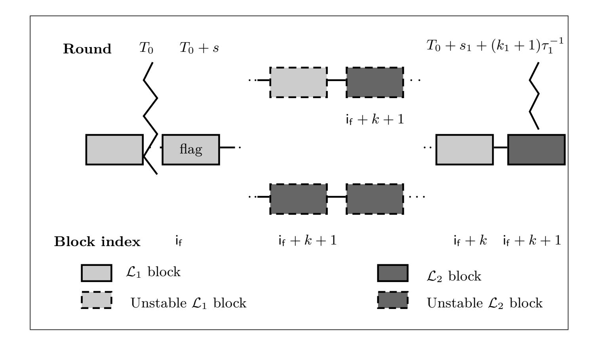
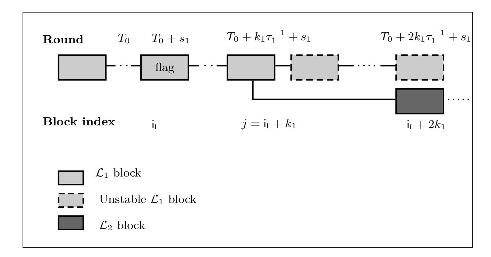

{0}------------------------------------------------

# **Updatable Blockchains***?*

Michele Ciampi2 , Nikos Karayannidis1 , Aggelos Kiayias1*,*2 , and Dionysis Zindros3

1 Input Output HK Limited, Hong Kong, P.R.C. nikos.karagiannidis@iohk.io 2 The University of Edinburgh, Edinburgh, UK mciampi@ed.ac.uk, akiayias@inf.ed.ac.uk 3 National and Kapodistrian University of Athens, Athens, Greece dionyziz@gmail.com

**Abstract.** Software updates for blockchain systems become a real challenge when they impact the underlying consensus mechanism. The activation of such changes might jeopardize the integrity of the blockchain by resulting in chain splits. Moreover, the software update process should be handed over to the community and this means that the blockchain should support updates without relying on a trusted party. In this paper, we introduce the notion of *updatable blockchains* and show how to construct blockchains that satisfy this definition. Informally, an updatable blockchain is a secure blockchain and in addition it allows to update its protocol preserving the history of the chain. In this work, we focus only on the processes that allow securely switching from one blockchain protocol to another assuming that the blockchain protocols are correct. That is, we do not aim at providing a mechanism that allows reaching consensus on what is the code of the new blockchain protocol. We just assume that such a mechanism exists (like the one proposed in NDSS 2019 by Zhang et. al), and show how to securely go from the old protocol to the new one. The contribution of this paper can be summarized as follows. We provide the first formal definition of updatable ledgers and propose the description of two compilers. These compilers take a blockchain and turn it into an updatable blockchain. The first compiler requires the structure of the current and the updated blockchain to be very similar (only the structure of the blocks can be different) but it allows for an update process more simple, efficient. The second compiler that we propose is very generic (i.e., makes few assumptions on the similarities between the structure of the current blockchain and the update blockchain). The drawback of this compiler is that it requires the new blockchain to be resilient against a specific adversarial behaviour and requires all the honest parties to be online during the update process. However, we show how to get rid of the latest requirement (the honest parties being online during the update) in the case of proof-of-work and proof-of-stake ledgers.

**Keywords:** Blockchain · Update · Ledger

*?* Research partly supported by H2020 project PRIVILEDGE #780477

{1}------------------------------------------------

# **1 Introduction**

Most of the existing software requires to be updated (or replaced) at some point. Indeed, the most vital aspect for the sustainability of any software system is its ability to effectively and swiftly adapt to changes; one basic form of which are software updates. Therefore the adoption of software updates is at the heart of the lifecycle of any system, and blockchain systems are no exception. Software updates might be triggered by a plethora of different reasons: change requests, bug-fixes, security holes, new-feature requests, various optimizations, code refactoring etc. More specifically, for blockchain systems, a typical source of change is the enhancements at the consensus protocol level. There might be changes to the values of specific parameters (e.g., the maximum block size, or the maximum transaction size etc.), changes to the validation rules at any level (transaction, block, or blockchain), or even changes at the consensus protocol itself. Usually, the reason for such changes is the reinforcement of the protocol against a broader scope of adversary attacks, or the optimization of some aspect of the system like the transaction throughput, or the storage cost etc. A software update's lifecycle comprises of three important decision points: a) What update proposal should be implemented, b) is a specific implementation appropriate to be deployed and c) when and how the changes should be activated on the blockchain. A fully decentralized approach should decentralize all of these three decisions. Indeed, there are already proposals on how to update specific blockchain protocols in a decentralized way [\[9,](#page-19-0)[8](#page-19-1)[,14\]](#page-19-2). Moreover, Bingsheng et al. [\[16\]](#page-19-3), proposes a complete treasury system in order to solve the funding problem for software updates. The decentralization of such decisions is usually called in short *decentralized governance*. This paper does not focus on how to achieve decentralized governance for software updates. Indeed, we assume that appropriate decentralized governance processes (e.g., voting, delegation of voting, upgrade-readiness signaling etc.) are in place and the community has already reached a consensus on what specific update should be activated and this information is *written* on the blockchain. Moreover, we assume that a sufficient percent of honest parties have expressed (e.g. through a signaling mechanism) their readiness to upgrade to the new ledger. This is exactly the point from where our focus begins. In particular, we deal with the *secure activation* of software update changes on the blockchain in a fully decentralized setting and essentially provide a way to safely transition from the old ledger to the upgraded ledger without the need of a trusted third party. Moreover, we define what is a secure activation of changes by introducing the notion of *updatable blockchains*. To the best of our knowledge, our approach is the first that treats the problem of decentralized activation of updates for blockchains in such a formal way providing a security definition for updatable blockchain and generic constructions (more details will be provided in the next section).

{2}------------------------------------------------

### **1.1 Our Contributions**

In our work, we try to define what is a ledger[4](#page-2-0) that supports updates and refer to it as an *updatable ledger*.

Then we propose a generic compiler that takes a ledger L1 and turns it into an updatable ledger that tolerates updates only with respect to ledgers that follow the same consensus rule as L1 but have different blocks structure. We then propose another (more generic) compiler that, always starting from L1, turns L1 it into a ledger L UPD that can be updated to the code of a ledger L2. This compiler works assuming only few similarities between L1 and L2, but it is more complicated and decreases the throughput of the ledger during the update. All our constructions do not rely on any trusted third party (TTP).

### **1.2 Our Techniques**

Our definition of updatable ledgers is quite intuitive. We require an updatable ledger L UPD to be secure under the standard definition of security (i.e., it has to enjoy consistency and liveness) but on top of this, it has to support the property of *updatability*. This property guarantees that, in the case there are enough parties that are willing to upgrade the code of L UPD to the code of a new ledger L2, the honest parties can securely run L2 and preserve the state of L UPD.

Clearly, (almost) any ledger L1 can be turned into an updatable ledger L UPD if we can rely on a TTP. Indeed, in this case the TTP can issue a genesis block for L2 which incorporates the state of L1 (or just the hash of it), and then the parties that where running L1 can abandon it and start running L2 using the genesis block issued by the TTP.

We show how to construct an updatable ledger without relying on a TTP. The starting point for our construction is a standard ledger L1 that we enhance with the following mechanism. At time *T*0 (when enough parties are assumed to be willing to update to L2) a block of L1 is chosen and *translated* into a genesis block for L2. All the parties that wanted to update can now simply run L2 on the chosen genesis block. This approach clearly requires that there is an efficient way to translate a block of L1 into a block for L2, and this might limit the class of ledgers to which L UPD can be updated

Even though the above approach seems to work, there are unfortunately many subtleties that we need to deal with. The first is that the adversary might be able to see the genesis block for L2 before any other honest parties do, and therefore he can take advantage in the generation of the blocks of L2 thus compromising the security of the system. The second issue is that the adversary might influence the choice of the genesis block. Indeed, we do not know how the consensus algorithm of L1 works and what is the power of the adversary in biasing the content of L1's blocks. We note that this scenario (where there are

4 With slight abuse of terminology we use the words ledger and blockchain interchangeably.

{3}------------------------------------------------

many candidates blocks and the adversary can decide which block is added to the final chain) is well studied (see [\[11\]](#page-19-4)) and many blockchain protocols allow this kind of adversarial behaviour (i.e., an adversary can create forks and influence the decision on what fork will become part of the stable chain). To tackle these issues, we further shrink the class of ledgers to which L UPD can be updated, and require L2 to retain its security even in the case the genesis block can be seen by the adversary before that the hones parties can see it, and even if the adversary can pick the genesis block from a set of candidate genesis blocks. Despite being quite general, this compiler has the drawback that the honest parties need to be online during the update. Indeed, if an honest party is offline before *T*0 and comes online after the update then no security can be guaranteed for this party. However, we show how to relax the requirement on the honest parties being online during the update by relying on a *2-for-1 mining* approach (more details are provided in the end of Sec. [4.2\)](#page-12-0).

The second scheme that we propose requires L UPD and L2 to be the same (i.e., they use the same consensus rules) but might have a different block structure. In this case, the update process is even simpler, the parties, starting from a pre-agreed block index *j*, start extending the state of L UPD using the rules of L2 even if the block in position *j* is not stable. That is, it might happen that different honest parties start running L2 using a different starting block given that the block *j* does not belong to the common prefix. We prove that this does not cause issues even in the case when not all the honest parties participate to the update (i.e., some honest parties are offline or decided to not participate to the update). The advantage of this approach over the first that we have proposed is that we do not require all the honest parties to be online during the update, and the throughput is not affected by the update process.

# **2 The Model**

Protocol participants are represented as parties—formally Interactive Turing Machine instances (ITIs)—in a multi-party computation. We assume a central adversary who corrupts miners and uses them to attack the protocol. The adversary is *adaptive*, i.e., can corrupt (additional) parties at any point and depending on his current view of the protocol execution. Our protocols are synchronous (G)UC protocols [\[4,](#page-19-5)[15\]](#page-19-6): parties have access to a (global) clock setup, denoted by Gclock, and can communicate over a network of authenticated multicast channels. We note that the assumption on the existence of a global clock has been used to prove the security of Bitcoin [\[4\]](#page-19-5) and we are not aware of any other formal proof that relies on weaker notion of "time". For this reason we believe that the use of the functionality Gclock in this work is without loss of generality.

We assume instant and *fetch-based* delivery channels [\[15,](#page-19-6)[7\]](#page-19-7). Such channels, whenever they receive a message from their sender, they record it and deliver it to the receiver upon his request with a "fetch" command. In fact, all functionalities we design in this work will have such fetch-based delivery of their outputs. We remark that the instant-delivery assumption is without loss of generality as the 

{4}------------------------------------------------

channels are only used for communicating the timestamped object to the verifier which can anyway happen at any point after its creation. However, our treatment trivially applies also to the setting where parties communicate over boundeddelay channels as in [\[4\]](#page-19-5).

We adopt the *dynamic availability* model implicit in [\[4\]](#page-19-5) which was fleshed out in [\[3\]](#page-19-8). We next sketch its main components: All functionalities, protocols, and global setups have a dynamic party set. i.e., they all include special instructions allowing parties to register, deregister, and allowing the adversary to learn the current set of registered parties. Additionally, global setups allow any other setup (or functionality) to register and deregister with them, and they also allow other setups to learn their set of registered parties. For more details on the registration process we refer the reader to Appendix [B.](#page-17-0)

*The Clock Functionality* Gclock (cf. Fig. [4\)](#page-18-0). The *clock functionality* was initially proposed in [\[15\]](#page-19-6) to enable synchronous execution of UC protocols. Here we adopt its global-setup version, denoted by Gclock, which was proposed by [\[4\]](#page-19-5) and was used in the (G)UC proofs of the ledger's security.[5](#page-4-0) Gclock allows parties (and functionalities) to ensure that the protocol they are running proceeds in synchronized rounds; it keeps track of round variable whose value can be retrieved by parties (or by functionalities) via sending to it the pair: CLOCK-READ. This value is increased when every honest party has sent to the clock a command CLOCK-UPDATE. The parties use the clock as follows. Each party starts every operation by reading the current round from Gclock via the command CLOCK-READ. Once any party has executed all its instructions for that round it instructs the clock to advance by sending a CLOCK-UPDATE command, and gets in an idle mode where it simply reads the clock time in every activation until the round advances. To keep more compact the description of our functionalities that rely on Gclock, we implicitly assume that whenever an input is received the command CLOCK-READ is sent to Gclock to retrieve the current round. Moreover, before giving the output, the functionalities request to advance the clock by sending CLOCK-UPDATE to Gclock.

### **2.1 Ledger Consensus: Model**

In this section, we define our notion of protocol execution following [\[11,](#page-19-4)[5\]](#page-19-9). The execution of a protocol *Π* is driven by an environment program Z that may spawn multiple instances running the protocol *Π*. The programs in question can be thought of as interactive Turing machines (ITM) that have communication, input and output tapes. An instance of an ITM running a certain program will be referred to as an interactive Turing machine instance or ITI. The spawning of new ITI's by an existing ITI as well as the interaction between them is at the discretion of a control program which is also an ITM and is denoted by *C*. The pair (Z*, C*) is called a system of ITM's, cf. [\[5\]](#page-19-9). Specifically, the execution driven by Z is defined with respect to a protocol *Π*, an adversary A (also an ITM)

5 As a global setup, Gclock also exists in the ideal world and the ledger connects to it to keep track of rounds.

{5}------------------------------------------------

and a set of parties  $P_1, \ldots, P_n$ ; these are hardcoded in the control program C. Initially, the environment  $\mathcal{Z}$  is restricted by C to spawn the adversary  $\mathcal{A}$ . Each time the adversary is activated, it may send one or more messages of the form (corrupt,  $P_i$ ) to C. The control program C will register party  $P_i$  as corrupted, only provided that the environment has previously given an input of the form (corrupt,  $P_i$ ) to  $\mathcal{A}$  and that the number of corrupted parties is less or equal tc, a bound that is also hardcoded in C.

We divide time into discrete units called *time slots* or round. Players are equipped with (roughly) synchronized clocks  $\mathcal{G}_{clock}$  that indicate the current slot: we assume that any clock drift is subsumed in the slot length.

Ledger Consensus. Ledger consensus (a.k.a. "Nakamoto consensus") is the problem where a set of nodes (or parties) operate continuously accepting inputs that are called transactions and incorporate them in a public data structure called the *ledger*. A ledger (denoted in calligraphic-face, e.g.  $\mathcal{L}$ ) is a mechanism for maintaining a sequence of transactions, often stored in the form of a blockchain. In this work, we denote with  $\mathcal{L}$  the algorithms used to maintain the sequence, and with L all the views of the participants of the state of these algorithms when being executed. For example, the (existing) ledger Bitcoin consists of the set of all transactions that ever took place in the Bitcoin network, the current UTXO set, as well as the local views of all the participants. In contrast, we call a ledger state a concrete sequence of transactions  $Tx_1, Tx_2, ...$  stored in the stable part of a ledger state L, typically as viewed by a particular party. Hence, in every blockchain-based ledger  $\mathcal{L}$ , every fixed chain  $\mathcal{C}$  defines a concrete ledger state by applying the interpretation rules given as a part of the description of  $\mathcal{L}$ . In this work, we assume that the ledger state is obtained from the blockchain by dropping the last k blocks and serializing the transactions in the remaining blocks. We refer to k as the common-prefix parameter. We denote by  $L^{P}[t]$  the ledger state of a ledger  $\mathcal{L}$  as viewed by a party P at the beginning of a time slot t and by  $\dot{\mathsf{L}}^P[t]$  the complete state of the ledger (at time t) including all pending transactions that are not stable yet.  $\mathsf{L}^P[t]$  can be obtained from  $\check{\mathsf{L}}^P[t]$ by dropping the last k block.

For two ledger states (or, more generally, any sequences), we denote by  $\leq$  the prefix relation. Recall the definition of secure ledger protocol given in [10].

**Definition 1.** A ledger protocol  $\mathcal{L}$  is secure if it enjoys the following properties.

**Consistency.** For any two honest parties  $P_1, P_2$  and two time slots  $t_1 \leq t_2$ , it holds  $\mathsf{L}^{P_1}[t_1] \preceq \check{\mathsf{L}}^{P_2}[t_2]$ .

**Liveness.** If all honest parties in the system attempt to include a transaction Tx then, at any slot t after s slots (called the liveness parameter), any honest party P, if queried, will report  $Tx \in L^P[t]$ .

In this work we also explicitly rely on the properties of  $Common\ Prefix\ (CP)$ ,  $Chain\ Growth\ (CG)$  and  $Chain\ Quality\ (CQ)$ .

{6}------------------------------------------------

Common Prefix (CP); with parameters  $k \in \mathbb{N}$  states that for any pair of honest players  $P_1, P_2$  at rounds  $r_1 \leq r_2$  respectively, it holds that  $\mathsf{L}^{P_1}[r_1] \preceq \check{\mathsf{L}}^{P_2}[r_2]$ .

Chain Growth (CG); with parameters  $\tau \in (0,1]$  and  $s \in \mathbb{N}$ . Consider the chain  $\mathcal{C}$  adopted by an honest party at the onset of a slot and any portion of  $\mathcal{C}$  spanning s prior slots; then the number of blocks appearing in this portion of the chain is at least  $\tau s$ .

Chain Quality (CQ) with parameters  $\mu \in \mathbb{R}$  and  $\ell \in \mathbb{N}$ . For any honest party P with chain  $\mathcal{C}$  it holds that for any  $\ell$  consecutive blocks of  $\mathcal{C}$  the ratio of honest blocks is at least  $\mu$ .

We consider a setting where a set of parties run a protocol maintaining a ledger  $\mathcal{L}_1$ . Following [13], we denote by  $\mathbb{A}_1$  the assumptions for  $\mathcal{L}_1$ . That is, if the assumption  $\mathbb{A}_1$  holds, then ledger  $\mathcal{L}_1$  is secure under the Definition 1. Formally,  $\mathbb{A}_i$  for a ledger  $\mathcal{L}_i$  is a sequence of events  $\mathbb{A}_i[t]$  for each time slot t that can assume value 1, if the assumption is satisfied, and 0 otherwise. For example,  $\mathbb{A}_i$  may denote that there has never been a majority of hashing power (or stake in a particular asset, on this ledger or elsewhere) under the control of the adversary; that a particular entity (in case of a centralized ledger) was not corrupted; and so on. Without loss of generality, we say that the assumption  $\mathbb{A}_1$  for the ledger  $\mathcal{L}_1$  holds if and only if the fraction of corrupted parties (the parties that received the input (corrupt, ·)) is below the threshold tc1 (where tc1 is part of the control function as described in the beginning of this section).

Chain selection rule and block validation. We sometimes assume that a ledger protocol describes a chain selection rule that we denote with ChainSel. That is, we assume that each party in each round of the execution of the protocol collects all chains that come from the network and runs the algorithm ChainSel to decide whether to keep his current local chain  $C_{loc}$ , or adopt one of the newly received chains. Following [4] we also assume that before applying the chain-selection rule, any given chain is tested using the procedure IsValidChain. IsValidChain checks filters the valid chains among all the chain received from the network and only the valid chain are used as input for ChainSel. ChainSel in turns rely on the algorithm IsValidBlock. IsValidBlock take as input a block B of  $C_{loc}$  and outputs 1 if B is a valid block (i.e., the structure of the block is correct) and 0 otherwise.

We note that by assuming that a ledger protocol is always equipped with the algorithms ChainSel, IsValidChain and IsValidBlock make some of our results less general. However, we will show that it is possible to obtain a better updatable ledger in the case when the two ledgers (the current ledger) and the new ledger have the same chain selection rule (among other similarities).

#### 2.2 Genesis Block Functionality

The ledger protocols that we consider in this work are equipped with the description of an algorithm genesis that, on input a random value of appropriate

{7}------------------------------------------------

length, outputs a valid genesis block (i.e., the first block of the chain). The security of most of the known ledger protocols holds under the additional assumption that the genesis block is correct. That is, the genesis block has been generated accordingly to genesis using appropriate randomness. Multiple ways have been presented to generate a correct genesis block in the literature (i.e., by relying on a trusted authority, use unpredictable information (like in bitcoin), run a multiparty computation (MPC) protocol [1], rely on PoW [12] assumptions and so on and so forth). In this work we abstract the generation of the genesis block by means of an ideal functionality. The ideal functionality that one might expect, upon being activated from the adversary or from an honest party, should sample a random string and use it to run the algorithm genesis. Unfortunately this simple functionality does not cover real world scenarios where an adversarial party might see the genesis block before the honest parties do. This, for example, can happen in the case when genesis is realized via an MPC protocol and a rushing adversary6 could hold the genesis block (the output of the computation) for some bounded amount of time  $\tau^{\sf max}$  before the honest parties can see it. We note that an adversary can use this strategy to take an advantage on the generation of the blocks that extend the genesis block. Therefore, the first modification that we consider for our ideal functionality is to allow the adversary to see the genesis block up to  $\tau^{\text{max}}$  rounds earlier than the honest parties. The second relaxation allows the adversary to see up to m honestly generated genesis blocks and consequently decide which of these blocks will become the genesis block. We propose the formal description of our genesis functionality  $\mathcal{F}^{gen}$  in Fig. 1. We note that the case where  $\tau^{\text{max}} = 0$  and m = 1 corresponds to the case where there is only one candidate genesis block and all the parties can see it at the same round.

# 3 Secure Updatable Ledgers

#### 3.1 Defining Secure Updatable Ledgers

In this section, we provide the definition of updatable ledgers. Our definition is generic in the sense that can be applied to a large class of ledgers (e.g., PoS, PoW and so on). Let  $\mathcal{L}^{\text{UPD}}$  and  $\mathcal{L}_2$  be the two ledgers with the respective assumptions  $\mathbb{A}_1$  and  $\mathbb{A}_2$ . Assuming that  $\mathbb{A}_1$  holds, then among the parties that are running  $\mathcal{L}^{\text{UPD}}$  we could have up to a fraction of  $\mathsf{tc}_1$  corrupted parties (i.e., parties that have received the command  $\mathsf{corrupt}$ ). Analogously, the assumption  $\mathbb{A}_2$  for the ledger  $\mathcal{L}_2$  holds if the number of corrupted parties divided by the number of honest party is below the threshold  $\mathsf{tc}_2$ .

The interface of an updatable ledger extends the interface of a standard ledger by adding the command (activate,  $\mathcal{L}_2$ ). That is, each party that runs an updatable ledger  $\mathcal{L}^{\mathsf{UPD}}$  can receive the command (activate,  $\mathcal{L}_2$ ) from the environment to enable the update procedure. Let  $t_{P_i}$  denote the time in which a party  $P_i$  receives

&lt;sup>6 A rushing adversary waits to receive the messages from all the honest parties and then computes its reply. Note that this means that, in general, the adversary is always able to see the output of the computation before the honest parties do.

{8}------------------------------------------------

#### Genesis Functionality for $\mathcal{L}$

**Parameters.** The functionality is parametrized by  $\tau^{\text{max}}$ , the maximum number of candidate genesis block m, the genesis block  $B^{gen}$  initialized with a default value  $\perp$  and the procedure genesis(). We assume the functionality to be registered to  $\mathcal{G}_{clock}$  and that it maintains a set of registered parties  $\mathcal{P}$ . On any input I the functionality queries  $\mathcal{G}_{clock}$ , and we denote with R be the response obtained by  $\mathcal{G}_{\tt clock}.$ 

- If I = GEN GENESIS is received from the adversary A then set  $\tau := R$ , generate m genesis blocks (each block is generated by running the procedure genesis())  $\mathsf{GB} := \{B_1^{\mathsf{gen}}, \dots, B_m^{\mathsf{gen}}\}\ \text{for } \mathcal{L}, \text{ and send } \mathsf{GB} \text{ to the adversary.}$
- If  $I = GET\_GENESIS$  is received from an honest party  $p_i \in \mathcal{P}$  do the following
  - If  $B^{gen} \neq \bot$  then return  $B^{gen}$  to  $p_i$ .
  - If  $B^{\text{gen}} = \bot$  and  $R \tau > \tau^{\text{max}}$  then set generate a genesis block  $\tilde{B}^{\text{gen}}$  by running genesis, set  $B^{\text{gen}} \leftarrow B^{\tilde{\text{gen}}}$  and send  $B^{\text{gen}}$  to  $p_i$ .
- If  $I = (\texttt{GET\_GENESIS}, B^{\texttt{gen}\prime})$  is received from the adversary do the following If  $(R \tau) \leq \tau^{\texttt{max}}$  and  $B^{\texttt{gen}\prime} \in \mathsf{GB}$  then set  $B^{\texttt{gen}} := B^{\texttt{gen}\prime}$ .

  - Else, return  $\perp$  to the adversary.

**Fig. 1.** The genesis functionality  $\mathcal{F}^{gen}$ .

the activation command and let  $\mathcal{P}^{\mathsf{u}}$  be the set of parties that received this command. Informally, an updatable ledger guarantees that if the set of honest parties that are willing to run  $\mathcal{L}_2$  (i.e., the number of parties that received (activate,  $\mathcal{L}_2$ )) is such that  $\mathbb{A}_2[\tau] = 1$  for all  $\tau \geq T_0$  for some  $T_0 \in \mathbb{N}$ , then the state of  $\mathcal{L}_2$  at time  $T_0 + \Delta$  corresponds to the state of  $\mathcal{L}^{\mathsf{UPD}}$  at some time  $T \in [T_0, T_0 + \Delta]$ . The parameter  $\Delta$  represents the time required for the update process to be completed. The above implies that  $\mathsf{L}_2$  extends  $\mathsf{L}_1$  and that  $\mathcal{L}_2$  is secure (i.e., it enjoys consistency and liveness). In a nutshell, a secure update process guarantees that the state of the old ledger is moved into the new ledger, and that the new ledger is secure. We now give a more formal definition.

**Definition 2** (Updatable Ledger). We say that a ledger  $\mathcal{L}^{\mathsf{UPD}}$  is updatable with activation parameter  $\Delta$  (where  $\Delta \in \mathbb{N}$ ) if it is a secure ledger according to Def. 1 and it enjoys the following property.

**Updatability.** Let  $\mathcal{L}_2$  be a secure ledger (always according to Def. 1). Let  $\mathcal{P}^{\mathsf{u}}$  be the set of parties that received the input (activate,  $\mathcal{L}_2$ ). If  $\mathcal{P}^{\mathsf{u}}$  is such that  $\mathbb{A}_2[\tau] = 1 \text{ for all } \tau \geq T_0 \text{ for some } T_0 \in \mathbb{N} \text{ and } \mathbb{A}_1[\tau'] = 1 \text{ for all } \tau' \leq T_1 = T_0 + \Delta$ then

- 1.  $\mathsf{L}_1^{P_i}[T'] \preceq \mathsf{L}_2$  for some  $P_i \in \mathcal{P}^\mathsf{u}$  with  $T_0 \leq T' \leq T_1$ .
- 2. for all  $\tau'' \geq T_1 \mathcal{L}_2$  enjoys consistency and liveness

We note that this definition says nothing on the security of  $\mathcal{L}^{\mathsf{UPD}}$  after the time  $T_1 = T_0 + \Delta$ . Indeed, the Definition 2 implies that if after this time slot

{9}------------------------------------------------

*T*0 +*∆* L UPD becomes insecure (e.g., because A1 does not hold) then the security of L2 is not compromised.

We relax the above definition by introducing the notion of updatable ledger in the *semi-online* setting. An updatable ledger in the semi-online setting guarantees the properties of updatability only for the honest parties that where active during the activation period [*T*0*, T*1]. That is, if an honest party *P* is offline before time *T*0, and comes online after at time *T*1 then no security is guaranteed with respect to *P*.

# **4 Our constructions**

In this section we propose two main approaches to turn a ledger L1 into an updatable ledger L UPD. That is, we show how to make L1 able to self-update to the code of a new ledger L2. The first approach proposed requires L1 and L2 to be the same (i.e., they use the same consensus rules) but might have a different block structure. The advantage in this approach is that we get a very simple updatable ledger, that does not decrease the throughput of L UPD during the update and does not require all the honest parties to be online during the update[7](#page-9-0) . The second approach requires fewer similarities between the two ledgers, but it is proven secure only in the semi-online. We also show that we can relax the requirement on the honest parties being online during the update by relying on a *2-for-1 mining* approach (more details are provided in the end of Sec. [4.2\)](#page-12-0).

We now provide a detailed description of our approaches and formally prove their security.

### **4.1 First approach.**

In this section we consider a simplified scenario where the two ledgers, L1 and L2, are the same except for the block format (i.e., L1 and L2 might have a different block size). Moreover, we assume that a block valid for L1 is valid for L2 as well (but the vice versa does not necessarily hold). Formally, this means that if the block validation algorithm IsValidBlock1 of L1 outputs 1 on some input *B*, then also the block validation algorithm IsValidBlock2 of L2 outputs 1 (see Sec. [2.1](#page-4-1) for more details). We now prove the following theorem

**Theorem 1.** *If* L1 *and* L2 *are secure ledgers with block validation rules respectively* IsValidBlock1 *and* IsValidBlock2 *such that:*

- *1.* L1 *and* L2 *are the same except with respect to the block validation rules;*
- *2. for every block B such that if* IsValidBlock1(*B*) = 1 *then* IsValidBlock2(*B*) = 1*,*
- *3.* L1 *(resp.* L2*) has common-prefix parameter k, chain-growth parameter* (*τ, s*) *and assumption* A1 *(resp.* A2*) with* A1 = A2*,*

7 We also show that we can relax the requirement on the honest parties being online during the update for the case of PoW ledgers.

{10}------------------------------------------------

then there exists an updatable ledger  $\mathcal{L}^{\mathsf{UPD}}$  with update parameter  $\Delta := (k+1)\tau^{-1} + s$ .

*Proof.* We assume that enough parties have received the command (activate,  $\mathcal{L}_2$ ) such that  $\mathbb{A}_2$  holds and denote the time when this happen with  $T_0$ . Our updatable ledger  $\mathcal{L}^{\mathsf{UPD}}$  works as follows.

Each party  $P_i \in \mathcal{P}^{\mathsf{u}}$  does the following steps.

- 1. Use  $IsValidBlock_2$  as a block validation algorithm.
- 2. Create and post a transaction that contains an activation flag.
- 3. Let if be the index of the block that will contain the first transaction with an activation flag.
- 4. Let  $j := i_f + k + 1$ , run  $\mathcal{L}_1$  and when the j-th block  $B_j^i$  becomes part of  $\check{\mathsf{L}}_1^{P_i}[\tau_i]$  for some  $\tau_i \geq T_0$  start extending  $B_j^i$  using the rules of  $\mathcal{L}_2$  instead of the rules of  $\mathcal{L}_1$  (we recall that a valid block for  $\mathcal{L}_1$  is also a valid block for  $\mathcal{L}_2$ )

We provide a pictorial description of what happens to the ledger state during the update in Fig. 2. We note that two honest parties  $P_1$  and  $P_2$  might have different  $\check{\mathsf{L}}_1^{P_1}[\tau]$  and  $\check{\mathsf{L}}_1^{P_2}[\tau]$  at any time  $\tau$ . The Fig. 2 describe the scenario where  $P_1$  might start to run  $\mathcal{L}_2$  starting from an unstable block (i.e. a block of  $\check{\mathsf{L}}_1^{P_1}[\tau]$  with  $\tau \geq T_0 + s$ ) which is different from the block that  $P_2$  is using. However, after sufficiently many rounds (at some round  $\tau' \leq T_0 + s + (k_1 + 1)\tau_1^{-1}$  to be precise)  $P_1$  and  $P_2$  will agree on what is the last block of  $\mathcal{L}_1$  and what is the first bock of  $\mathcal{L}_2$ .

To complete the proof we need to show that  $\mathcal{L}_2$  enjoys consistency and liveness and that the state  $\mathcal{L}_1$  at some time  $\tau \in [T_0, T_1]$  is a prefix of  $\mathcal{L}_2$ 's state.

Before doing that, we introduce the notion of canonical execution for the ledger  $\mathcal{L}_2$ . A canonical execution represents a standalone execution of  $\mathcal{L}_2$ . More precisely, we assume the existence of a genesis block for  $\mathcal{L}_2$  (that the adversary and the honest party see at the round 0) and that  $\mathbb{A}_2[\tau]=1$  for all  $\tau \geq 0$ . Let  $\mathcal{P}$  be the set of parties that is running  $\mathcal{L}_2$ . Also, let t be the smallest time slot in which  $B_{i_f}$  appears in  $\mathsf{L}_2^{P_i}[t]$  for all  $P_i \in \mathcal{P}$  and let  $\tilde{t}_{i,j}$  be the smallest time slot in which  $B_i^i$  appears in  $\mathsf{L}_2^{P_i}[t_{i,j}]$  for each  $P_i \in \mathcal{P}$  with  $j := \mathsf{i_f} + k + 1$ .

We now go back to our updatable ledger protocol. In the protocol that we have described, by assumption, we have that  $\mathbb{A}_2[T_0] = 1$  for all  $\tau \geq T_0$ . From the moment when  $\mathbb{A}_2$  becomes true the activation process takes  $\Delta \leq (k+1)\tau^{-1} + s$  time slots to be completed.

This is because the parties need to wait for the block  $i_f$  to be part of all the honest parties stable view and wait for the j-th block (with  $j := i_f + k + 1$ ) of to be part of  $\check{\mathsf{L}}_1^{P_i}[t_{i,j}]$  for all  $P_i$  with  $t_{i,j} \in \mathbb{N}$ . Note that in the moment that the block  $B_j^i$  becomes available to an honest party  $P_i \in \mathcal{P}^{\mathsf{u}}$  (i.e.,  $B_j^i$  is part of  $\check{\mathsf{L}}_1^{P_i}$ ) then the party starts running  $\mathcal{L}_2$  to extend  $B_j^i$  as described earlier (we recall that at this time slot the assumption  $\mathbb{A}_2$  holds). Let  $t'_{i,j}$  be the smallest time slot in which  $B_j^i$  appears in  $\check{\mathsf{L}}_2^{P_i}[t'_{i,j}]$  for each  $P_i \in \mathcal{P}$  with  $t'_{i,j} \in \mathbb{N}$ . If we consider the execution of the protocol from time  $T_0$  and  $T_0 + \Delta$  this can be seen as a

{11}------------------------------------------------

**Fig. 2.** Transition from  $\mathcal{L}_1$  to  $\mathcal{L}_2$ . Note that different honest parties might have different views (i.e., forks) of the unstable part of the chain which have also different lengths.

canonical execution of  $\mathcal{L}_2$  given that  $\mathcal{L}_1$  and  $\mathcal{L}_2$  follow the same rules and the same assumption, and given that  $\check{\mathsf{L}}_1^{P_i}$  (and  $\check{\mathsf{L}}_2^{P_i}$ ) contains at most k blocks more than  $\mathsf{L}_1^{P_i}$  (and  $\mathsf{L}_2^{P_i}$ ) for all  $P_i \in \mathcal{P}^\mathsf{u}$ . Hence, any advantage that the adversary has on our updatable ledger can be translated into an advantage for an adversary that is attacking  $\mathcal{L}_2$ , which is assumed to be secure. Note that it is crucial that the assumption that underlines the two ledger is the same. Indeed, we note that the number of honest parties that received (activate,  $\mathcal{L}_2$ ) might be lower than the overall number of honest parties. Hence, the honest parties that are running the update procedure are less than the parties that are running  $\mathcal{L}_1$  (this might happen as we do not require all the honest parties to update). However, given that  $\mathbb{A}_1 = \mathbb{A}_2$ , we can see the honest parties that did not receive the command (activate,  $\mathcal{L}_2$ ) as parties controlled by the adversary as they are not following the update procedure. Luckily, this does not cause problems as even if we consider these parties as adversarial,  $\mathbb{A}_1$  would still hold (given that  $\mathbb{A}_1 = \mathbb{A}_2$ ). Hence, we can claim that in the worst case everything that can be done by the adversary during the update can be done also in the canonical execution given that the number of honest parties in the canonical execution is the same as the number of honest parties that are performing the update.

We remark that the only difference between this and the canonical execution described above is that the blocks  $B_{i_f}, \ldots, B_{j-2}, B_{j-1}$  are generated using  $\mathcal{L}_1$ , but this does not represent an issue since we are assuming that any block of  $\mathcal{L}_1$  is valid for  $\mathcal{L}_2$ .

{12}------------------------------------------------

We finally note that this protocol does not put any restriction on whether an honest party needs to be online or not during an update given that  $\mathcal{L}_1$  and  $\mathcal{L}_2$  have the same chain selection rule (only the block selection rule is different). One practical advantage of our approach is that if  $\mathcal{L}_1$  (and  $\mathcal{L}_2$ ) allows bootstrapping from the genesis block (like in [3]) so does our updatable ledger.

### 4.2 Second Approach

Before providing our construction we introduce the notion of *genesis-compatible* ledgers. We say that two ledgers  $\mathcal{L}_1$  and  $\mathcal{L}_2$  are genesis-compatible if a block of  $\mathcal{L}_1$  can be turned into a valid candidate genesis block for  $\mathcal{L}_2$ . We now propose a formal definition.

**Definition 3.** Let  $\mathcal{L}_1$  and  $\mathcal{L}_2$  be two secure ledgers where  $\mathcal{F}^{gen}$  is the genesis functionality of  $\mathcal{L}_2$  parameterized by the algorithm genesis() (see Fig. 1).

We say that  $\mathcal{L}_1$  is genesis-compatible with  $\mathcal{L}_2$  if there exists a deterministic polynomial time algorithm  $\Pi^{1\to 2}$  that, on input a valid block B of  $\mathcal{L}_1$  outputs a valid genesis block  $\tilde{B}$  for  $\mathcal{L}_2$ . Moreover, the output of  $\Pi^{1\to 2}$  is identically distributed to the output of the procedure genesis().

We note that  $\Pi^{1\to 2}$  could be a very simple protocol. For example, if we consider two PoW ledgers that use the same puzzles, then  $\mathcal{L}_1$  is genesis-compatible with  $\mathcal{L}_2$  since the  $\Pi^{1\to 2}$  can simply take a block of  $\mathcal{L}_1$  and use it as a candidate genesis block for  $\mathcal{L}_2$ . We note that the definition of genesis-compatibility only tells that it is possible to generate a genesis block for  $\mathcal{L}_2$  with a valid structure. That is, it does not imply that  $\mathcal{L}_2$  can be securely run using any genesis block generated using  $\Pi^{1\to 2}$  as, for example, using an old block of  $\mathcal{L}_1$  could give an advantage to the adversary over the honest parties. More details follow.

We now propose our first compiler that turns a ledger  $\mathcal{L}_1$  that is genesiscompatible with  $\mathcal{L}_2$ , into an updatable ledger. At a very high level our approach is the following. We use  $\mathcal{L}_1$  to realize the genesis functionality of  $\mathcal{L}_2$ , and then we use the output of the genesis functionality to execute  $\mathcal{L}_2$ . We note that it is easy to create a candidate genesis block from  $\mathcal{L}_1$  because it is genesis-compatible with  $\mathcal{L}_2$ . To complete the description of our compiler, we need to specify what block of  $\mathcal{L}_1$  will be chosen, and argue that this process is indeed sufficient to realize the genesis functionality for  $\mathcal{L}_2$ . In our approach the parties that are running  $\mathcal{L}_1$ agree on the index j of a block that will be used as a genesis block (this block can be decided using the consensus algorithm of  $\mathcal{L}_1$ , more details will be provided). When the block of position j, that we denote with  $B_i$ , becomes stable for all the honest parties that decided to update, then these parties use  $\Pi^{1\to 2}$  to turn  $B_i$  into a genesis block for  $\mathcal{L}_2$  thus obtaining  $B^{\text{gen}}$ . At this point  $B^{\text{gen}}$  is used to run  $\mathcal{L}_2$  and  $\mathcal{L}_1$  can be abandoned. Even though the above approach seems to work, there are many subtleties. The first is that the adversary might be able to see the block  $B_i$  before any other honest parties do, and therefore he can take an advantage in the generation of the blocks of  $\mathcal{L}_2$ . The second issue is that the adversary might influence the choice of the block that will appear in position j. 

{13}------------------------------------------------

Indeed, we do not know how the consensus algorithm of  $\mathcal{L}_1$  works and what is the power of the adversary in biasing the content of  $B_j$ . We denote with  $\tau^{\mathsf{max}'}$  the upper bound on the number of rounds that pass between the time at which the adversary can see a candidate block for  $\mathcal{L}_1$  for a position j, and the time at which all the honest parties see  $B_j$  as part of the stable chain. We refer to this parameter  $\tau^{\mathsf{max}'}$  as the prediction parameter. We also denote with m' the upper bound on the number of valid chains that are broadcasted on the network that contain a block in position j and refer to this parameter as maximum forks parameter.

Coming back to our protocol, we note that if the genesis functionality of  $\mathcal{L}_2$  is parameterized with  $\tau^{\mathsf{max}} = \tau^{\mathsf{max}'}$  and m = m' then we can prove that the solution we proposed works.

We are now ready to state formally our theorem and prove it.

# **Theorem 2.** If $\mathcal{L}_1$ and $\mathcal{L}_2$ are secure ledgers and:

- 1.  $\mathcal{L}_1$  has common-prefix parameter  $k_1$ , chain-growth parameter  $(\tau_1, s_1)$  and assumption  $\mathbb{A}_1$ ;
- 2.  $\mathcal{L}_2$  has common-prefix parameter  $k_2$ , chain-growth parameter  $(\tau_2, s_2)$  and assumption  $\mathbb{A}_2$ ;
- 3. the prediction parameter of  $\mathcal{L}_1$  is  $\tau^{\mathsf{max'}}$  and the maximum forks parameter is m';
- 4. the genesis functionality  $\mathcal{F}^{gen}$  of  $\mathcal{L}_2$  is parametrized by  $\tau^{max} = \tau^{max'}$  and m = m';
- 5.  $\mathcal{L}_1$  is genesis-compatible with  $\mathcal{L}_2$ .

then there exists an updatable ledger  $\mathcal{L}^{\mathsf{UPD}}$  with update parameter  $\Delta := 2k_1\tau_1^{-1} + s_1$  in the semi-online setting.

*Proof.* We start the proof by describing how formally our protocol works. Let  $T_0$  be such that  $\mathbb{A}_2$  holds. At time  $T_0$  each party in  $P_i \in \mathcal{P}^{\mathsf{u}}$  does the following steps.

- 1. Create and post a transaction that contains an *activation flag*, let if be the index of the block that will contain the first transaction with an activation flag (note that there might be more than one of such a transactions).
- 2. Keep running  $\mathcal{L}_1$  until the block with index  $j = i_f + k_1$  becomes stable (i.e., becomes part of  $\mathsf{L}_1^P[\tau]$  for all  $P \in \mathcal{P}^\mathsf{u}$  for some  $\tau \geq T_0$ ) and stop issuing transaction for  $\mathcal{L}_1$  (if any).
- 3. When the j-th block  $B_j$  becomes stable then stop running  $\mathcal{L}_1$  and start running  $\mathcal{L}_2$  using  $B^{\text{gen}} \leftarrow \Pi^{1\to 2}(B_j)$  as the genesis block.

We provide a pictorial description of what happens to the ledger state during the update in Fig. 3. The activation flag is used by the honest parties to reach an agreement on what it will be the index of the block used as a genesis block. We note that the blocks of  $\mathcal{L}_1$  that extend  $B_j$  might be unstable, moreover after the update has been completed the parties in  $\mathcal{P}^{\mathsf{u}}$  will ignore the blocks of  $\mathcal{L}_1$  that

{14}------------------------------------------------

extend  $B_j$  (since after the update all the parties in  $\mathcal{P}^{\mathsf{u}}$  will be using the rules  $\mathcal{L}_2$ , hence its chain selection rule). The reason why the parties in  $\mathcal{P}^{\mathsf{u}}$  will stop issuing transactions for  $\mathcal{L}_1$  is that these transactions might be included in blocks that extend  $B_j$ , which will be ignored after  $T_0 + \Delta$  rounds. This clearly affects the throughput of the ledger in the interval  $[T_0 + k_1\tau_1^{-1} + s_1, T_0 + 2k_1\tau_1^{-1} + s_1]$ (Fig. 3). We now continue with the proof. Let  $T_0$  be the time at which we know that  $\mathcal{P}^{\mathsf{u}}$  is such that  $\mathbb{A}_2$  holds. In the worst case, the time required for an honest party to post a transaction that contains the activation flag takes time  $s_1$  rounds  $(s_1 \text{ comes from the liveness of } \mathcal{L}_1)$ . The number of rounds required for j to be stable in the view of all the honest parties is  $2k_1\tau_{1}^{-1}$  rounds. This is because to generate the block  $B_j$  are required at least  $k_1\tau_1^{-1}$  rounds, and  $B_j$  has to be extended with at least  $k_1$  blocks to be part of all the honest parties view (and this takes additional  $k_1\tau_1^{-1}$  rounds) Hence, the time required to complete the update is  $\Delta = 2k_1\tau_1^{-1} + s_1$ . Once the block  $B_i$  becomes stable, the parties in  $\mathcal{P}^{\mathsf{u}}$  can start running  $\mathcal{L}_2$ , and we are guaranteed that  $\mathcal{L}_2$  enjoys liveness and consistency because the genesis block for  $\mathcal{L}_2$  is created accordingly to  $\mathcal{F}^{gen}$  and by assumption  $\mathbb{A}_2$  holds. Therefore, everything that appears before  $B^{\mathsf{gen}}$  is preserved due to the consistency of  $\mathcal{L}_2$ . We refer to the state of  $\mathcal{L}_1$  before  $B^{gen}$  as  $\tilde{\mathsf{L}}_1$ , and to the state of the ledger after the update as  $L_1||L_2$ . We finally note that we guarantee no security for the honest parties that were not online during the update. The reason is that after  $T_1$  the honest parties abandon  $\mathcal{L}_1$  and the adversary could compromise it. For example, an adversary could potentially keep extending  $L_1$ after the block j, and create a very long chain, even longer that  $L_1||L_2|$ . Hence, if the chain selection rule of  $\mathcal{L}_1$  prescribes to take the longest chain, then a party that comes online at time  $T_1$  might take the chain  $L_1$  (which is compromised).

We remark that our construction requires the parties to generate empty blocks for  $\mathcal{L}_1$  from block index j+1 and until block  $B_j$  becomes stable. This is required as the honest parties, after the update completes, will ignore any block generated using the rules of  $\mathcal{L}_1$  that comes after  $B_j$ .

**Practical implications.** The updatable ledger that we have described can be updated to any ledger  $\mathcal{L}_2$  under the condition that the genesis functionality of  $\mathcal{L}_2$  tolerates an adversary that can see the genesis block  $\tau^{\text{max}}$  rounds before the honest parties and decide the genesis block among a set of m candidate genesis blocks. This requirement might look strong, but we note that the problem of constructing a ledger that is secure in such a scenario is simpler than the problem of constructing a ledger that supports temporary dishonest majority [2]. A ledger with security assumption  $\mathbb{A}$  that tolerates temporary dishonest majority is such that its security properties (liveness and consistency) become valid again when  $\mathbb{A}[\tau_1] = 1$ , even if  $\mathbb{A}[\tau'] = 0$  for all  $\tau' \in [\tau_0, \tau_1 - \delta]$  for some  $\tau_0, \tau_1, \delta \in \mathbb{N}$  such that  $\tau_1 - \delta \geq \tau_0$ . That is, the ledger become secure again when there is honest majority (i.e.,  $\mathbb{A}$  holds) even if there was an interval of time when there was no honest majority (i.e.,  $\mathbb{A}$  did not hold). Therefore, if we consider the extreme case where  $\tau_0 = 0$ , we can assume without loss of generality that the ledger admits

{15}------------------------------------------------

**Fig. 3.** Transition from  $\mathcal{L}_1$  to  $\mathcal{L}_2$ . Note that the empty blocks of  $\mathcal{L}_1$  might be non-stable.

a genesis functionality parametrized by  $\tau^{\mathsf{max}} = \delta$ , and by m that depends on the upper bound on the number of forks that the adversary can create. Hence, there are already ledgers that might fit our requirements for  $\mathcal{L}_2$ , and all the advancement in the research that concerns the security of ledgers in the case of temporary dishonest majority can be used to construct good candidates of updated ledgers ( $\mathcal{L}_2$ ) for existing ledgers ( $\mathcal{L}_1$ ) that can be used in our compiler.

**Security for Offline Parties.** Our security notion above is ensured for parties that are online during the upgrade process. Clearly it is necessary that the majority of the population's consensus-maintaining parties are honest and online, as the honest majority assumption mandates. Nevertheless, practical blockchain systems often have a large number of *consumer* parties by count who have a very small contribution to the total computational power of network, if at all, and are not significantly contributing to the maintenance of the consensus. These nodes can be wallets and other clients who mainly consume, rather than maintain, the blockchain, and are often offline for longer periods of time. Regardless, these nodes constitute the economic majority of the nodes and we must ensure they can also upgrade safely. The critical situation arises when such a party goes offline prior to an upgrade, remains offline during every phase of the upgrade, and comes online long after the rest of the population has successfully upgraded. Before describing how to construct a protocol that can protect these parties, let us briefly observe why an attack is easily possible by a minority adversary in a construction with no relevant protective mechanism. Consider a situation where a hard-fork-style change takes place and that blocks mined by upgraded parties after the upgrade are incompatible with blocks mined prior to the upgrade, i.e., after the upgrade, an unupgraded party will not consider an upgraded block as 

{16}------------------------------------------------

valid and an upgraded party will not consider an unupgraded block as valid. After the upgrade has been completed, the majority of the population will shift their mining power to mining new-style blocks. The adversary can take advantage of this situation to *ex post facto* attack the old system, which now remains unprotected as no significant mining power remains to secure it. As such, she can break the *common prefix* property, rewrite history, and subvert the upgrade signaling mechanism itself. More concretely, an adversary in this situation forks the old chain from the parent of the block in which upgrade information appeared for the first time and continues mining a chain parallel to the one that yielded the upgrade. As soon as that alternative history overtakes the old chain in terms of work, the adversary is successful. Any offline party who wakes up afterwards will use the old-style consensus rules to choose the blockchain and hence the upgrade will not appear in its view. The adversary has succeeded in isolating the offline party from the rest of the network. To rectify the above issue, a practical implementation of the protocol must leverage the mining power of the upgraded population to maintain *both* the new chain while at the same time securing the old chain. We propose a solution for the case where L1 and L2 are two proof-ofwork or two proof-of-stake type of ledgers. Our solution leverages on a variation of 2-for-1 mining [\[11\]](#page-19-4). An upgraded miner works as follows. They maintain the longest chain *C* in view of the new protocol rules, but also the longest chain *C* 0 in the view of an unupgraded party. In case of hard fork, these two chains will differ. When they are about to mine a new block on top of the upgraded chain, they construct a new-style candidate block *b* extending *C* as usual. In addition, they also construct an empty (transactionless) old-style block *b* 0 on top of the best unupgraded chain *C* 0 . In a commentary section of the old-style candidate block *b* 0 , such as the coinbase transaction, the miner places the hash *H*(*b*) of the new-style candidate block. The miner then attempts to find proof-of-work for the old-style block, i.e., some nonce ctr that satisfies the proof-of-work equation *H*(*b* 0 k ctr) ≤ *T* for the mining target *T*. If such proof-of-work is found, then the block *b* 0 is broadcast to the network and adopted as the tip of the longest unupgraded chain by the rest of the (upgraded or unupgraded) miners. Note that this block is designed to be backwards-compatible in the sense that it will be accepted by unupgraded miners even though they remain unaware of the upgrade. On the other hand, if the *reverse proof-of-work equation H*(*b* 0 k ctr) *R* ≤ *T* is satisfied (where *H*(·) *R* denotes the reversed bitstring of *H*(·)), then *b* 0 and the respective proof-of-work and blocks *b* 0 *, b* are broadcast to the network. This time unupgraded miners will not consider this a valid block. However, upgraded miners examine the validity of the block *b* contained within the commentary section of *b* 0 and check that the reverse proof-of-work equation is satisfied. If so, they adopt the block *b* as the next block in their upgraded blockchain. The above mechanism is the only mechanism by which new-style blocks are accepted by upgraded honest miners. The protocol just described has two advantages. Firstly, the upgraded honest miners make use of their mining power to contribute to the security of both the old and the new-style chain simultaneously. Therefore, an adversary cannot attack the old chain *ex post facto*. Secondly, instead of *di-* 

{17}------------------------------------------------

*viding* their mining power between the two chains, the honest parties only use their mining power *once* to mine on *both* networks, because the hash function is only evaluated once. As such, the honest mining power is not diminished by the use of this mechanism. We observe that, in the Random Oracle model, the last bits of the hash output remain uniformly distributed conditioned on the fact that the proof-of-work equation has a solution. Therefore, finding a solution of the proof-of-work equation and finding a solution of the reverse proof-of-work equation are two independent events (they will occur simultaneously so rarely that the honest parties can ignore this possibility). Lastly, note that this scheme can be used repeatedly when multiple upgrades have occurred on top of one another, simply by treating a portion of the bits of the hash as the significant bits to test against the proof-of-work equation (e.g., for a second upgrade, the hash output can be split in three equal parts to be tested against the proof-of-work equation). This scheme therefore theoretically resolves the question of securing offline parties. In practice, because the scheme adds significant implementation complexity, implementors may elect to maintain this backwards-compatibility mechanism for a limited amount of time. In that case, parties who have remained offline longer than the backwards-compatibility mechanism is maintained, will have no guarantees for security, similarly to a classical system whose long-term support window has expired. The scheme requires the added complexity of mining two blocks simultaneously only in the case of proof-of-work. This is due to the nature of proof-of-work and specifically the fact that each query counted towards the proof-of-work quota can only be devoted to a specific message. In proof-of-stake blockchains, the solution for maintaining the security of offline unupgraded parties is the obvious one and allows for a much simpler implementation: We require upgraded parties to mint, alongside their new-style blocks extending the longest upgraded chain and containing transactions, also empty old-style blocks extending the longest unupgraded chain, to ensure the security of their unupgraded counterparts.

# **A Modeling synchrony**

We refer to Fig. [4](#page-18-0) for the formal description of the functionality Gclock.

# **B Functionalities with Dynamic Party Sets**

UC provides support for functionalities in which the set of parties that might interact with the functionality is dynamic. We make this explicit by means of the following mechanism (that we describe almost verbatim from [\[4,](#page-19-5) Sec. 3.1]): All the functionalities considered here include the following instructions that allow honest parties to join or leave the set P of players that the functionality interacts with, and inform the adversary about the current set of registered parties:

– Upon receiving (REGISTER*, sid*) from some party *pi* (or from A on behalf of a corrupted *pi*), set P := P ∪ {*pi*}. Return (REGISTER*, sid, pi*) to the caller.

{18}------------------------------------------------

The functionality is available to all participants. The functionality is parametrized with variable *τ* , a set of parties P = *p*1*, . . . , pn*, and a set *F* of functionalities. For each party *pi* ∈ P it manages variable *di*. For each F ∈ *F* it manages variable *d*F

Initially, *τ* = 0*,* P = ∅ and *F* = ∅.

- Upon receiving (CLOCK-UPDATE*, sid*) from some party *pi* ∈ P set *di* = 1 execute *Round-Update* and forward (CLOCK-UPDATE*, sid, pi*) to A.
- Upon receiving (CLOCK-UPDATE*, sid*) from some functionality { ∈ *F* set *d*F = 1, execute *Round-Update* and return (CLOCK-UPDATE*, sid, F*) to *F*.
- Upon receiving (CLOCK-READ*, sid*) from any participant (including the environment, the adversary, or any ideal-shared or local-functionality) return (CLOCK-READ*, sid, τ* ) to the requester.

Procedure *Round-Update*: If *d*F = 1 for all F ∈ *F* and *di* = 1 for all honest *pi* ∈ P, then set *τ* = *τ* + 1 and reset *d*F = 0 and *di* = 0 for all parties in P.

**Fig. 4.** The functionality Gclock

- Upon receiving (DE\_REGISTER*, sid*) from some party *pi* ∈ P, the functionality updates P := P \ {*pi*} and returns (DE\_REGISTER*, sid, pi*) to *pi* .
- Upon receiving (IS\_REGISTERED*, sid*) from some party *pi* , return (REGISTER*, sid, b*) to the caller, where the bit *b* is 1 if and only if *pi* ∈ P.
- Upon receiving (GET\_REGISTERED*, sid*) from A, the functionality returns the response (GET\_REGISTERED*, sid,*P) to A.

In addition to the above registration instructions, global setups, i.e., shared functionalities that are available both in the real and in the ideal world and allow parties connected to them to share state [\[6\]](#page-19-15), allow also UC functionalities to register with them. Concretely, global setups include, in addition to the above party registration instructions, two registration/de-registration instructions for functionalities:

- Upon receiving (REGISTER*, sidG*) from a functionality *F* (with session-id *sid*), update *F* := *F* ∪ {(*F, sid*)}.
- Upon receiving (DE\_REGISTER*, sidG*) from a functionality *F* (with session-id *sid*), update *F* := *F*{(*F, sid*)}.
- Upon receiving (GET\_REGISTERED*F , sidG*) from A, return (GET\_REGISTERED*F , sidG, F*) to A.

We use the expression *sidG* to refer to the encoding of the session identifier of global setups. By default (and if not otherwise stated), the above four (or seven in case of global setups) instructions will be part of the code of all ideal functionalities considered in this work. However, to keep the description simpler we will omit these instructions from the formal descriptions unless deviations are defined.

{19}------------------------------------------------

# **References**

- 1. Zcash, <https://z.cash/>
- 2. Avarikioti, G., Käppeli, L., Wang, Y., Wattenhofer, R.: Bitcoin security under temporary dishonest majority. In: Goldberg, I., Moore, T. (eds.) FC 2019. LNCS, vol. 11598, pp. 466–483. Springer, Heidelberg (Feb 2019). [https://doi.org/10.1007/978-](https://doi.org/10.1007/978-3-030-32101-7_28) [3-030-32101-7\\_28](https://doi.org/10.1007/978-3-030-32101-7_28)
- 3. Badertscher, C., Gazi, P., Kiayias, A., Russell, A., Zikas, V.: Ouroboros genesis: Composable proof-of-stake blockchains with dynamic availability. In: Lie, D., Mannan, M., Backes, M., Wang, X. (eds.) ACM CCS 2018. pp. 913–930. ACM Press (Oct 2018).<https://doi.org/10.1145/3243734.3243848>
- 4. Badertscher, C., Maurer, U., Tschudi, D., Zikas, V.: Bitcoin as a transaction ledger: A composable treatment. In: Katz, J., Shacham, H. (eds.) CRYPTO 2017, Part I. LNCS, vol. 10401, pp. 324–356. Springer, Heidelberg (Aug 2017). [https://doi.org/10.1007/978-3-319-63688-7\\_11](https://doi.org/10.1007/978-3-319-63688-7_11)
- 5. Canetti, R.: Universally composable security: A new paradigm for cryptographic protocols. In: 42nd FOCS. pp. 136–145. IEEE Computer Society Press (Oct 2001). <https://doi.org/10.1109/SFCS.2001.959888>
- 6. Canetti, R., Dodis, Y., Pass, R., Walfish, S.: Universally composable security with global setup. In: Vadhan, S.P. (ed.) TCC 2007. LNCS, vol. 4392, pp. 61–85. Springer, Heidelberg (Feb 2007). [https://doi.org/10.1007/978-3-540-70936-7\\_4](https://doi.org/10.1007/978-3-540-70936-7_4)
- 7. Coretti, S., Garay, J.A., Hirt, M., Zikas, V.: Constant-round asynchronous multiparty computation based on one-way functions. In: Cheon, J.H., Takagi, T. (eds.) ASIACRYPT 2016, Part II. LNCS, vol. 10032, pp. 998–1021. Springer, Heidelberg (Dec 2016). [https://doi.org/10.1007/978-3-662-53890-6\\_33](https://doi.org/10.1007/978-3-662-53890-6_33)
- 8. Decred: Decred white paper (2019), <https://docs.decred.org/>
- 9. Duffield, E., Diaz, D.: Dash: A payments-focused cryptocurrency (2018), [https:](https://github.com/dashpay/dash/wiki/Whitepaper) [//github.com/dashpay/dash/wiki/Whitepaper](https://github.com/dashpay/dash/wiki/Whitepaper)
- 10. Garay, J.A., Kiayias, A.: SoK: A consensus taxonomy in the blockchain era. In: Jarecki, S. (ed.) CT-RSA 2020. LNCS, vol. 12006, pp. 284–318. Springer, Heidelberg (Feb 2020). [https://doi.org/10.1007/978-3-030-40186-3\\_13](https://doi.org/10.1007/978-3-030-40186-3_13)
- 11. Garay, J.A., Kiayias, A., Leonardos, N.: The bitcoin backbone protocol: Analysis and applications. In: Oswald, E., Fischlin, M. (eds.) EUROCRYPT 2015, Part II. LNCS, vol. 9057, pp. 281–310. Springer, Heidelberg (Apr 2015). [https://doi.org/10.1007/978-3-662-46803-6\\_10](https://doi.org/10.1007/978-3-662-46803-6_10)
- 12. Garay, J.A., Kiayias, A., Leonardos, N., Panagiotakos, G.: Bootstrapping the blockchain, with applications to consensus and fast PKI setup. In: Abdalla, M., Dahab, R. (eds.) PKC 2018, Part II. LNCS, vol. 10770, pp. 465–495. Springer, Heidelberg (Mar 2018). [https://doi.org/10.1007/978-3-319-76581-5\\_16](https://doi.org/10.1007/978-3-319-76581-5_16)
- 13. Gazi, P., Kiayias, A., Zindros, D.: Proof-of-stake sidechains. In: 2019 IEEE Symposium on Security and Privacy. pp. 139–156. IEEE Computer Society Press (May 2019).<https://doi.org/10.1109/SP.2019.00040>
- 14. Goodman, L.: Tezos —a self-amending crypto-ledger white paper (2014), [https:](https://tezos.com/static/white_paper-2dc8c02267a8fb86bd67a108199441bf.pdf) [//tezos.com/static/white\\_paper-2dc8c02267a8fb86bd67a108199441bf.pdf](https://tezos.com/static/white_paper-2dc8c02267a8fb86bd67a108199441bf.pdf)
- 15. Katz, J., Maurer, U., Tackmann, B., Zikas, V.: Universally composable synchronous computation. In: Sahai, A. (ed.) TCC 2013. LNCS, vol. 7785, pp. 477–498. Springer, Heidelberg (Mar 2013). [https://doi.org/10.1007/978-3-642-36594-2\\_27](https://doi.org/10.1007/978-3-642-36594-2_27)
- 16. Zhang, B., Oliynykov, R., Balogun, H.: A treasury system for cryptocurrencies: Enabling better collaborative intelligence. In: NDSS 2019. The Internet Society (Feb 2019)