{0}------------------------------------------------

# Machine Learning of Physical Unclonable Functions using Helper Data

Revealing a Pitfall in the Fuzzy Commitment Scheme

Emanuele Strieder1, Christoph Frisch2 and Michael Pehl2

1 Fraunhofer Institute for Applied and Integrated Security (AISEC), Germany, emanuele.strieder@aisec.fraunhofer.de

**Abstract.** Physical Unclonable Functions (PUFs) are used in various key-generation schemes and protocols. Such schemes are deemed to be secure even for PUFs with challenge-response behavior, as long as no responses and no reliability information about the PUF are exposed. This work, however, reveals a pitfall in these constructions: When using state-of-the-art helper data algorithms to correct noisy PUF responses, an attacker can exploit the publicly accessible helper data and challenges. We show that with this public information and the knowledge of the underlying error correcting code, an attacker can break the security of the system: The redundancy in the error correcting code reveals machine learnable features and labels. Learning these features and labels results in a predictive model for the dependencies between different challenge-response pairs (CRPs) without direct access to the actual PUF response. We provide results based on simulated data of a k-SUM PUF model and an Arbiter PUF model. We also demonstrate the attack for a k-SUM PUF model generated from real data and discuss the impact on more recent PUF constructions such as the Multiplexer PUF and the Interpose PUF. The analysis reveals that especially the frequently used repetition code is vulnerable: For a SUM-PUF in combination with a repetition code, e.g., already the observation of 800 challenges and helper data bits suffices to reduce the entropy of the key down to one bit. The analysis also shows that even other linear block codes like the BCH, the Reed-Muller, or the Single Parity Check code are affected by the problem. The code-dependent insights we gain from the analysis allow us to suggest mitigation strategies for the identified attack. While the shown vulnerability advances Machine Learning (ML) towards realistic attacks on key-storage systems with PUFs, our analysis also facilitates a better understanding and evaluation of existing approaches and protocols with PUFs. Therefore, it brings the community one step closer to a more complete leakage assessment of PUFs.

**Keywords:** Physical Unclonable Function · PUF · Machine Learning · Supervised Learning · Fuzzy Commitment Scheme · Fuzzy Extractor · Error Correcting Code · Neural Network · Key Storage · Key Distribution

## 1 Introduction

An ever increasing amount of embedded devices requires cryptographic keys to ensure security. Small and low-cost devices in particular struggle with this demand due to cost reasons. Therefore, Physical Unclonable Functions (PUFs) are appealing solutions in this domain. In comparison to traditional secure non-volatile memory (NVM), silicon PUFs [GCVDD02b] can store keys at a more affordable price and even at small technology nodes, where no secure on-chip NVM is available. Additionally, PUFs are not susceptible

&lt;sup>2 Technical University of Munich, Germany, Department of Electrical and Computer Engineering, Chair of Security in Information Technology {chris.frisch,m.pehl}@tum.de

{1}------------------------------------------------

to attacks when powered off. This implies possible power savings when compared to key-storage solutions that require permanent power, e.g., for sensors.

Single-Challenge PUFs (SCPUFs), like SRAM PUFs [GKST07], as well as Multi-Challenge PUFs (MCPUFs), like Arbiter PUFs (APUFs) [GCVDD02b], are used to store secret keys (cf. Section 2). In both cases, the PUF measures device-unique manufacturing variations. For MCPUFs, which are of particular interest in this work, the PUF response additionally depends on a challenge determining the specific configuration of the PUF.

Thermal noise, environmental changes, aging, and other effects cause noise in the measured PUF response. A correction of the resulting error is enabled through Helper Data Algorithms (HDAs) that map the PUF response to a codeword of an Error-Correcting Code (ECC). Helper data (HD) is generated and stored for this process. Reproduction of the correct secret is only possible when knowing the HD and the – possibly noisy – device-specific PUF response. For sufficiently high entropy in the PUF response and an appropriately selected HDA, the secret key is reproduced without any secrecy leakage [PHS17]. However, practically implemented PUFs do not provide full entropy responses. A common practice is to hash the secret from the PUF to a shorter key.

Problem statement: While the secret is deemed to be secure by applying such mechanism, barely any attention is paid to another problem: Helper data leak information about the PUF response. We call this phenomenon privacy leakage through HD. It is particularly critical when the secret is stored by means of an MCPUF. The impact of this effect is widely underexplored and not considered in several key-storage scenarios and key-exchange schemes with PUFs. Privacy leakage allows us to model MCPUFs through ML based solely on publicly known challenges and HD. Different from previous ML attacks on PUFs, neither reliability information nor PUF responses are required. This paves the way for a completely new kind of attacker who learns the PUF from the helper data. Our work highlights the need for using (i) appropriate PUFs and (ii) ECCs with due regard to security as well as the need of (iii) limiting the amount of CRPs also in key-storage scenarios with MCPUFs.

Contribution: This work provides insights to the security implications of privacy leakage through HD. While our observations might impact other scenarios, we consider the case of key-storage from MCPUFs when applying Fuzzy Extractors (FEs), and in particular the Fuzzy Commitment Scheme (FCS) as HDA and linear codes as ECCs. For this purpose, we propose a Siamese Neural Network (SNN) as a new concept to apply ML to such a system and successfully demonstrate an attack by selecting appropriate ML algorithms. The attack is inspired by the attack on key-storage systems that use pointer based approaches as HDA in combination with MCPUFs [BWG15]. But our approach is completely different to any previous work. As a result, we do not need to know any PUF responses or any kind of reliability information to predict the secret key. Instead, we can model the PUF given the public challenges and HD alone. This is possible by exploiting the inherent dependency of different bits within any codeword of an ECC in combination with the inherent dependency of CRPs of all known MCPUFs.

Our results refute the state of the art, which frequently assumes that for key-storage systems with MCPUFs a high level of modeling resistance can be expected. We especially highlight that *implemented* key-storage and key-exchange protocols with MCPUFs [GCvDD02a, KPKS12, KHK+14, IIB16, PFFS19] are not secure by design; Rather, entropy bounds of the PUF from [Del17, WFP19] must be considered in the light of our new attack. Our analysis proves that the modeling resistance strongly depends not only on the PUF's quality but also on the used ECC and the amount of published challenges and HD. This aspect has been left out of consideration in many previous works. Overall, the contribution of this work is:

{2}------------------------------------------------

- We provide a detailed and formalized presentation of a new ML attack on MCPUFs in key-storage scenarios. The approach is very generic and applicable to various PUF settings.
- We prove the feasibility of the attack for two different scenarios. (i) We demonstrate that this attack is especially devastating for repetition codes. Hence most schemes based on concatenated codes are affected. (ii) To further show the general impact, we apply the attack to a BCH code, a Single-Parity-Check code, and a Reed-Muller code. This proves that even more complex linear block codes ultimately can be targeted. For the experiments, we use simulated SUM PUFs and APUFs as well as a SUM PUF derived from real data. We discuss the impact on more complex state-of-the-art PUFs such as the Multiplexer PUF (MPUF) [SMCN17] and the Interpose PUF (IPUF) [NSJ+19]. While the attack indeed will become more difficult for such PUFs, we consider the increase in learning effort to be similar to the one observed in existing ML attacks on challenge-response protocols.
- Thus, we (i) falsify the assumption in the state of the art that key-storage systems with MCPUFs have an inherent high modeling resistance. In fact, we (ii) show that the learnability strongly depends on the used ECCs and (iii) motivate, which properties of a code make ML harder.
- Finally, we discuss the findings of our analysis and sketch appropriate means to counter the analyzed ML attack.

**Outline** The remainder of this work is structured as follows: Section 2 provides the required background regarding PUFs and discusses the state of the art regarding ML attacks on PUFs. It is followed by a description of the attack scenario in Section 3. The attack is formally defined in Section 4; Results for the practical application of the attack are presented in Section 5. Section 6 discusses the theoretical and practical findings. We conclude our work in Section 7.

## 2 State of the Art

This section is split into two parts. First, we present the general concepts of PUFs. In particular, we focus on previous works which utilize MCPUFs for key-storage, because in the light of our analysis their security has to be re-evaluated. Second, we give an overview of ML attacks on PUFs in general and especially on related ML attacks targeting key-storage. This shows that our novel attack takes a completely different approach in comparison to existing work and advances the state of the art.

#### 2.1 Physical Unclonable Functions

The basic PUF Concept A silicon PUF [GCVDD02b] exploits manufacturing variations of embedded devices to extract device-specific randomness in the form of a PUF response. This randomness is hard to predict and, thus, provides a unique fingerprint for each device. The fingerprint is mainly used for either authentication or to derive a device-specific secret key.

A wide range of different PUF primitives currently exists [MBW+19] with more to come based on ongoing research. A fundamental difference between suggested circuits used as PUF primitives is that some only take advantage from manufacturing variations while others additionally allow a challenge to configure the circuit. Consequently, we classify PUFs in accordance with the notation in [WGP18] as either SCPUFs or MCPUFs:

{3}------------------------------------------------

- Single-Challenge PUF (SCPUF): This kind of PUF uses a measurement circuit that cannot be configured by a challenge. Common examples are SRAM [GKST07], ring-oscillator (RO) [MCMS10], and Startup-Value-Based DRAM [TKYC17] PUFs. The use of such PUFs results in an area per bit that scales linearly with the amount of response bits. Therefore, such PUFs are suitable to derive few device-specific secret bits. SCPUFs are not suitable for most PUF based challenge-response protocols or to derive a large number of keys, as it is needed in several key-exchange protocols, because their limited amount of responses per device makes them susceptible to replay attacks.
- Multi-Challenge PUF (MCPUF): This kind of PUF accepts multiple different challenges, which configure the underlying PUF primitive. This results in multiple different but probably correlated PUF responses for the same PUF primitive. Yet by careful design choices, storage of multiple keys or performing multiple challenge-response authentications is possible with the same PUF primitive. Examples for such MCPUFs are the APUF [LLG+05], the k-SUM PUF [YD10a], the Bistable Ring PUF (BR PUF) [CCL+11], the Twisted Bistable Ring PUF (TBR PUF) [SH14], and more advanced designs like the MPUF [SMCN17] or the IPUF [NSJ+19]. In comparison to SCPUFs, MCPUFs offer a broader range of suitable applications due to their large challenge-response space.

The definitions of MCPUFs in this work are not equivalent to the concept of Weak and Strong PUFs: While it is no consistently used term, according to [RH14] Strong PUFs are PUFs that remain unpredictable, even if a large set of CRPs of the PUF is known. No current MCPUF is a Strong PUF in this sense given an arbitrary large number of CRPs. Weak PUFs, in contrast, accept according to [RH14] only few challenges, which does also not apply to many existing MCPUFs.

In this work, we target – similar to previous ML attacks discussed in Section 2.2 – MCPUFs, i.e., PUFs that accept multiple challenges but can potentially be machine-learned. We now introduce the k-SUM PUF and the APUF, because we substantiate our analysis in Section 5 with these PUFs.

k-SUM PUF [YD10a]: The basic building blocks for a k-SUM PUF are k pairs of ROs. Each RO consists of an even number of inverters as well as an NAND-gate for the enable signal. When two ROs are enabled simultaneously, two counters measure the RO frequencies. The counter values are then subtracted. Hence, each pair of ROs results in a difference of counter values. To achieve MCPUF behaviour, multiple differences are added where for each summand the sign is flipped or not depending on the challenge. The sign of the overall sum for a specific challenge corresponds to one PUF response bit.

Arbiter PUF [LLG+05]: The APUF derives a bit based on a race condition between two paths, which are designed to be equally long. Due to manufacturing variations, one of the signals has a larger delay than the other. An arbiter at the end of the paths outputs a logical 0 or 1 depending on which path is faster. Challenges are applied to the APUF through switch boxes in the paths. Each switch box decides based on a challenge bit if an incoming signal is either forwarded from input to output or crossed over.

For both k-SUM PUF and APUF – and equivalently for most other MCPUFs – one challenge results in one PUF response bit. To generate multiple response bits, multiple challenges  $\mathrm{ch}_i$  are required. These challenges are typically deterministically derived from a challenge seed  $\mathrm{ch}$ , e.g., using a Linear Feedback Shift Register (LFSR). Thus multiple bits can be produced while reducing the overhead of transmitting or storing challenges. In a key-storage scenario, challenge seed and challenge derivation function are considered to be publicly known. In the visualization of the key-storage scenario in Figure 1, we therefore simplify the challenge generation process to a *Challenge Storage*.

{4}------------------------------------------------

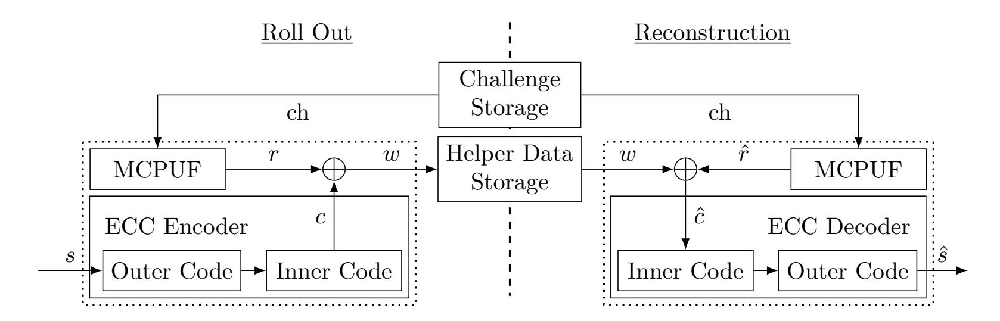

**Figure 1:** Visualization of the key-storage scenarios with PUFs: At some point in time – during  $Roll\ Out$  – a key is stipulated for the device. Later – during Reconstruction – the key is derived from the noisy PUF given public helper data and challenges.

Background on Helper Data Algorithms PUF primitives output responses that are derived from measurement results. Consequently, due to effects like thermal noise, changing environmental conditions, or aging, a PUF response at two instances of time can differ, i.e., the response is noisy. In the context of authentication, noisy PUF responses can be resolved on a protocol level by tolerating a certain amount of errors [YMVD14, MRK+12]. However, if the PUF was used as a key directly, any error in the response would render the key useless. Therefore, post-processing is needed to derive a key from the PUF response. The most common concept for key-storage with an MCPUF and the FCS is depicted in Figure 1; The respective modules of this figure are explained in the following.

Overall, during roll out of a device, a secret s is selected. This secret is encoded to a codeword c. A set of challenges is generated to derive a sufficiently long PUF response r. By XORing the PUF response and the codeword, the codeword gets masked. The resulting masked codeword is stored as public HD. Whenever the secret is derived later in a reconstruction phase, a noisy version of the PUF response  $\hat{r}$  is reproduced by the same challenges as during roll out. XORing the response with the corresponding HD unmasks the codeword. Due to noise in the PUF response, the unmasking is not perfect, i.e., errors remain in the codeword. Nevertheless, given an appropriate ECC design, the codeword is decoded to the correct secret  $\hat{s} = s$  with high probability.

More generally, the HD in this process are generated by a so-called HDA. It generates the HD during roll out from a reference PUF response. During the reconstruction phase it maps PUF responses and HD to a noisy codeword that can be corrected. This work focuses on two state-of-the-art approaches for HDAs: the already mentioned Fuzzy Commitment Scheme [JW99] and the Code-Offset Fuzzy Extractor [DRS04]. But our concept is applicable to other approaches like the Syndrome Construction [DRS04] or Systematic Low Leakage Coding (SLLC) [HYP15]. Pointer based HDAs like Index Based Syndrome Coding (IBS) [YD10b], Complementary IBS (C-IBS) [HMSS12], and Differential Sequence Coding (DSC) [HYS16] are not considered, as previous work has indicated security vulnerabilities for our scenario, like we discuss in Section 2.2.

Background on Error-Correcting Codes For key-storage with PUFs, ECCs are required. As a common design criterion, the error correction capability has to ensure that despite a high bit error probability in the PUF response, a sufficiently long key can be derived with negligible error probability. Previous works like [MSSS11] assume, e.g., error probabilities of 15% for each bit in the PUF response and derive a 128 bit key with an error probability of below  $10^{-6}$ . To ensure a reasonable trade-off between coderate and implementation cost, a widespread approach is to use concatenated codes. Bösch et al. have introduced this

{5}------------------------------------------------

concept in the PUF context in [BGS+08]. Instead of using one large code, which has high implementation costs, the task of error correction is managed by two concatenated smaller codes. In simplified terms, the inner code has a low rate (i.e. lots of redundant information) to correct the incoming high bit error probability to a moderate one. The outer code processes the output of the inner code to achieve the desired probability to correctly derive a key. A straightforward form of this concatenation method is also sketched in the ECC Encoder and ECC Decoder in Figure 1.

Except for polar codes as in [CIW+17], the predominant choice for linear block codes in a PUF context is a code concatenation which uses a repetition code [MTV09, BGS+08, PFFS19, MVHV12]. The repetition code has two main advantages, which justify its popularity: (i) It is easy to implement and (ii) it can deal well with the relatively high bit error rate of the PUF response [DMV02]. Reed-Muller codes have also been used as inner codes [HKS+15, MTV09]. While there are several possibilities for an outer code, BCH codes are often used, because they can be implemented well in hardware. We will see in the results of our analysis that the selection of the code strongly influences the learnability of the PUF in our new approach.

State of the Art in Key-Storage based on Multi-Challenge PUFs The concepts from the previous subsections form a basis for several state-of-the-art applications of MCPUFs such as [PFFS19, Del17, TŠ07]. They all derive multiple keys from a noisy PUF by means of HD, e.g., for a PUF-based protocol. Many existing approaches are analyzed in [Del17].

In a very basic sense, such schemes can be represented by Figure 1, while the roll out phase is now interpreted differently: We consider two entities, one called server and the other one is the device with the PUF. In an enrollment phase, the server collects multiple CRPs from the PUF. With the knowledge about these responses, the server can generate HD that result in a specific key on the device. Whenever the server and the PUF device want to derive a new key, e.g., used for one round of authentication, the server provides the device with a challenge seed and the corresponding HD. The server knows the reference PUF response as a result of the enrollment. The device can correct its noisy version of the original PUF response by utilizing the HD. When both entities now have the same secret key, they can authenticate each other or send encrypted messages. In some protocols also fresh CRPs are transferred over this encrypted channel. While this application is allegedly secure, our analysis shows a potential vulnerability in this scheme.

#### 2.2 Machine Learning Attacks on PUFs

We have discussed above that MCPUFs have been used in several applications for authentication and key-exchange. In particular, several ML attacks on PUFs used in authentication protocols have been presented in the last years. These attacks are possible, because until today no strong PUF according to the definition in [RBK10] is known. Especially the property that for all current MCPUFs different sufficiently large sets of CRPs carry mutual information about each other, is exploited by ML attacks on PUFs. Thus, the response sequence collected from an MCPUF does not have full entropy if the challenges are not selected carefully. This is discussed in [RSGD16] for the LOOP PUF; a result that is transferable also to other PUFs, for which a linear model can be found.

Linear models, however, exist for all popular basic MCPUFs types: The linear model for the k-SUM PUF follows directly from its definition; linear models that result from transformations or from the interpretation of physical peculiarities were presented for APUFs [LLG $^+$ 05], BR PUFs [SH14], and TBR PUFs [XRHB15]. One approach to prevent ML attacks, and – imputing the learnability of all current MCPUFs – the only really secure approach in the light of our analysis, is limiting the number of challenges used with the MCPUF like suggested in the Hadamard code based challenge selection in

{6}------------------------------------------------

[RSGD16] or the lockdown protocol in [YHD+16]. But this severely limits the amount of secret bits that can be derived from MCPUFs.

Since the limitation of CRPs strongly reduces the efficiency of MCPUFs and the practical applicability of several protocols, another approach is to improve the statistical properties of MCPUFs in order to make ML more difficult. The efforts in this direction started with the recombination of multiple PUF responses like suggested in [SD07] and resulted in today's sophisticated constructions like the IPUF [NSJ+19].

However, for every MCPUF and for every approach to prevent ML attacks in the context of challenge-response protocols, sooner or later a successful attack has been demonstrated. The vulnerability of, among others, not only standard APUFs but also its improvements, namely of Feed-Forward APUFs and XOR APUFs, was shown in [RSS+10] and further substantiated in [RSS+13, SBC19]. Even worse, the learnability of the APUF with polynomial number of CRPs was shown under mild assumptions in [GTS16]; the proof was extended to XOR APUFs in [GTS15]. In [GTFS16], the author of [GTS16, GTS15] also notes that not all challenges have the same influence on the response so that an ML algorithm only has to learn the important characteristics of the PUF.

If reliability information of the XOR APUF's responses is available, [Bec15] showed that the required amount of CRPs increases only linearly with the number of XORs. But not only ML attacks on such early constructions have been presented. Also for more complicated structures, the feasibility of ML was demonstrated [Del19]. Even the most recent PUF constructions based on APUFs, such as the MPUF [SMCN17] or the IPUF [NSJ+19], can be attacked [SBC19, WMP+20].

To overcome the learnability issue of MCPUFs, several protocols like the Slender PUF protocol [MRK+12] or the Noise Bifurcation protocol [YMVD14] have been proposed. But similar to the efforts to strengthen MCPUFs on a design level, for every new protocol an appropriate ML attack has been presented after some time. A summary of the strength of several protocols is provided in [Del17]. We affirm that the statement in [Del17, Table 5.1] regarding modeling resistance has a requirement [Del17, Section 5.3.10]: for approaches that use challenges together with HD it only holds if actual secure sketches are implemented. This, however, can hardly be guaranteed in practice. Among others, this affects the protocols [GCVDD02b] and [SVW10] if the requirement is not met. According to our findings, these and other protocols and key-storage mechanisms using MCPUFs and HDAs are only model-resistant if the CRP number is limited to an amount which ensures that the underlying PUF cannot be learned. This is in line with the statements regarding entropy bounds in [Del17].

Because we focus on MCPUFs in a key-storage scenario, modeling attacks are of particular interest. Only a few attacks in this domain are known. Most interestingly, [BWG15] provides an attack on IBS [YD10b], which is also applicable to C-IBS [HMSS12]. The attack shows that the reliability information implicitly stored when using pointer based HDAs, can be used to derive the secret key from a system that uses an MCPUF for key-storage. The only prerequisite in this case is the knowledge about the challenges and the pointer, i.e., the HD. We expect that this attack can also be applied to other pointer based approaches like DSC [HYS16].

Therefore, we analyze the learnability of MCPUFs in a setting where some sort of FE is used. In this context, [RJA11] discusses a theoretical attack on a key-exchange protocol by P. Tuyls and B. Skoric [TŠ07]. However, there are two notable assumptions in this paper: First, a Strong PUF in the narrow sense of a non-learnable PUF is assumed. Second, it is assumed that the attacker has direct access to the PUF. Due to the first assumption the authors of [RJA11] do not discuss ML. However, since they assume direct access to a Strong PUF, they have direct access to CRPs, making ML possible as soon as the PUF becomes in fact a practically existing MCPUF, i.e., learnable. Due to the

{7}------------------------------------------------

assumption of direct access to CRPs, ML becomes straightforward in this case. By applying our approach, we can further reduce the required access to only the HD and challenges like we discuss below. This also turns the usability of the erasable PUF as the suggested countermeasure in [RJA11] into question if such a PUF can be learned.

#### 2.3 Conclusions from the State of the Art

The state of the art shows that MCPUFs are used in several protocols, key-exchange, and key-storage scenarios. Today, such PUFs can be expected to be learnable if an attacker has access to reliability information of MCPUF responses or the responses themselves. This has been proven by different theoretical works and practical ML attacks. However, hardly any risk has been identified regarding ML, when MCPUFs are used in settings where no such information is revealed to an attacker. In the following, we show that even then ML of PUFs is an issue, and propose a strategy on how a potential attacker might exploit the information leakage through helper data to enable ML. We will see that in the generalized case for some state-of-the-art FEs and some linear codes, the problem reduces for an attacker to the task of learning a PUF with XORed response bits.

# 3 Attacker Model and Attack Scenario

In this work we focus on scenarios with an MCPUF to derive a secret key. Typical cases are the storage of secret keys, where MCPUFs are used for efficiency reasons, or key-exchange protocols, which take advantage of the challenge-response behavior of MCPUFs to derive multiple keys per device. The scenarios have in common that a PUF-specific set of challenges and HD is used to reproduce a key on a certain device. Challenges – or a challenge seed ch from which all challenges  $ch_i$  are deterministically derived – as well as HD w are either loaded from memory or transmitted to the device on demand.

#### 3.1 Attacker Knowledge

Since a PUF is involved, we consider HD and challenges to be publicly known data. This assumption is well motivated: The amount of data required for w and ch is always larger than the key. Therefore, the use of a PUF implies that no sufficiently secure memory for key-storage, namely storage that provides protection against external read-out, is available on the device; Otherwise it is more efficient to store the key directly instead of using a PUF. To prevent access to w and ch, data can be transmitted in an encrypted way if a master-key is stored on the device, e.g., by means of an SCPUF or protected memory. But in this case an encrypted session key might be transmitted directly so that no MCPUF is needed. Storing the master key with the MCPUF boils down to the previously discussed case of storing any key with an MCPUF.

In addition to the public w and ch we assume in accordance with Kerckhoffs's principle that the PUF architecture is publicly known. I.e., the attacker knows the used PUF type, a possible function to derive all used challenges from a challenge seed, the HDA, and the ECC. According to Section 2.2, we assume learnability of the PUF and restrict ourselves to the case of linear ECCs.

With the previous assumptions, our attacker is a passive eavesdropper who reads HD and challenges from public memory or a public channel. The attacker cannot read PUF responses directly. Hence, the attacker in this work has fewer prerequisites than in related ML attacks on PUFs. We assume that in cases where direct access to the PUF is necessary, e.g., for a server-side model of the MCPUF, the access can be removed with reasonable effort and in a sufficiently secure way, e.g., by blowing a fuse. If the attacker has direct

{8}------------------------------------------------

access to PUF responses, either the task of learning the MCPUF is equivalent to attacks on authentication protocols or no ML is required at all.

The attacker in our setting also does not need to manipulate HD or challenges. I.e., prevention of HD and challenge manipulation does not help against the identified pitfall. The capability to trigger re-enrollment of the key with different challenges and HD is a useful feature for an attacker, since it provides her with an arbitrary number of appropriate challenges and HD, but it is no strict requirement.

Although it is beneficial for an attacker, we exclude Side-Channel Analysis (SCA) capabilities to gain information about the PUF like in [KCG+20, MSSS11, TPS17, TPI19] as well as Fault-Injection Analysis (FIA) from our research. Even without such attacks, the attacker can be successful.

#### 3.2 Attack Sketch

The passive eavesdropper Eve (E) in our scenario observes HD and challenges used to store a secret key with an MCPUF. Each known challenge  $ch_i$  belongs to an unknown response bit  $r_i$  of the PUF under attack and, therefore, to at least one known HD bit  $w_j$ . The HD bit depends on the PUF response as well as on some random bit. Given the PUF response, it is mapped to a codeword by the HDA. This codeword now implies the existence of redundancy. I.e., the HD bits reflect an inherent, unavoidable dependency between specific codeword bits, cf. Section 4.

E knows the mapping during roll out to derive HD w from PUF responses  $r_i$  and random bits  $s_j$ . She transforms the system to eliminate  $s_j$ . In the new representation, she replaces each  $r_i$  by an unknown function  $puf(\operatorname{ch}_i)$  where  $\operatorname{ch}_i$  is known. The result is a mapping from challenges to transformed HD and only puf is unknown.

E provides her knowledge to an ML algorithm for learning. She trains a model that does not learn the PUF responses directly but rather the dependency between the responses of the PUF for several challenges. E now guesses the PUF response  $\tilde{r}$  for one challenge ch used in the key-storage scenario. With the tuple  $(\tilde{ch}, \tilde{r})$  she queries the model for the most likely sequence of response bits under this hypothesis and given the set of challenges used to reconstruct the still unknown key. After using HD and HDA with the resulting sequence of PUF responses, she ideally finds the correct codeword if  $\tilde{r}$  was correct or the inverted correct codeword if she guesses  $\tilde{r}$  wrong. Knowing the ECC, she finally decodes the codeword to the key. The remaining key-entropy from a successful analysis, which E can mount by only passively observing HD and challenges and processing her observations, is therefore one bit. The only requirement is that she can observe enough challenges and HD; It will turn out that for simple PUF primitives in combination with typical code concatenations only a few hundred challenges suffice to break the system. But the situation can be improved not only trivially with a stronger PUF but also by using codes that enforce a large and varying number of XORs in the virtual XOR-PUF.

Remarks: (i) In the described process, it is not necessary to guess the codeword with high accuracy. Rather, the ECC corrects sufficiently few errors to the right key. (ii) The entropy can actually be reduced further if one of the codewords derived after setting  $\tilde{r}=0$  and  $\tilde{r}=1$  is more likely. This happens if the inverse of the correct codeword is not part of the code. But we assume that it is easier for E to try out the two possible solutions than to reveal the bit from statistical properties.

# 4 Exploitation of Helper Data Leakage

The basic idea of the attack is to exploit dependencies between codeword bits. We use the FCS and systematic codes in the following to ease the explanation. However, the transfer to other HDAs and non-systematic codes is straightforward. First, we illustrate

{9}------------------------------------------------

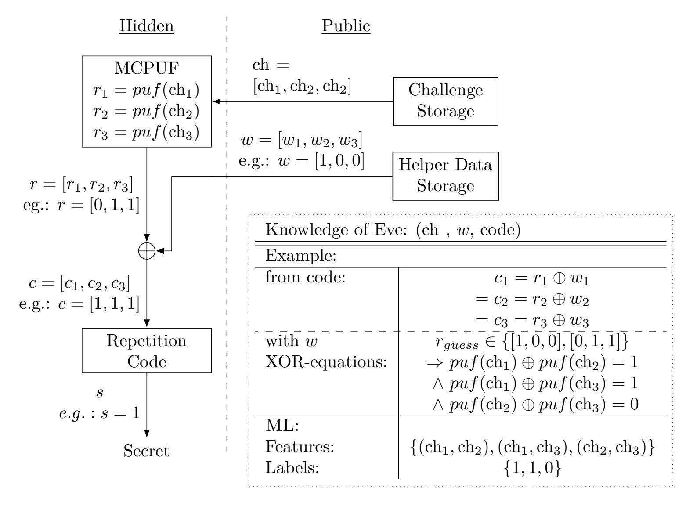

**Figure 2:** Visualization of the attacker knowledge using a (3,1,3)-repetition code. The left side is hidden from E; Public information and its exploitation is given on the right.

the full attack using a repetition code as an example. This is followed by a general formal representation of the attack similar to the notation in [PHS17, HPKS16]. Two subsequent examples demonstrate how to grasp the structure of the underlying ECC to train an ML algorithm and eventually reveal the secret.

### 4.1 Eve's Attack

To begin with, Figure 2 explains the whole attack using the example of a repetition code of length 3. It summarizes the knowledge of E: She has no direct access to the PUF. But she knows HD w, challenges  $ch_i$ , and that  $ch_i$  belongs to response  $r_i$ . Furthermore, E is aware of the ECC and thus how HD and PUF bits are connected. Through the HD, she can guess possible PUF responses  $r_{guess}$ . This is easy for a repetition code, because the codeword c is either [1, 1, 1] or [0, 0, 0], i.e., each bit of a single codeword has the same value. Thus, if  $w_i = w_j$ , then  $r_i = r_j$  and accordingly different helper data bits in a repetition code word mean different underlying PUF bits. According to the example in Figure 2, it follows from  $puf(\operatorname{ch}_1) \oplus puf(\operatorname{ch}_2) = 1$  that  $puf(\operatorname{ch}_1) = r_1 \neq r_2 = puf(\operatorname{ch}_2)$ . In this fashion, E derives so-called XOR-equations by virtually relating responses to each other and replacing each response with the same unknown function puf that maps a challenge to the PUF response. The XOR-equations can only be derived using bits of the same codeword. Two PUF bits in different codewords cannot be part of the same XOR-equation. The resulting pairs of challenges in the XOR-equation constitute the features and the result of the equation the label for the training of a ML model. In the training phase these features and labels are used to learn the dependency of different PUF bits with respect to their challenges.

After the training phase, E applies the trained model. She chooses one of the challenges as reference challenge without the knowledge of the respective output. All challenges used

{10}------------------------------------------------

for the key-storage are paired with this reference challenge and E queries the model for the responses. By using a single reference challenge, the ML algorithm outputs a PUF response for every applied challenge without considering the used code; the PUF itself is modeled. Since E has to guess the output of the reference challenge, one bit of entropy remains. All the other response bits are categorized by the ML model as having the same or the inverse value. E finally uses the same HDA and ECC as the actual PUF construction to correct possible errors in the response string output by the ML algorithm.

#### 4.2 Formalization of the Attack Idea

We introduce an algebraic notation for Eve's attack and the derivation of the XOR-equations. The inputs to the HDA during roll out are the PUF response r and a random number x. The outputs are a derived secret s and public HD w both determined using the generator matrix G of the underlying ECC:

$$\begin{bmatrix} x^k & r^n \end{bmatrix} \cdot \begin{bmatrix} I^{k \times k} & G^{k \times n} \\ 0^{n \times k} & I^{n \times n} \end{bmatrix} = \begin{bmatrix} s^k & w^n \end{bmatrix}$$
 (1)

Superscripts denote the length of the respective binary row vectors x, r, s, w and the size of the matrices 0, I, G. 0 is the all-zero matrix and I the identity matrix. In the FCS, attacker E has no information about x = s. We now focus on the computation of the HD w based on x = s and r. E wants to predict r given w to eventually reveal the unknown secret s. Statements about r are derived from the ECC in the FCS. Hence, we zoom in on the matrices, especially on G with its columns  $g_{*,i}$ .

$$\begin{bmatrix} x^k & r^n \end{bmatrix} \cdot \begin{bmatrix} g_{*,0} & g_{*,1} & \cdots & g_{*,n-1} \\ 1 & 0 & & 0 \\ 0 & 1 & & 0 \\ \vdots & \vdots & \ddots & \vdots \\ 0 & 0 & & 1 \end{bmatrix} = \begin{bmatrix} w^n \end{bmatrix} \tag{2}$$

As an example,  $w_i = x^k \cdot g_{*,i} \oplus r_i$ . I.e., the *i*-th HD bit is determined by multiplying the secret random number with the respective column of the generator matrix and XORing the *i*-th PUF bit. E now computes the XOR-sum of two HD bits. This results in:

$$w_i \oplus w_j = (x^k \cdot g_{*,i} \oplus r_i) \oplus (x^k \cdot g_{*,j} \oplus r_j)$$
  
=  $x^k \cdot (g_{*,i} + g_{*,j}) \oplus r_i \oplus r_j$  (3)

 $g_{*,i} + g_{*,j}$  denotes the component-wise XOR of the two columns. The recombination of an arbitrary number of HD and, in parallel, of the corresponding matrix columns and PUF bits is possible in this way.

E now uses this recombination to eliminate the influence of the secret x. In other words, E chooses indices i, j, ... such that the sum of the columns  $g_{*,i} + g_{*,j} + \cdots = 0$ . Then she ends up with a direct link between a sum of HD bits and a sum of PUF bits.

The selection of such columns is in fact possible and core of the attack: The discussed selection corresponds to choosing linearly dependent columns of G. The generator matrix is, however, constructed such that the codeword of the corresponding code contains redundant information. Therefore, k < n and consequently G contains linearly dependent columns. For each set where according to Eq. 3 the secret part cancels out, E can derive a relation between PUF bits given the HD. We call every resulting equation of the form

$$w_i \oplus w_j \oplus \dots = \{0, 1\} = r_i \oplus r_j \oplus \dots \tag{4}$$

an XOR-equation. The bit-value derived from XORing public HD is an element of the set  $\{0,1\}$  and is publicly accessible like the HD itself. While this notation has been presented

{11}------------------------------------------------

for the FCS, it holds equivalently for the Code-Offset Fuzzy Extractor, since the HD are computed in the same way.

For now, we have shown that by picking suitable indices according to linearly dependent columns of the generator matrix, E can set up linear XOR-equations with the only unknowns being the PUF bits. In particular, HD is known, and the secret has been cancelled out. With this knowledge, E starts ML as described in Section 4.1.

#### 4.3 Analysis for Selected Error Correcting Codes and XOR-Equations

To demonstrate the concept, we focus on two different codes in this section: a repetition code and a BCH Code. However, each generator matrix of every linear block code has linearly dependent columns and is, thus, subject to our new type of attack.

**Repetition Code:** There are mainly three aspects of presenting the repetition code as a first code in this work. (i) It is a simple ECC, which hence allows for an intuitive understanding. (ii) Like discussed in Section 2.1, repetition codes are a very popular choice for error correction based on code concatenation in various PUF applications. (iii) While their simplicity and error correction capability justify their frequent use, they turn out to be the most vulnerable codes to our attack. Hereby, it does not matter if n is odd or even. An odd n is the default choice in various previous contributions [BGS+08, MVHV12, PFFS19], but the attack works equally well for even n. Hence, [MTV09] is also affected. Also, for the sake of simplicity we neglect outer codes in concatenated schemes for the moment.

Returning to the formal notation, we now do not consider an arbitrary generator matrix G, but the one for a repetition code. We use w.l.o.g. a code of length n=3. The HD is then generated by

$$\begin{bmatrix} x^1 & r^3 \end{bmatrix} \cdot \begin{bmatrix} -\frac{1}{1} & \frac{1}{0} & \frac{1}{0} \\ 0 & 1 & 0 \\ 0 & 0 & 1 \end{bmatrix} = \begin{bmatrix} w^3 \end{bmatrix} . \tag{5}$$

Because k = 1, any two columns of the generator matrix are linearly dependent. We are interested in finding as many sets of linearly dependent columns (or their indices) as possible, while at the same time we want the cardinality of these sets to be minimal: The fewer PUF bits are part of an XOR-equation, the better for the ML as discussed below.

An exemplary XOR-equation of the repetition code is:

$$w_0 \oplus w_1 = x^1 \cdot (g_{*,0} + g_{*,1}) \oplus r_0 \oplus r_1 = r_0 \oplus r_1.$$
(6)

 $w_0 \oplus w_1$ , reveals whether or not  $r_0$  and  $r_1$  have the same value. We refer to Figure 2 where this notation can now be applied. Since for a repetition code the bits of an error free codeword are equal, it holds that  $c_1 = c_2 = ... = c_n$ . Consequently, it is possible to derive  $(n^2 - n)/2$  XOR-equations by comparing the n codeword bits pairwise.

The challenge order in each pair can be permuted1. Because for each XOR-equation of the repetition code two challenges are involved, in total  $(n^2 - n)$  XOR-equations are available. These XOR-equations contain the information for the ML attack.

**BCH Code:** BCH Codes are frequently used in the PUF context. Here we introduce a BCH Code or Hamming Code as an example because its structure is more complex than

&lt;sup>1The ordering of challenges is relevant for some ML algorithms and in particular for the used SNN.

{12}------------------------------------------------

the one of a repetition code. This is reflected in more complex XOR-equations. Thus, we can illustrate more aspects which are relevant from a ML point of view.

Again, we start by representing the HD as result of a vector-matrix-multiplication. The underlying exemplary code is an  $(n = 7, k = 4, d_{min} = 3)$  BCH-Code for which the generator matrix can be brought into systematic form. This means that the codeword is split into a first part containing the redundancy bits and a second part containing the information bits.

$$\begin{bmatrix} x^4 & r^7 \end{bmatrix} \cdot \begin{bmatrix} 1 & 1 & 0 & 1 & 0 & 0 & 0 \\ 0 & 1 & 1 & 0 & 1 & 0 & 0 \\ 1 & 1 & 1 & 0 & 0 & 1 & 0 \\ 1 & 0 & 1 & 0 & 0 & 0 & 1 \\ ---------------------------------$$

Given this generator matrix one exemplary XOR-equation for this BCH code is:

$$w_0 \oplus w_3 \oplus w_5 \oplus w_6 = x^4 \cdot (g_{*,0} + g_{*,3} + g_{*,5} + g_{*,6}) \oplus r_0 \oplus r_3 \oplus r_5 \oplus r_6$$

$$= r_0 \oplus r_3 \oplus r_5 \oplus r_6$$
(8)

It can be found by picking a column of the redundancy part and the other columns from the information part with the ones at the correct positions. Due to the structure of the BCH Code, two PUF bits cannot be compared directly. Rather, this example involves four PUF bits in the XOR-equation. This still provides a clue for an attacker. But in comparison to the repetition code, it is more difficult to exploit the information. We now discuss the code-independent generation of XOR equations.

The overall complexity of finding XOR-equations and related problems: The goal is to find sets of columns with the smallest size such that the columns are linearly dependent. The smallest amount of columns is also called spark in the context of compressed sensing. Unfortunately, determining the spark is known to be an NP-hard problem [TP13]. Another related problem is computing the minimum Hamming distance for a given parity check matrix of an ECC. This has also been shown to be NP-hard. [Var97].

**A practical approach to XOR-equations:** While it is beneficial for the attack to find the smallest sets of linearly dependent columns, it is no strict requirement. Any amount of different PUF responses in an XOR-equation gives the attacker insights on how to model the PUF. One practical approach is, thus, to select well suited columns by inspection. Also, any selection of rank(G) + 1 columns gives a set of linearly dependent equations by definition, which results in an XOR-equation.

For our experiments, we follow a brute-force approach: We iterate the amount of columns that shall be combined  $\kappa$  from small to larger, but feasible, values. A brute-force search for all combinations of  $\kappa$  linearly dependent columns in the generator matrix is performed in each step. Deriving a large number of equations this way is computationally expensive. But XOR-equations for a specific code have to be found only once to enable the attack on this code for the future.

With the sets of linearly independent equations at hand, the XOR-equations and the results of recombining the HD accordingly – the labels – are easily derived. In addition, the challenges (i.e. the features) can be looked up, which belong to an XOR-equation in a specific key-storage scenario. For the ML algorithm used in this work, the ordering of the applied challenges is of relevance. Therefore, to fully exploit the identified independent columns for an ECC, we apply the challenges with the corresponding label in all possible permutations to the ML algorithm.

{13}------------------------------------------------

# 5 Results of Machine Learning

This section proves the learnability of PUFs by exploiting redundancy information stored in HD. We use an SNN in the attack. The use of an ML algorithm that belongs to the class of Neural Networks (NNs) represents an attacker with very little technical knowledge about the PUF and its underlying structure. Furthermore, an SNN reflects – and can thus incorporate – the differential nature of XOR-equations well. We give more details about the reasoning behind an SNN and about the SNN construction in Appendix A.

In the experiments, we first conduct our analysis on simulated data. The simulated k-SUM PUF is built from normalized uncorrelated RO frequencies sampled from a uniform distribution in the range -1 to 1; For the simulated APUF we use the model implemented by Ruehrmair et al. [RBK10]. The simulated experiment represents the worst case for an attacker, because it represents a realistic PUF without any bias or correlations in the response. Second, we evaluate the attack with real data: Instead of randomly sampling the RO frequencies for a k-SUM PUF, we adopt the values in [Hes18] to build multiple k-SUM PUFs.

For comparability, all challenges were created by the same 128 bit Galois LFSR with primitive feedback polynomial  $x^{128} + x^{127} + x^{126} + x^{122} + 1$ . The analyses are implemented in Python 3 with Tensorflow 2.0 as the ML framework and are executed on a commodity computer with Intel i7 CPU and 16 GB of memory.

The attacker cannot separate a response or key from its inverse because she has to guess the response bit for the reference challenge as described in Section 4. Therefore, we consider an attack successful if the attacker guesses an n bit PUF response, a key, or their respective inverses correctly. A PUF success rate of 80% means: 80% of the bits in the predicted PUF response coincide with either the correct PUF response or its inverse. The key success rate is defined equivalently and always refers to a key of the same length.

#### 5.1 Selection of a Neural Network

The XOR-equations introduced in Section 4 are interpreted as comparisons of the PUF responses for different challenges. We use an SNN to account for this interpretation. SNNs consist of multiple NNs, which have exactly the same structure and share their trainable weights. These NNs are connected by a layer which measures the distance between the NNs' outputs. We use the Manhattan distance as the distance metric.

The distance layer is followed by the prediction layer. The loss between predictions and labels while the training is calculated using binary cross entropy; an optimizer Adam [KB14] with default parameters is used. The activation functions in our implementation are the Rectified Linear Unit (Relu) function for the hidden layers and the sigmoid function for the output layer.

The data for learning consists of a set of tuples with challenges (features) and correspondingly XORed HD (labels) derived from XOR-equations. We split this set into a training and a validation data set with a ratio of 90% to 10%. More precisely, the ratio was aligned with the codeword length, since challenges used for the same codeword must not be part of training and validation set at the same time.

The final choice of hyperparameters like the number of layers, neurons per layer, dropout layers and the dropout rate can be evaluated and optimized by tracking the validation accuracy of each tested network architecture while using the same training and validation set. We manually identified two variants of the SNN used throughout the analysis (cf. Appendix, Section A). Please note that this selection process could also be automated and the found SNNs could still be optimized.

{14}------------------------------------------------

#### 5.2 Exploiting Repetition Codes

The repetition code is commonly used for code concatenation in the PUF context. Therefore, our first evaluation targets a repetition code of length 7 like suggested in [MSSS11]. An SNN (cf. Appendix, Figure 12) was trained with a maximal number of 200 epochs. An early stopping condition tracked the validation loss value and stopped training when the validation loss did not further improve within a period of 25 training iterations. If learning was stopped early, the weights were reverted to the iteration with the best validation loss value.

**Simulated** k-SUM PUF First, we evaluate the attack given that a repetition code is used to correct the response of a 128-SUM PUF. Figures 3(a) and 3(b) depict the accuracy and the validation accuracy of the trained model with respect to the size of the training and validation set together. The results are presented in terms of actually used CRPs of the PUF to allow for a better comparison with other code classes. In case of the (7,1,7) repetition code, e.g., the number of XOR-equations used for training is per codeword  $7^2 - 7 = 42$ . The number of codewords is adjusted to fit best into the amount of CRPs in each Figure, e.g., for the repetition code from overall 400 CRPs we use  $57 \cdot 7 = 399$  CRPs. Consequently,  $57 \cdot 42 = 2394$  XOR-equations are generated for learning; nevertheless, the attacker has observed only 399 challenges and corresponding HD bits.

To account for randomness used in the ML algorithm, the experiment was repeated 10 times for every considered amount of CRPs. While the accuracy of the model is quite high already from the beginning, the validation accuracy increases more slowly. However if the validation accuracy is too low, it is not possible to predict results for XOR-equations not seen yet. Stepwise more CRPs lead to a roughly logarithmic growth of the validation accuracy. From 800 CRPs on, the validation accuracy reaches a level of above 80%. At this point, a high validation accuracy for a specific model is a good indicator for the ability to successfully attack the underlying PUF. As it is shown next, this value suffices to derive codewords with sufficiently low error probability to decode them to the correct secret.

Figure 3(c) and Figure 3(d) present the results after training: Figure 3(c) indicates the PUF success rate that is a measure for the correctness of the prediction. The model was trained to detect the difference between multiple – in case of the repetition code two – responses. Hence, to retrieve specific CRPs from the model, each respective target challenge is applied together with always the same reference challenge. In Figure 3(c) the first challenge used in the key-storage system served as reference challenge, a decision we discuss below. Remarkably, the median of the success rate for the PUF response is always higher than the validation accuracy during training.

With the predicted PUF response at hand, the PUF response together with the HD are now mapped to codewords and decoded with the ECC. Figure 3(d) depicts the resulting key success rate after this process. Due to the error correction capability of the repetition code, we find the correct key with only 800 CRPs. Since the result depends on the guessed response for the reference challenge, the decoding returns either the correct key or its inverse. We did not utilize an outer code connected with the repetition code.

This first experiment shows the feasibility and power of the attack: In typical PUF scenarios using the repetition code, significantly more than 800 CRPs are needed, e.g., 1778 to store a 128 bit key in [MSSS11]. Therefore, scenarios storing a key with only a moderately secure MCPUF are shown to be potentially vulnerable. Especially codes with low coderate are a pitfall in combination with FCSs or FEs and an MCPUF. We now substantiate the analysis to show further aspects of the identified weakness.

**Simulated Arbiter PUF** We repeat the exact same experiment from above only replacing the k-SUM PUF by the APUF model implemented by Ruehrmaier et al. [RBK10]. Figure 4 depicts the corresponding results. The probability that the found key has one

{15}------------------------------------------------

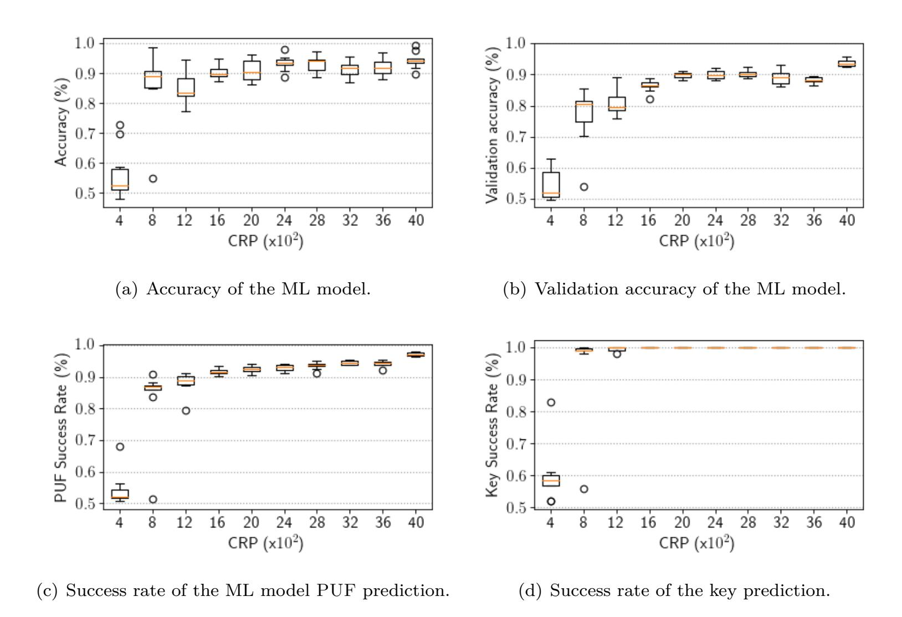

**Figure 3:** Evaluation of the attack idea using a repetition code with n = 7, 128-SUM PUF and a Siamese neural network. For every number of CRPs ten neural network were trained and evaluated.

bit of entropy left while attacking the APUF model is  $\approx 100\%$  with 2000 CRPs for training. Again, the validation accuracy of the model grows logarithmically with the number of CRPs. The variance of the probability to find the correct key given 400 CRPs is much larger than the corresponding variance for the experiment with the k-SUM PUF. Interestingly few outliers reach  $\approx 90\%$  which indicates strongly reduced key entropy. The result validates that – while the quality of the MCPUF influences the learnability – the successful attack on the k-SUM PUF was not due to a poor implementation of the PUF.

**SUM PUF based on real Ring Oscillator Frequencies** To validate the practical applicability of our attack, we demonstrate it on a SUM PUF derived from RO frequencies measured on FPGAs. The frequency set has been published under [Hes18] along with an analysis in [HWGH18]. The data set consists of measurements taken from 217 Xilinx Artix7 FPGAs (part number: XC7A35T-1CPG236C). To derive a SUM PUF of high quality from these data, we followed the suggestions in [HWGH18]. As a consequence: (i) We discarded ROs which are influenced by the clock distribution network, namely those with y coordinate 25, 75 and 125. (ii) We took the required 256 ROs to construct a 128-SUM PUF from the same clock domain (c.f. App. B). (iii) We derived frequencies only in a non-overlapping way from slices of the same type that are in addition neighboured in x direction and share the same y coordinate. In this way we constructed 6 different 128-SUM PUFs per FPGA, one for each slice type. From the different time and temperature samples, we selected the frequencies with the evaluation time of 70.71  $\mu$ s, because in [HWGH18] this was found to be the optimal trade-off for the underlying FPGA architecture; further we selected a constant temperature of 30°C. Additionally, we took the mean frequency from the 100 provided measurements to reduce the noise in the roll out.

{16}------------------------------------------------

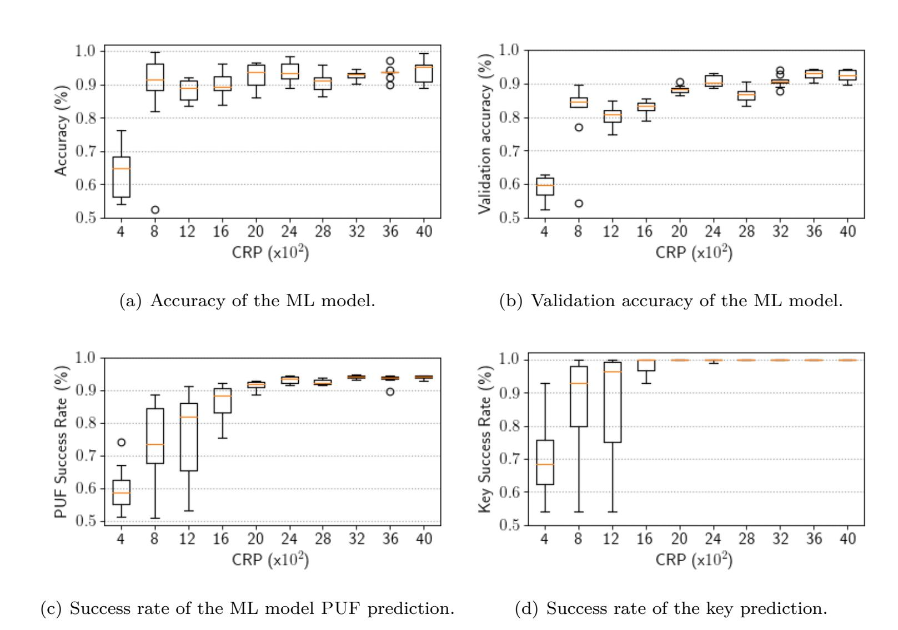

**Figure 4:** Evaluation of the attack idea using a repetition code with n = 7, Arbiter PUF model with 128 bit challenge, and a Siamese neural network. For every number of CRPs ten neural networks were trained and evaluated.

We mounted our attack based on real data on each of the 6 SUM PUFs per device and for each of the 217 FPGAs. Thus, the attack was performed on 1302 different realistic k-SUM PUFs, which are all expected to have good statistical properties since we followed the construction rules above. For every PUF, we repeated the experiment for five different amounts of randomly selected challenges. The HD were created under the assumption that a (7,1,7) repetition code is used for error correction. Like for the simulated PUFs, we repeated every attack 10 times given the same HD and challenges to counter randomness in the ML approach.

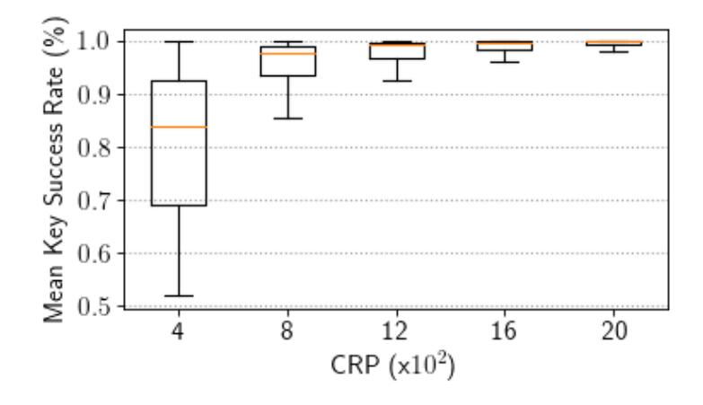

**Figure 5:** Mean key success rate of the ML model for a 128-SUM PUF based on measured frequency data.

Figure 5 visualizes a summary of the results. To allow for a better interpretation of the results, this figure shows the distribution of the mean key success rate over all analyzed

{17}------------------------------------------------

PUF instances. Each value in Figure 5 corresponds to the mean value of the key success rate of ten attacks. For this realistic data set, some PUFs have been learned with only 400 CRPs and 800 CRPs seem sufficient to accurately model a 128-SUM PUF. Furthermore, it can be seen that all PUFs are well modeled with a practically common amount of CRPs for a single 128 bit key. This shows that the attack is feasible for real data as well. For the following analysis, we again consider a simulated k-SUM PUF.

#### 5.3 Influence of Error Correction Capabilities and Reference Challenge

The code-dependent number of existing XOR-equations, the influence of the error correction capability itself, and the influence of the choice of the reference challenge remained open from the previous observations for further analysis in this section.

Number of XOR-equations: Most important for the learnability is the number of XOR-equations that can be generated. The more XOR-equations are found, the more training samples are available to train the model. This is now demonstrated repeating the same experiment as before with the same k-SUM PUF but for codes with different levels of redundancy. Since the repetition code adds redundancy by the size of its codewords, we always use the same number of CRPs as before, but create XOR-equations with respect to repetition codes of lengths 3, 5 and 7. Figure 6(a) compares the results of the analysis before decoding. The results indicate that the learnability through these codes is sorted by their codeword length n. This relation is explained by the number of XOR-equations, which is  $(n^2 - n)$  for the repetition code (cf. Section 4). Figure 6(b) presents the growth rate of the number of XOR-equations given a CRP number for these three codes. The more XOR-equations a ML algorithm receives, the faster it can learn and generalize.

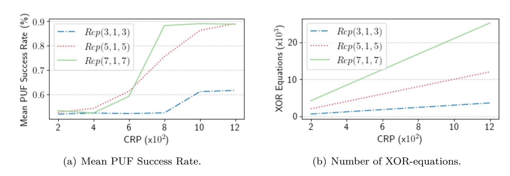

**Figure 6:** Comparison of three repetition codes dependent on the number of XOR-equations which can be created.

Error correction rate: Imperfections in the ML model are unavoidable due to the intrinsic limitation of the number of CRPs. The imperfect ML model behaves, however, like a noisy PUF and is corrected in our approach – as already shown – by the ECC for the actual PUF. Recall that the more redundancy in the code, the easier to attack the PUF. Furthermore, the high redundancy can correct many errors. A concatenation of an inner code having a high error correction capability with an outer code of high information rate and low error correction capability is common practice. Additional XOR-equations, which can be established through dependencies in the outer code, can further advance our attack. In addition, the correction capabilities of the outer code further reduce the required model accuracy for a successful attack. Overall, a high bit error rate in the PUF, which requires a stronger ECC, supports the attack in our analysis.

{18}------------------------------------------------

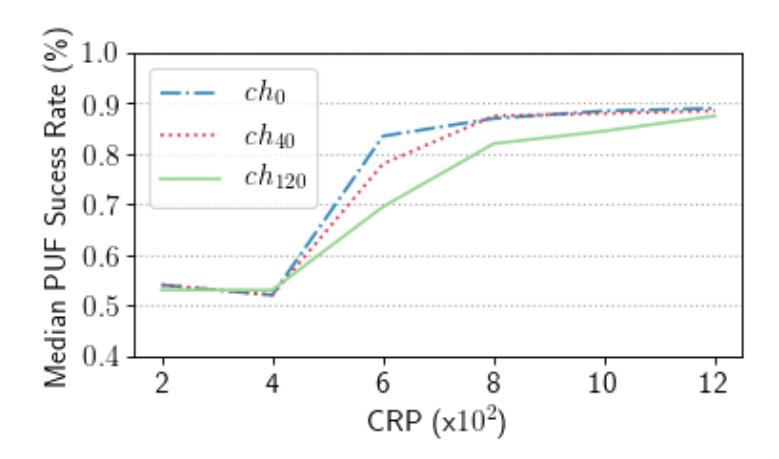

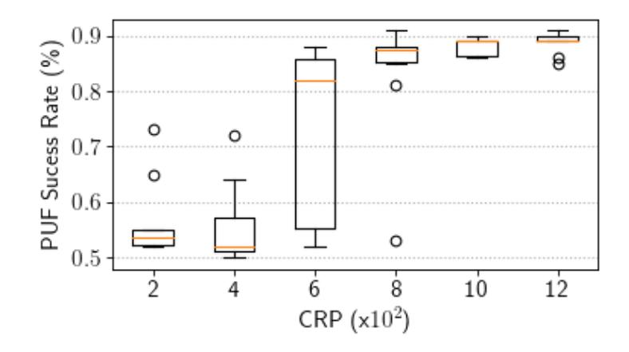

- (a) Median PUF success rate using different reference challenges.
- (b) Box plot of the PUF success rate using the mean result of multiple decodings with different reference challenges.

Figure 7: Comparison between decoding with a single reference challenge and decoding with multiple challenges and creating the mean value.

Choice of the reference challenge: When the ML model has been trained, the PUF is predicted according to a reference challenge. Figure 3(b) shows the median validation accuracy of the ML model while attacking the k-SUM PUF by a repetition code. It lies at  $\approx 80\%$  for 800 CRPs. However, the median PUF success rate shown in Figure 3(c) for 800 CRPs is at  $\approx 87\%$ . This raises the question for a systematic explanation of this observation. We suggest a dependency on the chosen reference challenge as the reason. To substantiate this assumption, we repeated the PUF prediction with different reference challenges. Figure 7(a) depicts the median PUF success rate using three different reference challenges. The success rate grows over CRPs similarly for all reference challenges. Also, all reference challenges saturate at  $\approx 89\%$ . However, the slope of the success rate using ch120 as reference challenge is significantly smaller than for the other references. We leave the explanation why some reference challenges perform better than others open for future research. In this work, we consider the task to select the best reference challenge an unsolved problem. To demonstrate the influence of the effect anyway, Figure 7(b) shows the mean value of the prediction with 11 different reference challenges.

#### 5.4 Analyses for Different Codes and PUF Sizes.

We now extend the analysis to three more codes. In these experiments we use k-SUM PUFs with k=32 and k=64.

Single Parity Check Code: We start this part of the analysis with a Single Parity Check (SPC). The consideration of an SPC is motivated by its potential as an inner code generating erasures as well as by its specific structure. Let  $\kappa$  denote the number of helper data bits, which have to be combined to generate an XOR-equation. The structure of SPC codes enforces that  $\kappa$  is equal to the code length n. The longer the codeword is, the more XOR operations included in the XOR-equations can be used to derive features and labels for training. I.e., more PUF responses are XORed. To compare the influence of additional XOR operations we use SPCs with n=3 and n=4 To reduce the influence of the ML model we used an SNN (cf. Appendix, Figure 11) which is able to generalize and learn the attacked PUF by XOR-equations derived for both SPCs. Only one XOR-equation exists per SPC, which can be permuted 3!=6 times for SPC(3,2,1) and 4!=24 times for SPC(4,3,1). Figure 8 shows the results for SPC(3,2,1) and SPC(4,3,1). The results indicate that, although the number of XOR-equations derived for SPC(4,3,1) is four times higher than for the SPC(3,2,1), also approximately four times more CRPs are needed to generalize and to predict the PUF. Hence, the number of XOR operations in an

{19}------------------------------------------------

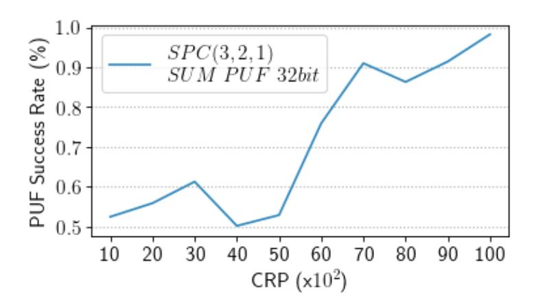

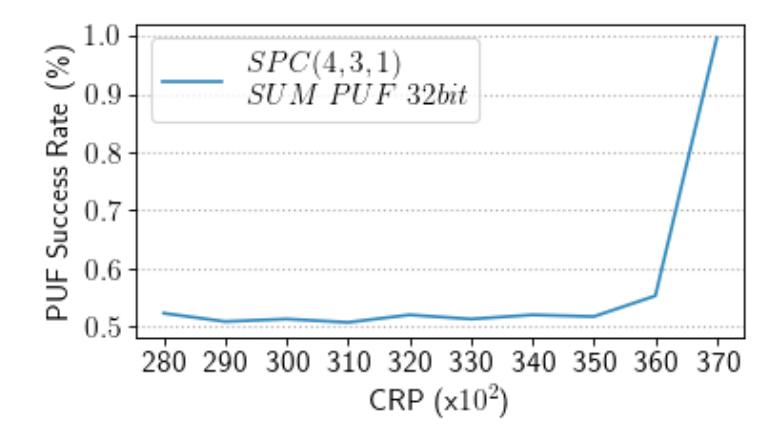

**Figure 8:** PUF success rate of two attacks on a 32-SUM PUF while utilizing XOR-equations with  $\kappa = 3$  of the SPC(3, 2, 1) and  $\kappa = 4$  of the SPC(4, 3, 1) code.

XOR-equation has a significant influence on the number of CRPs needed to predict a PUF. We conclude that codes which enforce a higher number of XORs within the XOR-equations are harder to exploit.

Analysis of BCH and Reed-Muller Codes. Besides the repetition codes, two frequently used code classes in the PUF context are BCH and Reed-Muller (RM) codes. Therefore, we now analyze the exploitability of codes from these classes given k-SUM PUFs with k=32 and k=64. More precisely a BCH(7,4,3) as well as an RM(16,5,8) like in [HKS+15] were under consideration. For both codes, XOR-equations with  $\kappa=4$  exist and are used. RM(16,5,8) has 140 such XOR-equations per codeword. Each equation is permuted 4!=24 times. We thus derive  $140\times 24=3360$  label-feature pairs for one 16 bit codeword. Hence, for each CRP on average we can use  $\frac{3360}{16}=210$  XOR-equations.

In comparison a BCH(7, 4, 3) has only 7 XOR-equations for  $\kappa = 4$ . Again, each equation can be permuted 24 times which results in 168 label-feature pairs per codeword. This is a rate of  $\frac{168}{7} = 24$  XOR-equations per CRP. This factor of  $\approx 9$  times more XOR-equations per CRP also impacts the results.

We now applied the same SNN as in the previous experiment (cf. Appendix, Figure 11) and trained the networks until they reached a PUF success rate of above at least 70%. Figure 9 presents results for both k-SUM PUFs and block codes. For RM(16, 5, 8) both k-SUM PUFs are learned with less than 3000 and, respectively, 5000 CRPs to a PUF success rate of above 97%. In contrast, the BCH(7, 4, 3) is learned with the 32-SUM PUF using 4.5 times the amount of CRPs with a success rate of only  $\approx 80\%$ . For the 64-SUM PUF, the ML algorithm needs 7.3 times more CRPs to reach only 70%. Consequently, for the RM code the key can be derived correctly with high probability, while for the BCH code, due to its higher coderate, the number of considered CRPs does not suffice.

Although there is no obvious direct relation between the number of XOR-equations per CRP and needed CRPs to reach a certain PUF success rate and therefore to mount a successful attack, the results show that the more XOR-equations per CRP in the training phase the more easily the ML model can generalize. Further, the findings show that it is possible to adapt the attack to different and more complex codes.

# 6 Discussion of the Analysis Results

The concept of the attack and the respective findings in Section 5 have shown that keystorage with MCPUFs is much less secure than previously assumed. The knowledge of the public HD and the public challenges alone is sufficient for an attacker to mount an ML attack. In this section, we discuss various consequences of our attack. In particular, we describe how the attack might perform on more recent PUF constructions. Then, we

{20}------------------------------------------------

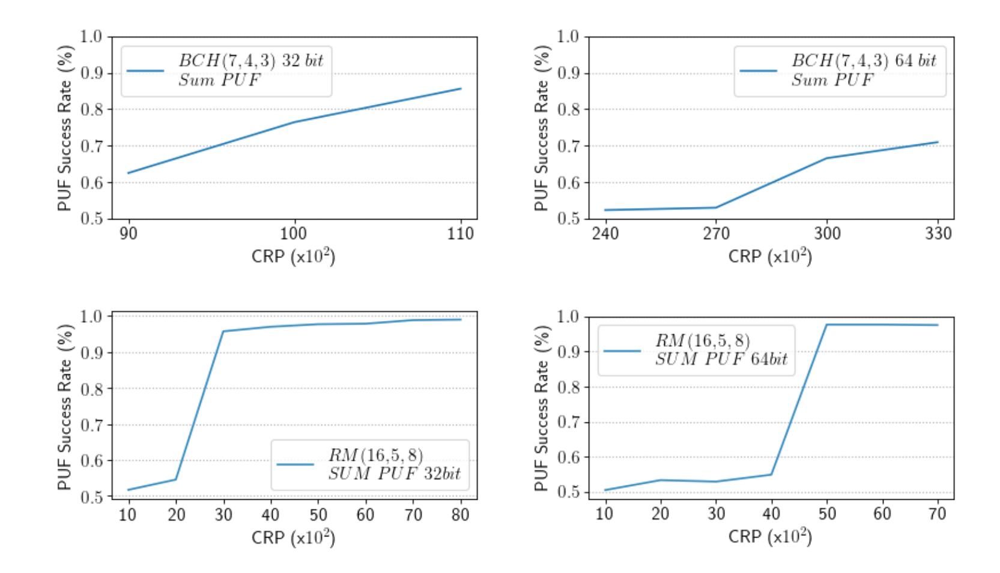

**Figure 9:** PUF success rate of attacks on a 32-SUM PUF and a 64-SUM PUF while utilizing XOR-equations with  $\kappa = 4$  of the RM(16, 5, 8) code and the BCH(7, 4, 3) code.

relate the SNN in this work to other machine learning approaches in the PUF context. Finally, we indicate several means that make our attack more difficult.

#### **6.1** Impact on other PUF Primitives

We have demonstrated the attack on a k-SUM PUF and an APUF. Yet, the proposed concept is not tailored to a specific type of PUF, but mostly paves the way for attacks without known responses or reliability information. Thus, while SCPUFs like reasonably implemented RO PUFs [YQ10, MVHV12] are not affected, the basic attack idea is also applicable to other, state-of-the-art MCPUF designs. The discussion in this section highlights how our approach impacts the security of more recent MCPUFs, which are dedicated to having a higher resistance against ML. While an actual attack on one of these PUFs is out of the scope of this paper, we have selected the MPUF [SMCN17] and the IPUF from the multitude of modern PUF designs for a detailed discussion. These two recent PUF designs are – according to [WMP+20] – highly promising. We exclude PUF constructions which do not use helper data like in [HRD+16] from our analysis; Such constructions are by definition not susceptible to machine learning through HD.

ML through helper data vs ML based on CRPs: Before discussing the impact on MPUFs and IPUFs an additional experiment gives an intuition about how ML through HD compares to ML based on CRPs: In this comparison, an APUF with 128 stages as well as a 128-SUM PUF are trained once through the HD derived under the assumption of a (7,1,7) repetition code and once directly through CRPs. To make the comparison as fair as possible, we take one of the NNs used in the SNN for CRP-based learning. The setup of the different hyperparameters is described by Figure 12 in Appendix A.

The result in terms of mean PUF accuracy and mean PUF success rate is given in Figure 10. The mean PUF accuracy denotes the accuracy of a prediction of the PUF responses when learning based on CRPs. I.e., in the best case for an attacker no entropy is left. The mean PUF success rate denotes the accuracy of a prediction of the difference

{21}------------------------------------------------

between a reference response and the predicted response. I.e., in the best case for an attacker one bit of entropy remains. It is clearly visible that for learning the PUF directly from CRPs a significantly lower number of CRPs is needed than for learning through helper data. In the particular case, learning the PUF with an accuracy of around 90% – which might suffice to reveal a key from the device – requires approximately four to five times the number of CRPs when learning through HD. But please recall that in typical key storage scenarios no CRPs are accessible and a large number of CRPs is needed to derive a single stable key.

To further relate our results to the state of the art, Table 1 showcases recent results from [SBC19] and relates them to the results in our work. The results in [SBC19] were gathered under the assumption of direct access to CRPs and through ML with a deep feedforward neural network, i.e., a network which is closely related to the NNs in the SNN used by us. Our approach to ML based on helper data is the only one in Table 1 which does not require direct access to the PUF responses. Although the PUF accuracy of the prediction is lower for the same amount of CRPs if no direct access to CRPs is available, the targeted value above 90% for 2000 CRPs suffices in typical key storage scenarios since typical ECCs correct such a large error in a response.

The results further show that the NN used in our SNN is able to learn the used APUF from [RBK10] faster than the ML algorithm in [SBC19] was able to learn their APUF. This indicates that, when replacing the NNs in our SNN by the network from [SBC19] and mounting the attack on the APUF in [SBC19], the required number of CRPs would increase also for our HD based attack. The results cannot directly extrapolate the number of required CRPs from the table to predict the needed number of CRPs for HD based learning of a specific PUF type. But they give a hint how a stronger PUF might increase the number of required CRPs. We now consider the MPUF and the IPUF in more detail.

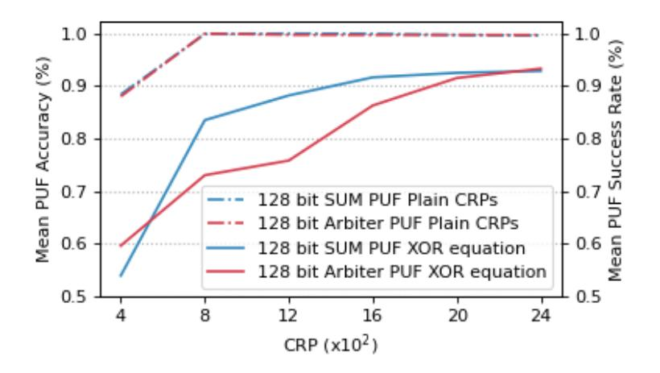

**Figure 10:** Comparison between mean PUF accuracy for learning a 128 bit APUF and a 128-SUM PUF through CRPs and PUF success rate when learning the same PUFs through HD.

MPUF: The MPUF [SMCN17] and its variants consist of multiple APUFs. At this, one part of the APUF responses is used as selection input for a multiplexer. The remaining APUFs provide the data input to the same multiplexer. Consequently, for an attacker it is not visible to which APUF response the current multiplexer output belongs. In comparison to a normal XOR APUF the MPUF is more reliable and was resistant to previously known machine learning attacks. However, [SBC19] proposes a new, deep learning based attack on an MPUF and other APUF compositions. They conclude that for their attack the MPUF does not offer additional security in comparison to an XOR APUF.

Regarding the impact of our attack on the MPUF, we claim that a model of the MPUF can also be built by following our new approach: The results in [SBC19], partly

{22}------------------------------------------------

**Table 1:** Comparison of our results to selected results presented in [SBC19]. The results for learning through HD refer to an attack using HD generated for a (7,1,7) repetition code. For learning through HD the mean PUF success rate is provided. The challenge size is always 128 bit.

|          | Attack Target | Labels        | CRPs for | Accuracy/    |
|----------|---------------|---------------|----------|--------------|
|          | Attack Target |               | training | Success rate |
| Our work | APUF          | XOR of HD     | 2,000    | 91.51%       |
|          | APUF          | PUF responses | 800      | 99.96%       |
| [SBC19]  | APUF          | PUF responses | 8,000    | 99.50%       |
|          | 4 XOR APUF    | PUF responses | 240,000  | 97.80%       |
|          | MPUF          | PUF responses | 112,000  | 97.50%       |
|          | (4,4) iPUF    | PUF responses | 647,000  | 97.68%       |

summarized in Table 1, show that the MPUF is learnable by a deep feedforward neural network. We presented a successful attack on a classical APUF based on helper data using SNN, because SNNs are well suited for learning the differential information exploited in our approach. The SNN consists of multiple neural networks with the specific property that the sub-networks share their weights. Consequently, we could configure the sub-networks of our SNN to have a similar structure as the one suggested in [SBC19]. While a prediction of the required CRPs with our approach is not possible without mounting the attack, we conclude that the usage of a MPUF will likely increase the number of required data but ML of the PUF base on helper data is expected to be still possible.

**Interpose PUF:** The Interpose PUF [NSJ $^+$ 19] is a very recent PUF construction and was designed to withstand every machine learning attack known at that time. In short, it consists of an x-XOR APUF and a y-XOR APUF. The response bit of the x-XOR APUFs is used as a challenge bit for the y-XOR APUFs, which provides the effective output bit of the IPUF. The problem for ML gets harder, since the attacker cannot observe the challenge applied to the y-XOR APUFs.

Previous attempts to machine learn the IPUF show that it is more difficult to attack by ML than other PUF constructions. Nevertheless, [SBC19] and [WMP+20] demonstrated that ML of the IPUF is feasible. The attack was successful when attacking IPUFs of size (x, y) = (4, 4) in [SBC19] and of size (x, y) = (8, 8) in [WMP+20].

For this analysis, the result in [SBC19] is of particular interest, since they use a deep feed forward neural network. This network is actually closely related to the SNN we use. We conclude the principal vulnerability of the IPUF to exploiting helper data analogously to our argumentation regarding the MPUF.

Please note that the authors in [SBC19] were not able to prove the attackability of a PUF with higher complexity than (x,y)=(4,4). But there are two further aspects to consider: First, the attacker might use a different ML algorithm, which is better suited for particular PUF, as we discuss in Section 6.2. This has been done, e.g., for attacking the IPUF with known challenge-response pairs in [WMP+20]. Second, while XORing more APUFs for an IPUF is possible, the additional security comes at the cost of reduced reliability. A less reliable PUF facilitates our proposed attack because a stronger error correction and, thus, more helper data is required. This problem manifests itself, when due to the low reliability of an IPUF a repetition code is implemented. This code was the easiest to learn ECC in our experiments, since it introduces the lowest amount of additional XORs between responses.

{23}------------------------------------------------

#### 6.2 Application of other Machine-Learning Algorithms

Besides a short study of our attack in the context of other PUF constructions, we also want to provide insights on our attack in conjunction with ML algorithms in previous attacks. In this work we used SNNs to machine learn a PUF through helper data. The reason behind this choice is that SNNs are well suited for the differential nature inherent to our problem of XORing, i.e., comparing, the same PUF instance's output under different challenges. However, also other ML approaches are applicable and solutions different from SNNs might be optimal for a specific PUF type. The only condition for a ML approach to be applicable to ML through helper data is its capability to learn the comparison of the same PUF under different challenges.

From the class of NNs, we have already shown that SNNs are well suited for the attack. Another type of neural network we consider as a candidate to mount the ML attack are Recurrent Neural Networks (RNN). While for SNNs the challenges which belong to an XOR-equation are applied in parallel to multiple NNs with the same width, for RNNs the challenges belonging to such an equation would be applied as a sequence. Hence whereas for SNNs the number of inputs and thus the number of parallel networks with equal input width increases with every additional XOR in the XOR-equations, RNNs might have the benefit of a constant size. Another advantage of RNNs is that unlike SNNs there is no need for all XOR-equations to have the same amount of XORs. This problem is known as the variable input size problem and could be object to further research in the context of XOR-equations created for linear block codes.

Additionally, ML approaches from other classes of algorithms are expected to be feasible. The approach using XOR-equations in our ML of PUFs through helper data can be seen as XORing multiple response bits of the same PUF. From a ML point of view this task seems not harder than learning an XOR PUF where different PUFs are XORed.

For an evolutionary or a genetic algorithm, which have been successfully applied to attack PUFs [RSS+10], the objective function has to be formulated in a way reflecting the differential nature of machine learning PUFs through helper data. Also, Support Vector Machines and Regression algorithms are promising candidates for being used with our attack: Both of them have been used successfully to attack XOR APUFs [RSS+13] and are thus expected to be applicable to learn based on XOR-equations.

We conclude that the selection of the optimal algorithm to mount ML of PUFs through helper data strongly depends of the PUF under attack and the pre-knowledge the attacker has about the PUF when training the algorithm. Pre-trained models or augmentation of input data, e.g., can further enhance the results such that fewer or more complicated XOR-equations pave the way for a successful attack. A detailed analysis of the applicability and efficiency of different algorithms is, however, subject to future research.

#### 6.3 Improving the Resistance against the proposed Attack

Our work has shown that due to privacy leakage an attacker can exploit public helper data to model a PUF. The attack has successfully been demonstrated for different PUF primitives and ECCs. Therefore, previous protocols such as [PFFS19, GCVDD02b, SVW10] have to be re-considered in the light of our findings. New protocols and applications also have to keep this new attack vector in mind, as a broad range of PUF constructions and ECCs are affected. Thus, we now want to discuss how this impact can be softened.

The security with regard to our attack revolves around the amount of helper data. Overall, there are two options to make the attack more difficult:

- 1. Reducing the amount of helper data that is available to an attacker.
- 2. Increasing the amount of helper data that is required by an attacker.

{24}------------------------------------------------

These two goals are reflected in the following observations and suggestions.

The first and obvious way to make ML through HD harder is to improve the strength of the PUF. This includes not only the strength of the PUF in the sense that more CRPs are needed for the attack, it also includes improvements regarding the reliability of the PUF, which can result in a less powerful ECC requiring less HD per key. But beyond the IPUF and MPUF, [SBC19] has demonstrated that 1,200,000 CRPs suffice to model several complex PUF constructions, which are designed to resist ML. Of course this number does not directly translate to an attack based on helper data. As indicated above, our approach will require more training data, because the actual values of the individual PUF responses are not required. However, according to our analysis it seems to be too optimistic to assume for the PUFs successfully attacked in [SBC19] that a nearly unlimited number of keys can be derived without risking machine learning attacks through helper data. We further expect that every PUF which can be machine learned using CRPs, can also be machine learned by exploiting the helper data.

On an application or PUF level, we see only the following possibilities to securely ensure resistance against ML attacks when using classical CRPs2 as well as when exploiting helper data:

- The designer of the PUF proves that the PUF has full entropy independent from the amount of challenges in use. In such a case, by the definition of entropy, ML is not possible. This is the best case considering the second option for helper data. However, no such PUF exists today.
- The designer of the PUF proves that the read-out of the amount of data required for machine learning is not feasible in sufficiently short time. In this case, the complexity of the PUF has to fit a dedicated security goal.
- The designer of the system limits the amount of usable CRPs like in [YHD+16, RSGD16] to ensure that no ML is possible. This has two notable consequences: First, the benefit of using an MCPUF is reduced by this approach since the number of CRPs is limited. A trade-off is to use the limitation of HD in combination with stronger PUF primitives to prevent ML while keeping the number of usable CRPs high. Second, the limitation of available HD implies for a key-storage scenario that re-enrollment of the key must be prevented by some means since otherwise the attacker can just trigger the generation of a new key to receive additional valid pairs of challenge and helper data.

Furthermore, the design choice regarding the ECC has remarkable impact on the number of needed HD for a successful attack. A low amount of helper data can be achieved by a more reliable PUF or by more sophisticated schemes such as SLLC [HYP15], vector quantization [GİSK19], or syndrome construction [DRS04], but they do not strongly improve secure w.r.t. ML. An approach as in [HRD+16] does not require any helper data at all but only provides a low error-correction capability paired with a high implementation cost. Fewer available helper data also follow from a comparably higher code rate.

A larger amount of required helper data to mount the attack is achievable through a more complex code structure. This holds for codes that result in multiple XORs of PUF responses in the XOR-equations. From an ML perspective the resulting problem is related to the well-explored recombination of PUF responses through XORs. But the approach causes no additional overhead for the PUF and introduces no reliability issues, since it is inherent part of the needed ECC.

&lt;sup>2Such a case exists in a key-storage scenario if an attacker knows not only the helper data but also the key for which this helper data has been generated. In such a case she can compute back to the PUF responses from helper data and key.

{25}------------------------------------------------

Given our results, the frequently used code concatenation opposes the two options of increasing the required amount of HD for an attack and of reducing the available amount of HD to a certain extent. The strength of code concatenation lies in the usage of simple codes. At the same time, our analysis shows that this is a security weakness, because the inner code most often possesses a low code rate and a simple structure. Both is not desired with regard to the two options. Our results on the vulnerability in the context of a repetition code underline this aspect. In contrast, a code with high code rate and highly convoluted structure is – at least from a security point of view – beneficial. We therefore claim that a standalone code such as the polar code [CIW+17, GİSK19] is the most secure choice for an ECC regarding the new attack. Not only does a code of large code length most likely result in longer XOR-equations, but especially a polar code also provides less HD due to its code rate. Together with other research [WFP19, TPS17] our analysis highlights the need for a paradigm shift regarding error correction in the PUF context. Not mainly the efficiency but also the security of used codes must be in the focus.

We have targeted FCS and FE in this work and analyzed repetition, BCH and Reed-Muller codes in combination with APUFs and k-SUM PUFs using an SNN. But the impact of the suggested method on further HDAs, code classes, and PUF types when using the suggested or even different ML algorithms has to be analyzed in future.

## 7 Conclusion

This work has exposed a flaw in various MCPUF schemes which use helper data to derive a key. ML attacks are possible in such scenarios requiring neither reliability information of the PUF response nor knowledge about the responses themselves. The public helper data and challenges alone suffice for an attacker to successfully model the PUF. Our analysis proposes and formalizes the attack thereby confuting state-of-the-art security assumptions. Hence, a multitude of PUF protocols and key-storage schemes have to be re-considered with regard to their security. The vulnerability is especially apparent when the frequently used repetition code is implemented: Our analysis shows for this particular case that attacks with as few as 800 helper data bits and challenges are feasible and can result in a complete loss of security. Besides repetition codes, we evaluate the impact on other error correcting codes. This indicates that future error correction for MCPUF has to be considered from a new perspective. Consequently, we discuss ideas for countermeasures that can at least reduce the strength of the attack. Most notably, abandoning the popular code concatenation and instead selecting dedicated codes as per our findings would improve the situation.

# Acknowledgement

This work was partly funded by the German Ministry of Education, Research and Technology through the project SecForCARs (grant number 16KIS0795).

# References

[Bec15] G. Becker. The gap between promise and reality: On the insecurity of XOR arbiter PUFs. Cryptographic Hardware and Embedded Systems – CHES 2015, 2015.

[BGS+08] C. Bösch, J. Guajardo, A.-R. Sadeghi, J. Shokrollahi, and P. Tuyls. Efficient helper data key extractor on FPGAs. In *International Workshop on* 

{26}------------------------------------------------

- *Cryptographic Hardware and Embedded Systems*, pages 181–197. Springer, 2008.
- [BWG15] G. T. Becker, A. Wild, and T. Güneysu. Security analysis of index-based syndrome coding for PUF-based key generation. *2015 IEEE International Symposium on Hardware Oriented Security and Trust (HOST)*, pages 20–25, 2015.
- [CCL+11] Q. Chen, G. Csaba, P. Lugli, U. Schlichtmann, and U. Rührmair. The Bistable Ring PUF: A New Architecture for Strong Physical Unclonable Functions. In *IEEE Int. Symposium on Hardware-Oriented Security and Trust*, June 2011.
- [CIW+17] B. Chen, T. Ignatenko, F. M. J. Willems, R. Maes, E. van der Sluis, and G. Selimis. A robust SRAM-PUF key generation scheme based on polar codes. In *GLOBECOM 2017-2017 IEEE Global Communications Conference*, pages 1–6. IEEE, 2017.
- [Del17] J. Delvaux. Security analysis of PUF-based key generation and entity authentication. *Ph. D. dissertation*, 2017.
- [Del19] J. Delvaux. Machine-Learning Attacks on PolyPUFs, OB-PUFs, RPUFs, LHS-PUFs, and PUF–FSMs. *IEEE Transactions on Information Forensics and Security*, 14(8):2043–2058, 2019.
- [DMV02] C. Desset, B. Macq, and L. Vandendorpe. Block error-correcting codes for systems with a very high BER: Theoretical analysis and application to the protection of watermarks. *Signal Processing: Image Communication*, 17(5):409–421, 2002.
- [DRS04] Y. Dodis, L. Reyzin, and A. Smith. Fuzzy extractors: How to generate strong keys from biometrics and other noisy data. In *International conference on the theory and applications of cryptographic techniques*, pages 523–540. Springer, 2004.
- [GCvDD02a] B. Gassend, D. Clarke, M. van Dijk, and S. Devadas. Controlled Physical Random Functions. In *In Proceedings of the 18th Annual Computer Security Conference*, 2002.
- [GCVDD02b] B. Gassend, D. Clarke, M. Van Dijk, and S. Devadas. Silicon Physical Random Functions. In *Proceedings of the 9th ACM conference on Computer and communications security*, pages 148–160, 2002.
- [GİSK19] O. Günlü, O. İşcan, V. Sidorenko, and G. Kramer. Code Constructions for Physical Unclonable Functions and Biometric Secrecy Systems. *IEEE Transactions on Information Forensics and Security*, 14(11):2848–2858, 2019.
- [GKST07] J. Guajardo, S. S. Kumar, G. J. Schrijen, and P. Tuyls. FPGA Intrinsic PUFs and Their Use for IP Protection. In Pascal Paillier and Ingrid Verbauwhede, editors, *Workshop on Cryptographic Hardware and Embedded Systems (CHES)*, volume 4727 of *LNCS*, pages 63–80. Springer, Heidelberg, 2007.
- [GTFS16] F. Ganji, S. Tajik, F. Fäßler, and J.-P. Seifert. *Strong Machine Learning Attack Against PUFs with No Mathematical Model*, pages 391–411. Springer Berlin Heidelberg, Berlin, Heidelberg, 2016.

{27}------------------------------------------------

- [GTS15] F. Ganji, S. Tajik, and J.-P. Seifert. Why Attackers Win: On the Learnability of XOR Arbiter PUFs. In M. Conti, M. Schunter, and I. Askoxylakis, editors, *Trust and Trustworthy Computing*, pages 22–39, Cham, 2015. Springer International Publishing.
- [GTS16] F. Ganji, S. Tajik, and J.-P. Seifert. PAC learning of arbiter PUFs. *J. Cryptographic Engineering*, 6(3):249–258, 2016.
- [Hes18] R. Hesselbarth. FPGA-RO-Data. [https://www.aisec.fraunhofer.de/](https://www.aisec.fraunhofer.de/en/FPGA_ro_Freq.html) [en/FPGA\\_ro\\_Freq.html](https://www.aisec.fraunhofer.de/en/FPGA_ro_Freq.html), 2018. access: October 8th, 2020.
- [HKS+15] M. Hiller, L. Kürzinger, G. Sigl, S. Müelich, S. Puchinger, and M. Bossert. Low-Area Reed Decoding in a Generalized Concatenated Code Construction for PUFs. In *IEEE Computer Society Annual Symposium on VLSI (ISVLSI)*, 2015.
- [HMSS12] M. Hiller, D. Merli, F. Stumpf, and G. Sigl. Complementary IBS: Application Specific Error Correction for PUFs. In *IEEE International Symposium on Hardware-Oriented Security and Trust (HOST)*, pages 1–6, 2012.
- [HPKS16] M. Hiller, M. Pehl, G. Kramer, and G. Sigl. Algebraic Security Analysis of Key Generation with Physical Unclonable Functions. *IACR Cryptology ePrint Archive 2016*, 2016.
- [HRD+16] C. Herder, L. Ren, M. Van Dijk, M.-D. Yu, and S. Devadas. Trapdoor computational fuzzy extractors and stateless cryptographically-secure physical unclonable functions. *IEEE Transactions on Dependable and Secure Computing*, 14(1):65–82, 2016.
- [HWGH18] R. Hesselbarth, F. Wilde, C. Gu, and N. Hanley. Large scale RO PUF analysis over slice type, evaluation time and temperature on 28nm Xilinx FPGAs. In *2018 IEEE International Symposium on Hardware Oriented Security and Trust (HOST)*, pages 126–133, 2018.
- [HYP15] M. Hiller, M.-D. Yu, and M. Pehl. Systematic Low Leakage Coding for Physical Unclonable Functions. In *Proceedings of the 10th ACM Symposium on Information, Computer and Communications Security*. ACM, 2015.
- [HYS16] M. Hiller, M. D. Yu, and G. Sigl. Cherry-Picking Reliable PUF Bits With Differential Sequence Coding. *IEEE Transactions on Information Forensics and Security*, 11(9):2065–2076, Sept 2016.
- [IIB16] T. Idriss, H. Idriss, and M. Bayoumi. A PUF-based paradigm for IoT security. In *2016 IEEE 3rd World Forum on Internet of Things (WF-IoT)*, pages 700–705. IEEE, 2016.
- [JW99] A. Juels and M. Wattenberg. A Fuzzy Commitment Scheme. In *CCS '99, Proceedings of the 6th ACM Conference on Computer and Communications Security*, 1999.
- [KB14] D. P. Kingma and J. Ba. Adam: A method for stochastic optimization, 2014.
- [KCG+20] T. Kroeger, W. Cheng, S. Guilley, J. Danger, and N. Karimi. Effect of Aging on PUF Modeling Attacks based on Power Side-Channel Observations. In *2020 Design, Automation Test in Europe Conference Exhibition (DATE)*, pages 454–459, 2020.

{28}------------------------------------------------

- [KHK+14] H. Kang, Y. Hori, T. Katashita, M. Hagiwara, and K. Iwamura. Cryptographie key generation from PUF data using efficient fuzzy extractors. In *16th International Conference on Advanced Communication Technology*, pages 23–26. IEEE, 2014.
- [KPKS12] Ü. Kocabaş, A. Peter, S. Katzenbeisser, and A.-R. Sadeghi. Converse PUFbased authentication. In *International Conference on Trust and Trustworthy Computing*, pages 142–158. Springer, 2012.
- [LLG+05] D. Lim, J. W. Lee, B. Gassend, G. E. Suh, M. van Dijk, and S. Devadas. Extracting secret keys from integrated circuits. *IEEE Transactions on Very Large Scale Integration (VLSI) Systems*, 13(10):1200–1205, 2005.
- [MBBS14] J. Masci, M. M. Bronstein, A. M. Bronstein, and J. Schmidhuber. Multimodal Similarity-Preserving Hashing. *IEEE Transactions on Pattern Analysis and Machine Intelligence*, 2014.
- [MBW+19] T. McGrath, I. E. Bagci, Z. M. Wang, U. Roedig, and R. J. Young. A PUF taxonomy. *Applied Physics Reviews*, 6(1):011303, 2019.
- [MCMS10] A. Maiti, J. Casarona, L. McHale, and P. Schaumont. A Large Scale Characterization of RO-PUF. In *HOST 2010, Proceedings of the 2010 IEEE International Symposium on Hardware-Oriented Security and Trust (HOST), 13-14 June 2010, Anaheim Convention Center, California, USA*, 2010.
- [MRK+12] M. Majzoobi, M. Rostami, F. Koushanfar, D. S. Wallach, and S. Devadas. Slender PUF protocol: A lightweight, robust, and secure authentication by substring matching. In *2012 IEEE Symposium on Security and Privacy Workshops*, pages 33–44. IEEE, 2012.
- [MSSS11] D. Merli, D. Schuster, F. Stumpf, and G. Sigl. Side-Channel Analysis of PUFs and Fuzzy Extractors. In *Trust and Trustworthy Computing*. Springer Berlin Heidelberg, 2011.
- [MT16] J. Mueller and A. Thyagarajan. Siamese recurrent architectures for learning sentence similarity. In *Proceedings of the Thirtieth AAAI Conference on Artificial Intelligence*, AAAI'16, page 2786–2792. AAAI Press, 2016.
- [MTV09] R. Maes, P. Tuyls, and I. Verbauwhede. A soft decision helper data algorithm for SRAM PUFs. In *2009 IEEE international symposium on information theory*, pages 2101–2105. IEEE, 2009.
- [MVHV12] R. Maes, A. Van Herrewege, and I. Verbauwhede. PUFKY: A Fully Functional PUF-Based Cryptographic Key Generator. In *Cryptographic Hardware and Embedded Systems – CHES 2012*. Springer Berlin Heidelberg, 2012.
- [NSJ+19] P. Nguyen, D. Sahoo, C. Jin, K. Mahmood, U. Rührmair, and M. van Dijk. The interpose PUF: Secure PUF design against state-of-the-art machine learning attacks. *IACR Transactions on Cryptographic Hardware and Embedded Systems*, pages 243–290, 2019.
- [PFFS19] M. Pehl, C. Frisch, P. C. Feist, and G. Sigl. KeLiPUF: a key-distribution protocol for lightweight devices using Physical Unclonable Functions. In *17th escar Europe : embedded security in cars (Konferenzveröffentlichung)*. Ruhr-Universität Bochum, 2019.

{29}------------------------------------------------

- [PHS17] M. Pehl, M. Hiller, and G. Sigl. *Information Theoretic Security and Privacy of Information Systems*, chapter Secret Key Generation for Physical Unclonable Functions, pages 362–389. Cambridge University Press, 2017.
- [RBK10] U. Rührmair, H. Busch, and S. Katzenbeisser. *Strong PUFs: Models, Constructions, and Security Proofs*, pages 79–96. Springer Berlin Heidelberg, Berlin, Heidelberg, 2010.
- [RE15] C. Raffel and D. P. W. Ellis. Large-Scale Content-Based Matching of MIDI and Audio Files. In M. Müller and F. Wiering, editor, *Proceedings of the 16th International Society for Music Information Retrieval Conference, ISMIR 2015, Málaga, Spain, October 26-30, 2015*, pages 234–240, 2015.
- [RH14] U. Rührmair and D. E. Holcomb. PUFs at a glance. In *2014 Design, Automation Test in Europe Conference Exhibition (DATE)*, pages 1–6, March 2014.
- [RJA11] U. Rührmair, C. Jaeger, and M. Algasinger. An Attack on PUF-based Session Key Exchange and a Hardware-based Countermeasure. In *Proceedings of Financial Cryptography and Data Security '11*. Springer, 2011.
- [RSGD16] O. Rioul, P. Solé, S. Guilley, and J. Danger. On the entropy of Physically Unclonable Functions. In *2016 IEEE International Symposium on Information Theory (ISIT)*, pages 2928–2932, 2016.
- [RSS+10] U. Rührmair, F. Sehnke, J. Sölter, G. Dror, S. Devadas, and J. Schmidhuber. Modeling Attacks on Physical Unclonable Functions. In *Proceedings of the 17th ACM Conference on Computer and Communications Security*, 2010.
- [RSS+13] U. Rührmair, J. Sölter, F. Sehnke, X. Xu, A. Mahmoud, V. Stoyanova, G. Dror, J. Schmidhuber, W. Burleson, and S. Devadas. PUF Modeling Attacks on Simulated and Silicon Data. *IEEE Transactions on Information Forensics and Security*, 8(11):1876–1891, Nov 2013.
- [SBC19] P. Santikellur, A. Bhattacharyay, and R. Chakraborty. Deep Learning based Model Building Attacks on Arbiter PUF Compositions. *IACR Cryptol. ePrint Arch.*, 2019:566, 2019.
- [SD07] G. E. Suh and S. Devadas. Physical Unclonable Functions for Device Authentication and Secret Key Generation. In *Proceedings of the 44th Annual Design Automation Conference*, 2007.
- [SH14] D. Schuster and R. Hesselbarth. Evaluation of Bistable Ring PUFs Using Single Layer Neural Networks. In Thorsten Holz and Sotiris Ioannidis, editors, *Trust and Trustworthy Computing*, number 8564 in Lecture Notes in Computer Science, pages 101–109. Springer International Publishing, January 2014.
- [She16] H. Shen. Designing and training feedforward neural networks: A smooth optimisation perspective. *CoRR*, 2016.
- [SHK+14] N. Srivastava, G. Hinton, A. Krizhevsky, I. Sutskever, and Ru. Salakhutdinov. Dropout: A simple way to prevent neural networks from overfitting. *Journal of Machine Learning Research*, 2014.
- [SMCN17] D. Sahoo, D. Mukhopadhyay, R. Chakraborty, and P. Nguyen. A multiplexerbased arbiter PUF composition with enhanced reliability and security. *IEEE Transactions on Computers*, 67(3):403–417, 2017.

{30}------------------------------------------------

- [SVW10] A.-R. Sadeghi, I. Visconti, and C. Wachsmann. *Enhancing RFID Security and Privacy by Physically Unclonable Functions*, pages 281–305. Springer Berlin Heidelberg, Berlin, Heidelberg, 2010.
- [TKYC17] F. Tehranipoor, N. Karimian, W. Yan, and J. A. Chandy. DRAM-Based Intrinsic Physically Unclonable Functions for System-Level Security and Authentication. *IEEE Transactions on Very Large Scale Integration (VLSI) Systems*, 25(3):1085–1097, 2017.
- [TP13] A. M. Tillmann and M. E. Pfetsch. The Computational Complexity of the Restricted Isometry Property, the Nullspace Property, and Related Concepts in Compressed Sensing. *IEEE Transactions on Information Theory*, 60(2):1248–1259, 2013.
- [TPI19] L. Tebelmann, M. Pehl, and V. Immler. Side-Channel Analysis of the TERO PUF. In I. Polian and M. Stöttinger, editors, *Constructive Side-Channel Analysis and Secure Design*, pages 43–60, Cham, 2019. Springer International Publishing.
- [TPS17] L. Tebelmann, M. Pehl, and G. Sigl. EM Side-Channel Analysis of BCHbased Error Correction for PUF-based Key Generation. In *Proceedings of the 2017 Workshop on Attacks and Solutions in Hardware Security*, ASHES '17, pages 43–52, New York, NY, USA, 2017. ACM.
- [TŠ07] P. Tuyls and B. Škorić. *Strong Authentication with Physical Unclonable Functions*, pages 133–148. Springer Berlin Heidelberg, Berlin, Heidelberg, 2007.
- [Var97] A. Vardy. The Intractability of Computing the Minimum Distance of a Code. *IEEE Transactions on Information Theory*, 43(6):1757–1766, 1997.
- [WFP19] F. Wilde, C. Frisch, and M. Pehl. Efficient Bound for Conditional Min-Entropy of Physical Unclonable Functions Beyond IID. In *2019 IEEE International Workshop on Information Forensics and Security (WIFS)*, pages 1–6. IEEE, 2019.
- [WGP18] F. Wilde, B. M. Gammel, and M. Pehl. Spatial Correlation Analysis on Physical Unclonable Functions. *IEEE Transactions on Information Forensics and Security*, 13(6):1468–1480, June 2018.
- [WMP+20] N. Wisiol, C. Mühl, N. Pirnay, P. Nguyen, M. Margraf, J.-P. Seifert, M. van Dijk, and U. Rührmair. Splitting the interpose PUF: A novel modeling attack strategy. *IACR Transactions on Cryptographic Hardware and Embedded Systems*, pages 97–120, 2020.
- [XRHB15] X. Xu, U. Rührmair, D. E. Holcomb, and W. Burleson. Security Evaluation and Enhancement of Bistable Ring PUFs. In S. Mangard and P. Schaumont, editors, *Radio Frequency Identification*, pages 3–16, Cham, 2015. Springer International Publishing.
- [YD10a] M.-D. Yu and S. Devadas. Recombination of Physical Unclonable Functions. In *35th Annual GOMACTech Conference*, Reno, NV, March 2010. United States. Dept. of Defense.
- [YD10b] M.-D. Yu and S. Devadas. Secure and Robust Error Correction for Physical Unclonable Functions. *IEEE Design & Test of Computers*, 27(1):48–65, 2010.

{31}------------------------------------------------

- [YHD+16] M.-D. Yu, M. Hiller, J. Delvaux, R. Sowell, S. Devadas, and I. Verbauwhede. A Lockdown Technique to Prevent Machine Learning on PUFs for Lightweight Authentication. *IEEE Transactions on Multi-Scale Computing Systems*, 2(3):146–159, July 2016.
- [YMVD14] M.-D. Yu, D. M'Raïhi, I. Verbauwhede, and S. Devadas. A noise bifurcation architecture for linear additive physical functions. In *2014 IEEE International Symposium on Hardware-Oriented Security and Trust (HOST)*, pages 124–129. IEEE, 2014.
- [YQ10] C. Yin and G. Qu. LISA: Maximizing RO PUF's secret extraction. In *2010 IEEE International Symposium on Hardware-Oriented Security and Trust (HOST)*, pages 100–105. IEEE, 2010.

{32}------------------------------------------------

# **A** Machine Learning Models

All used ML models in this work are SNNs. SNNs form a class of NN architectures that can learn and extract similarities. They have been used in various fields including image and audio recognition [MT16, MBBS14, RE15]. In general, they consist of two or more subnets which share their structure as well as all parameters including their updatable weights. The subnets are connected by a layer which measures the difference between their outputs. The used distance measure is part of the hyperparameters of the SNN and could be adapted or improved. For our models we employed the Manhattan distance as hyperparameter. During training, every subnet receives a distinct input resulting in individual outputs at each subnet. The distance between these outputs is measured by the distance layer. This result is fed into the prediction layer whose output is compared by a loss function with the label. A subsequent update of the weights has the same influence on all subnets because of their shared structure.

There are two reasons for picking SNNs in this work. First of all, NNs in general are applicable to a wide range of different PUF settings. This allows us to show the feasibility of our attack for various PUF types, ECCs, and other parameters. Second, SNNs as variant of a NN fit the XOR-equations well. Each XOR-equation can be interpreted as a number of comparisons between the same PUF instance under different challenges which is in fact a search for similarities. The search for similarities is the core property of SNNs. Every subnet represents the same PUF instance which has different responses depending on the applied challenge.

The presented models in Figure 11 and Figure 12 show the utilized models throughout this work implementing the formerly discussed structure. The shown SNNs were built for a 64-bit and a 32-bit PUF. The sizes of the input layers are a multiple of the challenge length. After each input layer, a split layer separates the combined challenges which were generated by applying the XOR-equations. The number of subnets depends on the number of challenges within the used XOR-equation (e.g.  $\kappa = 4$  or  $\kappa = 2$ ). Every challenge is fed into one of the subnets. The subnets were created empirically and could be used individually with addition of a prediction layer to predict PUF instances by plain CRPs. The number of neurons in each dense layer is again a multiple of the challenge length because it allows an easy parametrization. Throughout the network we used only the ReLU as activation function because it was proven that NN with only this activation function are free of suboptimal local minima |She16|. To prevent the model from overfitting, we added dropout layers, which randomly deactivate a configurable percentage of connections between the layers |SHK+14|. For the prediction layer we used the sigmoid as well as the softmax activation function in combination with the Adam optimizer with default parameters |KB14| as a state-of-the-art solution. All hyperparameters and design choices of the network should not be understood as a swiss army knife for each PUF or ECC. Potentially there are more optimal solutions based on knowledge of the PUF type or advances in the ECC based on ML. However, this is out of scope for this work.

{33}------------------------------------------------

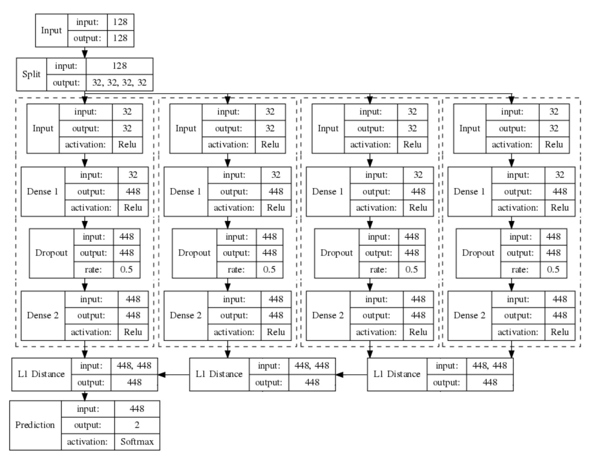

**Figure 11:** SNN used to learn PUFs using XOR-equations derived by SPC, BCH and RM codes. During training the loss is calculated using sparse categorical cross entropy. The chosen optimizer is Adam with default parameters and a learning rate of 0*.*001.

{34}------------------------------------------------

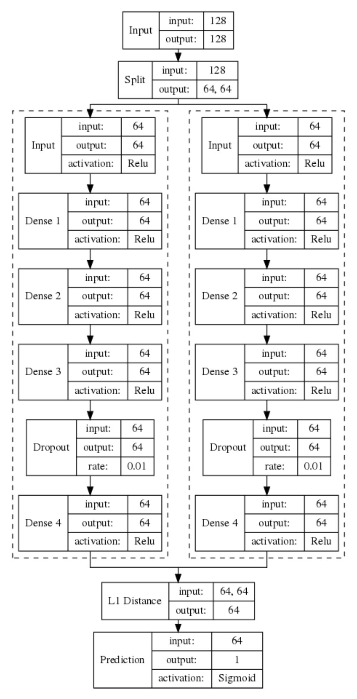

**Figure 12:** SNN used to learn PUFs using XOR equations derived by a repetition code. During training the loss is calculated using binary cross entropy. The chosen optimizer is Adam with default parameters and a learning rate of 0*.*01.

{35}------------------------------------------------

# **B Used RO frequencies**

Table [2](#page-35-1) presents the slice coordinates of used RO frequencies for each attacked PUF type. The frequencies are drawn by real measurements conducted by Hesselbarth et al. [\[HWGH18\]](#page-27-12) which are publicly accessible [\[Hes18\]](#page-27-10). For a detailed description of the design decisions creating a *k*-SUM PUF based on these frequencies we refer to Section [5.2.](#page-15-4)

**Table 2:** Slice coordinates of used RO frequencies for each attacked PUF type.

| PUF Type             | Area           | Excluded                  |
|----------------------|----------------|---------------------------|
| Upper Right, Slice L | X03Y00-X65Y18  | X29Y18-X65Y18             |
| Upper Left, Slice L  | X01Y00-X59Y21  | X31Y21-X59Y21             |
| Lower Right, Slice L | X28Y00-X48Y109 | Y25, Y75, X26Y109-X48Y109 |
| Lower Left, Slice L  | X00Y00-X58Y43  | Y25, X44Y43, X58Y43       |
| Lower Right, Slice M | X02Y00-X60Y26  | Y25, X46Y26-X60Y26        |
| Lower Left, Slice M  | X10Y00-X56Y43  | Y25, X50Y43, X56Y43       |