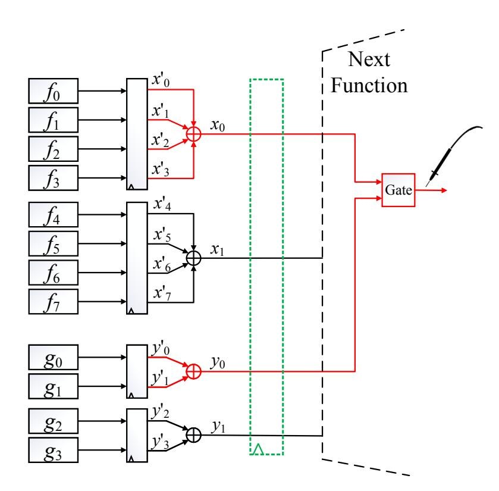
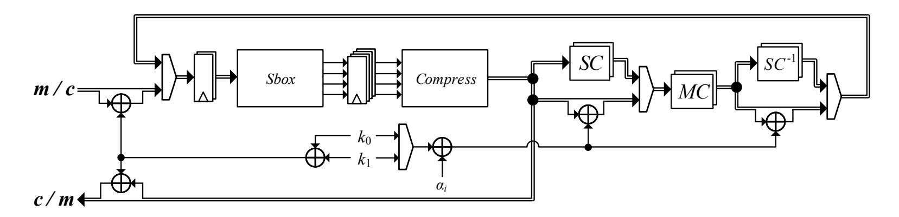
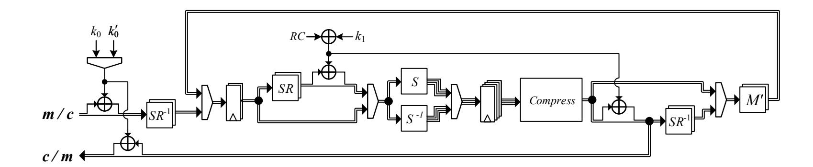
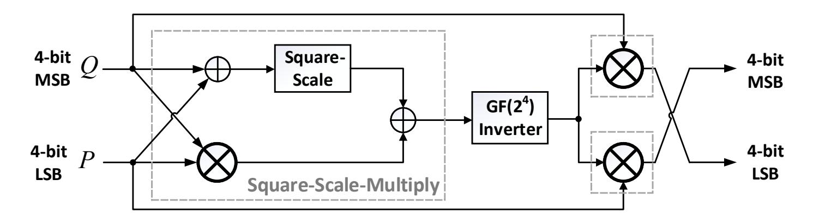
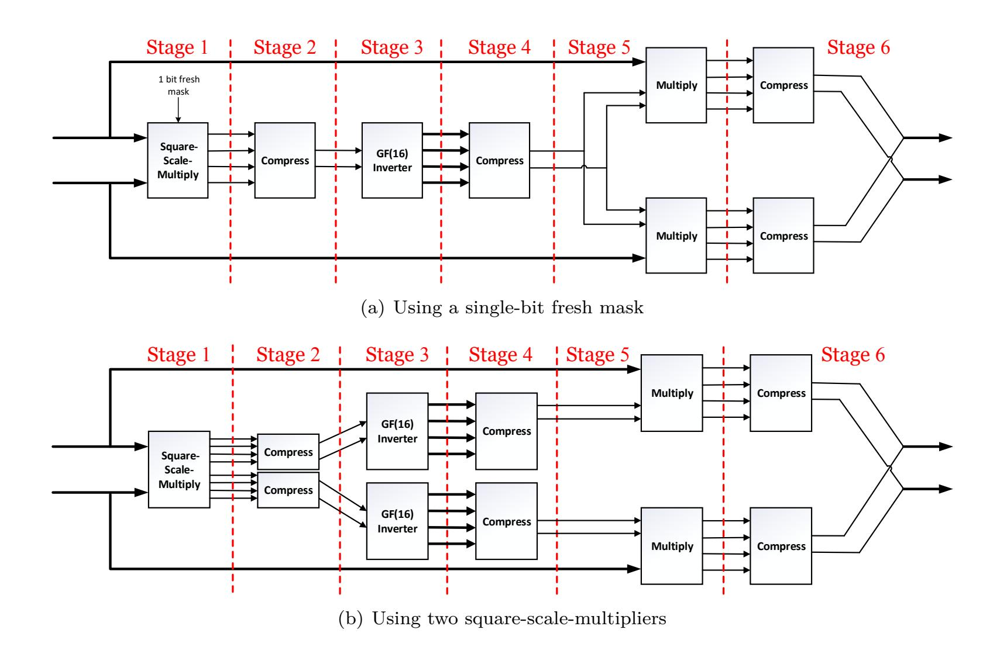
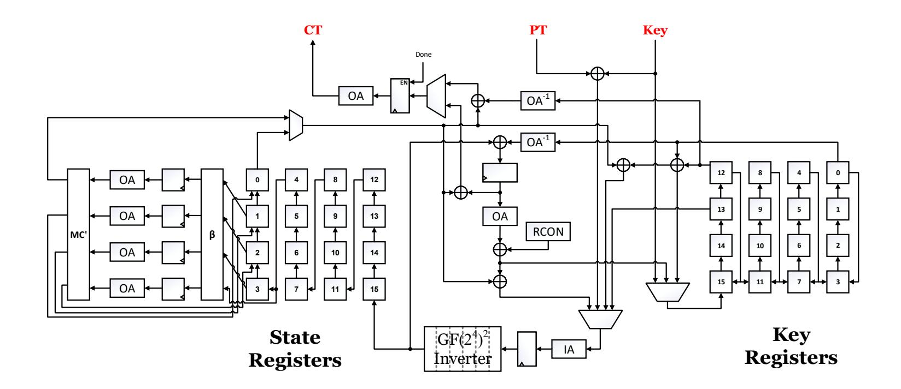
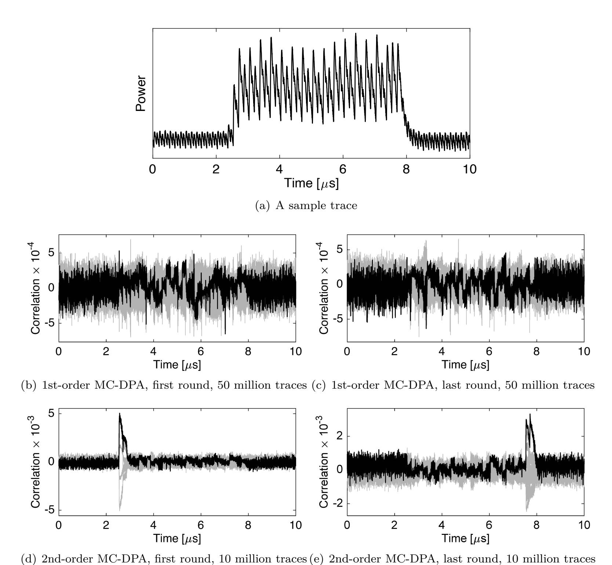
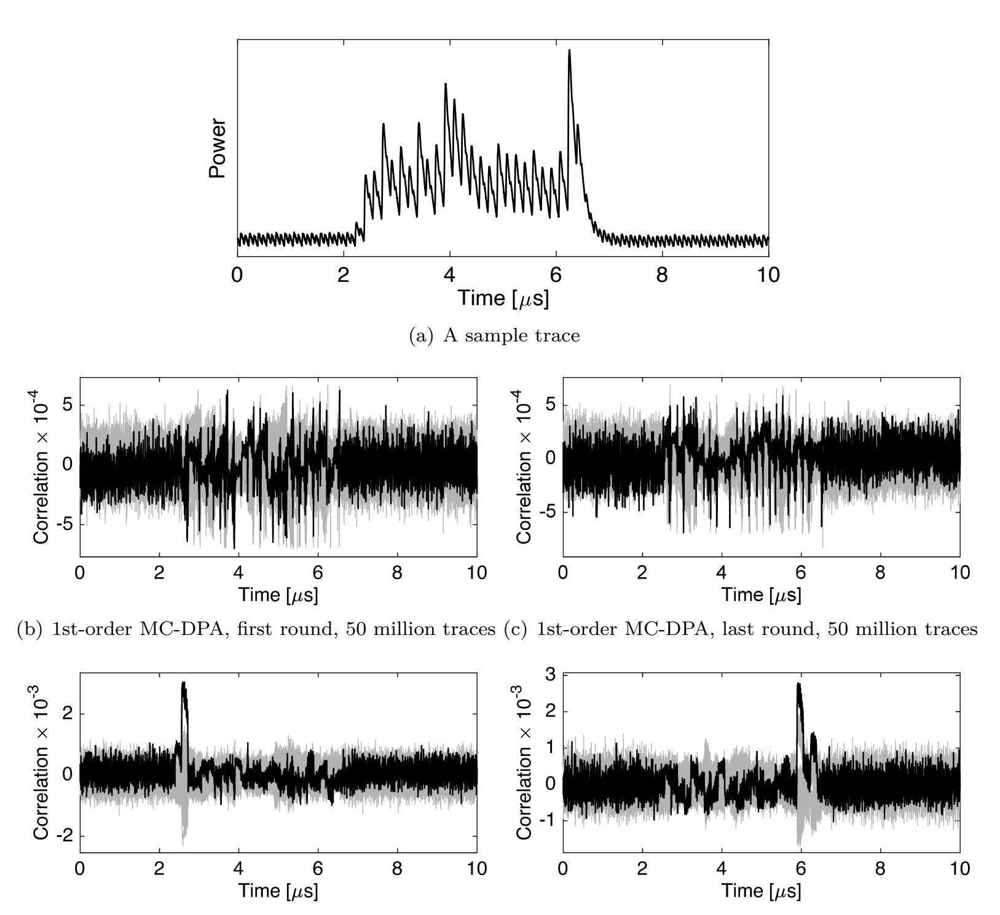
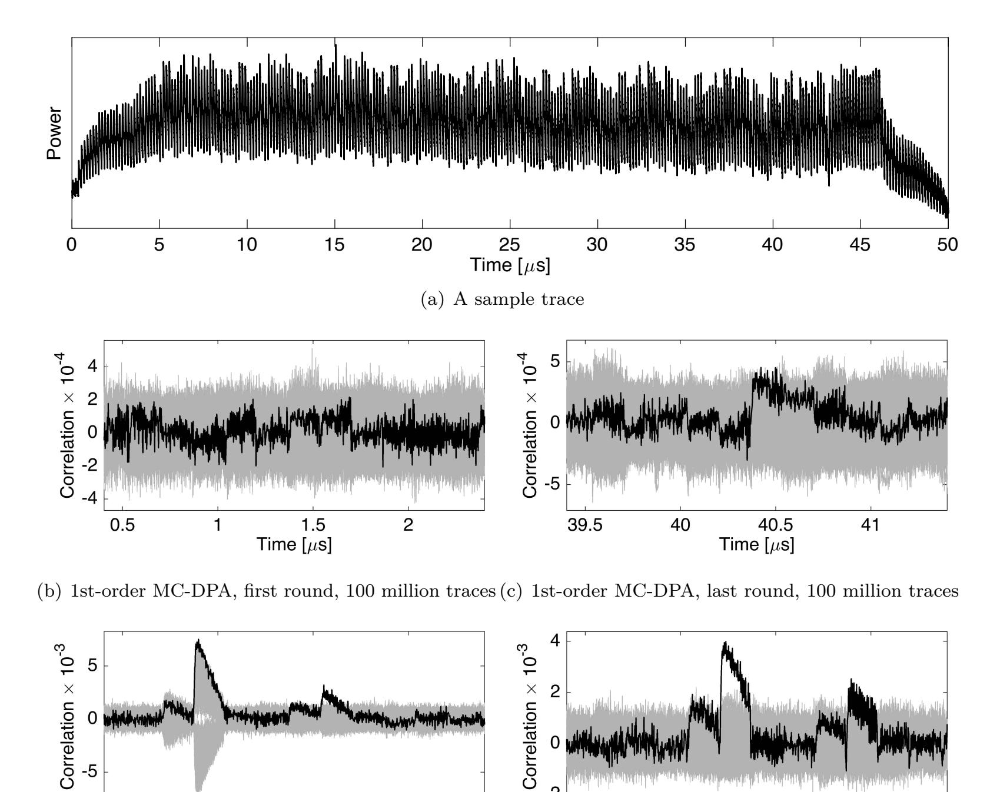
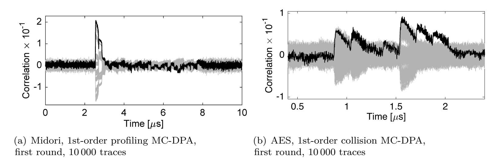

{0}------------------------------------------------

# **Re-Consolidating First-Order Masking Schemes**

## **Nullifying Fresh Randomness**

Aein Rezaei Shahmirzadi, Amir Moradi

Ruhr University Bochum, Horst Görtz Institute for IT Security, Germany [firstname.lastname@rub.de](mailto:firstname.lastname@rub.de)

#### **Abstract.**

Application of masking, known as the most robust and reliable countermeasure to side-channel analysis attacks, on various cryptographic algorithms has dedicated a lion's share of research to itself. The difficulty originates from the fact that the overhead of application of such an algorithmic-level countermeasure might not be affordable. This includes the area- and latency overheads as well as the amount of fresh randomness required to fulfill the security properties of the resulting design. There are already techniques applicable in hardware platforms which consider glitches into account. Among them, classical threshold implementations force the designers to use at least three shares in the underlying masking. The other schemes, which can deal with two shares, often necessitates the use of fresh randomness.

Here, in this work, we present a technique allowing us to use two shares to realize the first-order glitch-extended probing secure masked realization of several functions including the Sbox of Midori, PRESENT, PRINCE, and AES ciphers without any fresh randomness.

**Keywords:** Side-Channel Analysis · Masking · Threshold Implementation · AES

## **1 Introduction**

The rapid deployment of Internet of Things (IoT) necessitates physical security in addition to analytical security of the underlying cryptographic primitives. This is due to the fact that in the IoT scenarios the device is in hand and control of the legitimate users who can play the role of an adversary. Among physical attacks, Side-Channel Analysis (SCA) attacks [\[KJJ99,](#page-23-0) [QS01\]](#page-24-0) are considered as the most threatening attack vector, as often the device cannot detect if its physical characteristics are being measured, e.g., its power consumption. After the introduction of such attacks in the open literature, the relevant scientific communities have dedicated a considerable body of research on understanding its foundations as well as on development of defeating mechanisms. Due to their sound theoretical basis, masking countermeasures have absorbed the attention of the researchers at most. Being based on secret-sharing schemes, the key-dependent intermediate values of the cipher are randomized by the application of a masking countermeasure, usually done at the algorithmic level. In the most common scheme, Boolean masking [\[GP99\]](#page-23-1), sensitive variables are split into several shares, whose addition (binary XOR) results in the same original (unshared) value.

While it became almost known how to correctly apply masking schemes on software implementations, their application on hardware designs were still an ambiguous process. It has been repeatedly shown that thought-secure masked hardware implementations [\[Tri03,](#page-24-1) [OMPR05\]](#page-24-2) exhibit exploitable leakages [\[MPO05,](#page-24-3) [MME10\]](#page-23-2). This shortcoming is due to not having atomic gates in hardware leading to a phenomenon called glitches. Finally, this issue has been theoretically addressed in [\[NRR06\]](#page-24-4), where an implementation strategy

{1}------------------------------------------------

is introduced, called Threshold Implementation (TI), later extended to higher orders in [\[BGN](#page-22-0)<sup>+</sup>14a].

Security of masking schemes is commonly evaluated by the probing model [\[ISW03\]](#page-23-3), where the order of an attack is reflected by the number of probes simultaneously placed on a device observing its intermediate signals. Although this model captures the leakage of software implementations, where operations have a sequential nature, the adversary gains more information by probing a single signal in a hardware circuit, due to the glitches. Therefore, the model is extended to cover glitches (called glitch-extended probing model) [\[FGP](#page-23-4)<sup>+</sup>18]. In this model, a probe placed at the output of a gate is propagated backwards to its inputs and interpreted as several probes placed on all signals driving the gate. TI circuits [\[NRS11\]](#page-24-5) are indeed secure under the glitch-extended probing model, as they maintain the security in presence of glitches.

Despite its sound theoretical basis, realizing the TI variant of non-linear functions is not straightforward. Under the TI settings, a function with algebraic degree *t* should be split into *td* + 1 shares to achieve security against *d th* order attacks. Due to a high number of input shares, this leads to high area overhead (and/or latency) for functions with a high algebraic degree. As an essential underlying assumption of masking schemes, uniform sharing should be also achieved at the output of a masked (TI) function. It is, however, not trivial to achieve this for every given function. Even, a uniform TI with minimum number of input shares does not exist for some functions, e.g., 2-input AND gate and Keccak non-linear function *χ* [\[BDN](#page-22-1)<sup>+</sup>13]. Although this can be solved by insertion of fresh masks (refreshing the sharing), if a uniform TI is found for a non-linear functions of a cipher, it does not require any fresh randomness and the entire masked cipher can be implemented with *td* + 1 shares while only the primary inputs (plaintext and key) should be presented in the shared form.

By introducing a new technique denoted as *changing of the guards* [\[Dae17\]](#page-23-5), it is shown that uniform sharing for a bijective Sbox can be achieved by making use of independent shares of the cipher state as fresh masks. This technique has been applied on a 3-share implementation of Keccak non-linear function *χ* [\[Dae17\]](#page-23-5), on a 4-share decomposed AES Sbox to cubic functions [\[WM18\]](#page-25-0), and on a 3-share tower-field representation of the AES Sbox [\[Sug19\]](#page-24-6). All these implementations require fresh randomness just for the first execution of the cipher. Subsequent executions can proceed without any fresh masks.

The *td* + 1 requirement has been relaxed in [\[RBN](#page-24-7)<sup>+</sup>15, [GMK16\]](#page-23-6) by showing how to use only *d*+ 1 shares when *d*-th order security is desired. Although this allows realizing masked circuits with less area overhead, it mostly forces to use fresh randomness. Application of such a methodology on AES led to 2-share masked designs reported in [\[CRB](#page-22-2)<sup>+</sup>16, [GMK17\]](#page-23-7), requiring between 18 and 54 fresh mask bits per clock cycle.

As a side note, it has been tried to reduce the required fresh randomness of such *d* + 1 hardware masking schemes. For example, a combination of the multiplication algorithm in [\[BDF](#page-21-0)<sup>+</sup>17] and randomness optimization in [\[BBP](#page-21-1)<sup>+</sup>16] led to the scheme presented in [\[GM17\]](#page-23-8) which – compared to [\[GMK16\]](#page-23-6) – reduces the number of fresh masks for higherorder hardware implementations of the multiplication. There exists also activities in reducing the latency of *d* + 1 hardware masking schemes [\[GIB18\]](#page-23-9), which even leads to a higher number of required fresh masks.

### **1.1 Our Contributions**

In this work, we provide techniques which allow us to realize *d* + 1 hardware masking schemes without any fresh masks for *d* = 1, i.e., only first-order secure implementations with 2 shares. We start our study with a 2-input AND operation and show how to construct its 2-share variant without any fresh randomness while achieving glitch-extended probing security. As a side note, this has never been achieved/reported in the state of the art. We generalize our strategy and provide glitch-extended-probing-secure representation of

{2}------------------------------------------------

larger functions including the Sboxes of Midori, PRESENT, PRINCE, and AES without any fresh randomness. We would like to highlight that the aforementioned changing of the guards is not used in our constructions, and they are the only ones reported so far in the literature with this feature. Hardware platforms are our main target implementation basis. However, this does not hinder our constructions to be used as a sequence of instructions to run on a software platform. Our entire developments including the source codes and the HDL representation of the constructed Sboxes and full ciphers are given in the github. In addition to our own simulations and FPGA-based practical investigations, we have evaluated our constructions by the recently-introduced leakage verification tool SILVER [KSM20], which is also available online.

## <span id="page-2-0"></span>2 Preliminaries

In this section, in addition to the notations, we give the preliminary knowledge necessary and helpful to follow the rest of the paper. This includes the fundamentals of masking in hardware and various state-of-the-art techniques to realize the masked variant(s) of a given function in hardware.

#### 2.1 Notations and Definitions

We denote binary random variables  $\in \mathbb{F}_2$  with lower-case italic x, vectors  $\in \mathbb{F}_2^{n>1}$  with upper-case italic X, j-th element in a vector X with superscripts  $x^j$ , i-th share of a variable with subscripts  $x_i$ , coordinate functions with lower-case italic sans-serif f(.), functions with larger output width by upper-case italic sans-serif F(.), and sets with calligraphic font  $\mathcal{F}$ . In an s-th order Boolean masking, the secret x is represented by s+1 shares  $(x_0,\ldots,x_s)$  in such a way that  $x= \underset{\forall i}{+} x_i$ . The initial masking requires s independent and uniformly-distributed masks  $m_0,\ldots,m_{s-1}$  to form the shares as  $x_{i < s} = m_i$  and  $x_s = x + \underset{\forall i}{+} m_i$ . Application of a binary linear function L(.) on X in a masked form can be easily achieved by applying the same function on all shares as  $L(X) = \underset{\forall i}{+} L(X_i)$ . This also holds for any affine function A(X) = L(X) + C if the constant C is applied an odd number of times. The challenge is how to apply a non-linear function F(.) in such a masked form.

#### 2.2 Threshold Implementations

For simplicity, let us consider the case where the number of input and output shares are the same. The masked variant of Y = F(X) receives input shares  $X_0, \ldots, X_s$  and provides output shares  $Y_0, \ldots, Y_s$  with  $X = \bigoplus_{\forall i} X_i$  and  $Y = \bigoplus_{\forall i} Y_i$ . In first-order TI [NRS11], each output share  $Y_i$  is provides by a component function  $F_i(X_0, \ldots, X_{i-1}, X_{i+1}, \ldots, X_s)$ , where at least one input share  $X_i$  is missing in its input list. This, referred to as non-completeness, guarantees the leakage of  $F_i(.)$  to be independent of X. Further, for each value of X giving all possible sharing  $X_0, \ldots, X_s$  to the masked function leads to a set of  $Y_0, \ldots, Y_s$  which should be a uniform sharing of Y = F(X). Not fulfilling the uniformity would potentially result in a leakage in subsequent function(s) which receives  $Y_0, \ldots, Y_s$  as the shared input.

Classical TI defines the minimum number of input shares as td + 1, where t stands for the algebraic degree of the underlying function F(.) and d the desired degree of security. This leads to have at least 3 input shares for the smallest non-linear function (t = 2) and first-order security d = 1.

Achieving a uniform and non-complete TI becomes particularly more challenging for functions with high algebraic degree. Hence, it is usually tried to decompose the target function into smaller (preferably quadratic) functions and achieve masked variant of each 

{3}------------------------------------------------

one separately [\[BNN](#page-22-3)<sup>+</sup>15]. This necessitates placing registers between each consecutive masked functions to avoid the propagation of glitches.

It is easy to achieve non-complete component functions, e.g., by following the direct sharing technique [\[NRS11\]](#page-24-5). However, fulfilling the uniformity is not trivial, and even not necessarily possible for every function. For example, the uniform TI of any 2-input nonlinear function (e.g., an AND gate) with 3 input shares does not exist [\[NRS11\]](#page-24-5). In such cases, by means of fresh randomness (fresh masks) the output shares are re-shared, hence fulfilling the uniformity. This concept has been used in all state-of-the-art TI of the AES Sbox, e.g. [\[BGN](#page-22-4)<sup>+</sup>14b, [MPL](#page-24-8)<sup>+</sup>11]. Note that changing of the guards [\[Dae17\]](#page-23-5) relaxes the necessity of having fresh masks at every clock cycle by using the input shares of an Sbox as the fresh masks for the next neighboring Sbox(es), e.g., in [\[Sug19,](#page-24-6) [WM18\]](#page-25-0) for the AES Sbox.

## **2.3 Probing Security**

Security of masking schemes is commonly evaluated by the probing security model [\[ISW03\]](#page-23-3), where the number of probes which the adversary can put on the intermediate signals (variables) of the circuit (design) reflects the order of the attack [\[BDF](#page-21-0)<sup>+</sup>17, [DDF14\]](#page-23-11). Compared to software implementations, where the operations are performed in a sequential way and each operation can be modeled as an atomic gate whose output change once per evaluation, hardware implementations are prone to glitches. In other words, the changes (toggles) at a gate output can propagate to the further driven gates. It means that by putting a probe on a gate output, the adversary not only observes its changes but also obtains a fraction of changes on former gates which drive the probed gate. This initiated a vast number of research on how to adjust the probing security model considering glitches. This has led to the introduction of *glitch-extended* probing model [\[FGP](#page-23-4)<sup>+</sup>18], where a probe placed on a gate output is propagated backwards and extended to multiple probes at the input of the combinatorial circuit which drive the probed gate. Since we deal with hardware implementations in this article, we consider the glitch-extended probing model in our evaluations and assessments.

We further mainly focus on first-order security. Unless otherwise stated, we refer to a first-order secure/vulnerable design by omitting the term 'first-order'.

## <span id="page-3-1"></span>**2.4 Masking with** *d* **+ 1 Shares**

It has been shown in [\[RBN](#page-24-7)<sup>+</sup>15, [GMK16\]](#page-23-6) that it is not necessary to follow *td*+ 1 rule for the number of input shares to construct a secure masked hardware implementation. Instead, *d*-th order (glitch-extended probing) security can be achieved by *d* + 1 input shares. This can be done by dividing the given function into two register-isolated parts and introducing fresh randomness. For example, for a 2-input AND gate *x* = f (*a, b*) with *a*0*, a*1*, b*0*, b*<sup>1</sup> as input shares and *x*0*, x*<sup>1</sup> as output shares, we can write 4 component functions

<span id="page-3-0"></span>
$$f_{0}(a_{0}, b_{0}, r) = a_{0}b_{0} + r \rightarrow x'_{0}$$

$$f_{1}(a_{0}, b_{1}) = a_{0}b_{1} \rightarrow x'_{1} \qquad x'_{0} + x'_{1} = x_{0}$$

$$f_{2}(a_{1}, b_{0}, r) = a_{1}b_{0} \rightarrow x'_{2} \qquad x'_{2} + x'_{3} = x_{1}$$

$$f_{3}(a_{1}, b_{1}) = a_{1}b_{1} + r \rightarrow x'_{3}$$

$$(1)$$

with *r* being a fresh mask. Note that the result of component functions are stored in registers *x* 0 0 to *x* 0 3 , and the part, which XORs the registers' output to make the output shares *x*<sup>0</sup> and *x*1, is referred to as *compression layer*. Without any particular restrictions, fresh mask *r* can be added either to f<sup>0</sup> or f<sup>1</sup> and either to f<sup>2</sup> or f3. However, in Domain Oriented Masking (DOM) [\[GMK16\]](#page-23-6), it is defined to be added on f<sup>1</sup> and f2, i.e., the component functions which receive input shares with different indices, i.e., *a*<sup>0</sup> and *b*<sup>1</sup> in f1.

{4}------------------------------------------------

<span id="page-4-1"></span>

| a b | $\mid a_0 \ a_1 \ b_0 \ b_1 \mid$             | $\mid x'_0 \mid$ | $x_1'$ | $4P(x_0', x_1')$ | $  x_2'  $ | $x_3'$ | $4P(x_2', x_3')$ | $x_0$ | $x_1$ | $4P(x_0, x_1)$                 |
|-----|-----------------------------------------------|------------------|--------|------------------|------------|--------|------------------|-------|-------|--------------------------------|
| 0 0 | 0 0 0 0                                       | 0                | 0      |                  | 0          | 0      |                  | 0     | 0     | (2,0,0,2)                      |
|     | 1 1 0 0                                       | 0                | 0      | (2,1,1,0)        | 0          | 0      | (2,1,1,0)        | 0     | 0     |                                |
|     | $\begin{bmatrix} 0 & 0 & 1 & 1 \end{bmatrix}$ | $\mid 1$         | 0      |                  | 0          | 1      |                  | 1     | 1     |                                |
|     | 1 1 1 1                                       | 0                | 1      |                  | 1          | 0      |                  | 1     | 1     |                                |
|     | $\begin{bmatrix} 0 & 0 & 0 & 1 \end{bmatrix}$ | 0                | 0      | (2,1,1,0)        | 0          | 1      | (2,1,1,0)        | 0     | 1     | (0,2,2,0)                      |
| 0 1 | 1 1 0 1                                       | 0                | 1      |                  | 0          | 0      |                  | 1     | 0     |                                |
|     | $\begin{bmatrix} 0 & 0 & 1 & 0 \end{bmatrix}$ | $\mid 1$         | 0      |                  | 0          | 0      |                  | 1     | 0     |                                |
|     | $\begin{vmatrix} 1 & 1 & 1 & 0 \end{vmatrix}$ | 0                | 0      |                  | 1          | 0      |                  | 0     | 1     |                                |
| 1 0 | 0 1 0 0                                       | 0                | 0      | (2,1,1,0)        | 0          | 0      | (2,1,1,0)        | 0     | 0     | (2,0,0,2)                      |
|     | 1 0 0 0                                       | $\mid 0$         | 0      |                  | 0          | 0      |                  | 0     | 0     |                                |
| 1 0 | 0 1 1 1                                       | $\mid 1$         | 0      |                  | 1          | 0      |                  | 1     | 1     |                                |
|     | 1 0 1 1                                       | 0                | 1      |                  | 0          | 1      |                  | 1     | 1     |                                |
|     | 0 1 0 1                                       | 0                | 0      | (2,1,1,0)        | 0          | 0      | (2,1,1,0)        | 0     | 0     |                                |
| 1 1 | $  1 \ 0 \ 0 \ 1  $                           | 0                | 1      |                  | 0          | 1      |                  | 1     | 1     | (2,0,0,2)                      |
| 11  | $\begin{bmatrix} 0 & 1 & 1 & 0 \end{bmatrix}$ | $\mid 1$         | 0      |                  | 1          | 0      |                  | 1     | 1     | $(\angle, \cup, \cup, \angle)$ |
|     | 1 0 1 0                                       | 0                | 0      |                  | 0          | 0      |                  | 0     | 0     |                                |

**Table 1:** Intermediate signals of Equation (2) for all possible input values.

It can be trivially seen that the application of the same technique on the function x = f(a, b, c) = ab + c does not require any fresh mask. Instead of r in Equation (1),  $c_0$  can be added to  $f_0$  and  $c_1$  to  $f_3$ . We have observed that the same holds for x = f(a, b) = ab + b. It means that we can write

<span id="page-4-0"></span>
$$f_{0}(a_{0}, b_{0}) = a_{0}b_{0} + b_{0} \rightarrow x'_{0}$$

$$\frac{f_{1}(a_{0}, b_{1}) = a_{0}b_{1} \rightarrow x'_{1}}{f_{2}(a_{1}, b_{0}) = a_{1}b_{0} \rightarrow x'_{2}} x'_{2} + x'_{1} = x_{0}$$

$$f_{3}(a_{1}, b_{1}) = a_{1}b_{1} + b_{1} \rightarrow x'_{3}$$

$$(2)$$

which provides a uniform and first-order secure sharing of x = ab + b. In order to show its security under the glitch-extended probing model, we provide Table 1 presenting the value of all intermediate signals for all possible input values. Since none of the component functions  $f_{i \in \{0,\dots,3\}}(.)$  receives both shares of an input signal (non-completeness) placing a probe on each component function does not reveal any information. This can also be seen in column  $x'_0$  of Table 1, that for all possible sharings of each input value a, b it is 1 only once, and 0 three times. The same holds for  $x'_1$  to  $x'_3$ . By placing a probe on an output share, e.g.,  $x_0$ , the glitch-extended probing model extends it to two simultaneous probes placed on  $x'_0$  and  $x'_1$ . In column  $4P(x'_0, x'_1)$  we show a factor of joint probability of such probes. It can be seen that independent of the input value a, b, the probes jointly see two times (0,0), once (1,0), and once (0,1). We refer to this as identical joint probability distribution. Since the same is seen when a probe is placed on the other output share  $x_1$ , the design is first-order glitch-extended probing secure. Looking at the distribution of the output shares  $P(x_0, x_1)$ , it can be seen that for each input value a, b both possible output sharing of x happen equally likely, which indicates the uniformity of this construction as the sharing of ab + b.

By representing the 2-input AND as  $\bar{a}b + b$ , with  $\bar{a}$  the inverse of a, we can apply the same construction in Equation (2) and present the sharing of  $\bar{a}$  by  $(\bar{a}_0, a_1)$  or  $(a_0, \bar{a}_1)$ . This automatically leads to a glitch-extended probing secure and uniform sharing of the 2-input AND gate. Note that the intermediate signals, distributions, and discussions given for ab + b stay the same for  $\bar{a}b + b$ . We would like to stress that it is the first time that a secure 2-share masked AND gate without any fresh randomness is constructed.

Following the classification in [BNN<sup>+</sup>15], six 4-bit quadratic classes are defined:  $Q_4^4$ ,  $Q_{12}^4$ ,  $Q_{293}^4$ ,  $Q_{294}^4$ ,  $Q_{299}^4$ , and  $Q_{300}^4$ . Some constructions for the 2-share masked variant

{5}------------------------------------------------

of such bijections without fresh randomness are given in the appendix of [RBN<sup>+</sup>15]. We have observed that – in contrast to the other cases – the construction given for  $Q_{300}^4$ : 01234589DC76BAFE<sup>1</sup> is not secure. We just show the given construction for the 3rd output bit z = h(a, b, c) = ab + bc + c as follows, where 6 component functions are defined.

<span id="page-5-1"></span>
$$h_{0}(a_{0}, b_{0}, c_{0}) = a_{0}b_{0} + b_{0}c_{0} + c_{0} \rightarrow z'_{0}$$

$$h_{1}(a_{0}, b_{1}) = a_{0}b_{1} \rightarrow z'_{1}$$

$$h_{2}(b_{1}, c_{0}) = b_{1}c_{2} \rightarrow z'_{2} \qquad z'_{0} + z'_{1} + z'_{2} = z_{0}$$

$$h_{3}(a_{1}, b_{0}) = a_{1}b_{0} \rightarrow z'_{3} \qquad z'_{3} + z'_{4} + z'_{5} = z_{1}$$

$$h_{4}(b_{0}, c_{1}) = b_{0}c_{1} \rightarrow z'_{4}$$

$$h_{5}(a_{1}, b_{1}, c_{1}) = a_{1}b_{1} + b_{1}c_{1} + c_{1} \rightarrow z'_{5}$$

$$(3)$$

Under the glitch-extended probing model, placing a probe on  $z_0$  is extended to three simultaneous probes on  $z'_0$ ,  $z'_1$ , and  $z'_2$ . Simulating the intermediate signals shows that the joint probability distribution  $P(z'_0, z'_1, z'_2)$  is not identical for all input values a, b, c, indicating its insecurity. We have also confirmed this findings using SILVER. The non-uniformity of 4-bit shared output of this construction is also reported in [KSM20]. The table of intermediate values and corresponding joint probability distributions of Equation (3) is given in Appendix A.

## 3 Technique

Based on our observations in Section 2, we constructed a generic procedure allowing to find glitch-extended probing secure constructions without any fresh masks. Below we give this procedure by first focusing on small 2-input coordinate functions, and later extend it to larger functions.

#### <span id="page-5-2"></span>3.1 2-input Quadratic Functions

The trick we used to build the secure 2-share AND gate without fresh mask in Section 2.4 cannot be generalized to arbitrary functions. Therefore, we construct a general strategy. Let us consider a constant-free arbitrary quadratic function with two inputs x = f(a, b), i.e., f(0,0) = 0. Since its shared variant – in addition to any other linear term – has quadratic terms  $a_0b_0$ ,  $a_0b_1$ ,  $a_1b_0$ , and  $a_1b_1$ , we have to use four component functions  $f_0(a_0, b_0)$ ,  $f_1(a_0, b_1)$ ,  $f_2(a_1, b_0)$ , and  $f_3(a_1, b_1)$ . We follow the below steps (the search algorithm is also given in Appendix B).

- 1. We start with making the set  $\mathcal{F}_0$  including all possible 2-input constant-free coordinate functions for  $f_0(a_0, b_0)$  which have  $a_0b_0$  in their Algebraic Normal Form (ANF), and similarly for the other component functions. Apparently, the cardinality of each set is 4.
- 2. Supposing that  $f_0(.)$  and  $f_1(.)$  are compressed to make an output share  $x_0$  (similar to Equation (2)), in the second step, we search for tuples in  $\mathcal{F}_0 \times \mathcal{F}_1$  which i) whose outputs are jointly statistically independent of input a, b, and ii) their XOR (i.e.,  $x_0$ ) is a balanced function. The first condition is to achieve security in glitch-extended probing model, i.e., identical joint probability distribution, see Table 1 with respect to  $P(x'_0, x'_1)$ . The second condition is necessary to achieve uniformity [KSM20]. Those tuples which fulfill both conditions are added to the set  $\mathcal{F}_{0,1}$ . The same is repeated for the other two component functions  $f_2(.)$  and  $f_3(.)$  and the set  $\mathcal{F}_{2,3}$  is made.

<span id="page-5-0"></span> $<sup>^1</sup>$ It is actually not the same as the one defined in [BNN<sup>+</sup>15] as  $\mathcal{Q}^4_{300}$ : 0123458967CDEFAB, but they are affine equivalent.

{6}------------------------------------------------

3. In the last step we need to find tuples in  $\mathcal{F}_{0,1} \times \mathcal{F}_{2,3}$  whose XOR makes a sharing of x, i.e.,  $x_0 + x_1 = x$ , i.e., the correctness property of TI [NRS11]. In order to efficiently proceed in this step, we store the ANF of the XOR result of each tuple of  $\mathcal{F}_{2,3}$  (i.e.,  $x_1 = x_2' + x_3'$ ) in a searchable list (e.g., an indexed sorted linked list). By selecting an element in  $\mathcal{F}_{0,1}$ , we first make the ANF of XOR of its tuples, which is the ANF of  $x_0 = x_0' + x_1'$ . By replacing every variable a with  $a_0 + a_1$  (resp. for b) in the ANF of the given function x = f(a, b), we know what should be the ANF of its sharing. By XORing these two ANFs, we can directly obtain the ANF of the desired  $x_1$ . Hence, we look into the aforementioned searchable list to check whether there is a tuple in  $\mathcal{F}_{2,3}$  with the desired ANF for  $x_1$ . If so, the found component functions make a correct, non-complete, uniform, and glitch-extended probing secure sharing of x = f(a, b).

We should refer to classical TI design process [NRS11], where by direct sharing, non-completeness and correctness properties are fulfilled. Later, by addition of correction terms, it is tried to achieve a uniform sharing. In the above expressed procedure, we first construct component functions which fulfill non-completeness and uniformity. Then, we search for a combination which fulfills correctness.

Note that if the given function is not constant free, it should be first made so by x = f(a, b) + f(0, 0). After, constructing the secure sharing of x, the constant can be added to just one of the component functions leading to a correct and secure sharing of f(.).

By applying this procedure on a 2-input AND gate, we found 8 solutions including the one shown in Section 2.4. We should highlight that as given above, we considered a configuration where component functions  $f_0(.)$  and  $f_1(.)$  are compressed to make an output share  $x_0$ . This is actually not a must, we can take another configuration where  $f_0(.)$  and  $f_2(.)$  are compressed (resp.  $f_1(.)$  and  $f_3(.)$ ). This leads to another set of 8 solutions for the 2-input AND. We provided all these solutions in the github. Note that having  $f_0(.)$  and  $f_3(.)$  in a compressed layer does not lead to any solution.

#### <span id="page-6-0"></span>3.2 3-input Cubic Functions

Here, we extend the procedure to arbitrary 3-bit cubic constant-free coordinate function x = f(a, b, c). Due to its cubic term abc, we have to use 8 component functions

$$f_0(a_0, b_0, c_0),$$
  $f_1(a_0, b_0, c_1),$   $f_2(a_0, b_1, c_0),$   $f_3(a_0, b_1, c_1),$   $f_4(a_1, b_0, c_0),$   $f_5(a_1, b_0, c_1),$   $f_6(a_1, b_1, c_0),$   $f_7(a_1, b_1, c_1).$ 

The first step is similar to that of 2-input case, i.e., sets  $\mathcal{F}_0$  to  $\mathcal{F}_7$  are made covering all possible 3-input cubic coordinate functions corresponding to each component functions. As a side note, each of such sets has 64 elements.

In the second step, we first suppose that component functions  $f_0$  to  $f_3$  are compressed to provide the output share  $x_0$ . We, hence, need to search for tuples in  $\mathcal{F}_0 \times \mathcal{F}_1 \times \mathcal{F}_2 \times \mathcal{F}_3$  satisfying the conditions expressed in the second step in Section 3.1. The first condition, i.e., identical joint probability distribution, helps optimizing the search process. That is, if joint probability distribution  $P(x'_0, x'_1, x'_2, x'_3)$  is independent of inputs a, b, c, the same holds for the joint probability distribution of every two and every three selection of  $x'_0, x'_1, x'_2, x'_3$ . Therefore, we first look for tuples in  $\mathcal{F}_0 \times \mathcal{F}_1$  fulfilling the identical joint probability distribution condition. Afterwards, the set is extended by expanding the tuples by one more element  $\in \mathcal{F}_2$  while still satisfying this condition. This is continued to have tuples in  $\mathcal{F}_0 \times \mathcal{F}_1 \times \mathcal{F}_2 \times \mathcal{F}_3$ . At this step, the second condition, i.e., balancedness, is examined and the set  $\mathcal{F}_{0,1,2,3}$  is formed having the tuples which satisfy both conditions. The same process is followed to construct the other set  $\mathcal{F}_{4,5,6,7}$  including the tuples in  $\mathcal{F}_4 \times \mathcal{F}_5 \times \mathcal{F}_6 \times \mathcal{F}_7$ .

{7}------------------------------------------------

The last step is identical to that explained as the third step in [Section 3.1.](#page-5-2) In short, the sorted list of ANF of the XOR result of elements in F4*,*5*,*6*,*<sup>7</sup> and the ANF of the target masked function help us to rapidly find the matching tuples in F0*,*1*,*2*,*<sup>3</sup> and F4*,*5*,*6*,*7.

We applied this technique on 3-input AND function. To give an overview on the complexity of the explained search process, each set F0*,*1*,*2*,*<sup>3</sup> and F4*,*5*,*6*,*<sup>7</sup> contains 5 120 tuples, and our program in C++ using a single CPU needs around 6 seconds to generate 10 368 constructions, each of which a glitch-extended probing secure and uniform sharing of 3-input AND without any fresh randomness.

Similar to the 2-input case, there is no must to force component functions f<sup>0</sup> to f<sup>3</sup> to be compressed. The component functions can be arbitrarily divided into two parts, but every division does not necessarily make a solution. In our investigations, we found 186 720 such secure constructions for the 3-input AND. Below, we give one of such constructions, while our entire findings are provided in the [github.](https://github.com/Chair-for-Security-Engineering/NullFresh)

$$f_{0}(a_{0}, b_{0}, c_{0}) = a_{0} + a_{0}b_{0} + a_{0}b_{0}c_{0} \qquad \rightarrow x'_{0}$$

$$f_{1}(a_{0}, b_{0}, c_{1}) = a_{0} + a_{0}b_{0} + a_{0}c_{1} + a_{0}b_{0}c_{1} \qquad \rightarrow x'_{1}$$

$$f_{2}(a_{0}, b_{1}, c_{0}) = b_{1}c_{0} + a_{0}b_{1}c_{0} \qquad \rightarrow x'_{2}$$

$$f_{3}(a_{0}, b_{1}, c_{1}) = c_{1} + a_{0}c_{1} + b_{1}c_{1} + a_{0}b_{1}c_{1} \qquad \rightarrow x'_{3} \qquad x'_{0} + x'_{1} + x'_{2} + x'_{3} = x_{0}$$

$$f_{4}(a_{1}, b_{0}, c_{0}) = a_{1} + a_{1}b_{0} + a_{1}b_{0}c_{0} \qquad \rightarrow x'_{4} \qquad x'_{4} + x'_{5} + x'_{6} + x'_{7} = x_{1}$$

$$f_{5}(a_{1}, b_{0}, c_{1}) = a_{1} + a_{1}b_{0} + a_{1}c_{1} + a_{1}b_{0}c_{1} \qquad \rightarrow x'_{5}$$

$$f_{6}(a_{1}, b_{1}, c_{0}) = b_{1}c_{0} + a_{1}b_{1}c_{0} \qquad \rightarrow x'_{6}$$

$$f_{7}(a_{1}, b_{1}, c_{1}) = c_{1} + a_{1}c_{1} + b_{1}c_{1} + a_{1}b_{1}c_{1} \qquad \rightarrow x'_{7}$$

$$(4)$$

### <span id="page-7-1"></span>**3.3 4-input Cubic Functions**

4-bit bijections are commonly used as Sboxes in lightweight block ciphers including PRESENT [\[BKL](#page-22-5)<sup>+</sup>07], PRINCE [\[BCG](#page-21-2)<sup>+</sup>12], Midori [\[BBI](#page-21-3)<sup>+</sup>15], etc. The coordinate function of such bijections can be at most cubic. Therefore, we explain below how to apply our technique on an arbitrary constant-free 4-bit coordinate function *x* = f (*a, b, c, d*) with the algebraic degree of at most 3.

We start with defining the component functions as follows.

<span id="page-7-0"></span>
$$f_0(a_0, b_0, c_0, d_0), \qquad f_1(a_0, b_0, c_1, d_1), \qquad f_2(a_0, b_1, c_0, d_1), \qquad f_3(a_0, b_1, c_1, d_0),$$

$$f_4(a_1, b_0, c_0, d_1), \qquad f_5(a_1, b_0, c_1, d_0), \qquad f_6(a_1, b_1, c_0, d_0), \qquad f_7(a_1, b_1, c_1, d_1).$$
(5)

Not as a unique configuration, this allows us to realize the sharing of any (at most cubic) 4-bit function. In other words, these component functions support any cubic term. For example, if the ANF of f (*.*) contains the term *acd*, each term of its sharing *a*0*/*1*c*0*/*1*d*0*/*<sup>1</sup> fits to one of these component functions.

At the first step, we should make the sets F<sup>0</sup> to F<sup>7</sup> for each component function respectively.

- If f (*.*) is cubic, we fill each F*i*∈{0*,...,*7} with all possible constant-free cubic coordinate functions whose cubic terms are exactly those of f (*.*). This is to guarantee that the shared function fulfills the correctness property of TI.
- If f (*.*) is quadratic, each F*<sup>i</sup>* is filled with all possible constant-free quadratic and linear functions irrespective of the terms of f (*.*). In this case, we further add a constant function f*i*(*.*) = 0 to F*<sup>i</sup>* ; this helps to cover the cases were we do not need to use all 8 component functions.

{8}------------------------------------------------

• In case of a linear f (*.*), we obviously do not need to search for any constructions; f (*.*) can be applied on each set of shares *a*0*, b*0*, c*0*, d*<sup>0</sup> and *a*1*, b*1*, c*1*, d*<sup>1</sup> independently.

The next second and the third steps are exactly identical to those given for 3-input cubic functions in [Section 3.2.](#page-6-0)

Here, an important point is with respect to the way the component functions are defined. As stated, the configuration given in [Equation \(5\)](#page-7-0) is not the only possible one. It can be seen that shares of different variables are differently assigned to component functions. We indeed found four different ways to do such assignments, shown below for an exemplary input variable *w*.

|   | f0 | f1 | f2 | f3 | f4 | f5 | f6 | f7 |
|---|----|----|----|----|----|----|----|----|
| 1 | w0 | w0 | w0 | w0 | w1 | w1 | w1 | w1 |
| 2 | w0 | w0 | w1 | w1 | w0 | w0 | w1 | w1 |
| 3 | w0 | w1 | w0 | w1 | w0 | w1 | w0 | w1 |
| 4 | w0 | w1 | w1 | w0 | w1 | w0 | w0 | w1 |

Input variables *a, b, c, d* can take any of such ways to be assigned to component functions. However, it should be taken into account that the input variables which are jointly in a non-linear term of the target function f (*a, b, c, d*) cannot similarly be assigned to component functions. Otherwise, the correctness property of TI cannot be fulfilled. Based on our observations, depending on the target function, several glitch-extended probing secure and uniform solutions for the sharing of arbitrary (at most cubic) f (*.*) can be found by changing the way the input shares are assigned to component functions. We deal with several corresponding case studies in the next section.

# **4 Case Studies**

In this section we provide a couple of cases studies, where we have applied our technique to realize the 2-share secure implementation of different ciphers without any fresh masks.

### <span id="page-8-0"></span>**4.1 Midori**

As the first case study, we focus on Midori-64 [\[BBI](#page-21-3)<sup>+</sup>15], where a 4-bit Sbox F(*a, b, c, d*) : CAD3EBF789150246 is used. Note that the same Sbox is used in the design of CRAFT [\[BLMR19\]](#page-22-6). Since each of its 4-bit coordinate functions is at most cubic, we can easily apply the technique expressed in [Section 3.3](#page-7-1) to find solutions for uniform and glitch-extended probing secure 2-share constructions for each coordinate function. We have found 112 128, 32 256, 112 128, 17 346 048 solutions for each coordinate function respectively. Our program running on a machine with 24 CPU cores and 96 GB of RAM required 115 minutes to generate all these solutions.

In the next step, we need to find a combination of these solutions (one for each coordinate function) which are jointly uniform. As a side note, since no fresh masks is used, the output sharing of different coordinate functions are not necessarily jointly uniform. Since the number of possible combinations is very high, we should optimize the search process. If four shared coordinate functions are jointly uniform, any two and any three selection of them is also jointly uniform. Therefore, we can first find two jointly-uniform solutions (for two component functions), and then search for the third one to be jointly uniform with the first two, and so on for the fourth component function. We have found millions of such combinations which are jointly uniform, one of which is given in [Appendix C.](#page-28-0) Note that the second coordinate function of the Midori Sbox *y* = g(*.*) is quadratic. Therefore, its sharing has 4 component functions instead of 8 compared to the other shared coordinate functions.

{9}------------------------------------------------

<span id="page-9-0"></span>

**Figure 1:** A general block diagram of our constructions.

<span id="page-9-1"></span>

Figure 2: 2-share masked round-based Midori-64 enc/dec without any fresh masks.

The component functions of different coordinate functions which receive the same input shares can be combined in a single combinatorial circuit. For example, we refer to  $f_2(a_0, b_0, c_1, d_0)$ ,  $g_0(a_0, b_0, d_0)$ ,  $h_1(a_0, b_0, c_1, d_0)$ , and  $k_2(a_0, b_0, c_1, d_0)$  in Appendix C. In other words, a combinatorial circuit which receives  $a_0, b_0, c_1, d_0$  can provide four outputs to be individually stored in registers  $x'_2, y'_0, z'_1, t'_2$ . This neither violates the non-completeness nor affects the glitch-extended probing security of the construction. Therefore, for the sake of area efficiency, this factor can be considered when searching for a joint-uniform combination of shared coordinate functions.

Figure 1 shows a general block diagram of our technique. Using this graphics we would like to stress that the output of the compression layer  $(x_{0/1}, y_{0/1})$  in this case) cannot be freely given to a linear/non-linear function. If the subsequent function makes use of different output bits in a combinatorial circuit, e.g.,  $x_0$  and  $y_0$ , the glitch-extended probing security model extends a probe on such a gate to all  $x'_0, x'_1, x'_2, x'_3$  and  $y'_0, y'_1$ . Hence, these signals should have an identical joint probability distribution independent of the inputs a, b, c, d. This condition has not been considered when searching for combined jointly-uniform shared coordinate functions. We have also examined this on the solutions we found for Midori Sbox. No solution can fulfill such a condition. Therefore, placing a register after the compression layer is necessary if the subsequent function mixes different output bits of the shared function. Note that, such a register is not required when a fresh mask is used for each coordinate function, e.g., in [GMK17, CRB+16].

Based on our construction and observations we have designed a 2-share round-based implementation of Midori-64 encryption/decryption function without any fresh masks.

{10}------------------------------------------------

The design architecture is shown in [Figure 2,](#page-9-1) which is similar to that of [\[MS16a\]](#page-24-9). Since the Midori's MixColumns does not mix different output bits of any Sbox, we did not need to place a register after the compression layer, but it is placed at the input of the Sbox, i.e., output of the MixColumns of the former cipher round. As a comparison to the state of the art, we are only aware of a 3-share classic TI design of the Midori-64 which is also free of fresh masks, reported in [\[MS16a\]](#page-24-9). In this design, the Sbox is decomposed to two quadratic bijections allowing to represent shared version of each by a uniform TI making use of 3 shares. Similar to our design, it has two register stages, hence the same latency with respect to the number of clock cycles. Note that no key masking is used in [\[MS16a\]](#page-24-9); hence, in order to provide a fair comparison, we also did not share the key path in our Midori design. We refer to [Table 2,](#page-13-0) where we report the performance figures of our constructions compared to the state of the art. Notably, our construction is slightly larger than the 3-share version [\[MS16a\]](#page-24-9). This is due to having more registers at the output of the component functions. Each Sbox in our design needs 28 registers (see [Appendix C\)](#page-28-0), while the 3-share uniform TI needs 12 registers. As an advantage, the initial masking of the plaintext requires 64 mask bits in our design while it is 128 bits in the 3-share design.

### **4.2 PRESENT**

We applied the same technique on the PRESENT Sbox [\[BKL](#page-22-5)<sup>+</sup>07] F(*a, b, c, d*) : C56B90AD3EF84712. Since the process is exactly the same as that of Midori Sbox, we omit re-explaining the steps in detail. We found 551 424, 1 152, 5 417 472, and 1 152 uniform and glitch-extended probing secure solutions for its coordinate functions respectively, in 107 minutes using the same machine expressed in [Section 4.1.](#page-8-0) We further found millions of jointly-uniform combined solutions (one for each coordinate function). One of such solutions is given in [Appendix D.](#page-29-0)

In order to compare our construction to the state of the art, we have taken the design of [\[PMK](#page-24-10)<sup>+</sup>11], where the Sbox is decomposed in two quadratic bijections allowing to achieve uniformity with 3 shares at each stage without any fresh masks. Therefore, we could easily replace its Sbox with our construction and change the number of shares to 2. As given in [Table 2,](#page-13-0) our design is smaller than that of [\[PMK](#page-24-10)<sup>+</sup>11] due to a reduction on the number of shared state registers.

### **4.3 PRINCE**

The application of our technique on PRINCE [\[BCG](#page-21-2)<sup>+</sup>12] is not as straightforward as the former cases. PRINCE makes use of the Sbox F(*a, b, c, d*) : BF32AC916780E5D4 and it is inverse B732FD89A6405EC1 in both encryption and decryption procedures. Based on the fact that the PRINCE Sbox and its inverse are affine equivalent, a round-based implementation using only the Sbox and some affine functions has been introduced in [\[MS16a\]](#page-24-9). The use of our Sbox constructions in this strategy would lead to several register stages, as explained in [Section 4.1.](#page-8-0) Therefore, we followed another design architecture shown in [Figure 3,](#page-11-0) where both Sbox and Sbox inverse are implemented, but their compression layer is shared as at every cipher round either the Sbox or its inverse is used.

Application of our technique on the Sbox led to 4 478 976, 17 346 048, 17 346 048, and 112 128 solutions for its coordinate functions, which took around 4 hours. For the Sbox inverse we have found 24 576, 10 106 880, 70 957 824, and 99 84 solutions in approximately 11.5 hours. Finding a jointly-uniform combination of these solutions is obviously challenging as the number of possible combinations explodes. We have used one more trick to optimize this search process. Let us focus on a single coordinate function *y* = f (*a, b, c, d*). In the solutions found for this coordinate function, the ANF of the outputs of the compression layer *y*<sup>0</sup> = *y* 0 <sup>0</sup> + *y* 0 <sup>1</sup> + *y* 0 <sup>2</sup> + *y* 0 <sup>3</sup> and *y*<sup>1</sup> = *y* 0 <sup>4</sup> + *y* 0 <sup>5</sup> + *y* 0 <sup>6</sup> + *y* 0 <sup>7</sup> are not unique. In other words, there are several solutions with the same ANF for *y*<sup>0</sup> and *y*1, in which the component

{11}------------------------------------------------

<span id="page-11-0"></span>

**Figure 3:** 2-share masked round-based PRINCE enc/dec without any fresh masks.

functions generating *y* 0 0 to *y* 0 <sup>7</sup> are different. The component functions affect both uniformity and glitch-extended probing security, while *y*0*, y*<sup>1</sup> affect only the uniformity. Therefore, in order to find a joint-uniform combination of the shared coordinate functions, we can just consider those solutions which have a unique ANF for the shared output. In other words, we can shrink the found solutions by considering only one solution for each ANF of *y*0*, y*<sup>1</sup> and the same for the other coordinate functions. Application of this strategy led to 2 688, 5 952, 5 952, and 1 536 such solutions for the Sbox coordinate functions and 96, 2 880, 7 728, and 1 056 solutions for the coordinate functions of the Sbox inverse.

We have noticed that neither for the Sbox nor for the Sbox inverse, there is a jointlyuniform combination of the found solutions. It is noteworthy to mention that this is not related to the cubic class to which the PRINCE Sbox belong. Putting some linear bijections at its input and/or output can lead to combined solutions with joint uniformity. As an example, by composing the Sbox with A(*x, y, z, t*) = (*x, y* + *z, z, t*), we found several jointly-uniform combined solutions. However, we have to apply the inverse of A after the compression layer, which necessitates a register stage in their between (see [Section 4.1](#page-8-0) and [Figure 3\)](#page-11-0). Independent of this, we have found solutions for both Sbox and its inverse, where the first, third, and fourth shared coordinate functions are jointly uniform, but not with the second coordinate function, although all are individually uniform. One of such solutions is given in [Appendix E](#page-30-0) and [Appendix F.](#page-31-0) In the given solutions the corresponding component functions of all coordinate functions receive the same set of input shares, i.e., f0(*.*), g0(*.*), h0(*.*), and k0(*.*). The same holds for the Sbox inverse. Therefore, a component function for both Sbox and Sbox inverse is implemented which receives an additional select signal determining whether the component function of the Sbox or its inverse should be given as the output. In other words, the corresponding component functions of *S*/*S* −1 and the subsequent multiplexer in [Figure 3](#page-11-0) are combined in a single module. This way we could optimize the implementation with respect to the area overhead.

In order to construct a secure implementation of the cipher, a single-bit fresh mask can applied on the second shared coordinate function. However, we refer to the cipher structure in [Figure 3](#page-11-0) and highlight the specification of the PRINCE *M*<sup>0</sup> -layer [\[BCG](#page-21-2)<sup>+</sup>12]. Every output bit of the *M*<sup>0</sup> -layer is the XOR of its 3 input bits, which are the output of different Sboxes. In other words, output bits of an Sbox (resp. Sbox inverse) are never mixed in the *M*<sup>0</sup> -layer. Therefore, as shown in [Figure 3,](#page-11-0) we did not put a register between the compression and *M*<sup>0</sup> -layer. Further, since every shared coordinate function is individually uniform, and as stated, 3 output bits of different Sboxes (with independent sharing) are XORed to make a single bit output of the *M*<sup>0</sup> -layer, sharing of every output nibble of the *M*<sup>0</sup> -layer (going to the next Sbox/Sbox inverse) becomes jointly uniform. Hence, there is no need to use a fresh mask for the second shared coordinate function.

We are aware of two works dealing with masked hardware implementation of PRINCE. In [\[MS16a\]](#page-24-9), the Sbox is decomposed to three quadratic bijections allowing to obtain its uniform sharing with 3 shares without any fresh masks, i.e., 3 clock cycles per encryption/decryption round. In [\[BKN19\]](#page-22-7), the authors considered *d* + 1 masking and did not

{12}------------------------------------------------

<span id="page-12-0"></span>

**Figure 4:** Inversion in *GF*(2<sup>4</sup> ) 2 .

decompose the Sbox, as we do in our construction. Each first-order masked Sbox in their design requires 12 fresh mask bits, while using a form of mask reuse, the authors could reduce the required fresh masks to 48 bits per clock cycle in a round-based implementation with 2 clock cycles per cipher round. Our round-based implementation supporting both encryption and decryption has also two register stages per cipher round, but does not need any fresh mask bits. [Table 2](#page-13-0) shows a comparison between the performance of these designs. Since key path was masked in [\[BKN19\]](#page-22-7), but not in [\[MS16a\]](#page-24-9), we provided both designs with and without key masking enabling a more meaningful comparison.

## **4.4 AES**

For the AES Sbox, similar to several state-of-the-art works, e.g., [\[Can05,](#page-22-8) [CRB](#page-22-2)<sup>+</sup>16, [GMK17,](#page-23-7) [GMK16\]](#page-23-6), we followed a tower-field approach for the inversion in *GF*(2<sup>8</sup> ). Apart from the input and output isomorphisms, which have been taken from the Canright's design [\[Can05\]](#page-22-8), [Figure 4](#page-12-0) depicts a block diagram of the inversion in *GF*(2<sup>4</sup> ) 2 . We presented the design using four blocks, the middle one: inversion in *GF*(2<sup>4</sup> ), the last blocks: *GF*(2<sup>4</sup> ) multiplier, and the first block: a combination of square-scale and *GF*(2<sup>4</sup> ) multiplier.

#### **4.4.1 Inverter**

We start with the *GF*(2<sup>4</sup> ) inverter. We have taken F(*a, b, c, d*) : 0132ED8AF67C495B which is affine equivalent to the cubic class C 4 <sup>282</sup> [\[BNN](#page-22-3)<sup>+</sup>15]. Application of the technique explained in former sections led to 4 478 976, 5 417 472, 70 957 824, and 140 011 008 glitch-extended probing secure and uniform solutions for its coordinate functions respectively. We also found several jointly-uniform combined solutions leading to uniform and secure sharing of the *GF*(2<sup>4</sup> ) inverter with 2 shares and no fresh masks. We give one of such solutions in [Appendix G.](#page-32-0)

#### <span id="page-12-1"></span>**4.4.2 Multiplier**

The two multipliers as the last blocks of the *GF*(2<sup>4</sup> ) 2 inverter (see [Figure 4\)](#page-12-0) are identical 8-bit to 4-bit quadratic functions. Therefore, we require four component functions for each coordinate function to cover the quadratic terms. Considering a coordinate function f (*a, b, c, d, e, f, g, h*), an important question is how to assign the input shares to the component functions f0(*.*)*, . . . ,* f3(*.*). Taking a single input variable *w* into account, we can assign its shares *w*0*, w*<sup>1</sup> to the component functions as follows.

|   | f0 | f1 | f2 | f3 |
|---|----|----|----|----|
| 1 | w0 | w0 | w1 | w1 |
| 2 | w0 | w1 | w0 | w1 |
| 3 | w0 | w1 | w1 | w0 |

{13}------------------------------------------------

| Daaissa                       | No. of | Key     | Fresh Masks | Area        | Delay | Latency  |
|-------------------------------|--------|---------|-------------|-------------|-------|----------|
| Design                        | Shares | Masking | [bit]       | [GE]        | [ns]  | [cycles] |
| Midori [MS16a]                | 3      | Х       | 0           | 7297        | 4.00  | 32       |
| Midori [this work]            | 2      | X       | 0           | 7560        | 4.99  | 32       |
| PRESENT [PMK <sup>+</sup> 11] | 3      | X       | 0           | 2282        | 4.61  | 565      |
| PRESENT $[this \ work]$       | 2      | ×       | 0           | 1819        | 4.59  | 565      |
| PRINCE [MS16a]                | 3      | Х       | 0           | 9292        | 4.00  | 40       |
| PRINCE [BKN19]                | 2      | ✓       | 48          | $13185^{a}$ | 8.37  | 24       |
| PRINCE $[this\ work]$         | 2      | ×       | 0           | 10668       | 5.92  | 24       |
| PRINCE $[this\ work]$         | 2      | ✓       | 0           | 11462       | 5.74  | 24       |
| AES [WM18]                    | 4      | X       | $0^b$       | 7600        |       | 2804     |
| $AES [MPL^+11]$               | 3      | ✓       | 48          | 11114       |       | 266      |
| $AES [BGN^+14b]$              | 3      | ✓       | 44          | 9102        |       | 246      |
| $AES [BGN^+15]$               | 3      | ✓       | 44          | 11221       |       | 246      |
| $AES [BGN^+15]$               | 3      | ✓       | 32          | 8119        |       | 246      |
| AES [Sug19]                   | 3      | ✓       | $0^b$       | $17100^{c}$ |       | 266      |
| AES [GMK16]                   | 2      | ✓       | 28          | 7600        |       | 216      |
| AES [GMK16]                   | 2      | ✓       | 18          | 7100        |       | 246      |
| $AES [CRB^+16]$               | 2      | ✓       | 54          | $6681^{c}$  |       | 276      |
| AES [UHA17]                   | 2      | X       | 64          | $6321^{d}$  |       | 219      |
| AES [this work]               | 2      | ✓       | 1           | 7136        | 6.25  | 246      |
| AES[this work]                | 2      | ✓       | 0           | 7707        | 6.25  | 246      |
| AES [this work]               | 2      | X       | 1           | 6247        | 5.74  | 246      |
| AES [this work]               | 2      | ×       | 0           | 6818        | 5.74  | 246      |

<span id="page-13-0"></span>**Table 2:** Performance figures of different implementations. (using Synopsis Design Compiler, and UMC 180 standard cell library, no compile\_ultra)

Similar to what expressed in Section 3.3, the shares of input variables which are jointly in a non-linear term should be differently assigned to the component functions. It is important to highlight that since the underlying module multiples two 4-bit inputs, its quadratic terms have always a variable from  $\langle a, b, c, d \rangle$  and the other one from  $\langle e, f, g, h \rangle$ . Therefore, shares of a, b, c, d can be identically assigned to component functions, and the same for shares of e, f, g, h. As an example, for the first coordinate function x = f(a, b, c, d) = b + d + ae + ce + af + bf + cf + df + cg + ah + bh, we can consider the following settings.

$$f_0(a_0, b_0, c_0, d_0, e_0, f_0, g_0, h_0)$$

$$f_1(a_0, b_0, c_0, d_0, e_1, f_1, g_1, h_1)$$

$$f_2(a_1, b_1, c_1, d_1, e_0, f_0, g_0, h_0)$$

$$f_3(a_1, b_1, c_1, d_1, e_1, f_1, g_1, h_1)$$

Considering all possible ways to assign the shares to the component functions, we have found millions of uniform and glitch-extended probing secure solutions for each component function. We further have easily found several solutions as their combination which fulfill the joint uniformity without any fresh masks. One of such solutions is given in Appendix H.

<sup>&</sup>lt;sup>a</sup> Synthesized by ourselves. Thanks to the authors providing their implementation.

<sup>&</sup>lt;sup>b</sup> Using changing of the guards.

 $<sup>^</sup>c$  Using NanGate 45.

 $<sup>^</sup>d$  Using TSMC 65.

{14}------------------------------------------------

#### <span id="page-14-0"></span>**4.4.3 Square-Scale-Multiplier**

Having the uniform and glitch-extended probing secure construction for the *GF*(2<sup>4</sup> ) inverter and the *GF*(2<sup>4</sup> ) multiplier, the remaining part is the first block (see [Figure 4\)](#page-12-0). We intentionally combined the square-scale and the first multiplier to an 8-bit to 4-bit quadratic function. This helps us to achieve the uniformity. Otherwise, having a uniform shared multiplier, we do not necessarily obtain a uniform sharing when it is XORed with the output of the square-scale module, since the multiplier and the square-scale have common inputs. Similar to what we have done for the multiplier in [Section 4.4.2,](#page-12-1) we have found several probing secure solutions which are also jointly uniform. However, connecting all these secure modules together based on the block diagram in [Figure 4](#page-12-0) does not necessarily lead to a secure implementation. The problem is the multipliers at the last stage, which receive the output of the *GF*(2<sup>4</sup> ) inverter as well as either 4-bit LSB of the primary input *P* or its 4-bit MSB *Q*. Since the output sharing of the *GF*(2<sup>4</sup> ) inverter depends on the sharing of the primary inputs, uniform sharing at the input of the multipliers is not guaranteed. Therefore, sharing of the output of the *GF*(2<sup>4</sup> ) inverter should be jointly uniform with sharing of *P* for the bottom multiplier, and jointly uniform with sharing of *Q* for the top multiplier. Since our uniform shared *GF*(2<sup>4</sup> ) inverter is made without any fresh masks (i.e., is a bijection), this condition should be fulfilled by the shared square-scale-multiplier. In other words, output sharing of the square-scale-multiplier should be jointly uniform with *P* as well as with *Q*. We have added this condition to the search program when looking for combination of shared coordinate functions of the square-scale-multiplier, which did not lead to any solution. Instead, we found two other alternatives:

- We found several solutions for the shared square-scale-multiplier, whose all four shared outputs are jointly uniform. At the same time, their first three shared outputs are jointly uniform with *P* as well as with *Q*. This means that we can make use of a single-bit fresh mask to refresh the sharing of the remaining output. This allows us to use only 1-bit fresh mask to achieve a glitch-extended probing secure *GF*(2<sup>4</sup> ) 2 inversion. We give the details of such a shared square-scale-multiplier in [Appendix I.](#page-34-0) This construction is also shown in [Figure 5\(a\),](#page-15-0) where every stage should be isolated by means of registers.
- We found two distinct solutions for the shared square-scale-multiplier, each of which with a jointly-uniform output sharing. One of such is jointly uniform with *P* and the other one jointly uniform with *Q*. This implies instantiating two *GF*(2<sup>4</sup> ) inversion modules, as shown in [Figure 5\(b\),](#page-15-1) but allows realizing the shared *GF*(2<sup>4</sup> ) 2 inversion fully without any fresh masks. This construction for sure has a higher area overhead compared to the former solution. The detail of such found solutions are given in [Appendix J](#page-35-0) and [Appendix K.](#page-36-0) We would like to highlight that the non-linear terms in these two constructions are similarly assigned to their component functions. This allows us to combine every component function of one of the constructions with a component function of another construction. In other words, a component function is made which generates two outputs: one for the square-scale-multiplier which is jointly uniform with *P* and one for the other square-scale-multiplier which is jointly uniform with *Q*. This is beneficial to reduce the area overhead of its implementation.

Note that in both above given solutions, the output sharing of the top multiplier is jointly uniform. The same holds for that of the bottom multiplier, but they are not jointly uniform. In other words, our constructions are glitch-extended probing secure, but their output cannot be given to the next function which mixed the output of the top and bottom multipliers. This includes the output isomorphism (to convert from *GF*(2<sup>4</sup> ) 2 to *GF*(2<sup>8</sup> )) as well as the affine transformation of the AES Sbox applied after the *GF*(2<sup>8</sup> ) inversion.

{15}------------------------------------------------

<span id="page-15-0"></span>

<span id="page-15-1"></span>**Figure 5:** Our constructions for the shared inversion in  $GF(2^4)^2$  by 2 shares.

In order to solve this problem, and construct a secure AES encryption module, we make use of the features of the AES MixColumns, which similar to the PRINCE M'-layer can overcome the joint non-uniformity issue. However, since the multiplication-by-2 and multiplication-by-3 of the MixColumns combine different bits of each Sbox output, we divide the MixColumns in two parts. Let us recall the MixColumns operation, where a  $4 \times 4$  matrix is multiplied by a vector of four Sbox outputs A, B, C, D. If we denote the output of the  $GF(2^4)^2$  inversion of the corresponding Sboxes by A', B', C', D' and the composition of the output isomorphism and the affine transformation by OA(.), we can write

$$\begin{bmatrix} X \\ Y \\ Z \\ T \end{bmatrix} = \begin{bmatrix} 2 & 3 & 1 & 1 \\ 1 & 2 & 3 & 1 \\ 1 & 1 & 2 & 3 \\ 3 & 1 & 1 & 2 \end{bmatrix} \begin{bmatrix} OA(A') \\ OA(B') \\ OA(C') \\ OA(D') \end{bmatrix},$$
(6)

where X, Y, Z, T denote the MixColumns output (of a column). We divide this matrix multiplication into two parts as

$$\begin{bmatrix} X \\ Y \\ Z \\ T \end{bmatrix} = \underbrace{\begin{bmatrix} 2 & 0 & 0 & 3 \\ 3 & 2 & 0 & 0 \\ 0 & 3 & 2 & 0 \\ 0 & 0 & 3 & 2 \end{bmatrix}}_{MC'} \underbrace{\begin{bmatrix} 1 & 0 & 1 & 1 \\ 1 & 1 & 0 & 1 \\ 1 & 1 & 1 & 0 \\ 0 & 1 & 1 & 1 \end{bmatrix}}_{\beta} \begin{bmatrix} OA(A') \\ OA(B') \\ OA(C') \\ OA(D') \end{bmatrix}.$$

Since all elements of  $\beta$  are 0/1, we can move the application of OA(.) between these two

{16}------------------------------------------------

matrix multiplications. More precisely,

$$\begin{bmatrix} X \\ Y \\ Z \\ T \end{bmatrix} = MC' \bullet \begin{bmatrix} OA(X') \\ OA(Y') \\ OA(Z') \\ OA(T') \end{bmatrix}, \qquad \begin{bmatrix} X' \\ Y' \\ Z' \\ T' \end{bmatrix} = \beta \bullet \begin{bmatrix} A' \\ B' \\ C' \\ D' \end{bmatrix}.$$

Since every row of  $\beta$  contains three 1s, and each bit of A', B', C', D' has a uniform sharing, and each Sbox input has a uniform and independent sharing, each byte of X', Y', Z', T' becomes jointly uniform. Therefore, application of OA(.) on X', Y', Z', T' would not lead to any leakage. Note that X', Y', Z', T' should be stored in a register before the application of OA(.). In other words, using this technique the application of MixColumns needs two clock cycles. We followed this strategy and constructed a masked serialized AES encryption module with 2 shares without any fresh mask (resp. with 1-bit fresh mask), which is explained in details below.

#### 4.5 AES Encryption

Our serialized AES encryption module, in which both variants of our masked  $GF(2^4)^2$ inversions can be plugged, requires 246 clock cycles to accomplish a full encryption. Figure 6 shows an overview of the datapath of the design. The state registers (resp. key registers) are viewed as a  $4 \times 4$  square array of bytes, and the byte located at row i and column j is denoted as  $4 \times j + i$ . In the first 16 clock cycles, the key and plaintext are loaded byte-wise to the module. Meanwhile, the AddRoundKey and the input isomorphism IA(.) are performed, and the result is fed into the  $GF(2^4)^2$  inversion. Note that we have to place a register between the IA(.) and the inversion. Otherwise, the first stage of the  $GF(2^4)^2$  inversion violates the non-completeness property. The same has been applied in  $|CRB^+16, GMK17|$ . The next 4 cycles are spent on dedicating the A(.) and inversion to the key schedule procedure. When the last state byte comes out of the inversion module, the ShifRows is applied, which is not shown in the figure for the sake of simplicity. Afterwards, the MixColumns operation is performed in parallel to the AddRoundKey and IA(.) of the next encryption round. As mentioned in Section 4.4.3, OA(.) cannot be applied right after the inversion and it is integrated in the MixColumns, which forces us to put a register after the multiplication by  $\beta$  matrix to guarantee the non-completeness. The same holds for the key schedule. In order to generate the round keys, the output of the inversion is XORed with  $OA^{-1}(.)$  of the corresponding key byte followed by a register to avoid glitches and any potential leakage. Then, OA(.) and corresponding RCON are XORed to the registered result, which provides the correct next round key byte. In short, each encryption round takes 23 cycles to finish the inversions and MixColumns entirely.

The state register contains the output of the  $GF(2^4)^2$  inversion (not the Sbox), and OA(.) is integrated into the MixColumns. Since the MixColumns is missing in the last cipher round, we have to apply OA(.) after the last AddRoundKey to generate the ciphertext. This is done by instantiating a dedicated OA(.) module separated by an output register which is enabled only when the encryption is terminated (see Figure 6 and a register enabled by the Done signal). Hence, in the last round, the state is XORed with  $OA^{-1}(.)$  of the round key and the result is loaded to the output register. Similar to the other serialized AES designs, the ciphertext appears byte-wise at the output of the module. We should point out that, in our design, many registers are placed right after a multiplexer. This allows the synthesizer to make use of scan flip-flops, a technique commonly used in state of the arts.

As a comparison to the similar works, we refer to Table 2. Notably, our designs outperform 3-share implementations [MPL<sup>+</sup>11, BGN<sup>+</sup>14b, BGN<sup>+</sup>15] in terms of area overhead and required randomness with the same latency (# of clock cycles). Using

{17}------------------------------------------------

<span id="page-17-0"></span>

**Figure 6:** Our design of the serialized AES encryption.

changing of the guards, a 4-share and a 3-share masked implementation with no fresh masks have been introduced in [\[WM18\]](#page-25-0) and [\[Sug19\]](#page-24-6) respectively. The former one has 11 times longer run-time and the latter one has more than double area overhead compared to our designs. The randomness complexity of our designs is the best among all 2-share implementations while their area overhead is slightly larger than [\[CRB](#page-22-2)<sup>+</sup>16] and is almost the same compared to the constructions presented in [\[GMK16\]](#page-23-6), and smaller than [\[UHA17\]](#page-25-1). There is a mixture of having and not having key masking in the aforementioned designs. Therefore, we provided two versions of our designs, one with shared key state and another one without, indicated by a column in [Table 2.](#page-13-0)

# **5 Analysis**

As stated, we have evaluated our constructions using SILVER [\[KSM20\]](#page-23-10) confirming their first-order security under glitch-extended probing model. As a side note, we have not considered maskVerif [\[BBC](#page-21-4)<sup>+</sup>19], which is a language-based verification tool. As a matter of known issue, maskVerif has false negative cases, i.e., it may report the insecurity of a secure design. Based on our observation and experience, we faced these cases particularly when the given design does not make use of fresh masks, an example is given in [\[KSM20\]](#page-23-10). Since the goal of our constructions is to avoid any fresh masks, we could not truly examine our designs by maskVerif.

Since verification tools, including SILVER, can only deal with parts of the given designs (i.e., gadgets), analyzing a full encryption/decryption module is still not possible. Therefore, for the sake of completeness we conducted practical analysis by implementing our constructions on an FPGA evaluation board and collecting power consumption traces.

### **5.1 Setup**

We made use of a SAKURA-G board [\[SAK\]](#page-24-11), where a Spartan-6 FPGA is embedded to host cryptographic cores for practical SCA evaluations. We collected the power consumption traces at a sampling rate of 500 MS/s by monitoring the voltage drop over a 1 Ω resistor placed in the Vdd path, amplified by an on-board AC amplifier. During the measurements, our designs running on the aforementioned FPGA were supplied by a stable and jitter-free clock source at the frequency of 6 MHz.

{18}------------------------------------------------

<span id="page-18-0"></span>

**Figure 7:** Experimental analysis of our Midori encryption/decryption design.

### **5.2 Evaluation Technique**

Fixed-versus-random t-test has been used in most of the state of the art to evaluate the security of masked implementations. As it is shown in [\[CEM18\]](#page-22-10), such an analysis at first order may lead to false negative result due to the power distribution network (also referred to as coupling effect) particularly if 2 shares are used, e.g., [\[BPG18\]](#page-22-11). In other works like [\[SH18\]](#page-24-12) several fresh mask bits are used to overcome this issue. Since our constructions do not make use of any fresh masks, they are also prone to this issue. Therefore, we conducted attacks to evaluate the robustness of our designs. In order to be independent of any particular (hypothetical) leakage model, similar to [\[DMW18\]](#page-23-12), we performed Moments-Correlating DPA (MC-DPA) attacks [\[MS16b\]](#page-24-13). For the round-based implementations (Midori and PRINCE) we performed profiling MC-DPA, where a set of traces are used to extract the model based on the leakage of an Sbox, and the attack is performed on another set of traces on the same Sbox module. This process examines if the attack finds out that the same key portion (nibble in these cases with a 4-bit Sbox) is used in both profiling and attack traces. For the serialized implementation (AES) we performed collision MC-DPA by constructing the leakage model based on an Sbox calculation and conducting the attack on another Sbox call. If successful, the attack reveals the linear difference between the corresponding key portions (bytes in case of AES). We excluded

{19}------------------------------------------------

<span id="page-19-0"></span>

(d) 2nd-order MC-DPA, first round, 10 million traces (e) 2nd-order MC-DPA, last round, 10 million traces

**Figure 8:** Experimental analysis of our PRINCE encryption/decryption design.

our PRESENT design in these analyses, since we just changed the Sbox design compared to [\[PMK](#page-24-10)<sup>+</sup>11], whose uniformity and glitch-extended probing security is confirmed by SILVER.

## **5.3 Results**

For each of the Midori and PRINCE designs and a fixed key, we collected 100 million traces while the plaintext was selected randomly. The first 50 million traces were used to extract first- and second-order models for each Sbox input. We used the second 50 million traces to conduct the first- and second-order MC-DPA attacks using the aforementioned models. The corresponding results on an exemplary targeted Sbox (nibble) are shown in [Figure 7](#page-18-0) and [Figure 8.](#page-19-0) The attacks confirm the first-order robustness of the designs, and as expected the second-order attacks can exploit the leakage. We observed that around 10 million traces are more than enough to recover the correct key candidate through second-order moments. We further conducted the same attacks targeting the last round of the cipher; the corresponding results, also shown in [Figure 7](#page-18-0) and [Figure 8,](#page-19-0) are along the same lines.

For the AES design, we also collected 100 million traces for random plaintexts. Due to its serialized architecture, we could use the entire 100 million traces to extract first-

{20}------------------------------------------------

<span id="page-20-0"></span>

(d) 2nd-order MC-DPA, first round, 10 million traces (e) 2nd-order MC-DPA, last round, 10 million traces

**Figure 9:** Experimental analysis of our AES encryption design.

and second-order models associated to an Sbox input, and use the same set of 100 million traces to conduct the attack on another Sbox call. The result of this procedure, which reveals the XOR difference between the corresponding key bytes, are shown in [Figure 9.](#page-20-0) Similar to the former cases, the first-order attacks did not succeed while the second-order leakage was exploited using around 10 million traces. Note that the presented results belong to our design of the masked *GF*(2<sup>4</sup> ) 2 inversion without fresh masks (see [Figure 5\(b\)](#page-15-1) and [Table 2\)](#page-13-0). Due to the similarity of the analysis results of our other design with a single-bit fresh mask [\(Figure 5\(a\)\)](#page-15-0) we omit representing the identical figures.

For the sake of completeness and to verify our setup, we repeated these attacks when the initial masking is turned off, i.e., the designs are not changed but the plaintext and the key are given when the mask for initial sharing is set to 0. The result of identical attacks on Midori and the AES are shown in [Appendix L,](#page-37-0) indicating that 10 000 traces are enough to exploit the first-order leakage.

## **6 Discussions and Conclusions**

In this work, we have presented a methodology which allows us to realize first-order 2-share masked realization of non-linear functions without any fresh randomness. Considering 

{21}------------------------------------------------

the common and reasonable glitch-extended probing model, where the effect of glitches in hardware platforms is covered, we showed how to provide first-order secure implementation of various ciphers including Midori, PRINCE, PRESENT and AES. Compared to the state of the art – to the best of our knowledge – our designs are the only ones which i) use 2 shares, ii) do not require any fresh masks, and iii) do not apply changing of the guards.

Apart from these achievements, we should stress that our technique cannot trivially be extended to higher orders, i.e., with larger number of shares than 2. Adjusting our search algorithms may lead to a reduction in the number of required fresh masks, but eliminating them entirely is unlikely possible. We further should mention that our constructions (of small functions) not necessarily satisfy the requirements of being Non-Interference (NI) [\[BBD](#page-21-5)<sup>+</sup>16], Strong Non-Interference (SNI) [\[BBD](#page-21-5)<sup>+</sup>16], or Probe-Isolating Non-Interference (PINI) [\[CS20\]](#page-23-13). Therefore, they cannot be trivially composed to make a secure circuit. Instead, uniform sharing of every gadget's inputs should be carefully examined in every composition.

## **Acknowledgments**

The work described in this paper has been supported in part by the Deutsche Forschungsgemeinschaft (DFG, German Research Foundation) under Germany's Excellence Strategy - EXC 2092 CASA - 390781972 and through the project 406956718 SuCCESS.

## **References**

- <span id="page-21-4"></span>[BBC<sup>+</sup>19] Gilles Barthe, Sonia Belaïd, Gaëtan Cassiers, Pierre-Alain Fouque, Benjamin Grégoire, and François-Xavier Standaert. maskverif: Automated verification of higher-order masking in presence of physical defaults. In *ESORICS 2019*, volume 11735 of *Lecture Notes in Computer Science*, pages 300–318. Springer, 2019.
- <span id="page-21-5"></span>[BBD<sup>+</sup>16] Gilles Barthe, Sonia Belaïd, François Dupressoir, Pierre-Alain Fouque, Benjamin Grégoire, Pierre-Yves Strub, and Rébecca Zucchini. Strong noninterference and type-directed higher-order masking. In *CCS 2016*, pages 116–129. ACM, 2016.
- <span id="page-21-3"></span>[BBI<sup>+</sup>15] Subhadeep Banik, Andrey Bogdanov, Takanori Isobe, Kyoji Shibutani, Harunaga Hiwatari, Toru Akishita, and Francesco Regazzoni. Midori: A block cipher for low energy. In *ASIACRYPT 2015*, volume 9453 of *Lecture Notes in Computer Science*, pages 411–436. Springer, 2015.
- <span id="page-21-1"></span>[BBP<sup>+</sup>16] Sonia Belaïd, Fabrice Benhamouda, Alain Passelègue, Emmanuel Prouff, Adrian Thillard, and Damien Vergnaud. Randomness complexity of private circuits for multiplication. In *EUROCRYPT 2016*, volume 9666 of *Lecture Notes in Computer Science*, pages 616–648. Springer, 2016.
- <span id="page-21-2"></span>[BCG<sup>+</sup>12] Julia Borghoff, Anne Canteaut, Tim Güneysu, Elif Bilge Kavun, Miroslav Knezevic, Lars R. Knudsen, Gregor Leander, Ventzislav Nikov, Christof Paar, Christian Rechberger, Peter Rombouts, Søren S. Thomsen, and Tolga Yalçin. PRINCE - A low-latency block cipher for pervasive computing applications extended abstract. In *ASIACRYPT 2012*, volume 7658 of *Lecture Notes in Computer Science*, pages 208–225. Springer, 2012.
- <span id="page-21-0"></span>[BDF<sup>+</sup>17] Gilles Barthe, François Dupressoir, Sebastian Faust, Benjamin Grégoire, François-Xavier Standaert, and Pierre-Yves Strub. Parallel implementations

{22}------------------------------------------------

- of masking schemes and the bounded moment leakage model. In *EUROCRYPT 2017*, volume 10210 of *Lecture Notes in Computer Science*, pages 535–566, 2017.
- <span id="page-22-1"></span>[BDN<sup>+</sup>13] Begül Bilgin, Joan Daemen, Ventzislav Nikov, Svetla Nikova, Vincent Rijmen, and Gilles Van Assche. Efficient and first-order DPA resistant implementations of keccak. In *CARDIS 2013*, volume 8419 of *Lecture Notes in Computer Science*, pages 187–199. Springer, 2013.
- <span id="page-22-0"></span>[BGN<sup>+</sup>14a] Begül Bilgin, Benedikt Gierlichs, Svetla Nikova, Ventzislav Nikov, and Vincent Rijmen. Higher-order threshold implementations. In *ASIACRYPT 2014*, volume 8874 of *Lecture Notes in Computer Science*, pages 326–343. Springer, 2014.
- <span id="page-22-4"></span>[BGN<sup>+</sup>14b] Begül Bilgin, Benedikt Gierlichs, Svetla Nikova, Ventzislav Nikov, and Vincent Rijmen. A more efficient AES threshold implementation. In *AFRICACRYPT 2014*, volume 8469 of *Lecture Notes in Computer Science*, pages 267–284. Springer, 2014.
- <span id="page-22-9"></span>[BGN<sup>+</sup>15] Begül Bilgin, Benedikt Gierlichs, Svetla Nikova, Ventzislav Nikov, and Vincent Rijmen. Trade-offs for threshold implementations illustrated on AES. *IEEE Trans. on CAD of Integrated Circuits and Systems*, 34(7):1188–1200, 2015.
- <span id="page-22-5"></span>[BKL<sup>+</sup>07] Andrey Bogdanov, Lars R. Knudsen, Gregor Leander, Christof Paar, Axel Poschmann, Matthew J. B. Robshaw, Yannick Seurin, and C. Vikkelsoe. PRESENT: an ultra-lightweight block cipher. In *CHES 2007*, volume 4727 of *Lecture Notes in Computer Science*, pages 450–466. Springer, 2007.
- <span id="page-22-7"></span>[BKN19] Dusan Bozilov, Miroslav Knezevic, and Ventzislav Nikov. Optimized threshold implementations: Minimizing the latency of secure cryptographic accelerators. In Sonia Belaïd and Tim Güneysu, editors, *CARDIS 2019*, volume 11833 of *Lecture Notes in Computer Science*, pages 20–39. Springer, 2019.
- <span id="page-22-6"></span>[BLMR19] Christof Beierle, Gregor Leander, Amir Moradi, and Shahram Rasoolzadeh. CRAFT: lightweight tweakable block cipher with efficient protection against DFA attacks. *IACR Trans. Symmetric Cryptol.*, 2019(1):5–45, 2019.
- <span id="page-22-3"></span>[BNN<sup>+</sup>15] Begül Bilgin, Svetla Nikova, Ventzislav Nikov, Vincent Rijmen, Natalia N. Tokareva, and Valeriya Vitkup. Threshold implementations of small s-boxes. *Cryptogr. Commun.*, 7(1):3–33, 2015.
- <span id="page-22-11"></span>[BPG18] Florian Bache, Christina Plump, and Tim Güneysu. Confident leakage assessment - A side-channel evaluation framework based on confidence intervals. In *DATE 2018*, pages 1117–1122. IEEE, 2018.
- <span id="page-22-8"></span>[Can05] David Canright. A very compact s-box for AES. In Josyula R. Rao and Berk Sunar, editors, *CHES 2005*, volume 3659 of *Lecture Notes in Computer Science*, pages 441–455. Springer, 2005.
- <span id="page-22-10"></span>[CEM18] Thomas De Cnudde, Maik Ender, and Amir Moradi. Hardware masking, revisited. *IACR Trans. Cryptogr. Hardw. Embed. Syst.*, 2018(2):123–148, 2018.
- <span id="page-22-2"></span>[CRB<sup>+</sup>16] Thomas De Cnudde, Oscar Reparaz, Begül Bilgin, Svetla Nikova, Ventzislav Nikov, and Vincent Rijmen. Masking AES with d+1 shares in hardware. In *CHES 2016*, volume 9813 of *Lecture Notes in Computer Science*, pages 194–212. Springer, 2016.

{23}------------------------------------------------

- <span id="page-23-13"></span>[CS20] Gaëtan Cassiers and François-Xavier Standaert. Trivially and efficiently composing masked gadgets with probe isolating non-interference. *IEEE Trans. Information Forensics and Security*, 15:2542–2555, 2020.
- <span id="page-23-5"></span>[Dae17] Joan Daemen. Changing of the guards: A simple and efficient method for achieving uniformity in threshold sharing. In *CHES 2017*, volume 10529 of *Lecture Notes in Computer Science*, pages 137–153. Springer, 2017.
- <span id="page-23-11"></span>[DDF14] Alexandre Duc, Stefan Dziembowski, and Sebastian Faust. Unifying leakage models: From probing attacks to noisy leakage. In *EUROCRYPT 2014*, volume 8441 of *Lecture Notes in Computer Science*, pages 423–440. Springer, 2014.
- <span id="page-23-12"></span>[DMW18] Lauren De Meyer, Amir Moradi, and Felix Wegener. Spin me right round rotational symmetry for fpga-specific AES. *IACR Trans. Cryptogr. Hardw. Embed. Syst.*, 2018(3):596–626, 2018.
- <span id="page-23-4"></span>[FGP<sup>+</sup>18] Sebastian Faust, Vincent Grosso, Santos Merino Del Pozo, Clara Paglialonga, and François-Xavier Standaert. Composable Masking Schemes in the Presence of Physical Defaults & the Robust Probing Model. *IACR Trans. Cryptogr. Hardw. Embed. Syst.*, 2018(3):89–120, 2018.
- <span id="page-23-9"></span>[GIB18] Hannes Groß, Rinat Iusupov, and Roderick Bloem. Generic low-latency masking in hardware. *IACR Trans. Cryptogr. Hardw. Embed. Syst.*, 2018(2):1– 21, 2018.
- <span id="page-23-8"></span>[GM17] Hannes Groß and Stefan Mangard. Reconciling d+1 masking in hardware and software. In *CHES 2017*, volume 10529 of *Lecture Notes in Computer Science*, pages 115–136. Springer, 2017.
- <span id="page-23-6"></span>[GMK16] Hannes Groß, Stefan Mangard, and Thomas Korak. Domain-Oriented Masking: Compact Masked Hardware Implementations with Arbitrary Protection Order. In *Theory of Implementation Security - TIS@CCS 2016*, page 3. ACM, 2016.
- <span id="page-23-7"></span>[GMK17] Hannes Groß, Stefan Mangard, and Thomas Korak. An efficient side-channel protected AES implementation with arbitrary protection order. In *CT-RSA 2017*, volume 10159 of *Lecture Notes in Computer Science*, pages 95–112. Springer, 2017.
- <span id="page-23-1"></span>[GP99] Louis Goubin and Jacques Patarin. DES and differential power analysis (the "duplication" method). In *CHES 1999*, volume 1717 of *Lecture Notes in Computer Science*, pages 158–172. Springer, 1999.
- <span id="page-23-3"></span>[ISW03] Yuval Ishai, Amit Sahai, and David A. Wagner. Private circuits: Securing hardware against probing attacks. In *CRYPTO 2003*, volume 2729 of *Lecture Notes in Computer Science*, pages 463–481. Springer, 2003.
- <span id="page-23-0"></span>[KJJ99] Paul C. Kocher, Joshua Jaffe, and Benjamin Jun. Differential power analysis. In *CRYPTO 1999*, volume 1666 of *Lecture Notes in Computer Science*, pages 388–397. Springer, 1999.
- <span id="page-23-10"></span>[KSM20] David Knichel, Pascal Sasdrich, and Amir Moradi. SILVER - Statistical Independence and Leakage Verification. *IACR Cryptology ePrint Archive*, 2020:634, 2020.
- <span id="page-23-2"></span>[MME10] Amir Moradi, Oliver Mischke, and Thomas Eisenbarth. Correlation-enhanced power analysis collision attack. In *CHES 2010*, volume 6225 of *Lecture Notes in Computer Science*, pages 125–139. Springer, 2010.

{24}------------------------------------------------

- <span id="page-24-8"></span>[MPL<sup>+</sup>11] Amir Moradi, Axel Poschmann, San Ling, Christof Paar, and Huaxiong Wang. Pushing the limits: A very compact and a threshold implementation of AES. In *EUROCRYPT 2011*, volume 6632 of *Lecture Notes in Computer Science*, pages 69–88. Springer, 2011.
- <span id="page-24-3"></span>[MPO05] Stefan Mangard, Norbert Pramstaller, and Elisabeth Oswald. Successfully attacking masked AES hardware implementations. In *CHES 2005*, volume 3659 of *Lecture Notes in Computer Science*, pages 157–171. Springer, 2005.
- <span id="page-24-9"></span>[MS16a] Amir Moradi and Tobias Schneider. Side-channel analysis protection and low-latency in action - - case study of PRINCE and midori -. In *ASIACRYPT 2016*, volume 10031 of *Lecture Notes in Computer Science*, pages 517–547, 2016.
- <span id="page-24-13"></span>[MS16b] Amir Moradi and François-Xavier Standaert. Moments-correlating DPA. In *TIS@CCS 2016*, pages 5–15. ACM, 2016.
- <span id="page-24-4"></span>[NRR06] Svetla Nikova, Christian Rechberger, and Vincent Rijmen. Threshold implementations against side-channel attacks and glitches. In *ICICS 2006*, volume 4307 of *Lecture Notes in Computer Science*, pages 529–545. Springer, 2006.
- <span id="page-24-5"></span>[NRS11] Svetla Nikova, Vincent Rijmen, and Martin Schläffer. Secure Hardware Implementation of Nonlinear Functions in the Presence of Glitches. *J. Cryptology*, 24(2):292–321, 2011.
- <span id="page-24-2"></span>[OMPR05] Elisabeth Oswald, Stefan Mangard, Norbert Pramstaller, and Vincent Rijmen. A side-channel analysis resistant description of the AES s-box. In *FSE 2005*, volume 3557 of *Lecture Notes in Computer Science*, pages 413–423. Springer, 2005.
- <span id="page-24-10"></span>[PMK<sup>+</sup>11] Axel Poschmann, Amir Moradi, Khoongming Khoo, Chu-Wee Lim, Huaxiong Wang, and San Ling. Side-channel resistant crypto for less than 2, 300 GE. *J. Cryptology*, 24(2):322–345, 2011.
- <span id="page-24-0"></span>[QS01] Jean-Jacques Quisquater and David Samyde. Electromagnetic analysis (EMA): measures and counter-measures for smart cards. In *E-smart 2001*, volume 2140 of *Lecture Notes in Computer Science*, pages 200–210. Springer, 2001.
- <span id="page-24-7"></span>[RBN<sup>+</sup>15] Oscar Reparaz, Begül Bilgin, Svetla Nikova, Benedikt Gierlichs, and Ingrid Verbauwhede. Consolidating Masking Schemes. In *Advances in Cryptology - CRYPTO 2015*, volume 9215 of *Lecture Notes in Computer Science*, pages 764–783. Springer, 2015.
- <span id="page-24-11"></span>[SAK] SAKURA. Side-channel Attack User Reference Architecture. [http://satoh.](http://satoh.cs.uec.ac.jp/SAKURA/index.html) [cs.uec.ac.jp/SAKURA/index.html](http://satoh.cs.uec.ac.jp/SAKURA/index.html).
- <span id="page-24-12"></span>[SH18] Pascal Sasdrich and Michael Hutter. Protecting triple-des against DPA - A practical application of domain-oriented masking. In *COSADE 2018*, volume 10815 of *Lecture Notes in Computer Science*, pages 207–226. Springer, 2018.
- <span id="page-24-6"></span>[Sug19] Takeshi Sugawara. 3-share threshold implementation of AES s-box without fresh randomness. *IACR Trans. Cryptogr. Hardw. Embed. Syst.*, 2019(1):123– 145, 2019.
- <span id="page-24-1"></span>[Tri03] Elena Trichina. Combinational logic design for AES subbyte transformation on masked data. *IACR Cryptol. ePrint Arch.*, 2003:236, 2003.

{25}------------------------------------------------

- <span id="page-25-1"></span>[UHA17] Rei Ueno, Naofumi Homma, and Takafumi Aoki. Toward more efficient dparesistant aes hardware architecture based on threshold implementation. In *COSADE 2017*, Lecture Notes in Computer Science, pages 50–64. Springer, 2017.
- <span id="page-25-0"></span>[WM18] Felix Wegener and Amir Moradi. A first-order SCA resistant AES without fresh randomness. In *COSADE 2018*, volume 10815 of *Lecture Notes in Computer Science*, pages 245–262. Springer, 2018.

{26}------------------------------------------------

# <span id="page-26-0"></span>A Simulation of Masked $\mathcal{Q}^4_{300}$ of [RBN $^+$ 15]

**Table 3:** Intermediate signals of the masked  $Q_{300}^4$  of [RBN<sup>+</sup>15] in Equation (3).

| abc      | $\begin{vmatrix} a_0 a_1 & b_0 b_1 & c_0 c_1 \end{vmatrix}$  |                                                                                                                 |                                      |                        |                                                                               |                                                                                                                 | 8P(z', z', z')         |
|----------|--------------------------------------------------------------|-----------------------------------------------------------------------------------------------------------------|--------------------------------------|------------------------|-------------------------------------------------------------------------------|-----------------------------------------------------------------------------------------------------------------|------------------------|
| <u> </u> | $\begin{array}{ c c c c c c c c c c c c c c c c c c c$       | $\begin{array}{c cc} z'_0 & z'_1 \\ \hline 0 & 0 \\ \end{array}$                                                | $\frac{z_2'}{0}$                     | $8P(z_0', z_1', z_2')$ | $\begin{array}{ c c }\hline z_3' \\\hline \hline 0 \end{array}$               | $\frac{z_4'}{0} \frac{z_5'}{0}$                                                                                 | $8P(z_3', z_4', z_5')$ |
| 000      | $ \left  \begin{array}{cccccccccccccccccccccccccccccccccccc$ | $\begin{array}{cccc} 0 & 0 & 0 \\ 0 & 0 & 1 \\ 1 & 1 & 1 \\ 1 & 0 & 0 \\ 0 & 0 & 1 & 1 \\ \end{array}$          | 0<br>0<br>0<br>0<br>0<br>1<br>1      | (3,2,0,1,1,0,0,1)      | $\left[ \begin{array}{c} 0 \\ 0 \\ 1 \\ 0 \\ 0 \\ 0 \\ 1 \end{array} \right]$ | $\begin{array}{cccc} 0 & 0 & 0 \\ 0 & 0 & 0 \\ 0 & 1 & 0 \\ 1 & 0 & 1 \\ 1 & 0 & 1 \\ 1 & 1 & 0 \\ \end{array}$ | (3,0,1,0,2,1,0,1)      |
| 100      | $ \begin{array}{c ccccccccccccccccccccccccccccccccccc$       | $\begin{array}{cccc} 0 & 0 & 0 \\ 0 & 0 & 0 \\ 1 & 1 & 1 \\ 1 & 0 & 0 \\ 0 & 0 & 1 & 1 \\ \end{array}$          | 0<br>0<br>0<br>0<br>0<br>0<br>0<br>1 | (3,2,0,1,1,0,0,1)      | 0<br>0<br>1<br>0<br>0<br>0<br>1<br>0                                          | $ \begin{array}{cccccccccccccccccccccccccccccccccccc$                                                           | (3,0,1,0,2,1,0,1)      |
| 010      | $ \begin{array}{c ccccccccccccccccccccccccccccccccccc$       | $\begin{array}{cccc} 0 & 0 \\ 0 & 1 \\ 0 & 0 \\ 1 & 0 \\ 1 & 0 \\ 1 & 1 \\ 0 & 0 \\ 1 & 0 \\ \end{array}$       | 0<br>0<br>0<br>0<br>1<br>1<br>0<br>0 | (3,2,1,0,0,1,0,1)      | 0<br>0<br>1<br>0<br>0<br>0<br>0                                               | $ \begin{array}{cccccccccccccccccccccccccccccccccccc$                                                           | (3,1,0,0,2,0,1,1)      |
| 110      | $ \begin{array}{c ccccccccccccccccccccccccccccccccccc$       | $\begin{array}{cccc} 0 & 0 & 0 \\ 0 & 1 & 0 \\ 1 & 0 & 1 \\ 1 & 0 & 1 \\ 0 & 0 & 1 \\ 1 & 0 & 0 \\ \end{array}$ | 0<br>0<br>0<br>0<br>1<br>1<br>0<br>0 | (3,2,1,0,0,1,0,1)      | 0<br>0<br>1<br>0<br>0<br>0<br>1                                               | $ \begin{array}{cccccccccccccccccccccccccccccccccccc$                                                           | (3,1,0,0,2,0,1,1)      |
| 001      | $ \begin{array}{c ccccccccccccccccccccccccccccccccccc$       | $\begin{array}{cccc} 0 & 0 \\ 0 & 0 \\ 0 & 0 \\ 1 & 1 \\ 1 & 0 \\ 1 & 0 \\ 0 & 0 \\ 1 & 1 \end{array}$          | 0<br>0<br>0<br>0<br>0<br>0<br>1      | (3,2,0,1,1,0,0,1)      | 0<br>0<br>0<br>1<br>0<br>0<br>0                                               | $ \begin{array}{cccccccccccccccccccccccccccccccccccc$                                                           | (3,0,1,0,2,1,0,1)      |
| 101      | $ \begin{array}{cccccccccccccccccccccccccccccccccccc$        | $\begin{array}{cccc} 0 & 0 & 0 \\ 0 & 0 & 0 \\ 1 & 1 & 1 \\ 1 & 0 & 0 \\ 0 & 0 & 1 & 1 \\ \end{array}$          | 0<br>0<br>0<br>0<br>0<br>0<br>1<br>1 | (3,2,0,1,1,0,0,1)      | $\begin{array}{c} 0 \\ 0 \\ 1 \\ 0 \\ 0 \\ 1 \\ 0 \\ \end{array}$             | $\begin{array}{cccc} 0 & 1 \\ 0 & 1 \\ 1 & 1 \\ 1 & 0 \\ 0 & 0 \\ 0 & 0 \\ 0 & 1 \\ 0 & 0 \\ \end{array}$       | (3,0,1,0,2,1,0,1)      |
| 011      | $ \begin{array}{c ccccccccccccccccccccccccccccccccccc$       | $\begin{array}{cccc} 0 & 0 \\ 0 & 1 \\ 0 & 0 \\ 1 & 0 \\ 1 & 0 \\ 1 & 1 \\ 0 & 0 \\ 1 & 0 \\ \end{array}$       | 0<br>0<br>0<br>0<br>1<br>1<br>0<br>0 | (3,2,1,0,0,1,0,1)      | 0<br>0<br>1<br>0<br>0<br>0<br>0                                               | $ \begin{array}{cccccccccccccccccccccccccccccccccccc$                                                           | (3,1,0,0,2,0,1,1)      |
| 111      | $ \begin{array}{c ccccccccccccccccccccccccccccccccccc$       | $\begin{array}{cccc} 0 & 0 & 0 \\ 0 & 1 & 0 \\ 1 & 0 & 1 \\ 1 & 0 & 1 \\ 0 & 0 & 1 \\ 0 & 0 & 0 \\ \end{array}$ | 0<br>0<br>0<br>0<br>1<br>1<br>0<br>0 | (3,2,1,0,0,1,0,1)      | 0<br>0<br>1<br>0<br>0<br>0<br>1<br>0                                          | $\begin{array}{cccc} 0 & 1 \\ 0 & 0 \\ 1 & 1 \\ 1 & 1 \\ 0 & 1 \\ 0 & 0 \\ 0 & 0 \\ 0 & 0 \end{array}$          | (3,1,0,0,2,0,1,1)      |

{27}------------------------------------------------

# <span id="page-27-0"></span>B Search Algorithm for Fresh-Mask-Free Sharing of 2-input Quadratic Functions with 2 Shares

```
Algorithm 1 Search for fresh-mask-free sharing of 2-input quadratic function
```

```
Input: f(a,b)

    ▶ target function

Output: \mathcal{F}_{0,1,2,3}: \{(f_0(a_0,b_0), f_1(a_0,b_1), f_2(a_1,b_0), f_3(a_1,b_1))\}

  1: \mathcal{F}_0 \leftarrow \forall f_0(a_0, b_0) : \mathbb{F}_2 \times \mathbb{F}_2 \mapsto \mathbb{F}_2
  2: \mathcal{F}_1 \leftarrow \forall f_1(a_0, b_1) : \mathbb{F}_2 \times \mathbb{F}_2 \mapsto \mathbb{F}_2
  3: \mathcal{F}_2 \leftarrow \forall f_2(a_1, b_0) : \mathbb{F}_2 \times \mathbb{F}_2 \mapsto \mathbb{F}_2
  4: \mathcal{F}_3 \leftarrow \forall f_3(a_1, b_1) : \mathbb{F}_2 \times \mathbb{F}_2 \mapsto \mathbb{F}_2
  5: \mathcal{F}_{0,1} \leftarrow \emptyset
  6: for (f_0, f_1) \in \mathcal{F}_0 \times \mathcal{F}_1 do
             if \exists \alpha; \forall a, b; P(f_0(a_0, b_0), f_1(a_0, b_1)) = \alpha then
                                                                                                               ▶ identical joint distribution
  7:
                   if f_{0,1}(a_0,b_0,b_1): f_0(a_0,b_0)+f_1(a_0,b_1) is balanced then
  8:
                          \mathcal{F}_{0.1} \leftarrow \mathcal{F}_{0.1} \cup (f_0, f_1, f_{0.1})
  9:
                   end if
10:
             end if
11:
12: end for
13: \mathcal{F}_{2,3} \leftarrow \emptyset
14: for (f_2, f_3) \in \mathcal{F}_2 \times \mathcal{F}_3 do
             if \exists \alpha; \forall a, b; P(f_2(a_1, b_0), f_3(a_1, b_1)) = \alpha then
                                                                                                   ▷ identical joint distribution
15:
                   if f_{2,3}(a_1,b_0,b_1): f_2(a_1,b_0)+f_3(a_1,b_1) is balanced then
16:
                          \mathcal{F}_{2.3} \leftarrow \mathcal{F}_{2.3} \cup (f_2, f_3, f_{2.3})
17:
                   end if
18:
             end if
19:
20: end for
21: \mathcal{F}_{0.1,2,3} \leftarrow \emptyset
22: f^*(a_0, a_1, b_0, b_1) \leftarrow \text{sharing } f(a, b)

23: for (f_0, f_1, f_{0,1}) \in \mathcal{F}_{0,1} do
             f^*_{2,3}(a_1,b_0,b_1) \leftarrow f^*(a_0,a_1,b_0,b_1) + f_{0,1}(a_0,b_0,b_1)
24:
             if \exists (f_2, f_3, f_{2,3}) \in \mathcal{F}_{2,3} s.t. f_{2,3}(a_1, b_0, b_1) = f^*_{2,3}(a_1, b_0, b_1) then
25:
                   \mathcal{F}_{0,1,2,3} \leftarrow \mathcal{F}_{0,1,2,3} \cup (f_0, f_1, f_2, f_3)
26:
             end if
27:
28: end for
```

{28}------------------------------------------------

## <span id="page-28-0"></span>**C 2-share Masked Midori Sbox without Fresh Masks**

```
F(a, b, c, d) : CAD3EBF789150246
x = f (a, b, c, d) = b + ac + ad + abc + abd + bcd
y = g(a, b, c, d) = a + c + ac + ad + cd
z = h(a, b, c, d) = 1 + a + d + ad + abc + abd + bcd
t = k(a, b, c, d) = 1 + ab + bd + cd + abd + bcd
f0(a1, b0, c0, d0) = b0c0d0 + b0c0a1 + b0d0a1 → x
                                                                      0
                                                                      0
f1(a0, b0, c0, d1) = d1 + b0d1 + c0d1 + c0a0 + d1a0 + b0c0d1 + b0c0a0 + b0d1a0 → x
                                                                      0
                                                                      1
f2(a0, b0, c1, d0) = c1d0 + c1a0 + d0a0 + b0c1d0 + b0c1a0 + b0d0a0 → x
                                                                      0
                                                                      2
f3(a1, b0, c1, d1) = b0 + b0d1 + b0c1d1 + b0c1a1 + b0d1a1 → x
                                                                      0
                                                                      3
f4(a0, b1, c0, d0) = b1c0d0 + b1c0a0 + b1d0a0 → x
                                                                      0
                                                                      4
f5(a1, b1, c0, d1) = d1 + b1d1 + c0d1 + c0a1 + d1a1 + b1c0d1 + b1c0a1 + b1d1a1 → x
                                                                      0
                                                                      5
f6(a1, b1, c1, d0) = c1d0 + c1a1 + d0a1 + b1c1d0 + b1c1a1 + b1d0a1 → x
                                                                      0
                                                                      6
f7(a0, b1, c1, d1) = b1 + b1d1 + b1c1d1 + b1c1a0 + b1d1a0 → x
                                                                      0
                                                                      7
g0(a0, c0, d0) = a0 + c0 + d0 + a0c0 + a0d0 + c0d0 → y
                                                                      0
                                                                      0
g1(a0, b1, c1, d1) = b1 + d1 + a0c1 + a0d1 + c1d1 → y
                                                                      0
                                                                      1
g2(a1, c0, d1) = d1 + a1c0 + a1d1 + c0d1 → y
                                                                      0
                                                                      2
g3(a1, b1, c1, d0) = a1 + b1 + c1 + d0 + a1c1 + a1d0 + c1d0 → y
                                                                      0
                                                                      3
h0(a0, b0, c0, d1) = 1 + a0 + b0d1 + a0b0c0 + a0b0d1 + b0c0d1 → z
                                                                      0
                                                                      0
h1(a0, b0, c1, d0) = d0 + a0c1 + a0d0 + b0d0 + c1d0 + a0b0c1 + a0b0d0 + b0c1d0 → z
                                                                      0
                                                                      1
h2(a0, b1, c0, d0) = a0 + b1c0 + a0b1c0 + a0b1d0 + b1c0d0 → z
                                                                      0
                                                                      2
h3(a0, b1, c1, d1) = a0 + a0c1 + b1c1 + a0d1 + c1d1 + a0b1c1 + a0b1d1 + b1c1d1 → z
                                                                      0
                                                                      3
h4(a1, b0, c0, d0) = a1 + b0d0 + a1b0c0 + a1b0d0 + b0c0d0 → z
                                                                      0
                                                                      4
h5(a1, b0, c1, d1) = d1 + a1c1 + a1d1 + b0d1 + c1d1 + a1b0c1 + a1b0d1 + b0c1d1 → z
                                                                      0
                                                                      5
h6(a1, b1, c0, d1) = a1 + b1c0 + a1b1c0 + a1b1d1 + b1c0d1 → z
                                                                      0
                                                                      6
h7(a1, b1, c1, d0) = a1 + a1c1 + b1c1 + a1d0 + c1d0 + a1b1c1 + a1b1d0 + b1c1d0 → z
                                                                      0
                                                                      7
k0(a1, b0, c0, d0) = 1 + b0d0 + b0a1 + b0c0d0 + b0d0a1 → t
                                                                      0
                                                                      0
k1(a0, b0, c0, d1) = a0 + c0d1 + b0a0 + d1a0 + b0c0d1 + b0d1a0 → t
                                                                      0
                                                                      1
k2(a0, b0, c1, d0) = c1d0 + d0a0 + b0c1d0 + b0d0a0 → t
                                                                      0
                                                                      2
k3(a1, b0, c1, d1) = b0d1 + b0c1d1 + b0d1a1 → t
                                                                      0
                                                                      3
k4(a0, b1, c0, d0) = a0 + b1d0 + c0d0 + b1a0 + d0a0 + b1c0d0 + b1d0a0 → t
                                                                      0
                                                                      4
k5(a1, b1, c0, d1) = b1d1 + b1a1 + b1c0d1 + b1d1a1 → t
                                                                      0
                                                                      5
k6(a1, b1, c1, d0) = b1c1d0 + b1d0a1 → t
                                                                      0
                                                                      6
k7(a0, b1, c1, d1) = c1d1 + d1a0 + b1c1d1 + b1d1a0 → t
                                                                      0
                                                                      7
x
 0
 0 + x
     0
     1 + x
         0
         2 + x
              0
              3 = x0 x
                               0
                               4 + x
                                   0
                                   5 + x
                                        0
                                        6 + x
                                            0
                                            7 = x1
y
 0
 0 + y
     0
     1 = y0 y
                               0
                               2 + y
                                   0
                                   3 = y1
z
 0
 0 + z
     0
     1 + z
         0
         2 + z
             0
             3 = z0 z
                               0
                               4 + z
                                   0
                                   5 + z
                                       0
                                       6 + z
                                           0
                                           7 = z1
t
0
0 + t
    0
    1 + t
        0
        2 + t
            0
            3 = t0 t
                               0
                               4 + t
                                   0
                                   5 + t
                                      0
                                      6 + t
                                          0
                                          7 = t1
```

{29}------------------------------------------------

## <span id="page-29-0"></span>**D 2-share Masked PRESENT Sbox without Fresh Masks**

```
F(a, b, c, d) : C56B90AD3EF84712
x = f (a, b, c, d) = a + c + d + bc
y = g(a, b, c, d) = b + d + bd + cd + abc + abd + acd
z = h(a, b, c, d) = 1 + c + d + ab + ad + bd + abd + acd
t = k(a, b, c, d) = 1 + a + b + d + bc + abc + abd + acd
f0(a1, b0, c0, d0) = c0 + d0 + a1 + b0c0 → x
                                                                    0
                                                                    0
f1(a1, b0, c1) = c1 + a1 + b0c1 → x
                                                                    0
                                                                    1
f2(a1, b1, c0) = a1 + b1c0 → x
                                                                    0
                                                                    2
f3(a0, b1, c1, d1) = d1 + a0 + b1c1 → x
                                                                    0
                                                                    3
g0(a1, b0, c0, d0) = b0a1 + b0c0a1 + b0d0a1 + c0d0a1 → y
                                                                    0
                                                                    0
g1(a0, b0, c0, d1) = d1a0 + b0c0a0 + b0d1a0 + c0d1a0 → y
                                                                    0
                                                                    1
g2(a0, b0, c1, d0) = c1 + b0c1 + b0d0 + c1d0 + c1a0 + b0c1a0 + b0d0a0 + c1d0a0 → y
                                                                    0
                                                                    2
g3(a1, b0, c1, d1) = b0 + c1 + b0c1 + b0d1 + c1d1 + b0a1 + c1a1 + d1a1 + b0c1a1+
              b0d1a1 + c1d1a1 → y
                                                                    0
                                                                    3
g4(a0, b1, c0, d0) = b1 + d0 + a0 + b1c0 + b1d0 + c0d0 + b1a0 + b1c0a0 + b1d0a0+
              c0d0a0 → y
                                                                    0
                                                                    4
g5(a1, b1, c0, d1) = d1 + b1c0 + b1d1 + c0d1 + d1a1 + b1c0a1 + b1d1a1 + c0d1a1 → y
                                                                    0
                                                                    5
g6(a1, b1, c1, d0) = c1a1 + b1c1a1 + b1d0a1 + c1d0a1 → y
                                                                    0
                                                                    6
g7(a0, b1, c1, d1) = a0 + b1a0 + c1a0 + d1a0 + b1c1a0 + b1d1a0 + c1d1a0 → y
                                                                    0
                                                                    7
h0(a1, b0, c0, d0) = 1 + b0a1 + c0a1 + b0d0a1 + c0d0a1 → z
                                                                    0
                                                                    0
h1(a0, b0, c0, d1) = a0 + b0a0 + c0a0 + d1a0 + b0d1a0 + c0d1a0 → z
                                                                    0
                                                                    1
h2(a0, b0, c1, d0) = b0d0 + c1d0 + b0d0a0 + c1d0a0 → z
                                                                    0
                                                                    2
h3(a1, b0, c1, d1) = c1 + a1 + b0d1 + c1d1 + d1a1 + b0d1a1 + c1d1a1 → z
                                                                    0
                                                                    3
h4(a0, b1, c0, d0) = a0 + b1a0 + c0a0 + d0a0 + b1d0a0 + c0d0a0 → z
                                                                    0
                                                                    4
h5(a1, b1, c0, d1) = c0 + d1 + a1 + b1a1 + c0a1 + b1d1a1 + c0d1a1 → z
                                                                    0
                                                                    5
h6(a1, b1, c1, d0) = d0 + b1d0 + c1d0 + d0a1 + b1d0a1 + c1d0a1 → z
                                                                    0
                                                                    6
h7(a0, b1, c1, d1) = b1d1 + c1d1 + b1d1a0 + c1d1a0 → z
                                                                    0
                                                                    7
k0(a1, b0, c0, d0) = 1 + b0a1 + b0c0a1 + b0d0a1 + c0d0a1 → t
                                                                    0
                                                                    0
k1(a0, b0, c0, d1) = d1 + b0c0 + b0d1 + c0d1 + d1a0 + b0c0a0 + b0d1a0 + c0d1a0 → t
                                                                    0
                                                                    1
k2(a0, b0, c1, d0) = c1a0 + b0c1a0 + b0d0a0 + c1d0a0 → t
                                                                    0
                                                                    2
k3(a1, b0, c1, d1) = b0 + c1 + a1 + b0c1 + b0d1 + c1d1 + b0a1 + c1a1 + d1a1+
              b0c1a1 + b0d1a1 + c1d1a1 → t
                                                                    0
                                                                    3
k4(a0, b1, c0, d0) = d0 + b1a0 + b1c0a0 + b1d0a0 + c0d0a0 → t
                                                                    0
                                                                    4
k5(a1, b1, c0, d1) = d1 + b1c0 + b1d1 + c0d1 + d1a1 + b1c0a1 + b1d1a1 + c0d1a1 → t
                                                                    0
                                                                    5
k6(a1, b1, c1, d0) = c1a1 + b1c1a1 + b1d0a1 + c1d0a1 → t
                                                                    0
                                                                    6
k7(a0, b1, c1, d1) = b1 + c1 + d1 + a0 + b1c1 + b1d1 + c1d1 + b1a0 + c1a0 + d1a0+
              b1c1a0 + b1d1a0 + c1d1a0 → t
                                                                    0
                                                                    7
x
 0
 0 + x
     0
     1 = x0 x
                             0
                             2 + x
                                 0
                                 3 = x1
y
 0
 0 + y
     0
     1 + y
        0
        2 + y
            0
            3 = y0 y
                             0
                             4 + y
                                 0
                                5 + y
                                    0
                                    6 + y
                                        0
                                        7 = y1
z
 0
 0 + z
     0
    1 + z
        0
        2 + z
            0
            3 = z0 z
                             0
                             4 + z
                                 0
                                5 + z
                                    0
                                    6 + z
                                        0
                                        7 = z1
t
0
0 + t
    0
    1 + t
        0
        2 + t
           0
           3 = t0 t
                             0
                             4 + t
                                0
                                5 + t
                                    0
                                    6 + t
                                        0
                                        7 = t1
```

{30}------------------------------------------------

## <span id="page-30-0"></span>E 2-share Masked PRINCE Sbox without Fresh Masks

```
F(a, b, c, d): BF32AC916780E5D4
                                                                                  Remark: \langle x_0, x_1 \rangle, \langle z_0, z_1 \rangle, \langle t_0, t_1 \rangle are jointly uniform.
x = f(a, b, c, d) = 1 + c + d + ab + bc + ad + cd + abc
y = g(a, b, c, d) = 1 + ac + bc + bd + abc + bcd
z = h(a, b, c, d) = a + d + ab + ad + bd + abd + bcd
t = k(a, b, c, d) = 1 + b + d + bc + cd + abc + abd + acd
                                                                                                                                                                                            \rightarrow x_0'
 f_0(a_0, b_0, c_0, d_1) = 1 + b_0 + d_1 + a_0b_0 + b_0c_0 + a_0d_1 + a_0b_0c_0
                                                                                                                                                                                            \rightarrow x_1'
 f_1(a_0, b_0, c_1, d_0) = a_0c_1 + a_0b_0c_1
                                                                                                                                                                                            \rightarrow x_2'
 f_2(a_0, b_1, c_0, d_0) = d_0 + b_1 c_0 + a_0 d_0 + a_0 b_1 c_0
                                                                                                                                                                                            \rightarrow x_3'
 f_3(a_0, b_1, c_1, d_1) = c_1 + a_0b_1 + a_0c_1 + a_0b_1c_1
                                                                                                                                                                                            \rightarrow x_4'
f_4(a_1, b_0, c_0, d_0) = c_0 + c_0 d_0 + a_1 b_0 c_0
                                                                                                                                                                                            \rightarrow x_5'
 f_5(a_1,b_0,c_1,d_1) = b_0 + d_1 + a_1b_0 + b_0c_1 + a_1d_1 + c_1d_1 + a_1b_0c_1
 f_6(a_1,b_1,c_0,d_1) = d_1 + a_1b_1 + c_0d_1 + a_1b_1c_0
                                                                                                                                                                                            \rightarrow x_6'
                                                                                                                                                                                            \rightarrow x_7'
 f_7(a_1,b_1,c_1,d_0) = b_1c_1 + a_1d_0 + c_1d_0 + a_1b_1c_1
                                                                                                                                                                                            \rightarrow y_0'
 g_0(a_0, b_0, c_0, d_1) = 1 + b_0c_0 + a_0b_0c_0 + b_0c_0d_1
g_1(a_0, b_0, c_1, d_0) = c_1 + a_0c_1 + b_0c_1 + c_1d_0 + a_0b_0c_1 + b_0c_1d_0
                                                                                                                                                                                            \rightarrow y_1'
 g_2(a_0, b_1, c_0, d_0) = d_0 + a_0b_1 + a_0c_0 + b_1d_0 + c_0d_0 + a_0b_1c_0 + b_1c_0d_0
                                                                                                                                                                                            \rightarrow y_2'
g_3(a_0, b_1, c_1, d_1) = a_0b_1 + b_1d_1 + a_0b_1c_1 + b_1c_1d_1
                                                                                                                                                                                            \rightarrow y_3'
\frac{b(c_0)}{b_4(a_1,b_0,c_0,d_0)} = d_0 + a_1b_0 + a_1c_0 + b_0d_0 + c_0d_0 + a_1b_0c_0 + b_0c_0d_0
                                                                                                                                                                                            \rightarrow y'_4
 h_5(a_1, b_0, c_1, d_1) = a_1b_0 + b_0d_1 + a_1b_0c_1 + b_0c_1d_1
                                                                                                                                                                                            \rightarrow y_5'
 h_6(a_1, b_1, c_0, d_1) = b_1c_0 + a_1b_1c_0 + b_1c_0d_1
                                                                                                                                                                                            \rightarrow y_6'
 h_7(a_1, b_1, c_1, d_0) = c_1 + a_1c_1 + b_1c_1 + c_1d_0 + a_1b_1c_1 + b_1c_1d_0
                                                                                                                                                                                            \rightarrow y_7'
 h_0(a_0, b_0, c_0, d_1) = a_0 d_1 + c_0 d_1 + a_0 b_0 d_1 + b_0 c_0 d_1
                                                                                                                                                                                            \rightarrow z_0'
                                                                                                                                                                                            \rightarrow z_1'
 h_1(a_0, b_0, c_1, d_0) = a_0 + a_0b_0 + b_0c_1 + b_0d_0 + a_0b_0d_0 + b_0c_1d_0
                                                                                                                                                                                            \rightarrow z_2'
 h_2(a_0, b_1, c_0, d_0) = d_0 + a_0 d_0 + b_1 d_0 + c_0 d_0 + a_0 b_1 d_0 + b_1 c_0 d_0
 h_3(a_0, b_1, c_1, d_1) = a_0b_1 + b_1c_1 + a_0b_1d_1 + b_1c_1d_1
                                                                                                                                                                                            \rightarrow z_3'
                                                                                                                                                                                            \rightarrow z'_{4}
 h_4(a_1, b_0, c_0, d_0) = a_1d_0 + c_0d_0 + a_1b_0d_0 + b_0c_0d_0
                                                                                                                                                                                            \rightarrow z_5'
 h_5(a_1, b_0, c_1, d_1) = a_1 + a_1b_0 + b_0c_1 + b_0d_1 + a_1b_0d_1 + b_0c_1d_1
                                                                                                                                                                                            \rightarrow z_6'
 h_6(a_1, b_1, c_0, d_1) = d_1 + a_1d_1 + b_1d_1 + c_0d_1 + a_1b_1d_1 + b_1c_0d_1
                                                                                                                                                                                            \rightarrow z_7'
 h_7(a_1, b_1, c_1, d_0) = a_1b_1 + b_1c_1 + a_1b_1d_0 + b_1c_1d_0
 k_0(a_0, b_0, c_0, d_1) = 1 + a_0b_0 + a_0d_1 + a_0b_0c_0 + a_0b_0d_1 + a_0c_0d_1
                                                                                                                                                                                            \rightarrow t_0'
 k_1(a_0, b_0, c_1, d_0) = b_0 + d_0 + a_0b_0 + b_0c_1 + a_0d_0 + b_0d_0 + c_1d_0 + a_0b_0c_1 + a_0d_0 + a_0d_0 + a_0d_0 + a_0d_0 + a_0d_0 + a_0d_0 + a_0d_0 + a_0d_0 + a_0d_0 + a_0d_0 + a_0d_0 + a_0d_0 + a_0d_0 + a_0d_0 + a_0d_0 + a_0d_0 + a_0d_0 + a_0d_0 + a_0d_0 + a_0d_0 + a_0d_0 + a_0d_0 + a_0d_0 + a_0d_0 + a_0d_0 + a_0d_0 + a_0d_0 + a_0d_0 + a_0d_0 + a_0d_0 + a_0d_0 + a_0d_0 + a_0d_0 + a_0d_0 + a_0d_0 + a_0d_0 + a_0d_0 + a_0d_0 + a_0d_0 + a_0d_0 + a_0d_0 + a_0d_0 + a_0d_0 + a_0d_0 + a_0d_0 + a_0d_0 + a_0d_0 + a_0d_0 + a_0d_0 + a_0d_0 + a_0d_0 + a_0d_0 + a_0d_0 + a_0d_0 + a_0d_0 + a_0d_0 + a_0d_0 + a_0d_0 + a_0d_0 + a_0d_0 + a_0d_0 + a_0d_0 + a_0d_0 + a_0d_0 + a_0d_0 + a_0d_0 + a_0d_0 + a_0d_0 + a_0d_0 + a_0d_0 + a_0d_0 + a_0d_0 + a_0d_0 + a_0d_0 + a_0d_0 + a_0d_0 + a_0d_0 + a_0d_0 + a_0d_0 + a_0d_0 + a_0d_0 + a_0d_0 + a_0d_0 + a_0d_0 + a_0d_0 + a_0d_0 + a_0d_0 + a_0d_0 + a_0d_0 + a_0d_0 + a_0d_0 + a_0d_0 + a_0d_0 + a_0d_0 + a_0d_0 + a_0d_0 + a_0d_0 + a_0d_0 + a_0d_0 + a_0d_0 + a_0d_0 + a_0d_0 + a_0d_0 + a_0d_0 + a_0d_0 + a_0d_0 + a_0d_0 + a_0d_0 + a_0d_0 + a_0d_0 + a_0d_0 + a_0d_0 + a_0d_0 + a_0d_0 + a_0d_0 + a_0d_0 + a_0d_0 + a_0d_0 + a_0d_0 + a_0d_0 + a_0d_0 + a_0d_0 + a_0d_0 + a_0d_0 + a_0d_0 + a_0d_0 + a_0d_0 + a_0d_0 + a_0d_0 + a_0d_0 + a_0d_0 + a_0d_0 + a_0d_0 + a_0d_0 + a_0d_0 + a_0d_0 + a_0d_0 + a_0d_0 + a_0d_0 + a_0d_0 + a_0d_0 + a_0d_0 + a_0d_0 + a_0d_0 + a_0d_0 + a_0d_0 + a_0d_0 + a_0d_0 + a_0d_0 + a_0d_0 + a_0d_0 + a_0d_0 + a_0d_0 + a_0d_0 + a_0d_0 + a_0d_0 + a_0d_0 + a_0d_0 + a_0d_0 + a_0d_0 + a_0d_0 + a_0d_0 + a_0d_0 + a_0d_0 + a_0d_0 + a_0d_0 + a_0d_0 + a_0d_0 + a_0d_0 + a_0d_0 + a_0d_0 + a_0d_0 + a_0d_0 + a_0d_0 + a_0d_0 + a_0d_0 + a_0d_0 + a_0d_0 + a_0d_0 + a_0d_0 + a_0d_0 + a_0d_0 + a_0d_0 + a_0d_0 + a_0d_0 + a_0d_0 + a_0d_0 + a_0d_0 + a_0d_0 + a_0d_0 + a_0d_0 + a_0d_0 + a_0d_0 + a_0d_0 + a_0d_0 + a_0d_0 + a_0d_0 + a_0d_0 + a_0d_0 + a_0d_0 + a_0d_0 + a_0d_0 + a_0d_0 + a_0d_0 + a_0d_0 + a_0d_0 + a_0d_0 + a_0d_0 + a_0d_0 + a_0d_0 + a_0d_0 + a_0d_0 + a_0d_0 + a_0d_0 + a_0d_0 + a_0d_0 + a_0d_
                                                                                                                                                                                            \rightarrow t_1'
                                            a_0b_0d_0 + a_0c_1d_0
 k_2(a_0, b_1, c_0, d_0) = a_0d_0 + a_0b_1c_0 + a_0b_1d_0 + a_0c_0d_0
                                                                                                                                                                                            \rightarrow t_2'
                                                                                                                                                                                            \frac{\to t_3'}{\to t_4'}
\frac{k_3(a_0, b_1, c_1, d_1) = d_1 + b_1c_1 + a_0d_1 + b_1d_1 + c_1d_1 + a_0b_1c_1 + a_0b_1d_1 + a_0c_1d_1}{k_4(a_1, b_0, c_0, d_0) = b_0c_0 + b_0d_0 + c_0d_0 + a_1b_0c_0 + a_1b_0d_0 + a_1c_0d_0}
                                                                                                                                                                                            \rightarrow t_5'
 k_5(a_1,b_0,c_1,d_1) = a_1 + a_1b_0c_1 + a_1b_0d_1 + a_1c_1d_1
 k_6(a_1, b_1, c_0, d_1) = b_1 + a_1b_1 + b_1c_0 + b_1d_1 + c_0d_1 + a_1b_1c_0 + a_1b_1d_1 + a_1c_0d_1
                                                                                                                                                                                            \rightarrow t_6'
                                                                                                                                                                                            \rightarrow t_7'
 k_7(a_1,b_1,c_1,d_0) = a_1 + a_1b_1 + a_1b_1c_1 + a_1b_1d_0 + a_1c_1d_0
                                                                                    x_4' + x_5' + x_6' + x_7' = x_1
x_0' + x_1' + x_2' + x_3' = x_0
y_0' + y_1' + y_2' + y_3' = y_0
                                                                                    y_4' + y_5' + y_6' + y_7' = y_1
z_0' + z_1' + z_2' + z_3' = z_0
                                                                                   z_4' + z_5' + z_6' + z_7' = z_1
t_0' + t_1' + t_2' + t_3' = t_0
                                                                                    t_4' + t_5' + t_6' + t_7' = t_1
```

{31}------------------------------------------------

## <span id="page-31-0"></span>F 2-share Masked PRINCE Sbox Inverse without Fresh Masks

```
F(a, b, c, d): BF32AC916780E5D4
                                                                              Remark: \langle x_0, x_1 \rangle, \langle z_0, z_1 \rangle, \langle t_0, t_1 \rangle are jointly uniform.
x = f(a, b, c, d) = 1 + d + ab + bc + cd + abd + acd
y = g(a, b, c, d) = 1 + ac + bc + bd + cd + abc
z = h(a, b, c, d) = a + c + ab + ac + bc + bd + abc + abd
t = k(a, b, c, d) = 1 + a + b + ab + ac + bc + cd + abc + acd + bcd
 f_0(a_0, b_0, c_0, d_1) = 1 + d_1 + a_0c_0 + b_0d_1 + a_0b_0d_1 + a_0c_0d_1
                                                                                                                                                                                         \rightarrow x'_0
                                                                                                                                                                                         \rightarrow x_1'
 f_1(a_0, b_0, c_1, d_0) = a_0 + d_0 + a_0b_0 + c_1d_0 + a_0b_0d_0 + a_0c_1d_0
                                                                                                                                                                                        \rightarrow x_2'
 f_2(a_0, b_1, c_0, d_0) = c_0 + a_0c_0 + c_0d_0 + a_0b_1d_0 + a_0c_0d_0
                                                                                                                                                                                        \frac{\rightarrow x_3'}{\rightarrow x_4'}
 f_3(a_0, b_1, c_1, d_1) = a_0 + b_1 + a_0b_1 + b_1d_1 + a_0b_1d_1 + a_0c_1d_1
f_4(a_1, b_0, c_0, d_0) = b_0 + c_0 + a_1c_0 + b_0c_0 + a_1d_0 + a_1b_0d_0 + a_1c_0d_0
 f_5(a_1,b_0,c_1,d_1) = b_0 + c_1 + a_1b_0 + a_1c_1 + b_0c_1 + b_0d_1 + c_1d_1 + a_1b_0d_1 + a_1c_1d_1
                                                                                                                                                                                        \rightarrow x_5'
 f_6(a_1, b_1, c_0, d_1) = a_1 + a_1b_1 + a_1c_0 + b_1c_0 + b_1d_1 + c_0d_1 + a_1b_1d_1 + a_1c_0d_1
                                                                                                                                                                                        \rightarrow x_6'
 f_7(a_1, b_1, c_1, d_0) = a_1 + b_1 + c_1 + a_1c_1 + b_1c_1 + a_1d_0 + a_1b_1d_0 + a_1c_1d_0
                                                                                                                                                                                        \rightarrow x_7'
                                                                                                                                                                                        \rightarrow y_0'
 g_0(a_0, b_0, c_0, d_1) = 1 + a_0 + c_0 + b_0c_0 + a_0d_1 + c_0d_1 + a_0b_0c_0
 g_1(a_0, b_0, c_1, d_0) = a_0 + b_0c_1 + a_0d_0 + c_1d_0 + a_0b_0c_1
                                                                                                                                                                                        \rightarrow y_1'
 g_2(a_0, b_1, c_0, d_0) = d_0 + a_0c_0 + a_0d_0 + c_0d_0 + a_0b_1c_0
                                                                                                                                                                                         \rightarrow y_2'
                                                                                                                                                                                        \frac{\rightarrow y_3'}{\rightarrow y_4'}
g_3(a_0, b_1, c_1, d_1) = b_1 + a_0c_1 + b_1c_1 + a_0d_1 + c_1d_1 + a_0b_1c_1
h_4(a_1, b_0, c_0, d_0) = c_0 + a_1b_0 + a_1c_0 + a_1d_0 + b_0d_0 + a_1b_0c_0
 h_5(a_1, b_0, c_1, d_1) = a_1b_0 + a_1c_1 + a_1d_1 + b_0d_1 + a_1b_0c_1
                                                                                                                                                                                         \rightarrow y_5'
                                                                                                                                                                                        \rightarrow y_6'
 h_6(a_1, b_1, c_0, d_1) = b_1 + a_1b_1 + b_1c_0 + a_1d_1 + b_1d_1 + a_1b_1c_0
                                                                                                                                                                                        \rightarrow y_7'
 h_7(a_1, b_1, c_1, d_0) = d_0 + a_1b_1 + a_1d_0 + b_1d_0 + a_1b_1c_1
                                                                                                                                                                                        \rightarrow z_0'
 h_0(a_0, b_0, c_0, d_1) = a_0 + c_0 + a_0b_0 + a_0d_1 + a_0b_0c_0 + a_0b_0d_1
 h_1(a_0, b_0, c_1, d_0) = a_0 b_0 c_1 + a_0 b_0 d_0
                                                                                                                                                                                        \rightarrow z_1'
                                                                                                                                                                                        \rightarrow z_2'
 h_2(a_0, b_1, c_0, d_0) = a_0b_1 + a_0c_0 + b_1c_0 + b_1d_0 + a_0b_1c_0 + a_0b_1d_0
                                                                                                                                                                                        \frac{\rightarrow z_3'}{\rightarrow z_4'}
h_3(a_0, b_1, c_1, d_1) = c_1 + d_1 + a_0c_1 + b_1c_1 + a_0d_1 + b_1d_1 + a_0b_1c_1 + a_0b_1d_1
h_4(a_1, b_0, c_0, d_0) = b_0c_0 + b_0d_0 + a_1b_0c_0 + a_1b_0d_0
                                                                                                                                                                                        \rightarrow z_5'
 h_5(a_1, b_0, c_1, d_1) = d_1 + a_1b_0 + a_1c_1 + b_0c_1 + a_1d_1 + b_0d_1 + a_1b_0c_1 + a_1b_0d_1
                                                                                                                                                                                        \rightarrow z_6'
 h_6(a_1, b_1, c_0, d_1) = a_1b_1 + a_1c_0 + a_1d_1 + a_1b_1c_0 + a_1b_1d_1
                                                                                                                                                                                        \rightarrow z_7'
 h_7(a_1, b_1, c_1, d_0) = a_1 + a_1b_1c_1 + a_1b_1d_0
 k_0(a_0, b_0, c_0, d_1) = 1 + b_0 + a_0b_0 + b_0c_0 + a_0d_1 + b_0d_1 + a_0b_0c_0 + a_0c_0d_1 + b_0c_0d_1
                                                                                                                                                                                        \rightarrow t'_0
                                                                                                                                                                                        \rightarrow t_1'
 k_1(a_0, b_0, c_1, d_0) = c_1 d_0 + a_0 b_0 c_1 + a_0 c_1 d_0 + b_0 c_1 d_0
 k_2(a_0, b_1, c_0, d_0) = b_1 + a_0c_0 + b_1c_0 + c_0d_0 + a_0b_1c_0 + a_0c_0d_0 + b_1c_0d_0
                                                                                                                                                                                        \rightarrow t_2'
                                                                                                                                                                                        \frac{\to t_3'}{\to t_4'}
k_3(a_0, b_1, c_1, d_1) = a_0 + a_0b_1 + a_0c_1 + a_0d_1 + b_1d_1 + a_0b_1c_1 + a_0c_1d_1 + b_1c_1d_1
k_4(a_1,b_0,c_0,d_0) = a_1c_0 + a_1b_0c_0 + a_1c_0d_0 + b_0c_0d_0
 k_5(a_1, b_0, c_1, d_1) = a_1 + d_1 + a_1b_0 + a_1c_1 + b_0c_1 + a_1d_1 + b_0d_1 + c_1d_1 + a_1b_0c_1 + a_1d_1 + a_1b_0c_1 + a_1d_1 + a_1d_1 + a_1d_1 + a_1d_1 + a_1d_1 + a_1d_1 + a_1d_1 + a_1d_1 + a_1d_1 + a_1d_1 + a_1d_1 + a_1d_1 + a_1d_1 + a_1d_1 + a_1d_1 + a_1d_1 + a_1d_1 + a_1d_1 + a_1d_1 + a_1d_1 + a_1d_1 + a_1d_1 + a_1d_1 + a_1d_1 + a_1d_1 + a_1d_1 + a_1d_1 + a_1d_1 + a_1d_1 + a_1d_1 + a_1d_1 + a_1d_1 + a_1d_1 + a_1d_1 + a_1d_1 + a_1d_1 + a_1d_1 + a_1d_1 + a_1d_1 + a_1d_1 + a_1d_1 + a_1d_1 + a_1d_1 + a_1d_1 + a_1d_1 + a_1d_1 + a_1d_1 + a_1d_1 + a_1d_1 + a_1d_1 + a_1d_1 + a_1d_1 + a_1d_1 + a_1d_1 + a_1d_1 + a_1d_1 + a_1d_1 + a_1d_1 + a_1d_1 + a_1d_1 + a_1d_1 + a_1d_1 + a_1d_1 + a_1d_1 + a_1d_1 + a_1d_1 + a_1d_1 + a_1d_1 + a_1d_1 + a_1d_1 + a_1d_1 + a_1d_1 + a_1d_1 + a_1d_1 + a_1d_1 + a_1d_1 + a_1d_1 + a_1d_1 + a_1d_1 + a_1d_1 + a_1d_1 + a_1d_1 + a_1d_1 + a_1d_1 + a_1d_1 + a_1d_1 + a_1d_1 + a_1d_1 + a_1d_1 + a_1d_1 + a_1d_1 + a_1d_1 + a_1d_1 + a_1d_1 + a_1d_1 + a_1d_1 + a_1d_1 + a_1d_1 + a_1d_1 + a_1d_1 + a_1d_1 + a_1d_1 + a_1d_1 + a_1d_1 + a_1d_1 + a_1d_1 + a_1d_1 + a_1d_1 + a_1d_1 + a_1d_1 + a_1d_1 + a_1d_1 + a_1d_1 + a_1d_1 + a_1d_1 + a_1d_1 + a_1d_1 + a_1d_1 + a_1d_1 + a_1d_1 + a_1d_1 + a_1d_1 + a_1d_1 + a_1d_1 + a_1d_1 + a_1d_1 + a_1d_1 + a_1d_1 + a_1d_1 + a_1d_1 + a_1d_1 + a_1d_1 + a_1d_1 + a_1d_1 + a_1d_1 + a_1d_1 + a_1d_1 + a_1d_1 + a_1d_1 + a_1d_1 + a_1d_1 + a_1d_1 + a_1d_1 + a_1d_1 + a_1d_1 + a_1d_1 + a_1d_1 + a_1d_1 + a_1d_1 + a_1d_1 + a_1d_1 + a_1d_1 + a_1d_1 + a_1d_1 + a_1d_1 + a_1d_1 + a_1d_1 + a_1d_1 + a_1d_1 + a_1d_1 + a_1d_1 + a_1d_1 + a_1d_1 + a_1d_1 + a_1d_1 + a_1d_1 + a_1d_1 + a_1d_1 + a_1d_1 + a_1d_1 + a_1d_1 + a_1d_1 + a_1d_1 + a_1d_1 + a_1d_1 + a_1d_1 + a_1d_1 + a_1d_1 + a_1d_1 + a_1d_1 + a_1d_1 + a_1d_1 + a_1d_1 + a_1d_1 + a_1d_1 + a_1d_1 + a_1d_1 + a_1d_1 + a_1d_1 + a_1d_1 + a_1d_1 + a_1d_1 + a_1d_1 + a_1d_1 + a_1d_1 + a_1d_1 + a_1d_1 + a_1d_1 + a_1d_1 + a_1d_1 + a_1d_1 + a_1d_1 + a_1d_1 + a_1d_1 + a_1d_1 + a_1d_1 + a_1d_1 + a_1d_1 + a_1d_1 + a_1d_1 + a_1d_1 + a_1d_1 + a_1d_1 + a_
                                          a_1c_1d_1 + b_0c_1d_1
                                                                                                                                                                                        \rightarrow t_5'
                                                                                                                                                                                        \rightarrow t_6'
 k_6(a_1, b_1, c_0, d_1) = d_1 + a_1b_1 + a_1d_1 + b_1d_1 + c_0d_1 + a_1b_1c_0 + a_1c_0d_1 + b_1c_0d_1
 k_7(a_1, b_1, c_1, d_0) = b_1c_1 + a_1b_1c_1 + a_1c_1d_0 + b_1c_1d_0
                                                                                                                                                                                         \rightarrow t_7'
                                                                                x_4' + x_5' + x_6' + x_7' = x_1
 x_0' + x_1' + x_2' + x_3' = x_0
y_0' + y_1' + y_2' + y_3' = y_0
                                                                               y_4' + y_5' + y_6' + y_7' = y_1
                                                                               z_4' + z_5' + z_6' + z_7' = z_1
z_0' + z_1' + z_2' + z_3' = z_0
                                                                                t_4' + t_5' + t_6' + t_7' = t_1
 t_0' + t_1' + t_2' + t_3' = t_0
```

{32}------------------------------------------------

# <span id="page-32-0"></span>G 2-share Masked $GF(2^4)$ Inversion without Fresh Masks

```
F(a, b, c, d): 0132ED8AF67C495B
x = f(a, b, c, d) = a + b + d + bc + bd + cd + abc
y = g(a, b, c, d) = b + c + d + ac + bd + abd + acd
z = h(a, b, c, d) = c + d + bc + cd + acd + bcd
t = k(a, b, c, d) = c + d + ad + bd + bcd
 f_0(a_1,b_0,c_0,d_1) = b_0 + b_0c_0 + b_0d_1 + c_0d_1 + c_0a_1 + b_0c_0a_1
                                                                                                                                                                                                           \rightarrow x'_0
                                                                                                                                                                                                          \rightarrow x_1'
 f_1(a_0, b_0, c_0, d_0) = d_0 + b_0 d_0 + c_0 d_0 + b_0 c_0 a_0
                                                                                                                                                                                                          \rightarrow x_2'
 f_2(a_0, b_0, c_1, d_0) = c_1 + c_1 d_0 + b_0 c_1 a_0
                                                                                                                                                                                                          \frac{\rightarrow x_3'}{\rightarrow x_4'}
 f_3(a_1,b_0,c_1,d_1) = b_0c_1 + c_1d_1 + c_1a_1 + b_0c_1a_1
 \overline{f_4(a_0,b_1,c_0,d_1)} = b_1c_0 + b_1c_0a_0
 f_5(a_1,b_1,c_0,d_0) = a_1 + b_1d_0 + c_0a_1 + b_1c_0a_1
                                                                                                                                                                                                          \rightarrow x_5'
                                                                                                                                                                                                          \rightarrow x_6'
 f_6(a_1,b_1,c_1,d_0) = c_1 + b_1c_1 + c_1a_1 + b_1c_1a_1
 f_7(a_0, b_1, c_1, d_1) = b_1 + d_1 + a_0 + b_1 d_1 + b_1 c_1 a_0
                                                                                                                                                                                                           \rightarrow x_7'
 g_0(a_1, b_0, c_0, d_0) = a_1 + b_0 a_1 + c_0 a_1 + d_0 a_1 + b_0 d_0 a_1 + c_0 d_0 a_1
                                                                                                                                                                                                          \rightarrow y_0'
                                                                                                                                                                                                          \rightarrow y_1'
 g_1(a_0, b_0, c_0, d_1) = b_0 d_1 a_0 + c_0 d_1 a_0
                                                                                                                                                                                                           \rightarrow y_2'
 g_2(a_0, b_0, c_1, d_0) = b_0 d_0 + c_1 d_0 + b_0 d_0 a_0 + c_1 d_0 a_0
 g_3(a_1, b_0, c_1, d_1) = b_0 + a_1 + b_0 d_1 + c_1 d_1 + b_0 a_1 + c_1 a_1 + d_1 a_1 + b_0 d_1 a_1 + c_1 d_1 a_1
                                                                                                                                                                                                          \frac{\rightarrow y_3'}{\rightarrow y_4'}
 h_4(a_0, b_1, c_0, d_0) = b_1 a_0 + c_0 a_0 + b_1 d_0 a_0 + c_0 d_0 a_0
 h_5(a_1, b_1, c_0, d_1) = c_0 + d_1 + d_1 a_1 + b_1 d_1 a_1 + c_0 d_1 a_1
                                                                                                                                                                                                          \rightarrow y_5'
 h_6(a_1, b_1, c_1, d_0) = d_0 + b_1 d_0 + c_1 d_0 + d_0 a_1 + b_1 d_0 a_1 + c_1 d_0 a_1
                                                                                                                                                                                                          \rightarrow y_6'
 h_7(a_0, b_1, c_1, d_1) = b_1 + c_1 + b_1 d_1 + c_1 d_1 + b_1 a_0 + c_1 a_0 + b_1 d_1 a_0 + c_1 d_1 a_0
                                                                                                                                                                                                          \rightarrow y_7'
                                                                                                                                                                                                          \rightarrow z'_0
 h_0(a_1, b_0, c_0, d_0) = b_0c_0 + c_0a_1 + b_0c_0d_0 + c_0d_0a_1
                                                                                                                                                                                                          \rightarrow z_1'
 h_1(a_0, b_0, c_0, d_1) = b_0 d_1 + d_1 a_0 + b_0 c_0 d_1 + c_0 d_1 a_0
                                                                                                                                                                                                          \rightarrow z_2'
 h_2(a_0, b_0, c_1, d_0) = c_1 d_0 + b_0 c_1 d_0 + c_1 d_0 a_0
                                                                                                                                                                                                         \begin{array}{c} \rightarrow z_3' \\ \rightarrow z_4' \end{array}
 h_3(a_1, b_0, c_1, d_1) = c_1 + a_1 + b_0 c_1 + b_0 d_1 + c_1 d_1 + c_1 d_1 + d_1 a_1 + b_0 c_1 d_1 + c_1 d_1 a_1
 h_4(a_0, b_1, c_0, d_0) = b_1 + d_0 + c_0 d_0 + b_1 c_0 d_0 + c_0 d_0 a_0
 h_5(a_1, b_1, c_0, d_1) = b_1 + c_0 + d_1 + a_1 + b_1c_0 + b_1d_1 + c_0d_1 + c_0a_1 + d_1a_1 + d_1a_1 + d_1a_1 + d_1a_1 + d_1a_1 + d_1a_1 + d_1a_1 + d_1a_1 + d_1a_1 + d_1a_1 + d_1a_1 + d_1a_1 + d_1a_1 + d_1a_1 + d_1a_1 + d_1a_1 + d_1a_1 + d_1a_1 + d_1a_1 + d_1a_1 + d_1a_1 + d_1a_1 + d_1a_1 + d_1a_1 + d_1a_1 + d_1a_1 + d_1a_1 + d_1a_1 + d_1a_1 + d_1a_1 + d_1a_1 + d_1a_1 + d_1a_1 + d_1a_1 + d_1a_1 + d_1a_1 + d_1a_1 + d_1a_1 + d_1a_1 + d_1a_1 + d_1a_1 + d_1a_1 + d_1a_1 + d_1a_1 + d_1a_1 + d_1a_1 + d_1a_1 + d_1a_1 + d_1a_1 + d_1a_1 + d_1a_1 + d_1a_1 + d_1a_1 + d_1a_1 + d_1a_1 + d_1a_1 + d_1a_1 + d_1a_1 + d_1a_1 + d_1a_1 + d_1a_1 + d_1a_1 + d_1a_1 + d_1a_1 + d_1a_1 + d_1a_1 + d_1a_1 + d_1a_1 + d_1a_1 + d_1a_1 + d_1a_1 + d_1a_1 + d_1a_1 + d_1a_1 + d_1a_1 + d_1a_1 + d_1a_1 + d_1a_1 + d_1a_1 + d_1a_1 + d_1a_1 + d_1a_1 + d_1a_1 + d_1a_1 + d_1a_1 + d_1a_1 + d_1a_1 + d_1a_1 + d_1a_1 + d_1a_1 + d_1a_1 + d_1a_1 + d_1a_1 + d_1a_1 + d_1a_1 + d_1a_1 + d_1a_1 + d_1a_1 + d_1a_1 + d_1a_1 + d_1a_1 + d_1a_1 + d_1a_1 + d_1a_1 + d_1a_1 + d_1a_1 + d_1a_1 + d_1a_1 + d_1a_1 + d_1a_1 + d_1a_1 + d_1a_1 + d_1a_1 + d_1a_1 + d_1a_1 + d_1a_1 + d_1a_1 + d_1a_1 + d_1a_1 + d_1a_1 + d_1a_1 + d_1a_1 + d_1a_1 + d_1a_1 + d_1a_1 + d_1a_1 + d_1a_1 + d_1a_1 + d_1a_1 + d_1a_1 + d_1a_1 + d_1a_1 + d_1a_1 + d_1a_1 + d_1a_1 + d_1a_1 + d_1a_1 + d_1a_1 + d_1a_1 + d_1a_1 + d_1a_1 + d_1a_1 + d_1a_1 + d_1a_1 + d_1a_1 + d_1a_1 + d_1a_1 + d_1a_1 + d_1a_1 + d_1a_1 + d_1a_1 + d_1a_1 + d_1a_1 + d_1a_1 + d_1a_1 + d_1a_1 + d_1a_1 + d_1a_1 + d_1a_1 + d_1a_1 + d_1a_1 + d_1a_1 + d_1a_1 + d_1a_1 + d_1a_1 + d_1a_1 + d_1a_1 + d_1a_1 + d_1a_1 + d_1a_1 + d_1a_1 + d_1a_1 + d_1a_1 + d_1a_1 + d_1a_1 + d_1a_1 + d_1a_1 + d_1a_1 + d_1a_1 + d_1a_1 + d_1a_1 + d_1a_1 + d_1a_1 + d_1a_1 + d_1a_1 + d_1a_1 + d_1a_1 + d_1a_1 + d_1a_1 + d_1a_1 + d_1a_1 + d_1a_1 + d_1a_1 + d_1a_1 + d_1a_1 + d_1a_1 + d_1a_1 + d_1a_1 + d_1a_1 + d_1a_1 + d_1a_1 + d_1a_1 + d_1a_1 + d_1a_1 + d_1a_1 + d_1a_1 + d_1a_1 + d_1a_1 + d_1a_1 + d_1a_1 + d_1a_1 + d_1a_1 + d_1a_1 + d_1a_1 + d_1a_1 + d_1a_1 + d_1a_1 + d_1a_
                                                                                                                                                                                                          \rightarrow z_5'
                                              b_1c_0d_1 + c_0d_1a_1
                                                                                                                                                                                                          \rightarrow z_6'
 h_6(a_1, b_1, c_1, d_0) = b_1c_1 + c_1a_1 + b_1c_1d_0 + c_1d_0a_1
                                                                                                                                                                                                          \rightarrow z_7'
 h_7(a_0, b_1, c_1, d_1) = b_1d_1 + d_1a_0 + b_1c_1d_1 + c_1d_1a_0
 k_0(a_1, b_0, c_0, d_0) = a_1 + c_0 d_0 + b_0 a_1 + b_0 c_0 d_0
                                                                                                                                                                                                          \rightarrow t'_0
 k_1(a_0, b_0, c_0, d_1) = d_1 + b_0 d_1 + b_0 a_0 + b_0 c_0 d_1
                                                                                                                                                                                                          \rightarrow t_1'
 k_2(a_0, b_0, c_1, d_0) = c_1 + d_0 + a_0 + b_0c_1 + b_0d_0 + c_1d_0 + b_0a_0 + b_0c_1d_0
                                                                                                                                                                                                           \rightarrow t_2'
 k_3(a_1, b_0, c_1, d_1) = b_0c_1 + b_0a_1 + b_0c_1d_1
                                                                                                                                                                                                          \frac{\rightarrow t_3'}{\rightarrow t_4'}
 \overline{k_4(a_0, b_1, c_0, d_0)} = c_0 + a_0 + b_1c_0 + b_1d_0 + c_0d_0 + d_0a_0 + b_1c_0d_0
                                                                                                                                                                                                          \rightarrow t_5'
 k_5(a_1, b_1, c_0, d_1) = b_1 + a_1 + b_1c_0 + b_1d_1 + d_1a_1 + b_1c_0d_1
                                                                                                                                                                                                          \rightarrow t_6'
 k_6(a_1, b_1, c_1, d_0) = b_1 + c_1 d_0 + d_0 a_1 + b_1 c_1 d_0
 k_7(a_0, b_1, c_1, d_1) = d_1 a_0 + b_1 c_1 d_1
                                                                                                                                                                                                           \rightarrow t_7'
 x_0' + x_1' + x_2' + x_3' = x_0
                                                                                        x_4' + x_5' + x_6' + x_7' = x_1
y_0' + y_1' + y_2' + y_3' = y_0
                                                                                        y_4' + y_5' + y_6' + y_7' = y_1
 z_0' + z_1' + z_2' + z_3' = z_0
                                                                                        z_4' + z_5' + z_6' + z_7' = z_1
 t_0' + t_1' + t_2' + t_3' = t_0
                                                                                         t_4' + t_5' + t_6' + t_7' = t_1
```

{33}------------------------------------------------

## <span id="page-33-0"></span>H 2-share Masked $GF(2^4)$ Multiplier without Fresh Masks

```
F(a,b,c,d,e,f,g,h): \langle x,y,z,t\rangle
 x = f(a, b, c, d, e, f, q, h) = b + d + ae + ce + af + bf + cf + df + cq + ah + bh
y = g(a, b, c, d, e, f, g, h) = a + b + c + d + be + de + af + cf + dg + ah
z = h(a, b, c, d, e, f, g, h) = b + c + ae + ce + de + af + bf + df + ag + dg + ch + dh
 t = k(a, b, c, d, e, f, g, h) = a + b + d + be + ce + af + cf + df + bg + cg + dg + ch
     f_0(a_0, b_0, c_0, d_0, e_0, f_0, g_0, h_0) = d_0 + a_0e_0 + c_0e_0 + a_0f_0 + b_0f_0 + c_0f_0 + d_0f_0 + d_0f_0 + d_0f_0 + d_0f_0 + d_0f_0 + d_0f_0 + d_0f_0 + d_0f_0 + d_0f_0 + d_0f_0 + d_0f_0 + d_0f_0 + d_0f_0 + d_0f_0 + d_0f_0 + d_0f_0 + d_0f_0 + d_0f_0 + d_0f_0 + d_0f_0 + d_0f_0 + d_0f_0 + d_0f_0 + d_0f_0 + d_0f_0 + d_0f_0 + d_0f_0 + d_0f_0 + d_0f_0 + d_0f_0 + d_0f_0 + d_0f_0 + d_0f_0 + d_0f_0 + d_0f_0 + d_0f_0 + d_0f_0 + d_0f_0 + d_0f_0 + d_0f_0 + d_0f_0 + d_0f_0 + d_0f_0 + d_0f_0 + d_0f_0 + d_0f_0 + d_0f_0 + d_0f_0 + d_0f_0 + d_0f_0 + d_0f_0 + d_0f_0 + d_0f_0 + d_0f_0 + d_0f_0 + d_0f_0 + d_0f_0 + d_0f_0 + d_0f_0 + d_0f_0 + d_0f_0 + d_0f_0 + d_0f_0 + d_0f_0 + d_0f_0 + d_0f_0 + d_0f_0 + d_0f_0 + d_0f_0 + d_0f_0 + d_0f_0 + d_0f_0 + d_0f_0 + d_0f_0 + d_0f_0 + d_0f_0 + d_0f_0 + d_0f_0 + d_0f_0 + d_0f_0 + d_0f_0 + d_0f_0 + d_0f_0 + d_0f_0 + d_0f_0 + d_0f_0 + d_0f_0 + d_0f_0 + d_0f_0 + d_0f_0 + d_0f_0 + d_0f_0 + d_0f_0 + d_0f_0 + d_0f_0 + d_0f_0 + d_0f_0 + d_0f_0 + d_0f_0 + d_0f_0 + d_0f_0 + d_0f_0 + d_0f_0 + d_0f_0 + d_0f_0 + d_0f_0 + d_0f_0 + d_0f_0 + d_0f_0 + d_0f_0 + d_0f_0 + d_0f_0 + d_0f_0 + d_0f_0 + d_0f_0 + d_0f_0 + d_0f_0 + d_0f_0 + d_0f_0 + d_0f_0 + d_0f_0 + d_0f_0 + d_0f_0 + d_0f_0 + d_0f_0 + d_0f_0 + d_0f_0 + d_0f_0 + d_0f_0 + d_0f_0 + d_0f_0 + d_0f_0 + d_0f_0 + d_0f_0 + d_0f_0 + d_0f_0 + d_0f_0 + d_0f_0 + d_0f_0 + d_0f_0 + d_0f_0 + d_0f_0 + d_0f_0 + d_0f_0 + d_0f_0 + d_0f_0 + d_0f_0 + d_0f_0 + d_0f_0 + d_0f_0 + d_0f_0 + d_0f_0 + d_0f_0 + d_0f_0 + d_0f_0 + d_0f_0 + d_0f_0 + d_0f_0 + d_0f_0 + d_0f_0 + d_0f_0 + d_0f_0 + d_0f_0 + d_0f_0 + d_0f_0 + d_0f_0 + d_0f_0 + d_0f_0 + d_0f_0 + d_0f_0 + d_0f_0 + d_0f_0 + d_0f_0 + d_0f_0 + d_0f_0 + d_0f_0 + d_0f_0 + d_0f_0 + d_0f_0 + d_0f_0 + d_0f_0 + d_0f_0 + d_0f_0 + d_0f_0 + d_0f_0 + d_0f_0 + d_0f_0 + d_0f_0 + d_0f_0 + d_0f_0 + d_0f_0 + d_0f_0 + d_0f_0 + d_0f_0 + d_0f_0 + d_0f_0 + d_0f_0 + d_0f_0 + d_0f_0 + d_0f_0 + d_0f_0 + d_0f_0 + d_0f_0 + d_0f_0 + d_0f_0 + d_0f_0 + d_0f_0 + d_0f_0 + d_0f_0 + d_0f_0 + d_0f_0 + d_0f_0 + d_0f_0 + d_0f_0 + d_0f_0 + d_0f_0 + d_0
                                                                                                                                                                                                                                                                                                                                                                                                                                                                                                                                                                                                                                                                                                                                                                                                                                                                                                                                                                                                                                                                                                                                                                                                                                                                                     \rightarrow x_0'
                                                                                                                                                                                                                                                                                                                                                                                                                                                                    c_0g_0 + a_0h_0 + b_0h_0
   f_1(a_0,b_0,c_0,d_0,e_1,f_1,g_1,h_1) = b_0 + e_1 + a_0e_1 + c_0e_1 + a_0f_1 + b_0f_1 + c_0f_1 + d_0f_1 + a_0f_1 + a_0f_1 + a_0f_1 + a_0f_1 + a_0f_1 + a_0f_1 + a_0f_1 + a_0f_1 + a_0f_1 + a_0f_1 + a_0f_1 + a_0f_1 + a_0f_1 + a_0f_1 + a_0f_1 + a_0f_1 + a_0f_1 + a_0f_1 + a_0f_1 + a_0f_1 + a_0f_1 + a_0f_1 + a_0f_1 + a_0f_1 + a_0f_1 + a_0f_1 + a_0f_1 + a_0f_1 + a_0f_1 + a_0f_1 + a_0f_1 + a_0f_1 + a_0f_1 + a_0f_1 + a_0f_1 + a_0f_1 + a_0f_1 + a_0f_1 + a_0f_1 + a_0f_1 + a_0f_1 + a_0f_1 + a_0f_1 + a_0f_1 + a_0f_1 + a_0f_1 + a_0f_1 + a_0f_1 + a_0f_1 + a_0f_1 + a_0f_1 + a_0f_1 + a_0f_1 + a_0f_1 + a_0f_1 + a_0f_1 + a_0f_1 + a_0f_1 + a_0f_1 + a_0f_1 + a_0f_1 + a_0f_1 + a_0f_1 + a_0f_1 + a_0f_1 + a_0f_1 + a_0f_1 + a_0f_1 + a_0f_1 + a_0f_1 + a_0f_1 + a_0f_1 + a_0f_1 + a_0f_1 + a_0f_1 + a_0f_1 + a_0f_1 + a_0f_1 + a_0f_1 + a_0f_1 + a_0f_1 + a_0f_1 + a_0f_1 + a_0f_1 + a_0f_1 + a_0f_1 + a_0f_1 + a_0f_1 + a_0f_1 + a_0f_1 + a_0f_1 + a_0f_1 + a_0f_1 + a_0f_1 + a_0f_1 + a_0f_1 + a_0f_1 + a_0f_1 + a_0f_1 + a_0f_1 + a_0f_1 + a_0f_1 + a_0f_1 + a_0f_1 + a_0f_1 + a_0f_1 + a_0f_1 + a_0f_1 + a_0f_1 + a_0f_1 + a_0f_1 + a_0f_1 + a_0f_1 + a_0f_1 + a_0f_1 + a_0f_1 + a_0f_1 + a_0f_1 + a_0f_1 + a_0f_1 + a_0f_1 + a_0f_1 + a_0f_1 + a_0f_1 + a_0f_1 + a_0f_1 + a_0f_1 + a_0f_1 + a_0f_1 + a_0f_1 + a_0f_1 + a_0f_1 + a_0f_1 + a_0f_1 + a_0f_1 + a_0f_1 + a_0f_1 + a_0f_1 + a_0f_1 + a_0f_1 + a_0f_1 + a_0f_1 + a_0f_1 + a_0f_1 + a_0f_1 + a_0f_1 + a_0f_1 + a_0f_1 + a_0f_1 + a_0f_1 + a_0f_1 + a_0f_1 + a_0f_1 + a_0f_1 + a_0f_1 + a_0f_1 + a_0f_1 + a_0f_1 + a_0f_1 + a_0f_1 + a_0f_1 + a_0f_1 + a_0f_1 + a_0f_1 + a_0f_1 + a_0f_1 + a_0f_1 + a_0f_1 + a_0f_1 + a_0f_1 + a_0f_1 + a_0f_1 + a_0f_1 + a_0f_1 + a_0f_1 + a_0f_1 + a_0f_1 + a_0f_1 + a_0f_1 + a_0f_1 + a_0f_1 + a_0f_1 + a_0f_1 + a_0f_1 + a_0f_1 + a_0f_1 + a_0f_1 + a_0f_1 + a_0f_1 + a_0f_1 + a_0f_1 + a_0f_1 + a_0f_1 + a_0f_1 + a_0f_1 + a_0f_1 + a_0f_1 + a_0f_1 + a_0f_1 + a_0f_1 + a_0f_1 + a_0f_1 + a_0f_1 + a_0f_1 + a_0f_1 + a_0f_1 + a_0f_1 + a_0f_1 + a_0f_1 + a_0f_1 + a_0f_1 + a_0f_1 + a_0f_1 + a_0f_1 + a_0f_1 + a_0f
\frac{c_0g_1 + a_0h_1 + b_0h_1}{f_2(a_1, b_1, c_1, d_1, e_0, f_0, g_0, h_0) = d_1 + a_1e_0 + c_1e_0 + a_1f_0 + b_1f_0 + c_1f_0 + c_1f_0 + c_1f_0 + c_1f_0 + c_1f_0 + c_1f_0 + c_1f_0 + c_1f_0 + c_1f_0 + c_1f_0 + c_1f_0 + c_1f_0 + c_1f_0 + c_1f_0 + c_1f_0 + c_1f_0 + c_1f_0 + c_1f_0 + c_1f_0 + c_1f_0 + c_1f_0 + c_1f_0 + c_1f_0 + c_1f_0 + c_1f_0 + c_1f_0 + c_1f_0 + c_1f_0 + c_1f_0 + c_1f_0 + c_1f_0 + c_1f_0 + c_1f_0 + c_1f_0 + c_1f_0 + c_1f_0 + c_1f_0 + c_1f_0 + c_1f_0 + c_1f_0 + c_1f_0 + c_1f_0 + c_1f_0 + c_1f_0 + c_1f_0 + c_1f_0 + c_1f_0 + c_1f_0 + c_1f_0 + c_1f_0 + c_1f_0 + c_1f_0 + c_1f_0 + c_1f_0 + c_1f_0 + c_1f_0 + c_1f_0 + c_1f_0 + c_1f_0 + c_1f_0 + c_1f_0 + c_1f_0 + c_1f_0 + c_1f_0 + c_1f_0 + c_1f_0 + c_1f_0 + c_1f_0 + c_1f_0 + c_1f_0 + c_1f_0 + c_1f_0 + c_1f_0 + c_1f_0 + c_1f_0 + c_1f_0 + c_1f_0 + c_1f_0 + c_1f_0 + c_1f_0 + c_1f_0 + c_1f_0 + c_1f_0 + c_1f_0 + c_1f_0 + c_1f_0 + c_1f_0 + c_1f_0 + c_1f_0 + c_1f_0 + c_1f_0 + c_1f_0 + c_1f_0 + c_1f_0 + c_1f_0 + c_1f_0 + c_1f_0 + c_1f_0 + c_1f_0 + c_1f_0 + c_1f_0 + c_1f_0 + c_1f_0 + c_1f_0 + c_1f_0 + c_1f_0 + c_1f_0 + c_1f_0 + c_1f_0 + c_1f_0 + c_1f_0 + c_1f_0 + c_1f_0 + c_1f_0 + c_1f_0 + c_1f_0 + c_1f_0 + c_1f_0 + c_1f_0 + c_1f_0 + c_1f_0 + c_1f_0 + c_1f_0 + c_1f_0 + c_1f_0 + c_1f_0 + c_1f_0 + c_1f_0 + c_1f_0 + c_1f_0 + c_1f_0 + c_1f_0 + c_1f_0 + c_1f_0 + c_1f_0 + c_1f_0 + c_1f_0 + c_1f_0 + c_1f_0 + c_1f_0 + c_1f_0 + c_1f_0 + c_1f_0 + c_1f_0 + c_1f_0 + c_1f_0 + c_1f_0 + c_1f_0 + c_1f_0 + c_1f_0 + c_1f_0 + c_1f_0 + c_1f_0 + c_1f_0 + c_1f_0 + c_1f_0 + c_1f_0 + c_1f_0 + c_1f_0 + c_1f_0 + c_1f_0 + c_1f_0 + c_1f_0 + c_1f_0 + c_1f_0 + c_1f_0 + c_1f_0 + c_1f_0 + c_1f_0 + c_1f_0 + c_1f_0 + c_1f_0 + c_1f_0 + c_1f_0 + c_1f_0 + c_1f_0 + c_1f_0 + c_1f_0 + c_1f_0 + c_1f_0 + c_1f_0 + c_1f_0 + c_1f_0 + c_1f_0 + c_1f_0 + c_1f_0 + c_1f_0 + c_1f_0 + c_1f_0 + c_1f_0 + c_1f_0 + c_1f_0 + c_1f_0 + c_1f_0 + c_1f_0 + c_1f_0 + c_1f_0 + c_1f_0 + c_1f_0 + c_1f_0 + c_1f_0 + c_1f_0 + c_1f_0 + c_1f_0 + c_1f_0 + c_1f_0 + c_1f_0 + c_1f_0 + c_1f_0 + c_1f_0 + c_1f_0 + c_1f_0 + c_1f_0 + c_1f_0 + c_
                                                                                                                                                                                                                                                                                                                                                                                                                                                                                                                                                                                                                                                                                                                                                                                                                                                                                                                                                                                                                                                                                                                                                                                                                                                                                       \rightarrow x_1'
                                                                                                                                                                                                                                                                                                                                                                                                                                                                  d_1 f_0 + c_1 g_0 + a_1 h_0 + b_1 h_0
                                                                                                                                                                                                                                                                                                                                                                                                                                                                                                                                                                                                                                                                                                                                                                                                                                                                                                                                                                                                                                                                                                                                                                                                                                                                                   \rightarrow x_2'
   f_3(a_1, b_1, c_1, d_1, e_1, f_1, g_1, h_1) = b_1 + e_1 + a_1e_1 + c_1e_1 + a_1f_1 + b_1f_1 + c_1f_1 + d_1f_1 + d_1f_1 + d_1f_1 + d_1f_1 + d_1f_1 + d_1f_1 + d_1f_1 + d_1f_1 + d_1f_1 + d_1f_1 + d_1f_1 + d_1f_1 + d_1f_1 + d_1f_1 + d_1f_1 + d_1f_1 + d_1f_1 + d_1f_1 + d_1f_1 + d_1f_1 + d_1f_1 + d_1f_1 + d_1f_1 + d_1f_1 + d_1f_1 + d_1f_1 + d_1f_1 + d_1f_1 + d_1f_1 + d_1f_1 + d_1f_1 + d_1f_1 + d_1f_1 + d_1f_1 + d_1f_1 + d_1f_1 + d_1f_1 + d_1f_1 + d_1f_1 + d_1f_1 + d_1f_1 + d_1f_1 + d_1f_1 + d_1f_1 + d_1f_1 + d_1f_1 + d_1f_1 + d_1f_1 + d_1f_1 + d_1f_1 + d_1f_1 + d_1f_1 + d_1f_1 + d_1f_1 + d_1f_1 + d_1f_1 + d_1f_1 + d_1f_1 + d_1f_1 + d_1f_1 + d_1f_1 + d_1f_1 + d_1f_1 + d_1f_1 + d_1f_1 + d_1f_1 + d_1f_1 + d_1f_1 + d_1f_1 + d_1f_1 + d_1f_1 + d_1f_1 + d_1f_1 + d_1f_1 + d_1f_1 + d_1f_1 + d_1f_1 + d_1f_1 + d_1f_1 + d_1f_1 + d_1f_1 + d_1f_1 + d_1f_1 + d_1f_1 + d_1f_1 + d_1f_1 + d_1f_1 + d_1f_1 + d_1f_1 + d_1f_1 + d_1f_1 + d_1f_1 + d_1f_1 + d_1f_1 + d_1f_1 + d_1f_1 + d_1f_1 + d_1f_1 + d_1f_1 + d_1f_1 + d_1f_1 + d_1f_1 + d_1f_1 + d_1f_1 + d_1f_1 + d_1f_1 + d_1f_1 + d_1f_1 + d_1f_1 + d_1f_1 + d_1f_1 + d_1f_1 + d_1f_1 + d_1f_1 + d_1f_1 + d_1f_1 + d_1f_1 + d_1f_1 + d_1f_1 + d_1f_1 + d_1f_1 + d_1f_1 + d_1f_1 + d_1f_1 + d_1f_1 + d_1f_1 + d_1f_1 + d_1f_1 + d_1f_1 + d_1f_1 + d_1f_1 + d_1f_1 + d_1f_1 + d_1f_1 + d_1f_1 + d_1f_1 + d_1f_1 + d_1f_1 + d_1f_1 + d_1f_1 + d_1f_1 + d_1f_1 + d_1f_1 + d_1f_1 + d_1f_1 + d_1f_1 + d_1f_1 + d_1f_1 + d_1f_1 + d_1f_1 + d_1f_1 + d_1f_1 + d_1f_1 + d_1f_1 + d_1f_1 + d_1f_1 + d_1f_1 + d_1f_1 + d_1f_1 + d_1f_1 + d_1f_1 + d_1f_1 + d_1f_1 + d_1f_1 + d_1f_1 + d_1f_1 + d_1f_1 + d_1f_1 + d_1f_1 + d_1f_1 + d_1f_1 + d_1f_1 + d_1f_1 + d_1f_1 + d_1f_1 + d_1f_1 + d_1f_1 + d_1f_1 + d_1f_1 + d_1f_1 + d_1f_1 + d_1f_1 + d_1f_1 + d_1f_1 + d_1f_1 + d_1f_1 + d_1f_1 + d_1f_1 + d_1f_1 + d_1f_1 + d_1f_1 + d_1f_1 + d_1f_1 + d_1f_1 + d_1f_1 + d_1f_1 + d_1f_1 + d_1f_1 + d_1f_1 + d_1f_1 + d_1f_1 + d_1f_1 + d_1f_1 + d_1f_1 + d_1f_1 + d_1f_1 + d_1f_1 + d_1f_1 + d_1f_1 + d_1f_1 + d_1f_1 + d_1f_1 + d_1f_1 + d_1f_1 + d_1f_1 + d_1f_1
                                                                                                                                                                                                                                                                                                                                                                                                                                                                  c_1q_1 + a_1h_1 + b_1h_1
                                                                                                                                                                                                                                                                                                                                                                                                                                                                                                                                                                                                                                                                                                                                                                                                                                                                                                                                                                                                                                                                                                                                                                                                                                                                                       \rightarrow x_3'
   g_0(a_0, b_0, c_0, d_0, e_0, f_0, g_0, h_0) = a_0 + b_0 + b_0 e_0 + d_0 e_0 + a_0 f_0 + c_0 f_0 + d_0 g_0 + a_0 h_0
                                                                                                                                                                                                                                                                                                                                                                                                                                                                                                                                                                                                                                                                                                                                                                                                                                                                                                                                                                                                                                                                                                                                                                                                                                                                                       \rightarrow y_0'
   g_1(a_0, b_0, c_0, d_0, e_1, f_1, g_1, h_1) = c_0 + d_0 + f_1 + b_0 e_1 + d_0 e_1 + a_0 f_1 + c_0 f_1 + d_0 g_1 + d_0 f_1 + d_0 f_1 + d_0 f_1 + d_0 f_1 + d_0 f_1 + d_0 f_1 + d_0 f_1 + d_0 f_1 + d_0 f_1 + d_0 f_1 + d_0 f_1 + d_0 f_1 + d_0 f_1 + d_0 f_1 + d_0 f_1 + d_0 f_1 + d_0 f_1 + d_0 f_1 + d_0 f_1 + d_0 f_1 + d_0 f_1 + d_0 f_1 + d_0 f_1 + d_0 f_1 + d_0 f_1 + d_0 f_1 + d_0 f_1 + d_0 f_1 + d_0 f_1 + d_0 f_1 + d_0 f_1 + d_0 f_1 + d_0 f_1 + d_0 f_1 + d_0 f_1 + d_0 f_1 + d_0 f_1 + d_0 f_1 + d_0 f_1 + d_0 f_1 + d_0 f_1 + d_0 f_1 + d_0 f_1 + d_0 f_1 + d_0 f_1 + d_0 f_1 + d_0 f_1 + d_0 f_1 + d_0 f_1 + d_0 f_1 + d_0 f_1 + d_0 f_1 + d_0 f_1 + d_0 f_1 + d_0 f_1 + d_0 f_1 + d_0 f_1 + d_0 f_1 + d_0 f_1 + d_0 f_1 + d_0 f_1 + d_0 f_1 + d_0 f_1 + d_0 f_1 + d_0 f_1 + d_0 f_1 + d_0 f_1 + d_0 f_1 + d_0 f_1 + d_0 f_1 + d_0 f_1 + d_0 f_1 + d_0 f_1 + d_0 f_1 + d_0 f_1 + d_0 f_1 + d_0 f_1 + d_0 f_1 + d_0 f_1 + d_0 f_1 + d_0 f_1 + d_0 f_1 + d_0 f_1 + d_0 f_1 + d_0 f_1 + d_0 f_1 + d_0 f_1 + d_0 f_1 + d_0 f_1 + d_0 f_1 + d_0 f_1 + d_0 f_1 + d_0 f_1 + d_0 f_1 + d_0 f_1 + d_0 f_1 + d_0 f_1 + d_0 f_1 + d_0 f_1 + d_0 f_1 + d_0 f_1 + d_0 f_1 + d_0 f_1 + d_0 f_1 + d_0 f_1 + d_0 f_1 + d_0 f_1 + d_0 f_1 + d_0 f_1 + d_0 f_1 + d_0 f_1 + d_0 f_1 + d_0 f_1 + d_0 f_1 + d_0 f_1 + d_0 f_1 + d_0 f_1 + d_0 f_1 + d_0 f_1 + d_0 f_1 + d_0 f_1 + d_0 f_1 + d_0 f_1 + d_0 f_1 + d_0 f_1 + d_0 f_1 + d_0 f_1 + d_0 f_1 + d_0 f_1 + d_0 f_1 + d_0 f_1 + d_0 f_1 + d_0 f_1 + d_0 f_1 + d_0 f_1 + d_0 f_1 + d_0 f_1 + d_0 f_1 + d_0 f_1 + d_0 f_1 + d_0 f_1 + d_0 f_1 + d_0 f_1 + d_0 f_1 + d_0 f_1 + d_0 f_1 + d_0 f_1 + d_0 f_1 + d_0 f_1 + d_0 f_1 + d_0 f_1 + d_0 f_1 + d_0 f_1 + d_0 f_1 + d_0 f_1 + d_0 f_1 + d_0 f_1 + d_0 f_1 + d_0 f_1 + d_0 f_1 + d_0 f_1 + d_0 f_1 + d_0 f_1 + d_0 f_1 + d_0 f_1 + d_0 f_1 + d_0 f_1 + d_0 f_1 + d_0 f_1 + d_0 f_1 + d_0 f_1 + d_0 f_1 + d_0 f_1 + d_0 f_1 + d_0 f_1 + d_0 f_1 + d_0 f_1 + d_0 f_1 + d_0 f_1 + d_0 f_1 + d_0 f_1 + d_0 f_1 + d_0 f_1 + d_0 f_1 + d_0 f_1 + d_0 f_1 + d_0 f_1 + d_0 f_1 + d_0 f_1 + d_0 f_1 + d_0 f_1 + d_0 f_1 + d_0 f_1 + 
                                                                                                                                                                                                                                                                                                                                                                                                                                                                      a_0h_1
                                                                                                                                                                                                                                                                                                                                                                                                                                                                                                                                                                                                                                                                                                                                                                                                                                                                                                                                                                                                                                                                                                                                                                                                                                                                                       \rightarrow y_1'
 g_2(a_1, b_1, c_1, d_1, e_0, f_0, g_0, h_0) = b_1 + c_1 + d_1 + b_1 e_0 + d_1 e_0 + a_1 f_0 + c_1 f_0 + d_1 g_0 + d_1 e_0 + d_1 e_0 + d_1 e_0 + d_1 e_0 + d_1 e_0 + d_1 e_0 + d_1 e_0 + d_1 e_0 + d_1 e_0 + d_1 e_0 + d_1 e_0 + d_1 e_0 + d_1 e_0 + d_1 e_0 + d_1 e_0 + d_1 e_0 + d_1 e_0 + d_1 e_0 + d_1 e_0 + d_1 e_0 + d_1 e_0 + d_1 e_0 + d_1 e_0 + d_1 e_0 + d_1 e_0 + d_1 e_0 + d_1 e_0 + d_1 e_0 + d_1 e_0 + d_1 e_0 + d_1 e_0 + d_1 e_0 + d_1 e_0 + d_1 e_0 + d_1 e_0 + d_1 e_0 + d_1 e_0 + d_1 e_0 + d_1 e_0 + d_1 e_0 + d_1 e_0 + d_1 e_0 + d_1 e_0 + d_1 e_0 + d_1 e_0 + d_1 e_0 + d_1 e_0 + d_1 e_0 + d_1 e_0 + d_1 e_0 + d_1 e_0 + d_1 e_0 + d_1 e_0 + d_1 e_0 + d_1 e_0 + d_1 e_0 + d_1 e_0 + d_1 e_0 + d_1 e_0 + d_1 e_0 + d_1 e_0 + d_1 e_0 + d_1 e_0 + d_1 e_0 + d_1 e_0 + d_1 e_0 + d_1 e_0 + d_1 e_0 + d_1 e_0 + d_1 e_0 + d_1 e_0 + d_1 e_0 + d_1 e_0 + d_1 e_0 + d_1 e_0 + d_1 e_0 + d_1 e_0 + d_1 e_0 + d_1 e_0 + d_1 e_0 + d_1 e_0 + d_1 e_0 + d_1 e_0 + d_1 e_0 + d_1 e_0 + d_1 e_0 + d_1 e_0 + d_1 e_0 + d_1 e_0 + d_1 e_0 + d_1 e_0 + d_1 e_0 + d_1 e_0 + d_1 e_0 + d_1 e_0 + d_1 e_0 + d_1 e_0 + d_1 e_0 + d_1 e_0 + d_1 e_0 + d_1 e_0 + d_1 e_0 + d_1 e_0 + d_1 e_0 + d_1 e_0 + d_1 e_0 + d_1 e_0 + d_1 e_0 + d_1 e_0 + d_1 e_0 + d_1 e_0 + d_1 e_0 + d_1 e_0 + d_1 e_0 + d_1 e_0 + d_1 e_0 + d_1 e_0 + d_1 e_0 + d_1 e_0 + d_1 e_0 + d_1 e_0 + d_1 e_0 + d_1 e_0 + d_1 e_0 + d_1 e_0 + d_1 e_0 + d_1 e_0 + d_1 e_0 + d_1 e_0 + d_1 e_0 + d_1 e_0 + d_1 e_0 + d_1 e_0 + d_1 e_0 + d_1 e_0 + d_1 e_0 + d_1 e_0 + d_1 e_0 + d_1 e_0 + d_1 e_0 + d_1 e_0 + d_1 e_0 + d_1 e_0 + d_1 e_0 + d_1 e_0 + d_1 e_0 + d_1 e_0 + d_1 e_0 + d_1 e_0 + d_1 e_0 + d_1 e_0 + d_1 e_0 + d_1 e_0 + d_1 e_0 + d_1 e_0 + d_1 e_0 + d_1 e_0 + d_1 e_0 + d_1 e_0 + d_1 e_0 + d_1 e_0 + d_1 e_0 + d_1 e_0 + d_1 e_0 + d_1 e_0 + d_1 e_0 + d_1 e_0 + d_1 e_0 + d_1 e_0 + d_1 e_0 + d_1 e_0 + d_1 e_0 + d_1 e_0 + d_1 e_0 + d_1 e_0 + d_1 e_0 + d_1 e_0 + d_1 e_0 + d_1 e_0 + d_1 e_0 + d_1 e_0 + d_1 e_0 + d_1 e_0 + d_1 e_0 + d_1 e_0 + d_1 e_0 + d_1 e_0 + d_1 e_0 + d_1 e_0 + d_1 e_0 + d_1 e_0 + d_1 e_0 + d_1 e_0 + 
                                                                                                                                                                                                                                                                                                                                                                                                                                                                                                                                                                                                                                                                                                                                                                                                                                                                                                                                                                                                                                                                                                                                                                                                                                                                                     \rightarrow y_2'
                                                                                                                                                                                                                                                                                                                                                                                                                                                                    a_1h_0
 g_3(a_1,b_1,c_1,d_1,e_1,f_1,g_1,h_1) = a_1 + f_1 + b_1e_1 + d_1e_1 + a_1f_1 + c_1f_1 + d_1g_1 + a_1h_1
                                                                                                                                                                                                                                                                                                                                                                                                                                                                                                                                                                                                                                                                                                                                                                                                                                                                                                                                                                                                                                                                                                                                                                                                                                                                                       \rightarrow y_3'
     h_0(a_0, b_0, c_0, d_0, e_0, f_0, g_0, h_0) = b_0 + a_0e_0 + c_0e_0 + d_0e_0 + a_0f_0 + b_0f_0 + d_0f_0 + d_0f_0 + d_0f_0 + d_0f_0 + d_0f_0 + d_0f_0 + d_0f_0 + d_0f_0 + d_0f_0 + d_0f_0 + d_0f_0 + d_0f_0 + d_0f_0 + d_0f_0 + d_0f_0 + d_0f_0 + d_0f_0 + d_0f_0 + d_0f_0 + d_0f_0 + d_0f_0 + d_0f_0 + d_0f_0 + d_0f_0 + d_0f_0 + d_0f_0 + d_0f_0 + d_0f_0 + d_0f_0 + d_0f_0 + d_0f_0 + d_0f_0 + d_0f_0 + d_0f_0 + d_0f_0 + d_0f_0 + d_0f_0 + d_0f_0 + d_0f_0 + d_0f_0 + d_0f_0 + d_0f_0 + d_0f_0 + d_0f_0 + d_0f_0 + d_0f_0 + d_0f_0 + d_0f_0 + d_0f_0 + d_0f_0 + d_0f_0 + d_0f_0 + d_0f_0 + d_0f_0 + d_0f_0 + d_0f_0 + d_0f_0 + d_0f_0 + d_0f_0 + d_0f_0 + d_0f_0 + d_0f_0 + d_0f_0 + d_0f_0 + d_0f_0 + d_0f_0 + d_0f_0 + d_0f_0 + d_0f_0 + d_0f_0 + d_0f_0 + d_0f_0 + d_0f_0 + d_0f_0 + d_0f_0 + d_0f_0 + d_0f_0 + d_0f_0 + d_0f_0 + d_0f_0 + d_0f_0 + d_0f_0 + d_0f_0 + d_0f_0 + d_0f_0 + d_0f_0 + d_0f_0 + d_0f_0 + d_0f_0 + d_0f_0 + d_0f_0 + d_0f_0 + d_0f_0 + d_0f_0 + d_0f_0 + d_0f_0 + d_0f_0 + d_0f_0 + d_0f_0 + d_0f_0 + d_0f_0 + d_0f_0 + d_0f_0 + d_0f_0 + d_0f_0 + d_0f_0 + d_0f_0 + d_0f_0 + d_0f_0 + d_0f_0 + d_0f_0 + d_0f_0 + d_0f_0 + d_0f_0 + d_0f_0 + d_0f_0 + d_0f_0 + d_0f_0 + d_0f_0 + d_0f_0 + d_0f_0 + d_0f_0 + d_0f_0 + d_0f_0 + d_0f_0 + d_0f_0 + d_0f_0 + d_0f_0 + d_0f_0 + d_0f_0 + d_0f_0 + d_0f_0 + d_0f_0 + d_0f_0 + d_0f_0 + d_0f_0 + d_0f_0 + d_0f_0 + d_0f_0 + d_0f_0 + d_0f_0 + d_0f_0 + d_0f_0 + d_0f_0 + d_0f_0 + d_0f_0 + d_0f_0 + d_0f_0 + d_0f_0 + d_0f_0 + d_0f_0 + d_0f_0 + d_0f_0 + d_0f_0 + d_0f_0 + d_0f_0 + d_0f_0 + d_0f_0 + d_0f_0 + d_0f_0 + d_0f_0 + d_0f_0 + d_0f_0 + d_0f_0 + d_0f_0 + d_0f_0 + d_0f_0 + d_0f_0 + d_0f_0 + d_0f_0 + d_0f_0 + d_0f_0 + d_0f_0 + d_0f_0 + d_0f_0 + d_0f_0 + d_0f_0 + d_0f_0 + d_0f_0 + d_0f_0 + d_0f_0 + d_0f_0 + d_0f_0 + d_0f_0 + d_0f_0 + d_0f_0 + d_0f_0 + d_0f_0 + d_0f_0 + d_0f_0 + d_0f_0 + d_0f_0 + d_0f_0 + d_0f_0 + d_0f_0 + d_0f_0 + d_0f_0 + d_0f_0 + d_0f_0 + d_0f_0 + d_0f_0 + d_0f_0 + d_0f_0 + d_0f_0 + d_0f_0 + d_0f_0 + d_0f_0 + d_0f_0 + d_0f_0 + d_0f_0 + d_0f_0 + d_0f_0 + d_0f_0 + d_0f_0 + d_0f_0 + d_0f_0 + d_0
                                                                                                                                                                                                                                                                                                                                                                                                                                                                  a_0g_0 + d_0g_0 + c_0h_0 + d_0h_0
                                                                                                                                                                                                                                                                                                                                                                                                                                                                                                                                                                                                                                                                                                                                                                                                                                                                                                                                                                                                                                                                                                                                                                                                                                                                                       \rightarrow z'_0
     h_1(a_0, b_0, c_0, d_0, e_1, f_1, g_1, h_1) = c_0 + g_1 + a_0e_1 + c_0e_1 + d_0e_1 + a_0f_1 + b_0f_1 + d_0e_1 + a_0f_1 + b_0f_1 + d_0e_1 + a_0f_1 + d_0e_1 + a_0f_1 + d_0e_1 + a_0f_1 + d_0e_1 + d_0e_1 + d_0e_1 + d_0e_1 + d_0e_1 + d_0e_1 + d_0e_1 + d_0e_1 + d_0e_1 + d_0e_1 + d_0e_1 + d_0e_1 + d_0e_1 + d_0e_1 + d_0e_1 + d_0e_1 + d_0e_1 + d_0e_1 + d_0e_1 + d_0e_1 + d_0e_1 + d_0e_1 + d_0e_1 + d_0e_1 + d_0e_1 + d_0e_1 + d_0e_1 + d_0e_1 + d_0e_1 + d_0e_1 + d_0e_1 + d_0e_1 + d_0e_1 + d_0e_1 + d_0e_1 + d_0e_1 + d_0e_1 + d_0e_1 + d_0e_1 + d_0e_1 + d_0e_1 + d_0e_1 + d_0e_1 + d_0e_1 + d_0e_1 + d_0e_1 + d_0e_1 + d_0e_1 + d_0e_1 + d_0e_1 + d_0e_1 + d_0e_1 + d_0e_1 + d_0e_1 + d_0e_1 + d_0e_1 + d_0e_1 + d_0e_1 + d_0e_1 + d_0e_1 + d_0e_1 + d_0e_1 + d_0e_1 + d_0e_1 + d_0e_1 + d_0e_1 + d_0e_1 + d_0e_1 + d_0e_1 + d_0e_1 + d_0e_1 + d_0e_1 + d_0e_1 + d_0e_1 + d_0e_1 + d_0e_1 + d_0e_1 + d_0e_1 + d_0e_1 + d_0e_1 + d_0e_1 + d_0e_1 + d_0e_1 + d_0e_1 + d_0e_1 + d_0e_1 + d_0e_1 + d_0e_1 + d_0e_1 + d_0e_1 + d_0e_1 + d_0e_1 + d_0e_1 + d_0e_1 + d_0e_1 + d_0e_1 + d_0e_1 + d_0e_1 + d_0e_1 + d_0e_1 + d_0e_1 + d_0e_1 + d_0e_1 + d_0e_1 + d_0e_1 + d_0e_1 + d_0e_1 + d_0e_1 + d_0e_1 + d_0e_1 + d_0e_1 + d_0e_1 + d_0e_1 + d_0e_1 + d_0e_1 + d_0e_1 + d_0e_1 + d_0e_1 + d_0e_1 + d_0e_1 + d_0e_1 + d_0e_1 + d_0e_1 + d_0e_1 + d_0e_1 + d_0e_1 + d_0e_1 + d_0e_1 + d_0e_1 + d_0e_1 + d_0e_1 + d_0e_1 + d_0e_1 + d_0e_1 + d_0e_1 + d_0e_1 + d_0e_1 + d_0e_1 + d_0e_1 + d_0e_1 + d_0e_1 + d_0e_1 + d_0e_1 + d_0e_1 + d_0e_1 + d_0e_1 + d_0e_1 + d_0e_1 + d_0e_1 + d_0e_1 + d_0e_1 + d_0e_1 + d_0e_1 + d_0e_1 + d_0e_1 + d_0e_1 + d_0e_1 + d_0e_1 + d_0e_1 + d_0e_1 + d_0e_1 + d_0e_1 + d_0e_1 + d_0e_1 + d_0e_1 + d_0e_1 + d_0e_1 + d_0e_1 + d_0e_1 + d_0e_1 + d_0e_1 + d_0e_1 + d_0e_1 + d_0e_1 + d_0e_1 + d_0e_1 + d_0e_1 + d_0e_1 + d_0e_1 + d_0e_1 + d_0e_1 + d_0e_1 + d_0e_1 + d_0e_1 + d_0e_1 + d_0e_1 + d_0e_1 + d_0e_1 + d_0e_1 + d_0e_1 + d_0e_1 + d_0e_1 + d_0e_1 + d_0e_1 + d_0e_1 + d_0e_1 + d_0e_1 + d_0e_1 + d_0e_1 + d_0e_1 + d_0e_1 + d_0e_1 + d_0e_1 + d_0e_1 + d_0e_1 + d_0e_1 + d_0e_1
                                                                                                                                                                                                                                                                                                                                                                                                                                                                 d_0 f_1 + a_0 g_1 + d_0 g_1 + c_0 h_1 + d_0 h_1
                                                                                                                                                                                                                                                                                                                                                                                                                                                                                                                                                                                                                                                                                                                                                                                                                                                                                                                                                                                                                                                                                                                                                                                                                                                                                       \rightarrow z_1'
 \frac{1}{h_2(a_1,b_1,c_1,d_1,e_0,f_0,g_0,h_0)=b_1+a_1e_0+c_1e_0+d_1e_0+a_1f_0+b_1f_0+d_1f_0+a_1f_0+a_1f_0+a_1f_0+a_1f_0+a_1f_0+a_1f_0+a_1f_0+a_1f_0+a_1f_0+a_1f_0+a_1f_0+a_1f_0+a_1f_0+a_1f_0+a_1f_0+a_1f_0+a_1f_0+a_1f_0+a_1f_0+a_1f_0+a_1f_0+a_1f_0+a_1f_0+a_1f_0+a_1f_0+a_1f_0+a_1f_0+a_1f_0+a_1f_0+a_1f_0+a_1f_0+a_1f_0+a_1f_0+a_1f_0+a_1f_0+a_1f_0+a_1f_0+a_1f_0+a_1f_0+a_1f_0+a_1f_0+a_1f_0+a_1f_0+a_1f_0+a_1f_0+a_1f_0+a_1f_0+a_1f_0+a_1f_0+a_1f_0+a_1f_0+a_1f_0+a_1f_0+a_1f_0+a_1f_0+a_1f_0+a_1f_0+a_1f_0+a_1f_0+a_1f_0+a_1f_0+a_1f_0+a_1f_0+a_1f_0+a_1f_0+a_1f_0+a_1f_0+a_1f_0+a_1f_0+a_1f_0+a_1f_0+a_1f_0+a_1f_0+a_1f_0+a_1f_0+a_1f_0+a_1f_0+a_1f_0+a_1f_0+a_1f_0+a_1f_0+a_1f_0+a_1f_0+a_1f_0+a_1f_0+a_1f_0+a_1f_0+a_1f_0+a_1f_0+a_1f_0+a_1f_0+a_1f_0+a_1f_0+a_1f_0+a_1f_0+a_1f_0+a_1f_0+a_1f_0+a_1f_0+a_1f_0+a_1f_0+a_1f_0+a_1f_0+a_1f_0+a_1f_0+a_1f_0+a_1f_0+a_1f_0+a_1f_0+a_1f_0+a_1f_0+a_1f_0+a_1f_0+a_1f_0+a_1f_0+a_1f_0+a_1f_0+a_1f_0+a_1f_0+a_1f_0+a_1f_0+a_1f_0+a_1f_0+a_1f_0+a_1f_0+a_1f_0+a_1f_0+a_1f_0+a_1f_0+a_1f_0+a_1f_0+a_1f_0+a_1f_0+a_1f_0+a_1f_0+a_1f_0+a_1f_0+a_1f_0+a_1f_0+a_1f_0+a_1f_0+a_1f_0+a_1f_0+a_1f_0+a_1f_0+a_1f_0+a_1f_0+a_1f_0+a_1f_0+a_1f_0+a_1f_0+a_1f_0+a_1f_0+a_1f_0+a_1f_0+a_1f_0+a_1f_0+a_1f_0+a_1f_0+a_1f_0+a_1f_0+a_1f_0+a_1f_0+a_1f_0+a_1f_0+a_1f_0+a_1f_0+a_1f_0+a_1f_0+a_1f_0+a_1f_0+a_1f_0+a_1f_0+a_1f_0+a_1f_0+a_1f_0+a_1f_0+a_1f_0+a_1f_0+a_1f_0+a_1f_0+a_1f_0+a_1f_0+a_1f_0+a_1f_0+a_1f_0+a_1f_0+a_1f_0+a_1f_0+a_1f_0+a_1f_0+a_1f_0+a_1f_0+a_1f_0+a_1f_0+a_1f_0+a_1f_0+a_1f_0+a_1f_0+a_1f_0+a_1f_0+a_1f_0+a_1f_0+a_1f_0+a_1f_0+a_1f_0+a_1f_0+a_1f_0+a_1f_0+a_1f_0+a_1f_0+a_1f_0+a_1f_0+a_1f_0+a_1f_0+a_1f_0+a_1f_0+a_1f_0+a_1f_0+a_1f_0+a_1f_0+a_1f_0+a_1f_0+a_1f_0+a_1f_0+a_1f_0+a_1f_0+a_1f_0+a_1f_0+a_1f_0+a_1f_0+a_1f_0+a_1f_0+a_1f_0+a_1f_0+a_1f_0+a_1f_0+a_1f_0+a_1f_0+a_1f_0+a_1f_0+a_1f_0+a_1f_0+a_1f_0+a_1f_0+a_1f_0+a_1f_0+a_1f_0+a_1f_0+a_1f_0+a_1f_0+a_1f_0+a_1f_0+a_1f_0+a_1f_0+a_1f_0+a_1f_0+a_1f_0+a_1f_0+a_1f_0+a_1f_0+a_1f_0+a_1f_0+a_1f_0+a_1f_0+a_1f_0+a_1f_0+a_1f_0+a_1f_0+a_1f_0+a_1f_0+a_1f_0+a_1f_0+a_1f_0+a_1f_0+a_1f_0+a_1f_0+a_1f_0+a_1f_0+a_1
                                                                                                                                                                                                                                                                                                                                                                                                                                                                                                                                                                                                                                                                                                                                                                                                                                                                                                                                                                                                                                                                                                                                                                                                                                                                                   \rightarrow z_2'
                                                                                                                                                                                                                                                                                                                                                                                                                                                                  a_1q_0 + d_1q_0 + c_1h_0 + d_1h_0
   h_3(a_1,b_1,c_1,d_1,e_1,f_1,g_1,h_1) = c_1 + g_1 + a_1e_1 + c_1e_1 + d_1e_1 + a_1f_1 + b_1f_1 + a_1f_1 + a_1f_1 + a_1f_1 + a_1f_1 + a_1f_1 + a_1f_1 + a_1f_1 + a_1f_1 + a_1f_1 + a_1f_1 + a_1f_1 + a_1f_1 + a_1f_1 + a_1f_1 + a_1f_1 + a_1f_1 + a_1f_1 + a_1f_1 + a_1f_1 + a_1f_1 + a_1f_1 + a_1f_1 + a_1f_1 + a_1f_1 + a_1f_1 + a_1f_1 + a_1f_1 + a_1f_1 + a_1f_1 + a_1f_1 + a_1f_1 + a_1f_1 + a_1f_1 + a_1f_1 + a_1f_1 + a_1f_1 + a_1f_1 + a_1f_1 + a_1f_1 + a_1f_1 + a_1f_1 + a_1f_1 + a_1f_1 + a_1f_1 + a_1f_1 + a_1f_1 + a_1f_1 + a_1f_1 + a_1f_1 + a_1f_1 + a_1f_1 + a_1f_1 + a_1f_1 + a_1f_1 + a_1f_1 + a_1f_1 + a_1f_1 + a_1f_1 + a_1f_1 + a_1f_1 + a_1f_1 + a_1f_1 + a_1f_1 + a_1f_1 + a_1f_1 + a_1f_1 + a_1f_1 + a_1f_1 + a_1f_1 + a_1f_1 + a_1f_1 + a_1f_1 + a_1f_1 + a_1f_1 + a_1f_1 + a_1f_1 + a_1f_1 + a_1f_1 + a_1f_1 + a_1f_1 + a_1f_1 + a_1f_1 + a_1f_1 + a_1f_1 + a_1f_1 + a_1f_1 + a_1f_1 + a_1f_1 + a_1f_1 + a_1f_1 + a_1f_1 + a_1f_1 + a_1f_1 + a_1f_1 + a_1f_1 + a_1f_1 + a_1f_1 + a_1f_1 + a_1f_1 + a_1f_1 + a_1f_1 + a_1f_1 + a_1f_1 + a_1f_1 + a_1f_1 + a_1f_1 + a_1f_1 + a_1f_1 + a_1f_1 + a_1f_1 + a_1f_1 + a_1f_1 + a_1f_1 + a_1f_1 + a_1f_1 + a_1f_1 + a_1f_1 + a_1f_1 + a_1f_1 + a_1f_1 + a_1f_1 + a_1f_1 + a_1f_1 + a_1f_1 + a_1f_1 + a_1f_1 + a_1f_1 + a_1f_1 + a_1f_1 + a_1f_1 + a_1f_1 + a_1f_1 + a_1f_1 + a_1f_1 + a_1f_1 + a_1f_1 + a_1f_1 + a_1f_1 + a_1f_1 + a_1f_1 + a_1f_1 + a_1f_1 + a_1f_1 + a_1f_1 + a_1f_1 + a_1f_1 + a_1f_1 + a_1f_1 + a_1f_1 + a_1f_1 + a_1f_1 + a_1f_1 + a_1f_1 + a_1f_1 + a_1f_1 + a_1f_1 + a_1f_1 + a_1f_1 + a_1f_1 + a_1f_1 + a_1f_1 + a_1f_1 + a_1f_1 + a_1f_1 + a_1f_1 + a_1f_1 + a_1f_1 + a_1f_1 + a_1f_1 + a_1f_1 + a_1f_1 + a_1f_1 + a_1f_1 + a_1f_1 + a_1f_1 + a_1f_1 + a_1f_1 + a_1f_1 + a_1f_1 + a_1f_1 + a_1f_1 + a_1f_1 + a_1f_1 + a_1f_1 + a_1f_1 + a_1f_1 + a_1f_1 + a_1f_1 + a_1f_1 + a_1f_1 + a_1f_1 + a_1f_1 + a_1f_1 + a_1f_1 + a_1f_1 + a_1f_1 + a_1f_1 + a_1f_1 + a_1f_1 + a_1f_1 + a_1f_1 + a_1f_1 + a_1f_1 + a_1f_1 + a_1f_1 + a_1f_1 + a_1f_1 + a_1f_1 + a_1f_1 + a_1f_1 + a_1f_1 + a_1f_1 + a_1f_1 + a_1f_1 + a_1f_1 + a_1f_1 + a_1f
                                                                                                                                                                                                                                                                                                                                                                                                                                                                                                                                                                                                                                                                                                                                                                                                                                                                                                                                                                                                                                                                                                                                                                                                                                                                                     \rightarrow z_3'
                                                                                                                                                                                                                                                                                                                                                                                                                                                                  d_1f_1 + a_1g_1 + d_1g_1 + c_1h_1 + d_1h_1
      k_0(a_0, b_0, c_0, d_0, e_0, f_0, g_0, h_0) = a_0 + b_0e_0 + c_0e_0 + a_0f_0 + c_0f_0 + d_0f_0 + b_0g_0 + c_0f_0 + d_0f_0 + d_0f_0 + d_0f_0 + d_0f_0 + d_0f_0 + d_0f_0 + d_0f_0 + d_0f_0 + d_0f_0 + d_0f_0 + d_0f_0 + d_0f_0 + d_0f_0 + d_0f_0 + d_0f_0 + d_0f_0 + d_0f_0 + d_0f_0 + d_0f_0 + d_0f_0 + d_0f_0 + d_0f_0 + d_0f_0 + d_0f_0 + d_0f_0 + d_0f_0 + d_0f_0 + d_0f_0 + d_0f_0 + d_0f_0 + d_0f_0 + d_0f_0 + d_0f_0 + d_0f_0 + d_0f_0 + d_0f_0 + d_0f_0 + d_0f_0 + d_0f_0 + d_0f_0 + d_0f_0 + d_0f_0 + d_0f_0 + d_0f_0 + d_0f_0 + d_0f_0 + d_0f_0 + d_0f_0 + d_0f_0 + d_0f_0 + d_0f_0 + d_0f_0 + d_0f_0 + d_0f_0 + d_0f_0 + d_0f_0 + d_0f_0 + d_0f_0 + d_0f_0 + d_0f_0 + d_0f_0 + d_0f_0 + d_0f_0 + d_0f_0 + d_0f_0 + d_0f_0 + d_0f_0 + d_0f_0 + d_0f_0 + d_0f_0 + d_0f_0 + d_0f_0 + d_0f_0 + d_0f_0 + d_0f_0 + d_0f_0 + d_0f_0 + d_0f_0 + d_0f_0 + d_0f_0 + d_0f_0 + d_0f_0 + d_0f_0 + d_0f_0 + d_0f_0 + d_0f_0 + d_0f_0 + d_0f_0 + d_0f_0 + d_0f_0 + d_0f_0 + d_0f_0 + d_0f_0 + d_0f_0 + d_0f_0 + d_0f_0 + d_0f_0 + d_0f_0 + d_0f_0 + d_0f_0 + d_0f_0 + d_0f_0 + d_0f_0 + d_0f_0 + d_0f_0 + d_0f_0 + d_0f_0 + d_0f_0 + d_0f_0 + d_0f_0 + d_0f_0 + d_0f_0 + d_0f_0 + d_0f_0 + d_0f_0 + d_0f_0 + d_0f_0 + d_0f_0 + d_0f_0 + d_0f_0 + d_0f_0 + d_0f_0 + d_0f_0 + d_0f_0 + d_0f_0 + d_0f_0 + d_0f_0 + d_0f_0 + d_0f_0 + d_0f_0 + d_0f_0 + d_0f_0 + d_0f_0 + d_0f_0 + d_0f_0 + d_0f_0 + d_0f_0 + d_0f_0 + d_0f_0 + d_0f_0 + d_0f_0 + d_0f_0 + d_0f_0 + d_0f_0 + d_0f_0 + d_0f_0 + d_0f_0 + d_0f_0 + d_0f_0 + d_0f_0 + d_0f_0 + d_0f_0 + d_0f_0 + d_0f_0 + d_0f_0 + d_0f_0 + d_0f_0 + d_0f_0 + d_0f_0 + d_0f_0 + d_0f_0 + d_0f_0 + d_0f_0 + d_0f_0 + d_0f_0 + d_0f_0 + d_0f_0 + d_0f_0 + d_0f_0 + d_0f_0 + d_0f_0 + d_0f_0 + d_0f_0 + d_0f_0 + d_0f_0 + d_0f_0 + d_0f_0 + d_0f_0 + d_0f_0 + d_0f_0 + d_0f_0 + d_0f_0 + d_0f_0 + d_0f_0 + d_0f_0 + d_0f_0 + d_0f_0 + d_0f_0 + d_0f_0 + d_0f_0 + d_0f_0 + d_0f_0 + d_0f_0 + d_0f_0 + d_0f_0 + d_0f_0 + d_0f_0 + d_0f_0 + d_0f_0 + d_0f_0 + d_0f_0 + d_0f_0 + d_0f_0 + d_0f_0 + d_0f_0 + d_0f_0 + d_0f_0 + d_0f_0 + d_0f_0 + d_0f_0 + d_0f_0 + d_0f_0 + d_0f_0 + d_0f_0 + d_0
                                                                                                                                                                                                                                                                                                                                                                                                                                                                  c_0 g_0 + d_0 g_0 + c_0 h_0
                                                                                                                                                                                                                                                                                                                                                                                                                                                                                                                                                                                                                                                                                                                                                                                                                                                                                                                                                                                                                                                                                                                                                                                                                                                                                     \rightarrow t'_0
     k_1(a_0, b_0, c_0, d_0, e_1, f_1, g_1, h_1) = b_0 + d_0 + h_1 + b_0 e_1 + c_0 e_1 + a_0 f_1 + c_0 f_1 + a_0 f_1 + a_0 f_1 + a_0 f_1 + a_0 f_1 + a_0 f_1 + a_0 f_1 + a_0 f_1 + a_0 f_1 + a_0 f_1 + a_0 f_1 + a_0 f_1 + a_0 f_1 + a_0 f_1 + a_0 f_1 + a_0 f_1 + a_0 f_1 + a_0 f_1 + a_0 f_1 + a_0 f_1 + a_0 f_1 + a_0 f_1 + a_0 f_1 + a_0 f_1 + a_0 f_1 + a_0 f_1 + a_0 f_1 + a_0 f_1 + a_0 f_1 + a_0 f_1 + a_0 f_1 + a_0 f_1 + a_0 f_1 + a_0 f_1 + a_0 f_1 + a_0 f_1 + a_0 f_1 + a_0 f_1 + a_0 f_1 + a_0 f_1 + a_0 f_1 + a_0 f_1 + a_0 f_1 + a_0 f_1 + a_0 f_1 + a_0 f_1 + a_0 f_1 + a_0 f_1 + a_0 f_1 + a_0 f_1 + a_0 f_1 + a_0 f_1 + a_0 f_1 + a_0 f_1 + a_0 f_1 + a_0 f_1 + a_0 f_1 + a_0 f_1 + a_0 f_1 + a_0 f_1 + a_0 f_1 + a_0 f_1 + a_0 f_1 + a_0 f_1 + a_0 f_1 + a_0 f_1 + a_0 f_1 + a_0 f_1 + a_0 f_1 + a_0 f_1 + a_0 f_1 + a_0 f_1 + a_0 f_1 + a_0 f_1 + a_0 f_1 + a_0 f_1 + a_0 f_1 + a_0 f_1 + a_0 f_1 + a_0 f_1 + a_0 f_1 + a_0 f_1 + a_0 f_1 + a_0 f_1 + a_0 f_1 + a_0 f_1 + a_0 f_1 + a_0 f_1 + a_0 f_1 + a_0 f_1 + a_0 f_1 + a_0 f_1 + a_0 f_1 + a_0 f_1 + a_0 f_1 + a_0 f_1 + a_0 f_1 + a_0 f_1 + a_0 f_1 + a_0 f_1 + a_0 f_1 + a_0 f_1 + a_0 f_1 + a_0 f_1 + a_0 f_1 + a_0 f_1 + a_0 f_1 + a_0 f_1 + a_0 f_1 + a_0 f_1 + a_0 f_1 + a_0 f_1 + a_0 f_1 + a_0 f_1 + a_0 f_1 + a_0 f_1 + a_0 f_1 + a_0 f_1 + a_0 f_1 + a_0 f_1 + a_0 f_1 + a_0 f_1 + a_0 f_1 + a_0 f_1 + a_0 f_1 + a_0 f_1 + a_0 f_1 + a_0 f_1 + a_0 f_1 + a_0 f_1 + a_0 f_1 + a_0 f_1 + a_0 f_1 + a_0 f_1 + a_0 f_1 + a_0 f_1 + a_0 f_1 + a_0 f_1 + a_0 f_1 + a_0 f_1 + a_0 f_1 + a_0 f_1 + a_0 f_1 + a_0 f_1 + a_0 f_1 + a_0 f_1 + a_0 f_1 + a_0 f_1 + a_0 f_1 + a_0 f_1 + a_0 f_1 + a_0 f_1 + a_0 f_1 + a_0 f_1 + a_0 f_1 + a_0 f_1 + a_0 f_1 + a_0 f_1 + a_0 f_1 + a_0 f_1 + a_0 f_1 + a_0 f_1 + a_0 f_1 + a_0 f_1 + a_0 f_1 + a_0 f_1 + a_0 f_1 + a_0 f_1 + a_0 f_1 + a_0 f_1 + a_0 f_1 + a_0 f_1 + a_0 f_1 + a_0 f_1 + a_0 f_1 + a_0 f_1 + a_0 f_1 + a_0 f_1 + a_0 f_1 + a_0 f_1 + a_0 f_1 + a_0 f_1 + a_0 f_1 + a_0 f_1 + a_0 f_1 + a_0 f_1 + a_0 f_1 + a_0 f_1 + a_0 f_1 + a_0 f_1 + a_0 f_1 + a_0 f_1 + a_0 f_1 + a_0 f_1 + a_0 f_1 + 
 \frac{d_0f_1 + b_0g_1 + c_0g_1 + d_0g_1 + c_0h_1}{k_2(a_1, b_1, c_1, d_1, e_0, f_0, g_0, h_0) = a_1 + c_1 + d_1 + b_1e_0 + c_1e_0 + a_1f_0 + c_1f_0 + c_1f_0 + c_1f_0 + c_1f_0 + c_1f_0 + c_1f_0 + c_1f_0 + c_1f_0 + c_1f_0 + c_1f_0 + c_1f_0 + c_1f_0 + c_1f_0 + c_1f_0 + c_1f_0 + c_1f_0 + c_1f_0 + c_1f_0 + c_1f_0 + c_1f_0 + c_1f_0 + c_1f_0 + c_1f_0 + c_1f_0 + c_1f_0 + c_1f_0 + c_1f_0 + c_1f_0 + c_1f_0 + c_1f_0 + c_1f_0 + c_1f_0 + c_1f_0 + c_1f_0 + c_1f_0 + c_1f_0 + c_1f_0 + c_1f_0 + c_1f_0 + c_1f_0 + c_1f_0 + c_1f_0 + c_1f_0 + c_1f_0 + c_1f_0 + c_1f_0 + c_1f_0 + c_1f_0 + c_1f_0 + c_1f_0 + c_1f_0 + c_1f_0 + c_1f_0 + c_1f_0 + c_1f_0 + c_1f_0 + c_1f_0 + c_1f_0 + c_1f_0 + c_1f_0 + c_1f_0 + c_1f_0 + c_1f_0 + c_1f_0 + c_1f_0 + c_1f_0 + c_1f_0 + c_1f_0 + c_1f_0 + c_1f_0 + c_1f_0 + c_1f_0 + c_1f_0 + c_1f_0 + c_1f_0 + c_1f_0 + c_1f_0 + c_1f_0 + c_1f_0 + c_1f_0 + c_1f_0 + c_1f_0 + c_1f_0 + c_1f_0 + c_1f_0 + c_1f_0 + c_1f_0 + c_1f_0 + c_1f_0 + c_1f_0 + c_1f_0 + c_1f_0 + c_1f_0 + c_1f_0 + c_1f_0 + c_1f_0 + c_1f_0 + c_1f_0 + c_1f_0 + c_1f_0 + c_1f_0 + c_1f_0 + c_1f_0 + c_1f_0 + c_1f_0 + c_1f_0 + c_1f_0 + c_1f_0 + c_1f_0 + c_1f_0 + c_1f_0 + c_1f_0 + c_1f_0 + c_1f_0 + c_1f_0 + c_1f_0 + c_1f_0 + c_1f_0 + c_1f_0 + c_1f_0 + c_1f_0 + c_1f_0 + c_1f_0 + c_1f_0 + c_1f_0 + c_1f_0 + c_1f_0 + c_1f_0 + c_1f_0 + c_1f_0 + c_1f_0 + c_1f_0 + c_1f_0 + c_1f_0 + c_1f_0 + c_1f_0 + c_1f_0 + c_1f_0 + c_1f_0 + c_1f_0 + c_1f_0 + c_1f_0 + c_1f_0 + c_1f_0 + c_1f_0 + c_1f_0 + c_1f_0 + c_1f_0 + c_1f_0 + c_1f_0 + c_1f_0 + c_1f_0 + c_1f_0 + c_1f_0 + c_1f_0 + c_1f_0 + c_1f_0 + c_1f_0 + c_1f_0 + c_1f_0 + c_1f_0 + c_1f_0 + c_1f_0 + c_1f_0 + c_1f_0 + c_1f_0 + c_1f_0 + c_1f_0 + c_1f_0 + c_1f_0 + c_1f_0 + c_1f_0 + c_1f_0 + c_1f_0 + c_1f_0 + c_1f_0 + c_1f_0 + c_1f_0 + c_1f_0 + c_1f_0 + c_1f_0 + c_1f_0 + c_1f_0 + c_1f_0 + c_1f_0 + c_1f_0 + c_1f_0 + c_1f_0 + c_1f_0 + c_1f_0 + c_1f_0 + c_1f_0 + c_1f_0 + c_1f_0 + c_1f_0 + c_1f_0 + c_1f_0 + c_1f_0 + c_1f_0 + c_1f_0 + c_1f_0 + c_1f_0 + c_1f_0 + c_1f_0 + c_1f_0 + c_1f_0 + c_1f_0 + c_1f_0 + c_1f_0 + c_1f_0 + c_1f_0 + c_1f_0 +
                                                                                                                                                                                                                                                                                                                                                                                                                                                                                                                                                                                                                                                                                                                                                                                                                                                                                                                                                                                                                                                                                                                                                                                                                                                                                        \rightarrow t_1'
                                                                                                                                                                                                                                                                                                                                                                                                                                                                  d_1f_0 + b_1g_0 + c_1g_0 + d_1g_0 + c_1h_0
                                                                                                                                                                                                                                                                                                                                                                                                                                                                                                                                                                                                                                                                                                                                                                                                                                                                                                                                                                                                                                                                                                                                                                                                                                                                                        \rightarrow t_2'
     k_3(a_1,b_1,c_1,d_1,e_1,f_1,g_1,h_1) = b_1 + c_1 + h_1 + b_1e_1 + c_1e_1 + a_1f_1 + c_1f_1 + a_1f_1 + a_1f_1 + a_1f_1 + a_1f_1 + a_1f_1 + a_1f_1 + a_1f_1 + a_1f_1 + a_1f_1 + a_1f_1 + a_1f_1 + a_1f_1 + a_1f_1 + a_1f_1 + a_1f_1 + a_1f_1 + a_1f_1 + a_1f_1 + a_1f_1 + a_1f_1 + a_1f_1 + a_1f_1 + a_1f_1 + a_1f_1 + a_1f_1 + a_1f_1 + a_1f_1 + a_1f_1 + a_1f_1 + a_1f_1 + a_1f_1 + a_1f_1 + a_1f_1 + a_1f_1 + a_1f_1 + a_1f_1 + a_1f_1 + a_1f_1 + a_1f_1 + a_1f_1 + a_1f_1 + a_1f_1 + a_1f_1 + a_1f_1 + a_1f_1 + a_1f_1 + a_1f_1 + a_1f_1 + a_1f_1 + a_1f_1 + a_1f_1 + a_1f_1 + a_1f_1 + a_1f_1 + a_1f_1 + a_1f_1 + a_1f_1 + a_1f_1 + a_1f_1 + a_1f_1 + a_1f_1 + a_1f_1 + a_1f_1 + a_1f_1 + a_1f_1 + a_1f_1 + a_1f_1 + a_1f_1 + a_1f_1 + a_1f_1 + a_1f_1 + a_1f_1 + a_1f_1 + a_1f_1 + a_1f_1 + a_1f_1 + a_1f_1 + a_1f_1 + a_1f_1 + a_1f_1 + a_1f_1 + a_1f_1 + a_1f_1 + a_1f_1 + a_1f_1 + a_1f_1 + a_1f_1 + a_1f_1 + a_1f_1 + a_1f_1 + a_1f_1 + a_1f_1 + a_1f_1 + a_1f_1 + a_1f_1 + a_1f_1 + a_1f_1 + a_1f_1 + a_1f_1 + a_1f_1 + a_1f_1 + a_1f_1 + a_1f_1 + a_1f_1 + a_1f_1 + a_1f_1 + a_1f_1 + a_1f_1 + a_1f_1 + a_1f_1 + a_1f_1 + a_1f_1 + a_1f_1 + a_1f_1 + a_1f_1 + a_1f_1 + a_1f_1 + a_1f_1 + a_1f_1 + a_1f_1 + a_1f_1 + a_1f_1 + a_1f_1 + a_1f_1 + a_1f_1 + a_1f_1 + a_1f_1 + a_1f_1 + a_1f_1 + a_1f_1 + a_1f_1 + a_1f_1 + a_1f_1 + a_1f_1 + a_1f_1 + a_1f_1 + a_1f_1 + a_1f_1 + a_1f_1 + a_1f_1 + a_1f_1 + a_1f_1 + a_1f_1 + a_1f_1 + a_1f_1 + a_1f_1 + a_1f_1 + a_1f_1 + a_1f_1 + a_1f_1 + a_1f_1 + a_1f_1 + a_1f_1 + a_1f_1 + a_1f_1 + a_1f_1 + a_1f_1 + a_1f_1 + a_1f_1 + a_1f_1 + a_1f_1 + a_1f_1 + a_1f_1 + a_1f_1 + a_1f_1 + a_1f_1 + a_1f_1 + a_1f_1 + a_1f_1 + a_1f_1 + a_1f_1 + a_1f_1 + a_1f_1 + a_1f_1 + a_1f_1 + a_1f_1 + a_1f_1 + a_1f_1 + a_1f_1 + a_1f_1 + a_1f_1 + a_1f_1 + a_1f_1 + a_1f_1 + a_1f_1 + a_1f_1 + a_1f_1 + a_1f_1 + a_1f_1 + a_1f_1 + a_1f_1 + a_1f_1 + a_1f_1 + a_1f_1 + a_1f_1 + a_1f_1 + a_1f_1 + a_1f_1 + a_1f_1 + a_1f_1 + a_1f_1 + a_1f_1 + a_1f_1 + a_1f_1 + a_1f_1 + a_1f_1 + a_1f_1 + a_1f_1 + a_1f_1 + a_1f_1 + a_1f_1 + a_1f_1 + a_1f_1 + a_1f_1 + a_1f_1 + a_1f_1 + a_1f_1 
                                                                                                                                                                                                                                                                                                                                                                                                                                                                  d_1f_1 + b_1g_1 + c_1g_1 + d_1g_1 + c_1h_1
                                                                                                                                                                                                                                                                                                                                                                                                                                                                                                                                                                                                                                                                                                                                                                                                                                                                                                                                                                                                                                                                                                                                                                                                                                                                                       \rightarrow t_3'
 x_0' + x_1' = x_0
                                                                                                                                                                                                                                                                                                                                                                                                                   x_2' + x_3' = x_1
y_0' + y_1' = y_0
                                                                                                                                                                                                                                                                                                                                                                                                            y_2' + y_3' = y_1
 z_0' + z_1' = z_0
                                                                                                                                                                                                                                                                                                                                                                                                                z_2' + z_3' = z_1
 t_0' + t_1' = t_0
                                                                                                                                                                                                                                                                                                                                                                                                           t_2' + t_3' = t_1
```

{34}------------------------------------------------

# <span id="page-34-0"></span>I 2-share Masked $GF(2^4)$ Square-Scale-Multiplier with 1-bit Fresh Mask, Jointly Uniform with P and Q

```
F(a, b, c, d, e, f, g, h) : \langle x, y, z, t \rangle
   x = f(a, b, c, d, e, f, g, h) = a + e + ae + be + ce + af + df + ag + cg + bh + dh
   y = g(a, b, c, d, e, f, g, h) = 1 + d + h + ae + be + de + af + cf + df + bg + ah + bh
 z = h(a, b, c, d, e, f, g, h) = a + b + c + d + e + f + g + h + ae + be + ce + de + af + de + de + de + de + de + de + de + d
                                                                                                                                                                                                                                                                                                                                                                                                    cf + ag + bg + dq + ah + ch + dh
   t = k(a, b, c, d, e, f, q, h) = b + d + f + h + ae + ce + bf + df + aq + cq + dq + bh + ch
        f_0(a_0, b_0, c_0, d_0, e_0, f_0, g_0, h_0) = b_0 + c_0 + d_0 + f_0 + a_0 e_0 + b_0 e_0 + c_0 e_0 + a_0 f_0 + b_0 e_0 + a_0 f_0 + a_0 f_0 + a_0 f_0 + a_0 f_0 + a_0 f_0 + a_0 f_0 + a_0 f_0 + a_0 f_0 + a_0 f_0 + a_0 f_0 + a_0 f_0 + a_0 f_0 + a_0 f_0 + a_0 f_0 + a_0 f_0 + a_0 f_0 + a_0 f_0 + a_0 f_0 + a_0 f_0 + a_0 f_0 + a_0 f_0 + a_0 f_0 + a_0 f_0 + a_0 f_0 + a_0 f_0 + a_0 f_0 + a_0 f_0 + a_0 f_0 + a_0 f_0 + a_0 f_0 + a_0 f_0 + a_0 f_0 + a_0 f_0 + a_0 f_0 + a_0 f_0 + a_0 f_0 + a_0 f_0 + a_0 f_0 + a_0 f_0 + a_0 f_0 + a_0 f_0 + a_0 f_0 + a_0 f_0 + a_0 f_0 + a_0 f_0 + a_0 f_0 + a_0 f_0 + a_0 f_0 + a_0 f_0 + a_0 f_0 + a_0 f_0 + a_0 f_0 + a_0 f_0 + a_0 f_0 + a_0 f_0 + a_0 f_0 + a_0 f_0 + a_0 f_0 + a_0 f_0 + a_0 f_0 + a_0 f_0 + a_0 f_0 + a_0 f_0 + a_0 f_0 + a_0 f_0 + a_0 f_0 + a_0 f_0 + a_0 f_0 + a_0 f_0 + a_0 f_0 + a_0 f_0 + a_0 f_0 + a_0 f_0 + a_0 f_0 + a_0 f_0 + a_0 f_0 + a_0 f_0 + a_0 f_0 + a_0 f_0 + a_0 f_0 + a_0 f_0 + a_0 f_0 + a_0 f_0 + a_0 f_0 + a_0 f_0 + a_0 f_0 + a_0 f_0 + a_0 f_0 + a_0 f_0 + a_0 f_0 + a_0 f_0 + a_0 f_0 + a_0 f_0 + a_0 f_0 + a_0 f_0 + a_0 f_0 + a_0 f_0 + a_0 f_0 + a_0 f_0 + a_0 f_0 + a_0 f_0 + a_0 f_0 + a_0 f_0 + a_0 f_0 + a_0 f_0 + a_0 f_0 + a_0 f_0 + a_0 f_0 + a_0 f_0 + a_0 f_0 + a_0 f_0 + a_0 f_0 + a_0 f_0 + a_0 f_0 + a_0 f_0 + a_0 f_0 + a_0 f_0 + a_0 f_0 + a_0 f_0 + a_0 f_0 + a_0 f_0 + a_0 f_0 + a_0 f_0 + a_0 f_0 + a_0 f_0 + a_0 f_0 + a_0 f_0 + a_0 f_0 + a_0 f_0 + a_0 f_0 + a_0 f_0 + a_0 f_0 + a_0 f_0 + a_0 f_0 + a_0 f_0 + a_0 f_0 + a_0 f_0 + a_0 f_0 + a_0 f_0 + a_0 f_0 + a_0 f_0 + a_0 f_0 + a_0 f_0 + a_0 f_0 + a_0 f_0 + a_0 f_0 + a_0 f_0 + a_0 f_0 + a_0 f_0 + a_0 f_0 + a_0 f_0 + a_0 f_0 + a_0 f_0 + a_0 f_0 + a_0 f_0 + a_0 f_0 + a_0 f_0 + a_0 f_0 + a_0 f_0 + a_0 f_0 + a_0 f_0 + a_0 f_0 + a_0 f_0 + a_0 f_0 + a_0 f_0 + a_0 f_0 + a_0 f_0 + a_0 f_0 + a_0 f_0 + a_0 f_0 + a_0 f_0 + a_0 f_0 + a_0 f_0 + a_0 f_0 + a_0 f_0 + a_0 f_0 + a_0 f_0 + a_0 f_0 + a_0 f_0 + a_0 f_0 + a_0 f_0 + a_0 f_0 + a_0 f_0 + a_0 f_0 + a_0 f_0 + a_0 f_0 + a_0 f_0 + a_0 f_0 + a_0 f_0 + a_0 f_0 + a_0 f_0 + a_0 f_0 + a_0 
                                                                                                                                                                                                                                                                                                                                                                                                                                                          d_0f_0 + a_0g_0 + c_0g_0 + b_0h_0 + d_0h_0
                                                                                                                                                                                                                                                                                                                                                                                                                                                                                                                                                                                                                                                                                                                                                                                                                                                                                                                                                                                                                                                                                                                                                                                                                                                                                \rightarrow x_0'
      f_1(a_1, b_0, c_1, d_1, e_1, f_0, g_1, h_1) = b_0 + d_1 + f_0 + g_1 + a_1e_1 + b_0e_1 + c_1e_1 + a_1f_0 + b_0e_1 + c_1e_1 + a_1f_0 + b_0e_1 + c_1e_1 + a_1f_0 + b_0e_1 + c_1e_1 + a_1f_0 + b_0e_1 + c_1e_1 + a_1e_1 + b_0e_1 + c_1e_1 + a_1e_1 + b_0e_1 + c_1e_1 + a_1e_1 + a_1e_1 + a_1e_1 + a_1e_1 + a_1e_1 + a_1e_1 + a_1e_1 + a_1e_1 + a_1e_1 + a_1e_1 + a_1e_1 + a_1e_1 + a_1e_1 + a_1e_1 + a_1e_1 + a_1e_1 + a_1e_1 + a_1e_1 + a_1e_1 + a_1e_1 + a_1e_1 + a_1e_1 + a_1e_1 + a_1e_1 + a_1e_1 + a_1e_1 + a_1e_1 + a_1e_1 + a_1e_1 + a_1e_1 + a_1e_1 + a_1e_1 + a_1e_1 + a_1e_1 + a_1e_1 + a_1e_1 + a_1e_1 + a_1e_1 + a_1e_1 + a_1e_1 + a_1e_1 + a_1e_1 + a_1e_1 + a_1e_1 + a_1e_1 + a_1e_1 + a_1e_1 + a_1e_1 + a_1e_1 + a_1e_1 + a_1e_1 + a_1e_1 + a_1e_1 + a_1e_1 + a_1e_1 + a_1e_1 + a_1e_1 + a_1e_1 + a_1e_1 + a_1e_1 + a_1e_1 + a_1e_1 + a_1e_1 + a_1e_1 + a_1e_1 + a_1e_1 + a_1e_1 + a_1e_1 + a_1e_1 + a_1e_1 + a_1e_1 + a_1e_1 + a_1e_1 + a_1e_1 + a_1e_1 + a_1e_1 + a_1e_1 + a_1e_1 + a_1e_1 + a_1e_1 + a_1e_1 + a_1e_1 + a_1e_1 + a_1e_1 + a_1e_1 + a_1e_1 + a_1e_1 + a_1e_1 + a_1e_1 + a_1e_1 + a_1e_1 + a_1e_1 + a_1e_1 + a_1e_1 + a_1e_1 + a_1e_1 + a_1e_1 + a_1e_1 + a_1e_1 + a_1e_1 + a_1e_1 + a_1e_1 + a_1e_1 + a_1e_1 + a_1e_1 + a_1e_1 + a_1e_1 + a_1e_1 + a_1e_1 + a_1e_1 + a_1e_1 + a_1e_1 + a_1e_1 + a_1e_1 + a_1e_1 + a_1e_1 + a_1e_1 + a_1e_1 + a_1e_1 + a_1e_1 + a_1e_1 + a_1e_1 + a_1e_1 + a_1e_1 + a_1e_1 + a_1e_1 + a_1e_1 + a_1e_1 + a_1e_1 + a_1e_1 + a_1e_1 + a_1e_1 + a_1e_1 + a_1e_1 + a_1e_1 + a_1e_1 + a_1e_1 + a_1e_1 + a_1e_1 + a_1e_1 + a_1e_1 + a_1e_1 + a_1e_1 + a_1e_1 + a_1e_1 + a_1e_1 + a_1e_1 + a_1e_1 + a_1e_1 + a_1e_1 + a_1e_1 + a_1e_1 + a_1e_1 + a_1e_1 + a_1e_1 + a_1e_1 + a_1e_1 + a_1e_1 + a_1e_1 + a_1e_1 + a_1e_1 + a_1e_1 + a_1e_1 + a_1e_1 + a_1e_1 + a_1e_1 + a_1e_1 + a_1e_1 + a_1e_1 + a_1e_1 + a_1e_1 + a_1e_1 + a_1e_1 + a_1e_1 + a_1e_1 + a_1e_1 + a_1e_1 + a_1e_1 + a_1e_1 + a_1e_1 + a_1e_1 + a_1e_1 + a_1e_1 + a_1e_1 + a_1e_1 + a_1e_1 + a_1e_1 + a_1e_1 + a_1e_1 + a_1e_1 + a_1e_1 + a_1e_1 + a_1e_1 + a_1e_1 + a_1e_1 + a_1e_1 + a_1e_1 + a_1e_1 + a_1
                                                                                                                                                                                                                                                                                                                                                                                                                                                       d_1f_0 + a_1g_1 + c_1g_1 + b_0h_1 + d_1h_1
                                                                                                                                                                                                                                                                                                                                                                                                                                                                                                                                                                                                                                                                                                                                                                                                                                                                                                                                                                                                                                                                                                                                                                                                                                                                                \rightarrow x_1'
   \overline{f_2(a_0,b_1,c_0,d_0,e_1,f_1,g_1,h_1)} = a_0 + c_0 + d_0 + e_1 + f_1 + g_1 + a_0e_1 + b_1e_1 + c_0e_1 + d_0e_1 + d_0e_1 + d_0e_1 + d_0e_1 + d_0e_1 + d_0e_1 + d_0e_1 + d_0e_1 + d_0e_1 + d_0e_1 + d_0e_1 + d_0e_1 + d_0e_1 + d_0e_1 + d_0e_1 + d_0e_1 + d_0e_1 + d_0e_1 + d_0e_1 + d_0e_1 + d_0e_1 + d_0e_1 + d_0e_1 + d_0e_1 + d_0e_1 + d_0e_1 + d_0e_1 + d_0e_1 + d_0e_1 + d_0e_1 + d_0e_1 + d_0e_1 + d_0e_1 + d_0e_1 + d_0e_1 + d_0e_1 + d_0e_1 + d_0e_1 + d_0e_1 + d_0e_1 + d_0e_1 + d_0e_1 + d_0e_1 + d_0e_1 + d_0e_1 + d_0e_1 + d_0e_1 + d_0e_1 + d_0e_1 + d_0e_1 + d_0e_1 + d_0e_1 + d_0e_1 + d_0e_1 + d_0e_1 + d_0e_1 + d_0e_1 + d_0e_1 + d_0e_1 + d_0e_1 + d_0e_1 + d_0e_1 + d_0e_1 + d_0e_1 + d_0e_1 + d_0e_1 + d_0e_1 + d_0e_1 + d_0e_1 + d_0e_1 + d_0e_1 + d_0e_1 + d_0e_1 + d_0e_1 + d_0e_1 + d_0e_1 + d_0e_1 + d_0e_1 + d_0e_1 + d_0e_1 + d_0e_1 + d_0e_1 + d_0e_1 + d_0e_1 + d_0e_1 + d_0e_1 + d_0e_1 + d_0e_1 + d_0e_1 + d_0e_1 + d_0e_1 + d_0e_1 + d_0e_1 + d_0e_1 + d_0e_1 + d_0e_1 + d_0e_1 + d_0e_1 + d_0e_1 + d_0e_1 + d_0e_1 + d_0e_1 + d_0e_1 + d_0e_1 + d_0e_1 + d_0e_1 + d_0e_1 + d_0e_1 + d_0e_1 + d_0e_1 + d_0e_1 + d_0e_1 + d_0e_1 + d_0e_1 + d_0e_1 + d_0e_1 + d_0e_1 + d_0e_1 + d_0e_1 + d_0e_1 + d_0e_1 + d_0e_1 + d_0e_1 + d_0e_1 + d_0e_1 + d_0e_1 + d_0e_1 + d_0e_1 + d_0e_1 + d_0e_1 + d_0e_1 + d_0e_1 + d_0e_1 + d_0e_1 + d_0e_1 + d_0e_1 + d_0e_1 + d_0e_1 + d_0e_1 + d_0e_1 + d_0e_1 + d_0e_1 + d_0e_1 + d_0e_1 + d_0e_1 + d_0e_1 + d_0e_1 + d_0e_1 + d_0e_1 + d_0e_1 + d_0e_1 + d_0e_1 + d_0e_1 + d_0e_1 + d_0e_1 + d_0e_1 + d_0e_1 + d_0e_1 + d_0e_1 + d_0e_1 + d_0e_1 + d_0e_1 + d_0e_1 + d_0e_1 + d_0e_1 + d_0e_1 + d_0e_1 + d_0e_1 + d_0e_1 + d_0e_1 + d_0e_1 + d_0e_1 + d_0e_1 + d_0e_1 + d_0e_1 + d_0e_1 + d_0e_1 + d_0e_1 + d_0e_1 + d_0e_1 + d_0e_1 + d_0e_1 + d_0e_1 + d_0e_1 + d_0e_1 + d_0e_1 + d_0e_1 + d_0e_1 + d_0e_1 + d_0e_1 + d_0e_1 + d_0e_1 + d_0e_1 + d_0e_1 + d_0e_1 + d_0e_1 + d_0e_1 + d_0e_1 + d_0e_1 + d_0e_1 + d_0e_1 + d_0e_1 + d_0e_1 + d_0e_1 + d_0e_1 + d_0e_1 + d_0e_1 + d_0e_1 + d_0e_1 + d_0e_1 + d_0e_1 + d_0e_1 + d_0e_1 + d_0e_1 + d_0e_1 + d_0e
                                                                                                                                                                                                                                                                                                                                                                                                                                                          a_0f_1 + d_0f_1 + a_0g_1 + c_0g_1 + b_1h_1 + d_0h_1
                                                                                                                                                                                                                                                                                                                                                                                                                                                                                                                                                                                                                                                                                                                                                                                                                                                                                                                                                                                                                                                                                                                                                                                                                                                                              \rightarrow x_2'
      f_3(a_1, b_1, c_1, d_1, e_0, f_1, g_0, h_0) = a_1 + d_1 + e_0 + f_1 + a_1e_0 + b_1e_0 + c_1e_0 + a_1f_1 + a_1e_0 + b_1e_0 + a_1f_1 + a_1e_0 + a_1f_1 + a_1e_0 + a_1f_1 + a_1e_0 + a_1f_1 + a_1e_0 + a_1f_1 + a_1e_0 + a_1f_1 + a_1e_0 + a_1f_1 + a_1e_0 + a_1f_1 + a_1e_0 + a_1f_1 + a_1e_0 + a_1f_1 + a_1e_0 + a_1f_1 + a_1e_0 + a_1f_1 + a_1e_0 + a_1f_1 + a_1e_0 + a_1f_1 + a_1e_0 + a_1f_1 + a_1e_0 + a_1f_1 + a_1e_0 + a_1f_1 + a_1e_0 + a_1f_1 + a_1e_0 + a_1f_1 + a_1e_0 + a_1f_1 + a_1e_0 + a_1f_1 + a_1e_0 + a_1f_1 + a_1e_0 + a_1f_1 + a_1e_0 + a_1f_1 + a_1e_0 + a_1f_1 + a_1e_0 + a_1f_1 + a_1e_0 + a_1f_1 + a_1e_0 + a_1f_1 + a_1e_0 + a_1f_1 + a_1e_0 + a_1f_1 + a_1e_0 + a_1f_1 + a_1e_0 + a_1f_1 + a_1e_0 + a_1f_1 + a_1e_0 + a_1f_1 + a_1e_0 + a_1f_1 + a_1e_0 + a_1f_1 + a_1e_0 + a_1f_1 + a_1e_0 + a_1f_1 + a_1e_0 + a_1f_1 + a_1e_0 + a_1f_1 + a_1e_0 + a_1f_1 + a_1e_0 + a_1f_1 + a_1e_0 + a_1f_1 + a_1e_0 + a_1f_1 + a_1e_0 + a_1f_1 + a_1e_0 + a_1f_1 + a_1e_0 + a_1f_1 + a_1e_0 + a_1f_1 + a_1e_0 + a_1f_1 + a_1e_0 + a_1f_1 + a_1e_0 + a_1f_1 + a_1e_0 + a_1f_1 + a_1e_0 + a_1f_1 + a_1e_0 + a_1f_1 + a_1e_0 + a_1f_1 + a_1e_0 + a_1f_1 + a_1e_0 + a_1f_1 + a_1e_0 + a_1f_1 + a_1e_0 + a_1f_1 + a_1e_0 + a_1f_1 + a_1e_0 + a_1f_1 + a_1e_0 + a_1f_1 + a_1e_0 + a_1f_1 + a_1e_0 + a_1f_1 + a_1e_0 + a_1f_1 + a_1e_0 + a_1f_1 + a_1e_0 + a_1f_1 + a_1e_0 + a_1f_1 + a_1e_0 + a_1f_1 + a_1e_0 + a_1f_1 + a_1e_0 + a_1f_1 + a_1e_0 + a_1f_1 + a_1e_0 + a_1f_1 + a_1e_0 + a_1f_1 + a_1e_0 + a_1f_1 + a_1e_0 + a_1f_1 + a_1e_0 + a_1f_1 + a_1e_0 + a_1f_1 + a_1e_0 + a_1f_1 + a_1e_0 + a_1f_1 + a_1e_0 + a_1f_1 + a_1f_1 + a_1f_1 + a_1f_1 + a_1f_1 + a_1f_1 + a_1f_1 + a_1f_1 + a_1f_1 + a_1f_1 + a_1f_1 + a_1f_1 + a_1f_1 + a_1f_1 + a_1f_1 + a_1f_1 + a_1f_1 + a_1f_1 + a_1f_1 + a_1f_1 + a_1f_1 + a_1f_1 + a_1f_1 + a_1f_1 + a_1f_1 + a_1f_1 + a_1f_1 + a_1f_1 + a_1f_1 + a_1f_1 + a_1f_1 + a_1f_1 + a_1f_1 + a_1f_1 + a_1f_1 + a_1f_1 + a_1f_1 + a_1f_1 + a_1f_1 + a_1f_1 + a_1f_1 + a_1f_1 + a_1f_1 + a_1f_1 + a_1f_1 + a_1f_1 + a_1f_1 + a_1f_1 + a_1f_1 + a_1f_1 + a_1f_1 + a_1f_1 + a_1f_1 + a_1
                                                                                                                                                                                                                                                                                                                                                                                                                                                          d_1f_1 + a_1g_0 + c_1g_0 + b_1h_0 + d_1h_0
                                                                                                                                                                                                                                                                                                                                                                                                                                                                                                                                                                                                                                                                                                                                                                                                                                                                                                                                                                                                                                                                                                                                                                                                                                                                              \rightarrow x_3'
    g_0(a_0, b_0, c_0, d_0, e_0, f_0, g_0, h_0) = 1 + b_0 + a_0e_0 + b_0e_0 + d_0e_0 + a_0f_0 + c_0f_0 + d_0f_0 + d_0f_0 + d_0f_0 + d_0f_0 + d_0f_0 + d_0f_0 + d_0f_0 + d_0f_0 + d_0f_0 + d_0f_0 + d_0f_0 + d_0f_0 + d_0f_0 + d_0f_0 + d_0f_0 + d_0f_0 + d_0f_0 + d_0f_0 + d_0f_0 + d_0f_0 + d_0f_0 + d_0f_0 + d_0f_0 + d_0f_0 + d_0f_0 + d_0f_0 + d_0f_0 + d_0f_0 + d_0f_0 + d_0f_0 + d_0f_0 + d_0f_0 + d_0f_0 + d_0f_0 + d_0f_0 + d_0f_0 + d_0f_0 + d_0f_0 + d_0f_0 + d_0f_0 + d_0f_0 + d_0f_0 + d_0f_0 + d_0f_0 + d_0f_0 + d_0f_0 + d_0f_0 + d_0f_0 + d_0f_0 + d_0f_0 + d_0f_0 + d_0f_0 + d_0f_0 + d_0f_0 + d_0f_0 + d_0f_0 + d_0f_0 + d_0f_0 + d_0f_0 + d_0f_0 + d_0f_0 + d_0f_0 + d_0f_0 + d_0f_0 + d_0f_0 + d_0f_0 + d_0f_0 + d_0f_0 + d_0f_0 + d_0f_0 + d_0f_0 + d_0f_0 + d_0f_0 + d_0f_0 + d_0f_0 + d_0f_0 + d_0f_0 + d_0f_0 + d_0f_0 + d_0f_0 + d_0f_0 + d_0f_0 + d_0f_0 + d_0f_0 + d_0f_0 + d_0f_0 + d_0f_0 + d_0f_0 + d_0f_0 + d_0f_0 + d_0f_0 + d_0f_0 + d_0f_0 + d_0f_0 + d_0f_0 + d_0f_0 + d_0f_0 + d_0f_0 + d_0f_0 + d_0f_0 + d_0f_0 + d_0f_0 + d_0f_0 + d_0f_0 + d_0f_0 + d_0f_0 + d_0f_0 + d_0f_0 + d_0f_0 + d_0f_0 + d_0f_0 + d_0f_0 + d_0f_0 + d_0f_0 + d_0f_0 + d_0f_0 + d_0f_0 + d_0f_0 + d_0f_0 + d_0f_0 + d_0f_0 + d_0f_0 + d_0f_0 + d_0f_0 + d_0f_0 + d_0f_0 + d_0f_0 + d_0f_0 + d_0f_0 + d_0f_0 + d_0f_0 + d_0f_0 + d_0f_0 + d_0f_0 + d_0f_0 + d_0f_0 + d_0f_0 + d_0f_0 + d_0f_0 + d_0f_0 + d_0f_0 + d_0f_0 + d_0f_0 + d_0f_0 + d_0f_0 + d_0f_0 + d_0f_0 + d_0f_0 + d_0f_0 + d_0f_0 + d_0f_0 + d_0f_0 + d_0f_0 + d_0f_0 + d_0f_0 + d_0f_0 + d_0f_0 + d_0f_0 + d_0f_0 + d_0f_0 + d_0f_0 + d_0f_0 + d_0f_0 + d_0f_0 + d_0f_0 + d_0f_0 + d_0f_0 + d_0f_0 + d_0f_0 + d_0f_0 + d_0f_0 + d_0f_0 + d_0f_0 + d_0f_0 + d_0f_0 + d_0f_0 + d_0f_0 + d_0f_0 + d_0f_0 + d_0f_0 + d_0f_0 + d_0f_0 + d_0f_0 + d_0f_0 + d_0f_0 + d_0f_0 + d_0f_0 + d_0f_0 + d_0f_0 + d_0f_0 + d_0f_0 + d_0f_0 + d_0f_0 + d_0f_0 + d_0f_0 + d_0f_0 + d_0f_0 + d_0f_0 + d_0f_0 + d_0f_0 + d_0f_0 + d_0f_0 + d_0f_0 + d_0f_0 + d_0f_0 + d_0f_0 + d_0f_0 + d_0f_0 + d_0f_0 + d_0f_0 + d_0f_0 + d_0f_0 + d_0f_0 + d_0f_0 + d_0f_0 + d_0f_0 +
                                                                                                                                                                                                                                                                                                                                                                                                                                                          b_0 q_0 + a_0 h_0 + b_0 h_0
                                                                                                                                                                                                                                                                                                                                                                                                                                                                                                                                                                                                                                                                                                                                                                                                                                                                                                                                                                                                                                                                                                                                                                                                                                                                              \rightarrow y_0'
    g_1(a_1,b_0,c_1,d_1,e_1,f_0,g_1,h_1) = b_0 + c_1 + d_1 + e_1 + g_1 + a_1e_1 + b_0e_1 + d_1e_1 + d_1e_1 + d_1e_1 + d_1e_1 + d_1e_1 + d_1e_1 + d_1e_1 + d_1e_1 + d_1e_1 + d_1e_1 + d_1e_1 + d_1e_1 + d_1e_1 + d_1e_1 + d_1e_1 + d_1e_1 + d_1e_1 + d_1e_1 + d_1e_1 + d_1e_1 + d_1e_1 + d_1e_1 + d_1e_1 + d_1e_1 + d_1e_1 + d_1e_1 + d_1e_1 + d_1e_1 + d_1e_1 + d_1e_1 + d_1e_1 + d_1e_1 + d_1e_1 + d_1e_1 + d_1e_1 + d_1e_1 + d_1e_1 + d_1e_1 + d_1e_1 + d_1e_1 + d_1e_1 + d_1e_1 + d_1e_1 + d_1e_1 + d_1e_1 + d_1e_1 + d_1e_1 + d_1e_1 + d_1e_1 + d_1e_1 + d_1e_1 + d_1e_1 + d_1e_1 + d_1e_1 + d_1e_1 + d_1e_1 + d_1e_1 + d_1e_1 + d_1e_1 + d_1e_1 + d_1e_1 + d_1e_1 + d_1e_1 + d_1e_1 + d_1e_1 + d_1e_1 + d_1e_1 + d_1e_1 + d_1e_1 + d_1e_1 + d_1e_1 + d_1e_1 + d_1e_1 + d_1e_1 + d_1e_1 + d_1e_1 + d_1e_1 + d_1e_1 + d_1e_1 + d_1e_1 + d_1e_1 + d_1e_1 + d_1e_1 + d_1e_1 + d_1e_1 + d_1e_1 + d_1e_1 + d_1e_1 + d_1e_1 + d_1e_1 + d_1e_1 + d_1e_1 + d_1e_1 + d_1e_1 + d_1e_1 + d_1e_1 + d_1e_1 + d_1e_1 + d_1e_1 + d_1e_1 + d_1e_1 + d_1e_1 + d_1e_1 + d_1e_1 + d_1e_1 + d_1e_1 + d_1e_1 + d_1e_1 + d_1e_1 + d_1e_1 + d_1e_1 + d_1e_1 + d_1e_1 + d_1e_1 + d_1e_1 + d_1e_1 + d_1e_1 + d_1e_1 + d_1e_1 + d_1e_1 + d_1e_1 + d_1e_1 + d_1e_1 + d_1e_1 + d_1e_1 + d_1e_1 + d_1e_1 + d_1e_1 + d_1e_1 + d_1e_1 + d_1e_1 + d_1e_1 + d_1e_1 + d_1e_1 + d_1e_1 + d_1e_1 + d_1e_1 + d_1e_1 + d_1e_1 + d_1e_1 + d_1e_1 + d_1e_1 + d_1e_1 + d_1e_1 + d_1e_1 + d_1e_1 + d_1e_1 + d_1e_1 + d_1e_1 + d_1e_1 + d_1e_1 + d_1e_1 + d_1e_1 + d_1e_1 + d_1e_1 + d_1e_1 + d_1e_1 + d_1e_1 + d_1e_1 + d_1e_1 + d_1e_1 + d_1e_1 + d_1e_1 + d_1e_1 + d_1e_1 + d_1e_1 + d_1e_1 + d_1e_1 + d_1e_1 + d_1e_1 + d_1e_1 + d_1e_1 + d_1e_1 + d_1e_1 + d_1e_1 + d_1e_1 + d_1e_1 + d_1e_1 + d_1e_1 + d_1e_1 + d_1e_1 + d_1e_1 + d_1e_1 + d_1e_1 + d_1e_1 + d_1e_1 + d_1e_1 + d_1e_1 + d_1e_1 + d_1e_1 + d_1e_1 + d_1e_1 + d_1e_1 + d_1e_1 + d_1e_1 + d_1e_1 + d_1e_1 + d_1e_1 + d_1e_1 + d_1e_1 + d_1e_1 + d_1e_1 + d_1e_1 + d_1e_1 + d_1e_1 + d_1e_1 + d_1e_1 + d_1e_1 + d_1e_1 + d_1e_1 + d_1e_1 + d_1e_1 + d_1e_1 + d_1e_1 + d_1e_1 + d_1e_1 + d_1e_1 + d_1e
                                                                                                                                                                                                                                                                                                                                                                                                                                                       a_1 f_0 + c_1 f_0 + d_1 f_0 + b_0 g_1 + a_1 h_1 + b_0 h_1
                                                                                                                                                                                                                                                                                                                                                                                                                                                                                                                                                                                                                                                                                                                                                                                                                                                                                                                                                                                                                                                                                                                                                                                                                                                                              \rightarrow y_1'
 g_2(a_0, b_1, c_0, d_0, e_1, f_1, g_1, h_1) = d_0 + e_1 + g_1 + h_1 + a_0e_1 + b_1e_1 + d_0e_1 + a_0f_1 + d_0e_1 + a_0f_1 + d_0e_1 + a_0f_1 + d_0e_1 + a_0f_1 + d_0e_1 + a_0f_1 + d_0e_1 + a_0f_1 + d_0e_1 + d_0e_1 + d_0e_1 + d_0e_1 + d_0e_1 + d_0e_1 + d_0e_1 + d_0e_1 + d_0e_1 + d_0e_1 + d_0e_1 + d_0e_1 + d_0e_1 + d_0e_1 + d_0e_1 + d_0e_1 + d_0e_1 + d_0e_1 + d_0e_1 + d_0e_1 + d_0e_1 + d_0e_1 + d_0e_1 + d_0e_1 + d_0e_1 + d_0e_1 + d_0e_1 + d_0e_1 + d_0e_1 + d_0e_1 + d_0e_1 + d_0e_1 + d_0e_1 + d_0e_1 + d_0e_1 + d_0e_1 + d_0e_1 + d_0e_1 + d_0e_1 + d_0e_1 + d_0e_1 + d_0e_1 + d_0e_1 + d_0e_1 + d_0e_1 + d_0e_1 + d_0e_1 + d_0e_1 + d_0e_1 + d_0e_1 + d_0e_1 + d_0e_1 + d_0e_1 + d_0e_1 + d_0e_1 + d_0e_1 + d_0e_1 + d_0e_1 + d_0e_1 + d_0e_1 + d_0e_1 + d_0e_1 + d_0e_1 + d_0e_1 + d_0e_1 + d_0e_1 + d_0e_1 + d_0e_1 + d_0e_1 + d_0e_1 + d_0e_1 + d_0e_1 + d_0e_1 + d_0e_1 + d_0e_1 + d_0e_1 + d_0e_1 + d_0e_1 + d_0e_1 + d_0e_1 + d_0e_1 + d_0e_1 + d_0e_1 + d_0e_1 + d_0e_1 + d_0e_1 + d_0e_1 + d_0e_1 + d_0e_1 + d_0e_1 + d_0e_1 + d_0e_1 + d_0e_1 + d_0e_1 + d_0e_1 + d_0e_1 + d_0e_1 + d_0e_1 + d_0e_1 + d_0e_1 + d_0e_1 + d_0e_1 + d_0e_1 + d_0e_1 + d_0e_1 + d_0e_1 + d_0e_1 + d_0e_1 + d_0e_1 + d_0e_1 + d_0e_1 + d_0e_1 + d_0e_1 + d_0e_1 + d_0e_1 + d_0e_1 + d_0e_1 + d_0e_1 + d_0e_1 + d_0e_1 + d_0e_1 + d_0e_1 + d_0e_1 + d_0e_1 + d_0e_1 + d_0e_1 + d_0e_1 + d_0e_1 + d_0e_1 + d_0e_1 + d_0e_1 + d_0e_1 + d_0e_1 + d_0e_1 + d_0e_1 + d_0e_1 + d_0e_1 + d_0e_1 + d_0e_1 + d_0e_1 + d_0e_1 + d_0e_1 + d_0e_1 + d_0e_1 + d_0e_1 + d_0e_1 + d_0e_1 + d_0e_1 + d_0e_1 + d_0e_1 + d_0e_1 + d_0e_1 + d_0e_1 + d_0e_1 + d_0e_1 + d_0e_1 + d_0e_1 + d_0e_1 + d_0e_1 + d_0e_1 + d_0e_1 + d_0e_1 + d_0e_1 + d_0e_1 + d_0e_1 + d_0e_1 + d_0e_1 + d_0e_1 + d_0e_1 + d_0e_1 + d_0e_1 + d_0e_1 + d_0e_1 + d_0e_1 + d_0e_1 + d_0e_1 + d_0e_1 + d_0e_1 + d_0e_1 + d_0e_1 + d_0e_1 + d_0e_1 + d_0e_1 + d_0e_1 + d_0e_1 + d_0e_1 + d_0e_1 + d_0e_1 + d_0e_1 + d_0e_1 + d_0e_1 + d_0e_1 + d_0e_1 + d_0e_1 + d_0e_1 + d_0e_1 + d_0e_1 + d_0e_1 + d_0e_1 + d_0e_1 + d_0e_1 + d_0e_1 + d_0e_1 + d_0e_1 + d_0e_1 + d_0
                                                                                                                                                                                                                                                                                                                                                                                                                                                          c_0 f_1 + d_0 f_1 + b_1 g_1 + a_0 h_1 + b_1 h_1
                                                                                                                                                                                                                                                                                                                                                                                                                                                                                                                                                                                                                                                                                                                                                                                                                                                                                                                                                                                                                                                                                                                                                                                                                                                                              \rightarrow y_2'
   g_3(a_1,b_1,c_1,d_1,e_0,f_1,g_0,h_0) = c_1 + h_0 + a_1e_0 + b_1e_0 + d_1e_0 + a_1f_1 + c_1f_1 + a_1f_1 + a_1f_1 + a_1f_1 + a_1f_1 + a_1f_1 + a_1f_1 + a_1f_1 + a_1f_1 + a_1f_1 + a_1f_1 + a_1f_1 + a_1f_1 + a_1f_1 + a_1f_1 + a_1f_1 + a_1f_1 + a_1f_1 + a_1f_1 + a_1f_1 + a_1f_1 + a_1f_1 + a_1f_1 + a_1f_1 + a_1f_1 + a_1f_1 + a_1f_1 + a_1f_1 + a_1f_1 + a_1f_1 + a_1f_1 + a_1f_1 + a_1f_1 + a_1f_1 + a_1f_1 + a_1f_1 + a_1f_1 + a_1f_1 + a_1f_1 + a_1f_1 + a_1f_1 + a_1f_1 + a_1f_1 + a_1f_1 + a_1f_1 + a_1f_1 + a_1f_1 + a_1f_1 + a_1f_1 + a_1f_1 + a_1f_1 + a_1f_1 + a_1f_1 + a_1f_1 + a_1f_1 + a_1f_1 + a_1f_1 + a_1f_1 + a_1f_1 + a_1f_1 + a_1f_1 + a_1f_1 + a_1f_1 + a_1f_1 + a_1f_1 + a_1f_1 + a_1f_1 + a_1f_1 + a_1f_1 + a_1f_1 + a_1f_1 + a_1f_1 + a_1f_1 + a_1f_1 + a_1f_1 + a_1f_1 + a_1f_1 + a_1f_1 + a_1f_1 + a_1f_1 + a_1f_1 + a_1f_1 + a_1f_1 + a_1f_1 + a_1f_1 + a_1f_1 + a_1f_1 + a_1f_1 + a_1f_1 + a_1f_1 + a_1f_1 + a_1f_1 + a_1f_1 + a_1f_1 + a_1f_1 + a_1f_1 + a_1f_1 + a_1f_1 + a_1f_1 + a_1f_1 + a_1f_1 + a_1f_1 + a_1f_1 + a_1f_1 + a_1f_1 + a_1f_1 + a_1f_1 + a_1f_1 + a_1f_1 + a_1f_1 + a_1f_1 + a_1f_1 + a_1f_1 + a_1f_1 + a_1f_1 + a_1f_1 + a_1f_1 + a_1f_1 + a_1f_1 + a_1f_1 + a_1f_1 + a_1f_1 + a_1f_1 + a_1f_1 + a_1f_1 + a_1f_1 + a_1f_1 + a_1f_1 + a_1f_1 + a_1f_1 + a_1f_1 + a_1f_1 + a_1f_1 + a_1f_1 + a_1f_1 + a_1f_1 + a_1f_1 + a_1f_1 + a_1f_1 + a_1f_1 + a_1f_1 + a_1f_1 + a_1f_1 + a_1f_1 + a_1f_1 + a_1f_1 + a_1f_1 + a_1f_1 + a_1f_1 + a_1f_1 + a_1f_1 + a_1f_1 + a_1f_1 + a_1f_1 + a_1f_1 + a_1f_1 + a_1f_1 + a_1f_1 + a_1f_1 + a_1f_1 + a_1f_1 + a_1f_1 + a_1f_1 + a_1f_1 + a_1f_1 + a_1f_1 + a_1f_1 + a_1f_1 + a_1f_1 + a_1f_1 + a_1f_1 + a_1f_1 + a_1f_1 + a_1f_1 + a_1f_1 + a_1f_1 + a_1f_1 + a_1f_1 + a_1f_1 + a_1f_1 + a_1f_1 + a_1f_1 + a_1f_1 + a_1f_1 + a_1f_1 + a_1f_1 + a_1f_1 + a_1f_1 + a_1f_1 + a_1f_1 + a_1f_1 + a_1f_1 + a_1f_1 + a_1f_1 + a_1f_1 + a_1f_1 + a_1f_1 + a_1f_1 + a_1f_1 + a_1f_1 + a_1f_1 + a_1f_1 + a_1f_1 + a_1f_1 + a_1f_1 + a_1f_1 + a_1f_1 + a_1f_1 + a_1f_1 + a_1f_1 + a_1f_1 + a_1f_1 + a_1f_1 + a_1f_1 + a_1f_1 + a_1f_1 + a_1f_1 + a_1f
                                                                                                                                                                                                                                                                                                                                                                                                                                                            d_1 f_1 + b_1 q_0 + a_1 h_0 + b_1 h_0
                                                                                                                                                                                                                                                                                                                                                                                                                                                                                                                                                                                                                                                                                                                                                                                                                                                                                                                                                                                                                                                                                                                                                                                                                                                                              \rightarrow y_3'
      h_0(a_0, b_0, c_0, d_0, e_0, f_0, g_0, h_0) = a_0e_0 + b_0e_0 + c_0e_0 + d_0e_0 + a_0f_0 + c_0f_0 + a_0g_0 + a_0f_0 + a_0f_0 + a_0f_0 + a_0f_0 + a_0f_0 + a_0f_0 + a_0f_0 + a_0f_0 + a_0f_0 + a_0f_0 + a_0f_0 + a_0f_0 + a_0f_0 + a_0f_0 + a_0f_0 + a_0f_0 + a_0f_0 + a_0f_0 + a_0f_0 + a_0f_0 + a_0f_0 + a_0f_0 + a_0f_0 + a_0f_0 + a_0f_0 + a_0f_0 + a_0f_0 + a_0f_0 + a_0f_0 + a_0f_0 + a_0f_0 + a_0f_0 + a_0f_0 + a_0f_0 + a_0f_0 + a_0f_0 + a_0f_0 + a_0f_0 + a_0f_0 + a_0f_0 + a_0f_0 + a_0f_0 + a_0f_0 + a_0f_0 + a_0f_0 + a_0f_0 + a_0f_0 + a_0f_0 + a_0f_0 + a_0f_0 + a_0f_0 + a_0f_0 + a_0f_0 + a_0f_0 + a_0f_0 + a_0f_0 + a_0f_0 + a_0f_0 + a_0f_0 + a_0f_0 + a_0f_0 + a_0f_0 + a_0f_0 + a_0f_0 + a_0f_0 + a_0f_0 + a_0f_0 + a_0f_0 + a_0f_0 + a_0f_0 + a_0f_0 + a_0f_0 + a_0f_0 + a_0f_0 + a_0f_0 + a_0f_0 + a_0f_0 + a_0f_0 + a_0f_0 + a_0f_0 + a_0f_0 + a_0f_0 + a_0f_0 + a_0f_0 + a_0f_0 + a_0f_0 + a_0f_0 + a_0f_0 + a_0f_0 + a_0f_0 + a_0f_0 + a_0f_0 + a_0f_0 + a_0f_0 + a_0f_0 + a_0f_0 + a_0f_0 + a_0f_0 + a_0f_0 + a_0f_0 + a_0f_0 + a_0f_0 + a_0f_0 + a_0f_0 + a_0f_0 + a_0f_0 + a_0f_0 + a_0f_0 + a_0f_0 + a_0f_0 + a_0f_0 + a_0f_0 + a_0f_0 + a_0f_0 + a_0f_0 + a_0f_0 + a_0f_0 + a_0f_0 + a_0f_0 + a_0f_0 + a_0f_0 + a_0f_0 + a_0f_0 + a_0f_0 + a_0f_0 + a_0f_0 + a_0f_0 + a_0f_0 + a_0f_0 + a_0f_0 + a_0f_0 + a_0f_0 + a_0f_0 + a_0f_0 + a_0f_0 + a_0f_0 + a_0f_0 + a_0f_0 + a_0f_0 + a_0f_0 + a_0f_0 + a_0f_0 + a_0f_0 + a_0f_0 + a_0f_0 + a_0f_0 + a_0f_0 + a_0f_0 + a_0f_0 + a_0f_0 + a_0f_0 + a_0f_0 + a_0f_0 + a_0f_0 + a_0f_0 + a_0f_0 + a_0f_0 + a_0f_0 + a_0f_0 + a_0f_0 + a_0f_0 + a_0f_0 + a_0f_0 + a_0f_0 + a_0f_0 + a_0f_0 + a_0f_0 + a_0f_0 + a_0f_0 + a_0f_0 + a_0f_0 + a_0f_0 + a_0f_0 + a_0f_0 + a_0f_0 + a_0f_0 + a_0f_0 + a_0f_0 + a_0f_0 + a_0f_0 + a_0f_0 + a_0f_0 + a_0f_0 + a_0f_0 + a_0f_0 + a_0f_0 + a_0f_0 + a_0f_0 + a_0f_0 + a_0f_0 + a_0f_0 + a_0f_0 + a_0f_0 + a_0f_0 + a_0f_0 + a_0f_0 + a_0f_0 + a_0f_0 + a_0f_0 + a_0f_0 + a_0f_0 + a_0f_0 + a_0f_0 + a_0f_0 + a_0f_0 + a_0f_0 + a_0f_0 + a_0f_0 + a_0f_0 + a_0f_0 + a_0f_0 + a_0f_0 + a_0f_0 + a_0f_0 + a_0f_0 + 
                                                                                                                                                                                                                                                                                                                                                                                                                                                          b_0g_0 + d_0g_0 + a_0h_0 + c_0h_0 + d_0h_0
                                                                                                                                                                                                                                                                                                                                                                                                                                                                                                                                                                                                                                                                                                                                                                                                                                                                                                                                                                                                                                                                                                                                                                                                                                                                              \rightarrow z'_0
    h_1(a_1, b_0, c_1, d_1, e_1, f_0, g_1, h_1) = b_0 + c_1 + d_1 + e_1 + f_0 + g_1 + a_1e_1 + b_0e_1 + c_1e_1 + b_0e_1 + c_1e_1 + b_0e_1 + c_1e_1 + b_0e_1 + c_1e_1 + b_0e_1 + c_1e_1 + b_0e_1 + c_1e_1 + b_0e_1 + c_1e_1 + b_0e_1 + c_1e_1 + b_0e_1 + c_1e_1 + b_0e_1 + c_1e_1 + b_0e_1 + c_1e_1 + b_0e_1 + c_1e_1 + b_0e_1 + c_1e_1 + b_0e_1 + c_1e_1 + b_0e_1 + c_1e_1 + b_0e_1 + c_1e_1 + b_0e_1 + c_1e_1 + b_0e_1 + c_1e_1 + b_0e_1 + c_1e_1 + b_0e_1 + c_1e_1 + b_0e_1 + c_1e_1 + b_0e_1 + c_1e_1 + b_0e_1 + c_1e_1 + b_0e_1 + c_1e_1 + b_0e_1 + c_1e_1 + b_0e_1 + c_1e_1 + b_0e_1 + c_1e_1 + b_0e_1 + c_1e_1 + b_0e_1 + c_1e_1 + b_0e_1 + c_1e_1 + b_0e_1 + c_1e_1 + b_0e_1 + c_1e_1 + b_0e_1 + c_1e_1 + b_0e_1 + c_1e_1 + b_0e_1 + c_1e_1 + b_0e_1 + c_1e_1 + b_0e_1 + c_1e_1 + b_0e_1 + c_1e_1 + b_0e_1 + c_1e_1 + b_0e_1 + c_1e_1 + b_0e_1 + c_1e_1 + b_0e_1 + c_1e_1 + b_0e_1 + c_1e_1 + b_0e_1 + c_1e_1 + b_0e_1 + c_1e_1 + b_0e_1 + c_1e_1 + b_0e_1 + c_1e_1 + b_0e_1 + c_1e_1 + b_0e_1 + c_1e_1 + b_0e_1 + c_1e_1 + b_0e_1 + c_1e_1 + b_0e_1 + c_1e_1 + b_0e_1 + c_1e_1 + b_0e_1 + c_1e_1 + b_0e_1 + c_1e_1 + b_0e_1 + c_1e_1 + b_0e_1 + c_1e_1 + b_0e_1 + c_1e_1 + b_0e_1 + c_1e_1 + b_0e_1 + c_1e_1 + b_0e_1 + c_1e_1 + b_0e_1 + c_1e_1 + b_0e_1 + c_1e_1 + b_0e_1 + c_1e_1 + b_0e_1 + c_1e_1 + b_0e_1 + c_1e_1 + b_0e_1 + c_1e_1 + b_0e_1 + c_1e_1 + b_0e_1 + c_1e_1 + b_0e_1 + c_1e_1 + b_0e_1 + c_1e_1 + b_0e_1 + c_1e_1 + b_0e_1 + c_1e_1 + b_0e_1 + c_1e_1 + b_0e_1 + c_1e_1 + b_0e_1 + c_1e_1 + b_0e_1 + c_1e_1 + b_0e_1 + c_1e_1 + b_0e_1 + c_1e_1 + b_0e_1 + c_1e_1 + b_0e_1 + c_1e_1 + b_0e_1 + c_1e_1 + b_0e_1 + c_1e_1 + b_0e_1 + c_1e_1 + b_0e_1 + c_1e_1 + b_0e_1 + c_1e_1 + b_0e_1 + c_1e_1 + b_0e_1 + c_1e_1 + b_0e_1 + c_1e_1 + b_0e_1 + c_1e_1 + b_0e_1 + c_1e_1 + b_0e_1 + c_1e_1 + b_0e_1 + c_1e_1 + b_0e_1 + c_1e_1 + b_0e_1 + c_1e_1 + b_0e_1 + c_1e_1 + b_0e_1 + c_1e_1 + b_0e_1 + c_1e_1 + b_0e_1 + c_1e_1 + b_0e_1 + c_1e_1 + b_0e_1 + c_1e_1 + b_0e_1 + c_1e_1 + b_0e_1 + c_1e_1 + b_0e_1 + c_1e_1 + b_0e_1 + c_1e_1 + b_0e_1 + c_1e_1 + b_0e_1 + c_1e_1 + b_0e_1 + c_1e_1 + b_0e_1 + 
                                                                                                                                                                                                                                                                                                                                                                                                                                                          d_1e_1 + a_1f_0 + c_1f_0 + a_1g_1 + b_0g_1 + d_1g_1 + a_1h_1 +
                                                                                                                                                                                                                                                                                                                                                                                                                                                          c_1h_1 + d_1h_1
                                                                                                                                                                                                                                                                                                                                                                                                                                                                                                                                                                                                                                                                                                                                                                                                                                                                                                                                                                                                                                                                                                                                                                                                                                                                              \rightarrow z_1'
   \overline{h_2(a_0, b_1, c_0, d_0, e_1, f_1, g_1, h_1) = a_0 + b_1 + c_0 + d_0 + f_1 + h_1 + a_0e_1 + b_1e_1 + c_0e_1 + b_1e_1 + b_1e_1 + b_1e_1 + b_1e_1 + b_1e_1 + b_1e_1 + b_1e_1 + b_1e_1 + b_1e_1 + b_1e_1 + b_1e_1 + b_1e_1 + b_1e_1 + b_1e_1 + b_1e_1 + b_1e_1 + b_1e_1 + b_1e_1 + b_1e_1 + b_1e_1 + b_1e_1 + b_1e_1 + b_1e_1 + b_1e_1 + b_1e_1 + b_1e_1 + b_1e_1 + b_1e_1 + b_1e_1 + b_1e_1 + b_1e_1 + b_1e_1 + b_1e_1 + b_1e_1 + b_1e_1 + b_1e_1 + b_1e_1 + b_1e_1 + b_1e_1 + b_1e_1 + b_1e_1 + b_1e_1 + b_1e_1 + b_1e_1 + b_1e_1 + b_1e_1 + b_1e_1 + b_1e_1 + b_1e_1 + b_1e_1 + b_1e_1 + b_1e_1 + b_1e_1 + b_1e_1 + b_1e_1 + b_1e_1 + b_1e_1 + b_1e_1 + b_1e_1 + b_1e_1 + b_1e_1 + b_1e_1 + b_1e_1 + b_1e_1 + b_1e_1 + b_1e_1 + b_1e_1 + b_1e_1 + b_1e_1 + b_1e_1 + b_1e_1 + b_1e_1 + b_1e_1 + b_1e_1 + b_1e_1 + b_1e_1 + b_1e_1 + b_1e_1 + b_1e_1 + b_1e_1 + b_1e_1 + b_1e_1 + b_1e_1 + b_1e_1 + b_1e_1 + b_1e_1 + b_1e_1 + b_1e_1 + b_1e_1 + b_1e_1 + b_1e_1 + b_1e_1 + b_1e_1 + b_1e_1 + b_1e_1 + b_1e_1 + b_1e_1 + b_1e_1 + b_1e_1 + b_1e_1 + b_1e_1 + b_1e_1 + b_1e_1 + b_1e_1 + b_1e_1 + b_1e_1 + b_1e_1 + b_1e_1 + b_1e_1 + b_1e_1 + b_1e_1 + b_1e_1 + b_1e_1 + b_1e_1 + b_1e_1 + b_1e_1 + b_1e_1 + b_1e_1 + b_1e_1 + b_1e_1 + b_1e_1 + b_1e_1 + b_1e_1 + b_1e_1 + b_1e_1 + b_1e_1 + b_1e_1 + b_1e_1 + b_1e_1 + b_1e_1 + b_1e_1 + b_1e_1 + b_1e_1 + b_1e_1 + b_1e_1 + b_1e_1 + b_1e_1 + b_1e_1 + b_1e_1 + b_1e_1 + b_1e_1 + b_1e_1 + b_1e_1 + b_1e_1 + b_1e_1 + b_1e_1 + b_1e_1 + b_1e_1 + b_1e_1 + b_1e_1 + b_1e_1 + b_1e_1 + b_1e_1 + b_1e_1 + b_1e_1 + b_1e_1 + b_1e_1 + b_1e_1 + b_1e_1 + b_1e_1 + b_1e_1 + b_1e_1 + b_1e_1 + b_1e_1 + b_1e_1 + b_1e_1 + b_1e_1 + b_1e_1 + b_1e_1 + b_1e_1 + b_1e_1 + b_1e_1 + b_1e_1 + b_1e_1 + b_1e_1 + b_1e_1 + b_1e_1 + b_1e_1 + b_1e_1 + b_1e_1 + b_1e_1 + b_1e_1 + b_1e_1 + b_1e_1 + b_1e_1 + b_1e_1 + b_1e_1 + b_1e_1 + b_1e_1 + b_1e_1 + b_1e_1 + b_1e_1 + b_1e_1 + b_1e_1 + b_1e_1 + b_1e_1 + b_1e_1 + b_1e_1 + b_1e_1 + b_1e_1 + b_1e_1 + b_1e_1 + b_1e_1 + b_1e_1 + b_1e_1 + b_1e_1 + b_1e_1 + b_1e_1 + b_1e_1 + b_1e_1 + b_1e_1 + b_1e_1 + b_1e_1 + b_1e_1 + b_1e_1 
                                                                                                                                                                                                                                                                                                                                                                                                                                                         d_0e_1 + a_0f_1 + c_0f_1 + a_0g_1 + b_1g_1 + d_0g_1 + a_0h_1 +
                                                                                                                                                                                                                                                                                                                                                                                                                                                          c_0h_1 + d_0h_1
                                                                                                                                                                                                                                                                                                                                                                                                                                                                                                                                                                                                                                                                                                                                                                                                                                                                                                                                                                                                                                                                                                                                                                                                                                                                              \rightarrow z_2'
      h_3(a_1, b_1, c_1, d_1, e_0, f_1, g_0, h_0) = a_1 + e_0 + h_0 + a_1e_0 + b_1e_0 + c_1e_0 + d_1e_0 + a_1f_1 + a_1f_1 + a_1f_1 + a_1f_1 + a_1f_1 + a_1f_1 + a_1f_1 + a_1f_1 + a_1f_1 + a_1f_1 + a_1f_1 + a_1f_1 + a_1f_1 + a_1f_1 + a_1f_1 + a_1f_1 + a_1f_1 + a_1f_1 + a_1f_1 + a_1f_1 + a_1f_1 + a_1f_1 + a_1f_1 + a_1f_1 + a_1f_1 + a_1f_1 + a_1f_1 + a_1f_1 + a_1f_1 + a_1f_1 + a_1f_1 + a_1f_1 + a_1f_1 + a_1f_1 + a_1f_1 + a_1f_1 + a_1f_1 + a_1f_1 + a_1f_1 + a_1f_1 + a_1f_1 + a_1f_1 + a_1f_1 + a_1f_1 + a_1f_1 + a_1f_1 + a_1f_1 + a_1f_1 + a_1f_1 + a_1f_1 + a_1f_1 + a_1f_1 + a_1f_1 + a_1f_1 + a_1f_1 + a_1f_1 + a_1f_1 + a_1f_1 + a_1f_1 + a_1f_1 + a_1f_1 + a_1f_1 + a_1f_1 + a_1f_1 + a_1f_1 + a_1f_1 + a_1f_1 + a_1f_1 + a_1f_1 + a_1f_1 + a_1f_1 + a_1f_1 + a_1f_1 + a_1f_1 + a_1f_1 + a_1f_1 + a_1f_1 + a_1f_1 + a_1f_1 + a_1f_1 + a_1f_1 + a_1f_1 + a_1f_1 + a_1f_1 + a_1f_1 + a_1f_1 + a_1f_1 + a_1f_1 + a_1f_1 + a_1f_1 + a_1f_1 + a_1f_1 + a_1f_1 + a_1f_1 + a_1f_1 + a_1f_1 + a_1f_1 + a_1f_1 + a_1f_1 + a_1f_1 + a_1f_1 + a_1f_1 + a_1f_1 + a_1f_1 + a_1f_1 + a_1f_1 + a_1f_1 + a_1f_1 + a_1f_1 + a_1f_1 + a_1f_1 + a_1f_1 + a_1f_1 + a_1f_1 + a_1f_1 + a_1f_1 + a_1f_1 + a_1f_1 + a_1f_1 + a_1f_1 + a_1f_1 + a_1f_1 + a_1f_1 + a_1f_1 + a_1f_1 + a_1f_1 + a_1f_1 + a_1f_1 + a_1f_1 + a_1f_1 + a_1f_1 + a_1f_1 + a_1f_1 + a_1f_1 + a_1f_1 + a_1f_1 + a_1f_1 + a_1f_1 + a_1f_1 + a_1f_1 + a_1f_1 + a_1f_1 + a_1f_1 + a_1f_1 + a_1f_1 + a_1f_1 + a_1f_1 + a_1f_1 + a_1f_1 + a_1f_1 + a_1f_1 + a_1f_1 + a_1f_1 + a_1f_1 + a_1f_1 + a_1f_1 + a_1f_1 + a_1f_1 + a_1f_1 + a_1f_1 + a_1f_1 + a_1f_1 + a_1f_1 + a_1f_1 + a_1f_1 + a_1f_1 + a_1f_1 + a_1f_1 + a_1f_1 + a_1f_1 + a_1f_1 + a_1f_1 + a_1f_1 + a_1f_1 + a_1f_1 + a_1f_1 + a_1f_1 + a_1f_1 + a_1f_1 + a_1f_1 + a_1f_1 + a_1f_1 + a_1f_1 + a_1f_1 + a_1f_1 + a_1f_1 + a_1f_1 + a_1f_1 + a_1f_1 + a_1f_1 + a_1f_1 + a_1f_1 + a_1f_1 + a_1f_1 + a_1f_1 + a_1f_1 + a_1f_1 + a_1f_1 + a_1f_1 + a_1f_1 + a_1f_1 + a_1f_1 + a_1f_1 + a_1f_1 + a_1f_1 + a_1f_1 + a_1f_1 + a_1f_1 + a_1f_1 + a_1f_1 + a_1f_1 + a_1f_1 + a_1f_1 + a_1f_1 + a_1f_1 + a_1f_1 + 
                                                                                                                                                                                                                                                                                                                                                                                                                                                          g_0 + c_1 f_1 + a_1 g_0 + b_1 g_0 + d_1 g_0 + a_1 h_0 + c_1 h_0 + d_1 h_0
                                                                                                                                                                                                                                                                                                                                                                                                                                                                                                                                                                                                                                                                                                                                                                                                                                                                                                                                                                                                                                                                                                                                                                                                                                                                              \rightarrow z_3'
        k_0(a_0, b_0, c_0, d_0, e_0, f_0, g_0, h_0) = a_0e_0 + c_0e_0 + b_0f_0 + d_0f_0 + a_0g_0 + c_0g_0 + d_0g_0 + d_0g_0 + d_0g_0 + d_0g_0 + d_0g_0 + d_0g_0 + d_0g_0 + d_0g_0 + d_0g_0 + d_0g_0 + d_0g_0 + d_0g_0 + d_0g_0 + d_0g_0 + d_0g_0 + d_0g_0 + d_0g_0 + d_0g_0 + d_0g_0 + d_0g_0 + d_0g_0 + d_0g_0 + d_0g_0 + d_0g_0 + d_0g_0 + d_0g_0 + d_0g_0 + d_0g_0 + d_0g_0 + d_0g_0 + d_0g_0 + d_0g_0 + d_0g_0 + d_0g_0 + d_0g_0 + d_0g_0 + d_0g_0 + d_0g_0 + d_0g_0 + d_0g_0 + d_0g_0 + d_0g_0 + d_0g_0 + d_0g_0 + d_0g_0 + d_0g_0 + d_0g_0 + d_0g_0 + d_0g_0 + d_0g_0 + d_0g_0 + d_0g_0 + d_0g_0 + d_0g_0 + d_0g_0 + d_0g_0 + d_0g_0 + d_0g_0 + d_0g_0 + d_0g_0 + d_0g_0 + d_0g_0 + d_0g_0 + d_0g_0 + d_0g_0 + d_0g_0 + d_0g_0 + d_0g_0 + d_0g_0 + d_0g_0 + d_0g_0 + d_0g_0 + d_0g_0 + d_0g_0 + d_0g_0 + d_0g_0 + d_0g_0 + d_0g_0 + d_0g_0 + d_0g_0 + d_0g_0 + d_0g_0 + d_0g_0 + d_0g_0 + d_0g_0 + d_0g_0 + d_0g_0 + d_0g_0 + d_0g_0 + d_0g_0 + d_0g_0 + d_0g_0 + d_0g_0 + d_0g_0 + d_0g_0 + d_0g_0 + d_0g_0 + d_0g_0 + d_0g_0 + d_0g_0 + d_0g_0 + d_0g_0 + d_0g_0 + d_0g_0 + d_0g_0 + d_0g_0 + d_0g_0 + d_0g_0 + d_0g_0 + d_0g_0 + d_0g_0 + d_0g_0 + d_0g_0 + d_0g_0 + d_0g_0 + d_0g_0 + d_0g_0 + d_0g_0 + d_0g_0 + d_0g_0 + d_0g_0 + d_0g_0 + d_0g_0 + d_0g_0 + d_0g_0 + d_0g_0 + d_0g_0 + d_0g_0 + d_0g_0 + d_0g_0 + d_0g_0 + d_0g_0 + d_0g_0 + d_0g_0 + d_0g_0 + d_0g_0 + d_0g_0 + d_0g_0 + d_0g_0 + d_0g_0 + d_0g_0 + d_0g_0 + d_0g_0 + d_0g_0 + d_0g_0 + d_0g_0 + d_0g_0 + d_0g_0 + d_0g_0 + d_0g_0 + d_0g_0 + d_0g_0 + d_0g_0 + d_0g_0 + d_0g_0 + d_0g_0 + d_0g_0 + d_0g_0 + d_0g_0 + d_0g_0 + d_0g_0 + d_0g_0 + d_0g_0 + d_0g_0 + d_0g_0 + d_0g_0 + d_0g_0 + d_0g_0 + d_0g_0 + d_0g_0 + d_0g_0 + d_0g_0 + d_0g_0 + d_0g_0 + d_0g_0 + d_0g_0 + d_0g_0 + d_0g_0 + d_0g_0 + d_0g_0 + d_0g_0 + d_0g_0 + d_0g_0 + d_0g_0 + d_0g_0 + d_0g_0 + d_0g_0 + d_0g_0 + d_0g_0 + d_0g_0 + d_0g_0 + d_0g_0 + d_0g_0 + d_0g_0 + d_0g_0 + d_0g_0 + d_0g_0 + d_0g_0 + d_0g_0 + d_0g_0 + d_0g_0 + d_0g_0 + d_0g_0 + d_0g_0 + d_0g_0 + d_0g_0 + d_0g_0 + d_0g_0 + d_0g_0 + d_0g_0 + d_0g_0 + d_0g_0 + d_0g_0 + d_0g_0 + d_0g_0 + d_0g_0 + 
                                                                                                                                                                                                                                                                                                                                                                                                                                                            b_0h_0 + c_0h_0 + m
                                                                                                                                                                                                                                                                                                                                                                                                                                                                                                                                                                                                                                                                                                                                                                                                                                                                                                                                                                                                                                                                                                                                                                                                                                                                              \rightarrow t'_0
    k_1(a_1, b_0, c_1, d_1, e_1, f_1, g_0, h_1) = b_0 + e_1 + h_1 + a_1e_1 + c_1e_1 + b_0f_1 + d_1f_1 + a_1g_0 + b_0f_1 + d_1f_1 + a_1f_1 + a_1f_1 + a_1f_1 + a_1f_1 + a_1f_1 + a_1f_1 + a_1f_1 + a_1f_1 + a_1f_1 + a_1f_1 + a_1f_1 + a_1f_1 + a_1f_1 + a_1f_1 + a_1f_1 + a_1f_1 + a_1f_1 + a_1f_1 + a_1f_1 + a_1f_1 + a_1f_1 + a_1f_1 + a_1f_1 + a_1f_1 + a_1f_1 + a_1f_1 + a_1f_1 + a_1f_1 + a_1f_1 + a_1f_1 + a_1f_1 + a_1f_1 + a_1f_1 + a_1f_1 + a_1f_1 + a_1f_1 + a_1f_1 + a_1f_1 + a_1f_1 + a_1f_1 + a_1f_1 + a_1f_1 + a_1f_1 + a_1f_1 + a_1f_1 + a_1f_1 + a_1f_1 + a_1f_1 + a_1f_1 + a_1f_1 + a_1f_1 + a_1f_1 + a_1f_1 + a_1f_1 + a_1f_1 + a_1f_1 + a_1f_1 + a_1f_1 + a_1f_1 + a_1f_1 + a_1f_1 + a_1f_1 + a_1f_1 + a_1f_1 + a_1f_1 + a_1f_1 + a_1f_1 + a_1f_1 + a_1f_1 + a_1f_1 + a_1f_1 + a_1f_1 + a_1f_1 + a_1f_1 + a_1f_1 + a_1f_1 + a_1f_1 + a_1f_1 + a_1f_1 + a_1f_1 + a_1f_1 + a_1f_1 + a_1f_1 + a_1f_1 + a_1f_1 + a_1f_1 + a_1f_1 + a_1f_1 + a_1f_1 + a_1f_1 + a_1f_1 + a_1f_1 + a_1f_1 + a_1f_1 + a_1f_1 + a_1f_1 + a_1f_1 + a_1f_1 + a_1f_1 + a_1f_1 + a_1f_1 + a_1f_1 + a_1f_1 + a_1f_1 + a_1f_1 + a_1f_1 + a_1f_1 + a_1f_1 + a_1f_1 + a_1f_1 + a_1f_1 + a_1f_1 + a_1f_1 + a_1f_1 + a_1f_1 + a_1f_1 + a_1f_1 + a_1f_1 + a_1f_1 + a_1f_1 + a_1f_1 + a_1f_1 + a_1f_1 + a_1f_1 + a_1f_1 + a_1f_1 + a_1f_1 + a_1f_1 + a_1f_1 + a_1f_1 + a_1f_1 + a_1f_1 + a_1f_1 + a_1f_1 + a_1f_1 + a_1f_1 + a_1f_1 + a_1f_1 + a_1f_1 + a_1f_1 + a_1f_1 + a_1f_1 + a_1f_1 + a_1f_1 + a_1f_1 + a_1f_1 + a_1f_1 + a_1f_1 + a_1f_1 + a_1f_1 + a_1f_1 + a_1f_1 + a_1f_1 + a_1f_1 + a_1f_1 + a_1f_1 + a_1f_1 + a_1f_1 + a_1f_1 + a_1f_1 + a_1f_1 + a_1f_1 + a_1f_1 + a_1f_1 + a_1f_1 + a_1f_1 + a_1f_1 + a_1f_1 + a_1f_1 + a_1f_1 + a_1f_1 + a_1f_1 + a_1f_1 + a_1f_1 + a_1f_1 + a_1f_1 + a_1f_1 + a_1f_1 + a_1f_1 + a_1f_1 + a_1f_1 + a_1f_1 + a_1f_1 + a_1f_1 + a_1f_1 + a_1f_1 + a_1f_1 + a_1f_1 + a_1f_1 + a_1f_1 + a_1f_1 + a_1f_1 + a_1f_1 + a_1f_1 + a_1f_1 + a_1f_1 + a_1f_1 + a_1f_1 + a_1f_1 + a_1f_1 + a_1f_1 + a_1f_1 + a_1f_1 + a_1f_1 + a_1f_1 + a_1f_1 + a_1f_1 + a_1f_1 + a_1f_1 + a_1f_1 + a_1f_1 + a_1f_1 + a_1f_1 + 
                                                                                                                                                                                                                                                                                                                                                                                                                                                                                                                                                                                                                                                                                                                                                                                                                                                                                                                                                                                                                                                                                                                                                                                                                                                                              \rightarrow t_1'
                                                                                                                                                                                                                                                                                                                                                                                                                                                          c_1g_0 + d_1g_0 + b_0h_1 + c_1h_1
   \frac{130 + a_{130} + a_{130} + a_{130}}{k_2(a_0, b_1, c_0, d_0, e_1, f_1, g_1, h_1) = d_0 + e_1 + f_1 + a_0e_1 + c_0e_1 + b_1f_1 + d_0f_1 + a_0g_1 + a_0g_1 + a_0g_1 + a_0g_1 + a_0g_1 + a_0g_1 + a_0g_1 + a_0g_1 + a_0g_1 + a_0g_1 + a_0g_1 + a_0g_1 + a_0g_1 + a_0g_1 + a_0g_1 + a_0g_1 + a_0g_1 + a_0g_1 + a_0g_1 + a_0g_1 + a_0g_1 + a_0g_1 + a_0g_1 + a_0g_1 + a_0g_1 + a_0g_1 + a_0g_1 + a_0g_1 + a_0g_1 + a_0g_1 + a_0g_1 + a_0g_1 + a_0g_1 + a_0g_1 + a_0g_1 + a_0g_1 + a_0g_1 + a_0g_1 + a_0g_1 + a_0g_1 + a_0g_1 + a_0g_1 + a_0g_1 + a_0g_1 + a_0g_1 + a_0g_1 + a_0g_1 + a_0g_1 + a_0g_1 + a_0g_1 + a_0g_1 + a_0g_1 + a_0g_1 + a_0g_1 + a_0g_1 + a_0g_1 + a_0g_1 + a_0g_1 + a_0g_1 + a_0g_1 + a_0g_1 + a_0g_1 + a_0g_1 + a_0g_1 + a_0g_1 + a_0g_1 + a_0g_1 + a_0g_1 + a_0g_1 + a_0g_1 + a_0g_1 + a_0g_1 + a_0g_1 + a_0g_1 + a_0g_1 + a_0g_1 + a_0g_1 + a_0g_1 + a_0g_1 + a_0g_1 + a_0g_1 + a_0g_1 + a_0g_1 + a_0g_1 + a_0g_1 + a_0g_1 + a_0g_1 + a_0g_1 + a_0g_1 + a_0g_1 + a_0g_1 + a_0g_1 + a_0g_1 + a_0g_1 + a_0g_1 + a_0g_1 + a_0g_1 + a_0g_1 + a_0g_1 + a_0g_1 + a_0g_1 + a_0g_1 + a_0g_1 + a_0g_1 + a_0g_1 + a_0g_1 + a_0g_1 + a_0g_1 + a_0g_1 + a_0g_1 + a_0g_1 + a_0g_1 + a_0g_1 + a_0g_1 + a_0g_1 + a_0g_1 + a_0g_1 + a_0g_1 + a_0g_1 + a_0g_1 + a_0g_1 + a_0g_1 + a_0g_1 + a_0g_1 + a_0g_1 + a_0g_1 + a_0g_1 + a_0g_1 + a_0g_1 + a_0g_1 + a_0g_1 + a_0g_1 + a_0g_1 + a_0g_1 + a_0g_1 + a_0g_1 + a_0g_1 + a_0g_1 + a_0g_1 + a_0g_1 + a_0g_1 + a_0g_1 + a_0g_1 + a_0g_1 + a_0g_1 + a_0g_1 + a_0g_1 + a_0g_1 + a_0g_1 + a_0g_1 + a_0g_1 + a_0g_1 + a_0g_1 + a_0g_1 + a_0g_1 + a_0g_1 + a_0g_1 + a_0g_1 + a_0g_1 + a_0g_1 + a_0g_1 + a_0g_1 + a_0g_1 + a_0g_1 + a_0g_1 + a_0g_1 + a_0g_1 + a_0g_1 + a_0g_1 + a_0g_1 + a_0g_1 + a_0g_1 + a_0g_1 + a_0g_1 + a_0g_1 + a_0g_1 + a_0g_1 + a_0g_1 + a_0g_1 + a_0g_1 + a_0g_1 + a_0g_1 + a_0g_1 + a_0g_1 + a_0g_1 + a_0g_1 + a_0g_1 + a_0g_1 + a_0g_1 + a_0g_1 + a_0g_1 + a_0g_1 + a_0g_1 + a_0g_1 + a_0g_1 + a_0g_1 + a_0g_1 + a_0g_1 + a_0g_1 + a_0g_1 + a_0g_1 + a_0g_1 + a_0g_1 + a_0g_1 + a_0g_1 + a_0g_1 + a_0g_1 + a_0g_1 + a_0g_1 + a_0g_1 + a_0g_1 + a_0g_1 +
                                                                                                                                                                                                                                                                                                                                                                                                                                                                                                                                                                                                                                                                                                                                                                                                                                                                                                                                                                                                                                                                                                                                                                                                                                                                              \rightarrow t_2'
                                                                                                                                                                                                                                                                                                                                                                                                                                                            c_0g_1 + d_0g_1 + b_1h_1 + c_0h_1
    k_3(a_1, b_1, c_1, d_1, e_0, f_0, g_1, h_0) = b_1 + d_1 + f_0 + h_0 + a_1e_0 + c_1e_0 + b_1f_0 + d_1f_0 + d_1f_0 + d_1f_0 + d_1f_0 + d_1f_0 + d_1f_0 + d_1f_0 + d_1f_0 + d_1f_0 + d_1f_0 + d_1f_0 + d_1f_0 + d_1f_0 + d_1f_0 + d_1f_0 + d_1f_0 + d_1f_0 + d_1f_0 + d_1f_0 + d_1f_0 + d_1f_0 + d_1f_0 + d_1f_0 + d_1f_0 + d_1f_0 + d_1f_0 + d_1f_0 + d_1f_0 + d_1f_0 + d_1f_0 + d_1f_0 + d_1f_0 + d_1f_0 + d_1f_0 + d_1f_0 + d_1f_0 + d_1f_0 + d_1f_0 + d_1f_0 + d_1f_0 + d_1f_0 + d_1f_0 + d_1f_0 + d_1f_0 + d_1f_0 + d_1f_0 + d_1f_0 + d_1f_0 + d_1f_0 + d_1f_0 + d_1f_0 + d_1f_0 + d_1f_0 + d_1f_0 + d_1f_0 + d_1f_0 + d_1f_0 + d_1f_0 + d_1f_0 + d_1f_0 + d_1f_0 + d_1f_0 + d_1f_0 + d_1f_0 + d_1f_0 + d_1f_0 + d_1f_0 + d_1f_0 + d_1f_0 + d_1f_0 + d_1f_0 + d_1f_0 + d_1f_0 + d_1f_0 + d_1f_0 + d_1f_0 + d_1f_0 + d_1f_0 + d_1f_0 + d_1f_0 + d_1f_0 + d_1f_0 + d_1f_0 + d_1f_0 + d_1f_0 + d_1f_0 + d_1f_0 + d_1f_0 + d_1f_0 + d_1f_0 + d_1f_0 + d_1f_0 + d_1f_0 + d_1f_0 + d_1f_0 + d_1f_0 + d_1f_0 + d_1f_0 + d_1f_0 + d_1f_0 + d_1f_0 + d_1f_0 + d_1f_0 + d_1f_0 + d_1f_0 + d_1f_0 + d_1f_0 + d_1f_0 + d_1f_0 + d_1f_0 + d_1f_0 + d_1f_0 + d_1f_0 + d_1f_0 + d_1f_0 + d_1f_0 + d_1f_0 + d_1f_0 + d_1f_0 + d_1f_0 + d_1f_0 + d_1f_0 + d_1f_0 + d_1f_0 + d_1f_0 + d_1f_0 + d_1f_0 + d_1f_0 + d_1f_0 + d_1f_0 + d_1f_0 + d_1f_0 + d_1f_0 + d_1f_0 + d_1f_0 + d_1f_0 + d_1f_0 + d_1f_0 + d_1f_0 + d_1f_0 + d_1f_0 + d_1f_0 + d_1f_0 + d_1f_0 + d_1f_0 + d_1f_0 + d_1f_0 + d_1f_0 + d_1f_0 + d_1f_0 + d_1f_0 + d_1f_0 + d_1f_0 + d_1f_0 + d_1f_0 + d_1f_0 + d_1f_0 + d_1f_0 + d_1f_0 + d_1f_0 + d_1f_0 + d_1f_0 + d_1f_0 + d_1f_0 + d_1f_0 + d_1f_0 + d_1f_0 + d_1f_0 + d_1f_0 + d_1f_0 + d_1f_0 + d_1f_0 + d_1f_0 + d_1f_0 + d_1f_0 + d_1f_0 + d_1f_0 + d_1f_0 + d_1f_0 + d_1f_0 + d_1f_0 + d_1f_0 + d_1f_0 + d_1f_0 + d_1f_0 + d_1f_0 + d_1f_0 + d_1f_0 + d_1f_0 + d_1f_0 + d_1f_0 + d_1f_0 + d_1f_0 + d_1f_0 + d_1f_0 + d_1f_0 + d_1f_0 + d_1f_0 + d_1f_0 + d_1f_0 + d_1f_0 + d_1f_0 + d_1f_0 + d_1f_0 + d_1f_0 + d_1f_0 + d_1f_0 + d_1f_0 + d_1f_0 + d_1f_0 + d_1f_0 + d_1f_0 + d_1f_0 + d_1f_0 + d_1f_0 + d_1f_0 + d_1
                                                                                                                                                                                                                                                                                                                                                                                                                                                          a_1g_1 + c_1g_1 + d_1g_1 + b_1h_0 + c_1h_0 + \boldsymbol{m}
                                                                                                                                                                                                                                                                                                                                                                                                                                                                                                                                                                                                                                                                                                                                                                                                                                                                                                                                                                                                                                                                                                                                                                                                                                                                                \rightarrow t_3'
x'_0 + x'_1 = x_0 x'_2 + x'_3 = x_1 y'_0 + y'_1 = y_0 y'_2 + y'_3 = y_1 z'_0 + z'_1 = z_0 z'_2 + z'_3 = z_1 t'_0 + t'_1 = t_0 t'_2 + t'_3 = t_1
```

{35}------------------------------------------------

# <span id="page-35-0"></span>J 2-share Masked $GF(2^4)$ Square-Scale-Multiplier without Fresh Masks, Jointly Uniform with P

```
F(a,b,c,d,e,f,g,h):\langle x,y,z,t\rangle
   x = f(a, b, c, d, e, f, q, h) = a + e + ae + be + ce + af + df + aq + cq + bh + dh
 y = g(a, b, c, d, e, f, g, h) = 1 + d + h + ae + be + de + af + cf + df + bg + ah + bh
 z = h(a, b, c, d, e, f, q, h) = a + b + c + d + e + f + q + h + ae + be + ce + de + af + de + de + de + de + de + de + de + d
                                                                                                                                                                                                                                                                                                                                                                                                                        cf + aq + bq + dq + ah + ch + dh
   t = k(a, b, c, d, e, f, g, h) = b + d + f + h + ae + ce + bf + df + ag + cg + dg + bh + ch
     f_0(a_0, b_0, c_0, d_0, e_0, f_0, g_0, h_0) = a_0e_0 + b_0e_0 + c_0e_0 + a_0f_0 + d_0f_0 + a_0g_0 + c_0g_0 + a_0f_0 + a_0f_0 + a_0f_0 + a_0f_0 + a_0f_0 + a_0f_0 + a_0f_0 + a_0f_0 + a_0f_0 + a_0f_0 + a_0f_0 + a_0f_0 + a_0f_0 + a_0f_0 + a_0f_0 + a_0f_0 + a_0f_0 + a_0f_0 + a_0f_0 + a_0f_0 + a_0f_0 + a_0f_0 + a_0f_0 + a_0f_0 + a_0f_0 + a_0f_0 + a_0f_0 + a_0f_0 + a_0f_0 + a_0f_0 + a_0f_0 + a_0f_0 + a_0f_0 + a_0f_0 + a_0f_0 + a_0f_0 + a_0f_0 + a_0f_0 + a_0f_0 + a_0f_0 + a_0f_0 + a_0f_0 + a_0f_0 + a_0f_0 + a_0f_0 + a_0f_0 + a_0f_0 + a_0f_0 + a_0f_0 + a_0f_0 + a_0f_0 + a_0f_0 + a_0f_0 + a_0f_0 + a_0f_0 + a_0f_0 + a_0f_0 + a_0f_0 + a_0f_0 + a_0f_0 + a_0f_0 + a_0f_0 + a_0f_0 + a_0f_0 + a_0f_0 + a_0f_0 + a_0f_0 + a_0f_0 + a_0f_0 + a_0f_0 + a_0f_0 + a_0f_0 + a_0f_0 + a_0f_0 + a_0f_0 + a_0f_0 + a_0f_0 + a_0f_0 + a_0f_0 + a_0f_0 + a_0f_0 + a_0f_0 + a_0f_0 + a_0f_0 + a_0f_0 + a_0f_0 + a_0f_0 + a_0f_0 + a_0f_0 + a_0f_0 + a_0f_0 + a_0f_0 + a_0f_0 + a_0f_0 + a_0f_0 + a_0f_0 + a_0f_0 + a_0f_0 + a_0f_0 + a_0f_0 + a_0f_0 + a_0f_0 + a_0f_0 + a_0f_0 + a_0f_0 + a_0f_0 + a_0f_0 + a_0f_0 + a_0f_0 + a_0f_0 + a_0f_0 + a_0f_0 + a_0f_0 + a_0f_0 + a_0f_0 + a_0f_0 + a_0f_0 + a_0f_0 + a_0f_0 + a_0f_0 + a_0f_0 + a_0f_0 + a_0f_0 + a_0f_0 + a_0f_0 + a_0f_0 + a_0f_0 + a_0f_0 + a_0f_0 + a_0f_0 + a_0f_0 + a_0f_0 + a_0f_0 + a_0f_0 + a_0f_0 + a_0f_0 + a_0f_0 + a_0f_0 + a_0f_0 + a_0f_0 + a_0f_0 + a_0f_0 + a_0f_0 + a_0f_0 + a_0f_0 + a_0f_0 + a_0f_0 + a_0f_0 + a_0f_0 + a_0f_0 + a_0f_0 + a_0f_0 + a_0f_0 + a_0f_0 + a_0f_0 + a_0f_0 + a_0f_0 + a_0f_0 + a_0f_0 + a_0f_0 + a_0f_0 + a_0f_0 + a_0f_0 + a_0f_0 + a_0f_0 + a_0f_0 + a_0f_0 + a_0f_0 + a_0f_0 + a_0f_0 + a_0f_0 + a_0f_0 + a_0f_0 + a_0f_0 + a_0f_0 + a_0f_0 + a_0f_0 + a_0f_0 + a_0f_0 + a_0f_0 + a_0f_0 + a_0f_0 + a_0f_0 + a_0f_0 + a_0f_0 + a_0f_0 + a_0f_0 + a_0f_0 + a_0f_0 + a_0f_0 + a_0f_0 + a_0f_0 + a_0f_0 + a_0f_0 + a_0f_0 + a_0f_0 + a_0f_0 + a_0f_0 + a_0f_0 + a_0f_0 + a_0f_0 + a_0f_0 + a_0f_0 + a_0f_0 + a_0f_0 + a_0f_0 + a_0f_0 + a_0f_0 + a_0f_0 + a_0f_0 + a_0f_0 + a_0f_0 + a_0f_0 + a_0f_0 + a_0f_0 + 
                                                                                                                                                                                                                                                                                                                                                                                                                                                                                   b_0 h_0 + d_0 h_0
                                                                                                                                                                                                                                                                                                                                                                                                                                                                                                                                                                                                                                                                                                                                                                                                                                                                                                                                                                                                                                                                                                                                                                                                                                                                                                                                                              \rightarrow x'_0
     f_1(a_1, b_1, c_1, d_1, e_0, f_0, g_0, h_0) = a_1e_0 + b_1e_0 + c_1e_0 + a_1f_0 + d_1f_0 + a_1g_0 + c_1g_0 + a_1f_0 + a_1f_0 + a_1f_0 + a_1f_0 + a_1f_0 + a_1f_0 + a_1f_0 + a_1f_0 + a_1f_0 + a_1f_0 + a_1f_0 + a_1f_0 + a_1f_0 + a_1f_0 + a_1f_0 + a_1f_0 + a_1f_0 + a_1f_0 + a_1f_0 + a_1f_0 + a_1f_0 + a_1f_0 + a_1f_0 + a_1f_0 + a_1f_0 + a_1f_0 + a_1f_0 + a_1f_0 + a_1f_0 + a_1f_0 + a_1f_0 + a_1f_0 + a_1f_0 + a_1f_0 + a_1f_0 + a_1f_0 + a_1f_0 + a_1f_0 + a_1f_0 + a_1f_0 + a_1f_0 + a_1f_0 + a_1f_0 + a_1f_0 + a_1f_0 + a_1f_0 + a_1f_0 + a_1f_0 + a_1f_0 + a_1f_0 + a_1f_0 + a_1f_0 + a_1f_0 + a_1f_0 + a_1f_0 + a_1f_0 + a_1f_0 + a_1f_0 + a_1f_0 + a_1f_0 + a_1f_0 + a_1f_0 + a_1f_0 + a_1f_0 + a_1f_0 + a_1f_0 + a_1f_0 + a_1f_0 + a_1f_0 + a_1f_0 + a_1f_0 + a_1f_0 + a_1f_0 + a_1f_0 + a_1f_0 + a_1f_0 + a_1f_0 + a_1f_0 + a_1f_0 + a_1f_0 + a_1f_0 + a_1f_0 + a_1f_0 + a_1f_0 + a_1f_0 + a_1f_0 + a_1f_0 + a_1f_0 + a_1f_0 + a_1f_0 + a_1f_0 + a_1f_0 + a_1f_0 + a_1f_0 + a_1f_0 + a_1f_0 + a_1f_0 + a_1f_0 + a_1f_0 + a_1f_0 + a_1f_0 + a_1f_0 + a_1f_0 + a_1f_0 + a_1f_0 + a_1f_0 + a_1f_0 + a_1f_0 + a_1f_0 + a_1f_0 + a_1f_0 + a_1f_0 + a_1f_0 + a_1f_0 + a_1f_0 + a_1f_0 + a_1f_0 + a_1f_0 + a_1f_0 + a_1f_0 + a_1f_0 + a_1f_0 + a_1f_0 + a_1f_0 + a_1f_0 + a_1f_0 + a_1f_0 + a_1f_0 + a_1f_0 + a_1f_0 + a_1f_0 + a_1f_0 + a_1f_0 + a_1f_0 + a_1f_0 + a_1f_0 + a_1f_0 + a_1f_0 + a_1f_0 + a_1f_0 + a_1f_0 + a_1f_0 + a_1f_0 + a_1f_0 + a_1f_0 + a_1f_0 + a_1f_0 + a_1f_0 + a_1f_0 + a_1f_0 + a_1f_0 + a_1f_0 + a_1f_0 + a_1f_0 + a_1f_0 + a_1f_0 + a_1f_0 + a_1f_0 + a_1f_0 + a_1f_0 + a_1f_0 + a_1f_0 + a_1f_0 + a_1f_0 + a_1f_0 + a_1f_0 + a_1f_0 + a_1f_0 + a_1f_0 + a_1f_0 + a_1f_0 + a_1f_0 + a_1f_0 + a_1f_0 + a_1f_0 + a_1f_0 + a_1f_0 + a_1f_0 + a_1f_0 + a_1f_0 + a_1f_0 + a_1f_0 + a_1f_0 + a_1f_0 + a_1f_0 + a_1f_0 + a_1f_0 + a_1f_0 + a_1f_0 + a_1f_0 + a_1f_0 + a_1f_0 + a_1f_0 + a_1f_0 + a_1f_0 + a_1f_0 + a_1f_0 + a_1f_0 + a_1f_0 + a_1f_0 + a_1f_0 + a_1f_0 + a_1f_0 + a_1f_0 + a_1f_0 + a_1f_0 + a_1f_0 + a_1f_0 + a_1f_0 + a_1f_0 + a_1f_0 + a_1f_0 + a_1f_0 + a_1f_0 + a_1f_0 + 
                                                                                                                                                                                                                                                                                                                                                                                                                                                                   b_1 h_0 + d_1 h_0 + e_0 + a_1
                                                                                                                                                                                                                                                                                                                                                                                                                                                                                                                                                                                                                                                                                                                                                                                                                                                                                                                                                                                                                                                                                                                                                                                                                                                                                                                                                        \rightarrow x_2'
   \frac{b_1 n_0 + a_1 n_0 + e_0 + a_1}{f_2(a_0, b_0, c_0, d_0, e_1, f_1, g_1, h_1) = a_0 e_1 + b_0 e_1 + c_0 e_1 + a_0 f_1 + d_0 f_1 + a_0 g_1 + c_0 g_1 + a_0 f_1 + a_0 f_1 + a_0 f_1 + a_0 f_1 + a_0 f_1 + a_0 f_1 + a_0 f_1 + a_0 f_1 + a_0 f_1 + a_0 f_1 + a_0 f_1 + a_0 f_1 + a_0 f_1 + a_0 f_1 + a_0 f_1 + a_0 f_1 + a_0 f_1 + a_0 f_1 + a_0 f_1 + a_0 f_1 + a_0 f_1 + a_0 f_1 + a_0 f_1 + a_0 f_1 + a_0 f_1 + a_0 f_1 + a_0 f_1 + a_0 f_1 + a_0 f_1 + a_0 f_1 + a_0 f_1 + a_0 f_1 + a_0 f_1 + a_0 f_1 + a_0 f_1 + a_0 f_1 + a_0 f_1 + a_0 f_1 + a_0 f_1 + a_0 f_1 + a_0 f_1 + a_0 f_1 + a_0 f_1 + a_0 f_1 + a_0 f_1 + a_0 f_1 + a_0 f_1 + a_0 f_1 + a_0 f_1 + a_0 f_1 + a_0 f_1 + a_0 f_1 + a_0 f_1 + a_0 f_1 + a_0 f_1 + a_0 f_1 + a_0 f_1 + a_0 f_1 + a_0 f_1 + a_0 f_1 + a_0 f_1 + a_0 f_1 + a_0 f_1 + a_0 f_1 + a_0 f_1 + a_0 f_1 + a_0 f_1 + a_0 f_1 + a_0 f_1 + a_0 f_1 + a_0 f_1 + a_0 f_1 + a_0 f_1 + a_0 f_1 + a_0 f_1 + a_0 f_1 + a_0 f_1 + a_0 f_1 + a_0 f_1 + a_0 f_1 + a_0 f_1 + a_0 f_1 + a_0 f_1 + a_0 f_1 + a_0 f_1 + a_0 f_1 + a_0 f_1 + a_0 f_1 + a_0 f_1 + a_0 f_1 + a_0 f_1 + a_0 f_1 + a_0 f_1 + a_0 f_1 + a_0 f_1 + a_0 f_1 + a_0 f_1 + a_0 f_1 + a_0 f_1 + a_0 f_1 + a_0 f_1 + a_0 f_1 + a_0 f_1 + a_0 f_1 + a_0 f_1 + a_0 f_1 + a_0 f_1 + a_0 f_1 + a_0 f_1 + a_0 f_1 + a_0 f_1 + a_0 f_1 + a_0 f_1 + a_0 f_1 + a_0 f_1 + a_0 f_1 + a_0 f_1 + a_0 f_1 + a_0 f_1 + a_0 f_1 + a_0 f_1 + a_0 f_1 + a_0 f_1 + a_0 f_1 + a_0 f_1 + a_0 f_1 + a_0 f_1 + a_0 f_1 + a_0 f_1 + a_0 f_1 + a_0 f_1 + a_0 f_1 + a_0 f_1 + a_0 f_1 + a_0 f_1 + a_0 f_1 + a_0 f_1 + a_0 f_1 + a_0 f_1 + a_0 f_1 + a_0 f_1 + a_0 f_1 + a_0 f_1 + a_0 f_1 + a_0 f_1 + a_0 f_1 + a_0 f_1 + a_0 f_1 + a_0 f_1 + a_0 f_1 + a_0 f_1 + a_0 f_1 + a_0 f_1 + a_0 f_1 + a_0 f_1 + a_0 f_1 + a_0 f_1 + a_0 f_1 + a_0 f_1 + a_0 f_1 + a_0 f_1 + a_0 f_1 + a_0 f_1 + a_0 f_1 + a_0 f_1 + a_0 f_1 + a_0 f_1 + a_0 f_1 + a_0 f_1 + a_0 f_1 + a_0 f_1 + a_0 f_1 + a_0 f_1 + a_0 f_1 + a_0 f_1 + a_0 f_1 + a_0 f_1 + a_0 f_1 + a_0 f_1 + a_0 f_1 + a_0 f_1 + a_0 f_1 + a_0 f_1 + a_0 f_1 + a_0 f_1 + a_0 f_1 + a_0 f_1 + a_0 f_1 + a_0 f_1 + a_0 f
                                                                                                                                                                                                                                                                                                                                                                                                                                                                                                                                                                                                                                                                                                                                                                                                                                                                                                                                                                                                                                                                                                                                                                                                                                                                                                                                                          \rightarrow x_1'
                                                                                                                                                                                                                                                                                                                                                                                                                                                                                 b_0h_1 + d_0h_1 + h_1 + a_0
      f_3(a_1,b_1,c_1,d_1,e_1,f_1,g_1,h_1) = a_1e_1 + b_1e_1 + c_1e_1 + a_1f_1 + d_1f_1 + a_1g_1 + c_1g_1 + a_1f_1 + a_1f_1 + a_1f_1 + a_1f_1 + a_1f_1 + a_1f_1 + a_1f_1 + a_1f_1 + a_1f_1 + a_1f_1 + a_1f_1 + a_1f_1 + a_1f_1 + a_1f_1 + a_1f_1 + a_1f_1 + a_1f_1 + a_1f_1 + a_1f_1 + a_1f_1 + a_1f_1 + a_1f_1 + a_1f_1 + a_1f_1 + a_1f_1 + a_1f_1 + a_1f_1 + a_1f_1 + a_1f_1 + a_1f_1 + a_1f_1 + a_1f_1 + a_1f_1 + a_1f_1 + a_1f_1 + a_1f_1 + a_1f_1 + a_1f_1 + a_1f_1 + a_1f_1 + a_1f_1 + a_1f_1 + a_1f_1 + a_1f_1 + a_1f_1 + a_1f_1 + a_1f_1 + a_1f_1 + a_1f_1 + a_1f_1 + a_1f_1 + a_1f_1 + a_1f_1 + a_1f_1 + a_1f_1 + a_1f_1 + a_1f_1 + a_1f_1 + a_1f_1 + a_1f_1 + a_1f_1 + a_1f_1 + a_1f_1 + a_1f_1 + a_1f_1 + a_1f_1 + a_1f_1 + a_1f_1 + a_1f_1 + a_1f_1 + a_1f_1 + a_1f_1 + a_1f_1 + a_1f_1 + a_1f_1 + a_1f_1 + a_1f_1 + a_1f_1 + a_1f_1 + a_1f_1 + a_1f_1 + a_1f_1 + a_1f_1 + a_1f_1 + a_1f_1 + a_1f_1 + a_1f_1 + a_1f_1 + a_1f_1 + a_1f_1 + a_1f_1 + a_1f_1 + a_1f_1 + a_1f_1 + a_1f_1 + a_1f_1 + a_1f_1 + a_1f_1 + a_1f_1 + a_1f_1 + a_1f_1 + a_1f_1 + a_1f_1 + a_1f_1 + a_1f_1 + a_1f_1 + a_1f_1 + a_1f_1 + a_1f_1 + a_1f_1 + a_1f_1 + a_1f_1 + a_1f_1 + a_1f_1 + a_1f_1 + a_1f_1 + a_1f_1 + a_1f_1 + a_1f_1 + a_1f_1 + a_1f_1 + a_1f_1 + a_1f_1 + a_1f_1 + a_1f_1 + a_1f_1 + a_1f_1 + a_1f_1 + a_1f_1 + a_1f_1 + a_1f_1 + a_1f_1 + a_1f_1 + a_1f_1 + a_1f_1 + a_1f_1 + a_1f_1 + a_1f_1 + a_1f_1 + a_1f_1 + a_1f_1 + a_1f_1 + a_1f_1 + a_1f_1 + a_1f_1 + a_1f_1 + a_1f_1 + a_1f_1 + a_1f_1 + a_1f_1 + a_1f_1 + a_1f_1 + a_1f_1 + a_1f_1 + a_1f_1 + a_1f_1 + a_1f_1 + a_1f_1 + a_1f_1 + a_1f_1 + a_1f_1 + a_1f_1 + a_1f_1 + a_1f_1 + a_1f_1 + a_1f_1 + a_1f_1 + a_1f_1 + a_1f_1 + a_1f_1 + a_1f_1 + a_1f_1 + a_1f_1 + a_1f_1 + a_1f_1 + a_1f_1 + a_1f_1 + a_1f_1 + a_1f_1 + a_1f_1 + a_1f_1 + a_1f_1 + a_1f_1 + a_1f_1 + a_1f_1 + a_1f_1 + a_1f_1 + a_1f_1 + a_1f_1 + a_1f_1 + a_1f_1 + a_1f_1 + a_1f_1 + a_1f_1 + a_1f_1 + a_1f_1 + a_1f_1 + a_1f_1 + a_1f_1 + a_1f_1 + a_1f_1 + a_1f_1 + a_1f_1 + a_1f_1 + a_1f_1 + a_1f_1 + a_1f_1 + a_1f_1 + a_1f_1 + a_1f_1 + a_1f_1 + a_1f_1 + a_1f_1 + a_1f_1 + a_1f_1 + a_1f_1 
                                                                                                                                                                                                                                                                                                                                                                                                                                                                                                                                                                                                                                                                                                                                                                                                                                                                                                                                                                                                                                                                                                                                                                                                                                                                                                                                                          \rightarrow x_3'
                                                                                                                                                                                                                                                                                                                                                                                                                                                                                   b_1h_1 + d_1h_1 + e_1 + h_1
   g_0(a_0, b_0, c_0, d_0, e_0, f_0, g_0, h_0) = 1 + a_0e_0 + b_0e_0 + d_0e_0 + a_0f_0 + c_0f_0 + d_0f_0 + d_0f_0 + d_0f_0 + d_0f_0 + d_0f_0 + d_0f_0 + d_0f_0 + d_0f_0 + d_0f_0 + d_0f_0 + d_0f_0 + d_0f_0 + d_0f_0 + d_0f_0 + d_0f_0 + d_0f_0 + d_0f_0 + d_0f_0 + d_0f_0 + d_0f_0 + d_0f_0 + d_0f_0 + d_0f_0 + d_0f_0 + d_0f_0 + d_0f_0 + d_0f_0 + d_0f_0 + d_0f_0 + d_0f_0 + d_0f_0 + d_0f_0 + d_0f_0 + d_0f_0 + d_0f_0 + d_0f_0 + d_0f_0 + d_0f_0 + d_0f_0 + d_0f_0 + d_0f_0 + d_0f_0 + d_0f_0 + d_0f_0 + d_0f_0 + d_0f_0 + d_0f_0 + d_0f_0 + d_0f_0 + d_0f_0 + d_0f_0 + d_0f_0 + d_0f_0 + d_0f_0 + d_0f_0 + d_0f_0 + d_0f_0 + d_0f_0 + d_0f_0 + d_0f_0 + d_0f_0 + d_0f_0 + d_0f_0 + d_0f_0 + d_0f_0 + d_0f_0 + d_0f_0 + d_0f_0 + d_0f_0 + d_0f_0 + d_0f_0 + d_0f_0 + d_0f_0 + d_0f_0 + d_0f_0 + d_0f_0 + d_0f_0 + d_0f_0 + d_0f_0 + d_0f_0 + d_0f_0 + d_0f_0 + d_0f_0 + d_0f_0 + d_0f_0 + d_0f_0 + d_0f_0 + d_0f_0 + d_0f_0 + d_0f_0 + d_0f_0 + d_0f_0 + d_0f_0 + d_0f_0 + d_0f_0 + d_0f_0 + d_0f_0 + d_0f_0 + d_0f_0 + d_0f_0 + d_0f_0 + d_0f_0 + d_0f_0 + d_0f_0 + d_0f_0 + d_0f_0 + d_0f_0 + d_0f_0 + d_0f_0 + d_0f_0 + d_0f_0 + d_0f_0 + d_0f_0 + d_0f_0 + d_0f_0 + d_0f_0 + d_0f_0 + d_0f_0 + d_0f_0 + d_0f_0 + d_0f_0 + d_0f_0 + d_0f_0 + d_0f_0 + d_0f_0 + d_0f_0 + d_0f_0 + d_0f_0 + d_0f_0 + d_0f_0 + d_0f_0 + d_0f_0 + d_0f_0 + d_0f_0 + d_0f_0 + d_0f_0 + d_0f_0 + d_0f_0 + d_0f_0 + d_0f_0 + d_0f_0 + d_0f_0 + d_0f_0 + d_0f_0 + d_0f_0 + d_0f_0 + d_0f_0 + d_0f_0 + d_0f_0 + d_0f_0 + d_0f_0 + d_0f_0 + d_0f_0 + d_0f_0 + d_0f_0 + d_0f_0 + d_0f_0 + d_0f_0 + d_0f_0 + d_0f_0 + d_0f_0 + d_0f_0 + d_0f_0 + d_0f_0 + d_0f_0 + d_0f_0 + d_0f_0 + d_0f_0 + d_0f_0 + d_0f_0 + d_0f_0 + d_0f_0 + d_0f_0 + d_0f_0 + d_0f_0 + d_0f_0 + d_0f_0 + d_0f_0 + d_0f_0 + d_0f_0 + d_0f_0 + d_0f_0 + d_0f_0 + d_0f_0 + d_0f_0 + d_0f_0 + d_0f_0 + d_0f_0 + d_0f_0 + d_0f_0 + d_0f_0 + d_0f_0 + d_0f_0 + d_0f_0 + d_0f_0 + d_0f_0 + d_0f_0 + d_0f_0 + d_0f_0 + d_0f_0 + d_0f_0 + d_0f_0 + d_0f_0 + d_0f_0 + d_0f_0 + d_0f_0 + d_0f_0 + d_0f_0 + d_0f_0 + d_0f_0 + d_0f_0 + d_0f_0 + d_0f_0 + d_0f_0 + d_0f_0 + d_0f_0 + d_0f_
                                                                                                                                                                                                                                                                                                                                                                                                                                                                                   b_0g_0 + a_0h_0 + b_0h_0 + e_0 + c_0
                                                                                                                                                                                                                                                                                                                                                                                                                                                                                                                                                                                                                                                                                                                                                                                                                                                                                                                                                                                                                                                                                                                                                                                                                                                                                                                                                            \rightarrow y_0'
     g_1(a_1, b_1, c_1, d_1, e_0, f_0, g_0, h_0) = a_1e_0 + b_1e_0 + d_1e_0 + a_1f_0 + c_1f_0 + d_1f_0 + b_1g_0 + b_1g_0 + b_1g_0 + b_1g_0 + b_1g_0 + b_1g_0 + b_1g_0 + b_1g_0 + b_1g_0 + b_1g_0 + b_1g_0 + b_1g_0 + b_1g_0 + b_1g_0 + b_1g_0 + b_1g_0 + b_1g_0 + b_1g_0 + b_1g_0 + b_1g_0 + b_1g_0 + b_1g_0 + b_1g_0 + b_1g_0 + b_1g_0 + b_1g_0 + b_1g_0 + b_1g_0 + b_1g_0 + b_1g_0 + b_1g_0 + b_1g_0 + b_1g_0 + b_1g_0 + b_1g_0 + b_1g_0 + b_1g_0 + b_1g_0 + b_1g_0 + b_1g_0 + b_1g_0 + b_1g_0 + b_1g_0 + b_1g_0 + b_1g_0 + b_1g_0 + b_1g_0 + b_1g_0 + b_1g_0 + b_1g_0 + b_1g_0 + b_1g_0 + b_1g_0 + b_1g_0 + b_1g_0 + b_1g_0 + b_1g_0 + b_1g_0 + b_1g_0 + b_1g_0 + b_1g_0 + b_1g_0 + b_1g_0 + b_1g_0 + b_1g_0 + b_1g_0 + b_1g_0 + b_1g_0 + b_1g_0 + b_1g_0 + b_1g_0 + b_1g_0 + b_1g_0 + b_1g_0 + b_1g_0 + b_1g_0 + b_1g_0 + b_1g_0 + b_1g_0 + b_1g_0 + b_1g_0 + b_1g_0 + b_1g_0 + b_1g_0 + b_1g_0 + b_1g_0 + b_1g_0 + b_1g_0 + b_1g_0 + b_1g_0 + b_1g_0 + b_1g_0 + b_1g_0 + b_1g_0 + b_1g_0 + b_1g_0 + b_1g_0 + b_1g_0 + b_1g_0 + b_1g_0 + b_1g_0 + b_1g_0 + b_1g_0 + b_1g_0 + b_1g_0 + b_1g_0 + b_1g_0 + b_1g_0 + b_1g_0 + b_1g_0 + b_1g_0 + b_1g_0 + b_1g_0 + b_1g_0 + b_1g_0 + b_1g_0 + b_1g_0 + b_1g_0 + b_1g_0 + b_1g_0 + b_1g_0 + b_1g_0 + b_1g_0 + b_1g_0 + b_1g_0 + b_1g_0 + b_1g_0 + b_1g_0 + b_1g_0 + b_1g_0 + b_1g_0 + b_1g_0 + b_1g_0 + b_1g_0 + b_1g_0 + b_1g_0 + b_1g_0 + b_1g_0 + b_1g_0 + b_1g_0 + b_1g_0 + b_1g_0 + b_1g_0 + b_1g_0 + b_1g_0 + b_1g_0 + b_1g_0 + b_1g_0 + b_1g_0 + b_1g_0 + b_1g_0 + b_1g_0 + b_1g_0 + b_1g_0 + b_1g_0 + b_1g_0 + b_1g_0 + b_1g_0 + b_1g_0 + b_1g_0 + b_1g_0 + b_1g_0 + b_1g_0 + b_1g_0 + b_1g_0 + b_1g_0 + b_1g_0 + b_1g_0 + b_1g_0 + b_1g_0 + b_1g_0 + b_1g_0 + b_1g_0 + b_1g_0 + b_1g_0 + b_1g_0 + b_1g_0 + b_1g_0 + b_1g_0 + b_1g_0 + b_1g_0 + b_1g_0 + b_1g_0 + b_1g_0 + b_1g_0 + b_1g_0 + b_1g_0 + b_1g_0 + b_1g_0 + b_1g_0 + b_1g_0 + b_1g_0 + b_1g_0 + b_1g_0 + b_1g_0 + b_1g_0 + b_1g_0 + b_1g_0 + b_1g_0 + b_1g_0 + b_1g_0 + b_1g_0 + b_1g_0 + b_1g_0 + b_1g_0 + b_1g_0 + b_1g_0 + b_1g_0 + b_1g_0 + b_1g_0 + b_1g_0 + b_1g_0 + b_1g_0 + b_1g_0 + b_1g_0 + b_1g_0 + 
                                                                                                                                                                                                                                                                                                                                                                                                                                                                                 a_1h_0 + b_1h_0 + e_0 + h_0
                                                                                                                                                                                                                                                                                                                                                                                                                                                                                                                                                                                                                                                                                                                                                                                                                                                                                                                                                                                                                                                                                                                                                                                                                                                                                                                                                          \rightarrow y_2'
   \overline{g_2(a_0, b_0, c_0, d_0, e_1, f_1, g_1, h_1) = a_0e_1 + b_0e_1 + d_0e_1 + a_0f_1 + c_0f_1 + d_0f_1 + b_0g_1 + d_0f_1 + d_0f_1 + d_0f_1 + d_0f_1 + d_0f_1 + d_0f_1 + d_0f_1 + d_0f_1 + d_0f_1 + d_0f_1 + d_0f_1 + d_0f_1 + d_0f_1 + d_0f_1 + d_0f_1 + d_0f_1 + d_0f_1 + d_0f_1 + d_0f_1 + d_0f_1 + d_0f_1 + d_0f_1 + d_0f_1 + d_0f_1 + d_0f_1 + d_0f_1 + d_0f_1 + d_0f_1 + d_0f_1 + d_0f_1 + d_0f_1 + d_0f_1 + d_0f_1 + d_0f_1 + d_0f_1 + d_0f_1 + d_0f_1 + d_0f_1 + d_0f_1 + d_0f_1 + d_0f_1 + d_0f_1 + d_0f_1 + d_0f_1 + d_0f_1 + d_0f_1 + d_0f_1 + d_0f_1 + d_0f_1 + d_0f_1 + d_0f_1 + d_0f_1 + d_0f_1 + d_0f_1 + d_0f_1 + d_0f_1 + d_0f_1 + d_0f_1 + d_0f_1 + d_0f_1 + d_0f_1 + d_0f_1 + d_0f_1 + d_0f_1 + d_0f_1 + d_0f_1 + d_0f_1 + d_0f_1 + d_0f_1 + d_0f_1 + d_0f_1 + d_0f_1 + d_0f_1 + d_0f_1 + d_0f_1 + d_0f_1 + d_0f_1 + d_0f_1 + d_0f_1 + d_0f_1 + d_0f_1 + d_0f_1 + d_0f_1 + d_0f_1 + d_0f_1 + d_0f_1 + d_0f_1 + d_0f_1 + d_0f_1 + d_0f_1 + d_0f_1 + d_0f_1 + d_0f_1 + d_0f_1 + d_0f_1 + d_0f_1 + d_0f_1 + d_0f_1 + d_0f_1 + d_0f_1 + d_0f_1 + d_0f_1 + d_0f_1 + d_0f_1 + d_0f_1 + d_0f_1 + d_0f_1 + d_0f_1 + d_0f_1 + d_0f_1 + d_0f_1 + d_0f_1 + d_0f_1 + d_0f_1 + d_0f_1 + d_0f_1 + d_0f_1 + d_0f_1 + d_0f_1 + d_0f_1 + d_0f_1 + d_0f_1 + d_0f_1 + d_0f_1 + d_0f_1 + d_0f_1 + d_0f_1 + d_0f_1 + d_0f_1 + d_0f_1 + d_0f_1 + d_0f_1 + d_0f_1 + d_0f_1 + d_0f_1 + d_0f_1 + d_0f_1 + d_0f_1 + d_0f_1 + d_0f_1 + d_0f_1 + d_0f_1 + d_0f_1 + d_0f_1 + d_0f_1 + d_0f_1 + d_0f_1 + d_0f_1 + d_0f_1 + d_0f_1 + d_0f_1 + d_0f_1 + d_0f_1 + d_0f_1 + d_0f_1 + d_0f_1 + d_0f_1 + d_0f_1 + d_0f_1 + d_0f_1 + d_0f_1 + d_0f_1 + d_0f_1 + d_0f_1 + d_0f_1 + d_0f_1 + d_0f_1 + d_0f_1 + d_0f_1 + d_0f_1 + d_0f_1 + d_0f_1 + d_0f_1 + d_0f_1 + d_0f_1 + d_0f_1 + d_0f_1 + d_0f_1 + d_0f_1 + d_0f_1 + d_0f_1 + d_0f_1 + d_0f_1 + d_0f_1 + d_0f_1 + d_0f_1 + d_0f_1 + d_0f_1 + d_0f_1 + d_0f_1 + d_0f_1 + d_0f_1 + d_0f_1 + d_0f_1 + d_0f_1 + d_0f_1 + d_0f_1 + d_0f_1 + d_0f_1 + d_0f_1 + d_0f_1 + d_0f_1 + d_0f_1 + d_0f_1 + d_0f_1 + d_0f_1 + d_0f_1 + d_0f_1 + d_0f_1 + d_0f_1 + d_0f_1 + d_0f_1 + d_0f_1 + d_0f_1 + d_0f_1 
                                                                                                                                                                                                                                                                                                                                                                                                                                                                                 a_0h_1 + b_0h_1 + c_0 + d_0
                                                                                                                                                                                                                                                                                                                                                                                                                                                                                                                                                                                                                                                                                                                                                                                                                                                                                                                                                                                                                                                                                                                                                                                                                                                                                                                                                            \rightarrow y_1'
   g_3(a_1, b_1, c_1, d_1, e_1, f_1, g_1, h_1) = a_1e_1 + b_1e_1 + d_1e_1 + a_1f_1 + c_1f_1 + d_1f_1 + b_1g_1 + d_1f_1 + d_1f_1 + d_1f_1 + d_1f_1 + d_1f_1 + d_1f_1 + d_1f_1 + d_1f_1 + d_1f_1 + d_1f_1 + d_1f_1 + d_1f_1 + d_1f_1 + d_1f_1 + d_1f_1 + d_1f_1 + d_1f_1 + d_1f_1 + d_1f_1 + d_1f_1 + d_1f_1 + d_1f_1 + d_1f_1 + d_1f_1 + d_1f_1 + d_1f_1 + d_1f_1 + d_1f_1 + d_1f_1 + d_1f_1 + d_1f_1 + d_1f_1 + d_1f_1 + d_1f_1 + d_1f_1 + d_1f_1 + d_1f_1 + d_1f_1 + d_1f_1 + d_1f_1 + d_1f_1 + d_1f_1 + d_1f_1 + d_1f_1 + d_1f_1 + d_1f_1 + d_1f_1 + d_1f_1 + d_1f_1 + d_1f_1 + d_1f_1 + d_1f_1 + d_1f_1 + d_1f_1 + d_1f_1 + d_1f_1 + d_1f_1 + d_1f_1 + d_1f_1 + d_1f_1 + d_1f_1 + d_1f_1 + d_1f_1 + d_1f_1 + d_1f_1 + d_1f_1 + d_1f_1 + d_1f_1 + d_1f_1 + d_1f_1 + d_1f_1 + d_1f_1 + d_1f_1 + d_1f_1 + d_1f_1 + d_1f_1 + d_1f_1 + d_1f_1 + d_1f_1 + d_1f_1 + d_1f_1 + d_1f_1 + d_1f_1 + d_1f_1 + d_1f_1 + d_1f_1 + d_1f_1 + d_1f_1 + d_1f_1 + d_1f_1 + d_1f_1 + d_1f_1 + d_1f_1 + d_1f_1 + d_1f_1 + d_1f_1 + d_1f_1 + d_1f_1 + d_1f_1 + d_1f_1 + d_1f_1 + d_1f_1 + d_1f_1 + d_1f_1 + d_1f_1 + d_1f_1 + d_1f_1 + d_1f_1 + d_1f_1 + d_1f_1 + d_1f_1 + d_1f_1 + d_1f_1 + d_1f_1 + d_1f_1 + d_1f_1 + d_1f_1 + d_1f_1 + d_1f_1 + d_1f_1 + d_1f_1 + d_1f_1 + d_1f_1 + d_1f_1 + d_1f_1 + d_1f_1 + d_1f_1 + d_1f_1 + d_1f_1 + d_1f_1 + d_1f_1 + d_1f_1 + d_1f_1 + d_1f_1 + d_1f_1 + d_1f_1 + d_1f_1 + d_1f_1 + d_1f_1 + d_1f_1 + d_1f_1 + d_1f_1 + d_1f_1 + d_1f_1 + d_1f_1 + d_1f_1 + d_1f_1 + d_1f_1 + d_1f_1 + d_1f_1 + d_1f_1 + d_1f_1 + d_1f_1 + d_1f_1 + d_1f_1 + d_1f_1 + d_1f_1 + d_1f_1 + d_1f_1 + d_1f_1 + d_1f_1 + d_1f_1 + d_1f_1 + d_1f_1 + d_1f_1 + d_1f_1 + d_1f_1 + d_1f_1 + d_1f_1 + d_1f_1 + d_1f_1 + d_1f_1 + d_1f_1 + d_1f_1 + d_1f_1 + d_1f_1 + d_1f_1 + d_1f_1 + d_1f_1 + d_1f_1 + d_1f_1 + d_1f_1 + d_1f_1 + d_1f_1 + d_1f_1 + d_1f_1 + d_1f_1 + d_1f_1 + d_1f_1 + d_1f_1 + d_1f_1 + d_1f_1 + d_1f_1 + d_1f_1 + d_1f_1 + d_1f_1 + d_1f_1 + d_1f_1 + d_1f_1 + d_1f_1 + d_1f_1 + d_1f_1 + d_1f_1 + d_1f_1 + d_1f_1 + d_1f_1 + d_1f_1 + d_1f_1 + d_1f_1 + d_1f_1 + d_1f_1 + d_1f_1 + d_1f_1 + d_1f_1 + d_1f_1 + 
                                                                                                                                                                                                                                                                                                                                                                                                                                                                                   a_1h_1 + b_1h_1 + h_1 + d_1
                                                                                                                                                                                                                                                                                                                                                                                                                                                                                                                                                                                                                                                                                                                                                                                                                                                                                                                                                                                                                                                                                                                                                                                                                                                                                                                                                            \rightarrow y_3'
      h_0(a_0, b_0, c_0, d_0, e_0, f_0, g_0, h_0) = a_0e_0 + b_0e_0 + c_0e_0 + d_0e_0 + a_0f_0 + c_0f_0 + a_0g_0 + a_0f_0 + a_0f_0 + a_0f_0 + a_0f_0 + a_0f_0 + a_0f_0 + a_0f_0 + a_0f_0 + a_0f_0 + a_0f_0 + a_0f_0 + a_0f_0 + a_0f_0 + a_0f_0 + a_0f_0 + a_0f_0 + a_0f_0 + a_0f_0 + a_0f_0 + a_0f_0 + a_0f_0 + a_0f_0 + a_0f_0 + a_0f_0 + a_0f_0 + a_0f_0 + a_0f_0 + a_0f_0 + a_0f_0 + a_0f_0 + a_0f_0 + a_0f_0 + a_0f_0 + a_0f_0 + a_0f_0 + a_0f_0 + a_0f_0 + a_0f_0 + a_0f_0 + a_0f_0 + a_0f_0 + a_0f_0 + a_0f_0 + a_0f_0 + a_0f_0 + a_0f_0 + a_0f_0 + a_0f_0 + a_0f_0 + a_0f_0 + a_0f_0 + a_0f_0 + a_0f_0 + a_0f_0 + a_0f_0 + a_0f_0 + a_0f_0 + a_0f_0 + a_0f_0 + a_0f_0 + a_0f_0 + a_0f_0 + a_0f_0 + a_0f_0 + a_0f_0 + a_0f_0 + a_0f_0 + a_0f_0 + a_0f_0 + a_0f_0 + a_0f_0 + a_0f_0 + a_0f_0 + a_0f_0 + a_0f_0 + a_0f_0 + a_0f_0 + a_0f_0 + a_0f_0 + a_0f_0 + a_0f_0 + a_0f_0 + a_0f_0 + a_0f_0 + a_0f_0 + a_0f_0 + a_0f_0 + a_0f_0 + a_0f_0 + a_0f_0 + a_0f_0 + a_0f_0 + a_0f_0 + a_0f_0 + a_0f_0 + a_0f_0 + a_0f_0 + a_0f_0 + a_0f_0 + a_0f_0 + a_0f_0 + a_0f_0 + a_0f_0 + a_0f_0 + a_0f_0 + a_0f_0 + a_0f_0 + a_0f_0 + a_0f_0 + a_0f_0 + a_0f_0 + a_0f_0 + a_0f_0 + a_0f_0 + a_0f_0 + a_0f_0 + a_0f_0 + a_0f_0 + a_0f_0 + a_0f_0 + a_0f_0 + a_0f_0 + a_0f_0 + a_0f_0 + a_0f_0 + a_0f_0 + a_0f_0 + a_0f_0 + a_0f_0 + a_0f_0 + a_0f_0 + a_0f_0 + a_0f_0 + a_0f_0 + a_0f_0 + a_0f_0 + a_0f_0 + a_0f_0 + a_0f_0 + a_0f_0 + a_0f_0 + a_0f_0 + a_0f_0 + a_0f_0 + a_0f_0 + a_0f_0 + a_0f_0 + a_0f_0 + a_0f_0 + a_0f_0 + a_0f_0 + a_0f_0 + a_0f_0 + a_0f_0 + a_0f_0 + a_0f_0 + a_0f_0 + a_0f_0 + a_0f_0 + a_0f_0 + a_0f_0 + a_0f_0 + a_0f_0 + a_0f_0 + a_0f_0 + a_0f_0 + a_0f_0 + a_0f_0 + a_0f_0 + a_0f_0 + a_0f_0 + a_0f_0 + a_0f_0 + a_0f_0 + a_0f_0 + a_0f_0 + a_0f_0 + a_0f_0 + a_0f_0 + a_0f_0 + a_0f_0 + a_0f_0 + a_0f_0 + a_0f_0 + a_0f_0 + a_0f_0 + a_0f_0 + a_0f_0 + a_0f_0 + a_0f_0 + a_0f_0 + a_0f_0 + a_0f_0 + a_0f_0 + a_0f_0 + a_0f_0 + a_0f_0 + a_0f_0 + a_0f_0 + a_0f_0 + a_0f_0 + a_0f_0 + a_0f_0 + a_0f_0 + a_0f_0 + a_0f_0 + a_0f_0 + a_0f_0 + a_0f_0 + a_0f_0 + a_0f_0 + a_0f_0 + a_0f_0 + a_0f_0 + a_0f_0 + 
                                                                                                                                                                                                                                                                                                                                                                                                                                                                                   b_0g_0 + d_0g_0 + a_0h_0 + c_0h_0 + d_0h_0 + f_0 + h_0
                                                                                                                                                                                                                                                                                                                                                                                                                                                                                                                                                                                                                                                                                                                                                                                                                                                                                                                                                                                                                                                                                                                                                                                                                                                                                                                                                            \rightarrow z_0'
      h_1(a_1, b_1, c_1, d_1, e_0, f_0, g_0, h_0) = a_1e_0 + b_1e_0 + c_1e_0 + d_1e_0 + a_1f_0 + c_1f_0 + a_1g_0 + a_1f_0 + a_1f_0 + a_1f_0 + a_1f_0 + a_1f_0 + a_1f_0 + a_1f_0 + a_1f_0 + a_1f_0 + a_1f_0 + a_1f_0 + a_1f_0 + a_1f_0 + a_1f_0 + a_1f_0 + a_1f_0 + a_1f_0 + a_1f_0 + a_1f_0 + a_1f_0 + a_1f_0 + a_1f_0 + a_1f_0 + a_1f_0 + a_1f_0 + a_1f_0 + a_1f_0 + a_1f_0 + a_1f_0 + a_1f_0 + a_1f_0 + a_1f_0 + a_1f_0 + a_1f_0 + a_1f_0 + a_1f_0 + a_1f_0 + a_1f_0 + a_1f_0 + a_1f_0 + a_1f_0 + a_1f_0 + a_1f_0 + a_1f_0 + a_1f_0 + a_1f_0 + a_1f_0 + a_1f_0 + a_1f_0 + a_1f_0 + a_1f_0 + a_1f_0 + a_1f_0 + a_1f_0 + a_1f_0 + a_1f_0 + a_1f_0 + a_1f_0 + a_1f_0 + a_1f_0 + a_1f_0 + a_1f_0 + a_1f_0 + a_1f_0 + a_1f_0 + a_1f_0 + a_1f_0 + a_1f_0 + a_1f_0 + a_1f_0 + a_1f_0 + a_1f_0 + a_1f_0 + a_1f_0 + a_1f_0 + a_1f_0 + a_1f_0 + a_1f_0 + a_1f_0 + a_1f_0 + a_1f_0 + a_1f_0 + a_1f_0 + a_1f_0 + a_1f_0 + a_1f_0 + a_1f_0 + a_1f_0 + a_1f_0 + a_1f_0 + a_1f_0 + a_1f_0 + a_1f_0 + a_1f_0 + a_1f_0 + a_1f_0 + a_1f_0 + a_1f_0 + a_1f_0 + a_1f_0 + a_1f_0 + a_1f_0 + a_1f_0 + a_1f_0 + a_1f_0 + a_1f_0 + a_1f_0 + a_1f_0 + a_1f_0 + a_1f_0 + a_1f_0 + a_1f_0 + a_1f_0 + a_1f_0 + a_1f_0 + a_1f_0 + a_1f_0 + a_1f_0 + a_1f_0 + a_1f_0 + a_1f_0 + a_1f_0 + a_1f_0 + a_1f_0 + a_1f_0 + a_1f_0 + a_1f_0 + a_1f_0 + a_1f_0 + a_1f_0 + a_1f_0 + a_1f_0 + a_1f_0 + a_1f_0 + a_1f_0 + a_1f_0 + a_1f_0 + a_1f_0 + a_1f_0 + a_1f_0 + a_1f_0 + a_1f_0 + a_1f_0 + a_1f_0 + a_1f_0 + a_1f_0 + a_1f_0 + a_1f_0 + a_1f_0 + a_1f_0 + a_1f_0 + a_1f_0 + a_1f_0 + a_1f_0 + a_1f_0 + a_1f_0 + a_1f_0 + a_1f_0 + a_1f_0 + a_1f_0 + a_1f_0 + a_1f_0 + a_1f_0 + a_1f_0 + a_1f_0 + a_1f_0 + a_1f_0 + a_1f_0 + a_1f_0 + a_1f_0 + a_1f_0 + a_1f_0 + a_1f_0 + a_1f_0 + a_1f_0 + a_1f_0 + a_1f_0 + a_1f_0 + a_1f_0 + a_1f_0 + a_1f_0 + a_1f_0 + a_1f_0 + a_1f_0 + a_1f_0 + a_1f_0 + a_1f_0 + a_1f_0 + a_1f_0 + a_1f_0 + a_1f_0 + a_1f_0 + a_1f_0 + a_1f_0 + a_1f_0 + a_1f_0 + a_1f_0 + a_1f_0 + a_1f_0 + a_1f_0 + a_1f_0 + a_1f_0 + a_1f_0 + a_1f_0 + a_1f_0 + a_1f_0 + a_1f_0 + a_1f_0 + a_1f_0 + a_1f_0 + a_1f_0 + a_1f_0 + a_1f_0 + a_1f_0 + a_1f_0 + 
 \frac{b_1g_0 + d_1g_0 + a_1h_0 + c_1h_0 + d_1h_0 + e_0 + g_0 + d_1}{h_2(a_0, b_0, c_0, d_0, e_1, f_1, g_1, h_1) = a_0e_1 + b_0e_1 + c_0e_1 + d_0e_1 + a_0f_1 + c_0f_1 + a_0g_1 + d_0e_1}
                                                                                                                                                                                                                                                                                                                                                                                                                                                                                                                                                                                                                                                                                                                                                                                                                                                                                                                                                                                                                                                                                                                                                                                                                                                                                                                                                            \rightarrow z_2'
                                                                                                                                                                                                                                                                                                                                                                                                                                                                                   b_0g_1 + d_0g_1 + a_0h_1 + c_0h_1 + d_0h_1 + e_1 + g_1 + h_1 + e_1 + g_1 + h_1 + e_1 + g_1 + h_1 + e_1 + g_1 + h_1 + e_1 + g_1 + h_1 + e_1 + g_1 + h_1 + e_1 + g_1 + h_1 + e_1 + g_1 + h_1 + e_1 + g_1 + h_1 + e_1 + g_1 + h_1 + e_1 + g_1 + h_1 + e_1 + g_1 + h_1 + e_1 + g_1 + h_1 + e_1 + g_1 + h_1 + e_1 + g_1 + h_1 + e_1 + g_1 + h_1 + e_1 + g_1 + h_1 + e_1 + g_1 + h_1 + e_1 + g_1 + h_1 + e_1 + g_1 + h_1 + e_1 + g_1 + h_1 + e_1 + g_1 + h_1 + e_1 + g_1 + h_1 + e_1 + g_1 + h_1 + e_1 + g_1 + h_1 + e_1 + g_1 + h_1 + e_1 + g_1 + h_1 + e_1 + g_1 + h_1 + e_1 + g_1 + h_1 + e_1 + g_1 + h_1 + e_1 + g_1 + h_1 + e_1 + g_1 + h_1 + e_1 + g_1 + h_1 + g_1 + g_1 + h_1 + g_1 + g_1 + g_1 + g_1 + g_1 + g_1 + g_1 + g_1 + g_1 + g_1 + g_1 + g_1 + g_1 + g_1 + g_1 + g_1 + g_1 + g_1 + g_1 + g_1 + g_1 + g_1 + g_1 + g_1 + g_1 + g_1 + g_1 + g_1 + g_1 + g_1 + g_1 + g_1 + g_1 + g_1 + g_1 + g_1 + g_1 + g_1 + g_1 + g_1 + g_1 + g_1 + g_1 + g_1 + g_1 + g_1 + g_1 + g_1 + g_1 + g_1 + g_1 + g_1 + g_1 + g_1 + g_1 + g_1 + g_1 + g_1 + g_1 + g_1 + g_1 + g_1 + g_1 + g_1 + g_1 + g_1 + g_1 + g_1 + g_1 + g_1 + g_1 + g_1 + g_1 + g_1 + g_1 + g_1 + g_1 + g_1 + g_1 + g_1 + g_1 + g_1 + g_1 + g_1 + g_1 + g_1 + g_1 + g_1 + g_1 + g_1 + g_1 + g_1 + g_1 + g_1 + g_1 + g_1 + g_1 + g_1 + g_1 + g_1 + g_1 + g_1 + g_1 + g_1 + g_1 + g_1 + g_1 + g_1 + g_1 + g_1 + g_1 + g_1 + g_1 + g_1 + g_1 + g_1 + g_1 + g_1 + g_1 + g_1 + g_1 + g_1 + g_1 + g_1 + g_1 + g_1 + g_1 + g_1 + g_1 + g_1 + g_1 + g_1 + g_1 + g_1 + g_1 + g_1 + g_1 + g_1 + g_1 + g_1 + g_1 + g_1 + g_1 + g_1 + g_1 + g_1 + g_1 + g_1 + g_1 + g_1 + g_1 + g_1 + g_1 + g_1 + g_1 + g_1 + g_1 + g_1 + g_1 + g_1 + g_1 + g_1 + g_1 + g_1 + g_1 + g_1 + g_1 + g_1 + g_1 + g_1 + g_1 + g_1 + g_1 + g_1 + g_1 + g_1 + g_1 + g_1 + g_1 + g_1 + g_1 + g_1 + g_1 + g_1 + g_1 + g_1 + g_1 + g_1 + g_1 + g_1 + g_1 + g_1 + g_1 + g_1 + g_1 + g_1 + g_1 + g_1 + g_1 + g_1 + g_1 + g_1 + g_1 + g_1 + g_1 + g_1 + g_1 + g_1 + g_1 + g_1 + g_1 + g_1 + g_1 + g_1 + g_1 + g_1 + g_1 + g_1 + g_1 + g_1 + g_1 + g_1 + g_1 + g_1 + g_1 + g_1 + g_1 + g_1 + g_1 + g_1 + g_1 + g
                                                                                                                                                                                                                                                                                                                                                                                                                                                                                   a_0 + b_0 + c_0 + d_0
                                                                                                                                                                                                                                                                                                                                                                                                                                                                                                                                                                                                                                                                                                                                                                                                                                                                                                                                                                                                                                                                                                                                                                                                                                                                                                                                                          \rightarrow z_1'
      h_3(a_1,b_1,c_1,d_1,e_1,f_1,g_1,h_1) = a_1e_1 + b_1e_1 + c_1e_1 + d_1e_1 + a_1f_1 + c_1f_1 + a_1g_1 + a_1f_1 + a_1f_1 + a_1f_1 + a_1f_1 + a_1f_1 + a_1f_1 + a_1f_1 + a_1f_1 + a_1f_1 + a_1f_1 + a_1f_1 + a_1f_1 + a_1f_1 + a_1f_1 + a_1f_1 + a_1f_1 + a_1f_1 + a_1f_1 + a_1f_1 + a_1f_1 + a_1f_1 + a_1f_1 + a_1f_1 + a_1f_1 + a_1f_1 + a_1f_1 + a_1f_1 + a_1f_1 + a_1f_1 + a_1f_1 + a_1f_1 + a_1f_1 + a_1f_1 + a_1f_1 + a_1f_1 + a_1f_1 + a_1f_1 + a_1f_1 + a_1f_1 + a_1f_1 + a_1f_1 + a_1f_1 + a_1f_1 + a_1f_1 + a_1f_1 + a_1f_1 + a_1f_1 + a_1f_1 + a_1f_1 + a_1f_1 + a_1f_1 + a_1f_1 + a_1f_1 + a_1f_1 + a_1f_1 + a_1f_1 + a_1f_1 + a_1f_1 + a_1f_1 + a_1f_1 + a_1f_1 + a_1f_1 + a_1f_1 + a_1f_1 + a_1f_1 + a_1f_1 + a_1f_1 + a_1f_1 + a_1f_1 + a_1f_1 + a_1f_1 + a_1f_1 + a_1f_1 + a_1f_1 + a_1f_1 + a_1f_1 + a_1f_1 + a_1f_1 + a_1f_1 + a_1f_1 + a_1f_1 + a_1f_1 + a_1f_1 + a_1f_1 + a_1f_1 + a_1f_1 + a_1f_1 + a_1f_1 + a_1f_1 + a_1f_1 + a_1f_1 + a_1f_1 + a_1f_1 + a_1f_1 + a_1f_1 + a_1f_1 + a_1f_1 + a_1f_1 + a_1f_1 + a_1f_1 + a_1f_1 + a_1f_1 + a_1f_1 + a_1f_1 + a_1f_1 + a_1f_1 + a_1f_1 + a_1f_1 + a_1f_1 + a_1f_1 + a_1f_1 + a_1f_1 + a_1f_1 + a_1f_1 + a_1f_1 + a_1f_1 + a_1f_1 + a_1f_1 + a_1f_1 + a_1f_1 + a_1f_1 + a_1f_1 + a_1f_1 + a_1f_1 + a_1f_1 + a_1f_1 + a_1f_1 + a_1f_1 + a_1f_1 + a_1f_1 + a_1f_1 + a_1f_1 + a_1f_1 + a_1f_1 + a_1f_1 + a_1f_1 + a_1f_1 + a_1f_1 + a_1f_1 + a_1f_1 + a_1f_1 + a_1f_1 + a_1f_1 + a_1f_1 + a_1f_1 + a_1f_1 + a_1f_1 + a_1f_1 + a_1f_1 + a_1f_1 + a_1f_1 + a_1f_1 + a_1f_1 + a_1f_1 + a_1f_1 + a_1f_1 + a_1f_1 + a_1f_1 + a_1f_1 + a_1f_1 + a_1f_1 + a_1f_1 + a_1f_1 + a_1f_1 + a_1f_1 + a_1f_1 + a_1f_1 + a_1f_1 + a_1f_1 + a_1f_1 + a_1f_1 + a_1f_1 + a_1f_1 + a_1f_1 + a_1f_1 + a_1f_1 + a_1f_1 + a_1f_1 + a_1f_1 + a_1f_1 + a_1f_1 + a_1f_1 + a_1f_1 + a_1f_1 + a_1f_1 + a_1f_1 + a_1f_1 + a_1f_1 + a_1f_1 + a_1f_1 + a_1f_1 + a_1f_1 + a_1f_1 + a_1f_1 + a_1f_1 + a_1f_1 + a_1f_1 + a_1f_1 + a_1f_1 + a_1f_1 + a_1f_1 + a_1f_1 + a_1f_1 + a_1f_1 + a_1f_1 + a_1f_1 + a_1f_1 + a_1f_1 + a_1f_1 + a_1f_1 + a_1f_1 + a_1f_1 + a_1f_1 + a_1f_1 + a_1f_1 + a_1f_1 
                                                                                                                                                                                                                                                                                                                                                                                                                                                                                     b_1q_1 + d_1q_1 + a_1h_1 + c_1h_1 + d_1h_1 + f_1 + a_1 + b_1 + c_1
                                                                                                                                                                                                                                                                                                                                                                                                                                                                                                                                                                                                                                                                                                                                                                                                                                                                                                                                                                                                                                                                                                                                                                                                                                                                                                                                                          \rightarrow z_3'
      k_0(a_0,b_0,c_0,d_0,e_0,f_0,g_0,h_0) = a_0e_0 + c_0e_0 + b_0f_0 + d_0f_0 + a_0g_0 + c_0g_0 + d_0g_0 + d_0g_0 + d_0g_0 + d_0g_0 + d_0g_0 + d_0g_0 + d_0g_0 + d_0g_0 + d_0g_0 + d_0g_0 + d_0g_0 + d_0g_0 + d_0g_0 + d_0g_0 + d_0g_0 + d_0g_0 + d_0g_0 + d_0g_0 + d_0g_0 + d_0g_0 + d_0g_0 + d_0g_0 + d_0g_0 + d_0g_0 + d_0g_0 + d_0g_0 + d_0g_0 + d_0g_0 + d_0g_0 + d_0g_0 + d_0g_0 + d_0g_0 + d_0g_0 + d_0g_0 + d_0g_0 + d_0g_0 + d_0g_0 + d_0g_0 + d_0g_0 + d_0g_0 + d_0g_0 + d_0g_0 + d_0g_0 + d_0g_0 + d_0g_0 + d_0g_0 + d_0g_0 + d_0g_0 + d_0g_0 + d_0g_0 + d_0g_0 + d_0g_0 + d_0g_0 + d_0g_0 + d_0g_0 + d_0g_0 + d_0g_0 + d_0g_0 + d_0g_0 + d_0g_0 + d_0g_0 + d_0g_0 + d_0g_0 + d_0g_0 + d_0g_0 + d_0g_0 + d_0g_0 + d_0g_0 + d_0g_0 + d_0g_0 + d_0g_0 + d_0g_0 + d_0g_0 + d_0g_0 + d_0g_0 + d_0g_0 + d_0g_0 + d_0g_0 + d_0g_0 + d_0g_0 + d_0g_0 + d_0g_0 + d_0g_0 + d_0g_0 + d_0g_0 + d_0g_0 + d_0g_0 + d_0g_0 + d_0g_0 + d_0g_0 + d_0g_0 + d_0g_0 + d_0g_0 + d_0g_0 + d_0g_0 + d_0g_0 + d_0g_0 + d_0g_0 + d_0g_0 + d_0g_0 + d_0g_0 + d_0g_0 + d_0g_0 + d_0g_0 + d_0g_0 + d_0g_0 + d_0g_0 + d_0g_0 + d_0g_0 + d_0g_0 + d_0g_0 + d_0g_0 + d_0g_0 + d_0g_0 + d_0g_0 + d_0g_0 + d_0g_0 + d_0g_0 + d_0g_0 + d_0g_0 + d_0g_0 + d_0g_0 + d_0g_0 + d_0g_0 + d_0g_0 + d_0g_0 + d_0g_0 + d_0g_0 + d_0g_0 + d_0g_0 + d_0g_0 + d_0g_0 + d_0g_0 + d_0g_0 + d_0g_0 + d_0g_0 + d_0g_0 + d_0g_0 + d_0g_0 + d_0g_0 + d_0g_0 + d_0g_0 + d_0g_0 + d_0g_0 + d_0g_0 + d_0g_0 + d_0g_0 + d_0g_0 + d_0g_0 + d_0g_0 + d_0g_0 + d_0g_0 + d_0g_0 + d_0g_0 + d_0g_0 + d_0g_0 + d_0g_0 + d_0g_0 + d_0g_0 + d_0g_0 + d_0g_0 + d_0g_0 + d_0g_0 + d_0g_0 + d_0g_0 + d_0g_0 + d_0g_0 + d_0g_0 + d_0g_0 + d_0g_0 + d_0g_0 + d_0g_0 + d_0g_0 + d_0g_0 + d_0g_0 + d_0g_0 + d_0g_0 + d_0g_0 + d_0g_0 + d_0g_0 + d_0g_0 + d_0g_0 + d_0g_0 + d_0g_0 + d_0g_0 + d_0g_0 + d_0g_0 + d_0g_0 + d_0g_0 + d_0g_0 + d_0g_0 + d_0g_0 + d_0g_0 + d_0g_0 + d_0g_0 + d_0g_0 + d_0g_0 + d_0g_0 + d_0g_0 + d_0g_0 + d_0g_0 + d_0g_0 + d_0g_0 + d_0g_0 + d_0g_0 + d_0g_0 + d_0g_0 + d_0g_0 + d_0g_0 + d_0g_0 + d_0g_0 + d_0g_0 + d_0g_0 + d_0g_0 + d_0g_0 + d_0g_0 + d_0g_0 
                                                                                                                                                                                                                                                                                                                                                                                                                                                                                   b_0h_0 + c_0h_0 + f_0 + a_0 + b_0
                                                                                                                                                                                                                                                                                                                                                                                                                                                                                                                                                                                                                                                                                                                                                                                                                                                                                                                                                                                                                                                                                                                                                                                                                                                                                                                                                              \rightarrow t'_0
     k_1(a_1, b_1, c_1, d_1, e_0, f_0, g_0, h_0) = a_1e_0 + c_1e_0 + b_1f_0 + d_1f_0 + a_1g_0 + c_1g_0 + d_1g_0 + d_1g_0 + d_1g_0 + d_1g_0 + d_1g_0 + d_1g_0 + d_1g_0 + d_1g_0 + d_1g_0 + d_1g_0 + d_1g_0 + d_1g_0 + d_1g_0 + d_1g_0 + d_1g_0 + d_1g_0 + d_1g_0 + d_1g_0 + d_1g_0 + d_1g_0 + d_1g_0 + d_1g_0 + d_1g_0 + d_1g_0 + d_1g_0 + d_1g_0 + d_1g_0 + d_1g_0 + d_1g_0 + d_1g_0 + d_1g_0 + d_1g_0 + d_1g_0 + d_1g_0 + d_1g_0 + d_1g_0 + d_1g_0 + d_1g_0 + d_1g_0 + d_1g_0 + d_1g_0 + d_1g_0 + d_1g_0 + d_1g_0 + d_1g_0 + d_1g_0 + d_1g_0 + d_1g_0 + d_1g_0 + d_1g_0 + d_1g_0 + d_1g_0 + d_1g_0 + d_1g_0 + d_1g_0 + d_1g_0 + d_1g_0 + d_1g_0 + d_1g_0 + d_1g_0 + d_1g_0 + d_1g_0 + d_1g_0 + d_1g_0 + d_1g_0 + d_1g_0 + d_1g_0 + d_1g_0 + d_1g_0 + d_1g_0 + d_1g_0 + d_1g_0 + d_1g_0 + d_1g_0 + d_1g_0 + d_1g_0 + d_1g_0 + d_1g_0 + d_1g_0 + d_1g_0 + d_1g_0 + d_1g_0 + d_1g_0 + d_1g_0 + d_1g_0 + d_1g_0 + d_1g_0 + d_1g_0 + d_1g_0 + d_1g_0 + d_1g_0 + d_1g_0 + d_1g_0 + d_1g_0 + d_1g_0 + d_1g_0 + d_1g_0 + d_1g_0 + d_1g_0 + d_1g_0 + d_1g_0 + d_1g_0 + d_1g_0 + d_1g_0 + d_1g_0 + d_1g_0 + d_1g_0 + d_1g_0 + d_1g_0 + d_1g_0 + d_1g_0 + d_1g_0 + d_1g_0 + d_1g_0 + d_1g_0 + d_1g_0 + d_1g_0 + d_1g_0 + d_1g_0 + d_1g_0 + d_1g_0 + d_1g_0 + d_1g_0 + d_1g_0 + d_1g_0 + d_1g_0 + d_1g_0 + d_1g_0 + d_1g_0 + d_1g_0 + d_1g_0 + d_1g_0 + d_1g_0 + d_1g_0 + d_1g_0 + d_1g_0 + d_1g_0 + d_1g_0 + d_1g_0 + d_1g_0 + d_1g_0 + d_1g_0 + d_1g_0 + d_1g_0 + d_1g_0 + d_1g_0 + d_1g_0 + d_1g_0 + d_1g_0 + d_1g_0 + d_1g_0 + d_1g_0 + d_1g_0 + d_1g_0 + d_1g_0 + d_1g_0 + d_1g_0 + d_1g_0 + d_1g_0 + d_1g_0 + d_1g_0 + d_1g_0 + d_1g_0 + d_1g_0 + d_1g_0 + d_1g_0 + d_1g_0 + d_1g_0 + d_1g_0 + d_1g_0 + d_1g_0 + d_1g_0 + d_1g_0 + d_1g_0 + d_1g_0 + d_1g_0 + d_1g_0 + d_1g_0 + d_1g_0 + d_1g_0 + d_1g_0 + d_1g_0 + d_1g_0 + d_1g_0 + d_1g_0 + d_1g_0 + d_1g_0 + d_1g_0 + d_1g_0 + d_1g_0 + d_1g_0 + d_1g_0 + d_1g_0 + d_1g_0 + d_1g_0 + d_1g_0 + d_1g_0 + d_1g_0 + d_1g_0 + d_1g_0 + d_1g_0 + d_1g_0 + d_1g_0 + d_1g_0 + d_1g_0 + d_1g_0 + d_1g_0 + d_1g_0 + d_1g_0 + d_1g_0 + d_1g_0 + d_1g_0 + d_1g_0 + d_1g_0 + d_1g_0 + d_1g_0 + 
                                                                                                                                                                                                                                                                                                                                                                                                                                                                                   b_1h_0 + c_1h_0 + h_0
                                                                                                                                                                                                                                                                                                                                                                                                                                                                                                                                                                                                                                                                                                                                                                                                                                                                                                                                                                                                                                                                                                                                                                                                                                                                                                                                                            \rightarrow t_2'
   \overline{k_2(a_0, b_0, c_0, d_0, e_1, f_1, g_1, h_1) = a_0e_1 + c_0e_1 + b_0f_1 + d_0f_1 + a_0g_1 + c_0g_1 + d_0g_1 + d_0g_1 + d_0g_1 + d_0g_1 + d_0g_1 + d_0g_1 + d_0g_1 + d_0g_1 + d_0g_1 + d_0g_1 + d_0g_1 + d_0g_1 + d_0g_1 + d_0g_1 + d_0g_1 + d_0g_1 + d_0g_1 + d_0g_1 + d_0g_1 + d_0g_1 + d_0g_1 + d_0g_1 + d_0g_1 + d_0g_1 + d_0g_1 + d_0g_1 + d_0g_1 + d_0g_1 + d_0g_1 + d_0g_1 + d_0g_1 + d_0g_1 + d_0g_1 + d_0g_1 + d_0g_1 + d_0g_1 + d_0g_1 + d_0g_1 + d_0g_1 + d_0g_1 + d_0g_1 + d_0g_1 + d_0g_1 + d_0g_1 + d_0g_1 + d_0g_1 + d_0g_1 + d_0g_1 + d_0g_1 + d_0g_1 + d_0g_1 + d_0g_1 + d_0g_1 + d_0g_1 + d_0g_1 + d_0g_1 + d_0g_1 + d_0g_1 + d_0g_1 + d_0g_1 + d_0g_1 + d_0g_1 + d_0g_1 + d_0g_1 + d_0g_1 + d_0g_1 + d_0g_1 + d_0g_1 + d_0g_1 + d_0g_1 + d_0g_1 + d_0g_1 + d_0g_1 + d_0g_1 + d_0g_1 + d_0g_1 + d_0g_1 + d_0g_1 + d_0g_1 + d_0g_1 + d_0g_1 + d_0g_1 + d_0g_1 + d_0g_1 + d_0g_1 + d_0g_1 + d_0g_1 + d_0g_1 + d_0g_1 + d_0g_1 + d_0g_1 + d_0g_1 + d_0g_1 + d_0g_1 + d_0g_1 + d_0g_1 + d_0g_1 + d_0g_1 + d_0g_1 + d_0g_1 + d_0g_1 + d_0g_1 + d_0g_1 + d_0g_1 + d_0g_1 + d_0g_1 + d_0g_1 + d_0g_1 + d_0g_1 + d_0g_1 + d_0g_1 + d_0g_1 + d_0g_1 + d_0g_1 + d_0g_1 + d_0g_1 + d_0g_1 + d_0g_1 + d_0g_1 + d_0g_1 + d_0g_1 + d_0g_1 + d_0g_1 + d_0g_1 + d_0g_1 + d_0g_1 + d_0g_1 + d_0g_1 + d_0g_1 + d_0g_1 + d_0g_1 + d_0g_1 + d_0g_1 + d_0g_1 + d_0g_1 + d_0g_1 + d_0g_1 + d_0g_1 + d_0g_1 + d_0g_1 + d_0g_1 + d_0g_1 + d_0g_1 + d_0g_1 + d_0g_1 + d_0g_1 + d_0g_1 + d_0g_1 + d_0g_1 + d_0g_1 + d_0g_1 + d_0g_1 + d_0g_1 + d_0g_1 + d_0g_1 + d_0g_1 + d_0g_1 + d_0g_1 + d_0g_1 + d_0g_1 + d_0g_1 + d_0g_1 + d_0g_1 + d_0g_1 + d_0g_1 + d_0g_1 + d_0g_1 + d_0g_1 + d_0g_1 + d_0g_1 + d_0g_1 + d_0g_1 + d_0g_1 + d_0g_1 + d_0g_1 + d_0g_1 + d_0g_1 + d_0g_1 + d_0g_1 + d_0g_1 + d_0g_1 + d_0g_1 + d_0g_1 + d_0g_1 + d_0g_1 + d_0g_1 + d_0g_1 + d_0g_1 + d_0g_1 + d_0g_1 + d_0g_1 + d_0g_1 + d_0g_1 + d_0g_1 + d_0g_1 + d_0g_1 + d_0g_1 + d_0g_1 + d_0g_1 + d_0g_1 + d_0g_1 + d_0g_1 + d_0g_1 + d_0g_1 + d_0g_1 + d_0g_1 + d_0g_1 + d_0g_1 + d_0g_1 + d_0g_1 + d_0g_1 + d_0g_1 + d_0g_1 + d_0g_1 + d_0g_1 + d_0g_1 
                                                                                                                                                                                                                                                                                                                                                                                                                                                                                                                                                                                                                                                                                                                                                                                                                                                                                                                                                                                                                                                                                                                                                                                                                                                                                                                                                          \rightarrow t_1'
                                                                                                                                                                                                                                                                                                                                                                                                                                                                                   b_0h_1 + c_0h_1 + a_0 + d_0
      k_3(a_1,b_1,c_1,d_1,e_1,f_1,g_1,h_1) = a_1e_1 + c_1e_1 + b_1f_1 + d_1f_1 + a_1g_1 + c_1g_1 + d_1g_1 + d_1g_1 + d_1g_1 + d_1g_1 + d_1g_1 + d_1g_1 + d_1g_1 + d_1g_1 + d_1g_1 + d_1g_1 + d_1g_1 + d_1g_1 + d_1g_1 + d_1g_1 + d_1g_1 + d_1g_1 + d_1g_1 + d_1g_1 + d_1g_1 + d_1g_1 + d_1g_1 + d_1g_1 + d_1g_1 + d_1g_1 + d_1g_1 + d_1g_1 + d_1g_1 + d_1g_1 + d_1g_1 + d_1g_1 + d_1g_1 + d_1g_1 + d_1g_1 + d_1g_1 + d_1g_1 + d_1g_1 + d_1g_1 + d_1g_1 + d_1g_1 + d_1g_1 + d_1g_1 + d_1g_1 + d_1g_1 + d_1g_1 + d_1g_1 + d_1g_1 + d_1g_1 + d_1g_1 + d_1g_1 + d_1g_1 + d_1g_1 + d_1g_1 + d_1g_1 + d_1g_1 + d_1g_1 + d_1g_1 + d_1g_1 + d_1g_1 + d_1g_1 + d_1g_1 + d_1g_1 + d_1g_1 + d_1g_1 + d_1g_1 + d_1g_1 + d_1g_1 + d_1g_1 + d_1g_1 + d_1g_1 + d_1g_1 + d_1g_1 + d_1g_1 + d_1g_1 + d_1g_1 + d_1g_1 + d_1g_1 + d_1g_1 + d_1g_1 + d_1g_1 + d_1g_1 + d_1g_1 + d_1g_1 + d_1g_1 + d_1g_1 + d_1g_1 + d_1g_1 + d_1g_1 + d_1g_1 + d_1g_1 + d_1g_1 + d_1g_1 + d_1g_1 + d_1g_1 + d_1g_1 + d_1g_1 + d_1g_1 + d_1g_1 + d_1g_1 + d_1g_1 + d_1g_1 + d_1g_1 + d_1g_1 + d_1g_1 + d_1g_1 + d_1g_1 + d_1g_1 + d_1g_1 + d_1g_1 + d_1g_1 + d_1g_1 + d_1g_1 + d_1g_1 + d_1g_1 + d_1g_1 + d_1g_1 + d_1g_1 + d_1g_1 + d_1g_1 + d_1g_1 + d_1g_1 + d_1g_1 + d_1g_1 + d_1g_1 + d_1g_1 + d_1g_1 + d_1g_1 + d_1g_1 + d_1g_1 + d_1g_1 + d_1g_1 + d_1g_1 + d_1g_1 + d_1g_1 + d_1g_1 + d_1g_1 + d_1g_1 + d_1g_1 + d_1g_1 + d_1g_1 + d_1g_1 + d_1g_1 + d_1g_1 + d_1g_1 + d_1g_1 + d_1g_1 + d_1g_1 + d_1g_1 + d_1g_1 + d_1g_1 + d_1g_1 + d_1g_1 + d_1g_1 + d_1g_1 + d_1g_1 + d_1g_1 + d_1g_1 + d_1g_1 + d_1g_1 + d_1g_1 + d_1g_1 + d_1g_1 + d_1g_1 + d_1g_1 + d_1g_1 + d_1g_1 + d_1g_1 + d_1g_1 + d_1g_1 + d_1g_1 + d_1g_1 + d_1g_1 + d_1g_1 + d_1g_1 + d_1g_1 + d_1g_1 + d_1g_1 + d_1g_1 + d_1g_1 + d_1g_1 + d_1g_1 + d_1g_1 + d_1g_1 + d_1g_1 + d_1g_1 + d_1g_1 + d_1g_1 + d_1g_1 + d_1g_1 + d_1g_1 + d_1g_1 + d_1g_1 + d_1g_1 + d_1g_1 + d_1g_1 + d_1g_1 + d_1g_1 + d_1g_1 + d_1g_1 + d_1g_1 + d_1g_1 + d_1g_1 + d_1g_1 + d_1g_1 + d_1g_1 + d_1g_1 + d_1g_1 + d_1g_1 + d_1g_1 + d_1g_1 + d_1g_1 + d_1g_1 + d_1g_1 + d_1g_1 + d_1g_1 + d_1g_1 + d_1g_1 + d_1g_1 
                                                                                                                                                                                                                                                                                                                                                                                                                                                                                 b_1h_1 + c_1h_1 + f_1 + h_1 + b_1 + d_1
                                                                                                                                                                                                                                                                                                                                                                                                                                                                                                                                                                                                                                                                                                                                                                                                                                                                                                                                                                                                                                                                                                                                                                                                                                                                                                                                                            \rightarrow t_3'
x'_0 + x'_1 = x_0 x'_2 + x'_3 = x_1 y'_0 + y'_1 = y_0 y'_2 + y'_3 = y_1 z'_0 + z'_1 = z_0 z'_2 + z'_3 = z_1 t'_0 + t'_1 = t_0 t'_2 + t'_3 = t_1
```

{36}------------------------------------------------

# <span id="page-36-0"></span>K 2-share Masked $GF(2^4)$ Square-Scale-Multiplier without Fresh Masks, Jointly Uniform with Q

```
F(a,b,c,d,e,f,g,h):\langle x,y,z,t\rangle
   x = f(a, b, c, d, e, f, g, h) = a + e + ae + be + ce + af + df + ag + cg + bh + dh
 y = g(a, b, c, d, e, f, g, h) = 1 + d + h + ae + be + de + af + cf + df + bg + ah + bh
 z = h(a, b, c, d, e, f, q, h) = a + b + c + d + e + f + q + h + ae + be + ce + de + af + de + de + de + de + de + de + de + d
                                                                                                                                                                                                                                                                                                                                                                                                                          cf + aq + bq + dq + ah + ch + dh
   t = k(a, b, c, d, e, f, g, h) = b + d + f + h + ae + ce + bf + df + ag + cg + dg + bh + ch
       f_0(a_0, b_0, c_0, d_0, e_0, f_0, g_0, h_0) = a_0e_0 + b_0e_0 + c_0e_0 + a_0f_0 + d_0f_0 + a_0g_0 + c_0g_0 + a_0f_0 + a_0f_0 + a_0f_0 + a_0f_0 + a_0f_0 + a_0f_0 + a_0f_0 + a_0f_0 + a_0f_0 + a_0f_0 + a_0f_0 + a_0f_0 + a_0f_0 + a_0f_0 + a_0f_0 + a_0f_0 + a_0f_0 + a_0f_0 + a_0f_0 + a_0f_0 + a_0f_0 + a_0f_0 + a_0f_0 + a_0f_0 + a_0f_0 + a_0f_0 + a_0f_0 + a_0f_0 + a_0f_0 + a_0f_0 + a_0f_0 + a_0f_0 + a_0f_0 + a_0f_0 + a_0f_0 + a_0f_0 + a_0f_0 + a_0f_0 + a_0f_0 + a_0f_0 + a_0f_0 + a_0f_0 + a_0f_0 + a_0f_0 + a_0f_0 + a_0f_0 + a_0f_0 + a_0f_0 + a_0f_0 + a_0f_0 + a_0f_0 + a_0f_0 + a_0f_0 + a_0f_0 + a_0f_0 + a_0f_0 + a_0f_0 + a_0f_0 + a_0f_0 + a_0f_0 + a_0f_0 + a_0f_0 + a_0f_0 + a_0f_0 + a_0f_0 + a_0f_0 + a_0f_0 + a_0f_0 + a_0f_0 + a_0f_0 + a_0f_0 + a_0f_0 + a_0f_0 + a_0f_0 + a_0f_0 + a_0f_0 + a_0f_0 + a_0f_0 + a_0f_0 + a_0f_0 + a_0f_0 + a_0f_0 + a_0f_0 + a_0f_0 + a_0f_0 + a_0f_0 + a_0f_0 + a_0f_0 + a_0f_0 + a_0f_0 + a_0f_0 + a_0f_0 + a_0f_0 + a_0f_0 + a_0f_0 + a_0f_0 + a_0f_0 + a_0f_0 + a_0f_0 + a_0f_0 + a_0f_0 + a_0f_0 + a_0f_0 + a_0f_0 + a_0f_0 + a_0f_0 + a_0f_0 + a_0f_0 + a_0f_0 + a_0f_0 + a_0f_0 + a_0f_0 + a_0f_0 + a_0f_0 + a_0f_0 + a_0f_0 + a_0f_0 + a_0f_0 + a_0f_0 + a_0f_0 + a_0f_0 + a_0f_0 + a_0f_0 + a_0f_0 + a_0f_0 + a_0f_0 + a_0f_0 + a_0f_0 + a_0f_0 + a_0f_0 + a_0f_0 + a_0f_0 + a_0f_0 + a_0f_0 + a_0f_0 + a_0f_0 + a_0f_0 + a_0f_0 + a_0f_0 + a_0f_0 + a_0f_0 + a_0f_0 + a_0f_0 + a_0f_0 + a_0f_0 + a_0f_0 + a_0f_0 + a_0f_0 + a_0f_0 + a_0f_0 + a_0f_0 + a_0f_0 + a_0f_0 + a_0f_0 + a_0f_0 + a_0f_0 + a_0f_0 + a_0f_0 + a_0f_0 + a_0f_0 + a_0f_0 + a_0f_0 + a_0f_0 + a_0f_0 + a_0f_0 + a_0f_0 + a_0f_0 + a_0f_0 + a_0f_0 + a_0f_0 + a_0f_0 + a_0f_0 + a_0f_0 + a_0f_0 + a_0f_0 + a_0f_0 + a_0f_0 + a_0f_0 + a_0f_0 + a_0f_0 + a_0f_0 + a_0f_0 + a_0f_0 + a_0f_0 + a_0f_0 + a_0f_0 + a_0f_0 + a_0f_0 + a_0f_0 + a_0f_0 + a_0f_0 + a_0f_0 + a_0f_0 + a_0f_0 + a_0f_0 + a_0f_0 + a_0f_0 + a_0f_0 + a_0f_0 + a_0f_0 + a_0f_0 + a_0f_0 + a_0f_0 + a_0f_0 + a_0f_0 + a_0f_0 + a_0f_0 + a_0f_0 + a_0f_0 + a_0f_0 + a_0f_0 + a_0f_0 + a_0f_0 + a_0f_0 + a_0f_0 + 
                                                                                                                                                                                                                                                                                                                                                                                                                                                                                      b_0 h_0 + d_0 h_0
                                                                                                                                                                                                                                                                                                                                                                                                                                                                                                                                                                                                                                                                                                                                                                                                                                                                                                                                                                                                                                                                                                                                                                                                                                                                                                                                                                    \rightarrow x'_0
     f_1(a_0, b_0, c_0, d_0, e_1, f_1, g_1, h_1) = a_0e_1 + b_0e_1 + c_0e_1 + a_0f_1 + d_0f_1 + a_0g_1 + c_0g_1 + a_0f_1 + a_0f_1 + a_0f_1 + a_0f_1 + a_0f_1 + a_0f_1 + a_0f_1 + a_0f_1 + a_0f_1 + a_0f_1 + a_0f_1 + a_0f_1 + a_0f_1 + a_0f_1 + a_0f_1 + a_0f_1 + a_0f_1 + a_0f_1 + a_0f_1 + a_0f_1 + a_0f_1 + a_0f_1 + a_0f_1 + a_0f_1 + a_0f_1 + a_0f_1 + a_0f_1 + a_0f_1 + a_0f_1 + a_0f_1 + a_0f_1 + a_0f_1 + a_0f_1 + a_0f_1 + a_0f_1 + a_0f_1 + a_0f_1 + a_0f_1 + a_0f_1 + a_0f_1 + a_0f_1 + a_0f_1 + a_0f_1 + a_0f_1 + a_0f_1 + a_0f_1 + a_0f_1 + a_0f_1 + a_0f_1 + a_0f_1 + a_0f_1 + a_0f_1 + a_0f_1 + a_0f_1 + a_0f_1 + a_0f_1 + a_0f_1 + a_0f_1 + a_0f_1 + a_0f_1 + a_0f_1 + a_0f_1 + a_0f_1 + a_0f_1 + a_0f_1 + a_0f_1 + a_0f_1 + a_0f_1 + a_0f_1 + a_0f_1 + a_0f_1 + a_0f_1 + a_0f_1 + a_0f_1 + a_0f_1 + a_0f_1 + a_0f_1 + a_0f_1 + a_0f_1 + a_0f_1 + a_0f_1 + a_0f_1 + a_0f_1 + a_0f_1 + a_0f_1 + a_0f_1 + a_0f_1 + a_0f_1 + a_0f_1 + a_0f_1 + a_0f_1 + a_0f_1 + a_0f_1 + a_0f_1 + a_0f_1 + a_0f_1 + a_0f_1 + a_0f_1 + a_0f_1 + a_0f_1 + a_0f_1 + a_0f_1 + a_0f_1 + a_0f_1 + a_0f_1 + a_0f_1 + a_0f_1 + a_0f_1 + a_0f_1 + a_0f_1 + a_0f_1 + a_0f_1 + a_0f_1 + a_0f_1 + a_0f_1 + a_0f_1 + a_0f_1 + a_0f_1 + a_0f_1 + a_0f_1 + a_0f_1 + a_0f_1 + a_0f_1 + a_0f_1 + a_0f_1 + a_0f_1 + a_0f_1 + a_0f_1 + a_0f_1 + a_0f_1 + a_0f_1 + a_0f_1 + a_0f_1 + a_0f_1 + a_0f_1 + a_0f_1 + a_0f_1 + a_0f_1 + a_0f_1 + a_0f_1 + a_0f_1 + a_0f_1 + a_0f_1 + a_0f_1 + a_0f_1 + a_0f_1 + a_0f_1 + a_0f_1 + a_0f_1 + a_0f_1 + a_0f_1 + a_0f_1 + a_0f_1 + a_0f_1 + a_0f_1 + a_0f_1 + a_0f_1 + a_0f_1 + a_0f_1 + a_0f_1 + a_0f_1 + a_0f_1 + a_0f_1 + a_0f_1 + a_0f_1 + a_0f_1 + a_0f_1 + a_0f_1 + a_0f_1 + a_0f_1 + a_0f_1 + a_0f_1 + a_0f_1 + a_0f_1 + a_0f_1 + a_0f_1 + a_0f_1 + a_0f_1 + a_0f_1 + a_0f_1 + a_0f_1 + a_0f_1 + a_0f_1 + a_0f_1 + a_0f_1 + a_0f_1 + a_0f_1 + a_0f_1 + a_0f_1 + a_0f_1 + a_0f_1 + a_0f_1 + a_0f_1 + a_0f_1 + a_0f_1 + a_0f_1 + a_0f_1 + a_0f_1 + a_0f_1 + a_0f_1 + a_0f_1 + a_0f_1 + a_0f_1 + a_0f_1 + a_0f_1 + a_0f_1 + a_0f_1 + a_0f_1 + a_0f_1 + a_0f_1 + a_0f_1 + a_0f_1 + a_0f_1 + a_0f_1 + a_0f_1 + 
 \frac{b_0h_1 + d_0h_1 + a_0 + e_1}{f_2(a_1, b_1, c_1, d_1, e_0, f_0, g_0, h_0) = a_1e_0 + b_1e_0 + c_1e_0 + a_1f_0 + d_1f_0 + a_1g_0 + c_1g_0 + a_1f_0 + a_1f_0 + a_1f_0 + a_1f_0 + a_1f_0 + a_1f_0 + a_1f_0 + a_1f_0 + a_1f_0 + a_1f_0 + a_1f_0 + a_1f_0 + a_1f_0 + a_1f_0 + a_1f_0 + a_1f_0 + a_1f_0 + a_1f_0 + a_1f_0 + a_1f_0 + a_1f_0 + a_1f_0 + a_1f_0 + a_1f_0 + a_1f_0 + a_1f_0 + a_1f_0 + a_1f_0 + a_1f_0 + a_1f_0 + a_1f_0 + a_1f_0 + a_1f_0 + a_1f_0 + a_1f_0 + a_1f_0 + a_1f_0 + a_1f_0 + a_1f_0 + a_1f_0 + a_1f_0 + a_1f_0 + a_1f_0 + a_1f_0 + a_1f_0 + a_1f_0 + a_1f_0 + a_1f_0 + a_1f_0 + a_1f_0 + a_1f_0 + a_1f_0 + a_1f_0 + a_1f_0 + a_1f_0 + a_1f_0 + a_1f_0 + a_1f_0 + a_1f_0 + a_1f_0 + a_1f_0 + a_1f_0 + a_1f_0 + a_1f_0 + a_1f_0 + a_1f_0 + a_1f_0 + a_1f_0 + a_1f_0 + a_1f_0 + a_1f_0 + a_1f_0 + a_1f_0 + a_1f_0 + a_1f_0 + a_1f_0 + a_1f_0 + a_1f_0 + a_1f_0 + a_1f_0 + a_1f_0 + a_1f_0 + a_1f_0 + a_1f_0 + a_1f_0 + a_1f_0 + a_1f_0 + a_1f_0 + a_1f_0 + a_1f_0 + a_1f_0 + a_1f_0 + a_1f_0 + a_1f_0 + a_1f_0 + a_1f_0 + a_1f_0 + a_1f_0 + a_1f_0 + a_1f_0 + a_1f_0 + a_1f_0 + a_1f_0 + a_1f_0 + a_1f_0 + a_1f_0 + a_1f_0 + a_1f_0 + a_1f_0 + a_1f_0 + a_1f_0 + a_1f_0 + a_1f_0 + a_1f_0 + a_1f_0 + a_1f_0 + a_1f_0 + a_1f_0 + a_1f_0 + a_1f_0 + a_1f_0 + a_1f_0 + a_1f_0 + a_1f_0 + a_1f_0 + a_1f_0 + a_1f_0 + a_1f_0 + a_1f_0 + a_1f_0 + a_1f_0 + a_1f_0 + a_1f_0 + a_1f_0 + a_1f_0 + a_1f_0 + a_1f_0 + a_1f_0 + a_1f_0 + a_1f_0 + a_1f_0 + a_1f_0 + a_1f_0 + a_1f_0 + a_1f_0 + a_1f_0 + a_1f_0 + a_1f_0 + a_1f_0 + a_1f_0 + a_1f_0 + a_1f_0 + a_1f_0 + a_1f_0 + a_1f_0 + a_1f_0 + a_1f_0 + a_1f_0 + a_1f_0 + a_1f_0 + a_1f_0 + a_1f_0 + a_1f_0 + a_1f_0 + a_1f_0 + a_1f_0 + a_1f_0 + a_1f_0 + a_1f_0 + a_1f_0 + a_1f_0 + a_1f_0 + a_1f_0 + a_1f_0 + a_1f_0 + a_1f_0 + a_1f_0 + a_1f_0 + a_1f_0 + a_1f_0 + a_1f_0 + a_1f_0 + a_1f_0 + a_1f_0 + a_1f_0 + a_1f_0 + a_1f_0 + a_1f_0 + a_1f_0 + a_1f_0 + a_1f_0 + a_1f_0 + a_1f_0 + a_1f_0 + a_1f_0 + a_1f_0 + a_1f_0 + a_1f_0 + a_1f_0 + a_1f_0 + a_1f_0 + a_1f_0 + a_1f_0 + a_1f_0 + a_1f_0 + a_1f_0 + a_1f_0 + a_1f_0 + a_1f_0 + a_1f_0 + a_1f_0 + a_1f_
                                                                                                                                                                                                                                                                                                                                                                                                                                                                                                                                                                                                                                                                                                                                                                                                                                                                                                                                                                                                                                                                                                                                                                                                                                                                                                                                                                 \rightarrow x_1'
                                                                                                                                                                                                                                                                                                                                                                                                                                                                                                                                                                                                                                                                                                                                                                                                                                                                                                                                                                                                                                                                                                                                                                                                                                                                                                                                                                 \rightarrow x_2'
                                                                                                                                                                                                                                                                                                                                                                                                                                                                                      b_1h_0 + d_1h_0 + d_1 + e_0
       f_3(a_1, b_1, c_1, d_1, e_1, f_1, g_1, h_1) = a_1e_1 + b_1e_1 + c_1e_1 + a_1f_1 + d_1f_1 + a_1g_1 + c_1g_1 + a_1f_1 + a_1f_1 + a_1f_1 + a_1f_1 + a_1f_1 + a_1f_1 + a_1f_1 + a_1f_1 + a_1f_1 + a_1f_1 + a_1f_1 + a_1f_1 + a_1f_1 + a_1f_1 + a_1f_1 + a_1f_1 + a_1f_1 + a_1f_1 + a_1f_1 + a_1f_1 + a_1f_1 + a_1f_1 + a_1f_1 + a_1f_1 + a_1f_1 + a_1f_1 + a_1f_1 + a_1f_1 + a_1f_1 + a_1f_1 + a_1f_1 + a_1f_1 + a_1f_1 + a_1f_1 + a_1f_1 + a_1f_1 + a_1f_1 + a_1f_1 + a_1f_1 + a_1f_1 + a_1f_1 + a_1f_1 + a_1f_1 + a_1f_1 + a_1f_1 + a_1f_1 + a_1f_1 + a_1f_1 + a_1f_1 + a_1f_1 + a_1f_1 + a_1f_1 + a_1f_1 + a_1f_1 + a_1f_1 + a_1f_1 + a_1f_1 + a_1f_1 + a_1f_1 + a_1f_1 + a_1f_1 + a_1f_1 + a_1f_1 + a_1f_1 + a_1f_1 + a_1f_1 + a_1f_1 + a_1f_1 + a_1f_1 + a_1f_1 + a_1f_1 + a_1f_1 + a_1f_1 + a_1f_1 + a_1f_1 + a_1f_1 + a_1f_1 + a_1f_1 + a_1f_1 + a_1f_1 + a_1f_1 + a_1f_1 + a_1f_1 + a_1f_1 + a_1f_1 + a_1f_1 + a_1f_1 + a_1f_1 + a_1f_1 + a_1f_1 + a_1f_1 + a_1f_1 + a_1f_1 + a_1f_1 + a_1f_1 + a_1f_1 + a_1f_1 + a_1f_1 + a_1f_1 + a_1f_1 + a_1f_1 + a_1f_1 + a_1f_1 + a_1f_1 + a_1f_1 + a_1f_1 + a_1f_1 + a_1f_1 + a_1f_1 + a_1f_1 + a_1f_1 + a_1f_1 + a_1f_1 + a_1f_1 + a_1f_1 + a_1f_1 + a_1f_1 + a_1f_1 + a_1f_1 + a_1f_1 + a_1f_1 + a_1f_1 + a_1f_1 + a_1f_1 + a_1f_1 + a_1f_1 + a_1f_1 + a_1f_1 + a_1f_1 + a_1f_1 + a_1f_1 + a_1f_1 + a_1f_1 + a_1f_1 + a_1f_1 + a_1f_1 + a_1f_1 + a_1f_1 + a_1f_1 + a_1f_1 + a_1f_1 + a_1f_1 + a_1f_1 + a_1f_1 + a_1f_1 + a_1f_1 + a_1f_1 + a_1f_1 + a_1f_1 + a_1f_1 + a_1f_1 + a_1f_1 + a_1f_1 + a_1f_1 + a_1f_1 + a_1f_1 + a_1f_1 + a_1f_1 + a_1f_1 + a_1f_1 + a_1f_1 + a_1f_1 + a_1f_1 + a_1f_1 + a_1f_1 + a_1f_1 + a_1f_1 + a_1f_1 + a_1f_1 + a_1f_1 + a_1f_1 + a_1f_1 + a_1f_1 + a_1f_1 + a_1f_1 + a_1f_1 + a_1f_1 + a_1f_1 + a_1f_1 + a_1f_1 + a_1f_1 + a_1f_1 + a_1f_1 + a_1f_1 + a_1f_1 + a_1f_1 + a_1f_1 + a_1f_1 + a_1f_1 + a_1f_1 + a_1f_1 + a_1f_1 + a_1f_1 + a_1f_1 + a_1f_1 + a_1f_1 + a_1f_1 + a_1f_1 + a_1f_1 + a_1f_1 + a_1f_1 + a_1f_1 + a_1f_1 + a_1f_1 + a_1f_1 + a_1f_1 + a_1f_1 + a_1f_1 + a_1f_1 + a_1f_1 + a_1f_1 + a_1f_1 + a_1f_1 + a_1f_1 + a_1f_1 + 
                                                                                                                                                                                                                                                                                                                                                                                                                                                                                      b_1h_1 + d_1h_1 + a_1 + d_1
                                                                                                                                                                                                                                                                                                                                                                                                                                                                                                                                                                                                                                                                                                                                                                                                                                                                                                                                                                                                                                                                                                                                                                                                                                                                                                                                                                    \rightarrow x_3'
   g_0(a_0, b_0, c_0, d_0, e_0, f_0, g_0, h_0) = 1 + a_0e_0 + b_0e_0 + d_0e_0 + a_0f_0 + c_0f_0 + d_0f_0 + d_0f_0 + d_0f_0 + d_0f_0 + d_0f_0 + d_0f_0 + d_0f_0 + d_0f_0 + d_0f_0 + d_0f_0 + d_0f_0 + d_0f_0 + d_0f_0 + d_0f_0 + d_0f_0 + d_0f_0 + d_0f_0 + d_0f_0 + d_0f_0 + d_0f_0 + d_0f_0 + d_0f_0 + d_0f_0 + d_0f_0 + d_0f_0 + d_0f_0 + d_0f_0 + d_0f_0 + d_0f_0 + d_0f_0 + d_0f_0 + d_0f_0 + d_0f_0 + d_0f_0 + d_0f_0 + d_0f_0 + d_0f_0 + d_0f_0 + d_0f_0 + d_0f_0 + d_0f_0 + d_0f_0 + d_0f_0 + d_0f_0 + d_0f_0 + d_0f_0 + d_0f_0 + d_0f_0 + d_0f_0 + d_0f_0 + d_0f_0 + d_0f_0 + d_0f_0 + d_0f_0 + d_0f_0 + d_0f_0 + d_0f_0 + d_0f_0 + d_0f_0 + d_0f_0 + d_0f_0 + d_0f_0 + d_0f_0 + d_0f_0 + d_0f_0 + d_0f_0 + d_0f_0 + d_0f_0 + d_0f_0 + d_0f_0 + d_0f_0 + d_0f_0 + d_0f_0 + d_0f_0 + d_0f_0 + d_0f_0 + d_0f_0 + d_0f_0 + d_0f_0 + d_0f_0 + d_0f_0 + d_0f_0 + d_0f_0 + d_0f_0 + d_0f_0 + d_0f_0 + d_0f_0 + d_0f_0 + d_0f_0 + d_0f_0 + d_0f_0 + d_0f_0 + d_0f_0 + d_0f_0 + d_0f_0 + d_0f_0 + d_0f_0 + d_0f_0 + d_0f_0 + d_0f_0 + d_0f_0 + d_0f_0 + d_0f_0 + d_0f_0 + d_0f_0 + d_0f_0 + d_0f_0 + d_0f_0 + d_0f_0 + d_0f_0 + d_0f_0 + d_0f_0 + d_0f_0 + d_0f_0 + d_0f_0 + d_0f_0 + d_0f_0 + d_0f_0 + d_0f_0 + d_0f_0 + d_0f_0 + d_0f_0 + d_0f_0 + d_0f_0 + d_0f_0 + d_0f_0 + d_0f_0 + d_0f_0 + d_0f_0 + d_0f_0 + d_0f_0 + d_0f_0 + d_0f_0 + d_0f_0 + d_0f_0 + d_0f_0 + d_0f_0 + d_0f_0 + d_0f_0 + d_0f_0 + d_0f_0 + d_0f_0 + d_0f_0 + d_0f_0 + d_0f_0 + d_0f_0 + d_0f_0 + d_0f_0 + d_0f_0 + d_0f_0 + d_0f_0 + d_0f_0 + d_0f_0 + d_0f_0 + d_0f_0 + d_0f_0 + d_0f_0 + d_0f_0 + d_0f_0 + d_0f_0 + d_0f_0 + d_0f_0 + d_0f_0 + d_0f_0 + d_0f_0 + d_0f_0 + d_0f_0 + d_0f_0 + d_0f_0 + d_0f_0 + d_0f_0 + d_0f_0 + d_0f_0 + d_0f_0 + d_0f_0 + d_0f_0 + d_0f_0 + d_0f_0 + d_0f_0 + d_0f_0 + d_0f_0 + d_0f_0 + d_0f_0 + d_0f_0 + d_0f_0 + d_0f_0 + d_0f_0 + d_0f_0 + d_0f_0 + d_0f_0 + d_0f_0 + d_0f_0 + d_0f_0 + d_0f_0 + d_0f_0 + d_0f_0 + d_0f_0 + d_0f_0 + d_0f_0 + d_0f_0 + d_0f_0 + d_0f_0 + d_0f_0 + d_0f_0 + d_0f_0 + d_0f_0 + d_0f_0 + d_0f_0 + d_0f_0 + d_0f_0 + d_0f_0 + d_0f_0 + d_0f_0 + d_0f_0 + d_0f_0 + d_0f_0 + d_0f_
                                                                                                                                                                                                                                                                                                                                                                                                                                                                                      b_0g_0 + a_0h_0 + b_0h_0 + a_0 + g_0
                                                                                                                                                                                                                                                                                                                                                                                                                                                                                                                                                                                                                                                                                                                                                                                                                                                                                                                                                                                                                                                                                                                                                                                                                                                                                                                                                                  \rightarrow y_0'
   g_1(a_0, b_0, c_0, d_0, e_1, f_1, g_1, h_1) = a_0e_1 + b_0e_1 + d_0e_1 + a_0f_1 + c_0f_1 + d_0f_1 + b_0g_1 + d_0f_1 + d_0f_1 + d_0f_1 + d_0f_1 + d_0f_1 + d_0f_1 + d_0f_1 + d_0f_1 + d_0f_1 + d_0f_1 + d_0f_1 + d_0f_1 + d_0f_1 + d_0f_1 + d_0f_1 + d_0f_1 + d_0f_1 + d_0f_1 + d_0f_1 + d_0f_1 + d_0f_1 + d_0f_1 + d_0f_1 + d_0f_1 + d_0f_1 + d_0f_1 + d_0f_1 + d_0f_1 + d_0f_1 + d_0f_1 + d_0f_1 + d_0f_1 + d_0f_1 + d_0f_1 + d_0f_1 + d_0f_1 + d_0f_1 + d_0f_1 + d_0f_1 + d_0f_1 + d_0f_1 + d_0f_1 + d_0f_1 + d_0f_1 + d_0f_1 + d_0f_1 + d_0f_1 + d_0f_1 + d_0f_1 + d_0f_1 + d_0f_1 + d_0f_1 + d_0f_1 + d_0f_1 + d_0f_1 + d_0f_1 + d_0f_1 + d_0f_1 + d_0f_1 + d_0f_1 + d_0f_1 + d_0f_1 + d_0f_1 + d_0f_1 + d_0f_1 + d_0f_1 + d_0f_1 + d_0f_1 + d_0f_1 + d_0f_1 + d_0f_1 + d_0f_1 + d_0f_1 + d_0f_1 + d_0f_1 + d_0f_1 + d_0f_1 + d_0f_1 + d_0f_1 + d_0f_1 + d_0f_1 + d_0f_1 + d_0f_1 + d_0f_1 + d_0f_1 + d_0f_1 + d_0f_1 + d_0f_1 + d_0f_1 + d_0f_1 + d_0f_1 + d_0f_1 + d_0f_1 + d_0f_1 + d_0f_1 + d_0f_1 + d_0f_1 + d_0f_1 + d_0f_1 + d_0f_1 + d_0f_1 + d_0f_1 + d_0f_1 + d_0f_1 + d_0f_1 + d_0f_1 + d_0f_1 + d_0f_1 + d_0f_1 + d_0f_1 + d_0f_1 + d_0f_1 + d_0f_1 + d_0f_1 + d_0f_1 + d_0f_1 + d_0f_1 + d_0f_1 + d_0f_1 + d_0f_1 + d_0f_1 + d_0f_1 + d_0f_1 + d_0f_1 + d_0f_1 + d_0f_1 + d_0f_1 + d_0f_1 + d_0f_1 + d_0f_1 + d_0f_1 + d_0f_1 + d_0f_1 + d_0f_1 + d_0f_1 + d_0f_1 + d_0f_1 + d_0f_1 + d_0f_1 + d_0f_1 + d_0f_1 + d_0f_1 + d_0f_1 + d_0f_1 + d_0f_1 + d_0f_1 + d_0f_1 + d_0f_1 + d_0f_1 + d_0f_1 + d_0f_1 + d_0f_1 + d_0f_1 + d_0f_1 + d_0f_1 + d_0f_1 + d_0f_1 + d_0f_1 + d_0f_1 + d_0f_1 + d_0f_1 + d_0f_1 + d_0f_1 + d_0f_1 + d_0f_1 + d_0f_1 + d_0f_1 + d_0f_1 + d_0f_1 + d_0f_1 + d_0f_1 + d_0f_1 + d_0f_1 + d_0f_1 + d_0f_1 + d_0f_1 + d_0f_1 + d_0f_1 + d_0f_1 + d_0f_1 + d_0f_1 + d_0f_1 + d_0f_1 + d_0f_1 + d_0f_1 + d_0f_1 + d_0f_1 + d_0f_1 + d_0f_1 + d_0f_1 + d_0f_1 + d_0f_1 + d_0f_1 + d_0f_1 + d_0f_1 + d_0f_1 + d_0f_1 + d_0f_1 + d_0f_1 + d_0f_1 + d_0f_1 + d_0f_1 + d_0f_1 + d_0f_1 + d_0f_1 + d_0f_1 + d_0f_1 + d_0f_1 + d_0f_1 + d_0f_1 + d_0f_1 + d_0f_1 + d_0f_1 + d_0f_1 + d_0f_1 + 
                                                                                                                                                                                                                                                                                                                                                                                                                                                                                    a_0h_1 + b_0h_1 + a_0 + d_0
                                                                                                                                                                                                                                                                                                                                                                                                                                                                                                                                                                                                                                                                                                                                                                                                                                                                                                                                                                                                                                                                                                                                                                                                                                                                                                                                                                  \rightarrow y_1'
   \overline{g_2(a_1,b_1,c_1,d_1,e_0,f_0,g_0,h_0)} = a_1e_0 + b_1e_0 + d_1e_0 + a_1f_0 + c_1f_0 + d_1f_0 + b_1g_0 + b_1e_0 + d_1e_0 + d_1e_0 + d_1e_0 + d_1e_0 + d_1e_0 + d_1e_0 + d_1e_0 + d_1e_0 + d_1e_0 + d_1e_0 + d_1e_0 + d_1e_0 + d_1e_0 + d_1e_0 + d_1e_0 + d_1e_0 + d_1e_0 + d_1e_0 + d_1e_0 + d_1e_0 + d_1e_0 + d_1e_0 + d_1e_0 + d_1e_0 + d_1e_0 + d_1e_0 + d_1e_0 + d_1e_0 + d_1e_0 + d_1e_0 + d_1e_0 + d_1e_0 + d_1e_0 + d_1e_0 + d_1e_0 + d_1e_0 + d_1e_0 + d_1e_0 + d_1e_0 + d_1e_0 + d_1e_0 + d_1e_0 + d_1e_0 + d_1e_0 + d_1e_0 + d_1e_0 + d_1e_0 + d_1e_0 + d_1e_0 + d_1e_0 + d_1e_0 + d_1e_0 + d_1e_0 + d_1e_0 + d_1e_0 + d_1e_0 + d_1e_0 + d_1e_0 + d_1e_0 + d_1e_0 + d_1e_0 + d_1e_0 + d_1e_0 + d_1e_0 + d_1e_0 + d_1e_0 + d_1e_0 + d_1e_0 + d_1e_0 + d_1e_0 + d_1e_0 + d_1e_0 + d_1e_0 + d_1e_0 + d_1e_0 + d_1e_0 + d_1e_0 + d_1e_0 + d_1e_0 + d_1e_0 + d_1e_0 + d_1e_0 + d_1e_0 + d_1e_0 + d_1e_0 + d_1e_0 + d_1e_0 + d_1e_0 + d_1e_0 + d_1e_0 + d_1e_0 + d_1e_0 + d_1e_0 + d_1e_0 + d_1e_0 + d_1e_0 + d_1e_0 + d_1e_0 + d_1e_0 + d_1e_0 + d_1e_0 + d_1e_0 + d_1e_0 + d_1e_0 + d_1e_0 + d_1e_0 + d_1e_0 + d_1e_0 + d_1e_0 + d_1e_0 + d_1e_0 + d_1e_0 + d_1e_0 + d_1e_0 + d_1e_0 + d_1e_0 + d_1e_0 + d_1e_0 + d_1e_0 + d_1e_0 + d_1e_0 + d_1e_0 + d_1e_0 + d_1e_0 + d_1e_0 + d_1e_0 + d_1e_0 + d_1e_0 + d_1e_0 + d_1e_0 + d_1e_0 + d_1e_0 + d_1e_0 + d_1e_0 + d_1e_0 + d_1e_0 + d_1e_0 + d_1e_0 + d_1e_0 + d_1e_0 + d_1e_0 + d_1e_0 + d_1e_0 + d_1e_0 + d_1e_0 + d_1e_0 + d_1e_0 + d_1e_0 + d_1e_0 + d_1e_0 + d_1e_0 + d_1e_0 + d_1e_0 + d_1e_0 + d_1e_0 + d_1e_0 + d_1e_0 + d_1e_0 + d_1e_0 + d_1e_0 + d_1e_0 + d_1e_0 + d_1e_0 + d_1e_0 + d_1e_0 + d_1e_0 + d_1e_0 + d_1e_0 + d_1e_0 + d_1e_0 + d_1e_0 + d_1e_0 + d_1e_0 + d_1e_0 + d_1e_0 + d_1e_0 + d_1e_0 + d_1e_0 + d_1e_0 + d_1e_0 + d_1e_0 + d_1e_0 + d_1e_0 + d_1e_0 + d_1e_0 + d_1e_0 + d_1e_0 + d_1e_0 + d_1e_0 + d_1e_0 + d_1e_0 + d_1e_0 + d_1e_0 + d_1e_0 + d_1e_0 + d_1e_0 + d_1e_0 + d_1e_0 + d_1e_0 + d_1e_0 + d_1e_0 + d_1e_0 + d_1e_0 + d_1e_0 + d_1e_0 + d_1e_0 + d_1e_0 + d_1e_0 + d_1e_0 + d_1e_0 + d_1e_0 + d_1e_0 + d_1e_0 + d_1e_0 + d_1e
                                                                                                                                                                                                                                                                                                                                                                                                                                                                                  a_1h_0 + b_1h_0 + g_0 + h_0
                                                                                                                                                                                                                                                                                                                                                                                                                                                                                                                                                                                                                                                                                                                                                                                                                                                                                                                                                                                                                                                                                                                                                                                                                                                                                                                                                                    \rightarrow y_2'
   g_3(a_1, b_1, c_1, d_1, e_1, f_1, g_1, h_1) = a_1e_1 + b_1e_1 + d_1e_1 + a_1f_1 + c_1f_1 + d_1f_1 + b_1g_1 + d_1f_1 + d_1f_1 + d_1f_1 + d_1f_1 + d_1f_1 + d_1f_1 + d_1f_1 + d_1f_1 + d_1f_1 + d_1f_1 + d_1f_1 + d_1f_1 + d_1f_1 + d_1f_1 + d_1f_1 + d_1f_1 + d_1f_1 + d_1f_1 + d_1f_1 + d_1f_1 + d_1f_1 + d_1f_1 + d_1f_1 + d_1f_1 + d_1f_1 + d_1f_1 + d_1f_1 + d_1f_1 + d_1f_1 + d_1f_1 + d_1f_1 + d_1f_1 + d_1f_1 + d_1f_1 + d_1f_1 + d_1f_1 + d_1f_1 + d_1f_1 + d_1f_1 + d_1f_1 + d_1f_1 + d_1f_1 + d_1f_1 + d_1f_1 + d_1f_1 + d_1f_1 + d_1f_1 + d_1f_1 + d_1f_1 + d_1f_1 + d_1f_1 + d_1f_1 + d_1f_1 + d_1f_1 + d_1f_1 + d_1f_1 + d_1f_1 + d_1f_1 + d_1f_1 + d_1f_1 + d_1f_1 + d_1f_1 + d_1f_1 + d_1f_1 + d_1f_1 + d_1f_1 + d_1f_1 + d_1f_1 + d_1f_1 + d_1f_1 + d_1f_1 + d_1f_1 + d_1f_1 + d_1f_1 + d_1f_1 + d_1f_1 + d_1f_1 + d_1f_1 + d_1f_1 + d_1f_1 + d_1f_1 + d_1f_1 + d_1f_1 + d_1f_1 + d_1f_1 + d_1f_1 + d_1f_1 + d_1f_1 + d_1f_1 + d_1f_1 + d_1f_1 + d_1f_1 + d_1f_1 + d_1f_1 + d_1f_1 + d_1f_1 + d_1f_1 + d_1f_1 + d_1f_1 + d_1f_1 + d_1f_1 + d_1f_1 + d_1f_1 + d_1f_1 + d_1f_1 + d_1f_1 + d_1f_1 + d_1f_1 + d_1f_1 + d_1f_1 + d_1f_1 + d_1f_1 + d_1f_1 + d_1f_1 + d_1f_1 + d_1f_1 + d_1f_1 + d_1f_1 + d_1f_1 + d_1f_1 + d_1f_1 + d_1f_1 + d_1f_1 + d_1f_1 + d_1f_1 + d_1f_1 + d_1f_1 + d_1f_1 + d_1f_1 + d_1f_1 + d_1f_1 + d_1f_1 + d_1f_1 + d_1f_1 + d_1f_1 + d_1f_1 + d_1f_1 + d_1f_1 + d_1f_1 + d_1f_1 + d_1f_1 + d_1f_1 + d_1f_1 + d_1f_1 + d_1f_1 + d_1f_1 + d_1f_1 + d_1f_1 + d_1f_1 + d_1f_1 + d_1f_1 + d_1f_1 + d_1f_1 + d_1f_1 + d_1f_1 + d_1f_1 + d_1f_1 + d_1f_1 + d_1f_1 + d_1f_1 + d_1f_1 + d_1f_1 + d_1f_1 + d_1f_1 + d_1f_1 + d_1f_1 + d_1f_1 + d_1f_1 + d_1f_1 + d_1f_1 + d_1f_1 + d_1f_1 + d_1f_1 + d_1f_1 + d_1f_1 + d_1f_1 + d_1f_1 + d_1f_1 + d_1f_1 + d_1f_1 + d_1f_1 + d_1f_1 + d_1f_1 + d_1f_1 + d_1f_1 + d_1f_1 + d_1f_1 + d_1f_1 + d_1f_1 + d_1f_1 + d_1f_1 + d_1f_1 + d_1f_1 + d_1f_1 + d_1f_1 + d_1f_1 + d_1f_1 + d_1f_1 + d_1f_1 + d_1f_1 + d_1f_1 + d_1f_1 + d_1f_1 + d_1f_1 + d_1f_1 + d_1f_1 + d_1f_1 + d_1f_1 + d_1f_1 + d_1f_1 + d_1f_1 + d_1f_1 + d_1f_1 + d_1f_1 + d_1f_1 + 
                                                                                                                                                                                                                                                                                                                                                                                                                                                                                      a_1h_1 + b_1h_1 + d_1 + h_1
                                                                                                                                                                                                                                                                                                                                                                                                                                                                                                                                                                                                                                                                                                                                                                                                                                                                                                                                                                                                                                                                                                                                                                                                                                                                                                                                                                    \rightarrow y_3'
       h_0(a_0, b_0, c_0, d_0, e_0, f_0, g_0, h_0) = a_0e_0 + b_0e_0 + c_0e_0 + d_0e_0 + a_0f_0 + c_0f_0 + a_0g_0 + a_0f_0 + a_0f_0 + a_0f_0 + a_0f_0 + a_0f_0 + a_0f_0 + a_0f_0 + a_0f_0 + a_0f_0 + a_0f_0 + a_0f_0 + a_0f_0 + a_0f_0 + a_0f_0 + a_0f_0 + a_0f_0 + a_0f_0 + a_0f_0 + a_0f_0 + a_0f_0 + a_0f_0 + a_0f_0 + a_0f_0 + a_0f_0 + a_0f_0 + a_0f_0 + a_0f_0 + a_0f_0 + a_0f_0 + a_0f_0 + a_0f_0 + a_0f_0 + a_0f_0 + a_0f_0 + a_0f_0 + a_0f_0 + a_0f_0 + a_0f_0 + a_0f_0 + a_0f_0 + a_0f_0 + a_0f_0 + a_0f_0 + a_0f_0 + a_0f_0 + a_0f_0 + a_0f_0 + a_0f_0 + a_0f_0 + a_0f_0 + a_0f_0 + a_0f_0 + a_0f_0 + a_0f_0 + a_0f_0 + a_0f_0 + a_0f_0 + a_0f_0 + a_0f_0 + a_0f_0 + a_0f_0 + a_0f_0 + a_0f_0 + a_0f_0 + a_0f_0 + a_0f_0 + a_0f_0 + a_0f_0 + a_0f_0 + a_0f_0 + a_0f_0 + a_0f_0 + a_0f_0 + a_0f_0 + a_0f_0 + a_0f_0 + a_0f_0 + a_0f_0 + a_0f_0 + a_0f_0 + a_0f_0 + a_0f_0 + a_0f_0 + a_0f_0 + a_0f_0 + a_0f_0 + a_0f_0 + a_0f_0 + a_0f_0 + a_0f_0 + a_0f_0 + a_0f_0 + a_0f_0 + a_0f_0 + a_0f_0 + a_0f_0 + a_0f_0 + a_0f_0 + a_0f_0 + a_0f_0 + a_0f_0 + a_0f_0 + a_0f_0 + a_0f_0 + a_0f_0 + a_0f_0 + a_0f_0 + a_0f_0 + a_0f_0 + a_0f_0 + a_0f_0 + a_0f_0 + a_0f_0 + a_0f_0 + a_0f_0 + a_0f_0 + a_0f_0 + a_0f_0 + a_0f_0 + a_0f_0 + a_0f_0 + a_0f_0 + a_0f_0 + a_0f_0 + a_0f_0 + a_0f_0 + a_0f_0 + a_0f_0 + a_0f_0 + a_0f_0 + a_0f_0 + a_0f_0 + a_0f_0 + a_0f_0 + a_0f_0 + a_0f_0 + a_0f_0 + a_0f_0 + a_0f_0 + a_0f_0 + a_0f_0 + a_0f_0 + a_0f_0 + a_0f_0 + a_0f_0 + a_0f_0 + a_0f_0 + a_0f_0 + a_0f_0 + a_0f_0 + a_0f_0 + a_0f_0 + a_0f_0 + a_0f_0 + a_0f_0 + a_0f_0 + a_0f_0 + a_0f_0 + a_0f_0 + a_0f_0 + a_0f_0 + a_0f_0 + a_0f_0 + a_0f_0 + a_0f_0 + a_0f_0 + a_0f_0 + a_0f_0 + a_0f_0 + a_0f_0 + a_0f_0 + a_0f_0 + a_0f_0 + a_0f_0 + a_0f_0 + a_0f_0 + a_0f_0 + a_0f_0 + a_0f_0 + a_0f_0 + a_0f_0 + a_0f_0 + a_0f_0 + a_0f_0 + a_0f_0 + a_0f_0 + a_0f_0 + a_0f_0 + a_0f_0 + a_0f_0 + a_0f_0 + a_0f_0 + a_0f_0 + a_0f_0 + a_0f_0 + a_0f_0 + a_0f_0 + a_0f_0 + a_0f_0 + a_0f_0 + a_0f_0 + a_0f_0 + a_0f_0 + a_0f_0 + a_0f_0 + a_0f_0 + a_0f_0 + a_0f_0 + a_0f_0 + a_0f_0 + a_0f_0 + a_0f_0 + a_0f_0 + a_0f_0 + a_0f_0 + 
                                                                                                                                                                                                                                                                                                                                                                                                                                                                                        b_0g_0 + d_0g_0 + a_0h_0 + c_0h_0 + d_0h_0 + b_0 + d_0
                                                                                                                                                                                                                                                                                                                                                                                                                                                                                                                                                                                                                                                                                                                                                                                                                                                                                                                                                                                                                                                                                                                                                                                                                                                                                                                                                                  \rightarrow z_0'
       h_1(a_0, b_0, c_0, d_0, e_1, f_1, g_1, h_1) = a_0e_1 + b_0e_1 + c_0e_1 + d_0e_1 + a_0f_1 + c_0f_1 + a_0g_1 + a_0f_1 + a_0f_1 + a_0f_1 + a_0f_1 + a_0f_1 + a_0f_1 + a_0f_1 + a_0f_1 + a_0f_1 + a_0f_1 + a_0f_1 + a_0f_1 + a_0f_1 + a_0f_1 + a_0f_1 + a_0f_1 + a_0f_1 + a_0f_1 + a_0f_1 + a_0f_1 + a_0f_1 + a_0f_1 + a_0f_1 + a_0f_1 + a_0f_1 + a_0f_1 + a_0f_1 + a_0f_1 + a_0f_1 + a_0f_1 + a_0f_1 + a_0f_1 + a_0f_1 + a_0f_1 + a_0f_1 + a_0f_1 + a_0f_1 + a_0f_1 + a_0f_1 + a_0f_1 + a_0f_1 + a_0f_1 + a_0f_1 + a_0f_1 + a_0f_1 + a_0f_1 + a_0f_1 + a_0f_1 + a_0f_1 + a_0f_1 + a_0f_1 + a_0f_1 + a_0f_1 + a_0f_1 + a_0f_1 + a_0f_1 + a_0f_1 + a_0f_1 + a_0f_1 + a_0f_1 + a_0f_1 + a_0f_1 + a_0f_1 + a_0f_1 + a_0f_1 + a_0f_1 + a_0f_1 + a_0f_1 + a_0f_1 + a_0f_1 + a_0f_1 + a_0f_1 + a_0f_1 + a_0f_1 + a_0f_1 + a_0f_1 + a_0f_1 + a_0f_1 + a_0f_1 + a_0f_1 + a_0f_1 + a_0f_1 + a_0f_1 + a_0f_1 + a_0f_1 + a_0f_1 + a_0f_1 + a_0f_1 + a_0f_1 + a_0f_1 + a_0f_1 + a_0f_1 + a_0f_1 + a_0f_1 + a_0f_1 + a_0f_1 + a_0f_1 + a_0f_1 + a_0f_1 + a_0f_1 + a_0f_1 + a_0f_1 + a_0f_1 + a_0f_1 + a_0f_1 + a_0f_1 + a_0f_1 + a_0f_1 + a_0f_1 + a_0f_1 + a_0f_1 + a_0f_1 + a_0f_1 + a_0f_1 + a_0f_1 + a_0f_1 + a_0f_1 + a_0f_1 + a_0f_1 + a_0f_1 + a_0f_1 + a_0f_1 + a_0f_1 + a_0f_1 + a_0f_1 + a_0f_1 + a_0f_1 + a_0f_1 + a_0f_1 + a_0f_1 + a_0f_1 + a_0f_1 + a_0f_1 + a_0f_1 + a_0f_1 + a_0f_1 + a_0f_1 + a_0f_1 + a_0f_1 + a_0f_1 + a_0f_1 + a_0f_1 + a_0f_1 + a_0f_1 + a_0f_1 + a_0f_1 + a_0f_1 + a_0f_1 + a_0f_1 + a_0f_1 + a_0f_1 + a_0f_1 + a_0f_1 + a_0f_1 + a_0f_1 + a_0f_1 + a_0f_1 + a_0f_1 + a_0f_1 + a_0f_1 + a_0f_1 + a_0f_1 + a_0f_1 + a_0f_1 + a_0f_1 + a_0f_1 + a_0f_1 + a_0f_1 + a_0f_1 + a_0f_1 + a_0f_1 + a_0f_1 + a_0f_1 + a_0f_1 + a_0f_1 + a_0f_1 + a_0f_1 + a_0f_1 + a_0f_1 + a_0f_1 + a_0f_1 + a_0f_1 + a_0f_1 + a_0f_1 + a_0f_1 + a_0f_1 + a_0f_1 + a_0f_1 + a_0f_1 + a_0f_1 + a_0f_1 + a_0f_1 + a_0f_1 + a_0f_1 + a_0f_1 + a_0f_1 + a_0f_1 + a_0f_1 + a_0f_1 + a_0f_1 + a_0f_1 + a_0f_1 + a_0f_1 + a_0f_1 + a_0f_1 + a_0f_1 + a_0f_1 + a_0f_1 + a_0f_1 + a_0f_1 + a_0f_1 + a_0f_1 + a_0f_1 + a_0f_1 + a_0f_1 + 
 \frac{b_0g_1 + d_0g_1 + a_0h_1 + c_0h_1 + d_0h_1 + a_0 + c_0 + h_1}{h_2(a_1, b_1, c_1, d_1, e_0, f_0, g_0, h_0) = a_1e_0 + b_1e_0 + c_1e_0 + d_1e_0 + a_1f_0 + c_1f_0 + a_1g_0 + a_1f_0 + a_1f_0 + a_1f_0 + a_1f_0 + a_1f_0 + a_1f_0 + a_1f_0 + a_1f_0 + a_1f_0 + a_1f_0 + a_1f_0 + a_1f_0 + a_1f_0 + a_1f_0 + a_1f_0 + a_1f_0 + a_1f_0 + a_1f_0 + a_1f_0 + a_1f_0 + a_1f_0 + a_1f_0 + a_1f_0 + a_1f_0 + a_1f_0 + a_1f_0 + a_1f_0 + a_1f_0 + a_1f_0 + a_1f_0 + a_1f_0 + a_1f_0 + a_1f_0 + a_1f_0 + a_1f_0 + a_1f_0 + a_1f_0 + a_1f_0 + a_1f_0 + a_1f_0 + a_1f_0 + a_1f_0 + a_1f_0 + a_1f_0 + a_1f_0 + a_1f_0 + a_1f_0 + a_1f_0 + a_1f_0 + a_1f_0 + a_1f_0 + a_1f_0 + a_1f_0 + a_1f_0 + a_1f_0 + a_1f_0 + a_1f_0 + a_1f_0 + a_1f_0 + a_1f_0 + a_1f_0 + a_1f_0 + a_1f_0 + a_1f_0 + a_1f_0 + a_1f_0 + a_1f_0 + a_1f_0 + a_1f_0 + a_1f_0 + a_1f_0 + a_1f_0 + a_1f_0 + a_1f_0 + a_1f_0 + a_1f_0 + a_1f_0 + a_1f_0 + a_1f_0 + a_1f_0 + a_1f_0 + a_1f_0 + a_1f_0 + a_1f_0 + a_1f_0 + a_1f_0 + a_1f_0 + a_1f_0 + a_1f_0 + a_1f_0 + a_1f_0 + a_1f_0 + a_1f_0 + a_1f_0 + a_1f_0 + a_1f_0 + a_1f_0 + a_1f_0 + a_1f_0 + a_1f_0 + a_1f_0 + a_1f_0 + a_1f_0 + a_1f_0 + a_1f_0 + a_1f_0 + a_1f_0 + a_1f_0 + a_1f_0 + a_1f_0 + a_1f_0 + a_1f_0 + a_1f_0 + a_1f_0 + a_1f_0 + a_1f_0 + a_1f_0 + a_1f_0 + a_1f_0 + a_1f_0 + a_1f_0 + a_1f_0 + a_1f_0 + a_1f_0 + a_1f_0 + a_1f_0 + a_1f_0 + a_1f_0 + a_1f_0 + a_1f_0 + a_1f_0 + a_1f_0 + a_1f_0 + a_1f_0 + a_1f_0 + a_1f_0 + a_1f_0 + a_1f_0 + a_1f_0 + a_1f_0 + a_1f_0 + a_1f_0 + a_1f_0 + a_1f_0 + a_1f_0 + a_1f_0 + a_1f_0 + a_1f_0 + a_1f_0 + a_1f_0 + a_1f_0 + a_1f_0 + a_1f_0 + a_1f_0 + a_1f_0 + a_1f_0 + a_1f_0 + a_1f_0 + a_1f_0 + a_1f_0 + a_1f_0 + a_1f_0 + a_1f_0 + a_1f_0 + a_1f_0 + a_1f_0 + a_1f_0 + a_1f_0 + a_1f_0 + a_1f_0 + a_1f_0 + a_1f_0 + a_1f_0 + a_1f_0 + a_1f_0 + a_1f_0 + a_1f_0 + a_1f_0 + a_1f_0 + a_1f_0 + a_1f_0 + a_1f_0 + a_1f_0 + a_1f_0 + a_1f_0 + a_1f_0 + a_1f_0 + a_1f_0 + a_1f_0 + a_1f_0 + a_1f_0 + a_1f_0 + a_1f_0 + a_1f_0 + a_1f_0 + a_1f_0 + a_1f_0 + a_1f_0 + a_1f_0 + a_1f_0 + a_1f_0 + a_1f_0 + a_1f_0 + a_1f_0 + a_1f_0 + a_1f_0 + a_1f_0 + a_1f_0 +
                                                                                                                                                                                                                                                                                                                                                                                                                                                                                                                                                                                                                                                                                                                                                                                                                                                                                                                                                                                                                                                                                                                                                                                                                                                                                                                                                                  \rightarrow z_1'
                                                                                                                                                                                                                                                                                                                                                                                                                                                                                      b_1g_0 + d_1g_0 + a_1h_0 + c_1h_0 + d_1h_0 + a_1 + c_1 + d_1 +
                                                                                                                                                                                                                                                                                                                                                                                                                                                                                      e_0 + f_0 + g_0 + h_0
                                                                                                                                                                                                                                                                                                                                                                                                                                                                                                                                                                                                                                                                                                                                                                                                                                                                                                                                                                                                                                                                                                                                                                                                                                                                                                                                                                  \rightarrow z_2'
       h_3(a_1,b_1,c_1,d_1,e_1,f_1,g_1,h_1) = a_1e_1 + b_1e_1 + c_1e_1 + d_1e_1 + a_1f_1 + c_1f_1 + a_1g_1 + a_1f_1 + a_1f_1 + a_1f_1 + a_1f_1 + a_1f_1 + a_1f_1 + a_1f_1 + a_1f_1 + a_1f_1 + a_1f_1 + a_1f_1 + a_1f_1 + a_1f_1 + a_1f_1 + a_1f_1 + a_1f_1 + a_1f_1 + a_1f_1 + a_1f_1 + a_1f_1 + a_1f_1 + a_1f_1 + a_1f_1 + a_1f_1 + a_1f_1 + a_1f_1 + a_1f_1 + a_1f_1 + a_1f_1 + a_1f_1 + a_1f_1 + a_1f_1 + a_1f_1 + a_1f_1 + a_1f_1 + a_1f_1 + a_1f_1 + a_1f_1 + a_1f_1 + a_1f_1 + a_1f_1 + a_1f_1 + a_1f_1 + a_1f_1 + a_1f_1 + a_1f_1 + a_1f_1 + a_1f_1 + a_1f_1 + a_1f_1 + a_1f_1 + a_1f_1 + a_1f_1 + a_1f_1 + a_1f_1 + a_1f_1 + a_1f_1 + a_1f_1 + a_1f_1 + a_1f_1 + a_1f_1 + a_1f_1 + a_1f_1 + a_1f_1 + a_1f_1 + a_1f_1 + a_1f_1 + a_1f_1 + a_1f_1 + a_1f_1 + a_1f_1 + a_1f_1 + a_1f_1 + a_1f_1 + a_1f_1 + a_1f_1 + a_1f_1 + a_1f_1 + a_1f_1 + a_1f_1 + a_1f_1 + a_1f_1 + a_1f_1 + a_1f_1 + a_1f_1 + a_1f_1 + a_1f_1 + a_1f_1 + a_1f_1 + a_1f_1 + a_1f_1 + a_1f_1 + a_1f_1 + a_1f_1 + a_1f_1 + a_1f_1 + a_1f_1 + a_1f_1 + a_1f_1 + a_1f_1 + a_1f_1 + a_1f_1 + a_1f_1 + a_1f_1 + a_1f_1 + a_1f_1 + a_1f_1 + a_1f_1 + a_1f_1 + a_1f_1 + a_1f_1 + a_1f_1 + a_1f_1 + a_1f_1 + a_1f_1 + a_1f_1 + a_1f_1 + a_1f_1 + a_1f_1 + a_1f_1 + a_1f_1 + a_1f_1 + a_1f_1 + a_1f_1 + a_1f_1 + a_1f_1 + a_1f_1 + a_1f_1 + a_1f_1 + a_1f_1 + a_1f_1 + a_1f_1 + a_1f_1 + a_1f_1 + a_1f_1 + a_1f_1 + a_1f_1 + a_1f_1 + a_1f_1 + a_1f_1 + a_1f_1 + a_1f_1 + a_1f_1 + a_1f_1 + a_1f_1 + a_1f_1 + a_1f_1 + a_1f_1 + a_1f_1 + a_1f_1 + a_1f_1 + a_1f_1 + a_1f_1 + a_1f_1 + a_1f_1 + a_1f_1 + a_1f_1 + a_1f_1 + a_1f_1 + a_1f_1 + a_1f_1 + a_1f_1 + a_1f_1 + a_1f_1 + a_1f_1 + a_1f_1 + a_1f_1 + a_1f_1 + a_1f_1 + a_1f_1 + a_1f_1 + a_1f_1 + a_1f_1 + a_1f_1 + a_1f_1 + a_1f_1 + a_1f_1 + a_1f_1 + a_1f_1 + a_1f_1 + a_1f_1 + a_1f_1 + a_1f_1 + a_1f_1 + a_1f_1 + a_1f_1 + a_1f_1 + a_1f_1 + a_1f_1 + a_1f_1 + a_1f_1 + a_1f_1 + a_1f_1 + a_1f_1 + a_1f_1 + a_1f_1 + a_1f_1 + a_1f_1 + a_1f_1 + a_1f_1 + a_1f_1 + a_1f_1 + a_1f_1 + a_1f_1 + a_1f_1 + a_1f_1 + a_1f_1 + a_1f_1 + a_1f_1 + a_1f_1 + a_1f_1 + a_1f_1 + a_1f_1 + a_1f_1 + a_1f_1 + a_1f_1 
                                                                                                                                                                                                                                                                                                                                                                                                                                                                                        b_1g_1 + d_1g_1 + a_1h_1 + c_1h_1 + d_1h_1 + b_1 + e_1 + f_1 + g_1
                                                                                                                                                                                                                                                                                                                                                                                                                                                                                                                                                                                                                                                                                                                                                                                                                                                                                                                                                                                                                                                                                                                                                                                                                                                                                                                                                                  \rightarrow z_3'
        k_0(a_0, b_0, c_0, d_0, e_0, f_0, g_0, h_0) = a_0e_0 + c_0e_0 + b_0f_0 + d_0f_0 + a_0g_0 + c_0g_0 + d_0g_0 + d_0g_0 + d_0g_0 + d_0g_0 + d_0g_0 + d_0g_0 + d_0g_0 + d_0g_0 + d_0g_0 + d_0g_0 + d_0g_0 + d_0g_0 + d_0g_0 + d_0g_0 + d_0g_0 + d_0g_0 + d_0g_0 + d_0g_0 + d_0g_0 + d_0g_0 + d_0g_0 + d_0g_0 + d_0g_0 + d_0g_0 + d_0g_0 + d_0g_0 + d_0g_0 + d_0g_0 + d_0g_0 + d_0g_0 + d_0g_0 + d_0g_0 + d_0g_0 + d_0g_0 + d_0g_0 + d_0g_0 + d_0g_0 + d_0g_0 + d_0g_0 + d_0g_0 + d_0g_0 + d_0g_0 + d_0g_0 + d_0g_0 + d_0g_0 + d_0g_0 + d_0g_0 + d_0g_0 + d_0g_0 + d_0g_0 + d_0g_0 + d_0g_0 + d_0g_0 + d_0g_0 + d_0g_0 + d_0g_0 + d_0g_0 + d_0g_0 + d_0g_0 + d_0g_0 + d_0g_0 + d_0g_0 + d_0g_0 + d_0g_0 + d_0g_0 + d_0g_0 + d_0g_0 + d_0g_0 + d_0g_0 + d_0g_0 + d_0g_0 + d_0g_0 + d_0g_0 + d_0g_0 + d_0g_0 + d_0g_0 + d_0g_0 + d_0g_0 + d_0g_0 + d_0g_0 + d_0g_0 + d_0g_0 + d_0g_0 + d_0g_0 + d_0g_0 + d_0g_0 + d_0g_0 + d_0g_0 + d_0g_0 + d_0g_0 + d_0g_0 + d_0g_0 + d_0g_0 + d_0g_0 + d_0g_0 + d_0g_0 + d_0g_0 + d_0g_0 + d_0g_0 + d_0g_0 + d_0g_0 + d_0g_0 + d_0g_0 + d_0g_0 + d_0g_0 + d_0g_0 + d_0g_0 + d_0g_0 + d_0g_0 + d_0g_0 + d_0g_0 + d_0g_0 + d_0g_0 + d_0g_0 + d_0g_0 + d_0g_0 + d_0g_0 + d_0g_0 + d_0g_0 + d_0g_0 + d_0g_0 + d_0g_0 + d_0g_0 + d_0g_0 + d_0g_0 + d_0g_0 + d_0g_0 + d_0g_0 + d_0g_0 + d_0g_0 + d_0g_0 + d_0g_0 + d_0g_0 + d_0g_0 + d_0g_0 + d_0g_0 + d_0g_0 + d_0g_0 + d_0g_0 + d_0g_0 + d_0g_0 + d_0g_0 + d_0g_0 + d_0g_0 + d_0g_0 + d_0g_0 + d_0g_0 + d_0g_0 + d_0g_0 + d_0g_0 + d_0g_0 + d_0g_0 + d_0g_0 + d_0g_0 + d_0g_0 + d_0g_0 + d_0g_0 + d_0g_0 + d_0g_0 + d_0g_0 + d_0g_0 + d_0g_0 + d_0g_0 + d_0g_0 + d_0g_0 + d_0g_0 + d_0g_0 + d_0g_0 + d_0g_0 + d_0g_0 + d_0g_0 + d_0g_0 + d_0g_0 + d_0g_0 + d_0g_0 + d_0g_0 + d_0g_0 + d_0g_0 + d_0g_0 + d_0g_0 + d_0g_0 + d_0g_0 + d_0g_0 + d_0g_0 + d_0g_0 + d_0g_0 + d_0g_0 + d_0g_0 + d_0g_0 + d_0g_0 + d_0g_0 + d_0g_0 + d_0g_0 + d_0g_0 + d_0g_0 + d_0g_0 + d_0g_0 + d_0g_0 + d_0g_0 + d_0g_0 + d_0g_0 + d_0g_0 + d_0g_0 + d_0g_0 + d_0g_0 + d_0g_0 + d_0g_0 + d_0g_0 + d_0g_0 + d_0g_0 + d_0g_0 + d_0g_0 + d_0g_0 + d_0g_0 + d_0g_0 + d_0g_0 + 
                                                                                                                                                                                                                                                                                                                                                                                                                                                                                      b_0h_0 + c_0h_0 + b_0 + e_0 + f_0
                                                                                                                                                                                                                                                                                                                                                                                                                                                                                                                                                                                                                                                                                                                                                                                                                                                                                                                                                                                                                                                                                                                                                                                                                                                                                                                                                                      \rightarrow t'_0
     k_1(a_0, b_0, c_0, d_0, e_1, f_1, g_1, h_1) = a_0e_1 + c_0e_1 + b_0f_1 + d_0f_1 + a_0g_1 + c_0g_1 + d_0g_1 + d_0g_1 + d_0g_1 + d_0g_1 + d_0g_1 + d_0g_1 + d_0g_1 + d_0g_1 + d_0g_1 + d_0g_1 + d_0g_1 + d_0g_1 + d_0g_1 + d_0g_1 + d_0g_1 + d_0g_1 + d_0g_1 + d_0g_1 + d_0g_1 + d_0g_1 + d_0g_1 + d_0g_1 + d_0g_1 + d_0g_1 + d_0g_1 + d_0g_1 + d_0g_1 + d_0g_1 + d_0g_1 + d_0g_1 + d_0g_1 + d_0g_1 + d_0g_1 + d_0g_1 + d_0g_1 + d_0g_1 + d_0g_1 + d_0g_1 + d_0g_1 + d_0g_1 + d_0g_1 + d_0g_1 + d_0g_1 + d_0g_1 + d_0g_1 + d_0g_1 + d_0g_1 + d_0g_1 + d_0g_1 + d_0g_1 + d_0g_1 + d_0g_1 + d_0g_1 + d_0g_1 + d_0g_1 + d_0g_1 + d_0g_1 + d_0g_1 + d_0g_1 + d_0g_1 + d_0g_1 + d_0g_1 + d_0g_1 + d_0g_1 + d_0g_1 + d_0g_1 + d_0g_1 + d_0g_1 + d_0g_1 + d_0g_1 + d_0g_1 + d_0g_1 + d_0g_1 + d_0g_1 + d_0g_1 + d_0g_1 + d_0g_1 + d_0g_1 + d_0g_1 + d_0g_1 + d_0g_1 + d_0g_1 + d_0g_1 + d_0g_1 + d_0g_1 + d_0g_1 + d_0g_1 + d_0g_1 + d_0g_1 + d_0g_1 + d_0g_1 + d_0g_1 + d_0g_1 + d_0g_1 + d_0g_1 + d_0g_1 + d_0g_1 + d_0g_1 + d_0g_1 + d_0g_1 + d_0g_1 + d_0g_1 + d_0g_1 + d_0g_1 + d_0g_1 + d_0g_1 + d_0g_1 + d_0g_1 + d_0g_1 + d_0g_1 + d_0g_1 + d_0g_1 + d_0g_1 + d_0g_1 + d_0g_1 + d_0g_1 + d_0g_1 + d_0g_1 + d_0g_1 + d_0g_1 + d_0g_1 + d_0g_1 + d_0g_1 + d_0g_1 + d_0g_1 + d_0g_1 + d_0g_1 + d_0g_1 + d_0g_1 + d_0g_1 + d_0g_1 + d_0g_1 + d_0g_1 + d_0g_1 + d_0g_1 + d_0g_1 + d_0g_1 + d_0g_1 + d_0g_1 + d_0g_1 + d_0g_1 + d_0g_1 + d_0g_1 + d_0g_1 + d_0g_1 + d_0g_1 + d_0g_1 + d_0g_1 + d_0g_1 + d_0g_1 + d_0g_1 + d_0g_1 + d_0g_1 + d_0g_1 + d_0g_1 + d_0g_1 + d_0g_1 + d_0g_1 + d_0g_1 + d_0g_1 + d_0g_1 + d_0g_1 + d_0g_1 + d_0g_1 + d_0g_1 + d_0g_1 + d_0g_1 + d_0g_1 + d_0g_1 + d_0g_1 + d_0g_1 + d_0g_1 + d_0g_1 + d_0g_1 + d_0g_1 + d_0g_1 + d_0g_1 + d_0g_1 + d_0g_1 + d_0g_1 + d_0g_1 + d_0g_1 + d_0g_1 + d_0g_1 + d_0g_1 + d_0g_1 + d_0g_1 + d_0g_1 + d_0g_1 + d_0g_1 + d_0g_1 + d_0g_1 + d_0g_1 + d_0g_1 + d_0g_1 + d_0g_1 + d_0g_1 + d_0g_1 + d_0g_1 + d_0g_1 + d_0g_1 + d_0g_1 + d_0g_1 + d_0g_1 + d_0g_1 + d_0g_1 + d_0g_1 + d_0g_1 + d_0g_1 + d_0g_1 + d_0g_1 + d_0g_1 + d_0g_1 + d_0g_1 + d_0g_1 + d_0g_1 + 
                                                                                                                                                                                                                                                                                                                                                                                                                                                                                      b_0h_1 + c_0h_1 + d_0
                                                                                                                                                                                                                                                                                                                                                                                                                                                                                                                                                                                                                                                                                                                                                                                                                                                                                                                                                                                                                                                                                                                                                                                                                                                                                                                                                                    \rightarrow t_1'
   \overline{k_2(a_1,b_1,c_1,d_1,e_0,f_0,g_0,h_0)} = a_1e_0 + c_1e_0 + b_1f_0 + d_1f_0 + a_1g_0 + c_1g_0 + d_1g_0 + d_1g_0 + d_1g_0 + d_1g_0 + d_1g_0 + d_1g_0 + d_1g_0 + d_1g_0 + d_1g_0 + d_1g_0 + d_1g_0 + d_1g_0 + d_1g_0 + d_1g_0 + d_1g_0 + d_1g_0 + d_1g_0 + d_1g_0 + d_1g_0 + d_1g_0 + d_1g_0 + d_1g_0 + d_1g_0 + d_1g_0 + d_1g_0 + d_1g_0 + d_1g_0 + d_1g_0 + d_1g_0 + d_1g_0 + d_1g_0 + d_1g_0 + d_1g_0 + d_1g_0 + d_1g_0 + d_1g_0 + d_1g_0 + d_1g_0 + d_1g_0 + d_1g_0 + d_1g_0 + d_1g_0 + d_1g_0 + d_1g_0 + d_1g_0 + d_1g_0 + d_1g_0 + d_1g_0 + d_1g_0 + d_1g_0 + d_1g_0 + d_1g_0 + d_1g_0 + d_1g_0 + d_1g_0 + d_1g_0 + d_1g_0 + d_1g_0 + d_1g_0 + d_1g_0 + d_1g_0 + d_1g_0 + d_1g_0 + d_1g_0 + d_1g_0 + d_1g_0 + d_1g_0 + d_1g_0 + d_1g_0 + d_1g_0 + d_1g_0 + d_1g_0 + d_1g_0 + d_1g_0 + d_1g_0 + d_1g_0 + d_1g_0 + d_1g_0 + d_1g_0 + d_1g_0 + d_1g_0 + d_1g_0 + d_1g_0 + d_1g_0 + d_1g_0 + d_1g_0 + d_1g_0 + d_1g_0 + d_1g_0 + d_1g_0 + d_1g_0 + d_1g_0 + d_1g_0 + d_1g_0 + d_1g_0 + d_1g_0 + d_1g_0 + d_1g_0 + d_1g_0 + d_1g_0 + d_1g_0 + d_1g_0 + d_1g_0 + d_1g_0 + d_1g_0 + d_1g_0 + d_1g_0 + d_1g_0 + d_1g_0 + d_1g_0 + d_1g_0 + d_1g_0 + d_1g_0 + d_1g_0 + d_1g_0 + d_1g_0 + d_1g_0 + d_1g_0 + d_1g_0 + d_1g_0 + d_1g_0 + d_1g_0 + d_1g_0 + d_1g_0 + d_1g_0 + d_1g_0 + d_1g_0 + d_1g_0 + d_1g_0 + d_1g_0 + d_1g_0 + d_1g_0 + d_1g_0 + d_1g_0 + d_1g_0 + d_1g_0 + d_1g_0 + d_1g_0 + d_1g_0 + d_1g_0 + d_1g_0 + d_1g_0 + d_1g_0 + d_1g_0 + d_1g_0 + d_1g_0 + d_1g_0 + d_1g_0 + d_1g_0 + d_1g_0 + d_1g_0 + d_1g_0 + d_1g_0 + d_1g_0 + d_1g_0 + d_1g_0 + d_1g_0 + d_1g_0 + d_1g_0 + d_1g_0 + d_1g_0 + d_1g_0 + d_1g_0 + d_1g_0 + d_1g_0 + d_1g_0 + d_1g_0 + d_1g_0 + d_1g_0 + d_1g_0 + d_1g_0 + d_1g_0 + d_1g_0 + d_1g_0 + d_1g_0 + d_1g_0 + d_1g_0 + d_1g_0 + d_1g_0 + d_1g_0 + d_1g_0 + d_1g_0 + d_1g_0 + d_1g_0 + d_1g_0 + d_1g_0 + d_1g_0 + d_1g_0 + d_1g_0 + d_1g_0 + d_1g_0 + d_1g_0 + d_1g_0 + d_1g_0 + d_1g_0 + d_1g_0 + d_1g_0 + d_1g_0 + d_1g_0 + d_1g_0 + d_1g_0 + d_1g_0 + d_1g_0 + d_1g_0 + d_1g_0 + d_1g_0 + d_1g_0 + d_1g_0 + d_1g_0 + d_1g_0 + d_1g_0 + d_1g_0 + d_1g_0 + d_1g_0 + d_1g_0 + d_1g_0 + d_1g
                                                                                                                                                                                                                                                                                                                                                                                                                                                                                                                                                                                                                                                                                                                                                                                                                                                                                                                                                                                                                                                                                                                                                                                                                                                                                                                                                                  \rightarrow t_2'
                                                                                                                                                                                                                                                                                                                                                                                                                                                                                      b_1h_0 + c_1h_0 + e_0 + h_0
     k_3(a_1,b_1,c_1,d_1,e_1,f_1,g_1,h_1) = a_1e_1 + c_1e_1 + b_1f_1 + d_1f_1 + a_1g_1 + c_1g_1 + d_1g_1 + d_1g_1 + d_1g_1 + d_1g_1 + d_1g_1 + d_1g_1 + d_1g_1 + d_1g_1 + d_1g_1 + d_1g_1 + d_1g_1 + d_1g_1 + d_1g_1 + d_1g_1 + d_1g_1 + d_1g_1 + d_1g_1 + d_1g_1 + d_1g_1 + d_1g_1 + d_1g_1 + d_1g_1 + d_1g_1 + d_1g_1 + d_1g_1 + d_1g_1 + d_1g_1 + d_1g_1 + d_1g_1 + d_1g_1 + d_1g_1 + d_1g_1 + d_1g_1 + d_1g_1 + d_1g_1 + d_1g_1 + d_1g_1 + d_1g_1 + d_1g_1 + d_1g_1 + d_1g_1 + d_1g_1 + d_1g_1 + d_1g_1 + d_1g_1 + d_1g_1 + d_1g_1 + d_1g_1 + d_1g_1 + d_1g_1 + d_1g_1 + d_1g_1 + d_1g_1 + d_1g_1 + d_1g_1 + d_1g_1 + d_1g_1 + d_1g_1 + d_1g_1 + d_1g_1 + d_1g_1 + d_1g_1 + d_1g_1 + d_1g_1 + d_1g_1 + d_1g_1 + d_1g_1 + d_1g_1 + d_1g_1 + d_1g_1 + d_1g_1 + d_1g_1 + d_1g_1 + d_1g_1 + d_1g_1 + d_1g_1 + d_1g_1 + d_1g_1 + d_1g_1 + d_1g_1 + d_1g_1 + d_1g_1 + d_1g_1 + d_1g_1 + d_1g_1 + d_1g_1 + d_1g_1 + d_1g_1 + d_1g_1 + d_1g_1 + d_1g_1 + d_1g_1 + d_1g_1 + d_1g_1 + d_1g_1 + d_1g_1 + d_1g_1 + d_1g_1 + d_1g_1 + d_1g_1 + d_1g_1 + d_1g_1 + d_1g_1 + d_1g_1 + d_1g_1 + d_1g_1 + d_1g_1 + d_1g_1 + d_1g_1 + d_1g_1 + d_1g_1 + d_1g_1 + d_1g_1 + d_1g_1 + d_1g_1 + d_1g_1 + d_1g_1 + d_1g_1 + d_1g_1 + d_1g_1 + d_1g_1 + d_1g_1 + d_1g_1 + d_1g_1 + d_1g_1 + d_1g_1 + d_1g_1 + d_1g_1 + d_1g_1 + d_1g_1 + d_1g_1 + d_1g_1 + d_1g_1 + d_1g_1 + d_1g_1 + d_1g_1 + d_1g_1 + d_1g_1 + d_1g_1 + d_1g_1 + d_1g_1 + d_1g_1 + d_1g_1 + d_1g_1 + d_1g_1 + d_1g_1 + d_1g_1 + d_1g_1 + d_1g_1 + d_1g_1 + d_1g_1 + d_1g_1 + d_1g_1 + d_1g_1 + d_1g_1 + d_1g_1 + d_1g_1 + d_1g_1 + d_1g_1 + d_1g_1 + d_1g_1 + d_1g_1 + d_1g_1 + d_1g_1 + d_1g_1 + d_1g_1 + d_1g_1 + d_1g_1 + d_1g_1 + d_1g_1 + d_1g_1 + d_1g_1 + d_1g_1 + d_1g_1 + d_1g_1 + d_1g_1 + d_1g_1 + d_1g_1 + d_1g_1 + d_1g_1 + d_1g_1 + d_1g_1 + d_1g_1 + d_1g_1 + d_1g_1 + d_1g_1 + d_1g_1 + d_1g_1 + d_1g_1 + d_1g_1 + d_1g_1 + d_1g_1 + d_1g_1 + d_1g_1 + d_1g_1 + d_1g_1 + d_1g_1 + d_1g_1 + d_1g_1 + d_1g_1 + d_1g_1 + d_1g_1 + d_1g_1 + d_1g_1 + d_1g_1 + d_1g_1 + d_1g_1 + d_1g_1 + d_1g_1 + d_1g_1 + d_1g_1 + d_1g_1 + d_1g_1 + d_1g_1 + d_1g_1 + d_1g_1 + d_1g_1 
                                                                                                                                                                                                                                                                                                                                                                                                                                                                                    b_1h_1 + c_1h_1 + b_1 + d_1 + f_1 + h_1
                                                                                                                                                                                                                                                                                                                                                                                                                                                                                                                                                                                                                                                                                                                                                                                                                                                                                                                                                                                                                                                                                                                                                                                                                                                                                                                                                                  \rightarrow t_3'
x'_0 + x'_1 = x_0 x'_2 + x'_3 = x_1 y'_0 + y'_1 = y_0 y'_2 + y'_3 = y_1 z'_0 + z'_1 = z_0 z'_2 + z'_3 = z_1 t'_0 + t'_1 = t_0 t'_2 + t'_3 = t_1
```

{37}------------------------------------------------

## <span id="page-37-0"></span>**L Attack Results with PRNG off**



**Figure 10:** Experimental analysis with initial masking turned off.