{0}------------------------------------------------

# **Keep it Unsupervised: Horizontal Attacks Meet Deep Learning**

Guilherme Perin<sup>1</sup> , Łukasz Chmielewski<sup>2</sup>*,*<sup>3</sup> , Lejla Batina<sup>2</sup> and Stjepan Picek<sup>1</sup>

<sup>1</sup> Delft University of Technology, The Netherlands

**Abstract.** To mitigate side-channel attacks, real-world implementations of public-key cryptosystems adopt state-of-the-art countermeasures based on randomization of the private or ephemeral keys. Usually, for each private key operation, a "scalar blinding" is performed using 32 or 64 randomly generated bits. Nevertheless, horizontal attacks based on a single trace still pose serious threats to protected ECC or RSA implementations. If the secrets learned through a single-trace attack contain too many wrong (or noisy) bits, the cryptanalysis methods for recovering remaining bits become impractical due to time and computational constraints. This paper proposes a deep learning-based framework to iteratively correct partially correct private keys resulting from a clustering-based horizontal attack. By testing the trained network on scalar multiplication (or exponentiation) traces, we demonstrate that a deep neural network can significantly reduce the number of wrong bits from randomized scalars (or exponents).

When a simple horizontal attack can recover around 52% of attacked multiple private key bits, the proposed iterative framework improves the private key accuracy to above 90% on average and to 100% for at least one of the attacked keys. Our attack model remains fully unsupervised and excludes the need to know where the error or noisy bits are located in each separate randomized private key.

**Keywords:** Side-channel Analysis · Public-key Algorithms · Horizontal Attacks · Deep Learning

### **1 Introduction**

Modern implementations of public-key cryptosystems in embedded devices are usually protected against side-channel attacks (SCAs). When considering RSA or ECC-based protocols such as key generation or signature verification, the operation to protect is modular exponentiation or scalar multiplication, which are accordingly the most securitycritical operations (including the operations they consist of). The private key (scalar or exponent) directly determines the computation length, i.e., the number of iterations in a scalar multiplication or modular exponentiation loop. Side-channel attacks have been shown to be a threat even against protected implementations, see, e.g., [\[CCC](#page-22-0)<sup>+</sup>19]. Typical countermeasures include randomization of the private key (as well as other sensitive parameters for each protocol execution, e.g., projective coordinates for ECC) and the regularity of all the operations involved.

Using the randomization techniques properly deems unsupervised attacks such as DPA [\[KJJ99\]](#page-24-0), CPA [\[BCO04\]](#page-22-1), or MIA [\[GBTP08\]](#page-23-0) unfeasible. On the other hand, Simple Power Analysis (SPA), which is the simplest form of unsupervised attack, can be defeated by regular methods, such as Montgomery ladder [\[JY02\]](#page-24-1), square-and-multiply always (resp. double-and-add always), or atomicity-based implementations [\[GV10\]](#page-23-1). However, profiling

<sup>2</sup> Radboud University Nijmegen, The Netherlands

<sup>3</sup> Riscure BV, The Netherlands

{1}------------------------------------------------

attacks still apply, but they require an open device clone with access to the random number generator output to use the profiling phase's random values. This is typically impractical since those values are stored in a protected way and are inaccessible to an adversary or even evaluator. Consequently, the only possible attack in a real-world scenario remains the exploitation of a single trace separately. The secret recovered from a single trace is a blinded private key, which can still be used for decryption or signature verification for RSA or ECC-based protocols.

In the past years, different forms of horizontal attacks that target single traces have been proposed in several research papers [\[BJPW13,](#page-22-2) [BJP](#page-22-3)<sup>+</sup>15]. For a horizontal attack to be successful, the private key bits must be recovered from a single side-channel trace, because only then the blinding procedure has no effect. This makes horizontal attacks a serious threat against private key blinding protections. However, the results provided by horizontal attacks must provide a limited amount of wrong bits (or noisy bits) in recovered private keys to complete the attack with brute-force or some other cryptanalysis. If the amount of wrong bits is substantial, the brute-force step is usually impractical. Besides, the attacker usually has unreliable metrics to determine the wrong bits' position inside the recovered private key. These constraints may render horizontal attacks unfeasible when assessing the security of protected implementations of public-key cryptosystems.

This paper proposes a new approach to improve single trace attacks that reduce the number of wrong bits in a recovered private key. By attacking several single traces, an attacker may recover several partially correct random private keys. This information is then used to label each sub-trace (trace interval representing the processing of a single private key bit) and use them as elements in a training set to train a neural network. Assuming that each recovered private key contains more than 50% of correct bits (just above a random guess), the trained neural network can significantly improve the number of correct bits in a random private key related to a single trace. This way, the attack remains an unsupervised side-channel attack. Our experiments show that even if the partially recovered private keys contain up to 48% of wrong bits, the neural network can return private keys with above 90% correct bits on average. Moreover, for at least one of the attacked private keys, our method reaches 100% correctness[1](#page-1-0) . We refer to the maximum correctness among attacked private keys as the *maximum single trace accuracy*.

Our new attack framework is based on the fact that deep neural networks can generalize well, even if the training set contains a significant amount of noisy labels [\[ZS18,](#page-26-0) [HYY](#page-23-2)<sup>+</sup>18].

To summarize, the main contributions of this work are as follows:

- We propose a novel framework for horizontal attacks on implementations of publickey cryptosystems. This framework is based on an unsupervised learning paradigm. The efficiency of our method reaches above 90% accuracy on average and 100% maximum single trace accuracy, which is a significant improvement from state-ofthe-art horizontal attacks.
- We demonstrate our method on two real-world datasets featuring the traces from protected ECC implementations on ARM Cortex-M. More precisely, we successfully attack *µ*NaCl[2](#page-1-1) library that is additionally side-channel protected. The protections include coordinate re-randomization [\[NCOS16\]](#page-24-2) and each scalar multiplication is performed with a different random scalar. Therefore, we effectively attack scalar multiplication with an ephemeral key.
- As our framework is generic, we argue it is adequate to target other public-key, in particular RSA and ECC cryptographic implementations.

<span id="page-1-0"></span><sup>1</sup>Note that usually recovering one of the randomized or blinded private keys is equivalent to breaking the security of the system, for example, recovering one random scalar breaks the ECDSA security.

<span id="page-1-1"></span><sup>2</sup><http://munacl.cryptojedi.org/curve25519-cortexm0.shtml>

{2}------------------------------------------------

**Algorithm 1:** Montgomery ladder with cswap and coordinate re-randomization.

```
\begin{tabular}{ll} // & ... & initialization omitted ... \\ bprev &\leftarrow 0; \\ \textbf{for } i = 254 \dots 0 & \textbf{do} \\ & & \text{RE\_RANDOMIZE\_COORDS}(work\_state); \\ b &\leftarrow & \text{bit } i \text{ of scalar}; \\ s &\leftarrow & b \oplus bprev; \\ bprev &\leftarrow & b; \\ & \text{CSWAP}(work\_state, s); \\ & \text{LADDERSTEP}(work\_state); \\ \textbf{end} \\ // & ... & \text{return omitted } ... \\ \end
```

Structure of the paper The remainder of this work is organized as follows. Section 2 summarizes background information on deep neural networks and the details of the attacked implementations. Subsequently, we describe horizontal attacks and their background, including related work, and the technique used for labeling in Section 3. We propose an iterative deep learning framework in Section 4. In Section 5, we present the results of our practical evaluation of the proposed framework. Section 6 discusses how to extend the iterative framework to different targets. Finally, in Section 7, we conclude with an overview of what we believe to be the most important directions for future work.

### <span id="page-2-0"></span>2 Background

This section gives relevant background information about the target, i.e., datasets we used, and deep learning as employed in our framework.

#### 2.1 Target

This work targets protected ECC implementations in software. In particular, we attack the same library as Nascimento and Chmielewski in [NC17], namely, a protected  $\mu$ NaCl. This is a cryptographic library for ARM Cortex-M that provides implementations of Curve25519, an elliptic curve of the 128-bit security level, and its associated X25519 key exchange protocol. The curve Curve25519 [Ber06] is a Montgomery curve defined by the equation  $y^2 = x^3 + 486662x^2 + x$  over the prime field defined by the prime number  $2^{255} - 19$ . It uses x = 9 as the base point, which generates a cyclic subgroup of order  $2^{252} + 2774231777737235353535851937790883648493$  (prime) and cofactor 8.

The  $\mu$ NaCl library provides two elliptic curve scalar multiplication (ECSM) implementations, both based on the Montgomery ladder. A high-level description of the implementations is given in Algorithm 1. Both of them implement ECC processing operation ladderstep in the same way (for details, see [DHH<sup>+</sup>15]). However, they differ in how the conditional swap (cswap) operation, fundamental to implement it in constant time, is performed: either by arithmetic means (cswap-arith) or pointers swapping (cswap-pointer). For each iteration, the cswap condition depends on the scalar bit processed at that moment.

In the cswap-arith implementation, the if/else branch is replaced by conditional swaps of the respective coordinate values of the working points,  $P_1 = (X_1, Z_1)$  and  $P_2 = (X_2, Z_2)$ , to achieve constant time. The coordinate values are essentially exchanged word by word. Another cswap implementation performs a conditional swap of pointers to the field elements instead (cswap-pointer). The main difference between those implementations is that during each ECSM iteration, in the second implementation, the mask is accessed fewer times by

{3}------------------------------------------------

the AND (&) instruction (3 times) than in the cswap-arith (16 times). The implementation of cswap-arith is presented in Appendix [A.](#page-26-1)

Note that the *µ*NaCl ECSM implementations do not provide SCA countermeasures, besides being regular[3](#page-3-0) and constant-time. The authors of [\[NC17\]](#page-24-3) strengthen the SCA resistance by adding coordinate re-randomization [\[NCOS16\]](#page-24-2) to both implementations.

Although the scalar randomization is not implemented in *µ*NaCl, we collect the traces with a random scalar for each ECSM execution. Therefore, we effectively attack Elliptic Curve Diffie-Hellman Ephemeral (ECDHE) key exchange or the scalar multiplication with an ephemeral key, as required in some signature generation algorithms, e.g., ECDSA. For details about the targeted implementation, we refer the reader to [\[NC17\]](#page-24-3).

Observe that the techniques presented in this paper also work against implementations protected with scalar randomization. For the scalar protected with blinding, our deep learning approach would be simply applied on a longer blinded scalar (e.g., for a 64-bit blinding, we would need to attack 319-bit scalar instead of 255-bit one). In the case of scalar splitting, our technique would need to be performed on both split scalars.

**Leakage from cswap in [\[NC17\]](#page-24-3)** The paper [\[NC17\]](#page-24-3) shows that both implementations leak the cswap condition value through an elaborate and heavily parameterized horizontal clustering attack. For both implementations, the authors succeed in recovering at least one random scalar when employing an additional brute-force. The attack's success rate reaches more than 95% for a single trace among all 100 attacked traces. In particular, the pointer cswap implementation leaks slightly more than the arithmetic one.

**Measurement Setup** We use a similar setup to the one from [\[NC17\]](#page-24-3). The target software runs on the STM32F4 microcontroller chip on the board, with a 32-bit ARM-M4 CPU core, clocked at 168 MHz. We acquired electromagnetic emanation (EM) traces that originate from the ECSM execution on the target device, using a single EM probe. The setup consists of a Lecroy Waverunner 8254M oscilloscope, a Langer RF-U 2.5-2 H-field probe, an amplifier, and an analog low pass filter (250 MHz), where we use a low pass BNC analog filter BLP-250+ from Mini-Circuits. The following settings were used: 2.5 GS/s sample rate, 16 mV amplitude, and 70 million samples. The acquisition and trace pre-processing were done using Riscure's Inspector software package.[4](#page-3-1)

### <span id="page-3-2"></span>**2.2 Datasets**

Two datasets are considered in this paper. They are collected from an implementation that executes Algorithm [1.](#page-2-1) The first dataset refers to the implementation that uses the pointer conditional swap. The second implementation uses the arithmetic conditional swap.

Both datasets consist of 300 traces each. The traces are split up to single iterations and aligned as described in Section [5.1.](#page-11-1) For each iteration, we aim to recover the bit *s* from Algorithm [1](#page-2-1) (i.e., the condition bit to cswap). All the accuracy values in this paper are listed for the values of *s*.

**Dataset Pointer-Cswap** The split dataset for pointer cswap consist of 255 ∗ 300 = 76 500 iteration traces. Four overlapped iteration traces are presented in Figure [1.](#page-4-0) As we can see, the traces are relatively noisy. We mark the alignment area with a grey color.

Subsequently, we execute a horizontal attack, following a shortened approach from [\[NC17\]](#page-24-3), as described in detail in Section [3.3.](#page-7-0) The resulting average accuracy for 300 traces is

<span id="page-3-0"></span><sup>3</sup>Regularity means that the scalar multiplication operations, like ECC double-and-add, are always executed in the same order, regardless the scalar.

<span id="page-3-1"></span><sup>4</sup><http://www.riscure.com/>

{4}------------------------------------------------

<span id="page-4-0"></span>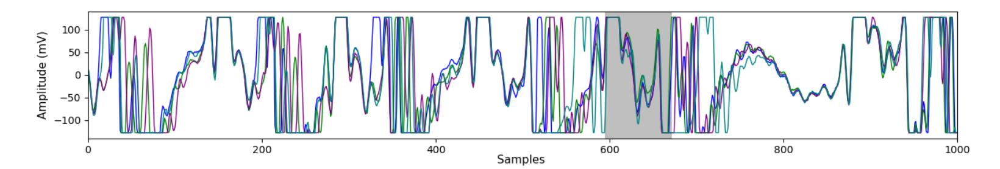

**Figure 1:** Pointer-Cswap 4 overlapped traces (grey color marks aligned area)

<span id="page-4-1"></span>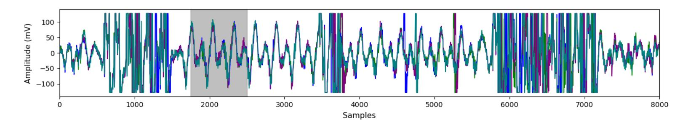

**Figure 2:** Arith-Cswap 4 overlapped traces (grey color marks aligned area)

relatively low: 0*.*5224. Finally, for the deep learning attack, we label the traces with the recovered noisy scalar bits.

**Dataset Arith-Cswap** The split dataset for arithmetic cswap consists of 76 500 iteration traces, the same as for the pointer cswap dataset. The four overlapped iteration traces are presented in Figure [2.](#page-4-1) Like for the other dataset, the measurements are relatively noisy.

Subsequently, similar as for Pointer-Cswap, we execute the horizontal attack from Section [3.3.](#page-7-0) The resulting average accuracy for 300 traces is again relatively low: 0*.*5244. Finally, we label the traces with the recovered noisy scalar bits.

#### **2.3 Deep Neural Networks**

Algorithms like multilayer perceptron (MLP) or convolutional neural networks (CNNs) bring many advantages for SCA as they can break targets protected with countermeasures [\[CDP17,](#page-22-5) [KPH](#page-24-4)<sup>+</sup>19]. Besides reaching top performance, they also do not require preprocessing of leakage traces, making the attack simpler to run. Previous works have applied such methods to profiling attacks against symmetric [\[MPP16,](#page-24-5) [CDP17,](#page-22-5) [KPH](#page-24-4)<sup>+</sup>19, [ZBHV20\]](#page-25-0) and asymmetric crypto algorithms [\[CCC](#page-22-0)<sup>+</sup>19, [WPB19\]](#page-25-1).

Convolutional neural networks (CNNs) commonly consist of three types of layers: convolutional layers, pooling layers, and fully-connected layers. The convolution layer computes the output of neurons that are connected to local regions in the input, each computing a dot product between their weights and a small region they are connected to in the input volume. Pooling decrease the number of extracted features by performing a down-sampling operation along the spatial dimensions. The fully-connected layer computes either the hidden activations or the class scores. Additionally, the batch normalization layer normalizes the input layer by adjusting and scaling the activations.

Data augmentation encompasses various techniques that are used to increase the amount of data by 1) adding slightly modified copies of already existing data or 2) creating synthetic data from existing data. Data augmentation helps prevent overfitting. Dropout is a regularization technique that randomly "drops out" neurons during the training process of a neural network. This technique is used to reduce overfitting.

Training deep neural networks with noisy labels is a well-known problem within the machine learning community [\[HYY](#page-23-2)<sup>+</sup>18]. The main challenge relies on the achievement of good model generalization when a significant portion of training data contains noisy or random labels. Deep neural networks have a high capacity for memorizing noisy labels, 

{5}------------------------------------------------

which hurts generalization performance. A common way to deal with noisy labels is to use (explicit) regularization. For example, in [\[JNC16\]](#page-23-4), the authors applied dropout to improve learning performance in the presence of noisy labels. Alternatively, data augmentation can serve as an implicit form of regularization. Data augmentation has been successfully applied to deep learning-based attacks on protected AES implementations [\[CDP17,](#page-22-5) [PHJ](#page-25-2)<sup>+</sup>19]. In the first work, the authors modified the training traces with random shifts and warping to improve the generalization of a profiling attack to side-channel measurements that contain misalignment. The second work considered common machine learning resampling techniques like SMOTE to achieve better attack performance. We show that our iterative framework also benefits from data augmentation as it drastically improves classification accuracy.

### <span id="page-5-0"></span>**3 Horizontal Attacks**

This section provides an overview of horizontal attacks against protected public-key implementations. First, we list and describe main types of horizontal attacks. Next, we describe the practical limitations of horizontal attacks. Since our iterative framework requires initial labeling of attacked traces that is better than random, we describe how to achieve that using a simple cluster-based horizontal attack. Finally, we present published methods that aim to remove noisy key bits obtained from public-key implementation.

There are two kinds of horizontal attacks: profiling and non-profiling. In the first case, an attacker uses a device under his control to create 'profiles' of operations with sensitive data that they can later 'match' to measurements taken from the victim's device. Here, the attacker might need to know the profiling device's private key and be even able to turn off side-channel countermeasures. The attack can, however, be more complex due to the profiles portability issue, as in practice, the profiles from the controlled device might not be matching the attacked device perfectly.

In the profiling case, the most notable attacks are template attacks on single traces, as demonstrated on ECC [\[NCOS16\]](#page-24-2), and deep learning attacks on RSA [\[CCC](#page-22-0)<sup>+</sup>19].

In the non-profiling case, the attacker does not have access to a profiling device, and he needs to attack a device with an unknown key. This setting is sometimes also referred to as unsupervised. In this work, when we discuss horizontal attacks, we usually mean the non-profiling ones, unless stated otherwise.

#### **3.1 Main Types of Non-Profiling Horizontal Attacks**

This section lists the main types of non-profiling horizontal attacks, as proposed in the recent literature.

- Horizontal correlation attacks: in [\[CFG](#page-22-6)<sup>+</sup>10], the authors proposed an attack based on predictions of intermediate multiple-precision arithmetic results. Although this method is effective against private key blinding countermeasures, other mitigation methods, e.g., message or point randomization, can prevent this horizontal attack.
- Online template attacks [\[BCP](#page-22-7)<sup>+</sup>17]: these attacks use horizontal techniques to exploit the fact that an internal state of scalar multiplication depends only on the (known) input and the scalar. Advanced types of those attacks need only one leakage trace and can defeat implementations protected only with scalar blinding or splitting. This kind of attack can be prevented by randomizing the internal state using point blinding and projective coordinate randomization [\[Cor99\]](#page-23-5) or coordinates rerandomization [\[NCOS16\]](#page-24-2). Note that online template attacks are actually nonprofiling, despite the common setup for template attack that is profiling.
- Collision-correlation horizontal attacks [\[BJPW13,](#page-22-2) [BJP](#page-22-3)<sup>+</sup>15]: in this type of horizontal attacks, an adversary computes statistical correlations between two sub-traces to

{6}------------------------------------------------

verify if they share common operands or output in the modular operations. This method is effective against private key blinding countermeasures and message or point randomization as the statistical distinguisher only needs side-channel leakages representing the processing of input operands and output to be used in modular operations. Thus, this method does not require knowledge of the intermediate data and can be applied against message randomization techniques. The drawback of this method is that it requires a low level of noise.

• Clustering-based horizontal attacks [\[HIM](#page-23-6)<sup>+</sup>13, [SHKS15,](#page-25-3) [PITM14,](#page-25-4) [PC15,](#page-24-6) [NC17\]](#page-24-3): Heyszl et al. [\[HIM](#page-23-6)<sup>+</sup>13] proposed to use clustering algorithms in the context of horizontal attacks. The follow-up work extended the original method to multi-channel and high-resolution electromagnetic measurements [\[SHKS15\]](#page-25-3). Perin et al. [\[PITM14\]](#page-25-4) proposed a heuristic method to attack single exponentiation traces (like in RSA) based on the combination of multi clustering results. The work presented in [\[PC15\]](#page-24-6) proposed a clustering-based framework to combine multiple points of interest identified through different unsupervised methods. In [\[NC17\]](#page-24-3), the authors applied the framework proposed in [\[PC15\]](#page-24-6) to the context of protected ECC implementations.

#### **3.2 Horizontal Attacks in Practice**

The application of horizontal attacks requires specific knowledge about the target implementation. This information can be obtained through available documentation or by reverse engineering. The target scalar multiplication or modular exponentiation may be implemented in many different ways depending on the required performance or side-channel resistance. By observing single side-channel traces, an adversary might be able to recognize the implementation details and then mount a horizontal attack. Cryptographic operations, like exponentiation or scalar multiplication, are implemented through a sequence of modular operations. Usually, the minimum required granularity is in distinguishing doubling and adding for scalar multiplication[5](#page-6-0) and Montgomery multiplications for modular exponentiation.

If a (potentially post-processed) side-channel trace provides conditions to recognize the sequence of operations, an attacker could deduce some valuable information about the used countermeasures, such as the bit-length of the blinding factor, or the type of the scalar/exponent blinding countermeasure (e.g., additive, multiplicative, or splitting). Knowing the bit-length of the private scalar or exponent, the attacker can split the trace into sub-traces, each one representing (ideally) the time interval to process one scalar or exponent bit. Even if this process sounds simple from a theoretical point of view, in practice, a single side-channel trace could feature low signal-to-noise ratio (SNR), dummy modular operations, or jitter (also as a countermeasure), increasing the difficulty to split the full trace into sub-traces correctly. While those limitations are not enough to completely mitigate horizontal attacks, they significantly increase the signal processing requirements.

Private keys recovered by horizontal attacks need to contain a relatively small amount of wrong bits (also called noisy bits) for the attacker to fully recover the target key with brute-force or even advanced error correction algorithms based on cryptanalysis. For example, if an attacker recovers 90% of a 2 048-bit RSA exponent, this means that a trivial brute-force would require a search space of approximately 10<sup>286</sup> under the assumption that the attacker knows which bits are incorrect[6](#page-6-1) . This simple example shows that dealing with wrong bits can be challenging or even impractical after a horizontal attack.

Therefore, in practice, it is reasonable to assume that, after applying a non-profiling horizontal attack to a single trace, the recovered secret key bits might still contain erroneous bits. Hence, a post-analysis method is still required to reduce the wrong bits to a quantity

<span id="page-6-1"></span><span id="page-6-0"></span><sup>5</sup>We note that for ECSM, it is sometimes necessary to distinguish even down to field multiplications. <sup>6</sup>Observe that there exist algorithms that can correct such errors faster than the trivial brute-force, e.g., [\[RIL19,](#page-25-5) [HMM10\]](#page-23-7). However, to executing those algorithms can be costly (for details, see Section [3.4\)](#page-8-0).

{7}------------------------------------------------

that cryptanalysis or brute-force can handle. This is where our work comes in, to improve this process and decrease the error rates.

In this work, the post-analysis solution is based on an iterative deep-learning framework, as detailed in Section [4.](#page-9-0) This paper's main contribution is adopting deep learning to reduce the number of wrong bits significantly while keeping the attack framework in a fully unsupervised setting, as an adversary assumes no knowledge about private key bits.

### <span id="page-7-0"></span>**3.3 Short Horizontal Clustering for Traces Labeling**

We emphasize that the datasets we attack with deep learning need to be labeled slightly better than random. Consequently, we combine a shortened version of the horizontal attack by Nascimento and Chmielewski [\[NC17\]](#page-24-3) and the semi-parametric approach by Perin et al. [\[PC15\]](#page-24-6). In this section, we recall the attacks and combine them in the horizontal attack framework, as outlined below.

The framework consists roughly of the following phases:

- <span id="page-7-1"></span>1. The first step is clustering leakage assessment (CLA). CLA takes as input iteration traces from multiple ECSM executions and finds time moments in the traces where the leakage most likely is located; we call these moments points of interest (POIs).
- <span id="page-7-2"></span>2. Next, key recovery (KR) is run, yielding an approximate scalar. This scalar is expected to be incorrect (due to some wrong bits) but better than random.
- <span id="page-7-3"></span>3. Given the approximate scalar, points-of-interest optimization (POI-OPT) produces a refined list of POIs.
- <span id="page-7-4"></span>4. Finally, the final KR step outputs the recovered scalars for each ECSM. The above steps are described in detail in [\[PC15\]](#page-24-6) and further expanded on in [\[NC17\]](#page-24-3).

This framework is parametrized in [\[NC17\]](#page-24-3) in the following way.

- **Step [1](#page-7-1)** can be run with various clustering algorithms: *k*-means [\[Alp10\]](#page-22-8), fuzzy *k*-means [\[Alp10\]](#page-22-8), or Expectation-Maximization [\[Bis06\]](#page-22-9). Additionally, many outlier detections (for example, Tukey test) and handling methods (e.g., replace the outlier with the median) can be chosen. These methods are used to reduce occasional noise peaks.
  - The results of the clustering algorithm are used to make a leakage metric trace using one of the following distinguishers: sum-of-squared differences (SOSD), sum-ofsquared *t*-values (SOST), and mutual information analysis (MIA).
- **Step [2](#page-7-2)** is parametrized similarly to Step [1](#page-7-1) with: clustering algorithms, outliers detectors, and handlers. Additionally, it takes the number of POIs as a parameter (the POIs are chosen based on the leakage metric trace) and an algorithm that combines clustering results. This algorithm can be either majority rule or loglikelihood. Instead of single-dimensional clustering for each POI, it is also possible to use multi-dimensional clustering and then combining algorithm is not necessary.
- **Step [3](#page-7-3)** is not parametric. It only runs the Welch's *t*-test on the result of Step [2.](#page-7-2)
- **Step [4](#page-7-4)** is parametrized in the same way as Step [2.](#page-7-2) Note that Steps [4](#page-7-4) can be parametrized partially or completely differently than Step [2.](#page-7-2)

To simplify the proposed iterative framework (Section [4\)](#page-9-0) and limit the number of parameters, we stop the attack after Step [2.](#page-7-2) We also try to choose the most straightforward parameters while still obtaining better than random results. We run CLA (Step [1\)](#page-7-1) with *k*-means, SOST, and Tukey test with a median replacement on 100 traces. The resulting leakage metric trace for Cswap-Arith is presented in Figure [3.](#page-8-1) Since the highest peaks are not in the same offsets as for the correct *t*-test trace from Figure [6,](#page-12-0) we should not expect the attack to work well, but any result better than random should be sufficient; the situation is similar for the Cswap-Pointer implementation. KR (Step [1\)](#page-7-1) with *k*-means for 20 best POIs (selected from the result of CLA), and the majority rule are used to recover the scalars.

The results of this simplified horizontal attack are as follows.

{8}------------------------------------------------

<span id="page-8-1"></span>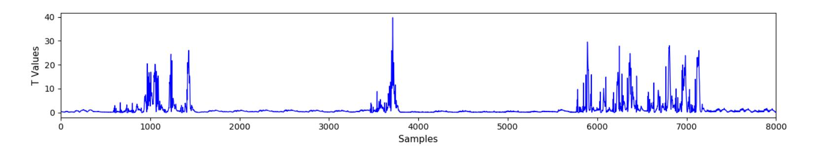

**Figure 3:** The result of CLA for Cswap-Arith: the leakage metric trace.

- **Pointer-Cswap:** the resulting accuracy for 300 traces is relatively low: 0.5224. However, it is consistent for both recovered groups of scalar bits: 0.5253 for bit 0 and 0.5195 for bit 1. Furthermore, when we run *t*-test on the recovered labels, then a few peaks indicate leakage, as presented in Figure 6.
- Arith-Cswap: the resulting accuracy for 300 traces is relatively low: 0.5244. For the pointer case, the accuracy is consistent for both recovered groups: 0.5234 for bit 0 and 0.5253 for bit 1. Moreover, when we run t-test on the recovered labels, then several peaks indicating weak leakage are visible, as presented in Figure 6. Observe these peaks seem slightly less pronounced than in the Pointer-Cswap case.

The achieved accuracy is low (approximately 52%), but we find it sufficient for the deep learning method presented in this paper to correct the labels. Moreover, observe that weak leakage can be visible using a t-test, as presented in Figure 6. The resulting datasets and their accuracy values are described in Section 2.2.

Note that the full procedure presented in [NC17] can recover most of the bits for at least one scalar out of 100 attacked ones. Afterward, a single correct scalar can be recovered by brute-force using approximately  $2^{45}$  operations for cswap-arith and  $2^{22}$  for cswap-pointer. This brute-force step is not necessary for our approach since we can achieve 100% accuracy for one of the 300 attacked scalars using the deep learning approach.

#### <span id="page-8-0"></span>3.4 Methods to Remove Noisy Bits from Public-key Implementations

Let us assume that an attacker aims to perform a single trace attack on several scalar multiplications (or modular exponentiations) from a device operating an ECC (or RSA) protocol. First, by measuring the corresponding side-channel leakages, the attacker acquires a set  $\{T_N\}$  of single traces. Second, they apply a single trace attack, either a profiling or non-profiling, on these traces and obtains a set of blinded scalar (or exponent) values  $\{d'_i\}$ , for  $1 \le i \le N$ .

Due to noise and other aspects interfering with the side-channel analysis (misalignment, for example), the derived scalar (or exponent) might contain multiple errors. The number  $e_i = HD(d'_i, d_i)$  represents the amount of wrongly recovered bits contained in each  $d'_i$ , where HD is the Hamming Distance. In an unsupervised setting, the number of wrong bits cannot be precisely estimated by an attacker, as well as the indices of the wrong bits in  $d'_i$ . An attacker can also use the probabilities of recovered key bits being either 0 or 1, coming from the horizontal or template attack, for faster key recovery as presented in [HIM<sup>+</sup>13], for example. However, this technique does not work in a more noisy environment due to many high-confidence false-positives, as presented in [NC17]. Even for a profiling attack, it is not easy to use these probabilities in a noisy setting, as presented in [NCOS16].

A standard approach to speed up the trivial brute-force is to use a meet-in-the-middle approach. It is a space-time trade-off cryptographic attack that exploits the fact that multiple encryption operations are performed in sequence. The attack essentially halves the effort necessary for the trivial brute-force, but it requires the amount of memory of exactly that size (i.e., half of the brute-force size). This approach was employed to recover the full private key from its partial knowledge for exponentiation in [GTY07] and scalar

{9}------------------------------------------------

multiplication in [\[NCOS16,](#page-24-2) [NC17\]](#page-24-3).

Alternatively, it may be possible to correct the private key with an informed brute-force attack from [\[LvVW15\]](#page-24-7). Unfortunately, this attack works well if the bits containing errors are adjacent to each other, which is often not the case.

For RSA, there exist algorithms that can correct multiple errors in a private key (in the exponent and the prime factors) by exploiting RSA mathematical properties [\[HS09,](#page-23-9) [HMM10\]](#page-23-7). These algorithms utilize the fact that the corresponding public and private RSA keys contain significant redundancy, especially for RSA-CRT. The attacks do not consider exponent blinding or splitting, but there exists a follow-up attack against exponent blinding for RSA-CRT [\[SW17\]](#page-25-6). Moreover, there exists an attack that for a small public RSA exponent (e.g., 3) and given a quarter of the bits of the private key, the attack can recover the entire private key [\[BDF98\]](#page-22-10). Slightly weaker results are achieved for larger public exponents.

Roche et al. [\[RIL19\]](#page-25-5) proposed the most efficient, and fitting to the SCA context, technique, to the best of our knowledge. It improves the original solution from [\[SI11\]](#page-25-7) and recovers a secret scalar by combining information from many noisy blinded scalars (e.g., outputs of horizontal attacks). It even works efficiently when blinding factors are large (e.g., ≥ 32 bits) and with a significant bit error rate of 10% − 15%. In our setting, this kind of correcting algorithm can be applied not after the horizontal attack but after the deep learning phase. However, this step is not necessary for the results presented in this paper since we reach a 100% recovery for at least some scalars for both implementations.

### <span id="page-9-0"></span>**4 Proposed Iterative Deep Learning Framework**

This section proposes an iterative deep learning framework that can correct wrong bits from private keys derived from a horizontal attack. The proposed iterative framework keeps the attack completely unsupervised as no knowledge about secret bits (i.e., labels) is assumed since the first attack steps. The framework contains an initialization step, where traces are prepared and labeled with a horizontal attack, and the main part, which consists of an iterative process.

#### <span id="page-9-1"></span>**4.1 Initialization**

The input to the framework is a set of scalar multiplication traces (for RSA applications, it can be replaced by modular exponentiation traces), containing all the sub-operations representing the full secret scalar's processing. Thus, the scalar multiplication traces *T<sup>i</sup>* , *i* ∈ [0*, N* − 1], are split into sub-traces *Ti,j* , each one representing the time interval of the processing of a single scalar bit. The term *j* indicates the index of the scalar bit. For each trace *T<sup>i</sup>* , the scalar may be randomized.

After full scalar multiplication traces are split into sub-traces, as illustrated in Figure [4,](#page-10-0) a horizontal attack is applied to the sub-traces *Ti,j* to define initial labels *Yi,j* for each sub-trace. The output of a horizontal attack is dataset *D* = {*Ti,j , Yi,j*} labeled according to two possible classes, 0 and 1. The proposed framework requires additional attack traces which are not part of *D*.

#### **4.2 Main Part of the Framework**

Figure [5](#page-10-1) illustrates the iterative deep learning framework, where every iteration implements the following four steps:

• **Phase 1– Prepare sets** *D*<sup>1</sup> **and** *D*2**:** The full set *D* = {*Ti,j , Yi,j*} is split into an initial training set, *D*1, and a subsequent test set, *D*2. In our case, the number of sub-traces in each of these subsets is identical.

{10}------------------------------------------------

<span id="page-10-0"></span>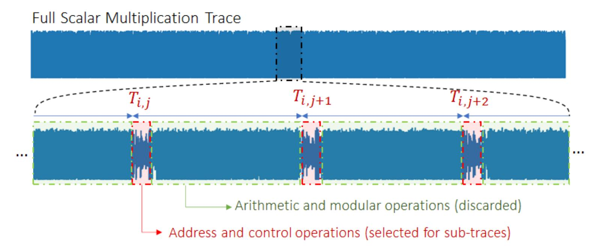

**Figure 4:** Trace preprocessing for horizontal attacks. The full scalar multiplication traces are split into sub-intervals, each one framing the processing of one scalar bit. The intervals indicated by *Ti,j* (red area) are selected as sub-traces. Green areas are discarded as these parts present no target leakage.

<span id="page-10-1"></span>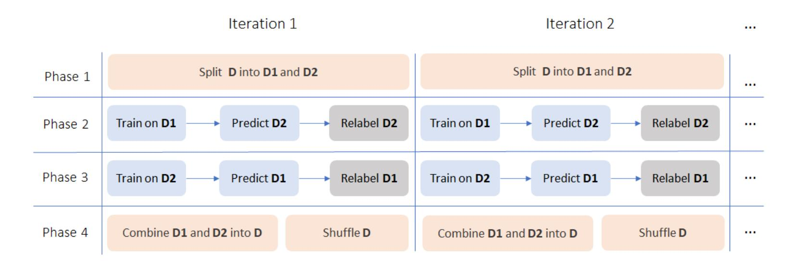

**Figure 5:** Proposed iterative framework

- **Phase 2– Train on** *D*1**, predict and relabel** *D*2**:** a deep neural network is trained with *D*1, with labels *Y*1, and tested or predicted on *D*2. The *Softmax* output probabilities obtained by predicting *D*<sup>2</sup> are then used to re-label *Y*2.
- **Phase 3– Train on** *D*2**, predict and relabel** *D*1**:** In the next step, the process works in the opposite direction. The deep neural network is trained with the relabeled *D*2, having new labels *Y*2, and tested or predicted on *D*1. This time, the *Softmax* output probabilities obtained from *D*<sup>1</sup> are used to re-label *Y*1.
- **Phase 4– Join** *D*<sup>1</sup> **and** *D*<sup>2</sup> **and shuffle the full set:** this last phase of an iteration combine both relabelled sets *D*<sup>1</sup> and *D*<sup>2</sup> into a single dataset *D* = {*Ti,j , Yi,j*}. Finally, the combined and shuffled dataset *D* is again split into *D*<sup>1</sup> and *D*<sup>2</sup> as a preparation for Phase 1 of the next iteration.

After the deep neural networks are trained on *D*<sup>1</sup> and *D*<sup>2</sup> in Phases 2 and 3, respectively, a separate test set is used as target traces. This test set can be composed of scalar multiplication traces that are not used to implement *D*<sup>1</sup> and *D*2. In the results presented in Section [5,](#page-11-0) the attack phase is performed at the end of each training epoch. The test set does not require an initial labeling step from a horizontal attack. For example, to determine when the iteration framework should stop, the attacker evaluates *N* scalar multiplication traces *T<sup>i</sup>* , *i* ∈ [0*, N* − 1], with the known public parameters.

This procedure continues iteratively until a successful attack is achieved. In every step

{11}------------------------------------------------

<span id="page-11-2"></span>

| Dataset       | Scalar bits | ECSM Traces | K-means Accuracy |
|---------------|-------------|-------------|------------------|
| Cswap-Arith   | 255         | 250         | 52.24%           |
| Cswap-Pointer | 255         | 250         | 52.44%           |

**Table 1:** Horizontal attack results

of this iterative process, it is expected that the number of noisy labels decreases as a result of deep neural networks learning side-channel leakages from the limited number of correct labels in the training set. Of course, the higher the wrong bits in the initial training set, the more iterations we expect to need to reach a successful attack. The main reasons why the iterative framework can correct wrong labels are because (1) regularized neural networks are robust and (to some extent) insensitive to the presence of noisy or error labels and (2) the attacked traces contain exploitable leakages. As we show in Section [5,](#page-11-0) because we start with a very low correct rate for labels as a result of a horizontal attack (52%), the proposed framework usually requires more than 30 iterations until the maximum accuracy is achieved. In the first iterations (e.g., until iteration 5), we expect a higher level of correction, while for the rest of iterations, the correction rate is slower. Moreover, as we show in Section [5,](#page-11-0) using random CNN models across framework iterations tends to provide superior results compared to a situation when a fixed CNN is used along the whole framework process. This is an additional form of regularization, and it supports the hypothesis that preventing overfitting of deep neural networks at each iteration leads to better error labels correction.

### <span id="page-11-0"></span>**5 Results**

This section provides several results on different applications of the proposed iteration framework. We start by the crucial preliminary step, i.e., applying a horizontal attack method to the two target datasets. We conduct a leakage assessment on the datasets to demonstrate the leakage occurrence, given by *t*-test peaks, that the framework faces with these datasets. Next, we apply a cluster-based horizontal attack on the two datasets to have initial labels for the framework. Finally, we apply the proposed framework with different variations. The proposed framework is very generic because it does not restrict the type of learning algorithm to be used in each iteration. Therefore, we apply different variations of CNN architectures together with different types of regularization techniques.

#### <span id="page-11-1"></span>**5.1 Labeling Traces from Clustering-based Horizontal Attack**

The first phase considers the application of a horizontal attack to the datasets. Here, we adopted clustering-based horizontal attacks [\[PC15\]](#page-24-6). In this first phase, the goal is to provide initial labels to the sub-traces. For both datasets, *Cswap-Pointer* and *Cswap-Arith*, we only apply a short version of the horizontal attack, as described in Section [3.3.](#page-7-0) This is essentially the attack from [\[NC17\]](#page-24-3) without optimization. Table [1](#page-11-2) details the labeling accuracy obtained from clustering-based horizontal attacks on both datasets.

In Table [1,](#page-11-2) the labeling accuracy is close to 52% for both datasets, although it seems that *Cswap-pointer* contains a bit more side-channel leakages compared to *Cswap-Arith*, as visible in Figure [6.](#page-12-0) This first phase of the subsequent attack is applied to 250 ECSM trace sets. From 300 traces, 50 traces are left for test purposes in Phases 2 and 3.

{12}------------------------------------------------

<span id="page-12-0"></span>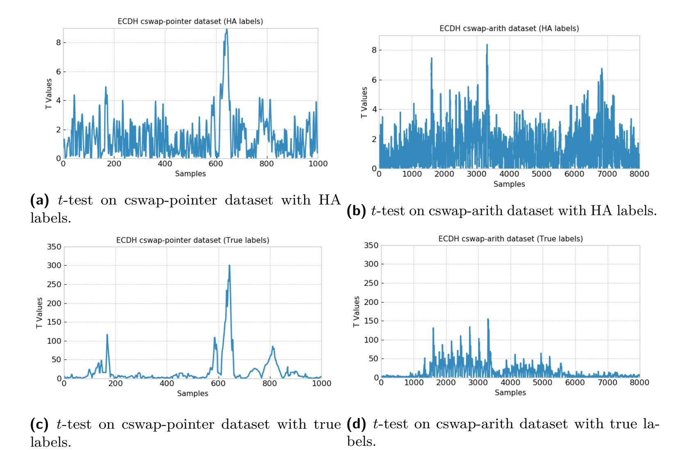

**Figure 6:** *t*-test on the two considered dataset.

#### **5.2 Leakage Assessment on cswap-arith and cswap-pointer Datasets**

This section presents a leakage assessment on the datasets used in this paper. This analysis's main reason is to demonstrate how much leakage can be captured by standard leakage assessment methods. It is important to emphasize that the proposed framework does not assume any knowledge from this leakage assessment as we want to keep the analysis fully unsupervised. The leakage assessment is based on *t*-test, and results are shown in Figure [6.](#page-12-0) This figure shows *t*-test peaks with labels obtained from the clusterbased horizontal attack and correct labels. Note that labels from the horizontal attack can already indicate leakage detection, as shown in Figures [6b](#page-12-0) and [6b,](#page-12-0) for *cswap-arith* and *cswap-pointer* datasets, respectively.

### **5.3 Attacking cswap-arith and cswap-pointer Datasets with Supervised Learning**

To achieve 100% of test accuracy on both attacked datasets for at least one scalar multiplication trace, we define a CNN with one convolution layer (10 filters, kernel size of 40 and stride of 1) and two fully-connected layers containing 100 neurons each. In all layers, we use the *ReLU* activation function. Finally, we use the learning rate equal to 0.0001 and *RMSprop* optimizer. For both datasets, training is done for 25 epochs and a mini-batch size of 100 traces. In total, we consider 31 875 sub-traces (obtained from 125 random scalar multiplications) for profiling, and we test the trained CNN on separate 12 875 sub-traces (obtained from 50 random scalar multiplications). To reach a successful attack on at least one scalar multiplication trace with a supervised setting, we require no regularization. Still, as we will see in the next section, regularization (dropout and data augmentation) is crucial to achieve satisfactory attack results.

{13}------------------------------------------------

| cswap-arith                 | cswap-pointer               |  |
|-----------------------------|-----------------------------|--|
| input_size = 8 000          | input_size = 1 000          |  |
| pool size=4, stride=4       | -                           |  |
| 8 filters, ks=20, stride=1  | 8 filters, ks=40, stride=4  |  |
| 16 filters, ks=20, stride=1 | 16 filters, ks=40, stride=4 |  |
| 32 filters, ks=20, stride=1 | 32 filters, ks=40, stride=4 |  |
| 100 neurons                 | 100 neurons                 |  |
| 100 neurons                 | 100 neurons                 |  |
| 2 neurons                   | 2 neurons                   |  |
|                             |                             |  |

<span id="page-13-1"></span>**Table 2:** CNN architectures considered for the two datasets described in Section [2.2](#page-3-2)

#### **5.4 Iterative Framework Application on Different Cases**

This section provides experimental results for the proposed iterative framework. The selected learning algorithm for steps 2 and 3 is a convolutional neural network. First, in Section [5.4.1,](#page-13-0) we present results when the CNN hyperparameters are fixed in all the framework iterations. There, we also introduce the four scenarios in which the framework is applied. Afterward, in Section [5.4.2,](#page-15-0) we improve the learning algorithm's variability by randomizing the CNN hyperparameters in every framework iteration. In the random hyperparameters case, we also present results for the four application scenarios described in Section [5.4.1.](#page-13-0) We decide to use CNNs instead of, e.g., a multilayer perceptron because CNNs are more robust to jitter-based effects in side-channel traces, as already demonstrated in [\[CDP17\]](#page-22-5).

**Maximum single trace accuracy metric:** for the provided results on the *cswaparith* and *cswap-pointer* datasets, we separate 50 scalar multiplication traces, each one containing 255 sub-traces, one for each scalar bit. The metric to estimate the proposed iterative framework's performance is the maximum accuracy obtained by testing the 50 tested scalar multiplication traces. *Note that these 50 traces are never used in training datasets D*<sup>1</sup> *and D*2*, as they are separated traces.*

#### <span id="page-13-0"></span>**5.4.1 Fixed CNN Hyperparameters**

In the first case, we consider two CNN configuration during all iterations of the framework, with and without dropout layers [\[SHK](#page-25-8)<sup>+</sup>14], as detailed in Tables [2](#page-13-1) and [3.](#page-14-0) A different configuration of convolution layers is defined for each dataset. For both CNNs, we defined three consecutive convolution layers containing 8, 16, and 32 filters, respectively. This choice is motivated by the fact that more convolution filters in subsequent convolution layers increase the capacity of the model with respect to leakage detection. For all the layers, the *ReLU* activation function is chosen. The weights for the two dense layers are always initialized with the *random uniform* method, while for the remaining layers, the weight initialization considers the *glorot uniform* method. *RMSprop* is used as the stochastic gradient descent optimizer with a learning rate of 0*.*00001. The loss function is set to *categorical cross-entropy*. The CNNs are always trained for ten epochs, as we observed that training the networks for more epochs results in overfitting and degrades the results.

As the *cswap-arith* dataset contains sub-traces with 8 000 samples each, we define as the first layer an *AveragePooling1D* layer to implement dimensionality reduction identical to window resampling. This way, we reduce the number of trainable parameters (weights and biases) in the deep neural network and also eliminate a part of jitter present in measurements.

{14}------------------------------------------------

| Layer        | cswap-arith                 | cswap-pointer               |  |
|--------------|-----------------------------|-----------------------------|--|
| Input        | input_size = 8 000          | input_size = 1 000          |  |
| AvgPooling1D | pool size=4, stride=4       | -                           |  |
| BN Layer     | Batch Normalization         | Batch Normalization         |  |
| Conv1D_1     | 8 filters, ks=20, stride=1  | 8 filters, ks=40, stride=4  |  |
| Conv1D_2     | 16 filters, ks=20, stride=1 | 16 filters, ks=40, stride=4 |  |
| Conv1D_3     | 32 filters, ks=20, stride=1 | 32 filters, ks=40, stride=4 |  |
| Dropout_1    | Dropout Rate=0.5            | Dropout Rate=0.5            |  |
| Dense_1      | 100 neurons                 | 100 neurons                 |  |
| Dropout_2    | Dropout Rate=0.5            | Dropout Rate=0.5            |  |
| Dense_2      | 100 neurons                 | 100 neurons                 |  |
| Softmax      | 2 neurons                   | 2 neurons                   |  |

<span id="page-14-0"></span>**Table 3:** CNN architectures without *dropout* layers for the two datasets described in Section [2.2.](#page-3-2)

Having defined the two CNN architectures in Tables [2](#page-13-1) and [3,](#page-14-0) the iterative framework is applied on both datasets, for 50 iterations, on the following four scenarios:

- 1. **CNN (Table [2\)](#page-13-1)** *without* **regularization:** in each framework iteration, the CNN is trained without any type of regularization technique;
- 2. **CNN (Table [2\)](#page-13-1)** *with* **data augmentation:** in this case, shifted-based data augmentation is considered. Every time a batch of 100 sub-traces is processed during training, we randomly apply shifts of 5 samples to the right or the left in the *x*-axis. The sub-traces were already aligned before the application of horizontal attacks in order to have initial labels. However, small jitter is still present in the sub-traces, and data augmentation with minimal shifts of 5 samples showed satisfactory results. For each epoch, the CNN processes augmented mini-batch 200 times;
- 3. **CNN with dropout (Table [3\)](#page-14-0) and** *without* **data augmentation:** in this case, the only type of regularization against overfitting are the two introduced dropout layers with a dropout rate of 0.5, which is a relatively high rate to provide a significant level of regularization;
- 4. **CNN with dropout (Table [3\)](#page-14-0) and** *with* **data augmentation:** in this last case, we combine dropout layers with data augmentation using the same definitions as described in Scenario 2;

We expect that dropout and data augmentation regularization methods reduce the overfitting that can happen during iterations. The overfitting likely happens due to training an identical deep neural network after relabeling the datasets based on predictions obtained from this same neural network. Recall that regularization is a widely adopted technique used in the machine learning community to deal with noisy labels.

For each scenario described above, we run the iterative framework ten times and average the results. Figures [7](#page-15-1) and [8](#page-15-2) show the average, minimum, and maximum single trace test accuracy for the two considered datasets. When attacking the *cswap-arith* dataset, the iterative framework can reach 100% of maximum single trace accuracy only when dropout layers are considered together with data augmentation. For the other three scenarios, the maximum achieved accuracy values are 92.94%, 78.43%, and 76.07% for dropout only, data augmentation only, and no regularization, respectively.

Results for the *cswap-pointer* dataset provided better results for all four scenarios. For this dataset, we obtained 100% of the maximum single test trace accuracy for the three cases with some type of regularization. Only when no regularization is considered, the

{15}------------------------------------------------

<span id="page-15-1"></span>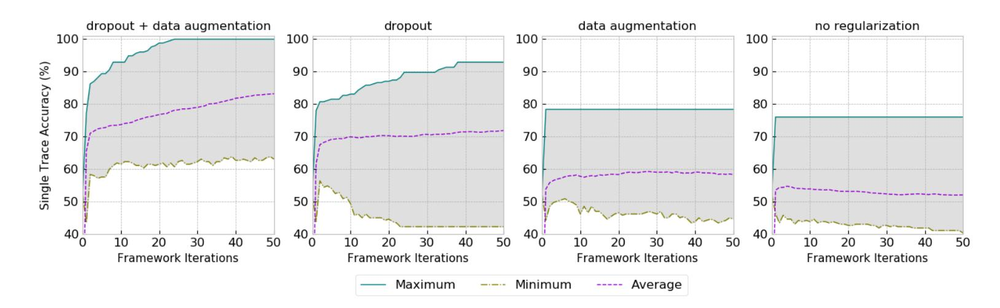

**Figure 7:** Minimum, maximum, and average single trace accuracy with iterative framework on the *cswap-arith* dataset.

<span id="page-15-2"></span>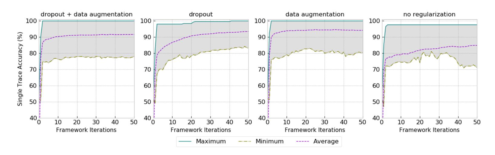

**Figure 8:** Minimum, maximum, and average single trace accuracy with iterative framework on the *cswap-pointer* dataset.

framework achieved a maximum accuracy of 97.64% after 50 iterations. As a highlight, results for the *cswap-pointer* case demonstrated that the framework was able to return 100% accuracy for seven out of ten framework executions when data augmentation is used as the only regularization method. Table [4](#page-21-0) provides the frequency in which the iterative framework achieves 100% in each scenario for both datasets (in Appendix [B,](#page-26-2) Figures [17](#page-26-3) and [18](#page-27-0) show the maximum single test trace accuracy obtained for each framework execution for the two datasets).

The better results for different cases is explained by the high *t*-test peaks in Figures [6a](#page-12-0) and [6c,](#page-12-0) indicating a higher occurrence of address-like leakages in this scalar multiplication implementation. Although the *t*-test peaks for this implementation are higher compared to the *cswap-arith* implementation, a clustering-based horizontal attack was able to return a maximum of 52.44% accuracy for this dataset. Without any method to deal with noisy labels, like regularization, the iterative framework's application could not achieve 100% for one of the 50 tested scalar multiplication traces. However, as the leakage is relatively higher for this dataset compared to *cswap-arith*, we can obtain a successful attack on the *cswap-pointer* dataset in all scenarios with regularization. For the *cswap-arith* dataset, higher successful results are achieved when random CNN hyperparameters and/or the attack interval is optimized with gradient visualization, as detailed in the following sections.

#### <span id="page-15-0"></span>**5.4.2 Random CNN Hyperparameters**

In this experiment, the CNN hyperparameters will vary before the start of every framework iteration. For both datasets, the selected CNN architectures have the same structure as CNNs presented in Tables [2](#page-13-1) and [3,](#page-14-0) except that we vary the following hyperparameters:

• *Number of filters*: in the first convolution layer (Conv1D\_1), the number of filters

{16}------------------------------------------------

<span id="page-16-0"></span>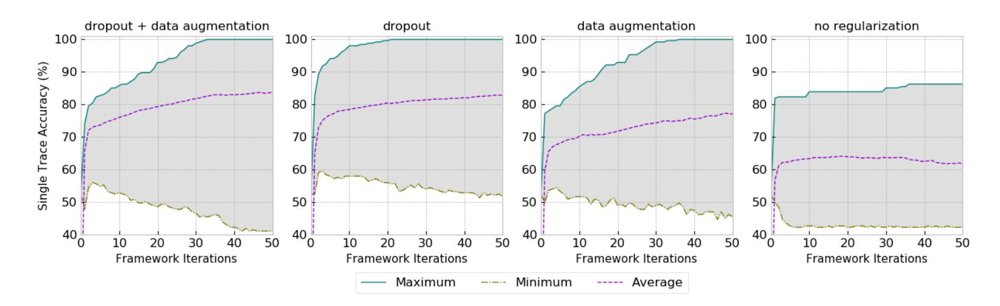

**Figure 9:** Random CNN hyperparameters: minimum, maximum, and average single trace accuracy with iterative framework on the *cswap-arith* dataset.

is randomly selected between 4 and 8. The two subsequent convolution layers (Conv1D\_2 and (Conv1D\_3) will have number filters equal to two and four times, respectively, the number of filters randomly defined in Conv1D\_1. This proportion is kept to improve feature extraction from side-channel traces.

- *Kernel size and stride*s: for the three convolution layers (Conv1D\_1, Conv1D\_2, and (Conv1D\_3), the kernel size is the same and randomly selected between 10 and 40. Similarly, the three convolution layers' strides are the same and randomly selected between 1 and 4.
- *Fully-connected Layers*: The number of fully-connected layers is randomly selected between 1 and 5. The number of neurons for all fully-connected layers is randomly defined between 100 and 400.
- *Activation Function*: The activation function for all the layers is randomly selected from *ReLU*, *Tanh*, *SELU*, or *ELU*.

The main reason to randomize the CNN configuration before every iteration is to reduce the same model's overfitting in a subsequent iteration. Retraining an identical CNN with datasets relabeled in the previous iteration can bias the model in the next iteration, reducing the framework's chances to improve the label's correctness during the framework execution consistently.

Figures [9](#page-16-0) and [10](#page-17-0) show results for both datasets. These figures show an average of ten framework executions and the maximum and minimum single trace test accuracy. As we can see, without any type of regularization, the maximum achieved single trace accuracies are 86.27% and 96.47% for the *cswap-arith* and *cswap-pointer* datasets, respectively. Combining random CNN hyperparameters with regularization techniques improves the results on the *cswap-arith* dataset significantly. We can achieve 100% of single trace test accuracy for all three different scenarios with some type of regularization. Note that when dropout is combined with data augmentation, running the framework ten times on *cswap-arith* dataset resulted in 100% of test accuracy in 6 cases.

For the *cswap-pointer* dataset, we were able to achieve 100% of single trace test accuracy when any type of regularization is used. For this last dataset, random CNN hyperparameters presented similar results in comparison to fixed CNN hyperparameters. Results with data augmentation only were more successful when fixed CNN hyperparameters are considered, as detailed in Table [4.](#page-21-0) On the other hand, the combination of dropout and data augmentation for random CNN hyperparameters achieved superior results than the fixed CNN hyperparameters case. For this specific scenario, we managed to achieve 100% test accuracy in four out of ten framework executions.

{17}------------------------------------------------

<span id="page-17-0"></span>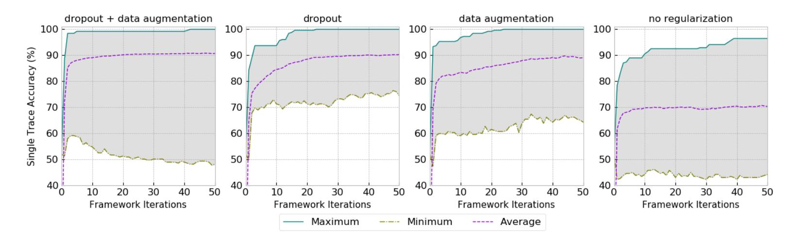

**Figure 10:** Random CNN hyperparameters: minimum, maximum, and average single trace accuracy with iterative framework on the *cswap-pointer* dataset for random CNN hyperparameters.

#### **5.5 Using Gradient Visualization to Optimize Attack Interval**

The proposed iterative framework's attack performance can be significantly increased by narrowing down the samples interval in sub-traces. One alternative could be to split sub-traces into smaller sample intervals and attack each one of them at a time. However, this would increase computational time and render the analysis too slow. Therefore, in this section, we propose using a deep learning tool based on gradient visualization to optimize the attack interval and, as a consequence, reduce iterative framework computational complexity.

Gradient visualization (GV) is conducted by analyzing what input features (given by a neuron in the input deep neural network layer as a one-to-one mapping) have more influence in classification during training. It is a technique that computes the values of derivatives in a neural network regarding the input trace. These derivatives are then used to point out what feature needs to be modified the least to affect the loss function the most. In [\[MDP19\]](#page-24-8), the authors proposed the visualization of input activation gradients as a technique to characterize the automated selection of points of interest by deep neural networks. The result is a vector of gradients computed by the backpropagation algorithm as the derivative of the cost function concerning the input activation.

When applied to our framework, the gradient needs to consider the labels for sub-traces obtained after each framework iteration. For the initial iterations, the label correctness can be very low, and the gradients in these first iterations will most likely indicate unclear results in terms of leakage location. However, by summing up the gradients obtained for all iterations, we can obtain satisfactory and clear results.

Figures [11](#page-18-1) and [12](#page-18-2) show gradient peaks for both datasets. The gradient values were obtained from CNNs trained on both datasets when fixed CNN hyperparameters are used in all framework iterations. We can clearly observe that gradient peaks correspond to the leakage occurrence given by *t*-test results from Figure [6.](#page-12-0) As a result, an adversary can narrow down the attack interval in sub-traces. For the *cwsap-pointer* dataset, Figure [12](#page-18-2) indicates high gradient peaks from sample 550 to sample 800. In the case of the *cwsap-arith* dataset, Figure [11](#page-18-1) shows larger gradients from sample 1 500 to 3 500.

Figures [13](#page-19-1) and [14](#page-19-2) show results for fixed and random CNN hyperparameters, respectively, on the *cswap-arith* dataset. The iterative framework considers only sample interval range from 1 500 to 3 500 of all sub-traces, which is trace interval where the leakage is more significant. The CNN configurations are the same as provided in Tables [2](#page-13-1) and [3.](#page-14-0) Now, we can reach 100% accuracy for all four scenarios, with and without regularization, as detailed in Tables [4](#page-21-0) and [5.](#page-21-1) Without regularization, one out of ten framework executions achieved 100% of single trace test accuracy. When no regularization is in place, we could not achieve 100% for all ten framework executions.

Figures [15](#page-20-0) and [16](#page-20-1) show results for fixed and random CNN hyperparameters, respectively,

{18}------------------------------------------------

<span id="page-18-1"></span>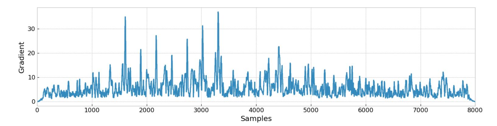

**Figure 11:** Input gradient visualization for the *cswap-arith* dataset.

<span id="page-18-2"></span>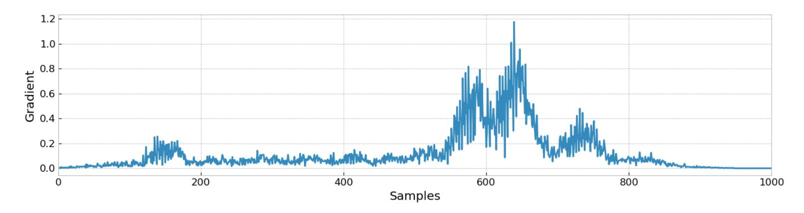

**Figure 12:** Input gradient visualization for the *cswap-pointer* dataset.

on the *cswap-pointer* dataset. After using gradient visualization to narrow down the interval for the cswap-pointer dataset, we achieved 100% of maximum test accuracy for the three scenarios with regularization. Again, only when no regularization method is adopted, the test accuracy reaches 94.50% and 96.47% for the cases when fixed, and random CNN hyperparameters are considered on an optimal interval, respectively. In the end, narrowing down the attack interval for the *cswap-pointer* dataset did not lead to improved results, indicating that the original interval of 1 000 samples in sub-traces is needed for the CNN to fit the existing leakages. On the other hand, for the *cswap-arith* dataset, the improvement after optimizing the interval is very significant.

Table [5](#page-21-1) also summarizes the maximum single trace accuracy results obtained before and after considering gradient visualization to optimize the attack interval.

## <span id="page-18-0"></span>**6 Extending the Iterative Framework to Different Targets**

The proposed iterative deep learning-based framework is generic and can be extended to several public-key implementations. The two targets evaluated in this paper executed scalar multiplications at bit-level, meaning that each sub-trace represents the processing of a single scalar bit. However, for implementations of scalar multiplications (also modular exponentiations) that process more than a bit at a time (e.g., window-based implementations), the only difference would be the number of classes in the trained deep neural networks and the scalar multiplication trace splitting procedure. In this case, a sub-trace could represent the processing of a group of scalar bits (i.e., a window).

A successful attack using our proposed framework requires the presence of remaining and unintentional leakages in the target device. This is the main reason why we clearly demonstrated through *t*-test leakage assessment, the presence of remaining and exploitable leakages after a horizontal attack is applied in order to initialize the framework. Although detected *t*-test peaks are significantly lower than those obtained from a situation when true labels are available, the label correctness of around 52% is already enough for the proposed framework to iteratively learn the presence of leakages from few (but sufficient)

{19}------------------------------------------------

<span id="page-19-1"></span>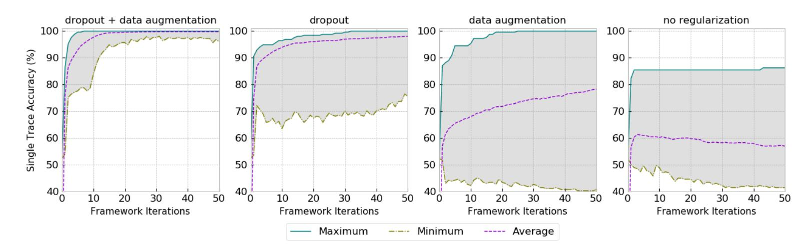

**Figure 13:** Fixed CNN hyperparameters: minimum, maximum, and average single trace accuracy with iterative framework on the *cswap-arith* dataset and attacking the sample interval range from 1 500 to 3 500 of all sub-traces.

<span id="page-19-2"></span>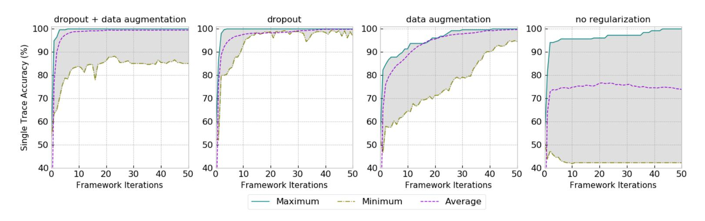

**Figure 14:** Random CNN hyperparameters: minimum, maximum, and average single trace accuracy with iterative framework on *cswap-arith* dataset and attacking the sample interval range from 1 500 to 3 500 of all sub-traces.

correctly labeled sub-traces.

For public-key implementations that are properly protected with masking and hiding countermeasures, and where the processing of scalar bits leads to a leakage-free scenario, it is expected that the proposed deep learning-based framework will likely be unable to iteratively correct error labels. Additionally, in this scenario, we expect that the initialization labeling step (Section [4.1\)](#page-9-1) with a horizontal attack will deliver random labels, preventing the framework from learning how to correct the wrong labels through its iterations.

### <span id="page-19-0"></span>**7 Conclusions and Future Works**

This paper presented a novel deep learning-based iterative framework to correct the remaining wrong bits resulting from horizontal attacks. As discussed in this work, horizontal attacks are the only applicable method against protected public-key implementations, and the only alternative for attackers is to recover the full secret from a single trace. As horizontal attacks face many limitations in practice, it is common to return results with a high and an unknown number of wrong bits. We show that deep learning techniques, through an iterative process, can continuously improve the correctness of labels in a dataset with a high number of noisy bits, given by wrong target scalar bits. From a cluster-based horizontal attack, which provided very poor accuracy of 52% for two datasets, our framework was able to return 100% of correct blind and secret scalars. For that, we made use of deep learning techniques such as dropout, data augmentation, and gradient

{20}------------------------------------------------

<span id="page-20-0"></span>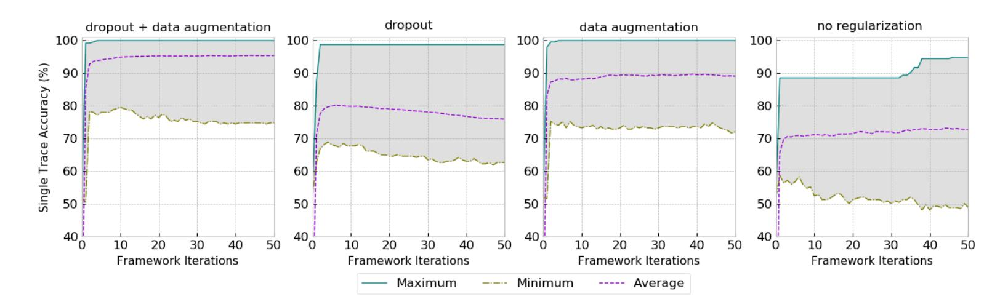

**Figure 15:** Fixed CNN hyperparameters: minimum, maximum, and average single trace accuracy with iterative framework on the *cswap-pointer* dataset and attacking the sample interval range from 550 to 800 of all sub-traces.

<span id="page-20-1"></span>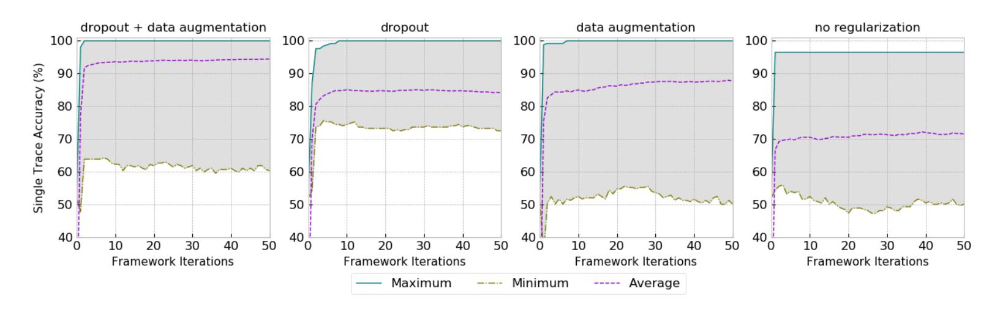

**Figure 16:** Random CNN hyperparameters: minimum, maximum, and average single trace accuracy with iterative framework on *cswap-pointer* dataset and attacking the sample interval range from 550 to 800 of all sub-traces.

visualization.

Nevertheless, this work leaves space for several future research directions. As regularization based on dropout layers and data augmentation was highly efficient in our application cases, we suggest upgrading the proposed framework's regularization techniques. For that, we suggest proposing a metric for early stopping while keeping the framework completely unsupervised. Another direction would be to adopt ensembles for the iterative framework to reduce error variability by combining results for several models in each framework iteration [\[PCP19\]](#page-25-9). Finally, an interesting future research direction would be to create a noisy transition matrix based on classification probabilities for each bit in target scalar multiplication traces. With this method, it would be possible to identify, with some probability, the location of wrong bits in final results.

## **Availability**

Implementations for reproducing our results are available at [https://github.com/AISyLab/](https://github.com/AISyLab/IterativeDLFramework) [IterativeDLFramework](https://github.com/AISyLab/IterativeDLFramework).

## **Acknowledgements**

Łukasz Chmielewski is partially supported by European Commission through the ERC Starting Grant 805031 (EPOQUE) of P. Schwabe. We thank anonymous reviewers and the shepherd for the suggestions on how to improve the paper.

{21}------------------------------------------------

**Table 4:** Summary of ten iterative framework executions: number of cases where the framework achieves 100% of maximum single trace test accuracy, for fixed and random CNN hyperparameters. Results are provided for full sample intervals and after selecting an optimal interval gradient visualization (GV) results.

<span id="page-21-0"></span>

| Fixed CNN Hyperparameters       |               |              |               |              |  |  |
|---------------------------------|---------------|--------------|---------------|--------------|--|--|
|                                 | cswap-arith   |              | cswap-pointer |              |  |  |
| Method                          | Full interval | GV Optimized | Full interval | GV Optimized |  |  |
| CNN No regularization           | 0/10          | 0/10         | 0/10          | 0/10         |  |  |
| CNN Dropout                     | 0/10          | 8/10         | 1/10          | 1/10         |  |  |
| CNN Data Augmentation           | 0/10          | 2/10         | 7/10          | 2/10         |  |  |
| CNN Dropout + Data Augmentation | 1/10          | 9/10         | 2/10          | 4/10         |  |  |
| Random CNN Hyperparameters      |               |              |               |              |  |  |
|                                 | cswap-arith   |              | cswap-pointer |              |  |  |
| Method                          | Full interval | GV Optimized | Full interval | GV Optimized |  |  |
| CNN No regularization           | 0/10          | 1/10         | 0/10          | 0/10         |  |  |
| CNN Dropout                     | 4/10          | 10/10        | 1/10          | 2/10         |  |  |
| CNN Data Augmentation           | 1/10          | 10/10        | 2/10          | 1/10         |  |  |
| CNN Dropout + Data Augmentation | 6/10          | 10/10        | 4/10          | 3/10         |  |  |

**Table 5:** Summary of iterative framework results: maximum single trace accuracy achieved from ten framework executions. Results for the *cswap-arith* and *cswap-pointer* datasets for full sample intervals and after selecting an optimal interval gradient visualization (GV) results.

<span id="page-21-1"></span>

| Fixed CNN Hyperparameters       |                            |              |               |              |  |  |
|---------------------------------|----------------------------|--------------|---------------|--------------|--|--|
|                                 | cswap-arith                |              | cswap-pointer |              |  |  |
| Method                          | Full interval              | GV Optimized | Full interval | GV Optimized |  |  |
| CNN No regularization           | 76.07%                     | 86.27%       | 97.64%        | 94.50%       |  |  |
| CNN Dropout                     | 92.94%                     | 100%         | 100%          | 98.82%       |  |  |
| CNN Data Augmentation           | 78.43%                     | 100%         | 100%          | 100%         |  |  |
| CNN Dropout + Data Augmentation | 100%                       | 100%         | 100%          | 100%         |  |  |
|                                 | Random CNN Hyperparameters |              |               |              |  |  |
|                                 | cswap-arith                |              | cswap-pointer |              |  |  |
| Method                          | Full interval              | GV Optimized | Full interval | GV Optimized |  |  |
| CNN No regularization           | 86.27%                     | 100%         | 96.47%        | 96.47%       |  |  |
| CNN Dropout                     | 100%                       | 100%         | 100%          | 100%         |  |  |
| CNN Data Augmentation           | 100%                       | 100%         | 100%          | 100%         |  |  |
| CNN Dropout + Data Augmentation | 100%                       | 100%         | 100%          | 100%         |  |  |

{22}------------------------------------------------

### **References**

- <span id="page-22-8"></span>[Alp10] Ethem Alpaydin. *Introduction to Machine Learning*. The MIT Press, 2nd edition, 2010.
- <span id="page-22-1"></span>[BCO04] Eric Brier, Christophe Clavier, and Francis Olivier. Correlation power analysis with a leakage model. In Marc Joye and Jean-Jacques Quisquater, editors, *Cryptographic Hardware and Embedded Systems - CHES 2004: 6th International Workshop Cambridge, MA, USA, August 11-13, 2004. Proceedings*, volume 3156 of *Lecture Notes in Computer Science*, pages 16–29. Springer, 2004.
- <span id="page-22-7"></span>[BCP<sup>+</sup>17] Lejla Batina, Łukasz Chmielewski, Louiza Papachristodoulou, Peter Schwabe, and Michael Tunstall. Online template attacks. *Journal of Cryptographic Engineering*, August 2017.
- <span id="page-22-10"></span>[BDF98] Dan Boneh, Glenn Durfee, and Yair Frankel. An attack on rsa given a small fraction of the private key bits. In Kazuo Ohta and Dingyi Pei, editors, *Advances in Cryptology — ASIACRYPT'98*, pages 25–34, Berlin, Heidelberg, 1998. Springer Berlin Heidelberg.
- <span id="page-22-4"></span>[Ber06] Daniel J. Bernstein. Curve25519: New diffie-hellman speed records. In Moti Yung, Yevgeniy Dodis, Aggelos Kiayias, and Tal Malkin, editors, *Public Key Cryptography - PKC 2006*, pages 207–228, Berlin, Heidelberg, 2006. Springer Berlin Heidelberg.
- <span id="page-22-9"></span>[Bis06] Christopher M. Bishop. *Pattern Recognition and Machine Learning (Information Science and Statistics)*. Springer-Verlag New York, Inc., Secaucus, NJ, USA, 2006.
- <span id="page-22-3"></span>[BJP<sup>+</sup>15] Aurélie Bauer, Éliane Jaulmes, Emmanuel Prouff, Jean-René Reinhard, and Justine Wild. Horizontal collision correlation attack on elliptic curves - extended version -. *Cryptogr. Commun.*, 7(1):91–119, 2015.
- <span id="page-22-2"></span>[BJPW13] Aurélie Bauer, Éliane Jaulmes, Emmanuel Prouff, and Justine Wild. Horizontal collision correlation attack on elliptic curves. In Tanja Lange, Kristin E. Lauter, and Petr Lisonek, editors, *Selected Areas in Cryptography - SAC 2013 - 20th International Conference, Burnaby, BC, Canada, August 14-16, 2013, Revised Selected Papers*, volume 8282 of *Lecture Notes in Computer Science*, pages 553–570. Springer, 2013.
- <span id="page-22-0"></span>[CCC<sup>+</sup>19] Mathieu Carbone, Vincent Conin, Marie-Angela Cornelie, François Dassance, Guillaume Dufresne, Cécile Dumas, Emmanuel Prouff, and Alexandre Venelli. Deep learning to evaluate secure RSA implementations. *IACR Trans. Cryptogr. Hardw. Embed. Syst.*, 2019(2):132–161, 2019.
- <span id="page-22-5"></span>[CDP17] Eleonora Cagli, Cécile Dumas, and Emmanuel Prouff. Convolutional neural networks with data augmentation against jitter-based countermeasures - profiling attacks without pre-processing. In Wieland Fischer and Naofumi Homma, editors, *Cryptographic Hardware and Embedded Systems - CHES 2017 - 19th International Conference, Taipei, Taiwan, September 25-28, 2017, Proceedings*, volume 10529 of *Lecture Notes in Computer Science*, pages 45–68. Springer, 2017.
- <span id="page-22-6"></span>[CFG<sup>+</sup>10] Christophe Clavier, Benoit Feix, Georges Gagnerot, Mylène Roussellet, and Vincent Verneuil. Horizontal correlation analysis on exponentiation. In Miguel Soriano, Sihan Qing, and Javier López, editors, *Information and Communications Security - 12th International Conference, ICICS 2010, Barcelona, Spain,*

{23}------------------------------------------------

- *December 15-17, 2010. Proceedings*, volume 6476 of *Lecture Notes in Computer Science*, pages 46–61. Springer, 2010.
- <span id="page-23-5"></span>[Cor99] Jean-Sébastien Coron. Resistance against differential power analysis for elliptic curve cryptosystems. In Çetin K. Koç and Christof Paar, editors, *Cryptographic Hardware and Embedded Systems*, pages 292–302, Berlin, Heidelberg, 1999. Springer Berlin Heidelberg.
- <span id="page-23-3"></span>[DHH<sup>+</sup>15] Michael Düll, Björn Haase, Gesine Hinterwälder, Michael Hutter, Christof Paar, Ana Helena Sánchez, and Peter Schwabe. High-speed curve25519 on 8-bit, 16-bit, and 32-bit microcontrollers. *Designs, Codes and Cryptography*, 77(2–3):493–514, December 2015.
- <span id="page-23-0"></span>[GBTP08] Benedikt Gierlichs, Lejla Batina, Pim Tuyls, and Bart Preneel. Mutual information analysis. In Elisabeth Oswald and Pankaj Rohatgi, editors, *Cryptographic Hardware and Embedded Systems - CHES 2008, 10th International Workshop, Washington, D.C., USA, August 10-13, 2008. Proceedings*, volume 5154 of *Lecture Notes in Computer Science*, pages 426–442. Springer, 2008.
- <span id="page-23-8"></span>[GTY07] K. Gopalakrishnan, Nicolas Thériault, and Chui Zhi Yao. Solving discrete logarithms from partial knowledge of the key. In K. Srinathan, C. Pandu Rangan, and Moti Yung, editors, *Progress in Cryptology – INDOCRYPT 2007*, pages 224–237, Berlin, Heidelberg, 2007. Springer Berlin Heidelberg.
- <span id="page-23-1"></span>[GV10] Christophe Giraud and Vincent Verneuil. Atomicity improvement for elliptic curve scalar multiplication. In Dieter Gollmann, Jean-Louis Lanet, and Julien Iguchi-Cartigny, editors, *Smart Card Research and Advanced Application, 9th IFIP WG 8.8/11.2 International Conference, CARDIS 2010, Passau, Germany, April 14-16, 2010. Proceedings*, volume 6035 of *Lecture Notes in Computer Science*, pages 80–101. Springer, 2010.
- <span id="page-23-6"></span>[HIM<sup>+</sup>13] Johann Heyszl, Andreas Ibing, Stefan Mangard, Fabrizio De Santis, and Georg Sigl. Clustering algorithms for non-profiled single-execution attacks on exponentiations. In Aurélien Francillon and Pankaj Rohatgi, editors, *Smart Card Research and Advanced Applications - 12th International Conference, CARDIS 2013, Berlin, Germany, November 27-29, 2013. Revised Selected Papers*, volume 8419 of *Lecture Notes in Computer Science*, pages 79–93. Springer, 2013.
- <span id="page-23-7"></span>[HMM10] Wilko Henecka, Alexander May, and Alexander Meurer. Correcting errors in RSA private keys. In *Advances in Cryptology - CRYPTO 2010, 30th Annual Cryptology Conference*, volume 6223 of *Lecture Notes in Computer Science*, pages 351–369. Springer, 2010.
- <span id="page-23-9"></span>[HS09] Nadia Heninger and Hovav Shacham. Reconstructing rsa private keys from random key bits. In Shai Halevi, editor, *Advances in Cryptology - CRYPTO 2009*, pages 1–17, Berlin, Heidelberg, 2009. Springer Berlin Heidelberg.
- <span id="page-23-2"></span>[HYY<sup>+</sup>18] Bo Han, Quanming Yao, Xingrui Yu, Gang Niu, Miao Xu, Weihua Hu, Ivor W. Tsang, and Masashi Sugiyama. Co-teaching: Robust training of deep neural networks with extremely noisy labels. In *Proceedings of the 32nd International Conference on Neural Information Processing Systems*, NIPS'18, page 8536–8546, Red Hook, NY, USA, 2018. Curran Associates Inc.
- <span id="page-23-4"></span>[JNC16] Ishan Jindal, Matthew S. Nokleby, and Xuewen Chen. Learning deep networks from noisy labels with dropout regularization. *2016 IEEE 16th International Conference on Data Mining (ICDM)*, pages 967–972, 2016.

{24}------------------------------------------------

- <span id="page-24-1"></span>[JY02] Marc Joye and Sung-Ming Yen. The montgomery powering ladder. In Burton S. Kaliski Jr., Çetin Kaya Koç, and Christof Paar, editors, *Cryptographic Hardware and Embedded Systems - CHES 2002, 4th International Workshop, Redwood Shores, CA, USA, August 13-15, 2002, Revised Papers*, volume 2523 of *Lecture Notes in Computer Science*, pages 291–302. Springer, 2002.
- <span id="page-24-0"></span>[KJJ99] Paul C. Kocher, Joshua Jaffe, and Benjamin Jun. Differential power analysis. In Michael J. Wiener, editor, *Advances in Cryptology - CRYPTO '99, 19th Annual International Cryptology Conference, Santa Barbara, California, USA, August 15-19, 1999, Proceedings*, volume 1666 of *Lecture Notes in Computer Science*, pages 388–397. Springer, 1999.
- <span id="page-24-4"></span>[KPH<sup>+</sup>19] Jaehun Kim, Stjepan Picek, Annelie Heuser, Shivam Bhasin, and Alan Hanjalic. Make some noise. unleashing the power of convolutional neural networks for profiled side-channel analysis. *IACR Trans. Cryptogr. Hardw. Embed. Syst.*, 2019(3):148–179, 2019.
- <span id="page-24-7"></span>[LvVW15] Tanja Lange, Christine van Vredendaal, and Marnix Wakker. Kangaroos in side-channel attacks. In Marc Joye and Amir Moradi, editors, *Smart Card Research and Advanced Applications*, pages 104–121, Cham, 2015. Springer International Publishing.
- <span id="page-24-8"></span>[MDP19] Loïc Masure, Cécile Dumas, and Emmanuel Prouff. Gradient visualization for general characterization in profiling attacks. In Ilia Polian and Marc Stöttinger, editors, *Constructive Side-Channel Analysis and Secure Design - 10th International Workshop, COSADE 2019, Darmstadt, Germany, April 3-5, 2019, Proceedings*, volume 11421 of *Lecture Notes in Computer Science*, pages 145–167. Springer, 2019.
- <span id="page-24-5"></span>[MPP16] Houssem Maghrebi, Thibault Portigliatti, and Emmanuel Prouff. Breaking cryptographic implementations using deep learning techniques. In Claude Carlet, M. Anwar Hasan, and Vishal Saraswat, editors, *Security, Privacy, and Applied Cryptography Engineering - 6th International Conference, SPACE 2016, Hyderabad, India, December 14-18, 2016, Proceedings*, volume 10076 of *Lecture Notes in Computer Science*, pages 3–26. Springer, 2016.
- <span id="page-24-3"></span>[NC17] Erick Nascimento and Lukasz Chmielewski. Applying horizontal clustering sidechannel attacks on embedded ECC implementations. In Thomas Eisenbarth and Yannick Teglia, editors, *Smart Card Research and Advanced Applications - 16th International Conference, CARDIS 2017, Lugano, Switzerland, November 13- 15, 2017, Revised Selected Papers*, volume 10728 of *Lecture Notes in Computer Science*, pages 213–231. Springer, 2017.
- <span id="page-24-2"></span>[NCOS16] Erick Nascimento, Lukasz Chmielewski, David Oswald, and Peter Schwabe. Attacking embedded ECC implementations through cmov side channels. In Roberto Avanzi and Howard M. Heys, editors, *Selected Areas in Cryptography - SAC 2016 - 23rd International Conference, St. John's, NL, Canada, August 10- 12, 2016, Revised Selected Papers*, volume 10532 of *Lecture Notes in Computer Science*, pages 99–119. Springer, 2016.
- <span id="page-24-6"></span>[PC15] Guilherme Perin and Lukasz Chmielewski. A semi-parametric approach for side-channel attacks on protected RSA implementations. In Naofumi Homma and Marcel Medwed, editors, *Smart Card Research and Advanced Applications - 14th International Conference, CARDIS 2015, Bochum, Germany, November 4-6, 2015. Revised Selected Papers*, volume 9514 of *Lecture Notes in Computer Science*, pages 34–53. Springer, 2015.

{25}------------------------------------------------

- <span id="page-25-9"></span>[PCP19] Guilherme Perin, Lukasz Chmielewski, and Stjepan Picek. Strength in numbers: Improving generalization with ensembles in profiled side-channel analysis. Cryptology ePrint Archive, Report 2019/978, 2019. [https://eprint.iacr.](https://eprint.iacr.org/2019/978) [org/2019/978](https://eprint.iacr.org/2019/978).
- <span id="page-25-2"></span>[PHJ<sup>+</sup>19] Stjepan Picek, Annelie Heuser, Alan Jovic, Shivam Bhasin, and Francesco Regazzoni. The curse of class imbalance and conflicting metrics with machine learning for side-channel evaluations. *IACR Trans. Cryptogr. Hardw. Embed. Syst.*, 2019(1):209–237, 2019.
- <span id="page-25-4"></span>[PITM14] Guilherme Perin, Laurent Imbert, Lionel Torres, and Philippe Maurine. Attacking randomized exponentiations using unsupervised learning. In Emmanuel Prouff, editor, *Constructive Side-Channel Analysis and Secure Design - 5th International Workshop, COSADE 2014, Paris, France, April 13-15, 2014. Revised Selected Papers*, volume 8622 of *Lecture Notes in Computer Science*, pages 144–160. Springer, 2014.
- <span id="page-25-5"></span>[RIL19] Thomas Roche, Laurent Imbert, and Victor Lomné. Side-channel attacks on blinded scalar multiplications revisited. In Sonia Belaïd and Tim Güneysu, editors, *Smart Card Research and Advanced Applications - 18th International Conference, CARDIS 2019, Prague, Czech Republic, November 11-13, 2019, Revised Selected Papers*, volume 11833 of *Lecture Notes in Computer Science*, pages 95–108. Springer, 2019.
- <span id="page-25-8"></span>[SHK<sup>+</sup>14] Nitish Srivastava, Geoffrey Hinton, Alex Krizhevsky, Ilya Sutskever, and Ruslan Salakhutdinov. Dropout: A simple way to prevent neural networks from overfitting. *Journal of Machine Learning Research*, 15(56):1929–1958, 2014.
- <span id="page-25-3"></span>[SHKS15] Robert Specht, Johann Heyszl, Martin Kleinsteuber, and Georg Sigl. Improving non-profiled attacks on exponentiations based on clustering and extracting leakage from multi-channel high-resolution EM measurements. In Stefan Mangard and Axel Y. Poschmann, editors, *Constructive Side-Channel Analysis and Secure Design - 6th International Workshop, COSADE 2015, Berlin, Germany, April 13-14, 2015. Revised Selected Papers*, volume 9064 of *Lecture Notes in Computer Science*, pages 3–19. Springer, 2015.
- <span id="page-25-7"></span>[SI11] Werner Schindler and Kouichi Itoh. Exponent blinding does not always lift (partial) spa resistance to higher-level security. In Javier López and Gene Tsudik, editors, *Applied Cryptography and Network Security - 9th International Conference, ACNS 2011, Nerja, Spain, June 7-10, 2011. Proceedings*, volume 6715 of *Lecture Notes in Computer Science*, pages 73–90, 2011.
- <span id="page-25-6"></span>[SW17] Werner Schindler and Andreas Wiemers. Generic power attacks on RSA with CRT and exponent blinding: new results. *J. Cryptogr. Eng.*, 7(4):255–272, 2017.
- <span id="page-25-1"></span>[WPB19] Leo Weissbart, Stjepan Picek, and Lejla Batina. One trace is all it takes: Machine learning-based side-channel attack on eddsa. In Shivam Bhasin, Avi Mendelson, and Mridul Nandi, editors, *Security, Privacy, and Applied Cryptography Engineering - 9th International Conference, SPACE 2019, Gandhinagar, India, December 3-7, 2019, Proceedings*, volume 11947 of *Lecture Notes in Computer Science*, pages 86–105. Springer, 2019.
- <span id="page-25-0"></span>[ZBHV20] Gabriel Zaid, Lilian Bossuet, Amaury Habrard, and Alexandre Venelli. Methodology for efficient CNN architectures in profiling attacks. *IACR Trans. Cryptogr. Hardw. Embed. Syst.*, 2020(1):1–36, 2020.

{26}------------------------------------------------

```
1 void fe25519_cswap ( fe25519 * in1 , fe25519 * in2 , int condition )
2 {
3 int32 mask = condition ;
4 uint32 ctr ;
5 mask = - mask ;
6 for ( ctr = 0; ctr < 8; ctr ++)
7 {
8 uint32 val1 = in1 - > as_uint32 [ ctr ];
9 uint32 val2 = in2 - > as_uint32 [ ctr ];
10 uint32 temp = val1 ;
11 val1 ^= mask & ( val2 ^ val1 );
12 val2 ^= mask & ( val2 ^ temp );
13 in1 -> as_uint32 [ ctr ] = val1 ;
14 in2 -> as_uint32 [ ctr ] = val2 ;
15 }
16 }
```

**Listing 1:** Conditional swap of 2 field elements based on arithmetic of field operands limbs.

<span id="page-26-0"></span>[ZS18] Zhilu Zhang and Mert R. Sabuncu. Generalized cross entropy loss for training deep neural networks with noisy labels. *CoRR*, abs/1805.07836, 2018.

### <span id="page-26-1"></span>**A Arithmetic Conditional Swap Implementation**

Listing [1](#page-26-4) shows the actual C implementation of the arithmetic conditional swap of two field elements in *µ*NaCl (call to CSWAP in Algorithm [1\)](#page-2-1). This implementation uses XOR and AND instructions.

### <span id="page-26-2"></span>**B Detailed Iterative Framework Results**

This section provides detailed results obtained from executing the proposed framework ten times on each scenario, described in Sections [5.4.1,](#page-13-0) for fixed and random CNN hyperparameters, before and after optimizing the attack interval from the gradient visualization results.

#### **B.1 Fixed Hyperparameters**

Figures [17](#page-26-3) and [18](#page-27-0) show results for ten iterative framework executions for fixed CNN hyperparameters in all the iterations.

<span id="page-26-3"></span>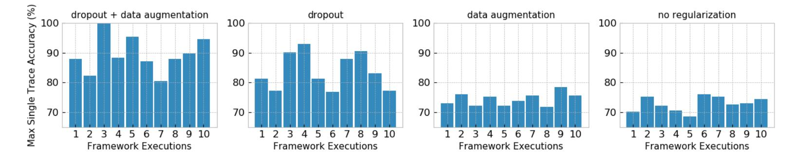

**Figure 17:** Fixed CNN hyperparameters: maximum single trace accuracy on the *cswaparith* dataset for ten different framework executions.

#### **B.2 Random Hyperparameters**

Figures [19](#page-27-1) and [20](#page-28-0) show results for ten iterative framework executions for random CNN hyperparameters in all the iterations.

{27}------------------------------------------------

<span id="page-27-0"></span>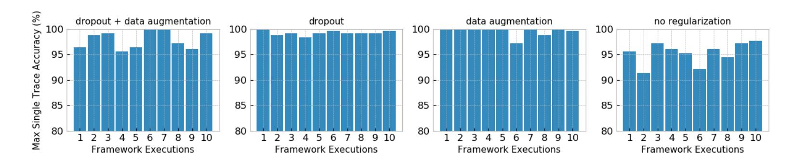

**Figure 18:** Fixed CNN hyperparameters: maximum single trace accuracy on the *cswappointer* dataset for ten different framework executions.

<span id="page-27-1"></span>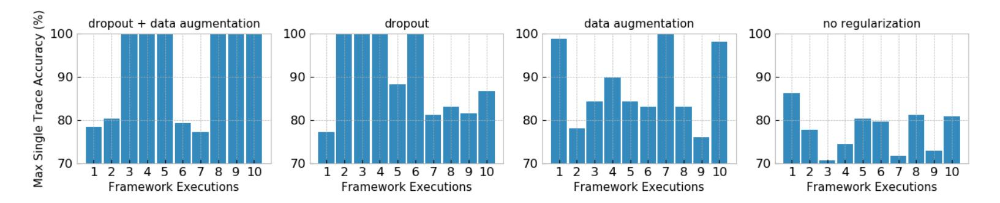

**Figure 19:** Random CNN hyperparameters: maximum single trace accuracy on the *cswaparith* dataset for ten different framework executions and for random CNN hyperparameters.

#### **B.3 Fixed Hyperparameters after GV Interval Optimization**

Figures [21](#page-28-1) and [22](#page-28-2) show results for ten iterative framework executions for fixed CNN hyperparameters. Results are shown for an optimized attack interval that is done with gradient visualization.

### **B.4 Random Hyperparameters after GV Interval Optimization**

Figures [23](#page-28-3) and [24](#page-29-0) show results for ten iterative framework executions for random CNN hyperparameters. Results are shown for an optimized attack interval that is done with gradient visualization.

{28}------------------------------------------------

<span id="page-28-0"></span>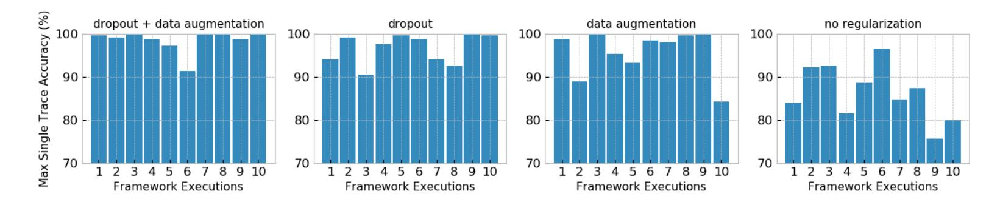

**Figure 20:** Random CNN hyperparameters: maximum single trace accuracy on the *cswap-pointer* dataset for ten different framework executions and for random CNN hyperparameters.

<span id="page-28-1"></span>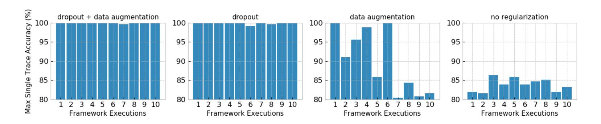

**Figure 21:** Fixed CNN hyperparameters: maximum single trace accuracy on the *cswaparith* dataset for ten different framework executions and attacking the sample interval range from 1 500 to 3 500 of all sub-traces.

<span id="page-28-2"></span>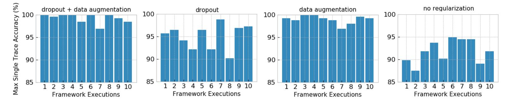

**Figure 22:** Fixed CNN hyperparameters: maximum single trace accuracy on the *cswappointer* dataset for ten different framework executions and attacking the sample interval range from 550 to 800 of all sub-traces.

<span id="page-28-3"></span>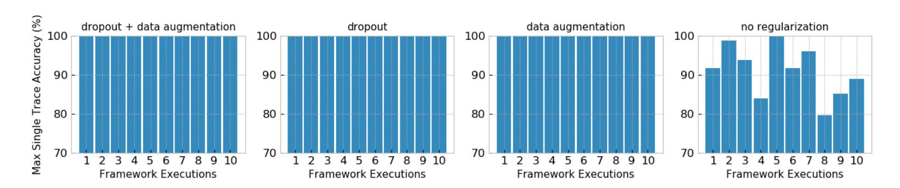

**Figure 23:** Random CNN hyperparameters: maximum single trace accuracy on the *cswaparith* dataset for ten different framework executions and attacking the sample interval range from 1 500 to 3 500 of all sub-traces.

{29}------------------------------------------------

<span id="page-29-0"></span>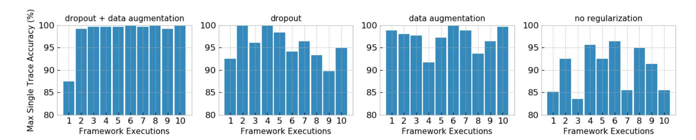

**Figure 24:** Random CNN hyperparameters: maximum single trace accuracy on the *cswappointer* dataset for ten different framework executions and attacking the sample interval range from 550 to 800 of all sub-traces.