{0}------------------------------------------------

# Divided We Stand, United We Fall: Security Analysis of Some SCA+SIFA Countermeasures Against SCA-Enhanced Fault Template Attacks?

Sayandeep Saha<sup>1</sup> , Arnab Bag<sup>1</sup> , Dirmanto Jap<sup>2</sup> , Debdeep Mukhopadhyay<sup>1</sup> , and Shivam Bhasin<sup>2</sup>

> <sup>1</sup> Department of Computer Science and Engineering, IIT Kharagpur {sahasayandeep, abag, debdeep}@iitkgp.ac.in <sup>2</sup> Temasek Labs, Nanyang Technological University, Singapore djap, sbhasin@ntu.edu.sg

Abstract. Protection against Side-Channel (SCA) and Fault Attacks (FA) requires two classes of countermeasures to be simultaneously embedded in a cryptographic implementation. It has already been shown that a straightforward combination of SCA and FA countermeasures are vulnerable against FAs, such as Statistical Ineffective Fault Analysis (SIFA) and Fault Template Attacks (FTA). Consequently, new classes of countermeasures have been proposed which prevent against SIFA, and also includes masking for SCA protection. While they are secure against SIFA and SCA individually, one important question is whether the security claim still holds at the presence of a combined SCA and FA adversary. Security against combined attacks is, however, desired, as countermeasures for both threats are included in such implementations. In this paper, we show that some of the recently proposed combined SIFA and SCA countermeasures fall prey against combined attacks. To this end, we enhance the FTA attacks by considering side-channel information during fault injection. The success of the proposed attacks stems from some non-trivial fault propagation properties of S-Boxes, which remains unexplored in the original FTA proposal. The proposed attacks are validated on an open-source software implementation of Keccak with SIFA-protected χ<sup>5</sup> S-Box with laser fault injection and power measurement, and a hardware implementation of a SIFA-protected χ<sup>3</sup> S-Box through gate-level power trace simulation. Finally, we discuss some mitigation strategies to strengthen existing countermeasures.

Keywords: Fault Attack · Side-channel · Masking.

# 1 Introduction

Implementation-centric attacks on cryptographic primitives are one of the greatest practical threats to secure communication. The core idea behind such attacks is to exploit the physical properties of implementations, which often correlate with the secret. Especially for embedded and IoT devices, such physical properties are easily accessible to an adversary. Most of the implementation attacks

<sup>?</sup> This is an extended version of the paper with the same title appearing in Asiacrypt 2021.

{1}------------------------------------------------

are quite challenging to prevent, and there is a continuous effort for building suitable countermeasures against such exploits.

Side-Channel Attacks (SCA) [1–3] and Fault Attacks (FA) [4, 5] are the two most established classes of implementation attacks. An SCA adversary exploits the fact that the power consumption or electromagnetic (EM) radiation from a cryptographic implementation is correlated with the computation. Passive eavesdropping on these signals may lead to the recovery of the secret. An FA adversary, on the other hand, actively perturbs the computation and exploit the faulty responses to derive the secret. Controlled transient perturbation of the computation, as required for FA, is feasible for both hardware and software implementations. Some popular means of injecting such controlled faults include clock/voltage glitching [6], EM radiation [7], and laser injection [8]. Over the years, the injection mechanisms have improved significantly, which allows an adversary to inject even at a bit-level precision with very high repeatability [7, 8].

Several countermeasures have been proposed for both SCA and FA prevention. In the context of SCA, the most prominent class of countermeasures is the masking [9–12]. Loosely speaking, masking aims to remove the dependency between the power/EM signals and the cryptographic computation by randomizing each execution. This randomization is achieved by realizing secret sharing at the circuit-level. More precisely, masking schemes randomly split each variable x into multiple variables x 1 , x<sup>2</sup> , · · ·, xd+1 called shares of x, which satisfies the invariant x <sup>1</sup> ? x<sup>2</sup> ? ··· ? xd+1 = x. Here ? denotes some operations. A function f() operating on x (and maybe some other variables y, z, · · ·) is also split into multiple component functions f1, f2, · · ·f<sup>m</sup> such that ? combination of the outcomes from these functions matches with the actual outcome of f. In order to perform the SCA on such an implementation, the adversary must combine the information from all d + 1 shares of a variable. No proper subset of the shares of a target variable leak information about the variable. Breaking such schemes thus requires a statistical analysis with d-th order moment and the data complexity (i.e. the number of encryptions required) of the attacks increases almost exponentially with the statistical order d.

FA countermeasures use some form of redundancy in computation to detect the presence of a fault. Upon detection of a fault, the cipher output is either muted or randomized. The redundancy is realized either in time/space or as information redundancy in the form of Error-Correcting Codes (ECC) [6]. Furthermore, the fault detection operation is either applied at the end of each round, or the end of the complete encryption operation. Such countermeasures are found to be effective for many of the fault models with an exception for so-called ineffective faults. Ineffective faults are those faults which may or may not corrupt the output depending upon the value(s) of some intermediate variable(s). The Statistical Ineffective Fault Attacks (SIFA) [13, 14] and Fault Template Attacks (FTA) [7], which exploit the data-dependency of ineffective faults, can successfully bypass most of the detection-based countermeasures. To prevent SIFA, finegrained error correction on shares is suggested [15], so that the data-dependency of fault ineffectivity is mitigated. Another alternative is to modify the S-Box

{2}------------------------------------------------

| Attack  | Breaks Simple<br>SCA-FA Countermeasure | Breaks SCA-SIFA<br>Countermeasure | Remarks                         |
|---------|----------------------------------------|-----------------------------------|---------------------------------|
| SIFA    | ✓                                      | ✗                                 | No middle<br>round attack       |
| FTA     | ✓                                      | ✗                                 | Middle round<br>attack possible |
| SCA-FTA | ✓                                      | ✓                                 | Middle round<br>attack possible |

implementations so that every fault becomes effective [16]. In such cases, error detection at the end of computation becomes sufficient for SIFA prevention.

Most of the (if not all) unprotected cryptographic primitives (without loss of generality, in this work we consider symmetric key primitives only) are vulnerable against SCA and FA. It is thus desirable that such primitives include countermeasures for both the attack classes. Recently, there have been multiple proposals which combine masking with some FA countermeasure to prevent both SCA and FA [15–17]. However, an interesting question still remains – do these schemes provide protection while both SCA and FA are applied simultaneously? This question is important as both SCA and FA countermeasures incur significant cost in terms of area and timing, and a user would expect protection from both threats (even simultaneously) if countermeasures for both are present. While many of the existing countermeasure proposals already show vulnerability to SIFA, there exist some recent proposals [15, 16, 18, 19] preventing SIFA.

#### 1.1 Our Contributions:

The aim of this work is to show that certain implementations (more precisely, those described in [16] and [15]) containing both SCA and FA countermeasures are still insecure against combined SCA-FA attacks, even if they explicitly include SIFA protection. In order to show this, we enhance the recently proposed FTA attacks by considering side-channel leakage in the presence of faults, and constructing fault templates based on that leakage. More precisely, we exploit side-channel leakage from the detection and correction operations in the presence of faults. The main cause behind the success of SCA enhanced FTA (referred as SCA-FTA in this work) is that output differentials of an S-Box leak information about the input of the S-Box, if the fault location is fixed (that means the input differential is fixed.). Using this fact, we can expose intermediate states of a symmetric key primitive, even if it includes FA, SCA and certain SIFA countermeasures<sup>1</sup> . Such exploitation of detection and correction operations raises an important question – how to perform error detection/correction without causing new vulnerabilities? We discuss a potential way to address this issue at the end.

While performing attacks on masked implementations, one has to be careful about the statistical order of the leakage. Any attack involving SCA leakage, having a statistical order beyond the claimed SCA security order, is considered as trivial. We carefully take this issue into consideration and show that the proposed

<sup>1</sup> It is worth noting that SIFA and FTA break certain countermeasures which directly combine masking and detection/infection. SCA-FTA can also break them by measuring the SCA leakage while computing the correctness of the ciphertext. However, in this paper, we only discuss some SIFA countermeasures, which are secure against SIFA and classical FTA.

{3}------------------------------------------------

attacks do not violate the SCA security margins of the targets. For example, we designate an attack on a first-order secure implementation as efficient, only if the attack is also first order in terms of SCA analysis. SCA-FTA can efficiently attack the target implementations even if they have higher-order masking, with single-bit fault along with SCA leakage of an order lower than the masking.

As an interesting outcome of this work, we found that the non-completeness property present in certain masking schemes plays an important role behind the success and failure of the attacks. This observation is crucial as it may help in constructing countermeasures. However, in this paper, we do not explore the countermeasures in detail and only present a short guideline in this context.

In order to validate our ideas, we utilize different masked S-Boxes. To theoretically validate the attacks against SIFA-secure implementations we choose one example presented in [16] on χ<sup>3</sup> S-Box [20]. To practically validate our idea, we choose the open-source SIFA-protected Keccak implementation with χ<sup>5</sup> S-Box (an extension of the χ<sup>3</sup> S-Box) due to [16], and target this using laser fault injection and power measurements. Furthermore, to understand the impact of the attack on a hardware-level SCA-leakage scenario, we validate one of our attack over a hardware implementation of the SIFA secure χ<sup>3</sup> S-Box [16] through fault simulation and power-trace simulation. Our trace simulation flow uses commercial tools such as VCS, Design Compiler, and PrimeTime-PX from Synopsys<sup>2</sup> .

It is worth mentioning that previous works have also proposed combined SCA and FA attacks on protected implementations. Notable among them are [21–23], where the error detection operation at the last round was targeted for extracting the fault differential through SCA. However, none of these attacks works for the cases where error detection is performed on masked data<sup>3</sup> . SCA-FTA works in such a context. Moreover, SIFA countermeasures combined with masking were never been analyzed in such combined attack contexts. No fault templates were constructed to exploit information leakage from different fault locations in these attacks, which is also new in SCA-FTA. Finally, unlike previous attacks, our attacks are applicable to the middle rounds not requiring any ciphertext access (if there are error detection/correction at the middle rounds such as in [15]). Appendix. E (ref. supplementary material) presents a comparative discussion on SCA-FTA and the related attacks.

The rest of the paper is organized as follows. We begin with presenting the preliminary ideas of fault-induced SCA leakage in Sec. 2. The SCA-FTA attack is proposed next with application to unmasked implementations in Sec. 3. Sec 4 presents attacks on masked implementations and two recently proposed SIFA countermeasures. We summarize the practical evaluations in Sec. 5, with details

<sup>2</sup> These tools are under registered trademarks of Synopsys Inc.

<sup>3</sup> We note that the combined attack in [21] exploits the fact that error detection is often performed on unmasked data even if the rest of the computation is masked. They extracted the Hamming weight (HW) of unmasked ciphertext differentials through side-channel and exploited it. It was pointed out in [21] that this attack can be mitigated if the detection is performed on masked data. In this paper, we show that SCA-FTA works even while the detection/correction is performed on masked data.

{4}------------------------------------------------

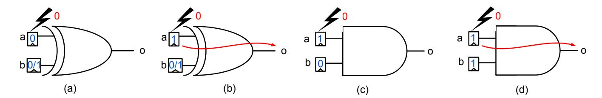

Fig. 1: Fault activation and propagation with stuck-at-0 fault: (a) No fault activation; (b) Fault activation and propagation for XOR; (c) Fault activation but no propagation for AND; (d) Fault activation and propagation for AND.

given in the supplementary material (Appendix. F). A brief discussion on a candidate countermeasure strategy is presented in Sec. 6. Finally, we conclude in Sec. 7. A discussion on the impact of SCA-FTA on some other countermeasures is presented in Appendix. G in the supplementary material<sup>4</sup>.

### 2 Fault-Induced SCA Leakage

#### 2.1 Faults and Combinational Circuits

A faulty outcome in a combinational circuit is a result of two consecutive events, namely, Fault Activation and Fault Propagation. Given an internal net<sup>5</sup> i in a combinational circuit  $\mathcal{C}$ , fault activation event assigns i with a value x such that i carries complement of x (i.e.  $\overline{x}$ ) in the presence of a fault in i, and x, otherwise. On the other hand, fault propagation is an event which takes place when the impact of an activated fault is observed at some output net of the circuit  $\mathcal{C}$ . The goal of an Automatic Test Pattern Generation (ATPG) algorithm is to figure out test vectors which can activate and propagate a fault happening at some internal net i to the output, leading to the detection of that fault. Detection of a fault depends on the test vector and the location of the faulty net in  $\mathcal{C}$ .

The most important observation in this context is the location and inputdependency of fault detection for a given combinational circuit. This datadependency has also been utilized in the original FTA and SIFA. The data dependency stems from the fact that fault propagation through basic gates is data-dependent. To further explain this, we consider the XOR and the AND gates shown in Fig. 1. The activation of the fault in any of the inputs of these gates depends upon the current value assigned to the input. For example, if we consider a stuck-at-0 fault, the target input net must be assigned to a value 1 in order to activate the fault (ref. Fig. 1(b), (c), (d)). However, in the case of bit-flip faults, the fault activation happens with certainty and does not depend on the value in the net. The fault propagation depends on the type of the gate. In the case of an XOR gate, the fault propagation happens whenever there is a fault activation in one of the input nets<sup>6</sup> (Fig. 1(b)). In contrast, fault propagation in an AND gate is dependent on the fault activation, and the values assigned to the other non-faulty input nets of the gate. More precisely, fault propagation requires all the other input nets to have a value 1 (also called the non-controlling

<sup>&</sup>lt;sup>4</sup> Code for validating the attacks has been published at https://github.com/sayandeep-iitkgp/SCA-FTA

<sup>&</sup>lt;sup>5</sup> In this paper, we use the terms wire and net interchangeably.

<sup>&</sup>lt;sup>6</sup> Note that here we restrict ourselves to the cases where only one input net is faulty.

{5}------------------------------------------------

value for an AND gate; Fig. 1(d)). Similar impacts can be observed for OR gates where the non-controlling value is 0. To summarize, our observations are as follows:

- 1. Stuck-at faults at an input net of an XOR gate only leak the value at the faulty net by means of fault activation. Fault propagation in XOR gate happens with certainty whenever there is a fault at an input.
- 2. Bit-flip faults at an XOR gate input does not leak the input value as the activation is not data-dependent.
- 3. Both stuck-at and bit-flip faults leak input values of an AND gate through fault propagation, except the value of the faulty net in case of bit-flip faults.

Most of the fault-induced leakages in combinational circuits are caused by the three abovementioned conditions. In the original FTA proposal, a gate input (during some intermediate computation of a cipher) is exposed to the adversary based on whether the ciphertext is correct or faulty. Knowledge of correctness does not require the adversary to have the ciphertexts explicitly. Moreover, depending on the underlying fault propagation patterns in the target implementation, the FTA adversary forms fault templates over a device under her control. Later it can use these templates to target a similar device with an unknown key. In contrast, SIFA attacks require access to the correct ciphertexts. The SIFA countermeasures we are going to analyze, however, prevents such datadependent fault propagations to the ciphertexts. Attacking them thus requires some more properties of fault propagations to be taken into consideration. In the next subsection, we analyse the impact of fault propagation for multi-output combinational circuits, which is important for developing the SCA-enhanced FTA. Without loss of generality, we shall mostly use bit-flip faults.

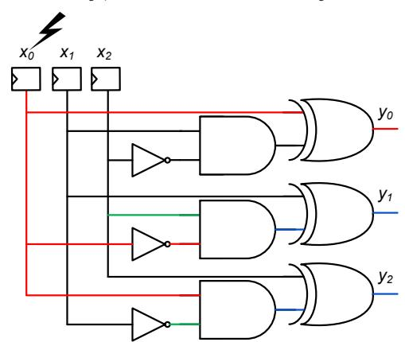

Fig. 2: Fault propagation through χ<sup>3</sup> S-Box for a bit-flip fault at x0. The wires through which the fault propagates without data dependency are shown in red. The data-dependent propagation is shown in blue. For each AND gate, the input controlling the propagation is shown in green.

#### 2.2 Fault Propagation in Multi-Output Combinational Circuits

Combinational circuits, in general, contain fan-outs<sup>7</sup> as well as multiple outputs. Depending on the structure of the circuit, the fault location, and the input value

<sup>7</sup> A fan-out is a structure where one net drives the input of multiple gates. The driver net is called the fan-out stem and the inputs driven by the fan-out stem are called fan-out branches.

{6}------------------------------------------------

an injected fault may corrupt one or multiple of these outputs. Interestingly, there exists a data and fault location-dependent pattern of output corruption for a given multi-output circuit. To explain this we consider the circuit shown in Fig. 2 which is the χ<sup>3</sup> S-Box from [20]. Note that we specifically consider an S-Box here as they are going to be the primary attack targets in the rest of the paper. The logic expressions corresponding to each output of χ<sup>3</sup> are given as:

$$y_0 = x_0 + x_1 \overline{x_2} , \quad y_1 = x_1 + x_2 \overline{x_0} , \quad y_2 = x_2 + x_0 \overline{x_1}$$
 (1)

Here x0, x1, x<sup>2</sup> denote the input bits of the S-Box and y0, y1, y<sup>2</sup> represent the output bits. x<sup>0</sup> and y<sup>0</sup> denote the Most Significant Bits (MSB) of the input and output, respectively. Without loss of generality, we consider a bit-flip fault at the input x0. The fan-outs allow the fault to propagate to all three output logic expressions. However, the propagation patterns depend on the inputs. One may observe that the fault always propagates to the output y<sup>0</sup> irrespective of the inputs. This is because the fault model is bit-flip and x<sup>0</sup> exists linearly in the expression of y<sup>0</sup> (i.e. x<sup>0</sup> is the input of an XOR gate). However, y<sup>1</sup> gets corrupted only if x<sup>2</sup> = 1. Similarly, y<sup>2</sup> is faulty only if x<sup>1</sup> = 0.

The fault patterns corresponding to each input pattern of the S-Box is shown in Table 1 for the above-mentioned fault location. The patterns leak the values of x<sup>1</sup> and x2, hence resulting in an entropy reduction of 2 bits for the S-Box input. No information is leaked for x0. As a result of 2-bit entropy loss, there are only two inputs corresponding to each fault pattern (ref. Table 2). Choosing any other fault injection point, (say x1) would leak the value of x0. Data-dependent

Table 1: Inputs and Corresponding Fault Patterns for χ<sup>3</sup> S-Box for a bitflip fault at x0. 'F' denotes faulty and 'C' denotes correct output bit.

|   |   | x0 x1 x2 y0 y1 y2 |       |  |
|---|---|-------------------|-------|--|
| 0 | 0 | 0                 | F C F |  |
| 0 | 0 | 1                 | F F F |  |
| 0 | 1 | 0                 | F C C |  |
| 0 | 1 | 1                 | F F C |  |
| 1 | 0 | 0                 | F C F |  |
| 1 | 0 | 1                 | F F F |  |
| 1 | 1 | 0                 | F C C |  |
| 1 | 1 | 1                 | F F C |  |

Table 2: Distinct fault patterns and the inputs causing them for bit-flip fault at x<sup>0</sup> of χ<sup>3</sup>

|  | y0 y1 y2 Input |
|--|----------------|
|  | F C F (0,4)    |
|  | F F F (1,5)    |
|  | F C C (2,6)    |
|  | F F C (3,7)    |

output fault patterns exist for most of the existing S-Box constructions. The key reason behind this data-dependency is the non-linearity which is essential for any S-Box. However, the amount of entropy loss may vary depending on the S-Box structure. To illustrate this, we consider the 4-bit S-Box from the block cipher PRESENT [24] given as follows:

$$y_0 = x_0 x_1 x_3 + x_0 x_2 x_3 + x_0 + x_1 x_2 x_3 + x_1 x_2 + x_2 + x_3 + 1$$

$$y_1 = x_0 x_1 x_3 + x_0 x_2 x_3 + x_0 x_2 + x_0 x_3 + x_0 + x_1 + x_2 x_3 + 1$$

$$y_2 = x_0 x_1 x_3 + x_0 x_1 + x_0 x_2 x_3 + x_0 x_2 + x_0 + x_1 x_2 x_3 + x_2$$

$$y_3 = x_0 + x_1 x_2 + x_1 + x_3$$
(2)

{7}------------------------------------------------

Here x0, x1, x2, x<sup>3</sup> are the inputs and y0, y1, y2, y<sup>3</sup> are outputs. x<sup>0</sup> and y<sup>0</sup> are the Most Significant Bits (MSB) of the input and output, respectively. A fault in x<sup>0</sup> in this case propagates to y<sup>0</sup> only if x1x<sup>3</sup> +x2x<sup>3</sup> + 1 = 1 (x1x<sup>3</sup> +x2x<sup>3</sup> + 1 = 0, otherwise). Similarly, y<sup>1</sup> gets corrupted if x1x<sup>3</sup> + x2x<sup>3</sup> + x<sup>2</sup> + x<sup>3</sup> + 1 = 1, and y<sup>2</sup> gets corrupted if x1x<sup>3</sup> + x<sup>1</sup> + x2x<sup>3</sup> + x<sup>2</sup> + 1 = 1. Simplification of such equations results in the exposure of x1, x<sup>2</sup> and x<sup>3</sup> if (x<sup>1</sup> + x2) = 1 (that is an entropy reduction of 3 bits). If (x<sup>1</sup> + x2) = 0, an entropy reduction of 2 bits happen for x1, x2, x<sup>3</sup> with constraints (x<sup>1</sup> + x2) = 0 and (x<sup>2</sup> + x3) = 0 (or (x<sup>2</sup> + x3) = 1). Table 3 shows the distinct fault patterns at the output and inputs causing them.

Table 3: Distinct fault patterns and the inputs causing them for bit-fault at x<sup>0</sup> in PRESENT S-Box

|  |  | y0 y1 y2 y3 Input  |
|--|--|--------------------|
|  |  | F C F F (1,6,9,14) |
|  |  | F F C F (4,12)     |
|  |  | C F F F (5,13)     |
|  |  | F F F F (0,7,8,15) |
|  |  | F C C F (2,10)     |
|  |  | C C F F (3,11)     |

|          | Table 4: DDT for PRESENT |   |   |   |   |   |   |   |   |   |   |   |   |   |                   |   |
|----------|--------------------------|---|---|---|---|---|---|---|---|---|---|---|---|---|-------------------|---|
| δo<br>δi | 0                        | 1 | 2 | 3 | 4 | 5 | 6 | 7 | 8 | 9 |   |   |   |   | 10 11 12 13 14 15 |   |
| 0        | 16 0                     |   | 0 | 0 | 0 | 0 | 0 | 0 | 0 | 0 | 0 | 0 | 0 | 0 | 0                 | 0 |
| 1        | 0                        | 0 | 0 | 4 | 0 | 0 | 0 | 4 | 0 | 4 | 0 | 0 | 0 | 4 | 0                 | 0 |
| 2        | 0                        | 0 | 0 | 2 | 0 | 4 | 2 | 0 | 0 | 0 | 2 | 0 | 2 | 2 | 2                 | 0 |
| 3        | 0                        | 2 | 0 | 2 | 2 | 0 | 4 | 2 | 0 | 0 | 2 | 2 | 0 | 0 | 0                 | 0 |
| 4        | 0                        | 0 | 0 | 0 | 0 | 4 | 2 | 2 | 0 | 2 | 2 | 0 | 2 | 0 | 2                 | 0 |
| 5        | 0                        | 2 | 0 | 0 | 2 | 0 | 0 | 0 | 0 | 2 | 2 | 2 | 4 | 2 | 0                 | 0 |
| 6        | 0                        | 0 | 2 | 0 | 0 | 0 | 2 | 0 | 2 | 0 | 0 | 4 | 2 | 0 | 0                 | 4 |
| 7        | 0                        | 4 | 2 | 0 | 0 | 0 | 2 | 0 | 2 | 0 | 0 | 0 | 2 | 0 | 0                 | 4 |
| 8        | 0                        | 0 | 0 | 2 | 0 | 0 | 0 | 2 | 0 | 2 | 0 | 4 | 0 | 2 | 0                 | 4 |
| 9        | 0                        | 0 | 2 | 0 | 4 | 0 | 2 | 0 | 2 | 0 | 0 | 0 | 2 | 0 | 4                 | 0 |
| 10       | 0                        | 0 | 2 | 2 | 0 | 4 | 0 | 0 | 2 | 0 | 2 | 0 | 0 | 2 | 2                 | 0 |
| 11       | 0                        | 2 | 0 | 0 | 2 | 0 | 0 | 0 | 4 | 2 | 2 | 2 | 0 | 2 | 0                 | 0 |
| 12       | 0                        | 0 | 2 | 0 | 0 | 4 | 0 | 2 | 2 | 2 | 2 | 0 | 0 | 0 | 2                 | 0 |
| 13       | 0                        | 2 | 4 | 2 | 2 | 0 | 0 | 2 | 0 | 0 | 2 | 2 | 0 | 0 | 0                 | 0 |
| 14       | 0                        | 0 | 2 | 2 | 0 | 0 | 2 | 2 | 2 | 2 | 0 | 0 | 2 | 2 | 0                 | 0 |
| 15       | 0                        | 4 | 0 | 0 | 4 | 0 | 0 | 0 | 0 | 0 | 0 | 0 | 0 | 0 | 4                 | 4 |

The entropy losses due to data-dependency of output differentials can also be explained by means of the Differential Distribution Table (DDT) of an S-Box. Let us consider the DDT of PRESENT S-Box depicted in Table 4. Referring to the fault location x<sup>0</sup> from the previous paragraph (which is the MSB), the input differential between the correct input nibble X and faulty input nibble X<sup>f</sup> becomes δ<sup>i</sup> = X + X<sup>f</sup> = 8. The output differentials (δo) corresponds to the fault patterns at the output ("F" denotes 1 and "C" denotes 0). In the δi-th (shaded) row of the DDT, there are only 6 non-zero cells indicating only 6 distinct output differentials are possible if a fault is injected at x0. Furthermore, there are 4 cells with value 2 indicating that for 4 of the possible output differentials there are only 2 possible input values (that is an entropy loss of 3 bits for a 4-bit S-Box input). Finally, there are 2 cells with 4 input values indicating an entropy loss of 2 bits corresponding to those output differentials. The output differentials are directly linked with the constraints we derived in the last paragraph using the concept of fault propagation (i.e. output differentials decide the right-hand side of each constraint equation). Even though we link the data-dependency of output differentials with DDT, in the rest of the paper, we shall continue giving explanations in terms of fault propagation only as it seems more intuitive. However, it is worth mentioning that similar (albeit complex) explanations can be given in terms of DDT as well.

{8}------------------------------------------------

Table 5: HW of fault patterns and inputs causing them (for bit-flip fault at x<sup>0</sup> in χ3)

|   | HW State  |
|---|-----------|
| 1 | (2,6)     |
| 2 | (0,4,3,7) |
| 3 | (1,5)     |

Table 6: HW of fault patterns and inputs causing them (for bit-flip fault at x<sup>0</sup> in PRESENT S-Box)

|   | HW State                    |
|---|-----------------------------|
| 2 | (2, 10, 3, 11)              |
| 3 | (1, 6, 9, 14, 4, 12, 5, 13) |
| 4 | (0,7, 8, 15)                |

## 2.3 The Role of SCA Leakage

It is clear from the last subsection that the knowledge of the output fault patterns of an S-Box leads to the leakage of its inputs. However, an important question still remains – how to track down the output fault patterns in a cipher implementation. In case of an unprotected implementation, it is straightforward for several Substitution-Permutation Network (SPN) constructions (such as AES or PRESENT) if the faults are injected at the inputs of the last round S-Boxes. This is because the attacker can obtain both correct and the faulty ciphertexts in this case. However, in this paper, we are mainly interested in protected implementations. For simplicity, let us first consider only FA protected implementations. Almost every FA-protected implementation incorporates time/space/information redundancy to detect the injected faults. Without loss of generality, we consider simple time/space redundancy where the cryptographic computation is performed at least two times and the end results are checked for mismatch. In the case of mismatch, no ciphertext (or maybe a randomized ciphertext) is returned. The check can also be incorporated in a per-round manner [25]. Such checks are usually performed by computing bitwise XOR between the actual and the redundant states followed by a bitwise OR to detect a nonzero XOR compuation in case of a fault.

#### 2.3.1 SCA Leakage from Detection

The bitwise XOR operation performed in several detection-based countermeasures leak information about the fault differential at the S-Box output. Referring to Table 2 and Table 3, a faulty ("F") output bit implies that the XOR outcome is 1, and a correct bit implies the XOR outcome is 0. An adversary capable of observing SCA leakage during fault injection can obtain some function of this output differential through the traces. More precisely, the adversary can obtain a L = HW(δo) + N where L is the observed SCA leakage, HW is the Hamming weight, and N denotes a Gaussian noise. Although the leakage of HW results in some information loss from δo, some entropy reduction for the S-Box input still takes place. To understand this, once again we refer to the fault patterns and the corresponding S-Box inputs from Table 2 and Table 3. In case of Table 2, a HW value 1 indicates that the input is in the set (2, 6), HW value 2 indicates that the input belongs to the set (0, 4, 3, 7), and HW value 3 indicates the input is in (1, 5). This is consolidated in Table 5. Similar mappings can be constructed for Table 3 (ref. Table 6). Clearly, even in the absence of faulty ciphertexts, the S-Box inputs can be exposed, which may lead to key or state recovery attacks.

{9}------------------------------------------------

# 3 SCA-FTA: The SCA-Enhanced FTA

The last section motivates the importance of output differentials of S-Boxes and how they can be observed through SCA leakage. In this section, we exploit this observation for constructing practical attacks on block ciphers or other symmetric key primitives like hash functions. The proposed SCA-FTA attack is more powerful than original FTA in the sense that it can work even if information leakage due to fault ineffectivity does not reach the ciphertexts. We assume an adversary who can inject a fault and measure the power traces at the same time, but not necessarily in the same clock cycles. Moreover, the adversary has full control over a test device for profiling which he can study extensively, and decide his fault-positions, injection-parameters, and build templates. Finally, the number of injections and the count of wires probed (through SCA leakage) in a specific clock cycle must be less than the defined security orders of the target with respect to faults and SCA<sup>8</sup> . For the sake of explanation, we first describe the attack on an unmasked implementation with FA countermeasure. In Sec. 4, we apply SCA-FTA on SCA-SIFA countermeasures.

### 3.1 The Template Attack

The main assumption behind template attacks (whether side-channel template or fault template) is that an attacker can extensively profile a device similar to the target device. Such attacks consist of two phases:

#### 3.1.1 Offline Phase (Template Building)

In the offline phase the adversary gathers information from a device (similar to the target), for which it has the complete knowledge and control of the secrets. The main idea is to construct an informed model, which can be utilized to derive the secret from a target device during the actual attack. Formally, a template in SCA-FTA can be described as a mapping T : S<sup>F</sup> → X , where an s ∈ S<sup>F</sup> is a tuple described as s = hG1(Of l<sup>1</sup> ), G2(Of l<sup>2</sup> ), · · ·, GM(Of l<sup>M</sup> )i. Each Of l<sup>i</sup> denotes a set of SCA traces (power or EM) under the influence of fault injections at location fl<sup>i</sup> and each G<sup>i</sup> is a function extracting some statistic values according to some leakage model from these traces. The range set X represents a part of the secret intermediate state (for example, value of a byte/nibble).

At this point, it is important to compare the templates of SCA-FTA to the templates of original FTA. In original FTA proposal, the observables were the correctness of the computation at the end. In contrast, we use the side-channel leakage from the computation under the influence of faults. Similar to the FTA, SCA-FTA also compiles information from multiple fault locations. For both the attacks, only one fault location is excited per encryption. However, a key difference between the two attacks is that while original FTA can only exploit the

<sup>8</sup> That is, for an implementation claiming protection against single-fault, not more than one fault is injected in each encryption. Similarly, for a first-order SCA secure implementation, only first-order attacks are performed.

{10}------------------------------------------------

Table 7: Template (noise-free) for unmasked FA-protected PRESENT considering average HW values as leakages.

|  |                     | f l1 f l2 f l2 f l3 State |
|--|---------------------|---------------------------|
|  |                     | 2.0 3.0 2.0 3.0 (10)      |
|  |                     | 4.0 2.0 2.0 2.0 (0, 15)   |
|  |                     | 3.0 3.0 2.0 2.0 (12, 14)  |
|  | 4.0 2.0 3.0 3.0 (7) |                           |
|  | 2.0 2.0 3.0 3.0 (3) |                           |
|  |                     | 3.0 2.0 2.0 2.0 (4, 13)   |
|  | 4.0 3.0 2.0 3.0 (8) |                           |
|  |                     | 3.0 2.0 3.0 2.0 (1,5)     |
|  |                     | 3.0 2.0 2.0 3.0 (6, 9)    |
|  |                     | 2.0 2.0 2.0 3.0 (2, 11)   |

information whether an encryption is faulty or not at the end of computation, SCA-FTA can utilize fault information even from internal computation through SCA leakage. The difference with SCA template attacks is that while SCA templates are usually formed on the intermediate state values, templates in SCA-FTA are formed on the leakage from error-handling logic. Further, as we show for the masked implementations, SCA-FTA does not construct any template on the masks. In contrast, SCA template attacks result in higher-order attacks that leak information through templates built on higher-order-moments (hardware) or thought templates on both the mask and the state values (software).

#### 3.1.2 Attack Phase (Template Matching)

In the online phase, the adversary injects faults at the predefined locations (from the template building phase) hfl1, fl2, · · ·, flMi on a target device with an unknown secret. The secret is recovered by first constructing an s ∈ S<sup>F</sup> from the observables, and then using the mapping defined in T .

In the next few subsections, we continue describing the SCA-FTA attacks on unmasked implementations.

#### 3.2 Attacking Unmasked FA-Secure Implementations

Exploiting the ideas developed in the previous sections, here we present the first concrete realization of SCA-FTA. We consider an unmasked implementation of PRESENT with fault detection at the end of encryption. Since the detection step is present at the end of the computation, we target the last round S-Box computation with faults. The plaintext is kept fixed in this attack. The aim of the attacker here is to extract the inputs to the last round S-Box layer of PRESENT. We also assume that the correct ciphertext corresponding to the plaintext is available to the attacker.

#### 3.2.1 Template Building

It has already been shown in Sec. 2.3.1 that HW of the output differential leaks information for a given fault location. However, the entropy loss may not be sufficient with a single fault location for efficiently recovering the S-Box inputs via template matching. The trick for further entropy reduction is to combine information from multiple fault locations, with only one location

{11}------------------------------------------------

#### Algorithm 1 BUILD\_TEMPLATE

```
Input: Target implementation C, Faults fl_1, fl_2, ..., fl_M, num_{ob}
Output: Template \mathcal{T}
     \bar{\mathcal{T}}:=\emptyset
     w := \texttt{GET\_SBOX\_SIZE}()
                                                                                                       ▶ Get the width of the S-Box
                                                                         \triangleright The key is known and fixed here and x = p + k
     for (0 \le x \le 2^w) do
          s := \emptyset
          for each fl \in \{fl_1, fl_1, ..., fl_M\} do
                \mathcal{O}_{fl} := \emptyset
               for num_{ob} observations do
                    y_f := C(x)^{fl}
                                                             ▶ Inject fault in one copy of the S-Box for each execution
                    \begin{aligned} \mathcal{Y}_c &:= C(x) \ \mathcal{O}_{fl} &:= \mathcal{O}_{fl} \cup \ \text{SCA\_LEAKAGE}(y_f, \, y_c) \end{aligned}
                                                                                ▶ Leakage from the fault detection operation
               end for
               s := s \cup \mathcal{G}(\mathcal{O}_{fl})
                                                                     \triangleright We consider the same function \mathcal{G} for all trace sets.
          end for
          \mathcal{T} := \mathcal{T} \cup \{(s, x)\}
     end for
     Return 7
```

faulted per encryption. The fault locations chosen in this specific experiment on PRESENT are  $fl_1 = x_0$ ,  $fl_2 = x_1$ ,  $fl_3 = x_2$  and  $fl_4 = x_3$ , where  $x_i$ s are inputs to the PRESENT S-Box (Eq. (2)). In all the cases, we inject bit-flip faults.

For the sake of explanation, we illustrate the attack here for a noise-free case, where the HW of the detection operation is considered as the SCA leakage. However, the algorithms will be described considering the actual noisy scenario (and they do not vary significantly from the noise-free cases). The template building algorithm is described in Algorithm 1 for a single S-Box. For each input value and fault location, the output differential is observed through SCA leakage. For the noise-free case, we represent this information as HW of the output differentials, which is obtained from the XOR operations of the detection step. Hence, each  $s \in \mathcal{S}_{\mathcal{F}}$  is a tuple  $s = \langle \mathcal{G}_1(\mathcal{O}_{fl_1}), \mathcal{G}_2(\mathcal{O}_{fl_2}), \mathcal{G}_3(\mathcal{O}_{fl_3}), \mathcal{G}_4(\mathcal{O}_{fl_4}) \rangle$ , with  $\mathcal{O}_{fl_i}$  containing traces corresponding to the fault location  $fl_i$ . Each  $\mathcal{G}_i$  here corresponds to the mean and standard deviation (or mean vector and covariance matrix if multiple-points are considered for template building) over some leaky points at the traces from a  $\mathcal{O}_{fl_i}$  set (that is all  $\mathcal{G}_i$ s are the same and denoted as  $\mathcal{G}$ ). For the noise-free cases, we store the average HW values only.<sup>9</sup> The range set  $\mathcal{X}$  in the templates consists of suggestions for a nibble value. The template corresponding to the noise-free case is shown in Table 7. However, such noise-free templates are just for illustration purposes and actual templates consider both fault injection and SCA noise (Algorithm 1, 2, 4 and 5).

#### 3.2.2 Template Matching

In the online phase of the attack, the fault injections are performed at  $fl_1$ ,  $fl_2$ ,  $fl_3$  and  $fl_4$ . The attacker acquires traces  $\mathcal{O}_{fl_i}$  corresponding to each fault location. However, the template matching here is not a simple table lookup (except for the noise-free case). Here we consider each  $s \in \mathcal{S}_{\mathcal{F}}$  and check which one of them is statistically closest to the traces obtained in the online phase.

<sup>&</sup>lt;sup>9</sup> Note that, in order to perform template construction in a noisy environment, we might need to store the covariance matrix of the traces as well. However, using the covariance matrix for template building and matching does not mean that the attack is second-order. Clear evidence of this fact is that in a noise-free case here, we can construct the template on mean values of leakage.

{12}------------------------------------------------

#### Algorithm 2 MATCH\_TEMPLATE

```
Input: Protected cipher with unknown key C_k, Faults fl_1, fl_2, ..., fl_M, Template \mathcal{T}, num_{ob} Output: Set of candidate correct states x_{cand}
     x_{cand} := \emptyset
                                                                                                                     ▷ Set of candidate states
      w := \texttt{GET\_SBOX\_SIZE}()
      s' := \emptyset
      for each fl \in \{fl_1, fl_2, \cdots fl_M\} do
            \mathcal{O}_{fl} := \emptyset
           for num_{ob} observations do
                y_f := C(x)^{fl}
                                                                 ▶ Inject fault in one copy of the S-Box for each execution
                y_c := C(x)
                 \mathcal{O}_{fl} := \mathcal{O}_{fl} \cup \text{SCA\_LEAKAGE}(y_f,\,y_c)
                                                                                     ▶ Leakage from the fault detection operation
           end for
           s' := s' \cup \underset{s[fl]; s \in \mathcal{S}_{\mathcal{F}}}{\operatorname{arg\,max}} L(s[fl], \mathcal{O}_{fl})
     end for
     x_{cand} := x_{cand} \cup \{\mathcal{T}(\arg\min Dist(s, s'))\}
                                                                                                       \triangleright Dist implies Euclidean distance
                                          s \in \mathcal{S}_{\mathcal{T}}
     Return x_{cand}
```

For the traces corresponding fault location  $fl_i$  ( $1 \le i \le M$ ), we perform a log-likelihood-estimation (LLE) considering each  $s_i$  ( $s = \langle s_i \rangle_{i=1}^{i=M}$ ) as follows:

$$L(s_i, \mathcal{O}_{fl_i}) = \sum_{j=0}^{j=|\mathcal{O}_{fl_i}|} \log(\mathbb{P}[\mathcal{O}_{fl_i}[j]; \mathbf{m_{s_i}}, \sigma_{s_i}])$$
(3)

Here L denotes the log-likelihood function,  $\mathcal{O}_{fl_i}[j]$  denote traces from the set  $\mathcal{O}_{fl_i}$ .  $\mathbb{P}$  is the Gaussian probability density function.  $\mathbf{m_{s_i}}$  and  $\sigma_{\mathbf{s_i}}$  denote the mean (resp. mean vector) and standard deviation (resp. covariance matrix) stored in  $s_i$ . They are the outcomes of  $\mathcal{G}_i$  during template building. The  $s_i$  having the highest log-likelihood value is considered to be the correct one for the obtained traces. After finding out the highest  $s_i$  for every fault location  $fl_i$ , we construct an s' combining all  $s_i$  suggestions, which should match with exactly one  $s \in \mathcal{S}_{\mathcal{F}}$ . Note that, in some cases, an exact match for s' may not be obtained due to noise. In those cases, we select an s from the template for which the maximum number of  $s_i$  have matched. One way of doing this matching is to compute Euclidean distance between s' and each  $s \in \mathcal{S}_{\mathcal{F}}$ . The s with minimum distance gives the correct answer. Algorithm 2 presents the template matching. An alternative template matching algorithm is given in Appendix. A (supplementary material).

Key Recovery: The template building and matching steps described above, target one S-Box at a time. In order to extract a complete round key, one needs to extract the complete intermediate state of the cipher under consideration. In the present context, the attack requires 4 distinct fault locations per S-Box and hence  $16 \times 4 = 64$  distinct fault locations. For serialized hardware implementations and software implementations, where one S-Box is called multiple times, finding out injection locations for a single S-Box is sufficient. To cover all S-Boxes, it is sufficient to change the timing (i.e. clock cycles) of injections. Furthermore, considering the ciphertext as known, recovering the S-Box inputs of the penultimate round may result in complete key recovery. However, referring to the templates shown in Table 7, the recovered keys are not unique as for half of the patterns we get multiple suggestions. Even considering this we found that the round key complexity after attacks vary roughly from  $2^8$  to  $2^9$  for an entire round

{13}------------------------------------------------

of PRESENT, which is fairly reasonable. The required number of injections (and thus the number of traces per location) also depends upon the noise incurred during experiments. One may note that noise can come from two distinct sources here – the fault injection and the SCA measurements. Noise in fault injections may occur due to injections at undesired locations and missed injections. We used a fault noise probability of around 0.38–0.40 for simulation. For SCA noise, we found that the standard deviation values (covariance, while multiple points are considered together) of measurements may vary up to 3.061 in practical setups with hardware targets. We deliberately add noise with the HW values according to these noise parameters. The attack roughly requires 105−180 traces per fault location. Roughly 11, 000 traces were sufficient for recovering the last round state of PRESENT.

Middle Round Attacks: The proposed SCA-FTA attack works equally well for middle-round attacks like the original FTA. However, in this case, the cipher must perform redundancy checks in a per-round manner, which is true for several countermeasure implementations such as [25]. Moreover, some of the recently proposed countermeasures against SIFA performs error correction in a per-round manner [15]. However, for all these cases, the attacker must recover two consecutive states in order to extract the key. The number of fault locations gets doubled in this case.

From the next section onward, we shall focus on attacks on masked implementations with FA countermeasures. In SCA-FTA, where there is an SCA component in the attack, evaluation against masking becomes crucial. Moreover, any SCA and FA secure implementation is supposed to be protected against a combined adversary as well, which increases the relevance of the study we are going to make in the following sections.

# 4 Analyzing Combined SCA and SIFA Countermeasures

We begin this section with a brief (informal) overview of masking schemes and their security. Subsequently, we present the SCA-FTA attacks on implementations having both SCA and SIFA countermeasures. We note that the original FTA proposal already covers implementations having masking and FA countermeasures without SIFA protection only with faults. It is worth mentioning that SCA-FTA would also work for those SIFA and FTA vulnerable cases, as they have no protection against data-dependent fault propagation to the output. However, SIFA countermeasures try to prevent data-dependency of fault propagation to the ciphertexts. We, thus, specifically focus on two recently proposed SIFA countermeasures [16] and [15], which also include masking. The goal is to verify whether the mechanisms implemented in these countermeasures for preventing SIFA are also sufficient in terms of SCA-FTA, or not.

#### 4.1 A Brief Overview of Masking:

Masking is the most popular and well-studied countermeasure against SCA attacks. The main idea behind Boolean masking is to split the data into multiple 

{14}------------------------------------------------

random shares such that their addition over GF(2n) returns the actual value. Every function which processes over the data is also split into multiple component functions. The basic requirement of masking is the statistical independence of each intermediate signal from the unshared inputs and outputs.

Security of a masking scheme is often formalized in terms of the probing model introduced in [26]. The main idea behind probing model is that an adversary is allowed to probe only a fixed number of wires (denoted as protection order d) at a time within the circuit. A circuit is called d-th order probing secure if the adversary gains no information about an unshared value even while it probes up to d wires, simultaneously. In masking schemes d-th order security is ensured if the adversary cannot gain any information even by probing d shares corresponding to a single (unshared) bit. It was demonstrated in [27] that there indeed exists a relationship between the probing model and the statistical order of Differential Power Analysis (DPA). In fact, it was shown in [28], that there exists an exponential relationship between the protection order and the number of leakage traces required for revealing the secret.

Splitting (we also denote it as sharing) a function into multiple components for operating over input shares is the most critical part of masking. While sharing linear functions over GF(2n) is trivial, sharing nonlinear functions require special care. This is because implementations of shared nonlinear functions may result in (unwanted) combining of input shares causing leakage. As a simple example of how nonlinear functions are shared, we consider a 2-share AND gate as follows:

$$q^{0} = x^{0}y^{0} + (x^{0}y^{1} + (x^{1}y^{0} + (x^{1}y^{1} + z))), q^{1} = z (4)$$

Here q = q <sup>0</sup> + q <sup>1</sup> = xy, x = x <sup>0</sup> + x <sup>1</sup> and y = y <sup>0</sup> + y 1 . x 0 , x 1 , y 0 , y <sup>0</sup> denote the input shares, z denotes a random bit, and q <sup>0</sup> and q <sup>1</sup> denote the output shares. This basic gate should be secure against first-order attacks under the d-probing model (in order to know x 0 , x 1 , y 0 , y <sup>0</sup> or q 0 , q 1 the adversary must simultaneously probe two shares of any of the unshared bit). However, in the presence of physical defaults such as glitches, this shared AND gate shows firstorder leakage [29]. This is due to the fact that the extra power consumption of XOR gates due to glitches indirectly combines the input shares.

Over the years, several masking schemes have been proposed to alleviate the problems with glitches. The most prominent among them are the Threshold Implementations (TI) [9], which introduces four fundamental properties for ensuring security, namely correctness, uniformity (or input uniformity), noncompleteness, and output uniformity. In particular, the non-completeness property ensures security against glitches. The main idea of non-completeness is that none of the output share expressions (i.e. component functions) contains all the input shares of a bit. While this provides protection against glitches, it also causes a rapid increase in the number of shares. The output uniformity property ensures that while cascading multiple TI sub-blocks, each sub-block can have a uniformly random sharing it its input. The uniformity of input is essential for security. Maintaining output uniformity is, however, not straightforward (especially for higher-order TI) as it depends on the function to be shared as well as the sharing 

{15}------------------------------------------------

that has been adopted. In the Consolidated Masking Schemes (CMS) [10], the issue with output uniformity was alleviated by introducing refreshing gadgets at the output of each S-Box which requires extra fresh randomness. XORing some of the output shares also work in some cases for maintaining uniformity. The requirement of extra randomness, however, increases the randomness complexity. Since the last couple of years, there has been a constant effort for reducing the randomness complexity of masking. Some notable mentions are the Domain-Oriented Masking (DOM) [11] and Unified-Masking Scheme (UMA) [12]. In the rest of the paper, we shall mainly give examples based on TI and DOM implementations. However, our observations would also extend to other derivatives of these schemes such as UMA and PINI [30]. All of our attacks consider the masks to be unknown and varying randomly, while the plaintext is held fixed. Moreover, we consider an attack to be efficient only if it can be performed by respecting the probing security bounds of the target implementation while exploiting the SCA traces. For example, for a first-order secure implementation, we only consider a first-order SCA-FTA attack as efficient (first-order SCA-FTA means that the statistical analysis on the SCA traces is first-order).

#### 4.2 Leakage from Masking and Error Detection

We begin our discussion with DOM AND gates. There exists two variants of DOM AND gates, namely DOM-independent (abbreviated DOM-indep) and DOM-dependent (abbreviated DOM-dep). We analyze both of these variants. We also consider that each DOM AND is instantiated two times. The end results of them are unmasked and XOR-ed together for correctness check. If the XOR returns 1, it indicates an incorrect computation<sup>10</sup> .

Without loss of generality, we first consider the DOM-indep gate with firstorder protection. The construction is depicted in Fig. 3(a) with the fault location. We also present the test construction used for error detection in Fig. 3(b). The faults considered here are bit-flip faults in the input registers of the DOM gate. Let us consider the Boolean expression for the DOM-indep as follows:

$$q^{0} = a^{0}b^{0} + (a^{0}b^{1} + z), q^{1} = a^{1}b^{1} + (a^{1}b^{0} + z)$$
 (5)

Here each input bit a and b is shared as a = a <sup>0</sup> + a <sup>1</sup> and b = b <sup>0</sup> + b 1 . z denotes a random bit. The output shares are denoted as q <sup>0</sup> and q 1 (actual output q = q <sup>0</sup> + q 1 ). Given a fault is injected at a 0 , it can be observed that the fault affects the computation of two AND gates. For a 0 b 0 , the fault only propagates to the AND gate output only if b <sup>0</sup> = 1 (else there is no fault propagation). Similarly, the fault in a 0 b <sup>1</sup> propagates only if b <sup>1</sup> = 1. The XORing of z does not have any impact on fault propagation. On the other hand, the last XOR operation before the output of q <sup>0</sup> propagates the fault to q 0 if only one of a 0 b 0 or a 0 b <sup>1</sup> has a faulty outcome. Otherwise, if both a 0 b <sup>0</sup> and a 0 b <sup>1</sup> are faulty, the

<sup>10</sup> Note that, unmasking can be dangerous if error-checking is performed in the middle rounds. It is often adopted while error checking is performed at ciphertext-level to reduce the number of check operations [16].

{16}------------------------------------------------

fault gets cancelled at this XOR gate. Overall, the output bit  $q^0$  becomes faulty, only if  $(b^0 + b^1) = b = 1$ . Otherwise, there is no fault at  $q^0$ . One should also note that no fault propagation happens at  $q^1$ . Therefore, during error check, the detection circuit results in an outcome 1 only if the input b = 1. Hence, the value of b gets exposed even while the adversary is allowed to inject a single bit-flip at a shared value. A similar situation occurs when we inject the fault at  $b^0$  (or at any other input share except z). However, in this case, the value of bit a is exposed. Another important observation for fault injection at  $b^0$  is that the fault, in this case, propagates to both  $q^0$  and  $q^1$ . However, the combined outcome (i.e.  $q = q^0 + q^1$ ) only becomes faulted if a = 1. In this case, either  $q^0$  or  $q^1$  is faulted depending on the mask.

The observation regarding the DOM-*indep* AND is valid for higher-order cases as well. To illustrate this, we consider the expression for higher-order DOM-*indep* gates as follows:

$$q^{0} = a^{0}b^{0} + (a^{0}b^{1} + z_{0}) + (a^{0}b^{2} + z_{1}) + (a^{0}b^{3} + z_{3}) + \cdots$$

$$q^{1} = (a^{1}b^{0} + z_{0}) + a^{1}b^{1} + (a^{1}b^{2} + z_{2}) + (a^{1}b^{3} + z_{4}) + \cdots$$

$$q^{3} = (a^{2}b^{0} + z_{1}) + (a^{2}b^{1} + z_{2}) + a^{2}b^{2} + (a^{2}b^{3} + z_{5}) + \cdots$$

$$\vdots \qquad \vdots \qquad \vdots \qquad \vdots$$
(6)

Here each input bit a and b is shared as  $a = a^0 + a^1 + a^2 + \cdots$  and  $b = b^0 + b^1 + b^2 + \cdots$ . Each  $z_i$ , on the other hand, denotes a random bit. It can be observed that for a fault injection at  $a^0$ , the fault propagates to  $q^0$  only if  $(b^0 + b^1 + b^2 + \cdots) = 1$ . No fault propagation happens at other output bits. Hence, our attacks remain valid even for higher-order DOM-indep AND gates, as the resulting leakage in this case is first-order. More precisely, we need to probe only one output wire  $q^0$  (even though the DOM gate can be of any arbitrary masking order). The observations can also be extended for DOM-dep constructions (see Appendix. B in the supplementary material).

One interesting observation in this context is the difference between the fault propagation patterns for the inputs a and b. As described in the previous examples, an injection at  $a^0$  reveals b only through the output  $q^0$ . No other output bit gets corrupted in this case. This is true if the fault is injected at any share of a. However, if a share of b is corrupted, the fault propagation happens to all the outputs  $q^i$ . In other words, to gain information regarding a, all the output shares  $q^i$  must be combined. Although for the error checking construction we are considering here (the outputs are unmasked before check) fault propagation to all output shares is not an issue for SCA-FTA, it will become critical for attack efficiency in certain other cases as we show in the next section.

#### 4.3 Leakage from Detection on Shared Values

It is an interesting question whether the attacks proposed in the previous subsection also work if the detection operation is performed before unmasking. The construction under consideration is shown in Fig 3(c). One consideration, in this case, is that the sharing in both the main and redundant copies should be equal

{17}------------------------------------------------

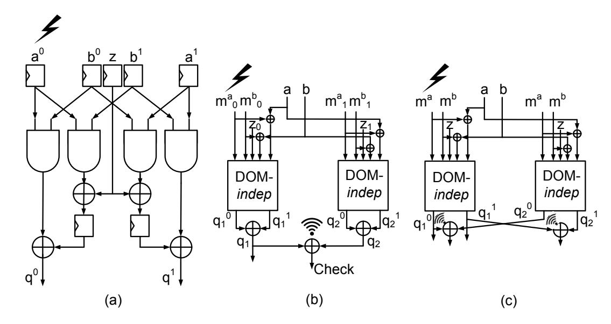

Fig. 3: (a) DOM-indep; (b) DOM-indep with error detection after unmasking. Two copies of the DOM gate use different randomness.; (c) DOM-indep with error detection on shares. Two copies of the DOM gate use same randomness.

(that is the masks are equal in the main and the redundant copies). Such redundancy in masking has been considered in many recent works such as [15, 19].

Loosely speaking, the main idea behind the proposed attacks is to monitor wires in the error detection (or correction as we show later) unit for information leakage. If the detection operation is performed on masked values, the error may potentially propagate to multiple shares of the same output bit. For example, considering the first-order DOM-indep AND gate form the previous subsection, if the fault is injected in  $b^0$ , it propagates through both the output shares  $q^0$  and  $q^1$  leaking a. a can only be recovered while fault information from both  $q^0$  and  $q^1$  are combined. Note that shares are never combined internally by construction until the ciphertext. In the present case, while the check operation is performed per share, combining the information of both  $q^0$  and  $q^1$  by the attacker essentially indicates probing two wires corresponding to different shares of a single bit in a first-order implementation. This is undesired as it violates the SCA security assumptions of first-order secure implementations. The attack is not efficient.

However, a different situation occurs for the other case, while a fault is injected in any share of a (say  $a^0$ ) of the DOM-indep AND gate. As already pointed out in the previous subsection, the fault here only propagates through one of the  $q^i$ s leaking b. Probing only a single share (i.e. the detection corresponding to a share) of the actual output q here leaks the information about the unshared bit b. This is clearly an efficient attack as we can still extract information while being restricted within the security bound of the masking scheme. Moreover, we corrupt only a single redundant branch of computation in this case. Hence, the attack works as it is, even while the degree of redundancy is increased.

One observation here is that while b can be retrieved with a single fault and single wire probe, a cannot be retrieved in this way. However, it is not of serious concern in SCA-FTA attacks which can combine information from different fault locations (injected at different executions). For practical applications such as S-Boxes, a single bit may have fan-out to multiple gate inputs. Hence, if it is not possible to recover a bit from a specific gate due to the aforementioned

{18}------------------------------------------------

restrictions, it might become possible with high probability from another gate. Indeed it depends on the structure of the circuit under consideration. However, as we shall show later in Sec. 4.5, it is practically feasible to recover every input bit of an S-Box even with all the restrictions. In the next subsection, we discuss the consequence of using bit-level error correction on the leakage.

#### 4.4 Leakage from Correction on Shares

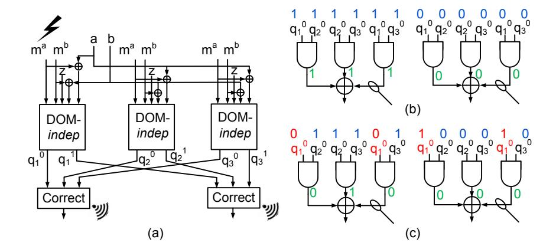

Fig. 4: (a) Construction for error correction on share values (i.e. before unmasking); Leakage from majority voting based error correction: (b) Wire values for correct inputs; (c) Wire values for faulty inputs. Faulty input bits are shown in red. Correct inputs are in blue. Intermediate bits are shown in green.

Recently, error correction has been considered in multiple proposals as a potential countermeasure against SIFA [15, 18, 19]. The main intuition behind using error correction is that correcting every error (possibly with some bound in the number of corrected bits) removes the dependency between intermediate data and the correct ciphertexts, hence preventing SIFA. Here we show that in the presence of SCA and faults, some correction circuits may leak information.

Fig. 4(a) depicts the configuration we consider in this case. The error correction here is considered on each share of a bit [15]. For single-bit correction, we thus need to maintain 3 copies of the same bit. The logic diagram of the correction circuit is shown in Fig. 4(b),(c). The attack described in the last subsection (detection on shared values) applies here directly if this error correction circuit leaks. In order to show the leakage from error correction circuit we consider the situations depicted in Fig. 4(b),(c), where the first copy of a bit is carrying the fault. There can be two correct input configurations for this circuit -(0,0,0)or (1,1,1) (ref. Fig. 4(b)). Similarly, in the presence of a fault in the first copy, there are two faulty input configurations -(1,0,0) or (0,1,1) (ref. Fig. 4(c)). Now consider probing the output of the AND gate computing  $q_1^0q_3^0$  (shown with a probe in the figures). In the presence of a fault, this output never toggles and remains stuck at a value 0 (ref. Fig. 4(c)). In contrast during correct computation, this wire toggles randomly Fig. 4(b). This creates an exploitable first-order SCA leakage for a first-order implementation by distinguishing when error correction happens from when it does not happen.

It is worth mentioning that the attack described here on DOM-*indep* AND also applies to its higher-order variants and all variants of DOM-*dep* AND gates. While this is tempting, it is still important to see whether these attacks also apply

{19}------------------------------------------------

to more complex constructions like S-Boxes. In the next subsection, we show that the attacks apply equally well for S-Boxes, and it has a strong consequence on some recently proposed SIFA countermeasures.

#### 4.5 Leakage from SIFA Countermeasures

Several countermeasures have been proposed in recent past to protect against SIFA attacks. SIFA attacks also exploit the fact that activation and propagation of faults through digital circuits are data-dependent. As a result, a fault may remain ineffective (i.e. does not corrupt output) for certain data values and may become effective (i.e. corrupts output) for some other values. The ineffectivity of faults result in correct ciphertexts, which are used by SIFA for key extraction. The aim of SIFA countermeasures is to break this dependency between ineffective faults and ciphertexts. This can be achieved in two different ways – 1) either by ensuring that every fault propagates to the output; or 2) by letting no fault propagation to the output at all. The first approach has been adopted in [16] using error detection, and the second approach has been utilized in [15] by means of error correction in each share. Below we briefly describe both of these approaches. Note that both of these schemes also include masking and hence, are supposed to provide combined security. Masking also helps in preventing SIFA while the faults do not corrupt the intermediate computation of the S-Boxes [15].

### 4.5.1 Analysis of the Countermeasure in [16]

SIFA Protection with Error Detection [16]: The idea of this protection mechanism is to ensure that a fault at any of the shares at any point (i.e. even at intermediate locations) of computation surely propagates to at least one of the S-Box outputs. There are two different ways proposed in [16] for implementing this philosophy. The first one uses Toffoli gates for implementing the entire S-box, while the second one modifies the S-Box construction itself. Both constructions ensure that whenever there is a fault in any of the intermediate net (wire) of the S-box, it propagates to at least one of the outputs with probability 1. This mandatory fault propagation indeed prevents SIFA attacks as every fault (more precisely, single-bit faults as considered in [16]) injected to the S-Box results in a faulty outcome, which gets muted at the final detection phase. Moreover, the final fault detection operation is performed by unmasking the ciphertexts (to save the number of checks).

Leakage Due to Faults: Without loss of generality, we begin our discussion with a DOM-based construction proposed in [16] (ref. Algorithm 3). The main fact we utilize is that even though the construction ensures the corruption of at least one S-Box output bit for any single-bit fault, there are other outputs for which the fault still shows data-dependent ineffectivity. We show this referring to the construction in Algorithm 3. This is a 2-shared version  $\chi_3$  S-Box. The actual input bits (a, b and c) are shared into  $(a^0, a^1)$ ,  $(b^0, b^1)$ , and  $(c^0, c^1)$ , respectively. The output shares are given as  $(r^0, r^1)$ ,  $(s^0, s^1)$ , and  $(t^0, t^1)$ . Following the notations from [16], each variable with a "prime" (i.e. ") in its superscript denotes the clone of the actual variable. For example,  $b^{0'}$  denotes a clone of  $b^0$ . Each clone denotes a fan-out branch. Furthermore, the variables  $R_r$  and  $R_t$  denote

{20}------------------------------------------------

random bits, and  $T_0$ ,  $T_1$ ,  $T_2$  and  $T_3$  denote temporary variables. Finally, each variable  $\overline{v}$  denotes the complement of variable v.

# Algorithm 3 SIFA-PROTECTED $\chi_3$ [16]

Input:  $(a^0, a^1, b^0, b^1, \mathbf{c^0}, c^1)$ Output:  $(r^0, r^1, s^0, s^1, t^0, t^1)$ 

1:  $R_s \leftarrow R_r' + R_t'$ 

2:  $T_0 \leftarrow \overline{b^{0'}}c^{1'}$  ;  $T_2 \leftarrow a^{1'}b^{1'}$ 

3:  $\mathbf{T_1} \leftarrow \overline{\mathbf{b^{0'}}} \mathbf{c^{0'}}$  ;  $T_3 \leftarrow a^{1'} b^{0'}$ 

4:  $r^0 \leftarrow T_0 + R'_r$  ;  $t^1 \leftarrow T_2 + R'_t$ 

5:  $r^0 \leftarrow r^0 + T_1$  ;  $t^1 \leftarrow t^1 + T_3$ 

6:  $\mathbf{T_0} \leftarrow \overline{\mathbf{c^{0'}}} \mathbf{a^{1'}}$  ;  $T_2 \leftarrow b^{1'} c^{1'}$ 7:  $\mathbf{T_1} \leftarrow \overline{\mathbf{c^{0'}}} \mathbf{a^{0'}}$  ;  $\mathbf{T_3} \leftarrow \mathbf{b^{1'}} \mathbf{c^{0'}}$ 

8:  $s^0 \leftarrow T_0 + R'_s$ ;  $r^1 \leftarrow T_2 + R_r$ 

9:  $s^0 \leftarrow s^0 + T_1$  ;  $r^1 \leftarrow r^1 + T_3$ 10:  $T_0 \leftarrow \overline{a^{0'}} b^{1'}$  ;  $T_2 \leftarrow c^{1'} a^{1'}$ 

11:  $T_1 \leftarrow \overline{a^{0'}}b^{0'}$  ;  $T_3 \leftarrow c^{1'}a^{0'}$ 

12:  $t^0 \leftarrow T_0 + R_t$  ;  $s^1 \leftarrow T_2 + R_s$ 

13:  $t^0 \leftarrow t^0 + T_1$  ;  $s^1 \leftarrow s^1 + T_3$ 

13.  $t \leftarrow t + t_1$ ;  $s \leftarrow s + t_3$ 14:  $r^0 \leftarrow r^0 + a^0$ ;  $t^1 \leftarrow t^1 + c^1$ 

15:  $s^0 \leftarrow s^0 + b^0$  ;  $r^1 \leftarrow r^1 + a^1$ 

16:  $\mathbf{t^0} \leftarrow \mathbf{t^0} + \mathbf{c^0}$  ;  $s^1 \leftarrow s^1 + b^1$ 

17: **Return** $(r^0, r^1, s^0, s^1, t^0, t^1)$ 

Table 8: Template (noisefree) for masked  $\chi_3$  S-Box (error detection on unmasked value)

| ica varac) |         |        |       |  |
|------------|---------|--------|-------|--|
| $fl_1$     | $fl_2$  | $fl_3$ | State |  |
| $=c^0$     | $= b^0$ | $=a^1$ | State |  |
| 2.0        | 2.0     | 2.0    | (0,7) |  |
| 2.0        | 3.0     | 1.0    | (1)   |  |
| 3.0        | 2.0     | 1.0    | (5)   |  |
| 1.0        | 3.0     | 2.0    | (3)   |  |
| 3.0        | 1.0     | 2.0    | (4)   |  |
| 2.0        | 1.0     | 3.0    | (6)   |  |
| 1.0        | 2.0     | 3.0    | (2)   |  |

Let us assume that the input  $c^0$  has been chosen as a fault location and we consider bit-flip fault model. It can be observed that this fault corrupts 4 expressions of Algorithm 3 involving AND gates – the first expression in line 3, the first expression in line 6, and the first and the second expression in line 7.  $c^0$ is also directly XOR-ed with  $t^0$  in the first expression of line 16. Furthermore, the AND operations  $\overline{c^{0'}}a^{1'}$  (line 6) and  $\overline{c^{0'}}a^{0'}$  (line 7) are combined in  $s^0$  as  $s^0 = (\overline{c^{0'}}a^{1'} + R_s') + \overline{c^{0'}}a^{0'}$  (line 8, 9). Since  $s^0$  is an output bit and  $s^0$  does not combine with any other faulty bit in the rest of the S-Box computation, the output bit  $s^0$  becomes faulty only if  $a^{1'} + a^{0'} = a^1 + a^0 = a = 1$ . One should also note that the same fault also propagates to the outputs  $r^0$  and  $r^1$ leaking b. However, in this case the value of b can be recovered only when error information of  $r^0$  and  $r^1$  are combined. To summarize, leakage of a does not require combination of error information because the fault only affects  $s^0$ , while leakage of b requires combination of error information for both  $r^0$  and  $r^1$  because fault propagates to both shares. Finally, there is a mandatory fault propagation to  $t^0$  as  $c^0$  is XOR-ed with this bit at the end of computation. In a similar fashion, fault injections at input  $b^0$  reveals the value of c through the output bit  $r^0$ , and the value of a through the bits  $t^0$  and  $t^1$ . Finally, a last injection location at  $a^1$  reveals b through  $t^1$  and c through  $s^0$  and  $s^1$ . One should note that for each fault location there is an output bit for which the fault propagation is 

{21}------------------------------------------------

mandatory. However, the location of this bit changes with the fault location. For example, location c 0 induces mandatory propagation at t 0 , and location b 0 results in mandatory propagation at s 0 . Each of the output bits can have mandatory fault propagation depending on the fault location for this implementation.

As described in [16], we first consider that the ciphertext outputs are unmasked before the error checking operation. Constructing a template based on the above-mentioned fault locations results in the leakage of the input. In the actual attack (and in all subsequent attacks described in this paper), we keep the plaintext fixed during the template matching phase. However, the masks vary randomly. One should note that we corrupt only a single location per execution of the cipher and combine the outcomes from multiple executions together to build and match the templates. The template building and matching algorithms, in this case, are very similar to that of Algorithm 1 and Algorithm 2 and we do not repeat it here. The noise-free template based on HW values from the detection operation is shown in Table 8. In the presence of both SCA and fault injection-related noise, the attack requires roughly 170−235 injections per fault location (hence those many traces) during template matching, and roughly 400 − 510 injections for an entire S-Box.

One interesting observation, in this case, is that for single fault injection, an adversary can gain information regarding both of the (unmasked) input bits it leaks. For example, if fault is injected at c 0 , adversary can extract a through s and b through r. This is because the output bits are unmasked before check, so the information in r <sup>0</sup> and r <sup>1</sup> are combined by construction. From the probing model perspective, another injection at b 0 (which leaks c and a) thus should be sufficient for revealing the entire unmasked input of the S-Box. However, in our attack, we consider a situation where the HW of all the XOR computations in the detection circuit is leaked simultaneously. This seems more practical in hardware implementations due to the parallelization present there. So far the probing security is concerned, only two fault locations seem sufficient for this case. However, due to the information loss caused by the HW computation, the first template in Table 8 returns two value suggestions.

Attack on Error Detection on Shares: A tempting question in the present context is whether or not error detection on masked data would prevent the proposed attack, or make it inefficient in terms of probing security. As we see, the answer is negative. To elaborate, we consider the masked χ<sup>3</sup> S-Box once again, now with error detection at each share. One important consequence of such error checking is that the masks in the original and redundant computation have to be the same. Respecting the probing security, we consider that only a single wire can be probed. More precisely, we allow the attacker to only probe a single specific wire from the XOR gate outputs in the error detection circuit.

Let us, for illustration, consider the case when the fault location is at c 0 . It can be observed that the adversary can only extract the value of a by probing the error detection logic corresponding to the bit s 0 . Notably, it cannot extract b as it requires probing of both the shares r <sup>0</sup> and r 1 (i.e. their error detection logic). Probing two shares of a wire in a first-order implementation violates probing security. Nevertheless, considering the two other fault locations (b <sup>0</sup> and a 1 ),

{22}------------------------------------------------

#### Algorithm 4 BUILD\_TEMPLATE

```
Input: Target implementation C, Faults fl_1, fl_2, ..., fl_M, num_{ob}
Output: Template \mathcal{T}
     \dot{\mathcal{T}} := \emptyset
     w := \texttt{GET\_SBOX\_SIZE}()
                                                                                                  ▶ Get the width of the S-Box
                                                                      \triangleright The key is known and fixed here and x = p + k
     for (0 \le x \le 2^w) do
         s := \emptyset
          for each fl \in \{fl_1, fl_1, ..., fl_M\} do
               \mathcal{O}_{fl} := \emptyset
              for num_{ob} observations do

                   y_f := C(x)^{fl}
                                                          ▶ Inject fault in one copy of the S-Box for each execution
                   y_c := C(x)
                   \mathcal{O}_{fl} := \mathcal{O}_{fl} \cup \mathtt{SCA\_LEAKAGE}(y_f, y_c)
                                                                            ▶ Leakage from the fault detection operation
              end for
              \mathcal{O}_{fl} := \mathtt{CAL\_Group\_AVG}(\mathcal{O}_{fl}) \triangleright \mathtt{Divide} the trace set into groups and calculate average trace
     per group.
              s := s \cup \mathcal{G}(\mathcal{O}_{fl})
                                                                  \triangleright We consider the same function \mathcal{G} for all trace sets.
          end for
          \mathcal{T} := \mathcal{T} \cup \{(s, x)\}
     end for
     Return \mathcal{T}
```

#### Algorithm 5 MATCH\_TEMPLATE

```
Input: Protected cipher with unknown key C_k, Faults fl_1, fl_2, ..., fl_M, Template \mathcal{T}, num_{ob}
Output: Set of candidate correct states x_{cand}
                                                                                                           ▶ Set of candidate states
     x_{cand} := \emptyset
     w := \texttt{GET\_SBOX\_SIZE}()
     s' := \emptyset
     for each fl \in \{fl_1, fl_2, \cdots fl_M\} do
          \mathcal{O}_{fl} := \emptyset
          \vec{for} \ num_{ob} observations do
                                                                                                             ▶ Masks vary randomly
               y_f := C(x)^{fl}
                                                           ▶ Inject fault in one copy of the S-Box for each execution
              \begin{array}{l} y_c := C(x) \\ \mathcal{O}_{fl} := \mathcal{O}_{fl} \cup \text{SCA\_LEAKAGE}(y_f, \, y_c) \end{array}
                                                                             ▶ Leakage from the fault detection operation
          end for
          \mathcal{O}_{fl} := \mathtt{CAL\_Group\_AVG}(\mathcal{O}_{fl})
                                                     ▷ Divide the trace set into groups and calculate average trace
     per group
          s' := s' \cup \arg \max L(s[fl], \mathcal{O}_{fl})
                        s[fl]; s \in \mathcal{S}_{\mathcal{F}}
     end for
     x_{cand} := x_{cand} \cup \{\mathcal{T}(\arg\min Dist(s, s'))\}
                                                                                              \triangleright Dist implies Euclidean distance
                                      s \in \mathcal{S}_{\mathcal{F}}
     Return x_{cand}
```

the adversary can extract all the (unmasked) S-Box input bits without violating the probing security restrictions. Hence, the proposed construction is not secured even while error detection on masked data is considered. The noise-free template corresponding to this attack is described in Table 9. One interesting observation here is that the template in Table 9 is better than the template in Table 8 in the sense that it can uniquely determine each input value. This, however, does not contradict the probing security and the attack described is still first-order. An explanation for this is given in the supplementary material (Appendix. D).

The template building and template matching algorithms for detection on masked values are similar to Algorithm 1 and 2 with some subtle changes. The changes are driven by the fact that corresponding to a fault injection, the output fault patterns may partially vary (ref. Appendix. D). In other words, we may have multiple HW values corresponding to a single fault location and input value. This is not problematic in a noise-free situation as we consider the average HW values in templates. However, for noisy situations with real traces, in many

{23}------------------------------------------------

Table 9: Template (noise-free) for masked χ<sup>3</sup> S-Box (error detection on shares)

| f l1<br>0<br>= c | f l2<br>0<br>= b | f l3<br>= a | 1 State |
|------------------|------------------|-------------|---------|
| 3.0              | 3.0              | 3.0         | (7)     |
| 2.0              | 2.0              | 2.0         | (0)     |
| 2.0              | 3.0              | 2.0         | (1)     |
| 3.0              | 3.0              | 2.0         | (5)     |
| 2.0              | 3.0              | 3.0         | (3)     |
| 3.0              | 2.0              | 2.0         | (4)     |
| 3.0              | 2.0              | 3.0         | (6)     |
| 2.0              | 2.0              | 3.0         | (2)     |

Table 10: Template (noise-free) for masked χ<sup>3</sup> S-Box (error correction on shares)

| f l1<br>0<br>= c | f l2<br>0<br>= b | f l3<br>= a | 1 State |
|------------------|------------------|-------------|---------|
| 7.0              | 6.0              | 6.0         | (3)     |
| 6.0              | 6.0              | 7.0         | (5)     |
| 7.0              | 6.0              | 7.0         | (1)     |
| 6.0              | 6.0              | 6.0         | (7)     |
| 7.0              | 7.0              | 7.0         | (0)     |
| 6.0              | 7.0              | 6.0         | (6)     |
| 7.0              | 7.0              | 6.0         | (2)     |
| 6.0              | 7.0              | 7.0         | (4)     |

cases, the template matching requires multiple SCA traces corresponding to the same intermediate value for a high-confidence decision. In case there are multiple fault patterns (occurring randomly with the variation of masks), such matching becomes challenging. Fortunately, the variation in fault patterns for a given input value is not very high (corresponding to a given fault location). As a result, the mean value of the traces (over different fault patterns) for different input values remain fairly distinguishable. Accordingly, we modify the template building and matching algorithms. During template matching, we gather several traces corresponding to a fault location and divide them into multiple small groups (subsets). Next, the averaged traces are computed for each group. During the log-likelihood estimation step in template matching, these averaged traces are utilized (as the group averages should be almost identical for each input value and fault location). The modified template building and matching algorithms are shown in Algorithm 4 and Algorithm 5, respectively.

The number of encryptions required for the proposed attack varies with the amount of noise present in the experiment. Similar to the other cases described previously, here we consider a FA noise with noise probability 0.38 − 0.40. The SCA noise is considered up to covariance value of 3.061. In the presence of such noise, the attack requires roughly 360 − 520 traces per fault location (that is those many fault injections per location) during template matching. Some other variants of SIFA protections were also proposed in [16]. For the sake of completeness, we discuss them in the supplementary material (Appendix. G). The next subsection describes attacks on another SIFA countermeasure proposed recently using error correction.

#### 4.5.2 Analysis of the SIFA Countermeasure in [15]

SIFA Protection with Error Correction: The proposal in [15] describes two different models for SIFA faults. In the first model (SIFA-1), a biased bitflip fault is assumed to be injected in the state. As it was shown, masking is a potential countermeasure for SIFA in this case. However, masking cannot provide any protection against SIFA if the faults corrupt the intermediate computations of S-Boxes. Bit-flip faults (not necessarily biased) inside the masked S-Boxes are termed as SIFA-2 faults. As a protection against such faults, the work in [15] proposed bit-level error correction at the end of each S-Box. The overall scheme, which is called Transform-and-Encode maintains 3 copies of each share and per

{24}------------------------------------------------

forms a majority-voting based error correction for achieving single-bit SIFA security. It was also claimed that the combination of any masking scheme and error correction mechanism would work for preventing SIFA.

Leakage Due to Faults: Without loss of generality, we construct an instance of Transform-and-Encode with the same masked χ<sup>3</sup> S-Box we have considered so far. Instead of error detection, we now use error correction for each share. It has already been shown in Sec. 4.4, that majority-vote based error correction circuits leaks information on whether any correction has happened or not. With this property of error correction logic, the attack becomes a straightforward extension of the attack described in the previous section for error detection on shared values. The attack algorithms remain similar to Algorithm. 4 and Algorithm 5. Instead of HW of all the XOR outputs in detection step, in this case we consider the HW of all the output wires of the AND gates in the error correction stage to abstract the leakage (ref. Fig. 4(b)(c) & Table 10). In the presence of noise the attack requires roughly 880 − 1085 encryptions per fault location. Another important observation for this countermeasure construction is that it also enables middle round attacks given the correction operations are present at each round.

So far, in this paper, we have only considered masked S-Boxes based on DOM principle. A natural question is whether the attacks still apply on other masking paradigms such as TI [9]. In the next subsection, we present examples on TI implementations which are found vulnerable against the SCA-FTA strategy.

#### 4.6 Leakage from TI S-Boxes:

The TI constructions require that each component function (i.e. output share) of any given nonlinear function should be non-complete. In order to achieve non-completeness, it ensures that no component function contains all the shares of a single variable. The cost of strictly imposing non-completeness is a rapid increase in the share count for increasing degree of nonlinearity and security order. More precisely, the number of input shares for higher-order security is given as sin ≥ t×d+1, where t is the degree of the function under consideration, d is the security order, and sin is the count of input shares. The number of output shares (that is the count of component functions) sout ≥ sin t . However, later work on TI, such as Consolidated Masking Scheme (CMS) [10] has shown that these share requirements can be reduced to d + 1 shares for d-th order security. They proposed careful selection of component functions with more computation steps, and, most importantly, the introduction of registers between different computation steps to avoid the accidental combination of shares.

One important step in TI implementations is compression of shares [10]. In many cases, the number of output shares become larger than the number of input shares, and in order to maintain composability some of the output shares are XOR-ed together to reduce the number of shares (keeping the number of input and output shares equal). This is also useful in maintaining output uniformity, which is also an essential property of TI. Before combining the shares, it is important to add a register layer to prevent the propagation of glitches. 

{25}------------------------------------------------

Further, as proposed in CMS [10], a refreshing layer is also required before share compression in many cases in order to maintain the output uniformity.

The issue that arises with TI is due to this share compression. In many cases, the share compression does not explicitly maintain the non-completeness any more. Rather the glitch resistance is achieved by introducing registers before share compression [31]. While this does not create any problem for SCA security as the register layer is suggested before share compression, it can be exploited by SCA-FTA in certain cases. In order to elaborate this, we consider the function d = ab + c. <sup>11</sup> A valid non-complete sharing for this function is given as follows:

$$d^{0} = a^{0}b^{0} + c^{0}, d^{1} = a^{0}b^{1}, d^{2} = a^{1}b^{0} + c^{1}, d^{3} = a^{1}b^{1}$$
 (7)

The number of input shares in this case is 2 ((a 0 , a<sup>1</sup> ) and (b 0 , b<sup>1</sup> )) and number of output shares is 4 (d 0 , d<sup>1</sup> , d<sup>2</sup> , d<sup>3</sup> ). In order to reduce the number of shares, a valid compression option in this case is e <sup>0</sup> = d <sup>0</sup>+d <sup>1</sup> and e <sup>1</sup> = d <sup>2</sup>+d 3 . This compression also maintains the output uniformity. Further, this compensates the violation of non-completeness by introducing a register layer before the compression. However, if a fault is induced in a 0 , it propagates to e <sup>0</sup> only if b <sup>0</sup> + b <sup>1</sup> = b = 1. This enables SCA-FTA attack if the error detection/correction is performed at the output shares e <sup>0</sup> and e 1 . A single probe to the detection/correction circuit at e 0 would be sufficient for revealing b in this case.

Leakage in Higher-Order TI: One should note that the abovementioned issue with share compression also persists for higher-order TI implementations. In order to show this concretely, we consider the second-order secure SIMON implementation from [31]. Once again, the function under consideration is d = ab + c. The TI equations in this case are:

$$d^{0} = c^{1} + a^{1}b^{1} + a^{0}b^{1} + a^{1}b^{0}, d^{1} = c^{2} + a^{2}b^{2} + a^{0}b^{2} + a^{2}b^{0},$$

$$d^{2} = c^{3} + a^{3}b^{3} + a^{0}b^{3} + a^{3}b^{0}, d^{3} = c^{0} + a^{0}b^{0} + a^{0}b^{4} + a^{4}b^{0},$$

$$d^{4} = c^{4} + a^{4}b^{4} + a^{1}b^{4} + a^{4}b^{1}, d^{5} = a^{1}b^{3} + a^{3}b^{1},$$

$$d^{6} = a^{1}b^{2} + a^{2}b^{1}, d^{7} = a^{2}b^{3} + a^{2}b^{4} + a^{3}b^{4},$$

$$d^{8} = a^{3}b^{2} + a^{4}b^{2} + a^{4}b^{3}$$

$$(8)$$

Here the inputs have 5 shares and output have 9 shares. The equations for share compression are given as:

$$e^{0} = d^{0} + d^{5}, \quad e^{1} = d^{1} + d^{6}, \quad e^{2} = d^{2} + d^{7}, \quad e^{3} = d^{3} + d^{8}, \quad e^{4} = d^{4}$$
 (9)

In case of a fault injection at a 4 , if the attacker probes the error detection/correction modules corresponding to e <sup>3</sup> and e 4 the outputs become faulted only if b <sup>0</sup> +b <sup>1</sup> + b <sup>2</sup> + b <sup>3</sup> + b <sup>4</sup> = b = 1. An adversary can easily combine the leakage of these two wires (e <sup>3</sup> and e 4 ) and extract the information. In this case, the security of a second-order secure implementation is violated only with two probes which indicates an efficient attack according to our terminology. In a nutshell, SCA-FTA

<sup>11</sup> this example is due to [10]

{26}------------------------------------------------

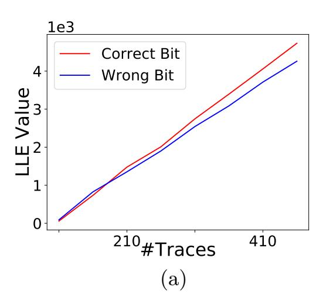

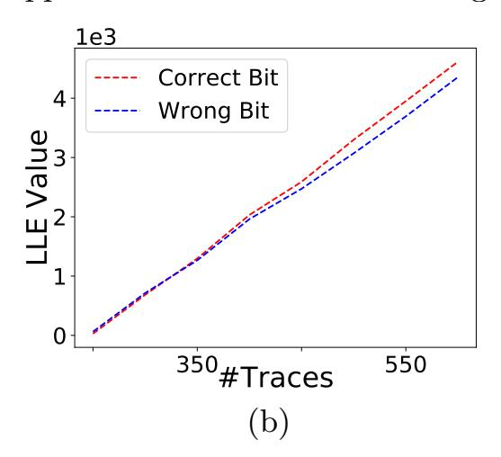

Fig. 5: LLE variation for recovering one bit from the SIFA-protected  $\chi_5$  S-Box. Fault is injected at one of the shares (share  $e^0$ ) of the LSB of the S-Box input; (a) detection on unshared values; (b)detection on shared values.

can violate many existing combined SCA and FA protection schemes, which are based on detection/correction, and involves masking. Also, SCA-secure composable gadgets, such as probe-isolating-non-interference (PINI) [30], falls prey to SCA-FTA (ref. Appendix. C in the supplementary material).

#### 5 Practical Validation

So far, in this paper, we have abstracted the SCA leakage as HW of multiple wires in the error detection/correction circuits. However, practical validation is also necessary in this regard. We practically validated the proposed attacks on an open-source software implementation of SIFA-protected Keccak implementation provided with [16]. To validate our claims we only add the error-detection circuits at the end, and no other customization has been made. Two types of detection operation were evaluated – detection on unshared (actual) values as suggested in [16], and detection over shared values. The faults were injected using laserpulses, while the SCA leakages were measured through power consumption. It was found that recovering each bit requires roughly 210–220 traces for detection over unmasked values (shown through variation in LLE values in Fig. 5(a)), and 320 to 350 traces for detection over masked values (ref. Fig. 5(b)). Total 5 distinct injection locations in the code were utilized while the clock cycle of injection was varied for choosing different S-Boxes. Further, in order to understand the feasibility of the attacks on hardware implementations, we performed a gate-level power-trace simulation approach. The simulated faults were bit-flip. Experiments were performed on a shared  $\chi_3$  S-Box hardware with error correction<sup>12</sup>. Detailed experiments are presented in the supplementary material (Appendix. F).

# 6 Discussion on Probable Fixes

In Sec. 4.6, we pointed out that the compression layer of TI is responsible for the attack. In the context of faults, the compression of shares violates the non-completeness property of TI. Compensating non-completeness violation with reg-

While attacks on hardware implementations are feasible and have been validated in practice [32], the effort to attack will be much higher than microcontrollers due to noise, required fault injection capability, and any present parallelism.

{27}------------------------------------------------

isters does not work for faults13. Unlike glitches, a faulty value can propagate through registers causing share combination which enables SCA-FTA. A natural question, that arises in this context is – can we maintain security if there is no compression layer? At least for some cases, we found that the answer is positive. More precisely we found that if the error detection/correction is performed before the compression operation, the security can still be maintained.

A Secure Instantiation of the Countermeasure in [15]: As an example of the aforementioned claim, we refer to a concrete instantiation of the Transform-and-Encode framework called AntiSIFA [15]. AntiSIFA proposes a single-bit SIFA protected scheme along with first-order masking for PRESENT. The masking was realized with the first-order TI for PRESENT in [33]. Although the generic framework Transform-and-Encode is found to be insecure against SCA-FTA, this specific construction is found to be secure. To understand why this is secure, we need to consider the first-order TI implementation of PRESENT S-Box [33]. The implementation first decomposes the S-Box S into two quadratic sub-functions F and G such that S(x) = F(G(x)). Next, both F and G are shared with 3 input and 3 shares each (no compression).

Let us consider a part of the shared F function which corresponds to a single (unmasked) output bit if the S-Box. The corresponding equations are given as:

$$f_{10} = x_1^2 + x_2^2 x_0^2 + x_2^2 x_0^3 + x_2^3 x_0^2$$

$$f_{20} = x_1^3 + x_2^3 x_0^3 + x_2^1 x_0^3 + x_2^3 x_0^1$$

$$f_{30} = x_1^1 + x_2^1 x_0^1 + x_2^1 x_0^2 + x_2^2 x_0^1$$
(10)

Here f10, f<sup>20</sup> and f<sup>30</sup> denote the output shares of S-Box output f0. Each x i j denote the i-th share of the jth input bit. Now let consider a fault at the bit x 2 0 . While this indeed leaks information about x<sup>2</sup> = x 1 <sup>2</sup> + x 2 <sup>2</sup> + x 3 2 the leakage happens through outputs f<sup>10</sup> and f<sup>30</sup> and error-correction is performed at the end of both wires. Even for any other input bit, the leakage would always happen through two wires and the correction operation is performed for both the wires. Such fault propagation takes place as each of the output shares are non-complete. As a result, one cannot attack this implementation without violating the firstorder probing security claims. A similar situation takes place for the combined security schemes introduced in [19] (called NINA), where the error correction is performed at the output of each product term of a masked AND gate (each product term on shares is non-complete). These observations indicate that even for TI implementations where share compression is essential, performing error detection or correction on non-complete combinational paths before share compression may provide security against SCA-FTA. Further investigation and development of a generic and provable countermeasure based on this observation is left as a future work. It is worth mentioning that certain other countermeasures such as CAPA [34] and Friet [35] also prevent SCA-FTA attacks for slightly different reasons. They have been dis-

<sup>13</sup> It works for preventing glitch leakages, as glitch cannot propagate through registers.

{28}------------------------------------------------

cussed in Appendix. G in the supplementary material. Re-keying [36] schemes can also be useful if the key generation can be made attack resilient.

# 7 Conclusion

Modern cryptographic implementations utilize special algorithmic measures to protect against SCA and FA attacks. A reasonable expectation is that implementations containing both countermeasures would also prevent against combined attacks. In this paper, we show and practically validate that this is not the case, even for some implementations which include both masking and SIFA countermeasures. A novel combined attack strategy called SCA-FTA has been proposed for exploiting these vulnerabilities. The proposed attacks can exploit information leakage form the error detection/correction logic (though side-channel) even if the detection/correction is performed over masked data. Finally, we note that the non-completeness property of certain masking implementations can play a crucial role in preventing the proposed attacks. A potential future work in this regard can be further analysis of both the attack and the prevention approach.

# 8 Acknowledgements

Debdeep Mukhopadhyay acknowledges the support from the Department of Science and Technology, Government of India through the Swarna-jayanti Fellowship. Dirmanto Jap and Shivam Bhasin acknowledge the support from the Singapore National Research Foundation ("SOCure" grant NRF2018NCR-NCR002- 0001).

# References

- 1. Kocher, P., Jaffe, J., Jun, B.: Differential power analysis. In: CRYPTO. pp. 388– 397. Springer (1999)
- 2. Chari, S., et. al.: Template attacks. In: CHES. pp. 13–28. Springer (2002)
- 3. Oswald, E., Mangard, S.: Template attacks on masking–resistance is futile. In: CT-RSA. pp. 243–256. Springer (2007)
- 4. Boneh, D., DeMillo, R.A., Lipton, R.J.: On the importance of checking cryptographic protocols for faults. In: EUROCRYPT. pp. 37–51. Springer (1997)
- 5. Biham, E., Shamir, A.: Differential fault analysis of secret key cryptosystems. CRYPTO pp. 513–525 (1997)
- 6. Patranabis, S., Mukhopadhyay, D.: Fault Tolerant Architectures for Cryptography and Hardware Security. Springer (2018)
- 7. Saha, S., et. al.: Fault template attacks on block ciphers exploiting fault propagation. In: EUROCRYPT 2020. pp. 612–643. Springer (2020)
- 8. Agoyan, M., et. al.: How to flip a bit? In: IEEE IOLTS. pp. 235–239. IEEE (2010)
- 9. Nikova, S., Rechberger, C., Rijmen, V.: Threshold implementations against sidechannel attacks and glitches. In: ICICS. pp. 529–545. Springer (2006)
- 10. Reparaz, O., et. al.: Consolidating masking schemes. In: CRYPTO. pp. 764–783. Springer (2015)
- 11. Groß, H., Mangard, S., Korak, T.: Domain-oriented masking: Compact masked hardware implementations with arbitrary protection order. IACR Cryptology ePrint Archive 2016, 486 (2016)

{29}------------------------------------------------

- 12. Groß, H., Mangard, S.: Reconciling d+1 masking in hardware and software. In: CHES. pp. 115–136. Springer (2017)
- 13. Dobraunig, C., et. al.: SIFA: exploiting ineffective fault inductions on symmetric cryptography. TCHES pp. 547–572 (2018)
- 14. Dobraunig, C., et. al.: Statistical ineffective fault attacks on masked aes with fault countermeasures. In: ASIACRYPT. pp. 315–342. Springer (2018)
- 15. Saha, S., et. al.: A framework to counter statistical ineffective fault analysis of block ciphers using domain transformation and error correction. IEEE Trans. Inf. Forensics Secur. (2019)
- 16. Daemen, J., et. al.: Protecting against statistical ineffective fault attacks. TCHES pp. 508–543 (2020)
- 17. Schneider, T., Moradi, A., G¨uneysu, T.: ParTI–towards combined hardware countermeasures against side-channel and fault-injection attacks. In: CRYPTO. pp. 302–332. Springer (2016)
- 18. Shahmirzadi, A.R., Rasoolzadeh, S., Moradi, A.: Impeccable circuits II. IACR Cryptology ePrint Archive 2019 (2019)
- 19. Dhooghe, S., Nikova, S.: My gadget just cares for me-how nina can prove security against combined attacks. In: CT-RSA. pp. 35–55. Springer (2020)
- 20. Daemen, J., Hoffert, S., Assche, G.V., Keer, R.V.: The design of xoodoo and xoofff. IACR Trans. Symmetric Cryptol. 2018(4), 1–38 (2018)
- 21. Roche, T., Lomn´e, V., Khalfallah, K.: Combined fault and side-channel attack on protected implementations of aes. In: CARDIS. pp. 65–83. Springer (2011)
- 22. Lomn´e, V., Roche, T., Thillard, A.: On the need of randomness in fault attack countermeasures-application to aes. In: FDTC. pp. 85–94. IEEE (2012)
- 23. Saha, S., et. al.: Breaking redundancy-based countermeasures with random faults and power side channel. In: FDTC. pp. 15–22 (2018)
- 24. Bogdanov, A., et. al.: Present: An ultra-lightweight block cipher. In: CHES. pp. 450–466. Springer (2007)
- 25. Guo, X., et. al.: Security analysis of concurrent error detection against differential fault analysis. JCEN 5(3), 153–169 (Sep 2015)
- 26. Ishai, Y., Sahai, A., Wagner, D.: Private circuits: Securing hardware against probing attacks. In: CRYPTO. pp. 463–481. Springer (2003)
- 27. Faust, S., et. al.: Protecting circuits from leakage: the computationally-bounded and noisy cases. In: EUROCRYPT. pp. 135–156. Springer (2010)
- 28. Chari, S., Jutla, C.S., Rao, J.R., Rohatgi, P.: Towards sound approaches to counteract power-analysis attacks. In: CRYPTO. pp. 398–412. Springer (1999)
- 29. Mangard, S., Schramm, K.: Pinpointing the side-channel leakage of masked aes hardware implementations. In: CHES. pp. 76–90. Springer (2006)
- 30. Cassiers, G., Standaert, F.X.: Trivially and efficiently composing masked gadgets with probe isolating non-interference. IEEE Trans. Inf. Forensics Secur. 15, 2542– 2555 (2020)
- 31. Shahverdi, A., Taha, M., Eisenbarth, T.: Lightweight side channel resistance: Threshold implementations of simon. IEEE Trans Comput 66(4), 661–671 (2016)
- 32. Dutertre, J.M., et. al.: Laser fault injection at the cmos 28 nm technology node: an analysis of the fault model. In: FDTC. pp. 1–6 (2018)
- 33. Poschmann, A., et. al.: Side-channel resistant crypto for less than 2,300 ge. JoC 24(2), 322–345 (2011)
- 34. Reparaz, O., et. al.: Capa: the spirit of beaver against physical attacks. In: CRYPTO. pp. 121–151. Springer (2018)
- 35. Simon, T., et. al.: Friet: An authenticated encryption scheme with built-in fault detection. In: EUROCRYPT. pp. 581–611. Springer (2020)

{30}------------------------------------------------

- 36. Dobraunig, C., Koeune, F., Mangard, S., Mendel, F., Standaert, F.X.: Towards fresh and hybrid re-keying schemes with beyond birthday security. In: CARDIS. pp. 225–241. Springer (2015)
- 37. Azouaoui, M., Papagiannopoulos, K., Z¨urner, D.: Blind side-channel SIFA. In: DATE. pp. 555–560. IEEE (2021)
- 38. Shamir, A.: How to share a secret. Communications of the ACM 22(11), 612–613 (1979)
- 39. Seker, O., et. al.: Extending glitch-free multiparty protocols to resist fault injection attacks. TCHES pp. 394–430 (2018)

{31}------------------------------------------------

Supplementary Material

{32}------------------------------------------------

### A Alternative Algorithm for Template Matching

#### Algorithm 6 MATCH\_TEMPLATE\_ALTERNATIVE

```
Input: Protected cipher with unknown key C_k, Faults fl_1, fl_2, ..., fl_M, Template \mathcal{T}, num_{ob}
Output: Set of candidate correct states x_{cand}
     x_{cand} := \emptyset

    ▷ Set of candidate states

     w := GET\_SBOX\_SIZE()
     s' := \emptyset
     for each fl \in \{fl_1, fl_2, \cdots fl_M\} do
          \mathcal{O}_{fl} := \emptyset
          for num_{ob} observations do
              y_f := C(x)^{fl}
                                                           ▷ Inject fault in one copy of the S-Box for each execution
         y_c := C(x) \mathcal{O}_{fl} := \mathcal{O}_{fl} \cup \text{SCA\_LEAKAGE}(y_f, \, y_c) end for
                                                                            ▶ Leakage from the fault detection operation
     end for
    x_{cand} := \mathcal{T}(\underset{s \in \mathcal{S}_{\mathcal{F}}}{\operatorname{arg max}} \sum_{fl=fl_1}^{fl_M} L(s[fl], \mathcal{O}_{fl}))
                                                                                       ▶ Maximize the sum of log-likelihood
     Return x_{cand}
```

Algorithm. 2 presented our basic approach for template matching, which performs log-likelihood estimation for the traces corresponding to each fault location separately, and then combines the information for template matching by means of Euclidean distance. The convenience of this approach comes from the fact that information recovery for each fault location (and its corresponding probing location) can be performed independently, which eases the explanation of attack principles (single-fault single-probe) in the paper. However, another approach for performing template matching is to combine the information from all fault locations directly by maximizing the sum of log-likelihood for the traces corresponding to all fault locations. This approach is presented in Algorithm. 6. We found that results for these two approaches are comparable with the second approach performing slightly better in terms of trace count. However, we used the first approach throughout the paper for its aforementioned advantage.

### B Fault Propagation on DOM-dep Gates

In Sec. 4.2, we have explained how leakage happens for DOM-indep gates. For the sake of completeness, here we show a similar result for DOM-dep constructions. The advantage of DOM-dep construction over DOM-indep is that it does not require its inputs to be independently shared if the (unmasked) inputs of the AND are equal. The independence of shares may become crucial in certain situations as equal shares might lead to leakage [11]. Instead of calculating ab directly DOM-dep AND computes it as a(b+z) + (az), where z is random. It also uses DOM-indep AND gates as sub-modules. The masked implementations of this multiplier are given as follows:

$$q^{0} = \{a^{0}((b^{0} + z^{0}) + (b^{1} + z^{1}) + \cdots)\} + \{a^{0}z^{0} + (a^{0}z^{1} + t_{0}) + (a^{0}z^{2} + t_{1}) + \cdots\}$$

$$q^{1} = \{a^{1}((b^{0} + z^{0}) + (b^{1} + z^{1}) + \cdots)\} + \{(a^{1}z^{0} + t_{0}) + a^{1}z^{1} + (a^{1}z^{2} + t_{2}) + \cdots\}$$

$$q^{2} = \{a^{2}((b^{0} + z^{0}) + (b^{1} + z^{1}) + \cdots)\} + \{(a^{2}z^{0} + t_{1}) + (a^{2}z^{1} + t_{2}) + a^{2}z^{2} + \cdots\}$$

$$\vdots \qquad \vdots \qquad \vdots \qquad \vdots \qquad \vdots \qquad \vdots \qquad \vdots \qquad (11)$$

{33}------------------------------------------------

Here each  $a^i$  and  $b^i$  denote the input shares of a and b, respectively. Each  $z^i$  denotes the share of the random bit z.  $t_i$ s are also random bits. The output shares are denoted as  $q^i$ . A fault injection at any of the  $a^i$  here reveals the b. For example, considering fault injection at  $a^0$ , the first part of the expression (within the first  $\{\}$ ) reveals b+z. The second part of the expression reveals z. However, the fault propagations due to the shares of z in two parts cancel each other. Finally, whether  $q^0$  is faulted or not depends solely on the value of bit b. Also, all the observations made on DOM-indep gates regarding the pattern of fault propagation is equally valid for the DOM-dep gates.

# C Fault Propagation on PINI Gadgets

#### Algorithm 7 PINI<sub>1</sub> multiplication gadget over d shares [30]

```
Input: Factors a, b \in \mathbb{F}_q such that \sum_i a^i = a and \sum_i b^i = b
Output: (c^i)_d \in \mathbb{F}_q^d such that \sum_i c^i = ab
 1: for i = 0 to d - 1 do
 \bar{2}:
             for j = i + 1 to d - 1 do
                   r^{ij} \xleftarrow{\$} \mathbb{F}_q; \qquad r^{ji} \leftarrow r^{ij}
 3:
 4:
             end for
 5: end for
 6: for i = 0 to d - 1 do
7: for j = 0 to d - 1 j \neq i do
                   s^{ij} \leftarrow b^j + r^{ij}
 8:
                  \begin{array}{ccc} & & & & & & & \\ p_0^{ij} \leftarrow (a^i + 1)r^{ij} & & & \\ p_1^{ij} \leftarrow a^i s^{ij} & & & \\ z^{ij} \leftarrow p_0^{ij} + p_1^{ij} & & & \end{array}
 9:
10:
                                                                                                                                                    \triangleright z^{ij} := r^{ij} + a^i b^j
11:
             end for
12:
13: end for
14: for i = 0 to d - 1 do
              c^i \leftarrow a^i b^i + \sum_{j=0, j \neq i}^{d-1} z^{ij}
15:
16: end for
17: Return(c^i)_d
```

PINI [30] is a paradigm for designing and verifying masked gadgets which ensure composable security against SCA attacks. Although PINI does not take FAs into account, it is important to analyze whether or not the combination of a PINI gadget and error detection/correction logic can prevent SCA-FTA. As it turns out, PINI does not ensure security against SCA-FTA. To illustrate this, we refer to the PINI<sub>1</sub> multiplication gadget from [30] presented in Algorithm. 7. In this algorithm,  $a^i$ ,  $b^i$  and  $c^i$  denote the input and output shares, and  $r^{ij}$  (resp.  $r^{ji}$ ) denote random values. Rest of the variables are intermediate variables. It is easy to observe that final expressions of output shares take the form  $c^i = a^i b^i + \sum_{j=0, j \neq i}^{d-1} r^{ij} + a^i b^j$ ,  $\forall i \in 0, 1, \cdots d-1$ . This expression can be reformulated as  $c^i = a^i (b^0 + b^1 + \cdots + b^{d-1}) + \sum_{j=0, j \neq i}^{d-1} r^{ij} = a^i b + \sum_{j=0, j \neq i}^{d-1} r^{ij}$ . Consequently, a

{34}------------------------------------------------

fault injection on a <sup>i</sup> would only propagate to c i conditioned on the actual value of b, which clearly indicates an exploit for SCA-FTA.

# D Comments on the Attack in Sec. 4.5.1 for Error Detection on Shared Values

In this section we illustrate the observation that the the template in Table 9 is better than the template in Table 8 in the sense that it can uniquely determine each input value. More precisely, here we establish that even though the templates slightly improve for detection on masked values (with respect to the templates for detection on unmasked values), it does not cause violation to the claim that the attack is first-order. Note that we have considered the HW of all the XOR outcomes of the detection operation. In order to explain this observation we consider the actual fault patterns of the χ<sup>3</sup> S-Box corresponding to the inputs 0 and 7. For 0 the (unmasked) output fault patterns of the S-Box are (F, C, F), (F, F, C) and (C, F, F) for fault locations c 0 , b <sup>0</sup> and a 1 , respectively. The HW of all the cases are 2. Similarly, for 7 the fault patterns are (F, F, C), (C, F, F) and (F, C, F), respectively. However, for detection over shares, the fault differentials over the shares are computed. For input 0 they are given as14:

```
1. (C, F, C, C, C, F) and (C, F, C, C, F, C) for fault location c
                                                                   0
```

- 2. (C, F, C, F, C, C) and (F, C, C, F, C, C) for fault location b 0
- 3. (C, C, C, F, F, C) and (C, C, F, C, F, C) for fault location a 1 .

For all of these patterns the average HW is 2 for each fault location. Similarly, for input 7 the patterns are given as:

```
1. (C, F, C, F, F, F) and (C, F, C, F, C, C) for fault location c
                                                                  0
```

- 2. (F, F, C, F, C, F) and (C, C, C, F, C, F) for fault location b 0
- 3. (F, C, C, C, F, C) and (F, C, F, F, F, C) for fault location a 1 .

One may observe that the HWs are either 2 or 4, which results in an average HW of 3 for each fault location. Clearly, 0 becomes distinguishable from 7 by considering such HW patterns. For each fault location, there is a mandatory fault propagation in the masked S-Box. Furthermore, there are always three datadependent fault propagations – one leaking the information of an unmasked input through a single output share, the other leaking through both output shares of a bit. For the bit leaking through two output shares, some extra information gets added to the templates while we consider the HW patterns (this helps in distinguishing 0 and 7). However, as we have already pointed out in Sec. 4.5.1 (ref. the attack description for error detection on shares), even following the probing model solely, a similar template can be constructed (as we can extract each input bit separately). Hence, this observation does not contradict probing security, and the proposed attack remains first-order.

<sup>14</sup> The sequence of bits are taken as (t 1 , t<sup>0</sup> , s<sup>1</sup> , s<sup>0</sup> , r<sup>1</sup> , r<sup>0</sup> )

{35}------------------------------------------------

# E Comparison of SCA-FTA with Existing Attacks

The main aim of the paper is to evaluate certain SCA-SIFA countermeasures for combined leakage. However, the proposed SCA-FTA attack is also distinct in several aspects with respect to the existing attacks. SCA-FTA builds fault templates based on power traces. It is thus important to compare this attack with the classical FTA technique. It has already been pointed out that SCA-FTA recovers exploitable information leakage (though side-channel) which is not directly available to a classical FTA or SIFA adversary in the form of ciphertexts or its correctness information. As an example, for both the SIFA countermeasures discussed in this work, the information leakage caused by data-dependent fault ineffectivity never reaches the ciphertexts. However, the information leakage indeed gets captured at the detection/correction units, which can be utilized by SCA-FTA, but not by FTA. It is worth mentioning that SCA-FTA can work even for the cases which are vulnerable against FTA or SIFA. For example, the correctness information of the ciphertext required in FTA can be obtained through SCA leakage as well. However, such cases are considered trivial as less powerful adversary models (i.e. FTA/SIFA) can break these constructions. A recent work in this line is due to [37], which injects SIFA-faults and uses SCA-leakage from correct unmasked ciphertexts to attack implementations having masking and error-detection (similar target to that of FTA/SIFA). However, this attack does not work for SIFA countermeasures [15,16], as no (unmasked) intermediatevalue-dependent correct ciphertext is generated for these countermeasures.

Since the proposed template attack involves SCA leakage along with faults, it is interesting to discuss the classical SCA template attacks [2, 3] in this context. Indeed for unprotected implementations (without SCA countermeasure), it is always feasible to run the SCA template attack. In fact, SCA template attack would be easier for the unprotected implementations as it does not require any fault to be injected. However, we note that the SCA templating is done on the key or state bytes, whereas SCA-FTA performs it on the fault differentials. SCA-FTA provides a way to exploit information leakage from detection/correction operation. The advantage of SCA-FTA over SCA template attacks would become more prominent while we consider SCA-FTA on schemes including masking. In order to break a first-order secure implementation, SCA template attacks would require to construct templates on each mask and actual state value, hence performing a second-order attack. In contrast, SCA-FTA can perform a first-order attack on a first-order secure implementation due to the presence of faults. Furthermore, the observations are not limited to first-order secure schemes only and also applies to masking schemes of arbitrary order.

Another competing attack in this context is the combined attack described in [21] and [23]. In a nutshell, they perform DFA by extracting the output ciphertext differential entirely through SCA. However, as it has already been pointed out in the introduction, these attacks rely on the fact that the detection operation is performed on unmasked data. In fact, masking the detection was proposed as countermeasure in some cases [21] (and [23]). The countermeasures we consid

{36}------------------------------------------------

ered in this work use redundancy in masks for detection/correction of errors on masked values. In other words, error check is performed on each share independently, and there is no chance of unmasking during such comparisons. Clearly, there is no way for unmasked ciphertext differentials getting exposed for such error checks, and thus the attacks in [21] and [23] cannot work. However, SCA-FTA clearly shows that even such masked detection/correction is not a sound solution. Even in the cases of SIFA countermeasures, it is possible to exploit leakage resulting in successful attacks. If the masked detection is performed with an extra multiplicative mask (as proposed in [22]), and combined with the SIFA countermeasure [16], it can still be defeated with one extra fault at the end of the S-Box to cancel out the mandatory fault propagation happening. In such cases, only data-dependent faults propagate to the masked comparison block, and just an absence/presence of fault during comparison leaks information (the attacker do not explicitly need to know the ciphertext differential). In other words, the presence of the multiplicative mask does not create any significant difference for SCA-FTA. Furthermore, increasing the order of redundancy does not increase the required number of fault injections in this case. Even for n redundant comparisons happening, faulting only one share at the beginning and cancelling the fault impact only for one redundant branch suffice. Hence, the attack remains practical. Note that such is not the case for attacks in [21] and [23] as they have only three options in this case: 1) To bypass the redundancy check and output faulty ciphertexts. This can be made difficult by increasing the order of redundancy; 2) To bypass the multiplications of each share with the multiplicative mask so that redundancy check is performed over unmasked value. This can be made difficult by increasing the number of shares. 3) The third option is to change the random multiplicative mask to unity, which requires a very complex multi-bit fault model.

Finally, we point out that there exist combined attacks which exploits a fault to create bias in the input mask and then performs a successful SCA analysis of order lower than the prescribed security order to recover the key. One example is to set the masks zero altogether for a first-order implementation which may eventually result in a first-order attack. We note that this takes the attack beyond the boundary of the cipher as the randomness source needs to be corrupted in this case. Instead, our goal in this paper is to investigate flaws in existing countermeasure designs by using SCA-FTA as a tool.

# F Details of Practical Experiments

In this section, we present the results of our practical validation in detail. As already pointed out in Sec. 5, validation experiments were performed for both software and hardware implementations. For the former case, we choose the open-source Keccak implementation provided by the authors of [16]<sup>15</sup>, which implements the SIFA-protected χ<sup>5</sup> S-Box. We only added the error-detection

<sup>15</sup> https://github.com/sifa-aux/countermeasures

{37}------------------------------------------------

operations (both detection on un-shared and shared values) at the end of computation. Our hardware validation is performed on a hardware implementation of the  $\chi_3$  S-Box with error correction. Both the experiments are detailed in the following subsections.

#### F.1 SCA-FTA with Laser Faults and EM measurement

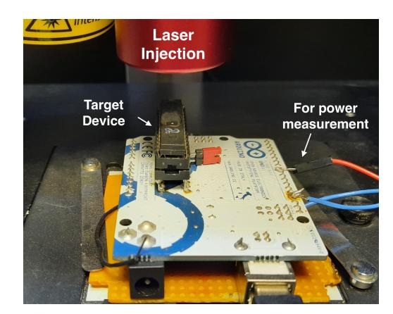

Fig. 6: Laser setup for practical experiment

**Target Implementation:** The open-source software in [16] implements Keccakf[200] with two shares and a SIFA-protected 5-bit  $\chi_5$  S-Box. The S-Box inputs are denoted as  $(a^0, a^1, b^0, b^1, c^0, c^1, d^0, d^1, e^0, e^1)$  and the outputs are collected in the same registers as the inputs. The S-Box is implemented entirely in assembly targeting 8-bit AVR platforms using 13 general-purpose registers. For realizing the proposed attacks, we repeat the computation two-times (denoted as original and redundant computation) for enabling error-detection. For the first case, where error-detection was performed over unmasked values, we can use different masks for original and redundant computation. The outputs are unmasked, and then XOR-ed with each other to detect if there is any error. Upon detection of error, an output suppression module suppresses the outcome. **Note that our** experimentation considers practical noise induced due to both fault injection and SCA measurements, simultaneously. Our second test scenario performs error-detection on shared values. In this case, the masks in both redundant and cipher computation must be equal. The rest of the code remains unchanged from their original version.

Attack Setup: In order to validate our claims, we run the target implementation on an Atmel ATmega328P microcontroller running at 16 MHz. The microcontroller was de-packaged and mounted on an Arduino UNO board. We target this microcontroller with a 8W diode pulse laser for fault injection. The board has been modified to enable power measurement through an external port (refer Fig 6). We even verified that electromagnetic (EM) measurements are possible by using probes similar to Langer RF-2 Near-field Probes. As the EM probe

{38}------------------------------------------------

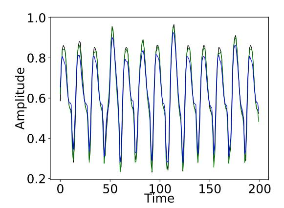

Fig. 7: Example traces for the target masked  $\chi_5$  S-Box (software implementation).

is not required to measure directly on the chip, it does not interfere with laser injection. For this chip we found that measurement near the  $V_{DD}$  pin also provides a good signal to carry side-channel analysis. The injection of laser does cause some perturbation in the SCA measurements, but these disturbances were only limited to up to 8 clock cycles after the injection ( $\approx 500ns$ ) in our setup<sup>16</sup>. SCA measurements after this settling period has no effect of the highenergy laser injection. For the target implementation, the measurement point is several clock cycles ( $\approx 190$  clock cycles or  $\approx 12\mu s$ ) away for the laser injection cycle. Therefore, it will not affect the Signal-to-Noise Ratio (SNR) of the SCA trace due to laser-injection.

In the first step of the experiments, we perform the profiling of the target for finding the best location for injecting faults. This refers to the **offline** phase of the attack. We target the instructions where the share is being loaded just before the S-Box computation for fault injection. One of the critical issue is the repeatability of the fault. After profiling, it was observed that with sufficient laser power (even as low as 10% laser power), the fault can be repeated 100% (only 2 failed instance out of 30,000 trials), with the resulting faults being equivalent to a stuck-at-0 fault at the target bit.

The SCA traces for two executions in our experiments are depicted in Fig. 7.

Template Attacks: As already pointed out, we have evaluated two cases with the aforementioned setup—detection on unshared values, and detection on shares. For each of the cases we have acquired 5000 traces with randomly varying masks. For template building, the input of the S-Boxes were assumed to be known and for matching they were assumed to be unknown. For the target 5-bit S-Box (having total 10 inputs and output bits due to 2-sharing), total 5 fault locations were required for completely exposing the S-Box input (same number of locations would be required for higher-order masking too). Note that, only one location is corrupted at a time. The LLE values for determining the correct bit value for fault location  $e^0$  is shown in Fig. 5(a) (Sec. 5) for the unmasked detection case. One may observe that around 210 - 220 traces are sufficient for distinguishing

This perturbation depends upon the laser setup and can be fine-tuned further in many cases.

{39}------------------------------------------------

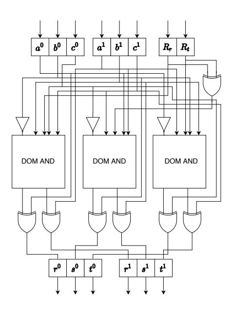

Fig. 8: The masked χ<sup>3</sup> S-Box.

the correct bit value. After these many traces, the LLE corresponding to the correct bit remains consistently higher than the LLE of the wrong bit. Similarly, for the detection over shares, roughly 320−350 traces are sufficient for extracting the correct bit (ref. Fig. 5(b) in Sec. 5).

### F.2 Details of the Power-Trace Simulation Experiments

In this subsection, we present the experimental validation of the proposed attacks for a hardware implementation. As already pointed out in Sec. 5, we perform gate-level power trace simulation for a hardware implementation of the χ<sup>3</sup> S-Box with error correction. Here we first present the details of the simulation methodology. Subsequently, we discuss our observations on the target implementation.

### F.2.1 Target Implementation

Fig. 8 presents a basic architecture of the target χ<sup>3</sup> S-Box, which has been implemented in Verilog. For this experiment, we developed a non-pipelined architecture following the design in [16]. Each output share of the S-Box was subject to majority voting-based error correction following (we consider single-bit error correction, and hence maintain 3 redundant copies per share) [15]. During the gate-level synthesis of this design, we apply flags like Keep Hierarchy and Don't Touch to ensure that there is absolutely no unwanted design optimization, which may lead to SCA leakage. The fault-free design does not show any leakage. The faults in our experiments are also simulated. To enable fault simulation, we add XOR gates at each input of the S-Box. In order to generate fault at a specific input bit, one of the inputs of the corresponding XOR gate is set to 1, which flips the other input.

#### F.2.2 Gate-Level Power Simulation

The overall flow of power-trace simulation is presented in Fig. 9. Our methodology mainly estimates dynamic power based on the total toggle count of gates at

{40}------------------------------------------------

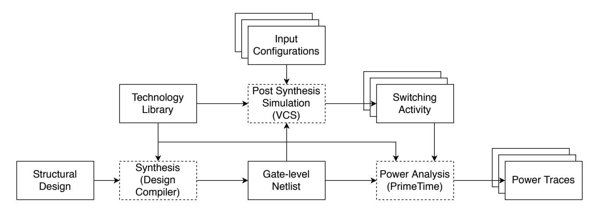

Fig. 9: The power-trace simulation toolflow.

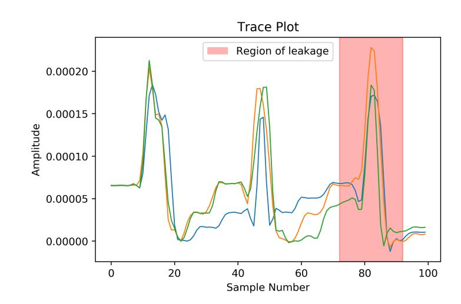

Fig. 10: Example traces for the masked  $\chi_3$  S-Box. The shaded area shows the expected region of leakage

a specific time instant during the simulation. Toggle count denotes the number of times a gate switches from  $0 \to 1$  or  $1 \to 0$ . It is well-known that dynamic power consumption of a gate is proportional to its toggle count.

In our simulation flow, the Verilog design is first synthesized with Synopsis Design Compiler to a gate-level netlist. For synthesizing the design, we use STMicroelectronics CMOS65 – a 65nm technology library due to STMicroelectronics. The technology library also contains timing and power information for each standard cell in it. The clock frequency was set to 50 MHz. After synthesis, a post-synthesis simulation is performed, and the switching activities of the entire design are logged in Value Change Dump (VCD) files. During the simulation, we provide the randomly shared inputs to the design-under-test via a test bench. The VCD file stores the timestamp and transition of each gate whenever it toggles. In the next step, the VCD file is fed to the PrimeTime PX tool for power trace generation. Additionally, PrimeTime also takes a design constraints file (.sdc), and a parasitic file (.spef) file as inputs. The .sdc file is used to estimate the transition time at the primary inputs, whereas the .spef file is used for getting the capacitance estimates of the nets. Given all these inputs, we perform a time-based power analysis with PrimeTime, which returns a power trace file (.fsdb) corresponding to a given test vector. Fig. 10, presents examples of the traces obtained in our flow. It also specifies the region (in red) where we expect the leakage to happen.

{41}------------------------------------------------

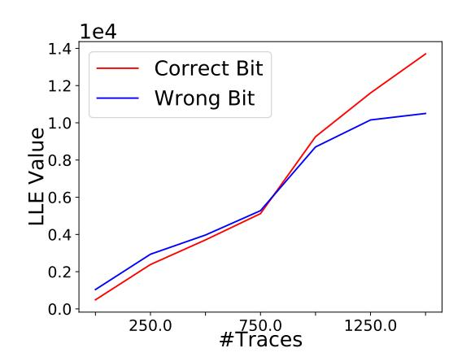

Fig. 11: Trace count vs. log-likelihood value for template matching. The fault, in this case, is injected at the input  $c^0$  in the masked  $\chi_3$  S-Box.

#### F.2.3 Template Building and Matching

In the next step, we perform template building and matching with the acquired power traces. For each of the inputs of the S-Box (there are total 8 (unmasked) input values), we collect 5000 traces corresponding to a fault location. The masks are varied randomly during this trace acquisition. Next, we build separate templates corresponding to each input as described in Algorithm. 4. The fault locations corresponding to this attack are the same as described in Sec. 4.5. In order to match the template, we further perform trace acquisition under the influence of faults, but this time the input is assumed as unknown. The template matching is performed by means of LLE as described in Algorithm. 5. The template matching phase requires multiple traces. Fig. 11, shows the trend in log-likelihood values with increasing number of traces when the fault location is  $c^{0}$ . The LLE value for the correct bit (at this fault location we recover a single unmasked input bit of the S-Box) is shown in red. We also plot the LLE value for the wrong bit value (shown in blue). As it can be observed from Fig. 11, the LLE values are consistently maximum for the correct bit value after a certain number of traces are provided. This fact clearly indicates the success of template building and matching in our experiments. Overall, we require roughly 1500 traces per fault location for template matching.

### G Discussion on Some other Countermeasures

Alternative Constructions from [16]: We have addressed the issues with the SIFA countermeasure in [16] in the main section of this paper. However, [16] also proposes two alternative constructions. For the first one, it was shown that any S-Box can be implemented with masked Toffoli gates which ensures fault propagation to at least one output bit whenever there is a fault in an input. Here we consider one such basic construction shown in Fig. 12 (adopted from the original paper). Here each  $v^i$  denotes a share of the corresponding bit  $v \text{.} \oplus$  and  $\odot$  denotes XOR and AND gates, respectively. Now let us consider a bit-flip fault at the input  $b^0$  of this construction. As claimed in [16], the fault always propagates to the output  $b^0$  and the propagation does not depend upon any input value. However, the fault also propagates to  $a^0$  only if  $c^0+c^1=c=1$ . Hence, SCA-FTA

{42}------------------------------------------------

### Algorithm 8 SIFA-Protected χ<sup>3</sup> (Local Error Detection)

```
Input: (a
           0
             , a1
                 , b0
                    , b1
                        , c0
                            , c1
                               )
Output: (r
             0
               , r1
                   , s0
                      , s1
                          , t0
                              , t1
                                 )
1: T0 ← b
            00
              c
               1
                 0
                    ; T2 ← a
                                1
                                 0
                                  b
                                   1
                                    0
2: T1 ← b
            00
              c
               0
                 0
                    ; T3 ← a
                                1
                                 0
                                  b
                                   0
                                    0
3: T0 ← T0 + a
                  0
                    0
                       ; T2 ← T2 + c
                                         1
                                          0
4: r
     0 ← T0 + T1 ; t
                           1 ← T2 + T3
5: T0 ← c
            00
              a
                1
                 0
                     ; T2 ← b
                                1
                                 0
                                  c
                                   1
                                     0
6: T1 ← c
            00
              a
                0
                 0
                     ; T3 ← b
                                1
                                 0
                                  c
                                   0
                                     0
7: T0 ← T0 + b
                  0
                   0
                       ; T2 ← T2 + a
                                         1
                                          0
8: s
     0 ← T0 + T1 ; r
                           1 ← T2 + T3
9: T0 ← a00
               b
                1
                 0
                    ; T2 ← c
                                1
                                 0
                                  a
                                    1
                                     0
10: T1 ← a00
               b
                0
                  0
                     ; T3 ← c
                                 1
                                  0
                                   a
                                    0
                                     0
11: T0 ← T0 + c
                   0
                    0
                        ; T2 ← T2 + b
                                         1
                                          0
12: t
      0 ← T0 + T1 ; s
                           1 ← T2 + T3
13: Rs ← R
              0
              r + R
                     0
                     t
                      ; CHECKS
14: r
      0 ← r
             0 + R
                   0
                   r
                       ; s
                            0 ← s
                                  0 + R
                                         0
                                         s
15: t
      0 ← t
            0 + R
                   0
                   t
                      ; r
                           1 ← r
                                  1 + Rr
16: s
      1 ← s
             1 + Rs ; t
                           1 ← t
                                  1 + Rt
17: Return(r
                0
                  , r1
                     , s0
                         , s1
                             , t0
                                , t1
                                    )
```

should also work on this construction if there are error detection/correction logic at the end of this S-Box computation. In fact, the one used for our laser fault experiments is similar to this one.

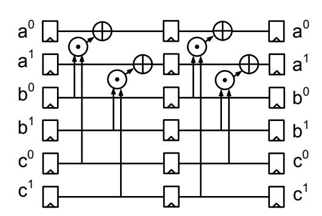

Fig. 12: Single-fault SIFA protected masked Toffoli gate [16].

The other construction proposed in [16] uses a bitwise error detection for each S-Box computation in the cipher (thus, we call it local error detection; ref. Algorithm. 8). Without letting the error propagate to the S-Box output (and hence to the cipher output), the error detection here is performed before the S-Box computation finishes. The corresponding algorithm is outlined in Algorithm 8 and Fig. 13. The fault detections are performed on the input shares a 0 , a<sup>1</sup> , b<sup>0</sup> , b<sup>1</sup> , c<sup>0</sup> , c<sup>1</sup> after each of them has served as input to multiple gates (by fanning out). In order to defeat this configuration, we need two faults at two different clock cycles. Fig. 13 presents the exact locations of these two faults

{43}------------------------------------------------

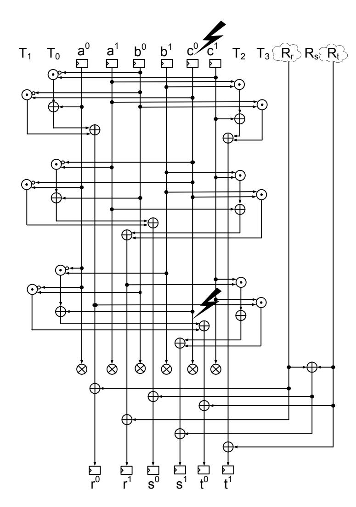

Fig. 13: Circuit representation of Algorithm 8 [16].

(the ⊗ symbol denotes an error detection block). If we corrupt an input share (say c 0 ) we have to cancel the fault with another fault (let us call it a cancelling fault) before the error check on c 0 is performed. This cancellation would let the S-Box computation continue. The data-dependent faults will then continue propagating to the S-Box outputs. The detection circuits in some S-Box of next round will capture these faults, and the expected leakage would take place from these detection operations. The countermeasure, however, only claims protection against single-bit faults. Hence, this attack violates the claimed security assumptions and is not efficient.

However, the attack with two faults may become interesting for higher-order fault protections. In [16] the protection order for faults was linked with the masking order. In other words, for an implementation with d + 1 shares, there must be d+ 1 redundant copies for each share. The redundant copies are checked pairwise. Consider an implementation, where the error detection is implemented in a manner that detection logic performs a pairwise check for d + 1 bit redundancy. So each redundant wire must fan-out to (d+1) 2 detection blocks. If the canceling fault can be injected before the fan-outs happen, the first fault (if propagated) will be canceled for all the error check circuits. This would leak information to reveal an unmasked bit. The leakage estimation could change depending on the implementation of the check. We report it for the pairwise check, which is commonly used.

{44}------------------------------------------------

Comments on Code-based Redundancy [18]: So far, in this work, we have mainly discussed countermeasures where the redundancy is implemented in time or space. An alternative is to incorporate information redundancy in the form of Error-Correcting Codes (ECC). Recently [18] has proposed SIFA-protected schemes based on linear codes. The reason we do not directly consider this countermeasure for combined attacks is that the current proposal do not include any SCA countermeasure (but it can be incorporated as stated in [18]). One advantage of using linear code is that it may not expose the differential of correct and faulty state explicitly through SCA. However, the leakage would still be correlated with the actual differential, and in certain implementations, the actual differential might still get exposed (for example, for error correction, [18] proposes the reconstruction of the error vector. There may be leakage related to this operation.).

Comments on CAPA [34]: CAPA is a recently proposed countermeasure against combined attack based on the principles of secure multi-party computation. The main idea of CAPA is to maintain a tag variable for each data variable in the cipher computation. The tag is computed based on some randomness α (known as hash key) which is regenerated at each execution of the cipher. The tags, hash keys as well as the actual variables are maintained in shares. Furthermore, the shares are physically and logically separated from each other and maintained in separate tiles. Computation over the shares never crosses the tile boundary except for the non-linear operations. In case of non-linear operations (e.g. AND computation), the shares are first blinded with a specially generated random tuple known as beaver triple. Such blinding prevents the shared data from getting accidentally combined while crossing the tile boundaries.

CAPA is found secure against the SCA-FTA attack proposed in this paper. The security, once again, stems from how the error-detection is performed in this scheme. During the non-linear operation, each variable taking part is first blinded with beaver triples. The next step is broadcasting, while these blinded shares are sent to all other tiles for performing the non-linear computation. CAPA checks the correctness of the computation at this moment with the help of the tags maintained for each variable. One should note that all the operations such as blinding and broadcasting are typically linear. The only non-linear operations (i.e. the AND/OR on blinded values) happen after the error-check. Furthermore, this error-check is performed on blinded values. Hence, no information leakage happens due to fault propagation through non-linear gates, or due to accidental share combining during error-check. Hence, SCA-FTA cannot work on this class of implementations, at least with the single-bit fault and single-probe attack model followed in this work.

Comments on Friet [35]: Very recently, there has been another proposal for SIFA-protected implementation called Friet [35]. The SIFA protection of Friet follows the same principle as in [16], and an implementation with first-order masking is presented in [35]. The error detection in Friet is performed by checking an invariant at the end of each round, which stems from the parity-code 

{45}------------------------------------------------

embedded in its structure. More precisely, Friet permutation is a 512-bit structure divided in 4 limbs a, b, c and d. For error checking, Friet utilizes the invariant d = a+b+c, which is only satisfied if there is no error. While instantiated with the SIFA countermeasure, the computation of Friet permutation ensures that there is a mandatory fault propagation to one output bit, for a single-bit fault at input or intermediate points of computation. There is also some ineffective fault propagation due to non-linear gates, but the same ineffective fault always propagates to two (actual) output bits (i.e. to the shares of two output bits). Now, given there is one mandatory fault and two same ineffective faults in the output bits, during invariant computation both ineffective faults cancel each other and only the mandatory fault remains. Therefore, the error detection unit does not leak information in this case, and Friet remains resilient against SCA-FTA. However, the security mainly stems from the actual mathematical structure of Friet, and such error check is not possible for many other permutations and block ciphers available. Also, we would like to point out that although an instance of the framework proposed in [16] is found secure here, the framework itself still does not provide sound protection against SCA-FTA in all cases. Moreover, if a cancelling fault is used to stop the mandatory fault propagation in Friet before error check, it becomes vulnerable to SCA-FTA, FTA and SIFA attacks. However, such attack goes beyond the single-bit fault protection claimed by Friet and hence considered inefficient by us.

Comments on Re-keying: The main idea behind re-keying [36] schemes is to shift the burden of SCA and FA protection from the actual block cipher to a re-keying function. The re-keying function takes a fixed secret key and a public nonce and generates session keys for the encryption/decryption. The idea of using session keys is tempting for preventing SCA or any statistical fault attack (e.g. SFA, SIFA, FTA, SCA-FTA) as it limits the number of observations an adversary may gather. However, the frequency of re-keying becomes crucial here. Furthermore, it is important to ensure the security of the re-keying function, which processes over the fixed secret master key. The fact that the output of the re-keying function is not visible does not limit the applicability of SIFA, FTA, or SCA-FTA. Therefore, the threats from these attacks must be taken into account even in a re-keying context.

Comments on Countermeasures based on Polynomial Masking: Polynomial masking, which often utilizes Shamirs secret sharing [38], has been employed for providing combined security. An example of such protection is [39], which utilizes the fact that the degree of a polynomial encoding a state changes with fault injection. Faults can be detected by tracking this change in degree. While this scheme claims security against both side-channel and faults, combined analysis and ineffective faults have not been taken into account. However, the multiplications in such schemes are significantly different from Boolean masking and it is not straightforward to apply SCA-FTA in its current form to this protection scheme or its variants. We leave this as a future direction of research. 

{46}------------------------------------------------

Comments on Self-Destruct Countermeasures: The most aggressive approach for preventing against FAs is to destruct the device (or erase/alter the key) after a certain number of faulty computations have been encountered. While this approach is truly effective against all classes of attacks requiring a lot of injections (e.g. SFA, SIFA, FTA, SCA-FTA and some DFAs), it is not easy to implement for all classes of embedded devices. Especially, such self-destruct mechanisms must be implemented in a tamper-resilient manner, so that the adversary cannot bypass it easily. Ensuring tamper-resilience for such structures is non-trivial. Moreover, there is always an issue with distinguishing the malicious faults from naturally occurring random faults. Several embedded cryptographic devices (such as RFID tags or smart cards) are deployed in the field, where they have to work under random power-fluctuations or exposure to EM radiations. Faults are very common in these scenarios, and it is extremely difficult to identify malicious faults within the constrained resources of these devices. As a result, large number of existing devices still do not implement such mechanisms. The proposed attacks show that more research is required for reliably implementing these mechanisms.