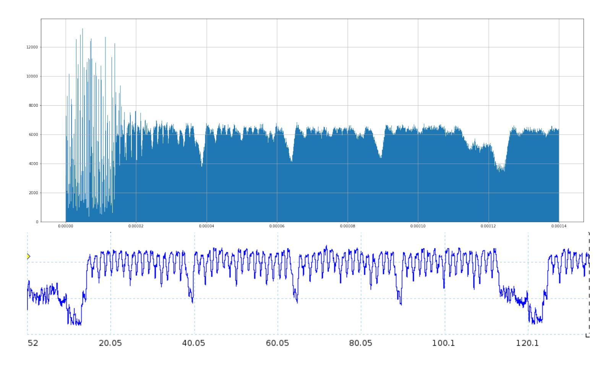
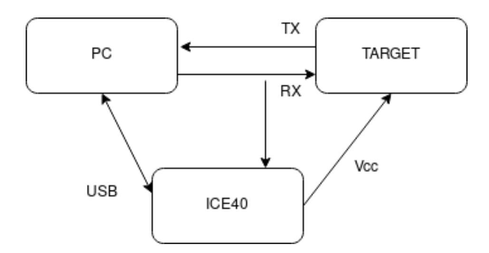
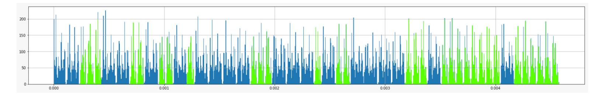
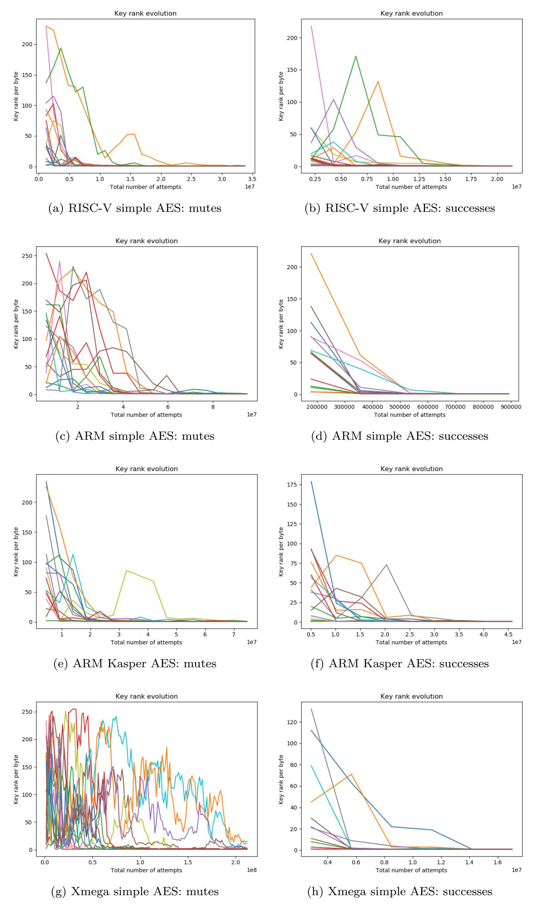
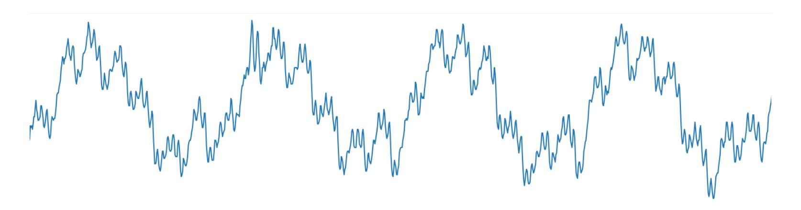
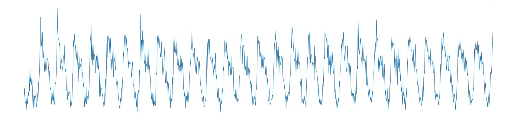
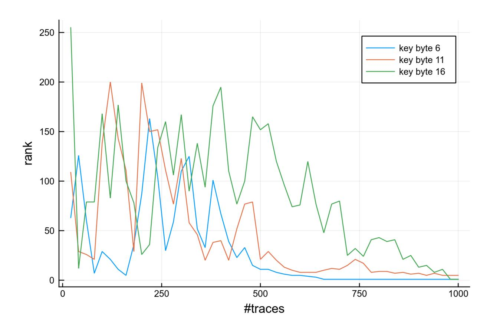
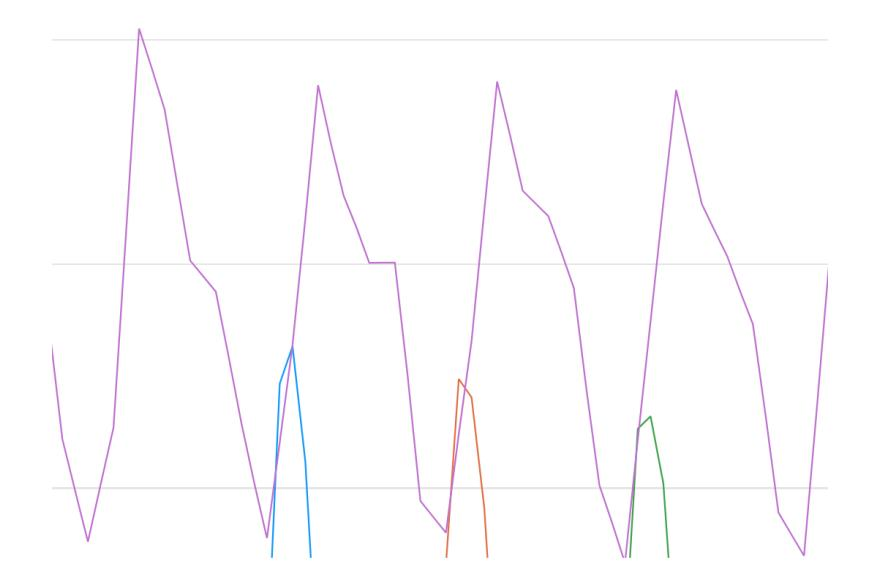

{0}------------------------------------------------

# **Fault Injection as an Oscilloscope: Fault Correlation Analysis**

Albert Spruyt<sup>1</sup> , Alyssa Milburn<sup>2</sup> and Łukasz Chmielewski<sup>3</sup>

```
1
             albert.spruyt@gmail.com
2 Vrije Universiteit Amsterdam (a.a.milburn@vu.nl)
3 Radboud University, Nijmegen (lukaszc@cs.ru.nl)
```

**Abstract.** Fault Injection (FI) attacks have become a practical threat to modern cryptographic implementations. Such attacks have recently focused more on exploitation of implementation-centric and device-specific properties of the faults. In this paper, we consider the parallel between SCA attacks and FI attacks; specifically, that many FI attacks rely on the data-dependency of activation and propagation of a fault, and SCA attacks similarly rely on data-dependent power usage. In fact, these are so closely related that we show that existing SCA attacks can be directly applied in a purely FI setting, by translating power FI results to generate FI 'probability traces' as an analogue of power traces. We impose only the requirements of the equivalent SCA attack (e.g., knowledge of the input plaintext for CPA on the first round), along with a way to observe the status of the target (whether or not it has failed and been "muted" after a fault). We also analyse existing attacks such as Fault Template Analysis in the light of this parallel, and discuss the limitations of our methodology. To demonstrate that our attacks are practical, we first show that SPA can be used to recover RSA private exponents using FI attacks. Subsequently, we show the generic nature of our attacks by performing DPA on AES after applying FI attacks to several different targets (with AVR, 32-bit ARM and RISC-V CPUs), using different software on each target, and do so with a low-cost (i.e., less than \$50) power fault injection setup. We call this technique Fault Correlation Analysis (FCA), since we perform CPA on fault probability traces. To show that this technique is not limited to software, we also present FCA results against the hardware AES engine supported by one of our targets. Our results show that even without access to the ciphertext (e.g., where an FI redundancy countermeasure is in place, or where ciphertext is simply not exposed to an attacker in any circumstance) and in the presence of jitter, FCA attacks can successfully recover keys on each of these targets.

**Keywords:** Fault Injection · Fault Propagation · Correlation Power Analysis · Side-Channel Analysis

## **1 Introduction**

The physical security of efficient cryptographic implementations – in particular, protection against side-channel analysis and fault injection attacks – has become more challenging than merely preventing attacks on the security of the algorithms themselves. Many modern embedded devices are equipped with cryptographic hardware cores, and the nature of such devices means that they are physically accessible to the adversary. This means that low-cost practical physical attacks on such targets are becoming increasingly relevant. Such attacks have become a real concern for some parties due to the dramatic increase in the usage of embedded devices for mobile applications, IoT, and home entertainment.[1](#page-0-0)

<span id="page-0-0"></span><sup>1</sup>For example, a physical attacker could perform money transfers after obtaining keys from a mobile payment application.

{1}------------------------------------------------

Side-Channel Attacks (SCA) [\[Koc96,](#page-20-0) [KJJ99,](#page-20-1) [CRR03\]](#page-18-0) and Fault Attacks (FA) [\[BS97\]](#page-18-1) are the most widely explored classes of such physical attacks. SCA involves the passive exploitation of the relationship between leakage – such as power usage or electromagnetic (EM) signals – and the operations (Simple Power Analysis, or SPA) or data (Differential Power Analysis, or DPA) [\[KJJ99\]](#page-20-1) performed on a device, typically to recover a private key being used in a computation. Brier et al. [\[BCO04\]](#page-18-2) introduced an improved DPA-like method called Correlation Power Analysis (CPA), which continues to be a serious threat to the confidentiality of cryptographic keys in modern devices. Another important SCA technique is the use of Template Attacks [\[CRR03\]](#page-18-0) (TA), which enhance attacks such as SPA and CPA with the use of statistical modeling. This is performed in two stages: first profiling, and then matching. An attacker uses a device under their control to create a 'profile' of a sensitive device, a process which may take a substantial amount of time/effort. They can then 'match' this profile to measurements taken from a victim's device, to quickly perform cryptographic attacks with minimal effort. We refer to such attacks as profiled, to distinguish them from non-profiled attacks such as standard SPA/CPA.

The other major class of physical attacks – fault attacks – are active in nature. An attacker injects faults – which we will refer to as Fault Injection (FI) – in an attempt to actively influence or control the state of the target device. For example, when applied to cryptographic computations, an attacker may want to corrupt intermediate state which involves the secret key. If faults can be injected which cause bias in such intermediate state, it may be possible to use either analysis of the algorithm or statistical analysis to reduce the entropy of this key [\[BS97\]](#page-18-1). One standard fault attack is called Differential Fault Analysis (DFA) [\[BDL97\]](#page-18-3), which allows recovery of private keys by analyzing errors induced in the last rounds of a block cipher, such as AES [\[Gir05,](#page-19-0) [AMT13\]](#page-18-4).

Developers of modern embedded devices often implement countermeasures to protect the secret keys used in sensitive cryptographic computations, especially in the context of devices which are physically accessible to adversaries. In the context of FI, detection-type countermeasures are the most common ones, which use some kind of redundancy (e.g., in time or space) to detect faults, and then react by suppressing or randomizing the output [\[KKT05,](#page-20-2) [GMJK14\]](#page-19-1). One alternative is to perform the computation in a way which results in random output in the event of an error, rather than explicitly detecting faults; this is known as an infective countermeasure [\[TBM14\]](#page-22-0).

Research has shown that there is a relationship between SCA and some FI attacks. Fault Sensitivity Analysis (FSA) [\[LSG](#page-20-3)<sup>+</sup>10, [MMP](#page-21-0)<sup>+</sup>11] proposes varying the intensity of applied faults to detect the threshold at which an observable error occurs. Specifically, FSA focuses on clock glitching, reducing the clock period until a successful setup-time violation occurs. The authors propose that the obtained fault sensitivity (FS) at that point provides information about the critical path delay (CPD), and that since the CPD is data-sensitive, it reveals information about the data being processed at the time of the glitch. Although FSA is an active FI-based attack, in many ways it is closer to passive side-channel attacks such as power analysis, rather than existing fault attacks such as DFA. For example, the leakage model used in FSA depends on the specific implementation of cryptographic components such as the S-box in AES; this is similar to the way SCA attacks depend on such implementation-specific leakage modelling, as opposed to attacks such as DFA which attack the underlying algorithm.

More recent research [\[LED](#page-20-4)<sup>+</sup>13, [GAS14\]](#page-19-2) explores the relationship between fault sensitivity (FS) and power consumption. Based on FPGA experiments, the paper [\[LED](#page-20-4)<sup>+</sup>13] confirms a high correlation between the power consumption and the FS, and even presents a successful key recovery using the FS profile as the leakage model for power consumption.

{2}------------------------------------------------

### **1.1 Contributions**

In this paper, we further investigate this relationship. We argue that existing attacks based on classic side-channels (such as SPA or CPA) are directly applicable to fault injection attacks, by using the observed distribution of successful faults at a certain time as a proxy of the power usage of the target at that time. Such attacks can be performed without access to ciphertext, and even without knowledge about whether or not encryption was successful. Specifically, we present a method for turning Fault Injection results into 'probability traces', based on the ratio of observed faults from an FI attack.

We demonstrate that standard side channel attacks can be directly applied to the resulting traces, using real-world targets rather than simulations. As a basic example, we show that SPA can be performed on results of an FI attack against a software implementation of RSA running on real hardware. We refer to this technique as Simple Fault Analysis. Subsequently, to demonstrate the strength of our attacks, we present Fault Correlation Analysis, which uses a standard CPA attack to successfully recover keys from several different targets running different software implementations of AES. We show that our approach can also use other distinguishers, such as non-profiled Linear Regression Analysis (LRA) [\[LPR13\]](#page-20-5), or even 'model-less' attacks such as 'correlation enhanced collision attacks' [\[MME10\]](#page-20-6).

We show that FI probability traces can be generated even with restricted feedback from the target, focusing on two different classification methods: one based on successes, which requires the ability to observe whether a cryptographic operation was successful, and another based on "mutes", which requires only the ability to observe whether or not the device has failed and no longer responds. We successfully recover private keys on the majority of our targets using both of these categorizations.

We illustrate that by using voltage FI, we can perform our experiments with inexpensive equipment; our experiments use a low-end FPGA as a glitching device, at a cost of less than \$50. Our attacks do not need spatial accuracy, nor knowledge of the specific implementation of the target. Furthermore, we do not require control of the clock input, which allows us to leave PLLs enabled on the targets used in our experiments; we run our targets at standard clock speeds. By collecting raw results during the FI campaign and only performing post-processing when creating traces (by 'bucketing' the results), we allow the FI attacks to be performed entirely blind and in a completely unsupervised fashion. We do not need foreknowledge of the key or even details such as the target's clock speed, nor do we require access to power traces.

Finally, we show that FCA can be used to recover key bytes from the hardware AES engine on one of our targets, despite our use of FI attack parameters aimed to cause glitches in specific software instructions. We argue that the exposed leakage is present only when those instructions are executed, implying the hardware engine leakage is encoded in our software FI results.

#### **1.2 Related Work**

There are many existing FI attacks on cryptographic algorithms that require access to the output ciphertexts. As discussed, DFA [\[BDL97,](#page-18-3) [Gir05\]](#page-19-0) is the most famous of such attacks, combining observations of observed output errors along with knowledge of the cause of the error. Over the more than 20 years since the development of DFA, it has been applied to various cryptographic primitives using many different types of FI.

When an attacker does not have access to (faulty) output ciphertext, either due to countermeasures or due to the protocol design, such attacks can no longer be performed. The information available to an attacker is then reduced to observing whether or not ciphertext is returned, allowing them to determine only whether a fault was detected.

Some recent attacks, such as Fault Sensitivity Analysis (FSA), still work in this setting.

{3}------------------------------------------------

As discussed, FSA increases the 'fault intensity' (for example, shortening the length of a clock glitch) until a difference is observed (e.g., incorrect output). An attacker can then make use of a fault model (e.g., HW of S-box input) to perform an attack without the need for faulty ciphertexts. An extension called collision FSA [\[MMP](#page-21-0)<sup>+</sup>11] uses the fault model combined with correlation enhanced collision side channel attacks. This combination removes the need to define a precise fault model and can break the masking countermeasure. However, both FSA and collision FSA require the attacker to be able to target the exact clock cycle used for the operation of interest, and rely on control of the target's clock to perform clock glitching.

Differential fault intensity analysis (DFIA) [\[GYTS14\]](#page-19-3) employs both fault intensity and faulty values as the observables for statistical analysis. It calculates changes in 'error values' of faulty ciphertexts, on the basis that a slight change in the intensity only results in a small change in the error under a correct key assumption. However, the DFIA attack can be defeated by detection-based FI countermeasures, since it requires access to ciphertext. Both FSA and DFIA techniques require that plaintext input can be repeatedly encrypted using different intensity values, which is a limitation for attacks on nonce-based ciphers.

Blind Fault Analysis (BFA) [\[GYTS14\]](#page-19-3) proposes an FI attack which does not require direct access to the ciphertext and even the plaintext. The secret key is found by recovering the hamming weight of the intermediate states of two sequential rounds, which is possible if the attacker can learn the number of different results of tampered encryptions performed for the same unknown plaintext and that is only possible assuming a particular fault model. Namely, multiple bit-reset (or bit-set) needs to be possible. This attack is not effective against detection-based FI countermeasures, and the authors do not perform an experimental evaluation.

Statistical Ineffective Fault Analysis (SIFA) [\[DEK](#page-19-4)<sup>+</sup>18, [DMMP19\]](#page-19-5) changed the widely regarded belief that fault attacks require access to faulty ciphertexts. If encryption is successful after a fault has been injected, then the fault had no effect on the computation – it was an 'ineffective fault' – and so an attacker can conclude that the intermediate value must have remained unchanged (e.g., be zero). SIFA shows that if an adversary has the power to inject a sufficient number of precise faults, the ability to observe these ineffective faults (which result in correct ciphertexts) can be exploited for an attack. However, the described SIFA attack requires brute-forcing 32-bit key chunks, which involves significant effort. SIFA is an improvement and combination of two older attacks which rely on access to the output ciphertext: the Statistical Fault Attack [\[FJLT13\]](#page-19-6) and the Ineffective Fault Attack [\[Cla07\]](#page-18-5). In a slightly different setting, Persistent Fault Analysis (PFA) [\[ZLZ](#page-22-1)<sup>+</sup>18, [PZRB19\]](#page-21-1) also presents an attack which is similar to SIFA. The Safe-Error-Attack (SEA) [\[SJ00\]](#page-22-2) is similar to SFA, but attacking public key cryptography rather than a cipher using symmetric keys.

Dobraunig et al. [\[DEG](#page-19-7)<sup>+</sup>18] show that SIFA can also be used to defeat the masking countermeasure, using clock glitching to present a practical evaluation which requires only a single fault per execution. They also argue that the ability to inject precise, reliable faults is not required, a theme we further explore in our work.

Fault Intensity Map Analysis (FIMA) [\[RAD19b\]](#page-21-2) builds on and generalizes DFIA and biased-based techniques, such as SIFA. It combines the biased distribution of correct ciphertexts under a correct key hypothesis with the variation of data distribution with fault intensity to reduce the number of faults required to recover a secret key. FIMA with neural network key distinguisher (FIMA-NN) [\[RAD19b,](#page-21-2) [RAD19a\]](#page-21-3) builds upon this, using a neural network to rank key candidates. FIMA has similar disadvantages to SIFA: it requires the ciphertext, and requires guessing 32-bit chunks of the key.

Most recently, Saha et al. [\[SBR](#page-22-3)<sup>+</sup>20] introduced Fault Template Attacks (FTA), which also exploit the fact that the activation and propagation of a fault is data-dependent. These attacks can be applied even in the presence of countermeasures against FI and SCA; in particular, when masking is present. FTA is applicable even if the fault injection is made

{4}------------------------------------------------

at the middle rounds of a block cipher, and it also works in a known-plaintext scenario. Their attack is performed using electromagnetic FI (EM-FI), and a practical evaluation is performed only on PRESENT. It relies on both reproducible attacks at specific points (temporal accuracy) and the ability to inject faults at multiple fault locations (spatial accuracy). Their analysis of AES is performed on a simulation, presumably due to the relatively high complexity: a successful attack would require EM-FI to be performed using at least 15 different locations. Furthermore, it is a profiled approach, and portability of the resulting template from one device to another was not discussed.

We believe that FTA benefits from the localization effect similar to the localized SCA Template Attack. Essentially, both types of attacks collect signals corresponding to sensitive intermediate variables. After unmasked intermediates are recovered they can be combined to obtain the secret key. Therefore, we suggest that FTA corresponds to a localized EM SCA Template Attack, similarly to how our attacks (SFA and CFA) correspond to SPA and CPA.

Table [1](#page-4-0) presents a high-level comparison of many of these attacks, including our own.

<span id="page-4-0"></span>

| Table 1: Comparison of various Fault Injection Attacks. |                        |       |       |             |                                                                   |
|---------------------------------------------------------|------------------------|-------|-------|-------------|-------------------------------------------------------------------|
| Attacked                                                | Main Target            | Pro   | FI    | FI          | Comment                                                           |
| Algorithm                                               |                        | filed | det.∗ | Type        |                                                                   |
| DFA<br>[BDL97,                                          | Various                | No    | No    | Various     | Requires<br>ciphertext.<br>Last                                   |
| Gir05] + more                                           |                        |       |       |             | rounds attack.                                                    |
| SAE [SJ00]                                              | Sim.: RSA, ElGa        | No    | Yes   | N/A         | Requires ciphertext correctness                                   |
|                                                         | mal                    |       |       |             | info. Any round attack. Can                                       |
|                                                         |                        |       |       |             | attack symmetric.                                                 |
| [LSG+10,<br>FSA                                         | Plain AES              | No    | Yes   | clock       | Requires ciphertext correctness                                   |
| LED+13,                                                 | (FPGA)                 |       |       | FI          | info. Last rounds.                                                |
| GAS14]                                                  |                        |       |       |             |                                                                   |
| Collision FSA<br>[MMP+11]                               | Masked AES<br>(FPGA)   | No?   | Yes   | clock<br>FI | Requires ciphertext correctness<br>info and timing info of the S  |
|                                                         |                        |       |       |             | Boxes (SCA). Last rounds.                                         |
| DFIA [GYTS14,                                           | Plain AES              | No    | No    | clock       | Requires<br>Ciphertext.<br>Last                                   |
| GYS15]                                                  | (FPGA), sim.:          |       |       | FI          | rounds.                                                           |
|                                                         | PRESENT, LED           |       |       |             |                                                                   |
| BFA [GYTS14]                                            | Sim.:<br>SPNs,<br>inc. | No    | No    | N/A         | Requires ciphertext correctness                                   |
|                                                         | AES                    |       |       |             | info. Any round attack.                                           |
| SIFA [GYTS14,                                           | AES†<br>protected<br>, | No    | Yes   | clock       | Requires ciphertext, and guess                                    |
| DEG+18,                                                 | Keyak and Ketje        |       |       | FI          | ing 32-bits of the last round key.                                |
| DMMP19]                                                 | (FPGA),<br>masked      |       |       |             | Last rounds.                                                      |
|                                                         | AES, HW AES en         |       |       |             |                                                                   |
|                                                         | gine (ATXmega)         |       |       |             |                                                                   |
| [ZLZ+18,<br>PFA                                         | DMR AES                | No    | Yes   | clock       | Requires<br>ciphertext.<br>Last                                   |
| PZRB19]                                                 | (FPGA, cache),         |       |       | FI          | rounds.                                                           |
|                                                         | sim.: masked AES       |       |       |             |                                                                   |
| FIMA,<br>FIMA<br>NN<br>[RAD19b,                         | sim.: ASCON,<br>AES    | No    | Yes   | N/A         | Like SIFA, so it has the poten<br>tial to break masking, but also |
| RAD19a]                                                 |                        |       |       |             | guesses 32-bits of the key.                                       |
| FTA [GYTS14]                                            | PRESENT,<br>sim.:      | Yes   | Yes   | EM          | Requires ciphertext correctness                                   |
|                                                         | AES                    |       |       | FI          | information.                                                      |
| Attacks<br>from                                         | Plain<br>AES<br>and    | No    | Yes   | voltage     | No ciphertext needed, mute de                                     |
| this work (part.:                                       | RSA<br>(SW),<br>HW     |       |       | FI          | tection is sufficient. Collision                                  |
| SFA and FCA)                                            | AES<br>engine          |       |       |             | FCA might work against mask                                       |
|                                                         |                        |       |       |             |                                                                   |

(ATXmega)

ing but it is not confirmed.

<sup>∗</sup> 'FI det.' denotes the detection type of FI countermeasure;

<sup>†</sup> denotes AES protected with the infective coutnermeasure [\[TBM14\]](#page-22-0).

{5}------------------------------------------------

### **1.3 Structure of the paper**

Section [2](#page-5-0) introduces some background material and concepts required to understand the fault injection technique described in this paper. Subsequently, we describe our attack method in detail in Section [3.](#page-7-0) Section [4](#page-8-0) describes the details of our experimental setup. In Section [5,](#page-11-0) we support our claims by presenting and evaluating results from practical experiments. Finally, we provide a discussion of some strengths and weaknesses of our approach in Section [6,](#page-17-0) together with some potential future directions.

### <span id="page-5-0"></span>**2 Prerequisites**

Our proposed attacks have several prerequisites, which we will discuss in this section:

First, an attacker must be able to inject faults into the target – they must be able to perform Fault Injection. In this paper, we only consider voltage FI; we briefly discuss alternatives below.

Second, these faults must be injected at a time relative to a known event (a "trigger"). A certain amount of jitter can be tolerated, generally at the cost of requiring more attempts. However, an attacker does not require knowledge of precisely which operations are performed at which point in time.

Finally, we need a way to classify the outcome of a FI attempt – we must be able to distinguish attempts which do not cause changes in behaviour from those that do.

Since we build on SCA attacks, specific SCA attacks may impose additional requirements. For instance, they may require access to input or output of the cryptographic operation (plaintext or ciphertext), or they may require chosen input.

### **2.1 Fault Injection**

Fault Injection, sometimes referred to as glitching, is the act of introducing glitches in the operating environment of a target with the intent to introduce faults. These glitches can be introduced by various means, such as by controlling the voltage supply of a target, with electromagnetic pulses (EM-FI), controlling the clock of the target, or using a laser.

For effective and repeatable attacks, the attacker requires control over not just the glitch, but also over which operation is attacked. Precisely targeting an operation requires the target and the attacking device to be synchronised, so that the attacker knows when to inject the glitch into the target. This synchronization is achieved by "triggering" the glitching device (much like an oscilloscope) at a specific point in time; the actual glitch injection is typically performed after a further delay, injecting the glitch at a specific time after the trigger.

During experiments, this trigger can be implemented by using an I/O pin on the target, which software running on the target sets high before starting the operation of interest. This allows synchronisation to be achieved up to the resolution of the update speed of the I/O pin logic on the target. Such convenient situations may, however, be impossible to achieve in a real-world environment. One alternative is instead to trigger based on other attacker-observable behavior, such as communication protocols or power traces; some of our experiments trigger on the serial communication with the device. In both cases timing is not entirely predictable; in our attacks, we consider this as a a source of measurement noise.

#### **2.2 Countermeasures**

Many countermeasures have been proposed to protect cryptographic keys against FI attacks. One of the most common classes is detection-type countermeasures, which detect a fault via some redundant computation (time, space, or information redundancy), and then react by either muting or randomizing the output [\[KKT05,](#page-20-2) [GMJK14,](#page-19-1) [KJA](#page-20-7)<sup>+</sup>18, [PCMC16\]](#page-21-4). 

{6}------------------------------------------------

Another related class is infective countermeasures [\[TBM14,](#page-22-0) [PCM15\]](#page-21-5), which avoid the need for explicit detection redundancy by performing the cryptographic computation in such a a way that the output becomes deliberately randomized when errors occur.

Other countermeasures can be useful for mitigating both SCA and FI attacks, such as random delays [\[CCD00,](#page-18-6) [TB07\]](#page-22-4). Some countermeasures intended for SCA can also mitigate FI attacks; examples include shuffling the execution order of independent operations [\[HOM06,](#page-19-9) [RPD09\]](#page-21-6), and masking [\[Mes01,](#page-20-8) [ISW03,](#page-20-9) [NRR06\]](#page-21-7).

#### **2.3 Fault Detection**

We propose that the probability of a fault is dependent on the data being processed by a device, as argued by previous work [\[LSG](#page-20-3)<sup>+</sup>10], as well as the operation being performed. This difference in fault behaviour is what we exploit in this paper. Specifically, we hypothesize that the probability of a fault is correlated with the power consumed by the specific operations and data being processed. When considering software implementations, the classic side-channel leakage model is that this is thus correlated with the hamming weight of the data being processed.

We want to categorize the results of injected glitches based on whether or not the injected glitch caused a fault in the target. However, an attacker cannot directly observe whether or not a fault has occurred; to estimate the probability that a fault has occurred, we must rely on the observable results.

Specifically, an attacker must be able to guess whether or not a fault has occurred based on the the observed behavior of a device. For this purpose, we group this observed behavior into three basic categories. If a device fails to respond, we categorize the result of the glitch as a a "mute"; essentially, we assume the device or implementation has failed. If a device returns with an incorrect response, we categorize the result as a "corruption". Otherwise, we consider the device to have been unaffected by the glitch. In practice, there are more complex cases (such as reboots, and other unexpected responses); we defer discussion of those details to later in our paper.

As a concrete example of such behavior, consider an attacker performing FI on software AES running on a microcontroller. If the microcontroller no longer responds after the glitch, we consider that a mute. If corrupted output is returned, we consider it a corruption. Otherwise, nothing special has happened, and we assume it was uninfluenced by the glitch.

An attacker's ability to clearly distinguish these categories depends on the specifics of the implementation of the target implementation. To accommodate this, we will use two different probability groupings in the remainder of our paper: success-probability and mute-probability.

In the **success**-probability case, we consider the probability of successful operation. This means that glitches resulting in either a corruption or a mute are classified as faults. Note that an attacker does not need to be able to distinguish between these cases, which means this categorization can be used with targets using redundancy countermeasures.

In the **mute**-probability case, we consider only the probability of mutes. This can be useful where an attacker is unable to distinguish corruptions from successful operations.

Note that neither of these cases requires access to the (corrupted) ciphertext. In situations where the same plaintext input can be repeatedly encrypted, access to the ciphertext provides us with additional information, which allows either model to be chosen. These two categorizations are practical and apply as-is to a range of targets, with no need for specific knowledge of how an algorithm is implemented. We discuss how they are distinguished in practice in Section [4.7.](#page-11-1) For our experiments, we found that our parameter selection excluded potentially-ambiguous behaviors (in particular, reboots) this also allows us to rule out brownout detectors as the source of the leakage; see Section [4.6.](#page-10-0)

{7}------------------------------------------------

# <span id="page-7-0"></span>**3 Constructing traces from faults**

The intuitive description of our attack is simple; we turn observed faults from fault injection attempts into a probability for a fault at a given point in time, and by repeating this at different points in time, into 'probability traces'. We can see the practicality of this approach by comparing traces taken from a hardware target (a RISC-V CPU) running the first round of AES. Figure [1](#page-7-1) shows fault injection results presented using a bar chart, while Figure [2](#page-7-2) shows the actual power usage during the same period, as measured by an oscilloscope.



<span id="page-7-1"></span>Figure 1: Barchart of the mutes in first round of RISC-V AES.

<span id="page-7-2"></span>Figure 2: Oscilloscope power measurement of RISC-V AES.

It is clear that the same distinctive pattern of power usage is visible in both traces. As we will show in Section [5.1,](#page-11-2) we can see that Simple Power Analysis attacks can be performed based solely on these FI results.

We hypothesize that other attacks from the side channel world, such as Correlation Power Analysis, Linear Regression Analysis and Power Collision Attacks [\[MME10\]](#page-20-6), could also be used on the traces. In this work we show that this is indeed possible when attacking software running on a variety of hardware targets, focusing on performing CPA on such traces.

#### **3.1 Data collection**

We have, in effect, transformed a voltage fault injection device into a 1-bit sampling oscilloscope. Obtaining full power traces imposes the same restrictions as when using an actual low-resolution sampling oscilloscope; we must be able to repeat the same computation multiple times. Specifically, for each identical computation (e.g., encryption of a specific plaintext with the same key), we must apply multiple faults at the same point in time, and then repeat that for different points in time.

In a real-world attack, the input data may not be fully controlled or repeatable. In such circumstances, the partitioning method could be applied [\[LPR13\]](#page-20-5), creating traces corresponding to specific input bytes rather than specific inputs.

{8}------------------------------------------------

No matter the method used to group input, by repeatedly applying faults at the same point in time relative to an operation and observing the ratio of their results, we obtain an estimate for the probability of a fault occurring at that point in the computation. We then perform this process at different points in time; the specific points (and the number of points) where data must be collected depends on the desired resolution and length of the probability trace. Similarly, the number of faults needed at a specific point depends on the desired precision of the fault probability.

We discuss the challenges of selecting appropriate parameters in Section [4.6.](#page-10-0)

#### **3.2 Trace construction**

Once we have obtained the fault injection results discussed in the previous section, the next step is to convert them into traces. For each input (whether partitioned or not), our results consist of a set of fault probabilities, one at each point in time. A naive conversion can be performed by simply converting each point in time to a single point on a trace.

Our FI attacks are designed to produce noisy results, and the resulting data is sparse on the time domain, since we do not attack specific known points in time, but distribute our attempts across a relatively large time period. We perform two post-processing steps to improve these results, after which they can be directly used as if they were standard power traces.

The first step involves 'bucketing' the results, which can be seen as analogous to oversampling when collecting actual power traces. We divide the attack period into 'buckets' of equal duration, and calculate the combined fault probability using all attempts which were performed during the time period corresponding to each bucket. The number of buckets defines the length of the resulting trace, much like the choice of sample rate when using an oscilloscope. Increasing the number of buckets reduces the number of faults which are placed in each bucket, which means that more faults are needed in total to achieve the same resolution.

The second step performs a simple low-pass transformation to remove aliasing due to leakage being spread across two adjacent buckets. In our experiments, we achieve this by inserting an additional sample between the samples from every pair of buckets, representing the combined probability for both buckets.

Since these post-processing steps are applied after the FI results have been collected, they can be repeated to create improved traces without the need to repeat the experiment. Typically, we choose an arbitrary bucket size to generate an initial set of traces, and then adjust these post-processing parameters to improve correlation before performing an attack.

# <span id="page-8-0"></span>**4 Practical Implementation**

To applying the attack we have described in practice, we will use a voltage fault injection device attacking some hardware targets running varied software. In this section, we first describe such a device and other details of our experimental setup, and then describe details of the target hardware and software we will use to produce the results in Section [5.](#page-11-0)

#### **4.1 Device**

To inject glitches we use a custom built, inexpensive glitching device built around a cheap low-cost FPGA. We have made the design and related source (including FPGA bitstream and scripts) publicly available, but we have removed details from this anonymised version of the paper. The total cost of our setup (including FPGA, components, and all targets) is less than \$50.

{9}------------------------------------------------

<span id="page-9-0"></span>

Figure 3: Schematic of the setup

The device generates a glitch of arbitrary length at a given delay after a trigger input, by using an analog switch to change the output voltage connected to the target. For the purposes of this paper, the device offers four parameters; the length of the glitch (with a resolution of less than 1ns), the delay between the trigger and the glitch (with a resolution of about 5ns), and the baseline and glitch voltage (both 9-bit values with a range between 0 and 3.3V).

#### **4.2 Experiment layout**

Figure [3](#page-9-0) shows a schematic of a setup. The voltage supply to the target's microcontroller is provided by the glitching device. The target's UART is connected to a PC via USB to serial adapter. The trigger input to the glitching device is either an MCU GPIO pin or a MCU Rx line, the schematic shows the MCU Rx line scenario.

#### **4.3 Target programs**

The target MCUs run a program which receives commands over UART. For example, one command receives input which is then encrypted with AES, and then the output is returned. Receiving the output is not strictly necessary for the attack. However, collecting this data allows us to test different fault models.

The program sends a boot message after the device has been reset. This allows classifying glitches which cause resets and those that cause the target to mute or become unresponsive.

#### **4.4 Fault synchronization**

Our experiments use two methods to synchronize the target with our glitching device. The first trigger method requires the target to pull a GPIO pin high when starting the calculation (e.g., AES encryption). However, this is unrealistic in many settings; we also evaluate a second method, where we trigger using the last byte of serial input. Synchronizing on serial line in this way results in more jitter; note that contrary to SCA, this cannot be resolved in post-processing, since alignment is not possible.

#### **4.5 Targets**

We used three different hardware targets in our experiments; details can be seen in Table [2.](#page-10-1) We attempted to choose widely-available platforms to allow our work to be easily reproduced. The ARM Cortex-M3 target is an unmodified STM32 board typically sold as the "Black Pill". The RISC-V target is a Sipeed Longan Nano board. The Xmega target is a small custom PCB containing only a Xmega32a4u chip, pins to expose I/O and power, 

{10}------------------------------------------------

<span id="page-10-1"></span>and the programming interface; we use the internal oscillator rather than an external crystal. We removed decoupling capacitors from the targets to increase their susceptibility to voltage FI. No special power cuts were created; power was supplied using pre-existing power pins on all targets.

Table 2: Overview of target hardware.

| Architecture    | Microcontroller    | Clock speed |
|-----------------|--------------------|-------------|
| ARM Cortex-M3   | STM32F103C8T6[stm] | 72MHz       |
| RISC-V RV32IMAC | gd32vf103cb[gd3]   | 108MHz      |
| AVR8            | Xmega32a4u[xme]    | 32MHz       |

Details of the software we ran on these targets is provided in Table [3.](#page-10-2) On the RISC-V platform and the Cortex-M3, we run a simple implementation of AES written in C. On the Cortex-M3, we also evaluate an optimized implementation of AES written in assembly. [\[SS16\]](#page-22-7) Finally, on the Xmega AVR platform, we use the AES/RSA code provided by AVR-Crypto-Lib.

Table 3: Hardware/software configurations for experiments.

<span id="page-10-2"></span>

| Hardware        | Software               | Triggering method |
|-----------------|------------------------|-------------------|
| ARM Cortex-M3   | Simple AES[sim]        | UART(Rx) trigger  |
| ARM Cortex-M3   | Schwabe AES[SS16]      | UART (Rx) trigger |
| RISC-V RV32IMAC | Simple AES[sim]        | GPIO trigger      |
| AVR8            | avr-cryptoLib AES[avr] | GPIO trigger      |
| AVR8            | avr-cryptoLib RSA[avr] | GPIO trigger      |

#### <span id="page-10-0"></span>**4.6 Parameter selection procedure**

Before we can perform our attack, we need to identify two things: the time window in which to attack (corresponding to the delay between the trigger and the fault injection), and the parameters to use when injecting the fault.

Previous attacks have used a power trace collected using an oscilloscope to identify the relevant time window. For example, if the goal is to attack the first round of AES, this window would be the period between a trigger event and the second round of AES. Our attack instead uses a probability trace generated using FI, such as the one in Figure [1,](#page-7-1) which also allows us to identify the relevant window.

Once we have identified a window of interest, we perform a characterization step, injecting a large number of faults across the window using a broad range of parameters. Typically, we choose a voltage range from 0V up to the normal operating voltage of the target, and a glitch length ranging from 10ns up to hundreds of nanoseconds. This gives us an overview of the target's behaviour when subjected to FI. We then narrow down the parameters until we have an approximate mix of 50% mutes and 50% non-mutes [\[MMP](#page-21-0)<sup>+</sup>11], and have excluded regions of the parameter space which always produce the same result and thus have no variance. We also exclude regions which result in significant numbers of resets of the target, avoiding any potential interactions with brownout detection.

If the parameters are narrowed down too far, effects similar to clipping or attenuation occur. The probability of fault is dependent on the operation performed, not just the data. This dependency on the operation or time can again be seen in Figure [1.](#page-7-1) Since our FI campaigns can take a significant amount of time to complete, and we do not perform them in a controlled environment, we must also ensure that any temperature variations will not cause such clipping artifacts.

{11}------------------------------------------------

<span id="page-11-3"></span>

| Target            | Delay (s)         | Glitch voltage (V) | Length (ns) |
|-------------------|-------------------|--------------------|-------------|
| ARM Simple AES    | 0.001 - 10e-05    | 1.5-2.35           | 170-180     |
| ARM Schwabe AES   | 7.1e-05 - 8.1e-05 | 1.5-2.3            | 18-200      |
| RISC-V Simple AES | 0.0001 - 10e-05   | 1.4-2.1            | 50-100      |
| AVR8 AES          | 1e-06 - 10e-06    | 1.83-2.02          | 550-700     |

Table 4: FI parameter ranges used in our evaluation.

For our evaluation, we chose a relatively wide range of parameters, with the exception of the ARM Simple AES target, where we limited the glitch length to a somewhat smaller window. When performing an actual attack, it would be possible to narrow these parameters much further. The specific parameters we used are shown in Table [4.](#page-11-3) We supply these numbers to provide the reader with a general idea of the ranges involved, but note that the delay (the time between the trigger and the glitch) depends on the trigger being used, and that the effect of glitches on the target can also depend heavily on the details of the glitching setup/hardware.

Once we have a suitable range of parameters, we can begin the actual FI campaign. When injecting faults, we randomly select parameters from these ranges using a uniform distribution. This reduces the biasing effect of, for instance, temperature or previous attempts.

### <span id="page-11-1"></span>**4.7 Classification of outputs**

As described in Section [2,](#page-5-0) the FI attempts need to be categorized. In our experiments, we extend the categorization to reflect the actual responses from our targets.

We receive these responses from our target and discern five classes of behaviour: success, mutes, reboots, corruptions, and other. If the target no longer responds, we classify the fault as a 'mute'; if the target reboots (returns boot messages), then we classify it as a 'reboot'. If the expected behavior occurs (for example, correct results of an encryption being returned, or a signature being acknowledged as valid), we classify it as 'normal'; if an unexpected response is received (such as a response which has more or fewer bytes than expected), we classify it as 'other'. Finally, since the response contains the ciphertext and we can repeat inputs, we can easily determine the correct ciphertext for any given input, which allows us to classify responses with incorrect ciphertext as 'corrupted'. In practice, since we know the keys used in our experiments, we can also simply use the key to determine the correct ciphertext.

We group the classes according to the desired model: for the success-probability model we group the correct AES outputs vs the rest. For the mute probability model we group the corrupted and normal outputs vs the rest. In this way we can compare the difference in model accuracy using the same datasets.

### <span id="page-11-0"></span>**5 Results**

#### <span id="page-11-2"></span>**5.1 Simple Fault Analysis on RSA**

To demonstrate the generic nature of our attack, we will first demonstrate a proof-of-concept attack which shows that Simple Power Analysis (SPA) can be applied to FI probability traces. We use the Xmega target from Table [2,](#page-10-1) and the RSA code from avr-crypto-lib. In our tested configuration, this uses Montgomery modular multiplication, without CRT. The relevant command decrypts a single fixed message with a (short) secret key, and then prints a message. Only the mute probability model is possible, since failed decryptions do not lead to different behavior.

{12}------------------------------------------------

<span id="page-12-0"></span>

Figure 4: Results from glitching RSA, with individual key bits color-coded according to the operation (and thus the value of the key bit).

We performed the attack over a period of 3 hours, covering 5ms of time after a GPIO trigger, which is pulled high immediately before the modular exponentiation begins. During this period of time, the first 52 bits of the key are used. The results can be seen in Figure [4.](#page-12-0) The different patterns of the square and multiply operations are clearly visible, allowing the key bits to be read directly from the figure.

### **5.2 Fault Correlation Analysis on AES**

We performed a long-running FI campaign on each of the targets from Table [3.](#page-10-2) For each attempt, we instructed the target to perform AES encryption, with input randomly selected from a set of 1000 plaintexts. During each attempt, we injected a glitch using (uniformly) randomly-selected parameters derived from our characterization results, as discussed above. We recorded the parameters, the observed input and the observed output in a database.

This experimental setup allowed us to explore different classification models, and their accuracy, based on the same data. By using our knowledge of the input, output and key, we can classify different behaviours accurately. We can then choose which classification model to apply by selecting different groupings of classes. In this way, we can generate traces corresponding to success-model and mute-model, using results from only a single FI campaign.

Attacking the FCA traces is performed with a standard Hamming Weight CPA attack [\[BCO04\]](#page-18-2). Specifically, we attack the S-box output during the first round, using JLsca's [\[jls\]](#page-20-10) implementation of CPA (AesSboxAttack).

Key rank evolution plots for all targets are shown in Figure [5.](#page-13-0) The X axis shows the number of attempts used, rather than the number of traces used as is customary when performing CPA. The total number of attempts includes both corruptions, no-effect and mute results. As we are primarily interested in the non-profiled case we also include attempts which are in time intervals which do not contribute to the attack.

<span id="page-12-1"></span>Table 5: Fault attempts needed for full key recovery, using either mutes or success, both with and without profiling.

| Target                  | success | prof success | mutes | prof mutes |
|-------------------------|---------|--------------|-------|------------|
| RISC-V Simple-AES       | 19M     | 2.6M         | 31M   | 7.5M       |
| AVR8 Avr-crypto-lib AES | 14M     | 800K         | N/A*  | N/A*       |
| ARM Schwabe AES         | 40M     | 2.3M         | 74M   | 4.6M       |
| ARM Simple-AES          | 0.714M  | 39K          | 95M   | 5.1M       |

<sup>\*</sup> only 14 key bytes were recovered during our experiment

{13}------------------------------------------------

<span id="page-13-0"></span>

Figure 5: Key rank evolution for the different targets

{14}------------------------------------------------

Table [5](#page-12-1) shows the number of attempts which are needed for full key recovery for the different targets. The results are presented for two models: being able to distinguish faulty outputs, and not being able to distinguish faulty outputs. Additionally, the table also contains the amount of faults which would be required for a repeat, profiled attack – specifically, if only the time intervals which contributed to key recovery were attacked. We believe that further profiling, together with optimization of the Fault injection parameters, would further reduce the required attempts.

As stated in Section [4.6](#page-10-0) we selected glitch parameters which would give a good distribution over the entire length of the trace. We believe tailoring the parameters per attacked interval could reduce the amount of noise at these points.

These results show that classifying faults based on success rather than mutes is a superior approach. However, using mutes is still a realistic option.

On targets where the mute model is extremely poor, it is still possible to recover keys with a sufficient number of attempts; in the case of the AVR8 we terminated our data collection before complete key recovery. However, convergence of the remaining key bytes can be seen in Figure [5.](#page-13-0)

These results also clearly show that, on a pure software target, our approach is able to overcome sources of noise such as misclassification and jitter, given sufficient attempts.

Finally, we also attempted to apply two non-CPA attacks to the same data. First, we used non-profiled Linear Regression Analysis (LRA) [\[LPR13\]](#page-20-5) using the implementation provided by JLsca. Using success-probability traces, we successfully recovered the full key for all our targets. Secondly, we wrote an implementation of a 'model-less' correlationenhanced collision attack [\[MME10\]](#page-20-6) in Python. When attacking the first two key bytes using the success-probability traces, we successfully recovered the correct key bytes on 2 of our targets (AVR8 and ARM simple-AES).

#### **5.3 Hardware AES**

The previous section has established that our attack is feasible on software implementations, where cryptographic operations run on the same processor that is responsible for the input and output of data. In this section, we show that the attack can still be applied even if a dedicated hardware engine performs the cryptographic operation, rather than software running on the processor.

#### **5.3.1 Attacking Xmega AES**

Our Xmega target contains a hardware AES engine, which has previously been shown to be vulnerable to a CPA attack by Kizhvatov [\[Kiz09\]](#page-20-11). We hypothesize that we can perform the attack in the same manner as before. However, the attack is complicated because the processor core is in the same power plane as the AES engine, but the processor needs to remain running during encryption so that it can eventually return the output.

As the paper describes, the leakage from this engine indicates that AES operations are performed on a single byte at a time, presumably to optimize the number of gates. The leakage consists of the hamming distance (HD) between pairs of intermediate states; to attack a key byte, we assume that we know the previous key byte, and then use CPA to recover the value of the next key byte. We first replicated this attack using power traces from an oscilloscope; a portion of such a trace is shown in Figure [6.](#page-15-0) We found that the first-round pre-sbox leakage is stronger after applying a ShiftRows permutation; the key byte numbers referred to below are *after* such a permutation has been applied.

We attempted to duplicate Kizhvatov's attack by applying FCA in the same way as our attacks on the software targets. Although the implementation of the CPA attack itself differs significantly from the software attacks described above – we attack the hamming distance between internal states, rather than the hamming weight of individual states – 

{15}------------------------------------------------

this only affects the actual SCA attack performed on the probability traces, and not the FI attack nor the generation of the traces.

#### **5.3.2 Results**

<span id="page-15-0"></span>

Figure 6: Oscilloscope power measurement during encryption with hardware AES engine.

<span id="page-15-1"></span>

Figure 7: Probability trace showing iterations of software polling loop.

We use the example code supplied by the chip vendor, which repeatedly checks the contents of a register to see if the engine has finished, in a loop which we will refer to as the "polling loop". During characterization, we selected FI parameters which resulted in early exits from this loop, which we determined by checking for all-zero output. This means that our attack parameters are optimized for faults in *software*, and not the hardware engine.

We performed 236 million fault injection attempts, for 1000 plaintext inputs, resulting in 236k attempts being used to generate each probability trace. At first glance, the resulting probability traces – an example for one input is shown in Figure [7](#page-15-1) – appear to reflect the power usage of the software polling loop, rather than the hardware AES engine. As expected, since we are optimizing our faults to attack the software, these probability traces differ significantly from the oscilloscope power traces.

However, the power usage of the hardware engine is also present in these traces, allowing us to apply our SCA attack using the success-probabilty model, and obtain key bytes. We successfully recover (rank 1) the 6th and 16th key bytes, and obtain a high rank for the 11th key byte (see Figure [8\)](#page-16-0), but fail to recover any of the other key bytes. Similarly, we saw HD correlation for only some input byte pairs: specifically, 4+5, 9+10 and 14+15. Again, we saw no significant correlation for other input byte pairs.

Upon inspection, we saw that our compiler produced a polling loop which takes 5 cycles for each iteration; it seems that only *one* of the instructions in our loop was susceptible to the FI parameters we were using, and the power usage of the hardware engine is only reflected in our trace when that instruction is executing. This can be seen in Figure [9,](#page-16-1) where a small section of the probability trace (showing iterations of the polling loop) is shown alongside the input byte correlation spikes.

{16}------------------------------------------------

<span id="page-16-0"></span>

<span id="page-16-1"></span>Figure 8: Key rank evolution for hardware AES engine FCA attack.



Figure 9: Hardware AES engine input byte pair correlation (4+5, 9+10, 14+15), with oversampled probability trace showing corresponding iterations of software polling loop.

#### **5.3.3 Discussion**

This proof-of-concept attack targeting early exits from the software polling loop demonstrates that FCA can be successfully applied to leakage from hardware engines. We have shown that the power usage of the hardware engine is encoded in the probability traces, despite the fact our underlying FI attack parameters are chosen to cause glitches in software instructions.

By analysing the corrupted outputs in more detail, using our knowledge of the key, we can distinguish a number of other cases. We see that there are a number of cases in which there appears to be corruption which could be explained by single byte faults before and after the first and second and even the third mix column. In total, this group represents approximately 2.5% of all results. The majority of corrupted outputs contain a large number of 0 bytes. We additionally see evidence of memory dumps.

Considering a wider range of behavior (such as the above) during the characterization stage, rather than only early exits, would allow more points within the polling loop to be attacked, and thus more key bytes to be recovered. Leakage of other intermediate values could also be used to attack any remaining key bytes.

{17}------------------------------------------------

### <span id="page-17-0"></span>**6 Discussion**

The nature of our attack requires a relatively large number of fault injection attempts; calculating a fault probability ratio for a given point in time necessarily requires multiple attempts, this must be repeated for multiple points in time. For attacks such as CPA where different inputs are required, this in turn must be entirely repeated for each input. As discussed in Section [4.6,](#page-10-0) our evaluation used a large range of parameters; further tuning of these parameters will reduce the number of attempts required in an actual attack. Despite this, we showed that a profiled attack against Simple AES running on the ARM Cortex-M3 target can recover the key with fewer than 50K attempts, despite the inherent jitter caused by triggering on the UART traffic.

Since our success probability classification does not require the attacker to observe the contents of the corrupted ciphertext, only the fact that a fault was successful in modifying the operation, countermeasures involving redundant checks are ineffective. To attack targets protected with an infective countermeasure, the input must be repeatable and the output must be available [\[DEK](#page-19-4)<sup>+</sup>18, [DMMP19\]](#page-19-5). Targets which are protected using random delays can also be attacked; however the number of required attempts will increase, which could render the attack infeasible. The intuition is that the probability traces will behave as power traces which are heavily averaged without any synchronization. The leakage will thus be spread over multiple samples and be combined with noise.

We do not expect masked implementations, which do not exhibit first order leakage, to be vulnerable to our attack. Again, the intuition is that the 'probability traces' behave similarly to power traces which have been averaged before a higher-order samplecombination operation has been performed. However, the probability of a fault may be dependent on both the processed intermediate and the mask at the same time, in which case squaring the samples could be effective. This would heavily depend on the method and shape of the injected glitch. Designing a second order FCA that would effectively work against masking would be interesting future work.

Our evaluation was performed using power fault injection, which can be performed with a low-cost setup without the need to disable PLLs. Previous related work, such as SIFA and FTA, have used other glitching techniques, namely clock glitching and EM-FI. Our Xmega hardware AES engine attack could be repeated using EM-FI with the probe above the crypto engine; a related attack was performed in FTA [\[SBR](#page-22-3)<sup>+</sup>20]. This way, the CPU usage should be minimally affected and the FI traces would reflect mainly the engine. Similarly, the SIFA paper [\[DEK](#page-19-4)<sup>+</sup>18] attacks the same hardware engine using ineffective faults and clock glitching. Although both of these attacks differ significantly from our approach, these papers show that both EM-FI and clock glitching can be effectively used against the same hardware, and it would be interesting future work to attempt to apply FCA using these other techniques.

Another potential future path of investigation involves using software-activated faults. In recent years, these have demonstrated against high-profile targets such as TrustZone (CLKSCREW [\[TSS17\]](#page-22-9), VoltJockey [\[QWLQ19\]](#page-21-8)) and Intel CPUs (V0LTpwn [\[KFG](#page-20-12)<sup>+</sup>20], Plundervolt [\[MOG](#page-21-9)<sup>+</sup>20]). Finally, we also believe our work could be extended to apply other existing power or EM SCA attacks against other ciphers.

### **7 Conclusion**

We have presented a general technique for performing FI attacks and classifying their results, resulting in 'probability traces' which allow us to apply existing side-channel attacks to the resulting probability traces. Specifically, we demonstrated that we can perform Simple Fault Analysis to obtain RSA key bits, by applying SPA to probability traces. Similarly, we demonstrated that we can perform Correlation Fault Analysis to

{18}------------------------------------------------

obtain private AES keys, by applying CPA to probability traces.

We investigated two different classification models, assigning probabilities based on the ratios of either mutes, or successes. Although the success model appears to be superior and results in considerably faster key convergence, we have also shown that the mute model can be applied in situations where information about the success of cryptographic operations is not available to an attacker.

We demonstrated successful attacks against cryptographic libraries running on three different hardware targets, focusing on CPA against AES, but including the LRA distinguisher, collision attacks and even SPA attacks on RSA. We also presented proof-of-concept results which recover key bytes from a real-world hardware engine, where leakage from intermediate states appears to be part of the power dependency when attacking software instructions running at the same moment in time.

These results show that the relationship between FI and SCA attacks is strong enough that we can successfully apply standard, unmodified SCA attacks to the results of FI campaigns on real-world hardware.

## **References**

- <span id="page-18-4"></span>[AMT13] Subidh Ali, Debdeep Mukhopadhyay, and Michael Tunstall. Differential fault analysis of AES: towards reaching its limits. *J. Cryptographic Engineering*, 3(2):73–97, 2013.
- <span id="page-18-7"></span>[avr] AVR Crypto lib. https://git.cryptolib.org/avr-crypto-lib.git. [Online; accessed 14-June-2020].
- <span id="page-18-2"></span>[BCO04] Eric Brier, Christophe Clavier, and Francis Olivier. Correlation power analysis with a leakage model. In Marc Joye and Jean-Jacques Quisquater, editors, *Cryptographic Hardware and Embedded Systems – CHES 2004*, volume 3156 of *LNCS*, pages 16–29. Springer, 2004.
- <span id="page-18-3"></span>[BDL97] Dan Boneh, Richard A. DeMillo, and Richard J. Lipton. On the importance of checking cryptographic protocols for faults. In Walter Fumy, editor, *Advances in Cryptology — EUROCRYPT '97*, pages 37–51, Berlin, Heidelberg, 1997. Springer Berlin Heidelberg.
- <span id="page-18-1"></span>[BS97] Eli Biham and Adi Shamir. Differential fault analysis of secret key cryptosystems. In *Proceedings of the 17th Annual International Cryptology Conference on Advances in Cryptology*, CRYPTO '97, page 513–525, Berlin, Heidelberg, 1997. Springer-Verlag.
- <span id="page-18-6"></span>[CCD00] Christophe Clavier, Jean-Sébastien Coron, and Nora Dabbous. Differential power analysis in the presence of hardware countermeasures. In Çetin K. Koç and Christof Paar, editors, *Cryptographic Hardware and Embedded Systems — CHES 2000*, pages 252–263, Berlin, Heidelberg, 2000. Springer Berlin Heidelberg.
- <span id="page-18-5"></span>[Cla07] Christophe Clavier. Secret external encodings do not prevent transient fault analysis. In Pascal Paillier and Ingrid Verbauwhede, editors, *Cryptographic Hardware and Embedded Systems - CHES 2007*, pages 181–194, Berlin, Heidelberg, 2007. Springer Berlin Heidelberg.
- <span id="page-18-0"></span>[CRR03] Suressh Chari, Josyula R. Rao, and Pankaj Rohatgi. Template attacks. In Burton S. Kaliski Jr., Çetin Kaya Koç, and Christof Paar, editors, *Cryptographic Hardware and Embedded Systems – CHES 2002*, volume 2523 of *LNCS*, pages 13–28. Springer, 2003.

{19}------------------------------------------------

- <span id="page-19-7"></span>[DEG<sup>+</sup>18] Christoph Dobraunig, Maria Eichlseder, Hannes Gross, Stefan Mangard, Florian Mendel, and Robert Primas. Statistical ineffective fault attacks on masked aes with fault countermeasures. In *Advances in Cryptology – ASIACRYPT 2018*, volume 11273 of *Lecture Notes in Computer Science*, pages 315–342. Springer, 2018.
- <span id="page-19-4"></span>[DEK<sup>+</sup>18] Christoph Dobraunig, Maria Eichlseder, Thomas Korak, Stefan Mangard, Florian Mendel, and Robert Primas. Sifa: Exploiting ineffective fault inductions on symmetric cryptography. *IACR Transactions on Cryptographic Hardware and Embedded Systems*, 2018(3):547–572, Aug. 2018.
- <span id="page-19-5"></span>[DMMP19] Christoph Erwin Dobraunig, Stefan Mangard, Florian Mendel, and Robert Primas. Fault attacks on nonce-based authenticated encryption: Application to keyak and ketje. In Carlos Cid and Michael J. Jacobson, editors, *Selected Areas in Cryptography – SAC 2018*, Lecture Notes in Computer Science, pages 257–277. Springer, 2019.
- <span id="page-19-6"></span>[FJLT13] Thomas Fuhr, Eliane Jaulmes, Victor Lomné, and Adrian Thillard. Fault attacks on aes with faulty ciphertexts only. In *Proceedings of the 2013 Workshop on Fault Diagnosis and Tolerance in Cryptography*, FDTC '13, page 108–118, USA, 2013. IEEE Computer Society.
- <span id="page-19-2"></span>[GAS14] Nahid Farhady Ghalaty, Aydin Aysu, and Patrick Schaumont. Analyzing and eliminating the causes of fault sensitivity analysis. In *Proceedings of the Conference on Design, Automation & Test in Europe*, DATE '14, Leuven, BEL, 2014. European Design and Automation Association.
- <span id="page-19-10"></span>[gd3] GD32VF103CBT6 Datasheet. https://www.gigadevice.com/datasheet/gd32vf103xxxxdatasheet/. [Online; accessed 14-June-2020].
- <span id="page-19-0"></span>[Gir05] Christophe Giraud. Dfa on aes. In Hans Dobbertin, Vincent Rijmen, and Aleksandra Sowa, editors, *Advanced Encryption Standard – AES*, pages 27–41, Berlin, Heidelberg, 2005. Springer Berlin Heidelberg.
- <span id="page-19-1"></span>[GMJK14] Xiaofei Guo, Debdeep Mukhopadhyay, Chenglu Jin, and Ramesh Karri. Security analysis of concurrent error detection against differential fault analysis. *Journal of Cryptographic Engineering*, 5:153–169, 2014.
- <span id="page-19-8"></span>[GYS15] Nahid Farhady Ghalaty, Bilgiday Yuce, and Patrick Schaumont. Differential fault intensity analysis on PRESENT and LED block ciphers. In Stefan Mangard and Axel Y. Poschmann, editors, *Constructive Side-Channel Analysis and Secure Design - 6th International Workshop, COSADE 2015, Berlin, Germany, April 13-14, 2015. Revised Selected Papers*, volume 9064 of *Lecture Notes in Computer Science*, pages 174–188. Springer, 2015.
- <span id="page-19-3"></span>[GYTS14] Nahid Farhady Ghalaty, Bilgiday Yuce, Mostafa Taha, and Patrick Schaumont. Differential fault intensity analysis. In *Proceedings of the 2014 Workshop on Fault Diagnosis and Tolerance in Cryptography*, FDTC '14, page 49–58, USA, 2014. IEEE Computer Society.
- <span id="page-19-9"></span>[HOM06] Christoph Herbst, Elisabeth Oswald, and Stefan Mangard. An aes smart card implementation resistant to power analysis attacks. In Jianying Zhou, Moti Yung, and Feng Bao, editors, *Applied Cryptography and Network Security*, pages 239–252, Berlin, Heidelberg, 2006. Springer Berlin Heidelberg.

{20}------------------------------------------------

- <span id="page-20-9"></span>[ISW03] Yuval Ishai, Amit Sahai, and David Wagner. Private circuits: Securing hardware against probing attacks. In Dan Boneh, editor, *Advances in Cryptology - CRYPTO 2003*, pages 463–481, Berlin, Heidelberg, 2003. Springer Berlin Heidelberg.
- <span id="page-20-10"></span>[jls] JLSCA. https://github.com/Riscure/Jlsca. [Online; accessed 14-June-2020].
- <span id="page-20-12"></span>[KFG<sup>+</sup>20] Zijo Kenjar, Tommaso Frassetto, David Gens, Michael Franz, and Ahmad-Reza Sadeghi. V0ltpwn: Attacking x86 processor integrity from software. In *29th* {*USENIX*} *Security Symposium (*{*USENIX*} *Security 20)*, 2020.
- <span id="page-20-11"></span>[Kiz09] Ilya Kizhvatov. Side channel analysis of avr xmega crypto engine. In *Proceedings of the 4th Workshop on Embedded Systems Security*, WESS '09, New York, NY, USA, 2009. Association for Computing Machinery.
- <span id="page-20-7"></span>[KJA<sup>+</sup>18] Mehran Mozaffari Kermani, Amir Jalali, Reza Azarderakhsh, Jiafeng Xie, and Kim-Kwang Raymond Choo. Reliable inversion in gf(28) with redundant arithmetic for secure error detection of cryptographic architectures. *IEEE Trans. on CAD of Integrated Circuits and Systems*, 37(3):696–704, 2018.
- <span id="page-20-1"></span>[KJJ99] Paul C. Kocher, Jushua Jaffe, and Benjamin Jun. Differential power analysis. In Michael Wiener, editor, *Advances in Cryptology – CRYPTO '99*, volume 1666 of *LNCS*, pages 388–397. Springer, 1999. [http://www.cryptography.](http://www.cryptography.com/public/pdf/DPA.pdf) [com/public/pdf/DPA.pdf](http://www.cryptography.com/public/pdf/DPA.pdf).
- <span id="page-20-2"></span>[KKT05] Konrad J. Kulikowski, Mark G. Karpovsky, and Er Taubin. Robust codes for fault attack resistant cryptographic hardware. In *in Fault Diagnosis and Tolerance in Cryptography, 2nd International Workshop*, pages 1–12, 2005.
- <span id="page-20-0"></span>[Koc96] Paul C. Kocher. Timing attacks on implementations of Diffie-Hellman, RSA, DSS, and other systems. In Neal Koblitz, editor, *Advances in Cryptology – CRYPTO'96*, volume 1109 of *LNCS*, pages 104–113. Springer, 1996. [http:](http://www.cryptography.com/public/pdf/TimingAttacks.pdf) [//www.cryptography.com/public/pdf/TimingAttacks.pdf](http://www.cryptography.com/public/pdf/TimingAttacks.pdf).
- <span id="page-20-4"></span>[LED<sup>+</sup>13] Yang Li, Sho Endo, Nicolas Debande, Naofumi Homma, Takafumi Aoki, Thanh-Ha Le, Jean-Luc Danger, Kazuo Ohta, and Kazuo Sakiyama. Exploring the relations between fault sensitivity and power consumption. In Emmanuel Prouff, editor, *Constructive Side-Channel Analysis and Secure Design*, pages 137–153, Berlin, Heidelberg, 2013. Springer Berlin Heidelberg.
- <span id="page-20-5"></span>[LPR13] Victor Lomné, Emmanuel Prouff, and Thomas Roche. Behind the scene of side channel attacks. In *International Conference on the Theory and Application of Cryptology and Information Security*, pages 506–525. Springer, 2013.
- <span id="page-20-3"></span>[LSG<sup>+</sup>10] Yang Li, Kazuo Sakiyama, Shigeto Gomisawa, Toshinori Fukunaga, Junko Takahashi, and Kazuo Ohta. Fault sensitivity analysis. In Stefan Mangard and François-Xavier Standaert, editors, *Cryptographic Hardware and Embedded Systems, CHES 2010*, pages 320–334, Berlin, Heidelberg, 2010. Springer Berlin Heidelberg.
- <span id="page-20-8"></span>[Mes01] Thomas S. Messerges. Securing the aes finalists against power analysis attacks. In Gerhard Goos, Juris Hartmanis, Jan van Leeuwen, and Bruce Schneier, editors, *Fast Software Encryption*, pages 150–164, Berlin, Heidelberg, 2001. Springer Berlin Heidelberg.
- <span id="page-20-6"></span>[MME10] Amir Moradi, Oliver Mischke, and Thomas Eisenbarth. Correlation-enhanced power analysis collision attack. In *International Workshop on Cryptographic Hardware and Embedded Systems*, pages 125–139. Springer, 2010.

{21}------------------------------------------------

- <span id="page-21-0"></span>[MMP<sup>+</sup>11] Amir Moradi, Oliver Mischke, Christof Paar, Yang Li, Kazuo Ohta, and Kazuo Sakiyama. On the power of fault sensitivity analysis and collision side-channel attacks in a combined setting. In Bart Preneel and Tsuyoshi Takagi, editors, *Cryptographic Hardware and Embedded Systems – CHES 2011*, pages 292–311, Berlin, Heidelberg, 2011. Springer Berlin Heidelberg.
- <span id="page-21-9"></span>[MOG<sup>+</sup>20] Kit Murdock, David Oswald, Flavio D Garcia, Jo Van Bulck, Daniel Gruss, and Frank Piessens. Plundervolt: Software-based fault injection attacks against intel sgx. In *2020 IEEE Symposium on Security and Privacy (SP)*, 2020.
- <span id="page-21-7"></span>[NRR06] Svetla Nikova, Christian Rechberger, and Vincent Rijmen. Threshold implementations against side-channel attacks and glitches. In Peng Ning, Sihan Qing, and Ninghui Li, editors, *Information and Communications Security*, pages 529–545, Berlin, Heidelberg, 2006. Springer Berlin Heidelberg.
- <span id="page-21-5"></span>[PCM15] Sikhar Patranabis, Abhishek Chakraborty, and Debdeep Mukhopadhyay. Fault tolerant infective countermeasure for aes. In *Proceedings of the 5th International Conference on Security, Privacy, and Applied Cryptography Engineering - Volume 9354*, SPACE 2015, page 190–209, Berlin, Heidelberg, 2015. Springer-Verlag.
- <span id="page-21-4"></span>[PCMC16] Sikhar Patranabis, Abhishek Chakraborty, Debdeep Mukhopadhyay, and Partha Chakrabarti. Fault space transformation: A generic approach to counter differential fault analysis and differential fault intensity analysis on aeslike block ciphers. *IEEE Transactions on Information Forensics and Security*, PP:1–1, 12 2016.
- <span id="page-21-1"></span>[PZRB19] Jingyu Pan, Fan Zhang, Kui Ren, and Shivam Bhasin. One fault is all it needs: Breaking higher-order masking with persistent fault analysis. In Jürgen Teich and Franco Fummi, editors, *Design, Automation & Test in Europe Conference & Exhibition, DATE 2019, Florence, Italy, March 25-29, 2019*, pages 1–6. IEEE, 2019.
- <span id="page-21-8"></span>[QWLQ19] Pengfei Qiu, Dongsheng Wang, Yongqiang Lyu, and Gang Qu. Voltjockey: Breaching trustzone by software-controlled voltage manipulation over multicore frequencies. In *Proceedings of the 2019 ACM SIGSAC Conference on Computer and Communications Security*, pages 195–209, 2019.
- <span id="page-21-3"></span>[RAD19a] Keyvan Ramezanpour, Paul Ampadu, and William Diehl. Fault intensity map analysis with neural network key distinguisher. In *Proceedings of the 3rd ACM Workshop on Attacks and Solutions in Hardware Security Workshop*, ASHES'19, page 33–42, New York, NY, USA, 2019. Association for Computing Machinery.
- <span id="page-21-2"></span>[RAD19b] Keyvan Ramezanpour, Paul Ampadu, and William Diehl. FIMA: fault intensity map analysis. In Ilia Polian and Marc Stöttinger, editors, *Constructive Side-Channel Analysis and Secure Design - 10th International Workshop, COSADE 2019, Darmstadt, Germany, April 3-5, 2019, Proceedings*, volume 11421 of *Lecture Notes in Computer Science*, pages 63–79. Springer, 2019.
- <span id="page-21-6"></span>[RPD09] Matthieu Rivain, Emmanuel Prouff, and Julien Doget. Higher-order masking and shuffling for software implementations of block ciphers. In Christophe Clavier and Kris Gaj, editors, *Cryptographic Hardware and Embedded Systems - CHES 2009*, pages 171–188, Berlin, Heidelberg, 2009. Springer Berlin Heidelberg.

{22}------------------------------------------------

- <span id="page-22-3"></span>[SBR<sup>+</sup>20] Sayandeep Saha, Arnab Bag, Debapriya Basu Roy, Sikhar Patranabis, and Debdeep Mukhopadhyay. Fault template attacks on block ciphers exploiting fault propagation. In Anne Canteaut and Yuval Ishai, editors, *Advances in Cryptology - EUROCRYPT 2020 - 39th Annual International Conference on the Theory and Applications of Cryptographic Techniques, Zagreb, Croatia, May 10-14, 2020, Proceedings, Part I*, volume 12105 of *Lecture Notes in Computer Science*, pages 612–643. Springer, 2020.
- <span id="page-22-8"></span>[sim] AES algorithm implementation in C. https://github.com/dhuertas/AES. [Online; accessed 14-June-2020].
- <span id="page-22-2"></span>[SJ00] Sung-Ming Yen and M. Joye. Checking before output may not be enough against fault-based cryptanalysis. *IEEE Transactions on Computers*, 49(9):967– 970, 2000.
- <span id="page-22-7"></span>[SS16] Peter Schwabe and Ko Stoffelen. All the aes you need on cortex-m3 and m4. In *International Conference on Selected Areas in Cryptography*, pages 180–194. Springer, 2016.
- <span id="page-22-5"></span>[stm] STM32F103C8 Datasheet. https://www.st.com/resource/en/datasheet/stm32f103c8.pdf. [Online; accessed 14-June-2020].
- <span id="page-22-4"></span>[TB07] Michael Tunstall and Olivier Benoit. Efficient use of random delays in embedded software. In Damien Sauveron, Konstantinos Markantonakis, Angelos Bilas, and Jean-Jacques Quisquater, editors, *Information Security Theory and Practices. Smart Cards, Mobile and Ubiquitous Computing Systems*, pages 27–38, Berlin, Heidelberg, 2007. Springer Berlin Heidelberg.
- <span id="page-22-0"></span>[TBM14] Harshal Tupsamudre, Shikha Bisht, and Debdeep Mukhopadhyay. Destroying fault invariant with randomization. In Lejla Batina and Matthew Robshaw, editors, *Cryptographic Hardware and Embedded Systems – CHES 2014*, pages 93–111, Berlin, Heidelberg, 2014. Springer Berlin Heidelberg.
- <span id="page-22-9"></span>[TSS17] Adrian Tang, Simha Sethumadhavan, and Salvatore Stolfo. {CLKSCREW}: exposing the perils of security-oblivious energy management. In *26th* {*USENIX*} *Security Symposium (*{*USENIX*} *Security 17)*, pages 1057–1074, 2017.
- <span id="page-22-6"></span>[xme] ATxmage32A4U Datasheet. http://ww1.microchip.com/downloads/en/DeviceDoc/ATxmega128- 64-32-16A4U-DataSheet-DS40002166A.pdf. [Online; accessed 14-June-2020].
- <span id="page-22-1"></span>[ZLZ<sup>+</sup>18] Fan Zhang, Xiaoxuan Lou, Xinjie Zhao, Shivam Bhasin, Wei He, Ruyi Ding, Samiya Qureshi, and Kui Ren. Persistent fault analysis on block ciphers. *IACR Transactions on Cryptographic Hardware and Embedded Systems*, 2018(3):150– 172, Aug. 2018.