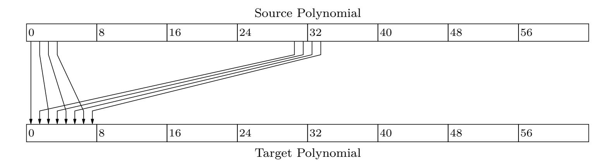
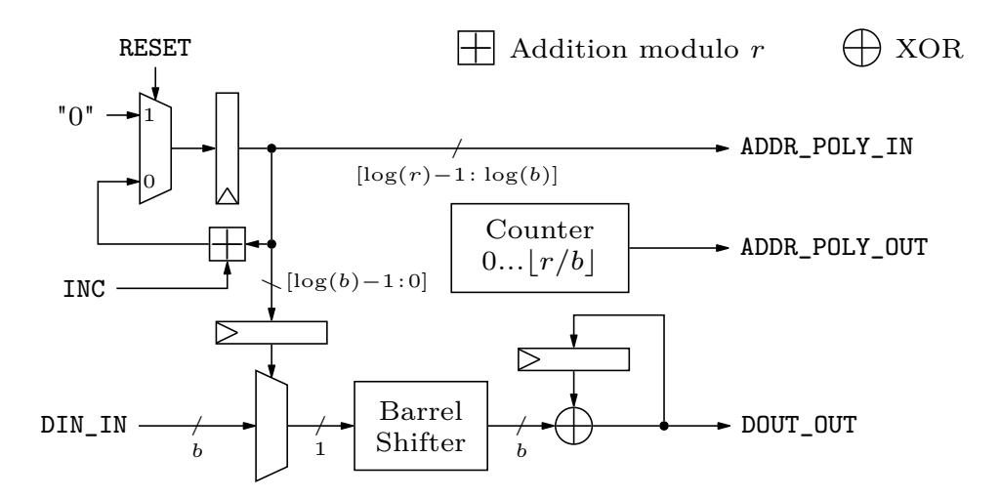
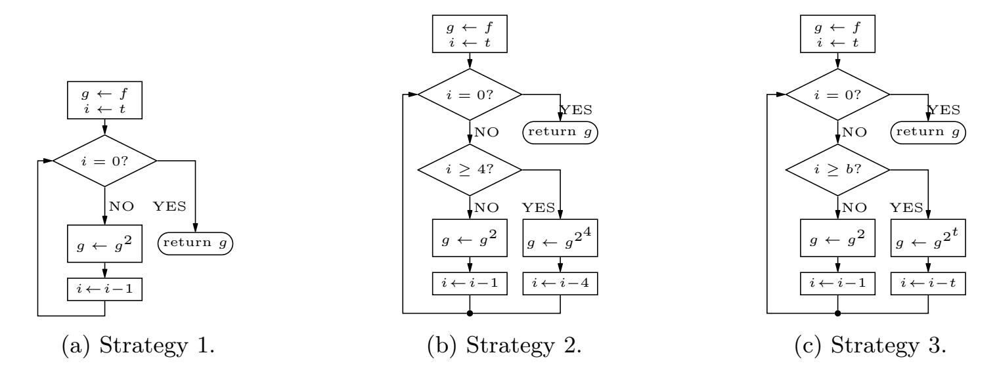
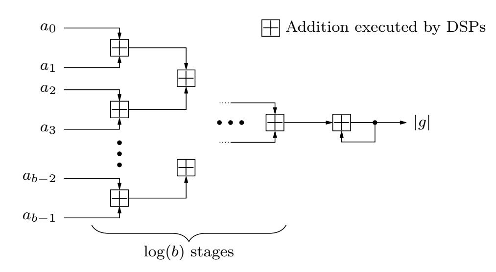
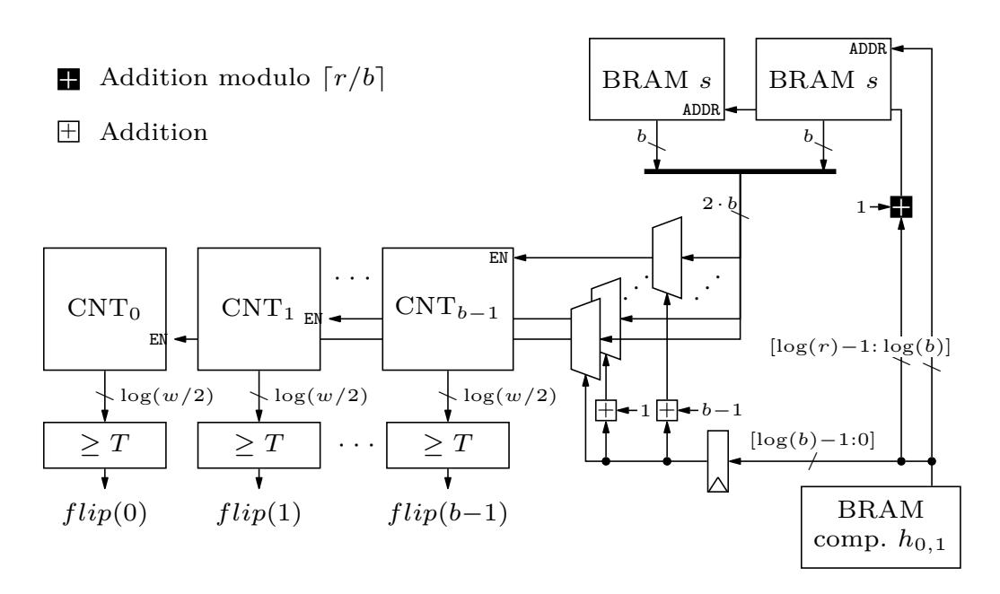
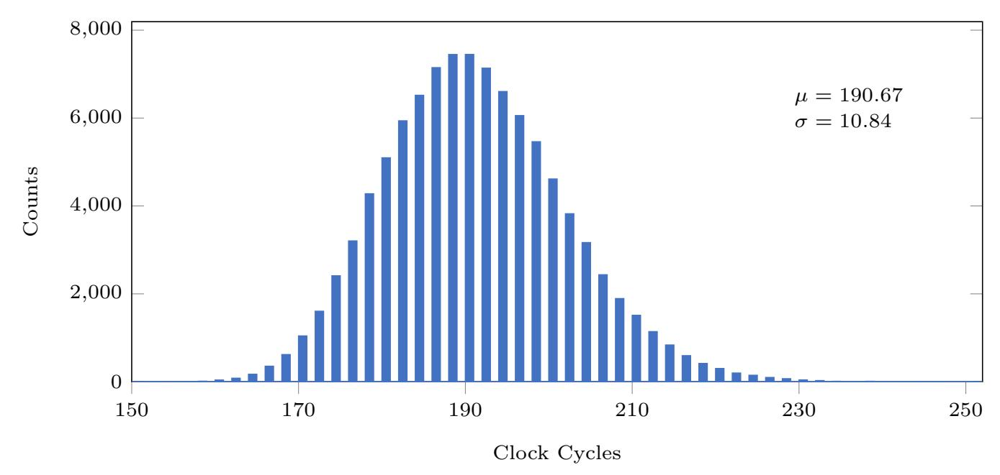
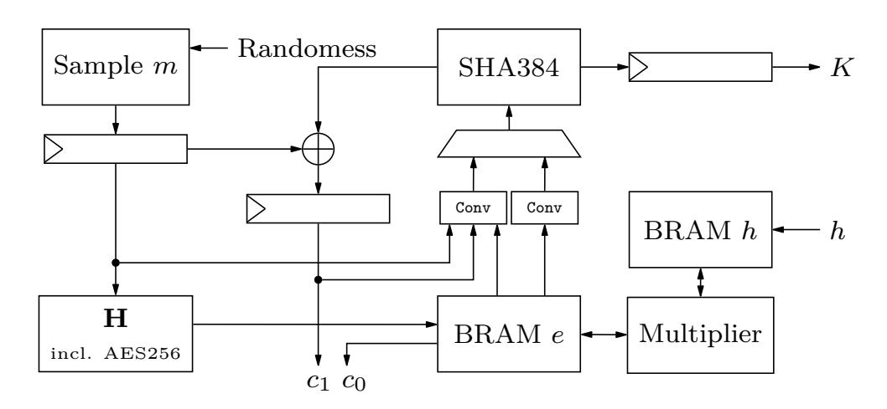
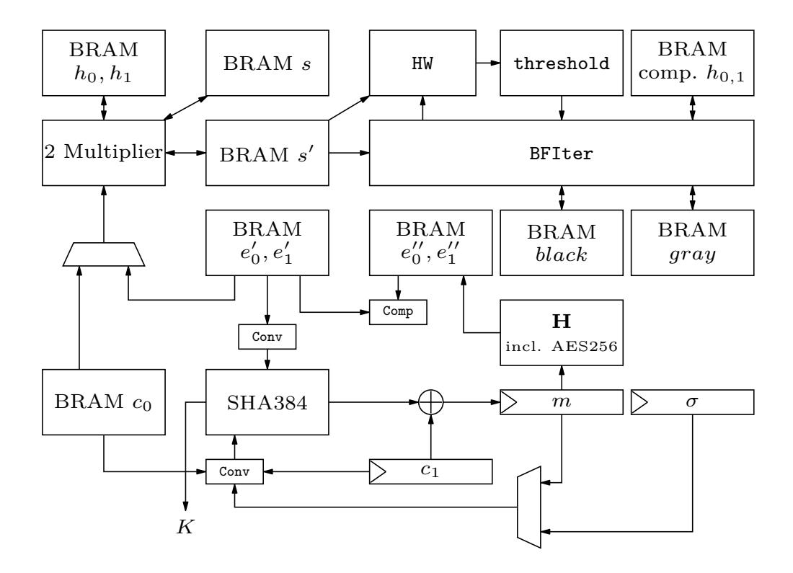

{0}------------------------------------------------

# **Folding BIKE: Scalable Hardware Implementation for Reconfigurable Devices**

Jan Richter-Brockmann<sup>1</sup> , Johannes Mono<sup>1</sup> and Tim Güneysu<sup>1</sup>*,*<sup>2</sup>

<sup>1</sup> Ruhr-Universität Bochum, Horst-Görtz Institute for IT-Security, Germany <sup>2</sup> DFKI, Germany

[firstname.lastname@rub.de](mailto:firstname.lastname@rub.de)

**Abstract.** Contemporary digital infrastructures and systems use and trust Public-Key Cryptography to exchange keys over insecure communication channels. With the development and progress in the research field of quantum computers, well established schemes like RSA and ECC are more and more threatened. The urgent demand to find and standardize new schemes – which are secure in a post-quantum world – was also realized by the National Institute of Standards and Technology which announced a Post-Quantum Cryptography Standardization Project in 2017. Recently, the round three candidates were announced and one of the alternate candidates is the Key Encapsulation Mechanism scheme BIKE.

In this work, we investigate different strategies to efficiently implement the BIKE algorithm on Field-Programmable Gate Arrays (FPGAs). To this extend, we improve already existing polynomial multipliers, propose efficient strategies to realize polynomial inversions, and implement the Black-Gray-Flip decoder for the first time. Additionally, our implementation is designed to be scalable and generic with the BIKE specific parameters. All together, the fastest designs achieve latencies of 2*.*69 ms for the key generation, 0*.*1 ms for the encapsulation, and 1*.*89 ms for the decapsulation considering the lowest security level.

**Keywords:** BIKE · QC-MDPC · PQC · Reconfigurable Devices · FPGA.

## **1 Introduction**

In our contemporary life Public-Key Cryptography (PKC) plays a crucial part to exchange keys over insecure communication channels. However, established schemes like RSA [\[RSA78\]](#page-21-0) and ECC [\[Mil85\]](#page-21-1) are threatened by the advancing development of quantum computers [\[Gam20\]](#page-20-0). In 1999, Peter Shor already presented an algorithm breaking currently used PKC schemes in polynomial time on quantum computers [\[Sho99\]](#page-21-2). Therefore, there is extensive research to find new schemes which are secure even in the presence of quantum adversaries. One such promising research area is code-based cryptography where hard problems from coding-theory are used to create cryptographic schemes. The first scheme based on linear error codes was proposed by McEliece in 1978 [\[McE78\]](#page-21-3). Even though the McEliece cryptosystem is assumed to be secure against classical and quantum-based attacks, one disadvantage is its large public key.

In order to decrease the key size (and the corresponding memory requirements and transmission bandwidth), a new class of linear codes were designed, so called Quasi-Cyclic Moderate-Density Parity-Check (QC-MDPC) codes. They were first presented in [\[MTSB13\]](#page-21-4) and gained more and more attention in recent years due to performance and security features. In 2017, the National Institute of Standards and Technology (NIST) announced the Post-Quantum Cryptography Standardization Project aiming to find and standardize suitable Post-Quantum Cryptography (PQC) schemes. One of the submissions

{1}------------------------------------------------

is the Bit Flipping Key Encapsulation (BIKE) scheme built upon QC-MDPC codes. With the advancement of the submission to the third round, the BIKE team reduced the number of algorithms proposed in earlier specifications [\[ABB](#page-20-1)<sup>+</sup>19] to one single algorithm, now just called BIKE. The remaining algorithm (called BIKE-2 in earlier submissions) is based on the Niederreiter framework [\[Nie86\]](#page-21-5) including some tweaks [\[ABB](#page-20-2)<sup>+</sup>20]. Recently, the NIST announced the round three candidates and selected BIKE as an alternate candidate which means that the algorithm will still be considered for standardization [\[oST20\]](#page-21-6).

After the announcement of the PQC Standardization Project, NIST published a list of selection-criteria including security, cost and performance as well as algorithm and implementation characteristics on various platforms [\[AAAS](#page-19-0)<sup>+</sup>19]. Currently, there is a software reference implementation of BIKE, an optimized software implementation for Intel CPUs [\[DGK20a\]](#page-20-3), and an efficient microcontroller implementation [\[BOG19\]](#page-20-4). Until now, there is no complete hardware implementation of the third round submission. In this work, we propose an optimized hardware design of BIKE for FPGAs.

**Related Work.** After the introduction of QC-MDPC codes by Misoczki et *al.*, the authors of [\[HVMG13\]](#page-21-7) were the first researchers who implemented the McEliece cryptosystem with QC-MDPC codes on FPGAs. Besides an exploration of different decoders suited for efficient hardware implementations, they decided to follow a design strategy targeting a high-speed implementation. To this end, they stored all keys and intermediate results directly in the FPGA logic and did not use any external or internal memories.

One year later, von Maurich and Güneysu presented a lightweight implementation of McEliece using QC-MDPC codes [\[VMG14\]](#page-21-8). They divided each vector into chunks of 32 bit and processed them separately. This approach incorporated internal memory of the FPGA to keep the amount of registers as low as possible.

The authors of [\[HC17\]](#page-20-5) proposed an area time efficient hardware implementation for QC-MDPC codes outperforming the results from [\[HVMG13\]](#page-21-7). The improvements were mainly gained by a custom designed decoder equipped with a hardware module estimating the Hamming weight of larger vectors.

With the submission to the second round, the BIKE team presented an FPGA implementation of one of the discarded algorithms called BIKE-1 including the key generation and encapsulation [\[ABB](#page-20-1)<sup>+</sup>19]. Their design strategy was very similar to the one presented in [\[VMG14\]](#page-21-8) but included two optimization levels which basically parallelized the encoding process.

Recently, Reinders et *al.* proposed an efficient hardware design with a constant-time decoder, also designed for the older BIKE-1 algorithm [\[RMGS20\]](#page-21-9). However, the proposed decoder differs from the introduced decoder of the current BIKE specification. Additionally, as they opted for BIKE-1, they did not implement any polynomial inversion.

An efficient algorithm to accomplish polynomial inversions was presented in [\[HGWC15\]](#page-20-6) and is based on the classic Itoh-Tsujii Algorithm (ITA) [\[IT88\]](#page-21-10). Here and in many other parts of BIKE, polynomial multiplications are an essential building block which can be realized by different design strategies. Two of them – i.e., a row-by-row strategy and a strategy dividing the vectors into chunks – were described in the above mentioned works [\[HVMG13\]](#page-21-7) and [\[VMG14\]](#page-21-8), respectively. Another strategy was recently introduced by Hu et *al.* in [\[HWCW19\]](#page-21-11) where the authors decomposed the quasi-cyclic matrix (constructed from one of the polynomials) into sub-matrices achieving an enhanced area-time product.

**Contribution.** We present the first hardware implementation of the entire BIKE algorithm selected as alternate candidate in the NIST PQC competition. The first challenging part is the implementation of the polynomial inversion required for the key generation. We investigate different optimization strategies for hardware platforms which eventually leads to a highly optimized design. The inversion module as well as other parts of BIKE require 

{2}------------------------------------------------

a polynomial multiplier. We slightly improve the multiplier proposed in [\[HWCW19\]](#page-21-11) and reduce the overall latency. Additionally, we provide the first hardware implementation of the Black-Gray-Flip (BGF) decoder originally proposed in [\[DGK20c\]](#page-20-7). The implementation is constant-time with respect to the processing of secret values (i.e., the operation times of all modules are independent of any secret values) and is thus secure against timing attacks.

By implementing a parameterized design, we can scale our approach down to small devices (resulting in higher latency) or scale it up for low-latency applications (resulting in a bigger implementation). Additionally, we wrote SageMath scripts to achieve a design which is completely generic with respect to all parameters used in BIKE. All HDL-files are available at <https://github.com/Chair-for-Security-Engineering/BIKE>.

**Outline.** The remainder of this work is structured as follows: In [Section 2,](#page-2-0) we briefly introduce BIKE. Afterwards, we present the hardware implementations of each individual building block required to compose BIKE in [Section 3.](#page-4-0) Following, [Section 4](#page-13-0) provides detailed implementation results of each individual module as well as the evaluation of the whole design. With [Section 5,](#page-19-1) we conclude our work.

# <span id="page-2-0"></span>**2 Preliminaries**

In this chapter, we briefly state our notations and describe the BIKE algorithm. We closely follow the notations of [\[ABB](#page-20-2)<sup>+</sup>20].

## **2.1 Notations**

We define |*v*| as the Hamming weight of a given polynomial *v*. A uniform random sampling of *v* is denoted by *v* \$← U. The notation {0*,* 1} *l* [*t*] describes the set of all *l*-bit strings with Hamming weight *t*. Throughout this work, we will use log(·) as the base 2 logarithm log<sup>2</sup> (·).

## **2.2 BIKE**

BIKE consists of three algorithms: *key generation*, *encapsulation*, and *decapsulation*. Besides the security level *λ*, three parameters *r*, *w*, and *t* are specified. The parameter *r* defines the block length and needs to be prime such that (*X<sup>r</sup>* − 1)*/*(*X* − 1) ∈ F2[*X*] is irreducible. The row weight *w* defines the number of bits set in the private key and is chosen such that *d* = *w/*2 is odd. The parameter *t* is a positive integer and determines the decoding radius, i.e., the Hamming weight of an error vector *e* = (*e*0*, e*1). As an additional parameter, the shared secret size *`* is defined as a positive integer. Note that the code length *n* is set to *n* = 2*r*.

Additionally, BIKE defines a set of three functions **H***,* **K***,***L** modeled as random oracles. The functions are defined with the following domains and ranges.

$$\mathbf{H} : \{0, 1\}^{\ell} \to \{0, 1\}_{[t]}^{2r}$$

$$\mathbf{K} : \{0, 1\}^{r+2\ell} \to \{0, 1\}^{\ell}$$

$$\mathbf{L} : \{0, 1\}^{2r} \to \{0, 1\}^{\ell}$$

[Algorithm 1,](#page-3-0) [Algorithm 2,](#page-3-1) and [Algorithm 3](#page-3-2) formally describe the key generation, encapsulation, and decapsulation, respectively. [Table 1](#page-4-1) lists the suggested parameters for the security levels 1 and 3. Note, the shared secret size *`* is fixed to 256. For more details, we refer the interested reader to the full specification of BIKE [\[ABB](#page-20-2)<sup>+</sup>20].

{3}------------------------------------------------

#### **Algorithm 1:** Key Generation.

<span id="page-3-0"></span>Input : BIKE parameters  $n, w, t, \ell$ .

**Output:** Private key  $(h_0, h_1, \sigma)$  and public key h.

- 1 Generate  $(h_0, h_1) \stackrel{\$}{\leftarrow} \mathcal{R}^2$  both of odd weight  $|h_0| = |h_1| = w/2$ .
- **2** Generate  $\sigma \stackrel{\$}{\leftarrow} \{0,1\}^{\ell}$  uniformly at random.
- **3** Compute  $h \leftarrow h_1 h_0^{-1}$ .
- 4 Return  $(h_0, h_1, \sigma)$  and h.

#### Algorithm 2: Encapsulation.

<span id="page-3-1"></span>Input : Public key h.

**Output:** Encapsulated key K and ciphertext  $C = (c_0, c_1)$ .

- 1 Generate  $m \stackrel{\$}{\leftarrow} \{0,1\}^{\ell}$  uniformly at random.
- **2** Compute  $(e_0, e_1) \leftarrow \mathbf{H}(m)$ .
- **3** Compute  $C = (c_0, c_1) \leftarrow (e_0 + e_1 h, m \oplus \mathbf{L}(e_0, e_1)).$
- 4 Compute  $K \leftarrow \mathbf{K}(m, C)$ .
- **5** Return (C, K).

#### **Algorithm 3:** Decapsulation.

<span id="page-3-2"></span>**Input**: Private key  $(h_0, h_1, \sigma)$  and ciphertext  $C = (c_0, c_1)$ .

Output: Decapsulated key K.

- 1 Compute syndrome  $s \leftarrow c_0 h_0$ .
- 2 Compute  $\{(e_0', e_1'), \bot\} \leftarrow \texttt{decoder}(s, h_0, h_1).$
- **3** Compute  $m' \leftarrow c_1 \oplus \mathbf{L}(e'_0, e'_1)$ .
- 4 if  $\mathbf{H}(m') \neq (e'_0, e'_1)$  then
- 5 | Compute  $K \leftarrow \mathbf{K}(\sigma, C)$ .
- 6 else
- 7 | Compute  $K \leftarrow \mathbf{K}(m', C)$ .
- 8 Return K.

#### 2.3 Decoder

The decapsulation of BIKE invokes a **decoder** (cf. Algorithm 3) trying to determine the error vector sampled in the encapsulation process in order to recover the message m. An efficient algorithm for this task was presented in [DGK20c] and is called Black-Gray-Flip decoder (cf. Algorithm 4). With the submission to the third round of the NIST PQC competition, the BGF decoder is included in the BIKE specifications. The decoder is an iterative algorithm, running for NBIter iterations, taking  $(s, h_0, h_1)$  as input, and returning an error vector  $e = (e_0, e_1)$  in case of a successful decoding or  $\bot$  when the decoding fails. Based on the Hamming weight of the sum  $s + eH^T$ , a threshold T is computed by

<span id="page-3-3"></span>
$$threshold(x) = \max(|f_0 \cdot x + f_1|, c) \tag{1}$$

where  $f_0, f_1$  and c are constants associated with the security level. The procedure BFIter counts the Unsatisfied-Parity-Check (UPC) equations by invoking ctr (i.e., the Hamming weight of  $h_j \cdot s$  where  $h_j$  is the j-th column of the matrix H) and flips all bits in the error vector that were indicated by counter values exceeding the threshold T. Additionally, BFIter generates two lists - black and gray - which mark all positions where the counter exceeds T or  $T - \tau$ , respectively. In the first iteration of the decoder these two lists are

{4}------------------------------------------------

Table 1: BIKE parameters.

<span id="page-4-1"></span>

|          | BIKE           | Spec           | cific          | Decoder Specific |             |    |        |                   |  |  |
|----------|----------------|----------------|----------------|------------------|-------------|----|--------|-------------------|--|--|
| Security | $\overline{r}$ | $\overline{w}$ | $\overline{t}$ | $\overline{f_0}$ | $f_1$       | c  | NBIter | $\overline{\tau}$ |  |  |
| Level 1  | 12323          | 142            | 134            | 0.0069722        | 13.530      | 36 | 5      | 3                 |  |  |
| Level 3  | 24659          | 206            | 199            | 0.005265         | 265 15.2588 |    | 5      | 3                 |  |  |

**Algorithm 4:** Black-Gray-Flip Decoder [DGK20c, ABB<sup>+</sup>20].

```
Data: H \in \mathbb{F}_2^{r \times n}, s \in \mathbb{F}_2^r
 e \leftarrow 0^n
 2 for i = 1 to NBIter do
         T \leftarrow \mathtt{threshold}\left(\left|s + eH^{\mathrm{T}}\right|\right)
 3
         e, black, gray \leftarrow \texttt{BFIter}\left(s + eH^{T}, e, T, H\right)
 4
         if i = 1 then
 5
             e \leftarrow \texttt{BFMIter}\left(s + eH^{\mathrm{T}}, e, black, (d+1)/2 + 1, H\right)
 6
              e \leftarrow \texttt{BFMIter}\left(s + eH^{\text{T}}, e, gray, (d+1)/2 + 1, H\right)
 7
         end
 8
 9 end
10 if s = eH^T then
         return e
11
12 else
         \operatorname{return} \perp
13
14 end
15 procedure BFIter(s, e, T, H)
16 for j = 0 to n - 1 do
         if ctr(H, s, j) \ge T then
17
            e_j \leftarrow e_j \oplus 1
18
           black_i \leftarrow 1
19
         else if ctr(H, s, j) \ge T - \tau then
20
             gray_j \leftarrow 1
\mathbf{21}
22 end
23 return e, black, gray
24 procedure BFMIter(s, e, mask, T, H)
25 for j = 0 to n - 1 do
         if ctr(H, s, j) \ge T then
26
          e_i \leftarrow e_i \oplus mask_i
27
         end
\mathbf{28}
29 end
30 return e
```

used to adjust the error vector by applying the procedure BFMIter. All parameters used to define the decoder are summarized in Table 1 for both security levels.

# <span id="page-4-0"></span>3 Efficient Hardware Implementation

In this section, we first state and discuss our design considerations. Afterwards, we present our design strategies for each required submodule to assemble BIKE and discuss our approaches in more detail.

{5}------------------------------------------------

## <span id="page-5-1"></span>**3.1 Design Considerations**

In general, our implementation tries to keep the footprint as small as possible while providing a reasonable throughput. This goal is achieved by storing all polynomials in Block-RAMs (BRAMs) instead of using registers even if that means forgoing the possibility to access all bits of a polynomial at the same time. This strategy drastically reduces the amount of required registers (and consequently slices) because otherwise each polynomial (e.g., the error vectors, the public key, private key, ciphertext) would consume *r* registers resulting in exploding implementation costs. Nevertheless, we decided to use registers whenever values of *`* bits (e.g., *m* or *c*1) need to be stored as spending an entire BRAM would waste hardware resources.

Besides these trade-offs, our implementation is developed to be generic with the BIKE specific parameters in case they need to be adapted (e.g., for security reasons). Additionally, we introduce a scaling parameter *b* to define the internally applied data bus width affecting the bus width of all BRAMs and the level of parallelization of several submodules. Therefore, all polynomials are divided into chunks of *b* bits which will be further processed by the required submodules (e. g., multiplier or inversion). By writing *a*[*i*], we denote *b* bits of the polynomial *a* which are stored at address *i* where the Least Significant Bit (LSB) *a*<sup>0</sup> of *a* is stored in the LSB of *a*[0]. In our evaluation, we consider *b* ∈ B = {32*,* 64*,* 128} as these values are common bus widths and as larger values would exceed the available hardware resources on Xilinx's Artix-7 FPGAs[1](#page-5-0) .

The generations of (*h*0*, h*1), *σ*, and *m* require a source of randomness. In our design we assume that the target device is equipped with an appropriate Random Number Generator (RNG) since the implementation of a secure RNG is out of scope of this work. All modules requiring such randomness have implemented ports which could be connected to an available source of randomness.

Our goal is to comply with the BIKE specification. Thus, we can generate and extract testvectors from the reference implementation and can validate the output of our design.

## <span id="page-5-2"></span>**3.2 Sampler**

**With Predefined Hamming Weight** The first step in the key generation (cf. [Algorithm 1\)](#page-3-0) is to sample the polynomials (*h*0*, h*1) representing the first part of the secret key. Since both polynomials are defined to have a Hamming weight of *w/*2, they can be sampled in parallel.

The samplers are realized by rejection sampling [\[DG19\]](#page-20-8) and both expect a dlog<sup>2</sup> (*r*)e-bit input *x*rand*,i* of fresh randomness every two clock cycles with *i* ∈ {0*,* 1}. The input *x*rand*,i* determines the non-zero positions in the polynomial *h<sup>i</sup>* . For the sampler, we decided to fix *b* to 32 bits. Increasing *b* would not improve the throughput because for each random input *x*rand*,i* only one bit in the target polynomial needs to be adjusted. Hence, working on larger values of *b* would increase the required hardware resources in terms of reading larger chunks from the memory which need to be processed by the sampler (more details below).

The sampler divides the random input *x*rand*,i* into two parts consisting of the lower five bits *x*pos*,i* and the remaining upper bits *x*addr*,i*. Within the first clock cycle of sampling one single bit, the sampler reads the 32-bit chunk of the polynomial *h<sup>i</sup>* [*x*addr*,i*]. The lower five random bits *x*pos*,i* are buffered in registers. In the next clock cycle, these bits are used to create a bit vector determined by 2 *<sup>x</sup>*pos*,i* (target bit position is set to one). The vector is added (xored) to *h<sup>i</sup>* [*x*addr*,i*] and the result is written back to the memory. If a bit is set and *x*rand*,i < r*, a counter, which monitors the Hamming weight of the sampled polynomial, is enabled. Given that, increasing *b* would not improve the throughput but

<span id="page-5-0"></span><sup>1</sup>Note that the NIST recommended to use Artix-7 FPGAs.

{6}------------------------------------------------

instead more hardware resources would be necessary (more xor-gates) to adjust a single bit in  $h_i$ .

Although rejection sampling avoids biased values obtained by e.g., reducing  $x_{\text{rand},i}$  modulo r, it does not finish in constant time. Therefore, we will briefly discuss its (timing) side-channel security and its average latency. Each time  $x_{\text{rand},i}$  is larger than r the randomness is rejected and not used to set a bit in  $h_i$ . This, however, does not create an attack surface because the algorithm finishes in constant time with respect to the set bit positions in the polynomial. An attacker observing the sampling process would not gain any information about the actual sampled bit position in  $h_i$  and no confidential information is revealed [DG19].

The probability of not getting rejected, i.e., the success probability is  $s = \frac{r}{2^{\lceil \log(r) \rceil}}$ . However, this term needs to be adjusted as collisions getting more likely with an increased number of bits already set in  $h_i$  which is done by  $(1 - \frac{j-1}{r})$  where j indicates the number of bits that already have been set. Finally, Equation 2 is used to calculate the average clock cycles  $N_{\text{sample,avg}}$  required to finish the sample process for the polynomials  $h_i$ . The leading factor of two is due to the read and write accesses to the BRAM mentioned above.

<span id="page-6-0"></span>
$$N_{\text{sample,avg}} = 2 \cdot \sum_{j=1}^{w/2} \frac{1}{s \cdot (1 - \frac{j-1}{r})}$$
 (2)

For the lowest security level  $N_{\text{sample,avg}} = 189.34$ .

**Uniform Sampler** The sampling process of the secret key  $\sigma$  and m is done in a straightforward way by using a 32-bit input providing fresh randomness. The 256 random bits are stored in registers as explained in Section 3.1.

#### <span id="page-6-1"></span>3.3 Multiplication

Polynomial multiplication is a basic building block for each of the three algorithms involved in BIKE. Our multiplier focuses on minimal BRAM usage as well as a good area-time product and is formally defined in Algorithm 6 in Appendix A using the vector-matrix representation. Although the runtime of our multiplication is  $\mathcal{O}(\lceil r/b \rceil^2)$ , we benefit from carry-less and reduction-less multiplication in  $\mathbb{F}_2$ .

We also considered using Karatsuba multiplication and reviewed the literature for implementations. The authors in [ZGF20] provide one such implementation but due to the high area costs (cf. Section 4.3 for more details) we do not follow their approach. Instead, we compute columns block-wise which fits well with our design philosophy of processing b bits in parallel and integrates well with other components.

A multiplication  $c = m \cdot h$  requires the constant overhang  $O = r \mod b$  (cf. Algorithm 6), that is the number of bits in the polynomial's most significant word. The multiplier reads b bits of m and b bits of h such that  $b \cdot b$  partial products are computed at the same time. This leads to the previously mentioned column-wise multiplication, i.e., all partial products including the message's bits m[i] are calculated before the next b bits of m are read from the BRAM.

As an example, we graphically depict the multiplication process for r = 10 and b = 3 in Figure 1. For every column consisting of  $r \cdot b$  partial products, there are two initial steps: the first step computes the partial products of the upper triangle (in our example  $m_2 \cdot h_8$ ), the second step computes all partial products that include the current most O significant bits of h and all bits from m[i] excluding the first bit (in our example  $m_1 \cdot h_9$  and  $m_2 \cdot h_9$ ).

Afterwards, the algorithm proceeds with a regular flow. In each clock cycle, the multiplier reads h[j] and c[j] from the BRAMs and computes the related partial products in the next clock cycle (illustrated by connected background colors). The lower b bits of

{7}------------------------------------------------

```
m0 · h0+
     m0 · h1+
     m0 · h2+
               m1 · h0+
               m1 · h1+
               m1 · h2+
                        m2 · h0+
                        m2 · h1+
                        m2 · h2+
               m1 · h9+
                        m2 · h9+
                        m2 · h8+
     m0 · h3+
     m0 · h4+
     m0 · h5+
               m1 · h3+
               m1 · h4+
               m1 · h5+
                        m2 · h3+
                        m2 · h4+
                        m2 · h5+
     m0 · h6+
     m0 · h7+
     m0 · h8+
               m1 · h6+
               m1 · h7+
               m1 · h8+
                        m2 · h6+
     m0 · h9+ m2 · h7+
c0 =
c1 =
c2 =
c3 =
c4 =
c5 =
c6 =
c7 =
c8 =
c9 =
                                  m3 · h7 + ...
                                  m3 · h8 + ...
                                  m3 · h9 + ...
                                  m3 · h0 + ...
                                  m3 · h1 + ...
                                  m3 · h2 + ...
                                  m3 · h3 + ...
                                  m3 · h4 + ...
                                  m3 · h5 + ...
                                  m3 · h6 + ...
```

Figure 1: Exemplary decomposition of the partial products for a multiplication with *r* = 10 and *b* = 3.

the result are added to the intermediate result which was gained by the upper *b* − 1 bits of the previous multiplication's result. These intermediate results are stored in registers in order to have direct access.

As the authors in [\[VMG14\]](#page-21-8), we also use the *read-first* setting of the BRAMs enabling to read a result and write a new value to a specific address in one clock cycles. Hence, new results from the multiplication engine, which are added to the current intermediate result *c*[*j*], are stored in the BRAM at position (*j* + 1) mod *r*. Since there are d*r/b*e columns, the final result *c* is stored in the correct layout, i.e., *c*[0] contains the LSBs of the final polynomial. The polynomial *h* is also rotated in the BRAM. This is tracked in the implementation including special cases such as determining *h*[0] as it consists partly of *h*[*r* − 1] and partly of *h*[*r* − 2] (in our example *h*[0] = (*h*7*, h*8*, h*9) for the second column).

The multiplier performs a multiplication within d*r/b*e ·(d*r/b*e + 3)+ 1 clock cycles. The additional three clock cycles in every column originate from the two initial steps described above and one additional clock cycle to read *h*[0]. The last clock cycle is required to switch to a DONE state.

## <span id="page-7-1"></span>**3.4 Inversion**

With the decision of the BIKE team to only rely on the BIKE version being built upon the Niederreiter framework, a new challenge of implementing a polynomial inversion in hardware arose. Since BIKE is also designed to work with ephemeral keys, an efficient implementation of an inversion algorithm is even more critical to achieve reasonable throughput. To this end, we decided to implement the inversion of a polynomial *a* in R using Fermat's Little Theorem as

$$a^{-1} = a^{2^{r-1}-2} (3)$$

holds for every *a* ∈ R<sup>∗</sup> with ord(*a*) | 2 *<sup>r</sup>*−<sup>1</sup> − 2.

To exponentiate a target polynomial *a* with 2 *<sup>r</sup>*−<sup>1</sup> − 2, we first rewrite the exponent as 2 2 *<sup>r</sup>*−<sup>2</sup> − 1 . Eventually, the exponentiation is accomplished by [Algorithm 5](#page-8-0) which is based on the classic ITA [\[IT88\]](#page-21-10) and a slightly adapted version of Algorithm 1 defined in [\[HGWC15\]](#page-20-6). Note that we do not follow the recently proposed algorithm by Drucker et *al.* [\[DGK20b\]](#page-20-9) (which is used in the additional software implementation of BIKE [\[DGK20a\]](#page-20-3)) as it performs slightly worse in hardware. The number of required multiplications is the same for both algorithms but the number of squarings differs. Assuming that an exponentiation *f* 2 *t* is divided into a chain of operations of the form *f* 2 *k* with *k* ∈ K and *k* ≤ *t* where each operation has the same runtime (more details are given below), [Algorithm 5](#page-8-0) requires less of these operations than Algorithm 2 from [\[DGK20b\]](#page-20-9) as shown in [Table 2](#page-8-1) for different sets of K. Additionally, the proposed algorithm by Drucker et *al.*

{8}------------------------------------------------

```
Algorithm 5: Inversion based on the classic ITA [IT88,HGWC15].
```

```
Data: r − 2 = (rq−1, ..., r0) with ri ∈ 0, 1 and a ∈ R∗
  Result: a
           −1
1 f ← a, t ← 1
2 for i ← q − 2 to 0 do
3 g ← f
           2
            t
4 f ← f · g
5 t ← 2t
6 if ri = 1 then
7 g ← f
              2
8 f ← a · g
9 t ← t + 1
10 end
11 end
12 return f
           2
```

<span id="page-8-1"></span>Table 2: Comparison between [Algorithm 5](#page-8-0) and Algorithm 2 from [\[DGK20b\]](#page-20-9) indicating the amount of squaring operations.

| K                               | k = 1  | k = 2 | k = 3 | k = 4 | Sum    |  |  |  |  |  |
|---------------------------------|--------|-------|-------|-------|--------|--|--|--|--|--|
| Algorithm 2 from [DGK20b]       |        |       |       |       |        |  |  |  |  |  |
| {1}                             | 12 355 | 0     | 0     | 0     | 12 355 |  |  |  |  |  |
| {1, 2}                          | 5      | 6 175 | 0     | 0     | 6 180  |  |  |  |  |  |
| {1, 2, 3}                       | 10     | 6     | 4 111 | 0     | 4 127  |  |  |  |  |  |
| {1, 2, 3, 4}                    | 5      | 1     | 0     | 3 087 | 3 093  |  |  |  |  |  |
| Algorithm 5 (used in this work) |        |       |       |       |        |  |  |  |  |  |
| {1}                             | 12 321 | 0     | 0     | 0     | 12 321 |  |  |  |  |  |
| {1, 2}                          | 7      | 6 157 | 0     | 0     | 6 164  |  |  |  |  |  |
| {1, 2, 3}                       | 8      | 2     | 4 103 | 0     | 4 113  |  |  |  |  |  |
| {1, 2, 3, 4}                    | 6      | 2     | 1     | 3 077 | 3 086  |  |  |  |  |  |

would require one additional BRAM to hold the intermediate results *res* (cf. Algorithm 2, line 8 in [\[DGK20b\]](#page-20-9)).

However, [Algorithm 5](#page-8-0) executes the exponentiation of 2 *<sup>r</sup>*−<sup>2</sup> − 1 described by lines 2-11 first and eventually the final squaring from line 12. To this end, the inversion consists of exponentiations of the form *f* 2 *t* , of polynomial squarings, and of polynomial multiplications. The latter operation is realized by using the multiplier described in [Section 3.3.](#page-6-1) The strategies to implement a squaring module and to realize the exponentiation with 2 *<sup>t</sup>* are described in the following.

**Squaring Module for Fixed k** An exponentiation of a polynomial *f* with 2 *t* for arbitrary *t* can always be accomplished by dividing the exponentiation into a chain of *t* squarings. One possibility to speed up the calculation is to implement a module which performs *k < t* squarings in the same time as a single squaring. A squaring chain would consist of b*t/k*c *k*-squarings and *t* mod *k* single squarings.

The strategy implementing squaring modules with fixed *k* pursues our global design consideration to achieve submodules which scales with *b*. A polynomial squaring *g* = *f* 2 *k*

{9}------------------------------------------------

<span id="page-9-1"></span>

Figure 2: Exemplary permutation for a squaring module with *k* = 1, *r* = 59, and *b* = 8.

for arbitrary *k* can be realized by a simple bit-permutation and is mathematically described by

<span id="page-9-0"></span>
$$g_i = f_{i \cdot 2^{-k} \bmod r} \tag{4}$$

where *i* denotes the *i*-th element in the target polynomial. [Equation 4](#page-9-0) indicates that for each *b* bits of the target polynomial *g*, bits from at least 2 *<sup>k</sup>* different addresses of the source polynomial *f* are required where the maximum number of different addresses is bounded to 2 · 2 *<sup>k</sup>* − 1. As an example, [Figure 2](#page-9-1) shows a draft of the permutation and corresponding memory pattern for a squaring with *k* = 1, *b* = 8, and *r* = 59. It is shown that bits from three different addresses are required in order to combine them to the correct result written to the first address implying that all necessary bits from *f* need to be loaded from the BRAM first. This is done in an initial phase which is automatically calculated to be optimal by our scripts. Additionally, the scripts ensure that all upcoming results can be directly written to the BRAM containing the target polynomial by determining an optimal read sequence of bits from the source polynomial. The amount of clock cycles required for the initial phase also determines the number of *b*-bit registers holding the already read parts from the source polynomial. Note, after the initial phase, which depends on *k* and *r*, the squaring finishes within d*r/b*e clock cycles.

**Squaring Module for Arbitrary k** Besides the above described strategy, we explore another approach implementing a squaring module which can accomplish a *k*-squaring (i.e., *g* = *f* 2 *k* ) for arbitrary *k* within *r* clock cycles. For [Algorithm 5,](#page-8-0) this approach is especially interesting for larger *t* as the exponentiation has not to be decomposed into a squaring chain but rather can directly be carried out. [Figure 3](#page-10-0) shows a schematic drawing of the hardware implementation and the corresponding operations required to compute the addresses of the source and target polynomial and the output data for the target polynomial *g*. The bits of the target polynomial are determined in an ascending order so that the corresponding bits from the source polynomial need to be computed by the implementation. Therefore, the module requires an input INC which needs to be assigned to 2 <sup>−</sup>*<sup>k</sup>* mod *r*. Starting with 0, the implementation adds (modulo *r*) every clock cycle INC to the current value where the upper bits determine the address and the lower log(*b*) bits are used as a selection signal for a *b*-to-1 multiplexer. The input of the multiplexer is the current *b*-bit chunk of the source polynomial. After selecting the desired bit from the input, a barrel shifter is used to shift the desired bit to the correct position. The resulting *b* bits are then added (xored) to the current intermediate result destined for the target polynomial. After all *b* bits for a target address of *g* are collected and shifted to the correct position, the implementation writes the result to the BRAM.

**Squaring Strategies** Given the two different modules to compute a *k*-squaring, we investigate three optimization strategies to implement the exponentiation *g* = *f* 2 *t* in [Algorithm 5,](#page-8-0) line 3. The three approaches are depicted in flow charts in [Figure 4.](#page-10-1) The first

{10}------------------------------------------------

<span id="page-10-0"></span>

Figure 3: Schematic drawing of a module being able to perform a k-squaring for arbitrary k in r clock cycles.

<span id="page-10-1"></span>

Figure 4: Different strategies to implement  $g = f^{2^t}$  required for the polynomial inversion.

strategy only utilizes a squaring module for a fixed k=1. In this case all exponentiations are carried out by chains of simple squarings. The second strategy implements two different but fixed squaring modules: one with k=1 and the other one with k=4. Hence, as long as t and the remaining exponent of the squaring chain is larger or equal four, the faster module is used. If the remaining exponent is smaller the squaring module with k=1 is applied. The last strategy uses a combination of a fixed squaring module with k=1 and the module being able to perform arbitrary k-squarings. In this way, all k-squarings with  $k \geq b$  are executed by the latter module.

Note that all strategies have implemented a fixed squaring module with k = 1 because of two reasons: (1) simple squarings are always needed in the inversion process (cf. Algorithm 5, line 7 and line 12), and (2) it consumes just a few hardware resources and speeds up the computation notably (more information will be given in Section 4.1).

Independently of the strategy, the inversion process requires four BRAMs. One BRAM stores the private key, i.e.,  $(h_0, h_1)$ . The other three BRAM modules are interchangeably used to perform a squaring chain (two BRAMs are used in alternation as source and target polynomial) and a subsequent multiplication by the squaring chain's input polynomial (cf. Algorithm 5, line 3 and line 4).

#### <span id="page-10-2"></span>3.5 Decoder

The BGF decoder mainly consists of three submodules. The first module is the threshold function described in Equation 1. Its argument  $|(s + eH^{T})|$  is computed by the second module. The third module flips the bits of the error vector e and generates the black and gray lists. In the following, we describe our implementations of these three modules.

{11}------------------------------------------------

<span id="page-11-0"></span>

Figure 5: Hamming weight computation of a polynomial g divided into b-bit chunks a. In each stage, as many as possible additions are carried out by one DSP.

**Threshold Function** The threshold for flipping a bit in the error vector is calculated with a multiplication followed by an addition with a constant term. We use Digital Signal Processor (DSP) instantiated with an output register stage as a straightforward implementation choice. In order to ensure that the bus widths of the input ports are used as optimal as possible, the corresponding VHDL-code is generated by a Sage script producing binary representations of the constants  $f_0$  and  $f_1$ . The floor-function is realized by omitting all fractional digits from the result. As this procedure sustains a loss of precision, the script also checks that the result is still correct for all possible inputs x.

**Hamming Weight** The implementation of the Hamming weight module follows our design strategy to scale submodules with the parameter b. Again, we utilize DSPs with one register stage to add up all non-zero bits. To do so, each b-bit chunk a = g[i] of a target polynomial g is separately feed into the module depicted in Figure 5. In  $\log(b)$  stages, all bits are accumulated where each stage consists of  $\left\lceil \frac{b/2^j \cdot (j+1)}{b_{\text{DSP}}} \right\rceil$  DSPs where  $b_{\text{DSP}}$  denotes the input bit width of the applied DSP and  $1 \leq j \leq \log(b)$ . Hence, for each stage the full width of each DSP is utilized. In total, the Hamming weight computation requires

<span id="page-11-1"></span>
$$1 + \sum_{j=1}^{\log(b)} \left\lceil \frac{b/2^j \cdot (j+1)}{b_{\text{DSP}}} \right\rceil \tag{5}$$

DSPs where the additional DSP is used to accumulate all intermediate results at the end.

**Bit-Flipping** The last module of the decoder is responsible for the bit-flipping of the error vector's bits, i.e., the functions BFIter and BFMIter from Algorithm 4. In our implementation we realize both functions in one module and select the modes of operations (i.e., BFIter producing the black and gray lists, BFIter without producing the lists, BFMIter processing the black mask, and BFMIter processing the gray mask) with a control signal MODE. The most interesting part is the process of counting the UPC equations which is depicted in Figure 6. We follow our design strategy and instantiate b counters in parallel where the ENABLE (EN) signals depend on the current part of the syndrome and the secret key. For storing the secret key, we decided to rely on a compact representation, i.e., only the positions of non-zero bits are stored instead of the entire polynomial. Hence, to determine the enable signals of all b counters in the same clock cycle, we compute the positions of the currently considered non-zero bit for the next b-1 columns (considering the secret key in its matrix representation) by adding the corresponding offsets (white adders) which would be gained when shifting the polynomial to the right. The position

{12}------------------------------------------------

<span id="page-12-0"></span>

Figure 6: Extract of the bit-flipping module.

of the non-zero bit of the secret key is also used to read the corresponding chunk of the syndrome (depicted at the top in Figure 6). Here, we decide to duplicate the syndrome s and store a copy in a separate BRAM. This is necessary since we need b successive bits from s starting at the bit position determined by the current non-zero bit of the secret key which is not aligned with the layout of the BRAMs. For r = 17 and b = 4 this behavior is shown in the following example.

$$s_2 \ s_1 \ s_0 \ s_{16} \ | \ s_{15} \ s_{14} \ s_{13} \ s_{12} \ | \ s_{11} \ s_{10} \ \underline{s_9 \ s_8} \ | \ s_7 \ \underline{s_6} \ s_5 \ s_4 \ | \ s_3 \ s_2 \ s_1 \ s_0$$

The arrow indicates the position of the current non-zero bit of the secret key and the underlined bits are required to determine the enable signals of the b counters. As we can only read one chunk within one clock cycle, we decided to create the aforementioned copy of the BRAM storing the syndrome to achieve a lower latency and read both chunks within one clock cycle from two different memories. The careful reader may notice that the least significant bits of the syndrome in the example are also stored in the most significant chunk such that the chunk is completely filled with data. The least significant bits from s are copied to the most significant chunk in an initial phase each time the BFIter module is evoked. This is necessary in case the non-zero bit of the secret key (the arrow in the example) would point for example to  $s_{15}$ .

After a non-zero bit position is read from the BRAM, b is added and the result is written back to the memory for the next iteration, i.e., the next b columns. At the end of each BFIter execution the original secret key is restored from a copy as it is required for the next execution.

However, after each non-zero bit position is read once from the BRAM, the counter values can be evaluated and compared to the threshold T. In case a counter value exceeds T the corresponding bit is set. The resulting b bit vector is added to the current chunk of the error vector or is used to set the bits in the black list. The same procedure is applied for the gray list but with a threshold reduced by  $\tau$ .

The BFIter function finishes in constant time and only depends on r, w, and b as shown in Equation 6.

<span id="page-12-1"></span>
$$N_{\text{BFIter}} = \frac{w}{2} \cdot 2 \cdot \left\lceil \frac{r}{b} \right\rceil + 6 \cdot 2 \cdot \left\lceil \frac{r}{b} \right\rceil + 5 \tag{6}$$

## 3.6 Random Oracles

The BIKE specification defines the three functions  $\mathbf{H}, \mathbf{K}$ , and  $\mathbf{L}$  as random oracles [ABB<sup>+</sup>20].  $\mathbf{K}$  and  $\mathbf{L}$  rely on a standard SHA384 core hashing m concatenated with

{13}------------------------------------------------

<span id="page-13-2"></span>

Figure 7: Distribution of required clock cycles to sample one polynomial of the secret key for *r* = 12 323 and *w* = 142 based on 100 000 simulations.

*C* and hashing (*e*0*, e*1), respectively. It is assumed that all data is stored in byte arrays so that the input size to the SHA function is a multiple of eight. For our hardware design we implemented the SHA core in a straightforward way, i.e., as a round-based approach including retiming.

The **H** function relies on an AES256 core (instantiated in counter mode) where the input to **H** serves as 256-bit key. After one execution of AES, the resulting ciphertext is used as randomness generating the error vectors. More precisely, the 128-bit output is divided into four 32-bit words which serve as inputs to the sampler described in [Section 3.2.](#page-5-2)

# <span id="page-13-0"></span>**4 Implementation and Analysis**

Before we cover the composition of the key generation, encapsulation, and decapsulation, we provide analyses of the above described submodules. Finally, we compare our approaches to related work.

## <span id="page-13-1"></span>**4.1 Analysis of Submodules**

**Sampler** In order to verify our hardware implementation of the rejection sampler, we performed 100 000 simulations setting *r* = 12 323. [Figure 7](#page-13-2) shows a histogram of the required clock cycles to finish the sampling process. The results confirm a correct functionality of our implemented sampler and show the expected average number of clock cycles which we deduced in [Equation 2.](#page-6-0)

One sampler generating a single polynomial consumes 25 slices partitioned into 66 Look-Up Tables (LUTs) and 19 registers. For *r* = 12 323 a half (i.e., a 18 KB) BRAM tile is required to store the polynomial. Our final implementation instantiates two samplers to generate (*h*0*, h*1) in parallel.

**Multiplier** Here, we just report the implementation results for the multiplier setting *b* = 32 and *r* = 12 323 which are summarized in [Table 3.](#page-15-0) A more detailed analysis and a comparison to related work is presented in [Section 4.3.](#page-16-1)

**Squaring Modules** In [Section 3.4](#page-7-1) we introduced two different squaring modules. The first module was designed to perform the operation *f* 2 *k* for a fixed *k* and a target polynomial *f* in approximately d*r/b*e clock cycles. The implementation results for *k* = 1 and *k* = 4 are shown in [Table 3.](#page-15-0) Increasing *k* significantly increases the amount of required hardware

{14}------------------------------------------------

resources which can be explained by more complex control logic and more intermediate values that need to be buffered in registers. Note that the gain in terms of throughput only increases linearly.

Due to these exploding implementation costs, we investigated a second squaring strategy which performs squarings of arbitrary k in approximately r clock cycles. For  $r=12\,323$  and b=32 this approach requires just 45 slices partitioned into 96 LUTs and 80 registers. The utilization is very similar to that of the squaring module working with a fixed k=1 which makes it especially beneficial for larger k.

However, both modules require two 18 KB BRAM tiles which hold the source and the target polynomial.

**Decoder** The decoder can be divided into three parts: the threshold computation, the Hamming weight module, and the BFIter function. The threshold computation is realized by one DSP configured as a multiplier with a subsequent addition. Therefore, it consumes one DSP (independent of the security level and b) and a few LUTs for control logic.

The Hamming weight module also uses DSPs as described in Section 3.5 while the number of required DSPs depends on b (cf. Equation 5). Note, for Artix-7 FPGAs  $b_{\rm DSP}=28$ . No additional logic is required.

The hardware utilization for the BFIter function for r = 12323 and b = 32 adds up to 355 slices composed of 280 registers and 1125 LUTs. All together, the module needs to be connected to 4.5 BRAMs to store two times the syndrome, the compact representation of the secret key (a half memory is sufficient), the error vectors, and the black and gray lists.

**Random Oracles** Both,  $\mathbf{K}$  and  $\mathbf{L}$ , use a SHA384 which consumes 1171 slices (3636 LUTs and 2110 registers). The wrapper to realize  $\mathbf{K}$  consumes additional 114 slices while the wrapper for  $\mathbf{L}$  only requires 45 additional slices.

The realization of **H** utilizes additional 614 slices which includes the AES256 and the wrapper logic.

Comparing these implementation results with them of the other submodules in Table 3, it can clearly be seen that the hardware resources to realize the three random oracles dominate the total utilization costs (especially for b = 32). Hence, from the hardware implementation's point of view switching to another cryptographic primitive like KECCAK (used as SHAKE and SHA-3) could reduce this overhead.

#### 4.2 Composed Key Encapsulation Mechanism

Now, we present implementation results of the composed designs of the three algorithms involved in BIKE.

**Key Generation** Given all the submodules, we now describe the assemble of the key generation module. On the top level, it consists of two samplers generating the private key  $(h_0, h_1)$ . The resulting key is written to a generic BRAM module which automatically picks and connects the minimum number of required BRAM tiles based on the selected parameters r and b. The private key  $\sigma$  is generated by the sampler described in Section 3.2 and is stored in a 256-bit register. In order to generate the public key  $h = h_1 h_0^{-1}$ , one of the above introduced inversion modules is instantiated. The multiplication is also performed inside the inversion module as it already contains a multiplication engine.

Table 4 summarizes the implementation results for the key generation for all three introduced design strategies. Starting with Strategy 1, which utilizes only one squaring module, the implementation requires in average for  $b = 32\ 7.37$  million clock cycles<sup>2</sup> which corresponds to a latency of 56.75 ms for a maximum possible frequency of 129.87 MHz.

<span id="page-14-0"></span> $<sup>^2</sup>$ The average number of clock cycles was determined by performing a simulation and applying Equation 2.

{15}------------------------------------------------

|                    | Logic |     |       | Memory |        |  |  |
|--------------------|-------|-----|-------|--------|--------|--|--|
|                    | LUT   | DSP | FF    | BRAM   | Slices |  |  |
| Sampler            | 66    | 0   | 19    | 0.5    | 25     |  |  |
| Multiplier         | 886   | 0   | 119   | 1.5    | 274    |  |  |
| Squaring k = 1     | 81    | 0   | 105   | 1      | 38     |  |  |
| Squaring k = 4     | 4 070 | 0   | 820   | 1      | 1 124  |  |  |
| Squaring arbitrary | 96    | 0   | 80    | 1      | 45     |  |  |
| Threshold Function | 6     | 1   | 0     | 0      | 5      |  |  |
| Hamming Weight     | 0     | 6   | 0     | 0      | 0      |  |  |
| Bit-Flipping       | 1 125 | 0   | 280   | 4.5    | 355    |  |  |
| SHA384             | 3 636 | 0   | 2 110 | 0      | 1 171  |  |  |
| Wrapper for K      | 220   | 0   | 29    | 0      | 114    |  |  |
| Wrapper for L      | 45    | 0   | 22    | 0      | 45     |  |  |
| H Function         | 1 879 | 0   | 457   | 0      | 614    |  |  |

<span id="page-15-0"></span>Table 3: Implementation results of the required submodules to assemble the BIKE algorithms (*r* = 12 323, *b* = 32).

The latency can roughly be decreased by a factor of four setting *b* = 128. However, the hardware utilization scales with a factor of five resulting in an area footprint of 3 354 slices. A better ratio between latency and resource utilization is achieved with Strategy 3. The utilization is very similar to the first strategy but the latency is notably decreased so that the implementation for *b* = 128 requires just 2*.*69 ms to finish one key generation by consuming 3 554 slices and 10 BRAMs. Hence, a distinct superiority is clearly visible.

**Encapsulation** [Figure 8](#page-16-2) shows a schematic of the encapsulation. To sample and store *m*, an uniform sampler and a 256-bit register is instantiated. The message *m* is used as input to **H** generating the error vector *e* = (*e*0*, e*1). Afterwards, *c*<sup>0</sup> = *e*<sup>0</sup> + *e*1*h* and *c*<sup>1</sup> = *m* ⊕ **L**(*e*0*, e*1) are computed in parallel. A parallel computation is only possible due to an additional BRAM which is placed in the conversion module and stores a copy of *e* serving as input to **L**. The final result of the multiplication is stored in the part of the BRAM which initially holds *e*0. The cryptogram and the message *m* are fed into a conversion module Conv to generate the input to the SHA core realizing **K**.

Again, [Table 4](#page-17-0) summarizes the implementation results for the encapsulation module for *b* ∈ B. Since the main part of the encapsulation is the multiplication to generate *c*0, the implementation perfectly scales with *b*. For *b* = 32 the design requires 3 BRAMs and 2 133 slices while performing one encapsulation within 1*.*25 ms. Switching to *b* = 128, increases the hardware utilization roughly by a factor of two while the latency is decreased by a factor of twelve. The small increase of the hardware utilization originates from the relative large footprints of the SHA384 and the AES256 which stay constant for each *b*. Both modules consume together roughly 1 800 slices (cf. [Table 3\)](#page-15-0) which are 83 % of the whole design when setting *b* = 32.

**Decapsulation** The decapsulation uses most of the submodules including two multiplier, the decoder, and all three random oracles (see [Figure 9\)](#page-16-3). After transmitting the private key (*h*0*, h*1*, σ*) and the ciphertext *C* = (*c*0*, c*1), the decapsulation is started by computing the syndrome *s* = *c*0*h*0. Afterwards, the algorithm invokes the decoder enabling the BFIter module which forms the center of the decapsulation. After each iteration the two multipliers compute the updated syndrome by *s* <sup>0</sup> = *e* 00 0 · *h*<sup>0</sup> + *e* 00 1 · *h*<sup>1</sup> + *s* where *s* is

{16}------------------------------------------------

<span id="page-16-2"></span>

Figure 8: Top level view of the encapsulation module.

<span id="page-16-3"></span>

Figure 9: Top level view of the decapsulation module.

the initial syndrome determined in the first step. Next, the content of e'' is converted, forwarded to the SHA core, and added to  $c_1$ . The resulting message m' serves as key for the AES256 core generating an error vector which is stored in e' and compared to the content in e''. In case the polynomials are equal, the implementation forwards m' to K determining the shared key k. Otherwise  $\sigma$  is used as input to K.

Again, Table 4 summarizes the implementation results for the decapsulation. The main parts, i.e., the multipliers and the bit-flipping module, perfectly scale with the parameter b. Hence, increasing b from 32 bits to 128 bits lowers the latency from 13.02 ms to 1.89 ms by spending roughly three times more hardware recourses.

#### <span id="page-16-1"></span>4.3 Comparison to Related Work and Discussion

In all three algorithms the multiplier represents an important part. Therefore, we first compare our multiplier to designs from the literature. Afterwards, we provide a comparison to other code-based PQC schemes and briefly discuss the advantages and disadvantages of BIKE.

<span id="page-16-0"></span>**Multiplier** In Table 5 we first compare our approach for the multiplication with the Karatsuba implementation from [ZGF20] to reason the choice of our design. Note that the corresponding results are generated for  $r = 24\,533$  as it is a valid polynomial size for LEDAcrypt used as case study in [ZGF20] and is very similar to the parameter set for the third security level of BIKE. Hence, we synthesized our multiplier for the same r in order

{17}------------------------------------------------

<span id="page-17-0"></span>

|                   |        | $\mathbf{R}$ | esourc | es   | Performance |         |        |         |  |  |
|-------------------|--------|--------------|--------|------|-------------|---------|--------|---------|--|--|
|                   | Logi   | ic           | Men    | nory | Area        | Cycles  | Freq.  | Latency |  |  |
|                   | LUT    | DSP          | FF     | BRAM | Slices      | Cycles  | MHz    | ms      |  |  |
| Key Gener         | ration |              |        |      |             |         |        |         |  |  |
| Strategy 1        |        |              |        |      |             |         |        |         |  |  |
| $32\mathrm{bit}$  | 2092   | 0            | 589    | 4    | 669         | 7370429 | 129.87 | 56.75   |  |  |
| $64\mathrm{bit}$  | 3607   | 0            | 631    | 5    | 1046        | 3070613 | 125    | 24.56   |  |  |
| $128\mathrm{bit}$ | 11838  | 0            | 861    | 10   | 3354        | 1409621 | 104    | 13.53   |  |  |
| $Strategy\ 2$     |        |              |        |      |             |         |        |         |  |  |
| $32\mathrm{bit}$  | 6982   | 0            | 1396   | 4    | 1986        | 3804192 | 131.58 | 28.91   |  |  |
| $64\mathrm{bit}$  | 9140   | 0            | 2303   | 5    | 2570        | 1295190 | 123.46 | 10.49   |  |  |
| $128\mathrm{bit}$ | 23801  | 0            | 4567   | 10   | 6742        | 520374  | 106.38 | 4.89    |  |  |
| Strategy 3        |        |              |        |      |             |         |        |         |  |  |
| $32\mathrm{bit}$  | 2074   | 0            | 659    | 4    | 649         | 2671076 | 131.58 | 20.30   |  |  |
| $64\mathrm{bit}$  | 4432   | 0            | 735    | 5    | 1285        | 748964  | 113.64 | 6.59    |  |  |
| $128\mathrm{bit}$ | 12654  | 0            | 1 044  | 10   | 3554        | 258750  | 96.15  | 2.69    |  |  |
| Encapsulat        | tion   |              |        |      |             |         |        |         |  |  |
| $32\mathrm{bit}$  | 6730   | 0            | 3298   | 3    | 2143        | 152694  | 121.95 | 1.25    |  |  |
| $64\mathrm{bit}$  | 8253   | 0            | 3327   | 5    | 2538        | 40368   | 121.95 | 0.33    |  |  |
| 128 bit           | 14829  | 0            | 3471   | 10   | 4540        | 12240   | 121.95 | 0.10    |  |  |
| Decapsulat        | tion   |              |        |      |             |         |        |         |  |  |
| $32\mathrm{bit}$  | 9380   | 7            | 3 943  | 10   | 2971        | 1626674 | 125    | 13.01   |  |  |
| $64\mathrm{bit}$  | 16140  | 9            | 4307   | 15   | 4942        | 518105  | 116.28 | 4.46    |  |  |
| $128\mathrm{bit}$ | 30430  | 13           | 5063   | 29   | 8 785       | 188646  | 100    | 1.89    |  |  |

Table 4: Implementation results for r = 12323.

to allow a fair comparison. Our design achieves a better time-area product while consuming considerably less BRAMs. As one design target of our work is to implement BIKE also for low-cost FPGAs, we decided to use the multiplier design presented in Section 3.3.

In the second part of Table 5, we compare our multiplier to the recently proposed design by Hu et al. [HWCW19] whose implementation conducts a multiplication within  $\lceil \frac{r}{b} \rceil^2 + 18 \lceil \frac{r}{b} \rceil - 9$  clock cycles. Our multiplier achieves a latency of  $\lceil \frac{r}{b} \rceil^2 + 3 \lceil \frac{r}{b} \rceil + 1$  clock cycles with a slightly decreased linear part. Additionally, we included the design from the Round-2 submission of the BIKE specifications [ABB<sup>+</sup>19].

These results were generated for  $r=10\,163$  since Hu et al. reported their results for the parameter set of the second round submission of BIKE. While our implementation consumes slightly more hardware resources, the latency clearly decreases. However, the area-time product only shows better results for b=32 and b=64. We cannot explain the difference in the utilization of slices for b=128. As Hu et al. mentioned in their work, the required area increases quadratically with the scaling parameter b [HWCW19, Table IV]. This roughly holds for our design but we cannot explain why Hu et al. achieve much better results.

**Complete BIKE Design** In this paragraph we compare the complete hardware implementation of BIKE to related work that present hardware designs of code-based cryptography.

{18}------------------------------------------------

Table 5: Comparison between different multipliers on Artix-7 FPGAs.

<span id="page-18-0"></span>

|                                      |                   | Resources                        |      |        | Performance |       |         |             |  |  |  |  |
|--------------------------------------|-------------------|----------------------------------|------|--------|-------------|-------|---------|-------------|--|--|--|--|
|                                      | Logic             | Memory                           |      | Area   | Cycles      | Freq. | Latency | Area-Time   |  |  |  |  |
| b [bit]                              | LUT               | FF                               | BRAM | Slices | Cycles      | MHz   | ms      | Slices × ms |  |  |  |  |
|                                      | Karatsuba [ZGF20] | a                                |      |        |             |       |         |             |  |  |  |  |
| 64                                   | 67 300            | 13 440                           | 165  | 16 825 | 5 715       | 143   |         | 673         |  |  |  |  |
| This work a                          |                   |                                  |      |        |             |       |         |             |  |  |  |  |
| 64                                   | 2 377             | 152                              | 3    | 704    | 148 609     | 163   | 0.565   | 397.76      |  |  |  |  |
| Round-2 Implementation [ABB+19]<br>b |                   |                                  |      |        |             |       |         |             |  |  |  |  |
| 32                                   | 87                | 53                               | 3    | 40     | 3 252 161   | 416   | 7.818   | 312.72      |  |  |  |  |
|                                      |                   | Multiplier by Hu et al. [HWCW19] |      | b      |             |       |         |             |  |  |  |  |
| 32                                   | N/A               | N/A                              | 2.5  | 219    | 106 839     | 205   | 0.521   | 114.099     |  |  |  |  |
| 64                                   | N/A               | N/A                              | 5    | 654    | 28 134      | 180   | 0.156   | 102.024     |  |  |  |  |
| 128                                  | N/A               | N/A                              | 7.5  | 1 596  | 7 831       | 150   | 0.052   | 82.992      |  |  |  |  |
| This work b                          |                   |                                  |      |        |             |       |         |             |  |  |  |  |
| 32                                   | 886               | 90                               | 1.5  | 274    | 102 079     | 312   | 0.327   | 89.598      |  |  |  |  |
| 64                                   | 2 384             | 119                              | 3    | 740    | 25 759      | 277   | 0.093   | 68.82       |  |  |  |  |
| 128                                  | 8 864             | 248                              | 6    | 2 519  | 6 641       | 147   | 0.045   | 113.355     |  |  |  |  |

a *r* = 24 533 <sup>b</sup> *r* = 10 163

Recently, Dang et *al.* published a paper comparing round 2 candidates of the NIST PQC standardization process [\[DFA](#page-20-10)<sup>+</sup>20]. The only code-based scheme reported in their work is the Classic McEliece Public-Key Encryption (PKE) scheme whose hardware implementation was originally proposed in [\[WSN18\]](#page-21-13). Their design can also be configured and instantiated as a lightweight or high-speed implementation. The corresponding implementation results are listed in [Table 6](#page-19-2) while also showing estimations of an composed BIKE design using our introduced modules. Here, we assume that the AES and SHA cores are only instantiated once on the chip such that the encapsulation and decapsulation share them. Note, that this, however, still results in a very conservative estimation since memory, registers, and the multiplier could be shared as well. Nevertheless, in terms of latency, the Classic McEliece scheme clearly outperforms BIKE for all three operations and for both implementation strategies (lightweight and high-speed). In return, the resource utilization is considerably higher than for BIKE so that the Classic McEliece scheme is not particularly suitable for implementations on low-cost devices. Considering the Artix-7 device family from Xilinx (recommended by the NIST), Classic McEliece could only by implemented on the largest FPGAs (i.e., on XC7A200T devices) due to the high amount of required BRAMs. Even if the huge amount of BRAM is neglegted, the design would still require a XC7A50T or XC7A200T for the lightweight and high-speed version, respectively. In comparison, our lightweight design can be instantiated on a low-cost XC7A35T device while the high-speed design requires a XC7A100T FPGA. At the time of writing this article, a XC7A200T FPGA costs around 196 \$ while a low-cost XC7A35T device can be purchased for roughly 35 \$. This makes our design also suitable for low-cost applications.

In [Table 6](#page-19-2) we additionally compare our design to the key generation approach from [\[HWCW19\]](#page-21-11) which was designed for an old parameter set with *r* = 10 163. Even that our design uses a slightly larger *r*, it clearly outperforms the implementation by Hu et *al.*. Setting *b* = 64, our key generation implementation consumes roughly the same amount of slices but is as twice as fast (cf. [Table 4\)](#page-17-0).

{19}------------------------------------------------

<span id="page-19-2"></span>

|                                                                                                       |                  |                |                    |        |                               |    | Key Gen |                                       | Encaps/<br>Encode |              |              | Decaps/<br>Decode               |
|-------------------------------------------------------------------------------------------------------|------------------|----------------|--------------------|--------|-------------------------------|----|---------|---------------------------------------|-------------------|--------------|--------------|---------------------------------|
| Design                                                                                                | LUT              | FF             |                    |        | Slices DSP BRAM Freq.*cycles† |    |         | µs                                    | cycles† µs        |              | cycles†      | µs                              |
| mceliece348864pke (LW) [WSN18] 25 327 49 383<br>mceliece348864pke (HS) [WSN18] 81 339 132 190 16 524a |                  |                | 6 332a             | 0<br>0 | 168<br>236                    |    |         | 108 1 600 14 800<br>106 202.7 1 920.3 | 2.7<br>2.7        | 25.2<br>25.8 | 18.3<br>12.7 | 169.8<br>120.7                  |
| BIKE-2 [HWCW19]                                                                                       | 3 874            | 2 141          | 1 312              | 0      | 10                            |    |         | 160 2 150 13 437                      | –                 | –            | –            | –                               |
| This work (LW)<br>This work (HS)                                                                      | 12 868<br>52 967 | 5 354<br>7 035 | 4 078<br>15 187 13 | 7      | 17<br>49                      | 96 | 259     | 121 2 671 21 903<br>2 691             | 12                | 127          | 189          | 153 1 252 1 628 13 349<br>1 972 |

Table 6: Comparison to other code-based schemes.

Note, that we do not compare our hardware design to the implementation reported in the Round-2 submission of BIKE as it was based on the older algorithm BIKE-1.

## **4.4 Discussion**

In case a hardware implementation of BIKE does not have to perform the key generation, encapsulation, and decapsulation in parallel, a composed design could further be optimized. Besides instantiating the AES and SHA core only once, a shared multiplier, shared register banks and shared BRAMs could be used as well.

In [Section 4.1](#page-13-1) we already discussed the huge footprint of the random oracles. Hence, the choice of using AES and SHA as underlying building blocks appears not to be optimal for hardware implementations. To this end, we would suggest to use other standardized cores like KECCAK which could be used as hash function (for **K** and **L**) and as random number generator (for **H**). This should reduce the overall footprint of a BIKE hardware implementation.

## <span id="page-19-1"></span>**5 Conclusion**

In this work we present a complete hardware implementation of BIKE selected as an alternate candidate in the NIST PQC standardization process. Our implementation is scalable with respect to the used hardware resources and the corresponding latency while performing all operation in constant time (i.e., there is no dependency on secret values). As polynomial multiplications mainly determines the speed of the key generation and encapsulation, we use carry-less vector-matrix-multiplication with a short feedback path. For the key generation, we investigate three different implementation strategies resulting in one outstanding design. Additionally, we propose the first hardware implementation of the BGF decoder required in the decapsulation. With all these improvements and optimizations we are able to implement a key generation which only takes 2*.*69 ms, an encapsulation which can be accomplished in 0*.*1 ms, and a decapsulation which finishes in 1*.*89 ms. Since multiplication is the most important operation with respect to performance, we suggest to investigate other approaches for high-speed implementations in future work.

# **References**

<span id="page-19-0"></span>[AAAS<sup>+</sup>19] Gorjan Alagic, Gorjan Alagic, Jacob Alperin-Sheriff, Daniel Apon, David Cooper, Quynh Dang, Yi-Kai Liu, Carl Miller, Dustin Moody, Rene Peralta, et al. *Status Report on the First Round of the NIST Post-Quantum Cryptography Standardization Process*. US Department of Commerce, National

pke Results are only for the PKE and not for the KEM. LW Lightweight implementation. HS High-speed implementation.

<sup>\*</sup> in MHz. † in thousand. <sup>a</sup> Estimation (assuming all slices are completely utilized).

{20}------------------------------------------------

- Institute of Standards and Technology, 2019. [https://tsapps.nist.gov/](https://tsapps.nist.gov/publication/get_pdf.cfm?pub_id=927303) [publication/get\\_pdf.cfm?pub\\_id=927303](https://tsapps.nist.gov/publication/get_pdf.cfm?pub_id=927303).
- <span id="page-20-1"></span>[ABB<sup>+</sup>19] Nicolas Aragon, Paulo SLM Barreto, Slim Bettaieb, France Worldline, Loïc Bidoux, Olivier Blazy, Philippe Gaborit, Tim Güneysu, Carlos Aguilar Melchor, Rafael Misoczki, et al. BIKE: Bit Flipping Key Encapsulation - Round 2 Submission. 2019. [https://bikesuite.org/files/round2/spec/](https://bikesuite.org/files/round2/spec/BIKE-Spec-Round2.2019.03.30.pdf) [BIKE-Spec-Round2.2019.03.30.pdf](https://bikesuite.org/files/round2/spec/BIKE-Spec-Round2.2019.03.30.pdf).
- <span id="page-20-2"></span>[ABB<sup>+</sup>20] Nicolas Aragon, Paulo SLM Barreto, Slim Bettaieb, France Worldline, Loïc Bidoux, Olivier Blazy, Philippe Gaborit, Tim Güneysu, Carlos Aguilar Melchor, Rafael Misoczki, et al. BIKE: Bit Flipping Key Encapsulation - Submission for Round 3 Consideration. 2020. [https://bikesuite.org/files/v4.](https://bikesuite.org/files/v4.0/BIKE_Spec.2020.05.03.1.pdf) [0/BIKE\\_Spec.2020.05.03.1.pdf](https://bikesuite.org/files/v4.0/BIKE_Spec.2020.05.03.1.pdf).
- <span id="page-20-4"></span>[BOG19] Mario Bischof, Tobias Oder, and Tim Güneysu. Efficient Microcontroller Implementation of BIKe. In *International Conference on Information Technology and Communications Security*, pages 34–49. Springer, 2019.
- <span id="page-20-10"></span>[DFA<sup>+</sup>20] Viet Ba Dang, Farnoud Farahmand, Michal Andrzejczak, Kamyar Mohajerani, Duc Tri Nguyen, and Kris Gaj. Implementation and Benchmarking of Round 2 Candidates in the NIST Post-Quantum Cryptography Standardization Process Using Hardware and Software/Hardware Co-design Approaches. Cryptology ePrint Archive, Report 2020/795, 2020. [https://eprint.iacr.org/2020/](https://eprint.iacr.org/2020/795) [795](https://eprint.iacr.org/2020/795).
- <span id="page-20-8"></span>[DG19] Nir Drucker and Shay Gueron. A Toolbox for Software Optimization of QC-MDPC Code-Based Cryptosystems. *Journal of Cryptographic Engineering*, 9(4):341–357, 2019.
- <span id="page-20-3"></span>[DGK20a] Nir Drucker, Shay Gueron, and Dusan Kostic. Additional Implementation of BIKE (Bit Flipping Key Encapsulation). github, 2020. [https://github.](https://github.com/awslabs/bike-kem) [com/awslabs/bike-kem](https://github.com/awslabs/bike-kem).
- <span id="page-20-9"></span>[DGK20b] Nir Drucker, Shay Gueron, and Dusan Kostic. Fast Polynomial Inversion for Post Quantum QC-MDPC Cryptography. Cryptology ePrint Archive, Report 2020/298, 2020. <https://eprint.iacr.org/2020/298>.
- <span id="page-20-7"></span>[DGK20c] Nir Drucker, Shay Gueron, and Dusan Kostic. QC-MDPC Decoders with Several Shades of Gray. In *International Conference on Post-Quantum Cryptography*, pages 35–50. Springer, 2020.
- <span id="page-20-0"></span>[Gam20] Jay Gambetta. IBMâĂŹs Roadmap For Scaling Quantum Technology. IBM Research Blog, 2020. [https://www.ibm.com/blogs/research/2020/09/](https://www.ibm.com/blogs/research/2020/09/ibm-quantum-roadmap/) [ibm-quantum-roadmap/](https://www.ibm.com/blogs/research/2020/09/ibm-quantum-roadmap/).
- <span id="page-20-5"></span>[HC17] Jingwei Hu and Ray CC Cheung. Area-Time Efficient Computation of Niederreiter Encryption on QC-MDPC Codes for Embedded Hardware. *IEEE Transactions on Computers*, 66(8):1313–1325, 2017.
- <span id="page-20-6"></span>[HGWC15] Jingwei Hu, Wei Guo, Jizeng Wei, and Ray CC Cheung. Fast and Generic Inversion Architectures Over *GF*(2*m*) Using Modified Itoh–Tsujii Algorithms. *IEEE Transactions on Circuits and Systems II: Express Briefs*, 62(4):367–371, 2015.

{21}------------------------------------------------

- <span id="page-21-7"></span>[HVMG13] Stefan Heyse, Ingo Von Maurich, and Tim Güneysu. Smaller Keys for Code-Based Cryptography: QC-MDPC McEliece Implementations on Embedded Devices. In *International Workshop on Cryptographic Hardware and Embedded Systems*, pages 273–292. Springer, 2013.
- <span id="page-21-11"></span>[HWCW19] Jingwei Hu, Wen Wang, Ray CC Cheung, and Huaxiong Wang. Optimized Polynomial Multiplier Over Commutative Rings on FPGAs: A Case Study on BIKe. In *2019 International Conference on Field-Programmable Technology (ICFPT)*, pages 231–234. IEEE, 2019.
- <span id="page-21-10"></span>[IT88] Toshiya Itoh and Shigeo Tsujii. A Fast Algorithm for Computing Multiplicative Inverses in GF (2m) Using Normal Bases. *Information and computation*, 78(3):171–177, 1988.
- <span id="page-21-3"></span>[McE78] Robert J McEliece. A Public-Key Cryptosystem Based on Algebraic. *Coding Thv*, 4244:114–116, 1978.
- <span id="page-21-1"></span>[Mil85] Victor S Miller. Use of Elliptic Curves in Cryptography. In *Conference on the theory and application of cryptographic techniques*, pages 417–426. Springer, 1985.
- <span id="page-21-4"></span>[MTSB13] Rafael Misoczki, Jean-Pierre Tillich, Nicolas Sendrier, and Paulo SLM Barreto. MDPC-McEliece: New McEliece Variants from Moderate Density Parity-Check Codes. In *2013 IEEE international symposium on information theory*, pages 2069–2073. IEEE, 2013.
- <span id="page-21-5"></span>[Nie86] Harald Niederreiter. Knapsack-type Cryptosystems and Algebraic Coding Theory. *Prob. Control and Inf. Theory*, 15(2):159–166, 1986.
- <span id="page-21-6"></span>[oST20] National Institute of Standards and Technology. Pqc standardization process: Third round candidate announcement. Information Technology Laboratory - Computer Security Resource Center, July 2020. [https://csrc.nist.gov/](https://csrc.nist.gov/News/2020/pqc-third-round-candidate-announcement) [News/2020/pqc-third-round-candidate-announcement](https://csrc.nist.gov/News/2020/pqc-third-round-candidate-announcement).
- <span id="page-21-9"></span>[RMGS20] Andrew Reinders, Rafael Misoczki, Santosh Ghosh, and Manoj Sastry. Efficient BIKE Hardware Design with Constant-Time Decoder. Cryptology ePrint Archive, Report 2020/117, 2020. <https://eprint.iacr.org/2020/117>.
- <span id="page-21-0"></span>[RSA78] Ronald L Rivest, Adi Shamir, and Leonard Adleman. A Method for Obtaining Digital Signatures and Public-Key Cryptosystems. *Communications of the ACM*, 21(2):120–126, 1978.
- <span id="page-21-2"></span>[Sho99] Peter W Shor. Polynomial-Time Algorithms for Prime Factorization and Discrete Logarithms on a Quantum Computer. *SIAM review*, 41(2):303–332, 1999.
- <span id="page-21-8"></span>[VMG14] Ingo Von Maurich and Tim Güneysu. Lightweight Code-Based Cryptography: QC-MDPC McEliece Encryption on Reconfigurable Devices. In *2014 Design, Automation & Test in Europe Conference & Exhibition (DATE)*, pages 1–6. IEEE, 2014.
- <span id="page-21-13"></span>[WSN18] Wen Wang, Jakub Szefer, and Ruben Niederhagen. FPGA-based Niederreiter cryptosystem using binary Goppa codes. In *International Conference on Post-Quantum Cryptography*. Springer, 2018.
- <span id="page-21-12"></span>[ZGF20] Davide Zoni, Andrea Galimberti, and William Fornaciari. Flexible and Scalable FPGA-Oriented Design of Multipliers for Large Binary Polynomials. *IEEE Access*, 8:75809–75821, 2020.

{22}------------------------------------------------

# <span id="page-22-1"></span>**A Supplementary Material**

[Algorithm 6](#page-22-0) formally describes our approach to implement the polynomial multiplication. The two initialization phases require each one clock cycle. Everything inside the *for*-loop iterating over *j* is executed in parallel.

```
Algorithm 6: Polynomial Multiplication.
  Data: Input polynomials h, m ∈ R.
  Result: Product c = m · h ∈ R which is written to a BRAM.
1 O ← r mod b, mask ← (2b − 1), addr ← dr/be
2 for i ← 0 to addr − 1 do
3 temp ← 0
    /* Initialization Phase 1 */
4 for u ← O + 1 to b − 1 do
5 temp ← temp ⊕ ((m[i] >> u) & 1) · (h[addr − 2] >> (b + O − u))
6 end
    /* Initialization Phase 2 */
7 t ← (h[addr − 1] & (2O − 1)) << (b − O − 1);
8 for u ← 1 to b − 1 do
9 temp ← temp ⊕ ((m[i] >> u) & 1) · (t >> (b − 1 − u))
10 end
    /* Regular Flow */
11 h
     0 ← h[0], tmp_c_add ← c[i]
12 for j ← 0 to addr − 1 do
       /* Parallel execution. */
13 temp2 ← temp
14 temp ← 0
15 for u ← 0 to b − 1 do
16 p ← (((m[i] >> u) & 1) · h
                            0
                            ) << u
17 temp2 ← temp2 ⊕ (p & mask)
18 temp ← temp ⊕ ((p >> b) & mask)
19 end
20 tmp_c ← c[(j + i + 1) mod addr]
21 if j = (addr − 1) then
22 c[(j + i + 1) mod addr] ← tmp_c_add ⊕

                                       temp2 & 
                                              2
                                               O − 1

23 h[0] ← ((h
                0 << (b − O)) | (h[j] >> O)) & mask
24 else
25 c[(j + i + 1) mod addr] ← tmp_c_add ⊕ temp2
26 tmp_h ← h
                  0
27 h
          0 ← h[j + 1]
28 h[j + 1] ← tmp_h
29 end
30 tmp_c_add ← tmp_c
31 end
32 end
33 return c
```

# **B Implementation Results for Level 3**

[Table 7](#page-23-0) shows the Level 3 implementation results.

{23}------------------------------------------------

Table 7: Implementation results for Level 3 (*r* = 24 659).

<span id="page-23-0"></span>

|                             | Resources |     |        |      |        | Performance |        |         |
|-----------------------------|-----------|-----|--------|------|--------|-------------|--------|---------|
|                             | Logic     |     | Memory |      | Area   | Cycles      | Freq.  | Latency |
|                             | LUT       | DSP | FF     | BRAM | Slices | Cycles      | MHz    | ms      |
| Key Generation (Strategy 3) |           |     |        |      |        |             |        |         |
| 32 bit                      | 1 757     | 0   | 628    | 5    | 561    | 11 600 207  | 135.14 | 85.84   |
| 64 bit                      | 4 580     | 0   | 801    | 5    | 1 303  | 3 089 329   | 111.11 | 27.80   |
| 128 bit                     | 12 193    | 0   | 970    | 10   | 3 491  | 930 179     | 96.15  | 9.67    |
| Encapsulation               |           |     |        |      |        |             |        |         |
| 32 bit                      | 6 436     | 0   | 3 305  | 5    | 1 982  | 601 099     | 121.95 | 4.93    |
| 64 bit                      | 8 329     | 0   | 3 366  | 5    | 2 508  | 154 499     | 119.05 | 1.30    |
| 128 bit                     | 15 004    | 0   | 3 441  | 10   | 4 376  | 42 173      | 125    | 0.34    |
| Decapsulation               |           |     |        |      |        |             |        |         |
| 32 bit                      | 8 515     | 7   | 3 978  | 16   | 2 912  | 5 969 105   | 125    | 47.75   |
| 64 bit                      | 13 424    | 9   | 4 359  | 16   | 4 324  | 1 804 958   | 116.28 | 15.52   |
| 128 bit                     | 30 635    | 13  | 5 127  | 30   | 9 727  | 609 915     | 96.15  | 6.34    |