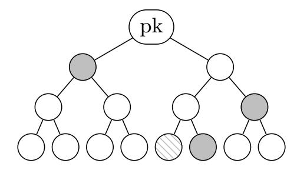
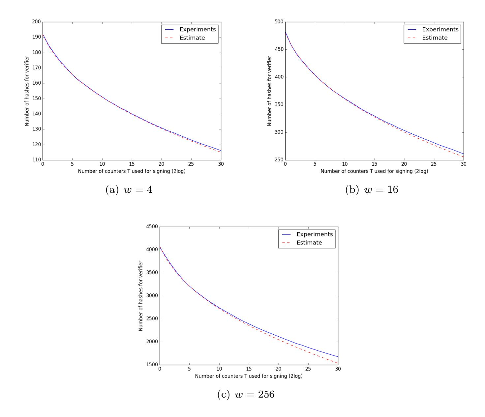
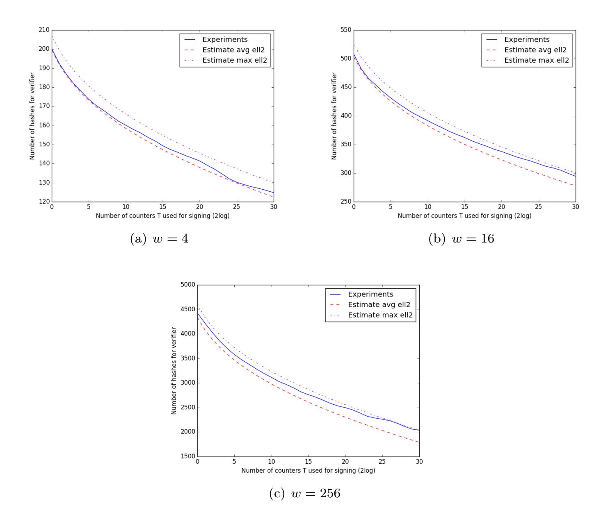
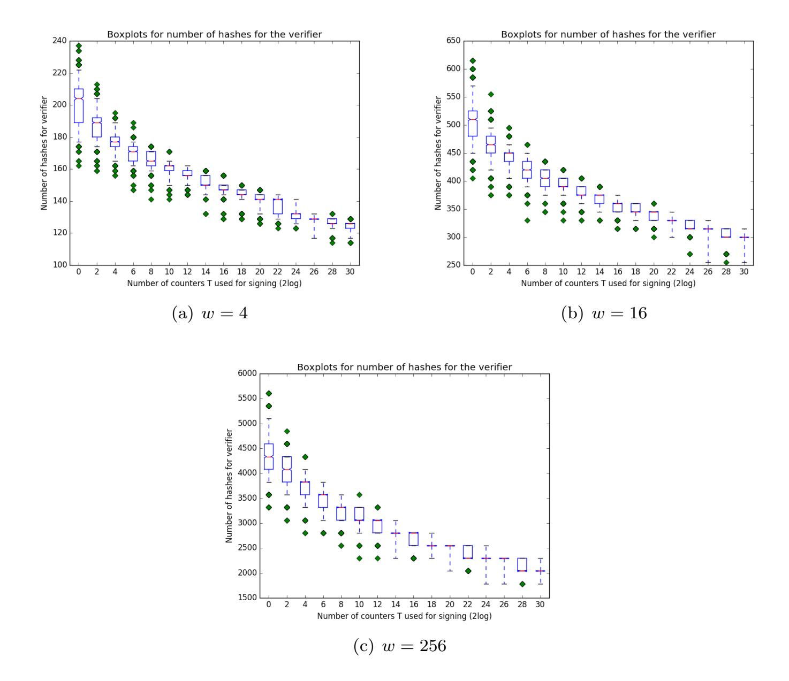
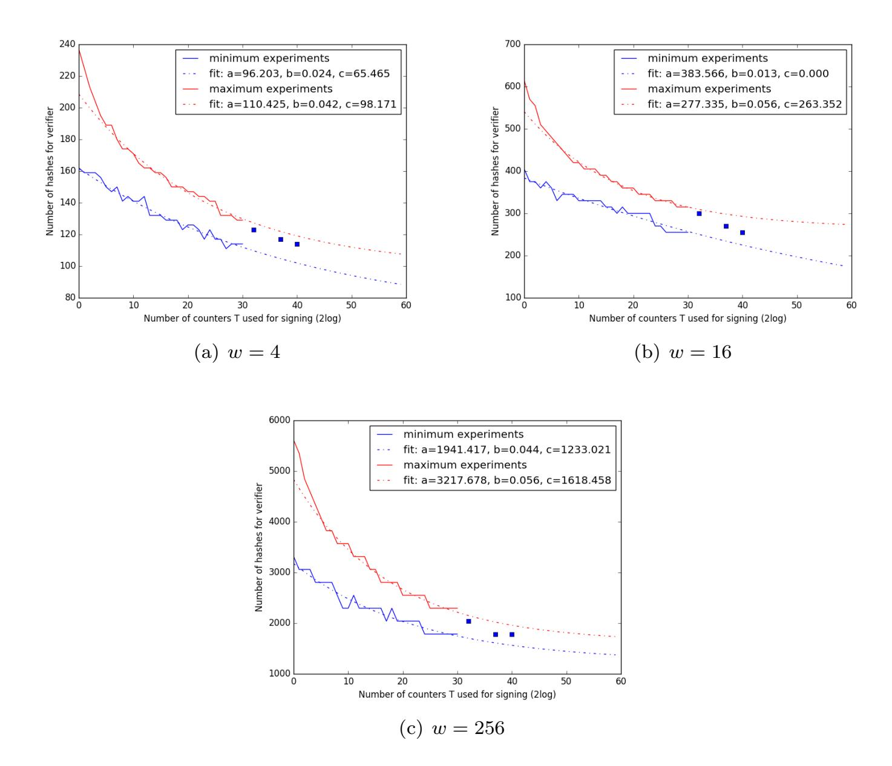

{0}------------------------------------------------

# **Rapidly Verifiable XMSS Signatures**

Joppe W. Bos<sup>1</sup> , Andreas Hülsing<sup>2</sup> , Joost Renes<sup>1</sup> and Christine van Vredendaal<sup>1</sup>

> <sup>1</sup> NXP Semiconductors <sup>2</sup> Department of Mathematics and Computer Science Technische Universiteit Eindhoven, NL [authors-rapidxmss@huelsing.net](mailto:authors-rapidxmss@huelsing.net)

**Abstract.** This work presents new speed records for XMSS (RFC 8391) signature verification on embedded devices. For this we make use of a probabilistic method recently proposed by Perin, Zambonin, Martins, Custódio, and Martina (PZMCM) at ISCC 2018, that changes the XMSS signing algorithm to search for fast verifiable signatures. We improve the method, ensuring that the added signing cost for the search is independent of the message length. We provide a statistical analysis of the resulting verification speed and support it by experiments. We present a record setting RFC compliant implementation of XMSS verification on the ARM Cortex-M4. At a signing time of about one minute on a general purpose CPU, we create signatures that are verified about 1*.*44 times faster than traditionally generated signatures. Adding further implementation optimizations to the verification algorithm we reduce verification time by over a factor two from 13*.*85 million to 6*.*56 million cycles. In contrast to previous works, we provide a detailed security analysis of the resulting signature scheme under classical and quantum attacks that justifies our selection of parameters. On the way, we fill a gap in the security analysis of XMSS as described in RFC 8391 proving that the modified message hashing in the RFC does indeed mitigate multi-target attacks. This was not shown before and might be of independent interest.

**Keywords:** Post-quantum cryptography, XMSS, RFC 8391, embedded devices, signature generation / verification trade-off, exact security, optimized implementation.

## **1 Introduction**

Digital signatures are the necessary means to establish message authentication in settings where establishing a shared key is not a viable option. In particular, a digital signature can be verified by an arbitrary number of people. This makes them the predominant choice for securing software distribution and updates, as well as applications like secure boot and certification of public keys. With the rise of the Internet of Things (IoT), digital signatures also have to be available on resource-constrained devices. In order to make digital signatures accessible to such small devices, it is important to minimize the resources required and optimize their speed. While the speed of all involved routines is relevant, in many applications verification speed is more crucial than signing time. As many signatures are generated once but are verified thousands of times, verification is potentially done much more often than signing. This generally holds for updating and secure boot as sketched above, and is especially relevant for IoT applications. For example, in the wireless

{1}------------------------------------------------

car-to-car and car-to-infrastructure setting described in [\[25,](#page-25-0) §1], cars sometimes have to verify up to 1000 signatures per second to authenticate incoming messages.

Moreover, in the context of IoT applications, signatures are for example used to sign software in Over-the-Air (OTA) update mechanisms, and to verify the authenticity of firmware during secure boot. In these applications there is an imbalance between signer and verifier. Signatures are generated (once) in a secure environment by an entity with access to large-scale computing capabilities. Signatures are verified by many (OTA) or frequently (secure boot) on embedded devices which are resource constrained in memory, storage and computing power. In these cases the efficiency of verification is even more significant to the overall performance than that of signature generation.

Many embedded devices that are designed now will be in the field for the next three or more decades, for example when used in the automotive industry. In this setting, securing them with traditional signature schemes like RSA or (EC)DSA becomes a gamble – betting that there will be no large-scale quantum computer available in 30 years. The only post-quantum alternative that is (about to be) approved by relevant standardization bodies like the US National Institute of Standards and Technology (NIST) [\[10\]](#page-24-0) or the German Bundesamt für die Sicherheit in der Informationstechnologie (BSI) [\[14\]](#page-24-1) are the stateful hash-based signatures XMSS [\[19\]](#page-24-2) and LMS [\[26\]](#page-25-1) for which each a Request For Comments (RFC) exists. The idea of hash-based signatures dates back to a proposal by Ralph Merkle [\[27\]](#page-25-2) from the late 70s. The security of this approach relies on the cryptographic strength of the hash function and the pseudo-random function family used: cryptographic primitives which are well-studied, understood, and not known to be broken by quantum computers.

In this work we answer the question "How can we maximize the verification speed of XMSS on embedded devices?" While we answer this question for XMSS, our results also apply to LMS.

**Hash-based signatures.** XMSS and LMS are at the end of a long line of research (see e.g., [\[27,](#page-25-2) [12,](#page-24-3) [8,](#page-23-0) [7,](#page-23-1) [11,](#page-24-4) [5,](#page-23-2) [6,](#page-23-3) [18,](#page-24-5) [17,](#page-24-6) [20,](#page-24-7) [16,](#page-24-8) [30,](#page-25-3) [22\]](#page-24-9)) due to regained interest in this approach caused by the quantum computing threat to cryptography. Both XMSS and LMS are *stateful* signature schemes. Contrary to common signature schemes like RSA or EC(DSA), they require the storage of a secret-key *state*, i.e. the signing key changes after every signature. If one such secret-key state is used twice, the scheme becomes insecure. This is due to the use of so-called *one-time signature schemes* (OTS) which must not be used to sign two distinct messages, as they can otherwise be broken [\[4\]](#page-23-4). This is a heavy burden, but the benefits are much higher speeds and far smaller signatures compared to the recently proposed stateless schemes SPHINCS [\[2\]](#page-23-5) and SPHINCS<sup>+</sup> [\[3\]](#page-23-6). Indeed, it was shown that the signature size of SPHINCS is a limiting factor for the use on embedded devices [\[21\]](#page-24-10).

The generic construction of stateful hash-based signature schemes (or Merkle signature schemes) groups 2 *<sup>h</sup>* OTS key pairs into one signature key pair. This is done by authenticating the one-time public keys using a binary hash tree, called a Merkle tree, of height *h*. The root node is the new public key. Each leaf of the tree is an OTS key pair. To avoid reuse of OTS signing keys, the OTS keys are used successively, starting with the left most leaf. Hence, the changing part of the secret-key at least contains an index that stores which OTS key was used last. A Merkle signature contains the index of the used OTS key pair in the tree, an OTS signature of the message, and the so called authentication path. The latter provides the sibling nodes of the nodes on the path from the used OTS public key to the root node (see Figure [1.1\)](#page-2-0). OTS signature verification does not return a boolean but a candidate OTS public key. This candidate public key can be used together with the nodes in the authentication path and the index to compute a candidate root node. If this root node equals the one in the Merkle public key, the signature is valid. This generic construction is the same for all stateful hash-based signature schemes including LMS and XMSS. The main difference between XMSS, LMS, and further schemes like GMSS [\[7\]](#page-23-1) is

{2}------------------------------------------------

<span id="page-2-0"></span>

**Figure 1.1:** The authentication path to authenticate the fifth leaf is shown in gray.

how hash functions are used to compute nodes in the tree or within the OTS. In this work we focus on XMSS, but we expect the results to translate to other schemes, especially LMS, with little to no changes since the results are independent of how nodes in the OTS or the tree are computed.

While some of the previous proposals for hash-based signatures differed in the OTS they use, all modern proposals settled for a form of the Winternitz OTS (WOTS) [27]. For example, XMSS in RFC 8391 uses a scheme commonly referred to as WOTS<sup>+</sup> (which we follow, although it actually is WOTS-T [22]). We describe WOTS<sup>+</sup> in Section 2.

The PZMCM technique. We are not the first set out to answer the question of how to maximize the verification speed of XMSS signatures. Our work largely builds on a technique by Perin, Zambonin, Martins, Custódio, and Martina (PZMCM) [28]. Instead of speeding-up the verification algorithm, PZMCM proposed to exploit the fact that while WOTS signing and verification times differ from message (digest) to message (digest), their sum is constant. More precisely, the number of hash function calls for generating a signature and afterwards verifying it always sum to the same value. To exploit this, they suggest to add a counter to the input of the message hash. Then they try T different counter values and pick the one that leads to the fastest to verify signatureamong the T candidates. This trade-off allows to compute signatures that require significantly less hash computations for signature verification than traditionally generated signatures, at the price of increased signing time.

The PZMCM technique perfectly fits our needs. However, we identify several short-comings in the implementation and analysis of the technique.

- 1. The time required to search for the signature depends on the length of the message to be signed. Especially for (large) software packages this can pose a problem.
- 2. PZMCM only analyze the security of the modified signature scheme under the assumption that the message hash is collision resistant, while XMSS explicitly avoids this assumption, aiming for collision-resilience as this allows to use shorter message digests. When choosing parameters according to the security analysis by PZMCM and preserving security, not only vertication speed but also signing and key generation speed would actually get worse and signature size would increase compared to regular XMSS.
- 3. PZMCM do not provide a detailed analysis of the expected improvement in verification time for a given T. Their analysis is limited to experimental validation for small values of T and does not allow to estimate the impact of choosing larger values of T.
- 4. While motivated by use cases in automotive, PZMCM does not provide an experimental evaluation of the impact of their method on actual embedded devices. Hence, the impact of their improvement might be significantly smaller. For example, verification time could be dominated by storage access times.

Contributions. We present a collection of modifications that, for example, achieve a factor two improvement of verification speed on an ARM Cortex-M4 at the cost of about one minute additional signing time on a general purpose CPU. At the same time, all our changes provably preserve security and RFC compliance. We achieve this by filling in the above gaps.

{3}------------------------------------------------

- 1. We modify the PZMCM technique for signature generation to make the added time independent of the message length. For this we exploit the iterative nature of most cryptographic hash functions. By precomputing and storing the internal state of the hash function after absorbing the message, the message only has to be processed once, instead of *T* times. For a 100KB message and *T* = 2<sup>25</sup>, this reduces the signing time from over 3 hours to 14 seconds on a general purpose CPU.
- 2. We give a detailed security analysis of the impact that the PZMCM technique has on the security of XMSS. We formally prove that as long as the used hash function behaves like a random function, security does not significantly degrade. More precisely, the XMSS parameters listed in the RFC still achieve the same level of security with PZMCM. As an intermediate step we complete the security proof of XMSS as described in the RFC. We give a tight bound for the complexity of generic attacks against the message hashing construction used in the RFC showing that the modification indeed prevents multi-target attacks.
- 3. We present a statistical analysis of the speed-up provided by the PZMCM technique. For this purpose we analyze the statistical distribution of the base-*w* encoding of a random message digest and determine its expectation. This allows to predict the expected speed-up also for larger values of *T* and thereby avoids the need for costly experiments when choosing the best trade-off for a given use-case. Our analysis makes some idealizing assumptions. We therefore support it with an experimental validation of relevant parameter sizes.
- 4. We provide an implementation of XMSS verification on the ARM Cortex-M4 and present new speed records for XMSS signature verification. On the one hand, the speed-up is caused by the use of the PZMCM technique for signature generation. On the other hand, we implement a further well known optimization that reuses an intermediate state of the hash computation shared among all the hash computations in WOTS<sup>+</sup>.

**Related work.** Since the introduction of XMSS in 2011 [\[6\]](#page-23-3), there have been a number of works which also studied implementations of XMSS variants on embedded platforms. In [\[18\]](#page-24-5) a variant titled XMSS+ is presented together with an implementation for 16-bit smart cards. The authors of [\[21\]](#page-24-10) look into implementation aspects of the stateless hashbased signature scheme SPHINCS on an embedded microprocessor. In order to provide a meaningful comparison, they present implementation results of XMSSMT (a multi-tree version [\[20\]](#page-24-7) of XMSS that could be used to sign a virtually unlimited number of messages) on an ARM Cortex-M3. These variants of XMSS differ from XMSS as described in RFC 8391 as they do not implement the multi-target mitigation technique from [\[22\]](#page-24-9) because they predate it. An implementation study of XMSSMT for the Java Card platform is provided in [\[31\]](#page-25-5). The work gives a good motivation why Java Card might not be the preferable choice when implementing hash-based signatures and aiming for good performance. Finally, a recent concurrent work [\[9\]](#page-23-7) presents the first XMSS implementation on the ARM Cortex-M4 platform. However, the aim of [\[9\]](#page-23-7) differs from our work as it targets a comparison of XMSS and LMS on embedded devices. In this context the authors also analyze the impact of applying changes to the hashing constructions, recently proposed in [\[3\]](#page-23-6) in the context of SPHINCS<sup>+</sup>. For the work at hand, we decided that all changes that are not RFC-compliant are out of scope as they will hinder fast adoption.

**Organization.** The remainder of this paper is organized as follows. Tweakable hash functions and WOTS<sup>+</sup> are introduced in Section [2.](#page-4-0) In Section [3](#page-5-0) we introduce the modification to XMSS signature generation that enables the signature generation / verification trade-off of [\[28\]](#page-25-4) as well as our optimization. Our security analysis of the resulting signature scheme under classical and quantum attacks is given in Section [4.](#page-7-0) We provide the statistical analysis of the algorithm in Section [5,](#page-14-0) for which experimental support is given in Section [6.](#page-16-0) 

{4}------------------------------------------------

Lastly, in Section 7, we present the record setting RFC compliant implementation of XMSS verification on the ARM Cortex-M.

# <span id="page-4-0"></span>2 WOTS<sup>+</sup> and tweakable hash functions

Before introducting WOTS<sup>+</sup>, we briefly recall the notion of tweakable hash functions.

#### 2.1 Tweakable hash functions

XMSS matured since its original publication and the scheme described in RFC 8391 actually is a variant introduced as XMSS-T in [22] with a slightly changed message hash. Hash-based signatures describe a graph structure in which nodes are computed using hash functions. The main difference between different XMSS variants, and between XMSS and schemes like LMS [26] or GMSS [7], is how hash functions are used to compute nodes while the structure is essentially identical. To unify the description of schemes, [3] introduced the abstraction of tweakable hash functions which we use in our description. For a security parameter n, a tweakable hash function  $\mathbf{Th}_k : \{0,1\}^n \times \{0,1\}^{256} \times \{0,1\}^{kn} \to \{0,1\}^n$  takes as additional input besides a kn-bit message, an n-bit public parameter, and a tweak. For XMSS the tweak is a 256 bit string representing an address which uniquely identifies the node in the graph structure of XMSS. The public parameter is a random value that is part of the public key. These additional inputs are used for domain separation of different hash function calls to mitigate multi-target attacks [22]. For consistency with previous works, we follow [3] and use  $\mathbf{F}$  in place of  $\mathbf{Th}_1$ . We always assume that the additional inputs are used when not explicitly stated. For further details and constructions see [3].

### <span id="page-4-1"></span> $2.2 \text{ WOTS}^+$

XMSS uses WOTS<sup>+</sup> [17] as OTS which we describe now in the context of XMSS. We roughly follow the description from [3].

**Parameters.** The security parameter n determines the message digest length m and influences the size of private key, public key and signature. The Winternitz parameter w can be used to control a trade-off between speed and signature size. A greater value of w implies a smaller signature, but slower speeds. Typically w is chosen as a power of 2 within  $\{4, 16, 256\}$ , as this allows for easy transformation of bit strings into base-w encoded strings. We further define

$$\ell_1 = \lceil m/\log_2(w) \rceil$$
,  $\ell_2 = \lceil \log_2(\ell_1(w-1))/\log_2(w) \rceil + 1$  and  $\ell = \ell_1 + \ell_2$ .

An uncompressed WOTS<sup>+</sup> private key, public key, and signature consist of  $\ell$  blocks of n bits each.

**WOTS**<sup>+</sup> key pair. The secret key of a WOTS<sup>+</sup> key pair is derived from a secret seed  $\mathbf{SK}$ .seed that is part of the XMSS private key, combined with the address of the WOTS<sup>+</sup> key pair within the XMSS structure, using a pseudo-random function  $\mathbf{PRF}$ . For each n-bit private key node, the corresponding public key node is derived by applying a tweakable hash function  $\mathbf{F}$  iteratively (w-1) times. The ouput of the last iteration is then set to be the public key node. This defines  $\ell$  hash chains of length w each. The  $\ell$  public key nodes are compressed into a single n bit node using a non-complete binary tree called L-tree. We refer to this single node as WOTS<sup>+</sup> public key.

WOTS<sup>+</sup> checksum, signature generation and verification. An m-bit message digest of a message M,  $H_M$  can be re-written to its base-w representation. The result is a length  $\ell_1$  vector of integers  $h_i \in [0, w-1]$ . Each of these integers defines a chain length in the message (hash) chains. The checksum of  $H_M$  is defined as  $C_M = \sum_{i=1}^{\ell_1} (w-1-h_i)$ ,

{5}------------------------------------------------

which can be represented as a length  $\ell_2$  vector of base-w values  $C_M = (c_1, \ldots, c_{\ell_2})$ , with  $c_i \in [0, w-1]$ . We call these hash chains the *checksum* (hash) chains. This checksum is necessary to prevent message forgery: an increase in at least one  $h_i$  leads to a decrease in at least one  $c_i$  and vice-versa. Using these  $\ell$  integers as chain lengths, the function  $\mathbf{F}$  is applied to the private key elements. This leads to  $\ell$  n-bit values that make up the signature. For a received message and signature, the verifier can recompute the checksum, derive the chain lengths, apply  $\mathbf{F}$  iteratively to complete each chain to its full length w, and compute a candidate WOTS<sup>+</sup> public key. This can then be compared to the n-bit public key.

### <span id="page-5-0"></span>3 Algorithm for rapidly verifiable signatures

We now describe how to apply the techniques of PZMCM and storage of the internal state of the applied hash function to achieve rapidly veriable signatures. The resulting speed-up will be given in Section 7.

## 3.1 PZMCM Winternitz tuning

The cost of verification of a WOTS<sup>+</sup> signature is largely determined by the value of the  $\ell_1$  integers  $h_1 \ldots, h_{\ell_1}$ , as the number of hash computations necessary to complete the  $\ell_1$  message chains of a signature is  $\sum_{i=1}^{\ell_1} w - 1 - h_i$ . Therefore signature verification cost decreases as the  $h_i$  increase. The number of hashes required for verifying the remaining  $\ell_2$  checksum chains may increase as the  $h_i$  grow. However, there are about a factor 10 less checksum chains than message chains for common parameters.

Using a good hash function to hash the message, these values behave like uniformly distributed. In [28], PZMCM propose a trade-off technique to get signatures with greater  $h_i$  values to lower signature verification time. The idea is to search for a counter  $\operatorname{ctr} \in [0, T]$  such that the cumulative chain length corresponding to  $H_M^{\operatorname{ctr}} \leftarrow \mathbf{H_{msg}}(\operatorname{ctr}, M)$  is maximized and consequently the signature verification time is reduced. This allows one to trade the additional effort of computing T iterations of  $\mathbf{H_{msg}}$ , as opposed to a single one during signature generation, for more efficient verification. While below we focus on analyzing powers of two, i.e.,  $T=2^t$ , this is not necessary. For example PZMCM give results for  $T \in \{25, 200, 3500\}$  (see [28, Table 2]), showing an improvement for T=3500 of up to 25%, 33% and 42% for w=16, w=256 and  $w=2^{16}$ , respectively. As a side-effect, the bias towards larger  $h_i$  results in a bias of the hash value  $H_M^{\operatorname{ctr}}$ . Such behavior could potentially be exploited by an adversary. We analyze the impact on security in Section 4.

#### 3.2 Tuning XMSS signatures

We now present how we incorporate this approach in XMSS. For the presentation we focus on the usage of the SHA-256 hash function since this is the only required hash function for usage in XMSS [19]. To be consistent with the RFC, we also use n for message digest length in bytes in this section. The results carry over to using any other hash function. In practice this means one has to iterate the line

<span id="page-5-1"></span>
$$byte[n] M' \leftarrow \mathbf{H_{msg}}(r \mid\mid getRoot(SK) \mid\mid (toByte(idx_{sig}, n)), M)$$
 (1)

of the signing algorithm in the RFC by appending a counter (see [19, Algorithm 12]). The counter can be included in different places of the algorithm, or even at different places of the above line. We choose to *append* a 64-bit counter ctr to the message:

byte[n] M' 
$$\leftarrow \mathbf{H_{msg}}(r \mid | \text{getRoot}(SK) \mid | \text{(toByte}(idx_{sig}, n)), (M \mid | \text{ctr})).$$

{6}------------------------------------------------

**Algorithm 1:** XMSS<sup>∗</sup> sign - Generate an XMSS signature and update the XMSS private key using the iterative approach: return the best counter found.

```
Input: Message M, XMSS private key SK
  Output: Updated SK, XMSS signature Sig, counter ctr
1 idxsig ← getIdx(SK)
2 setIdx(SK, idxsig + 1)
3 ADRS ← toByte(0, 32)
4 byte[n] r ← PRF(getSKPRF(SK), toByte(idxsig, 32))
5 best_length ← −1
6 num_blocks ← 2 + bdlog2
                          (M)/8e/64c
7 in ← (r || getRoot(SK) || (toByte(idxsig, n)) || M)
8 sha256_inc_blocks(intermediate_state, in, num_blocks)
9 for i ← 0, 1, . . . 2
                  t − 1 do
10 temp_state ← intermediate_state
11 in ← last_block(M || i)
12 sha256_inc_finalize(h, intermediate_state, in, 1)
13 intermediate_state ← temp_state
14 new_length ← wots_getlengths(h)
15 if new_length > best_length then
16 best_length ← new_length
17 ctr ← i
18 M' ← h
19 Sig ← idxsig || r || treeSig(M', SK, idxsig, ADRS)
20 return (SK || Sig || ctr)
```

<span id="page-6-1"></span><span id="page-6-0"></span>This has multiple advantages over inserting this at different locations in the digest computation. Firstly, this change is fully compatible with the RFC [\[19\]](#page-24-2) and hence also compliant with the upcoming NIST special publication [\[10\]](#page-24-0). (However, it is not transparent to a verifier as the counter has to be removed from the message after verification.)

Secondly, appending the counter to the end of the input has an important benefit to performance, as it allows one to compute and store the internal state of the hash function after processing all but the last block of the input and only recompute the *final* block for the 2 *t* counter values. The size of the input in the original hash function call **Hmsg**(r || getRoot(SK) || (toByte(idxsig, *n*)), *M*)is 4 · *n* + *M*len bytes where *M*len = dlog<sup>2</sup> (*M*)*/*8e and *n* is the length in bytes of the message digest (e.g., *n* = 32 bytes for SHA-256). When adding the eight byte counter the input size increases to 4 ·*n*+*M*len + 8 bytes. The internal blocksize for SHA-256 is 64 bytes: hence, the first 2 + b(*M*len + 8)*/*64c blocks can be precomputed and only the final block with (part of) the message and the counter need to be recomputed. This approach is outlined in Algorithm [1,](#page-6-0) where line [\(1\)](#page-5-1) of [\[19,](#page-24-2) Algorithm 12] is replaced by the lines in blue. Especially for larger messages, this improvement becomes very significant. See Table [7.1](#page-21-0) for experimental results. Note that the original XMSS signing algorithm can be recovered by setting *t* = 0 and discarding the ctr (which will always be 0) appended in line [20](#page-6-1) of Algorithm [1.](#page-6-0)

The adapted algorithm makes use of a number of external functions. Two calls are made to the standard SHA256 API functions

- sha256\_inc\_blocks(*s*, in, *b*): processes *b* 512-bit blocks from the input "in", using and updating the context state *s*,
- sha256\_inc\_finalize(*s*, in, *b*): works similar to sha256\_inc\_blocks, but also finalizes the hash computation.

Moreover, wots\_getlengths(*h*) computes the sum of the lengths of the hash-chains from

{7}------------------------------------------------

the hash-digest h and last\_block(in) extracts the most significant  $(M_{len} + 8) \mod 512$  bits of the input "in".

Finally we remark that on top of the iteration technique applied here, [28] also introduced a padding technique to reduce the verifier hashes even further. The idea here was to pad the unused bits in the checksum chains to ones (instead of the default zeroes), which resulted in a reduction of roughly w verifier hashes. For example, for  $w = 2^16$  this would mean a reduction of 10%. However we want our algorithm to be RFC compliant, which checksum padding is not. Therefore we do not incorporate this in the implementation of Section 7.

## <span id="page-7-0"></span>4 Security

The authors of [28] already give a rough analysis of their proposal under the assumption that the used cryptographic hash function is collision resistant. In this section, we give a new precise analysis of the security of their proposal and analyze the cost of classical and quantum attacks against the scheme. This new analysis shows that at the same level of security one may use cryptographic hash functions with about half the output length compared to the analysis in [28]. This translates to about a factor two speed-up and size improvement: for the same Winternitz parameter w the number of hash chains per key pair drops by about a factor two (only the checksum part shrinks by less).

In contrast to other schemes like RSA-PSS or ECDSA one can prove security of XMSS and its variants (incl. XMSS-T [22] and RFC 8391) with fixed length messages and without initial message hash. Hence, security of message hashing and fixed-length signature scheme can be analyzed independently for XMSS and its variants. We show that in all cases we obtain the bound on the security of the variable input-length scheme as the sum of the bounds for message hashing and fixed-length scheme. We then analyze the security of the different message hashing constructions for XMSS-type signatures. For this, we first formulate the security assumption on the hash function as a standard model property. Then we analyze the complexity of generic attacks, providing a bound for black box attacks against random functions.

We start rephrasing the security proof of XMSS-T in this way. Then, building on this proof, we analyze the security of XMSS with hashing as described in Algorithm 1 above. As the latter builds on message hashing as in the RFC 8391 we obtain a (tight) security bound for that as a special case. This message hashing differs from that of XMSS-T [22] and was never formally analyzed. We prove that this modified message hashing indeed provides (almost) optimal security.

Index-bound EUF-CMA. Hash-based signature schemes like XMSS-T are so called key-evolving signature schemes as introduced by Bellare and Miner in [1] and formalized e.g. in [6] with the additional property that a secret key update occurs after every signature: we call these simple KES (SKES). The number of updated keys that can be created for one SKES public key is an additional parameter p for key generation (e.g., for XMSS we have  $p = 2^h$ , where h is the height of the XMSS tree). After p updates, the key becomes  $\bot$ . Given  $\bot$  as key, the signature algorithm fails. For a formal definition see Appendix A. What is relevant in the context of this work is that in a SKES a signature  $\sigma$  is accompanied by an index i and we require an extended security definition where a signature is only valid under the index with which it was produced. We define index-bound existential unforgeability under adaptive chosen message attacks (iEUF-CMA) using experiment  $\mathsf{Exp}_{\mathsf{SKES}}^{\mathsf{IEUF-CMA}}(\mathcal{A})$  below for an adversary  $\mathcal{A}$  that makes  $q_s$  queries to its signing oracle Sign. While hidden for readability, the signing oracle Sign is assumed to replace the secret key with the updated secret key after every signature. The difference to the conventional EUF-CMA game is that there are two kinds of valid forgeries: Either a forgery is for a fresh

{8}------------------------------------------------

message, never sent to Sign, (the conventional EUF-CMA case) or it is for a previously queried message but for an index different from the one used in the signature query.

```
Experiment \operatorname{Exp}^{\mathsf{iEUF-CMA}}_{\mathsf{SKES}}(\mathcal{A})

1: (\mathsf{sk}, \mathsf{pk}) \leftarrow \operatorname{gen}(1^n, p)

2: (M^\star, i^\star, \sigma^\star) \leftarrow \mathcal{A}^{\mathsf{Sign}(\mathsf{sk}, \cdot)}(\mathsf{pk})

3: \operatorname{let} \{(M_i, (i, \sigma_i))\}_1^{q_s} be the query-answer pairs of \mathsf{Sign}(\mathsf{sk}, \cdot)

4: \mathsf{return} \ 1 iff \mathsf{vrfy}(\mathsf{pk}, M^\star, (i^\star, \sigma^\star)) = 1 and (M^\star, (i^\star, \cdot)) \not\in \{(M_i, (i, \sigma_i))\}_1^{q_s}.
```

We denote the success probability of an adversary A against iEUF-CMA security of a key-evolving signature scheme KES that makes  $q_s$  signature queries as

$$\operatorname{Succ}_{\mathsf{SKES}}^{\mathsf{iEUF\text{-}CMA}}(\mathcal{A}, q_s) = \operatorname{Pr}\left[\mathsf{Exp}_{\mathsf{SKES}}^{\mathsf{iEUF\text{-}CMA}}(\mathcal{A}) = 1\right].$$

#### 4.1 Hashing with M-eTCR-Hash

XMSS-T as proposed in [22] makes use of a <u>m</u>ulti-target <u>e</u>xtended-<u>t</u>arget-<u>c</u>ollision <u>r</u>esistant (M-ETCR) hash function to compress the message. Given a hash function  $H: \{0,1\}^k \times \{0,1\}^x \to \{0,1\}^m$  and a fixed input-length SKES  $\mathcal{S}$  with message space  $\{0,1\}^m$  we build a variable input-length SKES  $\mathcal{S}' = \mathcal{T}_{ETCR}[SKES, H]$  as follows:

$$\frac{\mathcal{S}'.\mathsf{gen}(1^n,p)}{\mathcal{S}.\mathsf{gen}(1^n,p)} \qquad \frac{\mathcal{S}'.\mathsf{sign}(\mathsf{sk}_i,M)}{R \leftarrow_R \{0,1\}^k} \qquad \frac{\mathcal{S}'.\mathsf{vrfy}(\mathsf{pk},M,(i,R,\sigma))}{\mathcal{S}.\mathsf{vrfy}(\mathsf{pk},H(R,M),(i,\sigma))} \\ \qquad (\mathsf{sk}_{i+1},(i,\sigma)) \leftarrow \mathcal{S}.\mathsf{sign}(sk_i,\mathsf{H}(R,M)) \\ \qquad \qquad \mathsf{return} \ (\mathsf{sk}_{i+1},(i,R,\sigma))$$

Below we relate the security of S' to the security of S and the M-ETCR security of S. The success probability of an adversary A against M-ETCR security makes use of a challenge oracle  $Box(\cdot)$  which on input of the j-th message  $M_j$  outputs a uniformly random function key  $R_j$ :

$$\operatorname{Succ}_{\mathrm{H}}^{\mathrm{M-ETCR}}(\mathcal{A}, p) = \Pr\left[ (M', R', i) \leftarrow \mathcal{A}^{\mathsf{Box}(\cdot)}(1^n) : M' \neq M_i \wedge \operatorname{H}(R_i, M_i) = \operatorname{H}(R', M') \wedge 0 < i \leq p \right].$$

Now consider the following two algorithms that use a forger  $\mathcal{A}$  against the iEUF-CMA security of  $\mathcal{S}$ ' as a black box to break the iEUF-CMA security of  $\mathcal{S}$  and the M-ETCR security of H, respectively.

Forger  $\mathcal{F}^{\mathcal{A}}$ : Given a public key pk for  $\mathcal{S}$  and access to the corresponding  $\mathcal{S}$ -signing oracle Sign run  $\mathcal{A}$  on input pk. Implement the  $\mathcal{S}$ '-signing oracle Sign' for  $\mathcal{A}$  using Sign: Sample random R and return Sign(H(R, M)). When  $\mathcal{A}$  outputs a  $\mathcal{S}$ '-forgery (M, (i, R,  $\sigma$ )), output (H(R, M), (i,  $\sigma$ )).

 $\underline{\mathsf{M-ETCR}}$ -adversary  $\mathcal{M}^{\mathcal{A}}$ : Given access to a challenge oracle Box generate a  $\mathcal{S}$ -keypair  $(\mathsf{pk},\mathsf{sk}_0) \leftarrow \mathcal{S}.\mathsf{gen}(1^n,p)$ . Run  $\mathcal{A}$  on input  $\mathsf{pk}$ . Simulate  $\mathcal{A}$ 's signing oracle using Box: Given the j-th query  $M_j$  run  $R_j \leftarrow \mathsf{Box}(M_j)$ , compute  $(j,\sigma) \leftarrow \mathcal{S}.\mathsf{sign}(\mathsf{sk}_j,\mathsf{H}(R_j,M_j))$ . When  $\mathcal{A}$  outputs a forgery  $(M,(i,R,\sigma))$  output (R,M,i).

Note that the runtime of  $\mathcal{F}^{\mathcal{A}}$  and  $\mathcal{M}^{\mathcal{A}}$  are the same time as that of  $\mathsf{Exp}^{\mathsf{iEUF-CMA}}_{\mathcal{S}'}(\mathcal{A})$  assuming that their challengers run in the same time as honest challengers. Moreover, both make as many queries to their oracles as  $\mathcal{A}$  makes to its oracle.

{9}------------------------------------------------

<span id="page-9-0"></span>**Theorem 1** (M-ETCR + SKES). For any adversary  $\mathcal{A}$  against the iEUF-CMA security of  $\mathcal{S}$ ' we can instantiate the above algorithms  $\mathcal{F}^{\mathcal{A}}$  and  $\mathcal{M}^{\mathcal{A}}$  such that

$$\operatorname{Succ}_{\mathcal{S}'}^{\mathit{iEUF-CMA}}\left(\mathcal{A},q_{s}\right) \leq \operatorname{Succ}_{\mathcal{S}}^{\mathit{iEUF-CMA}}\left(\mathcal{F}^{\mathcal{A}},q_{s}\right) + \operatorname{Succ}_{\mathrm{H}}^{\mathrm{M-ETCR}}\left(\mathcal{M}^{\mathcal{A}},q_{s}\right)$$

*Proof.* The event that  $\mathcal{A}$  succeeds can be split into two mutually exclusive events:

 $E_1$ :  $\mathcal{A}$  succeeds  $(\mathsf{Exp}^{\mathsf{iEUF-CMA}}_{\mathcal{S}'}(\mathcal{A}) = 1)$  with some forgery  $(M, (i, R, \sigma))$  and  $H(R, M) = H(R_i, M_i)$  where  $M_i$  is the message of the *i*-th signature query and  $R_i$  is the randomness used to hash that message.

 $E_2$ :  $\mathcal{A}$  succeeds  $(\mathsf{Exp}^{\mathsf{iEUF-CMA}}_{\mathcal{S}'}(\mathcal{A}) = 1)$  with some forgery  $(M, (i, R, \sigma))$  and  $H(R, M) \neq H(R_i, M_i)$ .

Now, whenever  $E_1$  occurs,  $\mathcal{M}^{\mathcal{A}}$  succeeds as  $\mathcal{A}$  generated a collision for one of  $\mathcal{M}^{\mathcal{A}}$ 's challenges. Consequently, we obtain

$$\Pr[E_1] \leq \operatorname{Succ}_{\mathrm{H}}^{\mathrm{M-ETCR}} \left( \mathcal{M}^{\mathcal{A}}, q_s \right).$$

Whenever  $E_2$  occurs,  $\mathcal{F}^{\mathcal{A}}$  succeeds as  $\mathcal{A}$ 's forgery against  $\mathcal{S}$ ' also leads to a valid forgery against  $\mathcal{S}$ . So we have that

$$\Pr[E_2] \leq \operatorname{Succ}_{\mathcal{S}}^{\mathsf{iEUF-CMA}} \left( \mathcal{F}^{\mathcal{A}}, q_s \right).$$

A union bound gives the theorem statement.

In [22], it was shown that for a random function  $F: \{0,1\}^k \times \{0,1\}^x \to \{0,1\}^m$  we get

$$\operatorname{Succ}_{\mathrm{F}}^{\mathrm{M\text{-}ETCR}}\left(\mathcal{A},p\right) \leq \left\{ \begin{array}{ccc} (q+1) & p \cdot 2^{-m} + & qp \cdot 2^{-k} \\ \mathcal{O}\left((q+1)^2 p \cdot 2^{-m} + & q^2 p \cdot 2^{-k}\right), & \text{if } \mathcal{A} \text{ is a classical algorithm} \end{array} \right.$$

that makes q queries to its F-oracle. This bound is shown to be tight for  $m \leq k$ , demonstrated by a matching attack in [22]. For k < m we are not aware of such a matching attack. For a specific instantiation of H these results imply that no attacks exist that treat H as a black box and do better than above bounds. For parameter selection this bound says that to achieve b bits of security against quantum attackers, a message digest size of  $m = 2b + \log p$  is necessary ( $m = b + \log p$  for classical attackers). This is already significantly better than when using a collision resistant hash function as considered in [28] which requires m = 3b against quantum and m = 2b against classical attackers.

#### <span id="page-9-1"></span>4.2 Hashing with index and counter

In our analysis we next looked at XMSS-T with the hashing as done in RFC 8391. The message hashing changed from XMSS-T to RFC 8391 [19, Section4.1.9] to prevent multitarget attacks, i.e., to avoid the factor p in the bounds given above. To this end, this construction used the signature index and root value in the user public key as additional input. The index works as domain separator between signatures under the same public key, the root value as domain separator between signatures under different public keys. Our analysis of this scheme can be found in Appendix B. However, the result can also be derived as a special case of the analysis below.

We now analyse the security of the message hashing as described in Section 3. For our security analysis we integrate the counter selection into a security property of the hash function and show that an adversary does not gain any advantage from this change in generic attacks. To this end we assume that we are given a hash function  $H: \{0,1\}^k \times \{0,1\}^n \times \{0,1\}^{\lfloor \log q_s \rfloor} \times \{0,1\}^x \times \{0,1\}^t \to \{0,1\}^m$  and a fixed input-length SKES  $\mathcal{S}$  with

{10}------------------------------------------------

message space  $\{0,1\}^m$  which allows for the computation of a unique n-bit identifier  $\mathrm{id}_{\mathsf{pk}}$  per public  $\mathrm{key}^1$ . We integrate the index selection defining two functions  $\mathsf{cost}$  and  $\mathsf{select}_{\mathsf{cost}}$ . The function  $\mathsf{cost}$  assigns a positive integer value to an output of H. The function  $\mathsf{select}_{\mathsf{cost}}$  takes inputs  $R, \mathrm{id}_{\mathsf{pk}}, i, M$ , computes  $\mathsf{cost}(\mathrm{H}(R, \mathrm{id}_{\mathsf{pk}}, i, M, j))$  for  $0 \leq j < 2^t$  and returns  $\mathsf{ctr}$  such that  $\mathsf{cost}(\mathrm{H}(R, \mathrm{id}_{\mathsf{pk}}, i, M, \mathsf{ctr}))$  is minimal. From this we build a variable input-length SKES  $\mathcal{S}' = \mathcal{T}_{\mathsf{ctr}}[\mathsf{SKES}, \mathrm{H}]$ :

Again, we will relate the security of S' to the security of S and the security of H. The security that is required from H is what we call M-ETCR with nonce and counter (CNM-ETCR). Besides adding two domain separators (index and public key identifier), the definition of CNM-ETCR adds the selection of a counter with respect to a cost function. Therefore it makes use of a slightly different challenge oracle  $\mathsf{Box}_{\mathsf{cost}}(\cdot)$  that on input of the j-th message  $M_j$  outputs a uniformly random function key  $R_j$  together with  $\mathsf{ctr}_j = \mathsf{select}_{\mathsf{cost}}(R_j, j, \mathsf{id}, M_j)$ :

Succ<sub>H</sub><sup>NM-ETCR</sup> 
$$(\mathcal{A}, p) = \text{Pr} \left[ (\text{id}, \text{cost}) \leftarrow \mathcal{A}(1^n), (M', R', \text{ctr}', i) \leftarrow \mathcal{A}^{\text{Box}_{\text{cost}}(\cdot)}(\text{id}) : M' \neq M_i \land H(R_i, \text{id}, i, M_i, \text{ctr}_i) = H(R', \text{id}, i, M', \text{ctr}') \land 0 < i \leq p \right].$$

Now consider the following two algorithms that use a forger  $\mathcal{A}$  against the iEUF-CMA security of  $\mathcal{S}$ ' as a black box to break the iEUF-CMA security of  $\mathcal{S}$ , and the CNM-ETCR security of H, respectively.

Forger  $\mathcal{F}^{\mathcal{A}}$ : Given a public key pk for  $\mathcal{S}$  and access to the corresponding  $\mathcal{S}$ -signing oracle Sign run  $\mathcal{A}$  on input pk. Compute  $\mathrm{id}_{\mathsf{pk}}$  from pk. Implement the  $\mathcal{S}$ '-signing oracle Sign' for  $\mathcal{A}$  using Sign: To answer the i-th query, sample random R, compute  $\mathrm{ctr} \leftarrow \mathrm{select}_{\mathsf{cost}}(R, \mathrm{id}_{\mathsf{pk}}, i, M)$ , and return  $(i, R, \mathrm{ctr}, \mathsf{Sign}(\mathsf{H}(R, \mathrm{id}_{\mathsf{pk}}, i, M, \mathrm{ctr})))$ . When  $\mathcal{A}$  outputs a  $\mathcal{S}$ '-forgery  $(M, (i, R, \mathrm{ctr}, \sigma))$ , output  $(\mathsf{H}(R, \mathrm{id}_{\mathsf{pk}}, i, M, \mathrm{ctr}), (i, \sigma))$ .

NM-ETCR-adversary  $\mathcal{M}^{\mathcal{A}}$ : When initialized, generate a keypair  $(\mathsf{pk}, \mathsf{sk}) \leftarrow \mathcal{S}.\mathsf{gen}(1^n, p)$  for  $\mathcal{S}$ , compute and output  $\mathrm{id}_{\mathsf{pk}}$ . When called with  $\mathrm{id}_{\mathsf{pk}}$  and access to a challenge oracle Box run  $\mathcal{A}$  on input  $\mathsf{pk}$ . Simulate  $\mathcal{A}$ 's signing oracle using Box: Given the j-th query  $M_j$  run  $(R_j, \mathsf{ctr}_j) \leftarrow \mathsf{Box}(M_j)$ , compute  $(j, \sigma) \leftarrow \mathcal{S}.\mathsf{sign}(\mathsf{sk}_j, \mathsf{H}(R_j, \mathsf{id}_{\mathsf{pk}}, j, M_j, \mathsf{ctr}_j))$ , and return  $(j, R_j, \mathsf{ctr}_j, \sigma)$ . When  $\mathcal{A}$  outputs a forgery  $(M, (i, R, \mathsf{ctr}, \sigma))$  output  $(R, M, \mathsf{ctr}, i)$ .

Note that the runtime of  $\mathcal{F}^{\mathcal{A}}$  and  $\mathcal{M}^{\mathcal{A}}$  is the same time as that of  $\mathsf{Exp}^{\mathsf{iEUF-CMA}}_{\mathcal{S}'}(\mathcal{A})$  assuming that their challengers run in the same time as honest challengers. Also, both make as many queries to their oracles as  $\mathcal{A}$  makes to its oracle.

**Theorem 2** (CNM-ETCR + SKES). For any adversary A against the iEUF-CMA security of S, we can instantiate algorithms  $\mathcal{F}^A$  and  $\mathcal{M}^A$  such that

$$\operatorname{Succ}_{\mathcal{S}'}^{\mathit{iEUF-CMA}}\left(\mathcal{A},q_{s}\right) \leq \operatorname{Succ}_{\mathcal{S}}^{\mathit{iEUF-CMA}}\left(\mathcal{F}^{\mathcal{A}},q_{s}\right) + \operatorname{Succ}_{H}^{\operatorname{cnM-eTCR}}\left(\mathcal{M}^{\mathcal{A}},q_{s}\right)$$

The proof is analogous to that of Theorem 1 above. The actual (small) difference is hidden in the new algorithms  $\mathcal{F}^{\mathcal{A}}$  and  $\mathcal{M}^{\mathcal{A}}$ .

The more interesting part of the analysis is the hash function property CNM-ETCR with regard to the complexity of generic attacks. This tells us how large the impact of the hash function modification is on security. For a random function F we prove the following.

<span id="page-10-0"></span><sup>&</sup>lt;sup>1</sup>For XMSS variants the root node fulfills this property

{11}------------------------------------------------

<span id="page-11-0"></span>**Theorem 3.** Let  $F: \{0,1\}^k \times \{0,1\}^n \times \{0,1\}^{\lfloor \log p \rfloor} \times \{0,1\}^x \times \{0,1\}^t \to \{0,1\}^m$  be random over the set of all functions with that domain and range. Let A be an adversary that makes q queries to its F-oracle.

$$Succ_{F}^{CNM-ETCR}(\mathcal{A}, p) \leq \begin{cases} (q + p2^{t}) \cdot 2^{-m} + (q + 1) p \cdot 2^{-k}, & if \mathcal{A} \text{ is classical,} \\ 8(2q + p2^{t})^{2} \cdot 2^{-m} + 8(2q + 1)^{2} p \cdot 2^{-k}, & if \mathcal{A} \text{ is quantum.} \end{cases}$$

Setting t=0 we obtain the case of RFC 8391. Moreover, it is worth noting that we do not have a  $q^2p2^{-m}$  term anymore in the quantum case  $(pq2^{-m}$  for classical) compared to the M-ETCR security of a random function. This is the result of the added domain separation. For choosing post-quantum parameters this means that as long as p is far smaller than the number of queries needed for a successful attack, we are fine with a digest size of m=2b for security level b (and m=b for classical). This justifies to chose the message digest length m=n to be equal to the output length of the internal hash function as done in the XMSS-RFC. This was not justified following the security analysis in [28] which requires m=2n against classical and m=1.5n against quantum attackers.

The proof of Theorem 3 uses the HRS-framework introduced in [22]. On a high level, the idea is to use an attacker against the hash function to solve an average-case search problem (Lemma 3) for which known bounds exist (Lemma 1). The search problem is modeled as finding an input that maps to '1' for a boolean function f. For this, our reduction  $\mathcal{B}$  generates a hash function  $\tilde{H}$  with the same domain as f that has a solution to NM-ETCR exactly where the '1' entries in f are.

As the CNM-ETCR game is interactive, i.e., the adversary  $\mathcal{A}$  selects the target messages,  $\mathcal{B}$  has to adaptively reprogram  $\tilde{H}$  while  $\mathcal{A}$  already has access to  $\tilde{H}$ . We use a second reduction  $\mathcal{C}$  and a hybrid argument to demonstrate that this reprogramming cannot change  $\mathcal{A}$ 's success probability by much (Lemma 3). This is done using a reduction from reprogramming a function in several positions at once for which a bound (Lemma 2) was implicitly proven in [22]. The final bound is then obtained, plugging in the known bounds into Lemma 3.

The HRS-framework uses an average case search problem. The problem is defined in terms of the following distribution  $D_{\lambda}$  over boolean functions.

**Definition 1** ([22]). Let  $\mathcal{F} \stackrel{\text{def}}{=} \{f : \{0,1\}^c \to \{0,1\}\} \}$  be the collection of all boolean functions on  $\{0,1\}^c$ . Let  $\lambda \in [0,1]$  and  $\varepsilon > 0$ . Define a family of distributions  $D_{\lambda}$  on  $\mathcal{F}$  such that  $f \leftarrow_R D_{\lambda}$  satisfies

$$f: x \mapsto \begin{cases} 1 & \text{with prob. } \lambda, \\ 0 & \text{with prob. } 1 - \lambda \end{cases}$$

for any  $x \in \{0, 1\}^c$ .

Using this distribution the average case search problem  $\mathsf{Avg}\text{-}\mathsf{Search}_\lambda$  is the problem of finding an x such that f(x) = 1 given oracle access to  $f \leftarrow D_\lambda$ . For any q-query quantum algorithm  $\mathcal A$ 

$$\operatorname{Succ}^{\operatorname{Avg-Search}_{\lambda}}(\mathcal{A}) := \Pr_{f \leftarrow D_{\lambda}}[f(x) = 1 : x \leftarrow \mathcal{A}^{f}(\cdot)] \,.$$

For this average case search problem HRS prove a quantum query bound. The result for classical algorithms is folklore.

<span id="page-11-1"></span>**Lemma 1** ([22]). For any q-query algorithm A it holds that

$$\operatorname{Succ}^{\operatorname{Avg-Search}_{\lambda}}(\mathcal{A}) \leq \left\{ \begin{array}{l} \lambda(q+1) \;, \quad \text{if $\mathcal{A}$ is a classical algorithm} \\ 8\lambda(q+1)^2, \quad \text{if $\mathcal{A}$ is a quantum algorithm} \end{array} \right.$$

{12}------------------------------------------------

Another tool that we need is adaptive reprogramming. Consider the following two games. We are interested in bounding the maximum difference in  $\mathcal{A}$ 's behaviour between playing in one or the other game.

**Game**  $G_{0_i}$ : After  $\mathcal{A}$  selected id, it gets access to F. In phase 1, after making at most  $q_1$  queries to F,  $\mathcal{A}$  outputs a message  $M \in \{0,1\}^x$ . Then a random  $R \leftarrow_R \{0,1\}^k$  is sampled,  $\operatorname{ctr} \leftarrow \operatorname{select}_{\operatorname{cost}}(R,\operatorname{id},i,M)$  is computed and  $(R,\operatorname{ctr},\operatorname{F}(R,\operatorname{id},i,M))$  is handed to  $\mathcal{A}$ .  $\mathcal{A}$  continues to the second phase and makes at most  $q_2$  queries.  $\mathcal{A}$  outputs  $b \in \{0,1\}$  at the end.

Game  $G_{1_i}$ : After  $\mathcal{A}$  selected id, it gets access to F. After making at most  $q_1$  queries to F,  $\mathcal{A}$  outputs a message  $M \in \{0,1\}^x$ . Then a random  $R \leftarrow_R \{0,1\}^k$  is sampled as well as  $2^t$  random range elements  $y_j \leftarrow_R \{0,1\}^m$ . Program  $F(R, id, i, M, j) = y_j$  and call the new oracle F'. Compute ctr  $\leftarrow$  select<sub>cost</sub>(R, id, i, M) with respect to F'.  $\mathcal{A}$  receives (R, ctr, y = F'(R, id, i, M, ctr)) and proceeds to the second phase. After making at most  $q_2$  queries,  $\mathcal{A}$  outputs  $b \in \{0,1\}$  at the end.

We want to bound the advantage  $\operatorname{Adv}_{G_{0_i},G_{1_i}}(\mathcal{A}) = |\operatorname{Pr}[\mathcal{A}(G_{0_i}) = 1] - \operatorname{Pr}[\mathcal{A}(G_{1_i}) = 1]|$  of an adversary  $\mathcal{A}$  to distinguish between these two games. In [22, Lemma 5] the quantum case is proven for a function  $H: \{0,1\}^k \times \{0,1\}^x \to \{0,1\}^m$ . Considering id, i, and ctr as part of the message, the lemma applies to F. Moreover, while the lemma in [22] only covers reprogramming the function in one position, its proof also covers reprogramming in  $2^t$  positions and thereby to prove the following lemma.

<span id="page-12-1"></span>**Lemma 2.** For any q-query algorithm  $\mathcal{A}$  it holds that for  $p \in \mathbb{N}, i \in [0, p]$ 

$$\operatorname{Adv}_{G_{0_{i}},G_{1_{i}}}(\mathcal{A}) \leq \begin{cases} q2^{-k}, & \text{if } \mathcal{A} \text{ is a classical algorithm} \\ 8q^{2}2^{-k}, & \text{if } \mathcal{A} \text{ is a quantum algorithm} \end{cases}$$

The proof of [22] still applies for the following reason. It uses three intermediate games to get from  $G_{0_i}$  to  $G_{1_i}$ : In the first game R is sampled in the very beginning. In the second game, it replaces  $F_R$  (the function resulting from F by fixing the first input to R) during the first phase by the constant zero function. In the third game, it programs  $F_R$  in the second phase at position (id, i, M). The step to  $G_{1_i}$  is then to make  $F_R$  during the first phase again a random function. Now, in our setting we change the third game to reprogram  $F_R$  in  $2^t$  positions. However, the distinguishing advantage of any adversary between the second and the original third game is 0 and remains 0 for the modified third game. The reason is that in both games,  $F_R$  in the second phase is a fresh random function. The only difference is who is sampling the points of the function but that is transparent to the adversary. The remaining analysis stays the same.

For non-quantum  $\mathcal{A}$  it is folklore to argue that this is simply the probability that  $\mathcal{A}$  correctly guessed R in one of its q queries. As the final ingredient for the proof of Theorem 3, we need the following lemma.

<span id="page-12-0"></span>**Lemma 3.** Let H as defined above be a family of random functions. Any (quantum) adversary  $\mathcal{A}$  that solves CNM-ETCR making q (quantum) queries to H and p to Box can be used to construct quantum adversaries  $\mathcal{B}$  against Avg-Search<sub>1/2</sub><sup>m</sup> that makes no more than  $2q + p2^t$  queries to its oracles and  $\mathcal{C}$  distinguishing games  $G_{0_i}$ ,  $G_{1_i}$  above that makes no more than 2q + 1 queries to its oracles such that

$$\operatorname{Succ}_{\mathrm{H}}^{\operatorname{cnM-ETCR}}\left(\mathcal{A},p\right) \leq \operatorname{Succ}^{\operatorname{Avg-Search}_{1/2^{m}}}\left(\mathcal{B}\right) + p \cdot \operatorname{Adv}_{G_{0_{i}},G_{1_{i}}}\left(\mathcal{C}\right).$$

For non-quantum adversaries A the number of queries are  $q + p2^t$  and q + 1, respectively.

Note that the reductions  $\mathcal{B}$  and  $\mathcal{C}$  described in the proof below only have to be quantum if  $\mathcal{A}$  is quantum. Consequently, for classical  $\mathcal{A}$  our reductions  $\mathcal{B}$  and  $\mathcal{C}$  are also classical.

{13}------------------------------------------------

*Proof.* The reduction  $\mathcal{B}$  is shown in Figure 4.1.  $\mathcal{B}$  makes use of several random functions (e and g). In [32], Zhandry showed that against a q query quantum adversary, random functions can be simulated using 2q-wise independent hash functions. In addition, we require that  $e: \mathcal{K} \times \{0,1\}^t \to \{0,1\}^m$  for a fixed  $R \in \mathcal{K}$  is collision free. Such a function can be simulated using a quantum secure pseudorandom permutation (qPRP) over  $\{0,1\}^m$  with key space  $\mathcal{K}$ . Such qPRP exist if one-way functions exist [33]. Moreover, it makes use of a function select' $_{\mathsf{cost}}: \mathcal{K} \to \{0,1\}^t$  that simulates the behavior of  $\mathsf{select}_{\mathsf{cost}}$ .

```
Reduction \mathcal{B}
```

Given:  $f \leftarrow D_{\lambda} : \{0,1\}^k \times \{0,1\}^n \times \{0,1\}^{\lfloor \log p \rfloor} \times \{0,1\}^x \times \{0,1\}^t \to \{0,1\}, \ \lambda = \frac{1}{2^m}$ . Output:  $Z \in \{0,1\}^k \times \{0,1\}^n \times \{0,1\}^{\lfloor \log p \rfloor} \times \{0,1\}^x$  such that f(Z) = 1.

- 1. Let  $e: \mathcal{K} \times \{0,1\}^t \to \{0,1\}^m$  be a random function where  $\mathcal{K} = \{0,1\}^n \times \{0,1\}^{\lfloor \log p \rfloor}$  that for a fixed  $K \in \mathcal{K}$  is collision free.
- 2. Let  $\mathsf{select}'_{\mathsf{cost}} : \mathcal{K} \to \{0,1\}^t$  be the function that given  $K \in \mathcal{K}$  returns ctr such that  $\mathsf{cost}(e(K,\mathsf{ctr}))$  is minimal within  $\{\mathsf{cost}(w) \mid w = e(K,z) \land 0 \le z < 2^t\}$ .
- <span id="page-13-2"></span>3. Let  $g = \{g_K : \{0,1\}^k \times \{0,1\}^x \times \{0,1\}^t \to \{0,1\}^m \setminus \{e'(K)\} \mid K \in \mathcal{K}\}$  be a family of random functions, where  $e'(K) = e(K, \mathsf{select}'_{\mathsf{cost}}(K))$ . We construct  $\tilde{H} : \{0,1\}^k \times \mathcal{K} \times \{0,1\}^x \times \{0,1\}^t \to \{0,1\}^m$  as follows: for any  $R, K, X, C \in \{0,1\}^k \times \mathcal{K} \times \{0,1\}^x \times \{0,1\}^t$

$$(R, K, X, C) \mapsto \begin{cases} e(K, \mathsf{select}'_{\mathsf{cost}}(K)) & \text{if } f(R||K||X||C) = 1 \\ g_K(R, X, C) & \text{otherwise.} \end{cases}$$

- 4. Run  $\mathcal{A}(1^n)$ , when it outputs id store it.
- <span id="page-13-1"></span>5. Run  $\mathcal{A}(id)$  simulating Box. When  $\mathcal{A}$  sends its ith query  $M_i \in \{0,1\}^x$ :
  - (a) Sample  $R_i \leftarrow_R \{0,1\}^k$ .
  - (b) For  $0 \le c < 2^t$  do
    - i. If  $f(R_i||\mathrm{id}||i||M_i||c) = 1$  output  $R_i||\mathrm{id}||i||M_i||c$  and stop.
    - ii. Program  $\tilde{H}(R_i, \mathrm{id}, i, M_i, c) = e(\mathrm{id}||i, c)$ .
  - (c) Return  $(R_i, select'_{cost}(R_i))$ .
- 6. When  $\mathcal{A}$  outputs (M', R', i', c') output  $(R' \parallel id \parallel i' \parallel M' \parallel c')$ .

**Figure 4.1:** Reducing Avg-Search to CNM-ETCR.

We now analyze the success probability of  $\mathcal{B}$ . Per construction, whenever (M',R',i',c') is a valid CNM-ETCR solution,  $\tilde{H}(R'\|\mathrm{id}\|i'\|M'\|c')=e(\mathrm{id}\|i',\mathrm{select}'_{\mathsf{cost}}(\mathrm{id}\|i'))$ , which for  $M' \neq M_{i'}$  only is the case if  $f(R'\|\mathrm{id}\|i'\|M'\|c')=1$ . So, whenever  $\mathcal{A}$  succeeds, also  $\mathcal{B}$  succeeds. It remains to argue about  $\mathcal{A}$ 's success probability when run by  $\mathcal{B}$ . To this end, we observe that  $\tilde{H}$  follows the uniform distribution over all functions with the same domain and co-domain as  $\tilde{H}$ : Per K every domain element maps to  $e(K,\mathsf{select}'_{\mathsf{cost}}(K))$  with probability  $\lambda = 2^{-m}$ . Every other value is taken with probability  $((2^m - 1)2^m)(1/(2^m - 1)) = 2^{-m}$  which corresponds to the probability of f not being 1 and sampling the value out of a set of  $2^m - 1$  values. This also holds for all intermediate versions generated by the reprogramming in Step 5 when treated as independent functions (we handle the dependency below) as reprogramming means that we re-sample a random position. The  $R_i$  are sampled uniformly at random and hence also follow the distribution used in the CNM-ETCR game. Due to the use of  $\mathsf{select}'_{\mathsf{cost}}$  we ensure that the returned counter values also follow the right

{14}------------------------------------------------

distribution. While we do exclude the possibility of collisions in the output of e for fixed K, this does not disturb the distribution as we implicitly consider the cases where collisions occur (by checking if f = 1 for any of the programmed values) but immediately abort with a success event in that case.

We further have to show that the re-programming in Step 5 does not change  $\mathcal{A}$ 's success probability by much. This can be shown by a sequence of game hops. Consider the games  $G_j$  for  $0 \leq j \leq p$  which are similar to  $\mathcal{B}$  but only reprogram  $\tilde{H}$  for the first j queries to Box and leave it untouched for the remaining queries.

Given the above analysis,  $G_0$  is perfectly simulating the CNM-ETCR game for  $\mathcal{A}$ . Consequently, the probability that  $\mathcal{A}$  succeeds when run by  $G_0$  is  $\operatorname{Succ}_{H,p}^{\operatorname{NM-ETCR}}(\mathcal{A})$  for random H. On the other end,  $G_p = \mathcal{B}$ , so by the above analysis the success probability of  $\mathcal{A}$  in  $G_p$  is upper bounded by  $\operatorname{Succ}^{\operatorname{Avg-Search}_{1/2^m}}(\mathcal{B})$ .

Now, the difference in success probability of  $\mathcal{A}$  between any two consecutive games  $G_{j-1}, G_j$  is upper bounded by  $\operatorname{Adv}_{G_{0_j}, G_{1_j}}(\mathcal{C})$  for the following algorithm  $\mathcal{C}$ . We construct a  $\mathcal{C}$  that simulates  $G_{j-1}$  when run in  $G_{0_j}$  and  $G_j$  when run in  $G_{1_j}$  to  $\mathcal{A}$ . Given access to the first function F,  $\mathcal{C}$  simulates  $G_{j-1}$  using F in place of the initial  $\tilde{H}$  constructed in Step 3. This means,  $\mathcal{C}$  forwards all regular function queries to its F oracle but the ones for values where it reprogrammed during the first j-1 calls to Box. Now, when  $\mathcal{C}$  runs in  $G_{0_j}$ , the outer game does not change F and consequently, this perfectly simulates  $G_{j-1}$ . If in turn  $\mathcal{C}$  runs in  $G_{1_j}$ , the outer game does reprogram F in one more position and consequently, this perfectly simulates  $G_j$ . Now  $\mathcal{C}$  simply outputs 1 whenever  $\mathcal{A}$  succeeds and 0 otherwise. The final bound is obtained observing that there are p game hops.  $\square$ 

Theorem 3 now follows from plugging the bounds of Lemmas 1 and 2 into the bound of Lemma 3.

## <span id="page-14-0"></span>5 Analysis

PZMCM [28] gives an experimental argument for the normal distribution of the hashchain values of Winternitz signatures when using Winternitz tuning. The parameters for this distribution need to be determined separately for each value of w and T to get estimates on the expected number of hashes for the verification of the resulting signature. In this section we formalize this analysis by analyzing the distribution of the hash chain values under the assumption that the hash function H used to create the message digest behaves like a random function  $\mathbb{F}$ . This results in a closed formula that can be used to estimate the expected value for any value of w and T. This enables an implementer to choose signature parameters without running many experiments.In Section 6 we provide experimental support justifying this heuristic analysis. Below we denote by  $H_M$  the m-bit message digest of an arbitrary length message M obtained by applying  $\mathbf{H}_{\mathbf{msg}}$  as defined in Section 3 where we only make the inputs M and ctr explicit and assume the remaining inputs to be fixed.

#### 5.1 Message chain length analysis

For an m-bit base-w message digest  $H_M = (h_1, \ldots, h_{\ell_1})$  we have the following Lemma.

<span id="page-14-1"></span>**Lemma 4.** Fix w and m as positive integers which define  $\ell_1 = \lceil m/\log(w) \rceil$ , and let  $X = (\sum_{i=1}^{\ell_1} h_i)/\ell_1$  be a random variable; i.e. the mean of the integer base-w representation values of  $H_M = (h_1, \ldots, h_{\ell_1}) \sim \mathcal{U}(\{0, 1\}^m)$  where  $0 \le h_i < w$  for  $1 \le i \le \ell_1$ , and  $\mathcal{U}$  is the uniform distribution. Then the mean of X, denoted by  $\mu(X)$ , is equal to  $\frac{w-1}{2}$  and the variance is equal to  $\frac{w^2-1}{12\ell_1}$ .

{15}------------------------------------------------

*Proof.* The proof follows from the fact that if  $H_M \sim \mathcal{U}(\{0,1\}^m)$  then  $h_i \sim \mathcal{U}([0,w-1])$  for  $i=1,\ldots,\ell_1$ . Therefore  $\mathrm{E}[h_i]=\frac{w-1}{2}$  and  $\mathrm{Var}[h_i]=\frac{w^2-1}{12}$ . Furthermore the  $h_i$  are I.I.D. distributed. We then have that

$$E[X] = E\left[\frac{\sum_{i=1}^{\ell_1} h_i}{\ell_1}\right] = \frac{\sum_{i=1}^{\ell_1} E[h_i]}{\ell_1} = \frac{\sum_{i=1}^{\ell_1} \frac{w-1}{2}}{\ell_1} = \frac{w-1}{2}, \text{ and}$$

$$Var[X] = Var\left[\frac{\sum_{i=1}^{\ell_1} h_i}{\ell_1}\right] = \frac{\sum_{i=1}^{\ell_1} Var[h_i]}{\ell_1^2} = \frac{\sum_{i=1}^{\ell_1} \frac{w^2-1}{12}}{\ell_1^2} = \frac{w^2-1}{12\ell_1}.$$

Corollary 1. For a  $ctr \in \mathbb{N}$ , Lemma 4 applies to the output of  $\mathbf{H_{msg}}$  computed as in Algorithm 1, if  $\mathbf{H_{msg}}$  behaves like a random function.

*Proof.* This follows from the uniform output distribution of random functions.  $\Box$ 

Let  $\mathcal{N}(\mu, \sigma)$  denote the normal distribution with mean  $\mu$  and standard deviation  $\sigma$ . In order to provide estimates on the performance of Algorithm 1 we make the following assumption.

<span id="page-15-0"></span>**Assumption 1.** The random variable X defined in Lemma 4 behaves close to  $\mathcal{N}(\frac{w-1}{2}, \frac{w^2-1}{12})$ .

Assumption 1 has been confirmed experimentally by [28]. Moreover, we can also reason as follows. Since  $h_i \sim \mathcal{U}([0, w-1])$  for  $i=1,\ldots,\ell_1$ , we have that the sum of these values (i.e. the message chains),  $S := \sum_{i=1}^{\ell_1} h_i$ , is distributed according to  $S \sim \sum_{i=1}^{\ell_1} \mathcal{U}([0, w-1])$ . This is a scaling of the Irwin-Hall distribution [23, 15], which converges to a normal distribution. It should be noted that although it is close, X is not distributed exactly as  $\mathcal{N}(\frac{w-1}{2}, \frac{w^2-1}{12})$ . Since  $h_i \sim \mathcal{U}([0, w-1])$ , each  $h_i$  is bounded by w-1, whereas this is not the case in our assumption on X; the continuous normal distribution has no such tail-bound. This does impact the experiments in Section 6. However, the goal of this section is to give an approximation of the expected number of hash computations. With this in mind, we present the main theorem.

<span id="page-15-1"></span>**Theorem 4.** Let  $m \in \mathbb{Z}$  be the message digest length and  $w \in \mathbb{Z}$  the Winternitz parameter which defines  $\ell_1 = \lceil m/\log(w) \rceil$ . When we iterate over  $T = 2^t$  counters in Algorithm 1 then the expected number of hash computations needed in signature verification is

$$\frac{\ell_1(w-1)}{2} - \Phi^{-1} \left( \frac{T-\alpha}{T-2\alpha+1} \right) \sqrt{\frac{\ell_1(w^2-1)}{12}} ,$$

under the assumption that Assumption 1 holds, where  $\alpha = \frac{\pi}{8}$  and  $\Phi^{-1}$  is the inverse of the standard normal distribution  $\mathcal{N}(0,1)$ .

*Proof.* Let random variables  $X_i$  for i = 1, ..., n be independent and identically normally distributed with mean  $\mu$  and standard deviation  $\sigma$ . Then by [13, 29] the expectation of the r-th order statistic  $X_{r:n}$  can be approximated as

$$E[X_{r:n}] \approx \mu + \Phi^{-1}(\frac{r-\alpha}{n-2\alpha+1})\sigma,$$

where  $\alpha$  is determined in [13] as  $\frac{\pi}{8}$  and  $\Phi^{-1}$  is the inverse of the standard normal distribution. Setting  $\mu = \frac{w-1}{2}$  and  $\sigma = \sqrt{(w^2-1)/(12\ell_1)}$ , we obtain that after processing  $T=2^t$  counters in Algorithm 1 the expected longest message chain average  $\max\{X_j\}$ , where  $X_j = (\sum_{i=1}^{\ell_1} h_{j,i})/\ell_1$  and  $H_j := \mathbf{H_{msg}}(j, M) = (h_{j,1}, \dots, h_{j,\ell_1})$ , is approximately

$$E[\max\{X_j\}] = E[(X_j)_{T:T}] \approx \frac{w-1}{2} + \Phi^{-1} \left(\frac{T-\alpha}{T-2\alpha+1}\right) \sqrt{(w^2-1)/(12\ell_1)}.$$

{16}------------------------------------------------

Letting  $S_j = \sum_{i=1}^{\ell_1} h_{j,i}$ , it then follows that

$$E[\max\{S_j\}] \approx \frac{\ell_1(w-1)}{2} + \ell_1 \Phi^{-1} \left(\frac{T-\alpha}{T-2\alpha+1}\right) \sqrt{(w^2-1)/(12\ell_1)}$$
$$= \frac{\ell_1(w-1)}{2} + \Phi^{-1} \left(\frac{T-\alpha}{T-2\alpha+1}\right) \sqrt{\ell_1(w^2-1)/12}.$$

Since the total number of hashes in the message chains is equal to  $(w-1)\ell_1$ , and subtracting the above quantity, the theorem follows.

#### 5.2 Chain lengths checksum

So far we have only looked into the lengths of the  $\ell_1$  message chains. For the length of the  $\ell_2$  checksum chains, the challenge is that it is dependent on the values  $H_M = (h_1, \ldots, h_{\ell_1})$ . On average, when values of the coefficients of  $H_M$  are high, the checksum coefficients  $C_M = (c_1, \ldots, c_{\ell_2})$  (written in base-w) will be low. However, this is not always the case. As in [4] we assume the computations of expectations are independent.

<span id="page-16-1"></span>**Assumption 2.** Given a hash  $H_M = (h_1, \ldots, h_{\ell_1})$ , the accompanying checksum  $C_M = \sum_{i=1}^{\ell_1} (w-1-h_i)$  behaves independent and its coefficients  $(c_1, \ldots, c_{\ell_2})$  follow the uniform distribution.

For analysis of total averages, Assumption 2 implies that the number of hashes as stated in Theorem 4 should be appended with the average values of the checksum chains. Hence, for the checksum coefficients  $C_M = (c_1, \ldots, c_{\ell_2})$  we obtain similar to the case for entries of  $H_M$  that  $c_i \sim \mathcal{U}([0, w-1])$  for  $i = 1, \ldots, \ell_2$ .

<span id="page-16-2"></span>**Lemma 5.** Let  $Y = \sum_{i=1}^{\ell_2} c_i$  be a random variable, i.e. the sum of the checksum values of  $H_M$ . Then the mean  $\mu(Y)$  is equal to  $\ell_2(w-1)/2$  and the variance is equal to  $\ell_2(w^2-1)/12$ .

*Proof.* This follows from the properties of the uniform discrete distribution.  $\Box$ 

A difference between this work and [4] is that we pick the best one with regard to the hash effort of the verifier out of T hashes, whereas in [4] fully independent signatures were analyzed. As we will also see in Section 6, for large values of T the independence assumption 2 no longer holds for analysis purposes.

As an alternative, one could assume that the maximum value is reached in all the checksum chains. This means assuming  $C_M$  equals the all-zero vector for the verifying effort and the number of hashes to be computed is  $\ell_2(w-1)$ . This option should not impact the analysis too much since  $\ell_2 \ll \ell_1$ . We discuss both options in more detail in Section 6.

## <span id="page-16-0"></span>6 Experimental verification

We now verify the estimates given in Section 5. We analyze the expected number of hashes for a verifier according to Section 5 and compare it to an experimentally determined minimal and maximal performance gain for the verification by appending  $2^t$  counters in the message hash. All experiments are run with  $w \in \{4, 16, 256\}$ , conform with the approach as outlined in [19] and run on a single core of an AMD Ryzen Threadripper 1950X running at 3.4GHz.

{17}------------------------------------------------

<span id="page-17-0"></span>

**Figure 6.1:** Average number of hash computations for signature verification of the first  $\ell_1$  message chains as a function of t. Solid blue line: average over  $10^3$  experiments. Dashed red line: estimate of Theorem 4.

### 6.1 Validation

We first validate Theorem 4 in practice. We compute  $10^3$  signatures for every combination  $w \in \{4, 16, 256\}$  and for each  $t \in \{0, 1, \dots, 29, 30\}$ . Hence, each signature generation computes  $T = 2^t$  different counter values in the hash computation and records the best achieved result in terms of the number of hash computations required to verify the signature when only considering the length of the message chains. The average best results over these  $10^3$  trials are plotted in Figure 6.1. We observe that the values indeed coincide with the estimate of Theorem 4 and therefore Assumption 1 seems to hold. However, for larger values of (w,t) the estimate becomes slightly optimistic. As explained in Section 5, we conjecture this is the case due to the chain lengths not being exactly distributed as  $\mathcal{N}(\frac{w-1}{2}, \frac{w^2-1}{12})$ , but each chain having a bounded maximum. This causes the approximate chain-length distribution to take on larger extreme values than is possible in reality, and therefore the estimate is optimistic for large values of t. We conjecture that this effect is stronger for larger values of w, because the effect of one extremal chain-value is larger.

We perform a similar experiment where we include the checksum hash chains. The results are depicted in Figure 6.2.

Two estimates are presented in each graph. One where we assume the length of the checksum chains to behave according to Assumption 2 and takes its average as determined in Lemma 5 and one where we take the upper bound of w-1 hash function calls for these chains. It can be observed that for small t values, the average estimate of Lemma 5 fits quite well. For these values, the conservative estimate of w-1 hashes for each checksum chain

{18}------------------------------------------------

<span id="page-18-0"></span>

**Figure 6.2:** Average number of hash computations for signature verification of all *`* message chains as a function of *t*. Solid blue line: average over 10<sup>3</sup> experiments. Dashed red line: estimate of Theorem [4](#page-15-1) for *`*<sup>1</sup> + mean of Lemma [4](#page-14-1) for each *`*<sup>2</sup> checksum chain. Dash-dotted magenta line: estimate of Theorem [4](#page-15-1) for *`*<sup>1</sup> + maximum value *w* − 1 for each *`*<sup>2</sup> checksum chain.

is pessimistic on the effort reduction in signature verification; the average experimental number of hashes is strictly lower than taking the maximum. However for larger values of *t* one observes that, especially for *w* ∈ {16*,* 256}, the upper bound for the checksum chains lies closer to reality. We have found this is due to the violation of the independence assumption. This effect is directly caused by our algorithm adaptations; by choosing the signatures with high value hash chains and by construction of the checksum *C<sup>M</sup>* (see Section [2.2\)](#page-4-1), we have that a high average value for all hash chains *h<sup>i</sup>* , 0 *< i* ≤ *`*1, on average means a low average value for the checksum hash chains *c<sup>i</sup>* , *`*<sup>1</sup> *< i* ≤ *`*<sup>1</sup> + *`*2.

However, this is not straightforward to analyze, as we see for *w* = 4. There adding the average estimate for the *`*<sup>2</sup> checksum chains of Lemma [5](#page-16-2) seems closer to reality. Experiments show that the probability of *C<sup>M</sup>* ∈*/* [256*,* 512] is very small. In fact it did not occur once in 10<sup>7</sup> random trials. This means that even though the checksum (which determines the checksum chains) has 10 bits; 1) the first bit is always set to 0, because the checksum fits in 9 bits, 2) the second bit is almost always set to 0, because the probability that *C<sup>M</sup> >* 512 is very low, and 3) the fourth bit is almost always set to 1, because the probability that *C<sup>M</sup> <* 256 is very low. This means that for *w* = 4, which has *`*<sup>2</sup> = 5, with high probability *c*<sup>1</sup> = 0 and *c*<sup>2</sup> ∈ {2*,* 3}. This inflexibility in the checksum means that the conservative estimate can never be reached and therefore for *w* = 4, Lemma [5](#page-16-2) serves as the better estimate.

{19}------------------------------------------------

<span id="page-19-0"></span>

**Figure 6.3:** Number of hashes for the verifier in the *`* chains, after taking the highest cumulative hash chain value out of 2 *<sup>t</sup>* appended counters. Boxplot is over 10<sup>3</sup> trials for each value of *t*. The box represents the 50% confidence interval (i.e. datapoints between the first and third quartile), with the yellow line the median. The whiskers of the boxplot represent the 95% confidence interval. The dots represent the outliers.

#### **6.2 Expectation of Hashes in Signature Verification**

We continue to analyze the expected *minimum* and *maximum* number of hash computations in signature verification given a fixed value of *t*. Although the expected value is a good indicator of the improvement trend, for practical implementations it is good to know what could be achieved in the best case result, but more importantly, also what could be the worst possible result of applying this signer/verifier trade-off. To this end, the boxplots of our experimental results are depicted in Figure [6.3.](#page-19-0) Not surprisingly, one observes outliers in practice. Note however that even for the worst case in 10<sup>3</sup> trials, the trend is downwards.

We now use this data to derive a heuristic upper and lower bound for the number of hash computations of the verifier, as a function of the number of signature computations 2 *<sup>t</sup>* of the signer. We see the results in Figure [6.4.](#page-20-1) We extrapolate the minimum and maximum values found in the experiments up to 5 ≤ *t* ≤ 30 by fitting an exponential function *f*(*x*) = *a* · *e* <sup>−</sup>*bx* + *c* over the values. We omit the first values to avoid precision errors caused by the initial steep decline. The resulting fit can be seen in the legend of the dash-dotted line. To get some extra confidence in our estimate, we run one trial for larger values of *t* (instead of the 10<sup>3</sup> trials for the remaining graph). For the resulting datapoints in Figure [6.4](#page-20-1) for *t* = 33*,* 37*,* 40 we see that these fall within our estimates. However for tighter and more confident bounds, more data would need to be gathered.

{20}------------------------------------------------

<span id="page-20-1"></span>

**Figure 6.4:** Number of hashes for the verifier in the *`* chains, after taking the highest cumulative hash chain value out of 2 *<sup>t</sup>* appended counters. Blue resp. red line: minimum resp. maximum cumulative hash chain value over 10<sup>3</sup> experiments for each value of *t*. Blue resp. red dash-dotted line: extrapolated fit of *a* · exp(−*bx*) + *c* over the experimental data for the minimum resp. maximum. Green dots represent three single experiments for *t* ∈ {33*,* 37*,* 40}.

## <span id="page-20-0"></span>**7 Benchmark Results**

The implementation used for both the signature generation on the high-end platform as well as signature verification on the embedded device is the reference implementation, which was released together with the RFC [\[19\]](#page-24-2) [2](#page-20-2) . We replaced only the SHA-256 implementation with the C-implementation also used in the embedded crypto benchmark platform pqm4 [\[24\]](#page-25-10). For all benchmarks we used the XMSS parameter set known as "XMSS-SHA2\_10\_256" (where *w* = 16). We put the modified reference code of XMSS with all optimizations discussed in this paper into the public domain. It is available at [https://huelsing.net/](https://huelsing.net/code/RapidXMSS_code.zip) [code/RapidXMSS\\_code.zip](https://huelsing.net/code/RapidXMSS_code.zip) and comes with no guarantee or warranty.

#### **7.1 Signature Generation**

The estimates from Section [5](#page-14-0) have been shown to hold experimentally in Section [6.](#page-16-0) In this section the goal is to quantify the trade-off of the computational time from the signature verification to the signature generation more precisely. As in Section [6](#page-16-0) the signature generation is run on a single core (out of the 16 cores) of an AMD Ryzen Threadripper

<span id="page-20-2"></span><sup>2</sup><https://github.com/XMSS/xmss-reference>.

{21}------------------------------------------------

| Message size in bytes | Signature generation time (t = 25) |              |  |  |
|-----------------------|------------------------------------|--------------|--|--|
|                       | without precomp                    | with precomp |  |  |
| 32 bytes              | 30 sec                             | 14 sec       |  |  |
| 1 KB                  | 2 min 42 sec                       | 14 sec       |  |  |
| 10 KB                 | 20 min 19 sec                      | 14 sec       |  |  |
| 100 KB                | 3 h 19 min 12 sec                  | 14 sec       |  |  |

<span id="page-21-0"></span>**Table 7.1:** Signature generation time for a message hash with 2 <sup>25</sup> different counter values, with and without precomputing the first 2 + b*M*len + 8*/*64c SHA-256 blocks.

1950X running at 3*.*4GHz while the system is active with other tasks in order to simulate a typical system environment. Since these are typically long runs the timings are reported in seconds instead of clock cycles: the goal is not to be overly precise but give a ball-park figure how long one can expect signature generation to take.

First let us investigate the practical impact when using the optimization described in Section [3.](#page-5-0) By precomputing the first 2 + b(*M*len + 8)*/*64c blocks of SHA-256 one only has to compute the final block where the counter is included over and over again. When this optimization is used the time for a fixed large value of *t* becomes independent of the message size. For example, when *t* = 25 (so doing 2 <sup>25</sup> SHA-256 computations per signature) computing an XMSS signature requires around 14 seconds irrespective of the message size. When this optimization is *not* applied the situation is quite different and summarized in Table [7.1.](#page-21-0)

Hence, for large messages of 100 KB precomputing the initial blocks results in almost three order of magnitudes speed-up. It is of interest to estimate how long the more efficient implementation will run for larger values of *t*. On our target platform a good estimate for *t* = 22 + *δ* for positive integer values of *δ* (values where signature generation takes longer than one second) is 1*.*8 · 2 *δ* seconds. Combining these estimates with those for the average verifier hashes of Theorem [4](#page-15-1) (applying respectively the Lemma [4](#page-14-1) and the maximum value *w* − 1 for the *`*<sup>2</sup> chains) and the extrapolated minimum and maximum of Figure [6.4,](#page-20-1) we offer an implementer some support to choose their algorithm parameters. Practically, this means that for a given amount of time invested in generating a (firmware) signature, we can expect the signature verification speed-up in Table [7.2.](#page-22-0)

The comparative percentages here are with respect to the average number of verifier hashes in a one-shot signature verification, i.e., XMSS without using the PZMCM technique. We see that the largest jump in improvement is already reached by spending a few seconds on the computation of a firmware signature. Note that these computations are embarrassingly parallel and can be distributed over multiple cores. Moreover, it might be an interesting projectto see to what extend existing Bitcoin mining ASICS can be reused for these repeated hash computations.

#### **7.2 Signature Verification**

For the benchmark platform and representative embedded target platform we used the Freedom-K64F (FRDM-K64F) which is an ultra-low-cost development platform for Kinetis microcontrollers by NXP. More specifically, these low-power microcontrollers are based on an Arm Cortex-M4 core and have 256 kB RAM, 1 MB flash memory and run at 120 MHz. ARM provides on most Cortex-M3, M4 and M7 devices, including e.g. the NXP Kinetis or LPC devices, the Data Watchpoint and Trace (DWT) unit. The DWT is an optional debug unit that provides watchpoints, data tracing, and system profiling for the processor. It contains counters for, among others, clock cycles (CYCCNT). This makes it extremely simple to gather accurate cycle counts for portions of the code and we have used the DWT

{22}------------------------------------------------

2

| #Hmsg | Sign. gen.  | Exp. from Thm. 4  |           | Max.      | Min.      |
|-------|-------------|-------------------|-----------|-----------|-----------|
|       |             | + `2<br>· (w − 1) | + Lemma 5 |           |           |
| 10    | ∼ 0.04 sec. | 405.43            | 382.93    | 421.64    | 335.66    |
| 2     |             | (−19 .3%)         | (−23 .8%) | (−16 .1%) | (−33 .2%) |
| 21    | ∼ 1 sec.    | 340.68            | 318.18    | 348.77    | 289.84    |
| 2     |             | (−32 .2%)         | (−36 .7%) | (−30 .6%) | (−42 .3%) |
| 27    | ∼ 1 min.    | 313.04            | 290.54    | 324.36    | 267.54    |
| 2     |             | (−37 .7%)         | (−42 .2%) | (−35 .5%) | (−46 .8%) |
| 33    | ∼ 1 hour.   | 271.50            | 265.95    | 306.93    | 246.96    |
| 2     |             | (−42 .6%)         | (−47 .1%) | (−38 .9%) | (−50 .9%) |
| 37.5  | ∼ 1 day.    | 310.89            | 249.00    | 297.21    | 232.56    |
| 2     |             | (−46 .0%)         | (−50 .4%) | (−40 .9%) | (−53 .7%) |

<span id="page-22-0"></span>**Table 7.2:** Trade-off between signature generation time and verification for message hashing with 2 *<sup>t</sup>* different counter values: improvement compared to standard XMSS are displayed in italics.

unit to collect the reported cycle counts in this section. The reference implementation is compiled with the flags -03 -mthumb -mcpu=cortex-m4 -mfloat-abi=hard using the arm-none-eabi-gcc cross-compiler version 8.3.1 using the MCUXpresso IDE.[3](#page-22-1)

(−*48 .1*%) (−*52 .6*%) (−*41 .9*%) (−*55 .5*%)

<sup>40</sup>*.*<sup>5</sup> <sup>∼</sup> <sup>1</sup> week. 260.79 238.29 291.97 223.44

One of the optimizations discussed in [\[9\]](#page-23-7) is concerned with precomputing some of the hash computations. Let us assume one uses XMSS with SHA-256, then for a fixed key pair the first 512-bit input to the pseudo-random function is the same for all calls. Since the internal block size of SHA-256 is also 512 bits, this can be precomputed and reused: halving the number of total calls to the SHA-256 compression function. This optimization is fully compatible with the RFC [\[19\]](#page-24-2) and is not applied in the accompanying reference implementation. We have implemented this approach and denote this with "precomp'.

In order to benchmark the impact of the iterated hash technique we measure the average signature verification time using both the pre-hash and the techniques from Section [3.](#page-5-0) From Theorem [4,](#page-15-1) using *w* = 16, *t* = 10, *α* = *π/*8, *`*<sup>1</sup> = 64, the expected number of required hashes is 360*.*4. For analysis purposes we can assume the *`*2-chains to be independent and uniformly distributed. Therefore from Lemma [5](#page-16-2) we obtain using *`*<sup>2</sup> = 3 that the mean value for the checksum is 45*/*2; hence, the expected number of hashes is 382*.*9. This is 1*.*31 times faster than the (64+3)7*.*5 = 502*.*5 hashes one expects when not using this technique (*t* = 0). When looking at the experimental data from Section [6](#page-16-0) this ratio remains the same; 391*.*8 and 508*.*4 hashes for *t* = 10 and *t* = 0, respectively. The following performance numbers in millions of cycles are the average over a hundred signature generation / verification runs.

|       |         |       | t = 10        |      | t = 27        |  |
|-------|---------|-------|---------------|------|---------------|--|
| Ref.  | precomp | ctr   | precomp + ctr | ctr  | precomp + ctr |  |
| 13.85 | 9.41    | 11.49 | 7.87          | 9.60 | 6.56          |  |

Precomputing the hash inputs as remarked by [\[9\]](#page-23-7) leads to a factor 1*.*47 speed-up. Using *t* = 10, which means signature generation time of around 40ms, results in a speed-up factor of 1*.*21. Combining both leads a reduction of the signature verification time of a factor

<span id="page-22-1"></span><sup>3</sup><https://mcuxpresso.nxp.com>

{23}------------------------------------------------

1*.*76 compared to the reference implementation. Obviously one can increase the value of *t* to improve these figures. Let us assume the signer can afford to spent one minute on a single core on signature generation (*t* = 27): then the verifier can expect more than a factor 1.44 and 2.11 speed-up with and without precomputing hash inputs respectively, and a signature verification time of well below 7 million cycles.

## **References**

- <span id="page-23-8"></span>[1] Mihir Bellare and Sara Miner. A Forward-Secure Digital Signature Scheme. In Michael Wiener, editor, *Advances in Cryptology — CRYPTO' 99*, volume 1666 of *Lecture Notes in Computer Science*, pages 786–786. Springer Berlin / Heidelberg, 1999.
- <span id="page-23-5"></span>[2] Daniel J. Bernstein, Daira Hopwood, Andreas Hülsing, Tanja Lange, Ruben Niederhagen, Louiza Papachristodoulou, Peter Schwabe, and Zooko Wilcox-O'Hearn. SPHINCS: Practical Stateless Hash-Based Signatures. In Marc Fischlin and Elisabeth Oswald, editors, *EUROCRYPT 2015*, volume 9056 of *LNCS*, pages 368–397. Springer Berlin Heidelberg, 2015.
- <span id="page-23-6"></span>[3] Daniel J. Bernstein, Andreas Hülsing, Stefan Kölbl, Ruben Niederhagen, Joost Rijneveld, and Peter Schwabe. The SPHINCS<sup>+</sup> Signature Framework. In *2019 ACM SIGSAC Conference on Computer and Communications Security (CCS '19)*. ACM, New York, NY, USA, 2019. https://doi.org/10.1145/3319535.3363229.
- <span id="page-23-4"></span>[4] Leon Groot Bruinderink and Andreas Hülsing. "Oops, I Did It Again" - Security of One-Time Signatures Under Two-Message Attacks. In Carlisle Adams and Jan Camenisch, editors, *Selected Areas in Cryptography - SAC 2017 - 24th International Conference, Ottawa, ON, Canada, August 16-18, 2017, Revised Selected Papers*, volume 10719 of *Lecture Notes in Computer Science*, pages 299–322. Springer, 2017.
- <span id="page-23-2"></span>[5] Johannes Buchmann, Erik Dahmen, Sarah Ereth, Andreas Hülsing, and Markus Rückert. On the Security of the Winternitz One-Time Signature Scheme. In *Proceedings of the 4th International Conference on Progress in Cryptology in Africa*, AFRICACRYPT'11, page 363–378, Berlin, Heidelberg, 2011. Springer.
- <span id="page-23-3"></span>[6] Johannes Buchmann, Erik Dahmen, and Andreas Hülsing. XMSS - A Practical Forward Secure Signature Scheme Based on Minimal Security Assumptions. In Bo-Yin Yang, editor, *Post-Quantum Cryptography*, volume 7071 of *LNCS*, pages 117–129. Springer, 2011.
- <span id="page-23-1"></span>[7] Johannes Buchmann, Erik Dahmen, Elena Klintsevich, Katsuyuki Okeya, and Camille Vuillaume. Merkle Signatures with Virtually Unlimited Signature Capacity. In Jonathan Katz and Moti Yung, editors, *ACNS 2007*, volume 4521 of *LNCS*, pages 31–45. Springer Berlin / Heidelberg, 2007.
- <span id="page-23-0"></span>[8] Johannes A. Buchmann, Luis Carlos Coronado García, Erik Dahmen, Martin Döring, and Elena Klintsevich. CMSS - An Improved Merkle Signature Scheme. In *Indocrypt 2006*, volume 4329 of *LNCS*, pages 349–363. Springer, 2006.
- <span id="page-23-7"></span>[9] Fabio Campos, Tim Kohlstadt, Steffen Reith, and Marc Stöttinger. LMS vs XMSS: Comparison of Stateful Hash-Based Signature Schemes on ARM Cortex-M4. In Abderrahmane Nitaj and Amr M. Youssef, editors, *Progress in Cryptology - AFRICACRYPT 2020 - 12th International Conference on Cryptology in Africa, Cairo, Egypt, July 20-22, 2020, Proceedings*, volume 12174 of *Lecture Notes in Computer Science*, pages 258–277. Springer, 2020.

{24}------------------------------------------------

- <span id="page-24-0"></span>[10] David Cooper, Daniel Apon, Quynh Dang, Michael Davidson, Morris Dworkin, and Carl Miller. Recommendation for Stateful Hash-Based Signature Schemes. Technical report, National Institute of Standards and Technology, 2019. [https://csrc.nist.](https://csrc.nist.gov/publications/detail/sp/800-208/draft) [gov/publications/detail/sp/800-208/draft](https://csrc.nist.gov/publications/detail/sp/800-208/draft).
- <span id="page-24-4"></span>[11] Erik Dahmen, Katsuyuki Okeya, Tsuyoshi Takagi, and Camille Vuillaume. Digital Signatures Out of Second-Preimage Resistant Hash Functions. In Johannes Buchmann and Jintai Ding, editors, *Post-Quantum Cryptography 2008*, volume 5299 of *LNCS*, pages 109–123. Springer, 2008.
- <span id="page-24-3"></span>[12] Chris Dods, Nigel Smart, and Martijn Stam. Hash Based Digital Signature Schemes. In Nigel Smart, editor, *Cryptography and Coding*, volume 3796 of *LNCS*, pages 96–115. Springer Berlin / Heidelberg, 2005.
- <span id="page-24-12"></span>[13] Gustav Elfving. The asymptotical distribution of range in samples from a normal population. *Biometrika*, 34 1-2:111–9, 1947.
- <span id="page-24-1"></span>[14] Federal Office for Information Security. Cryptographic Mechanisms: Recommendations and Key Lengths. Technical report, BSI - Technical Guideline, March 2020. [https://www.bsi.bund.de/SharedDocs/Downloads/EN/BSI/Publications/](https://www.bsi.bund.de/SharedDocs/Downloads/EN/BSI/Publications/TechGuidelines/TG02102/BSI-TR-02102-1.pdf) [TechGuidelines/TG02102/BSI-TR-02102-1.pdf](https://www.bsi.bund.de/SharedDocs/Downloads/EN/BSI/Publications/TechGuidelines/TG02102/BSI-TR-02102-1.pdf).
- <span id="page-24-11"></span>[15] Philip Hall. The Distribution of Means for Samples of Size N Drawn from a Population in which the Variate Takes Values Between 0 and 1, All Such Values Being Equally Probable. volume 19, pages 240–245. [Oxford University Press, Biometrika Trust], 1927.
- <span id="page-24-8"></span>[16] Andreas Hülsing. *Forward Secure Signatures using Minimal Security Assumptions*. PhD thesis, TU Darmstadt, 2013. <http://tuprints.ulb.tu-darmstadt.de/3651>.
- <span id="page-24-6"></span>[17] Andreas Hülsing. W-OTS+ – Shorter Signatures for Hash-Based Signature Schemes. In Amr Youssef, Abderrahmane Nitaj, and Aboul-Ella Hassanien, editors, *Progress in Cryptology – AFRICACRYPT 2013*, volume 7918 of *LNCS*, pages 173–188. Springer, 2013.
- <span id="page-24-5"></span>[18] Andreas Hülsing, Christoph Busold, and Johannes A. Buchmann. Forward Secure Signatures on Smart Cards. In Lars R. Knudsen and Huapeng Wu, editors, *Selected Areas in Cryptography – SAC*, volume 7707 of *Lecture Notes in Computer Science*, pages 66–80. Springer, 2012.
- <span id="page-24-2"></span>[19] Andreas Hülsing, Denise Butin, Stefan-Lukas Gazdag, Joost Rijneveld, and Aziz Mohaisen. XMSS: Extended Hash-Based Signatures. RFC 8391, 2018.
- <span id="page-24-7"></span>[20] Andreas Hülsing, Lea Rausch, and Johannes Buchmann. Optimal Parameters for XMSS*MT* . In Alfredo Cuzzocrea, Christian Kittl, Dimitris E. Simos, Edgar Weippl, and Lida Xu, editors, *Security Engineering and Intelligence Informatics*, volume 8128 of *LNCS*, pages 194–208. Springer, 2013.
- <span id="page-24-10"></span>[21] Andreas Hülsing, Joost Rijneveld, and Peter Schwabe. ARMed SPHINCS - Computing a 41 KB Signature in 16 KB of RAM. In Chen-Mou Cheng, Kai-Min Chung, Giuseppe Persiano, and Bo-Yin Yang, editors, *Public-Key Cryptography - PKC*, volume 9614 of *Lecture Notes in Computer Science*, pages 446–470. Springer, 2016.
- <span id="page-24-9"></span>[22] Andreas Hülsing, Joost Rijneveld, and Fang Song. Mitigating Multi-target Attacks in Hash-Based Signatures. In Chen-Mou Cheng, Kai-Min Chung, Guiseppe Persiano, and Bo-Yin Yang, editors, *PKC 2016*, volume 9614 of *LNCS*, pages 387–416. Springer, 2016.

{25}------------------------------------------------

- <span id="page-25-8"></span>[23] Joseph Oscar Irwin. On the Frequency Distribution of the Means of Samples from a Population Having any Law of Frequency with Finite Moments, with Special Reference to Pearson's Type II. *Biometrika*, 19(3/4):225–239, 1927.
- <span id="page-25-10"></span>[24] Matthias J. Kannwischer, Joost Rijneveld, Peter Schwabe, and Ko Stoffelen. pqm4: Testing and Benchmarking NIST PQC on ARM Cortex-M4. Workshop Record of the Second PQC Standardization Conference, 2019. [https://cryptojedi.org/papers/](https://cryptojedi.org/papers/#pqm4) [#pqm4](https://cryptojedi.org/papers/#pqm4).
- <span id="page-25-0"></span>[25] Miroslav Knežević, Ventzislav Nikov, and Peter Rombouts. Low-Latency ECDSA Signature Verification—A Road Toward Safer Traffic. *IEEE Transactions on Very Large Scale Integration (VLSI) Systems*, 24(11):3257–3267, 2016.
- <span id="page-25-1"></span>[26] David A. McGrew, Michael Curcio, and Scott R. Fluhrer. Hash-Based Signatures. RFC 8554, RFC Editor, 04 2019.
- <span id="page-25-2"></span>[27] Ralph C. Merkle. A Certified Digital Signature. In Gilles Brassard, editor, *Advances in Cryptology - CRYPTO*, volume 435, pages 218–238. Springer, 1989.
- <span id="page-25-4"></span>[28] Lucas Pandolfo Perin, Gustavo Zambonin, Douglas Marcelino Beppler Martins, Ricardo Felipe Custódio, and Jean Everson Martina. Tuning the Winternitz hash-based digital signature scheme. In *Symposium on Computers and Communications – ISCC*, pages 537–542. IEEE, 2018.
- <span id="page-25-9"></span>[29] J. P. Royston. Algorithm AS 177: Expected Normal Order Statistics (Exact and Approximate). *Journal of the Royal Statistical Society. Series C (Applied Statistics)*, 31(2):161–165, 1982.
- <span id="page-25-3"></span>[30] Fang Song. A Note on Quantum Security for Post-Quantum Cryptography. In Michele Mosca, editor, *Post-Quantum Cryptography*, pages 246–265, Cham, 2014. Springer.
- <span id="page-25-5"></span>[31] Ebo van der Laan, Erik Poll, Joost Rijneveld, Joeri de Ruiter, Peter Schwabe, and Jan Verschuren. Is Java Card Ready for Hash-Based Signatures? In Atsuo Inomata and Kan Yasuda, editors, *International Workshop on Security – IWSEC*, volume 11049 of *Lecture Notes in Computer Science*, pages 127–142. Springer, 2018.
- <span id="page-25-6"></span>[32] Mark Zhandry. Secure Identity-Based Encryption in the Quantum Random Oracle Model. In Reihaneh Safavi-Naini and Ran Canetti, editors, *CRYPTO 2012*, volume 7417 of *LNCS*, pages 758–775. Springer Berlin Heidelberg, 2012.
- <span id="page-25-7"></span>[33] Mark Zhandry. A Note on Quantum-Secure PRPs. Cryptology ePrint Archive, Report 2016/1076, 2016. <https://eprint.iacr.org/2016/1076>.

{26}------------------------------------------------

## <span id="page-26-0"></span>A Simple Key Evolving Signature Schemes

Here we provide the formal definition of Simple Key Evolving Signature Schemes (SKES). Our definition builds on the one for KES in [6].

**Definition 2** (Simple Key Evolving Signature Scheme). A simple key evolving signature scheme (SKES) is a triple of algorithms SKES = (gen, sign, vrfy). It is parameterized by a security parameter  $n \in \mathbb{N}$  and the number of key updates  $p \in \mathbb{N}$  and operates on the following sets: The secret key space  $\mathcal{KS} = \mathcal{KS}' \times \{0, \dots, p-1\}$ , the public key space  $\mathcal{KP}$ , the message space  $\mathcal{M}$ , and the signature space  $\Sigma$ . The algorithms are defined as follows:

- $(\mathsf{sk}, \mathsf{pk}) \leftarrow_R \mathsf{gen}(1^n, p)$ : The key generation algorithm on input of the security parameter  $n \in \mathbb{N}$  in unary and the number of time periods  $p \in \mathbb{N}$  outputs an initial secret signing key  $\mathsf{sk} \in \mathcal{KS}' \times \{0\}$  and a public verification key  $\mathsf{pk} \in \mathcal{KP}$ .
- $\perp/((\sigma, i), \mathsf{sk'}) \leftarrow_R \mathsf{sign}(\mathsf{sk}, M)$ : The signature algorithm takes as input a signature key  $\mathsf{sk} \in \mathcal{KS'} \times \{i\}$ , and a message  $M \in \mathcal{M}$ . If i < p, it returns a signature  $(\sigma, i) \in \Sigma$  of the message M and an updated secret key  $\mathsf{sk'} \in \mathcal{KS'} \times \{i+1\}$ . It returns  $\perp$ , otherwise.
- $0/1 \leftarrow \mathsf{vrfy}(\mathsf{pk}, M, (\sigma, i))$ : The verification algorithm on input of a public key  $\mathsf{pk} \in \mathcal{KP}$ , a message  $M \in \mathcal{M}$ , and a signature  $(\sigma, i) \in \Sigma$  outputs 1 iff  $(\sigma, i)$  is a valid signature on M under public key  $\mathsf{pk}$  and index i, and 0 otherwise.

The usual correctness conditions apply, i.e., an honestly generated signature must verify.

## <span id="page-26-1"></span>B Hashing with T-target eTCR-Hash and index.

In the following we provide the dedicated proof for the case of XMSS-T with message hashing done as in RFC 8391. As we want it to be accessible without reading Subsection 4.2 first, we recall all necessary lemmas and definitions.

The message hashing changed from XMSS-T to RFC 8391 [19, Section 4.1.9] to prevent multi-target attacks, i.e., to avoid the factor p in the bounds given above. To this end, the construction used the signature index and root value in the user public key as additional input. The index works as domain separator between signatures under the same public key, the root value as domain separator between signatures under different public keys. We review this construction below.

Given a hash function  $H: \{0,1\}^k \times \{0,1\}^n \times \{0,1\}^{\lfloor \log q_s \rfloor} \times \{0,1\}^x \to \{0,1\}^m$  and a fixed input-length SKES  $\mathcal S$  with message space  $\{0,1\}^m$  which allows for the computation of a unique n-bit identifier  $\mathrm{id}_{\mathsf{pk}}$  per public  $\mathrm{key}^4$  we build a variable input-length SKES  $\mathcal S' = \mathcal T_{\mathrm{idx}}[\mathsf{SKES}, H]$  as follows:

Below we will relate the security of S to the security of S and the security of S. The security that is required from S is what we call S with nonce (S in the definition of S is extremely similar to that of S in the same challenge oracle S is extremely similar to that of S in the same challenge oracle S is extremely similar to that of S in the same challenge oracle S is extremely similar to that of S in the same challenge oracle S in the same challenge oracle S in the security of S in the security of S in the security of S in the security of S in the security of S in the security of S in the security of S in the security of S in the security of S in the security of S in the security of S in the security of S in the security of S in the security of S in the security of S in the security of S in the security of S in the security of S in the security of S in the security of S in the security of S in the security of S in the security of S in the security of S in the security of S in the security of S in the security of S in the security of S in the security of S in the security of S in the security of S in the security of S in the security of S in the security of S in the security of S in the security of S in the security of S in the security of S in the security of S in the security of S in the security of S in the security of S in the security of S in the security of S in the security of S in the security of S in the security of S in the security of S in the security of S in the security of S in the security of S in the security of S in the security of S in the security of S in the security of S in the security of S in the security of S in the security of S in the security of S in the security of S in the security of S in the security of S in the security of S in the security of S in the security of S in the security of S in the security of S in the

<span id="page-26-2"></span><sup>&</sup>lt;sup>4</sup>For XMSS variants the root node fulfills this property

{27}------------------------------------------------

random function key  $R_j$ . One difference is that  $\mathcal{A}$  can select an arbitary n-bit string before the experiment starts:

Succ<sub>H</sub><sup>NM-ETCR</sup> 
$$(\mathcal{A}, p) = \text{Pr} \left[ \text{id} \leftarrow \mathcal{A}(1^n), (M', R', i) \leftarrow \mathcal{A}^{\text{Box}(\cdot)}(\text{id}) : M' \neq M_i \wedge H(R_i, \text{id}, i, M_i) = H(R', \text{id}, i, M') \wedge 0 < i \leq p \right].$$
 (2)

Now consider the following two algorithms that use a forger  $\mathcal{A}$  against the iEUF-CMA security of  $\mathcal{S}$ ' as a black box to break the iEUF-CMA security of  $\mathcal{S}$ , and the NM-ETCR security of H, respectively.

Forger  $\mathcal{F}^{\mathcal{A}}$ : Given a public key pk for  $\mathcal{S}$  and access to the corresponding  $\mathcal{S}$ -signing oracle Sign run  $\mathcal{A}$  on input pk. Compute  $\mathrm{id}_{\mathsf{pk}}$  from pk. Implement the  $\mathcal{S}$ '-signing oracle Sign' for  $\mathcal{A}$  using Sign: To answer the *i*-th query, sample random R and return  $(i, R, \mathsf{Sign}(\mathsf{H}(R, \mathrm{id}_{\mathsf{pk}}, i, M)))$ . When  $\mathcal{A}$  outputs a  $\mathcal{S}$ '-forgery  $(M, (i, R, \sigma))$ , output  $(\mathsf{H}(R, \mathrm{id}_{\mathsf{pk}}, i, M), (i, \sigma))$ .

NM-ETCR-adversary  $\mathcal{M}^{\mathcal{A}}$ : When initialized, generate a keypair  $(\mathsf{pk}, \mathsf{sk}) \leftarrow \mathcal{S}.\mathsf{gen}(1^n, p)$  for  $\mathcal{S}$ , compute and output  $\mathsf{id}_{\mathsf{pk}}$ . When called with  $\mathsf{id}_{\mathsf{pk}}$  and access to a challenge oracle Box run  $\mathcal{A}$  on input  $\mathsf{pk}$ . Simulate  $\mathcal{A}$ 's signing oracle using Box: Given the j-th query  $M_j$  run  $R_j \leftarrow \mathsf{Box}(M_j)$ , compute  $(j, \sigma) \leftarrow \mathcal{S}.\mathsf{sign}(\mathsf{sk}_j, \mathsf{H}(R_j, \mathsf{id}_{\mathsf{pk}}, j, M_j))$ . When  $\mathcal{A}$  outputs a forgery  $(M, (i, R, \sigma))$  output (R, M, i).

Note that the runtime of  $\mathcal{F}^{\mathcal{A}}$  and  $\mathcal{M}^{\mathcal{A}}$  is the same time as that of  $\mathsf{Exp}^{\mathsf{iEUF-CMA}}_{\mathcal{S}'}(\mathcal{A})$  assuming that their challengers run in the same time as honest challengers. Also, both make as many queries to their oracles as  $\mathcal{A}$  makes to its oracle.

**Theorem 5** (NM-ETCR + SKES). For any adversary  $\mathcal{A}$  against the iEUF-CMA security of  $\mathcal{S}$ ' we can instantiate the above algorithms  $\mathcal{F}^{\mathcal{A}}$  and  $\mathcal{M}^{\mathcal{A}}$  such that

$$\operatorname{Succ}_{\mathcal{S}'}^{iEUF\text{-}CMA}\left(\mathcal{A},q_{s}\right) \leq \operatorname{Succ}_{\mathcal{S}}^{iEUF\text{-}CMA}\left(\mathcal{F}^{\mathcal{A}},q_{s}\right) + \operatorname{Succ}_{H}^{\operatorname{NM-ETCR}}\left(\mathcal{M}^{\mathcal{A}},q_{s}\right)$$

The proof is analogous to that of Theorem 1 (except replacing M-ETCR by NM-ETCR). The actual (tiny) difference is hidden in the new algorithms  $\mathcal{F}^{\mathcal{A}}$  and  $\mathcal{M}^{\mathcal{A}}$ .

The interesting difference is that we can prove a better bound for generic attacks against NM-ETCR. We prove this bounding the success probability of any attack agains a random function F.

<span id="page-27-0"></span>**Theorem 6.** Let  $F: \{0,1\}^k \times \{0,1\}^n \times \{0,1\}^{\lfloor \log p \rfloor} \times \{0,1\}^x \to \{0,1\}^m$  be random over the set of all functions with that domain and range. Let A be an adversary that makes q queries to its F-oracle and p queries to its Box-oracle. Then

$$\operatorname{Succ}_{\mathrm{F}}^{\operatorname{NM-ETCR}}\left(\mathcal{A},p\right) \leq \left\{ \begin{array}{ll} (q+p) \cdot 2^{-m} + & qp \cdot 2^{-k}, & \text{if } \mathcal{A} \text{ is a classical algorithm} \\ 8(2q+p)^2 \cdot 2^{-m} + & 32q^2p \cdot 2^{-k}, & \text{if } \mathcal{A} \text{ is a quantum algorithm} \end{array} \right.$$

The proof of Theorem 6 uses the HRS-framework introduced in [22]. On a high level, the idea is to use an attacker against the hash function to solve an average-case search problem (Lemma 7) for which known bounds exist (Lemma 1). The search problem is modeled as finding an input that maps to '1' for a boolean function f. For this, our reduction  $\mathcal{B}$  generates a hash function  $\tilde{H}$  with the same domain as f that has a solution to NM-ETCR exactly where the '1' entries in f are.

As the NM-ETCR game is interactive, i.e., the adversary  $\mathcal{A}$  selects the target messages,  $\mathcal{B}$  has to adaptively reprogram  $\tilde{H}$  while  $\mathcal{A}$  already has access to  $\tilde{H}$ . We use a second reduction  $\mathcal{C}$  and a hybrid argument to demonstrate that this reprogramming cannot change  $\mathcal{A}$ 's success probability by much (Lemma 7). This is done using a reduction from reprogramming a function in one position in a similar setting for which a bound (Lemma 6) was proven in [22]. The final bound is then obtained, plugging in the known bounds into Lemma 7.

{28}------------------------------------------------

Remark 1. The second term of the bound in Theorem 6 originates from the application of adaptive reprogramming. While the bound is tight for the classical setting, we conjecture that it is extremely loose in the quantum setting. Indeed, our reduction is tight, but we conjecture that the bound in Lemma 6 is not. We would assume that a tight quantum bound for reprogramming would be close to the classical bound as it seems to be related to random guessing for which quantum computations do not provide an advantage.

The bound in Theorem 6 is nevertheless interesting because it justifies the use of a message digest length m=2b for a targeted security level b in the post-quantum setting that is independent of the number of targets p. This is optimal for the given problem as an attack using Grover can reach this bound. For XMSS-style signatures this is highly relevant as the length of the message digest (here m) largely influences the number of hash values in a Winternitz signature. The bound is still not optimal with regard to the required length k of the randomizer which has to be chosen as  $k \geq 2b + \log p$  in the post-quantum setting. However, the impact of this non-tightness is less severe as it only increases the size of one value in the signature.

The HRS-framework uses an average case search problem. The problem is defined in terms of the following distribution  $D_{\lambda}$  over boolean functions.

**Definition 1** ([22]). Let  $\mathcal{F} \stackrel{\text{def}}{=} \{f : \{0,1\}^c \to \{0,1\}\}$  be the collection of all boolean functions on  $\{0,1\}^c$ . Let  $\lambda \in [0,1]$  and  $\varepsilon > 0$ . Define a family of distributions  $D_{\lambda}$  on  $\mathcal{F}$  such that  $f \leftarrow_R D_{\lambda}$  satisfies

$$f: x \mapsto \left\{ \begin{array}{ll} 1 & \text{with prob. } \lambda, \\ 0 & \text{with prob. } 1 - \lambda \end{array} \right.$$

for any  $x \in \{0, 1\}^c$ .

Using this distribution the average case search problem  $\mathsf{Avg}\text{-}\mathsf{Search}_\lambda$  is the problem of finding an x such that f(x) = 1 given oracle access to  $f \leftarrow D_\lambda$ . For any q-query quantum algorithm  $\mathcal{A}$ 

$$\operatorname{Succ}^{\mathsf{Avg-Search}_{\lambda}}\left(\mathcal{A}\right) := \Pr_{f \leftarrow D_{\lambda}}[f(x) = 1 : x \leftarrow \mathcal{A}^{f}(\cdot)] \,.$$

For this average case search problem HRS prove a quantum query bound. The result for classical algorithms is folklore.

**Lemma 1** ([22]). For any q-query algorithm A it holds that

$$\operatorname{Succ}^{\operatorname{Avg-Search}_{\lambda}}(\mathcal{A}) \leq \left\{ \begin{array}{l} \lambda(q+1) \ , \quad \text{if $\mathcal{A}$ is a classical algorithm} \\ 8\lambda(q+1)^2, \quad \text{if $\mathcal{A}$ is a quantum algorithm} \end{array} \right.$$

Another tool that we need is adaptive reprogramming. Consider the following two games. We are interested in bounding the maximum difference in  $\mathcal{A}$ 's behaviour between playing in one or the other game.

**Game**  $G_{0,i}$ : After  $\mathcal{A}$  selected id, it gets access to F. In phase 1, after making at most  $q_1$  queries to F,  $\mathcal{A}$  outputs a message  $M \in \{0,1\}^x$ . Then a random  $R \leftarrow_R \{0,1\}^k$  is sampled and (R, F(R, id, i, M)) is handed to  $\mathcal{A}$ .  $\mathcal{A}$  continues to the second phase and makes at most  $q_2$  queries.  $\mathcal{A}$  outputs  $b \in \{0,1\}$  at the end.

**Game**  $G_{1,i}$ : After  $\mathcal{A}$  selected id, it gets access to F. After making at most  $q_1$  queries to F,  $\mathcal{A}$  outputs a message  $M \in \{0,1\}^x$ . Then a random  $R \leftarrow_R \{0,1\}^k$  is sampled as well as a random range element  $y \leftarrow_R \{0,1\}^m$ . Program F(R, id, i, M) = y and call the new oracle F'.  $\mathcal{A}$  receives (R, y = F'(R, id, i, M)) and proceeds to the second phase. After making at most  $q_2$  queries,  $\mathcal{A}$  outputs  $b \in \{0,1\}$  at the end.

{29}------------------------------------------------

The advantage  $\operatorname{Adv}_{G_{0_i},G_{1_i}}(\mathcal{A}) = |\Pr[\mathcal{A}(G_{0_i}) = 1] - \Pr[\mathcal{A}(G_{1,i}) = 1]|$  of an adversary  $\mathcal{A}$  to distinguish between these two games can be bound as follows.

<span id="page-29-1"></span>**Lemma 6.** For any q-query algorithm A it holds that for  $p \in \mathbb{N}, i \in [0, p]$ 

$$\operatorname{Adv}_{G_{0_{i}},G_{1_{i}}}(\mathcal{A}) \leq \begin{cases} q2^{-k}, & \text{if } \mathcal{A} \text{ is a classical algorithm} \\ 8q^{2}2^{-k}, & \text{if } \mathcal{A} \text{ is a quantum algorithm} \end{cases}$$

In [22] the quantum case is proven for a function  $H: \{0,1\}^k \times \{0,1\}^x \to \{0,1\}^m$ . Considering id and the index i as part of the message, the lemma applies to F. For non-quantum A this is simply the probability that A correctly guessed R in one of its q queries.

From here on the plan is to give a reduction of Avg-Search to NM-ETCR. To argue that the NM-ETCR adversary still succeeds with sufficient success probability, we additionally need a hybrid argument (or a sequence of p+1 games) which uses the above bound p-times (for  $0 < i \le p$ ). This is what we do in Lemma 7 below. Theorem 6 then follows from plugging the bounds of Lemma 1 and 6 into Lemma 7.

<span id="page-29-0"></span>**Lemma 7.** Let H as defined above be a family of random functions. Any (quantum) adversary  $\mathcal{A}$  that solves NM-ETCR making q (quantum) queries to H and p to Box can be used to construct (quantum) adversaries  $\mathcal{B}$  against Avg-Search<sub>1/2</sub><sup>m</sup> that makes no more than 2q + p queries to its oracles and  $\mathcal{C}$  distinguishing games  $G_{0_i}, G_{1_i}$  above that makes no more than 2q queries to its oracles such that

$$\operatorname{Succ}_{\mathrm{H},p}^{\operatorname{NM-ETCR}}\left(\mathcal{A}\right) \leq \operatorname{Succ}^{\operatorname{Avg-Search}_{1/2^{m}}}\left(\mathcal{B}\right) + p \cdot \operatorname{Adv}_{G_{0_{i}},G_{1_{i}}}\left(\mathcal{C}\right).$$

Note that the reductions  $\mathcal{B}$  and  $\mathcal{C}$  described in the proof below only have to be quantum if  $\mathcal{A}$  is quantum. Consequently, for classical  $\mathcal{A}$  our reductions  $\mathcal{B}$  and  $\mathcal{C}$  are also classical.  $\mathcal{B}$  makes use of several random functions (e and g). In [32], Zhandry showed that against a q query quantum adversary, random functions can be simulated using 2q-wise independent hash functions.

*Proof.* The reduction  $\mathcal{B}$  is shown in Figure B.1.

We now analyze the success probability of  $\mathcal{B}$ . Per construction, whenever (M', R', i') is a valid NM-ETCR solution,  $\tilde{H}(R'\|\mathrm{id}\|i'\|M') = e(\mathrm{id}\|i)$  which for  $M' \neq M_{i'}$  only is the case if  $f(R'\|\mathrm{id}\|i'\|M') = 1$ . So, whenever  $\mathcal{A}$  succeeds, also  $\mathcal{B}$  succeeds. It remains to argue about  $\mathcal{A}$ 's success probability when run by  $\mathcal{B}$ . To this end, we observe that  $\tilde{H}$  follows the uniform distribution over all functions with the same domain and co-domain: Per K every domain element maps to e(K) with probability  $\lambda = 2^{-m}$ . Every other value is taken with probability  $((2^m - 1)/2^m)(1/(2^m - 1)) = 2^{-m}$ . This also holds for all intermediate versions generated by the reprogramming in Step 4 when treated as independent functions (we handle the dependency below) as reprogramming means that we re-sample a random position. The  $R_i$  are sampled uniformly at random and hence also follow the distribution used in the NM-ETCR game.

We further have to show that the re-programming in Step 4 does not change  $\mathcal{A}$ 's success probability by much. This can be shown by a sequence of game hops. Consider the games  $G_j$  for  $0 \leq j \leq p$  which correspond to algorithm  $\mathcal{B}$  but with the difference that  $\mathcal{B}$  only reprograms  $\tilde{H}$  for the first j queries to Box and leaves it untouched for the remaining queries.

Given the above analysis,  $G_0$  is perfectly simulating the NM-ETCR game for  $\mathcal{A}$ . Consequently, the probability that  $\mathcal{A}$  succeeds when run by  $G_0$  is  $\operatorname{Succ}_{H,p}^{\operatorname{NM-ETCR}}(\mathcal{A})$  for random H. On the other end,  $G_p = \mathcal{B}$ , so by the above analysis the success probability of  $\mathcal{A}$  in  $G_p$  is upper bounded by  $\operatorname{Succ}^{\operatorname{Avg-Search}_{1/2^m}}(\mathcal{B})$ .

{30}------------------------------------------------

#### <span id="page-30-0"></span>Reduction $\mathcal{B}$

Given:  $f \leftarrow D_{\lambda} : \{0,1\}^k \times \{0,1\}^n \times \{0,1\}^{\lfloor \log q_s \rfloor} \times \{0,1\}^x \to \{0,1\}, \ \lambda = \frac{1}{2^m}$ . Output:  $Z \in \{0,1\}^k \times \{0,1\}^n \times \{0,1\}^{\lfloor \log q_s \rfloor} \times \{0,1\}^x$  such that f(Z) = 1.

- 1. Let  $e: \mathcal{K} \to \{0,1\}^m$  be a random function where  $\mathcal{K} = \{0,1\}^n \times \{0,1\}^{\lfloor \log q_s \rfloor}$ .
- <span id="page-30-2"></span>2. Let  $g = \{g_K : \{0,1\}^k \times \{0,1\}^x \to \{0,1\}^m \setminus \{e(K)\} \mid K \in \mathcal{K}\}$  be a family of random functions. We construct  $\tilde{H} : \{0,1\}^k \times \mathcal{K} \times \{0,1\}^x \to \{0,1\}^m$  as follows: for any  $R, K, X \in \{0,1\}^k \times \mathcal{K} \times \{0,1\}^x$

$$(R, K, X) \mapsto \begin{cases} e(K) & \text{if } f(R||K||X) = 1 \\ g_K(R||X) & \text{otherwise.} \end{cases}$$

- 3. Run  $\mathcal{A}(1^n)$ , when it outputs id store it.
- <span id="page-30-1"></span>4. Run  $\mathcal{A}(id)$  simulating Box. When  $\mathcal{A}$  sends its ith query  $M_i \in \{0,1\}^x$ :
  - (a) Sample  $R_i \leftarrow_R \{0,1\}^k$ .
  - (b) If  $f(R_i||id||i||M_i) = 1$  output  $R_i||id||i||M_i$  and stop.
  - (c) Program  $\tilde{H}(R_i, \mathrm{id}, i, M_i) = e(\mathrm{id}||i|)$ .
  - (d) Return  $R_i$ .
- 5. When  $\mathcal{A}$  outputs (M', R', i') output  $(R' \| \mathrm{id} \| i' \| M')$ .

**Figure B.1:** Reducing Avg-Search to NM-ETCR.

Now, the difference in success probability of  $\mathcal{A}$  between any two consecutive games  $G_{j-1}, G_j$  is upper bounded by  $\operatorname{Adv}_{G_{0_j}, G_{1_j}}(\mathcal{C})$  for the following algorithm  $\mathcal{C}$ . We construct a  $\mathcal{C}$  that simulates  $G_{j-1}$  when run in  $G_{0_j}$  and  $G_j$  when run in  $G_{1_j}$  to  $\mathcal{A}$ . Given access to the first function F,  $\mathcal{C}$  simulates  $G_{j-1}$  using F in place of the initial  $\tilde{H}$  constructed in Step 2. This means,  $\mathcal{C}$  forwards all regular function queries to its F oracle but the ones for values where it reprogrammed during the first j-1 calls to Box. Now, when  $\mathcal{C}$  runs in  $G_{0_j}$ , the outer game does not change F and consequently, this perfectly simulates  $G_{j-1}$ . If in turn  $\mathcal{C}$  runs in  $G_{1_j}$ , the outer game does reprogram F in one more position and consequently, this perfectly simulates  $G_j$ . Now  $\mathcal{C}$  simply outputs 1 whenever  $\mathcal{A}$  succeeds and 0 otherwise.

The final bound is obtained observing that there are p game hops.