{0}------------------------------------------------

# On the Attack Evaluation and the Generalization Ability in Profiling Side-channel Analysis

Lichao Wu1 , L´eo Weissbart1,2 , Marina Krˇcek1 , Huimin Li1 , Guilherme Perin1 , Lejla Batina2 , and Stjepan Picek1

> 1 Delft University of Technology, The Netherlands 2 Digital Security Group, Radboud University, The Netherlands

Abstract. Guessing entropy is a common metric in side-channel analysis, and it represents the average key rank position of the correct key among all possible key guesses. By evaluating it, we estimate the effort needed to break the implementation. As such, the guessing entropy behavior should be stable to avoid misleading conclusions about the attack performance.

In this work, we investigate this problem of misleading conclusions from the guessing entropy behavior, and we define two new notions: simple and generalized guessing entropy. We demonstrate that the first one needs only a limited number of attack traces but can lead to wrong interpretations about the attack performance. The second notion requires a large (sometimes unavailable) number of attack traces, but it represents the optimal way of calculating guessing entropy. We propose a new metric (denoted the profiling model fitting metric) to estimate how reliable the guessing entropy estimation is. With it, we also obtain additional information about the generalization ability of the profiling model. We confirm our observations with extensive experimental analysis.

Keywords: Side-channel Analysis · Profiling Analysis · Deep Learning · Guessing Entropy · Ideal Key Rank · Profiling Model Fitting

# 1 Introduction

Side-channel attacks (SCAs) are recognized as powerful attacks on implementations of cryptographic algorithms. Commonly, one divides side-channel attacks into direct attacks like Simple Power Analysis (SPA) and Differential Power Analysis (DPA) [\[11\]](#page-28-0) and two-stage (profiling) attacks like template attack [\[3\]](#page-27-0), stochastic models [\[23\]](#page-29-0), and machine learning-based attacks [\[13,](#page-28-1)[14,](#page-28-2)[21\]](#page-28-3). Direct attacks have an advantage that they do not require access to an identical and open copy of the device under attack, but to break an implementation, such attacks might require tens of thousands of measurements (or more, depending on the level of protection deployed). On the other hand, two-stage attacks assume an "open" device (or a copy of it), but the actual key recovery stage requires only a few measurements or, in some cases, a single trace [\[10\]](#page-28-4). In recent years, 

{1}------------------------------------------------

machine learning-based attacks positioned themselves as a strong direction for profiling SCA. Additionally, the deep learning domain's rapid improvements also advanced SCA as deep learning methods showed capable of breaking even protected implementations [\[2,](#page-27-1)[10\]](#page-28-4). In the rest of this paper, we consider profiling SCA only and focus on deep learning-based SCA.

To evaluate the attack's performance, we require reliable metrics, and the averaged key rank (guessing entropy) is commonly accepted as one of the most suitable metrics for SCA.[3](#page-1-0) More precisely, the level of convergence of guessing entropy for the correct key candidate indicates how successful an attack is [\[24\]](#page-29-1). When considering the common scenarios for profiling side-channel analysis, we can distinguish between two perspectives: 1) the evaluator's perspective, who knows the correct key and can analyze how successful the attack is, not only by trying the most likely key guesses, but also by examining the correct key position, and 2) the attacker's perspective, where the attacker obtains the list of key guesses sorted from the most likely to the least likely, and he will typically try a number of top keys hoping for a successful attack. Clearly, the second perspective is more general and more challenging as we assume no knowledge of the correct key. For profiling attacks to be successful, the number of attack traces in the test or attack phase to reach guessing entropy of 1[4](#page-1-1) depends on the profiling model (i.e., templates for template attack or machine learning model) ability to fit existing leakage and generalize it properly to a separate attack set. Additionally, under the assumption that the profiling model can fit the existing leakage, issues like noise (from the environment of countermeasures) also affect the number of required attack traces. As the attacker's goal is to obtain the best possible results (i.e., retrieve secret information), he will use all available traces to estimate the attack performance, especially since the guessing entropy convergence for the correct key might only happen after processing sufficiently many traces.

A natural question to ask is on the reliability of guessing entropy in all cases. Does it happen that it might suggest wrong key guesses (as the most likely ones), and regardless of the utilized computational effort (i.e., the number of traces used), the correct key's rank keeps on increasing? We answer this question in the affirmative and put this observation forward as one of the motivations for this work.

In this paper, we start by providing a comprehensive interpretation of guessing entropy behaviors in the profiling side-channel analysis. Our results show that guessing entropy metric can be deceptive and indicate that a wrong key is the correct one and thus result in a decrease of the attack performance (as measured with the correct key) with the increase in the number of attack traces. We define two specific notions of guessing entropy: simple guessing entropy and generalized guessing entropy. The former derives guessing entropy due to com-

3 A second common metric is success rate, which is less interesting in our considerations, as explained in Section [4.](#page-7-0)

4 Guessing entropy equal to one means that the correct key is ranked as the best key candidate in the attack phase.

{2}------------------------------------------------

puting key rank multiple times with all available attack traces, where the attack traces are simply shuffled in order of processing for each key rank calculation. The generalized guessing entropy metric assumes that for each key rank calculation, the attacker randomly selects a portion of the attack traces to have a higher level of randomization and, consequently, an evident convergence of the guessing entropy. Next, we propose Leakage Distribution Difference as a metric to measure the difference between the correct key and all incorrect keys.

Finally, we propose a novel profiling model fitting metric that calculates the correlation between Leakage Distribution Difference and the ranked vector of key guesses. With it, we can properly estimate the profiling attack performance in cases when we do not have enough attack measurements to evaluate generalized guessing entropy, but we can also get additional information about the profiling model's generalization ability.

The main contributions of this paper are:

- 1. We discuss the guessing entropy behaviors one might obtain as the result of an attack. Consequently, we define two new notions of guessing entropy to evaluate the attack performance in profiling SCA, i.e., we introduce simple guessing entropy and generalized guessing entropy. Finally, we define the notion of deceptive guessing entropy, which can cause the wrong estimation of the attack performance for the profiling attacks.
- 2. We propose a novel way to calculate the distance between the correct key and wrong keys, called Leakage Distribution Difference (LDD), and by doing so, we can obtain information about the relationship between the correct key and guessed keys. More precisely, our new metric can be regarded as an Ideal Key Rank.
- 3. We introduce a new metric to estimate how well the profiling model fits the data. To that end, we show that the Pearson correlation between LDD and the key guessing vector can reliably indicate the attack's performance. Our metric: 1) works well even when using the notion of simple guessing entropy, 2) if used with generalized guessing entropy, it requires fewer measurements to assess the attack, and 3) allows to better estimate profiling model generalization than guessing entropy.

We provide extensive experimental results on two publicly available datasets and one simulated dataset to validate our claims. We also consider two commonly used deep learning techniques in SCA: multilayer perceptron and convolutional neural networks. Finally, to better illustrate several concepts, we use the template attack.

# 2 Background

# 2.1 Notation

We use calligraphic letters like X to denote sets and the corresponding uppercase letters X to denote random variables and random vectors X over X . The corresponding lower-case letters x and x denote realizations of X and X, respectively. We use sans serif font for functions (e.g., f).

{3}------------------------------------------------

Let b be the number of bits in the target cryptographic state, k is a key byte candidate that takes its value from the keyspace  $\mathcal{K}$ , and  $k^*$  is the correct key byte. A dataset is defined as a collection of traces  $\mathbf{T}$ , where each trace  $\mathbf{t}_i$  is associated with a plaintext  $\mathbf{d}_i$  and a key  $\mathbf{k}_i$  (the ranges for i in  $t_i/d_i$  and  $k_i$  need not be the same), or key byte  $k_{i,j}$  and plaintext byte  $d_{i,j}$  when considering partial key recovery. The number of profiling traces equals N, and the number of attack traces equals Q. In the remainder,  $\theta$  denotes the vector of parameters to be learned in a profiling model (e.g., the weights in neural networks), while  $\mathcal{H}$  denotes the set of hyperparameters defining the profiling model.

#### 2.2 Supervised Learning

Supervised learning deals with the task to learn a mapping f between a set of input variables from  $\mathcal{X}$  and an output variable Y (f :  $\mathcal{X} \to Y$ ). The model f is parameterized by  $\boldsymbol{\theta} \in \mathbb{R}^n$ , where n denotes the number of trainable parameters. Supervised learning happens in two phases: training and test. The goal of the training phase is to learn such parameters  $\boldsymbol{\theta}'$  that minimize the empirical risk represented by a loss function L on a dataset T of size N ( $T = \{(\mathbf{x}_i, y_i)\}_{i=1}^N$ ):

$$\theta' = \operatorname{argmin}_{\theta} \frac{1}{N} \sum_{i}^{N} L(f_{\theta}(\mathbf{x}_{i}), y_{i}).$$
 (1)

Note that in this paper, we consider only the classification task as the side-channel attack's goal. We know the data and corresponding labels in the classification procedure, and we aim to predict the labels for previously unobserved data. With the classification task, we consider a setting where there are multiple discrete label values. For supervised learning to be useful in the SCA setting, we require to train a model that generalizes well (i.e., does not overfit), and that has a negligible bias.

**Definition 1.** Model generalization. It represents the model's ability to adapt properly to new, previously unobserved data, drawn from the same distribution used to create the model.

**Definition 2.** Overfitting. It represents the phenomenon when a model learns the detail and noise in the training data to the extent that it negatively impacts the model's performance on test data.

**Definition 3.** Bias of a model. It represents the error from wrong assumptions in the learning algorithm.

#### 2.3 Profiling Side-channel Analysis

A profiling side-channel attack is a category of side-channel analysis methods that can map a set of inputs (e.g., side-channel traces) to a set of outputs (e.g., probability vector of key hypothesis). Profiling side-channel attacks consist of two phases:

{4}------------------------------------------------

- 1. Learning or profiling phase. The profiling phase consists of training the parameters vector  $\boldsymbol{\theta}$  of a model on a set of N profiling traces labeled with the leakage value of the keys used to compute the ciphertexts of all traces with their corresponding plaintexts. The goal is to fit the parameters of a function that maps the traces to the dataset's labels in the best way.
- 2. **Test or attack phase.** The attack phase consists of obtaining label predictions for the traces of a different dataset of Q attack traces to test the model. The trained model processes each separate attack trace and produce the attack's output as a vector of probabilities  $\mathbf{p}_{i,j} \in \mathcal{K}$ , where each index is the individual probability that a trace i is associated with the leakage value j.

Profiling side-channel attacks are mainly composed of template attacks, machine learning attacks, and deep learning attacks. We consider three common profiling attack methods.

**Template Attack.** Template attack (TA) uses Bayes theorem to obtain predictions, dealing with multivariate probability distributions as the leakage over consecutive time samples is not independent [4]. In the state-of-the-art, template attack relies mostly on a normal distribution.

Multilayer Perceptron. The multilayer perceptron (MLP) is a feed-forward neural network that maps sets of inputs onto sets of appropriate outputs [6]. MLP consists of multiple layers of nodes in a directed graph, where each layer is fully connected to the next one, and training of the network is done with the backpropagation algorithm. There are at least three layers: one input layer, one output layer, and one hidden layer. If there is more than one hidden layer, then such an architecture already represents deep learning.

Convolutional Neural Networks. Convolutional neural networks (CNNs) commonly consist of three types of layers: convolutional layers, pooling layers, and fully-connected layers. The convolution layer computes the output of neurons that are connected to local regions in the input, each computing a dot product between their weights and a small region they are connected to in the input volume. Pooling decreases the number of extracted features by performing a down-sampling operation along the spatial dimensions. The fully-connected layer (the same as in MLP) computes either the hidden activations or the class scores.

#### 2.4 Evaluating the Attack Performance

**Definition 4.** Profiling model A profiling model  $f_M^{\theta}$  is a statistical model used to map the inputs (side-channel measurements) to the outputs (classes as obtained by evaluating the leakage model on the sensitive operation).  $f_M^{\theta}$  represents the profiling model trained for a given leakage model M and learning parameters  $\theta$ .

**Definition 5.** Key guessing vector. The key guessing vector **g** is the vector of key candidates ranked by decreasing order of probabilities from the averaged

{5}------------------------------------------------

output of the profiling model's prediction:

$$\mathbf{g} = sort\left(\sum_{i}^{Q} log \ \mathbf{P_r}(T_i; \mathbf{f}_M^{\boldsymbol{\theta}})\right), \tag{2}$$

where  $\mathbf{P_r}(T_i; \mathbf{f}_M^{\boldsymbol{\theta}})$  is the prediction vector from the profiling model  $\mathbf{f}_M^{\boldsymbol{\theta}}$  on trace  $T_i$ . Q is the number of traces guessing entropy is estimated on and sort is the function that sorts array elements in order of decreasing values of their probabilities. Note that we follow the log-likelihood principle where we sum the logarithms of the probabilities.

From  $\mathbf{g}$ ,  $g_1$  is the most-likely, and  $g_{|\mathcal{K}|}$  is the least-likely key candidate.

**Definition 6.** Guessing entropy The guessing entropy5 represents the average position of the correct key  $k^*$  in the key guessing vector  $\mathbf{g}$ :

$$GE = \frac{1}{a} \sum_{i=1}^{a} rank_{k^*}(\mathbf{g}), \tag{3}$$

where  $rank_k(\mathbf{g}) \in \{1, ..., |\mathcal{K}|\}$ , and a denotes the number of individual experiments we average over. This value is commonly set to 100 in related works.

**Definition 7.** Success rate. The success rate of order o is the average empirical probability that the secret key  $k^*$  is located within the first o elements of the key guessing vector  $\mathbf{g}$ .

#### 2.5 Datasets

ASCAD Dataset. The ASCAD dataset contains 200 000 traces for profiling, with random keys and random plaintexts, and 100 000 for the attack phase, with fixed key and random plaintexts [1]. Side-channel traces in this dataset represent the AES encryption, where the attacked trace interval represents the processing of the third byte in the S-box operation presented in the first round. A window of 1400 points of interest is extracted around the leaking spot. The operation is masked, and we assume no knowledge about masks in the profiling phase.

CHES CTF Dataset. This dataset refers to the CHES Capture-the-flag (CTF) AES-128 trace set, released in 2018 for the Conference on Cryptographic Hardware and Embedded Systems (CHES). The traces consist of masked AES-128 encryption running on a 32-bit STM microcontroller. In our experiments, we consider 43 000 traces for the training set, which contains a fixed key. The validation and test set consist of 1 000 traces each. The key used in the training and validation set is different from the key configured for the test set. Each trace consists of 2 200 features. This dataset is available at https://chesctf.riscure.com/2018/news.

&lt;sup>5 As we attack only a single key byte, the proper term is partial guessing entropy. Nevertheless, we use the two terms interchangeably.

{6}------------------------------------------------

# 3 Related Works

In Chari et al.'s seminal work, the authors developed the template attack (TA) and showed it could break implementations secure against other forms of sidechannel attacks [\[4\]](#page-27-2). This attack is the most powerful one from the informationtheoretic point of view, but to reach its full power, it requires an unbounded number of traces, and that the noise follows the Gaussian distribution [\[13\]](#page-28-1). Instead of using one covariance matrix for each label y, the authors of [\[5\]](#page-27-5) proposed to use one pooled covariance matrix averaged over all labels to make it more efficient concerning the computation complexity. Finally, the third type of attack, called stochastic models, utilizes linear regression instead of probability density estimation (as used in TA) [\[23\]](#page-29-0).

While machine learning techniques are widely used for several decades, the SCA community showed interest in such techniques one decade ago. First, the most interest sparked techniques like random forest [\[12\]](#page-28-5) and support vector machines [\[9,](#page-28-6)[8,](#page-27-6)[21\]](#page-28-3). Besides those techniques, a multilayer perceptron method also demonstrated a significant potential [\[7\]](#page-27-7), but the boundary between machine learning and deep learning is often not very clear as the first works do not report precisely the neural network sizes.

The rapid development of deep learning-based SCAs started in 2016 when Maghrebi et al. demonstrated the strong performance of several neural network types, most notably, convolutional neural networks [\[14\]](#page-28-2). Deep neural networks configurations are difficult to tune. The good performance of multilayer perceptrons or convolutional neural networks relies on an efficient selection of hyperparameters for specific datasets. In [\[26\]](#page-29-2), the authors proposed a methodology to select hyperparameters that are related to the size (number of learnable parameters, i.e., weights and biases) of layers in CNNs. This includes the number of filters, kernel sizes, strides, and the number of neurons in fully-connected layers. In [\[1\]](#page-27-4), an empirical evaluation for different hyperparameters is conducted for CNNs on the ASCAD database. Still, to the best of our knowledge, there are no publications providing solutions for hyperparameters optimization algorithms for the context of side-channel analysis. Kim et al. investigated how adding noise to the input (thus, serving as regularization) improves the performance of profiling SCAs [\[10\]](#page-28-4). Depending on the number of profiling traces, the number of features (or sample points), and the protection level of the target device (including masking and hiding countermeasures), the number of the machine or deep learning models that can be tested is easily limited by computation power or time budget. In this case, the security evaluator or attacker has two options: 1) train the maximum possible number of profiling models within the available resources, or 2) train a limited number of profiling models by using optimization methods. Nevertheless, the best leakage model selection also influences the performance of deep learning model [\[19\]](#page-28-7).

It is intuitive that the number of measurements also limits the performance of a profiling attack. Deep neural networks are known to provide top-level performances in many domains when the amount of training data is sufficiently large. However, it could also provide remarkable performance when the amount 

{7}------------------------------------------------

of training data is reduced. In the context of profile side-channel attacks, Cagli et al. investigated how to create measurements that improve the attack performance synthetically [\[2\]](#page-27-1). Differing from the previous work where the authors developed a specialized data augmentation technique, Picek et al. showed that generic data augmentation techniques help in profiling SCA also [\[20\]](#page-28-8). Researchers also investigated whether limiting the number of measurements can be beneficial, both from the experimental setup and performance sides [\[22\]](#page-29-3).

Commonly, in machine learning, one estimates the behavior of a profiling model based on statistics of individual observations like accuracy, loss, or recall. Unfortunately, such metrics can be misleading in SCA, as one considers cumulative predictions. Picek et al. showed that common machine learning metrics could suggest radically different performance than the SCA metrics [\[20\]](#page-28-8). Masure et al. connected the perceived information and negative log-likelihood, which shows there can be common ground when using machine learning metrics in SCA [\[16\]](#page-28-9). Finally, Perin et al. discussed how mutual information could be a good metric to indicate when to stop the machine learning training process [\[18\]](#page-28-10).

# 4 On Possible Guessing Entropy Behaviors

Recall, guessing entropy is the average rank of the correct key k ∗ in a key guessing vector g after processing Q attack traces. From a practical perspective, the number of attack traces Q is always limited and defined according to side-channel measurements' availability. When a certain number of Q measurements is not sufficient for the attack, a natural choice for the attacker or security evaluator is to increase the number of attack traces in key rank calculations used to obtain guessing entropy. By following that procedure of taking as many measurements as needed for a successful attack (but at the same time, not using more attack traces than strictly needed), we can observe several characteristic behaviors for a single key byte GE:

- GE can continuously decrease with increasing the number of attack traces. It is intuitive to assume that increasing the number of attack traces will lead to successful key recovery with the trained model as the final guessing entropy converges. This behavior is shown as blue curves in Figures [1](#page-9-0) and [2.](#page-10-0) The GE value can also stabilize for some specific value when it does not converge anymore with more added attack traces.
- GE can stay close to (2b −1)/2, where b is the number of bits in the target cryptographic state. Consequently, GE then behaves like random guessing. Then, we cannot determine GE's behavior or convergence by adding more attack traces, as the increase or decrease of GE could only be confirmed by processing a very large number of attack traces that may be unavailable. This behavior is shown as green curves in Figures [1](#page-9-0) and [2.](#page-10-0)
- GE can continuously increase with increasing the number of attack traces (red curves in Figures [1](#page-9-0) and [2\)](#page-10-0). It is intuitive to assume that adding more traces would only increase GE toward the worst rank equal to 2b − 1 (but not necessarily reaching it).

{8}------------------------------------------------

Definition 8. Deceptive Guessing Entropy. Deceptive guessing entropy denotes any setting where, by adding more attack traces, guessing entropy increases.

Note that while the first and second behaviors are commonly seen in the research community, the third behavior is never discussed, and one could assume it does not happen in practice. Unfortunately, as clearly seen from Figures [1](#page-9-0) and [2,](#page-10-0) it can easily occur, which leads to wrong conclusions about the attack performance.[6](#page-8-0) Next, we provide experimental results obtained on publicly available datasets and publicly available attack methods (neural network architectures) for all three described behaviors.

The discussed GE behaviors lead to commonly accepted interpretations about the profiling model performance. When GE increases with more processed attack traces or stays random, the profiling model is wrong because it does not learn side-channel leakages related to the correct key. On the other hand, when GE decreases, the profiling model is trained correctly and can fit the existing leakage. Adding more attack traces will lead to GE indicating a correct key candidate ranked among the first ones. Thus, one could assume that the random or deceptive GE behavior depends solely on how well the profiling model fits the data. Indeed, this is one common cause.

However, the random or deceptive GE behavior can also happen due to the attack traces selection procedure. We can distinguish between two general ways how to select the traces and, consequently, between two notions of guessing entropy.[7](#page-8-1) In the first setting, the evaluator aims to maximize the number of attack traces used in each key rank calculation. In this case, the final key rank value obtained after the processing of Q attack traces, for all key candidates ki , is the same in each key rank calculation, which leads to the first GE notion.

Definition 9. Simple Guessing Entropy (SGE). Given Q attack traces, the simple guessing entropy results from the average computation of multiple attacks, where each calculation considers the full set of available Q attack traces with some traces being shuffled.

6 One could assume that the increase of GE with the increase in the number of attack traces does not pose a serious threat, as it will be enough to wait for the correct key to reach the worst possible rank. Our experiments indicate that this rarely happens. What is more, even if it would happen, there is no intuitive reason to look at the least likely keys (unless the attacker knows the correct key).

7 Note that up to now, we discussed only the guessing entropy behaviors, while there are other SCA metrics to evaluate the attack performance. We claim that key rank and success rate do not exhibit problematic behavior due to their more limited nature (this holds for the second reason - attack selection procedure. Naturally, all metrics can indicate wrong attack behavior if the model is not well trained). The key rank takes only a single selection of attack traces and does not suffer from the issues arising in the averaging process when using repeated traces. Success rate (or more precisely, first-order success rate) only considers if the most-likely key is the correct key. Thus, it cannot show deceptive attack behavior as every key guess, except the most likely, is treated in the same way.

{9}------------------------------------------------

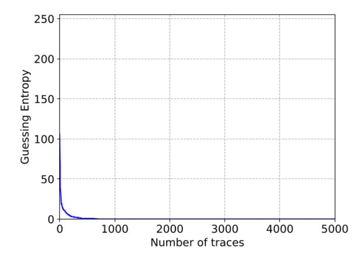

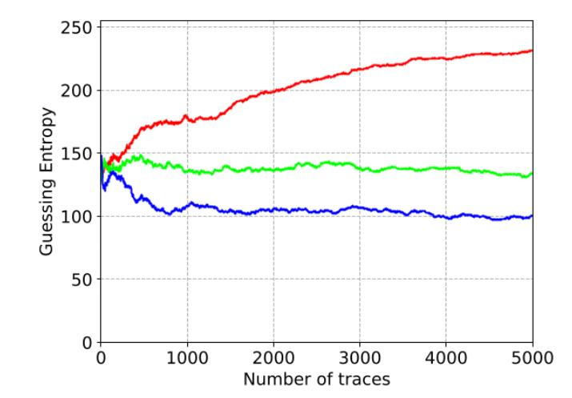

(a) MLP without any changes in the architecture or hyperparameters on the synchronized ASCAD dataset with a fixed key.

(b) MLP without any changes in the architecture or hyperparameters on the desynchronized (N [0] = 50) ASCAD dataset with a fixed key.

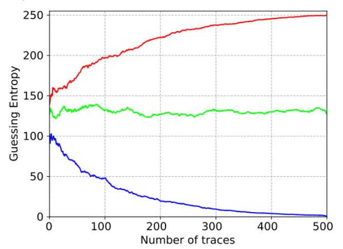

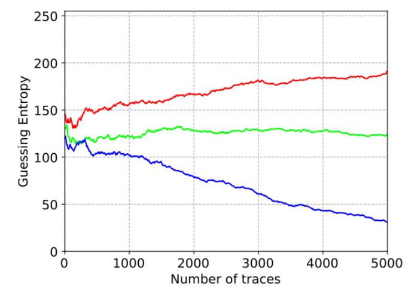

(c) MLP on the DPAcontest v4 dataset. he uniform weight initializer, Tanh inner activation functions, 50 epochs, 50 batch size, 1e-3 learning rate, 4 000 training traces, and 500 attacking traces.

(d) MLP on the AES HD dataset. glorot normal weight initializer, ELU inner activation functions, 50 epochs, 256 batch size, 1e-3 learning rate, 45 000 training traces, and 5 000 attacking traces.

Fig. 1: Examples of GE behaviors with MLP taken from [\[1\]](#page-27-4) and the identity leakage model. Note that not all figures show all three types of behavior. The MLP has six layers with 200 neurons per layer. It uses glorot uniform as the weight initializer in every layer, and ReLU is used as the activation function in all except the last layer. For the last layer, Softmax activation function is used. MLP is trained with RMSProp optimizer for ASCAD dataset, and with Adam optimizer for DPA contest v4 dataset and AES HD dataset.

DPAcontest v4 is a masked software implementation that can be easily transformed into unmasked implementation. It consists of 100 000 traces where each trace has 3 000 features. DPAcontest v4 dataset is available at [http:](http://www.dpacontest.org/v4/42_traces.php) [//www.dpacontest.org/v4/42\\_traces.php](http://www.dpacontest.org/v4/42_traces.php).

AES HD is an unprotected hardware implementation where the common leakage model to attack is the Hamming distance model. It consists of 50 000 measurements where each trace has 1 250 features. AES HD dataset is available at [https://github.com/AESHD/AES\\_HD\\_Dataset](https://github.com/AESHD/AES_HD_Dataset).

{10}------------------------------------------------

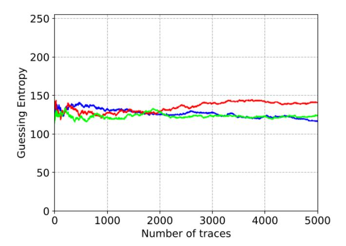

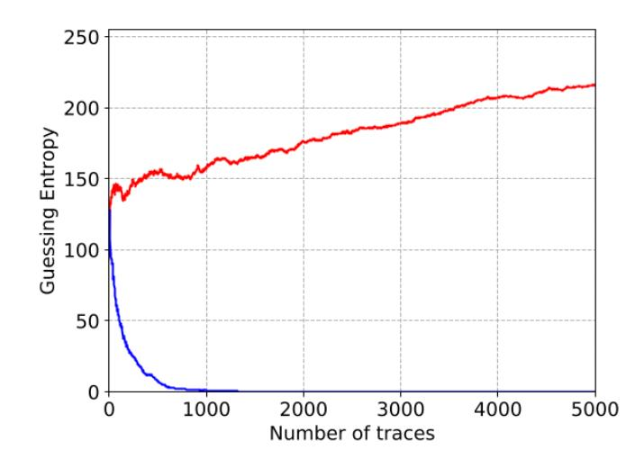

- (a) CNN from [\[26\]](#page-29-2) on the synchronized ASCAD dataset with random keys and the identity leakage model.
- (b) CNN from [\[26\]](#page-29-2) on the synchronized ASCAD dataset with a fixed key and the Hamming weight leakage model.

Fig. 2: Examples of GE behaviors with CNNs. The architecture and hyperparameters are not changed from the original paper except for the leakage model in Figure [2b.](#page-10-0)

Following Definition [5,](#page-4-0) gsge represents the key guessing vector obtained from guessing entropy computed according to Definition [9.](#page-8-2) Considering the full set of Q attack traces, the shuffling and averaging for SGE does not bring any statistical improvement as one uses all the traces for every key rank calculation for the guessing entropy evaluation.

Still, as it will be shown, to have consistent conclusions about GE and attack performance, we need to investigate a generalized way to compute guessing entropy, and what is possible to conclude when this generalization cannot be made. Consequently, we present the definition of generalized guessing entropy:

Definition 10. Generalized Guessing Entropy (GGE). Given Q attack traces, the generalized guessing entropy is the mean over all key rank calculations, each of which considers a randomly selected U out of Q traces (i.e., a fraction of available traces), where U equals Q(1−r). The randomization factor r = 1−U/Q, for U ≤ Q and 0 ≤ r < 1, defines the level of randomization of attack traces for each (independent) key rank calculation. The higher the randomization factor r, the higher the generalization level represented by generalized guessing entropy. Following Definition [5,](#page-4-0) ggge represents the key guessing vector obtained from guessing entropy computed according to Definition [10.](#page-10-1)

Definition 11. Bootstrap sampling. A method involving drawing of sample data repeatedly with replacement from a data source to estimate a population parameter.

There is a connection between the way how GGE is calculated and the bootstrap sampling process. Let us consider a case where we calculate guessing entropy for N traces (calculations for other trace quantities are done independently, so the same experiment procedure is repeated). In GGE, we select Z

{11}------------------------------------------------

traces, where Z < N, and we calculate key rank and repeat the procedure to obtain GGE. With bootstrap, we select with replacement from N traces, which will cause that the number of unique measurements is smaller than N. Then, by taking unique measurements only, we can calculate key rank, and by repeating the procedure, guessing entropy. The main difference lies in the fact that our definition of GGE relies on an explicitly defined less than N measurements to be used for each key rank calculation. For bootstrap, "less than N" is a consequence of considering unique measurements in a sampling procedure that takes replacement into account.

The traces selected for each key rank calculation for GGE always represent only a small subset of the available attack traces (thus with different noise distribution). Finally, by increasing the randomization factor r, we increase the GE estimation's reproducibility. For GGE, to provide an accurate estimation of the profiling model's performance for different attack sets, the number of attack traces must be larger than for the SGE analysis. When the number of attack traces is too small to compute GGE, it is still possible to evaluate if a profiling model can be successful. Consequently, we propose in Section [5](#page-11-0) a metric to measure how well the profiling model fits the SCA leakage.

Remark 1. We do not claim that we "discovered" any of the two notions of guessing entropy. Rather, to the best of our knowledge, we are the first ones discussing the differences and consequences of those notions in SCA. Seminal related works on the topic are rather vague, where the definitions either remind more of SGE or discuss GE in an abstract way. For instance, J. Massey defined guessing entropy as: "The guessing entropy of a random variable X is the average number of questions of the kind "does X = x hold" that must be asked to guess X's value correctly" [\[15\]](#page-28-11). In [\[24\]](#page-29-1), GE is interpreted from [\[15\]](#page-28-11) as the expected value of the random variable of the algorithm representing a side-channel key recovery adversary ability to find the index of the correct key class in the key guessing vector. Thus, we see that both definitions do not account for the numbers of traces required for the reliable estimate of the attack performance.

Finally, it is difficult to deduce by simple code evaluation whether one calculates SGE or GGE, see, e.g., [\[26,](#page-29-2)[1\]](#page-27-4). The main difference lies in the maximal number of attack traces one takes compared to the attack dataset's size.

# 5 On the Relationships between Guessed Keys and the Correct Key

After training a profiling model, it is essential to determine whether the model fitted data or noise. Commonly, this is done by evaluating the performance on the attack dataset. If the model fitted data (i.e., learned from the actual leakage information), its bias must be low, and by adding more attack traces, an SCA metric should indicate improved attack performance. Even if the profiling model outputs a wrong key as the most likely key, one will hope that the correct key is among the most likely ones and that the correct key and most likely wrong 

{12}------------------------------------------------

keys share a certain relationship. On the other hand, if the model fitted noise, it will behave as random guessing or even consistently point toward wrong key candidates. Then, one would assume there is little or no relationship between the guessed and the correct key. Next, we introduce the first metric (to the best of our knowledge) to assess the relationship between different key candidates and the correct key.

#### 5.1 Leakage Distribution Difference Metric

First, to better evaluate the profiling model's preference (i.e., the mapping decision) for specific key candidates, we calculate a hypothetical leakage distribution for every key candidate and all plaintexts for a given dataset. We denote this distribution as the leakage distribution of a dataset. The leakage distribution variation between different key candidates represents the Leakage Distribution Difference metric, denoted as LDD. LDD provides an estimation of the hypothetical label distribution variation between different key candidates. A specific key will then have a smaller probability to be selected based on a (properly) trained model if LDD is large between that key and the correct key. Consequently, LDD can be considered as an ideal key rank metric indicating the best possible scenario where the correct key is maximally separated from all the other keys.

Eq. [\(4\)](#page-12-0) shows the sum of the squared difference between the leakage distribution of all key hypotheses k ∈ K and the correct key candidate k ∗ over Q attack traces. Since all problem dimensions are comparable, we use the Euclidean distance (L2 norm). Larger difference between the two leakage values will introduce more significant LDD variation. Note that LDD is a vector of size |K|, that is computed as follows:

$$\mathbf{LDD}(k^*, k) = \sum_{i=0}^{Q} \|f(d_i, k^*) - f(d_i, k)\|^2, k \in \mathcal{K}.$$
 (4)

In the above expression, f(di , k) is the leakage model function that returns the leakage value according to a key candidate k and data value di ∈ Q, where Q denotes the number of attack traces in the dataset. LDD is computed for every key candidate and gives a unique distribution of all key candidates based on their difference to the correct key. LDD is equal to zero for the correct key (thus, providing the ideal key rank distinction between the correct key and wrong keys).

For instance, if the leakage function relies on the Hamming weight of a target byte in S-box output, we define the Hamming Weight Distribution Difference (HWDD) for the correct key candidate k ∗ and a key candidate k as:

$$\mathbf{HWDD}(k^*, k) = \sum_{i=0}^{Q} \|HW(S_{box}(d_i \oplus k^*)) - HW(S_{box}(d_i \oplus k))\|^2.$$
 (5)

{13}------------------------------------------------

As we can observe, the leakage function in Eq. [\(5\)](#page-12-1) is set to HW(Sbox(di⊕k)), where ⊕ is the exclusive OR operation. Similarly, we could also define the Identity Leakage Distribution (IDD) where the target state is the S-box output. In this case, the leakage function equals Sbox(di ⊕ k) and the IDD value for the correct key candidate k ∗ and a key candidate k is:

$$\mathbf{IDD}(k^*, k) = \sum_{i=0}^{Q} \|S_{box}(d_i \oplus k^*) - S_{box}(d_i \oplus k)\|^2.$$
 (6)

When it is clear from the context, we use the notations LDD(k ∗ , k) and LDD interchangeably. The LDD definition can be extended to any leakage model, e.g., the Hamming distance (HD) or the least significant bit (LSB). This paper considers the analysis for HW and identity leakage models for the AES cipher.[8](#page-13-0)

Figure [3](#page-13-1) illustrates HWDD and IDD for the correct key candidates k ∗ = 34 (correct key for the ASCAD dataset with random keys) and k ∗ = 224 (correct key for the ASCAD dataset with a fixed key). Note that the leakage distribution for each key candidate is unique. The selection of the reference key, therefore, determines the LDD value for each key candidate. For instance, the correct key candidate has a distribution difference equal to zero (if the correct key is also the reference key). For the remaining key byte candidates, the lower the distribution difference, the more similar are the key bytes to the reference key.

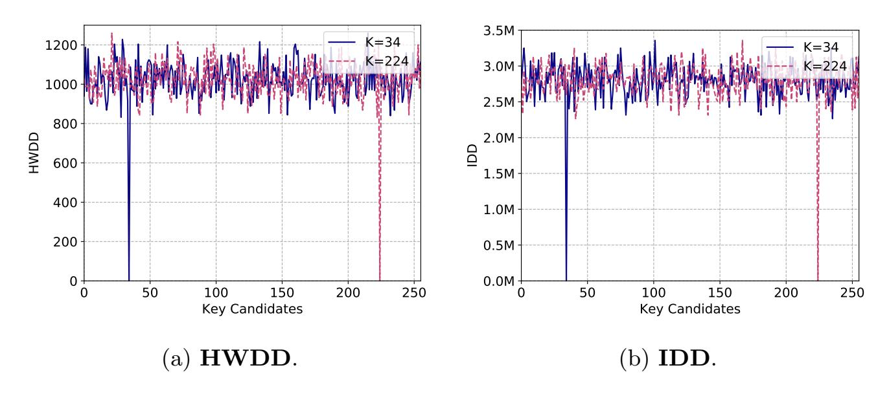

Fig. 3: Illustration for the HWDD and IDD for key candidates 34 and 224.

Besides the similarity between key guesses, LDD also indicates the likelihood of other keys being selected by the classifier when one key is used as a reference

8 The publicly available datasets consider AES and leak mostly in those leakage models. They leak mostly in the Hamming weight leakage model, and that leakage model will produce the best results. Still, the ASCAD dataset also leaks in the identity leakage model, enabling us to investigate the IDD scenario.

{14}------------------------------------------------

key. Note that in Figure [3,](#page-13-1) LDD values between two wrong key guesses are much smaller than the one with the correct key (we can obtain such values by simple subtraction of values for different keys). Even when considering an ideal classifier and no noise scenario, LDD shows it is not a 0/1 decision between the correct key and incorrect keys. Instead, the inner relationships exist between key candidates, and those inner relationships make the classification procedure more difficult. The same conclusions can also be drawn in terms of the relationship between different intermediate data, as Figure [3](#page-13-1) can be easily transferred to map the relationship between LDD (y-axis) and possible intermediate data (x-axis).

To confirm this assumption, we use the simulated measurements with a strong HW and identity leakages and a controlled Gaussian noise level, normally distributed with a variance of 0.01 around a mean of zero. The simulated dataset consists of traces of one hundred features where all features are equal but for two features that hold the leakage, which is proportional to HW(Sbox(d ⊕ k)) or Sbox(d ⊕ k), for the HW and ID leakages, respectively. The profiling set has plaintexts d and keys k chosen from a uniformly random distribution. The attack set's plaintexts are selected uniformly at random, while the attack key is the same for the whole set. We use the template attack and consider increasing profiling traces N to reduce the templates' noise. To obtain the true probability of being selected for every key, based on Eq. [\(2\)](#page-5-1), the accumulated probability summed for 10 000 attack traces (with the fixed key) is calculated. The comparison between the normalized key-selection probability and normalized LDD is shown in Figure [4.](#page-15-0) From the results, the key-selection probability perfectly matches the LDD value for each key, and this observation applies to both HW and ID leakage models. The slight deviation between the two lines is caused by the existence of the noise in the traces. One can expect even more reduced difference if the number of attack traces is further increased.

This observation could also be extended to the real dataset. Indeed, the noise and countermeasures' existence push the accumulated probability of each key away from ideal. Still, LDD serves as an (ideal) indicator of the key-selection probability.

#### 5.2 On the Relationships Between LDD and the Probability Density Function

While we established that LDD gives insights into the relationship between different keys, it still remains to be shown how this information can be used to provide information about the profiling model and the attack performance. Consequently, we consider LDD and template attack, and investigate how can we obtain information about the attack from LDD. To investigate the relationship between LDD and Probability Density Function (PDF), we use a ChipWhisperer dataset as there the correct key can be retrieved within ten attack traces with a template attack (TA) [\[17\]](#page-28-12). Note that this dataset is not perfectly noiseless, but it is difficult to obtain less noisy measurements without resorting to simulations. Additionally, only two points of interest (we denote them as POI1 and POI2) are required to successfully attack this dataset. Consequently, the

{15}------------------------------------------------

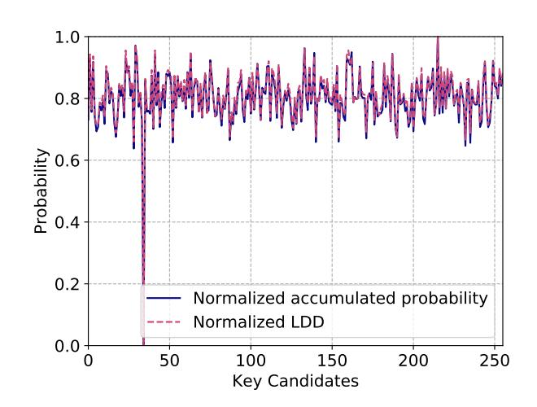

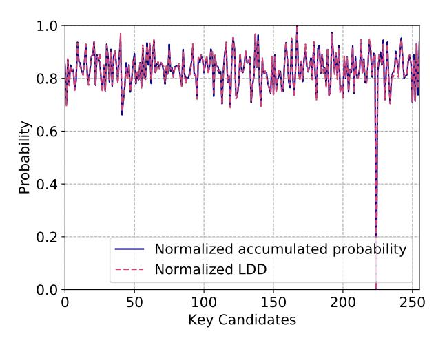

the correct/reference key is 34.

(a) Key-selection probability v.s. HWDD; (b) Key-selection probability v.s. IDD; the correct/reference key is 224.

Fig. 4: Key selection probability v.s. LDD for different correct keys.

probability density function (PDF) for each cluster, which is equivalent to the templates built during the profiling phase, can be represented by a 2D image. By visualizing the distribution of different cluster's PDFs, we can better understand the LDD metric and the relationships between the most-likely and least-likely key guesses.

Figures 5a and 5b show PDFs and the distributions of 1000 POIs for mostlikely and least-likely key candidates for TA. Note that, in this case, the mostlikely key is also the correct key. We run this experiment with 1000 random plaintexts. Since we use the HW leakage model, nine PDFs representing nine HW clusters are built during the profiling phase. Each PDF is represented by two contour lines that denote 0.5 (low) and 0.9 (high) of the maximum probabilities. The color of each point is attributed based on their cluster label. The distribution of the POI pairs for the same label is denoted as HW-POI distribution (e.g., HW-POI distribution for HW 0).

From the results, we observe 1) POI1 and POI2 are strongly correlated, 2) the HW-POI distribution for the most-likely (correct) key matches better to its labeled cluster than for the least-likely key, and 3) that the centers of each HW-POI distribution are not overlapping (indicating clear separability). Based on these observations, we can conclude that the HW variation is strongly correlated with the mean differences in PDFs. In other words, HW values that are more different (where the distance metric is the Hamming weight) also have PDFs that are more separated.

Then, we extend the single HW difference to the HW distribution difference (HWDD, which is done for all possible keys). Based on the conclusions drawn from Figure 5, the HW-POI distribution of the most-likely key matches the underlying PDFs distribution the best. What is more, a larger **HWDD** difference between the most-likely key (correct key) and another key candidate k indicates a low match between k's HW-POI distribution and PDFs (see Figure 5b). Consequently, one could expect a low key rank for the key k.

{16}------------------------------------------------

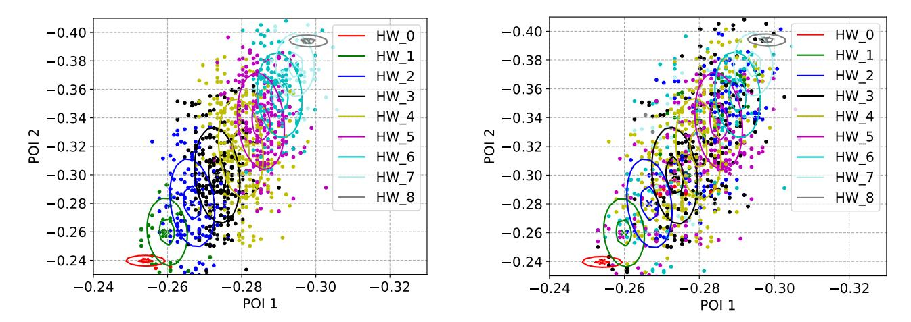

(a) PDFs and HW-POI distribution for the most-likely key. (b) PDFs and HW-POI distribution for the least-likely key.

Fig. 5: PDFs and HW-POI distribution with different keys without noise.

However, when noise is introduced, the PDF output is less determined by the leakage but by the random fluctuation of the POIs value (i.e., the noise), which eventually obscures the output probability of different clusters. To demonstrate this, we introduce a Gaussian noise with zero mean and 0.3 variance to the original trace set. Since the difference between the most-likely and least-likely keys is demonstrated in Figure [5,](#page-16-0) we present the PDFs and HW-POI distribution for the correct key and most-likely key in Figures [6a](#page-16-1) and [6b.](#page-16-1)

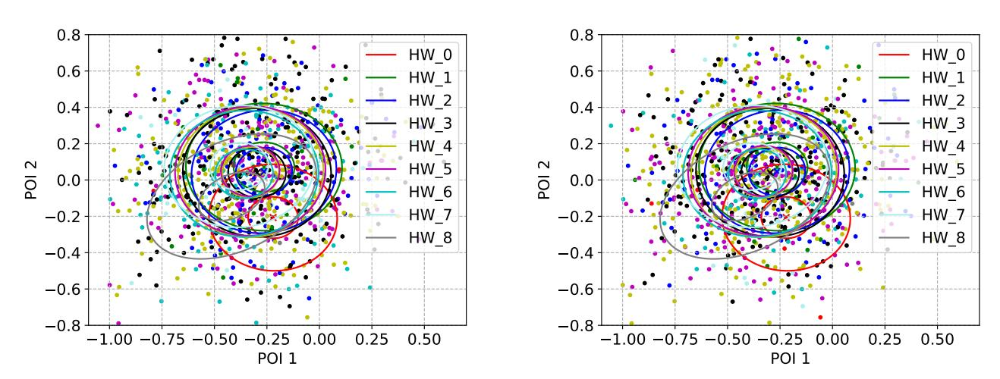

(a) PDFs and HW-POI distribution for the correct key. (b) PDFs and HW-POI distribution for the most-likely key

Fig. 6: PDFs and HW-POI distribution with different keys with noise.

From the figures, the PDFs built with noisy data distributed similarly to the noise added to the traces (thus, the signal-to-noise ratio becomes very low). Consequently, the overlapping area for each PDF is increased, and the differences in the output probabilities for each PDF become smaller. Similarly, when 

{17}------------------------------------------------

comparing the HW-POI distribution in Figures [6a](#page-16-1) and [6b,](#page-16-1) one can hardly identify which key (correct or most-likely) fits the PDFs better. From the attack perspective, the correct key has the rank equal to four after applying more than 1 000 attack traces, indicating that the profiling model did not fit the leakage as good as for the original dataset (reaches one within ten attack traces). Even worse, the noise's random addition could lead to different most-likely keys, even with a fixed amount of attack traces. To be specific, although there is always an HW-POI distribution key that fits the PDFs/templates the best, the variation of PDFs' distribution manipulated by the random noise makes the most-likely key unpredictable. Finally, considering an extreme case that the traces only contains the random noise, every key candidate has equal chances to become the most-likely key.

#### 5.3 Correlation between LDD and the Key Guessing Vector g

In terms of guessing entropy for each key candidate, a larger LDD value indicates that the two evaluated key candidates are less likely to have a similar GE. In other words, LDD can estimate the GE distribution. One could expect a stronger statistical relationship between LDD and g if the model fits the leakage. In case the model fails to fit the data, the outputted random GE for all key candidates would lead to a low correlation between LDD and g.

Following this, the leakage distribution difference (given for any selected leakage model, e.g., HWDD or IDD) can be used to define a profiling model fitting metric, Lm(LDD, g), as a function of LDD and the key guessing vector g:

$$L_m(\mathbf{LDD}, \mathbf{g}) = \mathsf{corr}(\mathsf{argsort}(\mathbf{LDD}), \mathbf{g}).$$
 (7)

Eq. [\(7\)](#page-17-0) defines how well a profiling model fits the data with respect to a key candidate k ∗ for a chosen leakage model. The notation corr designate the Pearson's correlation function and the function argsort(X) returns the rank position by order of magnitude of each element xi in a vector X = [x0, x1, . . . , x|K|−1]. As a result, the Lm(LDD, g) metric can sort the key candidates according to their leakage difference from the correct key candidate k ∗ . Next, we define the concept of perfectly fitted profiling model, while in Section [6,](#page-18-0) we discuss the performance of our new metric on publicly available datasets.

Definition 12. Perfectly fitted profiling model. A perfectly fitted profiling model reaches Lm = 1 in the attack phase for any set of Q attack traces.[9](#page-17-1)

Figure [7](#page-18-1) depicts the "almost" perfectly fitted profiling model for the HW and ID leakage models. We use simulated measurements as described in Section [4.](#page-7-0) We use the template attack and consider increasing profiling traces N. In both figures, the correlation between LDD and the key guessing vector gsge increases w.r.t. the number of profiling traces and reaches the Pearson's correlation of

9 We assume there are many possible ways to select Q traces out of all possible traces.

{18}------------------------------------------------

0.999 and 0.998 for the HW and ID leakage models using one million profiling traces.

Results in Figure 7 confirm the correctness of Definition 12 as the correlation between **LDD** and  $\mathbf{g}_{sge}$  tends to increase with better (more fit) models (since we use template attack, better models are those that are trained with more traces as we follow the standard assumptions for template attack).

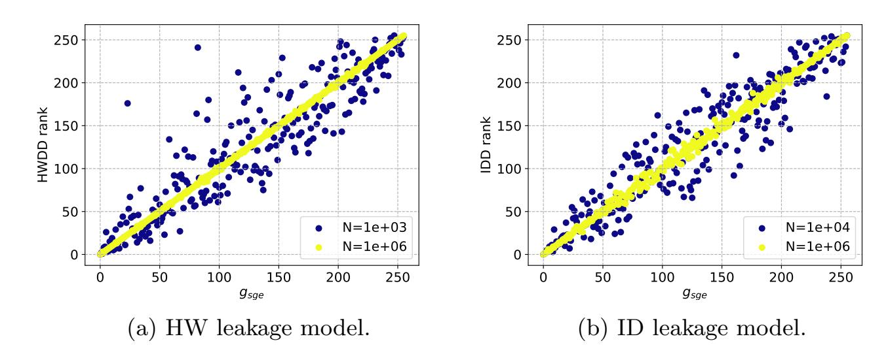

Fig. 7: Perfectly fitted profiling model with template attack, considering the HW and ID leakage models on simulated traces with increasing number of profiling traces N.

#### 6 Experimental Evaluation

In this section, we provide experimental results for the  $L_m(\mathbf{LDD}, \mathbf{g})$  metric on publicly available datasets. Note that, we cannot expect the perfectly fitted profiling model, which helps us to evaluate the performance of our metric in realistic cases. Our analysis considers the attack performance and the profiling model generalization ability. To strengthen our experimental analysis, we provide additional results in Section A.

# 6.1 Evaluating Leakage Fitting with Generalized Guessing Entropy and Simple Guessing Entropy

We assume that GGE is the optimal way of computing guessing entropy as it considers a sufficient (where sufficient means that the available number of traces is much larger than the number of traces we require to break the target) number of attack traces. While GGE can be infeasible to obtain (as only a limited number of attack traces could be available in the attack phase), SGE calculation may point to the wrong conclusions about the attack, mostly due to a lack of generalization ability.

{19}------------------------------------------------

From an evaluator's perspective, to minimize this issue, it is important to understand the minimal number of attack traces needed to estimate whether the profiling model correctly fits the leakage (which we denote as leakage fitting in the rest of this section). Unfortunately, this is a difficult task as it depends on 1) selection of a good attack method, 2) the correct leakage model, and 3) characteristics of the dataset (noise, countermeasures).

To further investigate the model's generalization ability as well as its possible influencing factors, we evaluate different model's performance and generalization ability on neural networks with different sizes. The results emphasize that GGE offers a proper indication of the attack performance while SGE may require additional information as provided with Lm(LDD, gsge) (correlation between LDD and gsge values). This section uses MLP and the Hamming weight leakage model to provide a unified view for all the experiments. In Sections [A.1](#page-29-5) and [A.2,](#page-31-0) we provide additional results when evaluating the robustness of our metric for different levels of noise, profiling model complexities, and the number of epochs. Finally, in Section [A.3,](#page-33-0) we provide the results for the Hamming weight leakage model and CNNs, and we repeat the experiments done in this section. Before presenting experimental results, we briefly discuss the differences between the attack performance and generalization ability notions. Here, we consider the number of attack traces needed to reach guessing entropy of zero by attack performance. Naturally, to obtain such a result, we expect that the profiling model fits the leakage and generalizes to attack traces. On the other hand, by the generalization ability, we consider how well the profiling model fits the leakage in general (regardless of the selected attack traces). For instance, the profiling model can generalize well, but the attack performance can be bad as maybe we do not use enough attack traces or use SGE. Thus, the difference between attack performance and generalization ability can be subtle depending on a specific setting but is important in general.

Analysis for the ASCAD dataset. To evaluate generalization's ability of neural networks for the ASCAD dataset (details in Section [2.5\)](#page-5-2), we define two different multilayer perceptrons: 4-layer MLP and 6-layer MLP. The latter has the same structure as proposed in [\[1\]](#page-27-4), and the first is a shallower version of it, with all hidden layers containing 200 neurons each and ReLU as the activation function. For both neural network architectures, the learning rate is set to 1e-5 with Adam as the optimizer. The models are trained for 50 epochs with a minibatch of 400 traces. The leakage model is the Hamming weight of Sbox output, where we target the third key byte of the first AES encryption round.

The two MLPs are trained with a different number of profiling traces, starting from 1 000 traces, and ranging up to 200 000 traces, with a step of 1 000 traces. This adds up to 200 trained models for each MLP. For each of the 200 trained models, we calculate GGE and Lm(HWDD, ggge) by considering Q = 100 000 and U ranging from U = 1 000 up to U = 10 000, with a step of 1 000 attack traces. This means that the randomization factor for GGE (see Definition [10\)](#page-10-1) ranges from r = 0.9 to r = 0.99. Results are shown in Figure [8.](#page-21-0) Observe that 

{20}------------------------------------------------

changing the value U (and, consequently, the randomization factor r) changes the final guessing entropy obtained for a model trained on a certain number of profiling traces. The differences in the final guessing entropy results for different U values are more significant when the number of profiling traces is lower. For example, when MLP is trained with 20 000 traces, GGE when U = 1 000 is around 50, while GGE for the same profiling model after processing U = 10 000 is already 1. Note that this is expected, as, for a low number of attack traces, the guessing entropy might not reach its lowest possible value for a certain profiling model. Still, this means that depending on the available number of attack traces to be used, we can reach different conclusions about profiling model performance (due to a different number of attack traces) but also about profiling model generalization ability (due to a different number of profiling traces). Simultaneously, the Lm(HWDD, ggge) metric varies marginally for different U, even for a smaller number of profiling traces, which indicates that the profiled model learned the leakage well. What is more, the marginally changing results for different U suggest Lm(HWDD, ggge) to be a better indicator or the generalization ability, as this is a notion connected with the profiling model, and not the attack setting (while GGE shows the influence of U when assessing the generalization ability of the profiling model).

This analysis depicts that if Q is sufficiently large (100 000 in the current example), the behavior of generalized guessing entropy with a small U is a reliable metric. This conclusion can be confirmed by observing Figures [8a](#page-21-0) and [8c,](#page-21-0) where Lm(HWDD, ggge) is very similar for different number of attack traces U, even when the number of profiling traces is low. Lm(HWDD, ggge) is a reliable metric to estimate the attack performance, regardless of the dataset size U, and it is additionally a reliable indicator of the profiling model generalization ability.

Remark 2. Generalized guessing entropy is a reliable attack metric, but depending on the setup, it may be prohibitively difficult to obtain enough attack traces.

Next, we demonstrate that computing guessing entropy using SGE (Definition [9\)](#page-8-2) for a limited number of attack traces could lead to wrong conclusions about the profiling model's ability to fit the leakage. Recall, the trained model tends to demonstrate a preference (the way the mapping is done) for some key byte candidates, and the reliability of such conclusions can also be estimated from the way SGE is calculated. If the model learns the leakage, then the preference happens for the correct key candidate in the attack set. On the other hand, if the preference happens for the wrong key candidate, we can assume that the profiling model did not fit leakage but noise.

Simple guessing entropy may be insufficient to indicate the profiling model leakage fitting when the number of attack traces Q is not large enough. In this case, GE would likely be computed for U = Q (with a randomization factor r = 0). More precisely, we calculate simple guessing entropy, as the attacker would use the maximum number of available attack traces for the key rank calculation. To avoid misleading conclusions about model performance and generalization, it is very important to identify whether SGE shows biased results.

{21}------------------------------------------------

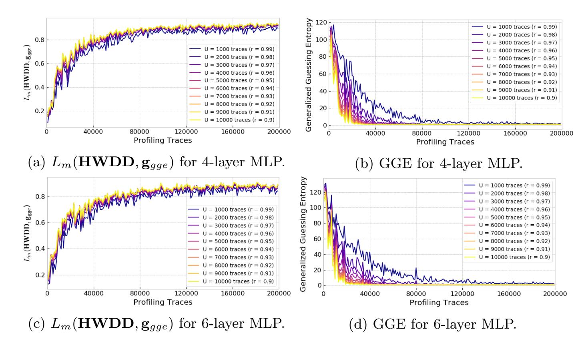

Fig. 8: ASCAD results: Lm(HWDD, ggge) and GGE with respect to different number of profiling and attack traces.

In Figure [9,](#page-22-0) we depict the results for SGE and Lm(HWDD, gsge) for the same two MLP models trained on different profiling attack trace sizes. We provide SGE and Lm(HWDD, gsge) results for attack trace sets ranging from U = Q = 1 000 to U = Q = 10 000. The SGE behavior is more fluctuating compared to the GGE behavior, which indicates that SGE is indeed less appropriate metric to assess the attack performance and, consequently, model generalization. Besides that, the most important observation is related to the wrong indications about model's generalization ability provided by SGE when insufficient attack traces U = Q are considered. This is particularly clear when comparing Figures [9a](#page-22-0) and [9c](#page-22-0) for 4-layer and 6-layer MLPs, respectively. As we can see, when using only U = Q = 1 000 attack traces for Lm(HWDD, gsge) the evaluator is unable to conclude about model's generalization ability (or, at least, he would conclude that the profiling model is not generalizing well, which contradicts the observations from Figure [8\)](#page-21-0).

It is clear that the 4-layer MLP generalizes better than 6-layer MLP, and only using enough attack traces for SGE can provide a reliable generalization estimation (as is the case of plotting line for U = Q = 10 000 in Figure [9c\)](#page-22-0). Additionally, we see that the estimation of the generalization ability is less reliable with Lm(HWDD, gsge) compared to Lm(HWDD, ggge).

The obtained results indicate the need to answer the question when the Lm(HWDD, g) metric is needed. To answer it, we plot the correlation between Lm computed from GGE and SGE in Figures [10a](#page-23-0) and [10b](#page-23-0) for 4-layers and 6 layer MLPs, respectively. These figures contain 200 dots, one for each trained model with different profiling set size, as specified before. As we can observe in

{22}------------------------------------------------

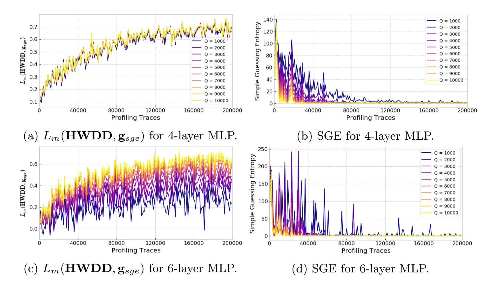

Fig. 9: ASCAD results: Lm(HWDD, gsge) and SGE with respect to different number of profiling and attack traces.

Figure [10a,](#page-23-0) regardless of the number of traces to compute SGE, the corresponding Lm metric is highly correlated to Lm metric computed from GGE values (correlation is always close to 0.9). This means that simple guessing entropy together with Lm for U = 1 000 provides enough indication of model's generalization ability. Consequently, GGE calculation, which can be impractical in many cases, is no longer needed for this conclusion. In the case of the 6-layer MLP model, the Lm values for SGE start to be highly correlated to Lm obtained from GGE as soon as at least U = 5 000 traces are used. This means that this model's generalization is not as good as the previous one, and the Lm values for SGE will keep growing until a minimum sufficient number of attack traces are considered. In the example of Figure [10b,](#page-23-0) U = 10 000 for SGE allows us to obtain the same indication of the profiling model generalization as GGE. This indication can be given by the Lm metric.

Analysis for the CHES CTF dataset. For the CHES CTF dataset, both profiling and attack sets are smaller, and therefore, the verification of generalization of a profiling model can be less reliable. Here, we also investigate the generalization ability of two different profiling models concerning guessing entropy calculations. For that, we define two MLPs, one with two hidden layers and a second MLP with four hidden layers. In both cases, hidden layers are configures with 200 neurons each, ReLU activation function, learning rate of 1e-3 and Adam as the optimizer. Training processes are performed over 50 epochs considering a mini-batch of 400 traces. The leakage model is the Hamming weight

{23}------------------------------------------------

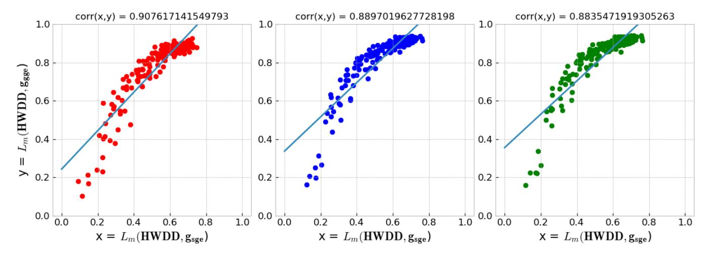

(a) Results with 4-layer MLP on the ASCAD dataset. From left to right: U = 1 000, U = 5 000 and U = 10 000.

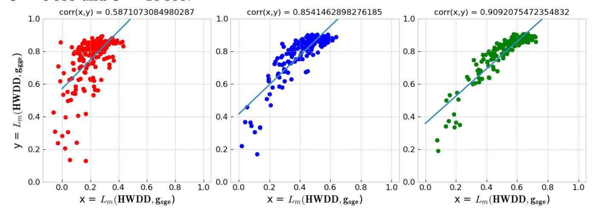

(b) Results with 6-layer MLP on the ASCAD dataset. From left to right: U = 1 000, U = 5 000 and U = 10 000.

Fig. 10: Correlation for Lm calculated with SGE and GGE for the ASCAD dataset with the Hamming weight leakage model.

of Sbox output, where we target the first key byte on the first AES encryption round.

Both MLP models are trained with different profiling set sizes, ranging from 1 000 to 44 000 profiling traces, and having a step of 1 000 traces. This adds up to 44 profiling models for each configured MLP. For the attack phase with GGE, we consider Q = 5 000 traces and we define U from 100 (r = 0.98) to 1 000 (r = 0.8). Figure [11](#page-24-0) shows results for Lm(HWDD, ggge) and GGE for two MLP models trained on multiple profiling set sizes for the CHES CTF dataset. As the line plots for GGE clearly show, the model generalization indication based on GGE heavily depends on U, and using a high randomization factor (when U = 100 and r = 0.98) might lead to inconsistent conclusions about model generalization. This is an example when Lm(HWDD, ggge) is a supporting metric to verify the actual model generalization. For both MLPs trained on 44 000 profiling traces and when Q = 5 000 and U = 100, the final (generalized) guessing entropy values are 90 and 78 for 2-layer and 4-layer MLPs, respectively, as illustrated in Figures [11b](#page-24-0) and [11d.](#page-24-0) By observing Lm(HWDD, ggge) on the same number 

{24}------------------------------------------------

of profiling and attack traces, Lm shows almost no differences with regards to the choice of U, where the correlation values are above 0.4. This justifies the usage of the proposed metric together with GGE to verify model's generalization. Simultaneously, high correlation values also indicate that the profiling model is capable of strong attack performance (but for that, enough attack traces need to be used, which is information obtained from the GGE plots).

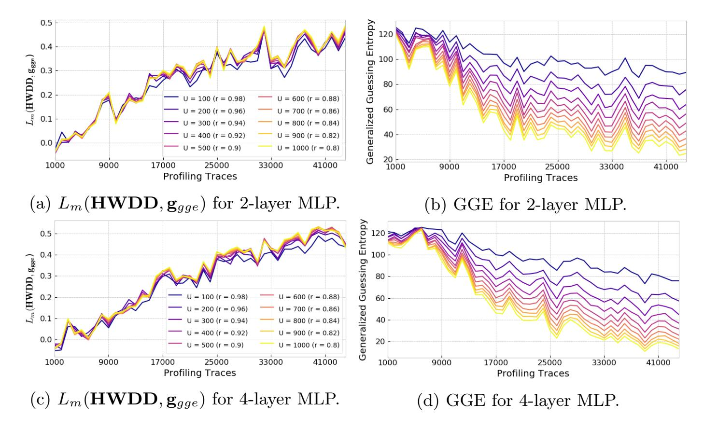

Fig. 11: CHES CTF results: Lm(HWDD, ggge) and GGE with respect to different number of profiling and attack traces.

Figure [12](#page-25-0) shows the corresponding results for SGE and Lm(HWDD, gsge). Lm tends to indicate similar results regardless of the number of attack traces used to calculate SGE. The final guessing entropy values computed from U = 100 traces would lead to conclusions that the model does not generalize well. With this small number of attack traces, it is also hard to verify from SGE values alone if the model improves its generalization when trained on more profiling traces. That is not the case for the Lm metric computed from SGE, which does not depend on the considered number of attack traces. Therefore, Lm(HWDD, gsge) metric is a supporting metric when the number of attack traces is limited. Finally, observe that Lm(HWDD, gsge) provides less stable results than Lm(HWDD, ggge).

Figures [13a](#page-26-0) and [13b](#page-26-0) provide more evidence that calculating Lm for small values of U on SGE can already indicate the profiling model generalization capacity. For both MLPs trained on CHES CTF dataset, the results demonstrate that using Q = 100 attack traces for SGE or Q = 5 000 (with U = 1, 000) attack traces for GGE provide similar results about model generalization.

{25}------------------------------------------------

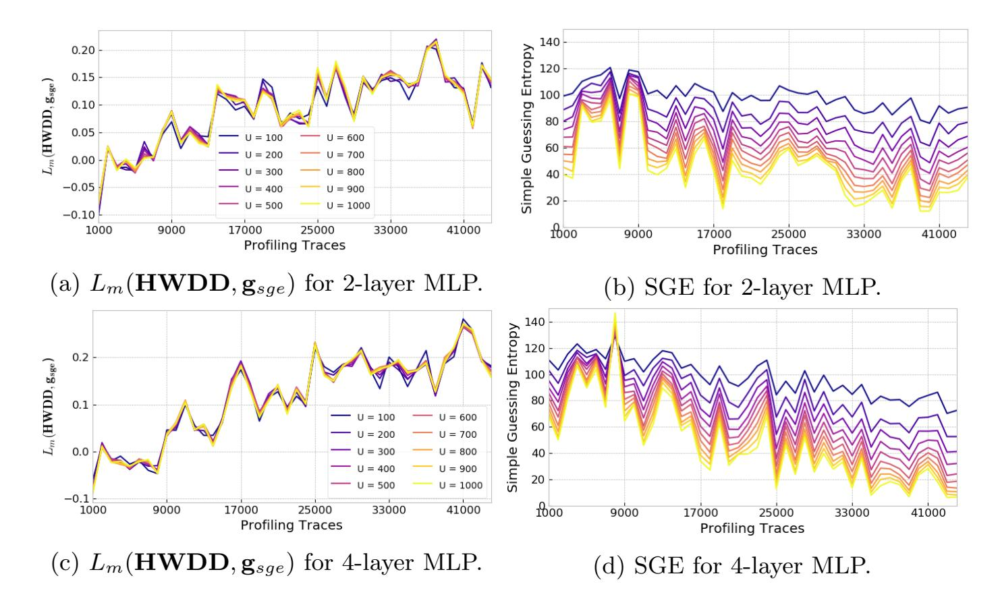

Fig. 12: CHES CTF results: Lm(HWDD, gsge) and SGE with respect to different number of profiling and attack traces.

Remark 3. Simple guessing entropy should not be considered as a reliable attack metric in the general case. Instead, one needs to evaluate the correlation between LDD and gsge.

#### 6.2 General Observations

Here, we list the general observations based on the results from the previous sections and the results from Section [A.](#page-29-4)

- 1. The LDD metric can be considered as an ideal rank metric indicating the relationship between the reference key and all the other keys. The magnitude of this metric depends on the leakage model and the number of measurements.
- 2. For a proper attack performance estimation, one should use GGE. It is also possible to use Lm(LDD, ggge) to obtain additional information about the profiling model generalization ability. Lm(LDD, ggge) needs less profiling traces for a confident estimate compared to GGE.
- 3. When the number of available attack traces is low (not sufficient for GGE), calculate Lm(LDD, gsge). If the correlation value is high, SGE can be a reliable indicator of the attack performance. Lm(LDD, gsge) gives additional information about the model generalization ability even when faced with a limited number of profiling/attack traces.
- 4. Lm(LDD, g) does not give direct attack performance and does not replace the information obtained through guessing entropy. Indeed, from Lm(LDD, g), one cannot deduce the number of attack traces needed to reach guess-

{26}------------------------------------------------

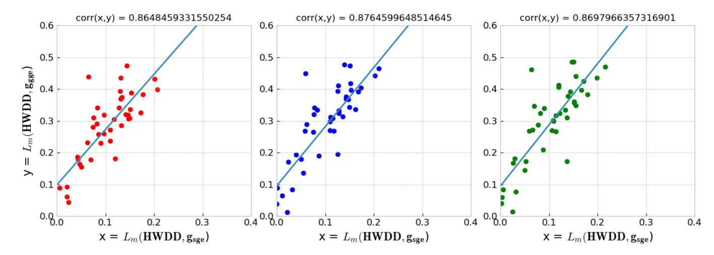

(a) Results on 2-layer MLP on the CHES CTF dataset. From left to right: U = 100, U = 5000 and U = 1 000.

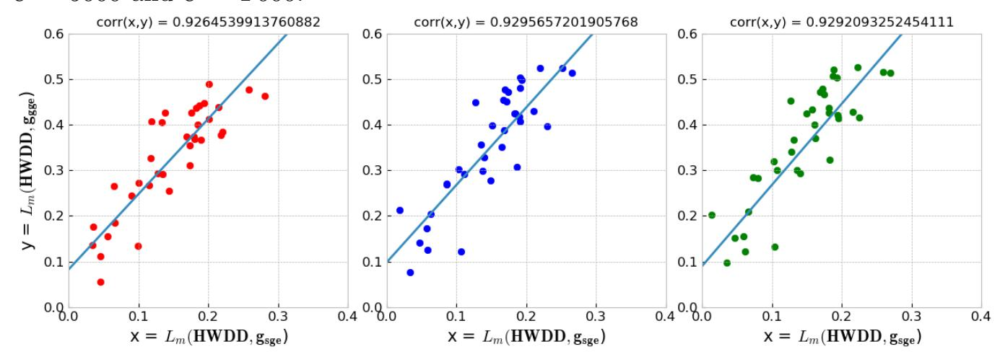

(b) Results on 4-layer MLP on the CHES CTF dataset. From left to right: U = 100, U = 5000 and U = 1 000.

Fig. 13: Correlation for Lm calculated with SGE and GGE for the CHES CTF dataset with the Hamming weight leakage model.

ing entropy equal to 0. Still, our experimental analysis suggests that, e.g., Lm(HWDD, g) higher than ≈ 0.4 will result in strong attack performance.

- 5. Lm(LDD, g) is a robust metric: it is reliable for various noise levels, profiling model complexities, and the number of training epochs. What is more, to reach a reliable estimate, Lm(LDD, g), requires only a small number of attack traces (e.g., 100 traces), which is significantly less than for GGE to reach the same level of confidence.
- 6. Lm(LDD, g) metric should be used in profiling SCA only as non-profiled attacks do not build models to be evaluated through Lm.

# 7 Conclusions and Future Work

In the profiling side-channel analysis, one commonly uses guessing entropy to estimate the attack performance. Additionally, it is common to use all available attack traces in the guessing entropy calculation to make the evaluation more reliable. This work shows how such a practice can lead to misleading results, 

{27}------------------------------------------------

where one obtains a wrong indication of the profiling model performance. First, we define two guessing entropy notions: simple guessing entropy and generalized guessing entropy. We show that generalized guessing entropy is a more powerful metric but could be difficult to apply in practice.

We propose the Leakage Distribution Difference (LDD) metric, which indicates the relationships among different keys and could be considered as the Ideal Key Rank metric when using the correct key as the reference key. Next, we show that by observing the correlation between LDD and key guessing vector, one can reliably and efficiently deduce the attack's performance and the profiling model generalization ability. Our findings are confirmed over a number of experiments considering various attack methods, leakage models, and datasets. In future work, we plan to examine the potential of Lm as a metric for early stopping in the training process. Additionally, we plan to examine Lm in the context of leakage assessment.

# References

- 1. Benadjila, R., Prouff, E., Strullu, R., Cagli, E., Dumas, C.: Deep learning for side-channel analysis and introduction to ASCAD database. J. Cryptographic Engineering 10(2), 163–188 (2020). [https://doi.org/10.1007/s13389-019-00220-8,](https://doi.org/10.1007/s13389-019-00220-8) <https://doi.org/10.1007/s13389-019-00220-8>
- 2. Cagli, E., Dumas, C., Prouff, E.: Convolutional neural networks with data augmentation against jitter-based countermeasures. In: Fischer, W., Homma, N. (eds.) Cryptographic Hardware and Embedded Systems – CHES 2017. pp. 45–68. Springer International Publishing, Cham (2017)
- 3. Chari, S., Rao, J.R., Rohatgi, P.: Template attacks. In: Jr., B.S.K., Ko¸c, C¸.K., Paar, C. (eds.) Cryptographic Hardware and Embedded Systems - CHES 2002, 4th International Workshop, Redwood Shores, CA, USA, August 13-15, 2002, Revised Papers. Lecture Notes in Computer Science, vol. 2523, pp. 13–28. Springer (2002). [https://doi.org/10.1007/3-540-36400-5](https://doi.org/10.1007/3-540-36400-5_3) 3, [https://doi.org/10.](https://doi.org/10.1007/3-540-36400-5_3) [1007/3-540-36400-5\\_3](https://doi.org/10.1007/3-540-36400-5_3)
- 4. Chari, S., Rao, J.R., Rohatgi, P.: Template attacks. In: Kaliski, B.S., Ko¸c, ¸c.K., Paar, C. (eds.) Cryptographic Hardware and Embedded Systems - CHES 2002. pp. 13–28. Springer Berlin Heidelberg, Berlin, Heidelberg (2003)
- 5. Choudary, O., Kuhn, M.G.: Efficient template attacks. In: Francillon, A., Rohatgi, P. (eds.) Smart Card Research and Advanced Applications. pp. 253–270. Springer International Publishing, Cham (2014)
- 6. Gardner, M.W., Dorling, S.: Artificial neural networks (the multilayer perceptron)—a review of applications in the atmospheric sciences. Atmospheric environment 32(14-15), 2627–2636 (1998)
- 7. Gilmore, R., Hanley, N., O'Neill, M.: Neural network based attack on a masked implementation of AES. In: 2015 IEEE International Symposium on Hardware Oriented Security and Trust (HOST). pp. 106–111 (May 2015). <https://doi.org/10.1109/HST.2015.7140247>
- 8. Heuser, A., Zohner, M.: Intelligent Machine Homicide - Breaking Cryptographic Devices Using Support Vector Machines. In: Schindler, W., Huss, S.A. (eds.) COSADE. LNCS, vol. 7275, pp. 249–264. Springer (2012)

{28}------------------------------------------------

- 9. Hospodar, G., Gierlichs, B., Mulder, E.D., Verbauwhede, I., Vandewalle, J.: Machine learning in side-channel analysis: a first study. J. Cryptogr. Eng. 1(4), 293–302 (2011). [https://doi.org/10.1007/s13389-011-0023-x,](https://doi.org/10.1007/s13389-011-0023-x) [https://doi.org/](https://doi.org/10.1007/s13389-011-0023-x) [10.1007/s13389-011-0023-x](https://doi.org/10.1007/s13389-011-0023-x)
- 10. Kim, J., Picek, S., Heuser, A., Bhasin, S., Hanjalic, A.: Make some noise. unleashing the power of convolutional neural networks for profiled side-channel analysis. IACR Transactions on Cryptographic Hardware and Embedded Systems pp. 148–179 (2019)
- 11. Kocher, P.C., Jaffe, J., Jun, B.: Differential power analysis. In: Wiener, M.J. (ed.) Advances in Cryptology - CRYPTO '99, 19th Annual International Cryptology Conference, Santa Barbara, California, USA, August 15-19, 1999, Proceedings. Lecture Notes in Computer Science, vol. 1666, pp. 388–397. Springer (1999). [https://doi.org/10.1007/3-540-48405-1](https://doi.org/10.1007/3-540-48405-1_25) 25, [https://doi.org/10.](https://doi.org/10.1007/3-540-48405-1_25) [1007/3-540-48405-1\\_25](https://doi.org/10.1007/3-540-48405-1_25)
- 12. Lerman, L., Medeiros, S.F., Bontempi, G., Markowitch, O.: A Machine Learning Approach Against a Masked AES. In: CARDIS. Lecture Notes in Computer Science, Springer (November 2013), berlin, Germany
- 13. Lerman, L., Poussier, R., Bontempi, G., Markowitch, O., Standaert, F.X.: Template attacks vs. machine learning revisited (and the curse of dimensionality in side-channel analysis). In: International Workshop on Constructive Side-Channel Analysis and Secure Design. pp. 20–33. Springer (2015)
- 14. Maghrebi, H., Portigliatti, T., Prouff, E.: Breaking cryptographic implementations using deep learning techniques. In: International Conference on Security, Privacy, and Applied Cryptography Engineering. pp. 3–26. Springer (2016)
- 15. Massey, J.L.: Guessing and entropy. In: Proceedings of 1994 IEEE International Symposium on Information Theory. pp. 204– (1994)
- 16. Masure, L., Dumas, C., Prouff, E.: A comprehensive study of deep learning for side-channel analysis. IACR Transactions on Cryptographic Hardware and Embedded Systems 2020(1), 348–375 (Nov 2019). [https://doi.org/10.13154/tches.v2020.i1.348-375,](https://doi.org/10.13154/tches.v2020.i1.348-375) [https://tches.iacr.org/](https://tches.iacr.org/index.php/TCHES/article/view/8402) [index.php/TCHES/article/view/8402](https://tches.iacr.org/index.php/TCHES/article/view/8402)
- 17. O'Flynn, C., Chen, Z.D.: Chipwhisperer: An open-source platform for hardware embedded security research. In: International Workshop on Constructive Side-Channel Analysis and Secure Design. pp. 243–260. Springer (2014)
- 18. Perin, G., Buhan, I., Picek, S.: Learning when to stop: a mutual information approach to fight overfitting in profiled side-channel analysis. Cryptology ePrint Archive, Report 2020/058 (2020), <https://eprint.iacr.org/2020/058>
- 19. Perin, G., Chmielewski, L., Picek, S.: Strength in numbers: Improving generalization with ensembles in machine learning-based profiled side-channel analysis. IACR Transactions on Cryptographic Hardware and Embedded Systems 2020(4), 337–364 (Aug 2020). [https://doi.org/10.13154/tches.v2020.i4.337-364,](https://doi.org/10.13154/tches.v2020.i4.337-364) <https://tches.iacr.org/index.php/TCHES/article/view/8686>
- 20. Picek, S., Heuser, A., Jovic, A., Bhasin, S., Regazzoni, F.: The curse of class imbalance and conflicting metrics with machine learning for side-channel evaluations. IACR Transactions on Cryptographic Hardware and Embedded Systems 2019(1), 209–237 (Nov 2018). [https://doi.org/10.13154/tches.v2019.i1.209-237,](https://doi.org/10.13154/tches.v2019.i1.209-237) <https://tches.iacr.org/index.php/TCHES/article/view/7339>
- 21. Picek, S., Heuser, A., Jovic, A., Ludwig, S.A., Guilley, S., Jakobovic, D., Mentens, N.: Side-channel analysis and machine learning: A practical perspective. In: 2017 International Joint Conference on Neural Networks, IJCNN 2017, Anchorage, AK, USA, May 14-19, 2017. pp. 4095–4102 (2017)

{29}------------------------------------------------

- 22. Picek, S., Heuser, A., Perin, G., Guilley, S.: Profiling side-channel analysis in the efficient attacker framework. Cryptology ePrint Archive, Report 2019/168 (2019), <https://eprint.iacr.org/2019/168>
- 23. Schindler, W., Lemke, K., Paar, C.: A stochastic model for differential side channel cryptanalysis. In: Rao, J.R., Sunar, B. (eds.) Cryptographic Hardware and Embedded Systems – CHES 2005. pp. 30–46. Springer Berlin Heidelberg, Berlin, Heidelberg (2005)
- 24. Standaert, F.X., Malkin, T.G., Yung, M.: A unified framework for the analysis of side-channel key recovery attacks. In: Joux, A. (ed.) Advances in Cryptology - EUROCRYPT 2009. pp. 443–461. Springer Berlin Heidelberg, Berlin, Heidelberg (2009)
- 25. Wu, L., Picek, S.: Remove some noise: On pre-processing of sidechannel measurements with autoencoders. IACR Transactions on Cryptographic Hardware and Embedded Systems 2020(4), 389–415 (Aug 2020). [https://doi.org/10.13154/tches.v2020.i4.389-415,](https://doi.org/10.13154/tches.v2020.i4.389-415) [https://tches.iacr.org/](https://tches.iacr.org/index.php/TCHES/article/view/8688) [index.php/TCHES/article/view/8688](https://tches.iacr.org/index.php/TCHES/article/view/8688)
- 26. Zaid, G., Bossuet, L., Habrard, A., Venelli, A.: Methodology for efficient cnn architectures in profiling attacks. IACR Transactions on Cryptographic Hardware and Embedded Systems 2020(1), 1–36 (Nov 2019). [https://doi.org/10.13154/tches.v2020.i1.1-36,](https://doi.org/10.13154/tches.v2020.i1.1-36) [https://tches.iacr.org/index.](https://tches.iacr.org/index.php/TCHES/article/view/8391) [php/TCHES/article/view/8391](https://tches.iacr.org/index.php/TCHES/article/view/8391)

# A Supplementary Material

#### A.1 Measuring Leakage Fit for Different Noise Levels

Intuitively, the leakage becomes more challenging for a model to fit when the traces become noisy. To simulate the noise, we consider random values following Gaussian distribution with zero mean and variance ranging from 0 to 10 in steps of 0.5. We add them to the ASCAD dataset with random keys. In terms of attack settings, CNN and template attack use 50 000 traces (randomly selected out of 200 000 profiling traces) for profiling and 5 000 traces (randomly selected out of 100 000 attack traces) for the attack. We use CNN best architecture from the ASCAD paper for deep learning attack [\[1\]](#page-27-4). For TA, we select 20 POIs from the traces according to the trace variation of the HW of the intermediate data (Sbox output). The guessing entropy is averaged on 100 attacks. Moreover, instead of only using the final GGE to calculate Lm(HWDD, ggge), we investigate the correlation changes for every attack trace. The results are shown in Figure [14.](#page-30-0)

For the attacks where GGE for the correct key reaches zero (in blue), Lm increases quickly when the number of attacks traces increases; the final correlation values are above 0.7 and 0.5 for CNN and template attack, respectively. A detailed analysis is presented in Figures [14b](#page-30-0) and [14d.](#page-30-0) We calculate Lm for two different numbers of attack traces (highlighted in blue); the purple line is the GGE calculated with 5 000 attack traces. We see that Lm reduces with the increased variation of noise, which is also reflected in the increasing value of generalized guessing entropy (highlighted in purple). Note that 100 attack traces is far from sufficient for GGE of the correct key to reach zero. However, with such

{30}------------------------------------------------

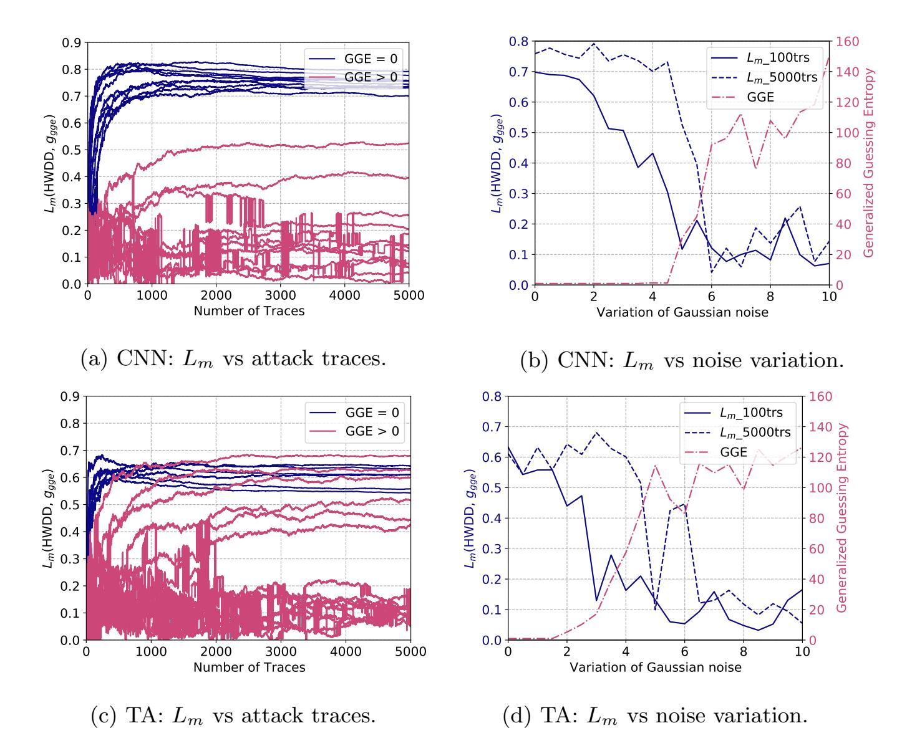

Fig. 14: The relationship between the leakage fitting and different level of noise.

a limited number of traces,  $L_m$  clearly indicates the model's ability to obtain the correct key.

Moreover, by comparing  $L_m$  changes with 100 and 5000 attack traces in these two figures, some of the attacks with higher noise variation could reach similar  $L_m$  by increasing the number of attack traces. Indeed, the accumulating of the model's output class probabilities with more attack traces benefits the classification performance [19]. However, if the model failed to learn from the leakage (e.g., due to the high noise variation), adding more attack traces would not help retrieve the correct key.

In general, the addition of the noise degrades how well the profiling model fits the leakage. We note that there is research showing that the addition of noise could enhance the robustness of the model (as it serves as a regularization factor), eventually becoming beneficial in the process of classification [10,25]. Based on our results, the level of "beneficial" noise has an upper limit, and the noise we added is larger than the limitation.

Remark 4. Adding noise negatively influences the model's ability to fit the leakage.  $L_m$  can estimate model leakage fit correctly with a smaller number of traces than we require to reach GGE equal to 0.

{31}------------------------------------------------

#### A.2 Measuring Leakage Fit for Different Number of Epochs and Profiling Model Complexities

Model complexity and the number of training epochs are two major contributing factors to how well the profiling model fits the leakage. Specifically, by increasing the number of training epochs, one can expect that the profiling model's fit improves if overfitting does not occur. On the other hand, adjusting the profiling model size will directly influence its capacity. Here, we evaluate different profiling models by independently varying the number of training epochs and profiling model size.

Aligned with the previous section, CNN used for attacks is listed in Table [1.](#page-31-1) The variable i determines the number of the filters and neurons in the fullyconnected layer. We use i to estimate the complexity of a profiling model roughly. Note, for the CNN best from the ASCAD paper, i equals 64.

Table 1: CNN architecture used for attacking.

| Layer               |    |     | Filter size # of filters Pooling stride # of neurons |      |
|---------------------|----|-----|------------------------------------------------------|------|
| Conv block          | 11 | i*1 | 2                                                    | -    |
| Conv block          | 11 | i*2 | 2                                                    | -    |
| Conv block          | 11 | i*4 | 2                                                    | -    |
| Conv block          | 11 | i*8 | 2                                                    | -    |
| Flatten             | -  | -   | -                                                    | -    |
| Fully-connected * 2 | -  | -   | -                                                    | i*64 |

First, CNN best (i=64) was trained for a different number of epochs ranging from 10 to 300 in steps of 10. For each step, Lm is calculated with a different number of attack traces (100 and 5 000) and two different leakage models: HW and identity. The result is shown in Figure [15.](#page-32-0)

For the HW leakage model, as shown in Figure [15a,](#page-32-0) the number of required attack traces for the correct key reduces significantly when training epochs increase from 0 to 80, indicating than the profiling model gradually learns from the dataset. After that, it becomes stable when it is further trained. The same tendency could be identified with the Lm(HWDD, ggge) metric with both 100 and 5 000 attack traces. The Lm metric can properly estimate the profiling model's fit to the leakage with only 100 traces (at least ten times less than GGE), suggesting the effectiveness of this metric in evaluating how well the profiling model fits the leakage.

For the ID leakage model (Figure [15b\)](#page-32-0), we see both Lm(IDD, ggge) and the number of required attack traces behaves unexpectedly when the number of training epoch increases: the number of the required attack traces decreases quickly when training epochs go from 0 to 60, then gradually increase with more training epochs. Indeed, by observing the training accuracy and loss, the overfitting becomes dominant for more than 60 training epochs, which means

{32}------------------------------------------------

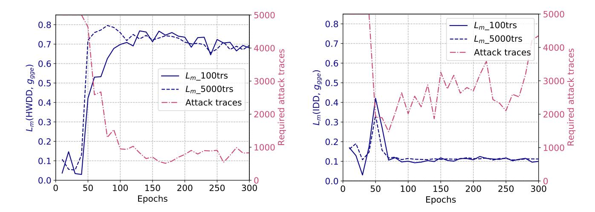

(a)  $L_m(\mathbf{HWDD}, \mathbf{g}_{gge})$  vs training epochs (b)  $L_m(\mathbf{IDD}, \mathbf{g}_{gge})$  vs training epochs with the HW leakage model.

Fig. 15: The relationship between leakage fitting and the number of training epochs.

the profiling model's classification capability is degraded if it is further trained. Interestingly, this conclusion is perfectly aligned with the  $L_m$  tendency for the increase of the epochs: the value reaches a maximum with 60 training epochs, decreases, and becomes stable at around 0.22 when the number of epoch increases further. Therefore, we confirm that  $L_m$  quantifies how well the profiling model fits the leakage. Again, 100 attack traces are sufficient for this metric to evaluate the profiling model's performance.

Remark 5. Adding more epochs improves the profiling model fit to the leakage provided that it does not start to overfit.  $L_m$  can correctly estimate the profiling model performance for a small number of attack traces.

After evaluating the profiling model's performance with different training epochs, we set the number of epochs to 100, and we tune the profiling model. Here, i, the controlling factor of the profiling model's complexity, varies from 1 to 64. We use the HW leakage model for the attack. The results are shown in Figure 16a with GGE of the correct key as a reference. Within the profiling model size range where GGE reaches one, we give a zoom-in view using the required number of attack traces to retrieve the key (instead of GGE) for the evaluation of the attack performance (Figure 16b).

 $L_m(\mathbf{HWDD}, \mathbf{g}_{gge})$  increases significantly (from 0.1 to 0.68) when i increases from 1 to 11, which is aligned with the decreasing tendency of GGE. Then, when the  $L_m$  is above 0.7 (i > 26), GGE reaches the value 0. From the zoom-in view in Figure 16b, one could observe that  $L_m$  is still slowly rising with the increase of i; the required attack traces, on the other hand, decrease gradually and become stable at around 1 100. Indeed, how well a profiling model fits the leakage in a certain dataset has its limitations; in our case, it is "saturated" when i is greater than 26. Further increase of the profiling model size will not contribute to a better attack performance. Again, these observations are observable from  $L_m$ .

{33}------------------------------------------------

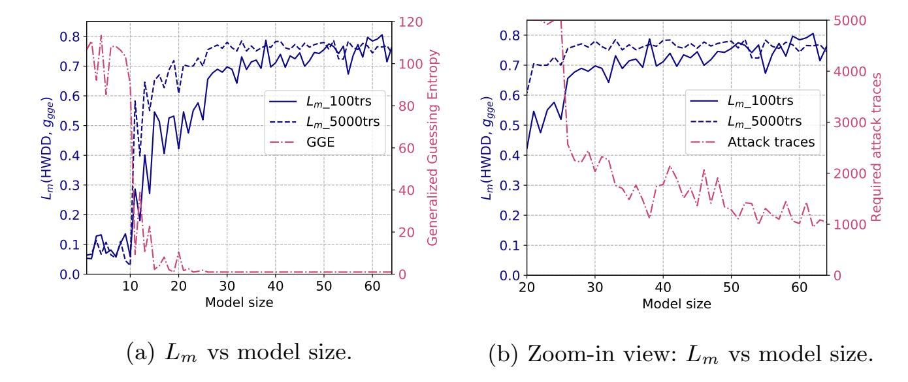

Fig. 16: The relationship between learnability metric and model complexity.

Finally, the attack set with 100 traces is sufficient for evaluating the profiling model, which is aligned with the previous experiment.

Remark 6. Increasing the profiling model capacity improves the ability of a profiling model to fit the leakage.  $L_m$  can correctly estimate the model fit to the leakage for a small number of attack traces.

# A.3 Evaluating Leakage Fitting with GGE and SGE - Results for CNNs

This section provides additional experimental results to demonstrate that the proposed leakage fitting evaluation with GGE and SGE is also applicable to convolutional neural networks (CNNs). Results in this section are provided for the CHES CTF dataset.

Two different CNNs are implemented in order to provide results for different neural network sizes. The first CNN is small, containing one convolutional layer (10 filters, stride of 10 and kernel size of 10) and two fully connected layers with 200 neurons each. All layers are set to ReLU activation function. The second CNN is larger and configured with two convolutional layers (10 and 20 filters, kernel sizes of 10 and 4, and strides of 10 and 2, respectively). For this second CNN, we configured three fully connected layers with 200 neurons each. Again, ReLU activation function is selected. For both CNNs, the learning rate is 0.0001, Adam is used as the optimizer, the number of epochs is 50, and mini-batch is set to 400 traces. The leakage model is the Hamming weight of  $S_{box}$  output, where we target the first key byte in the first AES encryption round.

Figure 17 shows generalized guessing entropy results for both CNNs. Following the same procedure applied on Section 6, we train the CNNs for different amounts of profiling traces, ranging from 1000 to 44000 traces with a step of 1000 traces. This adds up to 44 profiled models for each CNN. For the attack phase, we considered Q = 5000 traces and U ranges from 100 up to 1000 traces,

{34}------------------------------------------------

with a step of 100 traces. As we can verify in Figures [17a](#page-34-0) and [17b,](#page-34-0) a small CNN provides better generalization ability if compared to larger CNN, which results are shown in Figures [17b](#page-34-0) and [17d.](#page-34-0) Besides that, we can clearly observed in Figures [17a](#page-34-0) and [17c](#page-34-0) that the Lm metric is able to confirm the model's generalization ability regardless the value of U. The 5-layer CNN shows much less generalization ability than the 3-layer CNN, mainly due to overfitting issues.

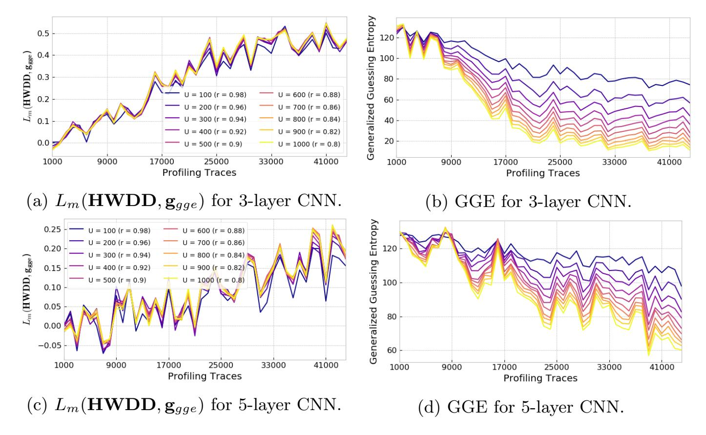

Fig. 17: CHES CTF results: Lm(HWDD, ggge) and GGE with respect to different number of profiling and attack traces.

Figure [18](#page-35-0) shows the corresponding results for SGE calculations and its leakage fitting metric Lm(HWDD, gsge). This is an example where we can clearly see the benefit of Lm metric to confirm that the model is actually providing generalization ability because SGE alone is unable to inform this. For the 3-layer CNN scenario (Figures [18a](#page-35-0) and [18b\)](#page-35-0), the evolution of SGE with respect to the number of profiling traces indicates that more profiling traces does not improve the generalization of the model. However, the reason for that is the small and insufficient amount of maximum attack traces, U = Q = 1 000, used to compute SGE. Moreover, this contradicts the model's generalization ability as indicated by GGE. In this case, Lm metric is a supplementary calculation to confirm the misleading conclusion given by SGE. Furthermore, the poor generalization ability indicated by the 5-layer CNN through the SGE is also verified by computing Lm(HWDD, gsge), as shown in Figure [18c,](#page-35-0) which can be confirmed by observing Figure [17c](#page-34-0) where we see low correlation values for Lm(HWDD, ggge).

Figure [19](#page-36-0) provides the relationship between Lm(HWDD, gsge) metric and Lm(HWDD, ggge) metric for at different amounts of attack traces (U). For the

{35}------------------------------------------------

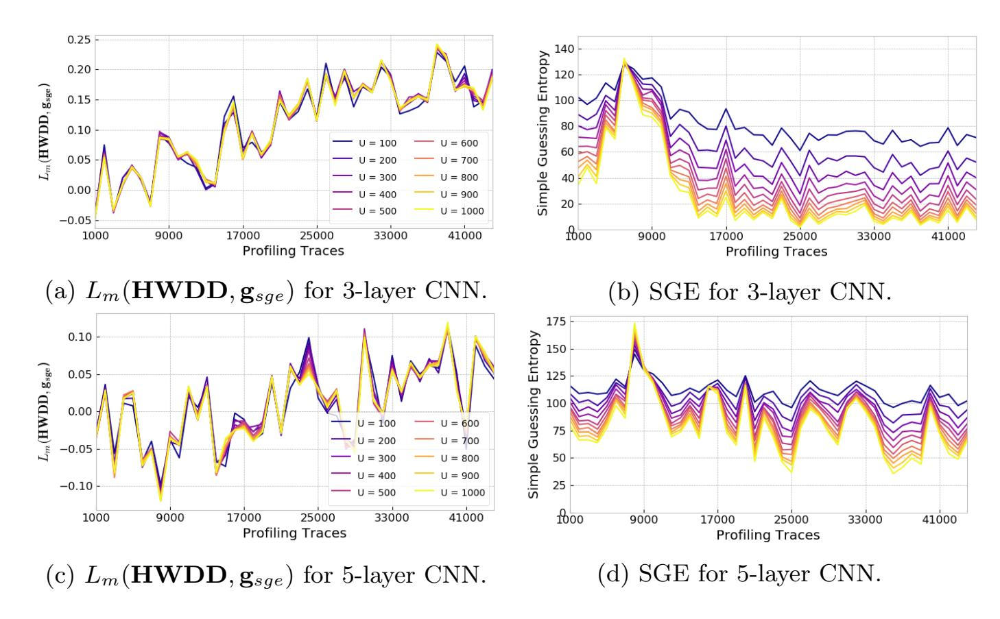

Fig. 18: CHES CTF results: Lm(HWDD, gsge) and SGE with respect to different number of profiling and attack traces.

3-layer CNN case (Figure [19a\)](#page-36-0), the correlation between these two metrics are high enough (0.86) for U = 100 traces already, indicating that Lm(HWDD, gsge) will be sufficient to indicate the model generalization ability already after the processing of 100 attack traces. On the other hand, although correlation between Lm(HWDD, gsge) metric and Lm(HWDD metric is not very low (0.67 to 0.72), the reduced generalization ability of the 5-layer CNN can be confirmed by the low values obtained from Lm for different amounts of attack traces. As a conclusion, we can assume that even when the CNN model provides reduced generalization ability, SGE together with Lm(HWDD, gsge) can be enough to indicate this generalization, which prevents misleading conclusions about guessing entropy on a limited amount of attacked traces.

{36}------------------------------------------------

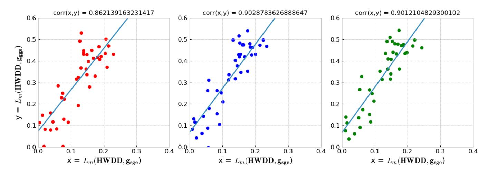

(a) Results on 3-layer CNN on the CHES CTF dataset. From left to right: U = 100, U = 5000 and U = 1 000.

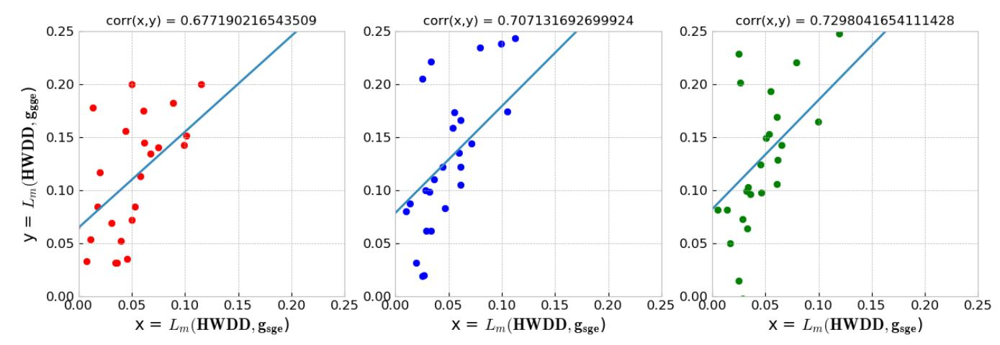

(b) Results on 5-layer CNN on the CHES CTF dataset. From left to right: U = 100, U = 5000 and U = 1 000.

Fig. 19: Correlation for Lm calculated with SGE and GGE for the CHES CTF dataset with the Hamming weight leakage model.