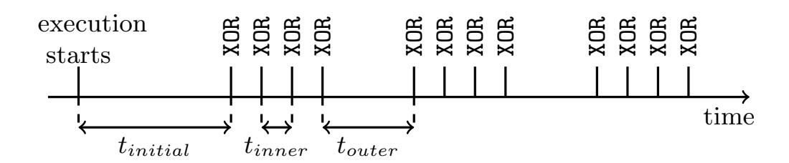
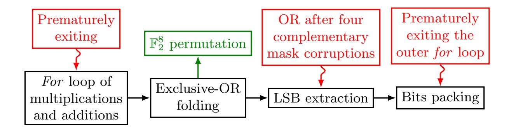
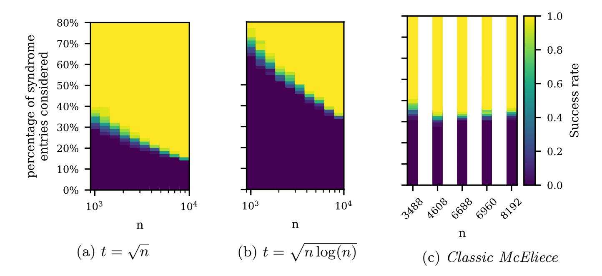
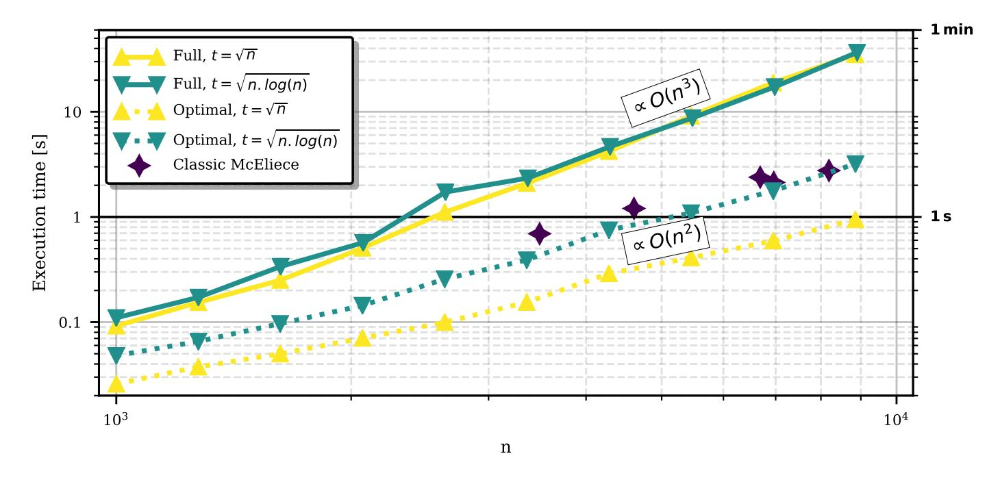

{0}------------------------------------------------

# Message-recovery Laser Fault Injection Attack on the Classic McEliece Cryptosystem

Pierre-Louis Cayrel1[0000−0002−6708−868X] , Brice Colombier2[0000−0002−6028−3028], Vlad-Florin Dr˘agoi3,4[0000−0002−8673−9097] , Alexandre Menu<sup>5</sup> , and Lilian Bossuet1[0000−0001−7964−3137]

- <sup>1</sup> Univ Lyon, UJM-Saint-Etienne, CNRS, Laboratoire Hubert Curien UMR 5516, F-42023, SAINT-ETIENNE, France
- <sup>2</sup> Univ Grenoble Alpes, CNRS, Grenoble INP, TIMA, 38000 Grenoble, France <sup>3</sup> Faculty of Exact Sciences, Aurel Vlaicu University, Arad, Romania <sup>4</sup> LITIS, University of Rouen Normandie, France
- 5 IMT, Mines Saint-Etienne, Centre CMP, Equipe Commune CEA Tech - Mines Saint-Etienne F-13541 Gardanne FRANCE

Abstract. Code-based public-key cryptosystems are promising candidates for standardization as quantum-resistant public-key cryptographic algorithms. Their security is based on the hardness of the syndrome decoding problem. Computing the syndrome in a finite field, usually F2, guarantees the security of the constructions. We show in this article that the problem becomes considerably easier to solve if the syndrome is computed in N instead. By means of laser fault injection, we illustrate how to compute the matrix-vector product in N by corrupting specific instructions, and validate it experimentally. To solve the syndrome decoding problem in N, we propose a reduction to an integer linear programming problem. We leverage the computational efficiency of linear programming solvers to obtain real-time message recovery attacks against the code-based proposal to the NIST Post-Quantum Cryptography standardization challenge. We perform our attacks in the worst-case scenario, i.e. considering random binary codes, and retrieve the initial message within minutes on a desktop computer.

Our attack targets the reference implementation of the Niederreiter cryptosystem in the NIST PQC competition finalist Classic McEliece and is practically feasible for all proposed parameters sets of this submission. For example, for the 256-bit security parameters sets, we successfully recover the message in a couple of seconds on a desktop computer. Finally, we highlight the fact that the attack is still possible if only a fraction of the syndrome entries are faulty. This makes the attack feasible even though the fault injection does not have perfect repeatability and reduces the computational complexity of the attack, making it even more practical overall.

Keywords: Code-based cryptography · Classic McEliece · Syndrome decoding problem · Laser fault injection · Integer linear programming

{1}------------------------------------------------

## 1 Introduction

For the last three decades, public key cryptography has been an essential component of digital communications. Communication protocols rely on three core cryptographic functionalities: public key encryption (PKE), digital signatures, and key exchange. These are implemented using Diffie-Hellman key exchange [16], the RSA cryptosystem [44], and elliptic curve cryptosystems [26, 39]. Their security relies on the difficulty of number theoretic problems such as the Integer Factorization Problem or the Discrete Logarithm Problem. Shor proved that quantum computers can efficiently solve each of these problems [47], potentially making all public-key cryptosystems (PKC) based on such assumptions impotent.

Since then, cryptographers proposed alternative solutions which remain safe in the quantum era. These schemes are called *post-quantum secure* [9]. In 2016, the National Institute of Standards and Technology (NIST) made a call to the community to propose post-quantum secure solutions for standardization. Multiple candidates were submitted, that are based on various hard problems (lattices, error-correcting codes, multivariate systems of equations and hash functions). In this work, we analyze one of the four finalists, the only one that uses error-correcting codes, *Classic McEliece*<sup>6</sup> [1].

#### 1.1 General decoding and integer linear programming

The hardness of general decoding for a linear code is an  $\mathcal{NP}$ -complete problem in coding theory [8], which makes it an appealing candidate for code-based post-quantum cryptography. From the original scheme proposed by McEliece [36] to the latest variants submitted to the NIST PQC competition [1,3,5,4], the majority of these PKCs base their security on the syndrome decoding problem (SDP). Informally, for a binary linear code  $\mathcal{C}$  of length n and dimension k, having a parity-check matrix  $\mathbf{H}$ , the SDP is defined as follows: given  $\mathbf{s} \in \mathbb{F}_2^{n-k}$ , find a binary vector  $\mathbf{x}$  having less than t values equal to one, such that  $\mathbf{H}\mathbf{x} = \mathbf{s}$ .

A recent possible solution to solve the general decoding problem is to use Integer Linear Programming (ILP). The idea was first proposed by Feldman [19] and later improved by Feldman  $et\ al.\ [20]$ . Since the initial problem is nonlinear, some relaxation was proposed in order to decrease the complexity. For more details on these aspects, we refer the reader to the excellent review of Helmling  $et\ al.\ [22]$ . One of the latest proposals [50] introduces a new method for transforming the initial decoding problem into an ILP, formalism that fits perfectly the ideas that we will put forward in this article. Let us briefly explain the idea of Tanatmis  $et\ al.\ [50]$ . The general decoding problem can be tackled using the well-known maximum-likelihood decoder. Let  $\mathcal C$  be a binary linear code of length n and dimension k, with parity-check matrix  $\mathbf H$ . The integer linear programming formulation of maximum-likelihood decoding is given in Equation (1).

$$\min\{\boldsymbol{v}\boldsymbol{x}^T \mid \boldsymbol{H}\boldsymbol{x} = 0, \boldsymbol{x} \in \{0, 1\}^n\},\tag{1}$$

<sup>6</sup> https://classic.mceliece.org/nist.html

{2}------------------------------------------------

where v is the log-likelihood ratio (see [20, 33]). Tanatmis et al. proposed to introduce an auxiliary positive variable z ∈ N n−k , and define a new problem:

$$\min\{\boldsymbol{v}\boldsymbol{x}^T \mid \boldsymbol{H}\boldsymbol{x} = 2\boldsymbol{z}, \boldsymbol{x} \in \{0,1\}^n, \boldsymbol{z} \in \mathbb{N}^{n-k}\}.$$
 (2)

The advantage of (2) compared to (1) is that z introduces real/integer constraints, which are much easier to handle for solvers than binary constraints. Also, there are as many constraints as rows in H. Finding an appropriate variable z is not trivial and algorithms such as [50] are constantly modifying the values of z in order to find the correct solution.

Inspired by the ideas of Tanatmis et al., we define the SDP as an ILP. Then, we propose to determine a valid constraints integer vector z so that the problem becomes easier to solve. Such an approach was recently proposed as a proof of concept in [17]. Simulations for small to medium sized random codes (n < 1500 and k < 750) using the simplex algorithm were performed in [17]. However, cryptographic parameters were out of reach. Hence, in order to achieve our goal we will propose several improvements compared to [17] (detailed in Section 3.4), among which we count the following:

- Instead of solving the integer constrains problem using the simplex we will solve a relaxed version (with real constrains) using the interior point method.
- An optimization scheme, where only a small proportion of the parity-check rows are required, is proposed. This amount of information required to retrieve a valid solution points out to an information theoretical threshold of the integer-SDP.
- Simulations show that the overall complexity empirically decreases from O(n 3 ) for the initial algorithm to O(n 2 ) for the optimized algorithm.
- In a practical implementation, real cryptographic instances are solved within minutes, proving the efficiency of the algorithm.

Before that, we need to put forward a recent result in laser fault injection [14].

#### 1.2 Related works

Understanding how fault attacks allow to corrupt the instructions executed by a microcontroller has been a vivid topic of research in recent years. While electromagnetic fault injection is probably the most commonly used technique, certainly because of its relatively low cost, it has several drawbacks. Indeed, while the "instruction skip" or "instruction replay" fault models were clearly identified [45], most of the time going down to the instruction set level leaves a lot of questions open [40]. As such, only a handful of the observed faults can be tracked down and explained by a modification of the bits in the instruction [31]. Last, but not least, electromagnetic fault injection usually exhibits poor repeatability [13], as low as a few percents in some cases.

Conversely, another actively studied technique is laser fault injection, which offers several advantages when it comes to interpreting the observed faults. For example, the instruction skip fault model has been experimentally validated 

{3}------------------------------------------------

by laser fault injection, with perfect repeatability and the ability to skip one or multiple instructions [18]. On a deeper level of understanding, it has been shown in [14] that it was possible to perform a bit-set on any of the bits of an instruction while it is fetched from the Flash memory of the microcontroller. This modification is temporary since it is performed during the fetch process. As such, the instruction stored in the Flash memory remains untouched. We place ourselves in this framework here. We reproduce the fault injection setup to show how this powerful fault model gives the possibility to actively corrupt the instructions and allows to mount a fault attack on code-based cryptosystems.

In a recent article [27], the authors present a physical attack on the codebased finalist Classic McEliece. The idea is to combine side-channel information and the use of the information set decoding algorithm to recover the message from a Classic McEliece hardware reference implementation. In this paper, we will focus on the same candidate. Our approach of combining techniques coming from laser fault attacks and algorithms for general decoding problem fits well in this new trend in cryptanalysis.

Moreover, implementations of the Classic McEliece on memory-constrained is an active research topic [46]. These implementations are typically subject to physical attacks, such as the one described in this article.

#### 1.3 Contributions

This article makes the following contributions.

- First, we propose a new attack on code-based cryptosystems which security relies on the SDP. We show by simulations that, if the syndrome is computed in N instead of F2, then the SDP can be solved in polynomial time by linear programming.
- Second, we experimentally demonstrate that such a change of set is feasible by corrupting the instructions executed during the syndrome computation. To this end, we rely on backside laser fault injection in Flash memory in order to transform an addition over F<sup>2</sup> into an addition over N. We perform this by corrupting the instruction when it is fetched from Flash memory, thereby replacing the exclusive-OR operation with an add-with-carry operation.
- Third, we then show, starting with the faulty syndrome, that the secret error-vector can be recovered very efficiently by linear programming. By means of software simulations we show that, in particular, this attack scales to cryptographically strong parameters for the considered cryptosystems.
- Finally, we highlight a very practical feature of the attack, which is that only a fraction of the syndrome entries need to be faulty in order for the attack to be successful. On top of that, this fraction decreases when the cryptographic parameters grow. This has important practical consequences, since the attack can be carried out even if the fault injection is not perfectly repeatable. Moreover, this also drastically reduces the number of inequalities to be considered in the linear programming problem, thereby making the problem much easier to solve.

{4}------------------------------------------------

The proposed attack fits in the following framework. We perform a message recovery attack against code-based cryptosystems based on Niederreiter's model. Specifically, we recover the message from one faulty syndrome and the public key. The attacker must have physical access to the device, where the laser fault injection is performed during encryption, *i.e.*, the matrix-vector multiplication. The total number of faults the attacker must inject is upper-bounded by the code dimension.

Our attack was performed on a real microcontroller, embedding an ARM Cortex-M3 core, where we corrupted the XOR operation and obtained the faulty outputs. As in our case, one needs to perform single-bit and double-bit faults, in a repeatable and controlled manner. This method strongly relies on the work of Colombier *et al.* [14] and thus can be verified and repeated experimentally. We stress out that constant-time implementations are of great help for this attack setting, since they allow to easily synchronize the laser shots with the execution of the algorithm.

We chose to attack here two multiplication methods: the schoolbook and the packed version. The former is general, and is considered for example in the NTL library <sup>7</sup>. The later is the reference implementation of the *Classic McEliece* cryptosystem and makes optimum use of the computer words.

The article is organized as follows. In Section 2, we focus on code-based cryptosystems, and in particular the NIST PQC competition finalist Classic McEliece. Section 3 defines the SDP in  $\mathbb{N}$  and shows how it relates to linear programming. In Section 4, we show how the corruption of instructions by laser fault injection allows to switch from  $\mathbb{F}_2$  to  $\mathbb{N}$  during the syndrome computation. Section 5 presents experimental results following the attack path, from laser fault injection to the exploitation of the faulty syndrome by linear programming. Finally, we conclude this article in Section 6.

#### 2 Code-based cryptosystems

#### 2.1 Coding theory – preliminaries

**Notations** The following conventions and notations are used. A finite field is denoted by  $\mathbb{F}$ , and the ring of integers by  $\mathbb{N}$ . Vectors (column vectors) and matrices are written in bold, e.g., a binary vector of length n is  $\mathbf{x} \in \{0,1\}^n$ , an  $m \times n$  integer matrix is  $\mathbf{A} = (a_{i,j})_{\substack{0 \le i \le m-1 \\ 0 \le j \le n-1}} \in \mathcal{M}_{m,n}(\mathbb{N})$ . A row sub-matrix of  $\mathbf{A}$  indexed by a set  $I \subseteq \{0,\ldots,m-1\}$  is denoted by  $\mathbf{A}_{I,} = (a_{i,j})_{\substack{i \in I \\ 0 \le j \le n-1}}$ . The same applies to column vectors, i.e.,  $\mathbf{x}_I$  is the sub-vector induced by the set I on  $\mathbf{x}$ .

**Error correcting codes** We say that C is an [n, k] linear error-correcting code, or simply a linear code, over a finite field  $\mathbb{F}$  if C is a linear subspace of dimension k

<sup>7</sup> https://www.shoup.net/ntl/

{5}------------------------------------------------

of the vector space  $\mathbb{F}^n$ , where k, n are positive integers with k < n. The elements of  $\mathcal{C}$  are called codewords. The support of a codeword  $\mathsf{Supp}(c)$  is the set of non-zero positions of c. We will represent a code either by its generator matrix,  $G \in \mathcal{M}_{k,n}(\mathbb{F})$  ( $\mathsf{rank}(G) = k$ ), or by its parity-check matrix,  $H \in \mathcal{M}_{n-k,n}(\mathbb{F})$ , ( $\mathsf{rank}(H) = n - k$ ), where  $HG^T = \mathbf{0}$  holds. One of the key ingredients for decoding is the usage of a metric. The Hamming weight of a vector  $\mathsf{wt}(x)$  is the number of non-zero components of x. Now, we can define a well-known strategy used for general decoding, i.e., syndrome decoding.

### Definition 1 (Binary-SDP).

```
Input: \mathbf{H} \in \mathcal{M}_{n-k,n}(\mathbb{F}_2) of rank n-k, a vector \mathbf{s} \in \mathbb{F}_2^{n-k} and t \in \mathbb{N}^*. Output: \mathbf{x} \in \mathbb{F}_2^n, with \operatorname{wt}(\mathbf{x}) \leq t, such that \mathbf{H}\mathbf{x} = \mathbf{s}.
```

#### 2.2 NIST PQC competition

The main goal of the process started by NIST is to replace three standards that are considered the most vulnerable to quantum attacks, *i.e.*, FIPS 186-4<sup>8</sup> (for digital signatures), NIST SP 800-56A<sup>9</sup> and NIST SP 800-56B<sup>10</sup> (both for keys establishment in public-key cryptography). For the first round of this competition, 69 candidates met the minimum criteria and the requirements imposed by NIST. 26 out of 69 were announced on January 30, 2019 for moving to the second round. From these, 17 are public-key encryption and/or key-establishment schemes and 9 are digital signature schemes. Since July 2020, NIST started the third round of this process where only seven finalists were admitted (four PKE/KEM and three signature schemes). In addition to the finalists, eight alternate candidates were selected.

In this article, we focus on one of the finalists, Classic McEliece, which is a merger of the former Classic McEliece submission and NTS-KEM. In Table 1 the design rationale of the McEliece [36] and Niederreiter [42] schemes is illustrated. The private key is a structured code, and the public key its masked variant. We would like to stress out that our method applies to any code-based cryptosystem that bases its security on the binary SDP.

#### 2.3 Security and practical parameters

Basically, all the code-based schemes support their security on the hardness of the SDP. Hence, state-of-the-art algorithms for solving the SDP are used to set up the security level of any such proposals. The best strategy in this direction is the class of so-called Information Set Decoding (ISD) algorithms. The original algorithm was proposed by Prange [43] and has been significantly improved

<sup>8</sup> https://nvlpubs.nist.gov/nistpubs/FIPS/NIST.FIPS.186-4.pdf

https://nvlpubs.nist.gov/nistpubs/SpecialPublications/NIST.SP. 800-56Ar2.pdf

https://nvlpubs.nist.gov/nistpubs/SpecialPublications/NIST.SP.
800-56Br1.pdf

{6}------------------------------------------------

Table 1: McEliece and Niederreiter PKE schemes

| McEliece PKE                                                                           | Niederreiter PKE                                                        |
|----------------------------------------------------------------------------------------|-------------------------------------------------------------------------|
| $\begin{tabular}{ll} \hline & KeyGen(n,k) \\ \hline \end{tabular}$                     | (t,t) = (pk,sk)                                                         |
| $\overline{G}$ -generator matrix matrix of $\mathcal C$                                | H-parity-check of $C$                                                   |
| $\setminus \setminus \mathcal{C}$ an $[n,k]$ tha                                       | t corrects t errors                                                     |
| An $n \times n$ permu                                                                  | itation matrix $\boldsymbol{P}$                                         |
| A $k \times k$ invertible matrix $\boldsymbol{S}$                                      | An $(n-k) \times (n-k)$ invertible                                      |
|                                                                                        | matrix $S$                                                              |
| Compute $G_{\text{pub}} = SGP$                                                         | Compute $\boldsymbol{H}_{\mathrm{pub}} = \boldsymbol{SHP}$              |
| $\overline{pk = (\bm{G}_{\mathrm{pub}}, t)}$                                           | $pk = (\bm{H}_{\mathrm{pub}}, t)$                                       |
| $sk = (\boldsymbol{S}, \boldsymbol{G}, \boldsymbol{P})$                                | $ sk = (\boldsymbol{S}, \boldsymbol{H}, \boldsymbol{P})$                |
|                                                                                        |                                                                         |
| Encrypt(n                                                                              | $(\boldsymbol{n},pk)=\boldsymbol{z}$                                    |
| Encode $m \to c = mG_{\text{pub}}$                                                     | Encode $\bm{m} \to \bm{e}$                                              |
| Choose $\boldsymbol{e}$                                                                |                                                                         |
| $\backslash \backslash e$ a vecto                                                      | or of weight t                                                          |
| $\overline{z=c+e}$                                                                     | $\boldsymbol{z} = \boldsymbol{H}_{\rm pub}\boldsymbol{e}$               |
|                                                                                        |                                                                         |
| Decrypt(z                                                                              | $(z,sk) = \bm{m}$                                                       |
| Compute $z^* = zP^{-1}$                                                                | Compute $\boldsymbol{z}^* = \boldsymbol{S}^{-1} \boldsymbol{z}$         |
| $\boldsymbol{z}^* = \boldsymbol{m}\boldsymbol{S}\boldsymbol{G} + e\boldsymbol{P}^{-1}$ | $\boldsymbol{z}^* = \boldsymbol{HPe}$                                   |
| $\boldsymbol{m}^* = \mathcal{D}ecode(\boldsymbol{z}^*, \boldsymbol{G})$                | $\boldsymbol{e}^* = \mathcal{D}ecode(\boldsymbol{z}^*, \boldsymbol{H})$ |
| Retrieve $m$ from $m^*S^{-1}$                                                          | Retrieve $m$ from $P^{-1}e^*$                                           |

since then [7,28,30,34,35,48]. Under the assumption that the public code is indistinguishable from a random code, the ISD techniques are considered the best strategy for message recovery. For Classic McEliece, the error weight t is of order o(n), when  $n \to \infty$ , to be more precise is of order  $\frac{(n-k)}{\log_2(n)}$ . In this case, the time complexity of the ISD variants is  $2^{ct(1-o(1))}$ , where c is a constant given by the code rate. Table 2 gives the list of parameters for the Classic McEliece proposal.

Table 2: IND-CCA2 KEM McEliece parameters.

| Parameters set                | 348864 | 460896 | 6688128 | 6960119 | 8192128 |
|-------------------------------|--------|--------|---------|---------|---------|
| $\overline{}$                 | 3488   | 4608   | 6688    | 6960    | 8192    |
| k                             | 2720   | 3360   | 5024    | 5413    | 6528    |
| t                             | 64     | 96     | 128     | 119     | 128     |
| Equivalent bit-level security | 128    | 196    | 256     | 256     | 256     |

{7}------------------------------------------------

### 3 Syndrome decoding over $\mathbb{N}$

#### 3.1 Description of the problem

```
Definition 2 (N-SDP).

Input: \mathbf{H} \in \mathcal{M}_{n-k,n}(\mathbb{N}) with h_{i,j} \in \{0,1\} for all i,j, s \in \mathbb{N}^{n-k} and t \in \mathbb{N}^* with t \neq 0.
```

**Output:**  $x \in \mathbb{N}^n$  with  $x_i \in \{0,1\}$  and  $\operatorname{wt}(x) \leq t$ , such that Hx = s.

Notice that  $\boldsymbol{H}$  and  $\boldsymbol{x}$  are binary, as in the SDP, whereas  $\boldsymbol{s}$  is integer. Basically,  $\boldsymbol{H}$  and  $\boldsymbol{x}$  are sampled exactly as for the SDP, it is only the operation, *i.e.*, matrix-vector multiplication, that changes, and thus its result.

**Possible solutions** Based on the similarities with SDP, one might try to solve N-SDP using techniques from coding theory. We briefly enumerate three possible solutions.

- 1. The simplest solution is to solve it as a linear system. If we consider the system  $\mathbf{H}\mathbf{x} = \mathbf{s}$ , it has n k equations and n unknowns, and hence, can be solved efficiently. However, there are k free variables, and  $2^k$  possible solutions, since  $\mathbf{x} \in \{0,1\}$ . For each instance, compute the Hamming weight, and stop when the value is smaller than or equal to t. This procedure is not feasible in practice for cryptographic parameters, due to the values of k.
- 2. Another possible solution is combinatorial (emulating an exhaustive search). One can choose subsets of  $s_i$  elements from  $\mathsf{Supp}(H_{i,})$  for increasing values of i, until it finds the correct combinations. This solution can be further optimised by choosing subsets from a smaller set at each iteration, where previously selected positions are rejected from the updated set. Even so, the time complexity will be dominated by a product of binomial coefficients that is asymptotically exponential in t.
- 3. A modified ISD to the integer requirements. Let us choose the original algorithm of Prange [43], that is randomly permuting the matrix  $\boldsymbol{H}$  (denote  $\boldsymbol{P}$  such a permutation) until the support of the permuted  $\boldsymbol{x}$  is included in the set  $\{0,\ldots,n-k-1\}$ , i.e., the set where the  $\boldsymbol{HP}$  is in upper triangular form. To put an integer matrix in the upper triangular form, one has to use the equivalent of the Gaussian elimination for the integers, i.e., the Hermite normal form. So, by computing an integer matrix  $\boldsymbol{A}$  and  $\boldsymbol{H}^*$ , so that  $\boldsymbol{H}^*$  is upper triangular on its first n-k positions we obtain:

$$AHP(P^{T}x) = AH'x' = H^{*}x' = As.$$
(3)

If  $\mathsf{Supp}(x') \subseteq \{0, \ldots, n-k-1\}$  then the new syndrome  $s^* = As$  has rather small integer entries, that directly allow the computation of x'. This algorithm has time complexity similar to the classic ISD, and hence, remains exponential in t.

Since all these methods are not feasible in practice for cryptographic parameters, we propose another solution. For that, let us notice the following fact.

{8}------------------------------------------------

Remark 1. As for the maximum-likelihood decoding problem, we can reformulate  $\mathbb{N}$ -SDP as an optimization problem:

$$\min\{\mathsf{wt}(\boldsymbol{x}) \mid \boldsymbol{H}\boldsymbol{x} = \boldsymbol{s}, \boldsymbol{x} \in \{0, 1\}^n\},\tag{4}$$

where  $\boldsymbol{H}$  and  $\boldsymbol{s}$  are given as in Definition 2.

This fact leads us to searching for mathematical optimization techniques, such as integer linear programming.

#### 3.2 Integer Linear programming

ILP was already used in a cryptographic context, mainly for studying stream ciphers [11, 12, 41]. The authors of [41] implemented ILP-based methods that gave practical results for Enocoro-128v2, as well as for calculating the number of active S-boxes for AES. In [11, 12] ILP was used for studying the Trivium stream cipher and the lightweight block cipher Ktantan. In all of these, the technique was to reformulate the original cryptographic problems by means of ILP, and use some well-known solvers in order to obtain practical evidence of their security. Typically, in [12] the authors used the CPLEX solver. There are mainly three big solvers for LP and ILP problems: lpSolve<sup>11</sup>, IBM CPLEX<sup>12</sup> and Gurobi<sup>13</sup>, recently tested for various types of practical problems [32].

We point here some necessary facts about ILP, as we will use ILP as a tool only. Interested readers might check [10, 23] for more details.

**Definition 3 (ILP problem).** Let  $n, m \in \mathbb{N}^+, \mathbf{b} \in \mathbb{N}^n, \mathbf{s} \in \mathbb{N}^m$  and  $\mathbf{A} \in \mathcal{M}_{m,n}(\mathbb{N})$ . The ILP problem is defined as the optimization problem

$$\min\{\boldsymbol{b}^T\boldsymbol{x}|\boldsymbol{A}\boldsymbol{x}=\boldsymbol{c},\boldsymbol{x}\in\mathbb{N}^n,\boldsymbol{x}\geq 0\}. \tag{5}$$

Any vector  $\boldsymbol{x}$  satisfying  $\boldsymbol{A}\boldsymbol{x}=\boldsymbol{s}$  is called a feasible solution. If a feasible solution  $\boldsymbol{x}^*$  satisfies the minimum condition in (5) then  $\boldsymbol{x}^*$  is optimal. In order to redefine our initial problem, *i.e.*, (4) into an ILP problem, we need to redefine the Hamming weight of a vector as a linear operation.

### 3.3 Solving N-SDP using ILP

**Theorem 1** ([17]). Let us suppose that there exists a unique vector  $\mathbf{x}^* \in \{0,1\}^n$  with  $\mathsf{wt}(\mathbf{x}^*) = t$ , solution to the  $\mathbb{N}$ -SDP. Then  $\mathbf{x}^*$  is the optimum solution of an ILP problem.

*Proof.* Suppose that such an  $x^*$  exists and is unique, *i.e.*,  $Hx^* = s$  with  $s \in \mathbb{N}^{n-k}$  and  $\operatorname{wt}(x^*) = t$ . We will construct an ILP problem for which  $x^*$  is the optimum solution. For that, we simply set A = H, c = s, and  $b^T = (1, \ldots, 1)$ 

<sup>11</sup> http://lpsolve.sourceforge.net/5.5/

<sup>12</sup> https://www.ibm.com/products/ilog-cplex-optimization-studio

<sup>13</sup> https://www.gurobi.com

{9}------------------------------------------------

in (5). Since x ∈ {0, 1} <sup>n</sup> wt(x) = P<sup>n</sup> <sup>i</sup>=1 x<sup>i</sup> = (1, . . . , 1) · x, but this is equal to b <sup>T</sup> x ∗ . The ILP problem we need to solve can now be defined as:

$$\min\{\boldsymbol{b}^T\boldsymbol{x}|\boldsymbol{H}\boldsymbol{x}=\boldsymbol{s},\boldsymbol{x}\in\{0,1\}^n\},\tag{6}$$

which is exactly (4). This implies that x ∗ is a feasible solution to (6), and as x ∗ is the unique vector satisfying Hx<sup>∗</sup> = s with wt(x ∗ ) ≤ t, x ∗ is optimum for the minimum weight condition.

ILP problems are defined as LP problems with integer constraints, hence any algorithm for solving an LP problem could potentially be used as a subroutine for solving the corresponding ILP problem. Usually, these are formalised in a sequential process, where the solution to one LP problem is close to the solution to the next LP problem, and so on, until eventually the ILP problem is solved. One of the most efficient method for solving ILP problems is the branch and cut method. In a branch and cut algorithm, an ILP problem is relaxed into an LP problem that is solved using an algorithm for LP problems. If the optimal solution is integral then it gives the solution to the ILP problem. There are mainly two famous methods for solving the linear problem: the simplex and the interior point method.

The simplex algorithm, introduced by Dantzig in [15], is one of the most popular methods for solving LP problems. The idea of this algorithm is to move from one vertex to another on the underlying polytope, as long as the solution is improved. The algorithm stops when no more neighbours of the current vertex improve the objective function. It is known to be really efficient in practice, by solving a large class of problems in polynomial time. However, it was proved in [25] that there are instances where the simplex falls into the exponential time complexity class.

Interior point algorithms represent a class of alternative algorithms to the simplex method, and were first proposed by [24]. Several variants improved the initial method, also by providing polynomial time complexity [29, 51]. As the name suggests, this method starts by choosing a point in the interior of the feasible set. Moving inside the polyhedron, this point is improved, until the optimal solution is found.

Efficient solutions using interior point methods were proposed for the problem of maximum-likelihood decoding of binary codes [49, 53, 54]. These have running times dominated by low-degree polynomial functions in the length of the code. Also, they are in particular very efficient for large scale codes [49, 53]. For these particular interesting arguments, we choose the interior point method for solving the N-SDP.

Solving the N-SDP The algorithm we propose here to solve the N-SDP can be described as follows. Initiate the parameters from (6), solve a relaxation of the N-SDP (using the interior point methods), round the solution to binary entries (using the method from [37]) and finally verify if the binary solution satisfies the parity-check equations and the weight condition. The relaxation of the ILP 

{10}------------------------------------------------

problem to an LP problem is a common method, more exactly, the LP problem that we have to solve is:

$$\min\{\boldsymbol{b}^{T}\boldsymbol{x} \mid \boldsymbol{H}\boldsymbol{x} = \boldsymbol{s}, \boldsymbol{0} \leq \boldsymbol{x} \leq \boldsymbol{1}, \boldsymbol{x} \in \mathbb{R}^{n}\},\tag{7}$$

where  $\leq$  is defined by  $\boldsymbol{x} \leq \boldsymbol{y}$  if and only if  $x_i \leq y_i$  for all  $0 \leq i \leq n-1$ .

## Algorithm 1 ILP solver for N-SDP

Input: H, s, t

Output: x solution to N-SDP or ERROR

- 1: Set  $\boldsymbol{b} = (1, \dots, 1)^T$
- 2: Solve equation (7)

▶ Using the interior-point method

 $\triangleright$  as done in |37|

- 3: round the solution  $\boldsymbol{x}^*$  to  $\boldsymbol{x}^* \in \{0,1\}^n$
- 4: if  $Hx^* = s$  and  $wt(x) \le t$  then
- 5: return  $x^*$
- 6: **else**
- 7: **return** ERROR
- 8: end if

#### 3.4 Optimization

In this paragraph we propose an optimization to Algorithm 1. Let us first define the following sets:

**Definition 4.** Let  $0 < \ell < n - k$  and  $\emptyset \subset I_0 \subset \cdots \subset I_{\ell} \subseteq \{0, \dots, n - k - 1\}$ . For  $0 \le i \le \ell$  we define  $\mathcal{H}_{I_j} = \{x \in \{0, 1\}^n \mid H_{I_j}, x = s_{I_j}\}$ , and  $\mathcal{H} = \{x \in \{0, 1\}^n \mid Hx = s\}$ .

Now, let us prove how to reduce the number of constraints to our initial problem. First, notice that N-SDP can be written as  $\min\{\boldsymbol{b}^T\boldsymbol{x}\mid\boldsymbol{x}\in\mathcal{H}\}$ . Secondly, we prove that:

Proposition 1. Let  $0 < \ell < n - k$  and  $\emptyset \subset I_0 \subset \cdots \subset I_\ell \subseteq \{0, \ldots, n - k - 1\}$  and  $\boldsymbol{x}_{I_j}^* = \min\{\boldsymbol{b}^T\boldsymbol{x} \mid \boldsymbol{x} \in \mathcal{H}_{I_j}\}$ , for any  $0 \leq j \leq \ell$ . Then  $\mathsf{wt}(\boldsymbol{x}^*) \geq \mathsf{wt}(\boldsymbol{x}_{I_\ell}^*) \geq \cdots \geq \mathsf{wt}(\boldsymbol{x}_{I_0}^*)$ .

*Proof.* From definition 4 we deduce

$$\mathcal{H} \subseteq \mathcal{H}_{I_{\ell}} \cdots \subseteq \mathcal{H}_{I_{0}}. \tag{8}$$

Since the sets  $\mathcal{H}_{I_j}$  are finite, we can take the minimum and use the inclusion from (8) to deduce the result.

Hence, the sequence  $\operatorname{wt}(x_{I_0^*}), \ldots, \operatorname{wt}(x_{I_\ell^*})$  is non-decreasing. If the initial set is  $I_0 = \{s_{i_0}\}$  then the sequence of Hamming weight of the solutions starts from  $\operatorname{wt}(x_{I_0^*}) = s_{i_0}$ .

{11}------------------------------------------------

We will thus use Proposition 1 as a reduction of our initial problem to a shorter one, in terms of constraints or equivalently in the dimension of the system. Two algorithms exploiting the result of Proposition 1, are presented here. Both are based on the same rationale:

- 1. Choose  $I_0$  and call the ILP solver for N-SDP (Algorithm 1);
- 2. if the output is an optimum solution for the full problem then stop;
- 3. if not add an extra row to  $I_0$  to create  $I_1$  and continue until a solution is found.

This procedure allows us to solve an easier instance and reduce the overall time complexity of our algorithm. The way rows are sampled for building  $I_0, I_1, \ldots, I_\ell$ has a significant impact on the length of the chain  $\ell$ . Two natural methods for creating the sets are described. The first one, uses uniform random sampling (each row has a probability 1/(n-k) of being selected), and as we shall see in Section 5.2 it allows to solve the N-SDP for all the Classic McEliece parameters only by using less than 40% of the rows. Reducing the parameter  $\ell$  might be achievable by starting in a more clever way. More exactly, by including rows in an ordered manner, where the ordering corresponds to the decreasing order on the entries of the syndrome. By doing so, we start at  $\operatorname{wt}(x_{I_0^*}) = \max\{s_i, 0 \leq$  $i \leq n-k$ . For the parameters used in the Classic McEliece proposal, the improvement of this method compared with the random sampling, reduces the number of required rows for solving the N-SDP by a multiplicative factor close to 2. As we shall see in Section 5.2, considering only a fraction of the syndrome entries decreases the empirically observed time complexity of the N-SDP from  $\mathcal{O}(n^3)$  to  $\mathcal{O}(n^2)$ .

### 4 Fault injection

As shown in the previous section, computing the syndrome in  $\mathbb{N}$  instead of  $\mathbb{F}_2$  makes the SDP considerably easier to solve. In order to perform this change, we must have the processor perform the additions in  $\mathbb{N}$  instead of  $\mathbb{F}_2$  during the syndrome computation. This is done by replacing the exclusive-OR instruction with an add-with-carry instruction. Since both these arithmetic instructions are performed by the arithmetic logic unit of the processor, their associated opcodes are close, in the sense that the Hamming distance between them is small. Therefore, only few bits must be modified to switch from one to the other.

We focus on the Thumb instruction set here since it is widely used in embedded systems. The fact that, in the Thumb instruction set, the exclusive-OR instruction can be transformed into an add-with-carry instruction by a single bit-set can be considered pure luck. This is at least partially true but this is not as surprising as it seems. Indeed, both these instructions are "data processing" instructions. As such, they are handled by the arithmetic logic unit. Therefore, the opcode bits are used to generate similar control signals, and it is not surprising that they differ by only a few bits. A few examples of corruptions in other instruction sets are given in Appendix A, showing that this attack could be easily ported to other targets.

{12}------------------------------------------------

#### 4.1 Previous work

The single-bit fault model is a very powerful one and allows an attacker to mount efficient attacks [21]. However, performing a single-bit fault in practice is far from trivial. While these can be performed by global fault injection techniques, such as under-powering [6], further analysis is necessary to filter the exploitable faults. Indeed, while performing a single-bit fault at a non-chosen position is feasible, targeting one bit specifically is much more complicated.

To this end, a more precise fault injection technique is required. In this regard, laser fault injection is a well-suited method. Indeed, as shown in [14], it is possible to perform a single-bit bit-set fault on data fetched from the Flash memory. This makes it possible to alter the instruction while it is fetched, before it is executed by the processor. We insist here on the fact that, as detailed in [14], the corruption is temporary, and only performed on the fetched instruction. The content of the Flash memory is left untouched. Therefore, if the instruction is fetched again from the Flash memory while no laser fault injection is performed then it is executed normally.

Colombier et al. showed that targeting a single bit in a precise manner is relatively easy, since it only requires to position the laser spot at the right location on the y-axis in the Flash memory [14], aiming at different word lines. Indeed, moving along the x-axis does not change the affected bit, since the same word line is covered by the laser spot. Therefore, targeting a single bit of the fetched instruction is possible. This observation was experimentally confirmed on two different hardware targets in [38], further proving the validity of this fault model. Moreover, they also showed that two adjacent bits can also be set by shooting with sufficient power between two word lines. This single-bit or dual-bit bit-set fault model is the one we use as a framework for the rest of the article.

#### 4.2 Bit-set fault on an exclusive-OR instruction

Using the fault injection technique described above, we now show how to apply it to replace an exclusive-OR instruction with an add-with-carry instruction. Figure 1 shows the Thumb encoding of both instructions, given in the ARMv7-M Architecture Reference Manual14. When comparing both instructions, we observe that only one single-bit bit-set fault, on the bit of index 8, is required to replace the exclusive-OR instruction with an add-with-carry instruction. This is highlighted in red in Figure 1.

#### 4.3 Bit-set fault on schoolbook matrix-vector multiplication

Now that we have shown that a single-bit fault can replace an exclusive-OR instruction with an add-with-carry instruction, we will extend it to a matrix-vector multiplication, used to compute the syndrome in code-based cryptosystems. The syndrome computation is typically implemented as shown in Algorithm 2. This is how it is done in the NTL library for instance, which is widely used by NIST PQC competition candidates.

<sup>14</sup> https://static.docs.arm.com/ddi0403/e/DDI0403E\_B\_armv7m\_arm.pdf

{13}------------------------------------------------

|                            | 15 14 13 12 11 10          |   |   |   |   | 9 | 8 | 7 | 6 | 5 | 4  | 3 | 2 | 1   | 0 |
|----------------------------|----------------------------|---|---|---|---|---|---|---|---|---|----|---|---|-----|---|
| Generic EORS: Rd = Rm ^ Rn |                            |   |   |   |   |   |   |   |   |   |    |   |   |     |   |
| 0                          | 1                          | 0 | 0 | 0 | 0 | 0 | 0 | 0 | 1 |   | Rm |   |   | Rdn |   |
|                            | Generic ADCS: Rd = Rm + Rn |   |   |   |   |   |   |   |   |   |    |   |   |     |   |
| 0                          | 1                          | 0 | 0 | 0 | 0 | 0 | 1 | 0 | 1 |   | Rm |   |   | Rdn |   |

Fig. 1: Thumb encoding of the exclusive-OR (EORS) and add-with-carry (ADCS) instructions. The bit set by laser fault injection is highlighted in red.

```
Algorithm 2 Matrix-vector multiplication.
```

```
1: function Mat vec mult(matrix, error vector)
2: for r ← 0 to n − k − 1 do
3: syndrome[r] = 0 . Initialisation
4: for r ← 0 to n − k − 1 do
5: for c ← 0 to n − 1 do
6: syndrome[r] ^= matrix[r][c] & error vector[c]
7: . Multiplication and addition
8: return syndrome
```

When performing laser fault injection in this setting, an attacker has essentially three delays to tune. According to this implementation, an exclusive-OR instruction will be executed at each run of the inner for loop. The delay between the execution of these instructions is constant. We refer to it as tinner. The second delay of interest is between the last and the first exclusive-OR instruction of the inner for loop, when one iteration of the outer for loop is performed. This delay is constant too. We refer to it as touter. Finally, the last delay to tune is the initial delay, before the matrix-vector multiplication starts. We refer to it as tinitial. Figure 2 shows these three delays on an example execution.



Fig. 2: Laser fault injection delays to tune

These delays can be tuned one after the other. The first delay to tune is tinitial, then tinner and finally touter. Therefore, performing laser fault injection on the schoolbook matrix-vector multiplication does not induce much additional practical complexity compared with the exclusive-OR instruction alone because of the regularity of the computation. Overall, (n − k) × n faults are necessary to obtain the full faulty syndrome in N.

{14}------------------------------------------------

#### 4.4 Bit-set fault on a packed matrix-vector multiplication

The matrix-vector multiplication method described in Algorithm 2 makes poor use of the capacity of the computer words when matrix entries are in F2. Indeed, even if both the matrix and the error-vector are binary, their elements are stored in a full computer word. Although the smallest type available can be used, it still takes a byte to store only one bit of information.

To overcome this, consecutive bits in the rows of the parity-check matrix can be packed together in a single computer word. Typically, eight bits are packed in a byte. In this setting, the dimensions of the matrix, error-vector and syndrome are changed. The parity-check matrix now has n−k rows and n/8 columns. The error-vector now has n/8 entries. The syndrome now has (n − k)/8 entries..

Algorithm 3 Matrix-vector multiplication with packed bits<sup>15</sup> .

```
1: function Mat vec mult packed(matrix, error vector)
2: for r ← 0 to n − k − 1 do
3: syndrome[r/8] = 0 . Initialisation
4: for r ← 0 to n − k − 1 do
5: b = 0
6: for c ← 0 to n/8 − 1 do
7: b ^= matrix[r][c] & error vector[c] . Multiplication and addition
8: b ^= b >> 4; .
9: b ^= b >> 2; . Exclusive-OR folding
10: b ^= b >> 1; .
11: b &= 1; . LSB extraction
12: syndrome[r/8] |= b << (r%8) . Bits packing
13: return syndrome
```

Compared to the schoolbook method shown in Algorithm 2, a variable b is used to store the intermediate result of the multiplication and addition (see line 7 of Algorithm 3). Next, a few extra steps are performed on this variable. First, it is necessary to compute the exclusive-OR of all the bits of this variable. This is done by computing the exclusive-OR of the lower half and the upper half, by shifting by four positions (see line 8 of Algorithm 3). This is repeated again by shifting by two and finally one position (see lines 9 and 10 of Algorithm 3). We refer to this technique as exclusive-OR folding. The least-significant bit is then extracted (see line 11 of Algorithm 3). Finally, it is packed into the syndrome byte at the correct position (see line 12 of Algorithm 3).

Compared to the schoolbook matrix-vector multiplication shown in Algorithm 2, several different faults are required here. They are detailed below.

<sup>15</sup> as implemented by the syndrome function in the encrypt.c source file of the software submission of Classic McEliece : https://classic.mceliece.org/nist.html

{15}------------------------------------------------

Fault on the multiplication and addition for loop The first specific fault to perform on the packed matrix-vector multiplication is on the inner for loop found on line 6 of Algorithm 3. Indeed, since the bits of the parity-check matrix are now packed, we cannot perform the sum over N and expect the final value to be the sum of all individual bits. This is because, when bits are stored in a word, performing the addition in N will incur carries which will propagate and make the final byte useless, since individual contributions of the rows of the parity check matrix are mixed.

To overcome this issue, we propose to prematurely exit this for loop. Before explaining how this can be achieved in practice by laser fault injection, we detail the consequences it has on the packed matrix-vector multiplication.

Consequence of a premature exit of the inner for loop of the packed matrixvector multiplication If we are able to prematurely exit the inner for loop, then the value of the intermediate variable b, which holds the temporary result of the multiplication and addition, is changed. We shall identify the possible values of b by induction. Let us refer to the value of b after the i-th execution of the for loop as bi.

Let us first identify the base case, that is, exiting after only one execution. We have:

$$b_0 = \mathtt{matrix}[\mathtt{r}][\mathtt{0}] \ \& \ \mathtt{error\_vector}[\mathtt{0}] \tag{9}$$

We can now identify the induction step, which corresponds to the subsequent executions of the for loop. We then have:

$$b_{i} = b_{i-1} \hat{\ } (matrix[r][i] \& error\_vector[i])$$
 (10)

Therefore, we now have the values of b from b<sup>0</sup> to bn/8−1. The value b<sup>i</sup> is obtained by executing the for loop i times and prematurely exiting it only then. As mentioned in subsection 4.1, this is feasible since instructions are corrupted "on the fly", only when they are fetched from the Flash memory.

In order to obtain the faulty syndrome entry, that is, the sum over N, we must compute the sum given in Equation (11). We use the Hamming weight (wt) to obtain the sum of the individual bits.

$$wt(b_0) + \sum_{i=1}^{n/8-1} wt(b_i \hat{b}_{i-1})$$
 (11)

We then obtain a faulty syndrome entry just like the one we got after performing fault injection on the schoolbook matrix-vector multiplication. The next paragraph describes how to perform it practically by laser fault injection.

Premature exit of a for loop by laser fault injection As discussed in [14], prematurely exiting a for loop is feasible by corrupting the loop variable increment. Instead of incrementing the loop variable by only 1, we can try to make this increment as large as possible. As shown in Figure 3, the increment of the loop variable at the end of the for loop is performed by a 16-bit ADD instruction. It

{16}------------------------------------------------

| mov r1, #0   | 15          | 14 | 13 | 12 | 11  | 10   | 9        | 8    | 7                         | 6          | 5 | 4 | 3 | 2 | 1 | 0 |
|--------------|-------------|----|----|----|-----|------|----------|------|---------------------------|------------|---|---|---|---|---|---|
| inner:       |             |    |    |    | Ger | neri | .c A     | ADD: | : R <sub>dn</sub> += imm8 |            |   |   |   |   |   |   |
| • • •        | 0           | 0  | 1  | 1  | 0   |      | $R_{dn}$ |      | imm8                      |            |   |   |   |   |   |   |
| • • •        |             |    |    |    |     |      | ΑI       | DD 1 | r1 ‡                      | <b>‡</b> 1 |   |   |   |   |   |   |
| • • •        | 0           | 0  | 1  | 1  | 0   | 0    | 0        | 1    | 0                         | 0          | 0 | 0 | 0 | 0 | 0 | 1 |
| add r1, #1   | ADD r1 #193 |    |    |    |     |      |          |      |                           |            |   |   |   |   |   |   |
| cmp r1, #N/8 | 0           | 0  | 1  | 1  | 0   | 0    | 0        | 1    | 1                         | 1          | 0 | 0 | 0 | 0 | 0 | 1 |
| ble @inner   |             |    |    |    |     |      |          |      |                           |            |   |   |   |   |   |   |

(a) Typical assembly code of a *for* loop.

(b) Thumb encoding of the ADD instruction and two examples with different immediate values. The bits which must be set by laser fault injection are highlighted in red.

Fig. 3: Assembly code of a *for* loop and a way to exit it prematurely by corrupting the loop variable increment.

has been demonstrated in [14] that it is possible to perform a bit-set fault on two adjacent bits of the instruction. Here, we can thus make the increment step as large as 193 by setting the bits of index 6 and 7 of the ADD instruction.

As shown in Algorithm 3, the body of the inner for loop normally executes n/8 times. By performing the previously described fault, we can make the loop variable increment step as large as 193. Therefore, the loop is executed  $\left\lceil \frac{n}{8 \times 193} \right\rceil = \left\lceil \frac{n}{1544} \right\rceil$  times. Our objective is to exit the for loop prematurely. In this regard, for large values of n, executing the loop  $\left\lceil \frac{n}{1544} \right\rceil$  times can lead to execute the for loop for a few more iterations.

For instance, if n = 3488, then the loop should be executed  $\frac{n}{8} = 436$  times. If we want to exit after 5 iterations to obtain  $b_5$ , then we will in fact obtain:

$$b_5 = b_4 ^ matrix[r][5] & error\_vector[5] ^ matrix[r][198] & error\_vector[198] ^ (12)$$

$$matrix[r][391] & error\_vector[391]$$

instead of:

$$b_5 = b_4 \quad \text{matrix}[r][5] \& \text{error\_vector}[5] \tag{13}$$

since  $391 \equiv 198 \equiv 5 \mod 193$ .

Therefore, we have a few parasitic extra elements in the b<sub>i</sub> value. However, since the error-vector has low weight, we can expect the associated bytes, error\_vector[198] and error\_vector[391] in Equation 12, to be all zeros and therefore not change the b<sub>i</sub> value.

Another approach would be to obtain multiple values for every  $b_i$ , by exploring several increment steps. The correct one could then potentially be extracted as the common pattern of all these values. This will not be investigated further in this article but could be the subject of future research.

Fault on the exclusive-OR folding Now that we obtained a temporary faulty syndrome entry stored in the intermediate variable b, we must deal with the

{17}------------------------------------------------

exclusive-OR folding (see lines 8 to 10 of Algorithm 3) in order to keep this value intact.

There are two ways to address the exclusive-OR folding. The first possibility is to corrupt the destination register in the instruction. Depending on the level of optimisation used for the compilation, the exclusive-OR folding can be either decomposed into three consecutive shift-exclusive-OR pairs or be performed directly by three consecutive "wide" exclusive-OR operations. Indeed, as specified in the ARM reference manual, the exclusive-OR instruction can be made "wide" to include an optional shift of one of the operands (see ARMv7-M Reference Manual). In both cases, corrupting the destination register is easy and consists only in performing a bit-set on the R<sup>d</sup> part of the instruction.

The second possibility, which is the one we consider more practical, is to notice that the sequence of three operations that make up the exclusive-OR folding constitute a permutation over F 8 2 . We verified it exhaustively for the 256 possible values. Therefore, rather than performing the destination register corruption described previously, one can simply inverse the permutation.

Fault on the least-significant bit extraction The next operation to address is the least-significant bit (LSB) extraction (see line 11 of Algorithm 3).

Again here, there are two possible faults. Similarly to what was presented before for the exclusive-OR folding, it is also possible to corrupt the destination register. This would leave the source register untouched and preserve the full value of bi, not only its LSB. The second option is to corrupt the "immediate" operand of the AND instruction that performs the masking to extract the LSB. To extract the LSB, this immediate value is 0x01. The objective here is to set as many bits as possible to 1 in the immediate value, in order for the AND masking to reset as few bits as possible. Depending on the level of optimisation used for the compilation, the LSB extraction can be performed in one or two instructions. For the sake of readability, we consider only the case where two 16-bit instructions are used instead of a condensed 32-bit one. However, the idea to apply is exactly the same.

Figure 4a shows the two assembly instructions that perform the LSB extraction. First, the mask value is loaded. It is then used as a mask in the subsequent AND instruction. Ideally, we would like to load 255 as a mask instead, so that no bits are reset by the AND masking. However, this requires to perform a bit-set on seven adjacent bits, which is out of reach with a single-spot laser that can at most fault two adjacent bits [14]. This could be done with a multi-spot laser setup though. Therefore, here, four intermediate faults are necessary. For each of them, two bits of the mask are set, as shown in Figure 4b, giving the following mask values: 0x03, 0x0D, 0x31 and 0xC1. We refer to the four consecutive faulty byte values as b#3, b#13, b#<sup>49</sup> and b#193. Then the correct b value, without LSB extraction, is given in Equation (14).

$$b = b_{\#3} \mid b_{\#13} \mid b_{\#49} \mid b_{\#193} \tag{14}$$

{18}------------------------------------------------

|           | 15 14 13 12 11 10      |   |   |   |   | 9  | 8           | 7 | 6 | 5 | 4 | 3    | 2 | 1 | 0 |
|-----------|------------------------|---|---|---|---|----|-------------|---|---|---|---|------|---|---|---|
|           | Generic MOV: Rd = imm8 |   |   |   |   |    |             |   |   |   |   |      |   |   |   |
| 0         | 1                      | 0 | 0 | 0 |   | Rd |             |   |   |   |   | imm8 |   |   |   |
| MOV r1 #1 |                        |   |   |   |   |    |             |   |   |   |   |      |   |   |   |
| 0         | 1                      | 0 | 0 | 0 | 0 | 0  | 1           | 0 | 0 | 0 | 0 | 0    | 0 | 0 | 1 |
|           | MOV r1 #3              |   |   |   |   |    |             |   |   |   |   |      |   |   |   |
| 0         | 1                      | 0 | 0 | 0 | 0 | 0  | 1           | 0 | 0 | 0 | 0 | 0    | 0 | 1 | 1 |
|           |                        |   |   |   |   |    | MOV r1 #13  |   |   |   |   |      |   |   |   |
| 0         | 1                      | 0 | 0 | 0 | 0 | 0  | 1           | 0 | 0 | 0 | 0 | 1    | 1 | 0 | 1 |
|           |                        |   |   |   |   |    | MOV r1 #49  |   |   |   |   |      |   |   |   |
| 0         | 1                      | 0 | 0 | 0 | 0 | 0  | 1           | 0 | 0 | 1 | 1 | 0    | 0 | 0 | 1 |
|           |                        |   |   |   |   |    | MOV r1 #193 |   |   |   |   |      |   |   |   |
| 0         | 1                      | 0 | 0 | 0 | 0 | 0  | 1           | 1 | 1 | 0 | 0 | 0    | 0 | 0 | 1 |

mov r1, #1 and r1, r2

(a) Assembly code of the LSB extraction. (b) Thumb encoding of the MOV instruction and the set of four corruptions required to get the full byte value. The bits which must be set by laser fault injection are highlighted in red.

Fig. 4: Assembly code of the LSB extraction and the four necessary corruptions required to prevent it and obtain the full byte value.

Fault on the bits packing operation The previous sections showed how it is possible to keep the b value intact. Finally, the last operation to address is the bits packing operation (see line 12 of Algorithm 3). There are two issues to address here. First, we must deal with the left shift that will cause the most significant bits of b to be dropped. Second, we must address the eight successive OR operations performed for each syndrome entry.

We will actually start without dealing with the shift. The objective here is to have the b stored in the syndrome vector directly, to make them available to the attacker. To this end, we will apply again the idea of modifying the loop increment (as shown in Figure 3 but this time for the outer for loop). The pattern to observe is the following. If we increase the loop increment after the first execution of the outer for loop, then we have: s[0] = b, with b not being shifted. All other syndrome entries are altered and unusable. If we increase the loop increment after the ninth execution of the outer for loop, then we have: s[1] = b, with b not being shifted. Again, all other syndrome entries are altered and unusable. We then repeat this process and exit the outer for loop after the i-th execution, i ∈ {8m + 1 | m ∈ N, m < k/8}.

This fault leaves us with a syndrome vector which entries contain every eighth faulty syndrome value, those for which the row index r verifies r ≡ 0 mod 8. Therefore, we only have 12.5 % of the faulty syndrome entries to feed to the linear programming solver. We briefly examine some possibilities to obtain a higher percentage.

The issue here is with the left shift operation, which discards the most significant bits of the byte b. This shift is implemented with the LSL instruction. As it turns out, performing a one-bit bit-set at different positions of this in

{19}------------------------------------------------

struction leads quite a few corrupted instructions. They are listed in Figure 5. The most interesting corruption is probably to turn the LSL instruction into a CMP instruction, which compares the values stored in the registers and updates the processor flags but does not modify the content of the registers. Therefore, this is the corruption that we pick. Alternatively, other corruptions such as LSR (logical shift right) or SBC (subtract with carry) could also be exploited, but would require more analysis.

|   | 15 14 13 12 11          |   |   |   | 10 | 9 | 8                            | 7 | 6 | 5 | 4  | 3 | 2 | 1   | 0 |  |
|---|-------------------------|---|---|---|----|---|------------------------------|---|---|---|----|---|---|-----|---|--|
|   | Generic LSL: Rdn <<= Rm |   |   |   |    |   |                              |   |   |   |    |   |   |     |   |  |
| 0 | 1                       | 0 | 0 | 0 | 0  | 0 | 0                            | 1 | 0 |   | Rm |   |   | Rdn |   |  |
|   | Generic LSR: Rdn >>= Rm |   |   |   |    |   |                              |   |   |   |    |   |   |     |   |  |
| 0 | 1                       | 0 | 0 | 0 | 0  | 0 | 0                            | 1 | 1 |   | Rm |   |   | Rdn |   |  |
|   |                         |   |   |   |    |   | Generic SBC: Rdn -= Rm       |   |   |   |    |   |   |     |   |  |
| 0 | 1                       | 0 | 0 | 0 | 0  | 0 | 1                            | 1 | 0 |   | Rm |   |   | Rdn |   |  |
|   |                         |   |   |   |    |   | Generic CMP: Compare(Rm, Rn) |   |   |   |    |   |   |     |   |  |
| 0 | 1                       | 0 | 0 | 0 | 0  | 1 | 0                            | 1 | 0 |   | Rm |   |   |     |   |  |

Fig. 5: Possible corruptions of the LSL instruction with a one-bit bit-set fault

At last, the final operation to deal with is the OR operation which packs the bits together without affecting the ones which have already been packed. This must be addressed by premature exit of the outer for loop again.

After the row of index r ≡ 0 mod 8 has been processed, the syndrome entry holds the correct value, as mentioned before, making 12.5 % of the faulty entries readily available. However, if we run the outer for loop for one more iteration, the row of index r ≡ 1 mod 8 is processed. The syndrome entry value is then: br≡<sup>0</sup> | (br≡<sup>1</sup> << 1). If the value br≡<sup>0</sup> had many zeroes and the most significant bit of br≡<sup>1</sup> is not 1, then the value of br≡<sup>1</sup> can be deduced. However, this might not be correct, but considering the low error weight t for the Classic McEliece parameter sets, this might be possible. A trial-and-error process could then be followed, trying to include those new faulty syndrome entries into the problem fed to the solver.

Summary and feasibility of faulting the packed matrix-vector multiplication Figure 6 summarizes the steps performed in the packed matrix-vector multiplication and the associated faults required to compute the multiplication in N instead of F2. Essentially, a lot of required faults involve prematurely exiting the inner and outer for loops.

For practical reasons, it is worth noting which bits of the instructions must be set. Indeed, this determines the position of the laser spot in the Flash memory. The timing of the laser fault injection can be tuned very precisely, allowing to selectively target one instruction only. However, given the linear speed at which a typical XYZ stage travels and the operating frequency of the device, it is foolish

{20}------------------------------------------------



Fig. 6: Summary of the operations found in the packed matrix-vector multiplication and the required associated faults.

to try to fault consecutive instructions at different bit positions. Premature exit of a for loop requires to set the bits of index 7 and 6. Corrupting the MOV instruction to avoid LSB extraction, as depicted in Figure 4b, requires to set the bits 7 and 6, then 5 and 4, then 3 and 2, and finally 1. This is thus not feasible with a single-spot laser injection station, but would be possible with a multi-spot station.

## 5 Experimental results

#### 5.1 Fault injection

We did perform the fault described above by laser fault injection. This allowed us to replace the exclusive-OR instruction by an add-with-carry instruction. We use an infrared laser, at a wavelength of 1064 nm and perform backside injection on the target. We reused the laser fault injection parameters given in [14]. The injection power is 1W. The laser spot has a diameter of 5 µm. The duration of the laser pulse is 135 ns. This is roughly equal to the clock period of the microcontroller, which runs at 7.4 MHz. Laser synchronisation is becoming more precise and circuit with faster clocks are definitely within reach, with laser pulses as short as a few nanoseconds. Then, the fault is achieved by placing the laser spot in the Flash memory of the 32-bit microcontroller. This device embeds an ARM Cortex-M3 core, which is a very common processor core found in many embedded systems. We validated that the fault injection was indeed correctly performed by comparing input/output pairs with and without fault injection. This confirmed that the exclusive-OR instruction can indeed be replaced with an add-with-carry instruction.

Figure 7 shows a detailed example of instruction corruption performed by laser fault injection. The example code simply loads an identical constant value into two registers and performs the exclusive-OR of them. The value is then read out from the destination register.

On the first line, no fault injection is performed. Since the value loaded into the registers is the same, the exclusive-OR leads to a byte where all bits are zero, as shown in the readout value of the destination register.

On the second line, a fault is injected. This allows to perform a bit-set on the bit of index 8, as shown in red in the "Binary machine code" column. This

{21}------------------------------------------------

| Fault | Assembly code                             | Binary machine code                                               | Readout   |
|-------|-------------------------------------------|-------------------------------------------------------------------|-----------|
| No    | mov r3, #90<br>mov r4, #90<br>eors r3, r4 | 0010 0011 0101 1010<br>0010 0100 0101 1010<br>0010 0000 0110 0011 | r3 = 0x00 |
| Yes   | mov r3, #90<br>mov r4, #90<br>adcs r3, r4 | 0010 0011 0101 1010<br>0010 0100 0101 1010<br>0010 0001 0110 0011 | r3 = 0xB4 |

Fig. 7: Detailed example of instruction corruption by laser fault injection. The effects of the fault are highlighted in red

in turns changes the exclusive-OR operation into an add-with-carry operation. This is visible in the "Assembly code" column, where the eors instruction is replaced with an adcs instruction. As a consequence, the value stored in the destination register is different from zero and equal to the sum of both registers instead. Since we observe precisely this value in our experimentation, it confirms that the instruction has been successfully corrupted.

Following the fault injection strategies detailed in Section 4, we are able to obtain a syndrome with values in N. The following section describes the actual exploitation of this syndrome to recover the binary error-vector.

## 5.2 Syndrome decoding over N with integer linear programming

After obtaining a faulty syndrome with entries in N, we feed it and the paritycheck matrix to the linear programming solver. We used the linprog function of the scipy.optimize [52] Python module. It implements the interior point method as described in [2]. As mentioned in Section 3, we chose the interior point method over the simplex, for several already known arguments. We still performed a comparison between these two methods for our specific problem, and indeed, the interior point method turned out to be much faster.

In order to remain as general as possible, we consider parity-check matrices of random binary codes. Since no efficient decoding algorithm exists for these, they can be considered the worst-case scenario. Also, all the code-based proposals to the NIST competition state that the public codes are indistinguishable from random codes. Parity-check matrices which are associated with structured codes thus cannot be harder to handle than the ones of random binary codes. All experiments are conducted on a desktop computer, embedding a 6-core CPU clocked at 2.8 GHz and 32 GB of RAM.

In Table 3 the precise timings (in seconds) to solve the modified SDP for all the proposed parameters of the Classic McEliece submission are given. Notice that even for the 256 bit security level parameters, using ILP, we retrieve the secret message in less than three seconds.

As highlighted in Section 3.4, only a fraction of the parity-check matrix rows and syndrome entries are required to solve the linear programming problem.

{22}------------------------------------------------

Table 3: Execution time for solving the modified SDP using the optimal number of rows in the ILP (optimized version) for *Classic McEliece* parameters.

| Parameters set                | 348864             | 460896             | 6688128             | 6960119             | 8192128             |
|-------------------------------|--------------------|--------------------|---------------------|---------------------|---------------------|
| $n \ k \ t$                   | 3488<br>2720<br>64 | 4608<br>3360<br>96 | 6688<br>5024<br>128 | 6960<br>5413<br>119 | 8192<br>6528<br>128 |
| Equivalent bit-level security | 128                | 192                | 256                 | 256                 | 256                 |
| Required number of rows       | 340                | 470                | 625                 | 597                 | 658                 |
| Execution time [s]            | 0.6925             | 1.2045             | 2.3865              | 2.1295              | 2.7625              |

This fraction depends on at least three parameters: the length of the code n, the weight of the solution t, and the method used for adding extra rows to the system. Here, we will limit our discussion to the case where the algorithm randomly selects rows until a valid solution to the initial problem is found. Hence, there is a threshold, a minimum number of rows required to solve the  $\mathbb{N}$ -SDP.

In order to realize how efficient the ILP is at solving the N-SDP, and to sustain our method for other potential sets of parameters, we simulate our attack on a wider range of parameters. For that, we choose values of t of order  $\sqrt{n}$  and  $\sqrt{n\log(n)}$ . One might argue that in the case of the Classic McEliece cryptosystem, the value of t equals  $\frac{n-k}{\log(n)}$ , which is different from what we propose here. Notice that in the Classic McEliece cryptosystem, the order of k is about  $\frac{2n}{3}$ , which makes t approximately  $\frac{n}{3\log(n)}$ . At these orders, for any  $n \in \{854, \ldots, 29448\}$  we have that  $\sqrt{n} \leq \frac{n}{3\log(n)} \leq \sqrt{n\log(n)}$ . Hence, the two cases considered here represent lower and upper bounds for any potential set of parameters of the Classic McEliece cryptosystem. As we will detail in the next paragraph, for any parameters within this range of values, the ILP solver will retrieve the secret message from the faulty syndrome within minutes.

#### Required percentage of faulty syndrome entries for random sampling

Figure 8 shows how the percentage of required syndrome entries changes for different values of n. The value of k equals as in the case of the Classic McEliece n/3. This depends not only on n but also on the weight of the error-vector. Figure 8a shows the required percentage of syndrome entries for  $t = \sqrt{n \log(n)}$ . As stated before when the exact parameters or the McEliece are considered (see Figure 8c) the percentage of required rows is in between  $t = \sqrt{n}$  and  $t = \sqrt{n \log(n)}$ , being closer to the former for small security levels, an closer to the later for high security levels. For each value of n and every percentage we estimate the success rate by solving the linear programming problem 20 times.

For  $t = \sqrt{n \log(n)}$ , as shown in Figure 8b, the required percentage of syndrome entries does not drop as fast. Moreover, this leads to an issue related to

{23}------------------------------------------------



Fig. 8: Success rate of solving the linear programming problem for different values of n and percentage of syndrome entries considered.

large values of t. For example, n = 10 000 leads to t = p n log(n) = 303. This is already higher than the biggest value of t in Classic McEliece (see Table 2). At this number of errors, since n is not so large, the linear programming problem to solve is better satisfied by non-binary vectors. Therefore, it is necessary to add bounds on the variables of the problem to make sure that they remain in the [0, 1] interval. This dramatically increases the memory requirements of the solver, thereby limiting the largest value of n to 2 × 10<sup>4</sup> approximately. Note that this is only dictated by the RAM available on the desktop computer we used and is not an algorithmic limit.

When the precise parameters of the Classic McEliece are considered, about n/10 rows were sufficient to solve the N-SDP when random sampling is used in the optimizations (see Table 3). Further simulations show that this number could be reduced to n/20 when the second optimization algorithm is used. Hence, considering high-rate Goppa codes with k/n ≤ 0.90 leads to practical attacks on the corresponding N-SDP.

It is worth mentioning that, for any t < p n log(n), the ILP solver finds the binary solution directly, which makes it really efficient. However, for larger values of t, we need to bound the solution to the [0, 1] interval in order to be able to practically solve the ILP. In addition, when parameters grow, the required percentage is reduced. This contradicts the common sense that larger cryptographic parameters offer better security.

Execution time Figure 9 shows how the execution time of the linear programming solver changes for different values of n. Two cases are displayed. In the "Full" case, the whole faulty syndrome is fed to the solver. In the "Optimal" case, only the required percentage of syndrome entries are used.

We can observe that considering only the required percentage of syndrome entries drastically reduces the computation time. For n = 9000, and t = √ n,

{24}------------------------------------------------



Fig. 9: Execution time of the linear programming solver for different values of n. In the "Full" case, all syndrome entries are considered. In the "Optimal" case, only the required percentage of syndrome entries are considered.

more than one order of magnitude of computation time is saved. For the *Classic McEliece* parameters, less than three seconds of computation are necessary in the 256-bit security case. For 128 bits of security, the problem is solved in one second approximately.

We can empirically observe on Figure 9 that the slope is different for the "Full" and the "Optimal" cases, having respectively  $\mathcal{O}(n^3)$  and  $\mathcal{O}(n^2)$  time complexities. We do not have an explanation for this behaviour at the moment. This could be the subject of future works.

### 6 Conclusion

We have shown in this paper that, using laser fault injection, we are able to modify one of the building blocks of code-based cryptosystems, *i.e.*, the well-known syndrome decoding problem. We modeled the modified instance by means of an integer linear programming problem, and further solve it experimentally in polynomial time. We have provided real-time attacks against all the parameters of the *Classic McEliece* proposal.

Furthermore, we have shown that the number of fault injected can be drastically reduced if we focus on only a few percent of the number of rows of the matrices involved. Combining laser fault injection to obtain an easier problem such as the syndrome decoding problem over  $\mathbb{N}$  instead of  $\mathbb{F}_2$  and then using linear programming to solve this problem is an interesting combination that potentially could be applied to other interesting problems, such as the Shortest Integer Problem or the Shortest Vector Problem.

We can identify several research perspectives to continue this work. First, finding a better attack path for the packed version would be an advantage. This

{25}------------------------------------------------

would make the attack more practical. Hardware implementations of Classic McEliece could also be targeted. On a more theoretical side, studying the complexity of the problem discussed here would also be interesting. In particular, the drop from cubic to quadratic complexity when considering only the optimal number of syndrome entries is particularly intriguing.

## Acknowledgments

This work was carried out in the framework of the FUIAAP22-Project PILAS supported by Bpifrance. V-F. Dr˘agoi was supported by a grant of the Romanian Ministry of Education and Research, CNCS - UEFISCDI, project number PN-III-P1-1.1-PD-2019-0285, within PNCDI III

## References

- 1. Albrecht, M.R., Bernstein, D.J., Chou, T., Cid, C., Gilcher, J., Lange, T., Maram, V., von Maurich, I., Misoczki, R., Niederhagen, R., Paterson, K.G., Persichetti, E., Peters, C., Schwabe, P., Sendrier, N., Szefer, J., Tjhai, C.J., Tomlinson, M., Wang, W.: Classic McEliece (Nov 2017), submission to the NIST post quantum standardization process
- 2. Andersen, E.D., Andersen, K.D.: The MOSEK interior point optimizer for linear programming: an implementation of the homogeneous algorithm. In: High performance optimization, pp. 197–232. Springer (2000)
- 3. Aragon, N., Barreto, P.S.L.M., Bettaieb, S., Bidoux, L., Blazy, O., Deneuville, J.C., Gaborit, P., Gueron, S., Guneysu, T., Aguilar Melchor, C., Misoczki, R., Persichetti, E., Sendrier, N., Tillich, J.P., Z´emor, G.: BIKE: Bit Flipping Key Encapsulation (Dec 2017), submission to the NIST post quantum standardization process
- 4. Aragon, N., Blazy, O., Deneuville, J.C., Gaborit, P., Hauteville, A., Ruatta, O., Tillich, J.P., Z´emor, G., Melchor, C.A., Bettaieb, S., et al.: Rollo (merger of Rank-Ouroboros, LAKE and LOCKER). Second round submission to the NIST postquantum cryptography call (2020)
- 5. Baldi, M., Barenghi, A., Chiaraluce, F., Pelosi, G., Santini, P.: LEDAkem: A Postquantum Key Encapsulation Mechanism Based on QC-LDPC Codes. In: Lange, T., Steinwandt, R. (eds.) International Conference on Post-Quantum Cryptography. Lecture Notes in Computer Science, vol. 10786, pp. 3–24. Springer, Fort Lauderdale, FL, USA (Apr 2018)
- 6. Barenghi, A., Bertoni, G.M., Breveglieri, L., Pellicioli, M., Pelosi, G.: Fault attack on AES with single-bit induced faults. In: International Conference on Information Assurance and Security. pp. 167–172. IEEE, Atlanta, GA, USA (Aug 2010)
- 7. Becker, A., Joux, A., May, A., Meurer, A.: Decoding random binary linear codes in 2n/<sup>20</sup>: How 1 + 1 = 0 improves information set decoding. In: Pointcheval, D., Johansson, T. (eds.) Annual International Conference on the Theory and Applications of Cryptographic Techniques. Lecture Notes in Computer Science, vol. 7237, pp. 520–536. Springer, Cambridge, UK (Apr 2012)
- 8. Berlekamp, E.R., McEliece, R.J., van Tilborg, H.C.A.: On the inherent intractability of certain coding problems (corresp.). IEEE Transactions on Information Theory 24(3), 384–386 (1978)

{26}------------------------------------------------

- 9. Bernstein, D.J.: Post-quantum cryptography. In: van Tilborg, H.C.A., Jajodia, S. (eds.) Encyclopedia of Cryptography and Security, 2nd Ed, pp. 949–950. Springer (2011)
- 10. Bertsimas, D., Tsitsiklis, J.N.: Introduction to linear organisation, Athena scientific optimization and computation series, vol. 6. Athena Scientific (1997)
- 11. Borghoff, J.: Mixed-integer linear programming in the analysis of trivium and ktantan. IACR Cryptology ePrint Archive 2012, 676 (2012), http://eprint. iacr.org/2012/676
- 12. Borghoff, J., Knudsen, L.R., Stolpe, M.: Bivium as a mixed-integer linear programming problem. In: Parker, M.G. (ed.) International Conference, Cryptography and Coding. Lecture Notes in Computer Science, vol. 5921, pp. 133–152. Springer, Cirencester, UK (Dec 2009)
- 13. Bukasa, S.K., Lashermes, R., Lanet, J., Legay, A.: Let's shock our IoT's heart: ARMv7-M under (fault) attacks. In: Doerr, S., Fischer, M., Schrittwieser, S., Herrmann, D. (eds.) International Conference on Availability, Reliability and Security. pp. 33:1–33:6. ACM, Hamburg, Germany (Aug 2018)
- 14. Colombier, B., Menu, A., Dutertre, J.M., Mo¨ellic, P.A., Rigaud, J.B., Danger, J.L.: Laser-induced single-bit faults in flash memory: Instructions corruption on a 32-bit microcontroller. In: IEEE International Symposium on Hardware Oriented Security and Trust. pp. 1–10. McLean, VA, USA (May 2019)
- 15. Dantzig, G.B.: Maximization of a linear function of variables subject to linear inequalities. Activity analysis of production and allocation 13, 339–347 (1951)
- 16. Diffie, W., Hellman, M.E.: New directions in cryptography. IEEE Transactions on Information Theory 22(6), 644–654 (1976)
- 17. Dragoi, V.F., Cayrel, P.L., Colombier, B., Bucerzan, D., Hoara, S.: Solving a modified syndrome decoding problem using integer programming. International Journal of Computers Communications & Control 15(5), 1–9 (2020)
- 18. Dutertre, J., Riom, T., Potin, O., Rigaud, J.: Experimental analysis of the laserinduced instruction skip fault model. In: Askarov, A., Hansen, R.R., Rafnsson, W. (eds.) Nordic Conference on Secure IT Systems. Lecture Notes in Computer Science, vol. 11875, pp. 221–237. Springer, Aalborg, Denmark (Nov 2019)
- 19. Feldman, J.: Decoding error-correcting codes via linear programming. Ph.D. thesis, Massachusetts Institute of Technology, Cambridge, MA, USA (2003)
- 20. Feldman, J., Wainwright, M.J., Karger, D.R.: Using linear programming to decode binary linear codes. IEEE Transactions on Information Theory 51(3), 954–972 (2005)
- 21. Giraud, C.: DFA on AES. In: Dobbertin, H., Rijmen, V., Sowa, A. (eds.) International Conference on Advanced Encryption Standard. Lecture Notes in Computer Science, vol. 3373, pp. 27–41. Springer, Bonn, Germany (May 2004)
- 22. Helmling, M., Ruzika, S., Tanatmis, A.: Mathematical programming decoding of binary linear codes: Theory and algorithms. IEEE Transactions on Information Theory 58(7), 4753–4769 (2012)
- 23. Johnson, E.L., Nemhauser, G.L., Savelsbergh, M.W.P.: Progress in linear programming-based algorithms for integer programming: An exposition. IN-FORMS Journal on Computing 12(1), 2–23 (2000)
- 24. Karmarkar, N.: A new polynomial-time algorithm for linear programming. Combinatorica 4(4), 373–396 (1984)
- 25. Klee, V., Minty, G.J.: How good is the simplex algorithm. Inequalities 3(3), 159– 175 (1972)
- 26. Koblitz, N.: Elliptic curve cryptosystems. Mathematics of computation 48(177), 203–209 (1987)

{27}------------------------------------------------

- 27. Lahr, N., Niederhagen, R., Petri, R., Samardjiska, S.: Side channel information set decoding using iterative chunking - plaintext recovery from the "classic mceliece" hardware reference implementation. In: Moriai, S., Wang, H. (eds.) Annual International Conference on the Theory and Application of Cryptology and Information Security. Lecture Notes in Computer Science, vol. 12491, pp. 881–910. Springer, Daejeon, South Korea (Dec 2020)
- 28. Lee, P.J., Brickell, E.F.: An observation on the security of mceliece's public-key cryptosystem. In: G¨unther, C.G. (ed.) Workshop on the Theory and Application of of Cryptographic Techniques. Lecture Notes in Computer Science, vol. 330, pp. 275–280. Springer, Davos, Switzerland (May 1988)
- 29. Lee, Y.T., Sidford, A.: Efficient inverse maintenance and faster algorithms for linear programming. In: Guruswami, V. (ed.) IEEE Annual Symposium on Foundations of Computer Science. pp. 230–249. IEEE Computer Society, Berkeley, CA, USA (Oct 2015)
- 30. Leon, J.S.: A probabilistic algorithm for computing minimum weights of large error-correcting codes. IEEE Transactions on Information Theory 34(5), 1354– 1359 (1988)
- 31. Liao, H., Gebotys, C.H.: Methodology for EM fault injection: Charge-based fault model. In: Teich, J., Fummi, F. (eds.) Design, Automation & Test in Europe Conference & Exhibition. pp. 256–259. IEEE, Florence, Italy (Mar 2019)
- 32. Luppold, A., Oehlert, D., Falk, H.: Evaluating the performance of solvers for integer-linear programming. Tech. rep., Hamburg University of Technology (2018). https://doi.org/10.15480/882.1839, https://tore.tuhh.de/handle/11420/1842
- 33. MacWilliams, F.J., Sloane, N.J.A.: The theory of error correcting codes, vol. 16. Elsevier (1977)
- 34. May, A., Meurer, A., Thomae, E.: Decoding random linear codes in˜O(2<sup>0</sup>.054<sup>n</sup> ). In: Lee, D.H., Wang, X. (eds.) International Conference on the Theory and Application of Cryptology and Information Securitys. Lecture Notes in Computer Science, vol. 7073, pp. 107–124. Springer, Seoul, South Korea (Dec 2011)
- 35. May, A., Ozerov, I.: On computing nearest neighbors with applications to decoding of binary linear codes. In: Oswald, E., Fischlin, M. (eds.) Annual International Conference on the Theory and Applications of Cryptographic Techniques. Lecture Notes in Computer Science, vol. 9056, pp. 203–228. Springer, Sofia, Bulgaria (Apr 2015)
- 36. McEliece, R.J.: A Public-Key System Based on Algebraic Coding Theory, pp. 114– 116. Jet Propulsion Lab (1978), dSN Progress Report 44
- 37. Megiddo, N.: On finding primal- and dual-optimal bases. INFORMS Journal on Computing 3(1), 63–65 (1991)
- 38. Menu, A., Dutertre, J., Rigaud, J., Colombier, B., Mo¨ellic, P., Danger, J.: Single-bit laser fault model in NOR flash memories: Analysis and exploitation. In: Workshop on Fault Detection and Tolerance in Cryptography. pp. 41–48. IEEE, Milan, Italy (Sep 2020)
- 39. Miller, V.S.: Use of elliptic curves in cryptography. In: Williams, H.C. (ed.) Advances in Cryptology - CRYPTO. Lecture Notes in Computer Science, vol. 218, pp. 417–426. Springer, Santa Barbara, CA, USA (Aug 1985)
- 40. Moro, N., Dehbaoui, A., Heydemann, K., Robisson, B., Encrenaz, E.: Electromagnetic fault injection: Towards a fault model on a 32-bit microcontroller. In: Fischer, W., Schmidt, J. (eds.) Workshop on Fault Diagnosis and Tolerance in Cryptography. pp. 77–88. IEEE Computer Society, Los Alamitos, CA, USA (Aug 2013)

{28}------------------------------------------------

- 41. Mouha, N., Wang, Q., Gu, D., Preneel, B.: Differential and linear cryptanalysis using mixed-integer linear programming. In: Wu, C., Yung, M., Lin, D. (eds.) International Conference on Information Security and Cryptology. Lecture Notes in Computer Science, vol. 7537, pp. 57–76. Springer, Beijing, China (Nov 2011)
- 42. Niederreiter, H.: Knapsack-type cryptosystems and algebraic coding theory. Problems of Control and Information Theory 15(2), 159–166 (1986)
- 43. Prange, E.: The use of information sets in decoding cyclic codes. IRE Transactions on Information Theory 8(5), 5–9 (1962)
- 44. Rivest, R.L., Shamir, A., Adleman, L.M.: A method for obtaining digital signatures and public-key cryptosystems. Communications of the ACM 21(2), 120–126 (1978)
- 45. Rivi`ere, L., Najm, Z., Rauzy, P., Danger, J., Bringer, J., Sauvage, L.: High precision fault injections on the instruction cache of armv7-m architectures. In: IEEE International Symposium on Hardware Oriented Security and Trust. pp. 62–67. IEEE Computer Society, Washington, DC, USA (May 2015)
- 46. Roth, J., Karatsiolis, E.G., Kr¨amer, J.: Classic mceliece implementation with low memory footprint. In: Liardet, P., Mentens, N. (eds.) International Conference on Smart Card Research and Advanced Application. Lecture Notes in Computer Science, vol. 12609, pp. 34–49. Springer, Virtual Event (Nov 2020)
- 47. Shor, P.W.: Polynomial-time algorithms for prime factorization and discrete logarithms on a quantum computer. SIAMJournal on Computing 26(5), 1484–1509 (1997)
- 48. Stern, J.: A method for finding codewords of small weight. In: Cohen, G.D., Wolfmann, J. (eds.) International Colloquium on Coding Theory and Applications. Lecture Notes in Computer Science, vol. 388, pp. 106–113. Springer, Toulon, France (Nov 1988)
- 49. Taghavi, M.H., Shokrollahi, A., Siegel, P.H.: Efficient implementation of linear programming decoding. IEEE Transactions on Information Theory 57(9), 5960– 5982 (2011)
- 50. Tanatmis, A., Ruzika, S., Hamacher, H.W., Punekar, M., Kienle, F., Wehn, N.: A separation algorithm for improved lp-decoding of linear block codes. IEEE Transactions on Information Theory 56(7), 3277–3289 (2010)
- 51. Vaidya, P.M.: Speeding-up linear programming using fast matrix multiplication (extended abstract). In: Annual Symposium on Foundations of Computer Science. pp. 332–337. IEEE Computer Society, Research Triangle Park, North Carolina, USA (Oct 1989)
- 52. Virtanen, P., , Gommers, R., Oliphant, T.E., Haberland, M., Reddy, T., Cournapeau, D., Burovski, E., Peterson, P., Weckesser, W., Bright, J., van der Walt, S.J., Brett, M., Wilson, J., Millman, K.J., Mayorov, N., Nelson, A.R.J., Jones, E., Kern, R., Larson, E., Carey, C.J., Polat, ˙I., Feng, Y., Moore, E.W., VanderPlas, J., Laxalde, D., Perktold, J., Cimrman, R., Henriksen, I., Quintero, E.A., Harris, C.R., Archibald, A.M., Ribeiro, A.H., Pedregosa, F., van Mulbregt, P.: SciPy 1.0: fundamental algorithms for scientific computing in python. Nature Methods 17(3), 261–272 (Feb 2020)
- 53. Vontobel, P.O.: Interior-point algorithms for linear-programming decoding. In: Information Theory and Applications Workshop. pp. 433–437. IEEE, San Diego, CA, USA (Jan 2008)
- 54. Wadayama, T.: An LP decoding algorithm based on primal path-following interior point method. In: International Symposium on Information Theory. pp. 389–393. IEEE, Seoul, Korea (Jun 2009)

{29}------------------------------------------------

## A Other instruction sets

Here are a few examples of possible corruptions of the exclusive-OR instruction in other instruction sets than the one we considered in the article.

ARMv7 In the ARMv7<sup>16</sup> instruction set, the exclusive-OR instruction (EORS.W) can be corrupted into a saturated addition instruction (QADD) as shown in Figure 10.

|   |                              | 31 30 29 28 27 26 25 24 23 22 21 20 19 18 17 16 15 14 13 12 11 10 9 |   |   |   |   |   |   |   |   |   |                            |    |    |   |  |      |   |    |    |           | 8 | 7 | 6 | 5 | 4  | 3 | 2  | 1 | 0 |
|---|------------------------------|---------------------------------------------------------------------|---|---|---|---|---|---|---|---|---|----------------------------|----|----|---|--|------|---|----|----|-----------|---|---|---|---|----|---|----|---|---|
|   | Generic EORS.W: Rd = Rm ^ Rn |                                                                     |   |   |   |   |   |   |   |   |   |                            |    |    |   |  |      |   |    |    |           |   |   |   |   |    |   |    |   |   |
| 1 | 1                            | 1                                                                   | 0 | 1 | 0 | 1 | 0 | 1 | 0 | 0 | 0 |                            | Rn |    | 0 |  | imm3 |   | Rd |    | imm2 type |   |   |   |   | Rm |   |    |   |   |
|   |                              |                                                                     |   |   |   |   |   |   |   |   |   | Generic QADD: Rd = Rm + Rn |    |    |   |  |      |   |    |    |           |   |   |   |   |    |   |    |   |   |
| 1 | 1                            | 1                                                                   | 1 | 1 | 0 | 1 | 0 | 1 | 0 | 0 | 0 |                            |    | Rn |   |  | 1 1  | 1 | 1  | Rd |           |   | 1 | 0 | 0 | 0  |   | Rm |   |   |

Fig. 10: Fault by bit-sets on the ARMv7 exclusive-OR instruction

PIC In the PIC<sup>17</sup> instruction set, the exclusive-OR instruction (XORWF) can be corrupted into an addition instruction (ADDWF) as shown in Figure 11.

|   |                           |   | 13 12 11 10 9 |   | 8 | 7 | 6 | 5  | 4 | 3 | 2 | 1 | 0 |  |  |
|---|---------------------------|---|---------------|---|---|---|---|----|---|---|---|---|---|--|--|
|   | Generic XORWF: W = W ^ Rf |   |               |   |   |   |   |    |   |   |   |   |   |  |  |
| 0 | 0                         | 0 | 1             | 1 | 0 | d |   | Rf |   |   |   |   |   |  |  |
|   | Generic ADDWF: W = W + Rf |   |               |   |   |   |   |    |   |   |   |   |   |  |  |
| 0 | 0                         | 0 | 1             | 1 | 1 | d |   | Rf |   |   |   |   |   |  |  |

Fig. 11: Fault by bit-set on the PIC exclusive-OR instruction

RISC-V compressed In the RISC-V compressed<sup>18</sup> instruction set, the exclusive-OR instruction (C.XOR) can be corrupted into an addition instruction (C.ADDW) as shown in Figure 12.

|   |                                |   | 15 14 13 12 11 10 9 |   |   |  | 8     | 7 | 6 | 5                             | 4 | 3   | 2 | 1 | 0 |
|---|--------------------------------|---|---------------------|---|---|--|-------|---|---|-------------------------------|---|-----|---|---|---|
|   |                                |   |                     |   |   |  |       |   |   | Generic C.XOR: Rd = Rs1 ^ Rs2 |   |     |   |   |   |
| 1 | 0                              | 0 | 0                   | 1 | 1 |  | Rs1/d |   | 0 | 1                             |   | Rs2 |   | 0 | 1 |
|   | Generic C.ADDW: Rd = Rs1 + Rs2 |   |                     |   |   |  |       |   |   |                               |   |     |   |   |   |
| 1 | 0                              | 0 | 1                   | 1 | 1 |  | Rs1/d |   | 0 | 1                             |   | Rs2 |   | 0 | 1 |

Fig. 12: RISC-V encoding of the exclusive-OR instruction and a possible fault feasible by bit-set

<sup>16</sup> https://static.docs.arm.com/ddi0403/e/DDI0403E\_B\_armv7m\_arm.pdf

<sup>17</sup> http://ww1.microchip.com/downloads/en/devicedoc/31029a.pdf

<sup>18</sup> https://riscv.org/specifications/isa-spec-pdf/