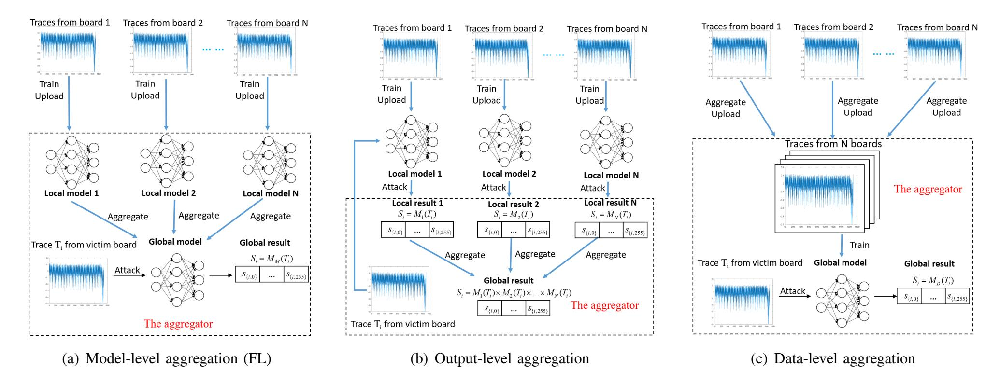
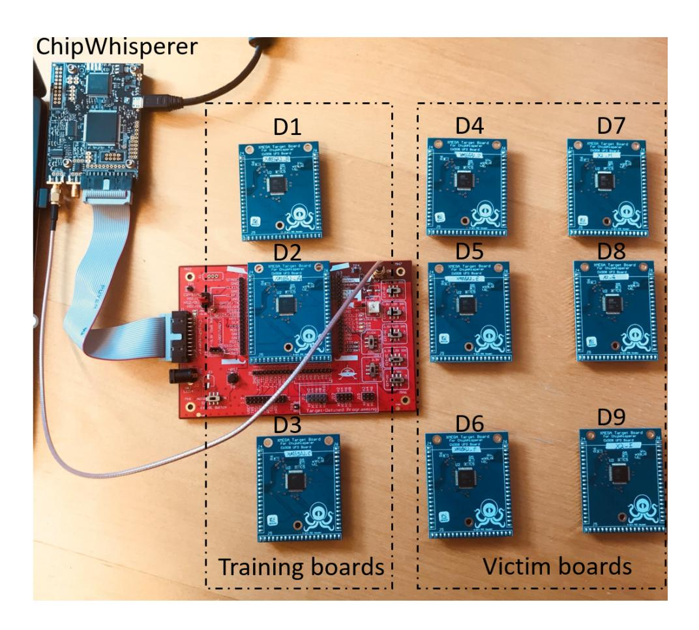
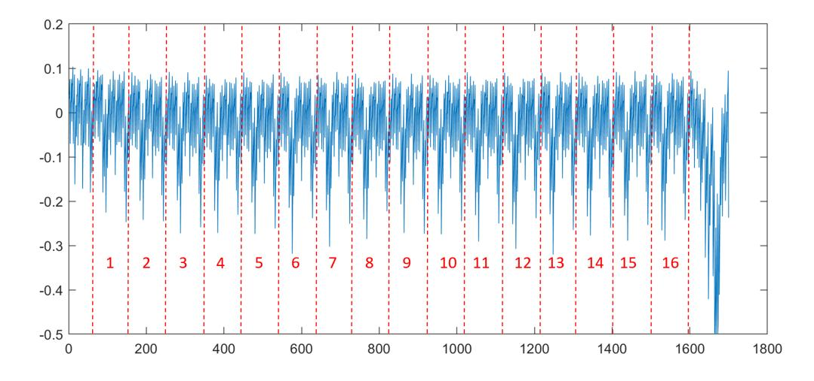
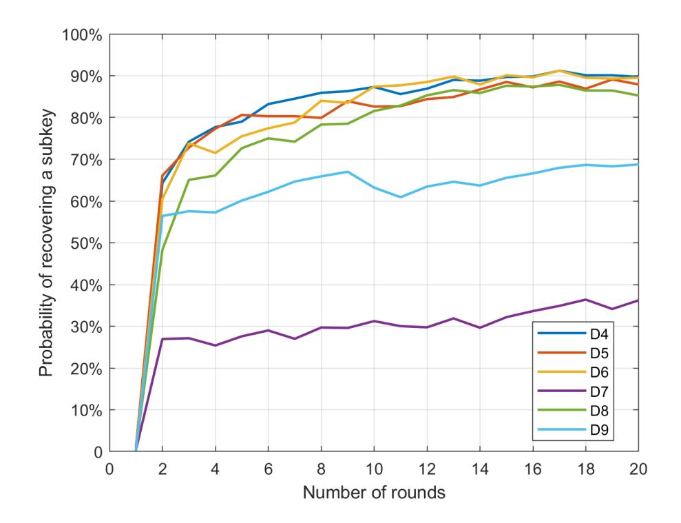
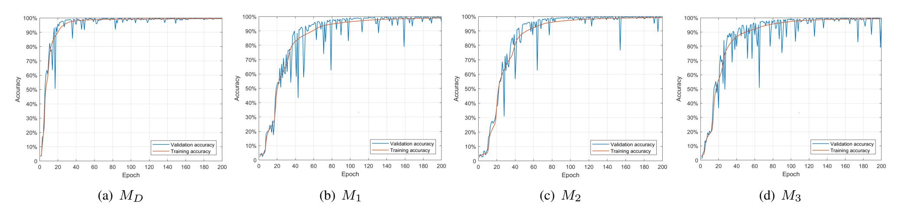

{0}------------------------------------------------

# Federated Learning in Side-Channel Analysis

Huanyu Wang, Elena Dubrova School of EECS, KTH Royal Institute of Technology, Stockholm, Sweden Email: {huanyu, dubrova}@kth.se

*Abstract*—Recently introduced federated learning is an attractive framework for the distributed training of deep learning models with thousands of participants. However, it can potentially be used with malicious intent. For example, adversaries can use their smartphones to jointly train a classifier for extracting secret keys from the smartphones' SIM cards without sharing their sidechannel measurements with each other. With federated learning, each participant might be able to create a strong model in the absence of sufficient training data. Furthermore, they preserve their anonymity. In this paper, we investigate this new attack vector in the context of side-channel attacks. We compare the federated learning, which aggregates model updates submitted by N participants, with two other aggregating approaches: (1) training on combined side-channel data from N devices, and (2) using an ensemble of N individually trained models. Our first experiments on 8-bit Atmel ATxmega128D4 microcontroller implementation of AES show that federated learning is capable of outperforming the other approaches.

*Index Terms*—Federated learning, side-channel attack, AES

# I. INTRODUCTION

Federated learning (FL) is a new paradigm in machine learning that can help meet regulatory requirements (GDPR [1], HIPAA [2]) and mitigate privacy concerns while taking advantage of massive distributed data [3]–[5]. FL allows its participants to collaboratively train a global model without sharing participant's local training data. At every communication round, each participant trains a local model based on his/her training data and submits the model updates to the server. The server employs a secure aggregation [6] to build a global model by averaging the local models' weights. Motivating applications for FL include image classifiers for self-driving cars, keyboard next-word predictors, and personalized product recommendation services [7].

However, as any great scientific discovery, FL can potentially be used with malicious intent. Since FL preserves not only training data confidentiality, but also participant's anonymity, its setting is very appealing to adversaries. Furthermore, an adversary who does not have enough training data might still be able to create a strong deep-learning model by training in a FL framework. For example, adversaries can use their smartphones to jointly train a classifier for extracting secret keys from the smartphones' SIM cards without sharing their local side-channel measurements with each other. At each round, every participant independently trains a local model update based on traces captured from his/her profiling device and uploads it to the aggregator, where the submitted updates are combined to construct a global model. The aggregator can be either a participant, or a third party.

In this paper, we investigate this new attack vector in the context of Deep-Learning Side-Channel Attacks (DL-SCAs). DL-SCA is one of the most powerful attacks against implementations of cryptographic algorithms at present [8]. During the execution of a cryptographic algorithm, physical implementations tend to leak side-channel information which is related to the secret key. An adversary first trains a deeplearning model on power traces captured from profiling devices which he/she controls, and then applies the trained model to recover the key of a victim device. Using more than one device for profiling (called *multi-source training*), is known to reduce the negative effect of inter-chip variation, which is prominent in advanced technologies, and help generalization [9]–[11].

Another known technique for reducing generalization error in machine learning is *bootstrap aggregating*, or *bagging* [12]. In bagging, several different, separately trained models are used in an ensemble to vote on the output results. Since different models usually do not make the same errors on the test set, on average, an ensemble of N models is expected to perform better than its members [13]. Bagging has been successfully applied to power analysis of hardware implementations of Advanced Encryption Standard (AES) [14]. The attack presented in [14] uses an ensemble of three CNN models trained on different attack points.

While it is obvious that a DL-SCA in FL framework will outperform a DL-SCA based a single classifier trained on a single profiling device, the outcome of a competition between FL (model-level aggregation), bagging (output-level aggregation), and multi-source training (data-level aggregation) methods is not evident. We present such an evaluation in this paper. We apply FL, bagging, and multi-source training aggregation methods to power analysis of a microcontroller implementation of AES. Our first experiments show that FL is capable of outperforming the other two approaches.

The rest of the paper is organized as follows. Section II gives a background on deep-learning side-channel attacks, AES, and federated learning. Section VI shows how local models are trained. Section III describes model-level, output-data and data-level aggregation methods in the side-channel analysis context. Section IV provides the assumptions for a realistic profiling side-channel attack scenario. Section V presents the experimental setup. Section VII summarizes the evaluation results. Section VIII concludes this paper and discusses open problems.

{1}------------------------------------------------



Fig. 1. Model-, output- and data-level aggregation in the deep-learning side-channel analysis context.

## II. BACKGROUND

This section reviews the background, including deep learning side-channel attacks, AES-128, and federated learning.

#### A. Deep Learning Side-Channel Attacks

Side-channel attacks were pioneered by Paul Kocher in his seminal paper on *timing analysis* [15] where he has shown that non-constant running time of a cipher can leak information about its key. Kocher has also introduced *power analysis* [16] which exploits the fact that circuits typically consume differing amounts of power based on their input data. The power consumption remains one of the most successfully exploited side-channels today. We focus on power analysis in this paper.

The target of a side-channel attack is to recover an n-bit key  $k \in \mathcal{K}$ , where  $\mathcal{K}$  is the set of all possible keys. To recover the key, the attacker uses of a set of known input data (e.g. the plaintext) and a set of the physical measurements (e.g. power consumption). Usually a divide-and-conquer strategy is used in which the key k is divided into m-bit parts  $k_i$ , called subkeys, and the subkeys  $k_i$  are recovered independently, for  $i \in \{1, 2, \ldots, \frac{n}{m}\}$ . Typically m = 8.

Deep learning can be used in side-channel analysis in two settings: profiling and non-profiling. *Profiling* attacks [17] first learn a leakage profile of the cryptographic algorithm under attack, and then attack. *Non-profiling* attacks [18] attack directly, as the traditional Differential Power Analysis [16] or Correlation Power Analysis (CPA) [19]. In this paper, we focus on profiling attacks.

A profiling deep-learning side-channel attack is done in two stages.

1) At the *profiling* stage, the selected type of deep-learning model is trained to learn a leakage profile of the cryptographic algorithm under attack for all possible values of the sensitive variable. The sensitive variable is typically a subkey. The training is done using a large set of sidechannel data captured from profiling device(s) which are labeled according to the selected leakage model.

2) At the *attack* stage, the trained model is used to classify the side-channel data from a victim device.

A *leakage model* describes the leakage of a device at some selected intermediate point during the execution of the algorithm, called *the attack point*. Common leakage models for power analysis are the identity, the Hamming weight, and the Hamming distance. In this paper, we use the *identity* model which assumes that the power consumption is proportional to the value of the data processed at the attack point.

#### B. AES-128

The AES [20] is a symmetric encryption algorithm standardized by NIST in FIPS 197 and included in ISO/IEC 18033-3. AES-128 takes a 128-bit block of plaintext and an 128-bit key k as input and computes a 128-bit block of ciphertext as output. In this section, we describe AES-128 algorithm whose implementation is used in our experiments. Its pseudo-code is shown in Algorithm 1. AES performs encryption iteratively, in 10 rounds for the 128-bit key. Each round except the last repeats the four steps: non-linear substitution, transposition of rows, mixing of columns, and round key addition. The last round does not mix columns

The non-linear substitution is implemented by the function SubBytes() which applies the AES 8-input 8-output substitution box S-Box to state byte-by-byte.

A different round key  $RK_i$  is derived from the key k for each round  $i \in \{1, 2, ..., 10\}$ .

As any block cipher, AES can be used in several modes of operation. In our experiments we use *Electronic Codebook* (ECB) mode, in which the message is divided into blocks and each block is encrypted separately.

#### C. Federated learning

Federated learning [5] trains a global model across multiple decentralized edge devices or servers holding local data samples. Existing federated learning methods can be classified into several subsets [21]. *Horizontal federated learning* [5],

{2}------------------------------------------------

# **Algorithm 1** Pseudo-code of the AES-128 algorithm.

```
// AES-128 Cipher
// in: 128 bits (plaintext)
// out: 128 bits (ciphertext)
// Nr: number of rounds, Nr = 10 for AES-128
// Nb: number of columns in a state, Nb = 4
// k_e: expanded key K, Nb*(Nr+1) = 44 words, (1 word
= Nb bytes)
state = in;
AddRoundKey(state, k_e[0, Nb - 1]);
for round = 1 step 1 to Nr - 1 do
  SubBytes(state); // Point of attack in round 1
  ShiftRows(state);
  MixColumns(state);
  AddRoundKey(state, k_e[round*Nb, (round+1)*Nb-1]);
end for
SubBytes(state);
ShiftRows(state);
AddRoundKey(state, k_e[Nr * Nb, (Nr + 1) * Nb - 1]);
```

[22] focuses on datasets which share the same feature space but different in samples. *Vertical federated learning* scheme [23], [24] is designed for datasets which share the same label space but different in feature space. Another category is called *federated transfer learning*, which is applied to the datasets differ in both label and feature space. [25] introduces a *block-chained federated learning* which utilizes the leveraging blockchain to exchange and verify model updates. Horizontal federated learning seems to be suitable in the context of sidechannel attack, since traces captured from different devices with the same key and plaintext share similar features.

# III. AGGREGATION METHODS

This section describes model-, output- and data-level aggregation methods in the side-channel analysis context.

#### A. Model-level aggregation

out = state;

Figure 1(a) illustrates the model-level aggregation for SCA which utilizes the horizontal federated learning framework. There are N participants (clients) jointly constructing a federated deep-learning model. Each client i has  $n_i$  private data samples from his/her profiling device, for  $i \in \{1, \ldots, N\}$ . The total number of training data samples of N clients is denoted by n, with  $n = \sum_{i=1}^{N} n_i$ .

At the beginning of the training process, a typical model structure is initialized by an aggregator (server) and sent to each client. At each communication round t, a random fraction  $\eta_t \in [0,1]$  of N clients is selected by the aggregator to independently update local models based on their private data and upload the updates to the aggregator. In our experiment, we set  $\eta_t = 1$ , which means that all clients contribute to the global model in each communication round.



Fig. 2. Equipment for power analysis.

For each client i, local updates are typically done using Stochastic Gradient Descent (SGD) taken on the private data the client i based on the weights  $\omega_0^t$  of the shared global model:

$$\omega_i^{t+1} = \omega_0^t - \alpha \nabla \phi(\omega_i^t)$$

where  $\alpha$  is the learning rate,  $\nabla \phi$  is gradient of the classification loss  $\phi$ , and  $\omega_i^t$  are weights of current local model of the client i.

A typical aggregation approach of federated learning is averaging. The aggregator computes the weights  $\omega_0^{t+1}$  of the global model by averaging the weights of submitted local models:

$$\omega_0^{t+1} = \sum_{i=1}^N \frac{n_i}{n} \omega_i^{t+1}$$

At the end of communication round t, the aggregator sends the global model with the weights  $\omega_0^{t+1}$  back to each client.

All clients can use the global model to classify the data samples from a victim device.

### B. Output-level aggregation

Figure 1(a) shows the output-level aggregation approach inspired by bagging [12] meta-algorithm which is a type of ensemble learning. N different classifiers are trained and their score vectors are combined. In this way, a stronger classifier can potentially be created from several weaker ones. Bagging may help avoid overfitting and reduce variance [26]. In output-level aggregation, N participants train their local models independently from each other. Each participant i uses  $n_i$  private data samples from his/her profiling device to train the model  $M_i$ , for  $i \in \{1, \ldots, N\}$ . After training, all participants use their trained models to classify traces captured from the victim device and submit the outputs to the aggregator. The aggregator creates the ensemble model  $M_O$  by aggregating the

{3}------------------------------------------------



Fig. 3. Segment of a power trace from an 8-bit ATxmega128D4 microcontroller representing 16 executions of S-box.

outputs of  $M_1, ..., M_N$  to obtain the final classification result of  $M_O$ .

# C. Data-level aggregation

Figure 1(c) illustrates the data-level aggregation. There are N participants. Each participant i uploads  $n_i$  private data samples from from his/her profiling device to the aggregator, for  $i \in \{1, \ldots, N\}$ . The aggregator combines the local data into the global data set with  $n = \sum_{i=1}^{N} n_i$  samples and trains the model  $M_D$ . After training, the aggregator sends the model  $M_D$  to each participant.

All clients can use  $M_D$  to classify the data samples from a victim device.

#### IV. ASSUMPTIONS

Profiling side-channel attacks assume that:

- 1) The attacker has at least one device, called the *profiling* device, which is similar to the device under attack and runs the same implementation of the same cryptographic algorithm.
- 2) The attacker has a full control over the profiling device (can apply chosen plaintext, program chosen keys, and do physical measurements).
- 3) The attacker has a physical access to the victim device to measure some side-channel signals during the execution of the cryptographic algorithm.

In addition, in this paper we assume that only a single power trace from a victim device is available to the attacker. Single-trace attacks are particularly threatening because they can recover the key even if the key if changed for every session.

# V. EXPERIMENTAL SETUP

The section describes our experimental setup, including the equipment we used and how we capture the power trace during the execution of AES.

#### A. Equipment for Power Analysis

The equipment we use for power analysis is shown in Figure 2. It consists of the ChipWhisperer-Lite board, the CW308 UFO mother board and nine CW308T-XMEGA target boards. In the sequel, we refer to these boards as  $D_1, D_2, \ldots, D_9$ .

| Layer Type     | Output Shape | Parameter # |
|----------------|--------------|-------------|
| Input (Dense)  | (None, 200)  | 19400       |
| Dense 1        | (None, 200)  | 40200       |
| Dense 2        | (None, 200)  | 40200       |
| Dense 3        | (None, 200)  | 40200       |
| Dense 4        | (None, 200)  | 40200       |
| Output (Dense) | (None, 256)  | 51456       |

Total Parameters: 231,656
TABLE I

LOCAL MODEL'S ARCHITECTURE SUMMARY.

The ChipWhisperer is a hardware security evaluation toolkit based on a low-cost open hardware platform and an open source software [27]. The ChipWhisperer-Lite can be used to measure power consumption with the maximum sampling rate of 105 MS/sec.

The CW308 UFO board is a generic platform for evaluating multiple targets [28]. The target board is plugged in a dedicated U connector.

The CW308T-XMEGA target board contains an 8-bit ATxmega128D4 microcontroller. We programmed the microcontrollers to the same implementation of AES-128 encryption algorithm in Electronic codebook (ECB) mode of operation.

#### B. Power Trace Acquisition

We used  $D_1, D_2, D_3$  as profiling devices and  $D_4 - D_9$  as victim devices. To collect training data, 300K power traces were captured from each profiling device during the execution of AES for randomly selected plaintexts and keys. To collect testing data, 1K power traces were captured from each target device during the execution of AES for randomly selected plaintexts and fixed keys. Figure 3 shows the segment of a power trace from an 8-bit ATxmega128D4 microcontroller representing 16 executions of S-box.

# VI. TRAINING OF LOCAL MODELS

In this section we describe how local models are trained.

#### A. Choice of Neural Network Type

Previous work investigated which type of deep neural networks is suitable for various side-channel analysis scenarios. For example, Convolutional Neural Networks (CNNs) can overcome trace misalignment and jitter-based countermeasure [8], [29], [30]. If traces are synchronized and there is no need to handle noise, Multiple Layer Perception (MLP) seems to be a more suitable choice. MLPs are shown successful in extracting keys from software [9], [10], [31]–[33] and hardware [34] implementations of AES.

In our experiments, we use an unprotected software implementation of AES-128 on an 8-bit microcontroller. In a software implementation instructions are executed sequentially, thus signal-to-noise ratio is much higher compared to a hardware implementation. Furthermore, we capture traces using ChipWhisperer which assures perfect trace alignment. For this reason, we use MLPs as a neural network type.

{4}------------------------------------------------

#### VII. EVALUATION RESULTS

#### A. Training Process

Given a set of power traces  $\{T_1, \ldots, T_n\}$ ,  $T_i \in \mathbb{R}^m$ , where m is the number of data points in a trace, and a set of classification classes C, the objective is classify traces according their labels  $l(T_i) \in C$ .

Fig. 3 shows the segment of a power trace from an 8-bit ATxmega128D4 microcontroller representing 16 executions of S-box in the 1st encryption round. The S-box is a  $8 \times 8$  invertible mapping. AES-128 executes S-box 16 times in each round. One can see the distinct shape of each S-box execution.

For all models, we use 8-bit values of the S-box output in the 1st round as labels (identity leakage model), i.e.  $C = \{0, 1, \dots, 255\}$ .

A neural network can be viewed as a function  $M: \mathbb{R}^m \to \mathbb{I}^{|C|}$ , where  $\mathbb{I}:=\{x\in\mathbb{R}\mid 0\leq x\leq 1\}$ , which maps a trace  $T_i$  into a *score* vector  $S_i=M(T_i)\in\mathbb{I}^{|C|}$  whose elements  $s_{i,j}$  represent the probability of the label with value  $j\in C$ .

We use categorical cross-entropy loss to quantify the classification error of the network. To minimize the loss, the gradient of the loss with respect the score  $S_i$  is computed and backpropagated through the network to tune its internal parameters according to the *RMSprop* optimizer, which is one of the advanced adaptations SGD algorithm [35]. This is repeated for a chosen number of iterations called *epochs*.

Once the network is trained, to classify a trace  $T_i$  whose label  $l(T_i)$  is unknown, we determine the most likely label  $\tilde{l}$  among all |C| candidate labels as

$$\tilde{l} = \underset{i \in |C|}{\operatorname{arg\,max}} \ S_i$$

If  $\tilde{l} = l(T_i)$ , the classification is successful.

#### B. Choice of Neural Network Architecture

The architecture of MLP networks used in our experiments is shown in Table I. The network contains an input layer, four hidden layers and an output layer. The input size 96 corresponds to the number data samples in one S-box execution. The output size is |C|=256.

#### C. Estimation Metrics

In our experiments, the adversary has a strictly limited access to the victim device, which mean there is only one trace can be captured by the adversary and classified by the trained deep-learning model. We term this test as single-trace test. In this case, another evaluation criterion is called single-trace key recovery rate [9]. It represents the probability of recovering a key byte from only 1 trace captured from the victim board.

In this section, we apply model-, output- and data-level aggregation methods to power analysis of AES-128 and compare their results. In all experiments, we simulate a scenario with N=3 participants having the same number of training traces.



Fig. 4. Probability of recovering a subkey from a single trace from devices  $D_4-D_9$  using the global model  $M_M$  (average for 1,000 tests).

# D. Results of model-level aggregation

In this experiment, three participants jointly create a global MLP model,  $M_M$ , each using  $n_i = 300 \text{K}$  traces from  $D_i$  for training his/her local model, for  $i \in \{1, 2, 3\}$ . The weights  $\omega_0^{t+1}$  of the global model at round t can be described as:

$$\omega_0^{t+1} = \frac{1}{3}(\omega_1^{t+1} + \omega_2^{t+1} + \omega_3^{t+1})$$

For all local models, we used RMSprop with a learning rate  $\alpha=0.0001$  and trained for 40 epochs with local minimum batch size 128. The training is carried out for 20 communication rounds. At the end of each round, the aggregator sends the global model back to each participant and the global model is further trained on local training sets.

After each round, we test the resulting global model on a randomly selected single trace  $T_i$  from each victim device  $D_j$ , for  $j \in \{4, 5, ..., 9\}$ . If the correct subkey value has the highest probability in the score vector  $S_i = M_M(T_i)$ , the attack is successful. Otherwise, the attack fails. Figure 4 shows the average probability of recovering a subkey from a single trace from devices  $D_4 - D_9$  for 1,000 tests for different numbers of rounds.

From Figure 4, we can see that the federated model built in the 17th communication round has the highest average success probability over all rounds. The 2nd column in Table III shows the probability of recovering a subkey from a single trace using this model. We can see that the average is 77.7%.

# E. Results of output-level aggregation

In this experiment, three participants train their local MLP models independently from each other. Each participant i trains the model  $M_i$  on  $n_i = 300 \mathrm{K}$  traces from  $D_i$  with 60K traces set aside for validation, for  $i \in \{1, 2, 3\}$ . For all models, we used RMSprop with a learning rate  $\alpha = 0.0002$  and trained for 200 epochs with batch size 128.

{5}------------------------------------------------



Fig. 5. Training/validation accuracy over training epochs of model MD, M1, M2, M3.

TABLE II PROBABILITY OF RECOVERING A SUBKEY FROM A SINGLE TRACE USING LOCAL MODELS (AVERAGE FOR 1,000 TESTS).

| Device  | M1    | M2    | M3    |
|---------|-------|-------|-------|
| D4      | 29.1% | 42.6% | 40.8% |
| D5      | 48.4% | 63.8% | 21.8% |
| D6      | 38.3% | 33.6% | 39.7% |
| D7      | 6.8%  | 10.4% | 57.9% |
| D8      | 27.3% | 36.1% | 50.0% |
| D9      | 33.9% | 51.8% | 35.4% |
| average | 34.9% | 41.3% | 40.9% |

The score vector S<sup>i</sup> of the ensemble model M<sup>O</sup> for trace T<sup>i</sup> is computed as the Hadamard (element-wise) product of score vectors of models M<sup>i</sup> for all j ∈ {1, 2, 3}:

$$S_i = M_1(T_i) \times M_2(T_i) \times M_3(T_i)$$

Such an approach is known to work well for power analysis of hardware implementations of AES [14]. Note, however, that we used the same attack point (S-box output in the 1st round) to create labels for models M1, M<sup>2</sup> and M3, Figure 5(b), 5(c) and 5(d) show the training/validation accuracy of model M1, M<sup>2</sup> and M3. In [14], different attack points are used for training different local models. This might have negatively affected the ensemble's results.

The 3rd column of Table III shows the probability of recovering a subkey from a single trace using MO. For a comparison, Table II also shows the results for local models M1, M<sup>2</sup> and M3. One see that that success probabilities of the models M1, M<sup>2</sup> and M<sup>3</sup> vary a lot for different devices. This is because different pairs of devices have different amounts of variability. Some devices are less different, some are more different. For example, on one hand, models M<sup>1</sup> and M<sup>2</sup> can recover a subkey from a single power trace from D<sup>5</sup> in 48.4% and 63.8% of cases, respectively. Contrary, for model M3, the subkey recovery rate from D<sup>5</sup> is only 21.8%. Probably D<sup>1</sup> and D<sup>2</sup> are less different from D<sup>5</sup> than D3. On the other hand, M<sup>3</sup> significantly outperforms M<sup>1</sup> and M<sup>2</sup> on D<sup>7</sup> (57.9% vs 6.8% and 10.4%, respectively). Probably D<sup>3</sup> is similar to D7, while D<sup>1</sup> and D<sup>2</sup> are very different from D7. High dissimilarly of D<sup>1</sup> and D<sup>2</sup> from D<sup>7</sup> might be the reason why the global model M<sup>M</sup> in performs so poorly on D<sup>7</sup> in the federated learning case. From Table II we can also conclude that D<sup>3</sup> is very

TABLE III PROBABILITY OF RECOVERING A SUBKEY FROM A SINGLE TRACE USING AGGREGATED MODELS (AVERAGE FOR 1,000 TESTS).

|         | Aggregation method |              |            |  |
|---------|--------------------|--------------|------------|--|
| Device  | Model-level        | Output-level | Data-level |  |
|         | MM                 | MO           | MD         |  |
| D4      | 89.8%              | 64.5%        | 74.6%      |  |
| D5      | 91.2%              | 76.0%        | 83.0%      |  |
| D6      | 91.4%              | 66.0%        | 73.6%      |  |
| D7      | 35.5%              | 18.4%        | 37.5%      |  |
| D8      | 88.5%              | 68.3%        | 62.3%      |  |
| D9      | 69.6%              | 58.8%        | 81.5%      |  |
| average | 77.7%              | 58.7%        | 68.8%      |  |

different from D9, which explains the worse result of M<sup>M</sup> for D<sup>9</sup> as compared to the results for D4 − D6 and D8.

Using an ensemble improves generalization ability of individual models [36], as we can see from the 3rd column of Table III. The average probability of recovering a subkey from a single trace using M<sup>O</sup> is 58.6%.

# *F. Results of data-level aggregation*

In this experiment, the participants 1, 2 and 3 upload their sets of 300K traces from D1, D<sup>2</sup> and D3, respectively, to the aggregator. The aggregator combines theses sets into a training set of size 900K and sets aside 270K traces for validation. Then, the aggregator trains the MLP model MD. We used RMSprop with a learning rate α = 0.0002 and trained for 200 epochs with batch size 128. Figure 5(a) shows the training/validation accuracy over time of model MD.

The 4th column of Table III shows the probability of recovering a subkey from a single trace using MD. The average is 68.8%.

# VIII. CONCLUSION

We compared the federated learning approach to two other aggregating approaches - on data and on output levels. Our first results show that federated learning is capable of outperforming the other approaches. This is quite surprising. Intuitively, it should be more difficult to train a global model in a federated learning framework due to challenges related to training on distributed data while keeping these data private. Moves due to averaging of weights of local models are more random compared to the moves due to the SGD. This randomness 

{6}------------------------------------------------

seems beneficial for the optimization of the objective function in the case of power analysis, when generalization is particularly important.

We plan to further investigate this phenomena by training new models using other combinations of profiling devices.

# ACKNOWLEDGMENT

This work was supported in part by the research grant 2018- 04482 from the Swedish Research Council.

# REFERENCES

- [1] P. Voigt and A. Von dem Bussche, "The EU general data protection regulation (GDPR)," *A Practical Guide, 1st Ed., Cham: Springer International Publishing*, 2017.
- [2] B. K. Atchinson and D. M. Fox, "From the field: The politics of the health insurance portability and accountability act," *Health affairs*, vol. 16, no. 3, pp. 146–150, 1997.
- [3] J. Konecnˇ y, H. B. McMahan, F. X. Yu, P. Richt ` arik, A. T. Suresh, and ´ D. Bacon, "Federated learning: Strategies for improving communication efficiency," *arXiv preprint arXiv:1610.05492*, 2016.
- [4] J. Konecnˇ y, H. B. McMahan, D. Ramage, and P. Richt ` arik, "Federated ´ optimization: Distributed machine learning for on-device intelligence," *arXiv preprint arXiv:1610.02527*, 2016.
- [5] H. B. McMahan, E. Moore, D. Ramage, S. Hampson *et al.*, "Communication-efficient learning of deep networks from decentralized data," *arXiv preprint arXiv:1602.05629*, 2016.
- [6] K. Bonawitz, V. Ivanov, B. Kreuter, A. Marcedone, H. B. McMahan, S. Patel, D. Ramage, A. Segal, and K. Seth, "Practical secure aggregation for privacy-preserving machine learning," in *Proceedings of the 2017 ACM SIGSAC Conference on Computer and Communications Security*, 2017, pp. 1175–1191.
- [7] Q. Li, Z. Wen, Z. Wu, S. Hu, N. Wang, and B. He, "A survey on federated learning systems: Vision, hype and reality for data privacy and protection," 2019.
- [8] G. Perin, B. Ege, and J. van Woudenberg, "Lowering the bar: Deep learning for side-channel analysis (white-paper)," in *Proc. BlackHat*, 2018, pp. 1–15.
- [9] H. Wang, M. Brisfors, S. Forsmark, and E. Dubrova, "How diversity affects deep-learning side-channel attacks," in *2019 IEEE Nordic Circuits and Systems Conference (NORCAS): NORCHIP and International Symposium of System-on-Chip (SoC)*. IEEE, 2019, pp. 1–7.
- [10] D. Das, A. Golder, J. Danial, S. Ghosh, A. Raychowdhury, and S. Sen, "X-deepsca: Cross-device deep learning side channel attack," in *Proceedings of the 56th Annual Design Automation Conference 2019*, 2019, pp. 1–6.
- [11] H. Wang, S. Forsmark, M. Brisfors, and E. Dubrova, "Multi-source training deep learning side-channel attacks," *IEEE 50th International Symposium on Multiple-Valued Logic*, 2020.
- [12] L. Breiman, "Bagging predictors," *Machine learning*, vol. 24, no. 2, pp. 123–140, 1996.
- [13] I. Goodfellow, Y. Bengio, and A. Courville, *Deep Learning*. MIT Press, 2016, http://www.deeplearningbook.org.
- [14] H. Wang and E. Dubrova, "Tandem deep learning side-channel attack against FPGA implementation of AES," *arXiv preprint arXiv*, 2020.
- [15] P. C. Kocher, "Timing attacks on implementations of Diffie-Hellman, RSA, DSS, and other systems," in *Proc. of the 16th Annual Int. Cryptology Conf. on Advances in Cryptology*, 1996, pp. 104–113.
- [20] J. Daemen and V. Rijmen, *The Design of Rijndael*. Secaucus, NJ, USA: Springer-Verlag New York, Inc., 2002.

- [16] P. Kocher, J. Jaffe, and B. Jun, "Differential power analysis," in *Annual International Cryptology Conference*. Springer, 1999, pp. 388–397.
- [17] Z. Martinasek, L. Malina, and K. Trasy, "Profiling power analysis attack based on multi-layer perceptron network," in *Computational Problems in Science and Engineering*. Springer, 2015, pp. 317–339.
- [18] B. Timon, "Non-profiled deep learning-based side-channel attacks," IACR Cryptology ePrint Archive, 2018:196, 2018.
- [19] E. Brier, C. Clavier, and F. Olivier, "Correlation power analysis with a leakage model," in *Cryptographic Hardware and Embedded Systems - CHES 2004*, M. Joye and J.-J. Quisquater, Eds., 2004, pp. 16–29.
- [21] Q. Yang, Y. Liu, T. Chen, and Y. Tong, "Federated machine learning: Concept and applications," *ACM Transactions on Intelligent Systems and Technology (TIST)*, vol. 10, no. 2, pp. 1–19, 2019.
- [22] V. Smith, C.-K. Chiang, M. Sanjabi, and A. S. Talwalkar, "Federated multi-task learning," in *Advances in Neural Information Processing Systems*, 2017, pp. 4424–4434.
- [23] R. Nock, S. Hardy, W. Henecka, H. Ivey-Law, G. Patrini, G. Smith, and B. Thorne, "Entity resolution and federated learning get a federated resolution," *arXiv preprint arXiv:1803.04035*, 2018.
- [24] S. Hardy, W. Henecka, H. Ivey-Law, R. Nock, G. Patrini, G. Smith, and B. Thorne, "Private federated learning on vertically partitioned data via entity resolution and additively homomorphic encryption," *arXiv preprint arXiv:1711.10677*, 2017.
- [25] H. Kim, J. Park, M. Bennis, and S.-L. Kim, "On-device federated learning via blockchain and its latency analysis," *arXiv preprint arXiv:1808.03949*, 2018.
- [26] R. Polikar, "Ensemble learning," in *Ensemble machine learning*. Springer, 2012, pp. 1–34.
- [27] NewAE Technology Inc., "Chipwhisperer," https://newae.com/tools/ chipwhisperer.
- [28] CW308 UFO Target, https://wiki.newae.com/CW308 UFO Target.
- [29] E. Cagli, C. Dumas, and E. Prouff, "Convolutional neural networks with data augmentation against jitter-based countermeasures," in *International Conference on Cryptographic Hardware and Embedded Systems*. Springer, 2017, pp. 45–68.
- [30] R. Gilmore, N. Hanley, and M. O'Neill, "Neural network based attack on a masked implementation of AES," in *2015 IEEE International Symposium on Hardware Oriented Security and Trust (HOST)*. IEEE, 2015, pp. 106–111.
- [31] R. Benadjila, E. Prouff, R. Strullu, E. Cagli, and C. Dumas, "Study of deep learning techniques for side-channel analysis and introduction to ascad database," *ANSSI, France & CEA, LETI, MINATEC Campus, France*, vol. 22, p. 2018, 2018. [Online]. Available: https://eprint.iacr.org/2018/053.pdf
- [32] Z. Martinasek, P. Dzurenda, and L. Malina, "Profiling power analysis attack based on MLP in DPA contest v4. 2," in *2016 39th International Conference on Telecommunications and Signal Processing (TSP)*. IEEE, 2016, pp. 223–226.
- [33] H. Maghrebi, "Deep learning based side channel attacks in practice," IACR Cryptology ePrint Archive 2019, 578, Tech. Rep., 2019.
- [34] T. Kubota, K. Yoshida, M. Shiozaki, and T. Fujino, "Deep learning sidechannel attack against hardware implementations of AES," in *2019 22nd Euromicro Conference on Digital System Design (DSD)*. IEEE, 2019, pp. 261–268.
- [35] H. Robbins and S. Monro, "A stochastic approximation method," *Ann. Math. Statist.*, vol. 22, pp. 400–407, 1951.
- [36] A. J. Sharkey, *Combining artificial neural nets: ensemble and modular multi-net systems*. Springer Science & Business Media, 2012.