{0}------------------------------------------------

# A Comparison of Weight Initializers in Deep Learning-based Side-channel Analysis

Huimin Li, Marina Krˇcek, and Guilherme Perin

Delft University of Technology, Delft, The Netherlands h.li-7@tudelft.nl, m.krcek@tudelft.nl, g.perin@tudelft.nl

Abstract. The usage of deep learning in profiled side-channel analysis requires a careful selection of neural network hyperparameters. In recent publications, different network architectures have been presented as efficient profiled methods against protected AES implementations. Indeed, completely different convolutional neural network models have presented similar performance against public side-channel traces databases. In this work, we analyze how weight initializers' choice influences deep neural networks' performance in the profiled side-channel analysis. Our results show that different weight initializers provide radically different behavior. We observe that even high-performing initializers can reach significantly different performance when conducting multiple training phases. Finally, we found that this hyperparameter is more dependent on the choice of dataset than other, commonly examined, hyperparameters. When evaluating the connections with other hyperparameters, the biggest connection is observed with activation functions.

Keywords: Weight initialization · Deep learning · Side-channel Analysis

## 1 Introduction

There has been rapid progress in profiled side-channel attacks (SCAs) based on machine learning techniques in recent years. These techniques proved to be very successful by outperforming some of the classical attacks [\[14,](#page-17-0)[3\]](#page-16-0), like template attacks [\[4\]](#page-16-1). Around a decade ago, machine learning algorithms like SVM [\[9\]](#page-17-1) and Random Forest [\[15,](#page-17-2)[19\]](#page-17-3) represented the standard choice for machine learningbased SCA.

More recently, deep learning-based SCAs started when Maghrebi et al. demonstrated the strong performance of several neural network types, most notably, convolutional neural networks [\[16\]](#page-17-4). Despite many successes, there are still many difficulties (and unanswered questions) when training deep neural networks, especially those related to how to tune hyperparameters. This tuning phase can highly influence the model's performance, so it is important to properly address the issue and have a good strategy for selecting the hyperparameters. Hyperparameters are all those configuration variables external to the model, like the

{1}------------------------------------------------

number of hidden layers in a neural network. The parameters are the configuration variables internal to the model and estimated from data (e.g., the weights in a neural network).

As there are many hyperparameters, and numerous possible combinations that can be explored, selecting proper hyperparameters can be a very timeconsuming process. Researchers commonly approach this problem by selecting the hyperparameters they deem relevant and then conducting a grid search. While such an approach works well (as confirmed by successful attacks on various AES implementations), there are also potential drawbacks. Most notably, grid search skips many possible values while limiting the setup to only certain hyperparameters, completely disregards other hyperparameters' influence. In [\[23\]](#page-17-5), the authors proposed a methodology to select hyperparameters that are related to the size (number of learnable parameters, i.e., weights and biases) of layers in CNNs. This includes the number of filters, kernel sizes, strides, and the number of neurons in fully-connected layers. In [\[1\]](#page-16-2), the authors conducted an empirical evaluation for different hyperparameters for CNNs on the ASCAD database. Kim et al. investigated how adding noise to the input (thus, serving as regularization) improves the performance of profiled SCAs [\[11\]](#page-17-6), which is a technique that can be used with any neural network architecture.

In this work, we focus on the weight initialization strategies for CNNs in SCA, and we explore its influence on the performance of the attacks. Thus, we investigate a hyperparameter, i.e., selecting different weight initializers directly responsible for weights parameter. Our experiments show that most of the weight initializers work well. More precisely, there is a decent selection of weight initializers one can use in deep learning-based SCA and expect good results. Next, our experiments show significant differences concerning key rank results, as within one guessing entropy experiment, it is common to obtain both perfect attack and attack that does not work at all. Interestingly, our results indicate that independent training phases result in significantly different guessing entropy performances. This means that it is not enough to consider only one training experiment, but one must conduct a proper statistical analysis for training and testing phases. We evaluate the evolution of weights and biases concerning the progress of epochs, and we observe most changes in Convolutional and Batch Normalization layers. In contrast, the fully-connected layers (those responsible for classification) remain almost constant throughout the training phase. Finally, we examine the connection between weight initializers and other hyperparameters, and we determine that the biggest influence comes from the combination of activation functions and weight initializers. This indicates that future experiments should consider both hyperparameters.

## 2 Background

#### 2.1 Side-channel Analysis

Side-channel analysis is a type of implementation attacks, where instead of attacking the algorithm itself, adversary attacks the physical device that imple

{2}------------------------------------------------

ments the algorithm [17]. Profiled side-channel attacks are the most powerful type of side-channel attacks as they assume that the attacker has access to an identical copy of a device to build a profile. These attacks have two phases, namely, profiling and online attack. The profiling phase is a modeling problem, for which machine learning algorithms perform well. The online phase is the actual attack on a similar device to recover the secret information and is done using the profiling phase's model.

#### 2.2 Machine Learning and Side-channel Analysis

Machine learning is a subset of artificial intelligence and is based on learning specific patterns from given data. Since this approach is data-driven, it does not require explicit instructions and rules. Therefore, such algorithms work well in modeling problems. Currently, neural networks are a prevalent machine learning technique in SCA, and in our experiments, we investigate deep learning. Deep learning represents methods based on artificial neural networks, and some of the deep learning architectures are multilayer perceptrons (MLPs), recurrent neural networks (RNNs), and convolution neural networks (CNNs). In our experiments, we concentrate on CNNs from [23] and [11]. We opt not to consider MLP as there are less "accepted" MLP architectures in the literature, and the number of hyperparameters is more limited, which makes it possible to include weight initialization in the hyperparameter tuning phase.

To understand weight initializers, we first explain neurons, the base building block of artificial neural networks. Neuron takes input values and calculates the weighted sum using the weight matrix. For a neural network to learn nonlinear functions and models, nonlinear activation functions are applied to the weighted sum. Output of one neuron is described with the equation  $y = f(b + \sum_{i=1}^{n} x_i w_i)$ , where, the input x is of size n, w are the weights, b the bias and f is the activation function. Bias is also a weight for an input  $x_0$  with an assigned value of 1. The equation takes a form  $y = f(\sum_{i=0}^{n} x_i w_i)$  where  $x_0 = 1$  and  $w_0 = b$ . This calculation is done in all neurons of one layer, so we can describe it with matrices, where features of the input samples can be arranged as columns or rows. In Keras, the features are arranged as columns, and in this setting the equation equals:

$$\mathbf{Y} = \mathbf{X} * \mathbf{W} + \mathbf{B},\tag{1}$$

where  $\mathbf{X}$  is the input,  $\mathbf{W}$  is the weight, and  $\mathbf{B}$  is the bias matrix. The weight matrix of a layer l is a matrix of dimension (size of layer l-1, size of layer l), while the bias matrix is (1, size of layer l), with the size of the layer being the number of neurons in the layer. Weight initializers are strategies for setting the initial values of a weight matrix for a neural network layer. Later, in the training phase during back-propagation, the weights in the weight matrix are adjusted with the selected optimization algorithm. Commonly used optimization algorithms are Stochastic Gradient Descent, RMSprop, and Adam [12], which we use in our experiments. Here, we explore different weight initialization strategies and how they impact the performance of deep learning-based SCA.

{3}------------------------------------------------

#### 2.3 Weight Initializers

As mentioned, weight initializers represent how the initial values of a neural network layer's weight matrix are set. It is believed that neural networks are very sensitive to the initial weights [\[18\]](#page-17-9). When the deep learning algorithm was first successfully proposed, it was common to initiate weights with Gaussian noise, setting the mean equal to zero, and the standard deviation to 0.01. This way of initializing weights was not enough to train deep neural networks because of problems, such as vanishing gradients, exploding gradients, or dead neuron [\[18](#page-17-9)[,13\]](#page-17-10), which significantly hampered its development. In 2010, Glorot and Bengio [\[22\]](#page-17-11) analyzed the problem systematically and proposed a formula to initialize weights depending on the number of input and output units (neurons). Glorot initializer works well in many cases and is still popular today. In 2015, He et al. [\[8\]](#page-16-3) put forward that Glorot initializer does not work with well ReLU activation function, and extended the formula to meet ReLU based neural networks through only using the number of input units and increasing the scaling by √ 2. As more people have devoted themselves to the study of weight initialization, various methods have appeared. In general, these methods can be divided into two categories: Zeros and Ones initialization, and Random initialization.

Zeros and Ones Initialization. With all weights initialized to 0 (1), all weights are the same, and the activation in all neurons is also the same. That way, the loss function's derivative is the same for every weight in a weight matrix of a layer. When all weights have the same value, in all iterations, this makes hidden layers symmetric. Every neuron of the layer computes the same function, so the model behaves like a linear model.

Random Initialization. All weight matrix values are set to random numbers, usually from a normal or uniform distribution. As mentioned, issues with random initialization are vanishing and exploding gradients. In vanishing gradients, weight update is minor, which results in slower convergence, while in exploding gradients, large gradients can result in oscillation around the optimum.

For deep networks, heuristics can be used to initialize the weights depending on the nonlinear activation function. Heuristics set the normal distribution variance to k/n, where k is a constant value that depends on the activation function, and n is the number of input nodes to the weight tensor or both input and output nodes of the weight tensor. This is adjusted to a uniform distribution, which can be seen in the provided list of initializers from Keras library [\[5\]](#page-16-4). While these heuristics do not entirely solve the exploding/vanishing gradients issue, they help mitigate it to a great extent. Initializers with explained heuristics are LeCun, Glorot/Xavier, and He initializers.

Different weight initializers available [\[10\]](#page-17-12) in Keras are listed below with f an in being the number of input units in the weight tensor and f an out the number of output units in the weight tensor.

– Zeros: initializes weights to 0. – Ones: initializes weights to 1.

{4}------------------------------------------------

- Constant: initializes weights to given constant, default is 0.
- RandomNormal: initializes weights with normal distribution, mean = 0, stddev = 0.05.
- RandomUniform: initializes weights with uniform distribution, minval = −0.05, maxval = 0.05.
- TruncatedNormal: similar to RandomNormal except that values more than two standard deviations from the mean are discarded and redrawn.
- VarianceScaling: adapts scale to the shape of weights, default values are scale = 1, mode =0 f an in0 and normal distribution.
- Orthogonal: random orthogonal matrix, default value of multiplicative factor to apply to the matrix is 1.
- Identity: identity matrix, multiplicative factor again 1.
- lecun uniform: uniform distribution within [-limit, limit] where limit is sqrt(3/f an in).
- lecun normal: truncated normal distribution centered on 0 with stddev = sqrt(1/f an in).
- glorot normal: truncated normal distribution centered on 0 with stddev = sqrt(2/(f an in + f an out)).
- glorot uniform: uniform distribution within [-limit, limit] where limit is sqrt(6/(f an in + f an out)).
- he normal: truncated normal distribution centered on 0 with stddev = sqrt( 2/f an in).
- he uniform: uniform distribution within [-limit, limit] where limit is sqrt( 6/f an in).

## 3 Experimental Setup

Algorithms used for these experiments are taken from [\[11\]](#page-17-6) and [\[23\]](#page-17-5), where CNN hyperparameters were fine-tuned specifically for each dataset the authors used. We vary available weight initializers in our experiments to investigate the performance difference according to each weight initializer. All of the other hyperparameters are taken directly from the mentioned works. We consider these two architectures as they represent top-performing architectures from related works. Additionally, they differ in size, which will enable us to evaluate the influence of weight initializers on architectures of different complexity.

We will refer to CNN architecture as the Noise architecture for [\[11\]](#page-17-6), and the Methodology architecture for [\[23\]](#page-17-5). For each architecture, two leakage models are used: Identity (ID) model [\[11,](#page-17-6)[23\]](#page-17-5) and Hamming weight (HW) model [\[20\]](#page-17-13), in which there are 256 classes and nine classes respectively corresponding to the output of neural networks. In both architectures, hyperparameters are tuned with the ID model (as the original works consider only ID model), but we use the same hyperparameters for the HW model.

Kim et al. [\[11\]](#page-17-6) used glorot uniform weight initializer, and Zaid et al. [\[23\]](#page-17-5) used he uniform weight initializer. In the last layer, [\[23\]](#page-17-5) does not set weight initializer to he uniform, but instead, the default weight initializer is utilized, which is 

{5}------------------------------------------------

glorot\_uniform. We are not aware of this implementation's motivation, so in our experiments, we vary weight initializers in all layers, including the last layer with a Softmax activation function. This change causes a difference between our results with *Methodology* architecture and ID leakage model compared to results presented in the work of Zaid et al. [23], as shown later in Section 4.

We are not running experiments with Constant, VarianceScaling, Identity, and Orthogonal initializers from all available Keras weight initializers. Identity and Orthogonal initializers are not actively used, and Constant and VarianceScaling correspond to Zeros and lecun\_normal, respectively, when using default values. We simulate ten times with each initializer and average the results for comparison with other weight initializers.

We use the public source code provided on GitHub by Zaid et al. [23] in Keras with Tensorflow backend [5]. We consider three publicly available datasets that consist of side-channel measurements for the AES cipher for our experiments. Following, we shortly describe these datasets and then discuss the results for each dataset in detail.

**DPA contest v4 (DPAv4) dataset** 1 is obtained from a masked AES software implementation [2]. Knowing the masked values, this dataset is easily converted into an unprotected scenario. We attack the first round of S-box operation, and identify each trace with  $Y^{(i)}(k^*) = Sbox[P_0^{(i)} \oplus k^*] \oplus M$  where  $P_0^{(i)}$  is the first byte of the *i*-th plaintext and M is the known mask.

**AES\_RD** dataset 2 is obtained from an implementation on an 8-bit AVR microcontroller with a random delay countermeasure [6]. This countermeasure shifts each trace following a random variable of 0 to  $N^{[0]}$ . The attack is on the first round S-box operation, as in DPAv4 dataset, where traces are labeled as  $Y^{(i)}(k^*) = Sbox[P_0^{(i)} \oplus k^*]$ .

**ASCAD** dataset 3 is obtained from a masked AES-128 implementation on an 8-bit AVR microcontroller introduced in [21]. The leakage model is the first round S-box operation, such that  $Y^{(i)}(k^*) = Sbox[P_3^{(i)} \oplus k^*]$ . In contrast to the DPAv4 and AES\_RD datasets, the third byte is exploited (as this is the first masked byte).

#### 4 Experimental Results

This section shows the results for different weight initializers. We explore 1) how weight initializers impact the performance of the utilized CNN architectures, 2)

1 http://www.dpacontest.org/v4/42\_traces.php

&lt;sup>2 https://github.com/ikizhvatov/randomdelays-traces

3 https://github.com/ANSSI-FR/ASCAD

{6}------------------------------------------------

which one is the best for a specific dataset and architecture, and 3) whether there is the best weight initializer for all datasets. As explained in Section [3,](#page-4-0) we use 11 weight initializers available in Keras and execute experiments on commonly used DPAv4, AES RD, and ASCAD datasets. For each dataset, we run four experiments: Methodology architecture with ID and HW model, and Noise architecture with ID and HW model.

Recall, with Zeros and Ones initialization, the model is no better than a linear model. In our experiments, we still choose to show the results with Zeros and Ones weight initialization to show that a linear model is not sufficient for considered problems. There, all results show that guessing entropy is either staying at random guessing or increasing with Zeros and Ones weight initialization. Consequently, when discussing the performance of weight initializers, we usually ignore the performance of Zeros and Ones, as they never converge.

A good initializer is the one where GE decreases, preferably to zero, in the least number of traces, and is more stable, as observed from results from multiple independent experiments. As such, those weight initializers where GE behaves similarly in multiple experiments, we consider more stable than when this is not true. To get the best weight initializer, we consider two additional metrics: speed and stability. We sort the averaged GE value of all weight initializers to evaluate their "speed", and compare the consistency in multiple experiments to obtain the "stability". The key rank range shows the "best" GE from 10 experiments to present the range from multiple performed attacks. The "best" GE is the one that reaches the lowest value, and if multiple GE results reach the same minimum, then the one that reaches that value with fewer traces is considered better, and we plot key rank range for that experiment. The range is taken from the 100 attacks that are executed for calculating the GE. Weights' evolution figures show weights for each layer, and the layers in the legend are ordered from first input layer to the last output layer of the neural network. We provide a Table [1](#page-6-0) as an overview of all experiments and best initializers in each setup.

Table 1: An overview of all experiments and best initializers in each setup.

| Dataset Architecture |             | Best initializer (ID/HW)   |  |  |
|----------------------|-------------|----------------------------|--|--|
| DPAv4                | Methodology | RandomUniform              |  |  |
|                      | Noise       | RandomUniform/RandomNormal |  |  |
| AES RD               | Methodology | he normal/lecun normal     |  |  |
|                      | Noise       | RandomUniform              |  |  |
| ASCAD                | Methodology | he normal                  |  |  |
|                      | Noise       | lecun normal               |  |  |

{7}------------------------------------------------

#### 4.1 Results for the DPAv4 Dataset

As in [\[23\]](#page-17-5), we use 4 000 traces for the training set, 500 traces for the validation set, and 500 for attacking the device. Each trace has 4 000 features. The GE rankings of the four experiments are shown in Figure [1.](#page-7-0) In the two experiments with the Methodology architecture (Figures [1a](#page-7-0) and [1b\)](#page-7-0), most weight initializers perform similarly when weight initializer is varied, but RandomUniform is slightly faster in convergence and more stable with both leakage models. With the Noise architecture and ID leakage model (Figure [1c\)](#page-7-0), the best weight initializer is RandomUniform, and with the HW model (Figure [1d\)](#page-7-0), most weight initializers perform quite well, but we choose RandomNormal as the best one.

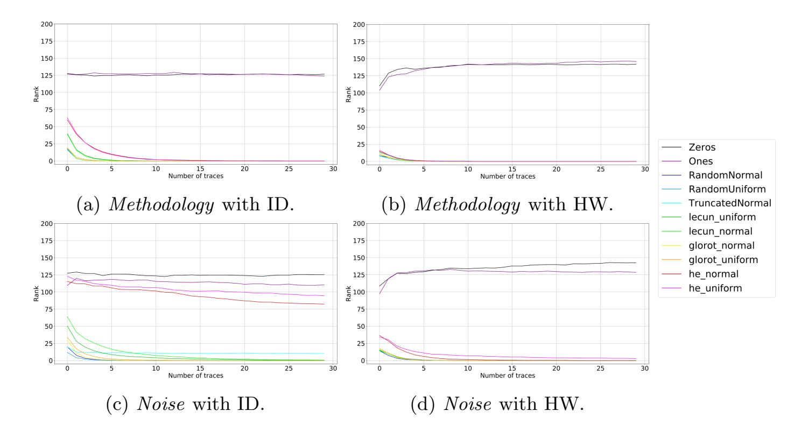

Fig. 1: Averaged GEs for all weight initializers with the DPAv4 dataset.

Figure [2](#page-8-0) shows the key rank range for the best (Figure [2a\)](#page-8-0) and the worst initializer (Figure [2b\)](#page-8-0) with the Noise architecture and ID model for the DPAv4 dataset when ignoring the Zeros and Ones. While the GE is slowly converging with he uniform initializer, in Figure [2b,](#page-8-0) we can see significant differences in the key rank results from multiple performed attacks within one guessing entropy experiment.

When looking at the weights' evolution, we observe the change of weights and biases in every neural network layer in every epoch and find that weights and biases change in Convolutional layers and Batch Normalization layers, and other layers such as dense layers do not exhibit much change. In the Methodology architecture, both weights, and biases change significantly, while in the Noise architecture, only biases change, and weights stay almost constant. According to the result, we can peek into the training processes of the two architectures. The iterative processes of the two architectures are radically different: in the

{8}------------------------------------------------

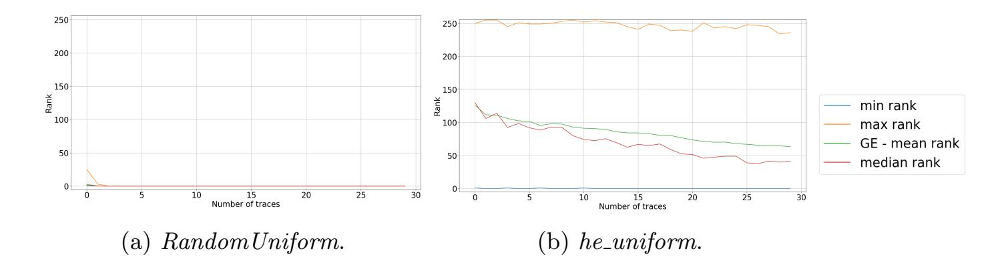

Fig. 2: The key rank range of Noise architecture with ID model for decreasing GE in DPAv4 dataset.

Methodology architecture, both weights, and biases are trained, while in the Noise architecture, biases are the main training objects. This indicates that the Noise architecture is more "robust" as there is not much need for weight improvement to reach strong attack performance. More precisely, there seems to be more weight optima for the Noise architecture than for the Methodology architecture.

In the weights' evolution for the DPAv4 dataset, the random initializers without heuristics perform best for the Methodology ID setting and very similar to Glorot initializers. Weight initializers He and LeCun in this setting performed a bit worse, and their weights' evolution is also similar, but visually different from the weights' evolution of the other initializers. Similar weights' evolution is seen with the HW model.

For the Noise architecture, in Figures [3a](#page-9-0) and [3b,](#page-9-0) we show weights' evolution of the best and worst initializer, respectively. It seems as the he normal (Figure [3b\)](#page-9-0) could improve with more epochs and reach the performance of, at least, Glorot initializers. Additionally, we show corresponding experiments of the same initializer to show their stability in Figures [3c](#page-9-0) and [3d.](#page-9-0) Here, both are stable: RandomUniform is performing well, and he normal consistently has a slow convergence. This is again visible through weights' evolution because the weights and biases' variance is not large. The performance of different weight initializers with both architectures and models on the DPAv4 dataset is quite similar, and most of the initializers reach GE of zero.

Lastly, we simulate experiments with the Methodology architecture and both leakage models to explore the influence of the weight initializer in the last fullyconnected layer, similar to [\[23\]](#page-17-5). More precisely, we keep all hyperparameters of the two experiments except that the setting of the last layer in the neural network is the same as paper [\[23\]](#page-17-5). The results for the two experiments show that it has no impact on the outcome, and the performances of all the weight initializers in the ID and HW model are almost the same.

{9}------------------------------------------------

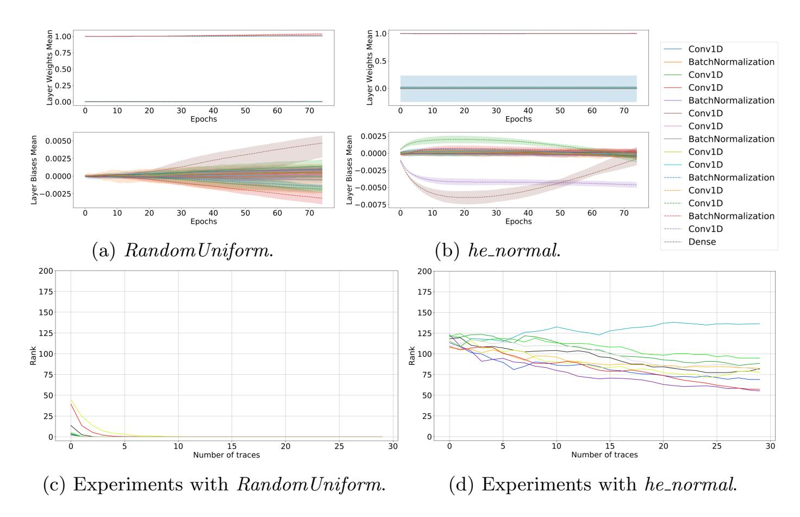

Fig. 3: Weights' evolution and experiments with Noise ID setting on the DPAv4 dataset.

#### 4.2 Results for the AES RD Dataset

AES RD dataset is a protected implementation, where adding random delays to the normal operation of AES makes it more difficult to conduct attack as features are misaligned. The dataset consists of 50 000 traces of 3 500 features each, where 20 000 traces are used for the training set, 5 000 for the validation, and 25 000 for the attack set. The GE rankings for the AES RD dataset are illustrated in Figure [4.](#page-10-0) By observing all weight initializers' speed and stability, we get the best weight initializers in all scenarios: he normal, lecun normal, RandomUniform, and RandomUniform, respectively.

Like the DPAv4 dataset, weights and biases change mostly in Convolutional layers and Batch Normalization layers, but not in other layers. We can also see that in the Methodology architecture, both weight and bias change significantly, while in the Noise architecture, only biases change, and weights remain almost constant.

Figures [5a](#page-11-0) and [5b](#page-11-0) display the best and the worst initializer respectively in weights' evolution for the Methodology architecture on the AES RD dataset. The difference in the initializers' performance stems from their stability because all reach GE equal to zero in several of ten simulations, which can be seen in Figures [5c](#page-11-0) and [5d.](#page-11-0) The stability of the weight initializer is also seen in weights' evolution. Since we show the mean of the weights and the range for the ten simulations: the more the weights' evolution varies, the more GE is also likely to vary.

{10}------------------------------------------------

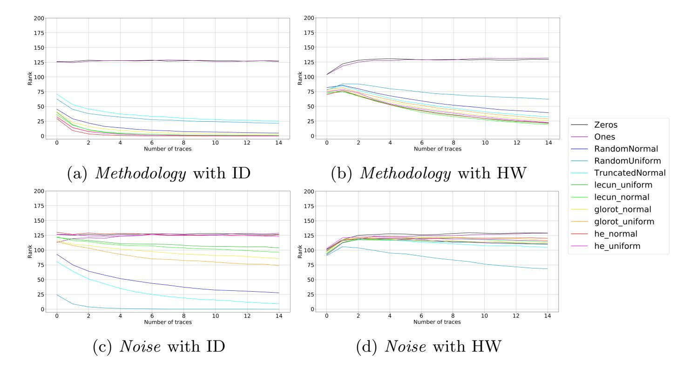

Fig. 4: Averaged GEs for all weight initializers with the AES RD dataset.

Finally, we investigate the weight initializer's influence in the last dense layer for the Methodology architecture. All hyperparameters are the same, except for the weight initializer in the last layer, which is set as default, according to the settings in paper [\[23\]](#page-17-5). The new results show that the change in the last layer also does not have a big effect on the initializer's stability, but it impacts the speed. With the HW model, the convergence for all weight initializers is slower. The best weight initializers for ID and HW model are he normal and lecun normal, respectively.

#### 4.3 Results for the ASCAD Dataset

Next, we compare the performance of different weight initializers for the ASCAD dataset. We use the ASCAD dataset with 60 000 traces of 700 features without desynchronization. The dataset is divided into 45 000 training traces, 5 000 validation traces, and 10 000 attack traces. In Figure [6,](#page-12-0) we show the GE rankings. In the experiment with the Methodology ID setting (Figure [6a\)](#page-12-0), increasing the number of attack traces leads to an increase of the GE for the correct key byte, even with he uniform, which was used in paper [\[23\]](#page-17-5) in all layers except for the last layer. By comparing the stability, we get that he normal is the best one. We observe that the GE value of weight initializers with heuristics converges to zero with the HW model (Figure [6b\)](#page-12-0). he normal is the fastest one. In the setting with the Noise architecture (Figures [6c](#page-12-0) and [6d\)](#page-12-0), the best weight initializers, lecun normal, can be easily chosen by observing the speed.

Figure [7](#page-12-1) shows the key rank range for he normal initializer where GE reached zero (Figure [7a\)](#page-12-1), and RandomUniform where GE increases with an increased number of traces (Figure [7b\)](#page-12-1). Again, we see that even when the GE is increasing, some key rank results are showing perfect attacks.

{11}------------------------------------------------

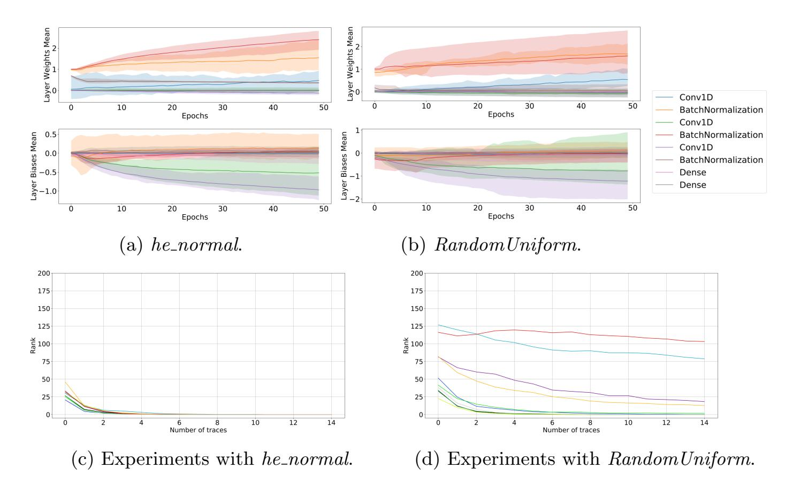

Fig. 5: Weights' evolution and experiments with Methodology ID setting on the AES RD dataset.

Next, we observe the weights and biases change of every layer throughout the epochs. Like the previous two datasets, weight and bias change mostly in Convolutional layers and Batch Normalization layers, but not in other layers. Once again, it can be seen that in the Methodology architecture, both weights and biases change significantly, while for the Noise architecture, only biases change and weights are almost constant.

In Figure [8,](#page-13-0) we show the weights' evolution of the best initializer (Figure [8a\)](#page-13-0) and average performing one (Figure [8b\)](#page-13-0). The corresponding experiments are shown in Figures [8c](#page-13-0) and [8d](#page-13-0) for the Noise architecture and the HW model. In these experiments, the worst initializer, RandomUniform (see Figure [6d\)](#page-12-0), performed similarly to Zeros and Ones, as in every experiment, GE was increasing.

Finally, to explore the influence of weight initializers in the last layer, we run experiments with the Methodology architecture, using all the hyperparameters of the two experiments except the setting of the last layer in the neural network. Like [\[23\]](#page-17-5), the weight initializer of the last layer is a default one. The new results show that weight initializer has a significant influence on the outcomes. In the experiments with the Methodology ID setting, the average GE values of all weight initializers (except Zeros and Ones) decrease, but there is a difference in the stability of the initializers. The best weight initializer is he normal. With the Noise architecture, the average GE values of all weight initializers increase. The best weight initializer is lecun uniform, since, for two out of ten simulations, GE converged to zero.

{12}------------------------------------------------

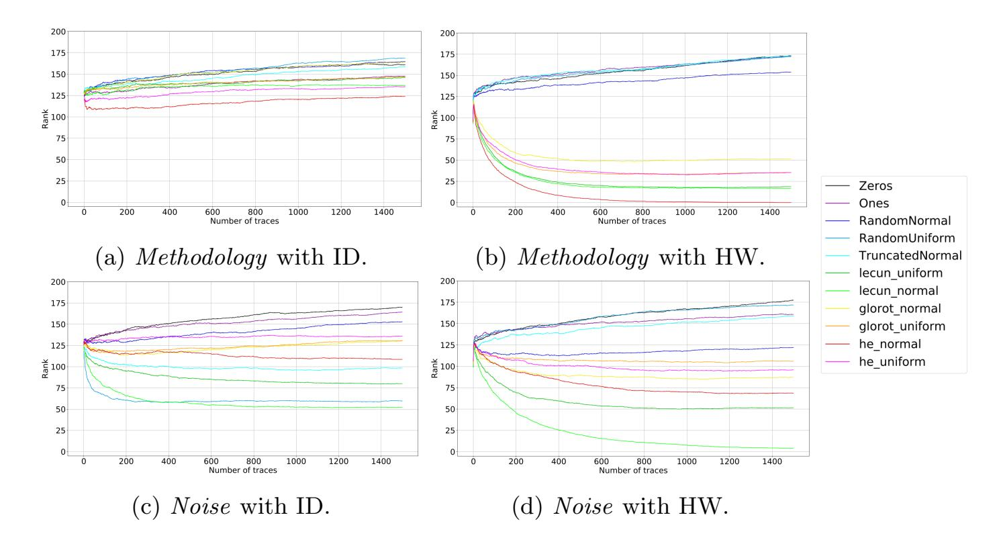

Fig. 6: Averaged GEs for all weight initializers with the ASCAD dataset.

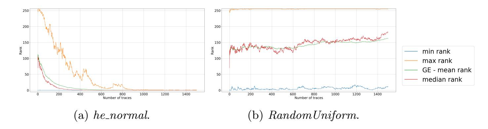

Fig. 7: The key rank range of Methodology architecture with HW model for decreasing and increasing GE in ASCAD dataset.

## 5 Weight Initializer Influence on Other Hyperparameters

Based on the best weight initializers that we find to provide better performance for specific neural network architectures and datasets, we now analyze whether a weight initializer's performance depends on its combination with other hyperparameters or if a weight initializer method is connected to the dataset itself. In other words, we wish to understand if the selection of a weight initializers is optimal for a restricted group of hyperparameters or if it is more dependent on the nature of the side-channel traces, meaning that any small variations on hyperparameters would still lead to a successful attack in the majority of tests.

We select the Methodology convolutional neural network architecture used in the previous sections and make small variations in their hyperparameters to investigate the influence on the best found weight initializer. To do this analysis, we select ASCAD dataset. For this dataset and the Methodology CNN architecture, we find that he normal weight initializer provide better results. Table [2](#page-13-1)

{13}------------------------------------------------

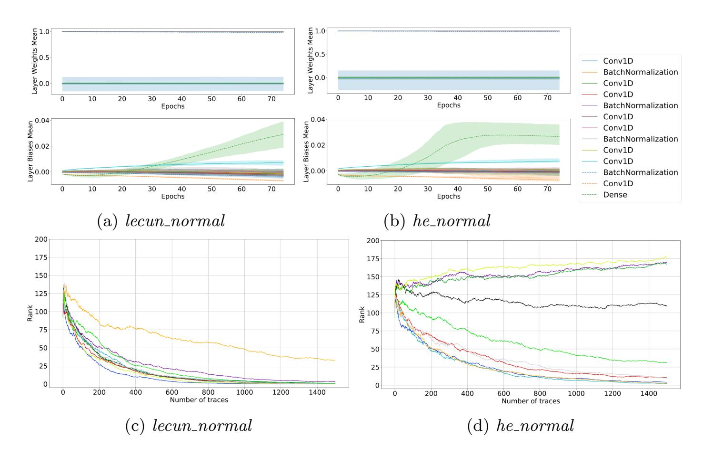

Fig. 8: Weights' evolution and experiments with Noise HW setting on the AS-CAD dataset.

shows the ranges of hyperparameters that we vary in different CNN training phases. In total, we train 400 CNNs, and we use the HW leakage model.

Table 2: Hyperparameter variations in the Methodology architecture.

| Hyperparameters                  |      | Original Minimum Maximum Step |                          |      |
|----------------------------------|------|-------------------------------|--------------------------|------|
| Filters                          | 4    | 4                             | 8                        | 1    |
| Kernel Size                      | 1    | 1                             | 4                        | 1    |
| Neurons                          | 10   | 5                             | 15                       | 1    |
| Layers                           | 2    | 2                             | 3                        | 1    |
| Learning Rate                    | 5e-3 | 1e-3                          | 1e-2                     | 1e-4 |
| Mini-Batch                       | 100  | 100                           | 400                      | 100  |
| Activation function (all layers) | SELU |                               | ReLU, Tanh, ELU, or SELU |      |

Figure [9](#page-14-0) shows that Tanh is the only activation function that does not provide successful key recovery in any of the experiments. For the ReLU, ELU and SELU activation functions, the different trained CNNs architectures can return low GE.

{14}------------------------------------------------

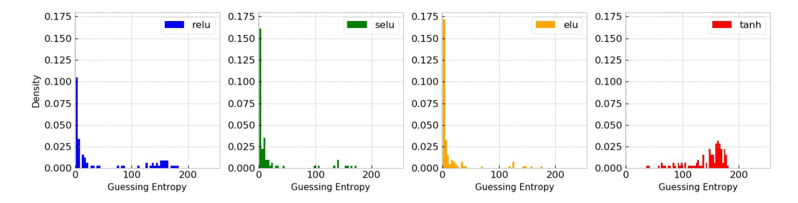

Fig. 9: Activation functions and guessing entropy.

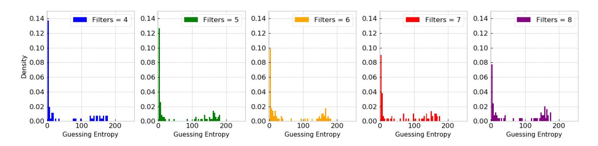

Fig. 10: Filters and guessing entropy.

Concerning the number of filters in the single convolution layer of this architecture, the usage of four filters tends to maximize the attack's success, as demonstrated in Figure [10.](#page-14-1) Increasing the filter size decreases the probability of the attack to be successful. Regarding kernel sizes, we observe that small variations on this hyperparameter do not significantly affect the results. In Figure [11,](#page-15-0) for kernel sizes varying from 1 to 4, the density of low GE values is similar in all the cases.

Finally, we also observe that making small variations in the number of layers and neurons also does not provide too much effect on the final GE. As shown in Figures [12a](#page-15-1) and [12b,](#page-15-1) more layers, and more neurons tend to provide a subtle increase in the concentration of low GE values. These variations are insufficient to assume that the combination of architecture hyperparameters and weight initializer strictly depends on a specific number of layers and neurons.

We also do not observe a significant effect on the final GE results for different mini-batch sizes (from 100 to 400) and different learning rates (from 0.001 to 0.01). Therefore, this analysis's main conclusion is that the choice of a weight initializer for the Methodology CNN architecture (when using the ASCAD dataset with the Hamming weight model), depends mostly on the activation function rather than the rest of hyperparameters. However, for this scenario, a more precise conclusion would be to assume that for a specific dataset (and leakage model), there is an optimal combination of activation function and weight initializer. Weight initializers with heuristics are derived based on certain assumptions on the activation functions. For example, the Glorot initializer assumes that the activations are linear. This assumption is not valid for ReLU activation func-

{15}------------------------------------------------

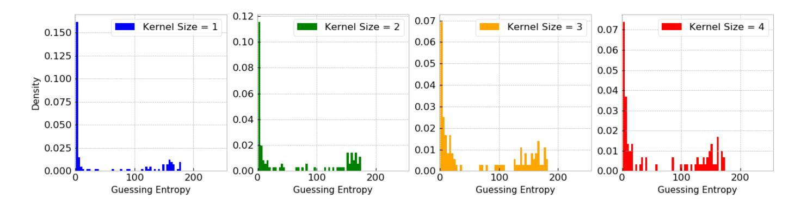

Fig. 11: Kernel sizes and guessing entropy.

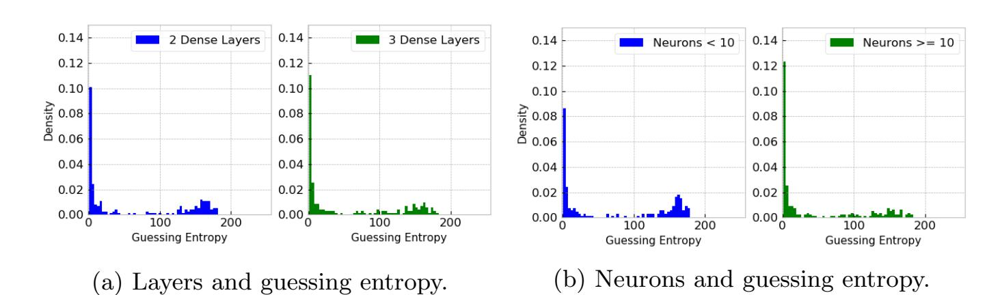

Fig. 12: Different layers and neurons variations and their relation to final GE results.

tions, so He et al. [\[8\]](#page-16-3) derived a new initialization method, and it allowed their deep models to converge as opposed to the Glorot initialization method. Therefore, we see that weight initializers are closely related to activation functions, which supports our conclusion.

# 6 Conclusions and Future Work

In this paper, we evaluate the influence of the weight initializer choice on the performance of CNNs in the profiled side-channel analysis. We consider 11 weight initializers, three datasets, two leakage models, and two CNN architectures. We evaluate the weight initializer performance by observing guessing entropy, the stability of results, and the evolution of weights through the training process.

Our results show that when the dataset is easy to attack, it is not important what weight initializer to use. Going toward more difficult datasets, we observe more influence stemming from this selection. Interestingly, we see that specific key rank experiments can behave extremely well or extremely badly from the guessing entropy results. What is more, we see significant differences in individual training processes, which means that weight initializers play a significant role in the training process, and it is necessary to run multiple training phases (and not only attacks to obtain guessing entropy). Next, most of the changes in weights happen in the Convolutional and Batch Normalization layer, while we observe 

{16}------------------------------------------------

almost no change in weights in dense layers. Finally, we analyze the interconnection between weight initializers and other hyperparameters. Our results show a strong connection with activation functions and only marginal connection to other commonly explored hyperparameters. This is supported by the fact that the weight initializers with heuristics are designed based on certain properties of activation functions. However, more experiments could further support this observation. Mathematical explanations of weight initialization strategies were out of scope for this work, but this is an interesting and broad research topic that contributes to a deeper understanding of the deep learning models.

For future work, we see two particularly interesting directions. The first one is to explore the influence of weight initializers and activations functions. Indeed, our results indicate that changes in activation functions influence the results from different weight initializers significantly. The second direction is to explore the unsupervised pre-training setup. Results are showing that autoencoders can be used to assign weights to each layer in an unsupervised manner, which helps to guide the learning towards basins of attraction of minima that support better generalization from the training dataset [\[7\]](#page-16-7).

## References

- 1. Benadjila, R., Prouff, E., Strullu, R., Cagli, E., Dumas, C.: Deep learning for side-channel analysis and introduction to ASCAD database. J. Cryptographic Engineering 10(2), 163–188 (2020). [https://doi.org/10.1007/s13389-019-00220-8,](https://doi.org/10.1007/s13389-019-00220-8) <https://doi.org/10.1007/s13389-019-00220-8>
- 2. Bhasin, S., Bruneau, N., Danger, J.L., Guilley, S., Najm, Z.: Analysis and improvements of the dpa contest v4 implementation. In: Chakraborty, R.S., Matyas, V., Schaumont, P. (eds.) Security, Privacy, and Applied Cryptography Engineering. pp. 201–218. Springer International Publishing, Cham (2014)
- 3. Cagli, E., Dumas, C., Prouff, E.: Convolutional Neural Networks with Data Augmentation Against Jitter-Based Countermeasures - Profiling Attacks Without Preprocessing. In: Cryptographic Hardware and Embedded Systems - CHES 2017 - 19th International Conference, Taipei, Taiwan, September 25-28, 2017, Proceedings. pp. 45–68 (2017)
- 4. Chari, S., Rao, J.R., Rohatgi, P.: Template attacks. In: Kaliski, B.S., Ko¸c, ¸c.K., Paar, C. (eds.) Cryptographic Hardware and Embedded Systems - CHES 2002. pp. 13–28. Springer Berlin Heidelberg, Berlin, Heidelberg (2003)
- 5. Chollet, F., et al.: Keras. <https://keras.io> (2015)
- 6. Coron, J.S., Kizhvatov, I.: An efficient method for random delay generation in embedded software. Cryptology ePrint Archive, Report 2009/419 (2009), [https:](https://eprint.iacr.org/2009/419) [//eprint.iacr.org/2009/419](https://eprint.iacr.org/2009/419)
- 7. Erhan, D., Bengio, Y., Courville, A., Manzagol, P.A., Vincent, P., Bengio, S.: Why does unsupervised pre-training help deep learning? J. Mach. Learn. Res. 11, 625–660 (Mar 2010)
- 8. He, K., Zhang, X., Ren, S., Sun, J.: Delving deep into rectifiers: Surpassing human-level performance on imagenet classification. IEEE International Conference on Computer Vision (ICCV 2015) 1502 (02 2015). <https://doi.org/10.1109/ICCV.2015.123>

{17}------------------------------------------------

- 9. Heuser, A., Zohner, M.: Intelligent Machine Homicide - Breaking Cryptographic Devices Using Support Vector Machines. In: COSADE. pp. 249–264 (2012)
- 10. Keras: Layer weight initializers. <https://keras.io/api/layers/initializers/>
- 11. Kim, J., Picek, S., Heuser, A., Bhasin, S., Hanjalic, A.: Make some noise: Unleashing the power of convolutional neural networks for profiled side-channel analysis. Cryptology ePrint Archive, Report 2018/1023 (2018), [https://eprint.iacr.org/](https://eprint.iacr.org/2018/1023) [2018/1023](https://eprint.iacr.org/2018/1023)
- 12. Kingma, D., Ba, J.: Adam: A method for stochastic optimization. International Conference on Learning Representations (12 2014)
- 13. Koturwar, S., Merchant, S.: Weight initialization of deep neural networks(dnns) using data statistics. CoRR abs/1710.10570 (2017), [http://arxiv.org/abs/1710.](http://arxiv.org/abs/1710.10570) [10570](http://arxiv.org/abs/1710.10570)
- 14. Lerman, L., Bontempi, G., Markowitch, O.: Power analysis attack: An approach based on machine learning. Int. J. Appl. Cryptol. 3(2), 97–115 (Jun 2014). [https://doi.org/10.1504/IJACT.2014.062722,](https://doi.org/10.1504/IJACT.2014.062722) [http://dx.doi.org/](http://dx.doi.org/10.1504/IJACT.2014.062722) [10.1504/IJACT.2014.062722](http://dx.doi.org/10.1504/IJACT.2014.062722)
- 15. Lerman, L., Poussier, R., Bontempi, G., Markowitch, O., Standaert, F.X.: Template attacks vs. machine learning revisited and the curse of dimensionality in sidechannel analysis. In: Revised Selected Papers of the 6th International Workshop on Constructive Side-Channel Analysis and Secure Design - Volume 9064. p. 20–33. COSADE 2015, Springer-Verlag, Berlin, Heidelberg (2015)
- 16. Maghrebi, H., Portigliatti, T., Prouff, E.: Breaking cryptographic implementations using deep learning techniques. In: International Conference on Security, Privacy, and Applied Cryptography Engineering. pp. 3–26. Springer (2016)
- 17. Mangard, S., Oswald, E., Popp, T.: Power Analysis Attacks: Revealing the Secrets of Smart Cards (Advances in Information Security). Springer-Verlag, Berlin, Heidelberg (2007)
- 18. Peng, A.Y., Sing Koh, Y., Riddle, P., Pfahringer, B.: Using supervised pretraining to improve generalization of neural networks on binary classification problems. In: Berlingerio, M., Bonchi, F., G¨artner, T., Hurley, N., Ifrim, G. (eds.) Machine Learning and Knowledge Discovery in Databases. pp. 410–425. Springer International Publishing, Cham (2019)
- 19. Picek, S., Heuser, A., Jovic, A., Bhasin, S., Regazzoni, F.: The curse of class imbalance and conflicting metrics with machine learning for side-channel evaluations. IACR Transactions on Cryptographic Hardware and Embedded Systems 2019(1), 209–237 (Nov 2018). [https://doi.org/10.13154/tches.v2019.i1.209-237,](https://doi.org/10.13154/tches.v2019.i1.209-237) <https://tches.iacr.org/index.php/TCHES/article/view/7339>
- 20. Picek, S., Samiotis, I.P., Kim, J., Heuser, A., Bhasin, S., Legay, A.: On the performance of convolutional neural networks for side-channel analysis. In: Chattopadhyay, A., Rebeiro, C., Yarom, Y. (eds.) Security, Privacy, and Applied Cryptography Engineering. pp. 157–176. Springer International Publishing, Cham (2018)
- 21. Prouff, E., Strullu, R., Benadjila, R., Cagli, E., Dumas, C.: Study of deep learning techniques for side-channel analysis and introduction to ascad database. Cryptology ePrint Archive, Report 2018/053 (2018), <https://eprint.iacr.org/2018/053>
- 22. Xavier Glorot, Y.B.: Understanding the difficulty of training deep feedforward neural networks. Journal of Machine Learning Research 9, 249–256 (2010)
- 23. Zaid, G., Bossuet, L., Habrard, A., Venelli, A.: Methodology for efficient cnn architectures in profiling attacks. IACR Transactions on Cryptographic Hardware and Embedded Systems 2020(1), 1–36 (Nov 2019). [https://doi.org/10.13154/tches.v2020.i1.1-36,](https://doi.org/10.13154/tches.v2020.i1.1-36) [https://tches.iacr.org/index.](https://tches.iacr.org/index.php/TCHES/article/view/8391) [php/TCHES/article/view/8391](https://tches.iacr.org/index.php/TCHES/article/view/8391)