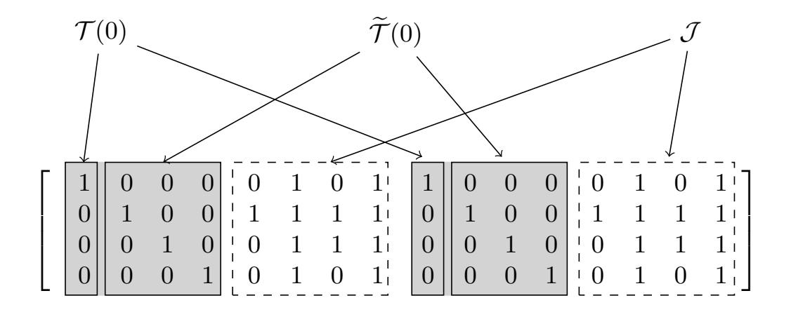
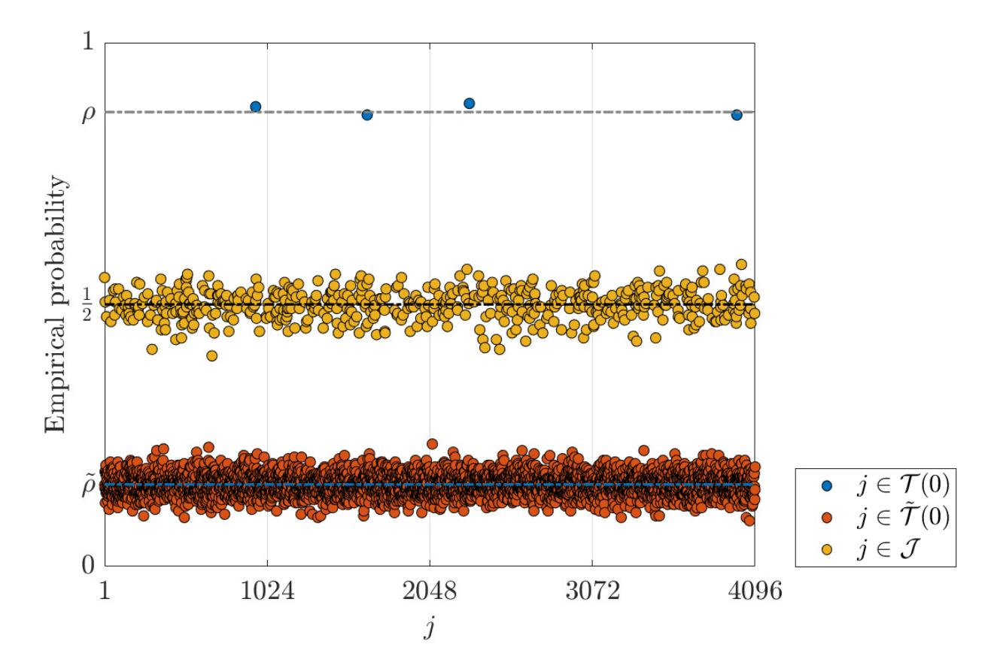
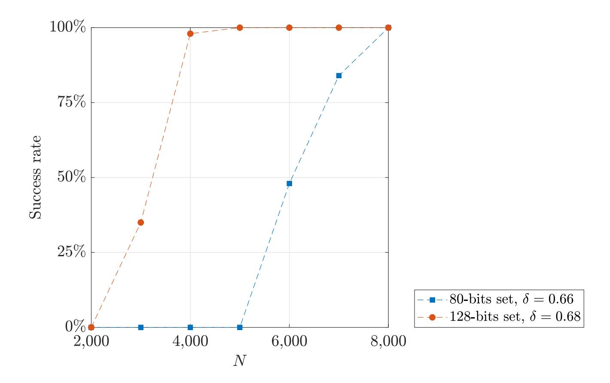

{0}------------------------------------------------

# Cryptanalysis of a Code-Based Signature Scheme Based on the Lyubashevsky Framework

Marco Baldi1 , Karan Khathuria2 , Edoardo Persichetti3 , and Paolo Santini1

Abstract. In this paper we cryptanalyze a recently proposed signature scheme consisting in a translation of the Lyubashevsky framework to the coding theory, whose security is based on the hardness of decoding low weight errors in the Hamming metric. We show that each produced signature leaks information about the secret key and that, after the observation of a bunch of signatures, the secret key can be fully recovered with simple linear algebra. We conservatively assess the complexity of our proposed attack and show that it grows polynomially in the scheme parameters; numerical simulations are used to confirm our analysis. Our results show that the weakness of the scheme is intrinsic by design, and that security cannot be restored by a mere change in the parameters.

# 1 Introduction

The story of code-based signature schemes is a long and tortuous one. On one hand, the "hash-and-sign" paradigm that works very well for some traditional primitives (e.g. RSA), appears to be rather inadequate for code-based schemes. In fact, when relying on the hardness of decoding in the Hamming metric [3, 5], the difficulty of efficiently sampling decodable syndromes leads to protocols that are either inefficient or insecure (or both of them). Among the unbroken schemes, we can cite CFS [8], which historically dates as the first one in this category, and that is characterized by slow signing times and large key sizes. The latest scheme built on this paradigm, Wave [9], still shows analogous features (i.e., very large public keys), despite introducing a new approach based on decoding vectors of very high weight. On the other hand, converting an identification scheme via Fiat-Shamir typically results in very long signatures, due to the necessity of repeating the underlying Sigma protocol many times. This line of research was initiated by Stern [18] in '93, and successively improved with several works [1, 4, 6, 7, 19]. Yet, the signature sizes that one can obtain with these approaches are still far from being competitive.

A very promising solution, for lattice-based schemes, was given by Lyubashevsky in [11], leading to one of the top contenders for NIST's Post-Quantum standardization effort [12], Dilithium. The paradigm consists of a "one-shot" application of an identification scheme, `a la Schnorr, without soundness error. This

1 Department of Information Engineering, Marche Polytechnic University, Italy 2 Institute of Mathematics, University of Zurich, Switzerland

3 Department of Mathematical Sciences, Florida Atlantic University, USA

{1}------------------------------------------------

allows to obtain very compact signature sizes, as well as a simple and efficient signing procedure. As a consequence, there is a long history of works trying to adapt Lyubashevsky's protocol to the case of code-based cryptography. A first attempt was given by Persichetti [13], concluding that a simple conversion using both the traditional Hamming metric, and the Rank metric, was unlikely to succeed. A subsequent work [14], using quasi-cyclic codes and restricting to one-time usage, was susceptible to a similar attack [10, 15]. Finally, the authors in [2] present a solution which, however, is based on the rank metric and includes a slight modification of the Lyubashevsky protocol (with an additional masking error component), that appears to be secure and offers reasonable performance. However, there are still some doubts about information leakage in the scheme, and the security reduction leads to a rather convoluted, ad-hoc problem (named PSSI+). Thus, the problem of adapting the Lyubashevsky protocol through a decoding problem in the Hamming metric (which has been studied for decades and is now well-understood) is still open.

Our Contribution In this work, we present an attack on a scheme that was recently published by Song et al. [17], which promises to realize "A code-based signature scheme from the Lyubashevsky framework", as per the title. To do so, the authors instantiate a protocol in the Hamming metric, using multiple sparse vectors as the private key, and the syndromes of such vectors as the public key; signatures are obtained as the sum between a few of such vectors and a random low-weight error vectors. Unfortunately, as we discuss in this paper, this approach is not secure and still suffers from a similar vulnerability as its predecessors. We show that, through a statistical analysis on a small number of collected signatures, one can fully recover the secret key. Our attack is based on the fact that legitimate signatures are strongly correlated, and that this correlation reveals significant information about the secret key. We are able to derive a conservative estimate for the complexity of our attack, and show that it grows polynomially in the scheme parameters; this implies that the scheme is insecure by construction, and not because of some unfortunate parameters choice. As a result, the scheme in [17] can only be considered for a one-time usage, for which however appears to be not well-suited because of the large public keys.

### 2 Notation

As usual, we will denote with F2 the binary finite field. We will use bold upper case (resp. lower case) letters to denote matrices (resp. vectors). For a matrix A, we denote its i-th row (resp. column) as Ai,: (resp. A:,i); for a vector a, ai denotes its i-th entry. The support of a, i.e., the set of indexes pointing at set entries, is denoted with Supp(a); the cardinality of the support corresponds to the Hamming weight, and we will denote it with wt(a). The null matrix of size n × m will be denoted as 0n×m; finally, the set of length-n vectors with weight w will be indicated with Rn,w.

For a matrix A and a set J , we will denote with AJ the matrix formed by the columns of A that are indexed by J ; analogous notation will be used 

{2}------------------------------------------------

for vectors. For a set A, the expression a \$←− A will denote the fact that a is uniformly picked at random among the elements of A. For a distribution D, we will write x ∼ D if x is a random variable distributed according to D.

## 3 Scheme Description

In this section we briefly recall the scheme in [17] and describe its main features. Public parameters are n, n0 , k0 , `, wc, wy, w¯ ∈ N, whose meaning will be clarified in the following; additionally, the scheme uses an hash function Hashwc that returns digests of length k 0 and weight wc. In a nutshell, the scheme operates as follows.

- Key generation: choose ` matrices Ei in the form

$$\mathbf{E}_{i} = \left[\mathbf{I}_{k'} \left| \mathbf{V}_{i} \right.\right] \in \mathbb{F}_{2}^{k' \times n'},$$

where Ik0 is the identity of size k 0 and Vi \$ ←− F k 0×(n 0−k 0 ) 2 . Choose two permutation matrices P1, P2 of respective sizes k 0 ×k 0 and n×n, and compute

$$\mathbf{E} = \mathbf{P}_1 \cdot \big[ \mathbf{E}_0 \mid \mathbf{E}_1 \mid \cdots \mid \mathbf{E}_{\ell-1} \big] \cdot \mathbf{P}_2.$$

Choose a random H ∈ F (n−k)×n 2 of rank n − k. The key-pair is

$$\mathsf{sk} = \mathbf{E}, \;\; \mathsf{pk} = \left\{ \mathbf{H}, \; \mathbf{S} = \mathbf{H} \mathbf{E}^{\top} \right\}.$$

- Signature generation: to sign a message m, pick y \$←− Rn,wy ; compute s = Hy&gt;, c = Hashwc m k s and z = cE + y. Output the signature

$$\sigma = \{\mathbf{c}, \ \mathbf{z}\}.$$

- Signature verification: to verify a signature σ = {c, z} on a message m, compute ˆs = Hz&gt; + Sc&gt;, then accept if

$$\operatorname{\mathsf{Hash}}_{w_c} (m \parallel \hat{\mathbf{s}}) = \mathbf{c} \quad \text{and} \quad \operatorname{wt}(\mathbf{z}) \leq \bar{w},$$

or reject otherwise.

The authors of [17] recommend to choose

$$\bar{w} = \ell(w_c + n' - k') + w_y,$$

and propose instances targeting the security levels of λ = 80 and λ = 128 bits. For the sake of completeness, in Table 1 we have summed up these parameters sets, together with the corresponding keys and signature sizes; note that our estimates slightly improve upon the ones originally provided by the authors in [17]. First, we can exploit the fact that H is completely random and is obtained as the output of a PRNG; thus, instead of the full matrix, one can simply publish the corresponding seed which has been given as input to the PRNG. With this tweak, the public key size reduces to k 0 (n − k) + lSeed bits, where lSeed, where lseed is the seed length, for which an appropriate choice is 2λ. Furthermore, we have additionally considered that publishing only the support of c, instead of the full vector, allows reducing the signature size; with this choice, one can obtain signatures of n + wc dlog2 (n)e bits.

{3}------------------------------------------------

**Table 1.** Proposed parameters and performances for the scheme in [17].

| $\lambda$ | n      | k     | $\ell$ | n'    | k'  | $w_c$ | $w_y$ | pk size (MB) | signature size (bits) |
|-----------|--------|-------|--------|-------|-----|-------|-------|--------------|-----------------------|
| 80        | 4,096  | 539   | 4      | 1,024 | 890 | 31    | 539   | 0.39         | 4,406                 |
| 128       | 8, 192 | 1,065 | 8      | 1,024 | 890 | 53    | 807   | 0.79         | 8,722                 |

#### 3.1 Underlying Security and Further Considerations

In this section we briefly recall the rationale that is at the base of the parameter choice. The vector  $\mathbf{z}$  is the sum of  $\mathbf{cE}$  and the weight- $w_y$  vector  $\mathbf{y}$ . Because of the particular structure of the secret key, regardless of the particular  $\mathbf{c}$ , we have that  $\mathbf{cE}$  has maximum weight  $\ell(w_c + n' - k')$ . Then,  $\mathbf{z}$  cannot have weight larger than  $\bar{w} = \ell(w_c + n' - k') + w_y$ . The parameters of the public code (i.e., the one having  $\mathbf{H}$  as parity-check matrix) are chosen such that its GV distance, which is assumed as the minimum distance of the code, is larger than  $\bar{w}$ . This guarantees that  $\mathbf{z}$  is the only low-weight vector that satisfies the signature verification process.

To forge a signature, an adversary must find a low-weight vector  $\tilde{\mathbf{z}}$  such that

$$\mathbf{s} + \mathbf{S} \mathbf{c}^{\top} = \mathbf{H} \tilde{\mathbf{z}}^{\top}.$$

This corresponds to a syndrome decoding instance, with  $\tilde{\mathbf{z}}$  as the target. The best strategy to solve this problem is to use Information Set Decoding (ISD) algorithms, whose complexity mainly depends on the weight of the searched vector (as well as on the code parameters). The authors of [17] have chosen the scheme parameters such that the weight of  $\mathbf{z}$  is always sufficiently high to make ISD forgery attacks unfeasible. In an analogous way, the public key is represented by multiple instances of the same problem where, in this case, the searched vectors correspond to the rows of  $\mathbf{E}$ . Thus, the weight of these vectors must also be chosen to guarantee that ISD techniques have an unfeasible running time.

As we show in the next section, the authors have not considered the fact that the signatures produced by the scheme leak information about the secret key. After a small number of signatures is observed, one can mount a statistical attack that fully returns the secret key.

### 4 An Attack via Statistical Analysis

In this section we describe a statistical attack on the scheme of [17]. At a high level, the attack begins by recognizing columns of weight 1 in the secret key. The knowledge about the location of these columns is combined with the structure of the secret key, to identify positions that, for each row of  $\mathbf{E}$ , point at null entries. With this information, each row of the secret key can easily be recovered with simple linear algebra. In the next sections we formalize this procedure and provide a detailed analysis of its computational complexity.

{4}------------------------------------------------

### 4.1 Gathering Information about the Secret Key

We first note that, with overwhelming probability, columns of weight 1 in the secret key are due solely to the permutation of the columns of the ` identity matrices. In fact, the probability that, for a random secret key, there is no other column of weight 1 corresponds to

$$(1 - k'2^{-k'})^{\ell(n'-k')} \approx 1 - \ell k'(n'-k')2^{-k'},$$

and is essentially identical to 1 for all proposed parameters sets. Thus, from now on, we assume that the secret key E contains exactly `k0 columns of weight 1.

We introduce some additional notation:

- We denote with T ⊆ {0, · · · , n − 1} the set of positions indexing at columns in E with weight 1, that is

$$\mathcal{T} = \{i \in \{0, \dots, n-1\} \mid \text{wt}(\mathbf{E}_{:,i}) = 1\}.$$

For each secret key, this set has size `k0 .

- We denote with T (i) ⊆ {0, · · · , n − 1} the intersection between the support of the i-th row of E and T , that is

$$\mathcal{T}(i) = \mathcal{T} \cap \text{Supp}(\mathbf{E}_{i,:}).$$

For each secret key and each i, this set has size `.

- W denote with Te(i) ⊆ {0, · · · , n − 1} the set of positions in T pointing at null entries in the i-th row of E, that is

$$\widetilde{\mathcal{T}}(i) = \mathcal{T} \cap \left( \{0, \cdots, n-1\} \setminus \operatorname{Supp}(\mathbf{E}_{i,:}) \right)$$

.

For each secret key and each i, this set has size `k0 − `. Note that T (i) and Te(i) are always disjoint.

- Finally, we denote J = {0, · · · , n − 1} \ T ; for each secret key, this set has size ` · (n 0 − k 0 ).

For the sake of clarity, in Figure 1 we provide a graphical representation of these sets for a given secret key; for simplicity, we have assumed that the permutations P1 and P2 are equal to the identity matrices.

For each i, the sets we have previously introduced can be recovered, since the bits in the signature follow distinct probability distributions, which depend on whether the bit position belongs to a set or another. In fact, consider the following probabilities, which can be easily obtained with combinatorial arguments

{5}------------------------------------------------

**Fig. 1.** Partition of  $\{0, \dots, n-1\}$  into sets  $\mathcal{T}(0)$ ,  $\widetilde{\mathcal{T}}(0)$  and  $\mathcal{J}$ , for a toy secret key with  $n'=8, k'=4, \ell=2$ . The grey columns in the figure form the set  $\mathcal{T}$ .

$$\rho = \Pr[z_j = 1 \mid c_i = 1, \ j \in \mathcal{T}(i)] = 1 - \frac{w_y}{n},\tag{1}$$

$$\widetilde{\rho} = \Pr\left[z_j = 1 \mid c_i = 1, \ j \in \widetilde{\mathcal{T}}(i)\right]$$

$$= \frac{w_c - 1}{k'} \left(1 - \frac{w_y}{n}\right) + \frac{w_y}{n} \left(1 - \frac{w_c - 1}{k'}\right), \tag{2}$$

$$\Pr\left[z_j = 1 \mid c_i = 1, \ j \in \mathcal{J}\right] \approx \frac{1}{2}.\tag{3}$$

Note that the last relation is approximated because the distribution of set bits on the positions indexed by  $\mathcal{J}$  depends on the particular secret key; yet, given that the matrices  $\mathbf{V}_i$  in the secret key are random, one expects the actual probability to be particularly close to  $\frac{1}{2}$ . To have a confirmation of the above formulae, in Figure 2 we report the empirical estimates of such probabilities, estimated for the 80-bits security set.

Exploiting this distribution for set bits in the signature, a simple statistical analysis on a set of collected signatures can be used to determine the sets  $\mathcal{T}(i)$  and  $\tilde{\mathcal{T}}(i)$ , for each  $i \in \{0, \dots, k'-1\}$ . As we show in the next section, this information is enough to fully recover the secret key.

#### 4.2 Recovering the Secret Key

Once the sets  $\mathcal{T}(i)$  and  $\widetilde{\mathcal{T}}(i)$  have been determined, for each  $i \in \{0, \dots, k'-1\}$ , the secret key can easily be recovered with simple linear algebra. For simplicity, we only describe how a single row of  $\mathbf{E}$  can be recovered; for all the other rows, the procedure is identical.

Let  $\mathbf{s} = \mathbf{S}_{:,i}$  and  $\mathbf{e} = \mathbf{E}_{i,:}$ , which are related as  $\mathbf{s} = \mathbf{H}\mathbf{e}^{\top}$ . In particular, we can write

$$\mathbf{s} = \mathbf{H}_{\mathcal{T}(i)} \mathbf{e}_{\mathcal{T}(i)}^\top + \mathbf{H}_{\widetilde{\mathcal{T}}(i)} \mathbf{e}_{\widetilde{\mathcal{T}}(i)}^\top + \mathbf{H}_{\mathcal{J}} \mathbf{e}_{\mathcal{J}}^\top.$$

{6}------------------------------------------------

Fig. 2. Empirical probability of having  $z_j = 1$ , conditioned to  $c_0 = 1$ , for the 80-bits parameters set. For the experiment, 10,000 signatures have been generated.

Knowing the sets  $\mathcal{T}(i)$  and  $\widetilde{\mathcal{T}}(i)$  means having information about the support of  $\mathbf{e}$ , since

- for  $j \in \mathcal{T}(i)$ , we have  $e_j = 1$ ;
- for  $j \in \widetilde{\mathcal{T}}(i)$ , we have  $e_j = 0$ .

Let  $\mathbf{e}'$  be the vector obtained by flipping the bits of  $\mathbf{e}$  that are indexed by  $\mathcal{T}(i)$ . Since  $\mathbf{e}_{\widetilde{\mathcal{T}}(i)}$  is null, we have that

$$\mathbf{s}' = \mathbf{H} \mathbf{e}'^{\top} = \mathbf{s} + \sum_{j \in \mathcal{T}(i)} \mathbf{H}_{:,j} = \mathbf{H}_{\mathcal{J}} \mathbf{e}_{\mathcal{J}}^{\top}.$$

Note that we still have to determine the set positions in  $\mathbf{e}'$ , which are indexed by the entries of  $\mathcal{J}$ ; once  $\mathbf{e}_{\mathcal{J}}$  is found, the secret  $\mathbf{e}$  is fully recovered. We can then proceed as follows: first, we pick a set  $\mathcal{U} \subset \{0, \dots, n-1\}$  of cardinality n-k, such that  $\mathcal{J} \subset \mathcal{U}$  and  $\mathbf{H}_{\mathcal{U}}$  is non singular. Since  $\mathcal{J} \subset \mathcal{U}$ , we have that  $\mathbf{e}'_{\{0,\dots,n-1\}\setminus\mathcal{U}}$  is null; we can then find  $\mathbf{e}_{\mathcal{U}}$  as

$$\left(\mathbf{H}_{\mathcal{U}}\right)^{-1} \cdot \mathbf{s}' = \mathbf{e}'_{\mathcal{U}}.$$

Repeating this procedure for all the rows will return the secret key.

Note that we are assuming here that the columns of  $\mathbf{H}_{\mathcal{J}}$  are linearly independent. We can assume this because the probability of choosing  $\ell(n'-k')$  linearly independent columns in  $\mathbb{F}_2^{(n-k)}$  is  $\prod_{i=n-k-\ell(n'-k')+1}^{n-k} \left(1-2^{-i}\right)$ , which is nearly 1 for all the proposed parameters sets.

{7}------------------------------------------------

### 4.3 Complexity

The attack we have described can be divided in two phases; in the first phase, a statistical analysis on a bunch of collected signatures is performed, then linear algebra is used to recover the rows of the secret key. In particular, the latter phase consists of the following steps.

- 1. Compute s 0 from s. This requires ` sums between s and the columns of H, thus it will cost O `(n − k) operations.
- 2. Find U such that HU is non singular. To do this, one can simply make a guess for U and check whether the corresponding submatrix is invertible. Since H is random, the probability that a random submatrix of size n − k is invertible can be obtained as

$$\prod_{i=1}^{n-k} 1 - 2^{-i} \approx 0.2887.$$

Then, the inverse of this probability can be used to estimate, on average, the number of required Gaussian eliminations for each row of E, each one having a cost of O (n − k) 3 operations.

3. Once HU has been found, multiply it by s 0 . Using the simple schoolbook multiplication, we get a cost of O (n − k) 2 operations.

Considering that the procedure has to be repeated for all k 0 rows of E, for the second step of the attack we get a total complexity of

$$O\left(k'(n-k)\left(\ell + \frac{(n-k)^2}{0.2887} + n - k\right)\right).$$

It is worth noting that some steps of this reconstruction procedure can be optimized. For instance, multiple rows of E can be recovered with the same set U, using techniques such as [16]: this will reduce the number of needed Gaussian eliminations. In analogous way, one may use ad-hoc techniques to perform multiplications, or can drive the choice for sets U, to simplify the inverse computations. We will not take into account these improvements in the attack, whose computational complexity already grows polynomially in the scheme parameters.

To finish the attack's complexity estimate, we need to compute the number of signatures which we must collect in the first phase, to obtain an accurate estimate on the sets T (i) and Te(i). In particular, this number may depend on the criterion that we use to classify the bits. We first note that

$$\widetilde{\mathcal{T}}(i) = \bigcup_{j \neq i} \mathcal{T}(j).$$

{8}------------------------------------------------

Once all sets  $\mathcal{T}(i)$  have been correctly determined, we have all the necessary items to mount the attack. Then, for each  $i \in \{0, \dots, k'-1\}$  and each  $j \in \{0, \dots, n-1\}$ , the adversary must distinguish between  $j \in \mathcal{T}(i)$  and  $j \notin \mathcal{T}(i) = \widetilde{\mathcal{T}}(i) \cup \mathcal{J}$ .

Let  $\mu(i,j)$  be the ratio between the number of signatures with  $z_i = 1$ , conditioned to  $c_i = 1$ , and that of signatures with  $c_i = 1$ ; clearly,  $\mu(i,j)$  is the empirical estimate of the actual probability  $\Pr[z_j = 1 \mid c_i = 1]$ . To classify the bits, we perform the following statistical test on the observed data of  $\mu(i,j)$ . The null hypothesis  $H_0$  is that  $j \in \mathcal{T}(i)$ , and the alternative hypothesis  $H_1$  is  $j \notin \mathcal{T}(i)$ . The test statistics is the observed value  $\mu(i,j)$ , and we accept the null hypothesis  $H_0$  if  $\mu(i,j) \geq \delta$  and reject  $H_0$  otherwise, where  $\delta$  is an appropriate value  $1/2 \le \delta \le \rho$ . The test fails when we obtain either  $\mu(i,j) < \delta$  (if the null hypothesis was true), or  $\mu(i,j) \geq \delta$  (if the null hypothesis was false). The test needs to be repeated for each pair (i,j), and must be successful all the times. We assume that, if guessing fails for a single pair (i, j), then the overall test will completely fail, i.e., the key reconstruction phase will not be successful. It is easily seen that this assumption is quite conservative, since a few errors in this guessing phase can be tolerated. In fact, because of the relations between the sets we are trying to determine, it may be possible to detect (and correct) some mistakes. Yet, we neglect this probability, to keep our analysis as simple and conservative as possible.

We denote with  $\alpha$  the level of significance for our test; that means, we want the probability of failure of the test to be less than  $\alpha$ . First, for N collected signatures, we assume that the number of signatures such that  $c_i = 1$  is constant for all i and equal to  $\zeta = \frac{w_c}{k'}N$ . If  $H_0$  was true, i.e.,  $j \in \mathcal{T}(i)$ , then we assume  $\mu(i,j) \approx X/\zeta$ , where X is the sum of  $\zeta$  Bernoulli variables with parameter  $\rho$  as in (1). Then, the condition to verify  $H_0$  becomes

$$\sum_{u=0}^{\zeta-1} x_u \ge \delta \zeta, \ x_u \sim \mathfrak{B}(\rho),$$

where  $\mathfrak{B}(\rho)$  denotes the Bernoulli distribution with parameter  $\rho$ . Therefore, the probability of wrongly guessing j assuming the null hypothesis was true, i.e., guessing  $j \notin \mathcal{T}(i)$ , corresponds to

$$\epsilon_0 = \Pr\left[\mu(i,j) < \delta \mid j \in \mathcal{T}(i)\right] = \Pr\left[\sum_{u=0}^{\zeta-1} x_u < \delta\zeta \mid x_u \sim \mathfrak{B}(\rho)\right].$$
(4)

To get a bound on the above probability, we can consider the Chernoff bound which, for convenience, we recall in the following.

#### Theorem 1. Chernoff bound

Let  $X = \sum_{u=0}^{M-1} x_u$ , where the  $x_u$  are all independent and  $x_u \sim \mathfrak{B}(\hat{\rho})$ ; then

i) 
$$\Pr[X \ge (1+\xi)\hat{\rho}M] \le e^{-\frac{\xi^2}{2+\xi}\hat{\rho}M}$$
, for all  $\xi > 0$ ;

ii) 
$$\Pr[X \le (1-\xi)\hat{\rho}M] \le e^{-\frac{\xi^2}{2}\hat{\rho}M}$$
, for all  $0 < \xi < 1$ .

{9}------------------------------------------------

Using the above theorem, we can bound (4) as follows

$$\epsilon_0 = \Pr\left[\sum_{u=0}^{\zeta-1} x_u < \delta\zeta \mid x_u \sim \mathfrak{B}(\rho)\right] \le e^{-\frac{(\rho-\delta)^2}{2\rho}\zeta} := \bar{\epsilon}_0.$$
 (5)

Similarly, if  $H_0$  was false, i.e.,  $j \notin \mathcal{T}(i)$ , then either  $j \in \widetilde{\mathcal{T}}(i)$  or  $j \in \mathcal{J}$ . In the first case, we can model  $\mu(i,j)$  as the ratio between the sum of  $\zeta$  Bernoulli variables with parameter  $\tilde{\rho}$  as in (2) and  $\zeta$ ; thus, using again the Chernoff bound, we get

$$\epsilon_{1} = \Pr\left[\mu(i, j) \geq \delta \mid j \in \widetilde{\mathcal{T}}(i)\right] = \Pr\left[\sum_{u=0}^{\zeta-1} x_{u} \geq \delta \zeta \mid x_{u} \sim \mathfrak{B}(\tilde{\rho})\right]$$

$$\leq \exp\left(-\frac{(\delta - \tilde{\rho})^{2}}{\delta + \tilde{\rho}}\zeta\right) =: \bar{\epsilon}_{1}.$$
(6)

In an analogous way, if  $j \in \mathcal{J}$ , for the probability of making a wrong guess we have

$$\epsilon_{2} = \Pr\left[\mu(i, j) \geq \delta \mid j \in \mathcal{J}\right] = \Pr\left[\sum_{u=0}^{\zeta-1} x_{u} \geq \delta \zeta \mid x_{u} \sim \mathfrak{B}(1/2)\right]$$

$$\leq \exp\left(-\frac{(\delta - 1/2)^{2}}{\delta + 1/2}\zeta\right) =: \bar{\epsilon}_{2}.$$
(7)

Remember that, for each i, we have:  $\ell$  positions j such that  $j \in \mathcal{T}(i)$ ,  $\ell k' - \ell$  positions j such that  $j \in \widetilde{\mathcal{T}}(i)$  and  $\ell(n'-k')$  positions j such that  $j \in \mathcal{J}$ . Assuming that the values  $\mu(i,j)$  are not correlated, we then have  $\ell$  guesses with failure rate bounded by  $\bar{\epsilon}_0$ ,  $\ell(k'-1)$  guesses with failure rate bounded by  $\bar{\epsilon}_1$  and  $\ell(N'-k')$  with failure rate bounded by  $\bar{\epsilon}_2$ . So, for a generic i, the probability that the test does not fail is lower bounded by

$$(1 - \bar{\epsilon}_0)^{\ell} \cdot (1 - \bar{\epsilon}_1)^{\ell(k'-1)} \cdot (1 - \bar{\epsilon}_2)^{\ell(n'-k')}.$$

Considering all k' values of i, we get an upper bound on the total failure probability as

$$\alpha \le \alpha^* = 1 - (1 - \bar{\epsilon}_0)^{k'\ell} \cdot (1 - \bar{\epsilon}_1)^{k'\ell(k'-1)} \cdot (1 - \bar{\epsilon}_2)^{k'\ell(n'-k')}. \tag{8}$$

It is intuitively seen that, for each value of  $\alpha \in (0;1)$ , the minimum number of required signatures to reach a significance level equal to  $\alpha$  is a polynomial function of the scheme parameters. Indeed, the probabilities  $\bar{\epsilon}_0$ ,  $\bar{\epsilon}_1$  and  $\bar{\epsilon}_2$  decay exponentially with  $\zeta$ , which is proportional to N: then, regardless of the particular choice for  $\delta$ , moderate increases in N will lead to significant reductions in the value of  $\alpha^*$ . With simple computations (which we report in the Appendix), one can find that, to reach a significance level of  $\alpha^*$ , the minimum number of required signatures is  $N^*$ , where

$$N^* = \begin{cases} \frac{2\rho k'}{w_c(\rho-\delta)^2} \cdot \ln\left(\frac{2\ell k'}{1-\alpha^*}\right) & \text{if } \ell k'\bar{\epsilon}_0 \ge k'\ell(n'-k')\bar{\epsilon}_2, \\ \frac{(1/2+\delta)k'}{w_c(\delta-1/2)^2} \cdot \ln\left(\frac{2\ell k'(n'-k')}{1-\alpha^*}\right) & \text{otherwise.} \end{cases}$$
(9)

{10}------------------------------------------------

We are now able to compute the complexity of the first phase of our described attack. We consider that the values of µ(i, j) can be computed on the run, that is: before the attack starts, the adversary defines A = 0k0×n and b = 01×k0 . Then, for each collected signature, the adversary increases bi by one unit only if ci = 1 and, for each set bit j in z, also increases ai,j ; this way, µ(i, j) = ai,j/bi . For each collected signature, the number of updates in A and b on average is

$$w_c + \mathbb{E}\left[\operatorname{wt}(\mathbf{z})\right] = w_c + \ell\rho + \ell(k'-1)\tilde{\rho} + \frac{1}{2}\ell(n'-k').$$

Assuming that the statistical test has a cost of k 0n elementary operations (since k 0n guesses are made), we estimate the complexity of the first phase of the attack as

$$O\left(k'n + N\left(w_c + \ell\rho + \ell(k'-1)\tilde{\rho} + \frac{1}{2}\ell(n'-k')\right)\right).$$

This concludes the estimate of the overall complexity of our described attack. For ease of readability, we sum up the analysis of this section in the following proposition.

Proposition 1. For parameters n, k, n 0 , k 0 , `, wc, wy, the attack we have described in this section runs in time (C1 + C2)·(1 − α) −1 , where C1 is the cost of the statistical phase, C2 is the cost of reconstructing the secret key and α is the probability that the statistical test of the first phase fails. For C2, we have

$$C_2 = O\left(k'(n-k)\left(\ell + \frac{(n-k)^2}{0.2887} + n - k\right)\right),$$

while, assuming that N signatures are used, we estimate C1 as

$$C_1 = O\left(k'n + N\left(w_c + \ell\rho + \ell(k'-1)\tilde{\rho} + \frac{1}{2}\ell(n'-k')\right)\right).$$

For each fixed value of 0 < α < 1 and each 1/2 < δ < ρ, the minimum number of signatures N grows polynomially with the scheme parameters, and can be overestimated using (9), by setting α ∗ = α.

### 4.4 Results

In this section we discuss the practical impact of our attack on the scheme proposed in [17]. We first observe that, to reach a significance level equal to α, the number of needed signatures is quite lower than that estimated with (9). For instance, considering the 80-bits security set, for N = 20, 000 signatures and a threshold δ = 0.66, through (8) we estimate a failure rate of α ∗ = 9.6 · 10−2 ; running numerical simulations for 1, 000 randomly generated key pairs, we have observed no failure for all the experiments performed with at least N ≥ 8, 000 signatures. To provide an evidence of this fact, in Figure 3 we report the accuracy

{11}------------------------------------------------

Fig. 3. Success rate of the guessing phase as a function of the number of collected signatures N, using δ = 0.66 for the 80-bits set and δ = 0.68 for the 128-bits set. For each value of N, 1, 000 key-pairs have been considered.

of simulations for both the 80-bits and 128-bit parameters sets, for different values of N.

Given these results, we can always choose N such that α ≈ 0. Since the required values for N are extremely low, the complexity of the first phase of the attack is significantly lower than that of the second part (i.e., C1 C2). We then get the following estimates for the running time of our attack:

- for the 80-bits parameter set, we estimate α ≈ 0 for N = 8, 000 and δ = 0.66; with these choices, the attack costs 246.98 operations;
- for the 128-bits parameter set, we estimate α ≈ 0 for N = 5, 000 and δ = 0.68; with these choices, the attack costs 249.98 operations.

## 5 Conclusions

In this paper we have cryptanalyzed the code-based signature algorithm proposed in [17], which has been proposed as an adaptation of the Lyubashevsky framework. We have shown that a simple statistical analysis on a collection of observed signatures, together with basic linear algebra, is enough to fully recover the secret key. Our results show that it would be challenging to provide secure instances by merely choosing new parameters. It follows that the scheme can, at 

{12}------------------------------------------------

best, be considered for a one-time usage. It must be said that the security of a scheme similar to that in [17] has already been briefly discussed in [10], where the authors argued about the existence of security flaws due to the information leaked by each signatures. Our results seem to confirm this hypothesis, and constitute another evidence of the inherent difficulty of adapting the Lyubashevsky framework to the coding theory setting, at least when considering the problem of decoding low-weight errors in the Hamming metric.

### References

- 1. C. Aguilar, P. Gaborit, and J. Schrek. A new zero-knowledge code based identification scheme with reduced communication. In 2011 IEEE Information Theory Workshop, pages 648–652, Oct 2011.
- 2. N. Aragon, O. Blazy, P. Gaborit, A. Hauteville, and G. Z´emor. Durandal: A rank metric based signature scheme. In Y. Ishai and V. Rijmen, editors, Advances in Cryptology – EUROCRYPT 2019, pages 728–758, Cham, 2019. Springer International Publishing.
- 3. S. Barg. Some new NP-complete coding problems. Problemy Peredachi Informatsii, 30(3):23–28, 1994.
- 4. E. Bellini, F. Caullery, P. Gaborit, M. Manzano, and V. Mateu. Improved Veron identification and signature schemes in the rank metric. In 2019 IEEE International Symposium on Information Theory (ISIT), pages 1872–1876, 2019.
- 5. E. Berlekamp, R. McEliece, and H. van Tilborg. On the inherent intractability of certain coding problems. IEEE Trans. on Inf. Theory, 24(3):384–386, 1978.
- 6. J.-F. Biasse, G. Micheli, E. Persichetti, and P. Santini. LESS is more: Code-based signatures without syndromes. In A. Nitaj and A. Youssef, editors, Progress in Cryptology - AFRICACRYPT 2020, pages 45–65, Cham, 2020. Springer International Publishing.
- 7. P.-L. Cayrel, P. V´eron, and S. M. El Yousfi Alaoui. A zero-knowledge identification scheme based on the q-ary syndrome decoding problem. In Selected Areas in Cryptography, pages 171–186. Springer Berlin Heidelberg, 2011.
- 8. N. Courtois, M. Finiasz, and N. Sendrier. How to achieve a McEliece-based digital signature scheme. In ASIACRYPT, pages 157–174, 2001.
- 9. T. Debris-Alazard, N. Sendrier, and J.-P. Tillich. Wave: A new family of trapdoor one-way preimage sampleable functions based on codes. Cryptology ePrint Archive, Report 2018/996, 2018. https://eprint.iacr.org/2018/996.
- 10. J.-C. Deneuville and P. Gaborit. Cryptanalysis of a code-based one-time signature. 03 2019.
- 11. V. Lyubashevsky. Lattice signatures without trapdoors. In Annual International Conference on the Theory and Applications of Cryptographic Techniques, pages 738–755. Springer, 2012.
- 12. https://csrc.nist.gov/projects/post-quantum-cryptography/post-quantumcryptography-standardization.
- 13. E. Persichetti. Improving the Efficiency of Code-Based Cryptography. PhD thesis, 01 2013.
- 14. E. Persichetti. Efficient one-time signatures from quasi-cyclic codes: A full treatment. Cryptography, 2:30, 10 2018.

{13}------------------------------------------------

- 15. P. Santini, M. Baldi, and F. Chiaraluce. Cryptanalysis of a one-time code-based digital signature scheme. In 2019 IEEE International Symposium on Information Theory (ISIT), pages 2594–2598, 2019.
- 16. N. Sendrier. Decoding one out of many. In B.-Y. Yang, editor, *Post-Quantum Cryptography*, pages 51–67. Springer Berlin Heidelberg, 2011.
- 17. Y. Song, X. Huang, Y. Mu, W. Wu, and H. Wang. A code-based signature scheme from the Lyubashevsky framework. *Theoretical Computer Science*, 2020.
- 18. J. Stern. A new identification scheme based on syndrome decoding. In D. R. Stinson, editor, *Advances in Cryptology CRYPTO'* 93, pages 13–21. Springer Berlin Heidelberg, 1994.
- 19. P. Véron. Improved identification schemes based on error-correcting codes. Applicable Algebra in Engineering, Communication and Computing, 8(1):57–69, 1997.

# A Computing the Number of Signatures for a Desired Significance Level

In this appendix we prove (9). We first note that, regardless of the particular choice for  $\delta$ , the probabilities  $\bar{\epsilon}_0$ ,  $\bar{\epsilon}_1$  and  $\bar{\epsilon}_2$  decay exponentially with  $\zeta$ , that is linear in N; thus, we can always choose N sufficiently high to make these probabilities extremely low. Using a well known approximation, we have

$$(1 - \bar{\epsilon}_0)^{\ell k'} \approx 1 - \ell k' \bar{\epsilon}_0,$$

$$(1 - \bar{\epsilon}_1)^{\ell k'(k'-1)} \approx 1 - \ell k'(k'-1)\bar{\epsilon}_1,$$

$$(1 - \bar{\epsilon}_2)^{\ell k'(n'-k')} \approx 1 - \ell k'(n'-k')\bar{\epsilon}_2.$$

Since for  $1/2 < \delta < \rho$  and  $\tilde{\rho} \ll 1/2$ , we have  $\bar{\epsilon}_1 \ll \bar{\epsilon}_2$ , such that

$$\alpha^* \approx 1 - (1 - \ell k' \bar{\epsilon}_0) \cdot (1 - \ell k' (k' - 1) \bar{\epsilon}_1)$$
.

With some simple computations, and since  $\bar{\epsilon}_1\bar{\epsilon}_2 \ll \bar{\epsilon}_1, \bar{\epsilon}_2$ , we finally get

$$\alpha^* \approx 1 - \ell k' \bar{\epsilon}_0 - k' \ell (n' - k') \bar{\epsilon}_2$$
  
 
$$\leq 1 - 2 \max \left\{ \ell k' \bar{\epsilon}_0 , k' \ell (n' - k') \bar{\epsilon}_2 \right\}.$$

It is immediately seen that, from the above formula, we can explicitly derive the minimum number of signatures  $N^*$  to reach a significance level lower than  $\alpha^*$ . Indeed, recalling the expressions for  $\bar{\epsilon}_0$  and  $\bar{\epsilon}_2$ , we obtain

$$N^* = \begin{cases} \frac{2\rho k'}{w_c(\rho - \delta)^2} \cdot \ln\left(\frac{2\ell k'}{1 - \alpha^*}\right) & \text{if } \ell k' \bar{\epsilon}_0 \ge k' \ell(n' - k') \bar{\epsilon}_2, \\ \frac{(1/2 + \delta)k'}{w_c(\delta - 1/2)^2} \cdot \ln\left(\frac{2\ell k'(n' - k')}{1 - \alpha^*}\right) & \text{otherwise.} \end{cases}$$