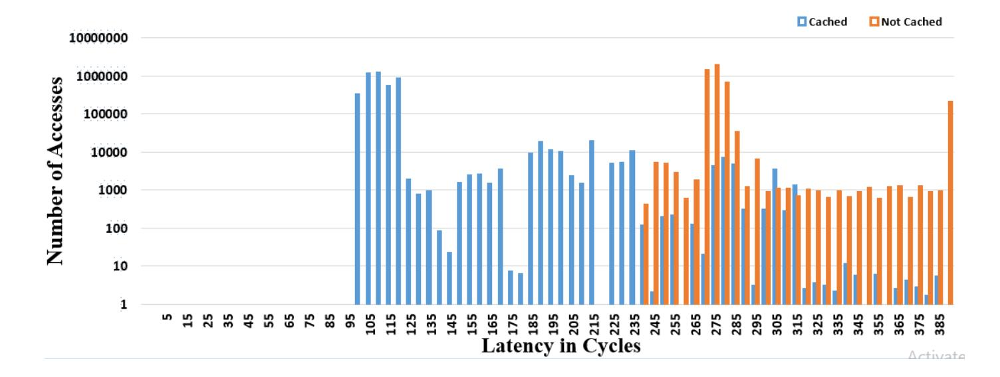
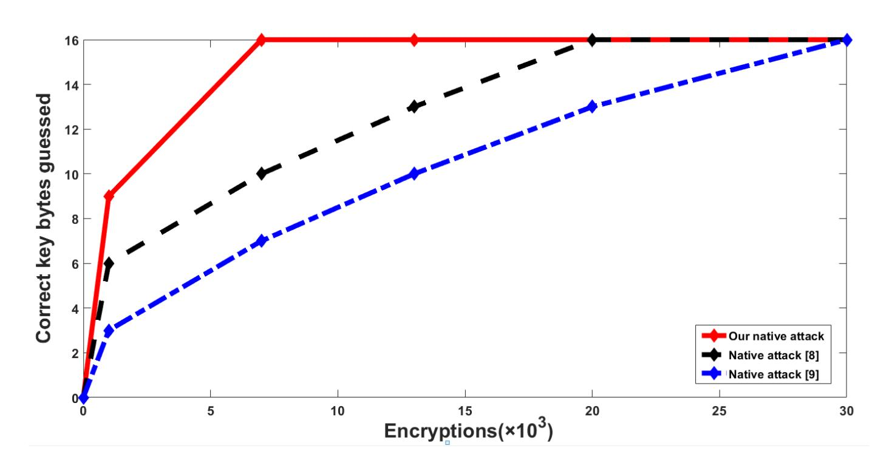

{0}------------------------------------------------

# Enhanced Flush+Reload Attack on AES?

Milad Seddigh, Hadi Soleimany

Cyberspace Research Institute, Shahid Beheshti University

Abstract. In cloud computing, multiple users can share the same physical machine that can potentially leak secret information, in particular when the memory de-duplication is enabled. Flush+Reload attack is a cache-based attack that makes use of resource sharing. T-table implementation of AES is commonly used in the crypto libraries like OpenSSL. Several Flush+Reload attacks on T-table implementation of AES have been proposed in the literature which requires a notable number of encryptions. In this paper, we present a technique to enhance the Flush+Reload attack on AES in the ciphertext-only scenario by significantly reducing the number of needed encryptions in both native and cross-VM setups. In this paper, we focus on finding the wrong key candidates and keep the right key by considering only the cache miss event. Our attack is faster than previous Flush+Reload attacks. In particular, our method can speed-up the Flush+Reload attack in cross-VM environment significantly. To verify the theoretical model, we implemented the proposed attack.

### 1 Introduction

Micro-architectural attacks exploit leaked information from the common processor components regardless of the operating systems and software. In these attacks, the attacker needs some techniques to process a series of side information as the secret information usually cannot directly be retrieved. In cache-based attacks, the attacker makes use of different techniques in order to exploit the time difference between cache access and memory access which identifies whether or not a specific cache line has been accessed by the victim.

Cache-based attacks are classified into three categories of time-driven, accessdriven, and trace-driven attacks. In time-driven attacks, the attacker does not have access to the cache and he should retrieve the secret key by only measuring the execution time of the target algorithm. In the access-driven attacks, the attacker has access to the cache and can invoke the cache. These attacks are classified into two types of synchronous and asynchronous. It is assumed in synchronous attacks that the attacker is able to trigger encryption or decryption. In contrast, the activities of the non-privileged adversary are performed in parallel to the victim in asynchronous attacks. In trace-driven attacks, the attacker observes a series of cache misses and cache hits during encryption [1, 2].

<sup>?</sup> "This paper is a postprint of a paper submitted to and accepted for publication in ISC International Journal of Information Security"

{1}------------------------------------------------

Percival et al. introduced access-driven attacks by proposing Prime+Probe and Evict+Time attacks [3]. In 2014, Yarom and Falkner [4] presented a powerful cache attack on RSA, which is called Flush+Reload. As an advantage, the Flush+Reload attack targets the last level cache which can be performed in the virtualized environments [5]. In other words, it is assumed in the Flush+Reload attack that the attacker and the victim have a same physical machine but two different virtual machines. In the next years, Irazoqui et al. [6] applied the Flush+Reload attack on AES for the first time which requires notable measurements. In recent years, some efforts have been made in order to reduce the number of required encryptions. In 2015, G¨ulmezo˘glu et al. [7] proposed a Flush+Reload attack on AES in the known-ciphertext only scenario and improved the previous Flush+Reload attacks by flushing between the AES rounds, and reduced the number of encryption samples using three different analysis approaches. After that, Gruss et al. demonstrated the number of encryptions can significantly reduced in the chosen-plaintext scenario [8]. However, one should note that an attack in the chosen-plaintext scenario is based on a much stronger assumption than an attack in the only-ciphertext scenario.

#### Our Contribution

In this work, we propose a new technique to enhance Flush+Reload attack on AES in the ciphertext-only scenario. This attack requires fewer encryptions than previous Flush+Reload attacks. Compared to the attacks presented in [6] and [7], our attack works with fewer measurements (about 6,000 encryption samples). Also compared to the attack presented in [8], the new attack is applicable in the only-ciphertext scenario which is more feasible than the chosen-plaintext scenario.

The attack proposed in [6] is based on distinguishing between the cache hit and cache miss events which are used to find the actual values of the internal state in the last or first round of the cipher. The correct key can be determined by the exclusive-or of the internal state in the last (first) round and ciphertext (plaintext). However, the attacker is not able to monitor the cache hit and cache miss events for a specific round. If a cache hit occurs for a specific value, it is unclear whether or not the value is called during the last (or first) round. Consequently, finding the actual values of the internal states by monitoring the cache-hit ratio is an expensive step in the attack due to the existence of significant amount of noise. In order to decrease the noise, the authors of [7] introduced a new model for mounting Flush+Reload attack on AES by guessing the possible key candidates for the last round of the cipher.

In this follow-up work, we present a more efficient method. In contrast to the other previous attacks, our attack is only based on utilizing the cache miss events which is used to recognize wrong key candidates for the last round of cipher. If a cache miss occurs for a specific value, it is clear that the corresponding value is not called during the encryption process at all. This fact can be used to eliminate the wrong keys and keep the right key. We demonstrate that this simple trick 

{2}------------------------------------------------

can enhance the Flush+Reload attack significantly as the amount of noise is less than previous techniques.

#### Outline of the Paper

In section 2, we give brief introductions to cache-based side-channel attacks. In section 3, we describe previous Flush+Reload attacks on AES. In section 4, we present an enhanced Flush+Reload attack. In section 5, we present the experimental results in the native and cross-VM settings. Finally, we conclude the paper in section 6.

### 2 Cache-based Side-channel Attacks

Superscalar processors have very high access speed, while the main memory has very low access speed. Cache memory is used to eliminate the delay in access to the main memory. The cache is a small memory built with SRAM technology which has high access speed. Cache memory is divided into a fixed number of lines each of which stores a block of the main memory. Modern processors exploit a multilevel cache hierarchy to increase the performance by providing a tradeoff between the miss rate and cache hit. In most of the Intel processors, the cache memory is composed of three levels. The L1 level is the closest level to the processor and has the smallest size which usually consists of two parts to store the program data and instructions separately. The L2 level is located between the two levels L1 and L3. The L3 level is the last level cache (LLC) which is usually shared between all cores. LLC is inclusive in most Intel processors, i.e., all data in L1 and L2 are also present in LLC. If information required by the processor exists in the cache, a cache hit occurs otherwise cache miss occurs. The cache-based side-channel attacks are based on the difference between the execution time of cache hit and cache miss events.

#### 2.1 Related Work

In 1996, Kocher [9] presented the timing attacks on the implementations of some cryptographic systems such as Diffie-Hellman, RSA and DES. In 2005, Bernstein [1] performed the first practical time-driven attack on the AES encryption algorithm. Later, Percival [3] suggested measuring the reloaded time for all cache sets. In such a way the attacker can estimate which cache sets are occupied by the victim. In the follow-up work, Osvic [10] proposed two basic techniques and named them Evict+Time and Prime+Probe.

In 2009, Ristenpart [11] demonstrated that co-reside attack can be done in the cloud environments in which the attacker and the victim place in different virtual machines but on the same physical machine. Gullasch [12] performed a strong attack on the L1 cache and suggested to block the execution of AES encryption after each memory access. Thus, the attacker could retrieve the AES keys with 100 encryptions. In 2014, Irazoqui et al. [13] implemented Bernstein's 

{3}------------------------------------------------

attack in the virtualized environment such as Amazon EC2 and Google clouds and showed that there is a security risk in the AES implementation of popular libraries on clouds services. In 2014, Yarom and Falkner [4] improved the Gullasch attack [12] by introducing an attack on the L3 level which is called Flush+Reload. In the same year, Yarom and Benger [14] implemented a Flush+Reload attack against elliptic curve cryptographic protocols. In addition, Irazoqui et al [6] implemented a Flush+Reload attack on the last round of the AES-128 encryption algorithm and retrieved all 16 bytes of the last-round key which requires 100,000 and 400,000 encryptions in the native and cross-VM environments, respectively. In the next year, Golmezoglu et al. [7] proposed the Flush+Reload attack with better performance than the attack [6]. They improved the attack [6] by guessing the possible candidates for the last round of AES which leads to decreasing the noise of the attack. Liu et al. [15] implemented a Prime+Probe attack against the last level cache on GnuPG and obtained a high attack resolution without sharing memory deduplication in the cross-VM environment. In 2016, Gruss et al. [8] introduced Flush+Flush attack which works based on the execution time of the clflush instruction. In this attack, no cache misses occur and a minimal number of cache hits only occur. For this reason, Flush+Flush attacks are stealthy. In the same year, Bruinderink et al. [16] presented a Flush+Reload cache attack on the lattice-based signature scheme and targeted the discrete Gaussian sampler in the Bimodal lattice signature scheme (BLISS). They derived the secret key by measuring less than 3500 signatures. In 2018, Gruss et al. [17, 18] presented Meltdown attack. In this attack, the attacker first reads an arbitrary kernel memory location. Then he runs a transient execution with a dependency on content of kernel memory. Eventually, he exploits the Flush+Reload attack on cache memory to recover the secret value stored at the arbitrary memory location. One year later, Gruss et al. [19, 20] performed spectre attack. In this attack, the attacker leverages the speculative execution, then performs the Flush+Reload attack to leak the victim's confidential information. In the same year, Minkin et al. [21] presented Fallout attack, a new transient attack that recovers secret information from store buffer by exploiting the Write Transient Forwarding optimization and performing the Flush+Reload attack. In concurrent work, Van schaik et al. [22] proposed RIDL attack, a new class of speculative execution that leaks secret information from a microarchitectural component called Line Fill Buffer by using the Flush+Reload attack. Schwarz et al. [23] proposed a microarchitectural attack named netspectre. In this attack, the attcker performs a remote spectre attack and exposes 15 bits of confidential information per hour using a remote Flush+Reload cache attack over network. In 2019, Vanhoef et al. [24] presented the vulnerabilities in implementations of WPA3 and EAP-pwd. He performed Flush+Reload attack against Dragonfly handshake's password encoding method (e.g. hash-to-curve), Then he extracted client's secret information by using brute-force attacks.

{4}------------------------------------------------

#### 2.2 Memory Deduplication

VMMs use an optimization method that saves memory and allows multiple VMs to run on the same physical machine. This method is called memory deduplication. Memory deduplication recognizes identical memory pages copies and keeps only a single copy and removes multiple copies from the memory. Even though this feature is useful in native and virtualized settings, a malicious VM can utilize it to extract secret information from a victim VM running on the same physical machine by using the Flush+Reload attack.

#### 2.3 Flush+Reload Attack

Flush+Reload attack is applicable to the processors in which the LLC is inclusive. Flush+Reload attack consists of three steps:

- Flush Step: The attacker uses the clflush command to flush the desired cache lines.
- Victim Access Step: The attacker waits until the victim performs the encryption operation.
- Reload step: The attacker reloads the previously flushed lines of memory and measures the reloaded time (rdtsc).

If the measured time for a cache line is long, then one can deduce the victim did not access the data flushed in the first step. Otherwise, the flushed data has been accessed during the encryption performed by the victim.

In comparison to other access-driven attacks, Flush+Reload attack can be more effective. First, the attacker can flush a specific line of the cache by utilizing clflush instruction. Second, as the attack targets the last level cache which is shared between all processor cores [4, 6].

### 3 Flush+Reload Attack on AES

#### 3.1 Software Implementations of AES

Rijndael encryption algorithm was selected as Advanced Encryption Standard (AES) by the National Institute of Technology and Standards in 2000. AES is block cipher with a block size of 128 bits, and a key size of 128, 192 or 256 bits. AES operates on a 4 × 4 array of bytes. In this paper, we focus on the variant of AES with the 128-bit key which is denoted as AES-128. AES-128 has 10 rounds. Each round consists of four operations SubByte, ShiftRow, MixColumn, and add round key. Exceptionally, the MixColumn operation is eliminated in the last round of the cipher. In order to increase the speed of the encryption algorithm, the combination of SubByte, ShiftRow, and MixColumn operations are precomputed and saved as lookup tables which are described in Equation 3.1. These tables are usually called T-tables in the literature and are used in popular cryptographic libraries such as OpenSSL to implement the AES encryption algorithm.

{5}------------------------------------------------

$$T_{0} = \begin{bmatrix} 02.S(z) \\ S(z) \\ S(z) \\ 03.S(z) \end{bmatrix}, T_{1} = \begin{bmatrix} 03.S(z) \\ 02.S(z) \\ S(z) \\ S(z) \end{bmatrix}, T_{2} = \begin{bmatrix} S(z) \\ 03.S(z) \\ 02.S(z) \\ 02.S(z) \\ S(z) \end{bmatrix},$$

$$T_{3} = \begin{bmatrix} S(z) \\ S(z) \\ S(z) \\ 03.S(z) \\ 02.S(z) \end{bmatrix}$$

$$(1)$$

T-tables described in Equation 3.1 cannot be directly used for the implementation of the last round due to the lack of MixColumns operation. There are two popular methods for implementing the last round. The first method utilizes another lookup table such as  $T_4$  for the last round. In the second method which is used in OpenSSL1.1.0f, T-table can be used partially to compute the output of the last round.

To store a T-table,  $256 \times 4 = 1024$  bytes are required. If the capacity of the cache line equals 64-byte, 16 cache lines are allocated to each T-table. Each T-table is accessed 40 times during the AES encryption. When a cache hit event occurs, the probability of a specific cache line of one T- table has been loaded during AES encryption process equals to 1/16. Therefore, the probability of cache miss occurs in a specific cache line of one T-table equals to 1 - (1/16). Moreover, since each T table is accessed 40 times (for AES-128 in OpenSSL), the probability that a specific cache line of T-table m has not been accessed by the victim during the AES encryption process equals to [6, 7]:

$$Pr[\text{no access to}T[m]] = (1 - \frac{16}{256})^{40}$$
 (2)

#### 3.2 Previous Flush+Reload Attacks on AES

In the Flush+Reload attacks [6, 7], the attacker monitors accesses to a single cache line of T-tables used in the last round of AES. Let us assume that each cache line can hold n T-table values. Without loss of generality, we assume the adversary aims to monitor the memory line corresponds to the first positions of table T. The targeted byte is the i-th byte of the state in the input of the last round which is denoted by  $s_i$ .

In attack [6], if reload time of the monitored T-table memory block is greater than the threshold, the attacker counts the value of the ciphertext byte  $(c_i)$  and derives the n values of  $c_i$  with a zero reload counter. Then he uses Equation 3 to get n possible key candidates for each  $c_i$  with zero reload counter. Consequently, the correct key is equal to the value which is common between n possible key candidates of each  $c_i$  with zero reload counter.

$$c_i = k_i \oplus T_m[s_i] \tag{3}$$

where  $m = [(i \mod 4 + 2) \mod 4]$  and i = 0, ..., 15. In this formula,  $s_i$  can take n consecutive values and  $c_i$  is also the value of the ciphertext byte.

{6}------------------------------------------------



Fig. 1. This histogram illustrates the data access time for cache miss and cache hit event.

Two types of noise exist in the attack proposed in [6]. The attacker cannot determine the cache hit and cache miss events for a specific round. In addition, he cannot derive c<sup>i</sup> with zero reload counter due to the noise of the measurement. Consequently, the attack [6] requires a large number of encryptions.

In attack [7], the attacker first measures the reload time of the monitored T-table memory block. Then the attacker guesses the possible key candidates (kguessed). If the reload time is greater than the threshold time, according to Equation 3, he computes the exclusive-or of the c<sup>i</sup> and kguessed to obtain the value (si). If s<sup>i</sup> equals to one of the n values of the monitored memory block, i.e. s<sup>i</sup> ∈ T, then it can be interpreted that the monitored memory block has been accessed during AES encryption. This case is referred to as H0−miss. But, if s<sup>i</sup> is in a different memory block, i.e. s<sup>i</sup> ∈/ T, then it can be interpreted that the monitored memory block has not been accessed during the AES encryption. This case is referred to as H1−miss.

In order to derive the correct key, the attacker should compare the distribution of the H0−miss and H1−miss for the guessed key. As a common method, the attacker computes the means of H0−miss and H1−miss for each kguessed which we denote by τ<sup>H</sup><sup>0</sup> and τ<sup>H</sup><sup>1</sup> , respectively. The kguessed which has the largest positive difference of means equals to the correct key (Equation 4).

$$D_{means} = \operatorname{argmax}_{k}(\tau_{H_{1}} - \tau_{H_{0}}) \tag{4}$$

In the attack proposed [7], the noise of the Flush+Reload attack decreases in comparison to the attack proposed in [6] as the attacker can distinguish the cache miss and cache hit events for the last round of AES more efficiently. As one can expect, the experimental results in [7] demonstrate that decreasing the noise leads to reducing the number of needed encryption measurements.

{7}------------------------------------------------

### 4 Enhanced Flush+Reload Attack on AES

Follow up on the previous work [7], we introduce a simple yet effective method to further decrease the noise of the Flush+Reload attack on AES. In our attack, we aim to solely consider the cache miss events in order to eliminate all the wrong key candidates instead of guessing the key. Our method leads to a decrease the measurement noise and the correct key can be retrieved with a fewer number of encryptions than the previous Flush+Reload attacks. Similar to the previous Flush+Reload attacks on AES, we assume that the attacker monitors access to a single block of the T-table used in the last round of AES encryption. The attack consists of three steps. First, the attacker flushes the monitored T-table memory block using the clflush command. After that, he waits for the victim to perform the encryption operation. Finally, he reloads the monitored memory block using the rdtsc instruction.

If the reload time measured in the last step is greater than the threshold time, a cache miss occurs. If a cache miss occurs for a specific value, it is clear that the corresponding value is not called during the encryption process at all. According to Equation 3, the attacker computes exclusive-or of the c<sup>i</sup> and all the n values of the monitored T-table memory block to obtains the wrong key candidates. The attacker should continue this process in order to eliminate all the wrong key candidates to derive the correct key.

In case the attacker interprets a cache hit event as the cache miss event because of the existence of the noise, the correct key can be eliminated. Consequently, one possible challenge of this approach can be eliminating the correct key because of the measurement noise (Figure 1). To mitigate the effect of the measurement noise on the attack, the attacker considers the threshold value large enough such that a reload time larger than the threshold can be interpreted as cache miss with high probability. By considering the threshold large enough, the adversary only observes a minimal number of cache hits in the greater times than the threshold. Consequently, the adversary can eliminate all the wrong key candidates and retrieves the correct key with fewer encryptions than previous Flush+Reload attacks. The process of the attack for retrieving the key byte k<sup>0</sup> is described in Algorithm 1.

### 5 Experimental Results

#### 5.1 Experiment Setup

We performed the attack on a machine featuring an Intel i5-4200U in native and cross-VM scenarios. The Intel Core i5-4200U is a dual-core processor with L1 data and instruction caches of 32 KB, the L2 cache of 256 KB and the L3 cache of 3072 KB. The line capacity is 64 bytes. In this attack, the target process is performed in Ubuntu 16.04 and uses the implementation of AES in OpenSSL 1.1.0.f for encryption. In order to implement the attack, we first acquire information about the offset of T-tables to flush or reload the specific cache lines. Then we establish a threshold between the cache hit time and the cache miss

{8}------------------------------------------------

#### Algorithm 1 Recovery algorithm for key byte k<sup>0</sup> in our attack

```
Require: c0;
Ensure: k0;
1: for iteration < total number of measurements (6000) do
2: for l = 0; l < 16; l + + do
3: clflush(T2 + 64 × l);
4: end for
5: c = AESk(p);
6: for l = 0; l < 16; l + + do
7: time = Reload(T2 + 64 × l);
8: if time > increased threshold then
9: for m = 0; m < 16; m + + do
10: //xor ciphertext with 16 values of cache line
11: and remove the obtained value;
12: K0[c0 ⊕ sbox[16 × l + m]] + +;
13: end for
14: end if
15: end for
16: end for
17: return argmink(K0[k]);
```



Fig. 2. Comparison of the number of correct key bytes of AES encryption in the Flush+Reload attacks in the native scenario.

time. If the reloaded time is less (larger) than the threshold, the cache hit (cache miss) has occurred.

In order to compute the threshold, according to Equation 5, the attacker simulates a cache miss event and a cache hit event for all 256 values of ciphertext and gets the reload time for both events. In other words, for simulating a cache miss event, the attacker flushes a specific cache line and then reloads the same 

{9}------------------------------------------------

cache line without any loads and measures the reload time. Likewise, for simulating a cache hit event, the attacker flushes a specific cache line and then loads the same cache line. Furthermore, he reloads the same cache line and measures the reload time. Besides, he calculates the average of both reload times for all 256 ciphertexts. Finally, the attacker can get the threshold time by computing the average time of 256 ciphertexts.

$$Threshold = \sum_{i=0}^{255} \frac{t_i}{2 \times 256} \tag{5}$$

In this formula, t<sup>i</sup> is the overall timings for each ciphertext byte. For the experiments, we have utilized the following setups:

- Native setup: In this setup, the attack process and the victim process run on a native Ubuntu 16.04 in the same physical machine. Figure 2 shows the number of correct key bytes of AES encryption over the number of AES encryptions. The dash-dotted line indicates that the attack [6] completely retrieves the AES keys after 30000 encryptions in the native setup. While, the dash line shows that 20000 encryptions are sufficient for the AES keys recovery in the attack [7]. The solid line also shows that our attack recovers the correct keys with 6000 encryptions in the native setup which takes less than 1 second in our experience.
- Cross-VM setup: In this setup, the attack process and the victim process run on two different VMs (VMware Esxi 5.5.0) in two different cores and also it is assumed that co-resident problem has been solved using the approaches proposed in [11] and the attacker and the victim are running on the same physical machine. In the cross-VM setting, our attack needs 10000 encryptions to retrieve the AES keys in the FSA scenario which takes 3 seconds in our experience.

Note that all the experiments use the read time stamp counter (RDTSC) instruction for timing measurements and utilize the Cache Line Flush (clflush) instruction for flushing operation.

#### 5.2 Comparison to Other Attacks

The Prime+Probe attack proposed in [10] targets OpenSSL's 0.9.8 version of AES. One should note that OpenSSL's 0.9.8 utilizes a separate T-table (T4) for the implementation of the last round of AES which significantly decreases the noise of the attack. Consequently, as it is mentioned in previous papers, the results presented in [10] is not better than Flush+Reload attack proposed in [6] and [7] (and in this paper) as it is not applicable on the next version of OpenSSL with the same number of measurements. In addition, the high accuracy of Flush+Reload attack is another advantage compared to other attacks, including Prime+Probe and Evict+Time which targets the L1 cache. As the attacker and victim share the LLC cache in the Flush+Reload attack, the attack can be performed across the cores. Of course, both Prime+Probe and Evict+Time can

{10}------------------------------------------------

Table 1. Comparison of fully synchronous attacks (FSA) against AES in the onlyciphertext scenario. †: our experimental results that are obtained by performing the previous attacks on i5-4200u machine.

| Attack             | Platform         |        | Traces OpenSSL |
|--------------------|------------------|--------|----------------|
| Native Attacks:    |                  |        |                |
| Prime+probe [10]   | Pentium 4E 16000 |        | 0.9.8a         |
| Evict+time [10]    | Athlon64         | 500000 | 0.9.8a         |
| Flush+reload [6]   | i5-3320M         | 100000 | 1.0.1f         |
| Flush+reload [7]   | i5-2430M         | 25000  | 1.0.1g         |
| Our attack         | i5-4200u         | 6000   | 1.1.0f         |
| Flush+reload † [6] | i5-4200u         | 30000  | 1.1.0f         |
| Flush+reload † [7] | i5-4200u         | 20000  | 1.1.0f         |
| Cross-VM Attacks:  |                  |        |                |
| Flush+reload [6]   | i5-3320M         | 400000 | 1.0.1f         |
| Flush+reload [7]   | i5-2430M         | 30000  | 1.0.1g         |
| Our attack         | i5-4200u         | 10000  | 1.1.0f         |
| Flush+reload † [6] | i5-4200u         | 100000 | 1.1.0f         |
| Flush+reload † [7] | i5-4200u         | 25000  | 1.1.0f         |

target LLC, but their performance reduces significantly due to a large number of evictions/probings. Compared to the attack presented in [8], our attack is performed in the only-ciphertext scenario which is more feasible than a chosenplaintext scenario.

In what follows, we focus on the comparison of our attack and the previous Flush+Reload attacks in the ciphertext-only scenario for the native and cross-VM environments which are summarized in Table 1. It is common in the literature to compare the results of attacks which are performed in different platforms. However, to have a more fair and accurate comparison, we performed the previous Flush+Reload attacks [6, 7] on the same machine that our attack is tested.

Native Attacks: The best Flush+Reload attack on AES in the native setting was performed on i5-2430M which requires 25000 encryptions in the fully synchronous scenario [7]. To have a fair comparison, we performed the previous Flush+Reload attacks on the same machine that our attack is performed. As it is illustrated in Table1, Flush+Reload attacks proposed in [7] and [6] require 20000 and 30000 encryptions on the platform i5-4200u while our attack requires only 6000 encryptions. Thus, our proposed attack succeeds faster than previous Flush+Reload attacks.

Cross-VM Attacks: The best Flush+Reload attack on AES in the cross-VM setting was performed on i5-2430M which requires 30000 encryptions in the fully synchronous scenario [7]. Our attack only requires 10000 encryptions to derive the AES keys. To have a fair comparison, we performed the previous Flush+Reload attacks on the same machine that our attack is performed. As it is illustrated in Table1, Flush+Reload attacks proposed in [7] and [6] require 25000 and 100000 encryptions on the platform i5-4200u while our attack requires 

{11}------------------------------------------------

only 10000 encryptions. Thus, our proposed attack is significantly faster than previous Flush+Reload attacks in cross-VM setting.

Comparison to Briongos et.al attacks: "We submitted our initial results at the 27th Iranian Conference on Electrical Engineering (ICEE 2019). The submission day of the conference was 14/12/2018. In our paper at ICEE 2019 (in Persian) we reported our results in the native setup. After that, we accomplished our work by implementing our attack in VM setup later and submit this paper at Isecure Journal. We are informed a new Flush+Reload attack on AES has recently been published in March 2019 in Applied Sciences Journal [25]. Although we could not understand the details of the proposed attacks in [25] and the source code of the attacks is not available, we have noticed that the idea of utilizing cache-miss is also discovered in [25] in parallel of our work to enhance Flush+Reload attack."

### 6 Conclusion

In this paper, we enhanced previous Flush+Reload attacks by introducing a simple yet effective method which decreases the noise of attack. We focus on finding wrong key candidates by considering only the cache miss event. Our attack is faster than previous Flush+Reload attacks. In particular, our method can speed-up the Flush+Reload attack in cross-VM environment significantly.

{12}------------------------------------------------

## Bibliography

- [1] Daniel J Bernstein. "cache-timing attacks on aes". Citeseer, 2005.
- [2] Qian Ge, Yuval Yarom, David Cock, and Gernot Heiser. "a survey of microarchitectural timing attacks and countermeasures on contemporary hardware". Journal of Cryptographic Engineering, 8(1):1–27, 2018.
- [3] Colin Percival. "cache missing for fun and profit". BSDCan, 2005.
- [4] Yuval Yarom and Katrina Falkner. "FLUSH+RELOAD: A High Resolution, Low Noise, L3 Cache Side-Channel Attack". In Kevin Fu and Jaeyeon Jung, editors, 23rd USENIX Security Symposium, pages 719–732. USENIX Association, 2014.
- [5] Eyal Ronen, Robert Gillham, Daniel Genkin, Adi Shamir, David Wong, and Yuval Yarom. "the 9 lives of bleichenbacher's cat: New cache attacks on tls implementations". In 2019 IEEE Symposium on Security and Privacy (SP), pages 435–452. IEEE, 2019.
- [6] Gorka Irazoqui, Mehmet Sinan Inci, Thomas Eisenbarth, and Berk Sunar. "wait a minute! a fast, cross-vm attack on aes". In International Workshop on Recent Advances in Intrusion Detection, pages 299–319. Springer, 2014.
- [7] Berk G¨ulmezo˘glu, Mehmet Sinan Inci, Gorka Irazoqui, Thomas Eisenbarth, and Berk Sunar. "a faster and more realistic flush+ reload attack on aes". In International Workshop on Constructive Side-Channel Analysis and Secure Design, pages 111–126. Springer, 2015.
- [8] Daniel Gruss, Cl´ementine Maurice, Klaus Wagner, and Stefan Mangard. "flush+ flush: a fast and stealthy cache attack". In International Conference on Detection of Intrusions and Malware, and Vulnerability Assessment, pages 279–299. Springer, 2016.
- [9] Paul C Kocher. "timing attacks on implementations of diffie-hellman, rsa, dss, and other systems". In Annual International Cryptology Conference, pages 104–113. Springer, 1996.
- [10] Dag Arne Osvik, Adi Shamir, and Eran Tromer. "cache attacks and countermeasures: the case of aes". pages 1–20, 2006.
- [11] Thomas Ristenpart, Eran Tromer, Hovav Shacham, and Stefan Savage. "hey, you, get off of my cloud: exploring information leakage in third-party compute clouds". In Proceedings of the 16th ACM conference on Computer and communications security, pages 199–212. ACM, 2009.
- [12] David Gullasch, Endre Bangerter, and Stephan Krenn. "cache games– bringing access-based cache attacks on aes to practice". In 2011 IEEE Symposium on Security and Privacy, pages 490–505. IEEE, 2011.
- [13] Gorka Irazoqui Apecechea, Mehmet Sinan Inci, Thomas Eisenbarth, and Berk Sunar. "fine grain cross-vm attacks on xen and vmware are possible!". volume 2014, page 248. Citeseer, 2014.
- [14] Yuval Yarom and Naomi Benger. "recovering openssl ecdsa nonces using the flush+ reload cache side-channel attack". volume 2014, page 140, 2014.

{13}------------------------------------------------

- [15] Fangfei Liu, Yuval Yarom, Qian Ge, Gernot Heiser, and Ruby B Lee. "lastlevel cache side-channel attacks are practical". In 2015 IEEE Symposium on Security and Privacy, pages 605–622. IEEE, 2015.
- [16] Leon Groot Bruinderink, Andreas H¨ulsing, Tanja Lange, and Yuval Yarom. "flush, gauss, and reload–a cache attack on the bliss lattice-based signature scheme". In International Conference on Cryptographic Hardware and Embedded Systems, pages 323–345. Springer, 2016.
- [17] Moritz Lipp, Michael Schwarz, Daniel Gruss, Thomas Prescher, Werner Haas, Stefan Mangard, Paul Kocher, Daniel Genkin, Yuval Yarom, and Mike Hamburg. "meltdown". arXiv preprint arXiv:1801.01207, 2018.
- [18] Michael Schwarz, Moritz Lipp, Daniel Moghimi, Jo Van Bulck, Julian Stecklina, Thomas Prescher, and Daniel Gruss. "zombieload: Cross-privilegeboundary data sampling". In Proceedings of the 2019 ACM SIGSAC Conference on Computer and Communications Security, pages 753–768, 2019.
- [19] Paul Kocher, Jann Horn, Anders Fogh, Daniel Genkin, Daniel Gruss, Werner Haas, Mike Hamburg, Moritz Lipp, Stefan Mangard, Thomas Prescher, et al. "spectre attacks: Exploiting speculative execution". In 2019 IEEE Symposium on Security and Privacy (SP), pages 1–19. IEEE, 2019.
- [20] Michael Schwarz, Robert Schilling, Florian Kargl, Moritz Lipp, Claudio Canella, and Daniel Gruss. "context: Leakage-free transient execution". arXiv preprint arXiv:1905.09100, 2019.
- [21] Marina Minkin, Daniel Moghimi, Moritz Lipp, Michael Schwarz, Jo Van Bulck, Daniel Genkin, Daniel Gruss, Frank Piessens, Berk Sunar, and Yuval Yarom. "fallout: Reading kernel writes from user space". arXiv preprint arXiv:1905.12701, 2019.
- [22] Stephan van Schaik, Alyssa Milburn, Sebastian Osterlund, Pietro Frigo, ¨ Giorgi Maisuradze, Kaveh Razavi, Herbert Bos, and Cristiano Giuffrida. "ridl: Rogue in-flight data load". S&P (May 2019), 2019.
- [23] Michael Schwarz, Martin Schwarzl, Moritz Lipp, Jon Masters, and Daniel Gruss. "netspectre: Read arbitrary memory over network". In European Symposium on Research in Computer Security, pages 279–299. Springer, 2019.
- [24] Mathy Vanhoef and Eyal Ronen. "dragonblood: Analyzing the dragonfly handshake of wpa3 and eap-pwd". In Proceedings of the 2020 IEEE Symposium on Security and Privacy-S&P 2020). IEEE, 2020.
- [25] Samira Briongos, Pedro Malag´on, Juan-Mariano de Goyeneche, and Jose M Moya. "cache misses and the recovery of the full aes 256 key". Applied Sciences, 9(5):944, 2019.