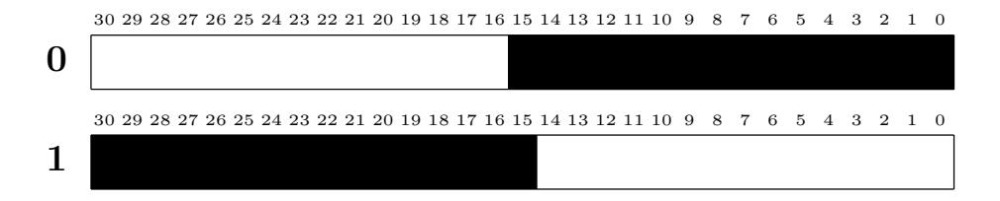
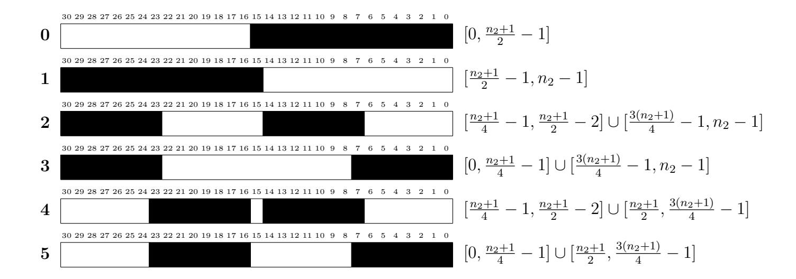
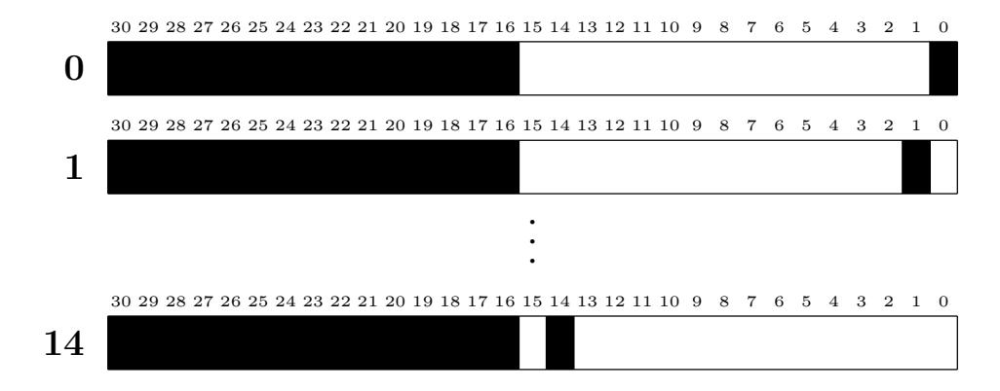
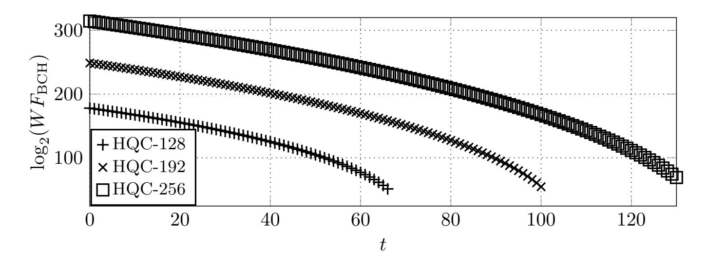
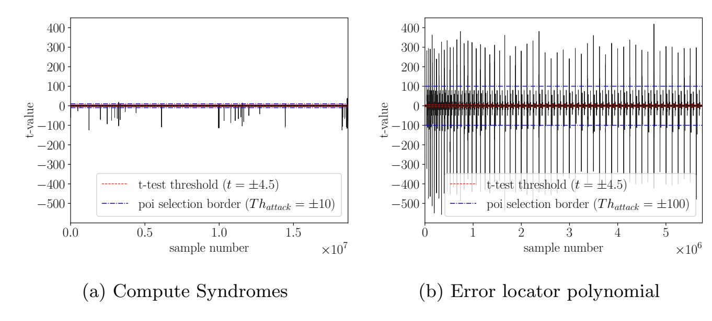
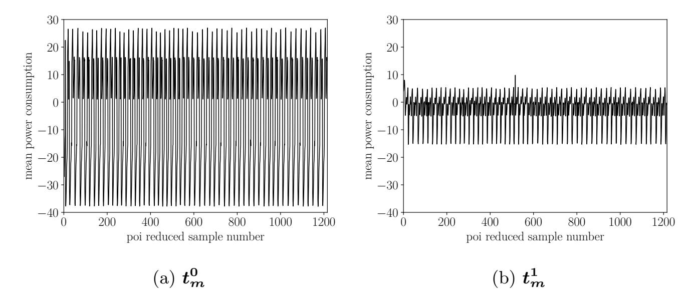

{0}------------------------------------------------

# <span id="page-0-0"></span>A Power Side-Channel Attack on the CCA2-Secure HQC KEM

Thomas Schamberger<sup>1</sup> , Julian Renner<sup>1</sup> , Georg Sigl<sup>1</sup> , and Antonia Wachter-Zeh<sup>1</sup>

Technical University of Munich, Germany {t.schamberger,julian.renner,sigl,antonia.wachter-zeh}@tum.de

Abstract. The Hamming Quasi-Cyclic (HQC) proposal is a promising candidate in the second round of the NIST Post-Quantum Cryptography Standardization project. It features small public key sizes, precise estimation of its decryption failure rates and contrary to most of the code-based systems, its security does not rely on hiding the structure of an error-correcting code. In this paper, we propose the first power sidechannel attack on the Key Encapsulation Mechanism (KEM) version of HQC. Our attack utilizes a power side-channel to build an oracle that outputs whether the BCH decoder in HQC's decryption algorithm corrects an error for a chosen ciphertext. Based on the decoding algorithm applied in HQC, it is shown how to design queries such that the output of the oracle allows to retrieve a large part of the secret key. The remaining part of the key can then be determined by an algorithm based on linear algebra. It is shown in experiments that less than 10000 measurements are sufficient to successfully mount the attack on the HQC reference implementation running on an ARM Cortex-M4 microcontroller.

Keywords: Error Correction · HQC · Post-Quantum Cryptography · Power Analysis · Side-Channel Analysis

# 1 Introduction

In modern communication systems, asymmetric cryptography is widely applied to enable secure communication between multiple parties. Since it is well known that classic public-key algorithms such as ElGamal or RSA are vulnerable against Shor's quantum computer algorithm, the National Institute of Standards and Technology (NIST) has started a standardization process for post-quantum secure public-key cryptosystems [\[8\]](#page-15-0). The code-based system Hamming Quasi Cyclic (HQC) [\[7\]](#page-15-1) is a promising candidate in the second round of this NIST competition, as it offers several advantages. Established code-based cryptosystems like McEliece or its derivatives rely on hiding the structure of the used error correcting code. In contrast, the structure of the error-correcting code as well as the efficient decoding algorithm used in HQC are publicly known and therefore its security does not rely on hiding this knowledge. Instead, the security of HQC can be reduced to instances of the Quasi-Cyclic Syndrome Decoding problem, which is a well-understood problem in coding theory. Furthermore, HQC features attractive key sizes and allows precise estimations of its decryption failure 

{1}------------------------------------------------

rate. It has been shown that the IND-CPA secure version of HQC can be attacked requiring only a few thousand queries to the algorithm [\[5\]](#page-15-2). Nevertheless, the IND-CCA2 secure version is not vulnerable to these sorts of attacks as the decryption signals a failure if the ciphertext is not valid. Recent attacks on the IND-CCA2 variant of HQC [\[9,](#page-15-3)[12\]](#page-15-4) use a timing side-channel in the implementation of the used BCH decoder to gather information about the decryption despite its IND-CCA2 security. Utilizing this information both attacks are able to successfully retrieve the used secret key. Fortunately, this attack vector has been removed as the authors of [\[12\]](#page-15-4) provide a constant-time implementation of a BCH decoder, which has been merged into the HQC reference implementation.

In this paper we build upon the work of Ravi et al. [\[11\]](#page-15-5), which describes a power side-channel attack methodology against the error correction used in the two lattice-based cryptosystems LAC [\[6\]](#page-15-6) and Round5 [\[1\]](#page-14-0). We identify a similar vulnerability in HQC and are the first to show a power side-channel attack against the cryptosystem. Our attack is able to retrieve the whole secret key despite the constant-time implementation of the BCH decoder. The attack works by observing that the BCH decoder of the reference implementation shows a characteristic and distinguishable power consumption dependent on whether an error has to be corrected.

Contributions We show that the attack methodology from [\[11\]](#page-15-5) can be used to construct an oracle through the power side-channel that is able to identify whether an error has to be corrected by the BCH decoder used in the HQC reference implementation. The oracle is based on a template matching approach using a sum of squared differences metric. The initialization of the oracle can be performed without the knowledge of the secret key, which allows a direct initialization on the device under attack. An evaluation of the oracle on our measurement platform consisting of an STM32F415RE ARM Cortex-M4 microcontroller indicated that a total of four traces is sufficient for the initialization. The efficiency of the oracle is shown by the correct evaluation of 20000 test traces.

Building on this oracle we are the first to show a successful power sidechannel attack against the Key Encapsulation Mechanism (KEM) version of HQC. We show general formulas for all parameter sets of HQC describing how to construct ciphertext inputs to the algorithm that lead to exploitable behavior based on the value of the secret key. Through an evaluation of the oracle results for these ciphertexts, we are able to sequentially retrieve the secret key. Due to the fact that the secret key has a marginally larger size then ciphertext, there are keys that can only be partially attacked with this technique. Using simulations, we observe that the probabilities for such a key cannot be neglected, e.g., the probability for HQC-128 is 29.23%, and provide a linear algebra solution that is able to find the remaining part of the secret key. In general, the success of our attack is highly dependent on the distribution of ones in the secret key. The described ciphertext inputs are sufficient to attack 93.20% of the possible keys in HQC-128, which we consider to be high enough to pose a significant threat to system. Nevertheless, our attack methodology can be adapted to support a larger range of keys with the trade-off of a significant increase in required measurement traces. Although this trade-off exists, there are rare cases where we are not able to 

{2}------------------------------------------------

retrieve the entire key. For these cases, we propose a modification of information set decoding (ISD) that utilizes the obtained side-channel information and thus still results in an attack complexity far below the claimed security level.

Finally, we use our described attack and successfully retrieve the whole secret key of the HQC-128 reference implementation using our measurement setup. In addition to the required four initialization traces, the attack requires less than 10000 measurements of the decoding step during the HQC decryption.

# 2 Preliminaries

#### 2.1 Notation

Let  $\mathbb{F}_2$  be the finite field of size 2. Throughout this paper we use  $\mathbb{F}_2^{m \times n}$  to denote the set of all  $m \times n$  matrices over  $\mathbb{F}_2$ ,  $\mathbb{F}_2^n = \mathbb{F}_2^{1 \times n}$  for the set of all row vectors of length n over  $\mathbb{F}_2$ , and define the set of integers  $[a,b] := \{i : a \leq i \leq b\}$ . We index rows and columns of  $m \times n$  matrices by  $0, \ldots, m-1$  and  $0, \ldots, n-1$ , where the entry in the i-th row and j-th column of the matrix A is denoted by  $A_{i,j}$ .

The Hamming weight of a vector  $\boldsymbol{a}$  is indicated by  $HW(\boldsymbol{a})$  and the Hamming support of  $\boldsymbol{a}$  is denoted by  $supp(\boldsymbol{a}) := \{i \in \mathbb{Z} : a_i \neq 0\}$ . A set  $\mathcal{A}$  is called super support (ssupp) of  $\boldsymbol{a}$  if  $\mathcal{A} \supset supp(\boldsymbol{a})$ .

Let  $\mathcal{V}$  be a vector space of dimension n over  $\mathbb{F}_2$ . We define the product of  $\boldsymbol{u}, \boldsymbol{v} \in \mathcal{V}$  as  $\boldsymbol{u}\boldsymbol{v} = \boldsymbol{u}\operatorname{rot}(\boldsymbol{v})^{\top} = \boldsymbol{v}\operatorname{rot}(\boldsymbol{u})^{\top} = \boldsymbol{v}\boldsymbol{u}$ , where

$$\operatorname{rot}(\boldsymbol{v}) := \begin{bmatrix} v_0 & v_{n-1} \dots v_1 \\ v_1 & v_0 \dots v_2 \\ \vdots & \vdots & \ddots \vdots \\ v_{n-1} & v_{n-2} \dots v_0 \end{bmatrix} \in \mathbb{F}_2^{n \times n}.$$

As a consequence of this definition, elements of  $\mathcal{V}$  can be interpreted as polynomials in the ring  $\mathcal{R} := \mathbb{F}_2[X]/(X^n - 1)$ .

#### <span id="page-2-0"></span>2.2 HQC

The HQC scheme is based on two different codes. It consists of a public code  $\mathcal{C} \subseteq \mathbb{F}_2^n$  of length n and dimension k, where it is assumed that both an efficient encoding algorithm **Encode** and an efficient decoding algorithm **Decode** are known publicly. Further, the decoding algorithm can correct  $\delta$  errors with high probability but fails for errors of large weight. HQC is also based on a second code of length 2n and dimension n which has a parity-check matrix  $(\boldsymbol{I}, \operatorname{rot}(\boldsymbol{h})) \in \mathbb{F}_2^{n \times 2n}$ , where  $\boldsymbol{I}$  denotes the  $n \times n$  identity matrix. Contrary to  $\mathcal{C}$ , it is assumed that no party posses an efficient decoding algorithm for the second code. Note that decoding in the second code is neither required in the encryption nor in the decryption algorithm.

In the following we describe the IND-CPA secure HQC public key encryption scheme as it is submitted to the second round of the NIST PQC competition [7]. It consists of the three algorithms Key Generation, Encryption and Decryption, which are shown in Algorithms 1 to 3. The algorithms use the functions

{3}------------------------------------------------

Encode and Decode which encode into and decode in  $\mathcal{C}$ . These functions are formally defined in Section 2.3. All parameter sets for different security levels are shown in Table 1. In [4], Hofheinz et al. show a generic method to transform an IND-CPA secure encryption scheme into an IND-CCA2 secure KEM. This transformation is applied in the HQC proposal and results in the encapsulation and decapsulation algorithms of the HQC KEM described in [7]. Note that our attack especially targets the KEM version of HQC as the IND-CPA secure PKE version has been shown to be vulnerable without using a side-channel [5]. Due to space restrictions we only show the PKE version, as the target of our attack, namely the decryption (c.f. Algorithm 3), is the first step during the decapsulation function of the KEM.

Table 1: Parameter sets proposed for HQC [7]

<span id="page-3-2"></span>

| Instance | $n_1$ | $n_2$ | $\mid n \mid$ | k   | w   | $w_{\rm r} = w_{\rm e}$ | $\delta$ |
|----------|-------|-------|---------------|-----|-----|-------------------------|----------|
| HQC-128  | 766   | 31    | 23869         | 256 | 67  | 77                      | 57       |
| HQC-192  | 766   | 59    | 45197         | 256 | 101 | 117                     | 57       |
| HQC-256  | 796   | 87    | 69259         | 256 | 133 | 153                     | 60       |

### **Algorithm 1:** Key Generation

```
Input: param = (n, k, \delta, w, w_r, w_e)

Output: pk = (h, s) and sk = (x, y)

1 choose \mathcal{C}

2 h \overset{\$}{\leftarrow} \mathcal{R}

3 (x, y) \overset{\$}{\leftarrow} \mathcal{R}^2 such that \mathrm{HW}(x) = \mathrm{HW}(y) = w

4 s \leftarrow x + hy

5 return pk = (h, s), sk = (x, y)
```

### **Algorithm 2:** Encryption

```
Input: \mathsf{pk} = (\boldsymbol{h}, \boldsymbol{s}), \ \mathsf{pt} = (\boldsymbol{m}) \ \text{and randomness } \boldsymbol{\theta}
Output: \mathsf{ct} = (\boldsymbol{u}, \boldsymbol{v})

1 \boldsymbol{e}' \overset{\$}{\leftarrow} \mathcal{R} \ \text{such that } \mathrm{HW}(\boldsymbol{e}') = w_{\mathrm{e}} \ \text{using } \boldsymbol{\theta}
2 (\boldsymbol{r}_1, \boldsymbol{r}_2) \overset{\$}{\leftarrow} \mathcal{R}^2 \ \text{such that } \mathrm{HW}(\boldsymbol{r}_1) = \mathrm{HW}(\boldsymbol{r}_2) = w_{\mathrm{r}} \ \text{using } \boldsymbol{\theta}
3 \boldsymbol{u} \leftarrow \boldsymbol{r}_1 + \boldsymbol{h}\boldsymbol{r}_2
4 \boldsymbol{v} \leftarrow \mathrm{Encode}(\boldsymbol{m}) + \boldsymbol{s}\boldsymbol{r}_2 + \boldsymbol{e}'
5 \mathrm{return } \ \mathsf{ct} = (\boldsymbol{u}, \boldsymbol{v})
```

### **Algorithm 3:** Decryption

```
\begin{array}{l} \textbf{Input:} \ \mathsf{sk} = (\boldsymbol{x}, \boldsymbol{y}), \ \mathsf{ct} = (\boldsymbol{u}, \boldsymbol{v}) \\ \textbf{Output:} \ \ \boldsymbol{m} \\ \texttt{1} \ \ \boldsymbol{v}' \leftarrow \boldsymbol{v} - \boldsymbol{u} \boldsymbol{y} \\ \texttt{2} \ \ \boldsymbol{m} \leftarrow \mathbf{Decode}(\boldsymbol{v}') \\ \texttt{3} \ \ \mathbf{return} \ \ \boldsymbol{m} \end{array}
```

{4}------------------------------------------------

#### <span id="page-4-0"></span>2.3 Choice of the error-correcting code ${\cal C}$

In the original proposal, C is constructed using a product code of an  $[n_1, k]$  shortened BCH code  $C_1$  with a generator matrix  $G_1 \in \mathbb{F}_2^{k \times n_1}$  and a  $[n_2, 1]$  repetition code  $C_2$ . Note that the HQC proposal was recently extended and contains now an additional variant called HQC-RMRS that uses a code concatenation of a Reed-Muller code and a Reed-Solomon code for the error-correcting code C. The extension is not motivated by security concerns regarding the original HQC scheme but instead the new choice of C provides a better error correction capability and thus allows to reduce the parameter sizes. The new variant is out of the scope of this paper and for simplicity we denote the original proposal as HQC for the remainder of this paper.

**Encoding algorithm** The encoding is defined as

Encode: 
$$\mathbb{F}_2^k \to \mathbb{F}_2^n$$
,  
 $m \mapsto (\underbrace{m'_0, \dots, m'_0}_{n_2 \text{ times}}, \underbrace{m'_1, \dots, m'_1}_{n_2 \text{ times}}, m'_2, \dots, m'_{n_1-1}, \underbrace{0, 0, \dots, 0}_{n-n_1 n_2 \text{ times}})$ ,

where  $\mathbf{m}' = (m'_0, \dots, m'_{n_1-1}) = \mathbf{m}\mathbf{G}_1$  and  $\mathbf{G}_1 \in \mathbb{F}_2^{k \times n_1}$  is a generator matrix of the  $[n_1, k]$  shortened BCH code  $\mathcal{C}_1$ .

**Decoding algorithm** Given an input vector  $\mathbf{v}' = (\mathbf{v}_0', \dots, \mathbf{v}_{n_1-1}', \mathbf{v}_{n_1}') \in \mathbb{F}_2^n$ , where  $\mathbf{v}_0', \dots, \mathbf{v}_{n_1-1}' \in \mathbb{F}_2^{n_2}$  and  $\mathbf{v}_{n_1}' \in \mathbb{F}_2^{n-n_1n_2}$ , the decoding algorithm **Decode**:  $\mathbb{F}_2^n \to \mathbb{F}_2^k$  consists of two steps. First the algorithm decodes the vectors  $\mathbf{v}_0', \dots, \mathbf{v}_{n_1-1}'$  separately in the repetition code  $\mathcal{C}_2$  using majority decoding to a vector  $\tilde{\mathbf{v}} = (\tilde{v}_0, \dots, \tilde{v}_{n_1-1}) \in \mathbb{F}_2^{n_1}$ , where  $\tilde{v}_i$  is 1 if  $\sum_{j=1}^{n_2} v_{ij}' \geq \left\lceil \frac{n_2}{2} \right\rceil$  and 0 otherwise. In the second step, the algorithm decodes  $\tilde{\mathbf{v}}$  in the BCH code  $\mathcal{C}_1$  to the vector  $\mathbf{m} \in \mathbb{F}_2^k$ . In the proposal, a key equation based approach is used for decoding in  $\mathcal{C}_1$  which works as follows. First, the syndromes are computed using the transpose of the additive Fast Fourier Transformation as in [2]. Then the error locator polynomial is determined using a modification of Berlekamp's algorithm and the error values are computed with an additive Fast Fourier Transformation.

#### <span id="page-4-1"></span>2.4 Security of HQC

For our proposed attack, it is important to recognize that retrieving the secret key  $\mathsf{sk} = (\boldsymbol{x}, \boldsymbol{y})$  from the public key  $\mathsf{pk} = (\boldsymbol{h}, \boldsymbol{s})$  is equal to solving an instance of the Computational 2-Quasi Cyclic Syndrome Decoding (QCSD) Problem. This can be seen by  $\boldsymbol{s} = \boldsymbol{x} + \boldsymbol{h}\boldsymbol{y} = (\boldsymbol{x}, \boldsymbol{y})(\mathbf{1}, \operatorname{rot}(\boldsymbol{h}))^\top = \boldsymbol{e}\boldsymbol{H}^\top$ , where  $\boldsymbol{e} := (\boldsymbol{x}, \boldsymbol{y}) \in \mathbb{F}_2^{2n}$  with  $\mathrm{HW}(\boldsymbol{x}) = \mathrm{HW}(\boldsymbol{y}) = \boldsymbol{w}$  and  $\boldsymbol{H} := (\mathbf{1}, \operatorname{rot}(\boldsymbol{h})) \in \mathbb{F}_2^{n \times 2n}$ . The vector  $\boldsymbol{s}$  can be interpreted as the syndrome of the error  $\boldsymbol{e}$  and the parity-check matrix  $\boldsymbol{H}$ .

Using our proposed side-channel attack, we gain information about the support of y that we can incorporate in an information set decoding (ISD) algorithm, like Prange's algorithm [10], to reduce its complexity. We will later state the exact information that we obtain by the side-channels. For now however, it

{5}------------------------------------------------

is sufficient to consider a generalized version of the 2-QCSD problem. Let n', w', k' be integers with  $1 \le n' \le n$ ,  $1 \le w' \le w$  and  $n' \le k' \le n$ . Further, let  $y' \in \mathbb{F}_2^{n'}$  with  $\mathrm{HW}(y') = w'$ ,  $H' \in \mathbb{F}_2^{(n+n'-k')\times(n+n')}$  be a parity-check matrix of an [n+n',k'] code and  $s' := (x,y')H'^{\top}$ . This can be solved by a modification of Prange's algorithm. As in the original algorithm, we are interested in finding an error-free information set but we modify the method to guess the indices. Instead of choosing k' indices at random from  $\{0,\ldots,n+n'-1\}$ , we randomly choose  $k'_1$  indices from  $\{0,\ldots,n-1\}$  and  $k'_2$  indices from  $\{0,\ldots,n'-1\}$ , where  $k'_1+k'_2=k'$ . The probability of guessing an error-free information set is then approximately given by  $\binom{n-k'_1}{w}/\binom{n}{w}\cdot\binom{n'-k'_2}{w'}/\binom{n'}{w'}$ . It follows that the complexity of this modified algorithm evaluates to

$$\mathcal{W}_{\mathrm{MPr}} = n^{3} \min_{\substack{k'_{1}, k'_{2} \\ s.t. k'_{1} + k'_{2} = k'}} \frac{\binom{n}{w} \binom{n'}{w'}}{\binom{n-k'_{1}}{w} \binom{n'-k'_{2}}{w'}} = n^{3} \min_{\substack{k'_{1} \\ w'}} \frac{\binom{n}{w} \binom{n'}{w'}}{\binom{n-k'_{1}}{w'} \binom{n'-k'+k'_{1}}{w'}}.$$

where it is assumed that solving a linear system of equations is in  $O(n^3)$ .

## <span id="page-5-0"></span>3 Side-channel Attack on HQC

In this section, we propose an attack to retrieve the secret key  $\mathbf{y} = (\mathbf{y}^{(0)}, \mathbf{y}^{(1)}) \in \mathbb{F}_2^n$ , where  $\mathbf{y}^{(0)} \in \mathbb{F}_2^{n_1 n_2}$  and  $\mathbf{y}^{(1)} \in \mathbb{F}_2^{n_1 n_2}$ . Please note that although the secret key additionally consists of  $\mathbf{x}$ , it is sufficient to only retrieve  $\mathbf{y}$ , as it is the only secret needed for a successful decryption (c.f. Section 2.2). We will first analyze the distribution of the non-zero positions in  $\mathbf{y}$  and based on this analysis, we show an algorithm that is able to obtain  $\mathbf{y}^{(0)}$  with high probability, given a decoding oracle. A method to construct such an oracle through a power side-channel is described in Section 4. Afterwards, we present a method to determine  $\mathbf{y}^{(1)}$  assuming that  $\mathbf{y}^{(0)}$  was successfully recovered. Finally, we show the complexity of a modified information set decoding algorithm in the unlikely case that the support of  $\mathbf{y}$  was only partly retrieved.

#### 3.1 Support Distribution of y

The distribution of the non-zero position in the secret  $\boldsymbol{y}$  is essential for our attack. To simplify the notation, we decompose the vector  $\boldsymbol{y}$  as follows  $\boldsymbol{y} = (\boldsymbol{y}_0^{(0)}, \dots, \boldsymbol{y}_{n_1-1}^{(0)}, \boldsymbol{y}^{(1)}) \in \mathbb{F}_2^n$ , where  $\boldsymbol{y}_0^{(0)}, \dots, \boldsymbol{y}_{n_1-1}^{(0)} \in \mathbb{F}_2^{n_2}$ . From the parameters in Table 1 it follows that  $\boldsymbol{y}$  is a sparse vector and

From the parameters in Table 1 it follows that  $\boldsymbol{y}$  is a sparse vector and thus the vectors  $\boldsymbol{y}_0^{(0)},\ldots,\boldsymbol{y}_{n_1-1}^{(0)},\boldsymbol{y}^{(1)}$  have Hamming weight close to zero with high probability. We performed simulations, by generating one million secret keys, in order to estimate the weight distribution of  $\boldsymbol{y}_0^{(0)},\ldots,\boldsymbol{y}_{n_1-1}^{(0)}$ . The results are shown in Table 2, where we observed that most of the secret keys have a  $\boldsymbol{y}_0^{(0)},\ldots,\boldsymbol{y}_{n_1-1}^{(0)}$  of Hamming weight at most 3. Simulations showed further that the probability that  $\mathrm{HW}(\boldsymbol{y}^{(1)})>0$  is approximately 29.23%, 0.69%, 1.52% for HQC-128, HQC-192 and HQC-256, respectively.

{6}------------------------------------------------

<span id="page-6-0"></span>Table 2: Probabilities that  $\boldsymbol{y}$  is generated such that the weight of  $\boldsymbol{y}_i^{(0)}$  for  $i = 0, \ldots, n_1 - 1$  is at most 1, 2 or 3 for the different parameter sets.

| $\overline{\max\{\mathrm{HW}(\boldsymbol{y}_0^{(0)}),\ldots,\mathrm{HW}(\boldsymbol{y}_{n_1-1}^{(0)})\}}$ | HQC-128 | HQC-192 | HQC-256 |
|-----------------------------------------------------------------------------------------------------------|---------|---------|---------|
| 1                                                                                                         |         | 0.11%   |         |
| 2                                                                                                         | 93.20%  | 77.98%  | 58.99%  |
| 3                                                                                                         | 99.86%  | 99.25%  | 97.99%  |

# <span id="page-6-1"></span>3.2 Retrieving $y^{(0)}$ Using a Decoding Oracle

In this section, we propose a chosen ciphertext attack that retrieves  $\mathbf{y}_i^{(0)}$  for  $i = 0, \dots, n_1 - 1$ . Please note that our attack approach is similar to [12], but we are using a power instead of a timing side-channel. Our attack methodology works as follows.

First, we fix  $\boldsymbol{u}$  to  $(1,0,\ldots,0) \in \mathbb{F}_2^n$  such that the vector that is feed into the decoder of  $\mathcal{C}$  is given by  $\boldsymbol{v}' = \boldsymbol{v} - \boldsymbol{y}$ , as it can be seen in Algorithm 3. Then, we choose specific vectors  $\boldsymbol{v}$  and use a decoding oracle  $\mathcal{O}_{01}^{Dec}$  that is able to determine whether an error is corrected in the BCH code. After the oracle has been initialized it can be queried for different inputs  $\boldsymbol{v}$  and returns 1 if an error had to be corrected and 0 otherwise. We give detailed information on how to construct such an oracle through a power side-channel in Section 4. Based on the oracle results for different inputs  $\boldsymbol{v}$ , we can obtain  $\boldsymbol{y}^{(0)}$ .

To derive the chosen vectors  $\boldsymbol{v}$ , recall that the code  $\mathcal{C}$  is a product code consisting of a BCH code  $\mathcal{C}_1$  of length  $n_1$  and a repetition code  $\mathcal{C}_2$  of length  $n_2$  and only the first  $n_1n_2$  positions of  $\boldsymbol{v}'$  are decoded in  $\mathcal{C}$ . The decoder for  $\mathcal{C}$  divides the first  $n_1n_2$  positions of  $\boldsymbol{v}'$  into chunks  $\boldsymbol{v}_0',\ldots,\boldsymbol{v}_{n_1-1}'$  of size  $n_2$  that are separately decoded in the repetition code. Decoding in  $\mathcal{C}_2$  is performed by a majority voting, meaning vectors of Hamming weight at least  $\lceil \frac{n_2}{2} \rceil$  are mapped to 1 and the remaining vectors are mapped to 0. The outputs of the repetition decoder are then decoded in the BCH code. Since the zero vector is in  $\mathcal{C}_1$  and vectors of Hamming weight one<sup>1</sup> are not in  $\mathcal{C}_1$ , we observe the following. Setting  $\lceil \frac{n_2}{2} \rceil$  entries of  $\boldsymbol{v}_i$  to 1 and  $\boldsymbol{v}_j$  to the zero vector, where  $j \in [0, n_1 - 1] \setminus \{i\}$ , results in two cases that we can distinguish using  $\mathcal{O}_{01}^{Dec}$ :

- 1.  $|\operatorname{supp}(\boldsymbol{y}_i^{(0)}) \cap \operatorname{supp}(\boldsymbol{v}_i)| > \frac{\operatorname{HW}(\boldsymbol{y}_i^{(0)})}{2}$ : This leads to  $\operatorname{HW}(\boldsymbol{v}_i') < \lceil \frac{n_2}{2} \rceil$  and the repetition decoder outputs 0. Then, no error is corrected in the BCH code.
- 2.  $|\operatorname{supp}(\boldsymbol{y}_i^{(0)}) \cap \operatorname{supp}(\boldsymbol{v}_i)| \leq \frac{\operatorname{HW}(\boldsymbol{y}_i^{(0)})}{2}$ : This leads to  $\operatorname{HW}(\boldsymbol{v}_i') \geq \lceil \frac{n_2}{2} \rceil$  and the repetition decoder outputs 1, which is corrected in the BCH code.

This observation allows to determine the support of  $\mathbf{y}_i^{(0)}$  in a two-step approach, where we first determine a super support of  $\mathbf{y}_i^{(0)}$  and then refine these approximate locations to obtain the exact non-zero positions of  $\mathbf{y}_i^{(0)}$ . Note that all  $\mathbf{y}_0^{(0)}, \ldots, \mathbf{y}_{n_1-1}^{(0)}$  are examined separately in sequential manner.

This follows from the fact that the BCH code has a minimum distance larger than 1.

{7}------------------------------------------------

Finding a super support of  $\boldsymbol{y}_i^{(0)}$  In the following, we derive how to choose  $\boldsymbol{v}_i$  to determine a super support of  $\boldsymbol{y}_i^{(0)}$  under the assumption that  $\mathrm{HW}(\boldsymbol{y}_i^{(0)}) \leq 2$ . As shown in Table 2, this already covers a large part of the possible keys. Nevertheless, a generalization of the proposed method to cases where  $\mathrm{HW}(\boldsymbol{y}_i^{(0)}) > 2$  works accordingly. Assuming  $\mathrm{HW}(\boldsymbol{y}_i^{(0)}) \leq 1$ , a super support of  $\boldsymbol{y}_i^{(0)}$  can be found by using only two patterns of  $\boldsymbol{v}_i$ . For pattern 0, we choose  $\mathrm{supp}(\boldsymbol{v}_i) = [0, \lceil \frac{n_2}{2} \rceil - 1]$  and for pattern 1, we choose  $\mathrm{supp}(\boldsymbol{v}_i) = \lceil \lceil \frac{n_2}{2} \rceil - 1, n_2 - 1 \rceil$ . The patterns for  $n_2 = 31$  (HQC-128) are illustrated in Fig. 1.

<span id="page-7-0"></span>

Fig. 1: Pattern of  $\mathbf{v}_i$  to find a super support of  $\mathbf{y}_i^{(0)}$  for  $n_2 = 31$  and  $\mathrm{HW}(\mathbf{y}_i^{(0)}) \leq 1$ . The black part indicates positions with value 1 and the white part positions with value 0.

If the BCH decoder has to correct an error for both patterns, it follows that  $\mathrm{HW}(\boldsymbol{y}_i^{(0)}) = 0$  and in case no error was corrected by the BCH code in both cases, we conclude that  $\mathrm{supp}(\boldsymbol{y}_i^{(0)}) = \mathrm{ssupp}(\boldsymbol{y}_i^{(0)}) = \{\lceil \frac{n_2}{2} \rceil - 1\}$ . Furthermore, if the BCH decoder has to correct an error for the first pattern but not for the second pattern we know that  $\mathrm{supp}(\boldsymbol{y}_i^{(0)}) \cap \mathrm{ssupp}(\boldsymbol{y}_i^{(0)}) = [\lceil \frac{n_2}{2} \rceil, n_2 - 1]$ . Given the BCH decoder does not correct an error in the first case but in the second we know that  $\mathrm{supp}(\boldsymbol{y}_i^{(0)}) \cap \mathrm{ssupp}(\boldsymbol{y}_i^{(0)}) = [0, \lceil \frac{n_2}{2} \rceil - 2]$ .

For the case  $\mathrm{HW}(\boldsymbol{y}_i^{(0)}) \leq 2$  and  $4 \mid (n_2+1)$ , we can generalize the described method as follows<sup>2</sup>. Instead of only two patterns, we construct six different patterns of  $\boldsymbol{v}_i$ . An illustration of the six patterns for  $n_2=31$  together with the general formulas for the sets dependent on  $n_2$  is given in Fig. 2.

Similar to before, we can determine a super support of  $\mathbf{y}_i^{(0)}$  based on the output of the oracle for the different patterns of  $\mathbf{v}_i$ , where the logic is given in Table 3. In the table, either one or two sets per row are shown. The union of these sets give a super support of  $\mathbf{y}_i^{(0)}$  and each set has a non-empty intersection with the support of  $\mathbf{y}_i^{(0)}$ . The latter property is important since it reduces the complexity of the next step.

Finding the support of  $y_i^{(0)}$  From the super support of  $y_i^{(0)}$ , we can determine  $\operatorname{supp}(y_i^{(0)})$  using the fact that all indices of  $y_i^{(0)}$  that are not in  $\operatorname{ssupp}(y_i^{(0)})$ 

This condition is fulfilled for HQC-128, HQC-192 and HQC-256. In case of an HQC instance with  $4 \nmid (n_2 + 1)$ , the algorithm works similarly but the patterns need to be slightly modified.

{8}------------------------------------------------

<span id="page-8-0"></span>

Fig. 2: Patterns of  $v_i$  to find a super support of  $y_i^{(0)}$  for  $n_2$ =31 and  $\mathrm{HW}(y_i^{(0)}) \leq 2$ . The black part indicates positions with value 1 and the white part entries with value 0. In addition, the support of  $v_i$  dependent on  $n_2$  is given.

<span id="page-8-1"></span>Table 3: Super support of  $\boldsymbol{y}_i^{(0)}$  depending on the oracle output for different patterns of  $\boldsymbol{v}_i$  (see Fig. 2) and  $\mathrm{HW}(\boldsymbol{y}_i^{(0)}) \leq 2$ .

| $\frac{1}{t} \left( \frac{1}{t} \left( \frac{1}{t} - \frac{1}{t} \right) - \frac{1}{t} \right) = \frac{1}{t}$ |   |   |   |   |   |                                                                                                                              |  |
|---------------------------------------------------------------------------------------------------------------|---|---|---|---|---|------------------------------------------------------------------------------------------------------------------------------|--|
| $\mathcal{O}_{01}^{Dec}$ (Pattern $\star$ )                                                                   |   |   |   |   |   | $a_{\text{coupp}}(\mathbf{a}^{(0)})$                                                                                         |  |
| 0                                                                                                             | 1 | 2 | 3 | 4 | 5 | $\operatorname{ssupp}(\boldsymbol{y}_i^{(0)})$                                                                               |  |
| 1                                                                                                             | 1 | 1 | 1 | 1 | 1 | { }                                                                                                                          |  |
| 0                                                                                                             | 1 | - | _ | _ | _ | $[0, \frac{n_2+1}{2}-1]$                                                                                                     |  |
| 1                                                                                                             | 0 | - | _ | _ | _ | $\left[\frac{n_2+1}{2}-1, n_2-1\right]$                                                                                      |  |
| 1                                                                                                             | 1 | 0 | 1 | 1 | 1 | $\left[\frac{n_2+1}{4}, \frac{n_2+1}{2}-2\right], \left[\frac{3(n_2+1)}{4}, n_2-1\right]$                                    |  |
| 1                                                                                                             | 1 | 1 | 0 | 1 | 1 | $[0, \frac{n_2+1}{4}-2], [\frac{3(n_2+1)}{4}, n_2-1]$                                                                        |  |
| 1                                                                                                             | 1 | 1 | 1 | 0 | 1 | $\left[ \left[ \frac{n_2+1}{4}, \frac{n_2+1}{2} - 2 \right], \left[ \frac{n_2+1}{2}, \frac{3(n_2+1)}{4} - 2 \right] \right]$ |  |
| 1                                                                                                             | 1 | 1 | 1 | 1 | 0 | $\left[0, \frac{n_2+1}{4}-2\right], \left[\frac{n_2+1}{2}, \frac{3(n_2+1)}{4}-2\right]$                                      |  |
| 1                                                                                                             | 1 | 0 | 0 | 1 | 1 | $\left\{\frac{n_2+1}{4}-1\right\}, \left[\frac{3(n_2+1)}{4}, n_2-1\right]$                                                   |  |
| 1                                                                                                             | 1 | 0 | 1 | 0 | 1 | $\left[\frac{n_2+1}{4}, \frac{n_2+1}{2}-2\right], \left\{\frac{3(n_2+1)}{4}-1\right\}$                                       |  |
| 1                                                                                                             | 1 | 1 | 0 | 1 | 0 | $[0, \frac{n_2+1}{4}-2], \{\frac{3(n_2+1)}{4}-1\}$                                                                           |  |
| 1                                                                                                             | 1 | 1 | 1 | 0 | 0 | $\left\{\frac{n_2+1}{4}-1\right\}, \left[\frac{n_2+1}{2}, \frac{3(n_2+1)}{4}-2\right]$                                       |  |
| 1                                                                                                             | 1 | 0 | 0 | 0 | 0 | $\left\{\frac{n_2+1}{4}-1\right\},\ \left\{\frac{3(n_2+1)}{4}-1\right\}$                                                     |  |

{9}------------------------------------------------

correspond to entries with value zero. As already discussed, we describe the proposed method for  $\mathrm{HW}(\boldsymbol{y}_i^{(0)}) \leq 2$  which can then be easily generalized to the case  $\mathrm{HW}(\boldsymbol{y}_i^{(0)}) > 2$ .

Assume that  $\mathrm{HW}(\boldsymbol{y}_i^{(0)}) = 1$ . We can find the support of  $\boldsymbol{y}_i^{(0)}$  by setting  $\lceil \frac{n_2}{2} \rceil - 1$  entries in  $\boldsymbol{v}_i$  to 1 for indices which are not in  $\mathrm{ssupp}(\boldsymbol{y}_i^{(0)})$ . Keeping these entries fixed, we iterate through all vectors  $\boldsymbol{v}_i$  with  $|\mathrm{supp}(\boldsymbol{v}_i) \cap \mathrm{ssupp}(\boldsymbol{y}_i^{(0)})| = 1$ . This procedure is depicted for  $n_2 = 31$  and  $\mathrm{ssupp}(\boldsymbol{y}_i^{(0)}) = \{0, \dots, 14\}$  in Fig. 3. Every time when the BCH decoder corrects an error, we know that  $\mathrm{supp}(\boldsymbol{v}_i) \cap \mathrm{ssupp}(\boldsymbol{y}_i^{(0)}) \neq \mathrm{supp}(\boldsymbol{y}_i^{(0)})$  and when the BCH decoder does not correct an error, we can conclude that  $\mathrm{supp}(\boldsymbol{v}_i) \cap \mathrm{ssupp}(\boldsymbol{y}_i^{(0)}) = \mathrm{supp}(\boldsymbol{y}_i^{(0)})$ .

<span id="page-9-0"></span>

Fig. 3: Patterns to determine  $\operatorname{supp}(\boldsymbol{y}_i^{(0)})$  from  $\operatorname{ssupp}(\boldsymbol{y}_i^{(0)})$  for  $n_2 = 31$  and  $\operatorname{ssupp}(\boldsymbol{y}_i^{(0)}) = \{0, \dots, 14\}.$ 

For  $\mathrm{HW}(\boldsymbol{y}_i^{(0)}) = 2$ , we fix  $\lceil \frac{n_2}{2} \rceil - 2$  entries in  $\boldsymbol{v}_i$  to 1 for indices which are not in  $\mathrm{ssupp}(\boldsymbol{y}_i^{(0)})$ . In case Table 3 refers to one set as the super support of  $\boldsymbol{y}_i^{(0)}$ , we brute-force all vectors  $\boldsymbol{v}_i$ , where  $|\mathrm{supp}(\boldsymbol{v}_i) \cap \mathrm{ssupp}(\boldsymbol{y}_i^{(0)})| = 2$ . In case Table 3 refers to two sets, we iterate through all vectors  $\boldsymbol{v}_i$  that have a non-empty intersection with both sets. As before, every time the BCH decoder corrects an error, we know that  $\mathrm{supp}(\boldsymbol{v}_i) \cap \mathrm{ssupp}(\boldsymbol{y}_i^{(0)}) \neq \mathrm{supp}(\boldsymbol{y}_i^{(0)})$  and when the BCH decoder does not correct an error, we state  $\mathrm{supp}(\boldsymbol{v}_i) \cap \mathrm{ssupp}(\boldsymbol{y}_i^{(0)}) = \mathrm{supp}(\boldsymbol{y}_i^{(0)})$ .

### 3.3 Retrieving $y^{(1)}$ Using Linear Algebra

Due to fact that only the first  $n_1n_2$  positions of  $\mathbf{v}' \in \mathbb{F}_2^n$  are decoded in  $\mathcal{C}$ , we are so far not able to determine the support of the last  $n - n_1n_2$  positions of  $\mathbf{y}$  for keys with  $\mathrm{HW}(\mathbf{y}^{(1)}) > 0$ . In the following, we propose a method to obtain  $\mathrm{supp}(\mathbf{y}^{(1)})$  in these cases assuming that  $\mathrm{supp}(\mathbf{y}^{(0)})$  was successfully recovered. Let  $\mathcal{J} = \{j_0, \ldots, j_{t-1}\}$  denote the known support of  $\mathbf{y}^{(0)}$  and let  $\mathcal{L} =$ 

Let  $\mathcal{J} = \{j_0, \ldots, j_{t-1}\}$  denote the known support of  $\boldsymbol{y}^{(0)}$  and let  $\mathcal{L} = \{l_0, \ldots, l_{w-t-1}\}$  be the support of  $\boldsymbol{y}^{(1)}$  that we want to determine. First, observe that  $\boldsymbol{s} = \boldsymbol{x} + \boldsymbol{h}\boldsymbol{y} = \boldsymbol{x} + \boldsymbol{H}_{n+j_0}^{\top} + \ldots + \boldsymbol{H}_{n+j_{t-1}}^{\top} + \boldsymbol{H}_{n+l_0}^{\top} + \ldots + \boldsymbol{H}_{n+l_{w-t-1}}^{\top}$ , where  $\boldsymbol{H}_i$  denotes the *i*-th column of  $\boldsymbol{H} = (\boldsymbol{1}, \operatorname{rot}(\boldsymbol{h}))$ . Since  $\boldsymbol{s}, \boldsymbol{h}$  and  $\mathcal{J}$  are known, we

{10}------------------------------------------------

can compute  $\tilde{\boldsymbol{s}} = \boldsymbol{s} + \boldsymbol{H}_{n+j_0}^{\top} + \ldots + \boldsymbol{H}_{n+j_{t-1}}^{\top} = \boldsymbol{x} + \boldsymbol{H}_{n+l_0}^{\top} + \ldots + \boldsymbol{H}_{n+l_{w-t-1}}^{\top}$ . Then, we repeatedly sample w - t indices  $\hat{l}_0, \ldots, \hat{l}_{w-t-1}$  from  $\{0, \ldots, n - n_1 n_2 - 1\}$  and compute  $\hat{\boldsymbol{x}} := \tilde{\boldsymbol{s}} + \boldsymbol{H}_{n+\hat{l}_0}^{\top} + \ldots + \boldsymbol{H}_{n+\hat{l}_{w-t-1}}^{\top}$  until  $\mathrm{HW}(\hat{\boldsymbol{x}}) = w$ . In this case,  $\hat{\boldsymbol{x}} = \boldsymbol{x}$  which means that  $\{\hat{l}_0, \ldots, \hat{l}_{w-t-1}\} = \mathcal{L}$ . We finally output  $\mathcal{J} \cup \{\hat{l}_0, \ldots, \hat{l}_{w-t-1}\}$  as estimation of  $\mathrm{supp}(\boldsymbol{y})$ .

The probability that  $\{\hat{l}_0,\ldots,\hat{l}_{w-t-1}\}=\mathcal{L}$  is  $\binom{n-n_1n_2}{w-t}^{-1}$  and checking whether  $\{\hat{l}_0,\ldots,\hat{l}_{w-t-1}\}$  is equal to  $\mathcal{L}$  requires w-t column additions which is in O(n(w-t)). This results in a complexity of  $\mathcal{W}_L=n(w-t)\binom{n-n_1n_2}{w-t}$ .

Although the described method has an exponential complexity, it is easily solvable since  $n-n_1n_2$  is small for all parameter sets<sup>3</sup> and w-t is close to zero with high probability. Assuming  $w-t \le 2$ , the complexity is  $2^{28.42}$ ,  $2^{18.05}$  and  $2^{21.47}$  for the parameter sets of HQC-128, HQC-192 and HQC-256.

### 3.4 Information Set Decoding

Due to errors during the power measurements or due to certain secret keys with  $\mathbf{y}_{i}^{(0)}$  of rather large Hamming weight, we might in some very rare cases not be able to determine the support of  $\mathbf{y}$  but only a subset  $\mathcal{P} = \{p_0, \dots, p_{t-1}\} \subset \operatorname{supp}(\mathbf{y})$  of it. Then we can use  $\mathcal{P}$  to reduce the complexity of information set decoding. To do so, we compute  $\mathbf{s}' = \mathbf{s} + \mathbf{H}_{n+p_0}^{\top} + \dots + \mathbf{H}_{n+p_{t-1}}^{\top}$ . We observe that  $\mathbf{s}'$  is a syndrome of the parity-check matrix  $\mathbf{H}$  and an error  $(\mathbf{e}'_0, \mathbf{e}'_1)$ , where  $\mathbf{e}'_0 \in \mathbb{F}_2^n$  has weight w and  $\mathbf{e}'_1 \in \mathbb{F}_2^n$  has weight w = w - t. Thus, we can use the modification of Prange's algorithm as described in Section 2.4 which has a complexity of  $\mathcal{W}_{\text{BCH}} = n^3 \cdot \min_{k_1} \frac{\binom{n}{w}}{\binom{n-k_1}{w-t}} \frac{\binom{n}{w-t}}{\binom{k_1}{w-t}}$ . We show the complexity of the modified Prange's algorithm for the parameters of HQC-128, HQC-192 and HQC-256 as a function of t in Fig. 4. It can be observed that if t is close to w, the complexity of the modified Prange's algorithm is far below the claimed security level.

### <span id="page-10-0"></span>4 Decoding Oracle based on a Power Side-Channel

This section introduces a method to construct a decoding oracle through the power side-channel, which allows an attacker to identify whether the BCH decoder has to correct an error during the decoding step of the decryption of HQC. As explained in Section 3, this allows the attacker to retrieve the used secret key y regardless of the constant time implementation of the BCH decoder. First, we introduce the Welch's t-test, which is used to identify point of interest (POI) in the power measurements. Then the oracle itself is described, which is based on template matching through a sum of squared differences metric. Finally, we discuss our measurement setup and show attack results for the reference implementation of HQC.

The variable  $n - n_1 n_2$  is equal to 123, 3 and 7 for HQC-128, HQC-192 and HQC-256, respectively.

{11}------------------------------------------------

<span id="page-11-0"></span>

Fig. 4: Complexity  $W_{BCH}$  for HQC-128, HQC-192 and HQC-256 as a function of t, where t is the number of non-zero positions in  $\boldsymbol{y}$  that are correctly obtained by the proposed side-channel attack.

#### <span id="page-11-1"></span>4.1 Welch's t-test

The Test Vector Leakage Assessment (TVLA) [3] is an established tool to statistically evaluate a cryptographic implementation for existing and exploitable side-channel leakage. To achieve this goal, it uses Welch's t-test, which in essence evaluates whether two sets of data significantly differ from each other in the sense of their means being different. Given two sets  $S_0$  and  $S_1$  with their respective mean  $\mu_0, \mu_1$  and variance  $s_0, s_1$  the resulting t-value is calculated as  $t = (\mu_0 - \mu_1)/(\sqrt{s_0^2/n_0 + s_1^2/n_1})$ , where n denotes the respective cardinality of the set. Usually a threshold of |t| > 4.5 is defined, which states that there is a confidence of > 0.99999 that both sets can not be distinguished if the resulting t-value stays below this threshold. As the t-test can be individually performed for all the samples of a measurement trace, it acts as an efficient method for POI detection.

### 4.2 Construction of the Decoding Oracle

In [11] Ravi et al. mounted a successful attack against the NIST PQ candidates LAC [6] and Round5 [1], by utilizing a power side-channel that allows to distinguish whether the used error correction had to correct an error. This section introduces their attack methodology based on a POI-reduced template matching approach with respect to its application on HQC. The result of this attack methodology is an oracle  $\mathcal{O}_{01}^{Dec}$  that returns 0 if no error had to be corrected by the BCH decoder and outputs 1 otherwise.

In order to initialize the oracle, templates for the two different classes are built using the ciphertext inputs shown in Table 4. We refer to Section 3.2 for an explanation on how these values are derived. Please note that an attacker does not need to know the used secret key  $\boldsymbol{y}$  in order to construct the templates. This allows to directly build the templates on the device under attack, which significantly increases the strength of the attack. To start building the templates, a limited amount of  $N_t$  power traces for both classes, which will be denoted as  $\mathcal{T}_0$ 

{12}------------------------------------------------

 $\frac{\mathcal{O}_{01}^{Dec}}{0 \text{ (no error)}} \begin{array}{c|c} \boldsymbol{u} \in \mathbb{F}_2^n & \boldsymbol{v} = (\boldsymbol{v}_0, \dots, \boldsymbol{v}_{n1-1}) \in \mathbb{F}_2^{n_1 n_2} \text{ with } \boldsymbol{v}_i \in \mathbb{F}_2^{n_2} \\
\hline
0 \text{ (no error)} & 0 & (0, \dots, 0) \\
1 \text{ (error)} & 0 & (HW(\boldsymbol{v}_0) = \lceil \frac{n_2}{2} \rceil, 0, \dots, 0)
\end{array}$ 

<span id="page-12-0"></span>Table 4: Ciphertext input used for the initialization of the oracle.

and  $\mathcal{T}_1$ , are recorded during the BCH decoding step of the function **Decode** in the decryption algorithm of HQC (c.f. Algorithm 3). In order to cope with environment changes during the measurement phase, e.g., DC offsets, the individual power traces  $t_i$  are normalized for both classes. This is done by subtracting the respective mean  $\bar{t}_i$ , such that  $t'_i = t_i - \bar{t}_i \mathbf{1}$ . Now, the t-test (c.f. Section 4.1) is used to identify measurement samples that can be used to distinguish between the two classes. Based on these t-test results and a chosen threshold value  $Th_{attack}$  both trace sets can be reduced to their respective POIs resulting in  $\mathcal{T}'_0$  and  $\mathcal{T}'_1$ . Finally, the templates for both classes can be calculated as the mean over all traces in their respective set, resulting in  $t_m^0$  and  $t_m^1$ , respectively.

In order to evaluate the oracle for a given ciphertext input (u, v) the corresponding power trace  $t_c$  has to be captured by the attacker. The classification process is performed by an evaluation of the sum of squared differences  $SSD_*$  to both templates. The trace  $t_c$  is classified as the class with the lowest SSD value. Note that  $t_c$  also has to be reduced to the previously found POI. If both the templates  $t_m^1, t_m^0$  and attack trace  $t_c$  are seen as a vector of their respective sample values, the evaluation can be written as

$$SSD_0 = ((\boldsymbol{t_c} - \bar{t}_c \boldsymbol{1}) - \boldsymbol{t_m^0})^T \cdot ((\boldsymbol{t_c} - \bar{t}_c \boldsymbol{1}) - \boldsymbol{t_m^0})$$
  

$$SSD_1 = ((\boldsymbol{t_c} - \bar{t}_c \boldsymbol{1}) - \boldsymbol{t_m^1})^T \cdot ((\boldsymbol{t_c} - \bar{t}_c \boldsymbol{1}) - \boldsymbol{t_m^1}).$$

### 4.3 Oracle Evaluation

In order to evaluate the oracle we implemented the reference implementation of HQC-128 on our test platform consisting of an STM32F415RGT6 ARM Cortex-M4 microcontroller. The microcontroller is part of an CW308T-STM32F target board which is mounted on a CW308 UFO board running at a clock frequency of 10 MHz. The clock is provided by an external clock generator. We measured the power consumption through an integrated shunt resistor with a PicoScope 6402D USB-oscilloscope at a sampling rate of 156.25 MHz. A dedicated GPIO pin is used to provide a trigger signal to the oscilloscope indicating the duration of the function that is evaluated.

First we evaluated if both classes can be distinguished through the power sidechannel using our setup. Therefore, we perform a t-test on 1000 measurements with a randomly chosen classes. As described in Section 2.3, there are three main steps during the BCH decoding, where each step could potentially be used for the distinction. In the original proposal of the attack methodology by Ravi *et al*. [11] the authors find the computation of syndromes a suitable operation during the decoding. The t-test results for this attack vector is shown in Fig. 5a.

{13}------------------------------------------------

<span id="page-13-0"></span>

Fig. 5: T-test result using 1000 measurements for different functions of the BCH decoding during the HQC decryption. The computation of syndromes corresponds to the function compute\_syndromes() and the error locator polynomial computation to the function compute\_elp() of the reference implementation.

It can be seen that there are some measurement samples with a t-value that indicates a sufficient amount of side-channel leakage in order to distinguish both classes. Nevertheless, we opted to additionally examine the computation of the error locator polynomial, as seen in Fig. 5b. The result shows a significantly higher t-value in addition with an execution time of only  $\approx 33.3\%$  in comparison to the syndrome computation. Therefore, we use the computation of the error locator polynomial as our attack target.

In a second step, we prove the efficiency of the oracle by building the templates  $t_m^0$  and  $t_m^1$  using a total of 1000 template traces (500 for each class) using only the POI given by the attack threshold  $Th_{attack}$  depicted in Fig. 5b. The resulting templates are shown in Fig. 6. It can be clearly seen that there is a significant difference between both templates. After the initialization, we evaluated 20000 queries to the oracle given traces with a randomly chosen class. The oracle was able to correctly classify all measurements. In an effort to lower the required amount of traces for the initialization, we iteratively evaluated the classification results with a decreasing number of template traces. As a result, we were able to successfully classify all 20000 traces with exactly two template traces for each class. Please note that this includes the fact that the POI detection with the t-test also works with this low amount of traces.

Finally, we were able to successfully retrieve the complete secret key  $\boldsymbol{y}$  of the reference implementation of HQC-128 using our measurement setup. In addition to the traces needed to initialize the oracle our complete attack, given a maximum  $\mathrm{HW}(\boldsymbol{y}_i^{(0)}) = 1$ , requires 1532 traces to find  $\mathrm{ssupp}(\boldsymbol{y}^{(0)})$  and 1005 traces for the final  $\mathrm{supp}(\boldsymbol{y}^{(0)})$ . In case of a maximum  $\mathrm{HW}(\boldsymbol{y}_i^{(0)}) = 2$  the amount of pattern increases to six and therefore 4596 traces are needed to find  $\mathrm{ssupp}(\boldsymbol{y}^{(0)})$ . The amount of traces to retrieve the final  $\mathrm{supp}(\boldsymbol{y}^{(0)})$  is highly dependent on the result

{14}------------------------------------------------

<span id="page-14-3"></span>

Fig. 6: Computed templates after the initialization step of the oracle using 500 traces for each class.

of ssupp $(y^{(0)})$  and therefore we only provide a worst case estimation, which is a total of 3976 traces.

### 5 Conclusion

In this paper we show the first power side-channel attack against the code-based post-quantum algorithm HQC in its Key Encapsulation Mechanism (KEM) version. We observe that the success of the attack significantly depends on the distribution of non-zero elements in the secret key under attack. Therefore, we additionally provide attack solutions for special types of keys through the use of linear algebra and in rare cases a modification of information set decoding. Using our measurement setup containing an ARM Cortex-M4 microcontroller, we are able to attack 93.2% of possible keys of the reference implementation of HQC-128 with less than 10000 measurement traces. Our attack threatens the security of the HQC KEM and makes the development of side-channel countermeasures for the used BCH decoder a high priority research task.

# References

- <span id="page-14-0"></span>1. Baan, H., et al.: NIST Post-Quantum Cryptography Standardization Round 2 Submission: Round5: compact and fast post-quantum public-key encryption, https://round5.org
- <span id="page-14-1"></span>2. Bernstein, D.J., Chou, T., Schwabe, P.: McBits: Fast Constant-Time Code-Based Cryptography. In: Bertoni, G., Coron, J.S. (eds.) Cryptographic Hardware and Embedded Systems - CHES 2013. pp. 250–272. Springer Berlin Heidelberg, Berlin, Heidelberg (2013)
- <span id="page-14-2"></span>3. Goodwill, G., Jun, B., Jaffe, J., Rohatgi, P.: A testing methodology for side-channel resistance validation. In: NIST non-invasive attack testing workshop. vol. 7, pp. 115–136 (2011)

{15}------------------------------------------------

- <span id="page-15-7"></span>4. Hofheinz, D., H¨ovelmanns, K., Kiltz, E.: A Modular Analysis of the Fujisaki-Okamoto Transformation. In: Theory of Cryptography : 15th International Conference, TCC 2017, Baltimore, USA, 12th - 15th November, 2017. Ed.: Y. Kalai. Lecture notes in computer science, vol. 10677, pp. 341–371. Springer, Cham (2017)
- <span id="page-15-2"></span>5. Huguenin-Dumittan, L., Vaudenay, S.: Classical Misuse Attacks on NIST Round 2 PQC: The Power of Rank-Based Schemes. Cryptology ePrint Archive, Report 2020/409 (2020), <https://eprint.iacr.org/2020/409>
- <span id="page-15-6"></span>6. Lu, X., et al.: NIST Post-Quantum Cryptography Standardization Round 2 Submission: LAC: Lattice-based Cryptosystems, [https://csrc.nist.gov/Projects/](https://csrc.nist.gov/Projects/post-quantum-cryptography/round-2-submissions) [post-quantum-cryptography/round-2-submissions](https://csrc.nist.gov/Projects/post-quantum-cryptography/round-2-submissions)
- <span id="page-15-1"></span>7. Melchor, C.A., et al.: NIST Post-Quantum Cryptography Standardization Round 2 Submission: Hamming Quasi-Cyclic (HQC), <http://pqc-hqc.org/>
- <span id="page-15-0"></span>8. National Institute of Standards and Technology (NIST), U.S. Department of Commerce: Post-quantum cryptography standardization (2017)
- <span id="page-15-3"></span>9. Paiva, T.B., Terada, R.: A Timing Attack on the HQC Encryption Scheme. In: Paterson, K.G., Stebila, D. (eds.) Selected Areas in Cryptography – SAC 2019. pp. 551–573. Springer International Publishing, Cham (2020)
- <span id="page-15-8"></span>10. Prange, E.: The use of information sets in decoding cyclic codes. IRE Transactions on Information Theory 8(5), 5–9 (1962)
- <span id="page-15-5"></span>11. Ravi, P., Roy, S.S., Chattopadhyay, A., Bhasin, S.: Generic Side-channel attacks on CCA-secure lattice-based PKE and KEM schemes. Cryptology ePrint Archive, Report 2019/948 (2019), <https://eprint.iacr.org/2019/948>
- <span id="page-15-4"></span>12. Wafo-Tapa, G., Bettaieb, S., Bidoux, L., Gaborit, P., Marcatel, E.: A Practicable Timing Attack Against HQC and its Countermeasure. Cryptology ePrint Archive, Report 2019/909 (2019), <https://eprint.iacr.org/2019/909>