{0}------------------------------------------------

This is the author's version of an article that has been accepted by IEEE Transactions on Computers. Content may change prior to final publication. Please visit <https://dx.doi.org/10.1109/TC.2021.3122997> for the latest version.

## Magnifying Side-Channel Leakage of Lattice-Based Cryptosystems with Chosen Ciphertexts: The Case Study of Kyber

Zhuang Xu [ID](https://orcid.org/0000-0003-2858-3167) , Owen Pemberton [ID](https://orcid.org/0000-0003-3722-8263) , Sujoy Sinha Roy [ID](https://orcid.org/0000-0002-9805-5389) , David Oswald [ID](https://orcid.org/0000-0001-8524-5282) , Wang Yao [ID](https://orcid.org/0000-0002-5316-1962) , and Zhiming Zheng

**Abstract**—Lattice-based cryptography, as an active branch of post-quantum cryptography (PQC), has drawn great attention from side-channel analysis researchers in recent years. Despite the various side-channel targets examined in previous studies, detail on revealing the secret-dependent information efficiently is less studied. In this paper, we propose adaptive EM side-channel attacks with carefully constructed ciphertexts on Kyber, which is a finalist of NIST PQC standardization project. We demonstrate that specially chosen ciphertexts allow an adversary to modulate the leakage of a target device and enable full key extraction with a small number of traces through simple power analysis. Compared to prior research, our techniques require fewer traces and avoid building complex templates. We practically evaluate our methods using both a reference implementation and the ARM-specific implementation in pqm4 library. For the reference implementation, we target the leakage of the output of the inverse NTT computation and recover the full key with only four traces. For the pqm4 implementation, we develop a message-recovery attack that leads to extraction of the full secret key with between eight and 960 traces, depending on the compiler optimization level. We discuss the relevance of our findings to other lattice-based schemes and explore potential countermeasures.

✦

**Index Terms**—Lattice-based cryptography, Kyber, side-channel analysis, chosen-ciphertext attack.

#### **1 INTRODUCTION**

I NVENTED in 1970s, Public-Key Cryptography (PKC) made it possible to establish a shared key between two parties communicating over a public channel without using a prior shared secret. Since then, PKC research has resulted in Public-Key Encryption (PKE), key agreement and digital signature schemes. The most widely used PKC algorithms are the RSA and Elliptic Curve Cryptography (ECC). The security of these two cryptosystems relies on the hardness of the integer factorization and discrete logarithm problems respectively. These problems are *presumed* to be computationally infeasible to solve using traditional computers. However, Shor's algorithm [\[1\]](#page-12-0) can solve these problems in polynomial time and thus break the RSA and ECC efficiently using a large-scale quantum computer. Rapid advancement in quantum computing in recent years have made the de-

- *Z. Xu and Z. Zheng are with the School of Mathematical Sciences, and the BDBC, Beihang University, Beijing 100191, China, with the LMIB, Ministry of Education, Beijing 100191, China, and with the PCL, Shenzhen, Guangdong 518055, China; Z. Xu is also with the Shenyuan Honors College, Beihang University, Beijing 100191, China. E-mail: xu\_zhuang@buaa.edu.cn, zzheng@pku.edu.cn.*
- *O. Pemberton and D. Oswald are with the School of Computer Science, University of Birmingham, Birmingham B15 2TT, United Kingdom. E-mail: o.m.pemberton@pgr.bham.ac.uk, d.f.oswald@bham.ac.uk.*
- *S. S. Roy is with the IAIK, Graz University of Technology, Graz 8010, Austria. E-mail: sujoy.sinharoy@iaik.tugraz.at.*
- *W. Yao is with the Institute of Artificial Intelligence, and the BDBC, Beihang University, Beijing 100191, China, and with the LMIB, Ministry of Education, Beijing 100191, China. Email: yaowang@buaa.edu.cn.*

*Manuscript received X X. 2020; revised X X. 2021; accepted X X. 2021. Date of publication X X. 2021; date of current version X X 2021. (Corresponding authors: Wang Yao and David Oswald.) Recommended for acceptance by X.*

velopment of small-scale quantum computers possible [\[2\]](#page-12-1). Many scientists anticipate that large-scale quantum computers able to break RSA and ECC will be feasible within the next 20 years [\[3\]](#page-12-2). If such quantum computers are ever built, they will completely destroy the present-day publickey infrastructure. Hence, we need next-generation PKC algorithms that cannot be broken by quantum computers.

Post-Quantum Cryptography (PQC) refers to the design and analysis of cryptographic algorithms based on computational problems that are presumed to be unsolvable using both traditional and quantum computers. Depending on the underlying mathematical problem, PQC schemes can be classified into 5 categories: code-based, hash-based, lattice-based, multivariate-based and supersingular isogeny-based. To standardize PQC, the National Institute of Standards and Technology (NIST) initiated the PQC standardization in 2017 and called for proposals. The shortlist of Round 3 in the standardization was announced in July 2020: 7 finalists were selected from 26 candidates in Round 2. As one of the finalists, Kyber [\[4\]](#page-12-3) is regarded as one of the most promising Key Encapsulation Mechanism (KEM) schemes [\[5\]](#page-12-4).

Ongoing mathematical cryptanalysis efforts by the cryptography community have strengthened confidence in the security of existing PQC candidates. As PQC will be deployed on a wide range of computing platforms, it is extremely important that the candidates are also scrutinized for their resistance against physical cryptanalysis, e.g., Side-Channel Analysis (SCA). In this paper, we analyze a latticebased KEM Kyber and propose practical and efficient sidechannel attacks to recover the long-term secret key.

*Digital Object Identifier no. 10.1109/TC.2021.3122997* © 2021 IEEE. Personal use of this material is permitted. Permission from IEEE must be obtained for all other uses, in any current or future media, including reprinting/republishing this material for advertising or promotional purposes, creating new collective works, for resale or redistribution to servers or lists, or reuse of any copyrighted component of this work in other works.

{1}------------------------------------------------

#### **1.1 Related Work**

**Chosen-Ciphertext Attack (CCA) on IND-CPA PKE** There have been several Chosen-Ciphertext Attacks [\[6\]](#page-12-5), [\[7\]](#page-12-6), [\[8\]](#page-12-7), [\[9\]](#page-12-8), [\[10\]](#page-12-9) on lattice-based IND-CPA PKE schemes. These attacks aim to recover the reused or long-term secret key by exploiting the presence of a plaintext checking oracle [\[9\]](#page-12-8). The attacker sends ciphertexts to a decryption algorithm and queries the oracle to learn if the guesses about the decrypted messages are correct. In this attack, the ciphertexts are crafted in such a way that the responses generated by the oracle can help the attacker discern the secret key.

Lattice-based IND-CPA schemes can be made secure against CCA by being transformed into IND-CCA schemes with the help of a post-quantum variant of the Fujisaki-Okamoto (FO) transformation [\[11\]](#page-12-10). This transformation performs a re-encryption of the decrypted message and compares the computed ciphertext with the received ciphertext. Due to this matching, any malformed ciphertext gets detected and thereafter the decrypted message is not outputted, thus disabling the existence of a theoretical plaintext checking oracle. All lattice-based schemes that have proceeded to Round 2 of NIST's PQC project apply FO transformation and hence they are not vulnerable to *mathematical secret-key recovery attacks* of the above type.

**Secret-key Recovery via SCA** Although the existing latticebased PKC schemes are resistant against known mathematical cryptanalytic attacks, their security against potential physical cryptanalysis is yet to be studied in depth. Realistically, lattice-based schemes will be used in many applications where the biggest threats will appear from invasive or noninvasive side-channel attackers. For example, D'Anvers *et al.* [\[12\]](#page-12-11) demonstrated a long-term key-recovery attack on the IND-CCA LAC [\[13\]](#page-12-12) PKE scheme by exploiting timing leakage from its nonconstant-time decapsulation. In their attack, carefully constructed ciphertexts were sent to the decryption of LAC such that, depending on the value of a targeted secret-coefficient, a nonconstant-time error correction code was called *conditionally* to rectify any error in the decrypted message. Although LAC is resistant against mathematical CCA, the timing leakage from the decryption opens a plaintext-checking oracle to an attacker. Ravi *et al.* [\[14\]](#page-12-13) demonstrated a more powerful generic Electro-Magnetic (EM) side-channel assisted long-term key recovery attack technique on several lattice-based PKEs and KEMs (constant-time) that have proceeded to Round 2 of the standardization. However, a large number of EM traces (i.e., sequences of measurements over time of electromagnetic emanations from the cryptographic equipment) are still needed for some KEMs, e.g., full key recovery from Kyber512 needs around 7,680 traces [\[14\]](#page-12-13). This motivated us to investigate more efficient and practical side-channel assisted key-recovery attacks targeting lattice-based schemes.

Other side-channel attacks on lattice-based public-key cryptosystems include template attack [\[15\]](#page-12-14), [\[16\]](#page-12-15) (a kind of power analysis which matches the templates built by the statistical information of lots of traces to the actual traces) by Primas *et al.* [\[17\]](#page-12-16) and horizontal Differential Power Analysis (DPA) attack by Aysu *et al.* [\[18\]](#page-12-17). Recently, Huang *et al.* [\[19\]](#page-12-18) applied several power analysis methods to recover the private key from NTRU-Prime [\[20\]](#page-12-19). Most of these attacks target primitive computations, such as polynomial multiplications, where the long-term secret key is used as an operand.

**Message Recovery via SCA** Another set of side-channel assisted attacks target message recovery from lattice-based PKEs or KEMs. Such attacks could potentially be used to perform session-key recovery. Amiet *et al.* [\[21\]](#page-12-20) demonstrated a message-recovery attack based on leakage from the encoding function of a reference implementation of NewHope [\[22\]](#page-12-21). Ravi *et al.* [\[23\]](#page-12-22) proposed methods to perform message recovery from vulnerabilities in the message decoding procedure of several lattice-based schemes. Their attack can be turned into a single-trace message-recovery attack if a large number of traces can be collected to build sidechannel templates. However, apart from the fact that template attacks require access to a profiling device (identical to the target device) and that a large profiling trace set has to be recorded, they also frequently suffer from problems around "portability" of templates: small differences due to e.g., manufacturing tolerances or environmental factors can cause reductions in the ability of template attacks to recover correct values [\[24\]](#page-12-23). Substantial efforts are thus often needed to correct these problems [\[25\]](#page-12-24).

All these attacks show that there are many vulnerabilities in lattice-based PKC schemes, and furthermore they give a strong indication that more potential vulnerabilities are yet to be discovered. Hence, we believe that further study is essential in this area to discover more vulnerabilities such that necessary countermeasures can be developed to make lattice-based PKC secure for real-world deployment.

**Problem** Although many potential targets within latticebased KEMs have been identified in previous studies, there is little detailed research on how to efficiently reveal the secret-dependent information. In this paper, we aim to investigate whether EM side-channel attacks with few measurements can be used to efficiently extract the long-term secret key from the lattice-based KEM Kyber. In particular, we consider the question whether attacks can be improved or enabled by choosing appropriate ciphertexts.

#### **1.2 Contributions**

In this paper, we present practical side-channel assisted Chosen-Ciphertext Attacks on IND-CCA Kyber KEM. We utilize chosen ciphertexts to reveal the data dependence between secret information and side-channel leakage, then recover the secret key with a small number of traces (between four and 960). We focus on Simple Power Analysis (SPA) [\[26\]](#page-13-0)-like methods that avoid the need for constructing typical complex templates, thus preventing the associated portability issues. In particular, we propose the following:

- 1) We show how to construct special ciphertexts such that we can modulate side-channel leakage from the device under test and *efficiently* classify a targeted secret coefficient using an adaptive strategy within a small number of traces.
- 2) We experimentally validate the attack techniques, first targetting the PQClean reference C implementation of Kyber. We observe that several functions leak secretdependent information through EM emanation. Using only four specially crafted ciphertexts, we can recover the entire secret key through SPA.

{2}------------------------------------------------

3) We then target the ARM-specific implementation of Kyber from the pqm4 library, which does not expose the same strong leakage as the reference implementation. However, we find that the decrypted message can be recovered from a small number of traces with SPA. We show how message recovery, together with specifically chosen ciphertexts, can be used to fully recover the secret key. Depending on the compiler optimization level, this attack can recover the full long-term secret key with between 8 (-00) and 960 traces (-03).

Finally, we also discuss countermeasures, such as discarding ciphertexts with a special structure or low entropy, which could possibly provide indication of an attack.

All the experiments for the reference implementation and ARM-specific implementation of Kyber used the pqm4 library commits c32bcd0 and 84c5f91 respectively. We provide our datasets and code under the following links: https://dx.doi.org/10.21227/qbxp-ze66, https://mega.nz/folder/MkRzwSTY#2LB6tjudCQBExGp4L3ussg

#### 1.3 Organization

The remainder of this paper is organized as follows. In Section 2, we introduce our notation and the mathematical background. In Section 3, we present our chosen-ciphertext SPA on a "clean" reference implementation of Kyber, while in Section 4 we focus on attacks on highly optimized ARM implementations. We conclude in Section 5, discussing extension and potential countermeasures.

#### <span id="page-2-0"></span>2 PRELIMINARIES

In this section we briefly describe mathematical background and define notations necessary to understand this paper.

#### 2.1 Notations

Let q be a prime and  $\mathbb{Z}_q$  be the ring of integers modulo q. Centered modular reduction is represented as r' = $r \mod^{\pm} q$  where  $r' \in [-(q-1)/2, (q-1)/2]$ . Whereas, the modular reduction  $r' = r \mod^+ q$  means  $r' \in [0, q-1]$ . We define the ring of polynomials  $\mathcal{R}_q = \mathbb{Z}_q[x]/\langle x^N + 1 \rangle$ , for some integer N, typically a power of two. Thus the polynomials have N coefficients where each coefficient is modulo q. Similarly,  $\mathcal{R}_q^{k \times l}$  denotes the ring of  $k \times l$ -matrices over any ring  $\mathcal{R}_q$ . A one-dimensional matrix is called a vector. The transpose of a vector or a matrix is represented using the superscript <sup>T</sup>. A single polynomial is represented using a normal-font lowercase letter (such as a), a vector of polynomials is represented using a bold-font lowercase letter (such as  $\mathbf{a}$ ), and a matrix of polynomials is represented using a bold-font capital letter (such as A). Multiplication in any ring is denoted using · operator whereas point-wise multiplication is denoted using o operator. For a polynomial a, the i-th coefficient is represented as a|i|, and the ith component of a vector is denoted as  $\mathbf{a}_i$ . The Number Theoretic Transform (NTT) of any element a is represented as  $\hat{a}$ . For an element  $x \in \mathbb{Q}$ , we use |x| to present the closest integer to x; the fractional part of x is rounded up. The uniform distribution is denoted as U, and a centered binomial distribution with parameter  $\mu$  is denoted as  $\beta_{\mu}$ . We use the notations  $a \leftarrow \mathcal{U}$  (or  $\beta_{\mu}$ ) to denote that the

coefficients of a are randomly sampled from  $\mathcal{U}$  (or  $\beta_{\mu}$ ). For side-channel measurements ("traces"), we refer to a single trace i as  $p_i(t)$ , where t is discretized time in sample points.

#### 2.2 Module Learning with Errors Problem

The Learning with Errors (LWE) problem, introduced by Regev [27] in 2005, is a mathematical problem that has been used as a foundation for a large number of lattice-based cryptosystems. The LWE problem is presumed to be computationally infeasible to solve for both classical and quantum computers. An LWE distribution consists of tuples of the form

<span id="page-2-1"></span>
$$\left(\mathbf{a}, b = \mathbf{a}^T \cdot \mathbf{s} + e\right) \in \mathbb{Z}_q^{k \times 1} \times \mathbb{Z}_q,$$
 (1)

where the secret vector  $\mathbf{s} \leftarrow \beta_{\mu}(\mathbb{Z}_q^{k \times 1})$  is fixed for all samples, uniformly random  $\mathbf{a} \leftarrow \mathcal{U}(\mathbb{Z}_q^{k \times 1})$  is fresh, and error  $e \leftarrow \beta_{\mu}(\mathbb{Z}_q)$  is also fresh. The decisional LWE problem states that it is computationally infeasible to distinguish uniformly random samples  $(\mathbf{a}, u) \leftarrow \mathcal{U}(\mathbb{Z}_q^{k \times 1} \times \mathbb{Z}_q)$  from the LWE samples in (1). The search LWE problem asks to compute the secret  $\mathbf{s}$  with given several LWE samples.

A module version of the LWE problem, known as the Module Learning with Errors (MLWE), uses the polynomial ring  $\mathcal{R}_q$  instead of the integer ring  $\mathbb{Z}_q$ . Thus, an MLWE distribution consists of tuples of the form

$$\left(\mathbf{a}, b = \mathbf{a}^T \cdot \mathbf{s} + e\right) \in \mathcal{R}_q^{k \times 1} \times \mathcal{R}_q,$$
 (2)

where a is a vector of randomly generated polynomials in  $\mathcal{R}_q$ , s is a secret vector of polynomials in  $\mathcal{R}_q$  of which the coefficients are sampled from  $\beta_\mu$ , and e is an error polynomial whose coefficients are sampled from  $\beta_\mu$ . The decision and search LWE problem over standard lattices can be extended to the decision and search MLWE problem over module lattices. Module lattices have been used to construct flexible and secure PKEs and KEMs such as Kyber [28], Saber [29] and a signature scheme Dilithium [30]. Since we conduct SCAs on Kyber, in the following subsection, we briefly describe the Kyber KEM algorithm.

#### 2.3 Kyber

Kyber [4] is an MLWE-based IND-CCA KEM that has proceeded to the third round of the NIST's PQC standardization project. It comes with three variants namely Kyber512, Kyber768 and Kyber1024 targeting security levels similar to AES-128, AES-192 and AES-256 respectively. The variants perform arithmetic operations in a fixed polynomial ring  $\mathcal{R}_q = \mathbb{Z}_q/(x^{256}+1)$  where q=3329 is a prime; they use the module dimensions k=2, 3 and 4 to achieve the three security levels. Additionally, the variants use the same binomial distributions with parameter  $\mu=2$ . In this section we briefly describe the algorithms that are at the core of Kyber. For a full description of Kyber, readers are referred to the original specification of Kyber [28].

The IND-CCA Kyber KEM is based on the IND-CPA Kyber PKE with the application of a post-quantum variant of the FO transformation [11]. Simplified versions of the IND-CPA encryption and decryption algorithms are presented in Alg. 1 and Alg. 2 respectively. The encryption operation takes a public key pk, a binary message m, and a random

{3}------------------------------------------------

#### <span id="page-3-0"></span>Algorithm 1 Kyber.CPAPKE.Enc (pk, m, r) [28]

```
1: \hat{\mathbf{A}}^{T} = \operatorname{XOF}(seed_{\mathbf{A}}) \in \mathcal{R}_{q}^{k \times k} / pk = (seed_{\mathbf{A}} \parallel \hat{\mathbf{t}})^{*} / 2: \mathbf{r} \leftarrow \beta_{\mu}(\mathcal{R}_{q}^{k \times 1}; r)
3: \mathbf{e}_{1} \leftarrow \beta_{\mu}(\mathcal{R}_{q}^{k \times 1}; r); e_{2} \leftarrow \beta_{\mu}(\mathcal{R}_{q}; r)
4: \hat{\mathbf{r}} = \operatorname{NTT}(\mathbf{r}) \in \mathcal{R}_{q}^{k \times 1}
5: \mathbf{u} = \operatorname{NTT}^{-1}(\hat{\mathbf{A}}^{T} \circ \hat{\mathbf{r}}) + \mathbf{e}_{1} \in \mathcal{R}_{q}^{k \times 1}
6: v = \operatorname{NTT}^{-1}(\hat{\mathbf{t}}^{T} \circ \hat{\mathbf{r}}) + \operatorname{Decompress}_{q}(\operatorname{Decode}_{1}(m), 1) + e_{2} \in \mathcal{R}_{q}
7: c_{1} = \operatorname{Encode}_{d_{u}}(\operatorname{Compress}_{q}(\mathbf{u}, d_{u}))
8: c_{2} = \operatorname{Encode}_{d_{v}}(\operatorname{Compress}_{q}(v, d_{v})) / k = 2, d_{u} = 10 \text{ and } d_{v} = 3 \text{ for Kyber512*/}
9: \mathbf{return} \ c = (c_{1} \parallel c_{2})
```

#### <span id="page-3-1"></span>**Algorithm 2** Kyber.CPAPKE.Dec (sk, c) [28]

```
1: \mathbf{u} = \operatorname{Decompress}_q \left( \operatorname{Decode}_{d_u} \left( c_1 \right) \right)

2: v = \operatorname{Decompress}_q \left( \operatorname{Decode}_{d_v} \left( c_2 \right) \right)

3: \hat{\mathbf{s}} = \operatorname{Decode} \left( sk \right)

4: m = \operatorname{Encode}_1 \left( \operatorname{Compress}_q \left( v - \operatorname{NTT}^{-1} \left( \hat{\mathbf{s}}^T \circ \operatorname{NTT} \left( \mathbf{u} \right) \right), 1 \right) \right)

5: return m
```

#### <span id="page-3-7"></span>**Algorithm 3** Kyber.CCAKEM.Enc (pk) [28]

```
1: m \leftarrow \mathcal{U}(\{0, 1\}^{256})

2: m = H(m)

3: (\bar{K}, r) = G(m \parallel H(pk))

4: c = \text{Kyber.CPAPKE.Enc}(pk, m, r)

5: K = \text{KDF}(\bar{K} \parallel H(c))

6: return (c, K)
```

#### <span id="page-3-8"></span>Algorithm 4 Kyber.CCAKEM.Dec $(c, sk_{KEM})$ [28]

```
1: m' = \text{Kyber.CPAPKE.Dec}\left(sk, c\right)

2: (\bar{K}', r') := G\left(m' \parallel \text{H}(pk)\right)

3: c' = \text{Kyber.CPAPKE.Enc}\left(pk, m', r'\right)

4: if c = c' then

5: return K = \text{KDF}\left(\bar{K}' \parallel \text{H}(c)\right)

6: else

7: return K = \text{KDF}\left(z \parallel \text{H}(c)\right) / z is pseudorandom */

8: end if
```

coin r as inputs. The public key is a concatenation of a random seed  $seed_{\mathbf{A}}$ , and a vector  $\mathbf{t}$  of polynomials. In line 1 of Alg. 1, the random seed is expanded using an Extendable Output Function (XOF) to generate the matrix **A** directly in the NTT domain. Next, two vectors of polynomials r and e<sub>1</sub> are sampled from a centered binomial distribution  $\beta_{\mu}$ , and in line 4 the NTT of  $\bf r$  is computed. Since both  $\bf A^T$  and  $\bf r$ are in the NTT domain, the matrix-vector multiplication in line 5 is a coefficient-wise operation. Thereafter, an inverse NTT is required before the error vector  $\mathbf{e_1}$  is added to the result of matrix-vector multiplication. In line 6, the binary message string is encoded into a message polynomial and then added to the result of polynomial-vector multiplication  $\mathbf{t} \cdot \mathbf{r}$  (efficiently computed using NTT) along with an error polynomial  $e_2$ . Finally, the ciphertext consists of two components  $c_1$  and  $c_2$  that are derived from **u** and v.

The IND-CPA decryption (Alg. 2) receives a ciphertext

<span id="page-3-3"></span>c and the secret key.  $\mathbf{u}$  and v are computed from  $c_1$  and  $c_2$  respectively. In line 4, the secret polynomial-vector is multiplied by the polynomial-vector  $\mathbf{u}$  and the result is eventually brought back to the time-domain by performing inverse NTT. Finally, the message, which is a binary string, is recovered by performing coefficient-wise compression and encoding.

<span id="page-3-11"></span><span id="page-3-5"></span>The IND-CPA encryption and decryption algorithms are developed into IND-CCA encapsulation and decapsulation with the application of a post-quantum variant of the FO transformation in Alg. 3 and Alg. 4 respectively. The FO transformation steps use two hash functions G and H and a Key Derivation Function (KDF). The encapsulation returns an IND-CCA ciphertext c and a session key K.

<span id="page-3-14"></span>The decapsulation takes a ciphertext c and the KEM secret key  $sk_{KEM}$  ( $sk_{KEM} = (sk \parallel pk \parallel H(pk) \parallel z)$ ) as inputs. The IND-CPA decryption is used to obtain the decrypted message m'. Next, the decrypted message is re-encrypted using the public key pk and the re-encrypted ciphertext is c'. Now, the received ciphertext c and re-encrypted ciphertext c' are compared to detect a CCA. If the received ciphertext is genuine, then a session key K is returned from the KDF. Otherwise, a pseudorandom string is returned.

#### 2.4 Adversary Model

The function of a KEM is to negotiate a shared session key between two parties that can be used for future symmetric encryption. The secret key used for decapsulation is usually stored locally. Once the long-term secret key is leaked, the entity is at risk of being impersonated, and confidentiality is lost as well.

The attack target is the core secret key s in the decryption phase during decapsulation. Note that the coefficients of polynomials in s are sampled from a binomial distribution and their values range from -2 to 2 only.

For all the attacks, we assume an adversary who can:

- 1) Collect a number of EM traces during the decapsulation from the target device;
- 2) Locate the sub-trace related to secret-dependent target operation<sup>1</sup>;
- 3) Forge the ciphertexts (by only running lines 7-8 in Alg. 1) and repeatedly request decapsulation of arbitrary malicious ciphertext *c*;
- 4) Use an adaptive strategy [31], [32] to choose ciphertexts according to previous response (i.e., EM trace) from the target device.

The specific target operations are shown in Fig. 1.

#### <span id="page-3-12"></span>2.5 Experimental Setup

For all subsequent experiments, we compiled and ran the pqm4 target implementations on an STM32F407G discovery development board. The STM32 chip runs at a clock frequency of 168 MHz. We use a PicoScope 6404C digital oscilloscope with a Langer RF-U 5-2 H-field probe to record EM traces at a fixed position over the Microcontroller ( $\mu$ C)

<span id="page-3-9"></span>1. In order to simplify the process of finding the relevant subtrace, we set the trigger signal in the source code of target operation beforehand and connected the signal to the oscilloscope through the device's GPIO pin. The attacker could also use other triggers such as EM patterns or timing.

{4}------------------------------------------------

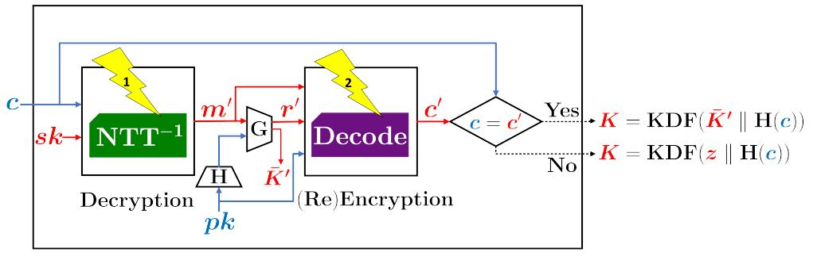

Decapsulation

<span id="page-4-1"></span>Fig. 1. Target operations ( $NTT^{-1}$  and Decode) in decapsulation (red: secret parameters; blue: public parameters).

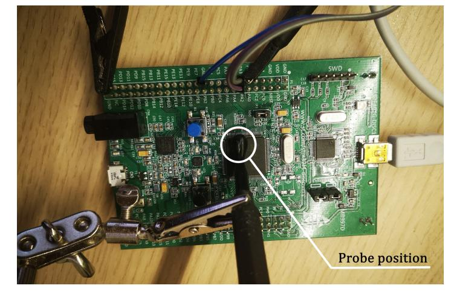

Fig. 2. Target position on victim device.

<span id="page-4-2"></span>(Fig. 2). A ZFL-1000LN+ low-noise amplifier between the probe and oscilloscope amplifies the signal by 20 dB. Our traces are originally sampled at 2.5 GHz, then digitally downsampled to 500 MHz before analysis. We used the original implementations of pqm4 [33], with the only addition being a trigger to simplify the recording of traces. In some cases, we averaged across multiple traces of the same ciphertext to reduce the impact of measurement noise, as detailed in the following.

#### <span id="page-4-0"></span>3 SPA of Kyber Reference Implementation

In this section, we analyze the "clean" reference implementation [33] of Kyber from a side-channel perspective. More precisely, recent versions of pqm4 include the PQClean library as a submodule that provides independent and portable C implementations of the supported algorithms. We show that we can mount an SPA using few traces for successful recovery of the long-term secret key. For our initial analysis, we run the Kyber512 KEM (compiled with maximal optimization -03) and set the coefficients of the first half of the secret key  $s_0$  (where  $\mathbf{s} = (s_0, s_1)$  for Kyber512) as follows:

$$s_0[i] = \begin{cases} -2, & \text{for } i = 0, 1, \dots, 49; \\ -1, & \text{for } i = 50, 51, \dots, 99; \\ 0, & \text{for } i = 100, 101, \dots, 155; \\ 1, & \text{for } i = 156, 157, \dots, 205; \\ 2, & \text{for } i = 206, 207, \dots, 255. \end{cases}$$

Fig. 3 shows traces of the final part of decryption, beginning with the final step of the inverse NTT, for two choices of  $\mathbf{u}$  and v. This initial test shows that several functions in the decryption leak the secret-key coefficients: in the middle trace in Fig. 3, one can easily visually distinguish among classes of the coefficient values ( $\{-2, -1\}$ , 0 and  $\{1, 2\}$ ). In the following, we analyze the relevant functions in detail and show how a chosen-ciphertext SPA can be constructed to exploit this leakage and recover the full secret key.

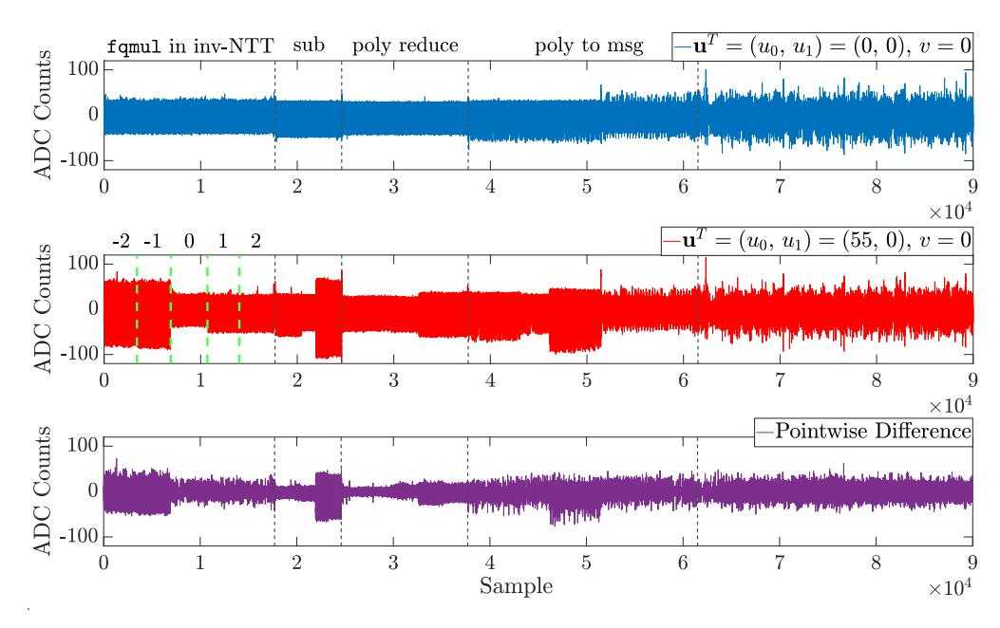

<span id="page-4-3"></span>Fig. 3. EM traces of Kyber-CPAPKE decryption on the STM32F407G. Top, blue:  $\mathbf{u}^T=(0,\,0),\,v=0$ ; middle, red:  $\mathbf{u}^T=(55,\,0),\,v=0$ ; bottom, purple: difference between top and middle trace.

#### <span id="page-4-7"></span>3.1 SPA of Modular Reduction in Inverse NTT

In this section, we focus on the output of the inverse NTT in Kyber, i.e., line 4 in Alg. 2:

<span id="page-4-6"></span>
$$NTT^{-1}\left(NTT\left(\mathbf{s}^{T}\right) \circ NTT\left(\mathbf{u}\right)\right) := \mathbf{s}^{T} \circ \mathbf{u} \bmod^{\pm} q, \quad (3)$$

where  $\mathbf{s}^T = (s_0, s_1)$  and  $\mathbf{u}^T = (u_0, u_1)$  for Kyber512. The final step of inverse NTT performs coefficient-wise modular multiplications with a constant (zetas\_inv[127] = 1441). For example, the reference implementation of Kyber performs integer multiplication followed by Montgomery reduction<sup>2</sup> ( $\text{mod}^{\pm}q$ ) using the fqmul() function as shown in Listing 1.

```
1 void PQCLEAN_KYBER512_CLEAN_invntt(int16_t poly[256]) {
2    ...
3    for (j = 0; j < 256; ++j) {
4        poly[j] = fqmul(poly[j], zetas_inv[127]);
5    }
6 }</pre>
```

Listing 1. Final step of NTT in reference C implementation

Points of Interest (PoI) We consider the part of the trace belonging to the execution of fqmul(), i.e., the first region in Fig. 3. First, we determine the PoI. Based on our profiling, we select downward peaks (cf. Fig. 4), i.e., 256 local minima, in the trace as the PoI as we observe significant variance of each peak for different secret coefficient values. As fqmul() is invoked coefficient-by-coefficient, each of such peaks corresponds to one coefficient of the secret key.

**Leakage Model** We find that the trace at  $PoI_i$  is approximately proportional to the Hamming Weight (HW) of the output of the i-th invocation of fqmul(), as shown in the following standard HW leakage model:

$$|p(\text{PoI}_i)| \approx a \times \text{HW}\left(\left(\mathbf{s}^T \cdot \mathbf{u} \text{ mod}^{\pm}q\right)[i]\right) + \mathcal{N},$$

where a is a scaling factor and  $\mathcal{N}$  is a Gaussian noise term.

**Preliminary Idea** Whilst fqmul() employs a constant-time Montgomery reduction, the EM trace allows an adversary to exploit the data dependency. However, as is evident from Fig. 3, the leakage is only visible upon certain  $\mathbf{u}$  and v. Hence, the adversary has to craft appropriate values to make the secret key "visible" to SPA. In the following, we explore in detail how such values can be constructed.

<span id="page-4-4"></span>2. https://github.com/PQClean/PQClean/blob/8db3ba/crypto\_k em/kyber512/clean/reduce.c#L17

{5}------------------------------------------------

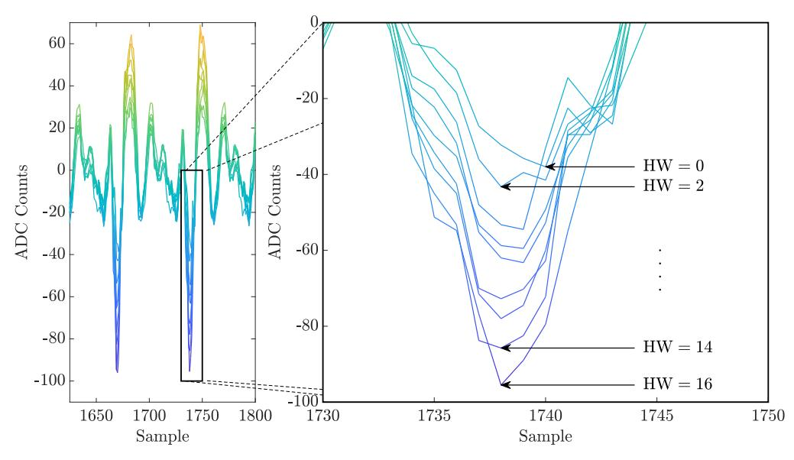

<span id="page-5-0"></span>Fig. 4. Leakage for different output HWs of fqmul() at Pol.

From Fig. 3 with  $\mathbf{u}^T = (55,0)$ , we can distinguish among the classes  $\{-2,-1\}$ , 0 and  $\{1,2\}$ . However, that does not reveal the whole key, e.g., coefficients of -2 and -1 cannot be distinguished. Our first intuition is to choose  $\mathbf{u}^T = (1,0)$ . As fqmul() computes  $\mathbf{s}^T \circ \mathbf{u} \mod^{\pm} q = (s_0 \cdot u_0 + s_1 \cdot u_1) \mod^{\pm} q$ , the output is in this case equal to  $s_0$ . This would directly reveal half of the secret key. However, this intuition of setting the polynomials of  $\mathbf{u}$  to any chosen constant is not valid in practice as the derivation of  $\mathbf{u}$  from a ciphertext follows a special structure that allows the coefficients to have values in a certain range. Hence, we need a better strategy for crafting the chosen ciphertexts.

Constructing Chosen Ciphertexts First, note that  $\mathbf{u}$  and v are never exchanged directly; during encryption they are compressed and then encoded (Alg. 1) as ciphertext c. During decryption (Alg. 2),  $\mathbf{u}$  and v are computed by decompressing the received ciphertext. Since the compression causes data loss, the decompression of ciphertext produces approximations of  $\mathbf{u}$  and v only. In detail, the coefficient-wise compression and decompression functions in Kyber work as follows (we denote the compressed  $\mathbf{u}$  as  $\mathbf{u}_c$ ):

$$\mathbf{u}_{c} = \operatorname{Compress}_{q}(\mathbf{u}, d_{u}) = \left[\frac{2^{d_{u}}}{q}\mathbf{u}\right] \operatorname{mod}^{+} 2^{d_{u}},$$

$$\mathbf{u}' = \operatorname{Decompress}_{q}(\mathbf{u}_{c}, d_{u}) = \left[\frac{q}{2^{d_{u}}}\mathbf{u}_{c}\right].$$

Due to data loss, the u from encryption (Alg. 1) might produce a different  $\mathbf{u}'$  in decryption (Alg. 2). Furthermore, one can see that the coefficients of the decompressed polynomials in  $\mathbf{u}'$  cannot have a value 1. Only for a subset  $U = \{ \lceil (3329/2^{10}) \cdot i \mid : i = 0, 1, ..., 1023 \}$  of  $\mathbb{Z}_q$ , we can have a bijection between  $\mathbf{u}$  and  $\mathbf{u}'$ . Similarly, for v, bijection works in the subset  $V = \{ [(3329/2^3) \cdot i] : i = 0, 1, ..., 7 \}.$ Set U (or V) is the fixed points set under the map f(z) =Decompress (Compress (z)), where z is an integer from 0 to 3328. It is also the set of all possible coefficient values for **u** (or *v*) in Alg. 2. Selecting the numbers in this set allows us to ignore the effects of compression and decompression, which simplifies the analysis: the  $\mathbf{u}$  and v chosen by the adversary in Alg. 1 is exactly the ones to be called by Decryption in Alg. 4. Hence, for all following attacks (schemes in Section 3 and Section 4), we create the coefficients of malicious ciphertexts from U and V only.

Selecting Appropriate Chosen Ciphertexts After ensuring that the chosen  ${\bf u}$  and v properly "propagate" through compression and decompression, we need to select special

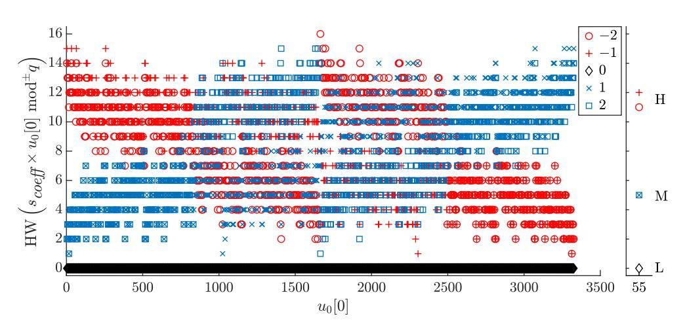

<span id="page-5-1"></span>Fig. 5. HWs for all possible choices of  $u_0[0] \in U$  and  $s_{\textit{coeff}}$  either  $\{-2, -1\}$  (red), 0 (black), or  $\{1, 2\}$  (blue). Case for  $u_0[0] = 55$ .

values for  $u_0$  and  $u_1$  with coefficients from U to distinguish different coefficients in the secret key. In the following we discuss recovering the first secret-key polynomial  $s_0$  only as the recovery of  $s_1$  will be a straightforward repetition of the attack steps. We set  $u_1$  to 0 to remove the influence of  $s_1$  on the output of fqmul(). In addition, we only keep the constant term of  $u_0$  so that the output value is only determined by the corresponding key coefficient value.

Let us denote the constant coefficient of  $u_0$  by  $u_0|0|$ . We first observe that for some choices, e.g.,  $u_0|0| = 2324$ , we obtain a different HW for each value of a secret coefficient:  $HW(-2 \cdot u_0|0|) = 11$ ,  $HW(-1 \cdot u_0|0|) = 8$ ,  $HW(1 \cdot u_0[0]) = 9, HW(2 \cdot u_0[0]) = 6, HW(0) = 0.$ However, in practice, we analyze noisy leakage and aim for mounting an SPA with few traces. Therefore, it is hard to distinguish similar HWs. We experimentally found that for the value  $u_0[0] = 2324$ , we could only distinguish between zero and nonzero secret values. Hence, instead we opted for selecting a few chosen  $u_0[0]$  to build a partition under an adaptive strategy for recovery of the full secret key step by step. To find the optimal constants, we first computed HW  $(s_{coeff} \cdot u_0[0] \mod^{\pm} q)$  for all possible secret coefficient values  $s_{coeff} \in S = \{-2, -1, 0, 1, 2\}$  and for all possible  $|u_0|0| \in U$ . Fig. 5 shows the relation between  $|u_0|0|$  and HW  $(s_{coeff} \cdot u_0[0] \mod^{\pm} q)$  under different  $s_{coeff}$  values. In this figure, red points denote -2 or -1, blue ones 1 or 2, and black ones 0. It can be seen that there are several candidates for  $u_0[0]$  that can distinguish different coefficients classes. For small or large  $u_0[0]$ , one can divide the HWs into two classes: "High" and "Low". As  $u_0[0]$  grows, we see that there are cases that can divide the HWs into three classes: "High", "Medium" and "Low".

Expanding the definition of "partition" in [31], [32] (i.e., a set of pairwise disjoint subsets of a set S whose union is S), we define "partition with tags": a partition of a set S with corresponding HW feature tags. We use tag H for "High", L for "Low", and M for "Medium" in the following. For example, from Fig. 3 we know that  $\mathbf{u}^T = (55, 0)$  infers a partition with tags:  $\{H: \{-2, -1\}, M: \{1, 2\}, L: \{0\}\}$ . Note that the HWs are computed without considering noise. So, in order to promote the separability of the classes in the actual measurement with noise, we experimentally set the following requirements:

1) For partitions with two tags (i.e., two classes): *a*) the maximum difference between HWs within a class is  $\leq dw_2 = 3$ ; *b*) the HW difference between two classes (i.e., the minimum difference between HWs from dif-

{6}------------------------------------------------

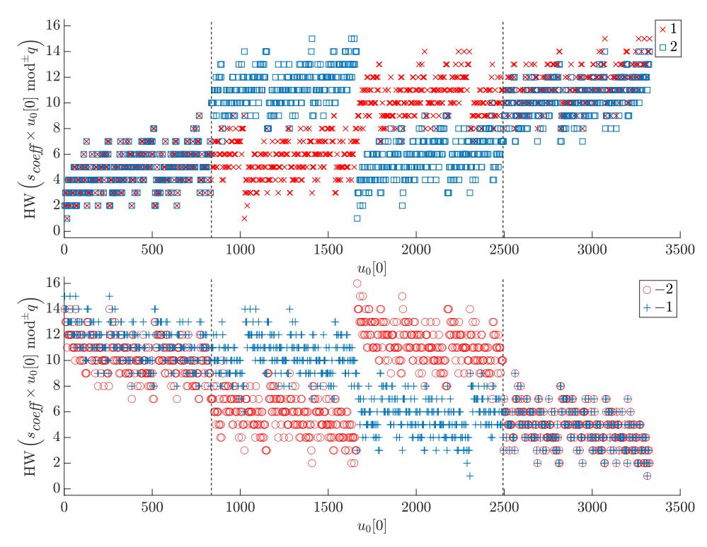

Fig. 6. HW difference for 1/2 and −2/−1.

<span id="page-6-0"></span>ferent classes) is ≥ db<sup>2</sup> = 6.

- 2) For partitions with three tags (i.e., three classes): *a)* the maximum difference between HWs within a class is ≤ dw<sup>3</sup> = 3; *b)* the HW difference between two classes is ≥ db<sup>3</sup> = 4.
- 3) In addition, we should keep the HW difference within one class as small as possible and let the HW difference among classes as big as possible to distinguish them. We can set smaller dw<sup>2</sup> and dw3, bigger db<sup>2</sup> and db<sup>3</sup> to select better partitions and corresponding ciphertexts.

With the knowledge from Fig. [5](#page-5-1) and the above requirements, we first go over all small or large u0[0] (i.e., u0[0] ∈ [0, 836) ∪ (2493, 3329)) and find partitions with two tags including the following ones: {H : {−2, −1}, L : {0, 1, 2}} with u0[0] = 3 and {H : {2, 1}, L : {0, −1, −2}} with u0[0] = 3326. Possible partitions with three tags include {H : {−2, −1}, M : {1, 2}, L : {0}} with u0[0] = 55 (the case shown in Fig. [5\)](#page-5-1) and {H : {1, 2}, M : {−1, −2}, L : {0}} with u0[0] = 3274. Using either of those, we can already distinguish among {−2, −1}, 0 and {1, 2}. It remains to be found partitions to distinguish 1 from 2 and −2 from −1.

We separately study those cases as shown in Fig. [6.](#page-6-0) When u0[0] ∈/ [836, 2493], |HW (2 · u) − HW (1 · u)| ≤ 1 and |HW (−2 · u0[0]) − HW (−1 · u0[0])| ≤ 1. This difference changes when u0[0] ∈ [836, 2493]. It is possible to find partitions to distinguish 1 from 2 and −2 from −1 in this region, more precisely: {H : {2, −1}, M : {1, −2}, L : {0}} with u0[0] = 1070 (HWs 5, 11, 0, 5, 12) and {H : {−2, 1}, M : {−1, 2}, L : {0}} with u0[0] = 2259 (HWs 12, 5, 0, 11, 5).

It is worth noting that the task of finding partitions with tags under requirements is similar to constrained clustering used in [\[34\]](#page-13-8). But we process the task in an ideal HW model, not in an actual side-channel dataset. A constrained clustering (e.g., constrained K-means [\[35\]](#page-13-9)) on the HW dataset shown in Fig. [5](#page-5-1) is also an alternate way to select appropriate ciphertexts. Specifically, the 5 HW values related to some u0[0] are clustered into two or three clusters according to the requirements. Refer to Appendix [B](#page-14-0) for details.

**Attack Methodology** Based on the above partitions with tags, an SPA can be constructed that recovers the secret key with few traces under an adaptive strategy and without requiring sensitive and detailed profiling as e.g., necessary

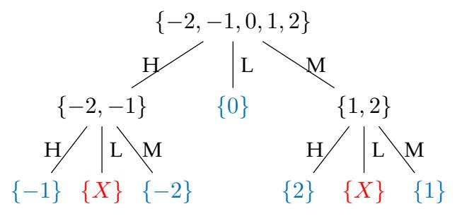

<span id="page-6-1"></span>Fig. 7. Attack decision tree generated by two partitions with tags.

for template attacks. We show the adaptive strategy in Fig. [7.](#page-6-1) The root node is the set of all possible values of a secret-key coefficient. The nodes in the second level are subsets classified by partition with tags {H : {−2, −1}, M : {1, 2}, L : {0}}. The nodes in the third level are subsets classified by partition with tags {H : {−1, 2}, M : {1, −2}, L : {0}}. The leaf nodes in blue are valid values, the ones in red are invalid values (X = 100 in our test).

Concretely, the attack is carried out as described by the Alg. [5,](#page-6-2) using four traces in total. The details of Step 1 have been described above. Step 2 is carried out in our experimental setup, each query (sending a chosen ciphertext to the target device) corresponds to one trace, each trace contains the side-channel leakage of 256 coefficients of s<sup>0</sup> (or s1). The task of analyzing the traces in Step 3 is a typical clustering problem. The difference is that we have a prior knowledge of the expected number of clusters. A general clustering algorithm, such as K-means clustering, can be used. According to the values of three clusters' centroids, we can match each cluster with the correct tag.

**Practical Results** We applied our chosen-ciphertext SPA to the reference implementation of Kyber512 on the STM32F407 (cf. Section [2.5](#page-3-12) for details of our setup). We used const<sup>1</sup> = 55 and const<sup>2</sup> = 1070 for the two required partitions with tags. Fig. [8](#page-7-1) shows the single EM trace for u0[0] = 55 with the PoI classified into the three classes H (−1 or −2), M (1 or 2) and L (0). Similarly, Fig. [9](#page-7-2) depicts

#### <span id="page-6-2"></span>**Algorithm 5** SPA on reference implementation of Kyber512

**Input:** Set U, HW dataset, 4 related EM traces (p1, p2, p3, p4) /\***Step 1 (offline)**: Choosing appropriate ciphertexts to distinguish different values of the secret-key coefficients\*/

- 1: Choose a const<sup>1</sup> ∈ U for a partition to distinguish {−2, −1}, {1, 2} and {0};
- 2: Choose a const<sup>2</sup> ∈ U for a partition to differentiate 1/2 and −2/−1;
- 3: Set u <sup>T</sup> = (const1, 0),(const2, 0),(0, const1),(0, const2);
- 4: Generate responding ciphertexts: c1,0, c2,0, c0,1, c0,2; /\***Step 2 (online)**: Recording the corresponding EM traces for fqmul() on target device\*/
- 5: Send 4 chosen ciphertexts and collect responding traces: p1, p2, p3, p4;
  - /\***Step 3 (offline)**: Analyzing traces combined with the knowledge of partitions, and recovering the secret key\*/
- 6: For each trace, select local minima as PoI;
- 7: Classify PoI into 3 classes (H, M, L) according to |p (PoIi)| (using clustering);
- 8: Recover each coefficient of s<sup>0</sup> (or s1) according to the decision tree and actual partitions in p1, p<sup>2</sup> (or p3, p4).
- 9: **return** secret key s <sup>T</sup> = (s0, s1)

{7}------------------------------------------------

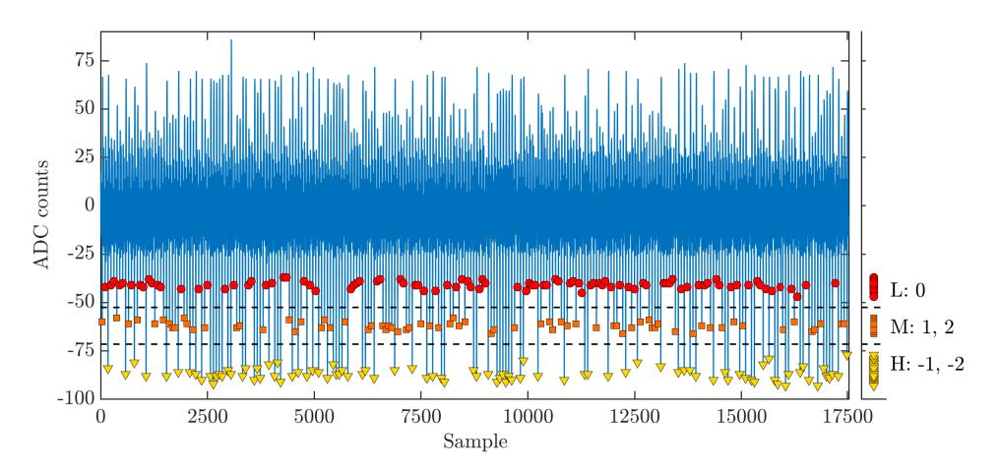

<span id="page-7-1"></span>Fig. 8. EM trace with classification into three classes for u0[0] = 55.

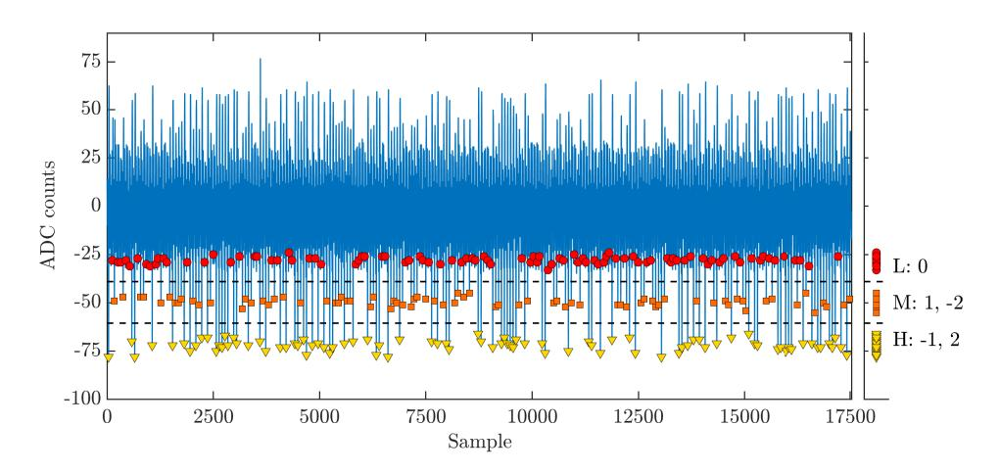

<span id="page-7-2"></span>Fig. 9. EM trace with classification into three classes for u0[0] = 1070.

the single EM trace for u0[0] = 1070 ({H : {−1, 2}, M : {1, −2}, L : {0}}). The values indicated by the black dashed lines are calculated by averaging the closest members' |p (PoIi)| of the two adjacent classes.

To show the separation between classes, we project the amplitude of the PoI on the right. In Fig. [8](#page-7-1) and Fig. [9,](#page-7-2) the classes are clearly distinguishable, however, we observed other traces with some overlap between the classes. Therefore, in these cases, we used averaging of multiple traces for the same ciphertext. Note that in the ideal case (i.e., with a single trace without averaging), the full attack requires 4 traces in total (for u0[0] = 55 and 1070 and for u1[0] = 55 and 1070).

We executed our attack for 16 randomly chosen secret keys. Using four traces, we recovered the full key (i.e., all 512 coefficients) in 12 cases, while in three cases 511 of 512 coefficients (i.e., 99.8%) were correctly found. In one case, only 510 of 512 coefficients (i.e., 99.6%) were successfully recovered. However, we can identify which coefficients are likely to be incorrect based on the outliers (the PoI which are close to threshold but far from others in the same class) and find the right values through an exhaustive search over the 5 or 5 <sup>2</sup> possible values. For the four cases without complete success, we use the averaging technique to reduce the noise effect. When the number of traces used for averaging is greater than or equal to 4, the secret key can be completely recovered in the worst case. To summarize, the SPA succeeds with four traces in total. In contrast to prior work, due to the careful choice of **u**, we do not require templates, thus avoiding the associated problem of portability between individual devices [\[24\]](#page-12-23).

#### **3.2 Targeting other Functions after the Inverse NTT**

As initially shown in Fig. [3,](#page-4-3) subsequent operations after fqmul() also exhibit strong leakage that can be "amplified" using chosen ciphertext. While we do not analyze those functions in detail, we note that they can similarly be targeted for key recovery. For example, in the subtraction following the NTT, we have the following leakage model:

$$|p(PoI_i)| \propto HW\left(\left(v - \mathbf{s}^T \circ \mathbf{u} \mod^{\pm} q\right)[i]\right).$$

Evidently, in contrast to the attack on fqmul(), the other part of the ciphertext (v) also influences the leakage. Hence, an appropriate value for v can be set as:

$$v = \sum_{n=0}^{255} \operatorname{const} \cdot x^n, \, \operatorname{const} \in V.$$

As there are eight possible values for a coefficient of v that maintains the bijection during compression and decompression, we have a larger space of possible chosen ciphertext. Note that as 0 ≤ HW (v) ≤ 6, a zero coefficient of the secret key s no longer automatically falls in the "Low" class. The larger set of possible chosen ciphertext means that there are more possible partitions with tags, which will possibly further facilitate key recovery.

#### <span id="page-7-0"></span>**4 SPA OF ARM-SPECIFIC IMPLEMENTATION**

In the previous section, we showed that a generic, "clean" reference implementation of Kyber is vulnerable to SPA. In this section, we extend our analysis to the pqm4 implementations specifically optimized for ARM Cortex-M4 µCs. In this optimized version, some functions are manually written in assembly to obtain a memory-efficient, highspeed implementation [\[36\]](#page-13-10). As word-parallel additions and subtractions are used and the inverse NTT is re-organized, the attack from Section [3](#page-4-0) no longer applies in a straightforward way. We make use of a recent idea to focus on the sidechannel leakage of the message m in lattice-based PKE and KEM schemes [\[21\]](#page-12-20), [\[23\]](#page-12-22). However, while these two earlier works only considered leaking the message to obtain the ephemeral shared secret, we show that message recovery also allows an adversary to recover the *long-term* secret key by carefully choosing the ciphertext components u and v. To this end, we first focus on the encoding/decoding functions that deal with the messages and discuss their susceptibility to SCA. We then present our side-channel based message recovery for two different compiler optimization levels (-O0 and -O3), and finally show how the long-term secret key can be recovered from the messages.

#### **4.1 Encoding and Decoding in Decapsulation**

We found that there are two operations that are performed coefficient-wise in the ARM-specific implementation, i.e., the encoding and decoding functions[3](#page-7-3) named poly\_tomsg() and poly\_frommsg()[4](#page-7-4) used in decapsulation. Alg. [6](#page-8-0) and Alg. [7](#page-8-1) show the pseudocode for encoding and decoding respectively. The encoding includes Compress(), which compresses a value from Z<sup>q</sup> into Z<sup>2</sup>

- <span id="page-7-3"></span>3. We retain the original definitions in [\[28\]](#page-13-2), i.e., decoding is a function which deserializes a message array into a polynomial, encoding is the inverse function of decoding.
- <span id="page-7-4"></span>4. [https://github.com/mupq/pqm4/blob/84c5f91/crypto\\_kem/k](https://github.com/mupq/pqm4/blob/84c5f91/crypto_kem/kyber768/m4/poly.c#L518) [yber768/m4/poly.c#L518](https://github.com/mupq/pqm4/blob/84c5f91/crypto_kem/kyber768/m4/poly.c#L518)

{8}------------------------------------------------

#### <span id="page-8-0"></span>Algorithm 6 Encoding: poly\_tomsg()

```
Input: Input polynomial in coeffs [256]

1: for i = 0 ... 31 do

2: msg[i] = 0;

3: for j = 0 ... 7 do

4: t = (((coeffs[8 \cdot i + j] \ll 1) + q/2) / q) \& 1;

5: msg[i] | = t \ll j;

6: end for

7: end for

8: return msg
```

#### <span id="page-8-1"></span>Algorithm 7 Decoding: poly\_frommsg()

```
Input: Input message in msg [32]

1: for i = 0 ... 31 do

2: for j = 0 ... 7 do

3: mask = -((\text{msg}[i] \gg j) \& 1);

4: coeffs [8 \cdot i + j] = \text{mask} \& ((q + 1) / 2);

5: end for

6: end for

7: return coeffs []
```

(line 4 in Alg. 6) and packs 8 bits into one byte in bitreversed order. Note that in Kyber KEM, the output of poly\_tomsg() in the decryption step (Alg. 2) is the input of decoding in the re-encryption step (Alg. 1).

Conversely, the decoding function (Alg. 7) consists of the unpacking of bytes to bits and subsequent decompression, mapping each bit to 0 or (q + 1)/2 (line 4).

**Leakage of Encoding and Decoding Functions** From Alg. 6, we see that t=1 if  $(q-1)/4 < \text{coeff} [8 \cdot i + j] < (3q+1)/4$ , and otherwise, t=0. The authors of [23] use a t-test to detect the respective difference in the trace, and then use a template attack to recover m. For Alg. 7, it is clear that the mask and the output coefficients are different depending on the respective message bit (mask = 0xffff and coeffs  $[8 \cdot i + j] = (q+1)/2$  if message bit i is one). The authors of [21] targeted a similar function in NewHope, and found that this difference can be observed with one EM trace in a reference implementation without optimization (-00).

In the Kyber KEM, one can choose which function (encode or decode) to target for message recovery. This is because decapsulation invokes decryption (which finally encodes the message), directly followed by encryption, which decodes the same message, cf. Alg. 4. We found in our experiments that the leakage of the decoding function (Alg. 7) was more suitable for SPA, as the mask takes values with strongly differing HW. Thus, in the following we show how this leakage can be used to recover the message and subsequently the secret key.

#### 4.2 Chosen-Ciphertext SPA of Decoding Function

Inspired by the method of choosing ciphertext presented in [14], we found that the message-recovery attacks go beyond recovery of the shared key—they can also be used for recovering the secret key under a CCA. Our strategy is:

1) Choose ciphertexts to reveal a "strong relationship" between the secret key and the message (i.e., the relation between five different coefficient choices and the respective message values).

- 2) Recover the message from the side-channel leakage during KEM decapsulation.
- 3) Use the "strong relationship" to recover the secret key based on few recovered messages.

The authors of [14] use a similar strategy, but focus on the error correcting codes or FO transformation and recover the secret polynomial one coefficient at a time via the distinguishability of one message bit. Their method requires 7,680 traces. We propose a more efficient method that requires only eight traces to recover the full secret key in Kyber512 KEM for the pqm4 ARM-specific implementation at -00. Further, we show that with only moderate increase in the number of traces, this approach can also be applied to the implementation compiled at -03.

<span id="page-8-3"></span>The reduced traces requirement of our approach stems from the fact that we focus on the leakage of simple, low-level arithmetic to recover all message bits. We then use specifically crafted ciphertexts to recover the long-term secret key from that. In contrast, [14] targets the leakage of a non-linear hash or error-correcting code, resulting in the leakage being influenced by multiple coefficients and thus making it harder to distinguish with a small number of traces.

#### <span id="page-8-4"></span>4.2.1 Constructing Chosen Ciphertexts

Unlike the ciphertext construction method in Section 3, here we choose special  $\mathbf{u}$  and v so that each message bit acts as a binary classifier that can distinguish the five possible values for the respective coefficient of the secret key  $\mathbf{s}$ . The authors of [14] used an iterative randomized search algorithm to find ciphertexts meeting their criteria. Here, we refine this principle in order to determine the range.

Recalling that even if we recover the message m based on the decoding function, we still know the values used in the preceding encoding, because the latter produces the message m. From Alg. 6 we know that

$$t_{8i+j} = \begin{cases} 1, & \text{if } (q-1)/4 < \text{coeffs} [8 \cdot i + j] < (3q+1)/4; \\ 0, & \text{otherwise.} \end{cases}$$

where  $t_{8i+j}$  is the (8i+j)-th bit of m. Also, note that coeffs [] is the output of:

coeffs = 
$$v - NTT^{-1} \left( \hat{\mathbf{s}}^T \circ NTT \left( \mathbf{u} \right) \right)$$
  
=  $v - \left( s_0 \cdot u_0 + s_1 \cdot u_1 \right)$   
=  $v - s_0 \cdot u_0 \text{ (let } u_1 = 0 \text{)}.$ 

From this and because we control  $u_0$  and v, we know that the value of  $t_{8i+j}$  (i.e., one bit of the message) entirely depends on the value of one single coefficient of the secret key. Note that as explained in Section 3, we choose possible values of  $u_0$  and v from the respective sets of fixed points.

For example, if we choose  $\mathbf{u}^T = (211,0)$  and  $v = \sum_{n=0}^{255} 416 \cdot x^n$ , then  $t_{8i+j} = 1$  iff  $s_0 [8i+j] = -2$  (because all other possible values for the secret coefficient lead to coeffs  $[8 \cdot i + j]$  being outside the interval [833, 2496]).

Similarly, we can find  $u_0$ , v such that  $t_{8i+j}=1$  iff  $s_0\left[8i+j\right]=-2$  or -1,  $s_0\left[8i+j\right]=0$ , and  $s_0\left[8i+j\right]=2$  or 1. Going through all possible values of  $u_0$  and v, we find that there are 29 different m-distributions on the 5 possible coefficient values. We regard each distribution (except the

{9}------------------------------------------------

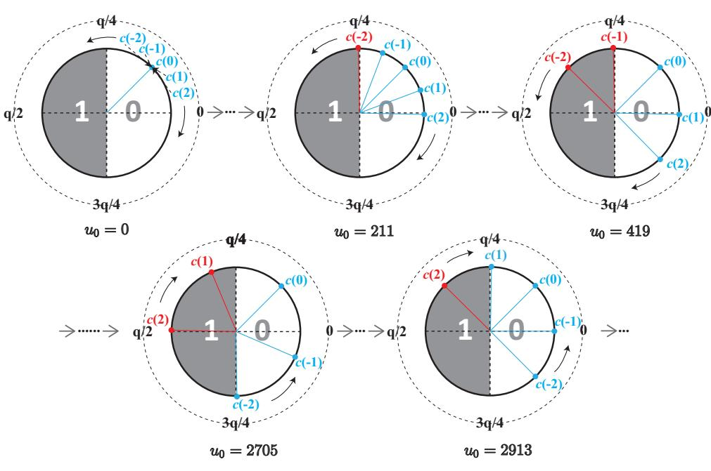

<span id="page-9-0"></span>Fig. 10. Some examples of changes of m-distribution over the variation of  $u_0$  with a fixed  $v = \sum_{n=0}^{255} 416 \cdot x^n$  (c: abbreviation for coeff).

cases where the m value is always zero or always one for all possible coefficient values) as a binary classifier which can divide the 5 possible coefficient values into two categories based on one bit value of m. Fig. 10 illustrates this for fixed  $v = \sum_{n=0}^{255} 416 \cdot x^n$  and different values of  $u_0$ .

Table 1 gives partial result of classifiers for a fixed  $v = \sum_{n=0}^{255} 416 \cdot x^n$  and  $u_0$  being a constant within the indicated intervals (only using values in U). We can utilize this in a One-versus-the-Rest (OvR) classifier, a basic method from multi-class classification [37]. Even though there are not many OvR classifiers in our case, we can build equivalent classifiers. For example, when  $u_0 \in [211, 416]$ , the distribution is a OvR classifier. If we combine this with [419, 624], we have an equivalent OvR classifier for (0, 1, 0, 0, 0). Similarly, we can construct (0, 0, 0, 0, 1) and (0, 0, 0, 1, 0). With these adaptively chosen 4 different distributions (the final four cases in Fig. 10, i.e.,  $u_0 = 211, 419, 2705, 2913$ ), we can recover all the five different coefficients.

Note that other combinations of the 27 non-trivial distributions can also achieve the goal of distinguishing five possible values of coefficients. For brevity, in the following we only use the above four ciphertexts as chosen-ciphertexts without losing universality.

If we can recover the message (in other words: distinguish t=1 from t=0), we can thus recover half of the secret key  $(s_0)$  with only 4 different chosen ciphertexts. More precisely, let  $\mathbf{m}^{u_0}$  denote the vector of recovered message bits for a given ciphertext  $u_0$  (and  $v=\sum_{n=0}^{255} 416 \cdot x^n$ ). Then we have the following relation between i-th bit  $\mathbf{m}_i^{u_0}$  and the i-th coefficient  $s_0[i]$  of the secret polynomial  $s_0$ :

$$\begin{cases} \mathbf{m}_{i}^{211} = 1, & \text{iff } s_{0}[i] = -2; \\ \mathbf{m}_{i}^{419} - \mathbf{m}_{i}^{211} = 1, & \text{iff } s_{0}[i] = -1; \\ \mathbf{m}_{i}^{2705} - \mathbf{m}_{i}^{2913} = 1, & \text{iff } s_{0}[i] = 1; \\ \mathbf{m}_{i}^{2913} = 1, & \text{iff } s_{0}[i] = 2; \\ \text{else}, & \text{iff } s_{0}[i] = 0. \end{cases}$$

Hence, we get the coefficient vector  $s_0$  of the polynomial  $s_0$ :

$$\mathbf{s_0} = (-2) \cdot \mathbf{m}^{211} + (-1) \cdot (\mathbf{m}^{419} - \mathbf{m}^{211}) + 1 \cdot (\mathbf{m}^{2705} - \mathbf{m}^{2913}) + 2 \cdot \mathbf{m}^{2913}.$$

The second half  $s_1$  can be recovered with four more traces, using the same values but for  $u_1$ , setting  $u_0 = 0$ .

<span id="page-9-1"></span>TABLE 1 m-distributions for different intervals of  $u_0$  [0] with  $v = \sum_{n=0}^{255} 416 \cdot x^n$ 

| $t$ coeff. of s $u_0$ | -2 | -1 | 0 | 1 | 2 |
|-----------------------|----|----|---|---|---|
| [0, 208]              | 0  | 0  | 0 | 0 | 0 |
| [211, 416]            | 1  | 0  | 0 | 0 | 0 |
| [419, 624]            | 1  | 1  | 0 | 0 | 0 |
| •••                   |    |    |   |   |   |
| [2705, 2910]          | 0  | 0  | 0 | 1 | 1 |
| [2913, 3118]          | 0  | 0  | 0 | 0 | 1 |
|                       |    |    |   |   |   |

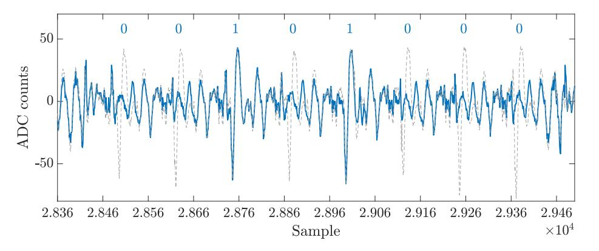

<span id="page-9-2"></span>Fig. 11. Example trace at -00 (blue) showing the differences between message bit = 0 and 1. Reference trace  $r_1$  (with all bits set 1) in gray.

Next, we practically demonstrate how the message can be recovered for different optimization levels (-00 and -03).

#### <span id="page-9-3"></span>4.2.2 Message Recovery for -00

From Alg. 7, it is clear that the value of mask and the output polynomial coefficients differ depending on the respective message bit (mask = 0xffff and  $r [8 \cdot i + j] = (q+1)/2$  iff  $((\text{msg}[i] \gg j) \& 1) = 1$ ). As evident in Fig. 11, the difference between a message bit being 0 or 1 is visible in the respective trace when poly\_frommsg() is compiled at -00.

Our algorithm for automated message recovery can be described in two steps: First, we determine the locations of PoI using local extreme value search based on the reference trace  $r_1$  where all message bits are 1, as shown in Alg. 8. This step also computes a threshold T to distinguish message bit values. To enhance separability, we utilize the differences between local maxima and minima to calculate the threshold rather than using only the local extrema. In the actual attack phase, given a target trace p(t), Alg. 9 reconstructs the message by comparing the difference at the previously determined PoI to the threshold T.

We found that our message recovery process can correctly recover 100% of the message bits from a single trace. Using the methods from Section 4.2.1, we can hence recover the full secret key with eight traces in total.

Note that our algorithm requires a one-time profiling step (Alg. 8) , typically carried out using a profiling device. As the PoI are points in time, they are unlikely to differ between different profiling and target device. On the other hand, the threshold T is an amplitude quantity and hence might vary depending on device, measurement setup and so on. However, Alg. 9 can be easily modified to compute the threshold in real-time using only the target trace. This can be achieved by clustering the observed  $\delta$  at the PoI into two groups, and finding the best threshold to distinguish these clusters (similar to the approach in Section 3).

Alternatively, the profiling can also be carried out with the actual target device, avoiding any potential issues due

{10}------------------------------------------------

#### <span id="page-10-0"></span>**Algorithm 8** Pol detection and threshold (-00)

**Input:** Reference trace where all message bits are 0:  $r_0(t)$ , reference trace where all message bits are 1:  $r_1(t)$ 

1: Find PoI: Perform local extrema search on  $r_1$  to find 256 local maxima and minima:

```
2: PoI_{max} = \{PoI_{max}(0), \dots, PoI_{max}(255)\}
3: PoI_{min} = \{PoI_{min}(0), ..., PoI_{min}(255)\}
```

4: Find average difference between maxima and minima:

```
5: for i = 0 \dots 255 do
        a_0(i) = r_0(PoI_{max}(i)) - r_0(PoI_{min}(i))
 6:
        a_1(i) = r_1(PoI_{max}(i)) - r_1(PoI_{min}(i))
 7:
 8: end for
 9: Compute threshold:
T = 0.5 \cdot \left(\sum_{i=0}^{255} a_0(i)/256 + \sum_{i=0}^{255} a_1(i)/256\right)
10: return PoI_{min}, PoI_{max}, T
```

#### <span id="page-10-1"></span>**Algorithm 9** Message recovery (compiled at -00)

```
Input: PoI_{min}, PoI_{max}, T, trace to be analyzed p(t)
 1: msg = (0, 0, ..., 0)
 2: for i = 0 \dots 255 do
        \delta\left(i\right) = p\left(PoI_{max}(i)\right) - p\left(PoI_{min}(i)\right)
 3:
        if \delta(i) > T then
 4:
          msg |i| \leftarrow 1
 5:
 6:
        else
           msg |i| \leftarrow 0
 7:
        end if
 8:
 9: end for
10: return msg
```

to portability of the PoI and T. For this, the adversary crafts special ciphertexts as inputs to poly\_frommsg() in the initial decoding step (lines 1-2 in Alg. 2) within the decryption in decapsulation. For instance, setting  $v = \sum_{n=0}^{255} 1665 \cdot x^n$ and  $u_0 = u_1 = 0$  leads to an all-one message in this step (details in Table 8 in Appendix D). Hence, our algorithm is robust towards portability issues that typically affect template attacks, which heavily rely on precise amplitude profiling.

#### <span id="page-10-6"></span>**4.2.3** Message Recovery for -03

When compiled at -03, the leakage of the coefficientwise processing of the message is less pronounced compared to -00. To be able to employ a similar approach as in Section 4.2.2, we rely on averaging of N traces for the same chosen ciphertext. Again, we use an initial profiling step to determine PoI and threshold. As explained in Section 4.2.2,

#### <span id="page-10-2"></span>Algorithm 10 PoI detection and threshold (-03)

**Input:** Reference traces where all message bits are 0:  $r_{0,i}(t)$ , reference traces where all message bits are 1:  $r_{1,i}(t)$ 

1: 
$$\overline{r}_0(t) = \left(\sum_{i=1}^R r_{0,i}(t)\right) / R, \overline{r}_1(t) = \left(\sum_{i=1}^R r_{1,i}(t)\right) / R$$

- 2:  $\Delta_r(t) = \overline{r}_1(t) \overline{r}_0(t)$
- 3: Find PoI: Perform downward peak detection on  $\Delta_r(t)$ to find 256 local minima:
- 4:  $PoI_{min} = \{PoI_{min}(0), \dots, PoI_{min}(255)\}$ 5: Threshold:  $T = 0.5 \cdot \left(\sum_{j=0}^{255} \Delta_r \left(PoI_{min}(j)\right)\right) / 256$ 6: **return**  $PoI_{min}$ , T

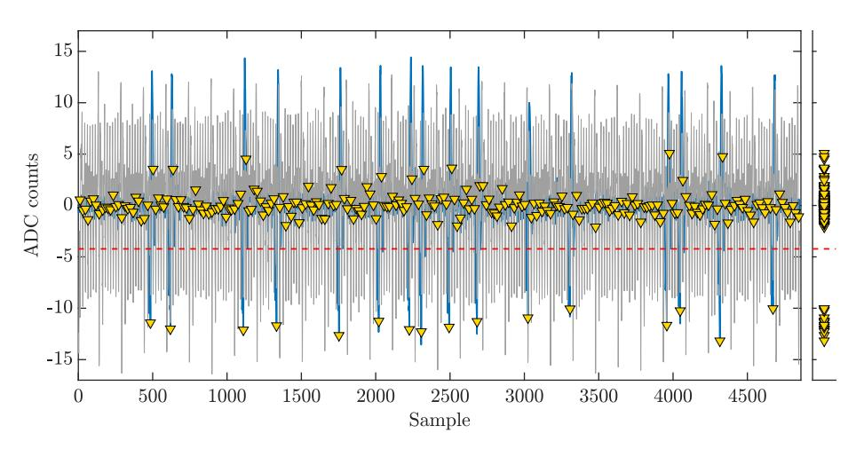

<span id="page-10-4"></span>Fig. 12. Average difference trace  $\delta$  (blue) showing the differences between 0 and 1 bits. Difference-of-means reference trace  $\Delta_r$  in gray.

this can be done using a dedicated profiling device or on the target device through appropriately chosen ciphertext. In contrast to -00, we use mean reference traces averaged over R=400 traces with all-zero/all-one message each. Precisely, the profiling is shown in Alg. 10.

The actual message recovery continues in a similar way to Alg. 9, however, it operates on an average over N traces  $p_i(t)$  as follows. We first compute the average trace as:  $\overline{p}(t) = \left(\sum_{i=1}^{N} p_i(t)\right)/N$ . Then, rather than focusing on the difference between minimum and maximum (cf. line 3 in Alg. 9), we compute the  $\delta(i)$  at each PoI as the difference between  $\overline{p}(t)$  and the average reference trace for the "allzero" case  $\overline{r}_0(t)$ , i.e.,  $\delta(i) = \overline{p}(PoI(i)) - \overline{r}_0(PoI(i))$ . Because T is negative, a 1 is recovered if  $\delta(i) < T$ , and a 0 otherwise. Fig. 12 shows an example with two average difference traces. The success rate (i.e., the percentage of correctly recovered secret coefficients) of our method over the total number of traces, i.e.,  $8 \cdot N$ , is shown in Fig. 13. In all cases, the reference traces were computed for R=400, and the experiment was carried out for 16 randomly chosen secret keys. As evident in Fig. 13, the success rate stabilizes at 100% after approximately 960 traces in total (i.e., 120 traces per ciphertext). Furthermore, there is also a trade-off with partial exhaustive search, e.g., the success rate reaches 98% (i.e., recovering 502 of 512 coefficients) after 184 traces (i.e., 23 traces per ciphertext). This translates to a remaining brute-force effort of  $5^{10}$ . Compared to the previous research of [14], which requires 7,680 traces for full key recovery for Kyber512, our method succeeds with substantially fewer traces. In contrast to [21], our approach avoids using a lot of reference traces (256k traces used in [21]) in the message recovery phase and has a better success rate (cf. Table 3).

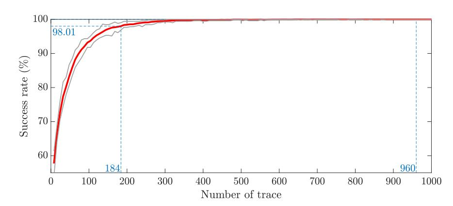

<span id="page-10-5"></span>Fig. 13. Average (red) and min/max (gray) percentage of correctly recovered secret-key coefficients (success rate) vs. total number of traces. Average computed over 16 random secret keys. Success rate reaches 98% after 184 traces and stable at 100% after 960 traces.

{11}------------------------------------------------

TABLE 2
Comparison with previous SCA-assisted secret-key recovery schemes on Kyber512

<span id="page-11-2"></span>

| Scheme               | Target operation            | Implementation setting*     | Type of SCA   | Attack cost <sup>†</sup> |           | Success rate          |  |
|----------------------|-----------------------------|-----------------------------|---------------|--------------------------|-----------|-----------------------|--|
|                      | 0 1                         | 8                           | 71            | profiling                | attacking |                       |  |
| Our scheme in Sec. 3 | Output of NTT <sup>-1</sup> | Reference (-03); 168 MHz    | SPA           | 0                        | 4/16      | $\approx 100\%/100\%$ |  |
| Our scheme in Sec. 4 | Decode in Decryption        | ARM-specific (-00); 168 MHz | SPA+reference | 2 <sup>‡</sup>           | 8         | 100%                  |  |
| Our scheme in Sec. 4 | Decode in Decryption        | ARM-specific (-03); 168 MHz | SPA+reference | 800 <sup>‡</sup>         | 184/960   | 98%/100%              |  |
| Scheme in [14]       | Hash function in FO         | ARM-specific (-03); 24 MHz  | SPA           | 100                      | 2560/7680 | 99%/100%              |  |

TABLE 3
Comparison with previous SCA-assisted message recovery schemes on lattice-based PKEs

<span id="page-11-1"></span>

| Scheme                   | Target PKE Implementation setting* |                             | Type of SCA   | Attack cost <sup>†</sup> |           | Success rate    |  |
|--------------------------|------------------------------------|-----------------------------|---------------|--------------------------|-----------|-----------------|--|
|                          |                                    |                             | 71            | profiling                | attacking |                 |  |
| Our scheme in Sec. 4.2.2 | Kyber512                           | ARM-specific (-00); 168 MHz | SPA+reference | 2 <sup>‡</sup>           | 1         | 100%            |  |
| Our scheme in Sec. 4.2.3 | Kyber512                           | ARM-specific (-03); 168 MHz | SPA+reference | 800 <sup>‡</sup>         | 120       | 100%            |  |
| Scheme in [21]           | NewHope                            | Reference (-00); 59 MHz     | SPA           | _§                       | 1         | ≥ 99.5%         |  |
| Scheme in [21]           | NewHope                            | Reference (-03); 59 MHz     | Template      | 256k                     | 1         | > 99%           |  |
| Scheme in [23]           | NewHope512                         | ARM-specific (-03); 24 MHz  | Template      | 100/12.8k/256k           | 256/32/1  | 100%/100%/98.5% |  |

- \* The implementation setting includes implementation mode, optimization level and clock frequency.
- <sup>†</sup> We set the number of traces used as the attack cost. It contains two parts: the cost in profiling step and the cost in actual attacking step.
- <sup>‡</sup> When attackers merge the profiling step into the actual attack, this number can be transferred to the actual number of traces in attacking.

§ It is not stated whether there is a profiling step.

#### <span id="page-11-0"></span>5 CONCLUSION AND COUNTERMEASURES

Our work presented efficient EM side-channel-assisted Chosen-Ciphertext Attacks against IND-CCA Kyber. We identified several fundamental building blocks in Kyber that leak sensitive information via side-channels. Thereafter, we showed how an attacker could construct malicious ciphertexts to magnify side-channel leakage and then extract the long-term secret key using a very small number of traces.

**Summary** We experimentally validated our attack strategies on both reference and optimized implementations of Kyber (specifically Kyber512) from the popular pqm4 library. For the reference implementation, a direct key recovery is possible using only four traces with 100% success rate. For the assembly-optimized implementation, we observed that using a small number of traces we could not perform key recovery directly but could perform message recovery with high accuracy. Finally, we showed that the recovered message has a strong relationship with the longterm key and by exploiting this relationship adaptively, an attacker could easily compute the long-term secret key. Our experimental results show that our attack needs only 8 and 960 traces at -00 and -03 compiler-optimization levels respectively to recover the long-term secret key from the optimized implementation. The comparisons with previous related works are summarized in Table 2 and Table 3.

Extension to other PQC Schemes As the fundamental building blocks are similar in all lattice-based PKE or KEM schemes (although their algorithms and implementations may vary), it might be possible to extend our attacks to the other PQC candidate schemes with some adaptations.

Our first attack on a reference implementation is aimed at schemes which use a small value range for secret polynomial coefficients and process the secret-key coefficients one by one in some computation (such as the modular reduction in inverse NTT). Such an attack can also be applied to NTRU Prime, which is an alternate candidate in Round 3. Huang *et al.* [19] proposed an SPA to recover the secret coefficient (-1, 0 or 1) from the polynomial multiplication. However, the

recovery of the coefficient's sign requires an additional test. Our method would remove the need for this step by choosing a special ciphertext. Our second attack exploits the fact that each message bit is related to a secret coefficient under chosen ciphertext. The complexity of an extended attack will vary from scheme to scheme—for example, in NewHope, our ciphertext construction method (Section 4.2.1) cannot be applied straightforwardly, as one bit of the message is influenced by two secret coefficients. Hence, constructing similar efficient CCA side-channel techniques is an interesting aspect for future work.

It is worth noting that the attacks in Section 4 invoke a message-recovery attack, so other approaches that can extract the shared secret message (such as the template attacks in [21] and [23]) can be integrated into our scheme.

Countermeasures Our EM-based Chosen-Ciphertext Attacks accumulate side-channel leakage from computations that involve a *long-term* secret key. Hence, mounting such an attack becomes impractical on applications where the secret key is not reused. When the secret key needs to be reused many times, masking-based countermeasures can be applied to protect the secret key. Such countermeasures work by splitting the secret in random shares and thereafter randomizing the entire decryption or decapsulation. Several generic masking countermeasures [38], [39] for latticebased PKE have been proposed against DPAs. However, the application of masking typically increases the execution time of decryption or decapsulation by some factor. Recently Beirendonck et al. [40] showed that it is possible to reduce this overhead if the masking countermeasure is customized targeting a specific public-key scheme. They showed that an optimized, masked decapsulation becomes only 2.5 times slower compared to unmasked one for Saber [41]. We believe that further study in this direction will produce more optimized masking schemes in the future. A carefully designed shuffling could be an efficient countermeasure, as it would disrupt the order of original secret key coefficients. For a complete key recovery, an attacker also has to attack 

{12}------------------------------------------------

the shuffling in order to recover the correct order information. A common example is the Fisher-Yates algorithm [\[42\]](#page-13-16).

A less computationally-expensive countermeasure could be to detect and then discard malicious ciphertexts before starting any computation involving the secret key. In our attack, the coefficients of the chosen-ciphertext polynomials are fabricated to satisfy a specific structure such that the EM leakage reveals information about the secret. Genuine ciphertexts are essentially LWE samples, and hence they are indistinguishable from uniformly random samples. By measuring the entropy of the received ciphertext, we could detect and then discard specially structured (i.e., low-entropy) malicious ciphertexts before starting the decapsulation. However, such a countermeasure would need further analysis and would additionally cause false-positive rejections. After further analysis of the structure of malicious ciphertexts c (generated from u and v), we found that they have a fixed format (i.e., many specific bits are always 0) and we argue it would be feasible for Kyber deployments to filter out such ciphertexts.

#### **ACKNOWLEDGMENTS**

The research is partially funded by the Engineering and Physical Sciences Research Council (EPSRC) under grant EP/R012598/1, by the European Union's Horizon 2020 research and innovation programme under grant agreement No. 779391 (FutureTPM) and by National Key R&D Program of China (No. 2020YFB1005702). Most of the work was done during the visit of the first author to the University of Birmingham. The visit was funded by the China Scholarship Council (CSC). Thanks are due to Sitong Zong for the proofreading.

#### **REFERENCES**

- <span id="page-12-0"></span>[1] P. W. Shor, "Polynomial-time algorithms for prime factorization and discrete logarithms on a quantum computer," *SIAM J. Comput.*, vol. 26, no. 5, p. 1484–1509, Oct. 1997. [Online]. Available: <https://doi.org/10.1137/S0097539795293172>
- <span id="page-12-1"></span>[2] F. Arute, K. Arya, R. Babbush *et al.*, "Quantum supremacy using a programmable superconducting processor," *Nature*, vol. 574, no. 7779, pp. 505–510, Oct. 2019. [Online]. Available: <https://doi.org/10.1038/s41586-019-1666-5>
- <span id="page-12-2"></span>[3] L. Chen, L. Chen, S. Jordan *et al.*, "Report on post-quantum cryptography," U.S. Department of Commerce, NIST, Rep. NISTIR 8105, Apr. 2016.
- <span id="page-12-3"></span>[4] J. Bos *et al.*, "CRYSTALS - Kyber: A CCA-Secure Module-Lattice-Based KEM," in *2018 IEEE European Symp. Secur. Privacy (EuroS&P)*. London, UK: IEEE, Apr. 2018, pp. 353–367. [Online]. Available: <https://doi.org/10.1109/EuroSP.2018.00032>
- <span id="page-12-4"></span>[5] G. Alagic, J. Alperin-Sheriff, D. Apon *et al.*, "Status report on the second round of the nist post-quantum cryptography standardization process," NIST, Rep. NISTIR 8309, Jul. 2020.
- <span id="page-12-5"></span>[6] S. R. Fluhrer, "Cryptanalysis of ring-LWE based key exchange with key share reuse." *IACR Cryptol. ePrint Arch.*, p. 85, 2016.
- <span id="page-12-6"></span>[7] J. Ding, C. Cheng, and Y. Qin, "A Simple Key Reuse Attack on LWE and Ring LWE Encryption Schemes as Key Encapsulation Mechanisms (KEMs)." *IACR Cryptol. ePrint Arch.*, p. 271, 2019.
- <span id="page-12-7"></span>[8] Y. Qin, C. Cheng, and J. Ding, "A Complete and Optimized Key Mismatch Attack on NIST Candidate NewHope," *IACR Cryptol. ePrint Arch.*, p. 435, 2019.
- <span id="page-12-8"></span>[9] C. B˘aetu, F. B. Durak, L. Huguenin-Dumittan, A. Talayhan, and S. Vaudenay, "Misuse Attacks on Post-quantum Cryptosystems," in *Advances in Cryptology - EUROCRYPT 2019 - 38th Annu. Int. Conf. Theory and Applications of Cryptographic Techniques*, Darmstadt, Germany, May. 19-23, 2019, pp. 747–776. [Online]. Available: [https://doi.org/10.1007/978-3-030-17656-3\\_26](https://doi.org/10.1007/978-3-030-17656-3_26)

- <span id="page-12-9"></span>[10] A. Bauer, H. Gilbert, G. Renault, and M. Rossi, "Assessment of the key-reuse resilience of NewHope," in *Topics in Cryptology - CT-RSA 2019 - Cryptographers' Track at RSA Conf.* Springer, Mar. 4-8, 2019, pp. 272–292. [Online]. Available: [https://doi.org/10.1007/978-3-030-12612-4\\_14](https://doi.org/10.1007/978-3-030-12612-4_14)
- <span id="page-12-10"></span>[11] E. Fujisaki and T. Okamoto, "Secure integration of asymmetric and symmetric encryption schemes," in *Advances in Cryptology — CRYPTO' 99*, ser. Lecture Notes in Computer Science, vol. 1666. Berlin, Heidelberg: Springer Berlin Heidelberg, 1999, pp. 537–554. [Online]. Available: [https://doi.org/10.1007/3-540-48405-1\\_34](https://doi.org/10.1007/3-540-48405-1_34)
- <span id="page-12-11"></span>[12] J.-P. D'Anvers, M. Tiepelt, F. Vercauteren, and I. Verbauwhede, "Timing attacks on error correcting codes in post-quantum schemes," in *Proc. ACM Workshop Theory Implementation Security Workshop*, ser. TIS'19. New York, NY, USA: ACM Press, Nov. 2019, p. 2–9. [Online]. Available: [https://doi.org/10.1145/](https://doi.org/10.1145/3338467.3358948) [3338467.3358948](https://doi.org/10.1145/3338467.3358948)
- <span id="page-12-12"></span>[13] X. Lu, Y. Liu, Z. Zhang, D. Jia, H. Xue, J. He, and B. Li, "LAC: practical ring-lwe based public-key encryption with byte-level modulus," *IACR Cryptol. ePrint Arch.*, p. 1009, 2018. [Online]. Available: <https://eprint.iacr.org/2018/1009>
- <span id="page-12-13"></span>[14] P. Ravi, S. S. Roy, A. Chattopadhyay, and S. Bhasin, "Generic Side-channel attacks on CCA-secure lattice-based PKE and KEMs," *IACR Trans. Cryptogr. Hardw. Embed. Syst.*, vol. 2020, no. 3, pp. 307–335, 2020. [Online]. Available: <https://doi.org/10.13154/tches.v2020.i3.307-335>
- <span id="page-12-14"></span>[15] S. Chari, J. R. Rao, and P. Rohatgi, "Template attacks," in *Cryptogr. Hardw. Embed. Syst. – CHES 2002*, ser. Lecture Notes in Computer Science, vol. 2523. Springer, Aug. 13-15, 2002, pp. 13–28. [Online]. Available: [https://doi.org/10.1007/3-540-36400-5\\_3](https://doi.org/10.1007/3-540-36400-5_3)
- <span id="page-12-15"></span>[16] L. Batina, L. Chmielewski, L. Papachristodoulou, P. Schwabe, and M. Tunstall, "Online template attacks," *J. Cryptogr. Eng.*, vol. 9, no. 1, pp. 21–36, 2019. [Online]. Available: <https://doi.org/10.1007/s13389-017-0171-8>
- <span id="page-12-16"></span>[17] R. Primas, P. Pessl, and S. Mangard, "Single-trace sidechannel attacks on masked lattice-based encryption," in *Cryptogr. Hardw. Embed. Syst. – CHES 2017*, ser. Lecture Notes in Computer Science. Cham: Springer International Publishing, 2017, pp. 513–533. [Online]. Available: [https:](https://doi.org/10.1007/978-3-319-66787-4_25) [//doi.org/10.1007/978-3-319-66787-4\\_25](https://doi.org/10.1007/978-3-319-66787-4_25)
- <span id="page-12-17"></span>[18] A. Aysu, Y. Tobah, M. Tiwari, A. Gerstlauer, and M. Orshansky, "Horizontal Side-channel Vulnerabilities of Post-quantum Key Exchange Protocols," in *2018 IEEE Int. Symp. Hardw. Oriented Security and Trust, HOST 2018*. Washington, DC, USA: IEEE, Apr. 30 - May. 4, 2018, pp. 81–88. [Online]. Available: <https://doi.org/10.1109/HST.2018.8383894>
- <span id="page-12-18"></span>[19] W. Huang, J. Chen, and B. Yang, "Power analysis on NTRU prime," *IACR Trans. Cryptogr. Hardw. Embed. Syst.*, vol. 2020, no. 1, pp. 123–151, 2020. [Online]. Available: <https://doi.org/10.13154/tches.v2020.i1.123-151>
- <span id="page-12-19"></span>[20] D. J. Bernstein, C. Chuengsatiansup, T. Lange, and C. van Vredendaal, "NTRU prime: Reducing attack surface at low cost," in *Selected Areas in Cryptography – SAC 2017*. Cham: Springer International Publishing, 2018, pp. 235–260. [Online]. Available: [https://doi.org/10.1007/978-3-319-72565-9\\_12](https://doi.org/10.1007/978-3-319-72565-9_12)
- <span id="page-12-20"></span>[21] D. Amiet, A. Curiger, L. Leuenberger, and P. Zbinden, "Defeating NewHope with a Single Trace," in *Post-Quantum Cryptography, PQCrypto 2020*, ser. Lecture Notes in Computer Science, vol. 12100. Cham: Springer International Publishing, 2020, pp. 189–205. [Online]. Available: [https://doi.org/10.1007/](https://doi.org/10.1007/978-3-030-44223-1_11) [978-3-030-44223-1\\_11](https://doi.org/10.1007/978-3-030-44223-1_11)
- <span id="page-12-21"></span>[22] E. Alkim, L. Ducas, T. Pöppelmann, and P. Schwabe, "Post-quantum key exchange—a new hope," in *25th USENIX Security Symp. (USENIX Security 16)*. Austin, TX, USA: USENIX Association, Aug. 2016, pp. 327–343. [Online]. Available: [https://www.usenix.org/conference/usenix](https://www.usenix.org/conference/usenixsecurity16/technical-sessions/presentation/alkim) [security16/technical-sessions/presentation/alkim](https://www.usenix.org/conference/usenixsecurity16/technical-sessions/presentation/alkim)
- <span id="page-12-22"></span>[23] P. Ravi, S. Bhasin, S. S. Roy, and A. Chattopadhyay, "Drop by Drop you break the rock - Exploiting generic vulnerabilities in Lattice-based PKE/KEMs using EM-based Physical Attacks," *IACR Cryptol. ePrint Arch.*, p. 549, 2020. [Online]. Available: <https://eprint.iacr.org/2020/549>
- <span id="page-12-23"></span>[24] M. A. Elaabid and S. Guilley, "Portability of templates," *J. Cryptogr. Eng.*, vol. 2, no. 1, pp. 63–74, May. 2012. [Online]. Available: <https://doi.org/10.1007/s13389-012-0030-6>
- <span id="page-12-24"></span>[25] M. O. Choudary and M. G. Kuhn, "Efficient, portable template attacks," *IEEE Trans. Info. Forensics Security*, vol. 13, no. 2, pp. 490– 501, 2018.

{13}------------------------------------------------

- <span id="page-13-0"></span>[26] P. C. Kocher, J. Jaffe, and B. Jun, "Differential power analysis," in *Proc. Advances in Cryptology - CRYPTO '99, 19th Annu. Int. Cryptology Conf.*, ser. Lecture Notes in Computer Science, vol. 1666. Springer, Aug. 15-19, 1999, pp. 388–397. [Online]. Available: [https://doi.org/10.1007/3-540-48405-1\\_25](https://doi.org/10.1007/3-540-48405-1_25)
- <span id="page-13-1"></span>[27] O. Regev, "On lattices, learning with errors, random linear codes, and cryptography," in *Proc. 37th Annu. ACM Symp. Theory of Computing*. ACM, May. 22-24, 2005, pp. 84–93. [Online]. Available: <https://doi.org/10.1145/1060590.1060603>
- <span id="page-13-2"></span>[28] P. Schwabe, R. Avanzi, J. Bos, L. Ducas, E. Kiltz, T. Lepoint, V. Lyubashevsky, J. Schanck, G. Seiler, and D. Stehle, "CRYSTALS-Kyber–Algorithm Specifications And Supporting Documentation," *NIST Technical Report*, Nov. 2019.
- <span id="page-13-3"></span>[29] J.-P. D'Anvers, A. Karmakar, S. Sinha Roy, and F. Vercauteren, "Saber: Module-lwr based key exchange, cpa-secure encryption and cca-secure kem," in *Progress in Cryptology – AFRICACRYPT 2018*. Cham: Springer International Publishing, May. 7-9, 2018, pp. 282–305.
- <span id="page-13-4"></span>[30] L. Ducas, T. Lepoint, V. Lyubashevsky, P. Schwabe, G. Seiler, and D. Stehle, "CRYSTALS-Dilithium: A Lattice-Based Digital Signature Scheme," *IACR Trans. Cryptogr. Hardw. Embed. Syst.*, vol. 2018, no. 1, pp. 238–268, Feb. 2018. [Online]. Available: <https://tches.iacr.org/index.php/TCHES/article/view/839>
- <span id="page-13-5"></span>[31] B. Köpf and D. Basin, "An information-theoretic model for adaptive side-channel attacks," in *Proc. 14th ACM Conf. Comput. Commun. Secur.*, ser. CCS '07. New York, NY, USA: Association for Computing Machinery, 2007, p. 286–296. [Online]. Available: <https://doi.org/10.1145/1315245.1315282>
- <span id="page-13-6"></span>[32] Q.-S. Phan, L. Bang, C. S. Pasareanu, P. Malacaria, and T. Bultan, "Synthesis of adaptive side-channel attacks," in *2017 IEEE 30th Comput. Secur. Found. Symp. (CSF)*, 2017, pp. 328–342.
- <span id="page-13-7"></span>[33] M. J. Kannwischer, J. Rijneveld, P. Schwabe, and K. Stoffelen, "PQM4: Post-quantum crypto library for the ARM Cortex-M4," [https://github.com/mupq/pqm4.](https://github.com/mupq/pqm4)
- <span id="page-13-8"></span>[34] S. Tizpaz-Niari, P. Cerný, and A. Trivedi, "Data-driven debugging for functional side channels," in *27th Annu. Netw. Distrib. System Secur. Symp., NDSS 2020*. The Internet Society, Feb. 23-26, 2020. [Online]. Available: [https://www.ndss-symposium.org/n](https://www.ndss-symposium.org/ndss-paper/data-driven-debugging-for-functional-side-channels/) [dss-paper/data-driven-debugging-for-functional-side-channels/](https://www.ndss-symposium.org/ndss-paper/data-driven-debugging-for-functional-side-channels/)
- <span id="page-13-9"></span>[35] K. Wagstaff, C. Cardie, S. Rogers, and S. Schrödl, "Constrained kmeans clustering with background knowledge," in *Proc. 18th Int. Conf. Machine Learning*, ser. ICML '01. San Francisco, CA, USA: Morgan Kaufmann Publishers Inc., 2001, p. 577–584.
- <span id="page-13-10"></span>[36] L. Botros, M. J. Kannwischer, and P. Schwabe, "Memoryefficient high-speed implementation of kyber on cortex-m4," in *Progress in Cryptology – AFRICACRYPT 2019*, ser. Lecture Notes in Computer Science, vol. 11627. Cham: Springer International Publishing, 2019, pp. 209–228. [Online]. Available: [https://doi.org/10.1007/978-3-030-23696-0\\_11](https://doi.org/10.1007/978-3-030-23696-0_11)
- <span id="page-13-11"></span>[37] C. M. Bishop, *Pattern recognition and machine learning, 5th Edition*, ser. Information science and statistics. Springer, 2007. [Online]. Available: <http://www.worldcat.org/oclc/71008143>
- <span id="page-13-12"></span>[38] O. Reparaz, S. S. Roy, R. de Clercq, F. Vercauteren, and I. Verbauwhede, "Masking ring-lwe," *J. Cryptogr. Eng.*, vol. 6, no. 2, pp. 139–153, Jun. 2016. [Online]. Available: [https:](https://doi.org/10.1007/s13389-016-0126-5) [//doi.org/10.1007/s13389-016-0126-5](https://doi.org/10.1007/s13389-016-0126-5)
- <span id="page-13-13"></span>[39] T. Oder, T. Schneider, T. Pöppelmann, and T. Güneysu, "Practical CCA2-Secure and Masked Ring-LWE Implementation," *IACR Trans. Cryptogr. Hardw. Embed. Syst.*, vol. 2018, no. 1, pp. 142–174, 2018. [Online]. Available: [https://doi.org/10.13154/tches.v2018.](https://doi.org/10.13154/tches.v2018.i1.142-174) [i1.142-174](https://doi.org/10.13154/tches.v2018.i1.142-174)
- <span id="page-13-14"></span>[40] M. V. Beirendonck, J. D'Anvers, A. Karmakar, J. Balasch, and I. Verbauwhede, "A Side-Channel Resistant Implementation of SABER," *IACR Cryptol. ePrint Arch.*, vol. 2020, p. 733, 2020. [Online]. Available: <https://eprint.iacr.org/2020/733>
- <span id="page-13-15"></span>[41] J.-P. D'Anvers, A. Karmakar, S. S. Roy, and F. Vercauteren, "SABER," Proposal to NIST PQC Standardization, Round2, 2019, [https://csrc.nist.gov/Projects/Post-Quantum-Cryptograph](https://csrc.nist.gov/Projects/Post-Quantum-Cryptography/round-2-submissions) [y/round-2-submissions.](https://csrc.nist.gov/Projects/Post-Quantum-Cryptography/round-2-submissions)
- <span id="page-13-16"></span>[42] R. A. Fisher and F. Yates, "Statistical tables for biological, agricultural and medical research," 1963. [Online]. Available: <http://hdl.handle.net/2440/10701>


**Zhuang Xu** is a Ph.D. student at the Beihang University, Beijing, China. His research interests include side-channel analysis and corresponding countermeasures, lattice-based cryptography and secure multi-party computation.


**Owen Pemberton** is a Ph.D. student at the University of Birmingham, United Kingdom. Research interests include side-channel attacks such as cache and power analysis and attacks against biometric algorithms and systems.


**Sujoy Sinha Roy** is an assistant professor in Cryptographic Engineering at IAIK, the Graz University of Technology. He is an expert in secure and efficient implementation of cryptographic algorithms.


**David Oswald** is a professor in the Centre for Cyber Security and Privacy at the University of Birmingham, UK. His main field of research is the security of embedded systems and trusted execution environments.


**Wang Yao** received the B.S. and Ph.D. degrees in mathematics from Beihang University, Beijing, China, in 2012 and 2017. He is currently a lecturer with Beihang University. His research interests include cryptography and information security.


**Zhiming Zheng** received the Ph.D. degree in mathematics from the School of Mathematical Sciences, Peking University, Beijing, China, in 1987. Currently, he is a Professor with the Institute of Artificial Intelligence, Beihang University, Beijing, China. He is the Member of Chinese Academy of Sciences. His research interests include refined intelligence, information security, and complex information systems.

{14}------------------------------------------------

#### **APPENDIX A**

#### KYBER IN PQCLEAN LIBRARY

Supplemental materials for Section 3.

The reference implementation of Kyber512 is from the PQClean library<sup>5</sup>. This library is dedicated to provide "clean" implementations of PQC schemes that can easily be integrated into frameworks targeting embedded platforms and are suitable starting points for evaluation of implementation security.

Our target operation of SPA on reference implementation is the final step of inverse NTT, i.e., 256 calls to the fqmul(), as shown in Listing 1. It is a coefficient-wise multiplication followed by Montgomery reduction. The relevant C codes for fqmul()<sup>6</sup> and the Montgomery reduction<sup>7</sup> called by fqmul() are shown in Listing 2 and Listing 3, respectively.

```
1 static int16_t fqmul(int16_t a, int16_t b) {
2    return PQCLEAN_KYBER512_CLEAN_montgomery_reduce(
3
```

Listing 2. The C code for fqmul()

```
1 int16_t PQCLEAN_KYBER512_CLEAN_montgomery_reduce(int32_t a)
2 {
     int32_t t;
3
     int16_t u;
4
    u = (int16_t)(a * (int64_t)QINV);
5
     t = (int32_t)u * KYBER_Q;
6
     t = a - t;
7
     t >>= 16;
8
     return (int16_t)t;
9
10 }
```

Listing 3. The C code for Montgomery reduction

From equation (3), we know that the output of inverse NTT (i.e., the output of fqmul) is closely related to secret key s and a part of decoded ciphertext u. In addition, the experimental results show that the Hamming weight of the output is leaked during the execution of fqmul(). After checking the compiled assembly code, we found that the leakage is highly related to a 16 bit store instruction in fqmul(). Utilizing this HW leakage, we were able to carry out the chosen-cipertext SPA in Section 3.1.

#### <span id="page-14-0"></span>APPENDIX B

#### SELECTION OF "PARTITION WITH TAGS" VIA A CON-STRAINED CLUSTERING

Supplemental materials for "Selecting Appropriate Chosen Ciphertexts" in Section 3.1.

Here we provide more intermediate results during the selection of "partition with tags".

As mentioned in the main text, a constrained clustering algorithm is an alternate way to select appropriate  $u_0[0]$  for partition of tags. Taking the case of "partition with three tags" as an example, 12 different partitions (Table 4) can be obtained using a constrained K-means clustering under the initial constraints, i.e.,  $dw_3 = 3$  and  $db_3 = 4$ .

In order to promote the separability of different classes and minimize differences within the same class, we experimentally adjust the values of  $dw_3$  and  $db_3$  to 1 and

TABLE 4
Partitions with three tags that meet the initial constraints

<span id="page-14-6"></span>

| Partitions       | artitions HW feature tags |                 |                |               |  |  |
|------------------|---------------------------|-----------------|----------------|---------------|--|--|
| H M              |                           | M               | L              | # Candidates* |  |  |
| $\overline{P_1}$ | {2}                       | {-1}            | $\{-2, 0, 1\}$ | 1             |  |  |
| $P_2$            | {2}                       | $\{-1, 1\}$     | $\{-2, 0\}$    | 8             |  |  |
| $\overline{P_3}$ | {1}                       | $\{-2, 2\}$     | $\{-1, 0\}$    | 5             |  |  |
| $P_4$            | {2}                       | $\{-2, -1, 1\}$ | {0}            | 6             |  |  |
| $P_5$            | $\{1, 2\}$                | $\{-2, -1\}$    | {0}            | 156           |  |  |
| $\overline{P_6}$ | $\{-1\}$                  | $\{-2, 2\}$     | $\{0, 1\}$     | 5             |  |  |
| $P_7$            | $\{-1, 2\}$               | $\{-2, 1\}$     | {0}            | 80            |  |  |
| $\overline{P_8}$ | $\{-2\}$                  | {1}             | $\{-1, 0, 2\}$ | 2             |  |  |
| $\overline{P_9}$ | $\{-2\}$                  | $\{-1, 1\}$     | $\{0, 1\}$     | 8             |  |  |
| $P_{10}$         | $\{-2\}$                  | $\{-1, 1, 2\}$  | {0}            | 6             |  |  |
| $P_{11}$         | $\{-2, 1\}$               | $\{-1, 2\}$     | {0}            | 80            |  |  |
| $P_{12}$         | $\{-2, -1\}$              | $\{1, 2\}$      | {0}            | 156           |  |  |

<sup>\*</sup> Number of candidates which can form such partition of tags.

<span id="page-14-7"></span>TABLE 5 Partitions with three tags that meet constraints:  $dw_3=1$  and  $db_3=5$ 

| Partitions | HW           | HW feature tags |     |              |  |  |
|------------|--------------|-----------------|-----|--------------|--|--|
|            | Н            | M               | L   | # Candidates |  |  |
| $P_5$      | $\{1,  2\}$  | $\{-2, -1\}$    | {0} | 56           |  |  |
| $P_7$      | $\{-1, 2\}$  | $\{-2, 1\}$     | {0} | 37           |  |  |
| $P_{11}$   | $\{-2, 1\}$  | $\{-1, 2\}$     | {0} | 37           |  |  |
| $P_{12}$   | $\{-2, -1\}$ | $\{1, 2\}$      | {0} | 56           |  |  |

5, respectively. As shown in Table 5, only four kinds of partitions of tags (i.e.,  $P_5$ ,  $P_7$ ,  $P_{11}$  and  $P_{12}$ ) remain. This result coincides with the intuitive conclusion revealed by Fig. 5 and Fig. 6 in the main text. The partitions in green can be used to distinguish  $\{-2, -1\}$ ,  $\{1, 2\}$  and  $\{0\}$ . The partitions in pink can be used to differentiate 1 from 2 and -2 from -1. The partitions generated by  $u_0[0] = 55$  and  $u_0[0] = 1070$  are candidates of  $P_{12}$  and  $P_7$ , respectively.

### APPENDIX C DETAIL OF EXPERIMENTAL RESULT IN SECTION 3.1

Supplemental materials for "Practical Results" in Section 3.1.

We tested our analysis scheme on reference implementation for 16 randomly chosen secret keys. The relationship between the number of traces used for averaging and the success rate is shown in Table 6. In twelve cases, we recov-

TABLE 6
Success rate (%) for 16 random tests

<span id="page-14-8"></span>

| Test number | Number of traces used in averaging |      |      |     |     |     |     |     |     |     |
|-------------|------------------------------------|------|------|-----|-----|-----|-----|-----|-----|-----|
|             | 1                                  | 2    | 3    | 4   | 5   | 6   | 7   | 8   | 9   | 10  |
| No.1        | 99.8                               | 100  | 100  | 100 | 100 | 100 | 100 | 100 | 100 | 100 |
| No.2        | 100                                | 100  | 100  | 100 | 100 | 100 | 100 | 100 | 100 | 100 |
| No.3        | 100                                | 100  | 100  | 100 | 100 | 100 | 100 | 100 | 100 | 100 |
| No.4        | 99.8                               | 99.8 | 99.8 | 100 | 100 | 100 | 100 | 100 | 100 | 100 |
| No.5        | 99.8                               | 100  | 100  | 100 | 100 | 100 | 100 | 100 | 100 | 100 |
| No.6        | 100                                | 100  | 100  | 100 | 100 | 100 | 100 | 100 | 100 | 100 |
| No.7        | 100                                | 100  | 100  | 100 | 100 | 100 | 100 | 100 | 100 | 100 |
| No.8        | 100                                | 100  | 100  | 100 | 100 | 100 | 100 | 100 | 100 | 100 |
| No.9        | 100                                | 100  | 100  | 100 | 100 | 100 | 100 | 100 | 100 | 100 |
| No.10       | 100                                | 100  | 100  | 100 | 100 | 100 | 100 | 100 | 100 | 100 |
| No.11       | 100                                | 100  | 100  | 100 | 100 | 100 | 100 | 100 | 100 | 100 |
| No.12       | 100                                | 100  | 100  | 100 | 100 | 100 | 100 | 100 | 100 | 100 |
| No.13       | 100                                | 100  | 100  | 100 | 100 | 100 | 100 | 100 | 100 | 100 |
| No.14       | 100                                | 100  | 100  | 100 | 100 | 100 | 100 | 100 | 100 | 100 |
| No.15       | 100                                | 100  | 100  | 100 | 100 | 100 | 100 | 100 | 100 | 100 |
| No.16       | 99.6                               | 100  | 100  | 100 | 100 | 100 | 100 | 100 | 100 | 100 |

<span id="page-14-2"></span><span id="page-14-1"></span><sup>5.</sup> https://github.com/PQClean/PQClean

<sup>6.</sup> https://github.com/PQClean/PQClean/blob/8db3ba/crypto\_kem/kyber512/clean/ntt.c#L80

<span id="page-14-3"></span><sup>7.</sup> https://github.com/PQClean/PQClean/blob/8db3ba/crypto\_k em/kyber512/clean/reduce.c#L17

{15}------------------------------------------------

ered the full key with 100% success rate without using averaging (i.e., only one single trace for each different chosen ciphertext, 4 traces in total). Fig. 8 and Fig. 9 in the main text illustrated the 12th test under single-trace setting. While in other four cases (green rows in Table 6), we cannot recover all coefficients correctly within 4 traces. So the averaging is used to reduce noise.

As shown in the table, averaging 4 traces for the same ciphertext can achieve full key recovery. In a real attack, the more traces attackers can average, the better. But as we mentioned in the paper, in most cases, the attacker can obtain a successful attack without averaging.

## <span id="page-15-1"></span>APPENDIX D MESSAGE DISTRIBUTIONS FOR DIFFERENT CHOSEN CIPHERTEXTS

Supplemental materials for Section 4.2.1.

Table 7 is the full version of Table 1 in the main text. The blue intervals are the ranges of values of  $u_0$  that generate the reference traces (the one in Table 7 corresponding to  $r_0$ , the one in Table 8 corresponding to  $r_1$ ), the red ones are the ranges of values of  $u_0$  that are used to distinguish different secret-key values (in actual attacking step).

<span id="page-15-2"></span>TABLE 7  $m\text{-distributions for different intervals of }u_0\ [0] \text{ with fixed } v = \sum_{n=0}^{255} 416\,\cdot\,x^n$ 

| $t$ coeff. of s $u_0$ | -2 | -1 | 0 | 1 | 2 |
|-----------------------|----|----|---|---|---|
| [0, 208]              | 0  | 0  | 0 | 0 | 0 |
| [211, 416]            | 1  | 0  | 0 | 0 | 0 |
| [419, 624]            | 1  | 1  | 0 | 0 | 0 |
| [627, 1040]           | 1  | 1  | 0 | 0 | 1 |
| [1044, 1248]          | 0  | 1  | 0 | 0 | 1 |
| [1252, 1456]          | 0  | 1  | 0 | 1 | 1 |
| [1460, 1869]          | 0  | 1  | 0 | 1 | 0 |
| [1873, 2077]          | 1  | 1  | 0 | 1 | 0 |
| [2081, 2285]          | 1  | 0  | 0 | 1 | 0 |
| [2289, 2702]          | 1  | 0  | 0 | 1 | 1 |
| [2705, 2910]          | 0  | 0  | 0 | 1 | 1 |
| [2913, 3118]          | 0  | 0  | 0 | 0 | 1 |
| [3121, 3326]          | 0  | 0  | 0 | 0 | 0 |

<span id="page-15-0"></span>TABLE 8 m-distributions for different intervals of  $u_0$  [0] with fixed  $v = \sum_{n=0}^{255} 1665\,\cdot\,x^n$ 

| $t$ coeff. of s $u_0$ | -2 | -1 | 0 | 1 | 2 |
|-----------------------|----|----|---|---|---|
| [0, 413]              | 1  | 1  | 1 | 1 | 1 |
| 416                   | 0  | 1  | 1 | 1 | 1 |
| [419, 829]            | 0  | 1  | 1 | 1 | 0 |
| 832                   | 0  | 0  | 1 | 1 | 0 |
| [836, 1248]           | 0  | 0  | 1 | 0 | 0 |
| [1252, 2077]          | 1  | 0  | 1 | 0 | 1 |
| [2081, 2493]          | 0  | 0  | 1 | 0 | 0 |
| 2497                  | 0  | 1  | 1 | 0 | 0 |
| [2500, 2910]          | 0  | 1  | 1 | 1 | 0 |
| 2913                  | 1  | 1  | 1 | 1 | 0 |
| [2916, 3326]          | 1  | 1  | 1 | 1 | 1 |

# APPENDIX E COMPARISON BETWEEN AVERAGE TRACES $\overline{r}_0$ AND $\overline{r}_1$ FOR ARM-SPECIFIC IMPLEMENTATION (-03)

Supplemental materials for Section 4.2.3.

Fig. 14 shows the average reference traces on 400 traces with all-zero/all-one message each. The differences are not very intuitive but can be found at some peaks, so we choose to analyze the difference trace  $\Delta_r(t) = \overline{r}_1(t) - \overline{r}_0(t)$  to determine PoI and threshold.

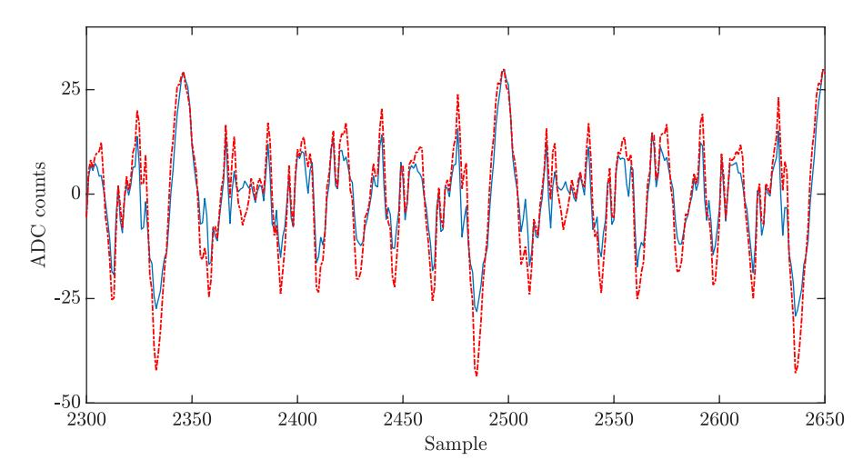

<span id="page-15-3"></span>Fig. 14. Average traces:  $\overline{r}_0$  with all-zero message (blue) and  $\overline{r}_1$  with all-one message (red dashed).