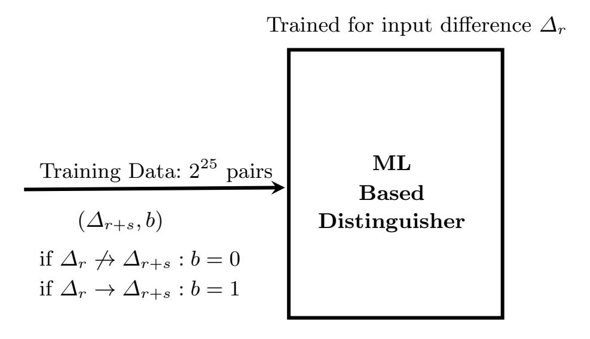
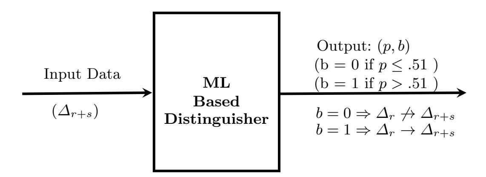
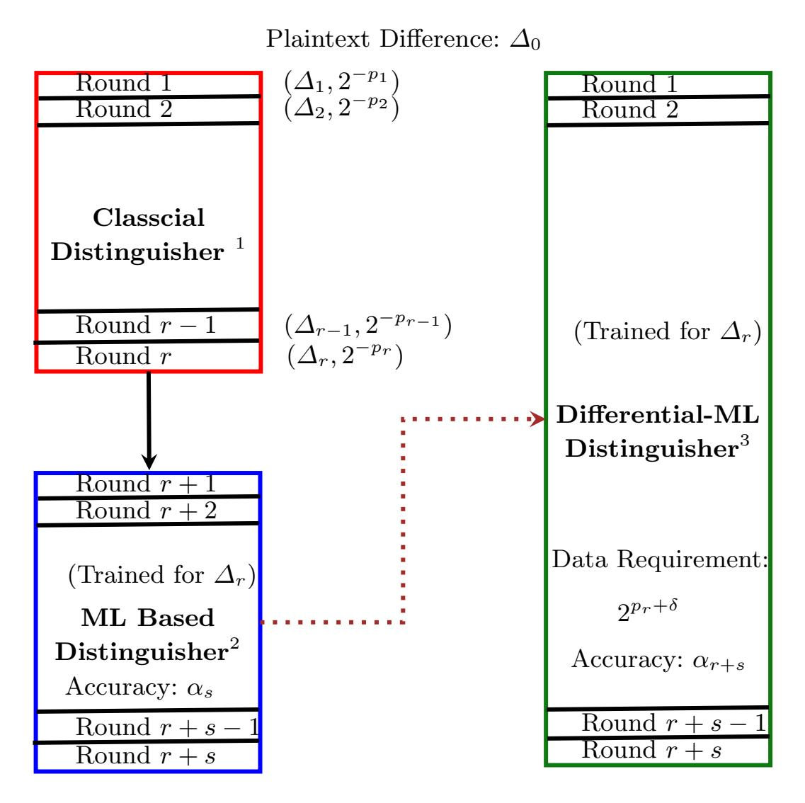
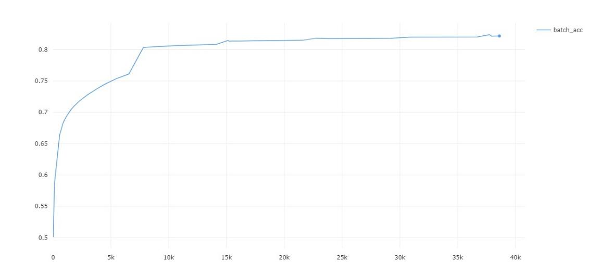
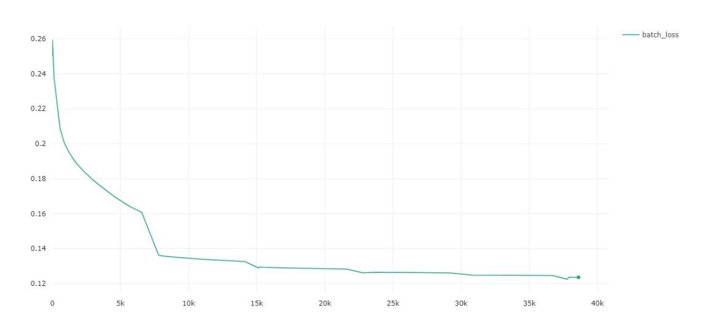
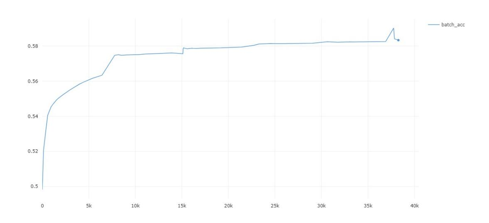
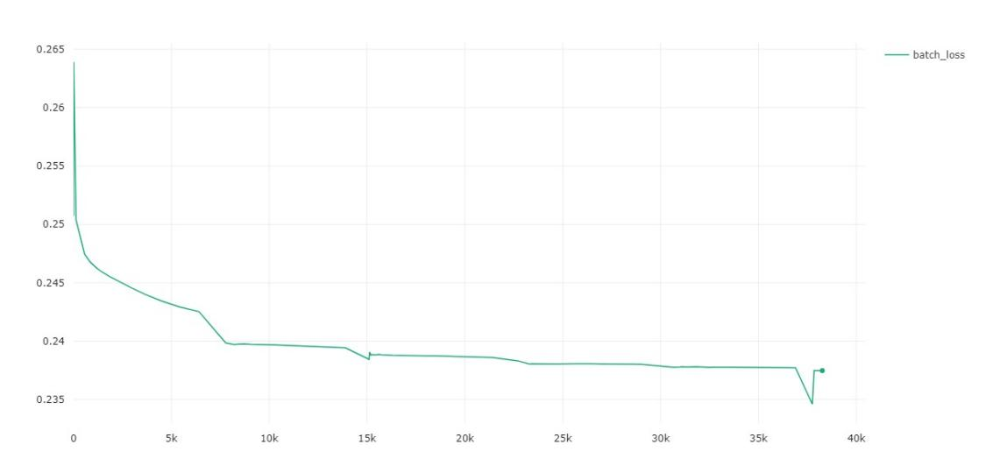
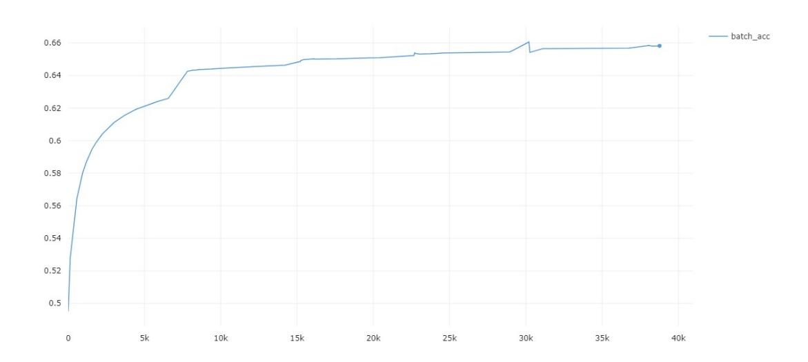
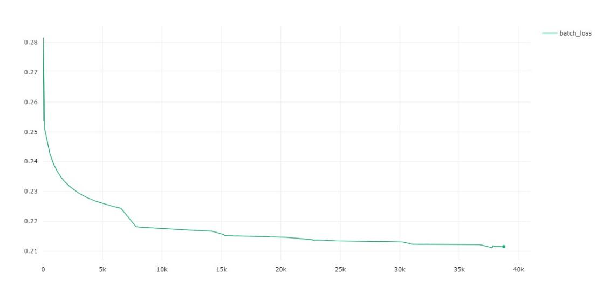

{0}------------------------------------------------

# Differential-ML Distinguisher: Machine Learning based Generic Extension for Differential Cryptanalysis

Tarun Yadav and Manoj Kumar

Scientific Analysis Group, DRDO, Metcalfe House Complex, Delhi-110 054, INDIA {tarunyadav,manojkumar}@sag.drdo.in

Abstract. Differential cryptanalysis is an important technique to evaluate the security of block ciphers. There exists several generalisations of differential cryptanalysis and it is also used in combination with other cryptanalysis techniques to improve the attack complexity. In 2019, usefulness of machine learning in differential cryptanalysis is introduced by Gohr to attack the lightweight block cipher SPECK. In this paper, we present a framework to extend the classical differential distinguisher using machine learning (ML) based differential distinguisher. We propose a novel technique to construct differential-ML distinguisher for Feistel, SPN and ARX structure based block ciphers. We demonstrate our technique on lightweight block ciphers SPECK, SIMON & GIFT64 and construct differential-ML distinguishers for these ciphers. Data complexity for 9-round SPECK, 12-round SIMON & 8-round GIFT64 is reduced from 2<sup>31</sup> to 2<sup>21</sup>, 2<sup>34</sup> to 2<sup>22</sup> and 2<sup>28</sup> to 2<sup>22</sup> respectively. The 12-round differential-ML distinguisher for SIMON is first distinguisher with data complexity less than 2<sup>32</sup> .

Keywords: Block Cipher, Differential Cryptanalysis, Machine Learning

## 1 Introduction

Cryptanalysis of block ciphers witnessed remarkable progress after the proposal of differential attack on DES by Biham and Shamir [7] in 1990. Differential attack is the most basic and widely used cryptanalysis approach against block ciphers. This attack is generalised and combined with other cryptanalysis techniques to reduce the attack complexity. High probability differential characteristics are the first and foremost requirement for differential cryptanalysis to succeed. Matsui proposed a method to search the high probability differential characteristics based on branch-and-bound technique [14] in 1994. For large block sizes, classical approaches are not sufficient to provide the useful differential characteristics. In 2011, Mouha et al. proposed a new technique using mixed integer linear programming (MILP) to search the differential characteristics [15]. MILP based search method constructs the differential characteristics with better efficiency than branch-and-bound based methods.

{1}------------------------------------------------

Since, block ciphers are designed to thwart differential attack using wide trail design strategy [9] and Shannon's principles [12]. Therefore, existing trail search methods encounter a bottleneck for required data quickly and fail to provide the trails covering the required number of rounds. In practice, we need a differential characteristic with probability greater than  $2^{-n}$  to distinguish r rounds of an r-bit block cipher from random permutations. Whenever, the probability of an r-round characteristic becomes less than  $2^{-n}$ , this is not useful for differential attack on r or more rounds of a block cipher. A differential characteristic is useful until it requires less data than available limit i.e.  $2^n$  pairs. Therefore, the aim of this paper is to find a technique which can be used to extend the classical differential characteristics without increasing the data complexity. Machine learning based differential cryptanalysis approach works as a pretty good solution to this problem.

In this paper, we combine the classical and machine learning techniques to design a ML based generic extension for any classical differential distinguisher. This provides the better results with a greater number of rounds and much lesser data complexity. We extend r-round high probability classical differential distinguisher  $(D_{1\cdots r}^{CD})$  with s-round high accuracy ML based differential distinguisher  $(D_{r+1\cdots r+s}^{ML})$  and combined distinguisher  $(D_{1\cdots r+s}^{CD\rightarrow ML})$  is used to distinguish (r+s) rounds of a block cipher with much lesser data complexity. With this extension, the hybrid distinguisher outperforms both classical and ML based distinguisher. We call this hybrid distinguisher a differential-ML distinguisher. We experiment with three different types of lightweight block ciphers SPECK, SIMON & GIFT64 and acquire the results with very high accuracy.

The remaining paper is organised as follows. Section 2 discusses previous work related to ML based distinguisher. In Section 3, we provide the short description of lightweight block ciphers SIMON, SPECK and GIFT64. We discuss classical differential distinguisher and machine learning based differential distinguisher in section 4 and describe the existing work on differential distinguisher using machine learning in this section. In section 5, we propose our novel technique which combines the classical differential and ML based differential approaches. We demonstrate our technique on SPECK, SIMON and GIFT64 block ciphers with high success rate and present the results of differential-ML distinguisher in section 6. Key recovery mechanism using differential-ML distinguisher is described in section 7 and paper is concluded in section 8.

Conventions: Throughout this paper, we refer differential distinguisher with single input and output difference as a classical differential distinguisher  $D^{CD}$ .

## 2 Previous Work

Machine learning techniques are very helpful for big data analytics and it is used to determine minute relations in the data. In cryptology, identification of minute relations in the data plays an important role because these relations define the security strength of the cipher. In cryptanalysis domain, machine

{2}------------------------------------------------

learning techniques for differential cryptanalysis are explored very recently and results are very promising.

Gohr[10] proposed the idea of learning differences for key recovery using machine learning. He presented a framework to construct the ML based differential distinguisher and used it for key recovery attack on SPECK32. Gohr compared this technique with classical differential attack and shown that data complexity for key recovery attack using ML distinguisher is less. Baksi et al.[2] used the same approach to design ML distinguisher for GIMLI cipher and GIMLI hash[5]. Different ML architectures are compared in this work and claimed that ML distinguisher outperforms classical differential distinguisher. In comparison to Gohr's work[10], key recovery attacks are not demonstrated on GIMLI. In these previous work, ML based distinguishers have limitations on computation power, memory and data complexity. Due to these constraints, distinguisher cannot be extended beyond certain number of rounds and it becomes a major hindrance especially for cipher with block size greater than 32.

## 3 Block Ciphers: SPECK, SIMON and GIFT64

SPECK and SIMON are two families of block ciphers published by NSA[4] in 2013. These block ciphers are designed to provide high performance across a range of devices. There are 10 versions of each cipher based on the block and key size combinations which makes them suitable for wide range of applications. We discuss the encryption algorithm for 32-bit block size and 64-bit key variants of each block cipher. We omit the key expansion algorithm and NSA paper [4] can be refereed for more details.

GIFT is designed by improving the bit permutation of lightweight block cipher PRESENT to reach the limit of lightweight encryption in hardware environments. Based on the input plaintext block size, there are two versions of GIFT namely GIFT64 and GIFT128. In each version, 128-bit key is used for encrypting the input plaintext. A brief description of SPECK, SIMON and GIFT64 block ciphers is provided in the following subsection.

#### 3.1 Description of SPECK

SPECK32/64 is a block cipher with 32-bit block size and 64-bit key size. There are 22 rounds in SPECK32/64 block cipher. It is based on Feistel network and can be represented by composition of two Feistel maps. Encryption algorithm divides 32-bit input into two 16-bit words (X2i+1, X2i) and key expansion algorithm extract 16-bit round subkeys (RKi) for each round. Round function comprises of addition modulo 2<sup>16</sup>, bitwise XOR, left and right circular shift operations as described in Algorithm 1.

{3}------------------------------------------------

## **Algorithm 1:** Encryption Algorithm of SPECK

```
1 Input: P = (X_1||X_0) and RK_i

2 Output: C = (X_{45}||X_{44})

3 for i=1 to 22 do

4 |X_{2i} = (X_{2i-1} \gg 7 + X_{2i-2}) \oplus RK_{i-1}

5 |X_{2i+1} = (X_{2i-2} \ll 2 \oplus X_{2i})

6 end
```

#### 3.2 Description of SIMON

SIMON32/64 is a block cipher with 32-bit plaintext block and 64-bit secret master key. There are 32 rounds in SIMON32/64 block cipher and it is also based on Feistel network. Encryption algorithm divides the 32-bit input into two 16-bit words  $(X_{i+1}, X_i)$ . Key expansion algorithm expands the 64-bit master key to provide 16-bit round subkeys  $(RK_i)$  for each round. It applies a round function consisting bitwise XOR, bitwise AND, and left circular shift operations on left 16-bit words in each round as described in Algorithm 2.

#### **Algorithm 2:** Encryption Algorithm of SIMON

```
1 Input: P = (X_1 || X_0) and RK_i

2 Output: C = (X_{33} || X_{32})

3 for i=1 to 32 do

4 |X_{i+1} = (X_i \ll 1 \& X_i \ll 8) \oplus (X_i \ll 2) \oplus X_{i-1} \oplus RK_{i-1}

5 end
```

#### 3.3 Description of GIFT64

GIFT64 encrypts 64-bit plaintext block using 128-bit key and generates 64-bit ciphertext block [3]. There are total 28 rounds in GIFT64. In each round, S-box, bit permutation, round subkeys and constant additions are applied using a round function. Key expansion algorithm extracts 32-bit subkeys $(rk_i)$  from 128-bit key. Encryption algorithm is described using 4-bit S-box S (table 1), bit permutation  $P_{64}$  (table 2), 6-bit round constants rC (table 3) and 32-bit round subkeys  $rk_i$  (Algorithm 3).

{4}------------------------------------------------

#### Algorithm 3: Encryption Algorithm of GIFT64

```
1 Input: X0 = (x63, x62, · · · , x0) and rki = (ui
                                             , vi)
2 Output: X28
3 for i=1 to 28 do
 4 for j=0 to 15 do
 5 S(x3+4∗j , x2+4∗j , x1+4∗j , x0+4∗j ) = (y3+4∗j , y2+4∗j , y1+4∗j , y0+4∗j )
 6 end
 7 (y63, y62, · · · , y0) = P64(y63, y62, · · · , y0)
 8 for k=0 to 5 do
 9 y3∗(k+1)+k = ci ⊕ y3∗(k+1)+k
10 end
11 for l=0 to 15 do
12 y4i+1 = y4i+1 ⊕ ui
13 y4i = y4i ⊕ vi
14 end
15 Xi+1 = (y63, y62, · · · , y0) ⊕ (1 << 63)
16 end
```

```
x 0 1 2 3 4 5 6 7 8 9 A B C D E F
S(x) 1 a 4 c 6 f 3 9 2 d b 7 5 0 8 e
```

Table 1: S-Box

```
i 0 1 2 3 4 5 6 7 8 9 10 11 12 13 14 15
P64(i) 0 17 34 51 48 1 18 35 32 49 2 19 16 33 50 3
  i 16 17 18 19 20 21 22 23 24 25 26 27 28 29 30 31
P64(i) 4 21 38 55 52 5 22 39 36 53 6 23 20 37 54 7
  i 32 33 34 35 36 37 38 39 40 41 42 43 44 45 46 47
P64(i) 8 25 42 59 56 9 26 43 40 57 10 27 24 41 58 11
  i 48 49 50 51 52 53 54 55 56 57 58 59 60 61 62 63
P64(i) 12 29 46 63 60 13 30 47 44 61 14 31 28 45 62 15
```

Table 2: Bit Permutation

Round Constants: In each round, 6-bit round constant c given in table 3 is used, where c<sup>0</sup> refers to the least significant bit . For subsequent rounds, it is updated as follows:

$$(c_5, c_4, c_3, c_2, c_1, c_0) \leftarrow (c_4, c_3, c_2, c_1, c_0, c_5 \oplus c_4 \oplus 1)$$

{5}------------------------------------------------

| Rounds | Constants (c)                                     |
|--------|---------------------------------------------------|
| 1 - 14 | 01 03 07 0F 1F 3E 3D 3B 37 2F 1E 3C 39 33         |
|        | 15 - 28 1D 3A 35 2B 16 2C 18 30 21 02 05 0B 27 0E |

Table 3: Round Constants

## 4 Differential Cryptanalysis

Differential attack is one of the most important analysis tool for cryptanalysis of block ciphers. This is the first attack of its own kind which reduced the complexity of DES better than exhaustive search [16]. Differential cryptanalysis created a path for several new cryptanalysis techniques like linear, impossible, algebraic etc [8]. While designing an ideal block cipher, its output is tested for indistinguishability form random permutations. Although, there do not exists relationship between the single input and output occurrence of a block cipher, there may exist non-random relations in the input and output differences. The basic approach of differential attack is to study the propagation of input differences and exploitation of non-random relations between input and output differences. The classical differential attack works with a single differential characteristic providing the high probability relation between an input and output difference.

#### 4.1 Classical Differential Distinguisher

A high probability differential characteristic is used for key recovery attack by adding some rounds on top/bottom of the trail. There exists several automated techniques to search the optimal differential characteristics for block ciphers[11]. We extend the existing differential characteristics for 6-round SPECK, 7-round SIMON by ML based differential distinguisher. In this paper, we do not search for new differential characteristics for SIMON & SPECK but we use some part of existing differential characteristics published in [1] and [6]. For GIFT64, we construct high probability differential characteristics for 4 rounds using branchand-bound search algorithm [13].

4.1.1 Differential Characteristics for SPECK Abed et al. [1] presented the 9-round differential characteristics for Speck32/64 variant with probability of 2<sup>−</sup><sup>31</sup>. From the 9-round characteristic presented in table 4, we use 6-round differential characteristic(∆<sup>1</sup> → ∆7) with probability of 2<sup>−</sup><sup>13</sup> for our experiment.

{6}------------------------------------------------

| Round Input Difference Prob.(2−pi ) |              |      |
|-------------------------------------|--------------|------|
| Index                               | (4Xi+1, 4Xi) | (pi) |
| ∆0                                  | 0A60 4205    | 0    |
| ∆1                                  | 0211 0A04    | 5    |
| ∆2                                  | 2800 0010    | 9    |
| ∆3                                  | 0040 0001    | 11   |
| ∆4                                  | 8000 8000    | 11   |
| ∆5                                  | 8100 8102    | 12   |
| ∆6                                  | 8000 840A    | 14   |
| ∆7                                  | 850A 9520    | 18   |
| ∆8                                  | 802A D4A8    | 24   |
| ∆9                                  | 81A8 D30B    | 31   |

Table 4: Differential Characteristic of SPECK [1]

4.1.2 Differential Characteristics for SIMON Biryukov et al. [6] presented the 12-round differential characteristics for Simon32/64 variant with probability of 2<sup>−</sup><sup>34</sup>. From the 12-round characteristic presented in table 5, we use 7-round differential characteristic(∆<sup>0</sup> → ∆7) with probability of 2<sup>−</sup><sup>16</sup> for our experiment .

| Round Input Difference Prob.(2−pi ) |                      |      |
|-------------------------------------|----------------------|------|
|                                     | Index (4X2i+1, 4X2i) | (pi) |
| ∆0                                  | 0400 1900            | 0    |
| ∆1                                  | 0100 0400            | 2    |
| ∆2                                  | 0000 0100            | 4    |
| ∆3                                  | 0100 0000            | 4    |
| ∆4                                  | 0400 0100            | 6    |
| ∆5                                  | 1100 0400            | 8    |
| ∆6                                  | 4200 1100            | 12   |
| ∆7                                  | 1D01 4200            | 16   |
| ∆8                                  | 0500 1D01            | 24   |
| ∆9                                  | 0100 0500            | 27   |
| ∆10                                 | 0100 0100            | 29   |
| ∆11                                 | 0500 0100            | 31   |
| ∆12                                 | 1500 0500            | 34   |

Table 5: Differential Characteristic of SIMON [6]

4.1.3 Differential Characteristics for GIFT64 We construct the 4-round optimal differential characteristic with high probability using branch-and-bound search algorithm [13]. We use 4-round differential characteristic with probability of 2<sup>−</sup><sup>12</sup> to construct the differential-ML distinguisher for GIFT64 (Table 6).

{7}------------------------------------------------

| Round | Input Difference    | Prob.(2−pi ) |
|-------|---------------------|--------------|
| Index | (4Xi)               | (pi)         |
| ∆0    | 0000 0000 0000 000A | 0            |
| ∆1    | 0000 0000 0000 0001 | 2            |
| ∆2    | 0008 0000 0000 0000 | 5            |
| ∆3    | 0000 0000 2000 1000 | 7            |
| ∆4    | 0044 0000 0011 0000 | 12           |

Table 6: Differential Characteristic of GIFT64

#### 4.2 ML Based Differential Distinguisher

For a chosen input difference, we use neural distinguisher design proposed by Gohr [10]. We also consider the improvements in this design suggested by Baksi et al. [2]. We use dense layers of MLPs (Multi Layers Perceptrons) instead of convolution networks and train the ML distinguisher on ciphertext differences rather than ciphertext pairs. These improvements make learning faster and efficient than Gohr's approach. Further, we use the same encryption key to generate the required training data because differential distinguisher is key independent. Therefore, we do not need to change the key for every encryption.



Fig. 1: Training Phase for ML Based Distinguisher

We train this ML distinguisher using the real and random differences approach proposed by Gohr. In this approach, half of the cipher text data belongs to the chosen plaintext difference and the other half belongs to the random plaintext differences. We label each ciphertext difference either with 1 if it belongs to the chosen input difference and label it with 0 if it does not belong to the chosen

{8}------------------------------------------------



Fig. 2: Prediction using ML Based Distinguisher

input difference. We provide this data to the MLP based model and train the model with 2 hidden layers having 1024 neurons each.

We assume that targeted system is accessible and there is no constraint on the training data required for learning the system. Therefore, we use  $2^{25}$  ciphertext pairs for training phase. Out of these  $2^{25}$  pairs,  $2^{24}$  belongs to chosen plaintext difference and  $2^{24}$  belongs to random plaintext differences as shown in Fig. 1. As described by Gohr, this approach works pretty well because not only specificity but also sensitivity is learned. Specificity and sensitivity are the learning of relations whether a ciphertext belongs to the chosen input difference or not respectively. We train the model till the accuracy is saturated. This accuracy is the combination of accuracy of specificity and sensitivity. A model with accuracy greater than 0.51 (on the scale of 0 to 1) is considered as a distinguisher. After training phase, ML distinguisher will be able to distinguish any given ciphertext with a probability (p) of belonging to given plaintext difference. We will label the ciphertext as 0 if p is less than 0.51 and as 1 if p is greater than 0.51 as shown in Fig. 2. A distinguisher with higher accuracy will result in better predictions.

## 5 Differential-ML Distinguisher: an Extension for Classical Differential Distinguisher

Gohr's distinguisher lacks extendability because ML based distinguisher can only be designed if data requirement is computationally feasible. We propose a new approach to work with ML based distinguishers to overcome this constraint to a large extent. In our approach, we use ML based distinguisher in combination with classical differential distinguisher. ML distinguisher works as an extension to a classical distinguisher. We use an r-round classical differential characteristic and its output difference  $\Delta_r$  is considered as an input difference for ML distinguisher. ML distinguisher is trained on this input difference ( $\Delta_r$ ) instead of plaintext difference ( $\Delta_0$ ). This new distinguisher reduces data complexity to a large extent with high accuracy.

To extend the r-round classical differential distinguisher, we consider the output difference  $\Delta_r$  of the r-round classical differential characteristic and use  $\Delta_r$  to train s-round distinguisher  $D_{r+1\cdots r+s}^{ML}$ . For training, half of the input data

{9}------------------------------------------------

belongs to input difference  $\Delta_r$  and half of the data belongs to random input differences. The ML based distinguisher is modelled with an accuracy  $\alpha_i$  and we denote accuracy of s-round ML distinguisher as  $\alpha_s$ . The accuracy  $\alpha$  defines the strength of the distinguisher and better accuracy gives better predictions. Now, this distinguisher  $D_{r+1\cdots r+s}^{ML}$  can distinguish any (r+s)-round ciphertext with high probability.



Fig. 3: Differential-ML Distinguisher: A Generic Extension

For r-round classical differential characteristic, output difference  $\Delta_r$  with probability of  $2^{-p_r}$  requires  $2^{p_r}$  data to get at least one occurrence of difference  $\Delta_r$ . If we provide  $2^{p_r}$  ciphertext pairs after (r+s) rounds of encryption to  $D_{r+1\cdots r+s}^{ML}$  then we expect  $D_{r+1\cdots r+s}^{ML}$  to predict at least one occurrence of difference  $\Delta_r$ . Although ML distinguisher works on multiple output differences, we expect it to learn the pattern of differences which are more frequent and suggested by the classical differential characteristic. Therefore,  $2^{p_r}$  or more data is required for s-round distinguisher  $(D_{r+1\cdots r+s}^{ML})$  to work as an (r+s)-round

 $<sup>^{1}</sup>$  Classical Distinguisher:  $D_{1\cdots r}^{CD}$   $^{2}$  ML Based Distinguisher:  $D_{r+1\cdots r+s}^{ML}$   $^{3}$  Differential-ML Distinguisher:  $D_{1\cdots r+s}^{CD\rightarrow ML}$ 

{10}------------------------------------------------

distinguisher  $(D_{1..r+s}^{CD\to ML})$ . Differential-ML distinguisher  $(D_{1..r+s}^{CD\to ML})$  is a probabilistic distinguisher and we need to provide more data based on accuracy  $\alpha_s$  for better prediction. Therefore, data complexity of  $D_{1..r+s}^{CD\to ML}$  will be  $2^{p_r+\delta}$ , where  $\delta$  defines the additional data required to make predictions with higher accuracy (Fig. 3).

In our experiments, we observe that  $D_{1..r+s}^{CD\to ML}$  predicts ciphertexts belonging to the chosen plaintext difference  $\Delta_0$  with very high probability than random plaintext differences using  $2^{p_r+\delta}$  data. We use this observation to increase the accuracy  $\alpha_{r+s}$  by filtering higher probability predictions. We can always find a high probability threshold T and a cutoff  $C_T$  on the number of predictions with probability greater than T. With threshold T and cutoff  $C_T$ , we are able to achieve a very high success rate to distinguish (r+s) rounds cipertexts. Experimental results in the next section show that data complexity for (r+s) rounds using differential-ML distinguisher is far less than the classical differential distinguisher.

#### 6 Experimental Results

We construct differential-ML distinguisher for 32-bit variants of two light weight block ciphers SPECK and SIMON and 64-bit variant of GIFT. We extend the classical differential distinguisher discussed in section 4 using ML distinguisher in each case. Using this novel technique, we have constructed the Differential-ML distinguisher for 9-round SPECK, 12-round SIMON and 8-round GIFT64 with very less data complexity than classical distinguisher.

#### 6.1 Differential-ML distinguisher for SPECK

For SPECK32/64, we use the classical differential characteristic for initial 6 rounds ( $\Delta_1 \to \Delta_7$ ) as described in the table 4. We have an output difference 0x850A9520 ( $\Delta_7$ ) after 6 rounds with probability of  $2^{-13}$ . We train ML distinguisher using  $\Delta_7$  as input difference for next 3 rounds.

#### 6.1.1 Data Requirement

- 1. **Training:** Training data can be as large as possible because it does not contribute to the data complexity of the distinguisher. We have used  $2^{25}$  ciphertext pairs for the training phase. Batch accuracy and loss during training phase are depicted in Fig. 4.
- 2. **Prediction:** Data used in predictions contributes to the data complexity of the distinguisher and it must be as small as possible. Differential probability for 6-round classical differential characteristic is  $2^{-13}$ , therefore we require at least  $2^{13}$  data to get predictions for entire 9 rounds. To get higher accuracy, we require additional  $2^9(\delta)$  data which increases the data complexity to  $2^{21}$  for distinguishing 9-round SPECK.

{11}------------------------------------------------



(a) Batch Accuracy vs Steps



(b) Batch Loss vs Steps

Fig. 4: SPECK Training Phase

6.1.2 Accuracy of Differential-ML Distinguisher (αr+s): The 3-round ML distinguisher is trained with validation accuracy (αs) of 0.79. As described in section 5, it is used to extend 6-round classical distinguisher. The accuracy (αr+s) of differential-ML distinguisher for different experiments is mentioned in the table 7.

In the experiments, 50 samples belong to the plaintext difference ∆0(=0x0A60 4205) of classical distinguisher and 50 samples belongs to random input differences. We use 2<sup>21</sup> data and get 98% or more accuracy for each experiment. Therefore, data complexity of 9-round differential-ML distinguisher for SPECK is 2<sup>21</sup>. However, data complexity of 9-round classical differential distinguisher is 2<sup>31</sup> as mentioned in table 4. The best known differential characteristics for speck exists for 9-rounds with data complexity 2<sup>30</sup>[6]. This shows that using differential-ML distinguisher we have a better 9-round distinguisher with data complexity far less than existing classical differential distinguisher.

{12}------------------------------------------------

|     | Experiment Sample Size | Correctly Distinguished        |
|-----|------------------------|--------------------------------|
| No. |                        | (True Positive, True Negative) |
| 1   | 100                    | 98(49,49)                      |
| 2   | 100                    | 100(50,50)                     |
| 3   | 100                    | 98(50,48)                      |
| 4   | 100                    | 99(50,49)                      |
| 5   | 100                    | 99(50,49)                      |

<sup>\*</sup>Each sample consists of 2 <sup>21</sup> pairs which are divided into 4 batches of 2 <sup>19</sup> pairs.We label a sample correctly distinguished if more than 2 batches have prediction either greater than C<sup>T</sup> (= 33900) for correct input difference or less than C<sup>T</sup> for incorrect input difference.

Table 7: Accuracy for SPECK with T = 0.80 & C<sup>T</sup> = 33900

#### 6.2 Differential-ML distinguisher for SIMON

For SIMON32/64, we use the classical differential characteristic for initial 7 rounds as described in the table 5. We have an output difference 0x1D014200 (∆7) after 7 rounds with probability of 2<sup>−</sup>16. We use ∆<sup>7</sup> as input difference for training phase of 5-round ML distinguisher.

### 6.2.1 Data Requirement

- 1. Training: Training data requirements are similar to the case of SPECK. We use 2<sup>25</sup> plaintext pairs for training the 5-round ML distinguisher. Saturation of batch accuracy and loss during training phase is shown in Fig. 5.
- 2. Prediction: Similar to SPECK, we must reduce the data requirement for predictions. Differential probability for 7-round classical differential characteristic is 2<sup>−</sup>16, therefore we require at least 2<sup>16</sup> data to distinguish 12-round SIMON. To increase the accuracy, 2<sup>6</sup> additional data (δ) is required. Due to this additional data, data complexity to distinguish 12-round SIMON is increased to 2<sup>22</sup> .
- 6.2.2 Accuracy of Differential-ML Distinguisher (αr+s) : The 5-round ML distinguisher is trained with validation accuracy of 0.57. It is used to extend 7-round classical differential distinguisher. The accuracy of 12-round differential-ML distinguisher for different experiments is mentioned in the table 8.

Similar to SPECK, 50 samples belong to the initial input difference ∆<sup>0</sup> (=0x04001900) of classical distinguisher and 50 samples belongs to random input differences. We use 2<sup>22</sup> data to achieve accuracy greater than 95% for each experiment. Therefore, data complexity of 12-round differential-ML distinguisher is 2<sup>22</sup>, while data complexity for 12-round classical differential distinguisher is 2 <sup>34</sup> (Table 5). In this case, we present 12-round distinguisher for the first time

{13}------------------------------------------------

#### 14 Tarun Yadav and Manoj Kumar



#### (a) Batch Accuracy vs Steps



(b) Batch Loss vs Steps

Fig. 5: SIMON Training Phase

|     | Experiment Sample Size | Correctly Distinguished        |
|-----|------------------------|--------------------------------|
| No. |                        | (True Positive, True Negative) |
| 1   | 100                    | 97(48,49)                      |
| 2   | 100                    | 98(50,48)                      |
| 3   | 100                    | 97(48,49)                      |
| 4   | 100                    | 95(46,49)                      |
| 5   | 100                    | 96(46,50)                      |

\*Each sample consists of 2 <sup>22</sup> pairs which are divided into 4 batches of 2 <sup>20</sup> pairs.We label a sample correctly distinguished if more than 2 batches have prediction either greater than C<sup>T</sup> (= 99300) for correct input difference or less than C<sup>T</sup> for incorrect input difference.

Table 8: Accuracy for SIMON with T = 0.60 & C<sup>T</sup> = 99300

with data complexity less than 2<sup>32</sup>. This shows that differential-ML distinguisher

{14}------------------------------------------------

provides much better results than classical differential distinguisher in case of SIMON also.

#### 6.3 Differential-ML distinguisher for GIFT64

For GIFT64, we searched an optimal differential characteristic for initial 4 rounds as described in the table 6. We have an output difference 0x0044000000110000 (∆4) after 4 rounds with probability of 2−<sup>12</sup> and use ∆<sup>4</sup> as input difference to train 4-round ML distinguisher.

#### 6.3.1 Data Requirement

- 1. Training: Training data requirements are similar to previous cases. We use 2 <sup>25</sup> plaintext pairs for training the 4-round ML distinguisher. Batch accuracy and loss graphs for training phase are shown in Fig. 6.
- 2. Prediction: For GIFT64 also, we must reduce the data requirement for prediction phase. Differential probability for 4-round classical differential characteristic is 2<sup>−</sup><sup>12</sup>, therefore we require at least 2<sup>12</sup> data to distinguish 8-round GIFT64. To increase the accuracy, we add 2<sup>10</sup> additional data (δ). Due to this additional data, data complexity of 8-round differential-ML distinguisher is increased to 2<sup>22</sup> .

6.3.2 Accuracy of Differential-ML Distinguisher (αr+s) : The 4-round ML distinguisher is trained with validation accuracy of 0.65. It is used to extend 4-round classical differential distinguisher. The accuracy of 8-round differential-ML distinguisher for different experiments is mentioned in the table 9.

|     | Experiment Sample Size | Correctly Distinguished        |  |
|-----|------------------------|--------------------------------|--|
| No. |                        | (True Positive, True Negative) |  |
| 1   | 100                    | 99(50,49)                      |  |
| 2   | 100                    | 100(50,50)                     |  |
| 3   | 100                    | 99(49,50)                      |  |
| 4   | 100                    | 100(50,50)                     |  |
| 5   | 100                    | 100(50,50)                     |  |

<sup>\*</sup>Each sample consists of 2 <sup>22</sup> pairs which are divided into 4 batches of 2 <sup>20</sup> pairs.We label a sample correctly distinguished if more than 2 batches have prediction either greater than C<sup>T</sup> (= 235) for correct input difference or less than C<sup>T</sup> for incorrect input difference.

Table 9: Accuracy for GIFT with T = 0.977 & C<sup>T</sup> = 235

Similar to SPECK and SIMON cases, 50 samples belong to the initial input difference ∆<sup>0</sup> (=0x000000000000000A) of classical distinguisher and 50 samples

{15}------------------------------------------------



(a) Batch Accuracy vs Steps



(b) Batch Loss vs Steps

Fig. 6: GIFT Training Phase

belongs to random input differences. We use 2<sup>22</sup> data to achieve accuracy greater than 99% for each experiment. Therefore, data complexity of 8-round differential-ML distinguisher is 222, while data complexity for 8-round classical differential distinguisher is 228[15].

#### 6.4 Comparison with Classical Distinguishers

We have constructed differential-ML distinguishers for three different types of block ciphers(Feistel, SPN & ARX) using our technique. We are able to reduce the data complexity of distinguishing the ciphertexts for same number of rounds using very less amount of data in comparison to classical differential technique. These results indicate that our technique provides better results for block ciphers based on different types of structure. Source code for mentioned experiments is available on GitHub <sup>4</sup> . We present a summary of our results and comparison with classical differential distinguisher in table 10.

<sup>4</sup> https://github.com/tarunyadav/Differential-ML-Distinguisher

{16}------------------------------------------------

| Cipher  | V -             | Round |          | Source |
|---------|-----------------|-------|----------|--------|
| SPECK32 | Differential    | 9     | $2^{31}$ | [1]    |
| SPECK32 | Differential-ML | 9     | $2^{21}$ | Ours   |
| SIMON32 | Differential    | 12    | $2^{34}$ | [7]    |
| SIMON32 | Differential-ML | 12    | $2^{22}$ | Ours   |
| GIFT64  | Differential    | 8     | $2^{28}$ | [17]   |
| GIFT64  | Differential-ML | 8     | $2^{22}$ | Ours   |

Table 10: Summary of Cryptography Analysis

### 7 Key Recovery Mechanism for Differential-ML Attack

Gohr [10] has proposed a key recovery attack using ML distinguisher for SPECK. We propose a similar key recovery attack using differential-ML distinguishers for block ciphers. We can use differential-ML distinguishers for (r+s-1) rounds and (r+s) rounds to mount a key recovery attack on (r+s+1) rounds. It is a two stage approach where good ciphertext pairs  $(C_i, C'_i)$  are extracted from given ciphertext pairs in the first stage. These ciphertext pairs  $(C_i, C'_i)$  are filtered by (r+s) rounds distinguisher using a prediction cutoff  $(c_1)$ . These filtered pairs are used to rank round keys  $(K_{r+s+1}, K_{r+s})$  using (r+s-1) rounds distinguisher in the second stage. A different prediction cutoff  $(c_2)$  is used to rank (r+s+1) and (r+s) round keys in second stage. Gohr has described various refinements to increase accuracy while searching the correct keys. This approach can be used to mount key recovery attack using differential-ML distinguisher with reduced data complexity.

## 8 Conclusion

In this paper, we have proposed a novel technique to extend the classical differential distinguisher using machine learning based distinguisher. This technique is demonstrated on lightweight block ciphers SPECK & SIMON and 98% & 95% (or more) success rate is achieved for distinguishing the 9-round SPECK and 12-round SIMON respectively. We have also presented the 8-round differential-ML distinguisher of GIFT64 with 99% accuracy with reduced data complexity. Experimental results have shown very high success rate with a significant reduction in data complexity for each case. We have also shown that we can extend any available classical differential distinguisher with machine learning based differential distinguisher. The new technique provides the better results in terms of number of rounds and data complexity. This approach will open a new dimension for practical key recovery attacks using differential cryptanalysis where data complexity is a major roadblock.

{17}------------------------------------------------

## References

- 1. Abed, F., List, E., Lucks, S., Wenzel, J.: Differential Cryptanalysis of Round-Reduced Simon and Speck. In: Cid C., Rechberger C. (eds) Fast Software Encryption. FSE 2014. Lecture Notes in Computer Science, vol 8540. Springer, Berlin, Heidelberg, (2014)
- 2. Baksi, A., Breier, J., Dong, X., Yi, C.: Machine Learning Assisted Differential Distinguishers For Lightweight Ciphers. https://eprint.iacr.org/2020/571, (2020)
- 3. Banik, S., Pandey, S.K., Peyrin, T., Sasaki,Y.,Sim,S.M.,Todo,Y.: GIFT: A small present - towards reaching the limit of lightweight encryption. In: Cryptographic Hardware and Embedded Systems - CHES 2017 - 19th International Conference, Taipei, Taiwan, September 25-28, 2017, Proceedings. pp. 321-345 (2017)
- 4. Beaulieu, R., Shors, D., Smith, J., Treatman-Clark, S., Weeks, B., Wingers, L.: The SIMON and SPECK families of lightweight block ciphers. Cryptology ePrint Archive, Report 2013/404. https://eprint.iacr.org/2013/404, (2013)
- 5. Bernstein, D.J., Kolbl, S., Lucks, S., Massolino, P.M.C., Mendel, F., Nawaz, K., Schneider, T., Schwabe, P., Standaert, F., Todo, Y., Viguier, B.: Gimli, (2019)
- 6. Biryukov, A., Roy, A., Velichkov, V.: Differential Analysis of Block Ciphers SIMON and SPECK. FSE 2014, 546–570, LNCS, Volume 8540, (2014)
- 7. Biham, E., Shamir, A.: Differential Cryptanalysis of the full 16-round DES, CRYPTO 92, LNCS, Vol. 740, 487–496, Springer, (1992)
- 8. Bogdanov, A.: Analysis and Design of Block Cipher Constructions, Ph.D. thesis, (2009)
- 9. Daemen, J., Rijmen, V.: The Design of Rijndael, Springer-Verlag, (2002)
- 10. Gohr, A.: Improving attacks on round-reduced SPECK32/64 using deep learning. In Boldyreva, A., Micciancio, D., eds.: Advances in Cryptology- CRYPTO 2019, Cham, Springer International Publishing, 150–179, (2019)
- 11. Hays, H.M.: A Tutorial on Linear and Differential Cryptanalysis, Cryptologia, Vol. 26, No. 3, 188–221, (2002)
- 12. Knudsen, L., Robshaw, M.J.B.: Block Cipher Companion, Book Springer, ISBN 978-3-642-17341-7, (2011)
- 13. Kumar, M., Suresh, TS, Pal, S.K., Panigrahi, A.: Optimal Differential Trails in Lightweight Blokc Ciphers ANU and PICO, Cryptologia, Vol. 44, No. 1, 68–78, (2020)
- 14. Matsui, M.: On Correlation between the Order of S-boxes and the Strength of DES, EUROCRYPT 94, LNCS, Vol 950, 366–375, Springer, (1994)
- 15. Mouha, N., Wang, Q., Gu, D., Preneel, B.: Differential and linear cryptanalysis using mixed-integer linear programming. In: Information Security and Cryptology - 7th International Conference, Inscrypt 2011, Beijing, China, November 30 - December 3, 2011. Revised Selected Papers. 57–76, (2011)
- 16. US National Bureau of Standards, Data Encryption Standard. Federal Information Processing Standards Publications, vol. 46, (1977)
- 17. Zhu, B., Dong, X., Yu, H.: MILP-Based Differential Attack on Round-Reduced GIFT. In: Topics in Cryptology - CT-RSA 2019, San Francisco, CA, USA, March 4-8, 2019, Proceedings. pp. 372-390, (2019)