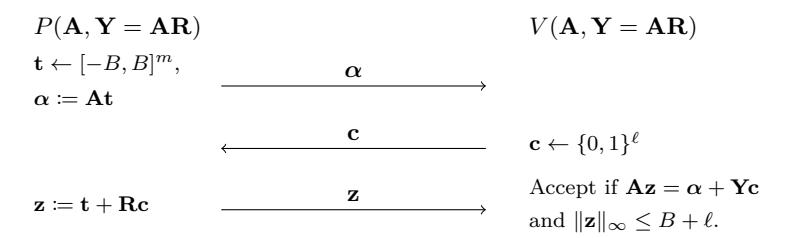
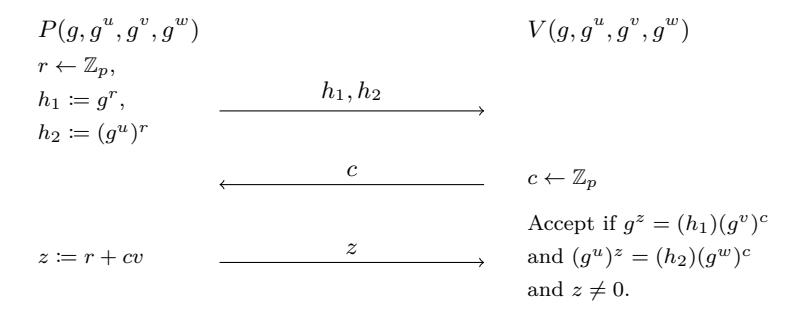

# Does Fiat-Shamir Require a Cryptographic Hash Function?

Yilei Chen\* Alex Lombardi† Fermi Ma‡ Willy Quach§ February 23, 2021

#### **Abstract**

The Fiat-Shamir transform is a general method for reducing interaction in public-coin protocols by replacing the random verifier messages with deterministic hashes of the protocol transcript. The soundness of this transformation is usually *heuristic* and lacks a formal security proof. Instead, to argue security, one can rely on the *random oracle methodology*, which informally states that whenever a random oracle soundly instantiates Fiat-Shamir, a hash function that is "sufficiently unstructured" (such as fixedlength SHA-2) should suffice. Finally, for some special interactive protocols, it is known how to (1) isolate a concrete security property of a hash function that suffices to instantiate Fiat-Shamir and (2) build a hash function satisfying this property under a cryptographic assumption such as Learning with Errors.

In this work, we abandon this methodology and ask whether Fiat-Shamir truly requires a cryptographic hash function. Perhaps surprisingly, we show that in two of its most common applications building signature schemes as well as (general-purpose) non-interactive zero-knowledge arguments there are sound Fiat-Shamir instantiations using extremely simple and non-cryptographic hash functions such as sum-mod- or bit decomposition. In some cases, we make idealized assumptions (i.e., we invoke the generic group model), while in others, we prove soundness in the plain model.

On the negative side, we also identify important cases in which a cryptographic hash function is provably necessary to instantiate Fiat-Shamir. We hope this work leads to an improved understanding of the precise role of the hash function in the Fiat-Shamir transformation.

<sup>\*</sup>Tsinghua University. Email: chenyilei@mail.tsinghua.edu.cn.

<sup>†</sup>MIT. Email: alexjl@mit.edu. Research supported in part by an NDSEG fellowship. Research supported in part by NSF Grants CNS-1350619 and CNS-1414119, and by the Defense Advanced Research Projects Agency (DARPA) and the U.S. Army Research Office under contracts W911NF-15-C-0226 and W911NF-15-C-0236.

<sup>‡</sup>Princeton University and NTT Research. Email: fermima@alum.mit.edu.

<sup>§</sup>Northeastern University. Email: quach.w@husky.neu.edu.

# **Contents**

| 1      | Introduction<br>1.1<br>Our Contributions<br><br>1.2<br>Conclusions<br>1.3<br>Related Work                                                                                                                                                                                                          | 1<br>2<br>9<br>10                |
|--------|----------------------------------------------------------------------------------------------------------------------------------------------------------------------------------------------------------------------------------------------------------------------------------------------------|----------------------------------|
| 2<br>3 | Technical Overview<br>2.1<br>A Non-Interactive Lattice-Based Identification Scheme<br>2.2<br>Fiat-Shamir for Schnorr in the Generic Group Model.<br><br>2.3<br>Negative Results<br><br>Preliminaries                                                                                               | 11<br>12<br>13<br>20<br>21       |
| 4      | Lattice-based Identification Protocols<br>4.1<br>Preliminaries<br><br>4.2<br>SIS-based Identification Protocols<br>4.3<br>Connection with Lattice Trapdoors and Signatures<br>4.4<br>LWE-based Identification Protocols<br>4.5<br>More Efficient Protocols via Rejection Sampling                  | 22<br>22<br>23<br>26<br>27<br>31 |
| 5      | Fiat-Shamir in the Generic Group Model<br>5.1<br>Generic Group Model Preliminaries<br>5.2<br>The Auxiliary-Input Generic Group Model<br>5.3<br>Schnorr Signatures<br><br>5.4<br>Chaum-Pedersen Protocol<br>5.5<br>Application: NIZKs for NP<br>                                                    | 34<br>34<br>35<br>36<br>39<br>43 |
| 6      | Negative Results for Fiat-Shamir with Non-Cryptographic Hash Functions<br>6.1<br>Main Information-Theoretic Lemma<br><br>6.2<br>Negative Result for Blum in the Random Oracle Model<br><br>6.3<br>A General Polynomial-Query Attack<br><br>6.4<br>A General "Cryptography is Necessary" Result<br> | 43<br>44<br>46<br>46<br>49       |
| A      | Correlation Intractability and the Idealized Blum Protocol                                                                                                                                                                                                                                         | 57                               |
| B      | Security Analysis in Concrete Groups<br>B.1<br>Analysis of (Our Variant of) Schnorr Signatures<br>B.2<br>Security Analysis of Chaum-Pederson over Finite Fields<br>                                                                                                                                | 59<br>60<br>61                   |

# <span id="page-2-0"></span>**1 Introduction**

The Fiat-Shamir transform is a general-purpose method for converting public-coin interactive protocols into *non-interactive* protocols with the same functionality. As a prototypical example, let Π denote a 3-message (public-coin) argument system with transcripts of the form (*, ,* ). Then, given any *hash function ℎ*, the Fiat-Shamir transform of Π using *ℎ*, denoted ΠFS*,ℎ*, is a one-message argument system in which the prover sends an entire transcript (*,*  = *ℎ*()*,* ) in one shot.

The Fiat-Shamir transform was introduced by [\[FS87\]](#page-56-0) to remove interaction from a 3-message identification scheme, but it was later realized[1](#page-2-1) that the transformation is extremely general: it can plausibly be applied to *any* constant-round public-coin interactive argument system (and more). Due to its generality and its *practical efficiency* (it removes interaction with very low computational overhead), the transformation has been a cornerstone of both theoretical and practical cryptography for over 30 years. Some of its applications include the construction of efficient signature schemes [\[FS87,](#page-56-0) [Sch90,](#page-58-1) [PS96\]](#page-58-2), non-interactive zero-knowledge arguments (NIZKs) [\[BR94,](#page-54-0) [CCRR18,](#page-54-1) [CCH](#page-54-2)<sup>+</sup>19, [PS19\]](#page-58-3), and succinct non-interactive arguments (SNARGs) [\[Kil92,](#page-56-1) [Mic00,](#page-57-0) [BCS16,](#page-54-3) [BBC](#page-53-0)<sup>+</sup>17, [BBHR18b,](#page-54-4) [BBHR18a,](#page-54-5) [WTs](#page-58-4)<sup>+</sup>18, [BCR](#page-54-6)<sup>+</sup>19, [BBHR19\]](#page-54-7).

However, the vast majority of applications of the Fiat-Shamir transform are only *heuristically sound*. That is, the resulting non-interactive protocols do not have proofs of soundness based on the computational intractability of a well-studied mathematical problem [\[GM82\]](#page-56-2). Nonetheless, the protocols appear to be sound in practice, so it has been a long-standing goal of theoretical cryptography to *justify* the soundness of the transformation.

So far, there have been two main approaches for justifying soundness of Fiat-Shamir.

- ∙ **The Random Oracle Model** [\[BR94\]](#page-54-0): In this design methodology, a Fiat-Shamir hash function is first modeled as a random function to which all parties (honest and dishonest) have public query access. Security is "argued" by showing that the protocol ΠFS*,* is sound "in the random oracle model" (i.e., against query-bounded adversaries). In reality, the hash function *ℎ* is instantiated by an "unstructured" hash function (such as SHA-2 on bounded-length inputs), where the implicit expectation is that "Fiat-Shamir for Π" is not an application that can distinguish *ℎ* from a random oracle.
- ∙ **Correlation Intractability**: In a recent line of work [\[KRR17,](#page-57-1) [CCRR18,](#page-54-1) [HL18,](#page-56-3) [CCH](#page-54-2)<sup>+</sup>19, [PS19,](#page-58-3) [CPV20,](#page-55-0) [BKM20,](#page-54-8) [LV20\]](#page-57-2), a different methodology was developed for provably instantiating Fiat-Shamir in the standard model:
  - **–** Identify a special class of protocols and a cryptographic security property of a hash function family ℋ such that if ℋ satisfies , then ℋ soundly instantiates Fiat-Shamir for every Π ∈ . In all cases so far, has been a restricted form of correlation intractability [\[CGH98\]](#page-55-1).
  - **–** Construct a hash function family satisfying under reasonable (hopefully standard) cryptographic assumptions.

The first of these approaches attempts to justify the use of Fiat-Shamir in high generality, while the second provides full security proofs for carefully chosen protocols and hash functions.

**Why Cryptographic Hash Functions?** In both approaches above, it is essential that the hash function *ℎ* possesses a form of *cryptographic hardness*. In the random oracle methodology, it is heuristically assumed that *ℎ* is indistinguishable from a truly random function (at least in any meaningful way), while in the standard model, results so far have relied on correlation-intractable hash families [\[Oka93,](#page-58-5) [CGH98\]](#page-55-1) whose security can be based on standard cryptographic assumptions [\[CCH](#page-54-2)<sup>+</sup>19, [PS19,](#page-58-3) [BKM20\]](#page-54-8).

All of these results support the intuition that the Fiat-Shamir hash family ℋ provides a form of cryptographic hardness that ensures the soundness of ΠFS*,*<sup>ℋ</sup>. In this work, we ask whether this intuition is accurate.

<span id="page-2-1"></span><sup>1</sup>See discussion in [\[BR94\]](#page-54-0)

*Is it possible to instantiate the Fiat-Shamir heuristic with a* non-cryptographic *hash function?*

We note that this question requires formalizing what it means to be a "non-cryptographic" (rather than cryptographic) hash function; we partially address this issue later, but this remains somewhat up to interpretation.

A related question concerns the *design* of Fiat-Shamir hash functions. What should they look like? Again, prior works give us some possible answers:

- ∙ As originally proposed in [\[FS87\]](#page-56-0), a Fiat-Shamir hash function could be instantiated using a pseudorandom function family [\[GGM84\]](#page-56-4) (they give DES as an example instantiation).
- ∙ As proposed in the random oracle methodology [\[BR94\]](#page-54-0), the following design advice is given. "When instantiating a random oracle by a concrete function *ℎ*, care must be taken first to ensure that it is adequately conservative in its design so as not to succumb to cryptanalytic attack, and second to ensure that *ℎ* exposes no relevant 'structure' attributable to its being designed from some lowerlevel primitive." In other words, the hash function should be *unstructured* and *complex* enough to be indistinguishable from a random function.
- ∙ In the provably secure instantiations of [\[CCH](#page-54-2)+19, [PS19\]](#page-58-3), the hash function families are based on flavors of *fully homomorphic encryption*, which can be instantiated from lattice assumptions [\[Gen09,](#page-56-5) [BV11\]](#page-54-9).
- ∙ In a recent work of [\[BKM20\]](#page-54-8), a (modified) *trapdoor hash function* [\[DGI](#page-55-2)<sup>+</sup>19] is used, which has instantiations based on the DDH/LWE/QR/DCR assumptions.

A common theme is that all of the candidate Fiat-Shamir hash functions above are *complex*. Indeed, they have to be complex enough to realize the described security properties. In contrast, we ask:

*Is it possible to instantiate Fiat-Shamir with a* simple *hash function?*

As an example, can we hope to have a *linear* Fiat-Shamir hash function *ℎ*() = + ?

We note that for various contrived protocols Π, the answer is "yes" for uninteresting reasons. For example, given any constant-round, public-coin interactive protocol Π, there is a protocol Π˜ that replaces all prover messages with random-oracle commitments () and requires the prover to open these commitments in the last round. For this protocol Π˜ , even the identity function can be used to instantiate Fiat-Shamir in the random oracle model, since we have in effect *already* applied a random-oracle Fiat-Shamir transformation when converting Π to Π˜.

To avoid these trivialities, we phrase our goal more specifically: for various *naturally occurring* protocols (or classes of naturally occurring protocols), determine if simple/non-cryptographic hash functions may suffice for Fiat-Shamir, and give principled justification for this possibility or impossibility.

# <span id="page-3-0"></span>**1.1 Our Contributions**

We begin the systematic study of instantiating Fiat-Shamir with simple and non-cryptographic hash functions. In particular, we focus on two common and important use cases of Fiat-Shamir:

- 1. Round-compressing 3-message identification schemes [\[FS87,](#page-56-0) [Sch90,](#page-58-1) [Lyu12\]](#page-57-3), and
- 2. Round-compressing 3-message honest-verifier zero knowledge argument systems to obtain NIZK arguments for NP [\[BR94,](#page-54-0) [CCRR18,](#page-54-1) [CCH](#page-54-2)<sup>+</sup>19, [PS19,](#page-58-3) [CKU20,](#page-55-3) [CPV20,](#page-55-0) [BKM20\]](#page-54-8).

For these two use cases, we identify some common 3-message protocols to which Fiat-Shamir is applied:

- ∙ Schnorr's identification scheme [\[Sch90\]](#page-58-1).
- ∙ The Chaum-Pedersen interactive proof system for the Diffie-Hellman language [\[CP93\]](#page-55-4).

- ∙ Lyubashevsky's lattice-based identification scheme [\[Lyu12\]](#page-57-3).
- ∙ More generally, Σ-protocols [\[Dam10\]](#page-55-5), which are typically repeated in parallel to obtain negligible soundness error.

In this work, we consider whether existing protocols from above can be round-compressed using a simple/noncryptographic hash function. We are able to show both negative results and (perhaps surprisingly) *positive* results on this front.

Before stating our results more formally, we discuss (1) the specific problems we want to solve and (2) what constitutes a solution to the problem.

### **1.1.1 Our Methodology**

There are two major issues to resolve in order to define our problem:

- (i) What does it mean for a hash function to be *cryptographic*?
- (ii) How do we give evidence for the soundness (or lack thereof) of our round-compressed protocols?

We first partially address question (i). One appealing intuitive definition of a cryptographic hash function is as follows:

**Definition 1.1** (Cryptographic Hash Function, definition attempt)**.** *A hash function ℎ (or hash function family* ℋ*) is* cryptographic *if there is a game between a challenger and adversary (who is given ℎ or ℎ* ← ℋ*) with a* statistical-computational gap*; that is, the maximum probability that a computationally bounded adversary can win is noticeably smaller than the maximum probability that an unbounded adversary can win .*

Unfortunately, this definition has major issues. In particular, under a literal interpretation of the definition, if NP ̸⊂ BPP, then *every* hash function is "cryptographic": just define the game that ignores the hash family ℋ and gives the adversary an instance of a hard NP problem to solve.

More specific to our application, the soundness of ΠFS*,*<sup>ℋ</sup> is precisely a game with a computationalstatistical gap so long as an accepting proof exists but is computationally hard to find. Therefore, no matter how "simple" or "non-cryptographic" ℋ appears to be, as long as it can compile Fiat-Shamir for some protocol, it is necessarily "cryptographic" under this definition.

Indeed, an important philosophical point in this work is that the "computational hardness" within the soundness property of ΠFS*,*<sup>ℋ</sup> can derive from two different places: the **hash family** ℋ and the **interactive protocol** Π.

For our purposes, we appeal to the following intuitive (non-technical) definition of a cryptographic hash function:

<span id="page-4-0"></span>**Definition 1.2** (Cryptographic Hash Function, intuition-level)**.** *Informally, a hash function ℎ (or hash function family* ℋ*) is* cryptographic *if there is a game between a challenger and adversary with a* statisticalcomputational gap that does not derive from some separate hard problem*.*

Given this partial answer to question (i), we now describe how we handle (ii):

**How We Give Positive Results.** In order to obtain a positive result, we accomplish (at least) one of three things:

∙ We show that any hash function *ℎ* (or hash family ℋ) satisfying an *information-theoretic property* (e.g., pairwise-independence) suffices to instantiate ΠFS*,*<sup>ℋ</sup> soundly. We believe that in spirit, this says that Fiat-Shamir for Π does not require a cryptographic hash function (Definition [1.2\)](#page-4-0), as a purely information theoretic property should be insufficient to establish computational hardness.

- ∙ We show that a *single fixed hash function ℎ* (rather than a distribution on hash functions) is enough to soundly instantiate ΠFS*,ℎ*. More specifically, we show "average-case soundness", i.e., soundness on a random NO-instance. This is at least enough to strongly distinguish our Fiat-Shamir instantiations from random-oracle hash functions as well as correlation-intractable hash functions, which crucially rely on the randomness of the hash function to derive computational hardness.
- ∙ We instantiate ΠFS*,ℎ* with an *extremely simple* hash function *ℎ*, such as a linear function modulo a prime or the bit decomposition function **G**−<sup>1</sup> : Z → Z log 2 . This does not directly prove that *ℎ* is not cryptographic, but it again distinguishes our constructions from prior work, in which the Fiat-Shamir hash functions are comparatively complex (see above). Indeed, they are sufficiently complex to guarantee security properties such as correlation intractability.

While some of our positive results hold in the standard model, others are shown to hold in the (auxiliaryinput) generic group model [\[Nec94,](#page-57-4) [Sho97,](#page-58-6) [Unr07,](#page-58-7) [CDG18,](#page-55-6) [CK18\]](#page-55-7). One might ask why such a result is meaningful — after all, we are replacing one random oracle (the hash function) with another (the generic group labeling). However, the idealized assumptions in our constructions are used quite differently from assuming that a Fiat-Shamir hash function behaves like a random oracle. Indeed, our hash functions are information-theoretic and do not make any calls to the group oracle. As a result, our constructions are examples of *naturally occurring* interactive protocols Π (unlike the contrived example from the introduction) that possess enough hardness to guarantee that ΠFS*,ℎ* is sound for *simple* choices of *ℎ* satisfying only information-theoretic properties.

Additionally, our lower bounds in the GGM suggest candidate schemes over concrete groups (Z × and elliptic curve groups) that are plausibly secure. Although interpreting hardness results in the GGM in the standard model requires care [\[Fis00,](#page-56-6) [SPMS02,](#page-58-8) [Den02\]](#page-55-8), we believe that it would be very interesting to understand the real-world security of the resulting (extremely simple!) schemes. We do some preliminary analysis of the concrete schemes — finding non-generic attacks for one of our two GGM-based protocols but not the other — but largely leave these questions open.

**How We Give Negative Results.** In order to obtain a negative result, we would like to show that for a particular protocol Π, if ΠFS*,*<sup>ℋ</sup> is sound, then ℋ necessarily satisfies some concrete cryptographic security property . However, as already discussed, such a theorem is not meaningful — can just be "the soundness of ΠFS*,*<sup>ℋ</sup>." In other words, this fails to distinguish between hardness in the hash function family ℋ from hardness in the protocol Π.

Instead, we switch the order of quantifiers in the theorem statement: we show that there exists a *universal* security property such that for any protocol Π ∈ in a large class, if a hash function family ℋ soundly instantiates Fiat-Shamir for Π then ℋ necessarily satisfies . Since is independent of the protocol Π, this comes closer to distinguishing ℋ-hardness from hardness in Π.

However, there is still one issue with the above strategy: NP-completeness also gives a (trivial) universal property . To avoid this problem, we prove a *relativizing* result: the same property is satisfied by ℋ even if it instantiates Fiat-Shamir for various protocols Π(·) that exist relative to an oracle distribution . This establishes that the property is not "cheating" using NP-completeness. As an example, our negative results will capture the {0*,* 1}-challenge variant of Schnorr's identification scheme in the generic group model as well as Blum's Hamiltonicity protocol [\[Blu86\]](#page-54-10) instantiated in the random-oracle model.

Finally, we show that hash functions satisfying our property imply the existence of one-way functions, the quintessential cryptographic object. This results in a formalization of the statement "one-way functions are necessary to instantiate Fiat-Shamir hash functions for natural protocols."

As an added bonus, we are also sometimes able to give direct attacks on ΠFS*,*<sup>ℋ</sup> relative to an oracle (i.e., in the generic group model or the random oracle model). That is, for the idealized protocols, we show unconditional polynomial-query attacks on the non-interactive protocol. This is further evidence that a sound Fiat-Shamir instantiation must sometimes rely on hardness from the hash function family ℋ, in direct contrast to our positive results.

### **1.1.2 Our Results**

With the above discussion in mind, we are now ready to formally state our results. First, we give several positive results for soundly instantiating Fiat-Shamir with *non-cryptographic* hash functions.

**Fiat-Shamir for Lattice-Based Identification Schemes.** We first describe our positive results in the standard model, which hold for lattice-based analogues of the Schnorr protocol. In particular, we consider common variants of Lyubashevsky's identification schemes [\[Lyu08,](#page-57-5) [Lyu09,](#page-57-6) [Lyu12\]](#page-57-3), which were designed to obtain efficient signature schemes in the random oracle model via Fiat-Shamir.

We obtain a sound Fiat-Shamir instantiation for the main protocol Π defined in [\[Lyu12\]](#page-57-3). Our Fiat-Shamir hash function in ΠFS*,ℎ* maps Z elements to their bit-decomposition (also known as the **G**−<sup>1</sup> function).

<span id="page-6-0"></span>**Theorem 1.3.** *Consider Lyubashevsky's identification scheme over* Z *in dimension . Define the hash function ℎ* : Z → Z log 2 *as the bit decomposition function*

$$h(v) = \mathbf{G}^{-1}(v).$$

*Then, under the Short Integer Solution (SIS) assumption, Fiat-Shamir applied to Lyubashevsky's scheme using hash function ℎ is sound on random instances.*

We note the following interesting details about our result.

- ∙ We obtain a meaningful soundness guarantee using a **deterministic hash function**. This stands in contrast to typical Fiat-Shamir instantiations.
- ∙ More generally, we prove Theorem [1.3](#page-6-0) for a class of Fiat-Shamir hash functions (including bit-decomposition) satisfying an **information-theoretic property**.
- ∙ Most importantly, and uniquely to the lattice setting, we emphasize that soundness is proved in the **standard model**! More specifically, the SIS assumption suffices to argue *average-case* soundness, where soundness requires that a cheating prover cannot convince a verifier to accept on a random instance. We stress that this is the typical soundness notion for the setting of identification/signature schemes and a necessary relaxation for the case of deterministic hash functions.

To contrast this with prior work on Fiat-Shamir in the standard model [\[KRR17,](#page-57-1) [CCRR18,](#page-54-1) [CCH](#page-54-2)<sup>+</sup>19, [PS19,](#page-58-3) [BKM20\]](#page-54-8), we note that (1) it was not known how to do Fiat-Shamir for the [\[Lyu12\]](#page-57-3) protocol in the correlation intractability framework, and (2) our Fiat-Shamir compiler uses the bit decomposition function and *not* any form of CI.

Finally, as an extension of Theorem [1.3,](#page-6-0) we prove that variants of our protocol ΠFS show a surprising connection to Micciancio-Peikert lattice trapdoors [\[MP12,](#page-57-7) [LW15\]](#page-57-8). Namely, the prover algorithm in ΠFS can be interpreted as a preimage sampling algorithm using a Micciancio-Peikert trapdoor.

**Theorem 1.4** (Informal)**.** *Lattice-based Lyubashevsky signatures using the bit-decomposition Fiat-Shamir hash function are equivalent to lattice-based Hash-and-Sign signatures.*

This highlights a strong connection between two seemingly orthogonal paths to build signatures from lattice-based assumptions: one using lattice trapdoors [\[GPV08,](#page-56-7) [CHKP10,](#page-55-9) [MP12\]](#page-57-7) and the other through the Fiat-Shamir heuristic [\[Lyu08,](#page-57-5) [Lyu09,](#page-57-6) [Lyu12\]](#page-57-3). To the best of our knowledge (see [\[Pei16\]](#page-58-9)), no such connection was known before. We discuss this connection in more detail in the technical overview.

**Schnorr Signatures with a Linear Fiat-Shamir Hash Function.** Our next result concerns the Schnorr signature scheme, obtained by applying Fiat-Shamir to Schnorr's three-message protocol for proving knowledge of a discrete logarithm. We show that for signing *short* messages (i.e. the message space is a sparse subset of Z), this classic application of the Fiat-Shamir paradigm does not seem to require any cryptographic properties from the underlying Fiat-Shamir hash function.

Recall that the Schnorr protocol works over a cryptographic group of order , and that the Fiat-Shamir hash function takes as input a group element ∈ along with a message ∈ ℳ to be signed, and outputs an element in Z.

<span id="page-7-0"></span>**Theorem 1.5** (Schnorr Signatures with a Z-Linear Hash Function)**.** *Consider the Schnorr signature scheme over a group of order , where the message space* ℳ *is a sparse subset of* Z*, i.e.* ℳ ⊂ Z *and* |ℳ|*/*Z ≤ negl()*. Let ℓ be the maximum bit-length representation of any group element, so that any* ∈ *can be viewed as* ∈ {0*,* 1} *<sup>ℓ</sup>* = [2*<sup>ℓ</sup>* ]*. Define the hash family*

$$h_k(g,m) \coloneqq g + m + k \pmod{p},$$

*where on the right-hand side, is the integer with binary representation* ∈ {0*,* 1} *ℓ .*

*In the auxiliary-input generic group model [\[Unr07\]](#page-58-7), the Schnorr signature scheme instantiated using ℎ as the Fiat-Shamir hash function is existentially unforgeable against chosen message attacks (EUF-CMA).*

As in the lattice setting, we can actually prove that Fiat-Shamir for Schnorr is sound whenever *ℎ* (or the family ℋ) satisfies an information-theoretic property. However, our security proof relies on the GGM and does not seem to carry over to the standard model. Nonetheless, we view Theorem [1.5](#page-7-0) as another interesting example of a Fiat-Shamir instantiation whose soundness does not rely on any cryptographic property of the hash function. Instead, **strong cryptographic hardness from the group turns out to be sufficient!**

Another takeaway from Theorem [1.5](#page-7-0) is that Schnorr-like signatures can plausibly be obtained by combining a collision-resistant hash function (to implement hash-and-sign) with an information-theoretic Fiat-Shamir hash function (for Schnorr signatures on short messages). While this does not appear significantly different from using a cryptographic Fiat-Shamir hash function *in implementation*, it highlights the fact that cryptographic hashing is required for signatures only to (computationally) avoid *collisions* between long messages, and *not* for ensuring soundness of the Fiat-Shamir compilation.

**Aside on Generic Groups.** The Generic Group Model [\[Sho97\]](#page-58-6) models a cryptographic group as a random injection → [] for a sufficiently large "label space" , by providing an oracle that computes group products and inverses on (pairs of) labels.[2](#page-7-1) The auxiliary-input GGM [\[Unr07,](#page-58-7) [CDG18\]](#page-55-6) gives the adversary the additional power to *record* an arbitrary (-bounded) function of the group's truth table to use for solving computational problems later.

In the plain GGM, soundness of our variant of Schnorr signatures follows from analysis due to [\[NSW09\]](#page-58-10); this work characterized a security property of ℋ that suffices for (long-message) signatures schemes in the GGM. For our purposes, it turns out that an *information-theoretic* property of *ℎ* suffices; see Section [2](#page-12-0) for details. In fact, using the even simpler (keyless) function *ℎ*(*,* ) = + is secure in the GGM.

However, since soundness is proved in the GGM, it is reasonable to ask whether the hardness result plausibly translates to concrete groups such as Z × or elliptic curve groups. Indeed, it is known that GGM lower bounds sometimes fail to carry over to these groups in cases of interest (see, e.g., [\[Fis00,](#page-56-6) [SPMS02\]](#page-58-8)). In this work, we observe that this issue *also* comes up in the case of Schnorr signatures as analyzed by [\[NSW09\]](#page-58-10). In more detail, [\[NSW09\]](#page-58-10) proves that as long as a hash family ℋ satisfies two (possibly computational) properties, then Schnorr signatures using ℋ are secure in the GGM. On the other hand, we find choices of ℋ that satisfy the premises of [\[NSW09\]](#page-58-10), but attacks exist over *all concrete groups*. This highlights an important situation where GGM-based analysis spectacularly fails to capture real-world attacks on a scheme.

On the other hand, we further observe that these non-generic attacks can be captured by the auxiliaryinput GGM; that is,

∙ Given some (possibly hard-to-compute) short piece of information about (but independent of the Schnorr public parameters), Schnorr signatures using ℋ are insecure, **and**

<span id="page-7-1"></span><sup>2</sup>There is an alternative formulation of a Generic Group Model due to Maurer [\[Mau05\]](#page-57-9), but the *honest parties* in Schnorr's signature scheme execute non-generic algorithms according to this definition (since Maurer's GGM does not provide concrete representations of group elements, which are necessary to evaluate the Fiat-Shamir hash function), so a [\[Mau05\]](#page-57-9)-generic analysis is not applicable.

• Over important concrete groups such as  $\mathbb{Z}_p^{\times}$  or elliptic curve groups, this information w is actually efficiently computable.

For example, the short information could be a solution z to the equation  $a^z = \ell$ , where  $\ell \in [L]$  is a fixed label such that  $\ell \equiv -1 \pmod{p}$ . To remedy this problem, we prove a lower bound in the aux-input GGM, thus avoiding an important class of "non-generic" attacks for the hash function in Theorem 1.5 (and more). This proof is the new technical component of Theorem 1.5.

In fact, we know of no efficient attacks on the scheme from Theorem 1.5 over the group  $\mathbb{Z}_p^{\times}$ . We find the question of whether this scheme is secure to be interesting, as it would result in a signature scheme that is extremely simple to write down — in fact, key generation, signing, and verifying only require random sampling and arithmetic over  $\mathbb{Z}_p$ . We do some preliminary analysis of the scheme in Appendix B but leave the question largely out of the scope of this paper.

The Chaum-Pedersen Protocol and NIZKs for NP. Next, we consider a minor variant of the interactive proof system due to Chaum and Pedersen [CP93] for proving membership in the Diffie-Hellman language  $\mathcal{L}_{\mathrm{DH}} \coloneqq \{(g, g^u, g^v, g^{uv})\}_{g \in G, u, v \in \mathbb{Z}_p}$ . The protocol was originally introduced to instantiate a (special-purpose) blind signature scheme, but it has since found other applications (e.g., to the Cramer-Shoup cryptosystem [CS98]). Notably, a recent line of work [CH19, KNYY19, QRW19, CKU20] has shown that a non-interactive, adaptively sound, (single-theorem) zero-knowledge argument for  $\mathcal{L}_{\mathrm{DH}}$  (along with CDH) suffices to instantiate non-interactive zero-knowledge (NIZK) arguments for all of NP.

We prove in the (auxiliary-input) GGM that a simple, fixed Fiat-Shamir hash function h suffices to compile the modified<sup>3</sup> Chaum-Pedersen protocol into an argument for  $\mathcal{L}_{DH}$  satisfying an intermediate (i.e., in between selective and adaptive) notion of soundness we call *semi-adaptive* soundness. Here, the prover is given a random  $g^u$ , and wins if it convinces the verifier to accept a NO-instance of  $\mathcal{L}_{DH}$  of the form  $(g, g^u, g^y, g^z)$ .

<span id="page-8-1"></span>**Theorem 1.6.** Let  $\Pi^{CP}$  denote the modified Chaum-Pedersen protocol over a group G of order p. Let  $\ell$  be the maximum bit-length representation of any group element, so that any  $g \in G$  can be viewed as  $g \in \{0,1\}^{\ell} = [2^{\ell}]$ . Define the hash function

$$h(g_1, g_2, g_3, g_4) = g_1 + g_2 + g_3 + g_4 \pmod{p},$$

where on the right-hand side, each  $g_i$  is the integer with binary representation  $g_i \in \{0,1\}^{\ell}$ .

In the auxiliary-input generic group model,  $(\Pi^{CP})_{FS,h}$  is a semi-adaptively sound argument system for  $\mathcal{L}_{DH}$ .

In Section 5, we prove a stronger result: as long as h satisfies an (easily satisfied but complicated to state) information theoretic property,  $(\Pi^{CP})_{FS,h}$  is sound in the aux-input GGM.

By tweaking the hash function to be  $h'(\cdot) := h(\cdot) + r$  where r is a common random string,  $(\Pi^{\text{CP}})_{\text{FS},h'}$  becomes a (single-theorem) NIZK argument for  $\mathcal{L}_{\text{DH}}$  with semi-adaptive soundness. It turns out that semi-adaptive soundness suffices to instantiate the hidden bits model of [FLS99], and consequently NIZKs for NP in the standard model [CH19, KNYY19, QRW19, CKU20].

However, we also cryptanalyze this protocol over concrete groups such as  $\mathbb{Z}_p^{\times}$  and elliptic curve groups (see Appendix B), and unlike the case of Schnorr signatures above, we find non-generic attacks (that fall outside the aux-input GGM) on the scheme. Thus, Theorem 1.6 should be viewed as a theoretical result that does *not* have direct implications over commonly used groups. This disparity between the GGM and the standard model appears to be quite subtle and deserves further study, as further discussed in our conclusion (Section 1.2).

<span id="page-8-0"></span><sup>&</sup>lt;sup>3</sup>Our modification simply requires the verifier to reject if the third message z is equal to  $0 \in \mathbb{Z}_p$ .

**Negative Results.** To complement our positive results, we also show that for some protocols, Fiat-Shamir necessarily requires a cryptographic hash function. Our negative results apply to a large class of **three-message honest-verifier zero-knowledge (HVZK) arguments** (or proofs), in particular, those obtained by taking parallel repetitions of sigma protocols with polynomial-size challenge space. Two prototypical examples to have in mind are:

- ∙ Blum's Hamiltonicity protocol [\[Blu86\]](#page-54-10), repeated in parallel to obtain negligible soundness error.
- ∙ The one bit challenge variant Πbit−Sch of Schnorr's identification scheme, again repeated in parallel.

We analyze Fiat-Shamir for these protocols in **both** the standard model and in idealized models (the random-oracle model and the preprocessing GGM, respectively). We give evidence that analogues to Theorem [1.5,](#page-7-0) Theorem [1.6,](#page-8-1) and Theorem [1.3](#page-6-0) *do not exist* for these protocols. Our two results are as follows.

∙ **Polynomial-Query Attacks**: First, we show that in idealized models, there will (unconditionally) be a polynomial-query attack on ΠFS*,*ℋ, *as long as* ℋ *does not depend on the oracle*. In other words, a (poly-query) sound Fiat-Shamir instantiation requires that ℋ depends on the oracle, which is one way of arguing that ℋ is cryptographic.

<span id="page-9-1"></span>**Theorem 1.7** (Informal)**.** *For* Π = Πbit−Sch *instantiated in the generic group model, if* ℋ *is a hash family that does not call the group oracle, then* Π FS*,*<sup>ℋ</sup> *is unsound in the GGM.*

*For* any *instantiation of the [\[Blu86\]](#page-54-10) protocol in the random oracle model, if* ℋ *is a hash family that does not depend on the oracle , then* ΠFS*,*<sup>ℋ</sup> *is unsound.*

*More generally, for any* Π ∈ *constructed relative to an oracle , if* ℋ *does not depend on , then* ΠFS*,*<sup>ℋ</sup> *is unsound.*

This is in contrast to Schnorr/Chaum-Pedersen reuslts, in which an oracle-independent hash function suffices for a sound Fiat-Shamir instantiation.

**Generalization: What is the class ?** In full generality (see Theorem [6.7\)](#page-49-0), the class of protocols Π for which we give a polynomial-query attack on ΠFS*,*<sup>ℋ</sup> is informally characterized as follows.

- **–** Π := Π Base is the parallel repetition of a 3-message public-coin HVZK argument system ΠBase = Π (·) Base (with simulator Sim) relative to an oracle .
- **–** The Verifier's challenge space Σ in ΠBase is polynomial-size.
- **–** The underlying language ̸∈ BPP.
- **–** (ΠBase*,* Sim) is challenge hiding (Definition [6.4\)](#page-48-0).

The last requirement (challenge hiding) is a technical condition that slightly strengthens the standard notion of HVZK.

We emphasize that our result makes no assumptions about the way in which the oracle is used in the construction of the interactive protocol ΠBase. The most substantial requirement is that Π is the result of *parallel repetition* applied to a protocol with a small (i.e., polynomial) challenge space. This property distinguishes the protocols that we can attack from the protocols for which we find sound Fiat-Shamir instantiations.

<span id="page-9-0"></span>∙ **Conditional Polynomial-time Attacks and Mix-and-Match Resistance**: We describe a concrete security property (which we call "mix-and-match resistance" (Definition [6.8\)](#page-50-1)) such that for any protocol Π in a large class ′ (again including the two example protocols above, *in the standard model*), any hash function (family) ℋ that instantiates Fiat-Shamir for Π must possess this security property. In other words, we show:

**Theorem 1.8** (Informal, see Theorem [6.10\)](#page-51-0)**.** *If* ℋ *is* not *mix-and-match resistant, then for any* Π ∈ *, there is a polynomial-time attack on the soundness of* ΠFS*,*ℋ*.*

At a high level, mix-and-match resistance is a security property asserting the hardness of finding a *combination* of many partial inputs that hashes to a corresponding *combination* of prescribed outputs. We also show (Lemma [6.9\)](#page-51-1) that mix-and-match resistant hash functions imply the existence of OWFs. Therefore, Theorem [1.8](#page-9-0) implies that (in the setting above) if ΠFS*,*<sup>ℋ</sup> is sound, then ℋ can be used to build a OWF (obliviously to the protocol Π).

This result also holds in the ROM and the GGM, in the sense that if ℋ does not depend on the oracle and is *not* mix-and-match resistant, then the polynomial-query attack from Theorem [1.7](#page-9-1) can be upgraded to a polynomial-time attack. As discussed above, this further establishes that the "mix-andmatch resistance" property of ℋ is not "borrowing hardness" from the protocol Π, since our analysis applies to protocols whose security is unconditional.

Somewhat orthogonally, one might wonder whether mix-and-match resistant hash functions (as introduced in this work) are known to exist under standard cryptographic assumptions. The works of [\[CCH](#page-54-2)<sup>+</sup>19, [PS19\]](#page-58-3) tell us that the answer is "yes," because they give a standard-model instantiation of Fiat-Shamir for a protocol Π ∈ under standard assumptions. In Appendix [A,](#page-58-0) we explore this connection further by showing that correlation-intractable hash functions (as constructed by [\[CCH](#page-54-2)<sup>+</sup>19, [PS19\]](#page-58-3)) suffice to instantiate Fiat-Shamir for (a variant of) the *idealized* Blum protocol.

## <span id="page-10-0"></span>**1.2 Conclusions**

One of the main takeaways of this work is that our title question "Does Fiat-Shamir require a cryptographic hash function?" is surprisingly deep and difficult to resolve. We believe that our positive and negative results improve our understanding of the ground truth and point to fascinating new research directions.

Before now, the prevailing intuition was that for any natural protocol (Schnorr, Lyubashevsky, Blum, etc.), sound Fiat-Shamir compilation necessitates a carefully-constructed *cryptographic* hash function. In this methodology, the soundness of Fiat-Shamir has been argued by either (1) treating the hash function as a random oracle or (2) invoking some concrete security property of the function family. That is, the computational hardness of some problem derived from guarantees the soundness of the protocol.

In this work, we argue soundness of Fiat-Shamir (for certain protocols) by using an *information-theoretic* property of together with cryptographic hardness from the interactive protocol. Despite the caveats in our results, the conceptual point is clear: it is possible to prove meaningful notions of soundness for a Fiat-Shamir protocol by using security properties of the interactive protocol itself *instead* of security properties of the hash function.

Moreover, the instantiations of our positive results have noticeable qualitative differences from prior approaches to Fiat-Shamir, such as being able to use a *single* hash function *ℎ* (rather than a family), much simpler hash functions, and ones that contain no associated cryptographic hardness. This constrasts strongly with how we usually think of Fiat-Shamir; essentially all prior work required that the hash function be complex and/or cryptographic.

On the other hand, we also show (and formalize a way to show) that some protocols *do* require a cryptographic Fiat-Shamir hash function. This implies that the ground truth is complicated and hard to characterize, but in our view, worth understanding.

**What about Fiat-Shamir in Practice?** Since Schnorr signatures are heavily used in practice, one might ask how our positive results over groups relate to the use of Fiat-Shamir over concrete groups. The answer to this question crucially depends on how accurately the generic group model (with preprocessing) reflects the concrete security of these protocols.

While generic group analysis is often considered to be a meaningful reflection of real-world attacks, we discovered multiple non-generic attacks on Fiat-Shamir protocols over groups. Such attacks are therefore not covered by prior generic analyses such as [\[NSW09\]](#page-58-10).

- ∙ In the case of Schnorr signatures over Z × , all of the new attacks we found were captured by the *preprocessing* generic group model, and so our new analysis in the preprocessing model rules out all such attacks on many variants of Schnorr signatures. Therefore, we view our positive results for Schnorr as a first step towards finding secure simple variants of Schnorr signatures, such as the candidate given in Construction [2.5.](#page-20-0)
- ∙ On the other hand, we have already discovered attacks (see Appendix [B\)](#page-60-0) on certain variants of our Chaum-Pedersen protocol over groups such as F × , even in settings where we have a valid (preprocessing) generic group analysis.

This results in a bizarre state of affairs in which it is unclear how to interpret generic group analyses for Fiat-Shamir protocols over groups; this deserves future attention and cryptanalytic effort. Nonetheless, we consider the conceptual contributions of these aux-input GGM analyses to be valuable whether they turn out to reflect real-world attacks or not.

**Future Work.** We believe that our framework can serve as a potential complement to the correlation intractability framework for provable Fiat-Shamir soundness. Towards this end, we broadly ask,

*Which interactive protocols allow for "simple" Fiat-Shamir compilers?*

To start with, we consider differences between the protocols in our positive and negative results. Heuristically, we note that all protocols in our positive results achieve negligible soundness error using a *single non-separable large challenge*. In contrast, the separability of the challenge in the parallel repetition of a Σ-protocol appears to necessitate using a cryptographic hash function.

In this context, our contributions are a starting point for a more precise understanding of *when* hardness is required from a Fiat-Shamir hash function.

## <span id="page-11-0"></span>**1.3 Related Work**

To the best of the authors' knowledge, the only prior work to explicitly consider Fiat-Shamir for *noncryptographic* hash functions is the work of Mittelbach and Venturi [\[MV16\]](#page-57-11). They identify a class of socalled "highly sound" protocols for which Fiat-Shamir can be soundly applied using any -wise independent hash function.[4](#page-11-1) Moreover, they showed that using indistiguishability obfuscation, any 3-round public coin interactive proof system can be converted into one that is "highly sound." However, the class of protocols for which their compiler works is extremely narrow; the only non-trivial protocols we are aware of satisfying their criteria are obtained through indistinguishability obfuscation.

**Negative Results for Fiat-Shamir.** A celebrated result of [\[DNRS99\]](#page-55-12) shows that Fiat-Shamir *in the standard model* is not instantiable for a 3-message protocol Π that is *malicious-verifier* zero knowledge. This result can be seen as an extension of prior impossibility results [\[GO94,](#page-56-9) [GK90\]](#page-56-10) for constant-round public-coin zero knowledge.

The basic ideas present in these (and other) negative results — use a zero-knowledge simulator for the protocol to contradict the soundness of a related protocol — appear in an altered form in our negative results (Theorem [6.10,](#page-51-0) Theorem [6.7\)](#page-49-0). However, in this work, we show that (in some settings) even honest-verifier zero knowledge (which is easily satisfied by many 3-message protocols) of the interactive protocol is sufficient to imply that a Fiat-Shamir hash function must be cryptographic.

**Correlation Intractability and Fiat-Shamir.** In a long sequence of works [\[KRR17,](#page-57-1) [CCRR18,](#page-54-1) [HL18,](#page-56-3) [CCH](#page-54-2)<sup>+</sup>19, [PS19,](#page-58-3) [BKM20,](#page-54-8) [LV20\]](#page-57-2), it was shown that Fiat-Shamir in the standard model can be provably instantiated (for an interesting class of protocols) by using a Fiat-Shamir hash family ℋ satisfying variants

<span id="page-11-1"></span><sup>4</sup> In fact, -wise independence was only used to obtain -theorem zero-knowledge; soundness follows from 1-wise independence.

of *correlation intractability* [\[CGH98\]](#page-55-1). A hash family ℋ is correlation intractable for a sparse relation (*,* ) if given *ℎ* ← ℋ, it is computationally hard to find an input such that (*, ℎ*()) ∈ .

There is a fairly strong established connection between correlation-intractability and Fiat-Shamir (see discussion in [\[CCRR18\]](#page-54-1)); in fact, it is known that (under appropriate formulations) for a hash family ℋ, correlation intractability for *all* sparse relations is equivalent to soundly instantiating Fiat-Shamir for *all* constant-round public-coin (statistically sound) interactive proofs. This implies a weak negative result for Fiat-Shamir with information-theoretic hash functions: it says that if ℋ instantiates Fiat-Shamir *simultaneously* for a large class of interactive protocols, then ℋ is cryptographic.[5](#page-12-1)

As a result, one could attempt to study the questions in this paper through the correlation intractability lens. However, our questions do not appear to translate well into the language of correlation intractability. This is mainly because we do not ask ℋ to instantiate Fiat-Shamir for such a large class of protocols (such as all 3-round public coin interactive proofs) at once. For any fixed 3-message protocol Π, correlation intractability for the "transcript relation" = {(*,* ) : ∃ such that (*, , ,* ) = 1} is too strong of a security property to exactly capture the soundness of Fiat-Shamir for Π. This is because correlation intractability does not capture the hardness of finding an accepting third message along with the first message .

On a related note, the work of Dodis et al. [\[DRV12\]](#page-56-11) shows that a property of hash function families called "entropy preservation" is necessary for the soundness for Fiat-Shamir for proofs (it is shown in [\[CCR16\]](#page-54-11) that entropy preservation and correlation intractability are equivalent in some parameter settings). This is also a characterization of when a hash family ℋ instantiates FS *simultaneously* for *all* (constant-round public coin) interactive proofs. The result of Dodis et al. does not show that entropy preservation is necessary for instantiating FS for any fixed protocol such as Blum's protocol for Hamiltonian cycles.

**Subsequent Work.** A recent work of Mour [\[Mou20\]](#page-57-12) studies the relationship between Fiat-Shamir/CI and one-way functions by proving a bidirectional black-box separation between the notions. In particular, Mour shows that for every constant-round public-coin interactive proof system Π, there exists an oracle relative to which a Fiat-Shamir hash function for Π exists but OWFs do not. An earlier version of this paper [\[CLMQ20\]](#page-55-13) did not relate our negative results (Theorems [1.7](#page-9-1) and [1.8\)](#page-9-0) to OWFs, but we have updated our paper with a proof that mix-and-match resistant hash functions imply OWFs; as a result, Theorem [1.8](#page-9-0) states that certain Fiat-Shamir instantiations imply OWFs. One reason this does not contradict [\[Mou20\]](#page-57-12) — even though our results relativize! — is that Mour's Fiat-Shamir hash function (which does not imply one-way funcitons) *depends* on the oracle . Our relativized results crucially assume that the hash function *ℎ* does not depend on the oracle to show that *ℎ* implies OWFs.

One possible interpretation of Mour's result is that for any protocol Π, there exists an oracularized form of computational hardness based on Π that can lead to a Fiat-Shamir instantiation without OWFs; on the other hand, we show that (for our class of protocols) a Fiat-Shamir hash function that is *not* based on an oracle implies OWFs (and that ΠFS can be broken unconditionally with polynomially many queries and unbounded computation).

# <span id="page-12-0"></span>**2 Technical Overview**

We give an overview of our positive results for lattice-based identification protocols in Section [2.1](#page-13-0) and our positive results for group-based protocols in Section [2.2.](#page-14-0) We then describe some of our negative results in Section [2.3.](#page-21-0)

<span id="page-12-1"></span><sup>5</sup> It is not hard to see that correlation-intractable hash functions (for a fairly small class of sparse relations) imply the existence of one-way functions: in the case that *ℎ* is shrinking by a factor of 2, consider the function family () = *ℎ*() + () for *ℎ* ← ℋ and sampled from a pairwise independent hash family.

#### <span id="page-13-0"></span>2.1 A Non-Interactive Lattice-Based Identification Scheme

We describe how we obtain positive results in the lattice setting (Theorem 1.3). We consider Lyubashevky's three-message identification protocol [Lyu12], which can be seen as a lattice analogue to the Schnorr protocol.

To sample an instance for the protocol, we sample a uniformly random wide matrix **A** over  $\mathbb{Z}_q$  along with a wide matrix **R** with random small entries. The shared instance is  $(\mathbf{A}, \mathbf{Y} = \mathbf{A}\mathbf{R} \mod q)$ , and the prover's goal is to convince the verifier it knows a short **R** satisfying  $\mathbf{A}\mathbf{R} = \mathbf{Y} \mod q$ .

The interactive protocol  $\Pi$  then executes as follows:

- The prover samples a short vector **t** and sends  $\alpha := \mathbf{At} \mod q$ .
- $\bullet$  The verifier responds by sending a random vector  ${\bf c}$  with small entries.
- The prover responds with  $\mathbf{z} \coloneqq \mathbf{t} + \mathbf{Rc}$ .
- The verifier accepts if  $\mathbf{A} \cdot \mathbf{z} = \alpha + \mathbf{Y} \cdot \mathbf{c} \mod q$  and  $\mathbf{z}$  is short.

As in [Lyu12], this interactive protocol is average-case sound under the SIS assumption. We now analyze the non-interactive protocol  $\Pi_{FS,h}$  for a (vector-valued) Fiat-Shamir hash function h. A malicious prover attacking the average-case soundness of  $\Pi_{FS,h}$  must solve the following problem.

- Input: Random matrices  $(\mathbf{A}, \mathbf{Y})$  and the description of a (vector-valued) hash function  $\mathbf{h}$ .
- Output: Vectors  $\alpha$ ,  $\mathbf{z}$  such that  $\mathbf{A} \cdot \mathbf{z} = \alpha + \mathbf{Y} \cdot \mathbf{h}(\alpha) \mod q$  and  $\mathbf{z}$  is short.

Our main insight is that this problem is provably hard for a fixed Fiat-Shamir hash function  ${\bf h}$  if simple information-theoretic conditions are satisfied.

<span id="page-13-2"></span>Theorem 2.1. Suppose h satisfies the following properties:

- 1. h produces "short" output, i.e, the entries are small relative to the modulus
- 2.  $\alpha$  is a linear function of  $\mathbf{h}(\alpha)$ , i.e. there exists a matrix  $\mathbf{G}$  such that for all  $\alpha$ ,  $\mathbf{G} \cdot \mathbf{h}(\alpha) = \alpha \mod q$ . Then,  $\Pi_{\mathrm{FS},\mathbf{h}}$  is one-time (average-case) sound.

Theorem 2.1 can be proved as follows. If the condition in Theorem 2.1 are satisfied, then the relation  $\mathbf{A} \cdot \mathbf{z} - \boldsymbol{\alpha} - \mathbf{Y} \cdot \mathbf{h}(\boldsymbol{\alpha}) = \mathbf{0} \mod q$  checked by the verifier can be rewritten as

<span id="page-13-3"></span>
$$\begin{bmatrix} \mathbf{A} \| \mathbf{Y} + \mathbf{G} \end{bmatrix} \cdot \begin{bmatrix} \mathbf{z} \\ -\mathbf{h}(\boldsymbol{\alpha}) \end{bmatrix} = \mathbf{0} \mod q.$$
 (1)

Since  $\mathbf{A}$ ,  $\mathbf{Y}$  are (statistically) uniformly random and  $\mathbf{z}$ ,  $\mathbf{h}(\alpha)$  are short, a malicious prover outputting  $\alpha$ ,  $\mathbf{z}$  is solving SIS for the random matrix  $[\mathbf{A}||\mathbf{Y}+\mathbf{G}]$ .

A simple concrete instantiation of  $\mathbf{h}$  is the bit-decomposition function that maps (vectors of)  $\mathbb{Z}_q$  elements to (the concatenation of) their bit decomposition in  $\{0,1\}^{\lceil \log q \rceil}$  (also called  $\mathbf{G}^{-1}(\cdot)$  in the lattice literature). The corresponding  $\mathbf{G}$  is the "powers-of-two" gadget matrix of Micciancio-Peikert [MP12].

**Extensions.** In Section 4, we study several variants of  $\Pi$  for the purposes of handling security against the *verifier* (e.g., zero-knowledge):

• In its most basic variant, we instantiate Π using noise flooding to ensure (single-theorem) zero-knowledge in the common random string (CRS) model. This gives a conceptually simple protocol closely related to the Schnorr protocol over groups, but at the cost of being less practically efficient. We note that to obtain zero-knowledge, we require a *family* of hash functions indexed by the CRS (although soundness can be argued for deterministic hash functions).

<span id="page-13-1"></span> $<sup>^6\</sup>mathbf{Y}$  is technically sampled as  $\mathbf{A} \cdot \mathbf{R}$  for some a "short" matrix  $\mathbf{R}$ , but parameters are set so that  $\mathbf{Y}$  is statistically close to uniform.

∙ We also consider more efficient protocols that use rejection sampling [\[Lyu08,](#page-57-5) [Lyu09,](#page-57-6) [Lyu12\]](#page-57-3), where the prover aborts the execution of the protocol with some probability to ensure that the transcript is independent of his secret. Those protocols are in the plain model, but only guarantee witness indistinguishability. Note that because the prover has to run his algorithm several times in his head until it does not abort, the resulting non-interactive protocol is not directly the result of applying the Fiat-Shamir heuristic as is, but rather a "Fiat-Shamir with aborts" [\[Lyu09\]](#page-57-6).

**Connections to Lattice Signatures from Lattice Trapdoors.** Interestingly, it turns out the honest prover algorithm of the rejection sampling-based protocol *exactly* matches the trapdoor preimage sampling algorithm of Lyubashevsky-Wichs [\[LW15\]](#page-57-8) using a Micciancio-Peikert trapdoor [\[MP12\]](#page-57-7). This can be seen by considering Eq. [\(1\)](#page-13-3), which implies that the transcript of the protocol gives a short preimage of **0** of a matrix with a Micciancio-Peikert trapdoor (here **R**). Average-case soundness implies that this should be hard to do without knowledge of **R** (further using that [**A**‖**AR**+**G**] looks uniformly random over the randomness of **R**), and witness-indistinguishability implies that the preimage sampling algorithm reveals no more information about the trapdoor **R**.

In fact, our protocol shows the connection between seemingly orthogonal paths to obtain signatures from lattice-based assumptions: one relying on lattice trapdoors and trapdoor preimage sampling [\[GPV08,](#page-56-7) [MP12,](#page-57-7) [LW15\]](#page-57-8) and another through Fiat-Shamir [\[Lyu08,](#page-57-5) [Lyu09,](#page-57-6) [Lyu12\]](#page-57-3). The lattice signature schemes constructed from lattice trapdoors [\[GPV08,](#page-56-7) [MP12,](#page-57-7) [LW15\]](#page-57-8) can actually be *derived* by applying the Fiat-Shamir heuristic (with aborts) using the bit-decomposition function (namely **G**<sup>−</sup><sup>1</sup> (·)) as the hash function to Lyubashevsky's three-message identification scheme [\[Lyu12\]](#page-57-3). Let us start by describing the signature scheme for signing a short random message **v** ∈ Z . The Fiat-Shamir hash function takes as input the first message from the protocol, and the message **v**, and outputs

$$h(\boldsymbol{\alpha}, \mathbf{v}) = \mathbf{G}^{-1}(\boldsymbol{\alpha} - \mathbf{v}).$$

The signature consists of the challenge **c** = **G**<sup>−</sup><sup>1</sup> ( − **v**) and **z** from the third message of the protocol. The verifier of the signature takes **v** and its signature, and accepts if **A** · **z** = + **Y** · **c** mod and **z** is short, that is:

$$[\mathbf{A} \parallel \mathbf{G} + \mathbf{Y}] \begin{bmatrix} \mathbf{z} \\ -\mathbf{c} \end{bmatrix} = \mathbf{v} \pmod{q}.$$
 (2)

We now argue that this gives a signature scheme for random (short) messages, where the adversary can receive signature of random messages, and seeks to forge a signature for a random message given by the challenger. To handle signing queries, one can sample (**z***,* **c**), and set the message as **v** = [**A** ‖ **G** + **Y**] [︂ **z** −**c** ]︂ .

Then, the hardness of signing a random message **v** is then equivalent to breaking the SIS problem for a random target **v**.

To sign an arbitrary long message , we replace **v** in the previous protocol by () where is a random oracle. This exaclty recovers the trapdoor-based lattice signatures [\[GPV08,](#page-56-7) [MP12,](#page-57-7) [LW15\]](#page-57-8) in the random oracle model. We stress that here, the only purpose of the random oracle is to compress the message (in a hash-and-sign manner), as opposed to collapse an interactive protocol. In particular the Fiat-Shamir hash function is still the non-cryptographic **G**<sup>−</sup><sup>1</sup> function.

## <span id="page-14-0"></span>**2.2 Fiat-Shamir for Schnorr in the Generic Group Model.**

The following section on the generic group model (GGM) contains a number of technical arguments, designed to motivate and provide intuition for our group-based results. We provide a roadmap for the discussion:

1. First we explain why Fiat-Shamir for Schnorr is secure in the (plain) GGM, even for simple, informationtheoretic hash functions. We start with the case of "no-message" signatures (non-interactive identification) and then extend our reasoning to handle messages and signing queries.

We remark that our security claims for Schnorr in the *plain* GGM could have been proven using prior analysis of [NSW09]. However, we have two reasons for "re-doing" the analysis here: (1) our goal is to provide clear intuition tailored to *information-theoretic* Fiat-Shamir hash functions, and (2) our analysis will readily extend to the auxiliary-input setting, which we motivate next.

- 2. We will demonstrate that for Schnorr signatures, a (plain) GGM security proof does not capture a class of non-uniform attacks that work on *any concrete group*. In fact, we show that for common groups such as  $\mathbb{Z}_p^*$ , these attacks do not even require non-uniform advice.
- 3. We address these issues by extending our analysis to hold in the *auxiliary-input* GGM, albeit for a slightly more restricted class of Fiat-Shamir hash functions. We show this class still contains simple, information-theoretic hash functions, and we discuss potential implications of these results.

Non-Interactive Identification in the Generic Group Model. We begin by considering the classic Schnorr protocol for proving knowledge of a discrete logarithm. Recall that the protocol relies on a cryptographic group  $G = \langle g \rangle$  of prime order p. The prover and verifier share an instance  $g^u$  for a random u known to the honest prover, and engage in the following interaction:

- The prover samples a random  $r \leftarrow \mathbb{Z}_p$  and sends  $g^r$ .
- The verifier replies with a random  $c \leftarrow \mathbb{Z}_p$ .
- The prover sends z = r + cu.
- The verifier accepts if  $g^z = (g^r)(g^u)^c$ .

To build intuition, we will try to construct a (one-time secure) non-interactive identification scheme using a simple Fiat-Shamir hash function. In a moment, we will extend this (to handle messages and signing queries) to build full-fledged digital signatures.

For a Fiat-Shamir hash function h, a malicious prover for the non-interactive Schnorr protocol must solve the following problem.

- Input: A group description G = (g, p), a hash function  $h : G \to \mathbb{Z}_p$ , and a random group element  $g^u$ .
- Output:  $g^r, z$  satisfying  $g^z = (g^r)(g^u)^{h(g^r)}$ .

We want to identify simple choices of h that make this problem hard in the GGM. However, it will be illuminating to instead identify which choices of h will make this problem easy.

This problem is clearly easy if h is a constant function, i.e.  $h(g^x) = c$  for all  $g^x$ ; the malicious prover could always win by outputting z = 0 and  $g^r = ((g^u)^c)^{-1} = g^{-uc}$ . Taking this a step further, we can argue that for any constant  $c \in \mathbb{Z}_p$ , the hash function h should not output c on a  $1/\text{poly}(\lambda)$  fraction of its inputs. Otherwise, a malicious prover can pick a random z and set  $g^r = g^{-uc+z}$ . Since  $g^r$  is distributed randomly,  $h(g^r) = c$  holds with  $1/\text{poly}(\lambda)$  probability, in which case  $z, g^{-uc+z}$  is a solution.

Put another way, as long as the min-entropy of h on a random input is  $O(\log(\lambda))$ , the above is a completely generic method (i.e. one that works on any cyclic group) for breaking the resulting non-interactive protocol.

It turns out that this simple class of h — those functions which, on random inputs, produce a low min-entropy output — are the *only* hash functions for which generic group algorithms (in the sense of Shoup [Sho97]) exist to solve the above problem. That is, all hash functions h with super-logarithmic min-entropy can be proven to soundly compile non-interactive Schnorr in the GGM:

<span id="page-15-0"></span>**Theorem 2.2.** In the generic group model (GGM), the non-interactive Schnorr protocol is one-time secure provided  $h(\cdot)$  on a random input has entropy  $\omega(\log \lambda)$ .

Recall that in the generic group model, group elements  $g^x$  are replaced by labels  $\sigma(x)$  where  $\sigma$  is a random injection from  $\mathbb{Z}_p$  to an exponentially-larger label space [L] (say of size  $\Omega(p^3)$ , where p itself is a  $\lambda$ -bit prime). The attacker interacts with an oracle (who knows the truth table of  $\sigma$ ) to perform honest group operations

such as raising a group element to a known exponent, performing the group operation on any two group elements, and taking the inverse.

In this model, the only way an attacker can output a valid group label  $\sigma(r)$  is to obtain this label from oracle queries (with overwhelming probability, any other label it might choose to output will not have a preimage). Furthermore, if the attacker is initialized with  $\sigma(1), \sigma(u)$  for random  $u \leftarrow \mathbb{Z}_p$ , then any label it obtains from the oracle is of the form  $\sigma(\alpha \cdot u + \beta)$ , where  $\alpha, \beta$  can be determined from prior oracle queries. In other words, the attacker must "know"  $\alpha$  and  $\beta$ .

The attacker is trying to find z along with  $\sigma(r)$  such that  $z = r + u \cdot h(\sigma(r))$ . But the attacker knows  $\alpha$  and  $\beta$  such that  $r = \alpha \cdot u + \beta$ , so this equation can be written as  $z = \alpha \cdot u + \beta + u \cdot h(\sigma(\alpha \cdot u + \beta))$ . If  $\alpha + h(\sigma(\alpha \cdot u + \beta)) \neq 0$ , then the attacker can solve for u. However, this means the attacker has found a discrete log, which it can only do with negligible probability [Sho97].

Therefore, it must be the case that  $\alpha + h(\sigma(\alpha \cdot u + \beta)) = 0$ . However, the poly-query attacker only learns  $\sigma(\alpha \cdot u + \beta)$  for poly-many choices of  $(\alpha, \beta)$ , and for each distinct choice of  $(\alpha, \beta)$ , the resulting label  $\sigma(\alpha \cdot u + \beta)$  is random. h evaluated on a random input has min-entropy  $\omega(\log(\lambda))$ , so the probability  $\alpha + h(\sigma(\alpha \cdot u + \beta)) = 0$  holds is negligible; a union bound over the polynomially-many  $(\alpha, \beta)$  oracle queries completes the argument.

Schnorr Signatures in the Generic Group Model. We now consider a slightly more difficult task: compiling Schnorr's identification protocol into a digital signature scheme with existential unforgeability against chosen-message attacks (EUF-CMA security).

Note that the semantics of the hash function itself are now different: the standard Fiat-Shamir compiler for signatures takes as input a message  $m \in \mathcal{M}$  to be signed (in addition to the first message of the interactive protocol), i.e.  $h: G \times \mathcal{M} \to \mathbb{Z}_p$ . For the purposes of this technical overview, we will restrict to the case where  $\mathcal{M}$  is a poly( $\lambda$ )-size set.<sup>7</sup> We stress that a restriction to only signing "short" messages will be crucial to the following discussion.

Furthermore, the EUF-CMA security experiment requires security in the presence of an unbounded number of signing queries. So the EUF-CMA attacker must solve following task:

- Input: A group description G = (g, p), a hash function  $h : G \times \mathcal{M} \to \mathbb{Z}_p$ , and a random group element  $g^u$ .
- Oracle Queries: The attacker is free to make an unbounded number of queries to a signing oracle who knows u. It submits any  $m \in \mathcal{M}$ , the signing oracle samples a random  $r \leftarrow \mathbb{Z}_p$ , computes  $z = r + h(g^r, m) \cdot u$ , and returns the signature  $(g^r, z)$ .
- Output: Any  $(m^*, (g^{r^*}, z^*))$  where  $m^* \in \mathcal{M}$  satisfying  $g^{z^*} = (g^{r^*})(g^u)^{h(g^{r^*}, m^*) \cdot u}$  that was not the result of a signing query.

We would like to identify a class of hash functions h for which this problem is hard, and as in the previous section, we will start by identifying choices of h that make this problem easy.

Suppose that h has the following undesirable property: for some choice of  $m \in \mathcal{M}$ , the random variable obtained by sampling random  $g^r \leftarrow G$  and outputting  $h(g^r, m)$  has min-entropy  $O(\log \lambda)$ . In this case, breaking EUF-CMA security can be done efficiently without any signing queries. Let  $c \in \mathbb{Z}_p$  be such that  $h(g^r, m) = c$  holds with noticeable probability (guaranteed to exist by the low min-entropy property). The attack is to a uniformly random value  $z \leftarrow \mathbb{Z}_p$ , and then compute  $g^r = g^{-uc+z}$ . Since  $g^r$  is randomly distributed, then  $h(g^r, m) = c$  with noticeable probability, and the resulting  $(g^r, z)$  constitutes a valid signature on m. To prevent this attack, we must require that for all  $m \in \mathcal{M}$ , the random variable  $h(g^r, m)_{g^r \leftarrow G}$  has min-entropy  $\omega(\log \lambda)$ .

Another undesirable property of h is the following: suppose for some choice of distinct  $m, m' \in \mathcal{M}$ , the random variable  $(\chi_{h(g^r,m)=h(g^r,m')})_{g^r \leftarrow G}$  (where  $\chi_{x=y}$  is the indicator function that equals 1 if x=y and

<span id="page-16-0"></span><sup>&</sup>lt;sup>7</sup>This restriction can in fact be relaxed somewhat, but our positive statements for information-theoretic Fiat-Shamir hash functions in the generic group model will crucially rely on  $|\mathcal{M}|/p$  being negligible in  $\lambda$ .

0 otherwise) has noticeable expected value, i.e.  $h(g^r,m) = h(g^r,m')$  occurs with noticeable probability. If h satisfies this property, there is a straightforward attack using one signing query: the attacker queries on m, learns a random valid signature  $(g^r,z)$ , and then submits  $(m',(g^r,z))$  as its forgery. Since the signing oracle provides a randomly generated valid signature (i.e.  $g^r$  is random in G), the Fiat-Shamir challenge for the m and m' executions will be identical with noticeable probability, meaning the signature  $(g^r,z)$  for m is a valid signature for m' with noticeable probability. To prevent this attack, we must require that for all distinct  $m,m'\in\mathcal{M}$ , the random variable  $(\chi_{h(g^r,m)=h(g^r,m')})_{g^r\leftarrow G}$  has negligible expectation.

To recap, we have the following *minimum* requirements on h:<sup>8</sup>.

- 1. For all  $m \in \mathcal{M}$ , we the min entropy of  $h(g^r, m)_{q^r \leftarrow G}$  is  $\omega(\log \lambda)$ .
- 2. For all distinct  $m, m' \in \mathcal{M}$ , we have  $E_{g^r \leftarrow G}[(\chi_{h(g^r, m) = h(g^r, m')})] \leq \text{negl}(\lambda)$ .

It turns out that these minimum requirements on h are sufficient to guarantee EUF-CMA security of Schnorr in the GGM:

<span id="page-17-1"></span>**Theorem 2.3.** Suppose  $\mathcal{M} \subset \mathbb{Z}_p$  and  $\mathcal{M} = \operatorname{poly}(\lambda)$ . Let  $h: G \times \mathcal{M} \to \mathbb{Z}_p$  be any function satisfying conditions (1) and (2) above. Then the resulting Schnorr signature scheme is EUF-CMA secure in the generic group model.

We first note that our proof of Theorem 2.2 implies that an attacker cannot generate a valid forgery before it has received any signing queries. That is, given  $\sigma(u)$ , the attacker cannot output  $(m^*, (\sigma(r^*), z^*))$  where  $m^* \in \mathcal{M}$  and  $z^* = r^* + h(\sigma(r^*), m^*) \cdot u$ . To see this, note that for any fixed m, the hash function  $h(\cdot, m)$  satisfies the same min-entropy property required for non-interactive identification (by condition (1) on h). A union bound over  $\mathcal{M}$  implies the attacker cannot provide a forgery for any m.

Given this analysis, we prove Theorem 2.3 in two steps.

• Step 1: Generate signing queries without knowledge of u. In this step, we write down a hybrid experiment in which the adversary's view has no explicit dependence on the discrete logarithm u. We accomplish this by instead programming the group oracle.

In more detail, when signing queries are answered honestly, the adversary receives  $(\sigma(r), r + u \cdot h(\sigma(r), m))$ . However, these signing queries can be *simulated* in the following way:

- Sample a random label  $\ell \leftarrow [L]$
- Sample a random exponent  $z \leftarrow \mathbb{Z}_p$ .
- Program the value  $\sigma(z_i x \cdot h(\ell, m)) = \ell$ . If the oracle  $\sigma$  was already programmed at  $\ell$ , abort.
- Output the signature  $(\ell, z, m)$

Moreover, this gives us an *implicit representation* of the group element corresponding to label  $\ell$  as a *publicly known* linear combination of  $g^u$  and g, namely,  $(g^z \cdot (g^u)^{-h(\ell,m)})$ . These group elements will all be distinct with high probability over the choice of u.

Essentially, this simulated experiment is indistinguishable from the real security game as long as the programmed values  $\sigma(z_i - u \cdot h(\ell, m))$  do not contradict any of the adversary's previous queries to the group oracle. One can show that the probability of this is negligible because of the randomness of u according to the adversary's view. This is effectively an invocation of the generic group hardness of computing discrete logs.

• Step 2: Invoke the statistical properties of h. Now that we have simulated all of the signature queries, we consider a potential forgery  $(\sigma(r^*), z^* = r^* + u \cdot h(\sigma(r^*), m^*), m^*)$  and break into two cases.

<span id="page-17-0"></span><sup>&</sup>lt;sup>8</sup>This is the characterization for the case  $|\mathcal{M}| = \operatorname{poly}(\lambda)$ . For larger message spaces (that still satisfy  $|\mathcal{M}|/p \leq \operatorname{negl}(\lambda)$ ), the requirements are mildly strengthened: we require that (1) for all targets  $c \in \mathbb{Z}_p$ , the probability over a random choice of r that  $h(g^r, m) = c$  for any m is negligible, and that for any  $m \in \mathcal{M}$ , the probability over a random choice of r that  $h(g^r, m') = h(g^r, m)$  for any m' is negligible (i.e., we reversed an order of quantifiers in each requirement). These are exactly information-theroetic analogues of the RPP and RPSP properties defined in [NSW09].

- Case 1:  $\ell^* := \sigma(r^*)$  matches one of the signing queries. In this case, we claim that a forgery allows us to compute the discrete logarithm u. Indeed, this is because we have a signing query equation of the form

$$z = r^* + h(\ell^*, m)u$$

and a forgery equation of the form

$$z^* = r^* + h(\ell^*, m^*)u.$$

Moreover, the two hash values  $(h(\ell^*, m), h(\ell^*, m^*))$  must be distinct because (1) the marginal distribution on  $\ell^*$  is random, and (2) we assumed that for a random  $\ell^*$ , there will not exist an h-collision with prefix  $\ell^*$ .

- Case 2:  $\ell^*$  does not match any signing query. In this case, we also claim that a forgery allows us to compute the discrete logarithm u. Indeed, the forgery equation

$$z^* = r^* + h(\ell^*, m^*)u$$

along with the adversary's implicit representation of the exponent

$$r^* = \alpha + \beta u$$

(which follows from the fact that the advesary's view can be computed generically given only  $g^u$ ) implies that

$$z^* = \alpha + (\beta + h(\ell^*, m^*))u.$$

Then, either  $\beta + h(\ell^*, m^*) \neq 0$ , in which case the adversary can indeed compute u, or  $\beta + h(\ell^*, m^*) = 0$ . We claim that the high min-entropy of  $h(\ell, m)$  for  $random \ \ell$  implies that this event is unlikely. Indeed,  $\ell^*$  must have been obtained by some group oracle query, so this follows by a union bound over all group oracle queries made by the adversary.

This completes our proof sketch of Theorem 2.3.

**Preprocessing Attacks.** We next show how the [NSW09] characterization of Schnorr signature security in the GGM fails to capture security in concrete groups. Since the attacks that we discover fall into the framework of the auxiliary-input GGM [Unr07, CDG18], we then analyze Schnorr signatures in this stronger adversary model.

We first describe an attack in the case of Schnorr signatures for short messages, using the hash function  $h(g^r, m) = g^r + m \pmod{p}$  over the group  $G = \mathbb{Z}_p^{\times}$ . We showed above that this signature scheme is secure in the generic group model, but we will nonetheless give an attack over  $\mathbb{Z}_p^{\times}$ .

In order to have a well-specified protocol, we need to fix a mapping  $\operatorname{Int}: G \to \mathbb{Z}$  from group elements to integers. For simplicity, we choose our mapping so that  $R \in \mathbb{Z}_p^{\times}$  maps to the unique integer  $a \in [-\frac{p-1}{2}, \frac{p-1}{2}]$  such that  $R \equiv a \pmod{p}$ .

The attack proceeds as follows: we are given a random group element  $g^u$  and want to output  $m, g^r, z$  satisfying  $g^z = (g^r)(g^u)^{\operatorname{Int}(g^r)+m}$ . We do this by picking r, m such that  $\operatorname{Int}(g^r) + m = 0 \pmod{p-1}$  and then setting r = z. So, for example, if the message space  $\mathcal M$  contains m = p-2, then we can pick r = 0, so that  $g^r \equiv 1 \pmod{p}$  and  $1 + p - 2 \equiv 0 \pmod{p-1}$ . This choice is by no means special; if  $1 \in \mathcal M$ , then we can pick  $r = \frac{p-1}{2}$  and obtain another forgery.

This strategy readily generalizes to groups beyond  $\mathbb{Z}_p^{\times}$ : for a cyclic group G of order p, all that is required to produce a forgery is knowledge of an exponent  $r \in \mathbb{Z}_p$  and a message  $\mu \in \mathcal{M} \subset \mathbb{Z}_p$  such that  $\operatorname{Int}(g^r) = -\mu \pmod{p}$ . It also generalizes to the case of full Schnorr signatures over G, using hash functions of the form  $h(g^r, m) = \operatorname{Int}(g^r) + H(m)$  for a collision-resistant hash function H. One can check that the

<span id="page-18-0"></span> $<sup>^{9}</sup>$ This group does not have prime order, but this detail is not relevant to our analysis.

hash function (family) h satisfies the hypotheses of [NSW09], so Schnorr signatures using h are secure in the GGM. However, if G has a known equation of the form

$$\operatorname{Int}(g^r) = -\mu,$$

and H additionally satisfies  $H(0) = \mu$  (which can be arranged without sacrificing collision resistance by hard-coding this value into a hash function H whose range excludes  $\mu$ ), then again (r,r) is a valid signature. Thus, we see that for every group G with some hard-coded equation  $\operatorname{Int}(g^r) = -\mu$ , there exists a hash family h satisfying the [NSW09] hypotheses which leads to an *insecure* instantiation of Schnorr signatures.

We now observe that one can view this attack as an attack in the auxiliary-input generic group model. The Aux-Input GGM is the following adversary model for some problem  $\mathcal{P}$  over a group G.

- The adversary is given the description of a group G as a random injection from  $G \to [L]$  (i.e., the adversary is given the full truth tables of the group operation).
- The adversary then stores S bits of information about this group G (and forgets everything else).
- The adversary then receives an instance of  $\mathcal{P}$  (as characterized by a security game with a challenger). As in the GGM, the adversary can also query the group oracle.

In other words, an aux-input GGM adversary is a GGM adversary that is augmented with some S bits of non-uniform advice about the group.

Given this definition, it is easy to see that the attacks described above fall into the aux-input GGM. Indeed, as long as the adversary "remembers" one equation of the form  $\mathrm{Int}(g^r) = -\mu$  (of which many are guaranteed to exist), it will be able to execute an attack. Thus, one can view the attacks on  $\mathbb{Z}_p^{\times}$  and other groups as the result of the following three-step process:

- There exist attacks on the schemes above in the auxiliary-input GGM. This means that for every concrete group G, there exists a *non-uniform* attack on the scheme.
- In the case of specific groups such as  $\mathbb{Z}_p^{\times}$ , the non-uniform advice necessary to carry out the attack can be computed efficiently given the group description.

**Security in the Aux-Input GGM.** Given the existence of preprocessing attacks as above, in order to have confidence in the *concrete* security of a Schnorr signature scheme using hash family h, it is necessary to prove security in the auxiliary-input GGM.

Just as in the case of our GGM lower bounds, we give a characterization of hash functions (and hash function families) h that lead to secure Schnorr signatures in the auxiliary-input GGM. We state a special case of our result (Theorem 5.12) for the purposes of this overview.

<span id="page-19-0"></span>**Theorem 2.4.** Let  $\mathcal{M} \subset \mathbb{Z}_p$  and  $|\mathcal{M}|/\mathbb{Z}_p \leq \operatorname{negl}(\lambda)$ . Suppose the (keyed) Fiat-Shamir hash function  $H_k: [L] \times \mathcal{M} \to \mathbb{Z}_p$  satisfies the following properties:

- For any  $m \in \mathcal{M}$ ,  $h(g^u, m)$  has min-entropy  $\log(|\mathcal{M}|) \cdot \log \lambda$  on a random  $g^u \leftarrow G$ .
- **Zero-avoidance**: For any (stateful, potentially unbounded) adversary A:

$$\Pr\left[H_k(\ell,m) = 0 \,|\, \ell \leftarrow \mathcal{A}(1^{\lambda}), k \leftarrow \mathcal{K}, m \leftarrow \mathcal{A}(k)\right] \leq \operatorname{negl}(\lambda);$$

Then Schnorr signatures with Fiat-Shamir hash function  $H_k$  are EUF-CMA secure in the AI-GGM against adversaries  $(A_1, A_2)$  with advice of size  $S = \text{poly}(\lambda)$ ,  $T = \text{poly}(\lambda)$  oracle queries,  $Q = \text{poly}(\lambda)$  signing queries.

The first of the two hypotheses is the same as in Theorem [2.3;](#page-17-1) the second rules out the preprocessing attacks described above. Similarly to before, Theorem [2.4](#page-19-0) says that once these attacks are avoided, no further attacks in the Aux-Input GGM exist.

We prove Theorem [2.4](#page-19-0) (formally in Section [5.3\)](#page-37-0) using the framework of [\[CDG18\]](#page-55-6), who show a rough equivalence between the auxiliary-input GGM and an a priori weaker adversary model called the *bit-fixing GGM (BF-GGM)*. Informally, in the BF-GGM, instead of learning an arbitrary bits of information about a random group , the adversary can only remember the *labels* of group elements (and their corresponding exponents with respect to the canonical generator). In [\[CDG18\]](#page-55-6), it is shown that for any (efficient and generic) challenger-adversary game, security in the AI-GGM follows from security in the (ostensibly weaker) BF-GGM with a slight loss in parameters. We can apply this result directly to the soundness of Schnorr signatures, reducing our problem to proving a lower bound in the BF-GGM.

Now, we can conveniently extend all of our GGM analysis (i.e., the proof of Theorem [2.3](#page-17-1) to apply in the BF-GGM (and therefore to the AI-GGM via [\[CDG18\]](#page-55-6)). The BF-GGM lower bound will look very similar to before:

- ∙ **Step 1: Generate signing queries without knowledge of .** We simulate signing queries in exactly the same way as before. Some care is required to argue that indistinguishability still holds, because the adversary additionally has access to a short list of hard-coded group labels.
- ∙ **Step 2: Invoke the statistical properties of** *ℎ***.** We again consider a potential forgery (( \* )*,* \* = \* + *ℎ*(( \* )*,* \* )*,* \* ). This time, we break into *three* cases:
  - **– Case 0:** *ℓ* \* **appears in the adversary's auxiliary information.** This case is unique to the BF-GGM setting; however, the forgery equation

$$z^* = r^* + h(\ell^*, m)u$$

allows us to solve for unless *ℎ*(*ℓ* \* *,* ) = 0, which cannot happen (except with negligible probability) because we assumed that *ℎ* was 0-avoiding.

- **– Case 1:** *ℓ* \* := ( \* ) **matches one of the signing queries**. This case matches our GGM analysis above.
- **– Case 2:** *ℓ* \* **does not match any signing query**. This case also matches our GGM analysis above.

This completes our proof sketch of Theorem [2.4.](#page-19-0)

**Application: (Candidate) Simple Schnorr Signatures.** One takeaway of our analysis is that it *might* be possible that simple compilations of Schnorr signatures (for small message space) are secure. The appeal of such a signature scheme is that all of the operations are extremely simple, and can be implemented with random sampling and modular arithmetic. We stress that the only evidence we have for security is that this scheme resists *generic preprocessing attacks*, and that so far, we have been unable to leverage non-generic properties of Z × to break this scheme. Further analysis of this simple scheme is beyond the immediate scope of this work, and we *strongly recommend* against considering this scheme "secure" unless it withstands significant cryptanalytic effort.

<span id="page-20-0"></span>**Construction 2.5.** *Consider the Schnorr signature scheme for group* Z × *, where the Fiat-Shamir hash function has random* ← Z*, and outputs* + + (mod ) *on input* ( *,* )*:*

- ∙ *Group:* Z × *with a generator of a cyclic subgroup of order , where* = 2 + 1*.*
- ∙ *Message space: Any subset* ⊂ Z *of* poly() *size.*
- ∙ *Signing key:* ← Z*.*

- Verification key:  $(k, g^{sk})$  where  $k \leftarrow \mathbb{Z}_q$ .
- Sign(sk, m): Sample  $r \leftarrow \mathbb{Z}_q$ . Let  $z = r + (g^r + m + k) \cdot sk \pmod{q}$ . Output  $(g^r, z)$ .
- Ver(vk, m,  $(g^r, z)$ ): Accept if  $g^z = g^r \cdot (g^{sk})^{g^r + m + k} \pmod{p}$ .

**Extensions to Chaum-Pedersen and NIZKs for NP.** Our analysis for Schnorr signatures in the AI-GGM easily extends to prove *semi-adaptive* soundness of the Chaum-Pedersen protocol for proving validity of a Diffie-Hellman tuple. As the security analysis is extremely similar to our analysis for Schnorr, we defer this result (and its implications for NIZKs for NP) to Section 5.4.

## <span id="page-21-0"></span>2.3 Negative Results

In this section, we give a simple example of a negative result that we can prove using our methods. In particular, we consider an idealized variant of Blum's Hamiltonicity protocol [Blu86] in which the commitment scheme is instantiated with a random oracle.

<span id="page-21-1"></span>
$$P(G,\sigma) \qquad \qquad V(G)$$

$$\pi \leftarrow S_n, \ G' = \pi(G) \qquad \qquad \alpha$$

$$\alpha \leftarrow \mathsf{Com}(G') \qquad \qquad \qquad \beta$$

$$\beta \leftarrow \{0,1\}$$
If  $\beta = 0$ :
decommit to  $G'$  and reveal  $\pi$ .
If  $\beta = 1$ :
$$\text{reveal } \pi \circ \sigma \text{ and decommit to}$$

$$\text{the edges in } G' \text{ corresponding}$$

$$\text{to the cycle } \pi \circ \sigma.$$

Figure 1: The Zero Knowledge Proof System  $\Pi^{\text{Blum}}$  for Graph Hamiltonicity.

The Blum protocol  $\Pi = \Pi^{\text{Blum}}$  is described in Fig. 1. For this example, we instantiate  $\mathsf{Com}(b; r) = \mathcal{O}(b, r)$  as an idealized bitwise commitment scheme in the random oracle model.  $\Pi$  then is repeated t times in parallel to obtain soundness error  $2^{-t}$ .

At first glance, especially given our positive results for Schnorr and Chaum-Pedersen, one might hypothesize that since we have made the commitment scheme "super-secure", Fiat-Shamir for  $\Pi^t$  might be instantiable with a simple hash function h. In fact, we show that even for this idealized variant of the Blum protocol, a (successful) Fiat-Shamir hash function h for this protocol necessarily satisfies a cryptographic security property.

As discussed earlier, there are two variants of this result. First, we give a polynomial-query attack on  $\Pi_{\text{FS},h}^t$  for any hash function h that does not invoke the random oracle  $\mathcal{O}$ . Then, we extend this polynomial-query attack to a polynomial-time attack assuming the *easiness* of some computational problem depending on h.

To understand our attack, we first consider an "obviously broken" choice of hash function h: define  $h(\alpha_1, \ldots, \alpha_t) = (f(\alpha_1), \ldots, f(\alpha_t))$  to be a fixed function applied to each commitment separately. This corresponds to a parallel repetition of  $\Pi_{\text{FS},f}$ , which is the application of Fiat-Shamir to a protocol with constant soundness error. We know that such a non-interactive protocol is unsound via a reset attack: given an instance G, it is possible to prepare a commitment  $\alpha_1$  that can successfully answer either a "0" challenge or a "1" challenge. Therefore, if  $\alpha_1$  is prepared to answer the challenge b (for a uniformly random bit b), we have that  $f(\alpha_1) = b$  with probability 1/2 (since  $\alpha_1$  hides b) and so after an expected constant number of string commitment queries, we obtain an accepting transcript  $(\alpha_1, b_1, \gamma_1)$  for the first repetition. This can be done for each "slot", giving a polynomial-query break of soundness for the overall protocol.

To rephrase the attack, for our example choice of h, if one prepares enough "fake commitments"  $\{\alpha_1^{(i)}\}, \{\alpha_2^{(i)}\}, \ldots, \{\alpha_t^{(i)}\}$  for each of the t repetitions, then with high probability, there exists a *combination* of the individual commitments that hashes to the "bad challenge" whose answer was generated along with the commitments. We show that the above argument generalizes to *all* hash functions h. The poly-query attack is as follows.

- 1. For  $1 \leq i \leq t, 1 \leq \ell \leq q$ , sample a random bit  $y_{\ell}^{(i)} \leftarrow \{0,1\}$  and sample message  $\alpha_{\ell}^{(i)}$ : if  $y_{\ell}^{(i)} = 0$ , sample  $\alpha_{\ell}^{(i)}$  as in the honest protocol, while if  $y_{\ell}^{(i)} = 1$ , and sample  $\alpha_{i}^{(\ell)}$  as a commitment to a cycle graph.
- 2. Find  $v \in [q]^t$  such that  $h(\alpha[v]) = y[v]$ . Abort if no such v exists.
- 3. Output  $\alpha[v]$  as well as the necessary decommitments to  $\alpha[v]$  (either the entire graph or just the edges in the cycle).

This constitutes a poly-query attack on the protocol  $\Pi_{\text{FS},H}^t$  in the random oracle model as long as Step (2) has a solution with high probability over  $(\alpha, y)$ . In the case  $h = (f, \dots, f)$  as above, this condition follows immediately. We show in Section 6 (Lemma 6.1) that for any h, as long as  $q = \omega(t)$ , Step (2) has a solution with high probability over  $(\alpha, y)$ .

To obtain a (conditional) polynomial-time attack on the protocol, we note that if the solution to the problem in Step (2) can be found efficiently, then the above attack can be implemented in polynomial time.

Crucially, the above analysis generalizes well because the computational problem in Step (2) does not depend on the protocol. We accomplish this by reducing breaking the soundness of  $\Pi^t_{FS,h}$  to solving a "mix-and-match" problem of the following form: given many strings  $\{\alpha_\ell^{(i)}\}$  (q strings for each slot) which are each associated with a random bit  $b_\ell^{(i)}$ , find a concatenation  $\alpha[v]$  of t different  $\alpha_\ell^{(i)}$  (one for each slot) such that  $h(\alpha[v]) = b[v]$  (the corresponding combination of bits). This motivates our definition of "mix-and-match resistance" Definition 6.8, a security property which captures the analogous problems for a wide class of protocols  $\Pi$ .

While the analysis above is tailored to (parallel repeated)  $\Pi^{\text{Blum}}$ , it turns out that the argument only relies on a couple of (basic) properties of the protocol, namely:

- Given a challenge  $\beta$ , it is possible to sample a (pseudorandom) first message  $\alpha$  along with an accepting response  $\gamma$  for  $\alpha$ , even when the statement x is false. This property is used to construct a mix-and-match problem in our attack, and essentially follows from an *honest-verifier zero knowledge* property of the protocol.
- The protocol is obtained by applying parallel repetition to a protocol with *polynomial-size* challenge space. This independence property is enough to guarantee that the "mix-and-match" problem information-theoretically has a solution.

We refer the reader to Section 6 for more details on the extent to which the result generalizes.

## <span id="page-22-0"></span>3 Preliminaries

In cryptography, the security parameter (denoted as  $\lambda$ ) is a variable that is used to parameterize the computational complexity of the cryptographic algorithm or protocol, and the adversary's probability of breaking security. An algorithm is "efficient" if it runs in (probabilistic) polynomial time over  $\lambda$ .

Let  $\mathbb{R}, \mathbb{Z}, \mathbb{N}$  be the set of real numbers, integers and positive integers. For  $q \in \mathbb{N}_{\geq 2}$ , denote  $\mathbb{Z}/q\mathbb{Z}$  by  $\mathbb{Z}_q$ . For  $n \in \mathbb{N}$ , let  $[n] := \{1, ..., n\}$ . A vector in  $\mathbb{R}^n$  (represented in column form by default) is written as a bold lower-case letter, e.g.  $\mathbf{v}$ . For a vector  $\mathbf{v}$ , the  $i^{th}$  component of  $\mathbf{v}$  will be denoted by  $v_i$ . A matrix is written as a bold capital letter, e.g.  $\mathbf{A}$ . We denote the transpose of a matrix  $\mathbf{A}$  (resp. of a vector  $\mathbf{v}$ ) as  $\mathbf{A}^T$  (resp.  $(\mathbf{v}^T)$ ). For matrices  $\mathbf{A}, \mathbf{B}$ , we denote their horizontal concatenation as  $[\mathbf{A} | \mathbf{B}]$ . The  $i^{th}$  column vector of  $\mathbf{A}$ 

is denoted  $\mathbf{a}_i$ . The infinity norm of a vector  $\mathbf{v}$  is defined as  $\|\mathbf{v}\|_{\infty} := \max_i \{|v_i|\}$ . When a variable v is drawn uniformly random from the set S we denote as  $v \leftarrow \mathcal{U}(S)$  or  $v \leftarrow S$ .

**Definition 3.1** (Fiat-Shamir Transformation [FS87]). Given a three round public coin interactive protocol  $\Pi$ , the Fiat-Shamir transformation with hash function family  $\mathcal{H}$  (possibly a singleton) syntactically transform  $\Pi$  to a non-interactive protocol  $\Pi_{FS,\mathcal{H}}$  as follows. Sample  $h \leftarrow \mathcal{H}$  and let h be the common reference string. The prover in  $\Pi_{FS,\mathcal{H}}$  runs the prover in  $\Pi$  on h to obtain the first message  $\alpha$ , then compute  $\beta = h(\alpha)$ , then runs the prover in  $\Pi$  on  $h, \alpha, h(\alpha)$  to obtain the third message  $\gamma$ . The prover in  $\Pi_{FS,\mathcal{H}}$  then outputs  $\alpha, \beta, \gamma$  as the proof.

In the most common applications of the Fiat-Shamir transformation like constructing signature schemes or non-interactive protocols, it is crucial to include the strings under the adversary's control in the input of the hash function (in addition to the first message  $\alpha$ ). For example, the message m in the signature schemes should be included in the input of the hash function (the hash function takes input  $(\alpha, m)$ ); when considering protocols with adaptive soundness, the instance under the adversary's choice should be included in the input of the hash function.

The precise security properties for the non-interactive protocol vary in the applications. We will explicitly define them when needed.

# <span id="page-23-0"></span>4 Lattice-based Identification Protocols

In this section, we describe our positive results in the lattice setting, where we compile common variants of the Lyubashevsky identification protocol using the bit-decomposition function as the Fiat-Shamir hash function.

In Section 4.1, we recall some definitions and useful properties related to lattices. In Section 4.2, we show our main positive result concerning a basic Lyubashevsky variant and Fiat-Shamir. In Section 4.3, we show a connection between the construction of Section 4.2 and trapdoor preimage sampling algorithms [MP12, LW15]. In Section 4.4, we show how to extend our techniques to protocols based on LWE rather than SIS. In Section 4.5, we analyze more efficient protocols that rely on rejection sampling rather than noise flooding.

### <span id="page-23-1"></span>4.1 Preliminaries

We review basic definitions and lemmas we will use throughout the section.

<span id="page-23-2"></span>**Lemma 4.1** (Noise flooding). Let  $B = B(\lambda)$ ,  $B' = B'(\lambda)$  be integers such that  $B'/B = \text{negl}(\lambda)$ . Then for all  $x \in [-B', B']$ , the distributions  $\mathcal{U}([-B, B] + x)$  and  $\mathcal{U}([-B, B])$  are within negligible statistical distance from each other.

**Lemma 4.2** (Leftover Hash Lemma). Let  $\mathcal{H} = \{h : \mathcal{X} \to \mathcal{Y}\}$  be a 2-universal hash function family. Then for any random variable  $X \in \mathcal{X}$ , for  $\epsilon > 0$  s.t.  $\log(|\mathcal{Y}|) \leq H_{\infty}(X) - 2\log(1/\epsilon)$ , the distributions

$$(h, h(X))$$
 and  $(h, \mathcal{U}(\mathcal{Y}))$ 

are  $\epsilon$ -statistically close.

Furthermore, the family  $\{\mathbf{A} \in \mathbb{Z}_q^{n \times m} : \mathbf{r} \mapsto \mathbf{Ar}\}$  is 2-universal for prime q.

SIS and LWE. We first recall the short integer solution (SIS) problem.

**Definition 4.3** (Short Integer Solution (SIS) [Ajt96]). For any  $n, m, q \in \mathbb{Z}$  and  $B \in \mathbb{R}$ , define the short integer solution problem  $SIS_{n,m,q,B}$  as follows: Given  $\mathbf{A} \in \mathbb{Z}_q^{n \times m}$ , find a non-zero vector  $\mathbf{x} \in \mathbb{Z}^m$  such that  $\|\mathbf{x}\|_{\infty} \leq B$ , and

$$\mathbf{A}\mathbf{x} = \mathbf{0} \bmod q$$
.

**Definition 4.4** (Inhomogeneous Short Integer Solution (iSIS)). For any  $n, m, q \in \mathbb{Z}$  and  $B \in \mathbb{R}$ , define the inhomogeneous short integer solution problem  $\mathrm{iSIS}_{n,m,q,B}$  as follows: Given  $\mathbf{A} \in \mathbb{Z}_q^{n \times m}$ ,  $\mathbf{y} \in \mathbb{Z}_q^n$ , find  $\mathbf{x} \in \mathbb{Z}^m$  such that  $\|\mathbf{x}\|_{\infty} \leq B$ , and

$$\mathbf{A}\mathbf{x} = \mathbf{y} \bmod q$$
.

**Lemma 4.5** (Hardness of (i)SIS based on the lattice problems in the worst case [Ajt96, GPV08]). For any  $m = \Omega(n \log q)$ , any  $\beta > 0$ , and any sufficiently large  $q \geq \beta \cdot poly(n)$ , solving  $SIS_{n,m,q,\beta}$  or  $iSIS_{n,m,q,\beta}$  (where  $\mathbf{y}$  is sampled uniformly from  $\mathbb{Z}_q^n$ ) with non-negligible probability is as hard as solving  $GapSVP_{\gamma}$  and  $SIVP_{\gamma}$  on arbitrary n-dimensional lattices with overwhelming probability, for some approximation factor  $\gamma = \beta \cdot poly(n)$ .

We recall the decisional learning with errors (LWE) problem.

**Definition 4.6** (Decisional Learning with Errors (LWE) [Reg05]). For  $n, m \in \mathbb{N}$  and modulus  $q \geq 2$ , distributions for secret vectors, public matrices, and error vectors  $\theta, \pi, \chi \subseteq \mathbb{Z}_q$ . An LWE sample is obtained from sampling  $\mathbf{s} \leftarrow \theta^n$ ,  $\mathbf{A} \leftarrow \pi^{n \times m}$ ,  $\mathbf{e} \leftarrow \chi^m$ , and outputting  $(\mathbf{A}, \mathbf{y}^t) := \mathbf{s}^t \mathbf{A} + \mathbf{e}^t \mod q$ .

We say that an algorithm solves  $\mathrm{LWE}_{n,m,q,\theta,\pi,\chi}$  if it distinguishes the LWE sample from a random sample distributed as  $\pi^{n\times m} \times \mathcal{U}(\mathbb{Z}_q^m)$  with probability greater than 1/2 plus non-negligible.

<span id="page-24-1"></span>**Lemma 4.7** (Hardness of LWE based on the lattice problems in the worst case [Reg05]). Given  $n \in \mathbb{N}$ , for any m = poly(n),  $q \leq 2^{poly(n)}$ . Let  $\theta = \pi = \mathcal{U}(\mathbb{Z}_q)$ ,  $\chi = D_{\mathbb{Z},s}$ , the discrete Gaussian distribution of width  $s \geq 2\sqrt{n}$ . If there exists an efficient (possibly quantum) algorithm that breaks LWE<sub>n,m,q,\theta,\pi,\pi</sub>, then there exists an efficient (possibly quantum) algorithm for solving GapSVP<sub>\gamma</sub> and SIVP<sub>\gamma</sub> on arbitrary n-dimensional lattices with overwhelming probability, for some approximation factor  $\gamma = \tilde{O}(nq/s)$ .

The next lemma shows that LWE with the secret sampled from the error distribution is as hard as the standard LWE.

**Lemma 4.8** ([ACPS09]). For n, m, q, s chosen as in Lemma 4.7, LWE<sub> $n,m',q,D_{\mathbb{Z},s}$ </sub>,  $\mathcal{U}(\mathbb{Z}_q),\mathcal{D}_{\mathbb{Z},s}$  is as hard as LWE<sub> $n,m,q,\mathcal{U}(\mathbb{Z}_q),\mathcal{U}(\mathbb{Z}_q),\mathcal{D}_{\mathbb{Z},s}$ </sub> for  $m' \leq m - (16n + 4\log\log q)$ .

Throughout the paper we will denote by LWE<sub>n,m,q,\chi</sub> the assumption implicitly setting  $\theta = \chi$ ,  $\pi = \mathcal{U}(\mathbb{Z}_q)$ .

<span id="page-24-2"></span>**Definition 4.9** (Gadget Matrix). We say that a matrix  $\mathbf{G} \in \mathbb{Z}_q^{k \times \ell}$  is a gadget matrix if there exists an efficient deterministic procedure  $\mathbf{G}^{-1}$ , which, on input  $\mathbf{X} \in \mathbb{Z}_q^k$ , output a matrix  $\mathbf{G}^{-1}(\mathbf{X})$  with small norm such that  $\mathbf{G}\mathbf{G}^{-1}(\mathbf{X}) = \mathbf{X}$ . A common choice of the gadget matrix is the following "power-of-b" matrix, where the base b is a small integer (say b = 2). Let  $\mathbf{G} = \mathbf{I}_k \otimes \mathbf{g}^t \in \mathbb{Z}_q^{k \times k \lceil \log_b q \rceil}$  with  $\mathbf{g}^t = (1, b, \dots, b^{\lceil \log_b q \rceil - 1})$  (implicitly setting  $\ell = k \lceil \log_b q \rceil$ ). The  $\mathbf{G}^{-1}$  function is then the base-b decomposition function. By default we will consider the "power-of-two" gadget matrix, but all our results apply with any matrix  $\mathbf{G}$  with the following property:

• There exists a deterministic function  $\mathbf{G}^{-1}(\cdot)$ , which on input  $\boldsymbol{\alpha} \in \mathbb{Z}_q^k$  outputs a "short"  $\mathbf{c}$  such that  $\mathbf{G}(\mathbf{c}) = \boldsymbol{\alpha}$ ,

Looking ahead, if we do not use the "powers-of-two" gadge matrix, the "shortness" of  $\mathbf{c} = \mathbf{G}^{-1}(\boldsymbol{\alpha})$  will slightly modify the parameters of the schemes, namely the final check of the verifier with respect to the norm of the third message, and the parameters of the underlying SIS problem used to argue soundness.

### <span id="page-24-0"></span>4.2 SIS-based Identification Protocols

We first describe a common variant of Lyubashevsky identification protocol. This can be also seen as a variant of the Schnorr protocol ported to the SIS setting, using many secrets in parallel. For the sake of simplicity, we will first present a protocol that uses noise flooding rather than rejection sampling, which capture our core ideas. We then present an LWE counterpart and a version based on rejection sampling in Section 4.4 and Section 4.5, respectively.

Let n, m, q, and  $\ell, B$  be integers.

Consider the following identification protocol:



<span id="page-25-3"></span>Figure 2: Identification Protocol ΠSIS based on SIS.

- ∙ The public key is (**A***,* **Y**) where **A** ← Z × , and **Y** = **AR** ∈ Z ×*ℓ* where **R** ← {0*,* 1} ×*ℓ* . The secret key is **R**.
- ∙ The prover samples **t** ← [−*,* ] , and sends = **At** ∈ Z to the verifier.
- ∙ The verifier sends a challenge **c** ← {0*,* 1} *<sup>ℓ</sup>* as the second message.
- ∙ The prover computes **z** = **t** + **Rc** ∈ Z , and sends it to the verifier .
- ∙ The verifier accepts if **Az** = + **Yc** and ‖**z**‖<sup>∞</sup> ≤ + *ℓ*.

**Claim 4.10** (Completeness)**.** *The identification protocol* ΠSIS *is complete.*

*Proof.* By linearity, **Az** = **At** + **ARc** = + **Yc**. Further, we have ‖**t**‖<sup>∞</sup> ≤ and ‖**Rc**‖<sup>∞</sup> ≤ *ℓ*, so that ‖**z**‖<sup>∞</sup> ≤ + *ℓ*.

Next, we show that ΠSIS satisfies special soundness. Unfortunately, we are not able to extract a short matrix **R**′ such that **AR**′ = **Y**. Instead, we show how to obtain a short (non-zero) vector **r** ∈ Z +*ℓ* such that [**A**‖**Y**] · **r** = **0**. Note that for uniformly random **A** and **Y**, this is hard to do assuming SIS.

<span id="page-25-2"></span>**Claim 4.11** (Relaxed Special Soundness)**.** *Suppose that ,* **z***,* **z** ′ *and* **c** ̸= **c** ′ *such that* (*,* **c***,* **z**) *and* (*,* **c** ′ *,* **z** ′ ) *are both accepting transcripts for* ΠSIS*. Then there exists an extractor* ℰ((*,* **c***,* **z**)*,*(*,* **c** ′ *,* **z** ′ )) *that computes a non-zero element* **r** ∈ Z +*ℓ such that* [**A**‖**Y**] · **r** = **0** *and* ‖**r**‖<sup>∞</sup> ≤ 2( + *ℓ*)*.*

*Proof.* We have **z** − **z** ′ = **R**(**c** − **c** ′ ), so that **A**(**z** − **z** ′ ) = **Y**(**c** − **c** ′ ). Therefore **r** := [︂ **z** − **z** ′ **c** ′ − **c** ]︂ is a non-zero vector (as ̸= ′ ) such that [**A**‖**Y**] · **r** = **0** with ‖**r**‖<sup>∞</sup> ≤ 2( + *ℓ*).

<span id="page-25-1"></span>**Claim 4.12** (Honest-Verifier Zero-Knowledge)**.** *Suppose ℓ/* = negl()*. Then the identification protocol* ΠSIS *is statistically honest-verifier zero-knowledge.*

*Proof.* We define the honest-verifier simulator as follows. On input (**A***,* **Y***,* **c**), it samples **z** uniformly from [−*,* ] , and sets = **Az** − **Yc**.

For **c** ← {0*,* 1} *ℓ* , by Lemma [4.1,](#page-23-2) the resulting distribution (**c***,* **z**) is statistically close to the one produced by real proofs. Given (**c***,* **z**), for accepting proofs, satisfies = **Az** − **Yc** and therefore the output (*,* **c***,* **z**) of is distributed statistically close to honestly generated proofs.

**Fiat-Shamir for** ΠSIS **.** We now show that instantiating the Fiat-Shamir heuristic on ΠSIS with the hash function **G**<sup>−</sup><sup>1</sup> (·) (Fig. [3\)](#page-26-0) preserves (average-case) soundness. In order to preserve zero-knowledge, we additionally rely on a common random string.

**Claim 4.13** (Completeness)**.** *The protocol* (ΠSIS)FS*,***G**−<sup>1</sup> *is complete.*

<span id="page-25-0"></span>*Proof.* This follows by completeness of the interactive variant ΠSIS .

<span id="page-26-0"></span>
$$\begin{aligned} \mathsf{crs} &= \rho \leftarrow \mathbb{Z}_q^n \\ P(\mathbf{A}, \mathbf{Y} = \mathbf{A}\mathbf{R}, \mathbf{R}) & V(\mathbf{A}, \mathbf{Y} = \mathbf{A}\mathbf{R}) \\ \mathbf{t} \leftarrow [-B, B]^m, & \text{Compute } \mathbf{c} = \mathbf{G}^{-1}(\alpha - \rho) \\ \boldsymbol{\alpha} &\coloneqq \mathbf{A}\mathbf{t} & \text{Accept if } \mathbf{A}\mathbf{z} = \alpha + \mathbf{Y}\mathbf{c} \\ \mathbf{c} &= \mathbf{G}^{-1}(\alpha - \rho) & \text{and } \|\mathbf{z}\|_{\infty} \leq B + \ell \\ \mathbf{z} &= \mathbf{t} + \mathbf{R}\mathbf{c} & \text{and } (\mathbf{c}, \mathbf{z}) \neq (\mathbf{0}, \mathbf{0}). \end{aligned}$$

Figure 3: Non-interactive Identification Protocol  $(\Pi^{SIS})_{FS,\mathbf{G}^{-1}}$  based on SIS.

Claim 4.14 (Average-case soundness). Under the  $iSIS_{n,m+\ell,B+\ell}$  assumption, we have that for all efficient cheating prover  $P^*$  for  $(\Pi^{SIS})_{FS,\mathbf{G}^{-1}}$ :

$$\Pr_{\mathsf{crs} \leftarrow \mathbb{Z}_q^\ell, \mathbf{A} \leftarrow \mathbb{Z}_q^{n \times m}, \mathbf{Y} \leftarrow \mathbb{Z}_q^{n \times \ell}} \left[ (P^*(\mathsf{crs}, \mathbf{A}, \mathbf{Y}) \leftrightarrow V(\mathsf{crs}, \mathbf{A}, \mathbf{Y})) = \mathsf{Accept} \right] \leq \mathsf{negl}(n).$$

In particular,  $(\Pi^{SIS})_{FS,\mathbf{G}^{-1}}$  is a one-time secure identification scheme.

*Proof.* Accepting proofs  $(\boldsymbol{\alpha}, \mathbf{c}, \mathbf{z})$  for  $(\Pi^{SIS})_{FS, \mathbf{G}^{-1}}$  satisfy  $\mathbf{A}\mathbf{z} = \boldsymbol{\alpha} + \mathbf{Y}\mathbf{c}$  where  $\|\mathbf{z}\|_{\infty} \leq B + \ell$ . This can be rewritten as

$$[\mathbf{A} \, \| \, \mathbf{G} + \mathbf{Y}] \begin{bmatrix} \mathbf{z} \\ -\mathbf{G}^{-1}(\alpha - \boldsymbol{\rho}) \end{bmatrix} = \boldsymbol{\rho}.$$

Let  $(\mathbf{B}, \boldsymbol{\rho})$  be an inhomogeneous SIS instance where  $\mathbf{B} = [\mathbf{B}_1 \| \mathbf{B}_2] \leftarrow \mathbb{Z}_q^{n \times (m+\ell)}$ , and  $\boldsymbol{\rho} \leftarrow \mathbb{Z}_q^n$  and let  $P^*(\mathsf{crs}, \mathbf{A}, \mathbf{Y})$  be a cheating prover breaking average-case soundness of  $(\Pi^{\mathrm{SIS}})_{\mathsf{FS}, \mathbf{G}^{-1}}$  with probability  $\epsilon$  over the randomness of  $(\mathsf{crs}, \mathbf{A}, \mathbf{Y}) \leftarrow \mathbb{Z}_q^n \times \mathbb{Z}_q^{n \times m} \times \mathbb{Z}_q^{n \times \ell}$ . Then, any accepting transcript  $(\boldsymbol{\alpha}, \mathbf{c}, \mathbf{z})$  produced by  $P^*$  on input  $(\boldsymbol{\rho}, \mathbf{B}_1, \mathbf{B}_2 - \mathbf{G})$  (which is distributed uniformly) induces an inhomogeneous SIS solution  $\mathbf{r} = \begin{bmatrix} \mathbf{z} \\ -\mathbf{G}^{-1}(\boldsymbol{\alpha} - \boldsymbol{\rho}) \end{bmatrix}$  which is non-zero, as  $(\mathbf{z}, \mathbf{c}) \neq (\mathbf{0}, \mathbf{0})$ , and such that  $\|\mathbf{r}\|_{\infty} \leq B + \ell$ .

Note that the proof of Claim 4.14 does not strongly rely on the randomness of  $\rho$ . In particular, we could set  $\rho = 0$  and still argue soundness of  $(\Pi^{SIS})_{FS,\mathbf{G}^{-1}}$ , by relying directly on SIS instead of its inhomogeneous version in the proof. In other words, using the *single*, *deterministic* Fiat-Shamir hash function  $\mathbf{G}^{-1}(\cdot)$  preserves soundness of  $\Pi^{SIS}$ ; it is only for zero-knowledge that we consider a (slightly modified) *family of* hash functions  $\mathbf{G}_{\rho}^{-1}(\alpha) = \mathbf{G}^{-1}(\alpha - \rho)$ .

Next, we argue zero-knowledge of our construction. Note that the way we add the CRS to our protocol is technically different from the one we use in the group-based setting. In more details, defining  $\widetilde{\mathbf{G}}^{-1}_{\rho}(\alpha) \coloneqq \mathbf{G}^{-1}(\alpha) + \rho$  would break the structural requirement that we use to argue soundness. Instead, we define  $\mathbf{G}^{-1}_{\rho}(\alpha) \coloneqq \mathbf{G}^{-1}(\alpha - \rho)$ , and we directly argue (single-theorem) zero-knowledge without using the fact that  $\Pi^{\mathrm{SIS}}$  is honest-verifier zero-knowledge.

<span id="page-26-1"></span>Claim 4.15 (Zero-Knowledge). The protocol  $(\Pi^{SIS})_{FS,\mathbf{G}^{-1}}$  is (single-theorem) statistically zero-knowledge.

*Proof.* We define our simulator **S** as follows. On input  $(\mathbf{A}, \mathbf{Y})$ , it samples  $\mathbf{u} \leftarrow \mathbb{Z}_q^n$ , and sets  $\mathbf{c} = \mathbf{G}^{-1}(\mathbf{u})$ . It samples **z** uniformly from  $[-B, B]^m$ , and sets  $\boldsymbol{\rho} = [\mathbf{A} \| \mathbf{G} + \mathbf{Y}] \begin{bmatrix} \mathbf{z} \\ -\mathbf{c} \end{bmatrix}$ . It sets  $\boldsymbol{\alpha} = \mathbf{u} + \boldsymbol{\rho}$ , and outputs  $(\operatorname{crs} = \boldsymbol{\rho}, (\boldsymbol{\alpha}, \mathbf{c}, \mathbf{z}))$ .

Let us justify that the simulated distribution is statistically close to the real one. In the real distribution,  $\rho$  is distributed uniformly, so  $\alpha + \rho$  is distributed uniformly. The simulated  $\mathbf{z}$  is distributed statistically close to its honestly generated counterpart, by Lemma 4.1, even conditioned on  $\mathbf{c}$  and  $\mathbf{u}$ . Given  $\mathbf{z}$  and  $\mathbf{c} = \mathbf{G}^{-1}(\mathbf{u})$ , the simulated  $\rho$  is entirely determined as  $\rho = [\mathbf{A} \| \mathbf{G} + \mathbf{Y}] \begin{bmatrix} \mathbf{z} \\ -\mathbf{c} \end{bmatrix}$ , where  $\rho$  is (taken alone) statistically close to uniform by the leftover hash lemma (over the randomness of  $\mathbf{z}$ ). This in turn defines  $\alpha$  as  $\mathbf{u} + \rho$ , which makes the distribution output by  $\mathcal{S}$  statistically close to honestly generated proofs overall.

**Parameters.** To argue security of  $\Pi^{SIS}$  and  $(\Pi^{SIS})_{FS}$   $_{G^{-1}}$ , we used the following properties:

- $\mathbf{G} \in \mathbb{Z}_q^{n \times \ell}$  is a gadget matrix. It suffices to set  $\ell = n \lceil \log q \rceil$  to satisfy this property when instantiating  $\mathbf{G}$  as the "powers-of-two" matrix. We stress that one could use any gadget matrix satisfying the requirements of Definition 4.9, albeit with slightly different parameters depending on the gadget matrix.
- $\ell/B \leq \text{negl}(n)$  to argue zero-knowledge in Claims 4.12 and 4.15;
- (**A**, **AR**) (resp. (**A**, **Az**)) are statistically close to uniform, to argue that relaxed special soundness of Claim 4.11 is non-vacuous (resp. zero-knowledge of ( $\Pi^{SIS}$ )<sub>FS,**G**</sub><sup>-1</sup> in Claim 4.15). By the leftover hash lemma it suffices to set  $m = 2n \log q$ ;
- iSIS<sub>n,m+ $\ell$ ,q,B+ $\ell$ </sub> is hard, to argue soundness of  $(\Pi^{SIS})_{FS.G^{-1}}$  in Claim 4.14.

Overall, setting  $m = 2n\lceil \log q \rceil$ ,  $\ell = n\lceil \log q \rceil$ ,  $q = 2^{n^{\epsilon}}$  for any  $0 < \epsilon < 1$ , and any  $B = n^{\omega(1)}$ , our scheme is secure under iSIS<sub> $n,m+\ell,q,B+\ell$ </sub> (where statistical zero-knowledge holds with statistical distance  $\approx \ell/B + q^{n/2}$ ), and therefore under the hardness of GapCVP and SIVP with sub-exponential approximation factors.

# <span id="page-27-0"></span>4.3 Connection with Lattice Trapdoors and Signatures

It turns out that the prover algorithm for the identification scheme  $(\Pi^{SIS})_{FS,\mathbf{G}^{-1}}$  (Fig. 3) can be seen as a preimage sampling algorithm using a [MP12] trapdoor. Namely, it samples a short  $\mathbf{r} \in \mathbb{Z}_q^{m+\ell}$  such that

$$[\mathbf{A} \parallel \mathbf{G} + \mathbf{A}\mathbf{R}] \cdot \mathbf{r} = \boldsymbol{\rho},$$

such that the distribution of  $\mathbf{r}$  is independent of the trapdoor  $\mathbf{R}$  (over the randomness of the target  $\rho$ ): this follows from  $(\Pi^{SIS})_{FS,\mathbf{G}^{-1}}$  being (single-theorem) zero-knowledge.

While this only gives the ability to perform preimage sampling over random targets  $\rho$ , looking ahead, starting with our improved variant based on rejection sampling  $(\Pi^{SIS-Rej})_{FS,\mathbf{G}^{-1}}$  (Section 4.5, Fig. 7) allows to remove that restriction. In a nutshell, this is because  $(\Pi^{SIS-Rej})_{FS,\mathbf{G}^{-1}}$  is secure in the *plain model* (at the cost of only ensuring witness indistinguishability as opposed to zero-knowledge), and the protocol remains secure using arbitrary values  $\rho$  (computing the challenge as  $\mathbf{G}^{-1}(\alpha - \rho)$  as in  $(\Pi^{SIS})_{FS,\mathbf{G}^{-1}}$ ). In fact, the prover algorithm of  $(\Pi^{SIS-Rej})_{FS,\mathbf{G}^{-1}}$  exactly matches the preimage sampling algorithm of [LW15], which uses the same [MP12] trapdoor (up to the format of the output). We refer to Section 4.5 for a more detailed comparison of  $(\Pi^{SIS-Rej})_{FS,\mathbf{G}^{-1}}$  and the trapdoor sampling algorithm of [LW15].

We now show that this connection extends to signature schemes built using lattice trapdoors and preimage sampling algorithms [GPV08, LW15] in the random oracle model. More precisely, one can recover the [GPV08] signature scheme in the random oracle model (using [MP12]) trapdoors) by applying Fiat-Shamir on the identification protocol ( $\Pi^{SIS}$ ). In order to embed messages into the identification scheme, we will rely on a random oracle H, in order to hash the message into a random target for the (i)SIS instance. Notably, even though our connection uses a random oracle, it is only used to hash the message, while we are still using a simple Fiat-Shamir hash function  $\mathbf{G}^{-1}(\cdot)$  to compress the identification protocol ( $\Pi^{SIS}$ ).

For comparison, we give a quick overview of the signature scheme of [GPV08] in the random oracle model. The verification key is a matrix  $\mathbf{B}$ , and the signing key a "trapdoor" for  $\mathbf{B}$  (typically either from [GPV08] or [MP12]). To sign a message  $\mu$ , one samples a "short"  $\mathbf{r}$  such that  $\mathbf{B} \cdot \mathbf{r} = H(\mu)$ , where H is the random oracle. Note that this is possible using the trapdoor for  $\mathbf{B}$ , and more precisely, using a preimage sampling algorithm.

Consider the following signature scheme:

- The secret key is a random  $\mathbf{R} \leftarrow \{0,1\}^{m \times \ell}$ .
- The public key is  $(\mathbf{A}, \mathbf{Y})$ , where  $\mathbf{A} \leftarrow \mathbb{Z}_q^{n \times m}$  and  $\mathbf{Y} = \mathbf{A}\mathbf{R} \in \mathbb{Z}_q^{n \times \ell}$ .
- To sign a message  $\mu$ , the signer

- 1. samples **t** ← [−*,* ] , and computes = **At** ∈ Z ,
- 2. obtains the challenge **c** ∈ {0*,* 1} *<sup>ℓ</sup>* by computing **c** = **G**−<sup>1</sup> ( − ()),
- 3. computes **z** = **u** + **Rc** ∈ Z .

The signer outputs (**z***,* ) as the signature.

∙ The verifier takes (*, ,* **z**) accepts if ‖**z**‖<sup>∞</sup> ≤ and

$$[\mathbf{A} \parallel \mathbf{G} + \mathbf{Y}] \begin{bmatrix} \mathbf{z} \\ -\mathbf{G}^{-1}(\boldsymbol{\alpha} - H(\mu)) \end{bmatrix} = H(\mu).$$
 (3)

**Theorem 4.16.** *The signature scheme is EU-CMA in the random oracle model assuming iSIS*

*Proof.* Let us first verify correctness. The relation that the verifier checks can be expanded as

$$[\mathbf{A} \parallel \mathbf{G} + \mathbf{Y}] \begin{bmatrix} \mathbf{z} \\ -\mathbf{G}^{-1}(\boldsymbol{\alpha} - H(\mu)) \end{bmatrix} = \mathbf{A}\mathbf{z} - \boldsymbol{\alpha} + H(\mu) - \mathbf{Y}(\mathbf{G}^{-1}(\boldsymbol{\alpha} - H(\mu))) = \mathbf{A}(\mathbf{u} + \mathbf{R}\mathbf{c}) - \boldsymbol{\alpha} + H(\mu) - \mathbf{Y}\mathbf{c} = H(\mu).$$
(4)

To prove EU-CMA in the random oracle model under iSIS, we first simulate the signature queries as follows. Upon receiving a signature query for ′ , the simulator calls the (one-time) zero-knowledge simulator of (ΠSIS)FS*,***G**−<sup>1</sup> . It obtains (*,*(*,* **c***,* **z**)), and programs ( ′ ) as . This is (statistically) close to the distrubution of real signatures by (statistical, one-time) zero-knowledge of (ΠSIS)FS*,***G**−<sup>1</sup> .

To prove it is hard for the adversary to produce the signature for the challenged message \* , we argue that the hardness is equivalent to solving an iSIS instance with public matrix [**A** ‖ **G** + **Y**] and target ( \* ). Indeed, if the adversary succeeds by producing **z** and , we can efficiently compute a short **c** = <sup>−</sup><sup>1</sup> ( − ( \* )) and let [︂ **z** −**c** ]︂ be the short preimage for the iSIS instance.

**On the use of random oracles.** Even though the main objective of the paper is to prove security for concrete (simple) Fiat-Shamir hash functions (as opposed to random oracles), the signature scheme above still relies on random oracles. We believe this does not contradict the spirit of this work: we still use a simple hash function **G**<sup>−</sup><sup>1</sup> (·) to compress the interactive ID scheme, and only use the random oracle to hash the message to be signed. In other words, the use of the random oracle is similar to the one of [\[GPV08\]](#page-56-7) which does not appear to be related to Fiat-Shamir.

**Rejection Sampling.** Looking ahead, this connection with [\[GPV08\]](#page-56-7) signatures also extend to the identification scheme (ΠSIS−Rej)FS*,***G**−<sup>1</sup> (Section [4.5,](#page-32-0) Fig. [7\)](#page-33-0), which uses rejection sampling instead of noise flooding. In a nutshell, this is because (ΠSIS−Rej)FS*,***G**−<sup>1</sup> using a CRS (in a similar way than (ΠSIS)FS*,***G**−<sup>1</sup> ) is actually (single-theorem, statistical) zero-knowledge, which allows the proof above to go through.

## <span id="page-28-0"></span>**4.4 LWE-based Identification Protocols**

Next, we show LWE counterparts to the identification schemes above. We will consider here the Hermite Normal Form of LWE [\[ACPS09\]](#page-53-2), where the secret is sampled from the error distribution. Looking ahead, doing so will make the third message of the protocol short, which will be crucial to analyze the soundness of our non-interactive version.

Let *, ,* , and *ℓ,*  be integers, and let be a -bounded error distribution for some integer . Consider the following identification protocol:

∙ The public key is (**A***,* **Y**) where **A** ← Z × , and **Y** = **SA**+**E** ∈ Z *ℓ*× where **S** ← *<sup>ℓ</sup>*× and **E** ← *<sup>ℓ</sup>*×. The secret key is **S** ∈ Z *ℓ*× .

$$P(\mathbf{A}, \mathbf{Y} = \mathbf{S}\mathbf{A} + \mathbf{E}, \mathbf{S}) \qquad V(\mathbf{A}, \mathbf{Y} = \mathbf{S}\mathbf{A} + \mathbf{E})$$

$$\mathbf{t} \leftarrow [-B, B]^{1 \times n}, \qquad \mathbf{\alpha}$$

$$\mathbf{e} \leftarrow [-B, B]^{1 \times m} \qquad \mathbf{\alpha}$$

$$\alpha \coloneqq \mathbf{t}\mathbf{A} + \mathbf{e}$$

$$\mathbf{z} \coloneqq \mathbf{t} + \mathbf{c}\mathbf{S} \qquad \mathbf{z} \qquad \text{Accept if } \|\mathbf{z}\mathbf{A} - \alpha - \mathbf{c}\mathbf{Y}\|_{\infty} \le B + \ell\beta$$
and  $\|\mathbf{z}\|_{\infty} < B + \ell\beta$ .

Figure 4: Identification Protocol  $\Pi^{\text{LWE}}$  based on LWE.

- The prover samples  $\mathbf{t} \leftarrow [-B, B]^{1 \times n}$ ,  $\mathbf{e} \leftarrow \chi^{1 \times m}$ , and sends  $\alpha = \mathbf{t} \mathbf{A} + \mathbf{e} \in \mathbb{Z}_q^{1 \times m}$  to the verifier.
- The verifier sends a challenge  $\mathbf{c} \leftarrow \{0,1\}^{1 \times \ell}$  as the second message.
- The prover computes  $\mathbf{z} = \mathbf{t} + \mathbf{c}\mathbf{S} \in \mathbb{Z}_q^{1 \times n}$ , and sends it to the verifier.
- The verifier accepts if  $\|\mathbf{z}\mathbf{A} \boldsymbol{\alpha} \mathbf{c}\mathbf{Y}\|_{\infty} \le (\ell+1)\beta$  and  $\|\mathbf{z}\|_{\infty} \le B + \ell\beta$ .

Claim 4.17 (Completeness). The identification protocol  $\Pi^{LWE}$  is complete.

*Proof.* We have  $\mathbf{z}\mathbf{A} - \boldsymbol{\alpha} - \mathbf{c}\mathbf{Y} = -\mathbf{e} - \mathbf{c}\mathbf{E}$ , where  $\|\mathbf{e}\|_{\infty} \leq B$  and  $\|\mathbf{E}\|_{\infty} \leq \beta$ , and therefore  $\|\mathbf{z}\mathbf{A} - \boldsymbol{\alpha} - \mathbf{c}\mathbf{Y}\|_{\infty} \leq B + \ell\beta$ . Similarly,  $\|\mathbf{t}\|_{\infty} \leq B$  and  $\|\mathbf{S}\|_{\infty} \leq \beta$ , so that  $\|\mathbf{z}\|_{\infty} \leq B + \ell\beta$ .

Next, we show that there are no (even inefficient) cheating strategies succeeding over random instances  $(\mathbf{A}, \mathbf{Y})$ .

<span id="page-29-1"></span>Claim 4.18 (Average-Case Soundness). Suppose that  $m \ge 2n \log q$  and  $B + \ell \beta \le q/2$ .

Then identification protocol  $\Pi^{LWE}$  is average-case statistically sound. Namely, for all (potentially inefficient) cheating provers  $P^*$ :

$$\Pr_{\mathbf{A} \leftarrow \mathbb{Z}_{o}^{n \times m}, \mathbf{Y} \leftarrow \mathbb{Z}_{o}^{\ell \times m}} [(P^{*}(\mathbf{A}, \mathbf{Y}) \leftrightarrow V(\mathbf{A}, \mathbf{Y})) = \text{Accept}] \leq \text{negl}(n),$$

where  $P^*(\mathbf{A}, \mathbf{Y}) \leftrightarrow V(\mathbf{A}, \mathbf{Y})$  denotes the output of the verifier after interacting with  $P^*$ .

*Proof.* By the leftover hash lemma, the distribution  $(\mathbf{Y}, \mathbf{cY})$  is statistically close to  $(\mathbf{Y}, \mathbf{U})$  where  $\mathbf{U} \leftarrow \mathbb{Z}_q^{1 \times m}$ . Let  $\boldsymbol{\alpha}^* = \boldsymbol{\alpha}^*(\mathbf{A}, \mathbf{Y})$  be the first message sent by  $P^*$ . Then  $(\mathbf{A}, \mathbf{Y}, \boldsymbol{\alpha}^*, \mathbf{cY})$  is statistically close to  $(\mathbf{A}, \mathbf{Y}, \boldsymbol{\alpha}^*, \mathbf{U})$ .

Fix  $\alpha^* \in \mathbb{Z}_q^{1 \times m}$ . For a fixed  $\mathbf{z} \in \mathbb{Z}_q^{1 \times m}$ , the probability over  $\mathbf{u} \leftarrow \mathbb{Z}_q^{1 \times m}$  that  $\|\mathbf{z}\mathbf{A} - \boldsymbol{\alpha}^* - \mathbf{u}\|_{\infty} \leq B + \ell\beta$  is at most  $((\ell+1)\beta)^m/q^m$ .

By union bound over  $\mathbf{z}$ , the probability over  $\mathbf{u} \leftarrow \mathbb{Z}_q^{1 \times m}$  that there exists  $\mathbf{z} \in \mathbb{Z}_q^{1 \times n}$  such that  $\|\mathbf{z}\mathbf{A} - \boldsymbol{\alpha}^* - \mathbf{u}\|_{\infty} \leq B + \ell\beta$  is at most

$$q^n \cdot (B + \ell \beta)^m / q^m \le q^n / 2^m \le q^{-n}$$

which is negligible, so that with overwhelming probability no prover message in step 3 can make the verifier accept.  $\Box$ 

<span id="page-29-0"></span>Claim 4.19 (Honest-Verifier Zero-Knowledge). Suppose  $(\ell\beta)/B \leq \text{negl}(\lambda)$ . The identification protocol  $\Pi^{\text{LWE}}$  is statistically honest-verifier zero-knowledge.

*Proof.* We define our honest-verifier simulator S as follows. On input  $(\mathbf{A}, \mathbf{Y}, \mathbf{c})$ , it samples  $\mathbf{z} \leftarrow [-B, B]^{1 \times n}$ . It samples  $\mathbf{e} \leftarrow [-B, B]^{1 \times m}$ , sets  $\alpha = \mathbf{z}\mathbf{A} - \mathbf{c}\mathbf{Y} + \mathbf{e}$ ,  $\mathbf{c} = \mathbf{G}^{-1}(\alpha)$ , and outputs  $(\alpha, \mathbf{c}, \mathbf{z})$ .

By Lemma 4.1, the distribution of  $\mathbf{z}$  is statistically close to the one produced by real proofs. Then, for accepting proofs,  $\boldsymbol{\alpha}$  is distributed as  $\boldsymbol{\alpha} = \mathbf{t}\mathbf{A} + \mathbf{e} = \mathbf{z}\mathbf{A} - \mathbf{c}\mathbf{Y} + \mathbf{c}\mathbf{E} + \mathbf{e}$  where  $\mathbf{Y} = \mathbf{S}\mathbf{A} + \mathbf{E}$ ,  $\mathbf{E} \leftarrow \chi^{\ell \times m}$ , and  $\mathbf{e} \leftarrow [-B, B]^{1 \times m}$ . But by Lemma 4.1, for all  $\mathbf{c} \in \{0, 1\}^{1 \times \ell}$ , this distribution is statistically close to  $\boldsymbol{\alpha} = \mathbf{z}\mathbf{A} - \mathbf{c}\mathbf{Y} + \mathbf{e}$  where  $\mathbf{e} \leftarrow [-B, B]^{1 \times m}$ : this is the distribution output by the simulator  $\mathcal{S}$ .

Fiat-Shamir for  $\Pi^{\text{LWE}}$ . Next, we show that instantiation the Fiat-Shamir heuristic on  $\Pi^{\text{LWE}}$  with the hash function  $G^{-1}(\cdot)$  preserves (average-case) soundness. As for the SIS version, we additionally rely on a common random string to argue zero-knowledge.

$$\begin{aligned} \operatorname{crs} &= \rho \leftarrow \mathbb{Z}_q^{1 \times m} \\ P(\mathbf{A}, \mathbf{Y} = \mathbf{S}\mathbf{A} + \mathbf{E}, \mathbf{S}) & V(\mathbf{A}, \mathbf{S}\mathbf{A} + \mathbf{E}) \\ \mathbf{t} \leftarrow [-B, B]^{1 \times m} & \operatorname{Compute} \ \mathbf{c} = (\mathbf{G}^{-1}(\boldsymbol{\alpha}^T + \boldsymbol{\rho}^T)) \\ \boldsymbol{\alpha} &\coloneqq \mathbf{t}\mathbf{A} + \mathbf{e} \\ \mathbf{c} &= (\mathbf{G}^{-1}(\boldsymbol{\alpha}^T - \boldsymbol{\rho}^T))^T & \operatorname{and} \ \|\mathbf{z}\|_{\infty} \leq B + \ell\beta \\ \mathbf{z} &= \mathbf{t} + \mathbf{c}\mathbf{S} & \operatorname{and} \ (\mathbf{c}, \mathbf{z}) \neq (\mathbf{0}, \mathbf{0}). \end{aligned}$$

Figure 5: Non-interactive Identification Protocol  $(\Pi^{\text{LWE}})_{\text{FS},\mathbf{G}^{-1}}$  based on LWE.

Notice that now  $\boldsymbol{\alpha}, \boldsymbol{\rho} \in \mathbb{Z}_q^{1 \times m}$  are row vectors. Therefore,  $(\mathbf{G}^{-1}(\boldsymbol{\alpha}^T + \boldsymbol{\rho}^T)) \in \mathbb{Z}_q^{\ell}$  is a column vector and  $\mathbf{c} = (\mathbf{G}^{-1}(\boldsymbol{\alpha}^T + \boldsymbol{\rho}^T))^T \in \mathbb{Z}_q^{1 \times \ell}$  is in turn a row vector. In other words, in our syntax,  $\mathbf{G}^{-1}(\cdot)$  expands column vectors to column vectors (instead of row vectors to row vectors), which introduces the transposes in the hash function  $\mathbf{G}^{-1}(\cdot)$ .

Claim 4.20 (Completeness). The protocol  $(\Pi^{LWE})_{ES}$   $G^{-1}$  is complete.

*Proof.* This follows by completeness of the interactive variant  $\Pi^{\text{LWE}}$ .

<span id="page-30-0"></span>Claim 4.21 (Average-case soundness). Under the  $iSIS_{m,n+\ell+m,q,B+\ell\beta}$  assumption, we have that for all efficient cheating prover  $P^*$ :

$$\Pr_{\operatorname{crs} \leftarrow \mathbb{Z}_q^{1 \times m}, \mathbf{A} \leftarrow \mathbb{Z}_q^{n \times m}, \mathbf{Y} \leftarrow \mathbb{Z}_q^{\ell \times m}} \left[ \left( P^*(\operatorname{crs}, \mathbf{A}, \mathbf{Y}) \leftrightarrow V(\operatorname{crs}, \mathbf{A}, \mathbf{Y}) \right) = \operatorname{Accept} \right] \leq \operatorname{negl}(n).$$

In particular,  $(\Pi^{LWE})_{FS \mathbf{G}^{-1}}$  is a one-time secure identification scheme.

*Proof.* Accepting proofs  $(\boldsymbol{\alpha}, \mathbf{c}, \mathbf{z})$  for  $(\Pi^{\text{LWE}})_{\text{FS}, \mathbf{G}^{-1}}$  satisfy  $\|\mathbf{z}\mathbf{A} - \boldsymbol{\alpha} - \mathbf{c}\mathbf{Y}\|_{\infty} \leq B + \ell\beta$  where  $\|\mathbf{z}\|_{\infty} \leq B + \ell$ . This can be rewritten as

$$\left[\mathbf{z} \parallel - \mathbf{c} \parallel \mathbf{z} \mathbf{A} - \boldsymbol{\alpha} - \mathbf{c} \mathbf{Y} \right] \begin{bmatrix} \mathbf{A} \ \mathbf{Y} + \mathbf{G}^T \ -\mathbf{I} \ \end{bmatrix} = \boldsymbol{\rho},$$

where  $\mathbf{c} = (\mathbf{G}^{-1}(\boldsymbol{\alpha}^T - \boldsymbol{\rho}^T))^T$ .

Let  $P^*(\mathbf{A}, \mathbf{Y})$  be a cheating prover breaking average-case soundness of  $\Pi^{\text{LWE}}$  over the randomness of  $(\operatorname{crs}, \mathbf{A}, \mathbf{Y}) \leftarrow \mathbb{Z}_q^{1 \times m} \times \mathbb{Z}_q^{n \times m} \times \mathbb{Z}_q^{\ell \times m}$ . Let  $(\mathbf{B}, \boldsymbol{\tau}^T)$  where  $\mathbf{B} = [\mathbf{B}_1 \| \mathbf{B}_2 \| \mathbf{B}_3] \leftarrow \mathbb{Z}_q^{m \times (n + \ell + m)}$  and  $\boldsymbol{\tau} \leftarrow \mathbb{Z}_q^{1 \times m}$  be an inhomogeneous SIS instance.

We define a reduction as follows. If  $\mathbf{B}_3$  is not invertible mod q, the reduction aborts. Otherwise, it computes  $\mathbf{C} = -\mathbf{B}_3^{-1}\mathbf{B} = [\mathbf{C}_1 \| \mathbf{C}_2 \| - \mathbf{I}]$  where  $\mathbf{C}_1 \in \mathbb{Z}_q^{m \times n}, \mathbf{C}_2 \in \mathbb{Z}_q^{m \times \ell}$ , and computes  $\boldsymbol{\rho}^T = -\mathbf{B}_3^{-1}\boldsymbol{\tau}^T$  so that  $-\mathbf{B}_3 \boldsymbol{\rho}^T = \boldsymbol{\tau}^T$ .

Then, any accepting transcript  $(\boldsymbol{\alpha}, \mathbf{c}, \mathbf{z})$  produced by  $P^*$  on input  $(\boldsymbol{\rho}, \mathbf{C}_1^T, (\mathbf{C}_2 - \mathbf{G}^T)^T)$  (which is distributed uniformly as  $\mathbf{B}_3^{-1}$  is invertible) gives  $\mathbf{r} = \begin{bmatrix} \mathbf{z}^T \\ -\mathbf{c}^T \\ (\mathbf{z}\mathbf{A} - \boldsymbol{\alpha} - \mathbf{c}\mathbf{Y})^T \end{bmatrix} \in \mathbb{Z}_q^{n+\ell+m}$  which is non-zero, as  $(\mathbf{z}, \mathbf{c}) \neq (\mathbf{0}, \mathbf{0})$  such that  $\|\mathbf{r}\|_{\infty} \leq B + \ell\beta$ . Furthermore, we have  $\mathbf{Cr} = [\mathbf{C}_1 \|\mathbf{C}_2\| - \mathbf{I}] \cdot \mathbf{r} = \boldsymbol{\rho}^T$  so that

$$(\mathbf{z}, \mathbf{c}) \neq (\mathbf{0}, \mathbf{0})$$
 such that  $\|\mathbf{r}\|_{\infty} \leq B + \ell \beta$ . Furthermore, we have  $\mathbf{Cr} = [\mathbf{C}_1 \|\mathbf{C}_2\| - \mathbf{I}] \cdot \mathbf{r} = \boldsymbol{\rho}^T$  so that  $\mathbf{Br} = -\mathbf{B}_3 \mathbf{Cr} = -\mathbf{B}_3 \boldsymbol{\rho}^T = \boldsymbol{\tau}^T$ , and therefore  $\mathbf{r}$  is an inhomogeneous SIS solution for  $(\mathbf{B}, \boldsymbol{\tau}^T)$ .

As for the protocols based on SIS, the randomness of the CRS  $\rho$  is only used for zero-knowledge, and could be set to 0 if we only cared about soundness. So as for the SIS case, using the single, deterministic Fiat-Shamir hash function  $\mathbf{G}^{-1}(\cdot)$  preserves soundness of  $\Pi^{\mathrm{LWE}}$ ; it is only for zero-knowledge that we consider a (slightly modified) *family of* hash functions (**G**−<sup>1</sup> ) () = (**G**−<sup>1</sup> ( − )) . Note that, as in the SIS version, we directly argue zero-knowledge of the non-interactive protocol instead of relying on the honestverifier zero-knowledge property of the interactive version.

<span id="page-31-2"></span>**Claim 4.22** (Zero-Knowledge)**.** *Suppose ℓ/* ≤ negl()*, let be the uniform distribution over* [−*,* ] *. Under the* LWE*,,, assumption,*[10](#page-31-0)[11](#page-31-1) (ΠLWE)FS*,***G**−<sup>1</sup> *is (single-theorem) computationally zero-knowledge.*

We define our simulator **S** as follows. On input (**A***,* **Y**), it samples **u** ← Z , and sets **c** = (**G**−<sup>1</sup> (**u**)) .

It samples **z** and **e** uniformly from [−*,* ] , and sets = [**z**‖ − **c**‖**e**] ⎡ ⎣ **A Y** + **G** −**I** ⎤ <sup>⎦</sup>. It sets <sup>=</sup> **<sup>u</sup>** + , and outputs (crs = *,*(*,* **c***,* **z**)).

First, **u** is statistically close to uniform over Z over the randomness of alone. Then, by Lemma [4.1,](#page-23-2) **z** is distributed statistically close to **z**+**cS** even conditioned on **c** and **u**. Similarly, **e** is distributed statistically close to **zA** − − **cY** = **e** + **cE** even conditioned on **c** and **u**. Now is entirely determined as

$$\boldsymbol{\rho} = \left[\mathbf{z} \parallel - \mathbf{c} \parallel \mathbf{z} \mathbf{A} - \boldsymbol{\alpha} - \mathbf{c} \mathbf{Y}\right] \begin{bmatrix} \mathbf{A} \\ \mathbf{Y} + \mathbf{G}^T \\ -\mathbf{I} \end{bmatrix}.$$

By the LWE*,,,* assumption, is computationally indistinguishable from uniform. This in turn determines = **u** − , and therefore the distribution output by is computationally indistinguishable to honestly generated proofs.

**Parameters.** To argue security of ΠLWE and (ΠLWE)FS*,***G**−<sup>1</sup> , we used the following properties:

- ∙ **G** ∈ Z ×*ℓ* is a gadget matrix. It suffices to set *ℓ* = ⌈log ⌉ to satisfy this property when instantiating **G** as the "powers-of-two" matrix. We stress that we could technically use any gadget matrix satisfying the requirements of Definition [4.9,](#page-24-2) albeit with slightly different parameters.
- ∙ + *ℓ* ≤ */*2 and ≥ 2 log to argue average-case soundness of ΠLWE;
- ∙ *ℓ/* ≤ negl() to argue zero-knowledge in Claims [4.19](#page-29-0) and [4.22;](#page-31-2)
- ∙ LWE*,,,*[−*,*] holds to argue zero-knowledge of (ΠLWE)FS*,***G**−<sup>1</sup> in Claim [4.22.](#page-31-2) Note that this holds assuming LWE*,,,* for any -bounded distribution such that */* ≤ negl();
- ∙ SIS*,*+*ℓ,,*+*<sup>ℓ</sup>* holds, to argue soundness of (ΠSIS)FS*,***G**−<sup>1</sup> in Claim [4.14;](#page-25-0)
- ∙ LWE*,,,* to argue that the base language is hard.

Overall, we can set = 2⌈log ⌉, *ℓ* = ⌈log ⌉, = 2 for any 0 *< <* 1, any = (1) *< /*4, and a -bounded distribution such that */* ≤ negl().

Then our scheme is secure assuming both the LWE*,,,* and SIS*,*+*ℓ,,*+*<sup>ℓ</sup>* assumptions (and where statistical zero-knowledge holds with statistical distance ≈ *ℓ/* + −*/*2 ), and is therefore under the (quantum) hardness of GapCVP and SIVP with sub-exponential approximation factors.

**Attacks on Worst-Case Soundness.** Our claims for soundness for ΠLWE (Claim [4.18\)](#page-29-1) and (ΠLWE)FS*,***G**−<sup>1</sup> (Claim [4.21\)](#page-30-0) hold over *random* instances. One can naturally ask if they satisfy a standard notion of *worstcase* soundness, which require that no cheating prover should convince a verifier on *any* false instance. Here, by false instance, we mean any instance (**A***,* **Y**) such that there does not exist **E** (nor **S**) with norm at most such that **Y** = **SA** + **E**.

<span id="page-31-0"></span><sup>10</sup>Recall that this refers to the HNF form of LWE, where the secret is also taken from the distribution .

<span id="page-31-1"></span><sup>11</sup>This assumption is in particular implied by LWE*,,,* for any -bounded distribution such that */* ≤ negl().

We show here that they do not satisfy worst-case soundness as is, by showing an attack on particular instances  $\Pi^{\text{LWE}}$  that breaks soundness with probability 1/2, and a full attack on particular instances of  $(\Pi^{\text{LWE}})_{\text{ES }\mathbf{G}^{-1}}$ .

Pick  $\mathbf{A} \in \mathbb{Z}_q^{n \times m}$  uniformly at random. Suppose the first  $\ell - 1$  rows of  $\mathbf{Y}$  are LWE samples, that is, are set as  $\mathbf{Y}_i = \mathbf{S}_i \mathbf{A} + \mathbf{E}_i$  for some short  $\mathbf{S}_i, \mathbf{E}_i$ , and suppose the last row of  $\mathbf{Y}$  is  $(0, \dots, 0, q/2)$ . Then, with high probability over the randomness of  $\mathbf{A}$ ,  $(0, \dots, 0, q/2)$  cannot be written as  $\mathbf{s}\mathbf{A} + \mathbf{e}$  for any short  $\mathbf{e}$ , and therefore defines a false instance.<sup>12</sup>

Then, if **c** is set such that  $\mathbf{c}_{\ell} = 0$ , then a cheating prover can convince the verifier using his knowledge of  $\mathbf{S}_{i}$ , by running the honest prover (which would not use  $\mathbf{S}_{\ell}$  in that case). This gives a cheating prover strategy with success probability (negligibly close to) 1/2.

The same strategy also applies for  $(\Pi^{\text{LWE}})_{\text{FS},\mathbf{G}^{-1}}$ , but now the cheating prover can sample  $\alpha \neq 0$  honestly until the last coordinate of  $\mathbf{G}^{-1}(\alpha)$  is zero, in which case he succeeds with probability close to 1 (notice that under the LWE assumption,  $\mathbf{G}^{-1}(\alpha)$  is distributed computationally close to  $\mathbf{G}^{-1}(\mathbf{u})$  where  $\mathbf{u} \leftarrow \mathbb{Z}_q^{1 \times m}$ ).

# <span id="page-32-0"></span>4.5 More Efficient Protocols via Rejection Sampling

One drawback of the previous identification protocols is that zero-knowledge is argued using noise flooding. This requires the modulus q to be super-polynomially larger than the secret (namely,  $\mathbf{R}$  in the SIS versions and  $\mathbf{S}$  in the LWE ones), and in particular q has to be super-polynomial. This leads to quite inefficient schemes in practice.

Here, we describe variants of  $\Pi^{SIS}$  (Fig. 2) and ( $\Pi^{SIS}$ )<sub>FS,**G**<sup>-1</sup></sub> (Fig. 3) that are compatible with a polynomial modulus q, using the rejection sampling technique of [Lyu09, Lyu12, LW15]. In a nutshell, instead of flooding the dependence of the response  $\mathbf{z}$  in the secret, the prover now uses a much smaller masking term, but aborts the protocol with some probability. This will ensure that the distribution of the resulting response is independent of his secret.

Unfortunately, this results in downgrading security from zero-knowledge to witness indistinguishability: this is essentially because sampling from this secret-independent distribution is hard without any secrets. While this is meaningful in the SIS regime, it is vacuous for LWE languages as the witness there is unique (with overwhelming probability over  $\bf A$ ). We therefore focus on the SIS variants in this section.

Our interactive identification scheme only features weak properties: the prover has some chance of aborting the execution of the protocol, compromising both completeness and witness-indistinguishability. Instead, we obtain our non-interactive variant using the *Fiat-Shamir with aborts* technique of [Lyu09], where the prover only sends a complete execution over to the verifier.

Interestingly this unveils a connection between lattice trapdoors and identification schemes. Indeed, the transcript of our non-interactive protocol  $(\Pi^{SIS-Rej})_{FS,\mathbf{G}^{-1}}$  (Fig. 7) exactly matches the output of the trapdoor presampling algorithm of [LW15] where the target is **0**. We develop on that connection at the end of the section.

Let n, m, q, and  $\ell, B$  be integers. Let  $P_{\mathbf{t}}$  and  $P_{\mathbf{z}}$  be two probability distributions over  $\mathbb{Z}_q^m$ , and let M > 0 be a real. We first present an interactive identification protocol based on rejection sampling.

Completeness holds whenever the prover sends  $\mathbf{z} \neq \bot$ , and relaxed special soundness follows from a proof nearly identical to Claim 4.11.

The advantages of using rejection sampling comes at the cost of downgrading zero-knowledge to witness-indistinguishability. The proof of the following claim is essentially in [Lyu09, Section 3.1] for the following distributions.

Claim 4.23 (Witness Indistinguishability). Suppose  $P_{\mathbf{t}}$  is a m-dimensional discrete gaussian with parameter  $\sigma$ , and let  $I = [-(mn\sigma - \ell), mn\sigma - \ell]^m$ . Set  $M = 1/P_{\mathbf{t}}(I)$  and define  $P_{\mathbf{z}}$  as  $P_{\mathbf{z}}(\mathbf{z}) = P_{\mathbf{t}}(\mathbf{z})$  if  $\mathbf{z} \in I$  and 0 otherwise. Then, conditioned on  $\mathbf{z}$  being sent in the third round,  $\Pi^{\text{SIS-Rej}}$  is witness-indistinguishable.

The protocol  $\Pi^{SIS-Rej}$  has quite a few drawbacks: it only achieves weak completeness and weak witness-indistinguishability. A natural idea to boost completeness would be to repeat the protocol until some  $\mathbf{z} \neq \bot$ 

<span id="page-32-1"></span>This can be seen by a union bound on the  $q^n$  balls centered on points **zA**, e.g. [GPV08, Lemma 5.3].

$$\begin{split} P(\mathbf{A},\mathbf{Y} &= \mathbf{A}\mathbf{R}) & V(\mathbf{A},\mathbf{Y} &= \mathbf{A}\mathbf{R}) \\ \mathbf{t} &\leftarrow P_{\mathbf{t}}, & & & & & & \\ \alpha &\coloneqq \mathbf{A}\mathbf{t} & & & & & & \\ & & & & & & & \\ & & & &$$

<span id="page-33-0"></span>Figure 6: Identification Protocol  $\Pi^{SIS-Rej}$  based on SIS.

is sent. However, this is in general breaks witness indistinguishability: even though the third message  $\mathbf{z} = \mathbf{t} + \mathbf{R}\mathbf{c}$  itself does not reveal which secret  $\mathbf{R}$  is used, the *probability* of sending  $\mathbf{z} \neq \bot$  does depend  $\mathbf{R}$ . In other words, seeing aborted transcripts could break security.

The key idea, introduced by [Lyu09], consists in applying the Fiat-Shamir heuristic regardless of the weak properties of the base protocol. Now, for the resulting non-interactive protocol, the prover can keep producing transcripts in his head until some outputs some  $\mathbf{z} \neq \bot$ : this allows us to obtain (statistical) completeness. Furthermore, the fact the prover only sends the one accepting transcript allows us to argue witness indistinguishability. The resulting protocol is therefore not directly the result of the Fiat-Shamir heuristic itself, but of a Fiat-Shamir with aborts.

We now define our protocol  $(\Pi^{SIS-Rej})_{FS,\mathbf{G}^{-1}}$  in Fig. 7.

$$\begin{split} P(\mathbf{A},\mathbf{Y} &= \mathbf{A}\mathbf{R}) & V(\mathbf{A},\mathbf{Y} &= \mathbf{A}\mathbf{R}) \\ \mathbf{t} &\leftarrow P_{\mathbf{t}}, \\ \alpha &\coloneqq \mathbf{A}\mathbf{t} \\ \mathbf{c} &= \mathbf{G}^{-1}(\alpha) & \text{Compute } \mathbf{c} &= \mathbf{G}^{-1}(\alpha) \\ \text{With probability min } \left(\frac{P_{z}(\mathbf{z})}{M \cdot P_{t}(\mathbf{z} - \mathbf{R}\mathbf{c})} \mathbf{1}\right): & & \text{Accept if } \mathbf{A}\mathbf{z} &= \alpha + \mathbf{Y}\mathbf{c} \\ \mathbf{z} &\coloneqq \mathbf{t} + \mathbf{R}\mathbf{c} & \text{Otherwise Repeat from the beginning.} \end{split}$$

Figure 7: Identification Protocol  $(\Pi^{SIS-Rej})_{FS,\mathbf{G}^{-1}}$  based on SIS.

Completeness and average-case soundness for  $(\Pi^{SIS-Rej})_{FS,\mathbf{G}^{-1}}$  follow from arguments nearly identical to the ones of Section 4.2, where we implicitly set  $\rho = 0$ : we do not need any common random string as the rejection sampling will ensure witness indistinguishability.

Claim 4.24 (Completeness). Suppose  $P_t$  is a B-bounded distribution for some B. Then the expected running time of the prover is at most 2M, and the protocol ( $\Pi^{SIS-Rej}$ )<sub>FS,G<sup>-1</sup></sub> is complete.

Claim 4.25 (Average-case soundness). Suppose the distribution  $P_{\mathbf{z}}$  is B-bounded for some B. Then, under the  $\mathrm{SIS}_{n,m+\ell,q,B+\ell}$  assumption, we have that for all efficient cheating prover  $P^*$  for  $(\Pi^{\mathrm{SIS-Rej}})_{\mathrm{FS.G^{-1}}}$ :

$$\Pr_{\mathbf{A} \leftarrow \mathbb{Z}_q^{n \times m}, \mathbf{Y} \leftarrow \mathbb{Z}_q^{n \times \ell}} [(P^*(\mathbf{A}, \mathbf{Y}) \leftrightarrow V(\mathbf{A}, \mathbf{Y})) = \text{Accept}] \le \text{negl}(n).$$

In particular,  $(\Pi^{SIS})_{FS,\mathbf{G}^{-1}}$  is a one-time secure identification scheme.

<span id="page-33-1"></span>It remains to argue witness indistinguishability. This proof of the following claim is identical to the one of [LW15, Section 3].

Claim 4.26 (Witness-Indistinguishability). Suppose that the distributions At and Az are statistically close to uniform mod q, where  $\mathbf{t} \leftarrow P_{\mathbf{t}}$  and  $\mathbf{z} \leftarrow P_{\mathbf{z}}$ . <sup>13</sup>

Suppose furthermore that, over the randomness of  $\alpha \leftarrow \mathbb{Z}_q^n$ ,  $\mathbf{c} = \mathbf{G}^{-1}(\alpha)$ , and  $\mathbf{z} \leftarrow P_{\mathbf{z}}$  conditioned on  $\mathbf{A}\mathbf{z} = \mathbf{u} + \mathbf{Y}\mathbf{c}$ :

 $\Pr\left[\frac{P_{\mathbf{z}}(\mathbf{z})}{P_{\mathbf{t}}(\mathbf{z} - \mathbf{Rc})} \le M\right] \ge 1 - \operatorname{negl}(n).$ 

Then the protocol  $(\Pi^{SIS-Rej})_{FS,\mathbf{G}^{-1}}$  is statistically witness-indistinguishable.

*Proof.* Consider the following (inefficient) simulator  $\mathcal{S}$ . It first generates  $\boldsymbol{\alpha} \leftarrow \mathbb{Z}_q^n$ , and sets  $\mathbf{c} = \mathbf{G}^{-1}(\boldsymbol{\alpha})$ . It then samples  $\mathbf{z} \leftarrow P_{\mathbf{z}}$  conditioned on  $\mathbf{A}\mathbf{z} = \mathbf{u} + \mathbf{Y}\mathbf{c}$ . Notice that this last step is inefficient. Finally, the simulator outputs  $(\boldsymbol{\alpha}, \mathbf{c}, \mathbf{z})$ .

The proof of [LW15, Theoreom 3.1] exactly shows that the resulting distribution is statistically indistinguishable from a honestly generated transcript (setting their target  $\mathbf{t}$  as  $\mathbf{0}$ ).

Instantiations and parameters. As in Section 4.2, we can use the "powers-of-two" gadget matrix  $\mathbf{G} \in \mathbb{Z}_q^{n \times \ell}$ , which sets  $\ell = n \lceil \log q \rceil$ . We stress that we could technically use any gadget matrix satisfying the requirements of Definition 4.9, albeit with slightly different parameters.

To ensure the first hypothesis of Claim 4.26, we can set  $m = n\lceil \log q \rceil$  as well (and require that the distributions  $P_{\mathbf{t}}$  and  $P_{\mathbf{z}}$  have enough min-entropy to apply the leftover hash lemma).

The main parameters left to instantiate are the distributions  $P_{\mathbf{t}}$  and  $P_{\mathbf{z}}$ . [LW15] proposes two instantiations that can directly be used to instantiate our theorems.

One is to set  $P_{\mathbf{t}}$  to be the uniform distribution over the cube  $[-(m+1)\ell, (m+1)\ell)]^m$ , and  $P_{\mathbf{z}}$  as the uniform distribution over  $[-m\ell, m\ell]^m$ . This sets  $M \approx e$ , and therefore the prover will run the loop 1/M = 1/e times in expectation. This leads to a very simple "rejection sampling" step: the prover sends  $\mathbf{z} \neq \bot$  if and only if  $\|bz\|_{\infty} \leq m\ell$ . This makes the proof rely on the hardness of  $\mathrm{SIS}_{n,m+\ell,q,(m+1)\ell}$ .

Another possible choice is to set  $P_{\mathbf{t}}$  and  $P_{\mathbf{z}}$  as discrete gaussians over with the same parameter  $\sigma = \Theta(\ell\sqrt{\lambda})$ , where  $\lambda$  denotes the security parameter. One can set  $M = e^{1+1/\lambda}$ , which makes the prover run the loop < 3.5 times in expectation. This makes the proof rely on the hardness of  $\mathrm{SIS}_{n,m+\ell,q,\Theta(\ell\sqrt{\lambda})}$ .

In all cases security is implied by the (quantum) hardness of GapCVP and SIVP with polynomial approximation factors.

Relation with the preimage sampling algorithm of [LW15]. As mentioned in Section 4.3, the prover algorithm of the protocol  $(\Pi^{SIS-Rej})_{FS,\mathbf{G}^{-1}}$  (Fig. 7) is *exactly* the trapdoor preimage sampling algorithm of [LW15]. In their context, the goal is to sample a short  $\mathbf{r} \in \mathbb{Z}_q^{m+\ell}$  such that

$$[\mathbf{A} \parallel \mathbf{G} + \mathbf{A} \mathbf{R}] \cdot \mathbf{r} = \mathbf{0},$$

such that the distribution of  $\mathbf{r}$  is independent of the ([MP12]-)trapdoor  $\mathbf{R}$ . One could sample such a vector  $\mathbf{r}$  from Gaussian distribution using the techniques of [MP12]. The main observation of [LW15] is that we can use rejection sampling to sample preimages from more general distributions (using the same trapdoor). Their algorithm is exactly the prover algorithm in  $(\Pi^{\text{SIS-Rej}})_{\text{FS},\mathbf{G}^{-1}}$ , with the syntactical difference of outputting

 $\mathbf{r} = \begin{bmatrix} \mathbf{z} \\ -\mathbf{c} \end{bmatrix}$  instead of  $(\boldsymbol{\alpha}, \mathbf{c}, \mathbf{z})$  (note that  $\boldsymbol{\alpha}$  can be recovered as  $\boldsymbol{\alpha} = \mathbf{G}\mathbf{c}$ ). In other words, the prover of  $(\Pi^{\mathrm{SIS-Rej}})_{\mathrm{FS},\mathbf{G}^{-1}}$  samples a short preimage of  $\mathbf{0}$  under  $[\mathbf{A}\|\mathbf{G}+\mathbf{A}\mathbf{R}]$ : this can be done efficiently using his knowledge of  $\mathbf{R}$ , and witness indistinguishability ensures that the output distribution is independent of  $\mathbf{R}$ . Furthermore, we can augment the protocol with any arbitrary  $\boldsymbol{\rho} \in \mathbb{Z}_q^n$  as in  $(\Pi^{\mathrm{SIS}})_{\mathrm{FS},\mathbf{G}^{-1}}$  (Section 4.2, Fig. 3), such that the challenge is computed as  $\mathbf{c} = \mathbf{G}^{-1}(\boldsymbol{\alpha} - \boldsymbol{\rho})$ . This does not affect security, and allows to sample

a short 
$$\mathbf{r} = \begin{bmatrix} \mathbf{z} \\ -\mathbf{c} \end{bmatrix}$$
 such that:

$$[\mathbf{A} \parallel \mathbf{G} + \mathbf{A} \mathbf{R}] \cdot \mathbf{r} = \boldsymbol{\rho},$$

thus matching the [LW15] preimage sampling algorithm for arbitrary targets  $\rho$ .

<span id="page-34-0"></span><sup>&</sup>lt;sup>13</sup>By the leftover hash lemma, this holds if  $\mathbf{A} \leftarrow \mathbb{Z}_q^{n \times m}$  and  $P_{\mathbf{t}}$ ,  $P_{\mathbf{z}}$  have sufficiently high min-entropy.

# <span id="page-35-0"></span>5 Fiat-Shamir in the Generic Group Model

### <span id="page-35-1"></span>5.1 Generic Group Model Preliminaries

The generic group model (GGM) [Nec94, Sho97] is an idealization of a cryptographic group in which the representation of a group element leaks no information about the underlying exponent beyond what can be learned through honest group operations. This is typically formalized by an oracle interface that implements the group operations. Each group element is represented by a randomly chosen "label," and the attacker interacts with the oracle to perform meaningful operations on the labels. A generic group attacker is measured by the number of oracle queries, but is otherwise computationally unbounded.

<span id="page-35-2"></span>**Definition 5.1** (Generic Group Model, Standard Formulation). In the generic group model, a cyclic group of order p is represented with a label space of size  $L \geq p \cdot 2^{\lambda}$ . The generic group labeling function is a randomly sampled injection  $\sigma: \mathbb{Z}_p \to [L]$ . For any  $x \in \mathbb{Z}_p$ , the corresponding  $\sigma(x) \in [L]$  is the label representing  $g^x$ .

In any application of the GGM, an attacker A is initialized with a list of labels  $(\tau_1 = \sigma(1), \ldots, \tau_N = \sigma(x_N))$ ; the number N of initial labels as well as how each  $x_i$  is sampled will depend on the particular application. The attacker is usually given access to a canonical group generator, which can be formalized by requiring that  $\tau = \sigma(1)$  be included in the set of initial labels.

The attacker A is given oracle access to the group operation oracle  $\mathcal{O}_G(\cdot,\cdot)$ , which on input  $\tau_1,\tau_2\in[L]$  does the following:

- If either of  $\sigma^{-1}(\tau_1)$  or  $\sigma^{-1}(\tau_2)$  are undefined, return  $\perp$ .
- Otherwise, set  $x = \sigma^{-1}(\tau_1)$  and  $y = \sigma^{-1}(\tau_2)$ , compute  $x + y \in \mathbb{Z}_p$ , and return  $\sigma(x + y)$ .

We remark that  $\mathcal{O}_G$  suffices to implement all of the standard group element manipulations. Raising a known group element to an arbitrary exponent  $a \in \mathbb{Z}_p$  can be done via repeated squaring with  $O(\log p)$  queries to  $\mathcal{O}_G$ . Computing the inverse of a group element is equivalent to raising the group element to the exponent p-1, and the attacker is explicitly given p as input.

A cryptographic application is said to be  $(T, \epsilon)$ -secure in the GGM if a (computationally unbounded) T-query attacker  $\mathcal{A}$  cannot succeed with advantage greater than  $\epsilon$  (over the randomness of the application and the labeling function  $\sigma$ ).

**Discrete Log and Linear Relations.** Throughout this section, we will rely on a theorem of Shoup [Sho97] stating that discrete log is hard in the GGM. Recall that in the discrete-log problem, the attacker  $\mathcal{A}$  is instantiated with labels  $(\sigma(1), \sigma(x))$  for a random  $x \leftarrow \mathbb{Z}_p$ , and it wins if it can output x.

**Theorem 5.2** (Hardness of Discrete Log [Sho97]). The discrete-log problem is  $(T, O(T^2/p))$ -secure in the GGM.

An almost immediate corollary of Shoup's result is that if a GGM attacker  $\mathcal{A}$  is instantiated with d random group elements, it is hard to find a non-trivial linear relation among them. Formally, in the linear relation problem parameterized by  $d \geq 1$ ,  $\mathcal{A}$  is instantiated with labels  $(\sigma(1), \sigma(x_1), \ldots, \sigma(x_d))$  where  $x_1, \ldots, x_d$  are all uniformly random in  $\mathbb{Z}_p$ , and wins if it outputs a non-zero vector  $\vec{\alpha} \in \mathbb{Z}_p^{d+1}$  such that  $\langle \vec{\alpha}, (1, x_1, \ldots, x_d) \rangle = 0$  over  $\mathbb{Z}_p$ .

**Theorem 5.3** (Hardness of Finding a Linear Relation). The linear relation problem with parameter d is  $(T, O(dT^2/p))$ -secure in the GGM.

*Proof.* A T-query attacker  $\mathcal{A}$  solving outputting a linear relation  $\vec{\alpha}$  with advantage  $\epsilon(\lambda)$  implies a T-query attacker  $\mathcal{A}$  for discrete-log with advantage  $\epsilon(\lambda)/d$ . The reduction randomly samples d-1 uniformly random group elements and places the discrete-log challenge  $\sigma(u)$  in a random position. At least one of the entries of  $\vec{\alpha}$  other than the first entry must be non-zero, so a non-zero entry of  $\vec{\alpha}$  coincides with the random position of the discrete-log challenge with probability at least 1/d independent of the attacker's view. If this occurs and the attacker succeeds, the reduction can solve for u.

#### 5.1.1 An Alternative Formulation of the GGM

For our purposes, it will be more convenient to think of the GGM as an interface that permits an attacker to perform arbitrary linear queries, but nothing else.

<span id="page-36-1"></span>**Definition 5.4** (Generic Group Model, Linear-Query Formulation). The setup is the same as the previous formulation of the GGM, except the oracle  $\mathcal{O}_G$  is replaced by a linear-query oracle  $\mathcal{O}_{Lin}$ .

 $\mathcal{C}$  initializes  $\mathcal{A}$  with the labels  $\tau_1 = \sigma(x_1), \ldots, \tau_N = \sigma(x_N)$  and the group generator  $\tau = \sigma(1)$ .  $\mathcal{O}_{Lin}$  takes as input  $\alpha_1, \ldots, \alpha_N, \beta \in \mathbb{Z}_p$ , and outputs

$$\sigma((\sum_{i\in[N]}\alpha_i\cdot x_i)+\beta).$$

Generic group model security proofs frequently rely on the equivalence of these two formulations. For the sake of completeness, we state this equivalence in the following claims.

**Claim 5.5.** If an application is  $(T, \epsilon)$ -secure in the linear-query GGM, then the application is  $(T, \epsilon + O(T/2^{\lambda}))$ -secure in the standard GGM.

*Proof.* We prove that a T-query attacker  $\mathcal{A}$  in the standard GGM attaining advantage  $\epsilon$  implies a T-query attacker  $\mathcal{A}'$  in the linear-query GGM attaining advantage  $\epsilon - O(T/2^{\lambda})$ .

Let E be the event that the attacker  $\mathcal{A}$  ever queries  $\mathcal{O}_G$  on a label  $\tau$  which is not the output of a prior query to  $\mathcal{O}_G$ , or one of the elements  $\mathcal{A}$  is initialized with. Since  $\sigma$  is a random injection from  $\mathbb{Z}_p$  to [L] where  $L \geq p \cdot 2^{\lambda}$ , any label it tries which is not the result of a prior query to  $\mathcal{O}_G$  will have a valid preimage under  $\sigma$  with probability at most  $O(\frac{1}{2^{\lambda}})$ . A union bound over all T queries shows that E occurs with probability at most  $O(\frac{T}{2^{\lambda}})$ .

Conditioned on  $\neg \mathsf{E}$ , any query that  $\mathcal{A}$  makes to  $\mathcal{O}_G$  can be perfectly replaced by a single query to  $\mathcal{O}_{Lin}$ . We argue this by induction on the queries. The first query that  $\mathcal{A}$  makes to  $\mathcal{O}_G$  is can be represented as a linear combination of (the preimages of) the initial labels  $(\sigma(1), \sigma(x_1), \ldots, \sigma(x_N))$  since  $\neg \mathsf{E}$  implies the inputs to  $\mathcal{O}_G$  are in this list. For the inductive step, suppose each of the first i queries to  $\mathcal{O}_G$  can be represented as a linear combination of (the preimages of) the initial labels  $(\sigma(1), \sigma(x_1), \ldots, \sigma(x_N))$ . Given  $\neg \mathsf{E}$ , the query  $(\tau_1, \tau_2)$  to  $\mathcal{O}_G$  must be from the results of prior queries to  $\mathcal{O}_G$  or the initial labels. But all such labels are linear combinations of the initial labels, so this must be true for query i+1. It is straightforward to recover the coefficients  $(\alpha_1, \ldots, \alpha_N, \beta)$  for the query i+1 given the initial labels and the input/output transcript of the first i queries.

Claim 5.6. If an application is  $(T, \epsilon)$ -secure in the standard GGM, then the application is  $(T/(\Theta(N \log p), \epsilon)$ -secure in the linear-query GGM.

*Proof.* Any query to  $\mathcal{O}_{Lin}$  can be simulated with  $\Theta(N\log p)$  total queries to  $\mathcal{O}_G$ . Each  $\sigma(\alpha_i x_i)$  as well as  $\sigma(\beta)$  can be computed in  $O(\log p)$  queries to  $\mathcal{O}_G$  by repeated squaring. Combining these labels to obtain  $\sigma((\sum_{i\in[N]}\alpha_i\cdot x_i)+\beta)$  takes an additional  $\Theta(N)$  queries. The cost is dominated by the first step, which takes  $\Theta(N\log p)$  queries.

## <span id="page-36-0"></span>5.2 The Auxiliary-Input Generic Group Model

We recall the definition of the Auxiliary-Input Generic Group Model (AI-GGM) [CDG18], which extends security of the GGM to adversaries that can mount *preprocessing attacks* on the group.

**Definition 5.7** (Auxiliary-Input Generic Group Model). In the auxiliary-input generic group model (AI-GGM), a cyclic group of order p is represented with a label space of size  $L \geq p \cdot 2^{\lambda}$ . The generic group labeling function is a randomly sampled injection  $\sigma : \mathbb{Z}_p \to [L]$ . For any  $x \in \mathbb{Z}_p$ , the corresponding  $\sigma(x) \in [L]$  is the label representing  $g^x$ .

In any application of the AI-GGM, an attacker A is split into two phases,  $A_1$  and  $A_2$ . In a first phase, a computationally unbounded algorithm  $A_1$  takes as input the whole truth table of  $\sigma$ , and produces an advice

aux of size S. In the second phase,  $A_2$  is given the auxiliary information aux and proceeds as in the standard GGM Definition 5.1.

A cryptographic application is said to be  $(S, T, \epsilon)$ -secure in the AI-GGM if any (computationally unbounded) attackers  $(A_1, A_2)$  where  $A_1$  produces advice of size S, and  $A_2$  makes T-queries to  $\mathcal{O}_G$ , cannot succeed with advantage greater than  $\epsilon$  (over the randomness of the application and the labeling function  $\sigma$ ).

A more convenient model for us to work with will be the *Bit-Fixing GGM* (BF-GGM) [CDG18], where the preprocessing phase of the adversary is allowed to (weakly) program a limited number of input-output pairs of the labelling function  $\sigma$ , but the preprocessing advice aux can only depend on these input-output pairs, as opposed to the whole truth table.

**Definition 5.8** (Bit-Fixing Generic Group Model). The bit-fixing generic group model (BF-GGM) is defined as the AI-GGM except with the following difference for the first phase attacker  $A_1$  and the labelling function  $\sigma$ .

In a first phase, a computationally unbounded algorithm  $A_1$  is given a set of p distinct labels  $\mathcal{Y} = \{\ell_i\}_{i \in \mathbb{Z}_p} \in [L]^p$  sampled at random, which correspond to the range of  $\sigma$ . It produces a set  $F = \{(r_j, \ell_{i_j})\}_{j \in [P]}$  of size P = |F|, where  $r_i \in \mathbb{Z}_p$ .  $A_1$  additionally produces some auxiliary information aux of size S, which is given to  $A_2$ . The truth table of  $\sigma$  is then sampled as a random injection  $\sigma : \mathbb{Z}_p \to \mathcal{Y}$ , conditioned on  $\sigma(r_j) = \ell_{i_j}$  for all  $j \in [P]$ .

A cryptographic application is said to be  $(S, T, P, \epsilon)$ -secure in the BF-GGM if any (computationally unbounded) attackers  $(A_1, A_2)$  where  $A_1$  programs P = |F| input-output pairs of  $\sigma$ , and produces advice of size S, and where  $A_2$  makes T-queries to  $\mathcal{O}_G$ , cannot succeed with advantage greater than  $\epsilon$  (over the randomness of the application and the labeling function  $\sigma$ ).

<span id="page-37-2"></span>**Theorem 5.9** (Bit-fixing security implies auxiliary-input security [CDG18]). Let App be an application of the GGM where the challenger C makes  $Q_C = \text{poly}(\lambda)$  calls to the group oracle. Suppose  $S, T, P = \text{poly}(\lambda)$ . Suppose App is  $(S, T, P, \text{negl}(\lambda))$ -secure in the BF-GGM. Then there exists  $S', T' = \text{poly}(\lambda)$  such that App is  $(S', T', \text{negl}(\lambda))$ -secure in the AI-GGM.

**Remark 5.10.** Linear-Query Formulation in the BF-GGM. The equivalence of the linear-query formulation of the GGM directly ports to the bit-fixing setting (up to some mild loss in the parameters). This is because both the group oracle and any reduction can store all the programmed input-output pairs  $(r_i, \ell_i) \in F$  as advice, and consider all the  $\ell_i$  as initial labels associated to  $r_i$ .

We will also use following theorem of hardness of the discrete logarithm problem in the BF-GGM:

<span id="page-37-3"></span>**Theorem 5.11** (Hardness of Discrete Log in the BF-GGM [CDG18]). Any algorithm  $\mathcal{A} = (\mathcal{A}_1, \mathcal{A}_2)$  for the discrete logarithm problem in the BF-GGM with advice of size S, that makes T group oracle queries and fixes P input-output pairs in the bit-fixing phase has advantage at most  $O((TP + T^2)/N)$ . In particular, if  $S, T, P = \text{poly}(\lambda)$ , the advantage of  $\mathcal{A}$  is negligible.

#### <span id="page-37-0"></span>5.3 Schnorr Signatures

<span id="page-37-1"></span>**Theorem 5.12.** Suppose the (keyed) Fiat-Shamir hash function  $H_k : [L] \times \mathcal{M} \to \mathbb{Z}_p$  satisfies the following properties:

• Zero-avoidance: For all stateful (potentially unbounded) adversary A:

$$\Pr\left[H_k(\ell,m) = 0 \,|\, \ell \leftarrow \mathcal{A}(1^{\lambda}), k \leftarrow \mathcal{K}, m \leftarrow \mathcal{A}(k)\right] \leq \operatorname{negl}(\lambda);$$

• Random-prefix second-preimage resistance (rpsp): For all stateful (potentially unbounded) adversary A:

$$\Pr\left[H_k(R,m) = H_k(R,m') \mid k \leftarrow \mathcal{K}, m \leftarrow \mathcal{A}(k), R \leftarrow [L], m' \leftarrow \mathcal{A}(k,R)\right] \leq \operatorname{negl}(\lambda);$$

• Random-prefix preimage resistance (rpp): For all stateful (potentially unbounded) adversary A:

$$\Pr\left[H_k(R,m) = h \mid k \leftarrow \mathcal{K}, h \leftarrow \mathcal{A}, R \leftarrow [L], m \leftarrow \mathcal{A}(k,R)\right] \leq \operatorname{negl}(\lambda).$$

Then Schnorr signatures with Fiat-Shamir hash function  $H_k$  are EUF-CMA secure in the BF-GGM against adversaries  $(A_1, A_2)$  with advice of size  $S = \text{poly}(\lambda)$ ,  $T = \text{poly}(\lambda)$  oracle queries,  $Q = \text{poly}(\lambda)$  signing queries and that fix  $P = \text{poly}(\lambda)$  input-output pairs during the bit-fixing stage.

Combined with Theorem 5.9, we obtain the following:

Corollary 5.13. Suppose the Fiat-Shamir hash function  $H_k$  satisfies the properties above. Then Schnorr signatures are unforgeable in the auxiliary-input GGM against adversaries with polynomially-sized advice and polynomial number of group oracle and signing queries.

**Remark 5.14** (Keyed and unkeyed hash functions.). The properties of the hash function in Theorem 5.12 are stated for keyed functions. It is straightforward to specialize these properties to unkeyed hash functions by considering hash functions that ignore their keys. In that case, the zero-avoidance property collapses to the condition that  $H(\ell, m) \neq 0$  for all  $\ell, m$ .

We now prove Theorem 5.12.

*Proof.* In the initial bit-fixing stage, the attacker  $\mathcal{A}_1$  receives a range  $\mathcal{Y} = \{\ell_i\}_{i \in \mathbb{Z}_p}$ . It picks a set  $F \subset \mathbb{Z}_p$  of size  $|F| = \text{poly}(\lambda)$ , and for each  $r \in F$ , it chooses a corresponding label  $\ell_{i_r} \in \mathcal{Y}$ , and produces some auxiliary information aux. Then the generic group oracle is sampled as a uniformly random injection  $\sigma : \mathbb{Z}_p \to \mathcal{Y}$  satisfying  $\sigma(r) = \ell_{i_r}$  for all  $r \in F$ .

Next, the challenger samples a uniformly random signing key  $u \leftarrow \mathbb{Z}_p$ , and uniformly random  $k \leftarrow \mathcal{K}$  as the key for the Fiat-Shamir hash function. The attacker receives  $(\sigma(u), k)$ .

The attacker is free to request  $t = \text{poly}(\lambda)$  signing queries. On the *i*th query, the attacker sends a message  $m_i \in \mathcal{M}$ , the challenger samples a uniformly random  $r_i \leftarrow \mathbb{Z}_p$ , computes  $z_i = r_i + H_k(\sigma(r_i), m_i)u$ , and returns  $(\sigma(r_i), z_i, m_i)$  to the attacker.

Finally, the attacker sends a forgery  $(\ell^*, z^*, m^*) \in [L] \times \mathbb{Z}_p \times \mathcal{M}$ , and wins the game if  $g^{z^*} = \ell^* \cdot (q^u)^{H_k(\ell^*, m^*)}$ .

The outline of the proof is as follows. We first define hybrid experiments and prove that they are indistinguishable from the EUF-CMA experiment for the Schnorr signature scheme. Then, we argue that any adversary succeeding in winning the EUF-CMA can be converted in an adversary that breaks one of the properties of the Fiat-Shamir hash function.

 $H_0$ . This hybrid corresponds to the security experiment in the BF-GGM.

 $H_1$ . We change the way the signing queries are handled. For a signing query for message  $m_i$ , the reduction now samples  $z_i \leftarrow \mathbb{Z}_p$ . It queries the oracle  $\sigma$  on input  $(z_i - u \cdot H_k(\ell_i, m_i))$ , receives a label  $\ell_i$  and outust the signature  $(\ell_i, z_i, m_i)$ .

 $H_2$ . We change the way group oracle queries are handled. The queries are internally stored by the reduction as  $(h, \alpha, \beta) \in [L] \times \mathbb{Z}_p \times \mathbb{Z}_p$ . Intuitively, this will capture the equation  $h = g^{\alpha + u \cdot \beta}$ . The group generator g is stored as (g, 1, 0); bit-fixing queries  $r_i \in F$  stored as  $(\ell_i, r_i, 0)$ ; the verification key for the Schnorr signature scheme  $g^u$  stored as  $(g^u, 0, 1)$ . Signature queries are answered by sampling  $\ell_i \leftarrow [L]$ ,  $z \leftarrow \mathbb{Z}_p$ , outputting  $(\ell_i, z_i, m_i)$  and storing  $(\ell_i, z_i, -H_k(\ell_i, m_i))$  (and implicitly programs  $\sigma(z_i - u \cdot H_k(\ell_i, m_i)) = \ell_i$ ).

For any group operation query  $(g_1, g_2)$ , the reduction looks at whether  $(g_1, \alpha_1, \beta_1)$  and  $(g_2, \alpha_1, \beta_2)$  have been previously stored, and aborts if not. If there exists some element h such that  $(h, \alpha_1 + \alpha_2, \beta_1 + \beta_2)$  has been stored, the output is set to h. Otherwise, it samples a random  $h \leftarrow [L]$ , stores  $(h, \alpha_1 + \alpha_2, \alpha_1 + \alpha_2)$  and answers the query with h.

Claim 5.15. The hybrids  $H_0$  and  $H_1$  are identically distributed.

#### Claim 5.16. The hybrids $H_1$ and $H_2$ are statistically indistinguishable.

Proof. We change the way the reduction handles the preprocessing phase of  $H_2$  in the following way. Let Q and  $Q_G$  be the number of signing and group oracle queries made by  $\mathcal{A}_2$ , respectively. Upon receiving p independent labels  $\mathcal{Y} = \{\overline{\ell_i}\}_{i \in [p]}$  in the bit-fixing stage, the reduction samples  $\{\ell_i\}_{i \in [Q]} \leftarrow [L]^Q$  and  $\{h_i\}_{i \in [Q_G]} \leftarrow [L]^{Q_G}$ . It picks a random  $(p-Q-Q_G)$ -sized subset of  $\mathcal{Y} = \{\overline{\ell_i}\}_{i \in [p]}$  and sends to  $\mathcal{A}_1$  the (multi-)set  $\mathcal{Y} = \{\overline{\ell_{i_1}}, \dots, \overline{\ell_{i_{(p-Q-Q_G)}}}\} \cup \{\ell_i\}_{i \in [Q]} \cup \{h_i\}_{i \in [Q_G]}$  as the labels. The view of  $\mathcal{A}_1$  is identical from the one in hybrid  $H_0$  as long as all the elements of  $\mathcal{Y}$  are distinct, which happen with overwhelming probability by union bound. Furthermore, with overwhelming probability,  $\mathcal{A}_1$  does not include any  $\ell_i$  or  $h_i$  in its set F of fixed input-output pairs.

In the online phase, on a signing query  $m_i$  made by  $\mathcal{A}_2$ , the reduction now implicitly programs  $\sigma(z_i - u \cdot H_k(\ell_i, m_i)) = \ell_i$ , and  $\sigma(\alpha + u \cdot \beta) = h_i$  for previously undefined group oracle queries. It aborts if a previously stored element is of the form  $(\ell_i, *, *)$  or  $(h_i, *, *)$  respectively. Conditioned on not aborting, the marginal distribution of  $\sigma$  in  $H_2$  is statistically close to the one in  $H_1$ .

We define the following event:

E: There exists two distinct stored elements  $(h_1, \alpha_1, \beta_1)$ ,  $(h_2, \alpha_2, \beta_2)$  such that  $\alpha_1 + u \cdot \beta_1 = \alpha_2 + u \cdot \beta_2 \mod p$ .

 $H_1$  and  $H_2$  only differ if some element  $\ell \in [L]$  is sampled twice when initializing stored values, or if E occurs. The probability of the first event happening is negligible by union bound.

Let  $\mathcal{L}$  be the set of (distinct) elements  $(h, \alpha, \beta)$  stored by the reduction, and  $\mathcal{L}_i$  the first (distinct) i stored elements. Let  $E_i$ ,  $i \in \mathcal{L}$  denote the event that there exists  $(h_1, \alpha_1, \beta_1)$ ,  $(h_2, \alpha_2, \beta_2) \in \mathcal{L}_i$  such that  $\alpha_1 + u \cdot \beta_1 = \alpha_2 + u \cdot \beta_2 \mod p$ . Conditioned on  $E_i$  not occurring, the marginal distribution of u given the first i stored elements is uniformly random in  $\mathbb{Z}_p$ . Therefore:

$$\Pr[E_{i+1}|\neg E_i] = \Pr[\exists (h_j, \alpha_j, \beta_j) \in \mathcal{L}_i \mid \alpha_i + u \cdot \beta_i = \alpha_j + u \cdot \beta_j \mod p]$$

$$\leq \sum_{(h_j, \alpha_j, \beta_j) \in \mathcal{L}_i} \Pr_{u \leftarrow \mathbb{Z}_p} [u = (\alpha_1 - \alpha_2)/(\beta_2 - \beta_1) \mod p]$$

$$= i/p,$$

which is negligible. Summing over i, we obtain that the probability that E occurs is negligible.

Next, we argue that any adversary succeeding in producing a forgery  $(\ell^*, z^*, m^*)$  in  $H_2$  can be used to break some property of the Fiat-Shamir hash function. Our reduction, given F provided by  $A_1$ , distinguishes three cases:

Case 1:  $\ell^* \in F$ . In other words, the group element  $\ell^*$  from the forgery  $(\ell^*, z^*, m^*)$  is taken from the bit-fixing phase set F. The reduction, given F, first finds  $r^* \in F$  such that  $\ell^* = \sigma(r)$ . If the adversary succeeds, the forged signature satisfies  $z^* = r^* + u \cdot H_k(\ell^*, m^*)$ . If  $H_k(\ell^*, m^*) \neq 0$ , one can use  $z^*, r^*, k, \ell^*$  and  $m^*$  to recover  $u = z^* - r^*/H_k(\ell^*, m^*) \mod p$ . Note that the reduction does not use u in  $H_2$ . Therefore this case can only happen with negligible probability, given the hardness of the discrete logarithm problem in the BF-GGM (Theorem 5.11). We use here the fact that the reduction would be a (S, (T+Q), P)-algorithm in the BF-GGM for the discrete logarithm problem on instance  $(g, g^u)$  (and in particular does not use u within its execution).

Case 2:  $\ell^* = \ell_i$  where  $(\ell_i, z_i, m_i)$  is the output of a signing query for message  $m_i$ . We show a reduction to the rpsp property of  $H_k$ . Let Q be the number of signing queries made by  $\mathcal{A}_2$ . The reduction guesses  $i^* \leftarrow [Q]$ , and picks  $z_{i^*} \leftarrow \mathbb{Z}_p$ . It sets  $m_i$  for its rpsp experiment, and receives  $R \in [L]$ . It outputs the signature  $(R, z_{i^*}, m_{i^*})$ , and stores the element  $(R, z_{i^*}, H_k(R, m_{i^*}))$ . Its adversary  $\mathcal{A}_2$  replies with a forgery  $(\ell^*, z^*, m^*)$ . If  $\ell^* \neq R$  or if  $m^* = m_i$ , the reduction aborts. Otherwise, it outputs  $m^*$  in the rpsp experiment.

First, we show that storing this element  $(R, z_{i^*}, H_k(R, m_{i^*}))$  looks consistent with the preprocessing phase, even though R was not among the set of initial labels in the output range  $\mathcal{Y}$  of  $\sigma$  sampled in the

preprocessing phase. This is because  $\mathcal{A}_2$  only gets (at most) poly( $\lambda$ ) bits of auxiliary information on  $\mathcal{Y}$ , any randomly chosen element of  $\mathcal{Y}$  (implicitly corresponding to the label associated with  $\alpha^* + \beta^* u$ , which is sampled independently after the bit-fixing phase) has (negligibly close to) full entropy even given F. Therefore one can replace any random element of  $\mathcal{Y}$  with R in a statistically indistinguishable manner.

Then, assuming there are no two distinct group elements (queried in the game) with label R, which happens with overwhelming probability over the randomness of the reduction, the view of the forger is identically distributed as in the hybrid  $H_2$ . Assuming the reduction correctly guesses  $i^*$ , the forgery  $(\ell^*, z^*, m^*)$  is valid if and only if  $z^* = z_{i^*}$  and  $m^* \neq m_{i^*}$ , which implies  $H_k(\ell_i, m^*) = H_k(\ell_{i^*}, m_{i^*})$  and  $m^* \neq m_{i^*}$ , so that the reduction wins the rpsp experiment of  $H_k$ .

Case 3:  $\ell^* \notin F$  and  $\ell^* \neq \ell_i$  for all signing query answers  $(\ell_i, z_i, m_i)$ . Without loss of generality,  $\mathcal{A}_2$  has made a query to the reduction, which answered with  $\ell^*$ ; otherwise  $\ell^*$  does not correspond to a label of a valid group element with high probability. The reduction as a result stored a corresponding tuple  $(\ell^*, \alpha^*, \beta^*)$ . We distinguish two subcases:

- 1.  $H_k(\ell^*, m^*) + \beta^* \neq 0$ . Then the forgery being valid can be rewritten  $z^* = \alpha^* + u \cdot (v + H_k(\ell^*, m^*))$ , from which the reduction can recover  $u = (z^* \alpha^*)/(v + H_k(\ell^*, m^*))$  mod p. By the hardness of the discrete logarithm problem in the BF-GGM Theorem 5.11, this can only happen with negligible probability. We use here the fact that the reduction would be a (S, (T+Q), P)-algorithm for the discrete logarithm problem (and in particular does not use u within its execution).
- 2.  $H_k(\ell^*, m^*) + \beta^* = 0$ . We show a reduction to the rpp property of  $H_k$ . Let  $Q_G$  be the number of group oracle queries on elements that were not previously defined. The reduction picks  $i^* \leftarrow [Q_G]$ . On the  $i^*$ th query to the group oracle, the reduction computes  $\alpha^*, \beta^*$  as in hybrid  $H_2$ , and sets  $h = -\beta^*$  for the rpp experiment. It receives  $R \leftarrow [L]$  as a result, and stores the tuple  $(R, \alpha^*, \beta^*)$ . Upon receiving a forgery  $(\ell^*, z^*, m^*)$  from  $A_2$ , if  $R \neq \ell^*$ , the reduction aborts. Otherwise it outputs  $m^*$  in the rpp experiment.

First, we show that storing this element  $(R, \alpha^*, \beta^*)$  looks consistent with the preprocessing phase, even though R was not among the set of initial labels in the output range  $\mathcal{Y}$  of  $\sigma$  sampled in the preprocessing phase. As argued previously, this is because  $\mathcal{A}_2$  only gets (at most) poly( $\lambda$ ) bits of auxiliary information on  $\mathcal{Y}$ , and therefore one can replace any random element of  $\mathcal{Y}$  (implicitly corresponding to the label associated with  $\alpha^* + \beta^* u$ , which is sampled independently after the bit-fixing phase) with R in a statistically indistinguishable manner.

Assuming there are no two distinct group elements (queried in the game) with label R, which happens with overwhelming probability over the randomness of the reduction, the view of the forger is identically distributed as in  $H_2$ . Now assuming the reduction correctly guesses the group oracle query  $i^*$  associated with the forgery  $\ell^*$ , we have  $\ell^* = R$ , and  $H_k(R, m^*) = -\beta^* = h$ , in which the reduction wins the rpp experiment for  $H_k$ .

This concludes the proof of the theorem.

### <span id="page-40-0"></span>5.4 Chaum-Pedersen Protocol

The Chaum-Pedersen protocol (see Fig. 8) gives an interactive proof of membership for the language Diffie-Hellman tuples

$$\mathcal{L}_{\mathrm{DH}} := \{(g, g^u, g^v, g^{uv})\}_{u,v \in \mathbb{Z}_p}.$$

More precisely, we consider a minor variant where the verifier rejects proofs whenever the last message is 0. We compile the Chaum-Pedersen protocol into a non-interactive protocol satisfying semi-adaptive soundness for the  $\mathcal{L}_{DH}$  language. In contrast to fully adaptive soundness, in which the cheating prover attempts to convince the verifier to accept an arbitrary NO-instance of  $\mathcal{L}_{DH}$ , the semi-adaptive attacker is forced to

<span id="page-41-0"></span>

Figure 8: Protocol  $\Pi^{CP}$  for proving validity of a DDH tuple.

give a NO-instance whose second group element  $g^u$  is sampled at random. It then picks  $g^v$  and  $g^w$  such that  $(g, g^u, g^v, g^w) \notin \mathcal{L}_{DH}$ , and wins if the verifier accepts.

In this section, we prove that any fixed Fiat-Shamir hash function  $h: G^4 \to \mathbb{Z}_p$  satisfying the following information theoretic notion suffices to compile Chaum-Pedersen protocol into a semi-adaptively sound argument for  $\mathcal{L}_{DH}$ .

<span id="page-41-1"></span>**Definition 5.17** (Well-Spread on Repeated Random Inputs). Let  $H : [L]^d \to \mathbb{Z}_p$  be a function. Consider the following random variable  $X_A \to [L]^d$  associated with an (unbounded) adversary A:

- 1. A produces d-1 elements  $\tau_1, \ldots, \tau_{d-1} \in [L]^{d-1}$ .
- 2. A receives an uniformly sampled element  $\tau^* \leftarrow [L]$ . Let  $E = \{\tau_1, \dots \tau_{d-1}, \tau^*\}$ .
- 3. A outputs  $(x_1, \dots, x_d)$  such that
  - For all  $i \in [d]$ ,  $x_i \in E$ ;
  - There exists (at least) some  $i \in [d]$  such that  $x_i = \tau^*$ .

We say that H is well-spread on repeated random inputs if for all unbounded algorithms A:

$$\mathbf{H}_{\infty}\left(H(x_{i_1},\ldots,x_{i_d}):(x_1,\ldots,x_d)\leftarrow X_{\mathcal{A}}\right)=\omega(\log\lambda).$$

We stress that the property defined in Definition 5.17 can be satisfied by very simple hash functions. We give an example below.

Claim 5.18. Let  $H_{sum}: [L]^d \to \mathbb{Z}_p$  be the function which, on input  $(x_1, \ldots, x_d) \in [L]^d$ , computes  $\sum_{i \leq d} x_i \mod p$  (interpreting the inputs  $x_i$  as integer and reducing the sum modulo p). Suppose  $d . Then <math>H_{sum}$  is well-spread on random inputs (Definition 5.17).

*Proof.* Let  $\mathcal{A}$  be an unbounded algorithm that outputs  $x_1, \ldots, x_d \in [L]^d$ . Let k be the number of occurrences of  $\tau^*$ : we have  $1 \leq k \leq d < p$ . We have:  $H(x_1, \cdots, x_n) = k\tau^* + \sum_{i_j, j \in [d-k]} \tau_{i_j}$  for some indices  $i_j$ . Over the randomness of  $\tau^*$  alone,  $H(x_1, \cdots, x_n)$  has as much (min-)entropy as  $\tau^*$  mod p, which is  $\lambda - O(1)$ .

For the protocol  $\Pi^{CP}$ , we will consider Fiat-Shamir hash function  $H: g^v, g^w, h_1, h_2 \mapsto c \in \mathbb{Z}_p$ . This is because we will ultimately only guarantee semi-adaptive soundness, where  $g^u$  is picked uniformly independent of the adversary.

<span id="page-41-2"></span>**Theorem 5.19.** Suppose the Fiat-Shamir hash function  $H:[L]^4 \to \mathbb{Z}_p$  is well-spread on repeated random inputs (Definition 5.17). Then the protocol  $(\Pi^{CP})_{FS,H}$  is semi-adaptively sound in the BF-GGM against adversaries  $(\mathcal{A}_1, \mathcal{A}_2)$  with advice of size  $S = \text{poly}(\lambda)$ ,  $T = \text{poly}(\lambda)$  oracle queries, that fix  $P = \text{poly}(\lambda)$  input-output pairs during the bit-fixing stage.

Combined with Theorem 5.9, we obtain the following:

Corollary 5.20. Suppose the Fiat-Shamir hash function H is well-spread on repeated random inputs (Definition 5.17). Then the protocol  $(\Pi^{CP})_{FS,H}$  is semi-adaptively sound in the AI-GGM against adversaries with polynomially-sized advice and polynomial number of group oracle queries.

We now prove Theorem 5.19.

*Proof.* We consider the bit-fixing generic group model in the linear-query formulation (Definition 5.4).

Suppose a bit-fixing generic group attacker  $\mathcal{A} = (\mathcal{A}_1, \mathcal{A}_2)$  breaks the semi-adaptive soundness of the non-interactive protocol with advantage  $\epsilon(\lambda)$ . This means  $\mathcal{A}_1$ , given the set of labels  $\mathcal{Y} = \{\tau\}$  of all group elements, picks a set of input-output pairs  $F = \{(r_i, \tau_i)\}$  of size P, and derives from F some auxiliary input aux of size S. Then,  $\mathcal{A}_2$  instantiated with input  $(\sigma(1), \sigma(u))$  (and the auxiliary information aux) will, with probability  $\epsilon(\lambda)$  over u and  $\sigma$ , output  $(\tau_v, \tau_w) \in [L]^2$  corresponding to a "no instance" of the DDH language, accompanied by an accepting proof  $((\tau_r, \tau_s), z)$  where  $(\tau_r, \tau_s) \in [L]^2$  and  $z \in \mathbb{Z}_p$ .

Explicitly,  $A_2$  outputs  $(\tau_v, \tau_w, \tau_r, \tau_s, z)$  satisfying the following conditions with probability  $\epsilon(\lambda)$ :

- (Condition 1:  $(\sigma(u), \tau_v, \tau_w)$  is not a valid DDH tuple) Over  $\mathbb{Z}_p$ ,  $u \cdot \sigma^{-1}(\tau_v) \neq \sigma^{-1}(\tau_w)$ . If either of  $\sigma^{-1}(\tau_v)$  or  $\sigma^{-1}(\tau_w)$  do not exist, this condition is failed.
- (Condition 2: the verifier accepts  $(\tau_r, \tau_s, z)$ ). The two checks the verifier performs are:

<span id="page-42-1"></span><span id="page-42-0"></span>
$$z = \sigma^{-1}(\tau_r) + \sigma^{-1}(\tau_v) \cdot H(\tau_v, \tau_w, \tau_r, \tau_s), \tag{5}$$

$$u \cdot z = \sigma^{-1}(\tau_s) + \sigma^{-1}(\tau_w) \cdot H(\tau_v, \tau_w, \tau_r, \tau_s).$$
(6)

In the real protocol, the verifier is checking these relations in the exponent, but the cheating prover must still satisfy them over  $\mathbb{Z}_p$ . If either of  $\sigma^{-1}(\tau_r)$  or  $\sigma^{-1}(\tau_w)$  do not exist, this condition is failed.

Recall that in the linear-query formulation of the GGM (cf. Definition 5.4), any label the attacker  $\mathcal{A}_2$  obtains from the group oracle  $\mathcal{O}_{lin}$  is of the form  $\sigma(\alpha \cdot u + \beta)$ , where  $\alpha$  and  $\beta$  are known to the attacker (since  $\mathcal{A}$  explicitly provides  $\alpha, \beta$  to make the query). Note that  $\beta$  can depend on the values  $r_i \in \mathbb{Z}_p$  (contained in F) produced in the preprocessing phase. If any of the labels  $\tau_v, \tau_w, \tau_r, \tau_s$  that  $\mathcal{A}$  outputs are *not* the result of a query to  $\mathcal{O}_{lin}$  (or one of  $\sigma(1)$  or  $\sigma(u)$ ), nor belong to the set F obtained during the preprocessing phase, then with probability  $1 - O(1/2^{\lambda})$  (over the randomness of  $\sigma$ ) there will not exist a preimage under  $\sigma$  and the conditions will fail.

Therefore, for any attacker  $\mathcal{A}$ , we can define an attacker that directly outputs those coefficients with overwhelming probability. Up to renaming, we can therefore think of  $\mathcal{A}$  as directly outputting coefficients  $\alpha_v, \beta_v, \alpha_w, \beta_w, \alpha_r, \beta_r, \alpha_s, \beta_s \in \mathbb{Z}_p$  such that

<span id="page-42-3"></span><span id="page-42-2"></span>
$$v = \alpha_v \cdot u + \beta_v,$$

$$w = \alpha_w \cdot u + \beta_w,$$

$$r = \alpha_r \cdot u + \beta_r,$$

$$s = \alpha_s \cdot u + \beta_s,$$

in place of  $\tau_v, \tau_w, \tau_r, \tau_s$ , as this can only hurt its advantage by an additive  $O(1/2^{\lambda})$ .

We rewrite Eqs. (5) and (6) in terms of  $\vec{\alpha} := (\alpha_v, \alpha_w, \alpha_r, \alpha_s)$  and  $\vec{\beta} := (\beta_v, \beta_w, \beta_r, \beta_s)$ :

$$z = (\alpha_r \cdot u + \beta_r) + (\alpha_v \cdot u + \beta_v) \cdot f(\vec{\alpha}, \vec{\beta}), \tag{7}$$

$$u \cdot z = (\alpha_s \cdot u + \beta_s) + (\alpha_w \cdot u + \beta_w) \cdot f(\vec{\alpha}, \vec{\beta}), \tag{8}$$

where

$$f(\vec{\alpha}, \vec{\beta}) := H(\sigma(\alpha_v + u \cdot \beta_v), \sigma(\alpha_w + u \cdot \beta_w), \sigma(\alpha_r + u \cdot \beta_r), \sigma(\alpha_s + u \cdot \beta_s)).$$

In these equations, the attacker  $\mathcal{A}$  outputs (or can efficiently compute) every value except for u. If these equations can be solved for u, this means the attacker can break discrete log with the same probability

that can satisfy these equations. By Theorem 5.11, a (S, T, P) attacker can only break discrete log in the BF-GGM model with negligible probability  $O((TP + T^2)/p)$ .

Therefore, with probability  $\epsilon(\lambda) - O(1/2^{\lambda}) - O((TP + T^2)/p)$ , the attacker outputs  $\vec{\alpha}, \vec{\beta}, z$  satisfying Eqs. (7) and (8), and furthermore these equations cannot be solved for u. In other words, these equations should not be formally solvable in u as a formal variable. This gives rise to the following four equations, where the first two state the coefficient of u must be equal on both sides of Eqs. (7) and (8), and the last two are the result of setting the constant terms to be equal.

<span id="page-43-0"></span>
$$0 = \alpha_r + \alpha_v \cdot f(\vec{\alpha}, \vec{\beta}), \tag{9}$$

$$z = \alpha_s + \alpha_w \cdot f(\vec{\alpha}, \vec{\beta}), \tag{10}$$

$$z = \beta_r + \beta_v \cdot f(\vec{\alpha}, \vec{\beta}), \tag{11}$$

<span id="page-43-1"></span>
$$0 = \beta_s + \beta_w \cdot f(\vec{\alpha}, \vec{\beta}). \tag{12}$$

We finish the proof by showing that if  $\vec{\alpha}, \vec{\beta}, z$  does not correspond to a valid DDH tuple, then over the randomness of  $\sigma$ , these equations can only hold with probability  $O((T+P)^4/\lambda^{\omega(1)})$ . This means  $\epsilon(\lambda) - O(1/2^{\lambda}) - O((TP+T^2)/p) \le O((T+P)^4/\lambda^{\omega(1)})$ , from which the claimed bound of  $\epsilon(\lambda) \le O((T+P)^4/\lambda^{\omega(1)})$  follows.

Suppose for a moment that  $f(\vec{\alpha}, \vec{\beta})$  is replaced by a formal variable  $\mathbf{f}$  in each of Eqs. (9) to (12). Then for any particular choice of  $\vec{\alpha}, \vec{\beta}$ , either (1) none of these equations have any formal dependence on  $\mathbf{f}$  or (2) at least one of these equations determines  $\mathbf{f}$  (if more than one equation determines  $\mathbf{f}$  there may be no solution).

If (1) is the case, then the coefficients of  $\mathbf{f}$  must be equal on both sides in all four equations. This gives rise to the following conditions on  $\vec{\alpha}, \vec{\beta}, z$ :

$$\begin{split} &\alpha_v = 0, \\ &\alpha_r = 0, \\ &\alpha_w = \beta_v, \\ &\alpha_s = \beta_r, \\ &\beta_w = 0, \\ &\beta_s = 0, \\ &z = \beta_r + \beta_v \cdot f(\vec{\alpha}, \vec{\beta}). \end{split}$$

These conditions are equivalent to  $w = u \cdot v$ ,  $s = u \cdot r$ , and  $z = r + H(\tau_v, \tau_w, \tau_r, \tau_s) \cdot v$ , which precisely corresponds to an honest execution of the protocol on a valid DDH tuple.

However, since  $\mathcal{A}$  is outputting  $(\vec{\alpha}, \vec{\beta}, z)$  corresponding to a DDH "no instance" (with probability  $\epsilon(\lambda) - O(1/2^{\lambda}) - O((TP + T^2)/p)$ ) this cannot correspond to (1). Therefore, it must be that the choice of  $\vec{\alpha}, \vec{\beta}$  determines  $\mathbf{f}$ .

We then distinguish two cases.

Case 1. All the inputs v, w, r, s to the hash function are from the preprocessing stage. That is, there exists some elements  $\tau_v, \tau_w, \tau_r, \tau_s$  such that  $(v, \tau_v), (w, \tau_w), (r, \ell_r), (s, \ell_s) \in F$ . In this case, the proof is accepted by the verifier only if  $(g^u)^z = (h_2)(g^w)^c$ , so that  $u \cdot z = s + w \cdot c$ , where  $c = H(\tau_v, \tau_w, \tau_r, \tau_s)$  and  $z \neq 0$ . As v, w, r and s are computed during the preprocessing phase, and in particular before u is defined, we have that, with overwhelming probability over the randomness of u alone, the verifier rejects the proof. Namely, as  $z \neq 0$ :

$$\Pr[\text{Verifier accepts}] \leq \Pr_{u \leftarrow \mathbb{Z}_p} \left[ u = (s + w \cdot H(v, w, r, s)) \cdot z^{-1} \bmod p \right] = 1/p.$$

Case 2. At least one input to the hash function has not been fixed during the preprocessing stage. Observe that there are at most  $(T+P+2)^4$  possible such choices for  $\vec{\alpha}, \vec{\beta}$ , since we are already

conditioning on the attacker outputting only  $(\alpha, \beta)$  pairs corresponding to one of the T queries it made  $\mathcal{O}_{Lin}$ , or one of the two group elements  $\sigma(1), \sigma(u)$  (i.e.  $(\alpha, \beta) = (0, 1)$  or (1, 0)), or ones resulting from the preprocessing phase.

For any such fixed choice of  $\vec{\alpha}, \vec{\beta}$ , the value  $f(\vec{\alpha}, \vec{\beta})$  will be an evaluation of H on four generic group labels  $(\tau_v, \tau_w, \tau_r, \tau_s)$ . These labels may be repeated, but at least one (the one not resulting from the preprocessing phase) is (statistically close to) uniformly random by our assumption on the case. Therefore, the well-spread property of H (Definition 5.17) guarantees that H still has min-entropy  $\omega(\log \lambda)$ . So the probability that this value of H will equal the prescribed setting for  $\mathbf{f}$  is at most  $1/2^{\omega(\log \lambda)}$ . By a union bound over all  $(T+P+2)^4$  possible choices of  $(\vec{\alpha}, \vec{\beta})$ , the probability that the attacker satisfies all the equations is at most  $(T+P+2)^4/2^{\omega(\log \lambda)}$ .

# <span id="page-44-0"></span>5.5 Application: NIZKs for NP

We now show that  $(\Pi^{CP})_{FS,H}$  can be used to obtain NIZKs for all of NP. This follows the recent line work of instantiating the hidden-bits model [FLS99] from standard assumptions [CH19, KNYY19, QRW19, CKU20]. In particular, Couteau, Katsumata and Ursu [CKU20, Theorem 28] show that any NIZK for the language  $\mathcal{L}_{DH}$  is sufficient to build so-called Verifiable Pseudorandom Generators (VPRG) [CH19] (also known as hidden bits generators [QRW19]), which in turn allows to instantiate the hidden bits model [CH19, KNYY19, QRW19, CKU20].

While the statement of [CKU20, Theorem 28] specifies that the underlying NIZK for  $\mathcal{L}_{DH}$  be adaptively sound, we note that our notion of semi-adaptive soundness suffices. This is because in the proof of [CKU20, Theorem 28] the  $g^u$  component of the Diffie-Hellman tuple is randomly sampled and included in the common reference string of the VPRG; this is something which the malicious prover does not have any control over. This gives the following theorem:

**Theorem 5.21** (NIZKs for  $\mathcal{L}_{DH}$  imply NIZKs for all of NP, adapted from [CKU20]). Suppose  $\Pi$  is a semi-adaptively sound, single-theorem zero-knowledge NIZK argument for  $\mathcal{L}_{DH}$ . Then, under the CDH assumption, there exists an (adaptively sound, adaptively multi-theorem) NIZK argument for all of NP.

As is, our protocol  $(\Pi^{CP})_{FS,H}$  is in the plain model, and is therefore not zero-knowledge (assuming deciding DDH is not in BPP). However, one can generically add single-theorem zero-knowledge in the following way. We now use a common random string  $\operatorname{crs} := \rho \leftarrow \mathbb{Z}_p$  and define our new hash function  $H_{\rho} = H + \rho$ . This makes  $H_{\rho}$  1-wise independent, and allows to lift honest-verifier zero-knowledge of  $\Pi^{CP}$  to single-theorem zero-knowledge of  $(\Pi^{CP})_{FS,H}$  in the CRS model (by having the simulator program  $\rho$  to map the challenge c to the honest-verifier simulator challenge).

# <span id="page-44-1"></span>6 Negative Results for Fiat-Shamir with Non-Cryptographic Hash Functions

In this section, we give evidence that in contrast to our positive results (Section 5, Section 4), Fiat-Shamir for certain protocols *necessarily requires* a cryptographic hash function. Our prototypical example of such an interactive protocol is Blum's protocol for graph Hamiltonicity [Blu86], but our results extend to a broad class of 3-message HVZK argument systems.

Our results have two different forms:

• We show that even if one is willing to use an oracle (such as a random oracle or a generic group oracle) to instantiate the 3-message protocol (such as Blum), there is an unconditional break of soundness in the resulting Fiat-Shamir protocol for any hash function h that does not make use of the oracle. This stands in contrast to our results in Section 5, where idealized (GGM) assumptions about 3-message protocols did suffice for the soundness of Fiat-Shamir with an oracle independent hash function.

∙ We describe a concrete security property (which we call "mix-and-match resistance" (Definition [6.8\)](#page-50-1)) such that for any protocol Π in a large class , any hash function (family) ℋ that instantiates Fiat-Shamir for Π must possess this security property. This result also holds relative to natural oracle distributions , which further establishes that the "mix-and-match resistance" property of ℋ is not "borrowing hardness" from the protocol. This stands in contrast to our results in Section [4,](#page-23-0) where a simple and non-cryptographic hash function was provably sufficient to instantiate Fiat-Shamir in the standard model.

Moreover, we show that mix-and-match resistant hash functions imply the existence of one-way functions, allowing us to conclude that ℋ (if it instantiates Fiat-Shamir soundly) can be used to construct a one-way function.

The two kinds of results are closely related. As described in the technical overview (Section [2\)](#page-12-0), our attacks in the random oracle model (for example) make only a polynomial number of queries to the oracle but require solving some oracle-independent problem in unbounded time. Our concrete security property is then the claim that this oracle-independent problem cannot be solved in polynomial time.

Of course, for this methodology to work, we have to ensure that the oracle-independent problem above actually has an information-theoretic solution. We begin (Section [6.1\)](#page-45-0) with a technical lemma that will guarantee such an information-theoretic solution; this lemma is also used to show that the security property implies that OWFs exist in Section [6.4.](#page-50-0) We then prove impossibility results for instantiating Fiat-Shamir for the Blum protocol (Section [6.2\)](#page-47-0) and then state and prove our two general negative results (Section [6.3](#page-47-1) and Section [6.4\)](#page-50-0).

# <span id="page-45-0"></span>**6.1 Main Information-Theoretic Lemma**

Let (1)*, . . . ,* () be arbitrary × binary matrices, and let : {0*,* 1} → Σ be an arbitrary function. Finally, let (1)*, . . . ,* () ← Σ be i.i.d. uniformly random elements of Σ .

For any vector ∈ [] , fix the notation [] = ( (1) 1 *, . . . ,* () ) and [] = ( (1) 1 *, . . . ,*  () ).

<span id="page-45-1"></span>**Lemma 6.1.** *If* ≥ |Σ|*, then with* 1− (︀ 1 )︀ *probability, there exists a vector* ∈ [] *such that* ([]) = []*. Moreover, with probability* 1 − (︀ 1 )︀ *, the number of such is at least* <sup>1</sup> 2 (︁ |Σ| )︁ *.*

*Proof.* For every vector , define the random variable = (︁ ([]) = [] )︁ (i.e., the indicator variable for being a solution to our problem). Define = ∑︀ . We will show that  *>* <sup>1</sup> 2 · **E**[] with high probability.

To do this, we apply the second moment method (Chebyshev's inequality). We first compute

$$\mathbf{E}[X] = \sum_{v \in [q]^t} \mathbf{E}[X_v]$$

$$= \sum_{v \in [q]^t} \Pr\left[f(A[v]) = y[v]\right]$$

$$= \sum_{v \in [q]^t} |\Sigma|^{-t} = \left(\frac{q}{|\Sigma|}\right)^t.$$

The third equality holds because for any vector , the random variable [] is uniform over Σ . We next compute the second moment of , as follows

$$\begin{split} \mathbf{E}\left[X^{2}\right] &= \sum_{v,w \in [q]^{t}} \mathbf{E}[X_{v}X_{w}] \\ &= \sum_{d=0}^{t} \sum_{\substack{v,w \in [q]^{t} \\ \delta_{\mathbf{H}}(v,w) = d}} \mathbf{E}[X_{v}X_{w}], \end{split}$$

where H(*,* ) denotes Σ-Hamming distance (the number of symbols on which and disagree). We claim that for every *,*  such that H(*,* ) = , **E**[] ≤ 2 −− . This can be seen by the calculation

$$\mathbf{E}\left[X_v X_w\right] = \Pr\left[f(A[v]) = y[v] \text{ AND } f(A[w]) = y[w]\right]$$
$$= |\Sigma|^{-t} \Pr\left[f(A[w]) = y[w] \mid f(A[v]) = y[v]\right]$$
$$\leq |\Sigma|^{-t-d},$$

where the last inequality follows from the fact that [] has log |Σ|-bits of min-entropy given []. Therefore, we complete the calculation

$$\begin{split} \mathbf{E}[X^2] &= \sum_{d=0}^t \sum_{\substack{v,w \in [q]^t \\ \delta_{\mathrm{H}}(v,w) = d}} \mathbf{E}[X_v X_w] \\ &\leq \sum_{d=0}^t \sum_{\substack{v,w \in [q]^t \\ \delta_{\mathrm{H}}(v,w) = d}} |\Sigma|^{-t-d} \\ &\leq \sum_{d=0}^t \binom{t}{d} q^{t+d} |\Sigma|^{-t-d} \\ &= \left(\frac{q}{|\Sigma|}\right)^{2t} \sum_{d=0}^t \binom{t}{d} \left(\frac{|\Sigma|}{q}\right)^{t-d}. \end{split}$$

Thus, we can bound

$$\operatorname{Var}[X] = \mathbf{E}[X^2] - \mathbf{E}[X]^2$$

$$\leq \left(\frac{q}{|\Sigma|}\right)^{2t} \sum_{d=0}^{t-1} {t \choose d} \left(\frac{|\Sigma|}{q}\right)^{t-d}$$

$$= \left(\frac{q}{|\Sigma|}\right)^{2t-1} \left(1 + \frac{|\Sigma|}{q}\right)^{t-1}.$$

We conclude that when ≥ |Σ|,

$$\frac{\operatorname{Var}[X]}{\mathbf{E}[X]^2} = O\left(\frac{1}{\lambda t}\right)$$

*,*

which implies that Pr [︁  *>* <sup>1</sup> 2 · **E**[] ]︁ ≥ 1 − (︀ 1 )︀ by Chebyshev's inequality.

#### <span id="page-47-0"></span>6.2 Negative Result for Blum in the Random Oracle Model

In this section, we give a simple example of a negative result that we can prove using our methods. In particular, we consider an idealized variant of Blum's Hamiltonicity protocol [Blu86] in which the commitment scheme is instantiated with a random oracle. We show that even for this idealized variant of the Blum protocol, a (successful) Fiat-Shamir hash function H for this protocol necessarily satisfies a cryptographic security property.

<span id="page-47-2"></span>
$$P(G,\sigma) \qquad V(G)$$

$$\pi \leftarrow S_n, \ G' = \pi(G) \qquad \alpha$$

$$\alpha \leftarrow \mathsf{Com}(G') \qquad \qquad \beta \qquad \beta \leftarrow \{0,1\}$$
If  $\beta = 0$ , decommit to  $H$  and reveal  $\pi$ .
If  $\beta = 1$ , reveal  $\pi \circ \sigma$  and decommit to the edges in  $G'$  corresponding to the cycle  $\pi \circ \sigma$ .
$$\gamma \qquad \qquad \text{Accept if all decommitments are correct and:}$$

$$\gamma \qquad \qquad \text{either } \beta = 0 \text{ and } G' = \pi G$$
or  $\beta = 1$  and all edge decommitments are 1.

Figure 9: The Zero Knowledge Proof System  $\Pi^{\text{Blum}}$  for Graph Hamiltonicity.

The Blum protocol  $\Pi$  is described in Fig. 9. For this example, we instantiate  $\mathsf{Com}(b;r) = \mathcal{O}(x,r)$  as an idealized bitwise commitment scheme in the random oracle model.  $\Pi$  is repeated t times in parallel to obtain soundness error  $2^{-t}$ . We now give a polynomial-query attack on  $\Pi^t_{\mathrm{FS},H}$  for any hash function H that does not invoke the oracle  $^{14}$   $\mathcal{O}$ .

Let H denote a candidate Fiat-Shamir hash function for the above protocol  $\Pi_{\text{Blum}}$  when iterated t times in parallel. Consider the following attack on the Fiat-Shamir protocol  $\Pi_{\text{FS},H}^t$ :

- 1. For  $1 \leq i \leq t, 1 \leq \ell \leq q$ , sample a random bit  $y_{\ell}^{(i)} \leftarrow \{0,1\}$  and sample message  $\alpha_{\ell}^{(i)}$ : if  $y_{\ell}^{(i)} = 0$ , sample  $\alpha_{\ell}^{(i)}$  as in the honest protocol, while if  $y_{\ell}^{(i)} = 1$ , and sample  $\alpha_{i}^{(\ell)}$  as a commitment to a cycle graph.
- 2. Find  $v \in [q]^t$  such that  $H(\alpha[v]) = y[v]$ .
- 3. Output  $\alpha[v]$  as well as the necessary decommitments to  $\alpha[v]$  (either the entire graph or just the edges in the cycle).

By Lemma 6.1, as long as  $q = \omega(t)$ , Step (2) has a solution with high probability over  $(\alpha, y)$  (because the joint distribution  $(\alpha, y)$  is statistically close to uniform). Therefore, this constitutes a poly-query attack on the protocol  $\Pi^t_{\text{FS},H}$  in the random oracle model. Moreover, if the computational problem in Step (2) (which does not depend on  $\mathcal{O}$ ) can be solved *efficiently*, then there is a poly-time attack on  $\Pi^t_{\text{FS},H}$ .

### <span id="page-47-1"></span>6.3 A General Polynomial-Query Attack

We now generalize our negative result for  $\Pi_{\text{Blum}}$  to a broader class of interactive arguments. Namely, we consider a class of 3-message public-coin honest-verifier zero-knowledge arguments relative to an arbitrary oracle (or efficiently simulatable oracle distribution<sup>15</sup>)  $\mathcal{O}$  and give polynomial-query attacks on resulting Fiat-Shamir protocols for any (oracle-independent) hash function h.

<span id="page-47-3"></span> $<sup>^{14}\</sup>mathrm{Such}$  an assumption is necessary, or else  $\mathcal O$  can be used to instantiate a standard Random-Oracle based Fiat-Shamir hash function.

<span id="page-47-4"></span> $<sup>^{15}</sup>$ An oracle distribution is efficiently simulatable if a polynomial-query interaction with  $\mathcal{O}$  can be simulated (up to negligible statistical distance) in polynomial time. This captures models such as the random oracle model and generic group model.

**Definition 6.2** (HVZK Arguments relative to an Oracle)**.** *An interactive argument system* Π(·) = ( (·) *,*  (·) ) *for a language (with witness relation ) built relative to an oracle distribution is an* HVZK argument system *relative to if it satisfies the following properties:*

- ∙ *Completeness: For any* (*,* ) ∈ *, at the end of an interaction* ⟨ (·) (*,* )*,*  (·) ()⟩*, the verifier outputs* 1 *with probability* 1 − negl()*.*
- ∙ *Soundness error : For any* ̸∈ *and any* efficient \*(·) *,* (·) () *(in an interaction with* \* *) outputs* 1 *with probability at most .*
- ∙ *Honest-Verifier Zero Knowledge: There exists a polynomial-time simulator* Sim(·) *such that for every* (*,* ) ∈ *, the following indistinguishability holds:*

$$\mathrm{Sim}^{\mathcal{O}(\cdot)}(x) \approx \mathrm{view}_V \langle P^{\mathcal{O}(\cdot)}(x,w), V^{\mathcal{O}(\cdot)}(x;r) \rangle.$$

*That is, the simulator outputs a verifier view that is indistinguishable from the honest verifier's view in an interaction with an honest prover.*

*We emphasize that the Simulator is only given query access to ; it may not program the oracle.*

*Two Variants: We say that* Π(·) *satisfies HVZK against query-bounded adversaries if simulation indistinguishability holds with respect to all polynomial-query distinguishers. We say that* Π(·) *satisfies HVZK against polynomial-time adversaries if the indistinguishability holds with respect to all polynomialtime distinguishers.*

For our negative results, we focus on protocols Π(·) satisfying the following conditions

- ∙ **Public Coin**: The verifier messages are assumed to be sampled publicly (no internal verifier state) and uniformly at random. This restriction is necessary for Fiat-Shamir to be well-defined syntactically.
- ∙ **3-Messages**: We assume that Π consists of only three rounds of interaction. This is mainly for simplicity of the analysis.
- ∙ **Small Challenge Space**: We assume that the verifier's message is an element of a polynomial-size alphabet Σ. Fiat-Shamir is then applied to the protocol Π repeated = (1) times in parallel.

We note that for such protocols, the honest-verifier zero knowledge property is equivalent to **special honest-verifier zero knowledge**:

**Definition 6.3** (Special Honest-Verifier Zero Knowledge)**.** *A* 3*-message public-coin protocol* Π(·) *is special honest-verifier zero knowledge if there exists a simulator* Sim(*,* ) → (*,* ) *such that for all* (*,* ) ∈ *and all verifier messages ,* Sim(*,* ) *is (computationally/query-bounded) indistinguishable from the distribution* {(*,*state) ← (*,* )*,*  ← (state*,* ) : (*,* )}*.*

We now prove our two negative results on Fiat-Shamir using information-theoretic hash functions. For our first result, we generalize the polynomial-query attack on Blum. This attack requires one further property of the protocol Π: a variant of "zero-knowledge" that even holds for false statements:

<span id="page-48-0"></span>**Definition 6.4** (Challenge Hiding)**.** *For a 3-message special honest-verifier zero knowledge protocol* Π*, we say that the SHVZK simulator* Sim *is* challenge hiding *if for all (not necessarily true statements) and all challenges ,* ′ ∈ Σ*, the following (computational/query-bounded) indistinguishability holds:*

$$\Big\{(\alpha,\gamma)\leftarrow \mathrm{Sim}(x,\beta):\alpha\Big\}\approx \Big\{(\alpha',\gamma')\leftarrow \mathrm{Sim}(x,\beta'):\alpha'\Big\}.$$

*That is, simulated first messages hide their corresponding challenges.*

The above definition is a worst-case notion, meaning that we require that the property holds for *every* false statement (and every true statement). We also consider an average-case variant:

**Definition 6.5** (Average-Case Challenge Hiding)**.** *Let* Π *denote a 3-message special honest-verifier zero knowledge protocol* Π *for a language , and let be a distribution on NO-instances. We say that the SHVZK simulator* Sim *is* challenge hiding on average *if the following two distributions are (computationally/querybounded) indistinguishable:*

$$\Big\{x\leftarrow\mathcal{D},\beta\leftarrow\Sigma,(\alpha,\gamma)\leftarrow\mathsf{Sim}(x,\beta):(x,\alpha,\beta)\Big\}\approx\Big\{x\leftarrow\mathcal{D},\beta,\beta'\leftarrow\Sigma,(\alpha,\gamma)\leftarrow\mathsf{Sim}(x,\beta'):(x,\alpha,\beta)\Big\}.$$

**Remark 6.6.** *As long as the oracle distribution is efficiently simulatable (such as a random oracle or a GGM oracle), any Special HVZK protocol* Π *with simulator* Sim *is challenge-hiding against polynomial-time adversaries* for at least one false statement *assuming that the underlying language is hard. Moreover, if is decisionally hard-on-average – meaning that there are computationally indistinguishable distributions Yes* ≈ *No on YES-instances and NO-instances, respectively – then* (Π*,* Sim) *is average-case challenge hiding for the distribution No. However, challenge hiding against query-bounded adversaries does not follow formally from hardness of the underlying language and SHVZK.*

<span id="page-49-0"></span>**Theorem 6.7.** *Suppose that* Π := Π(·) *is a 3-message public-coin HVZK argument system (with simulator* Sim*) relative to an (efficiently simulatable) oracle distribution satisfying* query-bounded *HVZK. Moreover, suppose that*

- 1*. The underlying language* ̸∈ BPP*,*
- 2*. The Verifier's challenge space* Σ *is polynomial-size, and*
- 3*.* (Π*,* Sim) *is challenge hiding (Definition [6.4\)](#page-48-0).*

*Then, for any and any hash function ℎ (that does not query the oracle), the protocol* Π FS*,ℎ is unsound relative to . Alternatively, if*

- 1 ′ *. is hard-on-average for a distribution on no-instances*
- 2*.* Σ *is polynomial-size, and*
- 3 ′ *.* (Π*,* Sim) *is -average-case challenge hiding,*

*then* Π FS*,ℎ is unsound as above.*

*Proof.* We prove the "worst-case" variant of the theorem; the "average-case" variant follows by an almost identical argument.

We describe a polynomial-query attack on Π FS*,ℎ*. Given the oracle and an instance , do the following, with parameter = |Σ|:

- 1. For 1 ≤ ≤ , 1 ≤ *ℓ* ≤ :
  - ∙ Sample a uniformly random challenge (*ℓ*) ← Σ
  - ∙ Sample fake transcripts ( (*ℓ*) *, ℓ*) ) ← Sim(·) (*,* (*ℓ*) ) using the special honest-verifier zero-knowledge simulator.
- 2. Given (*,* ), search for a vector ∈ [] such that *ℎ*([]) = [].
- 3. If such a exists, output ([]*,* []*,* []).

We claim that for some ̸∈ , this attack outputs an accepting transcript with high probability. To prove this, we have to show two things occur (with non-negligible probability): Step (2) successfully finds a vector as described, and that the resulting transcript is accepting.

We first show that the former event occurs for *every* . To see this, consider the following hybrid experiment (cut off at step (2)):

- 1. For  $1 \le i \le t$ ,  $1 \le \ell \le q$ :
  - Sample i.i.d. uniformly random challenges  $\beta_i^{(\ell)}$ ,  $\tilde{\beta}_i^{(\ell)} \leftarrow \Sigma$ .
  - Sample fake transcripts  $(\alpha_i^{(\ell)}, \gamma_i^{(\ell)}) \leftarrow \mathsf{Sim}^{\mathcal{O}(\cdot)}(x, \tilde{\beta}_i^{(\ell)})$  using the special honest-verifier zero-knowledge simulator.
- 2. Given  $(\alpha, \beta)$ , search for a vector  $v \in [q]^t$  such that  $h(\alpha[v]) = \beta[v]$ .

We claim that the probability that such a vector v exists in the hybrid experiment is indistinguishable from the analogous probability in the real attack. This follows from the Challenge-Hiding property of  $(\Pi, \mathsf{Sim})$  (since in both experiments, only polynomially many queries are made to  $\mathcal{O}$ ).

Moreover, in the hybrid experiment, the probability that such a vector v exists is  $1 - O(\frac{1}{\lambda t})$  by Lemma 6.1. Therefore, we conclude that for all statements x, our attack successfully outputs a tuple  $(\alpha[v], \beta[v], \gamma[v])$  such that  $h(\alpha[v]) = \beta[v]$  with high probability.

To complete the proof of Theorem 6.7, we show that there exists some  $x \not\in L$  such that with probability  $1-\operatorname{negl}(\lambda)$  over the randomness of each  $(\alpha_i^{(\ell)}, \gamma_i^{(\ell)}) \leftarrow \operatorname{Sim}(x, \beta_i^{(\ell)})$ , the transcript  $(\alpha_i^{(\ell)}, \beta_i^{(\ell)}, \gamma_i^{(\ell)})$  is accepting. This follows from the SHVZK simulation security of  $\Pi$ , the completeness of  $\Pi$ , as well as the hardness of L. In more detail, by the completeness and SHVZK of  $\Pi$ , we know that simulated transcripts  $(\alpha_i^{(\ell)}, \beta_i^{(\ell)}, \gamma_i^{(\ell)})$  are accepting with probability  $1-\operatorname{negl}(\lambda)$  whenever  $x \in L$ . Since this property can be verified in polynomial time, we conclude that if  $L \not\in \operatorname{BPP}$ , there exists some  $x \not\in L$  such that simulated transcripts are accepting with probability  $1-\operatorname{negl}(\lambda)$  as well.

Thus, we conclude that our polynomial-query attack breaks the soundness of  $\Pi_{FS,h}^t$ , completing the proof of Theorem 6.7.

As a corollary to Theorem 6.7, we obtain explicit polynomial-query attacks on the soundness of  $\Pi_{FS,h}^t$  for any hash function h – for a large class of interactive protocols  $\Pi$ . For example, any "commit-challenge-response" style argument system [Blu86, GMW87, IKOS07] instantiated using a commitment scheme that is hiding against bounded-query adversaries in the ROM satisifes the hypotheses of Theorem 6.7, and so Fiat-Shamir cannot be instantiated for such protocols if the Fiat-Shamir hash function does not depend on the random oracle. An analogous result holds for the "single bit challenge" variant of the Schnorr identification protocol [Sch90] in the generic group model.

### <span id="page-50-0"></span>6.4 A General "Cryptography is Necessary" Result

We move on to our second result, which states that for a broad class of interactive protocols, any sound Fiat-Shamir hash function h (or family  $\mathcal{H}$ ) necessarily satisfies a cryptographic security property. This result holds both in the standard model and relative to any efficiently simulatable oracle distribution (which makes the negative result even stronger). The security property we consider is a computational hardness assumption about making Lemma 6.1 effective.

#### 6.4.1 Mix-and-Match Resistance

<span id="page-50-1"></span>**Definition 6.8**  $((q, \Sigma)$ -Mix-and-Match Resistance). A hash function (family)  $\mathcal{H}$  with output space  $\Sigma^t$  is mix-and-match resistant with parameters  $(q, \Sigma)$  if a computationally bounded adversary cannot win the following game with non-negligible probability:

- The challenger samples a hash function  $H \leftarrow \mathcal{H}$ .
- The challenger samples t uniformly random  $q \times w$  matrices  $A^{(1)}, \ldots, A^{(t)}$  as well as uniformly random  $y^{(1)}, \ldots, y^{(t)} \leftarrow \Sigma^q$ .
- The challenger sends (H, A, y) to the adversary.
- The adversary outputs a string  $v \in [q]^t$ .

• The adversary wins if y[v] = H(A[v]).

By Lemma 6.1, we know that for  $q \geq t|\Sigma|\lambda$ , an unbounded adversary can win the mix-and-match resistance security game with probability 1-o(1). We emphasize that the matrices  $A^{(1)},\ldots,A^{(t)}$  are uniformly random in Definition 6.8 so that mix-and-match resistance is a single, universal security property that will not depend on the protocols  $\Pi$  discussed below.

While Lemma 6.1 implies that mix-and-match resistance is a non-trivial security property, it is a priori unclear how this relates to more standard cryptographic objects such as one-way functions. We now show that mix-and-match resistant hash functions imply the existence of one-way functions; in fact, a simple variant of the hash function itself will be a *weak* OWF.

<span id="page-51-1"></span>**Lemma 6.9.** Suppose that  $\mathcal{H}$  (with output space  $\Sigma^t$ ) is  $(q, \Sigma)$  mix-and-match resistant for some  $q \geq t|\Sigma|\lambda$ . Then, the function

$$g:(h,A,y,v)\mapsto (h,A,y,h(A[v])-y[v]),$$

where  $A \leftarrow (\{0,1\}^{q \times w})^t$ ,  $y \leftarrow (\Sigma^q)^t$ , and  $v \leftarrow [q]^t$ , is a weak one-way function.

*Proof.* Define the function  $f(v) = f_{h,A,y}(v) = h(A[v]) - y[v]$ . We start by noting that mix-and-match resistance of  $\mathcal{H}$  is the computational hardness of the following problem: given a random (h,A,y), find v such that  $f_{h,A,y}(v) = 0$ . Meanwhile, we want to prove that it is (mildly) hard, given a random tuple  $(h,A,y,z=f_{h,A,y}(v'))$ , to find some v such that  $f_{h,A,y}(v)=z$ .

As an intermediate step, we note that mix-and-match resistance also implies that it is computationally hard to find an f-inverse of a uniformly random string r (instead of 0). To see this, suppose that an adversary  $\mathcal{A}'(h,A,y,r)$  outputs v such that  $f_{h,A,y}(v)=r$  with non-negligible probability. To break mix-and-match resistance, given h,A,y, one can sample a random r, define  $y'^{(i)}=y^{(i)}-r$ , and call  $\mathcal{A}'(h,A,y',r)$ . This call to  $\mathcal{A}$  has the correct distribution and will therefore find a v such that h(A[v])-y'[v]=r with non-negligible probability. This equation implies that h(A[v])=y[v], completing the reduction.

Finally, we show that  $g:(h,A,y,v)\mapsto (h,A,y,f_{h,A,y}(v))$  is weakly one-way. Suppose that an adversary  $\mathcal{A}(h,A,y,z)$  inverts g with probability  $\geq \frac{3}{4}$ . We claim that the same adversary  $\mathcal{A}$  inverts g on input (h,A,y,r) (for uniformly random r) with non-negligible probability. To see this, we let E denote the event on tuples (h,A,y,z) which holds if and only if

$$\Pr_{v}[f_{h,A,y}(v) = z] \ge \frac{1}{2}|\Sigma|^{-t}.$$

By Lemma 6.1 (and the symmetry of our distribution with respect to a random shift r), we know that  $\Pr_{h,A,y,r}[(h,A,y,r)\in E]\geq 1-O(\frac{1}{\lambda t})$ . Therefore, we see that

$$\Pr_{h,A,y,r}[\mathcal{A}(h,A,y,r) \text{ fails }] \leq \Pr_{h,A,y,r}[(h,A,y,r) \notin E] + 2 \cdot \Pr_{h,A,y,v}[\mathcal{A}(h,A,y,f_{h,A,y}(v)) \text{ fails }]$$

$$\leq O(\frac{1}{\lambda t}) + \frac{1}{2}.$$

As shown above, this contradicts the mix-and-match resistance of  $\mathcal{H}$ . We conclude that g is weakly one-way, as desired.

#### 6.4.2 Fiat-Shamir Implies Mix-and-Match Resistance

Finally, we show that any hash function h (or family  $\mathcal{H}$ ) that instantiates Fiat-Shamir for any one of a broad class of protocols must be mix-and-match resistant. By Lemma 6.9, this implies that h can be used to construct a one-way function.

<span id="page-51-0"></span>**Theorem 6.10.** Suppose that  $\Pi := \Pi^{\mathcal{O}(\cdot)}$  is a 3-message public-coin HVZK argument system (with simulator Sim) relative to an efficiently simulatable oracle distribution  $\mathcal{O}$ . Moreover, suppose that

- *1. The underlying language* ̸∈ BPP*,*
- *2. The challenge space* Σ *is polynomial-size, and*
- *3. First messages are pseudorandom: that is, for every* (*,* ) ∈ *, the first message* ← (*,* ) *is computationally pseudorandom.*

*Finally, suppose that a hash function family* ℋ *(which does not make use of the oracle ) securely instantiates the Fiat-Shamir heuristic for* Π *.*

*Then,* ℋ *is* (*,* Σ)*-mix-and-match resistant (Definition [6.8\)](#page-50-1) with* = |Σ|*. Alternatively, if*

- *1. The underlying language is hard-on-average for a distribution Yes on pairs* (*,* )*,*
- *2. The challenge space* Σ *is polynomial-size, and*
- *3. First messages are pseudorandom-on-average: that is, the distribution* (*,*  ← (*,* )) *is computationally indistinguishable from* (*,* \$)*, for* (*,* ) ← *Yes.*

*Then, the same conclusion holds.*

*Proof.* We prove the "worst-case" variant of the theorem; the "average-case" variant follows by an almost identical argument.

Let ℋ be a hash function family with the appropriate input/output lengths, and assume that ℋ is not mix-and-match resistant. Then, there is a polynomial-time algorithm breaking the mix-and-match security game for ℋ. Assuming that ̸∈ BPP, we use to break the soundness of Π FS*,*<sup>ℋ</sup> (relative to ) in polynomial time.

The attack \*(·) is as follows for an arbitrary instance and hash function ← ℋ:

- 1. For 1 ≤ ≤ , 1 ≤ *ℓ* ≤ , sample fake transcripts ( (*ℓ*) *,* (*ℓ*) *, ℓ*) ) ← Sim(·) (*,* (*ℓ*) ) using the special honest-verifier zero-knowledge simulator on a uniformly random (*ℓ*) ← Σ.
- 2. Call (*,* ) to obtain a vector ∈ [] .
- 3. Output ([]*,* []*,* []).

It now suffices to show that assuming Π is HVZK, Π has pseudorandom first messages, and ̸∈ BPP, there exists ̸∈ such that \*(·) () outputs an accepting transcript with non-negligible probability.

To prove this, we consider a sequence of claims that each suffice.

<span id="page-52-0"></span>**Claim 6.11.** *For all* ∈ *,* \*(·) () *outputs an accepting transcript with non-negligible probability.*

Assuming Claim [6.11,](#page-52-0) since \* is efficient, we conclude that if ̸∈ BPP, there exists an ̸∈ such that \*(·) () outputs an accepting transcript with non-negligible probability. Otherwise, \* can be used as an experiment to decide .

Thus, it suffices to prove Claim [6.11.](#page-52-0) Let (*,* ) ∈ be an arbitrary instance-witness pair. We now consider the following hybrid algorithm Hybrid, which is a modification (changes in red) of \* .

- 1. For 1 ≤ ≤ , 1 ≤ *ℓ* ≤ , sample real transcripts ( (*ℓ*) *,* (*ℓ*) *, ℓ*) ) ← ⟨ (·) (*,* )*,*  (·) ⟩ (playing the role of both the prover and verifier).
- 2. Call (*,* ) to obtain a vector ∈ [] .
- 3. Output ([]*,* []*,* []).

By the honest-verifier zero-knowledge of Π, the algorithm Hybrid outputs an accepting transcript with the same probability as that of (up to negligible difference).

Finally, we note that in an execution of Hybrid, (*,* ) is being called on a joint distribution that is computationally indistinguishable from uniform (since is pseudorandom and is independent of ). Therefore, the call to in Hybrid outputs a such that ([]) = [] with non-negligible probability. Whenever this condition holds, the transcript ([]*,* []*,* []) is accepting, so we conclude that Hybrid (and the actual cheating prover \* ) outputs an accepting transcript with non-negligible probability. This completes the proofs of Claim [6.11](#page-52-0) and Theorem [6.10.](#page-51-0)

Note that Theorem [6.10](#page-51-0) applies to protocols in the random oracle model, in the generic group model, and in the standard model (that is, the reduction makes black-box calls to the HVZK simulator but not to the oracle itself). Therefore, this negative result applies to many 3-message argument systems, such as:

- ∙ Blum's Hamiltonicity protocol [\[Blu86\]](#page-54-10), when the commitment scheme Com outputs pseudorandom values (i.e. Naor commitments [\[Nao90\]](#page-57-13) in the CRS model or Blum commitments [\[Blu81\]](#page-54-12)) in the plain model).
- ∙ The [\[GMW87\]](#page-56-12) 3-coloring protocol with either of the above choices of commitment scheme.
- ∙ The [\[IKOS07\]](#page-56-13) "MPC-in-the-head" proof system, for any MPC protocol, when the commitment scheme is instantiated as above.
- ∙ The {0*,* 1}-challenge variant of Schnorr's identification scheme [\[Sch90\]](#page-58-1), even in the generic group model.
- ∙ The [\[GMR85\]](#page-56-14) proof system for Quadratic Residuosity.
- ∙ A simple proof system for bounded distance decoding (BDD) problem based on the natural "instancedependent commitment scheme [\[BMO90,](#page-54-13) [IOS97\]](#page-56-15)" for BDD. On a (worst-case) instance (*,*  = +) of this language, the prover sends a "commitment" ′ + ′ for random ′ and random noise ′ that floods . On a challenge bit , the prover replies with ′ + . This can also be thought of as a simplification of the [\[MV03\]](#page-57-14) proof system for gap-CVP (restricted to BDD instances). Under the LWE assumption, this protocol has pseudorandom first messages on random instances, so Theorem [6.10](#page-51-0) applies.

# **Acknowledgments**

We thank Brynmor Chapman, Justin Holmgren, Akshayaram Srinivasan, and Daniel Wichs for many helpful discussions. Part of this work was done while the authors were visiting the Simons Institute for the Theory of Computing in Spring 2020.

# **References**

- <span id="page-53-2"></span>[ACPS09] Benny Applebaum, David Cash, Chris Peikert, and Amit Sahai. Fast cryptographic primitives and circular-secure encryption based on hard learning problems. In Shai Halevi, editor, *CRYPTO 2009*, volume 5677 of *LNCS*, pages 595–618. Springer, Heidelberg, August 2009.
- <span id="page-53-1"></span>[Ajt96] Miklós Ajtai. Generating hard instances of lattice problems (extended abstract). In *28th ACM STOC*, pages 99–108. ACM Press, May 1996.
- <span id="page-53-0"></span>[BBC<sup>+</sup>17] Eli Ben-Sasson, Iddo Bentov, Alessandro Chiesa, Ariel Gabizon, Daniel Genkin, Matan Hamilis, Evgenya Pergament, Michael Riabzev, Mark Silberstein, Eran Tromer, and Madars Virza. Computational integrity with a public random string from quasi-linear PCPs. In Jean-Sébastien Coron and Jesper Buus Nielsen, editors, *EUROCRYPT 2017, Part III*, volume 10212 of *LNCS*, pages 551–579. Springer, Heidelberg, April / May 2017.

- <span id="page-54-5"></span>[BBHR18a] Eli Ben-Sasson, Iddo Bentov, Yinon Horesh, and Michael Riabzev. Fast reed-solomon interactive oracle proofs of proximity. In Ioannis Chatzigiannakis, Christos Kaklamanis, Dániel Marx, and Donald Sannella, editors, *ICALP 2018*, volume 107 of *LIPIcs*, pages 14:1–14:17. Schloss Dagstuhl, July 2018.
- <span id="page-54-4"></span>[BBHR18b] Eli Ben-Sasson, Iddo Bentov, Yinon Horesh, and Michael Riabzev. Scalable, transparent, and post-quantum secure computational integrity. Cryptology ePrint Archive, Report 2018/046, 2018. <https://eprint.iacr.org/2018/046>.
- <span id="page-54-7"></span>[BBHR19] Eli Ben-Sasson, Iddo Bentov, Yinon Horesh, and Michael Riabzev. Scalable zero knowledge with no trusted setup. In Alexandra Boldyreva and Daniele Micciancio, editors, *CRYPTO 2019, Part III*, volume 11694 of *LNCS*, pages 701–732. Springer, Heidelberg, August 2019.
- <span id="page-54-6"></span>[BCR<sup>+</sup>19] Eli Ben-Sasson, Alessandro Chiesa, Michael Riabzev, Nicholas Spooner, Madars Virza, and Nicholas P. Ward. Aurora: Transparent succinct arguments for R1CS. In Yuval Ishai and Vincent Rijmen, editors, *EUROCRYPT 2019, Part I*, volume 11476 of *LNCS*, pages 103–128. Springer, Heidelberg, May 2019.
- <span id="page-54-3"></span>[BCS16] Eli Ben-Sasson, Alessandro Chiesa, and Nicholas Spooner. Interactive oracle proofs. In Martin Hirt and Adam D. Smith, editors, *TCC 2016-B, Part II*, volume 9986 of *LNCS*, pages 31–60. Springer, Heidelberg, October / November 2016.
- <span id="page-54-8"></span>[BKM20] Zvika Brakerski, Venkata Koppula, and Tamer Mour. NIZK from LPN and trapdoor hash via correlation intractability for approximable relations. In Daniele Micciancio and Thomas Ristenpart, editors, *CRYPTO 2020, Part III*, volume 12172 of *LNCS*, pages 738–767. Springer, Heidelberg, August 2020.
- <span id="page-54-12"></span>[Blu81] Manuel Blum. Coin flipping by telephone. In Allen Gersho, editor, *CRYPTO'81*, volume ECE Report 82-04, pages 11–15. U.C. Santa Barbara, Dept. of Elec. and Computer Eng., 1981.
- <span id="page-54-10"></span>[Blu86] Manuel Blum. How to prove a theorem so no one else can claim it. In *Proceedings of the International Congress of Mathematicians*, volume 1, page 2. Citeseer, 1986.
- <span id="page-54-13"></span>[BMO90] Mihir Bellare, Silvio Micali, and Rafail Ostrovsky. Perfect zero-knowledge in constant rounds. In *22nd ACM STOC*, pages 482–493. ACM Press, May 1990.
- <span id="page-54-0"></span>[BR94] Mihir Bellare and Phillip Rogaway. Entity authentication and key distribution. In Douglas R. Stinson, editor, *CRYPTO'93*, volume 773 of *LNCS*, pages 232–249. Springer, Heidelberg, August 1994.
- <span id="page-54-9"></span>[BV11] Zvika Brakerski and Vinod Vaikuntanathan. Efficient fully homomorphic encryption from (standard) LWE. In Rafail Ostrovsky, editor, *52nd FOCS*, pages 97–106. IEEE Computer Society Press, October 2011.
- <span id="page-54-2"></span>[CCH<sup>+</sup>19] Ran Canetti, Yilei Chen, Justin Holmgren, Alex Lombardi, Guy N. Rothblum, Ron D. Rothblum, and Daniel Wichs. Fiat-Shamir: from practice to theory. In Moses Charikar and Edith Cohen, editors, *51st ACM STOC*, pages 1082–1090. ACM Press, June 2019.
- <span id="page-54-11"></span>[CCR16] Ran Canetti, Yilei Chen, and Leonid Reyzin. On the correlation intractability of obfuscated pseudorandom functions. In Eyal Kushilevitz and Tal Malkin, editors, *TCC 2016-A, Part I*, volume 9562 of *LNCS*, pages 389–415. Springer, Heidelberg, January 2016.
- <span id="page-54-1"></span>[CCRR18] Ran Canetti, Yilei Chen, Leonid Reyzin, and Ron D. Rothblum. Fiat-Shamir and correlation intractability from strong KDM-secure encryption. In Jesper Buus Nielsen and Vincent Rijmen, editors, *EUROCRYPT 2018, Part I*, volume 10820 of *LNCS*, pages 91–122. Springer, Heidelberg, April / May 2018.

- <span id="page-55-6"></span>[CDG18] Sandro Coretti, Yevgeniy Dodis, and Siyao Guo. Non-uniform bounds in the randompermutation, ideal-cipher, and generic-group models. In Hovav Shacham and Alexandra Boldyreva, editors, *CRYPTO 2018, Part I*, volume 10991 of *LNCS*, pages 693–721. Springer, Heidelberg, August 2018.
- <span id="page-55-1"></span>[CGH98] Ran Canetti, Oded Goldreich, and Shai Halevi. The random oracle methodology, revisited (preliminary version). In *30th ACM STOC*, pages 209–218. ACM Press, May 1998.
- <span id="page-55-11"></span>[CH19] Geoffroy Couteau and Dennis Hofheinz. Designated-verifier pseudorandom generators, and their applications. In Yuval Ishai and Vincent Rijmen, editors, *EUROCRYPT 2019, Part II*, volume 11477 of *LNCS*, pages 562–592. Springer, Heidelberg, May 2019.
- <span id="page-55-9"></span>[CHKP10] David Cash, Dennis Hofheinz, Eike Kiltz, and Chris Peikert. Bonsai trees, or how to delegate a lattice basis. In Henri Gilbert, editor, *EUROCRYPT 2010*, volume 6110 of *LNCS*, pages 523–552. Springer, Heidelberg, May / June 2010.
- <span id="page-55-7"></span>[CK18] Henry Corrigan-Gibbs and Dmitry Kogan. The discrete-logarithm problem with preprocessing. In Jesper Buus Nielsen and Vincent Rijmen, editors, *EUROCRYPT 2018, Part II*, volume 10821 of *LNCS*, pages 415–447. Springer, Heidelberg, April / May 2018.
- <span id="page-55-3"></span>[CKU20] Geoffroy Couteau, Shuichi Katsumata, and Bogdan Ursu. Non-interactive zero-knowledge in pairing-free groups from weaker assumptions. In Anne Canteaut and Yuval Ishai, editors, *EU-ROCRYPT 2020, Part III*, volume 12107 of *LNCS*, pages 442–471. Springer, Heidelberg, May 2020.
- <span id="page-55-13"></span>[CLMQ20] Yilei Chen, Alex Lombardi, Fermi Ma, and Willy Quach. Does fiat-shamir require a cryptographic hash function? Cryptology ePrint Archive, Report 2020/915, 2020. [https:](https://eprint.iacr.org/2020/915) [//eprint.iacr.org/2020/915](https://eprint.iacr.org/2020/915).
- <span id="page-55-4"></span>[CP93] David Chaum and Torben P. Pedersen. Wallet databases with observers. In Ernest F. Brickell, editor, *CRYPTO'92*, volume 740 of *LNCS*, pages 89–105. Springer, Heidelberg, August 1993.
- <span id="page-55-0"></span>[CPV20] Michele Ciampi, Roberto Parisella, and Daniele Venturi. On adaptive security of delayed-input sigma protocols and fiat-shamir NIZKs. In Clemente Galdi and Vladimir Kolesnikov, editors, *SCN 20*, volume 12238 of *LNCS*, pages 670–690. Springer, Heidelberg, September 2020.
- <span id="page-55-10"></span>[CS98] Ronald Cramer and Victor Shoup. A practical public key cryptosystem provably secure against adaptive chosen ciphertext attack. In Hugo Krawczyk, editor, *CRYPTO'98*, volume 1462 of *LNCS*, pages 13–25. Springer, Heidelberg, August 1998.
- <span id="page-55-5"></span>[Dam10] Ivan Damgard. On sigma-protocols, lecture notes, faculty of science aarhus university, department of computer science, 2010.
- <span id="page-55-8"></span>[Den02] Alexander W. Dent. Adapting the weaknesses of the random oracle model to the generic group model. In Yuliang Zheng, editor, *ASIACRYPT 2002*, volume 2501 of *LNCS*, pages 100–109. Springer, Heidelberg, December 2002.
- <span id="page-55-2"></span>[DGI<sup>+</sup>19] Nico Döttling, Sanjam Garg, Yuval Ishai, Giulio Malavolta, Tamer Mour, and Rafail Ostrovsky. Trapdoor hash functions and their applications. In Alexandra Boldyreva and Daniele Micciancio, editors, *CRYPTO 2019, Part III*, volume 11694 of *LNCS*, pages 3–32. Springer, Heidelberg, August 2019.
- <span id="page-55-12"></span>[DNRS99] Cynthia Dwork, Moni Naor, Omer Reingold, and Larry J. Stockmeyer. Magic functions. In *40th FOCS*, pages 523–534. IEEE Computer Society Press, October 1999.

- <span id="page-56-11"></span>[DRV12] Yevgeniy Dodis, Thomas Ristenpart, and Salil P. Vadhan. Randomness condensers for efficiently samplable, seed-dependent sources. In Ronald Cramer, editor, *TCC 2012*, volume 7194 of *LNCS*, pages 618–635. Springer, Heidelberg, March 2012.
- <span id="page-56-6"></span>[Fis00] Marc Fischlin. A note on security proofs in the generic model. In Tatsuaki Okamoto, editor, *ASIACRYPT 2000*, volume 1976 of *LNCS*, pages 458–469. Springer, Heidelberg, December 2000.
- <span id="page-56-8"></span>[FLS99] Uriel Feige, Dror Lapidot, and Adi Shamir. Multiple noninteractive zero knowledge proofs under general assumptions. *SIAM J. Comput.*, 29(1):1–28, September 1999.
- <span id="page-56-0"></span>[FS87] Amos Fiat and Adi Shamir. How to prove yourself: Practical solutions to identification and signature problems. In Andrew M. Odlyzko, editor, *CRYPTO'86*, volume 263 of *LNCS*, pages 186–194. Springer, Heidelberg, August 1987.
- <span id="page-56-5"></span>[Gen09] Craig Gentry. Fully homomorphic encryption using ideal lattices. In Michael Mitzenmacher, editor, *41st ACM STOC*, pages 169–178. ACM Press, May / June 2009.
- <span id="page-56-4"></span>[GGM84] Oded Goldreich, Shafi Goldwasser, and Silvio Micali. How to construct random functions (extended abstract). In *25th FOCS*, pages 464–479. IEEE Computer Society Press, October 1984.
- <span id="page-56-10"></span>[GK90] Oded Goldreich and Hugo Krawczyk. Sparse pseudorandom distributions. In Gilles Brassard, editor, *CRYPTO'89*, volume 435 of *LNCS*, pages 113–127. Springer, Heidelberg, August 1990.
- <span id="page-56-2"></span>[GM82] Shafi Goldwasser and Silvio Micali. Probabilistic encryption and how to play mental poker keeping secret all partial information. In *14th ACM STOC*, pages 365–377. ACM Press, May 1982.
- <span id="page-56-14"></span>[GMR85] Shafi Goldwasser, Silvio Micali, and Charles Rackoff. The knowledge complexity of interactive proof-systems (extended abstract). In *17th ACM STOC*, pages 291–304. ACM Press, May 1985.
- <span id="page-56-12"></span>[GMW87] Oded Goldreich, Silvio Micali, and Avi Wigderson. How to prove all NP-statements in zeroknowledge, and a methodology of cryptographic protocol design. In Andrew M. Odlyzko, editor, *CRYPTO'86*, volume 263 of *LNCS*, pages 171–185. Springer, Heidelberg, August 1987.
- <span id="page-56-9"></span>[GO94] Oded Goldreich and Yair Oren. Definitions and properties of zero-knowledge proof systems. *Journal of Cryptology*, 7(1):1–32, December 1994.
- <span id="page-56-7"></span>[GPV08] Craig Gentry, Chris Peikert, and Vinod Vaikuntanathan. Trapdoors for hard lattices and new cryptographic constructions. In Richard E. Ladner and Cynthia Dwork, editors, *40th ACM STOC*, pages 197–206. ACM Press, May 2008.
- <span id="page-56-3"></span>[HL18] Justin Holmgren and Alex Lombardi. Cryptographic hashing from strong one-way functions (or: One-way product functions and their applications). In Mikkel Thorup, editor, *59th FOCS*, pages 850–858. IEEE Computer Society Press, October 2018.
- <span id="page-56-13"></span>[IKOS07] Yuval Ishai, Eyal Kushilevitz, Rafail Ostrovsky, and Amit Sahai. Zero-knowledge from secure multiparty computation. In David S. Johnson and Uriel Feige, editors, *39th ACM STOC*, pages 21–30. ACM Press, June 2007.
- <span id="page-56-15"></span>[IOS97] Toshiya Itoh, Yuji Ohta, and Hiroki Shizuya. A language-dependent cryptographic primitive. *Journal of Cryptology*, 10(1):37–50, December 1997.
- <span id="page-56-1"></span>[Kil92] Joe Kilian. A note on efficient zero-knowledge proofs and arguments (extended abstract). In *24th ACM STOC*, pages 723–732. ACM Press, May 1992.

- <span id="page-57-10"></span>[KNYY19] Shuichi Katsumata, Ryo Nishimaki, Shota Yamada, and Takashi Yamakawa. Designated verifier/prover and preprocessing NIZKs from Diffie-Hellman assumptions. In Yuval Ishai and Vincent Rijmen, editors, *EUROCRYPT 2019, Part II*, volume 11477 of *LNCS*, pages 622–651. Springer, Heidelberg, May 2019.
- <span id="page-57-1"></span>[KRR17] Yael Tauman Kalai, Guy N. Rothblum, and Ron D. Rothblum. From obfuscation to the security of Fiat-Shamir for proofs. In Jonathan Katz and Hovav Shacham, editors, *CRYPTO 2017, Part II*, volume 10402 of *LNCS*, pages 224–251. Springer, Heidelberg, August 2017.
- <span id="page-57-2"></span>[LV20] Alex Lombardi and Vinod Vaikuntanathan. Fiat-shamir for repeated squaring with applications to PPAD-hardness and VDFs. In Daniele Micciancio and Thomas Ristenpart, editors, *CRYPTO 2020, Part III*, volume 12172 of *LNCS*, pages 632–651. Springer, Heidelberg, August 2020.
- <span id="page-57-8"></span>[LW15] Vadim Lyubashevsky and Daniel Wichs. Simple lattice trapdoor sampling from a broad class of distributions. In Jonathan Katz, editor, *PKC 2015*, volume 9020 of *LNCS*, pages 716–730. Springer, Heidelberg, March / April 2015.
- <span id="page-57-5"></span>[Lyu08] Vadim Lyubashevsky. Lattice-based identification schemes secure under active attacks. In Ronald Cramer, editor, *PKC 2008*, volume 4939 of *LNCS*, pages 162–179. Springer, Heidelberg, March 2008.
- <span id="page-57-6"></span>[Lyu09] Vadim Lyubashevsky. Fiat-Shamir with aborts: Applications to lattice and factoring-based signatures. In Mitsuru Matsui, editor, *ASIACRYPT 2009*, volume 5912 of *LNCS*, pages 598– 616. Springer, Heidelberg, December 2009.
- <span id="page-57-3"></span>[Lyu12] Vadim Lyubashevsky. Lattice signatures without trapdoors. In David Pointcheval and Thomas Johansson, editors, *EUROCRYPT 2012*, volume 7237 of *LNCS*, pages 738–755. Springer, Heidelberg, April 2012.
- <span id="page-57-9"></span>[Mau05] Ueli Maurer. Abstract models of computation in cryptography. In *IMA International Conference on Cryptography and Coding*, pages 1–12. Springer, 2005.
- <span id="page-57-0"></span>[Mic00] Silvio Micali. Computationally sound proofs. *SIAM Journal on Computing*, 30(4):1253–1298, 2000.
- <span id="page-57-12"></span>[Mou20] Tamer Mour. Correlation intractability vs. one-wayness, 2020. [https://eprint.iacr.org/](https://eprint.iacr.org/2021/057) [2021/057](https://eprint.iacr.org/2021/057).
- <span id="page-57-7"></span>[MP12] Daniele Micciancio and Chris Peikert. Trapdoors for lattices: Simpler, tighter, faster, smaller. In David Pointcheval and Thomas Johansson, editors, *EUROCRYPT 2012*, volume 7237 of *LNCS*, pages 700–718. Springer, Heidelberg, April 2012.
- <span id="page-57-14"></span>[MV03] Daniele Micciancio and Salil P. Vadhan. Statistical zero-knowledge proofs with efficient provers: Lattice problems and more. In Dan Boneh, editor, *CRYPTO 2003*, volume 2729 of *LNCS*, pages 282–298. Springer, Heidelberg, August 2003.
- <span id="page-57-11"></span>[MV16] Arno Mittelbach and Daniele Venturi. Fiat-Shamir for highly sound protocols is instantiable. In Vassilis Zikas and Roberto De Prisco, editors, *SCN 16*, volume 9841 of *LNCS*, pages 198–215. Springer, Heidelberg, August / September 2016.
- <span id="page-57-13"></span>[Nao90] Moni Naor. Bit commitment using pseudo-randomness. In Gilles Brassard, editor, *CRYPTO'89*, volume 435 of *LNCS*, pages 128–136. Springer, Heidelberg, August 1990.
- <span id="page-57-4"></span>[Nec94] V. I. Nechaev. Complexity of a determinate algorithm for the discrete logarithm. *Mathematical Notes*, 55(2):165–172, 1994.

- <span id="page-58-10"></span>[NSW09] Gregory Neven, Nigel P Smart, and Bogdan Warinschi. Hash function requirements for schnorr signatures. *Journal of Mathematical Cryptology*, 3(1):69–87, 2009.
- <span id="page-58-5"></span>[Oka93] Tatsuaki Okamoto. Provably secure and practical identification schemes and corresponding signature schemes. In Ernest F. Brickell, editor, *CRYPTO'92*, volume 740 of *LNCS*, pages 31–53. Springer, Heidelberg, August 1993.
- <span id="page-58-9"></span>[Pei16] Chris Peikert. A decade of lattice cryptography. *Foundations and Trends in Theoretical Computer Science*, 10(4):283–424, 2016.
- <span id="page-58-2"></span>[PS96] David Pointcheval and Jacques Stern. Provably secure blind signature schemes. In Kwangjo Kim and Tsutomu Matsumoto, editors, *ASIACRYPT'96*, volume 1163 of *LNCS*, pages 252–265. Springer, Heidelberg, November 1996.
- <span id="page-58-3"></span>[PS19] Chris Peikert and Sina Shiehian. Noninteractive zero knowledge for NP from (plain) learning with errors. In Alexandra Boldyreva and Daniele Micciancio, editors, *CRYPTO 2019, Part I*, volume 11692 of *LNCS*, pages 89–114. Springer, Heidelberg, August 2019.
- <span id="page-58-11"></span>[QRW19] Willy Quach, Ron D. Rothblum, and Daniel Wichs. Reusable designated-verifier NIZKs for all NP from CDH. In Yuval Ishai and Vincent Rijmen, editors, *EUROCRYPT 2019, Part II*, volume 11477 of *LNCS*, pages 593–621. Springer, Heidelberg, May 2019.
- <span id="page-58-12"></span>[Reg05] Oded Regev. On lattices, learning with errors, random linear codes, and cryptography. In Harold N. Gabow and Ronald Fagin, editors, *37th ACM STOC*, pages 84–93. ACM Press, May 2005.
- <span id="page-58-1"></span>[Sch90] Claus-Peter Schnorr. Efficient identification and signatures for smart cards. In Gilles Brassard, editor, *CRYPTO'89*, volume 435 of *LNCS*, pages 239–252. Springer, Heidelberg, August 1990.
- <span id="page-58-6"></span>[Sho97] Victor Shoup. Lower bounds for discrete logarithms and related problems. In Walter Fumy, editor, *EUROCRYPT'97*, volume 1233 of *LNCS*, pages 256–266. Springer, Heidelberg, May 1997.
- <span id="page-58-8"></span>[SPMS02] Jacques Stern, David Pointcheval, John Malone-Lee, and Nigel P. Smart. Flaws in applying proof methodologies to signature schemes. In Moti Yung, editor, *CRYPTO 2002*, volume 2442 of *LNCS*, pages 93–110. Springer, Heidelberg, August 2002.
- <span id="page-58-7"></span>[Unr07] Dominique Unruh. Random oracles and auxiliary input. In Alfred Menezes, editor, *CRYPTO 2007*, volume 4622 of *LNCS*, pages 205–223. Springer, Heidelberg, August 2007.
- <span id="page-58-4"></span>[WTs<sup>+</sup>18] Riad S. Wahby, Ioanna Tzialla, abhi shelat, Justin Thaler, and Michael Walfish. Doubly-efficient zkSNARKs without trusted setup. In *2018 IEEE Symposium on Security and Privacy*, pages 926–943. IEEE Computer Society Press, May 2018.

# <span id="page-58-0"></span>**A Correlation Intractability and the Idealized Blum Protocol**

In this section, we show that correlation intractability for efficiently computable functions [\[CCH](#page-54-2)<sup>+</sup>19, [PS19\]](#page-58-3) implies a sound instantiation of Fiat-Shamir for a variant of the idealized Blum protocol (Section [6.2\)](#page-47-0).

First, we recall a minor modification of the Blum protocol (as in [\[CCH](#page-54-2)<sup>+</sup>19, [PS19\]](#page-58-3)) and instantiate the commitment scheme with a random oracle, as in Section [6.2.](#page-47-0)

That is, we require the prover to additionally commit to the permutation and decommit to if = 0. In this case, the verifier checks that is a valid permutation and that ′ = (). The reason this modification is made is so that given a (partial) decommitment to the first message , it is possible to efficiently decide which challenge is answerable using this decommitment. In the original Blum protocol, the analogous computation requires solving a graph isomorphism problem.

```
P(G,\sigma) \qquad V(G)
\pi \leftarrow S_n, G' = \pi(G) \qquad \alpha
\alpha \leftarrow \mathsf{Com}(G'||\pi) \qquad \longrightarrow \qquad \beta \qquad \beta \leftarrow \{0,1\}
If \beta = 0, decommit to (G',\pi).
If \beta = 1, reveal \pi \circ \sigma and decommit to the edges in G' corresponding to the cycle \pi \circ \sigma.

Accept if all decommitments are correct and: either <math>\beta = 0 and G' = \pi(G) or \beta = 1 and all edge decommitments are 1.
```

Figure 10: A Modified Idealized Blum Protocol  $\Pi$ 

As before, we instantiate  $\mathsf{Com}(b;r) = \mathcal{O}(b,r)$  using a random oracle. Concretely, we set  $|r| = \lambda = \lambda(n)$  and  $|\mathcal{O}(b,r)| = \kappa = \kappa(n)$  to be arbitrary polynomial functions in n = |V(G)|. The protocol above is then repeated t = t(n) times in parallel to obtain negligible soundness error. We then prove:

<span id="page-59-0"></span>**Theorem A.1.** Suppose that for every (efficiently computable) s(n) = poly(n), there exists a hash family  $\mathcal{H} = \{h_k : \{0,1\}^{m(n)\kappa(n)t(n)} \to \{0,1\}^{t(n)}\}_{k \in \{0,1\}^{\ell(n)}}$  (for  $m(n) = n^2 + n$ ) that is correlation intractable for all functions computable by size s(n) circuits.

Then, for an appropriate fixed choice of function  $s(\cdot)$ , the same hash family  $\mathcal H$  soundly instantiates the Fiat-Shamir heuristic for the protocol  $\Pi^t$  in the random oracle model.

By Theorem 6.10, we also obtain the following corollary.

**Corollary A.2.** Under the hypothesis of Theorem A.1, the hash family  $\mathcal{H}$  is also  $(q, \Sigma)$  mix-and-match resistant (Definition 6.8) for  $\Sigma = \{0,1\}$  and arbitrary q = poly(n).

We now prove Theorem A.1.

*Proof.* Let  $\mathcal{H}$  be a family of correlation-intractable hash functions with parameters as above (for s = s(n) chosen appropriately large). Since correlation-intractable hash functions imply the existence of one-way functions, we additionally let  $F_s: \{0,1\}^{\kappa(n)-1} \to \{0,1\}$  be a PRF family computable by a family of circuits of size s(n).

Now, suppose that an efficient adversary  $\mathcal{A}^{\mathcal{O}(\cdot)}$ , given a non-Hamiltonian graph G and random hash function h, breaks the soundness of  $\Pi_{\text{FS},\mathcal{H}}^t$  on G.

Let  $\tau = \tau(\mathcal{A}, \mathcal{O})$  denote the transcript of  $\mathcal{O}$ -queries made by  $\mathcal{A}$ ; that is, for every  $i, \tau_i = (b_i, r_i, c_i)$  where  $(b_i, r_i)$  is the *i*th query made by  $\mathcal{A}$  to  $\mathcal{O}$ , and  $c_i = \mathcal{O}(b_i, r_i)$ . Finally, let  $(\alpha^*, \beta^*, \gamma^*)$  denote the output of  $\mathcal{A}$ . Given an arbitrary first message  $\alpha$  and transcript  $\tau$ , we say that a challenge  $\beta$  is a **bad challenge** for  $(\alpha, \tau)$  if the following conditions hold:

- For every i such that  $\beta_i = 0$ , the string of commitments  $\alpha_i = (c_{i,0}, \dots, c_{i,m})$  is entirely contained within the transcript  $\tau$ , and the corresponding bits  $\{b_{i,j}\}$  consist of a permutation  $\pi$  and the graph  $\pi(G)$ .
- For every i such that  $\beta_i = 1$ , the transcript  $\tau$  contains a substring of  $\alpha_i$  consisting of commitments to a cycle.

We now note a sequence of facts about the execution of A.

**Claim A.3.** The probability that  $\mathcal{A}^{\mathcal{O}(\cdot)}$  wins with output  $(\alpha^*, \beta^*, \gamma^*)$  and  $\beta^*$  is not a bad challenge for  $(\alpha^*, \tau)$  is negligible.

This claim follows from binding properties of the (random oracle) commitment scheme. This is because if  $\beta^*$  is not bad for  $(\alpha^*, \tau)$  but  $(\alpha^*, \beta^*, \gamma^*)$  is accepting, then  $\gamma^*$  contains decommitments to bits that are not present in  $\tau$ ; this means that  $\mathcal{A}^{\mathcal{O}(\cdot)}$  solves an (unconditionally) hard problem in the random oracle model.

Claim A.4. The probability that  $(\alpha^*, \tau)$  has multiple bad challenges associated to it is negligible.

This again follows from binding properties of the commitment scheme, and the fact that G is not Hamiltonian. Since G is Hamiltonian, if no string c appears twice (for two different choices of (b, r)) in the transcript  $\tau$ , bad challenges for any  $(\alpha, \tau)$  are unique (as each  $\alpha_i$  cannot have an opening to both a permutation of G and a Hamiltonian graph simultaneously). However,  $\tau$  only contains the same commitment string c twice with negligible probability, since it is (unconditionally) hard to find  $\mathcal{O}$ -collisions.

Thus, given a transcript  $\tau$  and message  $\alpha$ , we define the efficiently computable "transcript bad-challenge function"  $f(\tau, \alpha)$  as follows:

- If  $\alpha_i$  is present in  $\tau$  as a commitment to  $(G', \pi)$  and  $G' = \pi(G)$ , set  $\beta_i = 0$ .
- Otherwise, set  $\beta_i = 1$ .
- Output  $\beta = (\beta_1, \dots, \beta_t)$ .

By the above analysis, we conclude:

<span id="page-60-1"></span>Claim A.5. With non-negligible probability, the adversary  $\mathcal{A}^{\mathcal{O}}(G,h)$  outputs  $(\alpha^*,\beta^*,\gamma^*)$  such that

- $\beta^* = h(\alpha^*) = f(\alpha^*, \tau)$ , and
- $\tau$  contains all necessary decommitments to answer the challenge  $\beta^*$ .

Note that Claim A.5 is an efficiently decidable property of  $(\tau, \alpha^*, \beta^*)$ . Thus, Claim A.5 also holds if we replace the truly random oracle  $\mathcal{O}$  with the following oracle distribution  $\mathcal{O}'$ :

- $\mathcal{O}'$  has a hard-coded random seed s for the PRF  $F_s:\{0,1\}^{\kappa(n)-1} \to \{0,1\}$
- $\mathcal{O}'(b,r)$  samples a uniformly random  $r' \leftarrow \{0,1\}^{\kappa(n)-1}$  and outputs  $(r',F_s(r')\oplus b)$ .

This follows directly from the pseudorandomness property of the PRF family. Finally, we define the following efficiently computable function  $g_s: \{0,1\}^{m(n)\kappa(n)t(n)} \to \{0,1\}^{t(n)}$ .

- Input:  $\alpha = (\alpha_1, \dots, \alpha_n)$
- For all i, let  $\alpha_i = (c_{i,1}, \ldots, c_{i,m(n)})$  and  $c_{i,j} = r'_{i,j}||b'_{i,j}|$ . Compute  $b_{i,j} = F_s(r'_{i,j}) \oplus b'_{i,j}$ .
- Let  $\tilde{\tau}$  denote a transcript containing triples of the form  $(b_{i,j}, r_{i,j}, c_{i,j})$  where  $r_{i,j}$  are arbitrary.
- Output  $f(\alpha, \tilde{\tau})$ .

We claim that  $\mathcal{A}^{\mathcal{O}'(\cdot)}$  breaks the correlation intractability of  $\mathcal{H}$  with respect to the function  $g_s$ . Indeed, whenever the conditions of Claim A.5 hold, we also claim that  $h(\alpha^*) = g_s(\alpha^*)$ . To see this, we note that any commitment c = (r', b') occurring as (b, r, c) in the transcript  $\tau$  must satisfy the property  $b' = F_s(r') \oplus b$ . Thus, the *i*th bit  $f(\alpha^*, \tau)_i = 0$  if and only if the *i*th bit  $g_s(\alpha^*)_i = 0$ .

We conclude that  $\mathcal{A}^{\mathcal{O}'(\cdot)}$ , which can be implemented efficiently given the PRF seed s, contradicts the correlation intractability of  $\mathcal{H}$  with respect to  $g_s$ . Therefore, the protocol  $\Pi^t_{\mathrm{FS},\mathcal{H}}$  is indeed sound in the ROM.

# <span id="page-60-0"></span>**B** Security Analysis in Concrete Groups

We give some concrete representations of groups and hash functions and analyze the security of our variant of Schnorr signatures and the Chaum-Pederson protocol for those representations. In all the examples given below, we let G be the group of prime order p and let q be a generator of G.

### <span id="page-61-0"></span>B.1 Analysis of (Our Variant of) Schnorr Signatures

Let the secret key be  $u \in \mathbb{Z}_p$ , the public key be  $U = g^u$ . Let the message space be  $\mathcal{M}$  of size  $\approx T$  such that p/T is super-polynomially large. Let h denote the Fiat-Shamir hash function. Let  $f: G \to \mathbb{Z}$  be a function that parses a group element as an integer.

#### **B.1.1** Over Finite Fields

Let p,q be primes such that q=2p+1. Let the group G be the cyclic subgroup of  $\mathbb{F}_q^*$  of order p. Let the message space be  $\mathcal{M}=[0,...,T]$ . A valid signature of a message  $m\in\mathcal{M}$  is of the form (R,z) such that

$$R \cdot U^{h(R,m)} = g^z \pmod{q} \tag{13}$$

Security analysis for h(R, m) := f(R) + m. By letting  $h(R, m) := f(R) + m \mod p$ , we mean that f parses  $R \in \mathbb{Z}_q$  as an integer in the range (-q/2, q/2]. Note that the mapping f is well spread.

Here is an attack against such a choices of h: the attacker begins with a known equation of the form  $f(g^{z^*}) + m^* = 0 \pmod{p}$  (which can be hard-coded non-uniformly) and sets  $R = g^{z^*}, m = m^*$ . In this case  $h(f(R), m) = 0 \mod{p}$ . Therefore,  $(R, z^*)$  is a valid signature for  $m = m^*$ .

This attack utilizes the fact that we can easily find (or hard-code) R, m such that h(R, m) = 0. We stress that this attack is phrased as a preprocessing GGM attack.

Security analysis for  $h_k(R, m) := f(R) + m + k$ . Let  $h_k(R, m) := f(R) + m + k \mod p$ , where the key k is sampled uniformly random from  $\mathbb{Z}_p$ . In this case the previous attack strategy does not work since  $f(R) + k + \mathcal{M}$  is unlikely to contain zero for any hard-coded value of R (independent of k) due to the randomness of k and the small message space.

Another potential attack strategy is to make Q signature queries for the same message 0, get back signatures  $\{R_i, z_i\}_{i \in [Q]}$  such that

<span id="page-61-1"></span>
$$R_i \cdot U^{h_k(R_i,0)} = g^{z_i} \pmod{q} \tag{14}$$

If the adversary is able to find a set of integers  $\{a_i\}_{i\in[Q]}$  such that

$$t := \prod_{i=1}^{Q} R_i^{a_i} \mod q = \sum_{i=1}^{Q} a_i \cdot (R_i + k) - k - m^* \mod p$$
 (15)

for some message  $m^* \in \mathcal{M}$ , then the adversary can forge the signature of  $m^*$  as  $(t, \sum_{i=1}^Q a_i \cdot z_i)$ .

But we don't know how to solve Eqn. (15) efficiently. So  $h_k(R, m) := f(R) + m + k \mod p$  remains a plausibly secure Fiat-Shamir hash function for Schnorr signature over finite fields.

#### **B.1.2** Over Elliptic Curve Groups

In this section, we note that there is an additional attack over elliptic curve groups in Weierstrass form exploiting a common problem with this group representation [SPMS02]: the fact that (x, y) and (x, -y) are inverses of each other.

Let  $E(\mathbb{F}_q)$  be an elliptic curve group of order p represented by the Weierstrass form

$$E = \{y^2 = x^3 + ax + b \mod q\} \cup \mathcal{O}, \text{ where } a, b \in \mathbb{F}_q.$$

Let the group operation be  $\circ$ . A group element P is represented by P=(x,y).

A valid signature of a message  $m \in \mathcal{M}$  is of the form (R, z), where  $R = (x, y) \in E(\mathbb{F}_q), z \in \mathbb{Z}_p$  such that

$$R \circ U^{h(R,m)} = g^z \tag{16}$$

**Security analysis for** *ℎ*(*,* ) := + **and** ℳ = [− */*2*, ..., /*2]**.** If we let *ℎ*(*,* ) := + mod , meaning that () outputs the -coordinate of and interpret it as an integer (we require ̸= ); and if we choose the message space to be ℳ = [− */*2*, ..., /*2]. Then the attacker can use the fact that −<sup>1</sup> = (*,* −) and the symmetry of ℳ to mount an attack.

The attacker queries the signature of an arbitrary message , gets back the signature (*,* ) such that

$$R \circ U^{y+m} = g^z \tag{17}$$

Then −<sup>1</sup> *,* − is the signature for − since

$$R^{-1} \circ U^{-y-m} = g^{-z} \tag{18}$$

This attack does not use the trick of making *ℎ*(*,* ) = 0. As already noted in prior work [\[SPMS02\]](#page-58-8), the symmetry of the short Weierstrass form is not captured by the (preprocessing) generic group model.

**Security analysis for** *ℎ*(*,* ) := + + **and** ℳ = [− */*2*, ..., /*2]**.** If we let *ℎ*(*,* ) := + + mod , then we cannot use the symmetry of the Weierstrass model to mount an attack because the message space is too small to cancel out a random . One can also let *ℎ*(*,* ) := + + mod , where () outputs the coordinate of . All of these fixes pertain to the general problem of Weierstrass form in elliptic curve groups.

# <span id="page-62-0"></span>**B.2 Security Analysis of Chaum-Pederson over Finite Fields**

Recall in the Chaum-Pederson protocol, the adversary in the semi-adaptive setting is allowed to pick part of the instance , given *,*  . The adversary breaks the semi-adaptive soundness of the non-interactive Chaum-Pederson protocol if it chooses *,*  such that (*, , ,* ) is not a DDH tuple along with *ℎ*1, *ℎ*<sup>2</sup> and satisfying

- 1. *ℎ*( *, , ℎ*1*, ℎ*2) = ,
- 2. = (*ℎ*1)( ) ,
- 3. ( ) = (*ℎ*2)( ) .

**Security analysis for** *ℎ*(*, , ℎ*1*, ℎ*2) = + + *ℎ*<sup>1</sup> + *ℎ*<sup>2</sup> mod **.** Here is the strategy of the adversary: fix a desired challenge (think of as 0 or is a small polynomial for a moment), and is trying to find *, , , ℎ*1*, ℎ*<sup>2</sup> such that

- 1. + + *ℎ*<sup>1</sup> + *ℎ*<sup>2</sup> = (mod );
- 2. = (*ℎ*1) ;
- 3. ( ) = (*ℎ*2) .

To do so the adversary picks an arbitrary , and let = 1, = 2. Rearrange the last two equations as

$$h_1 = Z_1/V^c, \quad h_2 = Z_2/W^c$$

Then plug *ℎ*<sup>1</sup> and *ℎ*<sup>2</sup> in

<span id="page-62-1"></span>
$$V + W + Z_1/V^c + Z_2/W^c = c \pmod{p}.$$
 (19)

Eqn. [19](#page-62-1) is a single equation with two unknown variables ( and ). We claim that if the group representation is F \* where is slightly larger than (say = 2+ 1), and when is polynomially large, then we can efficiently solve Eqn. [19.](#page-62-1) To do so, we pick a random group element as . Then finding requires solving a polynomial of degree + 1. With probability half a valid solution of is a valid group element, and (*, , ,* ) is not likely to be a DDH tuple.

Note that when the attack described above chooses c=0 then it is captured by the preprocessing generic group model, but the generic group model requires the group representation to be sparse, i.e., the label space should be super-polynomially larger than the group order. Therefore, the attack above is not a contradiction to the GGM proof.

Here is one possible fix of the hash function for Chaum-Pederson over finite fields. Suppose  $p \approx 2^{\ell}$ . Let  $h(V, W, h_1, h_2) = [V]_1 + [W]_2 + [h_1]_3 + [h_2]_4 \mod p$ , where  $[x]_i$  cuts a string of length  $\ell$  in 4 pieces, each of length  $\ell/4$ , then takes the  $i^{th}$  piece out of the 4 pieces and multiply it by  $2^{(i-1)\cdot\ell/4}$ . This choice of hash function avoids the attack described above.