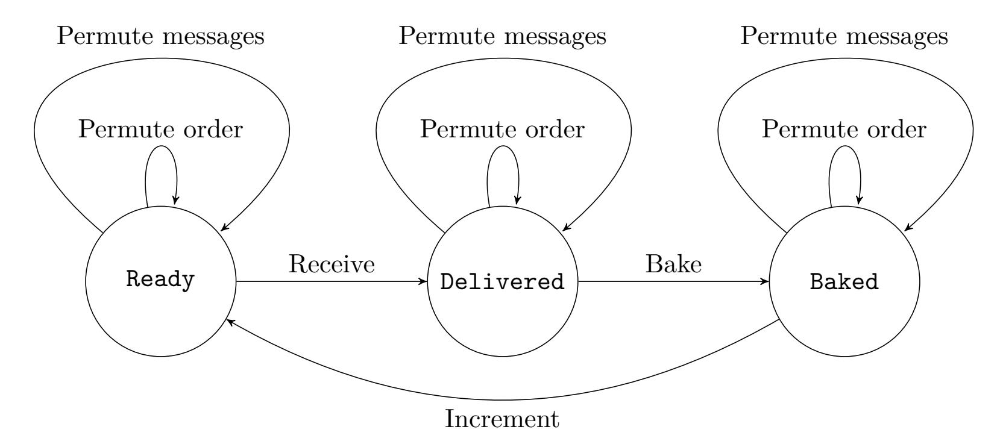

{0}------------------------------------------------

# **Formalizing Nakamoto-Style Proof of Stake**

Søren Eller Thomsen and Bas Spitters

Concordium Blockchain Research Center, Aarhus University, Denmark {[sethomsen](mailto:sethomsen@cs.au.dk), [spitters](mailto:spitters@cs.au.dk)}@cs.au.dk

May 18, 2021

#### **Abstract**

Fault-tolerant distributed systems move the trust in a single party to a majority of parties participating in the protocol. This makes blockchain based crypto-currencies possible: they allow parties to agree on a total order of transactions without a trusted third party. To trust a distributed system, the security of the protocol and the correctness of the implementation must be indisputable.

We present the *first* machine checked proof that guarantees both safety and liveness for a consensus algorithm. We verify a Proof of Stake (PoS) Nakamoto-style blockchain (NSB) protocol, using the foundational proof assistant Coq. In particular, we consider a PoS NSB in a synchronous network with a static set of corrupted parties. We define execution semantics for this setting and prove chain growth, chain quality, and common prefix which together imply both safety and liveness.

# **1 Introduction**

A Byzantine Agreement [\[LSP82\]](#page-22-0) (BA) protocol allows a group to agree on a decision, even when some of its members behave dishonestly. Such a protocol is required to satisfy

**Safety** all honest parties reach the same decision;

**Liveness** a decision is reached eventually.

This problem naturally extends to agreeing multiple times (multi-shot-consensus or just consensus). Until 2008, the main algorithmic approach for achieving consensus was to collect a majority of votes on a decision before taking the next decision. We will refer to protocols based on this design as quorum-based protocols.

In 2008 Nakamoto's Bitcoin protocol [\[Nak08\]](#page-22-1) revolutionized the field by introducing a fundamentally different approach for solving the problem. Instead of letting parties agree on each step of progress by multiple rounds of communication between them, Nakamoto introduced a simple protocol where parties probabilistically take turns making individual progress and disseminating this to all other parties. If parties often enough have time to see what other parties have disseminated before they make progress, this protocol guarantees safety and liveness up to a negligible probability of failure.

The protocol works by letting all parties maintain an order-preserving data-structure over previous decisions (a block tree) and run a "lottery" to decide who is allowed to append the next block to an existing chain in the block tree. Whenever there is a winner of the lottery, they produce a block and disseminate it to all other parties. Parties receiving a block will perform a

{1}------------------------------------------------

series of checks to guarantee that the block is valid and that the party that produced the block actually won the lottery; if all the checks are correct, the parties should append the new block to their local block tree. A party will consider a slightly pruned version of their current longest valid chain to be the ordering of blocks agreed upon. We call a protocol with a similar shape, regardless of lottery mechanism, a Nakamoto-style Blockchain (NSB).

For an NSB there are three main properties that together ensure both liveness and safety [\[GKL15\]](#page-21-0). These are *chain growth*, *chain quality* and *common prefix*. Chain growth says that the length of the best chain of an honest party increases over time. Chain quality says that within a sufficiently large consecutive chunk of blocks of a best chain some of them must be honest. Common prefix says that the best chains of honest parties will be a prefix of each other if we remove some blocks from the chain.

Because parties probabilistically make individual progress without waiting for a quorum, the lottery needs to be configured in such a way that the time between winners of the lottery must be long enough for blocks to propagate between parties. NSBs are therefore *only* secure in a *synchronous network* [\[DLS88\]](#page-21-1), where an upper bound on the time it takes to deliver a message is known. Traditional quorum-based algorithms can be designed such that they are secure in either a synchronous network or a partially-synchronous network [\[DLS88\]](#page-21-1) where there exists an unknown upper bound on message delivery time. The latter requires stronger honesty assumptions.

Nakamoto's original protocol was based on a lottery that assumes that the majority of the computing power participating in the protocol behaves honestly. The lottery functions by requiring that for a message (block) to be considered valid, the hash of the message needs to be less than a certain threshold. To participate in the lottery parties will, therefore, try to append different numbers to the messages they want to send, until they find a number which when appended to the message gives a hash which is less than the threshold. Such a lottery is called a Proof of Work lottery (PoW). Unfortunately, this design comes with a high power consumption to provide a secure protocol, as honest parties need to "mine" more valid messages than dishonest parties to ensure safety. This problem is solved by the introduction of a Proof of Stake (PoS) lottery, where parties instead can prove that they have the right to create a message for a particular round with their signature. This construction requires that the majority of stake (for some deterministic calculation of "stake") in the system behaves honestly.

Because consensus protocols are distributed, they are notoriously difficult to prove correct. In fact, some protocols were claimed to be both safe and live and passed peer review, but were later found to be either only safe or only live [\[AGGM](#page-21-2)+17].

Our work establishes both safety and liveness of a PoS NSB. To make our proofs indisputable we model a PoS NSB protocol with an abstract lottery, provide precise execution semantics for this, and reduce our proofs of safety and liveness for this protocol all the way to the axioms of mathematics using the Coq proof assistant [\[Tea20\]](#page-23-0). The formalization can be found at

#### <https://github.com/AU-COBRA/PoS-NSB>.

The formalization uses Coq 8.11.2 with mathcomp 1.11.0 [\[GM10\]](#page-21-3), finmap 1.5.0 and coq-equations 1.2.2 [\[SM19\]](#page-23-1). The mathematical components (mathcomp) library has been used to formalize large parts of mathematics. It introduces a particular proof style that scales well to large developments and revolves around small-scale-reflection, which we also use for this formalization.

{2}------------------------------------------------

#### **1.1 Contributions**

We implement the behavior of honest parties participating in a PoS NSB with an abstract lottery in Coq. We use this to define the semantics of the execution of the protocol in a synchronous network accounting for the case when a static subset of parties behaves dishonestly. We prove that the protocol is *both* safe and live assuming appropriate conditions on the hash-function and the lottery, and restrictions on an adversary's capability to produce honest signatures. We use the methodology of abstract specification from programming languages. This allows us to focus on the core combinatorial arguments that are used in the theory of secure distributed systems. To enable this we make some simplifications about signature-schemes that are reminiscent of symbolic cryptography. However, our analysis is not a consequence of a series of rewrite rules, but instead we leverage Coq to discover and generalize non-trivial induction-invariants.

In particular, we contribute with the following:

- 1. We provide the first formalization of *any* consensus algorithm that ensures both safety and liveness in a Byzantine setting. Specifically, we verify that a PoS NSB protocol with an abstract lottery and a symbolic signature scheme ensures consensus. In order to do so, we provide precise semantics for executions of distributed protocols with statically corrupted parties in a *synchronous network*. As we treat the lottery and signature scheme abstractly, we do not achieve computational security guarantees, but instead focus on the combinatorial arguments which is common in distributed systems. We use the semantics to formally prove both chain quality, chain growth and common prefix. Our theorems for chain growth and chain quality only requires an honest majority (*>* 1 2 ) of stake which matches the bounds of earlier non-mechanized proofs whereas, for common prefix, our proof requires an honest super-majority (*>* 2 3 ).
- 2. In addition to the formalization, we develop a methodology for verifying protocols by abstract functional interfaces, rather than specific non-optimized implementations. This may seem to increase the gap between our formalized proof and a running implementation. However, by using a precise abstract interface we clearly distinguish the correctness of performant code and that of the protocol. We only focus on the latter and isolate the core combinatorial arguments. As a side benefit our proof also works for a protocol that allows participants to run different concrete implementations of this abstract interface. This is a realistic scenario for a blockchain protocol where different parties might participate with different devices. This methodology applies both to pen-and-paper proofs as well as formalizations.

#### **1.2 State of the Art**

To provide context for this work, we give an overview of the state of the art. First, we provide an overview of analysis of NSBs and next an overview of existing mechanized proofs for consensus algorithms. In Section [6](#page-19-0) we provide a broader comparison to other related work.

#### **1.2.1 NSB Analysis**

The first cryptographic analysis of a PoW NSB [\[GKL15\]](#page-21-0) proved that the protocol underlying Bitcoin satisfies both safety and liveness. In order to do so they introduced the properties chain quality, chain growth and common prefix, which together imply both safety and liveness. Their foundational analysis has been extended in several directions: The security has been analyzed in the UC-model [\[BMTZ17\]](#page-21-4) and the analysis has been modified to cover variations of how the

{3}------------------------------------------------

<span id="page-3-0"></span>

| Formalization                  | Type         | Network                | Safety   | Liveness |
|--------------------------------|--------------|------------------------|----------|----------|
| Toychain [PS18]                | PoW NSB      | Partially synchronous  | (-)      | _        |
| Velasarios [RVVV18]            | Quorum-based | Partially synchronous  | <b>√</b> | _        |
| Algorand [ACL <sup>+</sup> 19] | Quorum-based | Partially synchronous  | <b>√</b> | _        |
| Gasper [ALP <sup>+</sup> 20]   | Quorum-based | No execution semantics | <b>√</b> | (-)      |
| This work                      | PoS NSB      | Synchronous            | <b>√</b> | ✓        |

Table 1: Overview of previous formalizations in Coq. The formalization of Gasper does not provide execution semantics for the protocol, and so no network-model appears in their formalization. By (–) we indicate that only very weak results has been proven about the property. In particular, [PS18] only proves functional correctness and [ALP<sup>+</sup>20] only proves plausible liveness.

best chain is selected with improved properties [KMM<sup>+</sup>20]. Ren [Ren19] simplifies the original analysis.

In a PoW lottery, a winning event is tied to a specific block, which means that only the particular block that with a hash lower than the threshold will be considered valid by honest players. In PoS, however, a winning event corresponds to a party being able to sign a block that will be considered valid, which means that nothing prevents an adversary from signing multiple different blocks. Due to this attack vector a PoS protocol is inherently more difficult to analyze.

The first analysis made for a PoS NSB, was for a lottery with a unique winner in each round [KRDO17], which was followed up by an analysis of a lottery that allowed for multiple winners in each round and was generalized to a weaker network model [DGKR18]. Similar analysis have later been performed in a composable framework [BGK<sup>+</sup>18] and the bounds have been improved [BKM<sup>+</sup>20].

This work formalizes an analysis similar to previous PoW analysis, but adapts these to work for a PoS lottery. Our proof roughly follows the proofs in [KMM<sup>+</sup>20], which in order to analyze different rules for selecting the best chain rule, stated their analysis with a clear separation of necessary conditions on the lottery and combinatorial arguments. The main difference between our proof and theirs is in the proof of the common prefix property. This argument is quite different for PoS than for PoW. Our proof revolves around the fact that the block corresponding to an adversarial lottery ticket can appear at most once on each chain, whereas their proof revolved around that an adversarial block can appear at most once across all chains. This implies that our proof for common prefix requires  $\frac{2}{3}$  of the stake to be honest. A  $\frac{1}{2}$  honesty bound can be obtained for PoS protocols [KRDO17, DGKR18, BKM<sup>+</sup>20] by more complicated proofs revolving around the notion of characteristic strings.

#### 1.2.2 Formalization of Consensus Protocols

Table 1 provides an overview of selected previous formalizations of consensus algorithms in Coq.

Formalization of NSBs Toychain [PS18] was the first verification effort towards formal guarantees for any NSB (in particular a PoW NSB). They defined a relation on global states and proved basic properties about the reachable global states. In a partially synchronous network, they proved that if the system ends up in a state where no messages are waiting to be delivered, then all clients agree on the current best chain. Although that is an important property of the system it is not enough to argue about how the tree of blocks evolves when the protocol is run, as it will probably never be the case that there are no messages in transit (messages sent but not yet delivered). Toychain did not consider any Byzantine behavior and only focused on functional correctness.

{4}------------------------------------------------

Our work takes the same approach as taken in Toychain, by defining a relation on reachable global states and proving properties for these reachable states. We do, however, model a synchronous network instead of a partially synchronous one, in which stronger properties hold.

Toychain has been extracted and connected to OCaml-code [\[Pîr19\]](#page-22-7), which provides an executable node with formal guarantees. Kaizen [\[KPM](#page-22-8)+19] extends the statements proven in [\[PS18\]](#page-22-2) to apply for an actual performant implementation of a NSB through a series of refinements and transformations of the original code-base, at the cost of a slightly larger trusted computing base. This work does, however, not improve on the statements proven in [\[PS18\]](#page-22-2).

Probchain [\[GS19\]](#page-21-10) aims to formalize the analysis from [\[GKL15\]](#page-21-0), but they state that their proofs are unfinished.

**Formalization of quorum-based consensus** Traditional (quorum-based) Byzantine faulttolerant (BFT) consensus algorithms are also used for blockchains. Velisarios [\[RVVV18\]](#page-22-3) is a general framework for formally proving quorum-based BFT algorithms secure in Coq. They prove a safety property of a widely used BFT algorithm, PBFT [\[CL99\]](#page-21-11), but do not prove liveness.

A formalization of the Algorand consensus protocol [\[ACL](#page-21-5)+19] verifies safety of their BFT algorithm. Their proof revolves around a transition relation on global states, which models a partially synchronous execution of the protocol.

Ethereum is planning to use a BFT algorithm as a finality layer. The Casper finality layer has been formally proven to achieve its safety property [\[NJH19\]](#page-22-9) in the Isabelle proof assistant. In Coq, Casper has been proven to be both safe and *plausible live* [\[PGP](#page-22-10)+18]. Plausible live is a weaker form of liveness that ensures the protocol will never deadlock. This result was extended to also cover the revised protocol Gasper which works with a dynamic set of validators [\[ALP](#page-21-6)+20]. The results are proven with an abstract model of quorums on a set of messages without explicitly defining honest behavior and communication.

### **1.3 Paper Outline**

The remainder of the paper is organized as follows. Section [2](#page-4-0) describes our notation and conventions. Section [3](#page-5-0) describes how a PoS NSB functions. In Section [4](#page-5-1) we will introduce the formal setting for our protocol, present the requirements for an implementation of a blocktree, define honest and adversarial behavior, and finally define *reachable* global states. Section [5](#page-12-0) will present our general results including both the formal theorems and intuition behind the formal proofs. Section [6](#page-19-0) will relate this work to previous work on formalizing distributed systems. Finally, Section [7](#page-20-0) concludes.

# <span id="page-4-0"></span>**2 Notation**

The set of natural numbers is denoted **N** = {0*,* 1*,* 2*, . . .* } and boolean values are denoted **B** = {>*,* ⊥}. We adopt conventions from mathcomp and let eqType be a type with decidable equality and finType be a type with a finite duplicate free enumeration.

A record type with the fields a and b of type **N** is defined by NatPair := {a : **N***,* b : **N**}.

seq *T* is the type of lists of type *T*. [::] denotes the empty sequence, [:: *x*] the list with the single element *x* and ++ the concatenation operator. We overload standard set notation for filtering and cardinality of sets to also apply to sequences. We adopt notation from mathcomp. We write =<sup>i</sup> to denote that two sequences have the same members. We write *s*<sup>1</sup> ⊆ *s*<sup>2</sup> to denote that each member in the sequence *s*<sup>1</sup> also in *s*2.

We will use teletypefont for functions and variable names and small capitals for types.

{5}------------------------------------------------

CamelCase (capitalized) names are used for parameters of the formalization and types whereas snake\_case is used for constructs explicitly defined within the formalization.

FileName [term\\_name](https://github.com/AU-COBRA/PoS-NSB) are clickable links that directs to the formal definition of the described concept.

# <span id="page-5-0"></span>**3 The Protocol**

We consider a static stake PoS NSB protocol similar to the one in [\[DGKR18\]](#page-21-7). This section provides an informal description of the protocol, such that the description of the formal model and the exact behavior of honest parties presented in Section [4](#page-5-1) can be guided by intuition.

We discretize time into *slots* which we assume to be totally ordered: Slot , **N**. Each party has access to a clock they can query for the current slot, a flooding network they can use to flood messages to each other, and a lottery functionality they can query to check if they are the winner of a slot. We say that a party that wins the lottery for a slot is a *baker* of this slot. Blocks contain a slot number, a hash of the predecessor, a identifier of the baker, and a signature. These are the content of messages send through the flooding network in the protocol.

Each party maintains a block tree that initially only contains a single block called the *Genesis Block*. When a block *b* is added to the block tree it will be added as a successor to the block in the tree with a hash that matches the predecessor of *b*. A path originating at the Genesis Block in a block tree is called a chain.

The protocol proceeds in slots where each party will do the following for a slot:

- 1. Collect all previous blocks that they have received since the last round through the flooding network and add these to their block tree if the signature is valid and the identifier of the block corresponds to a winning party for the round.
- 2. Evaluate the lottery to check if they are a winner of this round. If they win this slot they will:
  - (a) Calculate what their current longest chain is (disregarding blocks with a higher slot number than the current slot)[1](#page-5-2) . If there are multiple longest chains of equal length they will use a tie-breaker of their choice to determine the one they consider the best[2](#page-5-3) .
  - (b) Create a new block that will include a hash to the head of their best chain, the current slot, their identity, and their signature.
  - (c) Flood this new block using the flooding network.

The protocol ensures that the participants of the protocol will agree on the current longest chain when removing a few blocks from the head of this chain. It is for the chains calculated in this way we wish to ensure both safety and liveness. Specifically, we want to ensure that the best chain of any party grows (chain growth), that honest blocks regularly are appended to this chain (chain quality), and that this chain is both consistent among parties and persistent when the protocol progresses (common prefix).

# <span id="page-5-1"></span>**4 Formal Model**

We model the protocol described in Section [3](#page-5-0) in a synchronous network with a static but active adversary. This section describes in detail how this translates to the formal setting in which we

<span id="page-5-2"></span><sup>1</sup>Adversarial parties might choose to evaluate the lottery ahead of time and send these to honest parties.

<span id="page-5-3"></span><sup>2</sup>This tie-breaker is insignificant for the security of the protocol.

{6}------------------------------------------------

prove our results. First, we present the basic constructs and parameters of our protocol. Next, we introduce the abstraction and specification of the block tree. Then we move on to describe our specification of the actual protocol i.e., how honest parties should behave, the global state of the entire system, and the formalization of the synchronous network. Finally, we put this together to define a relation on what state are reachable from the initial state when running the protocol with a fixed set of parties and a static but active adversary.

We will use this definition of reachable states extensively in Section [5,](#page-12-0) as we quantify all of our main statements over reachable states.

#### **4.1 Parameters and Basic Constructs**

Our model is parameterized by a type Party : finType that represents a unique identifier for a party[3](#page-6-0) , an equality type Txs : eqType that represents transactions (i.e., content that can be put on the blockchain), and a type Hash : eqType that represents the co-domain of a hash function for blocks, HashBlock. A block, Block, is defined to be a record containing four fields

$$\{pred : HASH, slot : SLOT, txs : TXS, bid : PARTY\}.$$

A block contains the predecessor of the block, pred, a slot number in which the block was created, slot, some transactions, txs, and a baker-identifier, bid. A *chain* is a sequence of blocks Chain , seq Block.

**Lottery** Our model is further parameterized by a predicate, Winner : Party → Slot → **B**, that allows to check if a particular party has the right to create a block in a specific slot. This abstraction is intended to capture a lottery similar to the one proposed in the static-stake version of Ouroboros Praos [\[DGKR18\]](#page-21-7). There it is determined whether a party wins by evaluating a verifiable random function (VRF) on the current slot number and compare it to a threshold depending on that party's stake. We do not model that only persons knowing the secret key can evaluate the lottery. Neither do we model that the lottery cannot be evaluated far into the future[4](#page-6-1) . We also do not model signatures.

Instead, we quantify our theorems in Section [5](#page-12-0) by an appropriate hypothesis on the unforgeability of blocks produced by honest players (Definition [10\)](#page-13-0).

**Valid chains** Our protocol has an initial block, GenesisBlock : Block, that all chains should end in and which we assume to have an honest baker identifier and the slot set to 0. Using the lottery abstraction we define a valid chain.

#### **Definition 1** (Valid chain). [BlockTree.v](https://github.com/AU-COBRA/PoS-NSB/blob/8cb62e382f17626150a4b75e44af4d270474d3e7/Protocol/BlockTree.v#L51) valid\_chain

We say that a chain is a valid chain if it fulfills the following three requirements

- All blocks in the chain need to be valid. A block *b* is valid if Winner (bid *b*)(slot *b*) = >.
- The chain should be linked correctly: the field pred of a block contains a hash that is equal to that of the predecessor in the chain and the chain ends in the GenesisBlock.
- The projection of the fields slot from the chain forms a strictly decreasing sequence of slots.

We define valid\_chain : Chain → **B**, as a computable predicate ensuring these properties are fulfilled.

<span id="page-6-1"></span><span id="page-6-0"></span><sup>3</sup>We make this a finite type as there as a finite supply of IP-addresses.

<sup>4</sup> In practice these are both desirable properties. The adversary should not learn if an honest party wins the lottery before that honest party has time to send out their block. Neither should the adversary be able to predict a sequence of slots that the they win.

{7}------------------------------------------------

#### **4.2 BlockTree**

A NSB maintains a *correct* tree of currently received blocks, from which the current *best chain* can be derived.

Previous analysis of NSB protocols [\[GKL15,](#page-21-0) [BMTZ17,](#page-21-4) [KRDO17,](#page-22-6) [PS18\]](#page-22-2) provide an explicit algorithm for calculating the best chain from a set of chains and prove the security of this construction. Unfortunately, this approach creates a gap between the security analysis on an easily verifiable algorithms and the highly optimized code that is running in typical implementations of such a protocol. The main performance bottleneck of the extracted implementation of Toychain [\[Pîr19\]](#page-22-7) is their blocktree which runs in *O*(*n* 4 )-time. Comparable non-verified implementations run in ∼ *O*(*n*)-time when the cost is amortized.

In this work, we take a different approach and specify the minimal requirements of a correct blocktree rather than providing an explicit construction for this data-structure. Taking this approach, we do not prove correctness of an efficient implementation. This could be done in two ways: 1) Either by providing a reference implementation (as in previous work) which can then be refined, or 2) by instantiating our abstract interface. We consider the second approach to be more flexible as it provides a *minimal* specification. Moreover, we do not explicitly provide an implementation of our specification. We come back to this after Definition [6.](#page-8-0)

Following the style of mathcomp we define a type, treeType, that denotes a type that satisfies the requirements to achieve our security in the protocol.

**Correctness conditions for a block tree** For a type T : Type to be a treeType, we demand that the following functions should be defined.

tree<sup>0</sup> : T

extendTree : T → Block → T allBlocks : T → seq Block bestChain : Slot → T → Chain

The function tree<sup>0</sup> corresponds to the requirement that there is an initial tree that the protocol can be instantiated with, extendTree gives a way to extend any tree returning a new tree, allBlocks should give a set of blocks that the tree has been extended with and finally bestChain allows one to extract what is currently the best chain of the tree with respect to a slot.

*T* : Type is a treeType if is instantiated, extendable, valid, optimal and self-contained:

#### **Definition 2** (Instantiated). [BlockTree.v](https://github.com/AU-COBRA/PoS-NSB/blob/8cb62e382f17626150a4b75e44af4d270474d3e7/Protocol/BlockTree.v#L106) all\_tree0

A type *T* is *instantiated* if no blocks are recorded in the initial structure except for GenesisBlock i.e.,

> allBlocks tree<sup>0</sup> =<sup>i</sup> [:: GenesisBlock] *.*

#### **Definition 3** (Extendable). [BlockTree.v](https://github.com/AU-COBRA/PoS-NSB/blob/8cb62e382f17626150a4b75e44af4d270474d3e7/Protocol/BlockTree.v#L109) all\_extend

A type *T* is *extendable* if extending the structure with a block is recorded properly in the set of contained blocks i.e.,

∀(*t* : T)(*b* : Block)*,* allBlocks(extendTree *t b*) =<sup>i</sup> allBlocks *t* ++ [:: *b*] *.*

**Definition 4** (Valid). BlockTree.v [best\\_chain\\_valid](https://github.com/AU-COBRA/PoS-NSB/blob/8cb62e382f17626150a4b75e44af4d270474d3e7/Protocol/BlockTree.v#L112)

A type *T* is *valid* if the best chain achieved from this structure is always a valid chain i.e.,

∀(*t* : T)(*sl* : Slot)*,* valid\_chain (bestChain *sl t*)*.*

{8}------------------------------------------------

#### **Definition 5** (Optimal).

```
BlockTree.v best_chain_best
```

A type T is optimal if the best chain less than a slot achieved from this structure is at least as good as any other chain obtained from the set of blocks recorded in the structure i.e.,

```
\forall (c: \mathtt{CHAIN})(t: \mathtt{T})(sl: \mathtt{SLOT}), \mathtt{valid\_chain} \ c \to c \subseteq \{b \in \mathtt{allBlocks} \ t \mid \mathtt{slot} \ b \leq sl\} \to |c| \leq |\mathtt{bestChain} \ sl \ t|.
```

#### <span id="page-8-0"></span>**Definition 6** (Self-contained).

```
BlockTree.v >> best_chain_in_all
```

A type T is *self-contained* if the best chain less than a slot achieved from this structure is a subset of the recorded blocks in the structure i.e.,

```
\forall (t:\mathrm{T})(sl:\mathrm{SLOT}), \mathtt{bestChain}\ sl\ t \subseteq \{b \leftarrow \mathtt{allBlocks}\ t \mid \mathtt{slot}\ b \leq sl\}.
```

Note that a simple algorithm that keeps track of all possible chains that can be created from the received blocks and prunes these for blocks from future slots before calculating the best chain provides all of the desired properties. This algorithm is what is used in [DGKR18].

Our development is parameterized over a specific implementation of such a type, TREE: TREETYPE that we use to build a particular tree, consisting of all blocks honest parties have received.

#### 4.3 Parties

We represent the knowledge of a participating party as a record containing their identity, a TREETYPE, and a blocktree of that type:

```
LocalState := \{id : Party, tT : treeType, tree : tT\}.
```

We further parameterize our development by a tree implementation for each party, TreeTypeMap:  $Party \rightarrow TreeType$ . Unlike traditional pen-and-paper proofs (and previous formalizations) this implies that our results in Section 5 are quantified over all parties using different implementations of the core data-structure. This is a realistic scenario for a blockchain protocol, as parties might participate in the protocol with different devices and as a consequence different implementations optimized for their particular device.

Being able to make this quantification is another benefit of our abstract characterization of the core data-structure for the protocol.

Honest behavior The behavior of an honest party is defined by two stateful functions: One that defines an honest party's reaction when receiving a sequence of messages in a slot, honest\_rcv, and one that defines what an honest party should do when baking for a slot, honest\_bake. Both functions take an argument of type LOCALSTATE and return an updated state together with a sequence of messages (the type MESSAGES, see Section 4.5) that the party wishes to flood to other parties.

```
\begin{aligned} & \texttt{honest\_rcv}: \texttt{MESSAGES} \to \texttt{SLOT} \to \texttt{LOCALSTATE} \to (\texttt{UNIT} * \texttt{LOCALSTATE}) \\ & \texttt{honest\_bake}: \texttt{SLOT} \to \texttt{TXS} \to \texttt{LOCALSTATE} \to (\texttt{MESSAGES} * \texttt{LOCALSTATE}) \end{aligned}
```

The honest parties receives in a straightforward manner, as they will simply extend their blocktree with all blocks they receive, using the extendTree-function defined for their blocktree implementation. When an honest party is invoked to bake they will test if they are the Winner of the current slot. If so, they will calculate the best chain from their current block tree, disregarding blocks from future slots, and create a new block with the predecessor set to the

{9}------------------------------------------------

hash of the head of the best chain. Then they will include the transactions provided as an argument in this block. Finally, they will extend their blocktree with this new block and create a message containing this block and flood this.

The honest behavior is computable, and to run the protocol these two functions could be extracted and connected to a network-shim[5](#page-9-0) and a time-shim[6](#page-9-1) , similarly to what has been done for previous formalizations [\[KPM](#page-22-8)+19, [Pîr19\]](#page-22-7).

**Adversarial parties** We explicitly model an adversary within the system, by parameterizing the development by a type, AdversarialState that the adversary can choose freely. We furthermore let the adversary choose the behavior of any corrupted party by again parameterizing our development over two functions corresponding to the adversarial behavior when receiving blocks and when baking for a slot.

```
AdversarialRcv, AdversarialBake : Slot →
                               Messages →
                               MsgTuples →
                               AdversarialState →
                               (seq (Message ∗ DelayMap) ∗ AdversarialState)
```

The adversary's functions take more arguments than the corresponding honest ones.[7](#page-9-2) In this way we model a more powerful adversary by providing him with a complete view of the state: the entire history of messages sent in the system and those that are sent, but not yet delivered, as well as their delivery times (encapsulated in the type MsgTuples; see Section [4.5\)](#page-10-0). This type of powerful adversary, i.e. one that who has access to all messages sent even before they are delivered, is called a *rushing* adversary. We also allow the adversary to supply an additional argument (of type DelayMap) to the messages he wishes to be sent. This allows him a more fine-grained control over when his messages will be delivered (again see Section [4.5\)](#page-10-0). Although the type-signatures of AdversarialRcv and AdversarialBake are similar, we parameterize our development by two distinct functions to make adversary much powerful as possible.

Modelling an active adversary by quantifying over an opaque function was previously done in other Coq developments [\[PM15,](#page-22-11) [GS19\]](#page-21-10).

#### **4.4 Global state**

We define a record type GlobalState that contains all the information for this protocol when it is executed. The GlobalState record has the following fields.

**Clock:** The current slot of the system.

**Message buffer:** A buffer containing all messages that have been sent but not yet delivered in the system.

**State map:** A partial map of type Party → option LocalState that keeps track of the local state of all participating parties.

<span id="page-9-0"></span><sup>5</sup>Code that floods messages as well as receives messages from other parties and invoking the honest\_rcv.

<span id="page-9-2"></span><span id="page-9-1"></span><sup>6</sup>Code that invokes the honest\_bake each time a new slot start.

<sup>7</sup>The adversary is not provided with any transactions as it can freely decide what to include in the blocks. Moreover, later we will quantify over any selection of transactions to honest parties (including over selectionalgorithms that may be known to the adversary before hand).

{10}------------------------------------------------

**History:** The history of all messages that have been sent. This is merely a book-keeping tool for describing assumptions such as the absence of hash-collisions in the state. Examples of how this is used can be found in Section [5.](#page-12-0)

**Adversarial state:** The adversaries state.

**Execution order:** The order in which the system should activate its parties. This is merely a bookkeeping allowing the environment to decide the order of activations (see Section [4.6\)](#page-11-0).

**Progress:** The progress that the system has made within a single slot

Progress , {Ready*,* Delivered*,* Baked}*.*

How a global state can change its progress is defined in Section [4.6.](#page-11-0)

### <span id="page-10-0"></span>**4.5 Network**

We assume a lock-step-synchronous network with a known upper bound on the delivery time. This is similar to what the first analysis of both PoW [\[GKL15\]](#page-21-0) and PoS [\[KRDO17\]](#page-22-6) assumes. This can be extended to a semi-bounded delay network (with a known upper bound) in the same way as [\[GKL15,](#page-21-0) [DGKR18\]](#page-21-7). This network model is different from the analysis in [\[PS18\]](#page-22-2), which assumed only a partially synchronous network[8](#page-10-1) . However, NSBs are not secure in that model.

More precisely, we assume that time is discretized into slots which are coarse enough for honest parties to have enough time to first execute their computations for a slot and then send out messages. At this time there should be enough time left in the round such that any message sent out at this point is ready for the delivery phase of the next round. This assumption enables the possibility of creating a flooding network with the property that if a message is sent by an honest party in slot *sl* then it will be delivered to any other party at time *sl* + 1.

Adversarial parties sending messages in slot *sl* does, however, have the possibility of postponing sending their messages until the very end of the round in which case they can choose to let some honest parties receive their message in slot *sl* + 1 and others in slot *sl* + 2.

At first this may seem as a stronger assumption than used in previous work [\[GKL15,](#page-21-0) [KRDO17,](#page-22-6) [DGKR18\]](#page-21-7). There adversaries can send different messages to different parties. Adversarial blocks will then be propagated to other honest parties only after an honest party extends these. This is because honest parties will send entire chains around instead of just blocks. Note, however, that our network model can easily be derived from their assumptions by simply letting all honest parties gossip about the blocks they receive. Our network model can be instantiated with a gossip protocol. This is closer to what is used in NSBs running in practice and more realistic than previous pen-and-paper modeling.

To capture this network in our formalization, we introduce the type Message as an inductive type with only a single constructor namely BlockMsg : Block → Message, and the record MsgTuple defined by

```
MsgTuple := {msg : Message, rcv : Party, cd : Delay},
```

where Delay , {1*,* 2}. The field msg contains the actual message that is to be delivered at the receiving party contained in the field rcv. cd is the current delay of the message, which will be decremented for all messages as time progresses in the model.

<span id="page-10-1"></span><sup>8</sup>A network that only guarantees that messages eventually will be delivered.

{11}------------------------------------------------

The flooding network available to the parties is formalized as a set of functions that operate on a global state. The functionalities flood\_msgs and flood\_msgs\_adv enable the honest parties, the adversary, respectively to send messages.

```
\texttt{flood\_msgs}: Messages \rightarrow GlobalState \rightarrow GlobalState \texttt{flood\_msgs\_adv}: Seq \ (Messages * DelayMap) \rightarrow GlobalState \rightarrow GlobalState
```

Both functions will create a new message-tuple with the message for each party in the execution order of the global state.  $flood_msgs$  will set the delay of the messages that are being sent to 1, whereas the  $flood_msgs_adv$  takes an extra parameter for each message namely a DelayMap  $\triangleq$  Party  $\rightarrow \{1,2\}$ , such that the adversary for each message explicitly can choose what parties should have it delivered in the next round and what parties should have it delivered in two rounds.

#### <span id="page-11-0"></span>4.6 Reachable Worlds

To be able to reason about the reachable states of the protocol, we first define an initial global state,  $N_0$ : GLOBALSTATE. To this end we parameterize our development over a sequence of parties participating in the protocol, InitParties: SEQ PARTY, and create an initial state for all these parties with their tree set to tree<sub>0</sub>. The development is also parameterized over any initial state that an adversary wants to choose, AdversarialState<sub>0</sub>: ADVERSARIALSTATE.

 $N_0$  is now defined in a straightforward manner with no messages in the message-buffer, nothing in the history, AdversarialState<sub>0</sub>, and the parties' respective initial states.

We also parameterize our development by a total map  $Honest: Party \to \mathbb{B}$  which decides what function should be invoked for each respective party. This corresponds to the adversary being able to statically decide who should be corrupted.

We furthermore parameterize our development by a total map  $\mathtt{TxSelection}:\mathtt{SLOT} \to \mathtt{Party} \to \mathtt{TxS}$  which decides what transactions honest parties should include in the blocks they bake. We choose this modelling as it is completely irrelevant for the blockchain what payload parties make it carry. The entire proof could be (and was in earlier versions) performed without any content in the blocks. By adding some payload inside blocks we allow the adversary the possibility to try to disturb the blockchain by letting (otherwise identical) blocks have different content. 9

To capture how the protocol progresses we define a relation over atomic steps of a global state that enforces a state-transition system. A depiction of the transition system can be found in Figure 1. In the definition below *progress* refers to the progress stored in a global state.

<span id="page-11-2"></span>**Definition 7** (Atomic step reachable).

Schedule.v > SingleStep

For any two states  $N_1, N_2$ : GLOBALSTATE, we say that  $N_2$  is reachable in an atomic step from  $N_1$  if one of the following steps are taken.

**Receive:** If the progress of  $N_1$  is Ready, then  $N_1$  can step to the state obtained by invoking each respective parties delivery-function, update the state of the state according to the outcome of this, and set the progress to Delivered.

**Bake:** If the progress of  $N_1$  is Delivered, then  $N_1$  can step to the state obtained by invoking each (honest or dishonest) party's bake-function, updating the state according to this outcome, and setting the progress to Baked.

<span id="page-11-1"></span><sup>&</sup>lt;sup>9</sup>We are grateful to the CSF reviewers for this insight.

{12}------------------------------------------------

**Increment:** If the progress of *N*<sup>1</sup> is Baked, then *N*<sup>1</sup> can step to the state obtained by incrementing the slot number and updating the progress to Ready.

**Permute execution order:** Any *N*<sup>1</sup> can step to the state obtained by permuting the execution order of *N*1.

**Permute message buffer:** Any *N*<sup>1</sup> can step to the state obtained by permuting the message buffer of *N*1.

When *N*<sup>1</sup> can step to *N*<sup>2</sup> in one atomic step, we write *N*<sup>1</sup> *N*2.

This transition relation can be seen as an environment activating the parties in a restricted order. We model a adversarial environment by allowing permutations of the message buffer and the execution order. This models a very powerful adversary who gets to choose the exact message order for all messages sent, and decides the execution order for each step[10](#page-12-2). Definition [7](#page-11-2) is formalized as an inductive relation over global states in Coq.

We extend this definition to cover multiple steps as the reflexive transitive closure of atomic steps.

#### **Definition 8** (Reachable). [Schedule.v](https://github.com/AU-COBRA/PoS-NSB/blob/8cb62e382f17626150a4b75e44af4d270474d3e7/Model/Schedule.v#L115) BigStep

For any two states *N*1*, N*<sup>2</sup> : GlobalState we say that *N*<sup>2</sup> is *reachable* from *N*<sup>1</sup> if *N*<sup>2</sup> is reachable in zero or more atomic step from *N*1. We write *N*<sup>1</sup> ⇓ *N*2.

<span id="page-12-1"></span>

Figure 1: A depiction of the transition system that defines reachable states.

Our definition of reachable enforces that the set of parties participating in the protocol remains static through the execution of the protocol.

# <span id="page-12-0"></span>**5 Safety and Liveness**

This section will discuss our three main theorems (chain growth, chain quality and common prefix) and outline the structure of their proofs. The entire proof amounts to roughly 6k lines of code using mathcomp's compact proof language.

<span id="page-12-2"></span><sup>10</sup>This is also our reason for representing the execution order and message buffer as lists rather than multisets as we wish to give the adversary as much power as possible, by letting him determine the exact order.

{13}------------------------------------------------

Throughout the section we make two standard assumptions about the transition system. We assume that the list of parties participating (InitParties) in the protocol is unique, i.e., that no party will be activated twice during the same atomic step, and that there is at least one honest party among the participants[11](#page-13-1) .

**Phrasing of theorems** Our chain growth, chain quality and common prefix are stated as implications rather than the absolute probabilistic statements given in previous analysis. Chain growth relies only on a certain number of lucky slots within the time-span of states, whereas chain quality relies on a collision-free state, a forging-free state and certain condition on the winning events in a time-span. Common prefix relies both on a collision-free and a forging-free state. It states that either the property holds or a bad event happens — namely that the adversary has gotten an advantage that is statistically unachievable for a large *k*.

A probabilistic statement can be obtained by bounding the probabilities of the desired hypotheses (or conclusion). Formalizing this depends on the specific lottery functionality, the hash function, and the signature-scheme. This is not treated in this work, but below we will provide intuition how to prove this; see also Appendix [A.](#page-23-2)

#### **5.1 Defining Preconditions**

We start by defining some basic concepts. First, we specialize hash-collisions to our setting. Next, we state an assumption on the adversary's capability to publish blocks with honest identifiers, before we move on to define certain good and bad events with respect to the lottery.

Any NSB protocol only provides its guarantees under the assumption that there are no hash-collisions throughout the execution. We define this as a *collision-free* state.

**Definition 9** (Collision-free). CQ.v [collision\\_free](https://github.com/AU-COBRA/PoS-NSB/blob/8cb62e382f17626150a4b75e44af4d270474d3e7/Properties/CQ.v#L628)

A global state *N* : GlobalState with block history *bh* : seq Block is *collision-free* if

$$\forall b, b': \text{Block}, b, b' \in bh \to \text{HashBlock} \ b = \text{HashBlock} \ b' \to b = b'.$$

For any two global states *N*1*, N*<sup>2</sup> : GlobalState, if *N*<sup>1</sup> ⇓ *N*<sup>2</sup> and *N*<sup>2</sup> is collision-free, then *N*<sup>1</sup> is also collision-free, as block histories are monotonously growing over reachable states. We have taken care to phrase each of our main theorems using this definition, instead of assuming a global axiom on the injectivity of the hash-function or that any reachable state is collision-free. The introduction of such global axioms could lead to an inconsistency. Moreover, it would not be possible to bound the probability that such an axiom is satisfied by a collision-resistant hash-function. We provide intuition how this can be done with the current formulation:

<span id="page-13-2"></span>*Remark* 1*.* If *N* : GlobalState is not collision-free, then two blocks were produced between the initial state N<sup>0</sup> and *N* where the hash-function collided. If an adversary can break the collision-free assumption with non-negligible probability, then one can construct a new adversary emulating both honest and dishonest players whom will produce a collision on the hash-function with non-negligible probability.

Another assumption that is needed in order to be able to state our main theorems is that the adversary cannot forge any honest blocks through the execution that led to a global state. We do not model signatures explicitly, so instead, we assume that the adversary cannot send out any block with the bid-field set to the identifier of an honest party that is not already a part of the block history.

<span id="page-13-1"></span><span id="page-13-0"></span><sup>11</sup>This is not a requirement on the stake of the honest parties, but simply a requirement that at least one of the actual parties in the protocol behaves honestly. The requirements on the lottery and thus on the stake will appear as preconditions for the individual statements.

{14}------------------------------------------------

#### **Definition 10** (Forging-free). CQ.v [forging\\_free](https://github.com/AU-COBRA/PoS-NSB/blob/8cb62e382f17626150a4b75e44af4d270474d3e7/Properties/CQ.v#L103)

We say that a global state *N* : GlobalState is *forging-free* if for any activation of the adversarial functions, AdversarialBake*,* AdversarialRcv with parameters from a global state *N*0 : GlobalState where *N*<sup>0</sup> ⇓ *N* implies that there are no honest blocks in what the adversary sends that is not already in the block history of *N*<sup>0</sup> .

In order to state this in the formalization, we introduce a more fine-grained refinement of the reachable transition-relation. We need this to be able to precisely state that the assumption holds in between each individual party-activation and not only in the synchronous steps.

The definition of forging-free closely corresponds to the property one could achieve by using an EUF-CMA (existential unforgeability under chosen message attack) secure signature scheme to sign blocks.

<span id="page-14-1"></span>*Remark* 2*.* If *N* : GlobalState is not forging-free, the adversary has been able to forge a message between the initial state N<sup>0</sup> and *N*, and has thus succeeded in breaking the signature scheme. Any adversary that can break this assumption with a non-negligible probability will thus be able to break the EUF-CMA secure scheme with a non-negligible probability.

We define a lucky slot to be any slot where an honest party wins the lottery and an adversarial slot to be the corresponding concept for adversarial parties. Finally, we define honest advantage to be the difference between these two amounts over a sequence of slots.

#### <span id="page-14-2"></span>**Definition 11** (Lucky slot). CG.v [lucky\\_slot](https://github.com/AU-COBRA/PoS-NSB/blob/8cb62e382f17626150a4b75e44af4d270474d3e7/Properties/CG.v#L1354)

A slot *sl* is a *lucky slot* if there is a party *p* ∈ InitParties s.t. Winner *p sl* ∧ Honest *p*.

#### **Definition 12** (Super slot). CP.v [super\\_slot](https://github.com/AU-COBRA/PoS-NSB/blob/8cb62e382f17626150a4b75e44af4d270474d3e7/Properties/CP.v#L41)

A slot *sl* is a *super slot* if there is a exactly one party *p* ∈ InitParties s.t. Winner *p sl*∧Honest *p*.

#### <span id="page-14-3"></span>**Definition 13** (Adversarial slot). CQ.v [adv\\_slot](https://github.com/AU-COBRA/PoS-NSB/blob/8cb62e382f17626150a4b75e44af4d270474d3e7/Properties/CQ.v#L124)

A slot *sl* is an *adversarial slot* if there is a party *p* ∈ InitParties s.t. Winner *p sl* ∧ ¬Honest *p*.

There is a close connection between a lucky slot and the creation of a *left-isolated block* in the analysis of PoW [\[KMM](#page-22-4)+20], as we have scaled our slots such that all honest blocks have time to propagate before the round begins. Similarly, super slots corresponds to *isolated* blocks. We call the block won by an honest player in a super slot a *super block*

#### **Definition 14** (Honest advantage). CQ.v [honest\\_advantage\\_range](https://github.com/AU-COBRA/PoS-NSB/blob/8cb62e382f17626150a4b75e44af4d270474d3e7/Properties/CQ.v#L140)

We define the *honest advantage* for an interval of slots to be the difference between the number of lucky slots and the number of adversarial slots in this period.

#### **5.2 Preliminary Lemmas**

We now state some selected definitions and lemmas that are used to prove our main theorems. The first lemma we introduce describes how knowledge propagates between honest parties.

#### <span id="page-14-0"></span>**Lemma 1** (Knowledge propagation). CG.v [honest\\_tree\\_subset](https://github.com/AU-COBRA/PoS-NSB/blob/8cb62e382f17626150a4b75e44af4d270474d3e7/Properties/CG.v#L1324)

Let *N*1*, N*<sup>2</sup> : GlobalState and *p*1*, p*<sup>2</sup> : Party. If N<sup>0</sup> ⇓ *N*1, *N*<sup>1</sup> ⇓ *N*2, *p*<sup>1</sup> is a party in *N*<sup>1</sup> with tree *t*1, *p*<sup>2</sup> is a party in *N*<sup>2</sup> with tree *t*2, *N*<sup>1</sup> is at Ready, *N*<sup>2</sup> is at Delivered, and *N*<sup>1</sup> and *N*<sup>2</sup> are in the same slot then

allBlocks *t*<sup>1</sup> ⊆ allBlocks *t*2*.*

*Proof sketch.* Our main observation is that at any point in time a block is in the tree of *p*1, it is either also already in *p*2's tree or to be delivered at the next delivery transition. Blocks can be added when an honest party wins the right to bake a block, in which case they will immediately 

{15}------------------------------------------------

send the block to all other parties and thus fulfill the invariant, or they can be added by an adversary and thereby delivered to an honest party by a delivery event, in which case it will be delivered to all other honest parties in the following delivery slot (by our network assumption).

This is in particular true when *p*<sup>1</sup> and *p*<sup>2</sup> is at Ready, which means that after the delivery transition *p*<sup>2</sup> will know all the blocks that *p*<sup>1</sup> knew before.

Since honest parties extend their trees monotonously this subset-relation will also extend to any state that leads to *N*<sup>1</sup> and any state that is reachable from *N*2.

The core insight of the proof for common prefix is that each time a super-slot is won the block produced in this slot will not have the same depth in a chain as any other honest block. In order to define this precisely, we define how to calculate a chain from a block[12](#page-15-0) .

#### **Definition 15** (Chain from a block). [CP.v](https://github.com/AU-COBRA/PoS-NSB/blob/8cb62e382f17626150a4b75e44af4d270474d3e7/Properties/CP.v#L328) cfb

We define the chain from a block *b* : Block with respect to a sequence of blocks *bp* : seq Block to be the chain obtained by following the pointers to from *b* through *bp* ending in GenesisBlock. We write cfb *b bp* to denote this chain. If no such chain can be obtained by following pointers in *bp* we say that cfb *b bp* = [::].

#### **Definition 16** (Position of a block). [CP.v](https://github.com/AU-COBRA/PoS-NSB/blob/8cb62e382f17626150a4b75e44af4d270474d3e7/Properties/CP.v#L354) pos

We furthermore define the *position* of a block, written pos, to be the length of the chain obtained by following the pointers from the block,

$$\texttt{pos}\ b\ bp\coloneqq |\texttt{cfb}\ b\ bp|.$$

As this is not a structurally recursive function we use the coq-equations plugin [\[SM19\]](#page-23-1) in order to automatically get a strong induction principle. This allows us to prove the following lemma that is a central step towards proving the common prefix property.

#### <span id="page-15-1"></span>**Lemma 2** (Super block positions). CP.v [no\\_honest\\_pos\\_share\\_sb](https://github.com/AU-COBRA/PoS-NSB/blob/8cb62e382f17626150a4b75e44af4d270474d3e7/Properties/CP.v#L1145)

Let *N* : GlobalState, *sb, b* : Block and let *bh* : seq Block be the history of blocks in *N*. Suppose N<sup>0</sup> ⇓ *N*, *N* is forging-free and collision-free, *b, sb* ∈ *bh*, *b* is honest and *sb* is a super block then

$$pos sb bp \neq pos b bp.$$

*Proof sketch.* The proof proceeds by induction on the transition relation N<sup>0</sup> ⇓ *N*. The base case is trivial as there are no blocks in the block history of N0. In the induction case we distinguish between which transition was taken last.

**Receive:** Receiving messages does not change the subset of the block history that is honest. Moreover, a collision-free state guarantees that the positions of the honest blocks that are already in the block history do not change.

**Bake:** Let *sl* be the slot of *N*. We note that any honest block *b* <sup>0</sup> ∈ *bh* must have a slot number that is less than or equal to that of the current state, and distinguish between these two cases.

**slot** *sb < sl* : Any honest party that bakes a new block in this step must have known about *sb* (by Lemma [1\)](#page-14-0) and are aware of a valid chain that is at least as long as the position of *sb*. We will therefore have for any new block *b* that is baked in such a way that pos *sb bh <* pos *b bh*.

<span id="page-15-0"></span><sup>12</sup>This definition does not appear in previous pen and paper proofs, which only talks about positions of blocks without defining with respect to what set of blocks.

{16}------------------------------------------------

**slot** *sb* = *sl* : There is exactly one honest party that bakes a block in this step. By Lemma [1](#page-14-0) this party must know about all other honest blocks baked in previous rounds. We will therefore have that for any old honest block *b* that pos *b bh <* pos *sb bh*.

**Increment/Permute orders:** These transitions do not change the block history.

At last we define pruning and a prefix, as well as a minor lemma relating the notions in order to phrase and prove our common prefix theorem.

#### **Definition 17** (Pruning). CP.v [prune\\_time](https://github.com/AU-COBRA/PoS-NSB/blob/8cb62e382f17626150a4b75e44af4d270474d3e7/Properties/CP.v#L1919)

Let *c* : Chain be a chain and let *sl* : Slot be a slot. We prune *c* by *sl* by removing all blocks that has a slot higher than *sl*,

$$\texttt{prune}\ sl\ c \triangleq \{b \leftarrow c \mid \texttt{slot}\ b \leq sl\}.$$

For a valid chain, pruning corresponds to simply removing blocks until the head of the chain is below a or equal to a certain slot. We finally define prefix[13](#page-16-0) .

#### **Definition 18** (Chain prefix). [SsrFacts.v](https://github.com/AU-COBRA/PoS-NSB/blob/8cb62e382f17626150a4b75e44af4d270474d3e7/Properties/SsrFacts.v#L294) suffix

Let *c*1*, c*<sup>2</sup> : Chain. We say that *c*<sup>1</sup> is a *prefix* of *c*<sup>2</sup> if there exists a *c*<sup>3</sup> : Chain such that *c*<sup>3</sup> ++*c*<sup>1</sup> = *c*2. We write *c*<sup>1</sup> *c*2.

#### <span id="page-16-2"></span>**Lemma 3** (Prune prefix transitivity). CP.v [prune\\_suffix\\_trans](https://github.com/AU-COBRA/PoS-NSB/blob/8cb62e382f17626150a4b75e44af4d270474d3e7/Properties/CP.v#L2433)

For any *sl* : Slot and *c*1*, c*2*, c*<sup>3</sup> : Chain such that prune *sl c*<sup>1</sup> *c*<sup>2</sup> and prune *sl c*<sup>2</sup> *c*3, we have prune *sl c*<sup>1</sup> *c*3.

#### **5.3 Main Theorems**

We are now ready to state our three main theorems. For clarity we ignore the constants −1 and 1 when counting the number of lucky/adversarial/super slots. These constants are used to account for adversary's ability to wait one more round to bake than the honest parties, because he immediately knows of all previously baked blocks. The precise statements can be found in the accompanying formalization.

At a slot *sl* any party with a tree *t* will consider their best chain to be the chain calculated from the tree by disregarding all blocks from this slot and the future, bestChain (*sl* − 1) *t*. We will show the three key properties for such chains.

The chain growth property intuitively says that in each period, the best chain of any honest party will increase at least by a number that is proportional to the number of lucky slots in that period.

#### <span id="page-16-1"></span>**Theorem 1** (Chain Growth). CG.v [chain\\_growth\\_parties](https://github.com/AU-COBRA/PoS-NSB/blob/8cb62e382f17626150a4b75e44af4d270474d3e7/Properties/CG.v#L1887)

Let *N*1*, N*<sup>2</sup> : GlobalState, *p*1*, p*<sup>2</sup> : Party, *sl*1*, sl*<sup>2</sup> : Slot and *w* : **N**. If N<sup>0</sup> ⇓ *N*1, *N*<sup>1</sup> ⇓ *N*2, *p*<sup>1</sup> is a party in *N*<sup>1</sup> with tree *t*1, *p*<sup>2</sup> is a party in *N*<sup>2</sup> with tree *t*2, the round of *N*<sup>1</sup> is *sl*1, the round of *N*<sup>2</sup> is *sl*<sup>2</sup> and there are at least *w* lucky slots between *N*<sup>1</sup> and *N*<sup>2</sup> then

$$|\texttt{bestChain} (sl_1-1) t_1| + w \leq |\texttt{bestChain} (sl_2-1) t_2|.$$

<span id="page-16-0"></span><sup>13</sup>Technically this is a *suffix* due to the orientation of our list structure, but to avoid confusion we use the word prefix to align with previous results.

{17}------------------------------------------------

*Proof sketch.* We proceed by induction on the number of lucky slots, w.

The base case follows by monotone growth of honest chains over time<sup>14</sup>. In the induction case we identify the global state N with the lowest slot number sl s.t.,  $N_1 \Downarrow N$ ,  $N \Downarrow N_2$ , and lucky\_slot sl. In the global state N, we establish that the honest party who wins the slot creates a new chain that is strictly longer than any chain of an honest party in  $N_1$ , as they knew what was there before by Lemma 1. We complete the proof by applying the induction hypothesis to N.

For a concrete lottery implementation, a probabilistic version of Theorem 1 can be proved by calculating the expected number of lucky slots in a period and then using the Chernoff-bound to upper-bound the likelihood that less lucky slots than expected occur.

We now present the chain quality property. The chain quality property says intuitively that within any chunk of consecutive blocks in an honest party's best chain, there is an honest share of blocks. This share is proportional to the difference between the number of honest and adversarial slots.

#### <span id="page-17-2"></span>**Theorem 2** (Chain Quality).

CQ.v chain\_quality

Let N: GLOBALSTATE, p: PARTY and w:  $\mathbb{N}$ . Suppose  $\mathbb{N}_0 \downarrow N$ , N is forging-free and collision-free, p is a party in N with tree t, the round of N is sl, and let  $B_i \dots B_j$  be a consecutive interval of blocks of bestChain (sl-1) t. If there is an honest advantage of at least w for time periods longer than slot  $B_i$  — slot  $B_j$  then the number of honest blocks in  $B_i \dots B_j$  will be at least w.

Proof sketch. We define  $B_{\hat{i}}$  and  $B_{\hat{j}}$  s.t.  $B_{\hat{i}} \dots B_{\hat{j}}$  is the smallest interval of bestChain (sl-1) t such that  $B_i \dots B_j \subseteq B_{\hat{i}} \dots B_{\hat{j}}$ ,  $B_{\hat{i}}$  is honest and  $B_{\hat{j}}$  is either honest or the head of bestChain (sl-1) t <sup>15</sup>. As  $B_{\hat{i}}$  is honest, we can apply Theorem 1 to establish that  $|B_{\hat{i}} \dots B_{\hat{j}}|$  is at least the number of adversarial slots in the time span between the creation of  $B_{\hat{i}}$  and  $B_{\hat{j}}$  plus the honest advantage in this time span. As all blocks in a valid chain (and as bestChain (sl-1) t is valid) have unique slot numbers this implies that the there must be at least w honest blocks in between  $B_{\hat{i}}$  and  $B_{\hat{j}}$  and therefore also w honest blocks in  $B_i \dots B_j$ .

We achieve the full chain-quality property that is defined for any fragment of any honest party's best chain rather than the somewhat weaker property considered in [Ren19].

A probabilistic version of Theorem 2 can be proved for a lottery where the expected number of lucky slots is higher than the expected number of adversarial slots. This induces the assumption that a majority of stake is to be honest. If this is the case, then a standard probability bounds (such as Chernoff's) can be used to bound the likelihood that less lucky, respectively more adversarial, slots occur than expected within a period of slots.

Together chain growth and chain quality prove liveness, as chain growth ensures that more blocks will be appended to any honest party's log and chain quality ensures that there will be some honest input to this log.

The common prefix property informally says that during the execution of the protocol the chains of honest parties will always be a common prefix of each other (after removing some blocks on the chain). We follow [KMM<sup>+</sup>20, GKL15] and define two variants of the common prefix property. The first variant ensures that any two best chains of honest parties are consistent within a single round, and the second variant ensures that the best chain of an honest party is

<span id="page-17-0"></span><sup>&</sup>lt;sup>14</sup>Technically, the slot number of  $N_1$  needs to be strictly smaller than that of  $N_2$ , as the knowledge of  $p_1$  needs to have time to propagate to  $p_2$  by Lemma 1.

<span id="page-17-1"></span> $<sup>^{15}</sup>B_{\hat{i}}$  is well defined as we consider the genesis block to be honest.

{18}------------------------------------------------

consistent with earlier best chains of any honest party. The latter variant constitutes safety for blockchain consensus protocols.

#### <span id="page-18-1"></span>Lemma 4 (Common prefix-lemma).

CP.v cp\_prune\_gen\_inc

Let N: GLOBALSTATE, p: PARTY, c: CHAIN, k: SLOT and bh: SEQ BLOCK. Suppose  $\mathbb{N}_0 \Downarrow N$ , N is forging and collision-free, p is a honest party in N with tree t, the round of N is sl, the block history of N is bh,  $c \subseteq bh$ , that c is a valid chain, all blocks in c have a slot number less than sl and that  $|\text{bestChain } (sl-1) \ t| \leq |c|$ . Then one of the following events occurs:

- 1. prune k (bestChain (sl-1)  $t) \leq c$
- <span id="page-18-0"></span>2. There exists sl': SLOT, s.t.  $sl' \leq k$  and the number of super slots in the slot range from sl' to sl is less than two times the number of adversarial slots in the same period of time.

Proof sketch. We define b' to be first honest block in the common stem of c and bestChain (sl-1) t. If k <slot b' we can conclude prune k (bestChain (sl-1) t)  $\leq c$ . Otherwise we show Event 2.

We define sl' as slot b'. Let bh be the block history of N. For any honest block b that is produced between slot b' and sl, we have

pos 
$$b'$$
  $bp < pos$   $b$   $bp \le |\texttt{bestChain} (sl - 1) t| \le |c|$ .

pos b' bp < pos b bp because at the time b was created the honest party that created it knew about a chain of length pos b' bp, and pos b  $bp \le |\texttt{bestChain}(sl-1)t|$  as otherwise there would be a longer chain available to p at time sl. Any adversarial slot can appear at most once on each chain. So, by Lemma 2 there must be an adversarial slot for every two super blocks in this period.

<span id="page-18-2"></span>Remark 3. For any reachable N global state with two honest parties, Lemma 4 can be instantiated with c being the longer of the best chains for these parties. This will thus give us that the best chain of any honest party will be a prefix of any other honest party's best chain.

#### <span id="page-18-4"></span>**Theorem 3** (Timed Common prefix).

 $|\mathsf{CP.v}\>\rangle$  timed\_common\_prefix

Let  $N_1, N_2$ : GLOBALSTATE,  $p_1, p_2$ : PARTY,  $sl_1, sl_2$ : SLOT and k: SLOT. If  $\mathbb{N}_0 \Downarrow N_1$ ,  $N_1 \Downarrow N_2$ ,  $N_2$  is forging-free and collision-free,  $p_1$  is a party in  $N_1$  with tree  $t_1, p_2$  is a party in  $N_2$  with tree  $t_2$ , the round of  $N_1$  is  $sl_1$  and the round of  $N_2$  is  $sl_2$ . Then one of the following events occurs:

- <span id="page-18-5"></span>1. prune k (bestChain  $(sl_1-1)$   $t_1) \preceq ($ bestChain  $(sl_2-1)$   $t_2)$
- <span id="page-18-3"></span>2. There exists sl', sl'': SLOT, s.t.  $sl' \leq k$ ,  $sl_1 \leq sl'' \leq sl_2$  and that the number of super slots in the slot range from sl' to sl'' is less than two times the number of adversarial slots in the same period of time.

*Proof sketch.* The proof proceeds by induction on the transition relation  $N_1 \downarrow N_2$ . The base case where  $N_1 = N_2$  is solved by applying Lemma 4 (in particular Remark 3). In the induction case we distinguish between which transition was taken last.

**Receive:** The induction hypothesis gives us that the statement is true for the tree  $t_2'$  which  $p_2$  has just before he receives the messages in this round. The messages that  $p_2$  receives in this round must however already be in the block history and therefore Lemma 4 can be applied. This either results in Event 2 or we can apply Lemma 3 to achieve that prune k (bestChain  $(sl_1 - 1)$   $t_1$ )  $\leq$  (bestChain  $(sl_2 - 1)$   $t_2$ ).

{19}------------------------------------------------

**Bake:** The induction hypothesis gives us that the statement is true for the tree  $t'_2$  which  $p_2$  has just before he tries to bake for this slot. If  $p_2$  bakes a block for the slot sl, the new block that is baked cannot itself be a part of the bestChain  $(sl_2-1)$   $t_2$  but it might however still change the internal structure of the  $t_2$  such that bestChain  $(sl_2-1)$   $t_2 \neq$  bestChain  $(sl_2-1)$   $t'_2$ . This new chain must, however, already be a part of the block history, and therefore Lemma 4 can be applied. This either results in Event 2 or we can apply Lemma 3 to achieve that prune k (bestChain  $(sl_1-1)$   $t_1$ )  $\leq$  (bestChain  $(sl_2-1)$   $t_2$ ).

**Increment:** Incrementing the time allows for a slightly longer best chain than just before time was incremented. We apply the induction hypothesis to establish the relationship between the old best chain of  $p_2$  and the best chain of  $p_1$ . Now we again apply Lemma 4 and Lemma 3.

Permute execution order/message buffer: These transitions do not change the best chains of any honest parties and the induction hypothesis can be applied.

As the conclusion of Theorem 3 is a disjunction it is enough to exclude Event 2 from happening to ensure Event 1. To achieve a probabilistic bound for Event 2, it is necessary that the lottery ensures that the expected amount of super-slots is more than twice the expected amount of adversarial slots. If that is the case, standard probability bounds (such as Chernoff's) can again be used to upper-bound the likelihood that less super slots, respectively more adversarial slots, than expected occur within a period of slots. Finally, to exclude that any such period exists, union-bound is used to sum the probabilities of all the different interval lengths larger than k but less than the current slot number.

A covert adversary is one that leaves no trace that it did not follow the protocol. Such adversary would only be able to place each block on one chain. If we restrict ourselves to such adversaries, we would immediately obtain a tighter bound. We could follow [KMM<sup>+</sup>20] and only need to assume that a majority of the resources behaves honest.

#### <span id="page-19-0"></span>6 Related Work

Verified distributed systems A series of works have focused on formally verifying distributed systems in a non-Byzantine setting. Raft [OO14] is a consensus algorithm that withstands benign failures and is simpler than similar algorithms, such as Paxos. The safety property of Raft was formalized using the Verdi framework [WWP+15, WWA+16]. Verdi relies on a shallow-embedding of protocols into Coq and provides the verified-system-transformers which facilitate composable verification. Applying Coq's extraction to the Raft consensus protocol one obtains an implementation when connected to a network-shim. Their extracted code is as efficient as non-verified implementations.

Disel [SWT18] is a framework for verifying distributed systems. It is built on a foundation of separation logic embedded in Coq and allows verifying OCaml like programs using a Hoare style reasoning. One can use the partial correctness of their Hoare style specifications to reason about safety. Aneris [KJTO<sup>+</sup>20] is another framework embedded in Coq for verifying distributed systems. It is built upon the Iris separation logic [JSS<sup>+</sup>15], which allows reasoning about multi-threaded computations for local nodes while being able to combine the statements about local nodes to safety statements for the entire system. Neither Disel nor Aneris has been used to reason about Byzantine behavior.

<span id="page-19-1"></span>For this to be possible for a concrete lottery construction, such as the one in Ouroboros Praos, at least  $\frac{2}{3}$ 's of the underlying stake needs to be controlled by honest parties.

{20}------------------------------------------------

Lamport designed TLA+ [\[Lam92\]](#page-22-15) with the specific purpose of formally specifying and checking distributed protocols. This was used together with the TLAPS model-checker to check the safety (but not liveness) of PBFT [\[Lam11\]](#page-22-16).

IronFleet [\[HHK](#page-21-12)+15] is a framework for combining both TLA-style specifications that are machine-checkable and Hoare style specifications in Dafny [\[Lei10\]](#page-22-17). They prove a performant implementation of Paxos (a consensus algorithm withstanding benign failures) to be both safe and live.

**Verified cryptographic protocols** There is an impressive amount of work verifying cryptographic primitives and two-party protocols [\[BBB](#page-21-13)+19]. However, there are only few works that verify multi-party protocols that are designed to be robust in an adversarial setting. We mention the formalizations of multiparty computation [\[HKO](#page-21-14)+18] and the AWS key-server [\[ABB](#page-20-1)+19]. These are both done in Easycrypt in the computational model. These works benefits from Easycrypt's logic that allows to reason about game-hops easily but also show limitations of Easycrypt's build-in programming language pwhile that lacks primitives for communication. The latter increases the complexity of the formalizations.

Modern cryptographic security proofs of consensus, e.g. [\[BMTZ17,](#page-21-4) [BGK](#page-21-8)+18], emphasize the use of an informal composible framework. This will also be important for us when we want to prove that the system remains secure when we instantiate our lottery functionality with an implementation that has been proved to be secure in isolation. Fortunately, such modular/composible frameworks are being developed more formally [\[CSV19,](#page-21-15) [LSBM19\]](#page-22-18). However, only very simple protocols have been proven secure using these, due to the complexity of the frameworks themselves.

# <span id="page-20-0"></span>**7 Conclusion**

We have given a formalized proof that a PoS NSB protocol with a static set of corrupted parties in a synchronous network has chain growth, chain quality, and common prefix. This has required us to define precise semantics for the execution of the protocol. We have defined honest behavior by computable functions and used this to define a relation on reachable global states. We have also developed a new methodology for specifying core data-structures by their functional behavior rather than concrete implementation. This enables us to focus on the core combinatorial arguments while also providing a clear specification for optimized implementation. The methodology further has the consequence that we are able to prove security for parties running different implementations of the same protocol.

**Acknowledgments** We thank Ilya Sergey for helpful discussions on Toychain and its variants, Daniel Tschudi for discussions in the beginning of the project, Thomas Dinsdale-Young for providing helpful insights into the Concordium Blockchain implementation, Jesper Buus Nielsen for helping to clarify the cryptographic models and ideas to the simple proof of common prefix, and Sabine Oechsner for valuable discussions and feedback.

# **References**

<span id="page-20-1"></span>[ABB+19] José Bacelar Almeida, Manuel Barbosa, Gilles Barthe, Matthew Campagna, Ernie Cohen, Benjamin Gregoire, Vitor Pereira, Bernardo Portela, Pierre-Yves Strub, and Serdar Tasiran. A machine-checked proof of security for AWS key management service. In *CCS*, 2019.

{21}------------------------------------------------

- <span id="page-21-5"></span>[ACL+19] Musab A. Alturki, Jing Chen, Victor Luchangco, Brandon M. Moore, Karl Palmskog, Lucas Peña, and Grigore Rosu. Towards a verified model of the Algorand consensus protocol in Coq, 2019.
- <span id="page-21-2"></span>[AGGM+17] Ittai Abraham, Guy Golan-Gueta, Dahlia Malkhi, Lorenzo Alvisi, Ramakrishna Kotla, and Jean-Philippe Martin. Revisiting fast practical byzantine fault tolerance. ArXiv, 2017.
- <span id="page-21-6"></span>[ALP+20] Musab A. Alturki, Elaine Li, Daejun Park, Brandon Moore, Karl Palmskog, Lucas Pena, and Grigore Roşu. Verifying Gasper with dynamic validator sets in Coq. Technical report, 2020.
- <span id="page-21-13"></span>[BBB+19] Manuel Barbosa, Gilles Barthe, Karthikeyan Bhargavan, Bruno Blanchet, Cas Cremers, Kevin Liao, and Bryan Parno. Sok: Computer-aided cryptography. 2019.
- <span id="page-21-8"></span>[BGK+18] Christian Badertscher, Peter Gaži, Aggelos Kiayias, Alexander Russell, and Vassilis Zikas. Ouroboros Genesis: Composable proof-of-stake blockchains with dynamic availability. In *CCS*, 2018.
- <span id="page-21-9"></span>[BKM+20] Erica Blum, Aggelos Kiayias, Cristopher Moore, Saad Quader, and Alexander Russell. The combinatorics of the longest-chain rule: Linear consistency for proof-of-stake blockchains. In *SODA*, 2020.
- <span id="page-21-4"></span>[BMTZ17] Christian Badertscher, Ueli Maurer, Daniel Tschudi, and Vassilis Zikas. Bitcoin as a transaction ledger: A composable treatment. In *CRYPTO*, 2017.
- <span id="page-21-11"></span>[CL99] Miguel Castro and Barbara Liskov. Practical byzantine fault tolerance. In *OSDI*, 1999.
- <span id="page-21-15"></span>[CSV19] Ran Canetti, Alley Stoughton, and Mayank Varia. EasyUC: Using EasyCrypt to mechanize proofs of universally composable security. In *CSF*, 2019.
- <span id="page-21-7"></span>[DGKR18] Bernardo David, Peter Gaži, Aggelos Kiayias, and Alexander Russell. Ouroboros Praos: An adaptively-secure, semi-synchronous proof-of-stake blockchain. In *EUROCRYPT*, 2018.
- <span id="page-21-1"></span>[DLS88] Cynthia Dwork, Nancy Lynch, and Larry Stockmeyer. Consensus in the presence of partial synchrony. *J. ACM*, 1988.
- <span id="page-21-0"></span>[GKL15] Juan Garay, Aggelos Kiayias, and Nikos Leonardos. The bitcoin backbone protocol: Analysis and applications. In *EUROCRYPT*, 2015.
- <span id="page-21-3"></span>[GM10] Georges Gonthier and Assia Mahboubi. An introduction to small scale reflection in Coq. *Journal of Formalized Reasoning*, 2010.
- <span id="page-21-10"></span>[GS19] Kiran Gopinathan and Ilya Sergey. Towards mechanising probabilistic properties of a blockchain. In *CoqPL*, 2019.
- <span id="page-21-12"></span>[HHK+15] Chris Hawblitzel, Jon Howell, Manos Kapritsos, Jacob R. Lorch, Bryan Parno, Michael L. Roberts, Srinath Setty, and Brian Zill. Ironfleet: Proving practical distributed systems correct. In *SOSP*, 2015.
- <span id="page-21-14"></span>[HKO+18] Helene Haagh, Aleksandr Karbyshev, Sabine Oechsner, Bas Spitters, and Pierre-Yves Strub. Computer-aided proofs for multiparty computation with active security. In *CSF*, 2018.

{22}------------------------------------------------

- <span id="page-22-14"></span>[JSS+15] Ralf Jung, David Swasey, Filip Sieczkowski, Kasper Svendsen, Aaron Turon, Lars Birkedal, and Derek Dreyer. Iris: Monoids and invariants as an orthogonal basis for concurrent reasoning. In *POPL*, 2015.
- <span id="page-22-13"></span>[KJTO+20] Morten Krogh-Jespersen, Amin Timany, Marit Edna Ohlenbusch, Simon Oddershede Gregersen, and Lars Birkedal. Aneris: A mechanised logic for modular reasoning about distributed systems. In *ESOP*, 2020.
- <span id="page-22-4"></span>[KMM+20] Simon Holmgaard Kamp, Bernardo Magri, Christian Matt, Jesper Buus Nielsen, Søren Eller Thomsen, and Daniel Tschudi. Leveraging weight functions for optimistic responsiveness in blockchains. ePrint, 2020.
- <span id="page-22-8"></span>[KPM+19] Faria Kalim, Karl Palmskog, Jayasi Mehar, Adithya Murali, Indranil Gupta, and Phalgun Madhusudan. Kaizen: Building a performant blockchain system verified for consensus and integrity. In *FMCAD*, 2019.
- <span id="page-22-6"></span>[KRDO17] Aggelos Kiayias, Alexander Russell, Bernardo David, and Roman Oliynykov. Ouroboros: A provably secure proof-of-stake blockchain protocol. In *CRYPTO*, 2017.
- <span id="page-22-15"></span>[Lam92] Leslie Lamport. Hybrid systems in TLA+. In *Hybrid Systems*, 1992.
- <span id="page-22-16"></span>[Lam11] Leslie Lamport. Byzantizing Paxos by refinement. In *DISC*, 2011.
- <span id="page-22-17"></span>[Lei10] K. Rustan M. Leino. Dafny: An automatic program verifier for functional correctness. In *LPAR*, 2010.
- <span id="page-22-18"></span>[LSBM19] Andreas Lochbihler, S. Reza Sefidgar, David A. Basin, and Ueli Maurer. Formalizing constructive cryptography using CryptHOL. In *CSF*, 2019.
- <span id="page-22-0"></span>[LSP82] Leslie Lamport, Robert Shostak, and Marshall Pease. The byzantine generals problem. *ACM Transactions on Programming Languages and Systems*, 1982.
- <span id="page-22-1"></span>[Nak08] Satoshi Nakamoto. Bitcoin: A peer-to-peer electronic cash system, 2008.
- <span id="page-22-9"></span>[NJH19] Ryuya Nakamura, Takayuki Jimba, and Dominik Harz. Refinement and verification of CBC Casper. In *CVCBT*, 2019.
- <span id="page-22-12"></span>[OO14] Diego Ongaro and John Ousterhout. In search of an understandable consensus algorithm. In *Annual Technical Conference*, 2014.
- <span id="page-22-10"></span>[PGP+18] Karl Palmskog, Milos Gligoric, Lucas Pena, Brandon Moore, and Grigore Roşu. Verification of Casper in the Coq proof assistant. Technical report, November 2018.
- <span id="page-22-7"></span>[Pîr19] George Pîrlea. Toychain formally verified blockchain consensus. Master's thesis, University College London, 2019.
- <span id="page-22-11"></span>[PM15] Adam Petcher and Greg Morrisett. The foundational cryptography framework. In *POST*, 2015.
- <span id="page-22-2"></span>[PS18] George Pîrlea and Ilya Sergey. Mechanising blockchain consensus. In *CPP*, 2018.
- <span id="page-22-5"></span>[Ren19] Ling Ren. Analysis of Nakamoto consensus. ePrint, 2019.
- <span id="page-22-3"></span>[RVVV18] Vincent Rahli, Ivana Vukotic, Marcus Völp, and Paulo Jorge Esteves Veríssimo. Velisarios: Byzantine fault-tolerant protocols powered by Coq. In *ESOP*, 2018.

{23}------------------------------------------------

- <span id="page-23-1"></span>[SM19] Matthieu Sozeau and Cyprien Mangin. Equations reloaded: High-level dependentlytyped functional programming and proving in Coq. In *ICFP*, 2019.
- <span id="page-23-5"></span>[SWT18] Ilya Sergey, James Wilcox, and Zachary Tatlock. Programming and proving with distributed protocols. *POPL*, 2018.
- <span id="page-23-0"></span>[Tea20] The Coq Development Team. The coq proof assistant, version 8.11.0. 2020.
- <span id="page-23-4"></span>[WWA+16] Doug Woos, James R. Wilcox, Steve Anton, Zachary Tatlock, Michael D. Ernst, and Thomas Anderson. Planning for change in a formal verification of the raft consensus protocol. In *CPP*, 2016.
- <span id="page-23-3"></span>[WWP+15] James R. Wilcox, Doug Woos, Pavel Panchekha, Zachary Tatlock, Xi Wang, Michael D. Ernst, and Thomas Anderson. Verdi: a framework for implementing and formally verifying distributed systems. In *PLDI*, 2015.

# Appendix

# <span id="page-23-2"></span>**A Concrete Probability Bounds**

For parties running the blockchain quantitative guarantees will often be more useful than the implications stated in Theorems [1](#page-16-1) to [3.](#page-18-4) What is the minimal expected growth of the best chain? How long does a party need to wait before it is 99% certain that a block will not be rolled back?

To answer these questions, we will show how to bound the probabilities of the preconditions/ conclusions of Theorems [1](#page-16-1) to [3.](#page-18-4) We will not discuss the probability of having a *forging-free* and *collision-free* global state any further as we have already done so in Remark [1](#page-13-2) and Remark [2.](#page-14-1) Instead, we focus on the probability that a sequence slots occurs that fulfills the respective preconditions or excludes a part of the conclusion.

Theorems [1](#page-16-1) to [3](#page-18-4) hold for any abstract lottery function, thus in particular for a random *function*[17](#page-23-6). Hence, the properties also hold for an implementation of the lottery such as the one constructed in Ouroboros Praos [\[DGKR18\]](#page-21-7). The lottery in Ouroboros Praos relies on a VRF. This is where the probabilities arises. For simplicity let us assume that a concrete lottery gives rise to a series of independent random variables (as the one from Ouroboros Praos) corresponding to whether a specific slot fulfills Definitions [11](#page-14-2) to [13,](#page-14-3)

$$\mathsf{LS}_i = \begin{cases} 1 \text{ if slot } i \text{ is a lucky slot} \\ 0 \text{ else} \end{cases}$$
 
$$\mathsf{SS}_i = \begin{cases} 1 \text{ if slot } i \text{ is a super slot} \\ 0 \text{ else} \end{cases}$$
 
$$\mathsf{AS}_i = \begin{cases} 1 \text{ if slot } i \text{ is a adversarial slot} \\ 0 \text{ else} \end{cases}.$$

Given that a lottery gives rise to such a random experiment, we now wish to bound the probability that a certain sequence of slots satisfies the preconditions/conclusions of Theorems [2](#page-17-2) to [3.](#page-18-4) Before we proceed to bounding the probabilities for such a lottery construction, we record a standard probability bound.

<span id="page-23-7"></span><span id="page-23-6"></span><sup>17</sup>I.e., a computation that, when evaluated throughout the execution of the protocol, returns the same output on same inputs.

{24}------------------------------------------------

Lemma 5 (Chernoff).

Let  $X_1, \ldots, X_n$  be independent random variables with  $X_i \in \{0,1\}$  for all i, and let  $\mu := \mathbb{E}\left[\sum_{i=1}^n X_i\right]$ . We then have for all  $\delta \in [0,1]$ ,

$$\Pr\left[\sum_{i=1}^{n} X_i \le (1-\delta)\mu\right] \le e^{-\frac{\delta^2 \mu}{2}},$$

and

$$\Pr\left[\sum_{i=1}^{n} X_i \ge (1+\delta)\mu\right] \le e^{-\frac{\delta^2 \mu}{3}}.$$

We also introduce convenient notation for the successes of the variables  $p_{\mathsf{LS}} \coloneqq \Pr[\mathsf{LS}_i = 1]$ ,  $p_{\mathsf{LS}} \coloneqq \Pr[\mathsf{SS}_i = 1]$ , and  $p_{\mathsf{AS}} \coloneqq \Pr[\mathsf{LS}_i = 1]$ . For an interval of slots r we define

$$\mathsf{LS}(r) = \sum_{i \in r} \mathsf{LS}_i, \ \mathsf{SS}(r) = \sum_{i \in r} \mathsf{SS}_i, \ \text{and} \ \mathsf{AS}(r) = \sum_{i \in r} \mathsf{AS}_i,$$

and the corresponding expected values

$$\mathbb{E}[\mathsf{LS}(r)] = r \cdot p_{\mathsf{LS}}, \ \mathbb{E}[\mathsf{SS}(r)] = r \cdot p_{\mathsf{SS}}, \ \text{and} \ \mathbb{E}[\mathsf{AS}(r)] = r \cdot p_{\mathsf{AS}}.$$

By instantiating Lemma 5 for these specific variables, we now have that for all  $\delta_1, \delta_2, \delta_3 \in [0, 1]$ ,

<span id="page-24-0"></span>
$$\Pr[\mathsf{LS}(r) \le (1 - \delta_1) \cdot r \cdot p_{\mathsf{LS}}] \le e^{-\frac{\delta_1^2 \cdot r \cdot p_{\mathsf{LS}}}{2}},\tag{1}$$

$$\Pr[\mathsf{SS}(r) \le (1 - \delta_2) \cdot r \cdot p_{\mathsf{SS}}] \le e^{-\frac{\delta_2^2 \cdot r \cdot p_{\mathsf{SS}}}{2}},\tag{2}$$

$$\Pr[\mathsf{AS}(r) \ge (1 + \delta_3) \cdot r \cdot p_{\mathsf{AS}}] \le e^{-\frac{\delta_3^2 \cdot r \cdot p_{\mathsf{AS}}}{3}}.$$
 (3)

Using these we now show how to bound the probabilities for chain growth and common prefix.

**Chain Growth** Equation (1) provides a lower bound on the number of lucky slots as a function of the interval length. As Theorem 1 ensures chain growth corresponding to this quantity, this provides a lower bound on the chain growth as a function of the interval length.

**Common Prefix** For common prefix we wish to exclude that Event 2 from Theorem 3 happens. To do so we need that

<span id="page-24-2"></span>
$$SS(r) > 2 \cdot AS(r)$$
.

For all  $\delta, \delta' \in [0, 1]$ , we have that  $\mathsf{SS}(r) > (1 - \delta) \cdot r \cdot p_{\mathsf{SS}}$  except with probability  $e^{-\frac{\delta^2 \cdot r \cdot p_{\mathsf{SS}}}{2}}$ . Except with probability  $e^{-\frac{\delta'^2 \cdot r \cdot p_{\mathsf{AS}}}{3}}$ , we have that  $(1 + \delta') \cdot r \cdot p_{\mathsf{AS}} > \mathsf{AS}(r)$ . So we need to ensure that

$$(1 - \delta) \cdot r \cdot p_{SS} > 2 \cdot (1 + \delta') \cdot r \cdot p_{AS}$$
.

To do so we need the assumption on the lottery that  $\exists \epsilon, p_{SS} \geq 2 \cdot p_{AS} + \epsilon^{18}$ . This implies the following condition

$$(1 - \delta) \cdot r \cdot (2 \cdot p_{\mathsf{AS}} + \epsilon) > 2 \cdot (1 + \delta') \cdot r \cdot p_{\mathsf{AS}}$$

$$\updownarrow$$

$$\epsilon > \left(\frac{(1 + \delta')}{(1 - \delta)} - 1\right) \cdot p_{\mathsf{AS}} \cdot 2. \tag{4}$$

<span id="page-24-1"></span><sup>&</sup>lt;sup>18</sup>This corresponds to assuming that <sup>2</sup>/<sub>3</sub> of the stake behaves honestly for the Ouroboros Praos lottery.

{25}------------------------------------------------

This can be satisfied by choosing *δ* and *δ* 0 to be small. The probability that Equation [\(4\)](#page-24-2) does not hold decrases exponentially with *r*. To be precise as

$$e^{-\frac{\delta^2 \cdot r \cdot p_{SS}}{2}} + e^{-\frac{\delta'^2 \cdot r \cdot p_{AS}}{3}}.$$

To bound the existence of a time interval larger than a specific *r*, but less than the current world length (and thus exclude Event [2\)](#page-18-3), we use union-bound and take the sum of these exponentially decreasing probabilities.

**Chain Quality** Can be proved by the exact same approach as the common prefix, by using lucky slots instead of super slots and assuming only an honest majority.