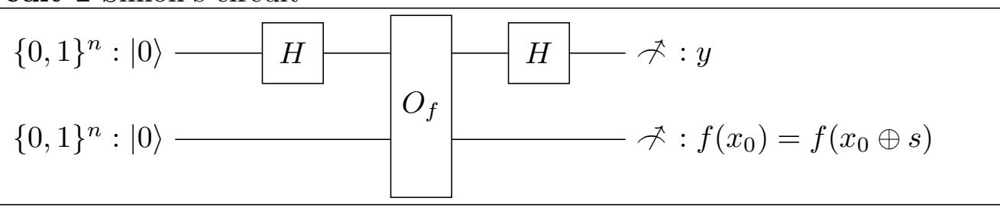

{0}------------------------------------------------

# <span id="page-0-0"></span>Tight Bounds for Simon's Algorithm

### Xavier Bonnetain

Institute for Quantum Computing, Department of Combinatorics and Optimization, University of Waterloo, Canada

Abstract. Simon's algorithm is the first example of a quantum algorithm exponentially faster than any classical algorithm, and has many applications in cryptanalysis. While these quantum attacks are often extremely efficient, they are generally missing some precise cost estimate. This article aims at resolving this issue by computing precise query costs for the different use cases of Simon's algorithm in cryptanalysis.

We propose an extensive analysis of Simon's algorithm, and we show that it requires little more than n queries to succeed in most cases. We performed the first concrete cost analysis for the exact variant of Simon's algorithm and the offline Simon's algorithm, and show that they require respectively at most 3n queries and little more than n+k queries. We also found that for parameter sizes of cryptographic relevance, it is possible to truncate the output of the periodic function to a dozen of bits without any impact on the number of queries, which saves qubits in reversible implementations of Simon's algorithm.

Keywords: Simon's algorithm, quantum cryptanalysis, query complexity

# 1 Introduction

Simon's algorithm [\[27\]](#page-29-0) is the first example of a quantum algorithm exponentially faster than any classical ones, and lead the way to Shor's algorithm [\[26\]](#page-29-1). Nevertheless, for a long time, there wasn't any concrete application for this algorithm.

This began to change in 2010, with a polynomial-time quantum distinguisher on the 3-round Feistel cipher [\[17\]](#page-29-2), a construction that is classically provably secure. This first application opened the way to many other attacks in symmetric cryptography [\[1,](#page-28-0)[2,](#page-28-1)[4,](#page-28-2)[7](#page-28-3)[,9,](#page-28-4)[11,](#page-28-5)[12](#page-28-6)[,14,](#page-29-3)[15,](#page-29-4)[18,](#page-29-5)[19](#page-29-6)[,21,](#page-29-7)[24,](#page-29-8)[25\]](#page-29-9). All these attacks have an important restriction: they only fit in the quantum query model, that is, they require access to a quantum circuit that can compute the corresponding construction including its secret material.

This last restriction was overcomed in 2019, with the offline Simon's algorithm [\[3\]](#page-28-7) that allows to apply some of the previous attacks when we only have access to classical queries to the secret function, but with a polynomial gain only.

In the literature, the query cost of the attack is often left as a O (n). Very few concrete estimates are proposed, and they tend to be loose estimates. Hence, in the current situation, we have asymptotically efficient attacks, but their effiency 

{1}------------------------------------------------

in practice is less clear, and we are for example lacking tools to compare between these attacks and Shor's algorithm.

We focus here on giving precise bounds on the number of queries required by Simon's algorithm in its different use cases. Note that we do not give here concrete lower bounds for Simon's problem. To our knowledge, the sole work in this direction is [\[16\]](#page-29-10), where a lower bound in n/8 queries is proven.

Previous works. The first concrete estimate comes from [\[15,](#page-29-4) Theorem 1 and 2], where it is shown that cn queries, for c > 3 that depend on the function, is enough to have a success probability exponentially close to 1. In [\[19,](#page-29-6) Theorem 2], a bound of 2(n + √ n) queries for the Grover-meets-Simon algorithm with a perfect external test is shown, for a success probability greater than 0.4, and assuming that the periodic function has been sampled uniformly at random. In [\[1\]](#page-28-0), a heuristic cost of 1.2n+ 1 for Simon's algorithm is used. In the recent [\[20,](#page-29-11) Theorem 3.2], it is shown that for 2-to-1 functions, Simon's algorithm needs on average less than n + 1 queries, and that for functions with 1 bit of output, on average less than 2(n + 1) queries are needed, if each query uses a function sampled independently uniformly over the set of functions with the same period.

Contributions. In this article, we propose some precise concrete cost estimates for Simon's algorithm, in the ideal case of periodic permutations and in the case of random functions, and without any constraint on the subgroup size. We show that in most cases, the overhead induced by the use of random periodic functions is less than 1 query, and that the functions can be truncated without any impact on the query cost. We also give the first concrete estimates for a variant of the exact algorithm proposed in [\[5\]](#page-28-8) and for the offline Simon's algorithm [\[3\]](#page-28-7). Finally, we show some improved estimates for the Grover-meet-Simon algorithm, and we prove that the overhead due to a lack of external test is in fact extremely small.

These estimates allow us to propose the following heuristics[1](#page-0-0) for the different use cases. First of all, if we can afford to be slightly imprecise:

Heuristic 1 (Simple cost estimates for Simon's algorithm) Simon's algorithm needs n queries, except in the offline Simon's algorithm where it needs n+k queries.

If we want to be more precise, we propose the following heuristics, which come from [subsection 6.2.](#page-24-0)

<span id="page-1-0"></span>Heuristic 2 (Simon's algorithm) Simon's algorithm succeeds in n+3 queries on average and with n + α + 1 queries, it succeeds with probability 1 − 2 <sup>−</sup><sup>α</sup>.

<span id="page-1-1"></span>Heuristic 3 (Nested Simon's algorithm) A nested Simon's algorithm with inner dimension ninner and outer dimension nouter succeeds in 2(nouter + α + 1)(ninner + α + 1 + log<sup>2</sup> (nouter + α + 1)) queries with probability greater 1− 2 <sup>−</sup><sup>α</sup>.

<span id="page-1-2"></span><sup>1</sup> As detailed in [subsection 6.2,](#page-24-0) they are true for almost all functions, and counterexamples exist.

{2}------------------------------------------------

Heuristic 4 (Grover-meet-Simon) Grover-meet-Simon succeeds with probability 1 − 2 <sup>−</sup><sup>α</sup> in n + α/2 + 2 k n queries per iteration.

With a perfect external test, it succeeds with probability 1 − 2 <sup>−</sup><sup>α</sup> in n + α/2 queries plus one query to the external test per iteration.

<span id="page-2-4"></span>Heuristic 5 (The offline Simon's algorithm) The offline Simon's algorithm succeeds with probability 1 − 2 <sup>−</sup><sup>α</sup> in n + k + α + 4 queries per iteration.

<span id="page-2-3"></span>To save qubits in reversible implementations of Simon's algorithm, we propose the following heuristic. It allows to truncate the periodic function for free.

Heuristic 6 (Truncating functions in reversible implementations) A reversible implementation of Simon's algorithm with q queries only needs a periodic function with d3.5 + log<sup>2</sup> (q)e bits of output.

Outline. [Section 2](#page-2-0) presents the different quantum algorithms we will study. [Sections 3,](#page-12-0) [4](#page-20-0) and [5](#page-22-0) propose respectively a precise analysis of Simon's algorithm, the Grover-meets-Simon algorithm and the offline Simon's algorithm. We present a survey of the Simon-based attacks and discuss what the previous analysis means in practice for concrete attacks in [section 6.](#page-24-1)

# <span id="page-2-0"></span>2 Quantum algorithms

This section presents the quantum algorithms we will study, that is, Simon's algorithm and its different uses in a quantum search. This section assumes basic knowledge of quantum computing; see [\[22\]](#page-29-12) comprehensive introduction.

### 2.1 Simon's algorithm

Simon's algorithm [\[27\]](#page-29-0) tackles the Hidden Subgroup problem when the group is {0, 1} <sup>n</sup>. We can formulate the problem as follows:

Problem 1 (Simon's Problem). Let n ∈ N, H a subgroup of {0, 1} <sup>n</sup> and X a set. Let f : {0, 1} <sup>n</sup> → X be a function such that for all (x, y) ∈ ({0, 1} n) 2 , [f(x) = f(y) ⇔ x ⊕ y ∈ H]. Given oracle access to f, find a basis of H.

<span id="page-2-2"></span><span id="page-2-1"></span>The promise in the problem can also be relaxed:

Problem 2 (Relaxed Simon's Problem). Let n ∈ N, H a subgroup of {0, 1} <sup>n</sup> and X a set. Let f : {0, 1} <sup>n</sup> → X be a function such that for all (x, y) ∈ ({0, 1} n) 2 , [x ⊕ y ∈ H ⇒ f(x) = f(y)] and that for all h /∈ H, there exists an x such that f(x) 6= f(x ⊕ h). Given oracle access to f, find a basis of H.

We consider two types of functions, depending on the problem we solve:

Definition 1 (Periodic permutations, periodic functions). We call a periodic permutation a function f that fulfills the promise of [Problem 1,](#page-2-1) that is, is constant over the cosets of H and is injective over {0, 1} <sup>n</sup>/(H). If f is constant over the cosets of H, but not necessarily injective over {0, 1} <sup>n</sup>/(H), we say that f is a periodic function.

{3}------------------------------------------------

Remark 1 (Aperiodic function). By the previous definition, an aperiodic function (resp. permutation) is periodic over the trivial subgroup.

Note that Problem 1 tackles periodic permutations while Problem 2 tackles periodic functions.

**Algorithm description** The quantum circuit of Simon's algorithm is presented in Circuit 1. It produces a random value orthogonal to  $\mathcal{H}$ , and can be described as Algorithm 1.

### Circuit 1 Simon's circuit



### Algorithm 1 Simon's routine

**Input:**  $n, O_f: |x\rangle |0\rangle \mapsto |x\rangle |f(x)\rangle$  with  $f: \{0,1\}^n \to X$  of hidden subgroup  $\mathcal{H}$ 

**Output:** y orthogonal to  $\mathcal{H}$ 

- 1: Initialize two n-bits registers :  $|0\rangle |0\rangle$
- 2: Apply H gates on the first register, to compute  $\sum_{x=0}^{2^n-1} |x\rangle |0\rangle$ 3: Apply  $O_f$ , to compute  $\sum_{x=0}^{2^n-1} |x\rangle |f(x)\rangle$
- 4: Reapply H gates on the register, to compute

<span id="page-3-0"></span>
$$\sum_{x} \sum_{j=0}^{2^{n}-1} (-1)^{x \cdot j} |j\rangle |f(x)\rangle$$

5: The register is in the state

$$\sum_{x_0 \in \{0,1\}^n / (\mathcal{H})} \sum_{x_1 \in \mathcal{H}} \sum_{j=0}^{2^n - 1} (-1)^{(x_0 \oplus x_1) \cdot j} |j\rangle |f(x_0)\rangle$$

<span id="page-3-1"></span>6: Measure  $j, f(x_0)$ , return them.

After measuring  $f(x_0)$  the state becomes

$$\sum_{j=0}^{2^{n}-1} (-1)^{x_{0}\cdot j} \sum_{x_{1} \in \mathcal{H}} (-1)^{x_{1}\cdot j} |j\rangle.$$

{4}------------------------------------------------

We now use the following lemma:

Lemma 1 (Adapted from [15, Lemma 1]). Let  $\mathcal{H}$  be a subgroup of  $\{0,1\}^n$ . Let  $y \in \{0,1\}^n$ . Then

<span id="page-4-1"></span>
$$\sum_{h \in \mathcal{H}} (-1)^{y \cdot h} = \begin{cases} |\mathcal{H}| & \text{if } y \in \mathcal{H}^{\perp} \\ 0 & \text{otherwise} \end{cases}$$

Proof. See Appendix A.

Hence, the amplitude for a j is nonzero if and only if  $j \in \mathcal{H}^{\perp}$ . Hence, this routine samples uniformly a value j orthogonal to  $\mathcal{H}$ .

The complete algorithm calls the routine until the values span a space of maximal rank or, if the rank is unknown, a fixed T times. In practice, we'll see in the next sections that  $T = n + \mathcal{O}(1)$  is sufficient to succeed.

Remark 2 (Reversible implementations). In Algorithm 1, the measurements are optional. Indeed, the fact that we know that the value after the measurement fulfils a given property means that without measuring, the register contains a superposition of values with the same property.

### Algorithm 2 Simon's algorithm [27]

**Input:**  $n, O_f : |x\rangle |0\rangle \mapsto |x\rangle |f(x)\rangle$  with  $f : \{0,1\}^n \to X$  of hidden subgroup  $\mathcal{H}, T$ 

Output: a basis of H

1:  $V = \emptyset$ 

2: **for** i from 1 to T **do** 

3: Get  $y, f(x_0)$  from Algorithm 1

4: Add y to V

5: **end for** 

6: **return** a basis of  $V^{\perp}$ 

#### 2.2 Amplitude amplification

We will use amplitude amplification [6] with Simon's algorithm as a test function in the following sections. We first recall some standard lemmas, and then present a variant for the case where we do not have access to the test function, but only to an approximation.

<span id="page-4-0"></span>Lemma 2 (Amplitude amplification [6]). Let C be a quantum circuit such that  $C|0\rangle = \sqrt{p}|Good\rangle + \sqrt{1-p}|Bad\rangle$ ,

Let  $O_g$  be an operator that fulfills  $O_g |Good\rangle = -|Good\rangle$  and  $O_g |Bad\rangle = |Bad\rangle$ , and  $O_0$  the operator  $I-2|0\rangle\langle 0|$ , let  $\theta = \arcsin(\sqrt{p})$ . Then  $(CO_0C^{\dagger}O_g)^tC|0\rangle = \sin((2t+1)\theta)|Good\rangle + \cos((2t+1)\theta)|Bad\rangle$ .

{5}------------------------------------------------

Lemma 3 (Exact amplitude amplification for p = 1/2 [5]). Let C be a quantum circuit such that  $C|0\rangle = \frac{1}{\sqrt{2}}|Good\rangle + \frac{1}{\sqrt{2}}|Bad\rangle$ ,

Let  $S_g$  be an operator that fulfills  $S_g | Good \rangle = i | Good \rangle$  and  $S_g | Bad \rangle = | Bad \rangle$ , and  $O_0$  the operator  $I - (1 - i) | 0 \rangle \langle 0 |$ . Then  $CS_0C^{\dagger}S_gC | 0 \rangle = | Good \rangle$ .

Remark 3. The operators  $O_g$  and  $S_g$  can be easily implemented given a quantum circuit T that computes 1 for the good elements and 0 for the bad ones.

In practice, we may have a bound on the success probability instead of the exact value. The following theorem tackles this case.

<span id="page-5-0"></span>Theorem 1 (Unprecise Amplitude amplification). Let C be a quantum circuit such that  $C|0\rangle = \sqrt{p} |Good\rangle + \sqrt{1-p} |Bad\rangle$ , If  $p \in [(1-\beta)p_0, p_0]$ , then after  $\frac{\pi}{4 \arcsin \sqrt{p_0}}$  iterations, the probability of measuring an element in  $|Good\rangle$  is at least  $1 - (2\beta + 2p_0 + \sqrt{p_0})^2$ . If  $p \in [p_0, p_0(1+\beta)]$ , then after  $\frac{\pi}{4 \arcsin \sqrt{p_0}}$  iterations, the probability of measuring an element in  $|Good\rangle$  is at least  $1 - (\beta + \sqrt{(1+\beta)p_0} + 2\sqrt{1+\beta}^3 p_0)^2$ .

Proof. See Appendix B.

Now, for the offline Simon's algorithm, we will present a slight generalization, with an approximate test circuit.

<span id="page-5-1"></span>Theorem 2 (Amplitude amplification with approximate test). Let S, f, C,  $O_g$  and  $\theta$  be defined as in Lemma 2, let  $\widehat{O_g}$  be an approximation of  $O_g$ , such that for all  $|x\rangle$ ,  $\widehat{O_g}|x\rangle = O_g|x\rangle + |\delta\rangle$ , with  $|\delta\rangle$  an arbitrary vector such that  $|\delta\rangle| \leq \varepsilon$ . Then after t iterations of amplitude amplification using  $\widehat{C}$  instead of C, a measurement of the quantum state will give an element in  $|Good\rangle$  with probability at least  $(\sin((2t+1)\theta) - t\varepsilon)^2$ .

*Proof.* In the amplitude amplification procedure, a call to  $O_g$  is replaced by a call to  $\widehat{O}_g$ . Hence, each call adds a noise vector  $|\delta\rangle$  to the state, and after t iterations, as the operators are linear, the total noise  $|\psi_{err}\rangle$  is of amplitude at most  $t\varepsilon$ . Without any noise, after t iterations we would be in the state

$$|\psi_t\rangle = \sin((2t+1)\theta) |\text{Good}\rangle + \cos((2t+1)\theta) |\text{Bad}\rangle$$

but due to it, we are in the state  $|\psi_t\rangle + |\psi_{err}\rangle$ . We have

$$|\langle \operatorname{Good} | \psi_{err} \rangle| \leq ||\operatorname{Good} \rangle| \times ||\psi_{err} \rangle| \leq t\varepsilon.$$

Hence, the amplitude of  $|Good\rangle$  is at least  $\sin((2t+1)\theta) - t\varepsilon$ , and the probability of obtaining a value in  $|Good\rangle$  is greater than  $(\sin((2t+1)\theta) - t\varepsilon)^2$ .

# 2.3 Exact version of Simon's algorithm

An exact version of Simon's algorithm was proposed by Brassard and Høyer in 1997 [5]. We propose here a more efficient variant of this algorithm, and prove that its query complexity is bounded by 3n - h + 1 if the function operates on n bits and the hidden subgroup has dimension h. Note that this algorithm is only exact for periodic permutations.

{6}------------------------------------------------

```
Algorithm 3 Exact Simon's algorithm, from [5]
   Input: n, Of : |xi |0i 7→ |xi |f(x)i with f : {0, 1}
                                            n → X hiding H
   Output: a basis of H
1: V = ∅ . Basis of H⊥
2: for i from 1 to n do
3: Choose a set W such that V, W forms a basis of {0, 1}
                                                   n.
4: for j from i to n do
5: Apply Algorithm 1, without measuring, for the state
                  X
              x0∈{0,1}n/(H)
                        2
                         Xn−1
                         y=0
                            (−1)x0·y X
                                   x1∈H
                                       (−1)x1·y
                                               |yi |f(x0)i
6: amplify the state with the following test: . Exact amplification
7: Decompose y as P
                           vk∈V
                                δkvk +
                                      P
                                        wj∈W γ`w`
8: return γj = 1
9: end amplify
10: Measure |γj i
11: if γj = 1 then measure the first register, add the result to V
12: break
13: end if
14: end for
15: if V has not been updated then break
16: end if
17: end for
18: return a basis of V
                    ⊥
```

{7}------------------------------------------------

The algorithm of Brassard and Høyer. The idea of [Algorithm 3](#page-6-0) is to ensure that any measurement we perform gives us some information about the period. This is done by doing exact amplitude amplification over a subset of the values outputted by Simon's algorithm. Moreover, the subset we seek can be empty. In the original algorithm, the empty case meant that we should try with another subset until we find a non-empty one, or, if there is none, that the algorithm can end. As there is at most n such subsets, the algorithm is polynomial.

Our improved variant. We improve over the previous algorithm by remarking that the knowledge that a subset is empty actually gives some information on the hidden subgroup: it shows that a given vector is not in he subgroup's dual. Moreover, we show that this case is actually better, that is, we can reuse the quantum state, and save 1 query each time this occurs. This is [Algorithm 4.](#page-7-0)

```
Algorithm 4 Improved variant of the exact Simon's algorithm
```

```
Input: n, Of : |xi |0i 7→ |xi |f(x)i with f : {0, 1}
                                            n → X hiding H
   Output: a basis of H
1: V = ∅ . Basis of H⊥
2: W = ∅ . Basis of {0, 1}
                                                           n/(H⊥)
3: for i from 1 to n do
4: if No quantum state is available then
5: Apply Algorithm 1, without measuring, for the state
                 X
              x0∈{0,1}n/(H)
                        2
                         Xn−1
                         y=0
                            (−1)x0·y X
                                   x1∈H
                                       (−1)x1·y
                                              |yi |f(x0)i
6: end if
7: amplify the state with the following test: . Exact amplification
8: Choose a set Z such that V, W, Z forms a basis of {0, 1}
                                                       n.
9: Decompose each y as P
                             vk∈V
                                 δkvk +
                                       P
                                         zj∈Z
                                             γj zj , put γ1 in an ancilla
   register.
10: return γ1 = 1
11: end amplify
12: Measure |γ1i
13: if γ1 = 1 then
14: Measure the first register, add the result to V , discard the quantum
   state
15: else
16: Add z1 to W, uncompute the value of |γ1i
17: end if
18: end for
19: return a basis of V
                   ⊥
```

{8}------------------------------------------------

Theorem 3 (Complexity and correctness of Algorithm 4). Let f be a periodic permutation from  $\{0,1\}^n$  with a hidden subgroup of dimension h. Algorithm 4 returns a basis of  $\mathcal{H}$  in less than  $\min(3n - h + 1, 3n)$  queries.

*Proof.* We will show that at each step of the for loop, either a linearly independent vector from  $\mathcal{H}^{\perp}$  is added to V, or a linearly independent vector from  $\{0,1\}^n/(\mathcal{H}^{\perp})$  is added to W, and in the latter case, the quantum query can be reused in the next loop iteration. We also ensure that  $V \subset \mathcal{H}^{\perp}$  and  $W \subset \{0,1\}^n/(\mathcal{H})$ .

For step 8, note that  $H^{\perp} \subset \langle V, Z \rangle$ , hence each j can be uniquely decomposed as  $\sum_{v_k \in V} \delta_k v_k + \sum_{z_\ell \in Z} \gamma_\ell z_\ell$ .

The amplification is done over the elements which have the component  $z_1$  in their decomposition over the basis  $(v_i, z_i)$ .

Now, there are two cases:

- For all  $j \in \mathcal{H}^{\perp}$ ,  $\gamma_1 = 0$ . This implies  $z_1 \notin \mathcal{H}^{\perp}$ . Hence, it represents a non-trivial coset of  $\mathcal{H}^{\perp}$ . As it is linearly independent from W by construction, we can add it to W. Note that any amplitude amplification over the quantum state will leave it invariant, as the success probability would be 0 here. Hence, amplitude amplification and the measurement of  $\gamma_1$  at step 12 leaves the state invariant, which allows to uncompute and recover the original state given by Algorithm 1.
- There exists  $j \in \mathcal{H}^{\perp}$  such that  $\gamma_1 = 1$ . As  $\mathcal{H}^{\perp}$  is a vector space, we will have  $\gamma_1 = 1$  for exactly half of the vectors. Hence, we can apply one step of amplitude amplification, and we will measure 1 in  $|\gamma_1\rangle$ . This amplitude amplification requires overall 3 calls to Algorithm 1, 1 for the initial state, and 2 for the amplitude amplification step. Once this is done, we can measure j. We will obtain a vector such that  $\gamma_1 = 1$ . As by construction, all  $v_i \in V$  fulfill  $\gamma_1 = 0$ , the value we measure is linearly independent from V. Hence, we can add it.

At each iteration of the loop, we use 3 queries, except in the case where the previous iteration added a vector in W, in which case it uses 2 queries. Hence, if the last query samples a value in V, the cost will be of 3n - h, and if the last query samples a value in W, the cost will be 3n - h + 1. Note that the latter case can only happen if  $h \ge 1$ , which gives the expected bound.

#### 2.4 Grover-meets-Simon

The Grover-meets-Simon algorithm [19] aims at solving the following problem<sup>2</sup>:

Problem 3 (Grover-meets-Simon). Let  $f: \{0,1\}^k \times \{0,1\}^n \to \{0,1\}^m$  be a function such that there exists a unique  $k_0$  such that  $f(k_0,\cdot)$  hides a non-trivial subgroup  $\mathcal{H}$ . Find  $k_0$  and  $\mathcal{H}$ .

<sup>&</sup>lt;sup>2</sup> In [19], the algorithm they introduce is in fact a special case of what we call here Grover-meets-Simon with a perfect external test.

{9}------------------------------------------------

The idea to solve this problem is to use Simon's algorithm as a distinguisher: for the wrong k, Simon's algorithm should return the trivial subgroup, while for  $k_0$  it will always return a non-trivial subgroup. We can then use it as a test function to find  $k_0$ , as in Algorithm 5.

### Algorithm 5 Grover-meets-Simon

```
Input: n, O_f : |k\rangle |x\rangle |0\rangle \mapsto |x\rangle |f(k,x)\rangle with f(k_0, \cdot) of Hidden subgroup \mathcal{H}
   Output: k_0, a basis of \mathcal{H}.
1: amplify over k with the following test:
2:
        H \leftarrow \text{Simon's algorithm over } f(k, \cdot)
        if H is empty then
3:
            return False
4:
        else
5:
            return True
6:
7:
        end if
8: end amplify
```

<span id="page-9-0"></span>The issue with this test is that it allows many false positive: indeed, even for some incorrect k, Simon's algorithm may return a non-trivial subgroup, and these bad cases will also be amplified.

The idea to overcome this issue is to use a test outside of Simon's algorithm to check if its output is correct. This corresponds to the following problem:

Problem 4 (Grover-meets-Simon with external test). Let  $k_0 \in \{0,1\}^n$ ,  $\mathcal{H}$  be a subgroup of  $\{0,1\}^n$ , T be a test that check if  $(k,H) = (k_0,\mathcal{H})$ . Let  $f:\{0,1\}^k \times \{0,1\}^n \to \{0,1\}^m$  be a function such that  $f(k_0,\cdot)$  hides  $\mathcal{H}$ . Find  $k_0$  and  $\mathcal{H}$ .

Hence, instead of only checking the dimension of the subgroup, we compute the subgroup and check if it is correct. This is something we can always do if  $\dim(\mathcal{H}) \geq 1$  and  $f(k,\cdot)$  is aperiodic if  $k \neq k_0$ , as presented in Algorithm 6. This test is only perfect with periodic permutations, otherwise it may happen that these equalities hold for an aperiodic function, but it can in general rule out false positive more efficiently than by adding more queries in Simon's algorithm.

### 2.5 The offline Simon's algorithm

The offline Simon's algorithm [3] is the only known application of Simon's algorithm that do not require quantum access to a secret function. It can be seen as variant of the Grover-meets-Simon algorithm that leverage a special structure of the periodic function. Concretely, the algorithm can solve the following problem:

<span id="page-9-1"></span>Problem 5 (Constructing and Finding a Periodic Function). Let  $E_k: \{0,1\}^n \to \{0,1\}^\ell$  be a function,  $f: \{0,1\}^k \times \{0,1\}^n \to \{0,1\}^\ell$  be a family of functions. Let

{10}------------------------------------------------

#### **Algorithm 6** Periodicity test

```
Input: k, H
Output: (k, H) \stackrel{?}{=} (k_0, \mathcal{H})
1: for some x, h \in \{0, 1\}^n \times H \setminus \{0\} do
2: if f(k, x) \neq f(k, x \oplus h) then
3: return False
4: end if
5: end for
6: return True
```

### <span id="page-10-0"></span>Algorithm 7 Grover-meets-Simon with external test

```
Input: n, O_f : |k\rangle |x\rangle |0\rangle \mapsto |x\rangle |f(k,x)\rangle with f(k_0,\cdot) of Hidden subgroup \mathcal{H}, a test function T

Output: k_0, s.

1: amplify over k with the following test:

2: H \leftarrow \text{Simon's algorithm over } f(k,\cdot)

3: return T(k,H)

4: end amplify
```

<span id="page-10-1"></span>P be a quantum circuit such that

$$P|i\rangle \sum_{x\in\{0,1\}^n} |x\rangle |E_k(x)\rangle = |i\rangle \sum_{x\in\{0,1\}^n} |x\rangle |f(i,x)\rangle$$

Assume that there exists a unique  $i_0 \in \{0,1\}^k$  such that  $f(i_0,\cdot)$  hides a non-trivial subgroup. Given oracle access to  $E_k$  and P, find  $i_0$  and the period of  $f(i_0,\cdot)$ .

Here, the compared to Grover-meets-Simon, we add the assumption that the family of functions can be efficiently computed from a fixed function  $E_k$ . In most cases, we can restrict ourselves to the following simpler problem:

Problem 6 (Asymmetric Search of a Periodic Function). Let  $f: \{0,1\}^m \times \{0,1\}^n \to \{0,1\}^\ell$  and  $E_k: \{0,1\}^n \to \{0,1\}^\ell$  be some functions.

Assume that there exists a unique  $i_0 \in \{0,1\}^m$  such that  $f(i_0,\cdot) \oplus E_k$  hides a non-trivial subgroup. Given oracle access to f and  $E_k$ , find  $i_0$ .

The idea to solve Problem 5 is to see Simon's algorithm slightly differently than usual. Instead of querying an oracle to a function, we suppose that the algorithm is given as input a database of  $E_k$ , a set of superpositions  $\sum_x |x\rangle |E_k(x)\rangle$ . It then computes the periodic function from this set, and finally extracts the period. We note  $|\psi_{E_k}^m\rangle = \bigotimes_{j=1}^m \sum_x |x\rangle |E_k(x)\rangle$ , a state which contains m copies of the superpositions of input/outputs of  $E_k$ .

Hence, the algorithm is very similar to Algorithm 5, but the test function fetches  $|\psi_{E_h}^m\rangle$ , uses it to check if the function is periodic, and finally uncomputes

{11}------------------------------------------------

### Algorithm 8 The offline Simon's algorithm

**Input:** n, An oracle  $O_{E_k}$  and a quantum circuit P that fullfils the constraints of Problem 5

Output:  $i_0$ .

1: Query m times  $O_{E_k}$ , to construct  $|\psi_{E_k}^m\rangle$ 

2: **amplify** over i with the following test:

3: Compute m copies of  $\sum_{x} |x\rangle |f(i,x)\rangle$  from  $|\psi_{E_k}^m\rangle$  and P.

4: Apply a Hadamard gate on the first register of each copy.

5: Compute in superposition the rank r of the values in each first register.

6:  $b \leftarrow r \neq n$ 

7: Uncompute everything but the value of b, to recover  $|\psi_{E_k}^m\rangle$ .

8: Return b

<span id="page-11-0"></span>9: end amplify

everything, to get back a state close to  $|\psi_{E_k}^m\rangle$ , which can then be reused in the next iteration. This is Algorithm 8.

Remark 4. In this algorithm, all the queries have to be done at the beginning of Simon's algorithm. Hence, it is not possible to use the exact variant of Algorithm 4 here.

Now, it remains to estimate the deviation due to the fact that we are not exactly testing if i is equal to  $i_0$ .

Lemma 4 (Deviation for the offline Simon's algorithm). If Simon's algorithm fails with probability at most  $2^{-\alpha}$ , then the test function in Algorithm 8 tests if  $i = i_0$  and adds a noise of amplitude smaller than  $2^{-\alpha/2+1}$ .

*Proof.* The ideal circuit we want takes  $\sum_i |i\rangle |\psi_{E_k}^m\rangle |0\rangle$  as input, and produces the output  $\sum_i |i\rangle |\psi_{E_k}^m\rangle |i=i_0\rangle$ . This is however not exactly what we have. If  $i=i_0$ , then the answer is correct with probability 1, as the periodicity reduces the maximal rank, and it behaves like the ideal circuit.

For  $i \neq i_0$ , the circuit first constructs

$$|i\rangle \left(\bigotimes_{j=1}^{m} \sum_{x_j} |x_j\rangle |f(i,x_j)\rangle\right) |0\rangle$$

It then applies a Hadamard gate on  $|x\rangle$ , to obtain

$$|i\rangle \left(\bigotimes_{j=1}^{m} \sum_{x_j} \sum_{y_j} (-1)^{x_j \cdot y_j} |y_j\rangle |f(i,x_j)\rangle\right) |0\rangle$$
.

{12}------------------------------------------------

Once this is done, we can compute the rank of the m values  $y_j$ , and obtain

$$|i\rangle \left(\bigotimes_{j=1}^{m} \sum_{\substack{(y_1, \dots, y_m) \\ \text{of maximal rank}}} \sum_{x_j} (-1)^{x_j \cdot y_j} |y_j\rangle |f(i, x_j)\rangle\right) |0\rangle$$

$$+|i\rangle \left(\bigotimes_{j=1}^{m} \sum_{\substack{(y_1, \dots, y_m) \\ \text{of lower rank}}} \sum_{x_j} (-1)^{x_j \cdot y_j} |y_j\rangle |f(i, x_j)\rangle\right) |1\rangle$$

The second term is the annoying one. The state deviates from the state we want by 2 times the amplitude of the second term, as the terms with the correct results are missing, and the terms with the wrong result have been added. Hence, the norm of the noise is 2 times the amplitude of this term. As the probability for the m words of n bits to be of rank n is exactly Simon's algorithm success probability with the function  $f(i_0,\cdot)$ , the amplitude of the second term is bounded by  $2^{-\alpha/2}$ . With the factor 2, we obtain  $2^{-\alpha/2+1}$ . 

Algorithm 8 allows to only make the quantum queries to  $E_k$  once, at the beginning. Now, the idea to use only classical queries is to construct manually the quantum superposition over  $E_k$  from the classical queries of all its  $2^n$  possible *inputs.* This is presented in Algorithm 9. As this is can only be done in  $\mathcal{O}(2^n)$ time, we really need to reuse the queries to still have a time-efficient algorithm.

# **Algorithm 9** Generation of $|\psi_{E_k}^m\rangle$ from classical queries

**Input:** A classical oracle to  $E_k$ , m

- Output:  $|\psi_{E_k}^m\rangle$ 1:  $|\phi\rangle \leftarrow \bigotimes_m \sum_x |x\rangle |0\rangle$ 2: for  $0 \le i < 2^n$  do
- Query  $E_k(i)$ 3:
- 4: Apply to each register in  $|\phi\rangle$  the operator

$$|x\rangle |y\rangle \mapsto \begin{cases} |x\rangle |y \oplus E_k(i)\rangle & \text{if } x = i\\ |x\rangle |y\rangle & \text{otherwise} \end{cases}$$

- 5: end for
- <span id="page-12-1"></span>6: return  $|\phi\rangle$

#### <span id="page-12-0"></span>Concrete cost for Simon's algorithm 3

This section presents tight cost estimates for Simon's algorithm, first in the original case considered in [27], and then with random functions.

{13}------------------------------------------------

#### 3.1 Ideal case: periodic permutations

For all our analyses, we will use the following lemma to study only the aperiodic case in Simon's algorithm.

<span id="page-13-0"></span>**Lemma 5 (Simon reduction).** Let  $n \in \mathbb{N}$ , let X be a set. There exists a bijection  $\varphi_c$  from  $\{f \in \{0,1\}^n \to X | f \text{ hides a subgroup of dimension } c\}$  to

$$\{\mathcal{H}\subset\{0,1\}^n|\dim(\mathcal{H})=c\}\times\left\{\widehat{f}\in\{0,1\}^{n-c}\to X\Big|\widehat{f}\ is\ aperiodic\ \right\}$$

such that, with  $\varphi_c(f) = (\mathcal{H}, \widehat{f})$ , the behaviour of Simon's algorithm with f and  $\widehat{f}$  is identical, up to isomorphism. Moreover, f is a periodic permutation if and only if  $\widehat{f}$  is a permutation.

Proof. See Appendix C.

<span id="page-13-1"></span>Theorem 4 (Simon's algorithm success probability). Let f be a function on n bits that fullfils the promise of Problem 1,  $\mathcal{H}$  its hidden subgroup. With  $T \geq n - \dim(\mathcal{H})$  queries, Simon's algorithm succeeds with probability

$$pr_T = \prod_{i=0}^{n-\dim(\mathcal{H})-1} \left(1 - \frac{1}{2^{T-i}}\right).$$

Moreover,  $(1 - 2^{n-T-dim(\mathcal{H})-1})^2 \le pr_T \le 1 - 2^{n-T-dim(\mathcal{H})-1}$ .

*Proof.* Let  $\alpha \geq 0, y_1, \ldots, y_T$  be the  $T = n + \alpha$  outputs of Simon's routine. The  $y_i$  are sampled uniformly in the set  $\{y | \forall h \in \mathcal{H}, y \cdot h = 0\}$ .

Let  $M = [y_1, \dots, y_T]$  be the matrix whose columns are the  $y_i$ . Then, the rank of the  $y_i$  is the rank of M.

If  $\dim(\mathcal{H}) = 0$ , the maximal rank is n, and M is of maximal rank if and only if its rows form a free family, as  $T \geq n$ . The first row is non-zero with probability  $1 - \frac{1}{2^T}$ . If  $y_1, \ldots, y_{i-1}$  form a free family,  $y_i$  is linearly independent from them with probability  $1 - \frac{1}{2^{T-i-1}}$ , as  $|\langle y_1, \ldots, y_{i-1} \rangle| = 2^{i-1}$ . Hence, the rows form a free family with probability

$$\operatorname{pr}_{T} = \prod_{i=0}^{n-1} \left( 1 - \frac{1}{2^{T-i}} \right).$$

Taking the log, we obtain

$$\log(\mathrm{pr}_T) = \sum_{i=0}^{n-1} \log\left(1 - \frac{1}{2^{T-i}}\right).$$

Developing in power series produces

$$\sum_{i=0}^{n-1} - \sum_{j=1}^{\infty} \frac{1}{j2^{(T-i)j}}$$

{14}------------------------------------------------

Interchanging the sums produces

$$-\sum_{j=1}^{\infty} \frac{1}{j2^{Tj}} \sum_{i=0}^{n-1} 2^{ji}$$

As  $2^{j(n-1)} \le \sum_{i=0}^{n-1} 2^{ji} \le 2^{j(n-1)+1}$ , we have

$$-2\sum_{j=1}^{\infty} \frac{1}{j2^{(T-n+1)j}} \le \log(\operatorname{pr}_T) \le -\sum_{j=1}^{\infty} \frac{1}{j2^{(T-n+1)j}}$$

Factoring the power series produces

$$\log\left(\left(1 - \frac{1}{2^{T-n+1}}\right)^2\right) \le \log(\operatorname{pr}_T) \le \log\left(1 - \frac{1}{2^{T-n+1}}\right)$$

Hence, the success probability is bounded by  $\left(1 - \frac{1}{2^{T-n+1}}\right)^2$  and  $1 - \frac{1}{2^{T-n+1}}$ .

If  $\dim(\mathcal{H}) > 0$ , we can apply Lemma 5 and the previous case to obtain the desired result.

Theorem 5 (Simon's algorithm query complexity). Let f be a function on n bits that fullfils the promise of Problem 1,  $\mathcal{H}$  its hidden subgroup. To succeed, Simon's algorithm requires, on average:

- $n dim(\mathcal{H}) + 2$  queries if  $n dim(\mathcal{H}) > 2$ .
- 2 queries if  $n dim(\mathcal{H}) = 1$

*Proof.* If  $n - \dim(\mathcal{H}) = 1$ , then  $\mathcal{H}^{\perp} = \{0, s\}$  for a given nonzero s. The algorithm succeeds if and only if s is measured, which occurs with probability one half. Hence, 2 queries on average are needed.

Now, assume  $n - \dim(\mathcal{H}) \geq 2$ , or, by Lemma 5, that  $n \geq 2$ ,  $\dim(\mathcal{H}) = 0$  and we want to sample a full rank set of vectors.

Now, let's consider the random variable N, which is the number of queries Simon's algorithm require to succeed. From Theorem 4, we know  $\Pr[N \leq T] = \text{pr}_T$ . Hence, as  $\dim(\mathcal{H}) = 0$ , for T > n,

$$\begin{split} \Pr[N = T] &= \quad \operatorname{pr}_T - \operatorname{pr}_{T-1} = \prod_{i=0}^{n-1} \left( 1 - \frac{1}{2^{T-i}} \right) - \prod_{i=0}^{n-1} \left( 1 - \frac{1}{2^{T-1-i}} \right) \\ &= \quad \prod_{i=0}^{n-1} \left( 1 - \frac{1}{2^{T-i}} \right) - \prod_{i=1}^{n} \left( 1 - \frac{1}{2^{T-i}} \right) = \operatorname{pr}_T \left( 1 - \frac{1 - 2^{n-T}}{1 - 2^{-T}} \right) \\ &= \quad \operatorname{pr}_T \left( 1 - \frac{2^T - 2^n}{2^T - 1} \right) = \operatorname{pr}_T \left( \frac{2^n - 1}{2^T - 1} \right). \end{split}$$

Now, as T>n, we have the bound  $\operatorname{pr}_T 2^{n-T}(1-2^{-n}) \leq \Pr[N=T] \leq \operatorname{pr}_T 2^{n-T}$ .

{15}------------------------------------------------

Finally, the expected number of queries is

$$\mathbb{E}[N] = \sum_{i=n}^{+\infty} i \Pr[N=i] = n + \sum_{i=1}^{+\infty} i \Pr[N=n+i]$$

Hence, we have the bound

$$n + (1 - 2^{-n}) \sum_{i=1}^{\infty} i 2^{-i} \operatorname{pr}_{n+i} \le \mathbb{E}[N] \le n + \sum_{i=1}^{\infty} i 2^{-i} \operatorname{pr}_{n+i}$$

By Theorem 4, we have

$$\sum_{i=1}^{\infty} i2^{-i}(1-2^{-i}+2^{-2i-2}) \leq \sum_{i=1}^{\infty} i2^{-i}\operatorname{pr}_{n+i} \leq \sum_{i=1}^{\infty} i2^{-i}(1-2^{-i-1})$$

$$\Leftrightarrow \sum_{i=1}^{\infty} i2^{-i} - \sum_{i=1}^{\infty} i4^{-i} + \frac{1}{4}\sum_{i=1}^{\infty} i8^{-i} \leq \sum_{i=1}^{\infty} i2^{-i}\operatorname{pr}_{n+i} \leq \sum_{i=1}^{\infty} i2^{-i} - \frac{1}{2}\sum_{i=1}^{\infty} i4^{-i}$$

$$\Leftrightarrow \frac{1}{2}\frac{1}{\left(1-\frac{1}{2}\right)^{2}} - \frac{1}{4}\frac{1}{\left(1-\frac{1}{4}\right)^{2}} + \frac{1}{32}\frac{1}{\left(1-\frac{1}{8}\right)^{2}} \leq \sum_{i=1}^{\infty} i2^{-i}\operatorname{pr}_{n+i} \leq \frac{1}{2}\frac{1}{\left(1-\frac{1}{2}\right)^{2}} - \frac{1}{8}\frac{1}{\left(1-\frac{1}{4}\right)^{2}}$$

$$\Leftrightarrow 2 - \frac{4}{9} + \frac{2}{49} \leq \sum_{i=1}^{\infty} i2^{-i}\operatorname{pr}_{n+i} \leq 2 - \frac{2}{9}$$

Now, as  $n \ge 2$ ,  $1 - 2^{-n} \ge \frac{3}{4}$ , and  $(1 - 2^{-n})(2 - \frac{4}{9} + \frac{2}{49}) > 1$ .

Hence, we have that  $\mathbb{E}[N]$  is between n+1 and n+2. Rounding upwards, we obtain the desired result.

**Nested Simon's algorithm.** In a few applications [4,7], Simon's algorithm is used in a nested way: first, from the quantum oracle, Simon's algorithm is used to compute reversibly a periodic function, on which we can use Simon's algorithm again. For simplicity, we present the cost for two nested instances, but the generalization is straightforward.

<span id="page-15-0"></span>Lemma 6 (Nested Simon success probability). Let  $f_x$  be a family of periodic permutations on  $n_{inner}$  bits,  $h_f$  the minimal dimension of their hidden subgroup, let g be a periodic permutation on  $n_{outer}$  bits such that g(x) can be computed given the hidden subgroup of  $f_x$ ,  $h_g$  the dimension of its hidden subgroup. Then the hidden subgroup of g can be computed in  $2(n_{outer} - h_g + \alpha + 1)(n_{inner} - h_f + \alpha + 1 + \log_2(n_{outer} - h_g + \alpha + 1))$  queries to the  $f_x$  with probability greater than  $1 - 2^{-\alpha}$ .

*Proof.* We chose to query g  $n_{outer} - h_g + \alpha + 1$  times, and make that each query is computed using  $n_{inner} - h_f + \alpha + 1 + \log_2(m - h_g + \alpha + 1)$  queries to  $f_x$ . Note that in order to obtain the superposition of (x, g(x)), we need to uncompute the intermediate values of Simon's algorithm, which doubles the number of queries to  $f_x$ .

{16}------------------------------------------------

This succeeds if all the instances of the inner Simon's algorithm succeeds, and if the outer Simon's algorithm succeeds. By [Theorem 4,](#page-13-1) this probability is greater than

$$\left(1 - 2^{-\alpha - 1 - \log_2(n_{outer} - h_g + \alpha + 1)}\right)^{n_{outer} - h_g + \alpha + 1} \left(1 - 2^{-\alpha - 1}\right)$$

Which is greater than

$$1 - 2^{-\alpha - 1} - (m - h_g + \alpha + 1)2^{-\alpha - 1 - \log_2(n_{outer} - h_g + \alpha + 1)} = 1 - 2^{-\alpha} .$$

ut

### 3.2 Limitations of Simon's algorithm

We might want to apply Simon's algorithm on functions that are only periodic functions, and can have more preimages per image. However, we cannot expect to have a functioning algorithm in all cases. Indeed, let's consider

$$f_s: \begin{cases} \{0,1\}^n \to \{0,1\} \\ x \mapsto \begin{cases} 1 \text{ if } x \in \{0,s\} \\ 0 \text{ otherwise} \end{cases}.$$

The function f<sup>s</sup> has the hidden subgroup {0, s}. This function can be constructed from oracle access to a test function ts(x) = δx,s. Hence, as finding the hidden subgroup from f<sup>s</sup> is equivalent to recovering s, and as quantum search is optimal to recover s given quantum oracle access to ts(x) [\[28\]](#page-29-13), we cannot hope for a polynomial, over even subexponential algorithm in this case.

This inherent limitation of Simon's algorithm forces to estimate wether the periodic function will work well. The general argument to support the efficiency of Simon's algorithm in practice is, as we will prove below, that it works well for random functions, and that the functions that makes Simon's algorithm fail are degenerate enough to be distinguishable classically from a random function, which makes the cryptosystem likely to be breakable classically.

We present here two approaches in this direction, which amounts in either ensuring that the function does not have any unwanted collision, or showing that these unwanted collisions are not a problem in practice.

Long outputs The first approach amounts in remarking that if the output of the function is long enough, there is a very low chance to find a collision in the function. This principle of lenght extension is for example used in [\[24\]](#page-29-8).

Lemma 7 (Functions with long output). The fraction of functions from {0, 1} <sup>n</sup> to {0, 1} <sup>2</sup>n+<sup>α</sup> that are not a permutation is lower than 2 <sup>−</sup><sup>α</sup>.

Proof. There are 2(2n+α)2<sup>n</sup> functions from {0, 1} <sup>n</sup> to {0, 1} <sup>2</sup>n+<sup>α</sup>. 

{17}------------------------------------------------

There are  $\frac{2^{2n+\alpha}!}{(2^{2n+\alpha}-2^n)!}$  permutations from  $\{0,1\}^n$  to  $\{0,1\}^{2n+\alpha}$ . We have

$$\frac{2^{2n+\alpha}!}{(2^{2n+\alpha}-2^n)!} > \left(2^{2n+\alpha}-2^n\right)^{2^n} = 2^{(2n+\alpha)2^n} \left(1-2^{-n-\alpha}\right)^{2^n}$$

As 
$$(1 - 2^{-n-\alpha})^{2^n} > 1 - 2^{n-n-\alpha}$$
, the lemma holds.

If the output is not large enough, we can extend it by considering the function  $g(x) = (f(x), f(x \oplus 1), f(x \oplus 2), \dots)$ . This function will have a lower probability to have unwanted collisions than f, and with enough queries, will likely be a permutation.

There is however two limitations with this approach: first, the number of queries is multiplied by the number of copies of f we have in g, which is especially significant as the number of queries, from the previous section, is linear. Second, this may not be sufficient to prevent unwanted collisions to occur, and there are functions for which  $f(\cdot)$  and  $(f(\cdot), f(\cdot \oplus 1))$  have exactly as many collisions. Hence, there is still a need for a more precise analysis.

We will now present the other approach, which aims at showing that even with unwanted collisions, the pathological cases that prevent Simon's algorithm to succeed in a reasonable number of queries are too scarce to be an issue.

#### 3.3 A general criterion

To quantify how suitable the function is for Simon's algorithm, we define  $\varepsilon(f)$  similarly to [15]:

$$\varepsilon(f) = \max_{t \in \{0,1\}^n/(\mathcal{H})} \Pr_x[f(x \oplus t) = f(x)].$$

This value estimates the probability that any given t is present as an additional period for some of the output vectors of Algorithm 1. It allows to bound the success probability of Simon's algorithm.

<span id="page-17-0"></span>Proposition 1 (Success probability with more preimages, adapted from [15, Theorem 1]). Let f be a periodic function,  $\mathcal{H}$  its hidden subgroup, and  $\varepsilon(f)$  be defined as above. After  $c(n-\dim(\mathcal{H}))$  steps, Simon's algorithm on f succeeds with probability greater than  $1-\left(2\left(\frac{1+\varepsilon(f)}{2}\right)^c\right)^{n-\dim(\mathcal{H})}$ .

Proof (Adapted from [15]). Assume  $\dim(\mathcal{H}) = 0$ , thanks to Lemma 5. given a value  $t \neq 0$ , we will estimate the probability that we sample a vector orthogonal to t.

At the end of Simon's algorithm, the quantum state is

$$\frac{1}{2^n} \sum_{x \in \{0,1\}^n} \sum_{y \in \{0,1\}^n} (-1)^{x \cdot y} |y\rangle |f(x)\rangle$$

{18}------------------------------------------------

Hence the probability of measuring a  $y \in \{0, t\}^{\perp}$  is

$$\begin{split} & \left\| \frac{1}{2^n} \sum_{x \in \{0,1\}^n} \sum_{y \in \{0,t\}^{\perp}} (-1)^{x \cdot y} |y\rangle |f(x)\rangle \right\|^2 \\ &= \frac{1}{2^{2n}} \sum_{x \in \{0,1\}^n} \sum_{x' \in \{0,1\}^n} \sum_{y \in \{0,t\}^{\perp}} (-1)^{(x \oplus x') \cdot y} \langle f(x) | f(x')\rangle \\ &= \frac{1}{2^{2n}} \sum_{x \oplus x' \in \{0,t\}} 2^{n-1} \langle f(x) | f(x')\rangle \text{ with Lemma 1} \\ &= \frac{1}{2^{n+1}} (\sum_{x \in \{0,1\}^n} \langle f(x) | f(x)\rangle + \langle f(x) | f(x \oplus t)\rangle) \\ &= \frac{1}{2} (1 + \Pr_x[f(x \oplus t) = f(x)]) \end{split}$$

This is smaller than  $\frac{1}{2}(1+\varepsilon(f))$ . Hence, the probability than all cn vectors are orthogonal to the same t is lower than  $\left(\frac{1+\varepsilon(f)}{2}\right)^{cn}$ .

By the union bound, the probability that any t is orthogonal to all the vectors is lower than  $2^n \left(\frac{1+\varepsilon(f)}{2}\right)^{cn}$ . Hence, the proposition holds.

<span id="page-18-0"></span>Theorem 6 (Number of queries in general). Let f be a periodic function,  $\mathcal{H}$  its hidden subgroup,  $\varepsilon(f)$  be defined as above. Simon's algorithm on f fails with probability lower than  $2^{-\alpha}$  after  $\frac{1}{1-\log_2(1+\varepsilon(f))}(n-\dim(\mathcal{H})+\alpha)$  queries.

*Proof.* Assume dim( $\mathcal{H}$ ) = 0, thanks to Lemma 5. From Proposition 1, after cn queries, the failure probability is at most  $\left(2\left(\frac{1+\varepsilon(f)}{2}\right)^c\right)^n$ . Hence, we have

$$\frac{1}{2^{\alpha}} = \left(2\left(\frac{1+\varepsilon(f)}{2}\right)^{c}\right)^{n}$$

$$\Leftrightarrow -\alpha = n\left(1+c\log_{2}\left(\frac{1+\varepsilon(f)}{2}\right)\right)$$

$$\Leftrightarrow n+\alpha = -cn\log_{2}\left(\frac{1+\varepsilon(f)}{2}\right)$$

$$\Leftrightarrow cn = \frac{1}{\log_{2}\left(\frac{2}{1+\varepsilon(f)}\right)}\left(n+\alpha\right)$$

As cn is the total number of queries, the theorem holds.

#### 3.4 With random functions

Now, we want to estimate the value of  $\varepsilon(f)$ . We show below that for all but a negligible fraction of functions, as long as the domain of the function is large enough, it is too small to have any impact on the number of queries.

**Lemma 8.** Let  $\mathcal{F} = \{0,1\}^n \to \{0,1\}^m$ . Then

$$\left| \left\{ f \in \mathcal{F} \middle| \varepsilon(f) \ge \frac{2\ell}{2^n} \right\} \right| \le 2^n \frac{2^{(n-m)\ell}}{\ell!} |\mathcal{F}|$$

{19}------------------------------------------------

*Proof.* First of all,  $|\mathcal{F}| = 2^{m2^n}$ .

Let f be such that  $\varepsilon(f) \geq \frac{2\ell}{2^n}$ . There exists a t and a set L of size  $2\ell$  such that for all  $x \in L$ ,  $f(x) = f(x \oplus t)$ .

Hence, to enumerate all the functions such that  $\varepsilon(f) \geq \frac{2\ell}{2^n}$ , we can choose a t and a set L' of  $\ell$  inputs, and then choose  $\ell$  values for  $x \in L'$  and  $x \oplus t$ , and finally choose arbitrary values for the remaining  $2^n - 2\ell$  inputs.

Hence, there is less than

$$\binom{2^n}{\ell} 2^{m\ell} 2^{m(2^n - 2\ell)}$$

such functions for a given t. As  $\binom{2^n}{\ell} \leq \frac{2^{n\ell}}{\ell!}$ , and there is less than  $2^n$  possible t, the lemma holds.

Corollary 1 ( $\varepsilon$  for aperiodic functions). The fraction of aperiodic functions such that  $\varepsilon(f) \geq \frac{2\ell}{2^n}$  is also bounded by  $2^n \frac{2^{(n-m)\ell}}{\ell!}$ .

*Proof.* Aperiodic functions are exactly functions such that  $\varepsilon(f) < 1$ . Hence, by removing the functions such that  $\varepsilon(f) = 1$ , we can only decrease the fraction of functions such that  $\varepsilon(f) \geq \frac{2\ell}{2^n}$ .

<span id="page-19-0"></span>Theorem 7 ( $\varepsilon$  for large enough m). Let  $\mathcal{F} = \{0,1\}^n \to \{0,1\}^m$ . The proportion of functions in  $\mathcal{F}$  such that  $\varepsilon \geq e2^{1-m} + 2^{1-n}(n+\alpha)$  is upper bounded by  $2^{-\alpha}$ .

*Proof.* We bound the fraction of functions such that  $\varepsilon \geq \frac{2\ell}{2^n}$ , from the previous lemma. As  $\ell! \geq \left(\frac{\ell}{e}\right)^{\ell}$ , the fraction is upper bounded by

$$2^n \left(\frac{2^{n-m}e}{\ell}\right)^{\ell}$$

Taking the log, we obtain  $n + \ell \log \left( \frac{2^{n-m}e}{\ell} \right)$ .

Now, using the fact that  $\log(x) \leq -\log(e)(1-x)$ , we have the upper bound

$$n - \log(e)\ell \left(1 - \frac{2^{n-m}e}{\ell}\right)$$

This is lower than  $-\alpha$  if  $\ell \geq e2^{n-m} + \frac{1}{\log(e)}(n+\alpha)$ . Using the bound on  $\varepsilon$  and the fact that  $\frac{2}{\log(e)} < 2$ , we obtain the result.

Remark 5. The previous bound is only meaningful if  $m \geq 3$ . Obtaining bounds for smaller m is likely to require a more precise analysis, as we have, for  $n \geq m$  and all f,  $\varepsilon(f) \geq 2^{-m}$ .

<span id="page-19-1"></span>Theorem 8 (Success probability of Simon's algorithm with random functions). Assume  $m \geq \log_2(4e(n-h+\alpha+1))$ . Then the fraction of functions in  $\{0,1\}^n \to \{0,1\}^m$  with a hidden subgroup of dimension h such that, after  $n-h+\alpha+1$  queries, Simon's algorithm fails with a probability greater than  $2^{-\alpha}$  is bounded by  $2^{n-h-\frac{2^{n-h}}{4(n-h+\alpha+1)}}$ .

{20}------------------------------------------------

*Proof.* Without any loss of generality, with Lemma 5, assume h=0. From Theorem 6, we want to know when

$$\frac{1}{1 - \log_2(1 + \varepsilon(f))} \left( n - \dim(\mathcal{H}) + \alpha \right) \ge n + \alpha + 1$$

This is equivalent to  $\log_2(1+\varepsilon(f)) \geq \frac{1}{n+\alpha+1}$ , which implies  $\varepsilon(f) \geq \frac{1}{n+\alpha+1}$ . Now, from Theorem 7, we have that with probability lower than  $2^{-\beta}$ ,

$$\varepsilon(f) \ge e2^{1-m} + 2^{1-n}(n+\beta)$$

Hence,  $\beta = 2^n (\frac{1}{2(n+\alpha+1)} - e2^{-m}) - n$  is sufficient. As  $m \ge \log_2(4e(n+\alpha+1))$ , we obtain the bound.

<span id="page-20-2"></span>Theorem 9 (Average complexity of Simon's algorithm with random functions). Assume  $m \ge \log_2(4e((n-h)+1))$ . Then the fraction of functions in  $\{0,1\}^n \to \{0,1\}^m$  with a hidden subgroup of dimension h such that, on average, Simon's algorithm requires more than n-h+3 queries is bounded by  $2^{n-h-\frac{2^{n-h}}{4(2(n-h)+2)}}$ .

*Proof.* We assume h=0 with Lemma 5. We use Theorem 8 with  $\alpha=n+1$ . We obtain that except for a fraction  $2^{n-\frac{2^n}{4(2n+2)}}$  of the functions, Simon's algorithm will succeed with a probability greater than  $1-2^{-\beta}$  with  $n+1+\beta$  queries for all  $\beta$  in [1; n+1].

Now, the average complexity will be smaller than in the case where the success probability after  $n+1+\beta$  queries is  $1-2^{-\beta}$ . Furthermore, we can remark that after 2n+1 queries, the success probability is greater than  $1-2^{-n-1}$ . Hence, the average complexity will be bounded by

$$\frac{1}{1-2^{-n-1}} \left( n+1 + \sum_{i=1}^{n+1} i \left( 1 - 2^{-i} - \left( 1 - 2^{-i+1} \right) \right) \right) = n+3 \quad .$$

Hence, the theorem holds.

#### <span id="page-20-0"></span>4 Concrete cost for Grover-meets-Simon

In the Grover-meets-Simon algorithm, Simon's algorithm is used to identify one function among a family. The main issue is that there can be false positives, that is, functions that are identified as periodic while they are not.

<span id="page-20-1"></span>Theorem 10 (Success probability for plain Grover-meets-Simon). Let  $f: \{0,1\}^k \times \{0,1\}^n \to \{0,1\}^m$  be a function such that there exists a unique  $i_0$  such that  $f(i_0,\cdot)$  hides a non-trivial subgroup  $\mathcal{H}$ . If for all  $i \neq i_0$ , Simon's algorithm on  $f(i,\cdot)$ , succeeds with probability at least  $1-2^{-\alpha}$ , then Algorithm 5 succeeds in  $\frac{\pi}{4 \arcsin \sqrt{2^{-k}}}$  iterations with probability at least  $1-2^{k-\alpha}-2^{2(k-\alpha)+1}-2^{-k+2}-2^{-\alpha+2}-2^{-2k+6}+2^{-2\alpha+7}+2^{2k-4\alpha+6}$ .

{21}------------------------------------------------

*Proof.* We want to apply Theorem 1. Hence, we need to bound the success probability of the quantum circuit. As it succeeds for  $i_0$  with probability 1, the success probability is at least  $2^{-k}$ . Unfortunately, it also considers that some  $i \neq i_0$  are correct, with probability at most  $2^{-\alpha}$ . Hence, the initial success probability will be lower than  $2^{-k} + 2^{-\alpha}$ .

Hence, by Theorem 1, we will measure good element with probability at least  $1 - (\beta + \sqrt{(1+\beta)p_0} + 2\sqrt{1+\beta}^3 p_0)^2$  after  $\frac{\pi}{4 \arcsin \sqrt{2^{-k}}}$  iterations, and we have  $\beta = 2^{k-\alpha}$ ,  $p_0 = 2^{-k}$ . As  $(a+b)^2 \le 2a^2 + 2b^2$ , we obtain the bound

$$1 - 2^{2(k-\alpha)+1} - 2^{-k+2} - 2^{-\alpha+2} - 2^{-2k+6} + 2^{-2\alpha+7} + 2^{2k-4\alpha+6}$$

This is however not enough, as a good element according to the test may still be incorrect. Among the amplified elements,  $i_0$  have a probability to be measured  $2^{\alpha}$  greater than all the  $2^k-1$  wrong answers. Hence, the probability to measure the correct  $i_0$  among the amplified values is at least  $\frac{1}{1+2^{k-\alpha}} \geq 1-2^{k-\alpha}$ .

Combining the two probabilities by the union bound allows us to obtain the desired result.

Now, we study the situation with external tests, either when we have perfect external tests, or using Algorithm 6.

Theorem 11 (Grover-meets-Simon with perfect external test). Let  $f: \{0,1\}^k \times \{0,1\}^n \to \{0,1\}^m$  be a function such that there exists a  $i_0$  such that  $f(i_0,\cdot)$  hides a subgroup  $\mathcal{H}$ , and there exists a test function T such that T(i,H) = 1 if and only if  $(i,H) = (i_0,\mathcal{H})$ . If for  $f(i_0,\cdot)$ , Simon's algorithm succeeds with probability at least  $1-2^{-\alpha}$ , then Algorithm 7 succeeds in  $\frac{\pi}{4\arcsin\sqrt{2^{-k}}}$  iterations with probability at least  $1-(2^{-\alpha+1}+2^{-k/2}+2^{-k+1})^2$ .

*Proof.* If we have a perfect external test, then the initial success probability will be between  $2^{-k}(1-2^{-\alpha})$  and  $2^{-k}$ , and no  $i \neq i_0$  can ever be amplified. In that case, we can directly apply Theorem 1 to obtain the bound

$$1 - (2^{-\alpha+1} + 2^{-k/2} + 2^{-k+1})^2$$
.

Remark 6 (Grover-meets-Simon for periodic permutation). There is a perfect test for periodic permutations which costs only 2 queries. It amounts in testing wether or not the function fullfils  $f(0) = f(h_i)$ , with  $(h_i)$  a basis of the guessed hidden subgroup H. This will only be the case if the function is indeed periodic.

Remark 7. The external test allows to remove the error terms in  $k - \alpha$ , which means that there is no longer a dependency in k for the nimimal number of queries. We only need n plus a constant number of queries to succeed.

When there is no perfect external test (for example in the case of quantum distinguishers), we can still do better than Theorem 10 using Algorithm 6.

Theorem 12 (Grover-meets-Simon with periodicity test). Let  $k \geq 3$ ,  $f : \{0,1\}^k \times \{0,1\}^n \to \{0,1\}^m$  be a function such that there exists a unique  $i_0$  such that  $f(i_0,\cdot)$  hides a non-trivial subgroup  $\mathcal{H}$ . If for all  $f(i,\cdot)$ , Simon's algorithm

{22}------------------------------------------------

succeeds with probability at least  $1 - 2^{-\alpha}$  and for all  $i \neq i_0$ ,  $\varepsilon(f(i, \cdot)) \leq \varepsilon$ , then Algorithm 7 with  $\gamma$  queries in Algorithm 6 succeeds in  $\frac{\pi}{4 \arcsin \sqrt{2^{-k}}}$  iterations with probability at least  $1 - \varepsilon^{\gamma} 2^{k-\alpha+1} - (2^{-\alpha+1} + 2^{-k/2} + 2^{-k+1})^2$ .

Proof. If  $i = i_0$ , Simon's algorithm succeeds with a probability between  $1 - 2^{-\alpha}$  and 1, and otherwise, it will output a success with a probability between 0 and  $2^{-\alpha}$ . This false positive will be catched by the periodicity test except if for all the values tested, we have  $f(x) = f(x \oplus h)$ , which occurs with probability at most  $\epsilon^{\gamma}$ , by definition of  $\epsilon$ . The success probability for the amplification is then between  $2^{-k}(1-2^{-\alpha})$  and  $2^{-k}+(1-2^{-k})2^{-\alpha}\epsilon^{\gamma}$ . Moreover, the fraction of the amplified values which correspond to  $i=i_0$  is at least  $\frac{2^{\alpha}-1}{2^{\alpha}+(2^k-1)\epsilon^{\gamma}} \geq 1-\epsilon^{\gamma}\frac{2^k-1}{2^{\alpha}-1}$ .

Now, by Theorem 1, if the success probability for the amplification is lower than  $2^{-k}$ , the amplification will succeed with probability at least

$$1 - (2^{-\alpha+1} + 2^{-k/2} + 2^{-k+1})^2 .$$

Otherwise, the probability will be at least

$$1 - (2^{-\alpha} + 2^{-k/2}\sqrt{1 + 2^{-\alpha}\varepsilon^{\gamma}} + 2^{-k+1}\sqrt{1 + 2^{-\alpha}\varepsilon^{\gamma}}^3)^2$$

We will prove that the latter is higher than the former. This is the case if

$$2^{-\alpha} \ge 2^{-k/2} (\sqrt{1 + 2^{-\alpha} \varepsilon^{\gamma}} - 1) + 2^{-k+1} (\sqrt{1 + 2^{-\alpha} \varepsilon^{\gamma}}^3 - 1) .$$

As  $\sqrt{1+x} \le 1+x/2$  and, by convexity, if  $x \le 1$ ,  $(1+x)^{3/2}-1 \le (2^{3/2}-1)x \le 2x$ , this is true if

$$2^{-\alpha} \ge 2^{-k/2-1} 2^{-\alpha} \varepsilon^{\gamma} + 2^{-k+2} 2^{-\alpha} \varepsilon^{\gamma} .$$

This is equivalent to

$$\varepsilon^{\gamma} (2^{-k/2-1} + 2^{-k+2}) \le 1$$
.

This is always true if  $k \geq 3$  or  $\varepsilon \leq 1/2$ . As we assumed  $k \geq 3$ , this holds, and the amplitude amplification succeeds with probability at least

$$1 - (2^{-\alpha+1} + 2^{-k/2} + 2^{-k+1})^2$$

Now, the correct result will be measured with probability greater than  $1 - \varepsilon^{\gamma} \frac{2^k - 1}{2^{\alpha} - 1} \ge 1 - \varepsilon^{\gamma} 2^{k - \alpha + 1}$ . By the union bound, we obtain the desired result.  $\square$ 

# <span id="page-22-0"></span>5 Concrete cost for the offline Simon's algorithm

<span id="page-22-1"></span>The offline Simon's algorithm reuses the quantum queries between the tests. This allows to make the algorithm work with classical queries, at the expense of having more noise than with the Grover-meets-Simon algorithm.

{23}------------------------------------------------

Theorem 13 (Success probability for the Offline Simon's algorithm). Let  $f: \{0,1\}^k \times \{0,1\}^n \to \{0,1\}^m$  be a function such that there exists a unique  $i_0$  such that  $f(i_0,\cdot)$  hides a non-trivial subgroup  $\mathcal{H}$ . If for all  $i \neq i_0$ , Simon's algorithm on  $f(i,\cdot)$  succeeds with probability at least  $1-2^{-\alpha}$ , then Algorithm 8 succeeds in  $\frac{\pi}{4 \arcsin \sqrt{2^{-k}}}$  iterations with probability at least  $1-2^{k-\alpha}-(2^{k/2-\alpha/2+1}+2^{k-\alpha}+\sqrt{2^{-k}+2^{-\alpha}}+2^{-k+1}\sqrt{1+2^{k-\alpha}}^3)^2$ 

*Proof.* We use Theorem 2 to bound the divergence between the Offline Simon's algorithm and the corresponding Grover-meets-Simon algorithm, whose success probability comes from Theorem 10.

After  $\frac{\pi}{4 \arcsin \sqrt{2^{-k}}}$  iterations, by Theorem 10, the amplitude of the bad elements in Grover-meets-Simon is at most  $(2^{k-\alpha} + \sqrt{2^{-k} + 2^{-\alpha}} + 2^{-k+1} \sqrt{1 + 2^{k-\alpha}}^3)$ . Now, we add an additional noise of amplitude  $2^{-\alpha/2+1}$  for each iteration. The number of iterations is bounded by  $2^{k/2}$ , hence the total noise has an amplitude of at most  $2^{k/2-\alpha/2+1}$ .

Combining the two, the probability that the algorithm succeeds is at least

$$1 - \left(2^{k/2 - \alpha/2 + 1} + 2^{k - \alpha} + \sqrt{2^{-k} + 2^{-\alpha}} + 2^{-k + 1} \sqrt{1 + 2^{k - \alpha}}^{3}\right)^{2}$$

Now, we add the addionnal failure probability of  $2^{k-\alpha}$  due to the fact that even if we measure one of the amplified values, the result may still be incorrect.

Overall, we obtain a success probability bounded by

$$1 - 2^{k-\alpha} - \left(2^{k/2-\alpha/2+1} + 2^{k-\alpha} + \sqrt{2^{-k} + 2^{-\alpha}} + 2^{-k+1}\sqrt{1 + 2^{k-\alpha}}^3\right)^2$$

Hence, the lemma holds.

Remark 8. Contrary to the Grover-meets-Simon case, we cannot remove the error terms in  $2^{k-\alpha}$  with an external test, which means that we cannot remove the direct dependency in k in the number of queries.

<span id="page-23-0"></span>Theorem 14 (The offline Simon's algorithm with random functions). Assume that  $m \ge \log_2(4e(n+k+\alpha+1))$  and  $k \ge 7$ . The fraction of functions in  $\{0,1\}^k \times \{0,1\}^n \to \{0,1\}^m$  such that the offline Simon's algorithm with  $n+k+\alpha+1$  queries per iterations succeeds in  $\frac{\pi}{4\arcsin\sqrt{2^{-k}}}$  iterations with probability lower than

$$1 - 2^{-\alpha} - \left(2^{-\alpha/2+1} + 2^{-\alpha} + 2^{-k/2+1}\right)^2$$

is lower than  $2^{n+k-\frac{2^n}{4(n+k+\alpha+1)}}$ 

*Proof.* We want to apply Theorem 13 with a success probability greater than  $1-2^{-k-\alpha}$ , and obtain the bound

$$1 - 2^{-\alpha} - \left(2^{-\alpha/2+1} + 2^{-\alpha} + \sqrt{2^{-k} + 2^{-k-\alpha}} + 2^{-k+1}\sqrt{1 + 2^{-\alpha}}^3\right)^2$$

{24}------------------------------------------------

We now only need to prove that  $\sqrt{2^{-k}+2^{-k-\alpha}}+2^{-k+1}\sqrt{1+2^{-\alpha}}^3 \le 2^{k/2+1}$ . As  $\alpha \ge 0$ , this is lower than

 $\sqrt{2}2^{-k/2} + 4\sqrt{2}2^{-k}$ 

Hence, the bound holds if  $2 - \sqrt{2} \ge 4\sqrt{2}2^{-k/2}$ . As  $k \ge 7$ ,  $4\sqrt{2}2^{-k/2} \le 0.5 \le 2 - \sqrt{2}$ , and we have the correct bound.

We can do this if Simon's algorithm succeeds with probability greater than  $1-2^{-k-\alpha}$  in  $n+k+\alpha+1$  queries for all the  $2^k-1$  incorrect functions  $X\mapsto f(K,X)$ . From Theorem 8, each function  $X\mapsto f(K,X)$  can be bad with probability at worst  $2^{n-\frac{2^n}{4(n+k+\alpha+1)}}$ . By the union bound, we obtain the desired result.  $\square$ 

# <span id="page-24-1"></span>6 Applications in cryptanalysis

We separate three use cases of Simon's algorithm in cryptanalysis:

- Quantum distinguishers, that aims at telling wether the input oracle has a given structure or has been chosen uniformly at random,
- Forgeries, in which the knowledge of the hidden subgroup is not sufficient to compute fully the secret oracle (but is enough to forge valid ciphertext),
- Key recoveries, in which all the secret information is recovered.

### 6.1 Landscape of known Simon-based attacks

We present the distinguishers in the literature in Table 1, the forgeries in Table 2 and the key recoveries in Table 3. There are two models for these attacks: the quantum chosen-plaintext model (qCPA) assumes we can query the encryption oracle quantumly. The more powerful quantum chosen-ciphertext model (qCCA) assumes that we can also query the decryption oracle.

From these tables, we can see that periodic permutations are almost never used, that the hidden subgroup is generally of dimension 1, the only known exception being the quantum cryptanalysis of AEZ [1]. Finally, in these attacks, the domain of the function has generally almost the same size as the codomain, or a larger size with the offline Simon's algorithm, as it fixes part of the input. The dimension of the problem can be estimated between 32 and 256, as the block size of the affected symetric constructions generally ranges between 64 and 256 bits. Hence, if we restrict ourselves to an error probability greater than  $2^{-256}$ , the probability that a function does not satisfy Theorem 8 is at best  $2^{-2^{20}}$ .

### <span id="page-24-0"></span>6.2 Cost estimates in practice

**Truncating the output.** For the functions we consider, we generally have the same input and output size, which is more than enough for Simon's algorithm to be efficient. From Theorem 8, with q queries, we only need  $\log_2(4eq)$  bits of output, any longer would have no impact on the query cost. This leads to Heuristic 6. This allows to gain memory in reversible implementations, as all the oracle calls have to be made in parallel. Note that the function in the periodicity test shall not be truncated.

{25}------------------------------------------------

| Target             | Number<br>of rounds      | Periodic<br>permutation | Group<br>dim. | Input<br>size | Output Source<br>size |      |
|--------------------|--------------------------|-------------------------|---------------|---------------|-----------------------|------|
| Feistel            | 3 (qCPA)                 | Yes∗                    | 0–1           | n/2 + 1       | n/2                   | [17] |
|                    | 4 (qCCA)                 |                         | 0–1           | n/2 + 1       | n/2                   | [14] |
| Type-1 GFN         | 3d − 3 (qCPA)            |                         | 0–1           | n/d + 1       | n/d                   | [21] |
|                    | 2 −<br>d<br>d + 1 (qCCA) |                         | 0–1           | n/d + 1       | n/d                   | [21] |
| Type-2 GFN         | d + 1 (qCPA)             |                         | 0–1           | n/d + 1       | n/d                   | [9]  |
| Type-3 GFN         | d (qCPA)                 |                         | 0–1           | n/d + 1       | n/d                   | [11] |
| Contracting<br>GFN | 2d − 1 (qCPA)            |                         | 0–1           | n/d + 1       | n/d                   | [7]  |

<span id="page-25-0"></span>Table 1. Known Simon-based distinguishers. n is the input size, d is the number of branches. GFN means generalized Feistel Network. The algorithm is always plain Simon's algorithm, but the distinguishers can be converted to key recoveries and extended to more rounds with a quantum search or a nested Simon, as proposed in [\[10,](#page-28-10)[21,](#page-29-7)[7\]](#page-28-3). <sup>∗</sup>Note that if the distinguisher is given a random permutation/function, Simon's algorithm will not operate on a permutation.

<span id="page-25-1"></span>

| Target        |           | dim. | size  | size | Group Input Output Algorithm Source |         |
|---------------|-----------|------|-------|------|-------------------------------------|---------|
| MAC           | CBC-MAC   | 1    | n + 1 | n    | Simon                               | [25,15] |
|               | PMAC      | 1    | n + 1 | n    | Simon                               | [15]    |
|               | GMAC      | 1    | n + 1 | n    | Simon                               | [15]    |
| Modes         | LRW       | 1    | n + 1 | n    | Simon                               | [15]    |
|               | OCB       | 1    | n + 1 | n    | Simon                               | [15]    |
|               | GCM       | 1    | n + 1 | n    | Simon                               | [15]    |
| AE<br>schemes | Minalpher | 1    | 257   | 256  | Simon                               | [15]    |
|               | OMD       | 1    | 129   | 128  | Simon                               | [15]    |
|               | AEZ10     | 1–2  | 128   | 128  | Simon                               | [1]     |

Table 2. Known Simon-based forgeries. No attack use a periodic permutation. Forgeries for Chaskey and other versions of AEZ are not presented, as a key recovery exists.

{26}------------------------------------------------

| Target                           |                     | Group<br>dim. | Input<br>size | Output<br>size | Algorithm    | variant | Offline Source |
|----------------------------------|---------------------|---------------|---------------|----------------|--------------|---------|----------------|
| Even-Mansour                     |                     | 1             | n             | n              | Simon        | Yes     | [18]           |
| FX construction                  |                     | 0–1           | n             | n              | Grover+Simon | Yes     | [19]           |
| AEZ                              |                     | 1–3           | 128           | 128            | Simon        |         | [1]            |
| Feistel-MiMC/GMiMC               |                     | 1             | n/2           | n/2            | Simon        | Yes     | [2]            |
| Chaskey                          |                     | 1             | 128           | 64             | Simon        | Yes     | [13]           |
| HCTR/HCH                         |                     | 1             | n             | n              | Simon        | Yes     | [23]           |
| Round-keys                       |                     |               |               |                |              |         |                |
| Self<br>similar<br>Feistel       | 1                   | 1             | n/2           | n/2            | Simon        |         | [8,4]          |
|                                  | 2                   | 1             | n + 1         | n              | Simon        |         | [8,4]          |
|                                  | 4                   | 1             | n/2 + 1       | n/2            | Nested Simon |         | [4]            |
|                                  | 4+Whitening         | 0–1           | n + 1         | n/2            | Grover+Simon |         | [4]            |
|                                  | any in related-key∗ | 1             | n/2           | n/2            | Variable     |         | [7]            |
| Self<br>similar<br>SPN           | 1                   | 1             | n + 1         | n              | Simon        |         | [15]           |
|                                  | any                 | 0–1           | n + 1         | n              | Grover+Simon | Yes     | [3]            |
|                                  | any in related-key∗ | 1             | n + 1         | n              | Simon        |         | [12]           |
| Block ciphers<br>in related-key∗ |                     | 1             | n             | n              | Simon        | Yes     | [24,3]         |

<span id="page-26-0"></span>Table 3. Known Simon-based key recoveries. No attack use a periodic permutation. <sup>∗</sup>The 4 articles present distinct models of quantum related-keys.

{27}------------------------------------------------

External tests in Grover-meets-Simon. In general, a perfect external test amounts to checking if the output of a secret function (say, a block cipher) matches the output of the guessed function, secret function whose size will be, in practice, around the dimension of the Simon instance. Hence, this test will be wrongfully passed with probability 2−n, which means that we need k n tests to filter out all the false positives. This is close to what we have with a periodicity test. However, the external test might use a cheaper function that the periodic function, which would then allow a small gain.

Dimension of the subgroup. In almost all cases, the dimension is 0 or 1. Hence, we consider that it is 0, which is an increase of at most 1 query.

Simon's algorithm. For plain Simon's algorithm, we can directly apply [The](#page-20-2)[orem 9](#page-20-2) and [Theorem 8](#page-19-1) to obtain [Heuristic 2.](#page-1-0)

Nested Simon's algorithm. For nested Simon's algorithm, we can make a variant of [Lemma 6](#page-15-0) and use the fact that by adding 1 query to all Simon instances, we can recover the original success probability to get [Heuristic 3.](#page-1-1)

Grover-meets-Simon. For Grover-meets-Simon, we consider that a perfect external test is available if and only if the attack is a key recovery. Otherwise, we use the periodicity test, and we assume that testing the periodicity k n times is enough to rule out the false positives. Moreover, we assume that the dominant term in the error will be the term in 2<sup>−</sup>2α+2, which means that α k/2 − 1. Under that assumption, we have [Heuristic 4.](#page-1-2)

The offline Simon's algorithm. Using external tests does not really improve the offline Simon's algorithm, and we can directly rely on [Theorem 14.](#page-23-0) We assume that the dominant term in the term in the square is 2<sup>−</sup>α/2+1, which implies α k. Under that assumption, we have [Heuristic 5.](#page-2-4)

# 7 Conclusion

We computed precise concrete query estimates for all use cases of Simon's algorithm, including the first concrete estimates for the exact variant of Simon's algorithm and the offline Simon's algorithm. We showed that relaxing the promise of Simon's algorithm has a negligible impact on its complexity, even if it prevents to use its exact variant. These estimates pave the way to quantum circuits for concrete Simon-based attacks, which would give precise time cost estimates.

Our analysis showed that there is a gap between the Grover-meets-Simon and offline Simon's algorithm, the latter being less precise, and requiring more queries to succeed. Finally, it showed that it is possible to truncate the periodic function without any impact on the query cost, which allows to save memory in reversible implementations of Simon's algorithm for free.

{28}------------------------------------------------

Open problems. There is still one case out of reach with our current techniques: periodic functions with 1 bit of output, which were proposed in [\[20\]](#page-29-11) as a potential way to reduce the memory cost of Simon's algorithm. More generally, there is the question of how reduced the output size can be while still having a negligible impact on the query cost.

While we showed a matching lower bound on the query cost of Simon's algorithm, our analysis does not rule out the existence of a different algorithm that needs less than n − h queries. It would be of interest to prove this lower bound, or, in the unlikely event that it exists, propose a more efficient algorithm.

Acknowledgements. The author would like to thank Andr´e Schrottenloher and Akinori Hosoyamada for interesting discussions.

# References

- <span id="page-28-0"></span>1. Bonnetain, X.: Quantum key-recovery on full AEZ. In: Adams, C., Camenisch, J. (eds.) SAC 2017. LNCS, vol. 10719, pp. 394–406. Springer, Heidelberg (Aug 2017)
- <span id="page-28-1"></span>2. Bonnetain, X.: Collisions on Feistel-MiMC and univariate GMiMC. Cryptology ePrint Archive, Report 2019/951 (2019), <https://eprint.iacr.org/2019/951>
- <span id="page-28-7"></span>3. Bonnetain, X., Hosoyamada, A., Naya-Plasencia, M., Sasaki, Y., Schrottenloher, A.: Quantum attacks without superposition queries: The offline Simon's algorithm. In: Galbraith, S.D., Moriai, S. (eds.) ASIACRYPT 2019, Part I. LNCS, vol. 11921, pp. 552–583. Springer, Heidelberg (Dec 2019)
- <span id="page-28-2"></span>4. Bonnetain, X., Naya-Plasencia, M., Schrottenloher, A.: On quantum slide attacks. In: Paterson, K.G., Stebila, D. (eds.) SAC 2019. LNCS, vol. 11959, pp. 492–519. Springer, Heidelberg (Aug 2019)
- <span id="page-28-8"></span>5. Brassard, G., Hoyer, P.: An exact quantum polynomial-time algorithm for simon's problem. In: Proceedings of the Fifth Israeli Symposium on Theory of Computing and Systems. pp. 12–23 (1997)
- <span id="page-28-9"></span>6. Brassard, G., Høyer, P., Mosca, M., Tapp, A.: Quantum amplitude amplification and estimation. In: Lomo-naco, S.J., Brandt, H.E. (eds.) Quantum Computation and Information, AMS Contemporary Mathematics 305 (2002)
- <span id="page-28-3"></span>7. Cid, C., Hosoyamada, A., Liu, Y., Sim, S.M.: Quantum cryptanalysis on contracting feistel structures and observation on related-key settings. IACR Cryptol. ePrint Arch. 2020, 959 (2020)
- <span id="page-28-11"></span>8. Dong, X., Dong, B., Wang, X.: Quantum attacks on some feistel block ciphers. Des. Codes Cryptogr. 88(6), 1179–1203 (2020)
- <span id="page-28-4"></span>9. Dong, X., Li, Z., Wang, X.: Quantum cryptanalysis on some generalized feistel schemes. Sci. China Inf. Sci. 62(2), 22501:1–22501:12 (2019)
- <span id="page-28-10"></span>10. Dong, X., Wang, X.: Quantum key-recovery attack on feistel structures. Sci. China Inf. Sci. 61(10), 102501:1–102501:7 (2018)
- <span id="page-28-5"></span>11. Hodzic, S., Ramkilde, L.K., Kidmose, A.B.: On quantum distinguishers for type-3 generalized Feistel network based on separability. In: Ding, J., Tillich, J.P. (eds.) Post-Quantum Cryptography - 11th International Conference, PQCrypto 2020. pp. 461–480. Springer, Heidelberg (2020)
- <span id="page-28-6"></span>12. Hosoyamada, A., Aoki, K.: On quantum related-key attacks on iterated Even-Mansour ciphers. In: Obana, S., Chida, K. (eds.) IWSEC 17. LNCS, vol. 10418, pp. 3–18. Springer, Heidelberg (Aug / Sep 2017)

{29}------------------------------------------------

- <span id="page-29-14"></span>13. Hosoyamada, A., Sasaki, Y.: Cryptanalysis against symmetric-key schemes with online classical queries and offline quantum computations. In: Smart, N.P. (ed.) CT-RSA 2018. LNCS, vol. 10808, pp. 198–218. Springer, Heidelberg (Apr 2018)
- <span id="page-29-3"></span>14. Ito, G., Hosoyamada, A., Matsumoto, R., Sasaki, Y., Iwata, T.: Quantum chosenciphertext attacks against Feistel ciphers. In: Matsui, M. (ed.) CT-RSA 2019. LNCS, vol. 11405, pp. 391–411. Springer, Heidelberg (Mar 2019)
- <span id="page-29-4"></span>15. Kaplan, M., Leurent, G., Leverrier, A., Naya-Plasencia, M.: Breaking symmetric cryptosystems using quantum period finding. In: Robshaw, M., Katz, J. (eds.) CRYPTO 2016, Part II. LNCS, vol. 9815, pp. 207–237. Springer, Heidelberg (Aug 2016)
- <span id="page-29-10"></span>16. Koiran, P., Nesme, V., Portier, N.: The quantum query complexity of the abelian hidden subgroup problem. Theor. Comput. Sci. 380(1-2), 115–126 (2007)
- <span id="page-29-2"></span>17. Kuwakado, H., Morii, M.: Quantum distinguisher between the 3-round feistel cipher and the random permutation. In: IEEE International Symposium on Information Theory, ISIT 2010, June 13-18, 2010, Austin, Texas, USA, Proceedings. pp. 2682– 2685 (2010)
- <span id="page-29-5"></span>18. Kuwakado, H., Morii, M.: Security on the quantum-type even-mansour cipher. In: Proceedings of the International Symposium on Information Theory and its Applications, ISITA 2012, Honolulu, HI, USA, October 28-31, 2012. pp. 312–316 (2012)
- <span id="page-29-6"></span>19. Leander, G., May, A.: Grover meets simon - quantumly attacking the FXconstruction. In: Takagi, T., Peyrin, T. (eds.) ASIACRYPT 2017, Part II. LNCS, vol. 10625, pp. 161–178. Springer, Heidelberg (Dec 2017)
- <span id="page-29-11"></span>20. May, A., Schlieper, L.: Quantum period finding with a single output qubit - factoring n-bit RSA with n/2 qubits. CoRR abs/1905.10074 (2019)
- <span id="page-29-7"></span>21. Ni, B., Ito, G., Dong, X., Iwata, T.: Quantum attacks against type-1 generalized Feistel ciphers and applications to CAST-256. In: Hao, F., Ruj, S., Sen Gupta, S. (eds.) INDOCRYPT 2019. LNCS, vol. 11898, pp. 433–455. Springer, Heidelberg (Dec 2019)
- <span id="page-29-12"></span>22. Nielsen, M.A., Chuang, I.L.: Quantum Computation and Quantum Information (10th Anniversary edition). Cambridge University Press (2016)
- <span id="page-29-15"></span>23. Rahman, M., Paul, G.: Quantum attacks on HCTR and its variants. IACR Cryptol. ePrint Arch. 2020, 802 (2020)
- <span id="page-29-8"></span>24. Roetteler, M., Steinwandt, R.: A note on quantum related-key attacks. Inf. Process. Lett. 115(1), 40–44 (2015)
- <span id="page-29-9"></span>25. Santoli, T., Schaffner, C.: Using simon's algorithm to attack symmetric-key cryptographic primitives. Quantum Information & Computation 17(1&2), 65–78 (2017)
- <span id="page-29-1"></span>26. Shor, P.W.: Algorithms for quantum computation: Discrete logarithms and factoring. In: 35th FOCS. pp. 124–134. IEEE Computer Society Press (Nov 1994)
- <span id="page-29-0"></span>27. Simon, D.R.: On the power of quantum computation. In: 35th FOCS. pp. 116–123. IEEE Computer Society Press (Nov 1994)
- <span id="page-29-13"></span>28. Zalka, C.: Grover's quantum searching algorithm is optimal. Physical Review A 60(4), 2746 (1999)

{30}------------------------------------------------

# **Appendix**

# <span id="page-30-0"></span>A Proof of Lemma 1

Lemma 1 (Adapted from [15, Lemma 1]). Let  $\mathcal{H}$  be a subgroup of  $\{0,1\}^n$ . Let  $y \in \{0,1\}^n$ . Then

$$\sum_{h \in \mathcal{H}} (-1)^{y \cdot h} = \begin{cases} |\mathcal{H}| & \text{if } y \in \mathcal{H}^{\perp} \\ 0 & \text{otherwise} \end{cases}$$

*Proof.* Let  $h_1, \ldots, h_c$  be a basis of  $\mathcal{H}$ . Then each element of  $\mathcal{H}$  can be uniquely written as  $\sum_{i=1}^{c} \varepsilon_i h_i$ . Hence,

$$\sum_{h \in \mathcal{H}} (-1)^{y \cdot h} = \sum_{\varepsilon_1 = 0}^1 (-1)^{y \cdot \varepsilon_1 h_1} \cdots \sum_{\varepsilon_c = 0}^1 (-1)^{y \cdot \varepsilon_c h_c} = \prod_{i=1}^c \left( 1 + (-1)^{y \cdot h_i} \right)$$

This product is nonzero if and only if each  $y \cdot h_i$  is equal to 0, that is,  $y \in \mathcal{H}^{\perp}$ , in which case it is equal to  $2^c = |\mathcal{H}|$ . Hence, the lemma holds.

## <span id="page-30-1"></span>B Proof of Theorem 1

Theorem 1 (Unprecise Amplitude amplification). Let C be a quantum circuit such that  $C|0\rangle = \sqrt{p} |Good\rangle + \sqrt{1-p} |Bad\rangle$ , If  $p \in [(1-\beta)p_0, p_0]$ , then after  $\frac{\pi}{4 \arcsin \sqrt{p_0}}$  iterations, the probability of measuring an element in  $|Good\rangle$  is at least  $1 - (2\beta + 2p_0 + \sqrt{p_0})^2$ . If  $p \in [p_0, p_0(1+\beta)]$ , then after  $\frac{\pi}{4 \arcsin \sqrt{p_0}}$  iterations, the probability of measuring an element in  $|Good\rangle$  is at least  $1 - (\beta + \sqrt{(1+\beta)p_0} + 2\sqrt{1+\beta}^3 p_0)^2$ .

*Proof.* From Lemma 2, after  $\frac{\pi}{4\arcsin\sqrt{p_0}}$ , the amplitude of  $|\text{Bad}\rangle$  is

$$\cos\left(\frac{\pi \arcsin\sqrt{p}}{2\arcsin\sqrt{p_0}} + \arcsin\sqrt{p}\right)$$

This is equal to

$$\sin\left(\frac{\pi}{2}\left(1 - \frac{\arcsin\sqrt{p}}{\arcsin\sqrt{p_0}}\right) - \arcsin\sqrt{p}\right)$$

Now, we need to bound the norm of this expression. As  $|\sin(x)| \le |x|$ , this is bounded by

$$\left| \frac{\pi}{2} \left( 1 - \frac{\arcsin\sqrt{p}}{\arcsin\sqrt{p_0}} \right) \right| + \arcsin\sqrt{p}$$

Now, if  $(1-\beta)p_0 \le p \le p_0$ , as  $x \le \arcsin x \le x + \frac{\pi^3}{8} \frac{x^3}{6}$ , this is bounded by

$$\frac{\pi}{2} \frac{\sqrt{p_0} + \frac{\pi^3}{8} \frac{\sqrt{p_0}^3}{6} - \sqrt{(1-\beta)p_0}}{\sqrt{p_0}} + \sqrt{p_0} + \frac{\pi^3}{8} \frac{\sqrt{p_0^3}}{6}$$

{31}------------------------------------------------

As  $\sqrt{1-\beta} \ge 1-\beta$ , this is bounded by

$$\frac{\pi}{2}\beta + \frac{\pi^4}{16}\frac{p_0}{6} + \sqrt{p_0} + \frac{\pi^3}{8}\frac{\sqrt{p_0^3}}{6}$$

Hence as  $p_0 \leq 1$ , this is bounded by  $2\beta + 2p_0 + \sqrt{p_0}$ . Finally, if  $p_0 \leq p \leq (1+\beta)p_0$ , this is bounded by

$$\frac{\pi}{2} \frac{\sqrt{(1+\beta)p_0} + \frac{\pi^3}{8} \frac{\sqrt{(1+\beta)p_0}^3}{6} - \sqrt{p_0}}{\sqrt{p_0}} + \sqrt{(1+\beta)p_0} + \frac{\pi^3}{8} \frac{\sqrt{(1+\beta)p_0}^3}{6}$$

As  $\sqrt{1+\beta} \le 1 + \frac{\beta}{2}$ , this is bounded by

$$\frac{\pi}{4}\beta + \sqrt{(1+\beta)p_0} + \frac{\pi^4}{16} \frac{\sqrt{1+\beta^3}p_0}{6} + \frac{\pi^3}{8} \frac{\sqrt{(1+\beta)p_0}^3}{6}$$

Hence, as  $p_0 \leq 1$ , this is bounded by  $\beta + \sqrt{(1+\beta)p_0} + 2\sqrt{1+\beta}^3 p_0$ .

# <span id="page-31-0"></span>C Proof of Lemma 5

**Lemma 5 (Simon reduction).** Let  $n \in \mathbb{N}$ , X be a set. There exists a bijection  $\varphi_c$  from  $\{f \in \{0,1\}^n \to X | f \text{ hides a subgroup of dimension } c\}$  to

$$\{\mathcal{H}\subset\{0,1\}^n|\dim(\mathcal{H})=c\}\times\left\{\widehat{f}\in\{0,1\}^{n-c}\to X\Big|\widehat{f}\ is\ aperiodic\ \right\}$$

such that, with  $\varphi_c(f) = (\mathcal{H}, \widehat{f})$ , the behaviour of Simon's algorithm with f and  $\widehat{f}$  is identical, up to isomorphism. Moreover, f is a periodic permutation if and only if  $\widehat{f}$  is a permutation.

*Proof.* First of all, a periodic function is uniquely defined by its hidden subgroup  $\mathcal{H}$  and its restriction over  $\{0,1\}^n/(\mathcal{H})$ , which is aperiodic. As  $\{0,1\}^n/(\mathcal{H}) \simeq \{0,1\}^{n-c}$ , we can define an isomorphism  $\psi_{\mathcal{H}} : \{0,1\}^{n-c} \to \{0,1\}^n/(\mathcal{H})$ , and  $\phi_c$  as  $\phi_c(f) = (\mathcal{H}, f \circ \psi_{\mathcal{H}})$ . Moreover, by construction, f is a periodic permutation if and only if  $\hat{f}$  is a permutation. Now, it remains to show that this does not impact Simon's algorithm.

After the second set of Hadamard gates, the quantum state in Simon's algorithm when we use f is

$$\frac{1}{2^n} \sum_{x \in \{0,1\}^n} \sum_{y \in \{0,1\}^n} (-1)^{x \cdot y} |y\rangle |f(x)\rangle$$

As for all  $h \in \mathcal{H}$ ,  $f(x) = f(x \oplus h)$ , this is equal to

$$\frac{1}{2^n} \sum_{x \in \{0,1\}^n/(\mathcal{H})} \sum_{y} (-1)^{x \cdot y} \sum_{h \in \mathcal{H}} (-1)^{y \cdot h} |y\rangle |f(x)\rangle$$

{32}------------------------------------------------

Now,  $\sum_{h\in\mathcal{H}}(-1)^{y\cdot h}=|\mathcal{H}|=2^{\dim(\mathcal{H})}$  if  $y\in\mathcal{H}^{\perp}$ , and 0 otherwise. Hence, the state can be rewritten

$$\frac{1}{2^{n-\dim(\mathcal{H})}} \sum_{x \in \{0,1\}^n/(\mathcal{H})} \sum_{y \in \mathcal{H}^{\perp}} (-1)^{x \cdot y} |y\rangle |f(x)\rangle$$

Now, with  $\widehat{f}$ , the state can be written as

$$\frac{1}{2^{n-\dim(\mathcal{H})}} \sum_{x \in \{0,1\}^{n-\dim(\mathcal{H})}} \sum_{y \in \{0,1\}^n - \dim(\mathcal{H})} (-1)^{x \cdot y} |y\rangle |\widehat{f}(x)\rangle$$

We can use the isomorphism  $\psi_{\mathcal{H}}$ , and rewrite the state as

$$\frac{1}{2^{n-\dim(\mathcal{H})}} \sum_{x \in \{0,1\}^n/(\mathcal{H})} \sum_{y \in \{0,1\}^n - \dim(\mathcal{H})} (-1)^{\psi_{\mathcal{H}}(x) \cdot y} |y\rangle |f(x)\rangle$$

Finally, we need to exhibit a dual isomorphism  $\rho$  such that  $x \cdot y = \psi_{\mathcal{H}}(x) \cdot \rho(y)$ . We note  $e_1, \ldots, e_\ell$  the canonical basis of  $\{0, 1\}^{n - \dim(\mathcal{H})}$ . Define  $f_i = \psi_{\mathcal{H}}(e_i)$ , let  $h_1, \ldots, h_d$  be a basis of  $\mathcal{H}$ .

Let  $g_i$  be the solution of the system of equations  $\forall j, g_i \cdot f_j = \delta_{i,j}$  and  $\forall k, g_i \cdot h_k = 0$ . As the  $f_j$  are a basis of  $\{0,1\}^n/(\mathcal{H})$  and the  $h_k$  are a basis of  $\mathcal{H}$ , they are linearly independent. Hence each  $g_i$  is uniquely defined. Moreover, the  $g_i$  lie in  $\mathcal{H}^{\perp}$ , as they are orthogonal to a basis of  $\mathcal{H}$ . Finally, they are linearly independent. Hence, they form a basis of  $\mathcal{H}^{\perp}$ .

Now, define  $\rho$  by  $\rho(e_i) = g_i$ .

By construction, we have  $f_i \cdot g_j = \delta_{i,j}$ . Hence,

$$\psi_{\mathcal{H}}(x) \cdot \rho(y) = \sum_{i} x_i f_i \cdot \sum_{j} y_j g_j = \sum_{i,j} x_i y_j f_i \cdot g_j = \sum_{i} x_i y_i = x \cdot y$$