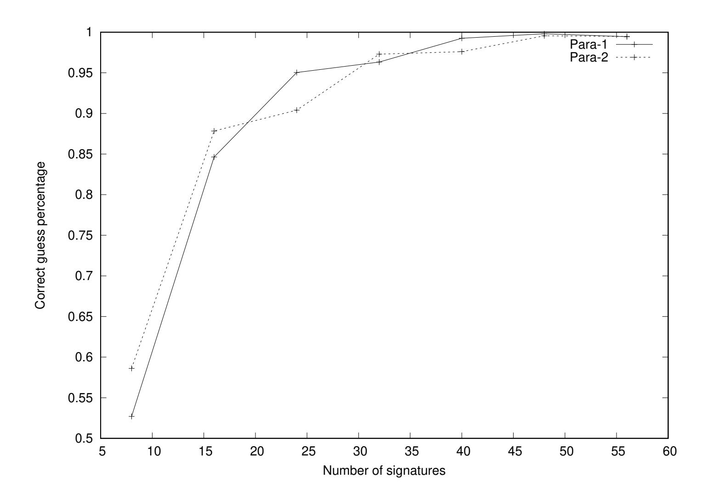

{0}------------------------------------------------

# <span id="page-0-0"></span>Another code-based adaptation of Lyubashevsky's signature cryptanalysed

Nicolas Aragon1? , Jean-Christophe Deneuville<sup>2</sup> , and Philippe Gaborit<sup>1</sup>

> <sup>1</sup> XLIM-MATHIS, University of Limoges [{nicolas.aragon,](mailto:nicolas.aragon@unilim.fr)[philippe.gaborit}](mailto:philippe.gaborit@unilim.fr)@unilim.fr <sup>2</sup> ENAC, University of Toulouse [jean-christophe.deneuville@enac.fr](mailto:jean-christophe.deneuville@enac.fr)

Abstract. In 2012, Lyubashevsky [\[9\]](#page-11-0) introduced a framework for obtaining efficient digital signatures relying on lattice assumptions. Several works [\[11,](#page-11-1) [15\]](#page-12-0) attempted to make this approach compliant with the coding theory setting, unsuccessfully. Recently, Song et al. proposed another adaptation of this framework [\[16\]](#page-12-1), using denser and permuted secret keys, claiming immunity against existing attacks [\[5,](#page-11-2) [13\]](#page-12-2).

This paper describes an efficient attack against Song et al. signature scheme. We show that it is possible to fully recover the secret key from a very limited number of signatures. As an example, it requires 32 signatures and 2 hours to recover the secret key of the parameter set targeting 80 bits of security. The attack affects both proposed parameter sets, and discourages patching such an approach.

Keywords: Post-Quantum Cryptography, Coding Theory, Digital signature, Cryptanalysis

# 1 Introduction

Digital signature schemes are a class of cryptographic primitives designed to provide a digital equivalent to their classical/paper counterpart, namely to authenticate the original issuer of a document. Efficient constructions of signature schemes have been proposed alongside the advent of public key cryptography [\[12\]](#page-11-3). Ever since then, a long line of research has aimed at making these constructions more efficient, by reducing the public key size, and/or shortening the signature length. While many well-established and widespread signature schemes rely on integer factorization, the most efficient constructions rely on the intractability of extracting discrete logarithms over the additive group of points on an elliptic curve. In 1994, assuming the existence of a sufficiently large quantum computer, Shor [\[14\]](#page-12-3) presented an algorithm to solve both problems in polynomial time (against sub-exponential time for the best known classical algorithms). Finding quantum-safe alternatives to cryptosystems relying on the hardness of number theory problems is therefore of prime importance.

<sup>?</sup> This work was partially funded by French DGA

{1}------------------------------------------------

<span id="page-1-0"></span>Among the quantum-safe alternatives, euclidean lattices and error correcting codes stand as the most promising candidates. Code-based cryptography was initiated by McEliece [\[10\]](#page-11-4), and essentially relies on the intractability of decoding random linear codes, a problem that has been proved NP-complete [\[3\]](#page-11-5). While Public Key Encryption seems to be a primitive easy to build using coding theory, obtaining efficient and secure Digital Signatures is a long standing open problem.

A first approach consists in turning an identification scheme into a digital signature using Fiat-Shamir transform. Because identification schemes have nonzero cheating probability, the protocol has to be repeated many times to achieve the target security level, yielding long signatures [\[17\]](#page-12-4). Shorter signatures can be obtained using the other approach: the hash-and-sign paradigm. The first construction of that kind is the CFS signature scheme [\[4\]](#page-11-6). It works by repeatedly hashing a message with a counter until the hash hits a decodable word. The signature size is optimal, but the signing procedure is rather inefficient since the hashing process has to be repeated an large number of times. Additionally, the CFS construction requires to resort to high density Goppa codes, that have been shown to be distinguishable from random codes [\[6\]](#page-11-7), although this does not affect the practical security of their scheme. More recently, Debris-Alazard, Sendrier and Tillich managed to design a rejection sampling procedure that prevent information leakage, yielding an hash-and-sign signature scheme with acceptable (unstructured) public key size ≈ 3 MB and signature size ≈ 2 KB.

In 2012, Lyubashevsky introduced a framework for constructing lattice-based signature schemes without trapdoor (such as GPV [\[7\]](#page-11-8) or NTRU [\[8\]](#page-11-9)). In this scheme, the secret key is a set of short lattice vectors, the public key is constructed as an instance of the Short Integer Solution problem (SIS for short), and signatures are a small subset sum of the secret key, hidden by a (large) Gaussian mask. The signature is rather efficient both in terms of public key size (≈ 1 MB unstructured) and signature size (≈ 10 KB). Several attempts have been made to adapt Lyubashevsky's framework to code-based cryptography, either in Hamming metric [\[11\]](#page-11-1) or in Rank metric [\[15\]](#page-12-0), both of them have proved to be insecure [\[5,](#page-11-2) [13,](#page-12-2) [1\]](#page-11-10). Recently, Song et al. [\[16\]](#page-12-1) proposed another adaptation of Lyubashevsky's framework in Hamming metric, that we will abbreviated as the SHMWW signature scheme later. Actually their proposal is very similar to the "matrix version" presented and claimed insecure in [\[5,](#page-11-2) p. 5], with two noticeable differences: The secret key is both row- and column-permuted; The rows of the secret key have bigger weight. While Song et al. claim that their scheme resists existing attacks such as [\[5,](#page-11-2) [13\]](#page-12-2), their analysis of the information leaked by a signature is more disputable (see paragraph "Indirect Key Recovery Attacks" [\[16,](#page-12-1) p. 13]), and no assumption is made on the number of signatures that an adversary can collect.

Contributions. The contributions of this work are threefold: first we describe a polynomial time algorithm to recover the permuted secret key from a bunch of N signatures. Then we provide a proof of concept implementation of the SHMWW signature scheme to generate concrete target instances for our cryptanalysis and 

{2}------------------------------------------------

<span id="page-2-2"></span>finally, we provide an implementation of our cryptanalysis, that successfully returns the secret key given access to very few signatures.

**Techniques.** The cryptanalysis is split in two phases: first we show that the structure of the secret key leads to an information leakage in the signatures and we exploit it to partially recover this structure. Then using this information we apply an Information Set Decoding algorithm to recover the whole secret key.

Related work. The SHMWW signature scheme is very similar to the matrix adaptation of Lyubashevsky's framework described and claimed insecure in [5], except that it features a denser secret key matrix, permuted left (row-permuted) and right (column-permuted). Our cryptanalysis proves that these additions are not sufficient to prevent information leakage. In an independent work, Baldi et al. [2] proposed a similar approach for cryptanalysing the SHMWW signature scheme. They provide a thorough statistical analysis of their method supported with empirical simulations, and derive theoretical upper bounds in terms of complexity for their cryptanalysis. Our work differs from [2] in the following aspects: instead of statistical simulations, we provide a proof-of-concept implementation of the SHMWW signature scheme [16] as well as an implementation of our cryptanalysis, that succeeds with a number of collected signatures two orders of magnitude below [2] (namely 32 against 5000 to 8000). Both implementations are publicly available at: https://github.com/deneuville/cryptanalysisSHMWW.

**Organization of the paper.** We introduce some notation and background on coding theory and Lyubashevsky's framework in section 2. Section 3 is devoted to the description of Song *et al.* signature scheme. The main contribution of this work, the cryptanalysis of the SHMWW signature scheme, is described in section 4 before concluding in section 5.

# <span id="page-2-1"></span>2 Preliminaries

### 2.1 Notations

Throughout the paper,  $\mathbb{F}_q$  denotes the finite field of q elements. Vectors (resp. matrices) will be represented in lower-case (resp. upper-case) bold letters. A vector  $\mathbf{u} = (u_0, \dots, u_{n-1}) \in \mathbb{F}_q^n$  will be interchangeably seen as a vector or polynomial in  $\mathbb{F}_q[x]/\langle x^n - 1 \rangle$ . Hence for  $\mathbf{u}, \mathbf{v} \in \mathbb{F}_q^n$ ,  $\mathbf{w} = \mathbf{u}\mathbf{v}$  denotes the vector such that:

$$w_k = \sum_{i+j=k} u_i v_j x^k$$
, for  $k \in \{0, \dots, n-1\}$ .

Given the context, the weight of a vector  $\boldsymbol{u} \in \mathbb{F}_q^n$  will either denote its Hamming weight or its Euclidean norm, and will be indifferently denoted  $\|\boldsymbol{u}\|$ . Finally, we denote by  $\mathcal{S}_w^n(\mathbb{F}_q)$  the set of vectors in  $\mathbb{F}_q^n$  of weight w.

<span id="page-2-0"></span><sup>&</sup>lt;sup>1</sup> [2] was submitted on ePrint on July the 17<sup>th</sup>, 2020. Our implementations were made public on July the 4<sup>th</sup>, 2020. The present document has been submitted to ePrint on July the 24<sup>th</sup>.

{3}------------------------------------------------

#### <span id="page-3-0"></span>2.2 Coding theory

We now recall some basic definitions and facts about coding theory that will be helpful for the comprehension of the SHMWW signature scheme and its cryptanalysis.

**Definition 1 (Parity-check matrix).** Let n, k be integers. The parity-check matrix of an [n, k] linear code C is a matrix  $\mathbf{H} \in \mathbb{F}_q^{(n-k) \times n}$  that generates the dual code  $C^{\perp}$ . Formally, if  $\mathbf{G} \in \mathbb{F}_q^{n \times k}$  is a generator matrix of C, then  $\mathbf{H}$  satisfies  $\mathbf{G}\mathbf{H}^{\top} = \mathbf{0}$ .

**Definition 2 (Syndrome Decoding problem).** Let  $\mathbf{H} \in \mathbb{F}_q^{(n-k)\times n}$  be a parity-check matrix of some [n,k] linear code over  $\mathbb{F}_q$ ,  $\mathbf{s} \in \mathbb{F}_q^{n-k}$  a syndrome, and w an integer. The Syndrome Decoding problem asks to find a vector  $\mathbf{e} \in \mathbb{F}_q^n$  of weight less than or equal to w such that  $\mathbf{s}^{\top} = \mathbf{H}\mathbf{e}^{\top}$ .

The SD problem has been proved to be NP-hard [3]. Assuming a solution to the SD problem exists, the target weight w determines whether the solution is unique or not. This property is captured through the well-known Gilbert-Varshamov (GV) bound.

**Definition 3 (Gilbert-Varshamov bound).** Let C be an [n,k] linear code over  $\mathbb{F}_q$ . The Gilbert-Varshamov bound  $d_{GV}$  is the maximum value d such that

$$\sum_{i=0}^{d-1} \binom{n}{i} (q-1)^i \le q^{n-k}.$$

#### 2.3 Lattice signatures without trapdoors

In 2012, Lyubashevsky proposed a new approach for building lattice-based signatures without trapdoors [9]. Contrarily to NTRUSign [8] which embeds very short vectors in the secret key, and GPV [7] which uses Gaussian sampling to avoid information leakage when generating the public key from the secret key, Lyubashevsky's keys are an SIS instance, an analogue to the syndrome decoding problem in the lattice setting.

We now recall Lyubashevsky's signature scheme (Fig. 1). Many notations  $(\eta, \sigma, ...)$  are purposely not introduced because of their irrelevance to this work. We keep the description in its general form but as mentioned by the author, key sizes can be shrunk by a factor k using more structured matrices and relying on the ring version of the SIS problem. Private and public keys are respectively uniformly random matrices  $\mathbf{S} \in \{-d, \ldots, 0, \ldots, d\}^{m \times k}$  and  $\mathbf{A} \in \mathbb{F}_q^{n \times m}$   $(\mathbf{T} = \mathbf{A}\mathbf{S} \text{ also belongs to pk})$  and the signature process invokes a hash function  $\mathcal{H}: \{0,1\}^* \to \{\mathbf{v}: \mathbf{v} \in \{0,1\}^k, \|\mathbf{v}\|_1 \le \kappa\}$ . A signature  $(\mathbf{z}, \mathbf{c})$  of a message  $\mathbf{m}$  corresponds to a combination of the secret key and the hash of this message, shifted by a committed value also used in the hash function. The entire scheme is depicted in Fig. 1. The main idea behind Lyubashevsky's scheme is that the

{4}------------------------------------------------

```
Algorithm 1 KeyGen(n, m, k, q, d)
Input: n, m, k, q, d \in \mathbb{Z}
Output: (pk, sk) with pk = (A, T) \in \mathbb{F}_q^{n \times m} \times \mathbb{F}_q^{n \times k} and sk = S \in \mathbb{F}_q^{m \times k}
 1: \mathbf{S} \stackrel{\$}{\leftarrow} \{-d, \dots, 0, \dots, d\}^{m \times k}
 2: \mathbf{A} \stackrel{\$}{\leftarrow} \mathbb{F}_q^{n \times m}
 3: T \leftarrow AS
 4: return (pk = (A, T), sk = S)
Algorithm 2 Sign(pk, sk, m)
Input: Public and private keys, message m \in \{0,1\}^* to be signed
Output: Signature (\boldsymbol{z}, \boldsymbol{c}) \in \mathbb{F}_q^m \times \mathbb{F}_q^k of message \boldsymbol{m}
 1: \boldsymbol{y} \stackrel{\$}{\leftarrow} D_{\sigma}^{m}
 2: \boldsymbol{c} \leftarrow \mathcal{H}(\boldsymbol{A}\boldsymbol{y}, \boldsymbol{m})
 3: z \leftarrow Sc + y
 4: return (z, c) with probability min \left(\frac{D_{\sigma}^{m}(z)}{M \cdot D_{Sc, \sigma}^{m}(z)}, 1\right)
Algorithm 3 Verify (pk, (z, c), m)
Input: Public key, message m, and the signature (z, c) to verify
Output: Accept if (z, c) is a valid signature of m, Reject otherwise
 1:
 2: if \mathcal{H}(Az - Tc, m) = c and ||z|| \leq \eta \sigma \sqrt{m} then
 3:
           return Accept
 4: else
           return Reject
 5:
```

<span id="page-4-3"></span><span id="page-4-1"></span>Fig. 1. Lyubashevsky's lattice-based signature scheme.

signing procedure in Alg. 2 includes a rejection step that ensures that the distribution of the output signature is independent from the secret key and hence, do not leak. Regarding the verification in Alg. 3,  $\eta\sigma\sqrt{m}$  is an upper bound on the length of the signature.

# <span id="page-4-0"></span>3 SHMWW's code-based variation on Schnorr-Lyubashevsky

Recently, Song et al. proposed a code-based variation on Schnorr-Lyubashevsky's framework. Their approach essentially differs from previous adaptations in the construction of the secret key. In the rest of the paper, we use the notations of [16]: k' and n' denote the dimension and length of the inner generator matrices  $\mathbf{E}_i = [\mathbf{I}_{k'} \mid \mathbf{R}_i]$  under systematic form  $(\mathbf{I}_{k'}$  denotes the identity matrix of dimension k'), l denotes the number of such matrices, and k and n = ln' are the dimension and length of a random code over  $\mathbb{F}_2$  defined by its parity-check matrix  $\mathbf{H}$ .  $\mathbf{P}_1$  (resp.  $\mathbf{P}_2$ ) is a random permutation matrix of k' (resp. n) elements.

{5}------------------------------------------------

<span id="page-5-0"></span>The secret key is the matrix  $\boldsymbol{E} = \boldsymbol{P}_1[\boldsymbol{E}_1 \mid \cdots \mid \boldsymbol{E}_l] \boldsymbol{P}_2 \in \mathbb{F}_2^{k' \times n}$ , and the public key consists of  $\boldsymbol{H} \in \mathbb{F}_2^{(n-k) \times n}$  and  $\boldsymbol{S} = \boldsymbol{H} \boldsymbol{E}^{\top} \in \mathbb{F}_2^{(n-k) \times k'}$ .

By constructing the secret key this way, row elements of the secret key E have an average weight of  $l \times (1 + \frac{n'-k'}{2})$ , which is close to 1/3 or 1/4 of the Gilbert-Varshamov bound for random linear codes of rate k'/n (depending on the parameters). Notice that this is different from previous proposals such as [11] or the matrix version of [5] where the row weight is closer to  $\sqrt{n}$ . Also notice that while the permutation  $P_2$  permutes the columns of  $E' = [E_1 \mid \cdots \mid E_l]$ , the permutation  $P_1$  only permutes the rows of E', therefore E' and  $P_1E'$  generate the same code. In other words,  $P_1$  has no positive impact on the security of the SHMWW scheme.

Finally, Song et al. also use a Weight Restricted Hash (WRH) function  $\mathcal{H}$  in their construction, that on input an arbitrary bit string returns a word of length  $\ell=k'$  and Hamming weight  $w=w_1$ . The authors describe a method for constructing such a hash function. Since our cryptanalysis is independent from that function, we simply denote it  $\mathcal{H}_{w_1}^{k'}$  or  $\mathcal{H}$  if the context is clear.

To sign a message m, a mask e of small weight  $w_2$  is sampled uniformly at random, then committed by its syndrome, together with the message, to get the challenge  $\mathbf{c} = \mathcal{H}\left(\mathbf{m}, \mathbf{H}\mathbf{e}^{\top}\right)$ . The response to this challenge is the product of the secret key and the challenge, hidden by the committed mask:  $\mathbf{z} = \mathbf{c}\mathbf{E} + \mathbf{e}$ . The signature consists of the challenge and the response:  $\sigma = (\mathbf{z}, \mathbf{c})$ . The algorithms for SHMWW signature scheme are depicted in details in Fig. 2. Proposed parameters are recalled in Table 1.

Criteria for parameters selection. In [16], the authors study the impact of applying Prange Information Set Decoding (ISD) algorithm for both "direct and indirect" key recovery attacks. This essentially provides parameters  $n, k, d_{GV}$  and  $w_2$ , the other parameters follow by the Gilbert-Varshamov bound and by choosing a value for l:

$$l(w_1 + n' - k') + w_2 \le d_{GV}. (1)$$

One of the most technical aspects in the design of a signature scheme is to make the signature distribution statistically independent from the secret key. This allows (by programming the random in the security reduction) the forger to produce valid signatures without knowing the secret key, which can then be used to solve the underlying hard problem. This technicality provides guidance for the choice of the parameters, especially for the Hamming weight (or  $\ell_1$  norm for Lyubashevsky) of the challenge. Indeed, in order for the SD problem to admit a unique solution, the weight of the signature must be below the Gilbert-Varshamov bound. In the meantime, the weight of the secret key should be big enough in order not to be exhibited easily. In the case of SHMWW, this results in a secret key E that is sparse: Only  $\frac{l(k'+k'(n'-k')/2)}{k'n} \simeq 7\%$  of non-zero coordinates for both parameter sets. This sparsity will be useful for the cryptanalysis.

{6}------------------------------------------------

```
Input: Public parameters params = (n, k, w_1, w_2, \delta) chosen from Tab 1.
Output: (pk, sk) with pk = (\boldsymbol{H}, \boldsymbol{S}) \in \mathbb{F}_2^{(n-k) \times n} \times \mathbb{F}_2^{(n-k) \times k'} and sk = \boldsymbol{E} \in \mathbb{F}_2^{k' \times n}
 1: \boldsymbol{H} \stackrel{\$}{\leftarrow} \mathbb{F}_2^{(n-k)\times n}
 2: \mathbf{R}_i \stackrel{\$}{\leftarrow} \mathbb{F}_2^{k' \times (n'-k')} for i \in [1, l]
 3: Let P_1 (resp. P_2) be a random k' \times k' (resp. n \times n) permutation matrix
 4: \boldsymbol{E} \leftarrow \boldsymbol{P}_1 \left[ \boldsymbol{I}_{k'} | \boldsymbol{R}_1 | \cdots | \boldsymbol{I}_{k'} | \boldsymbol{R}_l \right] \boldsymbol{P}_2
 5: return (pk = (H, S = HE^{\top}), sk = E)
Algorithm 5 Sign(pk, sk, m)
Input: Public and private keys, message m \in \{0,1\}^* to be signed
Output: Signature (z, c) \in \mathbb{F}_2^n \times \mathbb{F}_2^{k'} of message m
 1: e \stackrel{\$}{\leftarrow} \mathcal{S}_{w_2}^n
                                       (c has length k' and weight w_1)
 2: \ \boldsymbol{c} \leftarrow \mathcal{H}\left(\boldsymbol{m}, \boldsymbol{H} \boldsymbol{e}^{\top}\right)
 3: z \leftarrow cE + e
                                                                                                         ▷ no rejection sampling
 4: return (z, c)
Algorithm 6 Verify (pk, (z, c), m)
Input: Public key, message m, and the signature (z, c) to verify
Output: Accept if (z, c) is a valid signature of m, Reject otherwise
 1: if \mathcal{H}(\boldsymbol{m}, \boldsymbol{H}\boldsymbol{z}^{\top} - \boldsymbol{S}\boldsymbol{c}^{\top}) = \boldsymbol{c} and \|\boldsymbol{z}\| \leq l\left(w_1 + n' - k'\right) + w_2 then
 2:
            return Accept
 3: else
 4:
            return Reject
```

<span id="page-6-2"></span>**Algorithm 4** KeyGen(params =  $(n, k, n', k', l, w_1, w_2, d_{GV})$ )

<span id="page-6-1"></span>Fig. 2. Song et al. code based proposal [16].

### <span id="page-6-0"></span>4 Cryptanalysis of the SHMWW scheme

In this section we describe how we can exploit the structure of the matrix E and N valid signatures to recover the secret key of the SHMWW scheme.

#### 4.1 ISD complexity with the knowledge of random columns

First we are going to show that knowing which columns of E are random and which come from an identity matrix (i.e only have one non-zero coordinate) can be used to efficiently recover E.

Let  $\mathcal{I}_R$  be the set of random columns of E. Then we can recover E line by line by applying any Information Set Decoding (ISD) algorithm, such as Prange algorithm, and choose an information set  $\mathcal{I}$  such that  $\mathcal{I}_R \subset \mathcal{I}$ . This way we maximize the probability that every non-zero coordinates of the line we are trying to recover are included in the information set.

More precisely, in the SHMWW scheme, we have:

{7}------------------------------------------------

<span id="page-7-2"></span>

| Instance | n    | k    | n-k  | l | n'   | k'  | n'-k' | $w_1$ | $w_2$ | $d = d_{GV}$ | λ   |
|----------|------|------|------|---|------|-----|-------|-------|-------|--------------|-----|
| Para-1   | 4096 | 539  | 3557 | 4 | 1024 | 890 | 134   | 31    | 531   | 1191         | 80  |
| Para-2   | 8192 | 1065 | 7127 | 8 | 1024 | 880 | 144   | 53    | 807   | 2383         | 128 |

<span id="page-7-0"></span>**Table 1.** Original SHMWW parameters [16] for  $\lambda$  bits of security.

$$- |\mathcal{I}_R| = (n' - k') \times l$$
  
-  $|\mathcal{I}| = n - k$ 

<span id="page-7-1"></span>**Proposition 1.** The probability p that the l non-zero coordinates of E (the ones from the non-random columns) are included in  $\mathcal{I}$  is:

$$p = \frac{\binom{n-k-(n'-k')\times l}{l}}{\binom{n-(n'-k')\times l}{l}}.$$
 (2)

*Proof.* By choosing an information set  $\mathcal{I}$  such that  $\mathcal{I}_R \subset \mathcal{I}$ , we have to choose  $|\mathcal{I}| - |\mathcal{I}_R| = n - k - (n' - k') \times l$  columns at random and hope that the l remaining non-null coordinates (from the identity matrices) are included in this set.

From this we deduce that the probability of success is the probability that the l non-null coordinates that are distributed in  $n - (n' - k') \times l$  positions are included in an information set of size  $n - k - (n' - k') \times l$ , hence the result.

From Proposition 1 we deduce that the probability of success is approximately of 50% for the parameter set Para-1 and 30% for Para-2.

We are now going to estimate the complexity of recovering the secret key E given the knowledge of the set  $\mathcal{I}_R$ .

**Proposition 2.** Given the knowledge of  $\mathcal{I}_R$ , recovering the secret key E costs:

- 2<sup>48</sup> operations for Para-1
- $-2^{52}$  operations for Para-2

*Proof.* The complexity of solving a linear system to recover a line of E is  $(n-k)^3$ .

Since the SHMWW scheme only uses binary matrices, the probability that the matrix defining said linear system is invertible can be approximated by 0.288, and the probability p that the system gives the correct solution is given by proposition 1.

This has to be repeated for each of the k' lines of E, which gives the following complexity:

$$\frac{k'((n-k)^3)}{0.288p}$$

Hence the result.

{8}------------------------------------------------

**Remark:** Even in we only have an approximate knowledge of  $\mathcal{I}_R$  (i.e if the set is missing some random columns, or non-random columns are included), the ISD will still recover the secret line of E but the probability of success will be lower, hence leading to a higher complexity. Experimental results about how this affects the complexity are given section 4.3.

Next we are going to show how we can recover  $\mathcal{I}_R$  using leakage from the signatures.

### 4.2 Leakage from the signatures

We are going to exploit the following bias in the weight of the signatures in order to recover  $\mathcal{I}_R$ :

<span id="page-8-0"></span>**Proposition 3.** Let  $\mathcal{I}_R$  be the set of random columns of  $\mathbf{E}$  and let  $\mathbf{z} = (z_1, \ldots, z_n) = \mathbf{c}\mathbf{E} + \mathbf{e}$ . Then we have:

$$P(z_i = 1) = \frac{1}{2} \text{ if } i \in \mathcal{I}_R$$

$$P(z_i = 1) = \frac{w_1}{k'} + \frac{w_2}{n} (1 - 2\frac{w_1}{k'}) \text{ otherwise}$$

*Proof.* We know that:

$$z = cE + e$$

Where c is a vector of length k' and weight  $w_1$  and e is a vector of length n and weight  $w_2$ .

Since  $w_1 \ll \frac{k'}{2}$ , c has a much lower weight than a random vector of the same length. We are now going to study the weight of each coordinate of the vector z' = cE.

Let  $z'_i$  be the *i*-th coordinate of z'. Then there are two possibilities:

- If the *i*-th column of  $\boldsymbol{E}$  is random, then the weight of  $z_i'$  is 1 with probability  $\frac{1}{2}$
- If the *i*-th column of E is a column of weight 1, then the weight of  $z'_i$  is 1 with probability  $\frac{w_1}{k'}$

Now we want to compute the probability  $P(z_i = 1)$  that the *i*-th coordinate of z is of weight 1. Since z' and e are independent we have:

$$P(z_i = 1) = P(z_i' = 1) + P(e_i = 1) - 2P(z_i = 1 \land e_i = 1)$$
  
=  $P(z_i' = 1) + P(e_i = 1)(1 - 2P(z_i' = 1))$ 

Which gives the result by replacing  $P(z_i'=1)$  by either  $\frac{1}{2}$  or  $\frac{w_1}{k'}$  depending on i and  $P(e_i=1)$  by  $\frac{w_2}{n}$ .

Table 2 shows the values of  $P(z_i = 1)$  for the two SHMWW parameter sets. Using proposition 3 we can distinguish between random columns and columns from an identity matrix: when acquiring multiple signatures, the coordinates  $z_i$ 

{9}------------------------------------------------

<span id="page-9-1"></span>

|                      | Para-1 | Para-2 |
|----------------------|--------|--------|
| P(zi<br>= 1 i ∈ IR)  | 0.5    | 0.5    |
| P(zi<br>= 1 i /∈ IR) | 0.155  | 0.147  |

Table 2. Values of P(z<sup>i</sup> = 1) for the SHMWW parameter sets

for which, on average, their weight is lower than <sup>1</sup> 2 are most likely to be the coordinates corresponding to columns of weight 1.

From this we can now build an algorithm to recover the secret key of the SHMWW scheme. This algorithm is presented figure [3](#page-9-2) and uses a threshold value, computed as the mean of P(z<sup>i</sup> = 1|i ∈ IR) and P(z<sup>i</sup> = 1|i /∈ IR).

```
Input: H, S, a threshold value t, a set of signatures (σ1, . . . , σN ) =
((z1, c1), . . . ,(zN , cN ))
Output: the secret matrix E
 1. IR = ∅
 2. For each i from 1 to n:
     – Compute wi =
                        PN
                       j=1
                          (zj )i
     – If wi > N × t then IR = IR ∪ {i}
 3. For each i from 1 to k
                          0
                           :
     – Recover the i-th line of E by using an ISD algorithm and the knowledge
        of IR
 4. Return E
```

<span id="page-9-2"></span>Fig. 3. Secret key recovery of the SHMWW scheme

#### <span id="page-9-0"></span>4.3 Experimental results

Recovery of IR. We performed experiments to measure the effectiveness of the recovery of the set of random columns IR. For each parameter set, we ran our script with an increasing number of signatures and checked the percentage of correct guesses (i.e the number of coordinates in the set I<sup>R</sup> that was computed by the cryptanalysis algorithm that corresponds to actual random columns of the secret key). Results are presented in figure [4.](#page-10-1) This result shows that the recovery of I<sup>R</sup> quickly becomes very precise when the number of available signatures increases.

Execution time. To demonstrate the effectiveness of our cryptanalysis for each parameter set, we generated 10<sup>3</sup> key pairs. For each of them, we generated N signatures, and ran our cryptanalysis algorithm. The average timings are reported in Table [3.](#page-10-2) The experiments were led on an Intel <sup>R</sup> CoreTM i9-9980HK CPU @ 2.40GHz with Sagemath version 7.5.1.

{10}------------------------------------------------

<span id="page-10-3"></span>

<span id="page-10-1"></span>Fig. 4. Percentage of correct guesses with respect to the number of signatures available for the cryptanalysis.

| Instance | Claimed<br>Security | N = 32    | Number N of collected signatures<br>N = 64 |
|----------|---------------------|-----------|--------------------------------------------|
| Para-1   | 80                  | 2h07m17s  | 44m37s                                     |
| Para-2   | 128                 | 16h21m04s | 5h21m40s                                   |

<span id="page-10-2"></span>Table 3. Experimental results for the cryptanalysis of the SHMWW signature scheme. N denotes the number of signatures the adversary has access to.

# <span id="page-10-0"></span>5 Conclusion

In this paper, we presented an efficient cryptanalysis of the signature scheme recently proposed by Song et al. [\[16\]](#page-12-1), adapting Lyubashevsky's framework to coding theory. Our attack affects both parameter sets, and discourages further parameter tweaks to patch the signature scheme. Our results are supported by a proof-of-concept of both the SHMWW signature scheme and our cryptanalysis. For both parameter sets, our attack requires as little as 32 signatures to fully recover the secret key. A recent independent work [\[2\]](#page-11-11) achieves similar results assuming the adversary has access to two orders of magnitude more signatures (namely 8000 for 80 bits, and 5000 for 128 bits). To the best of our knowledge, the 

{11}------------------------------------------------

<span id="page-11-12"></span>authors of [\[2\]](#page-11-11) did not publish an implementation, making a practical comparison of the attacks impossible.

# References

- <span id="page-11-10"></span>[1] Aragon, N., Blazy, O., Deneuville, J.C., Gaborit, P., Lau, T.S.C., Tan, C.H., Xagawa, K.: Cryptanalysis of a rank-based signature with short public keys. Designs, Codes and Cryptography (2019) 1–11 [2](#page-1-0)
- <span id="page-11-11"></span>[2] Baldi, M., Khathuria, K., Persichetti, E., Santini, P.: Cryptanalysis of a code-based signature scheme based on the lyubashevsky framework. Cryptology ePrint Archive, Report 2020/905 (2020) [https://eprint.iacr.](https://eprint.iacr.org/2020/905) [org/2020/905](https://eprint.iacr.org/2020/905). [3,](#page-2-2) [11,](#page-10-3) [12](#page-11-12)
- <span id="page-11-5"></span>[3] Berlekamp, E.R., McEliece, R.J., van Tilborg, H.C.A.: On the inherent intractability of certain coding problems (corresp.). IEEE Trans. Information Theory 24(3) (1978) 384–386 [2,](#page-1-0) [4](#page-3-0)
- <span id="page-11-6"></span>[4] Courtois, N., Finiasz, M., Sendrier, N.: How to achieve a mceliece-based digital signature scheme. In Boyd, C., ed.: Advances in Cryptology - ASI-ACRYPT 2001, 7th International Conference on the Theory and Application of Cryptology and Information Security, Gold Coast, Australia, December 9-13, 2001, Proceedings. Volume 2248 of Lecture Notes in Computer Science., Springer (2001) 157–174 [2](#page-1-0)
- <span id="page-11-2"></span>[5] Deneuville, J.C., Gaborit, P.: Cryptanalysis of a code-based one-time signature. Designs, Codes and Cryptography (2020) 1–10 [https://doi.org/](https://doi.org/10.1007/s10623-020-00737-8) [10.1007/s10623-020-00737-8](https://doi.org/10.1007/s10623-020-00737-8). [1,](#page-0-0) [2,](#page-1-0) [3,](#page-2-2) [6](#page-5-0)
- <span id="page-11-7"></span>[6] Faugere, J.C., Gauthier-Umana, V., Otmani, A., Perret, L., Tillich, J.P.: A distinguisher for high-rate mceliece cryptosystems. IEEE Transactions on Information Theory 59(10) (2013) 6830–6844 [2](#page-1-0)
- <span id="page-11-8"></span>[7] Gentry, C., Peikert, C., Vaikuntanathan, V.: Trapdoors for hard lattices and new cryptographic constructions. In Ladner, R.E., Dwork, C., eds.: 40th ACM STOC, ACM Press (May 2008) 197–206 [2,](#page-1-0) [4](#page-3-0)
- <span id="page-11-9"></span>[8] Hoffstein, J., Pipher, J., Silverman, J.H.: NSS: An NTRU lattice-based signature scheme. In Pfitzmann, B., ed.: EUROCRYPT 2001. Volume 2045 of LNCS., Springer, Heidelberg (May 2001) 211–228 [2,](#page-1-0) [4](#page-3-0)
- <span id="page-11-0"></span>[9] Lyubashevsky, V.: Lattice signatures without trapdoors. In Pointcheval, D., Johansson, T., eds.: EUROCRYPT 2012. Volume 7237 of LNCS., Springer, Heidelberg (April 2012) 738–755 [1,](#page-0-0) [4](#page-3-0)
- <span id="page-11-4"></span>[10] McEliece, R.J. In: A Public-Key System Based on Algebraic Coding Theory. Jet Propulsion Lab (1978) 114–116 DSN Progress Report 44. [2](#page-1-0)
- <span id="page-11-1"></span>[11] Persichetti, E.: Efficient one-time signatures from quasi-cyclic codes: A full treatment. Cryptography 2(4) (2018) 30 [1,](#page-0-0) [2,](#page-1-0) [6](#page-5-0)
- <span id="page-11-3"></span>[12] Rivest, R.L., Shamir, A., Adleman, L.M.: A method for obtaining digital signatures and public-key cryptosystems. Communications of the Association for Computing Machinery 21(2) (1978) 120–126 [1](#page-0-0)

{12}------------------------------------------------

- <span id="page-12-2"></span>[13] Santini, P., Baldi, M., Chiaraluce, F.: Cryptanalysis of a one-time codebased digital signature scheme. In: 2019 IEEE International Symposium on Information Theory (ISIT), IEEE (2019) 2594–2598 [1,](#page-0-0) [2](#page-1-0)
- <span id="page-12-3"></span>[14] Shor, P.W.: Algorithms for quantum computation: Discrete logarithms and factoring. In: 35th FOCS, IEEE Computer Society Press (November 1994) 124–134 [1](#page-0-0)
- <span id="page-12-0"></span>[15] Song, Y., Huang, X., Mu, Y., Wu, W.: A new code-based signature scheme with shorter public key. Cryptology ePrint Archive, Report 2019/053 (2019) <https://eprint.iacr.org/2019/053>. [1,](#page-0-0) [2](#page-1-0)
- <span id="page-12-1"></span>[16] Song, Y., Huang, X., Mu, Y., Wu, W., Wang, H.: A code-based signature scheme from the lyubashevsky framework. Theoretical Computer Science (2020) [1,](#page-0-0) [2,](#page-1-0) [3,](#page-2-2) [5,](#page-4-4) [6,](#page-5-0) [7,](#page-6-2) [8,](#page-7-2) [11](#page-10-3)
- <span id="page-12-4"></span>[17] Stern, J.: A new identification scheme based on syndrome decoding. In: Annual International Cryptology Conference, Springer (1993) 13–21 [2](#page-1-0)