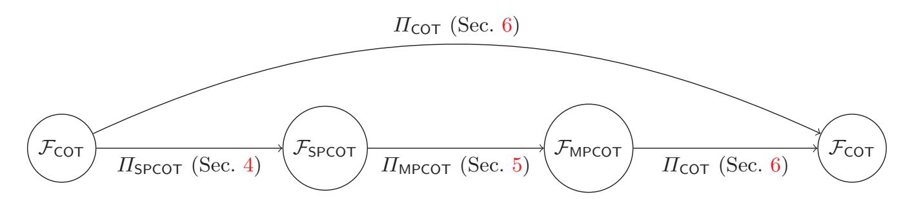
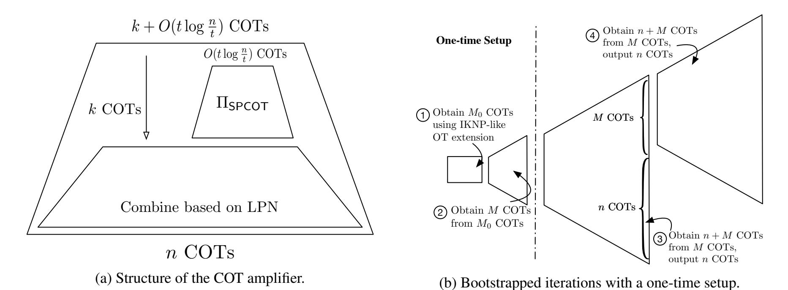

{0}------------------------------------------------

# Ferret: Fast Extension for coRRElated oT with small communication

Kang Yang State Key Laboratory of Cryptology

Chenkai Weng Northwestern University

Xiao Lan\* Sichuan University

yangk@sklc.org

ckweng@u.northwestern.edu

lanxiao@scu.edu.cn

Jiang Zhang

State Key Laboratory of Cryptology

jiangzhang09@gmail.com

Xiao Wang Northwestern University

wangxiao@cs.northwestern.edu

September 6, 2020

#### Abstract

Correlated oblivious transfer (COT) is a crucial building block for secure multi-party computation (MPC) and can be generated efficiently via OT extension. Recent works based on the pseudorandom correlation generator (PCG) paradigm presented a new way to generate random COT correlations using only communication sublinear to the output length. However, due to their high computational complexity, these protocols are only faster than the classical IKNP-style OT extension under restricted network bandwidth.

In this paper, we propose new COT protocols in the PCG paradigm that achieve unprecedented performance. *With* 50 *Mbps network bandwidth, our maliciously secure protocol can produce one COT correlation in* 22 *nanoseconds.* More specifically, our results are summarized as follows:

- 1. We propose a semi-honest COT protocol with sublinear communication and linear computation. This protocol assumes primal-LPN and is built upon a recent VOLE protocol with semi-honest security by Schoppmann et al. (CCS 2019). We are able to apply various optimizations to reduce its communication cost by roughly 15×, not counting a one-time setup cost that diminishes as we generate more COT correlations.
- 2. We strengthen our COT protocol to malicious security with no loss of efficiency. Among all optimizations, our new protocol features a new checking technique that ensures correctness and consistency essentially for free. In particular, our maliciously secure protocol is only 1 − 3 *nanoseconds* slower for each COT.
- 3. We implemented our protocols, and the code will be publicly available at EMP toolkit. We observe at least 9× improvement in running time compared to the state-of-the-art protocol by Boyle et al. (CCS 2019) in both semi-honest and malicious settings under any network faster than 50 Mbps.

With this new record of efficiency for generating COT correlations, we anticipate new protocol designs and optimizations will flourish on top of our protocol.

\*Work is done when visiting Northwestern University.

{1}------------------------------------------------

## Contents

| 1 |     | Introduction                                     | 3  |
|---|-----|--------------------------------------------------|----|
|   | 1.1 | Our Contribution                              | 3  |
|   | 1.2 | More Discussion                               | 5  |
|   | 1.3 | Paper Organization                            | 5  |
| 2 |     | Preliminaries                                    | 5  |
|   | 2.1 | Notation                                      | 5  |
|   | 2.2 | Correlated Oblivious Transfer                 | 5  |
|   |     |                                                  |    |
| 3 |     | Background and Technical Overview                | 6  |
|   | 3.1 | Overview of the PCG Framework                 | 6  |
|   | 3.2 | Single-Point Correlated OT                    | 6  |
|   | 3.3 | Multi-Point Correlated OT                     | 8  |
|   | 3.4 | Random Correlated OT                          | 10 |
| 4 |     | Single-Point Correlated OT                       | 12 |
|   | 4.1 | Security of Our SPCOT Protocol                | 13 |
|   | 4.2 | Optimizations and Complexity Analysis         | 14 |
|   |     |                                                  |    |
| 5 |     | Multi-Point Correlated OT                        | 14 |
| 6 |     | Iterative Correlated OT Extension                | 16 |
|   | 6.1 | Our COT with Bootstrapped Iterations          | 18 |
|   | 6.2 | Optimizations and Complexity Analysis         | 18 |
| 7 |     | Performance Evaluation                           | 19 |
|   | 7.1 | Parameter Selection                           | 19 |
|   | 7.2 | Efficiency of the Main Iteration              | 20 |
|   | 7.3 | Performance of One-Time Setup                 | 21 |
|   | 7.4 | Micro-benchmark                               | 22 |
|   |     |                                                  |    |
| A |     | More Preliminaries                               | 26 |
|   | A.1 | Security Model                                | 26 |
|   | A.2 | Learning Parity with Noise                    | 26 |
|   | A.3 | Correlation Robust Hash Functions             | 27 |
| B |     | Proof of Theorem 1                            | 27 |
| C |     | Batched Consistency Check for Our SPCOT Protocol | 32 |
|   | C.1 | Security Analysis                             | 33 |
| D |     | Proof of Theorem 2                            | 35 |
|   |     |                                                  |    |
| E |     | LPN with Selective Failure Leakage               | 36 |
|   | E.1 | LPN with Static Leakage                       | 36 |
|   | E.2 | LPN with Static, Functional Leakage           | 37 |
| F |     | Proof of Theorem 3                            | 38 |

{2}------------------------------------------------

## 1 Introduction

Correlated oblivious transfer (COT) allows the sender to obtain two random correlated messages and the receiver to obtain one of them based on the choice bit. COT is a key building block in secure multi-party computation (MPC). On the one hand, we can convert random COT to chosen-input oblivious transfer (OT) efficiently [\[Bea95,](#page-22-0) [IKNP03\]](#page-23-0). On the other hand, the preprocessing stage of many MPC protocols such as [\[NNOB12,](#page-24-0) [FKOS15,](#page-23-1) [KOS16,](#page-24-1) [BLO16,](#page-22-1) [WRK17b,](#page-24-2) [HSS17,](#page-23-2) [KRRW18,](#page-24-3) [RW19,](#page-24-4) [AOR](#page-22-2)+19, [DEF](#page-23-3)+19] crucially relies on such COT correlations to generate (authenticated) shares and Beaver triples, which is the main cost of these protocols. Boyle et al. [\[BCG](#page-22-3)+19b, [BCG](#page-22-4)+19a] have discussed in detail how COT can accelerate existing MPC protocols. Therefore, the efficiency improvement for COT will have a significant impact on the efficiency of these MPC protocols. COT correlations can be generated efficiently using OT extension [\[Bea96,](#page-22-5) [IKNP03\]](#page-23-0). For example, the state-of-the-art IKNP-style OT extension protocols [\[ALSZ13,](#page-22-6) [KOS15\]](#page-24-5) can generate COT with communication and symmetric-key operations linear to the number of correlated OTs and a very small number of public-key operations.

Recently, Boyle et al. [\[BCGI18,](#page-22-7) [BCG](#page-22-3)+19b] proposed a new approach to construct Vector Oblivious Linear Evaluation (VOLE), a generalized notion of COT, with *sublinear* communication based on the Learning Parity with Noise (LPN) assumption. Their protocols are completely different from the IKNP framework and have the potential to perform much better than the IKNP-style protocols. Specifically, two recent works [\[BCG](#page-22-4)+19a, [SGRR19\]](#page-24-6) can improve the performance significantly with certain network bandwidth.

- A recent follow-up work by Boyle et al. [\[BCG](#page-22-4)+19a] explored concrete optimizations under the *dual-LPN* assumption. Their COT protocol improves the communication of IKNP by 1000× for generating 10 million correlated OTs. Because of the simplistic structure of dual-LPN, they were also able to obtain malicious security. However, the protocol suffers from a high computational cost. For example, it is 60× faster than IKNP under a 10 Mbps network, but only 6× faster than IKNP under a network of 100 Mbps. Both the pros and cons of this protocol stem from the use of the dual-LPN assumption: it allows for very small parameters, but the computation is highly complicated, requiring operations like fast Fourier transform.
- Schoppmann et al. [\[SGRR19\]](#page-24-6), on the other hand, proposed a VOLE protocol with semi-honest security under the *primal-LPN* assumption, which is inspired by [\[BCGI18\]](#page-22-7). They focused on VOLE for large fields, but the protocol can be modified to work for generating COT correlations. Based on our estimation with the computational security parameter κ = 128, their protocol can reduce the communication of IKNP by only 20×, but the computation is much cheaper than the above protocol based on dual-LPN.

This protocol enjoys faster computation, but much more communication is required. This is due to the use of the primal-LPN assumption that has larger parameters but can be instantiated using, e.g., local linear codes with very cheap computation. In addition, it was not clear how to strengthen their protocol with malicious security.

In summary, prior work on PCG has advanced the performance significantly. But there are still much space to improve in their performance.

## 1.1 Our Contribution

In this paper, we propose new COT protocols in both the semi-honest setting and the malicious setting with unprecedented speed. *In particular, under network bandwidth of* 50 *Mbps, our semi-honest protocol produces one COT correlation in merely 21 nanoseconds (ns), while our maliciously secure protocol is only 1 nanosecond slower.* As summarized in Table [1,](#page-3-1) we give the performance of our COT protocols in the malicious setting, and compare them with the state-of-the art protocols. This impressive performance is achieved by a set of ideas in different layers of the protocol. We give a technical overview in Section [3,](#page-5-0) and present our main results as follows.

{3}------------------------------------------------

| Protocol   | Comm./COT | Running time per COT correlation (nanoseconds, ns) |        |         |       |       |  |  |
|------------|-----------|----------------------------------------------------|--------|---------|-------|-------|--|--|
|            | (bits)    | 10Mbps                                             | 50Mbps | 100Mbps | 1Gbps | 5Gbps |  |  |
| [KOS15]    | 128       | 12831                                              | 2574   | 1292    | 139   | 34    |  |  |
| [BCG+19a]  | 0.1       | 211                                                | 210    | 209     | 208   | 209   |  |  |
| Ferret-Reg | 0.44      | 54                                                 | 22     | 18      | 19    | 19    |  |  |
| Ferret-Uni | 0.73      | 86                                                 | 33     | 33      | 32    | 32    |  |  |

Table 1: Comparison between our protocols and the state-of-the-art COT extension protocols in the malicious setting. All numbers are obtained using Amazon EC2 (c5.4xlarge) and do not include the one-time setup. Ferret-Reg assumes LPN with a regular noise distribution, same as Boyle et al. [\[BCG](#page-22-4)+19a]; Ferret-Uni assumes LPN with uniform noise, a weaker assumption than LPN with regular noise. More computational resources will further bring down the cost of [\[BCG](#page-22-4)+19a].

- Semi-honest setting. As discussed above, the state-of-the-art COT protocols are able to achieve either high communication efficiency or high computational efficiency, *but not both*. This appears to be inherently rooted in the choice of LPN assumptions. To overcome the computation-communication dilemma, we optimize the previous COT protocol [\[SGRR19\]](#page-24-6) based on primal-LPN so that it works as an amplifier: taking some number of COTs, the protocol makes a small amount of communication, and outputs a lot of COTs. With this, we can boost the performance by feeding parts of the output to itself (as input). This allows us to reduce the communication overhead significantly while keeping the advantage of high computational efficiency for primal-LPN. As a result, our new protocol needs very small communication (as in Boyle et al. [\[BCG](#page-22-4)+19a]) and fast computation (as in Schoppmann et al. [\[SGRR19\]](#page-24-6)) *at the same time*. Under the network bandwidth of 50 Mbps, it takes 21 *ns* and communicates 0.44 bits to compute one COT correlation.
- Malicious setting. Boyle et al. [\[BCG](#page-22-4)+19a] obtained malicious security using a consistency check on their dual-LPN based COT. However, this consistency check introduces a high overhead, especially compared to our highly optimized semi-honest COT. What's more, the protocol is not directly applicable to the primal-LPN based protocol by Schoppmann et al. [\[SGRR19\]](#page-24-6). Here we propose a new consistency check that can be applied to our semi-honest protocol and at the same time reduces the computational cost significantly without increasing any communication. In a 50 Mbps network, our maliciously secure protocol only imposes a 1-nanosecond overhead to our semi-honest protocol for each COT correlation, resulting in an overall time of 22 *ns*. On the other hand, the prior consistency check [\[BCG](#page-22-4)+19a] would introduce 14 *ns* of overhead.
- Implementation. We implemented our COT protocols, where the code will be publicly available at EMP [\[WMK16\]](#page-24-7). Our protocols are highly applicable in a wide range of network settings. From our experimental results, we observe at least 9× improvement compared to the state-of-the-art protocol by Boyle et al. [\[BCG](#page-22-4)+19a] in both the semi-honest and malicious settings under any network faster than 50 Mbps. Compared to the best-known IKNP-style OT extension protocols [\[ALSZ13,](#page-22-6) [KOS15\]](#page-24-5), we can achieve about 2× to 117× improvements when the network bandwidth is between 5 Gbps and 50 Mbps.

With the above improvements, our COT protocol will be able to significantly improve the practical efficiency of many MPC protocols, including the classical GMW protocol based on bit-OT [\[GMW87\]](#page-23-4), the authenticated garbling protocols [\[WRK17a,](#page-24-8) [WRK17b\]](#page-24-2), the TinyOT/SPDZ protocols [\[NNOB12,](#page-24-0) [KOS16\]](#page-24-1), and many others.

{4}------------------------------------------------

#### 1.2 More Discussion

Prior work on COT (or VOLE) [BCGI18, BCG+19a, BCG+19b, SGRR19], in the *pseudorandom correlation generator* (PCG) framework, explicitly requires that the protocol works in two stages: 1) an interactive seed generation stage; and 2) a local seed expansion stage. In this paper, our primary focus is to apply these techniques in MPC, and thus we model the whole computation, including both stages, as one functionality. In this way, we avoid the complicated security definition. Note that PCG cannot realize the natural simulation-based model [BCG+19b]. Our work mainly focuses on computing COT correlations without the PCG seed that needs to be output by the functionality. This enables us to prove the security of the protocol in a standard simulation-based model, at the cost of losing the flexibility to execute two stages separately.

Some of our optimizations assume two parties to compute a one-time setup. This has been the setting for almost all prior work. For example, the existing IKNP-style OT extension protocols can take advantage of the one-time setup to reuse base OTs (involving public-key operations) across multiple extend executions. The underlying assumption is that the one-time setup cost becomes negligible, as much more OTs are computed using the same one-time setup. In MPC applications, the one-time setup cost is *minor*, as it can be reused across many protocol executions. For our protocols, we need a one-time setup less than 250 *ms* for any network faster than 100 Mbps (less than 100 *ms* for network faster than 500 Mbps), compared to a 30 *ms* setup in prior protocols. However, given our amazing speedup on the extension phase, we believe that a slower one-time setup is a meaningful trade-off. Even in the single-execution setting, where the one-time setup should be considered together, our protocols are still much faster than previous IKNP-style protocols, and significantly outperforms the state-of-the-art COT protocol [BCG+19a] (with network faster than 50 Mbps). See Section 7 for more details.

### 1.3 Paper Organization

In Section 2, we introduce preliminaries to be used in this paper, where the standard simulation-based security model is recalled in Appendix A.1. Section 3 provides a technical overview of our improvements. In Section 4, we provide details of our single-point COT protocol; in Section 5, we use it to build a multipoint COT protocol. We present details of our COT extension protocol in Section 6. Finally, in Section 7, we discuss the concrete performance of our COT protocol.

## 2 Preliminaries

Below we introduce some essential concept, leaving more preliminaries in Appendix A.

#### 2.1 Notation

We use  $\kappa$  and  $\rho$  to denote the computational and statistical security parameters respectively. We use  $x \leftarrow S$  to denote sampling x uniformly at random from a finite set S and  $x \leftarrow \mathcal{D}$  to denote sampling x according to the distribution  $\mathcal{D}$ . We use bold lower-case letters such as  $\mathbf{a}$  to represent row vectors, and bold upper-case letters such as  $\mathbf{A}$  to denote matrices. We use  $\mathbf{a}[i]$  to denote the i-th component of  $\mathbf{a}$ , and  $\mathbf{a}[i:j]$  to represent the subvector consisting of  $\mathbf{a}[i],\ldots,\mathbf{a}[j-1]$ . We denote by [n] the set  $\{0,\ldots,n-1\}$  for  $n\in\mathbb{N}$ , and by [a,b) the set  $\{a,\ldots,b-1\}$  for  $a,b\in\mathbb{N}$  and a< b. For any  $n\in\mathbb{N}$  and a subset  $S\subseteq [n]$ , we use  $\mathbf{u}=\mathcal{I}(n,S)$  to denote an n-bit vector where  $\mathbf{u}[i]=0$  for all  $i\in[n]\setminus S$  and  $\mathbf{u}[i]=1$  for all  $i\in S$ . For two families of distributions  $X=\{X_\kappa\}_{\kappa\in\mathbb{N}}$  and  $Y=\{Y_\kappa\}_{\kappa\in\mathbb{N}}$ , we write  $X\stackrel{c}{\approx} Y$  if X and Y are computationally indistinguishable. We use  $\mathrm{negl}(\cdot)$  to denote a negligible function. Depending on the context, we use  $\{0,1\}^\kappa$ ,  $\mathbb{F}_2^\kappa$  and  $\mathbb{F}_{2^\kappa}$  interchangeably, and thus addition in  $\mathbb{F}_2^\kappa$  or  $\mathbb{F}_{2^\kappa}$  corresponds to XOR in  $\{0,1\}^\kappa$ . We write  $\mathbb{F}_{2^\kappa} \cong \mathbb{F}_2[X]/f(X)$  for some monic, irreducible polynomial f(X) of degree  $\kappa$ .

#### 2.2 Correlated Oblivious Transfer

Correlated oblivious transfer (COT) is an important variant of OT, and has been applied in many MPC protocols. The COT functionality is shown in Figure 1, and is a special case of the subfield VOLE func-

{5}------------------------------------------------

### Functionality FCOT

Initialize: Upon receiving (init, ∆) from a sender S where global key ∆ ∈ F2κ , and (init) from a receiver R, store ∆ and ignore all subsequent (init) commands.

Extend: Upon receiving (extend, `) from S and R, this functionality operates as follows:

- Sample v ← F ` 2κ . If S is corrupted, instead receive v ∈ F ` 2κ from the adversary.
- Sample u ← F ` 2 and compute w := v + u · ∆ ∈ F ` 2κ .
- If R is corrupted, receive u ∈ F ` 2 and w ∈ F ` 2κ from the adversary, and recompute v := w + u · ∆.

Outputs: Send v to S and (u, w) to R.

Figure 1: Correlated OT functionality.

tionality [\[BCG](#page-22-4)+19a] for binary field. Following previous definitions such as [\[KOS15,](#page-24-5) [HSS17,](#page-23-2) [BCG](#page-22-4)+19a], the adversary is allowed to choose its own output from this functionality, which appears necessary for the security proofs of many protocols instantiating this functionality [\[GKWY20\]](#page-23-5). It is known that such weaker functionality is sufficient for many applications (see, e.g., [\[NNOB12,](#page-24-0) [KOS15,](#page-24-5) [KOS16,](#page-24-1) [WRK17a,](#page-24-8) [HSS17,](#page-23-2) [BCG](#page-22-4)+19a, [GKWY20,](#page-23-5) [DEF](#page-23-3)+19]). After the one-time initialization, one can repeatedly call the extend phase to get multiple batches of COT correlations. While the COT functionality only supports that an honest receiver gets uniform choice bits, one can easily obtain COT with chosen choice bits from such COT functionality in a very cheap way based on the preprocessing OT technique [\[Bea95\]](#page-22-0).

## 3 Background and Technical Overview

## 3.1 Overview of the PCG Framework

Our protocol follows the PCG paradigm from prior work [\[BCG](#page-22-3)+19b, [BCG](#page-22-4)+19a, [SGRR19\]](#page-24-6). Thus we first give a high-level overview of this approach in the case of computing COT correlations. For both semi-honest and malicious security, we can divide the COT protocol into three layers:

- 1. Construct a single-point COT protocol, a variant of COT where the Hamming weight of the choice-bit vector is exactly 1, and so we can use an index (a.k.a. point) to represent the location of the single bit. We present the SPCOT functionality FSPCOT in Figure [3.](#page-6-0)
- 2. Construct a multi-point COT protocol, a more complicated variant of COT where the Hamming weight of the choice-bit vector is exactly t > 1. The functionality FMPCOT is shown in Figure [4,](#page-8-0) and more details (including the actual role of function φn,t) are described in Section [5.](#page-13-1)
- 3. Using FMPCOT and an LPN assumption (either primal or dual), construct a COT protocol where all the choice bits are uniform.

Our formulation differs from prior work: while previous work defines their functionalities in the two-stage PCG framework, including joint seed generation and local seed expansion, we model everything together as one ideal functionality. This change significantly simplifies the ideal functionality.

The structure of our protocol is shown in Figure [2,](#page-6-1) where a small number of correlated OTs output by the first FCOT are amplified to a large number of correlated OTs used as the output of the second FCOT. Below we discuss the background and our new techniques for each of the three layers as described above.

## 3.2 Single-Point Correlated OT

Protocols for single-point correlated OT (SPCOT) in the semi-honest setting have been studied concurrently by Boyle et al. [\[BCG](#page-22-4)+19a] (what they refer to as PPRF-GGM which means puncturable pseudorandom

{6}------------------------------------------------

Figure 2: Relations of the functionalities and protocols considered in this paper. A C −→ B denotes that protocol C securely realizes functionality B in the A-hybrid model.

## Functionality FSPCOT

Initialize: Upon receiving (init, ∆) from a sender S where global key ∆ ∈ F2κ , and (init) from a receiver R, store ∆ and ignore all subsequent (init) commands.

Extend: Upon receiving (sp-extend, n) from S, and (sp-extend, n, α) from R where α ∈ [n], this functionality operates as follows:

- 1. Sample v ← F n 2κ . If S is corrupted, instead receive v ∈ F n 2κ from the adversary.
- 2. Define an n-sized bit vector u := I(n, {α}), and compute w := v + u · ∆ ∈ F n 2κ .
- 3. If R is corrupted, receive w ∈ F n 2κ from the adversary, and recompute v := w + u · ∆.

Selective failure: In the malicious setting, if S is corrupted, the adversary is allowed to make the following selective failure query only once for each sp-extend call:

- 1. Wait for the adversary to input a guess I ⊆ [n].
- 2. If α /∈ I, send abort to R and wait for a response from R. When R responds with abort, forward it to the adversary and abort. Otherwise, send success to the adversary.

Outputs: If this functionality does not abort, send v to S and w to R.

Figure 3: Single-point correlated OT functionality. Only a malicious sender can perform the selective failure attack.

function based on the GGM tree) and Schoppmann et al. [\[SGRR19\]](#page-24-6) (what they refer to as known-index SPFSS) with very high efficiency. Both protocols share the same idea that can trace back to Doerner and shelat [\[Ds17\]](#page-23-6), who proposed an improved protocol to securely compute distributed point functions [\[BGI16\]](#page-22-8). Here we sketch out the high-level idea and leave the detailed protocol description to Section [4.](#page-11-0) The semihonest SPCOT protocol works by the sender computing a GGM tree with n leaves (namely {v[i]}i∈[n] ) and the receiver obtaining all-but-one of the leaves (namely {v[i]}i∈[n]\{α} ) using an OT protocol. Then the sender can send ∆ + P i∈[n] v[i] to the receiver who can compute v[α] + ∆ locally, which completes the semi-honest protocol.

The above protocol is very efficient: it needs log n OTs and n calls to a pseudorandom generator (PRG) that is equivalent to 2n block-cipher calls. However, it is only semi-honest secure and our next goal is to make it maliciously secure. Boyle et al. [\[BCG](#page-22-4)+19a] observed that the protocol, when using a maliciously secure OT, is already *private* against malicious adversaries, but when the sender is corrupted, it can cause the receiver's output to be incorrect or cause inconsistent ∆ in multiple executions. Their solution to obtain malicious security requires expanding 4κ bits per leaf node (while κ bits are needed in the semi-honest setting), and hashing 2nκ bits with a collision resistant hash function, which cause a great slow-down.

Our improvement: obtaining malicious security essentially for free. Our protocol can eliminate any extra call to PRG completely and the hashing of a quite long string with 2nκ bits. Instead, we need to perform one multiplication over F2 κ per leaf node, which is *blazing fast* given hardware-instruction support, 

{7}------------------------------------------------

and to hash only  $\kappa$  bits that is very fast.

Recall that in the semi-honest SPCOT protocol, the sender has  $\boldsymbol{v}\in\mathbb{F}_{2^\kappa}^n, \Delta\in\mathbb{F}_{2^\kappa}$ ; the receiver has  $\boldsymbol{w}\in\mathbb{F}_{2^\kappa}^n$  and  $\alpha\in[n]$  such that

$$\boldsymbol{v} + \boldsymbol{w} = \mathcal{I}(n, \{\alpha\}) \cdot \Delta. \tag{1}$$

Our idea is to use a random linear combination defined by a set of n random coefficients  $\{\chi_i\}_{i\in[n]}$  each sampled from  $\mathbb{F}_{2^\kappa}$  after the semi-honest protocol execution. From the property that  $\chi_i$  for  $i\in[n]$  are uniformly random sampled field elements after v and w have already been defined, we ensure that the correctness of the protocol (i.e., the above equation (1)) holds as long as

$$\sum_{i \in [n]} \chi_i \cdot \boldsymbol{v}[i] + \sum_{i \in [n]} \chi_i \cdot \boldsymbol{w}[i] = \chi_\alpha \cdot \Delta.$$

Two parties can locally compute terms on the left-hand side but the term  $\chi_{\alpha} \cdot \Delta$  needs to be computed jointly. Fortunately, shares Y, Z of this term can be computed efficiently using  $\kappa$  correlated OTs output by  $\mathcal{F}_{\mathsf{COT}}$  based on the ideas from Gilboa's multiplication protocol [Gil99] and MASCOT [KOS16]. Note that the sender cannot directly send  $V = \sum_{i \in [n]} \chi_i \cdot \boldsymbol{v}[i] + Y \in \mathbb{F}_{2^{\kappa}}$  to the receiver. Otherwise, the malicious receiver may reveal  $\Delta$  by deviating the protocol such that both parties compute the shares of  $\chi' \cdot \Delta$  for some maliciously chosen  $\chi' \neq \chi_{\alpha}$ . In this case, the malicious receiver can compute  $(\chi' + \chi_{\alpha}) \cdot \Delta$  from V and thus reveal  $\Delta$ . We solve this issue by making the sender transmit H'(V) instead, and the receiver checks that  $H'(V) = H'(\sum_{i \in [n]} \chi_i \cdot \boldsymbol{w}[i] + Z)$ , where  $H' : \mathbb{F}_{2^{\kappa}} \to \{0,1\}^{2^{\kappa}}$  is a random oracle.

The above checking ensures the correctness of the protocol but not the  $\Delta$ -consistency when executing the extend phase multiple times. In the maliciously secure protocol by Boyle et al. [BCG+19a], this is achieved by another checking procedure, which causes more computational overhead. We observe that given our improved correctness-checking procedure, we can guarantee the consistency of  $\Delta$  for free. In particular, from the correctness check, we know that the global key  $\Delta$  in the equation (1) is the same as the one in  $\mathcal{F}_{COT}$ . Therefore, as long as  $\mathcal{F}_{COT}$  ensures  $\Delta$ -consistency across different extend executions, our SPCOT protocol after the correctness check automatically ensures  $\Delta$ -consistency. The above checking does not significantly increase the computational complexity, but requires additional  $\kappa$  COT correlations per extend execution. To avoid this cost, we further observe that when m extend executions are needed, we can perform the checking in a batch and compress all m checking procedures into one so that  $\kappa$  correlated OTs can ensure the malicious security of all m executions. See Section 4 for more details of the construction and the proof of security. Note that our consistency check approach is significantly different from Boyle et al. [BCG+19a], and can also be used to improve the computational efficiency of their COT protocol.

#### 3.3 Multi-Point Correlated OT

Recall that the functionality  $\mathcal{F}_{MPCOT}$  (shown in Figure 4) is very similar to  $\mathcal{F}_{SPCOT}$ , except that the receiver inputs multiple indices instead of just one.

**Prior work.** In the  $\mathcal{F}_{\mathsf{SPCOT}}$ -hybrid model, we can construct a protocol for  $\mathcal{F}_{\mathsf{MPCOT}}$  using a naive approach: a) we can call the extend phase of  $\mathcal{F}_{\mathsf{SPCOT}}$  for t times with the same initialization; b) for the i-th extend call, the receiver sends an index  $\alpha_i \in [n]$  to  $\mathcal{F}_{\mathsf{SPCOT}}$  and two parties obtain  $v_i \in \mathbb{F}_{2^\kappa}^n$  and  $w_i \in \mathbb{F}_{2^\kappa}^n$  respectively with the constraint that  $v_i + w_i = \mathcal{I}(n, \{\alpha_i\}) \cdot \Delta$ . The final output is defined as  $v = \sum_{i \in [t]} v_i$  and  $w = \sum_{i \in [t]} w_i$ . However, the cost of this protocol is high: to obtain an n-sized multi-point COT with t indices, we need O(tn) symmetric-key computations and  $O(t \log n)$  OTs. This can be improved to O(n) symmetric-key calculations and  $O(t \log \frac{n}{t})$  OTs if we can restrict that there is exactly one index in each interval of size  $\lfloor n/t \rfloor$ . In the semi-honest setting, Schoppmann et al. [SGRR19] proposed a Cuckoo hashing based approach that achieves a similar performance without any restriction on the indices. Their protocol [SGRR19], adapted to MPCOT, executes as follows.

{8}------------------------------------------------

#### Functionality $\mathcal{F}_{\mathsf{MPCOT}}$

**Parameter:** In the *malicious case*, this functionality is parameterized by a family of efficiently computable functions  $\phi = \{\phi_{n,t}\}_{n,t\in\mathbb{N}}$ , such that for any  $n,t\in\mathbb{N}$  with  $t\leq n$ ,  $\phi_{n,t}$  takes as input a t-sized sorted subset of [n] and outputs another subset of [m] with the same size for some integer  $t\leq m\leq n$ .

**Initialize:** Upon receiving (init,  $\Delta$ ) from a sender S where global key  $\Delta \in \mathbb{F}_{2^{\kappa}}$ , and (init) from a receiver R, store  $\Delta$  and ignore all subsequent (init) commands.

**Extend:** Upon receiving (mp-extend, n, t) from S and (mp-extend,  $n, t, Q = \{\alpha_0, \dots, \alpha_{t-1}\}$ ) from R where  $Q \subseteq [n]$  is a sorted set, this functionality does the following:

- 1. Sample  $v \leftarrow \mathbb{F}_{2^{\kappa}}^n$ . If S is corrupted, instead receive  $v \in \mathbb{F}_{2^{\kappa}}^n$  from the adversary.
- 2. Define an *n*-sized bit vector  $u := \mathcal{I}(n, Q)$ , and compute  $w := v + u \cdot \Delta \in \mathbb{F}_{2^{\kappa}}^n$ .
- 3. If R is corrupted, receive  $\boldsymbol{w} \in \mathbb{F}^n_{2^\kappa}$  from the adversary, and recompute  $\boldsymbol{v} := \boldsymbol{w} + \boldsymbol{u} \cdot \Delta$ .

Malicious case: A corrupt receiver can send input set  $Q \subseteq [n]$  of size at most m for each mp-extend call. A corrupt sender can make a single selective failure query for each mp-extend call:

- 1. Compute the set  $T = \{\beta_0, \dots, \beta_{t-1}\} := \phi_{n,t}(\{\alpha_0, \dots, \alpha_{t-1}\}).$
- 2. Wait for the adversary to input m sets  $I_0, \ldots, I_{m-1} \subseteq [n] \cup \{-1\}$ .
- 3. Check that  $\alpha_i \in I_{\beta_i}$  for all  $i \in [t]$  and  $-1 \in I_j$  for all  $j \in [m] \setminus T$ . If the check fails, send abort to both parties and abort. Otherwise, send success to the adversary.

**Outputs:** If this functionality does not abort, send v to S and w to R.

Figure 4: Multi-point correlated OT functionality.

- 1. The receiver inserts all points in set  $Q = \{\alpha_0, \dots, \alpha_{t-1}\}$  to a Cuckoo hash table T of size m. The Cuckoo hashing scheme is constructed by  $\tau$  universal hash functions  $\{h_i\}_{i\in[\tau]}$ , and ensures that for each point  $\alpha \in Q$ , there exists a unique index  $i^* \in [\tau]$  such that  $T[h_{i^*}(\alpha)] = \alpha$ .
- 2. Both parties build m buckets  $\{\mathcal{B}_j\}_{j\in[m]}$  such that for each  $x\in[n]$ , x is located in the j-th bucket  $\mathcal{B}_j$  if and only if there exists an  $i\in[\tau]$  such that  $h_i(x)=j$ . This also means that for each  $j\in[m]$ , if T[j] is not empty, then  $T[j]\in\mathcal{B}_j$ .
- 3. Let bit  $d_j$  equal to 1 if and only if  $T[j] \neq \bot$  for  $j \in [m]$ . The sender sends (init,  $\Delta$ ) to  $\mathcal{F}_{\mathsf{COT}}$ , and the receiver sends (extend, d) to  $\mathcal{F}_{\mathsf{COT}}$  where  $d = (d_0, \ldots, d_{m-1})$ . As a result, for each  $j \in [m]$ , two parties obtain  $D_j^S \in \mathbb{F}_{2^{\kappa}}$  and  $D_j^R \in \mathbb{F}_{2^{\kappa}}$  such that  $D_j^S + D_j^R = d_j \cdot \Delta$ .
- 4. Let  $\operatorname{pos}_j(x)$  be the position of x in the j-th bucket  $\mathcal{B}_j$ . Two parties call  $\mathcal{F}_{\mathsf{SPCOT}}$  m times, where in the j-th call, a) the sender sends (init,  $D_j^S$ ) for initialization and sends (sp-extend,  $|\mathcal{B}_j|$ ) for extension; b) the receiver sends (sp-extend,  $|\mathcal{B}_j|$ ,  $p_j$ ) where  $p_j = \operatorname{pos}_j(T[j])$  (if  $T[j] = \bot$ , then  $p_j \in [|\mathcal{B}_j|]$  can be any value). For each  $j \in [m]$ , the sender receives  $\tilde{s}_j \in \mathbb{F}_{2^\kappa}^{|\mathcal{B}_j|}$  and the receiver obtains  $\tilde{r}_j \in \mathbb{F}_{2^\kappa}^{|\mathcal{B}_j|}$  from  $\mathcal{F}_{\mathsf{SPCOT}}$ . The receiver updates the value  $\tilde{r}_j[p_j] := \tilde{r}_j[p_j] + D_j^R$ .

After this step, we know that  $\tilde{r}_j + \tilde{s}_j = \mathcal{I}(|\mathcal{B}_j|, \{p_j\}) \cdot d_j \cdot \Delta$ .

5. For each  $x \in [n]$ , S computes  $s[x] := \sum_{i \in [\tau]} \tilde{s}_{h_i(x)}[\mathsf{pos}_{h_i(x)}(x)] \in \mathbb{F}_{2^\kappa}$ ; and R computes  $r[x] := \sum_{i \in [\tau]} \tilde{r}_{h_i(x)}[\mathsf{pos}_{h_i(x)}(x)] \in \mathbb{F}_{2^\kappa}$ . As a result, we have that  $r + s = \mathcal{I}(n, Q) \cdot \Delta$ .

In practice, we can set  $\tau=3$  and t< m<2t (e.g., m=1.5t), and thus the number of symmetric-key operations is O(n) and the number of OTs is  $O(t\log\frac{n}{t})$ . However, this protocol is not maliciously secure even if the underlying  $\mathcal{F}_{\mathsf{COT}}$  is, because a malicious sender can change its own shares of  $d_j \cdot \Delta$  for  $j \in [m]$ 

{9}------------------------------------------------

arbitrarily used in different initialization procedures of Step 4.

Our protocol: constructing a maliciously secure MPCOT for free. Our goal is to design an MPCOT protocol with malicious security compatible with the above optimization based on Cuckoo hashing without introducing any overhead. Right now, a corrupt sender can cause an inconsistency of  $\Delta$  in Steps 3–4. Note that the purpose of Step 3 is to prepare for secret shares of  $\Delta$  only at locations  $j \in [m]$  such that  $T[j] \neq \bot$ . If T[j] is empty, then two parties should hold shares of 0. Then in Step 4, the sender's shares obtained from the previous step are used as the global keys in m SPCOT executions. Since the sender's shares in all m executions are fresh, the sender has to use different global keys across all m SPCOT executions (i.e., m different initialization procedures are called). As a result, even a maliciously secure SPCOT cannot help, since it only ensures the consistency in the extensions under the *same* initialization but not across *different* initialization.

The above analysis provides us with a hint: if we can "encode" the information of indices  $j \in [m]$  with  $d_j = 1$  (i.e., the locations of input points in Cuckoo hash table T) without using different initialization of  $\mathcal{F}_{\mathsf{SPCOT}}$ , then the  $\Delta$ -consistency provided by SPCOT ensures the consistency of MPCOT that we desire. In our protocol, we are able to achieve this goal and at the same time eliminate the need of m correlated OTs. In detail, a) for each bucket, we increase the bucket size by 1; b) if T[j] is empty for some  $j \in [m]$ , then the receiver's input  $p_j$  can point to this extra cell so that other values are not affected. Although a COT correlation on the extra cell is made, it is never used in Step 5. Below is our updated and combined step corresponding to Step 3 and Step 4.

3–4. Two parties call  $\mathcal{F}_{\mathsf{SPCOT}}$  on respective input (init,  $\Delta$ ) and (init). For each  $j \in [m]$ , the sender sends (sp-extend,  $|\mathcal{B}_j| + 1$ ) to  $\mathcal{F}_{\mathsf{SPCOT}}$ , and the receiver sends (sp-extend,  $|\mathcal{B}_j| + 1, p_j$ ) to  $\mathcal{F}_{\mathsf{SPCOT}}$ , where  $p_j = \mathsf{pos}_j(T[j])$  if  $T[j] \neq \bot$  and  $p_j = |\mathcal{B}_j| + 1$  otherwise. As the output, the sender obtains  $\tilde{s}_j \in \mathbb{F}_{2^\kappa}^{|\mathcal{B}_j|+1}$  and the receiver obtains  $\tilde{r}_j \in \mathbb{F}_{2^\kappa}^{|\mathcal{B}_j|+1}$  such that  $\tilde{r}_j + \tilde{s}_j = \mathcal{I}(|\mathcal{B}_j| + 1, \{p_j\}) \cdot \Delta$ .

Since the communication (resp., computation) of SPCOT is *logarithmic* (resp., *linear*) in the output length, increasing the bucket size by 1 does not effectively increase the actual cost of MPCOT.

Challenge still exists when proving the malicious security. In particular, it is difficult to extract the malicious sender's guesses for selective failure attacks. Recall that the maliciously secure protocol for  $\mathcal{F}_{\mathsf{SPCOT}}$  suffers from selective failure attacks where the adversary is allowed to guess a range of the receiver's input  $\alpha$  and the protocol aborts for an incorrect guess. In the naive MPCOT protocol without Cuckoo hashing, every adversary's guess to  $\mathcal{F}_{\mathsf{SPCOT}}$  is directly mapped into the guess to one input point by the receiver. However, after Cuckoo hashing is used, the selective failure attack corresponds to the Cuckoo hash table T, different from the t points  $\{\alpha_i\}_{i\in[t]}$  that are the input of T. To overcome this issue, we propose a more general selective failure attack as shown in Figure 4, which allows us to prove the malicious security directly. Looking ahead, this selective failure attack corresponds to (on average) one-bit leakage of the LPN noise vector.

#### 3.4 Random Correlated OT

To obtain a standard COT protocol with random choice bits, we can use the above MPCOT protocol along with a binary LPN assumption. In the following, we first discuss how it was done in prior work and then how we improve it.

**Boyle et al.** The protocol by Boyle et al. [BCG+19a] is based on the dual-LPN assumption, which states that  $(\mathbf{H}, \mathbf{b}) \stackrel{\mathrm{c}}{\approx} (\mathbf{H}, \mathbf{e} \cdot \mathbf{H})$ , where  $\mathbf{H} \in \mathbb{F}_2^{N \times n}$  is a code matrix with N > n,  $\mathbf{b}$  is a uniform vector in  $\mathbb{F}_2^N$  and  $\mathbf{e} \in \mathbb{F}_2^N$  is a random sparse vector with fixed Hamming weight t. Their protocol works as follows.

1. Two parties call  $\mathcal{F}_{\mathsf{MPCOT}}$  such that the sender gets  $s \in \mathbb{F}_{2^{\kappa}}^{N}$ ,  $\Delta \in \mathbb{F}_{2^{\kappa}}$  and the receiver gets  $r \in \mathbb{F}_{2^{\kappa}}^{N}$ ,  $e \in \mathbb{F}_{2^{\kappa}}^{N}$  with the constraint that  $r + s = e \cdot \Delta$ , where the indices of non-zero entries in e correspond to the receiver's input set  $\{\alpha_0, \ldots, \alpha_{t-1}\}$ .

{10}------------------------------------------------

Figure 5: Graphic depiction of COT bootstrap-iterations.

2. The sender outputs  $y := s \cdot \mathbf{H} \in \mathbb{F}_{2^{\kappa}}^n$ ; the receiver outputs  $z := r \cdot \mathbf{H} \in \mathbb{F}_{2^{\kappa}}^n$  and  $x := e \cdot \mathbf{H} \in \mathbb{F}_2^n$ . Thus,  $y + z = x \cdot \Delta$  and x is pseudorandom under the dual-LPN assumption.

The correctness and security of the protocol can be established easily in the  $\mathcal{F}_{\mathsf{MPCOT}}$ -hybrid model. In their implementation, they assume that the noise vector e is regular, meaning that only a special type of MPCOT is needed, where it is  $publicly\ known$  that there exists exactly one index in each  $\lfloor N/t \rfloor$ -sized interval. This can be easily instantiated based on our SPCOT protocol too. The communication complexity is very small: roughly  $O(t\kappa\log\frac{N}{t})$  bits are needed to generate n correlated OTs, where t=116 (if N=2n and  $n=10^7$ ) in their parameter selection. However, the dual-LPN assumption limits the choices of matrix  $\mathbf{H}$  resulting in that the computations of  $s \cdot \mathbf{H}$ ,  $r \cdot \mathbf{H}$  and  $e \cdot \mathbf{H}$  are very costly even if all optimizations have been done by Boyle et al. [BCG+19a]. For example, their protocol takes 2.11 seconds to compute 10 million correlated OTs under 10 Mbps network and the same protocol execution takes 2.09 seconds under 5 Gbps network, meaning that the computation completely dominates the cost!

**Schoppmann et al.** On the other hand, Schoppmann et al. [SGRR19] used the primal-LPN assumption to construct the protocol, which works as below.

- 1. Two parties call  $\mathcal{F}_{\mathsf{MPCOT}}$  such that the sender obtains  $s \in \mathbb{F}_{2^{\kappa}}^n$ ,  $\Delta \in \mathbb{F}_{2^{\kappa}}$  and the receiver obtains  $r \in \mathbb{F}_{2^{\kappa}}^n$ ,  $e \in \mathbb{F}_2^n$  under the condition that  $r + s = e \cdot \Delta$ , where e is the LPN noise vector with fixed Hamming weight t.
- 2. Both parties call  $\mathcal{F}_{\mathsf{COT}}$  so that the sender gets  $\boldsymbol{v} \in \mathbb{F}_{2^{\kappa}}^{k}$  and the receiver gets  $\boldsymbol{w} \in \mathbb{F}_{2^{\kappa}}^{k}$  and  $\boldsymbol{u} \in \mathbb{F}_{2^{\kappa}}^{k}$  and  $\boldsymbol{u} \in \mathbb{F}_{2^{\kappa}}^{k}$  such that  $\boldsymbol{u}$  is a uniform vector and  $\boldsymbol{v} + \boldsymbol{w} = \boldsymbol{u} \cdot \Delta$ .
- 3. The sender outputs  $y := v \cdot A + s$ ; the receiver outputs  $x := u \cdot A + e$  and  $z := w \cdot A + r$ , where  $A \in \mathbb{F}_2^{k \times n}$  is a code matrix.

Roughly  $O((t\log\frac{n}{t}+k)\kappa)$  bits in their protocol are needed to generate n COT correlations. Schoppmann et al. [SGRR19] choose the parameters such that t and k are  $O(\sqrt{n})$ , and so the resulting protocol has a communication of  $O(\kappa\sqrt{n}\log n)$  bits that is significantly higher than the one based on dual-LPN. In practice, it can reduce the communication of the IKNP OT extension protocol [IKNP03] by around  $20\times$ . On the other hand, primal-LPN allows us to use simpler, more common codes like local linear codes, where the computation is much cheaper.

In summary, prior work has explored the protocols based on different LPN assumptions. By using the dual-LPN assumption, we can achieve very small communication but the computational cost is high. If we use the primal-LPN assumption, a much simpler code is possible (thus much cheaper computation) but the communication saving is much worse. In the following, we introduce our idea that enables us to obtain the best from both protocols.

{11}------------------------------------------------

Our COT protocol: improved performance via bootstrapped iterations. With all optimizations we introduced, the structure of the primal-LPN version of our protocol looks as in Figure 5a. Essentially, the protocol takes  $M = k + O(t \log \frac{n}{t})$  COTs as input and produces n COTs with  $extra\ O(t \kappa \log \frac{n}{t})$  bits of communication. In the M COTs, k COTs of them are consumed directly during the output computation based on primal-LPN, and  $O(t \log \frac{n}{t})$  random COTs of them are used as preprocessed OTs to implement chosen-input OTs in protocol  $\Pi_{\mathsf{SPCOT}}$ . In fact, the protocol works like a self amplifier in terms of the number of COTs: it takes a small number of COTs, communicates a small amount of extra bits, and obtains significantly more COTs.

Our first observation is that since the protocol is like an amplifier, we can iteratively amplify itself without increasing much cost. In particular, we first perform a one-time setup, computing M COTs. Then whenever n COTs are requested, our protocol internally computes n+M COTs using the setup COTs, where M of them are stored as refreshed setup COTs to be used in the next iteration. Since the additional communication is *sublinear* in the number of resulting COTs, computing M more COTs does not significantly increase the communication. Except for the cost of one-time setup, n COTs can be computed with only  $O(t\kappa\log\frac{n+M}{t})$  bits of communication.

Our second insight is that, in the new arrangement of the protocol, parameter k only affects the one-time setup cost, and thus it is much less important than parameter t. Given this, we re-optimize the parameters such that  $t \ll n$  and  $k = \lfloor n/c \rfloor$  for a small constant c > 1, so that the communication can be further optimized. We can also apply the idea of COT iterations to the one-time setup phase. By performing one iteration for the one-time setup, we can reduce the cost of the setup phase by roughly  $10 \times$ . The overall picture is presented in Figure 5b.

The above discussion assumes that two parties intend to run the protocol many times (so the one-time setup cost is not important). This has been the model for many works where they assume that base OTs are executed only once and used for many repeated executions. We note that even in the single-execution setting, such self-amplification technique still leads to a significant performance improvement. We also note that the idea of OT iterations was originally proposed by Asharov et al. [ALSZ13] (in the footnote of their paper) for the semi-honest IKNP OT extension. Their goal is to avoid repeatedly computing base OTs when executing OT extensions multiple times. Differently, by using our technique of COT iterations in a bootstrapped mode, we will take a small portion of resulting COTs from the current iteration as the refreshed setup COTs that will be used in the next iteration, such that only the first iteration needs an initial COTs from the one-time setup. Due to the special structure of our protocol, it leads to a huge saving of the cost. See Section 6 for more details of the protocol and Section 7 for performance evaluation.

## 4 Single-Point Correlated OT

In Figure 6, we present an improved single-point COT protocol in the  $\mathcal{F}_{COT}$ -hybrid model, which extends  $\log n$  correlated OTs to a single-point COT of length n. Our improved consistency check needs extra  $\kappa$  correlated OTs from  $\mathcal{F}_{COT}$ . As a result, the receiver can ensure the correctness of outputs (i.e., the sum of outputs of two parties vanishes in all indices except for the receiver's input index  $\alpha$ ) per extend execution, and also guarantees the consistency of  $\Delta$  across multiple executions of the extend phase. Our SPCOT protocol adopts a tweakable CRHF to transform random COTs into chosen-input OTs using the standard techniques [Bea95, IKNP03].

The protocol with the consistency check (Steps 6–9) achieves malicious security, while without this check the protocol is secure in the semi-honest setting. When the context is unambiguous, we abuse the notation and use  $\Pi_{SPCOT}$  to represent our protocol in both settings. Recall that semi-honest SPCOT has been studied by Boyle et al. [BCG+19a] and by Schoppmann et al. [SGRR19], and our protocol with semi-honest security is essentially a slight variation of theirs. However, the *only* maliciously secure SPCOT protocol by Boyle et al. [BCG+19a] is much less efficient than ours, where our consistency check is significantly different from their check technique. See Section 7 for a concrete performance comparison. Note that

{12}------------------------------------------------

#### Protocol $\Pi_{SPCOT}$

**Parameters:** A length-doubling PRG  $G: \{0,1\}^{\kappa} \to \{0,1\}^{2\kappa}$ . A tweakable CRHF  $H: \{0,1\}^{2\kappa} \to \{0,1\}^{\kappa}$ . A cryptographic hash function  $H': \mathbb{F}_{2^{\kappa}} \to \{0,1\}^{2\kappa}$  modeled as a random oracle.

**Inputs:** S holds a (uniform)  $\Delta \in \mathbb{F}_{2^{\kappa}}$ . For each extend execution, S and R have an integer  $n = 2^h$  for some  $h \in \mathbb{N}$ ; R also has a single point  $\alpha \in [n]$ .

Initialize: This procedure needs to be executed only once to set up the global key.

1. S sends (init,  $\Delta$ ) to  $\mathcal{F}_{COT}$ ; R sends (init) to  $\mathcal{F}_{COT}$ .

**Extend:** This procedure allows to be executed multiple times.

- 2. S and R send (extend, h) to  $\mathcal{F}_{COT}$ , which returns  $q_i \in \{0,1\}^{\kappa}$  to S and  $(r_i, t_i) \in \{0,1\}^{\kappa}$  to R such that  $t_i = q_i \oplus r_i \Delta$  for  $i \in \{1, \ldots, h\}$ .
- 3. S picks a random  $s_0^0 \in \{0,1\}^{\kappa}$ . For each  $i \in \{1,\ldots,h\}, j \in [2^{i-1}], S$  computes  $\left(s_{2j}^i, s_{2j+1}^i\right) := G(s_j^{i-1})$ . For each  $i \in \{1,\ldots,h\}, S$  then computes  $K_0^i := \bigoplus_{j \in [2^{i-1}]} s_{2j}^i$ , and  $K_1^i := \bigoplus_{j \in [2^{i-1}]} s_{2j+1}^i$ .
- 4. For  $i \in \{1, \ldots, h\}$ , R sends a bit  $b_i := r_i \oplus \alpha_i \oplus 1$  to S where  $\alpha_i$  is the i-th bit of  $\alpha$ ; S sends  $M_0^i := K_0^i \oplus H(q_i \oplus b_i \Delta, i || l)$  and  $M_1^i := K_1^i \oplus H(q_i \oplus \overline{b_i} \Delta, i || l)$  to R for the l-th execution. In parallel, S sets a vector  $\mathbf{v} := (s_0^h, \ldots, s_{n-1}^h) \in \mathbb{F}_{2^n}^n$  and sends  $c := \Delta + \sum_{i \in [n]} \mathbf{v}[i] \in \mathbb{F}_{2^n}$  to R.
- 5. For  $i \in \{1, ..., h\}$ , R defines an i-bit string  $\alpha_i^* := \alpha_1 \cdots \alpha_{i-1} \overline{\alpha_i}$ , and performs as follows:
  - (a) Compute  $K_{\overline{\alpha_i}}^i := M_{\overline{\alpha_i}}^i \oplus H(t_i, i||l)$ . If i = 1, define  $s_{\overline{\alpha_1}}^1 := K_{\overline{\alpha_1}}^1$ .
  - (b) If  $i \geq 2$ , then for  $j \in [2^{i-1}], j \neq \alpha_1 \cdots \alpha_{i-1}$ , compute  $(s_{2j}^i, s_{2j+1}^i) := G(s_j^{i-1})$ .
  - (c) Compute  $s^i_{\alpha^*_i}:=K^i_{\overline{\alpha_i}}\oplus \Big(\bigoplus_{j\in[2^{i-1}],j\neq \alpha_1\cdots \alpha_{i-1}}s^i_{2j+\overline{\alpha_i}}\Big).$

R sets  $\boldsymbol{w}[i] := s_i^h$  for  $i \in [n] \setminus \{\alpha\}$ , and computes  $\boldsymbol{w}[\alpha] := c + \sum_{i \in [n] \setminus \{\alpha\}} \boldsymbol{w}[i]$ .

Consistency check: Two parties perform the following consistency check for malicious security.

- 6. Both parties send (extend,  $\kappa$ ) to  $\mathcal{F}_{COT}$ , which returns  $\boldsymbol{y}^* \in \mathbb{F}_{2^{\kappa}}^{\kappa}$  to S and  $(\boldsymbol{x}^*, \boldsymbol{z}^*) \in \mathbb{F}_2^{\kappa} \times \mathbb{F}_{2^{\kappa}}^{\kappa}$  to R such that  $\boldsymbol{z}^* = \boldsymbol{y}^* + \boldsymbol{x}^* \cdot \Delta$ .
- 7. R samples uniform  $\{\chi_i\}_{i\in[n]}$  each from  $\mathbb{F}_{2^{\kappa}}$  and interprets  $\chi_{\alpha}$  as  $\boldsymbol{x}\in\mathbb{F}_2^{\kappa}$  such that  $\chi_{\alpha}=\sum_{i\in[\kappa]}\boldsymbol{x}[i]\cdot X^i\in\mathbb{F}_2^{\kappa}$ . Then R sends  $\{\chi_i\}_{i\in[n]}$  and  $\boldsymbol{x}':=\boldsymbol{x}+\boldsymbol{x}^*\in\mathbb{F}_2^{\kappa}$  to S.
- 8. S computes  $y := y^* + x' \cdot \Delta$ ,  $Y := \sum_{i \in [\kappa]} y[i] \cdot X^i \in \mathbb{F}_{2^{\kappa}}$  and  $V := \sum_{i \in [n]} \chi_i \cdot v[i] + Y \in \mathbb{F}_{2^{\kappa}}$ . Then S sends H'(V) to R.
- 9. R computes  $Z:=\sum_{i\in[\kappa]} \boldsymbol{z}^*[i]\cdot X^i\in\mathbb{F}_{2^\kappa}$  and  $W:=\sum_{i\in[n]}\chi_i\cdot\boldsymbol{w}[i]+Z\in\mathbb{F}_{2^\kappa}$ . Then R checks that H'(V)=H'(W). If the check fails, R aborts.

**Outputs:** S outputs  $\boldsymbol{v} \in \mathbb{F}_{2^{\kappa}}^{n}$ ; R outputs  $\boldsymbol{w} \in \mathbb{F}_{2^{\kappa}}^{n}$ .

Figure 6: Single-point correlated OT protocol in the  $\mathcal{F}_{COT}$ -hybrid model. The consistency check is only needed for malicious security.

the SPCOT protocol calls  $\mathcal{F}_{COT}$  instead of the chosen-input OT functionality for the ease of bootstrapped iterations shown in Section 6. Looking ahead, we will use some portion of the output COT correlations towards our SPCOT protocol to obtain significantly more COT correlations.

#### 4.1 Security of Our SPCOT Protocol

We prove that the SPCOT protocol with consistency check is maliciously secure. The theorem is stated below with a full proof in Appendix B.

**Theorem 1.** Protocol  $\Pi_{SPCOT}$  shown in Figure 6 securely realizes  $\mathcal{F}_{SPCOT}$  with malicious security in the  $\mathcal{F}_{COT}$ -hybrid model, assuming that G is a pseudorandom generator, H is a tweakable correlation robust

{13}------------------------------------------------

### 4.2 Optimizations and Complexity Analysis

Optimization for generating random coefficients. In our SPCOT protocol, the receiver needs to send the coefficients  $\{\chi_i\}_{i\in[n]}$  to the sender, which can be replaced by a random seed and then we use a random oracle (RO) to derive the coefficients. The seed can also be avoided by using the Fiat-Shamir heuristic. In particular, both parties can compute a seed by using an RO to hash the transcript. In fact, our SPCOT protocol uses a  $1/2^{\kappa}$ -almost universal linear hash function  $\mathbf{H}(\boldsymbol{w}) = \sum_{i \in [n]} \chi_i \cdot \boldsymbol{w}[i] \in \mathbb{F}_{2^{\kappa}}$  (see [CDD+16] for the definition). We can also use a polynomial hash based on GMAC (used also in [NST17, HSS17]) to instantiate such hash function. Specifically, we can use  $\chi^{i+1}$  with a random  $\chi \in \mathbb{F}_{2^{\kappa}}$  to replace  $\chi_i$  and  $\mathbf{H}(\boldsymbol{w}) = \sum_{i \in [n]} \chi^{i+1} \cdot \boldsymbol{w}[i]$  is  $n/2^{\kappa}$ -almost universal [HSS17]. Therefore, our protocol can use the Fiat-Shamir heuristic to generate the single element  $\chi$ , and then uses  $\chi, \dots, \chi^n$  as the coefficients of a random linear combination, which is still secure for the consistency check due to the almost universality. This enables us to optimize the computational efficiency of the SPCOT protocol.

Complexity and rounds. Now we analyze the complexity of our SPCOT protocol with the above optimization in the  $\mathcal{F}_{\text{COT}}$ -hybrid model. In the semi-honest case, the SPCOT protocol can be executed in two rounds, and needs  $\log n$  number of COT correlations. In the malicious setting, our protocol needs four rounds of communication and  $(\log n + \kappa)$  correlated OTs, which can be further improved using the batched optimization described in the next paragraph. In either case, the communication and computation are essentially the same: it needs about  $2\kappa \log n$  bits of extra communication and n length-doubling PRG calls (equivalent to 2n block-cipher invocations). Compared to the only maliciously secure SPCOT protocol by Boyle et al. [BCG+19a], our protocol reduces the number of block-cipher calls from 6n to 2n, a saving of  $3\times$ , and also reduces the hash cost from hashing of a  $2n\kappa$ -bit string to hashing of only a  $\kappa$ -bit string.

Batched consistency check. When m extend executions are required for some  $m \in \mathbb{N}$  (e.g., in our maliciously secure MPCOT protocol shown in Section 5), we can compress m consistency checks into a single check. This improves the communication overhead of consistency check by a factor of m. Informally, both parties can generate Y and Z such that  $Y + Z = \sum_{l \in [m]} \chi_{\alpha_l}^l \cdot \Delta$  by calling  $\mathcal{F}_{\text{COT}}$  and transforming random choice bits to the chosen coefficient, where  $\alpha_l$  is the receiver's input index and  $\chi_{\alpha_l}^l$  is a random coefficient indexed by  $\alpha_l$  in the l-th execution. The sender can use Y to mask the random linear combination on its output vectors of all m executions, and send a hash value of the resulting element to the receiver. The receiver can utilize Z and the random linear combination of its output vectors of all m executions to check the correctness of this hash value. The formal description of this batched consistency check and its security analysis are shown in Appendix  $\mathbb{C}$ .

## **5** Multi-Point Correlated OT

In this section, we present an optimized multi-point correlated OT (MPCOT) protocol inspired by the known-indices multi-point FSS protocol by Schoppmann et al. [SGRR19] that only works in the semi-honest setting. By incorporating our new optimization described in Section 3.3, our protocol is also secure in the malicious setting, given a functionality  $\mathcal{F}_{SPCOT}$  with malicious security. Our MPCOT protocol in the  $\mathcal{F}_{SPCOT}$ -hybrid model is described in Figure 7. For readers who are familiar with Schoppmann et al.'s protocol, we note that the main difference is Step 4, which is the key to enable malicious security of the protocol.

**Cuckoo hashing.** Recall that our MPCOT protocol uses a Cuckoo hashing scheme [PR04, SGRR19], which can be instantiated with  $\tau$  universal hash functions  $\{h_i:[n]\to[m]\}_{i\in[\tau]}$ . By building a Cuckoo hash table, we can map t points each in [n] to a hash table of size m. We use an algorithm ParamGen $(n,t,\rho)$  to generate the appropriate parameters m and  $\tau$ , such that inserting t elements in the Cuckoo hash table of size t fails with probability at most t See previous work such as [CLR17, PSZ18, ACLS18, DRRT18] for a detailed

{14}------------------------------------------------

#### **Protocol** $\Pi_{MPCOT}$

**Parameters:**  $n,t\in\mathbb{N}$  where n is the length of a resulting multi-point COT and t denotes the number of points. For Cuckoo hashing parameters, the table size m and number  $\tau$  of hash functions are computed by  $(m,\tau):= \operatorname{ParamGen}(n,t,\rho)$ . Let  $\{h_i:[n]\to[m]\}_{i\in[\tau]}$  be  $\tau$  universal hash functions.

**Inputs:** S inputs a (uniform)  $\Delta \in \mathbb{F}_{2^{\kappa}}$ . For each extend execution, R inputs a sorted set of t points  $Q = \{\alpha_0, \ldots, \alpha_{t-1}\} \subseteq [n]$ .

**Initialize:** This procedure needs to be executed only once to set up the global key.

1. S and R call  $\mathcal{F}_{\mathsf{SPCOT}}$  on respective inputs (init,  $\Delta$ ) and (init).

**Extend:** This procedure can be executed multiple times.

- 2. R inserts  $\alpha_0, \ldots, \alpha_{t-1}$  into a Cuckoo hash table T of size m using the universal hash functions  $\{h_i\}_{i\in[\tau]}$ . Empty bins in T are denoted as  $\bot$  (i.e., no elements are inserted in these positions of table T).
- 3. S and R independently build m buckets  $\{\mathcal{B}_j\}_{j\in[m]}$  with  $\mathcal{B}_j = \{x \in [n] \mid \exists i \in [\tau] : h_i(x) = j\}$  by doing simple hashing with  $\{h_i\}_{i\in[\tau]}$  as follows:
  - (a) Initialize m empty buckets  $\{\mathcal{B}_j\}_{j\in[m]}$ .
  - (b) For each  $x \in [n]$ ,  $i \in [\tau]$ , compute  $j := h_i(x)$  and add x into bucket  $\mathcal{B}_j$ .
  - (c) Sort all values in each bucket in an increasing order. Define a function  $pos_j : \mathcal{B}_j \to [|\mathcal{B}_j|]$  to map a value into its position in the j-th bucket  $\mathcal{B}_j$ .
- 4. For  $j \in [m]$ , R sets  $p_j := |\mathcal{B}_j| + 1$  if  $T[j] = \bot$ , and  $p_j := \mathsf{pos}_j(T[j])$  otherwise. For  $j \in [m]$ , S sends (sp-extend,  $|\mathcal{B}_j| + 1$ ) to  $\mathcal{F}_{\mathsf{SPCOT}}$ , and R sends (sp-extend,  $|\mathcal{B}_j| + 1$ ,  $p_j$ ) to  $\mathcal{F}_{\mathsf{SPCOT}}$ , which returns  $\tilde{\boldsymbol{s}}_j \in \mathbb{F}_{2^\kappa}^{|\mathcal{B}_j| + 1}$  to R.

After all m sp-extend calls for  $\mathcal{F}_{\mathsf{SPCOT}}$  have already been made, R aborts if it receives abort from  $\mathcal{F}_{\mathsf{SPCOT}}$ .

5. For  $x \in [n]$ , S computes  $s[x] := \sum_{i \in [\tau]} \tilde{s}_{h_i(x)}[\mathsf{pos}_{h_i(x)}(x)] \in \mathbb{F}_{2^\kappa}$ ; and R computes  $r[x] := \sum_{i \in [\tau]} \tilde{r}_{h_i(x)}[\mathsf{pos}_{h_i(x)}(x)] \in \mathbb{F}_{2^\kappa}$ .

Outputs: S outputs s; R outputs r.

Figure 7: Multi-point COT extension protocol in the  $\mathcal{F}_{SPCOT}$ -hybrid model. The protocol is malicious (resp., semi-honest) secure if  $\mathcal{F}_{SPCOT}$  with malicious security (resp., semi-honest security) is used.

discussion of the Cuckoo hashing scheme and the parameters. Let  $\mathsf{CHMap}_{n,t}$  be the Cuckoo mapping defined by universal hash functions  $\{h_i:[n]\to[m]\}_{i\in[\tau]}$ , which maps a sorted set  $\{\alpha_0,\ldots,\alpha_{t-1}\}\subseteq[n]$  to another set  $\{\beta_0,\ldots,\beta_{t-1}\}\subseteq[m]$  such that  $\alpha_i=T[\beta_i]$  for  $i\in[t]$ , where T is the Cuckoo hash table. Let  $\mathsf{CHMap}=\{\mathsf{CHMap}_{n,t}\}_{n,t\in\mathbb{N}}$  be a family of such functions. Following the suggestion by Boyle et al. [BCGI18], we let the receiver ignore the indices that failed to be inserted in the Cuckoo hash table in the case that an insertion failure occurs with probability  $2^{-\rho}$ .

The MPCOT ideal functionality. Recall that our MPCOT functionality  $\mathcal{F}_{\mathsf{MPCOT}}$  is shown in Figure 4. The normal execution of this ideal functionality is as expected, where the receiver inputs a set Q of t points and both parties obtain a multi-point COT of length n. Corrupt parties are allowed to choose their own randomness used to define their outputs from this functionality. The case of malicious security is a bit more involved.

For a malicious sender, it can perform the selective failure attack to guess the input indices in Q, where an incorrect guess will be caught, while a correct guess keeps undetected. In the MPCOT protocol based on Cuckoo hashing shown in Figure 7, the input indices in Q are mapped into t positions in the buckets indexed by the non-empty entries in the Cuckoo hash table T. In this case, the adversary cannot directly guess the input indices in Q, and instead can only guess the t positions. In addition, the adversary needs also

{15}------------------------------------------------

to guess which buckets involve non-empty entries (or empty bins) in T, as the entries of T depend on the indices in Q and are unknown for the adversary. We use a polynomial-time function  $\phi_{n,t}$  such as a Cuckoo mapping CHMap $_{n,t}$  to define the selective failure attack mounted by the adversary in this case, and use -1 to represent the guess which bucket corresponds to an empty bin in T. This definition is general, and also captures the MPCOT protocol without Cuckoo hashing by using the regular indices described at the end of this section, by defining  $\phi_{n,t}$  as a constant function that always outputs a set [t] for all inputs (m=t in this case). The indices of input set Q are required to be sorted in some order (e.g., ascending order). This requirement is only needed for defining the selective failure queries, as  $\phi_{n,t}$  (e.g., Cuckoo mapping CHMap $_{n,t}$ ) may be sensitive to the order of these indices.

**Proof of Security.** We focus on proving the security of our MPCOT protocol in the malicious setting, which also implies the semi-honest security of the protocol.

**Theorem 2.** Protocol  $\Pi_{\mathsf{MPCOT}}$  shown in Figure 7 securely computes functionality  $\mathcal{F}_{\mathsf{MPCOT}}(\mathsf{CHMap})$  with malicious security in the  $\mathcal{F}_{\mathsf{SPCOT}}$ -hybrid model.

Two parties just work in the  $\mathcal{F}_{SPCOT}$ -hybrid model, and has no communication between them. Therefore, the proof of the above theorem is fairly straightforward. In Appendix D, we provide a full proof of the above theorem.

**Protocol complexity.** Beyond calling  $\mathcal{F}_{\mathsf{SPCOT}}$ , our MPCOT protocol does not need much computation, and needs no extra communication. Here we analyze the cost including the cost of SPCOT in the  $\mathcal{F}_{\mathsf{COT}}$ -hybrid model. We need to call SPCOT m times each of length roughly  $\frac{\tau n}{m}$ . As a result, the total communication cost is about  $2m\kappa\log\frac{\tau n}{m}$  bits and the total number of block-cipher calls is about  $2\tau n$ . In practice, we can take  $\tau=3$  and m=1.5t as the Cuckoo hashing parameters (see Section 7.1), and thus our MPCOT protocol needs about  $3t\kappa\log\frac{2n}{t}$  bits of communication and about 6n block-cipher calls. We need  $m\log\frac{\tau n}{m}$  (1.5 $t\log\frac{2n}{t}$  for the above parameters  $\tau,m$ ) correlated OTs in the semi-honest case, and  $\kappa$  more in the malicious case. Since here we can make SPCOT calls all in parallel, the round complexity of SPCOT is preserved.

Optimization for regular indices. Protocol  $\Pi_{\mathsf{MPCOT}}$  described in Figure 7 assumes that the receiver's input Q can be any t-sized subset of [n]. However, if we assume that LPN with a regular noise distribution, then the set Q is more restricted in which there will be exactly one index in each interval  $U_i = \left[\frac{in}{t}, \frac{(i+1)n}{t}\right]$  for  $i \in [t]$ . In this case, we can construct a more efficient MPCOT protocol by directly using SPCOT. In particular, we can just call  $\mathcal{F}_{\mathsf{SPCOT}}$  t times, each corresponds to an interval  $U_i$  of size n/t. The final output is the concatenation of all t output vectors. The correctness and security follows that of the SPCOT protocol in a straightforward manner. This protocol only needs 2n block-cipher calls, about  $2t\kappa\log\frac{n}{t}$ -bit communication, and  $t\log\frac{n}{t}$  (resp.,  $t\log\frac{n}{t}+\kappa$ ) COTs for semi-honest case (resp., malicious case).

### **6 Iterative Correlated OT Extension**

We use the MPCOT protocol to construct our optimized COT extension protocol with uniform choice-bit vectors. Our protocol can be proven secure in both the semi-honest and malicious settings, under different LPN assumptions. For semi-honest security, we only need a standard LPN assumption defined in Definition 2. In the malicious setting, we use a slightly stronger variant of the LPN assumption (referred to as LPN with static, functional leakage) to show that the (on average) one-bit leakage of noise vector e is harmless for the security. Our LPN variant is a generalization of the LPN with static leakage by Boyle et al. [BCG+19a].

Our deal functionality. Our COT protocol for producing n correlated OTs requires a multi-point COT of length n and k correlated OTs with the same global key  $\Delta$ . Similar to TinyOT [NNOB12], we use a single ideal functionality  $\mathcal{F}_{\text{deal}}$  shown in Figure 8 to incorporate the functionalities of MPCOT and COT such that

{16}------------------------------------------------

#### Functionality $\mathcal{F}_{\mathsf{deal}}$

**Parameter:** This functionality is parameterized by a family of efficiently computable functions  $\phi$ , which is used to model selective failure queries in MPCOT.

**Initialize:** Upon receiving (init,  $\Delta$ ) from S where  $\Delta \in \mathbb{F}_{2^{\kappa}}$ , and (init) from R, store  $\Delta$  and ignore all subsequent (init) commands.

**COT extend:** Upon receiving (extend,  $\ell$ ) from S and R, this functionality generates  $\ell$  random COT correlations as described in Figure 1.

**MPCOT extend:** Upon receiving (mp-extend, n, t) from S and (mp-extend,  $n, t, Q = \{\alpha_0, \dots, \alpha_{t-1}\}$ ) from R where  $Q \subseteq [n]$  is a sorted set, this functionality generates a multi-point COT of length n as described in Figure 4.

Figure 8: Functionality for dealing two types of correlated OTs.

#### Protocol $\Pi_{COT}$

**Parameters:** LPN parameters (n, k, t); a code generator  $\mathcal{C}$  where  $\mathcal{C}(k, n, \mathbb{F}_2)$  outputs a matrix  $\mathbf{A} \in \mathbb{F}_2^{k \times n}$ . **Initialize:** This procedure needs to be executed only once to set up global key  $\Delta$  and initial COTs.

- 1. S samples a uniform  $\Delta \in \mathbb{F}_{2^{\kappa}}$ . Then S and R calls  $\mathcal{F}_{\mathsf{deal}}$  on respective inputs (init,  $\Delta$ ) and (init).
- 2. Both parties S and R send (extend, k) to  $\mathcal{F}_{\mathsf{deal}}$ .COT, which returns  $\boldsymbol{v} \in \mathbb{F}_{2^{\kappa}}^{k}$  to S and  $(\boldsymbol{u}, \boldsymbol{w}) \in \mathbb{F}_{2^{\kappa}}^{k} \times \mathbb{F}_{2^{\kappa}}^{k}$  to R such that  $\boldsymbol{w} = \boldsymbol{v} + \boldsymbol{u} \cdot \Delta$ .

**Extend:** This produces any polynomial number of COT correlations by iterative executions, where l=n-k COT correlations are generated in each iteration.

- 3. R samples  $\mathbf{A} \leftarrow \mathcal{C}(k, n, \mathbb{F}_2)$  and  $\mathbf{e} \leftarrow \mathcal{HW}_t$ , and then sends  $\mathbf{A}$  to S. Let  $Q = \{\alpha_0, \dots, \alpha_{t-1}\} \subseteq [n]$  be the sorted indices of non-zero entries in  $\mathbf{e}$ .
- 4. S sends (mp-extend, n, t) to  $\mathcal{F}_{\mathsf{deal}}$ .MPCOT and R sends (mp-extend, n, t, Q) to  $\mathcal{F}_{\mathsf{deal}}$ .MPCOT, which returns  $s \in \mathbb{F}_{2^{\kappa}}^{n}$  to S and  $r \in \mathbb{F}_{2^{\kappa}}^{n}$  to R where  $r + s = e \cdot \Delta$ . If R receives abort from  $\mathcal{F}_{\mathsf{deal}}$ .MPCOT, it aborts.
- 5. S computes  $\boldsymbol{y}:=\boldsymbol{v}\cdot\mathbf{A}+\boldsymbol{s}\in\mathbb{F}_{2^{\kappa}}^{n}$ ; and R computes  $\boldsymbol{x}:=\boldsymbol{u}\cdot\mathbf{A}+\boldsymbol{e}\in\mathbb{F}_{2}^{n}$  and  $\boldsymbol{z}:=\boldsymbol{w}\cdot\mathbf{A}+\boldsymbol{r}\in\mathbb{F}_{2^{\kappa}}^{n}$ .
- 6. S updates vector  $\mathbf{v} := \mathbf{y}[0:k] \in \mathbb{F}_{2^{\kappa}}^k$ , and outputs a vector  $\mathbf{y}' := \mathbf{y}[k:n] \in \mathbb{F}_{2^{\kappa}}^l$ . R updates vectors  $(\mathbf{u}, \mathbf{w}) := (\mathbf{x}[0:k], \mathbf{z}[0:k]) \in \mathbb{F}_2^k \times \mathbb{F}_{2^{\kappa}}^k$ , and outputs two vectors  $(\mathbf{x}', \mathbf{z}') := (\mathbf{x}[k:n], \mathbf{z}[k:n]) \in \mathbb{F}_2^l \times \mathbb{F}_{2^{\kappa}}^l$ .

Figure 9: COT extension protocol with bootstrapped iterations in the  $\mathcal{F}_{deal}$ -hybrid model. The protocol is malicious (resp., semi-honest) secure if  $\mathcal{F}_{deal}$  with malicious security (resp., semi-honest security) is used.

they share the same initialization. As shown in Figure 2, protocol  $\Pi_{SPCOT}$  (Figure 6) uses the functionality  $\mathcal{F}_{COT}$  to handle all SPCOT extensions. In this case, the functionality  $\mathcal{F}_{SPCOT}$  implemented by protocol  $\Pi_{SPCOT}$  will share the same initialization with  $\mathcal{F}_{COT}$ . Further, protocol  $\Pi_{MPCOT}$  (Figure 7) securely realizes  $\mathcal{F}_{MPCOT}$  by using the functionality  $\mathcal{F}_{SPCOT}$ , which results in the consistent input  $\Delta$  between  $\mathcal{F}_{SPCOT}$  and  $\mathcal{F}_{MPCOT}$  (and thus between  $\mathcal{F}_{COT}$  and  $\mathcal{F}_{MPCOT}$ ). In conclusion, when we compose the protocol (e.g., IKNP-style OT extension [KOS15]) implementing  $\mathcal{F}_{COT}$  and the protocol  $\Pi_{MPCOT}$  together, the resulting protocol securely realizes  $\mathcal{F}_{deal}$  with the same initialization procedure.

{17}------------------------------------------------

#### **6.1** Our COT with Bootstrapped Iterations

Our COT extension protocol  $\Pi_{COT}$  with bootstrapped iterations in the  $\mathcal{F}_{deal}$ -hybrid model is described in Figure 9. Note that all extend iterations can be executed in parallel, except that the resulting COT correlations need to be computed sequentially. This enables  $\Pi_{COT}$  to be run in the same rounds as the SPCOT protocol described in Section 4. For simplicity, we assume the protocol outputs the same number of correlated OTs in each iteration. It can be modified to output different number of correlated OTs by using different LPN parameters per iteration.

Our maliciously secure COT protocol is essentially the same as the semi-honest protocol, except that  $\mathcal{F}_{deal}$  with malicious security rather than semi-honest security is used. In the malicious setting, a corrupt sender is allowed to make selective failure queries for  $\mathcal{F}_{deal}$ .MPCOT, and the receiver aborts if it receives abort from  $\mathcal{F}_{deal}$ .MPCOT. When the context is unambiguous, we abuse the notation and use  $\Pi_{COT}$  to denote the COT protocol in both the malicious and semi-honest settings.

**Proof of Security.** In the following theorem, we will prove that protocol  $\Pi_{COT}$  securely computes  $\mathcal{F}_{COT}$  with malicious security. This proof also implies the security of the COT protocol in the semi-honest setting.

**Theorem 3.** Protocol  $\Pi_{\mathsf{COT}}$  shown in Figure 9 securely computes functionality  $\mathcal{F}_{\mathsf{COT}}$  with malicious security and any polynomial number of resulting COT correlations in the  $\mathcal{F}_{\mathsf{deal}}(\phi)$ -hybrid model, based on the  $(\mathcal{HW}_t, \mathcal{C}, \mathbb{F}_2, \phi)$ -LPN(k, n, m) assumption with static, functional leakage.

In the  $\mathcal{F}_{\text{deal}}$ -hybrid model, the only communication between the sender and the receiver is the transmission of a matrix  $\mathbf{A}$  in each iteration of protocol  $\Pi_{\text{COT}}$  described in Figure 9. Thus, for any PPT adversary  $\mathcal{A}$ , we are easy to construct a PPT simulator  $\mathcal{S}$ . Using a standard hybrid argument along with the LPN assumption, we can easily prove that vector  $\mathbf{x}$  computed by the receiver in each iteration is computationally indistinguishable from a uniform vector. The formal proof of the above theorem is given in Appendix F. Using a regular noise distribution, our COT protocol is secure under the original LPN assumption with static leakage [BCG+19a] in a primal version. This proof has been implied by the proof of Theorem 3 via setting  $\phi$  as a family of constant functions (i.e., for any  $n, t \in \mathbb{N}, t \leq n$ ,  $\phi_{n,t}(\cdot)$  always outputs the set [t] for all inputs).

COT with chosen choice bits and standard OT. While the IKNP-style protocols such as [IKNP03, ALSZ13, KOS15] allow the receiver to choose its choice bits, the choice bits in our COT protocol are uniformly random. We easily extend protocol  $\Pi_{COT}$  with *uniform* choice bits as shown in Figure 9 to a COT protocol with *chosen* choice bits using the preprocessing OT technique [Bea95], where only one bit of communication is needed for each COT correlation. Based on tweakable CRHFs [IKNP03], we are also able to convert our COT protocol to a standard chosen-input OT protocol, where two additional messages need to be sent for each OT. Both transformations have been used in our SPCOT protocol shown in Figure 6.

#### **6.2** Optimizations and Complexity Analysis

Below we present several optimizations and analyze the complexity of our COT protocol after incorporating the optimizations.

Optimizing our main iteration. In each extend iteration of protocol  $\Pi_{COT}$ , the receiver R needs to send a large matrix  $\mathbf{A} \in \mathbb{F}_2^{k \times n}$  to the sender S. To reduce the communication, R can send a random seed to S, and the parties can use a random oracle to drive a matrix and the security is straightforward in the random oracle model. In addition, we can use the same matrix for multiple different iterations with the same LPN parameters, whose security is guaranteed using a standard hybrid argument. This further improves the computational efficiency of generating the matrices.

In our protocol, we avoid computing k COTs repeatedly by bootstrapped iterations. Essentially, by computing k COTs in the one-time setup phase, all subsequent COT calls can be done *for free*. We observe

{18}------------------------------------------------

that our SPCOT protocol also needs some number of COTs, which can be optimized in a similar way. Let  $M=k+O(t\log\frac{n}{t})$  be the total number of COTs needed to execute one iteration of our protocol  $\Pi_{\text{COT}}$ . Now in the one-time setup phase, we can compute M COTs, which is enough for the first iteration. By keeping M COTs from this iteration, we can execute the next iteration without calling extra COTs. With the above optimization, we can output n-M COTs per iteration by consuming M COTs, communicating  $O(t\kappa\log\frac{n}{t})$  bits and performing O(n) block-cipher operations.

Round complexity. We analyze the communication rounds of our COT protocol in the extend phase. If the COT correlations are requested on-demand one iteration after another, then our protocol with the optimization described as above need 2c rounds (resp., 4c rounds) in the semi-honest setting (resp., malicious setting), where c is the number of iterations. If the total number of COT correlations needed is known in advance, our protocol without the above optimization needs 2 rounds for semi-honest security and 4 rounds in the malicious setting, as all extend executions can be run in parallel. But this requires the one-time setup to compute  $k + c \cdot O(t \log \frac{n}{t})$  COT correlations.

Optimizing our one-time setup. Now we turn our attention to the one-time setup, where we need to compute M COTs. We can again use the idea of COT iterations to reduce the cost. A graphical description has been shown in Figure 5b. In detail, we can choose another set of LPN parameters  $(n_0, k_0, t_0)$  with  $n_0 = M$  and define  $(m_0, \tau) := \text{ParamGen}(n_0, t_0)$  for Cuckoo hashing parameters. For semi-honest security, we can use the improved IKNP OT extension protocol [ALSZ13] to first generate about  $M_0 = k_0 + m_0 \log \frac{\tau M}{m_0}$  COTs, and then compute M COTs via protocol  $\Pi_{\text{COT}}$  with a single iteration. If we assume LPN with a regular noise distribution, then  $M_0$  can be reduced to  $M_0 = k_0 + t_0 \log \frac{M}{t_0}$ . In the malicious setting, we can use the KOS OT extension protocol [KOS15] to generate  $M_0 + \kappa$  COT correlations as the setup COTs. 1

## 7 Performance Evaluation

In this section, we evaluate the concrete performance of our semi-honest and maliciously secure COT protocols by implementing them and comparing them with the state-of-the-art protocols. We present two versions of our protocol, one based on LPN with a regular noise distribution (referred to as Ferret-Reg) and the other based on LPN with uniform noise (referred to as Ferret-Uni). Note that LPN with regular noise is a stronger assumption, but allows us to construct a faster protocol as MPCOT for regular indices is much more efficient than the one with uniform indices.

For the MPCOT protocol based on Cuckoo hashing, we use a random permutation (in particular, AES-128 with a fixed key) to instantiate universal hash functions  $\{h_i: [n] \to [m]\}_{i \in [\tau]}$  by transforming a single permutation output on an input  $x \in [n]$  to  $\tau$  different outputs on the same input for these hash functions with module m, for parameters  $n, m, \tau$  selected in the following.

#### 7.1 Parameter Selection

Following the analysis by Boyle et al. [BCGI18], we choose the LPN parameters (k, n, t) so that all known attacks (e.g., Gaussian elimination, low-weight parity-check and information set decoding) on primal-LPN require at least  $2^{128}$  arithmetic operations. To instantiate the code generator  $\mathcal{C}$  of primal-LPN, we use a 10-local linear code as suggested by previous work [BCGI18, SGRR19]. Following the estimates in [DRRT18], we choose the Cuckoo hashing parameters m=1.5t and  $\tau=3$  such that inserting t random indices in the Cuckoo hash table fails with probability at most  $2^{-40}$  for our parameters (n,t). Note that the exact parameters have also been used in prior work [ACLS18, SGRR19] based on Cuckoo hashing.

Our protocol is highly tunable in terms of the performance by choosing different parameter sets. To maximize the performance, we choose our parameters in a very careful way. Here we focus on optimizing

&lt;sup>1Technically, the KOS protocol [KOS15] allows a malicious adversary to perform the selective failure attack on  $\Delta$ , but it has been proven to be harmless for security in MPC applications [KOS15, CDE+18, YWZ20]. We can also use the technique in [NST17] to eliminate such leakage at the cost of a worse setup performance.

{19}------------------------------------------------

| Protocol   | One-time setup |        |         |       | Main iteration (output 10 7 COTs) |         |            |       |
|------------|----------------|--------|---------|-------|----------------------------------------------|---------|------------|-------|
| 11010001   | $splen_0$      | $k_0$  | $n_0$   | $t_0$ | splen                                        | k       | n          | t     |
| Ferret-Uni | $2^{10}$       | 37,248 | 616,092 | 1,254 | $2^{14}$                                     | 588,160 | 10,616,092 | 1,324 |
| Ferret-Reg | $2^9$          | 36,288 | 609,728 | 1,269 | $2^{13}$                                     | 589,760 | 10,805,248 | 1,319 |

Table 2: Our primal-LPN parameters for 128-bit security. We use splen0 or splen to denote the output length of the underlying SPCOT protocol. To compute  $M=n_0$  COTs in the one-time setup, we use the IKNP/KOS OT extension protocol to generate  $M_0$  COT correlations as required, where  $M_0=56186$  for Ferret-Uni and  $M_0=47837$  for Ferret-Reg.

our protocol to output 10 million COTs per iteration. Our protocol can also be optimized to produce fewer COTs (e.g.,  $10^6$ ) in a similar way, and we leave the parameter selection and performance evaluation of our protocols in this case to future work. First, we determine the LPN parameter k. This is because the LPN encoding process can get the maximum speed if all k values can fit in the CPU cache. With k determined, we choose n and t such that  $n - \frac{3}{2}t \cdot \log \frac{2n}{t} - k$  (resp.,  $n - t \cdot \log \frac{n}{t} - k$ ) is larger than but close to  $10^7$  for a uniform distribution (resp., a regular distribution) and that under the LPN parameters (n, t, k) all known attacks require at least  $2^{128}$  arithmetic operations. This is done by enumerating a set of possible parameters t and finding the smallest parameter set. Finally, we optimize the parameters for the one-time setup phase in a similar way. The detailed parameters are provided in Table 2 for reproducibility.

### **7.2** Efficiency of the Main Iteration

Below we compare the performance of our protocols with the state-of-the art protocols for outputting COTs of 128-bit strings. For all experimental results, we use two Amazon EC2 machines of type c5.4xlarge with network bandwidth artificially limited. We use 5 threads for all implementations that we benchmarked.

We report the performance of our protocols in several different network settings and compare them with the state-of-the-art COT protocols including the optimized semi-honest IKNP OT extension [ALSZ13], the maliciously secure KOS OT extension [KOS15], and Boyle et al.'s two protocols [BCG+19a] based on dual-LPN with a *regular* noise distribution. For the protocols other than ours, we use the libOTe library [Rin] for benchmark, but remove the last hashing on COT correlations so that the final output is correlated OT rather than random OT. We observe that this improves the running time of their protocols by roughly 15 *ms*.

We do not compare the semi-honest protocol by Schoppmann et al. [SGRR19] as they only implemented the VOLE protocol over a large field/ring rather than a COT protocol. We estimate that our protocol is about  $15\times$  faster than theirs (without involving the one-time setup cost), since we improve the communication of their protocol by roughly  $15\times$  and also optimize the computation. The one-time setup cost of our protocol is larger than theirs, but the setup cost will be amortized to negligible when a huge number of COT correlations are needed. While Schoppmann et al.'s protocol [SGRR19] is in the semi-honest setting, our technique enables their protocol to obtain malicious security.

In Table 3, we evaluate the performance of different COT protocols in terms of communication and running time. Both of the IKNP-style OT extension protocols (IKNP [ALSZ13] and KOS [KOS15]) suffer from a high cost due to the high communication overhead. As shown in Table 3, the IKNP-style protocols need 128-bit communication per OT, while our protocol Ferret-Uni (resp., Ferret-Reg) needs only 0.73 bits (resp., 0.44 bits) per OT. Thus our protocols can achieve a huge performance gain  $(150 \times -40 \times$  for Ferret-Uni;  $240 \times -70 \times$  for Ferret-Reg), when running in a network with restricted bandwidth (10Mbps-100Mbps). Our protocol is also computationally cheaper than IKNP because our protocol does not need bit-matrix transposition required by IKNP-style protocols. Even when the network bandwidth is as high as 5 Gbps, Ferret-Reg is about  $2 \times$  faster than IKNP [ALSZ13] and KOS [KOS15], and Ferret-Uni still outperforms the two IKNP-style protocols.

{20}------------------------------------------------

| Protocol             | Comm./COT | 10Mbps | 50Mbps | 100Mbps | 500Mbps | 1Gbps | 5Gbps |  |  |  |
|----------------------|-----------|--------|--------|---------|---------|-------|-------|--|--|--|
| Semi-Honest Security |           |        |        |         |         |       |       |  |  |  |
| [ALSZ13]             | 128 bits  | 128308 | 25704  | 12885   | 2627    | 1345  | 324   |  |  |  |
| [BCG+19a]            | 0.1 bits  | 1942   | 1961   | 1953    | 1966    | 1971  | 1966  |  |  |  |
| Ferret-Uni           | 0.73 bits | 821    | 306    | 262     | 264     | 262   | 261   |  |  |  |
| Ferret-Reg           | 0.44 bits | 536    | 215    | 176     | 159     | 158   | 160   |  |  |  |
| Malicious Security   |           |        |        |         |         |       |       |  |  |  |
| [KOS15]              | 128 bits  | 128314 | 25736  | 12924   | 2647    | 1387  | 344   |  |  |  |
| [BCG+19a]            | 0.1 bits  | 2113   | 2099   | 2091    | 2106    | 2083  | 2095  |  |  |  |
| Ferret-Uni           | 0.73 bits | 864    | 325    | 326     | 318     | 317   | 317   |  |  |  |
| Ferret-Reg           | 0.44 bits | 540    | 220    | 184     | 182     | 185   | 185   |  |  |  |

Table 3: Comparison between our COT protocols and the state-of-the-art protocols. All numbers reported are in milliseconds (*ms*) for computing 107 COTs. The one-time setup cost is not included.

| Security    | Protocol   | Comm.   |      |     |     | 10Mbps 50Mbps 100Mbps 500Mbps 1Gbps 5Gbps |     |     |
|-------------|------------|---------|------|-----|-----|-------------------------------------------|-----|-----|
| Semi-honest | Ferret-Uni | 1.51 MB | 1162 | 482 | 482 | 481                                       | 479 | 478 |
|             | Ferret-Reg | 1.13 MB | 811  | 183 | 106 | 41                                        | 35  | 30  |
| Malicious   | Ferret-Uni | 1.51 MB | 1166 | 486 | 485 | 484                                       | 485 | 484 |
|             | Ferret-Reg | 1.13 MB | 818  | 184 | 107 | 42                                        | 37  | 32  |

Table 4: The efficiency for one-time setup of our COT protocols. All numbers are in milliseconds (*ms*). For other protocols, the one-time setup takes about 30 *ms*.

We also compare our COT protocols with the ones by Boyle et al. [\[BCG](#page-22-4)+19a]. Their protocols are based on *dual-LPN with a regular noise distribution*, and thus have a small communication cost but a large computational overhead. Although our protocols require more communication, it is still faster than theirs even in slow network settings due to our high computational efficiency. We estimate the crossover point be around 2 Mbps, and that more computational resources will further bring up the crossover point. As a result, our protocol Ferret-Reg (using a similar LPN assumption) can improve the efficiency by a factor of 4×−11× under different network bandwidths.

We observe the overhead of strengthening semi-honest security to malicious security for these protocols when computing one correlated OT. While Boyle et al. [\[BCG](#page-22-4)+19a] need an overhead of about 14 *ns*, our protocol Ferret-Reg only incurs an overhead of about 1 *ns*, which matches the overhead of KOS [\[KOS15\]](#page-24-5) and seems to be *optimal*.

## 7.3 Performance of One-Time Setup

We also evaluate the performance in the one-time setup phase of our COT protocols. We take advantage of pre-processing OT to accelerate the extend processes when many OTs are required. The one-time setup generates M COTs (recall that M = 616, 092 for Ferret-Uni and M = 649, 728 for Ferret-Reg) by running an IKNP-style OT extension followed by a single COT iterative execution.

As shown in Table [4,](#page-20-2) the one-time setup takes at most 486 *ms* for Ferret-Uni and 184 *ms* for Ferret-Reg for any network with bandwidth at least 50 Mbps. When the network is faster than 500 Mbps, the running time of one-time setup is less than around 42 *ms* for Ferret-Reg. The IKNP-style protocols (IKNP [\[ALSZ13\]](#page-22-6) and KOS [\[KOS15\]](#page-24-5)) and the two protocols by Boyle et al. [\[BCG](#page-22-4)+19a] only need a one-time setup of about 30 *ms*. However, the setup procedure needs to be performed *only once*, and then can be extended to generate

{21}------------------------------------------------

| Network Bandwidth | SPCOT all executions | LPN encoding | Ferret-Reg Total time | Ferret-Uni Extra time |
|----------------------|-------------------------|-----------------|--------------------------|--------------------------|
| 10 Mbps           | 40                      | 12              | 53                       | 32                       |
| Mbps 50           | 9                       | 12              | 22                       | 10                       |
| 100 Mbps          | 6                       | 11              | 18                       | 14                       |

Table 5: Microbenchmark for our maliciously secure COT protocols. All numbers are in nanoseconds (*ns*) and are the amortized time per COT correlation, without involving the one-time setup cost.

*any polynomial number* of COTs as we want from the same setup. Therefore, if a great deal of COTs are computed via multiple iterations using the same setup, the one-time setup cost will become negligible in an amortized sense. When COT is used to construct MPC, the parties can execute the setup phase only once, and then generate the correlated OTs for many protocol executions. Moreover, even if COTs are generated in the preprocessing phase of MPC protocols, the setup process can only be executed once before the circuit size is known, and then the desired number of COTs are produced by iterative extensions after the circuit size is known by the parties. Due to these reasons, we optimize the parameters to improve the efficiency of our main iteration while keeping the one-time setup cost reasonable.

We also emphasize that even in the single-execution setting where the one-time setup is a part of the whole computation, the end-to-end performance of our COT protocols is still significantly better than prior work. In particular, our protocol Ferret-Uni (resp., Ferret-Reg) still improves the *end-to-end* efficiency by a factor of roughly 63×−2× (resp., 94×−6×) when the network bandwidth is between 10 Mbps and 1 Gbps, compared to the state-of-the-art IKNP-style protocols. Furthermore, in terms of the *whole* efficiency, our protocol Ferret-Reg is about 5×−9× faster than Boyle et al.'s protocol, when the network bandwidth is between 50 Mbps and 5 Gbps.

## 7.4 Micro-benchmark

Table [5](#page-21-1) shows the experimental results by micro-benchmarking our maliciously secure COT protocols under different network settings. The efficiency of Ferret-Reg is dominated by SPCOT and LPN computation. The 75% of running time is used to generate SPCOT correlations when the network bandwidth is limited to 10 Mbps, and it is reduced to 33% when the bandwidth is up to 100 Mbps. This is because SPCOT also has network transmission involved. The LPN encoding only requires the local computation, and takes about 12 *ns* per COT correlation. We also include the *extra* running time of Ferret-Uni compared to Ferret-Reg, due to the use of Cuckoo hashing.

## Acknowledgements

Kang Yang and Jiang Zhang are supported by the National Key Research and Development Program of China (Grant Nos. 2018YFB0804105, 2017YFB0802005), the National Natural Science Foundation of China (Grant Nos. 61932019, 61802021), and the Opening Project of Guangdong Provincial Key Laboratory of Data Security and Privacy Protection (No. 2017B030301004). Xiao Lan is supported by National Natural Science Foundation of China (Grant No. 61802270) and International Visiting Program for Excellent Young Scholars of SCU. Xiao Wang and Chenkai Weng are also supported by a Gift from PlatON. This material is based upon work supported by DARPA under Contract No. HR001120C0087. Any opinions, findings and conclusions or recommendations expressed in this material are those of the author(s) and do not necessarily reflect the views of DARPA. We thank the anonymous reviewers for their helpful comments.

{22}------------------------------------------------

## References

- [ACLS18] Sebastian Angel, Hao Chen, Kim Laine, and Srinath T. V. Setty. PIR with compressed queries and amortized query processing. In *IEEE Symposium on Security and Privacy (S&P) 2018*, pages 962–979, 2018.
- [Ale03] Michael Alekhnovich. More on average case vs approximation complexity. In *44th Annual Symposium on Foundations of Computer Science (FOCS)*, pages 298–307. IEEE, 2003.
- [ALSZ13] Gilad Asharov, Yehuda Lindell, Thomas Schneider, and Michael Zohner. More efficient oblivious transfer and extensions for faster secure computation. In *ACM Conf. on Computer and Communications Security (CCS) 2013*, pages 535–548. ACM Press, 2013.
- [AOR+19] Abdelrahaman Aly, Emmanuela Orsini, Dragos Rotaru, Nigel P. Smart, and Tim Wood. Zaphod: Efficiently combining lsss and garbled circuits in scale. WAHC'19, page 33–44, New York, NY, USA, 2019. ACM.
- [BCG+19a] Elette Boyle, Geoffroy Couteau, Niv Gilboa, Yuval Ishai, Lisa Kohl, Peter Rindal, and Peter Scholl. Efficient two-round OT extension and silent non-interactive secure computation. In *ACM Conf. on Computer and Communications Security (CCS) 2019*, pages 291–308. ACM Press, 2019.
- [BCG+19b] Elette Boyle, Geoffroy Couteau, Niv Gilboa, Yuval Ishai, Lisa Kohl, and Peter Scholl. Efficient pseudorandom correlation generators: Silent OT extension and more. In *Advances in Cryptology—Crypto 2019, Part III*, LNCS, pages 489–518. Springer, 2019.
- [BCGI18] Elette Boyle, Geoffroy Couteau, Niv Gilboa, and Yuval Ishai. Compressing vector OLE. In *ACM Conf. on Computer and Communications Security (CCS) 2018*, pages 896–912. ACM Press, 2018.
- [Bea95] Donald Beaver. Precomputing oblivious transfer. In *Advances in Cryptology—Crypto 1995*, LNCS, pages 97–109. Springer, 1995.
- [Bea96] Donald Beaver. Correlated pseudorandomness and the complexity of private computations. In *28th Annual ACM Symposium on Theory of Computing (STOC)*, pages 479–488. ACM Press, 1996.
- [BFKL94] Avrim Blum, Merrick L. Furst, Michael J. Kearns, and Richard J. Lipton. Cryptographic primitives based on hard learning problems. In *Advances in Cryptology—Crypto 1993*, LNCS, pages 278–291. Springer, 1994.
- [BGI16] Elette Boyle, Niv Gilboa, and Yuval Ishai. Function secret sharing: Improvements and extensions. In *ACM Conf. on Computer and Communications Security (CCS) 2016*, pages 1292– 1303. ACM Press, 2016.
- [BLO16] Aner Ben-Efraim, Yehuda Lindell, and Eran Omri. Optimizing semi-honest secure multiparty computation for the internet. In *ACM Conf. on Computer and Communications Security (CCS) 2016*, pages 578–590. ACM Press, 2016.
- [Can00] Ran Canetti. Security and composition of multiparty cryptographic protocols. *J. Cryptology*, 13(1):143–202, January 2000.

{23}------------------------------------------------

- [CDD+16] Ignacio Cascudo, Ivan Damgard, Bernardo David, Nico D ˚ ottling, and Jesper Buus Nielsen. ¨ Rate-1, linear time and additively homomorphic UC commitments. In *Advances in Cryptology—Crypto 2016, Part III*, volume 9816 of *LNCS*, pages 179–207. Springer, 2016.
- [CDE+18] Ronald Cramer, Ivan Damgard, Daniel Escudero, Peter Scholl, and Chaoping Xing. SPD ˚ Z2 k : Efficient MPC mod 2 k for dishonest majority. In *Advances in Cryptology—Crypto 2018, Part II*, volume 10992 of *LNCS*, pages 769–798. Springer, 2018.
- [CLR17] Hao Chen, Kim Laine, and Peter Rindal. Fast private set intersection from homomorphic encryption. In *ACM Conf. on Computer and Communications Security (CCS) 2017*, pages 1243–1255. ACM Press, 2017.
- [DEF+19] Ivan Damgard, Daniel Escudero, Tore Kasper Frederiksen, Marcel Keller, Peter Scholl, and ˚ Nikolaj Volgushev. New primitives for actively-secure MPC over rings with applications to private machine learning. In *IEEE Symposium on Security and Privacy (S&P) 2019*, pages 1102–1120, 2019.
- [DRRT18] Daniel Demmler, Peter Rindal, Mike Rosulek, and Ni Trieu. PIR-PSI: Scaling private contact discovery. *Proceedings on Privacy Enhancing Technologies*, 2018(4):159 – 178, 2018.
- [Ds17] Jack Doerner and abhi shelat. Scaling ORAM for secure computation. In *ACM Conf. on Computer and Communications Security (CCS) 2017*, pages 523–535. ACM Press, 2017.
- [FKOS15] Tore Kasper Frederiksen, Marcel Keller, Emmanuela Orsini, and Peter Scholl. A unified approach to MPC with preprocessing using OT. In *Advances in Cryptology—Asiacrypt 2015, Part I*, LNCS, pages 711–735. Springer, 2015.
- [GGM86] Oded Goldreich, Shafi Goldwasser, and Silvio Micali. How to construct random functions. *J. ACM*, 33(4):792–807, October 1986.
- [Gil99] Niv Gilboa. Two party RSA key generation. In *Advances in Cryptology—Crypto 1999*, volume 1666 of *LNCS*, pages 116–129. Springer, 1999.
- [GKWY20] Chun Guo, Jonathan Katz, Xiao Wang, and Yu Yu. Efficient and secure multiparty computation from fixed-key block ciphers. In *IEEE Symposium on Security and Privacy (S&P)*, 2020.
- [GMW87] Oded Goldreich, Silvio Micali, and Avi Wigderson. How to play any mental game or A completeness theorem for protocols with honest majority. In *19th Annual ACM Symposium on Theory of Computing (STOC)*, pages 218–229. ACM Press, 1987.
- [Gol04] Oded Goldreich. *Foundations of Cryptography: Basic Applications*, volume 2. Cambridge University Press, Cambridge, UK, 2004.
- [HOSS18] Carmit Hazay, Emmanuela Orsini, Peter Scholl, and Eduardo Soria-Vazquez. TinyKeys: A new approach to efficient multi-party computation. In *Advances in Cryptology—Crypto 2018, Part III*, volume 10993 of *LNCS*, pages 3–33. Springer, 2018.
- [HSS17] Carmit Hazay, Peter Scholl, and Eduardo Soria-Vazquez. Low cost constant round MPC combining BMR and oblivious transfer. In *Advances in Cryptology—Asiacrypt 2017, Part I*, LNCS, pages 598–628. Springer, 2017.
- [IKNP03] Yuval Ishai, Joe Kilian, Kobbi Nissim, and Erez Petrank. Extending oblivious transfers efficiently. In *Advances in Cryptology—Crypto 2003*, volume 2729 of *LNCS*, pages 145–161. Springer, 2003.

{24}------------------------------------------------

- [KLR06] Eyal Kushilevitz, Yehuda Lindell, and Tal Rabin. Information-theoretically secure protocols and security under composition. In *38th Annual ACM Symposium on Theory of Computing (STOC)*, pages 109–118. ACM Press, 2006.
- [KOS15] Marcel Keller, Emmanuela Orsini, and Peter Scholl. Actively secure OT extension with optimal overhead. In *Advances in Cryptology—Crypto 2015, Part I*, volume 9215 of *LNCS*, pages 724–741. Springer, 2015.
- [KOS16] Marcel Keller, Emmanuela Orsini, and Peter Scholl. MASCOT: Faster malicious arithmetic secure computation with oblivious transfer. In *ACM Conf. on Computer and Communications Security (CCS) 2016*, pages 830–842. ACM Press, 2016.
- [KRRW18] Jonathan Katz, Samuel Ranellucci, Mike Rosulek, and Xiao Wang. Optimizing authenticated garbling for faster secure two-party computation. In *Advances in Cryptology—Crypto 2018, Part III*, volume 10993 of *LNCS*, pages 365–391. Springer, 2018.
- [NNOB12] Jesper Buus Nielsen, Peter Sebastian Nordholt, Claudio Orlandi, and Sai Sheshank Burra. A new approach to practical active-secure two-party computation. In *Advances in Cryptology— Crypto 2012*, volume 7417 of *LNCS*, pages 681–700. Springer, 2012.
- [NST17] Jesper Buus Nielsen, Thomas Schneider, and Roberto Trifiletti. Constant round maliciously secure 2PC with function-independent preprocessing using LEGO. In *Network and Distributed System Security Symposium (NDSS)*, 2017.
- [PR04] Rasmus Pagh and Flemming Friche Rodler. Cuckoo hashing. *Journal of Algorithms*, 51(2):122–144, 2004.
- [PSZ18] Benny Pinkas, Thomas Schneider, and Michael Zohner. Scalable private set intersection based on OT extension. *ACM Transactions on Privacy and Security (TOPS)*, 21(2):7:1–7:35, 2018.
- [Rin] Peter Rindal. libOTe: an efficient, portable, and easy to use Oblivious Transfer Library. <https://github.com/osu-crypto/libOTe>.
- [RW19] Dragos Rotaru and Tim Wood. MArBled circuits: Mixing arithmetic and Boolean circuits with active security. In *Progress in Cryptology – Indocrypt 2019*, LNCS, pages 227–249. Springer, 2019.
- [SGRR19] Phillipp Schoppmann, Adria Gasc ` on, Leonie Reichert, and Mariana Raykova. Distributed ´ vector-OLE: Improved constructions and implementation. In *ACM Conf. on Computer and Communications Security (CCS) 2019*, pages 1055–1072. ACM Press, 2019.
- [WMK16] Xiao Wang, Alex J. Malozemoff, and Jonathan Katz. EMP-toolkit: Efficient MultiParty computation toolkit. <https://github.com/emp-toolkit>, 2016.
- [WRK17a] Xiao Wang, Samuel Ranellucci, and Jonathan Katz. Authenticated garbling and efficient maliciously secure two-party computation. In *ACM Conf. on Computer and Communications Security (CCS) 2017*, pages 21–37. ACM Press, 2017.
- [WRK17b] Xiao Wang, Samuel Ranellucci, and Jonathan Katz. Global-scale secure multiparty computation. In *ACM Conf. on Computer and Communications Security (CCS) 2017*, pages 39–56. ACM Press, 2017.

{25}------------------------------------------------

[YWZ20] Kang Yang, Xiao Wang, and Jiang Zhang. More efficient MPC from improved triple generation and authenticated garbling. In *ACM Conf. on Computer and Communications Security* (CCS) 2020. ACM Press, 2020.

## **A** More Preliminaries

#### A.1 Security Model

All our protocols are proved in the standard simulation-based security model [Can00, Gol04]. We focus on the case of static corruption and security with abort, and the *two-party* functionalities. This security model adopts the *Ideal/Real* simulation paradigm, where an execution in the ideal world is compared to an execution in the real world. The goal of a protocol  $\Pi$  is defined by a *functionality*  $\mathcal{F}$ , which can be considered as a trusted third party that receives the inputs of two parties, performs the desired task, and sends the outputs to the two parties. In the ideal world execution, an ideal adversary (called the *simulator*)  $\mathcal{S}$  interacts with  $\mathcal{F}$ . In the real world execution, an adversary  $\mathcal{A}$  can on behalf of the corrupt party execute the protocol with the honest party using any arbitrary strategy. To prove the security of a protocol  $\Pi$ , we need to show that the real world execution with  $\Pi$  is as secure as the ideal world execution with  $\mathcal{F}$ . Let  $\mathcal{M}$  be the set of corrupt parties. We denote by REAL $_{\Pi,\mathcal{A}(z),\mathcal{M}}(1^\kappa,x,y)$  the output of the honest party and adversary  $\mathcal{A}$  in the real world execution of protocol  $\Pi$  with inputs x,y for two parties and auxiliary input z for  $\mathcal{A}$ . By IDEAL $_{\mathcal{F},\mathcal{S}(z),\mathcal{M}}(1^\kappa,x,y)$ , we denote the output of the honest party and simulator  $\mathcal{S}$  in the ideal world execution with functionality  $\mathcal{F}$ , inputs x,y for two parties and auxiliary input z to  $\mathcal{S}$ . In the real (resp., ideal) world execution, a corrupt party  $P_i$  controlled by adversary  $\mathcal{A}$  (resp., simulator  $\mathcal{S}$ ) may either send its specified input x (or y), some other x' (or y'), or an abort message.

**Definition 1.** Let  $\mathcal{F}$  be a two-party functionality and  $\Pi$  be a two-party protocol. We say that protocol  $\Pi$  securely computes functionality  $\mathcal{F}$ , if for every probabilistic polynomial time (PPT) adversary  $\mathcal{A}$ , there exists a PPT simulator  $\mathcal{S}$  such that

$$\left\{\mathsf{IDEAL}_{\mathcal{F},\mathcal{S}(z),\mathcal{M}}(1^{\kappa},x,y)\right\} \stackrel{c}{\approx} \left\{\mathsf{REAL}_{\Pi,\mathcal{A}(z),\mathcal{M}}(1^{\kappa},x,y)\right\}.$$

We prove the security of our protocol in the hybrid model, where the parties execute a protocol with real messages and also have access to a sub-functionality. Suppose that the sub-functionality is  $\mathcal{G}$ , we say that the protocol works in the  $\mathcal{G}$ -hybrid model.

The modular sequential composition theorem in [Can00] states that one can replace the sub-functionality with a real protocol securely computing it. Furthermore, [KLR06] concludes that any protocol that is proven secure with a straight-line black-box simulation and has also the property that the inputs of parties are fixed before the executions starts (so-called *input availability*), is also secure under concurrent compositions. It is easy to see that all our proofs have the straight-line black-box simulations, and the input availability property holds for all our protocols. Therefore, it is sufficient to prove the security in the classic stand-alone model and automatically obtain the concurrent security. This allows us to run many extend executions in parallel and execute the protocol concurrently.

## **A.2** Learning Parity with Noise

In this paper, we rely on a Learning Parity with Noise (LPN) assumption [BFKL94] over  $\mathbb{F}_2$ , where the noise vector has a small, fixed Hamming weight. Below we recall the primal-LPN assumption.

**Definition 2** (primal-LPN). Let  $\mathcal{D} = \{\mathcal{D}_{k,n}\}_{k,n\in\mathbb{N}}$  denote a family of distributions over a binary field  $\mathbb{F}_2$ , such that for any  $k,n\in\mathbb{N}$ , support set  $\text{Im}(\mathcal{D}_{k,n})\subseteq\mathbb{F}_2^n$ . Let  $\mathcal{C}$  be a probabilistic code generation algorithm such that  $\mathcal{C}(k,n,\mathbb{F}_2)$  outputs a matrix  $\mathbf{A}\in\mathbb{F}_2^{k\times n}$ . For dimension k, number n of samples and binary field  $\mathbb{F}_2$ , the  $(\mathcal{D},\mathcal{C},\mathbb{F}_2)$ -LPN(k,n) assumption states that

$$\left\{ (\mathbf{A}, \boldsymbol{b}) \mid \mathbf{A} \leftarrow \mathcal{C}(k, n, \mathbb{F}_2), \boldsymbol{e} \leftarrow \mathcal{D}_{k, n}, \boldsymbol{u} \leftarrow \mathbb{F}_2^k, \boldsymbol{b} = \boldsymbol{u} \cdot \mathbf{A} + \boldsymbol{e} \right\} \stackrel{c}{\approx} \left\{ (\mathbf{A}, \boldsymbol{b}) \mid \mathbf{A} \leftarrow \mathcal{C}(k, n, \mathbb{F}_2), \boldsymbol{b} \leftarrow \mathbb{F}_2^n \right\}.$$

{26}------------------------------------------------

Here and in the following, we define all parameters (e.g., k, n) as the functions of security parameter  $\kappa$ , and the computational indistinguishability is defined with respect to  $\kappa$ . To obtain better efficiency, we can choose the code matrix from a family of codes supporting *linear-time* matrix-vector multiplications such as d-local linear codes, such that each column of the generating matrix has d non-zero entries. Note that the hardness of LPN for local linear codes is a well-established assumption [Ale03].

The dual variant of the above LPN assumption (i.e., dual-LPN) states that it is infeasible to distinguish  $e \cdot \mathbf{H} \in \mathbb{F}_2^{n-k}$  from a uniform vector in  $\mathbb{F}_2^{n-k}$ , given the parity-check matrix  $\mathbf{H} \in \mathbb{F}_2^{n \times (n-k)}$  of  $\mathbf{A} \in \mathbb{F}_2^{k \times n}$  as input. However, local linear codes cannot be used for dual-LPN [BCGI18], and more complicated codes such as quasi-cyclic codes and LDPC codes [Ale03, BCGI18] are needed.

As in previous work such as [BCG+19a, SGRR19], we will use an LPN assumption in which the noise vector e is sampled uniformly at random from  $\mathbb{F}_2^n$  with fixed Hamming weight. Let  $\mathcal{HW}_t$  be the distribution of *uniform*, weight t vectors over  $\mathbb{F}_2^n$ , i.e., a sample from  $\mathcal{HW}_t$  is 1 in t random positions and 0 elsewhere. The corresponding LPN assumption is denoted by  $(\mathcal{HW}_t, \mathcal{C}, \mathbb{F}_2)$ -LPN(k, n).

To compare the efficiency of our COT protocol with the protocol by Boyle et al. [BCG+19a], we also consider a *regular* noise distribution. This is the same as the fixed Hamming weight case, except that the noise vector  $e \in \mathbb{F}_2^n$  is divided into t consecutive sub-vectors of length  $\lfloor n/t \rfloor$ , where each sub-vector has exactly one noisy coordinate. The LPN assumption with a regular noise distribution is *stronger* than LPN with a uniform noise distribution. As pointed out by Hazay et al. [HOSS18] and Boyle et al. [BCG+19a], there is no known attack that takes advantage of a regular noise distribution and performs significantly better than uniform noise distribution.

To prove malicious security of their protocol, Boyle et al. [BCG+19a] define a slightly stronger variant of the LPN assumption (referred to as LPN with static leakage), where the adversary can make a single query to an (on average) one-bit leakage function on the noise vector. For a regular noise distribution, the malicious security of our COT protocol is based on such LPN assumption. For a more conservative distribution of uniform noises, we generalize their LPN assumption to what we call LPN with static, *functional* leakage, which provides a similar hardness guarantee. We prove that the LPN with static leakage by Boyle et al. [BCG+19a] is an instantiation of our LPN variant. See Appendix E.2 for more details.

#### **A.3** Correlation Robust Hash Functions

We recall the definition of tweakable correlation robust hash functions (CRHFs) [IKNP03, GKWY20], where a tweak is explicitly defined in the hash function. Given a hash function  $H:\{0,1\}^{2\kappa} \to \{0,1\}^{\kappa}$ , define a oracle  $\mathcal{O}_{\Delta}(x,i) = H(x \oplus \Delta,i)$ , where  $\Delta$  is a random key,  $x \in \{0,1\}^{\kappa}$  is a message and  $i \in \{0,1\}^{\kappa}$  is a tweak. Let Func denote the set of all functions from  $\{0,1\}^{2\kappa}$  to  $\{0,1\}^{\kappa}$ .

**Definition 3.** Given a hash function  $H: \{0,1\}^{2\kappa} \to \{0,1\}^{\kappa}$  and oracle  $\mathcal{O}_{\Delta}(\cdot)$ , we say that H is tweakable correlation robust, if for any probabilistic polynomial time (PPT) distinguisher  $\mathcal{A}$ ,

$$\left|\Pr_{\Delta \leftarrow \{0,1\}^\kappa} \left[ \mathcal{A}^{\mathcal{O}_\Delta(\cdot)}(H) = 1 \right] - \Pr_{f \leftarrow \mathsf{Func}} \left[ \mathcal{A}^{f(\cdot)}(H) = 1 \right] \right| = \mathsf{negl}(\kappa).$$

As shown in [GKWY20], the tweakable CRHF can be efficiently implemented by using only two calls to a random permutation  $\pi$  such as AES-128 with a fixed key.

## **B** Proof of Theorem 1

In this section, we first prove the following lemma, and then provide the detailed proof of Theorem 1.

**Lemma 1.** If both parties are honest in an execution of protocol  $\Pi_{\mathsf{SPCOT}}$  shown in Figure 6, then the two parties will output vectors  $\mathbf{v}$  and  $\mathbf{w}$  such that  $\mathbf{v} + \mathbf{w} = \mathcal{I}(n, \{\alpha\}) \cdot \Delta$ . Moreover,  $\mathbf{v}$  is indistinguishable from a random vector in  $\mathbb{F}_{2^{\kappa}}^n$  assuming that G is a pseudorandom generator (PRG) and H is a tweakable correlation robust hash function.

{27}------------------------------------------------

*Proof.* For each  $i \in \{1, \ldots, h\}$ ,  $M_{\overline{\alpha_i}}^i = K_{\overline{\alpha_i}}^i \oplus H(q_i \oplus (\overline{\alpha_i} \oplus b_i)\Delta, i\|l)$ . Since  $b_i = r_i \oplus \overline{\alpha_i}$ , we have  $M_{\overline{\alpha_i}}^i = K_{\overline{\alpha_i}}^i \oplus H(q_i \oplus r_i\Delta, i\|l)$ . Thus,  $K_{\overline{\alpha_i}}^i = M_{\overline{\alpha_i}}^i \oplus H(t_i, i\|l)$  for  $i \in \{1, \ldots, h\}$ , i.e., the receiver will obtain the correct keys.

Following the proof of correctness in [BCG+19a, Theorem 7], we have that w[i] computed by the receiver is equal to v[i] by the sender for each  $i \neq \alpha$ . As  $c = \Delta + \sum_{i \in [n]} v[i]$ , we have that

$$\bm{w}[\alpha] = c + \sum_{i \in [n] \setminus \{\alpha\}} \bm{w}[i] = \Delta + \sum_{i \in [n] \setminus \{\alpha\}} (\bm{v}[i] + \bm{w}[i]) + \bm{v}[\alpha] = \bm{v}[\alpha] + \Delta.$$

Therefore, we have that  $\boldsymbol{v} + \boldsymbol{w} = \boldsymbol{u} \cdot \Delta$  holds.

Below, we need to show that the receiver does not abort for an honest protocol execution. From  $z^* = y^* + x^* \cdot \Delta$  and  $x' := x + x^* \in \mathbb{F}_2^{\kappa}$ , we know that  $y + z^* = (y^* + z^*) + x' \cdot \Delta = (x^* + x') \cdot \Delta = x \cdot \Delta$ . Thus, we have the following:

$$\begin{aligned} Y + Z &= \sum_{i \in [\kappa]} \boldsymbol{y}[i] \cdot X^i + \sum_{i \in [\kappa]} \boldsymbol{z}^*[i] \cdot X^i \ &= \sum_{i \in [\kappa]} (\boldsymbol{x}[i] \cdot \Delta) \cdot X^i = \Big(\sum_{i \in [\kappa]} \boldsymbol{x}[i] \cdot X^i\Big) \cdot \Delta = \chi_{\alpha} \cdot \Delta. \end{aligned}$$

Then  $V + W = \sum_{i \in [n]} \chi_i \cdot (\boldsymbol{v}[i] + \boldsymbol{w}[i]) + (Y + Z) = \chi_\alpha \cdot \Delta + \chi_\alpha \cdot \Delta = 0$ , and thus H'(V) = H'(W). Thus, the receiver will not abort.

In the case of both honest parties, we obtain that  $\{q_i\}_{i\in\{1,\dots,h\}}$  are uniform and kept unknown from the adversary's view. Then we have that  $(H(q_i,i\|l),H(q_i\oplus\Delta,i\|l))$  for all  $i\in\{1,\dots,h\}$  are computationally indistinguishable from h random values in  $\{0,1\}^{2\kappa}$ , which has already been implied by the tweakable correlation robustness of H via a hybrid argument. Therefore,  $\{(M_0^i,M_1^i)\}_{i\in\{1,\dots,h\}}$  are indistinguishable from uniform values, and the messages do not reveal any information on the seeds of GGM tree. According to the canonical pseudorandom function (PRF) construction based on the GGM tree [GGM86], we have that if G is a PRG, then  $v[i] = s_i^h$  computed by the sender is a PRF value on message  $i \in [n]$ . Thus, we directly obtain that v is pseudorandom.

**Theorem 1.** Protocol  $\Pi_{SPCOT}$  shown in Figure 6 securely realizes  $\mathcal{F}_{SPCOT}$  with malicious security in the  $\mathcal{F}_{COT}$ -hybrid model, assuming that G is a pseudorandom generator, H is a tweakable correlation robust hash function and H' is a random oracle.

*Proof.* Let  $\mathcal{A}$  be a PPT adversary which allows to corrupt the sender or the receiver. We construct a PPT simulator  $\mathcal{S}$  with access to functionality  $\mathcal{F}_{\mathsf{SPCOT}}$ , which simulates the adversary's view. If  $\mathcal{S}$  would abort or terminate the simulation,  $\mathcal{S}$  outputs whatever  $\mathcal{A}$  outputs. In the following, we consider separately three cases of two honest parties, a malicious sender and a malicious receiver. The proof is trivial for the case of two malicious parties. For each case, we will prove that the joint distribution over the outputs of  $\mathcal{A}$  and the honest party in the real world execution is indistinguishable from the joint distribution over the outputs of  $\mathcal{S}$  and the honest party in the ideal world execution.

Two honest parties. If neither party is corrupted, the simulation of S is straightforward by sending random values between the sender and the receiver. From the proof of Lemma 1, we know that  $(M_0^i, M_1^i)$  for all  $i \in \{1, \ldots, h\}$  are computationally indistinguishable from random strings. From Lemma 1, we have that v is computationally indistinguishable from a random vector, and thus c is indistinguishable from a random element. All the choice bits output by  $\mathcal{F}_{\mathsf{COT}}$  are uniformly random, and thus we have the bits  $\{b_i\}_{i\in\{1,\ldots,h\}}$  and vector v are random. From that vector v output by v output by v output by v output by v is random, we have that v is uniform and thus v is random. Overall, we obtain that the simulation is computationally indistinguishable from

{28}------------------------------------------------

the real protocol execution, in the case that both parties are honest. Below, we only need to prove that the outputs of both parties in the real protocol execution are computationally indistinguishable from the outputs in the ideal world. Based on Lemma 1, we have that the sender's output  $\boldsymbol{v}$  is indistinguishable from a random vector. Again, according to Lemma 1, the outputs  $\boldsymbol{v}$  and  $\boldsymbol{w}$  of both parties satisfy  $\boldsymbol{w} = \boldsymbol{v} + \boldsymbol{u} \cdot \Delta$  in the real protocol execution, where  $\boldsymbol{u} = \mathcal{I}(n, \{\alpha\})$  and  $\alpha$  is the receiver's input. This relation obviously holds in the ideal world execution. Overall, the real world execution are computationally indistinguishable from the ideal world execution.

**Corrupt sender.** Simulator S emulates  $\mathcal{F}_{COT}$ , simulates the random oracle H', and interacts with adversary A as follows:

- 1. S plays the role of  $\mathcal{F}_{COT}$  and records all the values received from A. In particular, S stores  $\Delta$ ,  $\{q_i\}_{i=1}^h$ ,  $y^*$  and  $n=2^h$ , and then sends  $\Delta$  to  $\mathcal{F}_{SPCOT}$ .
- 2. For each  $i \in \{1, ..., h\}$ , S sends a random bit  $b_i$  to A, and receives  $(M_0^i, M_1^i)$  from A. For  $i \in \{1, ..., h\}$ , S computes  $K_0^i := M_0^i \oplus H(q_i \oplus b_i \Delta, i || l)$  and  $K_1^i := M_1^i \oplus H(q_i \oplus \overline{b_i} \Delta, i || l)$ . S also receives an element c from A.
- 3. S samples  $\chi_0, \ldots, \chi_{n-1} \leftarrow \mathbb{F}_{2^{\kappa}}$  and picks a random  $x' \in \mathbb{F}_2^{\kappa}$ . S also computes  $y := y^* + x' \cdot \Delta$  and  $Y := \sum_{i \in [\kappa]} y[i] \cdot X^i$ . Then, S sends  $\{\chi_i\}_{i \in [n]}$  and x' to A, and receives a value H'(V) from A. Simulator S extracts V from the H'-list maintained by itself. If no such V is found or there exists two inputs whose outputs are equal to H'(V), S aborts.
- 4. Given the pairs  $\{(K_0^i, K_1^i)\}_{i=1}^h$ , the coefficients  $\{\chi_i\}_{i\in[n]}$  and element c, S computes  $W_\alpha$  for each  $\alpha \in [n]$  as follows:
  - Compute  $\{s_j^h(\alpha)\}_{j\in[n]\setminus\{\alpha\}}$  with the keys  $\{(K_0^i,K_1^i)\}_{i=1}^h$  following Step 5 of protocol  $\Pi_{\mathsf{SPCOT}}$ . Define  $\boldsymbol{w}_{\alpha}[i]:=s_i^h(\alpha)$  for each  $i\in[n]\setminus\{\alpha\}$ .
  - Compute  $\boldsymbol{w}_{\alpha}[\alpha] := c + \sum_{i \in [n] \setminus \{\alpha\}} \boldsymbol{w}_{\alpha}[i]$
  - Compute  $Z_{\alpha}:=\chi_{\alpha}\cdot\Delta+Y$  and  $W_{\alpha}:=\sum_{i\in[n]}\chi_{i}\cdot \boldsymbol{w}_{\alpha}[i]+Z_{\alpha}.$

Note that this is exactly how an honest receiver R will proceed on input  $\alpha \in [n]$ . If the sender S is semi-honest, we should have  $W_0 = W_1 = \cdots = W_{n-1} = V$ .

5. S constructs a set  $I \subseteq [n]$  of indices consistent with V as follows:

$$I = \{ \alpha \in [n] \mid W_{\alpha} = V \},$$

If  $I = \emptyset$ , S aborts.

- 6. S picks any  $\alpha \in I$  and computes  $\mathbf{v}_{\alpha}[i]$  for each  $i \in [n]$  from  $\left\{ (K_0^j, K_1^j) \right\}_{j=1}^h$ , where  $\left\{ \mathbf{v}_{\alpha}[i] = s_i^h(\alpha) \right\}_{i \in [n] \setminus \{\alpha\}}$  and  $\mathbf{v}_{\alpha}[\alpha] = K_{\alpha_h}^h \oplus \left( \bigoplus_{j \in [2^{h-1}], j \neq \alpha_1 \dots \alpha_{h-1}} s_{2j+\alpha_h}^h(\alpha) \right)$ . S also computes  $E_{\alpha} := c + \sum_{i \in [n]} \mathbf{v}_{\alpha}[i] + \Delta$ . Then, S defines a vector  $\mathbf{v}$  such that  $\mathbf{v}[\alpha] = \mathbf{v}_{\alpha}[\alpha] + E_{\alpha}$  and  $\mathbf{v}[i] = \mathbf{v}_{\alpha}[i]$  for  $i \in [n], i \neq \alpha$ .
- 7. S sends (sp-extend, n) and v to  $\mathcal{F}_{SPCOT}$ . As the sender is corrupted, S also sends the set I to  $\mathcal{F}_{SPCOT}$ . If receiving abort from  $\mathcal{F}_{SPCOT}$ , S aborts.

This concludes the description of the simulation in the case that the sender is corrupted and the receiver is honest. Below, we first show that the simulated execution is indistinguishable from the real protocol execution. In the protocol  $\Pi_{SPCOT}$ , for each  $i \in \{1, ..., h\}$ ,  $r_i$  is uniformly random and kept unknown for

{29}------------------------------------------------

the corrupt sender. Hence,  $b_i$  is uniformly random from the adversary's view. That is, the bit  $b_i$  simulated by  $\mathcal{S}$  has the same distribution as the one sent in the real protocol execution. In the protocol execution of  $\Pi_{\mathsf{SPCOT}}$ ,  $x^*$  output by  $\mathcal{F}_{\mathsf{COT}}$  is uniform and independent from x, and is kept secret against the malicious sender. Therefore,  $x' = x + x^*$  is uniform and independent from  $\chi_{\alpha^*}$  where  $\alpha^*$  is the receiver's input. Thus, the simulation of  $\mathcal{S}$  on vector x' has the identical distribution as the real protocol execution. The probability that there exists a collision for random oracle H' is bounded by  $q^2/2^{2\kappa}$ , where q is the number of queries to H'. In the real protocol execution, the probability that H'(V) = H'(W) and the adversary does not make a query V to random oracle H' is bounded by  $1/2^{2\kappa}$ . Therefore, the simulation in Step 3 is indistinguishable from the real protocol execution, except with probability at most  $(q^2+1)/2^{2\kappa}$ .

The set I extracted by S corresponds to the selective failure attack on the receiver's input  $\alpha^*$  mounted by the adversary. Note that  $H'(W_\alpha) = H'(V)$  is equivalent to  $W_\alpha = V$ , unless a collision of H' is found with probability at most  $q^2/2^{2\kappa}$ . If S does not abort, we know that  $\alpha^* \in I$ . In the real protocol execution, if  $H'(V) \neq H'(W)$  (i.e.,  $V \neq W$ ), the honest receiver aborts. By previous considerations, this is equivalent to  $\alpha^* \notin I$ , where  $\alpha^*$  is the receiver's input. In other words,  $\mathcal{F}_{\mathsf{SPCOT}}$  aborts if and only if the real protocol execution aborts. In all, we have that the simulated execution is indistinguishable from the real protocol execution.

Below, we prove that the outputs of adversary  $\mathcal{A}$  and the honest party in the real world execution are indistinguishable from the outputs of simulator  $\mathcal{S}$  and the honest party in the ideal world execution. To do this, we prove that the vector  $\mathbf{v}$  computed by  $\mathcal{S}$  in Step 6 of the simulation is independent from the choice of  $\alpha \in I$ .

**Claim 1.** Except with probability  $2^{-\kappa}$ , all choices of  $\alpha, \alpha' \in I$  in Step 6 of the above simulation lead to the same vector  $\mathbf{v}$ .

*Proof.* For the case of |I|=1, this is trivial. For |I|>1, we prove that for any  $\alpha,\alpha'\in I$  and  $i\in [n]\setminus\{\alpha,\alpha'\}$ ,  $\boldsymbol{v}_{\alpha}[i]=\boldsymbol{v}_{\alpha'}[i]$ . Specifically, from  $W_{\alpha}=W_{\alpha'}$  and  $Z_{\alpha}:=\chi_{\alpha}\cdot\Delta+Y$  for all  $\alpha\in[n]$ , we have the following holds:

$$\sum_{i \in [n]} \chi_i \cdot \boldsymbol{w}_{\alpha}[i] + \chi_{\alpha} \cdot \Delta + Y = \sum_{i \in [n]} \chi_i \cdot \boldsymbol{w}_{\alpha'}[i] + \chi_{\alpha'} \cdot \Delta + Y \Leftrightarrow$$

$$\sum_{i \in [n] \setminus \{\alpha, \alpha'\}} \chi_i \cdot (\boldsymbol{w}_{\alpha}[i] + \boldsymbol{w}_{\alpha'}[i]) + \chi_{\alpha} \cdot (\boldsymbol{w}_{\alpha}[\alpha] + \boldsymbol{w}_{\alpha'}[\alpha] + \Delta) + \chi_{\alpha'} \cdot (\boldsymbol{w}_{\alpha'}[\alpha'] + \boldsymbol{w}_{\alpha}[\alpha'] + \Delta) = 0.$$

Note that  $\Delta$ ,  $\{\boldsymbol{w}_{\alpha}[i]\}_{i\in[n]}$  and  $\{\boldsymbol{w}_{\alpha'}[i]\}_{i\in[n]}$  have been defined before  $\{\chi_i\}_{i\in[n]}$  are known. Moreover,  $\chi_i \in \mathbb{F}_{2^{\kappa}}$  for each  $i \in [n]$  is uniformly random. Therefore, except with probability  $2^{-\kappa}$ , we have

$$\boldsymbol{w}_{\alpha}[i] = \boldsymbol{w}_{\alpha'}[i] \text{ for each } i \in [n] \backslash \{\alpha, \alpha'\}, \ \boldsymbol{w}_{\alpha}[\alpha] + \boldsymbol{w}_{\alpha'}[\alpha] = \boldsymbol{w}_{\alpha'}[\alpha'] + \boldsymbol{w}_{\alpha}[\alpha'] = \Delta.$$

For all  $\alpha \in [n]$ , we have  $\mathbf{v}_{\alpha}[i] = \mathbf{w}_{\alpha}[i]$  for  $i \in [n], i \neq \alpha$  from their definitions. Thus, we obtain that  $\mathbf{v}_{\alpha}[i] = \mathbf{v}_{\alpha'}[i]$  for each  $i \in [n], i \neq \alpha, \alpha'$ . From the two equations  $\mathbf{w}_{\alpha}[\alpha] = c + \sum_{i \in [n] \setminus \{\alpha\}} \mathbf{w}_{\alpha}[i]$  and  $E_{\alpha} = c + \sum_{i \in [n]} \mathbf{v}_{\alpha}[i] + \Delta$ , we also have that  $\mathbf{w}_{\alpha}[\alpha] = (\mathbf{v}_{\alpha}[\alpha] + E_{\alpha}) + \Delta$ . Together with  $\mathbf{w}_{\alpha}[\alpha] + \mathbf{v}_{\alpha'}[\alpha] = \mathbf{w}_{\alpha}[\alpha] + \mathbf{w}_{\alpha'}[\alpha] = \Delta$ , we have  $\mathbf{v}_{\alpha'}[\alpha] = \mathbf{v}_{\alpha}[\alpha] + E_{\alpha}$ . Therefore, for all  $\alpha, \alpha' \in I$ , simulator  $\mathcal{S}$  would compute the same vector  $\mathbf{v}$ , which completes the proof.

We define a vector  $\mathbf{v}^*$  as  $\mathbf{v}^*[i] = \mathbf{v}_{\alpha^*}[i]$  for  $i \neq \alpha^*$  and  $\mathbf{v}^*[\alpha^*] = \mathbf{v}_{\alpha^*}[\alpha^*] + E_{\alpha^*}$ , where  $E_{\alpha^*} = c + \sum_{i \in [n]} \mathbf{v}_{\alpha^*}[i] + \Delta$ . From  $\mathbf{w}^*[i] = \mathbf{v}^*[i]$  for  $i \neq \alpha^*$  and  $\mathbf{w}^*[\alpha^*] = (\mathbf{v}_{\alpha^*}[\alpha^*] + E_{\alpha^*}) + \Delta = \mathbf{v}^*[\alpha^*] + \Delta$ , we have that  $\mathbf{v}^* + \mathbf{w}^* = \mathcal{I}(n, \{\alpha^*\}) \cdot \Delta$  holds, where  $\mathbf{w}^*$  is the output computed by the honest receiver. Adversary  $\mathcal{A}$  can compute a vector  $\mathbf{v}$  as the sender's output following the approach used by simulator  $\mathcal{S}$ 

{30}------------------------------------------------

(Step 6 of the simulation). According to Claim 1, if  $\alpha^* \in I$ , we have that  $v^* = v$  except with probability  $1/2^{\kappa}$ , and thus  $v + w^* = \mathcal{I}(n, \{\alpha^*\}) \cdot \Delta$ . If the ideal world execution does not abort, the honest receiver will receive a vector  $w^*$  such that  $v + w^* = \mathcal{I}(n, \{\alpha^*\}) \cdot \Delta$ , where v is computed by  $\mathcal{S}$ , and has the same distribution as the vector computed by  $\mathcal{A}$  except with probability  $1/2^{\kappa}$  from Claim 1. In conclusion, we have that the real world execution is indistinguishable from the ideal world execution, except with probability at most  $(q^2 + 1)/2^{2\kappa} + 1/2^{\kappa}$ .

**Corrupt receiver.** Simulator S plays the role of  $\mathcal{F}_{COT}$ , simulates the random oracle H', and interacts with adversary A as follows:

- 1. S emulates  $\mathcal{F}_{\mathsf{COT}}$  and records all the values received from  $\mathcal{A}$ . Specifically,  $\mathcal{S}$  stores  $\{(r_i, q_i)\}_{i=1}^h$ ,  $(\boldsymbol{x}^*, \boldsymbol{z}^*)$  and  $n = 2^h$ .  $\mathcal{S}$  also computes  $Z := \sum_{i \in [\kappa]} \boldsymbol{z}^*[i] \cdot X^i \in \mathbb{F}_{2^\kappa}$ .
- 2. For each  $i \in \{1, ..., h\}$ ,  $\mathcal{S}$  receives a bit  $b_i$  from  $\mathcal{A}$ , and computes  $\alpha_i := b_i \oplus r_i \oplus 1$ . Then  $\mathcal{S}$  defines  $\alpha = (\alpha_1, ..., \alpha_h)$  and sends (sp-extend,  $n, \alpha$ ) to  $\mathcal{F}_{\mathsf{SPCOT}}$ . For each  $i \in \{1, ..., h\}$ ,  $\mathcal{S}$  samples  $M^i_{\alpha_i} \leftarrow \{0, 1\}^\kappa$ , and picks a random  $K^i_{\overline{\alpha_i}} \in \{0, 1\}^\kappa$  and computes  $M^i_{\overline{\alpha_i}} := K^i_{\overline{\alpha_i}} \oplus H(t_i, i || l)$  for the l-th extension.  $\mathcal{S}$  samples  $c \leftarrow \mathbb{F}_{2^\kappa}$ , and sends  $\{(M^i_0, M^i_1)\}_{i \in \{1, ..., h\}}$  and c to  $\mathcal{A}$ .
- 3. Using the keys  $\{K_{\overline{\alpha_i}}^i\}_{i\in\{1,\dots,h\}}$ ,  $\mathcal{S}$  computes  $s_i^h$  for each  $i\in[n], i\neq\alpha$  following the protocol specification. Then  $\mathcal{S}$  defines a vector  $\boldsymbol{w}$  such that  $\boldsymbol{w}[i]=s_i^h$  for each  $i\in[n]\setminus\{\alpha\}$  and  $\boldsymbol{w}[\alpha]=c+\sum_{i\in[n]\setminus\{\alpha\}}\boldsymbol{w}[i]$ . On behalf of a corrupt receiver,  $\mathcal{S}$  sends  $\boldsymbol{w}$  to  $\mathcal{F}_{\mathsf{SPCOT}}$ .
- 4. After receiving  $\{\chi_i\}_{i\in[n]}$  and  $\boldsymbol{x}'$  from adversary  $\mathcal{A}$ ,  $\mathcal{S}$  computes  $\boldsymbol{x}:=\boldsymbol{x}'+\boldsymbol{x}^*$  and writes  $\boldsymbol{x}\in\mathbb{F}_2^\kappa$  as  $\chi'\in\mathbb{F}_{2^\kappa}$ . Then,  $\mathcal{S}$  computes  $W:=\sum_{i\in[n]}\chi_i\cdot\boldsymbol{w}[i]+Z$ . If  $\chi'=\chi_\alpha$ ,  $\mathcal{S}$  sends H'(W) to  $\mathcal{A}$  on behalf of the honest sender. Otherwise,  $\mathcal{S}$  sends a random value in  $\{0,1\}^\kappa$  to  $\mathcal{A}$ .

This concludes the description of the simulation in the case that the sender is honest and the receiver is corrupted. Below, we first show that the simulated execution is indistinguishable from the real protocol execution. In the real protocol execution, the OT message  $K^i_{\overline{\alpha_i}}$  for each  $i \in \{1,\ldots,h\}$  is the sum of all the nodes at the either left-hand side  $(\overline{\alpha_i}=0)$  or right-hand side  $(\overline{\alpha_i}=1)$  in the i-level of the GGM tree. Nevertheless,  $K^i_{\overline{\alpha_i}}$  for each  $i \in \{1,\ldots,h\}$  is sampled at random by  $\mathcal S$  in the ideal world execution. For each  $i \in \{1,\ldots,h\}$ ,  $\mathcal A$  never obtains the PRG seed on node  $\alpha_1\cdots\alpha_i$ . In other words, the PRG seed  $s^i_{\alpha^*_i}$  (where  $\alpha^*_i:=\alpha_1\cdots\alpha_{i-1}\overline{\alpha_i}$ ) is computationally indistinguishable from a random value, as G and G' are both pseudorandom generators. Therefore, we have that  $K^i_{\overline{\alpha_i}}$  for all  $i \in \{1,\ldots,h\}$  generated in the real protocol execution are computationally indistinguishable from random values. Furthermore, the value  $v[\alpha]$  is computationally indistinguishable from a random value under the assumption that G and G' are pseudorandom generators. Thus,  $c = \Delta + v[\alpha] + \sum_{i \in [n] \setminus \{\alpha\}} v[i]$  in the real protocol execution is computationally indistinguishable from a random value sent in the simulation.

In the real protocol execution, the honest sender computes  $\boldsymbol{y}:=\boldsymbol{y}^*+\boldsymbol{x}'\cdot\Delta=\boldsymbol{y}^*+\boldsymbol{x}^*\cdot\Delta+\boldsymbol{x}\cdot\Delta=\boldsymbol{z}^*+\boldsymbol{x}\cdot\Delta$ . The malicious receiver may send any vector  $\boldsymbol{x}'$  such that  $\boldsymbol{x}=\boldsymbol{x}'+\boldsymbol{x}^*$  may not correspond to  $\chi_{\alpha}$ . Let  $\chi'$  be the element in  $\mathbb{F}_{2^{\kappa}}$  computed by  $\sum_{i\in[\kappa]}\boldsymbol{x}[i]\cdot X^i$ . Therefore,  $Y=\sum_{i\in[\kappa]}\boldsymbol{y}[i]\cdot X^i=\sum_{i\in[\kappa]}\boldsymbol{z}^*[i]\cdot X^i+(\sum_{i\in[\kappa]}\boldsymbol{x}[i]\cdot X^i)\cdot\Delta=Z+\chi'\cdot\Delta$ . Since  $\boldsymbol{w}[\alpha]=\boldsymbol{v}[\alpha]+\Delta$  and  $\boldsymbol{w}[i]=\boldsymbol{v}[i]$  for  $i\in[n], i\neq\alpha$ , we have the following holds:

$$V = \sum_{i \in [n]} \chi_i \cdot \boldsymbol{v}[i] + Y = \sum_{i \in [n]} \chi_i \cdot \boldsymbol{v}[i] + Z + \chi' \cdot \Delta$$
$$= \sum_{i \in [n]} \chi_i \cdot \boldsymbol{w}[i] + Z + \chi_\alpha \cdot \Delta + \chi' \cdot \Delta = W + (\chi_\alpha + \chi') \cdot \Delta.$$

{31}------------------------------------------------

If  $\chi' = \chi_{\alpha}$ , we have V = W, meaning that the simulation is perfect in this case. Otherwise, the corrupt receiver will receive  $H'(V) = H'(W + (\chi_{\alpha} + \chi') \cdot \Delta)$ . In the following, we prove that this value is indistinguishable from a random value under the tweakable correlation robustness (TCR) assumption in the random oracle model. Simultaneously, we also prove that the adversary  $\mathcal{A}$  cannot distinguish  $M_{\alpha_i}^i = K_{\alpha_i}^i \oplus H(t_i \oplus \Delta, i || t)$  in the real protocol execution from a random string in the ideal world for each  $i \in \{1, \ldots, h\}$ . Specifically, we construct a distinguisher  $\mathcal{D}_{\text{tcr}}$ , which is given a oracle  $\mathcal{O}(\cdot)$  that is either  $\mathcal{O}_{\Delta}(\cdot)$  or a random function  $f(\cdot)$ , and interacts with  $\mathcal{A}$ . Using the simulator  $\mathcal{S}$ ,  $\mathcal{D}_{\text{tcr}}$  simulates the adversary's view, except for the following differences:

- For each  $i \in \{1, ..., h\}$ ,  $\mathcal{D}_{ter}$  sends  $(t_i, i||l)$  to oracle  $\mathcal{O}(\cdot)$ , and receives a string  $U_i \in \{0, 1\}^{\kappa}$ .
- For each  $i \in \{1, \ldots, h\}$ ,  $\mathcal{D}_{ter}$  samples a random  $K_{\alpha_i}^i \in \{0, 1\}^{\kappa}$  and computes  $M_{\alpha_i}^i := K_{\alpha_i}^i \oplus U_i$ .
- $\mathcal{D}_{tcr}$  simulates the random oracle H', and records all queries. If  $\chi' \neq \chi_{\alpha}$ , for each query Q,  $\mathcal{D}_{tcr}$  computes  $\Delta' := (\chi_{\alpha} + \chi')^{-1} \cdot (Q + W)$  over finite field  $\mathbb{F}_{2^{\kappa}}$ , and then checks whether  $U_i = H(t_i \oplus \Delta', i || l)$  for all  $i \in \{1, \ldots, h\}$ . If such  $\Delta' = \Delta$  is found,  $\mathcal{D}_{tcr}$  outputs 1 indicating that it is given a oracle  $\mathcal{O}_{\Delta}(\cdot)$ .

If adversary  $\mathcal{A}$  can distinguish the real value  $H'(W+(\chi_{\alpha}+\chi')\cdot\Delta)$  from a random value, then it must query  $W+(\chi_{\alpha}+\chi')\cdot\Delta$  to random oracle H'. In this case,  $\mathcal{D}_{tcr}$  breaks the TCR assumption by recovering the  $\Delta$ . Below, we only need to consider the case that  $\mathcal{A}$  cannot distinguish between the real value and random value. If  $\mathcal{O}=\mathcal{O}_{\Delta}$  returns  $U_i=H(t_i\oplus\Delta,i\|l)$  for all  $i\in\{1,\ldots,h\}$ , the protocol execution simulated by  $\mathcal{D}_{tcr}$  is indistinguishable from the real execution. If  $\mathcal{O}=f$  returns random values,  $\mathcal{D}_{tcr}$  behaves exactly as in the ideal-world execution. If adversary  $\mathcal{A}$  can distinguish the real ciphertexts  $\{M_{\alpha_i}^i\}_{i\in\{1,\ldots,h\}}$  in the real protocol execution from the random strings in the ideal world execution,  $\mathcal{D}_{tcr}$  can break the tweakable correlation robustness of H.

Finally, based on the proof of Lemma 1, we can easily see that the honest sender will output a vector v such that  $v + w = \mathcal{I}(n, \{\alpha\}) \cdot \Delta$  in the real protocol execution. Overall, we obtain that the real world execution is computationally indistinguishable from the ideal world execution, which completes the proof.

## C Batched Consistency Check for Our SPCOT Protocol

In this section, we present the batched consistency check for maliciously secure protocol  $\Pi_{SPCOT}$ . Specifically, after both parties execute the extend phase m times in parallel, the sender S and the receiver R perform a single batched consistency check as follows:

- 1. Let  $n_0, \ldots, n_{m-1}$  be the lengths of single-point COTs for the m extend executions. Let  $\alpha_0, \ldots, \alpha_{m-1}$  be the receiver's input points where  $\alpha_l \in [n_l]$  for  $l \in [m]$ . Let  $\mathbf{v}^l \in \mathbb{F}_{2^\kappa}^{n_l}$  and  $\mathbf{w}^l \in \mathbb{F}_{2^\kappa}^{n_l}$  be the output vector computed respectively by sender S and receiver R in the l-th execution.
- 2. Both parties call  $\mathcal{F}_{COT}$  to generate vectors  $\mathbf{y}^*$  and  $(\mathbf{x}^*, \mathbf{z}^*)$  such that  $\mathbf{y}^* + \mathbf{z}^* = \mathbf{x}^* \cdot \Delta$ , where S gets  $\mathbf{y}^*$  and R obtains  $(\mathbf{x}^*, \mathbf{z}^*)$ .
- 3. R samples  $\chi_i^l \leftarrow \mathbb{F}_{2^\kappa}$  for each  $l \in [m], i \in [n_l]$ , and then sends the coefficients  $\{\chi_i^l\}_{l \in [m], i \in [n_l]}$  to S. Then R computes  $\varphi := \sum_{l \in [m]} \chi_{\alpha_l}^l \in \mathbb{F}_{2^\kappa}$  and interprets  $\varphi$  as  $\boldsymbol{x}$  such that  $\varphi = \sum_{i \in [\kappa]} \boldsymbol{x}[i] \cdot X^i \in \mathbb{F}_{2^\kappa}$ . R sends  $\boldsymbol{x}' := \boldsymbol{x} + \boldsymbol{x}^* \in \mathbb{F}_2^\kappa$  to S in parallel with sending the coefficients.
- 4. S computes  $y := y^* + x' \cdot \Delta$  and  $Y := \sum_{i \in [\kappa]} y[i] \cdot X^i \in \mathbb{F}_{2^\kappa}$ , and then computes the following value:

$$V := \sum_{l \in [m]} \sum_{i \in [n_l]} \chi_i^l \cdot \boldsymbol{v}^l[i] + Y.$$

Then, S sends H'(V) to R.

{32}------------------------------------------------

5. R computes  $Z := \sum_{i \in [\kappa]} z^*[i] \cdot X^i \in \mathbb{F}_{2^\kappa}$  where  $Y + Z = \varphi \cdot \Delta$ . R also computes

$$W := \sum_{l \in [m]} \sum_{i \in [n_l]} \chi_i^l \cdot \boldsymbol{w}^l[i] + Z.$$

Then R checks that H'(V) = H'(W). If the check fails, R aborts.

The batched consistency check described above can be further optimized by using the approach described in Section 4.2 to generate the coefficients  $\{\chi_i^l\}_{l\in[m],i\in[n_l]}$ . The correctness for an honest protocol execution is easy to be analyzed as follows. As  $\boldsymbol{v}^l+\boldsymbol{w}^l=\mathcal{I}(n_l,\{\alpha_l\})\cdot\Delta$  for all  $l\in[m]$ , we have  $\sum_{i\in[n_l]}\chi_i^l\cdot(\boldsymbol{v}^l[i]+\boldsymbol{w}^l[i])=\chi_{\alpha_l}^l\cdot\Delta$ . Thus, we have

$$V + W = \left(\sum_{l \in [m]} \chi_{\alpha_l}^l\right) \cdot \Delta + Y + Z = \varphi \cdot \Delta + \varphi \cdot \Delta = 0,$$

and thus H'(V) = H'(W).

### **C.1** Security Analysis

If the receiver is corrupted or neither parties is corrupted, the security is easy to be proved following the proof of Theorem 1, where m executions instead of one execution need to be considered. Below, we focus on the security for the case of malicious sender and honest receiver. We first analyze the correctness of outputs and the consistency of global key  $\Delta$  across multiple executions in the presence of malicious sender. Let  $\mathcal{A}$  be a PPT adversary corrupting the sender. Let  $\mathcal{N} = [n_0] \times \cdots [n_{m-1}]$ . We define a set

$$I = \{ \alpha \in \mathcal{N} \mid W_{\alpha} = V \},$$

which corresponds to the adversary's guess on the honest receiver's input  $\alpha^* = (\alpha_0^*, \dots, \alpha_{m-1}^*)$ , where  $\alpha_l^* \in [n_l]$  for  $l \in [m]$ . For each  $l \in [m]$ , we also define a set  $I_l$  corresponding to the adversary's guess on the receiver's input point  $\alpha_l^*$ . Therefore, it holds that  $I = I_0 \times \dots \times I_{m-1}$ . We note that  $H'(W_{\alpha}) = H'(V)$  if and only if  $W_{\alpha} = V$ , unless there exists a collision for random oracle H' with probability  $\operatorname{negl}(\kappa)$ . If  $\alpha^* \in I$ , the check passes; otherwise, the protocol execution aborts.

Let  $\mathcal S$  be a PPT simulator which interacts with adversary  $\mathcal A$ . Simulator  $\mathcal S$  can simulate the adversary's view following the proof of Theorem 1. Specifically, in the l-th execution,  $\mathcal S$  is able to extract  $\left\{(K_0^{i,l},K_1^{i,l})\right\}_{i\in\{1,\dots,h_l\}}$  from the ciphertexts sent by  $\mathcal A$ , and also receives an element  $c_l$  from  $\mathcal A$ , where  $h_l=\log n_l$ . Given these values,  $\mathcal S$  can compute a vector  $\mathbf w_{\alpha_l}$  for each  $\alpha_l\in[n_l]$  following the simulation in the proof of Theorem 1. Following the protocol specification,  $\mathcal S$  can also compute the coefficients  $\left\{\chi_i^l\right\}_{i\in[n_l]}$  for each  $l\in[m]$ , and computes a value Y from the values from  $\mathcal F_{\mathsf{COT}}$  and a random value  $\mathbf x'$  sent by itself. For any  $\mathbf \alpha=(\alpha_0,\dots,\alpha_{m-1})\in\mathcal N$ ,  $\mathcal S$  can compute the following:

$$W_{\alpha} := \sum_{l \in [m]} \sum_{i \in [n_l]} \chi_i^l \cdot \boldsymbol{w}_{\alpha_l}^l[i] + \sum_{l \in [m]} \chi_{\alpha_l}^l \cdot \Delta + Y.$$

Simulator S can extract a single element V from the value H'(V) sent by adversary A with probability  $1 - \text{negl}(\kappa)$ , as H' is a random oracle controlled by S. Given the set I, for each  $I \in [m]$ , S can compute an output vector  $\mathbf{v}^l$  as follows:

- 1. Choose any  $\alpha_l \in I_l$  and compute  $v_{\alpha_l}[i]$  for each  $i \in [n_l]$  from  $\{(K_0^{j,l}, K_1^{j,l})\}_{i=1}^h$ .
- 2. Compute  $E_{\alpha_l} := c_l + \sum_{i \in [n_l]} v_{\alpha_l}[i] + \Delta$ .

{33}------------------------------------------------

3. Define vector  $\mathbf{v}^l$  as  $\mathbf{v}^l[\alpha_l] = \mathbf{v}_{\alpha_l}[\alpha_l] + E_{\alpha_l}$  and  $\mathbf{v}^l[i] = \mathbf{v}_{\alpha_l}[i]$  for  $i \in [n_l], i \neq \alpha_l$ .

We prove that: except with probability  $2^{-\kappa}$ , for each  $l \in [m]$ , all choices of  $\alpha_l, \alpha'_l \in I_l$  in the above procedure lead to the same vector  $\boldsymbol{v}^l$ . If |I|=1, this trivially holds. If |I|>1, we prove that for any  $\alpha_l, \alpha'_l \in I_l$  and  $i \in [n_l] \setminus \{\alpha_l, \alpha'_l\}$ ,  $\boldsymbol{v}_{\alpha_l}[i] = \boldsymbol{v}_{\alpha'_l}[i]$ . Specifically, from  $W_{\boldsymbol{\alpha}} = W_{\boldsymbol{\alpha}'}$ , we have the following:

$$W_{\alpha} + W_{\alpha'} = 0 \Leftrightarrow \sum_{l \in [m]} \sum_{i \in [n_l]} \chi_i^l \cdot \boldsymbol{w}_{\alpha_l}[i] + \left(\sum_{l \in [m]} \chi_{\alpha_l}^l\right) \cdot \Delta +$$

$$\sum_{l \in [m]} \sum_{i \in [n_l]} \chi_i^l \cdot \boldsymbol{w}_{\alpha_l'}[i] + \left(\sum_{l \in [m]} \chi_{\alpha_l'}^l\right) \cdot \Delta = 0$$

$$\Leftrightarrow \sum_{l \in [m]} \left(\sum_{i \in [n_l] \setminus \{\alpha_l, \alpha_l'\}} \chi_i^l \cdot \left(\boldsymbol{w}_{\alpha_l}[i] + \boldsymbol{w}_{\alpha_l'}[i]\right) + \chi_{\alpha_l}^l \cdot \left(\boldsymbol{w}_{\alpha_l}[\alpha_l] + \boldsymbol{w}_{\alpha_l'}[\alpha_l] + \Delta\right) + \chi_{\alpha_l'}^l \cdot \left(\boldsymbol{w}_{\alpha_l'}[\alpha_l'] + \boldsymbol{w}_{\alpha_l}[\alpha_l'] + \Delta\right)\right) = 0$$

Since  $\{\chi_i^l\}_{l\in[m],i\in[n_l]}$  are uniformly random and independent from all the vectors  $\{\boldsymbol{w}_{\alpha_l}\}_{l\in[m]}$  and  $\{\boldsymbol{w}_{\alpha_l'}\}_{l\in[m]}$  and  $\Delta$ , we have except with probability  $2^{-\kappa}$ , for each  $l\in[m]$ , the following holds:

$$\begin{aligned} \boldsymbol{w}_{\alpha_l}[i] &= \boldsymbol{w}_{\alpha_l'}[i] \text{ for each } i \in [n_l] \backslash \{\alpha_l, \alpha_l'\}, \ \boldsymbol{w}_{\alpha_l}[\alpha_l] &= \boldsymbol{w}_{\alpha_l'}[\alpha_l'] &= \boldsymbol{w}_{\alpha_l'}[\alpha_l'] &= \boldsymbol{w}_{\alpha_l}[\alpha_l'] &= \Delta. \end{aligned}$$

For each  $l \in [m]$ , for all  $\alpha_l \in [n_l]$ , we have that  $\mathbf{v}_{\alpha_l}[i] = \mathbf{w}_{\alpha_l}[i]$  for  $i \neq \alpha_l$ . Thus, we guarantee that  $\mathbf{v}_{\alpha_l}[i] = \mathbf{v}_{\alpha_l'}[i]$  for each  $i \in [n_l] \setminus \{\alpha_l, \alpha_l'\}$ . Following the analysis in the proof of Theorem 1, we further have that  $\mathbf{v}_{\alpha_l'}[\alpha_l] = \mathbf{v}_{\alpha_l}[\alpha_l] + E_{\alpha_l}$ . Therefore, for each  $l \in [m]$ , all choices of  $\alpha_l, \alpha_l' \in I_l$ ,  $\mathcal{S}$  computes the same vector  $\mathbf{v}^l$ , except with probability  $2^{-\kappa}$ . If the receiver does not abort, then  $\mathbf{\alpha}^* \in I$  and thus  $\mathbf{v}^l + \mathbf{w}^l = \mathcal{I}(n_l, \{\alpha_l^*\}) \cdot \Delta$  for  $l \in [m]$  following the analysis in the proof of Theorem 1, where  $\mathbf{w}^l$  is the output of the honest receiver. As adversary  $\mathcal{A}$  knows the set I, it can compute the sender's outputs  $\mathbf{v}^l$  for all  $l \in [m]$ , following the approach used by the simulator  $\mathcal{S}$ . According to the above analysis, we have that the sender's outputs computed by adversary  $\mathcal{A}$  are correct and consistent to the same global key  $\Delta$ .

If m is a constant (i.e., the size of  $\mathcal{N}$  is polynomial in  $\kappa$ ), the simulator  $\mathcal{S}$  can use the enumeration approach implied in the proof of Theorem 1 to extract the set I related to the adversary's guesses on the input indices of honest receiver. If m is large (i.e.,  $|\mathcal{N}|$  is super-polynomial), we are unclear how to extract the set I in a polynomial time. When applying the SPCOT protocol with batched consistency check to construct the COT protocol shown in Section 6, the set  $I \in \mathcal{N}$  corresponds to the selective failure attack on the noise vector e of LPN after a function  $\phi_{n,t}$  such as the constant function or Cuckoo mapping CHMap $_{n,t}$  is used. We refer the reader to Section 5 and Section 6 for the details. In a direct approach, we can execute m consistency checks without the batched optimization for m SPCOT extend executions. In this case, the adversary can use the sets  $I_0, \ldots, I_{m-1}$  to guess the sorted indices  $\alpha_0, \ldots, \alpha_{t-1}$  of non-zero entries in e, where the check passes if and only if  $\alpha_i \in I_{\beta_i}$  for all  $i \in [t]$  and  $-1 \in I_j$  for all  $j \in [m] \setminus T$ , where  $T = \{\beta_0, \ldots, \beta_{t-1}\} := \phi_{n,t}(\{\alpha_0, \ldots, \alpha_{t-1}\})$ . Below, we show that this batched consistency check does not reveal more information on noise vector e than the direct approach. To pass the batched consistency check, the adversary needs to use a set I to compute a value V and H'(V). Otherwise, the check will pass with probability  $\log |K|$ . A correct guess set I will enable the check to pass. An incorrect set I will allow to pass the check with probability  $2^{-\kappa}$ , as the coefficients  $\{\chi_i^t\}_{t \in [m], i \in [n_t]}$  are sampled uniformly at random

{34}------------------------------------------------

after all values  $\{v_{\alpha_l}\}_{l\in[m]}$ ,  $\{c_l\}_{l\in[m]}$  and  $\Delta$  have been defined, where  $\alpha_l\in I_l$ . Therefore, we conclude that the batched consistency check will not leak more information on the noise vector. Thus, the batched consistency check does not weaken the security, when it is used to construct the standard COT protocol as shown in Section 6.

## D Proof of Theorem 2

Before giving the formal proof of Theorem 2, we first prove the following lemma.

**Lemma 2.** If the (semi-)honest receiver successfully inserts t points  $\{\alpha_i\}_{i\in[t]}$  to the Cuckoo hash table with probability  $1-2^{-\rho}$  and both parties are (semi-)honest, the parties can output two vectors s and r such that  $s+r=e\cdot\Delta$  in an execution of protocol  $\Pi_{\mathsf{MPCOT}}$  described in Figure 7, where  $e=\mathcal{I}(n,\{\alpha_0,\ldots,\alpha_{t-1}\})$ .

*Proof.* For each  $j \in [m]$ , we define  $\tilde{e}_j \in \mathbb{F}_2^{|\mathcal{B}_j|+1}$  as the  $p_j$ -th unit vector (i.e.,  $\tilde{e}_j = \mathcal{I}(|\mathcal{B}_j|+1, \{p_j\})$ ), where  $p_j = |\mathcal{B}_j|+1$  if  $T[j] = \bot$  and  $p_j = \mathsf{pos}_j(T[j])$  otherwise. From the definition of  $\mathcal{F}_{\mathsf{SPCOT}}$ , we know that  $\tilde{r}_j + \tilde{s}_j = \tilde{e}_j \cdot \Delta$  for  $j \in [m]$ . According to the calculations of s and r, we have the following holds:

$$\boldsymbol{s}[x] + \boldsymbol{r}[x] = \left(\sum_{i \in [\tau]} \tilde{\boldsymbol{e}}_{h_i(x)}[\mathsf{pos}_{h_i(x)}(x)]\right) \cdot \Delta \text{ for } x \in [n].$$

If  $x \in \{\alpha_0, \dots, \alpha_{t-1}\}$ , then  $\sum_{i \in [\tau]} \tilde{e}_{h_i(x)}[\mathsf{pos}_{h_i(x)}(x)] = 1$  and thus  $s[x] + r[x] = \Delta$ . Otherwise, the two sums are 0. Therefore,  $r + s = e \cdot \Delta$ , which completes the proof.

**Theorem 2.** Protocol  $\Pi_{\mathsf{MPCOT}}$  shown in Figure 7 securely computes functionality  $\mathcal{F}_{\mathsf{MPCOT}}(\mathsf{CHash})$  with malicious security in the  $\mathcal{F}_{\mathsf{SPCOT}}$ -hybrid model.

*Proof.* We consider separately two cases of a malicious sender and a malicious receiver, where the cases that neither parties is corrupted and both parties are corrupted are trivial. Let  $\mathcal{A}$  be a PPT adversary who allows to corrupt either the sender or the receiver. We construct a PPT simulator  $\mathcal{S}$  with access to  $\mathcal{F}_{MPCOT}(CHash)$ , which simulates the adversary's view. If  $\mathcal{S}$  would abort or terminate the simulation,  $\mathcal{S}$  outputs whatever  $\mathcal{A}$  outputs. For each of two cases, we prove that the joint distribution over the outputs of  $\mathcal{A}$  and the honest party in the real world execution is indistinguishable from the joint distribution over the outputs of  $\mathcal{S}$  and the honest party in the ideal world execution. Firstly, we describe the simulation below.

- Corrupt sender: Simulator S plays the role of  $\mathcal{F}_{SPCOT}$  and interacts with adversary A as follows:
  - 1. Given CHash =  $\{CHash_{n,t}\}_{n,t\in\mathbb{N}}$  from  $\mathcal{F}_{MPCOT}$ ,  $\mathcal{S}$  uses the universal hash functions  $\{h_i\}_{i\in[\tau]}$  implied in Cuckoo mapping  $CHash_{n,t}$  as the parameters of protocol  $\Pi_{MPCOT}$ .
  - 2. S emulates  $\mathcal{F}_{SPCOT}$  and receives  $\Delta$  from  $\mathcal{A}$ , and then forwards  $\Delta$  to  $\mathcal{F}_{MPCOT}$ .
  - 3. For each  $j \in [m]$ ,  $\mathcal{S}$  emulates  $\mathcal{F}_{\mathsf{SPCOT}}$  and receives  $\tilde{s}_j$  from  $\mathcal{A}$ . Following the protocol specification,  $\mathcal{S}$  computes a vector s, and then sends (mp-extend, n, t) and s to  $\mathcal{F}_{\mathsf{MPCOT}}$ .
  - 4.  $\mathcal{A}$  may make selective failure queries to  $\mathcal{F}_{\mathsf{SPCOT}}$ . That is, for each  $j \in [m]$ ,  $\mathcal{S}$  receives a set  $I_j \subseteq [|\mathcal{B}_j|+1]$  from  $\mathcal{A}$ , and computes a set  $I_j'$  as follows:

$$I'_j := \left\{ y \mid \forall x \in I_j, y = \mathsf{pos}_j^{-1}(x) \text{ if } x < |\mathcal{B}_j| + 1 \text{ and } y = -1 \text{ if } x = |\mathcal{B}_j| + 1 \right\},$$

where  $pos_j^{-1}$  denotes the inverse mapping of  $pos_j$  that maps a position to the corresponding value in the j-th bucket. Then, S sends  $I'_0, \ldots, I'_{m-1}$  to  $\mathcal{F}_{MPCOT}$ , and aborts if it receives abort from  $\mathcal{F}_{MPCOT}$ .

- Corrupt receiver: Simulator S plays the role of  $\mathcal{F}_{SPCOT}$  and interacts with adversary A as follows:

{35}------------------------------------------------

- 1. For each  $j \in [m]$ , S emulates  $\mathcal{F}_{SPCOT}$ , and receives  $p_j$  and  $\tilde{r}_j$  from A.
- 2. S builds m buckets  $\mathcal{B}_0, \ldots, \mathcal{B}_{m-1}$  by doing simple hashing with  $\{h_i\}_{i \in [\tau]}$ . Then S computes a vector r following the specification of the protocol.
- 3. S defines a sorted subset Q as follows:
  - Initialize l=0. From j=0 to m-1, if  $p_j \neq |\mathcal{B}_j|+1$ , then compute  $\alpha_l := \mathsf{pos}_j^{-1}(p_j)$  and increase l by 1. Let m' be the size of set  $\{j \in [m] \mid p_j \neq |\mathcal{B}_j|+1\}$ .
  - Sort  $\alpha_0, \ldots, \alpha_{m'-1}$  in an increasing order. If there exists one value that occurs in *even* times, remove all the same values. If there is one value that occurs in *odd* times, remain the first value and remove all the other same values.
  - Let Q be the sorted set consisting of the remaining indices.
- 4. S sends (mp-extend, n, t, Q) and vector  $\mathbf{r}$  to  $\mathcal{F}_{\mathsf{MPCOT}}$ .

This concludes the description of the simulation. Below, we prove that the real world execution is statistically indistinguishable from the ideal world execution.

For the case of corrupt sender, there is a one-to-one mapping  $pos_j$  between values and positions in the j-th bucket. Using the inverse mapping  $pos_j^{-1}$ , S can compute a set  $I'_j$  of values corresponding to the set  $I_j$  of positions. Therefore,  $\mathcal{F}_{MPCOT}$  aborts if and only if the adversary A guesses incorrectly (i.e., there exists one set  $I_j$  that does not include the correct position  $p_j$ ).

For the case of corrupt receiver, adversary  $\mathcal{A}$  may use the same values in several different buckets to determine the positions sent to  $\mathcal{F}_{\mathsf{SPCOT}}$ . In this case, if  $\mathcal{A}$  uses the same value  $\alpha \in [n]$  in even times, then there are even pairs  $(\tilde{s}_j, \tilde{r}_j)$  such that  $\tilde{s}_j[\mathsf{pos}_j(\alpha)] + \tilde{r}_j[\mathsf{pos}_j(\alpha)] = \Delta$ , where  $j = h_i(\alpha)$  for  $i \in [\tau]$ . As a result,  $s[\alpha] + r[\alpha] = 0$ . If  $\mathcal{A}$  uses the same value  $\alpha \in [n]$  in odd times, there exists odd pairs  $(\tilde{s}_j, \tilde{r}_j)$  such that  $\tilde{s}_j[\mathsf{pos}_j(\alpha)] + \tilde{r}_j[\mathsf{pos}_j(\alpha)] = \Delta$ , where  $j = h_i(\alpha)$  for  $i \in [\tau]$ . This results in  $s[\alpha] + r[\alpha] = \Delta$ . Note that it does not matter for the order of extracted set Q in the case of corrupt receiver. Overall, the indices in set Q extracted by  $\mathcal{S}$  are the actual input of the corrupt receiver.

In conclusion, we have that the simulation is perfect. Based on Lemma 2, we know the outputs of two parties have the same correlation between the real protocol execution and the ideal world execution, if in the real protocol execution the honest receiver successfully inserts t points  $\{\alpha_i\}_{i\in[t]}$  to the Cuckoo hash table with probability  $1-2^{-\rho}$ . Therefore, the real world is indistinguishable from the ideal world except with probability  $2^{-\rho}$ .

## **E** LPN with Selective Failure Leakage

#### **E.1** LPN with Static Leakage

We recall the primal version of LPN with static leakage by Boyle et al. [BCG+19a] as follows.

**Definition 4** (LPN with static leakage [BCG+19a]). Let  $\mathbf{A} \in \mathbb{F}_2^{k \times n}$  be a matrix generated by  $C(k, n, \mathbb{F}_2)$ , where C is a probabilistic code generation algorithm as in Definition 2. Consider the following game  $G_b(\kappa)$  with a PPT adversary A, parameterized by a bit b and security parameter  $\kappa$ .

- Sample  $\mathbf{u} \leftarrow \mathbb{F}_2^k$  and  $\mathbf{e} \leftarrow \mathcal{HW}_t$ . Let  $\{\alpha_0, \dots, \alpha_{t-1}\} \subseteq [n]$  be the sorted indices of non-zero entries in noise vector  $\mathbf{e}$ .
- A sends t sets  $I_1, \ldots, I_t \subseteq [n]$ . If  $\alpha_i \in I_i$  for all  $i \in [t]$ , then send success to A. Otherwise, abort and define the A's output as  $\bot$ .
- If b = 1, set  $\mathbf{b} := \mathbf{u} \cdot \mathbf{A} + \mathbf{e}$ . Otherwise, sample  $\mathbf{b} \leftarrow \mathbb{F}_2^n$ .
- Send **b** to A, who then outputs a bit b'.

{36}------------------------------------------------

The  $(\mathcal{HW}_t, \mathcal{C}, \mathbb{F}_2)$ -LPN(k, n) assumption with static leakage states that

$$\left| \Pr \left[ \mathcal{A}^{G_0(\kappa)} = 1 \right] - \Pr \left[ \mathcal{A}^{G_1(\kappa)} = 1 \right] \right| \leq \mathsf{negl}(\kappa).$$

### **E.2** LPN with Static, Functional Leakage

Our maliciously secure COT protocol relies on a variant of the LPN assumption, called as LPN with static, functional leakage. Specifically, before receiving the challenge vector (either  $\mathbf{b} = \mathbf{u}\mathbf{A} + \mathbf{e}$  or  $\mathbf{b} \leftarrow \mathbb{F}_2^n$ ), the adversary is allowed a single selective failure query to guess the sorted indices  $Q = \{\alpha_0, \dots, \alpha_{t-1}\}$  of nonzero entries of noise vector  $\mathbf{e}$  in a somewhat restricted way. In more detail, our LPN variant is associated with an efficiently computable function  $\phi_{n,t}$ , which maps a sorted set  $Q = \{\alpha_0, \dots, \alpha_{t-1}\} \subseteq [n]$  of size t to another same size set  $T = \{\beta_0, \dots, \beta_{t-1}\} \subseteq [m]$  for some integer  $t \leq m \leq n$ . The adversary is required to provide m sets such that the set indexed by  $\beta_i$  includes  $\alpha_i$  for all  $i \in [t]$  and the other m-t sets contain a special value -1, and then will see the challenge vector  $\mathbf{b}$  if and only if its guess is correct. Clearly, the LPN assumption with static leakage by Boyle et al. [BCG+19a] is a special case of our LPN variant with constant function  $\phi_{n,t}(\cdot) = \{0, \dots, t-1\}$  and m = t. Formally, the LPN assumption with static, functional leakage is defined as follows.

**Definition 5** (LPN with static, functional leakage). Let  $\phi = \{\phi_{n,t}\}_{n,t\in\mathbb{N}}$  be a family of efficiently computable functions such that for any  $n,t\in\mathbb{N}$  with  $n\geq t$ ,  $\phi_{n,t}$  takes as input a sorted set  $Q=\{\alpha_0,\ldots,\alpha_{t-1}\}\subseteq [n]$  of size t, and outputs another set  $T=\{\beta_0,\ldots,\beta_{t-1}\}\subseteq [m]$  of size t for  $m\in\mathbb{N},t\leq m\leq n$ . Let  $\mathbf{A}\in\mathbb{F}_2^{k\times n}$  be a matrix generated by  $\mathcal{C}(k,n,\mathbb{F}_2)$ , where  $\mathcal{C}$  is a probabilistic code generation algorithm. Consider the following game  $G_b(\kappa)$  with a PPT adversary  $\mathcal{A}$ , parameterized by a bit b and the security parameter  $\kappa$ .

- Sample  $\mathbf{u} \leftarrow \mathbb{F}_2^k$  and  $\mathbf{e} \leftarrow \mathcal{HW}_t$ . Let  $Q = \{\alpha_0, \dots, \alpha_{t-1}\} \subseteq [n]$  be the sorted indices of non-zero entries in  $\mathbf{e}$ . Let  $T = \phi_{n,t}(Q) = \{\beta_0, \dots, \beta_{t-1}\} \subseteq [m]$ .
- $\mathcal{A}$  sends m sets  $I_0, \ldots, I_{m-1} \subseteq [n] \cup \{-1\}$ . If  $\alpha_i \in I_{\beta_i}$  for all  $i \in [t]$  and  $-1 \in I_j$  for all  $j \in [m] \setminus T$ , then send success to  $\mathcal{A}$ . Otherwise, abort and define the output of  $\mathcal{A}$  to be  $\perp$ .
- If b = 1, set  $\mathbf{b} := \mathbf{u} \cdot \mathbf{A} + \mathbf{e}$ . Otherwise, sample  $\mathbf{b} \leftarrow \mathbb{F}_2^n$ .
- Send **b** to A, who then outputs a bit b'.

The  $(\mathcal{HW}_t, \mathcal{C}, \mathbb{F}_2, \phi)$ -LPN(k, n, m) assumption with static, functional leakage states that

$$\left| \Pr \left[ \mathcal{A}^{G_0(\kappa)} = 1 \right] - \Pr \left[ \mathcal{A}^{G_1(\kappa)} = 1 \right] \right| \le \mathsf{negl}(\kappa).$$

In the above definition, both matrix **A** and function  $\phi_{n,t}$  are given to adversary  $\mathcal{A}$ . We allow the adversary to guess which indices in [m] do not correspond to any index in set Q by using the special value -1. At the first glance, one might think: we can simply restrict the adversary to output m sets  $I_0, \ldots, I_{m-1} \subseteq [n]$  and remove the check " $-1 \in I_j$  for all  $j \in [m] \setminus T$ ", since the adversary can simply add -1 to all the sets  $I_0, \ldots, I_{m-1}$ . We do not use such definition, as Definition 5 captures more subtle knowledge of the adversary on the set T, which is needed for proving the malicious security of our COT protocol using a uniform noise distribution.

In the following lemma, we prove that the LPN with static leakage given in [BCG+19a] (i.e., the  $(\mathcal{HW}_t, \mathcal{C}, \mathbb{F}_2)$ -LPN(k, n) with static leakage as defined in Appendix E.1) is an instantiation of the  $(\mathcal{HW}_t, \mathcal{C}, \mathbb{F}_2, \phi)$ -LPN(k, n, m) assumption with static, functional leakage where  $\phi$  is a family of trivial constant functions.

{37}------------------------------------------------

**Lemma 3.** Let  $\phi = \{\phi_{n,t}\}_{n,t\in\mathbb{N}}$  be a family of constant functions such that for any  $n,t\in\mathbb{N}$   $(n\geq t)$ ,  $\phi_{n,t}(\cdot)=\{0,\ldots,t-1\}$ . If there exists a PPT algorithm  $\mathcal{A}$  breaking the  $(\mathcal{HW}_t,\mathcal{C},\mathbb{F}_2,\phi)$ -LPN(k,n,m) assumption with static, functional leakage, there is a PPT algorithm  $\mathcal{B}$  which breaks the  $(\mathcal{HW}_t,\mathcal{C},\mathbb{F}_2)$ -LPN(k,n) assumption with static leakage with the same successful probability.

*Proof.* Given a matrix **A** generated by  $C(k, n, \mathbb{F}_2)$ ,  $\mathcal{B}$  sends **A** to  $\mathcal{A}$ . Upon receiving m sets  $I_0, \ldots, I_{m-1} \subseteq \{-1, 0, \ldots, n-1\}$  from  $\mathcal{A}$ ,  $\mathcal{B}$  first checks if  $-1 \in I_j$  for all  $j \in [t, m)$ . If the check fails,  $\mathcal{B}$  aborts and outputs  $\bot$ . Otherwise, it removes -1 from  $I_i$  for all  $i \in [t]$  if exists, and obtains sets  $I'_0, \ldots, I'_{t-1}$ . Then,  $\mathcal{B}$  sends  $I'_0, \ldots, I'_{t-1}$  to its own game of the  $(\mathcal{HW}_t, \mathcal{C}, \mathbb{F}_2)$ -LPN(k, n) with static leakage. If the game aborts,  $\mathcal{B}$  aborts and outputs  $\bot$ . Otherwise, it will receive success and a challenge vector  $\mathbf{b}$ ,  $\mathcal{B}$  sends success and  $\mathbf{b}$  to  $\mathcal{A}$ . Then  $\mathcal{B}$  outputs the bit output by  $\mathcal{A}$ .

Note that  $\mathcal{B}$  will send success to  $\mathcal{A}$  if and only if 1)  $-1 \in I_j$  holds for all  $j \in [t, m)$ ; and 2) it receives success from its own game, which in turn means that  $\alpha_i \in I_i' \subseteq I_i$  for all  $i \in [t]$ . In other words,  $\mathcal{B}$  simulates the game perfectly for  $(\mathcal{HW}_t, \mathcal{C}, \mathbb{F}_2, \phi)$ -LPN(k, n, m) with static, functional leakage. As  $\mathcal{B}$  will output  $\mathcal{A}$ 's output bit after receiving success, we have that  $\mathcal{B}$  has the same advantage as  $\mathcal{A}$ . This completes the proof.

Note that  $\phi_{n,t}(\cdot)=\{0,\ldots,t-1\}$  in Lemma 3 is a trivial constant function. That is, its output does not depend on the input set  $Q=\{\alpha_0,\ldots,\alpha_{t-1}\}$  and the adversary can always compute the output  $\{\beta_0=0,\ldots,\beta_{t-1}=t-1\}$  without knowing the input Q. However, if  $\phi_{n,t}$  is a random function or a Cuckoo mapping CHMap $_{n,t}$ , it may be a little bit harder for the adversary to obtain useful information on the noise vector e from a single selective failure query that checks whether  $\alpha_i\in I_{\beta_i}$  holds for all  $i\in [t]$ . This is because in this case it is already hard for the adversary to compute  $\phi_{n,t}(Q)=\{\beta_0,\ldots,\beta_{t-1}\}$  without knowing the input set  $Q=\{\alpha_0,\ldots,\alpha_{t-1}\}$ . Thus, we believe that our LPN variant has a similar hardness as (even may be harder than) the LPN problem with static leakage by Boyle et al. [BCG+19a], if our variant is instantiated with a function sensitive to the input set Q (i.e., a non-constant function).

## F Proof of Theorem 3

Before giving the proof of Theorem 3, we prove the following lemma.

**Lemma 4.** If the sender is (semi-)honest and the receiver is honest, then in each iteration of protocol  $\Pi_{\mathsf{COT}}$  shown in Figure 9, the resulting correlated OTs computed by both parties satisfy  $z = y + x \cdot \Delta$ , and the choice-bit vector x is indistinguishable from a random vector in  $\mathbb{F}_2^n$  under the  $(\mathcal{HW}_t, \mathcal{C}, \mathbb{F}_2)$ -LPN(k, n) assumption.

*Proof.* From the protocol description, we have that  $y + z = (v + w) \cdot A + (s + r)$ . In the first iteration, we know that  $v + w = u \cdot \Delta$ . Moreover, according to the definition of MPCOT, we obtain that  $s + r = e \cdot \Delta$ . Therefore,  $y + z = (u \cdot A) \cdot \Delta + e \cdot \Delta = (u \cdot A + e) \cdot \Delta = x \cdot \Delta$ . In the subsequent iterations, we still have that  $v + w = u \cdot \Delta$ , as  $y + z = x \cdot \Delta$  in the previous iteration. Overall, in each iteration, the vectors y and (x, z) computed by two parties satisfy the correct correlation.

Below, we prove that the choice-bit vector  $\boldsymbol{x}$  in each iteration is indistinguishable from a random vector under the LPN assumption. This proof proceeds via a sequence of games. In Game 0, we simulate the adversary's view by emulating  $\mathcal{F}_{\text{deal}}$  and using code generator  $\mathcal{C}$  to generate a matrix  $\mathbf{A}$  in each iteration. In Game i ( $i \geq 1$ ), we replace the vector  $\boldsymbol{x}$  computed by the honest receiver in the i-th iteration with a uniformly random vector. In the final game, we have that the choice-bit vectors computed by the honest receiver in all iterations are uniformly random. If there exists a PPT adversary  $\mathcal{A}$  which can distinguish Game i-1 from Game i, then we can construct a PPT algorithm  $\mathcal{D}_{lpn}$  who can break the LPN assumption. Specifically, given an LPN instance  $(\mathbf{A}, \boldsymbol{b})$ ,  $\mathcal{D}_{lpn}$  behaves exactly as in Game i, except that using  $\mathbf{A}$  as the

&lt;sup>2It is not clear if there is a PPT reduction from their LPN variant [BCG+19a] to ours for non-constant functions.

{38}------------------------------------------------

matrix sent in the i-th iteration and setting b as the choice-bit vector x in the i-th iteration. Note that the secret vector u from either the (i − 1)-th iteration or the functionality Fdeal.COT has already been uniform. If b is sampled from a uniform distribution, then Dlpn behaves exactly as in Game i. Otherwise, Dlpn behaves exactly as in Game i−1. Therefore, the choice-bit vector x computed by the honest receiver in each iteration is indistinguishable from a random vector under the LPN assumption, which completes the proof.

Based on Lemma [4,](#page-37-3) we prove the following theorem.

Theorem 3. *Protocol* ΠCOT *shown in Figure [9](#page-16-2) securely computes functionality* FCOT *with malicious security and any polynomial number of resulting COTs in the* Fdeal(φ)*-hybrid model, based on the* (HWt , C, F2, φ)*-*LPN(k, n, m) *assumption with static, functional leakage.*

*Proof.* Let A be a PPT adversary who allows to corrupt the sender or the receiver. We construct a PPT simulator S with access to functionality FCOT that simulates the adversary's view. If S would abort or terminate the simulation, S outputs whatever A outputs. In the following, we consider separately three cases of two honest parties, a malicious sender and a malicious receiver. The proof is trivial for the case of two malicious parties. For each case, we will prove that the joint distribution over the outputs of adversary A and the honest party in the real world execution is indistinguishable from the joint distribution over the outputs of simulator S and the honest party in the ideal world execution.

Two honest parties. If neither parties is corrupted, S only needs to send a matrix generated by C(k, n, F2) between the sender and the receiver in each iteration. Obviously, the simulation is perfect. In the real execution, y and z computed in each iteration are uniform under the condition that y+z = x·∆, as s and r output by Fdeal.MPCOT in the same iteration are uniform such that s+r = e·∆. From Lemma [4,](#page-37-3) we know that the choice-bit vector x computed in each iteration is indistinguishable from a uniform vector under the LPN assumption. Therefore, the outputs of two honest parties are indistinguishable between the real world and ideal world. Overall, we have that the real world execution is computationally indistinguishable from the ideal world execution.

Corrupt sender. Simulator S emulates functionality Fdeal.COT, and records ∆ and vector v received from A. Then, S forwards ∆ to FCOT. For each iteration, S simulates as follows:

- 1. S uses code generator C to generate a matrix A ∈ F k×n 2 and sends it to A.
- 2. S emulates Fdeal.MPCOT, and receives a vector s from A.
- 3. A may send m subsets I0, . . . , Im−1 ⊆ [n] to S who plays the role of Fdeal.MPCOT(φ). Simulator S samples a noise vector e ← HWt and defines {α0, . . . , αt−1} to be the sorted indices of non-zero entries of e. Then, S computes T = {β0, . . . , βt−1} := φn,t({α0, . . . , αt−1}), and checks that αi ∈ Iβi for all i ∈ [t] and −1 ∈ Ij for all j ∈ [m]\T. If the check fails, S aborts.
- 4. S computes y := v · A + s, and updates v := y[0 : k]. Then, S sends y[k : n] to FCOT.

Note that the probability of aborting is the same in both the real world and the ideal world, as simulator S samples a noise vector e just as in the real protocol execution.

Corrupt receiver. S emulates Fdeal.COT and records vectors (u, w) received from A. For each iteration, S simulates as follows:

- S plays the role of Fdeal.MPCOT, receives a subset Q = {α0, . . . , αt 0−1} ⊆ [n] with 0 ≤ t 0 ≤ n from A, and records a vector r received from A. Then, S defines the t 0 -weight noise vector e using the set Q.
- S receives a matrix A ∈ F k×n 2 from A.

{39}------------------------------------------------

- S computes  $x := u \cdot A + e$  and  $z := w \cdot A + r$ , and updates u := x[0:k] and w := z[0:k]. Then, S sends x[k:n] and z[k:n] to  $\mathcal{F}_{COT}$ .

In both cases of a corrupt sender and a corrupt receiver, it is easy to see that the simulation of  $\mathcal{S}$  is perfect. Based on Lemma 4, we have that the outputs of two parties in the real protocol execution satisfy the correct correlation, if the outputs are computed following the protocol specification. Below, we focus on proving that the honest party's output is indistinguishable between the real world and the ideal world, where the case of corrupt sender is computationally indistinguishable under the LPN assumption with static, functional leakage, and the other case is perfectly indistinguishable.

We first consider the case that the receiver is honest and the sender is corrupted. The output vector  $z = y + x \cdot \Delta$  by the honest receiver is totally determined by its choice-bit vector x and the input  $\Delta$  and output y of the corrupt sender. Therefore, we only need to prove that the choice-bit vector x computed by the honest receiver in each iteration is computationally indistinguishable from a uniform vector under the  $(\mathcal{HW}_t, \mathcal{C}, \mathbb{F}_2, \phi)$ -LPN(k, n, m) assumption. This proof proceeds via a sequence of games.

- In Game 0, we use the simulator S to simulate the protocol execution, which has the identical distribution as the real protocol execution.
- In Game i ( $i \ge 1$ ), we replace the choice-bit vectors  $\boldsymbol{x}$  computed by the honest receiver in the first i iterations with uniform vectors.
- In the final game, we have that the choice-bit vectors computed by the honest receiver in all iterations are uniform, and thus the honest receiver's output in this game has the same distribution as that in the ideal world execution.

If there exists a PPT adversary  $\mathcal{A}$  which can distinguish Game i-1 from Game i, then we can construct a PPT algorithm  $\mathcal{D}_{lpn}$  who can break the LPN assumption with static, functional leakage. Specifically, given a matrix  $\mathbf{A} \in \mathbb{F}_2^{k \times n}$  and a polynomial-time function  $\phi_{n,t}$  from the LPN game,  $\mathcal{D}_{lpn}$  behaves exactly as in Game i, except for the following differences in the i-th iteration:

- Use **A** as the matrix of this iteration.
- When receiving m subsets  $I_0, \ldots, I_{m-1} \subseteq [n]$  from  $\mathcal{A}$ , forward the sets to the LPN game. If this game aborts, then abort and output  $\bot$ . Otherwise, receive success from the LPN game, and continue to the simulation.
- After receiving a challenge vector b, set b as the choice-bit vector x in the i-th iteration.

The probability that the LPN game aborts is the same as the probability that the simulator S aborts, and thus is identical to that of aborting in the real protocol execution. Note that the secret vector u from either the (i-1)-th iteration or  $\mathcal{F}_{\text{deal}}$ .COT is uniform. If b is sampled from a uniform distribution, then  $\mathcal{D}_{\text{lpn}}$  behaves exactly as in Game i. Otherwise,  $\mathcal{D}_{\text{lpn}}$  behaves exactly as in Game i-1. Therefore, the choice-bit vector x computed by the honest receiver in each iteration is indistinguishable from a random vector under the LPN assumption with static, functional leakage.

In the case that the receiver is corrupted and the sender is honest, the vector y computed by the honest sender in each iteration is determined by the global key  $\Delta$  and the vectors (x, z) computed by the adversary in the same iteration. Therefore, we have that the sender's output is perfectly indistinguishable between the real world and the ideal world in this case. This completes the proof.

As described in Section 5, protocol  $\Pi_{\mathsf{MPCOT}}$  shown in Figure 7 introduces a very small probability  $2^{-\rho}$  that fails to insert all t points  $\{\alpha_0, \ldots, \alpha_{t-1}\}$  into the Cuckoo hash table. If we use the protocol  $\Pi_{\mathsf{MPCOT}}$  to

{40}------------------------------------------------

instantiate Fdeal.MPCOT, the noise distribution of LPN will slightly deviate from HWt in the case of such an insertion failure, where a few entries of e become 0 instead of 1 with probability at most 2 −ρ . This is also the case for the recent VOLE protocols by Boyle et al. [\[BCGI18\]](#page-22-7) and by Schoppmann et al. [\[SGRR19\]](#page-24-6). However, as pointed out by Boyle et al. [\[BCGI18\]](#page-22-7), the LPN assumption for such slightly skewed noise distribution remains a very conservation assumption. If the receiver successfully inserts all t points into the Cuckoo hash table with probability 1 − 2 −ρ in protocol ΠMPCOT, our protocol ΠCOT as described in Figure [9](#page-16-2) is secure under the LPN assumption with a *fixed* t*-weight* noise distribution. In addition, if we rely on LPN with a regular noise distribution without using a Cuckoo hashing approach, the noise vector e will always has a fixed weight t.