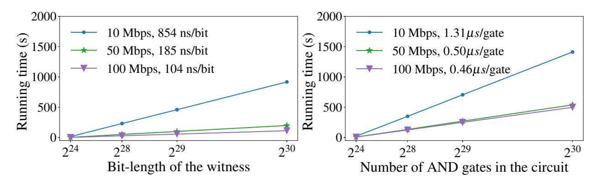
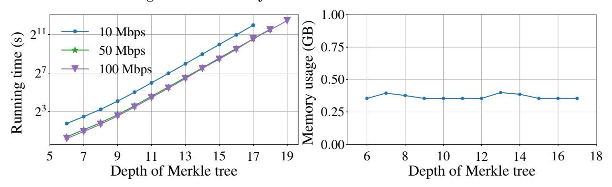
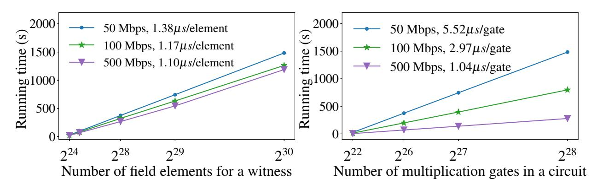
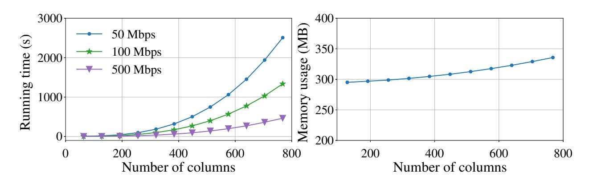

## Wolverine: Fast, Scalable, and Communication-Efficient Zero-Knowledge Proofs for Boolean and Arithmetic Circuits

Chenkai Weng Northwestern University ckweng@u.northwestern.edu

Kang Yang State Key Laboratory of Cryptology yangk@sklc.org

Jonathan Katz†∗ University of Maryland jkatz2@gmail.com

Xiao Wang Northwestern University wangxiao@cs.northwestern.edu

January 13, 2021

#### Abstract

Efficient zero-knowledge (ZK) proofs for arbitrary boolean or arithmetic circuits have recently attracted much attention. Existing solutions suffer from either significant prover overhead (i.e., high memory usage) or relatively high communication complexity (at least κ bits per gate, for computational security parameter κ). In this paper, we propose a new protocol for constant-round interactive ZK proofs that simultaneously allows for an efficient prover with asymptotically optimal memory usage and significantly lower communication compared to protocols with similar memory efficiency. Specifically:

- The prover in our ZK protocol has linear running time and, perhaps more importantly, memory usage linear in the memory needed to evaluate the circuit non-cryptographically. This allows our proof system to scale easily to very large circuits.
- For statistical security parameter ρ = 40, our ZK protocol communicates roughly 9 bits/gate for boolean circuits and 2–4 field elements/gate for arithmetic circuits over large fields.

Using 5 threads, 400 MB of memory, and a 200 Mbps network to evaluate a circuit with hundreds of billions of gates, our implementation (ρ = 40, κ = 128) runs at a rate of 0.45 µs/gate in the boolean case, and 1.6 µs/gate for an arithmetic circuit over a 61-bit field.

We also present an improved subfield Vector Oblivious Linear Evaluation (sVOLE) protocol with malicious security that is of independent interest.

## 1 Introduction

Zero-knowledge (ZK) proofs (of knowledge) [\[GMR85,](#page-26-0) [GMW91\]](#page-26-1) are a fundamental cryptographic tool. They allow a prover P to convince a verifier V, who holds a circuit C, that the prover knows a witness w for which C(w) = 1, without leaking any extra information. While ZK proofs for arbitrary circuits are possible [\[GMW91\]](#page-26-1), until recently such proofs were inefficient as they relied on reductions to generic NP-complete problems. Over the past decade, however, several ZK proof systems have been developed that yield far more efficient protocols. These include zero-knowledge succinct non-interactive arguments of knowledge (zk-SNARKs) [\[Gro10,](#page-26-2) [GGPR13,](#page-26-3) [BCG](#page-24-0)+13, [BCTV14,](#page-24-1) [BCC](#page-24-2)+16, [BBB](#page-24-3)+18, [WTS](#page-28-0)+18, [BCR](#page-24-4)+19, [BBHR19,](#page-24-5) [Set20\]](#page-27-0), ZK proofs based on Interactive Oracle

∗†Work done as a consultant for Stealth Software Technologies, Inc.

Proofs (IOPs) and techniques from the setting of verifiable outsourcing [\[GKR08,](#page-26-4) [XZZ](#page-28-1)+19, [BFS20,](#page-25-0) [ZXZS20\]](#page-28-2), ZK proofs following the "MPC-in-the-head" approach [\[IKOS07,](#page-27-1) [GMO16,](#page-26-5) [CDG](#page-25-1)+17, [AHIV17,](#page-24-6) [KKW18,](#page-27-2) [dDOS19\]](#page-26-6), and a line of work constructing ZK proofs from garbled circuits (ZKGC) [\[JKO13,](#page-27-3) [FNO15,](#page-26-7) [ZRE15,](#page-28-3) [HK20\]](#page-27-4). Each of these works offers different tradeoffs between underlying assumptions (both computational hardness assumptions as well as setup assumptions), round complexity (in particular, whether the proof requires interaction or can be made non-interactive), expressiveness (e.g., whether the scheme natively handles boolean or arithmetic circuits), and efficiency. With regard to efficiency, measures of interest include the prover complexity (including time complexity and memory requirements), the verifier complexity, and the communication as a function of the circuit size.

One important factor is the memory overhead of ZK protocols. In particular, high memory requirements can impose a hard limit on the maximum circuit size that a protocol can support in practice. As shown in Table [1,](#page-2-0) prior ZK proof systems can be characterized roughly as either (1) having short proofs (e.g., sublinear in the circuit size, or even sublinear in the length of a witness) but significant memory overhead for the prover as in the case of zk-SNARKs, IOP-based schemes, and some schemes following the MPC-in-the-head paradigm, or (2) imposing low memory overhead for the prover but having high communication complexity, as in the case of ZKGC schemes.

In this paper, we propose a new approach to ZK proofs that enables an extremely efficient prover in both running time and memory usage while having lower communication compared to the ZKGC approach that offers similar prover efficiency. As in the ZKGC approach, we obtain prover complexity—in terms of both time and memory usage—linear in the complexity required to evaluate the circuit non-cryptographically; this allows our ZK protocol to scale easily to very large circuits. At the same time, we achieve communication complexity that is more than an order of magnitude lower than what can be achieved using the ZKGC approach, while natively supporting boolean or arithmetic circuits. As compared to the other work in Table [1,](#page-2-0) the main drawback of our protocol—shared by the ZKGC approach—is that it requires interaction. Our protocol does, however, offer a non-interactive online phase following an interactive offline phase that can be executed by the parties before the circuit is known.

#### 1.1 Outline of Our Solution

Our ZK protocol (named Wolverine) can be separated into two phases: an interactive offline phase that can be executed by the prover and verifier before both the circuit and the witness are known, and an online phase that can be made non-interactive in the random-oracle model. We view the online phase as our main conceptual contribution, though we offer efficiency improvements for the offline phase as well.

Online phase. The online phase of our protocol can be viewed as adapting the core idea of the ZKGC approach by viewing a ZK proof as a special case of secure two-party computation (2PC) where one party has no input. We differ from the ZKGC approach in the underlying 2PC protocol we use as our starting point: rather than using garbled circuits, we instead rely on a "GMW-style" approach [\[GMW87\]](#page-26-8) using authenticated multiplication triples [\[Bea92,](#page-25-2) [NNOB12\]](#page-27-5) (whose values are known to the prover) generated during the offline phase. A drawback of GMW-style protocols in the context of generic 2PC is that they have round complexity linear in the depth of the circuit being evaluated. Crucially, in the ZK context, we can exploit the fact that only one party has input to obtain an online phase that runs in constant rounds (or can even be non-interactive in the random-oracle model).

The prover and verifier run in linear time since they each make only one pass over the circuit. Moreover, they can evaluate the circuit "on-the-fly" (i.e., with memory overhead linear in what is

|                                      | Protocol Type                                                               | Spartan [Set20] zk-SNARK                      | Virgo [ZXZS20] IOP-based                    | Ligero [AHIV17] MPC-in-the-head            | [HK20] ZKGC                                  | Wolverine sVOLE-based                      |
|--------------------------------------|--------------------------------------------------------------------------------|--------------------------------------------------|------------------------------------------------|-----------------------------------------------|-------------------------------------------------|-----------------------------------------------|
| Merkle tree (boolean circuit)     | Prover time Verifier time Overall time Communication Prover memory | 55 s < 0.1 s 55 s ≤ 100 KB ≈ 7 GB    | 53 s < 0.1 s 53 s 253 KB ≈ 1 GB    | 400 s < 0.1 s 400 s 1.5 MB ≈ 5 GB | 7.3 s 7.3 s 7.3 s 182.2 MB ≤ 400 MB | 11 s 11 s 11 s 12.4 MB ≤ 400 MB   |
| Matrix mult. (arithmetic circuit) | Prover time Verifier time Overall time Communication Prover memory | 677 s < 0.1 s 677 s ≤ 100 KB ≈ 86 GB | 64 s < 0.1 s 64 s ≈ 200 KB ≈ 18 GB | − − − − −                         | − − − − −                           | 320 s 320 s 320 s 4.2 GB ≤ 400 MB |

Table 1: Comparing our ZK protocol with prior work. The first example proves knowledge of 256 leaves that hash to a public root of a Merkle tree based on SHA-256 (511 hash-function evaluations). The second example proves knowledge of two 512 × 512 matrices over a 61-bit field whose product is a public matrix (roughly 134 million field multiplications). Performance of our protocol (ρ = 40, κ = 128) is measured by running the prover and verifier on two machines, each using 1 thread, connected via a 200 Mbps network, and is the total running time of both the offline and online phases. For ZKGC and Wolverine, the prover and verifier can execute the protocol in a pipelined fashion, which is why the overall time is the maximum of the prover and verifier times. Spartan uses a 256-bit field while Virgo and Wolverine use a 61-bit field. See Section [6](#page-17-0) for details.

needed to evaluate the circuit non-cryptographically), which allows our protocol to scale easily to very large circuits. Our approach is communication-efficient as well: for a circuit with C multiplication gates over an arbitrary finite field Fp, the marginal communication complexity is only either 3ρ/ log C + 1 elements per gate for small fields or 2–4 elements per gate for large fields.

Instantiating the offline phase. During the offline phase we set up authenticated multiplication triples (over the relevant field Fp) between the prover and verifier using subfield Vector Oblivious Linear Evaluation (sVOLE) [\[BCGI18,](#page-24-7) [BCG](#page-24-8)+19b]. For boolean circuits (i.e., p = 2), we use the recent work by Yang et al. [\[YWL](#page-28-4)+20] to generate an initial pool of authenticated bits, and then use those authenticated bits to generate authenticated triples as in prior work [\[NO09\]](#page-27-6). For p > 2, we extend the protocol of Yang et al. to obtain an efficient sVOLE protocol for arbitrary fields (which we believe to be of independent interest). We defer further details to Section [4.](#page-10-0)

#### 1.2 Performance and Comparison to Prior Work

We have implemented Wolverine for both boolean and arithmetic circuits. Running over a 200 Mbps network, Wolverine processes boolean circuits at the rate of 2,000,000 AND gates per second (XOR gates are free), and arithmetic circuits over a 61-bit large field at the rate of 600,000 multiplication gates per second (addition gates are free). In Table [1](#page-2-0) we provide benchmarks comparing Wolverine to prior work for two examples: proving knowledge of the leaves that hash to a Merkletree root (naturally represented as a boolean circuit) and proving knowledge of the inputs to matrix multiplication over a large field (naturally represented as an arithmetic circuit). In the boolean setting, Wolverine uses 15× less communication than ZKGC [\[HK20\]](#page-27-4) along with lower running time; Wolverine outperforms all other work in terms of overall time and memory usage. In the arithmetic setting, Wolverine is 5× slower than Virgo [\[ZXZS20\]](#page-28-2) but needs only 3% of the memory. The advantage in memory usage would be even larger for larger circuits, and would enable Wolverine to scale to circuits larger than what can be feasibly handled by Virgo.

Comparison to ZK proofs based on VOLE/OT. Boyle et al. [\[BCGI18,](#page-24-7) [BCG](#page-24-8)+19b] also pro-

posed a framework for ZK proofs in which an offline phase is used to set up correlated randomness between the prover and verifier, and the subsequent online phase is non-interactive. With regard to the online phase, the primary advantages of their work are that the online phase can be noninteractive without the random-oracle model, and can be run any polynomial number of times following a single execution of the offline phase (that is, the offline phase is reusable). An advantage of our work is that it applies to circuits over arbitrary fields, whereas the work of Boyle et al. applies either to boolean circuits [\[BCG](#page-24-8)+19b] or arithmetic circuits over large fields [\[BCGI18\]](#page-24-7). More to the point, the focus of our work is concrete efficiency, which was not investigated by Boyle et al. For boolean circuits, the ZK protocol of Boyle et al. [\[BCG](#page-24-8)+19b] based on oblivious transfer requires communicating over 100,000 bits per gate when ρ = 40, which is four orders of magnitude larger than our protocol. For large fields, the VOLE-based ZK protocol of Boyle et al. [\[BCGI18\]](#page-24-7) requires communication of at least 16 elements per gate, whereas our protocol sends only 2–4 elements per gate. We also offer concrete efficiency improvements for the offline phase in the large-field case. In particular, our sVOLE protocol avoids the generic, maliciously secure two-party computation used by Boyle et al. [\[BCGI18\]](#page-24-7).

Comparison to zk-SNARKs. Our ZK protocol occupies a different portion of the solution space than (existing) zk-SNARKs. Existing zk-SNARKs impose concretely high memory requirements on the prover (cf. Table [1\)](#page-2-0), even when the memory requirements are linear in the circuit size. (While there are zk-SNARKs in which the prover asymptotically uses sublinear memory [\[COS20\]](#page-25-3), such schemes are currently ≈ 200× slower than state-of-the-art zk-SNARKs that uses linear memory [\[Set20\]](#page-27-0).) The prover memory in Wolverine is significantly lower, allowing Wolverine to scale to very large circuits. On the other hand, zk-SNARKs have many advantages: they are non-interactive and have lower communication. They also have better efficiency for the verifier, although their overall time (i.e., including the time for the prover to generate the proof) might be longer.

In independent and concurrent work, Dittmer, Ishai, and Ostrovsky [\[DIO20\]](#page-26-9) have also developed a ZK protocol based on VOLE. They focus on communication complexity rather than concrete performance; their protocol only considers the case of large fields, and has lower communication complexity than our protocol in that case. Subsequent to our work, Baum, Malozemoff, Rosen and Scholl [\[BMRS20\]](#page-25-4) have also proposed a different VOLE-based ZK protocol.

Organization of the paper. After reviewing some preliminaries in Section [2,](#page-3-0) we describe the online phase of our ZK proof in Section [3.](#page-5-0) In Section [4](#page-10-0) we describe the details of our sVOLE construction used in the offline phase of our ZK proof. We provide experimental results in Section [6.](#page-17-0)

## 2 Preliminaries

We use κ and ρ to denote the computational and statistical security parameters, respectively. We let negl(·) denote a negligible function, and use log to denote logarithms in base 2. We write x ← S to denote sampling x uniformly from a set S, and x ← D to denote sampling x according to a distribution D. We define [a, b) = {a, . . . , b − 1} and write [n] = {1, . . . , n}. We use bold lowercase letters like a for row vectors, and bold upper-case letters like A for matrices. We let a[i] denote the ith component of a (with a[0] the first entry), and let a[i : j) represent the subvector (a[i], . . . , a[j − 1]).

A circuit C over a field Fp is defined by a set of input wires Iin and output wires Iout, along with a list of gates of the form (α, β, γ, T), where α, β are the indices of the input wires of the gate, γ is the index of the output wire of the gate, and T ∈ {Add, Mult} is the type of the gate. If p = 2, then C is a boolean circuit with Add = ⊕ and Mult = ∧. If p > 2 is prime, then C is an arithmetic circuit where Add/Mult correspond to addition/multiplication in  $\mathbb{F}_p$ . We let C denote the number of Mult gates in the circuit.

When we work in an extension field  $\mathbb{F}_{p^r}$  of  $\mathbb{F}_p$ , we fix some monic, irreducible polynomial f(X) of degree r and so  $\mathbb{F}_{p^r} \cong \mathbb{F}_p[X]/f(X)$ . We let  $\mathsf{X} \in \mathbb{F}_{p^r}$  denote the element corresponding to  $X \in \mathbb{F}_p[X]/f(X)$ ; thus, every  $w \in \mathbb{F}_{p^r}$  can be written uniquely as  $w = \sum_{i=0}^{r-1} w_i \cdot \mathsf{X}^i$  with  $w_i \in \mathbb{F}_p$  for all i, and we may view elements of  $\mathbb{F}_{p^r}$  equivalently as vectors in  $\mathbb{F}_p^r$ . When we write arithmetic expressions involving both elements of  $\mathbb{F}_p$  and elements of  $\mathbb{F}_{p^r}$ , it is understood that values in  $\mathbb{F}_p$  are viewed as lying in  $\mathbb{F}_{p^r}$  in the natural way. We let  $\mathbb{F}^*$  denote the nonzero elements of a field  $\mathbb{F}$ .

## 2.1 Information-Theoretic MACs and Batch Opening

We use information-theoretic message authentication codes (IT-MACs) [NNOB12, DPSZ12] to authenticate values in a finite field  $\mathbb{F}_p$  using an extension field  $\mathbb{F}_{p^r} \supseteq \mathbb{F}_p$ . In more detail, let  $\Delta \in \mathbb{F}_{p^r}$  be a global key, sampled uniformly, that is known only by one party  $\mathsf{P}_\mathsf{B}$ . A value  $x \in \mathbb{F}_p$  known by the other party  $\mathsf{P}_\mathsf{A}$  can be authenticated by giving  $\mathsf{P}_\mathsf{B}$  a uniform key  $\mathsf{K}[x] \in \mathbb{F}_{p^r}$  and giving  $\mathsf{P}_\mathsf{A}$  the corresponding MAC tag

$$\mathsf{M}[x] = \mathsf{K}[x] + \Delta \cdot x \in \mathbb{F}_{p^r}.$$

We denote such an authenticated value by [x]. Authenticated values are additively homomorphic, i.e., if  $P_A$  and  $P_B$  hold authenticated values [x], [x'] then they can locally compute [x''] = [x + x'] by having  $P_A$  set x'' := x + x' and M[x''] := M[x] + M[x'] and having  $P_B$  set K[x''] := K[x] + K[x']. Similarly, for a public value  $b \in \mathbb{F}_p$ , the parties can locally compute [y] = [x + b] or [z] = [bx]. We denote these operations by [x''] = [x] + [x'], [y] = [x] + b, and  $[z] = b \cdot [x]$ , respectively.

We extend the above notation to vectors of authenticated values as well. In that case,  $[\boldsymbol{u}]$  means that (for some n)  $\mathsf{P}_\mathsf{A}$  holds  $\boldsymbol{u} \in \mathbb{F}_p^n$  and  $\boldsymbol{w} \in \mathbb{F}_{p^r}^n$ , while  $\mathsf{P}_\mathsf{B}$  holds  $\boldsymbol{v} \in \mathbb{F}_{p^r}^n$  with  $\boldsymbol{w} = \boldsymbol{v} + \Delta \cdot \boldsymbol{u}$ . An authenticated multiplication triple consists of authenticated values [x], [y], [z] where  $z = x \cdot y$ .

Batch opening of authenticated values. An authenticated value [x] can be "opened" by having  $\mathsf{P}_\mathsf{A}$  send  $x \in \mathbb{F}_p$  and  $\mathsf{M}[x] \in \mathbb{F}_{p^r}$  to  $\mathsf{P}_\mathsf{B}$ , who then verifies that  $\mathsf{M}[x] \stackrel{?}{=} \mathsf{K}[x] + \Delta \cdot x$ . This has soundness error  $1/p^r$ , and requires sending an additional  $r \log p$  bits (beyond x itself). While this can be repeated in parallel when opening multiple authenticated values  $[x_1], \ldots, [x_\ell]$ , communication can be reduced using batching [NNOB12, DPSZ12]. We describe two approaches in Appendix B. Hereafter, we write  $\mathsf{Open}([x])$  to denote a generic batch opening of a vector of authenticated values. In addition, we write  $\mathsf{CheckZero}([x])$  for the special case where all  $x_i$  are supposed to be 0 and so need not be sent. We let  $\varepsilon_{\mathsf{open}}$  denote the soundness error (which depends on the technique used); when using either of the techniques described above,  $\varepsilon_{\mathsf{open}}$  is independent of the number  $\ell$  of authenticated values opened.

#### 2.2 Security Model and Functionalities

We use the universal composability (UC) framework [Can01] to prove security in the presence of a malicious, static adversary. We say that a protocol  $\Pi$  UC-realizes an ideal functionality  $\mathcal{F}$  if for any probabilistic polynomial time (PPT) adversary  $\mathcal{A}$ , there exists a PPT adversary (simulator)  $\mathcal{S}$  such that for any PPT environment  $\mathcal{Z}$  with arbitrary auxiliary input z, the output distribution of  $\mathcal{Z}$  in the real-world execution where the parties interact with  $\mathcal{A}$  and execute  $\Pi$  is computationally indistinguishable from the output distribution of  $\mathcal{Z}$  in the ideal-world execution where the parties interact with  $\mathcal{S}$  and  $\mathcal{F}$ .

The protocol that we construct in this work UC-realizes the standard zero-knowledge functionality  $\mathcal{F}_{ZK}$ , reproduced in Figure 1 for completeness. (We omit session identifiers in all our ideal

#### Functionality $\mathcal{F}_{ZK}$

Upon receiving (prove, C, w) from a prover P and (verify, C) from a verifier V where the same (boolean or arithmetic) circuit C is input by both parties, send true to V if C(w) = 1; otherwise, send false to V.

Figure 1: The zero-knowledge functionality.

## Functionality $\mathcal{F}_{\mathsf{sVOLE}}^{p,r}$

**Initialize:** Upon receiving init from  $P_A$  and  $P_B$ , sample  $\Delta \leftarrow \mathbb{F}_{p^r}$  if  $P_B$  is honest or receive  $\Delta \in \mathbb{F}_{p^r}$  from the adversary otherwise. Store global key  $\Delta$  and send  $\Delta$  to  $P_B$ , and ignore all subsequent init commands.

**Extend:** This procedure can be run multiple times. Upon receiving  $(extend, \ell)$  from  $P_A$  and  $P_B$ , do:

- 1. If  $\mathsf{P}_\mathsf{B}$  is honest, sample  $\mathsf{K}[x] \leftarrow \mathbb{F}_{p^r}^\ell$ . Otherwise, receive  $\mathsf{K}[x] \in \mathbb{F}_{p^r}^\ell$  from the adversary.
- 2. If  $\mathsf{P}_\mathsf{A}$  is honest, sample  $\boldsymbol{x} \leftarrow \mathbb{F}_p^\ell$  and compute  $\mathsf{M}[\boldsymbol{x}] := \mathsf{K}[\boldsymbol{x}] + \Delta \cdot \boldsymbol{x} \in \mathbb{F}_{p^r}^\ell$ . Otherwise, receive  $\boldsymbol{x} \in \mathbb{F}_p^\ell$  and  $\mathsf{M}[\boldsymbol{x}] \in \mathbb{F}_{p^r}^\ell$  from the adversary, and then recompute  $\mathsf{K}[\boldsymbol{x}] := \mathsf{M}[\boldsymbol{x}] \Delta \cdot \boldsymbol{x} \in \mathbb{F}_{p^r}^\ell$ .
- 3. Send (x, M[x]) to  $P_A$  and K[x] to  $P_B$ .

**Global-key query:** If  $P_A$  is corrupted, receive (guess,  $\Delta'$ ) from the adversary with  $\Delta' \in \mathbb{F}_{p^r}$ . If  $\Delta' = \Delta$ , send success to  $P_A$  and ignore any subsequent global-key query. Otherwise, send abort to both parties and abort.

#### Figure 2: Functionality for subfield VOLE.

functionalities for the sake of readability.) Our ZK protocol relies on the *subfield Vector Oblivious Linear Evaluation* (sVOLE) functionality (see Figure 2), which is the same as that by Boyle et al. [BCG+19a], except that the adversary is allowed to make a global-key query on  $\Delta$  and would incur aborting for an incorrect guess. After an initialization that is done once, this functionality allows two parties to repeatedly generate a vector of authenticated values known to PA. Other functionalities are given for reference in Appendix A.

## 3 Our Zero-Knowledge Protocol

In Figure 3, we describe our zero-knowledge protocol  $\Pi_{ZK}$ , which operates in the  $\mathcal{F}_{sVOLE}^{p,r}$ -hybrid model. As noted in Section 1.1, our protocol can be viewed as following a "GMW-style" approach to secure two-party computation using authenticated multiplication triples [NNOB12, DPSZ12]. In the secure-computation setting, the evaluation of a multiplication gate requires two rounds of interaction, since the parties hold shares of the values on the input wires, but neither party knows those values. In the ZK setting, however, the prover  $\mathcal{P}$  knows the values on all wires; thus, evaluation of a multiplication gate can be done without any interaction at all.

At a high level, our protocol consists of the following steps:

- 1. **Initialization.** The parties prepare authenticated values  $\{[\lambda_i]\}$  for the witness, and  $\{[s_i]\}$  for each multiplication gate in the circuit. The parties also generate some number of authenticated multiplication triples  $\{([x_i], [y_i], [z_i])\}$ ; a malicious prover may cause some or all of these triples to be incorrect (i.e.,  $z_i \neq x_i \cdot y_i$ ).
- 2. Circuit evaluation. Starting with the authenticated values  $\{[w_i]\}$  at the input wires, the parties inductively compute authenticated values for all the wires in the circuit. For addition gates,

#### $\mathbf{Protocol}\;\Pi_{\mathsf{ZK}}$

**Inputs and parameters:** The prover  $\mathcal{P}$  and verifier  $\mathcal{V}$  hold a circuit  $\mathcal{C}$  over a finite field  $\mathbb{F}_p$  with C multiplication gates;  $\mathcal{P}$  holds a witness w such that  $\mathcal{C}(w) = 1$ . Fix parameters B, c, and r, and let  $\ell = C \cdot B + c$ .

#### Offline phase:

- 1.  $\mathcal{P}$  (acting as  $P_A$ ) and  $\mathcal{V}$  (acting as  $P_B$ ) send init to  $\mathcal{F}_{sVOLE}^{p,r}$ , which returns a uniform  $\Delta \in \mathbb{F}_{p^r}$  to  $\mathcal{V}$ .
- 2.  $\mathcal{P}$  and  $\mathcal{V}$  send (extend,  $|\mathcal{I}_{in}| + 3\ell + C$ ) to  $\mathcal{F}_{\mathsf{sVOLE}}^{p,r}$ , which returns authenticated values  $\{[\lambda_i]\}_{i \in \mathcal{I}_{in}}$ ,  $\{([x_i], [y_i], [r_i])\}_{i \in [\ell]}$ , and  $\{[s_i]\}_{i \in [C]}$  to the parties. (If  $\mathcal{V}$  receives abort from  $\mathcal{F}_{\mathsf{sVOLE}}^{p,r}$ , then it aborts.)
- 3. For  $i \in [\ell]$ ,  $\mathcal{P}$  sends  $d_i := x_i \cdot y_i - r_i \in \mathbb{F}_p$  to  $\mathcal{V}$ , and then both parties compute  $[z_i] := [r_i] + d_i$ .

#### Online phase:

- 4. For  $i \in \mathcal{I}_{in}$ ,  $\mathcal{P}$  sends  $\Lambda_i := w_i - \lambda_i \in \mathbb{F}_p$  to  $\mathcal{V}$ , and then both parties compute  $[w_i] := [\lambda_i] + \Lambda_i$ .
- 5. For each gate  $(\alpha, \beta, \gamma, T) \in \mathcal{C}$ , in topological order:
  - (a) If  $T = \mathsf{Add}$ , then the two parties locally compute  $[w_{\gamma}] := [w_{\alpha}] + [w_{\beta}]$ .
  - (b) If T = Mult and this is the *i*th multiplication gate,  $\mathcal{P}$  sends  $d := w_{\alpha} \cdot w_{\beta} s_i \in \mathbb{F}_p$  to  $\mathcal{V}$ , and then both parties compute  $[w_{\gamma}] := [s_i] + d$ .
- 6.  $\mathcal{V}$  samples a random permutation  $\pi$  on  $\{1,\ldots,\ell\}$  and sends it to  $\mathcal{P}$ . The two parties use  $\pi$  to permute the  $\{([x_i],[y_i],[z_i])\}_{i\in[\ell]}$  obtained in step 3.
- 7. For the *i*th multiplication gate  $(\alpha, \beta, \gamma, \mathsf{Mult})$ , where the parties obtained  $([w_{\alpha}], [w_{\beta}], [w_{\gamma}])$  in step 5, do the following for  $j = 1, \ldots, B$ :
  - (a) Let ([x], [y], [z]) be the ((i-1)B+j)th authenticated triple (after applying  $\pi$  in step 6).
  - (b) The parties run  $\delta_{\alpha} := \mathsf{Open}([w_{\alpha}] [x])$  and  $\delta_{\beta} := \mathsf{Open}([w_{\beta}] [y])$ . The parties then compute  $[\mu] := [z] [w_{\gamma}] + \delta_{\beta} \cdot [x] + \delta_{\alpha} \cdot [y] + \delta_{\alpha} \cdot \delta_{\beta}$ , and finally run  $\mathsf{CheckZero}([\mu])$ .
- 8. For each of the remaining c authenticated triples, say ([x], [y], [z]), the parties run  $x := \mathsf{Open}([x])$  and  $y := \mathsf{Open}([y])$ . They also compute  $[\nu] := [z] - x \cdot y$  and then run  $\mathsf{CheckZero}([\nu])$ .
- 9. For the single output wire  $o \in \mathcal{I}_{out}$  with authenticated value  $[w_o]$ , the parties run CheckZero( $[w_o]-1$ ).

## Figure 3: Zero-knowledge proof in the $\mathcal{F}_{\mathsf{sVOLE}}^{p,r}$ -hybrid model.

this is easy. For the *i*-th multiplication gate, the prover uses  $[s_i]$  to enable the verifier to compute its component of the authenticated value for the output wire without revealing information about the values on the input wires. Specifically, given authenticated values  $[w_{\alpha}], [w_{\beta}]$  on the input wires to the *i*th multiplication gate, the prover sends  $w_{\alpha} \cdot w_{\beta} - s_i$  to the verifier; the prover and verifier then compute

$$[w_{\gamma}] := [s_i] + (w_{\alpha} \cdot w_{\beta} - s_i)$$

as the authenticated value of the output wire. All communication here is from the prover to the verifier, so the entire circuit can be evaluated using only one round of communication.

Once the parties have an authenticated value  $[w_o]$  for the output wire, the prover simply opens that value, and the verifier checks that it is equal to 1.

3. **Verifying correct behavior.** So far, nothing prevents a malicious prover from cheating. To detect cheating, the verifier needs to check the behavior of the prover at each multiplication gate

using the initial set of authenticated multiplication triples the parties generated. This can be done in various ways. In the protocol as described in Figure [3,](#page-6-0) which works for circuits over an arbitrary field, the verifier checks the behavior of the prover as follows (adapting [\[ABF](#page-23-0)+17]):

- The verifier checks a random subset of the authenticated triples to make sure they are correctly formed. For an authenticated multiplication triple ([x], [y], [z]), this can be done by having the prover run Open([x]) and Open([y]) followed by CheckZero([z] − x · y).
- The verifier then uses the remaining authenticated triples to check that each multiplication gate was computed correctly. For a multiplication gate with authenticated values [wα], [wβ] on the input wires and [wγ] on the output wire, the relation wγ = wαwβ can be checked using an authenticated multiplication triple ([x], [y], [z]) by having the prover run δα := Open([wα]−[x]) and δβ := Open([wβ] − [y]), followed by

$$\mathsf{CheckZero}\left([z] - [w_\gamma] + \delta_\beta \cdot [x] + \delta_\alpha \cdot [y] + \delta_\alpha \cdot \delta_\beta\right).$$

Each multiplication gate is checked in this way using B authenticated multiplication triples.

In Section [3.2,](#page-9-0) we describe other approaches for verifying correct behavior.

Note that the checks for the openings of all the authenticated values (i.e., all the executions of Open and CheckZero) can be batched together at the end of the protocol.

Non-interactive online phase. The ZK protocol described in Figure [3](#page-6-0) can be implemented in constant rounds. If we use the Fiat-Shamir heuristic both for deriving the permutation π as well as for non-interactive opening of authenticated values, the online phase can be made non-interactive.

## 3.1 Proof of Security

Before giving the proof of security for ΠZK, we analyze the procedure used to check correctness of the multiplication gates. Consider some multiplication gate with authenticated values [wα], [wβ] on the input wires and [wγ] on the output wire. If P cheated, so wγ 6= wα · wβ, then this cheating will be detected in step [7](#page-6-4) of the protocol unless all B of the multiplication triples used to check that gate are incorrect. (We ignore for now the possibility that P is able to successfully cheat when running Open/CheckZero.) But if too many of the initial multiplication triples are incorrect, then there is a high probability that P will be caught in step [8.](#page-6-5) We can analyze the overall probability with which a cheating P can successfully evade detection by considering an abstract "balls-and-bins" game with an adversary A, which is based on a similar game considered previously in the context of secure three-party computation [\[ABF](#page-23-0)+17]. The game proceeds as follows:

- 1. A prepares ` = CB + c balls B1, . . . , B` , each of which is either good or bad. A also prepares C bins, each of which is either good or bad. The balls {Bi}i∈[`] correspond to the triples {([xi ], [yi ], [zi ])}i∈[`] defined in step [3](#page-6-1) of the protocol, and the bins correspond to the triples {([wα], [wβ], [wγ])} defined for the multiplication gates during the circuit evaluation.
- 2. Then, c random balls are chosen. If any of the chosen balls is bad, A loses. Otherwise, the game proceeds to the next step.
- 3. The remaining CB balls are randomly partitioned into the C bins, with each bin receiving exactly B balls.
- 4. We say that a bin is fully good (resp., fully bad) if it is labeled good and all the balls inside it are good (resp., labeled bad and all the balls inside it are bad). A wins if and only if there exists at least one bin that is fully bad, and all other bins are either fully good or fully bad.

**Lemma 1.** Assume  $c \geq B$ . Then  $\mathcal{A}$  wins the above game with probability at most  $\binom{CB+c}{B}^{-1}$ .

*Proof.* Assume  $\mathcal{A}$  makes m bins bad for  $1 \leq m \leq C$ . It is easy to see that  $\mathcal{A}$  can only possibly win if exactly mB balls among  $\mathcal{B}_1, \ldots, \mathcal{B}_\ell$  are bad, and they are exactly placed in the m bins that are bad. We compute the probability that  $\mathcal{A}$  wins for some fixed m.

Since exactly mB balls of the  $\ell = CB + c$  balls are bad, the probability that none of the bad balls is chosen in step 2 of the game is exactly

$$\frac{\binom{\ell-mB}{c}}{\binom{\ell}{c}} = \frac{(\ell-mB)! \cdot (\ell-c)!}{\ell! \cdot (\ell-mB-c)!} = \frac{(CB+c-mB)! \cdot (CB)!}{(CB+c)! \cdot (CB-mB)!}.$$

Assume that this occurs. We are left with  $\ell - c = CB$  balls, of which mB are bad. The probability that B bad balls are placed in each bad bin is

$$p_1 = \frac{(mB)! \cdot (CB - mB)!}{(CB)!}.$$

Thus, the probability that A wins is exactly

$$\frac{\binom{\ell-mB}{c}}{\binom{\ell}{c}} \cdot p_1 = \frac{(CB+c-mB)! \cdot (mB)!}{(CB+c)!} = \binom{CB+c}{mB}^{-1}.$$

For  $c \geq B$ ,  $1 \leq m \leq C$ , this is maximized when m = 1.

Now we prove security of protocol  $\Pi_{\mathsf{ZK}}$ .

**Theorem 1.** Let  $c \geq B$ . Protocol  $\Pi_{\mathsf{ZK}}$  UC-realizes  $\mathcal{F}_{\mathsf{ZK}}$  in the  $\mathcal{F}^{p,r}_{\mathsf{sVOLE}}$ -hybrid model. In particular, no environment  $\mathcal{Z}$  can distinguish the real-world execution from the ideal-world execution except with probability at most  $\binom{CB+c}{B}^{-1} + p^{-r} + \varepsilon_{\mathsf{open}}$ .

*Proof.* We first consider the case of a malicious prover (i.e., soundness) and then consider the case of a malicious verifier (i.e., zero knowledge). In each case, we construct a PPT simulator  $\mathcal{S}$  given access to  $\mathcal{F}_{\mathsf{ZK}}$ , and running the PPT adversary  $\mathcal{A}$  as a subroutine while emulating functionality  $\mathcal{F}_{\mathsf{sVOLE}}^{p,r}$  for  $\mathcal{A}$ . We always implicitly assume that  $\mathcal{S}$  passes all communication between  $\mathcal{A}$  and  $\mathcal{Z}$ .

Malicious prover. S interacts with adversary A as follows:

- 1. S emulates  $\mathcal{F}_{\mathsf{sVOLE}}^{p,r}$  for  $\mathcal{A}$  by choosing uniform  $\Delta \in \mathbb{F}_{p^r}$  and recording all the values  $\{\lambda_i\}_{i \in \mathcal{I}_{\mathsf{in}}}$ ,  $\{(x_i, y_i, r_i)\}_{i \in [\ell]}$ , and  $\{s_i\}_{i \in [C]}$ , and their corresponding MAC tags, sent to  $\mathcal{F}_{\mathsf{sVOLE}}^{p,r}$  by  $\mathcal{A}$ . These values define corresponding keys in the natural way.
- 2. If  $\mathcal{A}$  makes a global-key query (guess,  $\Delta'$ ) to  $\mathcal{F}_{\mathsf{sVOLE}}^{p,r}$ , then  $\mathcal{S}$  checks if  $\Delta = \Delta'$ . If not,  $\mathcal{S}$  sends abort to  $\mathcal{A}$ , sends (prove,  $\mathcal{C}, \perp$ ) to  $\mathcal{F}_{\mathsf{ZK}}$ , and aborts. Otherwise,  $\mathcal{S}$  sends success to  $\mathcal{A}$  and continues.
- 3. When  $\mathcal{A}$  sends  $\{\Lambda_i\}_{i\in\mathcal{I}_{\mathsf{in}}}$  in step 4,  $\mathcal{S}$  sets  $w_i := \lambda_i + \Lambda_i$  for  $i\in\mathcal{I}_{\mathsf{in}}$ .
- 4.  $\mathcal{S}$  runs the rest of the protocol as an honest verifier, using  $\Delta$  and the keys defined in the first step. If the honest verifier outputs false, then  $\mathcal{S}$  sends (prove,  $\mathcal{C}, \bot$ ) to  $\mathcal{F}_{\mathsf{ZK}}$  and aborts. If the honest verifier outputs true, then  $\mathcal{S}$  sends (prove,  $\mathcal{C}, w$ ) to  $\mathcal{F}_{\mathsf{ZK}}$  where w is defined as above.

We assume that  $\mathcal{A}$  does not correctly guess  $\Delta$ ; this is true except with probability at most  $p^{-r}$ . It is clear that the view of  $\mathcal{A}$  is perfectly simulated by  $\mathcal{S}$ . Whenever the verifier simulated by  $\mathcal{S}$  outputs false, the real verifier outputs false as well (since  $\mathcal{S}$  sends  $\bot$  to  $\mathcal{F}_{\mathsf{ZK}}$ ). It thus only remains to bound the probability with which the simulated verifier run by  $\mathcal{S}$  outputs true but the witness w sent by  $\mathcal{S}$  to  $\mathcal{F}_{\mathsf{ZK}}$  satisfies  $\mathcal{C}(w) = 0$ . Below, we show that if  $\mathcal{C}(w) = 0$  then the probability that the simulated verifier outputs true is at most  $\binom{CB+c}{B}^{-1} + \varepsilon_{\mathsf{open}}$ . If  $\mathcal{C}(w) = 0$  then either  $w_0 = 0$  or else at least one of the triples  $\{([w_\alpha], [w_\beta], [w_\gamma])\}$  defined at

If C(w) = 0 then either  $w_o = 0$  or else at least one of the triples  $\{([w_\alpha], [w_\beta], [w_\gamma])\}$  defined at the multiplication gates during the circuit evaluation must be incorrect. In the former case, the probability that  $\mathcal{P}$  succeeds when running  $\mathsf{CheckZero}([w_o] - 1)$  is at most  $\varepsilon_{\mathsf{open}}$ . In the latter case, Lemma 1 shows that the probability that  $\mathcal{A}$  avoids being "caught" in steps 6–8 is at most  $\binom{CB+c}{B}^{-1}$ ; if  $\mathcal{A}$  is caught, then it succeeds in opening some incorrect value with probability at most  $\varepsilon_{\mathsf{open}}$ . This completes the proof for the case of a malicious prover.

**Malicious verifier.** If S receives false from  $\mathcal{F}_{ZK}$ , then it simply aborts. Otherwise, S interacts with adversary A as follows:

- 1. S emulates  $\mathcal{F}_{\mathsf{sVOLE}}^{p,r}$  by recording the global key  $\Delta$ , and the keys for all the authenticated values, sent to the functionality by  $\mathcal{A}$ . Then,  $\mathcal{S}$  samples uniform values for  $\{\lambda_i\}_{i\in\mathcal{I}_{\mathsf{in}}}$ ,  $\{(x_i,y_i,r_i)\}_{i\in[\ell]}$ , and  $\{s_i\}_{i\in[C]}$ , and computes their corresponding MAC tags in the natural way.
- 2. S executes steps 3–8 of protocol  $\Pi_{\mathsf{ZK}}$  by simulating the honest prover with input  $w = 0^{|\mathcal{I}_{\mathsf{in}}|}$ .
- 3. In step 9,  $\mathcal{S}$  computes  $\mathsf{K}[w_o]$  (based on the keys sent to  $\mathcal{F}^{p,r}_{\mathsf{sVOLE}}$  by  $\mathcal{A}$ ) and then sets  $\mathsf{M}[w_o] := \mathsf{K}[w_o] + \Delta$ . Finally, it uses  $\mathsf{M}[w_o]$  to run  $\mathsf{CheckZero}([w_o] 1)$  with  $\mathcal{A}$ .

The view of  $\mathcal{A}$  simulated by  $\mathcal{S}$  is distributed identically to its view in the real protocol execution. This completes the proof.

## 3.2 Other Approaches for Verifying Correct Behavior

Here we describe alternative approaches for checking correctness of multiplication gates for large p (i.e.,  $\log p \ge \rho$ ).

Approach 1. The first approach can be viewed as a simplified version of the check used by SPDZ [DPSZ12]. Both parties now prepare a *single* authenticated multiplication triple ([x], [y], [z]) per multiplication gate (so only C in total), which may be incorrect if  $\mathcal{P}$  is malicious. To check correctness of a multiplication gate with authenticated values  $[w_{\alpha}], [w_{\beta}]$  on the input wires and  $[w_{\gamma}]$  on the output wire, the verifier sends a uniform  $\eta \in \mathbb{F}_p$  to the prover, who responds by running  $\delta_{\alpha} := \mathsf{Open}(\eta \cdot [w_{\alpha}] - [x])$  and  $\delta_{\beta} := \mathsf{Open}([w_{\beta}] - [y])$ , followed by

$$\mathsf{CheckZero}([z] - \eta \cdot [w_\gamma] + \delta_\beta \cdot [x] + \delta_\alpha \cdot [y] + \delta_\alpha \cdot \delta_\beta).$$

This has soundness error  $1/p + \varepsilon_{\text{open}}$ . To see this, say  $w_{\gamma} = w_{\alpha}w_{\beta} + \Delta_{w}$  with  $\Delta_{w} \neq 0$ , and let  $z = xy + \Delta_{z}$ . Then  $z - \eta \cdot w_{\gamma} + \delta_{\beta} \cdot x + \delta_{\alpha} \cdot y + \delta_{\alpha} \cdot \delta_{\beta} = 0$  iff  $\eta = \Delta_{z}/\Delta_{w}$ , which occurs with probability 1/p. Note that this checking procedure can be done for all multiplication gates in parallel using a single value  $\eta$ , and the overall soundness error remains unchanged. It can also be made non-interactive using the Fiat-Shamir heuristic in the random-oracle model.

Approach 2: Trading off communication and computation. This approach, which is a simplified and improved variant of the polynomial approach used by SPDZ [DPSZ12], reduces the communication complexity by roughly half (from 4 to 2 field elements per gate) at the expense

of increased computation. Intuitively, the prover and verifier define polynomials F, G, H that interpolate to  $\{w_{\alpha}^i\}$ ,  $\{w_{\beta}^i\}$ , and  $\{w_{\gamma}^i\}$ , respectively. If  $w_{\gamma}^i = w_{\alpha}^i \cdot w_{\beta}^i$  for all i, then  $H = F \cdot G$ , and this can be verified by checking whether  $H(\nu) = F(\nu) \cdot G(\nu)$  at a random point  $\nu \in \mathbb{F}_{p^r}$ . Details follow.

Assume  $p \geq 2C-1$ . Let  $([w_{\alpha}^{i}], [w_{\beta}^{i}], [w_{\gamma}^{i}])$  be the authenticated values corresponding to the *i*th multiplication gate. The parties additionally compute C-1 authenticated values  $\{[s_{i}]\}_{i \in [C+1,2C)}$ ; they also compute an authenticated multiplication triple ([x], [y], [z]) (which may be incorrect if  $\mathcal{P}$  is malicious) with  $x, y, z \in \mathbb{F}_{p^{r}}$ . They then do the following:

- 1. Let  $F \in \mathbb{F}_p[X]$  (resp.,  $G \in \mathbb{F}_p[X]$ ) be the polynomial of degree at most C-1 such that  $F(i) = w_{\alpha}^i$  (resp.,  $G(i) = w_{\beta}^i$ ) for  $i \in [C]$ . Note that  $\mathcal{P}$  can compute F and G explicitly, and  $\mathcal{P}$  and  $\mathcal{V}$  can compute the authenticated value  $[w_{\alpha}^k] \stackrel{\text{def}}{=} [F(k)]$  (resp.,  $[w_{\beta}^k] \stackrel{\text{def}}{=} [G(k)]$ ) for any  $k \in \mathbb{F}_{p^r}$  using Lagrange interpolation over the shares  $\{[w_{\alpha}^i]\}_{i \in [C]}$  (resp.,  $\{[w_{\beta}^i]\}_{i \in [C]}$ ).
- 2. For  $k \in [C+1, 2C)$ ,  $\mathcal{P}$  sends  $d'_k := w^k_{\alpha} \cdot w^k_{\beta} s_k$  to  $\mathcal{V}$ , and both parties compute  $[w^k_{\gamma}] := [s_k] + d'_k$ . Let  $H \in \mathbb{F}_p[X]$  be the polynomial of degree at most 2C-2 such that  $H(i) = w^i_{\gamma}$  for  $i \in [2C-1]$ . Note that  $\mathcal{P}$  can compute H explicitly, while  $\mathcal{P}$  and  $\mathcal{V}$  can compute the authenticated value [H(k)] for any  $k \in \mathbb{F}_{p^r}$  using Lagrange interpolation over the shares  $[w^i_{\gamma}]$ .
- 3.  $\mathcal{V}$  sends a uniform  $\nu \in \mathbb{F}_{p^r}$  to  $\mathcal{P}$ . Then the parties compute authenticated values  $[F(\nu)]$ ,  $[G(\nu)]$ , and  $[H(\nu)]$ .
- 4. Finally,  $\mathcal{V}$  verifies that  $F(\nu) \cdot G(\nu) = H(\nu)$  as in approach 1, above. That is,  $\mathcal{V}$  sends a uniform  $\eta \in \mathbb{F}_{p^r}$  to  $\mathcal{P}$ , who responds by running  $\delta := \mathsf{Open}(\eta \cdot [F(\nu)] [x])$  and  $\sigma := \mathsf{Open}([G(\nu)] [y])$ , followed by

$$\mathsf{CheckZero}([z] - \eta \cdot [H(\nu)] + \sigma \cdot [x] + \delta \cdot [y] + \delta \cdot \sigma).$$

This has soundness error  $(2C-1)/p^r + \varepsilon_{\sf open}$ . To see this, note that if there exists an  $i \in [C]$  with  $w^i_\alpha \cdot w^i_\beta \neq w^i_\gamma$  then the polynomials  $F \cdot G$  and H are different, and so agree in at most 2C-2 points. Thus,  $F(\nu) \cdot G(\nu) \neq H(\nu)$  except with probability at most  $(2C-2)/p^r$ . When that is the case, an analysis in the first approach shows that the final check fails except with probability at most  $1/p^r + \varepsilon_{\sf open}$ .

This approach can also be made non-interactive using the Fiat-Shamir heuristic in the random-oracle model.

## 4 Subfield VOLE

In this section, we present an sVOLE protocol that can be used during the offline phase of our ZK protocol. In Section 5, we first present an sVOLE protocol with linear communication complexity. Although this already suffices for our ZK protocol, we can obtain much better efficiency using "sVOLE extension" (by analogy with OT extension), by which we extend a small number of "base" sVOLE correlations into a larger number of sVOLE correlations. Toward this end, in Section 5.1 we construct a protocol for single-point sVOLE (spsVOLE) in the  $\mathcal{F}_{sVOLE}^{p,r}$ -hybrid model, where spsVOLE is like sVOLE except that the vector of authenticated values has only a single nonzero entry. Then, in Section 5.2, we present an efficient protocol for "sVOLE extension" using spsVOLE

&lt;sup>1A uniform authenticated value [z] with  $z \in \mathbb{F}_{p^r}$  can be generated from r uniform authenticated values  $[z_1], \ldots, [z_r]$  with  $z_i \in \mathbb{F}_p$  by setting  $z = \sum_i z_i \cdot \mathsf{X}^i$ . An authenticated multiplication triple can be computed from such authenticated values in the natural way.

## Functionality $\mathcal{F}_{\mathsf{COPEe}}^{p,r}$

**Initialize:** Upon receiving init from parties  $P_A$ ,  $P_B$ , sample  $\Delta \leftarrow \mathbb{F}_{p^r}$  if  $P_B$  is honest, and receive  $\Delta \in \mathbb{F}_{p^r}$  from the adversary otherwise. Store global key  $\Delta$ , send  $\Delta$  to  $P_B$ , and ignore all subsequent init commands. Let  $\Delta_B \in \{0,1\}^{rm}$  be the bit-decomposition of  $\Delta$ , where  $m = \lceil \log p \rceil$ .

**Extend:** Upon receiving (extend, u) with  $u \in \mathbb{F}_p$  from  $\mathsf{P}_\mathsf{A}$  and (extend) from  $\mathsf{P}_\mathsf{B}$ , this functionality operates as follows:

- 1. Sample  $v \leftarrow \mathbb{F}_{p^r}$ . If  $\mathsf{P}_\mathsf{B}$  is corrupted, instead receive  $v \in \mathbb{F}_{p^r}$  from the adversary.
- 2. Compute  $w := v + \Delta \cdot u \in \mathbb{F}_{p^r}$ .
- 3. If  $\mathsf{P}_\mathsf{A}$  is corrupted, receive  $w \in \mathbb{F}_{p^r}$  and  $u \in \mathbb{F}_p^{rm}$  from the adversary, and recompute

$$v := w - \langle \boldsymbol{g} * \boldsymbol{u}, \boldsymbol{\Delta}_B \rangle \in \mathbb{F}_{p^r},$$

where \* denotes the component-wise product.

4. Output (u, w) to  $P_A$  and v to  $P_B$ .

# Figure 4: Functionality for correlated oblivious product evaluation with errors (COPEe).

as a subroutine and relying on a variant of the *Learning Parity with Noise* (LPN) assumption. We provide some intuition for each protocol in the relevant section. Our implementation shows that this protocol outperforms all prior work; we discuss its concrete performance in Section 6.1.

#### 5 Base sVOLE Protocol

We present a "base" sVOLE protocol that is based on oblivious transfer (OT) and is inspired by prior work of Keller et al. [KOS15, KOS16]. Our protocol relies on the *correlated oblivious product evaluation with errors* (COPEe) functionality  $\mathcal{F}_{COPEe}$ , which extends the analogous functionality introduced by Keller et al. [KOS16] to the subfield case we are interested in. We show in Appendix B.1 how to UC-realize  $\mathcal{F}_{COPEe}$  from OT.

Functionality  $\mathcal{F}_{\mathsf{COPEe}}$  is described in Figure 4, where  $m = \lceil \log p \rceil$ . In  $\mathcal{F}_{\mathsf{COPEe}}$ , we define a "gadget vector"  $\mathbf{g} \in \mathbb{F}_{p^r}^{rm}$  by

$$\mathbf{g} = ((1, 2, \dots, 2^{m-1}), (1, 2, \dots, 2^{m-1}) \cdot \mathsf{X}, \dots, (1, 2, \dots, 2^{m-1}) \cdot \mathsf{X}^{r-1})$$

For a vector  $\boldsymbol{x} \in \mathbb{F}_{p^r}^{rm}$ , we define

$$\langle \boldsymbol{g}, \boldsymbol{x} \rangle = \sum_{i=0}^{r-1} \Big( \sum_{j=0}^{m-1} \boldsymbol{x} [i \cdot m + j] \cdot 2^j \Big) \cdot \mathsf{X}^i \in \mathbb{F}_{p^r},$$

where the definition can be extended to the cases  $\boldsymbol{x} \in \{0,1\}^{rm}$  or  $\boldsymbol{x} \in \mathbb{F}_p^{rm}$  by viewing  $\boldsymbol{x}$  as lying in  $\mathbb{F}_p^{rm}$  in the natural way. The bit-decomposition of  $\Delta \in \mathbb{F}_{p^r}$  is the string  $\boldsymbol{\Delta}_B \in \{0,1\}^{rm}$  satisfying  $\langle \boldsymbol{g}, \boldsymbol{\Delta}_B \rangle = \Delta$ .

In Figure 5, we present a protocol  $\Pi_{\mathsf{base-sVOLE}}^{p,r}$  that UC-realizes  $\mathcal{F}_{\mathsf{sVOLE}}^{p,r}$  in the  $\mathcal{F}_{\mathsf{COPEe}}$ -hybrid model. We first describe a sub-protocol  $\Pi_{\mathsf{base-LsVOLE}}^{p,r}$ , which allows two parties to generate sVOLE correlations with a selective-failure leakage on  $\Delta$ , meaning that a malicious  $\mathsf{P}_\mathsf{A}$  is allowed to guess

## Protocol $\Pi_{\mathsf{base-sVOLE}}^{p,r}$

## Sub-protocol $\Pi_{\mathsf{base-LsVOLE}}^{p,r}$ with selective-failure leakage:

- 1.  $P_A$  and  $P_B$  send init to  $\mathcal{F}_{COPEe}^{p,r}$ , which returns  $\Delta$  to  $P_B$ .
- 2.  $\mathsf{P}_{\mathsf{A}}$  samples  $u_i \leftarrow \mathbb{F}_p$  for  $i \in [0,n)$  and  $a_h \leftarrow \mathbb{F}_p$  for  $h \in [0,r)$ . For  $i \in [0,n)$ ,  $\mathsf{P}_{\mathsf{A}}$  sends (extend,  $u_i$ ) to  $\mathcal{F}^{p,r}_{\mathsf{COPEe}}$  and  $\mathsf{P}_{\mathsf{B}}$  sends (extend) to  $\mathcal{F}^{p,r}_{\mathsf{COPEe}}$ , which returns  $w_i \in \mathbb{F}_{p^r}$  to  $\mathsf{P}_{\mathsf{A}}$  and  $v_i \in \mathbb{F}_{p^r}$  to  $\mathsf{P}_{\mathsf{B}}$  such that  $w_i = v_i + \Delta \cdot u_i$ . For  $h \in [0,r)$ , both parties also call  $\mathcal{F}^{p,r}_{\mathsf{COPEe}}$  on respective inputs (extend,  $a_h$ ) and (extend), following which  $P_A$  gets  $c_h \in \mathbb{F}_{p^r}$  and  $P_B$  obtains  $b_h \in \mathbb{F}_{p^r}$  such that  $c_h = b_h + \Delta \cdot a_h$ .
- 3.  $\mathsf{P}_\mathsf{B}$  samples  $\chi_0, \dots, \chi_{n-1} \leftarrow \mathbb{F}_{p^r}$ , and sends them to  $\mathsf{P}_\mathsf{A}$ . Then  $\mathsf{P}_\mathsf{A}$  computes  $x := \sum_{i=0}^{n-1} \chi_i \cdot u_i + \sum_{h=0}^{r-1} a_h \cdot \mathsf{X}^h$ ,  $z := \sum_{i=0}^{n-1} \chi_i \cdot w_i + \sum_{h=0}^{r-1} c_h \cdot \mathsf{X}^h$ , and sends (x,z) to  $\mathsf{P}_\mathsf{B}$ .
- 4.  $P_{\mathsf{B}}$  computes  $y := \sum_{i=0}^{n-1} \chi_i \cdot v_i + \sum_{h=0}^{r-1} b_h \cdot \mathsf{X}^h$  and checks that  $z = y + \Delta \cdot x$ . If not,  $\mathsf{P}_{\mathsf{B}}$  aborts. 5. For  $i \in [0, n)$ ,  $\mathsf{P}_{\mathsf{A}}$  defines  $\boldsymbol{u}[i] = u_i$  and  $\boldsymbol{w}[i] = w_i$ , and  $\mathsf{P}_{\mathsf{B}}$  sets  $\boldsymbol{v}[i] = v_i$ .

#### Full protocol without any leakage: Let $\ell = \lceil 2\rho/r \log p \rceil + 1$ .

- 1. Both parties execute the above sub-protocol with parameters p and  $k = \ell \cdot r$ . Then,  $P_A$  obtains  $(\boldsymbol{u}, \boldsymbol{w}) \in \mathbb{F}_p^n \times \mathbb{F}_{p^k}^n$  and  $\mathsf{P}_\mathsf{B}$  gets  $\Delta \in \mathbb{F}_{p^k}$  and  $\boldsymbol{v} \in \mathbb{F}_{p^k}^n$  such that  $\boldsymbol{w} = \boldsymbol{v} + \Delta \cdot \boldsymbol{u}$ . By viewing an element in  $\mathbb{F}_{p^k}$  as a vector in  $\mathbb{F}_{p^r}^\ell$ , two parties obtain  $\{\boldsymbol{w}_i\}_{i\in[\ell]}$  and  $\{(\Delta_i,\boldsymbol{v}_i)\}_{i\in[\ell]}$  respectively such that  $\boldsymbol{w}_i = \boldsymbol{v}_i + \boldsymbol{u} \cdot \Delta_i, \ \boldsymbol{w}_i, \boldsymbol{v}_i \in \mathbb{F}_{p^r}^n$  and  $\Delta_i \in \mathbb{F}_{p^r}$ .
- 2.  $\mathsf{P}_\mathsf{B}$  samples  $\alpha_1, \ldots, \alpha_\ell \leftarrow \mathbb{F}_{p^r}$  and sends them to  $\mathsf{P}_\mathsf{A}$ .  $\mathsf{P}_\mathsf{A}$  computes  $\boldsymbol{t} := \sum_{i=1}^\ell \alpha_i \cdot \boldsymbol{w}_i$ ;  $\mathsf{P}_\mathsf{B}$  computes  $\boldsymbol{s} := \sum_{i=1}^\ell \alpha_i \cdot \boldsymbol{v}_i$  and  $\Gamma := \sum_{i=1}^\ell \alpha_i \cdot \Delta_i$ , where  $\boldsymbol{t} = \boldsymbol{s} + \Gamma \cdot \boldsymbol{u}$ .
- 3.  $P_A$  outputs u and t;  $P_B$  outputs  $\Gamma$  and s.

#### Figure 5: Base sVOLE protocol in the $\mathcal{F}_{COPEe}$ -hybrid model.

a subset of  $\Delta$  and the protocol execution aborts for an incorrect guess. In this sub-protocol,  $P_B$ performs a correlation check in steps 3 and 4 to verify that the resulting sVOLE correlations are correct (i.e.,  $\boldsymbol{w} = \boldsymbol{v} + \Delta \cdot \boldsymbol{u}$ ). Then, based on  $\Pi_{\mathsf{base-LsVOLE}}^{p,r}$ , we show how to generate sVOLE correlations without such leakage using the leftover hash lemma [ILL89]. In protocol  $\Pi_{\mathsf{base-sVOLE}}^{p,r}$ , all the uniform coefficients (i.e.,  $\{\chi_i\}, \{\alpha_i\}$ ) can be computed from a random seed and a hash function modeled as a random oracle.

We prove the following in the full version of our work.

**Theorem 2.** Protocol  $\Pi_{\mathsf{base-sVOLE}}^{p,r}$  UC-realizes  $\mathcal{F}_{\mathsf{sVOLE}}^{p,r}$  in the  $\mathcal{F}_{\mathsf{COPEe}}^{p,r}$ -hybrid model. In particular, no PPT environment  $\mathcal{Z}$  can distinguish the real-world execution from the ideal-world execution, except with probability at most  $(r \log p)^2/p^r + 1/2^{\rho}$ .

**Optimization.** For many applications (e.g., our protocols) where learning the entire global key  $\Delta$  is necessary in order to violate security of some higher-level protocol, it is unnecessary to eliminate the selective-failure leakage about  $\Delta$ . This can be argued as follows. Assume the adversary guesses a set S (if there are multiple guesses then S is the intersection of all guessed sets) and is caught cheating if  $\Delta \notin S$ . The probability that the selective-failure attack is successful is  $|S|/p^r$ ; conditioned on this event, the min-entropy of  $\Delta$  is reduced to  $\log |S|$ . Therefore, the overall probability for the adversary to determine  $\Delta$  is  $|S|/p^r \cdot 2^{-\log|S|} = p^{-r}$ , which is the same as the probability in the absence of any leakage. Similar observations have been used in secure-computation protocols [KOS16, CDE+18, YWZ20].

## Functionality $\mathcal{F}_{\mathsf{spsVOLE}}^{p,r}$

**Initialize:** Upon receiving init from  $P_A$  and  $P_B$ , sample  $\Delta \leftarrow \mathbb{F}_{p^r}$  if  $P_B$  is honest and receive  $\Delta \in \mathbb{F}_{p^r}$  from the adversary otherwise. Store global key  $\Delta$ , send  $\Delta$  to  $P_B$ , and ignore all subsequent init commands.

**Extend:** Upon receiving (sp-extend, n), where  $n = 2^h$  for some  $h \in \mathbb{N}$ , from  $P_A$  and  $P_B$ , do:

- 1. If  $P_B$  is honest, sample  $v \leftarrow \mathbb{F}_{p^r}^n$ . Otherwise, receive  $v \in \mathbb{F}_{p^r}^n$  from the adversary.
- 2. If  $\mathsf{P}_\mathsf{A}$  is honest, then sample uniform  $\boldsymbol{u} \in \mathbb{F}_p^n$  with exactly one nonzero entry, and compute  $\boldsymbol{w} := \boldsymbol{v} + \Delta \cdot \boldsymbol{u} \in \mathbb{F}_{p^r}^n$ . Otherwise, receive  $\boldsymbol{u} \in \mathbb{F}_p^n$  (with at most one nonzero entry) and  $\boldsymbol{w} \in \mathbb{F}_{p^r}^n$  from the adversary, and recompute  $\boldsymbol{v} := \boldsymbol{w} \Delta \cdot \boldsymbol{u} \in \mathbb{F}_{p^r}^n$ .
- 3. If  $P_B$  is corrupted, receive a set  $I \subseteq [0, n)$  from the adversary. Let  $\alpha \in [0, n)$  be the index of the nonzero entry of u. If  $\alpha \in I$ , send success to  $P_B$  and continue. Otherwise, send abort to both parties and abort.
- 4. Send  $(\boldsymbol{u},\boldsymbol{w})$  to  $\mathsf{P}_\mathsf{A}$  and  $\boldsymbol{v}$  to  $\mathsf{P}_\mathsf{B}$ .

**Global-key query:** If  $P_A$  is corrupted, receive (guess,  $\Delta'$ ) from the adversary with  $\Delta' \in \mathbb{F}_{p^r}$ . If  $\Delta' = \Delta$ , send success to  $P_A$  and ignore any subsequent global-key query. Otherwise, send abort to both parties and abort.

Figure 6: Functionality for single-point sVOLE.

## 5.1 Single-Point sVOLE

Single-point sVOLE is a variant of sVOLE where the vector of authenticated values contains exactly one nonzero entry. We present the associated functionality  $\mathcal{F}_{\mathsf{spsVOLE}}^{p,r}$  in Figure 6, where the vector length  $n=2^h$  is assumed to be a power of two for simplicity. In Figure 7, we present a protocol  $\Pi_{\mathsf{spsVOLE}}^{p,r}$  that UC-realizes  $\mathcal{F}_{\mathsf{spsVOLE}}^{p,r}$  in the  $(\mathcal{F}_{\mathsf{sVOLE}}^{p,r},\mathcal{F}_{\mathsf{OT}},\mathcal{F}_{\mathsf{EQ}})$ -hybrid model, where  $\mathcal{F}_{\mathsf{OT}}$  is the standard OT functionality and  $\mathcal{F}_{\mathsf{EQ}}$  corresponds to a weak equality test that reveals  $\mathsf{P}_{\mathsf{A}}$ 's input to  $\mathsf{P}_{\mathsf{B}}$ . (See Appendix A for formal definitions of both functionalities.) Conceptually, the protocol can be divided into two steps: (1) the parties run a semi-honest protocol for generating a vector of authenticated values [u] having a single nonzero entry; then (2) a consistency check is performed to detect malicious behavior. We explain both steps in what follows.

PA begins by choosing a uniform  $\beta \in \mathbb{F}_p^*$  and a uniform index  $\alpha$ . Letting  $\boldsymbol{u} \in \mathbb{F}_p^n$  be the vector that is 0 everywhere except that  $\boldsymbol{u}[\alpha] = \beta$ , the goal is for the parties to generate  $[\boldsymbol{u}]$ . That is, they want PA to hold  $\boldsymbol{w} \in \mathbb{F}_{p^r}^n$  and PB to hold  $\boldsymbol{v} \in \mathbb{F}_{p^r}^n$  such that  $\boldsymbol{w} = \boldsymbol{v} + \Delta \cdot \boldsymbol{u}$ . To do so, the parties begin by generating the authenticated value  $[\beta]$ ; this is easy to do using a call to  $\mathcal{F}_{\text{sVOLE}}^{p,r}$ . Next, they use a subroutine [BGI15, BGI16, BCG+17] based on the GGM construction [GGM86] to enable PB to generate  $\boldsymbol{v} \in \mathbb{F}_{p^r}^n$  while allowing PA to learn all the components of that vector except for  $\boldsymbol{v}[\alpha]$ . This is done in the following way. Let  $G: \{0,1\}^\kappa \to \{0,1\}^{2\kappa}$  and  $G': \{0,1\}^\kappa \to \mathbb{F}_{p^r}^2$  be pseudorandom generators (PRGs). PB chooses uniform  $s \in \{0,1\}^\kappa$  and computes all nodes in a GGM tree of depth h with s at the root: That is, letting  $s_j^i$  denote the value at the jth node on the ith level of the tree, PB defines  $s_0^0 := s$  and then for  $i \in [1, h)$  and  $j \in [0, 2^{i-1})$  computes  $\left(s_{2j}^i, s_{2j+1}^i\right) := G(s_j^{i-1})$ ; finally, PB computes a vector  $\boldsymbol{v}$  at the leaves as  $(\boldsymbol{v}[2j], \boldsymbol{v}[2j+1]) := G'(s_j^{h-1})$  for  $j \in [0, 2^{h-1})$ . Next, PB lets  $K_0^i$  (resp.,  $K_1^i$ ) be the XOR of the values at the even (resp., odd) nodes on the ith level. (When i = h we replace XOR with addition in  $\mathbb{F}_{p^r}$ .) We write

$$\left(\{v_j\}_{j\in[0,n)},\;\{(K_0^i,K_1^i)\}_{i\in[h]}\right):=\mathsf{GGM}(1^n,s)$$

## $\textbf{Protocol} \ \Pi^{p,r}_{\mathsf{spsVOLE}}$

Initialize: This procedure is executed only once.

•  $P_A$  and  $P_B$  send init to  $\mathcal{F}^{p,r}_{sVOLE}$ , which returns  $\Delta$  to  $P_B$ .

**Extend:** This procedure can be run multiple times. On input  $n=2^h$ , the parties do:

- 1.  $P_A$  and  $P_B$  send (extend, 1) to  $\mathcal{F}_{\mathsf{sVOLE}}^{p,r}$ , which returns  $(a,c) \in \mathbb{F}_p \times \mathbb{F}_{p^r}$  to  $P_A$  and  $b \in \mathbb{F}_{p^r}$  to  $P_B$  such that  $c = b + \Delta \cdot a$ . Then,  $P_A$  samples  $\beta \leftarrow \mathbb{F}_p^*$ , sets  $\delta := c$ , and sends  $a' := \beta - a \in \mathbb{F}_p$  to  $P_B$ , who computes  $\gamma := b - \Delta \cdot a'$ . Note that  $\delta = \gamma + \Delta \cdot \beta \in \mathbb{F}_{p^r}$ , so the parties now hold  $[\beta]$ .  $P_A$  samples  $\alpha \leftarrow [0, n)$  and defines  $\mathbf{u} \in \mathbb{F}_p^n$  as the vector that is 0 everywhere except  $\mathbf{u}[\alpha] = \beta$ .
- 2.  $\mathsf{P}_\mathsf{B}$  samples  $s \leftarrow \{0,1\}^\kappa$ , runs  $\mathsf{GGM}(1^n,s)$  to obtain  $(\{v_j\}_{j\in[0,n)}, \{(K_0^i,K_1^i)\}_{i\in[h]})$ , and sets  $v[j] := v_j$  for  $j \in [0,n)$ .  $\mathsf{P}_\mathsf{A}$  lets  $\bar{\alpha}_i$  be the complement of the ith bit of the binary representation of  $\alpha$ . For  $i \in [h]$ ,  $\mathsf{P}_\mathsf{A}$  sends  $\bar{\alpha}_i \in \{0,1\}$  to  $\mathcal{F}_\mathsf{OT}$  and  $\mathsf{P}_\mathsf{B}$  sends  $(K_0^i,K_1^i)$  to  $\mathcal{F}_\mathsf{OT}$ , which returns  $K_{\bar{\alpha}_i}^i$  to  $\mathsf{P}_\mathsf{A}$ . Then  $\mathsf{P}_\mathsf{A}$  runs  $\{v_j\}_{j\neq\alpha} := \mathsf{GGM}'(\alpha,\{K_{\bar{\alpha}_i}^i\}_{i\in[h]})$ .
- 3.  $P_{\mathsf{B}}$  sends  $d := \gamma \sum_{i \in [0,n)} \boldsymbol{v}[i] \in \mathbb{F}_{p^r}$  to  $P_{\mathsf{A}}$ . Then,  $P_{\mathsf{A}}$  defines  $\boldsymbol{w} \in \mathbb{F}_{p^r}^n$  as the vector with  $\boldsymbol{w}[i] := v_i$  for  $i \neq \alpha$  and  $\boldsymbol{w}[\alpha] := \delta \left(d + \sum_{i \neq \alpha} \boldsymbol{w}[i]\right)$ . Note that  $\boldsymbol{w} = \boldsymbol{v} + \Delta \cdot \boldsymbol{u}$ .

#### Consistency check:

- 4. Both parties send (extend, r) to  $\mathcal{F}_{\mathsf{sVOLE}}^{p,r}$ , which returns  $(\boldsymbol{x}, \boldsymbol{z}) \in \mathbb{F}_p^r \times \mathbb{F}_{p^r}^r$  to  $\mathsf{P}_\mathsf{A}$  and  $\boldsymbol{y}^* \in \mathbb{F}_{p^r}^r$  to  $\mathsf{P}_\mathsf{B}$  such that  $\boldsymbol{z} = \boldsymbol{y}^* + \Delta \cdot \boldsymbol{x}$ .
- 5.  $\mathsf{P}_{\mathsf{A}}$  samples  $\chi_i \leftarrow \mathbb{F}_{p^r}$  for  $i \in [0, n)$ , and writes  $\chi_{\alpha} = \sum_{i=0}^{r-1} \chi_{\alpha, i} \cdot \mathsf{X}^i$ . Let  $\chi_{\alpha} = (\chi_{\alpha, 0}, \dots, \chi_{\alpha, r-1}) \in \mathbb{F}_p^r$ .  $\mathsf{P}_{\mathsf{A}}$  then computes  $\boldsymbol{x}^* := \beta \cdot \boldsymbol{\chi}_{\alpha} \boldsymbol{x} \in \mathbb{F}_p^r$  and sends  $(\{\chi_i\}_{i \in [0, n)}, \boldsymbol{x}^*)$  to  $\mathsf{P}_{\mathsf{B}}$ , who computes  $\boldsymbol{y} := \boldsymbol{y}^* \Delta \cdot \boldsymbol{x}^* \in \mathbb{F}_{p^r}^r$ .
- 6.  $P_A$  computes  $Z:=\sum_{i=0}^{r-1} \boldsymbol{z}[i]\cdot \mathsf{X}^i\in \mathbb{F}_{p^r}$  and  $V_A:=\sum_{i=0}^{n-1}\chi_i\cdot \boldsymbol{w}[i]-Z\in \mathbb{F}_{p^r}$ , while  $P_B$  computes  $Y:=\sum_{i=0}^{r-1}\boldsymbol{y}[i]\cdot \mathsf{X}^i\in \mathbb{F}_{p^r}$  and  $V_B:=\sum_{i=0}^{n-1}\chi_i\cdot \boldsymbol{v}[i]-Y\in \mathbb{F}_{p^r}$ . Then  $P_A$  sends  $V_A$  to  $\mathcal{F}_{\mathsf{EQ}}$ , and  $P_B$  sends  $V_B$  to  $\mathcal{F}_{\mathsf{EQ}}$ . If either party receives false or abort from  $\mathcal{F}_{\mathsf{EQ}}$ , it aborts.
- 7.  $P_A$  outputs (u, w) and  $P_B$  outputs v.

Figure 7: Single-point sVOLE protocol in the  $(\mathcal{F}_{\mathsf{sVOLE}}^{p,r}, \mathcal{F}_{\mathsf{OT}}, \mathcal{F}_{\mathsf{EQ}})$ -hybrid model.

to denote this computation done by  $\mathsf{P}_\mathsf{B}$ . It is easily verified that if  $\mathsf{P}_\mathsf{A}$  is given  $\{K^i_{\bar{\alpha}_i}\}_{i\in[h]}$  (where  $\bar{\alpha}_i$  is the complement of the ith bit of  $\alpha$ ), then  $\mathsf{P}_\mathsf{A}$  can compute  $\{v[j]\}_{j\neq\alpha}$ , while  $v[\alpha]$  remains computationally indistinguishable from uniform given  $\mathsf{P}_\mathsf{A}$ 's view. We denote the resulting computation of  $\mathsf{P}_\mathsf{A}$  by  $\{v_j\}_{j\neq\alpha} := \mathsf{GGM}'(\alpha, \{K^i_{\bar{\alpha}_i}\}_{i\in[h]})$ . ( $\mathsf{P}_\mathsf{A}$  can obtain  $\{K^i_{\bar{\alpha}_i}\}_{i\in[h]}$  using h OT invocations.)

Following the above,  $P_A$  sets  $\boldsymbol{w}[i] := \boldsymbol{v}[i]$  for  $i \neq \alpha$ . Note that  $\boldsymbol{w}[i] = \boldsymbol{v}[i] + \Delta \cdot \boldsymbol{u}[i]$  for  $i \neq \alpha$  (since  $\boldsymbol{u}[i] = 0$  for  $i \neq \alpha$ ), so all that remains is for  $P_A$  to obtain the missing value  $\boldsymbol{w}[\alpha] = \boldsymbol{v}[\alpha] + \Delta \cdot \beta$  (without revealing  $\alpha, \beta$  to  $P_B$ ). Recall the parties already hold  $[\beta]$ , meaning that  $P_A$  holds  $M[\beta]$  and  $P_B$  holds  $K[\beta]$  with  $M[\beta] = K[\beta] + \Delta \cdot \beta$ . So if  $P_B$  sends  $K[\beta] - \sum_i \boldsymbol{v}[i]$ , then  $P_A$  can compute the missing value as

$$\begin{aligned} \boldsymbol{w}[\alpha] &= \mathsf{M}[\beta] - (\mathsf{K}[\beta] - \sum_{i} \boldsymbol{v}[i]) - \sum_{i \neq \alpha} \boldsymbol{v}[i] \\ &= \mathsf{M}[\beta] - \mathsf{K}[\beta] + \boldsymbol{v}[\alpha] = \boldsymbol{v}[\alpha] + \Delta \cdot \beta. \end{aligned}$$

This completes the "semi-honest" portion of the protocol.

To verify correct behavior, we generalize the approach of Yang et al. [YWL+20] that applies only to the case p=2. We want to verify that  $\boldsymbol{w}[i]=\boldsymbol{v}[i]$  for  $i\neq\alpha$ , and  $\boldsymbol{w}[\alpha]=\boldsymbol{v}[\alpha]+\Delta\cdot\beta$ . Intuitively, the parties do this by having  $\mathsf{P}_\mathsf{A}$  choose uniform  $\chi_0,\ldots,\chi_{n-1}\in\mathbb{F}_{p^r}$  and then checking

that

$$\sum_{i=0}^{n-1} \chi_i \cdot \boldsymbol{w}[i] = \sum_{i=0}^{n-1} \chi_i \cdot \boldsymbol{v}[i] + \Delta \cdot \beta \cdot \chi_{\alpha}.$$

Of course, this must be done without revealing  $\alpha, \beta$  to  $\mathsf{P}_\mathsf{B}$ . To do so,  $\mathsf{P}_\mathsf{A}$  and  $\mathsf{P}_\mathsf{B}$  use  $\mathcal{F}^{p,r}_\mathsf{sVOLE}$  to compute  $Z, Y \in \mathbb{F}_{p^r}$ , respectively, such that  $Z = Y + \Delta \cdot \beta \cdot \chi_\alpha$ . (We discuss below how this is done.) They then use  $\mathcal{F}_\mathsf{EQ}$  to check if  $V_\mathsf{A} = \sum_{i=0}^{n-1} \chi_i \cdot \boldsymbol{w}[i] - Z$  is equal to  $V_\mathsf{B} = \sum_{i=0}^{n-1} \chi_i \cdot \boldsymbol{v}[i] - Y$ .

To complete the description, we show how the parties can generate Z,Y (held by  $P_A$ ,  $P_B$ , respectively) such that  $Z=Y+\Delta\cdot\beta\cdot\chi_{\alpha}$ . (This is like an authenticated value  $[\beta\cdot\chi_{\alpha}]$ , but note that  $\beta\cdot\chi_{\alpha}$  lies in  $\mathbb{F}_{p^r}$  rather than  $\mathbb{F}_p$ .)  $P_A$  views  $\chi_{\alpha}\in\mathbb{F}_{p^r}$  as  $\chi_{\alpha}=(\chi_{\alpha,0},\ldots,\chi_{\alpha,r-1})\in\mathbb{F}_p^r$  (i.e.,  $\chi_{\alpha}=\sum_{i\in[0,r)}\chi_{\alpha,i}\cdot\mathsf{X}^i$ , where  $\{\mathsf{X}^i\}_{i\in[0,r)}$  form a basis for  $\mathbb{F}_{p^r}$  over  $\mathbb{F}_p$ ), and then the parties use  $\mathcal{F}_{\mathsf{sVOLE}}^{p,r}$  to generate the vector of authenticated values  $[\beta\cdot\chi_{\alpha}]$ . This means  $P_A$  holds z and  $P_B$  holds y such that  $z=y+\Delta\cdot\beta\cdot\chi_{\alpha}$ . Let  $Z=\sum_{i\in[0,r)}z[i]\cdot\mathsf{X}^i$  and  $Y=\sum_{i\in[0,r)}y[i]\cdot\mathsf{X}^i$ . We have that

$$Z = \sum_{i=0}^{r-1} \boldsymbol{z}[i] \cdot \mathsf{X}^{i} = \sum_{i=0}^{r-1} (\boldsymbol{y}[i] + \Delta \cdot \beta \cdot \boldsymbol{\chi}_{\alpha}[i]) \cdot \mathsf{X}^{i}$$
$$= \sum_{i=0}^{r-1} \boldsymbol{y}[i] \cdot \mathsf{X}^{i} + \Delta \cdot \beta \cdot \sum_{i=0}^{r-1} \boldsymbol{\chi}_{\alpha}[i] \cdot \mathsf{X}^{i}$$
$$= Y + \Delta \cdot \beta \cdot \boldsymbol{\chi}_{\alpha},$$

as desired.

We remark that this check allows a malicious  $P_A$  to guess  $\Delta$ , and allows a malicious  $P_B$  to guess a subset in which the index  $\alpha$  lies. (This will become evident in the proof of security.) Such guesses are incorporated into the ideal functionality  $\mathcal{F}_{\text{psyVOLE}}^{p,r}$ .

**Theorem 3.** If G and G' are pseudorandom generators, then  $\Pi^{p,r}_{\mathsf{spsVOLE}}$  UC-realizes  $\mathcal{F}^{p,r}_{\mathsf{spsVOLE}}$  in the  $(\mathcal{F}^{p,r}_{\mathsf{sVOLE}}, \mathcal{F}_{\mathsf{OT}}, \mathcal{F}_{\mathsf{EQ}})$ -hybrid model. In particular, no PPT environment  $\mathcal{Z}$  can distinguish the real-world execution from the ideal-world execution except with probability at most  $1/p^r + \mathsf{negl}(\kappa)$ .

The proof of Theorem 3 is given in Appendix B.3.

**Optimizations.** We discuss various optimizations of the protocol shown in Figure 7:

- 1. For large p (i.e.,  $\log p \ge \rho$ ), the parties can use the output of  $\mathcal{F}^{p,r}_{\mathsf{sVOLE}}$  directly as  $[\beta]$  in step 1 of protocol  $\Pi^{p,r}_{\mathsf{spsVOLE}}$ , since  $\beta \ne 0$  with overwhelming probability.
- 2. In the consistency check,  $P_A$  can send uniform seed  $\in \{0,1\}^{\kappa}$  to  $P_B$ , who then derives the  $\{\chi_i\}$  from seed using a hash function modeled as a random oracle.
- 3. When t extend executions are needed, we can batch the consistency checks using the ideas of Yang et al. [YWL+20] to reduce the total number of sVOLE correlations needed from  $t \cdot (1+r)$  to t+r. The approach is as follows:
  - (a) After t executions of the semi-honest portion of the extend phase, the parties hold  $\{(\boldsymbol{u}_j, \boldsymbol{w}_j)\}_{j=1}^t$  and  $\{\boldsymbol{v}_j\}_{j=1}^t$ , respectively, where for all  $j \in [t]$  we have  $\boldsymbol{w}_j = \boldsymbol{v}_j + \Delta \cdot \boldsymbol{u}_j$  with  $\boldsymbol{u}_j$  a vector that is 0 everywhere except  $\boldsymbol{u}_j[\alpha_j] = \beta_j$ . Then  $\mathsf{P}_\mathsf{A}$  and  $\mathsf{P}_\mathsf{B}$  send (extend, r) to  $\mathcal{F}_\mathsf{sVOLE}^{p,r}$ , which returns  $(\boldsymbol{x}, \boldsymbol{z})$  to  $\mathsf{P}_\mathsf{A}$  and  $\boldsymbol{y}^*$  to  $\mathsf{P}_\mathsf{B}$ .
  - (b) For  $j \in [t]$ ,  $\mathsf{P}_\mathsf{A}$  samples  $\chi_{i,j} \leftarrow \mathbb{F}_{p^r}$  for  $i \in [0,n)$ , and views  $\chi_{\alpha_j,j}$  as the vector  $\chi_{\alpha_j,j} \in \mathbb{F}_p^r$ . It then computes  $\boldsymbol{x}^* := \sum_{j \in [t]} \beta_j \cdot \chi_{\alpha_j,j} \boldsymbol{x}$  and sends  $\{\chi_{i,j}\}_{i \in [0,n), j \in [t]}$  and  $\boldsymbol{x}^*$  to  $\mathsf{P}_\mathsf{B}$ , who computes  $\boldsymbol{y} := \boldsymbol{y}^* \Delta \cdot \boldsymbol{x}^* \in \mathbb{F}_{p^r}^r$ .

(c)  $\mathsf{P}_{\mathsf{A}}$  computes  $V_{\mathsf{A}} := \sum_{i=0}^{n-1} \sum_{j=1}^{t} \chi_{i,j} \cdot \boldsymbol{w}_{j}[i] - \sum_{i=0}^{r-1} \boldsymbol{z}[i] \cdot \mathsf{X}^{i}; \; \mathsf{P}_{\mathsf{B}}$  computes  $V_{\mathsf{B}} := \sum_{i=0}^{n-1} \sum_{j=1}^{t} \chi_{i,j} \cdot \boldsymbol{v}_{j}[i] - \sum_{i=0}^{r-1} \boldsymbol{y}[i] \cdot \mathsf{X}^{i}.$  Then both parties check whether  $V_{\mathsf{A}} = V_{\mathsf{B}}$  by calling  $\mathcal{F}_{\mathsf{EQ}}$ .

#### 5.2 sVOLE Extension

We show here a protocol that can be viewed as a means of performing "sVOLE extension." That is, our protocol allows two parties to efficiently extend a small number of sVOLE correlations (created in a setup phase) to an arbitrary polynomial number of sVOLE correlations. The protocol relies on spsVOLE as a subroutine, as well as a variant of the LPN assumption that has been used in prior work [HOSS18, BCG+19a, YWL+20].

**Protocol overview.** The parties use the base-sVOLE protocol to generate a length-k vector of authenticated values [u]. They also use spsVOLE to generate t vectors of authenticated values, each of length n/t and having a single nonzero entry; they let [e] be the concatenation of those vectors. The parties then use a public matrix  $\mathbf{A}$  to define the length-n vector of authenticated values  $[u \cdot \mathbf{A} + e]$ ; by the LPN assumption, the corresponding values (which  $\mathsf{P}_\mathsf{A}$  knows) will appear pseudorandom to  $\mathsf{P}_\mathsf{B}$ . This provides a way to extend k random sVOLE correlations to n pseudorandom sVOLE correlations once. As in prior work  $[\mathsf{YWL}^+20]$ , however, we can generate  $\ell = n - k$  correlations as many times as desired by simply using this idea to generate n sVOLE correlations and reserving the first k of those correlations for the next iteration of the extend phase.

**LPN assumption.** Let  $\mathcal{D}_{n,t}$  denote the distribution over an error vector  $e \in \mathbb{F}_p^n$  in which e is divided into t blocks (each of length n/t), and each block of contains exactly one uniform nonzero entry at a uniform location within that block.

**Definition 1** (LPN with static leakage [BCG+19a]). Let  $\mathcal{G}$  be a polynomial-time algorithm that on input  $1^k, 1^n, p$  outputs  $\mathbf{A} \in \mathbb{F}_p^{k \times n}$ . Let parameters k, n, t be implicit functions of security parameter  $\kappa$ . We say that the LPN $_{k,n,t,p}^{\mathcal{G}}$  assumption holds if for all PPT algorithms  $\mathcal{A}$  we have

$$\big|\Pr[\mathsf{LPN}\text{-}\mathsf{Succ}_{\mathcal{A}}^{\mathcal{G}}(\kappa) = 1] - 1/2\big| \leq \mathsf{negl}(\kappa),$$

where the experiment LPN-Succ $_{\mathcal{A}}^{\mathcal{G}}(\kappa)$  is defined as follows:

- 1. Sample  $\mathbf{A} \leftarrow \mathcal{G}(1^k, 1^n, p)$ ,  $\mathbf{u} \leftarrow \mathbb{F}_p^k$ , and  $\mathbf{e} \leftarrow \mathcal{D}_{n,t}$ . Let  $\alpha_1, \ldots, \alpha_t$  be the indices of the nonzero entries in  $\mathbf{e}$  (each of which is located in a disjoint block of length n/t).
- 2. A outputs t subsets  $I_1, \ldots, I_t \subseteq [0, n)$ . If  $\alpha_i \in I_i$  for all  $i \in [t]$ , then send success to A; otherwise, abort the experiment and define b' := 0.
- 3. Pick  $b \leftarrow \{0,1\}$ . If b = 0, let  $\mathbf{x} := \mathbf{u} \cdot \mathbf{A} + \mathbf{e}$ ; otherwise, sample  $\mathbf{x} \leftarrow \mathbb{F}_p^n$ . Send  $\mathbf{x}$  to  $\mathcal{A}$ , who then outputs a bit b' (if the experiment did not abort).
- 4. The experiment outputs 1 iff b' = b.

**Protocol description.** In Figure 8, we present our sVOLE extension protocol in the  $(\mathcal{F}_{\mathsf{sVOLE}}^{p,r}, \mathcal{F}_{\mathsf{spsVOLE}}^{p,r})$ -hybrid model. For simplicity, we assume a public matrix  $\mathbf{A} \in \mathbb{F}_p^{k \times n}$ , output by an efficient algorithm  $\mathcal{G}(1^k, 1^n, p)$ , that is fixed at the outset of the protocol. (It is also possible to have  $\mathsf{P}_{\mathsf{A}}$  generate  $\mathbf{A}$  and then send it to  $\mathsf{P}_{\mathsf{B}}$ .) We assume that  $\mathcal{F}_{\mathsf{spsVOLE}}^{p,r}$  and  $\mathcal{F}_{\mathsf{sVOLE}}^{p,r}$  share the same initialization (i.e., use the same global key  $\Delta$ ). This holds, in particular, when we use protocol  $\Pi_{\mathsf{spsVOLE}}^{p,r}$  from the previous section to UC-realize  $\mathcal{F}_{\mathsf{spsVOLE}}^{p,r}$ .

## Protocol $\Pi_{\mathsf{sVOLE}}^{p,r}$

**Parameters:** Fix n, k, t, and define  $\ell = n - k$  and m = n/t. Let  $\mathbf{A} \in \mathbb{F}_p^{k \times n}$  be a matrix output by  $\mathcal{G}(1^k, 1^n, p)$ .

Initialize: This procedure is executed only once.

- 1.  $P_A$  and  $P_B$  send init to  $\mathcal{F}_{\mathsf{sVOLE}}^{p,r}$ , which returns  $\Delta \in \mathbb{F}_{p^r}$  to  $P_B$ .
- 2.  $P_A$  and  $P_B$  send (extend, k) to  $\mathcal{F}^{p,r}_{\mathsf{sVOLE}}$ , which returns  $(\boldsymbol{u}, \boldsymbol{w})$  to  $P_A$  and  $\boldsymbol{v}$  to  $P_B$  such that  $\boldsymbol{w} = \boldsymbol{v} + \Delta \cdot \boldsymbol{u} \in \mathbb{F}^k_{p^r}$ .

Extend: This procedure can be executed multiple times.

- 3. For  $i \in [t]$ ,  $P_A$  and  $P_B$  send (sp-extend, m) to  $\mathcal{F}^{p,r}_{\mathsf{spsVOLE}}$ , which returns  $(e_i, c_i)$  to  $P_A$  and  $b_i$  to  $P_B$  such that  $c_i = b_i + \Delta \cdot e_i \in \mathbb{F}^m_p$  and  $e_i \in \mathbb{F}^m_p$  has exactly one nonzero entry. If either party receives abort from  $\mathcal{F}^{p,r}_{\mathsf{spsVOLE}}$  in any of these spsVOLE executions, it aborts.
- 4.  $\mathsf{P}_\mathsf{A}$  defines  $\boldsymbol{e} = (\boldsymbol{e}_1, \dots, \boldsymbol{e}_t) \in \mathbb{F}_p^n$  and  $\boldsymbol{c} = (\boldsymbol{c}_1, \dots, \boldsymbol{c}_t) \in \mathbb{F}_{p^r}^n$ . Then  $\mathsf{P}_\mathsf{A}$  computes  $\boldsymbol{x} := \boldsymbol{u} \cdot \mathsf{A} + \boldsymbol{e} \in \mathbb{F}_p^n$  and  $\boldsymbol{z} := \boldsymbol{w} \cdot \mathsf{A} + \boldsymbol{c} \in \mathbb{F}_{p^r}^n$ .  $\mathsf{P}_\mathsf{B}$  defines  $\boldsymbol{b} = (\boldsymbol{b}_1, \dots, \boldsymbol{b}_t) \in \mathbb{F}_{p^r}^n$  and computes  $\boldsymbol{y} := \boldsymbol{v} \cdot \mathsf{A} + \boldsymbol{b} \in \mathbb{F}_{p^r}^n$ .
- 5.  $P_A$  updates  $\boldsymbol{u}, \boldsymbol{w}$  by setting  $\boldsymbol{u} := \boldsymbol{x}[0:k) \in \mathbb{F}_p^k$  and  $\boldsymbol{w} := \boldsymbol{z}[0:k) \in \mathbb{F}_{p^r}^k$ , and outputs  $(\boldsymbol{s}, \mathsf{M}[\boldsymbol{s}]) := (\boldsymbol{x}[k:n), \boldsymbol{z}[k:n)) \in \mathbb{F}_p^\ell \times \mathbb{F}_{p^r}^\ell$ .  $P_B$  updates  $\boldsymbol{v}$  by setting  $\boldsymbol{v} := \boldsymbol{y}[0:k) \in \mathbb{F}_{p^r}^k$ , and outputs  $\mathsf{K}[\boldsymbol{s}] := \boldsymbol{y}[k:n) \in \mathbb{F}_{p^r}^\ell$ .

Figure 8: The sVOLE extension protocol in the  $(\mathcal{F}_{\mathsf{sVOLE}}^{p,r}, \mathcal{F}_{\mathsf{spsVOLE}}^{p,r})$ -hybrid model.

**Theorem 4.** If the LPN $_{k,n,t,p}^{\mathcal{G}}$  assumption holds, then  $\Pi_{\mathsf{sVOLE}}^{p,r}$  UC-realizes  $\mathcal{F}_{\mathsf{sVOLE}}^{p,r}$  in the  $(\mathcal{F}_{\mathsf{sVOLE}}^{p,r}, \mathcal{F}_{\mathsf{spsVOLE}}^{p,r})$ -hybrid model.

A proof of the above can be found in Appendix B.4, where we also describe further optimizations for protocol  $\Pi_{\mathsf{sVOLE}}^{p,r}$ .

#### 6 Performance Evaluation

In this section, we report on the performance of our sVOLE protocol and our overall ZK protocol for both boolean and arithmetic circuits. All our protocols were implemented in the EMP toolkit [WMK16], and we will release an open-source version of our code. In all our experiments, we use two Amazon EC2 instances of type m5.4xlarge with 16 vCPUs and 64 GB of RAM, using 5 threads. We artificially limit the network bandwidth as indicated in each experiment. All implementations achieve the statistical security parameter  $\rho \geq 40$  and computational security parameter  $\kappa = 128$ .

## 6.1 (Subfield) Vector Oblivious Linear Evaluation

We focus here on the performance of protocol  $\Pi_{\mathsf{sVOLE}}^{p,r}$  over large fields; specifically, we fix the Mersenne prime  $p=2^{61}-1$  and set r=1. (Since r=1, sVOLE is equivalent to VOLE in this case.)

**Parameter selection.** As suggested in prior work [BCGI18, SGRR19, YWL+20], we choose the public LPN matrix **A** as a generator of a 10-local linear code, which means that each column of **A** contains exactly 10 (uniform) nonzero entries. This is advantageous since it means that computing each entry of  $u \cdot \mathbf{A}$  involves reading only 10 positions of  $u \in \mathbb{F}_p^k$ . To ensure that reading those

| One-time setup |         |       | Extend execution |            |       |  |
|----------------|---------|-------|------------------|------------|-------|--|
| $k_0$          | $n_0$   | $t_0$ | k                | n          | t     |  |
| 19,870         | 642,048 | 2,508 | 589,760          | 10,805,248 | 1,319 |  |

Table 2: LPN parameters used in our VOLE protocol.

|                    | 20 Mbps | 50 Mbps | $100~\mathrm{Mbps}$ | $500~\mathrm{Mbps}$ | 1 Gbps |
|--------------------|---------|---------|---------------------|---------------------|--------|
| Init. (ms)         | 1343    | 640     | 478                 | 451                 | 438    |
| Extend $(ns/VOLE)$ | 101     | 87      | 85                  | 85                  | 85     |

Table 3: Efficiency of our VOLE protocol as a function of network bandwidth. The communication per VOLE correlation is 0.42 bits; the overall communication of the one-time setup is 1.1 MB.

positions can be done quickly, we set k so that u fits in the L1 CPU cache (i.e., the size of u is less than 8 MB). With k fixed, for any choice of n > k we can take the smallest t for which all known attacks on the LPN problem require at least  $2^{128}$  operations [BCGI18, BCG+19a]. When we apply the optimizations described at the end of the previous section to our protocol, we see that using LPN parameters (n, k, t) means that each invocation of the extend procedure results in n - k - t - 1 usable VOLE correlations. We perform exhaustive search to find the smallest n so that  $n - k - t - 1 \ge 10^7$ . For the parameters of the setup phase, we follow the same step as above, except that we will ensure that  $n_0 - k_0 - t_0 - 1 \ge k$ . This results in the LPN parameters shown in Table 2.

**Performance.** We evaluate the efficiency of protocol  $\Pi_{\text{sVOLE}}^{p,r}$  in Table 3. The extend procedure requires very little communication (less than half a bit per usable VOLE correlation), and its execution time is largely unaffected by the network bandwidth above 100 Mbps. The one-time initialization only communicates 1.1 MB and takes roughly 478 milliseconds under a 100 Mbps network.

In Table 4, we compare our VOLE protocol with the best known protocols that have been implemented [SGRR19, dCJV20]. Since our protocol needs an one-time setup, that can be amortized over multiple executions, we report our performance both without one-time setup (in case multiple extensions are executed), and the one with one-time setup (in case only one extension is executed). We fix the network bandwidth to 500 Mbps to match the experiments of Castro et al. [dCJV20]. Our protocol outperforms prior work even though prior work is secure only against semi-honest adversaries, whereas our protocol is secure in the malicious setting. Note in particular that the communication complexity of our protocol is orders of magnitude lower than prior work. Boyle et al. [BCG+19a] also proposed a maliciously secure sVOLE protocol but only implemented their protocol for the special case p = 2, r = 128. Based on their implementation in that case, we estimate that for our choice of p their protocol would communicate roughly 0.14 bits per sVOLE;

|                                          | [SGRR19] | [dCJV20] | Ours (w/o setup) | Ours (w/ setup) |
|------------------------------------------|----------|----------|---------------------|--------------------|
| Communication (bits) Execution time (ns) | 960      | 160      | 0.42                | 1.32               |
|                                          | 2000     | 400      | 85                  | 130                |

Table 4: Our VOLE protocol vs. prior protocols. We fix the network bandwidth to 500 Mbps and report the marginal cost per VOLE correlation. Running time for the protocol of Schoppmann et al. [SGRR19] is the time for communication alone; numbers for the protocol of Castro et al. [dCJV20] are taken from their paper and are based on the same network and CPU configuration but using 8 threads.

however their computation is much heavier than ours and would take time at least 900 ns per VOLE correlation. Therefore, we believe that our protocol is still more efficient for most network bandwidth settings.

#### 6.2 Zero-Knowledge Proofs

We report on the performance of our ZK protocol for boolean and arithmetic circuits. In both cases, we use pipelining [HEKM11] to streamline the protocol execution. This significantly reduces the memory usage (from linear in the circuit size to linear in the memory needed to evaluate the circuit non-cryptographically) and allows us to scale to very large circuits.

To further reduce the memory usage for large circuits, we changed the protocol so that rather than checking the correctness of all C multiplication gates at the end, we check blocks of C' < C gates at a time. This increases the round complexity to  $\mathcal{O}(C/C')$  but reduces the memory usage to  $\mathcal{O}(C')$ .

#### 6.2.1 Zero-Knowledge Proofs for Boolean Circuits

In the boolean setting, we check correctness of multiplication gates as in Figure 3. Theorem 1 shows that to achieve  $\rho$ -bit statistical security we need  $\binom{C'B+c}{B} > 2^{\rho}$ . Setting c = B, we have

$$\binom{C'B+B}{B} = \frac{\prod_{i=1}^{B} (C'B+i)}{B!} = \prod_{i=0}^{B-1} \left(\frac{B}{B-i} \cdot C' + 1\right) \ge C'^{B},$$

and so we need  $C' \geq 2^{\rho/B}$ . For the best efficiency, we set B=2 when possible. For batched opening of authenticated values, we use the second approach described in Section 2.1 along with the Fiat-Shamir heuristic to make it non-interactive. We instantiate  $\mathcal{F}_{\mathsf{sVOLE}}^{p,r}$  using Ferret [YWL+20] with p=2 and r=128.

**Performance.** The execution of our protocol can be split into two stages: input processing, whose cost is proportional to the witness length, and circuit processing, whose cost is proportional to the number of AND gates. Therefore, we measure the scalability of our ZK protocol by increasing either the witness length or the circuit size while artificially keeping the other value fixed. The experimental results in Figure 9 show that the execution time is indeed linear in both the witness length and the circuit size, with very small marginal cost for each bit of the witness or each AND gate. For example, under a 50 Mbps network, the marginal time of our protocol is  $3.35 \mu s$  per bit of the witness and  $0.5 \mu s$  per AND gate of the circuit.

The ZKGC approach [JKO13, HK20] is the only previous approach for efficient ZK proofs that scales to large circuits while using less than 10 GB of memory. The communication complexity of our protocol is roughly  $15\times$  lower than the ZKGC approach. For this reason, our protocol is particularly well-suited for settings involving a low-bandwidth network.

**Example 1: Merkle trees.** As a representative example highlighting the efficiency and scalability of our protocol, we consider proving knowledge of the  $n=2^d$  leaves in a complete Merkle tree of depth d using SHA-256 as the internal hash function, where the root digest is known to both parties. In Figure 10, we report on the running time and overall memory usage of our protocol for d ranging from 6 to 19 (totaling 63–524,287 calls to SHA-256). Since the boolean circuit for SHA-256 has 22,573 AND gates, the largest circuit in these experiments contains more than 11 billion gates.

The overall memory consumption of our protocol is about 400 MB; this is dominated by the initial generation of  $10^7$  sVOLE correlations during the offline phase of the execution. During the

Figure 9: Scalability of Wolverine for boolean circuits.

Figure 10: Running time and memory usage of Wolverine when proving knowledge of all leaves in a Merkle tree of a given depth.

online phase, the Merkle-tree computation is implemented in a post-order, depth-first fashion so that the additional memory usage at any point corresponds only to authenticated values for  $\mathcal{O}(d)$  tree nodes (at most 150 KB). Since this is dominated by the memory usage during the online phase, the memory usage plotted in Figure 10 is nearly constant even as d increases.

In Table 1, we compare the performance of our protocol to that of the state-of-the-art protocols for the same problem, in a 200 Mbps network. (There, we report on the performance of our protocol using only one thread.) We benchmarked all prior work except for Ligero [AHIV17], for which we obtained performance estimates from the authors. Spartan [Set20] uses the R1CS representation, so we conservatively assume that each SHA-256 hash requires 22,573 constraints. Virgo [ZXZS20] does not support free-XOR, and thus for each SHA-256 hash it uses roughly  $2^{18}$  gates. (For this reason, the running time of Virgo for the Merkle-tree example is close to its running time for the matrix-multiplication example.) Compared to the ZKGC approach, Wolverine achieves better running time and about  $15 \times$  lower communication, which means that it will be up to  $15 \times$  faster when running in a low-bandwidth network. Compared to other protocols, we achieve at least a  $5 \times$  improvement in execution time while using less memory.

Example 2: Proving existence of a bug in programs. We also apply our system to prove the existence of a bug in one out of a set of n program snippets in zero knowledge (in particular, without revealing which snippet contains the bug). This problem was recently studied by Heath and Kolesnikov [HK20], who showed how to adapt the ZKGC approach using a technique called stacked garbling so as to obtain communication proportional to the size  $\ell$  of the largest program snippet, rather than the total size  $\mathcal{O}(n \cdot \ell)$  of all programs snippets.

|                      |      | 10 Mbps |      |      | 100 Mbps |      |
|----------------------|------|---------|------|------|----------|------|
| Number of snippets   | 4    | 50      | 200  | 4    | 50       | 200  |
| Stacked garbling (s) | 22   | 22.1    | 22.2 | 2.3  | 2.5      | 3.18 |
| Our protocol (s)     | 0.42 | 5.2     | 20.8 | 0.15 | 1.8      | 7.2  |

Table 5: Comparing Wolverine to ZKGC with stacked garbling for proving the existence of a bug in one of multiple code snippets.

|                                 |                     | DECO [ZMM+20]       | Blind CA [WAP+19]  |                    |  |
|---------------------------------|---------------------|---------------------|--------------------|--------------------|--|
| Protocol                        | DECO                | Wolverine           | Blind CA           | Wolverine          |  |
| Execution time Communication | 12.6 s 1.7 KB | 0.28 s 184 KB | 71 s 85.1 MB | 3.3 s 2.8 MB |  |

Table 6: Using our protocol Wolverine in ZK-enabled applications. All benchmarks are based on a 10 Mbps network and reflect the ZK component only.

We performed experiments using the same programs as in the work of Heath and Kolesnikov. These result in boolean circuits whose sizes range from 70,869–90,772 AND gates and whose largest input length is 112 bits. We show the results in Table [5.](#page-21-0) Wolverine does not use the stacked garbling optimization,[2](#page-21-1) and so has communication complexity O(n · `). Nevertheless, for moderate values of n, Wolverine is still noticeably faster than ZKGC with stacked garbling. The effect is more pronounced in lower-bandwidth networks.

Example 3: Accelerating ZK-enabled applications. Here we discuss the use of Wolverine in two recent applications that rely on ZK proofs. Both applications require interaction anyway, and so there is no real disadvantage to using an interactive ZK proof in these cases. We describe the applications below, and present the relevant benchmarking results in Table [6.](#page-21-2)

DECO [\[ZMM](#page-28-9)+20] allows third-party proofs of data provenance for TLS connections, i.e., it allows a client to prove that certain data originated at a particular website. (We confirmed with the authors that interactive ZK proofs can also be used in their system.) One example considered by DECO is where a customer proves the existence of price discrimination by proving in zero knowledge that it was sent a price exceeding a certain threshold. Proving this statement involves a boolean circuit containing roughly 163,000 AND gates. In the original paper [\[ZMM](#page-28-9)+20], a ZK proof for this statement was implemented using libSNARK; this resulted in a short proof but required high computational overhead. When running over a 10 Mbps network, Wolverine is able to reduce the execution time of the ZK-proof component by 45×, resulting in a 9× end-to-end improvement in the overall DECO protocol.

A blind Certificate Authority (CA) is able to issue a valid certificate binding a party with an associated public key, without learning the party's identity. A recent proposal of a blind CA [\[WAP](#page-28-10)+19] required a ZK proof of a statement corresponding to a boolean circuit with roughly 2.5 million AND gates. The existing implementation used a ZK proof based on the MPC-in-the-head approach; the proof took more than 70 seconds to execute over a 10 Mbps network. Plugging Wolverine into their protocol, we improve the communication complexity by 30× and the execution time by 20×, compared to the original protocol [\[WAP](#page-28-10)+19] for CA-proof generation.

2We leave incorporating stacked garbling into Wolverine as a future work.

Figure 11: Performance of Wolverine for arithmetic circuits.

#### 6.2.2 Zero-Knowledge Proofs for Arithmetic Circuits

We also evaluated Wolverine for arithmetic circuits over  $\mathbb{F}_p$  with  $p=2^{61}-1$  using our VOLE implementation shown in Section 6.1. In this setting we check correctness of multiplication gates using the first optimization described in Section 3.2, and we use the first approach discussed in Section 2.1 for batched opening of authenticated values.

**Performance.** Similar to the boolean case, we study the performance of Wolverine as a function of the witness length and circuit size; the experimental results are reported in in Figure 11. As the communication complexity is inherently higher for the arithmetic case than the boolean setting (since each field element is 61 bits long), we benchmarked performance in higher-bandwidth networks. Wolverine can execute proofs at a rate of about 1 million multiplication gates per second in a 500 Mbps network, and roughly 200,000 multiplication gates per second in a 50 Mbps.

We are not aware of any memory-efficient ZK protocol that natively works with arithmetic circuits. While one could always convert an arithmetic circuit to a boolean circuit, this will generally impose significant overhead.

**Example 1: Matrix multiplication.** We apply our ZK protocol to prove knowledge of two  $n \times n$  matrices whose product is a publicly known matrix. While the problem itself is meaningless, it has been used as a benchmark in prior work [BCC+16, WTS+18, XZZ+19, ZXZS20]. We experimented with n ranging from 64–768 (with the witness ranging from 8,192 to over 1 million field elements), using a matrix-multiplication circuit corresponding to the naive  $\mathcal{O}(n^3)$ -time algorithm. The time and memory usage of Wolverine are shown in Figure 12. The memory usage of Wolverine grows slowly as n increases, and never exceeds 350 MB.

As shown in Table 1, our protocol is  $2\times$  faster than Spartan but  $5\times$  slower than Virgo. Importantly, however, the prover memory of Wolverine is only 3% of that used by Virgo and 0.5% of that needed by Spartan.

**Example 2: Solutions to lattice problems.** Various prior works have explored ZK proofs for the Short Integer Solution (SIS) problem. Here, we have public  $\mathbf{A} \in \mathbb{Z}_q^{n \times m}$  and  $\mathbf{t} \in \mathbb{Z}_q^n$ , and the prover's goal is to convince the verifier that it knows a short  $\mathbf{s}$  such that  $\mathbf{A}\mathbf{s} = \mathbf{t} \mod q$ . We evaluate Wolverine based on different notions of shortness for  $\mathbf{s}$  as explained next.

Baum and Nof [BN20] recently showed a ZK proof for SIS in the case where  $s \in \{0,1\}^m$  is a binary vector. We compare Wolverine to their protocol in Table 7. In our experiments, we use  $q \approx 2^{61}$ , n = 1024, and m = 4096 to align with the parameters used by Baum and Nof; those parameters are also sufficient for the somewhat homomorphic encryption scheme used for the SPDZ setup phase [BGV12]. As shown in Table 7, our protocol is over  $16 \times$  more efficient than the protocol of Baum and Nof even when run over a much slower network.

Figure 12: Using Wolverine for matrix multiplication.

| 0                  | [BN20]              |                     |                    |         |
|--------------------|---------------------|---------------------|--------------------|---------|
| $50~\mathrm{Mbps}$ | $100~\mathrm{Mbps}$ | $500~\mathrm{Mbps}$ | $10~\mathrm{Gbps}$ | 10 Gbps |
| 74                 | 63                  | 55                  | 55                 | 1228    |

Table 7: Running time of Wolverine vs. the protocol by Baum and Nof [BN20] for proving knowledge of an SIS solution. The solution is assumed to be a binary vector.

| Protocol      | BLS [BLS19]       | Aurora [BCOS20]   | ENS [ENS20]      | Ours    |
|---------------|-------------------|-------------------|------------------|---------|
| Communication | $384~\mathrm{KB}$ | $233~\mathrm{KB}$ | $53~\mathrm{KB}$ | 32.8 KB |

Table 8: Communication complexity of Wolverine vs. dedicated protocols for proving knowledge of an SIS solution. The solution is assumed to be a vector over  $\{-1,0,1\}$ . Numbers for prior work are taken from Esgin et al. [ENS20].

In Table 8, we compare Wolverine with other ZK proofs for SIS [BLS19, BCOS20, ENS20] that apply when  $s \in \{-1,0,1\}^m$ . Here we fix  $q \approx 2^{32}$ , n = 2048, and m = 1024 to align with prior work. We see that Wolverine uses only 60% of the communication compared to the best prior work. (We are not able to compare the running time, since it was not reported by prior work.)

## Acknowledgements

This material is based upon work supported in part by DARPA under Contract No. HR001120C0087. The views, opinions, and/or findings expressed are those of the author(s) and should not be interpreted as representing the official views or policies of the Department of Defense or the U.S. Government. Work of Kang Yang is supported by the National Natural Science Foundation of China (Grant No. 61932019). Distribution Statement "A" (Approved for Public Release, Distribution Unlimited).

#### References

[ABF+17] Toshinori Araki, Assi Barak, Jun Furukawa, Tamar Lichter, Yehuda Lindell, Ariel Nof, Kazuma Ohara, Adi Watzman, and Or Weinstein. Optimized honest-majority MPC for malicious adversaries - breaking the 1 billion-gate per second barrier. In *IEEE Symp. Security and Privacy 2017*, pages 843–862. IEEE, 2017.

- [AHIV17] Scott Ames, Carmit Hazay, Yuval Ishai, and Muthuramakrishnan Venkitasubramaniam. Ligero: Lightweight sublinear arguments without a trusted setup. In ACM Conf. on Computer and Communications Security (CCS) 2017, pages 2087–2104. ACM Press, 2017.
- [BBB+18] Benedikt B¨unz, Jonathan Bootle, Dan Boneh, Andrew Poelstra, Pieter Wuille, and Greg Maxwell. Bulletproofs: Short proofs for confidential transactions and more. In IEEE Symp. Security and Privacy 2018, pages 315–334. IEEE, 2018.
- [BBHR19] Eli Ben-Sasson, Iddo Bentov, Yinon Horesh, and Michael Riabzev. Scalable zero knowledge with no trusted setup. In Advances in Cryptology—Crypto 2019, Part III, volume 11694 of LNCS, pages 701–732. Springer, 2019.
- [BCC+16] Jonathan Bootle, Andrea Cerulli, Pyrros Chaidos, Jens Groth, and Christophe Petit. Efficient zero-knowledge arguments for arithmetic circuits in the discrete log setting. In Advances in Cryptology—Eurocrypt 2016, Part II, volume 9666 of LNCS, pages 327–357. Springer, 2016.
- [BCG+13] Eli Ben-Sasson, Alessandro Chiesa, Daniel Genkin, Eran Tromer, and Madars Virza. SNARKs for C: Verifying program executions succinctly and in zero knowledge. In Advances in Cryptology—Crypto 2013, Part II, volume 8043 of LNCS, pages 90–108. Springer, 2013.
- [BCG+17] Elette Boyle, Geoffroy Couteau, Niv Gilboa, Yuval Ishai, and Michele Orr`u. Homomorphic secret sharing: Optimizations and applications. In ACM Conf. on Computer and Communications Security (CCS) 2017, pages 2105–2122. ACM Press, 2017.
- [BCG+19a] Elette Boyle, Geoffroy Couteau, Niv Gilboa, Yuval Ishai, Lisa Kohl, Peter Rindal, and Peter Scholl. Efficient two-round OT extension and silent non-interactive secure computation. In ACM Conf. on Computer and Communications Security (CCS) 2019, pages 291–308. ACM Press, 2019.
- [BCG+19b] Elette Boyle, Geoffroy Couteau, Niv Gilboa, Yuval Ishai, Lisa Kohl, and Peter Scholl. Efficient pseudorandom correlation generators: Silent OT extension and more. In Advances in Cryptology—Crypto 2019, Part III, volume 11694 of LNCS, pages 489– 518. Springer, 2019.
- [BCGI18] Elette Boyle, Geoffroy Couteau, Niv Gilboa, and Yuval Ishai. Compressing vector OLE. In ACM Conf. on Computer and Communications Security (CCS) 2018, pages 896–912. ACM Press, 2018.
- [BCOS20] Cecilia Boschini, Jan Camenisch, Max Ovsiankin, and Nicholas Spooner. Efficient post-quantum SNARKs for RSIS and RLWE and their applications to privacy. In PQCrypto 2020, pages 247–267. Springer, April 9–11 2020.
- [BCR+19] Eli Ben-Sasson, Alessandro Chiesa, Michael Riabzev, Nicholas Spooner, Madars Virza, and Nicholas P. Ward. Aurora: Transparent succinct arguments for R1CS. In Advances in Cryptology—Eurocrypt 2019, Part I, volume 11476 of LNCS, pages 103–128. Springer, 2019.
- [BCTV14] Eli Ben-Sasson, Alessandro Chiesa, Eran Tromer, and Madars Virza. Succinct noninteractive zero knowledge for a von neumann architecture. In USENIX Security Symposium 2014, pages 781–796. USENIX Association, 2014.

- [Bea92] Donald Beaver. Efficient multiparty protocols using circuit randomization. In Advances in Cryptology—Crypto 1991, LNCS, pages 420–432. Springer, 1992.
- [BFS20] Benedikt B¨unz, Ben Fisch, and Alan Szepieniec. Transparent SNARKs from DARK compilers. In Advances in Cryptology—Eurocrypt 2020, Part I, volume 12105 of LNCS, pages 677–706. Springer, 2020.
- [BGI15] Elette Boyle, Niv Gilboa, and Yuval Ishai. Function secret sharing. In Advances in Cryptology—Eurocrypt 2015, Part II, volume 9057 of LNCS, pages 337–367. Springer, 2015.
- [BGI16] Elette Boyle, Niv Gilboa, and Yuval Ishai. Function secret sharing: Improvements and extensions. In ACM Conf. on Computer and Communications Security (CCS) 2016, pages 1292–1303. ACM Press, 2016.
- [BGV12] Zvika Brakerski, Craig Gentry, and Vinod Vaikuntanathan. (Leveled) fully homomorphic encryption without bootstrapping. In ITCS 2012, pages 309–325, Cambridge, MA, USA, January 8–10, 2012. Association for Computing Machinery.
- [BLS19] Jonathan Bootle, Vadim Lyubashevsky, and Gregor Seiler. Algebraic techniques for short(er) exact lattice-based zero-knowledge proofs. In Advances in Cryptology— Crypto 2019, Part I, volume 11692 of LNCS, pages 176–202. Springer, 2019.
- [BMRS20] Carsten Baum, Alex J. Malozemoff, Marc Rosen, and Peter Scholl. Mac'n'cheese: Zero-knowledge proofs for arithmetic circuits with nested disjunctions. Cryptology ePrint Archive, Report 2020/1410, 2020. <https://eprint.iacr.org/2020/1410>.
- [BN20] Carsten Baum and Ariel Nof. Concretely-efficient zero-knowledge arguments for arithmetic circuits and their application to lattice-based cryptography. In Intl. Conference on Theory and Practice of Public Key Cryptography 2020, Part I, LNCS, pages 495– 526. Springer, 2020.
- [Can01] Ran Canetti. Universally composable security: A new paradigm for cryptographic protocols. In 42nd Annual Symposium on Foundations of Computer Science (FOCS), pages 136–145. IEEE, 2001.
- [CDE+18] Ronald Cramer, Ivan Damg˚ard, Daniel Escudero, Peter Scholl, and Chaoping Xing. SPD Z2 k : Efficient MPC mod 2k for dishonest majority. In Advances in Cryptology— Crypto 2018, Part II, volume 10992 of LNCS, pages 769–798. Springer, 2018.
- [CDG+17] Melissa Chase, David Derler, Steven Goldfeder, Claudio Orlandi, Sebastian Ramacher, Christian Rechberger, Daniel Slamanig, and Greg Zaverucha. Post-quantum zeroknowledge and signatures from symmetric-key primitives. In ACM Conf. on Computer and Communications Security (CCS) 2017, pages 1825–1842. ACM Press, 2017.
- [COS20] Alessandro Chiesa, Dev Ojha, and Nicholas Spooner. Fractal: Post-quantum and transparent recursive proofs from holography. In Advances in Cryptology—Eurocrypt 2020, Part I, volume 12105 of LNCS, pages 769–793. Springer, 2020.
- [dCJV20] Leo de Castro, Chiraag Juvekar, and Vinod Vaikuntanathan. Fast vector oblivious linear evaluation from ring learning with errors. Cryptology ePrint Archive, Report 2020/685, 2020. <https://eprint.iacr.org/2020/685>.

- [dDOS19] Cyprien de Saint Guilhem, Lauren De Meyer, Emmanuela Orsini, and Nigel P. Smart. BBQ: Using AES in picnic signatures. In Annual International Workshop on Selected Areas in Cryptography (SAC) 2019, LNCS, pages 669–692. Springer, 2019.
- [DIO20] Samuel Dittmer, Yuval Ishai, and Rafail Ostrovsky. Line-point zero knowledge and its applications. Cryptology ePrint Archive, Report 2020/1446, 2020. [https://eprint.](https://eprint.iacr.org/2020/1446) [iacr.org/2020/1446](https://eprint.iacr.org/2020/1446).
- [DPSZ12] Ivan Damg˚ard, Valerio Pastro, Nigel P. Smart, and Sarah Zakarias. Multiparty computation from somewhat homomorphic encryption. In Advances in Cryptology— Crypto 2012, volume 7417 of LNCS, pages 643–662. Springer, 2012.
- [ENS20] Muhammed F. Esgin, Ngoc Khanh Nguyen, and Gregor Seiler. Practical exact proofs from lattices: New techniques to exploit fully-splitting rings, 2020.
- [FNO15] Tore Kasper Frederiksen, Jesper Buus Nielsen, and Claudio Orlandi. Privacy-free garbled circuits with applications to efficient zero-knowledge. In Advances in Cryptology— Eurocrypt 2015, Part II, volume 9057 of LNCS, pages 191–219. Springer, 2015.
- [GGM86] Oded Goldreich, Shafi Goldwasser, and Silvio Micali. How to construct random functions. J. ACM, 33(4):792–807, October 1986.
- [GGPR13] Rosario Gennaro, Craig Gentry, Bryan Parno, and Mariana Raykova. Quadratic span programs and succinct NIZKs without PCPs. In Advances in Cryptology— Eurocrypt 2013, LNCS, pages 626–645. Springer, 2013.
- [Gil99] Niv Gilboa. Two party RSA key generation. In Advances in Cryptology—Crypto 1999, volume 1666 of LNCS, pages 116–129. Springer, 1999.
- [GKR08] Shafi Goldwasser, Yael Tauman Kalai, and Guy N. Rothblum. Delegating computation: interactive proofs for muggles. In 40th Annual ACM Symposium on Theory of Computing (STOC), pages 113–122. ACM Press, 2008.
- [GMO16] Irene Giacomelli, Jesper Madsen, and Claudio Orlandi. ZKBoo: Faster zero-knowledge for Boolean circuits. In USENIX Security Symposium 2016, pages 1069–1083. USENIX Association, 2016.
- [GMR85] Shafi Goldwasser, Silvio Micali, and Charles Rackoff. The knowledge complexity of interactive proof-systems (extended abstract). In 17th Annual ACM Symposium on Theory of Computing (STOC), pages 291–304. ACM Press, 1985.
- [GMW87] Oded Goldreich, Silvio Micali, and Avi Wigderson. How to play any mental game or A completeness theorem for protocols with honest majority. In 19th Annual ACM Symposium on Theory of Computing (STOC), pages 218–229. ACM Press, 1987.
- [GMW91] Oded Goldreich, Silvio Micali, and Avi Wigderson. Proofs that yield nothing but their validity or all languages in NP have zero-knowledge proof systems. J. ACM, 38(3):691–729, 1991.
- [Gro10] Jens Groth. Short pairing-based non-interactive zero-knowledge arguments. In Advances in Cryptology—Asiacrypt 2010, LNCS, pages 321–340. Springer, 2010.

- [HEKM11] Yan Huang, David Evans, Jonathan Katz, and Lior Malka. Faster secure two-party computation using garbled circuits. In USENIX Security Symposium 2011. USENIX Association, 2011.
- [HK20] David Heath and Vladimir Kolesnikov. Stacked garbling for disjunctive zero-knowledge proofs. In Advances in Cryptology—Eurocrypt 2020, Part III, volume 12107 of LNCS, pages 569–598. Springer, 2020.
- [HOSS18] Carmit Hazay, Emmanuela Orsini, Peter Scholl, and Eduardo Soria-Vazquez. TinyKeys: A new approach to efficient multi-party computation. In Advances in Cryptology—Crypto 2018, Part III, volume 10993 of LNCS, pages 3–33. Springer, 2018.
- [IKNP03] Yuval Ishai, Joe Kilian, Kobbi Nissim, and Erez Petrank. Extending oblivious transfers efficiently. In Advances in Cryptology—Crypto 2003, volume 2729 of LNCS, pages 145– 161. Springer, 2003.
- [IKOS07] Yuval Ishai, Eyal Kushilevitz, Rafail Ostrovsky, and Amit Sahai. Zero-knowledge from secure multiparty computation. In 39th Annual ACM Symposium on Theory of Computing (STOC), pages 21–30. ACM Press, 2007.
- [ILL89] Russell Impagliazzo, Leonid A. Levin, and Michael Luby. Pseudo-random generation from one-way functions (extended abstracts). In 21st Annual ACM Symposium on Theory of Computing (STOC), pages 12–24. ACM Press, 1989.
- [JKO13] Marek Jawurek, Florian Kerschbaum, and Claudio Orlandi. Zero-knowledge using garbled circuits: how to prove non-algebraic statements efficiently. In ACM Conf. on Computer and Communications Security (CCS) 2013, pages 955–966. ACM Press, 2013.
- [KKW18] Jonathan Katz, Vladimir Kolesnikov, and Xiao Wang. Improved non-interactive zero knowledge with applications to post-quantum signatures. In ACM Conf. on Computer and Communications Security (CCS) 2018, pages 525–537. ACM Press, 2018.
- [KOS15] Marcel Keller, Emmanuela Orsini, and Peter Scholl. Actively secure OT extension with optimal overhead. In Advances in Cryptology—Crypto 2015, Part I, volume 9215 of LNCS, pages 724–741. Springer, 2015.
- [KOS16] Marcel Keller, Emmanuela Orsini, and Peter Scholl. MASCOT: Faster malicious arithmetic secure computation with oblivious transfer. In ACM Conf. on Computer and Communications Security (CCS) 2016, pages 830–842. ACM Press, 2016.
- [NNOB12] Jesper Buus Nielsen, Peter Sebastian Nordholt, Claudio Orlandi, and Sai Sheshank Burra. A new approach to practical active-secure two-party computation. In Advances in Cryptology—Crypto 2012, volume 7417 of LNCS, pages 681–700. Springer, 2012.
- [NO09] Jesper Buus Nielsen and Claudio Orlandi. LEGO for two-party secure computation. In 6th Theory of Cryptography Conference—TCC 2009, volume 5444 of LNCS, pages 368–386. Springer, 2009.
- [Set20] Srinath Setty. Spartan: Efficient and general-purpose zkSNARKs without trusted setup. In Advances in Cryptology—Crypto 2020, Part III, LNCS, pages 704–737. Springer, 2020.

- [SGRR19] Phillipp Schoppmann, Adri`a Gasc´on, Leonie Reichert, and Mariana Raykova. Distributed vector-OLE: Improved constructions and implementation. In ACM Conf. on Computer and Communications Security (CCS) 2019, pages 1055–1072. ACM Press, 2019.
- [WAP+19] Liang Wang, Gilad Asharov, Rafael Pass, Thomas Ristenpart, and Abhi Shelat. Blind certificate authorities. In IEEE Symp. Security and Privacy 2019, pages 1015–1032. IEEE, 2019.
- [WMK16] Xiao Wang, Alex J. Malozemoff, and Jonathan Katz. EMP-toolkit: Efficient Multi-Party computation toolkit. <https://github.com/emp-toolkit>, 2016.
- [WTS+18] Riad S. Wahby, Ioanna Tzialla, Abhi Shelat, Justin Thaler, and Michael Walfish. Doubly-efficient zkSNARKs without trusted setup. In IEEE Symp. Security and Privacy 2018, pages 926–943. IEEE, 2018.
- [XZZ+19] Tiancheng Xie, Jiaheng Zhang, Yupeng Zhang, Charalampos Papamanthou, and Dawn Song. Libra: Succinct zero-knowledge proofs with optimal prover computation. In Advances in Cryptology—Crypto 2019, Part III, volume 11694 of LNCS, pages 733– 764. Springer, 2019.
- [YWL+20] Kang Yang, Chenkai Weng, Xiao Lan, Jiang Zhang, and Xiao Wang. Ferret: Fast extension for correlated OT with small communication. In ACM Conf. on Computer and Communications Security (CCS) 2020, pages 1607–1626. ACM Press, 2020.
- [YWZ20] Kang Yang, Xiao Wang, and Jiang Zhang. More efficient MPC from improved triple generation and authenticated garbling. In ACM Conf. on Computer and Communications Security (CCS) 2020, pages 1627–1646. ACM Press, 2020.
- [ZMM+20] Fan Zhang, Deepak Maram, Harjasleen Malvai, Steven Goldfeder, and Ari Juels. DECO: Liberating web data using decentralized oracles for TLS. In ACM Conf. on Computer and Communications Security (CCS) 2020, pages 1919–1938. ACM Press, 2020.
- [ZRE15] Samee Zahur, Mike Rosulek, and David Evans. Two halves make a whole - reducing data transfer in garbled circuits using half gates. In Advances in Cryptology— Eurocrypt 2015, Part II, volume 9057 of LNCS, pages 220–250. Springer, 2015.
- [ZXZS20] Jiaheng Zhang, Tiancheng Xie, Yupeng Zhang, and Dawn Song. Transparent polynomial delegation and its applications to zero knowledge proof. In IEEE Symp. Security and Privacy 2020, pages 859–876. IEEE, 2020.

## A Other Functionalities

We review the standard ideal functionality for oblivious transfer (OT) in Figure [13.](#page-29-1)

In Figure [14](#page-29-2) we define a functionality FEQ implementing a weak equality test that reveals PA's input to PB. This functionality can be easily realized as follows: (1) PB commits to VB; (2) PA sends VA to PB; (3) PB outputs (VA ?= VB) and aborts if they are not equal, and then opens VB; (4) if PB opened its commitment to a value VB, then PA outputs (VA ?= VB); otherwise it aborts. UC commitments can be realized efficiently in the random-oracle model.

## $\underline{\textbf{Functionality }\mathcal{F}_{\mathsf{OT}}}$

On receiving  $(m_0, m_1)$  with  $|m_0| = |m_1|$  from a sender  $P_A$  and  $b \in \{0, 1\}$  from a receiver  $P_B$ , send  $m_b$  to  $P_B$ .

Figure 13: The OT functionality between  $P_A$  and  $P_B$ .

## Functionality $\mathcal{F}_{EQ}$

Upon receiving  $V_A$  from  $P_A$  and  $V_B$  from  $P_B$ , send  $(V_A \stackrel{?}{=} V_B)$  and  $V_A$  to  $P_B$ , and do:

- If  $P_B$  is honest and  $V_A = V_B$ , or is corrupted and sends continue, then send  $(V_A \stackrel{?}{=} V_B)$  to  $P_A$ .
- If  $P_B$  is honest and  $V_A \neq V_B$ , or is corrupted and sends abort, then send abort to  $P_A$ .

Figure 14: Functionality for a weak equality test.

## B Methods for Batch Checking

We describe two approaches for batch checking of authenticated values. The first relies on a cryptographic hash function H. Specifically,  $P_A$  sends (in addition to the values  $x_1, \ldots, x_\ell$  themselves) a digest  $h := H(M[x_1], \ldots, M[x_\ell])$  of all the MAC tags;  $P_B$  then checks that  $h \stackrel{?}{=} H(K[x_1] + \Delta \cdot x_1, \ldots, K[x_\ell] + \Delta \cdot x_\ell)$ . Modeling H as a random oracle with  $2\kappa$ -bit output, it is not hard to see that the soundness error (i.e., the probability that  $P_A$  can successfully cheat about any value) is upper bounded by  $(q_H^2 + 1)/2^{2\kappa} + 1/p^r$ , where  $q_H$  denotes the number of queries that  $P_A$  makes to H. The communication overhead is only  $2\kappa$  bits, independent of  $\ell$ .

The second approach, which is information theoretic, works as follows:

- 1.  $P_A$  sends  $x_1, \ldots, x_\ell \in \mathbb{F}_p$  to  $P_B$ .
- 2.  $P_{\mathsf{B}}$  picks uniform  $\chi_1, \dots, \chi_\ell \in \mathbb{F}_{p^r}$  and sends them to  $P_{\mathsf{A}}$ .
- 3.  $P_A$  computes  $M[x] := \sum_{i=1}^{\ell} \chi_i \cdot M[x_i]$ , and sends it to  $P_B$ .
- 4.  $\mathsf{P}_\mathsf{B}$  computes  $x := \sum_{i=1}^\ell \chi_i \cdot x_i \in \mathbb{F}_{p^r}$  and  $\mathsf{K}[x] := \sum_{i=1}^\ell \chi_i \cdot \mathsf{K}[x_i] \in \mathbb{F}_{p^r}$ . It accepts the opened values if and only if  $\mathsf{M}[x] = \mathsf{K}[x] + \Delta \cdot x$ .

The soundness error of this approach is given by Lemma 2.

**Lemma 2.** Let  $x_1, \ldots, x_\ell \in \mathbb{F}_p$  and  $\mathsf{M}[x_1], \ldots, \mathsf{M}[x_\ell] \in \mathbb{F}_{p^r}$  be arbitrary values known to  $\mathsf{P}_\mathsf{A}$ , and let  $\Delta$  and  $\{\mathsf{K}[x_i] = \mathsf{M}[x_i] - \Delta \cdot x_i\}_{i=1}^\ell$ , for uniform  $\Delta \in \mathbb{F}_{p^r}$ , be given to  $\mathsf{P}_\mathsf{B}$ . The probability that  $\mathsf{P}_\mathsf{A}$  can successfully open values  $(x_1', \ldots, x_\ell') \neq (x_1, \ldots, x_\ell)$  to  $\mathsf{P}_\mathsf{B}$  is at most  $2/p^r$ .

*Proof.* Fix  $(x'_1, \ldots, x'_\ell) \neq (x_1, \ldots, x_\ell)$  sent by  $\mathsf{P}_\mathsf{A}$  in the first step. If we let  $\omega \stackrel{\text{def}}{=} \sum_{i=1}^\ell \chi_i \cdot (x'_i - x_i)$ , then the probability (over uniform choice of  $\{\chi_i\}$ ) that  $\omega = 0$  is at most  $1/p^r$ .

## Protocol $\Pi_{\mathsf{COPFe}}^{p,r}$

Let  $m = \lceil \log p \rceil$  and PRF be a keyed function.

Initialize: This initialization procedure is executed only once.

- 1. For  $i \in [rm]$ ,  $\mathsf{P}_{\mathsf{A}}$  samples  $K_0^i, K_1^i \leftarrow \{0,1\}^{\kappa}$ .  $\mathsf{P}_{\mathsf{B}}$  samples  $\Delta \leftarrow \mathbb{F}_{p^r}$  and lets  $\Delta_B = (\Delta_1, \ldots, \Delta_{rm}) \in \{0,1\}^{rm}$  be its bit-decomposition.
- 2. For  $i \in [rm]$ ,  $P_A$  sends  $(K_0^i, K_1^i)$  to  $\mathcal{F}_{\mathsf{OT}}$  and  $P_B$  sends  $\Delta_i \in \{0, 1\}$  to  $\mathcal{F}_{\mathsf{OT}}$ , which returns  $K_{\Delta_i}^i$  to  $P_B$ .

**Extend:** This procedure can be executed multiple times. For the jth input  $u \in \mathbb{F}_p$  from  $P_A$ , the parties execute the following:

- 3. For  $i \in [rm]$ , do the following in parallel:
  - (a)  $\mathsf{P}_\mathsf{A}$  sets  $w_0^i := \mathsf{PRF}(K_0^i, j)$  and  $w_1^i := \mathsf{PRF}(K_1^i, j)$  with  $w_0^i, w_1^i \in \mathbb{F}_p$ ;  $\mathsf{P}_\mathsf{B}$  computes  $w_{\Delta_i}^i := \mathsf{PRF}(K_{\Delta_i}^i, j)$ .
  - (b)  $\mathsf{P}_\mathsf{A}$  sends  $\tau^i := w_0^i w_1^i u \in \mathbb{F}_p$  to  $\mathsf{P}_\mathsf{B}$ .
- (c)  $\mathsf{P}_\mathsf{B}$  computes  $v^i := w^i_{\Delta_i} + \Delta_i \cdot \tau^i = w^i_0 \Delta_i \cdot u \in \mathbb{F}_p$ . 4. Let  $\mathbf{v} = (v^1, \dots, v^{rm})$  and  $\mathbf{w} = (w^1_0, \dots, w^{rm}_0)$  such that  $\mathbf{w} = \mathbf{v} + u \cdot \mathbf{\Delta}_B \in \mathbb{F}_p^{rm}$ .
- 5.  $P_A$  outputs  $w = \langle \boldsymbol{g}, \boldsymbol{w} \rangle \in \mathbb{F}_{p^r}$  and  $P_B$  outputs  $v = \langle \boldsymbol{g}, \boldsymbol{v} \rangle \in \mathbb{F}_{p^r}$ , where  $w = v + \Delta \cdot u \in \mathbb{F}_{p^r}$ .

Figure 15: COPEe protocol in the  $\mathcal{F}_{OT}$ -hybrid model.

Assume  $\omega \neq 0$ . If  $P_A$  sends  $M \in \mathbb{F}_{p^r}$ , then  $P_B$  accepts only if

$$\begin{split} \mathsf{M} &= \sum_{i=1}^{\ell} \chi_i \cdot \mathsf{K}[x_i] + \Delta \cdot \sum_{i=1}^{\ell} \cdot \chi_i \cdot x_i' \\ &= \sum_{i=1}^{\ell} \chi_i \cdot (\mathsf{M}[x_i] - \Delta \cdot x_i) + \Delta \cdot \sum_{i=1}^{\ell} \chi_i \cdot x_i' \\ &= \sum_{i=1}^{\ell} \chi_i \cdot \mathsf{M}[x_i] + \Delta \cdot \omega. \end{split}$$

Everything in the final expression is fixed except for  $\Delta$ . Moreover,  $P_A$  succeeds iff  $\Delta = \omega^{-1} \cdot (M - \omega)$  $\sum_{i=1}^{\ell} \chi_i \cdot \mathsf{M}[x_i]$ , which occurs with probability  $1/p^r$ .

We can make the second approach non-interactive, using the Fiat-Shamir heuristic in the random-oracle model, by computing the coefficients  $\{\chi_i\}$  as the output of a hash function H evaluated on the values  $\{x_i\}$  sent by  $P_A$  in the first step. Adapting the above proof, one can show that this has soundness error at most  $(q_H + 2)/p^r$ .

#### B.1Construction of COPEe

In Figure 15, we present a protocol  $\Pi_{\mathsf{COPEe}}^{p,r}$  that UC-realizes  $\mathcal{F}_{\mathsf{COPEe}}^{p,r}$  in the  $\mathcal{F}_{\mathsf{OT}}$ -hybrid model. This protocol follows the construction of Keller et al. [KOS16], which is in turn based on the IKNP OT-extension protocol [IKNP03] and Gilboa's approach [Gil99] for oblivious product evaluation. The main difference from prior work is that we support the subfield case.

**Lemma 3.** If PRF is a pseudorandom function, then  $\Pi^{p,r}_{\mathsf{COPEe}}$  UC-realizes  $\mathcal{F}^{p,r}_{\mathsf{COPEe}}$  in the  $\mathcal{F}_{\mathsf{OT}}$ -hybrid model.

The proof of Lemma 3 can be straightforwardly obtained by following the proof of Keller et al. [KOS16], and is thus omitted.

#### B.2 Proof of Theorem 2

Recall that our protocol  $\Pi_{\mathsf{base-sVOLE}}^{p,r}$  is established over the sub-protocol  $\Pi_{\mathsf{base-LsVOLE}}^{p,r}$  with a selective-failure leakage on  $\Delta$  (the first part of Figure 5). Thus, we first prove that protocol  $\Pi_{\mathsf{base-LsVOLE}}^{p,r}$  UC-realizes functionality  $\mathcal{F}_{\mathsf{LsVOLE}}^{p,r}$ , where  $\mathcal{F}_{\mathsf{LsVOLE}}^{p,r}$  is the same as  $\mathcal{F}_{\mathsf{sVOLE}}^{p,r}$  except that the global-key query is replaced with the following selective-failure queries:

• Wait for the adversary to input (guess, S) where S efficiently describes a subset of  $\mathbb{F}_{p^r}$ . If  $\Delta \in S$ , then send success to the adversary and continue. Otherwise, send abort to both parties and abort.

Based on the leftover hash lemma [ILL89], we can prove that the full protocol (the second part of Figure 5) UC-realizes  $\mathcal{F}_{\mathsf{sVOLE}}^{p,r}$  in the  $\mathcal{F}_{\mathsf{LsVOLE}}^{p,\ell \cdot r}$ -hybrid model, where the resulting global key  $\Gamma$  is uniform in  $\mathbb{F}_{p^r}$  except with probability at most  $1/2^{\rho}$ , as the inner product defines a universal hash function. Replacing  $\mathcal{F}_{\mathsf{LsVOLE}}^{p,\ell \cdot r}$  with sub-protocol  $\Pi_{\mathsf{LsVOLE}}^{p,\ell \cdot r}$ , we obtain that protocol  $\Pi_{\mathsf{base-sVOLE}}^{p,r}$  UC-realizes  $\mathcal{F}_{\mathsf{sVOLE}}^{p,r}$ .

Below, we focus on proving that sub-protocol  $\Pi_{\mathsf{base-LsVOLE}}^{p,r}$  UC-realizes  $\mathcal{F}_{\mathsf{LsVOLE}}^{p,r}$ . We first consider the case of a malicious  $\mathsf{P}_{\mathsf{A}}$  and then consider the case of a malicious  $\mathsf{P}_{\mathsf{B}}$ . In each case, we construct a PPT simulator  $\mathcal{S}$  that runs a PPT adversary  $\mathcal{A}$  as a subroutine and emulates  $\mathcal{F}_{\mathsf{COPEe}}^{p,r}$ . We always implicitly assume that  $\mathcal{S}$  passes all communication between  $\mathcal{A}$  and environment  $\mathcal{Z}$ .

**Malicious**  $P_A$ . Given access to  $\mathcal{F}_{\mathsf{sVOLE}}^{p,r}$ ,  $\mathcal{S}$  interacts with  $\mathcal{A}$  as follows:

- 1. S emulates  $\mathcal{F}_{\mathsf{COPEe}}^{p,r}$ , and receives  $(w_i, \boldsymbol{u}_i)$  for  $i \in [0, n)$  and  $(c_h, \boldsymbol{a}_h)$  for  $h \in [0, r)$  from  $\mathcal{A}$ , where  $\boldsymbol{u}_i, \boldsymbol{a}_h \in \mathbb{F}_p^{rm}$  and  $m = \lceil \log p \rceil$ . (In the honest case, we have that  $\boldsymbol{u}_i = (u_i, \dots, u_i)$  for some  $u_i \in \mathbb{F}_p$  and  $\boldsymbol{a}_h = (a_h, \dots, a_h)$  for some  $a_h \in \mathbb{F}_p$ .)
- 2. S samples  $\chi_0, \ldots, \chi_{n-1} \leftarrow \mathbb{F}_{p^r}$  and sends them to A. Then, S receives  $x \in \mathbb{F}_{p^r}$  and  $z \in \mathbb{F}_{p^r}$  from A. Next, S computes an adversarially chosen error

$$e_z := z - \sum_{i=0}^{n-1} \chi_i \cdot w_i - \sum_{h=0}^{r-1} c_h \cdot \mathsf{X}^h \in \mathbb{F}_{p^r}.$$

- 3. S computes a set  $S_{\Delta}$  as follows:
  - Solve the following equation:

$$\left\langle \boldsymbol{g} \cdot \boldsymbol{x} - \boldsymbol{g} * \sum_{i=0}^{n-1} \chi_i \cdot \boldsymbol{u}_i - \boldsymbol{g} * \sum_{h=0}^{r-1} \boldsymbol{a}_h \cdot \mathsf{X}^h, \boldsymbol{\Delta}_B \right\rangle = e_z$$
 (1)

- For each solution  $\Delta_B$ , compute  $\Delta := \langle g, \Delta_B \rangle$  and add  $\Delta$  to the set  $S_{\Delta}$ .
- 4. S sends (guess,  $S_{\Delta}$ ) to  $\mathcal{F}_{\mathsf{LsVOLE}}^{p,r}$ . If receiving abort from  $\mathcal{F}_{\mathsf{LsVOLE}}^{p,r}$ , S aborts. Otherwise, S continues the simulation.
- 5.  $\mathcal S$  computes another set  $\tilde S_{\tilde\Delta}$  as follows:

• Solve the following equation:

$$\left\langle \boldsymbol{g} \cdot \boldsymbol{x} - \boldsymbol{g} * \sum_{i=0}^{n-1} \chi_i \cdot \boldsymbol{u}_i - \boldsymbol{g} * \sum_{h=0}^{r-1} \boldsymbol{a}_h \cdot \mathsf{X}^h, \tilde{\boldsymbol{\Delta}}_B \right\rangle = 0$$
 (2)

- For each solution  $\tilde{\Delta}_B$ , compute  $\tilde{\Delta} := \langle g, \tilde{\Delta}_B \rangle$  and add  $\tilde{\Delta}$  into the set  $\tilde{S}_{\tilde{\Delta}}$ .
- 6. If  $\tilde{S}_{\tilde{\Delta}}$  only involves a single entry 0, then  $\mathcal{S}$  aborts. Otherwise,  $\mathcal{S}$  chooses any nonzero element  $\tilde{\Delta} \in \tilde{S}_{\tilde{\Delta}}$ , and then for  $i \in [0, n)$ , computes

$$u_i := \tilde{\Delta}^{-1} \cdot \langle \boldsymbol{g} * \boldsymbol{u}_i, \tilde{\boldsymbol{\Delta}}_B \rangle \tag{3}$$

where  $\langle \boldsymbol{g}, \tilde{\Delta}_B \rangle = \tilde{\Delta}$ . (In the following analysis, we will show that  $u_i$  is unique over all possible  $\tilde{\Delta}$  in set  $\tilde{S}_{\tilde{\Delta}}$ .)

7. For  $i \in [0, n)$ ,  $\mathcal{S}$  computes an adversarially chosen error  $\boldsymbol{e}_i := \boldsymbol{u}_i - (u_i, \dots, u_i) \in \mathbb{F}_p^{rm}$ , and then computes  $w_i' := w_i - \langle \boldsymbol{g} * \boldsymbol{e}_i, \boldsymbol{\Delta}_B \rangle \in \mathbb{F}_{p^r}$  for any  $\boldsymbol{\Delta}_B$  such that  $\langle \boldsymbol{g}, \boldsymbol{\Delta}_B \rangle \in S_{\Delta}$ . Then,  $\mathcal{S}$  sends  $\boldsymbol{u} = (u_0, \dots, u_{n-1})$  and  $\boldsymbol{w} = (w_0', \dots, w_{n-1}')$  to functionality  $\mathcal{F}_{\mathsf{LsVOLE}}^{p,r}$ .

The simulation for the protocol transcript is straightforward. Below, we first consider the case of p = 2, and later discuss the case of a prime p > 2. In the real protocol execution, the correlation check has the following equation:

$$x \cdot \Delta = z - y = \sum_{i=0}^{n-1} \chi_i \cdot (w_i - v_i) + \sum_{h=0}^{r-1} (c_h - b_h) \cdot \mathsf{X}^h + e_z \tag{4}$$

For a malicious  $P_A$ , we have that  $w_i - v_i = \langle \boldsymbol{g} * \boldsymbol{u}_i, \boldsymbol{\Delta}_B \rangle$  for  $i \in [0, n)$  and  $c_h - b_h = \langle \boldsymbol{g} * \boldsymbol{a}_h, \boldsymbol{\Delta}_B \rangle$  for  $h \in [0, r)$ . Thus, we can rewrite equation (4) as follows:

$$x \cdot \Delta - \sum_{i=0}^{n-1} \chi_i \cdot \langle \boldsymbol{g} * \boldsymbol{u}_i, \boldsymbol{\Delta}_B \rangle - \sum_{h=0}^{r-1} \langle \boldsymbol{g} * \boldsymbol{a}_h, \boldsymbol{\Delta}_B \rangle \cdot \mathsf{X}^h = e_z$$
  
 $\Leftrightarrow \left\langle \boldsymbol{g} \cdot x - \boldsymbol{g} * \sum_{i=0}^{n-1} \chi_i \cdot \boldsymbol{u}_i - \boldsymbol{g} * \sum_{h=0}^{r-1} \boldsymbol{a}_h \cdot \mathsf{X}^h, \boldsymbol{\Delta}_B \right\rangle = e_z.$ 

Therefore, the set  $S_{\Delta}$  corresponds to  $\mathcal{A}$ 's guess of  $\Delta$ , and the probability of aborting in the ideal-world execution is the same as that in the real-world execution.

For any two different solutions  $\Delta, \Delta' \in S_{\Delta}$ , we define  $\tilde{\Delta} = \Delta - \Delta' \in \mathbb{F}_{p^r}$  and thus  $\tilde{\Delta}_B = \Delta_B - \Delta'_B \in \{0,1\}^{rm}$ . From equation (1), we easily obtain that equation (2) holds. This also shows that the set  $S_{\Delta}$  for equation (1) is an affine subspace of  $\mathbb{F}_{p^r}$ . Note that the set  $\tilde{S}_{\tilde{\Delta}}$  from equation (2) is a linear space parallel to  $S_{\Delta}$ . If there is only one solution for equation (1), then  $\tilde{S}_{\tilde{\Delta}}$  includes only one zero entry. In this case, S aborts, and the probability that the real protocol execution does not abort is at most  $1/p^r$ .

For 
$$h \in [0, r)$$
, we define

$$a_h = \tilde{\Delta}^{-1} \cdot \langle \boldsymbol{g} * \boldsymbol{a}_h, \tilde{\boldsymbol{\Delta}}_B \rangle \tag{5}$$

where  $\tilde{\Delta} = \langle \boldsymbol{g}, \tilde{\boldsymbol{\Delta}}_B \rangle \in \tilde{S}_{\tilde{\Delta}}$  is used to compute  $u_i$  for  $i \in [0, n)$  in equation (3). Clearly, equations (3) and (5) provide a solution for  $x = \sum_{i=0}^{n-1} \chi_i \cdot u_i + \sum_{h=0}^{r-1} a_h \cdot \mathsf{X}^h$  such that for some  $\tilde{\Delta} = \langle \boldsymbol{g}, \tilde{\boldsymbol{\Delta}}_B \rangle \in \tilde{S}_{\tilde{\Delta}}$  we have  $\sum_{h=0}^{r-1} \langle \boldsymbol{g} \cdot a_h - \boldsymbol{g} * \boldsymbol{a}_h, \tilde{\boldsymbol{\Delta}}_B \rangle = 0$  for all  $h \in [0, r)$  and  $\langle \boldsymbol{g} \cdot u_i - \boldsymbol{g} * \boldsymbol{u}_i, \tilde{\boldsymbol{\Delta}}_B \rangle = 0$  for all  $i \in [0, n)$ .

Below, we need to prove that the  $\{u_i\}_{i\in[0,n)}$  computed by equation (3) give the unique solution for a sufficiently large subspace of  $\tilde{S}_{\tilde{\Lambda}}$ . Now, we assume that for some  $l \in \mathbb{N}$ , for each  $f \in [l]$ , there exists a different set  $\{u_{f,i}\}_{i \in [0,n)}$  along with the set  $\{a_{f,h}\}_{h \in [0,r)}$  such that  $x = \sum_{i=0}^{n-1} \chi_i \cdot u_{f,i} + \sum_{h=0}^{r-1} a_{f,h} \cdot \mathsf{X}^h$ 

$$\langle \boldsymbol{g} \cdot u_{f,i} - \boldsymbol{g} * \boldsymbol{u}_i, \tilde{\boldsymbol{\Delta}}_B^f \rangle = 0 \text{ for all } i \in [0, n) \text{ and } \sum_{h=0}^{r-1} \langle \boldsymbol{g} \cdot a_{f,h} - \boldsymbol{g} * \boldsymbol{a}_h, \tilde{\boldsymbol{\Delta}}_B^f \rangle \cdot \mathsf{X}^h = 0,$$
 (6)

for all  $\tilde{\Delta}^f = \langle \boldsymbol{g}, \tilde{\boldsymbol{\Delta}}_B^f \rangle \in \tilde{S}_f \subseteq \tilde{S}_{\tilde{\Delta}}$  such that  $|\tilde{S}_f| > 1$ . The condition of  $|\tilde{S}_f| > 1$  is required for  $\mathcal{A}$  to pass the correlation check with probability more than  $1/p^r$ . Since  $\tilde{S}_f$  is a linear space for all  $f \in [l]$ and  $\tilde{S}_f \cap \tilde{S}_{f'} = \{0\}$  from the definition, and  $|\tilde{S}_{\tilde{\Delta}}| \leq p^r$  by definition, we have that  $l \leq r \log p$ . Let  $f \neq f' \in [l]$ . From equation (2) and  $x = \sum_{i=0}^{n-1} \chi_i \cdot u_{f',i} + \sum_{h=0}^{r-1} a_{f',h} \cdot \mathsf{X}^h$ , we have:

$$\sum_{i=0}^{n-1} \chi_i \cdot u_{f',i} \cdot \tilde{\Delta}^f - \sum_{i=0}^{n-1} \chi_i \cdot \langle \boldsymbol{g} * \boldsymbol{u}_i, \tilde{\boldsymbol{\Delta}}_B^f \rangle + \sum_{h=0}^{r-1} a_{f',h} \cdot \tilde{\Delta}^f \cdot \mathsf{X}^h - \sum_{h=0}^{r-1} \langle \boldsymbol{g} * \boldsymbol{a}_h, \tilde{\boldsymbol{\Delta}}_B^f \rangle \cdot \mathsf{X}^h = 0.$$

Using equation (6), we obtain

$$\sum_{i=0}^{n-1} \chi_i \cdot (u_{f',i} - u_{f,i}) \cdot \tilde{\Delta}^f + \sum_{h=0}^{r-1} (a_{f',h} - a_{f,h}) \cdot \tilde{\Delta}^f \cdot \mathsf{X}^h = 0$$
 (7)

By definition, there exists some  $j \in [0,n)$  such that  $u_{f,j} \neq u_{f',j}$ . Furthermore, there are at least two values for  $\tilde{\Delta}^f \in \tilde{S}_f$ , and thus we assume that in the above equation  $\tilde{\Delta}^f \neq 0$ . Thus,  $(u_{f',j}-u_{f,j})\cdot \Delta^f \neq 0$ . Note that  $\chi_0,\ldots,\chi_{n-1}$  are sampled uniformly at random and independent from the other values involved in equation (7). Therefore, equation (7) holds with probability at most  $1/p^r$ . There are fewer than  $l^2 \leq (r \log p)^2$  pairs  $f \neq f' \in [l]$ . Thus, the overall probability is bounded by  $(r \log p)^2/p^r$ .

We have established that there exists a unique solution  $u_i$  for  $i \in [0, n)$ . This means that for all  $\tilde{\Delta} = \langle \boldsymbol{g}, \tilde{\boldsymbol{\Delta}}_B \rangle \in \tilde{S}_{\tilde{\Delta}}$ , we have that  $\langle \boldsymbol{g} \cdot u_i - \boldsymbol{g} * \boldsymbol{u}_i, \tilde{\boldsymbol{\Delta}}_B \rangle = 0$  for  $i \in [0, n)$ . Therefore, we obtain that  $\langle \boldsymbol{g} * \boldsymbol{e}_i, \boldsymbol{\Delta}_B \rangle = 0$  for all  $i \in [0, n)$ . If there exists two different  $\Delta, \Delta' \in S_{\Delta}$  such that  $\langle \boldsymbol{g} * \boldsymbol{e}_i, \boldsymbol{\Delta}_B \rangle \neq \langle \boldsymbol{g} * \boldsymbol{e}_i, \boldsymbol{\Delta}_B' \rangle$  for some  $i \in [0, n)$  where  $\langle \boldsymbol{g}, \boldsymbol{\Delta}_B \rangle = \Delta$  and  $\langle \boldsymbol{g}, \boldsymbol{\Delta}_B' \rangle = \Delta'$ , then we define  $\tilde{\Delta}_B := \Delta_B - \Delta_B'$  and have that  $\tilde{\Delta} = \langle g, \tilde{\Delta}_B \rangle \in \tilde{S}_{\tilde{\Delta}}$  and  $\langle g * e_i, \tilde{\Delta}_B \rangle \neq 0$ . This is contradict with  $\langle \boldsymbol{g} * \boldsymbol{e}_i, \boldsymbol{\Delta}_B \rangle = 0$ . This concludes that  $\langle \boldsymbol{g} * \boldsymbol{e}_i, \boldsymbol{\Delta}_B \rangle$  is a unique value for all possible  $\Delta = \langle g, \Delta_B \rangle \in S_\Delta$ , and can be computed by the simulator using any  $\Delta \in S_\Delta$ . In the real protocol execution,  $\mathcal{A}$  can compute  $w_i' := w_i - \langle \boldsymbol{g} * \boldsymbol{e}_i, \boldsymbol{\Delta}_B \rangle$  for  $i \in [0, n)$  just as that computed by  $\mathcal{S}$ . Together with that  $w_i = v_i + \langle \boldsymbol{g} * \boldsymbol{u}_i, \boldsymbol{\Delta}_B \rangle$ , we have that

$$w_i' = v_i + \langle \boldsymbol{g} * \boldsymbol{u}_i, \boldsymbol{\Delta}_B \rangle - \langle \boldsymbol{g} * \boldsymbol{e}_i, \boldsymbol{\Delta}_B \rangle = v_i + \Delta \cdot u_i.$$

We now discuss the case of a prime p > 2. The main difference from the case of p = 2 is that the canonical maps between  $\Delta \in \mathbb{F}_{p^r}$  and  $\Delta_B \in \{0,1\}^{rm}$  are not bijective. This implies that the solutions of equations (1) and (2) are not necessarily vectors of bits rather than elements of  $\mathbb{F}_p$ . Following the proof of [KOS16, Lemma 2], we have that if  $S_f$  includes at least two vectors that only consist of bits, which is necessary for the adversary to pass the correlation check with probability more than  $1/p^r$ , then it has dimension at least 1 for all  $f \in [l]$ . We also have the fact that  $S_{\tilde{\Delta}}$  has dimension at most  $r \log p$  and  $\tilde{S}_f \cap \tilde{S}_{f'} = \{0\}$  for  $f \neq f' \in [l]$  by definition. Together, we obtain that  $l \leq r \log p$  as above.

Overall, we have that no environment  $\mathcal{Z}$  can distinguish the real-world execution from the ideal-world execution, except with probability at most  $(r \log p)^2/p^r$ .

**Malicious**  $P_B$ . S is given access to  $\mathcal{F}_{\mathsf{LsVOLE}}^{p,r}$ , and interacts with adversary A as follows:

- 1. S emulates  $\mathcal{F}_{\mathsf{COPEe}}^{p,r}$ , and receives the values  $\Delta$ ,  $v_i$  for  $i \in [0,n)$  and  $b_h$  for  $h \in [0,r)$  from  $\mathcal{A}$ .
- 2. After receiving coefficients  $\chi_1, \ldots, \chi_n \in \mathbb{F}_{p^r}$ ,  $\mathcal{S}$  samples  $x \leftarrow \mathbb{F}_{p^r}$ , computes  $y := \sum_{i=1}^n \chi_i \cdot v_i + \sum_{h=1}^r b_h \cdot \mathsf{X}^{h-1} \in \mathbb{F}_{p^r}$ , and computes  $z := y + x \cdot \Delta \in \mathbb{F}_{p^r}$ . Then  $\mathcal{S}$  sends (x, z) to adversary  $\mathcal{A}$ .
- 3. S defines  $\mathbf{v} = (v_1, \dots, v_n)$  and sends  $\mathbf{v} \in \mathbb{F}_{p^r}^n$  to functionality  $\mathcal{F}_{\mathsf{LsVOLE}}^{p,r}$ .

In the real protocol execution, the elements  $a_h$  for all  $h \in [0, r)$  output by  $\mathcal{F}_{\mathsf{COPEe}}^{p,r}$  are uniform in  $\mathbb{F}_p$ . Therefore,  $\sum_{h=1}^r a_h \cdot \mathsf{X}^{h-1}$  is uniform in  $\mathbb{F}_{p^r}$ , and thus  $x = \sum_{i=1}^n \chi_i \cdot u_i + \sum_{h=1}^r a_h \cdot \mathsf{X}^{h-1}$  is uniformly random in  $\mathbb{F}_{p^r}$ . We obtain that the simulation is perfect. It is easy to see that the outputs of two parties have the same distribution between the real-world execution and the ideal-world execution.

#### B.3 Proof of Theorem 3

We first consider the case of a malicious  $P_A$  and then consider the case of a malicious  $P_B$ . In each case, we construct a PPT simulator  $\mathcal{S}$  given access to  $\mathcal{F}_{\mathsf{spsVOLE}}^{p,r}$  that runs the PPT adversary  $\mathcal{A}$  as a subroutine, and emulates functionalities  $\mathcal{F}_{\mathsf{OT}}$ ,  $\mathcal{F}_{\mathsf{sVOLE}}^{p,r}$ , and  $\mathcal{F}_{\mathsf{EQ}}$ . We always implicitly assume that  $\mathcal{S}$  passes all communication between  $\mathcal{A}$  and environment  $\mathcal{Z}$ .

**Malicious**  $P_A$ . Every time the extend procedure is run (on input n), S interacts with A as follows:

- 1.  $\mathcal{S}$  emulates  $\mathcal{F}_{\mathsf{sVOLE}}^{p,r}$  and records the values (a,c) that  $\mathcal{A}$  sends to  $\mathcal{F}_{\mathsf{sVOLE}}^{p,r}$ . When  $\mathcal{A}$  sends the message  $a' \in \mathbb{F}_p$ , then  $\mathcal{S}$  sets  $\beta := a' + a \in \mathbb{F}_p$  and  $\delta := c$ .
- 2. For  $i \in [1, h)$ ,  $\mathcal{S}$  samples  $K^i \leftarrow \{0, 1\}^{\kappa}$ ; it also samples  $K^h \leftarrow \mathbb{F}_{p^r}$ . Then for  $i \in [h]$ ,  $\mathcal{S}$  emulates  $\mathcal{F}_{\mathsf{OT}}$  by receiving  $\bar{\alpha}_i \in \{0, 1\}$  from  $\mathcal{A}$ , and returning  $K^i_{\bar{\alpha}_i} := K^i$  to  $\mathcal{A}$ . It sets  $\alpha := \alpha_1 \cdots \alpha_h$  and defines  $\boldsymbol{u} \in \mathbb{F}_p^n$  as the vector that is 0 everywhere except that  $\boldsymbol{u}[\alpha] := \beta$ . Next,  $\mathcal{S}$  computes  $\{v_j\}_{j \neq \alpha} := \mathsf{GGM}'(\alpha, \{K^i_{\bar{\alpha}_i}\}_{i \in [h]})$ .
- 3. S picks  $d \leftarrow \mathbb{F}_{p^r}$  and sends it to A. Then, S defines  $\boldsymbol{w}$  as the vector of length n with  $\boldsymbol{w}[i] := v_i$  for  $i \neq \alpha$  and  $\boldsymbol{w}[\alpha] := \delta (d + \sum_{i \neq \alpha} \boldsymbol{w}[i])$ .
- 4. S emulates  $\mathcal{F}_{\mathsf{sVOLE}}^{p,r}$  by recording (x, z) from  $\mathcal{A}$ .
- 5.  $\mathcal{S}$  receives  $\{\chi_i\}_{i\in[0,n)}$  and  $\boldsymbol{x}^*\in\mathbb{F}_p^r$  from  $\mathcal{A}$ , and sets  $\boldsymbol{x}':=\boldsymbol{x}^*+\boldsymbol{x}\in\mathbb{F}_p^r$  and  $\boldsymbol{x}':=\sum_{i=0}^{r-1}\boldsymbol{x}'[i]\cdot\mathsf{X}^i$ .
- 6. S records  $V_A \in \mathbb{F}_{p^r}$  that A sends to  $\mathcal{F}_{EQ}$ . It then computes  $V_A' := \sum_{i=0}^{n-1} \chi_i \cdot \boldsymbol{w}[i] - \sum_{i=0}^{r-1} \boldsymbol{z}[i] \cdot \mathsf{X}^i \in \mathbb{F}_{p^r}$  and does:
  - If  $x' = \beta \cdot \chi_{\alpha}$ , then  $\mathcal{S}$  checks whether  $V_{\mathsf{A}} = V'_{\mathsf{A}}$ . If so,  $\mathcal{S}$  sends true to  $\mathcal{A}$ , and sends  $\boldsymbol{u}, \boldsymbol{w}$  to  $\mathcal{F}^{p,r}_{\mathsf{spsVOLE}}$ . Otherwise,  $\mathcal{S}$  sends abort to  $\mathcal{A}$  and aborts.
  - Otherwise,  $\mathcal{S}$  computes  $\Delta' := (V'_{\mathsf{A}} V_{\mathsf{A}})/(\beta \cdot \chi_{\alpha} x') \in \mathbb{F}_{p^r}$  and sends a global-key query (guess,  $\Delta'$ ) to  $\mathcal{F}^{p,r}_{\mathsf{spsVOLE}}$ . If  $\mathcal{F}^{p,r}_{\mathsf{spsVOLE}}$  returns success,  $\mathcal{S}$  sends true to  $\mathcal{A}$ , and sends  $\boldsymbol{u}, \boldsymbol{w}$  to  $\mathcal{F}^{p,r}_{\mathsf{spsVOLE}}$ . Otherwise,  $\mathcal{S}$  sends abort to  $\mathcal{A}$  and aborts.
- 7. Whenever  $\mathcal{A}$  sends a global-key query (guess,  $\tilde{\Delta}$ ) to functionality  $\mathcal{F}_{\mathsf{sVOLE}}^{p,r}$ ,  $\mathcal{S}$  forwards the query to  $\mathcal{F}_{\mathsf{spsVOLE}}^{p,r}$  and returns the answer to  $\mathcal{A}$ . If the answer is abort,  $\mathcal{S}$  aborts.

In the above simulation, if  $\mathcal{A}$  succeeds to guess  $\Delta$ , then  $\mathcal{S}$  simulates the  $\mathcal{A}$ 's view using  $\Delta$  without making any further global-key query to  $\mathcal{F}_{\mathsf{spsVOLE}}^{p,r}$ .

We claim that the joint distribution of the view of  $\mathcal{A}$  and the output of the honest  $\mathsf{P}_\mathsf{B}$  in the ideal-world execution above is computationally indistinguishable from their distribution in the real-world execution. By the standard analysis of the GGM construction, it is not hard to see that d and the  $\{K^i_{\bar{\alpha}_i}\}$  sent to  $\mathcal{A}$  in the above simulation, as well as the vector  $\boldsymbol{v}$  that would be output by  $\mathsf{P}_\mathsf{B}$  when it does not abort, are computationally indistinguishable from the corresponding values in the real protocol execution. It thus only remains to analyze steps 4–6, which determine whether  $\mathsf{P}_\mathsf{B}$  aborts.

Let  $\beta = a' + a$ ,  $\mathbf{x}' = \mathbf{x}^* + \mathbf{x}$ , and  $\mathbf{x}' = \sum_{i=0}^{r-1} \mathbf{x}'[i] \cdot \mathsf{X}^i$ , as above. (Note that  $a', a, \mathbf{x}^*, \mathbf{x}$  are well-defined in the real-world execution as well.) In the real-world execution,  $\mathsf{P}_\mathsf{B}$  computes

$$\begin{split} V_{\mathsf{B}} &= \sum_{i=0}^{n-1} \chi_i \cdot \boldsymbol{v}[i] - \sum_{i=0}^{r-1} \boldsymbol{y}[i] \cdot \mathsf{X}^i \\ &= \sum_{i \neq \alpha} \chi_i \cdot \boldsymbol{v}[i] + \chi_{\alpha} \cdot \boldsymbol{v}[\alpha] - \sum_{i=0}^{r-1} (\boldsymbol{z}[i] - \Delta \cdot \boldsymbol{x}'[i]) \cdot \mathsf{X}^i \\ &= \sum_{i \neq \alpha} \chi_i \cdot \boldsymbol{v}[i] + \chi_{\alpha} \cdot (\delta - \Delta \cdot \beta - d - \sum_{i \neq \alpha} \boldsymbol{v}[i]) \\ &- \sum_{i=0}^{r-1} \boldsymbol{z}[i] \cdot \mathsf{X}^i + \Delta \cdot \boldsymbol{x}' \\ &= \sum_{i=0}^{n-1} \chi_i \cdot \boldsymbol{w}[i] - \sum_{i=0}^{r-1} \boldsymbol{z}[i] \cdot \mathsf{X}^i - \Delta \cdot (\beta \cdot \chi_{\alpha} - \boldsymbol{x}') \\ &= V_{\mathsf{A}}' - \Delta \cdot (\beta \cdot \chi_{\alpha} - \boldsymbol{x}'). \end{split}$$

where  $\boldsymbol{w}$  and  $V_{\mathsf{A}}'$  are defined as in the description of  $\mathcal{S}$  above. Say that  $\mathcal{A}$  sends  $V_{\mathsf{A}}$  to  $\mathcal{F}_{\mathsf{EQ}}$ . If  $x' = \beta \cdot \chi_{\alpha}$  (as will be the case when  $\mathcal{A}$  behaves honestly), then  $\mathcal{F}_{\mathsf{EQ}}$  returns true iff  $V_{\mathsf{A}} = V_{\mathsf{A}}'$ . Otherwise,  $\mathcal{F}_{\mathsf{EQ}}$  returns true iff  $\Delta = (V_{\mathsf{A}}' - V_{\mathsf{A}})/(\beta \cdot \chi_{\alpha} - x')$ . We thus see that the ideal-world behavior of  $\mathcal{F}_{\mathsf{EQ}}$  matches what would occur in the real world.

**Malicious**  $P_B$ . Simulator S interacts with A as follows. First, S simulates the initialization step by recording the global key  $\Delta \in \mathbb{F}_{p^r}$  that A sends to  $\mathcal{F}_{\mathsf{sVOLE}}^{p,r}$ . Then, every time the extend procedure is executed (on input n), S does:

- 1.  $\mathcal{S}$  records  $b \in \mathbb{F}_{p^r}$  that  $\mathcal{A}$  sends to  $\mathcal{F}_{\mathsf{sVOLE}}^{p,r}$ . Then  $\mathcal{S}$  samples  $a' \leftarrow \mathbb{F}_p$  and sends it to  $\mathcal{A}$ . Next,  $\mathcal{S}$  computes  $\gamma := b \Delta \cdot a'$ , and then samples  $\beta \leftarrow \mathbb{F}_p^*$  and sets  $\delta := \gamma + \Delta \cdot \beta$ .
- 2. S records the values  $\{(K_0^i, K_1^i)\}_{i \in [h]}$  sent to  $\mathcal{F}_{\mathsf{OT}}$  by  $\mathcal{A}$ .
- 3. S receives  $d \in \mathbb{F}_{p^r}$  from  $\mathcal{A}$ . Then, for each  $\alpha \in [0, n)$ , it computes a vector  $\mathbf{w}_{\alpha}$  as follows:
  - (a) Execute  $\{v_j^{\alpha}\}_{j\neq\alpha}:=\mathsf{GGM}'(\alpha,\{K_{\bar{\alpha}_i}^i\}_{i\in[h]})$  and set  $\boldsymbol{w}_{\alpha}[i]=v_i^{\alpha}$  for  $i\neq\alpha$ .
  - (b) Compute  $\mathbf{w}_{\alpha}[\alpha] := \delta (d + \sum_{i \neq \alpha} \mathbf{w}_{\alpha}[i])$ .
- 4. S records the vector  $\mathbf{y}^*$  sent to  $\mathcal{F}_{\mathsf{sVOLE}}^{p,r}$  by  $\mathcal{A}$ .
- 5. S samples  $\chi_i \leftarrow \mathbb{F}_{p^r}$  for  $i \in [0, n)$  and  $\mathbf{x}^* \leftarrow \mathbb{F}_p^r$ , and sends them to A. Then S computes  $\mathbf{y} := \mathbf{y}^* \Delta \cdot \mathbf{x}^*$ .

- 6. S computes  $Y := \sum_{i=0}^{r-1} y[i] \cdot X^i$ . It then records  $V_B$  sent to  $\mathcal{F}_{EQ}$  by  $\mathcal{A}$ . Next, S computes a set  $I \subseteq [0, n)$  as follows:
  - (a) For  $\alpha \in [0, n)$ , compute  $V_A^{\alpha} := \sum_{i=0}^{n-1} \chi_i \cdot \boldsymbol{w}_{\alpha}[i] \Delta \cdot \beta \cdot \chi_{\alpha} Y$ .
  - (b) Define  $I := \{ \alpha \in [0, n) \mid V_{\mathsf{A}}^{\alpha} = V_{\mathsf{B}} \}.$

 $\mathcal{S}$  sends I to  $\mathcal{F}^{p,r}_{\mathsf{spsVOLE}}$ ; if it returns abort,  $\mathcal{S}$  picks  $\tilde{\alpha} \leftarrow [0,n) \backslash I$ , sends (false,  $V_{\mathsf{A}}^{\tilde{\alpha}}$ ) to  $\mathcal{A}$  on behalf of  $\mathcal{F}_{\mathsf{EQ}}$ , and then aborts. Otherwise,  $\mathcal{S}$  sends (true,  $V_{\mathsf{B}}$ ) to  $\mathcal{A}$ .

- 7. S chooses an arbitrary  $\alpha \in I$  and computes a vector  $\boldsymbol{v}$  as follows:
  - (a) Set  $\boldsymbol{v}[i] := \boldsymbol{w}_{\alpha}[i]$  for  $i \in [0, n), i \neq \alpha$ .
  - (b) Set  $\boldsymbol{v}[\alpha] := \gamma d \sum_{i \neq \alpha} \boldsymbol{v}[i]$ .

 $\mathcal{S}$  sends  $\boldsymbol{v}$  to  $\mathcal{F}_{\sf spsVOLE}^{p,r}$  and outputs whatever  $\mathcal{A}$  outputs.

We first consider the view of adversary  $\mathcal{A}$  in the ideal-world execution and the real-world execution. The values a' and  $x^*$  simulated by  $\mathcal{S}$  have the same distribution as the real values, which are masked by a uniform element/vector output by  $\mathcal{F}_{\mathsf{sVOLE}}^{p,r}$ . The set I extracted by  $\mathcal{S}$  corresponds to the selective failure attack on the output index  $\alpha^*$  of  $\mathsf{P}_\mathsf{A}$ . If  $\mathcal{S}$  receives abort from  $\mathcal{F}_{\mathsf{spsVOLE}}^{p,r}$ , we have that  $\alpha^* \notin I$ . In the real protocol execution, if  $V_\mathsf{B} \neq V_\mathsf{A}^{\alpha^*}$ , then  $\mathsf{P}_\mathsf{A}$  aborts. By previous considerations, this is equivalent to  $\alpha^* \notin I$ . Therefore,  $\mathcal{F}_{\mathsf{spsVOLE}}^{p,r}$  aborts if and only if the real protocol execution aborts. For an honest  $\mathsf{P}_\mathsf{A}$ , the index  $\alpha^* \in [0,n)$  is sampled uniformly in both the real-world execution and the ideal-world execution. If receiving abort from  $\mathcal{F}_{\mathsf{spsVOLE}}^{p,r}$ , then  $\mathcal{S}$  needs to send false along with an element  $V_\mathsf{A}^{\tilde{\alpha}} \neq V_\mathsf{B}$  to  $\mathcal{A}$ . Although  $\mathcal{S}$  does not know the actual index  $\alpha^*$ , it can sample a random index  $\tilde{\alpha}$  from the set  $[0,n)\backslash I$  and send  $V_\mathsf{A}^{\tilde{\alpha}}$  to  $\mathcal{A}$ . In the case of aborting, this simulation is perfect, since  $\mathcal{Z}$  cannot obtain the output of  $\mathsf{P}_\mathsf{A}$  due to aborting, and the dummy index  $\tilde{\alpha}$  has the same distribution as the actual index  $\alpha^*$  under the condition that I is an incorrect guess.

Overall, we have that the adversary's view is perfectly indistinguishable between the real-world execution and the ideal-world execution. Below, we prove that except with probability  $1/p^r$ , the distribution of  $\mathsf{P}_\mathsf{A}$ 's output in the real-world execution is the same as that in the ideal-world execution. It is easy to see that the output vector  $\boldsymbol{u}^*$  that is 0 everywhere except that  $\boldsymbol{u}^*[\alpha^*] = \beta^*$  in the ideal-world execution and the real-world execution have the same distribution, from the above analysis and that  $\beta^*$  is perfectly hidden. In the following, we focus on proving the indistinguishability of  $\boldsymbol{w}^*$  output by  $\mathsf{P}_\mathsf{A}$  between the ideal-world execution and the real-world execution. Firstly, we prove that the vector  $\boldsymbol{v} \in \mathbb{F}_{p^r}^n$  computed by  $\mathcal{S}$  in the step 7 is unique (i.e., independent of the choice  $\alpha \in I$ ).

Claim 1. For any  $\alpha, \alpha' \in [0, n)$ , let  $\mathbf{v}_{\alpha}, \mathbf{v}_{\alpha'}$  be the vectors computed by S with  $\alpha, \alpha'$  following the step 7, then we have

$$\Pr\left\{\boldsymbol{v}_{\alpha}\neq\boldsymbol{v}_{\alpha'}\;\middle|\;V_{\mathsf{A}}^{\alpha}=V_{\mathsf{A}}^{\alpha'}\right\}\leq\frac{1}{p^{r}}.$$

*Proof.* Since  $V_{\mathsf{A}}^{\alpha} = V_{\mathsf{A}}^{\alpha'}$ , we have

$$\sum_{i \in [0,n)} \chi_i \cdot \boldsymbol{w}_{\alpha}[i] - \Delta \cdot \beta \cdot \chi_{\alpha} - Y = \sum_{i \in [0,n)} \chi_i \cdot \boldsymbol{w}_{\alpha'}[i] - \Delta \cdot \beta \cdot \chi_{\alpha'} - Y \Leftrightarrow$$

$$\sum_{i \neq \alpha, \alpha'} \chi_i \cdot (\boldsymbol{w}_{\alpha}[i] - \boldsymbol{w}_{\alpha'}[i]) + \chi_{\alpha} \cdot (\boldsymbol{w}_{\alpha}[\alpha] - \boldsymbol{w}_{\alpha'}[\alpha] - \Delta \cdot \beta) + \chi_{\alpha'} \cdot (\boldsymbol{w}_{\alpha}[\alpha'] - \boldsymbol{w}_{\alpha'}[\alpha'] + \Delta \cdot \beta) = 0.$$

Note that  $\Delta$ ,  $\beta$ ,  $\boldsymbol{w}_{\alpha}$  and  $\boldsymbol{w}_{\alpha'}$  have already been defined before  $\{\chi_i\}_{i\in[0,n)}$  are sampled. Furthermore, each coefficient  $\chi_i$  is uniform. Therefore, except with probability  $1/p^r$ , we have:

$$\begin{aligned} \boldsymbol{w}_{\alpha}[i] &= \boldsymbol{w}_{\alpha'}[i] \text{ for } i \in [0,n), i \neq \alpha, \alpha', \ \boldsymbol{w}_{\alpha}[\alpha] &= \boldsymbol{w}_{\alpha'}[\alpha'] - \boldsymbol{w}_{\alpha}[\alpha'] &= \Delta \cdot \beta. \end{aligned}$$

From the first equation, we directly obtain that  $\mathbf{v}_{\alpha}[i] = \mathbf{v}_{\alpha'}[i]$  for  $i \neq \alpha, \alpha'$ . From the definitions of  $\mathbf{w}_{\alpha}[\alpha]$  and  $\mathbf{v}_{\alpha}[\alpha]$ , we have that  $\mathbf{v}_{\alpha}[\alpha] = \mathbf{w}_{\alpha}[\alpha] - \Delta \cdot \beta$ . Together with  $\mathbf{w}_{\alpha}[\alpha] = \mathbf{w}_{\alpha'}[\alpha] + \Delta \cdot \beta$ , we further have that  $\mathbf{v}_{\alpha}[\alpha] = \mathbf{v}_{\alpha'}[\alpha] = \mathbf{v}_{\alpha'}[\alpha]$ . Similarly we also have  $\mathbf{v}_{\alpha'}[\alpha'] = \mathbf{v}_{\alpha}[\alpha']$ .

Let  $\boldsymbol{w}^*, \boldsymbol{u}^*$  be the output of  $\mathsf{P}_\mathsf{A}$  and  $\boldsymbol{v}$  be the input from  $\mathcal{S}$  (or  $\mathsf{P}_\mathsf{B}$ ). It is obvious that  $\boldsymbol{w}^* = \boldsymbol{v} + \Delta \cdot \boldsymbol{u}^*$  in the ideal-world execution. Now we look at the real-world execution. We define a vector  $\boldsymbol{v}^*$  as  $\boldsymbol{v}^*[i] = \boldsymbol{w}_{\alpha^*}[i]$  for  $i \neq \alpha^*$  and  $\boldsymbol{v}^*[\alpha^*] = \gamma - d - \sum_{i \neq \alpha^*} \boldsymbol{v}^*[i]$ , where recall that  $\alpha^*$  is the output index of  $\mathsf{P}_\mathsf{A}$ . From  $\boldsymbol{w}_{\alpha^*}[\alpha^*] = \gamma + \Delta \cdot \beta^* - (d + \sum_{i \neq \alpha^*} \boldsymbol{w}_{\alpha^*}[i])$ , we have that  $\boldsymbol{w}_{\alpha^*}[\alpha^*] = \boldsymbol{v}^*[\alpha^*] + \Delta \cdot \beta^*$ . Therefore, we obtain that  $\boldsymbol{w}^* = \boldsymbol{v}^* + \Delta \cdot \boldsymbol{u}^*$  where  $\boldsymbol{w}^* = \boldsymbol{w}_{\alpha^*}$ . Note that  $\boldsymbol{v}^*$  in both the ideal-world execution and the real-world execution are defined in the ideal-world execution,  $\boldsymbol{v}^*$  is indistinguishable from  $\boldsymbol{v}$  computed by  $\boldsymbol{\mathcal{S}}$ , except with probability at most  $1/p^r$ . Therefore  $\boldsymbol{v}$  in the ideal-world execution is indistinguishable from  $\boldsymbol{v}^*$  in the real-world execution, which implies the indistinguishability of the output of  $\mathsf{P}_\mathsf{A}$  in the ideal world and the real world.

## B.4 Proof of Theorem 4 and Protocol Optimizations

*Proof.* We first consider the case of a malicious  $P_A$  and then consider the case of a malicious  $P_B$ . In each case, we construct a PPT simulator  $\mathcal S$  given access to  $\mathcal F^{p,r}_{\mathsf{sVOLE}}$  that runs the adversary  $\mathcal A$  as a subroutine, and emulates functionalities  $\mathcal F^{p,r}_{\mathsf{sVOLE}}$  and  $\mathcal F^{p,r}_{\mathsf{spsVOLE}}$ . We always implicitly assume that  $\mathcal S$  passes all communication between  $\mathcal A$  and  $\mathcal Z$ .

**Malicious**  $P_A$ . S records the vectors  $(u, w) \in \mathbb{F}_p^k \times \mathbb{F}_{p^r}^k$  that A sends to  $\mathcal{F}_{\mathsf{sVOLE}}^{p,r}$  during initialization. Then in each iteration, S runs as follows:

- 1. For  $i \in [t]$ ,  $\mathcal{S}$  emulates  $\mathcal{F}^{p,r}_{\mathsf{spsVOLE}}$  and receives the value  $e_i \in \mathbb{F}_p^m$  (with at most one nonzero entry) and  $c_i \in \mathbb{F}_p^m$  from  $\mathcal{A}$ ; it then defines  $e := (e_1, \dots, e_t) \in \mathbb{F}_p^n$  and  $c := (c_1, \dots, c_t) \in \mathbb{F}_p^n$ .
- 2. S computes  $\boldsymbol{x} := \boldsymbol{u} \cdot \mathbf{A} + \boldsymbol{e} \in \mathbb{F}_p^n$  and  $\boldsymbol{z} := \boldsymbol{w} \cdot \mathbf{A} + \boldsymbol{c} \in \mathbb{F}_{p^r}^n$ , and sends  $\boldsymbol{x}[k:n) \in \mathbb{F}_p^\ell$  and  $\boldsymbol{z}[k:n) \in \mathbb{F}_p^\ell$  to  $\mathcal{F}_{\mathsf{sVOLE}}^{p,r}$ . It also locally updates  $\boldsymbol{u} := \boldsymbol{x}[0:k) \in \mathbb{F}_p^k$  and  $\boldsymbol{w} := \boldsymbol{z}[0:k) \in \mathbb{F}_p^k$  for the next iteration.
- 3. If  $\mathcal{A}$  ever makes a global key query  $\Delta'$  to  $\mathcal{F}_{\mathsf{spsVOLE}}^{p,r}$ , then  $\mathcal{S}$  forwards that query to  $\mathcal{F}_{\mathsf{sVOLE}}^{p,r}$ . If  $\mathcal{F}_{\mathsf{sVOLE}}^{p,r}$  responds with abort,  $\mathcal{S}$  aborts; otherwise, it continues.

It is easy to see that the simulation provided by S is perfect.

**Malicious**  $P_B$ . S runs  $G(1^k, 1^n, p)$  to generate  $A \in \mathbb{F}_p^{k \times n}$ . During initialization, S records the values  $\Delta \in \mathbb{F}_{p^r}$  and  $\mathbf{v} \in \mathbb{F}_{p^r}^k$  that A sends to  $\mathcal{F}_{\mathsf{sVOLE}}^{p,r}$ , and sends  $\Delta$  to  $\mathcal{F}_{\mathsf{sVOLE}}^{p,r}$ . Then in each iteration, S runs as follows:

- 1. For  $i \in [t]$ ,  $\mathcal{S}$  receives the value  $\boldsymbol{b}_i \in \mathbb{F}_{p^r}^m$  that  $\mathcal{A}$  sends to  $\mathcal{F}_{\mathsf{spsVOLE}}^{p,r}$ ; it sets  $\boldsymbol{b} := (\boldsymbol{b}_1, \dots, \boldsymbol{b}_t) \in \mathbb{F}_{p^r}^n$ .
- 2. For  $i \in [t]$ ,  $\mathcal{S}$  receives the set  $I_i \subseteq [0, m)$  that  $\mathcal{A}$  sends to  $\mathcal{F}^{p,r}_{\mathsf{spsVOLE}}$ . Then  $\mathcal{S}$  samples  $e \leftarrow \mathcal{D}_{n,t}$  and defines  $\{\alpha_1, \ldots, \alpha_t\}$  to be the nonzero entries of e. If  $\alpha_i \mod m \in I_i$  for all i, then  $\mathcal{S}$  continues; otherwise, it aborts.

3.  $\mathcal{S}$  computes  $\boldsymbol{y} := \boldsymbol{v} \cdot \mathbf{A} + \boldsymbol{b} \in \mathbb{F}_{p^r}^n$ , and sends  $\boldsymbol{y}[k:n) \in \mathbb{F}_{p^r}^\ell$  to  $\mathcal{F}_{\mathsf{sVOLE}}^{p,r}$ . It also locally updates  $\boldsymbol{v} := \boldsymbol{y}[0:k) \in \mathbb{F}_{p^r}^k$  for the next iteration.

The view of  $\mathcal{A}$  is simulated perfectly, and in both the ideal-world simulation and the ideal-world execution of the protocol the output (s, M[s]) of  $P_A$  satisfies  $y[k, n) = M[s] - \Delta \cdot s$ . The difference is that in the ideal world s is uniform, whereas in the real world  $s = u \cdot A + e$  for a uniform vector u. It is not hard to see that this difference is undetectable if the  $\mathsf{LPN}_{k,n,t,p}^{\mathcal{G}}$  assumption holds.  $\square$ 

**Optimizations.** In each iteration of the extend procedure, protocol  $\Pi_{\mathsf{sVOLE}}^{p,r}$  makes t calls to  $\mathcal{F}_{\mathsf{spsVOLE}}^{p,r}$ . If  $\mathcal{F}_{\mathsf{spsVOLE}}^{p,r}$  is instantiated by protocol  $\Pi_{\mathsf{spsVOLE}}^{p,r}$  from Section 5.1, and we use the optimization described at the end of that section, the t calls to  $\Pi_{\mathsf{spsVOLE}}^{p,r}$  require only t+r calls to  $\mathcal{F}_{\mathsf{sVOLE}}^{p,r}$ .

Moreover, we can push all the calls to  $\mathcal{F}_{\mathsf{sVOLE}}^{p,r}$  into the initialization phase, so that the extend procedure does not invoke  $\mathcal{F}_{\mathsf{sVOLE}}^{p,r}$  at all. Specifically, if we make  $n_0 = k + t + r$  calls to  $\mathcal{F}_{\mathsf{sVOLE}}^{p,r}$  during initialization, we can run the extend procedure without any additional call to  $\mathcal{F}_{\mathsf{sVOLE}}^{p,r}$ . Each time the extend procedure is run, we reserve  $n_0$  of the sVOLE correlations that are produced for the following iteration, and output  $n - n_0$  "usable" sVOLE correlations.

We can further optimize the generation of the initial set of  $n_0$  sVOLE correlations during initialization. Let  $(k_0, n_0, t_0)$  be another set of LPN parameters. (Note that  $n_0 \ll n$ , so we can take  $k_0 \ll k$  and  $t_0 \approx t$  while achieving security comparable to what is achieved for the LPN parameters (n, k, t).) We then make  $n_0' = k_0 + t_0 + r$  calls to the base-sVOLE protocol described in Section 5 to generate that number of sVOLE correlations, after which we run the extend procedure of  $\Pi_{\text{sVOLE}}^{p,r}$  once to obtain  $n_0$  sVOLE correlations.