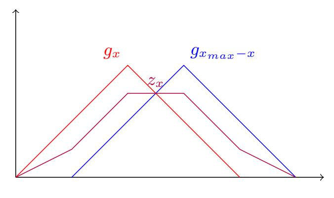
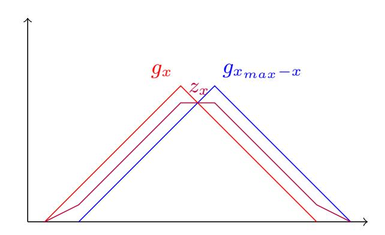
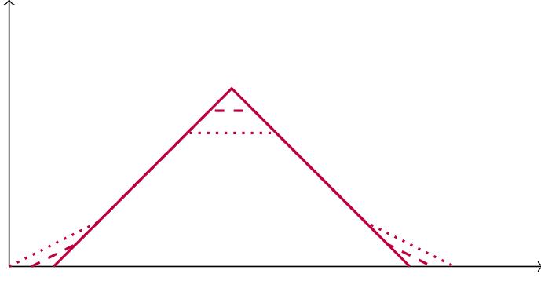
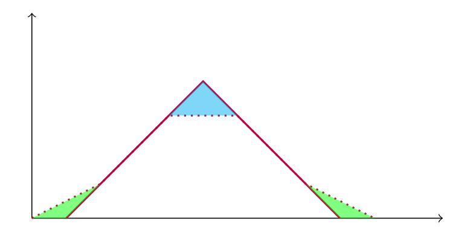
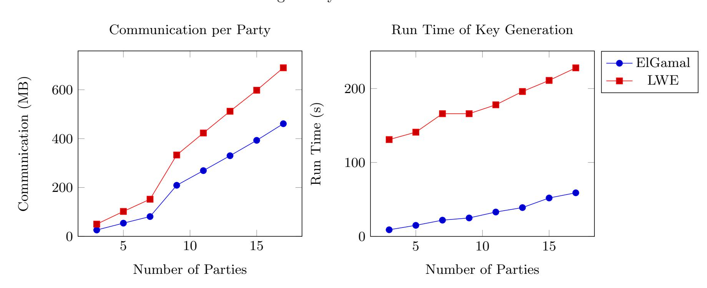
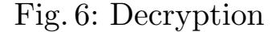
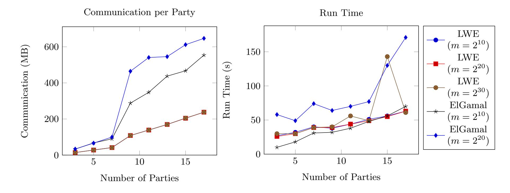
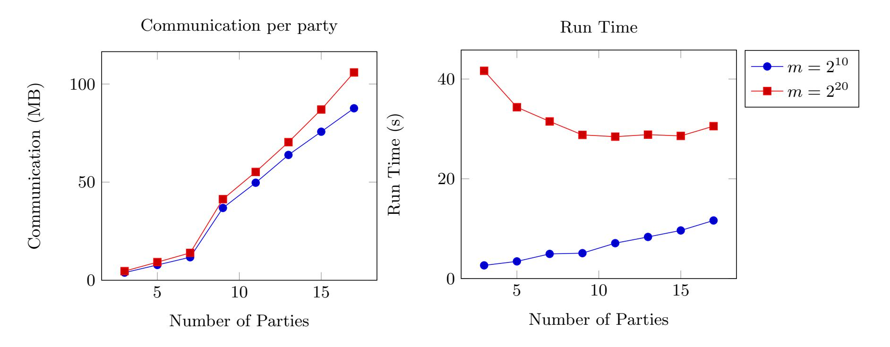
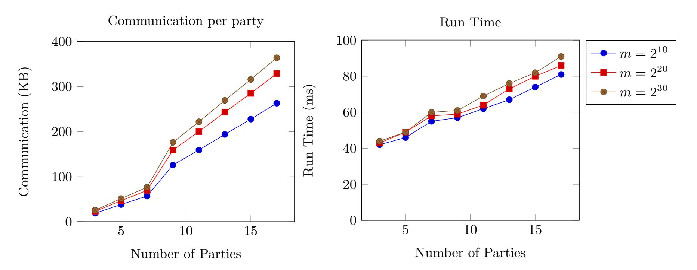

{0}------------------------------------------------

# Secure Computation over Lattices and Elliptic Curves

Brett Hemenway Falk ? and Daniel Noble ??

University of Pennsylvania

Abstract. Traditional threshold cryptosystems have decentralized core cryptographic primitives like key generation, decryption and signatures. Most threshold cryptosystems, however, rely on special purpose protocols that cannot easily be integrated into more complex multiparty protocols.

In this work, we design and implement decentralized versions of lattice-based and elliptic-curve-based public-key cryptoystems using generic secure multiparty computation (MPC) protocols. These are standard cryptosystems, so we introduce no additional work for encrypting devices and no new assumptions beyond those of the generic MPC framework. Both cryptosystems are also additively homomorphic, which allows for secure additions directly on ciphertexts. By using generic MPC techniques, our multiparty decryption protocols compute secret-shares of the plaintext, whereas most special-purpose cryptosystems either do not support decryption or must reveal the decryptions in the clear. Our method allows complex functions to be securely evaluated after decryption, revealing only the results of the functions and not the plaintexts themselves.

To improve performance, we present a novel oblivious elliptic curve multiplication protocol and a new noise-masking technique which may be of independent interest. We implemented our protocols using the SCALE-MAMBA secure multiparty computation platform, which provides security against malicious adversaries and supports arbitrary numbers of participants.

Keywords: distributed cryptography, key management, threshold cryptography, public-key cryptography, lattice techniques, elliptic curve cryptosystem

# 1 Introduction

Threshold cryptography [\[DF89\]](#page-18-0) is aimed at decentralizing key-generation, decryption and signature algorithms. Decentralizing can improve security by eliminating the risks associated with a single point of failure and improve applicability by reducing the need for mutual trust between participants.

Threshold key generation protocols allow a group of participants to generate cryptographic keys so that each party holds a secret-share [\[Sha79\]](#page-20-0) of the private key. Similarly, threshold decryption protocols allow participants to use these key shares to decrypt a target ciphertext.

Threshold cryptosystems have many applications, including:

<span id="page-0-1"></span>Example 1 (Secure data aggregation). A "committee" will use a distributed key generation protocol to generate a key pair for an additively homomorphic cryptosystem (e.g. Paillier [\[Pai99\]](#page-20-1)). Data owners can then encrypt their data, the committee can use the homomorphic property of the cryptosystem to aggregate each individual's contribution, and then use the distributed decryption protocol to decrypt the sum without revealing any of the intermediate results. This kind of aggregation is a core building block of many secure voting [\[BDPSN94,](#page-17-0)[DGS03](#page-18-1)[,Gro04\]](#page-19-0) and federated learning [\[HLP11,](#page-19-1)[SCR](#page-20-2)<sup>+</sup>11[,CSS12\]](#page-18-2) protocols.

<span id="page-0-2"></span>Example 2 (Decentralized signatures). Digital signatures are used to delegate trust (e.g. in SSL certificates), and to control funds in cryptocurrency wallets. In these applications, the signing key must be readily accessible to generate signatures, yet theft of the signing key could have serious financial consequences. Distributing key-generation, storage, and signing can eliminate the risks associated with a single point of failure [\[GJKR96,](#page-19-2)[GGN16,](#page-18-3)[JLE17](#page-19-3)[,Lin17,](#page-19-4)[LNS18,](#page-19-5)[GG18,](#page-18-4)[DKLs19\]](#page-18-5).

<span id="page-0-0"></span><sup>?</sup> fbrett@cis.upenn.edu

<sup>??</sup> dgnoble@cis.upenn.edu

{1}------------------------------------------------

Example 3 (Decentralized auditing). In many situations, such as a web server audit log, information is stored so that any nefarious activity can be investigated. However, such a log necessarily contains sensitive information, and even if it the log is encrypted, a single entity with access to the key can decrypt it. Encrypting the data under a distributed key would give strong privacy guarantees, but still allow a group of authorized individuals to jointly perform an audit when needed.

<span id="page-1-0"></span>Example 4 (Privacy in the age of mass surveillance). Law Enforcement and the court system could engage in a decentralized key generation protocol, and encrypt surveillance data under this shared key. This is a special case of Example [3,](#page-0-0) but one that is worth highlighting because controlling access to surveillance data in a way that sufficiently law enforcement but protects against abuse in an important issue in modern societies. When it becomes necessary to access data to aid in a criminal investigation, the judiciary system could participate in a threshold decryption protocol to decrypt the relevant video footage from the location and time of the crime. The data would therefore be accessible when needed for court cases, and it would be guaranteed that it was not being used for any other purposes.

We discuss these examples (as well as several others) in more detail in Appendix [A.](#page-21-0) Unfortunately, most existing threshold cryptosystems are too limited to address these problems effectively. For example, most threshold encryption only schemes provide a decentralized key-generation protocol and a decentralized decryption protocol, forcing the plaintext to be revealed. Similarly, most threshold signature schemes provide a decentralized key-generation protocol and a decentralized signature protocol.

Some of these limitations are nicely highlighted by the examples above. In the case of Secure Data Aggregation (Example [1\)](#page-0-1), what if the aggregator should only release the results if they satisfy some property? In the case of Decentralized Signatures (Example [2\)](#page-0-2), the committee may wish to perform a "partially-blinded" threshold signature [\[CHYC05\]](#page-18-6) of a client's message, i.e., a signature protocol where the committee learns that the message satisfies some property but learns nothing else. Partially-blinded threshold signatures can be constructed for arbitrary message conditions by the client secret-sharing the message between the committee and the committee checking the condition and the signature inside of an MPC. In the case of Decentralized Auditing (Example [3\)](#page-0-0), how can the auditors identify and decrypt only the records of interest, while maintaining the privacy of the others? For example, how can the auditors decrypt only those records pertaining to a specific user, if the usernames are also encrypted? Similarly, in the case of Mass Surveillance (Example [4\)](#page-1-0), law-enforcments agents may want to search within the encrypted surveillance data, e.g. lawenforcement agents may want all surveillance camera footage that contains the suspect's face, or all phone logs that contain certain keywords. This type of advanced functionality is not supported by simple threshold encryption schemes, and more complex cryptographic tools are needed.

In these situations, simple threshold signature schemes may be insufficient, and more powerful tools from Secure Multiparty Computation (MPC) are needed. The use-cases above could be addressed by generic MPC protocols by secret-sharing the input data among the MPC parties. However, this approach forces the dataprovider to securely send each MPC party a share of the data. In practice this requires the data-provider encrypting data under a public key for each MPC party. When there are π parties, this increases the public key size, ciphertext size and encryption time by a factor of π. Furthermore, it requires the encrypting entity to know the public keys of the parties involved in the MPC. If these parties change, the encrypting entity needs to be alerted of this fact and receive new keys. If not only the involved parties, but also the access structure of the MPC changes (e.g. the number of parties or the threshold to a secret sharing scheme), then the code run by the encrypting entity needs to be updated.

These problems can be seen to be serious issues by examining the examples above. In many of these applications (e.g. Example [3\)](#page-0-0) the number of ciphertexts is huge, so a significant increase in the ciphertext sizes would be prohibitive. Having complicated, and changing, encryption routines for the data-providers is extremely cumbersome or potentially impossible when the data-providers are geographically disperse, simple IoT devices, such as security cameras in Example [4.](#page-1-0) Our approach avoids these problems by making the system behave exactly like a standard public key cryptosystem from the data-provider's perspective.

In this paper, we design and implement decentralized cryptographic protocols using generic secure multiparty computation techniques. Although our focus is on key generation and decryption, most of our techniques could be easily adapted to other cryptographic primitives (e.g. signatures). Our generic approach has many benefits:

{2}------------------------------------------------

- Versatility: As highlighted in several of the examples above, the simple key-generation, decryption and signing algorithms provided by most threshold cryptosystems may be insufficient for many practical applications. Using MPC techniques provides significantly more versatility, allowing participants to compute on data before revealing it (or signing it). Additionally, since the encryption schemes are additively homomorphic, any linear computation can be performed on the input before decrypting it in the MPC.
- Unbalanced participants: In many of the applications described above, the parties given charge of shares of the secret key may have unbalanced processing power, networking bandwidth or other constraints. Most threshold cryptographic schemes place an equal load on all participants. Using generic MPC allows modifying the MPC backend (e.g. to use garbled circuits) to be appropriate to the computational balance and network setup of the participants.
- Changing access structures: Most threshold cryptosystems support only threshold access structures (e.g. k-out-of-n participants are required for decryption). Using generic MPC techniques allows us to support arbitrary numbers of participants and arbitrary access structures. It also makes it easy to change the access structure. Changing access structures are necessary for rotating committees (e.g. [\[RNHH19\]](#page-20-3)). They are also essential in IoT deployments where the data processors change over time but the encrypting devices are hard to update.
- Strong security models: Many special-purpose threshold cryptosystems only provide security against passive adversaries. By using generic MPC protocols, we can choose MPC protocols that are secure against malicious adversaries, giving the threshold cryptosystem this security level. Indeed our implementations use such a maliciously-secure MPC backend.
- Standard Encryption Protocols: Threshold secret-sharing schemes are heavily customized. Therefore it becomes much more likely that developers of data-provider software incorrectly implement the encryption scheme, especially if the data-sources are heterogenous and developed by different organizations, such as IoT devices. Furthermore, standard protocols often have useful well-understood properties. For instance ElGamal encryptions are identical to Pedersen commitments, provided the committer does not know the secret key. Systems can therefore take advantage of, for instance, zero-knowledge range proofs for Pedersen commitments to make data providers prove the validity of plaintexts [\[BBB](#page-17-1)+18]. Our techniques allow the data-provider to use a standard encryption protocol, while allowing for a variety of different MPC back-ends, based on performance and security requirements.

# 2 Our Contribution

We demonstrate two new systems for performing key generation and decryption under MPC. The first is elliptic-curve ElGamal; the second is a variant of the FV lattice-based cryptosystem [\[FV12\]](#page-18-7). Performing key generation under MPC immediately makes our implementations threshold cryptosystems, but performing decryption (rather than traditional threshold decryption) gives our schemes significantly more flexibility. The primary advantage of this design is composability. By performing decryption (either LWE- or ECbased) under a generic MPC, the participants can learn secret-shares of the decryption rather than the raw values, and these secret-shares can be fed into further (secure) computations. Similarly, by using generic MPC techniques, our schemes are easily extensible. For example, implementing threshold ECDSA signatures is trivial using our framework because all of the tools are in place to do elliptic curve arithmetic under MPC.

In the process of developing these schemes, we applied several optimizations, which we believe are of independent interest. We developed a branching-free method for elliptic curve point multiplication (Section [4.1\)](#page-6-0) by forcing elliptic curve additions to be of a certain type. We also discovered a novel method for securely computing the discrete log algorithm by solving a related problem in the clear that has been noised by a carefully-chosen distribution (Section [4.1\)](#page-9-0). This is the first case we are aware of where adding this type of noise allows a secure computation to be made much more efficient by solving the noised problem in the clear. We also analyze the noise growth for our lattice-based cryptosystem to determine appropriate parameters (Section [4.2\)](#page-12-0).

We have fully implemented these schemes using the SCALE-MAMBA MPC compiler [\[AKR](#page-17-2)<sup>+</sup>19]. SCALE-MAMBA provides security against malicious adversaries in the honest majority setting, i.e., it is secure 

{3}------------------------------------------------

against up to  $k = \lfloor \frac{n-1}{2} \rfloor$  malicious adversaries. <sup>1</sup> We have built our cryptosystems such that they can be used as SCALE-MAMBA libraries in larger systems. We also provide testing scripts to facilitate reproduction of our results. We test key generation and decryption on AWS instances with up to 17 parties in the honest majority setting. Our results (Section 6) show trade-offs between the ElGamal and lattice-based cryptosystems. For instance, with 3 parties, ElGamal key generation and decryption on small plaintexts each take about 10 seconds and require about 30MB of communication per party. The lattice-based scheme requires longer key generation time (about 30s), and requires a large ciphertext to store a small plaintext; however, the amortized cost of performing many decryptions is dramatically lower, only requiring about 20 KB of communication and 40ms per decryption.

### 3 Prior work

#### 3.1 Threshold Cryptography

A threshold cryptosystem [DF89] allows a group of participants to collaboratively generate a public key together with *secret shares* of the corresponding secret key that could be used in a secure multiparty decryption protocol. Threshold cryptography built on the idea of group-oriented cryptography [Des87].

Early works focused on thresholding ElGamal. An ElGamal keypair consists of a private key a, and a public key,  $h = g^a \mod q$ . Encryption is performed as  $E(m) = (g^r \mod q, h^r \cdot g^m \mod q)$ , and decryption is done by calculating  $g^m = c_2 \cdot c_1^{-a} \mod q$ . The main observation when thresholdizing ElGamal is that if the secret key, a, is additively secret shared  $a = \sum_i a_i$ , then decryption can be performed having each party locally compute  $c_1^{-a_i}$ , and calculating  $g^m = c_2 \cdot \prod_i c_1^{-a_i} \mod q$ . The initial work [DF89] assumed that the secret key, a, was generated by a trusted dealer, who distributed the shares,  $a_i$ , to the participants who would then "blow itself up." Subsequent work [Hwa90] observed that the shares,  $a_i$ , could be generated locally (eliminating the need for a trusted dealer). If the shares are generated locally by the players, commitments can be used to ensure that each player's share cannot be used to influence the final public key [Ped91].

These early works spawned a rich literature examining threshold variants of many common cryptosystems. We review some of the most relevant work below.

#### 3.2 RSA Keygen

Generating keys for the RSA or Paillier cryptosystems requires generating moduli N=pq, where p and q are primes. This is particularly challenging in the threshold setting because traditional primality tests are not "MPC-friendly." Nevertheless, several distributed RSA key-generation protocols have been developed [Coc97,Coc98,FMY98,MWB99,Gil99,BF01,ACS02,DM10,NS10,HMRT12,VAS19].

Under RSA, threshold decryption is rather straightforward, however, Paillier decryption (which requires modular inversion and integer division) is not straightforward to implement in the distributed setting [NS10,VAS19].

The techniques for distributed RSA key generation and decryption are fundamentally different than those in the systems we consider (*i.e.*, those based on discrete-log or LWE). For completeness, however, we summarize distributed RSA key-generation protocols in Appendix B.

#### 3.3 Elliptic Curve Keygen

In principle, key generation for discrete-log based cryptosystems is straightforward, since (unlike in RSA) the private keys are uniformly distributed in an interval, and deriving the public key from a private key requires only group operations. [GJKR99] gave a template for secure multiparty key-generation protocols for discrete-log-based cryptosystems that provides security in the malicious model.

Consider two simple methods for generating a key pair for an elliptic curve discrete-log cryptosystem. The users will fix a curve  $\mathcal{C}$  and a generator  $\mathbf{G}$  of order n. Each player can generate a share of the secret key, by uniformly and independently sampling  $a_i \stackrel{\$}{\leftarrow} [n]$ .

<span id="page-3-0"></span><sup>&</sup>lt;sup>1</sup> SCALE-MAMBA supports most of the functionality for full-threshold computation. In the current version (V1.7), however, the key-generation step has not been implemented and thus our implementations only provide security in the honest-majority setting.

<span id="page-3-1"></span><sup>&</sup>lt;sup>2</sup> This appears to be an early term for a "secure deletion."

{4}------------------------------------------------

- Method 1: Each player locally computes aiG. The players reveal aiG, and compute the public key pk def = P i aiG. Even though the players learn the intermediate values aiG that are not revealed by an ideal functionality, this scheme is nonetheless secure [\[GJKR99\]](#page-19-10).
- Method 2: Each player locally computes aiG . The players secret share aiG (using an additive secretsharing scheme over the curve C). Then pk def = P i aiG can be computed securely using the linearity of the secret-sharing scheme. This approach was taken in [\[SA19\]](#page-20-7).

The generic DL-based multiparty key generation protocol of [\[GJKR99\]](#page-19-10) can be specialized to the case of elliptic curves [\[Tan05\]](#page-20-8).

Using a linear-secret sharing scheme over an elliptic group allows participants to privately compute elliptic-curve group operations without additional communication, i.e., given secret sharings of two elliptic curve points P<sup>1</sup> and P2, the players can locally compute a sharing of P<sup>1</sup> + P2. The challenge is then to incorporate these elliptic-curve shares with scalar sharings, e.g. given a sharing of x ∈ Fq, and P, compute a sharing of xP. The work of [\[SA19\]](#page-20-7) builds on the SPDZ protocol to create an efficient framework for secure multiparty computations over elliptic curves in the malicious model.

Several works have focused on distributing the Digital Signature Algorithm (DSA) and its elliptic-curve variant.

The ECDSA algorithm is fairly simple. Given a private key, d, to sign a message, m,

- 1. Generate a random nonce, k \$ ← Z/qZ.
- 2. Compute R = kG. Let (rx, ry) denote the x and y coordinates of R.
- 3. Set s = k −1 (H(m) + r · d) mod q.
- 4. Output the signature (rx, s).

One of the challenges is computing k −1 (when k is secret-shared). Since the ECDSA protocol requires both operations on elliptic curve points and operations modulo q, it is not inherently "MPC-friendly."

[\[GJKR96\]](#page-19-2) gave a multiparty protocol for generating DSA (and ECDSA) signatures in the multiparty setting with security against malicious adversaries, but their protocol had an optimality gap. It provided security against t (out of n) corrupted parties, but required 2t+ 1 cooperating parties to produce a signature. This optimality gap was later closed in [\[GGN16\]](#page-18-3).

Using a combination of secret-sharing, zk-proofs and Paillier encryption, [\[Lin17\]](#page-19-4) developed an efficient 2-party ECDSA scheme (in the malicious model), and this was later extended to the multiparty setting [\[LNS18\]](#page-19-5).

The work of [\[DKLs18\]](#page-18-14) provided an 2-party ECDSA scheme (in the malicious model), and later extended it to the multiparty setting [\[DKLs19\]](#page-18-5).

The DECO protocol [\[ZMM](#page-20-9)+19] combines garbled circuits (implemented in EMP [\[WMK16\]](#page-20-10)) with efficient distributed ECDSA (implemented with [\[GG18\]](#page-18-4)) to allow two parties (a prover and verifier) to jointly perform a TLS handshake with a server. This allows the prover to prove statements about the data received from the server. For example, provers could prove claims about their bank statements (as well as the origin of the statements). One of the complexities of their approach is combining the generic MPC computations with efficient distributed computations on elliptic curves.

#### 3.4 Lattice Keygen

The lattice-based Learning With Errors (LWE) assumption, and specifically the Ring-LWE variant, is the basis for a number of public-key cryptosystems. These have received much attention because they can be used to construct additive, leveled, and fully homomorphic encryption schemes and can also be made secure against quantum attacks.

The indepedent work of [\[KLO](#page-19-11)<sup>+</sup>19] demonstrates an implementation of distributed Ring-LWE in SCALE-MAMBA that is very similar to ours. One key difference is that we are focused on distributed data aggregation, and thus our goal is to generate public-keys for homomorphic cryptosystems. Since [\[KLO](#page-19-11)<sup>+</sup>19] are

{5}------------------------------------------------

|          |       |    |     | Scheme Cryptosystem Players Malicious Implementation |
|----------|-------|----|-----|------------------------------------------------------|
| [GJKR96] | ECDSA | 3+ | Yes | No                                                   |
| [GGN16]  | ECDSA | 3+ | Yes | Yes                                                  |
| [Lin17]  | ECDSA | 2  | Yes | Yes                                                  |
| [LNS18]  | ECDSA | 2+ | Yes | Yes                                                  |
| [DKLs18] | ECDSA | 2  | Yes | Yes                                                  |
| [GG18]   | ECDSA | 2+ | Yes | Yes                                                  |
| [DKLs19] | ECDSA | 2+ | Yes | Yes                                                  |
| [SJSW19] | DL    | 2+ | Yes | Yes                                                  |

Table 1: Distributed ECDSA signing

not interested in using the additive homomorphism that Ring-LWE can provide, they can use much smaller parameters. In particular, the ring Zq[x]/hx <sup>n</sup> + 1i can use a smaller ciphertext modulus (q = 40961), which allows for a smaller polynomial degree (n = 1024).

LWE can also be used to create a "universal-thresholdizer," i.e., a generic method for converting any public-key cryptosystem into a threshold version [\[BGG](#page-18-15)<sup>+</sup>18]. Essentially, the idea is to build a threshold version of FHE (based on the LWE assumption), and then use the threshold FHE scheme to "thresholdize" an existing scheme. This universal thresholder creates threshold schemes with low round complexity, but is unlikely to be efficient in practice, and has not been implemented.

[\[MTPH20\]](#page-19-12) implemented multiparty key-generation and decryption for the lattice-based FHE schemes of BFV [\[FV12\]](#page-18-7) and CKKS [\[CKKS17\]](#page-18-16) in the Go programming language. Unlike ours, their system is designed as a replacement for traditional MPC protocols. Most MPC protocols have communication complexity that depends on the complexity of the function being computed, whereas FHE protocols can securely outsource computation with communication complexity that depends only on the input sizes rather than the circuit complexity. By contrast, we focus on integrating FHE and MPC, performing some operations under the encryption scheme, and some under the lattice-based encryption.

#### 3.5 Symmetric key systems

Some works have focused on generated uniformly random secrets, which can then be used for symmetrickey encryption [\[NPR99\]](#page-19-13), and some of these schemes have been implemented [\[KG09,](#page-19-14)[KHG12\]](#page-19-15), but these applications and techniques are very different from those of decentralized key generation for public-key cryptosystems we consider here.

#### 3.6 MPC

Threshold cryptosystems typically provide distributed encryption and decryption, but some applications require more complex functionality. In these settings, it is often necessary to implement encryption [\[RNHH19\]](#page-20-3) or digital signatures [\[ZMM](#page-20-9)<sup>+</sup>19] within a full-fledged secure computation protocol.

The DECO [\[ZMM](#page-20-9)<sup>+</sup>19] protocol decentralizes the client side of a TLS handshake. The goal of DECO is to allow a Prover to certify the provenance of data to a Verifier, e.g. that certain data was obtained from a specific website (i.e., an https-enabled server). One of the key features of DECO is that the server side code remains unchanged. This is particularly challenging when only the prover has credentials to access the data source. At its core DECO is a 3-party TLS handshake, where the server side is unchanged and the client state is secret-shared between a Prover and a Verifier. The DECO protocol requires piecing together several cryptographic tools under MPC, EC-DSA signatures, AES-GCM and HMACs. By secrets-sharing the handshake between the Prover and the Verifier, the Prover can send requests to the server that are hidden from the verifier, and later prove to the verifier the provenance of the server's responses.

One of the (many) obstacles faced by DECO was converting between arithmetic representations (used for EC-DSA) and binary representations (used for AES and HMACs). Our implementation of elliptic-curve arithmetic under SCALE-MAMBA would significantly streamline future projects of this sort to work, since 

{6}------------------------------------------------

SCALE-MAMBA natively supports both arithmetic and boolean operations on secret-shares (and even has an MPC-friendly implementation of AES).

Honeycrisp [\[RNHH19\]](#page-20-3) decentralized an additively homomorphic, lattice-based key generation and decryption in order to support large-scale aggregation of user data. In Honeycrisp, a small "committee" generated a key-pair for an additively homomorphic cryptosystem, then (potentially billions of) users used this public key to send encrypted usage statistics to a centralized "aggregator." Although this type of aggregation is a common use-case for threshold encryption, Honeycrisp also provided differential privacy via the Sparse Vector Technique (SVT) [\[DNR](#page-18-17)+09[,RR10\]](#page-20-12). The SVT requires computing on the aggregate data before releasing it, which, in the context of Honeycrisp, required the committee to decrypt the aggregate values under MPC, then perform computations on it before releasing the plaintext. This additional complexity rules out the use of traditional threshold cryptosystems (which only allow multiparty encryption and decryption). Both our protocols could be used as drop-in replacements in the Honeycrisp system to improve performance, or change the underlying cryptographic assumptions.

These types of applications (which tie lattice or elliptic curve operations into larger protocols) can be extremely powerful, and our work provides a toolkit (and software library) to facilitate their development and deployment.

# 4 Design

### 4.1 Elliptic Curve ElGamal

Overview Our secure elliptic-curve ElGamal follows the standard algorithms for elliptic-curve ElGamal, but uses two significant optimizations.

Firstly, we observe that, in general, elliptic-curve addition requires performing one of 5 different operations, so oblivious elliptic-curve addition requires executing all 5 of these different computations. Since multiplication of a point by a secret constant involves many such additions, this incurs significant overhead. We present a double-and-add algorithm for elliptic curve multiplication that ensures that almost all additions will be guaranteed to be one of these 5 types, allowing these additions to be executed by only evaluating one branch.

Secondly, in order to support the additively homomorphic property, a plaintext m must first be embedded in the group by multiplying the group generator by this value. While this operation is efficient, the process of unembedding requires solving the discrete logarithm on the message space.[3](#page-6-1) Furthermore, if the result of decryption must be secret-shared also, then the discrete logarithm must be solved within a secure computation. To simply compute the discrete logarithm using standard algorithms within the secure computation would have a very high overhead. However, we observe that it is possible to securely and efficiently evaluate the discrete logarithm for plaintext spaces of up to about 2<sup>20</sup> by adding a carefully-chosen noise and solving a related discrete-logarithm problem in the clear on a non-sensitive value.

First, we present the general protocol for elliptic-curve ElGamal. We make black-box use of operations to multiply and compute the discrete log in a group. The algorithm is presented in Algorithm [1.](#page-7-0) All operations are performed in an elliptic curve group, with generator G and prime order q. These parameters are implicitly passed to each function. Encryption and ciphertext addition are executed locally in the clear; all other operations are executed within a secure computation.

<span id="page-6-0"></span>Efficient Oblivious Elliptic Curve multiplication Multiplication of elliptic curve points by constants can be achieved using the "double-and-add" method. This is presented in Algorithm [2.](#page-7-1)

In the multiplications that need to be performed for elliptic-curve ElGamal, the group element being multiplied, P, is always public. Hence, the addition in the doubling step on line [7](#page-7-1) can be computed in the clear.

Unfortunately, the additions in line [6](#page-7-1) of Algorithm [2](#page-7-1) could be of a variety of different forms. Elliptic-curve addition is performed one of 5 different ways, depending on the relationship between the points. The types of addition are as follows:

<span id="page-6-1"></span><sup>3</sup> Since, in general, this algorithm is used in groups where the group operation is denoted by multiplication, we refer to this as the discrete logarithm problem, even though, with the addition notation we are using, it may more aptly be described as the division problem.

{7}------------------------------------------------

# <span id="page-7-0"></span>Algorithm 1 Elliptic Curve ElGamal

```
15: procedure ADDCIPHER((\mathbf{c}_1, \mathbf{d}_1), (\mathbf{c}_2, \mathbf{d}_2))
 1: procedure KEYGEN
            k_{sk} \stackrel{\$}{\leftarrow} [q]
                                                                                                         16:
                                                                                                                       \mathbf{c}_{tot} \leftarrow \mathbf{c}_1 + \mathbf{c}_2
 2:
 3:
            \mathbf{k_{pk}} \leftarrow k_{sk}\mathbf{G}
                                                                                                         17:
                                                                                                                       \mathbf{d}_{tot} \leftarrow \mathbf{d}_1 + \mathbf{d}_2
                                                                                                         18:
                                                                                                                       \mathbf{return}\;(\mathbf{c}_{tot},\mathbf{d}_{tot})
            return (k_{sk}, \mathbf{k_{pk}})
 4:
                                                                                                         19: end procedure
 5: end procedure
                                                                                                         20:
 6:
                                                                                                         21: procedure DEC((\mathbf{c}, \mathbf{d}), k_{sk})
 7: procedure Enc(x, \mathbf{k_{pk}})
                                                                                                                      \mathbf{X} \leftarrow \mathbf{d} - k_{sk}\mathbf{c}
                                                                                                         22:
            \mathbf{X} \leftarrow x\mathbf{G}
 8:
            r \stackrel{\$}{\leftarrow} [q]
                                                                                                         23:
                                                                                                                       \mathbf{return}\ \mathbf{X}
 9:
                                                                                                         24: end procedure
            \mathbf{c} \leftarrow r\mathbf{G}
10:
                                                                                                         25:
             \mathbf{d} \leftarrow r\mathbf{k_{pk}} + \mathbf{X}
11:
                                                                                                         26: procedure Unembed(\mathbf{X}, x_{max})
12:
             return (c, d)
                                                                                                                      x \leftarrow DiscreteLog(\mathbf{X}, \mathbf{G}, x_{max})
                                                                                                         27:
13: end procedure
                                                                                                         28:
                                                                                                                       return x
14:
                                                                                                         29: end procedure
```

### <span id="page-7-1"></span>Algorithm 2 Elliptic Curve Multiplication: Double-and-Add algorithm

```
\triangleright \ell: bit-length of x
 1: procedure Multiply(x, \ell, \mathbf{P})
            \mathbf{X} \leftarrow \mathbf{O}
 2:
 3:
            t \leftarrow \mathbf{P}
 4:
            for i = 1 to \ell do
                  b \leftarrow x \bmod 2
 5:
                  \mathbf{X} \leftarrow \mathbf{X} + \max(b, t, \mathbf{O})
 6:
 7:
                  t \leftarrow t + t
                  x \leftarrow \lfloor \frac{x}{2} \rfloor
 8:
            end for
 9:
            return X
10:
11: end procedure
```

{8}------------------------------------------------

```
    O + P (Left operand is the identity)
    P + O (Right operand is the identity)
    P + (-P) (Right operand is negation of left operand)
    P + P (Operands are equal)
    Other
```

In general, adding two points obliviously requires performing the computations for all 5 cases and multiplexing the results. Furthermore, testing which case is true requires secure equality tests, which are fairly costly under most MPC frameworks.

To avoid these problems and improve performance, we present a novel algorithm to compute the multiplication which ensures that every addition performed in the loop is a case-5 addition. It does this at the cost of one extra standard addition and a reduction of the maximum length of the constant, x, by about 2 bits.

```
Algorithm 3 Elliptic Curve Optimized Multiplication
                                                                                                                                                           \triangleright Where \ell < \log_2(\frac{q}{3})
 1: procedure Multiply (x, \ell, \mathbf{P})
           \mathbf{X} \leftarrow 2^{\ell} \mathbf{P}
 2:
                                                                                                                                                     ▷ Computed in the clear
 3:
           t \leftarrow \mathbf{P}
 4:
           for i = 1 to \ell do
                 b \leftarrow x \bmod 2
 5:
                 \mathbf{X} \leftarrow \mathbf{X} + \max(b, t + t, t)
 6:
 7:
                 t \leftarrow t + t
                 x \leftarrow \lfloor \frac{x}{2} \rfloor
 8:
           end for
 9:
            d \leftarrow (2^{\ell+1} - 1)\mathbf{P}
10:
                                                                                                                                                     ▷ Computed in the clear
            \mathbf{X} \leftarrow \mathbf{X} - d
11:
12:
            return X
```

#### **Theorem 1.** Algorithm 3 is correct, i.e., $\mathbf{X} = x\mathbf{P}$ .

13: end procedure

*Proof.* Some simple arithmetic shows that the value is computed correctly. Let  $x_i$  represent the  $i^{th}$  least significant bit of x.

$$\mathbf{X} = 2^{\ell} \mathbf{P} + \sum_{i=1}^{\ell} ((x_i + 1)2^{i-1} \mathbf{P}) - (2^{\ell+1} - 1) \mathbf{P}$$

$$= 2^{\ell} \mathbf{P} + \sum_{i=1}^{\ell} (x_i 2^{i-1} \mathbf{P}) + (2^{\ell} - 1) \mathbf{P} - (2^{\ell+1} - 1) \mathbf{P}$$

$$= \sum_{i=1}^{\ell} x_i 2^{i-1} \mathbf{P} = x \mathbf{P}$$

**Theorem 2.** The addition on line 6 of Algorithm 3 will always be a case 5 addition.

*Proof.* First, observe that the minimum value of **X** when beginning an iteration of the for loop is  $2^{\ell}\mathbf{P}$  and the maximum value is  $2^{\ell}\mathbf{P} + \sum_{i=1}^{\ell-1} 2^{i}\mathbf{P}$  or  $(2 \cdot 2^{\ell} - 2)$ . Since  $2^{\ell} < \frac{q}{3}$ , there will be no wrap-around. We are therefore assured that the left operand in the addition on line 6 is never the identity, so the addition is never of type 1.

The right operand is either t + t or t, where  $t = 2^{i-1}\mathbf{P}$ , and  $1 \le i \le \ell$ . Therefore the right operand is between  $\mathbf{P}$  and  $2^{\ell}\mathbf{P}$ . Again,  $2^{\ell} < q$ , so this will not wrap around. This means that the right operand is not the identity, so the addition is not of type 2.

{9}------------------------------------------------

Likewise, in order to be a type 3 addition, the sum of the two operands would need to be the identity element. But based on the ranges outlined above, the sum of the two elements is between (2` + 1)P and (3 · 2 ` − 2)P. Since 0 < 2 ` + 1 < 3 · 2 ` − 2 < q it is impossible for the sum of the operands to be the identity, so the addition is not of type 3.

Finally, the right operand will always be less [4](#page-9-1) than 2`P, except in the last iteration of the loop where it is at most 2`P and the left operand will always be more than 2`P, except in the first iteration of the loop where it is exactly 2`P. Therefore, as long as ` > 1, the left operand will always be greater than the right operand, so they cannot be equal. Therefore, the addition will never be of type 4.

We can conclude that the addition will always be of type 5. ut

Since the addition is always of type 5, this allows us to obliviously compute the addition without evaluating unnecessary branches and without performing comparisons. We remark that this technique may be useful in other situations where obliviousness is required, such as side-channel resistant implementations.

<span id="page-9-0"></span>Efficient, secure Discrete Log calculations under MPC Solving the discrete logarithm in the unembedding step is innately challenging because the security of the encryption scheme depends on the fact that the discrete log problem is hard on the chosen elliptic curve. However, the problem is tractible when the plaintext is restricted to a small domain. Specifically, for the security of the encryption scheme we want to use a curve for which only generic discrete log algorithms exist, the best of which have computation cost Θ( √ xmax) where the solution x satisfies 0 ≤ x < xmax. One such generic algorithm is "Baby Step Giant Step" [\[Sha71\]](#page-20-13). This is described in Algorithm [4.](#page-9-2) Assuming a dictionary with Θ(1)-cost accesses and Θ(1)-cost memory per element, the discrete log is computed in time and space Θ( √ xmax).

<span id="page-9-2"></span>Algorithm 4 Baby Step Giant Step: Returns x where X = xP for some 0 ≤ x < xmax

```
1: procedure DiscreteLog(X, P, xmax)
2: w ← d√
            xmaxe
3: giantSteps ← Dictionary.new()
4: stepSize ← wP
5: giantStep ← 0P
6: for i ← 0 to w − 1 do
7: giantSteps.add(giantStep, i)
8: giantStep ← giantStep + stepSize
9: end for
10: babyStep ← X
11: for j ← 0 to w − 1 do
12: i ← giantSteps.get(babyStep)
13: if i 6= NULL then
14: return wi + j
15: end if
16: babyStep ← babyStep − P
17: end for
18: end procedure
```

Executing Baby-Step Giant-Step within a secure multiparty computation is expensive. However, if we do a basic operation and add an appropriate noise distribution, we can solve the secure discrete log problem by solving a related discrete log problem in the clear such that the advantage of the adversary in seeing the input of the related problem is negligible. This is presented in detail in Algorithm [5.](#page-10-0)

We now prove the correctness and security of Algorithm [5.](#page-10-0)

Theorem 3. Algorithm [5](#page-10-0) correctly computes x such that X = xP.

<span id="page-9-1"></span><sup>4</sup> By saying point A is less than point B, we mean that A = aP, B = bP, where 0 ≤ a < b < q.

{10}------------------------------------------------

#### <span id="page-10-0"></span>Algorithm 5 Efficient Secure Discrete Log using Triangular Distribution Blinding

```
1: procedure DiscreteLogSecure(\mathbf{X}, \mathbf{P}, x_{max})
 2:
              \mathbf{X}_{max} \leftarrow x_{max} \mathbf{P}
              b \stackrel{\$}{\leftarrow} \{true, false\}
 3:
              if b then \mathbf{Y} \leftarrow \mathbf{X}_{max} - \mathbf{X} else \mathbf{Y} \leftarrow \mathbf{X}
 4:
              r_1 \stackrel{\$}{\leftarrow} \left[2^{\frac{\sigma-1}{2}} x_{max}\right]
 5:
              r_2 \stackrel{\$}{\leftarrow} [2^{\frac{\sigma-1}{2}} x_{max}]
 6:
 7:
              r \leftarrow r_1 + r_2
              \mathbf{R} \leftarrow r\mathbf{P}
 8:
              \mathbf{Z} \leftarrow \mathbf{Y} + \mathbf{R}
 9:
10:
               \mathbf{Z}.reveal()
              z \leftarrow DiscreteLog(\mathbf{Z}, \mathbf{P}, 2^{\frac{\sigma+1}{2}} x_{max} + x_{max})
11:
                                                                                                                                                                                       ▷ Computed in the clear
               y \leftarrow z - r
12:
13:
               if b then x \leftarrow x_{max} - y else x \leftarrow y
14:
               return x
15: end procedure
```

*Proof.* Since the DiscreteLog algorithm on line 11 is correct,  $\mathbf{Z} = z\mathbf{P}$ . By calculation  $\mathbf{R} = r\mathbf{P}$ . Therefore, by the homomorphic property,  $\mathbf{Y} = \mathbf{Z} - \mathbf{R} = z\mathbf{P} - r\mathbf{P} = (z - r)\mathbf{P} = y\mathbf{P}$ . If b = true, then  $\mathbf{X} = \mathbf{X}_{max} - \mathbf{Y} = x_{max}\mathbf{P} - y\mathbf{P} = (x_{max} - y)\mathbf{P} = x\mathbf{P}$ . If b = false, then  $\mathbf{X} = \mathbf{Y} = y\mathbf{P} = x\mathbf{P}$ .

The intuition for why this algorithm is secure is as follows. When a random value, r from a distribution R, is added to a value x to mask it, the amount of leakage depends on the rate of change of r. Hence, if R is the uniform distribution, for most values of x+r nothing is leaked, but at the end points, near where R goes from 0 to its maximum value, a significant amount of information is leaked. However, if we first randomly flip x, as in lines 3 to 4 then the leakage no longer comes from regions of R in which the value of R changes, but rather from regions in which the slope of R changes. If the slope is constant, then the average of R(a-x) and  $R(a-(x_{max}-x))$  will not depend on the value of x. In this case, we choose R to maximize the region for which the slope is constant.

**Theorem 4.** Algorithm 5 is secure. Speficially, for any two secret values,  $x_1$  and  $x_2$ , the distributions observed by the adversary differ by at most  $2^{-\sigma}$ .

*Proof.* The only data that is revealed is **Z** which, from an information theoretic perspective, is equivalent to leaking z. We need to show that z leaks a negligible amount of information about x. Let  $x_1$ ,  $x_2$  be two different potential values of x. Let  $z_x(a)$  be the probability distibution of z for a given x. The amount of leakage is captured by the maximum  $L_1$  norm of the difference between two distributions of  $z_x(a)$ .

$$\Delta = \max_{x_1, x_2} \sum_{a = -\infty}^{\infty} |z_{x_1}(a) - z_{x_2}(a)|$$

The leakage is negligible if  $\Delta \leq 2^{-\sigma}$  for an appropriate statistical security parameter  $\sigma$ .

Let  $D = 2^{\frac{\sigma-1}{2}} x_{max}$ . Let R(a) be the distribution of r. Then R(a) is a triangular distribution with lower limit 0, upper limit 2D - 2 and mode D - 1. Specifically:

$$R(a) = \begin{cases} \frac{a+1}{D^2} & \text{if } a \in \{0 \dots D-1\} \\ \frac{2}{D} - \frac{a+1}{D^2} & \text{if } a \in \{D \dots 2D-2\} \\ 0 & \text{otherwise} \end{cases}$$

Let  $g_x(a) = R(a-x)$ . This is the probability distribution of  $z_x(a)$  when b = false. The probability distribution of  $z_x(a)$  given b = true is  $g_{x_{max}-x}(a)$ . Therefore  $z_x(a) = \frac{1}{2}(g_x(a) + g_{x_{max}-x}(a)) = \frac{1}{2}(R(a-x) + R(a - (x_{max} - x)))$ .

Let us examine these distributions graphically. Figures 1 and 2 show the distributions  $g_x$ ,  $g_{x_{max}-x}$  and  $z_x$  when x=0 and when  $x=\frac{1}{4}x_{max}$  respectively. The distribution  $z_x$  is similar to the triangular distribution,

{11}------------------------------------------------

except that it has been slightly "eroded", the peak has become a plateau and at the bottom the base becomes slightly wider. We can also see that the extent of this "erosion" is smaller when x is closer to  $\frac{1}{2}x_{max}$ . In fact, if  $x = \frac{1}{2}x_{max}$  then  $z_{\frac{1}{2}x_{max}} = \frac{1}{2}(g_{\frac{1}{2}x_{max}} + g_{x_{max} - \frac{1}{2}x_{max}}) = g_{\frac{1}{2}x_{max}} = R(a - \frac{1}{2}x_{max})$ , which is exactly the triangular distribution.

<span id="page-11-0"></span>

Fig. 1: x = 0



Fig. 2:  $x = \frac{1}{4}x_{max}$ 

For the majority of values a,  $z_x(a)$  does not depend on the value of x. This is obviously true for a < 0 and  $a > 2D - 2 + x_{max}$ , where  $z_x(a)$  is always 0. It is also true when  $x_{max} \le a < D$ , where

$$z_x(a) = \frac{1}{2}(R(a-x) + R(a - (x_{max} - x))) = \frac{1}{2}\left(\frac{a-x+1}{D^2} + \frac{a-x_{max} + x + 1}{D^2}\right) = \frac{1}{2}\left(\frac{2a+2-x_{max}}{D^2}\right)$$

Similarly,  $z_x$  does not depend on a when  $D + x_{max} \le a \le 2D - 2$ , where

$$z_x(a) = \frac{1}{2} \left( \frac{2}{D} - \frac{a - x + 1}{D^2} + \frac{2}{D} - \frac{a - (x_{max} - x) + 1}{D^2} \right) = \frac{1}{2} \left( \frac{4}{D} - \frac{2a + 2 - x_{max}}{D^2} \right)$$

Since  $x_{max}$  is much smaller that D, this means that for the vast majority of the distribution the output of  $z_x(a)$  does not leak information about x. This is shown in Figure 3. Only the peak and the bases change.

The  $L_1$  norm is therefore the maximum difference between the distributions at the peak and base points, for some  $x_1$ ,  $x_2$ . From Figure 3 it is apparent that the  $L_1$  norm is maximized when  $x_1 = 0$  (or equivalently  $x_{max}$ ) and  $x_2 = \frac{1}{2}x_{max}$ . The L1 norm will then be the sum of the shaded areas shown in Figure 4. Since  $z_0$  and  $z_{x_{max}}$  both are probability distributions with total area 1, the sum of the green shaded areas must equal the shaded blue area.<sup>5</sup>

Therefore the total L1 norm is double the area of the blue triangle. Since the triangle is symmetric, we can say the total L1 norm is 4 times the area of the left half of the blue triangle.

$$\Delta = 4 \sum_{a=D}^{D+\frac{1}{2}x_{max}-1} z_{\frac{1}{2}x_{max}}(a) - z_{0}(a)$$

$$= 4 \sum_{a=D}^{D+\frac{1}{2}x_{max}-1} \frac{a+1-\frac{1}{2}x_{max}}{D^{2}} - \frac{1}{2} \left(\frac{2}{D} - \frac{a+1}{D^{2}} + \frac{a+1-x_{max}}{D^{2}}\right)$$

$$= 4 \sum_{a=D}^{D+\frac{1}{2}x_{max}-1} \frac{a+1-\frac{1}{2}x_{max}}{D^{2}} - \frac{1}{D} + \frac{\frac{1}{2}x_{max}}{D^{2}}$$

$$= 4 \sum_{a=D}^{D+\frac{1}{2}x_{max}-1} \frac{a-D+1}{D^{2}} = 4 \sum_{a=0}^{\frac{1}{2}x_{max}-1} \frac{a+1}{D^{2}}$$

$$= 4 \frac{\left(\frac{1}{2}x_{max}-1\right)\frac{1}{2}x_{max}}{2D^{2}} < \frac{x_{max}^{2}}{2D^{2}}$$

<span id="page-11-1"></span>This observation gives some intuition as to whether the triangular distribution is the best distribution for this problem. We can see that if we were to change the base of the distribution, but leave the peak untouched, we could not reduce the total L1 norm. Similarly, if we were to modify the shape of the peak, but not the bases, the L1 norm would not decrease since it would still be (at least) the sum of the areas of the green triangles.

{12}------------------------------------------------

<span id="page-12-1"></span>



Fig. 3:  $z_0$ ,  $z_{\frac{1}{4}x_{max}}$  and  $z_{\frac{1}{2}x_{max}}$ 

Fig. 4:  $L_1$  norm between  $z_0$  and  $z_{\frac{1}{2}x_{max}}$ 

#### <span id="page-12-0"></span>4.2 Lattices

We use the two-element Ring LWE scheme of [LPR10]. This uses a polynomial ring  $R_p = \mathbb{Z}_p[x]/\langle x^n+1\rangle$ , where p is prime and n is a power of  $2.^6$  We will represent ring elements as arrays of length n and use standard array notation to refer to elements of these arrays, which correspond to coefficients of the corresponding polynomial. The secret key, s, public key (a,b) and cipherexts (u,v) are all are composed of these ring elements:  $s \in R_p$ ,  $(a,b) \in R_p \times R_p$  and  $(u,v) \in R_p \times R_p$ . Noise is drawn from a particular error distribution  $\chi$  over  $R_p$ . Plaintexts will be from a space of size m, where m is a power of 2. It will be convenient to set p such that p = md + 1, for some  $d \in \mathbb{N}$ . The Ring LWE cryptosystem is presented in Algorithm 6.

#### <span id="page-12-3"></span>**Algorithm 6** Ring LWE

```
1: procedure KEYGEN
                                                             9: procedure Enc(x, (a, b))
                                                                                                                         17:
                                                                       f \stackrel{\$}{\leftarrow} \chi
                                                                                                                         18: procedure Dec((u, v), s)
         s \stackrel{\$}{\leftarrow} \chi
2:
                                                            10:
                                                                                                                         19:
                                                                                                                                     \tilde{x} = v - us
                                                                       g \xleftarrow{\$} \chi
         a \stackrel{\$}{\leftarrow} R_p
3:
                                                            11:
                                                                                                                         20:
                                                                                                                                     x_{rounded} = \lfloor \tilde{x} \rceil_d \quad \triangleright \text{ Round to}
         e \stackrel{\$}{\leftarrow} \chi
                                                                        h \stackrel{\$}{\leftarrow} \chi
4:
                                                            12:
                                                                                                                               closest multiple of d.
         b \leftarrow as + e
                                                                        u = af + g
5:
                                                            13:
                                                                                                                                     \bar{x} = \frac{x_{rounded}}{1}
                                                                                                                         21:
         return (s,(a,b))
                                                                        v = bf + h + dx
                                                            14:
6:
                                                                                                                         22:
                                                                                                                                                          ▶ Should satisfy
                                                                                                                                     return \bar{x}
7: end procedure
                                                            15:
                                                                        return (u, v)
                                                                                                                               \bar{x} = x
8:
                                                            16: end procedure
                                                                                                                         23: end procedure
```

**Theorem 5.** The cryptosystem in Algorithm 6 is correct, provided the noise distribution satisfies  $|\Delta| = |ef + h - gs| < \frac{d}{2}$ .

Proof. By definition,  $\tilde{x} = v - us = (bf + h + dx) - (af + g)s = (as + e)f + h + dx - (af s + gs) = ef + h - gs + dx$ Therefore  $\tilde{x}$  can be seen as the value of dx with a certain amount of noise,  $\Delta \stackrel{\text{def}}{=} ef + h - gs$ , added to it. As long as this noise satisfies  $|\Delta| < \frac{d}{2}$ , then  $|\tilde{x}|_d = dx$ , and  $\bar{x} = x$  as required.

We can observe that the scheme supports the additively homomorphic property, but that addition of ciphertexts increases the amount of noise. Let  $(u_1, v_1) = (af_1 + g_1, bf_1 + h_1 + dx_1)$ ,  $(u_2, v_2) = (af_2 + g_2, bf_2 + h_2 + dx_2)$  be encryptions of x and  $x_2$ . Then  $Dec(u_1 + u_2, v_1 + v_2) = \frac{1}{d} \lfloor e(f_1 + f_2) + h_1 + h_2 - s(g_1 + g_2) + d(x_1 + x_2) \rfloor_d = \frac{1}{d} \lfloor \Delta_1 + \Delta_2 + d(x_1 + x_2) \rfloor_d$ .

<span id="page-12-2"></span><sup>&</sup>lt;sup>6</sup> It is possible to define RingLWE on rings where the cyclotomic ring is not a power of 2, but this is advised against [ACC<sup>+</sup>18].

{13}------------------------------------------------

Provided  $|\Delta_1 + \Delta_2| < \frac{d}{2}$ , this equals  $x_1 + x_2$ .

How many additions can be performed and still ensure that decryption is performed correctly? Observe that when two ciphertexts are added, the noise distributions are added as well. In the worst case, this means that the worst possible noise that could be added increases linearly with the number of ciphertext additions. However, if we allow for a negligible probability of error, we can choose much tighter bounds on this distribution.

We prove bounds on this value. Till use the fact that, following [KLO<sup>+</sup>19], we can approximate a Gaussian by a centered binomial distribution.

<span id="page-13-1"></span>**Theorem 6.** When Algorithm 6 is instantiated with ring  $\mathbb{Z}_p[x]\langle x^n+1\rangle$ , plaintext space of size m and error distributions approximated by  $[B(\frac{1}{2},2N)-N]^n$ , decryption of the aggregate of t ciphertexts will be correct if  $p \geq 10mN\sqrt{3tnN}$ , except with probability at most  $2^{-\sigma}$ , where  $\sigma = 40$ .

*Proof.* The total noise from adding multiple ciphertexts will be:

$$\Delta_{TOT} = e \sum_{i=1}^{t} f_i + \sum_{i=1}^{t} h_i - s \sum_{i=1}^{t} g_i$$

Where  $e, f_i, g_i, h_i, s$  are each chosen from ring elements for which each coefficient is chosen from a centered binomial distribution. Let B(p, a) be the binomial distribution with probability p and number of trials a. Let W(u) = B(0.5, 2u) - u be the centered binomial distribution with probability  $\frac{1}{2}$  which we are using to approximate a Gaussian. Then:

$$e, f_i, q_i, h_i, s \stackrel{\$}{\leftarrow} W(N)^n$$

By the laws of adding independent binomial distributions, we have that:

$$\sum_{i=1}^{t} f_i \stackrel{\$}{\leftarrow} W(tN)^n; \quad \sum_{i=1}^{t} g_i \stackrel{\$}{\leftarrow} W(tN)^n; \quad \sum_{i=1}^{t} h_i \stackrel{\$}{\leftarrow} W(tN)^n$$

Two ring elements in  $\mathbb{Z}_p[x]\langle x^n+1\rangle$  are multiplied as follows:

$$ef_{TOT}[k] = \sum_{i=1}^{t} e[i]f_{TOT}[k-i \mod n]$$

Therefore the noise in each coefficient of  $e[i]f_{TOT}[k-i \mod n]$  will be distributed according to the product of two centered binomials. We can upper bound this by observing that  $|e[i]| \leq N$ . Since  $f_{TOT}[k-i \mod n]$  is centered, this means that the distribution  $e[i]f_{TOT}[k-i \mod n]$  is upper-bounded by  $Nf_{TOT}[k-i \mod n]$ . We say that distribution A is upper-bounded by distribution B if  $\forall t, \sum_{i=t}^{\infty} A[i] + A[-i] \leq \sum_{i=t}^{\infty} B[i] + B[-i]$ . We denote this as  $A \leq_U B$ . This formalizes the idea that A is "narrower" than B.

We can therefore sum the binomial distributions as follows to find an upper bound on the distribution  $(ef_{TOT})[k]$ . This is correct because we are still referencing each coefficient of  $f_{TOT}$  only once in this summation, so the variables are still independent.

$$(ef_{TOT})[k] \le_U \sum_{i=1}^t Nf_{TOT}[k-i \mod n] \le_U N \sum_{i=1}^t f_{TOT}[i] \le_U NW(tNn)$$

Similarly  $s \sum_{i=1}^{t} g_i[i] \leq_U NW(tNn)$ . Therefore:

$$\Delta_{TOT}[i] \leq_{U} NW(tnN) + W(tnN) + NW(tNn) \leq_{U} N(3W(tnN)) \leq_{U} NW(3tnN)$$

<span id="page-13-0"></span>Note that if  $x_1 + x_2 = m + w$  for some w > 0, then wrap-around will occur modulo m. This will add slightly to the noise term. In this case  $d(x_1 + x_2) \mod p = d(m + w) \mod p = dw - 1$ . Therefore the wrap-around can cause an additional value of 1 to be added to the absolute value of the noise per addition. For simplicity, we will assume that the plaintext space has been strictly restricted to size m which implies there is no wrap-around. However, it is worth noting that if an application does allow wrap-around, the impact of this on the total noise is very small relative to the other noise terms.

{14}------------------------------------------------

Here we make use of the fact that the distributions  $f_i, g_i$  and  $h_i$  are all independent, which allows us to add the binomial distributions.

Hoeffding's inequality provides good bounds on the distribution of a binomial. If H(a) is a centered binomial distribution with b fair coin tosses, then it follows from Hoeffding's inequality that:

$$P(H(a) > k\sqrt{b}) < e^{-2k^2}$$

Setting b = 3tnN and k = 5 we obtain:

$$P(W(3tnN) \ge 5\sqrt{3tnN}) \le e^{-50}$$

$$P(|W(3tnN)| \ge 5\sqrt{3tnN}) \le 2e^{-50}$$

$$P(\forall i \in \{1 \dots n\} | \Delta_{TOT}[i]| \ge N5\sqrt{3tnN}) \le 2ne^{-50}$$

We set our statistical security parameter  $\sigma=40$ , considering probabilities below  $2^{-\sigma}$  to be negligible. For the values of n we would consider are at most  $2^{15}$ , so this probability is at most  $2^{16}e^{-50} < 2^{-40}$ , which is negligible by our definition.

Therefore, every term of the noise is at most  $5N\sqrt{3tnN}$ , except with negligible probability. Decryption will be correct if  $5N\sqrt{3tnN} \le d$ , i.e., if  $p \ge 10mN\sqrt{3tnN}$ .

The Homomorphic Encryption Standard [ACC<sup>+</sup>18] provides guidelines on appropriate parameter choices based on the current best attacks against the learning with errors problem.

We choose the following parameters. We set n = 2048,  $\log_2(p) = 56$  and select s from the error distribution. These parameters are predicted by the Homomorphic Encryption Standard to have 128-bit security. Following [KLO<sup>+</sup>19] we approximate the Gaussian error using a zero-centered binomial with 40 trials (i.e., N = 20).

Applying these parameters to Theorem 6, we see that correctness of decryption is satisfied, provided  $m\sqrt{t} \le 2^{39}$ . For instance, this is satisfied when  $m = 2^{32}$  and  $t = 2^{14}$ .

### 5 Implementation

We implemented our protocols using the generic MPC framework SCALE-MAMBA V1.7. This framework was chosen because it is secure against malicious adversaries and allows an arbitrary number of parties.

SCALE-MAMBA is primarily based on a linear secret sharing scheme where operations occur modulo a configurable prime. This makes it extremely applicable to both the LWE cryptosystem (by using the prime of the ring) and elliptic curve ElGamal (by using the prime of the elliptic curve field). We used secp256k1 as the elliptic curve.

Our implementation is publicly available at https://github.com/anonymoushydra/MPC\_lwe\_elgamal.8

### <span id="page-14-0"></span>6 Results

We tested our implementation on Amazon Web Service (AWS) instances. The instances were of type t2.small, running in the same region. We ran SCALE-MAMBA in the highest-threshold honest majority security setting.

We measure both the communication cost and the runtime. Communication cost will not vary significantly between different execution environments (LAN, servers in multiple regions etc). Run time varies between environments and can vary between runs depending on network traffic. Nevertheless, it is an important metric and in some settings the choice between using LWE and ElGamal depends partly on a trade-off between communication cost and run time. Specifically, our ElGamal implementation makes use of extensive local computation for large plaintext spaces.

<span id="page-14-1"></span><sup>&</sup>lt;sup>8</sup> This is a temporary anonymous repository. It will be replaced by a standard repository in the final version of this paper.

{15}------------------------------------------------

The performance of the system depends on the number of parties involved. Secure computations become more expensive with more parties. Also, counter-intuitively, the "clear-computation" discrete log can be parallelized, which means that it is more efficient with more parties. This computation can also be outsourced to an entirely untrusted party, since it leaks no sensitive information and can efficiently be checked.

The cost of decryption depends on two additional factors. First, for ElGamal, the decryption cost depends heavily on the size of the plaintext space. Second, the amortized cost of decryption depends significantly on the number of decryptions performed. In part, this is because the underlying generic MPC frameworks have improved amortized efficiency for larger work loads. For instance, SCALE-MAMBA generates pre-processing data in batches which results in efficient amortized cost for large computations but can result in unnecessary secure computation for small computations. Furthermore, the decryption algorithms themselves can be more efficient when batched. LWE can store up to n plaintexts without increasing the size of the ciphertext (we use n = 2048), and much of the computation is required regardless of the number of plaintexts stored in the ciphertext. For ElGamal, the discrete log can be solved more efficiently when performing many decryptions because the table of giant steps only needs to be computed once.

We therefore present results for decryption of multiple plaintext sizes and also show separate graphs for the cost of a single decryption and the amortized cost of multiple decryptions.



Fig. 5: Key Generation





{16}------------------------------------------------

Fig. 7: Amortized Decryption: ElGamal (20 runs)



Fig. 8: Amortized Decryption: LWE (2048 runs)

<span id="page-16-0"></span>

We can see from these results that there are trade-offs between the LWE and ElGamal approaches. ElGamal has cheaper key generation. In communication this is a marginal difference, but the difference in runtime is significant. The ciphertext sizes for ElGamal are only 64 bytes (2 256-bit elliptic curve points) whereas LWE requires ciphertexts of size 28 kilobytes (2 vectors, each with 2048 56-bit elements). Furthermore, for low plaintext spaces and fewer parties, ElGamal outperforms LWE in terms of the time needed to decrypt a single element. However, the communication cost of decrypting under LWE is significantly cheaper. Since ElGamal has to solve a discrete log problem in the clear, decryption under LWE is much faster for large plaintext spaces. We did not show the cost of ElGamal with plaintext space 2<sup>30</sup> because of the large execution time and memory required to perform the discrete log problem. Finally, the amortized performance of LWE far exceeds that of ElGamal. If the system can co-ordinate storing different plaintexts in different 'slots' of the ring, then much of the decryption work need only be done once to decrypt up to n elements. This means that the amortized LWE ciphertext size would only be 14 bytes. The amortized decryption cost can almost be 1000 times cheaper than that of ElGamal—observe that the units of most result graphs are megabytes and seconds, but those of Figure [8](#page-16-0) are kilobytes and milliseconds.

In short, ElGamal is good for performing a small number of decryptions from a small plaintext space, but LWE is better when many decryptions will be performed or the plaintext space is large.

{17}------------------------------------------------

# 7 Conclusion

We have presented two different protocols for secure key generation and decryption. These systems depart from previous work in that decrypted results are secret-shared between parties, our systems support a large number of ciphertext additions, and we have complete implementations. Achieving this performance required a (to our knowledge) new approach to masking elements to solve the discrete log problem, an optimized oblivious elliptic curve multiplication protocol, and careful analysis of the growth of LWE noise.

# 8 Further Work

We found that LWE performs well in the amortized case, while ElGamal performs better when only a single decryption is performed, provided the plaintext space is small. It is an open question to find schemes that combine these properties. One could perhaps improve the amortized performance cost of ElGamal by using other discrete log algorithms, such as Pollard's kangaroo method [\[Pol78\]](#page-20-14) and some of its optimizations for parellization [\[Tes03\]](#page-20-15) or pre-processing [\[BL12\]](#page-18-18). However, we do not to see a way to reduce the amortized cost of the multiplication in line [22](#page-7-0) of the ElGamal decryption algorithm (Algorithm [1\)](#page-7-0).

One option worth exploring, which may provide better trade-offs, is to adapt ElGamal to handle large plaintext spaces by storing each w-bit word of the plaintext in a separate ciphertext. This would cause a log<sup>2</sup> (m) w increase in the size of the ciphertexts and the number of decryptions required, but each discrete log problem would only need to be solved on a space of size t2 <sup>w</sup>, where t is the maximum number of additions performed. Considering that LWE ciphertexts are much larger than ElGamal ciphertexts, this design may be a good trade-off for a number of settings.

Another avenue worth investigating is whether other additively homomorphic public key schemes could be efficiently implemented in the MPC setting. Paillier is an appealing option because it is widely used and supports an arbitrary number of ciphertext additions. However, Paillier key generation requires testing primality of large secret-shared numbers, which seems to be expensive in MPC settings. Similarly, decryption requires exponentiations modulo n 2 , where n is a product of secret primes, which also seems expensive and cannot take advantage of native prime modulo reductions in the MPC framework.

Finally, using our protocols in real systems would provide a better understanding of what metrics (communication cost, run time, ciphertext size, plaintext space, number of additions supported) are most relevant in different settings. Such systems would also help bring distributed key systems from being a theoretical construct and to an everyday security measure.

# 9 Acknowledgements

This research was sponsored in part by ONR grant (N00014-15-1-2750) "SynCrypt: Automated Synthesis of Cryptographic Constructions".

# References

- <span id="page-17-4"></span>ACC<sup>+</sup>18. Martin Albrecht, Melissa Chase, Hao Chen, Jintai Ding, Shafi Goldwasser, Sergey Gorbunov, Shai Halevi, Jeffrey Hoffstein, Kristin Lauter, Satya Lokam, et al. Homomorphic encryption standard, 2018.
- <span id="page-17-3"></span>ACS02. Joy Algesheimer, Jan Camenisch, and Victor Shoup. Efficient computation modulo a shared secret with application to the generation of shared safe-prime products. In Annual International Cryptology Conference, pages 417–432. Springer, 2002.
- <span id="page-17-2"></span>AKR<sup>+</sup>19. Abdelrahaman Aly, Marcel Keller, Dragos Rotaru, Peter Scholl, Nigel P. Smart, and Tim Wood. Scalemamba. https://homes.esat.kuleuven.be/ nsmart/SCALE/, 2019.
- <span id="page-17-1"></span>BBB<sup>+</sup>18. Benedikt B¨unz, Jonathan Bootle, Dan Boneh, Andrew Poelstra, Pieter Wuille, and Greg Maxwell. Bulletproofs: Short proofs for confidential transactions and more. In 2018 IEEE Symposium on Security and Privacy (SP), pages 315–334. IEEE, 2018.
- <span id="page-17-0"></span>BDPSN94. Ahmad Baraani-Dastjerdi, Josef Pieprzyk, and R Safani-Naini. A practical electronic voting protocol using threshold schemes. Technical report, University of Wollongong. Department of Computing Science, May 1994.

{18}------------------------------------------------

- <span id="page-18-12"></span>BF01. Dan Boneh and Matthew Franklin. Efficient generation of shared RSA keys. Journal of the ACM (JACM), 48(4):702–722, 2001.
- <span id="page-18-15"></span>BGG<sup>+</sup>18. Dan Boneh, Rosario Gennaro, Steven Goldfeder, Aayush Jain, Sam Kim, Peter MR Rasmussen, and Amit Sahai. Threshold cryptosystems from threshold fully homomorphic encryption. In CRYPTO, pages 565–596. Springer, 2018.
- <span id="page-18-18"></span>BL12. Daniel J Bernstein and Tanja Lange. Computing small discrete logarithms faster. In International Conference on Cryptology in India, pages 317–338. Springer, 2012.
- <span id="page-18-21"></span>CA18. Elizabeth Chuck and Jason Abbruzzese. 'i'm in your baby's room': Nest cam hacks show risk of internetconnected devices. NBC News, December 2018.
- <span id="page-18-6"></span>CHYC05. Sherman SM Chow, Lucas CK Hui, Siu-Ming Yiu, and KP Chow. Two improved partially blind signature schemes from bilinear pairings. In Australasian Conference on Information Security and Privacy, pages 316–328. Springer, 2005.
- <span id="page-18-16"></span>CKKS17. Jung Hee Cheon, Andrey Kim, Miran Kim, and Yongsoo Song. Homomorphic encryption for arithmetic of approximate numbers. In ASIACRYPT, pages 409–437. Springer, 2017.
- <span id="page-18-25"></span>CLB<sup>+</sup>17. Marc Capellupo, Jimmy Liranzo, Md Zakirul Alam Bhuiyan, Thaier Hayajneh, and Guojun Wang. Security and attack vector analysis of iot devices. In International Conference on Security, Privacy and Anonymity in Computation, Communication and Storage, pages 593–606. Springer, 2017.
- <span id="page-18-22"></span>Cle15. Daniel Clery. Could a wireless pacemaker let hackers take control of your heart? Science, February 2015.
- <span id="page-18-9"></span>Coc97. Clifford Cocks. Split knowledge generation of RSA parameters. In IMA International Conference on Cryptography and Coding, pages 89–95. Springer, 1997.
- <span id="page-18-10"></span>Coc98. Clifford Cocks. Split generation of RSA parameters with multiple participants. [http://citeseerx.ist.](http://citeseerx.ist.psu.edu/viewdoc/summary?doi=10.1.1.177.2600) [psu.edu/viewdoc/summary?doi=10.1.1.177.2600](http://citeseerx.ist.psu.edu/viewdoc/summary?doi=10.1.1.177.2600), 1998.
- <span id="page-18-2"></span>CSS12. T-H Hubert Chan, Elaine Shi, and Dawn Song. Privacy-preserving stream aggregation with fault tolerance. In International Conference on Financial Cryptography and Data Security, pages 200–214. Springer, 2012.
- <span id="page-18-8"></span>Des87. Yvo Desmedt. Society and group oriented cryptography: A new concept. In CRYPTO, pages 120–127. Springer, 1987.
- <span id="page-18-0"></span>DF89. Yvo Desmedt and Yair Frankel. Threshold cryptosystems. In Conference on the Theory and Application of Cryptology, pages 307–315. Springer, 1989.
- <span id="page-18-1"></span>DGS03. Ivan Damg˚ard, Jens Groth, and Gorm Salomonsen. The theory and implementation of an electronic voting system. In Secure Electronic Voting, pages 77–99. Springer, 2003.
- <span id="page-18-14"></span>DKLs18. Jack Doerner, Yashvanth Kondi, Eysa Lee, and abhi shelat. Secure two-party threshold ECDSA from ECDSA assumptions. In 2018 IEEE Symposium on Security and Privacy (SP), pages 980–997. IEEE, 2018.
- <span id="page-18-5"></span>DKLs19. Jack Doerner, Yashvanth Kondi, Eysa Lee, and abhi shelat. Threshold ECDSA from ECDSA assumptions: The multiparty case. In Security and Privacy, 2019.
- <span id="page-18-13"></span>DM10. Ivan Damg˚ard and Gert Læssøe Mikkelsen. Efficient, robust and constant-round distributed RSA key generation. In Theory of Cryptography Conference, pages 183–200. Springer, 2010.
- <span id="page-18-20"></span>DMD<sup>+</sup>18. Morten Dahl, Jason Mancuso, Yann Dupis, Ben Decoste, Morgan Giraud, Ian Livingstone, Justin Patriquin, and Gavin Uhma. Private machine learning in tensorflow using secure computation. arXiv preprint arXiv:1810.08130, 2018.
- <span id="page-18-17"></span>DNR<sup>+</sup>09. Cynthia Dwork, Moni Naor, Omer Reingold, Guy N Rothblum, and Salil Vadhan. On the complexity of differentially private data release: efficient algorithms and hardness results. In Proceedings of the forty-first annual ACM symposium on Theory of computing, pages 381–390, 2009.
- <span id="page-18-11"></span>FMY98. Yair Frankel, Philip D MacKenzie, and Moti Yung. Robust efficient distributed RSA-key generation. In Proceedings of the thirtieth annual ACM symposium on Theory of computing, pages 663–672. ACM, 1998.
- <span id="page-18-19"></span>FPS<sup>+</sup>18. Jonathan Frankle, Sunoo Park, Daniel Shaar, Shafi Goldwasser, and Daniel Weitzner. Practical accountability of secret processes. In USENIX, pages 657–674, 2018.
- <span id="page-18-23"></span>Fri14. Spam in the fridge. The Economist, Jan 2014.
- <span id="page-18-24"></span>Fru18. Josh Fruhlinger. The Mirai botnet explained: How teen scammers and CCTV cameras almost brought down the internet. CSO Online, March 2018.
- <span id="page-18-7"></span>FV12. Junfeng Fan and Frederik Vercauteren. Somewhat practical fully homomorphic encryption. IACR ePrint 2012/144, 2012.
- <span id="page-18-4"></span>GG18. Rosario Gennaro and Steven Goldfeder. Fast multiparty threshold ecdsa with fast trustless setup. In Proceedings of the 2018 ACM SIGSAC Conference on Computer and Communications Security, pages 1179–1194. ACM, 2018.
- <span id="page-18-3"></span>GGN16. Rosario Gennaro, Steven Goldfeder, and Arvind Narayanan. Threshold-optimal DSA/ECDSA signatures and an application to bitcoin wallet security. In International Conference on Applied Cryptography and Network Security, pages 156–174. Springer, 2016.

{19}------------------------------------------------

- <span id="page-19-8"></span>Gil99. Niv Gilboa. Two party RSA key generation. In Annual International Cryptology Conference, pages 116–129. Springer, 1999.
- <span id="page-19-2"></span>GJKR96. Rosario Gennaro, Stanis law Jarecki, Hugo Krawczyk, and Tal Rabin. Robust threshold DSS signatures. In International Conference on the Theory and Applications of Cryptographic Techniques, pages 354–371. Springer, 1996.
- <span id="page-19-10"></span>GJKR99. Rosario Gennaro, Stanis law Jarecki, Hugo Krawczyk, and Tal Rabin. Secure distributed key generation for discrete-log based cryptosystems. In International Conference on the Theory and Applications of Cryptographic Techniques, pages 295–310. Springer, 1999.
- <span id="page-19-18"></span>GP17. Shafi Goldwasser and Sunoo Park. Public accountability vs. secret laws: Can they coexist?: A cryptographic proposal. In Proceedings of the 2017 on Workshop on Privacy in the Electronic Society, pages 99–110. ACM, 2017.
- <span id="page-19-0"></span>Gro04. Jens Groth. Evaluating security of voting schemes in the universal composability framework. In International Conference on Applied Cryptography and Network Security, pages 46–60. Springer, 2004.
- <span id="page-19-17"></span>Gro05. Jens Groth. Non-interactive zero-knowledge arguments for voting. In International Conference on Applied Cryptography and Network Security, pages 467–482. Springer, 2005.
- <span id="page-19-22"></span>HHBR<sup>+</sup>08. Daniel Halperin, Thomas S Heydt-Benjamin, Benjamin Ransford, Shane S Clark, Benessa Defend, Will Morgan, Kevin Fu, Tadayoshi Kohno, and William H Maisel. Pacemakers and implantable cardiac defibrillators: Software radio attacks and zero-power defenses. In 2008 IEEE Symposium on Security and Privacy (sp 2008), pages 129–142. IEEE, 2008.
- <span id="page-19-1"></span>HLP11. Shai Halevi, Yehuda Lindell, and Benny Pinkas. Secure computation on the web: Computing without simultaneous interaction. In Annual Cryptology Conference, pages 132–150. Springer, 2011.
- <span id="page-19-9"></span>HMRT12. Carmit Hazay, Gert Læssøe Mikkelsen, Tal Rabin, and Tomas Toft. Efficient RSA key generation and threshold paillier in the two-party setting. In Cryptographers' Track at the RSA Conference, pages 313–331. Springer, 2012.
- <span id="page-19-6"></span>Hwa90. Tzonelih Hwang. Cryptosystem for group oriented cryptography. In Workshop on the Theory and Application of of Cryptographic Techniques, pages 352–360. Springer, 1990.
- <span id="page-19-3"></span>JLE17. Bargav Jayaraman, Hannah Li, and David Evans. Decentralized certificate authorities. https://oblivc.org/dca, 2017.
- <span id="page-19-14"></span>KG09. Aniket Kate and Ian Goldberg. Distributed key generation for the internet. In 2009 29th IEEE International Conference on Distributed Computing Systems, pages 119–128. IEEE, 2009.
- <span id="page-19-15"></span>KHG12. Aniket Kate, Yizhou Huang, and Ian Goldberg. Distributed key generation in the wild. IACR Cryptology ePrint Archive, 2012:377, 2012.
- <span id="page-19-11"></span>KLO<sup>+</sup>19. Michael Kraitsberg, Yehuda Lindell, Valery Osheter, Nigel P Smart, and Younes Talibi Alaoui. Adding distributed decryption and key generation to a ring-lwe based cca encryption scheme. In Australasian Conference on Information Security and Privacy, pages 192–210. Springer, 2019.
- <span id="page-19-4"></span>Lin17. Yehuda Lindell. Fast secure two-party ECDSA signing. In Annual International Cryptology Conference, pages 613–644. Springer, 2017.
- <span id="page-19-5"></span>LNS18. Yehuda Lindell, Ariel Nof, and Ranellucci Samuel. Fast secure multiparty ECDSA with practical distributed key generation and applications to cryptocurrency custody. In CCS, pages 1837–1854. ACM, 2018.
- <span id="page-19-16"></span>LPR10. Vadim Lyubashevsky, Chris Peikert, and Oded Regev. On ideal lattices and learning with errors over rings. In Annual International Conference on the Theory and Applications of Cryptographic Techniques, pages 1–23. Springer, 2010.
- <span id="page-19-25"></span>Mil76. Gary L Miller. Riemann's hypothesis and tests for primality. Journal of computer and system sciences, 13(3):300–317, 1976.
- <span id="page-19-20"></span>MR18. Payman Mohassel and Peter Rindal. ABY 3: a mixed protocol framework for machine learning. In Proceedings of the 2018 ACM SIGSAC Conference on Computer and Communications Security, pages 35–52. ACM, 2018.
- <span id="page-19-12"></span>MTPH20. Christian Mouchet, Juan Troncoso-Pastoriza, and Jean-Pierre Hubaux. Multiparty homomorphic encryption: From theory to practice. IACR ePrint 2020/304, 2020.
- <span id="page-19-7"></span>MWB99. Michael Malkin, Thomas D Wu, and Dan Boneh. Experimenting with shared generation of RSA keys. In NDSS, 1999.
- <span id="page-19-19"></span>MZ17. Payman Mohassel and Yupeng Zhang. Secureml: A system for scalable privacy-preserving machine learning. In 2017 IEEE Symposium on Security and Privacy (SP), pages 19–38. IEEE, 2017.
- <span id="page-19-21"></span>New18. Lily Hay Newman. A long-awaited IoT crisis is here, and many devices aren't ready. Wired, April 2018.
- <span id="page-19-23"></span>New19. Lily Hay Newman. These hackers made an app that kills to prove a point. Wired, July 2019.
- <span id="page-19-24"></span>Nic19. Shaun Nichols. Coin-mining malware jumps from arm iot gear to intel servers. The Register, Aug 2019.
- <span id="page-19-13"></span>NPR99. Moni Naor, Benny Pinkas, and Omer Reingold. Distributed pseudo-random functions and KDCs. In International Conference on the Theory and Applications of Cryptographic Techniques, pages 327–346. Springer, 1999.

{20}------------------------------------------------

- <span id="page-20-5"></span>NS10. Takashi Nishide and Kouichi Sakurai. Distributed paillier cryptosystem without trusted dealer. In International Workshop on Information Security Applications, pages 44–60. Springer, 2010.
- <span id="page-20-1"></span>Pai99. Pascal Paillier. Public-key cryptosystems based on composite degree residuosity classes. In International Conference on the Theory and Applications of Cryptographic Techniques, pages 223–238. Springer, 1999.
- <span id="page-20-4"></span>Ped91. Torben Pryds Pedersen. A threshold cryptosystem without a trusted party. In EUROCRYPT, pages 522–526. Springer, 1991.
- <span id="page-20-14"></span>Pol78. John M Pollard. Monte carlo methods for index computation ( mod p). Mathematics of computation, 32(143):918–924, 1978.
- <span id="page-20-27"></span>PRST08. David C Parkes, Michael O Rabin, Stuart M Shieber, and Christopher Thorpe. Practical secrecypreserving, verifiably correct and trustworthy auctions. Electronic Commerce Research and Applications, 7(3):294–312, 2008.
- <span id="page-20-28"></span>Rab80. Michael O Rabin. Probabilistic algorithm for testing primality. Journal of number theory, 12(1):128–138, 1980.
- <span id="page-20-3"></span>RNHH19. Edo Roth, Daniel Noble, Brett Hemenway Falk, and Andreas Haeberlen. Honeycrisp: Large-scale differentially private aggregation without a trusted core. In Proceedings of the 27th ACM Symposium on Operating Systems Principles (SOSP'19), October 2019.
- <span id="page-20-12"></span>RR10. Aaron Roth and Tim Roughgarden. Interactive privacy via the median mechanism. In Proceedings of the forty-second ACM symposium on Theory of computing, pages 765–774, 2010.
- <span id="page-20-26"></span>RT06. Michael O. Rabin and Christopher Thorpe. Time-lapse cryptography. [http://nrs.harvard.edu/urn-3:](http://nrs.harvard.edu/urn-3:HUL.InstRepos:26506434) [HUL.InstRepos:26506434](http://nrs.harvard.edu/urn-3:HUL.InstRepos:26506434), 2006.
- <span id="page-20-7"></span>SA19. Nigel P. Smart and Younes Talibi Alaoui. Distributing any elliptic curve based protocol. IACR ePrint 2019/768, 2019.
- <span id="page-20-2"></span>SCR<sup>+</sup>11. Elaine Shi, TH Hubert Chan, Eleanor Rieffel, Richard Chow, and Dawn Song. Privacy-preserving aggregation of time-series data. In Proc. NDSS, volume 2, pages 1–17, 2011.
- <span id="page-20-22"></span>SCR<sup>+</sup>19. Takeshi Sugawara, Benjamin Cyr, Sara Rampazzi, Daniel Genkin, and Kevin Fu. Light commands: Laser-based audio injection attacks on voice-controllable systems. https://lightcommands.com/, 2019.
- <span id="page-20-16"></span>Sel13. Alina Selyukh. NSA staff used spy tools on spouses, ex-lovers: watchdog. Reuters, September 2013.
- <span id="page-20-13"></span>Sha71. Daniel Shanks. Class number, a theory of factorization, and genera. 1971.
- <span id="page-20-0"></span>Sha79. Adi Shamir. How to share a secret. Communications of the ACM, 22(11):612–613, 1979.
- <span id="page-20-11"></span>SJSW19. Philipp Schindler, Aljosha Judmayer, Nicholas Stifter, and Edgar Weippl. ETHDKG: Distributed key generation with ethereum smart contracts. Cryptology ePrint Archive, Report 2019/985, 2019. [https:](https://eprint.iacr.org/2019/985) [//eprint.iacr.org/2019/985](https://eprint.iacr.org/2019/985).
- <span id="page-20-25"></span>SM17. Liwei Song and Prateek Mittal. Inaudible voice commands. arXiv:1708.07238, 2017.
- <span id="page-20-29"></span>SS77. Robert Solovay and Volker Strassen. A fast monte-carlo test for primality. SIAM journal on Computing, 6(1):84–85, 1977.
- <span id="page-20-19"></span>Ste19. Beth Anne Steele. Oregon FBI tech tuesday: Securing smart TVs. Technical report, FBI, November 2019.
- <span id="page-20-8"></span>Tan05. Caimu Tang. ECDKG: A distributed key generation protocol based on elliptic curve discrete logarithm. SecureComm, pages 353–364, 2005.
- <span id="page-20-15"></span>Tes03. Edlyn Teske. Computing discrete logarithms with the parallelized kangaroo method. Discrete Applied Mathematics, 130(1):61–82, 2003.
- <span id="page-20-20"></span>Uch17. Joe Uchill. Report: Romanian hackers arrested for downing dc cameras before trump inauguration. The Hill, December 2017.
- <span id="page-20-6"></span>VAS19. Thijs Veugen, Thomas Attema, and Gabriele Spini. An implementation of the paillier crypto system with threshold decryption without a trusted dealer. Cryptology ePrint Archive, Report 2019/1136, 2019. <https://eprint.iacr.org/2019/1136>.
- <span id="page-20-21"></span>Wei15. Cale Guthrie Weissman. A minnesota family just learned how hackable nanny cams can be. creepy. Business Insider, April 2015.
- <span id="page-20-17"></span>WGC18. Sameer Wagh, Divya Gupta, and Nishanth Chandran. SecureNN: Efficient and private neural network training. IACR ePrint 2018/442, 2018.
- <span id="page-20-23"></span>WJ18. Jack Whitter-Jones. Security review on the internet of things. In 2018 Third International Conference on Fog and Mobile Edge Computing (FMEC), pages 163–168. IEEE, 2018.
- <span id="page-20-10"></span>WMK16. Xiao Wang, Alex J Malozemoff, and Jonathan Katz. Emp-toolkit: Efficient multiparty computation toolkit. https://github.com/emp-toolkit/emp-sh2pc, 2016.
- <span id="page-20-18"></span>Zet16. Kim Zetter. An easy way for hackers to remotely burn industrial motors. Wired, January 2016.
- <span id="page-20-9"></span>ZMM<sup>+</sup>19. Fan Zhang, Sai Krishna Deepak Maram, Harjasleen Malvai, Steven Goldfeder, and Ari Juels. Deco: Liberating web data using decentralized oracles for tls. arXiv preprint arXiv:1909.00938, 2019.
- <span id="page-20-24"></span>ZYJ<sup>+</sup>17. Guoming Zhang, Chen Yan, Xiaoyu Ji, Tianchen Zhang, Taimin Zhang, and Wenyuan Xu. Dolphinattack: Inaudible voice commands. In CCS, pages 2583–2585. ACM, 2017.

{21}------------------------------------------------

# 10 Appendix

# <span id="page-21-0"></span>A Discussion of examples

### A.1 Secure data aggregation

Secure voting is a common example of secure data aggregation, where individual votes need to be (securely) tallied to determine the outcome of the election. In voting applications, the election committee will run a decentralized key-generation protocol, and each voter can encrypt his or her vote, and the ciphertexts can be tallied "under the encryption." In such systems, the secret key can decrypt individual votes (violating individual privacy), and thus it is critical that the each committee member only holds a share of the decryption key. Distributed key generation and decryption for additively cryptosystems like Paillier is a foundational primitive used in voting protocols [\[Gro05\]](#page-19-17). In practice, however, there are several additional security requirements, e.g. voters may need to prove that their vote was valid, and the committee may want to prove that every individual's vote made it into the aggregation.

In many situations, however, more complex decentralized protocols are needed. For example, in a distributed voting protocol, the committee may only want to decrypt the name of the winning candidate (without revealing the ordering of the others). In the secure aggregation protocol of [\[RNHH19\]](#page-20-3), the authors could not use Threshold encryption because the "committee" was charged with decrypting the aggregate ciphertext only when the plaintext exceeded a certain threshold.

### A.2 Decentralized certificate authorities

Several prior works have developed distributed key generation and signature protocols for the Elliptic Curve Digital Signature Algorithm (ECDSA) [\[GJKR96,](#page-19-2)[GGN16,](#page-18-3)[JLE17](#page-19-3)[,Lin17,](#page-19-4)[LNS18,](#page-19-5)[GG18,](#page-18-4)[DKLs19\]](#page-18-5). The ECDSA algorithm is widely used, both to secure cryptocurrency wallets (e.g. in Bitcoin and Ethereum) and to sign X.509 certificates.

### A.3 Decentralized auditing

#### A.4 Privacy in the age of mass surveillance

New, digital surveillance technologies have allowed governments (and private corporations) to track individual behavior with unprecedented accuracy. Although law enforcement need access to surveillance data in order to gain situational awareness during a crime, aid investigations and acquire evidence for court proceedings, there is reasonable concern that the proliferation of surveillance technology may be used for inappropriate purposes, e.g. intelligence agents may abuse their access to learn about the activity of their friends or spouses [\[Sel13\]](#page-20-16).

In addition, the surveillance system itself may be vulnerable to hacking, and an adversary who gains access to a surveillance system may gain huge amounts of information about a city and its security.

Advances in AI technology allow facial recognition, tracking of a target across multiple cameras or classification of human interactions, and these advances only exacerbate the privacy risks.

Tools that allow for decentralized storage, analysis and auditing of mass surveillance data have the potential to improve individual privacy without imposing an undue burden on law enforcement [\[GP17,](#page-19-18)[FPS](#page-18-19)<sup>+</sup>18]

Significant progress is being made towards efficient machine-learning inside of MPC [\[MZ17,](#page-19-19)[WGC18,](#page-20-17)[MR18,](#page-19-20)[DMD](#page-18-20)<sup>+</sup>18]. These technologies, combined with decentralized key distribution and decryption, could allow law enforcement agencies to effectively search encrypted data feeds for individual suspects or anamolous events, without the risks associated with decrypting the entire data feed.

### A.5 Securing the smart home

IoT security is truly horrific [\[New18\]](#page-19-21). Industrial motors [\[Zet16\]](#page-20-18), Smart TVs [\[Ste19\]](#page-20-19), Cameras [\[Uch17,](#page-20-20)[Wei15,](#page-20-21)[CA18\]](#page-18-21), and medical devices [\[HHBR](#page-19-22)<sup>+</sup>08[,Cle15,](#page-18-22)[New19\]](#page-19-23) are just a few of the types of IoT devices that have had highprofile security vulnerabilities. Compromised devices can be used as part of botnets to store illicit content,

{22}------------------------------------------------

mine cryptocurrency [Nic19] or participate in large-scale spam [Fri14] or DDoS attacks [Fru18]. A home thermostat may look completely innocent, but in the state of todays IoT security it could easily be being used without the knowledge of the owner to store child pornography, fund terrorist organizations or launch attacks against government infrastructure.

To increase security in IoT networks, IoT devices should be restricted to only perform the tasks for which they were created. For passive sensors (e.g. cameras), it may be sufficient to embed a single public-key into each device, so the device can send (encrypted) measurements or recordings to a centralized server. Many IoT devices, however, require two-way communication, and many in-home devices are designed to communicate with each other (e.g. it is common to control your locks, thermostat and lights through a smart speaker) [SCR<sup>+</sup>19]. A potential solution to this would be to require commands to the IoT device be cryptographically signed using a registered public-key.

Example 5 (Securing the smart home). As individual IoT devices are easily compromised [CLB<sup>+</sup>17,WJ18] or spoofed [SCR<sup>+</sup>19,ZYJ<sup>+</sup>17,SM17], embedding keys into IoT devices can introduce security vulnerabilities into the entire network. Instead, secret-sharing keys among several devices in the same home or office can increase the cost of a successful attack.

A lightweight form of decentralized cryptography would allow a user's home to remain secure as long as some fraction of their devices remains uncompromised. For example, in a home IoT, a decryption or signature operation might require the collaboration of a user's smartphone, the IoT manufacturer's server and a home router.

As IoT devices may have a short lifespan, any such system should allow for key ownership to be reshared over time, as servers are added and removed or access policies are changed.

#### A.6 Time-lapse cryptography

Example 6 (Time-Lapse Cryptography).

Time-lapse cryptography [RT06] allows a secret to be sent, such that the reveiver gains no knowledge of the secret for a fixed period of time but after this time the receiver can learn the secret without any action by the sender. This can be made possible by a time-lapse cryptography service, which releases a public key and, after a fixed period of time, reveals the corresponding secret key. These have been used, for instance, in secrecy-preserving verifiable auctions [PRST08], to seal bids until all bids are received.

Any secure key generation system can be used to implement a time-lapse cryptography service. Rather than a single body being trusted to generate a key pair, a number of parties can use secure key generation to generate and reveal a public key. Once the required period of time has elapsed, the parties can reveal the secret key. The time-lapse cryptography service will then preserve secrecy in the case that up to t of the parties collude. This application of secure key generation to time-lapse cryptography does not require decryptions to be performed securely, so only the cost of key generation is relevant.

#### <span id="page-22-0"></span>B RSA Keygen

Distributed RSA key generation, i.e., generating moduli N = pq, where p and q are primes, has received significant attention.

Traditional RSA key-generation protocols repeatedly generate random p and q until primes are found. Implementing a similar algorithm in the multiparty setting requires a distributed primality test. In principal, one could use generic MPC to implement a standard primality test (e.g. Rabin-Miller [Rab80,Mil76] or Solovay-Strassen [SS77]), but this is extremely inefficient. Instead, special purpose distributed primality tests have been devised. Rather than generate p and q separately, some protocols generate a random N, then use a "bi-primality" test [Coc97,Coc98,BF01,FMY98,MWB99] to test where a candidate key, N, is the product of two primes.

RSA decryption (and signing) is simply exponentiation by the private exponent, d. Thus, given additive shares of the decryption exponent,  $\{d_i\}$ , such that  $\sum_i d_i = d$ , distributed decryption can be obtained easily having player i calculate  $c^{d_i} \mod N$ , and then multiplying the results to obtain  $c^d = c^{\sum_i d_i} = \prod_i c^{d_i} \mod N$ .

{23}------------------------------------------------

The RSA cryptosystem is not additively homomorphic, however, and so cannot be used in applications requiring data aggregation. Unfortunately, decryption under the Paillier cryptosystem is significantly more complicated (requiring both divisions modulo N, and over Z). Distributed Paillier decryption protocols have been devised in the malicious setting [\[NS10\]](#page-20-5) and the semi-honest setting [\[VAS19\]](#page-20-6).

<span id="page-23-0"></span>A survey of different distributed RSA key generation protocols is provided in Table [2.](#page-23-0)

| Scheme   |          |    |     | Cryptosystem Players Malicious Implementation |
|----------|----------|----|-----|-----------------------------------------------|
| [Coc97]  | RSA      | 2  | No  | No                                            |
| [Coc98]  | RSA      | 3+ | No  | No                                            |
| [FMY98]  | RSA      | 3+ | Yes | No                                            |
| [Gil99]  | RSA      | 2  | No  | No                                            |
| [MWB99]  | RSA      | 3+ | No  | Yes                                           |
| [BF01]   | RSA      | 3+ | No  | No                                            |
| [ACS02]  | RSA      | 3+ | No  | No                                            |
| [DM10]   | RSA      | 3+ | Yes | No                                            |
| [NS10]   | RSA      | 3+ | Yes | No                                            |
| [HMRT12] | RSA      | 2  | Yes | No                                            |
| [VAS19]  | Paillier | 2+ | No  | Yes                                           |

Table 2: Distributed RSA key generation