{0}------------------------------------------------

# **A Gas-Efficient Superlight Bitcoin Client in Solidity**

Stelios Daveas<sup>2</sup> , Kostis Karantias<sup>3</sup> , Aggelos Kiayias1*,*<sup>3</sup> , and Dionysis Zindros2*,*<sup>3</sup>

> <sup>1</sup> University of Edinburgh akiayias@inf.ed.ac.uk <sup>2</sup> University of Athens sdaveas@gmail.com, dionyziz@gmail.com 3 IOHK kkarantias@gmail.com

**Abstract.** Superlight clients enable the verification of proof-of-workbased blockchains by checking only a small representative number of block headers instead of all the block headers as done in simplified payment verification (SPV). Such clients can be embedded within other blockchains by implementing them as smart contracts, allowing for crosschain verification. One such interesting instance is the consumption of Bitcoin data within Ethereum by implementing a Bitcoin superlight client in Solidity. While such constructions have demonstrated security and efficiency in theory, no practical implementation exists. In this work, we put forth the first practical Solidity implementation of a superlight client which implements the NIPoPoW superblocks protocol. Contrary to previous work, our Solidity smart contract achieves sufficient gasefficiency to allow a proof and counter-proof to fit within the gas limit of a block, making it practical. We provide extensive experimental measurements for gas consumption. The optimizations that enable gas-efficiency heavily leverage a novel technique which we term hash-and-resubmit, which almost completely eliminates persistent storage requirements, the most expensive operation of smart contracts in terms of gas. Instead, the contract asks contesters to resubmit data and checks their veracity by hashing it. Other optimizations include off-chain manipulation of proofs in order to remove expensive look-up structures, and the usage of an optimistic schema. We show that such techniques can be used to bring down gas costs significantly and may be of independent interest. Lastly, our implementation allows us to calculate concrete cryptoeconomic parameters for the superblocks NIPoPoWs protocol and in particular to make recommendations about the monetary value of the collateral parameters. We provide such parameter recommendations over a variety of liveness settings.

**Keywords:** Blockchain; Superlight clients; NIPoPoWs; Solidity; Design Patterns

{1}------------------------------------------------

### **1 Introduction**

Blockchain interoperability [\[51](#page-34-0)]is the ability of distinct blockchains to communicate. This *crosschain* [\[50](#page-34-1)[,24\]](#page-32-0) communication enables useful features across blockchains such as the transfer of assets from one chain to another (one-way peg) [[26\]](#page-32-1) and back (two-way peg) [[28](#page-33-0)], as well as the generic passing of information from chain to chain [\[31](#page-33-1)]. To date, there is no commonly accepted decentralized protocol that enables cross-chain transactions.

In general, crosschain-enabled blockchains A, B support the following operations:

- **–** Crosschain trading: a user with deposits in blockchain A, makes a payment to a user in blockchain B.
- **–** Crosschain fund transfer: a user transfers her funds from blockchain A to blockchain B. After the transfer, these funds no longer exist in blockchain A. The user can later decide to transfer any portion of the original amount to the blockchain of origin.

In order to perform crosschain operations, mechanism that allows users of blockchain A to discover events that have occurred in chain B, such as settled transactions, must be introduced. One tricky aspect is to ensure the atomicity of such operations, which require that either the transactions take place in *both* chains, or in *neither*. This is achievable through atomic swaps [[37](#page-33-2)[,23](#page-32-2)]. However, atomic swaps provide limited functionality in that they do not allow the generic transfer of information from one blockchain to a smart contract in another. For many applications, a richer set of functionalities is needed [[31,](#page-33-1)[27\]](#page-33-3). To communicate the fact that an event took place in a source blockchain, a naïve approach is to have users relay all the source blockchain blocks to a smart contract residing in the target chain, which functions as a client for the remote chain and validates all incoming information [\[10](#page-32-3)]. This approach, however, is impractical because a sizable amount of storage is needed to host entire chains as they grow in time. As of June 2020, Bitcoin [[36\]](#page-33-4) chain spans roughly 245 GB, and Ethereum [\[47](#page-33-5),[5\]](#page-31-0) has exceeded 300 GB[4](#page-1-0) .

One early solution to compress the extensive size of blockchain and improve the efficient of a client is addressed by Nakamoto [[36](#page-33-4)] with the Simplified Payment Verification (SPV) protocol. In SPV, only the headers of blocks are stored, saving a considerable amount of storage. However, even with this protocol, the process of downloading and validating all block headers still demands a considerable amount of resources since they grow linearly in the size of the blockchain. In Ethereum, for instance, headers sum up to approximately 4.8 GB[5](#page-1-1) of data. These numbers quickly become impractical when it comes to consuming and storing the data within a smart contract.

<span id="page-1-0"></span><sup>4</sup> Size of blockchain derived from https://www.statista.com, https://etherscan.io

<span id="page-1-1"></span><sup>5</sup> Calculated as the number of blocks (10,050,219) times the size of header (508 bytes). Statistics by https://etherscan.io/.

{2}------------------------------------------------

Towards the goal of delivering more practical solutions for blockchain transaction verification, a new generation of *superlight* clients has emerged [[29,](#page-33-6)[30,](#page-33-7)[25](#page-32-4)[,4](#page-31-1)]. In these protocols, cryptographic proofs are generated, that prove the occurrence of events in a blockchain. These proofs require only a polylogarithmic size of data compared to the SPV model, resulting in better performance. By utilizing superlight client protocols, a compressed proof for an event in chain A is constructed and dispatched to chain B. If chain B supports smart contracts, the proof is then verified automatically and transparently *on-chain*. This communication is realized without the intervention of trusted third-parties. An interesting application of such a protocol is the communication between Bitcoin and Ethereum and in particular the passing of Bitcoin events to Ethereum smart contracts.

The first protocol in this family is the *superblocks* Non-Interactive Proofs of Proof-of-Work (NIPoPoWs) protocol. This cryptographic primitive is *provably secure* and provides *succinct proofs* about the existence of an arbitrary event in a chain. We leverage NIPoPoWs as the fundamental building block of our solution.

**Related Work.** NIPoPoWs were introduced by Kiayias, Miller and Zindros [[30\]](#page-33-7) and their application to cross-chain communication was described in follow-up work [[31\]](#page-33-1), but only theoretically and without providing an implementation. A few cryptocurrencies already include built-in NIPoPoWs support, namely ERGO [\[8](#page-31-2)], Nimiq [\[42](#page-33-8)], and WebDollar [\[43](#page-33-9)]; these chains can natively function as *sources* in cross-chain protocols. Christoglou [\[11](#page-32-5)] provided a Solidity smart contract which is the first implementation of crosschain events verification based on NIPoPoWs, where proofs are submitted and checked for their validity, marking the first implementation of an *on-chain* verifier. This solution, however, is impractical due to extensive usage of resources, widely exceeding the Ethereum block gas limit. Other attempts have been made to address the verification of Bitcoin transactions to the Ethereum blockchain, most notably BTC Relay [\[10](#page-32-3)], which requires storing a full copy of all Bitcoin block headers within the Ethereum chain. zkRelay [[46\]](#page-33-10), which is based on ZoKrates [\[14](#page-32-6)], uses zkSNARKS [[40\]](#page-33-11). The cost of on-chain verification is constant and relatively low (522,865 gas units per proof). However, the off-chain cost of constructing and verifying zk-proofs is rather demanding in terms of space and time complexity; for a batch of 504 blocks, 100 gigabytes of RAM are needed, and the calculations of constructing and verifying proofs need up to 26 minutes. This may be a promising solution for individuals that have access to such resources, but targets a limited group of peers. Construction and verification cost can be amortized by reducing the block batch size, but this leads to increased total gas consumption due to submission of multiple proofs.

**Our contributions.** Notably, no practical implementation for an on-chain superlight clients exists to date. In this paper, we focus on constructing a practical client for superblock NIPoPoWs. For the implementation of our client, we refine the NIPoPoW protocol based on a series of keen observations. These refinements allow us to leverage useful techniques that construct a practical solution for proof verification. We believe this achievement is a decisive and required step towards 

{3}------------------------------------------------

establishing NIPoPoWs as the standard protocol for cross-chain communication. A summary of our contributions in this paper is as follows:

- 1. We develop the first on-chain decentralized client that securely verifies crosschain events and is practical. Our client establishes a trustless and efficient solution to the interoperability problem. We implement[6](#page-3-0) our client in Solidity, and we verify Bitcoin events to the Ethereum blockchain. The security assumptions we make are no other than SPV's [\[22](#page-32-7)[,48](#page-33-12)].
- 2. We present a novel pattern which we term *hash-and-resubmit*. Our pattern significantly improves performance of Ethereum smart contracts [\[47](#page-33-5),[5\]](#page-31-0) in terms of gas consumption by utilizing the *calldata* space of Ethereum blockchain to eliminate high-cost storage operations.
- 3. We create an *optimistic* schema which we incorporate into the design of our client. This design achieves significant performance improvement by replacing linear complexity verification of proofs with constant complexity verification.
- 4. We demonstrate that superblock NIPoPoWs are practical, making it the first efficient cross-chain primitive.
- 5. We present a cryptoeconometric analysis of NIPoPoWs. We provide concrete values for the collateral/liveness trade-off.

Our implementation meets the following requirements:

- 1. **Security**: The client implements a provably secure protocol.
- 2. **Decentralization**: The client is not dependent on trusted third-parties and operates in a transparent, decentralized manner.
- 3. **Efficiency**: The client complies with environmental constraints, i.e. block gas limit and calldata size limit of the Ethereum blockchain.

We selected Bitcoin as the source blockchain as it the most popular cryptocurrency, and enabling crosschain transactions in Bitcoin is beneficial to the majority of the blockchain community. We selected Ethereum as the target blockchain because, besides its popularity, it supports smart contracts, which is a requirement in order to perform on-chain verification. We note here that prior to Bitcoin events being consumable in Ethereum, Bitcoin requires a velvet fork [\[49](#page-33-13)], a matter treated in a separate line of work [[38\]](#page-33-14).

**Structure.** In Section 2 we describe the blockchain technologies that are relevant to our work. In Section 3 we put forth the *hash-and-resubmit* pattern. We demonstrate the improved performance of smart contracts using the pattern, and how it is incorporated into our client. In Section 4, we present an alteration to the NIPoPoW protocol that enables the elimination of look-up structures. This allows for efficient interactions due to the considerably smaller size of dispatched proofs. In Section 5, we put forth an optimistic schema that significantly lowers the complexity of a proof's structural verification from linear to constant, by introducing a new interaction which we term *dispute phase*. Furthermore, we

<span id="page-3-0"></span><sup>6</sup> Our implementation, unit tests and experiments can be found in [https://github.](https://github.com/sdaveas/nipopow-verifier) [com/sdaveas/nipopow-verifier](https://github.com/sdaveas/nipopow-verifier) and are released as open source software.

{4}------------------------------------------------

present a technique that leverages the dispatch of a constant number of blocks in the contest phase. Finally, in Section 6, we present our cryptoeconomic analysis on our client and establish the monetary value of collateral parameters.

### **2 Preliminaries**

**Model.** We consider a setting where the blockchain network consists of two different types of nodes: The first kind, *full nodes*, are responsible for the maintenance of the chain including verifying it and mining new blocks. The second kind, *verifiers*, connect to full nodes and wish to learn facts about the blockchain without downloading it, for example whether a particular transaction is confirmed. The full nodes therefore also function as *provers* for the verifiers. Each verifier connects to multiple provers, at least one of which is assumed to be honest.

**Blockchain.** Each honest full node locally maintains a *chain* C, a sequence of blocks. In understanding that we are developing an improvement on top of SPV, we use the term *block* to mean what is typically referred to as a *block header*. Each block contains the Merkle Tree root [[35\]](#page-33-15) of transaction data *x*, the hash *s* of the previous block in the chain known as the *previd*, as well as a nonce value *ctr*. As discussed in the Introduction, the compression of application data *x* is orthogonal to our goals in this paper and has been explored in independent work [\[9](#page-32-8)] which can be composed with ours. Each block *b* = *s ∥ x ∥ ctr* must satisfy the proof-of-work [\[13](#page-32-9)] equation *H*(*b*) *≤ T* where *T* is a constant *target*, a small value signifying the difficulty of the proof-of-work problem. Our treatment is in the *static difficulty* case, so we assume that *T* is constant throughout the execution[7](#page-4-0) . *H*(*B*) is known as the *block id*.

Blockchains are finite block sequences obeying the *blockchain property*: that in every block in the chain there exists a pointer to its previous block. A chain is *anchored* if its first block is *genesis*, denoted *G*, a special block known to all parties. This is the only block the verifier knows about when it boots up. For chain addressing we use Python brackets C[*·*]. A zero-based positive number in a bracket indicates the indexed block in the chain. A negative index indicates a block from the end, e.g., C[*−*1] is the tip of the blockchain. A range C[*i*:*j*] is a subarray starting from *i* (inclusive) to j (exclusive). Given chains C1*,* C<sup>2</sup> and blocks *A, Z* we concatenate them as C1C<sup>2</sup> or C1*A* (if clarity mandates it, we also use the symbol *∥* for concatenation). Here, C2[0] must point to C1[*−*1] and *A* must point to C1[*−*1]. We denote C*{A*:*Z}* the subarray of the chain from block *A* (inclusive) to block *Z* (exclusive). We can omit blocks or indices from either side of the range to take the chain to the beginning or end respectively. As long as the blockchain property is maintained, we freely use the set operators *∪*, *∩* and *⊆* to denote operations between chains, implying that the appropriate blocks are selected and then placed in chronological order.

<span id="page-4-0"></span><sup>7</sup> A treatment of variable difficulty NIPoPoWs has been explored in the soft fork case [[51](#page-34-0)], but we leave the treatment of velvet fork NIPoPoWs in the variable difficulty model for future work.

{5}------------------------------------------------

During every round, every party attempts to *mine* a new block on top of its currently adopted chain. Each party is given *q* queries to the random oracle which it uses in attempting to mine a new block. Therefore the adversary has *tq* queries per round while the honest parties have (*n − t*)*q* queries per round. When an honest party discovers a new block, they extend their chain with it and broadcast the new chain. Upon receiving a new chain C *′* from the network, an honest party compares its length *|*C *′ |* against its currently adopted chain C and adopts the newly received chain if it is longer. It is assumed that the honest parties control the majority of the computational power of the network. If so, the protocol ensures consensus among the honest parties: There is a constant *k*, the *Common Prefix* parameter, such that, at any round, all the chains belonging to honest parties share a common prefix of blocks; the chains can deviate only up to *k* blocks at the end of each chain [\[18](#page-32-10)]. Concretely, if at some round *r* two honest parties have C<sup>1</sup> and C<sup>2</sup> respectively, then either C1[: *− k*] is a prefix of C<sup>2</sup> or C2[: *− k*] is a prefix of C1.

**Superblocks.** Some valid blocks satisfy the proof-of-work equation better than required. If a block *b* satisfies *H*(*b*) *≤* 2 *<sup>−</sup>µT* for some natural number *µ ∈* N we say that *b* is a *µ-superblock* or a block *of level µ*. The probability of a new valid block achieving level *µ* is 2 *<sup>−</sup>µ*. The number of levels in the chain will be log *|*C*|* with high probability [\[29](#page-33-6)]. Given a chain C, we denote C*↑ <sup>µ</sup>* the subset of *µ*-superblocks of C.

Non-Interactive Proofs of Proof-of-Work (NIPoPoW) protocols allow verifiers to learn the most recent *k* blocks of the blockchain adopted by an honest full node without downloading the whole chain. The challenge lies in building a verifier who can find the suffix of the longest chain between claims of both honest and adversarial provers, while not downloading all block headers. Towards that goal, the *superblock* approach uses superblocks as samples of proof-of-work. The prover sends superblocks to the verifier to convince them that proof-of-work has taken place without actually presenting all this proof-of-work. The protocol is parametrized by a constant security parameter *m*. The parameter determines how many superblocks will be sent by the prover to the verifier and security is proven with overwhelming probability in *m*.

**Prover.** The prover is a friendly but untrusted node that submits proofs of events that happen on a *source* chain. These proofs are advertised to a different *target* chain and their validity is ensured by other honest nodes. Provers need to monitor both source and target chains in order to (a) create proofs of events from the source chain and (b) validate proofs that are submitted by other nodes to the target chain.

The prover selects various levels *µ* and, for each such level, sends a carefully chosen portion of its *µ*-level *superchain* C*↑ <sup>µ</sup>* to the verifier. In standard blockchain protocols such as Bitcoin and Ethereum, each block C[*i* + 1] in C points to its previous block C[*i*], but each *µ*-superblock C*↑ <sup>µ</sup>* [*i* + 1] does not point to its previous *µ*-superblock C*↑ <sup>µ</sup>* [*i*]. It is imperative that an adversarial prover does not reorder the blocks within a superchain, but the verifier cannot verify this unless each *µ*-superblock points to its most recently preceding *µ*-superblock. The 

{6}------------------------------------------------

proposal is therefore to *interlink* the chain by having each  $\mu$ -superblock include an extra pointer to its most recently preceding  $\mu$ -superblock. To ensure integrity, this pointer must be included in the block header and verified by proof-of-work. However, the miner does not know which level a candidate block will attain prior to mining it. For this purpose, each block is proposed to include a pointer to the most recently preceding  $\mu$ -superblock, for every  $\mu$  as illustrated in Figure 1. As these levels are only  $\log |\mathsf{C}|$ , this only adds  $\log |\mathsf{C}|$  extra pointers to each block header.

Even though a proof can be structurally correct, an adversary prover can dispatch a proof of an dishonest chain. This is addressed by establishing a contest period, in which honest provers can submit honest proofs that invalidate the originally submitted. The rationale behind this is that the honest chain encapsulates the most proof-of-work, and thus achieves better score among other proofs that represent shorter, dishonest chains. To provide incentives for honest nodes to contest fraud proofs, a collateral is included to the submission of proofs which is paid to the party that achieves to present a better proofs than the originally submitted. If no contest happen, the collateral is returned to the original issuer.

Algorithm 1 The Prove algorithm for the NIPoPoW protocol in a soft fork

```
1: function Prove_{m,k}(C)
 2:
          B \leftarrow \mathsf{C}[0]
                                                                                                                   ▶ Genesis
          for \mu = |C[-k-1].interlink down to 0 do
 3:
               \alpha \leftarrow \mathsf{C}[:-k]\{B:\}\uparrow^{\mu}
 4:
               \pi \leftarrow \pi \cup \alpha
 5:
               if m < |\alpha| then
 6:
 7:
                    B \leftarrow \alpha[-m]
 8:
               end if
 9:
          end for
          \chi \leftarrow \mathsf{C}[-k:]
10:
          return \pi \chi
11:
12: end function
```

Verifier. The verifier is an application that performs operations on proofs and does not need to be aware of the state of each chain. Upon receiving two proofs,  $\pi_1$  and  $\pi_2$ , the NIPoPoW verifier first checks that they form valid chains. To check that they are valid chains, the verifier ensures every block in the proof contains a pointer to its previous block inside the proof through either the *previd* pointer in the block header, or in the interlink vector. If any of these checks fail, the proof is rejected. It then compares  $\pi_1$  against  $\pi_2$  using the  $\leq_m$  operator, which works as follows. It finds the lowest common ancestor block  $b = (\pi_1 \cap \pi_2)[-1]$ ; that is, b is the most recent block shared among the two proofs. Subsequently, it chooses the level  $\mu_1$  for  $\pi_1$  such that  $|\pi_1\{b:\}\uparrow^{\mu_1}| \geq m$  (i.e.,  $\pi_1$  has at least m superblocks of level  $\mu_1$  following block b) and the value  $2^{\mu_1}|\pi_1\{b:\}\uparrow^{\mu_1}|$  is maximized. It chooses

{7}------------------------------------------------

#### <span id="page-7-0"></span>Algorithm 2 The Verify algorithm for the NIPoPoW protocol

```
1: function best-arg<sub>m</sub>(\pi, b)
           M \leftarrow \{\mu: |\pi\!\uparrow^\mu\{b:\}| \geq m\} \cup \{0\}
 2:
                                                                                                                    ▶ Valid levels
           return \max_{\mu \in M} \{2^{\mu} \cdot | \pi \uparrow^{\mu} \{b :\} |\}
 3:
                                                                                                                ▷ Score for level
 4: end function
 5: operator \pi_A \geq_m \pi_B
           b \leftarrow (\pi_A \cap \pi_B)[-1]
 6:
                                                                                                                               \triangleright LCA
           return best-arg<sub>m</sub>(\pi_A, b) \ge best-arg<sub>m</sub>(\pi_B, b)
 7:
 8: end operator
 9: function \mathsf{Verify}_{m,k}^Q(\mathcal{P})
           \tilde{\pi} \leftarrow (\text{Gen})
                                                                                          ▶ Trivial anchored blockchain
10:
11:
           for (\pi, \chi) \in \mathcal{P} do
                                                                                              \triangleright Examine each proof in \mathcal{P}
12:
                 if validChain(\pi \chi) \wedge |\chi| = k \wedge \pi \geq_m \tilde{\pi} then
                      \tilde{\pi} \leftarrow \pi
13:
                                                                                                      ▶ Update current best
14:
                      \tilde{\chi} \leftarrow \chi
                 end if
15:
           end for
16:
           return \tilde{Q}(\tilde{\chi})
17:
18: end function
```

#### <span id="page-7-1"></span>Algorithm 3 The verify algorithm for the NIPoPoW infix protocol

```
1: function ancestors(B, blockByld)
 2:
          if B = \text{Gen then}
 3:
               return \{B\}
 4:
          end if
          \mathsf{C} \leftarrow \emptyset
 5:
 6:
          for id \in B.interlink do
 7:
               if id \in blockByld then
                    B' \leftarrow \mathsf{blockByld[id]}
                                                                                                ▷ Collect into DAG
 8:
 9:
                    C \leftarrow C \cup ancestors(B', blockByld)
10:
               end if
11:
          end for
          return C \cup \{B\}
12:
13: end function
14: function verify-infx_{\ell,m,k}^D(\mathcal{P})
          blockByld \leftarrow \emptyset
15:
16:
          for (\pi, \chi) \in \mathcal{P} do
               for B \in \pi do
17:
18:
                    \mathsf{blockByld}[\mathsf{id}(B)] \leftarrow B
19:
               end for
20:
          end for
          \tilde{\pi} \leftarrow \text{best } \pi \in \mathcal{P} \text{ according to suffix verifier}
21:
          return D(\operatorname{ancestors}(\tilde{\pi}[-1], \operatorname{blockByld}))
22:
23: end function
```

{8}------------------------------------------------

<span id="page-8-0"></span>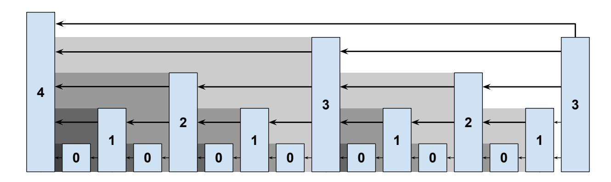

Fig. 1: The interlinked blockchain. Each superblock is drawn taller according to its achieved level. Each block links to all the blocks that are not being overshadowed by their descendants. The most recent (right-most) block links to the four blocks it has direct line-of-sight to.

a level  $\mu_2$  for  $\pi_2$  in the same fashion. The two proofs are compared by checking whether  $2^{\mu_1}|\pi_1\{b:\}\uparrow^{\mu_1}| \geq 2^{\mu_2}|\pi_2\{b:\}\uparrow^{\mu_2}|$  and the proof with the largest score is deemed the winner. The comparison is illustrated in Algorithm 2.

An adversary prover could skip the blocks of interest and present an honest and longer chain that is considered a better proof. For that reason, the last step of the algorithm in the suffix verifier is changed to not only store the best proof but also combine the two proofs by including all of the ancestor blocks of the losing proof. This is called infix verification and is guaranteed to include the blocks of interest. The resulting best proof is stored as a DAG(Directed Acyclic Graph), as in Algorithm 3.

#### 3 The Hash-and-Resubmit Pattern

We now introduce a novel design pattern for Solidity smart contracts that results into significant gas optimization due to the elimination of expensive storage operations. We first introduce our pattern, and illustrate how smart contracts benefit from using it. Then, we proceed to integrate our pattern in the NIPoPoW protocol, and we analyze the performance in comparison with previous work [11]. **Motivation.** It is essential for smart contracts to store data in the blockchain. However, interacting with the storage of a contract is among the most expensive operations of the EVM [47,5]. Therefore, only necessary data should be stored and redundancy should be avoided when possible. This is contrary to conventional software architecture, where storage is considered cheap. Usually, data access performance in traditional systems is measured with respect to time and space. In Ethereum, however, performance is related to gas consumption. Access to persistent data costs a substantial amount of gas, which has a direct correspondence to a monetary cost.

**Related patterns.** Towards implementing gas-efficient smart contracts, several methodologies have been proposed [6,7,16,20]. In order to eliminate storage operations using data signatures, the utilization of IPFS [2] has been proposed [41,21].

{9}------------------------------------------------

However, these solutions do not address *availability*, which is one of our main requirements. Another solution uses logs [\[12](#page-32-14)] to replace storage in a similar manner, sparing a great amount of gas. However, this approach does not address consistency, which is also one of our critical targets. Lastly, there have been proposals [\[45](#page-33-17)] to replace storage read operations, but they do not address write operations.

{10}------------------------------------------------

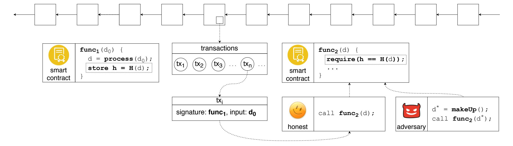

<span id="page-10-0"></span>Fig. 2: The hash-and-resubmit pattern. First, an invoker calls  $\mathsf{func}_1(\mathsf{d}_0)$ . Then  $\mathsf{d}_0$  is processed on-chain and  $\mathsf{d}$  is generated. The commitment to  $\mathsf{d}$  is stored in the blockchain as the digest of a hash function  $H(\cdot)$ . Then, a full node that observes invocations of  $\mathsf{func}_1$  retrieves  $\mathsf{d}_0$ , and generates  $\mathsf{d}$  by performing the respective processing on  $\mathsf{d}_0$  off-chain. An adversarial observer dispatches  $\mathsf{d}^*$ , where  $\mathsf{d}^* \neq \mathsf{d}$ . Finally, the nodes invoke  $\mathsf{func}_2(.)$ . In  $\mathsf{func}_2$ , the validation of input data is performed, reverting the function call if the hash of the input does not match with the stored commitment. By applying a hash-and-resubmit pattern, only the fixed-size commitment of  $\mathsf{d}$  is stored to the contract's state, replacing arbitrarily large structures.

{11}------------------------------------------------

**Applicability.** To benefit from the *hash-and-resubmit* pattern, an application needs to meet the following requirements:

- 1. The application is a Solidity smart contract.
- 2. Read/write operations are performed in large arrays that exist in storage. Using the pattern for variables of small size may result in negligible gain or even performance loss.
- 3. A full node observes function calls to the smart contract.

**Participants and collaborators.** The first participant is the smart contract S that accepts function calls. Another participant is the invoker E1, who dispatches a large array d<sup>0</sup> to S via a function func1(d0). Upon submission, d<sup>0</sup> is potentially processed in func1, resulting to d. The last participant is the observer E2, who is a full node that observes transactions towards S in the blockchain. This is possible because nodes maintain the blockchain locally. After observation, E<sup>2</sup> retrieves data d. Since this is an off-chain operation, a malicious E<sup>2</sup> potentially alters d before interacting with S. We denote the potentially modified d as d *∗* . Finally, E<sup>2</sup> acts as an invoker by making a new call to S, func2(d *∗* ). The verification that d = d *∗* , which is a prerequisite for the secure functionality of the underlying contract, forms a part of the pattern and is performed in func2.

**Implementation.** The implementation of this pattern is divided in two parts. The first part covers how d *∗* is retrieved by E2, whereas in the second part the verification of d = d *∗* is realized. The challenge here is twofold:

- 1. Availability: E<sup>2</sup> must be able to retrieve d without the need of accessing on-chain data.
- 2. Consistency: E<sup>2</sup> must be prevented from dispatching d *∗* that differs from d which is a product of the originally submitted d0.

The *hash-and-resubmit* technique is performed in two stages to face these challenges: (a) the *hash* phase, which addresses *consistency*, and (b) the *resubmit* phase which addresses *availability* and *consistency*.

Addressing availability: During the *hash* phase, E<sup>1</sup> makes the function call func1(d0). This transaction, which includes a function signature (func1) and the corresponding data (d0), is confirmed in a block by a miner. Due to blockchain's transparency, the observer E<sup>2</sup> of func<sup>1</sup> retrieves a copy of d<sup>0</sup> from the calldata, without the need of accessing contract data. In turn, E<sup>2</sup> performs *locally* the same set of on-chain instructions operated on d0, generating d. Thus, availability is addressed through observability.

Addressing consistency: We prevent an adversary E<sup>2</sup> from dispatching data d *<sup>∗</sup> ̸*= d by storing the *commitment* of d in the contract's state during the execution of func1(.) by E1. In the context of Solidity, a commitment is the digest of the structure's *hash*. The pre-compiled sha256 is convenient to use in Solidity; however we can make use of any cryptographic hash function *H*(*·*):

$$\mathsf{hash} \leftarrow \mathsf{H}(\mathsf{d})$$

{12}------------------------------------------------

Then, in *rehash* phase, the verification is performed by comparing the stored digest of d with the digest of  $d^*$ :

$$require(hash = H(d^*))$$

In Solidity, the size of this digest is 32 bytes. To persist such a small value in the contract's memory only adds a small constant gas overhead. We illustrate the application of the *hash-and-resubmit* pattern in Figure 2.

**Sample.** We now demonstrate the usage of the hash-and-resubmit pattern with a simplistic example. We create a smart contract that orchestrates a game between two players, P<sub>1</sub> and P<sub>2</sub>. The winner is the player with the most valuable array. The interaction between players through the smart contract is realized in two phases: (a) the submit phase and (b) the contest phase.

Submit phase:  $P_1$  submits an N-sized array,  $a_1$ , and becomes the holder of the contract.

Contest phase:  $P_2$  submits  $a_2$ . If the result of  $compare(a_2, a_1)$  is true, then  $P_2$  becomes the holder. We provide a simple implementation for compare, but we can consider any notion of comparison, since the pattern is abstracted from such implementation details.

We make use of the *hash-and-resubmit* pattern by prompting  $P_2$  to provide *two* arrays to the contract during contest phase: (a)  $a_1^*$ , which is the originally submitted array by  $P_1$ , possibly modified by  $P_2$ , and (b)  $a_2$ , which is the contesting array.

We provide two implementations of the above described game. In Algorithm 4 we display the storage implementation, while in Algorithm 5 we show the implementation leveraging the *hash-and-resubmit* pattern.

Gas analysis. The gas consumption of the two above implementations is displayed in Figure 3. By using the hash-and-resubmit pattern, the aggregated gas consumption for submit and contest is decreased by 95%. This significantly affects the efficiency and applicability of the contract. Note that the storage implementation exceeds the Ethereum block gas limit (10,000,000 gas as of June 2020), for arrays of size 500 and above, contrary to the optimized version, which consumes approximately only  $1/10^{th}$  of the block gas limit for arrays of 1,000 elements.

Consequences. The consequence of applying the *hash-and-resubmit* pattern is the circumvention of storage, a benefit that saves a substantial amount of gas, especially when stored structures are large. Therefore, smart contracts that exceed the Ethereum block gas limit and benefit sufficiently from the alleviation of storage can become practical.

**Known uses.** To our knowledge, we are the first to address consistency and availability by combining blockchain's transparency with commitments in a manner that eliminates storage from smart contracts.

**Enabling NIPoPoWs.** We now present how the *hash-and-resubmit* pattern is used in the context of the NIPoPoW superlight client. The NIPoPoW verifier adheres to a submit-and-contest schema where the inputs of the functions are arrays that are processed on-chain, and a node observes function calls towards the smart contract. Therefore, it makes a suitable case for our pattern.

{13}------------------------------------------------

#### <span id="page-13-0"></span>**Algorithm 4** *best array* using storage

```
1: contract best-array
2: best ← ∅; holder ← ∅
3: function submit(a)
4: best ← a ▷ array saved in storage
5: holder ← msg.sender
6: end function
7: function contest(a)
8: require(compare(a))
9: holder ← msg.sender
10: end function
11: function compare(a)
12: require(|a| ≥ |best|)
13: for i ← 1 to |best| do
14: require(a[i] ≥ best[i])
15: end for
16: return true
17: end function
18: end contract
```

#### <span id="page-13-1"></span>**Algorithm 5** *best array* using hash-and-resubmit

```
1: contract best-array
2: hash ← ∅; holder ← ∅
3: function submit(a1)
4: hash ← H(a1) ▷ hash saved in storage
5: holder ← msg.sender
6: end function
7: function contest(a
                    ∗
                    1
                     , a2)
8: require(H(a
                ∗
                1 ) = hash) ▷ validate a
                                                                 ∗
                                                                 1
9: require(compare(a
                     ∗
                     1
                      , a2))
10: holder ← msg.sender
11: end function
12: function compare(a
                     ∗
                     1
                      , a2)
13: require(|a
               ∗
               1
                | ≥ |a2|)
14: for i ← 1 to |a
                   ∗
                   1
                    | do
15: require(a
                 ∗
                 1
                  [i] ≥ a2[i])
16: end for
17: end function
18: return true
19: end contract
```

{14}------------------------------------------------

<span id="page-14-0"></span>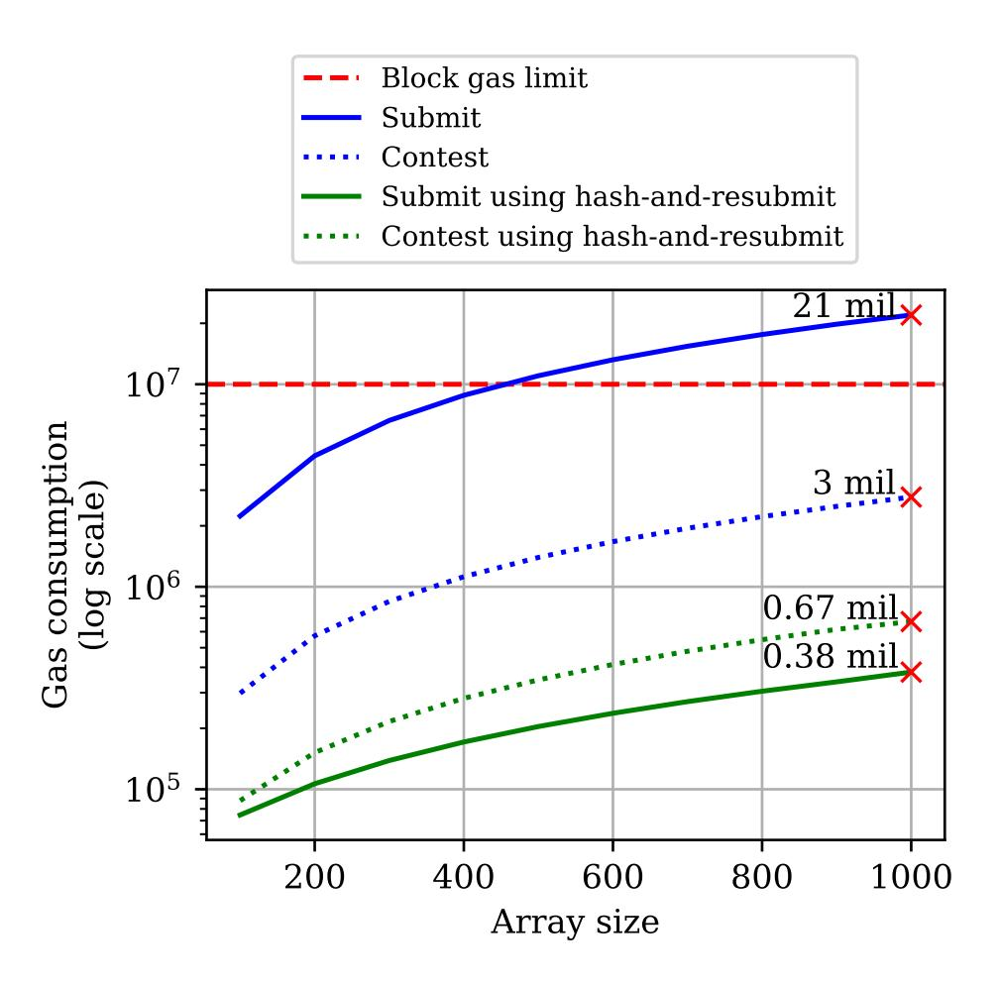

Fig. 3: Gas-cost reduction of Algorithm [4](#page-13-0) using the *hash-and-resubmit* pattern (lower is better). By avoiding gas-heavy storage operations, the aggregated cost of submit and contest is decreased by 95%.

{15}------------------------------------------------

In the *submit* phase, a *proof* is submitted. In the case the proof is fraudulent, it is contested by another user in the *contest* phase. The contester is a node that monitors the traffic of the verifier contract. The input of the submit function includes the submit proof  $(\pi_s)$  that claims the occurrence of an *event* (e) in the source chain, and the input of the **contest** function includes a contesting proof  $(\pi_c)$ . A successful contest of  $\pi_s$  is realized when  $\pi_c$  has a better score [30]. In this section, we will not examine the score evaluation process since it is irrelevant to the pattern. The size of proofs is dictated by the value m. We adopt the recommended [30] parameter value m = 15.

In previous work, NIPoPoW proofs are maintained on-chain, resulting in extensive storage operations. In our implementation, proofs are not stored on-chain, and  $\pi_s$  is retrieved by the contester from the calldata. Since we assume a trustless network,  $\pi_s$  can be altered by an adversarial contester. We denote the potentially changed  $\pi_s$  as  $\pi_s^*$ . In the *contest* phase,  $\pi_s^*$  and  $\pi_c$  are dispatched in order to enable the *hash-and-resubmit* pattern.

For our analysis, we create a blockchain similar to the Bitcoin chain with the addition of the interlink structure in each block [11]. Our experimental chain spans 650,000 blocks, representing a slightly larger chain than Bitcoin<sup>8</sup>. From the tip of our chain, we branch two sub-chains that span 100 and 200 additional blocks respectively, as illustrated in Figure 4. Then, we use the smaller chain to create  $\pi_s$ , and the larger chain to create  $\pi_c$ . We apply the protocol by submitting  $\pi_s$ , and contesting with  $\pi_c$ . The contest is successful, since  $\pi_c$  represents a chain consisting of a greater number of blocks than  $\pi_s$ . We select this setting as it provides maximum code coverage, and it describes the most gas-heavy scenario for the verifier.

In Algorithm 6 we show how the *hash-and-resubmit* pattern is leveraged by our modified NIPoPoW client.

<span id="page-15-1"></span>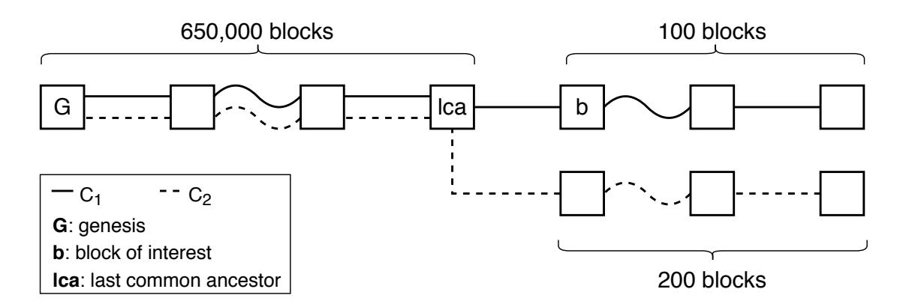

Fig. 4: Forked chains for our gas analysis.

In Figure 5, we illustrate how hash-and-resubmit improves client performance compared to previous work. The graph illustrates the aggregated cost of the submit and contest phases for each implementation. We observe that, by using

<span id="page-15-0"></span><sup>&</sup>lt;sup>8</sup> Bitcoin spans 633,022 blocks as of June 2020. Metrics by https://www.blockchain.com/

{16}------------------------------------------------

the *hash-and-resubmit* pattern, we improve the gas consumption of the contract by 50%. This is a decisive step towards creating a practical superlight client.

Note that, in our graph, gas consumption generally follows an ascending trend; however it is not monotonically increasing. This is due to the fact that NIPoPoWs are probabilistic structures, the size of which is determined by the distribution of superblocks within the underlying chain. A proof that is constructed for a chain of a certain size can be larger than a proof constructed for a slightly smaller chain, sometimes resulting in a slight decrease of gas consumption between consecutive values of proof sizes.

#### <span id="page-16-0"></span>**Algorithm 6** The NIPoPoW client using hash-and-resubmit

```
1: contract crosschain
2: events ← ⊥; G ← ⊥
3: function initialize(Gremote)
4: G ← Gremote
5: end function
6: function submit(πs, e)
7: require(events[e] = ⊥)
8: require(πs[0] = G)
9: require(valid-interlinks(π))
10: DAG ← DAG ∪ πs
11: ancestors ← find-ancestors(DAG, πs[-1])
12: require(evaluate-predicate(ancestors, e))
13: ancestors = ⊥
14: events[e].hash ← H(πs) ▷ enable pattern
15: end function
16: function contest(π
                     ∗
                     s
                     , πc, e) ▷ provide proofs
17: require(events[e] ̸= ⊥)
18: require(events[e].hash = H(π
                              ∗
                              s )) ▷ verify π
                                                                  ∗
                                                                  s
19: require(πc[0] = G)
20: require(valid-interlinks(πc))
21: lca = find-lca(π
                    ∗
                    s
                     , πc)
22: require(πc ≥m π
                     ∗
                    s )
23: DAG ← DAG ∪ πc
24: ancestors ← find-ancestors(DAG, π
                                   ∗
                                   s
                                    [-1])
25: require(¬evaluate-predicate(ancestors, e))
26: ancestors = ⊥
27: events[e] ← ⊥
28: end function
29: end contract
```

{17}------------------------------------------------

<span id="page-17-0"></span>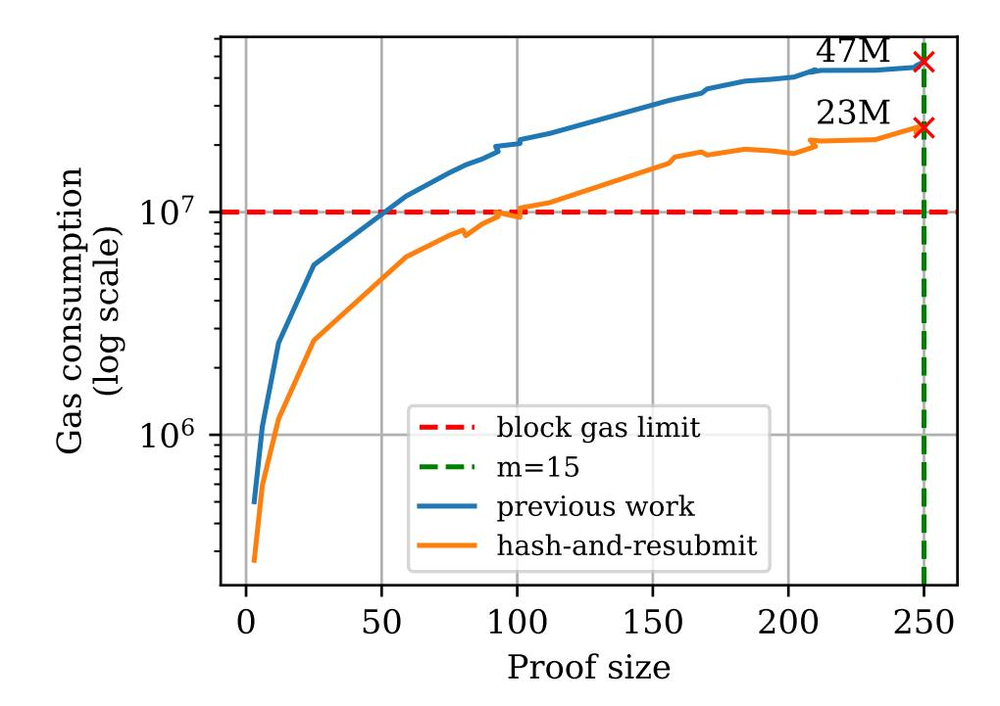

Fig. 5: Gas consumption of our NIPoPoWs verifier enhanced with hash-andresubmit compared to previous work (lower is better) using a secure value of *m*. Gas consumption is decreased by approximately 50%.

### **4 Removing Look-up Structures**

Now that we freely eliminate large arrays, we can focus on other types of storage variables. The challenge we face is that the protocol of NIPoPoWs depends on a Directed Acyclic Graph (DAG) of blocks which is constructed using a mutable hashmap in the recommended implementation. This DAG is needed because, in the infix part of a NIPoPoW, an adversary can skip blocks that should normally be included in an honest proof. By using a DAG, the set of ancestor blocks of a block is extracted by performing a simple graph search. For the evaluation of the predicate, the set of previously encountered *ancestors* of the tip of the longest blockchain is used. The set of ancestors is created to avoid an adversary who presents an honest chain but skips the block of interest.

This logic is intuitive and efficient to implement in most traditional programming languages. However, as our analysis demonstrates, such an implementation in Solidity is expensive. Although Solidity supports constant-time look-up structures, native hashmaps are only possible to hold in storage. This affects the performance of the client, especially for large proofs.

We make a series of observations regarding the potential positions of the *block of interest* within proofs, which lead us to the construction of an architecture that does not require maintaining a DAG, ancestors, or other complementary structures. We consider the predicate p to be of the form: "does block B exist inside proof *π*?", where B denotes the block of interest of proof *π*. Let E<sup>s</sup> denote the node that performs the submission and the E<sup>c</sup> denote the node that initiates a contest.

{18}------------------------------------------------

The node  $E_s$  is submitting the proof  $\pi_s$  in an attempt to convince the verifier that the predicate p is true, while  $E_c$  is submitting the proof  $\pi_c$  in an attempt to convince the verifier that the predicate is false. We call a proof pointless if it does not contribute to its purpose of convincing the verifier. Namely,  $\pi_s$  is pointless if it does contribute to convincing the verifier of the truth of the predicate, while  $\pi_c$  is pointless if it does not contribute to convincing the verifier of the falsity of the predicate. We call non-pointless proofs meaningful.

Position of block of interest. NIPoPoWs are sets of sampled interlinked blocks that form chains. Since proofs  $\pi_s$  and  $\pi_c$  differ (otherwise the contesting proof would not be accepted), a fork is created at their last common ancestor LCA. Since  $\pi_s$  claims the *truth* of the predicate, the block of interest B lies at a certain stable index [30,33] within  $\pi_s$ . A submission in which B is absent from  $\pi_s$  is pointless, since no element of  $\pi_s$  satisfies p. On the contrary, if the block of interest is included in  $\pi_c$ , then the contest is pointless.

In the NIPoPoW protocol, proof segments  $\pi_s\{:LCA\}$  and  $\pi_c\{:LCA\}$  are merged into a single chronologically ordered chain to prevent adversaries from skipping blocks, and the predicate is evaluated against  $\pi_s\{:LCA\} \cup \pi_c\{:LCA\}$ . We observe that  $\pi_c\{:LCA\}$  can be omitted during the predicate's evaluation, because no block B exists in  $\pi_c\{:LCA\}$  that is missing from  $\pi_s\{:LCA\}$  and for which the predicate holds. This is due to the fact that, in a meaningful contest, B is not included in  $\pi_c$ . Consequently,  $\pi_c$  is only meaningful if it forks  $\pi_s$  at a block prior to B.

**Minimal forks.** Given the above observation, we modify our construction to ask the contester to only send those blocks of  $\pi_c$  that follow the LCA block. We term this truncated chain  $\pi_c^f = \pi_c\{LCA:\}$ . In Algorithm 7, we show how the minimal fork technique is incorporated into our client, replacing DAG and ancestor structures. Security is preserved by requiring that the provided  $\pi_c^f$  is a minimal fork, namely that it satisfies the following:

1. 
$$\pi_{s}\{LCA\} = \pi_{c}^{f}[0]$$
  
2.  $\pi_{s}\{LCA:\} \cap \pi_{c}^{f}[1:] = \emptyset$ 

The verifier checks that the above conditions are met in line 19.

In Figure 6 we show how the performance of the client improves. We use the same test case as in *hash-and-resubmit*. We achieve a 55% decrease in gas consumption. The *submit* phase now costs 4,700,000 gas, and the *contest* phase costs 4,900,000 gas. Notably, after these changes, each phase individually fits within an Ethereum block.

## 5 Processing fewer blocks

The complexity of most demanding on-chain operations of the verifier are linear to the size of the proof. This includes the proof validation and the evaluation of score. We now present two techniques that allow for equivalent operations of constant complexity.

{19}------------------------------------------------

### <span id="page-19-0"></span>Algorithm 7 The NIPoPoW client using the minimal fork technique

```
1: contract crosschain
 2:
          ...
          function submit(\pi_s, e)
 3:
                \mathsf{require}(\pi_{\mathsf{s}}[0] = \mathcal{G})
 4:
                require(events[e] = \perp)
 5:
                require(valid-interlinks(\pi_s))
 6:
               require(evaluate-predicate(\pi_s, e))
 7:
               events[e].hash \leftarrow H(\pi_s)
 8:
          end function
 9:
          \mathbf{function}\ \mathsf{contest}(\pi_{\mathrm{s}}^{*},\,\pi_{\mathrm{c}}^{\mathrm{f}},\,e,\,f)
                                                                                                             \triangleright f: Fork index
10:
                \mathsf{require}(\mathsf{events}[e] \neq \bot)
11:
                require(events[e].hash = H(\pi_s^*))
12:
                \mathsf{require}(\mathsf{valid}\mathsf{-interlinks}(\pi_\mathsf{c}^\mathsf{f}))
13:
                \mathsf{require}(\mathsf{minimal}\text{-}\mathsf{fork}(\pi_{\mathsf{s}}^*,\,\pi_{\mathsf{c}}^\mathsf{f},\,f))
14:
                                                                                                             ▶ Minimal fork
                require(\pi_{c}^{f} \geq_{m} \pi_{s}^{*})
require(\negevaluate-predicate(\pi_{c}^{f}, e))
15:
16:
17:
                events[e] \leftarrow \bot
18:
           end function
          function minimal-fork(\pi_1, \pi_2, f)
19:
                if \pi_1[f] \neq \pi_2[0] then
                                                                                                        ▷ Check fork head
20:
                     return false
21:
22:
                end if
                for b_1 \in \pi_1[f+1:] do
23:

                     if b_2 \in \pi_2[1:] then
24:
25:
                          return false
                     end if
26:
                end for
27:
28:
                return true
29:
           end function
30: end contract
```

{20}------------------------------------------------

<span id="page-20-0"></span>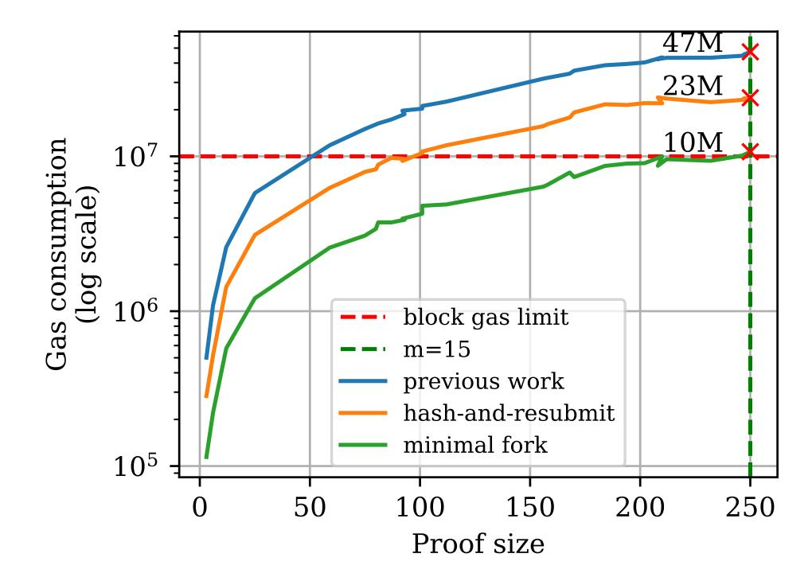

Fig. 6: Performance improvement using minimal fork (lower is better). The gas consumption is decreased by approximately 55%.

**Optimistic schemes.** In smart contracts, in order to ensure that users comply with the underlying protocol, certain actions are typically performed on-chain, e.g., verification of data, balance checks, etc. In a different recently introduced approach, the contract does not perform the verification initially, but accepts the execution's results at face value. Actions that deviate from the protocol are reverted only after honest users indicate them, therefore disallowing them. Such smart contracts that do not check the validity of actions by default, but rather depend on the intervention of honest users are characterized "optimistic". In the Ethereum community, several projects [[34,](#page-33-19)[1](#page-31-6)[,39](#page-33-20),[19,](#page-32-15)[17\]](#page-32-16) have emerged that incorporate the notion of optimistic interactions. We observe that such an optimization applies to the NIPoPoW protocol.

We discussed how the verification in the NIPoPoW protocol is realized in two phases. In the *submit* phase, the verification of *π*<sup>s</sup> is performed. This is necessary in order to prevent adversaries from submitting structurally invalid proofs. A proof is *structurally valid* if: (a) the first block of the proof is the *genesis* block of the underlying blockchain and (b) every block has a valid interlink that points to the previous one in the proof.

Asserting the existence of genesis in the first index of a proof is an inexpensive operation of constant complexity. However, confirming the interlink correctness of all blocks is a process of linear complexity to the size of the proof. Although the verification is performed in memory, sufficiently large proofs result into costly submissions since their validation constitutes the most demanding function of the *submit* phase. In Table [1](#page-21-0) we display the cost of the valid-interlink function which determines the structural correctness of a proof in comparison with the overall gas used in submit.

{21}------------------------------------------------

| Process                    | Gas cost Total % |      |
|----------------------------|------------------|------|
| verify-interlink 2,200,000 |                  | 53%  |
| submit                     | 4,700,000        | 100% |

<span id="page-21-0"></span>Table 1: Gas usage of verify-interlink compared to the overall gas consumption of submit.

**Dispute phase.** We add a new *dispute* phase to our protocol. It alleviates the burden of verifying all elements of the proof by enabling the indication of an individual incorrect block. This phase allows an honest party to indicate a particular index where *π*<sup>s</sup> is structurally incorrect. This check takes constant gas.

The process works as follows. Initially, a proof *π*<sup>s</sup> is submitted. An honest contester monitors the network for proof submissions. This data can be found in the calldata of a smart contract call transaction. In case she notices *π*<sup>s</sup> is structurally invalid, she computes the index of the first block at which it contains an invalid interlink connection. This computation occurs off-chain. The contester calls dispute(*π*<sup>s</sup> , *i*), where *i* indicates the disputing index of *π*<sup>s</sup> . Therefore, the interlink connection between only two subsequent blocks in the proof is checked *on-chain* rather than the entire span of *π*<sup>s</sup> .

Note that this additional phase does not imply increased rounds of interactions between the parties. If *π*<sup>s</sup> is invalidated in the *dispute* phase, then the *contest* phase is skipped. Similarly, if *π*<sup>s</sup> is structurally correct, but represents a dishonest chain, then the contester proceeds directly to the *contest* phase without invoking of *dispute*.

<span id="page-21-1"></span>

|          | Phase Gas (millions) |           |     |         | Phase Gas (millions) Phase Gas (millions) |
|----------|----------------------|-----------|-----|---------|-------------------------------------------|
| submit   | 4.7                  | submit    | 2.2 | submit  | 2.2                                       |
| contest  | 4.9                  | dispute   | 1.3 | contest | 4.9                                       |
| I. Total | 9.6                  | II. Total | 3.5 | Total   | 7.1                                       |

Table 2: Performance per phase. Gas units are displayed in millions. **I**: Gas consumption prior to dispute phase incorporation. **II**: Gas consumption for two independent sets of interactions submit/dispute and submit/contest.

In Table [2](#page-21-1) we display the gas consumption for two independent cycles of interactions:

- 1. *Submit* and *dispute* for a structurally invalid *π*<sup>s</sup> .
- 2. *Submit* and *contest* for a structurally valid *π*<sup>s</sup> that represents a dishonest chain.

In lines [9–14](#page-24-0) of Algorithm [8,](#page-24-0) we show the implementation of the *dispute* phase. The introduction of the *dispute* phase leaves contest unchanged.

**Isolating the best level.** As we discussed, *dispute* and *contest* phases are mutually exclusive. Unfortunately, the same constant-time verification as in the 

{22}------------------------------------------------

dispute phase cannot be applied in a contest without increasing the rounds of interactions for the users. However, we derive a subsequent optimization for the contest phase by observing the process of score evaluation.

In NIPoPoWs, after the last common ancestor is found, each proof fork is evaluated in terms of the proof-of-work score of its blocks after the LCA block. Each level captures a different score, and the level with the best score for the fork is used for the comparison (see Algorithm 2). The position of LCA determines the span of the proofs that will be included in the score evaluation process. Furthermore, it is impossible to determine the score of a proof in the *submit* phase because the position of LCA is yet unknown.

After  $\pi_s$  is retrieved from the calldata, the contester can calculate off-chain the score of both proofs. This means that the contester knows the level at which each proof captures the best score for each fork. In light of this observation, it suffices for the contester to submit the blocks that constitute the best level of  $\pi_c$ . The number of these blocks is constant, as it is determined by the security parameter m, which is independent of the size of the underlying blockchain. We illustrate the blocks that participate in the formulation of a proof's score and the best level of contesting proof in Figure 7.

An adversarial contester can send a level of  $\pi_c$  which is different than the best. However, this is pointless, since different levels only undermine her score. On the contrary, due to the consistency property of hash-and-resubmit,  $\pi_s$  cannot be altered. We denote b the best level of  $\pi_c^f$  and the subchain at that level as  $\pi_c^f \uparrow^b$ .

<span id="page-22-0"></span>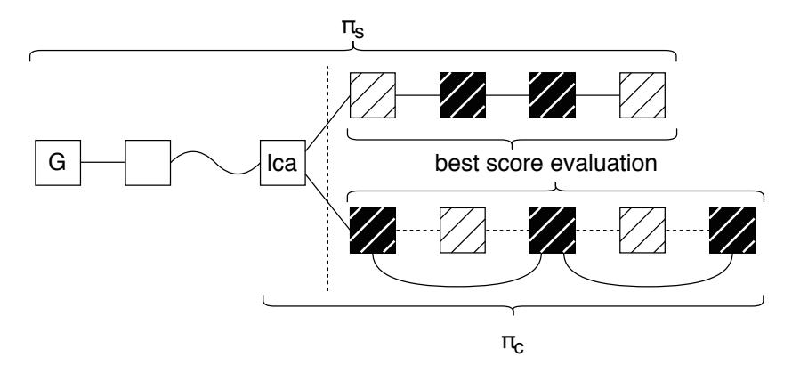

Fig. 7: Fork of two proofs. Striped blocks determine the score of each proof. Black blocks belong to the level that has the best score. Only black blocks are part of the best level of the contesting proof.

In Algorithm 8, we show the implementation of the *contest* phase under the best-level enhancement. This greatly improves the performance of the client, because the complexity of the majority of contest functions is proportional to the size of  $\pi_c$ . In Table 3, we demonstrate the difference in gas consumption in the various stages of the *contest* phase before and after using *best-level*. The performance of most functions is improved by approximately 85%. This is due to the fact that the size of  $\pi_c$  is decreased accordingly. For m = 15,  $\pi_c^f \uparrow^b$  consists

{23}------------------------------------------------

<span id="page-23-0"></span>of 31 blocks, while  $\pi_c^f$  consists of 200 blocks. Notably, the calculation of score for  $\pi_c^f \uparrow^b$  needs 97% less gas than the naïve implementation, because the evaluation of the score of an individual level is performed entirely in memory.

| Process          |    | $\frac{\mathbf{Gas}}{(\times 10^3)}$ | Total |     | $\frac{\mathbf{Gas}}{(\times 10^3)}$ | Total |
|------------------|----|--------------------------------------|-------|-----|--------------------------------------|-------|
| valid-interlinks |    | 900                                  | 18%   |     | 120                                  | 10%   |
| minimal-fork     |    | 1,900                                | 39%   |     | 275                                  | 18%   |
| args $(\pi_s)$   |    | 750                                  | 16%   |     | 750                                  | 51%   |
| args $(\pi_c)$   |    | 950                                  | 19%   |     | 20                                   | 1%    |
| other            |    | 400                                  | 8%    |     | 300                                  | 20%   |
| contest          | I. | 4,900                                | 100%  | II. | 1,465                                | 100%  |

Table 3: Gas usage in contest. I: Before utilizing best-level. II: After utilizing best-level.

In Figure 8, we illustrate the performance gains of the client using the *dispute* phase and the *best-level* method. The aggregated gas consumption of the *submit* and *contest* phases is reduced to 3,500,000 gas. This makes the contract practical, since a complete cycle of interactions now effortlessly fits inside a single Ethereum block.

<span id="page-23-1"></span>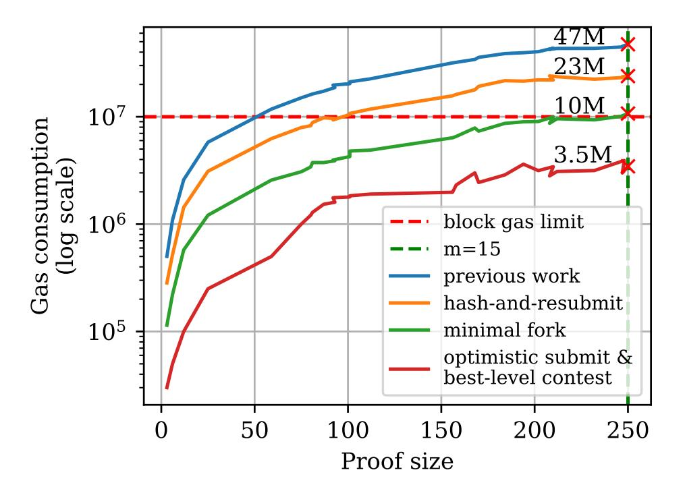

Fig. 8: Performance improvement using *optimistic* evaluation in the submit phase and *best level* contestation (lower is better). Gas consumption is decreased by approximately 65%.

{24}------------------------------------------------

<span id="page-24-0"></span>Algorithm 8 The NIPoPoW client enhanced with dispute phase and best-level contesting

```
1: contract crosschain
 2:
            ...
           \mathbf{function}\ \mathsf{submit}(\pi_{\mathsf{s}},\ e)
 3:
                 \mathsf{require}(\pi_{\mathsf{s}}[0] = \mathcal{G})
 4:
                 \mathsf{require}(\mathsf{events}[e] = \bot)
 5:
                 require(evaluate-predicate(\pi_s, e))
 6:
 7:
                 events[e].hash \leftarrow H(\pi_s)
 8:
            end function
 9:
           function dispute (\pi_s^*, e, i)
                                                                                                                   \triangleright i: Dispute index
                  require(events[e] \neq \bot)
10:
11:
                  require(events[e].hash = H(\pi_s^*))
12:
                  require(\negvalid-single-interlink(\pi_s, i))
13:
                  events[e] \leftarrow \bot
14:
            end function
15:
            function valid-single-interlink(\pi, i)
                  \mu \leftarrow \mathsf{level}(\pi[i])
16:
                 return \pi[i+1].intelink[\mu] = \pi[i]
17:
18:
            end function
            function contest(\pi_s^*, \pi_c^f \uparrow^b, e, f)
19:
                  \mathsf{require}(\mathsf{events}[e] \neq \bot)
20:
                  \mathsf{require}(\mathsf{events}[e].\mathsf{hash} = \mathsf{H}(\pi_{\mathsf{s}}^*))
21:
                 require(valid-interlinks(\pi_{c}^{f} \uparrow^{b}))
require(minimal-fork(\pi_{s}^{*}, \pi_{c}^{f} \uparrow^{b}, f))
require(arg-at-level(\pi_{c}^{f} \uparrow^{b}) > best-arg(\pi_{s}^{*}[f:]))
22:
23:
24:
                  \mathsf{require}(\neg \mathsf{evaluate}\text{-}\mathsf{predicate}(\pi_\mathsf{c}^\mathsf{f} \uparrow^\mathsf{b},\,e))
25:
26:
                  events[e] \leftarrow \bot
27:
            end function
            \mathbf{function} \ \mathsf{arg}\text{-}\mathsf{at}\text{-}\mathsf{level}(\pi)
28:
29:
                  \mu \leftarrow \mathsf{level}(\pi[-1])
                                                                                             ▶ Pick proof level from a block
30:
                  for b \in \pi do
                       assert(level(b) = \mu)
31:
32:
                  end for
33:
                 return 2^{\mu}|\pi|
34:
            end function
35: end contract
```

{25}------------------------------------------------

### **6 Cryptoeconomics**

We now present our economic analysis on our client. We have already discussed that the NIPoPoW protocol is performed in distinct phases. In each phase, different entities are prompted to act. As in SPV, the security assumption that is made is that at least one honest node is connected to the verifier contract and serves honest proofs. However, the process of contesting a submitted proof by an honest node does not come without expense. Such an expense is the computational power a node has to consume in order to fetch a submitted proof from the calldata and construct a contesting proof, but, most importantly, the gas that has to be paid in order to dispatch the proof to the Ethereum blockchain. Therefore, it is essential to provide incentives to honest nodes, while adversaries must be discouraged from submitting invalid proofs. In this section, we discuss the topic of incentives and treat our honest nodes as rational. We propose concrete monetary values to achieve incentive compatibility.

In NIPoPoWs, incentive compatibility is addressed by the establishment of a monetary value termed *collateral*. In the *submit* phase, the user pays this collateral in addition to the expenses of the function call, and, if the proof is contested successfully, the collateral is paid to the user that successfully invalidated the proof. If the proof is not contested, then the collateral is returned to the original issuer. This treatment incentivizes nodes to participate to the protocol, and discourages adversaries from joining. It is critical that the collateral covers all the expenses of the entity issuing the contest and in particular the gas costs of the contestation.

**Collateral versus contestation period.** The contestation period and the collateral are generally inversely proportional quantities and are both hard-coded in a particular deployment of the NIPoPoW verifier smart contract. If the contestation period is large, the collateral can be allowed to become small, as it suffices for any contester to pay a small gas price to ensure the contestation transaction is confirmed within the contestation period. On the other hand, if the contestation period is small, the collateral must be made large so as to ensure that it can cover the, potentially large, gas costs required for quick confirmation. This introduces an expected trade-off between good liveness (fast availability of cross-chain data ready for consumption) and cheap collateral (the amount of money that needs to be locked up while the claim is pending). The balance between the two is a matter of application and is determined by user policy. Any user of the NIPoPoW verifier smart contract must at a minimum ensure that the collateral and contestation period parameters are both lower-bounded in such a way that the smart contract is incentive compatible. If these bounds are not attained, the aspiring user of the NIPoPoW verifier smart contract must refuse to use it, as the contract does not provide incentive compatibility and is therefore not secure. Depending on the application, the user may wish to impose additional upper bounds on the contestation period (to ensure good liveness) or on the collateral (to ensure low cost), but these are matters of performance and not security.

{26}------------------------------------------------

**Analysis.** We give concrete bounds for the contestation period and collateral parameters. It is known [\[47](#page-33-5)] that gas prices affect the prioritization of transactions within blocks. In particular, each block mined by a rational miner will contain roughly all transactions of the mempool sorted by decreasing gas price until a certain minimum gas price is reached. We used the Etherchain explorer [\[15](#page-32-17)] to download recent blocks and inspected their included transactions to determine their lowest gas price. In our measurements, we make the simplifying assumption that miners are rational and therefore will necessarily include a transaction of higher gas price if they are including a transaction of lower gas price. We sampled 200 blocks of the Ethereum blockchain around March 2020 (up to block height 9*,*990*,*025) and collected their respective minimum gas prices. Starting with a range of reasonable gas prices, and based on our miner rationality assumption, we modelled the experiment of acceptance of a transaction with a given gas price within the next block as a Bernoulli trial. The probability of this distribution is given by the percentage of block samples among the 200 which have a lower minimum gas price, a simple maximum likelihood estimation of the Bernoulli parameter. This sampling of real data gives the discretized appearance in our graph. For each of these Bernoulli distributions, and the respective gas price, we deduced a Geometric distribution modelling the number of blocks that the party must wait for before their transaction becomes confirmed.

Given these various candidate gas prices (in gwei), and multiplying them by the gas cost needed to call the NIPoPoW *contest* method, we arrived at an absolute minimum collateral for each nominal gas price which is just sufficient to cover the gas cost of the contestation transaction (real collateral must include some additional compensation to ensure a rational miner is also compensated for the cost of monitoring the blockchain). For each of these collaterals, we used the previous geometric distribution to determine both the *expected* number of blocks needed to wait prior to confirmation, as well as an upper bound on the number of blocks needed for confirmation. For the purpose of an upper bound, we plot one standard deviation above the mean. This upper bound corresponds to the minimum contestation period recommended, as this bound ensures that, at the given gas price, if the number of blocks needed to wait for falls within one standard deviation of the geometric distribution mean, then the rational contester will create a transaction that will become confirmed prior to the contestation period expiring. Critical applications that require a higher assurance of success must consider larger deviations from the mean.

We display the cost of submitting a proof in Figure [9.](#page-27-0) The horizontal axis shows the cost of submit in USD and Ether (using ether prices of 1 ether = 217*.*41 USD as of June 2020). The vertical axis shows the number of blocks needed for at least one confirmation. We observe that 0*.*50 USD are enough to ensure that the submission is confirmed within 5 blocks.

We plot our cryptoeconomic recommendations based on our measurements in Figure [10](#page-28-0). The horizontal axis shows the collateral denominated in both Ether and USD (using ether prices of 1 ether = 246*.*41 USD as of June 2020). We assume that the rational contester will pay a contestation gas cost up to the 

{27}------------------------------------------------

collateral itself. The vertical axis shows the recommended contestation period. The solid line is computed from the block wait time needed for confirmation according to the mean of the geometric distribution at the given gas price. The shaded area depicts one standard deviation below and above the mean of the geometric distribution.

Our experiments are based on the contestation transaction gas cost of the previous section; namely they are conduced on a blockchain of 650,000 blocks with a NIPoPoW proof of 250 blocks. The contesting proof stands at a fork point after which the original proof deviates with 100 blocks, while the contesting proof deviates with 200 disjoint blocks.

The analysis of this experiment is displayed in Figure 10a. We also illustrate the expected price of contesting proofs when the fork point of the adversarial chain is at *Genesis*. Although we claim that this is an improbable case, we show that the verifier can handle such extreme scenarios. The analysis of genesis-fork is displayed in Figure 10b.

<span id="page-27-0"></span>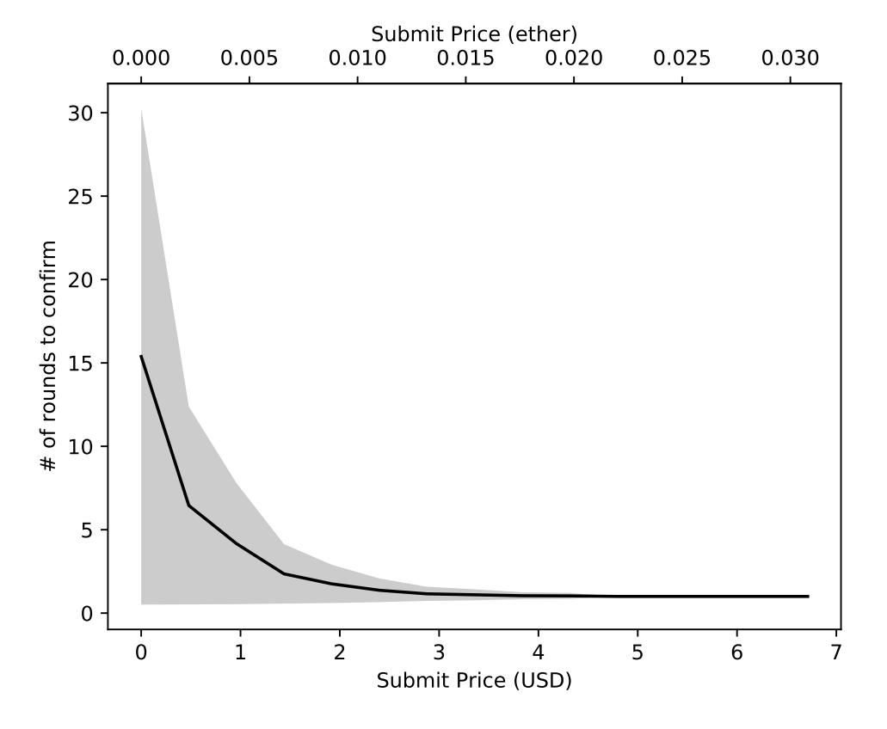

Fig. 9: Cost of submitting a NIPoPoW proof.

We conclude that consumption of cross-chain data within the Ethereum blockchain can be obtained at very reasonable cost. If the waiting time is set to just 10 Ethereum blocks (approximately 2 minute in expectation), a collateral of just 0.50 USD is sufficient to cover for up to one standard deviation in confirmation time. Note that the collateral of an honest party is not consumed and is returned to the party upon the expiration of the contestation period. We therefore deem our implementation to be practical.

{28}------------------------------------------------

<span id="page-28-0"></span>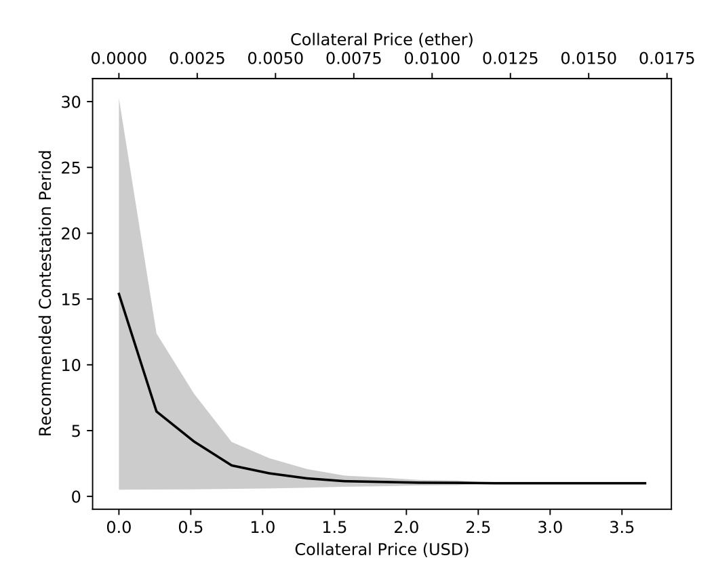

(a) Cost of collateral when the fork point is 100 blocks prior to the tip (expected scenario).

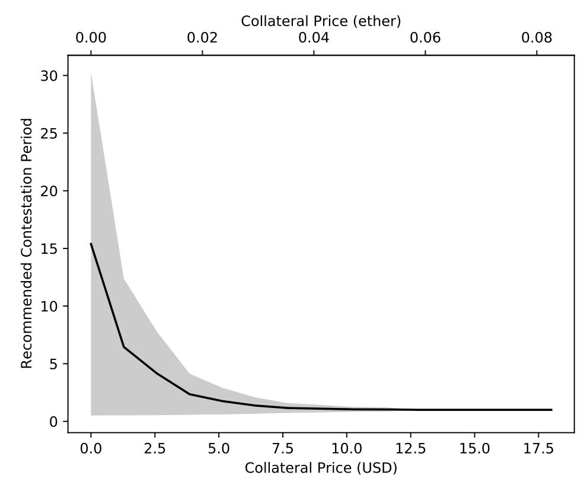

(b) Cost of collateral when the fork point is Genesis (most expensive scenario).

Fig. 10: Cryptoeconomic recommendations for the NIPoPoW superlight client.

{29}------------------------------------------------

### **Appendix**

### <span id="page-29-1"></span>**A Hash-and-Resubmit variations**

In order to enable selective dispatch of a segment of interest, different hashing schemas can be adopted, such as Merkle Trees [[35\]](#page-33-15) and Merkle Mountain Ranges [[32](#page-33-21)[,44](#page-33-22)]. In this variation of the pattern, which we term *merkle-hash-and-resubmit*, the commitment of an array d is a Merkle Tree Root (MTR). In the *resubmit* phase, d[*m*:*n*] is dispatched, accompanied by the siblings that reconstruct the MTR of d.

<span id="page-29-0"></span>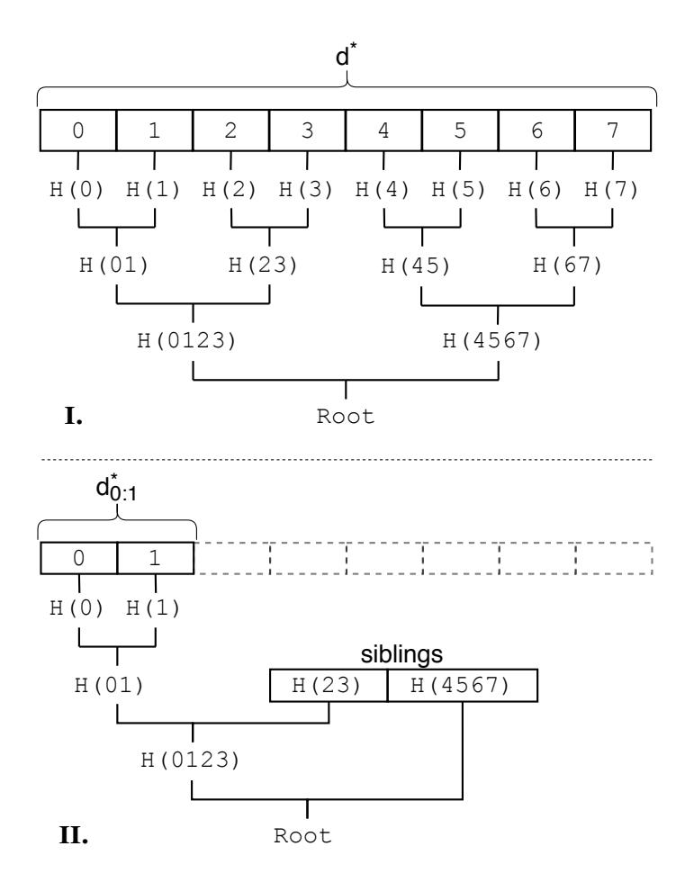

Fig. 11: **I.** The calculation of root in *hash* phase. **II.** The verification of the root in *resubmit* phase. H(*k*) denotes the digest of element *k*. H(*kl*) denotes the result of H(H(*k*) *|* H(*l*))

This variation of the pattern removes the burden of sending redundant data, however it implies on-chain construction and validation of the Merkle construction. In order to construct a MTR for an array d, *|*d*|* hashes are needed for the leafs of the MT, and *|*d*|−*1 hashes are needed for the intermediate nodes. For the verification, the segment of interest d[*m*:*n*] and the siblings of the MT are hashed. The size of siblings is approximately *log*2(*|*d*|*). The process of constructing and verifying the MTR is displayed in Figure [11.](#page-29-0)

In Solidity, different hashing operations vary in cost. An invocation of sha256(d), copies d in memory, and then the *CALL* instruction is performed by the EVM

{30}------------------------------------------------

that calls a pre-compiled contract. At the current state of the EVM, *CALL* costs 700 gas units, and the gas paid for every word when expanding memory is 3 gas units [\[47](#page-33-5)]. Consequently, the expression 1 *×* sha256(d) costs less than *|*d*|×*sha256(1) operations. A different cost policy applies for keccak [[3\]](#page-31-7) hash function, where hashing costs 30 gas units plus 6 additional gas far each word for input data [\[47](#page-33-5)]. The usage of keccak dramatically increases the performance in comparison with sha256, and performs better than plain rehashing if the product of on-chain processing is sufficiently larger than the originally dispatched data. Costs of all related operations are listed in Table [4](#page-31-8).

<span id="page-30-0"></span>The merkle variation can be potentially improved by dividing d in chunks larger than 1 element. We leave this analysis for future work.

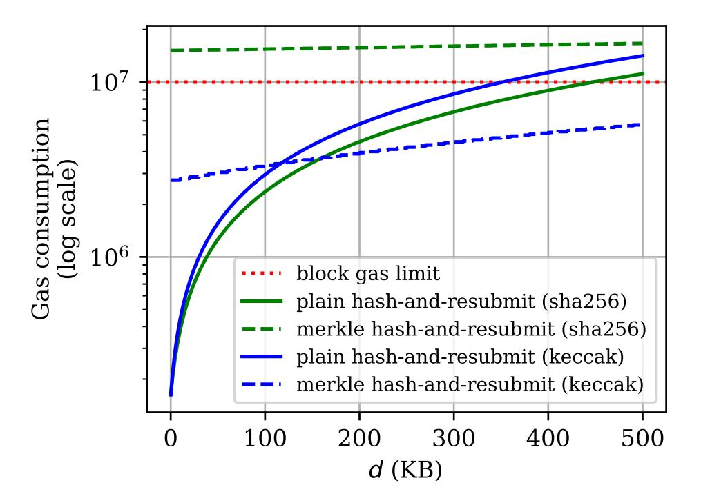

Fig. 12: Trade-offs between *hash-and-resubmit* variations. In the vertical axis the gas consumption is displayed. In the horizontal axis the size of d. The size of *d*<sup>0</sup> is 10KB bytes, and the hash functions we use are the pre-compiled sha256 and keccak.

In Table [5](#page-31-9) we display the operations needed for hashing and verifying the underlying data for both variations of the pattern as a function of data size. In Figure [12](#page-30-0) we demonstrate the gas consumption for dispatched data of 10KB, and varying size of on-chain process product.

{31}------------------------------------------------

| Operation | Gas cost            |
|-----------|---------------------|
| load(d)   | dbytes<br>× 16      |
| sha256(d) | dwords<br>× 3 + 700 |
| keccak(d) | dwords<br>× 6 + 30  |

<span id="page-31-9"></span><span id="page-31-8"></span>Table 4: Gas cost of EVM operations as of June 2020.

| phase per | plain hash              | merkle hash           |  |
|-----------|-------------------------|-----------------------|--|
| variance  | and resubmit            | and resubmit          |  |
| hash      | H(d)                    | H(delem) ×  d         |  |
|           |                         | H(digest) × ( d  − 1) |  |
|           |                         | load(d[m:n]) +        |  |
|           | resubmit load(d) + H(d) | load(siblings) +      |  |
|           |                         | H(d[m:n]) +           |  |
|           |                         | H(digest)× siblings   |  |

Table 5: Summary of operations for *hash-and-resubmit* pattern variations. d is the product of on-chain operations and d*elem* is an element of d. H is a hash function, such as sha256 or keccak, *digest* is the product of H(.) and *siblings* are the siblings of the Merkle Tree constructed for d.

### **Acknowledgements**

The authors wish to thank Patrick McCorry for providing an overview of known optimistic protocols. We also wish to thank James Prestwich for pointing out an error in the the load gas cost in Appendix [A](#page-29-1).

### **References**

- <span id="page-31-6"></span>1. Adler, J., Quintyne-Collins, M.: Building scalable decentralized payment systems. arXiv preprint arXiv:1904.06441 (2019)
- <span id="page-31-5"></span>2. Benet, J.: Ipfs-content addressed, versioned, p2p file system. arXiv preprint arXiv:1407.3561 (2014)
- <span id="page-31-7"></span>3. Bertoni, G., Daemen, J., Peeters, M., Assche, G.: The keccak reference. Submission to NIST (Round 3) **13**, 14–15 (2011)
- <span id="page-31-1"></span>4. Bünz, B., Kiffer, L., Luu, L., Zamani, M.: Flyclient: Super-light clients for cryptocurrencies. (2020)
- <span id="page-31-0"></span>5. Buterin, V., et al.: A next-generation smart contract and decentralized application platform. white paper (2014)
- <span id="page-31-3"></span>6. Chen, T., Li, X., Luo, X., Zhang, X.: Under-optimized smart contracts devour your money. In: 2017 IEEE 24th International Conference on Software Analysis, Evolution and Reengineering (SANER). pp. 442–446. IEEE (2017)
- <span id="page-31-4"></span>7. Chen, T., Li, Z., Zhou, H., Chen, J., Luo, X., Li, X., Zhang, X.: Towards saving money in using smart contracts. In: 2018 IEEE/ACM 40th International Conference on Software Engineering: New Ideas and Emerging Technologies Results (ICSE-NIER). pp. 81–84. IEEE (2018)
- <span id="page-31-2"></span>8. Chepurnoy, A.: Ergo platform (2017), <https://ergoplatform.org/>

{32}------------------------------------------------

- <span id="page-32-8"></span>9. Chepurnoy, A., Papamanthou, C., Zhang, Y.: Edrax: A cryptocurrency with stateless transaction validation. IACR Cryptology ePrint Archive **2018**, 968 (2018)
- <span id="page-32-3"></span>10. Chow, J.: BTC Relay. Available at: <https://github.com/ethereum/btcrelay> (Dec 2014), <https://github.com/ethereum/btcrelay>
- <span id="page-32-5"></span>11. Christoglou, G.: Enabling crosschain transactions using NIPoPoWs. Master's thesis, Imperial College London (2018)
- <span id="page-32-14"></span>12. ConsenSys: A Guide to Events and Logs in Ethereum Smart Contracts. Available at: [https://consensys.net/blog/blockchain-development/](https://consensys.net/blog/blockchain-development/guide-to-events-and-logs-in-ethereum-smart-contracts/) [guide-to-events-and-logs-in-ethereum-smart-contracts/](https://consensys.net/blog/blockchain-development/guide-to-events-and-logs-in-ethereum-smart-contracts/) (June 2016), [https://consensys.net/blog/blockchain-development/](https://consensys.net/blog/blockchain-development/guide-to-events-and-logs-in-ethereum-smart-contracts/) [guide-to-events-and-logs-in-ethereum-smart-contracts/](https://consensys.net/blog/blockchain-development/guide-to-events-and-logs-in-ethereum-smart-contracts/)
- <span id="page-32-9"></span>13. Dwork, C., Naor, M.: Pricing via processing or combatting junk mail. In: Annual International Cryptology Conference. pp. 139–147. Springer (1992)
- <span id="page-32-6"></span>14. Eberhardt, J., Tai, S.: Zokrates-scalable privacy-preserving off-chain computations. In: 2018 IEEE International Conference on Internet of Things (iThings) and IEEE Green Computing and Communications (GreenCom) and IEEE Cyber, Physical and Social Computing (CPSCom) and IEEE Smart Data (SmartData). pp. 1084– 1091. IEEE (2018)
- <span id="page-32-17"></span>15. Etherchain developers: Etherchain. Available at: <https://etherchain.org/> (Jun 2020), <https://etherchain.org>
- <span id="page-32-11"></span>16. Feist, J., Grieco, G., Groce, A.: Slither: a static analysis framework for smart contracts. In: 2019 IEEE/ACM 2nd International Workshop on Emerging Trends in Software Engineering for Blockchain (WETSEB). pp. 8–15. IEEE (2019)
- <span id="page-32-16"></span>17. Floersch, K.: Ethereum smart contracts in l2: Optimistic rollup (August 2019), [https://medium.com/plasma-group/](https://medium.com/plasma-group/ethereum-smart-contracts-in-l2-optimistic-rollup-2c1cef2ec537) [ethereum-smart-contracts-in-l2-optimistic-rollup-2c1cef2ec537](https://medium.com/plasma-group/ethereum-smart-contracts-in-l2-optimistic-rollup-2c1cef2ec537)
- <span id="page-32-10"></span>18. Garay, J., Kiayias, A., Leonardos, N.: The bitcoin backbone protocol: Analysis and applications. Annual International Conference on the Theory and Applications of Cryptographic Techniques pp. 281–310 (2015)
- <span id="page-32-15"></span>19. Gluchowski, A.: Optimistic vs. zk rollup: Deep dive (November 2019), [https://](https://medium.com/matter-labs/optimistic-vs-zk-rollup-deep-dive-ea141e71e075) [medium.com/matter-labs/optimistic-vs-zk-rollup-deep-dive-ea141e71e075](https://medium.com/matter-labs/optimistic-vs-zk-rollup-deep-dive-ea141e71e075)
- <span id="page-32-12"></span>20. Grech, N., Kong, M., Jurisevic, A., Brent, L., Scholz, B., Smaragdakis, Y.: Madmax: Surviving out-of-gas conditions in ethereum smart contracts. Proceedings of the ACM on Programming Languages **2**(OOPSLA), 1–27 (2018)
- <span id="page-32-13"></span>21. H, A.: Off-Chain Data Storage: Ethereum & IPFS. Available at: [https://medium.com/@didil/](https://medium.com/@didil/off-chain-data-storage-ethereum-ipfs-570e030432cf) [off-chain-data-storage-ethereum-ipfs-570e030432cf](https://medium.com/@didil/off-chain-data-storage-ethereum-ipfs-570e030432cf) (October 2017), [https:](https://medium.com/@didil/off-chain-data-storage-ethereum-ipfs-570e030432cf) [//medium.com/@didil/off-chain-data-storage-ethereum-ipfs-570e030432cf](https://medium.com/@didil/off-chain-data-storage-ethereum-ipfs-570e030432cf)
- <span id="page-32-7"></span>22. Heilman, E., Kendler, A., Zohar, A., Goldberg, S.: Eclipse attacks on bitcoin's peer-to-peer network. In: USENIX Security Symposium. pp. 129–144 (2015)
- <span id="page-32-2"></span>23. Herlihy, M.: Atomic cross-chain swaps. In: Proceedings of the 2018 ACM symposium on principles of distributed computing. pp. 245–254 (2018)
- <span id="page-32-0"></span>24. Karantias, K.: Enabling NIPoPoW Applications on Bitcoin Cash. Master's thesis, University of Ioannina, Ioannina, Greece (2019)
- <span id="page-32-4"></span>25. Karantias, K., Kiayias, A., Zindros, D.: Compact storage of superblocks for nipopow applications. In: The 1st International Conference on Mathematical Research for Blockchain Economy. Springer Nature (2019)
- <span id="page-32-1"></span>26. Karantias, K., Kiayias, A., Zindros, D.: Proof-of-burn. In: International Conference on Financial Cryptography and Data Security (2019)

{33}------------------------------------------------

- <span id="page-33-3"></span>27. Karantias, K., Kiayias, A., Zindros, D.: Smart contract derivatives. In: The 2nd International Conference on Mathematical Research for Blockchain Economy. Springer Nature (2020)
- <span id="page-33-0"></span>28. Kiayias, A., Gaži, P., Zindros, D.: Proof-of-stake sidechains. In: IEEE Symposium on Security and Privacy. IEEE, IEEE (2019)
- <span id="page-33-6"></span>29. Kiayias, A., Lamprou, N., Stouka, A.P.: Proofs of proofs of work with sublinear complexity. In: International Conference on Financial Cryptography and Data Security. pp. 61–78. Springer (2016)
- <span id="page-33-7"></span>30. Kiayias, A., Miller, A., Zindros, D.: Non-Interactive Proofs of Proof-of-Work. In: International Conference on Financial Cryptography and Data Security. Springer (2020)
- <span id="page-33-1"></span>31. Kiayias, A., Zindros, D.: Proof-of-work sidechains. In: International Conference on Financial Cryptography and Data Security. Springer, Springer (2019)
- <span id="page-33-21"></span>32. Laurie, B., Langley, A., Kasper, E.: Rfc6962: Certificate transparency. Request for Comments. IETF (2013)
- <span id="page-33-18"></span>33. Lu, Y., Tang, Q., Wang, G.: Generic superlight client for permissionless blockchains. arXiv preprint arXiv:2003.06552 (2020)
- <span id="page-33-19"></span>34. McCorry, P., Bakshi, S., Bentov, I., Meiklejohn, S., Miller, A.: Pisa: Arbitration outsourcing for state channels. In: Proceedings of the 1st ACM Conference on Advances in Financial Technologies. pp. 16–30 (2019)
- <span id="page-33-15"></span>35. Merkle, R.C.: A digital signature based on a conventional encryption function. In: Conference on the Theory and Application of Cryptographic Techniques. pp. 369–378. Springer (1987)
- <span id="page-33-4"></span>36. Nakamoto, S.: Bitcoin: A peer-to-peer electronic cash system (2009), [http://www.](http://www.bitcoin.org/bitcoin.pdf) [bitcoin.org/bitcoin.pdf](http://www.bitcoin.org/bitcoin.pdf)
- <span id="page-33-2"></span>37. Nolan, T.: Alt chains and atomic transfers. <bitcointalk.org> (May 2013)
- <span id="page-33-14"></span>38. Polydouri, A., Kiayias, A., Zindros, D.: The velvet path to superlight blockchain clients (2020)
- <span id="page-33-20"></span>39. Poon, J., Buterin, V.: Plasma: Scalable autonomous smart contracts. White paper pp. 1–47 (2017)
- <span id="page-33-11"></span>40. Reitwiessner, C.: zksnarks in a nutshell. Ethereum Blog **6**, 1–15 (2016)
- <span id="page-33-16"></span>41. Tak: Store data by logging to reduce gas cost. Available at: [https://github.com/](https://github.com/ethereum/EIPs/issues/2307) [ethereum/EIPs/issues/2307](https://github.com/ethereum/EIPs/issues/2307) (October 2019), [https://github.com/ethereum/](https://github.com/ethereum/EIPs/issues/2307) [EIPs/issues/2307](https://github.com/ethereum/EIPs/issues/2307)
- <span id="page-33-8"></span>42. Team, N.: Nimiq (2018), <https://nimiq.com/en/>
- <span id="page-33-9"></span>43. Team, W.: Webdollar - currency of the internet (2017), <https://webdollar.io>
- <span id="page-33-22"></span>44. Todd, P.: Merkle mountain ranges (October 2012), [https://](https://github.com/opentimestamps/opentimestamps-server/blob/master/doc/merkle-mountain-range.md) [github.com/opentimestamps/opentimestamps-server/blob/master/doc/](https://github.com/opentimestamps/opentimestamps-server/blob/master/doc/merkle-mountain-range.md) [merkle-mountain-range.md](https://github.com/opentimestamps/opentimestamps-server/blob/master/doc/merkle-mountain-range.md)
- <span id="page-33-17"></span>45. Volland, F.: Memory Array Building. Available at: [https://github.com/](https://github.com/fravoll/solidity-patterns) [fravoll/solidity-patterns](https://github.com/fravoll/solidity-patterns) (April 2018), [https://fravoll.github.io/](https://fravoll.github.io/solidity-patterns/memory_array_building.html) [solidity-patterns/memory\\_array\\_building.html](https://fravoll.github.io/solidity-patterns/memory_array_building.html)
- <span id="page-33-10"></span>46. Westerkamp, M., Eberhardt, J.: zkrelay: Facilitating sidechains using zksnarkbased chain-relays. Contract **1**(2), 3 (2020)
- <span id="page-33-5"></span>47. Wood, G.: Ethereum: A secure decentralised generalised transaction ledger. Ethereum Project Yellow Paper **151**, 1–32 (2014)
- <span id="page-33-12"></span>48. Wüst, K., Gervais, A.: Ethereum eclipse attacks. Tech. rep., ETH Zurich (2016)
- <span id="page-33-13"></span>49. Zamyatin, A., Stifter, N., Judmayer, A., Schindler, P., Weippl, E., Knottebelt, W.: A wild velvet fork appears! inclusive blockchain protocol changes in practice. In: 5th Workshop on Bitcoin and Blockchain Research, Financial Cryptography and Data Security. vol. 18 (2018)

{34}------------------------------------------------

- <span id="page-34-1"></span>50. Zamyatin, A., Al-Bassam, M., Zindros, D., Kokoris-Kogias, E., Moreno-Sanchez, P., Kiayias, A., Knottenbelt, W.J.: SoK: Communication across distributed ledgers (2019)
- <span id="page-34-0"></span>51. Zindros, D.: Decentralized Blockchain Interoperability. Ph.D. thesis, University of Athens (Apr 2020)