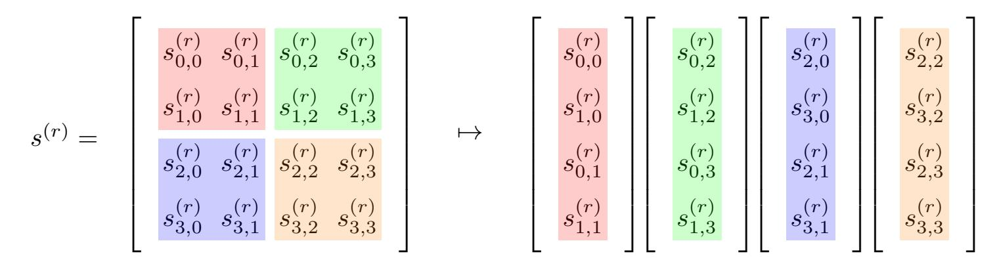
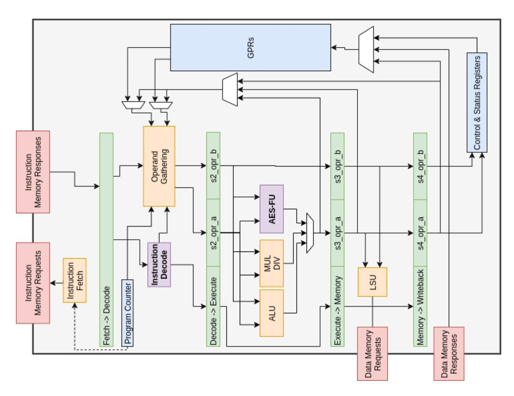

{0}------------------------------------------------

# **The design of scalar AES Instruction Set Extensions for RISC-V**

Ben Marshall<sup>1</sup> , G. Richard Newell<sup>2</sup> , Dan Page<sup>1</sup> , Markku-Juhani O. Saarinen<sup>3</sup> and Claire Wolf<sup>4</sup>

```
1 Department of Computer Science, University of Bristol
    {ben.marshall,daniel.page}@bristol.ac.uk
          2 Microchip Technology Inc., USA
           richard.newell@microchip.com
                   3 PQShield, UK
                 mjos@pqshield.com
                  4 Symbiotic EDA
              claire@symbioticeda.com
```

**Abstract.** Secure, efficient execution of AES is an essential requirement on most computing platforms. Dedicated Instruction Set Extensions (ISEs) are often included for this purpose. RISC-V is a (relatively) new ISA that lacks such a standardised ISE. We survey the state-of-the-art industrial and academic ISEs for AES, implement and evaluate five different ISEs, one of which is novel. We recommend separate ISEs for 32 and 64-bit base architectures, with measured performance improvements for an AES-128 block encryption of 4× and 10× with a hardware cost of 1*.*1*K* and 8*.*2*K* gates respectivley, when compared to a software-only implementation based on use of T-tables. We also explore how the proposed standard bit-manipulation extension to RISC-V can be harnessed for efficient implementation of AES-GCM. Our work supports the ongoing RISC-V cryptography extension standardisation process.

**Keywords:** ISE, AES, RISC-V

### **1 Introduction**

**Implementing the Advanced Encryption Standard (AES).** Compared to more general workloads, cryptographic algorithms like AES present a significant implementation challenge. They involve computationally intensive and specialised functionality, are used in a wide range of contexts, and form a central target in a complex attack surface. The demand for efficiency (however measured) is an example of this challenge in two ways. First, cryptography often represents an enabling technology vs. a feature and is often viewed as an overhead from a user's perspective. Addressing this is complicated by constraints associated with the context, e.g., a demand for high-volume, low-latency, high-throughput, low-footprint, and/or low-power implementations. Second, although efficiency is a goal in itself, it *also* acts as an enabler for security. This is because one *should not* compromise security to meet efficiency requirements. Hence, a more efficient implementation leaves greater margin to deliver countermeasures against an attack.

AES is an interesting case-study wrt. secure, efficient implementation. For example, per the request for candidates announcement,[1](#page-0-0) the AES process was instrumental in popularising a model in which *both* "security" (e.g., resilience against cryptanalytic attack) *and* "algorithm and implementation characteristics" form important quality metrics for the

<span id="page-0-0"></span><sup>1</sup><https://www.govinfo.gov/content/pkg/FR-1997-09-12/pdf/97-24214.pdf>

{1}------------------------------------------------

*design*, in order to facilitate techniques for higher quality *implementations* of it. Additionally, the design *and* implementations of AES are long-lived. The importance of AES has led to special emphasis on related research and development effort before, during, and, most significantly, after the AES process. The 20+ years since standardisation have forced an evolution of implementation techniques, to match changes in the technology and attack landscape. For example, [\[NBB](#page-22-0)<sup>+</sup>01, Section 3.6] covers implementation (e.g., side-channel) attacks: this field has become richer, and the associated threat more dangerous during said period.

**Support via Instruction Set Extensions (ISEs).** A large number of implementation styles often exist for a given cryptographic algorithm. Techniques can be algorithm-agnostic or algorithm-specific, and based on the use of hardware only, software only, or a hybrid approach using ISEs [\[GB11,](#page-21-0) [BGM09,](#page-20-0) [RI16\]](#page-23-0). For the ISE case, the aim is to identify through benchmarking, instances of algorithm-specific functionality which are inefficiently represented in the base ISA. Said functions are then implemented in hardware, and exposed to the programmer via one or more new instructions.

ISEs are an effective option for *both* high-end, performance-oriented and low-end, constrained platforms. They are particularly effective for the latter where resource constraints are tightest. For example, an ISE can be smaller and faster than a pure software implementation, and more efficient in terms of performance gain per additional logic gate than a hardware-only option.

Abstractly, an ISE design constitutes an *interface* to domain-specific functionality through the addition of instructions to a base ISA. As a fundamental and long-lived computer systems interface, the design and extension of an ISA demands careful consideration (cf. [\[Gue09,](#page-22-1) Section 4]) and the production of a concrete ISE design is not trivial. It must deliver a quantified improvement to the workload in question *and* consider numerous design goals including but not limited to:

- Limiting the number and complexity of changes and interactions with the parent ISA.
- Avoiding the addition of too many instructions, or requiring large additional hardware modules to implement: this will damage commercial adoption.
- Adhering to the design constraints and philosophies of the base ISA.
- Maximising the utility of the additional functionality, i.e., favour general-purpose over special-purpose functionality. Special-purpose functions can be justified in terms of how frequently the workload is required. For example, though an AES ISE might *only* be useful for AES, a webserver might execute AES millions of times per day.

The x86 architecture provides many examples of ISE design, having been extended numerous times by Intel and AMD. Various generations of non-cryptographic Multi-Media eXtensions (MMX), Streaming SIMD Extensions (SSE), and Advanced Vector Extensions (AVX) support numerical algorithms via vector (or SIMD) vs. scalar computation. Likewise, the cryptographic Advanced Encryption Standard New Instructions (AES-NI) [\[Gue09,](#page-22-1) [DGvK19\]](#page-21-1) ISE supports AES: it significantly improves latency and throughput (see, e.g., [\[FHLdO18\]](#page-21-2)), and represents a useful case-study in the design goals above. It adds just 6 additional (vs. 1500+ total) instructions, reduces overhead by sharing the preexisting XMM register file, and facilitates compatibility via the CPUID [\[X8618a,](#page-24-0) Chapter 20] feature identification mechanism. It is also (sometimes unexpectedly) useful beyond AES: the Grøstl hash function [\[GKM](#page-22-2)<sup>+</sup>11] uses the S-box, and the YAES [\[BV14\]](#page-21-3) authenticated encryption scheme uses a full round. It can even be used to accelerate the Chinese SM4 block cipher.[2](#page-1-0)

<span id="page-1-0"></span><sup>2</sup><https://github.com/mjosaarinen/sm4ni>

{2}------------------------------------------------

**RISC-V.** RISC-V is a (relatively) new ISA, with academic origins [\[AP14,](#page-20-1) [Wat16\]](#page-24-1). Unlike x86 or ARMv8-A, RISC-V is a free-to-use open standard, managed by RISC-V International. The base ISA is extremely simple, consisting of only 50 instructions, and adopts *strongly* RISC-oriented design principles. RISC-V is also highly modular, having been *designed to be extended*. The general-purpose base ISA can (optionally) be supplemented using sets of special-purpose, standard or non-standard extensions to support additional functionality (e.g., floating-point, via the standard F [\[RV:19a,](#page-23-1) Section 11] and D [\[RV:19a,](#page-23-1) Section 12] extension), or satisfy specific optimisation goals (e.g., code density, via the standard C [\[RV:19a,](#page-23-1) Section 16] extension). RISC-V International delegates the development of extensions to a dedicated task group. The Cryptographic Extensions Task Group[3](#page-2-0) provides some specific context for this paper, through their remit to develop scalar and vector extensions to support cryptography.

RISC-V uses 32 registers, denoted GPR[*i*] for 0 ≤ *i <* 32: GPR[0] is fixed to 0, whereas GPR[1] to GPR[31] are general-purpose. XLEN is used to denote the width of each GPR[*i*], and hence the base ISA. We focus on extending the RV32I [\[RV:19a,](#page-23-1) Section 2] and RV64I [\[RV:19a,](#page-23-1) Section 5], integer RISC-V base ISA and therefore focus on systems where XLEN = 32 or XLEN = 64.

**Remit and organisation.** In the context of an on-going effort to standardise cryptographic ISEs for RISC-V, this paper investigates support for AES. In specific terms, our contributions are as follows:

- 1. In Section [2](#page-2-1) we capture some background, including a limited Systematisation of Knowledge (SoK) for AES ISEs.
- 2. In Section [3](#page-8-0) we implement and evaluate five different ISEs for AES on two different RISC-V CPU cores. We explore existing ISE designs, and introduce what is, to the best of our knowledge, a novel ISE design in Section [3.5](#page-10-0) that uses a quadrant-packed state representation.
- 3. In Section [4](#page-17-0) we evaluate how the proposed standard bit-manipulation extension [\[RV:19a,](#page-23-1) Section 21] to RISC-V can be used to efficiently implement AES-GCM.

On the one hand, RISC-V represents an excellent target for such work: the ISA is extensible by design and its open nature makes exploration of extensions easier through the availability of (often open-source) implementations. Increased commercial deployment of such implementations suggests that work on RISC-V is timely and potentially of high impact. On the other hand, RISC-V also presents unique challenges vs. previous work. For example, RISC-V could in fact be viewed as *three* related base ISAs, RV32I [\[RV:19a,](#page-23-1) Section 2], RV64I [\[RV:19a,](#page-23-1) Section 5], and RV128I [\[RV:19a,](#page-23-1) Section 6], that each support a different word size: designing ISEs that are applicable (or scale) across these options is a complicating factor. We hope this work supports RISC-V in becoming the first widely implemented ISA to support AES acceleration across all implementation profiles, from embedded IoT devices to application and server class processors.

## <span id="page-2-1"></span>**2 Background**

#### **2.1 AES specification**

**Syntax.** As a block cipher, AES defines two algorithms

Enc : {0*,* 1} <sup>8</sup>·4·*Nk* × {0*,* 1} <sup>8</sup>·4·*N b* → {0*,* 1} 8·4·*N b* Dec : {0*,* 1} <sup>8</sup>·4·*Nk* × {0*,* 1} <sup>8</sup>·4·*N b* → {0*,* 1} 8·4·*N b*

<span id="page-2-0"></span><sup>3</sup><https://lists.riscv.org/g/tech-crypto-ext>

{3}------------------------------------------------

such that m = Dec(k, c = Enc(k, m)). That is, given a plaintext m and cipher key k, Enc encrypts m under k; given the same k, Dec will invert Enc and so the same m can be recovered from the associated ciphertext c. In addition, it defines an algorithm KeyExp that expands [FIP01, Section 5.2] the cipher key into a sequence of round keys then used by Enc or Dec; where appropriate, we use

ENC-KEYEXP : 
$$\{0,1\}^{8\cdot 4\cdot Nk} \to \{0,1\}^{(8\cdot 4\cdot Nb)\times (Nr+1)}$$
  
DEC-KEYEXP :  $\{0,1\}^{8\cdot 4\cdot Nk} \to \{0,1\}^{(8\cdot 4\cdot Nb)\times (Nr+1)}$ 

to denote said algorithm as specialised to suit Enc and Dec respectively.

**Parameterisation.** An AES parameter set [FIP01, Figure 4] is a triple (Nk, Nb, Nr) where Nk dictates the number of 32-bit words in k, Nb dictates the number of 32-bit words in m or c (i.e., a block), and Nr dictates the number of rounds. The standard AES parameter sets are

$$AES-128 \mapsto (4, 4, 10)$$
  
 $AES-192 \mapsto (6, 4, 12)$   
 $AES-256 \mapsto (8, 4, 14)$ 

such that the number of bits in a plaintext (resp. ciphertext) block is fixed to  $8\cdot 4\cdot Nb=128$ . From here on, we focus wlog. on encryption using AES-128 (other parameter sets are catered for naturally, and decryption with minor differences) so use the terms AES and AES-128 synonymously.

**Design.** The mathematics underpinning AES are described in [FIP01, Section 4]. In particular, it can be defined in terms of operations in the finite field  $\mathbb{F}_{2^8}$  constructed as  $\mathbb{F}_2[\mathbf{x}]/(\mathbf{x}^8+\mathbf{x}^4+\mathbf{x}^3+\mathbf{x}+1)$ . A hexadecimal short-hand [FIP01, Section 3.2] is used to represent field literals, e.g.,  $13 \mapsto 13_{(16)} \equiv 00010011_{(2)} \mapsto \mathbf{x}^4+\mathbf{x}+1$ . Field addition, multiplication, and division are denoted by  $\oplus$ ,  $\otimes$ , and  $\oslash$  respectively, with the multiplication-by- $\mathbf{x}$  operation [FIP01, Section 4.2.1] denoted  $\mathbf{x}$ time. Elements of  $\mathbb{F}_{2^8}$  are collected into  $(4 \times 4)$ -element state and round key matrices; the i-th row and j-th column of such a matrix relating to round r is denoted  $s_{i,j}^{(r)}$  and  $rk_{i,j}^{(r)}$  respectively, with superand/or subscripts omitted whenever irrelevant.

AES is an iterative block cipher, based on a substitution-permutation network. This means encryption using AES can be described [FIP01, Section 5.2] as follows: 1) the input plaintext is pre-whitened to yield  $s^{(0)} = m \oplus rk^{(0)} = m \oplus k$ , 2) each r-th round, for  $1 \le r \le Nr$ , demands computation of  $s^{(r+1)} = \text{P-LAYER}(\text{S-LAYER}(s^{(r)})) \oplus rk^{(r)}$ , and therefore use of round key  $rk^{(r)}$ , 3) the output ciphertext is  $c = s^{(Nr)}$ . Note that an alternative round definition, namely  $s^{(r+1)} = \text{P-LAYER}(\text{S-LAYER}(s^{(r)} \oplus rk^{(r)}))$ , is plausible: this shifts the pre-whitening step before 2) into an analogous post-whitening step after 2) to yield an equivalent result. At a low(er) level, the computation of each round is specified via four round functions (each of which has an inverse, to support decryption):

• SubBytes [FIP01, Section 5.1.1] operates element-wise, computing  $s_{i,j}^{(r+1)} = \text{S-Box}(s_{i,j}^{(r)})$  via application of the S-box: given an element x, this component can be described as

S-Box : 
$$\begin{cases} \mathbb{F}_{2^8} \to \mathbb{F}_{2^8} \\ x \mapsto f(g(x)) \end{cases}$$

where g is an inversion, and f is a specially selected affine transformation. Where appropriate, we overload SubBytes by allowing it to denote application of the S-box to any collection, e.g., a row, column, or, more generally, a sequence, of elements.

• ShiftRows [FIP01, Section 5.1.2] operates row-wise, rotating each *i*-th row of  $s^{(r)}$  by i elements to form the associated row of  $s^{(r+1)}$ , i.e.,  $s_{i,j}^{(r+1)} = s_{i,j+i \pmod{Nb}}^{(r)}$ . Where

{4}------------------------------------------------

appropriate, we use ShiftRow to denote the operation applied to a single row within ShiftRows.

- MixColumns [\[FIP01,](#page-21-4) Section 5.1.3] operates column-wise, multiplying each *j*-th column of *s* (*r*) with a constant MDS matrix to form the associated column of *s* (*r*+1). Where appropriate, we use MixColumn to denote the operation applied to a single column within MixColumns, i.e., multiplication of a 4-element column vector by the constant MDS matrix.
- AddRoundKey [\[FIP01,](#page-21-4) Section 5.1.4] operates element-wise, computing *s* (*r*+1) *i,j* = *s* (*r*) *i,j* ⊕ *rk*(*r*) *i,j* and thereby mixing a round key into the state.

Note that S-layer = SubBytes*,* and

$$\text{P-LAYER} = \left\{ \begin{array}{ll} \text{MixColumns} \circ \text{ShiftRows} & \text{in rounds} & 1 \leq r < Nr \\ \text{ShiftRows} & \text{in round} & Nr \end{array} \right.$$

i.e., the last, *Nr*-th round differs from the initial *Nr* − 1 rounds. As such, a round as defined above is constructed via AddRoundKey ◦ MixColumns ◦ ShiftRows ◦ SubBytes or AddRoundKey ◦ ShiftRows ◦ SubBytes respectively, where, because ShiftRows and SubBytes commute, the order they are applied in can be selected to suit.

#### **2.2 AES implementation**

#### **2.2.1 Representation**

A field element in F<sup>2</sup> <sup>8</sup> can be represented by an 8-bit byte, where the *i*-th bit of *x* for 0 ≤ *i <* 8 represents the *i*-th polynomial coefficient.

Beyond this, the state and round key matrices can be represented in several ways. The most direct option would be termed array-based (or unpacked): the matrix is represented as a 16-element array of 8-bit bytes, each representing field elements. We use *R* to refer to the register width of a target platform. For RISC-V, *R* = XLEN where we consider XLEN ∈ 32*,* 64. Where *R* ≥ 32, an entire row or column of the AES state matrix can be packed into each register: we term these "row-packed" and "column-packed" representations respectively. Where *R* ≥ 128, it is plausible to pack an entire AES state matrix into a single register: we term this a "fully-packed" representation.

#### **2.2.2 Hardware-only implementations**

In a hardware-only implementation, execution of AES is performed by a dedicated hardware module (e.g., a memory-mapped co-processor). A large design space exists for hardware implementations of AES. Gaj and Chodowiec [\[GC00,](#page-21-5) Section 3.3] give an overview, detailing iterative, combinatorial (unrolled), and pipelined architectures. Similarly, [\[PMDW04,](#page-23-2) [GB05,](#page-21-6) [GC09\]](#page-21-7) survey concrete implementations on a variety of fabrics including FPGAs and ASICs.

Although hardware-only designs are not our focus, the associated techniques can guide ISE-related design choices. First, they guide the ISE interface. For example, some ISEs can be characterised as offering an interface to hardware constituting one round (i.e., aligned with an iterative hardware implementation). Second, they guide the ISE implementation. For example, a significant body of work focuses on efficient hardware implementation of the S-box: [\[Can05,](#page-21-8) [BP12,](#page-20-2) [RMTA18\]](#page-23-3).

#### **2.2.3 Software-only implementations**

In a software-only implementation, execution of AES and the associated application program is performed by a general-purpose processor core, using only instructions in the 

{5}------------------------------------------------

base ISA. Since we only consider use of the RISC-V scalar base ISA, we exclude work on the use of vector-like extensions [Ham09].

Software-only techniques are important because many ISEs are evaluated against baseline ISA implementations. Work such as that of Bernstein and Schwabe [BS08], Osvik et al. [OBSC10], and Schwabe and Stoffelen [SS16] present and compare multiple techniques across a range of platforms, but, for completeness, we present a (limited) survey in what follows.

Compute-oriented. A compute-oriented implementation of AES favours online computation, thus reducing memory footprint at the cost of increased latency. Following [DR02, Section 4.1], for example, the idea is to simply 1) adopt an array-packed representation of state and round key matrices, then 2) construct a round implementation by following the algorithmic description of each round function in a direct manner. Addition in  $\mathbb{F}_{2^8}$  can be implemented with a base ISA XOR instruction. Base ISA support is rarely present for multiplication and inversion in  $\mathbb{F}_{2^8}$  however. Hence it is common to pre-compute the S-BOX and/or xtime functions. This requires pre-computation and storage of a 256 B look-up table per function, but significantly reduces execution latency.

On platforms where R = 32, Bertoni et al. [BBF<sup>+</sup>02] improve execution latency by exploiting the wider data-path. They adopt a row-packed representation of state and round key matrices, implementing **ShiftRows** using native rotation instructions to act on the packed rows. MixColumns is implemented using the SIMD Within A Register (SWAR) paradigm: applying xtime across a packed row in parallel.

**Table-oriented.** A table-oriented implementation of AES favours offline pre-computation, reducing latency but increasing the memory footprint. The main example of this technique is the so-called T-tables [DR02, Section 4.2] method. This involves adopting a column-packed representation of state and round key matrices and pre-computing MixColumn o SubBytes using the tables

$$T_{0}[x] = \begin{bmatrix} 02_{(16)} \otimes S\text{-BOX}(x) \\ 01_{(16)} \otimes S\text{-BOX}(x) \\ 01_{(16)} \otimes S\text{-BOX}(x) \\ 03_{(16)} \otimes S\text{-BOX}(x) \end{bmatrix} \qquad T_{1}[x] = \begin{bmatrix} 03_{(16)} \otimes S\text{-BOX}(x) \\ 02_{(16)} \otimes S\text{-BOX}(x) \\ 01_{(16)} \otimes S\text{-BOX}(x) \\ 01_{(16)} \otimes S\text{-BOX}(x) \end{bmatrix}$$

$$T_{2}[x] = \begin{bmatrix} 01_{(16)} \otimes S\text{-BOX}(x) \\ 03_{(16)} \otimes S\text{-BOX}(x) \\ 02_{(16)} \otimes S\text{-BOX}(x) \\ 01_{(16)} \otimes S\text{-BOX}(x) \end{bmatrix}$$

$$T_{3}[x] = \begin{bmatrix} 01_{(16)} \otimes S\text{-BOX}(x) \\ 01_{(16)} \otimes S\text{-BOX}(x) \\ 03_{(16)} \otimes S\text{-BOX}(x) \\ 03_{(16)} \otimes S\text{-BOX}(x) \end{bmatrix}$$

for  $x \in \mathbb{F}_{2^8}$ , then computing each j-th column of  $s^{(r+1)}$  as

$$T_0[s_{i,j+i\pmod{Nb}}^{(r)}] \oplus T_1[s_{i,j+i\pmod{Nb}}^{(r)}] \oplus T_2[s_{i,j+i\pmod{Nb}}^{(r)}] \oplus T_3[s_{i,j+i\pmod{Nb}}^{(r)}]$$

where extraction of elements caters for ShiftRows, then XOR'ing the j-th column of  $rk^{(r)}$  to cater for AddRoundKey.

As such, each round becomes a sequence of look-ups into  $T_i$ , plus XORs to combine their result. Doing so demands pre-computation and storage of a  $256 \cdot 4 \,\mathrm{B} = 1 \,\mathrm{kB}$  look-up table per  $T_i$ . The overhead related to extraction of each element from packed columns representing  $s^{(r)}$  (to form look-table offsets) can be significant: Fiskiran and Lee [FL01] analyse the impact of different addressing modes on this issue, with Stoffelen [Sto19, Section 3.1] concluding that RISC-V is ill-equipped to reduce said overhead, due to the provision of a sparse set of addressing modes. Further, in systems with data caches, T-table based implementations are susceptible to timing attacks [Ber05].

{6}------------------------------------------------

**Bit-sliced.** The term bit-slicing is an implementation technique due to Biham [\[Bih97\]](#page-20-6), which constitutes

- 1. a non-standard *representation* of data where each *R*-bit word *x* is transformed into *x*ˆ, i.e., *R* slices, say *x*ˆ[*i*] for 0 ≤ *i < R,* where *x*ˆ[*i*]*<sup>j</sup>* = *x<sup>i</sup>* for some *j*, and
- 2. a non-standard *implementation* of operation: each operation *f* used as *r* = *f*(*x*) must be transformed into a "software circuit" ˆ*f*, i.e., a sequence of Boolean instructions acting on the slices st. *r*ˆ = ˆ*f*(ˆ*x*)*.*

Bit-slicing introduces some overhead related to conversion of *x* into *x*ˆ and *r*ˆ into *r*, plus the (relative) inefficiency of ˆ*f* vs. *f* wrt. latency and footprint. However, if each slice is itself an *R*-bit word, then it is possible to compute *R* instances of ˆ*f* in *parallel* on suitably packed *x*ˆ. A common analogy is that of transforming the *R*-bit, 1-way scalar processor into a 1-bit, *R*-way SIMD processor, thus giving (or recouping) up to a *R*-fold improvement in latency.

As evidenced by [\[MN07,](#page-22-4) [K¨08\]](#page-22-5) and [\[KS09\]](#page-22-6), the application of bit-slicing to AES can be very effective; Stoffelen [\[Sto19,](#page-23-6) Section 3.1] specifically investigates this fact within the context of RISC-V.

### <span id="page-6-0"></span>**2.3 Existing AES ISEs**

Here, we survey AES-related ISE designs split into 1) industry-specified ISEs, which are *standard* extensions, and 2) academia-specified ISEs, which are *non-standard* extensions, wrt. a given base ISA. Each ISE is classified as either workload-specific, if it is only useful for AES, or workload-agnostic, if it is useful for AES and other workloads. Note that we exclude work where an ISE for another workload can be applied *to* AES but was not designed *for* AES (see, e.g., Tillich and Großschädl [\[TG04\]](#page-24-2) who apply an ISE intended for ECC to AES).

#### **2.3.1 Standard, industry-specified ISEs**

**Intel** introduced support for AES in x86 per [\[X8618a,](#page-24-0) Section 12.13]. Instructions use a destructive 2-address (1 source, 1 source/destination) or non-destructive 3-address (2 source, 1 destination) format depending on the variant (e.g., XMM- vs. AVX-based), and operate on data housed in the pre-existing vector register file, implying *R* = 128. AES is implemented by 1) adopting a fully-packed representation of state and round key matrices, then 2) using AESENC [\[X8618b,](#page-24-3) Page 3-54] to construct a round implementation as

AESENC 7→ AddRoundKey ◦ MixColumns ◦ SubBytes ◦ ShiftRows

**IBM** introduced support for AES in POWER per [\[POW18,](#page-23-7) Section 6.11.1]. Instructions use a non-destructive 3-register (2 source, 1 destination) format, and operate on data housed in the pre-existing vector register file, implying *R* = 128. AES is implemented by 1) adopting a fully-packed representation of state and round key matrices, then 2) using vcipher [\[POW18,](#page-23-7) Page 304] to construct a round implementation as

vcipher 7→ AddRoundKey ◦ MixColumns ◦ ShiftRows ◦ SubBytes

**ARM** introduced support for AES in ARMv8-A per [\[ARM20,](#page-20-7) Section A2.3]. Instructions use a destructive 2-address (1 source, 1 source/destination) format, and operate on data housed in the pre-existing vector register file, implying *R* = 128. AES is implemented by 1) adopting a fully-packed representation of state and round key matrices, then 2) using AESE [\[ARM20,](#page-20-7) Section C7.2.8 ] and AESMC [\[ARM20,](#page-20-7) Section C7.2.10] to construct a round implementation as

AESMC ◦ AESE 7→ MixColumns ◦ (SubBytes ◦ ShiftRows ◦ AddRoundKey)*,*

{7}------------------------------------------------

**Oracle** introduced support for AES in SPARC per [\[SPA16,](#page-23-8) Sections 7.3+7.4]. Instructions use a non-destructive 4-address (3 source, 1 destination) format, and operate on data housed in the pre-existing general-purpose register file, implying *R* = 64. AES is implemented by 1) using a column-packed representation of state and round key matrices, then 2) using AES\_EROUND01 [\[SPA16,](#page-23-8) Page 109] and AES\_EROUND23 [\[SPA16,](#page-23-8) Page 109] to construct a round implementation as

(AES\_EROUND01; AES\_EROUND23) 7→ AddRoundKey ◦ MixColumns ◦ ShiftRows ◦ SubBytes

in two steps: the first step processes columns 0 and 1 via AES\_EROUND01 whereas the second step processes columns 2 and 3 via AES\_EROUND23.

#### **2.3.2 Non-standard, academia-specified ISEs**

Burke et al. [\[BMA00\]](#page-20-8) propose a workload-agnostic ISE based on workload characterisation for the DEC Alpha architecture [C <sup>+</sup>[14\]](#page-21-11). Per [\[BMA00\]](#page-20-8), pertinent examples for AES include a) ROL and ROR, which perform left- and right-rotate, and b) SBOX, which extracts elements to form look-up table offsets. In one configuration, the resulting memory accesses are supported by a set of special-purpose "S-box caches".

Fiskiran and Lee [\[FL05\]](#page-21-12) propose a workload-agnostic ISE that employs a so-called Parallel Table Lookup Module (PTLU) for a "*RISC like*" instruction set. For AES, this accelerates implementations based on T-tables by affording an addressing mode that a) integrates extraction of elements to form look-up table offsets, and b) performs the associated table look-ups in parallel, supported by a dedicated scratch-pad memory.

Biham et al. [\[BAK98,](#page-20-9) Page 232] propose (in theory) and Grabher et al. [\[GGP08\]](#page-21-13) explore (in practice) a workload-agnostic ISE that supports bit-sliced implementations for their custom CRISP ("*RISC like*") architecture. The ISE allows computation using *configurable* 4-input, 2-output Boolean functions, vs. *fixed* 2-input, 1-output alternatives such as NOT, AND, OR, and XOR. Sequences of native Boolean instructions, which dominate bit-sliced implementations, can thereby be "compressed" into use of the ISE. Doing so improves both latency and footprint. [\[GGP08,](#page-21-13) Section 4] details the application to AES.

Nadehara et al. [\[NIK04\]](#page-22-7) propose a workload-specific ISE that could be described as "hardware-assisted T-tables": observing that ∀*x, i* 6= *j*, *T<sup>i</sup>* [*x*] is a rotation of *T<sup>j</sup>* [*x*], they support on-the-fly computation (vs. via look-up) of T-table entries. The ISE constitutes a single instruction AESENC 7→ *T<sup>i</sup>* , supported by a dedicated hardware module (see [\[NIK04,](#page-22-7) Figure 6]). Instances of AESENC 1) extract an input element from a packed input column 2) use the input to compute an output element equivalent to a look-up from the T-table, and 3) store the output element into a packed output column. This approach was reapplied by Saarinen [\[Saa20\]](#page-23-9) within the context of RISC-V.

Tillich et al. [\[TGS05\]](#page-24-4) propose a workload-specific ISE that could be described as "hardware-assisted S-box" for the SPARC V8 architecture. The ISE constitutes a single instruction sbox 7→ SubBytes, supported by a dedicated hardware module (see [\[TGS05,](#page-24-4) Figure 1]). Instances of sbox 1) extract an input element from a packed input row or column, 2) use the input to compute an output element equivalent to a look-up from the S-box, and 3) insert the output element into a packed output row or column. Using insert vs. overwrite semantics allows ShiftRows to be computed *for free*.

Bertoni et al. [\[BBFR06\]](#page-20-10) propose a workload-specific ISE that could be described as "hardware-assisted round functions". The ISE includes 1) zero-overhead rotation (similar to ARM), and 2) byte- and word-oriented variants of SMix 7→ MixColumn ◦ SubBytes.

Tillich and Großschädl [\[TG06\]](#page-24-5) propose a workload-specific ISE that could be described as "hardware-assisted round functions" for the SPARC V8 architecture. The ISE includes byte- and word-oriented variants of sbox[4][s|r] 7→ SubBytes and mixcol[4][s] 7→ 

{8}------------------------------------------------

MixColumn; per [\[TG06,](#page-24-5) Section 4.3], the most efficient variant allows a zero-overhead implementation of ShiftRows to be realised.

#### **2.4 Security**

While the security of AES against a cryptanalytic attack is defined by the design, and so is out of scope, *implementation* attacks are of central importance. An implementation attack focuses on the concrete instance of a construct rather than the abstract specification. Countermeasures against such attacks must therefore be considered alongside implementations they relate to. Since AES is an important target, a significant body of literature exists around implementation attacks on it, including both active (e.g., fault injection) or passive (i.e., side-channel monitoring) attack techniques. The latter can be sub-divided into those dependent on analogue (power-based [\[MOP07\]](#page-22-8)) or discrete (time-based [\[KQ99\]](#page-22-9)) leakage.

Use of ISEs *can* provide some inherent protection against certain attacks. For example, ISEs typically yield constant time execution, preventing some classes of timing or micro-architectural attack techniques (see [\[Sze19,](#page-24-6) Section 4] and [\[GYCH18,](#page-22-10) Section 4]). Unfortunately, use of ISEs also presents some unique challenges. For example, Saab et al. [\[SRH16\]](#page-23-10) discuss power-based attacks on AES-NI; concluding that naive use of AES-NI yields exploitable information leakage. Mitigation of such leakage demands the ISE address instances where the leakage stems from "inside" the ISE, and work with appropriate countermeasures (e.g., hiding [\[MOP07,](#page-22-8) Chapter 7] or masking [\[MOP07,](#page-22-8) Chapter 10]). Tillich et al. [\[THM07\]](#page-24-7) consider this problem to an extent, including an ISE-based option in their investigation of hardened AES implementations. However, the challenge of developing suitable ISEs is under-studied in general.

## <span id="page-8-0"></span>**3 Exploring AES ISEs for RISC-V**

Section [2.3](#page-6-0) outlined a range of ISE designs, demonstrating a large design space of options that we *could* consider. To narrow the design space into those we *do* consider, we use the requirements outlined below:

**Requirement 1.** *The ISE must support 1) AES encryption* and *decryption, and 2)* all *parameter sets, i.e., AES-128, AES-192, and AES-256. Support for auxiliary operations, e.g., key schedule, is an advantage but not a requirement.*

<span id="page-8-1"></span>**Requirement 2.** *The ISE must align with the wider RISC-V design principles. This means it should favour simple building-block operations, and use instruction encodings with at most* 2 *source registers and* 1 *destination register. This avoids the cost of a general-purpose register file with more than* 2 *read ports or* 1 *write port.*

**Requirement 3.** *The ISE must use the RISC-V general-purpose scalar register file to store operands and results, rather than any vector register file. This requirement excludes the majority of standard ISEs outlined in Section [2.3.](#page-6-0)*

**Requirement 4.** *The ISE must not introduce special-purpose architectural state, nor rely on special-purpose micro-architectural state (e.g., caches or scratch-pad memory).*

**Requirement 5.** *The ISE must enable data-oblivious execution of AES, preventing timing attacks based on execution latency (e.g., stemming from accesses to a pre-computed S-box).*

**Requirement 6.** *The ISE must be efficient, in terms of improvement in execution latency per area required: this balances the value in* both *metrics vs. an exclusive preference for one or the other. Efficiency wrt. auxiliary metrics, e.g., memory footprint or instruction encoding points, is an advantage but not a requirement.*

{9}------------------------------------------------

Overall, the requirements combine to intentionally target the ISE at low(er)-end, resourceconstrained (e.g., embedded) platforms. We view such a focus as reasonable, because existing work on adding cryptographic support to the standard vector extension [\[RV:19a,](#page-23-1) Section 21] already caters for high(er)-end alternatives.

We arrive at five ISE variants using the requirements, the description of which is split into an intuitive description in the following Sections and a technical description (e.g., a list of instructions and their semantics) in an associated Appendix.

### **3.1 Variant 1 (V1):** SubBytes **+** MixColumn **+ explicit** ShiftRows

By reproducing [\[TG06,](#page-24-5) Section 4.2], V<sup>1</sup> assumes XLEN = 32 and adopts a column-packed representation of state and round key matrices. As detailed in Figure [2,](#page-12-0) V<sup>1</sup> adds 4 instructions (2 for encryption, 2 for decryption). For example, saes.v1.encs applies SubBytes to elements in a packed column, and saes.v1.encm applies MixColumn to a packed column; the instruction format for saes.v1.encs and saes.v1.encm specifies 1 source and 1 destination register. Since saes.v1.encs requires 4 applications of the S-box, a trade-off between latency and area is possible st. *n* physical S-box instances are (re)used in 4*/n* cycles (e.g., 1 instance in 4 cycles, or 4 instances in 1 cycle).

Figure [7](#page-25-0) demonstrates that use of V<sup>1</sup> to implement AES encryption requires 47 instructions per round: 4 lw instructions to load the round key, 4 xor instructions to apply AddRoundKey, 4 saes.v1.encs instructions to apply SubBytes, 31 instructions to apply ShiftRows, and 4 saes.v1.encm instructions to apply MixColumns.

### **3.2 Variant 2 (V2):** SubBytes **+** MixColumn **+ implicit** ShiftRows

By reproducing [\[TG06,](#page-24-5) Section 4.3], V<sup>2</sup> assumes XLEN = 32 and adopts a column-packed representation of state and round key matrices. As detailed in Figure [3,](#page-12-1) V<sup>2</sup> adds 4 instructions (2 for encryption, 2 for decryption). For example, saes.v2.encs applies SubBytes to elements in a packed column, and saes.v2.encm applies MixColumn to a packed column; the instruction format for saes.v2.encs and saes.v2.encm specifies 2 source and 1 destination register. V<sup>2</sup> improves V<sup>1</sup> by applying ShiftRows *implicitly*: this is possible by careful indexing of elements in source and destination columns during application of SubBytes and MixColumns, and also permits saes.v2.encs to be used within the key schedule. The same trade-off is possible as in V1, whereby *n* physical S-box instances are (re)used in 4*/n* cycles (e.g., 1 instance in 4 cycles, or 4 instances in 1 cycle).

Figure [8](#page-25-1) demonstrates that use of V<sup>2</sup> to implement AES encryption requires 16 instructions per round: 4 lw instructions to load the round key, 4 xor instructions to apply AddRoundKey, 4 saes.v1.encs instructions to apply SubBytes, and 4 saes.v1.encm instructions to apply MixColumns. In the *Nr*-th round, which omits MixColumns, ShiftRows must be applied *explicitly* using an additional 12 instructions.

### **3.3 Variant 3 (V3): hardware-assisted T-tables**

V<sup>3</sup> is based on [\[NIK04,](#page-22-7) [BBFR06,](#page-20-10) [Saa20\]](#page-23-9); it assumes XLEN = 32 and adopts a columnpacked representation of state and round key matrices.

As detailed in Figure [4,](#page-12-2) V<sup>3</sup> adds 4 instructions (2 for encryption, 2 for decryption). The basic idea is to support an implementation strategy aligned with use of T-tables [\[DR02,](#page-21-9) Section 4.2], but compute entries in hardware vs. storing the look-up entries in memory. For example, saes.v3.encsm extracts an element from a packed column, applies SubBytes to the element, expands the element into a packed column, applies MixColumn, then applies AddRoundKey. The inclusion of AddRoundKey follows [\[Saa20\]](#page-23-9), which improves on [\[NIK04,](#page-22-7) [BBFR06\]](#page-20-10); as a result of this, the instruction format for saes.v3.encsm specifies 2 source and 1 destination register. The requirement for 1 application of the

{10}------------------------------------------------

S-box allows for a more efficient functional unit than V<sup>1</sup> or V2, for example, either wrt. latency or area.

Figure [9](#page-26-0) demonstrates that use of V<sup>3</sup> to implement AES encryption requires 20 instructions per round: 4 lw instructions to load the round key, and 16 saes.v3.encsm instructions to apply SubBytes, ShiftRows, MixColumns, and AddRoundKey. In the *Nr*-th round, which omits MixColumns, saes.v3.encsm is replaced by saes.v3.encs.

### **3.4 Variant 4 (V4): 64-bit data-path**

V<sup>4</sup> requires XLEN = 64 and adopts a *double* column-packed representation of state and round key matrices, i.e., *two* columns (or 8 elements) are packed into a 64-bit word. It is similar in principle to the SPARC [\[SPA16,](#page-23-8) Page 109] ISE, but improves on it by adhering to the 2 source and 1 destination register format. By sourcing two 64-bit registers, and writing a single 64-bit register, a single instruction can accept all of the current round state as input and produce half of the next round state as output.

SPARC [\[SPA16,](#page-23-8) Page 109] adds 9 instructions (4 for encryption, 4 for decryption, and 1 auxiliary). For example, AES\_EROUND01 and AES\_EROUND23 produce columns 0 and 1 and columns 2 and 3 respectively. Each instruction sources 3 64-bit registers, and writes a single 64-bit register. As shown in Figure [5,](#page-13-0) V<sup>4</sup> improves this by adding only 7 instructions (2 for encryption, 2 for decryption, and 3 auxiliary). This is realised by utilising the Equivalent Inverse Cipher representation detailed in [\[FIP01,](#page-21-4) Section 5.3.5]. This enables all of the round transformations to be applied in the same order for both encryption and decryption. The AddRoundKey step can then lifted out of the round function instructions (where otherwise it would appear in the middle of the decryption round), and implemented using a base ISA xor instruction. The round key then no longer needs to be an input to the instruction, meaning it only needs 2 source register operands. We then note that the nature of ShiftRows means we do not need separate instructions to compute the next values of columns (0,1) or columns (2,3) as the SPARC instructions do. Instead, we can simply reverse the order of the source register operands, and get the same effect. This is detailed in Figure [5,](#page-13-0) and an example round function is shown in Figure [10.](#page-26-1)

For example, saes.v4.encsm rd, rA, rB applies SubBytes, ShiftRow, and MixColumn to elements in a packed column and produces the *next* round values for packed columns (0,1). Executing saes.v4.encsm rd, rB, rA, with no change in values of rA or rB, will produce the next round state values for packed columns (2, 3).

Figure [10](#page-26-1) demonstrates that use of V<sup>4</sup> to implement AES encryption requires 6 instructions per round: 2 ld instructions to load the round key, 2 xor instructions to apply AddRoundKey, 2 saes.v4.encsm instructions to apply SubBytes, ShiftRows, and MixColumns. In the *Nr*-th round, which omits MixColumns, saes.v4.encsm is replaced by saes.v4.encs. Note that use of the Equivalent Inverse Cipher representation necessitates inclusion of the saes.v4.imix instruction, in order to efficiently imply the inverse MixColumn step to words of the Key-Schedule.

### <span id="page-10-0"></span>**3.5 Variant 5 (V5): quadrant-packed**

V<sup>5</sup> assumes XLEN = 32 and adopts a novel, *quadrant*-packed representation of state and round key matrices as shown in Figure [1.](#page-12-3) This means that each quadrant of the standard 4×4 byte AES state representation is packed into a single 32-bit register word. This allows *either* two complete rows (to perform ShiftRows) *or* two complete columns (to perform MixColumns) of the state can be accessed by accessing two quadrants. Based on this, such a representation can 1) afford advantages of *both* row- and column-packed alternatives, *and* 2) allow an instruction format that meets the 2 source and 1 destination register address constraint of a RISC-V pipeline. However, it also requires conversion of any input and output data between *quadrant*-packed and standard *column*-packed representation. 

{11}------------------------------------------------

Although such conversion is amortised by *Nr* rounds of computation, it still represents an overhead vs. other variants.

As detailed in Figure [6,](#page-13-1) V<sup>5</sup> adds 7 instructions (3 for encryption, 3 for decryption, and 1 auxiliary). Taking encryption as an example, we define two instructions to perform the ShiftRows and SubBytes steps. saes.v5.esrsub.lo performs ShiftRows and SubBytes on the two *bottom* quadrants, and saes.v5.esrsub.hi does the same for the two *top* quadrants. The two instructions are necessary to account for the different rotation amounts applied to the top and bottom rows as part of ShiftRows. A single instruction saes.v5.emix applies the MixColumns transformation to two columns. The instruction can source two entire column owing to the quadrant packed representation, but can only write a single quadrant back. Hence, two executions of the same instruction are needed to apply the entire MixColumns step to each two quadrants.

Figure [11](#page-26-2) demonstrates that use of V<sup>5</sup> to implement AES encryption requires 16 instructions per round: 4 lw instructions to load the round key, 4 xor instructions to apply AddRoundKey, 4 saes.v5.esrsub.[lo|hi] instructions to apply SubBytes and ShiftRows, and 4 saes.v5.emix instructions to apply MixColumns. Note that conversion into (resp. from) quadrant-packed representation requires a further 12 instructions; this can be reduced to 4 pack[h] instructions using the standard bit-manipulation extension [\[RV:19a,](#page-23-1) Section 17].

V<sup>5</sup> instructions may be implemented with between 1 and 4 SBox instances, with a corresponding tradeoff between area and latency. As with V<sup>1</sup> and V<sup>2</sup> however, additional storage elements are required if fewer than 4 SBoxes are instanced in order to store intermediate results. The auxiliary saes.v5.sub instruction is used during the Key-Schedule, and can act simply as an interface to the SBoxes already required by the round instructions.

#### <span id="page-11-1"></span>**3.6 Implementation**

The evaluation of each ISE considers two different RISC-V compliant base micro-architectures, which constitute two different host cores:

- The SCARV[4](#page-11-0) core supports the RV32IMC instruction set, i.e., the 32-bit [\[RV:19a,](#page-23-1) Section 2] base integer ISA plus standard Multiplication [\[RV:19a,](#page-23-1) Section 7] and Compressed [\[RV:19a,](#page-23-1) Section 16] extensions. Per the block diagram shown in Figure [12,](#page-27-0) the core executes instructions using a 5-stage, in-order pipeline. No branch prediction is supported. There are two memory interfaces for instruction fetch and data memory accesses. No instruction or data caches are supported. The core implements various performance counters, and elements of the RISC-V Privileged Resource Architecture (PRA) [\[RV:19b,](#page-23-11) Chapter 3] related to exception and interrupt handling.
- The Rocket [\[AAB](#page-20-11)<sup>+</sup>16] core executes instructions using a 5-stage, in-order pipeline which is highly configurable. We take advantage of this, considering two variants whose exact configuration is outlined in Figure [13](#page-27-1) and Figure [14:](#page-27-2) the variants represent single 32-bit and 64-bit cores respectively, and so support the RV32IMC (resp. RV64IMC) instruction set, i.e., the 32-bit [\[RV:19a,](#page-23-1) Section 2] (resp. 64-bit [\[RV:19a,](#page-23-1) Section 5]) base integer ISA plus standard Multiplication [\[RV:19a,](#page-23-1) Section 7] and Compressed [\[RV:19a,](#page-23-1) Section 16] extensions. Each variant is configured to support an instruction cache, a data cache, and a branch prediction mechanism, but no floating-point support.

To support each ISE, two modifications were made to each host core: the instruction decoder was modified to support operand selection and an AES Functional Unit (AES-FU) was added to support execution of ISE instructions. The SCARV core integrates the AES-FU directly into the pipeline, while the Rocket core accesses the AES-FU via the

<span id="page-11-0"></span><sup>4</sup><https://github.com/scarv/scarv>

{12}------------------------------------------------

<span id="page-12-3"></span>

Figure 1: An illustration of quadrant-packed representation (left), as applied to a state matrix (right).

```
saes.v1.encs rd, rs1 : v1.SubBytes(rd, rs1, fwd=1)
1
^{2}
    saes.v1.decs rd, rs1 : v1.SubBytes(rd, rs1, fwd=0)
3
    saes.v1.encm rd, rs1 : v1.MixColumn(rd, rs1, fwd=1)
4
    saes.v1.decm rd, rs1 : v1.MixColumn(rd, rs1, fwd=0)
5
    v1.SubByte(rd, rs1, fwd):
6
7
        rd.8[i] = AESSBox[rs1.8[i]] if fwd else AESInbSBox[rs1.8[i]] for i=0..3
8
9
    v1.MixColumn(rd, rs1, fwd):
10
        for i=0..3:
11
            tmp.32 = ROTL32(rs1.32, 8*i)
            rd.8[i] = AESMixColumn(tmp.32) if fwd else AESInvMixColumn(tmp.32)
12
```

Figure 2: Instruction mnemonics, and their mapping onto pseudo-code functions, for  $\mathcal{V}_1$ .

```
1
    saes.v2.encs rd, rs1, rs2 : v2.SubBytes(rd, rs1, rs2, fwd=1)
2
    saes.v2.decs rd, rs1, rs2 : v2.SubBytes(rd, rs1, rs2, fwd=0)
3
    saes.v2.encm rd, rs1, rs2 : v2.MixColumns(rd, rs1, rs2, fwd=1)
4
    saes.v2.decm rd, rs1, rs2 : v2.MixColumns(rd, rs1, rs2, fwd=0)
5
6
    v2.SubBytes(rd, rs1, rs2, fwd):
7
      t1.32 = \{rs1.8[0], rs2.8[1], rs1.8[2], rs2.8[3]\}
8
      rd.8[i] = AESSBox[t1.8[i]] if fwd else AESInvSBox[t1.8[i]] for i=0..3
9
10
    v2.MixColumns(rd, rs1, rs2, fwd):
11
      t1.32 = \{rs1.8[0], rs1.8[1], rs2.8[2], rs2.8[3]\}
12
      for i=0..3:
          tmp.32 = ROTL32(rs1.32, 8*i)
13
          rd.8[i] = AESMixColumn(tmp.32) if fwd else AESInvMixColumn(tmp.32)
14
```

Figure 3: Instruction mnemonics, and their mapping onto pseudo-code functions, for  $\mathcal{V}_2$ .

```
1
    saes.v3.encs rd, rs1, rs2, bs : v3.Proc(rd, rs1, rs2, bs, fwd=1, mix=0)
^{2}
    saes.v3.encsm rd, rs1, rs2, bs : v3.Proc(rd, rs1, rs2, bs, fwd=1, mix=1)
    saes.v3.decs rd, rs1, rs2, bs : v3.Proc(rd, rs1, rs2, bs, fwd=0, mix=0)
3
    saes.v3.decsm rd, rs1, rs2, bs : v3.Proc(rd, rs1, rs2, bs, fwd=0, mix=1)
4
5
    v3.Proc(rd, rs1, rs2, bs, fwd, mix):
6
7
           = AESSBox[rs2.8[bs]] if fwd else AESInvSBox[rs2.8[bs]]
     X
         mix and fwd: t1.32 = \{GFMUL(x, 3), x, x\}
                                                                   ,GFMUL(x, 2)
8
      if
      elif mix and !fwd: t1.32 = \{GFMUL(x,11), GFMUL(x,13), GFMUL(x,9), GFMUL(x,14)\}
9
10
                      : t1.32 = \{0, 0, 0, x\}
      else
      rd.32 = ROTL32(t1.32, 8*bs) ^ rs1
11
```

Figure 4: Instruction mnemonics, and their mapping onto pseudo-code functions, for  $\mathcal{V}_3$ .

{13}------------------------------------------------

```
1 saes . v4 . ks1 rd rs1 rcon : v4 . ks1 ( rd , rs1 , rcon )
2 saes . v4 . ks2 rd rs1 rs2 : v4 . ks2 (rd , rs1 , rs2 )
3 saes . v4 . imix rd rs1 : v4 . InvMix (rd , rs1 )
4 saes . v4 . encsm rd rs1 rs2 : v4 . Enc (rd , rs1 , rs2 , mix =1)
5 saes . v4 . encs rd rs1 rs2 : v4 . Enc ( rd , rs1 , rs2 , mix =0)
6 saes . v4 . decsm rd rs1 rs2 : v4 . Dec (rd , rs1 , rs2 , mix =1)
7 saes . v4 . decs rd rs1 rs2 : v4 . Dec ( rd , rs1 , rs2 , mix =0)
8
9 v4 . ks1 (rd , rs1 , enc_rcon ): // KeySchedule : SubBytes , Rotate , Round Const
10 temp .32 = rs1 .32[1]
11 rcon = 0 x0
12 if( enc_rcon != 0 xA ):
13 temp .32 = ROTR32 ( temp .32 , 8)
14 rcon = RoundConstants .8[ enc_rcon ]
15 temp .8[ i] = AESSBox [ temp .8[ i ]] for i =0..3
16 temp .8[0] = temp .8[0] ^ rcon
17 rd .64 = { temp .32 , temp .32}
18
19 v4 . ks2 (rd , rs1 , rs2 ): // KeySchedule : XOR
20 rd .32[0] = rs1 .32[1] ^ rs2 .32[0]
21 rd .32[1] = rs1 .32[1] ^ rs2 .32[0] ^ rs2 .32[1]
22
23 v4 . Enc (rd , rs1 , rs2 , mix ): // SubBytes , ShiftRows , MixColumns
24 t1 .128 = ShiftRows ({ rs2 , rs1 })
25 t2 .64 = t1 .64[0]
26 t3 .8[ i] = AESSBox [ t2 .8[ i ]] for i =0..7
27 rd .32[ i ] = AESMixColumn ( t3 .32[ i ]) if mix else t3 .32[ i] for i =0..1
28
29 v4 . Dec (rd , rs1 , rs2 , mix , hi ): // InvSubBytes , InvShiftRows , In vM ix Col um ns
30 t1 .128 = InvShiftRows ( rs2 || rs1 )
31 t2 .64 = t1 .64[0]
32 t3 .8[ i] = AESInvSBox [ t2 .8[ i ]] for i =0..7
33 rd .32[ i ] = AESInvMixColumn ( t3 .32[ i ]) if mix else t3 .32[ i] for i =0..1
34
35 v4 . InvMix (rd , rs1 ): // Inverse MixColumns
36 rd .32[ i ] = AESInvMixColumn ( rs1 .32[ i ]) for i =0..1
```

Figure 5: Instruction mnemonics, and their mapping onto pseudo-code functions, for V4.

```
1 saes . v5 . esrsub . lo rd , rs1 , rs2 : rd = v5 . SrSub ( rs1 , rs2 , fwd =1 , hi =0)
2 saes . v5 . esrsub . hi rd , rs1 , rs2 : rd = v5 . SrSub ( rs1 , rs2 , fwd =1 , hi =1)
3 saes . v5 . dsrsub . lo rd , rs1 , rs2 : rd = v5 . SrSub ( rs1 , rs2 , fwd =0 , hi =0)
4 saes . v5 . dsrsub . hi rd , rs1 , rs2 : rd = v5 . SrSub ( rs1 , rs2 , fwd =0 , hi =1)
5 saes . v5 . emix rd , rs1 , rs2 : rd = v5 . Mix ( rs1 , rs2 , fwd =1)
6 saes . v5 . dmix rd , rs1 , rs2 : rd = v5 . Mix ( rs1 , rs2 , fwd =0)
7 saes . v5 . sub rd , rs1 : rd = SubBytes ( rs1 .8[ i ]) for i =0..3
8
9 v5 . SrSub (rd , rs1 , rs2 , fwd , hi ):
10 if( fwd ):
11 if hi : tmp .32 = { rs1 .8[3] , rs2 .8[0] , rs2 .8[1] , rs2 .8[2]}
12 else : tmp .32 = { rs2 .8[3] , rs1 .8[1] , rs1 .8[0] , rs1 .8[2]}
13 tmp .8[ i] = AESSBox [ tmp .8[ i ]] for i =0..3
14 else :
15 if hi : tmp .32 = { rs2 .8[3] , rs2 .8[0] , rs1 .8[1] , rs2 .8[2]}
16 else : tmp .32 = { rs1 .8[3] , rs2 .8[1] , rs1 .8[0] , rs1 .8[2]}
17 tmp .8[ i] = InvAESSBox [ tmp .8[ i ]] for i =0..3
18 if( hi ): rd .32 = { tmp .8[2] , tmp .8[3] , tmp .8[0] , tmp .8[1]}
19 else : rd .32 = { tmp .8[1] , tmp .8[3] , tmp .8[0] , tmp .8[2]}
20
21 v5 . mix (rd , rs1 , rs2 , fwd ):
22 col0 .32 = { rs1 .8[2] , rs1 .8[3] , rs2 .8[2] , rs2 .8[3]}
23 col1 .32 = { rs1 .8[0] , rs1 .8[1] , rs2 .8[0] , rs2 .8[1]}
24 n0 .8 = AESMixColumn ( col0 ) if fwd else AESInvMixColumn ( col0 )
25 n1 .8 = AESMixColumn ( ROTL32 ( col0 ,8)) if fwd else AESInvMixColumn ( ROTL32 ( col0 ,8))
26 n2 .8 = AESMixColumn ( col1 ) if fwd else AESInvMixColumn ( col1 )
27 n3 .8 = AESMixColumn ( ROTL32 ( col1 ,8)) if fwd else AESInvMixColumn ( ROTL32 ( col1 ,8))
28 rd .32 = {n2 , n3 , n0 , n1 }
```

Figure 6: Instruction mnemonics, and their mapping onto pseudo-code functions, for V5.

{14}------------------------------------------------

Rocket Custom Coprocessor (RoCC) [AAB<sup>+</sup>16, Section 4] interface. Since Requirement 2 (each instruction uses at most 2 source and 1 destination register) is fulfilled, neither micro-architecture required further structural alteration. A synthesis-time parameter was used to switch between different ISEs.

#### 3.7 Evaluation

**Hardware.** Each ISE variant was integrated into the two host cores described in Section 3.6. The variants which assume XLEN = 32 ( $V_1$ ,  $V_2$ ,  $V_3$ , and  $V_5$ ) were evaluated on both the 32-bit SCARV core and the 32-bit Rocket core; the variant which assumes XLEN = 64 ( $V_4$ ) was evaluated on only the 64-bit Rocket core. For  $V_1$ ,  $V_2$  and  $V_5$  a trade-off between latency and area exists. Each such case is considered through two optimisation goals: the (A)rea goal instantiates 1 S-box and has a n-cycle execution latency, whereas the (L)atency goal instantiates 4 S-boxes and has a 1-cycle execution latency. We focus on ASIC implementations (rather than FPGA implementations) because this is the more relevant metric to the industrial (rather than academic) RISC-V community.

Table 1 shows the separated cost of the standalone ISE logic and the combined cost of the core and integrated ISE. Numbers highlighted in **bold** are the best result for each metric. The *Baseline* rows indicate the metrics for the the *unmodified* host CPU cores. We use the open source Yosys [Wol] synthesis tool (v0.9+1706) with default settings to provide post-synthesis (as opposed to post-layout) circuit area in the form of NAND2 gate equivalents (ISE Area, Tables 1 and 8) and circuit depths in the form of gate delays (ISE Latency, Tables 1 and 8). While more abstract than providing exact area and frequency results for a particular ASIC standard cell library, it is much easier to reproduce<sup>5</sup> while still providing meaningful results. This methodology has also been used for other RISC-V standard extension proposals, namely the bit-manipulation extension [ris, Section 3.1, Page 54]. We found that none of the ISEs affected the critical gate delay path of either the SCARV or Rocket core. These were 97 for the 32-bit SCARV core and 231 and 167 for the 32 and 64-bit Rocket core respectivley<sup>6</sup>. Considering each ISE as implemented on the Rocket core, we note the overhead wrt. area is marginal: this stems from the fact that the baseline area of Rocket includes the data and instruction caches.

In Table 8 we consider the hardware costs when only *encryption* instructions are implemented. This is relevant to systems which only care about certain block cipher modes of operation, such as Galos/Counter-mode. We discuss this further in Section 4.

**Software.** We evaluated each ISE variant by implementing the AES-128 ENC, DEC *plus* ENC-KEYEXP and DEC-KEYEXP. We use our own implementation of a *non*-ISE T-table based implementation as a baseline. The variants which assume XLEN = 32 ( $\mathcal{V}_1$ ,  $\mathcal{V}_2$ ,  $\mathcal{V}_3$ , and  $\mathcal{V}_5$ ) used a rolled strategy wrt. loops:  $\mathcal{V}_1$ ,  $\mathcal{V}_2$ , and  $\mathcal{V}_5$  used 1 round per iteration, whereas  $\mathcal{V}_3$  used 2 rounds per iteration to avoid needless register move operations. The variant which assumes XLEN = 64 ( $\mathcal{V}_4$ ) used an unrolled strategy. In all cases the state is naturally aligned,<sup>7</sup> meaning any input (resp. output) can be loaded (resp. stored) using 4 lw instructions on a 32-bit core or 2 ld instructions on a 64-bit core.

Table 2 records the memory footprint (i.e., code footprint and static data footprint) of each software implementation. Again, numbers highlighted in **bold** are the best result for each metric. Where an entry for Dec-Keyexp is zero, this implies that Enc-Keyexp = Dec-Keyexp so there is no overhead. Where an entry for Dec-Keyexp

<span id="page-14-1"></span><span id="page-14-0"></span><sup>&</sup>lt;sup>5</sup>Especially for researchers lacking expensive commercial synthesis tools and process design kits.

<sup>&</sup>lt;sup>6</sup>We are unable to explain why the gate delay path should be longer for the 32-bit SCARV core than the 64-bit variant without a deep dive into the micro-architecture. We suspect it is an artifact of the sheer configurability (rather than optimality) of the Rocket core.

<span id="page-14-2"></span><sup>&</sup>lt;sup>7</sup>RISC-V does not mandate support for misaligned loads and stores, so aligning the state this way ensures the best performance across all cores.

{15}------------------------------------------------

is non-zero, this implies that ENC-KEYEXP  $\neq$  DEC-KEYEXP, and the equivalent inverse cipher construction [FIP01, Section 5.3.5] is used. This allows DEC-KEYEXP to call ENC-KEYEXP, then perform some additional post processing, with the quoted footprint therefore reflecting the latter only. Table 3 and Table 4 record instruction (i.e., iret) and cycle counts of each implementation, as executed on the SCARV and Rocket cores respectively.

**Discussion.** Table 1 demonstrates that all ISE variants imply a modest area overhead relative to their host core. For the RV32 Rocket the area overhead of a synthesised Rocket Tile with caches was less than 1% in all cases. For the SCARV, the area overhead ranged between 13% ( $V_5$  (L)) and 3% ( $V_3$ ). Table 2 shows all ISE variants having similarly small memory footprints in terms of both instruction code and data. Beyond this, and per Section 3, the primary metric of interest is efficiency in terms of the latency-area product. This metric draws on data from Table 1 plus either Table 3 or Table 4 for the SCARV or Rocket core respectively. We note the small difference in instruction count in some cases between the cores. This is due to slightly different compiler behaviour at the mesured function call sites in each core: the Rocket core saves an extra register to the stack. We deliberately omit the area of the host core from this calculation, as this fixed overhead dominates the final value and detracts from the comparison between ISEs themselves.

Table 5 captures the results for the Rocket core, although the same conclusion can be drawn for the SCARV core. Qualitatively, we place more of a weight on Encryption (ENC) and Decryption (DEC) vs. Encryption Key Expansion (ENC-KEYEXP) and Decryption Key Expansion (DEC-KEYEXP), because typically many ENC or DEC operations are performed per KEYEXP.

For a 32-bit core, our conclusion is that  $\mathcal{V}_3$  is the best option. Despite not being the fastest (by a small margin), it is the most efficient, and simplest to implement. The area optimised  $\mathcal{V}_2$  implementation sometimes comes close in efficiency, but requires a more complex multi-cycle implementation in this case. We note that  $\mathcal{V}_3$  has relatively poor performance for the decryption key schedule. This is because it uses the Equivalent Inverse Cipher representation, and must first create an *encryption* orientated key schedule, before applying the Inverse MixColumns transform to each word in the key schedule. Each word requires 8 instructions to apply only the Inverse MixColumns transform. We believe this is reasonable, as one typically performs many block decryptions per key schedule operation. We also note that for the common AES-GCM usecase, decryption functionality is not necessary. We discuss this further in Section 4. Compared to past work, our implementation of  $\mathcal{V}_3$  is slightly smaller than its original description in [Saa20]: 1149 v.s. 1240 gates. |Saa20| estimates a 5× performance improvement, which is slightly better than our measured 4× improvement, though this is dependant on relative memory access latencies. We would expect this improvement to increase in systems which store T-tables in (relatively) high latency flash memory.  $\mathcal{V}_3$  performs considerably better than [TGS05], which achieves only a  $2\times$  speedup in the best case. We note that despite needing the same number of instructions per round as  $\mathcal{V}_2$  (based on [TGS05]), our  $\mathcal{V}_5$  design suffers in terms of performance. This is due to the conversion between quadrant-packed and column-packed representations.

For a 64-bit core,  $V_4$  is the best option, which is somewhat obvious because it specifically makes use of the wider data-path. It is  $10 \times$  faster to perform a block encryption than a baseline T-table implementation targeting a 64-bit base RISC-V architecture. With reference to Table 4, note that the number of cycles per instruction executed is relatively high. This fact stems from use of the ROCC interface, in that forwarding of the result from an ISE instruction (that uses the ROCC) incurs an overhead vs. an ISE instruction; fine-grained integration of the AES-FU could therefore incrementally improve the results.

We believe it is sensible to standardise different ISEs for the RV32 and RV64 base ISAs.

{16}------------------------------------------------

<span id="page-16-0"></span>Table 1: Hardware metrics for each ISE variant with encrypt and decrypt instructions. Area is measured in NAND2 gate equivalents and latency in gate delays.

| ISA     | Variant   | ISE  | ISE     | SCARV CPU     | Rocket CPU       |
|---------|-----------|------|---------|---------------|------------------|
|         | / Goal    | Area | Latency | + ISE area    | + ISE area       |
| RV32IMC | Baseline  |      |         | 37325 (1.00×) | 3501576 (1.000×) |
| RV32IMC | V1<br>(L) | 3514 | 18      | 41746 (1.12×) | 3508448 (1.002×) |
| RV32IMC | V1<br>(A) | 2195 | 21      | 40171 (1.08×) | 3506995 (1.002×) |
| RV32IMC | V2<br>(L) | 3574 | 19      | 41132 (1.10×) | 3508946 (1.002×) |
| RV32IMC | V2<br>(A) | 1355 | 21      | 38777 (1.04×) | 3506591 (1.001×) |
| RV32IMC | V3        | 1149 | 30      | 38546 (1.03×) | 3506761 (1.001×) |
| RV32IMC | V5<br>(L) | 4172 | 21      | 42035 (1.13×) | 3510055 (1.002×) |
| RV32IMC | V5<br>(A) | 1726 | 23      | 39144 (1.05×) | 3507755 (1.002×) |
| RV64IMC | Baseline  |      |         | N/A           | 3717607 (1.000×) |
| RV64IMC | V4        | 8226 | 28      | N/A           | 3733786 (1.004×) |

Table 2: Software memory footprint measured in bytes for each ISE variant.

<span id="page-16-1"></span>

| ISA     | Variant | Enc | Dec | Enc-KeyExp | Dec-KeyExp | .data |
|---------|---------|-----|-----|------------|------------|-------|
| RV32IMC | T-table | 804 | 804 | 154        | 174        | 5120  |
| RV32IMC | V1      | 424 | 424 | 68         | 0          | 10    |
| RV32IMC | V2      | 234 | 238 | 68         | 62         | 10    |
| RV32IMC | V3      | 290 | 290 | 86         | 64         | 10    |
| RV32IMC | V5      | 266 | 278 | 290        | 0          | 10    |
| RV64IMC | V4      | 268 | 268 | 168        | 100        | 0     |

<span id="page-16-2"></span>Table 3: Execution metrics for each ISE variant on the SCARV core. Note that the 64-bit V<sup>4</sup> is absent, since there is no 64-bit SCARV core.

| ISA     | Variant   | Enc  |        | Dec  |        | Enc-KeyExp |        | Dec-KeyExp |        |
|---------|-----------|------|--------|------|--------|------------|--------|------------|--------|
|         | / Goal    | iret | cycles | iret | cycles | iret       | cycles | iret       | cycles |
| RV32IMC | T-table   | 938  | 1016   | 938  | 1037   | 430        | 515    | 1711       | 2307   |
| RV32IMC | V1<br>(L) | 512  | 575    | 512  | 576    | 198        | 302    | 204        | 321    |
| RV32IMC | V1<br>(A) | 512  | 735    | 512  | 736    | 198        | 342    | 204        | 361    |
| RV32IMC | V2<br>(L) | 215  | 274    | 216  | 285    | 198        | 302    | 335        | 615    |
| RV32IMC | V2<br>(A) | 215  | 501    | 216  | 522    | 198        | 332    | 335        | 753    |
| RV32IMC | V3        | 238  | 291    | 238  | 286    | 219        | 312    | 659        | 1118   |
| RV32IMC | V5<br>(L) | 227  | 294    | 227  | 291    | 332        | 449    | 338        | 468    |
| RV32IMC | V5<br>(A) | 227  | 554    | 227  | 532    | 332        | 479    | 338        | 498    |

<span id="page-16-3"></span>Table 4: Execution metrics for each ISE variant on the Rocket core. Note that the 64-bit V<sup>4</sup> uses the 64-bit Rocket core; all others use the 32-bit Rocket core.

| ISA     | Variant   | Enc  |        | Dec  |        | Enc-KeyExp |        | Dec-KeyExp |        |
|---------|-----------|------|--------|------|--------|------------|--------|------------|--------|
|         | / Goal    | iret | cycles | iret | cycles | iret       | cycles | iret       | cycles |
| RV32IMC | T-table   | 934  | 1338   | 934  | 1003   | 430        | 569    | 1711       | 2167   |
| RV32IMC | V1<br>(L) | 513  | 659    | 513  | 613    | 199        | 268    | 200        | 270    |
| RV32IMC | V1<br>(A) | 513  | 791    | 513  | 725    | 199        | 308    | 200        | 310    |
| RV32IMC | V2<br>(L) | 216  | 351    | 217  | 354    | 199        | 263    | 336        | 496    |
| RV32IMC | V2<br>(A) | 216  | 503    | 217  | 534    | 199        | 293    | 336        | 637    |
| RV32IMC | V3        | 239  | 396    | 239  | 410    | 220        | 462    | 660        | 2420   |
| RV32IMC | V5<br>(L) | 228  | 366    | 228  | 322    | 333        | 405    | 334        | 404    |
| RV32IMC | V5<br>(A) | 228  | 536    | 228  | 546    | 333        | 438    | 334        | 434    |
| RV64IMC | T-table   | 934  | 1086   | 934  | 1015   | 431        | 479    | 1712       | 1995   |
| RV64IMC | V4        | 76   | 115    | 76   | 133    | 61         | 199    | 131        | 286    |

{17}------------------------------------------------

This allows each ISE design to better suit the constraints of each base ISA. In the RV32 case, this acknowledges that such cores will most often appear in resource-constrained, embedded or IoT class devices. Hence, the most efficient ISE design is appropriate. For necessarily larger RV64-based designs, it makes sense to take advantage of the wider data-path, and acknowledge that these are more likely to be application class cores. Hence, they will place a higher value on performance than area-efficiency.

### <span id="page-17-0"></span>4 Using ISEs to implement AES-GCM

The Galois/Counter Mode (GCM) [NIS07] is a block cipher mode of operation which supports authenticated encryption. AES-GCM refers to an instantiation using AES as the underlying block cipher, which is the only case mandated by TLS 1.3 [Res18, Section 9.1]; the importance of this construction means GCM and AES are frequently considered together from an implementation and evaluation perspective. The computational core of AES-GCM is formed from two components. GCTR [NIS07, Section 6.5] is responsible for encryption using AES, and GHASH [NIS07, Section 6.4] is responsible for authentication. Having dealt with efficient implementation of AES and hence GCTR in Section 3, we turn our attention to GHASH. Rather than further embellish the ISE for AES, we instead focus on re-use of the proposed standard bit-manipulation extension [RV:19a, Section 17] (at the time of writing, the draft extension proposal is found in [ris]). This approach is attractive for two reasons. AES-GCM is a very common construction, but AES is not the only block cipher which can be used with GCM. Likewise, AES may not always be used with GCM, so separation of the two constructs from an instruction set point of view is prudent.

Implementation. GHASH [NIS07, Section 6.4] is a universal hash defined over the finite field  $\mathbb{F}_{2^{128}}$  constructed as  $\mathbb{F}_2[\mathbf{x}]/(\mathbf{x}^{128}+\mathbf{x}^7+\mathbf{x}^2+\mathbf{x}+1)$ . Conversion of the input into the correct endianness can be realised using the grev (or generalised reverse) instruction, which can reverse the bits in each byte of an input word: 4 (resp. 2) grev instructions are therefore required on RV32IB (resp. RV64IB). Beyond this, operations in  $\mathbb{F}_{2^{128}}$  dominate. Addition in  $\mathbb{F}_{2^{128}}$  is equivalent to XOR: thus 4 (resp. 2) xor instructions are required on RV32IB (resp. RV64IB). Multiplication in  $\mathbb{F}_{2^{128}}$  can be split into two steps: a (128 × 128)-bit polynomial multiplication, followed by a reduction of the 256-bit result modulo  $\mathbf{x}^{128}+\mathbf{x}^7+\mathbf{x}^2+\mathbf{x}+1$ .

The multiplication step can be realised using pairs of "carry-less" multiplication instructions clmul and clmulh. These compute the least significant (resp. most-significant) half of a carry-less product (i.e., product over  $\mathbb{F}_2$ ). Pairs of clmul and clmulh should be scheduled adjacently, allowing capable micro-architectures to fuse them. Use of a school book approach requires 16 (resp. 4) pairs on RV32IB (resp. RV64IB). Optimisation using the Karatsuba method requires 9 (resp. 3) such pairs on RV32IB (resp. RV64IB), plus some additional xor instructions.

The reduction step can be implemented in two ways: a shift-based reduction, made possible by the low Hamming weight of the primitive polynomial, or a multiplication-based reduction, analogous to the Montgomery or Barret methods. The most efficient approach depends on the relative execution latency of clmul[h] vs. xor and s[lr]li. Note that the entire GHASH operation, including clmul[h], must exhibit data-oblivious execution latency (e.g., avoid data-dependent optimisations like early-termination) to avoid associated side-channel attacks (cf. [GOPT09]).

**Discussion.** Table 6 lists instruction counts for multiplication in  $\mathbb{F}_{2^{128}}$ , implemented using combinations of the base ISA, and approaches for the polynomial multiplication and reduction steps. Table 7 then models the execution latency (measured in cycles)

{18}------------------------------------------------

<span id="page-18-1"></span>Table 5: Comparison of performance/area product. Each value is normalised to the largest product per column. The RV64IMC row is not normalised as there is no comparison point.

| ISA     | Variant   | Enc   |        | Dec   |        | EncKeyExp |        | DecKeyExp |        |
|---------|-----------|-------|--------|-------|--------|-----------|--------|-----------|--------|
|         | / Goal    | iret  | cycles | iret  | cycles | iret      | cycles | iret      | cycles |
| RV32IMC | V1<br>(L) | 1.00  | 1.00   | 1.00  | 1.00   | 0.50      | 0.57   | 0.51      | 0.51   |
| RV32IMC | V1<br>(A) | 0.62  | 0.80   | 0.62  | 0.80   | 0.31      | 0.40   | 0.32      | 0.36   |
| RV32IMC | V2<br>(L) | 0.43  | 0.48   | 0.43  | 0.50   | 0.51      | 0.58   | 0.85      | 1.00   |
| RV32IMC | V2<br>(A) | 0.16  | 0.34   | 0.16  | 0.35   | 0.19      | 0.24   | 0.32      | 0.46   |
| RV32IMC | V3        | 0.15  | 0.17   | 0.15  | 0.16   | 0.18      | 0.19   | 0.54      | 0.58   |
| RV32IMC | V5<br>(L) | 0.53  | 0.61   | 0.53  | 0.60   | 1.00      | 1.00   | 1.00      | 0.89   |
| RV32IMC | V5<br>(A) | 0.22  | 0.47   | 0.22  | 0.45   | 0.41      | 0.44   | 0.41      | 0.39   |
| RV64IMC | V4        | 0.266 | 0.402  | 0.266 | 0.465  | 0.213     | 0.696  | 0.458     | 1.000  |

Table 6: Instruction counts for multiplication in F<sup>2</sup> <sup>128</sup> as used by GHASH.

<span id="page-18-2"></span>

| ISA    | Karatsuba | Reduce | grev | xor | s[lr]li | clmul | clmulh | Total |
|--------|-----------|--------|------|-----|---------|-------|--------|-------|
| RV32IB | no        | mul    | 4    | 36  | 0       | 20    | 20     | 80    |
| RV32IB | no        | shift  | 4    | 56  | 24      | 16    | 16     | 116   |
| RV32IB | yes       | mul    | 4    | 52  | 0       | 13    | 13     | 82    |
| RV32IB | yes       | shift  | 4    | 72  | 24      | 9     | 9      | 118   |
| RV64IB | no        | mul    | 2    | 10  | 0       | 6     | 6      | 24    |
| RV64IB | no        | shift  | 2    | 20  | 12      | 4     | 4      | 42    |
| RV64IB | yes       | mul    | 2    | 14  | 0       | 5     | 5      | 26    |
| RV64IB | yes       | shift  | 2    | 24  | 12      | 3     | 3      | 44    |

Table 7: Modelled cycle counts for multiplication in F<sup>2</sup> <sup>128</sup> as used by GHASH.

<span id="page-18-3"></span>

| ISA    | Karatsuba | Reduce | 1-cycle  | 2-cycle  | 3-cycle  | 6-cycle  |
|--------|-----------|--------|----------|----------|----------|----------|
|        |           |        | clmul[h] | clmul[h] | clmul[h] | clmul[h] |
| RV32IB | no        | mul    | 80       | 120      | 160      | 280      |
| RV32IB | no        | shift  | 116      | 148      | 180      | 276      |
| RV32IB | yes       | mul    | 82       | 108      | 134      | 212      |
| RV32IB | yes       | shift  | 118      | 136      | 154      | 208      |
| RV64IB | no        | mul    | 24       | 36       | 48       | 84       |
| RV64IB | no        | shift  | 42       | 50       | 58       | 82       |
| RV64IB | yes       | mul    | 26       | 36       | 46       | 76       |
| RV64IB | yes       | shift  | 44       | 50       | 56       | 74       |

<span id="page-18-0"></span>Table 8: Hardware implementation metrics for each ISE variant with only encrypt instructions implemented. Area is measured in NAND2 gate equivalents and latency in gate delays.

| ISA     | Variant   | ISE  | ISE     | SCARV CPU     | Rocket CPU       |
|---------|-----------|------|---------|---------------|------------------|
|         | / Goal    | Area | Latency | + ISE area    | + ISE area       |
| RV32IMC | Baseline  |      |         | 37325 (1.00×) | 3501576 (1.000×) |
| RV32IMC | V1<br>(L) | 1605 | 17      | 39154 (1.05×) | 3506224 (1.001×) |
| RV32IMC | V1<br>(A) | 1038 | 23      | 38561 (1.05×) | 3505695 (1.001×) |
| RV32IMC | V2<br>(L) | 1611 | 17      | 40337 (1.03×) | 3506729 (1.001×) |
| RV32IMC | V2<br>(A) | 780  | 21      | 38479 (1.08×) | 3505910 (1.001×) |
| RV32IMC | V3        | 630  | 25      | 38301 (1.03×) | 3506097 (1.001×) |
| RV32IMC | V5<br>(L) | 1852 | 23      | 40626 (1.03×) | 3507518 (1.001×) |
| RV32IMC | V5<br>(A) | 1048 | 23      | 38749 (1.09×) | 3506816 (1.001×) |
| RV64IMC | Baseline  |      |         | N/A           | 3717607 (1.000×) |
| RV64IMC | V4        | 3790 | 27      | N/A           | 3728235 (1.003×) |

{19}------------------------------------------------

assuming grev, xor, and s[lr]li take 1 cycle. Although the model only considers an in-order core in line with those used in Section [3](#page-8-0) and is focused on execution latency (vs. other pertinent metrics, such as code footprint), there are two obvious conclusions: if clmul[h] has 2 (or more) times the latency of xor and s[lr]li, a Karatsuba polynomial multiplication is preferable. If clmul[h] has 6 (or more) times the latency of xor and s[lr]li, a shift-based reduction is preferable.

We recommend the carry-less multiply instructions specified in the proposed RISC-V bit-manipulation extension also be included in the RISC-V cryptography extension. Implementers would otherwise need to implement (a subset of) the B extension, potentially adding functionality and cost that is not necessary.

An important consideration for the GCTR component of GCM is that it only requires the encryption function for a block cipher. Given this, we re-evaluate the hardware costs of each ISE, assuming that only the encryption instructions are implemented. These results are shown in Table [8.](#page-18-0) Compared to the hardware results for encrypt and decrypt being implemented in Table [1,](#page-16-0) the area overhead for all ISE variants is approximately halved, and there is a small reduction in circuit depth. For our recommended variants, V<sup>3</sup> and V4, the area savings when only encryption instructions are implemented are 0*.*46× and 0*.*54× respectively. For very constrained devices which have exact functionality requirements, we believe that making implementation of the decryption instruction optional could be beneficial. If these systems *do* require AES decryption, it could still be implemented in software, with a performance and code size similar to the baseline implementations in Table [3](#page-16-2) and Table [4.](#page-16-3)

## **5 Conclusion**

Motivated by ongoing efforts to standardise support for AES in RISC-V, we have implemented and evaluated five ISE designs on two different RISC-V compliant base microarchitectures. Our conclusion is that 1) V<sup>3</sup> is the best option for AES on 32-bit cores, 2) V<sup>4</sup> is the best option for AES on 64-bit cores, and 3) the standard B [\[RV:19a,](#page-23-1) Section 17] extension can combine with either option to support AES-GCM.

Our evaluations of the different ISEs have focused primarily on performance, code size and hardware cost metrics. Because our work is a departure from historic AES ISEs in that they are designed to be suitable for small, embedded CPU cores, power and EM side-channel security will likely be a consideration for implementations of these ISEs. We consider side-channel secure ISE design to be an open problem, particularly in terms of making the same code portably side-channel secure across multiple implementations of the same ISE. Future efforts would be well spent in studying this problem, perhaps looking at creating custom extensions based on the recommendations here to support side-channel security.

## **Acknowledgements**

We would like to thank the reviewers for their helpful and constructive comments.

This work was undertaken as part of the ongoing standardisation of RISC-V. We are grateful to all members of the Cryptographic Extensions Task Group who contributed to related discussions, particularly Andy Glew and Barry Spinney. The opinions expressed in this paper are the authors' alone, not of their respective employers or RISC-V International. The RISC-V cryptography extension is in the process of being standardised at the time of writing. The purpose of this work is to support that process.

The first and third authors were supported in part by EPSRC via grant EP/R012288/1, under the RISE (<http://www.ukrise.org>) programme and Innovate UK Project 105747.

{20}------------------------------------------------

## **References**

- <span id="page-20-11"></span>[AAB<sup>+</sup>16] K. Asanović, R. Avizienis, J. Bachrach, S. Beamer, D. Biancolin, C. Celio, H. Cook, D. Dabbelt, J. Hauser, A. Izraelevitz, S. Karandikar, B. Keller, D. Kim, J. Koenig, Y. Lee, E. Love, M. Maas, A. Magyar, H. Mao, M. Moreto, A. Ou, D.A. Patterson, B. Richards, C. Schmidt, S. Twigg, H. Vo, and A. Waterman. The rocket chip generator. Technical Report UCB/EECS-2016-17, EECS Department, University of California, Berkeley, 2016. [http:](http://www2.eecs.berkeley.edu/Pubs/TechRpts/2016/EECS-2016-17.html) [//www2.eecs.berkeley.edu/Pubs/TechRpts/2016/EECS-2016-17.html](http://www2.eecs.berkeley.edu/Pubs/TechRpts/2016/EECS-2016-17.html).
- <span id="page-20-1"></span>[AP14] K. Asanović and D.A. Patterson. Instruction sets should be free: The case for RISC-V. Technical Report UCB/EECS-2014-146, 2014. [http://www.eecs.](http://www.eecs.berkeley.edu/Pubs/TechRpts/2014/EECS-2014-146.html) [berkeley.edu/Pubs/TechRpts/2014/EECS-2014-146.html](http://www.eecs.berkeley.edu/Pubs/TechRpts/2014/EECS-2014-146.html).
- <span id="page-20-7"></span>[ARM20] ARM. *Arm Architecture Reference Manual: Armv8, for Armv8-A architecture profile*, DDI0487F.a edition, 2020. [https://static.docs.arm.com/ddi0487/](https://static.docs.arm.com/ddi0487/fa/DDI0487F_a_armv8_arm.pdf) [fa/DDI0487F\\_a\\_armv8\\_arm.pdf](https://static.docs.arm.com/ddi0487/fa/DDI0487F_a_armv8_arm.pdf).
- <span id="page-20-9"></span>[BAK98] E. Biham, R. Anderson, and L. Knudsen. Serpent: A new block cipher proposal. In *Fast Software Encryption (FSE)*, LNCS 1372, pages 222–238. Springer-Verlag, 1998. [https://doi.org/10.1007/3-540-69710-1\\_15](https://doi.org/10.1007/3-540-69710-1_15).
- <span id="page-20-4"></span>[BBF<sup>+</sup>02] G. Bertoni, L. Breveglieri, P. Fragneto, M. Macchetti, and S. Marchesin. Efficient software implementation of AES on 32-bit platforms. In *Cryptographic Hardware and Embedded Systems (CHES)*, LNCS 2523, pages 159–171. Springer-Verlag, 2002. [https://doi.org/10.1007/3-540-36400-5\\_13](https://doi.org/10.1007/3-540-36400-5_13).
- <span id="page-20-10"></span>[BBFR06] G. Bertoni, L. Breveglieri, R. Farina, and F. Regazzoni. Speeding up AES by extending a 32-bit processor instruction set. In *Application-Specific Systems, Architectures and Processors (ASAP)*, pages 275–282, 2006. [https://doi.](https://doi.org/10.1109/ASAP.2006.62) [org/10.1109/ASAP.2006.62](https://doi.org/10.1109/ASAP.2006.62).
- <span id="page-20-5"></span>[Ber05] D.J. Bernstein. Cache-timing attacks on AES. [https://cr.yp.to/](https://cr.yp.to/antiforgery/cachetiming-20050414.pdf) [antiforgery/cachetiming-20050414.pdf](https://cr.yp.to/antiforgery/cachetiming-20050414.pdf), 2005.
- <span id="page-20-0"></span>[BGM09] S. Bartolini, R. Giorgi, and E. Martinelli. Instruction set extensions for cryptographic applications. In Ç.K. Koç, editor, *Cryptographic Engineering*, chapter 9, pages 191–233. Springer, 2009. [https://doi.org/10.1007/](https://doi.org/10.1007/978-0-387-71817-0_9) [978-0-387-71817-0\\_9](https://doi.org/10.1007/978-0-387-71817-0_9).
- <span id="page-20-6"></span>[Bih97] E. Biham. A fast new DES implementation in software. In *Fast Software Encryption (FSE)*, LNCS 1267, pages 260–272. Springer-Verlag, 1997. [https:](https://doi.org/10.1007/BFb0052352) [//doi.org/10.1007/BFb0052352](https://doi.org/10.1007/BFb0052352).
- <span id="page-20-8"></span>[BMA00] J. Burke, J. McDonald, and T. Austin. Architectural support for fast symmetric-key cryptography. In *Architectural Support for Programming Languages and Operating Systems (ASPLOS)*, pages 178–189, 2000. [https:](https://doi.org/10.1145/378993.379238) [//doi.org/10.1145/378993.379238](https://doi.org/10.1145/378993.379238).
- <span id="page-20-2"></span>[BP12] J. Boyar and R. Peralta. A small depth-16 circuit for the AES S-box. In *Information Security and Privacy Research (SEC)*, IFIPAICT 376, pages 287–298. Springer-Verlag, 2012. [https://doi.org/10.1007/978-3-642-30436-1\\_24](https://doi.org/10.1007/978-3-642-30436-1_24).
- <span id="page-20-3"></span>[BS08] D.J. Bernstein and P. Schwabe. New AES software speed records. In *Progress in Cryptology (INDOCRYPT)*, LNCS 5365, pages 322–336. Springer-Verlag, 2008. [https://doi.org/10.1007/978-3-540-89754-5\\_25](https://doi.org/10.1007/978-3-540-89754-5_25).

{21}------------------------------------------------

- <span id="page-21-3"></span>[BV14] A. Bosselaers and F. Vercauteren. YAES. Technical report, 2014. [https:](https://competitions.cr.yp.to/round1/yaesv2.pdf) [//competitions.cr.yp.to/round1/yaesv2.pdf](https://competitions.cr.yp.to/round1/yaesv2.pdf).
- <span id="page-21-11"></span>[C<sup>+</sup>14] Alpha Architecture Committee et al. *Alpha architecture reference manual*. Digital Press, 2014.
- <span id="page-21-8"></span>[Can05] D. Canright. A very compact S-box for AES. In *Cryptographic Hardware and Embedded Systems (CHES)*, LNCS 3659, pages 441–455. Springer-Verlag, 2005. [https://doi.org/10.1007/11545262\\_32](https://doi.org/10.1007/11545262_32).
- <span id="page-21-1"></span>[DGvK19] N. Drucker, S. Gueron, and v. Krasnov. Making AES great again: The forthcoming vectorized AES instruction. In *Information Technology New Generations (ITNG)*, AISC 800, pages 37–41. Springer-Verlag, 2019. [https:](https://doi.org/10.1007/978-3-030-14070-0_6) [//doi.org/10.1007/978-3-030-14070-0\\_6](https://doi.org/10.1007/978-3-030-14070-0_6).
- <span id="page-21-9"></span>[DR02] J. Daemen and V. Rijmen. *The Design of Rijndael*. Springer, 2002. [https:](https://doi.org/10.1007/978-3-662-60769-5) [//doi.org/10.1007/978-3-662-60769-5](https://doi.org/10.1007/978-3-662-60769-5).
- <span id="page-21-2"></span>[FHLdO18] A. Faz-Hernandez, J. López, and A.K.D.S. de Oliveira. SoK: A performance evaluation of cryptographic instruction sets on modern architectures. In *ASIA Public-Key Cryptography Workshop*, pages 9–18, 2018. [https://doi.org/10.](https://doi.org/10.1145/3197507.3197511) [1145/3197507.3197511](https://doi.org/10.1145/3197507.3197511).
- <span id="page-21-4"></span>[FIP01] Advanced Encryption Standard (AES). National Institute of Standards and Technology (NIST) Federal Information Processing Standard (FIPS) 197, 2001. <http://csrc.nist.gov>.
- <span id="page-21-10"></span>[FL01] A.M. Fiskiran and R.B. Lee. Performance impact of addressing modes on encryption algorithms. In *International Conference on Computer Design (ICCD)*, pages 542–545, 2001. <https://doi.org/10.1109/ICCD.2001.955088>.
- <span id="page-21-12"></span>[FL05] A.M. Fiskiran and R.B. Lee. On-chip lookup tables for fast symmetric-key encryption. In *Application-Specific Systems, Architectures, and Processors (ASAP)*, pages 356–363, 2005. <https://doi.org/10.1109/ASAP.2005.49>.
- <span id="page-21-6"></span>[GB05] T. Good and M. Benaissa. AES on FPGA from the fastest to the smallest. In *Cryptographic Hardware and Embedded Systems (CHES)*, LNCS 3659, pages 427–440. Springer-Verlag, 2005. [https://doi.org/10.1007/11545262\\_31](https://doi.org/10.1007/11545262_31).
- <span id="page-21-0"></span>[GB11] C. Galuzzi and K. Bertels. The instruction-set extension problem: A survey. *ACM Transactions on Reconfigurable Technology and Systems*, 4(2):18:1–18:28, 2011. <https://doi.org/10.1145/1968502.1968509>.
- <span id="page-21-5"></span>[GC00] K. Gaj and P. Chodowiec. Comparison of the hardware performance of the AES candidates using reconfigurable hardware. In *Third Advanced Encryption Standard (AES3) Candidate Conference*, 2000.
- <span id="page-21-7"></span>[GC09] K. Gaj and P. Chodowiec. FPGA and ASIC implementations of AES. In Ç.K. Koç, editor, *Cryptographic Engineering*, chapter 10, pages 235–294. Springer, 2009. [https://doi.org/10.1007/978-0-387-71817-0\\_10](https://doi.org/10.1007/978-0-387-71817-0_10).
- <span id="page-21-13"></span>[GGP08] P. Grabher, J. Großschädl, and D. Page. Light-weight instruction set extensions for bit-sliced cryptography. In *Cryptographic Hardware and Embedded Systems (CHES)*, LNCS 5154, pages 331–345. Springer-Verlag, 2008. [https://doi.](https://doi.org/10.1007/978-3-540-85053-3_21) [org/10.1007/978-3-540-85053-3\\_21](https://doi.org/10.1007/978-3-540-85053-3_21).

{22}------------------------------------------------

- <span id="page-22-2"></span>[GKM<sup>+</sup>11] P. Gauravaram, L.R. Knudsen, K. Matusiewicz, F. Mendel, C. Rechberger, M. Schläaffer, and S.S. Thomsen. Grøstl – a SHA-3 candidate. Technical report, 2011.
- <span id="page-22-12"></span>[GOPT09] J. Großschädl, E. Oswald, D. Page, and M. Tunstall. Side-channel analysis of cryptographic software via early-terminating multiplications. In *Information Security and Cryptography (ICISC)*, LNCS 5984, pages 176–192. Springer-Verlag, 2009. [https://doi.org/10.1007/978-3-642-14423-3\\_13](https://doi.org/10.1007/978-3-642-14423-3_13).
- <span id="page-22-1"></span>[Gue09] S. Gueron. Intel's new AES instructions for enhanced performance and security. In *Fast Software Encryption (FSE)*, LNCS 5665, pages 51–66. Springer-Verlag, 2009. [https://doi.org/10.1007/978-3-642-03317-9\\_4](https://doi.org/10.1007/978-3-642-03317-9_4).
- <span id="page-22-10"></span>[GYCH18] Q. Ge, Y. Yarom, D. Cock, and G. Heiser. A survey of microarchitectural timing attacks and countermeasures on contemporary hardware. *Journal of Cryptographic Engineering (JCEN)*, 8:1–27, 2018. [https://doi.org/10.](https://doi.org/10.1007/s13389-016-0141-6) [1007/s13389-016-0141-6](https://doi.org/10.1007/s13389-016-0141-6).
- <span id="page-22-3"></span>[Ham09] M. Hamburg. Accelerating AES with vector permute instructions. In *Cryptographic Hardware and Embedded Systems (CHES)*, pages 18–32. Springer-Verlag LNCS 5747, 2009. [https://doi.org/10.1007/978-3-642-04138-9\\_](https://doi.org/10.1007/978-3-642-04138-9_2) [2](https://doi.org/10.1007/978-3-642-04138-9_2).
- <span id="page-22-5"></span>[K¨08] R. Könighofer. A fast and cache-timing resistant implementation of the AES. In *Topics in Cryptology (CT-RSA)*, LNCS 4964, pages 187–202. Springer-Verlag, 2008. [https://doi.org/10.1007/978-3-540-79263-5\\_12](https://doi.org/10.1007/978-3-540-79263-5_12).
- <span id="page-22-9"></span>[KQ99] F. Koeune and J.-J. Quisquater. A timing attack aginst Rijndael. Technical Report CG-1999/1, 1999.
- <span id="page-22-6"></span>[KS09] E. Käsper and P. Schwabe. Faster and timing-attack resistant AES-GCM. In *Cryptographic Hardware and Embedded Systems (CHES)*, LNCS 5747, pages 1– 17. Springer-Verlag, 2009. [https://doi.org/10.1007/978-3-642-04138-9\\_](https://doi.org/10.1007/978-3-642-04138-9_1) [1](https://doi.org/10.1007/978-3-642-04138-9_1).
- <span id="page-22-4"></span>[MN07] M. Matsui and J. Nakajima. On the power of bitslice implementation on Intel Core2 processors. In *Cryptographic Hardware and Embedded Systems (CHES)*, LNCS 4727, pages 121–134. Springer-Verlag, 2007. [https://doi.](https://doi.org/10.1007/978-3-540-74735-2_9) [org/10.1007/978-3-540-74735-2\\_9](https://doi.org/10.1007/978-3-540-74735-2_9).
- <span id="page-22-8"></span>[MOP07] S. Mangard, E. Oswald, and T. Popp. *Power Analysis Attacks: Revealing the Secrets of Smart Cards*. Springer, 2007. [https://doi.org/10.1007/](https://doi.org/10.1007/978-0-387-38162-6) [978-0-387-38162-6](https://doi.org/10.1007/978-0-387-38162-6).
- <span id="page-22-0"></span>[NBB<sup>+</sup>01] J. Nechvatal, E. Barker, L. Bassham, W. Burr, M. Dworkin, J. Foti, and E. Roback. Report on the development of the Advanced Encryption Standard (AES). *Journal of Research of the National Institude of Standards and Technology*, 103(3):511–577, 2001. [https://tsapps.nist.gov/publication/](https://tsapps.nist.gov/publication/get_pdf.cfm?pub_id=151226) [get\\_pdf.cfm?pub\\_id=151226](https://tsapps.nist.gov/publication/get_pdf.cfm?pub_id=151226).
- <span id="page-22-7"></span>[NIK04] K. Nadehara, M. Ikekawa, and I. Kuroda. Extended instructions for the AES cryptography and their efficient implementation. In *Signal Processing Systems (SIPS)*, pages 152–157, 2004. [https://doi.org/10.1109/SIPS.2004.](https://doi.org/10.1109/SIPS.2004.1363041) [1363041](https://doi.org/10.1109/SIPS.2004.1363041).
- <span id="page-22-11"></span>[NIS07] Recommendation for block cipher modes of operation: Galois/Counter Mode (GCM) and GMAC. National Institute of Standards and Technology (NIST) Special Publication 800-38D, 2007. <http://csrc.nist.gov>.

{23}------------------------------------------------

- <span id="page-23-4"></span>[OBSC10] D.A. Osvik, J.W. Bos, D. Stefan, and D. Canright. Fast software AES encryption. In *Fast Software Encryption (FSE)*, LNCS 6147, pages 75–93. Springer-Verlag, 2010. [https://doi.org/10.1007/978-3-642-13858-4\\_5](https://doi.org/10.1007/978-3-642-13858-4_5).
- <span id="page-23-2"></span>[PMDW04] N. Pramstaller, S. Mangard, S. Dominikus, and J. Wolkerstorfer. Efficient AES implementations on ASICs and FPGAs. In *Advanced Encryption Standard (AES)*, LNCS 3373, pages 98–112. Springer-Verlag, 2004. [https://doi.org/](https://doi.org/10.1007/11506447_9) [10.1007/11506447\\_9](https://doi.org/10.1007/11506447_9).
- <span id="page-23-7"></span>[POW18] Power ISA. Technical Report 2.07 B, IBM, 2018. [https://ibm.ent.box.](https://ibm.ent.box.com/s/jd5w15gz301s5b5dt375mshpq9c3lh4u) [com/s/jd5w15gz301s5b5dt375mshpq9c3lh4u](https://ibm.ent.box.com/s/jd5w15gz301s5b5dt375mshpq9c3lh4u).
- <span id="page-23-13"></span>[Res18] E. Rescorla. The Transport Layer Security (TLS) protocol version 1.3. Internet Engineering Task Force (IETF) Request for Comments (RFC) 8446, 2018. <http://tools.ietf.org/html/rfc8446>.
- <span id="page-23-0"></span>[RI16] F. Regazzoni and P. Ienne. Instruction set extensions for secure applications. In *Design, Automation, and Test in Europe (DATE)*, pages 1529–1534, 2016.
- <span id="page-23-12"></span>[ris] RISC-V bit manipulation extension draft proposal. [https://github.com/](https://github.com/riscv/riscv-bitmanip/blob/master/bitmanip-draft.pdf) [riscv/riscv-bitmanip/blob/master/bitmanip-draft.pdf](https://github.com/riscv/riscv-bitmanip/blob/master/bitmanip-draft.pdf).
- <span id="page-23-3"></span>[RMTA18] A. Reyhani-Masoleh, M. Taha, and D. Ashmawy. Smashing the implementation records of AES S-box. *IACR Transactions on Cryptographic Hardware and Embedded Systems (TCHES)*, 2018(2):298–336, 2018. [https://doi.org/10.](https://doi.org/10.13154/tches.v2018.i2.298-336) [13154/tches.v2018.i2.298-336](https://doi.org/10.13154/tches.v2018.i2.298-336).
- <span id="page-23-1"></span>[RV:19a] The RISC-V instruction set manual. Technical Report Volume I: User-Level ISA (Version 20190608-Base-Ratified), 2019. [http://riscv.org/](http://riscv.org/specifications/) [specifications/](http://riscv.org/specifications/).
- <span id="page-23-11"></span>[RV:19b] The RISC-V instruction set manual. Technical Report Volume II: Privileged Architecture (Version 20190608-Priv-MSU-Ratified), 2019. [http://riscv.](http://riscv.org/specifications/) [org/specifications/](http://riscv.org/specifications/).
- <span id="page-23-9"></span>[Saa20] M.-J.O. Saarinen. A lightweight ISA extension for AES and SM4. The first international workshop on Secure RISC-V (SECRISC-V). To appear., April 2020. <https://arxiv.org/abs/2002.07041>.
- <span id="page-23-8"></span>[SPA16] Oracle SPARC architecture 2011. Technical Report D1.0.0, Oracle Corp., 2016. [https://www.oracle.com/technetwork/](https://www.oracle.com/technetwork/server-storage/sun-sparc-enterprise/documentation/140521-ua2011-d096-p-ext-2306580.pdf) [server-storage/sun-sparc-enterprise/documentation/](https://www.oracle.com/technetwork/server-storage/sun-sparc-enterprise/documentation/140521-ua2011-d096-p-ext-2306580.pdf) [140521-ua2011-d096-p-ext-2306580.pdf](https://www.oracle.com/technetwork/server-storage/sun-sparc-enterprise/documentation/140521-ua2011-d096-p-ext-2306580.pdf).
- <span id="page-23-10"></span>[SRH16] S. Saab, P. Rohatgi, and C. Hampel. Side-channel protections for cryptographic instruction set extensions. Cryptology ePrint Archive, Report 2016/700, 2016. <https://eprint.iacr.org/2016/700>.
- <span id="page-23-5"></span>[SS16] P. Schwabe and K. Stoffelen. All the AES you need on Cortex-M3 and M4. In *Selected Areas in Cryptography (SAC)*, LNCS 10532, pages 180–194. Springer-Verlag, 2016. [https://doi.org/10.1007/978-3-319-69453-5\\_10](https://doi.org/10.1007/978-3-319-69453-5_10).
- <span id="page-23-6"></span>[Sto19] K. Stoffelen. Efficient cryptography on the RISC-V architecture. In *Progress in Cryptology (LATINCRYPT)*, LNCS 11774, pages 323–340. Springer-Verlag, 2019. [https://doi.org/10.1007/978-3-030-30530-7\\_16](https://doi.org/10.1007/978-3-030-30530-7_16).

{24}------------------------------------------------

- <span id="page-24-6"></span>[Sze19] J. Szefer. Survey of microarchitectural side and covert channels, attacks, and defences. *Journal of Hardware Systems Security*, 3(3):219–234, 2019. <https://doi.org/10.1007/s41635-018-0046-1>.
- <span id="page-24-2"></span>[TG04] S. Tillich and J. Großschädl. Accelerating AES using instruction set extensions for elliptic curve cryptography. In *Computational Science and Its Applications (ICCSA)*, LNCS 3481, pages 665–675. Springer-Verlag, 2004.
- <span id="page-24-5"></span>[TG06] S. Tillich and J. Großschädl. Instruction set extensions for efficient AES implementation on 32-bit processors. In *Cryptographic Hardware and Embedded Systems (CHES)*, LNCS 4249, pages 270–284. Springer-Verlag, 2006. [https:](https://doi.org/10.1007/11894063_22) [//doi.org/10.1007/11894063\\_22](https://doi.org/10.1007/11894063_22).
- <span id="page-24-4"></span>[TGS05] S. Tillich, J. Großschädl, and A. Szekely. An instruction set extension for fast and memory-efficient AES implementation. In *Communications and Multimedia Security (CMS)*, LNCS 3677, pages 11–21. Springer-Verlag, 2005. [https://doi.org/10.1007/11552055\\_2](https://doi.org/10.1007/11552055_2).
- <span id="page-24-7"></span>[THM07] S. Tillich, C. Herbst, and S. Mangard. Protecting AES software implementations on 32-bit processors against power analysis. In *Applied Cryptography and Network Security (ACNS)*, LNCS 4521, pages 141–157. Springer-Verlag, 2007. [https://doi.org/10.1007/978-3-540-72738-5\\_10](https://doi.org/10.1007/978-3-540-72738-5_10).
- <span id="page-24-1"></span>[Wat16] A. Waterman. *Design of the RISC-V Instruction Set Architecture*. PhD thesis, University of California at Berkeley, 2016. [https://escholarship.org/uc/](https://escholarship.org/uc/item/7zj0b3m7) [item/7zj0b3m7](https://escholarship.org/uc/item/7zj0b3m7).
- <span id="page-24-8"></span>[Wol] C. Wolf. Yosys open synthesis suite. <http://www.clifford.at/yosys>.
- <span id="page-24-0"></span>[X8618a] Intel 64 and IA-32 architectures – software developer's manual (volume 1: Basic architecture). Technical Report 325383-067US, Intel Corp., 2018. [http:](http://software.intel.com/en-us/articles/intel-sdm) [//software.intel.com/en-us/articles/intel-sdm](http://software.intel.com/en-us/articles/intel-sdm).
- <span id="page-24-3"></span>[X8618b] Intel 64 and IA-32 architectures – software developer's manual (volume 2: Instruction set reference a-z). Technical Report 325383-067US, Intel Corp., 2018. <http://software.intel.com/en-us/articles/intel-sdm>.

{25}------------------------------------------------

## **A Example AES round function implementations**

```
1 lw a0 , 0( a4 ) // Load Round Key
2 lw a1 , 4( a4 )
3 lw a2 , 8( a4 )
4 lw a3 , 12( a4 )
5 xor a4 , a4 , a0 // Add Round Key
6 xor a5 , a5 , a1
7 xor a6 , a6 , a2
8 xor a7 , a7 , a3
9 saes . v1 . encs a0 , a4 // SubBytes
10 saes . v1 . encs a1 , a5
11 saes . v1 . encs a2 , a6
12 saes . v1 . encs a3 , a7
13 // Shift Rows
14 and a4 , t0 , t6 ; and a5 , t1 , t6
15 and a6 , t2 , t6 ; and a7 , t3 , t6
16 slli t4 , t6 , 0 x8 ; and t5 , t0 , t4
17 or a7 , a7 , t5 ; and t5 , t3 , t4
18 or a6 , a6 , t5 ; and t5 , t2 , t4
19 or a5 , a5 , t5 ; and t5 , t1 , t4
20 or a4 , a4 , t5 ; slli t4 , t4 , 0 x8
21 and t5 , t2 , t4 ; or a4 , a4 , t5
22 and t5 , t3 , t4 ; or a5 , a5 , t5
23 and t5 , t0 , t4 ; or a6 , a6 , t5
24 and t5 , t1 , t4 ; or a7 , a7 , t5
25 slli t4 , t4 , 0 x8 ; and t5 , t3 , t4
26 or a4 , a4 , t5 ; and t5 , t0 , t4
27 or a5 , a5 , t5 ; and t5 , t1 , t4
28 or a6 , a6 , t5 ; and t5 , t2 , t4
29 or a7 , a7 , t5
30 saes . v1 . encm t0 , a4 // MixColumns
31 saes . v1 . encm t1 , a5
32 saes . v1 . encm t2 , a6
33 saes . v1 . encm t3 , a7
```

Figure 7: An AES encryption round implemented using V1.

```
1 lw a0 , 0( a4 ) // Load Round Key
2 lw a1 , 4( a4 )
3 lw a2 , 8( a4 )
4 lw a3 , 12( a4 )
5 xor t0 , t0 , a0 // Add Round Key
6 xor t1 , t1 , a1
7 xor t2 , t2 , a2
8 xor t3 , t3 , a3
9 saes . v2 . sub . enc a0 , t0 , t1 // SubBytes / ShiftRows
10 saes . v2 . sub . enc a1 , t2 , t3
11 saes . v2 . sub . enc a2 , t1 , t2
12 saes . v2 . sub . enc a3 , t3 , t0
13 saes . v2 . mix . enc t0 , a0 , a1 // ShiftRows / MixColumns
14 saes . v2 . mix . enc t1 , a2 , a3
15 saes . v2 . mix . enc t2 , a1 , a0
16 saes . v2 . mix . enc t3 , a3 , a2
```

Figure 8: An AES encryption round implemented using V2.

{26}------------------------------------------------

```
1 lw a0 , 16( RK ) // Load Round Key
2 lw a1 , 20( RK )
3 lw a2 , 24( RK )
4 lw a3 , 28( RK ) // t0 , t1 , t2 , t3 contains current round state .
5 saes . v3 . encsm a0 , a0 , t0 , 0 // Next state for column 0.
6 saes . v3 . encsm a0 , a0 , t1 , 1 // Current column 0 in t0 .
7 saes . v3 . encsm a0 , a0 , t2 , 2 // Next column 0 accumulates in a0
8 saes . v3 . encsm a0 , a0 , t3 , 3
9 saes . v3 . encsm a1 , a1 , t1 , 0 // Next state for column 1.
10 saes . v3 . encsm a1 , a1 , t2 , 1
11 saes . v3 . encsm a1 , a1 , t3 , 2
12 saes . v3 . encsm a1 , a1 , t0 , 3
13 saes . v3 . encsm a2 , a2 , t2 , 0 // Next state for column 2.
14 saes . v3 . encsm a2 , a2 , t3 , 1
15 saes . v3 . encsm a2 , a2 , t0 , 2
16 saes . v3 . encsm a2 , a2 , t1 , 3
17 saes . v3 . encsm a3 , a3 , t3 , 0 // Next state for column 3.
18 saes . v3 . encsm a3 , a3 , t0 , 1
19 saes . v3 . encsm a3 , a3 , t1 , 2
20 saes . v3 . encsm a3 , a3 , t2 , 3 // a0 , a1 , a2 , a3 contains new round state
```

Figure 9: An AES encryption round implemented using V3.

```
1 ld a0 , 0( a4 ) // Load round key as double words .
2 ld a1 , 8( a4 )
3 xor t0 , t0 , a0 // Add round key for 2 columns at a time .
4 xor t1 , t1 , a1
5 aes . v4 . encsm t2 , t0 , t1 // Next round state : columns 0 , 1
6 aes . v4 . encsm t3 , t1 , t0 // columns 2 , 3 - Note swapped rs1 / rs2
```

Figure 10: An AES encryption round implemented using V4.

```
1 lw a0 , 0( a4 ) // Load Round Key
2 lw a1 , 4( a4 )
3 lw a2 , 8( a4 )
4 lw a3 , 12( a4 )
5 xor t0 , t0 , a0 // Add Round Key
6 xor t1 , t1 , a1
7 xor t2 , t2 , a2
8 xor t3 , t3 , a3
9 saes . v5 . esrsub . lo a0 , t0 , t1 // Quad 0: SubBytes / ShiftRows
10 saes . v5 . esrsub . lo a1 , t1 , t0 // Quad 1
11 saes . v5 . esrsub . hi a2 , t2 , t3 // Quad 2
12 saes . v5 . esrsub . hi a3 , t3 , t2 // Quad 3
13 saes . v5 . emix t0 , a0 , a2 // Quad 0: ShiftRows / MixColumns
14 saes . v5 . emix t1 , a1 , a3 // Quad 1
15 saes . v5 . emix t2 , a2 , a0 // Quad 2
16 saes . v5 . emix t3 , a3 , a1 // Quad 3
```

Figure 11: An AES encryption round implemented using V5.

{27}------------------------------------------------

### **B Additional technical detail for CPU cores**

<span id="page-27-0"></span>

Figure 12: SCARV core micro-architecture.

```
1 class AESVanilla32 extends Config (
2 new freechips . rocketchip . subsystem . WithNoMMIOPort ++
3 new freechips . rocketchip . subsystem . WithNoSlavePort ++
4 new freechips . rocketchip . subsystem . WithInclusiveCache ++
5 new freechips . rocketchip . subsystem . WithRV32 ++
6 new freechips . rocketchip . subsystem . WithNExtTopInterrupts (0) ++
7 new freechips . rocketchip . subsystem . WithNBigCores (1) ++
8 new freechips . rocketchip . subsystem . WithoutFPU ++
9 new freechips . rocketchip . system . BaseConfig
10 )
```

Figure 13: 32-bit Rocket core configuration.

```
1 class AESVanilla64 extends Config (
2 new freechips . rocketchip . subsystem . WithNoMMIOPort ++
3 new freechips . rocketchip . subsystem . WithNoSlavePort ++
4 new freechips . rocketchip . subsystem . WithInclusiveCache ++
5 new freechips . rocketchip . subsystem . WithNExtTopInterrupts (0) ++
6 new freechips . rocketchip . subsystem . WithNBigCores (1) ++
7 new freechips . rocketchip . subsystem . WithoutFPU ++
8 new freechips . rocketchip . system . BaseConfig
9 )
```

Figure 14: 64-bit Rocket core configuration.