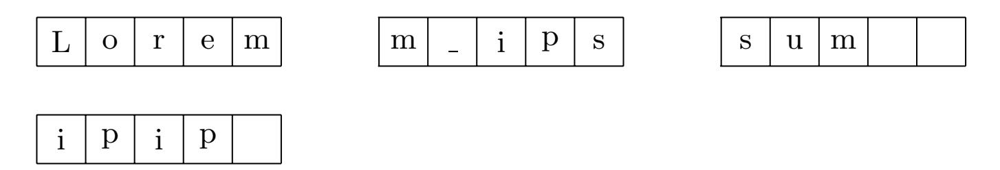
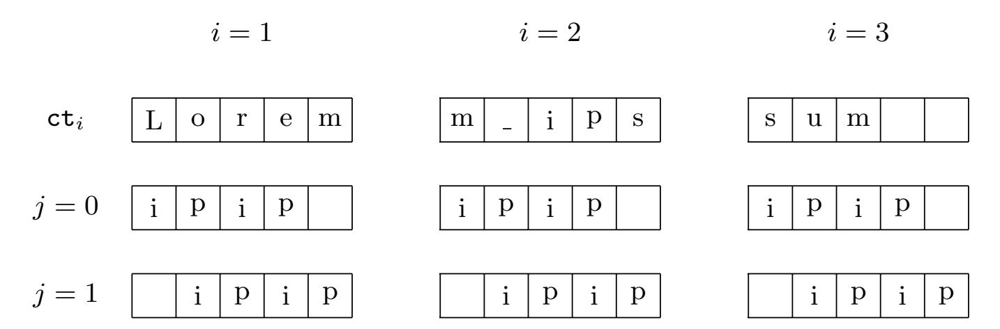
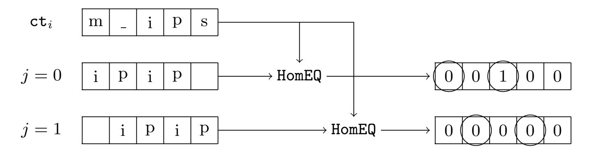

{0}------------------------------------------------

# Homomorphic string search with constant multiplicative depth

Charlotte Bonte and Ilia Iliashenko

imec-COSIC, Dept. Electrical Engineering, KU Leuven, Belgium {charlotte.bonte, ilia}@esat.kuleuven.be

Abstract. String search finds occurrences of patterns in a larger text. This general problem occurs in various application scenarios, f.e. Internet search, text processing, DNA analysis, etc. Using somewhat homomorphic encryption with SIMD packing, we provide an efficient string search protocol that allows to perform a private search in outsourced data with minimal preprocessing. At the base of the string search protocol lies a randomized homomorphic equality circuit whose depth is independent of the pattern length. This circuit not only improves the performance but also increases the practicality of our protocol as it requires the same set of encryption parameters for a wide range of patterns of different lengths. This constant depth algorithm is about 12 times faster than the prior work. It takes about 5 minutes on an average laptop to find the positions of a string with at most 50 UTF-32 characters in a text with 1000 characters. In addition, we provide a method that compresses the search results, thus reducing the communication cost of the protocol. For example, the communication complexity for searching a string with 50 characters in a text of length 10000 is about 347 KB and 13.9 MB for a text with 1000000 characters.

# 1 Introduction

The string search problem consists in finding occurrences of a given string (the pattern) in a larger string (the text). This problem arises in various branches of computer science including text processing, programming, DNA analysis, database search, Internet search, network security, data mining, etc.

In real-life scenarios, string-searching algorithms often deal with private information. For example, the business model of Internet search engines is based on profiling users given their search queries, which is later used for targeted advertising. Another example is the analysis of genomic data. Doctors can outsource the genomic data of their patients to a service provider and query parts of this data remotely. If this information is exposed in the clear to the service provider, it might be exploited in an unauthorized way.

To protect private data, users and service providers can resort to a special type of encryption algorithms, called homomorphic encryption (HE) [\[25\]](#page-28-0). In addition to data hiding, HE allows to perform computations on encrypted data without decrypting it. Depending on computational capabilities, HE schemes 

{1}------------------------------------------------

are divided into several classes. The most powerful class is fully homomorphic encryption (FHE) that allows to compute any function on encrypted values. The first realization of FHE was presented in [\[15\]](#page-27-0).

In secure string search, FHE has the following advantages over other privacypreserving cryptographic tools.

- Low communication complexity. FHE requires only two communication rounds and its communication overhead is proportional to the plaintext size, whereas Yao's garbled circuits [\[30\]](#page-28-1) have communication complexity proportional to the running time of the string-searching algorithm.
- Non-interactiveness. FHE does not require users and service providers to be present on-line while computing a string-searching algorithm. In contrast, multi-party computation (MPC) [\[30,](#page-28-1)[18\]](#page-28-2) is based on extensive on-line communication between the parties.
- Universality. Any string-searching algorithm can be implemented with FHE without or with little data preprocessing. This allows to keep data in a form that is accessible for other computational tasks. On the contrary, privateinformation retrieval (PIR) [\[12\]](#page-27-1), oblivious RAM (ORAM) [\[17\]](#page-28-3) and privateset intersection (PSI) [\[8\]](#page-27-2) protocols require data to be converted to a specific format that introduces additional time and memory overhead.
  - In particular, PIR and ORAM retrieve an element with a unique identifier. Thus, substrings with the same sets of characters should be attached additional labels (e.g. their positions in the text) to distinguish them. PSI computes the intersection between the query (pattern) and the data (text). Thus, PSI checks only the pattern presence in the text without specifying its positions and the number of its occurrences. It implies that both the pattern and the text must be turned into sets whose intersection contains all the positions of the text substrings matching the pattern.
- No data leakage. Since the semantic security of the existing FHE schemes is based on hard lattice problems, FHE is believed to hide any information about encrypted data except for the maximal data size. In contrast, symmetric searchable encryption (SSE) [\[28\]](#page-28-4) assumes so-called "minimal leakage" that usually includes whether the same data is accessed on the server side (access pattern) or whether the same query is generated by the client (search pattern).

Nevertheless, the efficiency of FHE schemes in general is far from practical despite numerous optimizations and tricks [\[4,](#page-27-3)[13,](#page-27-4)[20,](#page-28-5)[11](#page-27-5)[,7\]](#page-27-6). A more efficient approach is to resort to somewhat homomorphic encryption (SHE) [\[15\]](#page-27-0) that can compute any function of bounded multiplicative depth. SHE is a better option in practical use cases where a function to be computed is often known in advance.

The most efficient SHE schemes are based on algebraic lattices [\[5,](#page-27-7)[14\]](#page-27-8). It was noticed in [\[26\]](#page-28-6) that the algebraic structure of these lattices yields a way of packing several data values into one homomorphic ciphertext. A homomorphic arithmetic operation applied on such a ciphertext results in an arithmetic operation operation simultaneously applied on all the packed data values. In other words, 

{2}------------------------------------------------

a single homomorphic instruction acts on multiple data values. This is why this technique is called SIMD packing. SIMD packing not only reduces ciphertextplaintext expansion ratio of SHE/FHE schemes but also significantly reduces the computational overhead of homomorphic circuits even when parallelism is not required [\[16\]](#page-28-7).

The multiplicative depth of the existing homomorphic string-searching and pattern-matching algorithms with SIMD packing [\[9,](#page-27-9)[10,](#page-27-10)[29,](#page-28-8)[23,](#page-28-9)[22,](#page-28-10)[1,](#page-25-0)[2\]](#page-27-11) depends on the pattern length, which makes it hard to set encryption parameters for patterns of varying lengths. In this work, we show how using the SIMD techniques from [\[16\]](#page-28-7) and randomization, we can efficiently address this problem.

### 1.1 Contribution

We propose a general framework for the design of homomorphic string search protocols using SHE schemes with SIMD packing.

We consider the setting where a client places encrypted data on a server and at a later point in time wants to search for a specific pattern without revealing the text, the pattern or the result of string search to the server. In addition, our framework is applicable when the server has plaintext data and the client wants to query it without revealing the pattern and the results of string search.

This framework includes the following steps.

Preprocessing. We provide a simple algorithm for converting a large text into a set of ciphertexts with reasonably small encryption parameters such that a homomorphic string search algorithm can efficiently operate on them. Since this algorithm preserves the natural representation of the text as an array of characters, the server can easily change the text on the client's request.

Processing. Even though any secure string search algorithm without preprocessing can be applied at this stage, we provide a concrete efficient example. In particular, we design a randomized homomorphic circuit with false-biased probability 1/q that checks the equality relation between pairs of encrypted strings encoded as vectors over a finite field Fq. Combining homomorphic SIMD techniques from [\[26,](#page-28-6)[16\]](#page-28-7) and the randomization method of Razborov-Smolensky [\[24,](#page-28-11)[27\]](#page-28-12), this circuit achieves constant multiplicative depth, which allows to set a single set of encryption parameters for different pattern lengths. Furthermore, it requires fewer homomorphic multiplications, which leads to a significant improvement in computational time over the prior works [\[23,](#page-28-9)[22,](#page-28-10)[2\]](#page-27-11).

Postprocessing. We describe a new compression technique that allows to combine the encrypted results of the string search such that the number of ciphertexts transmitted from the server to the client is reduced by a linear factor.

To demonstrate the efficiency of our framework, we provide its concrete running time using implementation in the HElib library [\[21\]](#page-28-13) and compare it with the prior works.

{3}------------------------------------------------

### 1.2 Related works

The first work on homomorphic string search and pattern matching was presented in [\[31](#page-28-14)[,32\]](#page-28-15). Despite the efficiency of this algorithm, it has several functional drawbacks.

First, it assumes that data values are packed into plaintext polynomial coefficients. This type of encoding does not admit SIMD operations. Therefore, to manipulate individual data values one should resort to the coefficient-extraction procedure, which is expensive in practice [\[6\]](#page-27-12).

Secondly, given r ciphertexts encrypting the text, this algorithm returns exactly the same number of ciphertexts encrypting string search results. Thus, the communication complexity in this case is exactly the same as in the naive protocol where the server sends all r ciphertexts of the text to the client. If the client owns the text and uses the server to outsource his data, this problem makes the above algorithm meaningless.

Every string search algorithm uses the equality function as a subroutine. Thus, the optimization of a homomorphic string search often boils down to the optimization of the homomorphic equality function. The first equality circuit for binary data encoded in the SIMD manner was proposed by Cheon et al. [\[9\]](#page-27-9). This paper shows how homomorphic permutations of SIMD slots can be exploited to decrease the complexity of the equality circuit as predicted in [\[16\]](#page-28-7). Further, Kim et al. [\[23\]](#page-28-9) designed an efficient equality circuit over arbitrary finite fields by employing the homomorphic Frobenius map. However, the multiplicative depth of the above circuits depends on the input length. In our work, we remove this dependency.

In [\[2\]](#page-27-11), a homomorphic string search is based on the classic binary equality circuit and a randomized OR circuit. Both circuits depend on the input length, but the multiplicative depth of the OR circuit is decreased by the randomization method of Razborov and Smolensky [\[24,](#page-28-11)[27\]](#page-28-12). In our work, we exploit the extreme version of this method where the failure probability depends only on the plaintext space size. This makes the depth of our matching algorithm constant at the cost of a large plaintext space, which we efficiently use in the preprocessing and postprocessing steps.

Another drawback of [\[2\]](#page-27-11) is that it deals only with data encrypted bit-wise and exploits the SIMD packing only for parallel search in several texts, while ignoring the techniques from [\[16\]](#page-28-7). This data encoding increases the input length and thus introduces a larger computational overhead in comparison to the circuits in [\[9](#page-27-9)[,23](#page-28-9)[,22\]](#page-28-10) as more homomorphic multiplications are required to compute the equality function. Moreover, the communication complexity is dependent on the bit-size of the pattern. In our work, the characters are encoded into a finite field Fq, which results in a bigger number of characters that can be encrypted by one ciphertext. Furthermore, by employing the SIMD techniques from [\[16\]](#page-28-7), we are able to keep and process characters of the same text in each ciphertext. This means that if the pattern length is always less than the ciphertext capacity, then we need only one ciphertext to encrypt the pattern. This makes the com

{4}------------------------------------------------

munication complexity from the client to the server independent on the pattern length.

Another advantage of our work is that our string search algorithm can find all the string matches in one round, whereas in [2] only one match is returned to the client.

### 2 Preliminaries

#### 2.1 Notation

Vectors are written in column form and denoted by boldface lower-case letters. The vector containing only 1's in its coordinates is denoted by  $\mathbf{1}$ . We write  $\mathbf{0}$  for the zero vector.

The set of integers  $\{\ell, \ldots, k\}$  is denoted by  $[\ell, k]$ . For a positive integer t, let  $\operatorname{wt}(t)$  be the Hamming weight of its binary expansion.

Let t be an integer with |t| > 1. We denote the set of residue classes modulo t by  $\mathbb{Z}_t$ . The class representatives of  $\mathbb{Z}_t$  are taken from the half-open interval [-t/2, t/2).

### <span id="page-4-1"></span>2.2 Cyclotomic fields and Chinese Remainder Theorem

Let m be a positive integer and  $n = \phi(m)$  where  $\phi$  is the Euler totient function. Let K be a cyclotomic number field constructed by adjoining a primitive complex m-th root of unity to the field of rational numbers. We denote this root of unity by  $\zeta_m$ , so  $K = \mathbb{Q}(\zeta_m)$ . The ring of integers of K, denoted by R, is isomorphic to  $\mathbb{Z}[X]/\langle \Phi_m(X)\rangle$  where  $\Phi_m(X)$  is the mth cyclotomic polynomial.

Let  $R_t$  be the quotient of R modulo an ideal  $\langle t \rangle$  generated by some element  $t \in R$ . The ring  $R_t$  is isomorphic to the direct product of its factor rings as stated by the Chinese Reminder Theorem (CRT).

Theorem 1 (The Chinese Remainder Theorem for  $R_t$ ). Let t be an integer with |t| > 1 and  $\langle t \rangle$  be an ideal of R generated by t. Let  $\langle t \rangle$  be the product of pairwise co-prime ideals  $\mathcal{I}_0, \ldots, \mathcal{I}_{k-1}$ , then the following ring isomorphism holds

<span id="page-4-0"></span>
$$R_t \cong R/\mathcal{I}_0 \times \ldots \times R/\mathcal{I}_{k-1} \tag{1}$$

where the ring operations of the right-side direct product are component-wise addition and multiplication.

We can further characterize this isomorphism by using standard facts from number theory. Let t be a prime number. The cyclotomic polynomial  $\Phi_m(X)$  splits into k irreducible degree-d factors  $f_0(X), \ldots, f_{k-1}(X)$  modulo t where d is the order of t modulo m, i.e.  $t^d \equiv 1 \mod m$ . Note that d = n/k. Correspondingly, the ideal  $\langle t \rangle$  splits into k prime ideals  $\langle t, f_0(X) \rangle, \ldots, \langle t, f_{k-1}(X) \rangle$ . Hence, for any  $i \in [0, k-1]$  the quotient ring  $R/\mathcal{I}_i = \mathbb{Z}[X]/\langle t, f_i(X) \rangle$  is isomorphic to the finite field  $\mathbb{F}_{t^d}$ . As a result, we can rewrite the isomorphism in (1) as  $R_t \cong \mathbb{F}_{t^d}^k$ .

{5}------------------------------------------------

We call every copy of  $\mathbb{F}_{t^d}$  in the above isomorphism a *slot*. Hence, every element of  $R_t$  corresponds to k slots, which implies that an array of k elements of  $\mathbb{F}_{t^d}$  can be encoded as a unique element of  $R_t$ . We enumerate the slots in the same way as ideals  $\mathcal{I}_i$ 's. Namely, the slot isomorphic to  $R/\mathcal{I}_i$  is referred to as the *ith slot*.

Addition (multiplication) of  $R_t$ -elements results in coefficient-wise addition (multiplication) of their respective slots. In other words, a single  $R_t$  operation induces a single operation applied on multiple  $\mathbb{F}_{t^d}$  elements, which resembles the Single-Instruction Multiple-Data (SIMD) instructions used in parallel computing.

Using multiplication, we can easily define a projection map  $\pi_i$  on  $R_t$  that sends  $a \in R_t$  encoding slots  $(m_0, \ldots, m_{k-1})$  to  $\pi_i(a)$  encoding  $(0, \ldots, m_i, \ldots, 0)$ . In particular,  $\pi_i(a) = ag_i$ , where  $g_i \in R_t$  encodes  $(0, \ldots, 1, \ldots, 0)$ . For any  $I \subseteq \{0, \ldots, k-1\}$ , we can easily generalize this projection to  $\pi_I(a) = ag_I$  with  $g_I \in R_t$  encoding 1 in the SIMD slots indexed by I.

The field  $K = \mathbb{Q}(\zeta_m)$  is a Galois extension and its Galois group  $\mathsf{Gal}(K/\mathbb{Q})$  contains automorphisms of the form  $\sigma_i : X \mapsto X^i$  where  $i \in \mathbb{Z}_m^{\times}$ . The automorphisms that fix every ideal  $\mathcal{I}_i$  in the above decomposition of  $\langle t \rangle$  form a subgroup  $G_t$  of  $\mathsf{Gal}(K/\mathbb{Q})$  generated by the automorphism  $\sigma_t$ , named the Frobenius automorphism. Since  $(a(X))^{t^i} = a(X^{t^i})$  for every  $a(X) \in \mathbb{F}_{t^d}$ , the elements of  $G_t$  map the values of SIMD slots to their  $(t^i)$ -th powers for  $i \in [0, d-1]$ .

The elements of the quotient group  $H = \operatorname{\mathsf{Gal}}(K/\mathbb{Q})/G_t$  act transitively on  $\mathcal{I}_0, \ldots, \mathcal{I}_{k-1}$ , thus permuting corresponding SIMD slots. However, the order of H is n/d = k, which is less than k!, the number of all possible permutations on k slots. Gentry et al. [16] showed that every permutation of SIMD slots can be done via combination of automorphisms from H, projection maps and additions.

One can define the map  $\chi_0: a \mapsto a^{t^d-1}$  from  $\mathbb{F}_{t^d}$  to the binary set  $\{0,1\}$ . According to Euler's theorem, this map, called the *principal character*, returns 1 if a is non-zero and 0 otherwise. Since

<span id="page-5-0"></span>
$$a^{t^{d}-1} = a^{(t-1)(t^{d-1}+\dots+1)} = \prod_{i=0}^{d-1} (a^{t-1})^{t^{i}},$$
 (2)

 $\chi_0$  can be computed with Frobenius maps and multiplications.

#### 2.3 String search

The goal of string search is to find occurrences of a given string, called the pattern, in a larger string T, called the text. Formally, let  $\Sigma$  be a finite alphabet, i.e. a finite set of characters. The pattern and the text are arrays of characters P[0...M-1] and T[0...N-1], respectively, where characters are taken from  $\Sigma$ . Assume that  $M \leq N$ . The string search problem is to find all  $S \in [0, N-M]$  such that P[i] = T[S+i] for any  $i \in [0, M-1]$ . In other words, this problem asks to find the positions of all substrings of T that match P.

We assume that there exist an injective map  $\phi: \Sigma \to \mathbb{F}_{t^d}$  that encodes characters of the alphabet  $\Sigma$  into the finite field  $\mathbb{F}_{t^d}$ . Thus, the pattern and the text can be considered as vectors over  $\mathbb{F}_{t^d}$ .

{6}------------------------------------------------

### 3 Homomorphic operations

In this work, we exploit leveled HE schemes that support the SIMD operations on their plaintexts. Such schemes include FV [14] and BGV [5], whose plaintext space is the ring  $R_t$  for some t > 1. The general framework of these schemes is outlined below.

#### 3.1 Basic setup

Let  $\lambda$  be the security level of an HE scheme. Let L be the maximal multiplicative depth of homomorphic circuits we want to evaluate. Let d be the order of the plaintext modulus t modulo the order m of R. Assume that the plaintext space  $R_t$  has k SIMD slots, i.e.  $R_t \cong \mathbb{F}_{t^d}^k$ . For a vector  $\mathbf{a} \in \mathbb{F}_{t^d}^k$ , we denote the plaintext encoding of  $\mathbf{a}$  by  $\mathsf{pt}(\mathbf{a})$ . The basic algorithms of any HE scheme are key generation, encryption and decryption.

 $\text{KeyGen}(1^{\lambda}, 1^{L}) \to (\text{sk}, \text{pk})$ . Given  $\lambda$  and L, this function generates the secret key sk and the public key pk. Note that pk contains key-switching keys that help to transform ciphertexts encrypted under other secret keys to ciphertexts encrypted under sk.

Encrypt(pt  $\in R_t$ , pk)  $\to$  ct. The encryption algorithm takes a plaintext pt and the public key pk and outputs a ciphertext ct.

 $Decrypt(ct, sk) \rightarrow pt$ . The decryption algorithm takes a ciphertext ct and the secret key sk and returns a plaintext pt. For freshly encrypted ciphertexts, the decryption correctness means that Decrypt(Encrypt(pt, pk), sk) = pt.

#### 3.2 Arithmetic operations

Basic arithmetic operations in SHE are addition and multiplication.

 $Add(ct_1, ct_2) \to ct$ . The addition algorithm takes two input ciphertexts  $ct_1$  and  $ct_2$  encrypting plaintexts  $pt_1$  and  $pt_2$  respectively. It outputs a ciphertext ct that encrypts the sum of these plaintexts in the ring  $R_t$ . It implies that homomorphic addition sums respective SIMD slots of  $pt_1$  and  $pt_2$ .

 $AddPlain(ct_1, pt_2) \rightarrow ct$ . This algorithm takes a ciphertext  $ct_1$  encrypting a plaintext  $pt_1$  and a plaintext  $pt_2$ . It outputs a ciphertext ct that encrypts  $pt_1 + pt_2$ . As for the Add algorithm, AddPlain sums respective SIMD slots of  $pt_1$  and  $pt_2$ .

 $\text{Mul}(\mathsf{ct}_1, \mathsf{ct}_2) \to \mathsf{ct}$ . Given two input ciphertext  $\mathsf{ct}_1$  and  $\mathsf{ct}_2$  encrypting plaintext  $\mathsf{pt}_1$  and  $\mathsf{pt}_2$  respectively, the multiplication algorithm outputs a ciphertext  $\mathsf{ct}$  that encrypts the plaintext product  $\mathsf{pt}_1 \cdot \mathsf{pt}_2$ . As a result, homomorphic multiplication multiplies respective SIMD slots of  $\mathsf{pt}_1$  and  $\mathsf{pt}_2$ .

 $\operatorname{MulPlain}(\operatorname{ct}_1,\operatorname{pt}_2) \to \operatorname{ct}$ . Given a ciphertext  $\operatorname{ct}_1$  encrypting plaintext  $\operatorname{pt}_1$  and a plaintext  $\operatorname{pt}_2$ , this algorithm outputs a ciphertext  $\operatorname{ct}$  that encrypts the plaintext product  $\operatorname{pt}_1 \cdot \operatorname{pt}_2$ . As a result, MulPlain multiplies respective SIMD slots of  $\operatorname{pt}_1$  and  $\operatorname{pt}_2$ .

Using the above operations as building blocks, one can design homomorphic subtraction algorithms.

{7}------------------------------------------------

 $Sub(ct_1, ct_2) = Add(ct_1, MulPlain(ct_2, pt(-1))) \rightarrow ct$ . The subtraction algorithm returns a ciphertext ct that encrypts the difference of two plaintext messages  $pt_1 - pt_2$  encrypted by  $ct_1$  and  $ct_2$ , respectively.

 $\begin{array}{ll} \mathtt{SubPlain}(\mathtt{ct}_1,\mathtt{pt}_2) &= \mathtt{AddPlain}(\mathtt{ct}_1,\mathtt{pt}_2 \cdot \mathtt{pt}(-1)) \to \mathtt{ct}. \text{ This algorithm} \\ \mathtt{returns} \text{ a ciphertext } \mathtt{ct} \text{ that encrypts } \mathtt{pt}_1 - \mathtt{pt}_2 \text{ where } \mathtt{pt}_1 \text{ is encrypted by } \mathtt{ct}_1. \\ \mathtt{We consider SubPlain}(\mathtt{pt}_1,\mathtt{ct}_2) \text{ to be equivalent to SubPlain}(\mathtt{ct}_1,\mathtt{pt}_2). \\ \end{array}$ 

As shown in Section 2.2, the projection map  $\pi_I$  can select the SIMD slots indexed by a set  $I \subseteq [0, k-1]$  and set the rest to zero. This operation is homomorphically realized by the Select function.

Select(ct, I) = MulPlain(ct, pt( $\mathbf{1}_I$ ))  $\rightarrow$  ct' where  $\mathbf{1}_I$  is a vector having 1's in the coordinates indexed by a set I and zeros elsewhere. Given a ciphertext ct encrypting SIMD slots  $\mathbf{m}=(m_0,m_1,\ldots,m_{k-1})$  and a set I, this function returns a ciphertext ct' that encrypts  $\mathbf{m}'=(m'_0,\ldots,m'_{k-1})$  such that  $m'_i=m_i$  if  $i\in I$  and  $m'_i=0$  otherwise.

#### <span id="page-7-2"></span>3.3 Special operations

One can also homomorphically permute the SIMD slots of a given ciphertext and act on them with the Frobenius automorphism.

Rot(ct, i)  $\to$  ct' with  $i \in [0, k-1]$ . Given a ciphertext ct encrypting SIMD slots  $\mathbf{m} = (m_0, m_1, \dots, m_{k-1})$ , the rotation algorithm returns a ciphertext ct' that encrypts the cyclic shift of  $\mathbf{m}$  by i positions, namely  $(m_i, m_{(i+1) \mod k}, \dots, m_{(i-1) \mod k})$ .

 $\operatorname{Frob}(\operatorname{ct},i) \to \operatorname{ct}'$  with  $i \in [0,d-1]$ . Given a ciphertext ct encrypting SIMD slots  $\mathbf m$  as above, the Frobenius algorithm returns a ciphertext  $\operatorname{ct}'$  that encrypts a Frobenius map action on  $\mathbf m$ , namely  $(m_0^{t^i},m_1^{t^i},\ldots,m_{k-1}^{t^i})$ .

As discussed in Section 2.2, the Frob and Mul operations can be combined to compute the principal character  $\chi_0(x)$ , which tests whether x is non-zero.

IsNonZero(ct)  $\to$  ct'. Given a ciphertext ct encrypting SIMD slots  $\mathbf{m} = (m_0, m_1, \dots, m_{k-1})$ , this function returns a ciphertext ct' that encrypts  $(\chi_0(m_0), \chi_0(m_1), \dots, \chi_0(m_{k-1}))$ . Recall that  $\chi_0(m) = m^{t^d-1} = \prod_{i=0}^{d-1} (m^{t-1})^{t^i}$  as shown in (2). The multiplicative depth of  $x^{t-1}$  is equal to  $\lceil \log_2(t-1) \rceil$ . The multiplicative depth of  $x^{t^i}$  is zero as it can be done by the Frob operation. In total, d-1 Frob operations are needed to compute  $\chi_0(m)$ . As a result, the total multiplicative depth of IsNonZero is

<span id="page-7-1"></span><span id="page-7-0"></span>
$$\lceil \log_2(t-1) \rceil + \lceil \log_2 d \rceil. \tag{3}$$

Using general exponentiation by squaring,  $x^{t-1}$  requires  $\lfloor \log_2(t-1) \rfloor + \operatorname{wt}(t-1) - 1$  field multiplications. Since d-1 field multiplications are needed to compute  $\prod_{i=0}^{d-1} (x^{t-1})^{t^i}$ , the total number of multiplications to compute  $\chi_0(m)$  is

$$\lfloor \log_2(t-1) \rfloor + \text{wt}(t-1) + d - 2.$$
 (4)

{8}------------------------------------------------

<span id="page-8-0"></span>Table 1: The cost of homomorphic operations with relation to running time and noise growth.

| Operation | Time      | Noise     |
|-----------|-----------|-----------|
| Add       | cheap     | cheap     |
| AddPlain  | cheap     | cheap     |
| Mul       | expensive | expensive |
| MulPlain  | cheap     | moderate  |
| Sub       | cheap     | cheap     |
| SubPlain  | cheap     | cheap     |
| Select    | cheap     | moderate  |
| Rot       | expensive | moderate  |
| Frob      | expensive | cheap     |
| IsNonZero | expensive | expensive |
|           |           |           |

### <span id="page-8-2"></span>3.4 Cost of homomorphic operations

Note that every homomorphic ciphertext contains a special component called noise that is removed during decryption. However, the decryption function can deal only with noise of small enough magnitude; otherwise, this function fails. This noise bound is defined by encryption parameters in a way that larger parameters result in a larger bound. The ciphertext noise increases after every homomorphic operation and, therefore, approaches its maximal possible bound. It implies that to reduce encryption parameters one needs to avoid homomorphic operations that significantly increase the noise. Therefore, while designing homomorphic circuits, we need to take into account not only the running time of homomorphic operations but also their effect on the noise.

Table [1](#page-8-0) summarizes the running time and the noise cost of the above homomorphic operations. Similar to [\[19\]](#page-28-16), we divide the operations into expensive, moderate and cheap. The expensive operations dominate the cost of a homomorphic circuit. The moderate operations are less important, but if there are many of them in a circuit, their total cost can dominate the total cost. The cheap operations are the least important and can be omitted in the cost analysis.

It is worth to note that there are two multiplication functions Mul (ciphertextciphertext multiplication) and MulPlain (ciphertext-plaintext multiplication). Since Mul is much more expensive than MulPlain, the multiplicative depth of a homomorphic circuit is calculated with relation to the number of Mul's.

# <span id="page-8-1"></span>4 Equality circuits

The equality function tests whether two `-dimensional vectors over some finite field F are equal. It returns 1 when input strings are equal and 0 otherwise.

{9}------------------------------------------------

#### 4.1 State-of-the-art equality circuits

If input vectors are binary, the equality function can be computed in any ring  $\mathbb{Z}_{t>1}$ .

**Definition 1** (Binary equality circuit). Given two  $\ell$ -dimensional binary vectors  $\mathbf{x} = (x_0, \dots, x_{\ell-1})$  and  $\mathbf{y} = (y_0, \dots, y_{\ell-1})$ , the equality function can be computed over any  $\mathbb{Z}_{t>1}$  via the following arithmetic circuit

$$EQ_2(\mathbf{x}, \mathbf{y}) = \prod_{i=0}^{\ell-1} (1 - (x_i - y_i)).$$

Representing data in the binary form can be far from optimal, especially when the plaintext modulus t is bigger than 2. In this case,  $R_t$  is capable to encode  $n \log_2 t$  bits of data rather than just n. To use this extra space, we employ finite field arithmetic. Let t be a prime number. Then each SIMD slot is isomorphic to a finite algebraic extension of the finite field  $\mathbb{F}_t$  of degree d. Hence, data can be encoded into elements of  $\mathbb{F}_{t^d}$  rather than into elements of  $\mathbb{F}_2$ . The equality circuit for vectors over  $\mathbb{F}_{t^d}$  is defined as follows.

**Definition 2 (Equality circuit in**  $\mathbb{F}_{t^d}$ ). Given two vectors  $\mathbf{x} = (x_0, \dots, x_{\ell-1})$  and  $\mathbf{y} = (y_0, \dots, y_{\ell-1})$  from  $\mathbb{F}_{t^d}^{\ell}$ , the equality function can be computed via the following polynomial function

$$\mathsf{EQ}_{t^d}(\mathbf{x}, \mathbf{y}) = \prod_{i=0}^{\ell-1} \left( 1 - (x_i - y_i)^{t^d - 1} \right). \tag{5}$$

Using (3), it is easy to see that the total multiplicative depth of (5) is

<span id="page-9-0"></span>
$$\lceil \log_2 \ell \rceil + \lceil \log_2 (t-1) \rceil + \lceil \log_2 d \rceil$$
.

It follows from (4) that the total number of multiplications in (5) is

$$|\log_2(t-1)| + \operatorname{wt}(t-1) + d + \ell - 3$$
.

We can also derive (5) from a function with  $\ell$  variables. Let  $\mathtt{IsZero}(\mathbf{x})$  be a function that outputs 1 when  $\mathbf{x}$  is the zero vector and 0 otherwise. For  $x \in \mathbb{F}_{t^d}^{\ell}$ , it holds for each  $i = [0, \ell - 1]$  that  $1 - x_i^{t^d - 1}$  is 1 if  $x_i = 0$  and 0 otherwise. This implies that  $\mathtt{IsZero}(\mathbf{x})$  is given by  $\prod_{i=0}^{\ell-1} (1 - x_i^{t^d - 1})$ . Since  $\mathtt{EQ}_{t^d}(\mathbf{x}, \mathbf{y}) = \mathtt{IsZero}(\mathbf{x} - \mathbf{y})$ , we indeed obtain (5) as the expression for the equality circuit.

#### 4.2 Our equality circuits

We propose a new randomized equality circuit that makes the multiplicative depth independent on the input length. Our circuit is based on the Razborov-Smolensky method, which helps to represent a high fan-in OR function by a low degree polynomial. In finite fields, the OR function returns 1 if its input has at

{10}------------------------------------------------

least one non-zero coordinate and 0 otherwise. Using the primitive character, we can represent OR as the polynomial  $OR(\mathbf{x}) = 1 - \prod_{i=0}^{\ell-1} (1 - x_i^{t^d-1})$  of degree  $\ell(t^d-1)$  over  $\mathbb{F}_{t^d}^{\ell}$ .

To decrease the polynomial degree, we take some positive integer  $D < \ell$  and sample  $D\ell$  uniformly random elements  $r_0, \ldots, r_{D\ell-1}$  and compute  $\mathtt{OR}^r(\mathbf{x}) = 1 - \prod_{i=0}^{D-1} \left(1 - \left(\sum_{j=0}^{\ell-1} r_{i\ell+j} x_j\right)^{t^d-1}\right)$ . The degree of this polynomial  $D(t^d-1)$  is smaller than that of  $\mathtt{OR}$ , but its output is randomized and might be wrong. Notice that if  $\mathbf{x} = \mathbf{0}$ , this polynomial correctly returns 0. If  $\mathbf{x}$  is a non-zero vector,  $\sum_{j=0}^{\ell-1} r_{i\ell+j} x_j = 0$  with probability  $t^{-d}$ . Thus,  $\mathtt{OR}^r$  wrongly returns 0 with probability  $t^{-Dd}$ . This means that  $\mathtt{OR}^r(\mathbf{x}) = \mathtt{OR}(\mathbf{x})$  for  $\mathbf{x} \neq \mathbf{0}$  with probability  $1 - t^{-Dd}$ .

Note that D was chosen to decrease the failure probability. We can simply set it to 1 if the field size  $t^d$  is sufficiently large. Following this idea, we randomized the equality function over finite fields.

**Definition 3 (Randomized equality circuit over**  $\mathbb{F}_{t^d}$ ). Given two  $\ell$ -dimensional vectors  $\mathbf{x} = (x_0, \dots, x_{\ell-1})$  and  $\mathbf{y} = (y_0, \dots, y_{\ell-1})$  with  $x_i, y_i \in \mathbb{F}_{t^d}$  for any i, the randomized equality function can be computed over  $\mathbb{F}_{t^d}$  via the following polynomial function

<span id="page-10-1"></span><span id="page-10-0"></span>
$$\mathsf{EQ}_{t^d}^r(\mathbf{x}, \mathbf{y}) = 1 - \left(\sum_{i=0}^{\ell-1} r_i(x_i - y_i)\right)^{t^d - 1} \tag{6}$$

where  $r_i$ 's are uniformly random elements of  $\mathbb{F}_{t^d}$ .

The correctness of  $\mathbb{E}\mathbb{Q}_{t^d}^r$  is defined by the following lemma.

**Lemma 1.** Let  $\mathbf{x}, \mathbf{y} \in \mathbb{F}_{t^d}^{\ell}$ . If  $\mathbf{x} = \mathbf{y}$ , then  $\mathsf{EQ}_{t^d}^r(\mathbf{x}, \mathbf{y}) = 1$ . If  $\mathbf{x} \neq \mathbf{y}$ , then  $\mathsf{EQ}_{t^d}^r(\mathbf{x}, \mathbf{y}) = 0$  with probability  $1 - t^{-d}$ .

*Proof.* If  $\mathbf{x} = \mathbf{y}$ , the sum  $\sum_{i=0}^{\ell-1} r_i(x_i - y_i)$  always vanishes, which results in  $\mathbb{E}Q_{t^d}^r(\mathbf{x}, \mathbf{y}) = 1$ .

If  $\mathbf{x} \neq \mathbf{y}$ , then there exist a non-empty set of indices  $I \subseteq [0, \ell - 1]$  such that  $x_i - y_i$  is non-zero for any  $i \in I$ . Then, the product  $r_i(x_i - y_i)$  is a uniformly random element of  $\mathbb{F}_{t^d}$  if  $i \in I$  and 0 otherwise. As a result,  $\sum_{i=0}^{\ell-1} r_i(x_i - y_i)$  is a uniformly random element of  $\mathbb{F}_{t^d}$ . The above sum is non-zero with probability  $1 - t^{-d}$ , which leads to  $\left(\sum_{i=0}^{\ell-1} r_i(x_i - y_i)\right)^{t^d-1} = 1$  by Euler's theorem. Hence,  $\mathbb{E}Q_{t^d}^r(\mathbf{x}, \mathbf{y})$  outputs 0 when  $\mathbf{x} \neq \mathbf{y}$  with probability  $1 - t^{-d}$ .

Complexity. Following the same reasoning as for the deterministic equality circuit, we obtain that the multiplicative depth of (6) is

$$\lceil \log_2(t-1) \rceil + \lceil \log_2 d \rceil + 1,$$

{11}------------------------------------------------

which is independent on the vector length  $\ell$ . It follows from (4) that the total number of multiplications in (6) is

$$|\log_2(t-1)| + \operatorname{wt}(t-1) + d - 2 + \ell$$
.

In a similar manner, we can define an equality circuit for vectors containing wildcards. Let \* be a wildcard character meaning that it represents any symbol in the alphabet. Assume that \* is encoded by an element  $\omega \in \mathbb{F}_{t^d}$ . Then the randomized equality circuit with wildcards for  $\mathbb{F}_{t^d}$ -vectors is defined as follows.

Definition 4 (Randomized equality circuit with wildcards over  $\mathbb{F}_{t^d}$ ). Let  $\mathbf{x} = (x_0, \dots, x_{\ell-1})$  and  $\mathbf{y} = (y_0, \dots, y_{\ell-1})$  be two  $\ell$ -dimensional vectors such that  $x_i \in \mathbb{F}_{t^d}$  and  $y_i \in \mathbb{F}_{t^d} \setminus \{\omega\}$ . Then the randomized equality function for such vectors can be computed via the following polynomial function

$$\mathbb{EQ}_{t^d}^{r,*}(\mathbf{x}, \mathbf{y}) = 1 - \left(\sum_{i=0}^{\ell-1} r_i(x_i - \omega)(x_i - y_i)\right)^{t^d - 1}$$
(7)

where  $r_i$ 's are uniformly random elements of  $\mathbb{F}_{t^d}$ .

Due to additional multiplication by  $x_i - \omega$ , this circuit has multiplicative depth

<span id="page-11-0"></span>
$$\lceil \log_2(t-1) \rceil + \lceil \log_2 d \rceil + 2,$$

which is one more than that of  $\mathsf{EQ}^r_{t^d}$ . This also introduces  $\ell$  additional multiplications, so their total number becomes

$$|\log_2(t-1)| + \operatorname{wt}(t-1) + d - 2 + 2\ell.$$

Example 1. The randomized equality testing of two vectors from  $\mathbb{F}^8_{3^{16}}$  with wild-cards needs 32 multiplications. The multiplicative depth of this circuit is 7. The output of this circuit is correct with error probability about  $3^{-16} \simeq 2^{-25}$ .

#### 5 Homomorphic string search protocol

In this section, we describe a protocol for homomorphic string search. This protocol assumes two parties, the client and the honest-but-curious server. The client wants to upload a text document to the server and then be able to search over it. In particular, she wants to send a pattern to the server and receive the positions of this pattern in the outsourced text. The client is willing to hide the text, the patterns and the query results from the server.

The flow of the protocol is depicted in Figure 1. Before the start of the protocol, the client encrypts and sends her text to the server. The protocol begins when the client encrypts and sends a pattern to the server. Receiving the encrypted pattern, the server performs a homomorphic string search algorithm an then sends the results back to the client. Our threat model assumes that the computationally-bounded server follows the protocol but it tries to extract

{12}------------------------------------------------

1. Client sends the encrypted text to server.

<span id="page-12-0"></span>

2. Client sends the encrypted pattern to server.


3. Server performs the homomorphic string search and sends the result to client who can decrypt it.


Fig. 1: Our string search protocol.

information from the client's queries. The server should not be able to distinguish two encrypted patterns of the same length. This security requirement is achieved by the semantic security of an SHE scheme as discussed in Section 3.3 of [2].

In an alternative scenario, one could assume the server has the text in the clear. Our solution immediately transfers to this scenario by replacing the ciphertexts encrypting the text by plaintexts in the solution below, which would only reduce the complexity of our solution as opertations between a plaintext and a ciphertext are less expensive than ciphertext-ciphertext operations. As a solution for the setting where the text is encrypted, immediately yields a solution for the scenario where the server has the text in the clear, we focus on the more general problem where the text is encrypted.

The protocol description starts with the preprocessing step where the client encrypts the text.

#### <span id="page-12-1"></span>5.1 How to encrypt the text into several ciphertexts

Recall that the text T has length N, so it can be represented as an N-dimensional vector over  $\mathbb{F}_{t^d}$ . Similarly, the pattern P can be represented as an  $\mathbb{F}_{t^d}$ -vector of length M < N. Let  $\tilde{T}_M^{(i)}$  be a substring of T of length M starting at the ith position of T.

In practice, we can assume that M is less than k, the number of SIMD slots, which seems plausible as k can be hundreds or thousands. However, the entire text might not fit k SIMD slots; thus, we assume N > k. In this case, we need to

{13}------------------------------------------------

split T and encrypt it into different ciphertexts such that a homomorphic string search algorithm can find all the occurrences of any length-M pattern in T.

Let  $r = \lceil N/k \rceil$ . Let us naively split T into substrings  $T_1 \dots T_r$ , where all but the last one are of length k and  $|T_r| \leq k$ . Notice that the substrings  $\tilde{T}_M^{(ik)}, \dots, \tilde{T}_M^{((i+1)k-M)}$  are contained in  $T_{i+1}$  for any  $i \in [0, r-1]$ . However, substrings  $\tilde{T}_M^{(ik-M+1)}, \dots, \tilde{T}_M^{(ik-1)}$  for  $i \in [1, r-1]$  are missing, which means that this naive approach does not work. Moreover, it implies that we might need to duplicate characters of T to encode all its length-M substrings.

We define an (M, k)-cover of T as a set of length-k substrings  $\{T_1, T_2, \ldots T_r\}$  of T such that every length-M substring of T is contained only in one  $T_i$ . Therefore, all the occurrences of any pattern P of length at most M in T can be found by matching P with  $T_i$ 's. For example, if T = "example", then  $\{\text{"exam"}, \text{"ampl"}, \text{"ple"}\}$  is a (3, 4)-cover of T. See Figure 2 for an illustration.

<span id="page-13-0"></span>

| е | X | a | m |  | a | m | p | 1 |  | p | 1 | е |  |
|---|---|---|---|--|---|---|---|---|--|---|---|---|--|
|---|---|---|---|--|---|---|---|---|--|---|---|---|--|

Fig. 2: The (3,4)-cover of the text T = "example". Every rectangle represents a length-4 substring of this cover. Every length-3 substring of T is contained in an exactly one of these substrings.

We construct an (M, k)-cover of T as follows. Let  $T_1$  be as in the naive approach, i.e.  $T_1 = T[0] \dots T[k-1]$ . As pointed out above,  $T_1$  contains all the length-M substrings up to  $\tilde{T}_M^{(k-M)}$ . Thus,  $T_2$  should start with T[k-M+1], which yields  $T_2 = T[k-M+1] \dots T[2k-M]$ . Following this procedure, we transform T into the set of its length-k substrings  $T_1, T_2, \dots, T_r$  such that

$$T_1 = T[0] \dots T[k-1],$$
  
 $T_2 = T[k-M+1] \dots T[2k-M],$   
 $\dots$   
 $T_i = T[(i-1)(k-M+1)] \dots T[(i-1)(k-M+1)+k-1],$   
 $\dots$   
 $T_r = T[(r-1)(k-M+1)] \dots T[N-1].$ 

Thus, r should satisfy  $N-1 \le k-1+(r-1)(k-M+1)$ . It follows that  $r \ge (N-M+1)/(k-M+1)$  and then  $r = \lceil (N-M+1)/(k-M+1) \rceil$ , since r is an integer.

Note that  $T_i$ 's are chosen to fit into one ciphertext with k slots. Hence,  $T_1, \ldots, T_r$  can be encoded into SIMD slots such that the jth character  $T_i[j]$  is mapped to the jth slot of the ith ciphertext. Hence, r ciphertexts are needed to encrypt N characters of the text T.

Example 2. The extreme examples are

{14}------------------------------------------------

- -M = k (the pattern occupies all the SIMD slots of a single ciphertext), then r = N k + 1;
- -M=1 (the pattern is just one character, so k copies of the pattern can be encrypted into one ciphertext), then  $r=\lceil N/k \rceil$ , which is optimal.

If M=k/2, then  $r=\lceil (N-(k/2)+1)/((k/2)+1)\rceil\simeq 2N/k$ . Thus, about twice more ciphertexts are needed than in the optimal case. If M=k/c for some  $c\in(1,k]$ , then  $r=\lceil (N-(k/c)+1)/(k-(k/c)+1)\rceil\simeq\frac{c}{c-1}\cdot\frac{N}{k}$ . This means that if one ciphertext can contain at most c copies of the pattern, then c/(c-1) times more ciphertexts are needed to encrypt the text than in the optimal case.

Using the procedure above the client produces r ciphertexts that contain the text. These ciphertexts are then uploaded to the server, which concludes the preprocessing phase.

An (M,k)-cover can also be created at the server side. Let the client naively split T into substrings  $T_1, \ldots, T_{r'}$  of length at most k. These substrings are then encrypted and sent to the server. As  $r' = \lfloor k/M \rfloor$ , this reduces the communication cost between the client and the server and shifts the workload from the client to the server. Given the substring ciphertexts  $\mathsf{ct}_1, \ldots, \mathsf{ct}_{r'}$ , the server can compute an (M,k)-cover using the following steps. To create an encryption of a string of an (M,k)-cover, the server extracts slots of  $\mathsf{ct}_1, \ldots, \mathsf{ct}_{r'}$  containing the characters of that string with Select and glues them into one ciphertext using Rot and Add operations.

The above procedure makes the setup of our protocol independent of the maximal pattern length M. The client shares M with the server who can then create a correct (M,k)-cover either from the naive encryption of the text or from an earlier formed (M',k)-cover. This method requires more homomorphic operations and hence increases the noise in the ciphertexts which might require larger parameters to keep the decryption and computation correctness.

The homomorphic string search protocol starts when the client sends an encrypted pattern to the server. The following section describes how the pattern should be encrypted.

#### 5.2 How to encrypt the pattern?

Since the pattern length M is assumed to be smaller than the number of slots k, one ciphertext is enough to encrypt the pattern P. Note that the characters of P should be encoded into SIMD slots such that the ith character of P is mapped to the ith SIMD slot. In this way, the order of the pattern characters is aligned with the order of the text characters. Furthermore, the pattern length can be several times smaller than the number of the SIMD slots, i.e.  $\lfloor k/M \rfloor = C > 1$ . In this case, we encrypt C copies of P by placing them one by one into the SIMD slots. Namely, the character P[j] is encoded into the slots enumerated by  $j, j+M, \ldots, j+(C-1)M$ . See Figure 3 for an illustration.

{15}------------------------------------------------

<span id="page-15-0"></span>

Fig. 3: The rectangles depict ciphertexts with 5 slots (squares). The top ones contain the text while the bottom one encrypts two copies of the pattern P = "ip".

```
Algorithm 1: Homomorphic string search algorithm.
   Input: ct_P – a ciphertext encrypting C copies of a length-M pattern P,
                  \mathsf{ct}_1, \ldots, \mathsf{ct}_r - ciphertexts encrypting the (M, k)-cover T_1, \ldots, T_r of a
                  text T.
   Output: ct'_1, \ldots, ct'_r - ciphertexts such that ct'_i contains 1 in the jth SIMD
                     slot if the occurrence of P starts at the jth position of T_i and 0
                     otherwise.
1 for i \leftarrow 1 to r do
          \mathsf{ct}_i' \leftarrow \mathsf{pt}(\mathbf{0})
\mathbf{2}
          for j \leftarrow 0 to M-1 do
3
                \mathsf{ct}_{P,j} \leftarrow \mathsf{Rot}(\mathsf{ct}_P, -j)
4
             C_j \rightarrow \left \lfloor \frac{k-j}{M} \right \rfloor \ I_j \rightarrow \left \{ j, j+M, \ldots, j+(C_j-1)M \right \} \ \mathsf{ct} \leftarrow \mathsf{HomEQ}(M, \mathsf{ct}_i, \mathsf{ct}_{P,j}, I_j)
\mathbf{5}
6
7
                \mathtt{ct}_i' \leftarrow \mathtt{Add}(\mathtt{ct}_i',\mathtt{ct}) \; / / \mathtt{AddPlain}(\mathtt{ct}_i',\mathtt{ct}) \; \mathrm{when} \; j = 0
8
9 Return \mathsf{ct}_1', \ldots, \mathsf{ct}_r'.
```

#### <span id="page-15-1"></span>5.3 How to compare the text and the pattern?

Given the text encrypted into r ciphertexts  $\mathtt{ct}_1, \ldots, \mathtt{ct}_r$  and a ciphertext  $\mathtt{ct}_P$  containing C copies of the pattern as above, the homomorphic string search algorithm follows Algorithm 1. In particular, for every  $\mathtt{ct}_i$  Algorithm 1 performs a homomorphic equality test between shifted copies of the pattern and the text (see Figure 4). The homomorphic equality test is done by the HomEQ function, which homomorphically realizes any equality circuit described in Section 4. Given the pattern shifted by j positions, HomEQ should output a ciphertext  $\mathtt{ct}$  containing the equality results in the SIMD slots indexed by  $j, j+M, j+2M, \ldots, j+(C_j-1)M$  and zeros in other slots (see Figure 5). In this case, the equality results can be combined into  $\mathtt{ct}'$  by the homomorphic addition on line 8 of Algorithm 1.

As shown in Figure 4, Algorithm 1 compares all length-M substrings encrypted by ciphertext  $\mathtt{ct}_1, \ldots, \mathtt{ct}_r$  to the pattern. For example, when i=2, the ciphertext  $\mathtt{ct}_2$  containing " $m\_ips$ " is compared to the length-2 pattern "ip". The string " $m\_ips$ " has 4 substrings of length 2, namely {" $m\_$ ", "ip", "ip", "ip", "ip", "ip", "ip", "ip", "ip", "ip", "ip", "ip", "ip", "ip", "ip", "ip", "ip", "ip", "ip", "ip", "ip", "ip", "ip", "ip", "ip", "ip", "ip", "ip", "ip", "ip", "ip", "ip", "ip", "ip", "ip", "ip", "ip", "ip", "ip", "ip", "ip", "ip", "ip", "ip", "ip", "ip", "ip", "ip", "ip", "ip", "ip", "ip", "ip", "ip", "ip", "ip", "ip", "ip", "ip", "ip", "ip", "ip", "ip", "ip", "ip", "ip", "ip", "ip", "ip", "ip", "ip", "ip", "ip", "ip", "ip", "ip", "ip", "ip", "ip", "ip", "ip", "ip", "ip", "ip", "ip", "ip", "ip", "ip", "ip", "ip", "ip", "ip", "ip", "ip", "ip", "ip", "ip", "ip", "ip", "ip", "ip", "ip", "ip", "ip", "ip", "ip", "ip", "ip", "ip", "ip", "ip", "ip", "ip", "ip", "ip", "ip", "ip", "ip", "ip", "ip", "ip", "ip", "ip", "ip", "ip", "ip", "ip", "ip", "ip", "ip", "ip", "ip", "ip", "ip", "ip", "ip", "ip", "ip", "ip", "ip", "ip", "ip", "ip", "ip", "ip", "ip", "ip", "ip", "ip", "ip", "ip", "ip", "ip", "ip", "ip", "ip", "ip", "ip", "ip", "ip", "ip", "ip", "ip", "ip", "ip", "ip", "ip", "ip", "ip", "ip", "ip", "ip", "ip", "ip", "ip", "ip", "ip", "ip", "ip", "ip", "ip", "ip", "ip", "ip", "ip", "ip", "ip", "ip", "ip", "ip", "ip", "ip", "ip", "ip", "ip", "ip", "ip", "ip", "ip", "ip", "ip", "ip", "ip", "ip", "ip", "ip", "ip", "ip", "ip", "ip", "ip", "ip", "ip", "ip", "ip", "ip", "ip", "ip

{16}------------------------------------------------

<span id="page-16-0"></span>

Fig. 4: Algorithm 1 shifts the position of the pattern SIMD slots such that at each jth iteration the pattern is compared to different substrings of the text encrypted by  $\mathsf{ct}_i$ .

<span id="page-16-1"></span>

Fig. 5: The HomEQ function returns the results of string search in the slots where the pattern copies begin (circled values on the right). Other slots are set to zero, which allows Algorithm 1 to combine the results with addition (line 8).

When j=0, "ip" is compared to " $m_{-}$ " and "ip". When j=1, the pattern is shifted to the right and then compared to substrings " $_{-}i$ " and "ps".

A concrete instantiation of HomEQ is provided by Algorithm 2. This algorithm is a homomorphic implementation of the equality circuit  $\mathbb{EQ}_{t^d}^r$  from (6). In fact, Algorithm 2 homomorphically computes  $\mathbb{EQ}_{t^d}^r$  on several vectors simultaneously in the SIMD manner. Namely, given a set  $I \subseteq \{0, \ldots, k-M\}$ , it outputs a ciphertext ct that contains  $\mathbb{EQ}_{t^d}^r((x_i, x_{i+1}, \ldots, x_{i+M-1}), (y_i, y_{i+1}, \ldots, y_{i+M-1}))$  for any  $i \in I$ . Let us prove this claim.

{17}------------------------------------------------

**Algorithm 2:** The HomEQ algorithm that homomorphically implements the  $EQ_{td}^r$  circuit.

```
Input: M \in \mathbb{Z},
                 \mathsf{ct}_{\mathbf{x}} – a ciphertext encrypting \mathbf{x} \in \mathbb{F}_{t^d}^k,
                 \mathsf{ct}_{\mathbf{y}} – a ciphertext encrypting \mathbf{y} \in \mathbb{F}_{t^d}^k,
                  I \subseteq \{0, \ldots, k-M\}.
                  Output: ct – a ciphertext encrypting 1 in the ith slot if i \in I and x_{i+j} = y_{i+j}
                                                                      for any j \in \{0, ..., M-1\}; all other slots contain 0.
     \mathbf{1} \ \mathsf{ct}_e \leftarrow \mathsf{Sub}(\mathsf{ct}_\mathbf{x}, \mathsf{ct}_\mathbf{y})
      2 pt_r \leftarrow uniformly random plaintext
      \mathbf{3} \ \mathsf{ct}_e \leftarrow \mathtt{MulPlain}(\mathsf{ct}, \mathsf{pt}_r)
      4 \mathsf{ct}_o \leftarrow \mathsf{pt}(\mathbf{0})
      \mathbf{5} \ r_e \leftarrow 1
     6 r_o \leftarrow M
     7 \ell \leftarrow M
      8 while \ell > 1 do
                                     if \ell is even then
       9
                                           \ell \leftarrow \ell/2
 10
                                      else
 11
                                                     r_o \leftarrow r_o - r_e
 12
                                             \textstyle \textstyle \textstyle \textstyle \textstyle \textstyle \textstyle \textstyle \textstyle \textstyle \textstyle \textstyle \textstyle \textstyle \textstyle \textstyle \textstyle \textstyle \textstyle \textstyle \textstyle \textstyle \textstyle \textstyle \textstyle \textstyle \textstyle \textstyle \textstyle \textstyle \textstyle \textstyle \textstyle \textstyle \textstyle \textstyle \textstyle \textstyle \textstyle \textstyle \textstyle \textstyle \textstyle \textstyle \textstyle \textstyle \textstyle \textstyle \textstyle \textstyle \textstyle \textstyle \textstyle \textstyle \textstyle \textstyle \textstyle \textstyle \textstyle \textstyle \textstyle \textstyle \textstyle \textstyle \textstyle \textstyle \textstyle \textstyle \textstyle \textstyle \textstyle \textstyle \textstyle \textstyle \textstyle \textstyle \textstyle \textstyle \textstyle \textstyle \textstyle \textstyle \textstyle \textstyle \textstyle \textstyle \textstyle \textstyle \textstyle \textstyle \textstyle \textstyle \textstyle \textstyle \textstyle \textstyle \textstyle \textstyle \textstyle \textstyle \textstyle \textstyle \textstyle \textstyle \textstyle \textstyle \textstyle \textstyle \textstyle \textstyle \textstyle \textstyle \textstyle \textstyle \textstyle \textstyle \textstyle \textstyle \textstyle \textstyle \textstyle \textstyle \textstyle \textstyle \textstyle \textstyle \textstyle \textstyle \textstyle \textstyle \textstyle \textstyle \textstyle \textstyle \textstyle \textstyle \textstyle \textstyle \textstyle \textstyle \textstyle \textstyle \textstyle \textstyle \textstyle \textstyle \textstyle \textstyle \textstyle \textstyle \textstyle \textstyle \textstyle \textstyle \textstyle \textstyle \textstyle \textstyle \textstyle \textstyle \textstyle \textstyle \textstyle \textstyle \textstyle \textstyle \textstyle \textstyle \textstyle \textstyle \textstyle \textstyle \textstyle \textstyle \textstyle \textstyle \textstyle \textstyle \textstyle \textstyle \textstyle \textstyle \textstyle \textstyle \textstyle \textstyle \textstyle \textstyle \textstyle \textstyle \textstyle \textstyle \textstyle \textstyle \textstyle \textstyle \textstyle \textstyle \textstyle \textstyle \textstyle \textstyle \textstyle \textstyle \text
 13
 14
                                      \mathtt{ct}_e \leftarrow \mathtt{Add}(\mathtt{ct}_e,\mathtt{Rot}(\mathtt{ct}_e,r_e))
 15
                                    r_e \leftarrow 2r_e
 16
17 \mathsf{ct} \leftarrow \mathsf{Add}(\mathsf{ct}_e, \mathsf{ct}_o)
18 ct \leftarrow IsNonZero(ct)
19 ct \leftarrow SubPlain(pt(1), ct)
20 ct \leftarrow Select(ct, I)
21 Return ct.
```

### <span id="page-17-1"></span><span id="page-17-0"></span>Correctness.

**Lemma 2.** Given an integer M, two vectors  $\mathbf{x}, \mathbf{y} \in \mathbb{F}^k_{t^d}$  and a set  $I \in [0, k-M]$ , Algorithm 2 outputs a correct result with probability at least  $(1-t^{-d})^{|I|}$ .

*Proof.* It is straightforward that lines 1-3 compute a ciphertext containing  $z_i = r_i(x_i - y_i)$  with uniformly random  $r_i \in \mathbb{F}_{t^d}$  for any  $i \in [0, k-1]$ . The next step is to sum all  $z_i$ 's, which is done by adding the ciphertext containing  $z_i$ 's with its shifted copies (lines 8-16). Since homomorphic shifts are circular, we assume that indices of  $z_i$ 's are taken modulo k.

Let  $M = 2^K + \sum_{i=0}^{K-1} a_i 2^i$ ,  $a_i \in \{0, 1\}$  be the bit-decomposition of M. Hence, the while loop in lines 8-16 have K iterations, which we count starting from 1. Let us denote  $r_e^{(i)}$  and  $r_o^{(i)}$  be  $r_e$  and  $r_o$  at the end of the ith iteration of the while loop. Let us set  $r_e^{(0)} = 1$  and  $r_o^{(0)} = M$ . Since  $r_e$  doubles at each iteration, we have  $r_e^{(i)} = 2^i$ . Since  $\ell$  is set to M before the while loop, the least significant bit of  $\ell$  is equal to  $a_{i-1}$  at the start of the ith iteration. Hence,

{18}------------------------------------------------

 $r_o^{(i)} = r_o^{(i-1)} - a_{i-1}r_e^{(i-1)} = r_o^{(i-1)} - a_{i-1}2^{i-1}$ , which by induction leads to  $r_o^{(i)} = M - \sum_{u=0}^{i-1} a_u 2^u = 2^K + \sum_{u=i}^{K-1} a_u 2^u$ . Note that if  $a_{i-1} = 1$ , then  $r_o^{(i)} + 2^{i-1} = r_o^{(i-1)}$ .

Let  $z_e^{(i)}[j]$  (resp.  $z_o^{(i)}[j]$ ) be the jth slot of  $\mathsf{ct}_e$  (resp.  $\mathsf{ct}_o$ ) at the end of the ith iteration. After the first iteration we have  $z_e^{(1)}[j] = z_j + z_{j+r_e^{(0)}} = z_j + z_{j+1}$ . By induction, it follows that

$$z_e^{(i)}[j] = z_e^{(i-1)}[j] + z_e^{(i-1)}[j + r_e^{(i-1)}] = z_e^{(i-1)}[j] + z_e^{(i-1)}[j + 2^{i-1}]$$

$$= \left(\sum_{u=0}^{2^{i-1}-1} z_{j+u}\right) + \left(\sum_{u=2^{i-1}}^{2^{i}-1} z_{j+u}\right) = \sum_{u=0}^{2^{i}-1} z_{j+u}.$$
(8)

The ciphertext  $ct_o$  is updated in the *i*th iteration of the while loop if  $a_{i-1} = 1$ . In this case,  $z_o^{(i)}[j] = z_o^{(i-1)}[j] + z_e^{(i-1)}[j + r_o^{(i)}]$ . Since  $r_o^{(i)} + 2^{i-1} = r_o^{(i-1)}$ , it follows from (8) that  $z_e^{(i-1)}[j + r_o^{(i)}] = \sum_{u=r_o^{(i)}}^{r_o^{(i-1)}-1} z_{j+u}$ . Hence,  $z_o^{(i)}[j] = z_o^{(i-1)}[j] + \sum_{u=r_o^{(i)}}^{r_o^{(i-1)}-1} z_{j+u}$ . As  $z_o^{(0)}[j] = 0$  (line 4 of the algorithm), it follows by induction that

<span id="page-18-0"></span>
$$z_o^{(i)}[j] = \sum_{v \in [1,i]: a_{v-1}=1} \sum_{u=r_o^{(v)}}^{r_o^{(v-1)}-1} z_{j+u}.$$

Notice that if  $a_{i-1} = 0$ , then  $r_o^{(i)} = r_o^{(i-1)}$ . Let  $a_{v-1} = a_{v'-1} = 1$  for some v < v'. Thus,  $a_w = 0$  for any  $w \in [v, v'-2]$ . The previous argument yields  $r_o^{(v)} = r_o^{(v'-1)}$ . Hence,

$$[r_o^{(v')}, r_o^{(v'-1)} - 1] \cup [r_o^{(v)}, r_o^{(v-1)} - 1] = [r_o^{(v')}, r_o^{(v)} - 1] \cup [r_o^{(v)}, r_o^{(v-1)} - 1]$$
$$= [r_o^{(v')}, r_o^{(v-1)} - 1].$$

Applying this argument for all v with  $a_{v-1} = 1$ , we obtain

<span id="page-18-1"></span>
$$z_o^{(i)}[j] = \sum_{u=r_o^{(i)}}^{r_o^{(0)}-1} z_{j+u} = \sum_{u=r_o^{(i)}}^{M-1} z_{j+u}.$$
 (9)

Combining (8) and (9), we obtain that after the while loop  $\mathsf{ct}_e$  and  $\mathsf{ct}_o$  contain the following values in their slots

$$z_e[j] = \sum_{u=0}^{2^K - 1} z_{j+u}, \qquad z_o[j] = \sum_{u=r_o^{(K)}}^{M-1} z_{j+u}.$$

Since  $r_o^{(K)} = M - \sum_{u=0}^{K-1} a_u 2^u = 2^K$ , the output of Add on line 17 encrypts the following value in its jth SIMD slot

$$z'[j] = \sum_{u=0}^{M-1} z_{j+u} = \sum_{u=0}^{M-1} r_{j+u} (x_{j+u} - y_{j+u}).$$

{19}------------------------------------------------

The SIMD slots are then changed by IsNonZero and SubPlain, which results in the jth slot containing

$$1 - \left(\sum_{u=0}^{M-1} r_{j+u}(x_{j+u} - y_{j+u})\right)^{t^d-1}.$$

For any  $j \in [0, k-M]$  this is exactly the output of  $\mathbb{E}\mathbb{Q}_{t^d}^r$  applied on vectors  $\mathbf{x}_j = (x_j, \dots, x_{j+M-1})$  and  $\mathbf{y}_j = (y_j, \dots, y_{j+M-1})$ . Applying the Select operation on line 20, we zeroize all the slots, whose indices are not in I. Thus, the jth SIMD slot of the final output contains 1 only if  $j \in I$  and  $\mathbb{E}\mathbb{Q}_{t^d}^r(\mathbf{x}_j, \mathbf{y}_j) = 1$ . According to Lemma 1,  $\mathbb{E}\mathbb{Q}_{t^d}^r$  always outputs 1 if  $\mathbf{x}_j = \mathbf{y}_j$  and returns 1 when  $\mathbf{x}_j \neq \mathbf{y}_j$  with probability  $t^{-d}$ . Thus, Algorithm 2 is correct with probability at least  $(1-t^{-d})^{|I|}$ .

Given Lemma 2, we are ready to prove the correctness of Algorithm 1.

**Theorem 2.** Let  $\operatorname{ct}_P$  be a ciphertext encrypting C copies of a length-M pattern P. Let  $\operatorname{ct}_1, \ldots, \operatorname{ct}_r$  be ciphertexts encrypting an (M, k)-cover of a text T. Given all the aforementioned ciphertexts, Algorithm 1 outputs a correct result with probability at least  $(1-t^{-d})^{r(k-M+1)}$ .

Proof. Let us consider the for loop in lines 3-8 of Algorithm 1. On line 4, the pattern copies are shifted by j positions to the right such that they start at the jth slot of the ciphertext  $\operatorname{ct}_{P,j}$  as in Figure 4. It means that  $\operatorname{ct}_{P,j}$  contains exactly  $C_j$  copies of the pattern unbroken by this cyclic shift. The starting positions of these copies corresponds to the elements of the set  $I_j$ . Next, the HomEQ function compares these pattern copies to the length-M substrings of the text that starts at the SIMD slots indexed by  $I_j$ . It returns a ciphertext that contains 1 in its jth slot if  $P = T_i[j] \dots T_i[j+M-1]$ .

For any  $j \neq j'$  the sets  $I_j$  and  $I_{j'}$  must be disjoint. Otherwise, there exist integers u, u' such that j + uM = j' + u'M, which leads to j - j' = (u' - u)M. Since  $j, j' \in [0, M - 1]$ , it follows that j - j' < M - 1 and thus u = u' and j = j'. Hence,  $I_j \cap I_{j'} = \emptyset$ . It means that the homomorphic addition on line 8 puts the results of HomEQ on line 7 into distinct SIMD slots. Thus,  $ct'_i$  contains 1 in its jth slot if the pattern P matches  $T_i[j] \dots T_i[j + M - 1]$ .

According to Lemma 2, HomEQ outputs a correct result with probability  $(1-t^{-d})^{C_j}$  in the jth iteration of the inner loop. Hence, the probability that  $\mathsf{ct}_i'$  contains correct results is at least  $(1-t^{-d})^{\sum_{j=0}^{M-1} C_j}$ . Note that

$$\sum_{j=0}^{M-1} C_j = \sum_{j=0}^{M-1} \left\lfloor \frac{k-j}{M} \right\rfloor = \sum_{j=0}^{M-1} \frac{k-j - (k-j) \mod M}{M}$$

$$= \frac{k + (k-1) + \dots + (k - (M-1))}{M} - \frac{0 + 1 + \dots + (M-1)}{M}$$

$$= \frac{kM - \frac{M(M-1)}{2}}{M} - \frac{M(M-1)}{2M}$$

$$= k - M + 1.$$

{20}------------------------------------------------

Thus,  $\bigcup_{j=0}^{M-1} I_j = [0, k-M]$ . All the length-M substrings are compared to the pattern in the inner loop by computing  $\mathbb{E}\mathbb{Q}_{t^d}^r$  homomorphically. Hence,  $\mathsf{ct}_i'$  contains correct results with probability at least  $(1-t^{-d})^{k-M+1}$ . Since there are r iterations of the outer loop, the Algorithm 1 returns correct results with probability at least

 $(1-t^{-d})^{r(k-M+1)}$ .

Given the above expression, we see that a bigger pattern length M increases the probability of success. Since  $r = \lceil (N-M+1)/(k-M+1) \rceil$ , we can approximate the success probability with  $(1-t^{-d})^{N-M+1}$ . When M increases,  $(1-t^{-d})^{N-M+1}$  increases as  $0 \le (1-t^{-d}) \le 1$ . Hence, there will be less failures when the patterns are longer.

#### Complexity.

Complexity of Algorithm 2 . The multiplicative depth of Algorithm 2 is fixed and equal to the multiplicative depth of IsNonZero, which is  $\lceil \log_2(t-1) \rceil + \lceil \log_2 d \rceil$  according to (3).

As described in Section 3.4, the most expensive homomorphic operations are Mul, MulPlain, Select, Rot, and Frob. Let us count them in Algorithm 2. There is one MulPlain on line 3 and one Select on line 20. All ciphertext-ciphertext multiplications are executed within the IsNonZero function on line 18. According to Section 3.3, IsNonZero performs  $\lfloor \log_2(t-1) \rfloor + \operatorname{wt}(t-1) + d - 2$  Mul operations and d-1 Frob operations.

Rot operations are only present in the while loop (lines 8-16). Let  $2^K + \sum_{i=0}^{K-1} a_i 2^i$  be a bit decomposition of M. Since the while loop has K iterations, there are at least K rotations performed on line 15. The number of rotations performed on line 13 is equal to the number of non-zero  $a_i$ 's, which is equal to  $\operatorname{wt}(M)-1$ . Since  $K = \lfloor \log_2 M \rfloor$ , the total number of Rot operations is  $\lfloor \log_2 M \rfloor + \operatorname{wt}(M) - 1$ .

In summary, the following (expensive and moderate) operations are required to compute Algorithm 2:

```
\begin{array}{l} - \; \mathtt{Mul} : \lfloor \log_2(t-1) \rfloor + \mathrm{wt}(t-1) + d - 2 \; , \\ - \; \mathtt{Rot} : \lfloor \log_2 M \rfloor + \mathrm{wt}(M) - 1, \\ - \; \mathtt{Frob} : d - 1, \\ - \; \mathtt{MulPlain} : 1, \\ - \; \mathtt{Select} : 1. \end{array}
```

Similarly to Algorithm 2, we can implement a homomorphic circuit for  $\mathbb{EQ}_{t^d}$ , which was used in the prior work [23]. This can be easily done by removing multiplication by a random plaintext (lines 2-3), changing the order of homomorphic operations and replacing homomorphic additions with multiplications in the while loop. As shown in Table 2, our approach is strictly more efficient as it has fewer ciphertext-ciphertext multiplications. Moreover, the multiplicative depth of the prior technique depends on the pattern length M, whereas our approach eliminates this dependency.

{21}------------------------------------------------

<span id="page-21-0"></span>Table 2: The number of expensive and moderate homomorphic operations in our paper and in the prior work. Our circuit removes the dependency of the multiplicative depth on the pattern length M.

|               | HomEQ                                                          | [23,22]                                                                                                       |
|---------------|----------------------------------------------------------------|---------------------------------------------------------------------------------------------------------------|
| Mul           | $\lfloor \log_2(t-1) \rfloor + \operatorname{wt}(t-1) + d - 2$ | $\lfloor \log_2(t-1) \rfloor + \operatorname{wt}(t-1) +d-3 + \lfloor \log_2 M \rfloor + \operatorname{wt}(M)$ |
| Rot           | $\lfloor \log_2 M \rfloor + \operatorname{wt}(M) - 1$          | $\lfloor \log_2 M \rfloor + \operatorname{wt}(M) - 1$                                                         |
| Frob          | d-1                                                            | d-1                                                                                                           |
| Mul.<br>depth | $\lceil \log_2(t-1) \rceil + \lceil \log_2 d \rceil$           | $ \lceil \log_2(t-1) \rceil + \lceil \log_2 d \rceil + \lceil \log_2 M \rceil $                               |

Complexity of Algorithm 1 . Algorithm 1 invokes the HomEQ function exactly rM times. In addition, it performs r(M-1) homomorphic rotations of  $\operatorname{ct}_P$  (we can ignore one rotation with j=0 as it does not change the ciphertext). As a result, Algorithm 1 performs the following (expensive and moderate) homomorphic operations.

```
\begin{array}{l} - \; \mathtt{Mul} : rM(\lfloor \log_2(t-1) \rfloor + \mathrm{wt}(t-1) + d - 2), \\ - \; \mathtt{Rot} : rM(\lfloor \log_2 M \rfloor + \mathrm{wt}(M)) - r, \\ - \; \mathtt{Frob} : rM(d-1), \\ - \; \mathtt{MulPlain} : rM, \\ - \; \mathtt{Select} : rM. \end{array}
```

The multiplicative depth of Algorithm 1 is the same as that of Algorithm 2, namely

$$\lceil \log_2(t-1) \rceil + \lceil \log_2 d \rceil$$
.

String search with wildcards. Algorithm 2 can be modified to support the equality circuit with wildcards,  $\mathbb{EQ}_{t^d}^{r,*}$ . For simplicity, we assume that  $\omega = 0$  in (7). After the first line of Algorithm 2, we insert  $\mathsf{ct}_e \to \mathsf{Mul}(\mathsf{ct}_\mathbf{x}, \mathsf{ct}_e)$ , which outputs  $\mathsf{ct}_e$  encrypting  $x_i(x_i - y_i)$ . The correctness of this modified algorithm follows by setting  $z_i$  to  $r_i x_i(x_i - y_i)$  in the proof of Lemma 2.

Since only a single homomorphic multiplication is added, the modified version of Algorithm 2 requires  $\lfloor \log_2(t-1) \rfloor + \operatorname{wt}(t-1) + d - 1$  ciphertext-ciphertext multiplications. Its multiplicative depth also increases by one to  $\lceil \log_2(t-1) \rceil + \lceil \log_2 d \rceil + 1$ . This implies that Algorithm 1 should perform M more ciphertext-ciphertext multiplications at the cost of one additional multiplicative level.

#### <span id="page-21-1"></span>5.4 Compression of results

The string search algorithm in the previous section outputs r ciphertexts containing the positions of the pattern occurrences in the text. Sending all these ciphertexts to the client makes the entire protocol meaningless as the server could

{22}------------------------------------------------

instead send the r ciphertexts encrypting the text back to the client. To avoid this problem, the encrypted results should be compressed such that significantly less than r ciphertexts are to be transmitted to the client.

In the output of Algorithm 1, each ciphertext  $\mathtt{ct}_i'$  encrypts SIMD slots containing a single bit. However, every SIMD slot can store any element of the finite field  $\mathbb{F}_{t^d}$ , or  $d \lfloor \log_2 t \rfloor$  bits. Thus, we can split  $\mathtt{ct}_1', \ldots, \mathtt{ct}_r'$  into groups of size  $d \lfloor \log_2 t \rfloor$  and then combine ciphertexts within each group as follows

$$\mathtt{ct} = \sum_{i=0}^{\lfloor \log_2 t \rfloor - 1} \mathtt{MulPlain} \left( \left( \sum_{j=0}^{d-1} \mathtt{MulPlain}(\mathtt{ct}'_{id+j}, X^j) \right), 2^i \right).$$

The summation symbol means a homomorphic sum of ciphertexts using Add. The *i*th slot of ct contains a polynomial  $\sum_{j=0}^{d-1} a_j X^j$  such that the  $\ell$ th bit of  $a_j$  is the value of the *i*th slot of  $\mathsf{ct}'_{j+(\ell-1)d}$ .

This compression method reduces the number of ciphertexts containing string search results from r to  $r/(d \lfloor \log_2 t \rfloor)$ . Even though this method returns O(r) ciphertexts, it significantly reduces the communication complexity of the string search protocol in practice. For example, if a SIMD slot is isomorphic to  $\mathbb{F}_{17^{16}}$ , then r/64 ciphertexts should be transmitted.

Our compression method is not optimal as it does not exploit the last M-1 slots. For M close to k, this implies a significant part of ciphertext slots is not used.

This problem can be solved by replacing these zero slots with slots extracted from other ciphertexts. Assume that the above compression returns ciphertexts  $\mathtt{ct}_1,\mathtt{ct}_2,\ldots,\mathtt{ct}_{r'}$ . Each  $\mathtt{ct}_i$  does not exploit the last M-1 slots. To fill all the slots of  $\mathtt{ct}_1$ , we extract the first M-1 slots of  $\mathtt{ct}_2$  and write them into the last M-1 slots of  $\mathtt{ct}_1$  (this is done by Select, Rot and Add). We remove these slots from  $\mathtt{ct}_2$  by shifting its slots to the left, thus setting the last 2(M-1) slots to zero. To fill these zero slots, we move the first 2(M-1) slots of  $\mathtt{ct}_3$  to  $\mathtt{ct}_2$  as above. We continue this procedure until we end up with ciphertexts whose slots are fully occupied. The number of such ciphertexts is minimal to encrypt all the compressed results.

Since this extra compression introduce more ciphertext noise, larger encryption parameters might be needed to support decryption correctness. This leads to a larger communication overhead that downgrades the gain from the extra compression. Therefore, we recommend to assess advantages of this technique depending on a use case scenario.

### 6 Implementation results

We tested our homomorphic string search algorithm using the implementation of the BGV scheme [5] in the HElib software library [21]. Our experiments were performed on a laptop equipped with an Intel Dual-Core i5-7267U CPU (running at 3.1 GHz) and 8 GB of RAM without multi-threading. The code of our implementation is available on https://github.com/iliailia/he\_pattern\_matching.

{23}------------------------------------------------

<span id="page-23-0"></span>

|            | t  | m     | d  | $\varepsilon$    | k    | $\log q$ | IS, KB | EXP, B | OS, KB | λ   |
|------------|----|-------|----|------------------|------|----------|--------|--------|--------|-----|
| Set 7.12   | 7  | 21177 | 12 | $\simeq 2^{-34}$ | 1080 | 294      | 930    | 882    | 340    | 150 |
| Set 17.16  | 17 | 18913 | 16 | $\simeq 2^{-65}$ | 1182 | 334      | 1542   | 1288   | 513    | 260 |
| Set 7.12*  | 7  | 21177 | 12 | $\simeq 2^{-34}$ | 1080 | 330      | 1041   | 987    | 347    | 135 |
| Set 17.16* | 17 | 18913 | 16 | $\simeq 2^{-65}$ | 1182 | 376      | 1736   | 1504   | 496    | 185 |

Table 3: The parameter sets used in our experiments, where t is the plaintext modulus, m is the order of the cyclotomic ring R, d is the extension degree of a SIMD slot over  $\mathbb{F}_t$ ,  $\varepsilon$  is the maximal failure probability of  $\mathbb{EQ}_{t^d}^r$  ( $\mathbb{EQ}_{t^d}^{r,*}$ ), k is the number of SIMD slots, q is the ciphertext modulus, IS is the size of one input ciphertext, EXP is the input ciphertext expansion per slot (character) (EXP = IS/k), OS is the size of an output ciphertext,  $\lambda$  is the security level measured using the LWE estimator [3]. The (\*) symbol denote the parameters used for string search with wildcards.

In all experiments we have the following setup. Texts and patterns are strings consisting of 32-bit characters (corresponding to the UTF-32 encoding). To imitate real scenarios, patterns are generated uniformly randomly in experiments without wildcard characters. In experiments with wildcard characters, every pattern is random but it has a non-negligible probability of having at least one wildcard. Given a pattern, we sample a random text, which is enforced to have substrings matching the pattern with non-negligible probability.

Texts and patterns are encrypted with encryption parameters present in Table 3. We empirically found that these parameters yield the best running time while supporting failure probability of  $\mathbb{EQ}_{t^d}^r$  ( $\mathbb{EQ}_{t^d}^{r,*}$ ) lower than  $2^{-32}$  or  $2^{-64}$ . The Hamming weight of secret keys is not bounded.

For each set of parameters in Table 3, we ran Algorithm 1 on one ciphertext with the text and the encrypted pattern of length M varying over the set  $\{1, 2, \ldots, 9, 10, 20, \ldots, 100\}$ . Since the iterations of the outer for loop in Algorithm 1 are independent, they can run in parallel. Thus, the above setting with a single ciphertext is a valid benchmark for the parallel implementation of Algorithm 1. In the sequential mode, the timing of this benchmark can be multiplied by the number r of ciphertexts containing the text.

As shown in Table 3, the size of input ciphertexts varies between 930 KB and 1.7 MB. The amortized memory usage per slot is 882-1504 bytes. Since an encoded character occupies exactly one slot, this number can be regarded as the ciphertext expansion per character. Since the ciphertext size in BGV decreases after every ciphertext-ciphertext multiplication, output ciphertexts are smaller than the input ones, namely between 340 and 513 KB.

The results of the experiments are present in Table 6. They include the total running time of Algorithm 1 with one input ciphertext and the amortized time per substring of length M. Since the input ciphertext contain k - M + 1 substrings of length M, the amortized time is equal to the total time divided by k - M + 1. It takes between 4 seconds and 14.5 minutes to perform string

{24}------------------------------------------------

<span id="page-24-0"></span>

| N       | r   | T S, MB | OS, MB | Time, min | Max. failure<br>probability |
|---------|-----|---------|--------|-----------|-----------------------------|
| 10000   | 10  | 10      | 0.35   | 52        | −20<br>' 2                  |
| 100000  | 97  | 99      | 1.69   | 506       | −17<br>' 2                  |
| 1000000 | 970 | 986     | 13.9   | 5060      | −14<br>' 2                  |

Table 4: The dependency of the communication cost and the running time (in the sequential mode) of our homomorphic string search protocol on the text of length N. The encryption parameters are taken from Set 7.12\* and the pattern length is fixed to 50. The rightmost column contains the maximal probability that Algorithm [1](#page-15-1) returns at least one wrong position of the pattern (1 − (1 − t −d ) <sup>r</sup>(k−M+1)). If the string-searching algorithm is performed with N parallel threads the running time is decreased fo 5 minutes.

<span id="page-24-1"></span>

|           | Pattern<br>length | Failure probability<br>per substring | Amortized time<br>per bit, ms |
|-----------|-------------------|--------------------------------------|-------------------------------|
| This work | 1 − 100           | 2−34 −<br>−65<br>2                   | 0.06 − 0.13                   |
| [22]      | 35 − 55           | 0                                    | 7.07 − 10.86                  |
| [2]       | 64                | 2−1 −<br>−80<br>2                    | 1.58 − 5.50                   |

Table 5: Comparison of our string search algorithm with the prior works. The second column shows the range of pattern lengths used in related experiments.

search on one ciphertext depending on the pattern length, failure probability and whether wildcards are used. The amortized time per substring varies between 4 and 800 milliseconds. We did not encounter any false positive results in the experiments.

To give the reader a feeling on how our solution scales up with the text length, we consider the following use case. Assume that the client wants to search for patterns of length at most 50 with wildcards. She chooses the parameters from Set 7.12\* and a text of length N. As in Section [5.1,](#page-12-1) she splits the text into r substrings, encrypt them and send to the server. We denote the size of these ciphertext by T S. Then, the client queries the server, which performs Algorithm [1.](#page-15-1) Then, the server compresses the r outputs using the technique from Section [5.4](#page-21-1) and sends them back to the client. The size of the compressed results is denoted by OS. Table [4](#page-24-0) illustrates how r, T S, OS and the running time of Algorithm [1](#page-15-1) depend on N. All these values grow linearly, but the communication cost (OS) remains quite low even if the text contains one million characters. The running time can be decreased to 5 minutes for any N, if the string-searching algorithm is processed in the parallel mode.

Comparison to the prior works. As shown in Table [5,](#page-24-1) our algorithm has a better running time per bit. Furthermore, our method has several functional advantages. Namely, our algorithm has a constant depth, which allows to use modest encryption parameters. In comparison to [\[22\]](#page-28-10) with ring dimension 27000 

{25}------------------------------------------------

required for pattern length 55, our method works even in the ring dimension 12960 (Sets 7.12 and 7.12<sup>∗</sup> ) for pattern length up to 100. In [\[22\]](#page-28-10), it is also required to transmit additional ciphertexts with wildcard positions.

Our algorithm hides wildcard positions in contrast to [\[2\]](#page-27-11), where wildcard positions are publicly known to the server. In addition, our protocol returns all the pattern matches found in the text, while the protocol in [\[2\]](#page-27-11) outputs only one occurrence of the pattern.

Unfortunately, we are not able to compare a concrete communication cost as it is not indicated in the above works.

# 7 Conclusion

In this work, we designed a general framework for a homomorphic string search protocol based on SHE schemes with SIMD packing. We provided an efficient instantiation of this framework including the preprocessing step where the client splits the text into several components, which can be separately encrypted and processed.

We also showed a randomized homomorphic string search algorithm whose multiplicative depth is independent of the pattern length. This allows us to use a single set of encryption parameters for a wide range of patterns with different lengths.

Our string search algorithm can be efficiently executed on an average laptop as demonstrated by our implementation in the HElib library. The running time of our algorithm is about 12 times faster than the prior work based on the SIMD techniques. Another advantage of our work is the communication cost that is significantly reduced by our compression technique, that allows to send the result to the client in r/(dblog<sup>2</sup> tc) instead of r ciphertexts. For example, to transmit all the positions of a given substring in a text with million UTF-32 characters, our protocol only requires about 13.9 MB instead of 328.7 MB.

This work presents a homomorphic realization of the naive string search algorithm with computation complexity Ω(NM) where N is the text length and M is the length of the pattern. There are asymptotically faster string-searching algorithms that exploit special data structures, e.g. suffix trees, tries or finite automata. Given the computational constraints of homomorphic encryption, it is an open question whether it is possible to implement efficient homomorphic counterparts of these algorithms.

Acknowledgements. This work has beend supported by CyberSecurity Research Flanders with reference number VR20192203 and in part by ERC Advanced Grant ERC-2015-AdG-IMPaCT. The second author is supported by a Junior Postdoctoral Fellowship from the Research Foundation – Flanders (FWO).

# References

<span id="page-25-0"></span>1. Adi Akavia, Dan Feldman, and Hayim Shaul. Secure search on encrypted data via multi-ring sketch. In David Lie, Mohammad Mannan, Michael Backes, and

{26}------------------------------------------------

<span id="page-26-0"></span>

| Pattern length | Parameters | Time, | Amortized time, sec per substring | Parameters | Time, | Amortized time, sec per substring |
|----------------|------------|-------|-----------------------------------|------------|-------|-----------------------------------|
| 1              | Set 7.12   | 4     | 0.004                             | Set 7.12*  | 5     | 0.005                             |
| 2              |            | 9     | 0.008                             |            | 10    | 0.009                             |
| 3              |            | 14    | 0.013                             |            | 16    | 0.015                             |
| 4              |            | 19    | 0.018                             |            | 19    | 0.018                             |
| 5              |            | 25    | 0.023                             |            | 25    | 0.023                             |
| 6              |            | 30    | 0.028                             |            | 30    | 0.028                             |
| 7              |            | 36    | 0.034                             |            | 36    | 0.034                             |
| 8              |            | 37    | 0.034                             |            | 40    | 0.037                             |
| 9              |            | 44    | 0.041                             |            | 49    | 0.046                             |
| 10             |            | 50    | 0.047                             |            | 55    | 0.051                             |
| 20             |            | 111   | 0.105                             |            | 118   | 0.111                             |
| 30             |            | 184   | 0.175                             |            | 187   | 0.178                             |
| 40             |            | 236   | 0.227                             |            | 243   | 0.233                             |
| 50             |            | 303   | 0.294                             |            | 301   | 0.292                             |
| 60             |            | 385   | 0.377                             |            | 382   | 0.374                             |
| 70             |            | 460   | 0.455                             |            | 449   | 0.444                             |
| 80             |            | 492   | 0.492                             |            | 491   | 0.491                             |
| 90             |            | 619   | 0.625                             |            | 617   | 0.623                             |
| 100            |            | 622   | 0.634                             |            | 630   | 0.642                             |
| 1              | Set 17.16  | 6     | 0.005                             | Set 17.16* | 7     | 0.006                             |
| 2              |            | 12    | 0.010                             |            | 14    | 0.012                             |
| 3              |            | 19    | 0.016                             |            | 22    | 0.019                             |
| 4              |            | 25    | 0.021                             |            | 28    | 0.024                             |
| 5              |            | 32    | 0.027                             |            | 36    | 0.031                             |
| 6              |            | 39    | 0.033                             |            | 44    | 0.037                             |
| 7              |            | 48    | 0.041                             |            | 53    | 0.045                             |
| 8              |            | 52    | 0.044                             |            | 59    | 0.050                             |
| 9              |            | 60    | 0.051                             |            | 69    | 0.059                             |
| 10             |            | 68    | 0.058                             |            | 77    | 0.066                             |
| 20             |            | 129   | 0.111                             |            | 160   | 0.138                             |
| 30             |            | 204   | 0.177                             |            | 259   | 0.225                             |
| 40             |            | 269   | 0.235                             |            | 317   | 0.277                             |
| 50             |            | 351   | 0.310                             |            | 413   | 0.365                             |
| 60             |            | 439   | 0.391                             |            | 511   | 0.455                             |
| 70             |            | 513   | 0.461                             |            | 585   | 0.526                             |
| 80             |            | 571   | 0.518                             |            | 663   | 0.601                             |
| 90             |            | 685   | 0.627                             |            | 793   | 0.726                             |
| 100            |            | 739   | 0.682                             |            | 850   | 0.785                             |

Table 6: The running time (averaged out over 100 experiments) and the amortized time per substring of Algorithm 1 (with and without wildcards) with one ciphertext encrypting the text and the encryption parameters present in Table 3. One ciphertext contains a text of 1080 characters for Set 7.12 (Set 7.12\*) and of 1182 characters for Set 17.16 (Set 17.16\*).

{27}------------------------------------------------

- XiaoFeng Wang, editors, ACM CCS 2018, pages 985–1001. ACM Press, October 2018.
- <span id="page-27-11"></span>2. Adi Akavia, Craig Gentry, Shai Halevi, and Max Leibovich. Setup-free secure search on encrypted data: faster and post-processing free. PoPETs, 2019(3):87– 107, July 2019.
- <span id="page-27-13"></span>3. Martin R. Albrecht, Rachel Player, and Sam Scott. On the concrete hardness of learning with errors. Journal of Mathematical Cryptology, 9(3):169–203, 2015.
- <span id="page-27-3"></span>4. Jacob Alperin-Sheriff and Chris Peikert. Faster bootstrapping with polynomial error. In Juan A. Garay and Rosario Gennaro, editors, CRYPTO 2014, Part I, volume 8616 of LNCS, pages 297–314. Springer, Heidelberg, August 2014.
- <span id="page-27-7"></span>5. Zvika Brakerski, Craig Gentry, and Vinod Vaikuntanathan. (Leveled) fully homomorphic encryption without bootstrapping. In Shafi Goldwasser, editor, ITCS 2012, pages 309–325. ACM, January 2012.
- <span id="page-27-12"></span>6. Hao Chen, Wei Dai, Miran Kim, and Yongsoo Song. Efficient homomorphic conversion between (Ring) LWE ciphertexts. Cryptology ePrint Archive, Report 2020/015, 2020. <https://eprint.iacr.org/2020/015>.
- <span id="page-27-6"></span>7. Hao Chen and Kyoohyung Han. Homomorphic lower digits removal and improved FHE bootstrapping. In Jesper Buus Nielsen and Vincent Rijmen, editors, EURO-CRYPT 2018, Part I, volume 10820 of LNCS, pages 315–337. Springer, Heidelberg, April / May 2018.
- <span id="page-27-2"></span>8. Hao Chen, Zhicong Huang, Kim Laine, and Peter Rindal. Labeled PSI from fully homomorphic encryption with malicious security. In David Lie, Mohammad Mannan, Michael Backes, and XiaoFeng Wang, editors, ACM CCS 2018, pages 1223– 1237. ACM Press, October 2018.
- <span id="page-27-9"></span>9. Jung Hee Cheon, Miran Kim, and Myungsun Kim. Search-and-compute on encrypted data. In Michael Brenner, Nicolas Christin, Benjamin Johnson, and Kurt Rohloff, editors, FC 2015 Workshops, volume 8976 of LNCS, pages 142–159. Springer, Heidelberg, January 2015.
- <span id="page-27-10"></span>10. Jung Hee Cheon, Miran Kim, and Kristin E. Lauter. Homomorphic computation of edit distance. In Michael Brenner, Nicolas Christin, Benjamin Johnson, and Kurt Rohloff, editors, FC 2015 Workshops, volume 8976 of LNCS, pages 194–212. Springer, Heidelberg, January 2015.
- <span id="page-27-5"></span>11. Ilaria Chillotti, Nicolas Gama, Mariya Georgieva, and Malika Izabach`ene. Faster fully homomorphic encryption: Bootstrapping in less than 0.1 seconds. In Jung Hee Cheon and Tsuyoshi Takagi, editors, ASIACRYPT 2016, Part I, volume 10031 of LNCS, pages 3–33. Springer, Heidelberg, December 2016.
- <span id="page-27-1"></span>12. Benny Chor, Oded Goldreich, Eyal Kushilevitz, and Madhu Sudan. Private information retrieval. In 36th FOCS, pages 41–50. IEEE Computer Society Press, October 1995.
- <span id="page-27-4"></span>13. L´eo Ducas and Daniele Micciancio. FHEW: Bootstrapping homomorphic encryption in less than a second. In Elisabeth Oswald and Marc Fischlin, editors, EURO-CRYPT 2015, Part I, volume 9056 of LNCS, pages 617–640. Springer, Heidelberg, April 2015.
- <span id="page-27-8"></span>14. Junfeng Fan and Frederik Vercauteren. Somewhat practical fully homomorphic encryption. Cryptology ePrint Archive, Report 2012/144, 2012. [http://eprint.](http://eprint.iacr.org/2012/144) [iacr.org/2012/144](http://eprint.iacr.org/2012/144).
- <span id="page-27-0"></span>15. Craig Gentry. Fully homomorphic encryption using ideal lattices. In Michael Mitzenmacher, editor, 41st ACM STOC, pages 169–178. ACM Press, May / June 2009.

{28}------------------------------------------------

- <span id="page-28-7"></span>16. Craig Gentry, Shai Halevi, and Nigel P. Smart. Fully homomorphic encryption with polylog overhead. In David Pointcheval and Thomas Johansson, editors, EUROCRYPT 2012, volume 7237 of LNCS, pages 465–482. Springer, Heidelberg, April 2012.
- <span id="page-28-3"></span>17. Oded Goldreich. Towards a theory of software protection and simulation by oblivious RAMs. In Alfred Aho, editor, 19th ACM STOC, pages 182–194. ACM Press, May 1987.
- <span id="page-28-2"></span>18. Oded Goldreich, Silvio Micali, and Avi Wigderson. How to play any mental game or A completeness theorem for protocols with honest majority. In Alfred Aho, editor, 19th ACM STOC, pages 218–229. ACM Press, May 1987.
- <span id="page-28-16"></span>19. Shai Halevi and Victor Shoup. Algorithms in HElib. In Juan A. Garay and Rosario Gennaro, editors, CRYPTO 2014, Part I, volume 8616 of LNCS, pages 554–571. Springer, Heidelberg, August 2014.
- <span id="page-28-5"></span>20. Shai Halevi and Victor Shoup. Bootstrapping for HElib. In Elisabeth Oswald and Marc Fischlin, editors, EUROCRYPT 2015, Part I, volume 9056 of LNCS, pages 641–670. Springer, Heidelberg, April 2015.
- <span id="page-28-13"></span>21. HElib: An implementation of homomorphic encryption (1.0.1). [https://github.](https://github.com/shaih/HElib) [com/shaih/HElib](https://github.com/shaih/HElib), April 2020. IBM.
- <span id="page-28-10"></span>22. Myungsun Kim, Hyung Tae Lee, San Ling, Benjamin Hong Meng Tan, and Huaxiong Wang. Private compound wildcard queries using fully homomorphic encryption. IEEE Transactions on Dependable and Secure Computing, 2017.
- <span id="page-28-9"></span>23. Myungsun Kim, Hyung Tae Lee, San Ling, and Huaxiong Wang. On the efficiency of FHE-based private queries. IEEE Transactions on Dependable and Secure Computing, 15(2):357–363, 2018.
- <span id="page-28-11"></span>24. Alexander A Razborov. Lower bounds on the size of bounded depth circuits over a complete basis with logical addition. Mathematical Notes of the Academy of Sciences of the USSR, 41(4):333–338, 1987.
- <span id="page-28-0"></span>25. Ronald L. Rivest, Len Adleman, and Michael L. Dertouzos. On data banks and privacy homomorphisms. Foundations of secure computation, 4(11):169–180, 1978.
- <span id="page-28-6"></span>26. Nigel P. Smart and Frederik Vercauteren. Fully homomorphic SIMD operations. Des. Codes Cryptography, 71(1):57–81, April 2014.
- <span id="page-28-12"></span>27. Roman Smolensky. Algebraic methods in the theory of lower bounds for boolean circuit complexity. In Proceedings of the nineteenth annual ACM symposium on Theory of computing, pages 77–82, 1987.
- <span id="page-28-4"></span>28. Dawn Xiaodong Song, David Wagner, and Adrian Perrig. Practical techniques for searches on encrypted data. In 2000 IEEE Symposium on Security and Privacy, pages 44–55. IEEE Computer Society Press, May 2000.
- <span id="page-28-8"></span>29. Haixu Tang, Xiaoqian Jiang, Xiaofeng Wang, Shuang Wang, Heidi Sofia, Dov Fox, Kristin Lauter, Bradley Malin, Amalio Telenti, Li Xiong, and Lucila Ohno-Machado. Protecting genomic data analytics in the cloud: state of the art and opportunities. BMC medical genomics, 9(1):63, 2016.
- <span id="page-28-1"></span>30. Andrew Chi-Chih Yao. How to generate and exchange secrets (extended abstract). In 27th FOCS, pages 162–167. IEEE Computer Society Press, October 1986.
- <span id="page-28-14"></span>31. Masaya Yasuda, Takeshi Shimoyama, Jun Kogure, Kazuhiro Yokoyama, and Takeshi Koshiba. Secure pattern matching using somewhat homomorphic encryption. In Ahmad-Reza Sadeghi, Virgil D. Gligor, and Moti Yung, editors, ACM CCS 2013, pages 65–76. ACM Press, November 2013.
- <span id="page-28-15"></span>32. Masaya Yasuda, Takeshi Shimoyama, Jun Kogure, Kazuhiro Yokoyama, and Takeshi Koshiba. Privacy-preserving wildcards pattern matching using symmetric somewhat homomorphic encryption. In Willy Susilo and Yi Mu, editors, ACISP 14, volume 8544 of LNCS, pages 338–353. Springer, Heidelberg, July 2014.