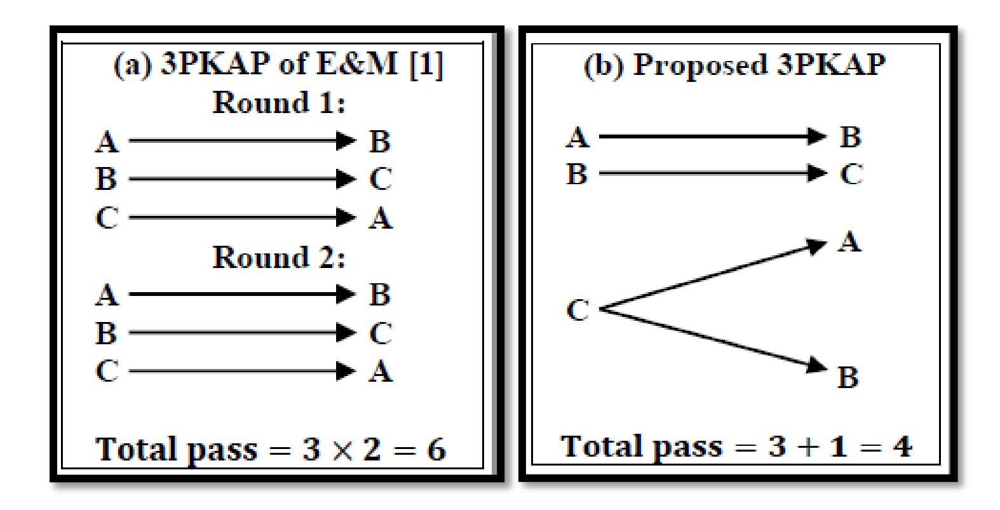
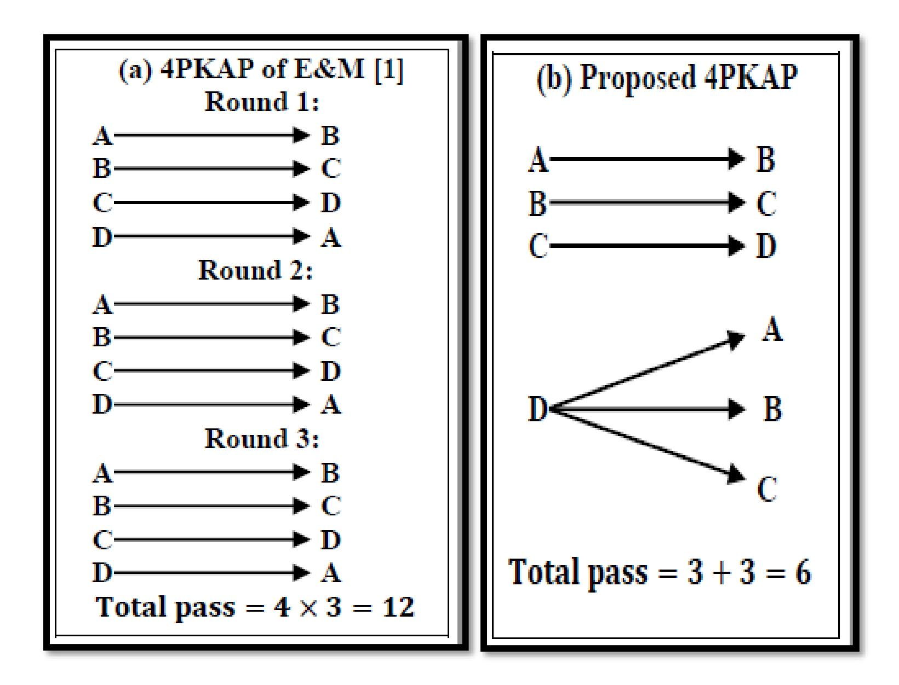

{0}------------------------------------------------

# **A Note on Authenticated Group Key Agreement Protocol Based on Twist Conjugacy Problem in Near – Rings**

Atul Chaturvedi1 , Varun Shukla2 , Manoj K.Misra3

1Dept. of Mathematics, PSIT, Kanpur, India 2Dept. of Electronics & Communication, PSIT, Kanpur, India 3Dept. of Computer Science, PSIT, Kanpur, India

# **ABSTRACT**

In 2017, D. Ezhilmaran & V. Muthukumaran (E&M [1]) have proposed key agreement protocols based on twisted conjugacy search problem in Near – ring and they have claimed that one can extend 3 party key agreement protocol (3PKAP) to any number of parties. Unfortunately their protocol is not an extension of 3PKAP and we present this weakness in this paper. We also show that their proposed 3PKAP is practically infeasible. Their protocol is not extendable to large number of parties like in banking system where number of parties is high. To overcome this problem we present an improved (or corrected) version of 3PKAP and for better understanding we extend it into 4PKAP with improvements in terms of number of passes, rounds, time complexity and run time.

# **KEYWORDS**

Data communication, Key agreement, Near – ring, Twisted Conjugacy Search Problem (TCSP)

# **1. INTRODUCTION**

The general definition of key agreement says that in a peer to peer communication scenario, key agreement is a process in which a shared secret key is available to two parties for cryptographic use [2]. Group key agreement involves more than two parties. Key agreement is a very important process for data communication because it restricts the unwanted influence of intruders. All the methods responsible for key agreement between two or more parties come under the category of key agreement protocols. In 2017, E&M [1] have proposed a 3PKAP and claimed that their protocol can be extended to n parties. We prove that the claim of E&M [1] that the protocol can be extended into n parties is wrong. So we give correct version of their protocol in the later section of this paper. We also compare the performance analysis and show that proposed protocol can be extended to n parties.

Now we briefly discuss Near – ring and for detailed study of Near – ring it is recommended to study suitable references [1, 3]. A non-empty set N with two binary operation '+' and '∙' is called Near – ring and denoted by (N, +,∙) if it satisfies the following properties:

- + ∈ for all , ∈ .
- ( + ) + = + ( + ) for all , , ∈ .
- There exists an element ∈ such that + = + = for all ∈ .
- For every ∈ , there exists an element − ∈ such that + (−) = (−) + = .
- ∙ ∈ for all elements , ∈ .
- ( ∙ ) ∙ = ∙ ( ∙ ) for all elements , , ∈ .
- ( + ) ∙ = ∙ + ∙ for all elements , , ∈ .

{1}------------------------------------------------

The hard problem involved in this paper is known as Twisted Conjugacy Search Problem (TCSP) and it says: Given two endomorphism , ∈ () and , ∈ . Determine an element *c* from such that = ()( −1 ). Here () denotes the endomorphism of Near – ring *R*.

The rest of this paper is organized as follows: In section 2, we provide the protocols given by E&M [1]. In section 3, we propose our protocols along with the correctness. Section 4 is all about performance analysis. Paper ends with conclusion and it is given in section 5.

# **2. PROTOCOLS GIVEN BY E&M [1]**

**2.1 Protocol for Three Parties**: It is essential to discuss about 3PKAP of E&M [1] because they have claimed that 3PKAP can be extended to nPKAP.

Let *N* be a Near – ring with three sub Near – rings 1, 2,3, such that = ∈ ∈ , ≠ .

Suppose that three parties named *A, B,* and *C* want to share a secret key and they proceed further in the following rounds:

# Round 1:

- *A* randomly chooses 1 ∈ 1 and sends 1 = (1 )(1 −1 ) to *B*.
- *B* randomly chooses 2 ∈ 2 and sends 2 = (2 )(2 −1 ) to *C*.
- *C* randomly chooses 3 ∈ 3 and sends 3 = (3 )(3 −1 ) to *A*.

# Round 2:

- *A* computes 13 = (1 )3(1 −1 ) and sends it to *B*.
- *B* computes 21 = (2 )1(2 −1 ) and sends it to *C*.
- *C* computes 32 = (3 )2(3 −1 ) and sends it to *A*.

# Shared Key:

- *A* computes the shared key () = (1 )32(1 −1 ).
- *B* computes the shared key () = (2 )13(2 −1 ).
- *C* computes the shared key () = (3 )21(3 −1 ).
- **2.2 Protocol for Four Parties:** Here we extend 3PKAP of E&M [1] to 4PKAP so that the readers of this paper can understand the concepts related to number of passes, rounds and time complexity well. The initial setup of this protocol is same as 3PKAP. Let *N* be a Near – ring with four sub Near – rings 1, 2,3, , 4, such that ab = ba for all elements a ∈ Ni , b ∈ Nj & i ≠ j .

Suppose that four parties *A, B, C,* and *D* want to share a secret key and they proceed in the following rounds:

# Round 1:

*A* randomly chooses 1 ∈ 1 and sends 1 = (1 )(1 −1 ) to *B*.

{2}------------------------------------------------

- *B* randomly chooses 2 ∈ 2 and sends 2 = (2 )(2 −1 ) to *C*.
- *C* randomly chooses 3 ∈ 3 and sends 3 = (3 )(3 −1 ) to *D*.
- *D* randomly chooses 4 ∈ 4 and sends 4 = (4 )(4 −1 ) to *A*.

# Round 2:

- *A* computes 14 = (1 )4(1 −1 ) and sends it to *B*.
- *B* computes 21 = (2 )1(2 −1 ) and sends it to *C*.
- *C* computes 32 = (3 )2(3 −1 ) and sends it to *D*.
- *D* computes 43 = (4 )3(4 −1 ) and sends it to *A*.

# Round 3:

- *A* computes 143 = (1 )43(1 −1 ) and sends it to *B*.
- *B* computes 214 = (2 )14(2 −1 ) and sends it to *C*.
- *C* computes 321 = (3 )21(3 −1 ) and sends it to *D*.
- *D* computes 432 = (4 )32(4 −1 ) and sends it to *A*.

# Shared Key:

- *A* computes the shared key () = (1 )432(1 −1 ).
- *B* computes the shared key () = (2 )143(2 −1 ).
- *C* computes the shared key () = (3 )214(3 −1 ).
- *D* computes the shared key () = (4 )321(4 −1 ).

# **3. PROPOSED PROTOCOLS**

Now we propose protocols for comparison with the protocols given by E&M [1].

- **3.1 Proposed Protocol for Three Parties**: 3PKAP of E&M [1] has taken six passes and proposed protocol takes only four passes and all the parties are able to generate the same secret key. The initial setup for proposed protocol is same as the protocol of E&M [1]. The proposed protocol runs as follows:
- Step 1: *A* randomly chooses 1 ∈ 1 and sends 1 = (1 )(1 −1 ) to *B*.
- Step 2: *B* randomly chooses 2 ∈ 2 , computes 2 = (2 )(2 −1 )

$$b_{21} = f(a_2)b_1g(a_2^{-1})$$
 and sends  $(b_1, b_2, b_{21})$  to  $C$ .

Step 3: *C* randomly chooses 3 ∈ 3 , computes 32 = (3 )2(3 −1 ) , 31 = (3 )1(3 −1 ) and sends 32 , 31 to *A* and *B* respectively.

# Shared Key:

- *A* computes the shared key, () = (1 )32(1 −1 ).
- *B* computes the shared key, () = (2 )31(2 −1 ).
- *C* computes the shared key, () = (3 )21(3 −1 ).

{3}------------------------------------------------

Figure 1. Comparison of 3PKAP: (a) E&M [1] protocol (b) proposed protocol.

For 3PKAP as shown in Figure 1, in E&M [1] protocol, they have done it in two rounds where in each round A sends to B, B sends to C and C sends to A. But in proposed protocol, in a single round, A sends to B, B sends to C and finally C sends to A and B.

**3.2 Correctness:** In this subsection we prove that all the three parties compute the same key as E&M [1] using the concept of endomorphism and the formation of Near sub-rings of Near – ring. So we provide correctness of the proposed 3PKAP for the convenience of the readers of this paper:

Party A calculates the key K(A) in the following manner:

$$\begin{split} K(A) &= f(a_1)b_{32}g(a_1^{-1}) \\ &= f(a_1)\left(f(a_3)b_2g(a_3^{-1})\right)g(a_1^{-1}) \\ &= f(a_1)f(a_3)\left(f(a_2)bg(a_2^{-1})\right)g(a_3^{-1})g(a_1^{-1}) \\ &= f(a_1)f(a_3)f(a_2)bg(a_2^{-1})g(a_3^{-1})g(a_1^{-1}) \\ &= f(a_1a_3a_2)bg(a_2^{-1}a_3^{-1}a_1^{-1}) \quad |\because \text{ f and g are endomorphism on N.} \\ &= f(a_1a_2a_3)bg(a_3^{-1}a_2^{-1}a_1^{-1}) \quad |\because \text{ ab = ba for all elements a} \in \mathbb{N}_i \text{ , b} \in \mathbb{N}_j \text{ \& for all } i \neq j. \\ &= f(a_1)f(a_2)f(a_3)bg(a_3^{-1})g(a_2^{-1})g(a_1^{-1}) \qquad (i) \end{split}$$

Now K(B) can also be computed:

$$K(B) = f(a_2)b_{31}g(a_2^{-1})$$

$$= f(a_2) \left( f(a_3)b_1g(a_3^{-1}) \right) g(a_2^{-1})$$

$$= f(a_2)f(a_3) \left( f(a_1)bg(a_1^{-1}) \right) g(a_3^{-1})g(a_2^{-1})$$

{4}------------------------------------------------

$$= f(a_2)f(a_3)f(a_1)bg(a_1^{-1})g(a_3^{-1})g(a_2^{-1})$$

$$= f(a_2a_3a_1)bg(a_1^{-1}a_3^{-1}a_2^{-1}) \quad |\because \text{ f and g are endomorphism on N.}$$

$$= f(a_1a_2a_3)bg(a_3^{-1}a_2^{-1}a_1^{-1}) \quad |\because \text{ ab = ba for all elements a} \in \mathbb{N}_i \text{ , b} \in \mathbb{N}_j \& \text{ for all } i \neq j.$$

$$= f(a_1)f(a_2)f(a_3)bg(a_3^{-1})g(a_2^{-1})g(a_1^{-1}) \qquad (ii)$$

Party C calculates K(C) in a similar fashion:

$$\begin{split} &K(C) = f(a_3)b_{21}g(a_3^{-1}) \\ &= f(a_3)\left(f(a_2)b_1g(a_2^{-1})\right)g(a_3^{-1}) \\ &= f(a_3)f(a_2)\left(f(a_1)bg(a_1^{-1})\right)g(a_2^{-1})g(a_3^{-1}) \\ &= f(a_3)f(a_2)f(a_1)bg(a_1^{-1})g(a_2^{-1})g(a_3^{-1}) \\ &= f(a_3a_2a_1)bg(a_1^{-1}a_2^{-1}a_3^{-1}) \quad |\because \text{ f and g are endomorphism on N.} \\ &= f(a_1a_2a_3)bg(a_3^{-1}a_2^{-1}a_1^{-1}) \quad |\because \text{ ab = ba for all elements a} \in \mathbb{N}_i \text{ , b} \in \mathbb{N}_j \text{ \& for all } i \neq j. \\ &= f(a_1)f(a_2)f(a_3)bg(a_3^{-1})g(a_2^{-1})g(a_1^{-1}) \qquad (iii) \end{split}$$

From (i), (ii) and (iii), it is clear that all the three parties share a secret key given as K(A) = K(B) = K(C) = K. Here K represents common secret key among all the three parties.

- **3.3 Proposed Protocol for Four Parties:** 4PKAP of E&M [1] has taken twelve passes and the proposed protocol takes only six passes and all the parties will generate the same key. The initial setup for the proposed protocol is same as the protocol of E&M [1]. The Proposed protocol runs as follows:
  - Step 1: A randomly chooses  $a_1 \in N_1$  and sends  $b_1 = f(a_1)bg(a_1^{-1})$  to B.
  - Step 2: B randomly chooses  $a_2 \in N_2$ , computes  $b_2 = f(a_2)bg(a_2^{-1})$ ,  $b_{21} = f(a_2)b_1g(a_2^{-1})$  and sends  $(b_1, b_2, b_{21})$  to C.
  - Step 3: C randomly chooses  $a_3 \in N_3$ , computes  $b_{32} = f(a_3)b_2g(a_3^{-1}), b_{31} = f(a_3)b_1g(a_3^{-1}),$   $b_{321} = f(a_3)b_{21}g(a_3^{-1}),$  and sends  $(b_{21}, b_{31}, b_{32}, b_{321})$  to D.
  - Step 4: D randomly chooses  $a_4 \in N_4$ , computes  $b_{432} = f(a_4)b_{32}g(a_4^{-1})$ ,  $b_{431} = f(a_4)b_{31}g(a_4^{-1})$ ,  $b_{421} = f(a_4)b_{21}g(a_4^{-1})$  and sends  $b_{432}$ ,  $b_{431}$ ,  $b_{421}$  to A, B and C respectively.

Shared Key:

- A computes the shared key,  $K(A) = f(a_1)b_{432}g(a_1^{-1})$ .
- B computes the shared key,  $K(B) = f(a_2)b_{431}g(a_2^{-1})$ .
- C computes the shared key,  $K(C) = f(a_3)b_{421}g(a_3^{-1})$ .
- D also computes the shared key,  $K(D) = f(a_4)b_{321}g(a_4^{-1})$ .

{5}------------------------------------------------

Figure 2. Comparison of 4PKAP (a) E&M [1] protocol (b) proposed protocol.

For 4PKAP as shown in Figure 2 above, in E&M [1] protocol, they have achieved it in three rounds where in each round, A sends to B, B sends to C, C sends to D and D sends to A while on the other side, in the proposed protocol, A sends to B, B sends to C and C sends to D and finally D sends to A, B and C in a single round.

**3.4 Correctness:** Here we prove that all the four parties generate the same secret key using the concept of endomorphism and the formation of Near sub-rings of Near – ring. The correctness of proposed 4PKAP is as follows:

Party A is calculates the key K(A) in the following manner:

$$\begin{split} K(A) &= f(a_1)b_{432}g(a_1^{-1}) \\ &= f(a_1)\Big(f(a_4)b_{32}g(a_4^{-1})\Big)g(a_1^{-1}) \\ &= f(a_1)f(a_4)\Big(f(a_3)b_2g(a_3^{-1})\Big)g(a_4^{-1})g(a_1^{-1}) \\ &= f(a_1)f(a_4)f(a_3)\Big(f(a_2)bg(a_2^{-1})\Big)g(a_3^{-1})g(a_4^{-1})g(a_1^{-1}) \\ &= f(a_1)f(a_4)f(a_3)f(a_2)bg(a_2^{-1})g(a_3^{-1})g(a_4^{-1})g(a_1^{-1}) \\ &= f(a_1a_4a_3a_2)bg(a_2^{-1}a_3^{-1}a_4^{-1}a_1^{-1}) \quad |\because \text{ f and g are endomorphism on N.} \end{split}$$

{6}------------------------------------------------

$$= f(a_1 a_2 a_3 a_4) bg(a_4^{-1} a_3^{-1} a_2^{-1} a_1^{-1}) \mid :: ab = ba \text{ for all elements } a \in N_i \text{ , } b \in N_j \& \text{ for all } i \neq j.$$

$$= f(a_1) f(a_2) f(a_3) f(a_4) bg(a_4^{-1}) g(a_3^{-1}) g(a_2^{-1}) g(a_1^{-1}) \qquad (i)$$

Now K(B) can also be computed in the similar fashion:

$$\begin{split} K(B) &= f(a_2)b_{431}g(a_2^{-1}) \\ &= f(a_2)\Big(f(a_4)b_{31}g(a_4^{-1})\Big)g(a_2^{-1}) \\ &= f(a_2)f(a_4)\left(f(a_3)b_1g(a_3^{-1})\right)g(a_4^{-1})g(a_2^{-1}) \\ &= f(a_2)f(a_4)f(a_3)\Big(f(a_1)bg(a_1^{-1})\Big)g(a_3^{-1})g(a_4^{-1})g(a_2^{-1}) \\ &= f(a_2)f(a_4)f(a_3)f(a_1)bg(a_1^{-1})g(a_3^{-1})g(a_4^{-1})g(a_2^{-1}) \\ &= f(a_2a_4a_3a_1)bg(a_1^{-1}a_3^{-1}a_4^{-1}a_2^{-1}) \quad |\because \text{ f and g are endomorphism on N.} \\ &= f(a_1a_2a_3a_4)bg(a_4^{-1}a_3^{-1}a_2^{-1}a_1^{-1}) \quad |\because \text{ ab = ba for all elements a} \in \mathbb{N}_i \text{ , b } \in \mathbb{N}_j \text{ \& for all } i \neq j. \\ &= f(a_1)f(a_2)f(a_3)f(a_4)bg(a_4^{-1})g(a_3^{-1})g(a_2^{-1})g(a_1^{-1}) \qquad (ii) \end{split}$$

Party C calculates K(C) as follows:

$$\begin{split} K(\mathcal{C}) &= f(a_3)b_{421}g(a_3^{-1}) \\ &= f(a_3)\Big(f(a_4)b_{21}g(a_4^{-1})\Big)g(a_3^{-1}) \\ &= f(a_3)f(a_4)\left(f(a_2)b_1g(a_2^{-1})\right)g(a_4^{-1})g(a_3^{-1}) \\ &= f(a_3)f(a_4)f(a_2)\Big(f(a_1)bg(a_1^{-1})\Big)g(a_2^{-1})g(a_4^{-1})g(a_3^{-1}) \\ &= f(a_3)f(a_4)f(a_2)f(a_1)bg(a_1^{-1})g(a_2^{-1})g(a_4^{-1})g(a_3^{-1}) \\ &= f(a_3)f(a_4)f(a_2)f(a_1)bg(a_1^{-1})g(a_2^{-1})g(a_4^{-1})g(a_3^{-1}) \\ &= f(a_3a_4a_2a_1)bg(a_1^{-1}a_2^{-1}a_4^{-1}a_3^{-1}) \quad |\because \text{ f and g are endomorphism on N.} \\ &= f(a_1a_2a_3a_4)bg(a_4^{-1}a_3^{-1}a_2^{-1}a_1^{-1}) \quad |\because \text{ ab = ba for all elements a} \in \mathbb{N}_{\mathbf{i}} \text{ , b } \in \mathbb{N}_{\mathbf{j}} \text{ \& for all } \mathbf{i} \neq \mathbf{j}. \\ &= f(a_1)f(a_2)f(a_3)f(a_4)bg(a_4^{-1})g(a_3^{-1})g(a_2^{-1})g(a_1^{-1}) \qquad (iii) \end{split}$$

At last we have to do it for K(D) also:

$$K(D) = f(a_4)b_{321}g(a_4^{-1})$$

$$= f(a_4)\left(f(a_3)b_{21}g(a_3^{-1})\right)g(a_4^{-1})$$

{7}------------------------------------------------

$$= f(a_4)f(a_3)\left(f(a_2)b_1g(a_2^{-1})\right)g(a_3^{-1})g(a_4^{-1})$$

$$= f(a_4)f(a_3)f(a_2)\left(f(a_1)bg(a_1^{-1})\right)g(a_2^{-1})g(a_3^{-1})g(a_4^{-1})$$

$$= f(a_4)f(a_3)f(a_2)f(a_1)bg(a_1^{-1})g(a_2^{-1})g(a_3^{-1})g(a_4^{-1})$$

$$= f(a_4a_3a_2a_1)bg(a_1^{-1}a_2^{-1}a_3^{-1}a_4^{-1}) \quad |\because \text{ f and g are endomorphism on N}$$

$$= f(a_1a_2a_3a_4)bg(a_4^{-1}a_3^{-1}a_2^{-1}a_1^{-1}) \mid \because \text{ ab = ba for all elements a} \in \mathbb{N}_i \text{ , b } \in \mathbb{N}_j \text{ & for all } i \neq j.$$

$$= f(a_1)f(a_2)f(a_3)f(a_4)bg(a_4^{-1})g(a_3^{-1})g(a_2^{-1})g(a_1^{-1}) \qquad (iv)$$

It is clear from (i), (ii), (iii) and (iv) that all the four parties share a secret key given as K(A) = K(B) = K(C) = K(D) = K.

#### 4. PERFORMANCE ANALYSIS OF PROPOSED PROTOCOL

The proposed protocol requires fewer steps in comparison with E&M [1] protocol as mentioned earlier. The seriousness of this can be understood very easily.

| Number of parties | E&M [1] protocol (Number of passes) | Proposed protocol (Number of passes) | Time complexity in proposed protocol | Time complexity in E&M [1] protocol |
|-------------------------|----------------------------------------|--------------------------------------|-----------------------------------------------|-------------------------------------|
| 3                       | 6                                      | 4                                    |                                               |                                     |
| 4                       | $4 \times 3 = 12$                      | 4 + (4 - 2) = 6                      | 0(n)                                          | 0(n2)                               |
| 5                       | $5 \times 4 = 20$                      | 5 + (5 - 2) = 8                      | 0(n)                                          | 0(n 2 )                  |
| •••                     | •••                                    | •••                                  |                                               |                                     |
| n                       | $n(n-1) = n^2 - n$                     | n + (n-2) = 2n-2                     |                                               |                                     |

**Table 1**. Comparing number of passes and time complexity between protocols.

Suppose 100 parties are there in a banking system. Then, as shown in Table 1, E&M [1] protocol needs  $100 \times 99 = 9900$  passes but proposed protocol requires only 100 + 98 = 198 passes. High number of passes is always prone to intruding chances in cryptography or we can say that more number of passes, high will be the chances for intruders. We illustrate this with the help of Table 2.

{8}------------------------------------------------

| Number of parties | Passes in proposed protocol | Passes in E&M[1] protocol | Increased opportunity for intruders |
|----------------------|-----------------------------------|---------------------------------|----------------------------------------------|
| 3                    | 4                                 | 6                               | 33%                                          |
| 4                    | 6                                 | 12                              | 50%                                          |
| 5                    | 8                                 | 20                              | 60%                                          |

**Table 2**. Showing increment in intruding opportunity.

It clearly indicates that for 3 parties, intruders have increased percentage of chances for intruding because high number of passes provides more chances to intruders for cryptanalysis and we can easily calculate percentage increment in number of passes i.e. increment in intruding chances

$$= \frac{\text{no.of passes in E\&M [1]protocol-no.of passes in proposed protocol}}{\text{no.of passes in E\&M [1] protocol}} = \frac{6-4}{6} \times 100 = 33\%.$$

So by the above explanation it is clear that we can calculate increment percentage in intruding chances for any number of parties. If number of parties involved are four, it is 50% and for five parties, it is 60%. We provide one example at this moment to emphasize more on this point. Imagine that one needs to implement the protocol in a situation where number of parties is very high. We can consider a banking system having such characteristic. In this case, the difference in runtime between proposed protocol and E&M [1] protocol becomes significant in terms of time complexity. The proposed protocol has time complexity O(n) while E&M [1] protocol has time complexity O(n 2 ) [2]. There is a huge difference in execution time between proposed protocol and E&M [1] protocol. It is because the formula for number of passes for E&M [1] is n 2 − n and for proposed protocol, it is 2n − 2. So when n = 107 then E&M [1] protocol will need 9.999999 × 1013 passes while on the other side, the proposed protocol will take only 1.9999998 × 107 passes. That means the difference is 9.999997000000 × 1013 which is very large. Similarly for n = 108 , E&M [1] protocol will require 9.9999999 × 1015 passes but the proposed protocol will need 1.99999998 × 108 passes. That means the difference is 9.999999700000002 × 1015 which is very significant. We present the data in the form of Table 3 along with the graph as below. It is important to mention that in the graph, when number of users is 106 and 107 , the bar (blue color) of proposed protocol is not showing because time taken is 10ms and 100ms respectively which is very less.

{9}------------------------------------------------

| Number of parties | Performance of proposed protocol | Performance of E&M[1] protocol |  |
|-------------------------|----------------------------------------|--------------------------------------|--|
| 103                     | 10μs                                   | 100μs                                |  |
| 104                     | 100μs                                  | 10ms                                 |  |
| 105                     | 1ms                                    | 1s                                   |  |
| 106                     | 10ms                                   | 1.7 minute                        |  |
| 107                     | 100ms                                  | 2.8 hour                          |  |
| 108                     | 1s                                     | 11.7 day                          |  |

**Table 3**. Showing performance comparison between protocols along with the graph.

# **5. CONCLUSION**

We have proposed improved version of E&M [1] protocol and shown that the proposed protocol is better in terms of number of passes, rounds and time complexity whether it is for three parties, four parties or n parties by comparing proposed protocol with E&M [1] protocol. For three parties, the proposed protocol requires 4 passes, 6 passes for four parties, 8 passes for five parties or in general we can say that it is n + (n − 2) number of passes which is far better than 6 passes, 12 passes, 20 passes or n(n − 1) passes proposed by E&M [1] respectively. Proposed protocol has O(n) complexity while E&M [1] protocol has O(n 2 ) complexity. One can understand the difference that when users are 107 , the proposed protocol takes only 100ms for execution which is 2.8 hour in case of E&M [1] protocol. So it is clear that the proposed protocol is better in various aspects and it is comparatively safer than E&M [1] protocol because intruding chances are reduced. The proposed protocol is practically implementable because computational resources and time are optimized.

# **REFERENCES**

- 1. Ezhilmaran D, Muthukumaran V, Authenticated group key agreement protocol based on twist conjugacy problem in near-rings, Wuhan university journal of natural sciences, volume 22, number 6, 2017, 472-476, DOI: 10.1007/s11859-017-1275-9.
- 2. Menezes AJ, Oorschot PCV, Vanstone SA, Handbook of Applied Cryptography, CRC press, fifth edition, 2001, ISBN: 9780849385230.
- 3. Satyanarayana B, Prasad KS, Near rings, fuzzy ideals and graph theory, Chapman and Hall/CRC press, first edition, 2013, ISBN: 9781439873106.