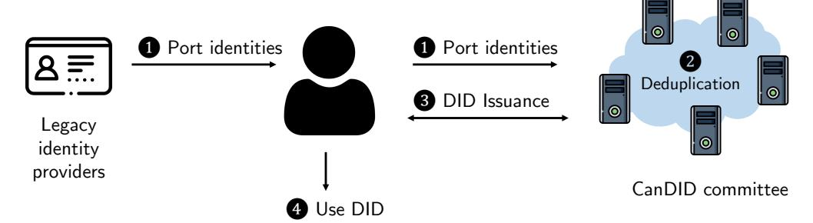
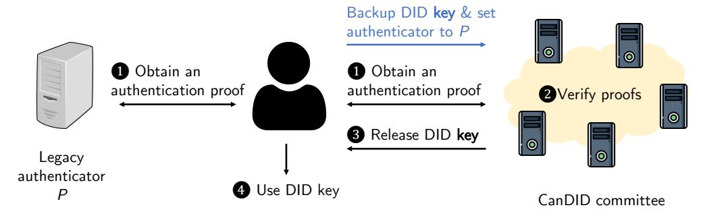
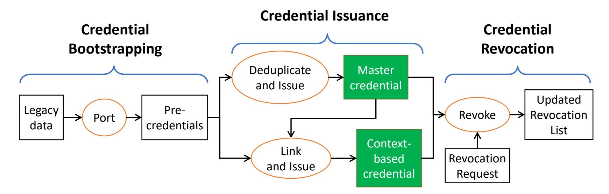
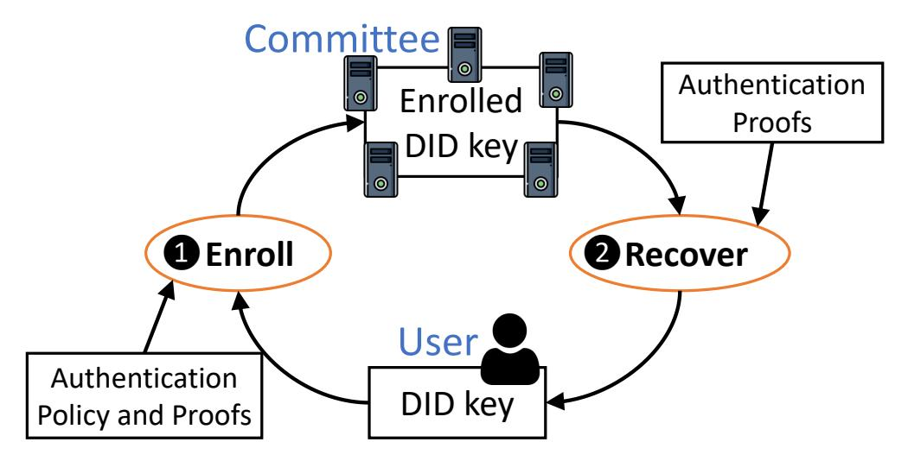
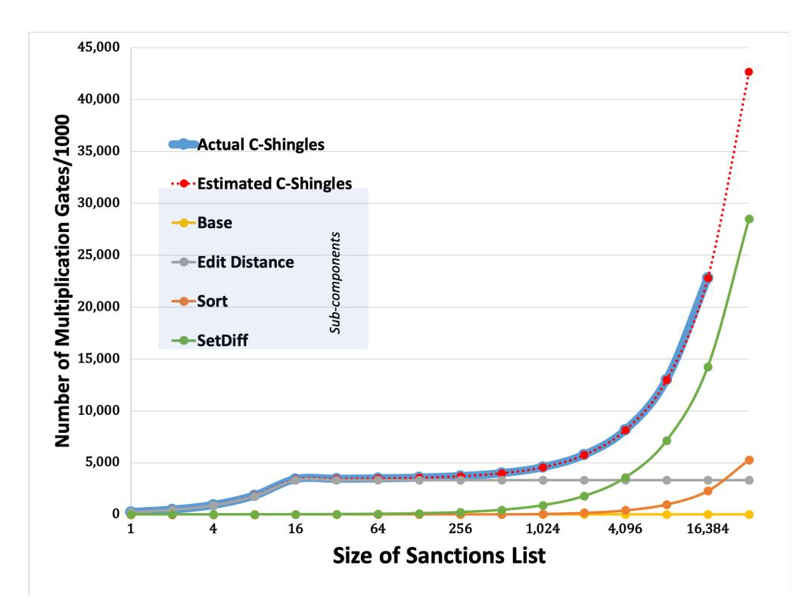
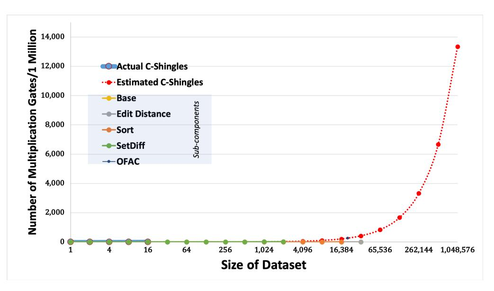

{0}------------------------------------------------

## CanDID: Can-Do Decentralized Identity with Legacy Compatibility, Sybil-Resistance, and Accountability

Deepak Maram∗¶, Harjasleen Malvai†¶, Fan Zhang∗¶, Nerla Jean-Louis‡¶, Alexander Frolov†¶, Tyler Kell∗¶ , Tyrone Lobban§ , Christine Moy§ , Ari Juels∗¶, Andrew Miller‡¶ <sup>∗</sup>Cornell Tech, †Cornell University, ‡UIUC, § J. P. Morgan, ¶ IC3, The Initiative for CryptoCurrencies & Contracts

*Abstract*—We present CanDID, a platform for practical, userfriendly realization of *decentralized identity*, the idea of empowering end users with management of their own credentials.

While decentralized identity promises to give users greater control over their private data, it burdens users with management of private keys, creating a significant risk of key loss. Existing and proposed approaches also presume the spontaneous availability of a credential-issuance ecosystem, creating a bootstrapping problem. They also omit essential functionality, like resistance to Sybil attacks and the ability to detect misbehaving or sanctioned users while preserving user privacy.

CanDID addresses these challenges by issuing credentials in a user-friendly way that draws securely and privately on data from existing, unmodified web service providers. Such legacy compatibility similarly enables CanDID users to leverage their existing online accounts for recovery of lost keys. Using a decentralized committee of nodes, CanDID provides strong confidentiality for user's keys, real-world identities, and data, yet prevents users from spawning multiple identities and allows identification (and blacklisting) of sanctioned users.

We present the CanDID architecture and report on experiments demonstrating its practical performance.

## I. INTRODUCTION

Identity management lies at the heart of any user-facing system, be it a social media platform, online game, or collaborative tool. Backlash against the handling of personal information by large tech firms [\[2\]](#page-14-0), [\[3\]](#page-14-1) has recently spawned a new approach to identity management called *decentralized identity*—a.k.a. *self-sovereign* identity [\[7\]](#page-14-2), [\[10\]](#page-14-3), [\[32\]](#page-14-4), [\[74\]](#page-15-0).

Decentralized identity systems allow users to gather and manage their own credentials under the banner of self-created *decentralized identifiers* (DIDs). By controlling private keys associated with DIDs, users are empowered to disclose or withhold their credentials as desired in online interactions. Enterprises also benefit by limiting the liability associated with storage of sensitive user data [\[49\]](#page-14-5).

The most commonly cited use cases for DIDs involve users authorizing release of personal credentials from user devices to websites [\[61\]](#page-14-6). For example, an online job applicant might release a digitally signed credential from her university showing that she has received a bachelor's degree and a proof of residency in the country in which she is applying. Initiatives such as the Decentralized Identity Foundation [\[32\]](#page-14-4) and Decentralized Identifiers (DID) working group of W3C [\[74\]](#page-15-0) are developing standards and use cases to support such transactions. They largely fail, however, to address four main technical and usability goals that we target in this work. Specifically, these goals are especially challenging to achieve, as we seek to do, *in a privacy-preserving way*:

- 1) *Legacy compatibility:* Most proposed decentralized identity systems presume the existence of a community of issuers of digitally signed credentials. But such issuers may not arise—and existing credential issuers may not begin to issue digitally signed variants of existing credentials—until DID infrastructure sees use. The result is a bootstrapping problem. A big impediment to DID adoption is the inability of proposed systems to leverage the data on users available in existing web services that don't issue credentials.
- 2) *Sybil-resistance:* Proposed decentralized identity systems do not deduplicate user identities. Unique per-user identities are critical, though, in many systems: anonymous voting, fair currency distribution ("airdrops") [\[14\]](#page-14-7), etc.
- 3) *Accountability:* It is challenging both to provide user privacy, i.e., conceal users' real-world identities, *and* achieve compliance with regulations such as Know-Your-Customer (KYC) / Anti-Money-Laundering (AML). Particularly important is an ability to screen users of the system, i.e., identify and bar identified criminal users on sanctions lists, as is done in the sanctions screening process performed by financial institutions.
- 4) *Key recovery:* In DID systems, users bear the burden of managing their own private keys. Key recovery is potentially the Achilles' heel of such systems, as it is well known that users regularly lose valuable keys. Billions of dollars of cryptocurrency have vanished because of lost keys [\[60\]](#page-14-8).

Proposed solutions to these problems are problematic in various ways. For example, for key management / recovery, users can delegate or escrow their private keys with an online service (like Coinbase for cryptocurrency [\[4\]](#page-14-9))—but that then effectively re-centralizes identity management. W3C proposes a quorum of trusted parties to enable key recovery, but omits details [\[74\]](#page-15-0); Microsoft plans to unveil a new approach, but details remain forthcoming at the time of writing [\[53\]](#page-14-10).

The other three enumerated challenges, legacy compatibility, Sybil-resistance, and (privacy-preserving) sanctions screening, have seen little or no treatment in proposed decentralized identity systems, and treatment relevant to such systems in only a few works in the research literature, e.g., [\[22\]](#page-14-11), [\[23\]](#page-14-12), [\[26\]](#page-14-13), [\[28\]](#page-14-14), [\[38\]](#page-14-15), [\[81\]](#page-15-1).

## *A. CanDID*

In this paper, we present CanDID[1](#page-0-0) , a decentralized-identity system that aims to address the four major challenges highlighted above, while providing strong privacy properties. CanDID can act as a freestanding service or can be coupled

<span id="page-0-0"></span><sup>1</sup>The name means "honestly presenting information"; we also use it to signify that users "*can* do decentralized identities (*DID*s)".

1

{1}------------------------------------------------

with other decentralized identity systems. It is decentralized in the sense that it relies on a *committee* of nodes, which may represent distinct entities.

CanDID consists of two subsystems: An *identity system* for issuing and managing credentials, and a *key recovery system*.

*1) Identity system:* CanDID leverages an oracle specifically, either DECO [\[86\]](#page-15-2) or Town Crier [\[85\]](#page-15-3)—to *port identities and credentials securely from existing web services*. These services can be social media platforms, online bank accounts, e-mail accounts, etc. The oracles used by CanDID allow it to scrape websites in order to construct trustworthy credentials without providers needing to explicitly create DID-compatible credentials or even be aware of CanDID, easing the way for bootstrapping a credential ecosystem.

Credential privacy: In support of its strong privacy objectives, CanDID allows users to construct credentials that reveal information *selectively* via zero-knowledge arguments. For instance, a user can construct a credential proving that she is at least 18 years of age. In doing so, she need not reveal her actual birthdate either to committee nodes or to entities to which she presents the credential. Second, CanDID provides strong *membership privacy*. Committee nodes and web-identity providers not only cannot learn users' real-world identities, but cannot learn user membership, i.e., whether a given real-world user is active in CanDID.

As in other DID schemes, e.g., [\[10\]](#page-14-3), [\[32\]](#page-14-4), [\[74\]](#page-15-0), CanDID supports the use of *pairwise credentials*. That is, it permits users to generate credentials unique to each user-service relationship and unlinkable to those used in other relationships. CanDID can in principle alternatively support fully anonymous credentials. Conversely, CanDID is compatible with models in which users register pseudonymous decentralized identifiers (DIDs) on a blockchain or other distributed ledger.

Novel capabilities: Beyond credential issuance, CanDID's identity system includes two new and distinctive capabilities: Sybil-resistance and sanctions screening.

- *a) Sybil-resistance:* CanDID supports deduplication of identities with respect to unique numerical identifiers like Social Security Numbers. It uses a special-purpose MPC protocol that is privacy-preserving, meaning values of identifiers used for deduplication are hidden even from committee nodes.
- *b) Accountability:* The CanDID committee can screen users of the system so as to identify the credentials of suspect users (e.g., those on sanctions lists). This operation is privacypreserving: the committee learns nothing about users *not* on the list. In practice, sanctions lists identify individuals based on their name / address, not unique identifiers [\[72\]](#page-15-4). Thus CanDID supports *fuzzy matching*, i.e., tolerance of small edit-distance variances. The committee can create a public revocation list of credentials identified by the sanctions screening process.

CanDID performs *privacy-preserving fuzzy matching* using secure multiparty computation (MPC), a technically challenging goal. We explore a range of performance-optimizing techniques, including different data structures for representing user attributes in secret-shared form in the system.

We show the basic workflow for credential issuance (without sanctions screening) in Fig. [1a.](#page-1-0)

<span id="page-1-0"></span>

(a) High-level credential-issuance workflow.



(b) Key backup and recovery workflow.

Fig. 1: CanDID architecture overview and workflow.

*2) Key-recovery system:* Our approach allows users to *leverage existing web authentication schemes* and engage in a familiar, user-friendly workflow to recover their keys. Users may store their private keys on whatever devices, (e.g., mobile phones) that they use regularly. Users can back up their keys with the CanDID committee (privately, via secret-sharing) and prespecify recovery accounts on web services of their choice, along with a recovery policy (e.g., authentication of 2-out-of-3 accounts). To recover her key, a user proves successful logins under her chosen policy. Fig. [1b](#page-1-0) shows the recovery workflow.

Key-recovery privacy: CanDID's use of oracles allows a user to prove she was successful in logging into a preselected account, but *without revealing account information to committee nodes or CanDID use to web service providers*. Na¨ıve approaches, e.g., use of OAuth, would leak such information.

## *B. Contributions and Paper Organization*

To summarize, CanDID offers a practical approach to decentralized identity that overcomes several significant challenges.

In what follows, we present a brief background on oracles (Sec. [II\)](#page-2-0), an overview of CanDID (Sec. [III\)](#page-2-1), its applications (Sec. [IV\)](#page-4-0), and its system and security model (Sec. [V\)](#page-5-0).

Our main technical contributions are:

- *Legacy-compatible credential issuance:* CanDID leverages oracle systems to construct user's credentials based on *data with existing, unmodified web services* (Sec. [VI\)](#page-6-0).
- *Sybil-resistance:* CanDID enforces deduplication of identities, meaning that it issues credentials in a manner that is unique per user (Sec. [VI\)](#page-6-0).
- *Accountability:* The CanDID committee can identify credentials associated with users who should be prevented from using the system, e.g., appearing on a sanctions list, for further action such as blacklisting. This process involves new techniques for privacy-preserving fuzzy matching (Sec. [VII\)](#page-9-0).
- *Key recovery:* CanDID allows a user to store her key with the CanDID committee to facilitate recovery. She may leverage *existing* online accounts to recover her key in a manner that provides privacy for account identifiers (Sec. [VIII\)](#page-10-0).

{2}------------------------------------------------

• *Implementation and evaluation:* We report on the performance of a basic implementation of CanDID (Sec. [IX\)](#page-10-1).

We discuss related work (Sec. [X\)](#page-13-0) before concluding with a discussion of future research directions (Sec. [XI\)](#page-13-1).

## II. BACKGROUND: ORACLES

<span id="page-2-0"></span>CanDID relies on an oracle system [\[27\]](#page-14-16), [\[86\]](#page-15-2), [\[59\]](#page-14-17), [\[85\]](#page-15-3) for credential issuance and key recovery. An oracle relays and provides assurance around the authenticity of data retrieved from authoritative sources—typically web servers accessed via a secure channel such as TLS. Specifically, it allows a prover to prove (publicly or to a particular verifier) that a piece of data originates with a particular source (e.g., as identified by its TLS certificate)—and optionally prove arbitrary statements about the data.

CanDID uses an oracle system to allow users to import identities securely from existing systems. For example, Alice can use the profile page of her Social Security Administration (SSA) account to generate a credential attesting to her Social Security Number (SSN). The idea is for Alice to execute an oracle protocol—as the prover—to prove that a web page fetched from the SSA website contains a string SSN: 123-45-6789 in the appropriate context.

Currently, the only oracle protocols that provide privacy for user data and are legacy-compatible, i.e., require no modification of data sources, are DECO [\[86\]](#page-15-2) and Town Crier [\[85\]](#page-15-3). DECO is a three-party protocol between a prover P, verifier V , and TLS server S. It allows P to convince V that a piece of data—possibly private to P—retrieved from S satisfies a predicate Pred. DECO relies on Multi-Party Computation (MPC) to protect data privacy and authenticity, and zero-knowledge proofs (ZKPs) to prove a predicate is satisfied. Having multiple verifiers decentralizes the protocol. Town Crier accomplishes a similar goal by using Trusted Execution Environments (TEEs), like Intel SGX, to attest to the authenticity of TLS sessions and prove statements about TLS plaintexts.

In general, Town Crier is faster than DECO, and can efficiently handle much more complicated predicates than DECO. Town Crier proofs are also publicly verifiable, while DECO proofs are designated-verifier. Town Crier does, however, introduce trust assumptions around TEEs called into question by recent attacks (see, e.g., [\[54\]](#page-14-18) for a survey).

CanDID can use either DECO or Town Crier, depending on the desired trust model.

## III. CANDID SYSTEM OVERVIEW

<span id="page-2-1"></span>CanDID is a framework for issuing and managing credentials. It is composed of two sub-systems: an *identity system* that supports credential issuance and a *key recovery system* to recover lost keys associated with credentials.

The key recovery system can be used for storage of any secret, but we integrate it into CanDID for two reasons: (1) Good key recovery is critical to safe use of CanDID credentials; and (2) The key recovery system architecture leverages the same tools as the credential issuance system.

The system goals common to the two sub-systems are:

- 1) Use of legacy credentials: Allow users to leverage credentials from existing systems.
- 2) Decentralization: Expose no single point of failure.
- 3) Membership privacy: Provide membership privacy, meaning concealment of users' real-world identities.

CanDID relies on a decentralized set of nodes, called the *CanDID committee*. We assume the same committee for both subsystems for convenience, but they can be distinct if desired.

We now review each sub-system in turn, specifying its goals and explaining how we meet them.

### *A. Identity System*

Fig. [2](#page-3-0) is a visual overview of the key components and workflows of CanDID's identity subsystem. We refer to it throughout our discussion in this subsection.

Goal: The overarching goal of CanDID's identity system is to convert commonly used legacy data to application-ready decentralized credentials. While different applications consuming CanDID credentials may have different requirements, they usually share common requirements, including:

- 1) Uniqueness: Include provisions to deduplicate user identities useful for applications like voting.
- 2) Non-transferability: Include preventive measures discouraging users from transferring their credentials.
- 3) Accountability: Provide a mechanism to trace and revoke user identities based on their known real-world identities.
- 4) Pairwise privacy: Allow users to generate pairwise DIDs [\[75\]](#page-15-5), i.e., a distinct DID for each application—to prevent identity correlation across services.

To achieve these goals, CanDID relies on decentralized oracle schemes like DECO and Town Crier to *port data from legacy web accounts* to create credentials—e.g., on Alice's SSN, as in the example above. The CanDID committee nodes act as verifiers in the porting protocol as needed. (For instance, DECO relies on verifiers, but Town Crier doesn't.)

*a) Uniqueness and Non-Transferability:* Even with securely created credentials, meeting our goals of uniqueness and non-transferability still presents a challenge. Achieving uniqueness is difficult because, given that credential attributes are private, and thus hidden from the CanDID committee, there is no inherent obstacle to a user invoking the porting process to generate *an arbitrary number of credentials*. Lack of peruser credential uniqueness can be problematic in a number of settings, e.g., in anonymous voting systems.

Non-transferability is challenging because there is no technical obstacle to a user revealing private keys to a colluding party. This is already a serious problem, with credentials regularly sold in underground online markets [\[40\]](#page-14-19), yet current DID proposals do not address it. Non-transferability is important for a range of applications, e.g., for video-streaming services to prevent sharing or gray-market sale of content among users.

CanDID addresses both challenges—uniqueness and nontransferability—by making the system *Sybil-resistant*. Sybilresistance is achieved by *deduplicating* based on one or more attributes. For example, Social Security Number (SSN)-based deduplication would ensure the existence of at most one pseudonym with associated SSN attribute "123-45-6789."

{3}------------------------------------------------

<span id="page-3-0"></span>

Fig. 2: Identity System overview through the lifecycle of a credential. Green indicates Sybil-resistant credentials, the final state.

To perform deduplication, committee nodes maintain a secret-shared table of the target user attributes, e.g., SSNs. A new user joining the system presents one or more *precredentials* asserting various attributes. A pre-credential in CanDID is any credential that has not yet been been deduplicated. Given pre-credentials for the attributes over which deduplication takes place (e.g., SSN), the committee performs a privacy-preserving MPC deduplication protocol to check the table for the existence of these attributes in an already-issued credential. Only on confirming a user's asserted attributes are unique does the system issue her a fresh Sybil-resistant credential called a *master credential*. Fig. [2](#page-3-0) depicts this process.

Making the system Sybil-resistant helps discourage credential transfer. Each user can obtain *only one* master credential in CanDID, disincentivizing sale or transfer. Other deterrents such as temporary revocation of misused credentials, revocation of stolen credentials can be effective for the same reason.

A key design question is *which attributes to deduplicate over*. Our main focus here is on *truly unique identifiers*, like Social Security Numbers (SSN) in the United States, for deduplication. The use of unique identifiers allows efficient MPC deduplication protocols, making this approach very practical. CanDID can work with a different unique identifier for each sub-population, e.g., SSN in US and Aadhaar in India.

Most, but not all of the world's population, has such identifiers. The MPC techniques we introduce in Sec. [VII](#page-9-0) can in principle be adapted instead for deduplication over *commonly used identifiers*, like name and address, which are "fuzzy," i.e., error prone. This approach is very computationally intensive, though, making practicality a subject of future work.

The master credential issued after deduplication often does not contain all the attributes a user will want to use in interactions with applications. For example, to vote, an age credential is required. The CanDID committee can subsequently issue *context-based credentials* for this purpose. As shown in Fig. [2,](#page-3-0) a user presents pre-credentials (say, about "age") and her master credential to obtain this desired credential. Contextbased credentials inherit the Sybil-resistant property of the master credential—only one credential per context is issued. The challenge in this step is to ensure that pre-credentials belong to the same person holding the master credential. Otherwise, users might buy cheap stolen accounts [\[55\]](#page-14-20) to prove arbitrary claims. The CanDID committee checks that a common attribute like name is same across the pre-credentials and the master credential. This linking operation is privacypreserving, so nodes never learn user attributes.

*b) Accountability:* CanDID enables identification of suspect users or known malefactors based on their real-world identities, and permits subsequent listing of such users on a committee-maintained, public *revocation list*, as seen in Fig. [2.](#page-3-0) Any verifying party can check this list to ensure that a shown credential is not revoked.

One common way to identify misbehaving users in financial systems, for example, is through sanctions lists. Sanctions lists include individuals, e.g., terrorists / traffickers, whose assets have been blocked by government agencies, e.g., the Specially Designated Nationals and Blocked Person (SDN) list published by the U.S. Department of the Treasury. U.S. financial institutions may not open accounts for individuals on the SDN list, and regulators typically require that financial institutions conduct periodic sanctions screening of their customers [\[36\]](#page-14-21).

CanDID can support revocation of users on a sanctions list or otherwise with known real-world identities in a privacypreserving fashion. For example, in the case of a sanctions list, users must prove that they are not on the list in order to obtain a credential. But CanDID must additionally determine if an existing credential was issued to a person newly added to a sanctions list. CanDID can enforce accountability of this kind using a privacy-preserving MPC protocol. (See Sec. [VII.](#page-9-0))

CanDID can also support user-initiated revocation for lost or stolen credentials and identity theft. Supporting any form of revocation requires storing extra data that enables it—e.g., to revoke stolen credentials, the link between users' unique-id and pseudonym is stored. Depending on the type of data, this could imply elevated risk of extreme events like catastrophic breaches of enough committee nodes. Associated risks need to be considered when deciding on the precise revocation policy.

*c) Privacy:* CanDID aims at strong privacy notions. Not only are users' attributes hidden from committee nodes, but CanDID achieves *attribute-membership privacy*. This means that committee nodes cannot determine, for a particular attribute value, whether the system contains a credential with that attribute value. We formalize this notion in Sec. [V.](#page-5-0)

Supporting revocation based on real-world identities while maintaining attribute privacy is one of the major technical challenges in the design of CanDID. The reason is that in

{4}------------------------------------------------

<span id="page-4-1"></span>

Fig. 3: CanDID Key Recovery System overview in terms of the lifecycle of a DID key.

many cases, e.g., with sanctions lists, misbehaving individuals are typically identified through attributes like names and addresses, and not always by unique identifiers (particularly as these lists may include foreign nationals). Matching is an inexact process, as names may be misspelled, inconsistently transliterated, etc. Consequently, CanDID stores target attributes in secret-shared form and does searches by means of *privacy-preserving string matching*. Specifically, CanDID uses a newly developed MPC-based fuzzy matching technique optimized to scale in a practical way. We give details in Sec. [VII.](#page-9-0)

Credential issuance in CanDID provides pseudonymity through pairwise DIDs. Users can use different pseudonyms with different applications. Even collusion among all application providers is insufficient to link different pseudonyms.

#### *B. Key Recovery System*

Goal: The goal of the key recovery system in CanDID is simply to *prevent identity loss*. Since identities are controlled through keys, CanDID aims to provide a secure, user-friendly *key recovery* solution. (CanDID does not address key theft.)

Like many other systems, CanDID envisages users storing their private keys securely on personal devices, such as mobile phones. Key backup / recovery is the Achilles' heel of these systems. Cryptocurrency wallets require secure physical storage of printed word lists, an unfamiliar and onerous process for most users. CanDID, in contrast, allows users to *recover their keys using existing legacy web authentication schemes.* CanDID thus provides users with a familiar and convenient user experience during key recovery.

As shown in Fig. [3,](#page-4-1) a user enrolls in the key recovery service in CanDID by providing their keys along with a recovery policy. The CanDID committee stores a user's key in a secret-shared fashion, releasing it only upon the user meeting the criteria specified in her policy. CanDID supports flexible authentication policies that can combine several existing authentication schemes. An example policy is 2-out-of-3 authentication involving Facebook, Google, and Twitter accounts. To authenticate, a user provides committee nodes with corresponding *privacy-preserving proofs of account ownership*. We give details on the key recovery system in Sec. [VIII.](#page-10-0)

## IV. APPLICATIONS

<span id="page-4-0"></span>Many of today's processes for proving and validating user identities online rely on multiple forms of documentation that are shared among parties, often in non-standard ways across siloed systems. Several challenges result:

- 1) *Document and information authentication:* Traditional authentication of physical documents involves in-person notarization and/or inspection of original document seals or watermarks—neither of which is possible online. Knowledge-based approaches to user authentication have proven to be exploitable by hackers [\[20\]](#page-14-22).
- 2) *Data Accuracy:* Personal information needs frequent updating, as people change addresses, jobs, and even names (e.g., upon marrying). Keeping information up-to-date yet protected against unauthorized modification requires considerable curatorial effort [\[20\]](#page-14-22).
- 3) *Securing PII:* In a landscape of online interaction, enterprises that interact with consumers are responsible for securing personally identifiable information (PII) against compromise, a major technical challenge, as shown by frequent breaches [\[42\]](#page-14-23). They assume a large liability risk in storing customer PII [\[71\]](#page-15-6).

In principle, *identity federation* can help address these challenges by standardizing identity management processes and enabling external entities to serve as identity providers [\[50\]](#page-14-24). In practice, though, coalescing a critical mass of government agencies and enterprises around a digital identity framework requires funding, prioritization, coordination, and harmonization at the state, federal, and international levels [\[20\]](#page-14-22).

Decentralized identity management of the type supported in CanDID offers a compelling alternative, as we now illustrate with few examples.

#### *A. Validating financial securities investor qualifications*

Most jurisdictions prescribe strict rules for the offer, sale, and distribution of securities to investors. These rules may include investor validation through Know Your Customer (KYC) and Anti-Money Laundering (AML) protocols, as well as investor accreditation. For example, in the U.S., the Securities and Exchange Commission requires that most investors participating in private securities offerings under Regulation D be "Accredited," typically by means of an asset, net worth, or income threshold [\[13\]](#page-14-25). Accreditation today is an onerous, time-consuming and largely manual process. Regulatory violations resulting from inadequate diligence can lead to cease-and-desist orders, monetary penalties, litigation, and prosecution at both the business and employee level [\[63\]](#page-15-7), [\[62\]](#page-15-8).

*Current solutions:* Validation of investors' identity attributes for KYC, AML, and investor accreditation and sophistication typically involves teams of personnel reviewing copies of multiple documents, such as tax returns, credit reports, national identification, etc.—and annually updating records. Average financial institution annual spend on global KYC alone is \$48 million; average onboarding times are 30 days [\[58\]](#page-14-26). Moreover, the highly sensitive information involved in accreditation is exposed to multiple employees and organizations.

*CanDID approach:* Using CanDID, an investor can prove accreditation to a broker-dealer using suitable context-based credentials generated, e.g., from data on the website of the 

{5}------------------------------------------------

user's brokerage firm. For instance, a credential can include the claim that the investor's assets exceed \$1,000,000 (sufficient for accreditation in the U.S.). The process can offer strong privacy—and reduce the liability of PII storage assumed by validating financial institutions—by disclosing no additional information about the investor's asset holdings. KYC / AML compliance can be achieved using a context-based credential showing that an investor has an active account with a financial institution that performs such checks, as well as using Can-DID sanctions screening. Users can periodically provide fresh credentials as required by a broker-dealer.

#### B. Business-to-Business (B2B) Services

Businesses offering web-based services require client information in order to identify legitimate users. For example, an Asset Management Company A may subscribe to a Research Company R's service on behalf of its employees. R lacks a direct relationship with A's employees and thus cannot directly authenticate them: a classic identity federation problem.

Current solutions: A common approach today is for A to send R a list of A's employees, along with their e-mail addresses. Employee rosters, however, quickly go out of date, resulting in stale records and incorrect user authentication. An alternative is creation of a federated identity relationship, typically requiring a legal contract and manual systems integration—for every customer of R's service.

CanDID approach: CanDID enables A's employees in this scenario to generate context-based credentials proving that they are employees, e.g., via online Human Resources records with a provider used by A. R can then accept such credentials as proof of eligibility for access to its services, and can impose its own freshness requirements, e.g., requiring that a credential be issued within a month of use. R need only maintain locally a register of the classes of CanDID credentials it accepts.

#### C. Online Banking

It is challenging today for financial institutions to authenticate new users conveniently and securely when they seek to open accounts online. Fraudulent account openings create significant losses for unwitting consumers [48].

Current solutions: Many financial institutions rely on physical identity documents (e.g., driver's licenses) presented digitally, via photographs or video. Graphic design software, however, enables creation of sophisticated falsified identity artifacts, especially since physically embedded or hidden watermarks cannot be digitally verified. Video is also subject to manipulation in real time using, e.g., photo filter features developed for image-sharing in social media [66].

CanDID approach: Using CanDID, a user can gather and present credentials digitally in a secure manner, without cumbersome visual interactions and with considerable flexibility. For example, a financial institution can require CanDID credentials for a subset of the following as prerequisites to authorizing a bank account opening, and can risk-weight credential types to achieve a balance between identity authentication strength and flexibility: (1) Proof of address from an online utility company statement, (2) Proof of identity through an

employer-issued W-2 form, (3) Proof of identity via academic-institution enrollment, (4) Proof of account holding with an acceptable financial institution (bank, credit card issuer, auto loan lender, etc). Given the risks of forgery, some of these proofs simply cannot be presented securely today using existing techniques, e.g., proof of address from a utility company.

#### V. SYSTEM AND SECURITY MODELS

<span id="page-5-0"></span>We formalize our presentation of CanDID by presenting our system and security models, along with notation and discussion of key security properties.

#### <span id="page-5-2"></span>A. System Model

The CanDID system involves three types of parties: users, credential issuers, and credential verifiers.

Let U denote a user. Each user creates a public / private key pair ( $pk^U$ ,  $sk^U$ ). For simplicity of exposition, and by analogy with practice in cryptocurrencies, we use and refer to the public key itself as a user *identifier* or *pseudonym* in CanDID. CanDID supports the use of decentralized identifiers (DID) by relying on a PKI-like infrastructure [15], [11] that stores the mapping between DIDs and public keys. We will therefore also use the terms DIDs and public keys interchangeably.

The committee in CanDID acts as the credential issuer.<sup>2</sup> We assume a permissioned model for selecting committee nodes. Let  $\mathcal{C}$  denote the committee, which consists of n nodes,  $\{C_i\}_{i=1}^n$ . The committee nodes store a secret key  $\mathsf{sk}^{\mathcal{C}}$  jointly, used to issue credentials. The corresponding public key  $\mathsf{pk}^{\mathcal{C}}$  serves to verify credentials. Any party (e.g., CanDID applications, committee nodes) can act as a credential verifier.

Credential: We adopt the definition of a credential from the W3C Verifiable Credentials specification [80]. A credential is defined as a set of claims made by an issuer, where each claim is a statement about the user whose form is explained below. Each credential also contains a context, used to indicate the circumstances of its use.

Concretely, in CanDID, a credential contains a user identifier, context, one or more claims and a signature over the credential body, as follows.

- 1) User identifier  $(pk^U)$ : The pseudonymous identifier of the subject of the credential. Also referred to as a pseudonym.
- 2) Context (ctx): A string denoting the circumstances for credential use, e.g., "Voting at Company A."
- 3) Claims ( $\{\text{claim}_i\}$ ): Each  $\text{claim}_i = \{a_i, v_i, P_i\}$  contains an attribute, value, and provider, as follows:
  - a) Attribute (a): A string denoting what the claim is about, e.g., "Name."
  - b) Value (v): The value of the attribute. A value is either a plaintext string (e.g., "Alice") or a commitment to it. (The need for a commitment is explained later.)
  - c) Provider (P): A string denoting the legacy web provider used to source the claim, e.g., "ssa.gov." This field is *optional*.

We denote a set of claims by  $CS = \{ claim_i \}$ .

<span id="page-5-1"></span><sup>&</sup>lt;sup>2</sup>Note that in the traditional view of DIDs, the role of an issuer is fulfilled by legacy providers themselves. In contrast, CanDID uses DECO and Town Crier to port data and issue credentials in a legacy-provider-oblivious way.

{6}------------------------------------------------

<span id="page-6-1"></span>

| Notation       | Description         |  |  |  |
|----------------|---------------------|--|--|--|
| $\overline{U}$ | User                |  |  |  |
| ${\cal C}$     | Committee           |  |  |  |
| P              | Legacy provider     |  |  |  |
| $pk^U$         | User identifier     |  |  |  |
| ctx            | Context             |  |  |  |
| claim          | Claim<br>Credential |  |  |  |
| cred           |                     |  |  |  |

TABLE I: Notation

4) Signature  $(\sigma)$ : The signature by the issuer over the user identifier, context and claims.

We tabulate our notation in Table I. If there are k claims in total, i.e.,  $\mathcal{CS} = \{ \operatorname{claim}_i \}_{i=1}^k$  then the signature of the committee is,  $\sigma = \operatorname{Sig}_{\operatorname{sk}} c(\{\operatorname{pk}^U, \operatorname{ctx}, \mathcal{CS}\})$ . A credential looks like cred  $= \{\operatorname{pk}^U, \operatorname{ctx}, \mathcal{CS}, \sigma\}$ . See Fig. 4 for an example credential. (CanDID credentials are represented using JSON format in our figures.) Note that CanDID achieves pairwise pseudonymity by allowing users to choose different identifiers for their different credentials.

Our notation largely follows the W3C spec. The main difference is the introduction of an optional "Provider" field in each claim, necessitated by our approach of sourcing claims from existing providers. Additional metadata such as credential expiry dates and porting protocol (e.g., DECO / Town Crier) can also easily be supported.

To reflect CanDID's deduplication process over a set of attributes Attr, all CanDID credentials contain a claim with attribute "dedupOver" and value Attr, amongst other claims.

#### B. Security Model

We now describe the adversarial model, trust assumptions, as well as the security properties of CanDID. We defer the game-based definitions to App. A due to lack of space.

**Adversarial model:** We allow the adversary to statically and actively corrupt up to t of the n committee nodes, for t < n/3. In addition, the adversary can corrupt any number of external entities, such as users and applications.

We assume that CanDID committee nodes hold a (t, n)-Shamir secret sharing [65] of a private key  $sk^{\mathcal{C}}$ , with corresponding public key  $pk^{\mathcal{C}}$ .

**Communication model:** We assume that communication channels are asynchronous. We note, however, that the distributed key generation protocol [44] used upon system initialization to generate  $(sk^{C}, pk^{C})$  requires weak synchrony for liveness, although not for safety.

**Security Properties:** CanDID aims to satisfy the following properties in the adversarial model described above. We present the properties informally here.

- **Sybil-resistance** (Def. 1): An adversary cannot obtain credentials associated with a larger number of distinct identities than the number of users the adversary controls.
- Unforgeability (Def. 2): An adversary cannot forge the credentials of honest users or otherwise impersonate them.
- Privacy: Credential-issuance and key-recovery (Def. 3 and Def. 4): It is infeasible for an adversary to learn user

- attributes from observation of the credential-issuance and key-recovery protocols respectively.
- Credential validity (Def. 6): An adversary can obtain credentials only for real-world identities it controls.
- Unlinkability (Def. 7): The entities administering CanDID-reliant applications cannot collude and link the respective transactions of any given user. This definition applies only in a *weakened adversarial model* that rules out malicious committee nodes.
- **Privacy: Credential-verification** (Def. 8): An adversary can learn about a user no more than the information the user explicitly presents while using her credentials.

Assumptions on users' legacy credentials: Some security properties rely on assumptions about legacy credentials. The *credential validity* property assumes that the adversary can corrupt as many users as it wishes, but cannot obtain several credentials of uncorrupted users. The precise amount of credential theft allowed depends on the policy in use, as discussed in Sec. VI. And the *Sybil-resistance* property assumes that each user has a unique-identifier. This assumption was made to ease the security analysis.

#### VI. IDENTITY SYSTEM

<span id="page-6-0"></span>We now present the details of CanDID's identity system. The overarching goal of this sub-system is to convert commonly used legacy data to Sybil-resistant, privacy-preserving decentralized credentials. This goal is achieved in two steps. First, CanDID converts a set of pre-credentials (Sec. VI-A) to a master credential with a privacy-preserving deduplication protocol (Sec. VI-B). Master credentials are Sybil-resistant in that each user can only get one master credential, but they are not intended to be used in interactions with applications. Rather, CanDID allows users to create *context*based credentials (Sec. VI-C) by linking application-specific attributes (attested to by pre-credentials) to the master credential. E.g., For a voting application, an "age > 18" credential can be issued. Context-based credentials also achieve crossapplications unlinkability. Finally, in Sec. VI-D, we discuss credential verification. We discuss accountability measures in a subsequent section (Sec. VII).

#### <span id="page-6-2"></span>A. From legacy data to pre-credentials

Recall from Sec. V-A that a claim is a tuple claim =  $\{a, v, P\}$  where a is an attribute, v the value (or a commitment to it), and P the source provider. A pre-credential  $\mathcal{PC} = (\mathsf{claim}, \pi)$  is a verifiable claim in that  $\pi$  proves that claim is *authentic*, i.e., the value associated with a is indeed v, according to data from P. Pre-credentials are used to create master credentials (in Sec. VI-B), as well as to link additional attributes to create context-based credentials (in Sec. VI-C).

CanDID uses either DECO [86] or Town Crier [85], as discussed in Sec. II, as an oracle to construct pre-credentials<sup>3</sup>. We now explain pre-credential construction for both options.

<span id="page-6-3"></span><sup>3</sup>OAuth and OpenID Connect are alternatives. But we do not use them as they are not privacy-friendly and more crucially, require explicit provider support, thus very limited credentials are possible today.

{7}------------------------------------------------

- a) With DECO: When realized by DECO,  $\pi$  is a signature over claim signed by the CanDID committee in a distributed fashion. Specifically, suppose committee nodes  $\{C_i\}$  have signing keys  $\{\mathsf{sk}_i\}$  for a threshold signature scheme. The user U picks at least t committee nodes, e.g.,  $(C_1,\ldots,C_t)$ , and executes the DECO protocol to prove claim with committee node  $C_i$  (as the verifier) for all  $i \in [t]$ . At the end of each execution,  $C_i$  verifies DECO proofs (and hence is convinced that claim is authentic) and generates partial signature  $\pi_i = \mathsf{Sig}_{\mathsf{sk}_i}(\mathsf{claim})$ . U obtains  $\pi$  by combining  $\{\pi_i\}$ .
- b) With Town Crier: Town Crier uses a TEE to output a proof  $\pi = \operatorname{Sig}_{\operatorname{sk}_{\operatorname{TEE}}}(\operatorname{claim})$  only if claim is authentic. Thus Town Crier proofs are pre-credentials  $per\ se$ .

To prevent replay attacks, we straightforwardly extend the above protocol to allow users to associate an public key pk to a pre-credential. Namely,  $\mathcal{PC} = (\mathsf{claim}, \mathsf{pk}, \pi)$  with  $\pi$  a signature over  $(\mathsf{claim}, \mathsf{pk})$ .

#### <span id="page-7-0"></span>B. Phase 1: Master credential issuance

Recall that master credentials in CanDID are made Sybil-resistant—i.e., each user can only obtain one master credential—through conversion of pre-credentials to master credentials in a deduplication protocol.

The high level idea of deduplication is simple. The CanDID committee stores registered users' attributes in a table, denoted IDTable. To register, U presents a set of pre-credentials  $\mathcal{PCS}_U$  to the committee. The committee then checks if  $\mathcal{PCS}_U$  matches any entry in IDTable. If not, the committee issues a master credential to U and adds her information to the table. Fig. 2 depicts this process.

1) Deduplication policies: A key design question in Can-DID is which attribute(s) to deduplicate over. We adopt the approach of using unique identifiers, such as Social Security Numbers (SSN)<sup>4</sup> issued by the US government for US residents, Aadhaar for Indian residents, etc. This policy provides *strong* Sybil-resistance within a given population. It also admits efficient privacy-preserving deduplication. The basic idea each committee node stores locally IDTable =  $\left\{\mathsf{PRF}(\mathsf{sk}^{\mathcal{C}}, v_U)\right\}$  where  $v_U$  is U's unique identifier (e.g., her SSN) and  $sk^{C}$  is a secret key distributed across committee members. When a new user attempts to register with a precredential containing an identifier  $v_U$ , the committee evaluates  $\tilde{v} = \mathsf{PRF}(\mathsf{sk}^{\mathcal{C}}, v_U)$  and check if  $\tilde{v} \in \mathsf{IDTable}$ . If not, a master credential is issued to U and  $\tilde{v}$  is added to IDTable. To prevent committee members from learning  $v_U$ , PRF is evaluated using multi-party computation (MPC), as we will detail in Sec. VI-B2.

A limitation of our approach is that the vast majority, but not all people or nations [1], have access to unique identifiers. An important line of future work is instead using *commonly used identifiers*, such as name and address. This approach can in principle use techniques in Sec. VII, but the problem of deduplicating is harder than sanctions screening.

<span id="page-7-1"></span> $^4$ SSNs can be re-issued under some very limited circumstances [68]. A 2015 estimate suggests that 1% (5 million) of total SSNs are re-issued [67]. The consequent impact on Sybil-resistance though is limited, as in most cases users cannot use the old SSN after re-issue.

Several practical considerations arise in our implementation of Sybil-resistance approach. We discuss one such concern briefly, leaving the rest to App. D. The impact of identity theft on CanDID depends on the precise deduplication policy in use. For example, requiring users to present several precredentials per attribute forces an adversary to compromise multiple accounts of the same user. Revocation can also help mitigate the threat of identity theft, as discussed in App. D.

- <span id="page-7-2"></span>2) Protocol details: We now describe the credential issuance protocol assuming unique-identifier policy. Let a denote the attribute over which CanDID deduplicate users.
- a) System setup: Recall that the committee  $\mathcal{C}$  consists of n nodes  $(C_1,\ldots,C_n)$ . A threshold signature scheme [21]  $\mathcal{TS}=(\mathsf{KGen},\mathsf{Sig},\mathsf{Comb},\mathsf{Vf})$  is used by the committee to issue credentials. To set up, the committee members execute a distributed key generation protocol [44] to generate  $\mathsf{sk}^{\mathcal{C}}=(\mathsf{sk}^{\mathcal{C}}_{\mathsf{sig}},\mathsf{sk}^{\mathcal{C}}_{\mathsf{prf}})$ . At the end,  $C_i$  receives  $\mathsf{sk}^{\mathcal{C}}_{\mathsf{sig},i}$  and  $\mathsf{sk}^{\mathcal{C}}_{\mathsf{prf},i}$ , secret shares of  $\mathsf{sk}^{\mathcal{C}}_{\mathsf{sig}}$  and  $\mathsf{sk}^{\mathcal{C}}_{\mathsf{prf}}$  respectively. Public keys  $\mathsf{pk}^{\mathcal{C}}=(\mathsf{pk}^{\mathcal{C}}_{\mathsf{sig}},\mathsf{pk}^{\mathcal{C}}_{\mathsf{prf}})$  are publicly known. Each committee node initializes a local table IDTable  $:=\phi$ .

We adopt the standard notation [v] to denote a sharing of v by committee nodes  $\{C_i\}_{i=1}^n$ , i.e.,  $C_i$  has  $v_i$  such that  $v = \sum_i \lambda_i v_i$  where  $\lambda' s$  are Lagrange coefficients. We use notation  $y \leftarrow f([x])$  to denote a MPC evaluation of a function f over secret-shared input x. We use a standard malicious-secure MPC protocol based on Beaver triples [51] to evaluate  $\mathsf{PRF}([\mathsf{sk}_{\mathsf{prf}}^{\mathcal{C}}], \cdot)$ . As part of the setup, the committee executes a pre-processing phase to generate secret-shared random blinding factors and commitments  $\{[b_i], g^{b_i}\}_i$ , enough for each user. Our implementation uses the MP-SPDZ framework.

Each user U generates a key pair  $(sk^U, pk^U)$ . We refer to  $pk^U$  as U's pseudonym.

- b) Pre-credential generation: Let v denote the ideal value associated with attribute a for U. Let  $claim = (a, C_v)$  where  $C_v = com(v, r)$  is a commitment to v with a witness r. As described in Sec. VI-A, U generates a pre-credential  $\mathcal{PC} = (claim, pk^U, \pi^{oracle})$ . Note that we bind  $pk^U$  to  $\mathcal{PC}$  to prevent replay attacks. For simplicity, we use the same public key that will later be used to obtain the master credential.
- c) Deduplication: Once the user U has generated a precredential for her identifier v, the next step is to evaluate  $\tilde{v} = \mathsf{PRF}(\mathsf{sk}^{\mathcal{C}}, v)$  via the following interactive protocol among U and committee nodes  $C_1, \ldots, C_n$ .
- U sends [v] to committee members. To this end, the committee nodes send shares of a fresh random blinding factor  $([b], B = g^b)$  to U, from which U reconstructs b. ([b] can be pre-generated during system setup for online efficiency or generated on the fly.) U blinds v by computing v' = b + v and a proof of correct blinding  $\pi_i^{\text{blind}} = \mathsf{ZK}\text{-PoK}\{b, v, r: v' = b + v \land (g^b = B) \land (\mathsf{com}(v, r) = \mathsf{C}_v)\}$ . U sends  $(\mathsf{pk}^U, v', \pi^{\text{blind}}, \mathsf{claim}, \pi^{\text{oracle}})$  to all committee nodes.
- Each committee node  $C_i$  verifies the received proofs and computes  $v_i = v'/n\lambda_i b_i$ . It follows that  $\sum_{i=1}^n \lambda_i v_i = v$ .
- Committee nodes execute an MPC protocol to compute  $\tilde{v} = \mathsf{PRF}([\mathsf{sk}^{\mathcal{C}}_{\mathsf{prf}}], [v])$ . Each committee node  $C_i$  asserts

<span id="page-7-3"></span><sup>5</sup>MP-SPDZ [45] does not guarantee robustness as the availability relies on all committee members being online. In our setting, robustness is possible by using other protocols, e.g., [51], we leave such integration for future work.

{8}------------------------------------------------

```
{issuer: did:candid:committee,
1
   context: "Master",
2
   credentialSubject: {
3
       id: did:candid:user123,
4
5
       ssn: {
            value: 123-45-6789
6
           provider: "SSA account",
7
8
       },
9
       name:
            value: Alice
10
           provider: "SSA account"
11
12
       },
13
       deduplicatedOver: [ssn]
14
   proof:{...}}
15
```

Fig. 4: A CanDID credential deduplicated over SSNs. Name is used as a linking attribute to attach new claims. Gray boxes indicate commitments to hide private information.

 $\tilde{v} \notin \mathsf{IDTable}$  and aborts if not.  $C_i$  adds  $(\mathsf{pk}^U, \tilde{v})$  to  $\mathsf{IDTable}$ . The pseudonym is stored to enable revocation later.

d) Credential issuance: The committee issues a master credential by signing the claims in the pre-credential with a "dedupOver" statement attached. Specifically, each node  $C_i$  computes  $m = \{\mathsf{pk}^U, \text{``master''}, \mathsf{claim}, \{\text{``dedupOver''}, \{a\}\}\}$  and generates a partial signature  $\sigma_i^{\mathcal{C}} = \mathcal{TS}.\mathsf{Sig}(\mathsf{sk}_{\mathsf{sig},i}^{\mathcal{C}}, m).$   $C_i$  sends  $\mathsf{Enc}_{\mathsf{pk}^U}(\sigma_i^{\mathcal{C}})$  to U. After decrypting t valid partial signatures  $\{\sigma_i^{\mathcal{C}}\}$ , U combines them to get a full signature  $\sigma^{\mathcal{C}} = \mathcal{TS}.\mathsf{Comb}(\{\sigma_i^{\mathcal{C}}\})$  and constructs the master  $\mathsf{cred}_{\mathsf{master}} = \{\mathsf{pk}^U, \text{``master''}, \mathsf{claim}, \{\text{``dedupOver''}, \{a\}\}, \sigma^{\mathcal{C}}\}.$  See Fig. 4 for an example credential.

#### <span id="page-8-1"></span>C. Phase 2: Context-based credential issuance

Master credentials are not intended for use in interactions with applications because of the resulting linkability—and their limited claims. We now show how a user can create usable-credentials, using the master credential as an anchor.

We assume each application specifies a unique context ctx (e.g., ctx = "Voting at company A"). In order to get a credential for context ctx, U submits her master credential to the committee, along with a set of claims  $\{\text{claim}_i\}$  required by ctx (e.g., age over 18 for the voting application.) The committee verifies the claims and issues a credential for ctx in a similar process as that for master credential issuance.

Two new challenges arise. First, we must ensure that the newly added claims are *valid* (Def. 6), i.e., belong to the user holding the master credential. Otherwise, malicious users could rent or buy cheap stolen accounts to add false claims [55]. Second, it's desirable to support pairwise DIDs [75], i.e., make credentials for different contexts independent (formally captured as unlinkability in Def. 7.) But unlinkability poses a challenge for Sybil-resistance. If two credentials are unlinkable, what prevents a user from generating multiple unlinkable credentials? Below we discuss how CanDID addresses the two challenges.

Claim validity: We enforce claim validity by matching attributes in the new claim with those in the master credential. Ideally, matching all the deduplication attributes Attr in the master credential seems desirable. But in practice it is often

hard to find a provider showing *all* the desired attributes, e.g., SSNs are not available on most websites.

To overcome this problem, we include one or more additional *linking attributes* in the master credential. New claims can be attached through these attributes. The linking attributes need to be easily accessible and hard to alter on websites, and reasonably unique. In our prototype system, we use name as the sole linking attribute, denoted  $a_{link}$ . (See Fig. 4.)

Users attach a zero knowledge proof proving that the name attribute is same across the master credential and the new claim; thus credential privacy is respected. Since names are "fuzzy," we develop a fuzzy matching circuit for this purpose.

**Sybil-resistance within a context:** To ensure Sybil-resistance, CanDID credentials come with the field "context". CanDID ensures Sybil-resistance within a given context, i.e., enforces the property that each user can get at most one credential per context (Def. 1). This property does not interfere with issuance of pairwise, i.e., unlinkable DIDs.

Context-based credential issuance protocol: We assume each application specifies a unique context string ctx (e.g., "Voting for A"). Suppose user U has a master credential cred<sub>master</sub>. To get a new credential for context ctx, U submits to the committee ( $pk_{new}^U$ ,  $cred_{master}$ , { $\mathcal{PC}_{new}$ }): a new identifier to be used in context ctx, her master credential, and a set of pre-credentials with new claims required by ctx. The committee maintains a set of identifiers Issued<sub>ctx</sub> that have already received a credential with this context. If  $pk^U$  is not in this set, a credential is issued. Protocol details are in App. C. Finally  $(pk^U, pk_{new}^U)$  is added to Issued<sub>ctx</sub>.

Contexts can be shared across applications, e.g., an "age-Above18" context (for voting, entry to a bar, etc.) avoiding the need for individual issuance for each application. The downside is that applications can collude and link users' usage patterns. CanDID can in principle be extended with suitable anonymous credentials, e.g., [69], to meet this concern.

#### <span id="page-8-2"></span>D. Credential verification

Any relying party can verify a user U's CanDID context-based credential cred with associated identifier pk and associated opened commitments. The relying party (denoted V) checks that: (1) cred is properly signed by the committee; and (2) pk does not appear in a public revocation list; and (3) any commitment openings are valid. The verification protocol (verifyCred) is specified in Fig. 16.

#### E. Security arguments

We now briefly argue the security of CanDID identity subsystem. Proofs sketches can be found in App. B.

- Sybil-resistance: This follows from the integrity properties of oracle protocols [86], [85]. In particular, assuming unique-identifier policy with a single identifier, an adversary controlling N users can get at most N pre-credentials, thus, at most N entries in IDTable (or Issued<sub>ctx</sub>).
- Unforgeability: Follows from unforgeability of signatures.
- Credential issuance privacy: From the privacy of oracle protocols, generating a pre-credential for claim  $= (a, C_v)$  doesn't leak information about v. Second, since commitment

{9}------------------------------------------------

is hiding, and MPC evaluation of  $\tilde{v} = \mathsf{PRF}([\mathsf{sk}_{\mathsf{prf}}^{\mathcal{C}}], [v])$  guarantees privacy,  $\mathcal{A}$  doesn't learn v during issuance.

- Credential validity: This follows from the integrity properties of oracle protocols.
- Unlinkability across applications: Observe that the only linkage between master credentials and context-based ones are Issued<sub>ctx</sub>. As noted in Def. 7, for this property we assume the adversary can not corrupt the committee members, hence unlinkability follows.
- Credential verification privacy: First, unopened commitments leak no information due to the hiding property. Second, commitments hide the result of a zero-knowledge proof (e.g., whether age is over 18), therefore opening it doesn't reveal more than what *U* indents to prove.

#### VII. ACCOUNTABILITY

<span id="page-9-0"></span>As discussed in III, CanDID helps enforce accountability, i.e., identification of misbehaving individuals, in a privacypreserving way. For concreteness, we use sanctions lists here as an example of the how CanDID can enforce accountability in this sense. Two related problems arise: (1) Registration time compliance: When generating the master credential, the client must show that their name (or other string field like address) is not among those mentioned in the sanctions list. In brief, we solve registration-time compliance by having the client produce a SNARK proof. Secret-shares of users' name, address are stored in IDTable. (2) Periodic screening: If the sanctions list is updated with new names, we must identify and revoke any previously-issued credentials. This means searching IDTable and context-specific sets Issued<sub>ctx</sub> to obtain all pseudonyms issued to a matched user. The pseudonyms are added to a public revocation list  $\mathcal{RL}$ .

For both of these tasks, we must accommodate potential alternate spellings of names. There is vast literature on searching for fuzzy matches for a string in a database [84], [83]. In fact, the US OFAC Sanctions list [73] provides a search tool that given a name, queries the sanctions list for fuzzy matches using a combination of Soundex codes [41] and the Jaro-Winkler [76], [82] similarity measure. However, the challenge for CanDID lies in the fact that this fuzzy string matching needs to be performed in a secure computation framework.

To address these challenges, we implemented a fuzzy matching algorithm, based on edit distance and c-shingles, described below. We discuss other potential alternatives in an extended version of the paper. See App. D-C for details on the real world applicability of these techniques and optimizations.

Edit distance is an appropriate choice for transcription errors, as discussed in [34], which surveys a series of studies on transcriptions errors to find that a large percentage of them are accounted for by less than 3 character typos. For example, a study by Pollock and Zamora [57] cited by [34], finds that more than 90% of transcription errors contain a single error.

Computing edit distance between a pair of points requires a dynamic programming approach that has a large constant factor due the size of the alphabet. Hence to reduce cost, we use an approximation of edit distance known as c-shingles [33], [25]. The c-shingles of a word w is the set of length c consecutive substrings of w (ignoring order, repetition). Let  $\operatorname{sh}_c(w)$  denote the set of c-shingles of  $w \in \mathcal{C}^n$ . As discussed in [33],  $|\operatorname{sh}_c(w)| \leq n - c + 1$  and if  $u = \operatorname{edit}(w, w')$ , is the edit distance between  $w, w' \in \mathcal{C}^n$ , then the distance between  $\operatorname{sh}_c(w)$  and  $\operatorname{sh}_c(w')$ , denoted  $\operatorname{dist}(\operatorname{sh}_c(w), \operatorname{sh}_c(w')) := |\operatorname{sh}_c(w) \setminus \operatorname{sh}_c(w')| + |\operatorname{sh}_c(w') \setminus \operatorname{sh}_c(w)| \leq (2c - 1)u$ .

Our approach is thus to use c-shingling as a filtering step: we first compute the c-shingle intersection with every element in the dataset to generate a set of matches, and compute the edit distance just on these. Given  $\operatorname{sh}_c(w)$  and  $\operatorname{sh}_c(w')$ , computing dist is a simple set intersection problem. As a result, we can benefit from precomputation by storing the c-shingling of each name in the dataset and sanctions list. To carry this out in secure computation, we must ensure that the dataset is accessed in a query-independent way, otherwise the access pattern leaks information. We address this with an oblivious sorting network to sort the dataset by shingle distance, compute edit distances on a fixed number of candidates.

We pad the lengths of full names in our prototype to a maximum length of 30, and set the edit distance threshold t=3, i.e. 10% of that. This also corresponds to the observations from [34] above. We used the OFAC sanctions list as a source of full name data, consisting of 20,511 names, to determine reasonable parameters. Since c-shingles are used as a filter to winnow out values which are definitely not matches, the smaller the number of candidates remaining after the filteration step, the better. In particular, we found that the smallest number of candidates remained, when the parameter c was set to 2. In the case where c=2, we considered the size of the set  $\{y \mid \text{dist}(\text{sh}_c(x), \text{sh}_c(y)) < (2c-1)t, y \in \text{the OFAC list}\}$  over 1000 randomly chosen points in the OFAC list. The 90th percentile for the size of this set was 16. Hence, we decided to truncate the set of candidates to 15 after the filtering step.

We use the below producedure in both SNARK and MPC: **Parameters:** To run this procedure to search for matches, we need to fix threshold t, for x, y such that  $\operatorname{Edit}(x, y) < t$  to be considered matches, a parameter c for the c-shingles, a parameter numCandidates, to fix the number of final candidates we compare, so as to remain data and query oblivious. **Pre-computation:** Pre-compute shingles  $-[sh(u)]u \in D$ 

**Pre-computation:** Pre-compute shingles =  $[\operatorname{sh}_c(y)|y\in D]$ . Online computation:

- 1) For a client input string x compute the  $\operatorname{sh}_c(x)$  and provide a SNARK proof for it (to ensure correct computation).
- 2) Compute a boolean list candidates  $= [(y << 1|1) * (dist(sh_c(x), sh_c(y)) < (2c-1)) for <math>y \in D]$ .
- 3) Using bitonic sort [16], sort candidates in place, using the comparator comp(a,b) = a == 0?a:b, i.e. push all zero values to the back (these represent values that could not possibly have edit distance less than t from x).
- 4) Retrieve the first numCandidates elements of candidates to get a list finalCandidates = [y >> 1 for first numCandidates elements of candidates].
- 5) Finally, compute the set of matches by checking if  $\operatorname{Edit}(x,y) < t \text{ for } y \in \operatorname{finalCandidates}$ .

In the end, return the set of matched values. If this set is empty, then nothing needs to be done. Else, it depends on

<span id="page-9-1"></span><sup>&</sup>lt;sup>6</sup>Although we could use DECO to generate a credential by querying this online tool, this would require transmitting the user's name in plaintext to the service — an unnecessary privacy leakage we aim to avoid.

{10}------------------------------------------------

whether this procedure was run as part of the registration time compliance in a SNARK or periodic screening for the updated sanctions list in MPC, an action is taken. For the former, a prover is unable to generate a valid proof and hence, can't register without some out-of-band mechanism or extra checks. In the latter case, the server expels matched values.

Note that this procedure will never return false positive values such that their edit distance from the query was greater than the chosen threshold t. However, false negatives may occur, due truncating candidates based on a fixed parameter.

The procedure described above can be implemented as an arithmetic circuit, which can then be compiled into either a R1CS for use with a SNARK (for the registration-time screening) and as an MPC program (for the periodic screening). In general, each multiplication gate in the circuit translates to one constraint in the SNARK, and into one Beaver multiplication for MPC. There are, however, some optimizations that are possible in the SNARK setting but not in MPC. In particular, to prove that a value s is non-zero in a SNARK requires only a single constraint,  $s \cdot m = 1$ , where the client (who knows s) can compute m the reciprocal of s iff  $s \neq 0$ . In MPC, this must be performed using bit decomposition intsead.

#### VIII. KEY RECOVERY SYSTEM

<span id="page-10-0"></span>Existing DID systems, e.g., [10], [53], [74], require users to store private keys securely and reliably. They burden users and create exactly the same pitfalls that have affected cryptocurrencies—namely re-centralization via exchanges like Coinbase or the onus of the "mnemonic seed" backup method [60]. Loss of private keys in DID systems equates with a loss of credentials—and, at best, the time-consuming process of having all credentials re-issued.

The key-recovery subsystem in CanDID aims to remedy this situation by providing a user-friendly solution. It leverages workflows that closely resemble those in the identity subsystem. CanDID allows users to back up their DID keys with the CanDID committee, which stores users' keys securely using secret sharing. The most appealing feature of key recovery in CanDID is that users can employ *legacy web authentication schemes* to retrieve their backed-up keys. Two benefits result: (1) CanDID offers a *familiar authentication experience* to users and (2) CanDID can *leverage the existing infrastructure* and often sophisticated authentication policies of popular web service providers.

CanDID allows users to choose arbitrarily flexible *authentication policies* for recovery. Upon enrollment, a user can specify a set of authentication providers and an access structure over them, e.g., a user's policy might require proving successful login to any 2-out-of-3 predetermined accounts on Facebook, Google and Amazon. The committee enforces the specified policy for key release.

In principle, all of this would be possible straightforwardly using OAuth [39], [9], but OAuth has a serious privacy limitation: it leaks real-world identities of users to the CanDID committee and use of CanDID to authentication providers.

Instead, CanDID uses *privacy-preserving proofs of account ownership*, similar in style to those in Sec. VI-B2. We now

describe enrollment and recovery processes for a simplified, single-provider policy. Extension to policies with multiple authentication providers is straightforward.

Enrollment: To enroll, i.e., back up her key, a user U picks a random ephemeral identifier  $\mathsf{pk}^U_\mathsf{eph}$  and generates a precredential  $\mathcal{PC} = ((\text{``account id''}, \mathsf{C}_{\mathsf{id}^U_P}), \mathsf{pk}^U_\mathsf{eph}, \pi)$  containing an commitment to U's account identifier associated with the authentication provider  $(\mathsf{id}^U_P)$ . A difference from the protocol in Sec. VI-B2 is that the pre-credential is now bound to an ephemeral user identifier  $\mathsf{pk}^U_\mathsf{eph}$  different from that in the identity system, to prevent correlation across the two subsystems.

Pre-credentials are verified through a verification protocol (verifyCred), where user proves knowledge of  $\mathsf{sk}_{\mathsf{eph}}^U$ . Similar to Sec. VI-B2, the committee nodes run MPC to compute  $\mathsf{pid}_P^U = \mathsf{PRF}([\mathsf{sk}_{\mathsf{prf}}^{\mathcal{C}}], [\mathsf{id}_P^U])$ . The user then secret-shares her private key  $\mathsf{sk}^U$  across the committee.  $C_i$  stores  $(\mathsf{pid}_P^U, \mathsf{sk}_i^U)$ .

*Recovery:* To retrieve a lost key, the enrollment process is replicated to compute  $\operatorname{pid}_P^U$ . Given  $\operatorname{pid}_P^U$ ,  $C_i$  fetches  $(\operatorname{pid}_P^U,\operatorname{sk}_i^U)$  and returns share  $\operatorname{sk}_i^U$  to the user.

**Security Arguments:** We now briefly argue the security of CanDID key recovery. Proofs sketches can be found in App. B.

- **Unforgeability**: This follows because the nodes never learn the backed-up key. Moreover, the key is released only to the real owner, guaranteed by the integrity of oracle systems.
- **Key recovery privacy**: This follows the same argument as credential privacy in the identity subsystem.

**Extensions:** In Sec. X, we compare CanDID with existing key management approaches, such as *physical access-control* (a.k.a., cold storage) and *password protection* for keys. These approaches can be composed with CanDID to construct rich hybrid policies. These are just examples meant to illustrate how access-control policies in CanDID can be enriched. Other access-control mechanisms that we don't discuss here, e.g., social or fourth-factor authentication [24], biometrics, two-factor authentication, etc., can be considered in a similar way.

#### IX. IMPLEMENTATION AND EVALUATION

<span id="page-10-1"></span>We implemented the key components of CanDID's identity system and evaluated their performance. To generate pre-credentials, we built on top of DECO [86] and Town Crier [85], and compared their performance. We implemented the master credential issuance protocol in Sec. VI using SSN as the deduplication attribute. Finally, we implemented our MPC-based protocol for accountability in Sec. VII, with sanctions screening as the example target application.

We used the MP-SPDZ [45] framework for MPC. We instantiated zero-knowledge proofs with a standard a proof system [19] implemented in libsnark [12]. We used jsnark [47] to build circuits for our zero-knowledge proofs. CanDID credentials contain commitments; we used a circuit-friendly scheme, Pedersen commitments over the Baby jubjub curve [78].

**Environment:** We conducted experiments on machines that we believe representative of typical workloads for CanDID. The machine modeling an "end-user" runs on a Lenovo ThinkPad x270 Laptop, with 16 GB of RAM, an Intel i7-7600U CPU, and an SSD for storage. For the oracle verifier,

{11}------------------------------------------------

<span id="page-11-2"></span>

|                                                                            | Offline (4.7Mbps) | DECO<br>Offline<br>(1Gbps) | Online  | Town Crier |
|----------------------------------------------------------------------------|-------------------|----------------------------|---------|------------|
| Generate SSA pre-cred. Generate RentCafe pre-cred.                         | 475.69            | 4.27                       | 8.61    | 0.39s      |
|                                                                            | 475.69            | 4.27                       | 10.10   | 1.01       |
| Linking name via ZKP Sanctions-list check (optional) Deduplication via PRF | -                 | -                          | 0.94    | 0.94       |
|                                                                            | -                 | -                          | 1501.54 | 1501.54    |
|                                                                            | -                 | -                          | 0.01    | 0.01       |
| Total time                                                                 | 475.69            | 4.27                       | 18.76   | 2.35       |
| Including sanc. list check                                                 | 475.69            | 4.27                       | 1520.3  | 1503.89    |

TABLE II: Estimated time taken to get a master credential. All times in seconds. DECO offline time is measured in two networks with differing uplink bandwidth. DECO online time is similar for both networks, we use 4.7Mbps connection for experiments.

we use a desktop running an Intel i7-6700K CPU with 32 GB of RAM and an SSD for storage. The end-user is located in a residential network with a bandwidth of 33Mbps/4.7Mbps (down/uplink). For MPC, we use a committee of four nodes running on AWS t2.2xlarge instances with 8 vCPU, 32 GB of RAM and EBS-backed SSD storage. In all experiments, the user and the committee nodes communicate via WAN.

Experiment scenarios: To demonstrate the capabilities of CanDID, our experiment simulates the process of creating a master credential for user U after deduplication over U's SSN and verification that her name and address pair do not appear in a public sanctions list L. In practice it is hard to find a single data source with all three attributes, but CanDID allows flexible combination from multiple sources. Our experiment showcases a combination of two: SSN and name from the Social Security Administration (SSA) website; name and address from a popular rent portal (RENTCafe), where name serves an the linking attribute (Sec. VI-C). We evaluate the performance of the following three procedures:

- 1) U generates pre-credentials for (SSN, name) and (name, addr.) from SSA and RENTCafe respectively. (Sec. IX-A)
- 2) U proves that two pre-credentials are linked via name and that her (name, address) pair does not appear in L. The committee verifies the proofs, deduplicates over SSN, and issues a master credential. (Sec. IX-B)
- 3) To maintain compliance with sanctions lists, CanDID supports periodic checks for newly added names. (Sec. IX-C)

#### <span id="page-11-0"></span>A. Pre-credential generation

We used the SSA website as a trusted source for SSNs, legal names whereas the RENTCafe website for name, addresses.

The SSA website does not directly expose users' SSNs. We instead use an equivalent attribute for deduplication: SSA usernames. Each username is mapped uniquely and permanently to an SSN upon registration for an SSA account. The specific endpoint we used is <a href="https://secure.ssa.gov/myssa/myhub-api/getAccesses">https://secure.ssa.gov/myssa/myhub-api/getAccesses</a>. It returns a JSON response with a user's SSA website username and the legal name (including middle name and suffix, e.g., jr).

For users' addresses, we used the profile page on the rent portal (https://XXX.securecafe.com/resident-services/

XXX/profile.aspx) [URL modified for anonymity]. It returns an HTML page containing the utility user's name and address.

The runtime for generating pre-credentials is reported in the first row of Table II for both DECO and Town Crier options.

1) DECO: To generate pre-credentials, we extended DECO with ZKP circuits to prove that: (1) requests sent to the data sources are well-formed; and (2) (Pedersen) commitments of responses are correctly computed. The ZKP circuits used to generate SSA and RENTCafe pre-credentials contain 218,677 and 266,030 constraints respectively.

We used DECO in CBC-HMAC mode, i.e., the underlying ciphersuite is CBC-HMAC. The total runtime of the DECO option includes the DECO handshake, 2PC-encryption of the request, and the generation of aforementioned ZKPs. DECO uses offline preprocessing which can be run before the user input is known. We report the runtime of offline and online phases separately. Each benchmark was taken over 100 runs. Means are reported in Table II.

The offline preprocessing involves uploading a lot of data. Therefore, offline runtime depends heavily on end-user's uplink bandwidth. For instance, using an AWS instance capable of 1 Gbps uplink resulted in an offline runtime of just 4.27s.

2) Town Crier: We instrumented Town Crier with web scrapers for SSA and Con Edison websites, and added SGX code for generating Pedersen commitments over the Baby Jubjub curve. To generate pre-credentials, a user logs into the data source from a browser. A Chrome extension we created captures and transfers the resulting session cookies to Town Crier. Town Crier then scrapes the data sources for the desired information (using the cookies to authenticate) and outputs an attested commitment. We measured the total runtime for 100 runs and report the mean in Table II.

#### <span id="page-11-1"></span>B. Master credential generation

To get a master credential, the user submits previously generated pre-credentials to the committee and proves: (1) the same name appears across pre-credentials; and (2) the pair (name, address) is not present on the system's sanctions list L. After verifying these proofs, the committee performs deduplication and issues a master credential. Table II breaks down the time taken for each step in the issuance process.

- 1) Proof of name matching across pre-credentials: To allow for differences in naming conventions across websites (e.g. differing uses of middle names and initials), the user constructs a ZK proof that shows that the name commitments in the two pre-credentials are within a Levenshtein distance threshold. This links the pre-credentials together. The circuit we generated for this purpose has 18,139 constraints. Over 100 runs, the proof generation took 1.2 seconds, while verification took 0.006 seconds on average.
- 2) Proof of non-existence in the sanctions list: We follow a similar strategy to prove non-existence as the OFAC search tool (See Sec. VII)—namely, we use fuzzy matching techniques to search for names and perfect matching<sup>7</sup> to search for addresses. Thus the latter can employ fast distributed PRF

<span id="page-11-3"></span><sup>&</sup>lt;sup>7</sup>Addresses in many countries, e.g., the U.S., are typically checked against a master database and standardized e.g., [79].

{12}------------------------------------------------

<span id="page-12-1"></span>

Fig. 5: Circuit size for proving that a 30-character string is not in a sanctions list using jsnark. The x-axis is the number of points in the list and the y-axis is the number of gates in the circuit. Edit distance is calculated on the first 15 words that constituted c-shingle matches.

techniques. In this section, we only focus on the former, i.e., fuzzy matching of U's name.

We implemented the SNARK technique in Sec. VII for registration time compliance, i.e., proving non-membership of any fuzzy matches for a client's "name" string s in a sanctions list L. We used the parameters discussed there. In our circuits, we hard-code the list L, since this is presumably public. We padded the input string and all dataset entries to a length of 30 characters and designed the circuits so that the circuit execution is independent of the client's input string s. Hence, the circuit size depends only on the size of L.

Fig. 5 shows how the cost of computing proof of nonmembership in the sanctions list L of a name string s scales as the size of L increases. We present these costs in terms of the number of multiplication gates (same as the number of R1CS constraints) in the circuit generating the proof, as they represent the dominant computational costin the proof execution. Due to limitations in jsnark's ability to compile large circuits, we partitioned the circuit into components that could be individually analyzed. These include the Base circuit which calculates the c-shingles for the input string, SetDiff which is called to compute the set difference between the set of c-shingles for the input and each of the strings in L, Sort for sorting the dataset strings by c-shingles threshold, and calculating final Edit Distances. The sum of the sizes of these components is the size of the full circuit to prove that a dataset L has no fuzzy match for s, allowing us to estimate its size.

As the OFAC sanctions list contained 25,511 name strings at the time of writing, we wanted to evaluate the size of the complete circuit for dataset L sizes up to  $2^{15} \approx 32,000$  strings. However, due to limitations of the compiler, were only able to compile and evaluate the full circuit for dataset sizes up to 16,000. To circumvent this limitation and understand the performance for a dataset as large as we wanted, we used the sum

<span id="page-12-2"></span>

Fig. 6: Number of multiplication gates in the circuit for searching for a particular string of length 30 in a dataset. The x-axis is the number of points in the dataset and the y-axis is the number of multiplication gates in the compiled circuit.

of component costs, as described above, to estimate the cost of the full circuit. We validated our estimation method using the circuits we were able to compile. As Fig. 5 shows, our estimates match the compiled circuit sizes exactly. In particular, we estimate  $2.8 \times 10^7$  multiplication gates would be required to compute the circuit for a dataset size of 25,511 strings by summing the costs of its components. We confirmed that the prover time depends linearly on the number of multiplication gates by running benchmarks with up to 10 million repeated multiplications. Using these micro-benchmarks, we estimate that the prover time for a user to prove non-membership in a list of size 25,511 is 25.03 minutes. We discuss further optimizations and practical considerations in App. D-C.

3) Distributed PRF: We instantiate a PRF using MiMC [17], which is widely conjectured to be a PRF and runs very efficiently in arithmetic circuits. The main parameter for MiMC is the number of rounds. [17] prescribe using  $\lceil \log_3(p) \rceil$  rounds, where the circuit being computed is over a prime field  $\mathbb{F}_p$ . Since we are using a 255-bit prime p, we set the number of rounds to be 161. This resulted in a circuit with 322 multiplication gates, which takes  $38 \pm 1ms$  of CPU-time across four nodes in MP-SPDZ, as averaged over 10 trials of 10 runs each. Additionally, users need to prove correct blinding of MPC inputs (Sec. VI-B2) which can be done very efficiently with Generalized Schnorr Proofs [29].

#### <span id="page-12-0"></span>C. Privacy-preserving screening via MPC

As discussed in Sec. VII, in addition to having users prove that they are not on a target list L, such as a sanctions list, CanDID permits the committee to check periodically for newly sanctioned names, searching for them in the stored dataset D. More concretely, recall from Sec. VII, that the target list, L, is a public, dynamic list of strings and D is a private secret-shared dataset. We use lookup interchangeably with searching for a string in D. Periodically, a lookup is performed on D, for each string s newly added to t. We implemented this feature and ran experiments using MP-SPDZ. As in the experiments with jsnark, unfortunately, the compiler for MP-SPDZ does not support very large circuits, . Due to this limitation, we were unable to compile experiments to simulate very large datasets

{13}------------------------------------------------

stored in D. While we leave optimizations to the MP-SPDZ compiler as future work, we compiled and ran circuits for lookups, simulating as large sizes of datasets as compiled on our server machine, without running out of memory. We also compiled and ran experiments to get circuit sizes for the subcomponents of a lookup operation up to the circuit size that compiled. For larger dataset sizes, we theoretically estimated the circuit sizes for each of the component operations of a single lookup and correspondingly estimated the cost of searching for a single string, similarly to our methodology for estimating the cost for proof of non-existence in a sanctions list. To verify our findings, we also estimated the cost at smaller dataset sizes. As the graph in Fig. [6](#page-12-2) shows, the circuits that did compile match and thus validate the accuracy of our estimates.

Given a dataset D of n strings to be searched, a single lookup requires computation of: (1) n set differences between sets of size 30−2 + 1 = 29, (2) n "less than" comparisons of 6-bit integers, (3) n multiplications, (4) running bitonic sort on an array of length n, where the comparator is an equality test on a single bit, (5) running 15 edit-distance computations on 30-character strings and where each character is 5 bits in length. We use these components to estimate the cost of the full search circuit. See Fig. [6](#page-12-2) for the estimated and observed circuit sizes (measured in terms of multiplication gates) in the experiment for the full search. Our estimates also match up with the observed circuit size for the smaller sub-components. We omit the estimates for sub-components from our graphs for clarity. Given the estimated number of multiplication gates, we can now estimate the time taken for the circuit to run. On our server machine, averaged over 10 trials of 10, 000 multiplications each, a single multiplication runs in 41.8 ± 0.4 µs CPU time across 4 nodes. For a dataset of size 1 million, the circuit would contain 13.2 billion gates and require a total of 155 ± 2h of compute time. At the time of this writing, our server instance cost US \$0.376 per hour of compute time. Thus, searching for a single string in a dataset of 1 million names, across 4 nodes, would cost approximately \$58.2 ± 0.6. In terms of actual time taken for the operation, this computation can be significantly faster than ≈ 155 hours, since our reported experiments do not include parallelization as discussed below.

## X. RELATED WORK

<span id="page-13-0"></span>Anonymous credentials: A long line of works, e.g., [\[30\]](#page-14-49), [\[31\]](#page-14-50), [\[37\]](#page-14-51), [\[69\]](#page-15-16), construct anonymous credential schemes that allow a user to prove she has a credential without revealing additional information. Even if a verifier and issuer collude in such schemes, they cannot learn the identity of the user to whom a credential was issued or how and where it was used.

Most prior works assume but do not show how to achieve Sybil-resistant credential issuance. Limited exceptions include Proof-of-personhood [\[23\]](#page-14-12), which proposes periodic in-person meetings. To the best of our knowledge, CanDID is the first practical system to issue generic Sybil-resistant credentials without explicit provider-support—which it does using DECO/ Town Crier to port arbitrary legacy data.

As presented, CanDID offers a credential issuance protocol based on pseudonyms, as is standard in proposed DID schemes, but has privacy limitations. Adaptation of CanDID to a blockchain-friendly anonymous credential scheme like Coconut [\[69\]](#page-15-16) is a direction for future work.

Decentralized Identity (DID): There are several standards / specifications for [\[80\]](#page-15-10), [\[74\]](#page-15-0), [\[32\]](#page-14-4) and implementations of [\[6\]](#page-14-52), [\[10\]](#page-14-3), [\[53\]](#page-14-10) decentralized identity systems today. All suffer from a basic bootstrapping problem: they presume the existence of an ecosystem of credential issuers, but specify no path to its realization. A second issue with existing DID specs is their lack of user-friendly key management solutions [\[35\]](#page-14-53), [\[53\]](#page-14-10). These two issues form the main focus in CanDID, which is compatible with existing approaches.

Accountable privacy: Screening users for, e.g., sanctions, in CanDID is a form of *accountable privacy*, that is, enforcement of anonymity with provisions for conditional revocation. Previous works have explored accountable privacy as a general goal [\[26\]](#page-14-13), [\[77\]](#page-15-24), for cryptocurrency [\[38\]](#page-14-15), and for surveillance [\[64\]](#page-15-25), but not specifically user screening of the type we address in CanDID.

Key recovery: Mnemonic seeds [\[56\]](#page-14-54) written on a physically secured piece of paper are a common way to back up private keys today. This approach offers strong security against remote adversaries, but offers poor usability and is unfamiliar to many users. In contrast, CanDID offers users a familiar user experience by relying only on legacy providers.

Password-Protected Secret Sharing (PPSS) [\[18\]](#page-14-55), [\[43\]](#page-14-56) uses a committee like CanDID, but incorporates password-protection as an additional layer to protect users' keys even if all committee nodes collude. The downside is again limited usability. If a user forgets and hasn't appropriately backed up her password, she can forever lose access to her key. In contrast, CanDID makes it relatively hard to lose keys, as it leverages the recovery policies offered by legacy providers.

Calypso [\[46\]](#page-14-57) presents a policy-based, decentralized framework for recovery of encrypted documents that could be adapted to recovery of keys and in principle be extended to support privacy-preserving proofs of account ownership as in the CanDID key-recovery subsystem.

## XI. CONCLUSION

<span id="page-13-1"></span>We have presented CanDID, a practical, user-friendly realization of self-sovereign identity built with legacy compatibility as a first-class property. CanDID's Identity System allows privacy-preserving conversion of arbitrary legacy data into credentials, thereby supporting bootstraping of a DID ecosystem. CanDID's Key Recovery System allows users to manage DIDs using existing identity providers as a means to protect against key / identity loss. CanDID additionally provides functionality such as Sybil-resistance and accountability, that is critical for many applications. Finally, we describe example use cases, and demonstrate CanDID's practicality through a fully functional implementation of the CanDID Identity System.

While many interesting directions for future work present themselves, we highlight two. A natural next step for CanDID is to use anonymous credential schemes [\[69\]](#page-15-16) to achieve 

{14}------------------------------------------------

anonymity (instead of pseudonymity). Doing so in a way that achieves regulatory compliance, e.g., supports efficient sanctions screening, presents a significant challenge. Another important line of exploration is stronger mobile / dynamic adversarial models [\[52\]](#page-14-58). These models raise challenges such as how to manage large MPC state during changes in committee composition. We discuss more directions in App. [E.](#page-20-0)

#### ACKNOWLEDGEMENTS

This work was funded by NSF grants CNS-1514163, CNS-1564102, CNS-1704615, and CNS-1933655.

*Personal financial interests:* Ari Juels is a technical advisor to Chainlink Smartcontract LLC and Soluna.

#### REFERENCES

- <span id="page-14-31"></span>[1] National identity card policies by country. [https://en.wikipedia.org/](https://en.wikipedia.org/wiki/List_of_national_identity_card_policies_by_country#Countries_with_no_identity_cards) wiki/List of national identity card policies by [country#Countries](https://en.wikipedia.org/wiki/List_of_national_identity_card_policies_by_country#Countries_with_no_identity_cards) with no [identity](https://en.wikipedia.org/wiki/List_of_national_identity_card_policies_by_country#Countries_with_no_identity_cards) cards. [Accessed 4 June 2020].
- <span id="page-14-0"></span>[2] Cambridge analytica and facebook: The scandal and the fallout so far. [https://www.nytimes.com/2018/04/04/us/politics/](https://www.nytimes.com/2018/04/04/us/politics/cambridge-analytica-scandal-fallout.html) [cambridge-analytica-scandal-fallout.html,](https://www.nytimes.com/2018/04/04/us/politics/cambridge-analytica-scandal-fallout.html) 2018.
- <span id="page-14-1"></span>[3] Facebook data breach. [https://www.nytimes.com/2018/09/28/](https://www.nytimes.com/2018/09/28/technology/facebook-hack-data-breach.html) [technology/facebook-hack-data-breach.html,](https://www.nytimes.com/2018/09/28/technology/facebook-hack-data-breach.html) 2018.
- <span id="page-14-9"></span>[4] Coinbase – Buy & Sell Bitcoin, Ethereum, and more with trust, 2020.
- <span id="page-14-60"></span>[5] HireRight, Inc., Jun 2020. [Online; accessed 5. Jun. 2020].
- <span id="page-14-52"></span>[6] Hyperledger Indy: Distributed ledger purpose-built for decentralized identity. [https://www.hyperledger.org/use/hyperledger-indy,](https://www.hyperledger.org/use/hyperledger-indy) 2020.
- <span id="page-14-2"></span>[7] ID2020: Digital identity alliance. [https://id2020.org/,](https://id2020.org/) 2020.
- <span id="page-14-59"></span>[8] Sanctions List Search Tool, Jun 2020. [Online; accessed 5. Jun. 2020].
- <span id="page-14-42"></span>[9] Seamless key management: Torus labs. [https://tor.us/,](https://tor.us/) 2020.
- <span id="page-14-3"></span>[10] uPort: Open identity system for the decentralized web, 2020.
- <span id="page-14-29"></span>[11] Ethereum name service, [Accessed June 2020]. [https://ens.domains/.](https://ens.domains/)
- <span id="page-14-45"></span>[12] libsnark, [Accessed June 2020]. [https://github.com/scipr-lab/libsnark.](https://github.com/scipr-lab/libsnark)
- <span id="page-14-25"></span>[13] Rule 501 of Regulation D in the Securities Act of 1933. 17 CFR 230.501. [https://tinyurl.com/yda5qtnm,](https://tinyurl.com/yda5qtnm) [Accessed June 2020].
- <span id="page-14-7"></span>[14] Airdrop, [Accessed Sep 2020]. [https://en.wikipedia.org/wiki/Airdrop](https://en.wikipedia.org/wiki/Airdrop_(cryptocurrency)) [\(cryptocurrency\).](https://en.wikipedia.org/wiki/Airdrop_(cryptocurrency))
- <span id="page-14-28"></span>[15] Microsoft did ion, [Accessed Sep 2020]. [https://github.com/](https://github.com/decentralized-identity/ion) [decentralized-identity/ion.](https://github.com/decentralized-identity/ion)
- <span id="page-14-40"></span>[16] S. G. Akl. *Bitonic Sort*. Springer US, Boston, MA, 2011.
- <span id="page-14-47"></span>[17] M. Albrecht, L. Grassi, C. Rechberger, A. Roy, and T. Tiessen. Mimc: Efficient encryption and cryptographic hashing with minimal multiplicative complexity. In *ASIACRYPT*. Springer, 2016.
- <span id="page-14-55"></span>[18] A. Bagherzandi, S. Jarecki, N. Saxena, and Y. Lu. Password-protected secret sharing. In *ACM CCS*, 2011.
- <span id="page-14-44"></span>[19] E. Ben-Sasson, A. Chiesa, E. Tromer, and M. Virza. Succinct noninteractive zero knowledge for a von Neumann architecture. In *23rd USENIX Security Symposium*, 2014.
- <span id="page-14-22"></span>[20] Better Identity Coalition. Better identity in America: A blueprint for policymakers. [https://tinyurl.com/ycegul2y,](https://tinyurl.com/ycegul2y) 2018.
- <span id="page-14-32"></span>[21] D. Boneh, B. Lynn, and H. Shacham. Short signatures from the weil pairing. In *ASIACRYPT*. Springer, 2001.
- <span id="page-14-11"></span>[22] J. Bonneau, A. Narayanan, A. Miller, J. Clark, J. A. Kroll, and E. W. Felten. Mixcoin: Anonymity for bitcoin with accountable mixes. In *FC*, 2014.
- <span id="page-14-12"></span>[23] M. Borge, E. Kokoris-Kogias, P. Jovanovic, L. Gasser, N. Gailly, and B. Ford. Proof-of-personhood: Redemocratizing permissionless cryptocurrencies. In *IEEE EuroS&PW*, 2017.
- <span id="page-14-43"></span>[24] J. Brainard, A. Juels, R. L. Rivest, M. Szydlo, and M. Yung. Fourthfactor authentication: somebody you know. In *ACM CCS*, 2006.
- <span id="page-14-39"></span>[25] A. Z. Broder. On the resemblance and containment of documents. In *Proceedings. Compression and Complexity of SEQUENCES 1997 (Cat. No. 97TB100171)*, pages 21–29. IEEE, 1997.
- <span id="page-14-13"></span>[26] M. Burmester, Y. Desmedt, R. N. Wright, and A. Yasinsac. Accountable privacy. In *International Workshop on Security Protocols*. Springer, 2004.
- <span id="page-14-16"></span>[27] V. Buterin et al. A next-generation smart contract and decentralized application platform. *white paper*, 3(37), 2014.
- <span id="page-14-14"></span>[28] J. Camenisch, T. Groß, and T. S. Heydt-Benjamin. Rethinking accountable privacy supporting services. In *Proceedings of the 4th ACM workshop on Digital identity management*, pages 1–8, 2008.

- <span id="page-14-48"></span>[29] J. Camenisch, A. Kiayias, and M. Yung. On the portability of generalized schnorr proofs. In *EUROCRYPT*. Springer, 2009.
- <span id="page-14-49"></span>[30] J. Camenisch and A. Lysyanskaya. An efficient system for nontransferable anonymous credentials with optional anonymity revocation. In *EUROCRYPT*. Springer, 2001.
- <span id="page-14-50"></span>[31] J. Camenisch and A. Lysyanskaya. Signature schemes and anonymous credentials from bilinear maps. In *CRYPTO*. Springer, 2004.
- <span id="page-14-4"></span>[32] Decentralized Identity Foundation. [https://identity.foundation/,](https://identity.foundation/) 2020.
- <span id="page-14-38"></span>[33] Y. Dodis, L. Reyzin, and A. Smith. Fuzzy extractors: How to generate strong keys from biometrics and other noisy data. In *EUROCRYPT*, pages 523–540. Springer, 2004.
- <span id="page-14-36"></span>[34] M. Du. Approximate name matching. 2005. Master's Thesis.
- <span id="page-14-53"></span>[35] P. Dunphy and F. A. Petitcolas. A first look at identity management schemes on the blockchain. *IEEE Security & Privacy*, 2018.
- <span id="page-14-21"></span>[36] B. D. Frey. Sanctions compliance pitfalls for banks. *ABA Banking Journal*, 24 Oct. 2019.
- <span id="page-14-51"></span>[37] C. Garman, M. Green, and I. Miers. Decentralized anonymous credentials. In *NDSS*. Citeseer, 2014.
- <span id="page-14-15"></span>[38] C. Garman, M. Green, and I. Miers. Accountable privacy for decentralized anonymous payments. In *FC*. Springer, 2016.
- <span id="page-14-41"></span>[39] D. Hardt et al. The oauth 2.0 authorization framework. Technical report, RFC 6749, October, 2012.
- <span id="page-14-19"></span>[40] Havocscope. Hacker prices and other cybercrimes, 2020. [https://www.](https://www.havocscope.com/black-market-prices/hackers/) [havocscope.com/black-market-prices/hackers/.](https://www.havocscope.com/black-market-prices/hackers/)
- <span id="page-14-35"></span>[41] D. Holmes and M. C. McCabe. Improving precision and recall for Soundex retrieval. In *International Conference on Information Technology: Coding and Computing*. IEEE, 2002.
- <span id="page-14-23"></span>[42] Identity Theft Resource Center. Annual data breach year-end review. [https://tinyurl.com/y2vwdlmg,](https://tinyurl.com/y2vwdlmg) 2018.
- <span id="page-14-56"></span>[43] S. Jarecki, A. Kiayias, H. Krawczyk, and J. Xu. Highly-efficient and composable password-protected secret sharing. In *2016 IEEE EuroS&P*, pages 276–291. IEEE, 2016.
- <span id="page-14-30"></span>[44] A. Kate, Y. Huang, and I. Goldberg. Distributed key generation in the wild. *IACR Cryptology ePrint Archive*, 2012:377, 2012.
- <span id="page-14-34"></span>[45] M. Keller. MP-SPDZ: A versatile framework for multi-party computation. Cryptology ePrint Archive, Report 2020/521, 2020. [https:](https://eprint.iacr.org/2020/521) [//eprint.iacr.org/2020/521.](https://eprint.iacr.org/2020/521)
- <span id="page-14-57"></span>[46] E. Kokoris-Kogias, E. C. Alp, S. D. Siby, N. Gailly, L. Gasser, P. Jovanovic, E. Syta, and B. Ford. Calypso: Auditable sharing of private data over blockchains. *ePrint Archive, 2018/209, Tech. Rep.*, 2018.
- <span id="page-14-46"></span>[47] A. Kosba. jsnark: A Java library for writing circuits/constraint systems for zk-SNARKs. [https://github.com/akosba/jsnark,](https://github.com/akosba/jsnark) 2019.
- <span id="page-14-27"></span>[48] KPMG. Global banking fraud survey. [https://tinyurl.com/y7nmxe3r,](https://tinyurl.com/y7nmxe3r) 2019.
- <span id="page-14-5"></span>[49] M. Kuperberg. Blockchain-based identity management: A survey from the enterprise and ecosystem perspective. *IEEE Transactions on Engineering Management*, 2019.
- <span id="page-14-24"></span>[50] S. Landau and T. Moore. Economic tussles in federated identity management. *First Monday*, 17(10), 1 1. [https://journals.uic.edu/ojs/](https://journals.uic.edu/ojs/index.php/fm/article/view/4254) [index.php/fm/article/view/4254.](https://journals.uic.edu/ojs/index.php/fm/article/view/4254)
- <span id="page-14-33"></span>[51] D. Lu, T. Yurek, S. Kulshreshtha, R. Govind, A. Kate, and A. Miller. Honeybadgermpc and asynchromix: Practical asynchronous mpc and its application to anonymous communication. In *ACM CCS*, 2019.
- <span id="page-14-58"></span>[52] S. K. D. Maram, F. Zhang, L. Wang, A. Low, Y. Zhang, A. Juels, and D. Song. CHURP: dynamic-committee proactive secret sharing. In *Proceedings of the 2019 ACM CCS 2019, London, UK*, 2019.
- <span id="page-14-10"></span>[53] Microsoft Corp. Decentralized identity: Own and control your identity. [https://query.prod.cms.rt.microsoft.com/cms/api/am/binary/](https://query.prod.cms.rt.microsoft.com/cms/api/am/binary/RE2DjfY) [RE2DjfY,](https://query.prod.cms.rt.microsoft.com/cms/api/am/binary/RE2DjfY) 2018.
- <span id="page-14-18"></span>[54] A. Nilsson, P. N. Bideh, and J. Brorsson. A survey of published attacks on intel sgx. 2020.
- <span id="page-14-20"></span>[55] C. Osborne. The dark web: How much is your bank account worth? [https://www.zdnet.com/article/](https://www.zdnet.com/article/the-dark-web-how-much-is-your-bank-account-worth/) [the-dark-web-how-much-is-your-bank-account-worth/,](https://www.zdnet.com/article/the-dark-web-how-much-is-your-bank-account-worth/) Jan 2019.
- <span id="page-14-54"></span>[56] M. Palatinus, P. Rusnak, A. Voisine, and S. Bowe. Bip39: Mnemonic code for generating deterministic keys. 2013.
- <span id="page-14-37"></span>[57] J. J. Pollock and A. Zamora. Automatic spelling correction in scientific and scholarly text. *Communications of the ACM*, 27(4):358–368, 1984.
- <span id="page-14-26"></span>[58] Refinitiv. KYC compliance: The rising challenge for financial institutions. [https://tinyurl.com/y98nv2ov,](https://tinyurl.com/y98nv2ov) 2017.
- <span id="page-14-17"></span>[59] H. Ritzdorf, K. Wust, A. Gervais, G. Felley, and S. ¨ Capkun. Tls- ˇ n: Non-repudiation over tls enabling ubiquitous content signing for disintermediation. *IACR ePrint report*, 578, 2017.
- <span id="page-14-8"></span>[60] J. J. Roberts and N. Rapp. Nearly 4 million Bitcoins lost forever, new study says. *Fortune*, 25 Nov. 2017.
- <span id="page-14-6"></span>[61] RSA Security. Project SIF demo video. [https://www.rsa.com/en-us/](https://www.rsa.com/en-us/research-and-thought-leadership/rsa-labs) [research-and-thought-leadership/rsa-labs,](https://www.rsa.com/en-us/research-and-thought-leadership/rsa-labs) 2018.

{15}------------------------------------------------

- <span id="page-15-8"></span>[62] Securities and Exchange Commission (SEC). In the matter of Pinnacle Capital Markets LLC. <a href="http://www.sec.gov/litigation/admin/2010/34-62811.pdf">http://www.sec.gov/litigation/admin/2010/34-62811.pdf</a>, 1 Sept. 2010.
- <span id="page-15-7"></span>[63] Securities and Exchange Commission (SEC). In the matter of Coinalpha advisors LLC. https://www.sec.gov/litigation/admin/2018/33-10582.pdf, 7 Dec. 2018. Securities Act Release No. 10582.
- <span id="page-15-25"></span>[64] A. Segal, B. Ford, and J. Feigenbaum. Catching bandits and only bandits: Privacy-preserving intersection warrants for lawful surveillance. In 4th USENIX Workshop on Free and Open Communications on the Internet, FOCI 14), 2014.
- <span id="page-15-12"></span>[65] A. Shamir. How to share a secret. *Communications of the ACM*, 22(11):612–613, 1979.
- <span id="page-15-9"></span>[66] Snap, Inc. Lens studio: Getting started. https://lensstudio.snapchat.com/guides/getting-started/.
- <span id="page-15-15"></span>[67] Social Security Administration. Cross-referred social security numbers, July 2017. https://oig.ssa.gov/sites/default/files/audit/full/pdf/A-06-13-23091.pdf.
- <span id="page-15-14"></span>[68] Social Security Administration. FAQ: Can I change my Social Security number? <a href="https://faq.ssa.gov/en-us/Topic/article/KA-02220">https://faq.ssa.gov/en-us/Topic/article/KA-02220</a>, Last modified: 30 Nov. 2019.
- <span id="page-15-16"></span>[69] A. Sonnino, M. Al-Bassam, S. Bano, S. Meiklejohn, and G. Danezis. Coconut: Threshold issuance selective disclosure credentials with applications to distributed ledgers. *arXiv* preprint arXiv:1802.07344, 2018.
- <span id="page-15-27"></span>[70] F. Tramer, F. Zhang, H. Lin, J.-P. Hubaux, A. Juels, and E. Shi. Sealed-glass proofs: Using transparent enclaves to prove and sell knowledge. In *IEEE EuroS&P*, 2017.
- <span id="page-15-6"></span>[71] UK Information Commissioner's Office. Intention to fine british airways £183.39m under GDPR for data breach. https://tinyurl.com/y2dss882, 8 July 2019.
- <span id="page-15-4"></span>[72] U.S. Department of the Treasury. Office of Foreign Assets Control - sanctions programs and information. https://www.treasury.gov/resource-center/sanctions, 2020.
- <span id="page-15-19"></span>[73] U.S. Department of the Treasury. Sanctions list search. https://sanctionssearch.ofac.treas.gov, 2020.
- <span id="page-15-0"></span>[74] W3C. Decentralized identifiers (DIDs) v0.11:data model and syntaxes for decentralized identifiers. https://w3c-ccg.github.io/did-spec/, 2018.
- <span id="page-15-5"></span>[75] W3C. Peer DID method specification. https://openssi.github.io/peer-did-method-spec/index.html#privacy-considerations, 2020.
- <span id="page-15-20"></span>[76] Y. Wang, J. Qin, and W. Wang. Efficient approximate entity matching using jaro-winkler distance. pages 231–239, 10 2017.
- <span id="page-15-24"></span>[77] D. J. Weitzner, H. Abelson, T. Berners-Lee, J. Feigenbaum, J. Hendler, and G. J. Sussman. Information accountability. *Communications of the ACM*, 51(6):82–87, 2008.
- <span id="page-15-22"></span>[78] B. WhiteHat, J. Baylina, and M. Bellés. Baby Jubjub elliptic curve. Repository at https://github.com/barryWhiteHat/baby\_jubjub\_ecc.
- <span id="page-15-23"></span>[79] Wikipedia contributors. Address management system — Wikipedia, the free encyclopedia, 2020. [Online; accessed 9 June 2020].
- <span id="page-15-10"></span>[80] World Wide Web Consortium (W3C). Verifiable credentials data model implementation report 1.0. https://www.w3.org/TR/vc-data-model/, 19 Nov. 2019.
- <span id="page-15-1"></span>[81] K. Wüst, K. Kostiainen, V. Capkun, and S. Capkun. Prcash: Centrally-issued digital currency with privacy and regulation. *IACR Cryptology ePrint Archive*, 2018:412, 2018.
- <span id="page-15-21"></span>[82] W. E. Yancey. Evaluating string comparator performance for record linkage. *Statistics*, 5, 2005.
- <span id="page-15-18"></span>[83] P. N. Yianilos. Data structures and algorithms for nearest neighbor search in general metric spaces. In *Soda*, volume 93, pages 311–21, 1993.
- <span id="page-15-17"></span>[84] P. Zezula, G. Amato, V. Dohnal, and M. Batko. *Similarity search: the metric space approach*, volume 32. Springer Science & Business Media, 2006.
- <span id="page-15-3"></span>[85] F. Zhang, E. Cecchetti, K. Croman, A. Juels, and E. Shi. Town crier: An authenticated data feed for smart contracts. In *ACM CCS*, 2016.
- <span id="page-15-2"></span>[86] F. Zhang, S. K. D. Maram, H. Malvai, S. Goldfeder, and A. Juels. DECO: Liberating web data using decentralized oracles for TLS. In *ACM CCS*, 2020.

## <span id="page-15-11"></span>APPENDIX A SYSTEM API AND SECURITY DEFINITIONS

We formalize our presentation of security definitions now.

**Adversary classes:** Our security definitions involve two classes of adversary. The first, denoted by  $A_1$ , can statically and actively corrupt up to t of the n committee nodes, for t < n/3. The second class of adversary, denoted by  $A_2$ , cannot

#### **Identity System and Key Recovery System**

- <span id="page-15-26"></span>• setup(): Choose deduplication attributes Attr =  $\{a_1, \ldots, a_k\}$ . Initialize a public revocation list  $\mathcal{RL}$ .
- $keyGen(1^{\lambda}) \rightarrow (pk, sk)$ : Key generation. Could be instantiated by the user locally or by the committee nodes in a distributed fashion. We assume  $pk^{\mathcal{C}}$  is public in below API.
- issuePreCred(pk $^U$ , Stmt)  $\to \pi$ : Pre-credential generation. The protocol used could be either DECO or Town Crier.
- issueMasterCred(sk $^{\mathcal{C}}$ , sk $^{U}$ , pk $^{U}$ , {claim $_i$ ,  $\pi_i$ } $_{i=1}^k$ )  $\rightarrow$  cred<sub>master</sub>: Master credential issuance. Instantiated in a distributed fashion between the committee nodes. The credential has an identifier pk $^{U}$ , k input claims and a special dedupOver claim.
- issueCtxCred(sk $^{\mathcal{C}}$ , sk $^{U}$ , cred<sub>master</sub>, {pk $_{new}^{U}$ , ctx, {claim $_i$ ,  $\pi_i$ } $_{i=1}^{m}$ }) cred: Context-based credential issuance. Instantiated in a distributed fashion between the committee nodes. The credential has an identifier pk $_{new}^{U}$ , context ctx and the m claims.
- $verifyCred(sk^U, cred, c) \rightarrow true/false$ : Verification protocol for both master, context-based credentials. Instantiated by a two-party protocol between the verifying party and user.
- sanctionsScreening $(v, \mathcal{RL})$ : Screening protocol. A joint protocol between the committee nodes to revoke a user identity v present in a sanctions list.
- keyEnroll( $\operatorname{sk}^{\mathcal{C}}$ ,  $\operatorname{sk}^{U}$ , policy, {claim<sub>i</sub>,  $\pi_{i}$ } $_{i=1}^{n}$ ): Key enrollment protocol. User provides key, authentication policy with n legacy providers and corresponding identifiers in the claims. (Authentication with DECO or Town Crier.)
- keyRecover( $\operatorname{sk}^{\mathcal{C}}$ ,  $\{\operatorname{claim}_{i}, \pi_{i}\}_{i=1}^{m}$ )  $\to$   $\operatorname{sk}^{U}$ : Key recovery protocol. User proves ownership of enough legacy provider accounts. (Authentication with DECO or Town Crier.)

Fig. 7: CanDID system API.

corrupt any committee nodes. Both classes of adversary can corrupt any number of users and applications in the system. We use  $A_1$  in our security definitions to model privacy with respect to committee nodes and  $A_2$  to model privacy with respect to external entities.

**System API:** Fig. 7 specifies the CanDID API. For the purposes of our security definitions, we use the term C-DID to denote a DID system with this API (CanDID or an alternative embodiment). In some of our security definitions, the adversary has unlimited access to the entire CanDID API, which we model for conciseness as an oracle  $\mathcal{O}^*$ . In our security definitions, the adversary may also have access to an external account oracle  $\mathcal{O}^*_{\text{ext}}$  that models the legacy providers called by CanDID.

Our games contain interactive protocols between adversary and the challenger, where the adversary can see protocol transcripts.

<span id="page-15-13"></span>**Definition 1** (Sybil-resistance). A C-DID system is Sybil-resistant with respect to a set of attributes Attr if, for any stateful PPT adversary  $A_1$ ,  $\Pr\left[G^{\mathsf{sybil}}(\lambda, A_1, \mathcal{O}_{\mathsf{ext}}^*, \mathsf{Attr}) \Longrightarrow 1\right] \leq \mathsf{negl}(\lambda)$ .

Informally, this definition captures the infeasibility of an adversary to obtain more credentials than the number of users it controls. The definition is parametrized by the set of deduplication attributes Attr. Fig. 14 specifies the game, in which the adversary initializes x identities, and can then create as many credentials as needed. The adversary wins by generating > x valid credentials such that all of them have (i) the same context; and (ii) the claim {"dedupOver", Attr}. The latter ensures that the deduplication process happens over

{16}------------------------------------------------

<span id="page-16-0"></span>the right set of attributes.

**Definition 2** (Unforgeability). A C-DID system offers unforgeability if, for any stateful PPT adversary  $\mathcal{A}_1$ ,  $\Pr\left[G^{\mathsf{unforge}}(\lambda, \mathcal{A}_1, \mathcal{O}_{\mathsf{ext}}^*, \mathcal{O}_{\mathsf{sk}}^*) \implies 1\right] \leq \mathsf{negl}(\lambda)$ .

This definition captures that it must be infeasible for an adversary to impersonate users, i.e., forge signatures with users' DID keys. Fig. 13 specifies the game, in which the challenger first creates a key pair  $(pk^U, sk^U)$ , and the adversary gets access to  $sk^U$  through a special oracle  $\mathcal{O}_{sk^U}^*$  that allows calling any CanDID API with the user key parameter set to  $sk^U$ . The adversary wins by producing a valid signature over a *fresh* message.

<span id="page-16-1"></span>**Definition 3** (Credential issuance privacy). A C-DID system offers credential issue privacy if, for any stateful PPT adversary  $A_1$ , and any  $X \in \{\text{issueMasterCred}, \text{issueCtxCred}\},$   $\left|\Pr\left[G_X^{\text{privacy}}(\lambda, A_1, \mathcal{O}_{\text{ext}}^*) \implies 1\right] - \frac{1}{2}\right| \leq \text{negl}(\lambda).$ 

<span id="page-16-2"></span>**Definition 4** (Key recovery privacy). A C-DID system offers key recovery privacy if, for any stateful PPT adversary  $\mathcal{A}_1$ ,  $\left|\Pr\left[G_{\text{keyRecovery}}^{\text{privacy}}(\lambda, \mathcal{A}_1, \mathcal{O}_{\text{ext}}^*)\right.\right. \Rightarrow 1 \left|-\frac{1}{2}\right| \leq \text{negl}(\lambda)$ .

We provide three games, one for each of issueMasterCred, issueCtxCred and keyRecovery (Fig. 9, Fig. 10 and Fig. 11).

All our privacy games are similar and capture the following: the adversary learns a pseudonym of the user who initiates each query and which legacy providers are used, but otherwise learns nothing else about users' real identities or attributes during the credential issue, key recovery protocols. This should hold regardless of the state of the external world or the actions of other users. To model this, our games allow the adversary to explicitly configure the state of the external world (through  $\mathcal{O}_{\rm ext}^*$ ), and to control the actions of all the users except for two, which are assumed both to have accounts at the same service providers. The challenger picks one of the two users at random, calls a CanDID API (specified below), and reveals resulting outcome (if any) to the adversary. The adversary tries to guess which of the two users was picked. The API is issueMasterCred in Fig. 9, issueCtxCred in Fig. 10, keyEnroll and keyRecover in Fig. 11.

We now present definitions expressing what it means for a credential to be *valid*. Recall that a credential is a set of claims. We first define what it means for an individual claim to be valid. We adopt the model assumption that for any given attribute in a claim, there exists an *ideal value* associated with the holder of a given pseudonym. For example, for the attribute "address", the ideal value for Alice is "Wonderland." We also assume that values of each attribute a lie in a metric space. Let  $\Delta_a$  denote the distance operator used by CanDID to compare two values for attribute a. Our definitions are as follows.

**Definition 5** (Claim validity). A claim about an attribute a is said to be  $\delta_a$ -valid if it asserts a value v' that differs from the ideal value v by at most  $\delta_a$ , i.e.,  $\Delta_a(v,v') \leq \delta_a$ .

<span id="page-16-3"></span>**Definition 6** (Credential validity). A credential is valid if any given claim in the credential about an attribute a is  $\delta_a$ -valid.

#### External account oracle $\mathcal{O}^P_{\mathrm{ext}}$

- 1: State: L is a set of tuples of the form (id, a, v) where id is an user identifier, a an attribute, and v the corresponding value.
- 2:  $init(L_{init})$ :  $L = L_{init}$ . Can only be called once.
- 3: update(id, a, v'): If  $\exists (id, a, v) \in L$ , replace it with (id, a, v').
- 4: delete(id): Remove all  $(id, \_, \_)$  from L if exist.
- 5:  $\gcd{Proof}(id, a) \to v, \pi$ : If  $\exists (id, a, v) \in L$ , return v with a proof  $\pi$ . Return  $\bot$  otherwise. (We omit the construction of  $\pi$ . See Sec. VI-A.)
- 6: getOwnershipProof $(id) \to \pi$ : If  $\exists (id, \_, \_) \in L$ , return a proof of account ownership. Return  $\bot$  otherwise. (We omit the construction of  $\pi$ . See Sec. VI-A.)

Fig. 8: Modelling a legacy provider P through an oracle.

We allow some fuzziness in our definitions to model errors expected to arise in practice. The fuzziness bound  $\delta_a$  denotes the quantum of error we expect for an attribute a, which typically depends on the existence of a standard convention to represent the attribute. For attributes like Date of Birth and SSN containing numbers in well-accepted conventions, we set  $\delta_a=0$ . For other attributes like name and address, we expect some fuzziness due to typographical errors, inconsistent punctuaction, etc., so typically  $\delta_a>0$ .

<span id="page-16-4"></span>**Definition 7** (Unlinkability across applications). A C-DID system offers unlinkability if, for any stateful PPT adversary  $A_2$ ,  $\left|\Pr\left[G^{\text{unlink}}(\lambda, A_2, \mathcal{O}_{\text{ext}}^*) \implies 1\right] - \frac{1}{2}\right| \leq \text{negl}(\lambda)$ .

This definition expresses the infeasibility of adversarial applications to collude and link the transactions of any given user. In this game, we are concerned about privacy from external entities only, i.e., we use  $A_2$ . We exclude any auxiliary information (e.g., IP address, time of use) that  $A_2$  learns in the real world in our modelling that allows an adversary to trivially break unlinkability. Fig. 12 specifies the game, in which the adversary presents two master credentials of her choice. A random one is picked to generate a context-based credential, and the adversary must guess which one was picked.

<span id="page-16-5"></span>**Definition 8** (Credential verification privacy (informal)). Given a function F that maps user data to credential attributes, an adversary  $A_1$  learns negligibly more about any given user than the output of F.

This captures that it must be infeasible for an adversarial verifying party to glean more information about users than what is presented. We only provide an informal definition since this property comes from the zero-knowledge property in the two oracle systems we use, DECO and Town Crier. DECO uses zero-knowledge arguments to guarantee that negligible information other than the output of F is leaked to the adversary. And, Town Crier relies on a TEE to provide a similar guarantee. Readers can refer to [70] for ZK-formalism for TEE.

# <span id="page-16-6"></span>APPENDIX B SECURITY PROOFS

In this appendix, we sketch the security proofs of our constructions.

**Sybil-resistance**  $G^{\text{sybil}}$ : On line 3, the adversary provides a context ctx. Two possibilities ensue:

{17}------------------------------------------------

```
G_{\texttt{issueMasterCred}}^{\texttt{privacy}}(\lambda, \mathcal{A}_1, \mathcal{O}_{\texttt{ext}}^*)
1: \mathsf{pk}^{\mathcal{C}}, \mathsf{sk}^{\mathcal{C}} \leftarrow \mathtt{keyGen}(1^{\lambda})
2: \ \mathcal{A}_1 \ \text{calls} \ \mathcal{O}^P_{\text{ext}}.\text{init}(L) \ \text{such that} \ (id^0,a,v^0), (id^1,a,v^1) \in L
          (\mathsf{pk},\mathsf{sk}), \{a,id^0,id^1,P\} \leftarrow \mathcal{A}_1^{\overline{\mathcal{O}^*},\overline{\mathcal{O}^*_{\mathsf{ext}}}}(\mathsf{pk}^{\mathcal{C}}) \text{ where } \overline{\mathcal{O}^*} \text{ does } \underline{\mathsf{not}} \text{ allow}
         calling issueMasterCred with \{a,v^{0/1}\} as one of the claim; and \overline{\mathcal{O}^P_{\mathsf{ext}}} does
          not allow calling delete or update with id^{0/1}
4: b \leftarrow \$ \{0, 1\}
5: v^b, \pi = \mathcal{O}^P_{\mathrm{ext}}.\mathtt{getProof}(id^b, a)
6: \; \mathsf{cred} \leftarrow \mathtt{issueMasterCred}(\mathsf{sk}^{\mathcal{C}}, \mathsf{sk}, \mathsf{pk}, \{a, v^b, P, \pi\})
7: b' \leftarrow \mathcal{A}_{1}^{\overline{\mathcal{O}^*}, \mathcal{O}_{\mathsf{ext}}^*}(\mathsf{cred}) where \overline{\mathcal{O}^*} is same as on line 3.
8: return b = b'
```

Fig. 9: Credential privacy game for issueMasterCred assuming unique-identifier deduplication policy over an attribute a.

```
\overset{-}{G_{\mathtt{issueCtxCred}}^{\mathsf{privacy}}}(\lambda, \mathcal{A}_1, \mathcal{O}_{\mathtt{ext}}^*)
  1: \mathsf{pk}^{\mathcal{C}}, \mathsf{sk}^{\mathcal{C}} \leftarrow \mathtt{keyGen}(1^{\lambda})
                               For each i \in [m], \mathcal{A}_1 calls \mathcal{O}^{P_i}_{\mathsf{ext}}.\mathsf{init}(L) such that (id_i^0, a_i, \_), (id_i^1, a_i, \_), (id_i^0, a_{\mathsf{link}}, v), (id_i^1, a_{\mathsf{link}}, v) \in L
3: \quad \mathsf{pk}, \mathsf{sk}, \mathsf{cred}, \mathsf{ctx}, \{a_i, id_i^0, id_i^1, P_i\}_{i=1}^m \leftarrow \mathcal{A}_1^{\mathcal{O}^*, \overline{\mathcal{O}^*_{\mathsf{ext}}}}(\mathsf{pk}^{\mathcal{C}}) \text{ where } \overline{\mathcal{O}^{P_i}_{\mathsf{ext}}} \\ \quad \mathsf{cannot} \text{ call delete or update with } id_i^{0/1}, \forall i \in [m]
  4: b \leftarrow \$ \{0, 1\}
  5: For each i \in [m], (v_i, \pi_i) = \mathcal{O}_{\text{ext}}^{P_i}.\text{getProof}(id_i^b, a_i)
 6: \ \ \text{For each} \ i \in [m], (v, \pi_i') = \mathcal{O}^{P_i}_{\text{ext}}.\texttt{getProof}(id_i^b, a_{\text{link}})
  7: \; \mathsf{cred} \leftarrow \mathtt{issueCtxCred}(\mathsf{sk}^{\mathcal{C}}, \mathsf{sk}, \mathsf{cred}, \left\{\mathsf{pk}, \mathsf{ctx}, \left\{a_i, v_i, \pi_i\right\}_{i=1}^m, \left\{a_{\mathsf{link}}, v, \pi_i'\right\}_{i=1}^m\right\}) \\ \mathsf{Vf}_{\mathsf{pk}^{\mathcal{C}}}(\left\{\mathsf{cred}.\mathsf{pk}, \text{``master''}, \mathsf{cred}.\mathcal{CS}\right\}, \mathsf{cred}.\mathcal{O}) = \mathsf{true}. \; \mathsf{Otherwise}, \\ \mathsf{vert}_{\mathsf{pk}^{\mathcal{C}}}(\left\{\mathsf{cred}.\mathsf{pk}, \text{``master''}, \mathsf{cred}.\mathcal{CS}\right\}, \mathsf{cred}.\mathcal{O}) = \mathsf{true}. \; \mathsf{Otherwise}, \\ \mathsf{vert}_{\mathsf{pk}^{\mathcal{C}}}(\left\{\mathsf{cred}.\mathsf{pk}, \text{``master''}, \mathsf{cred}.\mathcal{CS}\right\}, \mathsf{cred}.\mathcal{O}) = \mathsf{true}. \; \mathsf{Otherwise}, \\ \mathsf{vert}_{\mathsf{pk}^{\mathcal{C}}}(\left\{\mathsf{cred}.\mathsf{pk}, \text{``master''}, \mathsf{cred}.\mathcal{CS}\right\}, \mathsf{cred}.\mathcal{O}) = \mathsf{true}. \; \mathsf{Otherwise}, \\ \mathsf{vert}_{\mathsf{pk}^{\mathcal{C}}}(\left\{\mathsf{cred}.\mathsf{pk}, \text{``master''}, \mathsf{cred}.\mathcal{CS}\right\}, \mathsf{cred}.\mathcal{O}) = \mathsf{true}. \; \mathsf{Otherwise}, \\ \mathsf{vert}_{\mathsf{pk}^{\mathcal{C}}}(\left\{\mathsf{cred}.\mathsf{pk}, \text{``master''}, \mathsf{cred}.\mathcal{CS}\right\}, \mathsf{cred}.\mathcal{O}) = \mathsf{true}. \; \mathsf{Otherwise}, \\ \mathsf{vert}_{\mathsf{pk}^{\mathcal{C}}}(\left\{\mathsf{cred}.\mathsf{pk}, \text{``master''}, \mathsf{cred}.\mathcal{CS}\right\}, \mathsf{cred}.\mathcal{O}) = \mathsf{true}. \; \mathsf{Otherwise}, \\ \mathsf{vert}_{\mathsf{pk}^{\mathcal{C}}}(\left\{\mathsf{cred}.\mathsf{pk}, \text{``master''}, \mathsf{cred}.\mathcal{CS}\right\}, \mathsf{cred}.\mathcal{O}) = \mathsf{cred}.\mathcal{O}) = \mathsf{cred}. \\ \mathsf{vert}_{\mathsf{pk}^{\mathcal{C}}}(\left\{\mathsf{cred}.\mathsf{pk}, \text{``master''}, \mathsf{cred}.\mathcal{CS}, \mathsf{cred}.\mathcal{O}) = \mathsf{cred}.\mathcal{O}) = \mathsf{cred}. \\ \mathsf{vert}_{\mathsf{pk}^{\mathcal{C}}}(\left\{\mathsf{cred}.\mathsf{pk}, \text{``master''}, \mathsf{cred}.\mathcal{O}) = \mathsf{cred}.\mathcal{O}) = \mathsf{cred}.\mathcal{O}) = \mathsf{cred}. \\ \mathsf{vert}_{\mathsf{pk}^{\mathcal{C}}}(\left\{\mathsf{cred}.\mathsf{pk}, \text{``master''}, \mathsf{cred}.\mathcal{O}) = \mathsf{cred}.\mathcal{O}) = \mathsf{cred}.\mathcal{O}) = \mathsf{cred}. \\ \mathsf{cred}.\mathsf{cred}.\mathcal{O}) = \mathsf{cred}.\mathcal{O}
  8: b' \leftarrow \mathcal{A}_1^{\mathcal{O}^*, \mathcal{O}_{\mathsf{ext}}^*}(\mathsf{cred})
   9: return b = b'
```

Fig. 10: Credential privacy game for issueCtxCred.

- 1) ctx = "master": The adversary gets credentials with this context only through issueMasterCred API of CanDID.
- 2)  $ctx \neq$  "master": The adversary gets credentials with this context only through issueCtxCred API of CanDID.

We argue that the adversary cannot win the game in either case now. Recall that we assume each user holds an ideal value corresponding to each attribute in Attr. Say, the adversary control x users. Then in the master credential issuance protocol, the use of IDTable ensures that the adversary gets x master credentials. Note that this definition crucially relies on credential validity (Def. 6), as otherwise, adversary can get arbitrary credentials. Similarly, in the context-based credential issuance protocol, the use of a per-context set Issued<sub>ctx</sub> ensures that each master credential gets one credential with ctx.

**Unforgeability**  $G^{\text{unforge}}$ : In the identity subsystem, users key never leaves their device. During the protocols, they use it only to sign challenges issued as part of verifyCred. Thus, unforgeability for this subsystem follows in a straightforward way. In the key recovery subsystem, users' key is backedup with the committee in a secret-shared form. But an  $A_1$ adversary cannot access it since it controls < t nodes. The unforegability guarantee here follows from the security against existential forgery attacks provided by the signature scheme. Further, the key is revealed only to the owner that proves their identity, i.e., unforgeability relies on the integrity of underlying oracle systems.

Credential issue privacy  $G_{issue Master Cred}^{privacy}$ : We argue that

```
G_{\text{keyRecovery}}^{\text{privacy}}(\lambda,\mathcal{A}_1,\mathcal{O}_{\text{ext}}^*)
  1: \mathsf{pk}^{\mathcal{C}}, \mathsf{sk}^{\mathcal{C}} \leftarrow \mathtt{keyGen}(1^{\lambda})
  2: For each i \in [m], \mathcal{A}_1 calls \mathcal{O}^{P_i}_{\mathrm{ext}}.\mathtt{init}(L) such that (id_i^0,\_,\_),(id_i^1,\_,\_) \in \mathcal{O}^{P_i}_{\mathrm{ext}}
             \text{sk, policy, } \big\{ id_i^0, id_i^1, P_i \big\}_{i=1}^m \leftarrow \mathcal{A}_1^{\mathcal{O}^*, \overline{\mathcal{O}_{\text{ext}}^*}}(\text{pk}^{\mathcal{C}}) \text{ where } \overline{\mathcal{O}_{\text{ext}}^{P_i}} \text{ does not allow calling delete or getOwnershipProof with } id_i^{0/1}, \forall i \in [m]
  3 .
  4: b \leftarrow \$ \{0,1\}
  5: For each i \in [m], \, \pi_i = \mathcal{O}^{P_i}_{\mathsf{ext}}.\mathtt{get0wnershipProof}(id_i^b)
  6: \ \mathsf{keyEnroll}(\mathsf{sk}^{\mathcal{C}}, \mathsf{sk}, \mathsf{policy}, \left\{P_i, id_i^b, \pi_i\right\}_{i=1}^m)
  7: \mathcal{A}_1^{\mathcal{O}^*, \overline{\mathcal{O}_{\text{ext}}^*}}(\mathsf{pk}^{\mathcal{C}}) where \overline{\mathcal{O}_{\text{ext}}^*} is same as in line 3
  8: For each i \in [m], \, \pi_i' = \mathcal{O}_{\mathrm{ext}}^{P_i}.\mathrm{getOwnershipProof}(id_i^b)
  9: \ \mathsf{sk} \leftarrow \mathtt{keyRecover}(\mathsf{sk}^{\mathcal{C}}, \left\{P_i, id_i^b, \pi_i'\right\}_{i=1}^m)
10: b' \leftarrow \mathcal{A}_1^{\mathcal{O}^*, \overline{\mathcal{O}_{\text{ext}}^*}} where \overline{\mathcal{O}_{\text{ext}}^*} is same as in line 3
11: return b = b'
```

Fig. 11: Key recovery privacy game when using DECO/ Town Crier as the means of authentication.

```
G^{\mathsf{unlink}}(\lambda, \mathcal{A}_2, \mathcal{O}_{\mathsf{ext}}^*)
 1: \ \mathsf{pk}^{\mathcal{C}}, \mathsf{sk}^{\mathcal{C}} \leftarrow \mathtt{keyGen}(1^{\lambda})
                   \begin{array}{l} \operatorname{cred}_{\operatorname{master}}^{0}, \operatorname{cred}_{\operatorname{master}}^{1}, \operatorname{pk}, \operatorname{sk}, \operatorname{ctx}, \{a_i, v_i, \pi_i\}_{i=1}^{m} \leftarrow \mathcal{A}_{2}^{\overline{\mathcal{O}^*}, \mathcal{O}_{\operatorname{ext}}^*}(\operatorname{pk}^{\mathcal{C}}) \\ \operatorname{where} \overline{\mathcal{O}^*} \text{ does not allow calling issueCtxCred with cred}_{\operatorname{master}}^{0/1} \text{ and context} \\ \end{array} 
4: \; \mathsf{cred} \leftarrow \mathtt{issueCtxCred}(\mathsf{sk}^{\mathcal{C}}, \mathsf{sk}, \mathsf{cred}^b_{\mathsf{master}}, \left\{\mathsf{pk}, \mathsf{ctx}, \left\{a_i, v_i, \pi_i\right\}_{i=1}^m\right\})
5: b' \leftarrow \mathcal{A}_2^{\mathcal{O}^*, \mathcal{O}_{\mathsf{ext}}^*}(\mathsf{cred})
 6: return b = b'
```

Fig. 12: Unlinkability game.

the the adversary cannot win the game as it does not learn any information allowing it to distinguish the two execution paths. We will be assuming unique-identifier policy. We give a series of hybrids. The game  $G_0$  is same as above. We unroll issueMasterCred now and analyze what the adversary learns. In lines 6,7 the adversary learns value commitments  $C_{v^b}$  and any outputs of DECO and Town Crier. In line 9, the adversary learns a blinded value and a blinding proof. In lines 13, 14 the adversary learns a output of a MPC computation  $\mathsf{PRF}([\mathsf{sk}^{\mathcal{C}}_{\mathsf{prf}}], [v^b]).$  In line 7 of the game, the adversary learns the credential signature revealed on line 7 (note that all other information in the credential is already known to the adversary).

The first hybrid  $G_1$  is same as  $G_0$  except the value commitments are replaced with a random value from the group (output group of the commitment scheme). As the Pedersen's commitment scheme we are using provides secrecy, the adversary will be unable to distinguish the two hybrids. In addition, we are relying on the secrecy provided by the DECO and Town Crier schemes in this step.

In the second hybrid  $G_2$ , the blinded values are replaced with a random value from the group. Moreover, the zeroknowledge proof  $(\pi^{blind})$  is also replaced with random values. As the blinding factor is unknown to the adversary, it will be unable to distinguish the two games.

In the third hybrid  $G_3$ , the PRF is replaced with a random

{18}------------------------------------------------

```
G^{\mathrm{unforge}}(\lambda, \mathcal{A}_1, \mathcal{O}_{\mathrm{ext}}^*, \mathcal{O}_{\mathrm{sk}}^*)
1: \ \mathsf{pk}^{\mathcal{C}}, \mathsf{sk}^{\mathcal{C}} \leftarrow \mathsf{keyGen}(1^{\lambda})
2: \ \mathsf{pk}^{U}, \mathsf{sk}^{U} \leftarrow \mathsf{keyGen}(1^{\lambda})
3: \ c^*, \sigma^* \leftarrow \mathcal{A}_1 \quad \mathcal{O}_{\mathrm{sk}^{U}}^*, \mathcal{O}_{\mathrm{ext}}^* \quad (\mathsf{pk}^{\mathcal{C}}, \mathsf{pk}), \text{ let chals denote the set of all challenges produced by } \mathcal{A}_1 \text{ in calls to } \mathsf{verifyCred}(\mathsf{sk}^{U}, \_, c)
4: \ \mathbf{return} \ \mathsf{Vf}_{\mathsf{pk}}(c^*, \sigma^*) \wedge (c^* \notin \mathsf{chals})
```

Fig. 13: Unforgeability game. A special oracle  $\mathcal{O}_{sk}^*$  is provided that gives access to any CanDID API with the user key set to sk.

```
G^{\mathrm{sybil}}(\lambda, \mathcal{A}_1, \mathcal{O}_{\mathrm{ext}}^*, \mathsf{Attr})
1: \ \mathsf{pk}^{\mathcal{C}}, \mathsf{sk}^{\mathcal{C}} \leftarrow \mathsf{keyGen}(1^{\lambda})
2: \ \mathcal{A}_1 \ \mathsf{calls} \ \mathcal{O}_{\mathrm{ext}}^*. \mathsf{init}(L) \ \mathsf{where} \ |L| = x
3: \ \mathsf{ctx}, \mathsf{creds} \leftarrow \mathcal{A}_1^{\mathcal{O}^*, \mathcal{O}_{\mathrm{ext}}^*}(\mathsf{pk}^{\mathcal{C}})
4: \ \begin{cases} \mathsf{Check} \ \mathsf{if} \ \forall \mathsf{cred} \in \mathsf{creds}, \mathsf{Vf}_{\mathsf{pk}\mathcal{C}}(\{\mathsf{cred.pk}, \mathsf{ctx}, \mathsf{cred.}\mathcal{CS}\}, \mathsf{cred.}\sigma) = \mathsf{true} \land \\ \{ \text{"dedupOver"}, \mathsf{Attr} \} \in \mathsf{cred.}\mathcal{CS}. \ \mathsf{Otherwise}, \ \mathsf{return} \ \mathsf{0} \end{cases}
5: \ \mathbf{return} \ |\mathsf{creds}| > x
```

Fig. 14: Sybil-resistance game. Note that  $\mathcal{O}_{\mathsf{ext}}^*$  init can only be called once.

oracle and the adversary will be unable to distinguish the two games. Note that the adversary is not allowed to call <code>issueMasterCred</code> with  $v^{0/1}$  on lines 3 and 7 for two reasons: (i) to ensure that line 6 does not abort as the values are already used; and (ii) to ensure that the PRF output is not revealed through a committee node. The latter is problematic as it acts as a pseudonym, allowing the adversary (through a committee node) to learn if  $v^{0/1}$  is being called on line 6. In addition, the adversary is not allowed to call external account oracle to delete / update the values, as that might cause <code>issueMasterCred</code> to abort.

In the fourth hybrid  $G_4$ , the signature is replaced with a signature over a random group element. Since the adversary does not know the commitment openings, the adversary cannot distinguish the two signatures.

The proof sketches for the rest two privacy games follow very similar ideas.

Credential issue privacy  $G_{\tt issueCtxCred}^{\tt privacy}$ : The information revealed to the adversary in this game is same as in the game for  $\tt issueMasterCred$ , minus the PRF outputs. (The lesser information allows calling  $\mathcal{O}^*$  unrestrictively on lines 3, 8.)

**Key recovery privacy**  $G_{\text{keyManage}}^{\text{privacy}}$ : We discuss differences w.r.t the game for issueMasterCred and argue security.

In this game, the adversary learns PRF outputs of all the m provider user identifiers. We also similarly restrict the adversary from learning the pseudonyms and win the game by restricting calls to getOwnershipProof, thus disallowing calls to key recovery functions with  $id^{0/1}$ .

**Credential validity:** Under an assumption that each user holds only one ideal value, credential validity follows directly from the integrity guarantee offered by the oracle protocols—DECO and Town Crier.

Unlinkability  $G^{\text{unlink}}$ : Recall that  $A_2$  does not control committee nodes. An  $A_2$  adversary learns negligible information about the protocol execution issueCtxCred on line 4. This is because, first, we ensure failure cannot act as a distinguisher

```
Creating context-specific credentials
                        Input: User U holding cred<sub>master</sub> with a claim about attribute a_{link}. U also
                      inputs a pairwise id pk_{new}^U, context ctx. Committee C comprising n servers jointly
    1:
                        holding sk^{\mathcal{C}}. Each node also maintains a context-specific set Issued<sub>ctx</sub>.
                      Output: \mathcal{C} outputs success and U holds a credential with context ctx (or) fail.
    2:
                       Offline: For each i \in [k], nodes in C have secret-shared blinds [b_i].
    3:
                      Pre-credential generation:
    4:
                        Generate \mathcal{PC}^0 = (\mathsf{claim}^0, \mathsf{pk}^U_{\mathsf{new}}, \pi^{\mathsf{oracle}}) and \mathcal{PC}^0_{\mathsf{link}} = (\mathsf{claim}^0_{\mathsf{link}}, \mathsf{pk}^U_{\mathsf{new}}, \pi^{\mathsf{oracle}}_{\mathsf{link}}).
    6: User U:
                                Let v and v' denote the value of attribute a_{link} in cred_{master} and claim_{link}^{0}
                      respectively (r, r') denote corresp. commitment witness). Generate ZKP \pi^{\text{link}} = \text{ZK-PoK}\{r, v, r', v' : \text{com}(v, r) = \text{C}_v \land \text{com}(v', r') = \text{C}_{v'} \land \text{com}(v', r') = \text{C}_{v'} \land \text{com}(v', r') = \text{C}_{v'} \land \text{com}(v', r') = \text{C}_{v'} \land \text{com}(v', r') = \text{C}_{v'} \land \text{com}(v', r') = \text{C}_{v'} \land \text{com}(v', r') = \text{C}_{v'} \land \text{com}(v', r') = \text{C}_{v'} \land \text{com}(v', r') = \text{C}_{v'} \land \text{com}(v', r') = \text{C}_{v'} \land \text{com}(v', r') = \text{C}_{v'} \land \text{com}(v', r') = \text{C}_{v'} \land \text{com}(v', r') = \text{C}_{v'} \land \text{com}(v', r') = \text{C}_{v'} \land \text{com}(v', r') = \text{C}_{v'} \land \text{com}(v', r') = \text{C}_{v'} \land \text{com}(v', r') = \text{C}_{v'} \land \text{com}(v', r') = \text{C}_{v'} \land \text{com}(v', r') = \text{C}_{v'} \land \text{com}(v', r') = \text{C}_{v'} \land \text{com}(v', r') = \text{C}_{v'} \land \text{com}(v', r') = \text{C}_{v'} \land \text{com}(v', r') = \text{C}_{v'} \land \text{com}(v', r') = \text{C}_{v'} \land \text{com}(v', r') = \text{C}_{v'} \land \text{com}(v', r') = \text{C}_{v'} \land \text{com}(v', r') = \text{C}_{v'} \land \text{com}(v', r') = \text{C}_{v'} \land \text{com}(v', r') = \text{C}_{v'} \land \text{com}(v', r') = \text{C}_{v'} \land \text{com}(v', r') = \text{C}_{v'} \land \text{com}(v', r') = \text{C}_{v'} \land \text{com}(v', r') = \text{C}_{v'} \land \text{com}(v', r') = \text{C}_{v'} \land \text{com}(v', r') = \text{C}_{v'} \land \text{com}(v', r') = \text{C}_{v'} \land \text{com}(v', r') = \text{C}_{v'} \land \text{com}(v', r') = \text{C}_{v'} \land \text{com}(v', r') = \text{C}_{v'} \land \text{com}(v', r') = \text{C}_{v'} \land \text{com}(v', r') = \text{C}_{v'} \land \text{com}(v', r') = \text{C}_{v'} \land \text{com}(v', r') = \text{C}_{v'} \land \text{com}(v', r') = \text{C}_{v'} \land \text{com}(v', r') = \text{C}_{v'} \land \text{com}(v', r') = \text{C}_{v'} \land \text{com}(v', r') = \text{C}_{v'} \land \text{com}(v', r') = \text{C}_{v'} \land \text{com}(v', r') = \text{C}_{v'} \land \text{com}(v', r') = \text{C}_{v'} \land \text{com}(v', r') = \text{C}_{v'} \land \text{com}(v', r') = \text{C}_{v'} \land \text{com}(v', r') = \text{C}_{v'} \land \text{com}(v', r') = \text{C}_{v'} \land \text{com}(v', r') = \text{C}_{v'} \land \text{com}(v', r') = \text{C}_{v'} \land \text{com}(v', r') = \text{C}_{v'} \land \text{com}(v', r') = \text{C}_{v'} \land \text{com}(v', r') = \text{C}_{v'} \land \text{com}(v', r') = \text{C}_{v'} \land \text{com}(v', r') = \text{C}_{v'} \land \text{com}(v', r') = \text{C}_{v'} \land \text{com}(v', r') = \text{C}_{v'} \land \text{com}(v', r') = \text{C}_{v'} \land \text{com}(v', r') = \text{C}_{v'} \land \text{com}(v', r') = \text{C}_{
    7:
                        \Delta(v, v') \le \delta_{a_{\text{link}}} where \delta_{a_{\text{link}}} is public.
                               Send \left\{\mathcal{PC}^{0}, \mathcal{PC}_{\text{link}}^{0}, \pi^{\text{link}}, \text{cred}_{\text{master}}, \text{pk}_{\text{new}}^{U}\right\} to all committee nodes.
    8:
    9:
                      Node C_i:
                       Verify the signatures on \operatorname{cred}_{\operatorname{master}}, \mathcal{PC}^0, \mathcal{PC}^0_{\operatorname{link}} using \operatorname{pk}^U_{\operatorname{new}}. Check that the same (allowed) provider appears in \operatorname{claim}^0 and \operatorname{claim}^0_{\operatorname{link}}.
 10:
                                Verify ZKP \pi^{\text{link}} using C_v from cred<sub>master</sub> and C_{v'} from claim<sub>link</sub>.
 11:
                                If (\mathsf{pk}^U_{\mathsf{master}}, \_) \in \mathsf{Issued}_{\mathsf{ctx}}, abort and return fail.
 12:
                                 Add (pk_{master}^U, pk_{new}^U) to Issued<sub>ctx</sub>.
                                                                                                                                                                                                                     Compute m
13: \{\mathsf{pk}_{\mathrm{new}}^U, \text{``ctx''}, \mathsf{claim}^0, \{\text{``attachedUsing''}, a_{\mathrm{link}}\} \text{ and a partial signature } \sigma_i^{\mathcal{C}} = \mathcal{TS}.\mathsf{Sig}(\mathsf{sk}_{\mathrm{sig},i}^{\mathcal{C}}, m). \text{ Send } \mathsf{Enc}_{\mathsf{pk}_{\mathrm{new}}^U}(\sigma_i^{\mathcal{C}}) \text{ to } U.
14 : <u>User U</u>:
                                Decrypt t valid partial signatures \left\{\sigma_i^{\mathcal{C}}\right\} and combine them with
15: \sigma^{\mathcal{C}} = \mathcal{TS}.\mathsf{Comb}(\left\{\sigma_i^{\mathcal{C}}\right\}) and constructs a credential cred =
                        (\mathsf{pk}^U_{\mathsf{new}}, \text{"ctx"}, \mathsf{claim}^0, \{\text{"attachedUsing"}, [a_{\mathsf{link}}]\}, \sigma^{\mathcal{C}}).
```

Fig. 15: Context-specific credential issuance protocol over a context ctx and fresh pairwise user identifier.

through the checks, restrictions on lines 2, 3. Second, if the protocol succeeds in both execution paths, then final credential cred is made up of inputs provided by the adversary. (Observe that in this game, the adversary provides the oracle proofs himself unlike our previous games.) Thus the adversary learns negligible information in this process.

**Credential verification privacy:** We enumerate the different information learned by an  $A_1$  adversary about user attributes throughout CanDID.

Say a user intends to reveal the output of function F over their data (e.g., reveal age>18). Then, during the issuance process, the adversary learns commitments to the output of F through committee nodes. As commitments are hiding, this does not reveal anything. Further, the zero-knowledge property of the oracle system ensures that nothing else is revealed to the adversary.

During the verification process, the adversary learns the outputs of F through a verifier. But, this process does not leak more information than that.

#### <span id="page-18-0"></span>APPENDIX C

## CONTEXT-BASED CREDENTIAL ISSUANCE PROTOCOL

We now describe the protocol to obtain a context-based credential for an application. Say, the application requires users to obtain a new claim  $\operatorname{claim}^0$  (we only consider one claim for simplicity). Let  $a_{\operatorname{link}}$  denote the linking attribute (e.g., "name"). While it is possible to have a set of linking attributes, we assume the set contains just one attribute for ease of explanation.

{19}------------------------------------------------

## Credential verification (verifyCred)

- <span id="page-19-1"></span>1 : Input: User U inputs cred and sk<sup>U</sup> . Verifying party V inputs a challenge c. The public key to check credentials pk is a public input.
- 2 : Output: V outputs success or fail.
- 3 : User U:
- 4 : Send (cred, σ) to V where σ = Sigsk<sup>U</sup> (c).
- 5 : Verifying party V :
- 6 : Check if Vfcred.pk<sup>U</sup> (c, σ) ∧Vfpk(cred.body, cred.σ) .

Fig. 16: Verification for master credentials, context-based credentials and pre-credentials.

The changes to the master credential issuance phase before are as follows. With unique-identifier policy, users additionally prove a claim about the linking attribute by using the same provider used to source the unique identifier. The restriction to use the same provider is to ensure that the claim belongs to the same user. The rest of the protocol remains the same.

We describe the protocol for one claim in Fig. [15.](#page-18-3) Extending it to support multiple claims is straightforward. A credential ready to be used in a voting application generated can be using the master credential in Fig. [4.](#page-8-0) We also include the deduplication claim "dedupOver" in the final credential for completeness.

## <span id="page-19-0"></span>APPENDIX D PRACTICAL CONSIDERATIONS

#### *A. Interacting with legacy providers*

- *a) Selecting web providers:* The providers usable in CanDID are those that allow the desired attributes Attr to be accessed online. It is critical, however, that users *not be able to alter* these attribute values. Nationally assigned unique identifiers (e.g., SSNs), as used in our unique-identifier policy, are typically not user modifiable. Attributes used in a stringmatching policy, e.g., name and address, may be user-alterable, however. So care is required in choosing providers that prohibit or limit such alteration.
- *b) Handling website changes:* The effort required to handle website changes is dependent on whether or not the data is available through a popular API endpoint. For key recovery in particular, the provider pool is small and they all offer API endpoints. Thus handling API changes is no different to that currently done by third-party apps that use these API. However, in case API endpoints are unavailable, additional engineering effort to monitor the site is needed to provide a seamless user experience.

#### *B. Additional security considerations*

*a) Catastrophic breaches:* Our unique-identifier policy leverages data that may be sensitive. For example, SSNs in the United States are often used as secrets for user authentication. Our MPC-based approach to identity deduplication conceals these values by secret-sharing them.

What happens, though, if the committee C is completely compromised (i.e., t + 1 nodes are corrupted)? In this case, an adversary can reconstruct IDTable, thereby learning the identifiers of registered users.

To facilitate revocation, IDTable may include bindings between each user identifier and a pseudonym associated with that user's CanDID credentials. IDTable, however, *does not link users' numerical identifiers with any other identifying information*. For example, if SSNs are used for deduplication, then a breach will reveal the SSNs of registered users, but *not the names associated with these SSNs*. Consequently, an adversary would be unable to exploit IDTable to perform identity theft or otherwise jeopardize users.

*b) Fake accounts and identity theft:* It is fairly easy to buy fake or stolen accounts online [\[55\]](#page-14-20). The impact of such compromised accounts on CanDID depends on the precise deduplication policy in force. For example, it is possible to require a user to present a set of m > 1 pre-credentials / proofs in support of claimed attributes Attr, forcing an adversary to compromise multiple accounts of the same user in order to steal her identity. The higher m, the harder identity theft in CanDID becomes, but at the cost of usability / convenience.

An important mitigation is the ability of users in CanDID to *revoke* credentials. A user that can recover access to online accounts associated with the compromised identifier v—a requirement to deal with the root problem of identity theft—can revoke her CanDID credentials. The requirements for reissuing revoked credentials are choice subject to flexible per-user and/or systemwide policy setting. For example, re-issuance of a revoked master credential might require presentation of a larger set of pre-credentials than initial issuance.

*c) Errors in fuzzy matching:* Any fuzzy matching technique is a heuristic for identifying whether two transcribed strings correspond to the same real-world data. Hence, fuzzy matching techniques are prone to a small percentage of false positive / negative errors. In practice, such errors are typically small in number, and handled through a manual review. Implementing a similar process in CanDID would seem to necessitate a privacy violation as user data would have to be reconstructed. Thus, there seems to be an inherent conflict between privacy and the ability to do manual fraud detection. We note that it might be possible to get the best of both worlds if the manual review process can be automated and implemented in MPC.

#### <span id="page-19-2"></span>*C. Real-world applicability of fuzzy matching techniques*

*a) The OFAC sanctions list:* One use-case of the fuzzy matching techniques evaluated above, as discussed is screening for the OFAC sanctions list. The sanctions list search tool [\[8\]](#page-14-59) provides a way to search the sanctions list based on various attributes including name, address and ID number. Of these, only the search for matching names is conducted in a fuzzy manner and that for other attributes is based on whether an exact match was found in the sanctions list database. For the fuzzy matches, the results are ranked in decreasing order of similarity score. We reverse engineered the formula for the computation of this score and found that given two names, A and B, the score equals 40×Soundex?(A, B)+60×Jaro − Winkler(A, B). Here Soundex? returns 1 if A and B have the same Soundex code (and 0 otherwise). The function Jaro − W inkler is actually the maximum of the Jaro-Winkler distance over A and B and the average Jaro−W inkler over the parts of the names A and

{20}------------------------------------------------

- B. In the year 2019, the OFAC list was updated a total of 204 times. Of the entries modified (added, updated or removed) in 2019, approx. 1000 were individuals and about half of this number had a unique identifier (e.g. passport number, national ID number). Hence, one could imagine around 500 runs of screening in MPC over the course of the year for OFAC list compliance, which remains in the realm of practical for an identity system to be used for financial applications. While the fuzzy matching approach generalizes to applications beyond the OFAC sanctions list, this analysis provides an example frequency of checks for the MPC-based privacy-preserving screening.
- *b) The c-shingles approach:* In both our applications of fuzzy matching, we chose to use the c-shingles approach, because is massively parallelizable. The step where the cshingles of the input are compared with the c-shingles of strings in a list L (or dataset D in the case of the screening using MPC) is "embarrassingly" parallel, and is the dominant cost in the proof of non-existence in L—providing opportunity for major speedup. We leave the parallelization as future work.
- *c) Proof of non-existence in the sanctions list:* As seen in Table [II,](#page-11-2) when included as part of credential issuance, proving non-existence in a sanctions list L takes ≈ 25 minutes and is the dominant component of the total issuance time. We argue this is reasonable for a few reasons: 1) sanctions list screening is one-time and is much faster than what a background check takes—often several days [\[5\]](#page-14-60); 2) the parallelizability of the c-shingles approach discussed above. Moreover, there are faster options. One is using TEEs. Another is using an oracle to prove absence from a sanctions list according to an authoritative online search tool, e.g., [\[8\]](#page-14-59).

## <span id="page-20-0"></span>APPENDIX E LIMITATIONS AND FUTURE DIRECTIONS

- *a) Revocation trade-offs:* To facilitate sanctions screening, IDTable may store bindings between users' personal data (name, address) and their pseudonyms. On the other hand, to facilitate user revocation, IDTable might also need to store sensitive identifiers (SSN). Enabling both types of revocation incurs a small risk, because, a catastrophic breach of > t nodes will leak the link between sensitive identifiers and their personal data. Thus it seems as though, either—only one of the two kinds of revocation can be supported—or—extra risk will be incurred. This undesirable trade-off might not be necessary though, as for example in Sec. [IX,](#page-10-1) we use usernames instead of SSNs, thus the risk of identity theft is lesser. But it is unclear how much lower the risk is and further a less sensitive 1-to-1 identifier might not always be available; so better solutions are desirable.
- *b) Providing unlinkability from committee nodes:* The use of pairwise DIDs provides unlikablity across verifiers from all parties, except the committee nodes. To overcome this, we would need to use blind signatures like in [\[69\]](#page-15-16) when issuing context-based credentials so that committee nodes never learn pairwise DIDs. The integration is trickier, as naively done, revocation could be hampered since DIDs are now anonymous. One way to balance the two seemingly conflicting goals is to

store pairwise DIDs in a secret-shared form. Designing such a protocol is a direction of future work.

*c) Stronger non-transferability:* Creating a Sybilresistant system prevents uncontrolled transfer/sale of CanDID credentials. But a user can still share the limited credentials they have. Now we discuss ways to extend CanDID to discourage all transfer.

One way to detect transfer is anomaly detection. By monitoring the use of credentials, applications can detect transfer and then take some action. For example if a video-streaming credential is being used more than once simultaneously, then it must have been shared. The actions can be varied: a credential could be temporarily revoked, or the user could be forced to re-issue a new credential. More serious actions can be taken too: as real-world identities are tied to CanDID credentials, legal remedies can be availed.

A direction of future work is to integrate prior cryptographic techniques [\[30\]](#page-14-49) into CanDID to get stronger *all-or-nothing non-transferability* guarantee, i.e., sharing any one credential means sharing all of them.