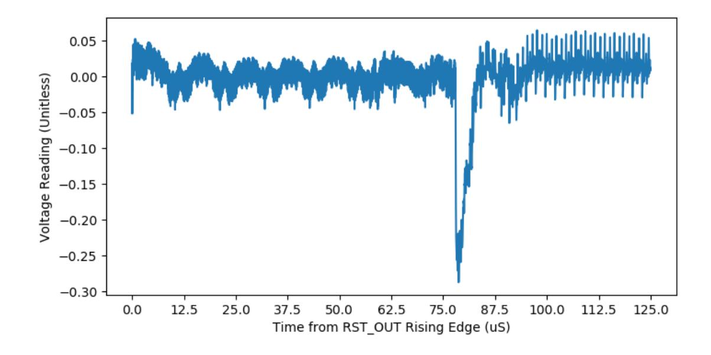
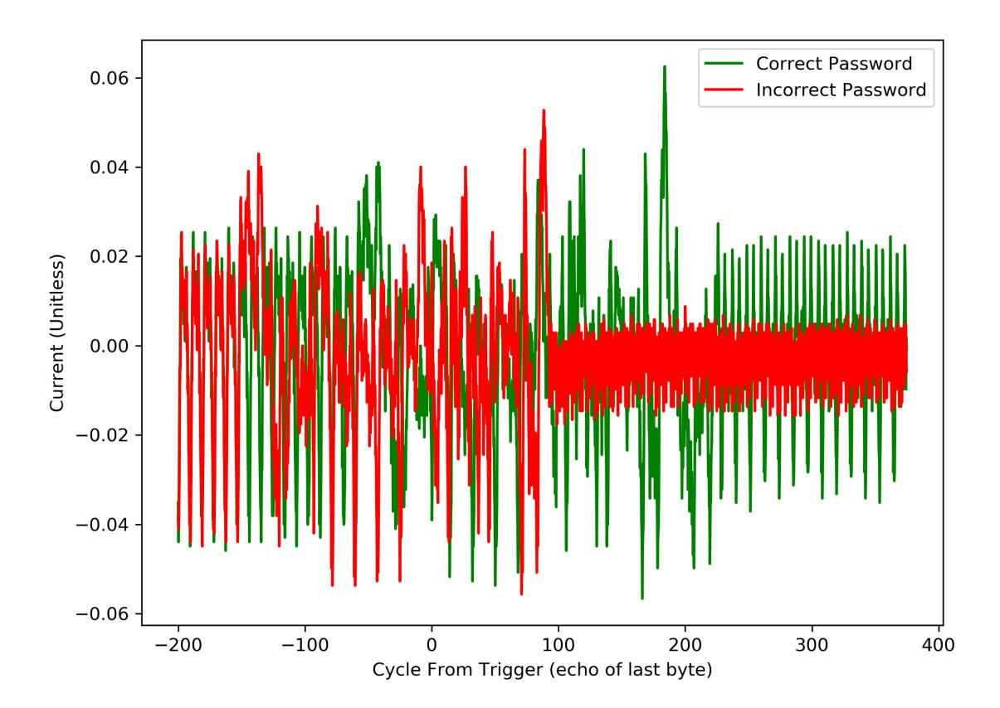
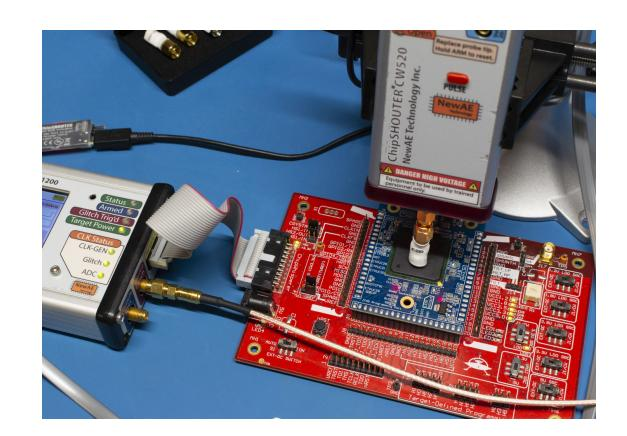
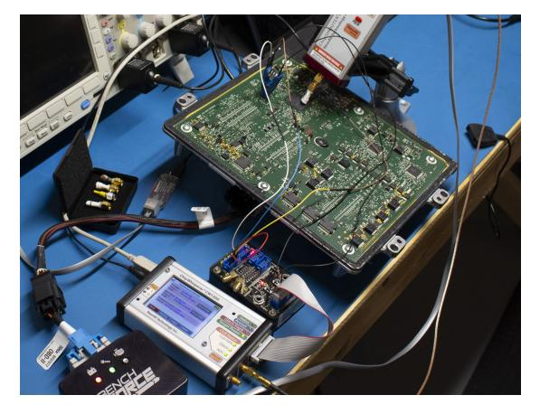
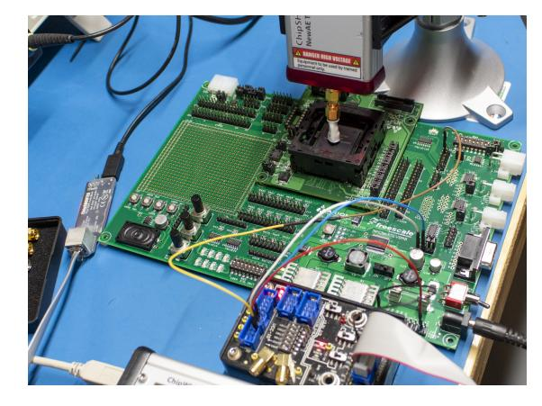
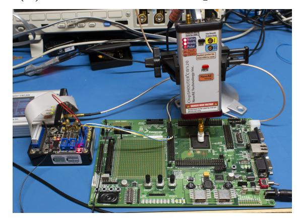
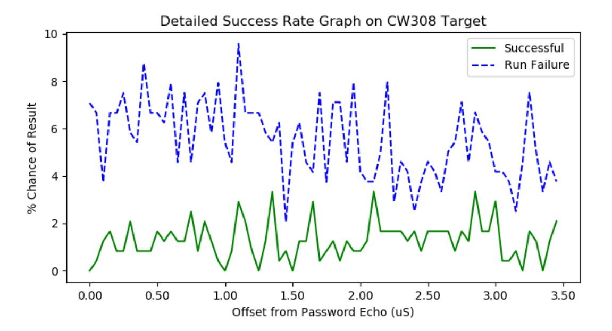
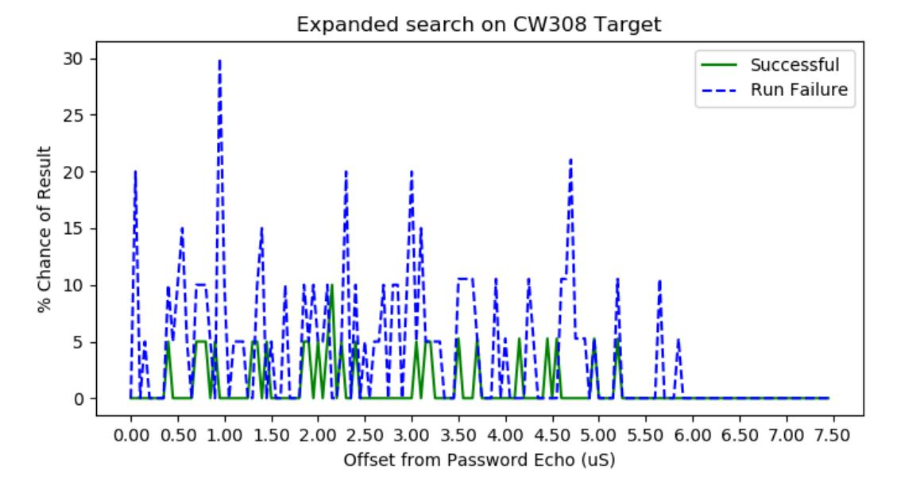
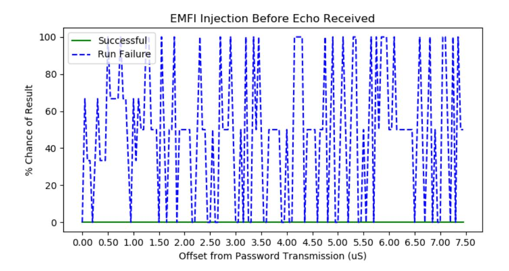

{0}------------------------------------------------

# BAM BAM!! On Reliability of EMFI for in-situ Automotive ECU Attacks?

Colin O'Flynn

Dalhousie University, Halifax, Canada colin@oflynn.com

Abstract. Electromagnetic Fault Injection (EMFI) is a well-known technique for performing fault injection attacks. While such attacks may be easy demonstrated in a laboratory condition, information about the applicability of them to real-life environments is critical for designer of ECUs to understand the effort that should be spent on protecting against them. This work targets a recent (2019) automotive ECU, and analyzes the target microcontroller used in laboratory conditions, and then transitions the attack to a real-world "in-situ" attack similar to a garage bench.

The specific work appears relevant to several devices in the MPC55xx and MPC56xx series, which are automotive-focused PowerPC devices.

Keywords: fault injection · EMFI · secure boot · physical security.

## 1 Introduction

Fault injection allows an attacker to alter control flow of a device, which can be used for bypassing security measures. Fault injection can be performed using multiple physical methods including by controlling the device clock, perturbing the device voltage supply, and optical methods such as laser fault injection, and varying other environmental characteristics [\[4\]](#page-16-0).

In a similar fashion using a strong electromagnetic pulse coupled to the target has been shown to be useful for performing fault injection of embedded systems[\[7\]](#page-16-1)[\[8\]](#page-16-2). One advantage of electromagnetic fault injection (EMFI) is it potentially requires no modifications to the target device, making it practical for "weaponized" attacks where rapid turn-around is required for the attack to be commercially relevant.

## 1.1 Attack Scenario & Threat Model

The specific attack scenario involves an attacker who has physical access to a device under investigation. The attack disclosed in this paper cannot be applied

? This paper appeared in the Proceedings of ESCAR Europe, 2020. The version infront of you is slightly extended with some additional clarifications that did not fit in the ESCAR Europe paper limits.

{1}------------------------------------------------

remotely, and fundamentally require close physical access to the device under investigation. In the case of the ECU, this means removing the ECU from the vehicle and placing it on a workbench.

Despite this limitation, the attack vector is important to consider as frequently an attacker will use such a method to find a vulnerability that can be remotely attacked. Specifically for automotive, such reverse engineering efforts were used in building a complex attack vector that culminated in a remote attack[\[6\]](#page-16-3).

Changes in standards and rules also brings more interest on the question of physical-layer attacks. For example, SAE J3061 provide a "Cybersecurity Guidebook" which discusses some physical level attacks, and similarly Commission Regulation (EU) 2017/1151 specifies that electronic security mechanisms should make it difficult to change parameters to exceed emissions standards. An open question is simply that of how difficult are various physical-level attacks to apply in practical scenarios?

#### 1.2 Contributions

The contributions of this paper are:

- Presentation of a bypass of a security mechanism that requires low-level hardware access, relevant to several chips in the PowerPC 5000 series.
- Detailed results showing the success rate of the attack in several different scenarios, ranging from "advanced laboratory" to "garage bench".
- Discussion on the range of parameters which should be varied while attempting to understand the possibility of performing EMFI on automotive targets.
- Recommendations for how to use the vulnerable PowerPC 5000 series devices where no alternative is available.

### 1.3 Previous Work

The authors acknowledge that they do not believe themselves to be the first to discover this attack, but only the first to publish such work. Commercially, a company (HPTuners) has publicly offered services on ECUs using the microcontrollers under discussion since at least 2018 [1](#page-1-0) . It is assumed that a similar fault-injection attack has been applied, but the method not revealed for commercial reasons. This paper is designed to help designers of automotive systems understand the practical relevance of fault attacks, and especially understand in concrete terms the application of previously presented work. Thus while this work may be considered offensive in nature, the reader is reminded that the attacks presented are not novel, and have likely been widely exploited. Only by understanding these attacks can we build secure automotive systems that will resist this next-generation of attackers.

On the specific topic of EMFI in automotive systems, previous work [\[9\]](#page-17-0) demonstrated EMFI attacks on several different automotive microcontrollers.

1 See <https://www.hptuners.com/product/l5p-ecm-exchange-service/>

{2}------------------------------------------------

While the specific microcontrollers are not mentioned by the authors of [\[9\]](#page-17-0), it is inferred that one of them (ASILD2) is similar to the devices discussed herein. Based on the description of the protection mechanism of the ASILD2 microcontroller, it appears to be from a later series (MPC57xx) than the devices used by the authors herein.

Nevertheless, the work in [\[9\]](#page-17-0) is a useful reference. First, they describe a high success rate for EM glitching on application code (18% to 57%). They then work on glitching the JTAG access port (allowing access), and report a success rate of 0.34% for attacking JTAG lock bits, and 0.00% for attacking the life cycle. The devices we are discussing do not have the same protection mechanism, so those success rates cannot directly be compared with the work done herein.

# 2 Hardware Background

Information on the devices and bootloader is available in application notes and datasheets for relevant devices; this section provides a more concise background on the relevant security features across several families, including the ones attacked here.

The PowerPC 5000 series has been jointly developed by Motorola Freescale NXP and ST Microelectronics. These devices are designed for automotive and industrial applications, with the devices used in this paper (56xx and 57xx) using a PowerPC e200 core. The devices are typically called MPC5xxx by NXP (such as MPC5676R), and SPC5xx by ST (such as SPC560B)[2](#page-2-0) .

For consistency, we will focus on the NXP variants of the parts, and thus use the MPC prefix when discussing families. Several devices in the MPC5xxx series have hardware strapping that forces entry of a bootloader mode (called Boot Assist Module or Boot Assist Flash). This functions as a first-stage bootloader, which loads given code into SRAM and executes it. The user can build a complete flash loader or other features they need as part of production or failure analysis.

Later versions of the series (such as MPC5777C or MPC5748G) have a feature that allows disabling of the pin strapping. When the pin strapping is disabled, the simple attack disclosed here does not work, as instead a multi-fault attack would likely be required.

Using the bootloader module (as an attacker or otherwise) requires building this SRAM based second stage image. While NXP provides the RapidID Bootloader which implements many of the required features, the authors have implemented their own simple collection of tools as the devices of interest were not directly supported by the RapidID BL. As RapidID BL does not provide source for the device firmware, the authors also can implement more specific functions as required by this work.

2 Confusingly, the parts from NXP use the MPC prefix in the datasheet and marketing, but the SPC prefix for ordering and on the physical packages. In addition, the part numbers used by vendors such as GM appear customized, but the 'mask-set' number is the same, making identification fairly straightforward.

{3}------------------------------------------------

#### 4 C. O'Flynn

Ultimately the authors implemented several versions of the 2nd stage bootloader to validate access to various features, including:

- 1. Reading of shadow memory area used to store serial password.
- 2. Reading of all flash memory.
- 3. Erasing shadow page & reprogramming with defaults (uncensor operation).

These operations are needed depending on the result of a fault injection attack, and how the device is configured.

### 2.1 Boot Assist Module (BAM) Details

Most devices in the MPC55xx and MPC56xx series include the Boot Assist Module (BAM) code which includes a serial or CAN bootloader mode. In these devices, various pin strappings are used to enable the bootloader. There is no method of disabling the bootloader entry, as the pin strapping takes priority over internal flash. Later devices in the MPC57xx series allow ignoring of external pin strapping.

The MPC5676R and MPC5566 devices (along with most others in the series) allow both a UART (serial) or CAN-based bootloader. Both of these bootloaders have a similar protocol, shown in Algorithm [1.](#page-3-0)

### Algorithm 1: Boot Assist Module (BAM) as implemented by NXP

Result: Boots from SRAM Receive an 8-byte password; if Password is incorrect then

STOP and wait for watchdog reset;

end

Receive 8 bytes of header information, including number of bytes (N) to follow; Receive N bytes of bootloader program which will be written to SRAM;

Jump to SRAM bootloader;

In order to ensure data was received correctly, any processed data is echoed back. When using the UART bootloader, data is echoed back one byte at a time. For CAN, the echo is transmitted as a block using a different CAN-ID.

Depending on censorship and bootloader settings stored in a specific shadow memory address, the bootloader will use one of two passwords. The first is a default (hard-coded) password of FEED FACE CAFE BEEF, which is called the "public" password. If a device is censored, the bootloader can still be specified to use only the public password. In this case internal flash access is disabled. The bootloader can also be specified to use a password from the shadow memory which then allows flash access even for a censored device. Specifics of this are detailed in the device datasheet[\[1\]](#page-16-4).

{4}------------------------------------------------

Of importance to this work, three possible configurations of the device are of interest. In all configurations the device is censored. Because the censorship control word is not used for the bootloader, we do not consider the censorship status here. Our test devices will have censorship enabled to ensure they are configured as in-field devices would be (censorship control is required to ensure JTAG is locked).

#### 1. Public Password

In this configuration, the bootloader will only accept the public password, and disables FLASH access from resulting code when running in RAM.

#### 2. Flash Password

In this configuration, the bootloader will only accept the private flash-based password, and if the password matches will allow download of code to RAM and execution of this code. The device will allow FLASH access during this code execution (the censorship is 'turned off').

### 3. Invalid Flash Password

In this configuration, the bootloader is configured to use the flash password, but the password includes either 0x0000 or 0xFFFF. These are considered invalid passwords and the bootloader will reject any authentication attempt.

The censorship status is set by a control word at address 0xFFFDE0 – if this word is 0x55AA the device is uncensored, otherwise the device is censored. The censorship will be ignored when a valid serial password is received. The boot control word at 0xFFFDE2 defines which password is considered valid – if this word is 0x55AA the private password stored at 0xFFFDD8 is used, otherwise the default 'public' password is used.

The overall objective of an attacker is to allow flash access. Thus, an attacker wishes to have either the public or some invalid password accepted, and still maintain flash read access. As the various configuration modes are handled via ROM code, we expect different configurations of the bootloader will require different fault attacks.

Note that in this device there is no secure key memory or similar, the security is provided by the flash-based password. For devices which are configured with the 'Device Censored, Flash Password', it means that if an attacker is able to enable read access to flash memory even once, the attacker can read the password out. Once the attacker has the password, they can then use this to access flash memory using the normal protocol (which will use the password to disable censorship).

CAN vs UART for BAM Access The protocol for both CAN and UART is similar (same data transferred). The UART bootloader will echo back the password sent to the device, and only after the password is received, does the device stop the echo process. When operating in CAN mode, the BAM bootloader will send a CAN frame with a predefined CAN frame ID (0x001) that echos the password, only if the password is accepted by the device (i.e., the correct password).

{5}------------------------------------------------

This minor difference means that with the UART bootloader, the echo process can be used to detect if the bootloader has been entered, even if the password is unknown. With the CAN bootloader, the attacker cannot rely on the bootloader protocol. The attacker can however use the fact that the bootloader will be listening for the special frame-ID (0x011) used to send the password to the device, so can look for the dominant level in the ACK slot, assuming that the CAN-ID is not normally used.

The default UART baud rate is slow (24000 baud), meaning that for performing operations which require download of code memory, the CAN bootloader allows much faster iteration rates. This work has used the UART protocol for communication with BAM due to the easier triggering that the UART frames present.

#### 2.2 Boot Power Analysis

A view of the power during boot is first performed to understand some details of the boot system. The boot operation of the MPC5676R is shown in Figure [1.](#page-5-0) The significant change in power at 78.0 µS is due to the device changing from the internal oscillator to the external oscillator. This point is also the time it changes from the boot sequence to the actual code being executed – that is either running the bootloader (BAM) code, or the main user code, depending on the state of the strapping pin. The switch in clock frequency can also be seen by observing the 'ENGCLK' output pin.

Fig. 1: The device boot shows switch from internal to external clock.

We can also see the difference in code execution by observing the correct and incorrect password processing, as in Figure [2.](#page-6-0) Here we measure time in cycles of the 20 MHz clock fed into the MPC5676R. Around 150 cycles before the end of the echo time (cycle -150 on Figure [2\)](#page-6-0) we see the divergence of the power trace. Both of the last bytes for the correct and incorrect password was 0xEF in 

{6}------------------------------------------------

this case, meaning the difference is related to code-flow only and not the data transferred.

Fig. 2: Comparing the correct and incorrect password makes the injection timing clear.

#### 2.3 BAM Reverse Engineering

Note that as the BAM code is not locked from reading, it is also possible to reverse engineer the code. We did not use this feature, but would provide another method of finding faultable code.

## 3 EMFI and Attack Tooling

The EMFI attack is performed with the commercially available EMFI tool (Chip-SHOUTER from NewAE Technology Inc.). This tool comes with four tips, which are separated into a 1mm and 4mm core diameter. The tips have two "winding directions", being a counter-clockwise (CCW) and clock-wise (CW) winding. These windings will generate opposite polarity injected signal into the target device [\[2\]](#page-16-5).

EMFI tools can use several architectures. The ChipSHOUTER uses a capacitive discharge architecture, which connects the capacitor bank onto the tip 

{7}------------------------------------------------

using a high-side switch. A small-value series resistor prevents excessive currents, but primarily the limitation of current is related to the inductance of the "tip" (inductor).

Thus while we expect the results we report in terms of voltage and pulse widths to be relevant for users of tools with a similar architecture, EMFI tools using alternate designs may see different results and require further experimentation [\[3\]](#page-16-6)[\[5\]](#page-16-7).

### 3.1 Target Setups

Four different targets will be used in this work. The first three are based on the MPC5676R device, shown in Figure [3a,](#page-8-0) Figure [3b,](#page-8-0) Figure [3c.](#page-8-0)

For all of these targets, a ChipSHOUTER EMFI tool is used. The tool is triggered by a ChipWhisperer-Pro, and for three of the targets a breakout board provides level translation to the 5.0V I/O logic levels. The ChipWhisperer-Pro is used only for triggering on the serial data being transferred, with an adjustable offset that will be incremented in 50 nS steps.

The offset adjustment is based on a 20 MHz clock being generated by the ChipWhisperer. For the NAE-CW308T-MPC5676R Board this clock will be used as a clock input, for the other boards the crystal oscillator on-board the target devices will be used. To keep a consistent tool setup, the 20 MHz clock as generated by the ChipWhisperer is always used as the "step size" for the glitch location. The clock is only synchronized to the target for the NAE-CW308T-MPC5676R Board.

The CW308T-MPC5676R was used for performing the boot power analysis measurement. The different boot modes mentioned are enabled by using a PE Micro Multilink programmer to program relevant shadow flash page values.

The fourth target to be used is an automotive ECU. In this work, a GM E41 ECU (part number 12691652) will be used as the "real-life" target. This ECU is used in the 2019 Chevrolet Silverado 2500 HD & 2019 GMC Sierra 2500 HD, representing a recent automotive ECU.

# 4 BAM Fault Attack for Private Password

While the attack is assumed to be relevant to most devices in the MPC55xx and MPC56xx series, two specific devices were concentrated on for characterizing the attack. This is the MPC5566 and MPC5676R were chosen as representative samples of devices in this series. The MPC5566 was introduced in May 2006, and the MPC5676R was introduced in October 2011. Both have 15-year design lives[3](#page-7-0) , meaning despite the age of the processors they may still be found in recent devices (as shown by usage in a 2019 MY ECU).

3 See [https://www.nxp.com/products/product-information/product-longevity:](https://www.nxp.com/products/product-information/product-longevity:PRDCT_LONGEVITY_HM) PRDCT [LONGEVITY](https://www.nxp.com/products/product-information/product-longevity:PRDCT_LONGEVITY_HM) HM.

{8}------------------------------------------------

(c) E41 ECU "In-Situ" Target (d) MPC5566 Development Kit

(a) NAE-CW308T-MPC5676R Board (b) MPC5676R Development Kit

Fig. 3: Hardware targets used to validate the EMFI effectiveness.

The following will describe the general fault attack for the MPC55xx and MPC56xx series, followed by the characterization experiments. The characterization is designed to answer two questions: the possibility of moving a fault attack built on a development board to a real-world application, and the possibility of using a fault attack across similar devices.

#### 4.1 BAM Attack Summary

The attack on the BAM module assumes first that we have external control of the BOOTCFG1 pin, which will force entry into the bootloader. From here the bootloader will perform Algorithm [1.](#page-3-0) As previously mentioned, the bootloader can use either a private password saved at location 0xFFFDD8 in flash, or a fixed 'public' password. An attacker performing a fully black-box attack can easily detect which one is being used: if the public password is not accepted, then the device must be set to use the private password.

The attack will concentrate on the device configured to use a private password. This configuration is one that appears to be widely used in real-life applications. This configuration allows the device manufacture to perform device recovery or failure analysis, as they maintain the device passwords. If the device was instead configured to be censored (and use only the public password), the device would no longer allow access to flash memory.

{9}------------------------------------------------

With the device configured with a private flash password, there are two possible attacks setups:

- 1. Sending the public password FEED FACE CAFE BEEF.
- 2. Sending an incorrect password (here we use 1122 3344 5566 7788).

After each password is sent, a fault injection attack is attempted. There are six potential results from the attack:

- 1. No effect (password not accepted): Normal.
- 2. Target reset: Err-Reset.
- 3. Password accepted, error during code download: Err-Protocol.
- 4. Password accepted, code downloads, but does not start: Err-RunFail.
- 5. Code downloads and runs, but flash access is still disabled: Err-RunFail.
- 6. Code downloads and runs, printing private (flash) password: Success.

In practice we found differentiating between (4) and (5) unreliable – our default attack script appeared to access flash early on, and thus if censorship was still enabled it caused an exception. We group both (4) and (5) into a single result where the downloaded code did not run, which from the attacker perspective is the same.

Detecting the error during code download (Err-Protocol) is possible as the protocol should error back all received data. In addition, once the correct number of bytes are received, the chip should stop echoing back data. Thus we can attempt to send a single additional byte to detect if the chip is still (erroneously) waiting on data. If we detect the chip still waiting on data, this suggests the variable holding the expected program length is corrupt.

#### 4.2 Target Physical Devices

The following describes the specifics of the four target devices used in the EMFI experiments.

CW308T-MPC5676R Target Board The CW308T-MPC5676R target represents an off the shelf device target, part number NAE-CW308T-MPC5676R. This board is designed for side-channel power analysis, and thus has a small (1-ohm) shunt resistor in the core voltage supply[4](#page-9-0) .

The device configuration is as follows:

- 1. PLLCFG2 = 0 (board jumper).
- 2. External clock = 20 MHz logic-level clock.
- 3. BOOTCFG1 = 0 (switchable via GPIO).

4 This board is open-source hardware, with design files available at [https://github.](https://github.com/newaetech/chipwhisperer-target-cw308t/tree/master/CW308T_MPC5Y) [com/newaetech/chipwhisperer-target-cw308t/tree/master/CW308T](https://github.com/newaetech/chipwhisperer-target-cw308t/tree/master/CW308T_MPC5Y) MPC5Y.

{10}------------------------------------------------

For this device, a 20 MHz clock is provided from the ChipWhisperer.

We found that the board as designed did not allow EMFI injection to succeed. We discovered that shorting the shunt resistor with a wire jumper, and mounting a single decoupling capacitor at position B1 was required for the EMFI to be successful.

This will be reported as CW308 in the results tables.

MPC5676R Development Board This target is a development kit available from the vendor. Here we used MPC57XXXMB for the base-board and XPC567XMB-PT for the variant specific target, shown in Figure [3b](#page-8-0)

The device configuration is as follows:

- 1. PLLCFG2 = 1 (board DIP switch).
- 2. External clock = 40 MHz crystal.
- 3. BOOTCFG1 = 0 (board DIP switch).

This will be reported as 5676DK in the results tables.

ECU In-Situ For the "in-situ" tests, the applicability of the exploit on the chip used on development boards is then compared to a real-life application. The real-life application chosen is an GM E41 ECU, part number 12691652, which is used in the Chevrolet Silverado 2500 HD & 2019 GMC Sierra 2500 HD. This device was chosen as it represents a recently released vehicle.

Compared to a simple laboratory setting, performing the attack on the "offthe-shelf" device requires providing power and communications to the target device, as well as reverse engineering of required test points.

- 1. PLLCFG2 = 1 (board configuration).
- 2. External clock = 40 MHz crystal.
- 3. BOOTCFG1 = 0 (via jumper wire solder to board).
- 4. RESET pin connected via jumper wire inserted into board via.

This will be reported as E41 in the results tables.

MPC5566 Development Board This target is a development kit available from the vendor. Here we used MPC5566EVB, shown in Figure [3d.](#page-8-0)

The device configuration is as follows:

- 1. External clock = 16 MHz crystal.
- 2. BOOTCFG1 = 0 (board DIP switch).

This will be reported as 5566DK in the results tables.

{11}------------------------------------------------

#### 4.3 Results

Unless otherwise described, the following setup for the fault injection attack was used:

- EMFI voltage set to 444V.
- EMFI tool using 4mm, counter-clockwise (CCW) wound coil.
- Trigger based on time since end of the received echo of last character of the transmitted password.

An overall summary of the results on the four targets is given in Table [1.](#page-11-0) This shows the various responses achieved for sending the public password (shown in table as FEE.., full sent password was FEEDFACECAFEBEEF) and an invalid private password (shown in table as 112.., full sent password was 1122334455667788. Note that when switching the changed sent password, no physical changes to the device setup happen. The only change is in the script performing the fault injection campaign.

When changing between targets, the physical EMFI setup is moved to the next target. As our test setup allows real-time reviewing of results (such as Err-Reset vs Normal vs Success) we manually position the EMFI tip over various areas of the chip until successes are seen (where possible). For these devices the location is typically on or near the 'Freescale' logo on the chip markings.

The notation for the various targets was previously listed in each target summary section.

| Result       | CW308 |       |       | 5676DK E41 4mmCW |       | E41   | 5566DK       |       |
|--------------|-------|-------|-------|------------------|-------|-------|--------------|-------|
|              | 1122  | FEE   | 112   | 112              | FEE   | FEE   | 112          | FEE   |
| Normal       | 92.8% | 92.2% | 92.8% | 98.5%            | 98.5% | 91.5% | 100.0% 63.6% |       |
| Err-Reset    | 0.21% | 0.00% | 0.10% | 0.02%            | 0.04% | 0.16% | 0.00%        | 0.08% |
| Err-Protocol | 0.00% | 0.00% | 0.00% | 0.00%            | 0.00% | 0.00% | 0.00%        | 0.00% |
| Err-RunFail  | 5.63% | 5.90% | 5.85% | 0.00%            | 0.00% | 8.29% | 0.00%        | 0.00% |
| Success      | 1.32% | 1.92% | 1.23% | 1.26%            | 1.43% | 0.00% | 0.00%        | 36.3% |

Table 1: Overall success rate for target devices in 56xx and 55xx family.

For the MPC5676R device, it is noted that sending the public or invalid password had generally similar success rates. For the MPC5566 device, only the public password had useful results, as this public password did result in a device becoming uncensored.

For the E41 ECU, note the "4mm CCW" injection tip did not result in successful attacks, while that tip was successful on the two development boards. Of these results, the successful E41 attack was with the "4mm CW" injection tip. This may simply be a fluke related to positioning, but the authors successfully repeated the attack after re-positioning the board using the "4mm CW" injection tip, but not with the "4mm CCW" tip.

{12}------------------------------------------------

Injection Location The longest-running campaign of 16767 injection attempts was performed on the CW308T-MPC5676R development board. In this case, we can see in Figure [4](#page-12-0) that the success rate (that is, the rate at which the download succeeds and runs the code to display the flash shadow password), remains relatively constant over the time 0.1 – 3.5µS.

Fig. 4: Success rate is relatively constant over 0.1 – 3.5µS.

A shorter campaign of 3000 injection attempts was performed over a larger range of 0.0µS to 7.5µS. The results in Figure [5](#page-12-1) showing that the useful injection range is the window of approximately 0.1 to 5.0µS. An additional campaign up to 1000µS was also performed to validate no additional fault injection points are visible later.

Fig. 5: No successes are observed beyond 5.5µS.

{13}------------------------------------------------

### 5 Other BAM Modes

We previously enumerated three possible device configurations, but the majority of this work was carried out with only one such configuration.

For completeness, we have included a summary of experiments performed on the additional device configuration.

#### 5.1 Device Censored with Invalid Private Password

In this state, part of the password includes 0000 or FFFF. This is considered invalid and should not be accepted (i.e., trying to send this password to the device causes it to reject the password).

For this, we programmed the flash password to an invalid value. We performed the same EMFI attack, sending either 112233... or FEEDFACE.... This attack was equally successful as when the device has a valid password, and our flash read script simply reads the invalid password.

Note that exploiting the invalid password is slightly more difficult, as it requires downloading a BAM image to the device which re-writes the internal password to be something valid. Once the password is re-written, you can then connect to the device via JTAG or bootloader, and present the known password.

### 5.2 Device Censored with Public Password

In this state, the device is censored, but configured to use the public password. In this state there is no way to 'unlock' the device.

The previous EMFI attack was unsuccessful in this configuration. Note that as the device is listening for the public password (FEEDFACE...), we performed most of the search using the 112233... password. When the device receives the public password, the actual download of the BAM image is slow (approx. 45 seconds) and thus substantially slows down the search process. When using the public password, until the BAM image runs you are unaware if the attack was successful. Compared to the situation where we can gauge attack success by seeing the device accept the password, requiring the full BAM download is a much slower search.

In addition, we attempted an EMFI attack at ranges of 0.0 to 125µS from the device boot (in order to fault when the device may be enabling censorship) and were also unsuccessful. This timing was based on the known switch to BAM code in Figure [1.](#page-5-0)

We also tried configuring the flash password to be the same one as we were sending (the 112233...). This test was done as it would be possible that a singlefault attack may enable the flash password (despite device being configured to use the public password). This was also unsuccessful.

{14}------------------------------------------------

### 5.3 False Positives and EMFI

In our work, we always validated that a successful attack correctly returned the password, indicating the device had become uncensored. This required development of the loader to send over the BAM protocol. A quicker test would be to simply validate that the password is accepted, and assume that the accepted password will allow device access.

We discovered that this raises a high likelihood of false positives. In fact, it appears that performing an EMFI attack on the device before it has finished echoing the password causes the device to look for the public password, instead of the private password.

As an example we used the CW308T-MPC5676R target, and swept a trigger based on us sending data to the device (NOT the echo back as the rest of the paper uses). The results in Figure [6](#page-14-0) show us sending the public password (FEEDFACE...) to the device, and with very high likelihood the device accepts this password, even though the device is configured to use the private flash password. However, the device does not actually run the code, meaning the censorship state has not been compromised.

Fig. 6: A 'run failure' means the password was accepted, but the code did not run correctly. Here we achieve on average 48% success with accepting the password, but there is never a successful execution of the code.

Note that there was no protocol errors (such as the device expecting more or less data), suggesting we were not simply corrupting data transfer, but the device may be switched to looking for the public password instead, and remains censored.

Sending an incorrect flash password had no successes in this state. Compare this to the attack on the same board, but timing the EMFI injection from the received password echo, where both incorrect flash password and the public password have similar success rates.

{15}------------------------------------------------

#### 5.4 Suggestions for Device Usage

As demonstrated by these results, configuring the device as censored with a public serial password seems to provide the most robust protection against fault injection attacks. These results appear to be similar to previous work [\[9\]](#page-17-0), which showed attack on certain features (in [\[9\]](#page-17-0) the 'life-cycle state') are more difficult than others, which is assumed to be related to the implementation on the chip itself.

For the MPC5676R, the (unused) private password should be set to a nondefault value to ensure a fault injection campaign would need at least two successful faults. Using an invalid value will make it more difficult as well to access the device via JTAG. All of the above can be accomplished with:

- Program FFFDE0 to FFFF (!55AA, device censored).
- Program FFFDE2 to FFFF (!55AA, use public password).
- Program FFFDD8 to FFFFxxxxxxxxxxxx (xx = random).

### 6 BAM Fault Attack with ST Variants

We previously enumerated two vendors of devices using the 56/57 series of PowerPC cores, but the majority of this work is carried out with NXP vendor devices. We will now discuss the ST implementations (SPC5XXX series).

Most devices in the SPC56XX series contain a pin called 'Force Alternate Boot' (FAB). This pin is used to enable the bootloader entry. The SPC57xx and SPC58XX series do not use an external pin (similar to the MPC57xx series), meaning the single-fault attack as presented in this paper will not work on those devices.

We investigated the application of the single fault EMFI attack disclosed on the SPC560B device. On the SPC560B a slightly different implementation of the bootloader is present - the censorship is disabled by a hardware peripheral which performs the password comparison. The BAM code passes the password check to a hardware peripheral. It does not check the result of this until after the code has been downloaded, which substantially slows down the attack search speed, as you cannot detect if the password was accepted early in the protocol.

We did not have success applying the same fault (using similar fault timing/triggering), but more work is required to understand if the vulnerability also applies to these devices.

### 7 Conclusions

While the attack remains relatively portable between platforms, there is considerable environment-specific setup that can affect results. For example changing the polarity of the injected pulse considerably changed the results on the in-situ platform, but did not seem to affect the development kit platforms.

{16}------------------------------------------------

A robust testing strategy is required to validate devices against fault injection attacks, especially for devices which may already be deployed (and thus it is required to understand how they may be being exploited).

On these specific devices, the fault injection can be performed on a practical system with minimal modifications. While the success rate appears low (< 2%), in practice a success can be found within 1-5 minutes once the EMFI tool is setup. In a practical scenario we typically had success within 30-60 minutes from a "cold start" (i.e., need to attach to target, sweep parameters, etc). However, small variations can drastically affect this. As mentioned we had used the 4mm CCW injection tip on the in-situ attack without success, which meant a sweep taking 4-6 hours. For new or unknown targets, the setup time can be substantial while the various parameters including EMFI charge voltage, pulse width, tip type, physical location, offset from trigger, etc are being optimized.

### Acknowledgments

The authors notified NXP of the results in this paper before publication, and wanted to thank the NXP PSIRT, along with the NXP automotive microcontroller group, for much time spent on detailed discussion of the results and application.

### References

- 1. MPC5676R Microcontroller Reference Manual (Sep 2012)
- 2. ChipSHOUTER User Manual (2019), [https://github.com/newaetech/](https://github.com/newaetech/ChipSHOUTER/blob/master/documentation/ChipSHOUTER%20User%20Manual.pdf) [ChipSHOUTER/blob/master/documentation/ChipSHOUTER%20User%](https://github.com/newaetech/ChipSHOUTER/blob/master/documentation/ChipSHOUTER%20User%20Manual.pdf) [20Manual.pdf](https://github.com/newaetech/ChipSHOUTER/blob/master/documentation/ChipSHOUTER%20User%20Manual.pdf)
- 3. Balasch, J., Arum´ı, D., Manich, S.: Design and validation of a platform for electromagnetic fault injection. In: 2017 32nd Conference on Design of Circuits and Integrated Systems (DCIS). pp. 1–6 (Nov 2017). <https://doi.org/10.1109/DCIS.2017.8311630>
- 4. Bar-El, H., Choukri, H., Naccache, D., Tunstall, M., Whelan, C.: The Sorcerer's Apprentice Guide to Fault Attacks. Proceedings of the IEEE 94(2), 370–382 (Feb 2006).<https://doi.org/10.1109/JPROC.2005.862424>
- 5. Cui, A., Housley, R.: BADFET: Defeating Modern Secure Boot Using Second-Order Pulsed Electromagnetic Fault Injection. In: Proceedings of 11th USENIX Workshop on Offensive Technologies (WOOT 17) (2017)
- 6. Miller, C., Valasek, C.: Remote Exploitation of an Unaltered Passenger Vehicle. In: Black Hat USA 2015. p. 91 (Aug 2015)
- 7. Moro, N., Dehbaoui, A., Heydemann, K., Robisson, B., Encrenaz, E.: Electromagnetic Fault Injection: Towards a Fault Model on a 32-bit Microcontroller. In: 2013 Workshop on Fault Diagnosis and Tolerance in Cryptography. pp. 77–88 (Aug 2013). <https://doi.org/10.1109/FDTC.2013.9>
- 8. Schmidt, J.M., Hutter, M.: Optical and EM Fault-Attacks on CRT-based RSA : Concrete Results. In: Proceedings of Austrochip 2007, 15th Austrian Workshop on Microelectronics (2007)

{17}------------------------------------------------

#### 18 C. O'Flynn

9. Wiersma, N., Pareja, R.: Safety != Security: On the Resilience of ASIL-D Certified Microcontrollers against Fault Injection Attacks. In: 2017 Workshop on Fault Diagnosis and Tolerance in Cryptography (FDTC). pp. 9–16 (Sep 2017). <https://doi.org/10.1109/FDTC.2017.15>