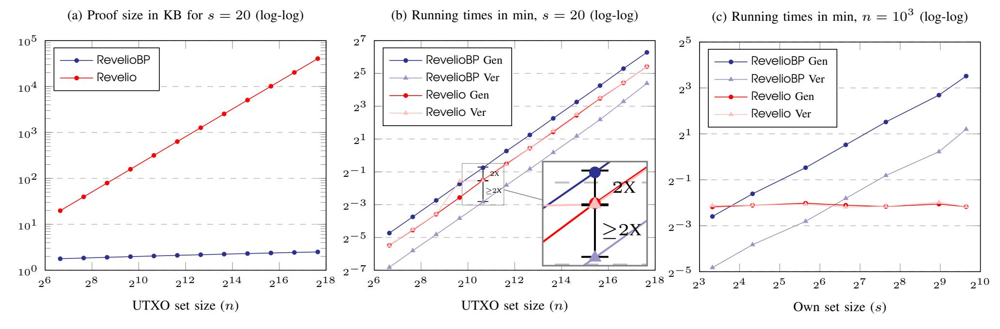

{0}------------------------------------------------

# Performance Trade-offs in Design of MimbleWimble Proofs of Reserves

Suyash Bagad *Department of Electrical Engineering Indian Institute of Technology Bombay Mumbai, India suyashbagad@iitb.ac.in*

Saravanan Vijayakumaran *Department of Electrical Engineering Indian Institute of Technology Bombay Mumbai, India sarva@ee.iitb.ac.in*

*Abstract*— Revelio (CVCBT 2019) is a proof of reserves protocol for MimbleWimble-based cryptocurrencies which provides privacy to a cryptocurrency exchange by hiding the exchange-owned outputs in a larger anonymity set of unspent outputs. A drawback of Revelio is that the proof size scales linearly in the size of the anonymity set. To alleviate this, we design RevelioBP, a Bulletproofs-based proof of reserves protocol with proof sizes which scale logarithmically in the size of the anonymity set. This improvement allows us to use the set of all UTXOs as the anonymity set, resulting in better privacy for the exchange. On the downside, the higher proof generation and verification time of RevelioBP than that of Revelio might affect practical deployment of RevelioBP. Through implementation of RevelioBP, we quantitatively analyse trade-offs in design of MimbleWimble proofs of reserves in terms of scalability and performance. We conclude that unless proof size is a concern for exchanges, Revelio is a marginally better choice for proof of reserves. On the other hand, if an exchange is willing to pay in terms of proof generation time, RevelioBP offers proof sizes significantly smaller than Revelio.

*Index Terms*—Cryptocurrency, MimbleWimble, Grin, Proof of Reserves

# 1. Introduction

A proof of reserves protocol is used by a cryptocurrency exchange to prove that it owns a certain amount of cryptocurrency. If privacy of the amount or outputs owned by the exchange is not an issue, then proving reserves involves a straightforward proof of the ability to spend the exchange-owned outputs (for example, see [\[1\]](#page-10-0)). Non-private proof of reserves protocols are unlikely to be adopted by exchanges as they may reveal business strategy. Privacy-preserving proof of reserves protocols have been proposed for Bitcoin [\[2\]](#page-10-1), [\[3\]](#page-10-2), Monero [\[4\]](#page-10-3), and MimbleWimble [\[5\]](#page-10-4). In fact, the protocols proposed by Decker *et al* [\[2\]](#page-10-1) and Dagher *et al* [\[3\]](#page-10-2) go one step further and give a privacy-preserving proof of solvency, i.e. they prove that the reserves owned by the exchange exceed its liabilities towards its customers. However, the work in [\[2\]](#page-10-1) relies on a trusted hardware assumption. And the proof of liabilities protocol in [\[3\]](#page-10-2) is secure only if every exchange customer checks the proof. In general, it seems that designing proof of reserves protocols is easier than designing proof of liabilities protocols as the former depend on the public blockchain state while the latter depend on the exchange's private customer data.

Even without a robust proof of liabilities protocol, a privacy-preserving proof of reserves protocol based on homomorphic commitments is valuable. For example, the proof of reserves protocols in [\[3\]](#page-10-2)–[\[5\]](#page-10-4) generate a Pedersen commitment Cres to the amount of reserves. Exchanges can easily prove that Cres is a commitment to an amount which exceeds a base amount abase. While the base amount may not be exactly equal to the total liabilities of the exchange, it can be based on the trade volume data published by the exchange [\[6\]](#page-10-5). This technique will help early detection of exchange hacks and exit scams. For example, in Februrary 2019 the Canadian exchange QuadrigaCX claimed that it had lost access to wallets containing customer funds due to the death (in December 2018) of their CEO who had sole custody of the corresponding passwords and keys. But an official investigation found that the wallets had been empty since April 2018, several months before the CEO's death [\[7\]](#page-10-6), [\[8\]](#page-10-7). This discrepancy would have been detected earlier if the exchange had been required to give perioidic proofs of reserves.

MimbleWimble is a design for a scalable cryptocurrency which was proposed in 2016 [\[9\]](#page-10-8). Beam and Grin are two implementations of the MimbleWimble protocol which are available on several exchanges [\[6\]](#page-10-5). Revelio [\[5\]](#page-10-4) was the first proof of reserves protocol for MimbleWimble coins which provided some privacy to exchanges by hiding the exchange-owned outputs inside an anonymity set of outputs. As the anonymity set is revealed as part of the proof of reserves, a larger anonymity set results in better privacy for the exchange. Since the Revelio proof size scales linearly with the anonymity set, it becomes an impediment in scaling the anonymity set to the set of all unspent transaction outputs (UTXOs). To solve the scalability issue of Revelio, we designed RevelioBP leveraging the Bulletproofs [\[10\]](#page-11-0) framework, resulting in the proof size being logarithmic in the anonymity set size.

Our Contribution. In this paper, we present RevelioBP, a proof of reserves protocol for MimbleWimble with proof sizes scaling *logarithmically* in the size of the anonymity set and *linearly* in the size of the exchange-owned output set. This makes it feasible to choose the anonymity set to be the set of all UTXOs on the blockchain. To make quantitative comparisons, we have implemented RevelioBP in Rust. At the time of writing this paper, the number of 

{1}------------------------------------------------

UTXOs on the Grin blockchain is approximately 161,000 [11]. A Revelio proof of reserves for this anonymity set will have size 32 MB as against 0.27 MB using RevelioBP instead.\* This reduction in proof size, however, comes at the cost of larger proof generation and verification times. If an exchange is willing to compromise on the size of the proof and is required to give frequent proofs of reserves, Revelio serves as a better choice. If proof sizes are critical for an exchange and it is willing to spend more time generating the proof, RevelioBP clearly outperforms Revelio. In conclusion, we quantitatively highlight the trade-off between proof size and performance in using Revelio and RevelioBP, both of which are based on the discrete log assumption.

# 2. Preliminaries

#### 2.1. Notation

Let  $\mathcal{G} = \{\mathbb{G}, q, g\}$  be the description of a cyclic group  $\mathbb{G}$  of prime order q with generator g of  $\mathbb{G}$ . Let  $h \in \mathbb{G}$  be another random generator of  $\mathbb{G}$  such that the discrete logarithm relation between g and h is not known. Let  $\mathbb{G}^n$  and  $\mathbb{Z}_q^n$  be the n-ary Cartesian products of sets  $\mathbb{G}$  and  $\mathbb{Z}_q$  respectively.

Group elements which are Pedersen commitments are denoted by uppercase letters and randomly chosen group elements are denoted by lowercase letters.

Bold font denotes vectors. Inner product of two vectors  $\mathbf{a}, \mathbf{b} \in \mathbb{Z}_q^n$  is defined as  $\langle \mathbf{a}, \mathbf{b} \rangle := \sum_{i=1}^n a_i \cdot b_i$  where  $\mathbf{a} = (a_1, \dots, a_n), \mathbf{b} = (b_1, \dots, b_n)$ . Further, Hadamard and Kronecker products are defined respectively as,  $\mathbf{a} \circ \mathbf{b} := (a_1 \cdot b_1, \dots, a_n \cdot b_n) \in \mathbb{Z}_q^n$ ,  $\mathbf{a} \otimes \mathbf{c} := (a_1 \mathbf{c}, \dots, a_n \mathbf{c}) \in \mathbb{Z}_q^{nm}$  where  $\mathbf{c} \in \mathbb{Z}_q^m$ . For a base vector  $\mathbf{g} = (g_1, \dots, g_n) \in \mathbb{G}^n$ , vector exponentiation is defined as  $\mathbf{g}^{\mathbf{a}} = \prod_{i=1}^n g_i^{a_i} \in \mathbb{G}$ . For a scalar  $u \in \mathbb{Z}_q^*$ , we denote its consecutive powers in the form of a vector  $\mathbf{u}^n := (1, u, u^2, \dots, u^{n-1})$ . To represent the exponentiation of all components of a vector  $\mathbf{a}$  by the same scalar  $k \in \mathbb{Z}_q$ , we use  $\mathbf{a}^{\circ k}$  to mean  $(a_1^k, a_2^k, \dots, a_n^k)$ . If an element a is chosen uniformly from a set A, such a choice is denoted by  $a \leftarrow^{\$} A$ . For a positive integer n, let [n] denote the set  $\{1, 2, \dots, n\}$ .

# 2.2. Outputs in MimbleWimble

In MimbleWimble, coins are stored in outputs which consist of Pedersen commitments of the form  $C = g^r h^a \in \mathbb{G}$  where  $g, h \in \mathbb{G}$  and  $r, a \in \mathbb{Z}_q$ . Here a represents the amount of coins stored in the output and r is a blinding factor. Each commitment is accompanied by a range proof which proves that the amount a lies in the range  $\{0, 1, 2, \ldots, 2^{64} - 1\}$ .

The group elements g and h are assumed to have an unknown discrete logarithm relationship. For example, in Grin  $\mathbb G$  is the secp256k1 elliptic curve group, g is the base point of the secp256k1 curve, and h is obtained by hashing g with the SHA256 hash function [12]. The unknown discrete logarithm relationship makes the commitment computationally binding, i.e. a polynomial-time adversary cannot find  $r' \neq r$  and  $a' \neq a$  such that  $C = g^r h^a = g^{r'} h^{a'}$ .

To spend an output having the commitment  $C = g^r h^a$ , knowledge of the blinding factor r is required [13]. As spending ability is equivalent to ownership, a proof of reserves protocol for MimbleWimble involves a proof of knowledge of blinding factors of several outputs.

# 2.3. From Omniring to RevelioBP

In Monero, source addresses in a transaction are obfuscated using ring signatures and the amounts are hidden in Pedersen commitments [14]. The current transaction structure in Monero, called ring confidential transaction (RingCT), has proof sizes which scale linearly in the ring size. Omniring [15] is a recent proposal for RingCTs with proof sizes which scale logarithmically in the ring size. It relies on Bulletproofs [10] to achieve this size reduction. Given a ring  $\mathcal{R} = (R_1, R_2, \dots, R_n)$  of public keys where  $R_i = h^{x_i}$  for  $h \in \mathbb{G}, x_i \in \mathbb{Z}_q$ , the Omniring construction enables a prover to prove knowledge of the private keys  $x_{i_1}, x_{i_2}, \ldots, x_{i_m}$  corresponding to a subset  $\mathcal{R}_{\mathcal{S}}$  of  $\mathcal{R}$  without revealing  $\mathcal{R}_{\mathcal{S}}$ . For each public key  $R_j$ in this subset  $\mathcal{R}_{\mathcal{S}}$ , the prover also outputs a *tag* given by  $tag_i = g^{x_j^{-1}}$  for  $g \in \mathbb{G}$ . This tag is used to detect double spending from a source address.

The design of RevelioBP is inspired by the Omniring construction. Given the set of UTXOs  $C_{\text{utxo}} = (C_1, C_2, \ldots, C_n)$  on the blockchain where  $C_i = g^{r_i} h^{a_i}$  for some  $r_i, a_i \in \mathbb{Z}_q$ , the prover in RevelioBP proves knowledge of blinding factors  $r_i$  and amounts  $a_i$  for all  $C_i$  in a subset  $C_{\text{own}}$  of  $C_{\text{utxo}}$  without revealing  $C_{\text{own}}$ . For each output  $C_j \in C_{\text{own}}$ , the prover outputs a tag  $tag_j = g_t^{r_j} h^{a_j}$  where  $g_t \in \mathbb{G}$  is a randomly chosen group element. In RevelioBP, the tag has a dual role. Firstly, it is used to detect output sharing between exchanges. Secondly, the product of the tags is a Pedersen commitment to the total reserves of the exchange.

# <span id="page-1-1"></span>3. RevelioBP Proof of Reserves Protocol

To spend a MimbleWimble output having the commitment  $C = g^r h^a$ , knowledge of the blinding factor r is required [13]. Technically, the ability to spend an output also requires knowledge of the amount a. But the amount can be at most  $2^{64} - 1$ , and hence can be found by brute force search given C and r.

Let  $C_{\rm utxo}^t$  be the set of UTXOs on a MimbleWimble blockchain after the block with height t has been mined. An exchange will own a subset  $C_{\rm own}^t \subset C_{\rm utxo}^t$ , where ownership implies knowledge of the blinding factor for each output  $C \in C_{\rm own}^t$ . Using the RevelioBP protocol, the exchange can construct a Pedersen commitment  $C_{\rm res}$  to an amount which is equal to the sum of the amounts committed to by each of the outputs in  $C_{\rm own}^t$ . Given a Pedersen commitment  $C_{\rm liab}$  to the total liabilities of the exchange, it can give a proof of solvency via a range proof which shows that the amount committed to in  $C_{\rm res}C_{\rm liab}^{-1}$  is non-negative. If there is no suitable method to construct  $C_{\rm liab}$ , then the exchange can reveal a base amount  $a_{\rm base}$  and prove that  $C_{\rm res}h^{-a_{\rm base}}$  is a commitment to a non-negative amount.

While RevelioBP does not reveal  $C_{\text{own}}^t$ , it does reveal its cardinality  $s_t = |C_{\text{own}}^t|$ . We give a reasonable workaround for this issue in Section 3.1.

<span id="page-1-0"></span><sup>\*</sup>Under the assumption that the exchange owns 5% of all UTXOs.

{2}------------------------------------------------

If the Decisional Diffie-Hellman (DDH) assumption holds in the group  $\mathbb{G}$ , the RevelioBP proof of reserves protocol satisfies the following properties:

- *Inflation resistance*: Using RevelloBP, a probabilistic polynomial time (PPT) exchange will not be able to generate a commitment to an amount which exceeds the reserves it actually owns.
- *Collusion detection*: Situations where two exchanges share an output while generating their respective RevelioBP proofs will be detected.
- Output privacy: A PPT adversary who observes RevelioBP proofs from an exchange cannot do any better than random guessing while identifying members of  $C_{\mathrm{own}}^t$ .

The security proofs are given in Section 5.

# <span id="page-2-0"></span>3.1. Proof Generation

The RevelioBP protocol requires one randomly chosen group element  $g_t \in \mathbb{G}$  per block such that the discrete log relation between  $g_t$  and g,h is unknown. All the exchanges need to agree upon the procedure used to generate the sequence of  $g_t$ s. For example,  $g_t$  could be generated by hashing the contents of the block at height t. An exchange giving a RevelioBP proof of its reserves at the block with height t performs the following procedure:

- 1) From the UTXO set  $C_{\rm utxo}^t$  at block t, the exchange constructs the vector  $\mathbf{C} = (C_1, C_2, \ldots, C_n)$  where the  $C_i$ s are all the UTXOs arranged in the order of their appearance on the blockchain. So  $n = |C_{\rm utxo}^t|$ . To keep the notation simple, we do not make the dependence of  $\mathbf{C}$  and n on t explicit.
- 2) The exchange owns a subset  $C^t_{\text{own}} = \{C_{i_1}, C_{i_2}, \dots, C_{i_s}\}$  of  $C^t_{\text{utxo}}$  where  $1 \leq i_1 < \dots < i_s \leq n$ . For each  $C_{i_j} \in C^t_{\text{own}}$ , the exchange knows  $r_j$  and  $a_j$  such that  $C_{i_j} = g^{r_j}h^{a_j}$ . Using this information, the exchange constructs the tag vector  $\mathbf{I} = (I_1, I_2, \dots, I_s)$  where  $I_j = g_t^{r_j}h^{a_j}$ . Note that  $I_j$  is a Pedersen commitment to the amount  $a_j$  with blinding factor  $r_j$  using bases  $g_t$ , h. So the only difference between  $C_{i_j}$  and  $I_j$  is that the base g in the former is replaced with  $g_t$  in the latter.
- 3) Let  $\mathbf{a} = (a_1, a_2, \dots, a_s)$  and  $\mathbf{r} = (r_1, r_2, \dots, r_s)$  be the amount and blinding factor vectors corresponding to the exchange-owned outputs. Let  $\mathbf{e}_{i_j} \in \{0,1\}^n$  be the unit vector with a 1 in position  $i_j$  and 0s everywhere else. Let  $\mathcal{E} \in \{0,1\}^{s \times n}$  be the matrix with  $\mathbf{e}_{i_1}, \mathbf{e}_{i_2}, \dots, \mathbf{e}_{i_s}$  as rows. The exchange publishes  $(t, \mathbf{I})$  and generates a zero-knowledge argument of knowledge  $\Pi_{\mathsf{ReVBP}}$  of quantities  $(\mathcal{E}, \mathbf{a}, \mathbf{r})$  such that for all  $j = 1, 2, \dots, s$

$$\mathbf{C}^{\mathbf{e}_{i_j}} = g^{r_j} h^{a_j}, \ I_j = g_t^{r_j} h^{a_j}. \tag{1}$$

4) The exchange publishes its RevelioBP proof as  $(t, \mathbf{I}, \Pi_{\mathsf{RevBP}})$  and claims that  $C_{\mathsf{res}} = \prod_{j=1}^s I_j$  is a Pedersen commitment to its reserves  $\sum_{j=1}^s a_j$ .

Note that the tag  $I_j$  is a deterministic function of the output  $C_{i_j}$  at a given block height t. So if two exchanges try to use the same output in their respective RevelioBP proofs, the same tag  $I_j$  will appear in both their proofs, revealing the collusion.

The reason for changing the base  $g_t$  with the block height is to change the tag of the same output across RevelioBP proofs at different block heights. If  $g_t$  were unchanged (as in Revelio [5]), then the appearance of the same tag in two RevelioBP proofs at different block heights will reveal that some exchange-owned output has remained unspent between these two block heights.

As  $C_{\rm res}$  is a Pedersen commitment with respect to bases  $g_t$  and h, the Pedersen commitment  $C_{\rm liab}$  to the exchange's liabilities should also be generated using these bases. Otherwise, it will be not be possible to generate a range proof on  $C_{\rm res}C_{\rm liab}^{-1}$ .

The proof reveals the cardinality s of  $C_{\rm own}^t$ . An exchange which wants to hide the number of outputs it owns can create some outputs which commit to the zero amount and use these to pad the outputs with non-zero amounts. For example, suppose that the number of outputs owned by the exchange is expected to be in the range 600 to 1000. It can create 400 outputs which commit to the zero amount and use these to always pad the number s revealed in the proof to be always 1000. Of course, the exchange would need to spend a nominal amount as transaction fees for the creation of such outputs.

Finally, note that an exchange can under-report its reserves by excluding an output it owns from the subset  $C^t_{\mathrm{own}}$  used to generate the RevelioBP proof. An exchange may choose to do this if its liabilities are much lower than its reserves.

## 3.2. Proof Verification

Given a RevelioBP proof of reserves  $(t, \mathbf{I}, \Pi_{\mathsf{RevBP}})$  from an exchange referring to the block height t, the verifier performs the following procedure:

- 1) First, it reads the set of all UTXOs at block height t and forms the vector  $\mathbf{C} = (C_1, \dots, C_n)$  such that  $C_i$ s are listed in the order of their appearance on the blockchain.
- 2) It verifies the argument of knowledge  $\Pi_{RevBP}$  by checking that the verification equations described in Protocol 1 hold.
- 3) Finally, the verifier checks if any of the tags in the I vector appear in another exchange's RevelioBP proof for the same block height t. If the same tag  $I_j$  appears in the RevelioBP proofs of two different exchanges, then collusion is declared and the proofs are considered invalid.

#### 4. ZK Argument of Knowledge $\Pi_{RevBP}$

Let  $\mathbf{C} = (C_1, \dots, C_n)$  be the vector representation of the UTXO set  $C_{\text{utxo}}^t$  at block height t. Let  $\mathbf{I} = (I_1, \dots, I_s)$  be the tag vector published by the exchange as part of the RevelioBP proof. The exchange constructs an argument of knowledge  $\Pi_{\text{RevBP}}$  to convince a verifier of the following:

- (i) It knows  $r_j$  and  $a_j$  such that  $I_j = g_t^{r_j} h^{a_j} \ \forall j \in [s]$ .
- (ii) There exist indices  $i_j \in [n]$  such that  $C_{i_j} = g^{r_j} h^{a_j} \forall j \in [s]$ .

Note that while the existence of the indices  $i_j$  will be proved by  $\Pi_{ReVBP}$ , the indices themselves are not revealed. Since the term  $h^{a_j}$  is common in both equations in the

{3}------------------------------------------------

above statements, combining the two equations, we can equivalently state that the exchange knows  $r_j$  and  $i_j$  such the following holds for all  $j \in [s]$ 

$$I_{i}g_{t}^{-r_{j}} = C_{i,j}g^{-r_{j}}. (2)$$

In other words, knowledge of  $r_j$  and  $i_j$  for all  $j \in [s]$  suffices for an honest exchange to construct  $\Pi_{RevBP}$ .

Consider the language  $\mathcal{L}_{\mathsf{RevBP}}$  given in (3) where  $\mathbf{r} = (r_1, r_2, \dots, r_s) \in \mathbb{Z}_q^s$  and  $\mathbf{e}_{i_j} \in \{0, 1\}^n$  is a unit vector with a 1 at index  $i_j$  and zeros everywhere else. The language depends on the common reference string  $\mathit{crs} = \{\mathbb{G}, q, g, h, g_t\}$ .

$$\mathcal{L}_{\mathsf{RevBP}} = \left\{ (\mathbf{C}, \mathbf{I}) \middle| \begin{array}{c} \exists (\mathbf{r}, \mathbf{e}_{i_1}, \dots, \mathbf{e}_{i_s}) \text{ such that} \\ I_j g_t^{-r_j} = \mathbf{C}^{\mathbf{e}_{i_j}} g^{-r_j} \ \forall j \in [s] \end{array} \right\}$$
(3)

To leverage the Bulletproofs framework for the construction of a *log*-sized argument of knowledge for the language  $\mathcal{L}_{\mathsf{RevBP}}$ , we need to do the following:

- (i) Embed the secrets  $(\mathbf{r}, \mathbf{e}_{i_1}, \dots, \mathbf{e}_{i_s})$  as the exponents in a Pedersen vector commitment satisfying some inner product relation.
- (ii) Using the public information (C, I), construct the base vectors of the Pedersen vector commitment in such a way that the prover would not know the discrete logarithm relation between elements of the base vectors.

The first requirement seems natural since the Bullet-proofs technique helps us prove the knowledge of exponents in a Pedersen vector commitment satisfying some inner product relations. The second one is a more technical requirement. In Bulletproofs, the elements in the base vectors  $\mathbf{g}, \mathbf{h} \in \mathbb{G}^n$  are uniformly chosen from the group  $\mathbb{G}$  to ensure that a discrete logarithm relation between them is not known to a PPT prover. The soundness of the Bulletproofs protocol relies on this assumption. Lai *et al* [15] noted that if base vector components are chosen from a blockchain a prover might know the discrete logarithm relation between them. To solve this problem, they proposed using a base vector which is the Hadamard product of the vectors taken from the blockchain (with a random exponent) and a randomly chosen base vector.

To construct a base vector satisfying the above requirements, we write the statement of  $\mathcal{L}_{RevBP}$  from (3) as

$$g^{-r_j}g_t^{r_j}\mathbf{C}^{\mathbf{e}_{i_j}}I_j^{-1} = 1 \ \forall j \in [s].$$
 (4)

For  $u 
leftharpoonup \mathbb{Z}_q$ , combining the above constraints, we have

$$\prod_{j \in [s]} \left( g^{-r_j} g_t^{r_j} \mathbf{C}^{\mathbf{e}_{i_j}} I_j^{-1} \right)^{u^{j-1}} = 1,$$

$$\Rightarrow \qquad g^{-\langle \mathbf{u}^s, \mathbf{r} \rangle} g_t^{\langle \mathbf{u}^s, \mathbf{r} \rangle} \mathbf{C}^{\mathbf{u}^s \mathcal{E}} \mathbf{I}^{-\mathbf{u}^s} = 1, \tag{5}$$

where & is an  $s \times n$  matrix having the  $\mathbf{e}_{i_j}$  vectors as rows. We write the exponents in (5) as compressed secrets, namely  $\xi = -\langle \boldsymbol{u}^s, \boldsymbol{r} \rangle$ ,  $\xi' = \langle \boldsymbol{u}^s, \boldsymbol{r} \rangle$ ,  $\hat{\mathbf{e}} = \boldsymbol{u}^s \mathcal{E}$  and let  $\hat{I} = \mathbf{I}^{-\boldsymbol{u}^s}$ . Given a vector  $\mathbf{p} \in \mathbb{G}^{n+3}$  and a scalar  $w \in \mathbb{Z}_q$ , we construct the base and exponent vectors as follows

$$\mathbf{g}'_w \coloneqq \left( (g \| g_t \| \mathbf{C} \| \hat{I})^{\circ w} \circ \mathbf{p} \right), \tag{6}$$

$$\mathbf{a}' \coloneqq (\xi \| \xi' \| \hat{\mathbf{e}} \| 1). \tag{7}$$

Note that the compressed secrets are a linear combination of the actual secrets. We need to append the actual secrets  $(\mathbf{r}, \mathbf{e}_{i_1}, \dots, \mathbf{e}_{i_s})$  for completeness to (7). Thus, we have

$$\mathbf{g}_w \coloneqq \left[ \left( (g \| g_t \| \mathbf{C} \| \hat{I})^{\circ w} \circ \mathbf{p} \right) \| \mathbf{g}' \right], \tag{8}$$

<span id="page-3-4"></span><span id="page-3-3"></span>
$$\mathbf{a} \coloneqq \left[ (\xi \| \xi' \| \hat{\mathbf{e}} \| 1) \| (\mathbf{e}_{i_1} \| \dots \| \mathbf{e}_{i_s} \| \mathbf{r}) \right]. \tag{9}$$

where  $\mathbf{g}' \leftarrow^{\$} \mathbb{G}^{sn+s}$ . We now state a lemma in regards to the non-trivial discrete-log relation between the components of the base vector  $\mathbf{g}_w$ .

<span id="page-3-6"></span><span id="page-3-0"></span>**Lemma 1.** If the components of p are chosen uniformly from  $\mathbb{G}$  and independent of (C, I), then a PPT adversary cannot find a non-trival discrete logarithm relation between components of  $g_w$ .

**Proof**: As the components of  $\mathbf{p}$  and  $\mathbf{g}'$  are uniformly chosen from  $\mathbb{G}$ , the components of  $\mathbf{g}_w$  are iid with a uniform distribution in  $\mathbb{G}$ . Hence a PPT adversary cannot find a non-trivial discrete logarithm relation between these components.

We can now construct a Pedersen vector commitment as  $A=(h')^{r}\mathbf{g}_{w}^{\mathbf{a}}\mathbf{h}^{\mathbf{b}}$  for appropriately chosen  $\mathbf{b}\in\mathbb{Z}_{q}^{N},\mathbf{h}\leftarrow^{\$}\mathbb{G}^{N}$  where  $N=|\mathbf{a}|$ , satisfying the first requirement in using the Bulletproofs framework. Owing to (5), (8), (9), we have  $\mathbf{g}_{w}^{\mathbf{a}}=\mathbf{g}_{w'}^{\mathbf{a}}$  for any  $w,w'\in\mathbb{Z}_{q}$ . Thus, the above vector commitment to  $\mathbf{a}$  remains the same for any  $w\in\mathbb{Z}_{q}$ . By successfully running the Bulletproofs protocol twice on A with respect to two different bases  $(h'\|\mathbf{g}_{w}\|\mathbf{h})$  and  $(h'\|\mathbf{g}_{w'}\|\mathbf{h})$  we can extract the secret vector  $\mathbf{a}$  such that  $A=(h')^{r}\mathbf{g}_{w}^{\mathbf{a}}\mathbf{h}^{\mathbf{b}}=(h')^{r}\mathbf{g}_{w'}^{\mathbf{a}}\mathbf{h}^{\mathbf{b}}$ . This solves the problem of extractability (soundness) of the protocol. In summary, we are now ready to construct a Bulletproofs-based argument of knowledge proving that the exchange some outputs from the entire set of UTXOs.

The interactive protocol  $\Pi_{\mathsf{RevBP}} = (\mathit{Setup}, \langle \mathcal{P}, \mathcal{V} \rangle)$  for the language  $\mathcal{L}_{\mathsf{RevBP}}$  is shown in Protocol 1. Note that  $\mathit{Setup}$ , prover  $\mathcal{P}$  and verifier  $\mathcal{V}$  are PPT algorithms. The notation used in the protocol is given in Figures 1, 2, 3, 4, 5.

<span id="page-3-1"></span>

| Notation                                                                                                            | Description                                                          |
|---------------------------------------------------------------------------------------------------------------------|----------------------------------------------------------------------|
| $\hat{I} = \hat{I}(u) := \mathbf{I}^{-\boldsymbol{u}^s}$                                                            | Compressed key-images                                                |
| $\boldsymbol{\mathcal{E}} \in \mathbb{Z}_2^{s \times n}$                                                            | $vec(\mathcal{E}) = (\mathbf{e}_{i_1}, \dots, \mathbf{e}_{i_s})$     |
| $\hat{\bf e}=\bm u^s$ &                                                                                             | Compressed secrets $(\hat{\mathbf{e}}, \xi, \xi')$                   |
| $\xi\coloneqq -\langle \boldsymbol{u}^s, \boldsymbol{r}\rangle$                                                     | satisfying $g^{\xi}g_t^{\xi'}\mathbf{C}^{\hat{\mathbf{e}}}\hat{I}=1$ |
| $\xi'\coloneqq\langle \boldsymbol{u}^s, \boldsymbol{r}\rangle$                                                      | satisfying $g^*g_t \in I = 1$                                        |
| $\mathbf{c}_L,\mathbf{c}_R$                                                                                         | Encoding of witness (Fig. 2)                                         |
| N = sn + n + s + 3                                                                                                  | Size of the vectors $\mathbf{c}_L, \mathbf{c}_R$                     |
| $(\mathbf{v}_0,\ldots,\mathbf{v}_4)(u,v,y)$                                                                         | Constraint vectors (Fig. 3, 4)                                       |
| $\boldsymbol{\alpha}, \boldsymbol{\beta}, \delta, \boldsymbol{\mu}, \boldsymbol{\nu}, \boldsymbol{\theta}(u, v, y)$ | Compressed constraint                                                |
|                                                                                                                     | vectors (Fig. 3, 4, 5)                                               |
| $EQ(\boldsymbol{\gamma}_L,\boldsymbol{\gamma}_R)$                                                                   | System of equations (Fig. 5)                                         |

<span id="page-3-5"></span><span id="page-3-2"></span>Figure 1. Notation used in the argument of knowledge

{4}------------------------------------------------

$$\mathbf{c}_L \coloneqq (\xi \parallel \xi' \parallel \hat{\mathbf{e}} \parallel 1 \parallel vec(\mathcal{E}) \parallel \mathbf{r})$$
  
 $\mathbf{c}_R \coloneqq (\mathbf{0}^{n+3} \parallel \mathbf{1}^{sn} - vec(\mathcal{E}) \parallel \mathbf{0}^s)$ 

Figure 2. Honest encoding of witness.

$$\begin{bmatrix} \begin{bmatrix} \mathbf{v}_0 \ \mathbf{v}_1 \ \mathbf{v}_2 \ \mathbf{v}_3 \ \mathbf{v}_4 \end{bmatrix} \coloneqq \begin{bmatrix} \cdot & \cdot & \cdot & \cdot & \boldsymbol{y}^{sn} & \cdot & \cdot \ v & 1 & \cdot & \cdot & \cdot & \cdot & (v-1)\boldsymbol{u}^s \ \cdot & \cdot & -\boldsymbol{y}^n & \cdot & \cdot & \mathbf{y}^s \otimes \boldsymbol{y}^n & \cdot & \cdot \ \cdot & \cdot & \cdot & y^s \otimes \boldsymbol{1}^n & \cdot & \cdot \ \cdot & \cdot & \cdot & y^{sn} & \cdot & \cdot \end{bmatrix}$$

Figure 3. Definitions of constraint vectors where dots mean zero scalars or vectors.

<span id="page-4-2"></span>
$$\begin{aligned} \boldsymbol{\theta} &\coloneqq \mathbf{v}_0, & \boldsymbol{\mu} \coloneqq \sum_{i=1}^4 z^i \mathbf{v}_i, & \boldsymbol{\nu} \coloneqq z^4 \mathbf{v}_4, \ \boldsymbol{\theta}^{\circ -1}[j] &= \boldsymbol{\theta}[j]^{-1} \text{ if } \boldsymbol{\theta}[j] \neq 0; \text{ else } 0, \ \forall j \in [N], \ \boldsymbol{\alpha} &\coloneqq \boldsymbol{\theta}^{\circ -1} \circ \boldsymbol{\nu}, & \boldsymbol{\beta} \coloneqq \boldsymbol{\theta}^{\circ -1} \circ \boldsymbol{\nu}, & \delta \coloneqq z^3 \langle \mathbf{1}^{s+1}, \boldsymbol{y}^{s+1} \rangle + \langle \boldsymbol{\alpha}, \boldsymbol{\mu} \rangle + \langle \mathbf{1}^N, \boldsymbol{\nu} \rangle. \end{aligned}$$

Figure 4. Definitions of constraint vectors (continued).

Enhancement vectors (continued). 
$$\mathsf{EQ}(\boldsymbol{\gamma}_L, \boldsymbol{\gamma}_R) = 0 \iff \\ \langle \boldsymbol{\gamma}_L, \boldsymbol{\gamma}_R \circ \mathbf{v}_0 \rangle = 0, \qquad (10) \\ \langle \boldsymbol{\gamma}_L, \mathbf{v}_1 \rangle = 0, \qquad (11) \\ \langle \boldsymbol{\gamma}_L, \mathbf{v}_2 \rangle = 0, \qquad (12) \\ \langle \boldsymbol{\gamma}_L, \mathbf{v}_3 \rangle = \langle \mathbf{1}^{s+1}, \boldsymbol{y}^{s+1} \rangle, \qquad (13) \\ \langle \boldsymbol{\gamma}_L + \boldsymbol{\gamma}_R - \mathbf{1}^t, \mathbf{v}_4 \rangle = 0. \qquad (14)$$

Figure 5. A system of equations guaranteeing integrity of encoding of witness.

Protocol 1. Argument of knowledge for  $\mathcal{L}_{ReVBP}$ .

```
Setup(\lambda, \mathcal{L}):
\mathcal{L}(\mathbb{G},q,g,h,g_t) as defined in (3),
 Generate following elements randomly from G
 h' \leftarrow \mathbb{S} \mathbb{G}, \mathbf{p} \leftarrow \mathbb{S} \mathbb{G}^{n+3}, \mathbf{g}' \leftarrow \mathbb{S}^{sn+s}, \mathbf{h} \leftarrow \mathbb{S}^{N}
 Output: crs = (\mathbb{G}, q, g, h, g_t, h', \mathbf{p}, \mathbf{g'}, \mathbf{h})
  \langle \mathcal{P}(\text{crs, stmt, wit}), \mathcal{V}(\text{crs, stmt}) \rangle:
 \mathscr{P}:
         (i) r_A \leftarrow^{\$} \mathbb{Z}_q
      (ii) \mathbf{g}_0 = (\mathbf{p} \parallel \mathbf{g}')
     (iii) A \coloneqq (h')^{r_A} \mathbf{g}_0^{\mathbf{c}_L} \mathbf{h}^{\mathbf{c}_R}
V: u, v, w \stackrel{\$}{\leftarrow} \mathbb{Z}_q, V \longrightarrow \mathcal{P}: u, v, w
\mathcal{P}, V:
\mathscr{P}\longrightarrow \mathcal{V}\colon A
         V:
(i) \hat{I} := \mathbf{I}^{-\boldsymbol{u}^s}
       (ii) \mathbf{g}_w \coloneqq \left[ \left( (g \| g_t \| \mathbf{C} \| \hat{I})^{\circ w} \circ \mathbf{p} \right) \| \mathbf{g}' \right]
```

(i)  $r_S \overset{\$}{\leftarrow} \mathbb{Z}_q, \ \mathbf{s}_L \overset{\$}{\leftarrow} \mathbb{Z}_q^N, \ \mathbf{s}_R \in \mathbb{Z}_q^N \ \text{s.t.} \ \forall j \in [N]$ 

 $\mathbf{s}_{R}[j] = \begin{cases} s_{j} \xleftarrow{\$} \mathbb{Z}_{q} & \text{if } n+4 \leq j \leq N-s, \\ 0 & \text{otherwise} \end{cases}$ 

 $\mathscr{P}$ :

<span id="page-4-1"></span>(ii) 
$$S = (h')^{rS} \mathbf{g}_w^{st} \mathbf{h}^{sR}$$
 $\mathcal{P} \longrightarrow \mathcal{V}: S$ 
 $\mathcal{V}: y, z \overset{\$}{\leftarrow} \mathbb{Z}_q, \ \mathcal{V} \longrightarrow \mathcal{P}: y, z$ 
 $\mathcal{P}:$ 

(i) Define the following polynomials in  $\mathbb{Z}_q^N[X]$ 
 $l(X) \coloneqq \mathbf{c}_L + \boldsymbol{\alpha} + \mathbf{s}_L \cdot X$ 
 $r(X) \coloneqq \boldsymbol{\theta} \circ (\mathbf{c}_R + \mathbf{s}_R \cdot X) + \boldsymbol{\mu}$ 
 $t(X) \coloneqq \langle l(X), r(X) \rangle = t_2 X^2 + t_1 X + t_0$ 

for  $t_2, t_1, t_0 \in \mathbb{Z}_q$ . Also,  $t_0 = \delta$ .

(ii)  $\tau_1, \tau_2 \overset{\$}{\leftarrow} \mathbb{Z}_q$ 

(iii)  $T_1 = g^{t_1} h^{\tau_1}, T_2 = g^{t_2} h^{\tau_2}$ 
 $\mathcal{P} \longrightarrow \mathcal{V}: T_1, T_2$ 
 $\mathcal{V}: x \overset{\$}{\leftarrow} \mathbb{Z}_q, \ \mathcal{V} \longrightarrow \mathcal{P}: x$ 
 $\mathcal{P}:$ 

(i)  $\boldsymbol{\ell} \coloneqq l(x) = \mathbf{c}_L + \boldsymbol{\alpha} + \mathbf{s}_L \cdot x \in \mathbb{Z}_q^N$ 

(ii)  $\boldsymbol{\tau} \coloneqq r(x) = \boldsymbol{\theta} \circ (\mathbf{c}_R + \mathbf{s}_R \cdot x) + \boldsymbol{\mu} \in \mathbb{Z}_q^N$ 

(iii)  $\hat{t} \coloneqq \langle \boldsymbol{\ell}, \boldsymbol{\tau} \rangle \in \mathbb{Z}_q$ 

(iv)  $\tau_x \coloneqq \tau_2 x^2 + \tau_1 x$ 

(v)  $r \coloneqq r_A + r_S x$ 
 $\mathcal{P} \longrightarrow \mathcal{V}: \boldsymbol{\ell}, \boldsymbol{\tau}, \hat{t}, \tau_x, r$ 
 $\mathcal{V}:$ 

(i)  $\hat{t} \stackrel{?}{=} \langle \boldsymbol{\ell}, \boldsymbol{\tau} \rangle$ 

(ii)  $g^{\hat{t}} h^{\tau_x} \stackrel{?}{=} g^{\delta} T_1^x T_2^{x^2}$ 

(iii)  $g^{\hat{t}} h^{\tau_x} \stackrel{?}{=} g^{\delta} T_1^x T_2^{x^2}$ 

(iii)  $g^{\hat{t}} h^{\tau_x} \stackrel{?}{=} g^{\delta} T_1^x T_2^{x^2}$ 

(iii)  $g^{\hat{t}} h^{\tau_x} \stackrel{?}{=} g^{\delta} T_1^x T_2^{x^2}$ 

(iii)  $g^{\hat{t}} h^{\tau_x} \stackrel{?}{=} g^{\delta} T_1^x T_2^{x^2}$ 

(iv)  $g^{\hat{t}} h^{\tau_x} \stackrel{?}{=} g^{\delta} T_1^x T_2^{x^2}$ 

(iv)  $g^{\hat{t}} h^{\tau_x} \stackrel{?}{=} g^{\delta} T_1^x T_2^{x^2}$ 

(iv)  $g^{\hat{t}} h^{\tau_x} \stackrel{?}{=} g^{\delta} T_1^x T_2^{x^2}$ 

(iv)  $g^{\hat{t}} h^{\tau_x} \stackrel{?}{=} g^{\delta} T_1^x T_2^{x^2}$ 

(iv)  $g^{\hat{t}} h^{\tau_x} \stackrel{?}{=} g^{\delta} T_1^x T_2^{x^2}$ 

(iv)  $g^{\hat{t}} h^{\tau_x} \stackrel{?}{=} g^{\delta} T_1^x T_2^{x^2}$ 

(iv)  $g^{\hat{t}} h^{\tau_x} \stackrel{?}{=} g^{\delta} T_1^x T_2^{x^2}$ 

(iv)  $g^{\hat{t}} h^{\tau_x} \stackrel{?}{=} g^{\delta} T_1^x T_2^{x^2}$ 

<span id="page-4-13"></span><span id="page-4-12"></span><span id="page-4-11"></span><span id="page-4-10"></span><span id="page-4-9"></span><span id="page-4-5"></span><span id="page-4-4"></span><span id="page-4-3"></span><span id="page-4-0"></span>As the prover has to send vectors  $\boldsymbol{\ell}, \boldsymbol{\varepsilon} \in \mathbb{Z}_q^N$  in the last round, the  $\Pi_{RevBP}$  protocol results in a communication cost of  $\mathfrak{O}(N)$  for the prover, where N is the length of the secret vectors. We reduce this to  $\mathcal{O}(\log_2(N))$  using the inner-product argument in [10]. Concretely, the language for the inner-product argument is expressed as

<span id="page-4-6"></span>
$$\mathcal{L}_{\mathsf{IP}} = \left\{ P \in \mathbb{G}, c \in \mathbb{Z}_q \middle| \begin{array}{c} \exists (\mathbf{a}, \mathbf{b}) \text{ such that} \\ P = u^c \mathbf{g}^{\mathbf{a}} \mathbf{h}^{\mathbf{b}} \wedge c = \langle \mathbf{a}, \mathbf{b} \rangle \end{array} \right\}$$
(15)

where  $\mathbf{a}, \mathbf{b} \in \mathbb{Z}_q^{|\mathbf{a}|}, \mathbf{g}, \mathbf{h} \leftarrow^{\$} \mathbb{G}^{|\mathbf{a}|}, u \leftarrow^{\$} \mathbb{G}$ . Thus, in our case, we construct a Pedersen vector commitment to  $(\ell, \tau)$ 

<span id="page-4-7"></span>
$$P = u^{\hat{t}} \mathbf{g}_w^{\ell} (\mathbf{h}')^{\epsilon} = u^{\hat{t}} (h')^{-r} A S^x \mathbf{g}_w^{\alpha} \mathbf{h}^{\beta}, \tag{16}$$

where  $\mathbf{h}' = \mathbf{h}^{\theta^{\circ - 1}}$ . Note that P, as shown above, could be computed by the verifier. Thus, running the inner-product argument with input  $(P, \hat{t})$  proves the knowledge of  $(\ell, \tau)$  using  $\mathcal{O}(\log_2 N)$  communication. Furthermore, since the  $\Pi_{RevBP}$  protocol is public-coin, we can make it non-interactive using the Fiat-Shamir heuristic [16].

<span id="page-4-8"></span>**Theorem 1.** The argument presented in Protocol 1 is public-coin, constant-round, perfectly complete and perfect special honest-verifier zero-knowledge.

*Proof sketch*: The  $\Pi_{RevBP}$  protocol is public-coin since all of the challenges from V are generated uniformly

{5}------------------------------------------------

randomly from  $\mathbb{Z}_q$ . Given a crs =  $(\mathbb{G}, q, g, h, g_t)$ and an honest prover with knowledge of witness  $wit = (\mathbf{r}, \mathbf{e}_{i_1}, \dots, \mathbf{e}_{i_s}) \text{ for a } stmt = (\mathbf{C}, \mathbf{I}) \in \mathcal{L}_{\mathsf{RevBP}},$ it is easy to see that the three verification conditions at the end of Protocol 1 hold. Thus, the protocol is perfectly complete. Next, we need show that  $\Pi_{RevBP}$  is perfect special honest-verifier zero-knowledge (SHVZK) by constructing an efficient simulator S, which can simulate the transcript of  $\Pi_{RevBP}$  without knowing the witness. Note that the difference between special HVZK and HVZK is that in the former, the simulator S takes the verifier challenges as input while in the latter, simulator S is allowed to choose the challenges by itself. Perfect SHVZK implies that no adversary, even if it is computationally unbounded, would be able to distinguish between the simulated and the honestly generated transcripts for valid statements and witnesses. For the protocol to be perfect SHVZK, the simulated transcript needs to be identically distributed to the transcript of  $\Pi_{RevBP}$ . Detailed construction of S is shown in Appendix A.1.

<span id="page-5-3"></span>**Theorem 2.** Assuming the discrete logarithm assumption holds over  $\mathbb{G}$ ,  $\Pi_{\mathsf{Re}\mathsf{VBP}}$  has computational witness-extended-emulation for extracting a valid witness wit.

*Proof sketch*: Proving that  $\Pi_{\mathsf{RevBP}}$  has computational witness-extended emulation implies showing that it is *computationally sound*. To do so, we need to construct a PPT extractor  $\mathscr{E}$ , which when given enough number of transcripts of  $\Pi_{\mathsf{RevBP}}$  via rewinding, succeeds in construction of a valid witness as defined in the language  $\mathcal{L}_{\mathsf{RevBP}}$ . We show the detailed construction of  $\mathscr{E}$  in Appendix A.2.

#### 4.1. Faster Verification

The verification of the ZK argument of knowledge  $\Pi_{\mathsf{Re}\vee\mathsf{BP}}$  is the most computationally expensive step in verifying a RevelioBP proof of reserves  $(t,\mathbf{I},\Pi_{\mathsf{Re}\vee\mathsf{BP}})$ . Verifying  $\Pi_{\mathsf{Re}\vee\mathsf{BP}}$  implies checking if the verification equation (ii) holds and verifying the associated inner product argument. As noted in [10], the inner product argument  $\Pi_{\mathsf{IP}} = \left(\{L_j,R_j\}_{j=1}^{\log_2(|\mathbf{a}|)},a,b\in\mathbb{Z}_q\right)$  in (15) can be verified using a single check as

$$\mathbf{g}^{a \cdot \mathbf{s}} \cdot \mathbf{h}^{a \cdot \mathbf{s}^{\circ - 1}} \cdot u^{a \cdot b} = P \cdot \prod_{j=1}^{\log_2 |\mathbf{a}|} L_j^{x_j^2} \cdot R_j^{x_j^{-2}}, \tag{17}$$

where  $\mathbf{s} = \{s_i\}_{i=1}^{|\mathbf{a}|}, s_i = \prod_{j=1}^{\log_2|\mathbf{a}|} x_j^{p(i,j)}$  such that p(i,j) is 1 if the j-th bit of i-1 is 1, and -1 otherwise. Note that vector  $\mathbf{s} \in \mathbb{Z}_q^{|\mathbf{a}|}$  depends only on the challenges  $\{x_j\}_{j=1}^{\log_2|\mathbf{a}|}$ . For the inner product argument associated with  $\Pi_{\mathsf{RevBP}}$ , we have  $|\mathbf{a}| = N$ . Thus, substituting the expression of P from (16), we get

$$\mathbf{g}_{w}^{a \cdot \mathbf{s}} \cdot \mathbf{h}^{a \cdot \boldsymbol{\theta}^{\circ - 1} \circ \mathbf{s}^{\circ - 1}} \cdot u^{a \cdot b} = \left( u^{\hat{t}} (h')^{-r} A S^{x} \mathbf{g}_{w}^{\alpha} \mathbf{h}^{\beta} \right)$$

$$\cdot \prod_{i=1}^{\log_{2} N} L_{j}^{x_{j}^{2}} \cdot R_{j}^{x_{j}^{-2}}.$$

Moving everything to the LHS,

<span id="page-5-2"></span>
$$\mathbf{g}_{w}^{a \cdot \mathbf{s} - \alpha} \cdot \mathbf{h}^{a \cdot (\boldsymbol{\theta} \circ \mathbf{s})^{\circ - 1} - \boldsymbol{\beta}} \cdot u^{a \cdot b - \hat{t}} \cdot (h')^{r} \cdot A^{-1} \cdot S^{-x} \cdot \prod_{j=1}^{\log_{2} N} L_{j}^{-x_{j}^{2}} \cdot R_{j}^{-x_{j}^{-2}} = 1. \quad (18)$$

Thus, using a single multi-exponentiation of size  $2N+2\log_2 N+4$ , the inner product argument of  $\Pi_{\mathsf{ReVBP}}$  can be verified.† Furthermore, we can combine the verification equation (ii) and (18) using a random scalar  $e \leftarrow \mathbb{Z}_q$  as

$$\mathbf{g}_{w}^{a \cdot \mathbf{s} - \alpha} \cdot \mathbf{h}^{a \cdot (\boldsymbol{\theta} \circ \mathbf{s})^{\circ - 1} - \boldsymbol{\beta}} \cdot u^{a \cdot b - \hat{t}} \cdot (h')^{r} \cdot A^{-1} \cdot S^{-x} \cdot \prod_{i=1}^{\log_{2} N} L_{j}^{-x_{j}^{2}} \cdot R_{j}^{-x_{j}^{-2}} \cdot \left( g^{\delta - \hat{t}} \cdot h^{-\tau_{x}} \cdot T_{1}^{x} \cdot T_{2}^{x^{2}} \right)^{e} = 1$$

Thus, the ZK argument  $\Pi_{\text{RevBP}}$  can be verified using a single multi-exponentiation equation of size  $2N+2\log_2N+8$ . Using Pippenger's algorithm [17], multi-exponentiations can be done efficiently, resulting in faster verification of the RevelloBP proofs of reserves.

# <span id="page-5-0"></span>5. Security Properties of RevelioBP

In this section, we discuss the security properties of the  $\Pi_{RevBP}$  protocol, namely inflation resistance, collusion detection, and output privacy (as defined in Section 3). We defer the rigorous treatment of the security properties to an extended version of this paper.

#### 5.1. Inflation Resistance

Theorem 2 proves that a PPT exchange can include the tag  $I_j = g_t^{r_j} h^{a_j}$  in the vector **I** only if it knows the blinding factor  $r_j$  and amount  $a_j$  corresponding to the output  $C_{i_j} = g^{r_j} h^{a_j}$ . Thus an exchange can only create tags corresponding to outputs it owns. Furthermore, since each tag  $I_j$  is forced to be a Pedersen commitment to the same amount as the output  $C_{i_j}$ , the exchange cannot inflate the amount being contributed by  $I_j$  to  $C_{\text{res}}$ . Thus  $C_{\text{res}}$  is a Pedersen commitment to the actual reserves  $\sum_{j=1}^{s} a_j$ .

#### 5.2. Collusion Resistance

Suppose two exchanges generate RevelioBP proofs at the same block height t. Ideally, each  $C_i \in C_{\text{utxo}}$  can contribute to the reserves of at most one of the exchanges. If exchange 1 who owns an output  $C_i = g^{r_i}h^{a_i}$  reveals  $r_i$  and  $a_i$  to exchange 2, both of them can try using  $C_i$  as a contributing output in their proofs of reserves. Then while creating their respective arguments  $\Pi_{\text{RevBP}}$  both exchanges will be forced to include the tag  $I_j = g_t^{r_i}h^{a_i}$  in their tag vectors, revealing the collusion. This technique will work only if all exchanges agree to use the same sequence of  $g_t$ s in their RevelioBP proofs. If exchanges 1 and 2 were to use different bases  $g_t$  and  $g_t'$  to generate their proofs, then collusion cannot be detected. As of now, pressure from customers and regulators seems to be the only way to ensure that all exchanges use the same  $g_t$ .

<span id="page-5-1"></span> $^\dagger$ Note that the inner product argument holds only for vectors with size a power of 2. In cases otherwise (as with N in RevelioBP), we need to append the secrets with 0's and accordingly change the sizes of the base vectors.

{6}------------------------------------------------

#### 5.3. Output Privacy

Let  $\lambda$  be the security parameter such that  $Setup(1^{\lambda})$  generates the group  $(\mathbb{G},q,g)$  with  $\log_2 q \approx \lambda$ . Suppose an exchange publishes a polynomial number of proofs of reserves at block heights  $t_1,t_2,\ldots,t_{f(\lambda)}$  where f is a polynomial. Output privacy requires that a PPT distinguisher  $\mathcal{D}$ , which is given the  $f(\lambda)$  proofs of reserves as input, cannot do better than random guessing while classifying an output as owned by the exchange. Note that the  $\Pi_{\mathsf{RevBP}}$  protocol itself does not reveal anything about the secrets. Here, we intend to analyse privacy of outputs due to the revelation of the tag vector.

The RevelioBP protocol provides output privacy under the following assumptions:

- (i) The blinding factors of the exchange-owned outputs are chosen independently, uniformly from  $\mathbb{Z}_q$ .
- (ii) The DDH problem is hard in the group  $\mathbb{G}$ , i.e. there is no algorithm which can solve the DDH problem in  $\mathbb{G}$  with a running time polynomial in  $\lambda$ .

If the first assumption does not hold, a PPT adversary could identify exchange-owned outputs given a RevelioBP proof. For example, consider the case when two exchangeowned outputs  $C_i$  and  $C_j$  have the same blinding factor r but different amounts  $a_i$  and  $a_i$ , i.e.  $C_i = g^r h^{a_i}$ and  $C_j = g^r h^{a_j}$ . If the exchange uses both outputs in a RevelioBP proof at block height t, then the tags corresponding to the outputs will be  $I_i = g_t^r h^{a_i}$  and  $I_j = g_t^r h^{a_j}$ . An adversary can figure out that these two tags have the same blinding factor by checking if the equality  $I_i h^{-a_1} = I_i h^{-a_2}$  holds for some  $(a_1, a_2) \in V^2$ where V is the range of possible amounts. As the size of the set V is usually small, such a search is feasible. Once the amounts  $a_i$  and  $a_j$  have been found, the adversary could iterate through all possible output pairs (C, C') in  $C_{\text{utxo}}^t \times C_{\text{utxo}}^t$  and check if  $Ch^{-a_i} = C'h^{a_j}$ . If a pair of outputs satisfying this equality is found, then the adversary concludes that both of them belong to the exchange. By requiring that the blinding factors are randomly chosen, such attacks become infeasible.

To precisely define output privacy, we use an experiment called OutputPriv which proceeds as follows:

- 1) For security parameter  $\lambda$ , the generate group parameters  $(\mathbb{G},q,g) \leftarrow Setup(1^{\lambda})$  where  $q \approx 2^{\lambda}$ . A sequence of generators  $g_1,g_2,\ldots,g_{f(\lambda)}$  are chosen uniformly from  $\mathbb{G}$ . These generators will be used to instantiate  $g_t$  in each of the  $f(\lambda)$  RevelioBP proofs.
- 2) The exchange creates two outputs  $C_1, C_2$  with amounts  $a_1, a_2$  and blinding factors  $r_1, r_2 \leftarrow \mathbb{Z}_q$ , i.e.  $C_1 = g^{r_1}h^{a_1}$  and  $C_2 = g^{r_2}h^{a_2}$ .
- 3) The exchange chooses an integer  $\mathfrak{b} \leftarrow \$ \{1, 2\}$ . Note that  $C_{\mathfrak{b}} = g^{r_{\mathfrak{b}}} h^{a_{\mathfrak{b}}}$ .
- 4) The exchange now generates  $f(\lambda)$  RevelioBP proofs where the UTXO vector is  $\mathbf{C} = (C_1, C_2)$  and the number of exchange-owned outputs is 1 in all of them. The lth proof reveals a single tag  $I_l = g_l^{r_{\mathfrak{b}}} h^{a_{\mathfrak{b}}}$  for  $l = 1, 2, \ldots, f(\lambda)$ , i.e. the same exchange-owned output is used to generate each of the  $f(\lambda)$  proofs. Let the argument of knowledge corresponding to the lth RevelioBP proof be  $\Pi_{\mathsf{RevBP}}^l$ .

5) The  $f(\lambda)$  RevelioBP proofs consisting of tag vector  $\bar{I} = (I_1, I_2, \dots, I_{f(\lambda)})$ , argument vector  $\bar{\Pi} = (\Pi^1_{\mathsf{RevBP}}, \dots, \Pi^{f(\lambda)}_{\mathsf{RevBP}})$  along with the generators  $\bar{g} = (g_1, g_2, \dots, g_{f(\lambda)})$ , outputs  $C_1, C_2$ , and amounts  $a_1, a_2$  are given as input to a distinguisher  $\mathcal{D}$  which outputs  $\mathfrak{b}' \in \{1, 2\}$ , i.e.

$$\mathfrak{b}' = \mathcal{D}\left(\bar{I}, \bar{\Pi}, \bar{g}, C_1, C_2, a_1, a_2\right) \tag{19}$$

6)  $\mathcal{D}$  succeeds if  $\mathfrak{b}' = \mathfrak{b}$ . Otherwise it fails.

**Definition 1.** The RevelioBP proof of reserves protocol provides output privacy if every PPT distinguisher  $\mathfrak D$  in the OutputPriv experiment succeeds with a probability which is negligibly close to  $\frac{1}{2}$ .

To motivate the above definition, consider an adversary who observes a RevelioBP proof generated by an exchange for UTXO set  $\mathcal{C}^t_{\text{utxo}}$  having size n. The length of the tag vector  $\mathbf{I}$  reveals the number of outputs s owned by the exchange. Suppose the adversary is asked to identify an exchange-owned output from  $\mathcal{C}^t_{\text{utxo}}$ . If it chooses an output uniformly from  $\mathcal{C}^t_{\text{utxo}}$ , then it succeeds with probability  $\frac{s}{n}$ . But the adversary may itself own some outputs (say,  $n_a$ ) in  $\mathcal{C}^t_{\text{utxo}}$ . Then, the success probability can be increased to  $\frac{s}{n-n_a}$ . The above definition models the extreme case when  $n-n_a=2$  and s=1. The definition states that a PPT adversary can only do negligibly better than a random guessing strategy.

The justification for revealing the amounts  $a_1, a_2$  to the distinguisher  $\mathcal{D}$  is that the amount in a MimbleWimble output may be known to an entity other than the output owner. For instance, a MimbleWimble transaction where Alice sends some coins to Bob will result in a new output whose blinding factor is known only to Bob but the amount in this output is known to Alice. The above definition captures the requirement that even entities with knowledge of the amounts in outputs should not be able to identify exchange-owned outputs from the RevelioBP proofs. We have the following theorem whose proof is given in Appendix A.3.

<span id="page-6-0"></span>**Theorem 3.** The RevelioBP proof of reserves protocol provides output privacy in the random oracle model under the DDH assumption provided that the exchange chooses the blinding factors in its outputs uniformly and independently of each other.

# 6. Performance

We compare the performance of our proof of reserves protocol with Revelio which was the first MimbleWimble proof of reserves protocol [5]. In Revelio, an exchange publishes an anonymity set  $C_{\text{anon}} \subseteq C_{\text{utxo}}$  such that  $C_{\text{own}} \subseteq C_{\text{anon}}$ . In RevelioBP, the anonymity set is always equal to  $C_{\text{utxo}}$ . For a fair comparison, we set  $C_{\text{anon}} = C_{\text{utxo}}$  in Revelio. Let  $n = |C_{\text{utxo}}|$  and  $s = |C_{\text{own}}|$ . Revelio proof sizes are  $\mathcal{O}(n)$  while RevelioBP proof sizes are  $\mathcal{O}(s+\log_2(sn))$ . The logarithmic dependence of the RevelioBP proof size on the UTXO set size n is the main advantage of RevelioBP over Revelio. This is illustrated in Figure 6(a) where we compare the proof sizes of the Revelio and RevelioBP protocols as a function of n for s=20. For a UTXO set size of  $2\times 10^5$ , the RevelioBP proof is a mere 2.5 KB compared to a 41 MB Revelio proof.

{7}------------------------------------------------



Figure 6. Performance comparison of RevelioBP and Revelio for  $\mathbb{G}=\text{secp256k1}$  elliptic curve

We have implemented RevelioBP in Rust over the secp256k1 elliptic curve. The Revelio running times were estimated using the simulation code made available by Dutta *et al* [18]. All the experiments were run on an Intel Core i7 2.6 GHz CPU. Our simulation code is open-sourced on GitHub [19]. Figure 6(b) shows the RevelioBP and Revelio proof generation and verification times as a function of the UTXO set size for s=20. For a constant own set size s=20, we observe the following:

- (i) A linear growth in the running times of both RevelioBP and Revelio as a function of n.
- (ii) The RevelioBP proof generation is typically two times slower than that of Revelio proof generation.
- (iii) The verification of a RevelloBP proof is around 4 times faster than its generation because of a single multi-exponentiation check in its verification.
- (iv) The RevelioBP verification is at least two times faster than the verification of a Revelio proof.

Furthermore, while the running time of Revello is independent of s, it scales as O(sn) for RevelioBP. Figure 6(c) shows the generation and verification times as a function of s for  $n=10^3$ . This implies that for a constant UTXO set size n, the verification in RevelioBP is faster than Revello only upto a particular s. Similarly, the difference between RevelioBP and Revelio proof generation widens as s increases. To illustrate this in practical terms, the size of the current UTXO set in the Grin blockchain as of June 7, 2020 is 161,000 [11]. For this UTXO set size and own output set size equal to 50, an exchange could take upto 140 minutes to generate a RevelioBP proof while taking less than 35 minutes to generate a Revello proof. The customers of the exchange can verify RevelioBP and Revello proofs in 35 and 34 minutes respectively. For an exchange which owns 100 outputs in the current UTXO set, the RevelloBP generation and verification times would rise to 300 minutes and 72 minutes respectively, while the timings of Revello remain unchanged.

#### 6.1. Scalability and Performance Trade-off

The smaller proof sizes of RevelioBP would enable exchanges to store several historical proofs for audit purposes. Further, if proofs of reserves are to be uploaded on the blockchain for public verifiability, smaller proof

<span id="page-7-0"></span>size becomes crucial. The benefits in scalability due to RevelioBP comes at the price of performance. From the customer point of view too, larger verification times are undesirable given their limited computational resources.

The simpler formulation of Revello, on the other hand, allows faster generation and verification. Therefore, if the proof size is not a concern for an exchange, using Revello can reduce computational cost for the exchanges as well as the customers. Moreover, the design of Revello allows parallelization of its proof generation as well as verification. On the contrary, RevelloBP relies on the recursive inner product protocol, preventing parallelization of proof generation. Also, since the base vector used in RevelioBP depends on the tag vector published by an exchange, RevelioBP proofs of multiple exchanges on the same blockchain state cannot be aggregated. Lastly, if exchanges are required to generate proofs of reserves after every K blocks are mined, the proof generation time needs to be less than K minutes<sup>‡</sup>. In such cases, proofs with smaller running times would be preferred.

# 7. Conclusion

To avoid proof sizes which are linear in the size of anonymity set, we have presented Bulletproofs-based proof of reserves protocol RevelioBP with proof size scaling logarithmically in the size of the anonymity set. Having implemented RevelioBP, we conclude that the smaller proof sizes it offers comes with the cost of larger proof generation and verification times. Revelio, the first proof of reserves for MimbleWimble, does better in terms of generation and verification times. An exchange has to make a trade-off between scalability and performance and choose which protocol suits their needs better: RevelioBP with smaller proof size and large generation times or Revelio with larger proof sizes and faster generation times.

#### **Acknowledgements**

We would like to thank the anonymous reviewers for their insightful comments which helped improve this paper. We also acknowledge the support of the Bharti

<span id="page-7-1"></span><sup>‡</sup>The average inter-block time is one minute in both Grin and Beam (the two most popular MimbleWimble-based cryptocurrencies).

{8}------------------------------------------------

Centre for Communication at IIT Bombay. We thank Piyush Bagad (Wadhwani AI) for help with running the simulations.

# Appendix A.

# <span id="page-8-0"></span>A.1. Proof of Theorem 1 (Perfect SHVZK)

Let the verifier challenges be (u, v, w, y, z, x). Simulator S computes  $\hat{I}(u)$ ,  $\mathbf{g}_w(u, w)$  as described in  $\Pi_{\mathsf{RevBP}}$ . We will use  $\delta(u, v, y, z)$  to make the dependence of  $\delta$ (as defined in Fig. 4) on the challenges explicit. Now,  $\mathcal{S}$ samples the following quantities uniformly from respective groups:  $S, T_2 \leftarrow \mathbb{S} \mathbb{G}, \ \boldsymbol{\ell}, \boldsymbol{\tau} \leftarrow \mathbb{S} \mathbb{Z}_q^N \ \tau_x, r \leftarrow \mathbb{S} \mathbb{Z}_q$ . It then computes the remaining quantities corresponding to the ones which were sent by  $\mathcal{P}$  to  $\mathcal{V}$  in  $\Pi_{\mathsf{RevBP}}$  as follows:

$$\hat{t} = \langle \ell, r \rangle, \tag{20}$$

$$T_1 = (g^{\hat{t}-\delta}h^{\tau_x}T_2^{-x^2})^{x^{-1}},\tag{21}$$

$$A = (h')^r S^{-x} \mathbf{g}_w^{\ell - \alpha} \mathbf{h}^{\theta^{\circ - 1} \circ \iota - \beta}. \tag{22}$$

Finally, S outputs the simulated transcript (A, S, $T_1, T_2, \ell, \varepsilon, \hat{t}, \tau_x, r$ ). Note that since  $\ell, \varepsilon$  are uniformly sampled from  $\mathbb{Z}_q^N$ ,  $\hat{t}$  is uniformly distributed in  $\mathbb{Z}_q$ .  $T_1$  is also uniformly distributed in  $\mathbb{G}$  as  $g, h, T_2$  are uniformly sampled from G and the corresponding exponents are also uniformly distributed in  $\mathbb{Z}_q$ . Recall that  $\mathbf{g}_w$  is also uniformly distributed in  $\mathbb{G}^N$ . Thus, A is also uniformly distributed in G since the generators as well as exponents in the equation for computing A are uniformly distributed in the respective groups. This implies that all the elements produced by S and those produced by  $\Pi_{RevBP}$  are identically distributed and also satisfy the verification equations at the end of Protocol 1. Therefore, the protocol is perfect special honest-verifier zero knowledge. 

#### <span id="page-8-1"></span>A.2. Proof of Theorem 2 (Soundness)

To prove that  $\Pi_{RevBP}$  has witness-extended emulation, first we state a couple of useful lemmas and a corollary. Before we proceed, we define some notation and a new system of constraint equations CS. Let  $\gamma_L, \gamma_R \in \mathbb{Z}_q^N$  be

$$\begin{split} \boldsymbol{\gamma}_{L} &\coloneqq (\gamma_{L,1} \parallel \gamma_{L,2} \parallel \boldsymbol{\gamma}_{L,3} \parallel \gamma_{L,4} \parallel \quad \boldsymbol{\gamma}_{L,5} \quad \parallel \boldsymbol{\gamma}_{L,6} ), \\ \boldsymbol{\gamma}_{R} &\coloneqq (\underbrace{\gamma_{R,1}}_{1} \parallel \underbrace{\gamma_{R,2}}_{1} \parallel \underbrace{\boldsymbol{\gamma}_{R,3}}_{n} \parallel \underbrace{\boldsymbol{\gamma}_{R,4}}_{1} \parallel \underbrace{\boldsymbol{\gamma}_{R,5}}_{sn} \parallel \underbrace{\boldsymbol{\gamma}_{R,6}}_{s}), \end{split}$$

where for  $i \in \{L, R\}$ ,  $\gamma_{i,j} \in \mathbb{Z}_q$  for  $j \in \{1, 2, 4\}$ ,  $\gamma_{i,3} \in \mathbb{Z}_q$  $\mathbb{Z}_q^n$ ,  $\gamma_{i,6} \in \mathbb{Z}_q^s$  and for some matrices  $\Gamma_L$ ,  $\Gamma_R \in \mathbb{Z}_q^{s \times n}$ ,  $\gamma_{i,5}^q = vec(\Gamma_i)^q \in \mathbb{Z}_q^{sn}$ . Define the constraint system CS with parameter u such that  $\mathsf{CS}(\gamma_L, \gamma_R) = 0 \iff$ 

$$\gamma_{L,5} \circ \gamma_{R,5} = \mathbf{0}^{sn}, \tag{23}$$

ameter 
$$u$$
 such that  $CS(\gamma_L, \gamma_R) = 0$   $\longleftrightarrow$ 

$$\begin{cases}
\gamma_{L,5} \circ \gamma_{R,5} &= \mathbf{0}^{sn}, & (23) \\
\gamma_{L,1} &= -\langle \mathbf{u}^s, \gamma_{L,6} \rangle, & (24) \\
\gamma_{L,2} &= \langle \mathbf{u}^s, \gamma_{L,6} \rangle, & (25) \\
\gamma_{L,3} &= \mathbf{u}^s \Gamma_L, & (26) \\
\Gamma_L \mathbf{1}^n &= \mathbf{1}^s, & (27) \\
\gamma_{L,4} &= 1, & (28) \\
\gamma_{L,5} &= -\gamma_{R,5} + \mathbf{1}^{sn}. & (29)
\end{cases}$$

$$\gamma_{L,2} = \langle \boldsymbol{u}^s, \boldsymbol{\gamma}_{L,6} \rangle, \tag{25}$$

$$\gamma_{L,3} = u^s \Gamma_L, \qquad (26)$$
  
$$\Gamma_L \mathbf{1}^n = \mathbf{1}^s, \qquad (27)$$

$$\gamma_{L,4} = 1, \tag{28}$$

$$\gamma_{L,5} = -\gamma_{R,5} + \mathbf{1}^{sn}. \tag{29}$$

<span id="page-8-4"></span>**Lemma 2.** For a fixed  $q > 2^{\lambda}$  and  $u, v \in \mathbb{Z}_q$ , suppose there exist  $\gamma_L, \gamma_R^- \in \mathbb{Z}_q^N$  such that we have  $EQ(\gamma_L, \gamma_R) = 0$  for sn different values of y and two different values of v, then  $CS(\gamma_L, \gamma_R) = 0$ .

*Proof*: Since  $\mathsf{EQ}(\gamma_L, \gamma_R) = 0$  for sn different values of y, the following polynomials in y of degree at most sn-1 have sn different roots. Thus, all of them must be equal to zero polynomials.

$$\langle \boldsymbol{\gamma}_{L,5} \circ \boldsymbol{\gamma}_{R,5}, \boldsymbol{y}^{sn} \rangle = 0$$
 by (10),

$$v \cdot \gamma_{L,1} + \gamma_{L,2} + (v-1)\langle \boldsymbol{\gamma}_{L,6}, \boldsymbol{u}^s \rangle = 0$$
 by (11),

$$\langle \boldsymbol{\gamma}_{L,3} - \boldsymbol{u}^s \boldsymbol{\Gamma}_L, \boldsymbol{y}^n \rangle = 0$$
 by (12),

$$(\gamma_{L,4} - 1)y^s + \langle \Gamma_L \mathbf{1}^n - \mathbf{1}^s, \boldsymbol{y}^s \rangle = 0$$
 by (13),

$$\langle \boldsymbol{\gamma}_{L,5} + \boldsymbol{\gamma}_{R,5} - \mathbf{1}^{sn}, \boldsymbol{y}^{sn} \rangle = 0$$
 by (14).

Furthermore, since  $\mathsf{EQ}(\gamma_L,\gamma_R)=0$  for two different values of v too, the coefficient of v and the constant term in the second equation must both be zero. By comparing coefficients, we get  $CS(\gamma_L, \gamma_R) = 0$ .

<span id="page-8-5"></span><span id="page-8-2"></span>**Lemma 3.** If  $CS(\gamma_L, \gamma_R) = 0$  then each row of  $\Gamma_L$  is a unit vector of length n.

*Proof*: This follows from equations (23), (27) and **(29)**.

The following is a corollary of Lemma 1.

<span id="page-8-3"></span>**Corollary 1.** Assuming the discrete logarithm assumption holds over G, a PPT adversary cannot find a non-trivial discrete logarithm relation between the components of the base  $(h' || \mathbf{g}_w || \mathbf{h})$ .

*Proof*: Since  $(h', \mathbf{h})$  are generated uniformly from  $\mathbb{G}$ , it is infeasible for a PPT adversary to compute its discrete log relation with base vector  $\mathbf{g}_w$ . Proving that a PPT adversary cannot find a non-trivial discrete log relation between components of  $\mathbf{g}_w$  follows from Lemma 1. 

With the above lemmas and corollary, we proceed to construct an extractor  $\mathscr{E}$ . Let  $pp \leftarrow Setup(\lambda)$  and stmt, wit  $\leftarrow \mathcal{A}(pp)$ . The aim of  $\mathscr{E}$  is to produce a valid transcript and consequently the witness wit' corresponding to that transcript. Since  $\mathscr{E}$  has oracle access to  $\langle \mathcal{P}^{\star}(pp, stmt; wit), \mathcal{V}(pp, stmt) \rangle$  for any prover  $\mathcal{P}^{\star}$ , producing a valid transcript is trivial for  $\mathscr{E}$ . We hence focus on how  $\mathscr{E}$  could extract a valid witness.

Extractor  $\mathscr{E}$  runs  $\mathscr{P}^{\star}$  on one value each of u, v, 2different values of w, sn different values of y, 5 different values of z and 3 different values of x. This results in  $30 \times sn$  transcripts. E fixes the values of (w, y, z) and runs  $\mathscr{P}^{\star}$  for  $x=(x_1,x_2,x_3)$ . Let the transcripts for the respective x be  $(A, S, T_1, T_2, \tau_{x_i}, r_{x_i}, \ell_{x_i}, \ell_{x_i}, \ell_{x_i})$  for i = 1, 2, 3. Now  $\mathscr{E}$  will extract the discrete logarithm representations of  $A, S, T_1, T_2$  using the above transcripts.

**Extracting** A: Choose  $k_i \in \mathbb{Z}_q$  for i = 1, 2 such that  $\sum_{i=1}^{2} k_i = 1$  and  $\sum_{i=1}^{2} k_i x_i = 0$ . From (22), we have

$$\prod_{i=1}^{2} A^{k_i} = h^{\sum_i r_{x_i} k_i} S^{-\sum_i k_i x_i} \mathbf{g}_w^{(\sum_i k_i \cdot \ell_{x_i}) - \boldsymbol{\alpha}(\sum_i k_i)}$$

$$\mathbf{h}^{(\sum_i k_i \boldsymbol{\theta}^{\circ - 1} \circ \boldsymbol{\tau}_{x_i}) - \boldsymbol{\beta}(\sum_i k_i)}$$

$$\implies A = h^{\sum_{i} r_{x_{i}} k_{i}} \mathbf{g}_{w}^{(\sum_{i} k_{i} \cdot \ell_{x_{i}}) - \alpha} \mathbf{h}^{(\sum_{i} k_{i} \boldsymbol{\theta}^{\circ - 1} \circ \boldsymbol{\epsilon}_{x_{i}}) - \boldsymbol{\beta}}$$

$$\implies A = h^{r'_{A}} \mathbf{g}_{w}^{\mathbf{c}'_{L}} \mathbf{h}^{\mathbf{c}'_{R}}.$$

{9}------------------------------------------------

where  $r_A' = \sum_i r_{x_i} k_i$ ,  $\mathbf{c}_L' = (\sum_i k_i \cdot \boldsymbol{\ell}_{x_i}) - \alpha$  and  $\mathbf{c}_R' = (\sum_i k_i \cdot (\boldsymbol{\theta}^{\circ - 1} \circ \boldsymbol{\tau}_{x_i})) - \beta$ . Since we have considered the above extraction for a particular w out of the 2 of its values,  $r_A', \mathbf{c}_L', \mathbf{c}_R'$  depend on w. To show that the discrete logarithm representation of A is independent of w,  $\mathscr E$  repeats the above for a different w'. In particular, we have  $A = h^{r_A''} \mathbf{g}_{w'}^{\mathbf{c}_L''} \mathbf{h}^{\mathbf{c}_R''}$ . Now we have two possibly different representations of A. Write  $\mathbf{c}_L' = (\mathbf{c}_{L,1}' \| \mathbf{c}_{L,2}')$  and  $\mathbf{c}_L'' = (\mathbf{c}_{L,1}'' \| \mathbf{c}_{L,2}'')$  of appropriate dimensions. We have

$$h^{r'_{A}}\mathbf{g}_{w}^{\mathbf{c}_{L}'}\mathbf{h}^{\mathbf{c}_{R}'} = h^{r''_{A}}\mathbf{g}_{w'}^{\mathbf{c}_{L}''}\mathbf{h}^{\mathbf{c}_{R}''} \implies$$

$$1 = h^{r'_{A} - r''_{A}}(g \| g_{t} \| \mathbf{C} \| \hat{I})^{w \cdot \mathbf{c}_{L,1}' - w' \cdot \mathbf{c}_{L,1}''}(\mathbf{p} \| \mathbf{g}')^{\mathbf{c}_{L}' - \mathbf{c}_{L}''}\mathbf{h}^{\mathbf{c}_{R}' - \mathbf{c}_{R}''}.$$

Now, if  $r_A' \neq r_A''$  or  $\mathbf{c}_L' \neq \mathbf{c}_L''$  or  $\mathbf{c}_R' \neq \mathbf{c}_R''$ , since  $(\mathbf{p} \| \mathbf{g}' \| \mathbf{h})$  is uniformly chosen after fixing  $(g \| g_t \| \mathbf{C} \| \hat{I})$ , we would have violated the discrete logarithm assumption. Thus,  $r_A' = r_A''$ ,  $\mathbf{c}_L' = \mathbf{c}_L''$ ,  $\mathbf{c}_R' = \mathbf{c}_R''$  and letting  $\mathbf{c}_L' = (\xi' \| \xi'' \| \hat{\mathbf{e}}' \| \psi')$ , we get

$$1 = (g||g_t||\mathbf{C}||\hat{I})^{(w-w')\cdot\mathbf{c}_L'}$$

$$\implies 1 = (g||g_t||\mathbf{C}||\hat{I})^{\mathbf{c}_L'} \text{ since } w \neq w'$$

$$\implies 1 = g^{\xi'} \cdot g_t^{\xi''} \cdot \mathbf{C}^{\hat{\mathbf{e}}'} \cdot \hat{I}^{\psi'}. \tag{30}$$

We will use equation (30) in the last part of the proof.

**Extracting** S:  $\mathscr{E}$  samples some  $k_1, k_2 \in \mathbb{Z}_q$  such that  $\sum_i k_i = 0$  and  $\sum_i k_i x_i = 1$ . From (22), we have

$$S = h^{r_S'} \mathbf{g}_w^{\sum_i k_i \cdot \ell_{x_i}} \mathbf{h}^{\sum_i k_i \cdot \boldsymbol{\theta}^{\circ - 1} \circ \boldsymbol{\epsilon}_{x_i}} = h^{r_S'} \mathbf{g}_w^{\mathbf{s}_L'} \mathbf{h}^{\mathbf{s}_R'}.$$
 (31)

For a fixed w, the extracted A, S hold for all possible (x, y, z) because otherwise, the discrete log assumption would be violated owing to Corollary 1 as a non-trivial discrete logarithm representation of 1 with respect to the base  $(h' \| \mathbf{g}_w \| \mathbf{h})$  would be known.

Substituting these expressions of A, S in the expressions for  $\ell, \tau$  from the protocol, we get

$$\boldsymbol{\ell}_x' = \boldsymbol{\mathfrak{c}}_L' + \boldsymbol{\alpha} + \boldsymbol{\mathfrak{s}}_L' \cdot x \in \mathbb{Z}_q^N, \ \boldsymbol{\mathfrak{c}}_x' = \boldsymbol{\theta} \circ (\boldsymbol{\mathfrak{c}}_R' + \boldsymbol{\mathfrak{s}}_R' \cdot x) + \boldsymbol{\mu} \in \mathbb{Z}_q^N.$$

These equalities must also hold for all (x,y,z) because if that was not the case, then we would know a non-trivial discrete logarithm representation of 1 with respect to the base  $(h' \| \mathbf{g}_w \| \mathbf{h})$  due to Corollary 1.

**Extracting**  $T_1, T_2$ :  $\mathscr E$  chooses  $k_i \in \mathbb Z_q$  for  $i \in \{1, 2, 3\}$  such that  $\sum_{i=1}^3 k_i = 0$ ,  $\sum_{i=1}^3 k_i x_i = 1$  and  $\sum_{i=1}^3 k_i x_i^2 = 0$ . Thus, we have

$$T_1 = \prod_{i=1}^{3} T_1^{k_i x_i} = g^{\sum_{i=1}^{3} k_i \hat{t}_{x_i}} h^{\sum_{i=1}^{3} k_i \tau_{x_i}} = g^{t_1'} h^{r_1'}.$$

Similarly, to extract  $T_2$ ,  $\mathscr E$  chooses  $k_i' \in \mathbb Z_q$  for  $i \in \{1,2,3\}$  such that  $\sum_{i=1}^3 k_i' = 0$ ,  $\sum_{i=1}^3 k_i' x_i = 0$  and  $\sum_{i=1}^3 k_i' x_i^2 = 1$ . Thus, we have

$$T_2 = \prod_{i=1}^{3} T_2^{k_i' x_i^2} = g^{\sum_{i=1}^{3} k_i' \hat{t}_{x_i}} h^{\sum_{i=1}^{3} k_i' \tau_{x_i}} = g^{t_2'} h^{r_2'}.$$

Again, the above expressions for  $T_1, T_2$  hold for all x, or otherwise we would have obtained a non-trivial discrete logarithm representation of 1 with respect to

the base vector (g||h), violating the discrete logarithm assumption. Therefore, we have obtained  $t_1', t_2' \in \mathbb{Z}_q$  as the exponents of g in the extracted  $T_1$  and  $T_2$  respectively.

Extracting witness:  $\mathscr E$  parses  $\mathbf c_L'$  as below and outputs the witness wit'

$$\mathbf{c}'_L = (\xi' \| \xi'' \| \hat{\mathbf{e}}' \| \psi' \| \operatorname{vec}(\mathcal{E}') \| \mathbf{r}'),$$
  

$$\operatorname{wit}' = (\mathbf{r}', \mathbf{e}'_{i_1}, \dots \mathbf{e}'_{i_s}).$$

Finally, what remains to show is that the extracted witness is a valid witness to the statement *stmt*. Using the extracted  $t'_1, t'_2$  we have

$$t'_{x} = \delta(u, v, y, z) + t'_{1}x + t'_{2}x^{2}.$$

for all (x, y, z) or else we would violate the DL assumption by having a DL relation between g, h. Let

$$t'_0 \coloneqq \delta(u, v, y, z),$$
 $l'(X) \coloneqq \mathbf{c}'_L + \boldsymbol{\alpha} + \mathbf{s}'_L \cdot X,$ 
 $r'(X) \coloneqq \boldsymbol{\theta} \circ (\mathbf{c}'_R + \mathbf{s}'_R \cdot X) + \boldsymbol{\mu},$ 
 $t'(X) \coloneqq \langle l'(X), r'(X) \rangle.$ 

<span id="page-9-0"></span>Now, the following polynomial, for all (y, z), has at least 3 roots and hence must be a zero polynomial.

<span id="page-9-2"></span><span id="page-9-1"></span>
$$t'(X) - (t'_0 + t'_1 X + t'_2 X^2).$$

We have  $t'(X) = t'_0 + t'_1 X + t'_2 X^2$  and particularly,  $t'(0) = t'_0$ . The latter two quantities are given by

$$t'_{0} = z^{3} \cdot \langle \mathbf{1}^{s+1}, \boldsymbol{y}^{s+1} \rangle + \langle \boldsymbol{\alpha}, \boldsymbol{\mu} \rangle + \langle \mathbf{1}^{N}, \boldsymbol{\nu} \rangle, \tag{32}$$

$$t'(0) = \langle \mathbf{c}'_{L}, \boldsymbol{\theta} \circ \mathbf{c}'_{R} \rangle + \langle \mathbf{c}'_{L}, \boldsymbol{\mu} \rangle + \langle \mathbf{c}'_{R}, \boldsymbol{\theta} \circ \boldsymbol{\alpha} \rangle + \langle \boldsymbol{\alpha}, \boldsymbol{\mu} \rangle$$

$$= \langle \mathbf{c}'_{L}, \boldsymbol{\theta} \circ \mathbf{c}'_{R} \rangle + \langle \mathbf{c}'_{L}, \boldsymbol{\zeta} \rangle + \langle \mathbf{c}'_{L}, \boldsymbol{\tau} \rangle + \langle \boldsymbol{\alpha}, \boldsymbol{\mu} \rangle, \tag{33}$$

where  $\zeta = \sum_{i=1}^{3} z^{i} \mathbf{v}_{i}$ . Equations (32) and (33) imply

$$z^{3}\langle \mathbf{1}^{s+1}, \boldsymbol{y}^{s+1} \rangle = \langle \mathbf{c}'_{L}, \mathbf{v}_{0} \circ \mathbf{c}'_{R} \rangle + \sum_{i=1}^{3} z^{i} \langle \mathbf{c}'_{L}, \mathbf{v}_{i} \rangle + z^{4} \langle \mathbf{c}'_{L} + \mathbf{c}'_{R} - \mathbf{1}^{N}, \mathbf{v}_{4} \rangle.$$

The above equation holds for 5 different values of z. As the equation involves a degree 4 polynomial, the coefficients on both sides must be equal. This implies that  $\mathsf{EQ}(\mathbf{c}'_L,\mathbf{c}'_R)=0$  for sn different values of y and 2 values of v. By Lemma 2, we have  $\mathsf{CS}(\mathbf{c}'_L,\mathbf{c}'_R)=0$ . Further, Lemma 3 implies that each row vector of  $\mathscr{E}'$  is a unit vector of length n. Let  $\mathsf{vec}(\mathscr{E}')=(\mathbf{e}'_{i_1},\ldots,\mathbf{e}'_{i_s})$  and write

$$\xi' = -\langle \boldsymbol{u}^s, \mathbf{r}' \rangle, \ \xi'' = \langle \boldsymbol{u}^s, \mathbf{r}' \rangle, \ \psi' = 1, \ \hat{\mathbf{e}}' = \boldsymbol{v}^s \mathcal{E}'.$$

Also, let  $i'_1, i'_2, \ldots, i'_s$  be the indices of the non-zero numbers in vector  $\hat{\mathbf{e}}'$ . We now show that these exponents computed from the extracted witness  $(\mathbf{r}', \mathbf{e}'_{i_1}, \mathbf{e}'_{i_2}, \ldots, \mathbf{e}'_{i_s})$  are correct. From (30), we have

$$\begin{split} 1 &= g^{\xi'} \cdot g_t^{\xi''} \cdot \mathbf{C}^{\hat{\mathbf{e}}'} \cdot \hat{I}^{\psi'} \\ &= g^{-\langle \boldsymbol{u}^s, \mathbf{r}' \rangle} \cdot g_t^{\langle \boldsymbol{u}^s, \mathbf{r}' \rangle} \cdot \left( \prod_{j=1}^s \mathbf{C}^{u^{j-1} \cdot \mathbf{e}'_{i_j}} \right) \cdot \left( \prod_{j=1}^s I_j^{-u^{j-1}} \right) \\ &= \prod_{j=1}^s \left( g^{-r'_j} g_t^{r'_j} \mathbf{C}^{\mathbf{e}'_{i_j}} I_j^{-1} \right)^{u^{j-1}}. \end{split}$$

{10}------------------------------------------------

The final equality can be interpreted as an evaluation of an s-degree polynomial in the exponent at a random point u. The probability of such an evaluation being zero for a non-zero polynomial is bounded by  $\frac{s+1}{q}$ , which is negligible since  $q>2^{\lambda}$  by the Schwartz-Zippel lemma. Thus, we assume that the polynomial is always zero. This implies that for all  $j\in[s]$ ,  $g^{-r'_j}g_t^{r'_j}\mathbf{C}^{\mathbf{e}'_{i_j}}I_j^{-1}=1$ . Now the amount  $a'_j$  can be calculated (after extracting  $(r'_j,\mathbf{e}'_{i_j})$ ) by an honest PPT prover (or extractor) since the amount lies in the finite range  $\{0,1,\ldots,2^{64}-1\}$ . Therefore, wit' is a valid witness corresponding to the statement stmt for the language  $\mathcal{L}_{\mathsf{RevBP}}$ .

#### <span id="page-10-9"></span>A.3. Proof of Theorem 3

We will prove Theorem 3 by contradiction. We will prove that if there is a PPT distinguisher  $\mathscr D$  who can succeed in the OutputPriv experiment with probability at least  $\frac{1}{2} + \frac{1}{\mathfrak p(\lambda)}$  for a polynomial  $\mathfrak p$ , then we can construct a PPT adversary  $\mathscr E$  who can solve the generalized DDH problem [20] with success probability at least  $\frac{1}{2} + \frac{1}{2\mathfrak p(\lambda)}$ . This is a contradiction as the generalized DDH problem is equivalent to the DDH problem and the latter is assumed to be hard in the group  $\mathbb G$ .

Let  $\mathscr E$  be an adversary who is tasked with solving the generalized DDH problem given a tuple  $(g_0,g_1,\ldots,g_{f(\lambda)},u_0,u_1,\ldots,u_{f(\lambda)})\in\mathbb G^{2f(\lambda)+2}$ .  $\mathscr E$  wants to distinguish between the following two cases:

- In the tuple  $(g_0, g_1, \ldots, g_{f(\lambda)}, u_0, u_1, \ldots, u_{f(\lambda)}) \in \mathbb{G}^{2f(\lambda)+2}, g_l \overset{\$}{\leftarrow} \mathbb{G}, u_l \overset{\$}{\leftarrow} \mathbb{G} \ \forall l = 0, 1, 2, \ldots, f(\lambda).$
- In the tuple  $(g_0, g_1, \ldots, g_{f(\lambda)}, u_0, u_1, \ldots, u_{f(\lambda)}) \in \mathbb{G}^{2f(\lambda)+2}$ ,  $g_l \leftarrow \mathbb{G}$ ,  $u_l = g_l^r \ \forall l = 0, 1, 2, \ldots, f(\lambda)$  where  $r \leftarrow \mathbb{Z}_q$ .

Let  $\mathfrak{d}=1$  and  $\mathfrak{d}=2$  denote the above two cases, which are assumed to be equally likely.  $\mathscr E$  needs to output its estimate  $\mathfrak{d}'$  of  $\mathfrak{d}$ . To estimate  $\mathfrak{d}$  correctly,  $\mathscr E$  constructs a valid input to the OutputPriv distinguisher  $\mathscr D$  as follows:

- 1)  $\mathscr{E}$  sets  $g = g_0$  and chooses  $h \leftarrow^{\$} \mathbb{G}$ . It also chooses amounts  $a_1, a_2 \leftarrow^{\$} V$ .
- 2)  $\mathscr{E}$  chooses an integer  $\mathfrak{b}$  uniformly from  $\{1,2\}$ . It sets  $C_{\mathfrak{b}} = u_0 h^{a_{\mathfrak{b}}}$  and chooses the other output uniformly from  $\mathbb{G}$ . For  $l = 1, 2, \ldots, f(\lambda)$ ,  $\mathscr{E}$  sets the tags  $I_l = u_l h^{a_{\mathfrak{b}}}$ .
- 3) For  $l=1,2,\ldots,f(\lambda)$ ,  $\mathscr E$  creates the lth argument  $\Pi_{\mathsf{ReVBP}}$  using the PPT simulator  $\mathscr S$  in Appendix A.2 with  $g_t=g_l$ ,  $\mathbf C=(C_1,C_2)$ , and  $\mathbf I=(I_l)$ .
- 4)  $\mathscr{E}$  feeds the computed quantities to  $\mathscr{D}$  and gets

$$\mathfrak{b}' = \mathcal{D}\left(\left\{I_j, \Pi_{\mathsf{RevBP}}^j, g_j\right\}_{j=1}^{f(\lambda)}, C_1, C_2, a_1, a_2\right).$$

5) If  $\mathfrak{b}' = \mathfrak{b}$ , then  $\mathscr{E}$  sets  $\mathfrak{d}' = 2$ . Otherwise,  $\mathfrak{d}' = 1$ .

The motivation behind this construction is that when  $\mathcal{D}$  estimates  $\mathfrak{b}$  correctly it could be exploiting some structure in the inputs given to it.

• When  $\mathfrak{d}=1$ , the  $u_0,u_1,\ldots,u_{f(\lambda)}$  components of the tuple given to  $\mathscr E$  are uniformly distributed. This makes the distribution of  $(I_1,I_2,\ldots,I_{f(\lambda)},C_1,C_2)$  identical for both  $\mathfrak{b}=1$  and  $\mathfrak{b}=2$ . This in turn makes the distributions of the simulated arguments  $\Pi^1_{\mathsf{RevBP}},\ldots,\Pi^{f(\lambda)}_{\mathsf{RevBP}}$  identical for both values of  $\mathfrak{b}$ . Thus  $\mathscr D$  can only

estimate  $\mathfrak{b}$  with a success probability of  $\frac{1}{2}$ . Thus  $\Pr\left[\mathfrak{b}'=\mathfrak{b}\mid\mathfrak{d}=1\right]=\frac{1}{2}.$ 

• When  $\mathfrak{d}=2$ , the  $u_l=g_l^r$  for all  $l=0,1,\ldots,f(\lambda)$ . By construction, the vector  $(I_1,I_2,\ldots,I_{f(\lambda)},C_1,C_2)$  has a distribution which is different for  $\mathfrak{b}=1$  and  $\mathfrak{b}=2$ . More importantly, the input  $\mathscr E$  feeds to  $\mathscr D$  is identically distributed to the input  $\mathscr D$  receives in the OutputPriv experiment. If  $\mathscr D$  can estimate  $\mathfrak b$  correctly, then  $\mathscr E$  bets on the distinguisher  $\mathscr D$ 's ability to win in the OutputPriv experiment and concludes that the tuple it received is a generalized DDH tuple.

Clearly, if adversary  $\mathcal{D}$  is PPT then so is  $\mathscr{E}$ . Suppose there is a PPT distinguisher  $\mathcal{D}$  which succeeds in the OutputPriv experiment with probability of success which is lower bounded by  $\frac{1}{2} + \frac{1}{\mathfrak{p}(\lambda)}$  where  $\mathfrak{p}$  is a polynomial. Thus we have  $\Pr\left[\mathfrak{b}' = \mathfrak{b} \mid \mathfrak{d} = 2\right] \geq \frac{1}{2} + \frac{1}{\mathfrak{p}(\lambda)}$ .

The success probability of  $\mathscr E$  is given by

$$\Pr[\mathfrak{d}' = \mathfrak{d}] = \frac{1}{2} \Pr[\mathfrak{d}' = 1 | \mathfrak{d} = 1] + \frac{1}{2} \Pr[\mathfrak{d}' = 2 | \mathfrak{d} = 2]$$
$$= \frac{1}{2} \Pr[\mathfrak{b}' \neq \mathfrak{b} \mid \mathfrak{d} = 1] + \frac{1}{2} \Pr[\mathfrak{b}' = \mathfrak{b} \mid \mathfrak{d} = 2]$$
$$\geq \frac{1}{2} \cdot \frac{1}{2} + \frac{1}{2} \cdot \left(\frac{1}{2} + \frac{1}{\mathfrak{p}(\lambda)}\right) = \frac{1}{2} + \frac{1}{2\mathfrak{p}(\lambda)}.$$

Thus,  $\mathscr{E}$  succeeds in solving the generalized DDH problem with a probability non-negligibly larger than  $\frac{1}{2}$ . As a PPT adversary who can solve the generalized DDH problem is equivalent to a PPT adversary solving the classical DDH problem [20], we get a contradiction.

#### References

- <span id="page-10-0"></span>[1] S. Roose, "Standardizing Bitcoin Proof of Reserves," Blockstream Blog Post, Feb. 2018. [Online]. Available: https://blockstream.com/2019/02/04/standardizing-bitcoin-proof-of-reserves/
- <span id="page-10-1"></span>[2] C. Decker, J. Guthrie, J. Seidel, and R. Wattenhofer, "Making bitcoin exchanges transparent," in 20th European Symposium on Research in Computer Security (ESORICS), 2015, pp. 561–576.
- <span id="page-10-2"></span>[3] G. G. Dagher, B. Bünz, J. Bonneau, J. Clark, and D. Boneh, "Provisions: Privacy-preserving proofs of solvency for Bitcoin exchanges," in *Proceedings of the 22nd ACM SIGSAC Conference on Computer and Communications Security (ACM CCS)*, New York, NY, USA, 2015, pp. 720–731.
- <span id="page-10-3"></span>[4] A. Dutta and S. Vijayakumaran, "MProve: A proof of reserves protocol for Monero exchanges," in 2019 IEEE European Symposium on Security and Privacy Workshops (EuroS&PW), June 2019, pp. 330–339.
- <span id="page-10-4"></span>[5] —, "Revelio: A MimbleWimble proof of reserves protocol," in 2019 Crypto Valley Conference on Blockchain Technology (CVCBT), June 2019, pp. 7–11.
- <span id="page-10-5"></span>[6] "CoinMarketCap Markets." [Online]. Available: https://coinmarketcap.com/#markets
- <span id="page-10-6"></span>[7] A. Wood, "QuadrigaCX Wallets Have Been Empty, Unused Since April 2018, Ernst and Young Finds," Mar. 2019. [Online]. Available: https://cointelegraph.com/news/report-quadrigacx-wallets-have-been-empty-unused-since-april
- <span id="page-10-7"></span>[8] "Ernst & Young Inc — Third Report of the Monitor," Mar. 2019. [Online]. Available: https://documentcentre.eycan.com/eycm\_library/Quadriga%20Fintech%20Solutions%20Corp/English/CCAA/1.%20Monitor%27s%20Reports/4.%20Third%20Report%20of%20the%20Monitor/Third%20Report%20of%20the%20Monitor%20dated%20March%201,%202019.pdf
- <span id="page-10-8"></span>[9] T. E. Jedusor, "Mimblewimble," 2016. [Online]. Available: https://download.wpsoftware.net/bitcoin/wizardry/mimblewimble.txt

{11}------------------------------------------------

- <span id="page-11-0"></span>[10] B. Bünz, J. Bootle, D. Boneh, A. Poelstra, P. Wuille, and G. Maxwell, "Bulletproofs: Short proofs for confidential transactions and more," in *2018 IEEE Symposium on Security and Privacy (SP)*, May 2018, pp. 315–334.
- <span id="page-11-1"></span>[11] Grinscan website. Date accessed: June 7, 2020. [Online]. Available: <https://grinscan.net/charts>
- <span id="page-11-2"></span>[12] "constants.rs — Grin rust-secp256k1-zkp GitHub repository." [Online]. Available: [https://github.com/mimblewimble/](https://github.com/mimblewimble/rust-secp256k1-zkp/blob/master/src/constants.rs) [rust-secp256k1-zkp/blob/master/src/constants.rs](https://github.com/mimblewimble/rust-secp256k1-zkp/blob/master/src/constants.rs)
- <span id="page-11-3"></span>[13] "Introduction to MimbleWimble and Grin." [Online]. Available: <https://github.com/mimblewimble/grin/blob/master/doc/intro.md>
- <span id="page-11-4"></span>[14] S. Noether and A. Mackenzie, "Ring confidential transactions," *Ledger*, vol. 1, pp. 1–18, 2016.
- <span id="page-11-5"></span>[15] R. W. F. Lai, V. Ronge, T. Ruffing, D. Schröder, S. A. K. Thyagarajan, and J. Wang, "Omniring: Scaling private payments without trusted setup," in *Proceedings of the 2019 ACM SIGSAC Conference on Computer and Communications Security*, November 2019, p. 31–48.
- <span id="page-11-6"></span>[16] A. Fiat and A. Shamir, "How to prove yourself: Practical solutions to identification and signature problems," in *Advances in Cryptology — CRYPTO' 86*, A. M. Odlyzko, Ed. Berlin, Heidelberg: Springer Berlin Heidelberg, 1987, pp. 186–194.
- <span id="page-11-7"></span>[17] D. J. Bernstein, "Pippenger's exponentiation algorithm," 2002.
- <span id="page-11-8"></span>[18] Revelio simulation code. [Online]. Available: [https://github.com/](https://github.com/avras/revelio) [avras/revelio](https://github.com/avras/revelio)
- <span id="page-11-9"></span>[19] RevelioBP simulation code. [Online]. Available: [https://github.](https://github.com/suyash67/RevelioBP) [com/suyash67/RevelioBP](https://github.com/suyash67/RevelioBP)
- <span id="page-11-10"></span>[20] F. Bao, R. H. Deng, and H. Zhu, "Variations of Diffie-Hellman problem," in *Information and Communications Security*, 2003, pp. 301–312.