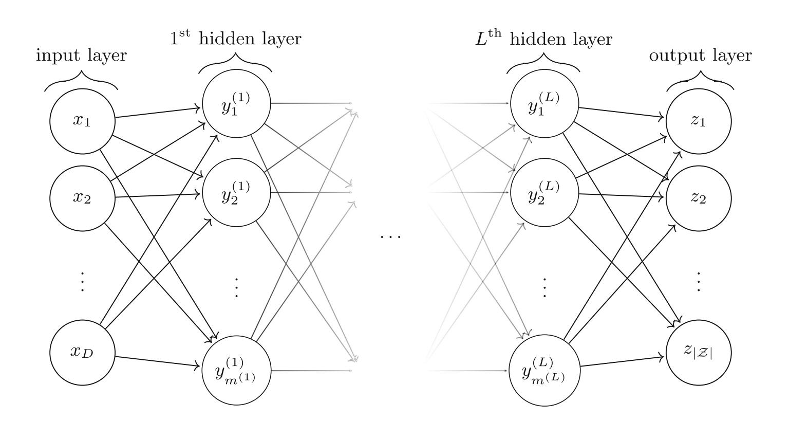
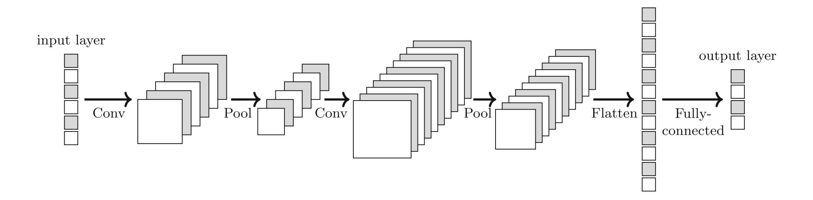
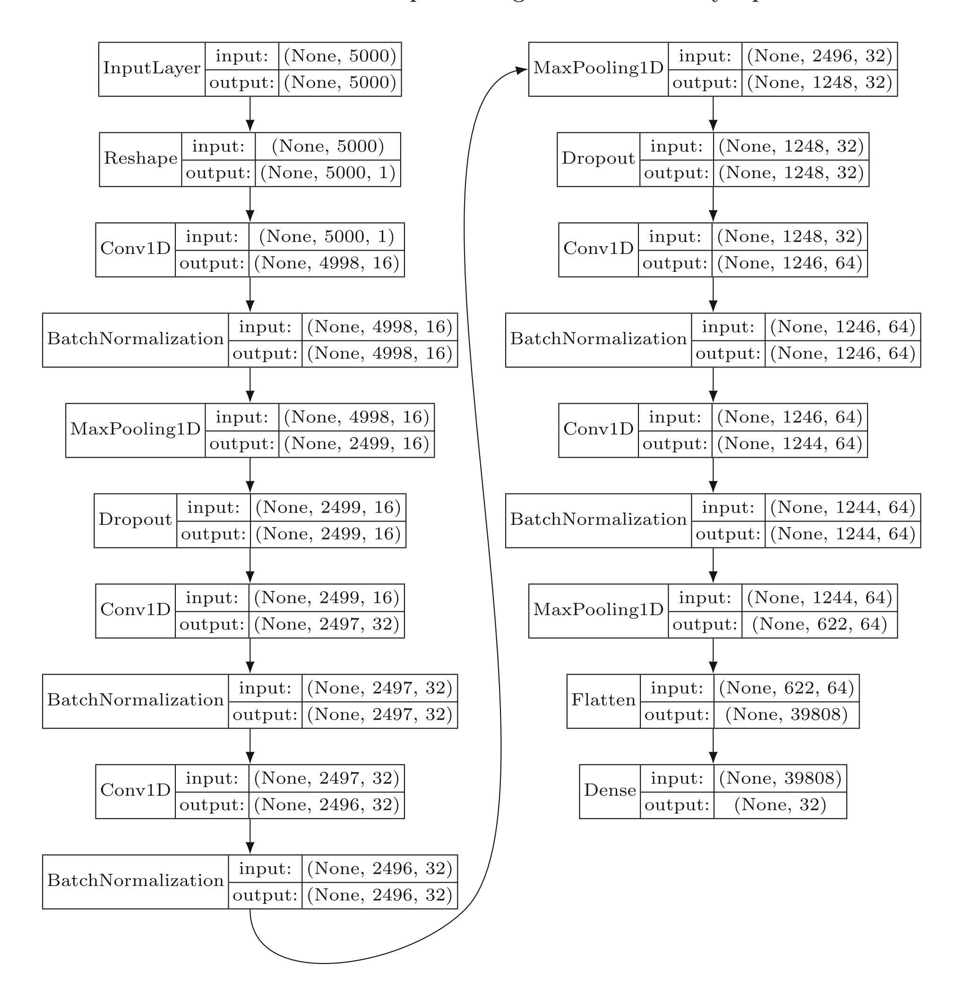
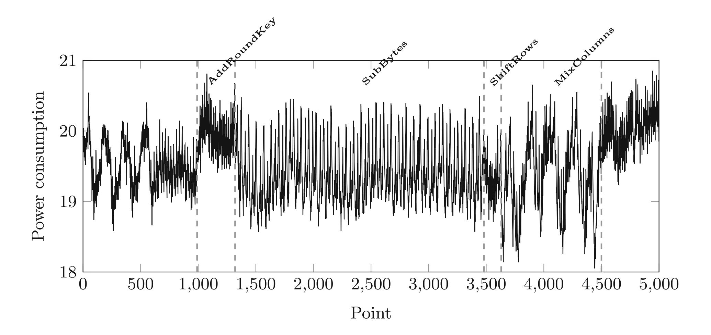
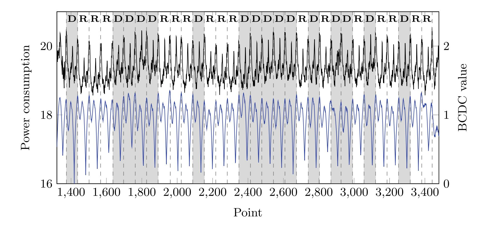
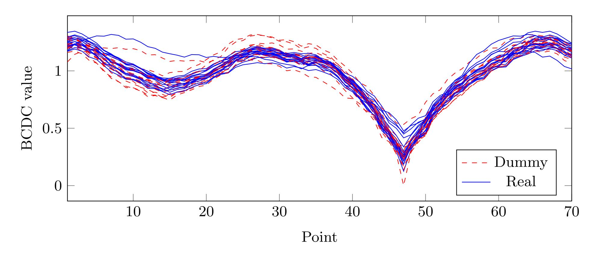

{0}------------------------------------------------


# DLDDO: Deep Learning to Detect Dummy Operations

JongHyeok Lee<sup>1</sup> and Dong-Guk Han1,2(B)

<sup>1</sup> Department of Financial Information Security, Kookmin University, Seoul, Korea *{*n seeu,christa*}*@kookmin.ac.kr

Abstract. Recently, research on deep learning based side-channel analysis (DLSCA) has received a lot of attention. Deep learning-based profiling methods similar to template attacks as well as non-profiling-based methods similar to differential power analysis have been proposed. DLSCA methods have been proposed for targets to which masking schemes or jitter-based hiding schemes are applied. However, most of them are methods for finding the secret key, except for methods for preprocessing, and there are no studies on the target to which the dummy-based hiding schemes or shuffling schemes are applied. In this paper, we propose a DLSCA for detecting dummy operations. In the previous study, dummy operations were detected using the method called BCDC, but there is a disadvantage in that it is impossible to detect dummy operations for commercial devices such as an IC card. We consider the detection of dummy operations as a multi-label classification problem and propose a deep learning method based on CNN to solve it. As a result, it is possible to successfully perform detection of dummy operations on an IC card, which was not possible in the previous study.

Keywords: Hiding countermeasure *·* Deep learning *·* Multi-label classification *·* IC card *·* Dummy operation

## 1 Introduction

Electronic devices such as smart watches, air conditioners, and refrigerators used to perform simple manipulations have recently begun to deal with personal data by providing a variety of features, such as being able to make phone calls by starting to be interconnected. Accordingly, the security of these devices must be carefully considered. Side-Channel Analysis (SCA) is the most representative of potential attacks, and it recovers secret information using physical properties such as power consumption [7] or electromagnetic emissions [1].

This work was supported as part of Military Crypto Research Center (UD170109ED) funded by Defense Acquisition Program Administration (DAPA) and Agency for Defense Development (ADD).

<sup>2</sup> Department of Information Security, Cryptography and Mathematics, Kookmin University, Seoul, Korea

<sup>!</sup>c Springer Nature Switzerland AG 2020

I. You (Ed.): WISA 2020, LNCS 12583, pp. 73–85, 2020.

{1}------------------------------------------------

Deep learning, which was not under consideration at the beginning of the proposal, has seen rapid progress in recent years due to the advent of big data and the gradual enhancement of computing power over the past decade. Recently, deep learning has been used in various fields such as image recognition, speech recognition, and natural language processing. In side-channel analysis, deep learning will also come to play an important role. Beginning with the case of leakage characterization using multi-layer perceptron (MLP) [19], deep learning-based SCA (DLSCA) was conducted using convolutional neural network (CNN), autoencoder, long short-term memory (LSTM), etc. [14]. Analysis was also performed in the case of using a masking scheme and jitter-based hiding schemes [11]. In addition, a DLSCA method based on non-profiling has been proposed recently [18].

Of the various DLSCA methods that have been studied, the majority have been for the purpose of revealing a secret key. In the end, they mention that they succeeded in analyzing only those targets to which the jitter-based hiding schemes, which have relatively weak strength, were applied. To the best of our knowledge, we haven't seen cases of successful secret key recovery with DLSCA for targets with dummy-based hiding schemes or shuffling scheme. Designers intend to increase attack complexity by simultaneously using the shuffling scheme and the random insertion of dummy operation schemes. For example, if the designer adds up to d dummy operations to n sbox operations and apply the shuffling scheme,  $\alpha \times (n+d)^2$  traces are needed to recover a one-byte of secret key. Here,  $\alpha$  is the number of traces needed to recover the one-byte secret key when hiding schemes are not applied. However, if the dummy operations are filtered out, the number of required traces is reduced to  $\alpha \times n^2$ . When n =d=16, the reduction rate is 75%, which is very dangerous. Therefore, even if the secret key cannot be recovered from a target to which the shuffling scheme or dummy-based hiding schemes are applied, there is a need for research on a method of neutralizing them.

Our Contributions. In the previous work [10], they proposed a technique to detect dummy operations using the method BCDC (Bounded Collision Detection Criterion) [4]. However, in order to calculate BCDC values, it is necessary to specify a suitable reference area, which is very empirical. So we were wondering if there is a way to automatically distinguish dummy operations. Research has already been conducted using CNN to detect fake face images, fake news, and fake data transmission [15,16,20]. Inspired by these existing studies, we thought that CNN could be used to detect dummy operations in side-channel traces. In this paper, we propose a method of detecting dummy operations using deep learning. The proposed method can detect dummy operations very well even though it takes different devices for training and testing. In addition, this method can detect dummy operations even for commercial devices such as an IC card, which the previous method could not.

{2}------------------------------------------------

Outline. The rest of this paper is structured as follows. In Sect. 2, Deep Learning and Deep Learning-based Side-Channel attacks are introduced. It also discusses hiding schemes, one of the countermeasures against side-channel attacks. Section 3 covers the previous work and the proposed methodology to detect dummy operations. We describe experiment results performed on an IC card in Sect. 4 along with the experiment setup. Finally, in Sect. 5, we conclude this paper and comment on future research.

## 2 Preliminaries

#### 2.1 Deep Learning

Deep learning is a type of machine learning and makes computational models consisting of multiple processing layers to learn representations of data with multi-level abstraction [8]. Recent works have shown that deep learning successfully applied to many fields such as image recognition, speech recognition, and natural language processing. In this chapter, we describe deep learning by taking deep learning for data classification as an example. A neural network for data classification is a function  $\operatorname{Net}: \mathbb{R}^D \to \mathbb{R}^{|\mathcal{Z}|}$ . Net is trained to classify some data  $x \in \mathbb{R}^D$  into their labels  $z(x) \in \mathcal{Z}$ , where D is the dimension of the data and  $\mathcal{Z}$  is the set of labels.

**Multilayer Perceptron.** A multilayer perceptron (MLP) is a kind of neural network composed of several perceptron layers [2]. A perceptron  $P: \mathbb{R}^D \to \mathbb{R}$  takes  $x \in \mathbb{R}^D$  as input and calculates the output as follows:

$$P(x) = A\left(b + \sum_{i=1}^{D} w_i x_i\right)$$



**Fig. 1.** Multilayer perceptron of a (L + 1)-layer perceptron with D input units and  $|\mathcal{Z}|$  output units. The  $l^{\text{th}}$  hidden layer contains  $m^{(l)}$  hidden units.

{3}------------------------------------------------

where *A* is an *activation function*, *w<sup>i</sup>* are *weights*, and *b* is the *bias*. The activation function serves to determine which neurons are triggered in each layer, and sigmoid function, Rectified Linear function (relu), or Hyperbolic Tangent function (tanh) are typically used.

A MLP is a neural network which is a combination of many perceptron units organized in layers as shown in Fig. 1. A MLP consists of an input layer, intermediate layers called *hidden layers* and an output layer. The weights and biases of the MLP are adjusted as learning progresses.

Convolutional Neural Network. Convolutional Neural Networks (CNN) is a type of neural network composed of a mixture of *Convolutional* layers and *Pooling* layers [9].



Fig. 2. Convolutional neural networks architecture.

The general structure of CNN is shown in Fig. 2. The CNN architecture is composed of a mixture of convolutional layers and pooling layers, and then fullyconnected layers are attached. The convolutional layer slides a set of *filters* to apply a convolution operation to the input. The pooling layers is a nonlinear layer that slides a window over the input and outputs a local summary, such as the average or maximum of the input. Due to the use of shared weights and pooling operations applied to the space during convolution, the CNN architecture has a natural translation-invariance property.

### 2.2 Profiled Deep Learning Side-Channel Attacks

In 2011, Yang et al. first used an MLP to characterize the leakage model [19]. Beginning with the proposition of a secret key recovery method using a neural network by Martinasek et al. [14], research using machine learning for sidechannel analysis has exploded. In earlier works, various pre-processing methods such as PCA, average trace reduction, and wavelet transformation were used [5,13,17]. After that, Maghrebi et al. used a random forest, autoencoder, long short-term memory (LSTM), MLP, and CNN to reveal the secret key of the unprotected or first-order masked AES [11].

While an MLP pays attention to numerical values in traces, a CNN focuses on the shape of traces. Therefore, it is mainly used for image recognition that 

{4}------------------------------------------------

must be resistant to distortion. Cagli et al. first used a CNN to defeat jitterbased hiding countermeasure [3]. However, as far as we know, no results have been applied to hiding schemes using dummy operations.

### 2.3 Hiding Schemes

Traditional side-channel analysis methods such as differential power analysis or template attacks are applied to aligned side-channel traces. Attackers must process side-channel traces using pre-processing methods such as domain transformation to improve performance when the traces are not aligned. Hiding schemes are used to artificially disrupt the alignment. Eventually, designers can break the association between intermediate values and side-channel traces. Time-domain de-synchronization and changing the vertical values are typical features of a hiding scheme. When the time-domain de-synchronization is applied, it is difficult for an attacker to identify when the target operations are performed.

Random insertion of dummy operations scheme is the first approach of the time-domain de-synchronization. This approach randomly inserts dummy operations, which are meaningless operations that are not related to encryption and decryption, into the middle of real operations. The second method is a shuffling scheme that randomly reorganizes the order of operations. These two methods make an attacker hard to detect when real operations are being performed.

## 3 Detection of Dummy Operations

In this section, we describe the previously proposed dummy operation detection method [10] and the method we propose. Since our method is based on profilingbased DLSCA, it explains how to make labels corresponding to profiling traces and the model configuration used.

## 3.1 Detection of Dummy Operations Using BCDC

In a previous study [10], they used the BCDC value [4] as a reference to detect dummy operations. The BCDC is a measure of similarity between two groups and is defined as follows:

$$BCDC(T_1, T_2) = \frac{1}{\sqrt{2}} \times \frac{\sigma_{(T_1 - T_2)}}{\sigma_{(T_1)}}$$

where *T*<sup>1</sup> and *T*<sup>2</sup> denote the reference area and the target area, respectively. σ(*T*1) is the standard deviation of *T*1. If a BCDC value close to zero is calculated, it means that the two groups are similar.

An attacker sets a part of the section as the reference area *T*<sup>1</sup> to determine whether it is a dummy operation or a real operation. It does not matter if it is actually a dummy or real operation. Then, the BCDC value is calculated by shifting the target area *T*<sup>2</sup> of the same length as *T*<sup>1</sup> by one point from the start of the trace. The attacker sequentially acquires the desired number of sections 

{5}------------------------------------------------

having the lowest value from the calculated BCDC values. The acquired sections may be real operations or dummy operations. If these are dummy operations, the attacker can take the sections that have not been acquired.

#### 3.2 DLDDO

Label. For supervised learning, corresponding labels of an input trace are needed. Models for revealing a secret key used labels as expected values such as outputs of Sbox or its Hamming Weight values. However, the purpose of our model is to determine if this is a real operation or a dummy operation. Moreover, there is not only one operation to judge. Therefore, we use a multi-label classification problem. For example, if the following index of the real operations were performed:

$$[2, 3, 5, 6, 8, 10, 14, 16, 17, 18, 19, 24, 26, 27, 30, 31],$$

we can construct the following 32 labels:

```
[0, 0, 1, 1, 0, 1, 1, 0, 1, 0, 1, 0, 0, 0, 1, 0, 1, 1, 1, 1, 1, 0, 0, 0, 0, 1, 0, 1, 1, 0, 0, 1, 0].
```

Here, 0 means the dummy operation and 1 means the real operation.

```
Algorithm 1. Generate labels for dummy operation detection
```

```
Input: Index of real operations \mathbf{I} = [i_0, i_1, \dots, i_{15}] where i_j \in \{0, 1, \dots, 31\} Output: Label \mathbf{L} = [l_0, l_1, \dots, l_{31}] where l_j \in \{0, 1\}
```

1: Initialize  $\mathbf{L}$  to zero array

 $\triangleright$  size of  $\mathbf{L} = 31$ 

- 2: for  $j \leftarrow 0$  to 16 do
- 3:  $\mathbf{L}[\mathbf{I}[j]] = 1$
- 4: return L

Algorithm 1 describes how to generate labels for dummy operation detection. For each profiling trace, an attacker can generate corresponding labels using Algorithm 1. Although we are going to experiment with the number of dummy operations inserted set at 16 in Sect. 4, even if the number of inserted dummy operations is variable, Algorithm 1 can be used through modification such as setting the value of trailing labels, which are equal to the number of dummy operations not inserted, to 0. If the number of dummy operations inserted is less than the maximum value, we can determine whether the real Sbox operation is performed on side-channel traces corresponding to ShiftRows or MixColumns functions. Therefore, it makes sense to set the label value corresponding to the ShiftRows and MixColumns part of the side-channel trace to 0 because the ShiftRows and MixColumns part of the side-channel trace is not a real Sbox operation, just like a dummy operation from the attacker's perspective.

{6}------------------------------------------------



Fig. 3. CNN model for dummy operation detection

Deep Learning Model. We use a CNN model for dummy operation detection due to the possibility of side-channel traces being shaken. Figure 3 shows the full construction process for our model. All convolutional layers use small sized kernels like 2 or 3 with a stride size 1 and "valid" padding. In order to minimize the number of trainable parameters, this model has been constructed by using a lot of convolutional layers and one dense layer. As the activation function, relu and sigmoid functions are used for convolutional layers and the dense layer, respectively. The sigmoid function is used for binary classification and the softmax function is used for multiple classification. In the multi-label classification used in this model, since each label is used for binary classification, the activation function of the output layer is used as the sigmoid function. The dropout ratio is 0.25, and He initializer is used as a kernel initializer in the dense layer. 

{7}------------------------------------------------

This model has 32 output nodes. To solve the multi-label classification problem, each node puts out the probability that the corresponding Sbox operation is a real operation. The optimizer used is Adam [6], the learning rate is 1e-3, and the decay rate is 1e-4. Binary cross-entropy is used as the loss function. Note that our model is not the optimal model for obtaining the highest test accuracy.

Using the label creation method and the deep learning model described above, an attacker can obtain the indexes on which the real operations were performed.

## 4 Experiments

Algorithm 2. Pseudo code for the AES algorithm's SubBytes function with dummy operations and shuffling scheme

```
Input: RL_IN[16], DM_IN[16], ORD[32]
Output: RL_OUT[16], DM_OUT[16]
1: for i \leftarrow 0 to 31 do
2:
      switch (ORD[i])
3:
      case 0:
         RL\_OUT[0] \leftarrow Sbox[RL\_IN[0]]
                                                                    ▶ Real operation
4:
5:
         break
6:
      case 1:
         RL\_OUT[1] \leftarrow Sbox[RL\_IN[1]]
 7:
                                                                    ▶ Real operation
8:
         break
9:
      case 16:
         DM\_OUT[0] \leftarrow Sbox[DM\_IN[0]]
                                                                    ▶ Dummy operation
10:
11:
         break
      case 17:
12:
         DM\_OUT[1] \leftarrow Sbox[DM\_IN[1]]
                                                                    ▶ Dummy operation
13:
14:
         break
      end switch
15:
```

In the previous work [10], we classified the implementation method of the hiding scheme using one of four types of dummy operations according to the type of variables used in the dummy operations. We named them local variable, global variable, separate function argument, and combined function argument. We took the target algorithm using the switch-case statement as Algorithm 2. The above four variable types were applied to DM\_IN and DM\_OUT. In addition, the countermeasure was also presented in the previous paper. This countermeasure is configured to select the variable index of the Sbox operation by referring to the ORD variable in which the shuffled operation order is stored instead of using the switch-case statement as in Algorithm 3.

{8}------------------------------------------------

### Algorithm 3. Pseudo code for the countermeasure [10]

Input: IN[32], ORD[32] Output: OUT[32] 1: for *i* ← 0 to 31 do

2: OUT[ORD[*i*]] = Sbox[IN[ORD[*i*]]]



Fig. 4. A power consumption trace of an IC card

The model number of our target IC card is S3FJ9SK which is made by Samsung. The number of dummy operations used is fixed at 16, and four implementation methods are pushed on the smart card. The power consumption trace of the implementation using local variable is shown in Fig. 4. The power consumption traces for the other three implementations are similar to Fig. 4. After measuring the trace with 500M sampling, the trace was compressed using 50 units of Raw Integration method [12]. We used two IC cards of the same model to apply to DLDDO, our proposed method. For training the deep learning model, 10,000 traces were collected from the profile card and 1,000 traces were collected from the other card for testing.

## 4.1 Using BCDC

We attempted to detect dummy operations by setting a portion of the first Sbox operation area as reference area *T*<sup>1</sup> in the trace in Fig. 4. No matter how much the reference area was changed, dummy operations could not be detected with a high success rate. Figure 5 shows the result of one of the attempts to distinguish dummy operations using BCDC. The above graph is the power consumption trace of the SubBytes function and the graph below is the calculated BCDC trace. For each of the 32 areas, each one is represented by R in case of real operations and D in case of dummy operations. We set the reference area for calculating BCDC values as part of the first dummy operation and compute the

{9}------------------------------------------------



Fig. 5. The power consumption trace of SubBytes function (above) and its BCDC values (below).



Fig. 6. Blue lines are BCDC traces of real operations and red dashed lines are BCDC traces of dummy operations. (Color figure online)

BCDC trace. We splitted the BCDC trace into each operation, then overlapped the pieces of operation as shown in Fig. 6. However, we cannot set any threshold to distinguish the dummy operations from the real operations. At best, the success rate was only about 50%. The problem of determining whether each Sbox is a real operation or a dummy operation is the same as the problem of choosing the front or back of a coin. Therefore, if the method is not capable of distinguishing dummy operations, the accuracy should be about 50%.

### 4.2 Using DLDDO

We used a profiling card to train the neural network and a test card to check if we could extract dummy operations from other cards with the trained neural network. Both cards use the same model IC chip. 10,000 power consumption 

{10}------------------------------------------------

traces were collected from the profiling card, of which 9,000 were used for the training phase and 1,000 were used for the validation phase.

1,000 power consumption traces were collected from the test card. Through the trained neural network, the probabilities that each of the 32 Sbox operations were real operations were calculated. The 16 indexes having the highest probability are judged to be the indexes on which the real operation was performed. For example, the output values of the trained neural network are

```
[0.87, 0.53, 0.96, 0.97, 0.02, 0.89, 0.99, 0.32,
0.96, 0.20, 0.88, 0.02, 0.35, 0.52, 0.90, 0.19,
0.99, 0.99, 0.99, 0.91, 0.50, 0.50, 0.29, 0.01,
0.96, 0.09, 0.92, 0.94, 0.62, 0.29, 0.99, 0.95]
                                                 ,
```

we judge indexes of real operations are

$$[2, 3, 5, 6, 8, 10, 14, 16, 17, 18, 19, 24, 26, 27, 30, 31]$$
.

| Variable types              | Test accuracy |
|-----------------------------|---------------|
| Local variables             | 95.4125%      |
| Global variables            | 82.4375%      |
| Separate function arguments | 96.1875%      |
| Combined function arguments | 74.4375%      |
| Countermeasure              | 50.0906%      |

Table 1. Test accuracies according to variable types

As a result of estimating the real operation indexes of the test traces with the trained neural networks, the accuracies are shown in Table 1. Using the DLDDO method, we were able to detect dummy operations when targeting dummy operations of power consumption traces collected from the IC card for all four types of variables used for the dummy operations. It has been confirmed that the dummy operations cannot be detected when the countermeasure proposed in the previous paper is still applied.

For the BCDC value to convert to 0, the standard deviation of the pointwise subtraction of the two areas must converge to 0. This means that the two areas are well aligned and there is little variation due to noise. Therefore, in the previous work [10], they succeeded in distinguishing dummy operations using BCDC for the ChipWhisperer-Lite board which has low noise and good alignment. However, the target white card in this paper is noisier and misaligned than the ChipWhisperer-Lite board, and the time during which each operation is performed can vary. It is obvious that it is impossible to distinguish dummy operations of the white card using BCDC for these reasons. On the other hand, 

{11}------------------------------------------------

our proposed DLDDO uses a convolutional network used in image recognition, making it resistant to alignment and noise issues. The reason DLDDO can do what BCDC cannot do is the same reason CNN does image recognition better than MLP.

## 5 Conclusion

In this paper, we propose the deep learning method DLDDO for detecting dummy operations. The previous work, which used BCDC to detect dummy operations, has the disadvantage that empirical reference area setting is required. Also, detection of dummy operations was possible only when the noise was relatively small on the side-channel traces. We solved these drawbacks by applying the CNN model and the multi-label classification problem. In addition, it was possible to detect dummy operations even in a situation where a profile device and a test device were used differently.

DLDDO is a supervised learning method for solving multi-label classification problems. As a recent successful case of image classification problem solving through unsupervised learning was proposed, it seems to be applicable to dummy operation detection. We targeted a cryptographic algorithm that was applied by combining a random dummy operation insertion scheme and a shuffling scheme. On this target, we have succeeded in detecting dummy operations, but the shuffling scheme has not been neutralized. There is also a need for research on how to neutralize the shuffling technique using various deep learning algorithms.

## References

- 1. Agrawal, D., Archambeault, B., Rao, J.R., Rohatgi, P.: The EM side—channel(s). In: Kaliski, B.S., Ko¸c, K., Paar, C. (eds.) CHES 2002. LNCS, vol. 2523, pp. 29–45. Springer, Heidelberg (2003). https://doi.org/10.1007/3-540-36400-5 4
- 2. Bishop, C.M., et al.: Neural Networks for Pattern Recognition. Oxford University Press, Oxford (1995)
- 3. Cagli, E., Dumas, C., Prouff, E.: Convolutional neural networks with data augmentation against jitter-based countermeasures. In: Fischer, W., Homma, N. (eds.) CHES 2017. LNCS, vol. 10529, pp. 45–68. Springer, Cham (2017). https://doi.org/ 10.1007/978-3-319-66787-4 3
- 4. Diop, I., Liardet, P.Y., Linge, Y., Maurine, P.: Collision based attacks in practice. In: 2015 Euromicro Conference on Digital System Design, pp. 367–374. IEEE (2015)
- 5. Gilmore, R., Hanley, N., O'Neill, M.: Neural network based attack on a masked implementation of AES. In: 2015 IEEE International Symposium on Hardware Oriented Security and Trust (HOST), pp. 106–111. IEEE (2015)
- 6. Kingma, D.P., Ba, J.: Adam: a method for stochastic optimization. arXiv preprint arXiv:1412.6980 (2014)
- 7. Kocher, P., Jaffe, J., Jun, B.: Differential power analysis. In: Wiener, M. (ed.) CRYPTO 1999. LNCS, vol. 1666, pp. 388–397. Springer, Heidelberg (1999). https://doi.org/10.1007/3-540-48405-1 25

{12}------------------------------------------------

- 8. LeCun, Y., Bengio, Y., Hinton, G.: Deep learning. Nature 521(7553), 436–444 (2015)
- 9. LeCun, Y., Bengio, Y., et al.: Convolutional networks for images, speech, and time series. Handb. Brain Theory Neural Netw. 3361(10), 1995 (1995)
- 10. Lee, J., Han, D.G.: Security analysis on dummy based side-channel countermeasures-case study: AES with dummy and shuffling. Appl. Soft Comput. 93, 106352 (2020). https://doi.org/10.1016/j.asoc.2020.106352
- 11. Maghrebi, H., Portigliatti, T., Prouff, E.: Breaking cryptographic implementations using deep learning techniques. In: Carlet, C., Hasan, M.A., Saraswat, V. (eds.) SPACE 2016. LNCS, vol. 10076, pp. 3–26. Springer, Cham (2016). https://doi. org/10.1007/978-3-319-49445-6 1
- 12. Mangard, S., Oswald, E., Popp, T.: Power Analysis Attacks. Springer, Boston (2007). https://doi.org/10.1007/978-0-387-38162-6
- 13. Martinasek, Z., Hajny, J., Malina, L.: Optimization of power analysis using neural network. In: Francillon, A., Rohatgi, P. (eds.) CARDIS 2013. LNCS, vol. 8419, pp. 94–107. Springer, Cham (2014). https://doi.org/10.1007/978-3-319-08302-5 7
- 14. Martinasek, Z., Zeman, V.: Innovative method of the power analysis. Radioengineering 22(2), 586–594 (2013)
- 15. Mo, H., Chen, B., Luo, W.: Fake faces identification via convolutional neural network. In: Proceedings of the 6th ACM Workshop on Information Hiding and Multimedia Security, pp. 43–47 (2018)
- 16. Pan, J., Liu, Y., Zhang, W.: Detection of dummy trajectories using convolutional neural networks. Secur. Commun. Netw. 2019 (2019)
- 17. Saravanan, P., Kalpana, P., Preethisri, V., Sneha, V.: Power analysis attack using neural networks with wavelet transform as pre-processor. In: 18th International Symposium on VLSI Design and Test, pp. 1–6. IEEE (2014)
- 18. Timon, B.: Non-profiled deep learning-based side-channel attacks with sensitivity analysis. IACR Trans. Cryptogr. Hardw. Embed. Syst. 219, 107–131 (2019)
- 19. Yang, S., Zhou, Y., Liu, J., Chen, D.: Back propagation neural network based leakage characterization for practical security analysis of cryptographic implementations. In: Kim, H. (ed.) ICISC 2011. LNCS, vol. 7259, pp. 169–185. Springer, Heidelberg (2012). https://doi.org/10.1007/978-3-642-31912-9 12
- 20. Yang, Y., Zheng, L., Zhang, J., Cui, Q., Li, Z., Yu, P.S.: TI-CNN: convolutional neural networks for fake news detection. arXiv preprint arXiv:1806.00749 (2018)